# 调息：呼吸的科学

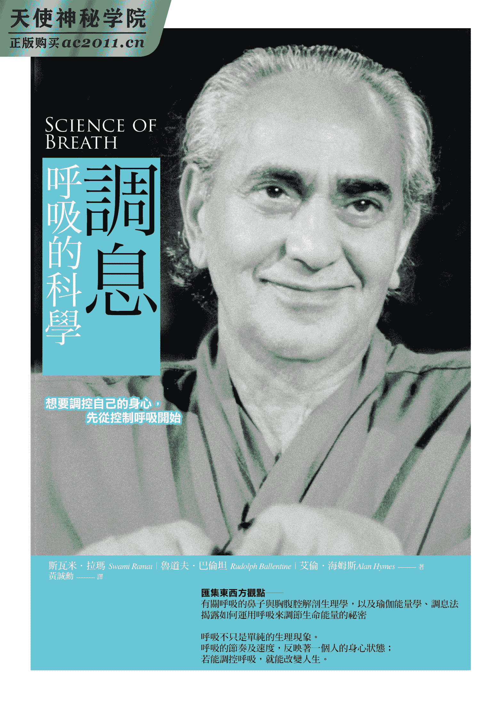

# 前言运用呼吸之学，调节生命能量

琳达．詹森（Linda Johnsen）

倘若你可以屏息数小时，以探索生命存在的其他层次，而你的身体却看似已经死亡？倘若你只是专注在自己的心念，即能在顷刻之间治愈致命疾病？倘若你可以创建一种深度的平静，让生命中没有一项活动可以打扰你？当然，这些都是童话故事的题材，平常人做不到这些事。然而，古老的瑜伽士声称他们经常做这种事。当然，在迷信的文化中，文盲也自称能做相同的事。

然后在一九七〇年，斯瓦米．拉玛（Swami Rama），一位在喜马拉雅山洞被养育长大，从小就在被严密保护的瑜伽秘密传承中接受训练的瑜伽士，走进了美国的研究实验室，在最严谨的实验环境下，他模拟死亡的情境，实质上停止他的脑波与心跳，却仍然对实验室内在他周遭所发生的事保持全然的觉察。斯瓦米．拉玛在实验室中所展现的能力，让西方科学界目瞪口呆。突然间，印度瑜伽士的论点似乎较少被视为迷信，而比较像广泛的内在科学得到了证据，甚至在许多重要的领域上，大幅超越了当今西方医学与生理学的理解层级。

当我们进入二十一世纪后，现代人类终于学到如何感谢古老智者的知识与实务慧眼。但不幸的是，正当我们被此无比珍贵的数千年医学知识所唤醒时，保存此传统的奇妙文化消失了。然而，在喜马拉雅山的洞穴寺院，以及印度次大陆的森林隐士中，瑜伽大师仍然在传授这些让他们成为世纪传奇的知识和技巧。其中，这些瑜伽士所保存的、能帮助达到完美自我控制的关键技巧就是“呼吸之学”（svarodaya）。

“呼吸”是人类身上唯一可自主运作，亦可受意识控制的生理机能。这个简单的慧见对于印度的内在心念探索者而言，具有惊人的意涵：呼吸是控制自主神经系统的关键。在西方人的教育中，认为这部分的功能超出人们的觉察，并且完全无意识地自主运作。瑜伽士借由学习操控自己的呼吸模式，获取了对大脑做出有意识控制的能力，达到任何西方人都难以想像的程度。而这件事直到斯瓦米．拉玛走进实验室后，才获得证实。

以现在西方医学进步的速度，可能还需要花好几世纪的时间才能赶上斯瓦米．拉玛的论述。例如，他坚信我们的身体事实上是由一种被称为﹁精身﹂（其梵文是 sukshma sharira，意为精微的身体）环绕着的能量场所建构，大部分的西方科学家至今仍在争论这部分生命体的存在。然而，斯瓦米．拉玛就是借由操控这个能量场，让他的手臂长出肿瘤，然后又在几小时内让它消失。你可以想像，假如一小部分的研究经费能被用来探索此生命能量，现今的癌症治疗可能产生什么变化？

生命能量“气”，其梵文是 prana（音译为“普拉那”），在古埃及与迦勒底人（Chaldea）所留下的仅存文献中，都显示他们很小心地在处理生命能量的运用；中国与日本的医师及武术师，至今仍然在运用此“气”。这本书就是对瑜伽修行者“如何运用呼吸之学，调节生命能量”的巨大议题做介绍，并以现代人可以理解的方式来叙述，这是第一本探索生命能量如何做为生理器官背后支撑力量的重要书籍。

# 绪论呼吸是身体与心念之间的重要链接

约翰．克拉布克（John Clarke），医师

本书内容是对“呼吸”的审视，也就是“呼吸”如何整合我们生命各层次的存在，使其成为一个全功能的总体，在各层次发生相互作用的本质，以及一些如何修改这些相互作用的实用方法。本书所讨论的范畴极广，包括胸腔与腹部的物理运动、内部器官的功能、能量流动所扮演的精微角色，以及它如何影响心念等。更精确地说，因为能量的涟漪脉动影响着人类的许多功能，若能对“呼吸”有着彻底的了解，将为扩展我们对身体与心念各层次的觉察，提供一个有力的工具，也会对治疗型态有所帮助。

借由对一些心念特质的观察，就可以对呼吸的重要性做出最佳评价，因为心念倾向于借由有意识的觉察去过滤许多事件，以避免感官的困惑，如此才能让它专注在更重要的改变上。换句话说，一个新的思考模式，或是一个新的活动，在刚开始时都会吸引许多有意识的关注，但是经常性的重复行为就变成无意识与习惯。例如，走路对成年人来说，不需要做什么努力；它几乎不需要我们做有意识的关注，虽然在必要时我们仍可以轻易地干预。然而，将走路的动作流程整合到心念中，则需耗费多年的尝试，直到它变成惯性，进入无意识层面为止。

人体内部器官（例如，心脏、肾脏、肝脏）也有类似的反应。从生理回馈实验中也证明这些器官的某些生理活动，原本被视为自主运作，经过训练之后也能受意识所控制。虽然，要达到熟练的控制程度，需要经历长时间的训练。

对生理功能而言，呼吸是很独特的，因为从肺脏、血液中的氧气与二氧化碳的回馈讯号，抵销了呼吸的速率与深度，然而，呼吸活动本身却是一种肌肉的自主性行为。例如，根据个人对呼吸的精通程度不同，呼吸的速率与深度可以被改变，但是反射行动则限制了呼吸可被改变的程度。这种反射动作是一种保障，而且特别重要，毕竟我们对呼吸的需求是很基本的。这也部分反应了氧气在新陈代谢中所扮演的关键角色，因为若没有氧气，我们的身体就无法燃烧食物并产生能量。

现代科学已经了解呼吸的许多物理原则，包括输送氧气进入身体及全身所动用到的肌肉与器官，直到新陈代谢的分子反应等。然而，对此复杂的生理系统所做的纯理智诉求，已经将科学界对呼吸的概念局限在物理层次里，但即使是最随意的生理反应，也显示出呼吸的重要性已超越了纯粹的新陈代谢功能。例如，从我们个人的经验中，就暗示了情绪和呼吸之间的关联性，因为激烈的情绪状态似乎与呼吸方式的改变有关。哀伤哭泣与盛怒时会发抖地呼吸，更是常见的例子。除此之外，例如疼痛和运动所产生的物理刺激，也会改变呼吸与情绪两者的状态。

一旦深入研究这些现象之后，一系列的疑问就会产生：情绪、身体及呼吸之间的关系本质为何？背后的载具是什么？呼吸是否与心念的其他生存领域有互动关系？是否能借由改变呼吸模式来改变情绪与生理状态？

这些都是本书所要探讨的疑问，每一章节都发展出“呼吸是身体与心念之间的重要链接”这个核心论点的一个面向，作者将多种西方科学的发现，以及东方丰富的体验智慧编织在一起，成为一篇完整且平衡的论述。在第一章论述本书的基本原则之后，由艾伦．海姆斯（Alan Hymes）医师接着以特殊的观点介绍呼吸道的生理与解剖学，并探讨各式呼吸习惯的生理与心理作用。由鲁道夫．巴伦坦（Rudolph Ballentine）医师撰写的第三章，则从吸入气流的准备功能去检视鼻子这个门户，并探讨神经系统活动的复杂模式，以及它所唤起的能量流。在最后一章，斯瓦米．拉玛描述身心界面的载具：“气”（prana）。根据瑜伽古籍的说法，“气”是能量最精微的单元。斯瓦米．拉玛讨论气身层（能量场的态样），这些能量场潜藏在身体的结构与所有生理心理机能背后，并有可接受心念控制的潜能。

这本书的目标是：“以一种可以被应用为个人成长工具的方式，来介绍呼吸的理论知识”，因此，书中详实描述了一系列实用的练习与技巧，以便读者可有系统地控制呼吸及“气”生命能量。这些练习都有助于我们扩展对呼吸的觉察，因为当我们观察自己如何使用呼吸时，各式无意识的呼吸习惯就能被确认，并被较有利的呼吸方式所取代。就像小孩借由变得更加觉察自己的身体并学习走路，来克服行动的笨拙一样，对呼吸的觉察也能逐渐将呼吸带回到意识的控制之下。

由于呼吸是身体与心念之间的链接，因此它也可以被用来介入身体与心念的运作，随着我们对呼吸的觉察，以及增加对其精微方面的控制，这种介入将可以深化生理与心理的改变。然后，本书就能为有意识的心念开拓出一条新的信道，为人类真正的整体健康与个人成长的追求，提供一项有力的工具。

# Chapter 1 何必为呼吸伤神？瑜伽与能量体

许多读者会对竟然有一本书全部都在谈论“呼吸”这个议题而感到惊讶，因为西方医学对于呼吸的研究并不太热衷。在一封寄给知名医学期刊编辑的信中，一位医师抱怨浪费时间与金钱在芝麻小事上，他感叹地说：“这件事就是一个例子，竟然有人写一整本书去论述如何呼吸！”他无法想像有比呼吸更微不足道、更浅显易懂的生理流程。

当然，呼吸是一个重要的生理流程，假如你不能呼吸，就无法活下去，从这个观点来看，每个人都应该同意呼吸很重要。然而，我们大多数人仍然会说：“你要不是正在呼吸，就是没在呼吸。如果你正在呼吸，那就没什么问题；要是你没在呼吸，反正已是死躯，也没什么问题。”

或许事实没有那么简单，在传统东方，长久以来就有人花费数十载的光阴在研究呼吸上。事实上，有整座寺院专注在围绕着呼吸相关的修行，而且据说许多瑜伽士展现的所谓奇迹，主要都是基于对呼吸的掌控。但是，为何要特别强调呼吸这种普通平常、时时刻刻都在进行的生理流程？

## 心念与身体的问题

我们之所以很难理解呼吸为何如此重要，部分原因出自我们已经习惯从西方的观点来看这个世界。我们的观点主要基于对物质现象的研究，习惯拿物质实体来做物理与化学分析。我们的实验室科学是根据对物质的分析量测与操控。我们的医师所接受的教育，也是解剖学及生理机能训练，我们的哲学基本上是物质的。

同样地，我们对人类的理解主要是从物质的观点出发，根据我们对身体的研究、对身体部位的碰触，以及可以被分析衡量的生理现象。我们对于能被客观地观察的科学研究，感觉最自在。当我们的研究脱离物质世界，并试图去研究超越自身感官所及的现象时，就开始感觉一点不太确定，并且不可避免地起了疑问：“这真的合乎科学吗？”

这种对于非物质领域科学证据的怀疑，在心理学上的研究特别明显。然而，“心念”无疑是让我们人类存在的、真实且无法回避的要件。现代西方人对研究心念的兴趣，被不确定该如何着手的困惑所抵销，因为心念无法被解剖或分析、量测或放在箱子里研究。它也无法被放在盖玻片上，用显微镜来观察，或是用电子仪器来检测。

然而，我们的主观经验却向我们保证心念的确存在，而且还很重要。我们都能觉察到自己的思绪，知道某些东西正在进行当中，而且我们也承认，不论多勉强，我们的身体所从事的大部分行为，以及我们如何操控物质世界的背后，都是由心念在指使。

但在西方，我们仍然对心念领域和有形物质世界领域之间的关系感到困惑。我们的身体到底如何与心念相互作用？这已是一个超越理论层面的问题。身心如何相互作用的问题，让我们的医学专家及心理学家感到困惑。当医师没能治好病痛时，他们会双手一摊地说：“问题一定出在心理层面。”当心理医师没能帮助病人重整他的心理世界时，他们会耸耸肩说：“或许你应该去看看专科医师，以确定不是身体的某个部位出问题。”病人在困惑的心理医师与专科医师之间穿梭，却仍在等待那位了解身心整合的专家现身。

身体与心念之间是如何链接的？西方科学家在此议题上，似乎已经走到死胡同。但是东方哲学，尤其是出自于瑜伽的科学所提出的一些见解，或许会出现我们所要的答案。因为瑜伽科学包含身体与心念领域的研究，而这两项功能层次也仅是瑜伽研习所涵盖的一小部分范围而已。

自从远古时代开始，许多瑜伽大师就花费大量时间做研究，试图解释人类存在各个层次之间的链接关系，他们发现，除了身体与心念之外，还有很重要的高阶功能存在。例如，他们揭露并探索超越思绪的意识区，这一个较高且广大的非概念性意识层次，只能借由跨出我们日常的思考流程才能接近它。这种可以让我们向内专注探索的技巧，就称为“静坐冥想”。

静坐冥想可用来处理那些超越心智层次的生命运作功能（也就是人们所称的“较高意识”）。然而，静坐冥想并不是瑜伽唯一的面向；瑜伽还包括体位法（asanas），教导练习者如何去控制、调节及觉察自己的身体。此外，还有练习如何操控自己的心理功能，例如专注。瑜伽明白人类是一个多种不同层次的存在，包括身体、心念，以及超脱心念的意识层次等的综合体。

但是到目前为止，在我们的讨论中，忽略了另一个位于身体与心念之间的重要层次，因为根据瑜伽的说法，身体与心念并不会直接相互作用，它们是借由一层具有独特功能的中间层来产生相互关联。西方科学家对此中间层的忽视，也许可以用来解释为何他们对身心之间关系的理解如此含煳不清，并被“身心二元性”的论点卡住。四分五裂的学说造就出两种格格不入、无法调和的学派：一派是心理学家或人本主义者，另一派是医学专家或实验室研究者。

死硬派的科学家确信，任何值得研究的东西必须是实体物质，如果他们想要研究人类的行为，就会局限在分析量测身体的动作、发声，或个体的测试表现。如果他们自认是心理学家，就比较喜欢被贴上“行为科学家”的标签，认为心念是不适合被研究的。这似乎是时代的潮流，然而在过去数十年间，诉求“整体健康”的运动开始推开更宽广的觉察大门，让少数医学先锋与研究人员踏入这扇门。

在东方，很幸运地，身心之间的关联性已经被彻底探讨，特别是静坐冥想族群，他们发现这一构成身心相关的中间连接层有它独特的特质，并且主要跟能量有关。

## 生命的层次

西方科学的进展迫使我们缓慢却很确定地接近这个观点。我们逐渐发现，不可能只研究生理（physical）而不去觉察非物质现象（或称“能量”）。我们借由开始研究生理学，来终结对解剖学的研究；我们借由开始研究器官之间的整合，来终结生理学，而这层次的生物作用总是跟能量有关。

牛顿物理学家只对机械动作有兴趣，他们主要关心的是去了解：一个身体的移动如何与另一个身体相关联，或如何受其影响。然而，到了二十世纪，电磁学变得极为重要，例如对核能的研究。越来越多科学家开始问：“物质与能量之间有何关联？能量到底是什么？假如我们看不见能量，且它又是非物质的，那么探讨能量是不是不科学？”很明显地，能量至关重要，它促成我们的移动，它让灯泡发亮。就在一世纪以前，我们完美的内燃机燃烧煤炭来产生蒸气并推动活塞，而现今的机器变得更加精细，促使能量借由通过最精细的积体电路来实现电子奇迹，我们该如何去了解这个现象？

爱因斯坦抓住这个问题，并开创出“E=mc²”这个答案来定义出能量与物质之间的关系，他又陈述能量与物质之间具有可互换性，物质可以被转换成能量。它最戏剧性的应用，就是原子弹爆炸毁灭日本的整座城市。然而，爱因斯坦的方程序也叙述能量可以被转换成物质，能量与物质之间的转换流程是双向流动的。

在梵文中，涉及能量的功能层次称为“气”（prana），几世纪前的高深冥想修习者发现，不只身体与“气”有关，“气”还与较高层次的心念有关。

在日常生活中，我们凭直觉确认了心念与能量之间的关系。有时候我们体验到无比的活力与清晰的思绪，有时候又经历到“心灵枯竭”，缺乏心理能量。各种心理学派已经将这些现象制定出更精确的描述用词，例如佛洛伊德就称它为“性能量冲动”（libido）。

按照古老的瑜伽经典“奥义书”（Upanishads）的描述，人类生命的存在可分成多个相互连接，且有连续性的实质存在层次，包含身体（肉身层或食物层）、气身层（能量层）、意身层、识身层及乐身层，这些不同层次的存在层层堆叠，假如心念希望影响身体，它就去改变能量或生命能量“气”的流动来完成；假如身体想改变心念，也会借由改变能量流的方式来完成，进而依序对心念产生影响。

“气”被视为身体细胞与心念层次之间的重要链接，我们之所以称“气”为生命关键要素的原因，在于能量是生命与活力的基础。当人在死亡之际，生命能量“气”涣散，虽然躯体犹存，但“气”已走了。在这里，我们回归到谈“呼吸”一事，因为呼吸是“气”的载具，当某人死了，生命能量离开他的身体，我们就说这个人“断气了”；当某人增加心理能量、提升创造力时，我们就说这个人“得到了灵感”（inspire，在英文中也有“吸气”之意），在日常生活用语中，我们便已直觉地承认灵感、呼气和能量，对生命及创造力的重要性。

但是，这项有关人类存在的关键领域，却在西方对人类的研究中缺席。当我们停下来思考它，会发现这是一个奇妙的情境，因为如果说呼吸确实会影响身心两方面，则呼吸的节奏及速度不仅会反映一个人的生理状况，也必能对于创造出该状态有所帮助；呼吸也是一个人的情绪与心理状态的重要指标，因此我们可以从呼吸来判断一个人的情绪与心理状态。瑜伽士有时仅是单纯地借由观察对方的呼吸品质，就能“读取”对方的心理状态。

我们经常面对如此显而易见的信息，却总是会忽略它。某些简单明了的讯息持续不断发生，就像是在免费赠送出我们身心状态的秘密一样，却没有人注意到。人类最迷人的讯息被揭露广播，却没人愿意接收。

我们的思绪经常很忙碌，就如在脑袋里面玩弄古玩一样。我们将思绪视为最亲密的宝藏，这无疑是因为我们的当务之急几乎都压倒性地与外在的物质世界有关，而思绪就是让我们有意识地处理自身经验，并与外在世界互动的手段。

然而，假如我们开始去觉察“气”并研究它，会发现它就像身体和心念一样复杂，例如，有不同特质的“气”及不同的能量流动模式。这些不同能量在质与量上的差异都很大。

在奥义书里，能量层被描述为身体内的第二层身体，称为“气身层”，它的形状依循肉体的外形。当我们相互注视时，要是能够看穿彼此的身体，便能感知到精微、充满能量的气身。

不只是生化物质在体内的腺体、血管及呼吸信道之中被推移，能量状态的改变也同时发生，能量在一处被消耗掉，又在另一处产生或被储存，从这一点流动到另一点，因此我们才称之为“能量流”。假如我们可以退后一步去看看这些持续移动的景象，就能制作出整体能量的波动图。即使我们大部分人没能力做到这一点，仍然可以理解这些能量流动现象正不断地在发生。

内在能量流是如此精巧与错综复杂，一些专家花费一生在探索它。在瑜伽的传统古籍中，有整部书都在谈论此议题，这些古籍描述“气”有五大形态，每一种形态都各司其职。对于气身层的剖析极为复杂，其中包含名为“气脉”（nadis）的能量信道，而精微的生命能量就在气脉中流动。

接下来的问题是，我们的“气身”如何进行能量调节？如果我们知道这个答案，就能开发某些能力以有意识的控制它。瑜伽士声称，在控制能量流动方面，有许多变量会对能量控制模式产生影响。例如，当我们收缩手臂的肌肉时，全身的能量流都会改变以适应此新状态。其中“呼吸”这项功能对于能量流有着最集中、最关键的影响。呼吸带入氧气以供给燃料并交换能量，其速度、节奏、路线及深度，都对身体能量的产生方式造成重大的影响，这又决定能量是否以规律频繁，或是短暂爆发，或以长且和缓的波动方式，来创建为身心充电的脉动模式，如果我们可以画出波动曲线，就可以描绘出某人在某一特定当下的充电输入频率及振幅。

呼吸流时时刻刻都支持着身体的运作，塑造能量流动模式。假如我们能抓住这个重点，可以理解呼吸的能量充电效应对于支持身体不同部位的新陈代谢流程之重要性，就能开始理解身体的生理活动如何被呼吸所创造，又是如何依赖呼吸流程。伴随每一次呼吸，能量就以波浪形态流经身体，持续不断地塑造并重组能量模式，构成“气身”。

假如我们从这个观点看生理学，会开始了解身体（到目前为止大部分人主要的关注对象）对内在基础能量场而言，实际上是次要的。能量的流动，创造、支撑及维持了整个身体组织的运作。倘若能量模式大幅改变，身体也会随之变化。假设能量模式的变动够剧烈，身体可能会被彻底转变得更好或更坏。

人的身体会改变，但通常仅是微小的改变。一部分原因可能是因为其能量模式已经定型并自我支撑，因为呼吸习惯通常深植于个人的生理系统中，且具有自主的动能。

然而，当每个人坐下来并有意地关注在呼吸上时，他们逐渐开始注意到身体功能的改变，在某些状况下，甚至会改变身体的外貌。当人们经历对能量流动有重大影响的生命体验时，相同的情况也会发生。一次震惊、受伤或某种创伤的经历，可能造成身体的改变，例如体重减轻、肤色改变或脸形与外形的改变。

如果因为能量模式的变动而造成身体某部位缺乏足够的能量供应，则这个部位终将生病，甚至死亡，也可能造成生理机能退化或产生恶性肿瘤。某种疾病会开始变得明显，是因为细胞组织若缺少了能量的供给便无法正常运作。换一个角度来说，假如某人的左腿被截肢，经过一段很长的时间之后，他可能感觉左腿仍然存在。有医学报导指出，某些病人那被截断的肢体仍然能够感觉到疼痛的现象；病人可能感觉腿部不舒服或是放错位置，因为断腿处的能量结构模式需要经历一段时间来重组。某些动物就有能力让断肢重生，这似乎就是根基于坚持让能量流到已经被截断的身体部位所造成。生理组织围绕着隐藏在其背后的能量场而结晶重生。

在一片树叶掉落之后，其能量模式仍然会完整地维持一段期间，这个现象已经被克里安摄影术（Kirlian photography）[1]所证实。若此种能量模式可以被维持的时间够长，很可能掉落的叶子就会再长回去；事实上，某些植物的确有这种再生的能量。若少了支撑在其周围的能量场，细胞又如何“知道”要从何处长起？

相同的原理也很明显地发生在动物的世界：一颗受精卵在经过滋养后，长成一只完整的动物或一个婴儿。我们倾向于将这个现象简单地解释为：是因为细胞分裂、再分裂，最终开始区隔出不同器官。但是问题是，它如何做到？某些细胞如何“知道”它该变成脑神经元、肌肉或骨头？指引该细胞的信息想必是隐藏在染色体内。然而，每一个细胞都具有相同的染色体结构。瑜伽的理论声称，答案就在于每一个细胞周遭都预先存在的能量场，是能量场让细胞塑造成形。

假如“气”能够产生物质层面的现象，那么我们接着下来该怀疑的是：是什么东西在控制“气身”？根据奥义书的说法，气身层（pranayama kosha）是受到人类存在更深、更基本的意身层（manomaya kosha）所主宰。这层心念领域比气身层更精微，更难以辨认、观察与衡量。然而，你我每个人都能体验出当下我们的心念正在行使其职责。

当我们考虑到这些瑜伽概念，便会发现人类似乎以某种方式衔接了身体与心念之间的神秘间隙。这些观念和我们平常的想法不太和谐，却又是真实存在的。为了要了解这个矛盾，我们必须更深入探讨瑜伽士和西方人之间，对宇宙与人类的观点差异。

## 宇宙的气息

在这个科学时代，我们假设先有生理身体才产生出心念，心念是由身体发展出来的。根据这个理论，胎儿实质上并没有心念存在，是在出生之后，才会逐渐发展出思想与意识。我们也以相同的观点来看待宇宙。在远古地球的某个地方，散乱的分子聚集在一起，生命就如此诞生。经过数百万年以后，更复杂的生命形态进化了，最终出现具有意识与自我觉察能力的生物。

但是，古老的东方文明很早就存在着几乎完全相反的不同见解。瑜伽哲学坚持，每一个层次的生命都是由**上一个**层次的生命存在进化而来。从意识层次产生出心念层次，从心念层次产生出物质宇宙。心念期待能以有形体的物质形式存在，因此演变出身体以遂行其愿望旨意。

这是一个相当不同的世界观，它意谓着我们存在的本质超越了物理及心理宇宙，也意谓着我们全都是一个不可思议的意识形式的外在展现，而此意识形式超越了我们较粗糙的身体层次的存在。我们都是从那里来，也终将回归那里。整个宇宙从那个意识流出，也终将流回其源头，犹如潮起潮落。

说来奇怪，一些天文学家也归纳出类似的结论。当然，这是因为天文学家的研究领域强力促使他们去对抗不确定因素；他们对宇宙地理的概念迫使其去处理那些令自己不太舒服的概念，例如永恒与无限空间。如果宇宙与时间都有尽头，那么请问超越尽头的另一边是什么？突然间，我们了解到：人类以理性推理来衡量宇宙的存在，显然是用错了工具。

今天有许多天文学家相信银河与星球是被拉开的，由一个密度更高的中心爆炸，星球体之间的空间正向外扩展中，这就是“大爆炸理论”。此学说又认为，在不断扩张到某一点后，宇宙又会开始收缩，然后所有的星球、银河将会被拉进另一个密度更高的中心，从那里又会再次发生爆炸。

这种扩张与收缩的流程对我们而言似乎很熟悉，从某种意义来说，它无非是宇宙的吸气与吐气。假如我们能把握此“宇宙气息”的基本扩张与收缩现象，我们存在的各个层次就可以和谐地发挥功能了。因缘际会，我们的意识显现出来，变成具有物质形体的人类；最终又回归到意识的本源。于是，就有人花费数十载甚至一生的功夫，深入研究呼吸流程的细微之处，以及它所代表的意涵。

## 发展对呼吸的觉察

如何发展对“气”层次的控制，对西方人而言似乎是非常神秘的玄学，若将眼光转向东方，我们会发现它并不神秘。根据瑜伽士的说法，“气”的原理既简单又合乎科学，“呼吸的科学”的相关训练之所以耗时，是因为我们的文化与习惯使得我们无法察觉到非常细微的自我存在。然而，对呼吸的觉察可以轻易地变成我们行动、感觉及思考方式等日常生活的一部分。

以你的左脚为例，平常你当然不会特别去担心自己的左脚，在此当下，你或许不会去想：“喔，我这只脚下一步该放在哪里？”或“天啊，当我起床时，我会记得如何移动这只脚吗？”当你走路时，大概不会停下来想：“现在，在右脚之后要伸出左脚，接着出右脚，再出左脚，而且我应该记得要抬高脚趾头，不要让它们在地上拖。”你很少会想到自己的左脚在何处，然而你却不担心会将它放错地方。从某个角度来说，你在读这本书时，可同时与周遭的人互动、听电话，你的左脚却仍然跟得上，真是很了不起。

这可能是源自于你已经年累月地使用你的脚。但你可以回想一下，小时候在学走路时并不容易，我们耗费数年功夫才把它学对。我们都是从试着把脚放到嘴巴里开始尝试：我们可能摆动自己的脚趾头，并在我们咬它时感觉到痛。经过一段时间的错误尝试后，我们终于学会了走路，不久之后，我们甚至不必再去想到它。

将呼吸视为同类的事，有助于我们对它的理解。就像走路一样，呼吸系统现在正全自动运转中，然而，呼吸也是我们可以经常觉察的生理机能。专精“呼吸之学”（svarodaya）的瑜伽士声称，他们可以觉察到自己的每一次呼吸。

最重要的一点是，瑜伽科学的关键在于，呼吸是我们所有生理机能中，唯一可以自主运作或由意识控制的生理机能。个体可以控制呼吸，任意做出所希望的呼吸方式，或者也可以完全忽略它的存在，身体仍会自动进行呼吸。若缺少呼吸，我们的身体便无法运作，所以当我们舍弃对它做有意识的控制时，我们心念中无意识的那一部分就会接手，启动反射性的呼吸机制。在此情况下，呼吸就会由大脑中最原始的部分所控制，那是我们无法觉察的无意识领域，它经常受到我们极少或毫无觉察的情绪、思绪及感觉的影响，因而会干扰及破坏呼吸的节奏。当我们不再有意识的控制呼吸时，呼吸即有可能会变得不连续、急促和不规律。

当然，同样的状况也会发生在你的左脚。有时候，人们会因为不良习惯而造成脚部问题，假如你选择忽视左脚，不去感觉“喔！我的外侧鞋埝压力很大”，也不去做调整，只是一如往常地继续走路，最终你的脚可能会扭曲变形。然后你就要付一大笔钱给足科医师来教你如何做足部复健，慢慢地恢复你对脚部的觉察，并治疗它，让它恢复正常功能。

相同的事情也会发生在呼吸上，你可以选择让它依本能自己呼吸，造成对身体及心念的伤害，你也可以选择控制呼吸，让它成为你经常觉察的一部分，并协调地运作。一旦你将呼吸整合到自我觉察的一部分时，就会对一直以来的呼吸方式感到讶异。

一个受过伤且长时间未走路的人，可能会养成疏忽自己下半身的习惯，因平日只靠腰部以上的部位过活，腰部以上很灵活，腰部以下则是瘫痪。当这些人想要恢复受伤的下半身功能时，必须接受长期复健，重新学习如何使用他的腿。首先，他必须重新延伸自己的觉知回到双腿上，这得经过辛苦的锻鍊，因为他已经习惯从心理层面否定、忽略、切除这一半的身体。

当我们开始学习控制呼吸时，也会碰到同样的问题。我们得带回对已割除部分的觉知，并逐渐地重新整并入我们的意识中。我们越能将它转变成经常自我觉察的一部分，它就越能变成我们自身生命重要的一部分。

在此时，调息（pranayama）的教导这件事，开始变得合理。借由经常的自我觉察与体验，即能发现并感觉到当我们从左鼻孔或右鼻孔呼吸时的差异。你会注意到当呼吸从以右鼻孔为主，转移到以左鼻孔为主时，我们的生理与心理调性也会同时转变。举例来说，如果我们在吃午餐时左鼻孔较为活跃，将发现食物不如平常的可口。瑜伽经典说，当我们用餐时，必须确认右鼻孔保持畅通活跃的状态。由于情绪与呼吸息息相关，因此借由改变呼吸的节奏，也可以改变情绪的齿轮。这些是我们时时刻刻都可以尝试、实验的练习，借此，“呼吸的科学”不再只是理论，而是变成实用的体验，能大大地丰富我们的自知之明。

这种觉察是逐渐产生的。这种自我探索要借由几个阶段，包括对“气”运作机制的理解、有规律地练习呼吸觉察，以及呼吸练习。其成果是重新唤醒那个我们之前不知道就在那里的、那部分的自己，那个从前我们未曾睁眼认识的生命存在之全新面向。“呼吸之学”教导我们向那个赋予我们生命并形塑我们存在所需的生命能量，打开我们内在的觉察。

译注

[1] 克里安摄影术（Kirlian photography）：又称“气体放电显像法”，让相纸与物体直接接触，再利用高电压使物体的放电影像直接感光在相纸上。

# Chapter 2 呼吸与胸腔：呼吸的运作机制

艾伦．海姆斯医师

在人类的基本生理功能中，很少有像呼吸这样不受到现代人的注意，例如，每个人都知道心脏的重要性，主要是因为冠状动脉疾病的流行。对消化器官问题的重视也很明显，主要来自扑朔迷离的助消化治疗剂。相较之下，除了吸烟相关的疾病之外，呼吸器官被大部分人忽视了。如果考量到任何人都可以轻易调节呼吸的流动，而对一般人来说，要控制其他内部器官的运作大部分遥不可及，这实在是令人惊讶的结果。

然而，呼吸动力学的知识不需持续笼罩在无知底下，经由了解一些有关呼吸流程的运作方式，及其如何与身体和心念互动的基本原则，一个人可以轻易获得前所未知的、生理与心理机能方面的清晰且实用的慧见，因为经由肌肉运动来输送空气进出身体，仅仅是呼吸流程中最粗糙的部分。呼吸的效应延伸至心脏与肺脏的工作，以及精微的生理互动作用，例如维系身体能量制造的分子活动。

## 细胞呼吸

所有的生物体，例如人体、植物或动物等，都是由名为“细胞”的众多微小生命单位所组成；就是这些细胞，以及它们组成的特别细胞组织与器官，才构成身体。而身体的每一个细胞，也就是全身的生命，都需要依赖持续不断的能量供应，才能存活下去。

通常我们想到的能量来源，就是我们所吃的食物，并以碳水化合物、蛋白质及脂肪的方式供给能量，然而事实上，这些营养成分在被转换为细胞可以利用的形态之前，是毫无用处的。换句话说，当人们说我们在体内“燃烧”碳水化合物，这是什么意思？假如碳水化合物在我的身体组织内燃烧，为何我的脂肪没有滋滋作响？燃烧的烟到哪里去了？假如我在一间暗室里很努力的运动，我的身体是不是应该会因为燃烧碳水化合物而发光？我们经常说人体有八十八％是由水所组成，那我又如何在如此潮湿的情况之下燃烧碳水化合物？因为在我们的经验中，即使木头有一点潮湿，也会让营火点不起来。

在火焰中，能量以热与光的方式被释放。其化学反应牵涉到燃烧含碳的物质，假使燃烧的效率够好，结果就是形成二氧化碳、水和烟灰，并释放出能量。

火焰所释放的热能可以用来驱动诸如蒸汽机的机器，但是汽车发动机则由更快速燃烧的流程来驱动；汽油在燃烧室内爆炸，并由数个汽缸内协调良好的爆炸来推动转轴，接着再转动汽车的轮子前进。

那我们的身体又是如何驾驭能量的？细胞必须要有能量，但它们不是从爆炸而来。相反地，所有的有机体活动，可以视为由一个缓慢燃烧的炉子来供应所需的能量，而这座火炉借由持续供给的燃料（养分），缓慢结合氧气（燃烧）以释放能量。在一个快速燃烧的系统中，空气中的氧气快速与燃料结合，产生轻易可见的燃烧结果。燃烧的产物包括：二氧化碳、水、热与光，而在快速燃烧的系统中，反应可以很激烈，例如烟火爆炸。然而，当燃料被较缓慢地消耗时，能量就会以较缓慢的速度制造出来，产生一个稳定的火焰。倘若燃烧的速度极慢，就可能完全看不到一点可见光。生物系统，所有活着的有机体，都是以极慢的速度燃烧燃料。

从生物学的观点，我们所使用的燃料，来自于我们所吃的碳水化合物与脂肪，此能量的释放必须在特殊环境下发生，以确保安全可靠。这就是为何此一燃烧反应发生在细胞内名为“粒线体”（mitochondria）的次单体的缘故。粒线体包含一系列特殊的蛋白质分子或酶，名为“细胞色素氧化酶系统”（cytochrome oxidase system），它将食物氧化后所释放出的能量，传送至名为“三磷酸腺苷”（ATP）的储存分子做储存。ATP 在大自然中是极为常见的生物系统，可被视为细胞储存能量的基本单元，它能在身体的细胞内传送能量，进而维持细胞正常运作所需的化学反应。

真正的呼吸过程其实是发生在细胞内，在那里，养分与氧气混合燃烧以释放出能量。鼻子、气管、肺脏、循环系统及伴随的肌肉全体总动员，从周遭的空气输送氧气到每一个细胞。在决定氧气供应（也等于是能量供应）方面，每一个器官都扮演重要的角色，以确保身体内各个阶层的细胞都能获得充分的氧气供应。所以，任何这些系统的功能改变，都可能会改变全身的能量产生过程。

## 肺与循环系统

为了让细胞有氧气可用，空气中的氧气经历了一段有趣的旅程，经由肺脏、循环系统，最终抵达细胞本身。

在空气从鼻子进入胸部的过程中，它会先碰到通往肺脏的主气道，也就是气管。它是一个平滑、管状的结构，从喉咙底部开始，分裂成两条较小的管子，供应个别的肺叶。这些空气信道又称为“支气管”，如同树木的大树枝一样散开，然后尺寸不断变小直到极微小。在经过大约十五层的分支后，气管变成了微小的细支气管，且每一个细支气管的终端为一连串极为微小的气囊，名为“肺泡”。这些气囊的尺寸如此之小，使得肺脏在肉眼看起来像是一个实心、多肉的器官。事实上，肺泡更像是气泡，具有极薄的肺泡壁（仅有一个细胞的厚度），而且这些细胞也很小，呈薄膜状，气体的交换就在此处发生。

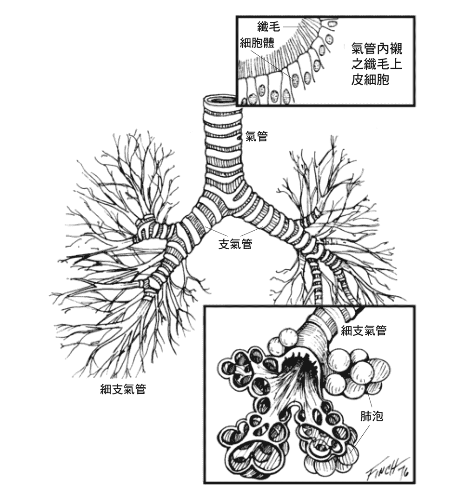 支气管树

环绕着这些肺泡的是一个微血管网络，它的毛细管是如此的薄，以至于血液细胞实质上必须挤身穿过。空气中的氧气从鼻子或嘴巴移入气管，通过支气管系统，最后进入肺泡，并透过肺泡四周的毛细血管被吸收到血液中。

要让氧气与血液交换流程有效率地发生，最理想的状态，应该要在毛细管内流动的血流量（以吸收氧气），以及借由呼吸带到肺泡的氧气浓度之间，取得平衡。旁观者可能会依常识说：“这不是显而易见的事吗？”但是，肺脏的生理机能显示，血液并非均匀地分布在整个肺脏区，它会受到重力的影响，当站立时，肺脏下半部的血液量会多于上半部的血液量。但是，气体在肺脏的上半部较能自由地进出肺泡，因此，氧气交换的流程并不如乍看之下那么有效率。除了肺脏的补偿反射（compensation reflexes）作用，可以降低无效率的气体交换机制，采用我们惯用的呼吸方法亦能帮助达到这个目标。

如果肺泡有所损伤，例如因为吸烟所造成，则会使肺泡的交换效率更低落。假如许多微小肺泡的内膜壁破裂，原本多个小气室的区域会变成一个大口袋，肺脏组织看起来就像有个肉眼可见的洞，此时，可让氧气与血液接触的（原本）巨大表面积便会急剧地缩小，进而产生肺气肿；这种情况都是在多年间缓慢发生且无任何征兆，它经常肇因于有毒的气体（如吸烟）进入肺脏，进而破坏脆弱的肺泡膜壁。

导致肺气肿的最普遍原因就是吸烟，这个问题让数以百万计的美国人深受其害，每一位吸烟者或多或少都有肺气肿的问题，但是因为肺泡具有巨大的面积可用于氧气交换，因此大部分人于吸烟初期都未能在生活如常的情况下，察觉到这个问题。多数人的肺脏拥有约三亿个肺泡，如果将它们压平并相连排列，面积足以覆盖一个单房公寓。只有当其表面积剧烈减少时，人们才会发现自己无法进行有效气体交换以获得足够的所需氧气。他们通常在做运动时感觉到“呼吸短促”，才会注意到这个问题。

当氧气一旦进入毛细血管后，就会被两种基本的机制输送：一是被红血球里的血红蛋白分子绑住，二是直接溶入血液中。几乎所有在血液内被输送的氧气，都是由血红素分子携带。血红素分子由四个蛋白质链组成，附在一个铁原子上，此铁原子会吸引氧气，帮助输送氧气至全身。当氧气附着到此铁原子时，含氧的血就会变得如火一般红。另外，血红素也会在回到心脏与肺脏的途中，捡取二氧化碳（细胞废弃物），两相结合再加上缺氧的情况，会使得血液出现偏蓝的颜色。这也说明为何动脉血鲜红，而静脉血偏蓝的缘故。

在正常情况下，只有氧气和二氧化碳吸附在血红素上。然而，环境中的其他气体也会经由肺部进入血液并吸附在血红素上，最常见的就是来自香烟烟雾及汽机车排气所产生的一氧化碳。一氧化碳对血红素的亲合力是氧气的两百四十倍，一氧化碳会很快地吸附住血红素，并将它带离氧气输送系统，造成能携带氧气的血红素数量下降，产生类似贫血的情况。在任何时刻，吸烟者的血红素有五％至十五％被一氧化碳捆绑住，甚至在他们没吸烟时也是如此。

事实上，问题还不仅如此，因为一氧化碳也会造成动脉硬化或其他动脉硬化方面的疾病。虽然在临床实验上已有纪录，但是一氧化碳会造成此疾病的确切机制仍未被完全理解。吸烟者死于心脏病及心肌梗塞的机率为非吸烟者的三到五倍。

一旦血红素带有氧气，它仍必须被输送到全身各处，以供应氧气给每一个细胞，其驱动力量当然来自于心脏。心脏分成两个心室，右心室将带着二氧化碳回流的静脉血打入肺泡周遭的微血管，来进行气体交换，然后这些含氧的动脉血再借由左心室被配送至全身各处。当含氧血在路途中接触到细胞时，它就会移动进入不断变小的管子，直到红血球挤过类似肺泡周围的毛细管。环绕在身体其他部位细胞的毛细管，进行着类似在肺部发生的气体交换，只是这次是在血红素与细胞之间，同时，细胞内的二氧化碳废弃物会和红血球血红素中的氧气互换，消耗血中氧气，将它转变成蓝色。这些静脉血会流经逐渐增大的静脉，最后回到右心室，曲折回到肺部，再重复另一次循环。

## 呼吸的机制

前面一节所讨论的呼吸系统，例如：分子互动、显微输送及体内解剖等，并非一般人容易见到的层面。现在我们将讨论的焦点转移到更接近身体表面，以了解这些结构是如何组织和运作来推动空气进出身体。

当我们审视身体时，可以将身体解剖成数个明显的部位：四肢、头部及躯干。每一个都自成独特的单位。因为躯干容纳了负责推动空气进出身体的数个器官，也是几个主要负责输送氧气的器官之所在，因此在讨论呼吸的机制时就以躯干为中心。

我们可以将躯干再分成三个区块：胸腔，内含心脏与两个肺脏；腹腔，紧邻着胸部的下缘，由一片横膈膜肌肉相隔开，内含消化器官；最后是骨盆腔，是髋骨以下延伸到躯干底部的区域，内含排泄及生殖器官。本文在论述时，是将骨盆腔视为腹腔的延伸。

假设我们把躯干内的所有器官除掉，只剩下骨架、肌肉和皮肤，躯干看起来就会像是一个略为压扁了的圆筒，因此从横切面看去，它左右的宽度会大于前后的深度。嵴椎骨架（嵴柱）在背部垂直延伸，和躯干的“圆筒”内那条长的中轴线平行，是整个躯干的支撑结构，其他的组织和器官则是依此架构而聚为一体。嵴柱本身包含一些较小的骨头，名为“椎骨”，它们彼此堆叠，椎骨之间以椎间盘的缓冲组织分隔开来。在躯干范围内的首十二节椎骨是胸椎骨，每一块胸椎骨都跟一对肋骨链接，左右各一根。每对肋骨都是彼此平行分布，并且往前、往下方弯曲。前十对肋骨在身体中线会合，并且与胸骨结合，形成了所谓的肋骨笼。每根肋骨和胸椎的链接处都是一个小关节，如同一个铰链，所以肋骨能稍微移动，有点像是弯曲的水桶提把在移动。每根肋骨前与胸骨链接，后与嵴柱链接，形成了躯干圆筒内的胸腔部分。

形成胸腔的弯曲肋骨，每一对的长度由上至下会逐渐增加，所以胸腔的下缘是最宽的部位。贴附在下方肋骨、胸骨与嵴柱的，是一块强固、扁平状的肌肉，名为“横膈膜”；它将躯干的圆筒分隔成两个上下相叠的较小圆筒，胸腔在上，腹腔在下。腹腔圆筒的范围包括了：(1)嵴柱及支持嵴柱的肌肉；(2)骨盆腔的底缘，这两者相对固定，较没有弹性；以及(3)分布在腹腔内，位于横隔膜表层正下方的器官，它们有一部分会延伸进入胸腔。腹腔前缘及侧方，是由好几片从上方肋骨延伸到下方骨盆的重叠肌肉所形成。

分隔胸腔与腹腔的那层横隔膜，在休息状态时并非平坦的，而是有如降落伞或是圆拱顶般地突起在胸腔的空间中。也因为如此，从身体外表不能直接观察出它的动作，我们要根据它的移动对身体组织所产生的影响，才能推断它有所活动。

紧邻横膈膜之上的是左右肺叶，心脏就依偎在两肺之间。实际上，肺脏并没有真正的直接接触横膈膜，因为肺脏被两层很薄、名为“胸膜”的组织所完全包覆。在正常情况之下，这两层胸膜会彼此接触，其间有少量的胸膜液提供润滑和保湿的作用，因此，两个胸膜层能自由地彼此摩擦滑动。

里面的那一层胸膜将左右肺叶的外表完全包覆，而外层胸膜则覆盖了胸腔的内壁表面，也覆盖了胸腔内侧下缘的横膈膜。由于两层胸膜如此相互紧密接触，因此只要胸腔壁或横膈膜有所移动，就会传动至肺部，反之亦然。假如，横膈膜往下移动或是肋骨往外扩张，肺叶也将随之扩张。事实上，这就是空气会流入肺中的两个主要机制。

当环绕肺脏的结构扩张，拉动了肺脏跟着扩张，空气就会流入肺脏。这所产生的吸力会将空气从上呼吸道吸入气管、支气管，进入肺泡。这就是吸气的过程。

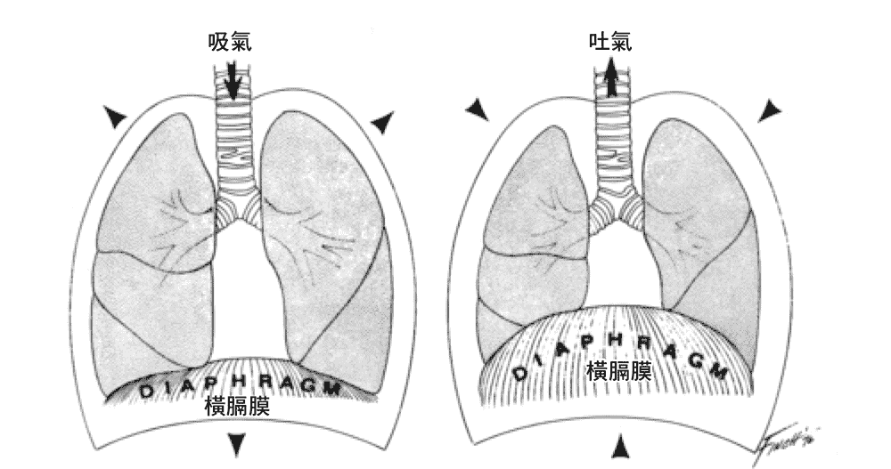

我们可以再次将胸腔空间想像成一个圆筒，就可以借由以下三种呼吸法的其中之一，来增加圆筒的容量：将圆筒底部的横膈膜向下延展、将胸腔壁向外扩张，或是将圆筒的顶端向上拉。这三种呼吸方式分别是：横膈膜式呼吸法、胸式呼吸法及锁骨式呼吸法。后文会提到，当我们用瑜伽完全呼吸法，做最大容量的呼吸时，这三个阶段的呼吸方式就会依序发生。

所以，横膈膜式的吸气法，就是横膈膜向下带动而完成的吸气。要如何进行呢？横膈膜跟所有的肌肉一样，都能采取两种状态：一是主动的收缩状态，此时个别肌肉的纤维缩短；二是被动的放松状态，此时肌肉纤维伸展到最大长度。当处于这个放松状态时，横膈膜的形状就如同一个打开的降落伞，其圆顶表面向上鼓起。当横膈膜收缩时，由于个别的肌肉纤维收缩，就不再“松弛”。而因为横膈膜与胸腔圆筒的边缘是链接的，当横隔膜缩小体积到极限时，形状就会由圆拱变成圆盘。这会明显地增加胸腔空间的容积。但是，在横膈膜往下移的同时，腹腔空间的容积将会缩小，假如此时腹腔壁是放松的，它将被往外推，以维持腹部器官原本所需占用的容积。

在上述三种呼吸类型中，横膈膜式呼吸法是生理上最有效率的。因为在肺部内循环的血液主要集中在肺部下方，也就是重力发挥作用的部位，而这种呼吸法中的肺部扩张也主要是在下方（虽然整个肺部多多少少都会扩张）。由于呼吸的目的之一是让毛细管内的血液与空气接触，所以横膈膜式呼吸法在肺部直立时非常有效率。有趣的是，婴儿和幼童只会使用横膈膜去呼吸，因为他们的胸腔骨胳结构要到了出生之后多年才会成长完全，在此之前，小孩子是无法做胸式呼吸的。

第二种将空气吸入肺部的主要方式，就是扩张胸部的直径，它要用到链接肋骨与嵴椎骨的微小关节，并由名为“肋间肌”（intercostal，拉丁文，意思是肋骨之间）的肌肉来执行此功能。许多人对肋间肌的认识是经由食用烧烤肋排而来，肋间肌就是肋排之间的“肉”。这种肌肉有内外两层，外层肌肉的分布方式就是为了要让肋骨以它们和嵴椎链接的关节为顶点而向上与向前摇摆。这就能增加胸腔的直径，肺脏随之而扩张，将空气吸入肺泡并充满新创造出来的空间。而内层肋间肌则执行完全相反的功能，是将肋骨往下往内拉，造成肺脏的体积缩小。

胸式呼吸法能将空气填充在肺部的中间与上半部，但是它的效率就不如使用下半部来得高。当身体处于直立姿势时，由于重力的自然作用，大部分血液是在下肺部区域，如果仅靠扩张肋骨来呼吸，空气与血液的混合就相对不够充分。采用胸式呼吸时，也需要更加用力，其血液与氧气的混合效果才能与缓慢、深沉的横膈膜式呼吸相比。因为要更加用力，就也需要消耗更多的氧气，导致呼吸需要变得更加频繁。最后，因为需要将更多的血液循环到肺部，因此增加心脏的工作负担。心肺系统会操劳到什么程度，与你使用何种呼吸方式有直接的关系。

第三种吸气类型称为“锁骨式呼吸法”，它仅对于需要在短时间内获得最大量空气时才有意义，例如在从事激烈运动时。之所以称为锁骨式呼吸法，是因为在吸气到最饱时，两边的锁骨会被轻轻地拉起来，因此移动扩张并拉长胸腔圆筒的上部，连动拉长了肺部的顶端。一般只有当身体对氧气的需求量很大时，锁骨式呼吸法才会被派上用场。

这三种吸气类型可以整合为单一、平顺的呼吸法，以达到深呼吸的最大功效，这就是瑜伽的完全呼吸法，可同时用到横膈膜、胸腔及锁骨三个阶段的呼吸。启动瑜伽的完全呼吸法时，要先收缩横膈膜，使下肋骨轻微扩张，以及上腹部突出，因而让下肺部区域得到氧化。然后，当继续吸气时，肺部中段开始扩张，胸腔往外移，进入第二阶段。当吸气似乎到了最后阶段，可以让锁骨稍微地抬高，以扩张肺部的顶端，如此可以吸入更多的空气。吸气的每一个阶段都依序对应肺脏的某一特别区域。

等到所有的肺部空间都充满空气之后，又要如何清空它呢？是什么导致吐气？答案是：放松。每个人都有叹息或是完全放松、被动地深深吐一口气的经验。在吐气的过程中，不是靠收缩任何肌肉将空气推出去，肺脏仿佛是自己将横膈膜与胸腔壁往内拉。实际上正是如此。肺脏表现得就像它们有弹性，一旦原扩张力量被释放后，肺脏就缩回原来的尺寸，如同气球放气后恢复到原本的大小。

这种弹性回缩的原因很引人入胜。就像气球一样，肺脏的组织里有一些弹性纤维，但最重要的是，这种弹性跟数以百万计的微小细胞圆囊（肺泡）息息相关。每颗肺泡内面都有薄薄一层的、含蛋白质的液体膜，名为“表面活性剂”，这是隐藏在肺部组织弹性特质背后的秘密，因为表面活性剂与其他能产生表面张力的液体具有一种共通的特性。这个特性可以从观察肥皂泡泡来解说，泡泡的膜壁是液体，成分主要是水，有一些肥皂溶在其中，当一个人吹泡泡时，拖长的尾端忽然断去而形成一个球体，同时肥皂水的表面层会有一股聚力将它拉在一起以形成最小的面积，从三维空间来看是一颗圆球。因为有表面张力，所以能维持圆球形。基于同样的理由，水珠与其他液体自然会形成一个圆球形。

在肺脏中，表面张力的作用很重要，因为其大部分面积都被表面活性剂所覆盖。为了让吸气能发生，所用到的肌肉必须能克服表面张力的影响以扩展肺部。一旦肌肉放松，表面张力的阻抗消失，肺脏就缩回去了，然后胸腔和横膈膜跟着缩小。当然，肋间肌与腹肌也可以帮助增强吐气的力量，来加速或深化此流程，但是，肺脏的自我卷缩能力才是吐气功能的重要关键。只要横隔膜还能作用，即使其他呼吸肌肉都瘫痪了，人仍然可以不经仪器协助而自行呼吸，便是因为表面张力能提供横膈肌足够的阻抗来维持自主呼吸。

这可以说明为何放松的横膈肌会如同降落伞一样往上鼓起，而不是被重力所拉引而垂入腹腔。当呼吸肌放松时，肺脏内的表面张力让肺脏保持收缩。这个力量比重力还要强，横膈膜因而继续得到支撑，会被肺脏透过胸膜层而将它往上拉。有趣的是，横膈膜移动与重力之间的相互作用，会受到我们姿势的影响而有很大的差异。假如身体是直立的，重力的作用会将腹腔内的器官、横膈膜与肺脏都往下拉，因而方便阻抗肺脏的弹性卷缩力，在吸气时帮助横膈膜向下移动。

当一个人仰躺时，横膈膜会变成与地面呈垂直，会将腹壁往上推，在吸气时，横隔膜就需要多加施力以便收缩。吐气时，放松横隔膜，重力则会将隆起的腹部向下拉，腹腔内的器官不再受到横膈膜的推挤去阻抗重力，反而去推挤放松了的横隔膜，因而帮助横隔膜恢复到其原本的休息位置。在此姿势吸气时，肌肉几乎不用施力，或只需稍稍施力，去平衡横膈肌的收缩作用。

当横膈膜已经处于休息的位置状态，若要做到完全呼气，运用肌肉的方式就和做完全呼吸时相反，唯一的例外是这两个情形都不再动用到横膈膜。因为肌肉只能朝一个方向收缩，若要朝相反方向运动，就需要用到另一个肌肉或是力道。我们回顾一下在做瑜伽的完全呼吸时所发生的三阶段呼吸方式，呼气时，它要用到三套相反的力量才能完全地呼尽。有几块肌肉是链接到锁骨，为了做一次完全吸气和吐气的循环，我们可以清楚地划分哪些是用于提升或压抑锁骨的肌肉群。同样地，外层肋间肌与内层肋间肌是成对的，在胸式呼吸的阶段，每一群肌肉的动作和另一群肌肉的动作是相反的。

然而，横隔膜没有与其他肌肉群配对，可借此产生相反方向的肌肉收缩，却有另一套肌肉发挥作用而达到类似的效果。那就是腹部的肌肉，也就是由四层呈十字形交错的肌肉所形成的腹部前壁与侧壁。在吸气时，横膈膜将腹腔内器官往下推，造成腹部向前凸起。在吐气时，腹壁收缩，将腹腔内器官往上推，顶住放松了的横膈膜，因而压缩并清空肺部。

## 呼吸习惯

我们已看到呼吸流程对生物体各个层面造成影响，包含从三磷酸腺苷（ATP）被氧气充电的细微分子相互作用，到将空气推进出肺脏的生理运动。在这些层面中，最明显、也最易辨认的，就是胸腔与腹部的生理动作。所谓呼吸，便是将空气带进出身体，而胸腔与腹部的动作就是决定呼吸过程中传送氧气的量及方式的必要第一步。

很明显地，有多少空气量被带进体内，是很重要的。如果空气量不足，氧气量就不足以满足身体的能量需求，将导致细胞机能减缓、停止、最终死亡。较不明显但非常重要的，就是呼吸流程的品质，也就是空气被吸吐的方式。确认呼吸方式是否为横膈膜式或胸式、连续、有规律节奏或不规则等，对决定一个人的生理与情绪状态至关重大。借由观察单次或一段时间的呼吸品质，可以判断出其呼吸模式或习惯。每个人都曾经历某些跟疼痛或激动情绪有关的呼吸模式变动。哀伤时的哭泣、惊吓时的喘气，以及愤怒时呼吸的颤抖等，都是我们所熟知的情绪如何影响呼吸的情况。相反地，我们也可以延伸呼吸与情绪之间的这层关系，借由改变呼吸模式来改变一个人的情绪及生理状态。

在每日的活动中，大部分人主要采用横膈膜或胸腔混合式呼吸。瑜伽的完全呼吸法可以在短时间让吸气量极大化，或是在从事重度劳力活动、对氧气需求量很大时采用，但是这种状况较少发生。

在多种呼吸法中，最适合每天放松呼吸的方式就是横膈膜式呼吸法，在进行此呼吸法时，我们专注在下肺部、受重力影响的肺部区域之扩张，在那里，氧气的交换可以很有效率地进行。横膈膜式呼吸不只适用于成年人，事实上对幼儿来说，横膈膜是他们呼吸时唯一使用的肌肉。

横膈膜式呼吸除了提供最有效的呼吸模式之外，当横膈膜收缩时，会将腹部器官向下、向前推，产生有规律且轻微地压缩及按摩腹部器官，促进循环。

横膈膜式呼吸法不仅是绝佳的呼吸模式，还可做为某些异常机能的治疗工具。例如，横膈膜式呼吸法被证明对原发性高血压（不明原因高血压）有利，这个发现特别令人兴奋，因为在美国有许多因心脏病造成的死亡都跟高血压有关。将横膈膜式呼吸法配合放松呼吸练习，对焦虑症的改善有显著的效果，而且是毫无副作用的另类疗法。这种简单、安全、经济的方法可以当作正规治疗的辅助疗法，值得做进一步的研究。

第二种呼吸方式是胸式呼吸法，它在现代社会中极为常见。这种呼吸法主要靠胸腔壁（而非横膈膜）的移动，扩张主要集中在肺脏中段，因此，气体交换效率比横膈膜式呼吸法差。证据显示，相较于横膈膜式呼吸法，焦虑症经常与胸式呼吸有关。有许多治疗师，尤其亚历山大．罗文（Alexandar Lowen）的生物能量学院特别强调呼吸的重要性，他们发现有许多人的横膈膜呈现“冻结或凝结”状态，以应对侵略性行为的恐惧及其他激动情绪，避免让他们失去意识。因为许多心理医师认为，性、恐惧、侵略性情绪等都与下半身有关，而硬化横膈膜可以隔离下半身的感觉，将这些负面情绪推出觉察之外。

胸式呼吸也被暗指与社会对身体形象的通俗审美观有关。正常横膈膜式呼吸法在吸气时会将腹部往前推，但是很不幸地，突出的小腹并不符合现代社会流行的审美观。运动员的宽肩膀、倒锥形的细腰，以及如滴露体形的美女出浴图，代表当代社会审美观的缩影，有许多人因此挺出胸膛、收缩小腹，让身体呈现紧张状态，因此限制了横膈膜的运动，如此可能导致更依赖胸式呼吸来供应身体充分的氧气需求，造成胸腔与腹部慢性紧张。

为了探索焦虑症与胸式呼吸的关联，生理反应机制也被检视。每当我们面对生理或情绪压力时，例如运动赛事、情绪危机或是碰到无法避免的意外事故，我们的身体就会增强它的防卫机制，并准备好以“战斗或逃跑”来应变。我们都经历过这种生理反应，它的特质就是：手掌心冒汗、心跳加速及剧烈的焦虑，这些反应的协调工作都是经由自主神经系统来完成。这些神经网络不需要我们输入指令就可以顺利运作，可自主控制内部器官及组织（例如：心脏、肝脏、肾脏与肠子）。

从解剖学及生理学观点来分析，自主神经系统可以分成两条分支：副交感神经系统与交感神经系统。前者与控制休息活动有关，例如降低心跳速率、加速消化、启动身体的清洁净化流程等。相反地，交感神经系统则负责调节较活泼、外在活动导向的功能，例如牵涉到对紧急状况的反应或体育竞赛等。当交感神经启动时，心跳会加速，血液会从消化与排泄器官分流调回到四肢肌肉中，准备面对挑战，做出耗费体力的行动。交感神经系统与副交感神经系统之间的平衡与否，决定当下自主神经系统的实质整体状态。

呼吸，也是接受自主神经的控制，在“战斗或逃跑”的反应模式下变得更急促，即使先前皆以横膈膜式呼吸为主，在此情况下，胸式呼吸似乎更能满足对增加氧气量的需求。假如预期的事件结果是身体活动，那么身体会准备好释放出储存的能量；假如不是身体活动的话，那么跟焦虑有关的换气过度会经常发生。在此状况下，由于过度呼吸，更多的氧气在血液中被交换，假如没有身体活动去平衡过多的气体交换，且“红色警示灯”继续在脑中闪烁，生理症状、焦虑状态及过度换气会持续下去。对敏感的人而言，这种过度换气可能会造成新陈代谢的扰乱，导致易怒、头晕目眩以及更加焦虑的结果。

一般认为，慢性胸式呼吸会造成交感神经系统的亢奋，因此，研究情绪、呼吸与自主神经系统之间的相互关系，有潜力发展出具价值的洞见，可用来防止及治疗众多的疾病。

还有另一种呼吸方式称为“反常呼吸”（paradoxical breathing），进行这种呼吸时，牵涉到结合胸腔的扩张，同时收缩腹部肌肉，并将横膈膜推进胸腔内。虽然胸腔壁有扩张，可以增加肺容积，但是横膈膜却同时升起，抵销了增加的肺容量。这显然是一个矛盾，不可能是一种有效的呼吸法，然而，为何仍会有人采用此矛盾的方式呼吸？

虽然呼吸可以由意识控制，但是就如前文所提，它也可以经由自主神经系统来调节，当你尝试以任何一种威胁生存的方式（例如，屏息超出能力范围）做有意识的呼吸，将被此调节能力夺去掌控权。许多情绪反应也是非自愿性的。剧烈的焦躁症状、因困窘所产生的脸红，以及气愤到颤抖等，都是自主神经系统的直接反应，经常绕过意识的控制。我们时常都可以认出自己对这些特定情绪的典型回应，而这些情绪反应也是大多数人都曾经历过的心理生理现象。

反常呼吸与突如其来的震惊或讶异有关。当人受到惊吓时，会产生喘气、扩充胸腔并缩紧腹部的本能反应。经常性的反常呼吸方式可能来自于环境的刺激，或是对环境变化因子过度敏感。身体会调适自己而逐渐适应这种呼吸模式。然后，身体将习惯于采用这种呼吸方式，甚至在轻微压力之下也会启动它。就如前文所提，呼吸与情绪息息相关，反常呼吸更可能强化情绪问题，形成恶性循环，让呼吸治疗变得更复杂。

另一种检视呼吸的方式是观察呼吸流动的品质，确认它是平顺连续的，还是不规则又断断续续的。根据个人的体验，可以知道情绪会深远地影响呼吸流动的品质。例如，悲伤、痛苦、生气与愤怒，都会破坏呼吸的平顺与放松模式。从不规律的呼吸流亦可判断出某些身体状态，特别是呼吸暂停的干扰，或是呼吸流动的干扰，这种呼吸暂停会在呼吸循环的任一时点发生，不同的是它持续的时间从少于一秒到一分钟不等，而且在睡眠与清醒时刻都会发生。

在不同的呼吸暂停情况中，睡眠呼吸中止症最受到社会大众与医界的重视。它的标准症状是：呼吸暂停，在许多个案中，甚至呼吸暂停达一分钟，而且在整个睡眠周期都可能发生。可以预期的结果是，这种症状对健康必然有害，至少在极端状态时。因为呼吸暂停通常会连带发生血压升高，以及血中含氧量降低。后者甚至可能低到在数秒内让身体发紫的程度，而且在一项研究中发现，超过一半以上的病人，其血压一整天都维持在高档。其他多种心理特质也可以在有睡眠呼吸中止症困扰的人身上看到，包括：焦虑、偶然混乱、沮丧、性欲降低及精神不振。

这是一个有趣的信息，但是如果考量仅有少数人有睡眠呼吸中止症的困扰，则没有太大的实用价值。然而，一项对医院正规医事从业人员的自愿调查中发现，有三分之二的男性有超过十秒钟的睡眠呼吸中止，连带发生“低血中含氧量”持续超过十秒钟。奇怪的是，只有少数女性经历睡眠呼吸中止，且没有一位女性连带发生低血中含氧量的情形。

关于睡眠呼吸中止症好发于男性身上，与造成性别差异的原因，仍需做进一步的探讨。不过已有一些试验的理论存在，例如，睡眠呼吸中止症与一段时程的低血中含氧量及血压升高，暗示心脏功能可能受影响。心脏包含数个心室，它的功能是将血液推送至全身，假如血压升高，心脏为了因应增加的阻抗，必须更努力地工作，消耗更多的氧气，才能推送等量的血液。如果在此同时血氧量降低，就有可能造成心脏暂时性的能量短缺。若经年累月重复此状况，累积到某个程度，就可能对心脏功能产生不利的影响。如果我们考虑到心脏病致死率中男性高于女性，是否直指心脏病与睡眠呼吸中止症之间有关联性？其间是否有因果关系？如果答案是肯定的，那么我们能否借由修正呼吸方式，来发挥对心脏病的治疗或预防效果？

这些疑问仍有待解答，然而，有些证据可以用来支持睡眠呼吸中止症与心脏病之间的关联性。多年来，为了评估鼻腔手术所造成的影响，鼻外科医师一直在研究鼻子的功能与空气在鼻腔中流动之间的关系。不同的鼻呼吸模式被描述为是此种研究的副产品，包含一种窒息模式，或称为“周期中停息”（mid-cycle rest，实质上，它被定义为一种快速吐气，接着停止呼吸达一到五秒以上）。多年来，根据大量的临床试验研究，有一些鼻科医师声称此种“中场休息”与心脏病的发生率增加有关。这两种研究之间的相似性虽然有趣，但仍需要做进一步的研究。

总而言之，不论是帮助释放食物中的能量，或是影响心肺系统的功能，或是改变自主神经系统、情绪状态等，呼吸在维系人体器官的完整运作中，扮演着关键的角色。呼吸是所有生理活动的基本，也因为它碰触到人体众多层面的运作，可以说它是一扇窗，我们可以经由它来观察与操控这些层面。这些看起来似乎很简单平凡的生理流程，常常在我们诡辩与复杂的科技社会中被轻忽了，直到最近，我们才开始探讨呼吸较为粗糙的面向，并在此过程中产出洪流般的诸多疑问与推测。这些探讨呼吸的研究，在对疾病的理解与缓和方面，将有可能产生很大的实用价值。

# Chapter 3 跟随你的鼻子：鼻子的功能与能量的关系

鲁道夫．巴伦坦医师

不知何故，人们总是不太注意鼻子。除了鼻子外形所展现的美容效果之外，鼻子通常被视为一个空气进入的信道。然而，如果这就是鼻子存在的唯一目的，人们可能会认为它的构造应该要有所不同才对，它应该长得更宽、开口更大；但事实上，鼻子是呼吸道中最狭窄的地方，它像一个瓶颈，是空气进入肺部时气流最受限制的地方。如果以从鼻子吸进与呼出空气的费力程度来比较，空气透过鼻子移动的费力程度是透过嘴巴的一．五倍！这是相当大的差距，甚至在你没有鼻塞时，这样的差距便已经存在。当我们仔细思索人们每天得呼吸一万八千至两万次时，更应感谢鼻子为了帮我们呼吸空气而在二十四小时内所完成的工作量。鼻子在呼吸的过程中需耗费大量能量，因此其中必定存在着合理的理由。

这里提供几个不错的理由：鼻子的功能远远不只是让空气进入而已。研究鼻科的医学专家能列出近三十种鼻子拥有的明显功能：鼻子能过滤空气、湿润空气、引导气流、温暖空气、产生嗅觉、吸入氧气、产生黏液、提供鼻窦引流路线并影响神经系统。鼻子还具有其他的功能，但上述功能最广为人们所知。

## 鼻子的解剖学及生理学

“鼻子”这个名词实际上是个模煳的字眼。对一般人而言，鼻子即是位于脸部中央最显而易见的突起物，但对医师及生理学家而言，鼻子还代表一个与鼻窦及嗅觉相关的神秘且复杂的信道。基于此因素，或许可以更精确地将鼻子区分为两个部分（即外部及内部）来探讨。以外部的鼻子而言，人类是独一无二的，因为动物身上并不存在所谓“外部鼻子”。尽管动物的鼻子也经常拥有错综复杂的内部信道且具有各种重要功能，但仅有人类的鼻子才拥有这种特殊的突起外形。其他动物的鼻子仅有简单的开口或开孔，让空气透过它们进入鼻腔内部。即使是人类的近亲人猿，也并未真正拥有一个鼻子。虽然它们有两个鼻孔，但人猿的侧面图却没有像人类这般有如此突出的结构。然而，鼻子的外部形状在吸入空气前的准备过程中却扮演重要角色，这就是为何生长于不同气候纬度的人们拥有不同形状的鼻子。一个又大又长的鼻子能在空气进入体内前加热空气，这是属于寒冷气候及气候极干燥地区的人种鼻子的特征，如中东及俄罗斯地区；反之，生长于温暖潮湿气候的人种几乎不需要处理空气的温湿，因此使得热带丛林居民的鼻孔较为宽大，形成一项可用来辨识的特征。

鼻子外部也负责收集空气并加速气流，形成一股急促喷射气流进入鼻腔，即鼻子内部。正如我们将于稍后了解的，气流在头部内所瞄准的途径具有高度重要性。鼻子外部可分为两部分，其中一部分是骨头。我们在触碰鼻子底部时会发现这部分相当坚硬。再往外移，我们会碰触到一个较柔软的区域，这部分是由软骨所构成。鼻子外部的第一个小分隔区称为“前庭”，主要是由两翼构成，在鼻子两侧匀称展开；因为这部分是由软骨构成，相对而言具有弹性且易受重力影响，因此在我们侧躺时，鼻孔最上侧会向下拉动，且会如阀门般呈现部分关闭的状态。

再回到鼻子上，这里有许多小骨头及软骨，以错综复杂的方式聚集在此处，并连接在一连串的骨头上；位于鼻子底部的结构也很复杂。当鼻子破碎时，基本上是鼻子根部的骨头部分形成碎裂，然而软骨部分也同样会受伤，尤其是内侧。再往内朝鼻尖可看到一个间隔，将鼻子外部分为两个信道，此部分亦由软骨构成，后端则是骨头；这两部分都有可能受到损伤而造成一般熟知的“鼻中隔弯曲”（deviated septum），容易产生一个鼻孔阻塞、另一个鼻孔通畅的状况。

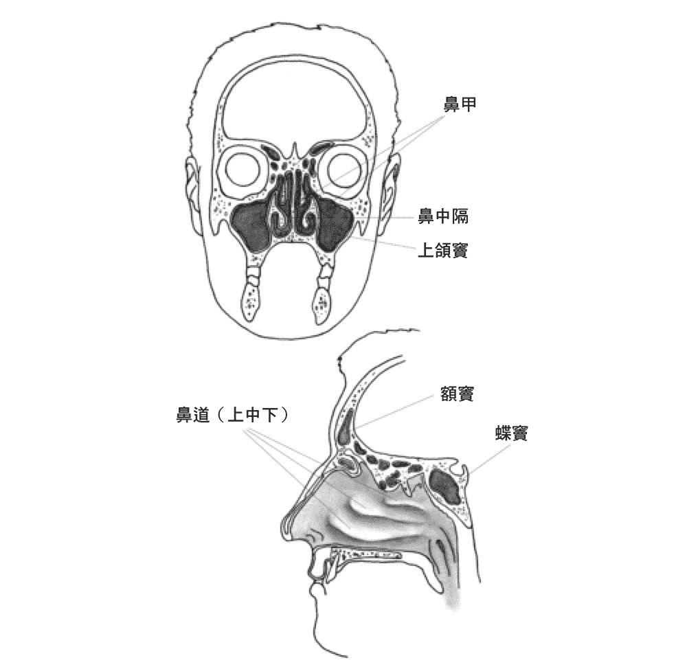 鼻腔构造图

随着我们往内移动，会发现鼻腔信道逐渐扩张，鼻子内部的尺寸远比前庭为大。鼻子内部的底层正好是口腔顶层，名为“上颚”。如果我们把舌头向后移动，会发现口腔顶层有块地方突然变得比较柔软，这部分名为“软颚”，是由不带颚骨的软组织所构成，末端为一个小水滴状的器官，名为“悬雍垂”。鼻子的底层为口腔顶层，而鼻子的顶层为大脑底层及放置眼球的眼窝。换句话说，我们现在所谈论的是一个三层结构：大脑、眼睛和视神经所在的顶层，口腔所在的底层，而在这两者之间（也就是中间那一层）就是鼻腔。

这使得鼻子内部成为一个很有趣的地方，因为鼻腔内所有作用皆与大脑、神经系统、脑下垂体（位于大脑底层）及许多重要构造密切相关。此外，第一脑神经（即嗅觉神经）进入鼻腔且神经末梢位于鼻腔最上部，这意谓着为了闻到气味，我们必须将气流引导至鼻腔之最顶端。要做到这点，我们必须制造一个相当有力的喷气进入鼻子内部；换言之，我们要用力吸气，迫使一股急促气流进入鼻腔后向上前进，并到达嗅觉神经末梢。

鼻子内部的形状决定了空气流动的途径。当我们仔细观察鼻腔内部，会发现鼻内壁一点也不平整，充满各种奇怪且令人费解的形状及构造。我们可能会骤下结论，认为鼻子是某种废弃物的堆积场，各种不适合其他地方的古怪器官皆被丢弃在此；然而，鼻子实际上是一项错综复杂的设计。若要真正了解鼻子，我们必须精通空气动力学，因为每一个弯曲和曲线、每一个角落及缝隙，都有其存在的目的。所有一切都经过巧妙的设计，以推动空气往特定的方向流动。

鼻腔内最突出的结构是三块贝壳状突起，也就是只要朝鼻子里头看便可见到的鼻甲，其作用是在空气进入鼻内时搅动及循环空气，使气流能通过较原先更大的面积。鼻甲对进入鼻内的空气之湿度及温度具有显著影响，因为当进入鼻内的空气通过温暖且潮湿的鼻甲时，会吸收水汽及加热；空气经由此过程处理之后，便不会对肺部的精细组织造成冲击或伤害。

当空气离开肺部时，会出现相反的反应。鼻甲受到吸入空气的影响，被冷却且变得干燥，而呼出的空气又会重新温暖并滋润鼻甲，因此鼻甲有助于防止体内热量及水分耗损。有些动物（如海豹）拥有庞大且复杂的鼻甲，总面积超过它们的皮肤。由于海豹生长在寒冷的边缘地带和多风的咸水地区，为了维持体温并保持体内水分不含盐，借着呼出的空气以恢复湿度及温度，对这些寒带动物而言肯定非常重要。人类鼻甲的尺寸要小得多，其作用显然较不重大，然而在寒冷的天气中，因鼻甲及鼻子外部受到足够冷却，以至于当人们呼气时，肺部暖空气的水分会在冰冷的汽车车窗上凝结，且经常形成别具特色的水滴。事实上，当天气非常寒冷时，在鼻尖上形成一个冰柱的情形并不罕见。

鼻甲负责阻挡及搅动空气，形成相当程度的扰流，然而过多的扰流则可能会造成呼吸困难。因为要透过如此曲折的过程引导空气，需要相当大的力气（扰流的大小程度，主要取决于鼻甲及其他构造，而非鼻信道实际的大小尺寸），这就是为何有些人即使鼻腔极大，却仍然有呼吸困难的问题之原因。

## 黏液毯

当空气扰流更彻底的与鼻甲及鼻内层表面接触后，可使灰尘及其他微粒的沉积作用更加明显。为了处理这个状况，鼻子内部由一层黏液薄膜覆盖着，它具有分泌黏液的特殊功能。尽管鼻黏液（鼻涕）往往惹人讨厌，但实际上它却执行一项重要功能：捕捉灰尘及碎屑，并将其带出鼻子。这其中不仅包括微粒，还有细菌、病毒、真菌等微生物，以及其他可能飘浮在空气中，并侵入鼻内纤细组织造成感染的外来物体；因此，鼻黏液绝不可增生、干涸或聚积，我们必须采取某些预防措施以去除黏液，才能促成此一既巧妙又引人入胜的清净过程。既然我们无法取出鼻腔里的空气滤清器，并每隔五千英哩便进行替换，那么鼻子内部肯定具备某种自我清洁机制。鼻黏液借由不断移动而完成此任务，而显然重力不是这项运动的唯一因素，否则我们的鼻子将会不断滴水，且在正常情况下鼻黏液不会流出鼻孔。事实上，鼻黏液经常逆重力而行，往上并往后移动，越过鼻腔内壁流向喉咙，鼻黏液会在此遭到吞嚥并进入食道。这层黏液薄膜不断在过程中形成一层“黏液毯”（mucus blanket），并在沿途将所有异物带走。

黏液毯的神秘运动原理，来自生长在黏膜层的数百万微小发状结构，名为“纤毛”（cilia），它们永不疲惫、外观一致且动作持续不断，可谓一项神奇的生物现象。这种微小的次细胞结构由一个简单的机制驱动，能一天二十四小时保持活动而不休息——这可视为一项创举。此外，纤毛的运动具协调性，所有纤毛彼此运作一致。纤毛的数量如此多，因此当黏液毯通过纤毛时，如同某人被群众的一只只手臂传递过去；黏液毯总是不断地在运动，所有被黏液毯抓住的微生物都会以高速进行移动，永远没有任何逃脱或停留的机会。黏液最终会进入消化道，其中的消化酶会同时分解黏液及其上的微生物。

只要这一切能正常运作，这便是个美妙的系统。不幸的是，有时它无法正常运作。这是什么原因造成的？如果黏液太黏稠或太厚时，便很容易变干涸且黏附在纤毛及黏膜上，硬块便会在此时增生，导致微生物开始入侵，这通常是感冒的初始现象。

另一种极端状况也可能会产生问题。倘若黏液太稀、水分过多，则会在纤毛附近滴落，如此纤毛便无法聚集黏液，并将其以完整覆盖层或连续不断的“毯状物”形式进行移动，结果将造成鼻涕滴漏的症状，则黏液毯也同样无法抵抗细菌感染；在这种情形下，很容易开始产生发炎现象，这便是花粉症的常见因素。基于此原因，保持黏液（组成及黏度）的一致性是相当重要的；只要黏液的组成及黏度维持正常，通常一切皆能运作良好。

决定黏液组成成分的其中一个要素是饮食，食用过多的淀粉食物及奶制品，会使黏液更厚且更黏稠；这能解释为何黏液在东方思想中不仅被视为分泌物，同时也是排泄物。所谓分泌物，就是身体制造出的、从事某特定有益用途的东西，反之，排泄物则是我们想要排除的东西。在一般情况下，黏液主要被视为分泌物。但是当身体的其他排泄功能运作未达标准时，鼻黏液即会转变成排泄物，意即当肺部、皮肤、内脏、肾及月经等无法排除累积在体内的废弃物时，黏液便成为排泄物，此时黏液分泌量会增加并开始接管排除的功能。

便秘常见于我们的文化中。我们也经常使用制汗剂以防止皮肤分担过多的排泄功能。但我们的呼吸在经适当调节后，便有助于消除体内某些不稳定的废弃物，可是往往却因为呼吸过浅而无法发挥作用。让情况变得更糟的是，在我们的饮食中，往往包含许多加工食品（在加工过程中，食物养分会受损及遭破坏），它们在人体内产生大量的废弃物，需要尽快被清除，然而在许多排泄信道都受阻的情况下，我们的生理机能便会不顾一切地想办法卸下身体中积累的无用成分，结果往往造成体臭或口臭；最终可能会造成危机，身体会趁机释放大量黏液——这就是大家熟知的“感冒”，起因于暴饮暴食、不当饮食或便秘（早期祖母会在感冒最初迹象发作时便迅速建议服用泻药，避免感冒日趋严重，便是基于此缘故）。

通常黏液及黏膜会以一种匀称、工整、有序的方式运作。然而，当我们强迫它成为排泄作用的附属路线时，黏液成分便不再取决于原先具有的保护作用，而是取决于所需抛弃的异物；若不是变得太稀释或太浓稠，就是发生其他异常。后续发生的刺激、发炎及经常性感染结果，不仅会造成大量黏液排放，也将让身体缺乏黏膜的有效保护。幸运的是，这种感染通常不太严重，显然这对身体而言，并未比在体内保留大量无用的废物更加有害。

这项解释有助于我们理解，为何干燥空气有时会带来麻烦。如果黏液已经太厚，那么只要一点点干燥空气便能立即在鼻内导致黏液结块及黏液层累积，从而造成不适及刺激；这对强烈气流连续冲击的鼻内区域而言更是如此。基于鼻子的内部结构，其中某些区域较容易发生此状况，例如吸入体内的喷气会在鼻腔后方转向并往下移动，对喉咙后方产生冲击。空气特别容易在此处堆积碎屑、灰尘及微生物，让身体有所反应，因而在此部署强大的淋巴组织，聚集白血球及抗体以对抗任何造成威胁的入侵者；然而，淋巴组织堆积有时会变得过大且阻塞喉咙。用外科手术切除扁桃腺（即此构造的名称）以杜绝此问题，曾经相当普遍，但医师可能在数年后才发现某些重要且珍贵的组织已在手术过程中遭到切除，因此造成扁桃腺切除术逐渐不受欢迎。

另一个经常发生于鼻腔内该区域的问题就是鼻窦炎。鼻窦是脸部构造内的空腔，毗邻鼻腔且开口与其相通（见第八八页图表）。尺寸最大的鼻窦位于眼睛上方及颧骨内侧。鼻窦上密布黏膜，能分泌黏液但应维持中空。尽管我们尚未完全清楚鼻窦的功能，但已经知道在某种程度上鼻窦会在声带震动时对声音产生共鸣。除了这两大主要部分之外，鼻窦尚存在于头部较深处、鼻后方、大脑底端上方及眼睛后方。这些鼻窦位置都较主要部分为小，也不太会造成麻烦（虽然有时也会疼痛及发炎）。

鼻窦和鼻腔之间存在着微小的信道，鼻窦就是透过这些信道才能排放水分并排除自身的黏液毯。当这些微小信道发生阻塞时，鼻窦无法让空气及黏液在鼻窦本身及鼻腔间维持自由循环时，便会产生鼻窦炎及鼻窦问题。在正常情况下，空气在鼻窦中进出的情况，就如同气流在鼻腔内移动，但当鼻窦往鼻腔的信道发生阻塞时，气流便会停止，且覆盖在鼻窦上的黏膜会开始吸收空气；这将使得鼻窦内部形成局部真空，被拉进鼻窦的不仅有黏液，还有血液和组织液，因而造成严重刺激、压力及疼痛。接着，就是我们常见的鼻窦炎，有时也会引发鼻窦性头痛。

鼻窦与鼻腔之间的小信道，通常位于鼻甲底下，当这些区域聚集干掉或硬化的黏液后，可能会阻塞通往鼻窦的信道并引发鼻窦问题。其中一个能避免并逐步消除这些问题的方法，就是有系统的运用一种名为“鼻腔冲洗法”的技巧。将温水混合含有适度盐分的水溶液，倒入其中一个鼻孔，并让水从另一个鼻孔流出。此步骤能溶解并洗净黏液，使鼻黏膜再度妥善发挥功能；它也能清通鼻窦排出液体时的信道开口。许多人对于将水灌入鼻子的想法有所畏惧，然而，关于鼻子功能的详细研究显示，这个方法并非不自然；其实让盐水进入鼻子是相当自然的，因为连接到鼻子内部的不仅有鼻窦，还有泪管。

含有盐分的眼泪是由上眼睑底下的泪腺产生，从眼睛表面顺流而下以保持其湿润，然后被眼睛内侧下方角落的一条小导管所接收。眼泪因此被这条小导管带入鼻腔（此处也是鼻窦排出液体的地方）。当某人哭泣并产生大量泪水时，鼻子便开始“流出液体”，驱使某人在某个动人场景中伸手拿出手帕。然而，即使没有这类情绪，眼泪仍会不断地流过眼睛（尽管流量较小）且不断被小导管吸收，引导至鼻腔；换言之，鼻子在任何时刻都不停被注入盐水。事实上，盐水对鼻腔内层而言是最天然的“清洗”工具。

为了应用此论据，鼻腔冲洗法应透过成分与眼泪相同的盐水来完成，咸度应该等同泪水且温度应等同于体温。透过这种方式完成鼻腔冲洗，便具有抚慰作用，且不会刺激鼻内层。碘化盐、氯化水或化学药剂处理过的水都不自然，且可能具有刺激性。

## 鼻腔冲洗法

定期使用洗鼻壶（Neti Pot），可清洁并恢复鼻窦信道的健康。在瑜伽练习中，据说透过两个鼻孔等流量且自在的呼吸，对协调身体的交感及副交感神经系统会有所帮助，人们因此发现在静坐冥想之前进行鼻腔冲洗，是很有帮助的作法。

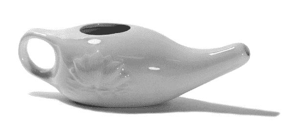 洗鼻壶

将四分之一茶匙（或用一个略圆的茶匙盛二分之一）的岩盐及适量温水，置入洗鼻壶中调合均匀（盐的分量依个人情况可能略有差距）。在使用之前，先确认岩盐已完全溶解，再将壶嘴朝向鼻子，在水槽上方将身体微向前弯，头部稍微往前伸并朝向一侧倾斜，稍微调整头部及洗鼻壶，让水从另一个鼻孔流出。

洗鼻壶里的水倒完后，透过两个鼻孔对着水槽喷气，以清除多余的水分及黏液。在进行此动作时，切勿关闭其中一个鼻孔，否则可能迫使水回流进耳朵。若在清洁鼻孔时有任何问题，可弯下腰，将额头贴着地板，使臀部高于头部，再像先前一样透过两个鼻孔喷气。进行此动作时，将头部转向其中一侧，可能有帮助。完成一边的鼻腔冲洗后，换另一边重复相同步骤。

在稍微熟练此方法后，我们还可以学习透过嘴巴将水引出，同样稍微调整头部及洗鼻壶的位置，利用口腔后端力量将水吸进口腔后吐掉；这个方法同样有助于清洁并除去鼻腔内多余的黏液及污垢，恢复鼻窦膜的健康。

黏膜分布在将空气带进肺部及胸腔的信道上，因此，支气管内具有跟鼻子相同的内层，可分泌黏液以保持信道湿润，否则空气将使其干燥并造成损伤。这些信道所分泌的黏液，是透过纤毛不分日夜向上移动直到喉咙。纤毛在白天通常要抵抗地心引力进行运作，到了晚上，当人们躺下后，因纤毛不需向上推动黏液，其运作会较容易。基于此因素，在夜间时段，来到喉咙的大量黏液会被清除并吞噬，这个过程会持续进行且不停止。

在一般情形下，进入消化道的黏液会被消化液溶解，其中的所有微生物也会被杀死；此为一种内部生态系统，黏液在其中分解并再生，因而避免各种问题。然而，当黏液分泌过多或消化液不足时，便会产生问题。不幸的是，肠道在夜间会趋于平静及休息状态，消化液的分泌会减少，因此，倘若黏液过多，会在胃部累积直到早上。基于此因素，许多人在醒来后会感到相当不舒服，直到进食为止；因为进食有助于稀释黏液或将黏液推出胃部；这对于患有肺部疾病、肺气肿、哮喘等易产生大量黏液的人而言，更是如此。

我们通常建议上述人士进行晨间冲洗。方法是将大量生理食盐水嚥下后再吐出来，便能将胃部黏液带出体内，这是既简单又符合卫生的方法，又称为“上消化道清洗法”（upper wash），训练有素的瑜伽教练都可以指导他人运用此技巧（需在空腹时进行。若只是为了减轻体重，在饭后诱导呕吐以清空胃部内容物，是非常不健康的作法）。

吸烟者特别容易产生大量黏液。倘若他们能停止吸烟并度过肺部开始复苏的清洁时期，大量黏液便能流动且被带出肺部。吸烟者的黏液累积状态，是由于烟雾和焦油的刺激，以及纤毛遭到破坏同时造成的（特征为咳嗽声音嘈杂却无法带出累积的黏液）。香烟中的烟雾成分会大量破坏黏膜层上的纤毛，导致没有任何机制能将黏液带出肺部到喉咙，黏液因此逐渐累积。一旦某人停止吸烟后，纤毛会逐渐再生并再次正常处理黏液。

## 鼻孔的偏侧特质

若我们再回头看看鼻子，重新检视鼻子内层，会发现在鼻黏膜底下有另一层更厚、能充满大量血液的海绵组织，我们称为“勃起”（erectile）组织，它仅存在于人体的几个地方：生殖器、乳房及鼻内层。这个组织当中具有极细微的管道，能吸收血液并造成组织扩张；这种勃起作用与阴茎和阴道勃起的基本原理相同，这些器官与鼻内层间的关系相当密切。事实上，这便是所谓的新婚症候群的基本原理。耳鼻喉科医师对此相当熟悉，它常发生于新婚夫妻，在新婚过后持续一段时间内不断的性刺激下，鼻内层会因交感作用影响而长期充血并形成阻塞，我们将此症状称之为“蜜月鼻”（honeymoon nose）现象。

佛洛伊德（Sigmund Freud）在研究性学方面的创举中，发现性器官与鼻子之间的相互作用关系。事实上，他最初曾透过写信给耳鼻喉专科医师威廉．弗利斯（Wilhelm Fliess），来构建精神分析理论的基本概念。两者产生关联的趣味所在，为存在于鼻内层及生殖器官之间的反射作用。佛洛伊德最早期的理论之一，以及与弗利斯协力研究的内容，讨论到“鼻反射神经官能症”（nasal reflex neurosis）。尽管他后来对此现象失去兴趣，其他医师则继续从事研究并发现许多有趣的相互关系；例如，他们发现经痛往往与鼻内层中特定区域发生炎症及变色情况有关，若将此处施以少量的局部麻醉剂，经痛便会消失。事实上，在德国，有段时间便是透过烧灼或永久性破坏鼻内层中特定区域的神经末梢，以达到有效的经痛治疗效果。

然而，鼻腔勃起组织的肿胀与收缩，不仅具有温暖空气及反映性过度刺激等作用。事实上，鼻内层肿胀与收缩，存在一套持续、规律且可预测的模式，与人体生理学中的偏侧概念密切相关。

例如，当覆盖在其中一侧鼻孔的组织及鼻中膈发生肿胀时，另一侧鼻孔内的组织往往会变得较不肿胀。其中一侧鼻孔逐渐堵塞，使气流转移到另一侧鼻孔，因此这里存在一个气流的左右空间：气流可主要往右侧鼻孔流动，或主要往左侧鼻孔流动。倘若不采取外力来干预身体运作的节奏，这个机制将会以可预测的方式相互交替。气息主要流向其中一侧鼻孔的时间，约持续一小时四十五分钟至两小时，之后，气流便会主要流向另一侧鼻孔。气流会逐渐增加到其中一侧鼻孔，直到抵达峰值后，便开始减少，之后，大部分空气会开始透过另一侧鼻孔流动。

尽管这似乎是自然的生物韵律，却会遭受情绪、饮食、睡眠不规律、污染、感染及其他外力刺激等因素干扰；然而，如果某人的身体状况健康、稳定、平静且生活规律，那么两个鼻孔之间的气流交替便能遵循一定的规律节奏。这点在东、西方实验室中皆有充分研究报告可佐证。专业上，此现象称为“生理节律”（infradian rhythm），此项认知绝非科学的最新进展；事实上，古老的瑜伽士曾十分详尽地描述这项培养高度自我观察能力的技巧，他们能察觉人体的细微变化并将其分类。

此外，呼吸法（svara）的瑜伽修行者，致力于对呼吸气流（在双侧鼻孔之间）流动的方式，与各种心理和生理状态之间的相互关系进行研究。例如，他们观察到右侧或左侧鼻孔的个别通畅，将助长不同的社会活动。据说，若经常透过右侧鼻孔呼吸，个体往往会变得较积极进取、较具警觉性，且较会活跃于外在世界；反之，经常透过左侧鼻孔呼吸时，会产生较宁静、较被动的心理状态，且较趋向于内在世界。右侧鼻孔气流通畅与左半脑居于主导地位相关，似乎合乎逻辑；事实上，为了回应此问题，相关研究工作正在进行。

右侧鼻孔呼吸与左侧鼻孔呼吸之间的区别，并非仅局限在心理层面，据说透过右侧鼻孔进出气流，有助于内部器官生理过程更加活跃，例如在消化食物时。因此，修习呼吸法瑜伽（svara yoga）的学员在进食前都会先小心地打开右侧鼻孔；相较之下，饮水的过程则属于较被动的摄入，他们通常会在摄入液体时打开左侧鼻孔。他们认定空气从哪一侧鼻孔进出是非常重要的，便会在从事任何特定活动前先协调（从哪一侧鼻孔）呼吸；此举被认定为有助于身心，使人体在从事特定活动时，能先在精神、情绪及生理方面有所准备。

这种呼吸的科学为古印度人所熟知，他们一向如此执行且视为理所当然。然而，时至今日，大多数人并未提升对呼吸方面的认知，它便被视为瑜伽教学中的一部分技巧，旨在帮助人们对空气流及其在任何特定时刻里的作用，能更加敏感且更有意识。这种呼吸练习亦有助于恢复左右鼻孔交替呼吸的规律、节奏及平衡。

在瑜伽呼吸练习中，最常见的是鼻孔交替呼吸法（nadi shodhanam）。在这项技巧中，我们透过按压其中一个鼻孔出口或侧壁，刻意将气流从一侧变换到另一侧，并保持规律及节奏。要正确从事此练习之前，应该先掌握好横膈膜式呼吸法，使呼吸能顺畅、均匀、不间断且有规律。

## 鼻孔交替呼吸法

在开始进行此呼吸法之前，先坐直，保持静坐般舒适的姿势，但头部、颈部及躯干需相对挺直。通常我们会用右手拇指关闭右侧鼻孔，用右手无名指关闭左侧鼻孔。如果你觉得有帮助，也可将食指与中指放在鼻梁上（若不会因此分心）。

首先，透过主导鼻孔（较畅通的鼻孔）呼气，再用同一个鼻孔吸气。在吸气过程结束时，用手指将这个鼻孔关闭，让呼气动作由另一侧鼻孔开始；呼气过程结束时，从同一个鼻孔吸气，然后再展开前述的呼吸过程。重复做这个交替动作三次，即是透过两侧鼻孔进行三次完整的呼吸循环，总共完成六次呼吸动作。一般称此为一个“循环”。通常我们会接着进行第二循环及第三循环，也就是透过每一侧鼻孔完成九次的吸气动作及九次的呼气动作。在两个循环之间，我们通常会透过两侧鼻孔进行三次呼吸动作。

在进行这项练习时，大家应该谨记两件事：一是要缓慢且轻柔的呼吸，但切勿太慢而导致紧张或喘不过气来；二为安静的呼吸。如果呼吸能保持轻柔且平顺，就比较不会产生呼吸紊乱或抖动的现象。为了达成这两项目标，大家必须将注意力集中在呼吸本身。倘若我们的心念在此过程中漫游到其他事物，便会使呼吸变得不规律、不平稳、产生噪音或混乱。在练习过程中保持冷静、放松，也相当重要。

这只是三种呼吸变化技巧的其中一种。第二种技巧（将于第四章解说）是先透过主导的鼻孔呼气，再从另一侧鼻孔吸气，第三种技巧则是透过一侧鼻孔完成三次完整的呼吸循环，再换另一侧鼻孔。有些学生选择其中一个技巧进行整整三个月的练习，有些则是每种技巧练习一个循环。保持一致性或许会有帮助，而且本文所描述的技巧相当适合初学者运用。

练习这个技巧可使人们体会透过各鼻孔进行呼吸的差异，同时增加人们对偏侧特质的认知。鼻孔交替呼吸法属于一项自我研究，而非仅是机械性的练习；它具有教育意义及协调性，可让人们重新觉察一个已被遗忘的存在本质，并有助于恢复身体左右脑的协调性。我们必须承认，我们一点也不在意抬起左手臂或右手臂有何区别，且当大多数人被问及时，都无法回答当下自己是用哪一侧鼻孔在呼吸。倘若使用右侧鼻孔呼吸确实能启动某种心理及生理功能，而左侧鼻孔在不同功能上发挥作用，那么有机会在任何特定时刻得知当下主要由哪一侧鼻孔在运作，是相当珍贵的。

当我们发现一些能以自由意志将气流从一侧鼻孔变换到另一侧鼻孔进出的技巧时，这种自我觉知的重要性变得更为明显。例如，若我们向左侧躺，右侧鼻孔便会张开。人们长期以来都认为这是因为地心引力将血液拉往下侧鼻孔，造成鼻内层充血，导致鼻甲肿胀而关闭下侧鼻孔。近来则有研究显示，造成鼻内气流转换的主因并非地心引力，而是我们在侧躺时，下侧手臂与下侧胸部间所产生的压力。这其中显然存在一种反射作用，能自动张开较高那一侧鼻孔并关闭较低那一侧鼻孔，也就是压力所在的那一侧。无论如何，当我们将压力停留在某一侧鼻孔，另一侧鼻孔便会大张。因此，瑜伽手册建议人们应在餐后向左侧躺，使右侧鼻孔张开以促进消化活动。传统而言，据说当人们上床睡觉时，应先向左侧躺五至十分钟，促进右侧鼻孔活动以增加身体热度。当人们感到温暖舒适后，再转向右侧，使左侧鼻孔张开，此举便可让人们在睡前能放松、平静并准备入眠。

尽管让两侧鼻孔有节奏的交替呼吸，被认为是自然且健康的，但让一侧鼻孔持续关闭，造成气流连续数小时皆从另一侧鼻孔进出，却被视为疾病的前兆。据说，若气息在其中一侧进出持续六到八小时，极有可能产生某种疾病，若情况持续一天或一天以上便属于严重情况。在精微的整体心理及生理学中，呼吸被认为与生命能量之流“气”（prana）有关，若是不平衡即被视为疾病发作之前的征兆。

## 导引呼吸气流

尽管我们已经探讨并检视过鼻子及鼻腔的构造和形状，但还有另一个与呼吸相关且具有形状及结构的要素，亦即“气流”本身。气流、漩涡及横流信道，皆为气流创造出一个不可思议的复杂模式，且模式因人而异，它取决于个人鼻腔及鼻子外部的差异。就如同河岸塑造水流的形态，鼻腔及上呼吸道也会塑造气流的形态并引导之。根据古老的瑜伽士所言，这是一个非常关键的问题，空气流动与﹁气﹂的流动有关，也与活化身体及心念的模式息息相关。

虽然这些瑜伽概念仍未被现代科学技术彻底探讨，但无疑的，有许多鼻外科医师都同意鼻子形状的重要性。在此，他们谈的跟整形外科手术所关心的美容效果不同，他们的工作主要偏向于改善鼻子的功能，改变其内部结构，以修复畸形信道，导正气流。有些鼻外科医师相信这种修正能对当事人的心理及生理产生难以置信的影响。例如，有文献个案证实，鼻子内部结构的扭曲与不正常的空气流影响当事人甚大，甚至造成心理失衡。相反地，也有文献案例显示，有人在动过鼻子手术之后产生心理障碍。许多动过鼻子内部结构改造手术的人，在手术后感受到生理与心理上的不同，是很常见的。

瑜伽士明白，鼻子内部信道的形状及气流形态，是塑造心理状态及人格特质的一大要素。根据东方思维，气流的移动会影响身体及大脑接收“气”的方式，也同时对情绪及心念产生影响。据说，“气”能滋养意识心念，并推动心念朝某个方向流动。

这种对呼吸的见解在西方科学来说仍然很陌生，即便如此，熟练的鼻外科医师仍能在这个变量上完成工作，并以敏锐、熟练的双手，直觉地重造与重塑鼻子的内部。这项手术是关键任务，不能等闲视之，因为古代关于呼吸的说法即使只有部分属实，仍显示鼻子内部构造的改变对当事人的人格形成而言亦是一项改变。这个手术必须要由一位非常有能力、有经验的医师来完成。即使只是修补破裂的鼻子，也是一项很精巧的手术，如果在进行鼻子手术时忽略了其功能效应，肯定会是场灾难。一项最近的案例（笔者所见）是一名男士因鼻甲似乎阻碍鼻信道，而动了鼻甲摘除手术，然而在手术过后，这名男士的心理变得错乱，以至于必须放弃自己的专业。

当然，鼻外科医师的主要专长领域在鼻腔背后的骨头结构。在决定是否要动鼻子手术之前，鼻外科医师会先以局部喷药的方式，收缩鼻腔内所有会勃起的组织内衬，然后做空气流动测试，假如气流可以透过这个方法恢复正常，就没有动手术的必要。

事实上，鼻子的骨头结构本身很少在塑造气流模式上扮演很大的角色，反而是海绵组织的充血勃起、变化、转移，才是造成气流模式改变的主因。单边充血勃起的鼻甲会关闭单侧鼻孔，并导致气流转换到另一侧；然而，这并非仅是左右两侧的问题这般简单。鼻子每一侧有三大块鼻甲及鼻中膈的内表面，每块鼻甲都由海绵组织所覆盖。每块组织肿胀的程度及位置都可能有所不同，其中的排列组合更是不可思议，结果形成一个复杂且不断变化的气流模式。

从古老东方思想的角度来看待呼吸，认为鼻甲借由各种勃起方式创造不同形态的气流，有助于我们适应不同的活动。呼吸是一个不断变化的现象，受到情绪、心理及生理状态所影响，却又同时对这些状态造成影响。鼻甲内形成的充血状态及所产生的气流变化，类似一个中央票据交换所或交换机，所有身体的功能都对它产生影响，却又转而受它影响。事实上，研究显示，碰触鼻甲不同部位表面的气流，会触发脑神经反应，并在全身造成反射动作；换言之，特定的气流会向肺部及神经系统发出涟漪，接连影响到整个人。古经文中曾描述气流的各类形态，及其与个性和生理功能之间的关系。实验室的研究正逐渐获取更尖端的技术，以便更深入证实或推翻这些古老的观点。

## 鼻子的功能及大脑边缘系统

神经生理学家发现，当空气中含有嗅觉可判别的物质时，吸气不仅会刺激嗅觉神经，也会触发嗅觉神经内的神经讯息。其原因尚不得而知，但据了解，嗅觉神经及大脑中嗅觉神经所在部分，与大脑边缘系统紧密相连，而大脑边缘系统即是促进情感状态的中枢神经系统。我们都知道气味与情绪紧密相连，在耳后轻抹一点香水，便可证实这点。而人们发现，相同的大脑区域也可借由空气的流动而影响其功能，实在令人玩味。

呼吸对人类生理及心理运作有着深刻的影响，因为它是身体与心念之间的桥梁。鼻子是气息进入体内的主要门户，因此扮演一个至关紧要的角色。鼻子在气息被人体吸收之前，进行准备及调整呼吸的动作，并与内部及外部环境进行交互作用，以配合身体时时刻刻对能量的需求。对鼻子运作的认知，可提供心理及生理另一个层面的自我觉察。

# Chapter 4 通往较高觉察的门户：呼吸的科学

斯瓦米．拉玛

梵文里的 pranayama 一字，通常被译为“调息”，但这是较为局限的翻译法。pranayama 字面上的意思为“扩展或展现气”（the ayama of prana；pra 指第一个单元，na 指能量)，因此，pranayama 是指“有意识地控制／扩展生命能量”。“气”（prana）是宇宙的生命能量，也是增进生命活力的能量。根据某支印度哲学派系的说法，整个宇宙都是从“空”（akasha）借由“气”向外投射所形成的，“空”是涵盖宇宙一切包罗万象物质的无穷尽空间，而“气”则是那无所不在、渗透全宇宙的无穷生命能量，它支持宇宙间所有生命形态的存在。“调息”（pranayama）即为传授如何控制“气”的相关知识科学。倘若学员能学会如何控制“气”，就能学会控制这个宇宙的所有能量，包括生理能量与心理能量。他也会因此学会如何控制自己的身体与心念。

心就像是立于我们和现实之间的一道墙，当学员接触到“气”的精微力量时，即可同时学会控制心念的方法，因为心念被紧紧地绑在“气”上，就像风筝被系在一条绳子上一样。若我们能有技巧的控制住风筝线，就能控制那原本想四处乱飞的风筝，让它朝既定的方向飞行。所有高阶或基本的瑜伽呼吸练习，都能让学员理解如何借由“气”来控制自己的心念。借此，调息能帮助学员控制“气”生命能量，进而达到更高层次的灵性修持。能控制呼吸与“气”的人，就能控制住他的心；同样地，能控制心的人，就能控制住他的呼吸。

构成大宇宙的所有面向与基本原则，也同样体现在所有个体生命的小宇宙之中，就如同一小滴海水的特质，即能完全代表那浩瀚无垠海洋的特质。支撑着人体机能运作的生命能量，和支撑整个宇宙运行的能量，是相同的，而且透过“气”的展现，才让身体所有生理机能的运作与相互协调变得可能。

根据瑜伽古籍的说法，在人体里展现的宇宙能量“气”，依其功能可分成十种，并可细分为五种主要及五种次要的“气”。五种主要的“气”为：udana（上行气）、prana（呼吸气或命根气）、samana（平行气）、apana（下行气）及 vyana（周身气或遍行气）。虽然“prana”一词可以代表十种“气”，但五种主要“气”的其中之一亦名为“prana”，原因如下。

上行气（udana）掌管喉头以上的部位，管理我们特殊感知器官的运作；呼吸气（prana）掌管喉头到心脏底部之间的部位，管理我们的说话与发声器官、呼吸系统及与它相关联的肌肉活动；平行气（samana）掌管心脏与肚脐之间的部位，管理所有消化方面的新陈代谢活动；下行气（apana）位处于肚脐以下的部位，掌管肾脏、结肠、直肠、膀胱与生殖器的运作功能；周身气（vyana）则是遍布全身，掌管所有肌肉的放松与收缩，以及关节和关节四周组织的活动。

呼吸气（prana）的形态是精微的，其最外在的展现方式就是呼吸，而且在人类的五种主要“气”当中，“呼吸气”就是那个主宰呼吸的生命能量。瑜伽士借由控制呼吸来控制其他的精微生命能量，这或许可以用来说明为何使用同一个字“气”（prana）就足以代表宇宙能量，以及掌管呼吸之特定生命能量的原因。此特定生命能量的重要性，在于让我们能借由它来接触更精微的宇宙生命能量，也因此我们才会称死亡为停止呼吸。

印度瑜伽大师斯瓦米比辨喜难陀（Swami Vivekananda），在关于王道瑜伽（raja yoga）的著作里，以一个故事清楚说明从控制呼吸进展到控制宇宙能量的顺序。

从前，有一个国度的大臣失去了国王的宠爱，被关在高塔顶端。大臣要求他忠实的妻子在黑夜降临之际，带一条长绳，一些结实的麻绳、细绳、丝线，一只甲虫及一些蜂蜜来高塔。虽然妻子对他奇怪的要求感到困惑，但仍按照他的要求准备。大臣要求妻子将丝线绑在甲虫身上，在它的角上涂一些蜂蜜，再将甲虫的角朝向塔尖放置于墙上。甲虫受到蜂蜜香甜味的引诱，慢慢爬上塔尖，拉动身后的丝线。大臣握住丝线，要求妻子将细绳绑在丝线的另一端，利用丝线拉动细绳，进而拉动结实的麻绳，麻绳又拉动长绳，大臣最后利用长绳爬下高塔而重获自由。

在我们的身体里，呼吸就像那条丝线，让我们能有技巧的利用它来掌握住神经脉冲的细绳；进而再掌握住思绪的粗壮麻线，最后抓住“气”生命能量的长绳，因此获得最终的解脱。

## 调息与神经系统

为了了解“调息”的科学，就必须考量神经系统的本质及其功能。因为神经系统负责协调身体内所有其他系统的功能。神经系统分为中枢神经系统与自主神经系统。中枢神经系统由大脑、十二对脑神经、嵴髓，以及三十一对嵴神经所构成；脑神经及嵴神经遍布全身，构成神经纤维网络。传出性的神经或运动神经纤维，是从大脑与嵴髓将神经脉冲向外带到神经末梢；而传入性的神经纤维或感觉神经纤维，则是从神经末梢将神经脉冲向内带回大脑与嵴髓。

我们可以脚趾踢到物体的情况，来说明传出性与传入性神经纤维的功能。脚趾神经末梢沿着传入性神经纤维，传送神经脉冲到嵴髓和大脑；大脑则将脉冲解读为疼痛并做出反应，并沿着传出性神经纤维向外传送脉冲到手指，指示手伸出去，并抚摸受伤的脚趾。

大约在西元前两百年，编撰瑜伽科学《瑜伽经》（*Yoga Sutra*）的圣哲帕坦迦利（Patanjali）就指出，控制“气”能量，亦即在调节吸气与吐气，消除吸气与吐气间暂停的情况，或是借由屏息而扩大呼吸暂停时间。然后，借由规律的肺部动作，就能控制心脏及迷走神经。自主神经系统负责管理体内的自主运作器官，例如消化器官的分泌、心跳及肺脏的运动等。调息与自主神经系统息息相关，我们可以借由肺脏的运动，有意识的控制自主神经系统；虽然呼吸大部分是自主运作的，但是要在这方面拿回掌控权，是很容易就可以达到的，我们可以有意识的调整呼吸的深度、长度及韵律节奏。也正因为如此，控制呼吸显然是控制自主神经系统运作的起点。

自主神经系统可分成交感神经系统与副交感神经系统，就如其名，两者的作用相反，却又能得到相互和谐的调节结果。副交感神经系统会减缓心脏跳动的速度，而交感神经系统则会加快心脏跳动的速度，两股相反的作用调节出心脏跳动的最终速度。交感神经系统主要由两股垂直的神经元或神经细胞丛所构成，排列在嵴柱两侧。这些神经元随着嵴髓分支，扩散至胸部和腹部不同的腺体及内脏器官，形成具有副交感神经系统神经分支的神经丛。副交感神经系统的主要部分为第十对头颅神经，亦称为“迷走神经”，与后脑相连，沿着嵴髓往下经由颈部、胸部及腹部，延伸的分支与交感神经系统形成神经丛，它的尾端连接至太阳神经丛，并借由神经纤维连接至下方的神经丛。

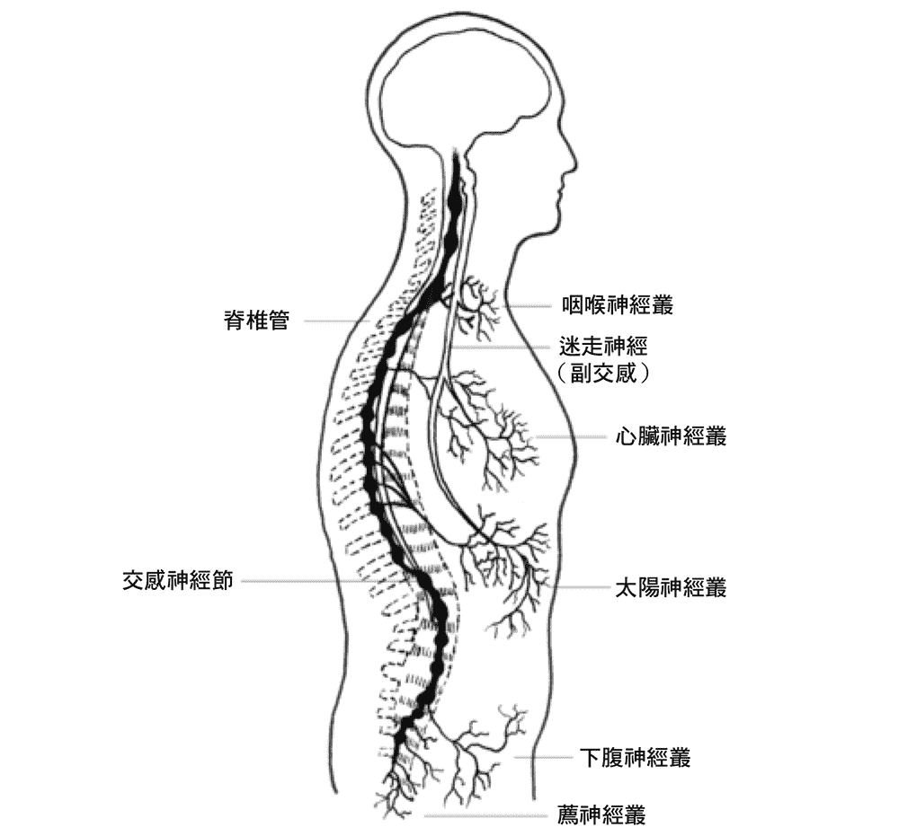 自主神经系统

想要有意识的控制自主神经系统，只有两种已知的方法：一种是借由系统化的呼吸练习，让自己准备好去理解“气”的各式载具及管道，但学员必须先学习调节肺脏的动作，如此才能调节心脏的功能，然后才能有意识的控制右侧迷走神经，如此一来，心念中与自主神经系统相互协调的部分，就能被控制。倘若学员能学会调节肺脏的运作，就不再有所谓的自主神经系统，因为借由此练习，大部分的自主神经系统就能被意识所控制。

另一种控制自主神经系统的方法，就是透过意志力。然而，心念越分散，意志力就越涣散薄弱。当心念被训练到能单点专注时，意志力就会被强化。靠着意志力，我们也能随心所欲地控制自主神经系统。

现代的科学家只会从吸收氧气的观点，来强调呼吸的重要性；他们关心的只是能否吸到足够量的氧气来活化神经系统。但是对瑜伽的呼吸科学而言，这些只是次要的考量。我们需要更细致的知识与经验，来研究此精微的生命力量，而不只是考虑氧气的吸入与二氧化碳的排出。例如，古老的瑜伽解剖书指出，身体是由数千条气脉（细微信道）所构成，而“气”则经由此信道输送到全身，为身体所有部位注入能量，并支撑身体各部位与数千条气脉的运作。

根据一些瑜伽古籍的记载，人体内的气脉共有七万两千条（有些书说三十五万条），其中较为重要的有十四条，而十四条中更为重要的是这六条：ida、pingala、sushumna、brahmani、chitrani、vijnani，其中又以这三条最为重要：pingala（surya，日），流经右鼻孔；ida（chandra，月），流经左鼻孔；以及 sushumna（中脉），这是当气流在两个鼻腔中能自由无阻碍的流动的时刻，而此时刻的扩大则称为 sandhya（结合）。在进行静坐冥想时，运用中脉来提升静坐冥想效能的技巧，是极为重要的。因为当中脉开始发挥它的作用时，禅修者即可不受噪音、外界的骚动，以及从无意识心念所升起的杂念所干扰。

三条主要的气脉均起源于尾椎并向上运行。中脉位处中间，沿着嵴椎管而行，在喉头处一分为二，分为前侧与后侧两个部分，两者均止于梵穴（brahmarandra），与身体内的心室腔相对应；左脉和右脉也沿着嵴柱向上运行，但呈现两脉之间相互交叉，并与中脉有十字交叉的情况，再分别终止于左右鼻孔。

左脉、右脉与中脉在嵴柱上的交会点，称为“脉轮”（chakras）。一如车轮辐条从中心点向外发射出去，其他的气脉也从脉轮向外散布到身体的其他部位。人体有七个主要的脉轮，包括：海底轮（muladhara chakra）位于体内嵴椎底部、骨盆神经丛的层次，生殖轮（svadhishthana chakra）位于下腹神经丛，脐轮（manipura chakra）位于太阳神经丛，心轮（anahata chakra）位于心脏神经丛，喉轮（vishuddha chakra）位于咽喉神经丛，眉心轮（ajna chakra）位于鼻睫神经丛，以及顶轮（sahasrara chakra）位于头顶。中脉的前侧通过眉心轮，后侧通过后脑勺，这两部分在梵穴的位置会合。

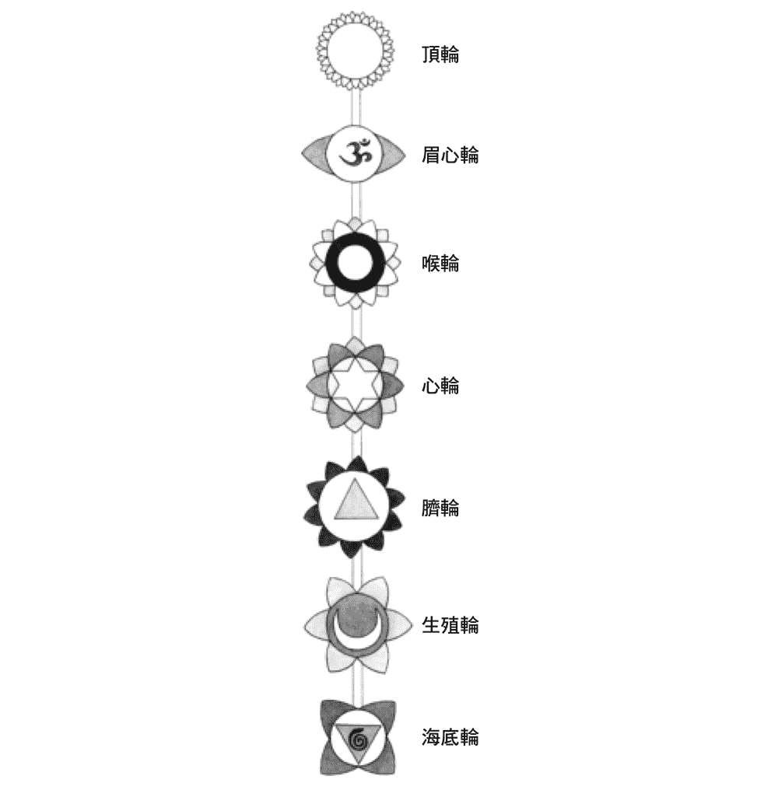 七个主要脉轮

那些有系统地研究并修习瑜伽科学的人，发现瑜伽解剖学与生理学的论述十分清晰正确，比现代科学实验或论述能揭露出更多人体内部的机能；的确，瑜伽古籍所描述的气脉和脉轮，与现代解剖学个别描述的神经系统和神经丛的特征，极为相似。一些科学家尝试创建两个系统之间的相对应之处，但其背后的假设为神经系统与神经丛属于身体，而气脉与脉轮在瑜伽科学里则称之为“精身”（sukshma sharira）。换句话说，它们分别是神经系统与神经丛精微的对应方，在这些气脉里流动的“气”，则是神经脉冲精微的对应方。瑜伽士并未借由解剖身体的方式，来知晓精微能量的流动情况；因为为了查看精微的能量而解剖身体，将是徒劳无功的。他们借由绘制“气”在此网络内流动的路径图，发现了气脉与脉轮网络，并借由静坐冥想内观实验，开发出气脉路径图的绘制能力。

身体的形状建构在精微的气脉之上，并被在网络内流动的“气”能量所支撑着。对一般人来说，每一个个体日常生活所运用到的活力与创造力，仅为“气”总量极微小的片段，绝大部分仍有待开发，为具有很大潜力的种子状态。瑜伽古籍称这种潜藏、储存在体内的能量，为“昆达里尼”（kundalini），就如同蛰伏、沉睡在尾椎部位的海底轮的灵蛇一般。此外，对一般人来说，“气”仅在左脉或右脉流动，而不会流经中脉，这条中脉通常被堵塞在嵴柱底部（而未能发挥其作用）。

调息的技巧，乃着眼于弱化左脉与右脉的个别支配优势，同时打开中脉，让“气”能被导入中脉。瑜伽士在此时会感受到极大的喜乐，而不再受到时间、空间、因果的束缚。而且，由于中脉大开，瑜伽士得以唤醒蛰伏在海底轮的昆达里尼能量，并引导它沿着中脉往上行，突破六个脉轮到达顶轮。这种唤醒及提升此蛰伏的昆达里尼能量，且与顶轮相结合的现象，与夏克堤（shakti，宇宙的势能）与希瓦（shiva，宇宙的觉识）相结合的意义相同。借此结合，瑜伽士从所有的痛苦梏桎中解脱，将自己的本我（atman）和梵（Brahman）融合为一。

调息为八肢瑜伽里的其中一肢，有些人称前四肢为哈达瑜伽（hatha yoga），后四肢为王道瑜伽或王道之路（royal path）。前四肢初阶修行依序为：戒律（yama，自制）、善律（niyama，遵从）、体式（asana）、调息（pranayama）。后四肢更高阶的修行依序为：内摄（pratyahara，收摄感官）、专注（dharana），禅定（dhyana，静坐冥想）、三摩地（samadhi，超觉状态，生死轮回的终极解脱）。

要控制心念的先决条件，是要先控制呼吸并平息神经系统的躁动；而要达到终极征服生命能量“气”的前提，则是要先控制自己的心念。对瑜伽士而言，肉体、呼吸、神经系统、心念、“气”及宇宙，都是连续一体的，不会在其中加入人为的分别心。然而，西方人的想法则倾向于将它们划分区隔清楚。例如，生理学与心理学就维持它们个别的身分。直到最近，科学家才承认精神与身体细胞之间的相互作用关系，以及疾病受到精神心理根源的影响，这些议题终于变成受重视的研究主题。

根据瑜伽与“调息”的理论，疾病的产生肇因于“气”在身体内的流动失去均衡的结果。身体及心念两方面皆须倚赖“气”的支撑，其间互动的程度出乎我们平常的想像，例如愤怒、恐惧、焦虑等情绪反应，都会强烈地限制身体正常的生理蠕动（peristalsis），另一个例子就是情绪对呼吸的影响——当我们害怕时，呼吸会变得浅而急促；当我们感觉到沮丧时，呼吸则会变得沉重而费力。

心理学家指出，个性类型与呼吸模式之间具有相关性。瑜伽士认为，呼吸与心念之间存在着对等的关系，若某种心念状态会造成某种呼吸模式，那么相反的，如果借由有意识的采用该呼吸模式，我们即可唤起相对应的心念状态。瑜伽士断言，如果我们改变呼吸模式，就能改变个性，当我们的心念受到干扰时，呼吸就会变调，会变浅、变快且不均匀。借由有意识的呼吸觉察，再经由鼻腔吸吐气与横膈膜运动，让呼吸变得深沉缓慢、恒速、平顺、规律节奏、安静无声，以及吸气吐气比维持一比一时，我们就会明显感受到紧张压力的纾解、身心的放松与泰然自若。

## 基本的呼吸与净化技巧

呼吸是身体最重要的功能，但多数人并不知道在两个鼻孔内流动的空气量并不均等，而是某个单侧鼻孔较另一侧更活跃（主导）的时间较多，原因是在鼻中膈的两侧有名为“鼻甲”的组织，是用来调整鼻内气流的信道。这些上面覆有黏膜的鼻甲，由可勃起的组织所构成，当鼻甲组织勃起时，会改变气道的内部结构以抑制或阻挡气流，由此可以说明经由鼻孔的呼吸气流量并不均等的原因。

瑜伽呼吸技巧的目的之一，在于均匀双侧鼻孔内的气流，这是削弱左脉与右脉的支配优势，打开受堵塞之中脉的先决条件。此时，我们会采用“鼻孔交替呼吸法”的呼吸技巧，可以使得左右鼻孔能均匀呼吸，接着打开中脉。均衡左右鼻孔的呼吸流量，可以镇定思绪，并引领心念进入深度冥想状态。

#### 鼻腔冲洗法

要均衡左右鼻孔呼吸流量的初步措施，就是先清洗鼻腔信道，此为瑜伽手册所描述的一项技巧，名为“鼻腔冲洗法”（以温盐水进行洁净）。在温水中加入约八分之一茶匙的岩盐（此食盐水的咸度应相当于泪水的咸度，若咸度过高，鼻腔会有刺痛感，若咸度不够，将在鼻腔内产生不舒服的压力）。将头向一侧倾斜，把水灌入其中一个鼻孔，让盐水溶液从另一个鼻孔流出。此温盐水不仅能溶解并洗去累积的黏液和灰尘，还能借由逆渗透膜作用，从肿胀的鼻甲组织中吸出多余的水分，并能促进鼻窦里面的废物排出。

若先从左鼻孔注盐水，从右鼻孔流出，接着再将盐水由右鼻孔注入，从左鼻孔排出，如此可彻底清洁呼吸道。在试图自己练习这个洗鼻法之前，建议寻求合格教师的个人指导。每日进行鼻腔清洗，可以避免鼻窦阻塞，也较不容易感冒或是遭受其他经由呼吸所造成的（病毒）感染。

#### 线串清洁法（Sutra Neti）

在此练习中，我们将一条附有棉花串的细橡皮管塞入一侧鼻孔，再从嘴巴将线拉出来。用棉线也可以，只是线的底端要用蜡加硬，而且所有器物都要先经过消毒。此外，就如前文所述，在你第一次尝试之前，建议要先由一位合格的教师来示范此清洁法。此清洁法可以清洁鼻腔信道，强化黏膜组织，并对眼睛有益。

#### 有节奏的横膈膜式呼吸法

在呼吸控制法中，最重要的面向就是有节奏的横膈膜式呼吸法。一般人经常是使用胸部肌肉而非横膈膜来呼吸，这种呼吸经常是短浅、快速且不规律的，其结果是获得丰富血液供给的下肺叶，反而无法获得足够的透气，造成肺脏与血液之间无法进行足够的气体交换，呼吸生理学家称这种现象为“换气灌流异常”（ventilation-perfusion abnormality）。使用横膈膜式呼吸法，即能将这种血液灌注与透气之间的不均衡现象减到最少。证据显示，横膈膜式呼吸法还会带来许多额外的益处，例如：增加胸腔的吸气压力、改善静脉血液的回流效能，因此可以减少心脏负担、强化循环功能等。

虽然对大多数现代人而言，胸式呼吸已经变成一种很自然且非自我掌控的情况，但事实上，它却是在进行另一种“战斗或逃跑”的反应。当任何有机体遭受外部压力或危险的挑战时，就会激发这种反应。由于呼吸与心念之间的交互作用，采用胸式呼吸时，就会反过来出现与战斗或逃跑反应有关的紧张及焦虑症候群，呼吸会变得短浅、急促、不稳定，结果造成心念也会产生相对应的不稳定躁动状态。所有让身体、神经系统与心念放松的技巧，都会因为胸式呼吸而失去功效，除非改换成深度、均匀、稳定的节奏横膈膜式呼吸法。

虽然横膈膜式呼吸法简单、容易又有益处，但是在让它变成身体自主运作的一部分之前，要经常做有意识的练习培养，直到成为习惯为止。最简单的练习方法之一，即为躺在埝子或地毯上，一只手掌心置于胸口中央，另一只手的掌心置于胸肋骨下缘、腹部上缘处，吸气时，胸廓下缘应会扩张，腹部会上升；吐气时会发生相反的情况，而胸腔上半部几乎不应移动。经常练习这个动作，经过一阵子之后，你将发现自己的身体会自然且习惯地进行横膈膜式呼吸法。

接下来，就要培养使横膈膜式呼吸变得更和谐、更有节奏的习惯。观察每分钟呼吸的速度，一点也不困难，却对健康具有高度治疗的效果。一般人平均每分钟呼吸十六到二十次，当吸气吐气两者皆变得缓慢、平顺时，呼吸也会变得较轻松。

更甚者，现代科学家发现，在吸气时毛细血管的血液会渗入肺泡中（吐气时血液会再次回到循环系统中），因此，延长吸气的长度，可以提供更充裕的时间让氧气与血液之间的置换发生，所以，你首先应该要学习放慢吸气速度。节奏横膈膜式呼吸法还能将更多空气及氧气带入肺脏气囊和血流中，增加静脉血（无氧血）回流至肺脏，传送更多的血液至肺泡的毛细血管。

横膈膜式呼吸法可以稳定的站姿、坐姿或是仰躺进行——将双手置于身体两侧，掌心朝上，双腿稍微分开（此姿势为摊尸式﹝shavasana﹞）来练习。从鼻孔进行吸气及吐气，呼吸时应安静无声，待完全将气吐干净后，立即开始吸气；吸吐之间，暂停的间隔时间应缩短到最小。再次提醒，要从鼻孔呼吸且不要发出声音。

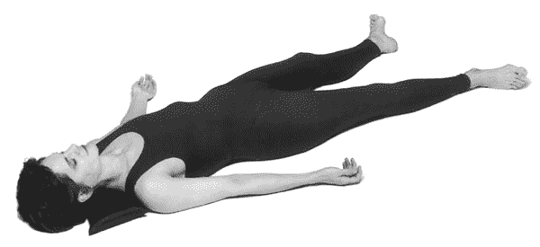 摊尸式

#### 鳄鱼式横膈膜式呼吸法

假如你不清楚或基于某些原因而无法以坐姿练习横膈膜式呼吸法，可以从鳄鱼式开始练习。采取腹部贴地的俯卧姿势，双脚舒适的张开，脚趾向外，双臂交叉置于身体前侧，将手掌放置在二头肌上。将手臂位置放好，使得胸部不会接触到地板，然后将额头放置在前臂上。

这个姿势非常适合用于教学练习，让你能实地感受用横膈膜进行呼吸时的身体变化。吸气时，会感觉到腹部顶住地板，吐气时，会感到腹部肌肉放松，如此便能轻易地感受到横膈膜的运动。

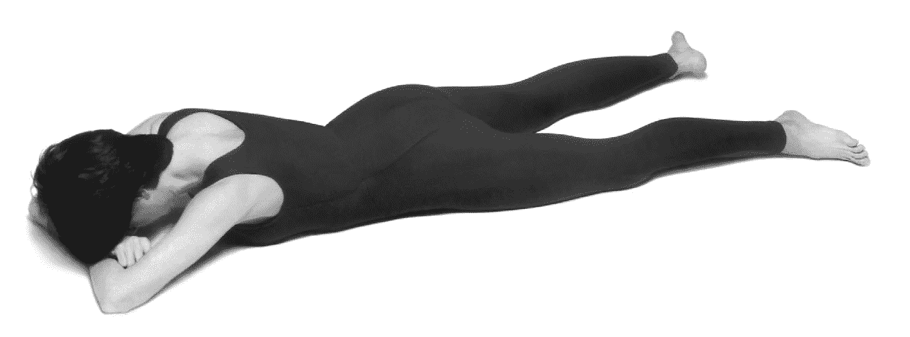 鳄鱼式

#### 沙袋横膈膜式呼吸法

这项练习会锻鍊腹部与横膈膜的肌肉，也会调整肺脏的动作，以配合横膈膜肌肉的运动。以摊尸式仰卧，轻闭双唇，从头到脚放松全身。平顺呼吸。将大约两公斤的沙袋（或米袋）轻放在腹部，若你有心脏、肺脏、血压方面的异常，则将沙袋置于肚脐下方的肌肉上。注意，不要将沙袋置于骨盆带上。

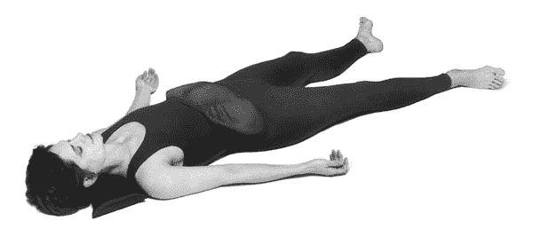 沙袋横膈膜式呼吸法

闭上眼睛并开始呼吸，感觉沙袋在吸气时被抬高，吐气时下降；吸气时必须使力，但吐气时则不需用力。三到五分钟后取下沙袋，放松休息数分钟。

若经常练习，可每两周增加沙袋的重量，但请循序渐进，以感觉到舒适为优先，沙袋最重请勿超过七公斤。

横膈膜式呼吸法会大幅降低呼吸的速度，学员需先完成此基本练习，才能进到下一个阶段的高阶练习，并享受呼吸科学所带来的好处。

将空气吸入肺脏下层深处，能带来全方位的健康，因为心囊连接着横膈膜，深呼吸时会使得横膈膜下降，将心脏往下拉向腹部。当肺脏从下而上充满空气时，会产生压缩效果，并轻柔按摩着心脏。当横膈膜收缩及放松时，也会按摩到心脏、肝脏及胰脏，帮助改善脾脏、胃、小肠及腹部的机能。

若每天练习十次节奏横膈膜式呼吸法，并持续至少两个月，逐渐且等长地延长吸气和吐气的长度之后，你的身体就会感觉到深度放松，甚至比最深沉的睡眠所获得的休息感觉更好，你就能免受紧张压力与疲劳之苦，而紧张压力与疲劳是许多身心失调疾病的根源。你的神经系统将变得镇定，声音和脸部会呈现出安祥感；声音会变得甜美，脸上粗糙严肃的线条与皮肤，也会被柔和、青春的光泽所取代。

#### 鼻孔交替呼吸法

另一个优异的呼吸法就是“鼻孔交替呼吸法”（Nadi shodhanam），从字面上直译为“气脉净化”，其作用在于清洁、净化能量循环信道（气脉）。它能有效地帮助你深度放松身心，同时平衡人体的右脉（ida，日能量）与左脉（pingala，月能量）。然而，过度的日能量会让人情绪躁动不安、加速生理老化；过度的月能量则让人昏沉、懒散、郁闷、沮丧。

一、以轻松、稳定的姿势，坐在平稳、安静、通风的场所，头部、颈部及躯干挺直，在整个练习过程中要持续保持呈一直线。身体也应保持不动。

二、右手靠近鼻子，食指与中指弯折起来，让右手拇指能轻轻按压住右鼻孔，无名指能轻轻按压住左鼻孔（此为毗湿奴手印﹝Vishnu mudra﹞）。

三、关住右鼻孔，从左鼻孔缓慢并有控制、不急促、不抖动地完全吐气。

四、吐气结束时，以无名指关住左鼻孔，打开右鼻孔，缓慢完全地吸气。吸气时亦应缓慢、平顺并加以控制，时间长度与吐气时相同。

五、重复“先由左鼻孔吐气，再从右鼻孔吸气”的循环两次。

六、在第三次从右鼻孔吸气结束时，从右鼻孔完全吐气，而无名指继续关住左鼻孔。

七、在右鼻孔吐气结束时，关住右鼻孔，从左鼻孔吸气。重复“先由右鼻孔吐气，再从左鼻孔吸气”的循环两次，即完成练习。

总而言之，此练习包含三次从左鼻孔吐气及右鼻孔吸气的循环，接着再进行三次从右鼻孔吐气及左鼻孔吸气的循环。

在晚间练习时，要先进行“由右鼻孔吐气，再从左鼻孔吸气”的循环三次，接着是三次“由左鼻孔吐气，再从右鼻孔吸气”的循环。在所有阶段的练习中，吐气与吸气的时间长度应为相同，吐气与吸气间没有停顿。采用横膈膜式呼吸法，缓慢控制呼吸，不要用力。接着，再逐步练习延长吸吐气的时间长度。

不同的瑜伽典籍对此呼吸法的基本技巧描述略有相异之处，但学员应避免经常改变技巧，规律地固定练习同一种技巧，才能获得此呼吸法带来的全面优点。部分典籍里，提到在吸吐之间要暂停、屏息不呼，这是进阶的练习内容，应仅在合格教师的带领下进行，否则可能会对学员造成无法弥补的伤害。在不影响有节奏、平稳及均匀的吸吐情况，且有适当的教师带领下，才可以练习屏息，并逐渐拉长屏息的时间。建议的吸气、屏息与吐气时间长度比例为一比四比二。在熟悉先吸气后屏息的要领后，学员可练习在吐气后屏息，接着再逐渐延长屏息的时间长度。

调息法是一项高度发展且复杂的科学，其进阶技巧需要有专业人员的引导，不能仅凭靠阅读书籍里的说明就轻易尝试。除非你已熟稔这些高阶技巧的基本知识，否则容易造成伤害，因为学员可能会不小心唤醒超过自身能耐所能容纳及控制程度的巨大能量。

不含屏息的鼻孔交替呼吸法，以及其他根据以下指令所描述的调息法，都可以被安全地练习。但还是要再提醒一次：屏息练习需要得到熟练调息法的合格教师之许可并从旁指导，才可以练习。

#### 头颅发光调息法（Kapalabhati Pranayama）

Kapalabhati 的字面意思为“让前额及全脸散发出光彩的调息法”，俗称“头颅发光调息法”、“头颅清明调息法”，是一种清洁净化呼吸法，它可以清洁鼻窦及所有的呼吸道，增进排除体内有毒的废弃物，并刺激腹部肌肉与消化器官，让练习者感到心情愉悦。此呼吸法也是在早上进行冥想前的绝佳充电暖身法。

这个练习包括使用横膈膜及用力收缩下腹部肌肉，以强迫、短促、用力地吐气，然后放松腹部肌肉，缓慢被动的吸气，快速连续进行“主动用力的吐气，再被动的吸气”循环练习多次。一开始，每天可练习七至二十一回合，视你的能耐而定。

#### 风箱式调息法（Bhastrika Pranayama）

Bhastrika 是“风箱”的意思，也是一种“充电”呼吸法，可用于净化呼吸系统，并帮助提升新陈代谢的机能。一般适合在早上与白天练习。

在做此练习时，腹部肌肉要像风箱一样动作。此调息法的益处，以及应用横膈膜和腹肌的方式，都与头颅发光调息法类似，差别只是在吸气与吐气时都要用力，且每一回合之间要快速链接。根据每个人的能耐，可以尝试每次练习七至二十一回合。

#### 乌佳依调息法（Ujjayi Pranayama）

Ujjayi 可解译为“控制或经由呼吸扩张带来的胜利”，俗称“海浪呼吸法”（亦译为“胜利调息法”）。此调息法可以将最大量的氧气带进体内，避免短浅、无效率的胸式呼吸；它能强化肺脏换气的情况，有助于袪痰、安定神经系统，并让全身充满活力。此调息法也是在练习瑜伽体位法时，主要应用的呼吸方式。

进行乌佳依调息法时，要半关闭声门，进行缓慢深度的吸吐气，并发出类似啜泣但均衡连续的声音。吸气时，上颚根部位会感觉到吸入的空气，伴随“sa”的嘶嘶声；吐气时，上颚根部位会感觉到排出的空气，伴随有“ha”的气音。吸气时，稍微收缩腹部肌肉；吐气时，在腹部施加压力，直到将空气完全排出为止。

#### 蜂鸣式调息法（Bhramari Pranayama）

Bhramari 为一种大型蜜蜂，进行此调息法，吐气时会发出类似蜜蜂的嗡嗡声，完全靠两个鼻孔吸气。吐气方式一如乌佳依调息法，因此会发出蜜蜂般的嗡嗡声。重复这个动作二至三分钟，有舒缓神经系统与镇定心念的效果。

#### 嘶声调息法 I（Sitali Pranayama）

这两种嘶声调息法有冷却并舒缓身体的效果。伸出舌头，从左右两边卷起舌头，就像个管子一般让舌尖伸出嘴唇外，吸气时会发出“嘶嘶”声。用两个鼻孔完全吐气。重复三次。

#### 嘶声调息法 II（Sitkari Pranayam）

卷起舌头，尽量朝着柔软的上颚往后伸展，嘴唇略为分开，咬住牙齿，从齿间吸气发出嘶嘶声。用两个鼻孔完全吐气。重复三次。

以下描述三项重要的瑜伽呼吸技巧，但这三种仅能在合格教师的指导下，才可进行练习。有经验的教师可在进行练习时引导学员避免伤及心肺。

#### 太阳穿透调息法（Surya Bhedana Pranayama）

在进行调息法时，要从右鼻孔吸气，屏息，然后从左鼻孔吐气。

#### 晕眩式调息法（Murccha Pranayama）

从两个鼻孔吸气后，应用喉锁锁住气，再缓慢轻柔的吐气。

#### 漂浮呼吸法（Plavini Pranayama）

Plavini 为最高阶的呼吸法之一。先让胃部充满空气，并于空气停留在胃里时，也将肺脏充满空气，屏息，最后再吐气。视需要重复这个“吸气、屏息、呼气”的程序多次。（又译“流溢式调息法”。）

其他还有一些更稀少的进阶呼吸练习法，仅由导师传授给其道行较高的弟子。

《瑜伽经》的作者帕坦迦利除了解释控制心念的方法之外，也包含调息。在《瑜伽经》一之三十四节中，他使用不同的字眼来说明吸气、吐气及屏息。根据他的说法，控制呼吸之间的停顿称为“调息”（pranayama），意即控制、去除及扩大呼吸之间的停顿，即为调息；在梵文中，呼吸间的停顿称为“Kumbhaka”。因此，《瑜伽经》一之三十四节是一个格言，能让合格教师可以用此简短的注解来解释“调息”。事实上，在练习时，“调息”包含了“屏息”的意思，虽然不同的作者对此有不同的解读，但是所有的呼吸练习都是为了要控制、消除及扩大那个“屏息”。

哈达瑜伽的教科书中提到八种不同的“屏息”法，它是一项很实际的主题，但只有真正的瑜伽士才知道“呼吸之间停顿”的奥秘。应在合格教师的指导下小心练习“屏息”，切勿仅凭阅读文字内容即进行练习，绝对不能在没有持“锁印”的情形下练习“屏息”（kumbhakas）的功夫。

## 锁印及其应用

所有瑜伽学员都被严格要求：在没有应用锁印（bandhas）之前，不得练习屏息。bandhas 为梵文“锁”的意思，锁印共有三种：喉锁（Jalandhara Bandha）、腹锁（Uddiyana Bandha，又译脐锁），以及根锁（Mula Bandha）。

#### 喉锁

内外颈动脉（位处于颈部两侧）负责将血液输送到大脑，当透过喉锁的动作对这些动脉加以施压时，传至大脑的神经脉冲会减弱身体的意识，而出现恍惚的状态；这个锁印也会降低心跳速度，并且使意识得以控制“识脉”（vijnani nadi）。据说在《希瓦本集》（*Shiva Samhita*）这本经典里提到，若对颈动脉神经施压，心念即会体验到喜乐状态；换句话说，当在吸吐气时应用喉锁，即能轻易控制识脉，但瑜伽士经常需要长时间（有时数年）才能熟稔喉锁的技巧。

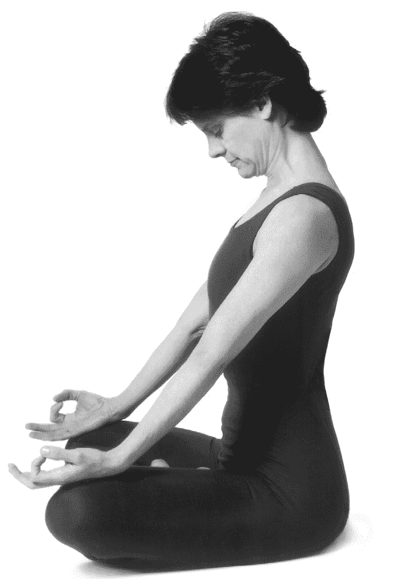 喉锁

若在屏息时未能同时进行喉锁，那么在吸气之后，即使在关闭声门的情况下，空气也会冲出去。空气会从耳蜗管冲出并干扰到内耳的功能，造成多重生理失调的情况。因此，为了避免发生身心机能失调的状况，必须运用喉锁，其作法是先关闭声门；再运用喉锁的技巧，即能轻易进行屏息练习。

在印度，有些医师会在病人的颈动脉上施压，以达到瑜伽麻醉的效果。他们甚至使用此麻醉法来动小手术。同样的原则也被武术专家运用，尤其在功夫学校。小孩子有时会无意识的施压在颈动脉上，去体验“昏迷”的喜乐感。借由喉锁，瑜伽士能有意识的控制此现象，并因此在进入禅定之前，先进入喜乐状态。

#### 腹锁

腹锁这个动作会动用到横膈膜、肋骨及腹部肌肉，练习这个锁印时，可以使用站姿或任何一种静坐坐姿。使用站姿时，双脚打开约两呎宽，嵴椎打直，膝盖微弯，上半身从腰部往前弯，直到双手掌心能放置于膝盖上。彻底吐气，将下巴顶住喉头凹处。在不吸气的情况下，将腹部肌肉往内往上吸，将肚脐推向嵴椎；这个动作会将横膈膜向上拉，在胸肋骨下方的腹部前侧产生一个凹洞。背部微拱，在舒适的情况下保持这个姿势，然后缓慢的吸气并放松。

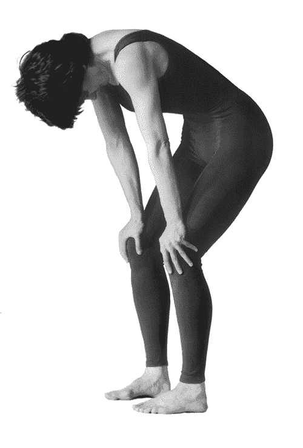 腹锁

不要强迫腹部肌肉向外推；力量只用来将腹部肌肉往内往上拉。有高血压、疝气、胃溃疡或心脏方面的疾病者，请勿进行此练习。经期中或怀孕妇女也请勿练习。提腹是对腹部器官最有益的动作之一。

#### 根锁（Mula Bandha）

根锁是一项收缩括约肌的练习，括约肌外部与内部肌肉两者皆收缩并锁住。根锁经常配合调息法，或在静坐冥想练习时被使用。

## 手印式（Mudras）

Mudra 是“封印”的意思，在瑜伽典籍里提到多种手印，包括摩诃身印（maha mudra）、逆舌身印（khecari mudra）、马印（ashvini mudra）、瑜伽身印（yoga mudra）、金刚身印（vajroli mudra）、智慧手印（jnana mudra）、毗湿奴手印等。

在打坐时，我们经常使用智慧手印。一旦学员安置好双腿、双脚，并将身体保持在舒适的坐姿之后，就要将手臂、手、手指做适当的安排，避免它们变成分心的来源。然后再结智慧手印。虽然有多种手指的安排法，但最简单的就是拇指与食指相接，掌心朝下放在膝盖上。在做鼻孔交替呼吸法的练习里，我们应用的是毗湿奴手印。

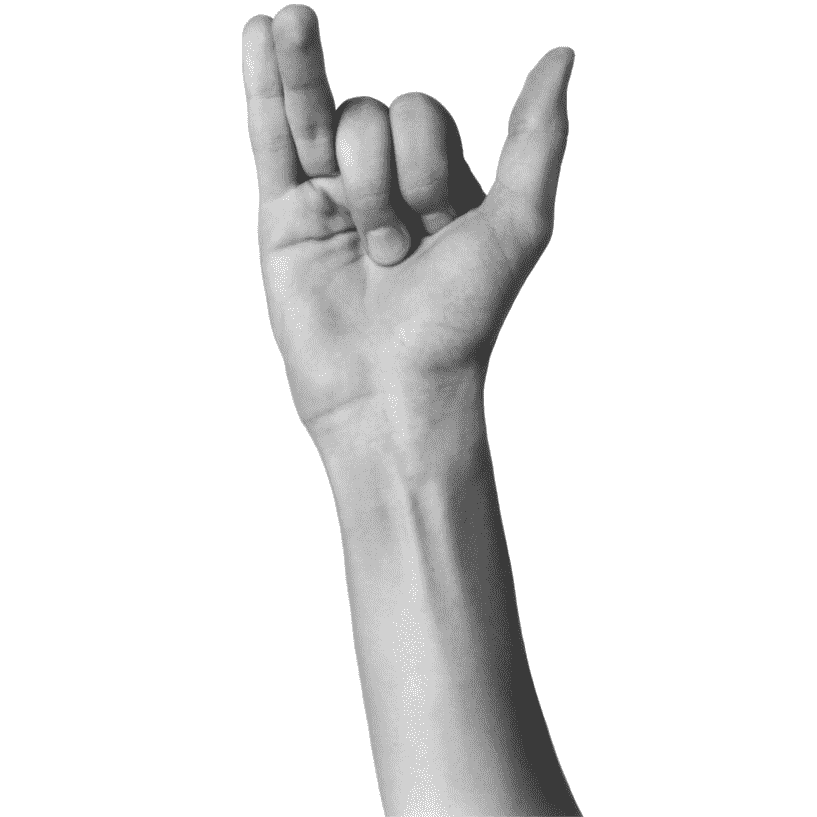 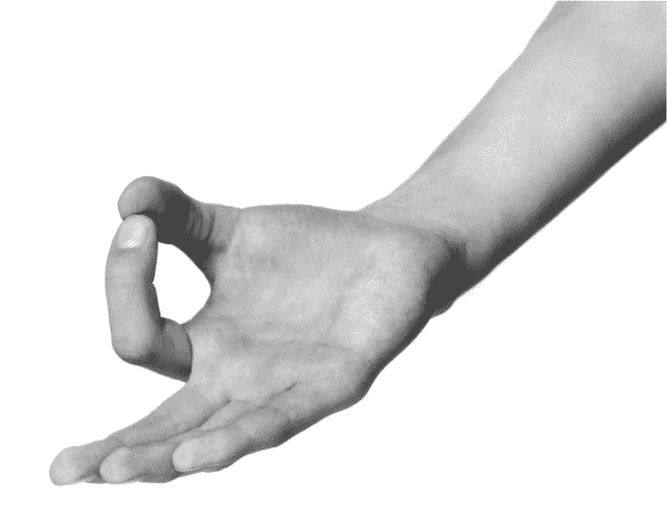 左：毗湿奴手印／右：智慧手印

## 呼吸觉察在冥想时的重要性

呼吸觉察练习是在进行静坐冥想时不可或缺的一环，正统的禅修学派在带领学员进入较高阶的禅修技巧之前，会先教导学员练习对呼吸的觉察。但是有些现代学派就未能把握住这个重点，这就是为何其教师未能带领学员进入深度禅定状态的缘故。

我们的心智习惯于将自己与外在世界的物件认同，只要继续维持此种涣散的状态，我们就不会知悉心念的内在状态，但是经由系统化的训练之后，心念即会变得内敛，开始朝向内在更精微的意识层次前进；当我们到达一种完美的寂静不动（stillness）与宁静状态时，超越心念的意识状态就会自我显现。

学习冥想时，保持心念的宁静是一项重要因素，但更重要的是对呼吸的觉察。冥想的主要步骤为：

一、找出适合自己的稳定、舒适与轻松的姿势，并让头部、颈部和躯干成一直线。

二、调息，将呼吸调为平顺、安静、规律、均匀。

三、安定、稳住心念，因为心念是用来体验生命深层存在唯一的工具。

四、控制心念有意识的层面，因为这种控制可以让我们更加有活力与创意。

五、将自主运作系统及潜藏浩大心念的无意识心念层面，例如记忆等，变成能够以意识加以控制。

六、心念觉察到自己会受到时间、空间及因果关系的制约。借由静坐冥想来训练心念保持对当下的觉察，并体会当下是通往永恒的门户。

七、借由有规律的静坐冥想练习，发展出经常不断的自我觉察，即能到达最高阶的“图瑞亚”（turiya）状态，心念将充满喜乐、安祥、愉悦与智慧。

在经过审慎的观察，以及分析心念的活动和特质之后，瑜伽士发现，我们的心念已养成一种受制约的习惯，不是经常在追忆过去的经历际遇，就是经常在想像或担忧未来。除了静坐冥想之外，没有一项技巧可以帮助我们的心念回到当下，只有冥想才是将心念带回到此时此刻的唯一技巧。冥想并非是一种让心念恣意漫游的方法，而是一种有意识的协调及整合身体、呼吸与心念的努力。在修道院的传统里，上师只有在见到学员已显现出身体能安静、稳定不动、呼吸平顺宁静的迹象时，才会教导学员更高阶的冥想技巧。

当学员刚开始学习如何使身体静止不动时，会觉察到以前从没有感受到的许多颤抖、抽筋及晃动现象。我们从小即被教导如何“动”，却没有人教我们如何“静止不动”，而如何不动地坐着是一项极为重要的技巧，因为当身体越少晃动，心念也就越能稳定。身体所有的颤抖、晃动现象，都是起因于我们有一颗没有受到规范与训练的心念。当学员在仔细检视自身的行为时，就会发现到没有任何一项动作、手势与身体语言是独立存在的。先要心动，才会有身体晃动；身体晃动得越厉害，心念就会更失焦、涣散。当学员学会如何让身体静止不动，并开始练习呼吸觉察与冥想的技巧之后，他就会发现自己能以意识控制自己的身体、呼吸及心念。

所以，我们一定要学习的第一件事，就是让身体不动如山。所谓正确的姿势，就是让我们的身体能安稳、舒适坐着的姿势，并让身体的全部或大部分免于承受其他部分的压力。

#### 简易坐（Sukasana）

身体坐直，让头部、颈部与躯干呈一直线，将左脚放在右膝下、右脚放在左膝下，将每侧膝盖安放在另一侧的脚上。将手放在同侧膝盖上，大拇指间碰触食指指尖（指锁），这就是适合初学者的坐姿。

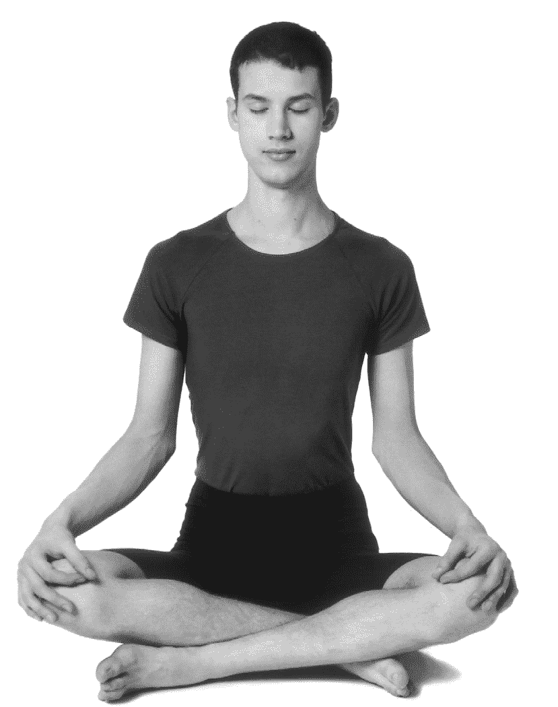 简易坐

#### 吉祥坐（Svastikasana）

在古时候，svastika 象征神圣的祝福，在此做姿势时，脚跟和踝骨不对齐。弯曲左腿，并将左脚脚底顶住右大腿，将右脚放在左小腿上，并将右脚的外缘与脚趾头放在左大腿与小腿肌肉之间，右大脚趾要露出来。再拉出左脚脚趾头，放在右大腿与小腿之间，让左大脚趾露出来。将双手手掌放在同侧的膝盖上，手指形成智慧手印。

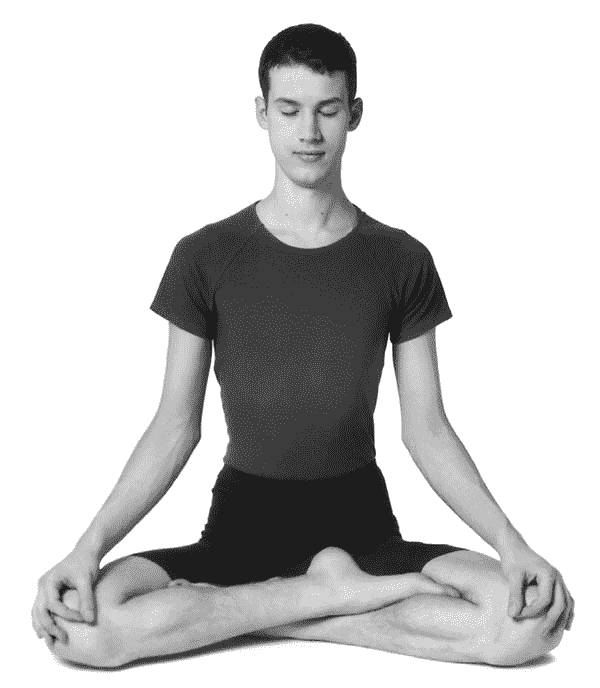 吉祥坐

#### 至善坐（Siddhasana）

这是瑜伽士最喜欢采用的坐姿。进阶瑜伽士以此坐姿来进行数小时的冥想，或是练习进阶调息法。将左脚脚跟顶住会阴，右脚跟放在生殖器上方的耻骨上。调整好你的脚和腿，让双脚踝呈一条线排列，或相互碰触。将右脚的脚趾头塞入左大腿与小腿之间，让大脚趾露出来。这是对瑜伽修行最好的坐姿，但是对初学者而言可能会不太舒服。

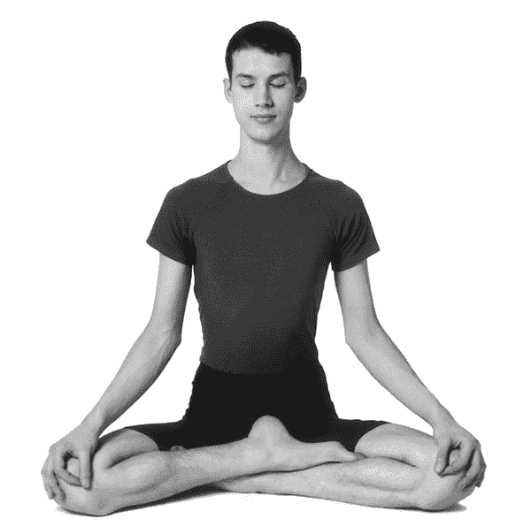 至善坐

#### 莲花坐（Padmasana）

Padma 是莲花的梵文，它是瑜伽的象征，因为就如同莲花之出污泥而不染，瑜伽士也是生活在凡尘之中，却仍能保持超然其上。此坐姿隐含许多好处。在做此坐姿时，你应该稳定地坐在埝子（或是折成四折的毯子，或枕头）上。弯曲左腿，脚底朝外，并将脚牢牢地放在右侧鼠蹊上。同样地，弯曲右腿，脚底朝外，并将它牢牢地顶住腹壁。将双手手掌放在同侧的膝盖上，手指形成智慧手印。在此坐姿时，要同时应用根锁就较为复杂，若没有专家的指导，请不要轻易尝试。在莲花坐姿时，同时应用根锁，肯定会影响肠道的蠕动，并产生胃部的问题。然而，短时间的莲花坐是对腹肌最有益处的练习之一。

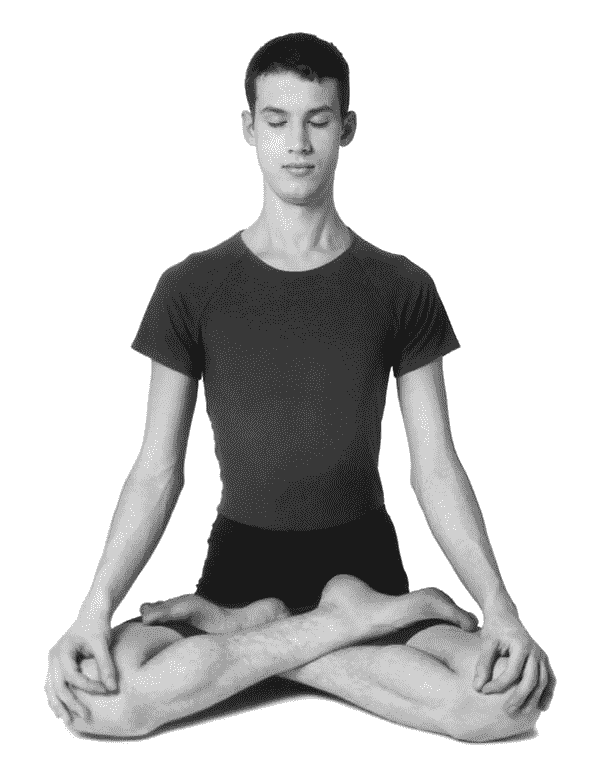 莲花坐

#### 高位坐／友谊坐（Maitri Asana）

对许多不习惯坐在地上的现代人来说，比较方便的方式还是坐在一张直背的木椅上，让头部、颈部和躯干保持挺直，并将双手放在膝盖上。双腿不可交叉，脚底要牢牢平放在地上（或毯子上）。佛教徒的经典对高位坐做此描述。

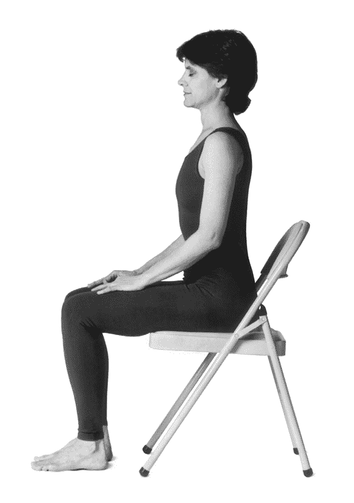 高位坐／友谊坐

#### 金刚坐（Vajrasana）

以跪姿坐着，让头部、颈部与躯干呈一直线，手心朝下，将双手放在膝盖上。此坐姿大部分用于非瑜伽练习场合，如禅宗与伊斯兰传统，它也可以用来做为冥想练习，但是如果练习时间过长，有时可能因过度伸展脚部韧带而造成肌肉拉伤。

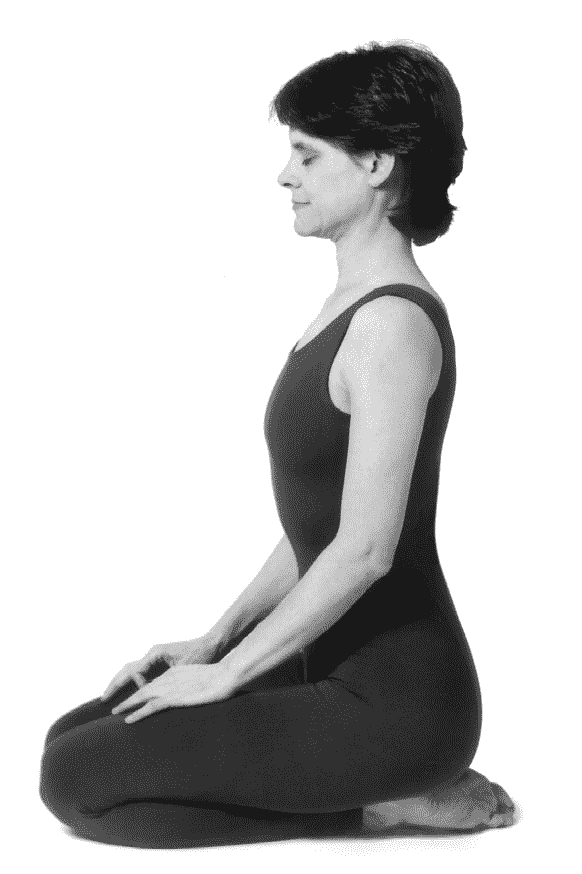 金刚坐

当学员可以维持舒适、稳定、轻松的姿势，完全静止不动的坐着时，就能开始察觉自己的呼吸。对呼吸的觉察是体验更高阶意识及心念专注集中的可靠导引，让冥想修习者能准备好开始唤醒中脉。

依我的见解，“唤醒中脉”代表不受干扰并处于喜乐的心念状态，它发生在当空气开始能在两侧鼻腔内自由平顺地流动时，而这种心念状态是进入心念更深层意识的必要条件。因为心念若未能进入喜乐的状态，就无法保持稳定，而不安稳的心念是完全不适合进行冥想的。另一个瑜伽学派，昆达里尼瑜伽学派则主张，若未能唤醒中脉，是不可能达成深度禅定状态与唤醒昆达里尼能量的。唤醒中脉仅有三种技巧：一是集中心念在人中部位（双鼻孔出口之间的鼻桥）；二是进行调息练习，同时锁住喉轮；三是观想脉轮系统。

只有当学员开始能享受身体静止不动的乐趣时，唤醒中脉的流程才有可能开始。当学员以舒适稳定的姿势，安坐在宁静的环境，且当身体不再颤抖成为干扰的来源时，心就能开始专注于呼吸的流动，此时他会了解有四种不规律的呼吸情况：浅、急促、杂音，以及最困扰人的吸吐之间的暂停现象。

在经典里，对吸吐之间的暂停有许多描述，但是只有练习才能让人增加对其重要性的认识。当学员开始专注于呼吸之流时，此暂停会让他分心。有些经典说，此暂停可以被扩展；有些经典说，此暂停可以被忽略。然而，刚开始时，学员必须先经历基本的调息法练习，然后在合格教师的指导下，才能做屏息的练习。那些不想学调息法的学员仍然可以练习静坐冥想，只不过，少了对呼吸的觉察，要达到深度的禅定状态是不可能的。

在呼吸觉察里，吸气和吐气的长短被心念仔细地评量，心念也紧密地跟随着呼吸的律动。在此就能显现出呼吸练习与呼吸觉察之间的差异。在呼吸练习时，学员被教导要计算吸气与吐气的空气量，但是在练习呼吸觉察时，则只需靠心念的意识进行，也不需要用到手指来关闭鼻孔。借由呼吸觉察，心的专注力被强化了，而专注力对冥想极为重要。在练习呼吸觉察时，没有让人分心的外界事物，专注力也不会涣散。在此，我们没有讨论呼吸练习，因为呼吸觉察是一项进阶的技巧，它只会在学员已经练习过前述的各种呼吸练习之后，才能真正体会到呼吸觉察。呼吸觉察对于有心想要学习高阶冥想技巧的学员而言，至关重要。

呼吸是身体与心念之间的桥梁，进阶瑜伽士观察自己的呼吸就像是观察温度计，它记录了心念的状况以及外在环境对身体的影响。那些能细微观察自己呼吸模式的人，也会明白自己的身心行为。他们因为能够控制生命的涟漪（svaras），而得以主导自己的人生。

呼吸模式也会对疾病提出警告，例如，当身体发烧时，鼻孔呼吸的模式就会出现异常，像是变得过度流动或长时间鼻塞。此时，呼吸系统会出现异常，肺脏、心脏及相关系统会失调，而心也会失衡。进阶瑜伽士会利用呼吸模式，来观察自己身心的能耐，并借由各种呼吸法来控制呼吸行为。

呼吸与心相互依存，若能掌控呼吸，心就会开始变得专一；假使呼吸不规则或断断续续，则心就会散乱。在身体坐定之后，很自然地就会将心专注在对呼吸的觉察上。

呼吸觉察可以强化心，使其更容易从事内省的修行。当心开始跟随着呼吸流动时，我们就会体察到世间万物事实上都呼吸着相同的宇宙能量。在个体和宇宙中心之间，存在着直接的交流，宇宙中心供应能量给所有的生物，这是活生生的哲学。只要人类生命中心能持续接受“气”能量，身体与心念的关联就能维持下去。一旦这种交流被破坏，有意识的心念就不再能发挥其原有的功能，身体就会从生命的灵性中心脱离，此种脱离就称为“死亡”。

各个修行学派都会推荐使用不同的物件来引导心念的专一，包含具体的物件与抽象的物件；例如，它可以是一些声音音节、梵咒（mantras）或是图片，但是，如果没有先学会呼吸觉察，长期而言，这些物件都不太有帮助。建议初学者先养成呼吸觉察的习惯，先不用挂碍心要安住在何种物件上，因为呼吸觉察是实现进阶禅修最自然、最必不可少的一步。

静坐冥想是当心念持续维持在专一目标的状态，而在深度静坐冥想时，专一的心能穿透意识及无意识心念的各个层次，这种突破就称为“三摩地”（Samadhi）。进入三摩地的境界，就能摆脱所有的束缚，超越时间、空间及因果关系的限制。个体的微观小宇宙会扩大变成巨观大宇宙，就像小水滴融入大海并变成大海一样。个体灵魂与宇宙的创造者合而为一。他会发现神的国度也同时存在于个体之中，他获得了终极的自由，跳脱无止境的生死轮回，完成从人性到佛性的进化过程。

# 推荐进阶自修书单

# 推荐进阶自修书单

《冥想：认识内在自我，与外在世界和谐共处，获得真正的满足》（*Meditation and Its Practice*）／斯瓦米．拉玛着

《光与火之路》（*Path of Fire and Light*）／斯瓦米．拉玛着

《王道之道：瑜伽实用课程》（*The Royal Path: Practical Lessons on Yoga*）／斯瓦米．拉玛着

《内在的追寻》（*Inner Quest*）／潘提特．拉伽玛尼．缇昆特（Pandit Rajmani Tigunait）

《梵咒的力量与神秘的启引》（*Power of Mantra and Mystery of Initiation*）／潘提特．拉伽玛尼．缇昆特着

《饮食与营养》（*Diet and Nutrition*）／鲁道夫．巴伦坦着

《瑜伽与心理治疗》（*Yoga and Psychotherapy*）／斯瓦米．拉玛、鲁道夫．巴伦坦、斯瓦米．阿家亚（Swami Ajaya）着

《瑜伽：基础精通》（*Yoga: Mastering the Basics*）／桑德拉．安德森（Sandra Anderson）、罗尔夫．索维克（Rolf Sovik）

#### ．放松与冥想录音带

《初学者静心禅修引导》（*Guided Meditation for Beginners*）／斯瓦米．拉玛

《中阶静心禅修引导》（*A guide to Intermediate Meditation*）／斯瓦米．拉玛

《迈向进阶静心禅修的第一步》（*First Step toward Advanced Meditation. Swami Rama*）／斯瓦米．拉玛

《瑜伽放松法引导》（*Guided Yoga Relaxation*）／罗尔夫．索维克

《学习冥想》（*Learn to Meditate*）／罗尔夫．索维克

《31 点到 61 点深度放松法》（*31 to 61 Points*）／罗尔夫．索维克
