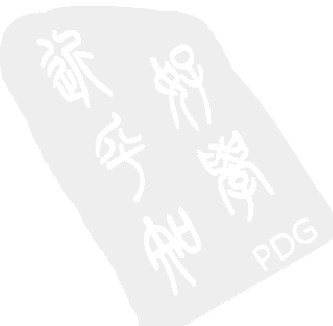

## 轮回
### SAME SOUL, MANY BODIES
Discover the Healing Power of Future Lives through Progression Therapy

### 前世今生来生缘
[美] 布莱恩·魏斯 (Brian L. Weiss) 著  施诺 译

机械工业出版社
China Machine Press

---

Brian L. Weiss. Same Soul, Many Bodies: Discover the Healing Power of Future Lives through Progression Therapy.

Copyright © 2004 by Weiss Family Limited Partnership 1, LLP.
Simplified Chinese Translation Copyright © 2011 by China Machine Press.
No part of this book may be reproduced or transmitted in any form or by any means, electronic or mechanical, including photocopying, recording or any information storage and retrieval system, without permission, in writing, from the publisher.
All rights reserved.

本书中文简体字版由 Weiss Family Limited Partnership 1, LLP 通过 Andrew Nurnberg Associates International Ltd. 授权机械工业出版社在中华人民共和国境内（不包括中国香港、澳门特别行政区及中国台湾地区）独家出版发行。未经出版者书面许可，不得以任何方式抄袭、复制或节录本书中的任何部分。

**封底无防伪标均为盗版**
**版权所有，侵权必究**
**本书法律顾问 北京市展达律师事务所**

**本书版权登记号：图字：01-2011-3242**

## 图书在版编目（CIP）数据

轮回：前世今生来生缘 /（美）魏斯（Weiss, B.L.）著；施诺译. —北京：机械工业出版社，2011.7
书名原文：Same Soul, Many Bodies : Discover the Healing Power of Future Lives through Progression Therapy

ISBN 978-7-111-35227-3

I. 轮… II. ①魏… ②施… III. 人生哲学 — 通俗读物 IV. B821-49

中国版本图书馆 CIP 数据核字（2011）第 125799 号

**出版信息：**
- 机械工业出版社（北京市西城区百万庄大街 22 号 邮政编码 100037）
- 责任编辑：蒋桂霞
- 版式设计：刘永青
- 北京京师印务有限公司印刷
- 2011 年 7 月第 1 版第 1 次印刷
- 160mm×230mm • 15.75 印张
- 标准书号：ISBN 978-7-111-35227-3
- 定价：32.00 元

**联系方式：**
- 凡购本书，如有缺页、倒页、脱页，由本社发行部调换
- 客服热线：(010) 88379210；88361066
- 购书热线：(010) 68326294；88379649；68995259
- 投稿热线：(010) 88379007
- 读者信箱：hzjg@hzbook.com

---

> 我们的灵魂是唯一而不朽的！
> ——普罗提诺

---

## 导读
### 爱是我们最谦卑的敬意

显然，摆在众位读者面前的这本小书，是一本温暖人心的身心灵图书，我们希望借由这本书，让各位忙碌的现代人找到快乐的自我、真实的自我，学会掌握自我面质—自我安抚—自我转化，从而逐渐获得自我的完整人生，达到自我和谐。

关于“身心灵”，是近年来国内外医学界普遍公认和接受的一个概念，从权威科学的定义来说，“身”是指身体，“心”是指心理，“灵”可称之为灵性，是指和环境协调后心理的力量，医学界认为“身心灵”注重的是三个层面的统一与和谐，将人视做“身心灵”的统一体，以寻求整体的健康与灵性的成长。

自我的和谐是社会和谐的基础，这也是我们引进《轮回》这本国外心理学大师的畅销经典书籍的原因。

在目前全球流行的“身心灵”类书籍中，有一个显著的特点就是，许多科学家和医学家及著名作家纷纷向中国的国学吸取智慧和经验，包括本书也有很多东方传统文化的观点，读者在阅读中定能得到印证。极具包容性和多元性的“身心灵”潮流，不仅涵盖了东西方哲学、宗教、心理学，而且在古老智慧与科学最新动态的启发下，发展出各种科学与古老智慧体系相结合的“身心灵”疗愈活动，如禅修、瑜伽、催眠等。

本书作者作为国外著名的身心灵导师，本书文笔生动，12个案例中的主人公所遭遇的自我的困境、家庭关系的矛盾、事业的抉择、爱与不爱的迷惑等各种人生议题的思考都是我们每个人可能遇到的，因为我们每个人都能从中看到自己的影子，在这样“对号入座”的过程中，相信诸位灵性非凡的读者也能获得自我的身心灵疗愈。

特别需要与读者分享的是，和一般空谈灵性的身心灵图书不同，本书作者凭借丰富的临床经验，给予读者最切实的帮助，第3章后附“个人怎样做回溯前世的自我疗愈”，第11章更有特别篇章指导读者练习沉思和冥想，以达到平静喜乐。

诚然，这是一本关于爱的图书，作者深切地理解我们这些被爱的子民。而爱也是我们对这个世界最谦卑的敬意。爱，无法用知识和理性来诠释和规范，那么本书尝试用灵性的方法应该是最适切的显影了。

编者

---

## 前言
### 回溯的缘起

最近，我去了一个地方，一个我过去从未去过的地方，那里就是——来生。

时光退回到 24 年前，一个叫凯瑟琳的女士来找我做心理治疗寻求帮助。那时，她遇到了一件离奇的事件，在一个确切无误的状态下，她回到了前世，她的这次轮回之旅甚至回到了两千年前和中世纪。正是凯瑟琳的这次经历，彻底改变了我的一生。

凯瑟琳给我描绘了过去几百年发生的事情，那是她一生都不可能有的经历，但有其他的人或旁证证明凯瑟琳所经历的轮回穿越是真实的而非想象。而我，一个接受过耶鲁大学、哥伦比亚大学医院专业训练的心理学博士，著名的心理治疗师，一位科学家，却丝毫不能用我一直依赖和热爱的科学来解释这一切是如何发生的，我唯一能做的事情就是，根据报告，证实凯瑟琳确实看到和感受到了前世，她的穿越轮回的回溯体验是真实无欺的。

在给凯瑟琳做心理治疗的过程里，我得到“大师们”(masters) 的启示和教诲，这些大师或许来自非物质界，拥有更高的灵性和智慧。根据凯瑟琳的描述，当她的灵魂出窍时，这些大师就守护在她身旁，也正是这些大师的智慧，无形地指引了我，强化了我的思想，并深刻地影响到我的未来之路。我为凯瑟琳的经验感到振奋和惊异，甚至羡慕，她可以如此深入地回到前世，当我听她娓娓道来她那些超乎寻常的体验时，我只感到奇迹般的神秘，那是一个我未曾进入和探索过的领域，让我兴奋，让我惊异万分，也让我有些许害怕。我过往的经验和背景，让我不由地怀疑自己，是不是疯了？我能相信我自己吗？谁会相信我呢？

那个时候，我像一个突然拥有秘密的小男孩，但当我把这个秘密揭开之后，我的人生就此改变，踏上新的旅程。彼时，我知道没有人会听我说的话，更不要谈及相信了，于是我花了四年的时间，写下了凯瑟琳与我共同经历的前世之旅——《前世今生》(Many Lives, Many Masters)。这本有些离经叛道的书出版后成为畅销书，但刚开始我曾一度担忧传统而科学的心理治疗学界会把我驱逐出这个圈子，无论怎样，这个过程让我坚信我所经历和所写的都是真实无妄的。

在此后许多年里，我继续给病人做临床治疗，这也让我更坚信我所写的东西是正确的。事实上，许多人，包括前来向我做咨询治疗的病人和其他临床医学家都承认了我的发现准确无误。到目前为止，我已经运用催眠治疗法帮助 4,000 名病患回到前世，对于轮回转世这个事实，我也从刚开始的一度着迷狂喜，渐次回归到了平常心。

不过现在，曾有过的那种兴奋震惊的感觉又回来了，因为，当下的我不仅能让我的病患回到过去，而且，我也可以引导他们进入来生，和他们一起探索未来！

请再一次相信我，事实上，有一次我已经成功地引导凯瑟琳进入了来生，不过那一次，凯瑟琳看到的不是她的来生，而是我的来世，她清清楚楚地看到了我的死亡，我承认，当她把这一切坦白告诉我的时候，我的确觉得不舒服，“一旦你完成了你的工作和使命，你的生命也到了终了的时刻。”她这样告诉我，“不过，在这之前，你依然有很多时间去完成你今生的使命。”说过这些话，凯瑟琳进入了另一个次元，我也无从知晓更多细节。

数月以后，我在治疗过程中，询问凯瑟琳是否愿意再一次进入来生，我要在那里和她的心灵导师谈话，同她的潜意识沟通。我的提议被凯瑟琳拒绝了，她害怕了，或许面对自己的来生的确是一个让凡人觉得恐惧的事情，当然另一个原因也可能在于，我提出这个要求的时机不对，毕竟那时我在此领域还过于年轻，无法像现在这样，能够控制好穿越来生过程中的种种危险。

需要说明的是，对于心理治疗师来说，穿越现在进入来生，比引导病患回到前世要更加困难，因为未来的一切尚未发生。假如，这时病人的经验仅仅是他的幻觉，而非事实，怎么办呢？怎样才能证实病患看到的是真实还是幻觉？似乎毫无办法。众所周知，假如回到前世，所有的事情都是已经发生了的，过往的许多案例说明，是可以证明其真实性的。而进入来生则有着不同的境遇，打比方说，如果一位母亲分娩在即，却看到 25 年之后，世界要毁灭，她或许会想，“我还是不要让这个孩子来到世间了吧，我不想他的生命如此短暂。”谁可以判断她说的是真实的呢？她的决定是否合乎情理？除非她是一个很成熟理性的人，才能分辨她所看到的是幻境、隐喻、象征，还是没有被歪曲的真实，抑或杂糅种种的复杂信息。再例如，有一个人预先知道两年后自己将面临死亡，而死亡的原因是因为酒后驾车，他会惊恐失措吗？他会从此不再开车吗？这个来世的镜像会不会让这个人在当下产生更大的内心焦虑？凡此种种，都让我告诫自己，不要轻易尝试进入来生，我甚至开始忧虑那些由此产生的自我满足的预言及处于心性不稳定的人，毕竟这样穿越的探索所产生的谬误风险太大。

从凯瑟琳开始来我这里做心理治疗，时光流转已过去 24 年，这些岁月中，一些其他的病人在治疗即将结束的时候会不由自主地进入来生，如果我判定他们有能力理解自己所看到的仅仅是幻觉，我会鼓励他们继续，我会说：“这个特殊的体验同心灵成长有关，目的是帮助你做出智慧的抉择。不过，我们应该避免留下任何相关记忆（我指的是来生的记忆）、画面，也不要关注或与死亡及严重疾病等画面产生太强的连接，这仅仅是一个学习的过程。”通常状况下，他们都会照我的话去做，这样的治疗是非常有价值的，效果值得肯定，有过这样体验的人通常会做出更聪明的决定，做出更好的选择，他们会看到并知晓自己在不久的未来，人生将面对三岔路口，他们会思考：“如果我选了这条路，会发生什么？如果我选另外一条路是否会更好？”而有时，他们的确可以看到未来成真。

常常有人来找我，告诉我他们预先看到的未来发生的事情：他们有能力知道尚未发生的事情。而一些对濒死经验（死亡来临经验）的研究也证实了人的确可以预知未来。这样的事也并非现在才出现，在上古文明时期的记载中，特洛伊有一个女预言家卡桑德拉，她能够准确预测未来，但甚少有人能相信她所说的预言。

我有一位病人，她的穿越经验显示出预言具备威力和危险的双重性。她常常会做梦，在梦境中看到了未来的场景，而这些梦境通常都成为了现实。她来找我，是因为她的一个梦境告诉她，她的儿子将遭遇一场大的车祸，“这会是千真万确的事情。”她告诉我，她看得很清楚，因而非常忧虑她的儿子会在中途死掉，不过，她有些疑惑，因为梦中那个男人一头白发，而她的儿子 25 岁，还是一头黑发。

我想到凯瑟琳的例子，突然灵机一动，并坚信我接下来给她的建议是对的，我告诉她：“我知道通常你的梦每次都能成真，但这并不代表这一次也一定变成真的，有一些灵——不管你叫他们天使、守护者、导师还是‘上帝’，他们具备更高的能量和灵性，他们可以转化某些境遇，在宗教中，这被称为慈悲心，你可以祈祷、祝念、布施，总之，用你的方式做一些你想做的事情。”

她听从了我的意见，开始祈祷、静坐、冥想、期盼、发善念。虽然最后意外还是发生了，但并不是一场致命的意外，她无须太过担惊受怕了，她的儿子的确头部受伤了，但并不严重，不过她的儿子的确被这场事故惊吓到了，当医生们解开他头部的绷带时，发现这个 25 岁的小伙子已经一头白发了。而这个场景真的恰好印证了她先前的那个梦境。

就是从那个时候，我开始偶尔尝试带领病人探索来生，通常状况下，我会让病人进入此生的未来。不过前提是，我确信病人在心智上足够坚强，能面对这些问题和境遇。在这个最初尝试的阶段里，我同他们一样，常常无法完全知晓他们回溯到的镜像所蕴涵的种种含义。

不过，变化开始显现。去年春天，我在一艘游轮上举办了一系列讲座，在讲座的每一个中间休息时间，通常我会做集体催眠，引导听众回到前世，再回到当下，在这个过程中，有一些人按照我的引导成功回溯了前世并回到现实，有一些人睡着了，但也有些人未被催眠，保持清醒。有一次，有一个叫沃尔特的男士，他是一个成功的 IT 精英，一个天分极高的软件奇才，进入到了他的来世，更奇妙的是，他直接穿越到更遥远的未来——他看到 1000 年以后的自己。

沃尔特说自己穿过一片黑暗的云层，抵达了一个完全陌生的世界。在他的印象里，其中一些地方如中东和北非都已经成为无人之地，或许是因为辐射和战争带来的后果，或许是瘟疫和疾病带来的结果，不过幸运的是，世界其他地方依然美丽如初，在沃尔特的这次穿越之旅中，我们的世界因为核武器的灾难、瘟疫的流行、不断降低的生育率，人口已经大大减少，他住在一个远离城市繁华喧嚣的乡村地区，沃尔特发现那里的人都很满足、快乐和幸福。他说他很难找到合适的词语来形容这些人平和满足的状态和心态。可能发生灾祸是很久以前的事情了，沃尔特看到的只是一派质朴宜人的桃花源般的田园景象。他说他不确定具体的时间，但他可以确定，那是比现在还要晚 1000 年的事情。

这次的穿越经验让他动容，他原来以为自己很富有，甚至有点异想天开要去改变世界，但是现在，他已经彻底明白了，没有任何人能够做到这一点，他说，太多的政客显贵们并不明白慈悲或者慈善的真正含义，他们也不明白什么是责任。而他经此过程已经知道，最重要的是要竭尽所能做善事让这个世界变得更好一点。当他回到现实生活中，感觉有点悲哀，或者那个桃花源般美丽的田园景象实在太美，抑或是为即将到来的人类的灾难而哀伤，毕竟明知是悲剧还是无能为力去避免的无力感实在令人挫败。

当他醒来之后，他生动地向我们描绘了这个动人心弦的景象，说出自己的感觉和体会，凭借如此种种， I 判断他不是幻想，不过我们两人的关注点不同，这个经验给了我更多意味深长的启示。我终于在那一时刻明白：前世、今生、来世都是一体的，来生亦会深刻地影响到当下的今生，如同前世会注定我们的今生一样。

就在那晚，我写下了一段话：“如果方法得当，我们可以穿越当下进入来生，无论是不远的将来还是遥远的未来，**来生都可以成为我们的指引，对今生有所启示，会让我们在当下做出更好的选择和决定。因为有机会去到来生，我们可以考虑当下所做的决定，让我们的来生朝着更积极正面以及更美好的方向改变。**”

让我们都好好想想这到底意味着什么吧。我们有无数次的前世，我们亦会有无数次的来生。如果我们可以善用这些前世与来生的经验与知识，或许我们可以稍许改变世界的未来，改变我们自己的未来。事实上，这与传统的宗教“业力因果轮回说”是相一致的——“欲知前世因，今生受者是；欲知来世界，今生做者是。”这个因缘果报的定律即是说，如果你种下善良的种子，就会长出更好的庄稼；如果你做善事，将来就会有更好的回报。

自此， I 开始为更多人进行探索来生的治疗活动，有的人进入了自己的来生，而有的人则看到了我们这个星球的未来，你可以用科幻小说、想象或者幻觉来形容他们的所思所见，不过请确信，他们的确穿越时空来到了未来。或许，我们从这些特殊的生命体验中所学习到的最宝贵教训是：“**今生就是来生的一切，而我们可以改变这一点。**” **在我们不朽的永不停歇的生命旅程中，我们应该有这样的认知，因为它会彻底改变你我的未来。**

事实上，来生也经由前世而来，几乎我所有的病患在进入来生之前都会先回溯到前世。这样的过程让他们更能理解所发生的一切，让他们能够在当下做出更正确的选择。

我们应该知悉：所谓来生是充满变化的，没有定数，我们需要在今生进行学习和探索，让它变得更好。这也是本书的重点，我们主张慈悲、怜悯、同理心、宽容、和平、耐心、灵性，这些都是我们今生要学习的重要功功课。

本书将通过我的一些非常有代表性的病人的经历，以及我所设定的一些简单的练习方法，引导你完成我们今生所要学习的功课。有的人可能只能回溯前世，不能进入来生，即便如此，请不要气馁，只要你学习到所有的人生功课：**慈悲、怜悯、同理心、宽容、和平、耐心、灵性，这一生和下一世，你的生命都将呈现更快乐、轻松、圆满、充实的状态。**

更重要的是，如果我们学会了今生的课程，我们将为自己累积一个更完满的未来。在此过程中，请你记住，唯有爱才是我们唯一的法门。

---

## 目录

> 最近，我去了 一个地方，一个我过去从未去过的地方，那里就是——来生。

> 人之灵魂似水，从天而降，蒸而升天，凝而坠地，轮回永生。

> 暴躁和抓狂其实就是一种暴力行为，只是你自己没有意识到而已。但是世界如此美好，这么暴躁真的不好，不好。

> 其实修行的目的，是改变固有的习气，让旧的模式一直持续，你就在一直重复人生的难题。

- **导读**：爱是我们最谦卑的敬意
- **前言**：回溯的缘起

### 第1章 1
灵魂何以不朽

### 第2章 17
乔治的故事：暴躁抓狂，没用！

### 第3章 33
维多利亚、伊芙琳和米歇尔的故事：恢复健康的秘密

> 请让我来分担你的痛苦，因为我和你一样感同身受，我们可以休戚与共，这皆来自无条件的爱。

### 第4章 57
沙曼莎和马克斯的故事：原来同理心如此重要

> 你见，或者不见我，我就在那里，不悲不喜。你念，或者不念我，情就在那里，不来不去。你爱，或者不爱我，爱就在那里，不增不减。

### 第5章 75
休和奇亚拉的故事：悲悯心带来的奇迹

> 耐心乃圣，一动不如一静，能够忍得住，才能得圆满。耐心是定功，耐心就是精进。

### 第6章 93
保罗的故事：耐心让命运自由展开

> 爱比暴力更管用，信任更是爱的小密钥，放下恐惧与暴力，因为唯有爱，可以给我们最后的安全，假如我们都有一颗能合掌的心，我们就不会有暴力的拳头。

### 第7章 107
罗贝塔和安妮的故事：珍爱生命，远离暴力

> 没有谁能像一座孤岛，在大海里独居，你的朋友和你自己，无论谁死了，都是自己的一部分在死去，因此我从不问丧钟为谁而鸣：它为我，也为你。

### 第8章 123
布鲁斯的故事：你可知道沟通有多重要

> 我害怕是因为我爱你，有时我在这个世界不自在，不想受伤害，最后我明白，其实只有我爱自己，你才能更爱我，因为你就是我，我就是你，因为成为我自己，让我可以安住当下。

### 第9章 135
帕特里克的故事：安全感究竟来自哪里

> 生命的模式好像是天命所定，它设置一些障碍，为的是使你们从中学习与成长。灵魂在前世所经历的，决定了这一生所需经历的体验。天命需要被圆满地实现。你无法从中逃脱。

### 第10章 149
约翰的故事：所谓命运究竟是怎么回事

> 沉思让我们更专注，而冥想则让我们更自在，我们的生命有时需要深度的宁静状态，它可以减少内心深处的烦恼与焦虑，以新的方式看待那些熟悉的事情，体会到平静与喜乐。

### 第11章 165
【特别篇章】练习沉思和冥想，让自己平静喜乐

生来有些灵性，只为了悟一心，因此削光两鬓，灵性需假，可以积理，可以大顺。

## 第12章 179

### 大卫的故事：找到灵性之门的钥匙

最难的修行，不是在深山独处，不是在禅坐中，而是在关系里。我们在关系里，就如同背影和正面，你只能猜测正面是怎样，并不知道正面的真相，因此徒升起烦恼！

## 第13章 193

### 克里斯汀娜的故事：最难的修行在亲密关系中

过去心不可得，现在心不可得，未来心不可得。未来不会发生什么；它会发生在当下。过去不曾发生过什么；现在是生命确实占有的唯一形态。

## 第14章 211

### 盖瑞的故事：什么才是真正的未来

## 附录A 223

### 关于我们未来的真实预言

## 附录B 225

### 催眠与前世回溯

## 附录C 232

### 张德芬访谈轮回现象研究者魏斯博士

> 人之灵魂似水，
> 从天而降，
> 蒸而升天，
> 凝而坠地，
> 轮回永生。
> ——歌德（Goethe）

## 第1章

### 灵魂何以不朽

每一个灵魂都是不朽的。

这句话并不是字面含义这么简单。我们会给下一代遗传基因、传承信仰、延续爱好以及生活方式，而他们也会生生不息地传承给后世的子孙，我们的成就也可以得到传扬，即使我们离世之后，我们的工作技巧、新型的创意，甚至制鞋方法、蓝莓派食谱都会被保存和继承下来。但我要说的是，我们最重要的一部分——我们的灵魂将永生不朽。

根据心理学家弗洛伊德（Sigmund Freud）所言，人的心智在不同层次中运转，其中一大部分属于潜意识或称无意识（unconscious mind）。所谓的潜意识，是我们不自觉的部分，但是却储存着我们的经验，并指导我们的行为、思想、反应与感觉。他认为，人类的动机大都隐藏在无意识的心智，只有透过这个潜意识的层面，我们才能真正知道自己是谁，也因为有了对潜意识的洞见觉察才能彻底获得身体和心灵的解脱，不再有痛苦。

先前已有人著书立说，认为所谓灵魂即是弗洛伊德的潜意识（unconscious mind），但人是灵魂、心智、情绪、肉体的四合一复合体，灵魂体也就是我们所谓本体（being）。弗洛伊德的潜意识只是心智的一个层次，并非真正意义上的灵魂体，但潜意识是存在的，且是必需的，当我引导人们回溯前世探索来生时，潜意识可以让他们突破心智的层次，更接近本体，让他们更容易自我治愈某些创伤。这就是我看到的：作为生命不可分割的神圣片段，灵魂不灭，因而，生命是永恒的。

我相信每个人都有灵魂，在肉身消失后仍然可以存在，且数次返回人间，进入不同的身体，不断探寻以达到更高的境界（估计大家这时都有一个疑问：“这个世界已经比刚开始时繁荣了许多，人口数量也增加了很多，这些多出来的灵魂是从什么地方来的？”我也曾对许多病人提出这样的问题，但得到的答案都一样：这个世界并不是灵魂的唯一居所。在我们的意识当中有不同层次，灵魂可以选择不同的去处。我们凭什么认为自己的所在就是灵魂唯一可以选择的地方？能量是无边界的，也存在于不同的次元。此外，有些病人告诉我，灵魂还可以分裂，同步体验不同的经验）。

关于这一点，到目前为止似乎并没有实际的科学可靠的证据，灵魂并没有 DNA，至少没有诺贝尔奖得主、DNA 双螺旋结构发现者詹姆斯·沃森（James Watson）博士和弗朗西斯·克里克（Francis Crick）所描述的物质的状态。但是，对我来说，种种关于灵魂真实存在的迹象却证据确凿、排山倒海而来，让人无法抵赖、无法不信服。事实上，自从凯瑟琳带我回溯到两段前世——公元前 1863 年的阿拉伯与公元 1756 年的西班牙之后，我几乎每天都会见到这样的例证。

我有一些明证同各位分享，伊丽莎白与佩德罗在前世是一对恋人，今生又重聚。他们同为我的病患，但就诊时间不同，在每周不同的日子里，这两个年轻人前生的种种在同一间诊室里一幕幕重现。他们来自不同的国家，有不同的文化背景，甚至我本人也在很长一段时间里丝毫未曾怀疑过两人有任何联系。

两个忧郁的年轻人，同样经历过失去亲人的悲恸，同样迷惘于对爱人的寻觅。在一次又一次回到若干前世找寻答案的历程中，他们发现着、学习着、恢复着。佩德罗的弟弟因车祸夭折，深切的悲伤侵蚀着佩德罗的内心，然而在诊疗的过程中，他一次又一次地在前世找到“弟弟”，而这个灵魂伴侣也以不同的身份陪伴着他，哀伤由此得以痊愈。伊丽莎白与佩德罗的重逢，让我们知道你的灵魂伴侣前生今世都曾在你身边，即使短暂的离开，来生他还会与你相见。

另一个患者，琳达，接受了我的前世疗法，过往的前世中她在苏格兰上过断头台，几百年后在意大利结婚，嫁给今生的祖父，后来又在荷兰生在一个充满爱心的大家庭，长大，老去。此外，丹、罗拉、赫普，另外还有大约 4000 名其他的病患，其中有些人的故事我在我的书中写过了，这些人的灵魂都回到过前世，将永恒不朽的那一部分带到今生。比如其中有些人因为在前世中通晓某种外国语言，虽然今生并未学过，但能够凭借前世的记忆精通这个陌生语言，这样的超能力便是重要的证据，说明他们所言非虚。

许多我的病人，当他们忆起前世种种时，那种潜藏在底层的精神创伤驱使他们来找我，他们在这里平复伤痕，治愈创伤。这个过程亦是灵魂在今生完成它最基本的任务：寻求通往最终的疗愈之途。

若这世上只有我看过这样的事情，那你尽可说我是产生了幻觉或是疯了。但是，几千年来，佛教和印度教已经在经典中累积了无数的前世案例并很有智慧地解释了相关因缘际会。同样的记载也出现在基督教中，翻阅历史，你会发现，第四世纪康斯坦丁君主（Constantine）统治时期之前，《圣经》的《新约全书》（New Testament）中都记载着许多轮回转世的故事，直到最后被古罗马官方审查禁止了。耶稣本身就相信这个说法，因为他曾问十二个门徒是否能够认得出，施洗约翰（John the Baptist）就是希伯来先知以利亚（Elijah）的转世重生。以利亚比约翰早活了 900 年，这也是犹太教神秘主义的基本教义。在某些宗派中，一直到 19 世纪早期，这还是很基本的教义。

从现实的角度来说，上千名心理治疗师也都记录过几千名病人的前世录音记录，许多病人的经验也都获得了证实。对于凯瑟琳及其他病人的前世记忆的记录，我自己也非常仔细地确认过每一个细节，这些精确的细节与事件不可能是来自虚假的记忆或幻想。我也由此不再怀疑轮回转世的真实性。我们的灵魂曾经活过，也将重新活过。这就是我们的不朽。

临死离世之际，我们的灵魂在清醒状态下将离开身体，它会暂停一阵子，然后飘浮在上空。在那样的状态中，灵魂可以区分色彩，听见声音，分辨物品，观看刚刚离开的躯体，这样的现象被称为离体经验，也已经被记录和证实过成百上千次，其中最著名的实例是伊丽莎白·库布勒·罗斯（Elisabeth Kubler Ross）和大卫·凯斯勒（David Kessler）两位。每个人临死时都会有这样的经验，但只有少数人能够重返人间，报告自己的所见所闻。

有一个人向我述说过类似的经验，非出自于我的病患之口，而是来自她的治疗医生的叙述。这位来自迈阿密西奈山医院（Mount Sinai Hospital）的心脏病专家，不仅是一位医生，同时也是一位科学家，学问高深，根基扎实，那位病人是位女性的糖尿病老年患者，住院接受药物测试。在住院期间，她的心脏暂停，心跳消失，陷入昏迷状态，从医学的角度，医生认为无力回天，不过，他们还是尽量想办法努力挽救，请这位心脏病专家来帮忙。医生急忙赶到加护病房，匆匆忙忙中把一支贵重的金笔弄掉了。那支笔滚过房间，停在窗户下方，医生一直没有发现这个细节，直到在急救过程的休息时间里，他才把丢掉的笔找回来。

经过医生们的努力抢救，这个女人得以重回人间。事后这个女人回忆这段经历时说，急救小组在拯救她时，她飘浮在身体上方，在靠近窗户旁的某个角度观看着整个医疗小组急救的过程。因为医生们在为她做急救，所以她看得很专心。她希望能对他们说话，告诉他们自己没问题，他们用不着这样狂乱的急救，但是她知道他们听不见她说的话。她想要拍拍心脏病专家的肩膀，告诉他自己没问题，结果却穿越他的身体，他什么也没感觉到。她可以看到自己身体周遭所有的一切事物，听到医生所说的每一句话，但是很沮丧的是，没有人听得见她说的话。

“我看到整个过程。”她后来告诉她的心脏病专家。医生当即大吃一惊。“怎么可能？你根本就失去了意识。你已经昏迷了。”

这个女人于是说：“医生，你丢掉了一支很漂亮的笔。”她说，“应该是一支很昂贵的笔吧。”

“你看到了？”

“我跟你说过我看到了。”她说着并且开始形容那支笔的样子，还有医生与护士穿的衣服，还描述了一连串的人进进出出急诊室的场景以及每个人做了些什么。

“如果不是在现场，没有人会知道这些事的。”几天之后，心脏病专家告诉我这件事时仍然震惊莫名。他确认那个女人所说的每一件事都确实发生了，她的形容完全正确无误。但是，她也确实陷入无意识的昏迷状态，而且她因为重度糖尿病已经失明将近五年的时间了！显而易见，是她的灵魂看见了，而不是她的身体。

在此之后，这位心脏病专家又告诉我许多濒死病人见到已故的亲人等待在一旁，准备带他们到另一个世界去的事件。作为专业医生，他非常确信这些病人当时并没有服用任何药物，他们处于神智清醒的状态。有一位病患同这个医生讲述说，他的祖母很有耐心地坐在医院中的一张椅子上，等待着他。还有的人见到自己在襁褓期间去世的孩子。这位心脏病专家注意到说出这些似乎离奇的事情之后，这群濒死的病人面对死亡的态度是平静神圣的。因为听到和看到这些经验，他开始尝试和病人进行非常规的沟通，他会这样告诉他的病人：“我很想知道你的感觉与经验，不管是多么稀奇古怪，或听起来荒诞不经的，都可以告诉我，不会有问题的。”当病患接受他的意见，同他谈论了死亡之前看到的非常态的世界的感觉后，这位心脏病专家发现，病患对死亡的恐惧感消失了。

较为常见的说法是，一些从死亡边缘苏醒过来的人会说他们曾看到有光亮，在一条长长的通道的尽头，会有金色的光芒。安德里亚是美国一家有名的有线电视台的新闻主播，她有非凡的尝试勇气，她让我当众带领她回溯前世，其后，她描述了自己的前世。原来她曾是一位 19 世纪的农妇，生活在大草原的农庄上。在她的描述中，有一段关于离世的记忆很有意义，安德里亚说前世的自己在漫长的一生结束时，飘浮在自己的身体上方，从远方凝视着一切。然后她感到自己被吸进了一个光圈当中，她觉得那是柔和的蓝色光芒，最后她逐渐远离自己的身体，朝向一个新生命飘浮过去，但并不清楚那是什么样的身体。安德里亚描述的是非常典型也最常见的濒死经验，只不过安德里亚所形容的是前世某个人她自己濒死的经验，这个人在一百多年前就已经死亡。

灵魂离开身体之后将会前往何方？我不清楚，也无法定义它；我只能称之为另一个空间，它可能前往更高的意识层面。灵魂超脱于肉身之外，即使我们的肉体死亡和消失了，它可以继续与其所依赖的肉身保持某种连接，也可以同其他非物质界进行接触和沟通。灵魂是无法毁灭的，它将按照既定的轨迹前行，从这一点说，灵魂是永恒不朽且无止境。最终，天地间可能只有一个灵魂，一种能量。许多人称之为“上帝”或神，也有人称这样的最终能量为爱。无论何种称呼，即是如此。

我将灵魂视为肉身的能量，它与宇宙间的能量是互相融合在一起的，然后又分开，等到进入一个新生命时，灵魂保持完整。在进入新的生命之前，它会看看自己曾经寄居过又脱离了的躯壳，这个过程我称之为生命回顾。回顾自己所经历的一生，这样的回顾是充满了爱、仁慈与关怀的历程与体验，这并不是惩罚，而是在学习。

你的灵魂会记录所有的经验。它会感恩于那些向你提供过帮助的人，它会用爱回应你曾爱过的人，当一切离开你的肉体时，你的灵魂仍然能够感应。同样的，灵魂也可以强烈地感受到那些被你伤害、背叛过的人心中的痛苦、愤怒与绝望。所以，如果你了解灵魂的模式，你就应该学会不要伤害他人，要对世间有慈悲之心。

一旦灵魂回顾过这一生之后，就会离开你的肉身，这时通常会出现美丽的蓝光，就像前面安德里亚提到的情景一样，只不过这样的状况不一定会立刻发生。而在这一过程中，有时候会出现“其他的灵魂”——你可以称他们为上师或心灵导师（masters），他们非常睿智，能够帮助你的灵魂展开一次融合的全新生命之旅。在某个时刻，你的灵魂会与光芒融合，但仍然保持着知觉，好在另一个世界中继续学习。与此同时，灵魂的光束可能会与能量更强的光结合在一起，并伴随着难以言喻的祝福与喜悦，在不朽的旅旅程结束之际，这样的融合才会达到圆满的境界。每个灵魂仍保有各自的独立与清醒，知道自己不论在人世间，或是在另一个世界里，都还有要学习的功课。最后，灵魂会决定选择回到另一个身体，当新的轮回转世显现时，那种融合感就消失了。有许多人相信，在与光芒分离时会产生悲伤的感觉，一旦脱离能量之光所带来的祝福感时，也会觉得若有所失。

我们在今生，驻足于当下，都是独立的个体。不过，你是否知道这个所谓独立的个体，仅仅是在这个空间、这个次元、这个星球上的一种幻象而已。不错，我们确实在这里，就像你此时此刻在阅读本书时所坐的椅子一样千真万确。但是科学家知道，椅子只是原子、分子、能量的组合，椅子也是一种能量。我们作为更高层次的生命体，拥有更精微的能量，即使我们的生命有限，却也是不朽的。

> ◎译者注
>
> 关于这段文字的理解，特别是椅子这段的描述，来自爱因斯坦的观点：“物质本身就是一个场、一个能量，由原子分子构成。”

我认为在最高的次元空间或境界里，所有的灵魂都是互相联系的，如果我们认为彼此是分离的、毫不相干的，这完全是一种幻觉与妄念。正如我们彼此依存，我们的灵魂也是互相交会的，因此，在另一个时空当中，没有身体的病痛；在更高的境界当中，我们生活的形式没有沉重的肉身或其他物质的构成，只有纯粹的意识。事实上，突破所谓物质或实质的一切，在一个我们目前还不能全然理解的更高的次元之中，万物合而为一，连时间都不复存在。这意味着过去、现在与未来，都在同步发生。

作为一名正统西医以及临床心理学家，和大多数医生一样，我毕生的心愿是治愈我所有的病患。我相信人人天生具备心灵疗愈与灵性的能力，这样的能力会不断进化而非退化。无意识（或称潜意识的心智、超意识的心智或灵魂）在产生之初，便是朝向灵性成长、积极进化之路前进的；换句话说，灵魂无时无刻不是自觉地朝着健康之路迈进。尽管在人世间，时间有先后的顺序，但在更高的层次中，时间是依照你要学习的功课多寡而定夺的。我们活在时间之中，也活在时间之外。过去与未来的生活就汇集于现在，如果它们能引导我们朝向疗愈之路前进，我们当下的生活就是身心健康、灵性充实的，而我们的灵魂也会有所进化。这样的回馈是持续不断的，即使活在今世，我们也可以努力让来生更好。

大多数人都花了很多时间，在思考更高的心智层次到底是什么？这个问题确实很吸引人，但其实并不重要，因为我们真正的目标，是在今生、在当下疗愈自我。我接触过许多人，特别是所谓的“新时代人士”（new age people），他们尽管是提倡个人时代灵魂成长的一批人，但其实他们中很多人并没有踏实地活在此时此刻、活在当下。对心灵的进化来说，沉思、静坐、冥想确实很重要，但是就算一辈子离群索居的人也要明白，我们是社会的动物，如果你无法领略实质喜悦、无法体会感官之乐，便无法真正领悟这一生你要学习的功课。（前文说的这个新时代（new age）是近年来西方新出现的一个潮流。他们摒弃西方现代价值观，生活方式基于精神思想信仰、占星术等。这个新时代来源于占星学，根据西方神秘学的观点，现在是一个转型期，正准备进入“水瓶座时代”，所以，新时代也会被称为水瓶座时代（The Aquarian Age），传统占星学认为水瓶座象征人道主义；目前人类从由追求社会的、物质的、科技层面的进步，将演进到注重“心灵”、“精神”层面的探索，找到超越人种、肤色、民族、国籍以及宗教派别的人类心灵的共通点，认知人类的“同源性”和“平等性”，从而达成四海一家和和平的远景。恩雅（Enya）的纯音乐就是新时代的代表。）

这些年中，过去我一直只是帮病人做回溯前世的治疗，让他们可以看见、了解自己的过去。现在，我开始引导他们进入来生。不过，就算我们只了解前世，也能从中窥见自己的进化轨迹。每个人的生命都是一种学习的过程，如果能从前世中获得智慧，自然而然地出自意识，也因为灵魂最本源的意愿，前世就会影响到今生。

假设，我们的灵魂选择了我们今生的父母，依然在这个星球，没有到更高的意识层次，那是因为我们内心有渴望想要继续这个学习的旅程，以达到疗愈之境。在今生，我们的所作所为也是为了同一个理由——要让我们更好，灵魂进化到更高的层次。我们并不想选择会虐待孩子的父母，没有人会想要生下来受折磨。然而有些父母就是会对孩子暴力相向（这也是出于他们心底的某种自由意愿），也许在来生，或是这一世里，他们就会因此学到慈悲心，从而终止这样的行为。

以我自己为例，我选择回到这一世，作为阿尔文及多萝西·魏斯夫妇的儿子，成为心理医生。而回溯我的前世，我却是一名捷克地下反政府部队的军人，在 1942 年或 1943 年被杀死。或许是因为那种死亡的方式，让我想要在今生研究生命的不朽；也可能因为在更早的前世，我是古巴比伦的神职人员，所以今生我想要继续从事研究与教育。总之，今生我选择回来做布莱恩·魏斯，成为一个心理治疗医生，这样我可以尽量扩大学习经验，并与人分享。我会选择我的父母，是因为这样我比较有机会学习。我的父亲尊重知识，希望我能成为医生；他对宗教也很感兴趣，教给我犹太教的知识，但并不强迫我的信仰，最终我在这种影响下成为了一名犹太法学博士、一名心理医生，而我的母亲充满爱心，从不对其他人或事妄加评论，她给我一种宁静的安全感，这让我后来在事业中勇于冒险，比如我大胆地写作了《前世今生》(Many Lives, Many Masters) 这本书。虽然我的父母都不是追求新时代灵性成长的人，他们也不相信轮回转世的概念；我会选择他们，似乎是因为他们愿意支持我，能够让我自由选择自己想走的人生路径。是否有任何人左右了我的选择？我不知道；是否有灵魂、心灵导师、天使，给了我指引，万物是否到了最终合而为一化为一境？我也不清楚。

说实话，有些灵魂选择重回人间，变成像萨达姆·侯赛因或奥萨马·本·拉登这样的人物，我相信他们也是为了增进自己的学习机会，与你我来这个星球的目的相同。他们并不是故意要回人间做下如此伤天害理的事，制造暴力行为，炸死其他的人，成为恐怖分子。他们重回世间或许是为了抗拒这样的激进行为，因为很可能在上一世，他们曾经极度屈服在那样的情况中。他们就和我们一样，重回人间接受生命的测试，唯一不幸的就是他们学习的方法和途径不对，又一次莫名地失败了，以悲惨的结局告终。

当然，这只是我个人的推测，但是我依然相信，他们的灵魂重回人间是为了替暴力、偏见与仇恨找出另一种解决方案（虐待孩子的父母亲或许也是为了同样的理由重回人间）。他们累积金钱与权威，却一直在暴力或慈悲、执著偏见或谆谆教诲、恨或爱的两难境地中作选择。他们究竟选择了什么，我们大家都已经知晓，这个选择将让他们不得不再一次重回人间，面对自己制造的后果，重新再作选择，直到他们能超越过去，灵魂得到进化为止。

有些学生问我，为什么会有人愿意重回人间，不选择在法国绵延的草原或墨西哥绚丽多彩的海岸线这些适宜居住的场所，而要选择在一个脏乱不堪、老鼠横行的贫民区 (slums) 比如像纽约的哈林区 (Harlem)。我相信如果我们选择住进一个脏乱不堪、老鼠肆虐的小单间公寓，是为了体会贫穷的滋味，可能因为在另一世当中我们是个富人。为了灵魂的完整与疗愈，我们一定会经历富有、贫穷、男性、女性、健康、病痛、大、小、强壮与脆弱的种种情境。正因如此，如果这一世我很富有，而其他人还住在老鼠出没的贫民窟，那么我应该去帮助他们，因为这是我灵性成长过程中的一个重要步骤。

在这里，我需要向各位强调两个重要的必须知晓的观念。首先，我们无法在这一世当中学会所有的事情，所以不用过分担心自己的能力，因为我们还要重回人间很多次。其次，每次我们重回世间，都是为了自我疗愈。

由此可见，我们的生命是一连串启发进化的过程，当我们完全疗愈之后，下一步我们会到哪里？何时才能抵达终点？你也许会去更高层次的灵魂境界，也就是有些人所说的天堂，这个过程也被称为涅槃（nirvana）。

我一直坚信，这个世界之所以被创造出来，是为了让人们体验各种情绪、感受、知觉与发展彼此的关系。我们可以在这里学习到爱，感受到无上的喜悦欢愉；我们可以嗅到花香，触摸婴儿的柔软肌肤，欣赏美丽如画的风景，聆听风轻轻吹过的声音，这就是学习的终极目标。从这个角度说，我们当下正身处一个大课堂之中。

问题是，如果放眼到未来数十年，我们面临的最重要考验就是，我们是让这间大课堂以我们为荣，还是会将这间大课堂彻底摧毁？最新发明的科技力量非同凡响，但我们真的就可以这样为所欲为吗？我不确定这是否出自我们本心中的自由意志（free will）的选择，还是一种注定的天命（destiny）中业力因果的安排。如果我们找到更高明的心智、更高度整合的智能（oneness），那么我们的星球将会被保存下来，而不是被摧毁掉，否则，我们只会在耗尽这个世界的资源之后，看着我们的地球整个消失殆尽。而那时，我们依然受苦的灵魂可能只能寻求另一个修炼的地方，但是，很大的可能是那个世界可能没有这个星球这么美丽，也可能并非实体。

每一个灵魂的年龄都相同，也可以说是毫无年龄可言，只不过有些灵魂比其他的灵魂进化得快一些。当然到最后，我们都会毕业，进入天人合一的一体之中（one），但是我们进化的速度，完全由个人的自由意志（free will）而定。

我根据自己自由意志（free will）的觉知来写本书，这与我们灵魂自主选择父母或环境的那种能力是不同的，这可说是一种人类本源的意志，是我们在地球上自己可以控制的部分。我将这种意志与命运区分出来，通常这样的意志能将我们的心智更好地整合起来，去做一些事，这当中包括好事情与坏事情。

在这个世界，我们可以自由决定自己想要吃什么、买什么车子、穿什么衣服，也可以决定选择什么样的假期。我们也可以自行选择自己的伴侣，当然这也具有可能是姻缘天命注定，比如我在卡茨基尔山（Catskill Mountains）遇到我的妻子卡洛尔时，我是个服务生，而她是来度假的客人，这就是命运的安排。但是我们之间关系的发展则完全是依照我们的自由意愿进行的，我们决定要约会，最后又决定要结婚。

同样的道理，我们也可以决定是否要不断增加自己爱与慈悲的能力。我们可以做一些小小的善行，给自己内心带来安慰；我们抛弃自私自利，变得慷慨大方；我们不再心怀偏见，而是平和地尊敬他人。在生命中的每一个层面，我们都可以做出爱的决定，而我们的灵魂也会因此得到进化和成长。

哈佛大学医学院心理学家、普利策文学奖得主约翰·马克博士（John E. Mack）曾经写过：

> 经历过几世纪的意识形态支离破碎的交锋之后，目前，我们正面临着科学、心理学与灵性的集体意识。当代物理学与高等心理学都在向我们揭露一个领域……我们所有的感知都是来自一直高度关联的共鸣，这种共鸣在物质界和非物质界都存在，它能够实现宇宙的公平、真理与爱，而非仅是乌托邦式的幻想。
>
> 这种能力的核心，就是一般西方世界所谓的“非常规”的心智状态，但是在拥有伟大宗教传统的世界当中则被称为最初的宗教意念，你可以称为神秘的一体合一、天人合一或宇宙之爱……从这个意义上来看，“自我本体”可以无限发展，超越极限。

在这里我要用“灵魂”（soul）来代替“自我”，再加上一句：这个范畴远远超越了用实体可计量的物质界的宇宙。

我花了 24 年，总算找到本书所要阐述的简单真理：“**我们就是不朽，我们就是永恒。**”

我们的灵魂永远不灭，既然如此，我们就该把不朽当做一种祝福；或者，说得更简单一点，我们要为不朽早做准备，以使我们的灵魂更快地进化成长，更接近疗愈的目标，更靠近较高的意识层次的次元境界。如果我们不作准备，就得不断重复此生的难题——重新轮回不断学习实践今生没有学习好的一切。我们无法明悉此生该学会的教训，就是拖延了来世的生命。

然而我们要如何准备呢？这就是我想告诉你的，在这一世要做的准备：

- **我们要学习如何拥有更和谐的人际关系；**
- **学习更有爱心，更有慈悲心；**
- **学习如何让我们的精神、情绪、心灵更健康的方法；**
- **学会去帮助他人；**
- **学会享受人间万事万物，懂得维护我们赖以生存的环境以促进这个世界的进化与发展。**

因为我们在替我们的不朽作准备，所以我们心存敬畏，更爱自己，我们的心灵得到成长，灵性也得到更快的进化，这一切将使我们更好地疗愈来生。

我要感谢我的病患，感谢他们将他们进入来生时的体验告诉了我，让我们看到今生的种种行为是如何影响着来生。我们能加快我们灵魂进化的速度，就能加快我们今生自我疗愈的脚步，这就是最重要的心理治疗，也是最好的让我们灵性得到增长的方式，要知道你所做的一切不仅为了你自己，也是为世上所有的人累积福祉与智慧。而这也就是我从我的病患身上所学到的一切。

> 暴躁和抓狂其实就是一种暴力行为，
> 只是你自己没有意识到而已。
> 但是世界如此美好，
> 这么暴躁真的不好，不好。

## 第 2 章
### 乔治的故事：
## 暴躁抓狂，没用！

如果我们在今生学会了“愤怒管理”或叫“抓狂管理”（anger management）的技巧，来生就可以避免一再重复这样的暴力行为。

以下的案例是我一个病人的病历，那时我还没有开始为病人做进入来生的轮回疗法。不过当我遇到乔治，这个脾气暴躁抓狂不已的仁兄时，我想他如果能够预见未来的生活情景，很可能会更快地获得疗愈，从此不会在这个美妙的世界狮吼一般地到处发飙。

在成为我的病人之前，乔治·斯克尔尼克（George Skulnick）正在想尽办法毁掉自己的一生。除了长期患有心脏病与高血压之外，可怜的乔治体重也不断增加，他同时是个老烟枪、工作狂，总在最后一刻取消假期。他还喜欢自己常常乱服心脏病药，如果他忘记吃药，还会为了补偿而一次吃下好多药片。是很极品的哥们吧？他的心脏病医生芭芭拉·翠西最初建议他来我这里，想让我教会他缓解和管理他的压力。

“乔治是烫手山芋。”芭芭拉一开始就告诉我说，“小心他会随时‘嘭’的一下就发飙爆发了。”

后来，乔治和他妻子坐在我的办公室。他的妻子带着一种求救的眼神看我。

“贝蒂会坐在候诊室里等我，”乔治说道，“万一你需要她的话。”

“如果你不介意的话。”我轻声地对贝蒂说。

“没关系。”她又用求救般的眼神看了我一眼，便顺从地离开了办公室，把门关上。

坐在我面前的乔治是个矮矮胖胖的大块头，身体很臃肿，可是两条腿却特别细瘦，看起来还有点吓人。他有一点像那个著名的棒球手贝比·鲁斯（Babe Ruth），脸上带着一点天真神情。一张圆脸气色红润，红红的鼻头上毛细管很粗，表示他经常喝酒。我猜他大约 60 岁，结果他只有 52 岁。

“你是轮回疗法的医生。”他自顾自地下着结论，完全没有咨询的口气。

“我是。”

“我才不相信这些胡说八道。”

“很多人不相信。”我依然很耐心，如果他想要惹火我，可没那么容易。

“翠西医生说你会做前世回溯的疗法。”

“是的，通常我会引导病人回到他们的前世。”

“别胡扯了，”他停下来，举起一只手来摆了摆，“别搞错了，我来这里是为了想办法避免第二次的心脏病。”

事实上，据我所知，乔治曾经跟芭芭拉谈过一次濒死经验，他当时心脏发病，他觉得自己的灵魂出窍了，来到一片蓝光之中。在飘浮时，他开始想到，所有的一切都会好转。这样的想法让他平静下来，他想要告诉家人自己的想法。他高高在上，可以看到妻子与两个孩子在下面，并且非常焦虑，他想要安慰他们却做不到。他转眼看看自己的身体，再回过头来，注意到家人并没有太关心或忧伤，仿佛他已经去世很多年了。正是这次的经验驱使他来见我。

“等多了解你一点之后我们再决定怎么做，好吗？”我说道，“翠西医生说你从事建筑业？”

“斯克尔尼克建筑公司，很有名的，我们很专业，特别是建工厂、仓库与办公室。全迈阿密都看得见我们的商标，你没见过吗？”他有点骄傲地说。

我确实看得到。

“工作上有一大堆让人头痛的事情，”他继续说，“压力从没有间断。如果我不亲自监督工程，就一定会出现问题。”

“如果出问题了怎么办？”

他瞪大眼睛说：“我就会发火。”

是的，他的医生芭芭拉已经告诉我，乔治的怒气已经到了危害生命的程度，就像随时有一把刀刺向他的心脏。

“说说看你怎么生气的？”我说道。

“我会失去控制，大吼大叫！我的脸会发红，心跳加快，好像快要爆炸了。”乔治说着，感觉好像真的发火了，我能明显地感到他呼吸的速度加快了，“我如果大发雷霆，我就想要扁人，杀死某个人。我有时候简直被气晕了。”

“你跟你妻子和家人在一起也会这样吗？”我问他。

“一样脾气很大，甚至更糟。有时候在办公室里我会对某个人大发雷霆，在回家的途中我会喝上两杯，然后回到家就找家人的麻烦，挑他们的毛病。反正就是找茬呗，晚饭没准备好？咦！想找打了吧？没做功课？哈！你又欠揍了吧？”

说完这些，他的头突然垂了下来，双手蒙住了脸，“他们都怕死我了。当然，我并没有真的打他们。但是很可能有一天，我就真发飙了，那时……”

“我明白了，或许我们可以找出这些怒气来自何处。看看你怎么总是怒气冲天。”

他抬起头来说：“我想是跟我父亲有关。他会大吼大叫，而且他也喝酒。”

“这确实是可能的原因。”我说道，“不过也许还有别的因素。”

“你是说在前世发生的事情？”

我耸耸肩说：“有可能。”

“你认为回溯前世疗法会有帮助？”

“我估计那对你很重要。当然 I 也可以用传统心理疗法来治疗你，但是，因为你有过濒死经验，我认为这样要回溯到前世很简单。如果你觉得很不舒服、很痛苦或是太紧张，我会马上知道，我们就可以立刻停止。”

他沉默了一会儿，思考了一下，然后说：“你是用催眠的方法，对不对？”

“是的。”

“如果我进入了催眠状态，你怎么会知道我什么时候想要停止？”

“你会告诉我。”

“在前世中？”

“没错。”

我几乎可以听到这个有点天真的老男人在心中开心地喊了一声，“噢耶！帅呆了！”不过他只是尽量平静地开口说了句：“来吧！试试看吧！”

帮助病人回溯前世时，我运用的主要方法是催眠疗法。催眠疗法的一个主要目标也是医疗的主要目标，就是要能进入人的潜意识，潜意识中产生的一些变化不是我们在正常状态下能觉知的，但是当潜意识中的变化让意识觉知之后，我们就会有直觉、智慧与创造力，到达更清明的意识层次。

潜意识不受逻辑、空间与时间的限制，我们不需要强加一些固化的概念限制它。潜意识可以让我们的记忆超越时空的一切，超越平凡的事物，碰触到我们在日常生活中不能洞察的真知灼见。通过催眠，潜意识的智慧能被展现出来，以达到治疗效果。意识与潜意识的关系在做重新整合时，我们就是在催眠状态中，这时潜意识在治疗中扮演主动的角色。

当你在催眠状态（hypnosis）里，并不是在睡觉，你会很清楚地意识到自己在经历些什么。除了接触到的深层的潜意识之外，你的意识还会做出评论、批评与监督，你永远知道自己要说什么。催眠疗法并非像哈利·波特魔法书中说的或巫术所用的“吐真剂”（truth serum）；你也并不是搭乘着时光机器，突然发现自己进入另一个时空，而把当下抛诸脑后。

要达到深度催眠，听起来好像要用很多技巧才行。然而，其实我们每天、每个人都会有这样的轻松体验——那是在行将入睡之际，在半醒半梦之间的那个时刻。

倾听引导者的声音可以帮助病人集中精神，进入较深层的催眠状态，全然地放松身心。催眠疗法并没有危险性，在我催眠过的病人当中，并没有人被“卡”在催眠之中。只要你愿意，随时可以从催眠状态中清醒过来，病人的道德伦理原则也不会受到侵扰，也没有人不由自主地表现得像一只鸡或鸭子。在催眠中，没有人能掌控你，是你在掌控你自己。

在催眠状态中，你虽然沉浸在童年时代或前世的记忆里，却仍然能够回答心理医师所提出的问题。受催眠者使用的是今生的语言，也知道自己看到的是什么地点，甚至知道当时的年代，这一切通常是透过内心之眼，或是脑海中灵光一现，在催眠当中的心智，永远能对当下保持警觉与认知，而且能够把童年时代或前世记忆组织出来。如果出现了 1900 年的字样，而你在古埃及建筑金字塔，你会知道那个年代是公元前。就算你并没有真正看到这些字样，你也会很清楚地知道那里的那个时候的状况。

这也是为什么在催眠中的病人，能够发现自己前世是个乡下农夫，并且知道中世纪欧洲爆发战争的原因；病人能从前世的人群中认出今生的熟人，能使用现代的语言，能比较当年所使用的武器与目前看到或使用的武器有何相似之处，也能说出他经验回溯的时间等细节。

造成这一切是因为他在今生头脑仍然是清醒的，不断地观察着，评论着。无论是细节还是任何事件，他都能够与今生作比较。他像是在看电影，是电影评论家，同时又是演员。在一切事情发生之际，他还能保持轻松的催眠状态。

催眠疗法能帮助病人进入深层的潜意识，找出潜在的治愈之道。打个比方来说，回溯疗法就像是让病人进入了治愈之乡，他的前世或来生是他自己那个治愈之树上的奇异果，他们在现实中找不到这样的神奇之药，而在那里，他们可以自己把这个树上的果子摘下来，吃掉这剂良药以获得痊愈。

前世回溯疗法是一种心智的活动，让人回到早期的生命或前世的生活——无论是多久以前的生活。在那样的状态中，我们可以修正扭曲变形的记忆，改变对今生的负面影响，而这个影响很可能是病症的来源。催眠疗法能够让病人的意识迅速穿越界限，绕行一周，达到知觉的顶端。这个疗法所突破的限制包括了在意识清醒时，无法与前世记忆相通的局限。

我愿意护航乔治进入疗愈森林，我要保持医生的角色，不刻意提出建议或暗示他会在森林中找到什么样的疗愈之果。我的声调平静安详，让他感到舒适放松。我只提出一些问题，让他能描绘出自己所见到的情景。我不会表示惊讶，也不做道德上的判断。我不会干扰他说话，只会用简单的字句指引他——非常简单的句子，纯粹是导引的字眼。

他坐在一张小小舒适的沙发上。我从椅子上望着他说：“放轻松，闭上眼睛……”于是我们开始了这趟旅程。

我们不知道会发生什么。

“我是个小旅馆的老板。”他说道，那是一间在德国的旅馆。“我躺在楼上房间的一张床上，那是我们的卧室。那里是中世纪。我是个老人，70多岁，身体虚弱。不过不久之前我的身体还不错。我可以很清楚地看到自己衣衫褴褛，面容憔悴。我生病了，曾经强壮有力的手臂现在已经变得衰弱无力。”他从遥远的十七世纪凝望着我，然后低下头。

“我是个坏心肠的人。”他的家人都围绕在身边。“我对他们坏透了。对妻子很凶，对孩子心存恶意。我不理他们、酗酒，还有外遇。不过他们都依赖我，就算被我折磨，也不离开。我的脾气暴怒不已，他们都很怕我。”

不久之前，他才中风或心脏病发过，现在换他要依赖他们了。不过，尽管被他虐待、总是生活在他狂暴的怒气之中，他们仍然同情怜悯地照顾他，甚至依然爱他。他在今生的妻子是他前世的儿子，而他今生的女儿在前世是他的妻子。

这样的人事变更是很正常的现象。在今生对我们来说很重要的人，在前世跟我们一定有关系，而且也扮演着非常重要的角色。

家人无怨无悔地照顾着他，毫无怨言，因为这时的他，已经病得无力照顾自己了。事实上，经过多年酗酒、无度消耗，他的身体早已经毁坏了。他发现自己飘浮在空中，哀伤的家人就在下方。他低头看着他们，心怀内疚，惭愧自己多年来竟然如此残暴地对待家人。当一个人的躯体要毁坏时，就会将过去的一生重新扮演一遍。他告诉我他内心最深刻的感受就是内疚，他很懊悔这样浪费了一生。

“放下内疚感吧，”我告诉他，“目前还用不着。你和你的家人都很好，内疚的感觉只会让你退缩。”

我们一起回顾了他做旅馆老板的一生，他仍然在催眠之中，还在旅馆里，清楚地看到自己的死亡时刻。他断断续续地表达着自己的想法，但言语背后的感情是真挚纯粹的，他也许已经学到一些事情。

“发怒的暴躁行为是最愚蠢不过的事了。”他说，“身体是脆弱短暂的，只有在爱与同情之中才会有安全感。所有的家人都需要关心、照顾与爱惜，我必须要照顾他们，就像他们关心我一样。世上最伟大的力量，就是爱的力量。”

他的报告当中充满了心灵的启发。他说完之后，似乎精疲力竭了，于是我慢慢地将他带回到今世，一起讲述他在前世中所受到的启发。然而他有点头晕目眩——毋庸置疑，第一次的回溯经验太震撼了，不过乔治答应下周再来见我。

他离开后，我草草地写了几句话：“我们在今生就已经为来世的生活埋下种子。乔治在前世和今生都有同样的问题，又是心脏病发，又是虐待家人，同样的模式一再重复。这中间一定有什么样的教训。”

我期待着乔治的完全回归。

在接下来的一次回溯前世里，乔治是个17岁的士兵，在第一次世界大战时为自己的国家——法国而战斗。一次爆炸使他的左臂全毁，他重新经历这段事情时，抓着自己手臂，说是感觉疼痛，不过疼痛随即消失，因为他明白自己受伤后便死了。这一次，又面临了濒死的阶段，他飘浮在身体上方。接着他看到这之前自己的生活，他成为一个士兵之前，住在农庄里，辛勤工作，生活安静。乔治看到他小男孩的样子，还不到10岁，父母亲疼爱他，妹妹也以他为榜样。农场上有马匹、牛群与鸡。这是战前的生活，平静安详，毫无变化。

我怀疑他左臂感受到疼痛，是否跟先前以及最近发作过的心脏病有关？不过我不确定。有时候很容易可以看出前世与今生的关联性，不过在这个案例中，我却有点茫然，毫无头绪。

我没时间多想，因为他很快开始焦躁不安起来。他已经将法国这一世的生活与其他前世混在一起（会发生这样的状况颇不寻常。通常，在回溯前世时，会引领病人来到某一个阶段的前世生活，不过病人自己会在同时段当中感受到不同时期所发生的某些事件）。现在他是个战士，蒙古人或鞑靼人，生活在俄国或蒙古——他无法确定。时间大约是900年前。他是个威猛异常、精通马术的战士，漫游在西伯利亚的大草原上杀死敌人，积累了无数金银珠宝。他杀死的通常是些无辜的年轻人，大部分都是被强迫被召来打仗的农夫，就像那个法国男孩的命运一样。他一生杀人无数，直到年老时才去世。200年后，他成为德国一家旅馆老板，却从没有懊悔之意，也没有学到任何教训，所有的问题在每一世重复出现。然而在德国旅馆老板的一生当中，他似乎第一次有了忏悔的念头。

一直到最近，我才理清了他在蒙古的那一世所蕴涵的意义：要从你的行动所造成的后果中学习到教训，并非一蹴而就的事。在一个男人明白自己所犯的错之前，必须再经历许多世的暴力生活。我不确定其间乔治到底经历了多少世，光是他和我讲述的就已经很多很多世了。

或许他身为士兵，在第一次世界大战中被杀死，就是其中一种报应：或许他在当旅馆老板时忏悔得还不够深刻，如果他能改掉大部分的暴力行为，就用不着在回去到法国的那一世被杀死了；或者那个小男孩其实可以在农庄度过平静的一生。我将他从催眠中唤醒之后，一起讨论了种种可能性。我对他说，如果不是因为前世的生活如此暴力，在这一世他不会如此易怒。从游牧战士杀手、虐待狂旅馆老板一直到法国士兵——在他能够过着充实的生活之前，他已经被杀死了。现在他是个成功的生意人，却仍然怒气冲天，有严重的心脏病与高血压。

那天我写下了一句话：“同理心很重要。每一个人都必须要能感觉到自己所为造成的后果。”我判定他的心脏方面的问题是跟前世相关。那么接下来该做什么呢？

乔治继续他的穿越之旅，在另一世，他是个30多岁瘦弱的日本同性恋男子，生活在19世纪末。

他告诉我他爱上了一个比他年轻许多的男子，他觉得除非自己去引诱，否则他不可能得到那个男人的爱。所以他决定这么做了，他把爱慕的男子带到一个房间去，将他灌醉，当天晚上，年轻男子在半推半就的情况下成为他的爱人。

年轻男子觉得羞愧困窘，颜面尽失，这个年轻男子因为自己的失足而屈辱万分，他的反应非常激烈，在下次约会时，他带着一把刀或剑赴约，然后在乔治的胸前刺一刀。那一世的乔治非常瘦弱，无法反抗，当场死亡。

在回顾这一世时，乔治的憎恨、生气、冲动暴怒、酗酒问题全出现了。乔治了解到自己应该更有耐性，不该引诱那个男人，而是等待一个合适的恋人。同性恋不是他的问题点，而是在于蓄意操纵别人，用不当的手段影响了他人的自由意愿。

另一个更微妙的关联是他的体重。以乔治的体格来说，他是过胖了，这也增加了心脏病发的危险性，有时候持续增加体重只是为了自我防卫，这对女人来说也是很常见的状况。譬如被虐待或性侵害的女人就可能会有这样的现象，她们似乎希望借由这样的方式来避免暴力事件重演。而乔治，在前世侵犯了一个男人，同时也是这项暴力的牺牲者。他的肥胖因子似乎是从这一世开始产生作用的，我相信一旦乔治了解这一点，饮食的问题就简单多了。

那天的治疗结束后我写道：“过去世的伤痕——或许跟刀伤有关，对这一世的心脏有多大的影响？我不敢确定，但通常我们身上带着伤口或弱点重回人世时，那都是和前世的致命创伤或破坏有关。”在乔治的例子中，两者之间的关联性就很明显。而这时，乔治也能接着做更深入的探索，因为他虽然被自己的经历吓到，但也克服了这种不安。

1981年，当我的病人凯瑟琳进入深度催眠之后，她回溯了许多有重大意义的前世。同时，她带回了非物质界的灵魂所传递的信息。现在，乔治进入了深沉催眠状态时，我于是带着同样的目的问他：是否还有别的信息？你有没有听到其他的消息？是否有其他的知识或智能要你带回来？

以下就是我所记录的出自乔治的原话：“在地球上的生活是天赐的福气。这是一所学校，让人学习如何在物质空间，在身体与情绪和实体中，表现出爱。不过这所学校有许多不同的领域，每一个领域都有需要善知善用。物质世界原本就是要让人享乐的地方，你的感官就是用做此的。但请做一个好人，尽情地享受人生，活出自我。享受简单但丰盛的人生，不要伤害其他人或事物，这也正是自然之道。”

他离开后，我写道：“乔治醒来时，了解到这些信息对他很重要，因为他知道在这一世当中他并没有享受到人生乐趣，而这正是我们为何生在世间的简单道理。世上还有很多乐趣，并不是只有工作或严肃的事情。做一个好人的意思是指要有同情心，关心万事万物。”

在接下来的一次治疗当中，乔治告诉我他做了一个奇异的梦。这时，他对前世回溯疗法的疑虑完全消失了，显得很兴奋，生气蓬勃。他从某个人身上获得了一些信息，这个人是一个“心灵导师”(master)。他说一个全身泛着蓝光的人告诉他要多爱自己一点，地球上的人们应该彼此多多关爱，而非彼此伤害。他说他受到了指引，只不过无法获得更多的细节。他知道这些人就是他的心灵导师，但他们也关心世间各个层面的人。他需要更多与人沟通的技巧，向人解释说明他的行动与想法，而不是把怒气发作出来。心灵导师说，他要更温柔一点，不要伤害其他人。

乔治告诉我：心灵导师有许多不同的层级，在他梦中出现的心灵大师并非最高阶层的灵魂。在另一个不属于人世的更高的次元空间当中，他们有着更高的意识层次。乔治带回来的信息是：“最重要的事情是心灵的成长和灵魂的进化。”虽然这不像凯瑟琳所传递的信息那样有说服力或完整，但我仍然深受感动。这一次又是病人在指引做医生的我了。

乔治在接下来的一次治疗中，向我证实了的确有另外的灵魂存在。在那一次的前世回溯里，他是生活在美国南方的女奴隶，时间是18世纪初期，乔治嫁给了一位非常野蛮而有些兽性的男人，而这个黑人女子的丈夫，也就是乔治今生的父亲。在前世的生活中，这位丈夫经常狠狠地鞭打妻子，最后打断她的腿，使她残疾。

在今生，乔治的父亲供养全家，也是家中权威的力量，尤其在乔治小时候更是如此。乔治膝盖的关节炎就是一个例证。很不幸，乔治的父亲代表恐怖的权威形象，他的狂暴怒气到后来也成为乔治一再重复的行为。这个小男孩很快就学会了怎样独自面对世界，而不要受到父亲的威胁影响。他知道要懂得维护自己的立场，这跟他的奴隶生涯有明显的关联性。

乔治在心脏病发之前，满脑子都想着要独立与权威，他带着这样的信念过日子，简直是有点固执了，甚至在他康复出院时，也忘不了这样的想法。乔治在这一生当中要学习的功课是如何保持平衡，在保持权威的形象时，他也要学会如何倾听；能够给别人建议，也要能接受他人的建议。

后来乔治在我的引导下甚至回溯到石器时代，穿着兽皮，手脚都毛茸茸的。不过他很年轻就死了——死于饥饿。这解释了为什么他会有体重超重的问题：一个在濒临饥饿边缘或在大屠杀中死亡的人，在来世通常会有过胖的问题。因为他们需要那样的重量，以确保自己不再挨饿。

我依时间先后顺序将乔治过去几世的生活排列出来：
- 石器时代的人
- 蒙古战士
- 中世纪的旅馆老板
- 双腿残疾的女黑奴
- 被谋杀的日本同性恋男子
- 为国战死的法国士兵

当然，还有许多其他世的生活，不过在我们的回溯过程中，或者他并没有到那些前世，或许也永远不会进去。因为他那位蓝色的心灵导师告诉他，他所到过的几世生活都是对他今生有所帮助的。

“你要与时俱进，学习并面对不断发生的事。”乔治现在以“专家”的口吻对我说话了，我也很喜欢他这种积极正面的态度。于是告诉他“你不断进步，应该充分发挥自己的才能，这是一条永无止境的学习之路”。

在这几世的生活当中，他都记得同样的主题——暴力与愤怒，身体疼痛，虐待或受虐，死亡的威胁，这些正是今生他所要面对的问题。乔治将过去几世组合在一起之后，便明显地看出自己目前的生活危机重重。他经常酗酒，高血压需要控制，还可能会出现第二次的心脏病发，愤怒已经让他濒临中风的边缘。

我们总共花了两年的时间做密集治疗（之后还有定期的疗程），不过他有了内心的觉察，再加上我给他的一些心理治疗方法，如放松自己的CD等，我很高兴看到他慢慢转变了。就算不做特定的静坐（那是我建议他做、他却不肯做的事），他也比较能够放松了。他说他跟办公室的人多了些沟通，多了些倾听，接受别人的挫败，而不会遇到一点事情就丧失理智，暴跳如雷。就算他真的生气了，发怒的时间也比较短暂，而且不会太过暴躁。他越来越能够放松自己，会在公司午餐时间播放他的CD给我听，他还会问秘书是否干扰到她？他又开始打高尔夫球、钓鱼，还参加了佛州马林棒球队比赛。

与此同时，乔治的身体开始好转，血压降下来，心脏的运作也改善了。他开始运动，减少喝酒，吃更健康的食物，这些全都跟他妻子的步调一致了。有时我会让乔治的妻子参与疗程，亲眼见证他的改善与进步，她也跟他一样满怀感激，孩子也能够感同身受，因为他开始像个真正的父亲、朋友、领导的模样，而非武断的独裁者。

改变一旦发生就会持续不断——也就是我们所谓的“协同循环作用”，成功总是接踵而至（success followed success）。

“我瞥见了另一个更新的世界，”他告诉我，“我看到自己在来生是个受孩子爱戴的老师，我在未来有很快乐的一生。我可以把在那一生中学到的智能带到今生来使用。虽然只是灵光一现，但我看到了另一个世界，像个水晶宫一样，光芒四射，人影幢幢——你知道，亮得就像是光柱一样。”

我惊讶莫名。这是我计划要引导人们进入来生之前所发生的事情。我认为他见到的或许是一种隐喻，象征他今生所渴望的境界，也可能是我们探索他的前世而连带产生的梦境。不过，也很可能他看到的是真实的世界。

在最后一次的治疗结束之后，我写道：“他的心灵痊愈了，肉体也获得了疗愈。”他的心脏病医生也确认了乔治身体状况已经好转了太多。我知道乔治现在充满希望，生命对他来说突然变得很重要，灵魂的成长为他重新架构健全的心理。家庭、朋友、同事对他来说都变得非常有意义，甚至享乐也成为重要的一环。

他已经准备好要进入一个更高阶段的进化。我相信，当乔治的身体死亡时，他的灵魂已经准备好要重回人世，而我相信他的新生命将会进入更高的层次，而且一定会比现在的生活更温柔善良。如果他没有重返前世，了解到人生的课题，那他将会花上更多的时间才能达到现在的境地；如果不是从前世学习到生命的真谛，他可能又会虚度好几世的生命，浪费在愤怒、暴力的状态中。可是因缘际会，他对自己当下生命的一瞥和关心，让我引导他回溯前世，进入来生，我们所做的这一切不仅仅为了心理治疗，而是为了希望看到在接下来的人世里，乔治能过着毫无暴力的生活。

放下了怒气与暴力行为，乔治的人生也改观了。其他病人回溯自己的今生与前世，都证明了在不同时空的生命历程，即使是上百次的转世轮回之间，一个人绝对有机会改变自己。很少人能够在仅有一次的生命历程中精通许多人生的智慧，因为我们作为凡人，注意力总是会被其他事物分散。

本书的目的就在于，将这些人生智慧做出明确的区隔，虽然其中难免会有重叠之处，但是一次灵性的进化将带动另一次灵性的进步与成长。你将接着阅读到他和她的故事，都是非常珍贵的案例，这些人展开了崭新的生活，抵达人生更高的层面，而且他们终将会继续前进，直到生命的最高境界。

> 其实修行的目的，
> 是改变固有的习气，
> 让旧的模式一直持续，
> 你就在一直重复人生的难题。

## 第3章
### 维多利亚、伊芙琳和米歇尔的故事：恢复健康的秘密

如果你不试着改变现状，就会一直重复着人生的难题。但是如果你改变了，就能够打破这样的循环。你可以在今生有机会去创造自己的来生，让它以更美好的面目出现。

身为内科医生与心理学家，我的主要工作是治疗人们在身体与情绪上的病痛。有时两者分开来治疗，但更多的时候则是采取综合治疗，这是因为心理状况和身体的健康会互相影响。有人提倡“心灵健康”这样的理念，但对我来说，心灵或者说灵魂永远是健康与完美的。

至于有人谈到所谓心灵疗法，我愈加不明白他们说的意思，事实上正是因为我们远离了我们的心灵，才让我们感觉到心灵需要治疗。

当我们的身体处于不健康的状态时，我们往往容易产生自恋的自怜自艾的情绪，而正是这个自恋的心态让我们对慈悲心、同理心与耐心全然忽视，然而如果我们具备以上能力，就能达到更高的心灵境界，朝向不朽之途前进。通常，如果我们生病了，这时我们满脑子充斥的就是自己的病痛，此时提升心灵的机会相对小很多。针对以上状况，本章中我阐述了有关身体不适与疾病的种种问题，特别是在病痛之中的负面心智，包括恐惧、害怕、忧郁、焦虑的状态，如何做才能减轻这些负面的心态也是本章谈及的一个重点。

我们前世的生活对这些病痛是否有影响？回答是肯定的，那么如果我们来世有生命是否也会因此受到影响？答案依然是肯定的，甚至影响会更大，因为我的案例中已经有越来越多的证据来支持上述观点了。

在这里，我要有请本章的两位主角登场——维多利亚与伊芙琳。维多利亚患有癌症，每天犹如活在地狱，而伊芙琳则是典型的焦虑症患者，表面看上去风光无限，内心却混乱无比，常常处于失控的边缘。为了治疗这两位女士，我带引维多利亚回到了前世，让伊芙琳看到她的来生，从而让她们得到彻底疗愈。

坦率地说，在治疗维多利亚时，我自认为对回溯前世过程中的种种惊异现象和令人揪心不已的场景了然于心，但是维多利亚的回溯过程却更像是一种奇迹。自从24年前，我遇到凯瑟琳之后，我还从未再有过这样的感觉。

我们的第一位主人公维多利亚是一名物理学家，住在曼哈顿，她也是艺术与科学协会里一位著名成员，我们相识于一个为期五天的心灵工作坊（workshop）上，那是奥米茄中心（Omega Institute）①主办的活动，地点在纽约莱茵贝克城的治疗与学习中心。她告诉我，这16年来她一直因身患背痛而深受折磨，并罹患癌症，动过许多次手术，也接受了化学疗法与辐射疗法，却无法根治。她把病历拿给我看，厚厚一大沓有好几英寸厚。在整个人生历程中她的背痛从来没有间断过，并且像是长脓疮发炎的牙齿持续不断地引发疼痛，每天晚上都要服用高剂量的含吗啡的止痛药，否则背痛让她彻夜无眠。白天她还必须得忍受这样的痛苦，以保持清醒的头脑来工作。维多利亚的年纪还不算太老，大约50多岁，但因为长时间疼痛的折磨，头发已经全然变白。她不喜欢这样白发苍苍的感觉，只能借用染发剂让自己拥有一头黑发。

在参加我的工作坊之前几天，维多利亚没有再服用止痛药，据她说这主要是为了专心听我演讲。但现在她有些担忧地问我：“没有止痛药我怎能熬过这5天？我看我要被救护车给送回家了。”

“你尽力而为，”我说道，“如果你非得离开不可，我也能体谅。”

事实上维多利亚不仅全程参与了整个工作坊，还很认真地把心得报告拿给我看。她的报告相当有分量，因此我要求她与大家分享这份心得报告。在工作坊期间，她回到前世好几次，而且都是同一个时期，地点接近耶路撒冷，时间则是与耶稣生活的年代一致。当时她是个贫穷的农夫，力气很大，肩膀与手臂都很粗壮，不过他的心很柔弱纤细，特别喜欢小鸟与动物。他和妻子、女儿住在大路边的一栋小木屋里，过着自给自足的生活。一天，农夫发现一只断了翅膀的小鸟从树上掉下来，便跪下来照顾这只小鸟，恰逢一位罗马士兵跟着宫廷侍卫的精锐兵团行军，这个罗马士兵很讨厌这样一个粗壮的农夫挡住了去路，便恶狠狠地踢了他的背好几下，踢断了农夫几根脊椎骨。其他士兵放火烧掉了他的房子，杀死了他的妻子儿女。失去一切的农夫打心底里憎恨这些毁掉他的家园的罗马人，从那一刻开始，他再也不想相信任何人任何事，他勉强活了下来，但是受伤的背部却再也没有痊愈。

自此他灰心丧志，身心俱疲，一个人搬到耶路撒冷城内，在一间庙宇旁搭了一个草棚，靠挖野菜充饥。他已经无法工作，连走路都需要倚扶一根结实的拐杖，有时还要靠与他相依为命的小毛驴驮着才能行动。别人看到他的样子以为他是一个老朽，其实却不然，他年纪不算大，就是因为脊椎被打断而显得老态龙钟而已。

后来，他听到一个传闻说，一位很出名的犹太祭司治愈了很多人，这位农夫感到很好奇，于是跋涉千里去听这位犹太祭司布道。祭司的道场在一个山顶，其实农夫并不指望身体得到痊愈或者说得到什么安慰，他就和大多数到那里的人一样充满了好奇心。祭司的随从看到这位农夫的外表被吓坏了，让他赶快走开不要靠近，农夫只好悄悄地躲在树背后，这样刚好可以看到亚叙 (Yeshi) ②的眼睛。

> 那眼光深不可测，却又充满无止境的温情与慈悲。

她这样形容。

亚叙对维多利亚前世的这个农夫说：“请不要离开。”

农夫听从了，自始至终都待在那里。

虽然这次并没有让农夫的健康恢复，却带给农夫新的希望。他回到自己的家，感动地怀想亚叙的布道，他觉得那些话语振聋发聩。

当亚叙祭司要返回耶路撒冷时，这位农夫感到莫名极端地焦虑，这位祭司身处险境，据说那些罗马人打算对他不利。农夫曾经试图接近祭司，想警告他要小心，但一切都太迟了，等他们再见面时，亚叙已经背着沉重的木十字架，要被送到刑场并钉在十字架上了。亚叙与农夫擦身而过，农夫看到亚叙干裂的嘴唇，亚叙回过头看他，虽然此刻他的肉体深受折磨，严重脱水又疲惫不堪，眼中仍然充满了无限的慈悲。尽管亚叙并没有开口说一句话，但农夫的心中已经感应到亚叙的心声：“别担忧我，命定如此，上天自有安排。”亚叙继续往前走，农夫也跟随他到钉十字架之处。

在另一次回溯中，维多利亚仍是那位农夫，还站在滂沱大雨中哭泣着，当时亚叙祭司刚死在十字架上。自从家人被杀之后，亚叙是他唯一信任的人，而现在这位祭司也死了。但是突然之间，他感觉到头上好像被“电击”一样（这是根据维多利亚所用的形容），电流贯穿过他的脊髓，他的背部挺直，不再驼背，也不跛脚了，他又强壮起来。但是，这个奇迹显然不仅仅发生在过去，也发生在当下。

“你看，”维多利亚在向我们众人叫喊着，“你看。”

她开始跳起舞来，扭动着臀部，在那一刻我们觉得她已经丝毫没有背痛的困扰了。没有人见到那位农夫站直身体，但是2000年后，会议中的每个人都亲眼见到维多利亚在跳舞。有些人哭了起来，而我的眼中也充满了泪水。有时我回顾案例，会忘掉当初那种惊异与奇妙的感受；而回顾前世的过程，让我重新忆起那些神奇的时刻，就在我写本书的此时，这个故事仍然栩栩如生。这并非催眠疗法可以预期的效果，她的脊椎受到非常严重的损伤，核磁共振扫描与其他的测试报告都显示出她的骨质已经疏松。

我有时候忍不住去想这位物理学家、女科学家是如何接纳发生在她生命中的如此种种呢？这是一个深奥的问题，需要时间来回答。此时时刻，我看着她，感受到的只有欢欣与喜悦。然而，还有更奇妙的事情接着发生了。

在《返璞归真》（Only Love Is Real）这本书中，我简短地写过自己的前世记忆。大约2000多年前，我是个出生于富裕家庭的年轻人，家住在埃及的亚历山大港 (Alexandria)，我喜欢旅行，常常在埃及北部及犹太南部的沙漠中漫游，并且常常探访许多当代心灵疗者或心灵导师群居的洞穴，而我的家庭为这些智者提供照料与支持。在一次旅程之中，我遇到了一个比我年轻一点的人，这个人非常聪明睿智。我们一起露营、旅行，一共相处了大约一个月的时间。他从那些心灵导师身上学习到的知识比我又多又快。我们成为好朋友，虽然最终还是分道扬镳，和他分开之后，我到大金字塔附近的犹太寺庙去了。

当时我没有将其余的故事一并写出来，因为那是很私人的事情。我不希望别人认为我在自吹自擂，“魏斯医师竟然说他跟耶稣活在同一个时代？”但是现在我这么做的原因，是因为这是有关维多利亚的故事，不只是我的故事。

后来，我在耶路撒冷又看到我的同伴了。我常常到这里旅行，因为我的家族大多在这里做生意。在这个著名的城市中，我记起自己是一位学者，而非生意人，不过我仍然十分富裕，当时我很喜欢吃一种雪白的、方形的、撒上盐与胡椒的面包，穿着奢华昂贵的袍子，衣服花纹五彩缤纷，至今仍然感觉如在眼前，缤纷耀眼。

当时有一位行游的犹太智者，他在四处演说布道播种慈悲，这对罗马的总督彼拉多③来说是一大威胁，因而总督将他判了死刑。我跟着群众去看这位要被钉十字架的人，当我看到他的眼睛时，我知道那就是我的那位好朋友，但已经太迟了，要救他已经来不及了。我只能眼睁睁地看着他走过，事后我对他的门徒及家人提供经济上的支援。

正当我思索着自己的前世时，维多利亚仍在今生兴奋莫名地说着话，我心不在焉地听到她说了一句：“当时我看到你了。”

“在哪里？”我问道。

“在耶路撒冷。耶稣要被钉十字架的路上。你是个很有权势的人。”

“你怎么知道那是我？”我的脊椎一热，好像保险丝被接通了一样。

“从你眼中的神情看出来的，跟我现在看到的神情一模一样。”

“我穿着什么样的衣服？”我问。

“一件袍子，土黄色的，上面有深红色的滚边，非常高贵。你不是官方的人，也不是彼拉多的人，不过我知道你很有钱，因为这身袍子，也因为你手上拿着撒了盐与胡椒的面包修整得非常方正，跟一般人吃的完全不一样。啊！”

***

**注释：**
① 译者注：Omega Institute，该学院成立于1977年，地点在纽约，专注于健康与个人成长，该协会为非营利性学舍，致力于用创新性的教育引导和激发个人及社会的整体改变。
② 作者注：亚叙（Yeshi），维多利亚称呼他为亚叙，这是耶和华（Yeshua）的简称，也是耶和华的古希伯来名字。我们所熟悉的耶稣这个名字，源自希腊语。维多利亚以前从没有听说过亚叙这个名字，直到回溯前世时，她才第一次知道这个名字。
③ 译者注：彭歇斯·彼拉多（Pontius Pilate）是把耶稣钉在十字架上的古罗马犹太总督。在审讯耶稣的时候，深深为耶稣的话所震动，他本想不杀他，要释放他，可是由于政治上的原因，他不敢这样做。他又不愿意承担杀死耶稣的这样一个罪责，最后还是把耶稣给弄死了。

那就是你，毫无疑问，用不着怀疑。”我们两个人都起了鸡皮疙瘩，带着疑惑的眼光彼此对望。

我知道精神病学家可能会说：“嗯，这可能是一种心理投射。你在奥米茹中心上课，既是权威形象，又是治疗师，她的痛苦消失了，自然会认为在前世中看到的人就是你。”我不否认这个说法，的确有可能，但是她形容袍子的模样，还有面包、我的外表、当时的场景，就跟我在多年前回到前世时所见到的情景一模一样。我只跟三个人完完整整说过这个前世的事，而维多利亚不是这三个人之一，她不可能知道我当时的外表如何或我穿着的衣服。

对我而言这绝对是不可思议的事情，那已经超越了健康与医疗的目的，进入超自然的境界了。“这是命中注定的。”耶稣³对维多利亚说，我知道这句话很重要，但却不知道该如何诠释。

那天晚上会议结束后，她打电话给我，仍然震惊不已。我们两个都是科学家，都了解她在心中所见到的耶稣还需要求证。但是因为一些我们都不明白的原因，彼此超越了科学家的领域而相聚，她因此而得到了疗愈。她在耶路撒冷看到我，既非意外，也不是幻境，那只表示在 2000 年之后，她将会通过我而获得治疗。

我要求她跟我保持联系，定期谈一下话。她可以活动自如，是的，她真的可以活动自如，而且可以任意地摆动臀部。发型师见到她时，很惊讶她染过一段时间的头发仍然能保持同样的色泽——最后才发现原来头发又恢复了原来的黑色，也就是她天生的发色。她说，她的内科医生看到她能走路、跳舞，却丝毫不敢觉得疼痛，简直是“大惊失色”。

在 10 月时，药剂师打电话给她，担心她没有去拿新的止痛药。她告诉他说：“我用不着那些药了，我很好，没问题了。”她哭着同我分享了这一切，我知道，这是长久被苦痛折磨之后的释放，她心里为所发生的一切而感动着。

> **◎ 译者注**
> Jesus the Healer，这里英文的表述是耶稣基督的另一个说法，信徒们认为耶稣也是医治者，因耶稣曾在世间充当「医生」和医治者的角色。

说完了维多利亚，让我们接着来看看伊芙琳的故事。

伊芙琳在一家投行工作，她的工作内容之一是协助两家公司完成并购与合并，或是将一家公司卖给另一家，这些都是大单买卖，通常会牵涉到几千万到几亿甚至几十亿的金额。伊芙琳服务的公司所收到的佣金也会达到七位数字。伊芙琳的薪水很高，年终红利通常又会拿到双倍或三倍的年薪收入，以酬谢她为公司带进新的客户。

她大约 35 岁，瘦瘦高高，外表英姿飒爽很吸引人，一头黑发剪得短短的，一副典型的高级金领的模样。她的服装也华丽地反映出她的生活水准：香奈儿套装与皮包，爱马仕丝巾，古奇鞋子，劳力士手表，还有一条钻石项链。但是每当我望着她的眼睛时——这并不容易，因为当她注意到我在凝视她时，她的双眼立刻开始闪躲——我看到了无尽的忧伤。她脸上的光芒来自闪烁的钻石，而不是来自她的内心。

“我需要您的帮助，”我们见面握手时，她说了这句话。她坐下来，双手在膝上时而交握，时而放松，非常焦虑的感觉。我立刻知道她只是在做简单的陈述，她的声音非常的高亢。

“我很不快乐。”

在一阵沉默之后。

“继续说。”我加把劲催促她。

“我已经失去了我的欢笑。”

这句很正经的话，听起来却怪怪的。然后我想起来这是莎士比亚《哈姆雷特》中的一句对白。病人有时候会引用别人的句子，这样就用不着说自己的话了。那是一种防卫，想要遮盖自己真正的感觉。我等她继续说，但又是一阵沉默。

“以前我很喜欢我的工作，现在却非常厌烦它。以前我很爱我的丈夫，但我们也离婚了，当我不得不去见他时，简直连看他一眼都受不了。”

“这些事情发生在什么时候？”我问道。

“从自杀炸弹事件发生之后。”

这个出乎意料的答案让我一时瞠目结舌。有时候我们的情绪会随着亲人之死而忽高忽低——当然后来我知道伊芙琳的父亲在她很年幼时已经去世，或是因为失去了工作——显然这也不是伊芙琳的问题；或者是长期的病痛——毋庸置疑伊芙琳相当健康。

自杀炸弹？说实在的，除非一个人真的碰上了这件事，否则很难说是一种直接的刺激。

她开始哭泣，“可怜的犹太人，可怜的犹太人”。她深呼吸了一口气带着哭腔说道。“可恶的阿拉伯人！”她又补充了一句。

这句骂人的话似乎没头没脑，只表示着内心压抑的仇恨。

“那你是犹太人喽？”我问道。

“百分之百的犹太人。”

“你的父母，跟你的态度一样吗？”

“不，不，不，他们并不虔诚，虽然我也一样。但是他们不关心以色列。对我来说最重要的是那是一个国家，而阿拉伯人却想尽办法要毁掉这个国家。”

“你丈夫呢？”

“他宣称他是犹太人，但他也不关心以色列。这也是我憎恨他的原因。”

她开始与我对望，或许是因为我面对她的躁怒仍能保持冷静。

“你知道吗？我已经失去所有的胃口，不管是对食物、性、爱或生意都是。我的心中充满挫折、沮丧、不安，我无法入睡。我知道我需要心理治疗，你的名气很大，请帮助我。”

“这么说来，你很清楚这些怒气与焦虑的来源了?”

“我要找回以前的快乐。”她低下头来带着哀怨的语气说道，“我去看电影，买东西，睡觉，我想和正常人一样享受我的生活，但是我就无时无刻不在想着那些可怕的袭击，我太讨厌那些阿拉伯人了。我也痛恨联合国，尽管我知道他们在做好事，但他们被反犹太主义者（anti-semite）左右。每一票都在反对以色列。我知道我反应过度了，也应该关心其他的事情，但是这些可恶的阿拉伯人！他们怎能杀死犹太人的宝宝？我哪有办法关心其他的事情呢？”

我们先尝试了传统的心理疗法，探索她的童年时代，但是造成她愤怒与焦虑的原因并非来自童年。因此她同意采用回溯疗法。

她陷入了深沉的催眠状态，我开始指引她：回到过去的时光中，回到你开始生气的那一刻。这是我所能引导的最远时期，至于她自己则可以随心所欲挑选她要回溯的时期。

那是第二次世界大战，她用一种非常雄浑的声音说着，身体坐得直直的，带着怀疑的神色，“我是个纳粹军官，隶属特勤组织，我有一份很好的工作，负责监督把犹太人塞进运送牛马的货车，将他们载往波兰的集中营，然后他们全都会死掉。如果任何人想要逃跑，我就将他们一枪毙命。我不喜欢这么做，并不是我在乎昂贵的子弹，我们已经被告知要尽量节约用量。”她的叙述是如此冷酷无情，但却掩饰不了语气中隐藏的恐惧慌乱，以及微微颤抖的身躯。身为德国军人，她可能觉得杀这些人算不了什么；但身为伊芙琳，这些记忆却让她生不如死。

我已经发现，如果想要确认某些特定人群的转世，那么宗教、种族、国籍或文化背景是重要的指标，另外，有一些人转世后很可能会成为前世中憎恨的人，他们在过去世中对这些人有偏见、暴力或仇视的行为，今生好像注定来补偿的，出于这样的经验，我一点也不惊讶伊芙琳曾经是个纳粹军官。在今生，她热衷于支持以色列的行径，只是在补偿前世作为德国人时对犹太人的仇视与暴行。不过她补偿过头了，她对犹太人的憎恨现在转变为对阿拉伯人的憎恨，难怪她会感觉到焦虑、挫折与沮丧。要抵达疗愈的终站，她还有一段长路要走。

伊芙琳又回到德国那一世的另一个阶段的人生。同盟国的军队已经进入波兰，她在一场惨烈的战役之中死亡。当时她在死亡之际回顾自己的一生，感觉懊悔自责，内疚万分，但她还是得以重回人世，以确认自己是否已经学到了教训，同时还要补偿过去在德国那一世所犯下的过错。

我们都要灵性，我们其实都是宇宙的一分子，不论是德国人或是犹太人、基督徒或是阿拉伯人，普天之下，人人平等。但虽然伊芙琳还没有学会这个概念，所以她心中的恨意并未消失。

“我想做一个实验，你有兴趣吗？”我问她，这时我已经将她带回了现实。

她立刻同意了。她自己坐得更舒服一点，双手也不再焦虑地扭曲着。她期待地看着我。

“我想我们这一世的所作所为，将会影响到下一世的生命。”我说道，“因为你对阿拉伯人的恨意将会影响到你的来世，就像前世你憎恨犹太人所造成的结果。现在我想要用轮回疗法，让你看看来生可能是什么样子。如果你一直保持现在的生活形态与信念，不做任何改变，也不来向我求助，那么我们看看你的来生是什么样子吧。”

我让她进入深度催眠状，引导她进入来生——这一生跟德国军官的那一世以及她憎恨阿拉伯人的今世有所关联。她的眼睛闭起来，但很显然她看到的画面栩栩如生。

“我是个穆斯林女子，一个阿拉伯人，一个少女。在一个铁皮屋里，就像贝多因人①游牧时所住的房子。我这一生都住在这里。”

“铁皮屋在什么地方？”

她皱皱眉说：“在巴勒斯坦属地或约旦境内了。”

“有什么变化出现吗？”

“一直在变，不过也可以说都没有变，与犹太人的战争仍然在继续着。只要一出现和平状态，激进派就会想办法摧毁一切。我们很穷，偶尔也会出现和平状态。”她的声音变得干涩了。“全是犹太人的错，他们很有钱，却不肯帮助我们，我们是牺牲品。”

我要她继续探索身为阿拉伯人的这一世，但因为某种疾病，她很快就死了，所以无法再多说什么。不过，她却瞥见她所痛恨的印度教徒越来越多地出现在她生活的圈子里。真是很奇怪，对伊芙琳来说，偏见从来就没有停止过。

在回顾这一生时，她看到自己在这世上永远有痛恨的人，不过至少她有了顿悟，“慈悲与爱能够消除憎恨与怨恨，”她说着，声音中充满了奇妙的感觉，“暴力只会让痛苦永无休止。”

我将她带引回今生之后，我们讨论她所学到的教训，她明白自己应该改变态度，放下对其他人种与文化的偏见，以理解取代憎恨。要了解这些观念很容易，但执行起来却困难重重。

“你可能要花上两辈子的时间才能明白这个道理。”我提醒她说，“不过，何不加快速度，在今生就把这个道理弄明白呢？如果是这样，你的来生会怎么样呢？”

在下一次的疗程中，我将伊芙琳带引到来生，那一世跟德国军官的生活，以及今生的怒气有关。不过，这一次，要她放下今生所有的偏见，对所有的灵魂与人种一视同仁，同心灵中爱的能量与他人相遇。

然后我看到她平静下来，显然，她的来生改变了。她并没有发现阿拉伯或东非人的来生，反而是：“我成了夏威夷一家旅馆的经理，那间旅馆也是一家 SPA，非常美丽的旅馆，SPA 的美容疗程也很棒，到处都是鲜花，客人从世界各地远道而来，来自不同的国家与文化背景。他们要来这里恢复活力，这一点很容易，因为 SPA 经营得体，所有的摆设都美不胜收。”她说着微笑了，“我好幸福，我可以整年在这家旅馆中享受美好生活。”

当然，想象自己是一家豪华 SPA 馆的经理，四周围绕着美好事物，还可以在有着植物的天然芳香中度过每一天，确实是非常美妙的幻境。在这一次来世之旅中，伊芙琳所看到的未来场景确实可能是她的幻想，或是心愿的投射。当我引领病人回溯前世或来生时，有时候的确很难区分哪些情景是来自过去的隐喻想象或是一种象征。然而，在回溯前世时，如果一个人说的是从前没有学过的异国语言，那就是确切证据，所有的细节也都是有凭有据的。如果回忆带来强烈的情绪，这也是一种征兆。

我自己的设定是，就算无法真正检验前世或来生的真伪，那样的情绪仍然可以算做一种疗愈证据。是的，隐喻或想象都有可能出现，但真正重要的却是疗愈这个部分。在回溯前世与来生的轮回疗法当中，病人的症状消失，病症减轻，所有的焦虑、忧郁与恐惧都得到释放。

没有人能够证明想象中的未来是否会真正发生。参与疗程的人难免都会面对这种模棱两可的局面。如果一个病人在今生前溯到来生，你可以相信他眼见为真；但是就算如此，病人所看到的来生，仍然有可能转变到另一个方向，即使某一个场景只是幻想，也不能说就不会美梦成真。一般人坐在我面前，双目紧闭时，不论他们的脑海中出现什么画面——隐喻、想象、象征、幻觉或确切的回应，全都是疗愈的基石。这是心理分析的根本概念，也是我所做的基本工作，只不过我的工作领域比较宽广，涉及遥远的过去与未来。

从一个治疗者的观点来看，不论伊芙琳所看到的是真实的过去，或即将成真的未来，其实都不重要。或许德国那一世的生活是真实的，因为她说的时候有很强烈的情绪反应。而我知道当她看到自己的来生时，这些影像也产生了很强烈的影响力，像是在对她说着，如果你不改变，你就会一直重复着侵略者、牺牲者这样的恶性循环。但是如果你改变了，就能够打破这样的循环。伊芙琳所看到的另一种形态的来生告诉了她这样的道理：她有自由意志去塑造自己的来生，而且可以从此时此刻马上开始。

伊芙琳决定不要等到下一世才开始疗愈自我、与人建立良好的关系。我们进行了最后一次疗程，又过了几个月，她离开了原来的公司，在佛蒙特州开了一家小旅馆，她经常练习瑜伽与静坐冥想。不论是外在或内在，她全心全意地放下了怒气与偏见。轮回疗法让她找到当初想要寻回的幸福快乐。对我而言，她是轮回疗法最成功的典范，也证明了前溯来生确实可以作为一种心理治疗的工具。

> ①译者注 bedouins，指贝多因人，是阿拉伯世界古老的游牧民族。

### 个人怎样做回溯前世的自我疗愈

如果没有心理医生的指引，维多利亚与伊芙琳可能没有办法完成这样的旅程，毕竟要自己一个人练习回溯前世或见证来生是很困难的事。所以我在诊所里也会开设课程教导一般人有关疗愈的练习，这样即使没有心理医师的指导，一个人也可以在家里练习。我制作了回溯前世的 CD，让人可以自己练习。这些工具都能帮助减轻心理症状。或是消除情绪问题。为了要达到真正的效果，你一定要能放松才行。

### 如何放松

许多心理治疗专家在书中教你如何放松，只要你觉得有用都可以。我所使用的方法如下：找一个可以独处、没有人打扰的地方，可以是卧室或小角落，然后闭上眼睛。首先注意自己的呼吸，想象每呼出一口气，就是把身体中的紧张与压力抛出去了；每吸一口气，就是吸进了美丽光明的能量，然后专注在身体不同的部位；放松脸部的肌肉，然后是下巴、颈部与肩膀；然后是背部、腹部、胃与腿，保持呼吸正常、放松；吸进能量，呼出压力。

下一步，所有的肌肉都放松之后，想象在头部上出现美丽的光芒，让这疗愈之光从头顶到脚趾，穿越你的身体。当光芒从上往下降时，感觉越来越温暖，越来越有疗愈的能量。

在引导病人做这样的练习时，我会从十倒数到一。如果是自己单独练习就用不着这么做了。

## 如何与疾病对话

选一个你想要疗愈的对象，也就是你可以了解、别人也容易明白的症状。可能是你的关节炎或恐高症，或是遇到陌生人时的害羞。注意出现在你心中的第一种感觉或印象。自然而然地去想，不要刻意。这应该是你的第一个想法，不管看来有多么傻气或觉得无足轻重都无所谓，而要专注自己身体的感觉和心里的感觉。

首先，让此症状最糟糕的状态显现出来，并观察自己。然后，让自己全神贯注并全然去体验这些症状，你会明白症状的位置，以及它如何影响到你的身体与心理。

接着，你可以让自己和这些症状做一个对话，你可以问问：

- 你如何影响到我的生活？
- 既然你在我体内心中，你打算怎么做？
- 你如何影响到我的人际关系？
- 如果没有你，是否会影响到我传递某个信息或某种想法？
- 你是否在保护我避免面对某个人或某件事？

最后一个问题也是关键的问题，因为很多人会利用病痛来回避背后隐藏的问题——这也是一种自我肯定的方式。譬如你的脖子病痛不堪，可能会对应你的老板、你的岳母，这个练习会让你注意到你的周围是谁或什么事情让你脖子痛，让你直接面对难题。

在心理治疗的工作坊上，我会提出这些问题，这样感觉病痛的人可以专心地想着自己不舒服的部位。如果你是在家中自己做练习，可以事先录下这些问题，在录音时留下适当的暂停时间，好做出深思熟虑的回答，也可以跟朋友一起练习。

就像其他方法一样，这个方式并非万灵丹，癌症并不会因此而消失，问题也不会改变。但通常如此一来可以减轻症状，偶尔还会发生奇迹，进而痊愈。我们并不知道心灵与肉体联系的极限，特别是在多重人格的案例中，当某种人格转变为另一个人格时，出疹或发烧的状态就会消失了。或者其中一个人格酗酒者，而另一个人格却痛恨饮酒。总之，这样的状态确实存在着，而这个练习就是要扩大这样的双重力量（附：这套锻炼方法与心理治疗师伊丽莎白·史塔顿（Elizabeth Stratton）所教导的方法类似，其他的方法则与形态学心理医师的方法相近）。

## 如何自我进行视觉疗法

我所采用的这个练习方法也是来自许多不同的灵感。在心理治疗的工作坊中，我会引导参与者进行练习，不过也可以在家自己做，你可以用录音机、请朋友或爱人陪伴着你做。经过几次重复练习之后，你就会记得每个步骤。过程很简单，却十分有效。

闭上眼睛，放松心情，想象自己来到古老疗愈之岛。这个岛屿非常美丽，晴空万里，万里无云，世上再也没有比它更放松的地方了。离海滩不远处，在海浪中隐隐浮现出非常巨大而有威力的水晶，海水中传递着强烈的疗愈力量。踏入海水，一直走到你感觉安心的距离。海水是温暖而平静的，你的皮肤会感觉到有一点刺痛，这是水晶所散发出来的能量，并将这股能量引导到身体上需要治疗的部位，不一定是单一的部位，可能你全身都在渴望着这股疗愈的力量。浸在水中一段时间，感觉放松，让治疗的能量以爱来抚慰你。

现在想象几只非常可爱的海豚游向你，你内心的平静、安详与美丽吸引了它们。海豚既知道如何诊断，也是伟大的治疗者，它们为水晶增添了更多的疗愈能量。现在，你能够跟海豚一样自由自在地游泳了，因为海水充满了治疗的能量。你跟海豚一起游泳，互相碰触，潜入水中，然后又浮出水面呼吸新鲜空气。你非常爱这些刚结交的新朋友，竟然忘了当初要游泳的目的——寻求疗愈之道，但是你的全身已经吸收到了治疗的能量。这些能量来自水晶石，也来自海豚。

等你准备好之后，离开海面，回到沙滩上。你很安心地知道，你想回到海面多少次都可以。你的脚底感觉到海沙的温暖，最神奇的是你身上的海水立刻干了。你觉得满足、快乐与幸福，你静静坐了一下子，感觉太阳的温暖与拂面的轻风。然后你从这样的视觉幻想与温柔梦境中清醒过来，并且知道自己永远可以在清醒之后再重新回去，重新接受治疗。

### 如何进行视觉轮回

放松心情，闭上眼睛，想象一个灵魂，某个非常聪明的灵魂。这个灵魂可能属于一位去世的亲戚，或你最亲爱的亡友，也可能是一位陌生人，一位与你接触之后你能够完全信任的人。最重要的是这个人毫无条件地爱你，让你感觉十分安全。

你跟着心灵导师的指引，来到一个古代的庙宇，这是记忆与疗愈之庙，矗立在高耸的山头，四周围绕着白云，你攀爬一座山峰的顶端时，大门缓缓打开，你跟着心灵导师进入这个门外有喷泉，围绕着大理石栏杆的地方，墙上镶嵌着多彩多姿的自然美景，庙宇中还有其他人，跟你一样受到自己的心灵导师的引领，每个人都很放松，心情愉悦。

心灵导师带你来到一间贵宾室，室内装潢设计都是一流，但却空无一物，只有一张沙发摆在中央，你躺进沙发里，觉得这辈子都没有这么舒服过。在沙发上方悬挂着一些不同尺寸、形状与色彩的水晶石。心灵导师站在你的方向，将水晶调整到能够完全散发出美妙的光彩——绿色、黄色、蓝色、金色，就像一把激光光束一样进入你的身体或情绪，最后是心灵，这才是最需要治疗的地方。光线转变着，水晶的光芒散为彩虹颜色，你吸收着一种颜色带来的能量。心灵导师指引你看着房间中的一面墙壁，你很惊讶地看到那面墙壁像电影荧幕一样一片黑暗。

在做团体治疗时，我会慢慢倒数，我从十数到一，然后告诉参加者想象他们的前世慢慢浮现在荧幕上。在练习中，你可能要等一下，才能让影像慢慢清晰起来。你自己用不着进入过去的生活——可能会出现好几世的生活，你只要想象一下即可。前世出现时可能像是一连串的照片，或是一部电影。或许有一幕会不断地重复出现，这都没有关系，不论你看到什么都无所谓。当你看着荧幕时，你的身体正在吸收水晶石的治疗能量。所谓的治疗不只是要疗愈今天的伤痛，也要疗愈前世就已经出现的伤痕。如果你准确地看到前世与今生有相似的根源，治疗的能量就加强了。不过，就算你无法找出相关之处——这样的情况也常常发生，治疗的能量还是有效的。你本身、心灵导师、庙宇、水晶石与光芒，全都结合在一起，成为一股疗愈能量，而且全都是极为强烈有效的能量。

### 双重疗法：心灵占卜

在团体治疗时，我会将众人分成两人一组，最好彼此都是陌生人。每一个挑选一样自己的东西交给对方，有时候是些小东西，如钥匙、手镯、眼镜、项链或是耳环。双方互换物品之后，我就要他们照一般的练习方法来放松自我。然后我会说你手上拿的对方的东西，会从中收到一些信息，可能是很奇异陌生的信息，也可能跟你所面对的那个人毫不相干，但是，不管你觉得收到的信息有多搞笑或荒谬，对他人来说却可能深具意义。

这并不只是团体游戏之类的把戏，不过确实很有趣。其中还包含了诊断的元素。我在墨西哥市举办过一次这样的治疗活动，其中有 1/3 的人挑的是对方的身体特征，结果他们都能准确地说出对方已经遗忘却十分真实的童年时光。举例来说，我在迈阿密的佛罗里达州国际大学教书时，课堂上有个年轻人，他一辈子都没见过一位女性组员，却能够完全正确地说出她在十岁的生日派对上被姐姐羞辱的过程。另外还有一个，为了逃避恶棍的抢劫而左臂中过枪伤的年轻男子。在课堂上，他穿着一件长袖衬衫，手腕的扣子是扣起来的，所以他的组员看不到他的伤疤。不过当他拿着他的车钥匙时，他感觉到左手臂前方一阵剧痛。此外还有一些人会说出对方的前世，一些人则能够形容对方小时候居住的房子模样。

在墨西哥市的研讨会即将结束时，我请五位学员拿起麦克风，分享他们与会的体验。其中四个人有了通灵经验；他们都接收到对方死去的亲人所传递的信息，而且全都被对方确认了，然而在这之前，他们双方从来没有见过面，有些人能形容出对方亡友的模样。还有人听到一个六岁的女孩说：“我很好，没问题。你用不着这么担心，我爱你。”他的女性组员听到这话就哭了起来，因为几个月前，她六岁的女儿去世了。

除了参与研讨会外，你可以在家里做个练习，不过最好跟不太熟的朋友或刚认识的人一起练习。你将会为对方传递信息，或挑选一项身体或心理的症状——焦虑、忧郁、哀伤，从而来疗愈对方，你们会很快发展出特殊的联系感觉，不论对你或是对对方来说，都是受益良多的回馈。

## 如何进行远距离疗法

放松身心，闭上眼睛，想象最爱的人可能有身体上的病痛，或是情绪上的困扰。你可以对他们传送疗愈的光芒与能量，同时送上你的祈福（不需要有特定的宗教信仰）与爱，这样确实能够帮助他们恢复健康——不管距离多远都有效。我的说法是有科学证据的：在赖瑞·达西博士的《重塑医学》（Reinventing Medicine）一书中指出，多项研究显示，心脏病患者单独一人接受治疗的效果，比不上那些有亲人在远方为他祈祷的病患。一项有关艾滋病配对治疗的研究报告显示，尽管他们并不知道自己在为谁祈祷，但感受到艾滋症状比较轻微，也比较不痛苦。

我自己的做法是，在团体中找出一个入，譬如说八个人里有一个人站在圆圈当中，其他的人围住他。我要求大家为这个人注入治疗的能量，要很安静但全神贯注地做。

我在前面说过，当我们专注于某一个特殊的病痛时，治疗能量的练习就特别有效。对维多利亚来说，她的症状就是在她的背部；对伊芙琳来说，日夜煎熬的焦虑感就是她的病症。大多数病人会有某个器官特别容易过敏，或是身体的某个部位特别脆弱，碰到压力很大或生病时，首先发作的就是那个部位——可能是喉咙、呼吸系统，背部、皮肤或心脏，等等。

我这里有另外一个案例，来自米歇尔，另一个杰出女性，她的毛病是膝盖。她记得小时候有一次到家附近的海滩玩耍，左膝被海面的岩块割伤了。长大之后，只要她一有压力，双膝就会间歇性地出现刺痛感，左膝尤其痛得厉害。她焦虑地告诉我，左膝是她的弱点。偶尔她也会感到左膝肿胀，尤其是因为大学时的一次运动伤害，所以左膝动过一点小手术，后来还必须动关节炎手术。我遇见她时，电脑断层扫描与 X 光照射都显示她的骨质已经疏松了。因为这个伤害，她无法完全伸展左腿，走路也是一瘸一拐的。她很清楚，这个创伤不只是身体的问题，也是情绪的病痛，这是她来找我的真正原因。

在第一次回溯前世的过程中，她很快地回到美国中西部的农村生活，时间是 19 世纪，她的名字叫艾玛，中年时被一辆马车撞过。这桩意外将她的左膝与小腿撞碎，右膝也受到严重伤害，后来又发炎感染，最后使她终生残疾。接着另一个前世，是中世纪的日本，她是个男性士兵，左膝被箭射穿了。

两次的前世都说明了米歇尔这一世为什么会有膝盖问题，但是没有获得有关因果报应的信息，所以我们继续前进，很快就来到罗马时代之前的北非。这一世米歇尔也是个男人，一个残酷无情的监狱长，他很喜欢打断犯人的腿，这样他们就不会逃亡了，有时他会用剑或刀子挑断犯人的脚筋；有时用锤子或石头捶烂犯人的膝盖，他会破坏股骨，用大铁钉穿过膝盖，切断脚踝的肌腱。许多囚犯因为伤口发炎感染而死亡，而他却陶醉在这样的悲惨世界中。他的长官同样高兴把犯人送去给他，他也因为这样的暴力行为一再受到奖赏。在肮脏的环境中，他却能过着奢华的生活。

这次的前世回溯让米歇尔很不舒服，因此在完全理解与厘清真相之前，我们进行了一次回溯疗法。当然，她知道每个人都经历过野蛮世纪，我们用不着为了几千年前所做的事情而万分羞耻，反而应该认识到，我们的生命之旅就是要不断地超越自我，我们每个人都经历过暴力与残酷的时刻。这一世所犯的过错将会阻挡未来的道路，不过，如果我们在前世做出聪明的抉择，这一世就会有更愉悦的生活。同样地，如果我们这一世的行为更仁慈有爱心，来生就更能接近宇宙万物、天人合一的境界。

# 轮回：前世今生来生缘

现在，米歇尔终于明白为什么膝盖和腿部会如此疼痛了，她已经为前世的行为付出沉重的代价，不过现在终于有机会摆脱了。在深沉的催眠状态中，她又回到了北非那一世，但是这一次她不是行使暴力的人，而是感觉到痛苦，要求原谅与慈悲。她无法改变那一世既定的细节与事实，但是在灵性的层面，她可以改变自己的反应，这样的回溯疗法称做重整疗法，在回溯中事实并不会因此改变，但是你可以改变自己的反应。米歇尔给了囚犯的灵魂更高层次的心灵，传送出光明与疗愈的信息，因而原谅自己。“我知道要如何打破恶性循环，”她含着眼泪感恩地说，“只有爱与慈悲能做到这一点。”

她开始请求原谅的时候，她膝盖的肿胀也慢慢减轻，接着能完全伸展开来，X 光扫描也证实她的膝盖痊愈了。而每逢面临压力，膝盖就会作怪的情况也不再出现。她开始探索理解和移情作用，有了如此深刻的教训，她开始支持提倡废止地雷的团体（通常那会造成跛脚或腿部残疾的后果），以及反对虐待动物团体。事实上她已经获得了宽恕。

米歇尔并不想进入来生，但我知道她的来生会如何。假如这一生她将继续发挥人道主义的精神，她所采取的每一项行动都会影响到下一世，以及再下几个世代的生活。在来生，她将会获得身体的自由，因为她已为北非那一世赎罪了。我不知道她的未来专业会是什么，或是她会遇到谁爱上谁，但我相信她会继续表现出爱、仁慈与悲悯之心。

> 请让我来分担你的痛苦，
> 因为我和你一样感同身受，
> 我们可以休戚与共，
> 这皆来自无条件的爱。

# 第 4 章 沙曼莎和马克斯的故事

## 原来同理心如此重要

开始写这一章的前几天，我的妻子卡洛尔的叔叔因为癌症在迈阿密医院中病逝。他生前与卡洛尔非常亲近，这对他来说是一场严酷的考验。虽然不似卡洛尔那么亲密，但是我也与他也很熟识，当我去医院探望他时，我专心注意着卡洛尔及叔叔床边几个孩子的反应（他的妻子早已过世了），并且感受到他们的哀伤、痛苦与悲愤。这是我的同理心——一种成熟之后才会产生的情绪，我们越能够设身处地地去理解别人的痛苦，就会越有同理心。我曾经失去了儿子，父亲也去世了，因而我能理解失去最爱的亲人有多痛苦，我完全明白房间里这群人的心境，我知道他们心中的悲愤情绪。虽然过去这些年来，我只见过这些孩子几回，但心中仍然有强烈的休戚相关的亲属之情。我抚慰他们，他们也接受了我的慰问，他们能感知到我内心的真诚，同我一样，他们也有充分的同理心。

几乎就在同一时间，伊拉克发生了地震，大约有四万人死亡，成千上万人受伤，数以万计的人失去家园，无家可归。电视报道上不断出现许多恐怖画面，死者与伤者不断被挖掘出来。我悲恐万分地看着电视，我知道我这时的同理心是不一样的，它不是个人的，而是一种更全球性的感受，它不像我在医院中直面感受的那种痛苦，我承认如果电视没有播出地震过后的情景，我的感觉可能就不会这么强烈了。那是因为个人所面对的悲剧，再加上画面的催化，使我感觉如此痛楚。

除了那些牺牲者，我也同情搜救人员，我心中想着，这个世界是个如此艰难的所在——病痛，痢疾，地震，台风，水灾，各式各样的自然灾害，再加上人为的战争、暴力与谋杀。

有时候，我在想，我们真是生活在一个疯狂的世界！

同理心就是你有能力设身处地地为他人着想，体会他们的感受，站在他们的立场设想，用他们的眼光和思维来看事情。如果我们有同理心，就能与受苦的人感同身受，对他人所爱同感欢喜，为别人的成功而欣慰，也能了解一位朋友的怒气与陌生人的悲愤。同理心有一个特点，越是精通而且正确地运用这样的心理，就能够越熟练，让自己发展出慈悲和爱的力量，而缺乏同理心的人，则是无法在灵性上有所成长的。

同理心的核心原理，就是万物皆为一体。我开始了解这个道理是在冷战时期最高峰的阶段，当时我看了一部有关苏联士兵的电影，我知道我应该要恨他，但是看他每天的例行公事——洗漱、吃早餐、野战训练。当时我想着这个士兵只比我大几岁，他可能有妻子儿女爱着他，他可能是为了某种政治目标而斗争着，那是他长官的想法，而非他个人的意愿。他人说他是我的敌人，但是如果我看着他的眼睛，我是否看到我自己？难道我也应该要恨我自己？

过去的苏联士兵，现在的阿拉伯士兵，其实与你并无二致，你有灵魂，他们也有灵魂，所有的灵魂都是合而为一的。在转世当中，我们改变了种族、性别、经济状况、生活条件与宗教，在来世，我们也一样会有机会改变这一切。所以，如果我们憎恨或杀戮，那就意味着我们憎恨我们自己、杀戮我们自己。

同理心就是在教导上述这个道理。这正是我们重回人间去学习的能力，也是为了迈向永恒之途的关键因素。这是很难学会的道理，但我们必须要学习，而且不只是在心中体会，也要能身体力行。我们的身心都会感受到痛苦、负面情绪、错综复杂的人际关系、敌人、损失与悲愤。因此我们很容易忘却他人，只管自己。但是我们也有爱、美、音乐、艺术、舞蹈、自然、空气，我们乐意享受这一切。如果没有同理心，我们就不能将负面的能量转换为正面的。如果不是在前世、今生及来生有过这样的体验，我也无法学习到同理心。

本章的主人公沙曼莎正是因为体会到这一点，才有机缘改变了她的这一生。

沙曼莎是个身体虚弱的女孩子，体重不到 100 磅。二月的一个早晨，她坐在我的办公室，耸着肩，双手放在腹部，手指紧握着，好像要把痛苦掌握在手中。她的衣着很简单，牛仔裤，运动衫，运动鞋，短袜，没有饰品，连手表也没有。我想她可能刚上高中，但是在自我介绍之类的问话当中，她轻微地悄声回答着，我才知道原来她已经 19 岁，是大学一年级的学生了。父母将她带来看我的原因是她有严重的焦虑症，而且因为成绩低落而忧郁沮丧。

“我没办法睡觉了。”她说得很小声，我得拼命伸长耳朵才能听出她在说什么。的确，她的眼睛红肿充血，眼泪汪汪。

“你知道为什么会这样吗？”我问道。

“我很担心我的学期成绩过不了关。”

“全部都会过不了关吗？”

“不是，只有数学和化学。”

“那你为什么不选其他的课程呢？”我说完就有点后悔，这个问题真的有点蠢，可不是吗，数学和化学就是她挑选过的课程。果然，小姑娘有点发怒了。

“这些是必修的，怎么选啊？”

“你是准备上医学院？这些是必修课？”我想我要问清楚。要知道这些也是我在大学时的重点学习课程。不过，我在数学测验上可是拿到过最高分。

“你想要做医生？”我知道我的问题有点无聊，但是我在找一个切入点，找一个可以唤醒她的东西，让她不要只是一个跟我对立的女孩子。

她终于抬起头来，看着我的眼睛：“对，说对了，这个对我很重要，我就是要当医生。”

“不过除非你通过数学与化学考试，否则你没办法进医学院的。”她点点头，眼睛开始直视着我。我看出了她的问题了，而这将是她疗愈的希望。

“告诉我，在高中的时候你有没有数学或化学的问题？”

她点点头，她停顿了一下，“不过，问题不是很多，从数学测验的分数上看不出来而已。”

“你的爸妈希望你做医生吗？”我猜想或许父母亲给了她太多压力。

“他们让我自己决定要做什么。他们对我很好，支持我，仁慈，有爱心，世上再也没有比他们更好的父母了，他们帮我找了一位家庭教师来指导我，但是她也帮不上什么忙。我只要看着数字与方程式，头就晕了。”

她激动地说着，这是我第一次看出沙曼莎原来是个如此优秀的年轻女性。压力不是来自父母，而是来自她的内心，我确定她的防卫心并非牢不可破。

“现在你觉得自己让父母亲丢脸了？”

“是的，这让我很难过的。我有一个小弟弟，我觉得我也让他觉得丢脸，我弟弟西恩 11 岁了，心脏有问题，需要很小心，不过最重要的是我自己觉得见不得人。我进入教室准备考试，就算是很简单的小考，在我坐下来之前，我就开始发抖，冒冷汗，我很害怕，想要逃跑。有一次我真的这么做了，我跑出教室，回到宿舍，躺在床上哭泣。”

“结果呢？”

“我说我生病了，他们就让我再考一次。他们也让我也重考期中考，但是上个月我没有通过，现在也不会及格。不及格，不及格，不及格……”

她崩溃了，苦恼绝望地嚎啕大哭起来，我让她哭个够，叫她不哭反而没帮助。不过最后泪水停止了，而且我很惊讶看到她脸上浮现出苍白的笑容。

“我一团混乱。”她说，“我整个人生都跌落到谷底了，帮帮我吧！”

我知道我们一定要找出问题的症结所在，或许那来自另一世的生活，我想要用回溯疗法，但是在开始之前我要了解更多一点。

“你其他的成绩怎么样？”我问她。

“全得 A，我不是笨蛋。”

“不，我也不这么认为，如果说，只是打个比方，你没有通过数学及化学考试，可以选择另一种人生的路径，换一个方式有这么可怕吗？”

“那是不可能的。”她平静地说。

“不一定，你还年轻，可以选择的道路有成千上万条。”

“你不懂吗？”她问道，“我只能走这条路。”

“为什么说我不懂？”

“因为我已经看到未来了，我在梦中见过。”

“你看到过？”我像被触电一样。

“是的，但是我不知道怎么能实现，如果我考试不过的话。”

就算她感觉到了我的兴奋之情，她也没有表现出来。

“你怎么知道这个梦跟你的未来有关？你认为真的会发生吗？”

“因为以前我就梦到过未来的事，结果都成真了。”她的声音又充满了悲伤，“只有这一次不会成真，好像有什么东西阻止它发生。”

她说得太急了。我们再从头说一下。

我说道：“告诉我一个例子，你的梦如何变成真实的？”

“我梦到我的朋友黛安娜会在车祸中受伤，两个星期后真的发生了车祸，就跟我的梦一模一样。她站在十字路口，一辆车子撞到她。好恐怖。”

接着她又说了一个梦境成真的故事，她父亲爬山时出了意外，缩短了商务旅行时间，提早回家。

许多人会有预言式的梦境，看到事情预先发生。以前我碰过而且架构完整。她所看到的来生不只是一些意外，而是充满了细节的描绘，接着她叙述了进入医学院的梦。

我在医学院念书，那是所很棒的学校，成绩已经公布出来了，那天是毕业典礼，我们坐在台上，院长发送毕业证书给大家。台下有很多观众，很多女人穿着滚边的花衣裳，所以那所大学应该是在南部。旗帜在风中飘扬。我的父母坐在最前排，我可以看到他们盯着我看，以我为荣，我自己也觉得很骄傲。院长叫到我的名字，他说我以第一名毕业了。我走向他站着的讲台，他把证书递给我。毕业证书卷起来，打了个蝴蝶结。观众开始喝彩，我高兴得快要爆炸了。我坐回座位，松开蝴蝶结，打开证书。我从没见过这么美丽的东西。我的名字印成红色的，像霓虹灯那么亮。

接着她开始哭了，眼泪像打开了水龙头一样流下来。

“现在这是不可能发生的事。也许我应该先退学，在我考试不及格之前先退学，这样就不会留下一个记录，或许我应该跟一位医生结婚。”

“或许你用不着这么做。也许我们可以找出问题的症结在哪里。”我说的话没有太大的鼓励作用，她的头低垂着，双手交握在腹部。

“还有其他的梦吗？”我问道。

“那是几年以后的梦，我是个医生了，走在医院的长廊中，从一个病房巡视到下一个病房。病人都是孩子，所以我是个小儿科医生。那是我一直想要做的事情。我喜欢小孩子，他们显然也喜欢我，每个孩子都爱我，不管是小小孩、生重病的小孩或是鼻子、手臂上插管的，都很高兴见到我。我很兴奋，我有专门知识可以帮助他们。一个小男孩握住我的手，我坐在他床边，直到他睡着了。”

这样的梦可以代表各种可能性：幻想、回溯来生、轮回或是与医学无关的人生隐喻。不过对沙曼莎来说，这一切都真实无比，尤其是第二个梦让她更伤心，因为她感觉到未来与现在之间有一道藩篱，一道她目前无法翻越的数学与化学的高峰，这两座大山活生生地挡在眼前。她找不到攀越这座高山的办法。

我们很快定下几次额外的疗程，因为她必须要决定是否留在学校，但是如果她通不过测验，根本就不可能办到这一点。我明白医生应该站在客观的立场，但是我对沙曼莎有份特别的关心，因为她让我想到我的女儿艾美，艾美曾经和她一样有自己的梦想，有灿烂光明的未来。

两天后沙曼莎又来了。她进入了深沉的催眠状态，我引导她进入璀璨成功的未来世界。果然，她从医学院毕业，荣耀的一刻又出现了，这一次有更多的细节，从毕业绿袍上的点缀到医院回廊中的防腐剂味道，巨细靡遗。当我要她探索生命中其他的可能性时，她坚定地说：“这就是我的未来。”尽管有数学与化学的问题，却无法阻挡她的信念。这一次疗程并没有减轻她的挫折感，却鼓励了她，她决定留在学校，并且继续接受治疗。她的心中有了一点希望，她认为自己的梦想一定会成真。虽然她仍然会感到焦虑与恐惧，但现在她表现得更有耐心，而且意志更坚定。

“我会做到的，我一定会做到的。”小姑娘充满斗志地不断鼓励自己。

在接下来几次的疗程中，我带引她到更深的层次，回到了前世。

“我看到一个男人，”沙曼莎说，“他不是我，不过他也是我。他是个建筑师，要为广场设计一座建筑，那是来自国王的命令。他是个空间设计专家，专长于几何空间设计，不过这些建筑非常特别，是一个极为特殊的案例。这是个非常复杂的设计，他很担心自己做得不对，而且要计算出数据很困难，他一直找不到答案。啊，我好为他难过，其实也是为我自己难过。他不仅是个建筑师，也是个很好的音乐家，在晚上会吹笛子抚慰自己的心情，但是今天晚上笛声也起不了作用。他神经紧张，精疲累竭，却还是找不出答案。可怜的人，如果他没办法。”

她欲言又止，似乎陷入了谜团之中。她的眼睛仍然闭着，“等一下，我不在希腊，而是在罗马。几百年以后的事了。出现了另一个男人，一个土木工程师。他既是我又不是我。他设计建筑物、桥梁、道路、排水道。他知道自己使用什么样的材质，有什么样的功能，知道如何建造坚固耐用的建筑物。他也是数学专家，他的构想永远是最棒的，他也是高手中的高手。我真替他高兴，高兴得要哭出来了。”

在刚开始做回溯疗法时，经常会碰到好几世的生活互相干扰的状况，所以我一点也不惊讶沙曼莎突然从希腊时期跳到罗马年代。这是当事人自己的选择，而且这两个世代并无特别突出之处，没有强烈的心灵洞视，没有悲剧，没有创伤，也没有灾难，完全无法与她今生所遭遇的障碍产生任何关联。不过，这两世的生活对沙曼莎来说却极为重要，因为她可以感受到那位希腊建筑师与那位罗马土木工程师内心的挣扎。她对他们有同理心。她完全了解建筑师心中的挫败感，也能为土木工程师的胜利而欢呼，因为在她的未来之梦中，她就是如此欢欣鼓舞的。结果，她对自己产生了同理心。她知道她是建筑师也是土木工程师，这样已经足够让她放下今生的症候群了。她已经明白，透过前世的学习，她已经拥有很高深的数学能力与解决问题的技巧。

透过回溯疗法，我立刻看出来，她对自己的看法改变了。她对自己的言词与仪态也更有自信心，她的自我印象完全改观了。我想她的心理障碍很快就会消失了，的确，她的潜意识也自然地跟着转变了，几乎就像是突然之间冒出来的一声“啊哈”，原来那些躲着她的数学与化学概念，现在全部重新回到脑海中了。

在家教不断的指导之下，第二次大考之前，沙曼莎的数学与化学成绩已经有进步了，最重要的是，不但她的成绩突飞猛进，她的自信心也增强了不少。我继续治疗她大约有一年的时间，然后我告诉她，她可以自己前进了，她的梦想将会成真。

在大学四年级结束时，她来见我。“我做到了。”她叫道。

我知道她的意思，但我让她解释：“做到什么了？”

“我进了医学院！”

“太好了，”我十分欣慰地说，“哪里？”

她的眼睛眨了一下，然后她顽皮地笑了：“你知道，做的梦有时候也不太准的。学校不是在南部，而是康奈尔大学。”

沙曼莎，一位刚起步的医生，因为对自己的前世产生了同理心，才能展开未来的人生，而另一位经验丰富的医生，因为在前世中对他人生了同理心，才能看到他的来世，进而转变了自己的今生。这个人就是马克斯。

一开始我见到马克斯时，他显得有点鲁貌，不讨人喜欢（就算医生也会有第一印象，也会立刻产生偏见）。而我并不是唯一受不了他的人。他是附近一家医院的医生，他的许多病人与同事都跟我有同感。事实上，是他的同事、心理医生贝琪·普拉格安排他来见我的。她说整个医院的同事都一致要求他来接受治疗。

他出现时犹如夏日风暴，狂暴炎热，不断地踱步，显得满心焦虑。

“我不该在这里的。”他先发制人冲我喊。

“根本用不着，都是那些经营医院的混蛋想要把我踢走，才会出此下策。他们才该被开除。他们不让我好好工作。你懂的！”

马克斯38岁，个头高大，下颚宽厚，脸色红润，一头稀疏的棕发乱蓬蓬，脑袋上好像随时燃烧着怒火，时刻都可以怒发冲冠一样，他穿着褐色宽松长裤，一件夏威夷衬衫，看起来非常像一个酒保，而不是内科医生。

“老天，”他继续说着，“那些值班的护士，典型的家庭妇女。我的一位病人——很棒的小伙子，真是个王子，英雄人物，出身高贵，他得了脑膜炎。他吐了，呼叫护士，她却不肯放下电话。我吼着要她停止讲电话，她却说说什么她儿子生病了，天晓得，她挂断电话后，我就修理了她，威胁她要把她的脑袋打开花。”

“这是什么时候发生的事？”

“上个星期，结果就是这个老女人去告发我的，我相信这就是普拉格医生找你的原因。”

“你什么时候威胁她的？”我很快问道。

“半夜吧，也可能是更晚。”

“那么晚了你还在医院做什么？”

“晚？拜托，那是我的工作，我要照顾病人。”

“普拉格医生说你总是迟到，而且很疲惫的样子。她告诉我说，你总是抢着做住院医生或实习医生可以做的事。”

“是啊，如果他们的脑袋不是长在屁眼里，而是长在头上就好了。我不干行吗？”他把手放在我的桌前，身体向前对着我，一副挑衅的模样。“你知道是怎么回事吗？你根本没办法信任他们。我把所有的工作细节都说清楚，结果他们全都搞砸了。把病人交给他们，这不如跟病人说再见算了。”

我在纽约西奈山医院（Mount Sinai）工作时，几乎所有的住院医生或实习医生都很尽心尽力，十分称职。他们都热衷学习，乐意帮忙。一旦我认识他们，就会信任他们，让他们尽量去做自己能做到的事情。他们医院和西奈山会有这么大的差别吗？

“那你这样子会不会太累了？”我问他。

“有时候。”他承认了，终于坐了下来。他似乎很需要坐一下了，等他站起来他显得轻松多了，虽然一只脚踩在地上还轻轻抖动着。不过很快他又激动起来。

“我当然觉得累了，我也是人，谁会不累啊？如果你看到我每天见到的不完美，你自己的头部都会大了。比如拿错药，误诊，不靠谱的饮食，粗鲁无礼，闲言闲语，地上的脏东西，表格不正确。”他的声音减弱了。

“你像是火车头的引擎动不了了，所以你觉得病人濒临危机？”我暗示着说。

引擎又发动了，“你说对了，病人就是濒临危机，有时候”，他的身体又朝向我，这一次的声音变成了耳语，“我真担心他们会死掉。不过只有极少数的案例是归咎于医院的不当治疗或医疗过失。癌症会杀死病人，病毒会害死人，车祸也会让人死亡，你懂的！”

“不过这是无法避免的事啊，”我说道。

“我的病人可不行，”他的口气十分坚定，还带着点傲慢自大的感觉。

他的自大表现把我吓了一跳，“当然有些病人会死掉。”我说道，“比如癌症，上了年纪，中风的人。”

一件怪事发生了，他的眼眶充满了泪水。“没错，是会这样，但是每次出现这样的事情，让我想要杀死我自己。我很爱我的病人，每一个都爱，只要一个人死掉，我就跟着死了。我觉得肝肠寸断，心被撕裂了。”

“你用不着这么想，”我的舌头打结了，放弃想要反驳或安慰他的念头。

“你知道我最气的人是谁吗？”他啜泣着说，“就是我自己。”

顺着这个线索，我们继续谈下去。结果发现他有强迫症，对于病人的医疗细节过度关心，不过在工作之外的生活并没有这个问题。我猜想他的病人会很喜欢他这种以病人为中心的态度，结果却发现有些人很讨厌他这样做，因为他们一定感受到在关心的背后是极度的焦虑感。他也过度地介入病人的情绪问题。总之，一开始这样的关心是很受欢迎的，等到他徘徊不去时，病人就开始紧张了。

马克斯会跟着病人一路受苦下去，如果他们恢复不过来，他的焦虑感就会变成绝望与自责。每一次的出错都是他的过错，每一次的死亡都无可饶恕。在我们越来越熟稔之后，他告诉我他给自己开了抗忧郁症的药，因为这种情绪上的症状已经越来越强烈了。他开始感到胸口疼痛，吓得赶快去看心脏科医生。尽管心脏科医生做了一大通的检查，就是找不出任何毛病。不过，疼痛还是持续着，让他疲惫不堪，因为他无法把工作授权给其他医师，尤其无法在电话中这么做，他去医院的次数比规定需要的次数多太多了。

“我就是要确定每一件事都完美无缺才行。”

这是他的说辞。不过这也表示他没有时间跟家人相处，而且就算跟家人在一起，他的情绪也是起伏不定，动不动就大发脾气。听到这里我开始担心他了。

“我期望所有的病人都好起来。”马克斯断然地说。尽管如此，病人好了之后他并没有满足感，病人的喜悦跟他人的快乐毫无关系。马克斯刚好是一种罕见的病例，医生扮演着全能的角色，期许着他的病人完美无缺，无病无灾。每一次一个病人恶化时，他对自己就丧失了一点自信心，对于医生这样的头衔也有点愧不敢当。他的咆哮，语言暴力，盛气凌人，全都在掩盖着一个事实：他的害怕。

马克斯在心理及身体上的症状都很危险，甚至威胁到他的生命。经过双方仔细地讲述探索之后，我们发现他的病因并非来自当下的生活或童年时代的回忆。

我向他提出了回溯前世的疗法，并解释说那可以当做一种真实事件，也可以说是一种隐喻、象征或幻觉，但这都不是重点，重点在愈疗的效果，我的许多病人因此而痊愈了。

“你想试试看吗？”我问道。

“什么乱七八糟的，不要，我会发现自己是个刽子手。”

虽然不太像我的作风，但我并没有反驳他，我只继续问他：“那你想要尝试轮回疗法，进入来生吗？”

他开心起来，“好啊，铁定比现在这一世要好得多。”

通常重逻辑理性、使用左脑的病人——譬如医生、律师，会比较喜欢来生轮回疗法，而非前世疗法，他们总认为这全都是幻想而已。不过在我的病人当中，通常最先出现的并非他们的幻想。

马克斯的身体很快放松下来，他进入深度催眠的境界，暂时摆脱日常烦琐的事务，不久之后，一个清晰的画面出现了。他看到自己是一群医生的指导者，他在未来也是一个医生。学生围绕在他的身边，他们坐在一个像是天堂中的露天圆形剧场里。

“这个工作让我很满意。”他告诉我，“他们大多数是比我还要优秀的医生，而我能够超越身体的感受，攀升到灵性的层次。我教导他们如何区别人的意识、躯体，进而了解心灵疗愈的作用。你知道，意识会先出现，它会先盘旋在躯体之上，观察情绪反应，然后准备再飞升到高处。然后意识会摆脱一切局限，自由调整频率，与天地产生共鸣，这样就能飞升到更高的境界。”

他很严肃地朝我说着，就好像他在教导那些未来的学生一样，不过在深度催眠的状态下，他并不知道我的存在。

“当我们了解到这四个层面如何互动，彼此影响，我们就能在这个地球上找到治疗精神与肉体的线索，我们可以加以分析、应用。这是我研究的领域，会整个改变医学界的现状。我把这个课程叫做全息能量整合疗法（healing of all energy bodies）。”

他对治疗病人的说明如此清晰翔实，我很兴奋地认知到这一点，他的研究领域跟我一样。“这个研究将彻底改变现在的医疗界。”他说道。这正是我的信念，不过通常我不会说出来。在疗程开始之前，我已经知道马克斯并没有读过有关新时代的讯息或心灵成长的书籍，因为他认为那些全是废话，所以他所说的不可能是从以前读的书中找出来的。他是卫理公会的信徒，接受过正规的宗教信仰训练，但这跟他未来要教的学科毫无相关之处。他并不相信什么玄学或超自然的理论，因此他也从未使用过心灵疗愈与心灵躯体这样的字眼。

“这到底是在搞什么鬼啊？”我将他带回今生时，他说了这句话，他没有带着敬畏之心，而是用好玩的心态来看待这次体验。

“谁知道？”我回答道，我仅仅告诉他，他所见到的心理医师、老师、医生这样的组合模式并不稀奇，这跟他现在的专业有关。虽然我并不是专家，但是他所观察到的超自然概念，正是这些年来我所听到的理论。

然而，我又深思了一下。我相信他的体验并非幻觉，而是他的意识在架构一个原型，那是他下一世要做的工作。今生他看到的是病人濒死的经验，但是在来生，他要探索人类的意识形态，亲眼看到人生的意识如何与天地合而为一。

“我想要回溯前世了。在下一次疗程中，可以吗？”他问我，他开始对这些新的发现兴奋不已。

“回到前世？”我问他。

“对啊，未来实在太棒了，那过去能糟糕到哪里去啊？此外，我也真的很好奇。”

我提醒他，在疗程之中，他可以掌控整个过程，他可以随时停下来，调整自己的经验感觉，如果他愿意的话，甚至可以进入另一世的生命。

这一次他很容易地进入了催眠状态，我指引他回到前世。说也奇怪，他这个男性沙文主义者，前世竟然是个女人。

“我是个年轻漂亮的女人，嫁给一个好男人。这是哪里？12世纪，或13世纪，我生活在欧洲一个小村落里，东欧，我这一生经历了无数的病痛，可能也因此而成为一位治疗师。不过我养动物，种植农作物，生活倒也其乐融融。我怀孕的时候发了高烧导致流产，没有办法再生孩子了，这让我们夫妇俩伤心欲绝。

“一般人生了病就会来找我，因为他们知道只要被我摸一摸，或是吃了我的草药或治疗用的植物，他们的病就会好多了，有时候简直就像是奇迹一样，有些人全心接纳我，对我和我丈夫都很好。但是另外一些人，我猜他们很怕我，他们认为我是有超能力的女巫。他们觉得我要么很古怪，要么就是疯了。其实我并没有疯，我只是宁可跟动植物在一起，也不想跟他们在一起而已。

“有一个住在邻村的男人，每次看到我都吼着要我走开，还警告村中的孩童要离我远远的，但是现在他需要我，来向我求情了。他的太太生了个死胎，就像我的女儿一出生就死了一样，现在这个女人开始胡言语，而且，全身像火烧着了一样，我匆匆跟着他到他家。他的妻子病得很重，呼吸困难，而且体温很高。我把手放在她的腹部，就在子宫的上方。我感到双手出现了一种熟悉的能量，然后那股治疗的能量窜进她的身体。我用植物与药草治疗她的高烧，但是没什么效果——根本就没有用。我来得太晚了。”

马克斯在我的办公室中变得激动起来。他的呼吸急促，模样似乎很痛苦。然而他在催眠状态中，没有任何危险，房间里也没有任何人，但是显然在回溯前世的经历时，他对那个年轻女子产生了同理心。

马克斯在催眠状态中说道：“我来得太晚了。这位可怜的母亲已经没救了，感染的情况太严重。就在我输送能量给她时，她已经死了。没有人能够救活她，这是我一生当中最大的挫败。”

马克斯更焦虑了，“那个女人的丈夫简直是疯了，从偶然的一瞥当中，我知道他一直在不停地喝酒，现在他心焦气躁，就要杀了我，‘你这个魔鬼，巫婆，’他尖叫着，在我猝不及防之际，拿起刀子刺进我的胸口，那把刀子刺穿了我的心脏。”

马克斯双拳紧握，模样痛苦不堪，但是很快又放松下来。“我现在飘浮起来了，可以往下看到我的身体躺在地上，就在那间小屋里，寂静无声，天上出现金色的光芒，光线碰触到我的身体，那是治疗之光。”

我将他带回了今生。在这次疗程中，马克斯经历了许多事故，他并不惊喜，但也不沮丧。他静静地沉思着，反省几世纪前的生命历程。他知道这是他的人生，他就是那个治疗师。我们时而讨论他的感觉，时而谈到身体上的病痛、焦虑感，还有他对那个死去的女人以及那位年轻的治疗师所产生的同理心。比起来生那个心灵意识研究者的角色，这次经验却是波涛汹涌，更让他的情绪起伏不定。不过，我已经点出了，就是因为有来生那个研究者的角色，才让马克斯开启了前世之门。现在他可以运用前世的经验，将他对死者与治疗师所产生的同理心，拿到今生来实践。

接下来的几个星期，马克斯跟家人、同事、病人与我之间的关系也改善了。心脏悸动的毛病消失，因为他已经知道问题的根源在哪里。他明白在前世时因为病人死了，自己也被人杀死，所以在今生，病人的死亡会带给他想要杀死自己的感觉，然而有时候病人的死跟他毫无关联。他了解到他可以运用自己的专长与医疗经验，发挥更高的效能，但是无法永远掌控结果。

大多数的病人都会平安无事，但是有些病人的生死——无论原因是什么，却超乎他的能力之外。因为病人而产生的焦虑感慢慢从他心中消退，甚至消失了，他的怒火也不见了，对自己或同僚的工作表现也不会再有不切实际的要求。他和同事之间建立了友谊，跟家人更为亲密。他不再感到内疚、自责与沮丧。在他回到前世、进入来生之前，这些感觉一直在扼杀他的生命。

马克斯一直跟我保持联系，根据他的说法，自从接受过轮回疗法之后，他的诊断与治疗技巧已经有了长足的进步。在最近的一次晤谈中，他承认说，他会趁其他的医疗同仁不注意之际，把手放在需要治疗的病人身上，感觉到几世纪之前的那股疗愈力量泉涌而出。

沙曼莎与马克斯都能从前世与来生的角度学习到同理心，这种能力使他们摆脱掉今生所面对的巨大无比的恐惧感。对他们及所有人来说，同理心都是原谅与宽恕的关键。无论是童年的影像或前世的自我深植在内心，不管什么境遇造成了今日的困扰与负面的批判心，我们都要懂得心怀感谢。当我们要了解到为什么会出现负面的冲动感觉，而且能够辨明来源出处，就能放下一切，不再执著。这么做会让我们更有自信心，也会更喜爱自己。

同样的，同理心也能让你更了解他人，原谅他人。透过同理心，我们能够理解别人心中的恐惧感、信念与需求。通常那样的感受是人人相似的，就算我们没有同样的信仰，也能够理解彼此的信念。我们深深知道这一切知觉都来自人们的内心深处，憎恨他人就是憎恨我们自己，爱他人就是爱我们自己。我们唯一该做的，是放下仇恨。

我确信同理心能疗愈人心，拯救世界。同理心与慈悲心类似，皆来自无条件的爱。

> 你见，或者不见我，我就在那里，不悲不喜。
> 你念，或者不念我，情就在那里，不来不去。
> 你爱，或者不爱我，爱就在那里，不增不减。

## 第五章

### 休和奇亚拉的故事：悲悯心带来的奇迹

同理心（empathy）与悲悯心（compassion）通常被当作是同义词，但是在人的心灵层面，却有着两种截然不同的意义。当然，如果你能了解他人的情绪，感同身受，自然就能设身处地为人着想，也一定会对那个人产生怜悯心。但是，就算没有同理心，一样会有怜悯心。譬如你会对某个人或昆虫、动物产生怜悯心，但是不一定了解他们的真正感受。

根据佛学家的理论，你天生就应该对昆虫与动物有怜悯心，因为上天有好生之德，所有生物都有灵魂；它们前世可能是人类，在来世也可能重新做人。在我的工作经验中还没有找到这样的例子，但并不能证明这个理论是错的，也可能是人们无法记忆成为其他物种之后的那一世生活。因此，你用不着与熊产生同理心，也用不着设身处地为它们着想，你就会怜悯它们了。

怜悯心来自内心底，来自对万事万物的仁厚与慈爱之心。耶稣基督拥有至高无上的怜悯心，印度圣雄甘地也有同样的怜悯心。当你心之所至，怜悯心就随之而来。许多人所说的日行一善就是这个道理，排队付账时，让别人先结账，在地铁上让位给怀孕妇女，送食物给无家可归的人，全都是怜悯的行为，但重点在于，这些行为要出自真心诚意的慈爱之心，而非只是想要做一点好事而已，或是期待将来在天国能有良好记录。

怜悯心比较像是一种本能，同理心却更像是一种智慧，二者的来源并不相同，就像练习第3章的与疾病对话中有关同理的技巧，即在练习时改变一下角色。譬如说你受到父亲虐待，这时你试着变成他，但用不着对他有特别的怜悯心。你可能会明白，啊，我的父亲会这样虐待我，原来是他的父亲也这样对待过他，他把自己所承受的苦楚，连同他自己从他父亲那里、同僚那里所学到的残酷行为，不由分说地加诸我身上。我可以理解他的感受，因为我自己感同身受。因为我学到了教训，所以我要打破这样的恶性循环。

这是智力上的锻炼。然而，从理想的状态来说，就算是处在非常极端的暴力案例中，当你与父亲产生同理心时，也会对他产生怜悯心。要做到这点可能很困难，他可能还是像以前一样对你十分残忍。但是他是个受伤的人，就像你自己一样，这样能领悟到他人的痛苦，如果你能跨越自己的伤痕，你会发现同理心与怜悯心会一并出现，引领你朝向永恒生命之旅的最高境界：灵性之爱，无条件之爱，纯洁与永恒之爱。

本章中，我要和大家分享休和奇亚拉的故事，看看悲悯心带来的奇迹。

“听说你很有名，会带领病人回到前世来治疗他们，是真的吗？”

打电话的是个男人，名叫休。如果我算是个名医，那他在自己的领域中也够有名了。他是位灵媒，主持地方电视台节目，拥有成千上万的观众，大多数人都希望能通过他跟死去的亲人接触。我自己不会通灵，顶多跟一般人一样，偶尔有心灵感应，这种预感最多就是帮我们做出正确的商业决策，或者让我们放弃其他而选择了这样的人生路径，但是我知道通灵是绝对可能的。我很羡慕像约翰·爱德华或詹姆斯·范帕格这样拥有超能力的人，他们能以此能力来治疗他人。此外，我也早就学会不要随便诋毁他人，尤其是在我一无所知的领域。

“我的确用回溯疗法治疗了很多人，”我承认道，“但你的疗法是不是更神奇，就是一般人所说的关注治疗？”

“好吧，就算是这样了，”他说着，并以不自然的高声大笑着，“灵媒，自我疗愈？好吧，可是我好像治疗不了我自己。”

我们约好下周见面，我迫不及待地想见到他。以前我也治疗过其他的灵媒，他们都是很有趣的人。他们都很敏感，对于前世保持着开放的态度，因此特别适合接受回溯前世疗法。

休是个纤细的男人，矮矮瘦瘦的，跟我在电视上看到他那种气势恢宏的模样截然不同——当然，这正是电视的魅力所在。长期上妆使脸色微微发红，他的衣服（斜纹布与黑T恤）看起来好像大了一号。他显然很紧张，双眼就像萤火虫一样在房间中四处乱瞟，而且每次要说话就得清清喉咙。不过一旦开口之后，他就显得滔滔不绝了。

“出了什么问题？”我问道。

“我已经精疲力竭，累到骨子里了。这跟身体没有关系，不过我的运动量也不够就是了，但我想是心理问题。我觉得全世界的人都在追着我跑，想要我跟他们失去的亲人联系上。他们真的好渴望，好坚持，而且理由充分，绝对理所当然，应该这么做，使得我只要说出一个不字，就会愧疚不已——惭愧之心好像有千钧之重。我完全摆脱不了这样的感觉。”

的确是这样，不论在购物中心或街上，碰到的人都会要求休与亡魂接触，或是通过他得知灵异世界的讯息，但是通灵并非如此简单。并不是说他马上就可以跟某个死去的亲人搭上线，超越时空，或即时地传递灵界讯息。那需要相当的能量、精力与时间才能达成，这样频繁的通灵让他元气大伤，我完全理解这一点，从某种程度来说，我也随时感受到同样的干扰，我也曾经在餐厅或研讨会休息时间被人拦下，不过一般人都知道回溯疗法需要的时间很长，而且不吃点苦，根本达不到目的，但是一般人总认为休可以一边吃晚餐，一边为他们传递灵界的讯息。他很想帮忙啊，他真的希望能帮每个人的忙啊，他不能让自己一无是处，所以每一次的拒绝都只会让他更感焦虑。

他告诉我，他既能看见鬼魂，也能听到声音——也就是说，在事情还没有发生之前，他就能预知未来，或是在某段距离之外，超越人类视觉范围。围之外，只有他能看见，听见灵界的讯息，就像大部分的灵媒一样，这种能力在他生命早期就已经出现了。譬如，许多孩子会有幻想的朋友，通常只是因为他们很孤单，渴望交朋友。然而，在其他的案例中，这些朋友却并非全是出自想象。在《生命轮回——超越时空的前世疗法》中，我写到一个年轻的女孩，母亲不懂她为什么在祖母去世后却不悲伤，她回答说，“为什么要伤心？我刚跟她说过话。她就坐在我房间的椅子上啊。”祖母把母亲童年时代的秘密告诉了孩子——这绝非她能够自己发现的秘密，这证明了她并没有说谎。其他的一些孩子会看到或听到一些事故或讯息，最后都成真。这些案例都证明了灵异现象的可信度。

通常，孩子长到六岁之后，灵异能力就会消失了。偶尔，这种能力不会消失，反而随着年纪增长会变强，休就是这样的例子。

“我还小的时候，”他说道，“其他小孩都觉得我很怪。每当我告诉他们我看到死人，或是听到什么讯息要警告他们时。他们都会说，你疯了。有时候家人也会告诉他们不要跟我玩。我差点被逼疯了，但是我仍然可以看见、听见灵界的讯息。结果我只好把一切深藏在心底，不让任何人知道。以前我就与众不同，”他停顿了一下，清清喉咙，“现在我更不一样了。”

孩提时代的自卑感伴随着他成长，我们花了好几次的疗程来处理这个问题，其他几次的疗程也都多少与此有关。但是我已经明白，童年时期的敏感岁月解决不了他的问题，我们必须往深处探索。我提出了前世回溯疗法。

“这也是我来这里的真正原因。”他微笑着说。

休很快地进入催眠状态，他从很小的时候就开始这么练习了，“我看到一些飞行的交通工具，”他又补充说道，“不一定是飞机，更像是会飞的汽车，使用的是纯净的能量。它们飞过高耸入云、光华亮丽的玻璃建筑物。在这些建筑物里面，一些科学家在研究先进科技，我是其中之一，我是其中最重要也最杰出的员工。我们的目标是要让每一种东西都更有能量，这样我们就能改变所有物质的形式，改变整个地球，这样我们就能掌控一切，掌控所有人的行为，掌控自然，不过，目的并非善意的，而是为了便于统治，我们这些科学家想要统治整个世界。”

“真有趣。”我告诉他他已经进入了未来世界。开始时，我就像治疗其他病人一样使用的是回溯疗法，而他却毫无提示地就进入了来生。

但是他的回答让我很惊讶，这不是来世，不，这是亚特兰提斯。⑮

### ◎译者注

Atlantis，又译亚特兰提斯，在柏拉图的著作和希腊神话等出现的一个神秘地区，一个人类至今无法解答的谜。现代科学发现，在大洪灾之前，地球上或许真的存在过一片大陆，这片大陆上有高度的文明，在一次全球性的灾难中，这片大陆沉没在大西洋中。而近一个世纪以来，考古学家在大西洋底找到的史前文明的遗迹，似乎在印证着这个假说。科学界早就给这片神秘消失的大陆命名了，那就是沿用了柏拉图提出的名字：亚特兰提斯。

亚特兰提斯，许多人描写过这个王国的传奇故事，尤其是通灵人爱德加·凯西所说的更是全球皆知。这个王国大约在三万到四万年前存在过，然后便消失了，当时，亚特兰提斯的居民掌控着全世界，因为他们拥有所有物质与生物的机密资料。休并没有进入未来世界，而是一个上古时代还未记载的消失国度。

“我的工作是改变自我意识层次，学习操控能量的技巧，以彻底改变物质的本质。”他的呼吸急促起来，显然对自己在那一世扮演的角色感到十分兴奋。

“运用心灵的能量来改变物质？”我问道，一边等着听他的解释。

“是的，透过心灵的能量。”他迟疑地说着，“或许我们也用水晶，我不太确定。那并不是一种电流，而是更先进的东西。”

“而你是重要的科学家？”

“没错。我接受的训练就是要做这些事。”他说着忧伤起来，“我想要突破个人的能量，但它意味着，我得要压抑心灵的力量，而这正是我要付出的代价。或许我可以把意识与知觉调整为更高的层次，使我的心灵境界更上层楼，达到超越物质与时间的领域。但是我不打算这么做，这里的同事和我正在进行非常不好的事情。我们的目标是掌控全世界的文明，我们也成功了。我们正朝着目标前进。”

我可以想象他对这一生有什么样的看法。他对自己的所作所为感到后悔，也了解到自己所犯的错误。如果他能善用更高的心灵能量来做好事，而非增强个人的能量与自我膨胀，他应该会过着更好、更快乐的生活，他浪费了知识，消耗了能量，虚掷了一生。

他离开之后，我写了以下两段话。

> “休在亚特兰提斯的前世生活并非证明了亚特兰提斯的存在，而且我也并不认为这是真实的。这一刻只是他的个人经验，也很可能他看到的是未来世界。那可能是一种幻想，但也可能是真实的，最重要的是，他很后悔没有将心灵的力量运用在更高层次与目标上，那似乎也是他正在懊悔的事情。”

> “似乎在远古时代，有比现代更先进的科学技术。或许那个时代的人在今生重返轮回，因为我们的科技发展又进入到远古时代已经达到的层次，我们必须知道自己是否已经学到了教训。这是二者之间的冲突，到底我们要仁慈地运用科技能量？还是要为了自私自利的目的而运用这种能量？上一次我们几乎毁灭了这个世界，而现在，我们会采取什么样的行动？”

下一次的疗程中，休来到了中世纪的欧洲——他不确定这是哪一个国家。

> “我是个高大的男人，肩膀宽阔有力，身上只披了一件长袍，头发凌乱不堪。我的装扮就像个城里人一样。我的双眼锐利狂乱，紧张莫名。我告诉人们用不着去教堂，也不用听牧师宣扬上帝的道理。上帝就在你心中，每个人都有管道可以接触到最深奥的智慧。我会告诉你怎么做，方法非常简单，你用不着再去教堂，再去接近自负傲慢的牧师。他们会失去掌控的力量，你会从此变成一个崭新的人。”

教会的权威人士立刻将休送进了监狱，严刑拷打，要他收回自己说过的话。但是他不肯这么做，就算再严厉的惩罚也没有用。事实上，他很光荣地告诉我说，那些牧师把刑具放在广场上，他真的被绑在刑架上五马分尸了。一方面是因为牧师们都气坏了，另一方面也为了警告所有的居民，不能有邪恶危险的念头。

短暂地看过这一世之后，他便领悟到这一世于亚特兰提斯那一世过度补偿的后果，完全是出自心灵的呐喊，而非自私的动机。因为他对更高层智慧的认知能力，使他太过开放，甚至忽略了当时天主教团的力量，他们不遗余力地排除异己，任何攻击教会的人，即使是最低阶层的人都会受到惩罚。

休也将这一切跟他的今生联结在一起。“我的能量是在亚特兰提斯那一世累积起来的，”他告诉我，“我在那学到了灵视、天听与心灵界讯息的原因。”

“但那些灵界的讯息又是怎么加速呢？”我问道。

“那又不一样了，”他悄声说道，“那是来自灵魂的讯息。”

“灵魂，超乎现实的灵魂，我没法说得更清楚了。”他清了清喉咙说，“他们给我知识，告诉我真相。”

这是个很熟悉的主题，其他的病人也都谈到过灵魂之事——但是我察觉到一丝异常之处，他离去后，我写了以下的说明：“因为与外界分享了他所知道的讯息，而神奇地保护了自己在中世纪的身体不被摧毁，换句话说，他一再表示这不是我说的，我只是听到别人传递的讯息——就算是来自灵界的讯息吧。那是一种安全措施，因为有通灵的力量是很危险的。这些灵界的力量其实也用了另一种方式，以防范多次元的灵魂达到更高层次的境界。”

我想着，如果我带引他进入来生，或许他就能接触到更高层次的灵魂。毕竟他已经是个很有才华的通灵人士，如果他能与来生世界接触，会不会变得更有才华，也比别人更准确？当然这不是他来治疗的本意，他明了自己焦虑的来源，也在某种程度上接受了自己的灵异力量。不过，我还是很好奇他会发现什么？

他会不会跟着我一起进入来生？然而，其实他已经等不及了。

休似乎太投入，走得太远了。他在同一时间里体验到两次生命历程。一次是进入来生，另一次却是更高深的生命意识，完全超越了此生的多元领空。

“下一个层次，超越了我们那个层次，跟我们所知道的这个愚钝的世界完全不同。”他用一种敬畏的声调说着，“要到达那有点困难，因为路上充满了危险。但是当我们抵达时，将会以精神层次的面貌，而非肉体的面貌出现。在那里，每个人都会通灵，空中充斥着各种各样的高频率。我们的身体变得更轻巧，活动起来也更容易了。”

听起来就像是他在第一次的疗程中所提到的亚特兰提斯一样。不过，回头还有更多的讯息。

“我不断地往上飘，在不同的层次当中，光线也会有一些变化。我很难形容，好像是更亮一点，也更柔和一点。光线没有颜色，但又好像包含了所有的颜色。最后我来到超越光线的领空，超越所有想象可以企及的境界。对人类的头脑来说，这里是无法理解的世界。我还在继续走着，四处无边无际。我超越了无穷尽，又再超越过去。最后我们都感觉到来到一个极为安详宁静的美丽地方——尽管美丽是如此平庸的形容词。”对于这个地方的感觉，休说得不多，却完全表露在脸上了。想象力已经超越了语言，更有说服力。

他形容的未来不只是他个人的未来，也是一般人的未来。在我引导的进入来生的疗程当中，经常会出现这样的状况。我会在最后一章解释原因。

“整个过程就像是飞机起飞时，碰到雷雨交加的状况。” 休说道，“要飞入云层前的那一段路程，变得越来越黑暗，有很多麻烦、恐惧与焦虑。不过当我们穿越了云层，进入另一个空间，就会看到亮丽无比的天空——炙热金亮的太阳散射着不同层次的蓝色光芒，要穿越云层需要经过许多年、许多个世纪，这也使得中间产生更多的障碍。悲剧与灾难的云层会包围我们的文明世界。不过，其实再经过 800 年或 1000 年，或是更久一点，这些云层就会散去，阻碍也会消失了，只剩下平静、敬畏与安全的感觉。”

在催眠状态下， he 俯身向前，对我吐露实情。

“在暴风雨的另一端，是个截然不同的世界。那里的人们所拥有的精神力量与肉体力量全都超越此刻的我。他们都会通灵，”他的声音微弱的像是耳语，“他们通晓所有的知识，他们是全知全能的。”

或许休形容的正是荣格（Carl Jung）所说的整体意识的概念，或是东方宗教所说的阿卡西记录①。这份秘录上记载着人类有史以来的所有行动，包括所有的细枝末节，任何一种思想，即使是微不足道的想法也尽在其中，我猜想通灵之人可能会撞入其中，学习到他人的想法与梦想。这也是在中世纪那世，他对当时居民所说的话，他在来生已经洞察了亚特兰提斯人寻找的答案。他们可以将能量转化从而改变物质的粒子。在亚特兰提斯，这样的力量却运用在邪恶的一面。在中世纪，虽然休没有提到，但是却有炼金术士能将普通的矿物转化为黄金。在休所见到的未来世界每个人都是炼金术士，把能量运用在善良的地方。他们穿越了云层，进入天空蔚蓝、金光闪闪的世界。

### ◎译者注
The Akashic Records，也就是佛教阿赖耶识，第八意识。

我想休的追寻是一种隐喻，代表着我们能够改变自我，从物质层面提升到心灵层面。而在人的来生当中，我们似乎完成了这项使命。或许所有人摆脱了悲剧与灾难的云层之后，都会做这样的事。他从来生所带来的讯息是：从他的观点来看，人的肉体会改变。人们可以自由进出自己的身体，只要他们愿意，随时都可以有体外经验。即便死亡，也并非我们以为的状态。世上不再有疾病，心理与生理的疾病都会消失，因为人们明白了要如何让分裂的精神恢复正常，而那也正是让肉体致病的原因。

我现在了解，为什么他进入来生时，会出现两条不同路径了。在同一个时间里，出现了人间地狱，然后是人间乐土。事实上，来生的境界越来越往上攀爬，变得越来越崇高庄严，直到与更高层的意识合为一体，这也是最高层次的空间或世界，也是休在前几次轮回疗法中所见到的境界。换句话说，虽然他同时进入两个截然不同的时空，最后却朝向同样的结果前进。在第一次疗程中， he 直接进入了较高层次的意识中心。在第二次疗程中，他进入了这个星球的来生。两者都将接触到最高的境界，也将在某个时空相交会。根据他的说法，我们的未来就像是分岔的铁路线，却总是会在同一个终点交会。不论我们采取哪一条路径，最后都会抵达同一个地点，在那里有不可言喻、超乎想象的快乐。

在今生，休不再认为自己是个异类了，因为他知道每个人都跟他一样，拥有相同的才智，只不过大多数人的才能都是隐而不显的。他对自己感觉更好，而且很荣幸自己能有这样的特权，能一睹更高层世界的面貌。工作对他而言也更有意义了，他很清楚自己的使命，现在也开始接收更高层的讯息了。他不再将自己的知识归因于超乎现实的灵魂，因为那是来自中世纪那一世的恐惧心理在作祟。他知道力量来自他的心底。他比以前更快乐了，而这证明了他的进步。他的通灵能力使他有更良好的动机来帮助别人，他愿意把绝望化为力量，而且终生奉行不渝，他已经变成一千年前那个他要变成的炼金术士了。

在谈论悲悯心时，我总是会提到他的故事。不是因为在通往永恒的路途上，他还有要学习的功课，而是因为他拥有丰沛的怜悯心。他热爱也怜悯每一个接近他的人，这么做让他放弃了太多的自我。如果没有怜悯心，就没有人能在来世飞升到更高的境界。但是就像本书所讨论的其他美德，所有的一切全是整体的一部分。每个人都得为他人、为自己学会善用怜悯心。

### 奇亚拉的故事

现在，该轮到奇亚拉出场了。

奇亚拉 35 岁，同样充满了怜悯心。她是一位分子生物学家，白天都在实验室工作，晚上回到与母亲同住了十年的家。她的母亲体弱多病，对她一向予取予求。她没有时间过社交生活，也可以说完全没有自己的生活空间。

她出生于一个印度家庭，但年纪很小时便移民美国。她在印度的传统价值观中长大，每个人都认为她应该照顾自己的母亲。大哥大嫂是绝不会做这件事的，他们已经结婚，而已有两个孩子的姐姐也不可能这么做。奇亚拉跟一个年长的男人有过婚姻关系——典型的媒妁之言的婚约，但是她丈夫早早便过世了，留下她孑然一身，孤苦无依。就这样，照顾母亲的责任落到她头上。

她抱怨母亲的依赖与对她过度保护，那简直要让她窒息了。事实上她的呼吸急促，就连讲话都有困难，印度话是她的母语，但是她的英语十分流利，她的母亲也能说英语，她平时只穿纱丽，在工作时则穿牛仔裤与套头衫，外面罩一件实验室的外套。在两种文化的熏陶之下，她成为一个充满好奇心的愉悦的女子，不过我不知道她是否真的乐在其中，传统文化限制她享受年轻的乐趣。

许多印度人相信转世轮回，不过对他们来说那是一种知性的信仰，属于宗教的一部分，那就像是一种心理治疗工具，不为世人所知。奇亚拉可能想念也可能不想念前世的生命。我提出这样的概念时，她显得有点欲言止步。不过她欣然同意接受这样的疗法。我们花了两个星期训练练习放松与催眠的技巧，她终于能进入一种稳定的昏睡状态。但是她的印象模糊，用词踌躇。

“我在印度……我是一个妓女，也不是真的妓女……我跟着军队到处游走，他们在攻打我的敌人……我不知道这是什么年代……不会是很久以前……别人告诉我说军队需要我……他们都是大人物……那是我的军队，我的人民……他们需要人照顾……我给他们东西吃……满足他们的性欲……我恨我要做的事……我看到自己要死了……我还年轻……是的，我正在死亡……因为难产而死。”

整个过程就是如此。在她回顾前世时，发现自己并不想在那样的情境中徘徊。帮助士兵攻打敌人并非最高的生命旨意。那是残酷自私的男人习惯性的行为，身为女性，她被命运捆绑住，动弹不得。

第二个疗程也非常短暂，“我是一个女人……祭坛上的长袍……我一定要被杀死，才能确保一季的丰收……也许我的死亡能保护我的人民不受敌人伤害……避免自然的天灾……别人告诉我说这样的死亡是无上的光荣……我与家人在来生都会获得回报……一柄剑横在我的心上……剑刺过来了。”

在两次的回溯疗程中，她都有呼吸困难的问题，每次我都很快地将她带回今生。奇亚拉需要从前世学到教训，但用不着太过投入。在催眠中她直接进入受伤的状态，事后我们谈论到这一点，她明白暴力是与善良的心灵概念相对立的一种力量。允诺来世的回报是一种自圆其说的谎言，这些谎言出自有权威的人士或宗教界的领袖，他们就是在利用人们的无知、迷惑与恐惧心理。

我们找出了这两世的相关性，以及与奇亚拉的今生有什么关联，在两次的回溯前世当中，奇亚拉都被迫牺牲自己的生命，以符合更高尚的人生使命。的确，牺牲的精神杀死了过去的她，也正毁灭现在的她。

奇亚拉的母亲也有前世记忆，只不过她从来没有来过我的办公室。奇亚拉对我们的进展兴奋莫名，她把催眠疗法的 CD 带回家，在家中练习，我总是鼓励病人这么做。她的母亲跟着听 CD 之后，看到自己几世纪前是一位印度妻子。在那一世，奇亚拉是她最爱的丈夫，是她一生所托。但是这个男人很快就死了，可能是被毒蛇咬死的，奇亚拉的母亲回到今生之后，了解到她太依赖奇亚拉了。她向奇亚拉解释说，她之所以会这么做，可能是和几世纪前丧失亲夫的事情有关。奇亚拉也明白母亲如此依赖她，过度保护她，原因不是来自这一世，而是源自另一世的牵扯。现在她也更能包容与原谅母亲了。

然后她的母亲开始改变，但是改变变得很缓慢，因为她要克服多年来的积习，不过她不再黏着奇亚拉，也不会再过度保护她了。她放开心胸，多花时间跟其他的孩子相处。她甚至希望奇亚拉能重新展开社交生活，就算那样会让奇亚拉与别人建立起亲密关系，进而影响到她对奇亚拉的依赖，她也不在乎了。这样的改变也重新塑造了奇亚拉的人生观。此刻，她毫无畏惧，期待着进一步的治疗，等着进入来生。

在我的引领之下，奇亚拉在这一次疗程中体验到了三个来生经验，在第一个来生中，她看到自己是一位母亲，主要是负责照顾一位身体瘦弱、神经衰弱的小孩子，家庭状况让她不得不花更多时间与精力去照顾这个小女孩，却毫无任何的回馈。在那一世，她的丈夫是个很内向的人，通常什么忙也帮不上，而且根本面对不了这样的悲剧，我感觉到奇亚拉源源不绝地付出怜悯、爱与能量，却丝毫没有获得任何的回应。

在第二次的来生，奇亚拉发生了车祸，身体受到严重的伤害。很难说发生车祸的是一辆车子，她告诉我，那更像是一个大型的飞行圆筒，上面还有窗子，总之，设计发生了故障，“砰”的一声——一直直撞到了一棵树上，奇亚拉瘫痪了，她接受密集的生理与心理的复健治疗。“医疗科技水平已经提升了。”她的声音中有一丝满足感，“但是要让我的脑部与脊椎神经组织系统再生，就花了我一年多的时间。”奇亚拉微笑着说，“医院里的人都很尽心尽力，但是要复原真的很困难。如果没有家人和朋友的爱，我不知道能不能活过来——我有一个很体贴的丈夫，还有两个孩子；一男一女。还有那些花：医院里的人都说我的病房是上帝的花园呢！”

啊，我想到了，这正是跟前一世相反的人生。同样有源源不绝的怜悯、爱与能量传送出来，但却是向内传递的。

在她第三次的来生当中，奇亚拉是一名外科医生，专攻骨科与神经学。我指出一个人能够精通这两门截然不同的专业领域，非同寻常。她解释说，“我是用一种测量杆或是水晶球来工作的。它们会传导一种声波，与脑部形成共鸣，协助骨骼和肌肉复原。”

因为获得了许多知识与技巧，奇亚拉变得心满意足。而且，不只是她的父母与家人对她有善意的回应，就连专业的同事对她也另眼相看了。她的家庭生活也变得丰富多彩，在这一世，她似乎已经在付出与接受上达到一个平衡点。她能够去爱人，也爱自己。

奇亚拉是从一个更高层次的角度观察自己第三次的来生，也就是说她已经飞升到一个更高的境界。她谈到这一点时仍然在催眠状态中，但是突然都停止了。

“我不知道这一生要如何结束。真奇怪，现在我得走了。”总之，她不会沉溺在过去或未来的人生当中。

突然间她回到了现在，生机蓬勃，精神抖擞。所有的人生过去与现在，全是互相关联。她解释说，不管我的母亲在今生或前世是什么模样，我要学习的，都是在怜悯与爱之间保持平衡，公平地付出与给予。她下定决心了，我的目标是，再也不要做个牺牲者——不要因为文化价值观、特殊环境或内疚感而这么做了，她说道，她已经能够公开地表达自己的怒气与不满，对母亲与兄弟姊妹将她限定在看护的角色上很不以为然，尽管她的文化背景并不赞同这样的反叛行为——但是她这么做，而且让自己获得自由。

我们回到她的第三次来生，这一次她看到自己生命的结束，因为年老而自然死亡，她回顾这一生，原本困惑我的事情，这一次一切都清清楚楚。了。“这三次的来生并不是连续的或直线的。”她解释说，“那只是在显示，今生的所作所为会营造出什么样的未来。”

可以这么说，这三世的来生是平行呈现的。她所抵达的那个终点，全是来自今生的残念。事实上，所谓的来生很多元化，有多种可能性，她告诉我，“我亲眼见到的来生全都在变化中。而且那不只是我一个人的意识，而是人类的集体意识与行为在塑造那个未来，最后再呈现出一个确切的样子。如果我们坚定意念，一直保有怜悯心、同理心、爱心、忍耐心和宽恕心，那么我们的来生将是截然不同的世界。”

她的言词用语已经和过去完全不同了。她不再使用简短且零碎的句子，她所使用的字句与想法都更精练成熟，反映出她提升到更高层次的意识面，这位聪明的年轻女性还有很多要教诲我的地方。

“我们对未来或人类集体的来生将有所影响，但我们绝对有着比你现在想得更强大的力量，能够对每个人的来生产生正向积极的作用，同时对今生剩余的生命也有一定的影响力。”她离开之后，我写下这些话，“个人的未来包含在集体的未来当中，每个人的行为最后都会影响到无数人要面对的来生。如果奇亚拉继续坚持过去的家庭生活模式，那么她的来生可能就是瘫痪掉的那一世，被迫接受无尽的爱；如果她放弃一切，唐突地中止她与母亲的关系，毫无理由地将她抛弃了，那么她可能成为那个需要照顾病弱孩子的母亲角色。因为这就是自然的律法，除非我们学会在付出与接受之间，在自我牺牲与自我怜悯之间找到完美的和谐状态，否则我们会一再面对同样的情境。将自己所学实际运用出来，了解要如何保持平衡状态，这样奇亚拉就会来到外科医生那一世，专攻骨科与神经学。不过她会出生在一个更没有暴力、更有怜悯心与爱心的世界，还是一个完全相反的世界，就要看其他参与者是否能同时达到这样的和谐境界。如果我们每个人都能提升心灵意识——如果我们都愿意改变个人的来生，进而提升人类集体的来生，我们就可能改变整个世界与所有生物的未来。”

### 小贴士：怎样练习怜悯心

我已经说过，怜悯心与同理心很相近，和爱心也有关系。因为这是发自心底的感觉，爱也是如此。

以下三个简单的练习，可以帮助你接触到心中的怜悯心、同理心与爱心之所在。这可以搭配第3章所提供的双重疗法——心灵占卜一起练习。

### 喜悦的眼泪

运用第3章所提示的方法放松心情。当你进入放松的状态时，回想一下在这一生当中，有哪些时刻曾经让你喜极而泣？你可能会想起好多次经验，但是我指的可不是你中了彩票大奖，或是你支持的球队赢了世界杯；而是在生命当中某个充满爱的时刻。那可能是某个人出乎你意料之外为你做了件好事，譬如自愿帮你看小孩，好让你和爱人能有单独相处的周末时光，或是你在生病时照顾你。也可能是你为某人做了一件好事，而你做这件事并非出自责任或义务，而是你心甘情愿。重点在于这位付出者——你的朋友或陌生人——的行为是出自怜悯心，并不期望有任何回馈。你越练习，这些充满怜悯与爱心的时刻就越紧紧相连，一个接一个，喜悦之泪也更容易泉涌而出。当你的意识充满了怜悯之情，你也会变得更喜悦幸福，也更容易发挥怜悯之心。

### 让灵魂互相联结

放松心情，看着对方的眼睛。如果那个人回看你，那是很平常的事，所以你要更深入一点，要看到对方眼神中更深层的意义。试着去想，有一个灵魂透过眼睛看着你，如果你能看透这一点，那么你就能超越肉体，更深入地了解这个人。你会明白每个人都有灵魂，就像你自己一样，他们的灵魂和你的灵魂是紧紧相连的。如果你看到自己的灵魂在回应对方，那么就进入了更深的意识层，因为你会明白，我们是一体的，来自同一个灵魂。这时你会充满了怜悯心，因为当你仁慈地对待他人时，又怎能不同样地对待自己呢？当你在爱别人时，怎能不爱自己呢？

### 尽展对他人之爱

悲悯心的展现就是对他人的爱，这个人可能是朋友、家人或陌生人。这个人不只是一个名字或有某种特征（这种特征比如说抱怨玛德姑妈太啰唆，或者流浪汉太脏），这个人是个综合体，就像你一样，他们有母亲、父亲、孩子与所爱之人，他们是什么国籍，甚至是否是你的敌人并不重要。他们和你我一样，在充分被信任的环境下嬉笑玩耍、打球、玩洋娃娃、养宠物、玩游戏。我曾经要病人试着想象在孩提时代的某个敌人，或是某个他憎恨、生气的人，但这只是一个开始，你接着会看到有时候儿时的“仇人”长大成了恋人，还成家立业了，是的，我们在生命中有得有失，历经生与死、成功与失败。

我知道，有时候去仇恨一个群体比个人更容易，因为群体特征会少，因为要去恨一个完美鲜明的个体是很困难的，要恨一个灵魂更是不容易的事。这就是为何我对上一章提到的苏联士兵充满了怜悯之心，原来我应该要害怕那个人才对，但我了解到他有一颗苛刻的灵魂，也就是我的灵魂。如果你遵照这个练习去做，你就会放下仇恨。

你要了解怜悯心与同理心并非一夜之间就可获得，生命中要学习的功课并非一蹴而就。在我们朝向永恒之路前进时，还有一种品质是我们绝对不可少的，那就是耐心。

耐心乃圣，
一动不如一静，
能够忍得住，
才能得圆满。
耐心是定功，
耐心就是精进。

## 第 6 章
### 保罗的故事：耐心让命运自由展开

佛说：不要催促河流，它会照自己的速度前进的。

在促进心灵进化之时，我们不妨将时间看做一条河流，但是不要按时间的长短来评估心灵的进化，而是要估算在前往永恒之路上，我们学到了多少教训。所以不要催促时间之流，因为你只会激起一些无用的水花，暂时阻断平静的水流。缺乏耐心会让我们失去喜悦、平静与快乐。

生在现代时代的我们，总是要什么就想马上得到，这样的趋势在21世纪的美国更是彰显。然而自然宇宙并非如此运作的，只有当我们准备好时，那些东西才会出现在我们面前。在出生之前，我们其实看到了即将到来的人生景况，但是出生之后便忘得一干二净。在这一生当中我们匆匆忙忙，忧虑着要立刻修正许多事情，但是身为成人，我们应该能够认知什么时候是对，什么时候是错。举例来说，为什么凯瑟琳会在那一年进入我的人生，而不是提早两年或在那之后？当我问她有关未来的事时，为什么她会说：不是现在？

在《返璞归真》这本书中，我谈到灵魂伴侣的问题，出书之后我收到一位女性读者的来信：“是的，我遇到我的灵魂伴侣了。但是现在我已婚，有三个孩子，他也结婚了，有两个孩子。为什么我们不在年轻时就认识彼此呢？”

我只能说，因为命运有它的打算，而宇宙从无意外。

他们就是应该要晚一点相遇。人们会在特定的时间来到我们的生命之中，各有不同的机缘，而这些全都跟我们要学的功课有关。他们没有在男女未婚未嫁之前认识彼此，并非巧合。我想他们被安排晚一点认识彼此，是为了要学习不同的爱的方式，以及如何在责任与承诺之外保持平衡。在不同的生命历程当中，他们还会再度相遇，而他们一定要有耐心。

我曾遇过一位女病人，她的先生是一位陆军中士，在第一次世界大战时被列入失踪名单，她确定他已经死了，所以也跟着自杀。事实上，她先生被关在监狱中，战后又回到美国，就是为了找寻妻子的下落。在这一生以及未来的来生当中，如果能吸取过去的教训，就会知道她要学习的，就是耐心。

我高中时有两个同学是一对青梅竹马的恋人，尔后两人分手，各自结婚，过着不愉快的婚姻生活，然而40年后，他们再度相遇，重新燃起火花，彼此都跟自己的伴侣离婚，两个恋人在白发苍苍时重新结婚。在我们看来似乎这两个人之间从来没有分开过，他们相爱的感觉跨过了时间和空间，他们仿佛一对永恒的恋人。这种迟来伴侣，通常在前世就已经种下了因缘。

忍耐的关键是心灵上的忍耐，而非物质上的忍耐。就像我们可以感觉时间的快慢一样，新英格兰爱国者队的四分卫——汤姆·布雷迪，他就认为只要有一分钟，便足够打赢一场球赛；当我碰到交通阻塞时，感觉像是车子永远都开不出去了。但是，如果我们了解时间就是一条永无止境的长河，不耐烦的感觉就会消失。曾经有个病人告诉我，他还不想死，因为还有好多事情没做完呢。是的，不过他会有永生的时间，来做他想做的事情。

再者，耐心与了解有关，你越了解一个人、一种情况、一项经验或你自己，就越不会草率地反应，对自己或他人做出粗鲁的行为。假设你的另一半回到家，为了一点不顺心的小事而对你大吼大叫——可能只是你忘了牵狗散步或没买牛奶。缺乏耐心的回应方式，便是对他吼回去以暴制暴。但是，各位，请忍耐，请你理解或许这样的怒气并非针对你，而是对方在办公室受了一天气，或是快要感冒了、偏头痛、过敏，甚至就只是心情不好。因为你是伴侣，所以对对方感到你很安全，他们知道就算是对你出气，你顶多吼回去，也不会发生什么严重的后果。但是如果你很有耐心，可能会找出问题的症结，帮他把怒气驱散掉。如果你能够以耐心作回应，了解事情的背后另有原因，这样要重新建立起两人的和谐关系就轻而易举了。

然而要做到这一点，你必须能够冷静分析，从宏观的角度看事情，还要有更深刻的洞察力。在第10章中你将学到，静坐与冥想就是耐心的仆人，它们会帮助你达成目标。当你慢慢发展出安静、内观自省、倾听的能力时，耐心自然就会随之而来。如果这个世界上每一个国家都更有耐心，就不会有这么多战争，因为大家会有更多的时间做外交工作，沟通对话，当然也能增进彼此的了解。国家很少会为了耐心而奋斗，但是我们个人必须如此。

如果你训练自己更有耐心，时机成熟时，你就会发现耐心的重要。在朝永恒之路前进时，耐心会让你的灵性茁壮成长。

有时候，对耐心你需要等待，直到某一天，机缘一到，你就能看到它非凡的力量。

现在，我给大家介绍下保罗，这可是个大款，很有钱，大家都知道，他替沿海居民铺设铜质排水沟赚了一大笔钱，而且他投资的时候也非常精明。但是在第一次疗程中，他就告诉我，金钱并没有给他带来任何好处，他觉得自己像个失败者。因为他的女儿艾莉森，22岁，患有白血病，而根据他的说法，复原的概率几乎是零。他的金钱可以找到最好的医生、药品、医疗建议，但找不到奇迹。他经常感到忧虑莫名，除了金钱上成功之外，他觉得自己一无是处。

通常在一次疗程，我就能掌握病人的病历。但是保罗这个案例，却让我花两次时间，不仅仅因为他的状况太复杂，更因为他不太情愿说出来。他50岁，高个子，身材适中，头发灰白，搭配晒得刚刚好的黝黑面孔，指甲也修剪得十分整齐。他穿着一件拉夫·劳伦的运动衫，黑色长裤的边摺起来，还有一双很棒的皮质凉鞋，他的一双蓝眼睛看着我时纯真无邪，任何人看到他都会认为他心胸坦荡，不会骗人——在保罗的案例中，对这一点我持保留态度（因为他骗的不是别人，而是他自己）。

“我不确定我是不是到这里来。”我们见面握手时，他对我说。我看到他的双眼，立刻产生了很深的印象。

许多人都有这样的感觉，心理医生好像是一种禁忌，谁想要跟一个陌生人谈心事？何况，很多人认为我从事的工作是在搞神秘，但其实这完全不正确。

“搞神秘，没错，很抱歉我可能有点不礼貌——不过要把人带到从前的那一世确实有点这个意思哦！”保罗说。

“是有点怪怪的，”我微笑着同意了，“我也是花了很多时间，才相信有些病人不是在编造谎言，因为那些经验都非常有说服力。不过我可以向你保证，我没有什么神奇法力，就算我的病人有点胡思乱想，最后他们也都变得比较好了。”

他似乎接受了这一点，因为他在我对面坐下来，开始谈艾莉森，“我担心我的妻子、另一个女儿还有我儿子三个人一起出的主意，会破坏她的治疗计划，”他看起来有点心烦意乱，而非生气。

“怎么说？”

“艾莉森吃素，但她需要肉食以保持体力。结果家人却要她冥想。我想这些都还好，伤不了她，不过他们要我也跟着这么做。”

“他们只是想尝试一下全方位疗法。”我婉转地说道。

“嗯，但是我想要他们加入我的方式。”

“什么方式？”

“恶性疗法，放射线，化疗，有用的就可以。”

“她不是接受过这些治疗吗？”

“的确在我的坚持之下接受过，因为我主张这么做。其他那些无聊事都只是在浪费她的时间，他们简直是疯了，才会认为那些东西可以治好她，我要艾莉森停止这么做，但是她不肯，”他低下头，双手蒙住眼睛摩擦着，“她从小就爱跟我唱反调。”

“其他的孩子呢？他们也不听话吗？”

“不会，乖得要命，总是很听话，我老婆也是，从来不会跟我唱反调。”

我有点欣赏艾莉森了，她的反叛听起来有点像是勇气，我想着，她可能是家中唯一一个敢站起来跟他对抗的人。或许他真正沮丧的原因是这一次全家人竟然站在她那一边。

很多人讨论过全方位疗法的问题，我告诉他，有很多人，像是中国人就很相信这种疗法。

“他们相信，针灸，”他简直是吼出来了，“她就是想尝试这种疗法，而我的其他孩子，当然还有我太太，眼睁睁地让事情发生。”

我相信有些全方位疗法确实有效，特别是跟民俗疗法结合起来的效果。

“只要她能接受适当的医疗照顾，你又何必沮丧呢？你知道的，希望是复原的必需品，如果她认为针灸对她有帮助，那就够了。”我说道。

“我想也是吧，”他嘟囔着，他离去时显得十分的不满。

我很怀疑他还会再来。不过三天后，他还是照约定的时间来了。这一次有了新的抱怨目标，就是艾莉森的男朋友。

“你反对他们交往？”我问。

“当然反对啰。”

“为什么？”

“他不够好，配不上她。他们都配不上她。他没办法撑太久的。”

“她对你有什么看法？”我开始看出了一点端倪。

“她很爱我，我想。”

“你只是猜想？”

在回答之前他想了一下。

“说来好笑，我总觉得在她身边有点怪怪的。我不敢跟她像跟其他孩子一样笑笑闹闹。我要拥抱她，或是她这么做时，就觉得好像全身都变得很僵硬。”

“不过你很爱她？”

“老天，当然。”

“你跟她有谈过吗？”

他低下头，“我好像不知道要怎么开口，因为我们总是在争吵，她老是说我找她麻烦，但是其实我是在想办法保护她，不让她受到伤害。”

对我来说，掌控一个人是一种很差劲的示爱方式。

“其他的男朋友呢？”我问道。

“没什么好指望的。”

“为什么？”

“没有一个够聪明，都是些花花公子型的蠢男人，不然就是些讨厌鬼——有小聪明，却没有胆量。事实上，菲尔是其中最好的一个。上次她住院时，他确实来了。其他没有一个人会这么做。上次他来过之后，我叫他不要再来了。”

“这是你第一次这么说？”

“可以这么说吧，不过我已经告诉艾莉森不能再见他了。”

我微笑了，“不过她是个叛逆小姐。”

他耸耸肩，回答很明显。

“你不觉得看到他让他觉得很快乐吗？毕竟，如果她好不起来……”

他打断我，吼着说：“少说话，真该死，我保证会让她好起来，就算要我替她死也行。”

经过两次疗程，确认病历之后，我开始很希望深入了解保罗与艾莉森的关系。他这种对自己也对艾莉森过度保护的行为，一定有特殊原因，而答案或许就隐藏在前世当中。一开始他坚持不要这么做，但是后来在家人的鼓励与祝福下，最重要的是因为艾莉森病得太严重了——最后他终于同意了。我花了比平时要多一点的时间来催眠他，因为他的左脑过度活跃，而且一直想要掌控一切，不过最后他还是进入了深沉的睡眠状态。

“那是1918年，”他告诉我，“我在一个北方的城市，纽约或是波士顿。我23岁。我是个很体面的年轻人，跟随父亲工作，我也是个银行职员。我恋爱了，爱得很疯狂，但却爱错了人。她是个歌手，也是个舞者，绝对是个尤物。秀场结束后，偶尔会跟我谈一下话，但我从来没有表露过心意。我知道她……”他暂停一下，脸上出现不可思议的神情，“她是我的女儿艾莉森。”

他沉默了一下子，回忆着过往，然后他说：“我跟她说了，说我爱她——真是幸福的一天——她也爱我，你相信吗，她也爱我耶，我知道父母不会同意我们的婚事，但是没有关系，我会为了爱情而抗争的。她就是我的一切。”

他的说法又改变了，他变得有点悲哀。“她死了，”他悄声说，“死于传染病。她死了，我们的梦也碎了。我失去了所有的喜悦、希望与乐趣，世上再也没有其他的爱能与此相比。”

我把他带回现实，讨论一下过去与现在的关联性，最后出现了两种模式。一个是幻想，在他的生命当中，如果他没有告诉艾莉森他爱她，她可能就会很安全，也不会在1918年死去。另一个则是恐惧症在作祟，就好象有人认为自己会被开除，就先提出辞呈一样的冲动防卫。在保罗的案例中，他认为如果和艾莉森保持一段距离，那么当他失去时，他就不会感到太过痛苦、悲伤与绝望。所以他反而经常和她吵架，批评她，跟她的男朋友起冲突，她现在的病痛又让他重新回想到近一个世纪前体验到的痛苦。然而在离开我的办公室之前，他说他必须要面对自己的恐惧，同时要说出对她的爱，而这正是治疗里不可或缺的部分。他心里明白，身体与心灵是相连的，这在免疫学上已经获得了证实。

保罗的恐惧感已经消失了一点，因为他以前失去过艾莉森，也因此受过苦，两个人都曾经死去，现在又重新回到人间。他仍然担心她可能会死掉，但是现在他容许自己去感受对她的爱。他不用再如此严密地保护着自己，因为那样只会伤害彼此。

他的心中感到毫无条件的爱，在冲动之下他做了第一件事：打电话给菲尔，告诉他可以自由到医院或家中去看艾莉森，而且想来多少次就来多少次。艾莉森兴奋莫名，菲尔则简直不能相信保罗改变了态度。这对年轻恋人的感情变得越来越深，而保罗也变得越来越友善。他了解到，比起自己对她的过度保护，艾莉森的幸福快乐来得更重要。

结果发生了一些奇妙的事。菲尔与艾莉森的爱情滋长着，保罗也能用行动表现自己的爱之后，艾莉森的免疫系统功能就开始提高了。对她来说，爱就是对抗癌症的最佳良药。

一周后，保罗回来做第二次回溯疗法。这一次他是个19世纪的女人，一个渔夫的妻子，生活在新英格兰的海边。这一次他的生活又充满了焦虑与恐惧。

“这一次他不会回来了。”

“谁不会回来了？”

“我丈夫，他出海，有时候一去好几个月，这次我很确定他不会回来了。”

“以前他也出过远洋吧？”

“是的。”

“那为什么这次不同？”

“因为这次他死了。我可以感觉得到。”他深吸一口气，“我的女性朋友们想要为我打打气——他们的丈夫也都是打渔人，但是她们安慰不了我。我担心得快要疯了。”

他的恐惧如此明确，所以我问他是否要回到现在。他举起手来说，“等一下，有消息来了。”他开始号啕大哭，“船翻了，船上的人全失踪了，我说得没错，他死了，我的宝贝死了，我也不想活了。”

哀伤的新英格兰妇人立刻陷入了忧郁的情绪之中。她拒绝吃东西，无法入睡，不久便心碎而死。灵魂离开了她的身体，但停留在原地观察了许久。这个妇人死了一周之后，她的丈夫便回到了镇上，其实他被两名同伴救起，农庄上的一个寡妇收留他们，一直待到复原之后才慢慢想法回到家中。

在那一世中，这个妇人（也就是保罗）的丈夫就是今生的艾莉森。回顾新英格兰妇人的一生，我只想和保罗谈论一个主题：耐心。

她的灵魂看到，如果她能够等待，不要绝望，确切来说，不要杀死她自己——她就能与丈夫重聚，过着快乐的日子。我将保罗带回到今生，他也明白了在其他几世生命当中，耐心正是他所欠缺的特质。那位死于车祸的保罗其实已经重新找到他的爱——今生的女儿艾莉森。如果他知道随之而来的人生会是什么样子，或许可以让他停止酗酒，避免车祸，且过着充实的人生，等待着将来与挚爱重逢的时光。

在今生，他明白了，如果没有像过去那样干扰艾莉森的生活，就能让她自由地爱，而她的病症也不会如此难以克服。她可能会有能量，更愿意去对抗病症。他想，就算现在才开始，可能还不会太晚。

下一周的会面出现了一张病情进展报告单，艾莉森感觉好多了。医生一直在鼓励她，还有各种不同的方法——传统疗法、全方位疗法、菲尔现身、保罗改变态度——似乎都发生了作用。保罗告诉我昨晚他拥抱了艾莉森，全心全意地拥抱了她，还向她说爱她，她也拥抱了他，也说了爱他的话，然后就眼泪汪汪了。

还有，他笑着说：“我还抱了菲尔，不过我没有告诉他我爱他。”这是他一生中的大事，而他把这一切归功于前世回溯疗法，并要我再带他回到过去。

是的，有时候，为了让我们未来更顺心，我们可能真的需要有点耐心。

在几世纪前的古印度文明时代，保罗曾经是个种姓阶级较低的女孩。在那一世，艾莉森是她的一位好朋友，虽然她们并不是亲戚，但她比自己的妹妹还要亲。她们两个互相依靠，心灵相通，彼此分享思绪与愿望、喜悦与痛苦。因为她们是社会的最底层，生活十分艰难，但她们想办法互相帮忙，共度困苦时光。

然后，保罗苦涩地说，艾莉森恋爱了，保罗认出那个年轻人就是自己今生的妻子，艾莉森的母亲，来自较高的种姓。总之，他们恋爱了。保罗警告艾莉森，如果他们被抓到，会有怎样可怕的后果。艾莉森却说这位姊妹只是在嫉妒，她到村庄里四处宣扬这个年轻人对自己的爱。年轻人的家人发现了，艾莉森被他的父亲谋杀了，就因为她不尊重他们的种姓。这个悲剧严重地打击了保罗，终其短暂的一生，他一直感到悲伤、苦恼，郁郁寡欢。

在前世之中，他飘浮在自己的身体之上，保罗感觉到这一世与今生的关联以及再之前两世的相关性。死亡所造成的爱情创伤一再重复出现，造成他今生的恐惧感与过度保护心理，但他也学到了忍耐的重要。在印度的这一世也一样，如果他知道艾莉森会与他在来生多次重逢，他将会过着多么欢欣喜悦的日子啊。还有一些其他的教训：仓促下决定的危险性、毫无远见的冲动行为、失去控制的死亡风险等。他学习到，要放下心中对死亡与损失的恐惧感，最重要的是，他掌握到至高无上的爱与价值以及疗愈效果。他了解到爱是完美纯粹的，不会因为时间或距离而消减。爱会被恐惧所污染，但光芒却不会因此消损。恐惧封闭心灵，爱会打开心灵，然后消除恐惧。

我一直在疑惑着要不要带保罗进入来生，不过我们等了很久才做这件事。我们都有点不情愿看到未来——他有点害怕癌症最终会夺去艾莉森的生命。而我会担心他对艾莉森的病情焦虑会毁了他对来生的记忆。最后，我们决定进入来生——并非此生所残余的未来，以避免那些可能会有的风险。所以在我们最后一次的疗程当中，进入了来生。

这是一次不寻常的来生轮回疗法，因为保罗看到的不是连续的故事，而是三个片段，就像幻灯片展示的一样。然而，那样的一瞥却也栩栩如生，充满了强烈的情绪。

在那一生当中，他看到他迈入老年，他非常成功而且衷心感谢自己女儿的病被治好了。他看到艾莉森在今生一直活到 67 岁，也看到自己转世成为艾莉森的孙子，在她未来的家庭中感到喜悦并受到祝福（我问他这个“幻灯片”有多长？他说，45 年。我很担心这表示他在今生所剩的时间不多了，但是他对这个数字却毫不在意。我已经忘了在这样的情况中，过去、现在与未来的时间都是融为一体的）。之后，我们讨论了一下他的来生。

“其中是不是有段你的梦想成真了？”我问道。

“不是……原本是不可能的，现在既然你提出来了，我知道为什么你会这么想。不过我看到的并非是我自己的幻想，以前我也从来没有这些想法。它们看起来就像是真的一样。”

看到自己成为艾莉森的孙子，加强了他的信念，只不过在我的心中，这样的回忆也未免有点太完美了。当然艾莉森与孙子的关系，解释成因为在今生他非常想要获得艾莉森的爱。总而言之，他相信那个画面是真实的，这才是最重要的。

“如果艾莉森的病没有好，我不可能会有下辈子的。”他说道。

这个说法立刻提醒了我，艾莉森仍然病得很重——在缓解疗程中，好像她可以在一瞬间消失了一样，我怀疑如果她死了，保罗会怎么想。

我省思着，或许他真的学到耐心这门功课，或许他已经明白，将来有一天他们会在来生重逢。我用不着去打破他的平静，现在的他，跟当初刚进我办公室的那个自怨自艾的男人已经完全不同了。更何况，他看到的也可能就是真的。

“如果没有你，她不会好起来的。”我告诉他。

他吓了一跳说，“什么意思？”

我举了一件事，“你让艾莉森的男朋友来拜访她，让她自由恋爱。另外像是你有了自我控制的心理，能够自然公开地流露出对她的爱。除了其它的好处之外，对你自己也有益处，她的免疫系统对这双重的爱也产生了反应，这就是对抗癌症的工具。我相信是这样的。”

“再加上药物。但是你在改变之前，药物也不会产生作用。”

“我的改变要归功于你。”这个男人谦虚地说。

我很不习惯听他这么谦虚地说。“我只是帮你指出一条路。最重要的是你了解到你所锻炼的正是人类最重要的特质，你在运用你的自由意志。”

保罗可以选择继续坚持顽固下去，或者拒绝回溯前世的疗法，这样他就不会获得内心更深刻的洞察。如果他选择封闭心灵、我行我素或毫无耐心，艾莉森可能就到不了缓解治疗的阶段。相反地，他选择了勇敢的道路、爱的道路。

接下来的几个月，保罗与菲尔加上其他的家人，全部陪伴在艾莉森的身边，病情的进展让她接受了分子缓解治疗。她的癌细胞好像消失了，就像保罗所看到的未来。或许就是他的乐观心态、珍惜与关怀再加上他的爱，帮助她健康起来。

保罗的故事呈现了一个基本的观念，在通往永恒之路上，耐心扮演着重要的角色。如果没有耐心，就无法获得内心的平静。智慧也需要耐心，心灵成长更需要长久的耐心。耐心让命运自由展开，依照自己的步伐前进。

# 轮回：前世今生来生缘

我们缺乏耐心时，为自己也为他人制造了困扰。我们草率下结论，仓促采取行动，丝毫不顾虑后果，我们的选择很勉强，而且通常不正确，这样必然要付出极大的代价。

如果保罗能够更有耐心，他在前世就能避免心脏病与提早的死亡。一直要到这一个世纪，这一段时间，他才了解到，如果当初没有催促时间之流，自己的前世与来生将会更和谐更圆满。

爱比暴力更管用，
信任更是爱的小密钥，
放下恐惧与暴力，
因为唯有爱，
可以给我们最后的安全，
假如我们都有一颗能合掌的心，
我们就不会有暴力的拳头。

## 第 7 章
### 罗贝塔和安妮的故事：珍爱生命，远离暴力

你要拥有怎样的人际关系，完全由你自己来选择与决定。

我在这里要说的是一个叫艾米丽的女子的故事，她 30 岁，前世住在中美洲的游牧部落，很年轻的时候因地震身陷泥石流而丧命，那一年是 1634 年，她的丈夫抓了狂，不顾一切地要救她，不过他的努力终究无效。但是对她来说，这是艰苦生活的结束，在部落的生活里，她绝大部分的时间都花在寻找水源。当我带领艾米丽回溯死亡之前的时光时，她回忆起无止境的劳动，在她的生命里充满了自然的暴力、水旱、地震。她花许多时间面对不断出现的恐惧，不只是要担心自己的安全，还有部落其他 70 个人的安全。

艾米丽在今生非常害怕碰到地震、陷在电梯里或被监禁，在办公室，她经常担心着先生、女儿——这个女儿在更早远的前世是她的妹妹（那些对我们至关重要的人经常出现在我们的生命），以及她的姐妹（她今生的姐妹是古代部落的成员）。她就像担心自己一样替他们操心着，美国“9·11”恐怖袭击使她精神受到创伤——并非大地震可想象的。她病得不轻，几乎无法踏出家门一步。

来参加我的心灵治疗工作坊的人还有一名叫乔依斯的女子。她听到艾米丽的故事后，就开始啜泣。我问她为什么这么激动，她详细说明自己在 9 月 10 日的晚上做了一个有关“9·11”的逼真梦境。自从她参加研讨会以后，就被艾米丽吸引住。她们俩从没碰面过，但不知为什么，乔依斯两天来却一直跟着她，但是并没有跟她说过话。现在她知道为什么了，也知道为什么自己就像艾米丽一样，害怕离开家。她是一位非常成功的妇女，拥有全世界最宽广的公共关系网路，但自从“9·11”事件以后，她无法去纽约以外的分公司，因此她的生意受损。在工作坊里，这两位妇女互相拥抱，彼此找到慰藉。

艾米丽的案例是自然暴力所造成的创伤，即使跨越几个世纪，依然存留。而乔依斯受到的暴力是人为的，而且或许来生还将如影随形，只有精神治疗法能减轻她的恐惧。她们的故事常驻我心中，因为我厌恶暴力，对我来说这是我们星球上最恐怖的灾难。如果暴力是天然的——暴风雨或地震——我们必须接受它，了解可能发生的原因，但如果暴力是由我们的手和意念而引起，不管是针对人或对抗飞机本身，都会使我们处于险境之中。愤怒情绪的管理是预防类似事件的开始，就像我们在第 2 章所看见的，如果没有前世回溯，乔治也许很可能会继续伤害他的同事或家庭成员，因为到最后，暴力行为会导致最糟糕的后果，就是对家人、朋友与同事产生暴力影响。我遇过很多类似的案例，在前世有暴力倾向或遭受暴力的人，到了来生之后，还是必须面对暴力对自己和其他人产生的影响。其中就包括下面这个故事。

罗贝塔在先生力劝之下来看我，她先生叫汤姆，38 岁，是一位成功的会计师，专门帮小公司做会计业务。我和他在西奈山医疗中心的一场募款晚会中碰过面。罗贝塔比他年轻 6 岁，也很成功，在大航空公司的公关部担任副总。她在一个明亮的冬日早晨在汤姆的陪伴下来我这里。

她的金色卷发在办公室灯光下闪闪发亮，一张椭圆脸蛋，使她带有小孤女安妮的模样，一双能洞察人世的蓝眼睛充满智慧，性感的嘴唇细心地涂着淡红色唇膏，给人一种年轻的印象。她很瘦，握着我的手感觉很柔软。

汤姆曾告诉我们每一点生育问题，我以为他们是因为这件事造成的心理压力而来，但我错了。

“汤姆要离开我，”汤姆一离开房间罗贝塔便脱口而出，而我当时刚好记下她的年龄、地址、职业与家庭等细节。我还记得在募款晚会遇见汤姆时，汤姆说罗贝塔是他活着的原因，这并不像是打算抛弃妻子的男人会说的话。

“是什么事让你这样想？”我问。“他说了吗？或以什么方式暗示过你？”

“哦，不，”她迅速地说，“不是。”她暂停，啃着指甲，害羞地看着我。“我就是知道。”

“没有客观的原因吗？只是你心中的感受？”

“你可能称之为幻想，但那感觉是如此真实，时常萦绕心头。我无法睡好觉。这就是我所想的。”她耸耸肩。

“你什么时候和汤姆谈过这件事？”

“他觉得我这样很笨，我不再问汤姆，因为他会认为我还是很笨或偏执，这会促使他更快离开我。”

这种恶性循环的思考模式，经常出现在无法掌握现实的病人身上。

“那你是怎么反应的？”

她的眼睛看着地板继续说道，“通常我会抱住他，尽管我不认为他喜欢这样。而他的不喜欢又会让我很生气，所以我我会把他推开。我和他一样讨厌自己这么依赖。他说我必须相信他，不只对他，对我彼此都要有信心，我知道我必须这样，但我无法做到。”

“你告诉他你无法做到时，汤姆说了什么。”

“没说什么。最糟糕的就是他的沉默。”

我看到罗贝塔在发抖，虽然她的声音仍很高亢，明显地，她有强烈的情绪。

“他是好人，当我高兴时，他就高兴，我悲伤时，他也难过。”

“你生气时就把他推开？”

“我认为他也在生气，不过他不喜欢表露出来。通常他会尝试让我脱离坏心情，比如说一些好话劝我，那就像我有某种情感上的残疾或有病一样。”

“他告诉我你们之间有一点问题。”我说。

“是的。”她的表情变得哀伤。

“你们曾经看过医生。”

“是的。他可能无法发现我们两人之间所潜在的问题。”

“试管婴儿怎么样？”这是安全的话题。她的声音变得较为镇静。

“这是个选择，不过我们不想做，除非医生觉得它是我们唯一的选择。因为我对所有类型的荷尔蒙过敏。让我靠近一只蜜蜂，我都怕会过敏休克。”

“领养怎么样？”

“也是一个选择，不过是最后采用的办法。我想要他的小孩。”

“而他也想要你们的。”

“是的。”

“你们的性生活正常吗？”

“很健康。”她脸红。

很好，我们沉默了一会儿。我对她微笑，因为那只锐利的眼睛盯着我的眼睛，而她突然生气了。

“什么事这么好笑？”

“你们两人都尝试生宝宝，你们的性生活……健康，他没有暗示他想要离开你。我知道汤姆说你是他活着的理由，你为什么听不进他的话？”

“因为害怕。”她严肃地说。

“怕什么？”

“怕被遗弃。”她开始哭，“坏的事我一件也不想要。”

这是前世回溯疗法中会出现的典型情节。罗贝塔今生的生命里并没有出现被爱人遗弃的事情，而她的恐惧是如此巨大，看得出来她在前世显然被抛弃过。她非常爱汤姆，他也知道她爱他。就我所知，以他们的关系来说，她的行为与害怕毫无意义。我告诉她，或许我们可以在另一世、另一生找到她害怕的来源。

“哦，”她说。“如果我们可以的话，多神奇。”

她迅速地睡着，我们没多久就找到了联系。“公元 894 年，”她哀伤欲绝地说着，“那是我死的那年。我住在一栋漂亮的屋子里，是我们农庄里最好的房子。我深爱我的先生——他是我的生命，我怀孕四个月，这是我们第一个小孩。这次怀孕非常困难，我经常生病，几乎无法做事，只有躺下来时才感到舒服。”

痛苦的神情掠过她的脸，她举起手防御地遮住眼睛。“我们处在危险中，攻击迫近了。军队侵入我们的大门。城里的人，不论男人、女人，都武装起来对抗他们，准备为城作战。”她的眼泪流下来。

“我太弱了无法打仗，我先生要我留在家里，如果他看到战况不妙，他会回来找我，带我去南方的故居。我求他现在就带我去，但他说他必须打仗，这是他的责任。”

“你觉得如何？”我问。

“伤心，很伤心。谁会照顾我。”

“你想不想停止回溯前世。”她的痛苦很明显。

“不，请继续。”

深入催眠过后，她开始吃力地呼吸，她的身体紧绷在椅子上。

“他走了，”她告诉我。“我可以听到打仗的吼声和尖叫。我踱步，等待。我害怕，担心未出世的小孩。接着门突然打开。感谢上帝，我说。但那不是我先生，是侵入者。他们强暴我，一名侵入者用剑砍伤我，不断地砍我，剑砍到我的子宫，胎儿死了。我倒下来，血流的到处都是。接着还有一次砍伤，这次砍在我的喉咙。”她哽咽地哭泣，“我死了。”

我带领她回来，她惊恐万分地看着我。

“我先生，”她说，“就是汤姆，我爱的汤姆。他放我一个人死在那里。”她说这些的时候，在今生的此刻，阳光好像已经离开房间。

就像许多其他案例一样，病人在今生的亲人会出现在前世，而他们与病人的关系经常改变。女儿可能变成祖母、父亲、姐妹、兄弟或小孩。我们不断从彼此的关系中学习。人们一而再再而三地一起解决争端，学习各种形式的爱。

有时候，就像罗贝塔的案例一样，关系是相同的。她的先生汤姆，在这世是她的先生，在公元 9 世纪也是，而当时他遗弃她，然而那是真的吗？我不知道是否可能带领汤姆回溯到同一世的同一场所，以清楚当时他发生了什么事。为什么他遗弃她？在妻子死亡、小孩夭折之后，他的生活是什么样的？

在今生，他陪伴罗贝塔参加过几次疗程，在办公室外面等她，在罗贝塔的治疗时间快结束时，偶尔我们三个会谈话。现在我把他叫进来，征求他们的同意，让我带领汤姆回溯前世。尽管我确定他不会成为我的病人。我曾经也与夫妻的伴侣合作过，现在我特别焦虑，如果可以的话，我很想知道汤姆的前世生活。假如罗贝塔知道他从没有遗弃她，或许会减少她被遗弃的恐惧感，但当时汤姆在城外有个约会，所以定了几个星期以后的时间。

一个星期后罗贝塔回来治疗，这次我轻易地带领她回溯前世。

“在巴黎的夏天，我很年轻，不超过 25 岁，而且非常漂亮。我想要做的是玩乐，但是我不能，因为我的祖母和我住在一起，我认出她，她是汤姆。”

这一点也不奇怪。虽然她看到很详细清晰的画面，罗贝塔却似乎不会像前一次疗法一样被这次的前世回溯弄得焦虑不安。

“父母去世以后，祖母把我从小带大，而现在我必须照顾她，因为她生病，身体虚弱，但是她颐指气使，指使我做这个，做那个。我们没有钱，所以我必须自己去购物，打扫清洁，煮饭，换掉祖母发臭的衣服，因为她总是把自己弄得脏污不堪。”

最后，她愤怒地说，“不公平，我不应该每天都要做这些事。女孩的生活要有一些娱乐才对。”她不怀好意地说着，“后来我逃跑了，我跑到我朋友艾莱的家。他会照顾我，他会教我玩乐。”

接着她跳过不少时间，不清楚这是她离开祖母公寓之后的记忆，还是后来的记忆。

“我祖母死了，在我外出饮酒，去夜总会，跳舞，做爱时，死了。回家时，发现她的尸体。她看起来就像是饿死的，因为她瘦成皮包骨头。没有一位邻居听到她的喊叫，所以很难说她是什么时候死的，但应该是不久前，她还没有发出恶臭，至少不会比她经常有的臭味还臭。这可是坏消息，让我陷入可怕的困境。而我将要生小孩了，我不确定父亲是谁，艾莱说如果宝宝是他的，他会给我钱，但是必须有证明。现在我怎么证明这件事？只好等到宝宝出生以后了吧！”

虽然结局不太重要，但是罗贝塔看见自己生产时去世，她的灵魂飘离她的身体，她看得很久以确定婴儿还活着，无论孩子的父亲是谁，在她一生中回顾这段复杂的情感时，她觉得自己是有罪的。

“我爱我祖母，”她说，“不是因为她养我，而是因为她是一位好女人，只想给我最好的。我太年轻，太自私。我将自己需要的自由与爱摆在她前面。至少我可以顾及双方，但我终究遗弃她而且……”她突然停止。

“你看到了相关的联系，”我说，不是督促她，而是知道她将两次的前世回溯联系在一起了。

“当然，我遗弃她，因为我先生在 1000 年前遗弃我，让我孤独死去。而在巴黎的祖母是汤姆，我先生。这是报复的行为。”

第三次前世回溯疗法在一星期后进行，我们看到了同样的暴力和遗弃主题，但是在不同的层面。这世她是公元 500 年以前住在小木屋的巴基斯坦女孩。母亲在她 11 岁时死去，就像在巴黎一样，煮饭、清洁与其他耗时乏味家务事的重任降到她身上，尽管在这世她有父亲和兄弟，而他们原本可以帮上忙的。

“他们打我，”她说，“每当我做错事，例如没有准时洗他们的衣服，或者他们不喜欢我煮的食物，其中一位或是另一位会对我大吼，打我，有时候他们一起打。”

“为什么你不离开他们？”我问，“为何不逃走？”

“我需要他们供我吃住。”她发抖，“更严重的是，我害怕如果我逃离，我的人生不知会变成什么样。”

“还有任何其他原因吗？”我问。

“我，爱他们。”

“真的。为什么？”她的答案令我惊讶。

“因为他们无能为力。毕竟，我们的母亲弃他们而死去。还有其中两位兄妹在她死之前就死了。那是无望的时刻，黑暗时期，没有法律。他们是必须带食物回家的两位，意味着每天都可能有暴力行为，他们很可能会被杀死。让母亲去世的疾病我们也可能会染上。他们无法知道会发生什么，无法控制自然、其他人和命运，”她摇头。“在那时代当个人，没有钱，没有希望。很糟糕。”

“所以是因为他们，你选择留下，而非遗弃。”我说。

这是一个她没有想到的解释。但我确定她将会想起来。

“是的。”

“接下来发生了什么？”

“他们不再打我，有一天他们停止了。之后我父亲就死了，而我兄弟留下陪我。他结婚时还带我去他家。后来，我找到一位爱我的男人，我们搬走，他是好男人，在那一世，那个地方，我们过着正常的生活。”在那一世她过得很满足。

在回溯里，她体验到三次前世，特别是第一次，解释了为什么她这么害怕汤姆会离开她，但她只是知道了这件事，并没有从心底明白，所以她仍然不安。

“明天我会见到汤姆，”我说，“或者他能帮上忙。”

隔天汤姆愁容满面地出现。

“我是为罗贝塔而来的，”他说，“来帮帮她，而不是我。”

为了预防投射的印象，我曾吩咐罗贝塔不要告诉汤姆任何有关她前世回忆的细节。我答应他只试一次，除非他自愿再回来。

“不可能，”他说话的态度有点难以形容的谨慎，对会计师、律师和医生这类要求精确解释分析的头脑来说，这是很普遍的。因此，当他在几分钟内达到深沉的放松程度时，我有点惊讶。

“我带领你，去到你和罗贝塔在一起的前生。”

我告诉他，记得在《返璞归真》中的伊丽莎白与佩德罗也一起回忆，分享前生，透过他们，我已经发现，事实上有许多灵魂会相伴多世，在其他病人身上也可以看到同样的情况。

他的背马上拱起来就像有人或东西打了他一样。

“我要离开这里。”他绝望地说。

“你在哪里？”

“在战场上。我们被包围了，被侧翼包抄。我可怜的妻子。我放她单独一人，我曾发誓……”

他闭上眼睛，伸起手臂好像握着斧头或剑。

“我杀出一条生路，她需要我。”

随着一声哭泣，他做出弃械投降的样子，然后肌肉的紧绷状态消失，他的手无力地放在膝盖上。

“太晚了，”他低语。“我再也没有看过我妻子，不知道我有小孩。”

他最后的感觉是内疚与伤心。当我带他回到今生，他告诉我他再也不会离开罗贝塔了。

当罗贝塔来做下一次的疗程时，她显得轻松自在而且面带微笑，阳光回来了。明显地，她和汤姆花一些时间重温了他们在 9 世纪的经验。

> “我现在知道他为什么没有回来救我，”她说，“虽然他抛弃我，是真实的，但不是因为他想要的，不是因为他临终时没有想到我。”她笑着说，“嗯，他现在太老了，无法为国家奋斗，所以我我想我在这世很安全。因为你的帮助，魏斯医生，让我很清楚为什么我这么害怕他离开我。当他说爱我，就是真的。恋爱中的人不会做出遗弃的事，是吗？”

罗贝塔可以摆脱害怕遗弃、没安全感、怀疑汤姆的想法。她理解暴力不是每个生命必要的部分，她可以选择爱而不是害怕。这个选择是核心主题，也是一种模式，将会影响到许多世的生活。她看到巴基斯坦女孩那一世，尽管父兄有暴力的天性，她还是选择爱他们，而不是恨或害怕他们。

罗贝塔和汤姆之间还有一个去除不掉的障碍，他们不能生育。

在公元 9 世纪她失去小孩，或许可以解释原因，但还有一个可能，也许是因为她在公元 19 世纪的法国，在小孩出世期间死去。这些事件已经发生，她了解，就像遗弃的问题一样，或许在今生或来生都不会再发生。

我决定带领罗贝塔运用轮回疗法，进入不久的将来，使她可以完全了解这个概念。一如往常，她很快地达到平静的状态，立即从较高的视角观望她的一生。

> “我看到两种可能的生命历程，”她说，“一个有小孩，另一个没有。”
>
> “从没有小孩开始说。”
>
> “这个没有的历程是黑暗狭窄的，我是不孕的。我怕一切，从昆虫、蛇，到踏出门外。因为我们无法生小孩，所以汤姆曾经遗弃我，这使我更害怕。没有男人会选择我，我太脆弱，害怕自己的生活。”她发抖，真糟糕。
>
> “有小孩的呢？”我提醒。
>
> “世界充满阳光，宽广，汤姆和我在一起，就像他所曾承诺的。我快乐，很满足。”

轮回到了这快乐的一生，她可以完全消除她许多世所遗留下的害怕：失去亲人和她的死亡，遗弃与背叛。当她接触到这些时，脸上闪着光芒。

“你在哪里？”我问。

“我在升高，非常高，比云还高。我在飘，飘浮着，看着。这里很漂亮。空气很干净。我可以看到几里外。”

“你自己一个人吗？”

“是的，等等……不，两个女孩，天使般的小孩，我的小孩，来祝贺我。我可以感受到她们的爱，感到她们的欢乐。哦，我爱她们，我很高兴。”她暂停，看着未来的灵魂。

“我认出她们，一个是我祖母，世上我最爱的女人，我 9 岁时她死去。另一个是另一世的母亲，是 500 年以前，我的前世，巴基斯坦女孩的母亲。她们抱住我，我抱住她们。会经常和她们在一起。”

我没有办法去证实罗贝塔看见的事物，但我准确地记录下来。这是她的经验，她真的相信这些事件。罗贝塔和汤姆还是可以领养小孩的。最重要的是，罗贝塔有完全的信心，最后她会与小孩结合在一起，而且因为这件事使她对自己和爱人的能力更有信心。

她暴力的一生走到和平的一生，带领自己轮回到云端之上的位置。

罗贝塔的故事证明暴力引起的伤害——没有立即呈现，而在来生显现，不只是为了受害者，也是为了犯罪者着想。这些有暴力倾向或遭受到暴力的人，或许带着害怕与怀疑的情绪，持续到许多次的来生，直到他们——就像罗贝塔找到爱为止。

安妮的故事与罗贝塔的故事形成截然不同的对比，因为她的恐惧开始于未来。

两天前她来看我时，她刚从梦中醒来后汗水湿透全身。那是一个她曾做过无数次的梦，一个古怪的梦境。有时候梦境很深很漫长，她醒过来就会满身大汗，她听到一个声音说，未来要成为哪一个安妮，完全由她来选择与决定。虽然她无法看到传递信息的人，也不知道那是男人还是女人。安妮告诉我，心灵导师传送信息给她。对方看似已经知道她的选择会是什么，然而她自己还不知道。她一生冲动行事，而且很专横无理。

安妮，24 岁，结实圆润，看起来像是青少年电影里总是扮演女主角最要好朋友的戴眼镜女孩，她是在北方大学读建筑的研究生。她的目标是设计创意的复合式住宅区，合并环境相关的事物，并允许富人和穷人住在一起。她的设计是想象人们住在优美的环境里，和谐地住在一起。

那个声音或者说是引导者知道她的计划。这听上去像小说情节一样，在梦境中她看到自己和那个引导者一起工作，这也就是说安妮可以完成她的梦想。我现在开始对她的梦境好奇了起来。

她告诉我她心里有一个障碍，她害怕在引人注目的情况下实现计划。如果有人赞扬她的工作，她会焦虑不安，通常她会匿名递交她的画稿，尽管专业人士都知道她的功力和能力非常棒。获得奖品或获得酬劳使她满心担忧。她觉得，众所周知的成功，会引起她内心一阵恐慌。

她的故事没有解释今生的这些反应。我被她的梦所困惑，不过，我建议先看看她的未来，以获得更多的资讯或说明。她同意。当她在放松的催眠状态时，我引导她来到来生，去看看她梦想的住宅计划怎么样了。

她看到几个不连贯的未来片段。第一个，貌似没有头绪，她在建筑公司工作，只是中间阶层的员工。第二个，住宅计划很完整，但只包含一些她的想法，不够完美，不算她的计划，她可以看到大厅的徽章，而她的名字没有被列出。

第三个情节——她真的完成了她的梦想，复合式住宅区完全是她的设计。她的名字首次出现在建筑绘图和徽章上面，但是当她说出来时，她看起来不快乐（其实这种心情在其他几个情节时也有，但不像第三个这么清楚）。

“真让我害怕，”当我带她回来时，她说，“我害怕报酬，害怕成功。我明白我可以用任何方式来做，然而第三个看似最恐怖，我不想要我的名字在徽章上。”

事实上，徽章不是自我意识的信号，它是代表某种形式的害怕和慌乱的攻击。只要她害怕她就不会获得成功，为了治愈她，我知道我们必须看到她的前世以进行治疗。

安妮的第一次前世回溯，是一个古代中亚地区游牧民族的男孩子。她在的游牧村庄的酋长，有一个比安妮大两岁的儿子，他无法超越安妮的马背骑术、箭术或刀法。

“他不喜欢我，”安妮坦率地说。这个男孩被认为是酋长的继承人，而看到儿子始终被打败，老人羞愤不已，安妮并不注意成功的结果，酋长的儿子却越来越被安妮的胜利羞辱。

“村庄有年轻人的骑马比赛，”安妮说，“这次我确定会赢，赢了。整个城，男人和女人，设宴庆祝我的胜利，我喝太多，骑马到村庄外的田地倒地就睡，酋长的儿子不出声，偷偷地靠近我，割断我的喉咙，而我没有马上死去，我看到我酒红色的鲜血流了满地。”

在我带领她回来之后，我们讨论，安妮告诉我，那时她还不明白她的成功带来的致命的危险。

“当然，”她大声说，“现在和你坐在这里，讨论造成身体伤害的表象很容易的。但是，难怪我会害怕。”

在下次前世回溯疗法期间，她可以在前世一连串千变万化的想象中，看到创造危险的成功典范。另外一世里，她是有天分的男性音乐家，但是被自己的对手消灭了，那人偷取安妮的音乐，据为己有。在另一世，她是 2000 年前中东某王国的女孩。跟她同年级的上流阶级男孩，能参与一些女孩不准参与的神秘宗教仪式，而安妮暗中窥视偷偷学习他们所学的。有一天，被男生嘲笑，她不经意说出其中的秘密。

“你看，”她说，“我和你知道的一样多。”

她终生都很傲慢自大，因而有许多不良记录，而被监禁，不久被杀，因为死亡是打破禁忌的刑罚。

当我们检查这些经验时，安妮可以精确地描述这些关系状态。成功代表暴力，自我暴露表示刑罚，骄傲代表死亡。渐渐地，因为更多的疗法，她可以体会到，她害怕引人注目的恐慌，是前世经验积累的后果，不是她今生或来生必须要害怕的事情。因为她恐惧很深，要释放她的害怕也更困难。她开始在班级画作上署名，她制作复合式住宅区的缩微模型，获得最具创意的设计奖。她承认，她还无法去发表演说，但奖状——一个银色徽章，已经放在她的壁炉台上。

我们都认为安妮会拥有自己的未来。更确切地说，未来要成为哪一个安妮，完全由她自己来选择与决定。当那个声音回来提醒她时，她不会再害怕地汗流浃背。

> 没有谁能像一座孤岛，
> 在大海里独踞，
> 每个人都像一块小小的泥土，
> 连接成整个陆地。
> 如果有一块泥土被海水冲击，
> 大地就会失去一角，
> 也如同你的朋友和你自己，
> 无论谁死了，
> 都是自己的一部分在死去，
> 因为我包含在人类这个概念里，
> 因此我从不问丧钟为谁而鸣：
> 它为我，也为你。

## 第 8 章
### 布鲁斯的故事：你可知道沟通有多重要

生而为人，我们生命中最重要的议题，是与别人达成身心的互动。我们如何在当下处理这些议题，对我们未来的人生有很大的影响。

我认识一位妇女，成年之后把时间都花在印度教的修行上，她是个有崇高纯洁精神的人，但她抱怨说无法静坐冥想。根据我静坐冥想的丰富经验，我了解这是为什么。她必须走进这个世界，从许多人际关系中来经历体验失败与悲伤、欢乐和爱。尽管她很有灵性，仍然有人间生命的功课要学习。

我们有许多不同类型的人际关系：家人与爱人、同事、上司、下属、朋友以及老师与同学。在经验过许多人世之后，人的身体会改变，关系也会改变，但我们仍旧在学习这门人际关系重要的功课，因为我们以同样的灵魂一而再、再而三地降临世间。

或许你母亲操控你许多世，但或许在不同世，你是她的母亲，或许你和她在其他关系里不是母亲与小孩。总之，我们必须认真地对待我们的关系，而且我们必须使用许多技巧来处理这些关系，特别是同理心、怜悯心、非暴力以及爱。

而沟通是每种关系良好建立的关键。爱与心胸宽大是必不可少的方法；还有安全感，因为如果感觉沟通是不安全的，没有人会去沟通。

如何用沟通让人觉得安全？首先要知道有许多沟通的办法——言语、想法、身体语言、眼睛和脸部的表达、碰触，每种方式你都应该了解。在许多世纪之间，和你有关的人和灵魂，有的前世曾经对你很重要，而有的在未来可能是关键性人物。

我有一位病人，很害怕去处理和一名男士之间的依存关系，她被虐待，想方法要从他身边逃跑，但事情好像永远不能了结。现在她预感到那名男士在来生又会回到她身边。

“我怎么阻止这件事？我不希望他回来。”

我告诉她：“首先要确定你没有让他回来的诱因——没有生气、没有暴力、没有负面事情。如果你可以让两性关系充满爱、同理心与怜悯心，没有报复、仇恨或恐惧的想法，你就能放心。”

“你可以选择不再和那个男士或类似的男士有所关系，你可以只和那些感觉亲密的人保持关系，广义地说，和你所爱的人互相作用。在来生你可以选择和许多亲人、灵魂伴侣一起生活，因为在今生你已经完成了人际关系这门功课的学习。”

去年，把自己搞得凄风苦雨的布鲁斯来看我，他是人际关系这个议题上的典型例子。这个家伙在人际关系中备受折磨。他告诉我，他有长期的焦虑、失眠、心悸、突然狂怒和酗酒的症状。他眼中含泪，握手时手心湿湿的，他有点秃头了，只好用一头剪得又密又短的棕发遮盖，布鲁斯可以说是个非常难以归类的男子。他的口音保持美国中西部的抑扬顿挫——他来自威斯康星州的密尔瓦基市，他曾经在迈阿密和一位制作人弗兰克一起住了两年。现在大家明白了吧，布鲁斯有另外一个禁忌议题，他的亲密关系是与同性展开的。

弗兰克比他大 15 岁（布鲁斯 35 岁），和剧院有合作关系，弗兰克有过飞黄腾达的成就，不过一个又一个的失败消灭了他的声音和收入，迫使他从洛杉矶的公寓搬到科勒尔盖布尔斯（美国佛罗里达州东南部沿海城市）的简陋住宅。弗兰克原来是个聪明机智、心满意足的男子，现在已经变成一位冷嘲热讽、喜欢当众羞辱布鲁斯以发泄烦闷的尖酸刻薄之人。他们曾私下或公开地吵架，但是即便如此，两个人从没想过要了结这段关系。

布鲁斯是服装设计师，弗兰克因为在一出戏里雇用了他而认识他。他们很快有了肉体关系。刚开始两个男人觉得秘密地开展这份关系比较好，所以在洛杉矶时，他们是分开住的，直到搬到迈阿密时才住到一起。

我问布鲁斯，既然弗兰克变得这么难缠，为什么还继续和他交往？

他耸耸肩说，“一切都是因为爱。”

“是啊，但是搬走并不表示你们必须停止喜欢对方，或许可以减少弗兰克对你的束缚，”我说，“而且，或许可以减轻你的一些焦虑。他怎么羞辱你？”

“在我们的朋友面前叫我男同性恋或者说我是他的情人，要换做你，你不烦啊？”

“那你干嘛不回击？”我问他。

“有时候当然会啦，过去这几个月更严重。我会用其他方式表达我的愤怒，但大多数的时候我放在内心心里隐藏，特别是床事。”

“你说愤怒以其他方式出现，例如，当你喝酒时？也许这么说并不恰当。”

“我迷恋酒保和召妓。”

“男妓？”

“不，偶尔。”

“为什么？”

“当厌烦弗兰克对我的伤害，我想要打人报复时才去。”

“用肉体伤害他们？”

另一个耸肩。“不。我让他们做弗兰克强迫我做的事。”

很奇怪的报复方式，我想。“你可以放过他们吗？”我问，“把你的愤怒转移到那位引起问题的人身上？”

他安静了一会儿，然后他说，“那太危险了。但我已经不再去找男妓了。”

“这是个好的开始，”我说，“真替你高兴。”

“不，我情况不好。”他流泪了，低下头。

“为什么？这看起来像……”

“我得了艾滋病。我不想把它传染给别人。”他阻止我猜测下去。

他告诉我，他的整体健康已经衰退好几个月了。他有胃溃疡，最近腹部胎记开始莫名其妙地流血。他很惊慌，做了切片检查，但没有发现癌症，这短暂地缓解了他的恐惧。有时腹部所留下的伤疤仍会转成甜菜根汁液一样的红色，并且分泌一滴或两滴出来。这些情况导致他去看艾滋病的内科医生。

“与其说是病症的确认，倒不如说是恐惧的证实。”他说。他去做检查，两星期以前诊断结果被证实了，因此他和我约时间会诊。

我可以改善他的焦虑以及他和弗兰克的关系，我说，但我无法治疗他的疾病，虽然鸡尾酒疗法现在被广泛地使用，以减缓疾病的进展，增加几年的生命。

“我真希望可以重拾生活，过几年好日子。”他的表情很哀伤。

“请问，你的父母知道你是同性恋吗？”

“他们知道，虽然我尽量阻止他们知道这件事，甚至虚构一位加州女朋友写信告诉他们，不过当弗兰克和我搬到这里开始住在一起后，他们就发现了。”

“他们的反应如何？”

“震惊。否认。信不信由你，他们只问，没有我可以吃的药吗？我认为他们最担心的是让亲友知道了，毕竟，他们是中西部人，他们的思想比起其他地区的人落后几年之久。”他以夸张的姿态把手放到前额。“好丢脸！”

我自己笑了起来。

“他们是好人，重情感的人——只是不了解这种事情。”他继续说。“当我回家探望时，他们只是出于尊重欢迎我。其实主要是我哥哥的问题。”

“你的哥哥？”

“我想我忘了提到他。是的。我哥哥本，是密尔瓦基市的大红人，安泰保险公司的资深副总经理，多金、多友、多势力。共和党员曾在他面前炫耀美国国会议员这个字眼，之后本就像上紧发条的狗一样，对这个位置垂涎不已。”

“但他有个同性恋弟弟？”

他耸肩。“所以，再见了华盛顿！一年前本来来看我，居然要求我改名。我叫他滚开。本坚持说，如果我死了会比较好，但是我和他一样啊，就算是我的情人是男人，我们依然一个爹妈生养。那时我走在他身后，看见他的最后一眼，是他摇着他的臭屁股走向迈阿密的卡洛尔路。”

如果他这时突然发怒，我觉得可以理解。

“确实，就像我对弗兰克生气一样，当我想到本的变态，我就会大发脾气——无论我在哪里或和谁一起，关你什么事情啊，本是个有点混乱、贪婪、爱吹嘘的保险销售员。我可怜他，但很荒谬的是我想要杀他。但是我觉得自己是个好人，我不会紧抓着一个或一堆的怨恨不放。”

只用生活的背景、环境来理解他狂暴的怒火似乎还不够。当他被诊断出艾滋病而感到焦虑不已是很自然的，但我纳闷除此之外，是否有像这样严重的事影响到他的生活。

“是的，”当我询问他时，他回答，“甚至在学校里，当我有理由快乐时，比如当个好学生，父母关心我爱我这类的事情，我总是有惧怕感。现在我有实质的事情来惧怕，虽然很糟糕，但也差不了多少。”

“或许来自你前世发生的事情影响了你。”我说。

“我小时候？不，就像我刚刚告诉你的一样，非常正常的。”

“不是你的小时候，”我说，“是你很远以前的前世。”

“麻烦解释一下。”他俯身向前问我。

我解释之后，他同意做前世回溯疗法。真令人惊讶，因为我以为布鲁斯会怀疑催眠术，以免自己轻易受到伤害。他可能比我的其他几位病人被催眠得更深，而他所记得的也很逼真如实。

“我在古埃及，出生于一个伟大的法老的统治期间，法老的野心是建立显示权势和庄严的神殿，让它和皇宫殿一样更壮观，我是工程师，法老选择我做两项工程，建造圣殿与柱廊。

“我确实和法老本人见过面，他向我描述他的计划。能被选上当然是极大的荣誉，而且如果我成功的话，在往后的岁月里我想要的任何事将一一实现，不惜费用，不计死亡，以达成最终目标，建筑物要使最高贵的圣人神圣化，而且必须反映出至高无上。

“法老发布严苛的命令：七年完成圣殿，三年后完成柱廊。使用最好的大理石和最坚硬的石头。我们确定，完成的结果可以显示他不朽的荣耀。

“但是这份工作很困难。除了要大量地运输大理石和粗壮的横木外，我们还要面临其他的困难，在埃及甚至在冬天都是炎热高温的，沙漠风暴是一个始终存在的危险。而且，你可能无法相信，我们这些有天分的建筑师和工程师还整天恶性竞争，为了某件建筑的材料，我们互相限制对方物品的供应，甚至互相竞赛谁获得更多法老所赐的财富。

“另外还有一个问题，法老有一位侄子，我曾经看过他，一位没天分也没品位又爱管闲事、拍马屁、自私自利的人。然而他是工头，整个工程的头儿，我和所有的建筑师和工程师都得听他的话，他的话就是法老的话，是法律。我怕他，他可能破坏一切事情。”

事实上，当布鲁斯谈到工头时，脸色苍白。就算在我安静的会诊室之中，那名男子继续发挥他的影响力。布鲁斯在回溯时词不达意的拘谨，给我留下深刻的印象，有点不同于他平时的说话方式。

当我稍后问他是否曾经去过埃及，他向我保证他没有去过，历史与游览古迹引不起他的兴趣。

稍后我再次引导他回溯前世。

“我的担心被证实了，”布鲁斯继续说，“他爱管闲事，而且好像特别不喜欢我，或许他可能感到我讨厌他，虽然我克制着不表现出来，他几乎每天在我身边提供很可笑的建议，取消我的订单、抱怨我的同事做得太慢，虽然根本是他在妨碍进度。因为法老所规定的严苛完工时间，再加上他所添加的压力，我的精神已经绷到了一触即发的地步。每天的生活就像是上与自己斗争的战场，当我无法满足他们时，我必须在各种要求和他的奚落之间保持冷静。”

“工作开始约一年后，恶棍坚持圣殿要建在另一座不重要的神殿旁边。我提醒他这和法老的命令相反，他却在同事面前叫我笨蛋，然后离开。”

“我忍受不了了，我的情绪爆发出来。我骂他笨蛋、蠢蛋、只看到一小部分，他就像围在他身边的石头一样笨。‘让法老来处理，’我说，‘他会决定谁该有最后的权威。’”

“法老的侄子想尽办法，企图用最卑鄙的方式报复我，他没有和我一起去皇宫，他指使我的对手，另一位工程师，在我晚餐喝的酒里下毒。我随即生病，病得难以忍受，我被放到床上，夜里有人偷偷潜入我的帐篷，刺我肚子，我立刻死去，我最后瞥见法老卑鄙的侄子站在我的帐篷外面，笑着。”

我带领他回来，他震惊莫名。“你可以表达你的感受吗？”我问。

“我肚子被刺的位置，”他口吃，“和我切片检查的伤痕组织以及伤口有时莫名其妙流血的位置一样。”

“还有什么吗？”

他陷入沉思中。

“工头，在前世，那个在埃及折磨我的男子，今生是我的哥哥。”

愤怒，就像他承认的，是他今生所担的负面因素。他和哥哥的对抗情况是充满敌意的，毕竟，他曾要求布鲁斯放弃自己的身份，消失掉。

后来他来到另一个前世，但我感到焦虑不安，因为这次又是在古埃及的另一前世。

“我是祭司、医生，有钱有势的人雇用的少数医生之一，我们的药很神秘，不是医生使用的普通药草和涂剂。我的治疗方法包括使用能量权杖。能量权杖不是任意使用的，有一定的规则：一系列的光和声音、复杂的指令和模式，以及如何对准身体的部位。嗯，这可是很神奇的，包括能量和光的储能、蓄电和转换。”

“你在哪里行医？”我问。

他的眼睛在闪烁。“在治疗的神殿之内的一个秘密房间，只有少数祭司知道位置。甚至那些在神殿工作的人也不知道，这些房间被隐藏得天衣无缝。”

“你有神奇的疗愈方法吗？”

“是，”他俯身向前，“我们可以使战场上失去的器官如手、四肢重新长出。”

“通过能量权杖？”

“能量权杖，是的。”

“是够奇特的。”

我曾经阅读过古代文化中的治疗技术和医学，在我听到布鲁斯描述的能量权杖之前我就知道埃及医生宣称他们显然能以神奇的方式治疗血管疾病、免疫疾病、皮肤和大脑的疾病。事实上，卢克索神殿里面被作为医疗房间的墙壁上便展示着医生从事这些领域的画作。

> **译者注**
> Luxor Amon Temple，长达260米的卢克索阿蒙神殿证明了卢克索辉煌的过去。它是古埃及第18王朝的第9个法老（公元前1398～1361年在位）阿蒙霍特普三世（Amenhotep III）为祭奉太阳神阿蒙、他的妻子及儿子月亮神而修建的。到第18王朝后期，又经拉美西斯二世扩建，形成现今留存下来的规模。

一个月后我再见到布鲁斯，这段时间里，他得了肺炎，这是艾滋病常见的副作用，必须住院治疗。他回来时，脸色苍白而且看起来精疲力竭，不过当我主动延后我们的会诊时，他坚持我们继续做。

“他们在帮我治疗，”他说，“我无法确切地解释为什么，但我感到身处在某个很重要的事件边缘。我了解这是我死前最重要的事。”

我没有再度带领他回溯前世，虽然这会有点价值，我决定试试看是否可以使用“心身相连”来减轻他身体的症状。

“我想要做一次实验，”我告诉他，“你要做吗？”

“是的。任何事我都要试试。”

“我想让你改变心智作用。你是接受光和声音能量治疗的埃及病人，我想要你转换能量进入你现在的身体和心智。”这是非正统的疗法，然而我会这么做是因为他是 HIV 阳性携带者，而且在切片检查时经历过痛苦。

“假使如此，你期望你的医生是谁？”我问。

“弗兰克，”他立刻回答，“我们彼此差异很大，但他仍然爱我。”

“你埃及的那一世有弗兰克，”我说，“他是祭司，也是医生，他知道神秘科学。让他把知识传授给你。”

布鲁斯闭上眼睛，仰身躺在椅子上。我可以看见他的脸部肌肉放松，脸颊有了一点色彩。

“有效果。我觉得好多了。”

“很好。你的医生了解如何使用能量权杖，他知道光和声音的模式和规定。这是最高程度的治疗。感谢老天。”

“我是，”他耳语，“哦，我是！”

其余的时间在静默中流逝。布鲁斯离开时，我告诉他在家有空时静坐冥想。

“那些光和治疗法会和你在一起，不需要局限在会诊室里。”

他回来会诊时不只更健康，还有所顿悟。“好多个前世都有哥哥在。”他说。

“第一次他是工头，第二次他当我的祭司兼医生。在你要求我回到那世做病人时，是本成为治疗我的医生，不是弗兰克。”

我确定这是对的。“现在将你自己放到和本同一世的位置。”

我让布鲁斯设想自己处在本的身体里去观察他。

他全神贯注了几分钟，费力地皱眉，然后张开眼睛，笑得灿烂有光彩。

“他嫉妒我！不管在前世或今生。即使他是有权力的人，行政官员或政治家，他还是嫉妒我。这是他作茧自缚——使他自己如此痛苦。”

“他没有天分，也无法学习到天分与技巧。他是被提拔到特权和权力的环境之中，”布鲁斯说，“以刀刺入虽然是外力，但是背后是愤怒、嫉妒和害羞所促成的。”

他明显经历了强烈的移情作用，我很少看到病人这么激动。“你的今生怎么样？现在哥哥嫉妒什么？”

答案立刻出现：“我父母的爱。或许因为我是比较虚弱的小孩，他们在我身上付出更多的注意力，本这么强壮，他可以照顾自己，但这些对他而言，代表他们爱我比较多，尽管我不觉得是这样，我希望我早一点明白这些事。”

我问一个精神医生会问的核心问题：“你现在想怎么做？”

“原谅。爱。他不是有力量的人。他只是像我一样，坚强和虚弱的混合。知道这些真令人愉快！”

“你觉得本可以感受到同样的情况吗？”

“当然。如果我可以的话，他也可以，因为我们是相同的。我在埃及的第二世学会了这些道理。”

“你可以教他吗？”

“我可以试试看。”

当我写下这些文字时，布鲁斯已有重大的进步，他的腹部伤口治疗好了，不再转成红色或分泌血液，溃疡也被治疗好了。他和弗兰克解决了问题，他们停止打架，虽然仍会口角，但我认为他们两个很享受这种关系，透过他的前世和心灵的经验减少对他死亡的恐惧。

最重要的是，他不再把哥哥当做坚强的人，同时能设身处地地了解本的感受。在前世回溯疗法中，他关于人际关系学习到一个重要的课题，也是布鲁斯认为最有效的：人际关系应该是平等对待的。如果他可能赞美另一个人的强悍、原谅别人的虚弱，因为那也是我们自身的优缺点，爱就会跟随而来。现在他和哥哥经常见面，每天都会有沟通。

“他把我是同性恋的这件事变成政治筹码，”布鲁斯面带微笑告诉我。

“现在他是自由共和党。在威斯康星州，谁也比不上他。”

在最后的疗程中，布鲁斯告诉我，当他是埃及祭司兼医生时，他有时会指导运用能量权杖的治疗仪式，并且在这些仪式里，他能连接治疗能量，但现在他知道，一切都该归因于一位神或宇宙天地。布鲁斯知道自己曾经不朽，未来也将如此，知道我们所有人永恒地互相连接，永远用爱彼此拥抱。

> 我害怕是因为我爱你，
> 有时候在这个世界不自在，
> 我不想受伤害，
> 最后我明白，
> 其实只有我爱我自己，
> 你才能更爱我，
> 因为你就是我，
> 我就是你，
> 因为成为我自己，
> 让我可以安住当下。

## 第 9 章
### 帕特里克的故事：安全感究竟来自哪里

我们每天都会听到“安全”这两个字，是的，我们好像都在这个世上找安全——财政安全、社会安全、国家安全，所有的安全都很重要，不过，我们在这里的讨论是更深度的有关自身身体及心灵的安全：情感的、精神的以及能够使我们一家人、爱人、朋友、社会、文化彻底互动的安全。

很多人找不到安全感，是因为不了解，安全感来自爱，来自理解自己的灵魂，来自体会。当你爱自己时，爱会散发出来；当你不爱自己时，你的能量会有意识或无意识地专注于寻找自爱，就不会有时间感受宁静。

不安全因为不自爱，怎样找到所谓的安全，这些是你在前世、今生和未来需要不断学习的。真正的安全来自明白你就是不朽、就是永恒、绝不会被伤害。

我医治过苦恼、没有安全感的有钱人，虽然他们有终生享受，可是安全并非来自财富。你无法带着有形的财产到来世，但你可以带着你的成就、行为、成长和你这一生所学到的以及身为有灵性的人是怎么进化启发的这些天分去到来世，我认为 18 世纪的莫扎特，在幼年时就已经很早熟，并成为才华横溢的音乐家，这就可以解释这个现象。

安全和自尊是相互关联的，而自尊有时候我们很难实践，可是没有自尊就不可能有自爱。我们会吸取父母、老师、朋友的想法（通常是无意识的），而这样的学习有时不大符合理想目标。如果我们可以去丢弃负面的影响，就可以获得自爱。宗教传统提倡的爱别人，其实并没有说到重点，自爱，是爱的基础，也是真正的慈悲开始之处。当你爱自己时，爱就会散发出来；当你不爱自己时，你的能量会有意识或无意识地专注于寻找自爱，就不会有时间给别人。

自爱不是自私，而是有益健康的自尊。自私自利的人、吹牛的人、自我推销者、出众的女歌唱家和推销员，这些敢于贩卖自己的人或产品的，看起来像是蛮自爱的人，其实不然，他们的内心常常是最没有安全感的。

我认识一个最典型的人，是一位公众人物，总是自信满满、自我吹嘘。然而在彼此交心的某个时刻，他告诉我他在玩一种称做“闪躲公车”的游戏，意味他站在危险的街角，想试试看，在多远的距离内可能被撞到。

“如果你被撞到呢？”我大吃一惊，问道。

“世界将摆脱一个没用的东西。”他回答。这个回答让人吃惊吧，原来这个在公众面前的明星骨子里是这样不自爱。

真正的自爱不需要广播或公开的展示，那是精神的状态，一种感觉、力量与幸福，那就是安全感。记得，灵魂是宇宙的一部分，即是爱。我们都有灵魂。我们经常为人所爱，而我们也应该将爱回报。

当帕特里克第一次走进我的办公室，他看起来像一个邋遢脏乱的青少年，头发蓬乱，还留了一小绺的胡须、需要清洗的牛仔裤和佛罗里达马林鱼棒球队外套，脚蹬一双鞋带松开的阿迪达斯运动鞋，伸出有肮脏指甲的手与我相握。

但实际上他 30 岁了。这位年轻人的眼中充满黏液，眼神闪烁，憔悴消瘦，和我握手时显得无力而软绵绵的，是一位很典型的缺乏自尊心的男子。

我们登记了他的信息，包括年龄、居住地，他如今在迈阿密仍和父母亲一起住，职业是新兴网络交易公司的会计师，他是独生子，单身。他害羞地告诉我，他还是“处子”的事实。

“谁叫你来找我的？”我问道。

“我父母。”

“我认识他们吗？”

“不，你不可能认得，我父亲在一家工厂的船运业务部工作，母亲在凯马特大卖场当售货员，不是那种你会认识的人啦。”

最后一句话说得不大友善。我略过这件事，不过我想他们一定深爱着儿子，所以愿意花钱作治疗。

“他们是怎么找到我的？”

“他们听到你在电视上的演讲，马上认定：这就是可以帮助帕特里克的人。”

“为什么？”

“因为我很迷科幻小说。或者说，我曾经是。”

“他们认为前世回溯疗法是科幻小说？”我仔细地看着他。

“是吗？”

他耸肩，然后沉默。

我继续追问：“你说你很迷科幻小说，哪时候的事情？”

“我小时候。”

“你不再迷了？”

“哼，我想是这样，因为我年纪大了。”

他这样想很特殊，因为我的成年朋友中有许多人爱看科幻小说。有个朋友曾经借给我一些我心仪的作者写的小说：凡尔纳（VERNE）、威尔斯（WELLS）、莱姆（LEM）、布莱伯利（BRADBURY）。我现在对他们特别感兴趣，因为他们对未来有不寻常的幻想。

“你说年纪太大是什么意思？”

“12岁。”他这么有把握地说着，以至于让我认识到，他在这个年纪曾经遇到某个事件。

“你觉得 12 岁时已经年纪太大？别人看科幻小说看到 90 岁。”

又一个表示无所谓的耸肩姿态，似乎在说：你说了算吧。

“谁说你年纪太大？”

“我老爸。他拿走我的书，卖给二手书店。他时刻替我准备成年后要做的事。他说，我是梦想家，活在火星上，是该回到地球的时候了。”

“他说得对吗？”

“我猜是的。就算是这样吧。”帕特里克俯身向前，至少他的声音显得有活力些。

“不过我要告诉你，魏斯医生，住在火星上比住在地球上更好一点。”

你看他这话说的，但是想必他在我们这个地球上的日子是多么不快乐。

“你对火星的探察有什么看法？”我问道，“你看过照片？”

“我看过！那只是开始。十年内火星上会有人类，可以叫做移民团。”

“你会出现在那里吗？做移民团的一员？”

“不会。”活力之光熄灭了，好像我关掉了电灯一样。

“因为你不被允许？”

“因为有人会先到达那里。但不是我啦！”他把手摆在一起，然后挡在眼睛前面，好像要抹掉我的脸。“他们不想让我和他们在一起。”

“为什么？”我再度感觉到他的不快乐。

“因为我格格不入。我不能属于他们那一类。”

“那你属于哪里？”

“独自一个人在天空。”

“你怎么知道呢？”

“是一本书告诉我的。”

“科幻小说的书？”

“是的，对别人也许是科幻小说，但是对我却不是，它们不像是小说，它们是未来的世界。我在这艘太空船里自己飞行，很容易的。我不喜欢有战争之类的书，我不喜欢怪物或超武器，只喜欢一些去其他行星或恒星旅行的书籍。”

我可以想象这个孩子在父母烦恼、不知道怎么对待独子的时候，他就在房间里自我监禁、阅读这样的书籍的情景。

“但是即使你停止阅读，”我说，“尝试做你父亲想要你做的事，试着与人相处融洽，你还是孤单的。”

他看着我，好像我是魔术师一样。

“是的，当我试着谈论天空，或去其他星球或去太空旅行的事情，那些小孩看来没什么兴趣，但这些是我所知道、我所在乎的事，我可以去别人无法去的地方，但是他们不想听这些事情，小孩子都以为我疯了，除了我的朋友多尼以外。他是我唯一感到容易相处的男孩，但他的父母搬家，他跟他们一起搬走了。”

“我知道，这一切都让你感到非常孤单。”

“事情是这样的，我开始想我有毛病，我是不一样的，我很想知道这是为什么。我感到至高无上，不过一切都又结束了，我根本没有权力。我爸告诉我科幻小说是给小孩看的，我想如果真是这样的话，那为什么其他小孩子不看呢？我照他的想法放弃小说，而我的生活感觉更空虚，一切不再有趣了。我没有地方可去，没有地方可躲藏，没有人注意我，没有人倾听，我无法相信我自己了！除了数字以外，我喜欢数字——数学是有空间的，所以我变成会计师。一名会计师！有比这个更正常的事吗？有比这个更愚蠢的事吗？我感觉空虚，毫无希望。”

帕特里克的长篇大论伴随着一连串的脸部表情，包括悲伤、愤怒、绝望、空虚，那是内心混乱的身体信号。

“你不该太听信别人，”我轻声地说，“跟随你的直觉，当一个爱孤独的人并没有错，无论如何，就像你找到多尼一样，你会发现别人，其他的男人和女人，会相信你所做的。”

他耸肩，把头转开，我可以感觉到他在忍住眼泪。

“怎么了？”我问道。

“你告诉我不该听信别人的话。”

“是的，这是好建议。”

“这就是问题，不是吗？”

“我不了解。”

现在他看着我，他的反应是极度痛苦地哀诉：“我觉得毫无希望、绝望以及糟糕透了。如果我不听信别人，我将必须听信我自己！”

为了治疗他，我帮他回溯前世，在催眠之下，他轻松地回到前世。

“我是男性，”他说。

“六万年前。”我试着隐藏我的惊讶，我害怕我的声音变得沙哑。

“六万……”我凝视他，查看是否催眠无效或是他在假装，不，他的眼睛闭起来，他的呼吸正常。

“继续，”我说。

“我在另一个星球，它没有名字，或许它实际上有不同的行星体系或不同的次元。无论如何，我是从我的行星潜移到地球的一位移民。当我们抵达时，较早从不同恒星体系移民过来的子孙过来问候我们。他们已经进化为人类。我们必须和他们住在地球，因为我们的行星快要灭亡了，而这个行星是新的。”

“事实上，我们无须真的来到这里，因为我们的灵魂可以转世成人类或是其他世界的生物。我们是骄傲的物种，我们的技术很先进，我们可以到遥远的星际旅行，我们有很精深奥秘的文化，我们有高度精锐的智能。我们想要保存我们的知识和成就，我们想要加入其他世界，通过转世促进这些新人类的演化。”

刚来我办公室的帕特里克嗓音高亢，好像还没有完全成熟一样，和他的个性很相配。不过现在他声音洪亮，话语充满强烈的权威。我被他的所思所见迷住了，他不像任何我曾遇过的人。

“我们的躯体和人类的躯体没什么差别，不过我们的心智非常杰出。地球的大气层像环绕我们旧行星的气层，这就是为什么我们会选择这地方当目的地，这里空气很纯净清洁。整体来说地球也比我们原来的地方更加美丽，到处都有树、草和水。还有河流和海洋，花朵、小鸟和各种颜色的鱼。我们很满意这里，不，应该说非常满意才对，比我曾经拥有的快乐更快乐。我的工作是建立一个存储一些艺术品和智慧的知识库，我已经发现理想的地方：就在大自然中建造。其实当时人类已经进化到一种可以了解我们的程度。”

后来，当我有机会思索他所说的话时，我发现在遇到他之前，我曾经产生了几个想法，看来好像都已经证实了，我相信，不管是来自哪个次元、银河或从地球而来，灵魂都是相同的，刚到我们世界的新住民快速地进入转世周期，然后往往会在这里化身，部分是因为他们有义务，部分是因为他们的使命是去协助人种的演化。灵魂可以进入凡人身体，就像进入任何“外星人”躯体一样容易，帕特里克的灵魂可以选择他的同类所定居的这个人间天堂。

接着由于我的催促，帕特里克带我到更远以前的前世：

“我找到一处海天相接的悬崖，我盖了一间石头和木头组成的房屋。我的工作蛮复杂的，艺术品和文件安全地储藏起来。我可以享受围绕在我身边的美丽景色，享受有香味的空气。人们认为我是个智者，我的许多族人和其他人都来向我请教，我很乐意这么回复他们，最后，我死了，但很久之前我的族人已经学到在适当时机将灵魂从肉身脱离开来，所以我们可以轻松地转移到较高意识的境界。这些我都做到了，而我可以继续与许多其他的族人沟通，他们仍旧在身体里，住在他们的新家——地球上。”

确实，他看来好像来回飘浮在两个领域之间，在两种程度的意识之中。

“上帝和人类的差别是很小的。”他说。

“我储存隐藏一组知识，是可以熟练地把意识从身体分开的智慧。有朝一日你的文化也会尝到如何做，到了那时，你会发现分开的意识可能篡夺其他较不坚固的躯体，从而影响控制那个身体，看起来好像是出自上帝、天使或神的旨意。但事实上，那是意识被占有的较高级的形式。”

从首次见面看似乳臭未干和不成熟的年轻人身上听到这么有见识的想法，着实令人激动不已。而下一次他所说的，对我来说，更是美丽动人。

“我的世界很古老，而你的非常年轻。不同之处是时间被当做不存在的东西。时间就像是宇宙之神的呼气和吸气一样。呼气是恒星、行星、银河和宇宙的创造。吸气带他们回到神的肺里极其微小的微尘之中。时间的呼吸、进与出，出现在无尽的循环里，暗示着自然。”

帕特里克感到平静，而我，深受感动，仔细思考他的话。我觉得，我的研究被增强了。就像帕特里克说的一样，我曾经接触过一些不同的意识，向我透露一些自然的永恒之道，而这些在我看来好像很神秘，我了解帕特里克对科幻小说的着迷、他对天空的爱以及有能力到恒星旅行的希望。当他醒来时，我问他是否想念他的目的地只是孩童时代所喜爱的书本的延伸。

“不，”他马上说，“我从没有想象过任何我现在看到的事情，也没有想象过小说作者写的情节。我的经验很真实。我什么都没想。”

他的反应似乎很真诚，接着说出一连串的想法。

“如果黑洞真的是宇宙在呼吸将会怎么样？”他说出内心的疑惑。

“如果天使、大师和心灵导师以某种方式与古代高度先进的文化国家有所联系，将会怎么样？”

非比寻常，我想着，这真是疯狂，不过，这就是我曾经在凯瑟琳进行回溯前世，维多利亚告诉我她曾在耶路撒冷看到我时的感觉，此外，我的感觉无关紧要，重要的是我可以在帕特里克的眼里看到新的光芒，他的热情在超过 20 年之后重新回来了，而我知道，治疗会带他更接近他的心灵。他重新点燃对生命的热情，愉悦和希望会带他回到心灵途径。

在疗程中，帕特里克还记得他三个不同的前世：

- 第一，他是公元 9 世纪前中美洲或南美洲北部的当地居民，以数学家和天文学家而闻名于世，独居而且令人敬畏和尊重的老人。他认识到，他六万年前的经验影响了这一世，因为他对恒星的方位和陨星的意义充满好奇。
- 第二，他在 18 世纪初期是犹太神秘哲学卡巴里斯提克（Kabalistic）犹太祭司，住在波兰，是克拉科城外小镇的学者。在那里他可以把神秘的研究与实际的家庭生活结合起来。他有重要的知识要传授，有妻子和许多小孩，而且日子过得很舒适，被居民和他的文化所接受。他没有感到像个外星人，这是他在今生经常感受到的。
- 第三，他是 19 世纪时期，住在中国寒冷和贫瘠地区的和尚。在那里他被宗教思想家的团体所接纳，可以将冥想和反思与勤勉的农耕生活结合起来。他是能量运用的高手，特别了解身体内部的能量中心和系统的循环流动。当他回到今生时，他了解他的工作有点类似于针灸治疗。当他再经历这次中国生命时，立即感觉他已经超越了凡人身体，飞升到另一个领域，就像是宇宙之所在。在这些概念中，有许多近似于他在几个世纪前，作为卡巴里斯提克犹太祭司时所获得的知识和智慧。我们在诊疗室回顾和尚这一世时，他可以马上看到其间的联系，或许是在前世有过文化的沟通交流，他如此猜想，或者那种知识的确很普遍，任何人只要想运用自己的才智，追寻可感知的世界以外的事物，就能凭一己之力来实践。

这次，帕特里克觉得和我相处很舒服。如同他所表述的，我也很喜欢这次的疗程，就像在享受一本科幻小说一样。

但是，当走出我的办公室，帕特里克在迈阿密仍旧不自在。就算他不再受到其他人，特别是他父亲的价值观和意识的影响，他在女性和陌生人面前仍旧感到不安。

“现在不是感到绝望，”他说道，“我只是感觉寂寞，我认为和女人睡觉感觉还不错，如果女人的身体靠着我，形影不离，我会更快乐。”

他闭上眼睛。“或许在来生。”他渴望地说。

“或许？”我说你想不想去找找看。

“我的名字是玛迪，”帕特里克说，“女人通常不被邀请来参与高水平的天文研究，不过我的等级优于我的男性对手，我在太空中心的工作做得如此好，他们没办法叫我离开，我曾经向他们提出过辞呈。”

有些事情没改变，我想。在未来，性别歧视的问题与目前的性别歧视状况约略相似。我立刻喜欢上玛迪，很明显她有某种狂热和强烈的自信，这是帕特里克一次很好的进展。

“那是哪一年？”我问道。

“年份，2254年，”她马上回答，“月份，5月。日期，星期四，时间，晚上10点17分。”

“你几岁？”

“31岁，帕特里克在这一世纪的年纪。”

“你说你在哪里？”

“当然是天文台，我在这里，被电脑、望远镜、视听设备团团围绕。我从今天早上9点就在这里，就是这里的平常作息时间，我快乐极了。”

“你在做什么事？”

她叹着气，“我想说出来没有关系，几星期前报社掌握了这个故事，拿来大做文章，我的朋友嘲笑我，不过我向你保证这是很严肃的。”

“我没怀疑，”我严肃地说。

“我们研读外星人文化的起源、结构和偶尔的死亡。”

我承认非常震惊，如果这是幻想，可以说是帕特里克在孩童时期阅读科幻小说的续篇。不过如果是真实的，而且如果他在六万年以前的生命是真实的，那么在这未来的关键时刻里，他可以了解自己的根源，是一件多么奇特的事啊。

“你的资讯从哪里来的？”我好奇地问。

玛迪看似对这个问题感到高兴，用了一种我大学时代熟悉的专业声调作说明，“简单来说，当然其实我们做得绝不简单，我们利用太空监测器收集资料，倾听银河中其他行星的讯息。我们将从其他星系所学到的知识，与我们所设置的环绕整个太阳系运行的 16 个太空站所收集到的资讯结合。到目前为止，我们对全景有很完美的想法。那里看来好像有十几个这样的文明国家、社会。大多数离我们太远，无法做任何联系，而最基本的接触，就是他们传送信号给我们，我们传送信号给他们，告诉彼此，对方确实存在着。但是和其他较接近的科技项目还有待完成的文明国家相比，嗯，我们似乎马上要去拜访外星了。

“他们会拜访我们，或是我们拜访他们。

“他们会来找我们。我们的太空旅行还不够先进。我们仅仅可以超越我们自己的太阳系。”她暂停，眼睛发亮。“但是当他们来到，我们可以给他们看这个世界，想想看政府基金会增加多少！”

“你一定会看到这些人这些事。一定的！嘲笑我们的报社和朋友！他们要把自己说的话吞回去。”

我不清楚玛迪的家庭、朋友和私人的关系如何，当我问到他们时，她把主题改回到她的工作。无疑地，也是因为这样的生活，才会启发帕特里克。如平时一样，我没有强迫病人去他不情愿研究的地方。

我正要问他更多关于玛迪的研究细节时，他的意识改变了，他离开了那一世回到今生，但仍有点恍惚，他具有更高的洞察力来观看这一切。

“你知道吗？过去三年来，我曾经想着去迈阿密大学修天文学课。如果他们不收我做学生的话，我也会去旁听。不过我总是拖延这件事，因为太害羞所以不敢问，我猜。但现在我发觉我应该要修这堂课，那是准备我的来生和工作的下一步。”

他喘口气，然后慢慢冷静地说，“这就是我要寻找的命运。”

他离开后，我写下了对命运和自由意志的概念，这些事对我的工作如此重要，帕特里克会选择上天文学的课，那也是他的命运，这两者被牢固地连接在一起。正确地运用自由意志可以带领我们循着命运的路径前进。换句话说，不正确的自由选择可能使我们远离命运，拖延心灵的进步和完成生命的使命。如果我们可以看一看来生的话，会更容易做出正确的选择，不管对今生或是即将来到的一世都会有帮助。

帕特里克下定决心要上天文学课。下次开学前，他去注册了。

走在真正的命运之路上，帕特里克很快就收到学校的入学通知。在第二学期的天文学课期间，他打电话给我。那是在我们完成治疗，他离开了很久以后，这之间我都没有听过他的消息。

“我需要见见你，”他说道。

我心里想，糟了。这家伙又有事情了。

我们订下约会，我猜想可能发生了什么事。帕特里克曾经是个虚弱不安的人，后来转变成能了解自己的局限、与自己和平相处的人。从很长的一段杳无音讯的时间里，我假设他情况良好，不过现在或许有些烦心的事情把他拉回从前了。

相反地，他跟进我的办公室，就像过度热心的自负傻小子，强而有力地紧握我的手。过去他习惯避开我的眼睛，而现在他以镇定的眼神凝视着我。

“怎么了？”我问道，我的担忧消退了。他穿着干干净净，脸刮得很清爽，头发刚修剪过，可以感觉到他的好心情。

“我遇到一个女孩子，她带着一个小包裹，放在我桌上。”

> ◎译者注
> 乔治·威尔斯的科幻小说《时间机器》，描述一位科学家通过时间旅行机器来到公元802701年的故事。

“很好，”我有点惊讶，曾经我只期望他做好学术上的事情就好，至于社交方面，则没有什么建议。通常对生活某方面有安全且有需求，意味着在其他方面也会有同样的需要。在帕特里克内心心里发生了什么事是显而易见的。

“告诉我一些她的事。”我说。

“她的名字叫莎拉，”他露齿而笑，“她像我一样乏味无趣。”

“你在学校碰到她？”

“是的。她或许不好看，可是她不摆架子，说真的，她很漂亮。她对天文学有兴趣。当然，否则她不会来上这堂课。她 27 岁，在建筑公司上班，默默无闻，决定改变一下生活。很巧，不是吗？”

或许是命运，我想。如果帕特里克还没有决定改变他的生活，莎拉和他几乎不会碰面。我喜欢他这件快乐的事。

“我们订婚了，”他说道，“我们会在冬天结婚。这就是为什么我需要来看你，告诉你，如果没有你的帮助一切都不会发生，我要亲自来谢谢你。”

这正是治疗的目的，我很高兴它有效。

他指着桌上的小包裹。“我给你带来一件礼物。”

我拿起来。

“我离开后再打开。”他说道。突然害羞起来。“希望你会喜欢。”

他的任务完成了，既然急着要走，我没有挽留他。我们握手，心中明白或许不会再看到彼此。

当他离开后，我打开小包裹。

那礼物是一本书：H. G. 威尔斯的《时间机器》。

> 生命的模式好像是天命所定，
> 它为你们设置一些障碍，
> 为的是使你们从中学习与成长。
> 这些模式的设定来自因果的宇宙法则。
> 你灵魂在前世所经历的，决定了你这一生所需经历的体验。
> 
> 天命是需要被圆满地实现的。
> 你无法从中逃脱。
> 然而由于你具有自由意志，
> 你可以在你的旅途中拖延一些命定的事物，
> 譬如你可以拖延与命中注定是你伴侣的人的婚姻，
> 或你可以在恐惧与动荡中拖延你命中注定该做的事……

## 第10章 约翰的故事：所谓命运究竟是怎么回事

我很早就开始思考“自由意志与天命”(free will and destiny)，这个议题也是我的上一本书《返璞归真》中讨论的重点之一，更是我们人生永远要不断加强锻炼的课题，因为它经常出现在我们的生活中，每天我都从病人或者做类似工作的同仁口中听到关于此的议论和见解。

命运和自由意志好像会一起出现。我们有才能、智慧、意识去知道事件和人际关系是怎么制造出来的。哈姆雷特说“命运终将指向死亡”。是的，我们可能真的不知道它会怎么结束，不过我们可以凭借现在的举止和行为，也就是凭借我们的自由意志，来塑造我们以后的人生。

假设灵魂在生命即将结束之际会做此生回顾——就像在我们出生以前它会预先审查生命一样，那么灵魂会预设生命，这可能就是我们说的命运，例如，它会让此生的我具备怜悯心、保有同理心及非暴力行为。我们的生命仿佛一开始就被架构：我们会遇见谁？谁将有助于我们循着心灵之路前进？我们该如何帮助其他人？(这一切的确复杂，因为我们得和其他人互动，而其他人也有他们的命运。)

可以这样说，我们遇到的人和生活中构成的经验帮助我们学习，这是命运。

好吧！你已经遇到一个心爱的人，你们计划一起度过余生，一起学习，一起彼此扶持相互偎依。但是，这个人跟你的宗教信仰不同，或住得太远，或是你的父母干涉，或是你没勇气对抗文化背景的压力，最后你选择不和那个人结婚做人生伴侣了。遇见此人是命运，但是选择与他的关系可以是你的自由意志（will）：你有选择权，可以自主地决定不要这样做，如果你的选择是要的话，那么这个选择会带你去也许不会发生的命运点。这就是我们在这一世改变未来的方法。

让我们来假设一下，如果你遇到这个人而且结了婚，你会走到一条以自由意志选择的道路，结果会影响你的余生和来生。如果你选择分开，你会走在不同的道路上，也许学习到不同的功课。你或许会遇到不同的灵魂伴侣，有不同的经验，譬如说，你原先要学习的是同理心，而不是后来学到的非暴力行为。最重要的是，在你的生命里，你越快学会这些道理，就越快拥有幸福、灵性和平静。

从这一点来说，我们命运的答案取决于我们的自由意志有多强。

这就像爬树，有许多不同的树枝和不同的选择，最后你会爬到树的顶端，而这过程或许要花费数十年或几百年才可完成。例如，要花多少世才能实现让灵魂学会怜悯心的目标？这都将依据你做的选择而定。因此，命运（毕竟，那棵树就在那里）和自由意志是和平存在的。

我很少相信算命师说这种话：“你将在 2020 年遇到某个人，你们将结婚。”他们或许是技巧高超、天资聪颖的通灵者，或许他们说对了，你将在 2020 年遇到你的伴侣，但是不管怎样，真正下决定是否要一起过日子的，还是你自主的选择。你会依据你自己的直觉而非依照算命人的指引来作选择。

我在本章要和大家分享一个故事，让各位看到一个人如何运用自由意志，在当下作决定，去改变他的来生，这并不容易做到。我们在早期的生命中所做的一项选择，影响了其后的一生，如果本章的主人公没有接受回溯前世疗法以及了解回溯前世疗法，我不确定带领他找到正确人生路径需要花多久时间。

我认识一个人，名叫约翰，他前世可能在伦敦的某一场大火中被活活烧死，他不确定日期，只知道是一场火，是在中世纪，城市是伦敦，而他也死了。这件事情使他在接下来的几世里精神严重受创。

一开始我不知道这种情况，我们在第一次疗程中讨论他目前的问题，尝试看看是否在他的孩童时期或在这一世的其他方面有问题的根源；然后，我有几次帮助他导出模糊、不确定的回溯前世描绘，以及一个鲜活的过去，但不是那场火。

说到约翰，他可能是我见过的最有钱的家伙了，在我们刚遇到的同时，他就告诉我他很富裕。通常，一见面人们会告诉你们他们的年龄、住在哪里、婚姻状况、一些家庭的历史或是以什么维生，约翰却不是这样。

“我是有钱人。”他一见面就说，然后就保持沉默，好像这就是我需要的全部资讯。

“很不错哦！”面对这样的开场白，我只能这样说，但是我很想告诉他，其实财富不会给我深刻印象，自我夸耀好像不仅是坏行为，也是坏品味。不过我很快地认识到他不是在吹牛。因为在他的言语中，没有喜悦或骄傲，就好像财富正是他来看我的原因。

确实，约翰的外表看起来就是很有钱的样子，几乎就像他说明自己一样直截了当。他 60 岁出头，有一种时装模特儿的容貌，拉过皮，穿订制的衬衫，频繁的加勒比海假期（或是一盏效果佳的太阳灯）让这位仁兄拥有传说中性感的古铜色皮肤，还有在私人牙医护理下整齐洁白的牙齿，约翰如果去健身有私人教练陪伴，他一次理发费 200 美元，每周在固定的时间有人来给他修指甲。尽管富甲一方，但是我有一种感觉，如果有人轻轻用槌子打他，他会粉身碎骨。如果他曾经是大明星或模特儿，尽管看来不是他的职业，并不会让我大吃一惊。确实，最后证明是，他根本没有职业。

他住在一栋位于佛罗里达州棕榈滩的富豪区，有一幢 20 多个房间的大豪宅，里头有许多仆人和可停四辆车的车库。他的太太罗丽，跟我太太一样，不只看迈阿密《前锋报》（Miami Herald）的社会版，也看《时尚》（Vogue）和《浮华世界》（Vanity Fair）里有关佛罗里达州社交晚宴的文章。他们在巴巴多斯有另一栋房子，伦敦有一间公寓，纽约也有一间公寓。他们有两个小孩，斯黛西，19 岁，就读卫斯理学院二年级，约翰说她的主修是男孩子；而拉夫尔，25 岁，法学院毕业，希望在高等法院当书记员。约翰对这个男孩子的前途持不乐观的态度。

“那你呢？”我问道。“父母还在吗？”

“分别过世 8 年和 10 年了。”

“你和他们关系良好吗？”

“应该是吧。他们喜欢交际。我小时候是被保姆带大的，我的爹妈经常带我一道旅行。从我 12 岁开始，当他们设宴款待客人时，有时候会让我和他们一起吃晚餐。而只有我们三个人时，我们会一起吃饭，但是并不经常。”

“客人都是一些什么人？”

“他们的朋友，当然啰，主要是邻居。他们来晚餐时，我也在那里。他们吃过晚餐以后喜欢玩桥牌，那时我大多已上床睡觉了。当然也有商务宴请啦，不过在这类的晚宴上，我被禁止出席。我爸是所谓的‘国际金融家’，不管那到底是什么意思，所有杰出银行家都会来我爸的聚会，包括一些来自南美洲以及偶尔会出现的欧洲大人物。玛格利特·撒切尔夫人也曾经来参加过。总之很热闹喧腾的。”

“我敢打赌，这对你这样的小男孩成长并不太好。”

“那是自然，根本就不好，”约翰说道，“我总是感觉到，在我爸的心里，他的事业及合伙人比我重要多了。”

“你妈的心里呢？”

“大概比我爸更不注意我。”约翰笑了笑。

这可说是一种笑话，但是我可以感觉到笑话之下的痛苦。他的妈妈将注意力集中在父亲身上，不是他身上。

“你有兄弟姐妹吗？”

“我是独子。忽视一个小孩已经够他们受了，怎么可能会有第二个？”

“那你孩童时期的朋友是谁啊？”

“有非常多的熟人，但不是亲密的朋友。我的父母会为我举行大型生日宴会，就好像佛罗里达州的每个小朋友都被邀请来了，但是我很快地认识到他们是为食物、小礼物和骑小马而来的，不是因为关心我：学校的同学，对我来说也只是同学罢了，他们也是被保姆带大的。事实上，现在我听到街头混混或少年感化院时，还会有些忌妒。对我来说，那些男孩拥有的生活比我更好更棒。”

我想，他小小的冷嘲热讽是在掩饰巨大的伤口。作为父母亲生命里的附属品并不好受。从我动手匆匆记下约翰第一次要求治疗的笔记内容，我了解到，他之前从没有找过心理医师，尽管他的不快乐已经持续很久了。我怀疑可能有什么特殊的事件迫使他来看我。

“所以说你感觉你的成长过程与世隔绝？”我问道。

“完全处在父母的看管里。我就像墙壁上的挂毯，虽然有美丽和精细的手工，但只是一个装饰品。”他想了一下，“我仍相信他们以自己的方式在爱我。”

“大学怎么样？到那时想必你可以逃离一切。”

“我跑到远远的南加州大学。”

“你的生活改变了？”

“我在那里三个月。”

“你被退学了？”

“哎呀，没那么戏剧性。我辍学。”

“为什么？”

“因为作业太多。”

“你讨厌读书？”

“我无法读书。读书根本没意思，拿起一本书对我来说比登天还难。”

“你不想拿一个学位？”

“不想。我用不着靠学位找工作。”

“在 18 岁时你想过要过什么样的生活吗？”

“不是刻意地，但是潜意识里有这样的想法。”

“那为了兴趣而读书呢？或是只是为了知识而兴奋？”

“我有学到一些事情，但从没有感觉到喜悦或兴奋。”

“没有任何事情使你感兴趣？”我有些恼怒。

“我做过许多事情，但从没有超过一个月。好比辍学以后，我尝试了一系列的工作：中介所、银行、保时捷汽车推销员、运动器材。没有一件事成功。”

“你的父母感觉如何？”

“我不确定他们知不知道。他们一定不在乎。你知道，21 岁那年，我的信托基金生效了。一年 100 万，够我勉强生活，我在加州的马里布城（Malibu）租了一间房子，把时间花在一个持久的兴趣上：从 15 岁就开始着迷了。”

“是什么？”

“女孩子。女人。女性形体，女性肉体。”他微笑着，“就像我说的，从 15 岁我就开始沉迷了。”

“所以你有恋爱，浪漫史……”

“是的。一夜情，消磨鬼混，可以这样称呼，我从不买性，至少不是叫个娼妓或应召女郎这类的东西。不过我得到每一个女孩的代价都很昂贵，从最奢华的晚餐、小玩意或买个华而不实的东西送给漂亮女人，直到最后会用高级轿车送她们回家。”

“你有过多少个女人？”

“几百个。”

“你对每个女人的热衷会维持多久？”

“我通常专注的时间，不超过一个月。”

“而你的妻子……”

“罗丽，她当然是漂亮的女人之一，要不然我不会娶她。”

“你结婚多久了？”

“26年。”

“听起来好像超过你的专注时间很多很多。”

“也不是这样。我们确实是结婚很多年了，但我们两个结婚不久后就对彼此失去兴趣。对我们来说，婚姻比较像是商业安排。”

我听到这里心里开始发凉。我问他：“这么说，你是为了更有钱而结婚？”

“从来没有！你把我看成什么？不，罗丽她自己和我的生意都很赚钱。我们在一起可以整合资源扩大生意，我们可以买任何想要的东西，任何东西。”

“举个例子。”

“嗯……马达加斯加。”

“你买了马达加斯加？”

他笑着。“不是，就是一个比方，事实上，我们拿钱做慈善事业的。我的父母建立基金会做慈善事业，他们建立了一个家庭中心，为城内问题家庭的 4 ～ 5 岁小孩提供辅导方案，在 17 个不同场所设立艾滋病医疗中心之类的事情。罗丽和我花了很多时间和精力在这方面。比较重要的收入是利息。”

“但是你们不经营其他生意？”

他脸上有了另一次的微笑，但这次带有苦涩。

“我无法经营柠檬汽水摊。”

“嗯，想想办法。寻找新的计划。”

“太多工作。太多麻烦。”他耸耸肩。

“罗丽也这样想？”

“她有自己的公关公司。那占了她所有的时间，即使她根本不需要收入。”

我决定引导他。他的轻率、不重视任何野心、目标，好像是焦急不安的灵魂的症状，“当你在家时，做任何使你高兴的事，例如解决事情，如果事情太困难的话，就休息一下。”

他凝视着我，感到痛苦了。

“你都说对了，只有一个问题：偶尔休息一下。”

“每晚十小时的睡眠够吗？”我问。

就像什么东西突然在身体里碎了一样，他的身体松垂下来，眼睛看起来烦扰不安。

“最近我睡得不好。从来没有自己睡着过，也没有一种药物的效力足够压制我睡一两个小时。”

“但是你过着一种理想的生活：大笔的钱，美观的外表，你有超级美女陪，体贴的妻子，豪华房宅。是的，你的父母或许有点疏忽你，但是他们供应你一切，你也告诉了我想他们爱你。还有什么力量这么强大到不让你睡觉？”我开始好奇了。

“恐惧啊，魏斯医生。不间断的、该死的恐惧。”他努力使声音保持冷静，结果失败。

“恐惧什么？”我感到手臂的汗毛竖起来。

“死亡。我怕死啊，我跑啊、跑啊、远离恐惧，但它总是追上来。女人只是障眼法。我做的任何工作也一样。没有任何事可以赶走我的恐惧。跨出家门一步对我来说很难，比如很难来到这里，因为我不确定我会不会发生意外；我不会开车，也不能开车。我们的房子有比黑手党更多的警报系统；我们很少旅行，因为飞机是危险场；突然大声的噪音，会让我躲到桌子底下。我是患有 PTSD（创伤后压力症候群）的越南老兵，可是我从未上过战场，你想象我握着一把枪的样子会有多滑稽。老天，我甚至害怕”“打火机！上星期我听到一辆车子引擎着火，就昏厥，晕过去。我想我大概疯了，最好想想办法，所以我打电话给你。”说完后他往后坐，脸色苍白，不断抖动。

我发现我经常很难去理清病人的症状到底来自今生，还是一些前世的事件。现在，看来约翰在今生的背景好像没有太大的问题：只有一些发生在前世，或是一连串的前世事件可以解释他的创伤，我和他讨论这个想法。

“我喜欢尝试新的事。”他说，“反正不会比我经验过的事情更糟糕。”

我们第一次的努力效果不佳，原因好像是约翰不情愿研究自己的过去。不过他到了一个特殊的时期，这使他振奋起来。

“许多世纪以前，”约翰说道，他的眼睛闭上，身体紧绷。“我是伟大的战士，战神。我领导的军队在筑堡垒的城市外扎营，城墙无法攻破，因为我的士兵中，有许多人已经因为痢疾而病恹恹了。士兵不足，无法发动一次攻击。不过，如果没有攻下此城，大家都会看到我们的弱点，我们会在战场被杀光。我已经安排和城市的统治者谈判，在见面开始之前，我的士兵搭起帐篷，穿上盔甲，以掩饰我们的苦境。当他从城垛俯看我们，我告诉统治者，这只是我的军队的一小部分，离这里五英里外还埋伏着 3000 名士兵，他们在等待我的信号以发动攻击。他们已经好几个月没有女人，如果城市被攻陷，这个城市里男人们的妻子和女儿一定会被强暴，而他的军人会被杀，婴儿会被放在铁叉上烤熟。”

“我的军队在其他战场上有过如此残暴的行为，流言传到统治者那里，所以他相信我说的，‘你要我做什么？’他问道。和平地投降，让我们占领你的城市，给我们你能给的，然后让我们休息，然后我们会离开，我们在别处有更重要的战役要打。”

“统治者同意，他打开通往城市的大门，但我的士兵进去后杀了所有强壮的军人，强奸妇女，我强暴统治者的女儿，我也是太久没有女人的慰藉了。当我们结束时，我们放火烧城。在我们离开之后，随手关起门后栓上大门。火蔓延到附近的树木，我的军队没有被伤到，但城里所有人都被烧死。”

“我的名字变成残酷破坏的同义词，其他的统治者给我数不清的财富以阻止我的攻击。我可以买任何我想要的东西，任何我想要的东西。”

我引导他回到当下。“包括马达加斯加？”我开玩笑问道，在他的回顾中，他也一直不忘谈论他对财富和权力的感受。

他也许看到前世和今生的关联性，不过我的小玩笑没有把他逗乐。

他被自己的残酷程度吓到了，对于任何一世，任何的角色都顿生反感，他不相信自己竟然会强暴和谋杀。

“我想你已经因此付出代价。”我说道。

“在另一世？”

“的确如此，在你仍没有受伤的一世。你一定害怕某人会对你报仇。”

他点头。

“但是没有人报仇。当你回头看时，你感到的害怕和你今日经历的恐怖并不相称。”

他深呼吸，发出一声叹息。“让我再回去。”

那是被大火吞噬的时代。约翰是有钱的商人，不在意家庭，忽视妻子和两个小孩，在外边有着无数的风流韵事。妻子带着小孩一起离开他，宁愿身无分文也不要和他在一起。当大火烧起来的时候，他们六岁的女儿爱丽丝正好来找他要钱。而那时他喝醉酒，睡得不省人事。

女儿一闻到燃烧味时，便紧张发狂地要叫醒他，他却毫无知觉，就算把他叫醒了也无济于事。大火熊熊燃烧，吞噬掉伦敦的木屋和所有东西，包括有生命或无生命的，地面的圆石如此灼热，谁都无法逃开。

“我的第一个感觉是我无法呼吸，”约翰说道。当他再经历一世时，喘着气说。“烟味这么浓厚，不可能看到任何东西。我可以听到爱丽丝尖叫，她的头发着火了，但是尖叫很快就停止了，不幸中的大幸，我猜想她已经死了。死亡也找到了我，但是慢吞吞地，大火好像慢慢前进到我的身边，而不是直接扑向整个身体。我的腿首先烧到，然后我的身体，很久以后才烧到我的头，就像因为酒醉和通奸的罪名而被折磨一样，我承认那是很邪恶的罪，但是我不应该得到如此残酷的死亡惩罚。”

在先前的生命回顾中，约翰认识到他曾经犯下的罪行应该接受最残酷的惩罚，这些罪行来自他较早期的生命。他也了解，为什么他的恐惧这么巨大。没有比他在伦敦经验的极度痛苦更糟糕的事了，即使是未来有可能再度发生的想法，也无法和这件痛苦的事比拟。并不是过去的心灵创伤，而是大火的折磨和惩罚的加快，激起了他的怜悯和慈悲的本能。从那次以后，约翰开始管理父亲的基金会中的产权，将财富用于慈善，而其中有一个正是消防署基金。他停止玩弄女人，尝试弥补和罗丽的关系（当我写这些时，这还是继续未完的工作），而且还去上经济和管理的课，希望有一天接手基金会的经营。他现在可以睡得着，而且更有能量。怜悯心使他精力充沛，对这样的结果他自己比我还惊讶。

我继续治疗他几个月，不是帮他做前世回溯疗法，而是讨论逗留不去的沮丧。他告诉我不管他贡献多少善行，都无法做得充分圆满。我可以确信他在正确的路径上，而他将会在其他世纪中把所学的完全加以运用出来。

约翰的治疗疗程快要结束之际，他同意接受进入来生的轮回疗法，让我引领他来到不久的将来与遥远的未来。因为先前有过前世回溯的帮助，他愉快地接受前往来生的概念。他很容易就被催眠，而且体验到丰富鲜活的前世情节。或许他在进入来生时也可以做到一样。

在约翰做来生轮回法以前，我就不断思考命运和自由意志的力量。在遥远的过去，命运使他成为军人的领导者，他对盟友和敌人的影响力都很庞大，他使用权力和财富的目的是为了自我增强、为了征服其他人、为了少数人的利益而不是大多数人的利益。

这个决定使他在接下来的生命付出代价，不论是在伦敦的前世，或 2001 年佛罗里达州的今生。如果他选择另一条路，选择利用他的团体利益来展现怜悯心和爱，他会有一系列不同的生命，而且绝不会出现在我的办公室，流露痛苦和害怕。自由意志有时候会让我们堕落，而非向善；让我们自私，而不是无私；让我们与世隔绝，而不是发挥怜悯心；让我们充满恨意，而不是爱。我们必须了解，如果自由意志使用不当是很危险的。

在催眠之下，约翰可以进入深层的境界，使我确信他的来生记录将是准确无误的，那是由他确实经历过的事情所组成，而不是幻想或是他想要的未来。他有能力将他所有的知识与领悟放在一旁，以便直接地体验未来，而没有扭曲。

约翰再一次达到深层的催眠程度，他的进展迅速，却又能保持意识清醒。藉由两位有智慧的心灵导师的引导，他快速达到来生道路的岔路。他的心灵感应到自己在“倾听智者的谈话”，前面有一个分歧的路径，一个在左边，如果他在今生没有选择怜悯心、慈悲心和慷慨的话，那将是他选择的路线。一个在右边，是他明智的报偿。但是我是让他在左边的路径，这样也就可以看到因为今生的善行，而避免掉的命运。

“我在人生桥上，”他说道，“浓雾笼罩，当我到达另一边时，可以清楚地看到四周。我是一名叫做黛安娜的美国妇女，或许离现在不超过 100 年或 200 年的时间，我正带着小女婴从实验室回到家。我嫁给一个太空飞船的船长，日子过得不幸福，他早就不爱我，从其他女人身上获得性的满足，因此小女婴不是他的，我从来没有怀过孕；她是一个先进的克隆人（cloning），她确实有一点像我，虽然我希望她的生命会比我更幸福快乐。克隆被完美化，因为人类繁殖和出生率已经急速降低，而这归因于食物、水和空气中的化学毒素，所以大多数的人选择了这种实验方法，我很高兴我做了。至少她不是我先生的小孩。”

“我不常旅行，但是我的先生常常去旅行。他开着飞船游历整个世界，他的速度可以比声音的速度更快。”当他仍和我说话时，他谈到已经消失的农地和森林，“工业技术事故使许多地区无法居住，人们住在大城市里，彼此经常处于作战状态，并进一步污染地球。”黛安娜（也就是约翰）所描述的生活和当代的状态并没有太大的差异。人们仍旧遭受同样的问题和疾病。科学和技术已经提高，既有害，也有益，但是人类的野心与偏见并没有改变。世界是更危险的地方，转基因和合成的食物有助于解饥，但是污染、威胁鱼和水的供应量，我带她往前看她的生命，她开始哭泣。

“我以为我的女儿会令我喜悦，但是她最后变得像我先生一样冷酷和残暴。我活了超过 100 岁，天天感觉负担与悲伤。死亡反而是解救；我死时就像我的一生一样，孤单无助。”我引导约翰回到道路的叉口。虽然仍旧在深层的催眠状态，他马上了解到在伦敦那一世，当他还是个富裕的商人，他忽视妻子时，妻子的感受是什么样子。他变成黛安娜，被先生遗弃时，他感受到同样的感觉。

约翰知道，不管怎样，黛安娜象征着他不会跟随的生命道路。

他已经选择右边的道路，我现在引导他追寻着右边的道路。

“在所有国家的边界消失以前，我是美国一所最优秀大学的校长。我财力雄厚，我和妻子及三个小孩住在校园的校舍。我拿我的钱做奖学金，吸引在艺术和科学方面最有天分的人来读大学。我喜欢和他们一起读书研究，他们那颗年轻的心智充满新鲜和创新的想法。为了激励他们在彼此之间产生同理心，我和一群优秀的教授教导他们在全人类之间寻找创造协调的方法。我是有名望的人，但这绝对比不上我从生活中得到的喜悦。”约翰拜访的这一世很短暂，但是他该去那里的时候，他会尽情地享受这段时光。我指导他去这些路径以外更远的未来，他快乐地露齿微笑，他仍处于深层催眠状态。

“你想要我去哪一个地方？”他问道。“我可以运送我自己去任何我希望的地方。人们不再需要躯体，虽然只要他们想要，就可以拥有它们，打个比方，运动令人愉快，确实，性爱也是。我们可以藉由想象力和思维去任何地方，做任何人与事。我们透过意识和光环沟通。”他的愉快使我感到高兴。

“从你描述这些情景的方式来判断，这一定是在很远、很远的未来，”我说道，“从现在算起好几千年以后。”

“不，”他答道，“不是像你所想得那么遥远，不过我无法告诉你哪一年。地球满是青翠和鲜绿（又一次反映出我听到的其他许多记录）。我无法看到许多人，但是这或许是因为大多数人不希望有躯体。他们很开心自己有意识和光环。世界是一个玄奥和平的地方，没有一丁点的冲突、暴力、苦恼或悲痛。我曾经细查星球，看到是否有负面情绪，但并没有出现，没有愤怒、怨恨或恐惧和证据，只有和平。”

在我的办公室里，他可以在来生中停留几个小时，而我的手表是在 21 世纪，一天开始的清晨，有另一位病人在候诊室，所以我必须带他回来。当他来做下一次疗程时，他告诉我他不想回到很远的未来。“太美丽了，”他说道，“我必须活在当下，现在已经够美丽了。”约翰了解他已经学到关于生命以及有许多仍要学习的珍贵功课。他认识到现在做的选择会深刻地影响未来，所以为了那些未来， he 必须做有点不一样但同样重要的选择，以达到他在来世之旅中所预见的荣耀。

“不过单单是我的选择不会制造出那个未来，”他说道，“那是所有人类共同的决定，才能带我们到那里。”或许如此。或许那个全人类共同决定的时期，就像约翰已经看到的，并不像你想的那么遥远。

沉思让我们更专注，
而冥想则让我们更自在。
我们的生命有时需要深度的宁静状态，
它可以减少内心深处的烦恼与焦虑，
以新的方式看待那些熟悉的事情，
体会到平静与喜乐。

## 第 11 章
### 【特别篇章】练习沉思和冥想，让自己平静喜乐

“每天让自己成为新的自己。”这是哥伦比亚大学的教授罗伯特·瑟曼（Robert Thurman）的名言，我很赞赏这句充满活力和激励人心的话语，这其中蕴涵着生命的过程与变化。

每天的你都是新的：你的想法、意图和行为、意识和感知能力都在不断演进，每一天的每一个你都显露出不同的改变。你和五年以前甚至五分钟前的自己都不同，你的亲人、朋友或熟人也是如此。

然而，当我们看到熟悉的人时，依然会用以前的印象来做出反应，而他们对我们也是如此。比方说，当我们再度看到高中时期欺负你的小霸王同学，尽管他可能变成一个谦谦君子，举止温和，但是你脑海里联想到的依然会是他粗鲁的一面。

如此可见，如果你没有意识到这一点的话，就算有改变都不见得是好事。如果你在工作上没有看到进展，你怎么可能变成成熟？如果你不停下来体验，又如何从生活中学习？如果你没有给身体和心灵去放松，又怎能包容发生的所有事？当你的亲朋好友与最爱的人都改变时，你怎样才能一起改变？

我这里可以告诉大家一个方法，就是通过放松的心灵来沉思和冥想，我们才能评估自己和他人，最好就是当下就开始这么做。而沉思和冥想之间不太一样，虽然它们极为相似。

沉思是指全神贯注在特定的主题或对象，例如，仁慈的概念或是美丽的蝴蝶。冥想则要求心灵保持完全的空白。你要让心灵处在警觉或有意识的状态，接受任何感受、思想、形象或视觉幻想的进入。冥想是一种没有预设想法、没有先入为主的偏见，是一种自我观察的艺术。

西方人的头脑比较适合沉思而不是冥想，他们习惯集中智力在特定的主题，并思考它。很多西方人大概花几十年才能学会冥想，而有的人可能一辈子都学不会，但这并不表示，你不该现在开始尝试冥想。你应该谨记：在当下，就像所有其他过去的时光，你是有意识地朝不朽前进。尝试冥想会给你带来意外之喜，你很快会发现自己会很期待冥想时所需要的独处时刻。

你或许想要从沉思开始，而让你全神贯注沉思的对象就是你自己。你沉思的目的，可能是为了看看你现在是谁，思考一下生命本身的含义；在沉思中，你应该让任何有关自己的想法，无论是好的和坏的，都进入你的意识里。那些负面或批判性的形象与感受已经不再恰当或令人信服，你想要丢弃了？现在你想要增加哪一种正面和自我疗愈的印象与感受？什么样的生命经验曾经最深刻，从而成就了今天的你？当你将有另一次生命时，你想要从这一世着手的改变是什么？**重点不在于“喜欢”你本人，或是做任何类型的批判，而是要从你展示在世人面前的那个伪装的人下面，发觉自我的真相。**

让我们仔细想想在你的生命中有重要意义的人。在你的印象中，他们已经是过去式？你的经验是否可以让你以不同的方式看待他们？当你改变自己时，他们会如何改变？这些改变将如何引导你以更正面、更体谅、更有爱心的举止去改变和修正你与他们的关系？他们将如何影响你达成未来更多的改变？以上这些问题都是你可以去沉思的。

我们都处于生命的成长之中，而我们的生命也在以不同的速度沿着我们心灵该走的路径前进。在这个过程中，我们每天应该让自己休憩一下，让心灵回归它的本元，帮助我们朝向天人合一的境界前进，达到爱、喜悦、安详、平静和灵性。

沉思和冥想并不容易，因为你往内在走得越远，你就会对生命有更深刻的感受与理解，而走到更深层，就更需要挖掘清理自我防御的种种障碍。我们太习惯于理性的思考和分析，任何与我们习性相反的事，我们都会想要排除掉。理性的分析与沉思冥想正好相反，当我们开始深究时，必须要摆脱这样的习性。

你可以尝试着对自己说，“除了慈悲为怀，心中空无一物。”或是更深入一点，“我已经放下所有，同时意识到空有不二的意义。”在这两种状况中，你都会觉察到自己抛弃了与外在世界的隔离。你可能会在这一时刻发慈悲心，但我敢打赌，不久你就会想起一个你不太喜欢的或是对你不好的人，然后你又抛掉了菩提心，说：“哦，天哪！”

有时候，一些突然出现的想法也会让你从自我觉察的状态中回到日常琐事上，比如，你会突然想起，“哦，昨天是我妈的生日，我忘记打电话问候她！”平时，你根本感觉不到你内心有很多杂念，但是当你安静下来观察自己内心的时候，就会发现一个杂念接着一个杂念，你的内心往往充满了世俗的烦恼：鼻子痒、有一只苍蝇在房间或是担心如果你坐更久一点，可能会赶不上八点档的喜剧《欢乐单身派对》。

冥想可以让我们满脑子的胡思乱想、不断涌现的杂念平息下来。让心安静，我们才能无障碍，放下批判，用心观察，以达到更高程度的超脱，进化到更高层次的意识。

这样简单的练习会让你明白，要清除头脑中的思绪、感受、一堆要处理的事情、身体的不舒服、每天的担忧、家务事或公司问题是多么困难。

在阅读这个段落之后，闭上眼睛一两分钟（我建议坐在最爱的椅子或舒服的坐垫上或躺在床上，尽可能地舒适自在）。深呼吸几次，呼出你带在身边的所有压力和紧张。试着让头脑冷静下来，同时不想任何事，甚至不去想美丽的夕阳或碧波荡漾的蓝色大海。重点是让头脑安静下来，停止思考和分析。

准备就绪了吗？

现在就开始吧。

现在就请你安静下来 → 深呼吸几次 → 让头脑净空，不想任何事 → 保持此时的平静和放松 → 然后闭上眼睛一两分钟……刚才试了之后是不是很有效，是不是？

就像偶尔会有一些放松和快乐的瞬间，但马上，你又开始有杂念，东想西想。可能这个时候你正握着一本打开的书，闭目养神，却忍不住浮想联翩：你会在最后期限之前完成工作报告吗？你有没有为今晚来的客人做好餐前小菜？

压力好像无处不在，不断地侵入我们每天的生活，在这一连串压力之下，我们的身体好像在更高程度的戒备状态中运转着，随时准备战斗或是逃跑，这当然也引发我们心理上一连串的反应。在这种情况下，有人感到害怕，甚至会认为安静有威胁性。这种心理最明显的例证是许多人一回到家，就打开收音机或电视，以避开较有攻击性的想法或记忆。但安静对我们非常重要，你安静坐着多久了？五分钟？那恭喜你，这已经是个好的开始。而进一步学习冥想则会让我们更加安静。

也许你会告诉自己，与其冥想倒不如沉思，但不要将你的意识集中在本身，因为那太危险，而且你根本无法从那里开始。

你已经知道，沉思会约束你的心；请你尝试让自己带着更多的爱心来体会世界，你借此可以重新关注自己和周围日常的生活，最后因为充满爱，你会拥有更多的自由、喜悦、自我实现和更佳的人际关系，而这些，就是喜乐。

“慈悲”一词令你想起什么样的形象？也许是某个人、你不由自主做出的一些行为或是一些你接受的行为？也许是一种感受、遍及身体的温暖或引出幸福的眼泪？一旦你确定那样的形象或感受，你就会了解爱的基本意义。慈悲是我们人类灵性的行为，而当我们把精神集中在灵性上可能会产生不一样的作用。

如果你具备慈悲心来看待发生的一切，会让你变得更好。你发现恐惧和焦虑减轻或消除了。在你通向灵性的道路上，慈悲会让你达到更深刻的自我领悟。经过一段时间以后，了解灵性的本质之后，你就很容易在日常生活中获得内心的和平、耐心与平衡。

其实，慈悲对我们的身体也很有好处，因为你的恐惧和焦虑的感受减少，内心也感受到宁静，那么身体的机能就会被强化。比如说，你的免疫系统的能力会提高，我曾经看过有慢性疾病的病人处于平静时，疾病的症状减轻了。当洞察力和领悟力出现时，有些人曾经注意到能量的转变；毕竟心灵和身体紧密相连，一个疗愈了，另一个自然也健全了。

有时候当你专注于一个概念，你会产生一些和过去被教导、训练、教育或与你的文化背景截然不同的想法。这是意料之中的事，因为在过去，我们被灌输了各种信仰系统及家庭、老师、文化和宗教的价值观；但是现在当你以新的方法看事情，这对你并没有伤害；请保持开放的心胸，如果你可以让心灵适应不同的想法和新的可能性，就可以继续往前开展学习。

或许你在婴儿或小孩时期被教导的知识，与你现在所经验的截然不同，但是，除非你的心很活跃、很警觉，否则你怎么可能察觉？除非你放开自己的心、放下批判，在心灵上检验每个为自己做的选择，否则你怎么可能唤醒更深或更有意义的真实？不要因为那些想法与你被一贯熟知的事实相异就放弃，请尝试着不要去拒绝、抛弃那些与你的固有模式不同的念头。陌生的事也有可能是真实的，或说是一种熟悉的不真实。

当你沉思时，不用着急，慢慢来，根据定义，沉思是指不慌不忙地集中思想。你的心，先呈现出一个想法，然后又针对这个想法产生新的思考，这个过程周而复始，一个接一个。你可能发现有些好像消失的记忆闪现，犹如傍晚的天空星光乍现。你可能会突然之间有所顿悟，而这样的顿悟具有治疗效果。

我建议一次只沉思一件事，以确保你的体验有足够的深度和持久力。毕竟，即使只对某个对象或概念做一次沉思，就想要完全深入到问题的核心，也不太可能。你可以找机会重新回到那个念头，继续沉思，直到你精通、完全了解为止，同时应该觉察到经过这样的思考以后，这个被沉思的念头所产生的改变。做到以上这样，你会喜不自胜，惊讶于自己的洞察力如此无穷与精微。

有时候，就算你认为已经深入到问题的核心，也不要停止沉思。请第二天在相同的念头上做新的沉思冥想。闭上眼睛，做几个放松的呼吸，想象你可以呼出身体的紧张和压力，再吸入纯正的、有疗效的能量；放松肌肉，让你认为的问题的核心再度出现在你的意识中；大约十分钟后，细想这些吸引你注意的想法或对象在各种层面的意义。

慈悲是一种最深刻的灵性体验，就像蝴蝶的美丽，其实也隐含无限深奥，请思考一下我的言外之意。当你对慈悲心有了新的领会之后，你将发现生命正发生着改变，不管是价值观还是日常的人际关系也由此发生了变化，慈悲心的培养并非一蹴而就，我们每次沉思之后，请留给自己更多的时间，也不要匆忙下定论，你需要慢慢品味你的洞察力和学到的教诲，以提醒自己要记得经验过的事情。

如果你心不在焉，失去专注力，请不要责骂自己，你的想法逐渐离去是很正常的，你要做到缓慢地回到主题。在一些练习之后，你会察觉，当你分心时，仍旧和原始的想法有联系，这在心理治疗中，我们称为“自由联想”。你练习越多，越容易保持专注，你的领悟就越深沉、越深奥；因此试着让任何失望的感觉消散掉，但是，如果你无法专注，就不要强迫自己静坐和沉思，让自己放松一下，明天再尝试看看，愉悦是沉思和冥想里极重要的成分，沉思的目的是变得更自由，而不是在过程中束缚自己。

沉思完毕，眼睛张开，让心回到日常意识之后，你可能想要记录沉思的经验或是录音下来。这会使你的想法留置，帮助你记住对未来的洞视。

许多人发现，在沉思过一个念头后，几个星期或几个月之后同样的念头竟然又回来，而且和前一次比较，这次的沉思之旅更精彩动人。沉思在这方面没有规则，相信直觉的智慧，就像基督会信徒、神秘主义者皮埃尔·泰亚尔·德·夏尔丹（Pierre Teilhard de Chardin）所说的：“你不是有灵性经验的人类，你是有人类经验的灵性生物。”当你找到心灵的纯净时，每样事物都具有意义。

冥想，是探索人性的极限，当你在冥想时，不必被单一概念缚住或被专心限制，而是应该对着你的心灵、躯体和灵魂说：“我在探索心灵的发展时，可以自由地去任何我想去的地方。我没有时间或地点的限制，所以可以旅行到过去或未来，去已知或未知的国家，去像人的心脏一样小或像宇宙一样大的地方。”相信我，不会再有比这更有意义的心灵启发之旅。

尽管我曾经写过一本完全关于冥想的书《冥想：在生活中得到内心的和平与宁静》（*Meditation: Achieving Inner Peace and Tranquility in Your Life*），但我还无缘达到一些高人所描述的智慧和心灵的平静。对你我普通人而言，重点不是要达到冥想的完美性，而是尽可能得到许多训练以外的收获，比如灵性和更正面地看待事物，而这些收获也会让我们更平静更有爱心地对待我们的生活。

在遇到凯瑟琳以前，我的医学教育和治疗遵守正统的方法，我的心理治疗的训练是依据书本的传统；但是在治疗凯瑟琳之后，我开始探索非传统的疗法，就像我回溯前世的工具“催眠”一样，冥想能让人打开心灵，进入最深层的境界，发掘出大部分隐藏在我们身体和灵魂之中来自过去、未来或今生的影响力。说来有点矛盾，冥想就是藉着不想事情、藉着澄澈心灵，而去自由回想。虽然过去、现在和未来的生命记忆帮助我们指明创伤的来源，一旦它们向我们展现那来源，我们就明白心中的恐惧来自某个地方，之后它就不再是个威胁，从而获得治疗。如果没有冥想，我不会像今日一样有自知明（虽然还有许多要学习的）。

我们也可以使用冥想来解决个人苦恼、棘手的人际关系或让心灵获得疗愈。最终对我们所有人而言，冥想最主要的目的，是通过灵性的成长以得到内心的宁静和平衡。

道行已高的僧侣可以冥想几个小时，而你应该以 20 分钟作为开始。如果你想的话，可以舒服地坐着或躺下来，虽然有时可能会睡着；闭上眼睛，慢慢地、规律地深呼吸，专注在身体任何紧绷的区域（对我而言那是脖子和肩膀），然后告诉自己：一切都好，很平静。放松下来。

你要让那些困扰的杂念慢慢地消弭，你可以一一观想工作、家庭、义务的噪音和常困扰你的责任；如果必要的话，逐一描绘出来，并在心里看着它们消失。总之，请用心活在这个瞬间，这个充满荣耀和自由的独特瞬间。

因为当下的生命，是你找到幸福、喜悦、平静和自由的唯一地方，心灵的练习强调当下片刻的警觉。人的内心是一个创意十足的杰作，藉着松开缰绳让心信步而行，心就会送我们到喜悦的高处。警觉是意识到那些现在，只有现在占领我们的想法、情绪、感受和领悟力，而我们经由冥想可以消除最近一世的焦躁和对未来的忧心。从这个角度说，冥想为我们打开了内心平静的健康之门。

藉着冥想，我们意识到活在当下的意义：只有这个时刻，这个弥足珍贵的瞬间，能提升灵魂的灵性价值，并使我们自由自在。循着道路，我们可以理清当下的创伤，整理好前世、来生或无意间自我否认的本质问题，这就是冥想的疗效价值，也让我们由无意识变成有意识，虽然那只是简单真实地描绘出当下的美丽及其中所包含的奥妙，而这也就是所谓的洞察力。

我曾经教一个病人琳达如何冥想。之后有一天她兴奋莫名地来找我。

“我看到最美丽的树！”她说。

“哪里？”我好奇地问道。

“哎呀，我的房子前面。”冥想使琳达睁开眼睛看到一直存在于她内心的美丽，只是她以往忽略了。琳达是个小学老师，因为害怕迟到，所以总是匆匆忙忙的，而冥想教她缓慢下来。

史蒂夫，纽约莱茵贝克城奥米茄中心的主任，曾和我说过一个故事：那是个美丽的春日，他从窗户看见一个在协会里走动的客人——越南佛教僧侣和哲学家一行禅师走过草坪。（一行禅师，Thich Nhat Hanh，世界著名的佛教大师、宗教界精神领袖、伟大的心灵导师、当今社会最具宗教影响力的僧人之一，以禅师、诗人、人道主义者闻名。1926 年出生于越南，16 岁出家，后创立青年社会服务学派、梵汉佛教大学和 Tiep Hanh 团体。毕生宣扬非暴力的和平理念与正念生活之道。

一行禅师通晓越、英、法及中文，著作有一百多种，身兼诗人、作家与学者，除了佛学论述外，还有诗集、小说、戏剧、传记等。他对佛法的独特领悟和诗意表达，使人们得以了解佛法，掌握净化身体和解脱心灵的艺术。他的书关注人类的存在状况，关注人类心灵的苦难与疗救，加之他对佛法的深刻体验和深入浅出的诗意表达，其著作被翻译成 30 多个国家的文字，在欧美畅销书排行榜中曾两度进入前十名，长期畅销不衰，创造了出版史上的奇迹。代表作有：《与生命相约》、《你可以不生气》、《你可以，爱》、《体味和平》、《一行走路》等。——译者注）

史蒂夫说：“一行禅师每走一步，都像在亲吻草地。他完全活在当下，明显地专注在走路的动作。我几乎可以感觉到他在品味每个片刻；感受鞋底下青草的刺激，感受他的身体已经与每个动作合二为一了。”一行禅师即是活在当下，就像琳达正在学习的。“在我们身体里，”禅师写道，“有那么一条感觉河流，在那里每滴水都有不同的感受，为了生存，每个感受依赖所有其他的感觉。为了观察它，我们坐在河岸，认出每个感受，让它升到表面、度过、消失。当我们冥想时，我们正是坐在那个河岸。”

《冥想：在生活中得到内心的和平与宁静》一书中，我分享一个我在冥想时闪现，但或许和你的很相似的讯息：我们正是随着爱和领悟，产生了无止境的耐心。

你正在着急忧虑什么呢？无论如何，时间都不是问题，所谓急切那只是你自己的感受而已。当你不能体验当下，只是全神贯注在过去或忧心未来时，你已经给自己带来极大的伤心和悲愤。时间其实也是一种幻觉，甚至在三度空间的世界里，未来只是可能性既成秩序。过去心不可得，现在心不可得，未来心不可得。为什么你还这么担忧？

过去必须被记得，然后被忘记，现在就让它们统统都消失吧。孩童时期和前世的创伤是真实无误的，你的态度、错误、信仰和所有旧的想法也是真实的，所有的想法都是真实的。但是如果你总是被这些想法盘踞，如何能清醒明白地看见当下的一切？

你需要学习一些新的事情，想要拥有崭新的观点，该怎么办？

就停止思考吧！

使用你直觉的智慧重新去经验爱。冥想，能让你看到万物都被互相联系着，帮助你看到真实的自我。

冥想和想象会帮助你停止胡思乱想，并且回到心该走到的地方。

如果疗愈的旅程开始了，你会开始明白空性的概念，你能看到并了解你将变得更有智慧，也能更平静地对待世间的一切。

如果你做到这些，那么你不仅是开始回到从前，你也正在走向未来。

冥想帮助我们开始激发内心的治疗力量，而且会发展出越来越大的力量；它疗愈的范围不仅仅是心理治疗，还有身体的治疗。内科医生认可我们自身可以对抗疾病，是的，存在于我们灵性本质的疗愈力量，甚至可以抵抗很严重的疾病（这个观念是目前西方医生新发现而东方医生已经知道很久的知识）。

这目前已经有了大量的证明。例如，在《从头开始：生物学的希望和人类心灵的治疗力量》（*Head First: The Biology of Hope and the Healing Power of the Human Spirit*, 1989）一书中，作家诺曼·卡森斯（Norman Cousins）详述了情感如何影响免疫系统；哈佛大学的研究人员发现，冥想可以使年老的人延年益寿；英国医生发现，节食、运动和压力减轻的练习技巧中，最重要的是练习冥想，可以真正地彻底改变冠状动脉疾病，如果光是节食和运动则效果不佳。

祷告的力量在治疗时也被证明了，不管是个人的祷告，还是家庭、朋友以及陌生人的祷告。例如，1982 年，旧金山医院的冠状动脉加护病房的 393 名病人，被随机地挑选要接受或不接受他人祈求的祷告。病人、医生和护士都不知道哪一个小组是控制组或是实验组，结果，接受祷告的病人较少需要心肺复苏术（CPR）、人工呼吸机、利尿剂和抗生素，以及更少的肺水肿和死亡事例。在一项由杜克大学和德恒医学中心主导的研究中，接受来自世界各地七个不同信仰团体祷告的心脏病人，比那些只接受传统医学治疗的病人有更好的结果。一项针对艾滋病晚期病人的研究发现，在艾滋病人不知情的状况中，当人们在远方为他们祷告时，他们会感觉症状减轻，沮丧的情绪也消除很多。

我乐于分享病人的一些冥想技巧，用以减轻失眠症、控制体重、戒烟、减轻压力、对抗传染和减轻疾病带来的痛苦。冥想技巧有效是因为身体的化学和物理作用受到心灵和躯体的能量影响。规律的冥想是复原和维持健康的无价工具。

冥想可以打开灵性经验的无穷可能，因为潜意识的心灵是通往永恒境界的途径之一。这扇大门从未完全打开，而且也没有引领路径的信号，没有密码或神秘的字眼可以打开它，那是一个转换和被转换的内心演变。换句话说，心是通道，通过冥想，你将及时拥有一张地图，藉由它你可以找到通道的路，进入更深、更超脱的境界。

冥想带你到灵性本质的最高意识，一种深层的入迷状态，当我们接触最深层的境界时，会出现光亮、满足和安康。当你沉思一个念头或带给你快乐的对象时，冥想会让你感受到极乐之境。

你可能回到前世，或前往来生。当你入门时，每一世的功课你都将一清二楚。

当你有所了悟时，你会逐渐发现自己拥有怜悯心和充满爱意，并且不期望任何事情。你会感受到自己与其他人、生物、自然、天空和海洋，与所有的一切是一体的，万物同宗。不管演化的状态有多长，你将体验到终极的高远，那是每个个体的灵魂，在朝向进化之途前进时，都会体验到独特感受。我的一些病人告诉我，在冥想期间，灵魂与肉体分离，飘浮在身体上方，从另一个领域看自己，这与濒临死亡的人所记录的体外经验相同。

还有一件事是确定的：你将发现最有力量、最真实的自己。

> 生来有些灵性，
> 只为了悟一心，
> 因此削光两鬓，
> 灵性密微，
> 可以积理，
> 可以大顺。

## 第 12 章
### 大卫的故事：找到灵性之门的钥匙

年轻时，我习惯和父亲在星期六清晨上教堂，看着一群老年人朗诵祷文，全身摇摆晃动（犹太教的祈祷方式）。父亲告诉我，每次都是一模一样的祷文，吟诵一整天，从清早、日落时分直到夜晚。

我不懂希伯来语的祷文，年轻的我无法了解他们为什么这么做。“貌似根本没意义，”那时的我认为，“这些祷词在这么多年后不可能还保有意义，在这个时候摇晃点头，根本只是身体运动而已。”

但是在遇见凯瑟琳之后，我了解了这一切。教堂中的老人，将自己处在某种状态中，就像我让有的病人受到催眠的控制。我不认为祷词的内容有什么要紧，那只是和宗教仪式有关而已，他们通过宗教仪式和上帝连接，而这使得他们变得有灵性。不管宗教是犹太教、基督教还是伊斯兰教，目标是一样的——为了更接近至高无上的灵魂。藉由做这样的事情，接近纯粹的灵性的本身。

对我而言，有灵性表示更有怜悯心、关爱和同情心，这意味着尽量付出爱心，而不期待任何回报。有灵性的人知道有些事比一个人本身更重要，他会努力去发现存在于未知领域的力量，领会到有更高层次的功课要学习，同时在学习之后，了解还有更高层次的功课在生命的道路上不断前进。我们每个人都有灵性的能力，且我们必须善用这种能力。

我曾经看过有信仰的人做出暴力的行为，甚至煽动杀戮打仗的事。他们说“杀！”是因为攻击的人不信宗教。面对此种情况，我只能说这些人还没有学习到“只有一个宇宙、一个灵魂，万物同源，万物皆空”的功课。对我而言，不管他们信仰什么宗教，这样排他的态度是完全没有灵性的；更确切地说，这显示宗教和灵性之间的不同。你不一定要有宗教才有灵性，你可以是无神论者，但仍怀有同情心和怜悯心；你可以当义工，不是因为上帝指示你，而是因为做这些使你感受良好，你认为应该彼此互助，因为这是朝向更高层次领域的进展之路。

什么是上帝？我觉得上帝就是有爱心、智慧的能量，充斥在我们身体的每个细胞里，我没有把上帝视做留着山羊胡坐在云端之上、做审判工作的典型陈腐角色（用精神分析的术语，这是投射，把上帝人格化）。

在灵性方面我们面临的重要课题，不是你是哪一个宗教的信徒，而是你对你的灵魂忠实吗？你过着有灵性的生活吗？你在世界上是有同情心的人吗？你能从生活中获得喜悦吗？你能不作恶并力求多做善事吗？

这些才是生命的本质，是我们提升到更高层次最需要的事，它并不复杂。不过，坦率说，我们之中还有许多人尚未精通这些灵性的功课；我们自私，崇尚物质世界，缺乏同理心和怜悯心；我们急迫去做的事，都是在追求物质肉体上的舒适；我们常常遭遇善良和自私在我们内心的交战，因此我们变得困惑和不快乐。

这种情况不只你和我才有，大卫更是典型。

大卫出身于古老的新英格兰血统的贵族家庭，一路从波士顿老远跑来看我。他听闻了我所做的工作，找到一张我的前世回溯疗法 CD，这张 CD 可以帮助他放松，不过他没有回溯前世的经验。

除此之外，他试过传统的精神疗法，但这些对他的帮助非常有限。

“我计划待一星期，”他说道，“我们可以在这段期间完成所有事情吗？”

“可以试试看，”我回答，注意到他身上无可挑剔的精制裤子和缝着 Polo 标志的衬衫。

“我可以安排三个疗程。不过在你告诉我什么事情引领你来这之前，我们无法做任何事。”

结果令我惊讶的是，这个问题好像使他困惑不安。

“我不确定，”他终于说出，“我……不快乐。”

“是工作上？还是生活上的？”

“两者……都不是。”

“那是？”

“重点是我不应该不快乐。”

“不快乐不是应该不应该的事。那是心的状态。”

“是的，当然。只是当我想到的我生活——比我自以为的还要更常想到这件事——我找不到任何不快乐的事。”

“你的职业是？”我问道。

“律师。我在父亲经营的律师事务所上班，我做得不错。在两年内找到合作伙伴，如果我可以这么说，那绝不是靠裙带关系就能做到的。”

尽管他如此说，我觉得儿子帮父母做事经常会有摩擦。“你是不是发现要对父亲负责任并不好受？”

“一点也不，”他断然地说，并且拍手来加强说话气势。“父亲让我独立作业，他从小教我要做自己，我母亲也是如此。他从不对我指手画脚，很少和我在办公室见面。我想我和他在社交场所比在办公室有更多相处的时间。”当精神科医师开始探究病人问题的根源时，他们通常首先检查家庭。在大卫的生活当中，是否有一些未被察觉的影响力在起作用？

“你的母亲还在吗？”我做进一步的调查。

“去世了。”他微笑。

“她在美术馆的歌剧舞台上跳芭蕾舞。她是一位非常称职的妻子、母亲。”他举起一只手，期待我的问题。

“在我的童年时代，她花大量的时间陪伴我以及我的兄弟姐妹。我们有良好的母子关系。”

“你说你在社交场所看到父亲。”

“我的母亲也是，当然。他们有过互相依赖的 40 年婚姻。”

“他去那些场合有多频繁？”

“可能一星期一次。经常是一个月三次。”

“你结婚了吗？”

“是的。和美丽神圣的莱斯丽。”他又一次拍手。

“她也是律师？”我心想他形容妻子的措辞真够夸张的。

“不是，她是专业演员。我在哈佛大学的第二年遇到她。我去布瑞托剧院看莎翁名剧《冬天的故事》，被她饰演的裴迪塔迷倒，我走到后台邀请她外出。五年前我向她求婚，她说好的，那个时刻是我这辈子感到最幸福的时候。”

“你的双亲答应吗？”

“波士顿的贵族后裔与低阶层的演员结婚？我不知道他们一开始感受如何。就像我所说的，他们让我自己做生命的选择。不过现在他们喜欢她。”

“你们有孩子了吗？”

“没有。不过再五个月情况就不一样了。羊膜穿刺检查结果是个男孩。呵呵，我算是给家长传宗接代香火延续下去了！”他以愉悦甚至是有点调皮的态度告诉我这些。但接着他俯身向前，表情变得阴郁不安起来。

“魏斯医师，说重点吧，你看，我爱我的父母，有快乐幸福的童年、漂亮的老婆，受过良好教育，吃得好，穿得好。我们有足够的钱来击退任何疾病，或带我们去地球上任何想去的地方。我真是世上没有一点烦恼的人。当我想思考这些事情时，虽然我知道它们是真实的，但有一个根本的问题：我所描述的人，不是住在我表皮里面的人。你明白我的意思吗？”

大卫最后的话语伴随着啜泣和苦恼的脸色，他的转变如此强烈，使我以为我正面对一个全然不同的人。

“你能说得更具体一点吗？”我问道。

他费劲地恢复原来的样子。

“我希望我可以。当我试着花时间说出我的感受，那听起来像是哀鸣似的。好像是自我陶醉者受到了特别待遇，还在可鄙地抱怨。”

“听起来如何不要紧，抱怨并不可鄙。你身处痛苦的深渊。”他给我一个感激的表情，深深呼一口气。

“是的，我的情况是：我不知道自己为什么被放到这个地球上。我感觉我好像在称做生命的冰冻的湖上滑行，水底约有 100 英尺深。我知道我应该在那里游泳，如果我可以体验的话一定很棒，但是我不知道如何打破冰块。我对我在这个世界上的位置感到困惑。是的，我很高兴为我父亲工作，不过那是我唯一的存在意义：我父亲的儿子。老天，”他继续说，在我的办公室语不惊人死不休地大声说着，“我非常茫然。生命就像风一样，呼呼地贯穿我。”他所需要的答案是很深奥的，我知道。而他的抱怨与其说是尖利响亮的叫声，倒不如说是一种确实存在的、为了他还没有找到人生定义而有的呐喊。

但或许，他找错了方向。

大卫告诉我，当他在家里听我的 CD 时，常会感到轻松悠闲而睡着了。那没有错。这只是代表听着沉浸得太深入。而他之前的练习，使得他在我办公室里的首次催眠变得更容易，在几分钟内他就身处深层的催眠状态中。

“在 12 世纪，”他慢慢地说，就像试着从外在世界凝视他的生命。“我是修女尤吉妮，在巴黎郊区的医院工作。”他全身颤抖。

“那是很恐怖的地方，黑暗、冰冷，我的生活过得很艰辛。

“我工作的房间里的病床都满了，我知道还有其他病人在外面等待别的病人死去，这样他们才有床位。病人身体长满水泡，味道刺鼻难闻。”

天气很冷，这些可怜的人发着高烧，他们流汗、呻吟。他们的痛苦令人不忍目睹。

“我不介意在那里工作。有个病人，11岁的小女孩，她是孤儿，眼睛因高烧而闪亮，嘴唇干裂，脸皱缩得像猴子的脸。我们都知道她快要死了，我不能为她做些什么。尽管如此，她的精神不错，她会开玩笑，其他病人都喜欢她。我最喜欢她，我拿水给她，洗她的前额时我特别温柔。我为每个病人做这些事。她死的那一天，抬头看着我，说：‘你走进我的生命，带给我平静。你使我快乐。’快乐！你可以想象吗？这个可怜的小女孩，在临死的痛苦中，说她因为我而快乐。我不确定原因，不过我更加用心地服务其他病人，希望也给他们带来同样的快乐，或至少一些平静。而效用发生了！我知道我的出现抚慰他们，他们的心和我紧紧相连。虽然没有人让我觉得和小姑娘之间的感受一样强烈。”

当他说话时，脸上反映出内心的平静。他的声音温柔，表情肃穆。

“最后，我也因疾病死去。疼痛难以忍受，不过，虽然我的身体受苦，我的心和灵魂愉快极了。当我死时，我的灵魂往上飘浮，被金色的光芒封住，通过上苍的慈悲，我宛如新生。天使般的人来护送我，以掌声和天堂般的歌曲迎接我。在尘世间，我冒着生命危险帮助其他人，从没想过要获取任何物质。这是我的报偿，比国王宝藏更有价值，比祖母绿更珍贵。

“他们给我知识，我给他们无限的爱作为交换。通过他们，我了解帮助别人是最高尚的好事。当他们告诉我，我得到那些报偿时，你可以想象我的喜悦。他们说，‘一个人生命的长短不重要，一个人在俗世生活的若干岁月没有意义，最重要是那些岁月的品质，我们应以爱的行为和获得的智慧来衡量品质。有些人在一天之中，比其他人在一百年内做了更多的善行。’这是他们告诉我的。每个灵魂、每个人都珍贵无比。受到帮助的人，受到援助或拯救的生命，都是无尽的价值。在医院中，我所有照料的灵魂，他们的身体都在我之前死去，送给我他们的祝福和爱。”他停顿一下。

“一个和天使合唱团不同的美丽绝伦的光出现了，”他继续说，“那好像可以被解释成光线，虽然他有特殊的人类形体，穿着紫色的长袍和金色的鞋子。他的声音——无法区别是男人或是女人的，充满慈爱和智慧。”当我带引他回到今生时，他仍旧停留在视觉幻想里，充满期待。

“我们姑且将他称做创造者吧，”他告诉我，“因为很显然，天使教我的功课其实就是从他那学来的。‘当你需要援助，无论何时你需要任何化身时，你可以通过冥想和祷告来祈求。’创造者直接指示我……一颗开放有爱的心，寻找更高层次、毫无无私动机的善行，没有任何负面或恶行的迹象，可以引起强大明显的能量，以帮助他完成目标。这是作为灵性本质的权利，这是灵性的基本、慈悲的祈愿。”他自顾说着。

“在我的生命中从未有过这样的想法，”他说。

“我没有宗教信仰，不相信上帝，完全不知道创造者与自我是合二为一的。我当过修女，那听起来很荒谬。”

“那是你曾经活过的一世，”我说道，“非常重要的一世，因为你这么快地回到这一世，又这么栩栩如生。”

“那确实不可能是幻想，”他同意，“离我对前世任何想象都太不一样了。”

“你认为是真实的吗？”

“呵呵！我无法理解到那么深的程度。但是我告诉你，魏斯医师，那是我记忆之中最神奇感人的经验。”他兴奋地说道。

“或许尤吉妮修女是你的表皮以内的人，”我说道。“或许她是那位你在寻找的大卫。”

他想了一下。“我们一定会看到，不是吗？”疗程结束。他站起来，拍拍手。

“下一次是什么？”

两天后他回来时，告诉我从他离开的那刻起，前世就逗留在他的心里，他感觉他曾经经历过一种神灵的显现。他现在对下一次充满好奇。

在几分钟以内，他被送回到140年前的美国南北战争。这次，虽然他清楚地看到，但他留在视觉以外的空间里。他是联合部队的年轻男子，一名不是靠行军就是打仗以度过军旅岁月的步兵，“一场战争接着一场战争，”他说道，“一场比一场更糟糕。我害怕交朋友，因为我确定他们会被杀死或受伤；那是发生在他们所有人身上的事情：伤残或被杀掉。我们对抗的人，不是我们的敌人，他们是我们的兄弟，我们开枪杀死他们的唯一理由是：这样他们才不会先射死我们。我尝试尽可能地拯救我的许多伙伴，帮助他们找到掩护，或给他们食物和水。在可能的情况下，我为我们的敌人做同样的事。”他的眼睛垂下，好像试着不要去看。

“一切是这么无意义、悲哀。不可能去分辨失败和胜利。没完没了的自相残杀。为了什么？抢夺土地？财富、牛羊、女人？”他好像突然间显现出悲伤。

“我没有从战争中存活下来。我放弃了，我太累了，我大步走进战场，接着一颗子弹从后面的一棵树旁射出，我被杀掉。我没有力气去打仗了，也没有胃口去杀人。那就好像是在帮人自杀一样。”

他听天由命地叹息着。

“战争、流行病、地震，所有天然的疾病或是人为的灾难：成千万个人死去了，我们所付出的代价是难以估计的。”他的声调变得有点伤感。

“有些好像是无法避免的，确实避免不了，却可以因为我们的意识减缓下来；其他好像可避免的，只需要我们的意志发生作用，就可以去阻止。”

他谈论怎么借着阻止暴力来拯救生命，不过我想另外一层意思是他在传达一个观念，疾病可藉由人的意志来阻止？我不确信，而大卫回到当下时，也不知道答案。或许回到未来的轮回疗法可帮他解释。

那天离开之前，大卫瞥见许多世纪以前，他在中国的一些前世境况（他无法确信发生的时间）。当他抵达那一世时，身体开始抖动，我问他是否想要回来。

“不，”他迅速地说，“我不害怕也没生病。我只是在看。我是个11岁的男孩，身体抖动是因为地板在动，发生地震了。我的家庭富裕，他们建造了最坚固的房子，但是无法抵挡自然的力量。墙壁倒塌。我听到我父母、兄弟姐妹发狂似的尖叫。

“我迅速去帮助他们，不过太迟了。我的小妹妹奄奄一息，我把她搂在怀里，直到她死去。我跑到另一个房间。一切都不好，墙壁倒塌，我和其余的人一起死去。”

差不多在大卫一进入那一世，他就离开了。他只是来学习他要学的功课。

“我的生命很短很快乐，”再度进入这一世，他观察着，“建筑物太弱，它们无法抵挡地震。在那时，破坏无法避免，不是由于知识或意识的程度太低；现在我们有知识，人们仍然死去，这真令人生气。我们在危险的地区，以一些计划和准备，继续建造易受损坏的建筑物。我不只是在谈论别的国家，我也在谈论美国。并不是因为缺乏金钱使我们的计划中止，而是人的生活缺乏价值。我们宁可牺牲人，而不肯花费我们所拥有的钱，然后简单的安全措施就可以避免疼痛、受伤甚至死亡。每个生命是如此重要、特殊，但仍然有成千上万的人牺牲，通常是因为贪心。”又一次叹息，“而我们何时才能学会？”

我没有回答，尽管我曾经想过同样的问题很久了。或许当我们都像大卫一样被启发，体会到在一个人死的时候，也是我们自己死亡过程的一部分，我们才能明白，所有生命和灵魂被紧紧联系着。

当大卫回来做最后的疗程时，我们探访了另外两个前世，接触到的主题与他先前回溯的前世相同，他可以明确地说出：帮助别人有至高无上的价值，因为灵魂之旅的每个生命、躯体的表现形式，都是弥足珍贵的。

在第一次的前世，他是罗马帝国时期的医生，那是鼠疫爆发的时期。他看到自己帮病人在腿上裹绷带，不是因为伤口，而是他推断绷带可以避免老鼠身上的跳蚤。那些老鼠已经受感染，会带可怕的疾病给人类。他警告大家远离所有的老鼠，尤其是死去的老鼠（跳蚤会离开尸体），以及尽可能地保持自身和屋内的干净。

他拯救了许多生命，但在他不负责的地区，流行病迅速蔓延。出乎意料地，他没有感染鼠疫，最后成为受人尊重的医生。

他的下一个前世记忆，被强烈地连续到他在罗马帝国的那一世，以及在法国当修女照料罹患天花病人的一世。他再度在中世纪，应该是更早一点的时代，此时，疾病蔓延，瘟疫影响着大多数的欧洲地区。他疯狂地工作，照料他居住城市的许多病人（或许是伦敦，他不确定），而他对抗流行性疾病的努力并没有成效。

超过一半以上的市民，就像他的整个家庭，因为感染疾病而死去。

他因尽心尽力而体力透支，变得绝望怨恨，内心经常充满罪恶和失望的自责。在那一世他可往前看，告诉我他在下一个十年还活着，但他却从未真正原谅自己。

“你为什么对自己这么严苛？”我问道，“毕竟你也无计可施。”

“因为我忘了绷带的事，”他从一种超意识的状态说着话，飘浮在他的中世纪的躯壳上面。“它们可以使跳蚤远离。”

我大吃一惊。他带着更早的前世记忆进入中世纪！那显示他的生命如何紧密地联结起来，以及当我们在进步时，我们所有的前世怎么与我们联结在一起。在中世纪，只有很少数的人拥有罗马人的知识，明白来自受感染的老鼠身上的跳蚤会散播疾病，但是他感觉他应该善用他在罗马所学到的，至少避开一些死亡，或许也能够拯救他的家庭。

稍后他再度说话，仍是带着他的中世纪的身体回来。

“我将对你做出承诺。在所有的未来的化身中，我会尽可能地保护和拯救许多人。我知道那里没有死亡。我们都不朽，不过我会去做可以减轻病人和人感觉痛苦的事情，好让灵魂的功课可不受阻扰地进展。”

我认为，在这一世，他将履行诺言。现在这些记忆会激起什么样的改变？他会发现作为治疗者，真正的核心在哪里？

我们都沉默不语。我有点怀疑，大卫的今生是否又是一个流行病的前兆，那就好像是他的模式。不过我又放下这样的想法，这实在太怪异了。这次疗程留下足够的时间来探索其他世的生命。

我问大卫是否想去前世或来生。

“哦，来生！”他的悲伤消失。

他轻缓地带引我来到100多年后的时代。在那一世，面对我坐着的是一位典型的白人盎格鲁萨克逊新教徒，一位祭司！

“我的名字是依弗朗。我参加一场有天主教徒、新教徒、印度教徒、佛教徒、穆斯林、全功能疗法、自然疗法参与的研讨会。我们频繁地见面，一星期两到三次，冥想和祷告，创造协调的能量及对抗某个世界的恨和暴力，在那里的居民尚未被启发进化。我们的人数很少，不超过50人，但是我们的力量很庞大。我们的目的是要消除不为人知损害地球的能量，这些人或许是不开心，或许是不知道灵性的法律如何运作，总之，那些能量创造地震、飓风、洪水、流行病。以前我们认为这是偶发的事件，现在我们相信这是被人的是非意图酿造出来的，或至少是被影响的，而且我们可以阻止它们！我们的团体走出去教导其他人，我们运用正向祷告和冥想的技巧。我们有几千名追随者。下个月是第五次世界会议，超过25,000名有同样信念的人会参与，他们会将我们的教导带回他们在全球各个角落的国家。这些超越肉体和心理极限的研讨会，是为了使所有世纪和星球的居住者得到和平、和谐和怜悯心。”

他的眼睛闪亮，“很有用！我们可以测量出，一些正向和影响力正在对地球的气候产生作用。地球有史以来变得这么凉快。夏天和冬天不那么酷热或寒冷。癌症发生率往下滑。”

有一次前世回溯，大卫提到可能影响自然现象的想法。在来生，他显然精通了这个概念，因而教学成为他毕生的事业。

“我学习如何教导其他人，与更高意识层次的灵魂沟通，”他以平稳的声调信心十足地说，“我想起尤吉妮修女的前世经验。以澄澈怜悯的心来沟通，寻找更高层次的灵性以及善性，我们可以恳求他们的帮助。他们已经开始帮助。目前的世界是比100年前更好的地方。”

大卫所描述的璀璨炫丽景象使我陷入沉思。我们并不清楚依弗朗工作的结果，未来是否会在地球上获得确认。在我们面前展开了复合性的未来，有一些是暴力的，有些是和平宁静的，不同的路径会达到不同的领域。确实，除了他的研讨会和教导之外，还有许多其他的因素将确定那会成真。

也许我们都会拥有像大卫一般的智慧。从前世今生的轮回疗法当中、从几世纪前到现在，我明白地球人口将全面减少。这是如何发生的？无论是战争、疾病、毒素、轴的移动（地球的轴线改变）、繁殖率的下降、意识的选择或其他未知的方式，都有待商榷。我不知道依弗朗的任务最后是否成功，或者是暴力、利己、贪心和仇恨的力量太过强大？

大卫现在以更高、更分离的洞察力来观察依弗朗的生命。他好像知道我在想什么。“不管即将来到的人口下降，是被突然的创伤事件、大变动的行为所引起，或是自然地减缓下来，这都是要由人类的是非行为来决定。我们都在选择我们的生命。我妥善地选择，也帮助其他人正确地选择。但是，我怀疑像我们这样的人是否足够。”

我希望有更多时间和大卫深入探索他的来生问题，但他必须回到家族企业和怀孕的妻子身边。我请他和我保持联系，让我知道三次的疗程如何影响他，我担心环境的舒适和轻松的生活会再度征服他。

结果那样的事并没有发生。

前世和来生的知识帮助大卫定义他在今生的角色。他离开父亲的公司，回到哈佛读环境法。他觉得他必须反抗特定的大型企业的传统影响，也就是许多他以前公司维护的传统，因为他要把未来变得更好。他特别感兴趣的议题是全球变暖现象、工业生产过程中所产生的毒素、不经意的长期累积的问题，以及单一种类动物和植物的灭绝对自然平衡产生的影响。至少，大卫明白了生命的意义和目的，他就是“自己”。他的困惑解决了，他与他的命运联结在一起了。

就像大卫的故事所展现的，灵性不只是停驻在心里，也充分呈现在整个人的人格面貌、生活的意图和行为当中。你无法只通过想“我从现在起要有灵性”，就会有灵性，你也必须感受到它在你的行为上呈现出的影响结果。我们住在灵魂的社区，我们必须在社区内展示好的功绩。

生活不是在反思本身就够了，当我们伸手去协助伙伴的灵魂，循着他们的灵性路径前进，我们就会达到更高程度的进化。大卫的前世和来生见证了利他精神，在人类同伴之间奉献爱心的服务。

他给得越多，就会得到越多。灵性引导生命，就像他一样，带我们更接近神圣的自然天性。

> 最难的修行，
> 不是在深山独处，
> 不是在禅坐中，
> 而是在关系里。
> 
> 世间的关系，
> 总是由亲近而开始，
> 以淡漠而结束。
> 心和心的距离，
> 在一个呼吸间变幻莫测。
> 近和远，
> 都产生于一个念头的力量。
> 在因缘里解脱“爱”，
> 最彻底也最难。

## 第13章
### 克里斯汀娜的故事：最难的修行在亲密关系中

情绪管理，健康，同理心，耐心，沟通，非暴力，人际关系，安全感，悲悯心，命运和自由意志，沉思和冥想，灵性，这些本书前几章述及的话题都是带领我们朝向不朽路径的明灯。我们必须现在或在朝向灵性之旅的未来，加以精通熟悉。除了这些是最伟大的美德，我们还要学习一个重要的功课，这就是：爱。

爱是人生基本的功课。如果你有爱的话，怎么可能心存愤怒？怎么可能没有怜悯心或同理心？怎么可能不选择健全的人际关系？怎么可能打击别人？污染环境？和邻居打架？难道在你心里没有一点空间可以给另一种观点、不同的方法、相异的生活形态吗？你不会。

当我的病人做过前世回溯和来生轮回疗法，并因此理解他们的恐惧症和心理创伤时，他们真正学会的是爱。许多人从在生命中扮演关键角色的人身上收到这样的信息；也有许多人从其他方面听到：从父母亲、伴侣或死去的孩子。

> “我很好，”有的人能感到这样的信息，“我还好。我爱你。你不要为我悲伤。在这之外不是黑暗而是光，因为我是爱的所在，而且爱就是光。”

这些信息可能是幻觉，是因为人们企求得到满足，想减轻担忧害怕的痛苦而产生的，但我不认为只是如此。我从别人口中听到太多次，我们将爱从这一生带到另一生，虽然在某些世中我们不知道它，也可能在某些世中误用，但是最终，爱使我们继续进化。

例如，珍妮弗，刚生下第三个小孩。当婴儿第一次从护士手中放到她怀里，从眼睛、表情，她立刻认出来那是谁，直接地联结在一起。“你，”她说，“我们又在一起了。”婴儿前世是她的奶奶，她们一生口角不断，却始终彼此相爱，虽然爱没有表达出来。现在她知道，这是她们改善关系的机会。

想当然了，有各种类型的爱：浪漫的爱情，孩子给母亲和母亲给孩子的关爱，对自然、对音乐、对诗的喜爱，对这个地球和宇宙一切事情的爱心。爱延伸到其他方面，被灵魂带回这里。那是所有神奇的领悟的开始。对我而言，那是基本的虔诚信仰。如果我们可以用自己的方式去爱，如果我们可以丢弃那些宣称“我的才是真实的路径，其他所有的都是虚假的”的宗教礼仪，如果我们可以公开放弃暴力、斗争、以狭隘之名所遭受的痛苦，我们不必等待无数世的生命才能领悟生命的真谛。

我在这里要和大家分享一个关于爱的故事，有关克里斯汀娜的故事，让我们一起学习在爱中修行。

想在关系中和谐相处，就必须打开自己的心，同时看见别人的心；满足自己的心，同时满足别人的心！在心灵中，没有任何东西能够被隐藏和埋葬。我们会把一切被压抑的自动投射到外界，而自己根本毫无觉察。我们可能会把压抑的母爱投射到女友身上，把压抑的夫妻情感投射到孩子身上，不小心转变了自己和女友、孩子的关系，而自己根本毫无觉察。在因缘里解脱“爱”，是最彻底的。当然，也是最难！

我想说：跳出来，做个旁观者，不要沉陷在情绪里。在沉陷前的一刹那，至少知道自己掉进去了，这个“知道”，就是培养觉性的开始！

要知道，与亲密关系冲突，只是因为她没有满足你的需要。不是因为对方真的错了！她没有满足你的需要，其实是你也没有办法满足她的需要。你们想要的不一样，不代表你也是对的。这就是你们关系的“果”，抱怨“果”是没用的，要去看那个“因”是怎么制造的。请凭借爱和对方共同成长，不让思想虚度在时间里，不让灵性消沉在欲望里。

克里斯汀娜穿着非常独特：她穿着一条及地的长裙，搭配一件有着鲜亮的红、蓝、紫和黄色的宽松短衫，浓密的黑发用五彩的缎带高高束起。当她第一次来看我的时候，我对她的耀眼眩目的印象很深刻；不过当她多来几次之后，我明白，颜色是她的沉郁心情和苦闷想法的补偿。

她是个为了保持一点自我而奋力抗争的家庭主妇。眼睛下面的皮肤上有暗沉的斑点，手轻微地颤抖。她很疲劳，我想。她抱怨气喘，在有压力的时候显然影响到呼吸，这不仅仅是身体的问题，深层的原因是她的心理问题，所以她请求我的协助。

克里斯汀娜长得人高马大，不过不是那种粗壮的女人，还带着一种性感的吸引力，但又给人不确定的印象。一开始，她展现出严谨高贵的拉丁式的端庄，时而不友善地直盯着我看，时而转移目光不看我的眼睛。我猜她只有二十几岁，她打扮得比较老气，看起来有三十多岁；左手无名指戴着戒指，上面一颗大红宝石和色彩艳丽的衣服很相配，我在猜想戒指只是装饰或是为了宣告她已婚。

“我离婚了，”她说道，并观察我的脸色。“有两个小孩。我戴戒指，是因为戒指很漂亮，也可以吓跑求婚者。”

她的英文优雅，貌似无懈可击，可我仔细听发觉她有些微的口音。

“你不是迈阿密人。”我说。

“圣保罗，巴西。”

“噢，你什么时候搬到这里的？”

“三年前。离婚以后，跟我爸爸做事。”

“那么，你和他住在一起？”

“没有，没有。他和我妈妈住在巴哈波。我住在离他们几里外的地方。”

“和小孩住？”

“是的。两个女孩。罗莎娜七岁，瑞吉娜五岁。她们非常可爱。”

“你说你来跟爸爸做事……”

他没有和我老妈直接离婚的原因就是因为在他的信仰中，离婚是不被允许的；可是我违抗他的信仰，四年前离婚时，他几乎杀了我。

“只有当他需要我时，才让我回到美国。”

“你母亲知道其他女人的事吗？”

“你觉得会不知道吗？我妈又不是一个大傻瓜，她知道又有什么用呢？”

她停顿了一下。“不过，她就是一个大傻瓜！不傻谁能忍受啊？对吧？”

“你是独生女吗？”我对她挖苦她可怜的妈妈不加以评论。

“唯一的女儿，我还有两个哥哥。”

“他们也在你老爸的企业里工作？”我问道。

“说‘工作’不太对头，还有点难搞。他们只是进到办公室，然后出去吃午餐。”

“你的两个哥哥一定在公司得到升迁，受到尊敬，大家都听他们的话吧？”这是很简单的猜测。

“我爸懂太多所以无法听进他们的建议。不过对于升迁和尊敬，你的说法是对的。你看，我是女人，两种都得不到。”

那是熟悉的妇女的抱怨，被没有进展到20世纪的文化憋得快窒息了。很明显，她是家庭里的一颗星，却被传统和封闭的心灵云雾遮掩。

“为什么你不离开，凭自己闯一条路？”

这么问就像我指控她是凶手似的，她的脸色灰白，推回椅子，站起来，又坐下去。她开始哭，融化在这个对我来说似乎是个很明显的问题里。

“我不知道，”她号啕大哭，所有的优雅精致溜走了，突然间毫无防备。

“拜托，拜托，我需要你的帮助！”

她的改变是如此突然，我感到很惊奇。

“当然我会帮助，告诉我你的问题，”我说，“尽可能讲清楚一点。”

她透过泪水盈眶的眼睛看着我，呼吸沉重。

“你必须了解一件事：我爱爸爸。不管我说了什么，那是不可改变的。”

### 克里斯汀娜的挣扎与前世回溯

“和他做事。和他一起开拓事业。”

“成就什么事业？”

“你真的不知道？我离婚后恢复我的本名，我以为你认出来了。”

我好笨，我应该立刻想起来。她的父亲是专门销售高级服饰公司的老板，过去两年公司扩大销售范围，开发更年轻、不算很贵的运动服饰新产品。我的妻子不久前告诉我，他家的运动新装是那种如果你是年轻人就会买来穿一次的衣服。我问克里斯汀娜是否她的搬迁和父亲的新企业同时进行？

“同时发生，”她说，“但我没有下所谓的决定，也没有不表示意见。”她的眼睛因愤怒而发亮，“我只是一个有单间办公室的老爸的助理小妹而已。”

“这使你感到很受挫？”

“受挫？不，是非常生气！”她俯身朝向我，颤抖地、激动地说着话。

“女人应该有权决定一些事情，即使我的眼光比他好两倍，我比他聪明两倍。我老爸搞得那些衣服流行一阵子，就像所有一时的流行，都会过时，消费者已经不再买了。但我的衣服是永远不会过时的。”

我认为，克里斯汀娜可以完成任何她想要做的事。

“但是他不会听？”我问道。

“他不听，还否定我，就像关掉汽车引擎一样，所以我已经放弃尝试了。和他抗争，就像和军阀作战。”

“有这么夸张吗？你母亲怎么样？她能帮到你吗？”

“她连自己都帮不了。我妈简直是家里的装饰品，就像一束花。她才不敢说个不字，也不会有什么意见的，因为她知道，老爸随时可以把她休掉，只要他感觉该如此的时候。”

“但是你老爸不是也没有休掉你妈妈吗？对吧。”

“我可不这么认为，我觉得他休掉我妈100万次了吧，他把他那些大大小小的情人放在不同的公寓或旅馆，依据对她们感觉有多认真而定夺。事实如此。”

爱他和恨他，我想是最常见的一种情感冲突。

“当时我父亲和哥哥们来到美国，留下我、我先生和孩子在巴西，我感觉脱离了痛苦，好像经由他们的离去，我可以丢掉所有限制，所有被老派、暴虐的巴西传统强加在我身上的压力。”她说。

“他从没有打过我，从来不对我恶语相向。相反地，他给我一切我想要的东西，当我还是个小女孩时，我就知道我比哥哥聪明；当我20岁时，我也知道我比我爸聪明。我在巴西帮他做过一阵子事，帮助公司成长，真的有帮到忙，而没有邀任何功劳！但是并没有为我带来任何好处。我被削弱权力，被撇到一边，不只是被他，还有忌妒我的哥哥和成为我哥哥奴隶的妈妈。根本不对，不公平。所以我嫁给第一个追求我的男人，但没有了解到他其实是个暴君，他还打我。”

现在眼泪停了。她的声音很冷静，虽然我可以感觉语言后面的热烈感情，我完全知道她是一位有力量和旧式文化斗争的女性。

她深吸一口气接着说。“我爸反对我离婚，但是无论如何一定要完成离婚这件事。我没有选择，因为他也打孩子。到了最后，我只有告诉我爸这件事实，而他沉默了很长时间。”

“然后突然间，他打电话给我。‘来迈阿密，和我一起做事。你一个人孤零零的，我会照顾你。’所以我来了。我想他是可怜我，慷慨和怜悯来自一个从来没有流露它们的男人。青少年的服饰商品是我的点子，当我们再度开始一起做事时我很兴奋。我提供给他不同的点子，他一开始都接受的，不过很快地，我了解到事情没有任何改变，他在利用我，我的哥哥是我的天分受益人，他们是贪婪、牟利、冷血的恶棍。”

一个奇怪的念头掠过我的脑袋，当她还年轻时，他的哥哥或许在性方面虐待她。

不过我去除这种想法，她没有显出征兆。最严重的还是心理的虐待。在他的统治之下，她心里创造一种斯德哥尔摩症候群（Stockholm Syndrome）——被俘虏的人质爱上俘虏者。他使她痛苦，而她没有求助和信任的人。那是一种不知不觉加剧的虐待。

她无法选择，只有爱他。

她好像说得有些精疲力尽，我问她是否想要休息。

“不要，”她说，“把整个故事说完比较好。”

“我凭自己的力量闯出一条新路。我和孩子搬离那栋房子，搬到现在我住的地方，然后告诉他，我将开始创立我自己的服饰产品。”

“他没有生气？”我问道。我设想他老爸发怒了。

“比生气还糟糕的是，他竟然笑了。他告诉我，我从来没有筹措过资金、理过财，没有人会把钱给一个女人。他说如果我设法开始创业，他将剥夺我和小孩应享有的权利。‘你流落街头和我无关。’这是他说的话。不过，无论如何我还是继续往前走。大约一年前我离开他的公司，写销售计划给另一家公司，租了一间办公室。我去和批发商、零售采购员谈。”

“身上没有钱？”

“我住在家里时把薪水存起来，也从银行得到小额企业贷款。即使有贷款，还是不够用，头几个月过得很艰辛。不过，我还是有了少量的生意，迈阿密的布鲁明戴尔百货公司的采购员买了我的新款上班族服饰。”她说。

“我在短时间完成‘奇迹’，以我自己的方式。你知道的，当我爸发现后，他不再和我说话。我对新生活充满希望，却也充满焦虑；我经常做噩梦，因此对睡觉产生恐惧；我对小孩大吼大叫；我由于紧张而大吃大喝，体重增加了十磅，吃的都是垃圾食物；我的呼吸变糟了，有时候我以为我快死了。”

“你说你‘充满希望’，后来消失了吗？”

“希望没有了。”她点头。

“你知道为什么吗？”

她再次情不自禁，她泪流满面喘着气说出答案。

“我爸要求我回来。”

他的公司快要破产了。尽管声誉仍在，商店中也充斥着他的产品，但他有严重的财务问题。虽然他的高档衣服还在卖，这也就是他出道时证明自己独领风骚的力量，另一端的事业失败了。克里斯汀娜是对的，消费者已经不再购买了。隔年的订单下降40%，灾难逐渐恶化。

“他快破产了，”在解释事实之后她说，“他要求我回来帮他。”

“这就是为什么你来看我的原因？”

“是的。因为我无法理出头绪要做什么，我快发疯了。”

“噢，你没有发疯，”我向她保证，“只是困惑。有时候当决定很重要时，会想尽办法阻止我们下决定。”

她感激地看着我。虽然我所说的不深奥也不创新，我确定问题所在。

“如果我们检查你的选择，或许会有帮助。”

“好的。”她恢复镇静，说话速度很快。她已经整理好选择。

她停顿一下，显然在想象，伤心地摇着头。

“或是我继续做服饰业。”她眉开眼笑。

“一定行得通，你知道的，魏斯医师，我之前没有告诉过你这件事，当我在做事业的决定时，感觉上就像会通灵。不要笑，真的，我知道我会成功的。”

许多成功的商业人士都有克里斯汀娜的天分。他们称做“本能”或“凭感觉做事”或“凭直觉行事”，确实是一种通灵力量。

此外，我没有怀疑克里斯汀娜有这种能力，而且好像指出了正确的路径。

“这样做有什么问题呢？”我问道。

“很多问题。在他的事业上和他竞争？我的家庭已经把我逐出去了，甚至我妈也是，如果我继续做的话，他们永远不会原谅我。坦白说，我不知道我是否可以原谅自己，因为这感觉就像背叛他们，我觉得我该受他的气和随之而来的惩罚。”她叹息。

“那不就是你现在做的吗？和他竞争？”

“的确，那就是使我很难睡着、焦虑不安的事情。”她看到我惊讶的表情，“噢，我并不担心生意。我有魔法，就像布鲁明戴尔百货公司的采购说的，在做生意上我有通灵能力。但是如果他破产，我的成功简直就是在杀了他。”

“我不了解，为什么你要开始自己创业？”

“因为我生气。因为他背叛我，我想要报复。因为……”她停顿一下，眼泪开始滚下来。“我其实也不认为我可以继续做我的事业。当我做得很成功时，我打算把它送给他。的确，我内心有很大的部分不想要事业成功。在我来看你之前，我已经计划放弃了。”

“里头有许多因素，”我同情地说，“你被背叛，但是回去让你觉得有罪。你生气，却害怕结果。你有通灵能力，但你搞不懂未来。男人伤害你，你却还想再婚。你同时爱和恨你父亲。”我还漏了什么？

“告诉我，医师，我有什么机会？”她自顾自地笑了。

“我现在先去你的前世看看。”

### 前世回溯的启示

她的第一次前世回溯是很短的一次。她唯一告诉我的是她生活在北非的伊斯兰文化中，无法确定日期或是描述她的周遭环境。

她知道她当时是男性，写诗的人，她父亲也是作家，她相当忌妒父亲，因为他在受到大众肯定、声望以及收入方面比儿子更优秀。这和她今生相似处是如此直接和明显，以至于她觉得她看到的可能是幻觉。

第二次前世回溯更加有趣。

“在中世纪，12世纪。我是年轻的祭司，非常英俊，住在群山峻岭之间，看起来像是法国中南部。有很深的峡谷，因此行路艰难，不过许多人还是来看我。他们需要我帮忙解救肉体和心理问题。我相信轮回，激发其他人的信念，这对他们有很大的安慰。

“有麻风病人和生病的孩童来找我，当我碰触他们时，许多人都神奇地疗愈了。当然我受人敬爱，没有人有我的天分。

“在今生当我父亲的人，这一世则是农夫，他住在离我不超过一里外的地方。他的一切都跟我不一样：贪婪、不信神、贪得无厌、厌世者。他是那个地区最有钱的人，他垂涎一位拥有自由灵魂的乡村女子，尽管他会为了她的爱而把一切全给她，不过他的钱和土地并没有吸引力。那个姑娘爱的是我，而我愿意接受只有精神的、柏拉图式的爱情，因为我虔诚守住我独身生活的誓约。‘基于爱你，我对上帝表露我的爱。’我告诉那个姑娘。

“侵入的罗马军队想法涉过峡谷、围住山谷。他们进行攻击，我被俘虏。农夫向官方告发我，声称我施行巫术。当他们听到我的治疗力量，并在真正看到我之后，相信农夫的话。我被烧死在火刑柱上面，那是极痛苦的死亡方式。由于烈火熊熊燃烧，浓烟使我无法看到我的爱人在默默哀悼，她来看我受死，给我所有的安慰。我死亡的那一瞬间，她猛地跳进峡谷，立刻粉身碎骨，魂归西天了。在死亡中，我可以往下看山谷发生了什么事情。农夫对我的忌妒没有消失——当我活着时，我对此几乎没有察觉。他铁定过着一个没有爱的婚姻生活，所以变得更痛苦、更残暴。在我的生命回顾中，我看到自己回到来生，他还是一个铁匠，完成他的生命功课；然而我无法给他任何帮助，他会再度回来而没有一点进步。我失败了，那是因为在这一世的深层内心里，我恨他。他杀了我，更糟的是，还杀了我的女人。我很高兴他更痛苦、不满足和悲惨。我知道我的想法是错的，不过我无可奈何。如果我假装没事，就是在骗人。”

克里斯汀娜离开后，我特别记下要看看她的气喘是否好多了，因为我感觉被火和烟烧死的祭司与她的气喘有关（这非常普遍，呼吸问题经常导因于前世）。事实上，气喘在下一次疗程中明显有所改善，她完全不像之前那样衰弱。

我另外又写下：“忌妒把农夫和祭司在另一世，甚至在这一世钩牢在一起。在这世，克里斯汀娜的父亲获得了一个机会，可以弥补他在前世对她的忌妒和背叛。他可以认可和承认她的天分，在心灵方面支持她，并提升她在公司的地位来报答她，而他父亲两者都没做。或许在另一世的生命中，他需要学习怜悯和利他。”

在最后回溯的前世中，克里斯汀娜生活在19世纪，英国的某个小镇。

“那是一处令人兴奋的地方。”她告诉我。

“史上第一次男人外出工作，离开住屋去办公室或工厂，而女人待在家里独自看管照料。这就是新类型的社会。丈夫和妻子之间的关系也与以往截然不同。而我很幸运：我还年轻，20岁，未婚，在纺织工厂做事，所以我可以赚一些钱。我一到了那里，便开始想尽办法来增加生产量，减少开销。我的督察对我留下深刻的印象，一直询问我的意见。他非常英俊，他说他爱我，我当然也爱他。”那一世督察就是她这世的父亲。我指引她继续往前，注意她的表情明显改变了。她不再是快乐、不在乎的女孩，而是痛苦绝望的女人，因为督察最后背叛了她。

“他根本不爱我。他假装爱我，这样他可以偷我的点子，把它们当作自己的。他被提升，他的上司称他是天才。噢，很恐怖！

“我可真恨他！有一天我在他的老板面前碰到他，请求他承认‘他的’点子其实是我的。隔天他指控我偷同事五英镑。我是清白的，完全清白的，不过有一位女孩支持他。她可能是他的情妇，他告诉她他爱她，因此她站在他那边。当她发现他是个坏蛋时，她活该。

“我被逮捕，入狱一年，遭受羞辱，被遗弃。我在监狱得了肺炎，但是我并没有死掉，我的肺变得很衰弱。我在剩余的生命里时常咳嗽。”（另一次和她今世的气喘的相似处。）

“我无法得到另一个工作，而被迫去乞讨。我曾经有过婚约承诺，可是什么承诺对我有什么好处？我被毁了。”她开始哭泣。

“你到底有没有原谅他？”我问道。

“从来没有！恨他是使我继续活下去的力量。‘在我死去以前我会看到他死去。’我告诉我自己。不过那是我永远也无法实现的承诺。在我40岁之前，未婚、没有小孩、孤单一人去世了。他可能活到100岁，真不公平！在这个地球上我多浪费我的生命。”

并非如此。那个前世和她身为祭司的生命悲剧，是这一世和她往后到来的生命做准备。当我指引她回到今生时，她维持一种我无法确定定义的变动状态。

“《圣经》告诉我们，父亲的罪继续祸延第三或第四代的子孙。那讲不通。我们是我们自己的子孙，在许多世的生命里，我们轮回当我们的孙子、曾孙和曾曾孙。在任何时刻，我们抹去那些罪，因为它们并非存在另一个人身上，而是存在我们自己身上。我父亲在我所有的生命中，我认出他身为我的父亲、农夫和督察；在每一世里，他爱我，也恨我。他的罪跟随他贯穿好几个世纪。”她倾身向前，她的灵感被唤起。“我也是。那不是我必须改变他的罪，而是我的罪。我已经恨他几千年了。恨就是罪。每一次开始，我对他的感受就是恨消灭了爱。然而，如果这次不同将会怎么样？如果我可以用爱消灭恨，那会怎么样？”

当然，接下来的几个月，克里斯汀娜惊人的洞察力并没有为她解答该做哪一种选择，是要当她父亲的雇员、家庭主妇或竞争者？

### 预见未来与最终抉择

重新会诊时，我开始做轮回来生疗法，但我在使用这种疗法时是有选择性的。我认为，克里斯汀娜的力量和智力有能力使她进入来生，我建议我们试着往前走走看。她欣然同意。

“我们只去看适合你选择的可能的未来，”我告诉她，“我想要避免瞥见严重的疾病、担忧或死亡。如果你发现自己走到那个方向，告诉我，我会带你回来。”我要求她看自己是否待在父亲的公司工作为开始。

“我生病了，”她马上说，不过不管我的警告，她阻止我带她回来。

“那是出自挫折的病。工作确实也象征性地让我窒息。我的气喘更糟了。我无法呼吸。就像两个世纪以前在英国。我关在监狱。我的小孩长大了，搬走了。我自己一个人，我没有再婚。”

“我的头感觉空空的，就像我的脑因为没再用而枯萎了。我看到我在其他世的创造力，不是这一世。”她身为家庭主妇的情景同样乏味单调。

至于选择开始一项竞争性的事业，“我很成功。我的父亲破产，我是千万富翁。尽管如此，我还是苦恼烦躁、生气和怀恨，我因为赢而烦乱绝望。我和我的家人从来没有彼此见面，我从来没有和他们说话。我们待在各自的房间里，由于沉默而疏远，带着对彼此的仇恨过日子。”当我带引她回来时，我想可能会伤心。相反地，却是欢欣鼓舞！

“有其他的选择，”她大叫着，“一个我以前没有看到过的：开始我自己的生意，但不是和我父亲竞争。”

“没有风险？”我问道。

“我不认为有，因为市场调查和设计技巧可以应用在所有生意上面。厨房用具！制陶业！我是个好厨师，还是不错的制陶罐者，所以至少我知道我在做什么。当然，我还得到专家的意见。我与某个可销售它们的店铺有交情，我有一份和任何创业人同样杰出的表现记录。我回去找贷方，他们帮助我创业，告诉他们，我改变计划，安全无虞。我想出新的市场销售计划、新的事业计划，我是这方面的专家。我设计汤罐、砂锅、咖啡杯、餐具，我以陶土、钢、银等原料制作产品。没有人会说我决心要战胜我父亲。”

“我何必这么做，当我的事业做成功时，他为我感到骄傲，而且终于爱我了。”她的热情这么无止无尽，以至于我没有勇气指出陷阱。我确定她会成功，而赢得她父亲的爱？必须要先改变一些他们前世纠葛缠绕、印痕深刻的事情。

她留下热情洋溢的感激之情，而我始终不甚满意。确实，我帮她解决难题了，但还有更多的工作要做。我想到她所洞察到的关于恨的破坏力，怀疑她是否会带着它再继续往前走。因此，我很高兴在几个月后，她打电话和我约见面。

她的进展不稳定，新计划还没有获得她期待的支援。她必须找到自己的“设计声音”，她必须把孩子从私立学校换到公立学校。

她担心钱，怕最后为了供养小孩，必须回到父亲身边。但是她兴高采烈地描述她的问题，那是以前她刚来看我时所没有的现象。

她眼睛底下的暗沉斑点也消失了，也比较能轻松地呼吸。我指出这些现象，问她为什么。

“我在恋爱。”我大吃一惊。当她离开时，我估计她很久后才会让爱再进入心里，因为她太生男人气了，决定自己一个人过日子。但现在不能不承认闪烁在她眼睛里的光芒。

“告诉我吧。”我对她说。

“里卡多很了不起。非常了不起！我在读书会遇到他。我们发现彼此都很喜欢堂吉诃德，可能因为我们都是在跟假想的敌人作战。他是商业飞行员，专门接在这里和拉丁美洲之间做贸易的活儿。他去过圣保罗，知道我住的那条街道。他说西班牙语和葡萄牙语，当我告诉他有关你的事，他说上一次在巴西因为无法买到英文版本，他读了译成葡萄牙文的。那是你的第一本书，一本关于你和病人……我忘了书名，他认为，他恐怕不会相信书里所有的事情。你在意吗？”

“当然不会。我很高兴你很快乐。不过很惊讶，你真的在恋爱。”

“我也很惊讶。我问我自己这是怎么发生的，突然间，我相信我有答案了。那是因为我们早期所谈论的事情，在我理解像我爸一样是罪犯的时刻，恨就消失了——我的罪是恨，恨遍及我的许多前世，那时我恨他，恨所有男人，而里卡多就在这时走入我的生命，我知道这听起来太巧了，但那是真的！”

她把手放在我的桌上，身体倾向我。“那是最奇怪的，魏斯医师。当我看着他时，我看到我灵魂的美好部分。他是我，而我也是他，不过那好像不可能。”

我解释，当灵魂在宇宙天地被分裂时，可同时进入不止一个人的躯体内，她的感受并不奇怪或特别不寻常。她和里卡多注定要碰面，我告诉她，现在他们的自由选择会决定他们在未来发生什么事情。

“我对未来已经有想法了。”她说道，洋溢着幸福，微笑着。

她还是关心新事业是否会成功的问题，所以我问她是否想要我引导她进入未来，在犹豫许久之后，她同意。她不是往前走几年，而是1200年！通常当病人做轮回来生进到更远的未来时，会不确定时代，而克里斯汀娜很确信：3200年。

“地球翠绿，”她说道，“比现在更绿更肥沃。森林苍翠繁茂，草地处处繁花盛开。但是够好玩的是没有动物，为什么？有这么多的食物给他人吃？也没有那么多人，人们以心灵感应的方式彼此沟通，他们的身体充满光，比起我们的显得不那么愚钝。”

“他们以小团体方式群居，不是住在城市，而是住在以木头或石头盖成的可爱房子里，他们看起来好像农夫。我可以看到液体或液体的光流进植物，有时液体流入人的身体。那里的人特别有灵性。我没有看到任何疾病、生气、任何暴力或斗争。一切事物有特定的、清澈的品质，在平静中连接每个人和每件事的弥漫渗透的光。”

“看到这种形式的世界，你感觉如何？”当我带引她回到今生时我问道。

“平静，舒适，喜乐。我期待住在那里。”她眉开眼笑。

“我很好奇，为什么你走到那里，而不是不久的未来。”

“因为更重要。我在这一世可自行掌控岁月。我的事业将繁茂得像从现在到2000年后的树木和植物。有里卡多的爱，怎么可能失败？”她思考着。

她是对的。在后来18个月内，她的商品在不同城市的高档商店销售，甚至当妻子和我去俄罗斯时，我们在圣彼得堡也看到它们。她也在网络上发展事业，并且开始帮她父亲，把他从濒临破产中救起来。里卡多和她结婚了，我几乎和她失去联系。不过有个早晨她打电话来，我听到她得意洋洋的声音。

“我一定要告诉你，魏斯医师，为了这所有的一切，我要感谢你。昨晚里卡多和我在我父母那里吃晚餐。我们经常去，他们喜欢他。至少，当我们离开时，我爸拉我到一旁，拥抱我。他拥抱我！我觉得很奇妙。还有，在我或他的生命中第一次，他告诉我他爱我。”

爱是一种纯粹的性质和能量。爱不会因为我们的死亡而停止。它会继续去其他地方，然后再度回到这里。爱是心灵品质的象征，也是躯体的品质。爱是生命和来生。爱是我们的目标，而且我们所有人，不管在今生或来生，都会得到它。

过去心不可得，现在心不可得，未来心不可得。

未来不会发生什么；它会发生在当下。
过去不曾发生过什么；它发生在当下。

没有人生活在过去，也没有人生活在未来，现在是生命确实占有的唯一形态。

不悲过去，不贪未来，心系当下，由此安详，世界和平。

## 第14章
### 盖瑞的故事：什么才是真正的未来

宽恕过去，改变未来，通过与身处未来真相的“未来的自己”连接，你可以将疗愈和洞见带给当下。

没有人生活在过去，也没有人生活在未来，现在是生命确实占有的唯一形态。

你认为当下之外能够经验过、做过、思想过或感觉过任何事吗？任何事有可能发生或存在于当下之外吗？答案是过去不曾发生过什么；它发生在当下。未来不会发生什么；它会发生在当下。

过去，是一个记忆的轨迹，是一个储存在心智里的前任当下。当记起过去时，重新启动了一个记忆的轨迹。而且，你现在就在制造轨迹。未来是一个想象的当下，一个心智的投射。当未来来到的时候，它就是当下。当想到未来时，是在当下想的。过去和未来显然没有它们自己的真相。正如同月亮本身不发光，它只能反射太阳的光一样。过去和未来也一样，只是永恒的现在的光、它的力量和它真实惨淡的反射而已。它们的真相是向当下“借贷”来的。

安于当下的窍门是：终止时间的幻象。时间和心智狼狈为奸，一体不分。把时间从心智里移除，它就停止了——除非你选择要用它。

与心智认同，就是自陷于时间的泥沼：几乎一意孤行地只活在记忆和期盼里的驱迫力。这创造了你对过去和未来的执迷不悟，对当下这一刻缺乏尊重、认知和容许它存在的意愿。驱迫力的产生，是因为过去给予你一个身份，而未来又以各种形式掌握了救赎和实现的期许。两者都是幻象。

时间既不宝贵也不昂贵，因为它是个幻象。真正宝贵的，不是时间，而是时间之外的那一点：当下。专注在时间上——过去和未来——的程度越大，蹉跎掉最宝贵的当下的程度就越多。

我尝试在自己的书里，传达回溯前世疗程在肉体及心灵上所创造出的惊人影响力和奇迹般的视觉幻象效力。病人和我经验神秘魔幻或超凡的感觉。当我们旅行到未来，看到的不是已经发生，而是即将发生和会出现的事情时，感觉多奇妙啊！这样的旅程始终使我充满敬畏和警惕。我小心翼翼地引导病人到可能是幻想的领域，将自己所“见”当做生命决定的基础，我也特别强调幻觉或幻想的危险程度。

这当中也有危机，因为当我把未来概念化时，也可能在影响一个人的潜意识，希望他创造出什么样的未来景象。对一名精神分析学家来说，这样的景象非常重要，因为所有较深层的心灵所创造的信息，对治疗学家有好处，对创造者也深具意义。

就这个感觉而言，未来的记忆就像梦，经常混合着象征和隐喻、深层的希望和愿望、确实的记忆和预知的经验。也就是说，虽然病人看到未来，并不表示那就是“真实的”未来。然后，记忆的即时性和力量可以马上改进病人生命的现在和未来。

目前已经有许多接受未来的视觉幻象被证明是可信的，你已经在本书的几个案例里看到成果。而且如果我们学习如何无误地区别真实和幻想，都可以借此改进我们本身，改进未来。最后，属于我们的未来，将更快地到来。彼时，我们将横越青翠田地和阳光闪耀的天空，来到宇宙中心。

我相信我们可看到未来，因为我们心中的某个部分，反映出过去、现在和未来是融为一体的，它们在同一个时间发生，和我们在地球估算时间经度的年、月、日、小时和分钟有点不同。

确实，未来即现在，在这个星球，我们可以凭借我们的行动形塑我们的“现在”，这就是为什么帮助我们剩余的生命以及随之而来的生命做好准备，是多么重要。

当我和参加来生轮回疗法课程的学员一起工作时，我带引他们进入久远的未来，进入个别时间；从现在起 100 年、500 年、1000 年或更多。我想要看那里的视觉幻象是否一致，因为如果相称，比较有机会发现它们的真实性，世界将看起来更像他们预言的。实验才进行不久，我就已经发现它们有 90% 的十分显著的相似性，我越来越相信有绝佳的机会，在我们的未来，更光明的世界在等待着我们的生命。

一般情况下我使用个别的来生轮回疗法作治疗，然而就像我写下的，我是最近才开始带引病人进入来生，而且带着一点担心，因为我担心状况不稳定的病人会有自我实现的预言。不过，自从一些病人无意地进入未来，从中得到帮助，我便开始使用这个技巧，引导病人靠近他们的死亡，而不让他们确实查看它。当我们朝下一世继续前进时，如果遇到我们看到生命的结束，人们通常会面临好几个选择（有些人会无视于我的治疗建议，走到真实的死亡境地，不过他们都能健全地应对，而不够健全的人则始终不会面对这样的状况）。我发现，当他们往前看时，他们会做更聪明的决定和更好的选择。他们看着路上的三岔口，并说：“如果我走这条路，或走那条路，会有什么差别？”就像我们现在所下的任何决定，会不断地改变我们的未来。

“现在”是个至关重要的选择时间点。比方说，在第 10 章出现的约翰，看见路上的岔路，决定今生要有怜悯心，这和他现在过的生命有很大的不同；第 3 章的伊芙琳看见她的深沉仇恨不再存在的未来，于是她可以重新开始今生的路。当我们看到未来时，并不表示我们被强迫进入呈现出许多不同情况的岔路。

我们还有选择，现在来做决定还不太迟。

在约翰的案例中，以及在其他我已经描述的案例里，我们往前走之前得先回溯前世。然而在接下来的例子里，盖瑞的治疗则是只能往前走向未来，无须回到前世。他因为陷入危机而来找我，因为他打电话给我之前的那个夜晚，他曾经梦到一把枪对着他的头，手指慢慢地开枪射击。我记下他的病历。他向我描述这件事的时候，感觉就像一切似乎就该如此，死亡意味着绝望地结束。

盖瑞是个古董商人，40 岁左右，身体健康，不过对他来说最糟糕的事情就是他快破产了。

之前因为电视上“古玩巡回秀”的成功，让他认为消费者对于收集高价银器、画作和家具的狂热会横扫全美国，所以他扩充存货，甚至还多租了好几个仓库来放他的收藏，可怜的盖瑞实在太高估这个市场了，他算得上一个有品位的古玩商，但是毕竟买家有限，当他买商品的贷款到期时，他无法偿还，同伙人控告他资金管理不当，要求他解散所有员工。他的孩子，一对双胞胎男孩，快要进大学了，他没办法支付他们的学费。他深爱的妻子康斯塔斯刚诊断出恶性肿瘤。律师建议他申请破产，不过对盖瑞来说这种想法是难以接受的。

他语速很快地告诉我这些事情，灰色憔悴的脸显得很紧张不安，眼里充满哀愁。

“从此以后噩梦不断，”他说道，“你可以了解这件事为什么这么严重。”

“为什么不宣告破产？因为这好像是唯一合理的解决办法。”我问道。

“因为这样证明我爸爸是对的。”

“你爸爸？”

“我爸爸早就预言说‘我的孩子，你将来绝不会有出息’。一旦他说过一次，就表示他说过 1000 次。我破产了就是印证了他的话。”

“他去世了？”

“死了 12 年了。”

“你还记得他的话？”

“我常常想到这些话。我爸是特倔犟的老头。三岁的时候我妈去世，他一个人把我拉扯大。他从事建筑业，是建筑工人，不过他从来没有出去和同事喝一杯，从来没有找过任何女人，从来没有做过让我害怕的事情，他担心我，为我存钱。他说我是我们家第一个上大学的。他想要我做律师、医师或科学家。他想使我感到骄傲。

“我试过，但我的数学、化学和物理都不好，我没有逻辑的头脑。我不会是律师，也不是工程师或建筑师。我连当建筑工人都不行。”

“当建筑工人需要有逻辑头脑？”

“不，那需要力气。看着我。”他站起来，伸开手臂。

的确，盖瑞看上去可不怎么强壮。

“我对艺术很感兴趣，”他继续说着，“埃及、希腊、罗马、文艺复兴。我在杜兰大学念大二时决定主修艺术史，我偷偷学了，直到大三我才告诉我爸。”

“我老爸，你知道他听我说完后怎么说吗？他说，‘我的孩子，你将来绝不会有出息。’他说我娘娘腔，笑我不是个男人，讽刺我是知识分子，没有更糟糕的事了。我背叛他，毁灭他的希望，证明他浪费了生命。他说他真希望我是个闺女，起码听话一点，嫁人算了。”盖瑞气呼呼地说，他的嘴唇因狂怒卷起来。

“你老爸是不是还准备跟你断绝父子关系？”我凭经验问。

“更糟。他继续付学费、房租、伙食费。他说他的钱没什么用，他太老了没法开始新的生活。当我暑假和假日回家时，他对我可热情了，但是那种热情是对陌生客人的，你知道吗？当然，我想在他眼里已经是陌生人了。在我开始创业以后，我想还他钱，我给了他一张支票，可是呢，他当着我的面撕掉了，后来我永远不再尝试和他说什么了。”

“这使我感觉有罪，今天的一切是他对我的报复。他成功了。”盖瑞有点崩溃地说道。

“你有很大的压力，”我说道，“很难去假装一个你不是的人，更难的是被看不起。”他的自怜表情证明这是事实。

“但是你是为你自己而活。有许多人和父亲的关系就像你们一样，是无法做到和谐共处的。”

“坦白说，我就是个失败者。”他苦恼地说。

“生意失败不是丢脸的事，常常有这种事发生。你会恢复的。”

“同时你有爱你的太太……”

“谁说她爱我？”

“你不相信她？”我被他话里的强调震惊住。

“怎么可能相信？”他非常沮丧。

他是这么绝望，使我感觉无须去指出当初她嫁给他时，她一定爱他，我相信她确实仍是爱他的，或至少原先的他有些地方很吸引她。

“她不爱你的主要迹象是什么？”

“当我告诉她我想杀了自己时，她求我不要这样。”他的表情变得很激动。我瞬间目瞪口呆。“那证明她不爱你？”我终于说出。

“如果她爱我，她会让我去自杀。”他露出奇怪的笑容。“不过没有关系。不管她多费力地阻止我，我都会去做的。”

“什么时候？明天怎么样？适合你吗？”

“很适合我。”自杀的威胁是精神科医生面对的最严肃的议题。盖瑞来找我至少表示他对他的决定感到矛盾，或是他的梦使他害怕。然而，痛苦的程度大到他有自杀的渴望，我知道我可不想冒这个险。

“我必须送你去医院。”

“不要。”他瞪着我，眼睛突然没有表情。

“你有死亡的危险。”

“那不是危险，那是决心。”

“除了你没有任何人可以决定。你已经告诉我你的妻子曾经阻止你，她也会请你的孩子阻止你。”

“小孩子离家了。”

“另外，想想看他们的震惊和悲伤。”

“他们把我丢掉了，他们认为我没有价值，他们是对的。他们最好过着没有我的生活。”

劝说好像没有用。如果我无法动摇他的愿望， I 必须送他去医院。不过如果我可以使他得到更高层次的洞察力，设想他自杀的结果……

“我和你一起处理。”

“处理什么？”他好像吓到了。

“如果你和我做两次治疗，让我有机会帮你，我不会送你去医院。”

“如果我在治疗以后仍然感觉相同的状况，你不会阻止我吧？”

当然会阻止，那不可能是处理的一部分。

“让我们只是看看我们可获得什么。”我说道，“我想要你去探访未来。”

“让拿枪的手放下。”当盖瑞在深层催眠的状态之下时，我指导他观看从他今生岔开的两条路，一条为他展示他自杀的后果；另一条是下面的一条、爱自己和生命的路。

我们首先选择看自杀的路，很快地，他的眼睛充满泪水。

“我错了。康斯塔斯爱我。我看到她很悲伤，那是在我死后许多年。孩子们也很悲伤。当我开枪时，我真太自私了，我没有想到他们。我的两个儿子没法上学了，他们必须离开学校，因为要照顾康斯塔斯的病。”他停顿一下。当他再度说话时，带着惊异的声调。“好笑的是，他们觉得应该对我的死亡负责，内疚吞噬他们，他们认为他们可以保护我，使我不受自己的意愿控制；如果他们费尽心血，可以救我一条命。我不相信！是我的手放在枪上，不是他们的错。康斯塔斯已经尽力了，她恳求我，而我不相信她。我径自往前走。”

“他们的反应很正常，”我安静地说。“在许多案例中，死者的亲人都觉得应该负责。”

他的眼泪开始掉下来。“噢，我很抱歉这么做，非常抱歉，我没有意思要……”

“伤害他们？”

“是的，毕竟我是那个在痛苦中的人。”

自杀不是利他主义的行为，而是生气或绝望的行为。当我带引他回来时，我为盖瑞指出这个观念。不过对他更重要的是，他知道更多的未来。我引导他走得更远，进入他的下一世。

他的手指正抓着椅子的侧面，直到指关节变得苍白。“有一个男人站着，头上顶着一把枪。我可以看到他的手指紧扣着扳机。”

“那个人是你吗？”

“是的！”

“枪对着你的头，就像是你第一次来看我时你所说的梦？”

“一个梦。是的。那是真的情况。一个梦。”他的身体松懈下来。

“表示你想要杀了自己？”

“是的。我应该去死。我有过外遇。”

“你结婚了？”

“当然，我帮我岳父做事。”

“外遇好像不是自杀的理由。”

“你不了解。如果我的妻子发现的话，她会告诉她爸爸，我会失去一切：工作、家庭、地位、我的朋友和我的自尊。我受不了丢脸的事。”

“外遇是秘密。为什么你的妻子一定会知道？”

“因为我的情人写信给她，告诉了她一切。因为我和她分手我要回到我老婆身边，你看，她疯了。信是她对我的报复。”

“但是外遇结束了，你把它结束了。为什么不在她拿到信以前，跟她承认，跟你的太太道歉？她迟早会原谅你的，或许她不会告诉她父亲。”

“不可能。她从来没有像爱他爸爸一样地爱我。事实上，我不认为她爱我。”

“因此如果你杀掉你自己她会很高兴？”

“那将是庆祝。她会邀请她的父亲和朋友来参加。”

他的痛苦像在今生一样的深沉。“这个梦好像很熟悉，是吗？”我问道。

这个问题使他吃惊。他想了一下迟疑地说，“你是说就像反复出现的梦？不，我不认为这样。只有……”他摇头，“不。”

“你真的自杀了？”

他皱眉。沉默片刻。终于说：“我不知道。我无法看到结果。”

“哦，天哪！我不知道要做什么。”

“这表示我将反复地经历以前的感受，丢脸和绝望。”他似乎有了领悟。

“感觉像什么？”

“好像我永远得杀死自己。不管我的生命如何，那就是我的命运模式。”

“直到你已经学会不那么做为止，”我赞同，“它就像体认到那个在你梦中的人，以及你在来生看到的人——不是真正的你，只是部分的你，自我厌恶的部分，自杀的部分。”

他颤抖，好像突然间感到很冷。“如果我走其他的路，”他说道，“那会发生什么？”

“啊哈，好问题。人在那里可以学到。”

我花了比平常更久的时间才把他催眠，或许因为他也害怕第二条路会引导他走向绝望。而最后他发现自己在不久的将来，终究选择不自杀了。

“我没有破产，”他描述，“也赢了诉讼。的确没有什么该自杀的理由。”

“那你太太呢？”

“完全支持我，还有孩子，我的朋友们都是。他们觉得我们都做错了，他们为我的蠢事而原谅我。事实上，他们并不觉得我需要被原谅。我是他们的丈夫、父亲和朋友，不可能不犯错。”

“你怎么处理钱财？”

“卖掉房子，买了小一点的。我还完了剩下的借款，医药费也付得起。”

“孩子们？”

“在学校。虽然回家时他们得睡在一个房间，但他们好像不在意。”

“你现在在做什么？”

“珍奇的钱币。它们是我的兴趣，现在则是我的职业。”他微笑。

“做得不错吗？”

“我很满意，谢谢。我把一些之前一定得遣散的人请回来。”

“他们很高兴来上班，甚至离开新工作来帮我做事。我猜他们没有把我想成是糟糕的老板或失败者。当我遣散他们时，我告诉他们事实，其中一个说他欣赏我的诚实和怜悯心。当然，我的古玩生意也做得不错。”

我将他引进朝向生命结束之后更远的来生。“有孙子，”他说道。“我的太太死了好多年，而我在她最后的岁月里陪伴她，我们继续彼此相爱直到生命结束。”他叹息，“总之，那是最宝贵的一世。”

我知道，他的心和想法的改变，会让下一世更好。在那世，盖瑞是研究植物生理的科学家，特别是在创造营养完整的物种，因此人们可接受更高层次意识的素食主义，以代替肉食。根本没有商业的情节，没有通奸，没有沮丧，也没有一点自杀的想法。

当我带引他回到当下时，他没有选择哪一条的问题。他避免第一条路，他明白他可聪明地选择当下。确实，盖瑞的生命，就像他预见他所选择的生命路径，正确无误地发展下去：他的家庭继续爱和支持他，他赢了诉讼，他开始新的事业，也就是展销现代艺术家作品的画廊（他的未来幻象差不多百分之百正确），新的药物减轻了康斯塔斯的某些症状，虽然他们都对她生病的事实听天由命了。几天前他打电话告诉我一些消息：他的儿子决定离开学校去当摇滚音乐家。

“你怎么想？”我问道。

“我非常不喜欢他这样做。”

“那你怎么说的？”

“我说，‘儿子，不管你决定去做什么事，你都会出人头地的’。”

我相信人的生命都有岔路。用来生轮回疗法进入未来，有助于我们决定要哪一条路。我也相信世界的生命也有岔路，我们看见和了解越多，也越有机会阻止毁灭。

既然我们会死也会不朽，我们的当务之急就是面对此时此刻，以及即将到来的困难时期。尽管我们的行为好像限制了我们的选择，但我们并非被强迫进入未来。我还是乐观的。我认为，再过不久，人们会企盼拥有更多的平静和田园牧歌般的世界，这是人类的共同意识，而我们将会获得这些。为了达成目标，每个人必须记得我们的命运是要追求不朽。唉！只是有太多人不知道这些事情，或在日常琐事的压力中给忘得一干二净。

我希望本书可以扮演一个提醒者的角色。

## 附录A：关于我们未来的真实预言

- 在 100 年或 200 年后，世界非常像现在的状况。有天然和人为灾难、悲剧和疾病，但不是全球性的。更多毒素、更多人潮、污染更多、全球更暖化，人们致力于研究更好的栽种和收获食物的方法，并力求减少毒素和污染。用美国当代著名的词曲作家史蒂芬·桑塔（Stephen Sondheim）一段歌曲来诠释这段时期，“我们还在这里。差不多就是如此。”

- 在这个时期之后——可能是像 300 年或像 6000 年左右，会开始第二次黑暗世纪。（在我的疗程中，人们好像预言更靠近早期的不祥事件，或许这是因为未来的不确实性。因为负面想法和许多人的行为，黑暗更快速地前进。我不知道引起黑暗的原因——因此需要精确区别，不过我们看到大量消失的人口。这说明可能是因为环境中的毒素而造成繁殖率的下降，因为已经有足够的科学证据显示精子的活力减弱。而且病毒、毒素、小行星、流星、战争、瘟疫或意外的灾难可能也是原因。）我们有一些人不会轮回到那世。我们的意识可能改变得足够让我们从另一个地方、另一个次元空间来观看。我们可能再也不必待在这里，人类的未来比地球的未来更多元进展，我们看一些人转世到其他空间或世界。在《前世今生之回到当下》书中，我写过一个观点：世界从只有一间教室的校舍——将 12 个年级聚焦在一起，被移进两个不同的学校，小学和中学。但是没有高中阶段，除非我们停止污染、毁坏和死亡的行为。有一些人确实升到高中和其他大学，但是他们已经在不同的领域，而且是一大批地抵达。我们在到达的地点，已经不需要再转世到地球上了，或许高中生能从远处帮助我们。那些大学生被集中在研究所，他们联合起来，成为宇宙天地的一部分。

- 光明的时代——在我开始集体来生轮回疗法之前，就有许多其他人描述过，如同灵媒休所看见，田园牧歌般的、繁荣的、平静的土地。只有少许参与者指出，我们航行在安祥平静、亮丽无比的美丽天地之间的云层。或许那是因为我们现在就在黑暗的云层之中，参与者身在其间，还无法认出他们的存在，就像休所做的。如果他们累积的视觉幻象足够强，配合其他人的加入，以为随即而来的生命作准备，而不是互相怨恨，互相杀死，毒害环境和灵魂，理想的领域将变得很清楚明了，我们将很容易来到这里，与另一个世界的其他人连接起来。

## 附录B：催眠与前世回溯

### 催眠就是集中精神，进入潜意识的智慧大海

催眠是让患者进入前世记忆的主要方法，很多人弄不清楚什么叫催眠？或人在催眠状态时会做出何种反应？其实催眠一点都不神秘。催眠是一种注意力集中的状态，大多数人在日常生活中都有类似的经验。

如果你放松自己，注意力高度集中而不受外界噪声或种种刺激影响，你就是处于轻微的催眠状态。所有的催眠其实是你（或病患）所控制下的自我催眠，治疗师只是引导者。大部分人每天都会进入催眠状态——还记得你在读一本好书或欣赏好电影时全神贯注的情形吗？或是你曾浑然忘我、一心一意地开车回家。

催眠的目的之一和冥想一样，可以进入我们的潜意识。潜意识是我们心灵的一部分，潜伏在正常意识之下，也潜伏在纷扰的思绪、情感、外界刺激、觉察力之下。潜意识心灵的运作，比一般觉察力更深沉，意识知觉不到。但当潜意识在运作时，从意识察觉到灵光一闪，我们就体验到刹那的直觉、智慧与创造力。

潜意识不受逻辑、时间、空间所限，能回忆任何时间发生的任何事情。它可以针对我们的困扰，传送锦囊妙计。它也能超越普通心思，触及意识所不及的智慧大海。催眠就是集中我们的精神，进入到潜意识的智慧大海，达成治疗的目的。只要意识与潜意识的关系重新架构，让潜意识扮演要角，那么我们就是处在催眠状态。催眠状态有深有浅，就看如何发挥催眠技巧。

换句话说，我们在催眠状态时，可以或深或浅地觉察到自己的意识与潜意识。我发现，如果被催眠的人对催眠有正确的认识，或者在催眠之前能事先讨论，减缓害怕，那么大部分的人都能被催眠到适合治疗的程度。一般大众对于催眠常抱持错误观念，那是因为电视、电影的误导。

当你被催眠时，你并不是睡着了。你的意识仍然可以知道你在做什么，你可以判断、批评、检查你的经验，也可以控制你的说话内容。催眠并不是某种让你说出真话的药方。催眠时，你并不是进入时光隧道，在觉察不到目前的情况下，突然发现自己留驻某一时间、某一地点。某些人在催眠时所见到的前世，犹如观众在看电影。另有些人更积极投入，有强烈的情绪反应。还有些人只是“感觉”到某些事情，而不是“见闻”到。有时候他们只纯然听到或嗅到，事后他们才忆起催眠时的所有经历。

### 在假眠状态里，我们能进入无限自由的领域

听起来，要进入深沉的催眠状态似乎很费工夫。其实，我们每个人每天不费吹灰之力就经历了这种状态，这就是寤寐之间的“假眠状态”（hypnagogic state）。我们初睡醒的时候是处于假眠状态，梦境的回忆犹历历在目，这时我们尚未完全醒过来。在这段时间，我们现实生活的记忆与所关心的问题，尚未进到心灵里。跟催眠一样，假眠状态也有深刻的创造能力。在假眠状态里，我们的心灵全然向内审视，能获得潜意识的启发。许多人认为，假眠状态是一种“天才”状态，没有任何边沿与限制。在假眠状态里，我们能进入无限自由的领域，没有画地自限的藩篱。

大发明家爱迪生很看重这种假眠状态，每次在潜心研究发明时，他都会运用自创的技巧，进入假眠状态。他会端坐在椅上，利用放松与冥想技巧进入寤寐之间的潜意识状态。爱迪生手握两个铁球，手心向上，然后舒服地坐在椅子上，手肘靠着扶手，双手下方的地面上放有铁盘。当爱迪生入睡时，手就放松而自然张开，铁球就此掉落，碰击铁盘而发出声响，吵醒自己。然后再重复这个动作。

这种假眠状态很像催眠，而且比一般催眠更深沉。如果治疗师有熟练的技巧，就能帮助病患进入内心深处，加速治疗效果。甚至，利用这种状态所获得的创意观念，有时也能造福人类社会，就像爱迪生发明灯泡的伟大贡献一样。

倾听治疗师的引导声音，患者就能集中精神，进入较深沉的催眠与放松状态。催眠不会造成危险。在我的病患中，从来没有人因催眠而“失控”。你可以随自己的意愿从催眠中醒来，没有人曾因催眠而违反伦理规范，也没有人毫无知觉地扮起鸡或鸭。没有人可以控制你，你完完全全在自己的控制之中。

### 心灵一直保持警觉，随时在观察、判断

催眠的时候，你的心灵一直保持清醒，也随时在观察中。许多人在深沉的催眠里，往往内心之眼或心灵有电光闪过，经验到幼时或前世的记忆，或看到某种地形、某个年代，但仍能用目前的语言说话，回答治疗师的问题。整个道理就出在这里，被催眠的心灵仍然保有目前的知识与察觉，所以才能掌握幼时与前世的来龙去脉。如果你心中闪过 1990 年，但却看到自己在古埃及造金字塔，那么你很清楚，时间应该是公元前，尽管你没有看到真正的年份。

同理也可以说明，当被催眠的病患发现自己是中世纪欧洲战争里的农夫时，何以能指认出今生的某人曾在前世中出现。这也说明了他为什么能口操现代语言，从今生的观点，辨识出前世里所看过或用过原始武器的所属文化。

他属于今生的心灵一直保持警觉，随时在观察、判断。他不断用今生的观点比对前世的情形与事件。他既是看电影的观众，也是影评人，然而他一直保持在放松、催眠的状态中。

催眠使病患进入潜意识，发挥更大的治疗潜能。说得象征些，催眠是使病患进入魔法森林，让魔树治疗他，虽然催眠能让病患进入神奇的魔法森林，但是他一定要吃掉魔树所长出的圣果才能痊愈，回溯法就是这种圣果。

回溯疗法是心灵回到更早时代里，不论哪个时代，其目的是寻回造成病患今生负面影响的记忆，记忆中的事件很可能是患者症状的源头。催眠得以绕过患者的意识路障，接通前世的讯息。

强迫性重复（repetition compulsion）是弗洛伊德所造的名词，用以描述一个人无法自制一再重复某种动作，而这个现象是过去的痛苦经验所造成。在《精神分析论文集》中，著名的英国精神分析家琼斯（Ernest Jones）把强迫性重复定义为：“一种盲目的冲动。重复早期的经验与情境。无关能否得利，也不顾引起快乐或痛苦。”不管这项行为危害多大，或多么具毁灭性，患者总强迫地一再重复它。意志根本无能为力，控制不住这种强迫性。

弗洛伊德发现，把原先的创伤带进意识，疏导压抑（治疗师称为“发泄”，abreaction），整合他的感觉与学习到的东西，就会产生疗效。熟练的治疗师在施用催眠回溯疗法时，先是将病患催眠，然后经由适当指引，回到事件发生之初。通常，伤害事件发生在童年时代。这是标准的精神分析理论。

### 回溯到前世是痊愈的关键

治疗凯瑟琳时我发现，原始的创伤追溯得更远，直到前世。我的患者中约有 40% 需要返回不同的前世，才能解除今生的临床症状。不过对其余 60% 的人来说，回溯到今生的较早期阶段也就够了，而且大致上也有不错的疗效。

在这四成人当中，回溯到前世是痊愈的关键。以针对这一世的传统疗法治疗他们，即使最优秀的治疗师也无法让他们彻底痊愈，因为他们的症状是由前世的创伤所引起，距今好几百年，甚至有数千年之远，只要运用前世疗法，将他们长期被压抑的记忆带进意识，目前的症状通常会迅速消失。

### 潜意识有自知之明，不会提供无法理解的回忆

除此之外，前世疗法不光只运用催眠技巧。在催眠之前，优秀的治疗师必须花很多时间研判病历、拟问题、找答案，并对攸关治疗的特殊细节毫不放松。这样，回溯的成功率可从 50% 提升到 70%。当治疗告一段落，病患从催眠状态回复后，治疗师更要把他所有的情感、领悟、讯息整合到今生里。

整个过程需要具备一定水准的治疗技巧与经验，因为病人所唤起的回忆材料，通常带有极强的激昂情绪与震撼力，因此我极不赞成没有获得医学博士、哲学博士、社会工作硕士学位的人或是没有获得某种传统治疗学位的人，采用前世疗法帮助患者治病。非专业的前世治疗师，比较不懂得调整患者回想的速度，也比较没有能力帮助病人整合回想材料。

不过话说回来，独自在家体验前世，在大多数的情形下收益良多，而且也有放松效果。潜意识有自知之明，不会提供意识所无法理解的回忆。在家体验前世，顶多只有一些轻微的不良症状，例如引起焦虑或愧疚，若要减缓这些症状，可以去找合格的治疗师治疗，或是停止回想前世就可恢复，因为潜意识会保护他。没有受过训练的治疗师不懂这个道理，他们很可能过度逼迫潜意识，在病患还没准备好之前赶鸭子上架，所以说这种做法相当危险。

身为门诊满档的精神科医生，我的主要职责是治好病患，而不是证明他们的前世回忆是真是假——虽然，有时候这样的确认非常重要。

### 前世回溯类型一：古典型

我注意到，真实的前世回溯有两个类型。我称第一种为“古典型”。在古典型里，患者所进入的前世提供非常详尽的生活情形，好像有头有尾的小说，从降生一直铺陈到死亡。他们可能宁静而毫无痛苦地体验整个死亡景象，同时也回顾整世，这时候他们的更高智慧或是某些宗教人物、灵魂导师，会与他们讨论这一世的教训与启发，并从中受惠。

是出自诗人大师的回答：耐性和适当的时机……每件事在该来的时候就会来。人生是急不得的，不能像许多人存在的时间表一样。我们必须接受凡事来临的时间，不必强求。但人生是无尽的，我们不曾真的死去，也从未真的出生，我们只是度过不同的阶段，没有终点。人有许多阶段，不是我们所看到的，而是一节节待学的课。

### 前世回溯类型二：关键型

第二种前世回溯的类型我称为“关键型”。在关键的时刻中，潜意识把前世里一连串最重要、最有影响力的时刻凑在一起，这些关键时刻能有效揭开隐藏的创伤，达成迅速、有力的医疗效果。

有时，关键时刻包括中介生命的回溯，有时，教训启示太过费解，一直要到即将结束之际我问些特定问题后，教训或启示才较为明白。还有些时候，某个时刻会被另外的关键时刻所取代。

对某些病患而言，关键时刻是断断续续的，可能会在下一次的诊疗中扩充为更详细的关键时刻，或是扩充成古典型。通常，眨眼的刹那，关键时刻会有重大转换，它轻柔、平静地从这个创伤转换到另一个创伤，从这一个死亡景象转换到另一个死亡景象，它的深刻疗效也是不容置疑的。

很明显，在这个关键型中，创伤来自天灾，整个情绪似乎非常激昂。不过依我的经验，重新体验创伤或死亡景象所引起的不良反应及危险性相当低。即使单独在家回溯前世，在整合所有的回忆上，大多数人并不觉得棘手，他们事后反而觉得更舒服。有良好训练的治疗师懂得指导病患飘浮在死亡景象之上，不带任何情绪而平静地观察。此外，我们的潜意识也能了解，何时该离开这个回溯经验，我们可以自由选择要不要经历死亡景象。总之，密集的前世治疗并不会吓坏接受治疗的病患。

从这一关键时刻换到另一个关键时刻的前世疗法，是一种非常成功的疗法，因为我们可能在短短不到一个钟头的时间内，掌握前世与今生的关系，不必旷日费时地花好多时间回溯。不过话说回来，关键时刻型比古典的前世回忆更难于求证，因为它集中于关键本质，而不是细节。

我本人无法预测哪种病人适合采用哪个类型，两者的治疗效果不相上下。

布莱恩·魏斯

## 附录C：张德芬访谈轮回现象

### 研究者魏斯博士

**德芬：** 魏斯博士，欢迎来到中国！

**魏斯：** 谢谢！

**张德芬：** 你觉得中国怎么样？

**魏斯：** 我喜欢中国，在这里感觉很舒服，很熟悉。中国人很友善、很慷慨。

**德芬：** 这太好了！我相信你知道，在中国，人们还是很唯物的，前世的经验对我们来说是难以置信的，但我知道，前世的经验还是有很多积极的和具有实际意义的方面，你能跟我们谈谈这些吗？

**魏斯：** 全世界都是信奉物质主义的，不仅是中国。中国在古代就是有着灵性传统的，我们一直可以从中获益。物质主义是扎入土壤里的根，保持物质主义是没问题的，只要你能维持好它与灵性的平衡，或者说风水。此外，前世回溯疗法确实有疗效，除了灵性的部分，它可以治愈诸如恐惧症等各种心理病症和像疼痛这样的身体病症。例如，有一次一个来找我的医生患者有严重的背部疼痛，他找了很多外科医生都没有效果，但当他回忆起在中世纪的一场战争中被长矛刺入后背的场景后，疼痛消失了，因为它就是来自那一世。所以前世疗法在疗愈方面对我们具有实际意义，即使你不相信前世，疗愈还是发生了。

**德芬：** 这对病人是很有益处的。

**魏斯：** 这对治疗师和疗愈者来说是很重要的。

**德芬：** 是的，太好了，谢谢！另一个问题是：我们面临着一个充满混乱的时代，有很多地震、海啸、金融风暴以及很多气候的问题，从你的角度看，我们人类有什么办法可以让地球免于这些灾难？根据玛雅历，2012 年后人类会进化到一个新的层次，你对此有何看法？有什么建议给大家吗？

**魏斯：** 我在一本著作中谈到过预见未来的事，我也在研究一些在梦中预见未来的人，他们的预知梦境真的成为现实。我发现 2012 年不是终结，我们仍旧会在这里，不用担心，不会有提前的“毕业”，我们还是要过我们的生活，学习我们的功课，受制于我们的业力，实现作为灵性生物的成长。地球经常会经历一些周期，这不是一种惩罚，人们不用去为此负责。他们应当明白，灵魂是不会死的，是永生的，所有离开这个物质世界的灵魂仍旧活着，并且会再回来。我们的身体是很重要的，它是灵魂在像地球这样的三维空间中展现自己的方式，所以我们需要照顾好自己的身体，照顾好自己的家园——地球，保持身体的健康和地球的健康都非常重要，地震、火山爆发等在地球的历史上经常发生，它们只是我们家园的一些特性，不是惩罚。而我们的任务是作为一个灵性生物去学习和进步。

**德芬：** 非常感谢！

**魏斯：** 也谢谢你！

魏斯博士是全球著名的催眠治疗师，其实他最早是从正统医学转为心理学而成为一名优秀的心理医生的。他之前的著作《前世今生》出版得很早，当时轰动了整个主流医学界。我个人对于“前世”和“轮回转世”抱着可信不可信的态度。因为我觉得有前世又怎么样？轮回又如何？我此刻活在这个地球上，我在“当下”，这是最重要的。我这一世要活得好，就算我前世是公主、教皇，那又如何？但是不可讳言的，前世回溯的治疗法在心理学界现在广受欢迎，而且还真的治愈了很多心理上的疑难杂症！

# 轮回：前世今生来生缘

如果我们看到自己曾经在另一世伤害过一些人，那么在这一世面对别人的伤害时，可能会有比较好的心态去面对。而另外有些持不同意见的人士也说，我们人类是有着集体潜意识的，所以一个人在被催眠的状态下，很有可能进入人类的集体潜意识中，抓一些资讯出来。因为不只一个人在前世回溯催眠中说自己以前是拿破仑、圣女贞德等。可见得另外一边的看法也有一定的立场在。

张德芬

（本篇内容来自求道网：http://www.qiudao.net/List.asp?ID=1505）

- 客服热线：(010) 88379210, 88361066
- 购书热线：(010) 68326294, 88379649, 68995259
- 投稿热线：(010) 88379007
- 读者信箱：hzjg@hzbook.com
- 华章网站：http://www.hzbook.com
- 网上购书：www.china-pub.com

上架指导：心灵修养
ISBN 978-7-111-35227-3
定价：32.00元