## 吳涵碧 主編

## 透視靈魂

## 看人生

人生在世，不過是自編、自導、自演一齣人生大戲。
劇本由靈魂編寫，交由身體演出。
心智則負責監製和導演，說起來完全是自作自受。
不必怨天，更不能尤人。自己原本就是主宰，
具有高度自主性和創造力，
這才是人性的尊嚴！

曾仕強◎著

臺灣商務印書館

Archangel OCCULT COLLEGE
天使神秘学院

## 制作说明：

本書由《天使神秘学院》出重金从台湾购入的原版书籍扫描制作完成。为达到最好阅读效果，特地把书全部切开后，再经由专业扫描设备高精度扫描完成，并经过一张张的PS后期处理最终成书，其间花费大量的人力、物力以及时间，只为能给大家提供经济并优质的神秘学学习资料而努力。

本学院强力谴责某些机构和个人，把本学院花心血制作完成的电子书籍，包装后直接放在自家网上低价倾销的行为，以谋取不劳而获的经济利益。如果长此以往最终将无人愿意再为大家花心思制作电子书，那以后可能大家再无新书可读。

为让大家以后能够读到更多的好书，也为了本学院的良性发展。本学院恳请大家尽量做到如下几点：

- 一、尽量在天使神秘学院的官方网站购买电子书籍。
官网访问地址：http://www.ac2011.cn
短网址：ac2011.cn
网址含义：(Archangel College 成立时间：2011年)

- 二、在收到电子书后小范围传阅即可，千万不要公开传播，更别挂到网上低价销售。

同时为答谢广大支持者，学院电子书将做如下调整：

- 一、学院会把一些早已收回制作成本的电子书折价销售。
- 二、最新制作的电子书籍会开放打印功能，大家购买后有条件的可自行打印成书。

天使神秘学院
2022年1月

文庫

廣博的知識開擴視野；典雅的文章提升心靈

閱讀博雅——享受知識的樂趣

# 透视灵魂看人生

—— 曾仕強◎著

台湾商务印书馆

## 「博雅文庫」序

每一個文明國家，都應當有一兩家出版社，足以代表這個國家獨特的文化。商務印書館自從一八九七年創辦以來，始終以文化事業為己任。本館在台灣創立近六十年，出版圖書超過萬種，成為台灣主要的出版重鎮。「博雅文庫」是一個兼具知識性、文學性與趣味性的文庫。其內容包含文學、歷史、哲學、政治、社會、法律、財經、宗教、醫學、生化……等範圍浩大廣博，表達的方式趣味典雅，所以稱之為「博雅文庫」。本館特邀請吳涵碧女士主編這套文庫，涵碧女士曾經在文化界服務多年，著有「吳姐姐講歷史故事」五十冊，對於企劃約稿別具慧眼，她一直認為追求知識是社會進步的動力。但是追求知識首先要讓讀者對書籍產生興趣。因此本文庫固然是知識性叢書，卻能引人入勝。「博雅文庫」的作者群，除了執牛耳的學者、作家，更網羅不同領域的專家，凝結其平生所得，成一家之言，所以「博雅文庫」景緻多變，燦爛雋永，誠如先父王雲五先生所言「以出版提昇文化」。

臺灣商務印書館 董事長 王學哲

## 靈滿人間——《透視靈魂看人生》序

在四十年前，人們談到健康，常常指的就是身體健康，大約到了三十年前，人們發現心理因素也會影響健康，因此人們談到健康時，就常說「身心健康」。到最近一二十年，人們又發現影響健康的因素除了身、心之外，「靈」，又是另外一個重要的因素，所以，談到健康，人們就會強調身、心、靈的健康。

中國人早就相信這世上有靈。在遠古的時代，人們就相信這世界上有靈，到了殷商時期，人們也熱衷於祖先崇拜。祖先，就是人死後的靈，祖先崇拜，就是要祭拜靈。殷商時期的人們不但要祭祀祖先，且認爲天地萬物都有靈，這個靈被稱爲神，例如山有山神，河有河神，樹有樹神，門有門神，萬事萬物都有神，這個神就是靈，因此可以說真是「靈滿人間」。

從東漢開始，中國出現本土的宗教——道教。道教講究驅妖捉鬼，不管妖或鬼，都是靈，所以道教是相信世間存在許許多多的靈。在東漢同時期，佛教也傳入中國，佛教拜佛，佛，實際上也是一種靈，只不過是善靈；佛教也承認有鬼，鬼即是惡靈，所以佛教也認爲世間有靈。到了明代，基督教傳入中國，基督教是認爲有聖靈，也有惡靈，所以在中國人心目中，靈是存在的，雖然靈有各式各樣的靈，但是靈這個東西是被大

從十九世紀開始，科學開始昌明，人們相信科學是萬能的，所以人們認爲任何事物都必須經過科學的檢驗才能相信是真實的。然而「靈」，卻是目前科學技術無法檢驗的，這主要是因爲科學講求普遍性和同一性，科學實驗的證明，在亞洲做，在歐洲做，在美洲做，都應該是相同的；同一個實驗，在今天做，在明天做，也應該有相同的結果，這是科學的普遍性和同一性。然而「靈」在目前科學技術上很難達到普遍性和同一性，所以在目前科學研究上，靈，到底是什麼東西？性質又是如何？內容又是什麼？它如何運作？在今天的科學技術上都還得不到解答，因爲每個靈的顯現都不一樣，靈的活動方式也都不一樣，所以目前無法對靈的研究上達到普遍性和同一性，今天的科學技術，仍舊無法對靈做徹底的瞭解。

然而目前科學技術不能瞭解靈，並不代表靈不存在。科學的發達是近兩三百年來的事，可是宇宙卻已存在了千萬年，到今天爲止以目前的科學技術，要去探究宇宙的奧秘，恐怕實際上連十分之一的宇宙奧秘都達不到。雖然我們今天的科學研究技術，已經解開許多古人所不能瞭解的宇宙謎團，譬 如說日蝕、月蝕等，今天用科學的方法都能解釋，然而目前的科學技術還是只能解釋一個現象的表面，我們可以思考這個表面現象背後，究竟是什麼造成了這個現象，目前的科學至今還是無法能完全解釋。譬如說颱風，今天科學研究認爲颱風是氣流所造成的，也就是海洋中氣壓的高低會造成颱風。然而我們要問，爲何颱風要在這個地方形成而不在另個地方形成？颱風的路徑爲何會飄忽不定？爲什麼沒有一個颱風會跟另個颱風走完全相

同的路徑？為什麼氣象人員不能真正測出颱風要往那個方向走？氣象人員只能在較近距離預測颱風如何走，距離較遠點的颱風就都不能測出其路徑會如何走，只能觀察其未來各項變因做現有科學技術的預測，這就是目前科學技術尚未成熟發展到能對颱風完全掌握與瞭解。再譬如說地震，科學家認為地震是地底板塊移動造成，這是其形成原因，但是我們要問，為什麼是在某時間點上這個板塊會移動而另個板塊不移動？為何這個板塊會在今天移動而不在去年移動？這也是目前科學家限於今日科學技術尚不能回答出來的。所以今日科學不能回答的問題，遠比能回答的問題多的多，因此雖然今天科學技術上對於靈的問題能解釋的部分非常少，但是我們不能就因此就說靈是不存在，因為若是這樣說，反而不合乎科學本身的求知精神。

由於中國人相信世間有靈，所以許多自稱為通靈人士應運而生，他們用各種各樣的方法表示自己能通靈。究竟他們是否通靈？外人不得而知，人們常常被通靈人士所困惑，真假難辨，不過靈既然是存在的，人們自然應該多加關注。但我們仍呼籲，人們絕不能亂信部分通靈人士的誇張敘述，然而人們也不能完全忽視靈是存在的事實。所以我們對靈，必須關切，因為靈確實會影響到每一個人的生活。

二〇〇五年五、六月間，我第一次見到曾仕強教授。我素來就久聞曾仕強教授的大名，曾仕強教授是研究「中國式管理」的專家，也曾經出版了許多有關中國式管理的專書，非常暢銷，曾教授在國內外的知名度也相當高。不過我卻在《覺行雜誌》內，看到曾仕強教授發表一系列關於心靈問題的文章，大為驚奇，仔細拜讀之下，非常佩服曾教授對於心靈的看法，

於是我跟內人吳涵碧女士談到了這一系列文章。涵碧正在為臺灣商務印書館主編「博雅文庫」，所以到處尋覓好書，她也覺得曾仕強教授的文章非常有趣且生動，於是涵碧跟我就很冒昧地去拜會曾仕強教授。和曾教授見面，發現曾教授為人非常風趣，學識非常淵博，他不僅是擅長於中國式管理的理論與實務，且對於心靈與人生的關係也研究了一二十年，現在才剛剛開始要發表他的研究心得，而這個研究心得被我們發現了，我們非常有興趣，請求曾教授在對於心靈方面的問題能寫一本專書。承蒙曾教授慨然應允，願意在暑假進行寫作，於是才有這一本書《透視靈魂看人生》的問世。這本書對靈魂與人性這個課題有深入淺出的剖析，文筆非常流暢，且說理非常透徹，是一本非常具有可讀性，又有啟發性的好書。我跟涵碧是除了曾仕強教授夫人之外的第一位讀者，我們很榮幸的能把這本書納入「博雅文庫」之中，我們相信這本書會帶給讀者許多思考的空間，許多新的知識，也能啟發讀者許多新的智慧。

王壽南

## 目次

序 i

前言 v

# 一、從香格里拉說起 001

- 1.楔子 001
- 2.一切都是人為的花樣 003
- 3.假定香格里拉是一個人 006
- 4.香格里拉真的變成一個人 008
- 5.人類可以無中生有 010
- 6.靈魂是一切的根源 012
- 7.三種不同的思維方式 014
- 8.靈魂創造了心智和身體 018
- 9.心智和身體違背了靈魂 020
- 10.最好以心智為中心 022

# 二、一切都是能量的變化 025

- 1.宇宙是一個能量場 025
- 2.大霹靂造成萬物 027
- 3.生命是怎麼來的 029
- 4.能量的特性是「誠」 031
- 5.誠則靈表示誠與能相通 034
- 6.正宇宙和反宇宙 036
- 7.先有反宇宙才有宇宙 038
- 8.能量的神秘性 040
- 9.人為的介入更增加複雜性 042
- 10.能量界的三大規律 044

# 三、靈魂創造身體 047

- 1.做好先天人生規劃 047
- 2.選擇合適的父母 49
- 3.帶著中陰身投胎 051
- 4.透過 DNA 來主導 054
- 5.做男做女由自己決定 056
- 6.身體必然會腐壞 058
- 7.生命的期限有彈性 060
- 8.形相體能都會改變 062
- 9.後天的環境很重要 064
- 10.身體毀壞有不同的情況 066

# 四、身體與靈魂的關係變化 070

- 1.身體與靈魂三部曲 070
- 2.人生的任務在求得好死 072
- 3.靈魂的三種狀態 074
- 4.絕對宇宙和相對宇宙的關係 077
- 5.相對宇宙可能毀滅 080
- 6.人類也可能滅絕 082
- 7.身體受欲望引誘 084
- 8.反過來囚禁靈魂 086
- 9.形成堅牢的多重心身 088
- 10.靈魂面臨強大的挑戰 091

# 五、靈魂開啟心智 093

- 1.人體內原本有心 093
- 2.先天很固定而後天有彈性 095
- 3.神鬼都在我們心中 074
- 4.高能量爲神低能量即鬼 100
- 5.得道高人可以往返兩個宇宙 102
- 6.人死後一邊爲神一邊爲鬼 107
- 7.心智判定好死或不好死 110
- 8.靈魂逐漸和能量界區隔開來 112
- 9.心智和靈魂的三種關係 114
- 10.神魔鬼怪都是一體兩面 116

# 六、算命改運都是可能的事 119

- 1.人一生下來就有命 119
- 2.命表示一生的可能選擇 121
- 3.所有的命都具有相同的要求 123
- 4.改變命運具有很大的風險性 125
- 5.改變命運的三大要則 127
- 6.命和運的關係 129
- 7.能量的命都是一樣的 131
- 8.圓滿是一種精神狀態 133
- 9.命運的某些配套 135
- 10.命不可違改運便好 137

# 七、一切都是一念之差 140

- 1.靈魂退居關鍵性地位 140
- 2.心智產生正負強弱的念力 142
- 3.慎用詛咒的力量 144
- 4.每人都有一個功過格 146
- 5.集體功過構成共業 148
- 6.禍福無門惟人自召 150
- 7.有沒有靈魂自己決定 152
- 8.疾病的原因由自己認定 154
- 9.要不要快樂在一念之間 156
- 10.成什麼樣的鬼也由自己選擇 158

# 八、人生是一連串的不得不 164

- 1.我們不得不生而為人 164
- 2.我們不得不做出選擇 166
- 3.命運即是一連串的選擇 168
- 4.選擇父母很不容易 170
- 5.選擇師長十分重要 172
- 6.選擇長官影響很大 174
- 7.我們不得不與環境互動 176
- 8.大家不得不善用能量 178
- 9.不得不重視靈界的信息與反應 180
- 10.不得不擴大自身所處的環境 182

# 九、心智必須負起一切責任 185

- 1.以吉為中的概念 185
- 2.人死後心智必須接受審判 187
- 3.男人要過五個關卡 189
- 4.女人也有五個關卡 191
- 5.男女都應該長一些心眼 194
- 6.看出冰山在海平面下的真相 196
- 7.隨時保持正向的思考 198
- 8.我們是一個控制系統 200
- 9.盡力做一個自主的人 202
- 10.凡事先想好後果才做決定 204

# 十、人類的未來只有一條路可走 207

- 1.科技發達帶給人類莫大的威脅 207
- 2.人類必須負起有意識演化的責任 209
- 3.首先要認清自己的職責 211
- 4.用心清理自己的觀念 213
- 5.見仁見智中要堅定自己的信念 215
- 6.在核子大戰之前衡情論理 217
- 7.好好發揚安身立命的精神 219
- 8.主要關鍵全在一個德字 221
- 9.接近神明將其光芒散播人間 223
- 10.慎終追遠以求民德歸厚 227

# 結語 230

# 主要參考書目 237

# 序

沒有人類以前的宇宙，是一種景象，我們稱之為自然。有了人類以後，世界逐漸在改變。而且愈變愈快，似乎愈來愈以人為主。至少人世間的事情，應該由人來解決，已經成為十分明顯的事實。

現代科學發達，證明宇宙的根源是「能」。人與宇宙萬物，無不由於「能」而產生。當年老子所說的「道」，與孔子所揭發的「誠」，實際上就是現代科學所說的「能」。不能因為所用的名詞不一樣，便把它們看成不相同的東西。甚至於釋家所說的「空」，太極所指的「一」，哲學家心目中的「無」，以及一般人所說的「天」、「上帝」、「神」、「梵」、……「佛祖」，應該都是同樣的體系。

科學愈發達，一方面愈證明人類的無知，對很多事物，原來這麼不瞭解；一方面卻凸顯古聖先賢高明的智慧，居然能夠在科學尚未發達時，就說出那麼正確的答案。只是我們智慧未開，一直到現在還沒有完全看懂。

長久以來，人們試圖編造一些故事，來滿足求知的慾望。聽的故事愈多，愈覺得人類的知識十分豐富。現代科學的功能，好像就在揭開這些故事的面紗。不斷地告訴人們，我們的認知偏差、知識不足，甚至於錯誤百出。科學愈發達，證明人類愈無知。需要更加努力，以發掘真相，獲得真知。

然而，瑞士數學家左拉（Leonhard Euler）說得十分明白：

> 科學能保證帶給我們幸福嗎？它保證我們可以獲得真相。問題是，我們有了真相，果真能得到幸福？

十八世紀時，人們十分相信，科學會解決人類所有的問題。二十一世紀剛開始，就引起科學家的反省：科學研究是否應該有一些限制？特別是複製羊桃莉（Dolly）所引起的種種問題，令人不禁懷疑，這樣持續發展下去，人類到底將何去何從？我們不可能反對科學，卻實在至感無奈！因為科學自身，也有真有偽，難以明辨。

法國文學家雨果（Victor Hugo ,1802-1885）說過這樣的話：

> 科學是真相的漸進線（approaching line），一直不斷地靠近，卻無法觸及。

科學家在追求真相的過程中，往往有一種隱隱約約存在、卻又說不清楚的「某些東西」。社會上各行各業，到處都覺得似乎有一隻看不見的手。為什麼呢？因為我們一時大意，把「賽因斯」（Science）譯成「科學」，以致種下惡因，導致今日大家對科學的誤解。當初如果考慮得更為深入，設想得更加周到，把它翻成「學問」，包括科學、哲學、社會學、心理學、軍事學，甚至於神學、靈學以及所有人類想得出來的種種學問。而科學不過是學問中的一種，便不會產生這樣的困惑。西方人做學問，以分科專精為本。把科學當做全部的學問，還情有可原。中國人自古就知道天地萬物出於一元，世界是一個整體的存在，不可能也不應該分割。學問必須是整全的、總合的，為什麼把科學看成學問的全部呢？可見當初翻譯的無心之過，造成今日大多數人對科學的誤解，實在相當可怕。

孔子說：知之為知之，不知為不知。對於科學，我們的態度也應該如此。科學已經知道的部份，稱為正科學。科學尚未知曉的部份，不妨暫時稱為負科學，而不一定是不科學或者非科學。我們從科學發展史來看，每隔一段期間，便有很多的負科學變成正科學。

> 知之為知之，不知為不知

我們抱持這樣的心態，來研究身心靈的互動關係。凡是能夠依據科學知識來說明的，當然要用科學的說法。遇到目前科學仍然難以理解的部份，就用說故事的方式來試著解說。希望以更寬廣的思維，來加以包容。

生物科學最大的貢獻，應該是：證實在生物世界中，多樣並存的重要性與必要性。物種多元化，個體也應該多元化，才能夠生生不息，持續地發展下去。

半個世紀以前，作者在台灣師範大學修習汪少倫教授開設的「人類幸福之路」課程，談及多重宇宙與人生的相關問題。當時聽得一頭霧水，實在不甚明白。正因為這樣，所以一直把教材保存起來，捨不得丟掉。在工作與教學之餘，不斷接觸各種教訓與歷練，於二十世紀末年，寫成「人類自救三書」，分別為「遠離浩劫的策略」、「智慧是最大的神通」，以及「人類光明的未來」。經過多位高明先進的指點，獲得許多寶貴的經驗。王院長壽南教授、涵碧女士熱心鼓勵。好友志仁、亦青、明正諸先生，慷慨分享親身的深刻體驗。內子劉君政教授，長期共同研討。長子以德提供很多有關生物科技的資訊。人類自救協會的同道好友，特別是明達、志輝、智雄三位，經常聚會交流。使得這一本小書，能夠早日問世。承蒙商務印書館惠予出版，在此敬伸謝忱。尚懇各界先進朋友，不吝賜教爲幸。

曾仕強　序於明道閣
二〇〇六年元旦## 前言

諾貝爾獎得主，麥可·畢夏（Michael Bishop）說：人類的智慧，終將能夠掌控可怕的癌症，最後甚至於可以解開這種致命疾病的秘密。這位生化科學家十分相信，人類很可能有辦法克服癌症。

但是站在心靈研究者的立場，我們更加相信：人類克服癌症之後，必定會產生更爲嚴重的疾病。因爲「人必有死」的規律，使「上天」不得不再創奇蹟，來置人於死地。

「上天」是什麼？就是我們常說的「能」。

人有「身」、「心」、「靈」三大部份。我們不習慣於使用單名詞，所以分別稱爲「身體」、「心智」、「靈魂」。而「能」的後面，也加上一個「量」字，成爲「能量」。這些複名詞的使用，無非在使原先的單名詞，更爲容易說清楚、聽明白，而且便於記憶和傳誦。

「身體」、「心智」、「靈魂」，是心靈哲學的基本觀念。我們很難使用其它更爲基本的概念，來加以解釋。否則這些字眼，就不可能稱爲基本概念。我們希望，看完本書之後，能夠有更清楚的瞭解。就好像「人」、「桌子」、「基因」、「飛機」、「紅花」這些名詞一樣，各人自有不同的體認與和理解。

我們常把「宇宙」和「人生」連接在一起，合起來說。宗教、哲學和科學共同的目的，都在解決宇宙人生的問題。人類知識的追求與發展，無非以此爲目標，企求獲得合理的解答。

沒有宇宙，那裡有人生？

易經序卦傳開宗明義，便指出「有天地，然後萬物生焉」。人是萬物當中的一種，所以離不開天地。

宇宙如何形成？天地從那裏來？成爲研究身、心、靈的首要問題。

現代科學，認爲大約兩百億年前，宇宙產生一次創生的激烈大爆炸。一般人對大爆炸的認知，不過是在地球上的某一個地方，引起巨大的爆炸。但是，宇宙這一次創生的大爆炸，卻是各地同時發生，從一開始就充滿整個空間的大爆炸。爲了使這一次大爆炸，和一般大爆炸區分開來，科學家特別稱之爲大霹靂（Big Bang）。

「無極」或「道」的概念，可以用來形容宇宙未爆炸前的狀態。依據現代科學的理解，應該解釋爲「沒有任何物質，卻充滿能量的空間」。「無極」大爆炸之後，形成「太極」。「道」大爆炸之後，造成「非常道」。宇宙這個原本「沒有任何物質，卻充滿能量的真空」，大爆炸之後，創造了另一個「真空」，稱之爲「混沌」（Chaos）。

大爆炸後的「混沌」，不斷地產生各種變化，造成萬物。「太極」出現之後，兩儀、四象、八卦、六十四卦也同時產生。「道」成爲「非常道」之後，一生二，二生三，接着三生萬物。現在，宇宙中每一個原子，包括人類和所有萬物，都是這個大爆炸所生成的星塵，所造成的。衆生平等的概念，從這一個角度來看，殆無疑義。

佛家的「空」，原來也是「沒有任何物質，卻充滿各種因緣」，和「無極」、「道」是一樣的。由於當初使用這些名詞的時候，彼此並無溝通，大家也缺乏足夠的知識。以致原本相同的體系，由於使用的文字不同，造成不一樣的說法。從此相爭不休，互相排斥，竟至不能相容。

一九四八年，烏克蘭天文物理學家伽莫夫（George Gamow）首先提出大爆炸的觀念。英國物理學家史蒂芬·霍金（Stephen Hawking）完成了一系列關於大爆炸的理論。

梵蒂岡（Vatican City）公開宣稱「大爆炸理論符合聖經」。因為聖經記載「上帝創造了宇宙」，天主教認為這一次創生的大爆炸，是上帝主導的。

梵蒂岡並未說明大爆炸的原因和作用，科學家也只研究大爆炸的種種現象，不涉及大爆炸的原由。但是，大爆炸前後，宇宙充滿了能量的變化，似乎沒有異議。

「上天」、「上帝」、「無極」、「道」、「空」，在某種層面上的意義，都是能量。只是它的內涵，超越了現代科學所能理解的範圍。

能量普遍存在，滋養著萬事萬物，成為一切事物的根本基礎。宇宙萬物萬象，都是能量活動及運化的結果。能量包容一切，無一人、無一物、無一事可離開能量而存在。能量代表整體、全部。在人類身上，藉著呼吸也能轉化，稱為靈魂；在一般動物體上，能依直覺而行事，稱為本能；在無生物體上，只能吸收或放出，稱為本性。

所有神、佛、仙、魔、鬼、怪，都是能量的轉化。我們為了擴大物理學界的能量解說，特別稱之為能量界，也就是一般人所說的靈界。能量界透過能量的變化，在不同的時空背景，表現出「上天」、「上帝」、「無極」、「道」、「空」、「神」、「梵」，以及「第一因」，無非在表示宇宙萬物的根本源頭。並不是能量界在這些體系之上，成爲他們的更高主宰。能量界是這些體系的全部，而這些都是能量界的部份。

這個沒有任何物質、卻充滿能量的真空，怎麼能夠創造另一個充滿萬物的空間呢？就是透過這一次大爆炸的能量波動。而這麼巨大的能量波動，以及後來的大小能量波動，基本上都是能量界的作用。

靈魂是什麼？長成什麼樣子？具有那些特性？我們逐漸會明白，卻可能受到認知的侷限性，不能夠完全搞清楚。

在每一個人的生命中，都潛藏一股無限的能量及智慧。這股無限的智慧及能量，乃是生命及宇宙萬物的共同源頭，也就是我們常說的靈魂。

> > 靈魂的無奈

「靈魂」這個名詞，是大多數科學家敬而遠之的東西。既不能證明它的存在，也無從否定。儘管越來越多的科學證據，指出人體內確有某種獨立於肉體之外的部分。對於靈魂離開身體的報告，也時有所聞。但是，由於不容易重複實驗，依然得不到科學界的支持。

各種宗教，都認為靈魂是和肉體對立的那一部分。甚至肉身死滅後，靈魂還能夠獨立存在。

古代希臘、印度和中國，都相信靈魂不滅的說法。

# 前言

人們敬神、怕鬼，也害怕妖魔。迄今科學昌明，靈魂的問題，仍未獲得徹底的解答。其實，世界上每一樣東西，並沒有特定的名稱。人們為了合理的交流和溝通，隨著語言的發展，對眼前的許多東西，冠以不同的稱謂。久而久之，每一樣東西，好像都有一個或更多的名稱。

一九七〇年以前，心靈學從來不曾在科學的領域中，佔有一席之地。諸如心靈感應、超感效應的等心靈現象，科學家大多避而不談。雖然在有心人士不斷鼓吹之下，近年來心靈學的研究方法，已經有了很大的進步，突破了往日極度盲從與過份冷漠的二分法陷阱。但是真正研究心靈學的人士，即使有了發現，也不敢過度宣揚，一方面怕被人濫用，一方面也怕受到科學家的嘲諷。

在人類出現以前，能量是宇宙的主宰。表現在自然的規律上面，萬物都依照本能行事。一切都自然而然，並沒有「神」或「不神」的問題。

人類出現以後，由於靈魂帶給人類若干特殊性，包括創造力與自由意志的自主性。宇宙的重心，逐漸由天地自然，轉移到人類身上。

贊天地之化育，是靈魂賦予人類的特殊能量。人的事情，由人自己來處理。人的力量，已經能夠和自然規律相抗衡。世界上出現了「天定勝人」與「人定勝天」的拉鋸戰。有些事情，證明人定勝天；而有些事情，卻令人不得不承認天定勝人。

人。俗語說：「大富由命，小富由勤。」意思應該是以「小富由勤」為出發點，盡力而為。用來證明「大富由命」的可能性，和孔子所說「盡人事以聽天命」，完全相同。

靈魂要有所作為，不得不透過身體。人的軀體，成為靈魂有所為的工具。身體的所作所為，基本上都應該以靈魂為依歸。一般動物依本能而生存，人類卻依據靈魂的指示而行事。人為萬物之靈，應該更為尊重靈魂。

人類剛開始的時候，發展出一套神話。便是透過神的旨意，來指導人們的生活。那時候「神」是靈魂的代言人，靈魂透過神明來發號司令。使人的身體，按照神明也就是靈魂的指導，表現出適當的行爲。

靈魂把身體創造出來，原意是利用身體，當做表現的工具。想不到身體有形有象，又有七情六欲。花樣逐漸繁多，以致成為人們注意的重點。反而喧賓奪主，取代了靈魂的地位。以致靈魂控制不了身體，逐漸喪失應有的主導權。

人類的無奈，即在創造出某種東西之後，不久便成為這種東西的奴隸。創造金錢，很快就成為金錢的奴隸。創造機器人，很快變成機器人的奴隸。創造大哥大，同樣使得大部份的人，都變成大哥大的奴隸。電動玩具更是如此，成為今日兒童最大的奴役者。不但不能夠利用這些東西，來造福人群。反而為了這些東西，增加自己很多負擔，也添加了不少的麻煩。就算悔不當初，也無可奈何！

身體要吃要穿，要消化也要排泄。人們為了這些看得見的物質生活，逐漸不理睬靈魂的呼喊。人類成為「被囚禁的靈魂」，相當於肉體將靈魂囚禁起來，使靈魂失去自由。並且形成靈肉之間的種種不協調，甚至於產生嚴重的衝突，逼得靈魂不得不另想妥適的辦法。

原來只有身心兩大部份的人類，再次把心的部份，劃分為「心智」與「靈魂」。也就是靈魂讓出部份空間，創造出「心智」。希望透過心智的靈明，來制約身體的妄行蠢動。使其不致為了欲望的滿足，而毀壞了自己。因為身體遭受毀損，靈魂也將英雄無用武之地。

靈魂創造身體的時候，原本把心智的功能，保留下來，由靈魂主控。那時候心和靈緊密合作，所以稱之為心靈。人們在漫長的一段時期，只知道人由身體和心靈兩部份組成。人的生活，便是身體與心靈的對待。後來心和靈不得不分開，成為心智和靈魂，原本的身心兩大部分，一下子變成身、心、靈三大部分。

靈魂交由心智約束身體，哲學也逐漸超越神話。哲學家的言論，成為靈魂的新代言人，也是大家言行的準則。人們以哲學代替神話，似乎也獲得相當的成就。

不料好景不常，靈魂創造了心智，而心智卻步上身體的後塵，逐漸超越靈魂。依樣畫葫蘆地喧賓奪主，企圖取代靈魂的地位，成為人的主宰。一切以心智為主，不但心想事成，而且心想境成。「我思故我在」，便是典型的心智至上。好像靈魂為身體與心智所瓜分，自身已不復存在。神話不見了，宗教信仰也隨著沒落。哲學家退守象牙塔中，不再為人們所重視。

心想事成，原來是一件好事。但是原先的設計，應該是心智服從靈魂，才能夠心想事成，否則就會事與願違。也就是心智代表靈魂，隨時做出妥善的決定。

然而，心智逐漸掙脫靈魂的主導。反映在科學從哲學分割出來，卻翻臉不認哲學的事實。哲學這位母親，生了很多子女，便為這些子女所遺棄。人們唯科學是從，形成唯科學主義。已經造成很大的不安，主要在於「把自然科學的精神，用在人文社會方面」。求真而不必求美，求新求變卻不必擇善固執。心智打著求知權利的旗幟，大聲疾呼知識就是權力，活像當年孫悟空大鬧天庭那般，搞得宇宙不得安寧，人類也難以祥和幸福。

凡事「只要我喜歡，有什麼不可以」？以喜歡不喜歡，代替應該不應該？若是同樣能夠心想事成，請問自然的規律何在？天理還有沒有作用？

現代人身、心、靈三者的互動，已經出現了重大的危機，面臨嚴重的考驗。到底三者之間，應該以那一種為主？能不能由人來決定？還是必須驚動人以外的力量？成為人類今後何去何從的問題。不能不特加戒慎，以策安全。

且讓我們冷靜下來，看看身、心、靈的實際狀況，研究如何加以調整？我們的切入點，打算從「香格里拉」（Shangri-La）著手。讓我們真正站在人的立場，對自己的身體、心智和靈魂，獲得更為深入的瞭解。倘能因此做出合理的調整，找出心靈改革的有效途徑。大家共存共榮，攜手走上人類幸福的大道，那才是最理想的心想事成。

## 一、從香格里拉說起

### 1.楔子

「香格里拉」是二十世紀文學名著《失去的地平線》（Lost Horizon）所描述的人間樂園。作者是英國作家詹姆士·希爾頓（James Hilton，1900-1954），他依據著名探險家約瑟夫·洛克（Joseph F.Rock，1884-1962）在美國「國家地理」雜誌撰寫的探險經歷，寫出這一部令人著迷的文學鉅著。

洛克是美籍奧地利植物學、地理學、人類學家，在一九二二年到一九四九年這二十七年間，以國家地理雜誌撰稿人、美國哈佛大學植物研究所教授的身份，先後到過中國西南部的雲南、四川一帶，進行科學考察與探險的活動。由於他的深厚素養，使他的探險經歷更為世人所重視。

他第一次進入四川省木里縣的貢嘎嶺地區，就把當地的美麗風光、淘金熱、大喇嘛的威勢，向外界做出相當深入的介紹。大家普遍相信，洛克的這些描述，應該是香格里拉的主要靈感泉源。但是，自從中世紀開始，西方基督教就盛傳有一位長老，在東方統治著一個富庶而強大的王國。為了尋找這一個王國，許多傳教士前仆後繼地到東方探險。鴉片戰爭爆發以後，傳教士更是蜂擁來到亞洲大陸。這種企圖把福音傳給世人的理想，是不是也成為希爾頓的創作靈感？我們實在很難加以論斷。

《失去的地平線》於一九三三年出版後不久，便獲得英國著名的霍桑登（Hawthornden）文學獎。在美國出版界創造出二十世紀三十年代出人意料的銷售佳績。好莱坞（Hollywood）哥倫比亞（Columbia）電影公司又把它拍攝成爲令人喜悦的電影。由於媒體的推波助瀾，香格里拉的名字，響徹雲霄。內容風靡全球，成爲人們最大的誘惑。

它所描繪的世外桃源，是一個在金字塔形的壯麗雪山下，由喇嘛統治的神秘小王國。藍天白雲，襯托出青山綠水，還有喇嘛寺、尼姑庵、道觀、清真寺和天主教堂。人們篤信宗教，生活寧靜而安祥。山谷中出產大量黃金，賴以創造富裕的生活，享受現代文明的便利。

香格里拉的誘惑，造成很大的商機。印度政府搶先於一九七五年向世界宣佈：位於印度境內，喀什米爾（Kashmir）喜馬拉雅（Himalayan）山冰峰下的巴爾蒂斯坦（Baltistan）鎮，就是大家所憧憬的香格里拉。很快吸引來自世界各地的大批遊客，成爲最熱門的旅遊聖地。

大家對巴爾蒂斯坦和小說中的描繪，做出比較之後，有人讚賞，也有人失望。於是尼泊爾政府，再接再勵於一九九二年宣稱，以「香格里拉」的名義，向全世界開放木斯塘（Mustang）。但是，根據書中的交代，「香格里拉」位於喜馬拉亞山東南麓的中國藏區，地處雪山環抱中的某個神秘峽谷。一九九六年，新加坡國家電視台、新加坡報業集團和中國旅遊界，成立「雲南迪慶訪問團」。聘請數十位專家，分別從文學、民族學、宗教學、語言學、地理學、藏學等領域，對雲南省的迪慶地區，進行大規模調查和深入的考察，發現當地的地理景觀、人文特點，和「失去的地平線」所描述的，完全一致。
雲南省政府於一九九七年九月十四日正式宣佈：香格里拉在雲南迪慶。能不能獲得世人肯定，仍有待觀察。

### 2.一切都是人為的花樣

地球上沒有人類的時代，是一種樣子。有了人類以後，又是另外一種樣子。「人」的出現，使地球產生劃時代的改變。沒有人類以前，地球以「天」為主。我們所說的天，實際上包括地在內，也就是「天地」的意思。天地是地球上所有生物與無生物的主宰，沒有「天地」這樣的環境，萬物根本不可能存在。人類出現以後，地球以「人」為主。雖然說沒有天地，就不可能有人類。人類仍然應該不忘根本，敬天順天也事天。然而，人間的事情，還是讓人來做主，比較合乎天理。

釋迦牟尼出世的時候，一手指天，一手指地，口說：上天下地，唯我獨尊。這個「我」字，如果解釋為「個人」，未免口氣太大。若是解讀為「人類」，那就十分恰當。因為有了人類以後，上天下地的事情都要以人為主。人為什麼可以改變天地的樣子？由於人具有一般動物所缺乏的「創造性」和「自主性」。人能創造出自然發展不出來的東西，人可以發揮獨有的自由意志，做出其他動物做不出來的事情。有了人類的創造力和意志力，地球上的一切一切，幾乎都充滿了人的花樣。於是，人類的行為，對全球所有的事物，構成了十分重要影響。

希爾頓這位作家，創造了《失去的地平線》這本小說，把其中的人間樂園，取名為「香格里拉」。

我們不能說沒有希爾頓，就不可能產生香格里拉。因為其他的小說家，也可能把它創造出來，只是名稱不一定叫做香格里拉，說不定取了其它的名字。但是，我們可以肯定地說：世界上原本沒有什麼「香格里拉」。英國作家希爾頓，憑他的靈感，把它創造出來。這個世界才有「香格里拉」這樣的概念。更重要的是，一旦有了這樣的概念，又有那麼多人對它產生興趣。我們就算把它否定掉，或者用各種方式，禁止它的傳播。或者把它說成迷信，恐怕都是不可能完成的任務。

我們所看到的，是大家有了「香格里拉」這樣的概念之後，更進一步，依據它所提出來的標準，去尋找真實的人間樂園。把它當做是真的，好像它就會變成真的。出版界的精心策劃，電影界的廣為宣傳，以及印度政府的推出巴爾蒂斯坦，全都是人搞出來的花樣。

人類尚未出現之前，地球上縱然有美麗的景色，也由於沒有人欣賞，而提不出「香格里拉」的構想，更引不起「那裏才是真正的香格里拉」的激烈爭奪戰。

所有動物當中，只有人類會玩這種花樣。我們可以這樣說：「世界上，惟有人類，最喜歡裝神弄鬼，也最擅長裝神弄鬼。」原來不存在的東西，對其它動物來說，永遠不可能出現。但是，對人類來說，那就不一定了。說不定那一天，就可能出現。說快很快，說慢也可能真的很慢。要看人的靈感，什麼時候出現在什麼人身上？加上天時、地利、人和的種種配套，就出現了。
總結一句話：一切都是人想出來的。

我們常說「心想事成」這句話，樣樣都是人的心，所想出來的。「心想事成」這一句話，最好不要把它當成祝願語、祈使句。它應該是敘述語，說明句。心一想，事就成了。

### 諸葛孔明擅長裝神弄鬼

三國演義第四十九回，記載七星壇諸葛亮設祭壇借東南風的故事。孔明先向心急如焚的周瑜，承諾登台作法，借三日三夜東南大風，助都督用兵。周瑜喜出望外，遵照孔明的指示，下令差遣五百精壯軍士，往南屏山築壇，撥一百二十人，執旗守壇。孔明親自指揮，佈好陣勢。於甲子吉辰，沐浴齋戒，身著道衣求雨。這一段過程，顯然是孔明有意裝神弄鬼，所編造出來的。如果換成現代的科學語言，應該這樣敘述：

孔明對天文氣象，研究甚深。知道隆冬季節，吹的是西風北風，很少有東南風出現。但是天氣變化莫測，即使在隆冬，偶爾出現短暫的東南風，也很有可能。於是向周瑜都督建議，在江邊南屏山開曠處，設置氣象觀測站。由士兵輪流值班，一旦東南風起，立即向都督稟報。周瑜欣然接受，派人速建觀測台，果然測得東南風。立即把握黃金時間，火攻曹操大軍。

諸葛亮為什麼不如實地提出建議，卻要顯現鬼神不測的法術呢？因為蜀吳初次聯盟對付曹操，雙方的人馬十分懸殊。假若不採用这种方式，恐怕周瑜不肯輕易接受他的建議，那就會影響到作戰的效果。所以才三番兩次，用裝神弄鬼的方式，先向曹軍借箭十萬支，以增強周瑜對他的信心。再透過魯肅的協助，使周瑜相信他可以祭壇借風。在周瑜下令置他於死地之前，巧妙地離開險地。在民智未開、科學知識不普及的時代，諸葛亮採用这种方式，應該是令人折服的良好策略。

## 3. 假定香格里拉是一個人

網路時代，大家很擅長虛擬。反正真真假假、虛虛實實，各人自行研判，也各人自行負責。何況虛擬的事情，彈性很大，自由度很高，更容易獲得自我的滿足。

虛擬其實就是假定，自古以來，人類就習以為常。下雨時假定有雨神，打雷時假定有雷神。信不信由你，要怎麼假定由我。若是相信的人愈多，那就顯得愈逼真。

我們現在假定「香格里拉」是一個人，他的名字就叫做「香格里拉」。「香格里拉」本來就是一個名字，代表一個適合人類居住的理想樂園。活蹦亂跳，十分吸引人。

如果「香格里拉」是一個人，按照我們的習慣，他的心在那裏？身又在什麼地方？有沒有靈魂呢？

一個人，基本上由身、心、靈三個部份組成。身指身體，心即心智，而靈則為靈魂。

身體比較容易辨認，我們通常把身體當作這個人的一切，最起碼也是這個人的代表。

香格里拉的身體，大家一想，原來就是《失去的地平線》這一本小說。從小說中看到的香格里拉，長得秀麗悅目，卻又體格強健，荷包裡裝滿了誘人的金子。

大家認識香格里拉，是從這一本希爾頓所寫的小說。換句話說，希爾頓是香格里拉的父母，把香格里拉生下來，並且撫育長大，使大家有緣來相識。

希爾頓怎麼會寫出《失去的地平線》這一本書呢？不管大家如何猜測、推論，真正的答案只有希爾頓心裡明白，至少也要經過他的認可，才能夠成立。

但是，無論如何，我們說它來自希爾頓的靈感，應該是大家都能夠接受的說法。為什麼叫靈感呢？我們常把出乎意料的東西稱之為「神」，神來之筆表示精彩得讓人喜出望外。靈感原本就是神感，來自神的感覺。由於「神」字被高度神化之後，人們不敢用神感這樣的字眼，只好改稱靈感，以表示對神的尊敬。

希爾頓的靈感，便是香格里拉的靈魂。有了希爾頓的靈感，使他寫成了《失去的地平線》這一本小說。而他的靈感也創造了香格里拉，成為香格里拉的靈魂。

我們可以說，先有希爾頓的靈感，才造就了香格里拉的誕生。而香格里拉的靈魂，創造了他的身體。

那麼，香格里拉的心智在那裡呢？

楞嚴經說得好，「顛倒」就是心。凡是正變反，而反變正，一顛倒，心就出現了。

最初，我們以身體代表「心」，認為腦筋一動，手足配合，東西就做出來了。後來，究竟什麼是心？心在那裡？逐漸引起大家的注意。找了很久，思慮得很多，還是找不到，想不通。心在那裡？那裡都是心。

不顛倒，以爲《失去的地平線》這一本小說，便是香格里拉的心。一顛倒，便發覺「香格里拉」這部電影，原來也是「香格里拉」的心。香格里拉起心動念，想要和廣大的讀友見面時，他就現身爲小說，以引起讀友的興趣。而當他改變心意，想要同各地的影劇愛好者見面時，他又搖身一變，成爲賣座的電影，與觀衆歡聚一堂。他心裡最清楚明白，他仍然是他，叫做香格里拉！

## 4.香格里拉真的變成一個人

以上所述，香格里拉的身、心、靈，全都是虛擬的，沒有一樣是真實的。但是，人類喜歡弄假成真。有了這些虛擬的小說和電影，仍然不能滿足。

在大家熱烈期待中，果然心想事成。大家的心願，終於促成香格里拉的靈魂，第一次投胎，成爲喀什米爾的巴爾蒂斯坦鎮。那一世的香格里拉，爲他的父母印度，創造了近七億美元的旅遊收入。第二次投胎，便是木斯塘，同樣的爲他的父母尼泊爾，吸引了成千上萬的旅遊者。這一次再度投胎，成爲雲南的迪慶，能不能和前面兩世一樣，爲他的父母中國，完成他先天的任務？按理說應該相當有把握。除非香格里拉的心，已經產生很大的變化。

巴爾蒂斯坦是「香格里拉」這個「人」第一世的「身體」；木斯塘是第二世的「身體」，現在迪慶又成為他的第三世的「身體」。轉世的速度，實在快得驚人。

## 一、從香格里拉說起

這樣一來，就實體的層面來看，我們可以說：巴爾蒂斯坦是香格里拉，而香格里拉卻不是巴爾蒂斯坦。因爲巴爾蒂斯坦不過是香格里拉某一世的名字，並不代表香格里拉每一世，都叫做巴爾蒂斯坦。

香格里拉是不死的靈魂，而巴爾蒂斯坦、木斯塘，則是這個不死的靈魂，在第一世和第二世所寄寓的身體。當一個身體毀壞之後，把它丟棄掉，再換一個新的。

靈魂不死，但是身體必定有壽命的限制，也就是有一定的使用期限。當巴爾蒂斯坦死亡的時候，木斯塘才有新的機會。當木斯塘逐漸喪失光芒而死亡時，迪慶又成爲香格里拉所選用的新的軀體。到底能夠維持多久的生命，現在已經成爲人們關注的話題。那就是迪慶要不要現代化？大批的旅客，能夠保持原來的面貌嗎？

「香格里拉」是不死的「靈魂」，到現在爲止，已經投胎了三次。而且每一次都投胎爲「人」，每一世都有不同的「身體」，而分別取出不一樣的「名字」。

「身體」是有期限的，我們稱之爲「壽命」。使用的期限屆滿，便宣告死亡。只要靈魂不死，就可以一次又一次地投胎。每一次都選用不同的身體，而且用壞了就加以丟棄。

「香格里拉」的「心智」在那裏？可以說就在《失去的地平線》這一本小說。其中所有關於人、事、地、物的描繪，都是「香格里拉」的「心智」。

「心智」成爲「靈魂」和「身體」的媒介。

## 透視靈魂看人生

當「心智」出現時，我們才有所依據，用以判明「靈魂」和「身體」的關係。換句話說，當我們評鑑「身體」的種種表現，是否符合「靈魂」的原來需求時，必須以心智做爲依據，當做標準，才能獲得答案。

世界上那一個地方（身體）最符合「香格里拉」（靈魂）的標準？最好的評鑑依據，當然是「失去的地平線」（心智）。這樣，身、心、靈三者的關係，應該相當清楚。只要心智不改變，香格里拉永遠是那個樣子。

但是，心智一旦有所改變，香格里拉就會變成不同的樣子。我們常把心智和靈魂合在一起，說成心靈。可見心智和靈魂的關係，看起來比身體更爲密切。心智和靈魂都看不見，而身體則是活生生的，誰都看得見。

## 5. 人類可以無中生有

世界上原本沒有香格里拉，是希爾頓這一位作家，從無中生有，把香格里拉創造出來。好比我們本來沒有汽車，是喜歡無中生有的人，經過長期的摸索、試驗，才設計、製造出來。就像人造衛星一樣，也是無中生有的成果。人類具有創造力，所以能夠無中生有。

問題是香格里拉創造出來以後，大家能不能接受？也就是打從心裏頭，相信有這麼一回事，還是根本不相信？相信的人愈多，香格里拉活在更多人的心裏，當然活得更久。換句話說，有人相信香格里拉，它就會存在。若是大家都不相信，認爲不可能有這樣美好的地方。《失去的地平線》這一本小說，就像很多、很多小說的命運那樣，一陣子便從大家的記憶中消失掉。沒有人印刷，沒有人發行，也沒有人閱讀，香格里拉很快就消失了。無中生有，可以存在很久，也可能很快消失，回歸無的原點。關鍵在於人的心智，是不是接受？能不能認定？香格里拉相當幸運，獲得大家普遍的推崇和喜愛。

相信的人愈來愈多，香格里拉就愈來愈神。以致很多人願意為它塑身膜拜，而費盡心力。先是小說獲得暢銷，揚名四海。繼而電影打動人心，傳播全球。然後印度政府，趁著信徒眾多的良好時機，把巴爾蒂斯坦塑造成香格里拉正神。果然香火鼎盛，各方信徒接踵而來。

人類具有自由意志，各有各的想法，很難一致，也不需要如此。現代的生物科學家已經證明：在生物世界中，必須多樣並存，才能夠生生不息。不但物種要多元化，個體也應該各有差異。見仁見智，本來就應該這樣。

有人欣賞巴爾蒂斯坦，認為符合香格里拉的標準，果然是正神，值得膜拜。也有人不以為然，認為不如小說中描繪的那麼誘人。於是尼泊爾政府，便挺身而出，指稱木斯塘才是正神，希望大家不要上當。這一號召，也獲得許多遊客熱烈的回應，香火相當興盛。

香格里拉就是香格里拉，原來並沒有引起爭奪的念頭。但是，當香格里拉的心智，和廣大人們的心智相碰觸，彼此交流的時候，居然出現不一樣的反應，不同的人群，各有各的正宗香格里拉，因而造成門派的爭端。各是其是，而以其它門派所說的為非。恐怕是香格里拉始料未及的狀況，好像誰也沒有辦法加以掌控。

時至今日，相信還有很多人，根本不知道香格里拉的事情。然而，香格里拉既然被無中生有地創造出來。儘管還有那麼多人，不知道它的存在，無視於它的價值，甚至於想要加以否定，或者蓄意加以鄙視，大概也無濟於事。因為已經有那麼多人深信不疑，難以動搖了。

當然，如果由於某種特殊的緣故。大家再也不相信香格里拉這個無中生有的故事，認為在現實世界上，絕對不可能找到。因此對這種夢想，也逐漸不加以理會。愈來愈少人注意，也愈來愈沒有去傳播它。有朝一日，香格里拉就真的不見了。從無中來，又回歸於無。

最好的辦法，似乎是再創一個比香格里拉更吸引人的人間樂土。取而代之，永遠比強制消除來得有效。因為人性似水，只能夠順應著去疏通，很難逆向去堵塞。

## 6. 靈魂是一切的根源

對中國人來說，「香格里拉」是一個外國人在小說中描寫的理想王國，地點在中國的橫斷山區。有人說這個概念，源自藏傳佛教中，有關「香巴拉」的傳說，因此主張正本清源，用「香巴拉」來取代。但是，果真如此，「香格里拉」的神韻，必然盡失，再也喚不起人們普遍的嚮往。自古以來，有很多關於人間樂園的構想，包括陶淵明筆下的「桃花源」在內，並未引起像「香格里拉」這樣深遠而廣大的效果。由此可見，靈界有很多靈魂，而人們所知道的，顯然極少極少。這種情況，其實和地球上幾十億人口，可以說人人都有名字。但是著名的人士，也不過寥寥無幾，是一樣的道理。

儘管「香巴拉」與「香格里拉」，都是同一類型的靈魂，甚至於更爲正宗。人們卻只知道香格里拉，忘掉了或者根本不認識香巴拉。我們只能夠討論香格里拉，把它當做人間樂土的代號，今天稱之爲代言人。

長久以來，人們便有「淨土」、「桃源」、「樂園」的想像。一度以桃花源爲代表，後來則以香格里拉而名聞天下。這種品牌效應，在靈界和人世間，原來也異曲同工，知名度同樣重要。我們理想中的樂園，爲了讓中國人接受，表現爲桃花源。爲了讓西方人更容易瞭解，化名爲香格里拉。而在西藏地區，則取名爲香巴拉。同一靈魂，在不同地區，爲求適應起見，化身爲不一樣的神明。我們實在不必要爲這樣不相同的名字，便把它看成不一樣的靈魂，加以排斥而引起紛爭。

當然，一向平靜的人間樂園，由於香格里拉打響了知名度，成爲世界名牌，因而產生十分強大的能量。吸引很多人的興趣，使大家由景仰、膜拜，而引起很大的爭奪。其它的品牌，逐漸爲它所兼併。共同以香格里拉爲號召，實際上卻各有不同的特色，形成不同的門派。

香巴拉和桃花源，看起來都是人間樂土。但是最初的出發點，並不相同。前者從游牧生活着眼，代表牧民的理想。後者以農業文明爲主，代表農民的嚮往。香格里拉則是工業化社會，人們在物資生活並不匱乏的情況下，亟欲逃離現代都市的一種心聲。

無論如何，香格里拉、香巴拉和桃花源，都是創造人間樂土的靈魂。沒有這樣的靈魂，人們就不會那麼熱衷於尋找香格里拉，到底在什么地方？终于在大家努力之下，把它的「身體」，一一寻找出来，供大家欣赏。

真正的香格里拉，究竟在哪里？答案应该是：从来没有人到过的地方。听起来着实令人难过，也觉得相当尴尬。现代交通发达，喜欢旅游的观光客和心存领先的冒险家，可以说是无远弗届，那里还有人类足迹尚未踏过的土地？我们的意思，只是指出：凡是人类到过的地方，已经遭受到相当的污染。就算真的是香格里拉，也将逐渐丧失原有的面貌。灵魂一经人们的解说，往往失真而具有世俗的商业味道。实在非常可惜，也十分无奈。

灵魂是一切的根源，却由于看不见、听不到、也摸不着，一直备受很多人的质疑。看来我们的思维方式，也应该先做一番的了解，才有办法明白灵魂的真相。

## 7.三種不同的思維方式

人类的思维方式，几乎各不相同，也各有所长。但是，归纳起来，不外乎下述三大类型，分别说明如下：

### (1)一分法

这种人的脑袋，只有一个圆圈，里面毫无所有，如图 1。我们说这种人根本没有脑筋，似乎并不为过。他们听到任何事情，不需要经过思虑和判断。不是立即相信；便是马上拒绝，表现出不相信的态度。只要这个人的态度始终保持一致，无论相信或不相信，都属于一分法的思维方式。

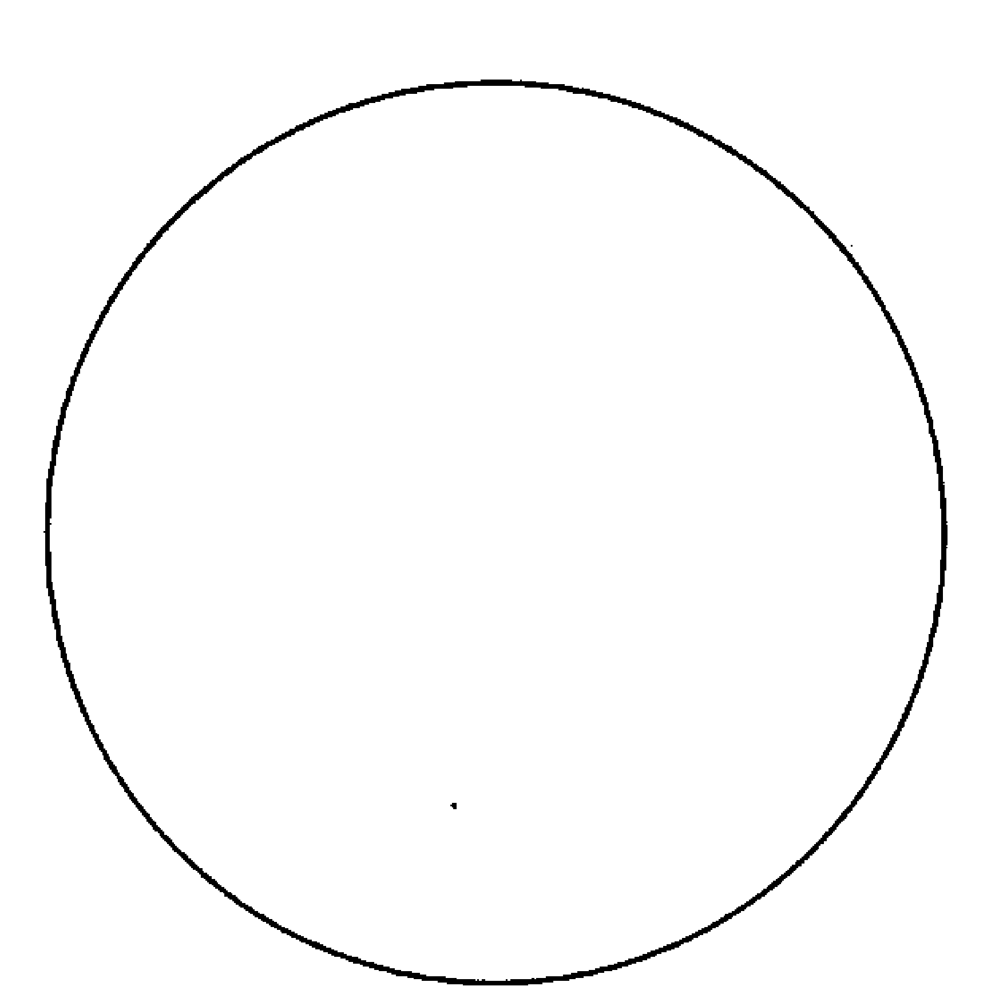

### (2)二分法

這種人的腦袋，一個大圓圈，裡面還有一條直線，如圖2。我們說這種人有腦筋，可惜轉不過來，也沒有過份。他們聽到任何事情，都會經過自己的判斷。有些相信，而有些並不相信。這種不是相信，便是不相信的二分法思維方式，使他們表現得是非分明，並顯得很有主見，信心十足。

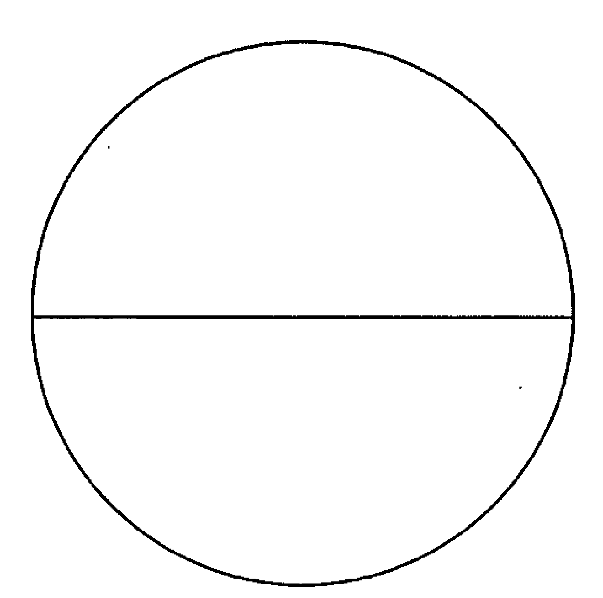

### 二分法的思考障礙

二分法，原本是一種近似值的表示方法。四捨五入，可以省略許多計算上的麻煩。二分法思維，則是一種常見的思考習慣，很容易情緒化的人，最常使用。十七世紀時，科學與基督教會誓不兩立。法國數學家笛卡兒（Decartes, 1596-1650），認為精神的本質是思維，與物體完全不同。等於向教會承諾科學與神學二元劃分，不彼此干涉。這種心物二分法的主張，使科學界放棄了解釋物質界的元素如何表現於心靈世界的權利。

以身體為我，其實合乎科學，也合乎常識。我們通常所說的我，便是這個飲食男女的肉體。法院拘提人犯，即是把這個人的身體捕獲，便告完成。

我的身體與我，簡直是二合為一，無從分離。如果真的是這樣，人實在太渺小，太沒有意義，也太沒有價值了。我希望不朽，身體做不到。我追求自由，身體受到很大的限制。我在衣食住行之外，還需要文學、藝術、音樂、歷史、宗教，身體都無法提供。我們在身體的需求之外，還有精神方面的需要。有時候為了追求精神上的滿足，甚至拒絕肉體的需求。可見我除了身體的我，尚有精神的我。

精神的我，顯然不是自然的身體。不受任何束縛，可以廣大無限，時間和空間都不能加以限制。可見我的範圍，必然超越我的血肉之軀。那是什麼？是我的心靈或精神。

### (3)三分法

這種人的腦袋，一個大圓圈，裡面有一條彎曲的弧線，如圖 3。我們說這種人腦筋十分靈活，隨時都在轉動，而且轉得過來。他們聽到一件事情，既不相信，也不會不相信。他們好像相信，又似乎並不相信。看起來是非不明，實際上是慎斷是非。不隨便相信，也不隨便不相信。換句話說，有些事情可以分是非，有些事情則寧可信其有，不可信其無，因而姑且信之，信到差不多就好。

很多人喜歡二分法，認為這樣才是理性主義的表現。是非分明，一點也不含糊，表示非常有自信心。

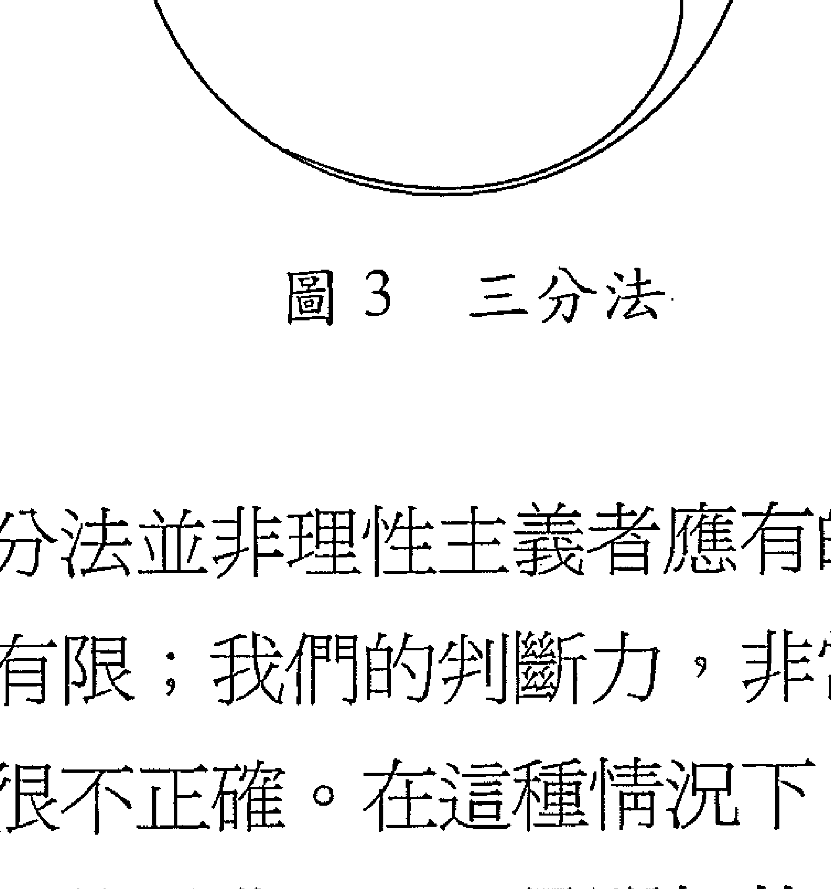

實際上，二分法並非理性主義者應有的態度，因為我們的認知能力，十分有限；我們的判斷力，非常薄弱；而我們的選擇能力，通常都很不正確。在這種情況下，我們憑什麼分辨是非呢？可見得我們的是非，並不是明智的判斷，卻經常是感情用事，所下定的結論。只有感情主義者，才會隨著自己的感情，來判斷是非，不管自己有沒有能力，也不在乎所論斷的是非，有多少準確性？

當然，一分法也很危險，相當於下賭注，而且所下的賭注，也太大了。憑什麼不經思慮、判斷，便馬上可以分出是非呢？

聽到靈魂這一類的字眼，立即完全接受或者嚴厲的拒絕，便是一分法的思維方式，所採取的偏激態度。

若是經過自己的判斷，就加以分辨。不論是接受或者拒絕，基本上都屬於二分法的感情用事，相當武斷。

到底有沒有香格里拉？一分法的是或否，二分法的判斷，都不甚合理。因爲我們既沒有能力肯定，事實上也沒有能力加以否定。只要平心靜氣，問問自己依據什麼來論斷，便知道這兩種思維方式，都不見得可靠。

最好的方式，應該是三分法的慎斷是非。反正再看看，說不定真的有，也可能根本不存在。逐漸弄明白之後，再來明辨是非，豈不是更加合乎理性主義的要求？

香格里拉是靈魂嗎？失去的地平線真的是心智？巴爾蒂斯坦、木斯塘、迪慶算不算身體？它們之間如何互動？怎樣才能密切配合？且以三分法的態度來面對。

## 8. 靈魂創造了心智和身體

當希爾頓在小說《失去的地平線》中，爲世人劃出一個美麗的世外桃源。爲了成就這一個香格里拉的夢想，希爾頓巧妙地給山谷中蘊藏著大量的金礦，使喇嘛們在經濟環境惡劣的雪山峽谷裡，獲得安享寧靜祥和，卻不落後於現代生活的物質基礎，也就是能夠生活的條件。

香格里拉是指與現代工業社會相對立的一個理想王國，風光明媚，有草地、森林、田園、雪山，保持田園式的寧靜，並不忘追求適度的物資生活。靈魂固然靈活、靈巧而且靈光，卻苦於沒有工具，可以隨時展現才能。

香格里拉為了達成自己的願望，首先以一種特殊的靈感，打入希爾頓的腦海裡。使希爾頓備受鼓舞，奮力完成《失去的地平線》這本小說。相當於香格里拉這個美麗的靈魂，把自己所需要的心智，透過希爾頓的生花妙筆，向世人展現出來，吸引了大眾的眼光。

人人都有心智，主要的作用在認知、判斷和選擇。把構想或問題提出來，經過仔細而深入的思慮，做出合理的判斷，然後選擇當時最為合適的態度或行為。心智的活動，表現在大家以「失去的地平線」做為依據，到處尋找合乎這個標準的地方。天下無難事，只怕有心人。心智活動的結果，終於創造了有形有體的身軀。

身體是靈魂居於展現實力，完成任務的需要，才構造而成的工具。它的形體、功能和特性，都由靈魂來主導，目的在配合心智，共同把靈魂的理想使命，付諸實施。身、心、靈三者合一，原來是靈魂創造心智和身體的最初目的。香格里拉（靈魂）創造了「失去的地平線」（心智）和巴爾蒂斯坦（身體），完成了為印度政府創收近七億美元旅遊收入的任務。三方面密切配合，當然功德圓滿，皆大歡喜而且獲得大眾普遍的激賞。

靈魂是不滅的，香格里拉永遠存在。若干古代文明遭受長期不明原因的煙沒，幾乎已經不爲人知，好像並不存在一樣。結果有朝一日，又被開發出來，才知道它們依然存在。只是不爲衆人所知，已經相當漫長而已。

心智是可以改變的，但是不去改它，它也就永遠如此。《失去的地平線》只要不改動內容，一版又一版地發行下去，永遠是同樣的版本，絲毫都不會改變。如果大家發現這本小說的內容，已經不符合現代的需求，必須做出某些改變，才更有吸引力。也許經過審慎的過程，改變了局部的內容，展現出香格里拉的新面貌，也未可知。心智不改變，香格里拉永遠是這個樣子。心智一改變，香格里拉就會相隨心轉，改變成另外一個樣子。我們常把心智和靈魂合在一起，說成心靈。可見兩者的關係，非常密切。靈魂是心智主要的依據，而心智則是靈魂的評鑑標準，用來考察所創造的身體，是否合適？

身體是靈魂所需要的使用工具，而凡屬工具，都有其侷限性，使用的年限與各種條件的限制，包括損壞與折舊在內。無法像靈魂和心智那樣，可以長期使用。

巴爾蒂斯坦這個身體，很快就損壞了。木斯塘也有一定的壽命，不久便告衰亡。新生的迪慶，已經引起大家的注意，如何愛護和保持，使其使用的期限能夠更長！

## 9.心智和身體違背了靈魂

《失去的地平線》是香格里拉的「心智」，按理應該百分之百地呈現香格里拉的真實狀況。然而，語言文字，本身就是很大的障礙。儘管希爾頓才華洋溢，也竭盡心力，能不能把香格里拉的真相，描繪得十分精準？恐怕希爾頓自己，也要謙虛地搖搖頭，實在太難了。

靈魂創造心智的時候，如果不賦予創造性，就會描述失真而令靈魂失望。若是賦予創造性，則心智自我發揮，難免有過與不及的地方，也令靈魂相當困惑。

光有心智，作用並不大，效果也不很顯著。《失去的地平線》這本小說，就算十分暢銷，畢竟只是一本小說，不能夠親身觀賞，實際體驗，不過是一種夢想。

要求美夢成真，心想事成，必須具有真正可以行動的身體。所以靈魂明知身體難以掌握、控制，也要冒著風險，把身體創造出來。有合適的工具可以使用，才華於焉展現。

靈魂為了身體的靈活性與創造性，另外還賦予相當程度的自主性，務求與自己所創造出來的心智相配合，以期相得益彰，如願地完成這一輩子所要完成的使命。

然而，身體既擁有七情六欲，又有無窮無盡的需求。靈魂和心智控制得住的時候，固然是最有效的工具。萬一控制不住，由於物欲高漲，致使身體不顧靈魂和心智的指揮，而胡作亂為，靈魂和心智又將如何因應？

巴爾蒂斯坦為了吸更多的遊客，勢必做出很多修改。對於環境的破壞和氣氛的改變，已經顧不得原有的構想和宗旨，弄得大家逐漸失去信心，不再認為這就是原先心目中的香格里拉。身體把靈魂囚禁起來，使靈魂不見天日。也使得這個人，失去應有的品格和形象。

心智對於身體的偏差行為，相當不以為然。幾度用心加以矯正，身體卻愈來愈不接受心智的意見。依然故我，變成以身## 身体为中心，置心智于一旁，而徒叹奈何？

行为由观念而产生，然而偏差的行为，有时行之日久，也会反过来影响观念。由于一念之差，导致心智和身体有志一同，共同违背灵魂的本意。

要不是身体有其局限性，寿命的大限来临，便会宣告死亡。巴尔蒂斯坦一直保有香格里拉的美名，很可能大家在失望之余，把香格里拉带给人们的美梦，也放弃了。不再追寻人间的乐土，却安于熙熙攘攘的现实社会。

巴尔蒂斯坦这个身体毁坏之后，香格里拉的灵魂，终于脱离身体的囚禁。带着修复的心智，重新投胎。又构造木斯塘这个身体。使原先的理想，得以恢复应有的面貌，散发可爱的光辉。这才吸引大家的注意，再次点燃希望的火花，把木斯塘当做新的香格里拉。

香格里拉的身体，按照心智的记载，应该蕴含着丰富的金矿。依据人类的实际经验，不管什么民族，那种文化背景，黄金都经常与人类的贪婪和罪恶相连接，而难以分离。恰恰与《失去的地平线》所描绘的世外桃源，大相径庭。不知道有多少人的淘金美梦，将在香格里拉的理想王国中破灭，最后耗尽青春，空手而返。

心智和身体若不尊重看不见的灵魂，其结局大多十分离奇而悲惨。应该怎样良性互动？自然成为大家关注的焦点。

## 10. 最好以心智为中心

我们借用电脑的概念，来看看灵魂、心智和身体的关系。

## 一、从香格里拉说起

电脑中的中央处理器（CPU）、记忆体（memory）、输出输入装置等电路及机械零件的总合，称为硬件（hardware），好比人的身体。光凭这些东西，电脑并不能发生作用。必须要有使用上的程序，也就是电脑系统的标准作业程序，称为软件（software），有如人的心智，才能够产生作用。硬件与软件齐备，若是没有人加以操作，亦属徒然。这一只负责操作的手，便是灵魂。

巴尔蒂斯坦、木斯塘和迪庆都是硬件，共同以“失去的地平线”为软件，而香格里拉则是那一只看不见的手。没有香格里拉的操作，就不可能造成“失去的地平线”那样轰动的小说，也不可能出现巴尔蒂斯坦、木斯塘的缔造旅游佳绩，以及迪庆的堂皇声明。

灵魂固然是一切的根本，毕竟看不见、听不到也摸不着，如果没有心智的控制，在身体上表现不出原先的理想面貌和行为，我们将永远感觉不出灵魂的存在。

身体的表现，并不能保证一定依据心智的指导。有时候硬件出现了问题，影响到软件的作业程序，也可能产生偏差的后果。完全看身体的言行，不一定可靠。

最好的办法，应该是以心智为中心。促使心智配合灵魂的旨意，并且妥善掌控身体的言行，当然产生良好的互动。三方面一体，才是最为妥善的身心灵整合。

以心智为中心，我们才有所依据，来判明灵魂和身体的关系，是不是和谐融洽，朝向一致的目标？换句话说，评鉴身体的表现，是否符合灵魂的本来需求？必须以心智为依据，当做标准，比较具体而实际可行。

# 透视灵魂看人生

香格里拉的主要内涵，在于人类与大自然和谐共生，不同民族和平共存，各种宗教并存互重，社会安宁平静。大山谷的深处藏有丰富金矿，但是人们必须适度开采，为未来子孙保留一些宝贵的资源。香格里拉的最大任务，在唤醒人们，灵魂原本是美好的，却由于有了身体以后，逐渐表现出丑陋的面貌和态度。自然的美景，禁不起人为的污染，很快就会被破坏。

这些内涵和任务，必须透过心智的宣示，身体才能够知所遵循。有了心智的媒介，身体与灵魂互动良好。正如电脑软件，促使硬件和使用者之间，妥善配合。

电脑软件不断推陈出新，然而形体、构造和功能，基本上十分相近。巴尔蒂斯坦、木斯塘和迪庆，一代比一代精彩，而基本条件，则彼此大抵相同。使用者再热心、认真、负责，若是软件不合适，效果就不可能良好。所以软件程式，居于关键的地位，实在非常重要。

中华心学、儒家心传，并非唯心论，却是十分重视人的心智。孔子主张“敬鬼神而远之”，尊敬鬼神而保持安全的距离，以免受到迷惑。不讨论那些一般人搞不清楚的事情，希望还没有懂得奉事人的道理，不必急于谈论奉事鬼的道理。但是祭神的时候，一定要相信神在那里受祭。所以他说：“若不能亲自参加祭祀，虽然有人代表致祭，也好像没有祭祀过一样。”他要我们知天、敬天、事天，都是寄望于我们的心智，能够公正清明。

## 二、一切都是能量的变化

## 1. 宇宙是一个能量场

我们说宇宙是一个能量场，并没有加上“大”、“巨大”或“超特大”的形容词，来加以描述。因为宇宙本来就可大可小，大起来极大，小起来又极小。古圣先贤，用太极来表示。“太”这个字，由“大”和“。”组成。“大”极了，加上小（“。”）极了，当然叫做太极。能量能够膨胀，也可以收缩。可大可小，并非固定不变的。宇宙是能量变化的场所，所以称为能量场。

英语中的能量，写成 energy。它由两个希腊字组合而成，分别具有“在……之中”和“功、劳动”的意思。合在一起，便是“加进去后能够做功的东西”。

希尔顿的灵魂，来自宇宙中的能量。我们可以这样说，宇宙能量和希尔顿的脑袋互相感应，使他产生一些灵感。把这一部份的能量，转化成《失去的地平线》这一本小说。“失去的地平线”也是一种能量，吸引电影界的注意，把它拍成电影，促使大家热心地寻找真正的香格里拉。而香格里拉也形成一种能量，使大家找到了巴蒂斯坦、木斯塘、以及迪庆这些令人向往的胜地。

任何实体或非实体，物质或精神，看得见和看不见的，都具有能量。因此我们可以扩大范围，把能量解释为：各种事物以及彼此之间的讯息和互动关系。

宇宙间各种讯息及关系，都是能量的变化。宇宙的本质，就是能量。一切人、事、地、物，都是能量的变化。能量可以和能量互动，也能够和能量转化而成的物质互动，产生各种关系。能量也可以封闭起来，保持既不增加也不减少的守恒状态，这时候并不产生任何关系。产生关系的开放系统，和不产生关系的封闭系统，都能够互相或在内部传递和吸收某些讯息。基本上都是活的，而不是死的。在天上，呈现日月星辰、昼夜、以及季节气候等现象。在地上，形成山河、动植物等形体。在人事上，彼此利害的调和与冲突，产生吉与凶的变化。

能量进入希尔顿的脑袋，产生《失去的地平线》。投入美国出版界，缔造销售奇迹，引起好莱坞的注目。拍成令人激赏的影片，将香格里拉深植在世人的心目当中。这一连串的变化，以及所造成的后果，莫非都是一种关系。有些人一直到现在，还没有看过，也没有听过香格里拉的大名。然而香格里拉并不至于受到这些人的影响，而有所减小或毁损它的美名和价值。正如我们的肉眼，根本看不见能量，因此有人相信，也有人不加以理会。还有一些人，经常把能量挂在嘴边，却搞不清楚它的真实状况。我们常常接触到机械能、内能、电能、光能、原子能、化学能等等，属于科学已经知道的能量，可以称为明能量。还有迄今尚未明白的能量，不妨称为暗能量。人类最好面对自己的局限性，体认自己的认知能力，毕竟相当有限。不可能完全了解，所以出现某种程度的神秘性，也是必然的。不必大惊小怪，或者故意拿来吓唬人，弄得自己也神经兮兮，很不自在。

能量是一个统一的名称，包含已知的和未知的，全部涵盖在内。有明有暗，有开放的也有封闭的。

## 2. 大霹雳造成万物

宇宙的情况，正如《三国演义》开宗明义所说的：“分久必合，合久必分。”而且分分合合，随时都在变动之中。

我们姑且把宇宙譬喻为一付扑克牌，整整齐齐，完完全全地安放在桌子上。总有一天，遇着这么一个孩子，好奇或者顽皮地把它的封套扯开来。猛力向高空抛去，让扑克牌四面八方地散开，逐渐飘荡下来。掉落在地面上，形成一片混乱。原先黑桃、红心、方块、梅花分门别类的状态，也被爆破掉，杂乱无绪。经过一段时间，又来了这么一个人，弯下腰来，细心地把遍地散落的扑克牌收集起来。然后耐心地分门别类，再度依照黑桃、红心、方块、梅花的类别，由A到K，整整齐齐，完完全全地装妥在封套里。又过了一段期间，遇着这么一个醉汉，顺手抓起一付扑克牌，向高空用力抛出去……，历史不断重演，但是每一次的情况都不太一样。

美国普林斯顿大学保罗·斯坦哈特（Paul Steinhardt）教授与英国剑桥大学尼尔·图罗克（Neil Turok）教授共同提出的“循环宇宙”模型（Cyclic Universe Model），认为宇宙处在循环不断的历程中。现在的宇宙，是在上一个宇宙尘埃中诞生。换句话说，大霹雳并不是宇宙的起点，也不是宇宙的终点，却是宇宙的前后两个不同阶段，中间的过渡。宇宙的上一个阶段，经过一次大霹雳，好像扑克牌被抛向高空后散落一样。形成下一阶段，有如散落的扑克牌，被人捡起来，重新装好。然后又经过另一次大霹雳，再次飘落满地，又形成一个新的阶段。这样循环不断，持续地变化下去。宇宙与我们的身体一样，不但充满了活力，而且不断地新陈代谢，可以说是活生生的，并不是死板的、静态的。

我们身体的变化，是由于细胞不断的改变。宇宙的变化，则是能量持续转化的效应。二十世纪二〇年代，天文学家爱德温·哈勃（Edwin Hubble）利用“距离我们观测地点较远的星系，颜色比距离较近的星系要稍为红一些”的红移（Red Shift）理论，观测到地球以外的星系，都逐渐红化的现象。表示这些星系，都离我们愈来愈远。也就是说：现有的宇宙，正在逐渐地膨胀。红移的原因，和波长有关系。在白光的光谱中，蓝光位于短波的一端，而红波则位于长波的那一端。光波变长的红移现象，证明宇宙正在膨胀。以致各个星系之间的距离，愈来愈远，愈来愈红化。

宇宙膨胀到什么程度，才会大爆炸？科学家并不知道。我们只能说宇宙固然生生不息，但是宇宙的每一个阶段，也就是这一次大爆炸与下一次大爆炸之间的时间距离，是有限的。到底有多长呢？应该是“不一定”的，而不是固定的，才合乎宇宙动态的常理。就好像人必定会死亡，然而这一辈子活多久？谁也没有把握。宇宙必定会毁灭，这一次什么时候会灭绝？应该也是谁都难以预料。

大霹雳所造成的星尘，全都是能量，转化成为万物。万物同源，所以众生平等。原本是相同的根源，应该彼此平等。可惜一生下来，便全都不平等了。各色各样的星尘，各有各自的规划，构成了多元的世界。但是从本质看，可以归于一，那就是能量。也就是星尘，并没有什么分别。

## 3. 生命是怎么来的

哈佛大学有一个研究“宇宙生命起源创新计划”（Origins of Life in the Universe Initiative），主持人大卫·刘（David R. Liu）教授预期“把生命的起源，分解成非常简单的系列逻辑事件，并不需要神明的干预”。

到目前为止，进化论和创造论相持不下。另外还有一种智慧设计论（intelligent design），也加入争议。

进化论认为：物种是数以百万年的漫长期间，逐渐进化而成的。这种说法，被认定是基本的科学理论。

创造论（creationism）说：上帝创造万物。

智慧设计论指出：地球上的生命太复杂，以致不可能由进化而来，暗示有一个更高的力量，在从事设计。

我们把这三种主张，综合起来。因为这些说法，都有相当的道理，不应该有所偏废，以免顾此失彼。

想一想：当烟火在天空爆炸开来的时候，是不是一开始十分迅速向外飞散，接着散开的速度逐渐减缓下来呢？大霹雳开始，有如那一付被扯开封套的扑克牌，被猛力摔向高空，四面八方地散开，然后逐渐减缓，向地面上到处飘落。如果主持大霹雳的，是无所不知、无所不在、无所不能的上帝，当然可以创造万物。把大霹雳，变成万物，就是伟大的创造。这些被同时创造出来的万物，随着速度减缓，各自发挥“适者生存”的优势，逐渐进化。我们必须把这个“适”字，做出正确的解释。并不是“弱肉强食”叫做“适”，而是“适合于生育”的意思。凡是不合适于生育后代的生物，自然灭种而不存在。进化的目的，在于改变自己，以增加繁衍的能力，否则就要遭受淘汰。

先创造后进化，是人类尚未进化之前的自然景象。宇宙的能量，转化成万物，称为创造。万物被创造出来之后，各自进化，由于优胜劣败，所以适者生存。人类的进化，分成两个层面：一是身体方面，一为心灵方面。人体的潜能，和心灵的意念，不断地发挥功能。所产生的智慧，已经逐渐改变世界的状况。如果说这是智慧设计，所产生的效果，并不为过。

那么，从事设计的更高力量，究竟是什么呢？其实就是宇宙中的能量，并没有什么神秘的东西。

能量具有潜在的活力，可以使物体动起来、热起来、活泼起来。这种活力，成为生命的起源。机械能使机械动起来，电能使器具做功，光能使某些东西发出光亮，化学能促使各种原料产生变化，都成为具有活力的生命。

我们不能说宇宙充满了能量，因为宇宙到底有多少能量？并不是固定的数值，而是变动的。由于质能互变，能量可以和物质互相转换，所以能量可以产生万物。

有生命的能量，便是我们所说的生物。一般动植物的能量，表现为他们的本能。高级动物所特有的能量，特别称为灵魂。无生物的能量，也可以传递若干讯息。生物与无生物，都与能量有关。换句话说，万物包括生物与无生物，基本上都是由能量构成，我们把能量看做生命的起源。即使没有生命的物质，一旦转化成为能量，也可能产生不同形态的生命，具有不同程度的活力。

## 4. 能量的特性是“识”

从物质的层面来说，宇宙的本质是“能”，也就是“能量”。从早期科学所发现的分子世界、原子世界，一直到近代所知道的粒子世界、量子世界，可以说这是一个波的世界。波即是能，所以说宇宙的本质是能量。

> 能量是所有东西的基本本质

西洋哲学大约在公元前六世纪发生于希腊，始祖泰利斯（Thales, 624-546 B.C）说了一句现代人不会注意的话：“水是所有东西的物质本原（material cause）。”

就这么简单的一句话，表示了三个基本哲学观念：
（1）所有的东西都只是它一时的形式，背后有一个基本本质（Fundamental Substance）。本质这个名词，现代纯粹用来指称物质，当时并没有限制。
（2）所有的东西都充满了神，但是人们解答问题，不能依靠神话或神秘主义，必须回到它的物质本原。
（3）所有的东西，一定可能还原到一种本原。至于是不是水？根本不需要太过认真。他提出这样的假定，说

> 近代物理学所说的话，实际上和前述的观念一致：
（1）能量是所有基本粒子的本原，它的全量不会改变，基本粒子从这个本原而形成。
（2）能量能够达成运动，变成光、热、张力，它是世界上所有东西的基本本原。
（3）要把闪耀不定的现象，和一种基本本质的观念调和起来，是十分困难的。能量是“一”，所有东西代表“多”，能量的一，经由运动而变成多。

能量看不见、摸不着，只能通过光波和声波，来引起人的注意。所有宗教，几乎都以光和声来显现神灵，便是这个道理。有人看到了光，有人听到了声，所以才相信。光是电磁波，无远弗届。声属机械波，有距离的限制。光和声都是能量，传达的方式不同，本质相同。

从精神的层面来看，宇宙的根本是“诚”。在人类初生，甚至古代早期，“诚”是人类自然具有的精神。与生物的本能，无生物的本性，原本都是相通的。

孔子以后，世道人心愈来愈弱，“诚”才逐渐为大家所重视。中庸说：“自诚明谓之性，自明诚谓之教。”自诚明的意思，是由至诚而自然明白的，叫做全然天性。自明诚的途径，刚好相反。从明白道理，然后才至于诚的，那就是教化。接着又说：“诚则明矣，明则诚矣。”表示这两种情况，最后是一样的，称为“诚明”。诚能发光，使人光明磊落，自然发出无比的光辉。诚也能发声，说出来的话大家都听得进去，而且十分喜欢。至诚的人，可以预知未来的事情。便是以“诚”和宇宙万物相通，所获得的功效。和神明一样的灵光和灵通，所以中庸说：“至诚如神”。

能量的特性，就在于“诚”。能量之所以能够变化，即在于中庸所说的：“诚则形，形则著，著则明，明则动，动则变，变则化。”能量转换成物质，就有形象。形象显著，很容易和其它物质产生磁场，而且相互感应。有了明显的感应，就产生变动，发生各种进化或转变的作用。

曾国藩先生说过：“心里面没有一念的时候，便叫做‘诚’。”换句话说：“动一念即不诚。”诚才有物，不诚便无物。我们今天常说的资讯（information），其实也是一种能量的型式。资讯化社会，最重要的莫过于诚。人之所以能够赞天地之化育，参与宇宙变化的工程，而成为万物之灵，即在掌握“诚”的要旨。

能量具备“诚”的特性，表现在“对称”、“平衡”、和“动态”这三个永远不变的作用上，说明如下：

- （1）对称

世界上有阴就有阳，有宇宙便有反宇宙，而有物质也就有反物质。每一种质点，几乎都有一种反质点存在。这就是能量的对称，两边的数量相对地维持均衡。由于能量一直在变动，所以不可能绝对均等。

- （2）平衡

高向低流动，使低变高；高又向低流动，以求平等。如此往复循环，为求保持对称而变动。对称本身也是变动的，永远需要努力，以求取平衡。

- （3）动态

对称之中求平衡，平衡之中求对称，以致能量永远处于流变和建构之中。保持动态的平衡，才能够维持对称的活动状态。

各种人、事、地、物以及彼此之间的交互关系，可以说时时都在变动。但是所有的变化，目的都在追求对称和平衡。

然而，一旦达到绝对对称和平衡，就会呈现静态而失去动态，那样一来，宇宙即会爆炸而毁灭。

## 5. 诚则灵表示诚与能相通

我们常把“诚则灵”解释为“求神拜佛的时候，心要诚，祈求才会灵验，而有求必应”。实际上“诚则灵”的意思，应该是“当我们心中没有丝毫杂念的时候，我们的智慧就会充分展现。使我们对于一切事理，都能够通达明瞭而没有错误。这种诚即明的状况，和宇宙磁场相通，对于未来可能产生的变化，和神佛一样地明白清楚。这时候所获得的讯息，和未来相印证，当然十分灵验”。我们照镜子，如果镜子清淨光明，镜子里所呈现的影像，必然十分逼真。明镜的清淨光明，不是外面来的，是它本来具有的。镜子上面的灰尘盖得很厚，丧失照的作用。我们只要把灰尘拭除，便恢复原来“能照”的功能。人的聪明智慧，是与生俱来的。心地愈清淨，智慧愈高。愈容易达到诚明的地步，所以愈加灵验。

宇宙是一部大电脑，一切资讯，都在网际网路上面。我们的脑袋，则是世界上最好的个人电脑。随时随地，都架设在肩膀上，用不着插电。只要调整好自己的脑波，便可以上网，寻找自己所需要的资讯。比所有的电脑，都迅速、方便而有效。我们所要做的，不过是放鬆，不要施力，也不能紧张。然后花一分钟时间，在内心想像自己的心愿，或者想要解决的问题，以及获得成效的情景。于是闭上眼睛，自两肩以下，全部放鬆，保持混沌的状态。自然轻鬆上网，找到自己当时所需要的讯息。能量是相对的，有正便有反。宇宙射线中，有电子（Electron），带着阴（负）电荷，环绕在原子核外的轨道上。也有反电子（Anti-electron），其质量与电子相等，而所负的电荷相反，为阳（正）电，后来称为“阳电子”。世界上有阴就有阳，有电子便有反电子，有物质就有反物质，有宇宙也免不了有反宇宙。科学家相信：在太空深處的某个地方，可能有一个和我们现在所居住的宇宙相反的宇宙。如果有那么一天，这两个宇宙发生撞击时，世界末日便会出现。有人类也有可能有反人类，当人类与反人类相遇时，会不会同归于尽？那就不一定。因为一九六〇年代，科学家用高速器实验结果，证明正、反质子相撞，并不会完全毁灭，却产生一部分新的质点。原子能之母费米（Enrico Fermi， 1901-1954）在意大利从事电子与反电子撞击实验，结果两者的质量完全消灭，转化为伽玛射线（Gamma ray）的放射能量。换句话说，有时候相反的东西，也能够获得统一，形成二合为一的共存现象，不一定要毁灭。

要瞭解能量，明白它的互動、轉化和維持的道理，只有「誠」才做得到。離開這個字，方向就錯了。變成裝神弄鬼，胡說八道，而不是誠明一致的聖靈。

希爾頓誠則明，把香格里拉描述得那麼動人。大家誠則靈，把香格里拉找出來。至於那些不關心也沒有興趣的人，希爾頓和香格里拉不過是一種封閉的能量，引不起感應，好像並不存在一樣。資訊有正有反，看各人的搜尋方向而定。方向對了，便得到正面的資訊；方向錯了，就獲得負面的資訊。

我們說人各有志，而且要彼此尊重，便是各人依照自己的意向，和不同的能量互動。

## 6. 正宇宙和反宇宙

汪少倫先生綜合東西聖哲與現代靈學家的觀點，寫成「多重宇宙與人生」一書。首先指出「絕對宇宙」與「相對宇宙」這兩種宇宙，具有不一樣的情境。

絕對宇宙以絕對靈魂為其構成的最小單位。絕對靈魂不是任何一種東西，卻可以變成所有的東西。具有極大的伸縮性，伸展時與絕對宇宙合而為一，收縮時能夠自由出入於最小的原子或粒子。由於千變萬化，所以享有絕對的自由，彼此之間絕對平等，一切都絕對光明。

絕對靈魂的形象，可以用「光」、「無」或「力」來顯現。絕對靈魂的光，含有無形的靈氣，所以用「無」來代表，不同於一般的空氣。充滿了放射力，也稱為靈力。地面上所有生物及無生物，都由絕對靈魂而產生。光、無、力三者，不但渾然一體，而且名異實同。

### 二、一切都是能量的變化

絕對宇宙既然為絕對靈魂所構成，其性質和絕對靈魂相同，具有光、無、力的形相，說明如下：

- 1. 絕對光明。光無所不照，無所不穿，因此絕對光明。我們常說的無所不知，實際上即是這種特性。
- 2. 絕對生命。無產生一切生命，即為無所不生。生便是善，所以也無所不善。我們常說的無所不在，便是這種能生一切，而又一切皆善的特性。
- 3. 絕對能力。力由能而生，集合宇宙間所有的能，便成為我們常說的無所不能。

上帝無所不知，無所不在，無所不能，是絕對宇宙的代表。上帝創造宇宙萬物，便是光、無、力的絕對發揮，也是絕對宇宙三大特性的絕對表現。

絕對靈魂具有絕對自由和絕對平等，必須大公無私，才能保持渾然一體的常態情況。一旦稍有私心，啟動私念，想要自己形成一個小宇宙（Microcosm），不再和其他靈魂共組大宇宙（Macrocosm）。就會立即從整體中分裂出來，變成「諸行無常」的相對靈魂，因而造成「變動不居」的相對宇宙。絕對靈魂所具有的絕對光明、絕對自由和絕對平等，也隨著改變為相對光明、相對自由與相對平等。渾然一體的絕對宇宙，由於絕對靈魂的妄動私念，變成萬象紛陳的相對宇宙。由於相對靈魂的光、無、力，強弱互不相同，以致出現多重多級的現象。

原本只有一重的絕對宇宙，形成多重多級的相對宇宙。前者呈現正圓形，如圖 4。後者呈現相對多重的橢圓形，如圖 5。有如太極生兩儀之後，有陰有陽。相對的男女、智愚、強弱、善惡、貴賤、美醜、富貧、天地、日月、寒暑、始終、上下、先後、生死、晝夜、冷熱、明暗、有無、剛柔、吉凶、利害、動靜、高低、成敗、簡繁、難易、快慢等等現象，都同時出現。絕對圓滿成爲相對不圓滿，幸福成爲苦海。反宇宙是大霹靂之前的絕對宇宙，正宇宙則是大霹靂之後的相對宇宙。反宇宙渾然一體，圓滿、和諧、整合。正宇宙分裂無常，缺陷、衝突、分離，造成災禍不斷、人心失調、社會動亂，人類前途難以預料。

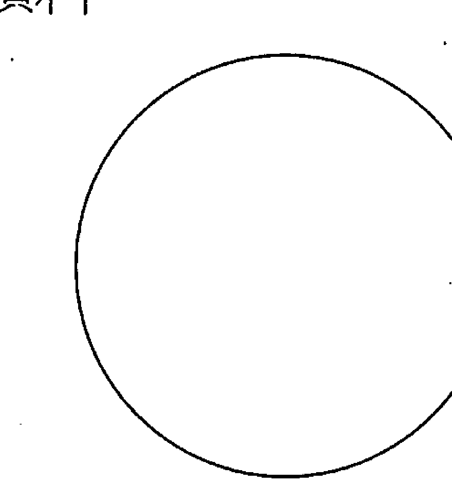

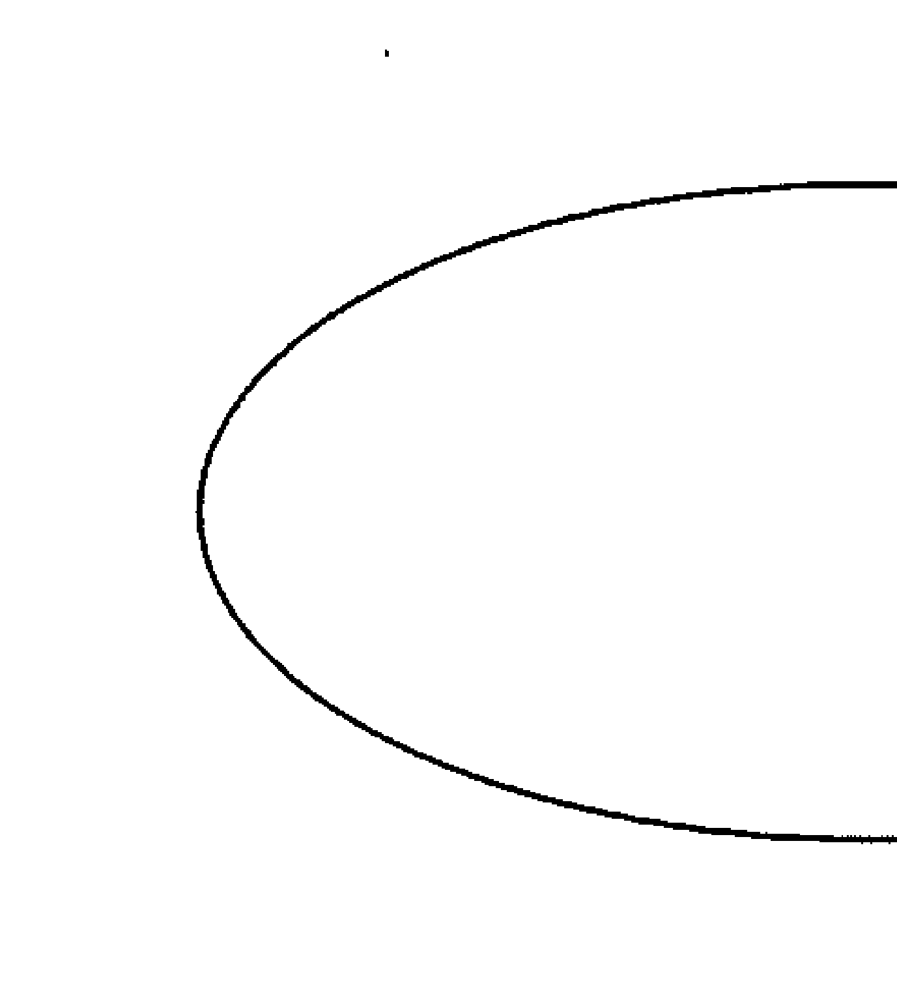

## 7. 先有反宇宙才有正宇宙

絕對宇宙有如一付完整的撲克牌，由於完全對稱而平衡，反而喪失了動態的作用。原來那一股波動起伏的潛在力量，恰似一位勇猛有力的人，將撲克牌向高空擲去，造成大霹靂。爆破的星塵，好似那些散落各地的撲克牌，彼此呈現相對的情況，造成了相對宇宙。

先有絕對宇宙，然後才產生相對宇宙。牛頓（Issac Newton, 1642-1727）的見解，比較符合絕對宇宙。愛因斯坦（Albert Einstein, 1879-1955）的相對論，較為晚出，卻更合乎相對宇宙的情況。一般人從絕對宇宙而來，比較傾向於絕對。對於相對的事物，反而不容易理解和接受。因而帶來很多煩惱和苦難。易經的陰陽，六、七千年前就已經提出，迄今仍有很多不明白的地方。愛因斯坦於一九○五年發表狹義相對論，一九一六年公開一般相對論，到現在又有多少人知道他在說些什麼？東方的伏羲氏和西方的愛因斯坦，這兩位「曲線世界」的創導者，似乎都和一般大眾，生活在直線的想像世界，有很大的距離，以致曲高和寡吧！伏羲氏的生平，受到很多責疑。愛因斯坦在校讀書時，日子也不好過。經常被同學罵為「笨蛋、糊塗蛋」，還要以神經衰弱為藉口，申請退學。

牛頓的運動三律：慣性定律；加速度和質量成反比定律；作用反作用定律，都是建立在絕對空間和絕對時間的概念上。

> 著名的英國哲學家洛克（John Locke, 1632-1704）評論人類的理解能力（On Human Understanding）時，即已指出：「我們把一組棋子放置在棋盤上，然後把這個棋盤從這個房間拿到另一個房間，我們會說棋盤上的那一組棋子是不動的。」棋子安放在棋盤上面，看起來一動也不動，卻沒有想到整個棋盤，已經從這一個房間移動到另一個房間，人類經常如此自以為是。

一般人對於時間的看法，也是抱持著絕對的觀點，譬如：時間從無窮的過去流向無窮的未來，構成永久不變的長流，永遠不中斷。全界的一分一秒，都對照標準時間校正過，因此它的長短應該是同樣的。當兩個人對話的時候，就時間來看，應該是「同時」，而且是「現在」。時間是客觀存在的，不論我們做什麼，或者什麼都不做，時間都是固定地一分一秒地流走，不快也不慢。這些認識，說起來就是「絕對時間」的觀念。看起來好像真的是這樣，實際上在相對宇宙，未必如此。

時間和顏色一樣，如果沒有眼睛的辨認，便沒有顏色的感覺；沒有事件發生，也就沒有一分一秒的時光。無所事事的人，根本不覺得時間的流動。地球上的時間，和其它星球上的時間不一樣長短。因為地球繞太陽一圈所需要的時間，與水星繞太陽一圈的時間並不相等。水星上的時間觀念，應該和地球上不同。兩個人對話時，不一定同時，因為紐約的晚上剛好是台北的早晨，既不同時，也無法肯定是現在。時間是主觀的，有時快有時慢。若是沒有鐘錶，也將難以斷定早晚。相對時間，配合相對的空間，構成相對宇宙的各種相對現象。我們已經從絕對宇宙來到相對宇宙，是不是應該調整自己的觀念，相信如果沒有能量的話，時間和空間都可能消失呢？

## 8. 能量的神秘性

物理學家為了了解並改造物質世界，發現我們無時不在使用能量。要觀察能量的變化，最容易的方法，莫過於檢查物質的狀態，有沒有產生改變？使物質發生改變，必然要有改變的方向，因此我們推知：能量的變化，必須有方向、有目的、也有標準。

從絕對宇宙走到相對宇宙，既屬於能量的改變。那就必然有方向，由絕對的圓滿，走向相對的不圓滿。有目的，以相對宇宙的不圓滿，來凸顯絕對宇宙的圓滿。有標準，過與不及，都將產生重大的變化。

宇宙有三種自然的力量，就是能量的流向，所表現出來的作用。這三種自然力，分別為：

- 1. **萬有引力** 是一種分子與分子之間的吸引力，持續不斷地把各種分子聚集起來，使其緊密地凝結在一起。能量具有聚合、凝結的性質，表現出萬有引力。
- 2. **電磁力** 是一種原子與原子之間的力量，由於同性相斥、異性相吸，形成可聚可散的相對關係。各種原子持續不斷地相斥相吸，因而有聚有散地產生不同的變化。
- 3. **強交互力或弱交互力** 是一種原子核裡面，短暫而不持續的力量。不但有強有弱，所產生的變化也比較複雜。但是在諸多變化之中，仍然具有某些不能改變的規律。

這三種能量的自然作用，目的在求動態中的均衡，並且盡力加以保持。一旦失去平衡，就會繼續在互動中尋求再度的均衡，以恢復圓滿的標準。

我們可以這樣說：能量原本是完美的，必須藉由各種不完美的狀態，來證實能量自身的完美存在。

但是，能量一旦呈現完美的狀態，一切的變化便會停頓下來。而所有的關係，很可能毀滅而不存在。由於沒有矛盾，不可能產生能量變化，以致能量本身也不存在了。然而，我們已經知道，能量是不滅的。所以我們推知：能量不可能呈現完美的狀態。而能量的目的，又在追求完美。因此不停地變化，以保持無過無不及的完美狀態，而持續地互動。用哲學的說法，應該是：能量為了證明自己是完美的，必須透過種種的不完美，來彰顯自己確實是完美的。絕對宇宙和相對宇宙之間的互動，正是表明這樣的關係。若有若無，說無卻有。這種能量的神秘性，老子當年已經說得十分明白。他先說：「道可道，非常道。」道就是宇宙，有常道和非常道兩個。常道即絕對宇宙，非常道便是相對宇宙。可以言說的，不過是相對宇宙。不是語言文字所能夠描述的，才是絕對宇宙。接著指出：道是恍恍惚惚的，說無又有，說實又虛。在恍惚之中，具備了宇宙的形象，也涵蓋了天地萬物。其中有一切生命物質的原理與原質，從古到今，一直在從事創造萬物的活動。老子所說的道，用現代科學的名詞來說，即是能量。能量的變化，有一些恍恍惚惚的部份，叫做微擾（perturbation），科學家也沒有辦法弄清楚。能量保持若干神秘性，對人類來說，實際上有很多好處，不必急於突破。

## 9. 人為的介入更增加複雜性

由於人類的勢力，不斷地增強加大。人為的力量，可以和自然力相抗衡。並且毫不猶疑地，抱持人定勝天的必勝心理，大膽地向自然的力量挑戰。人為的力量，也有下述三種，分別說明如下：

### 二、一切都是能量的變化

### (1) 意志力

是一種由心智發出的念力。意志力十分堅強的時候，竟然可以無堅不破，無念不成。我們常說「天下無難事，只怕有心人」，便是指人的意志力，足以克服萬難，達到「心想事成」的神奇地步，令人不可忽視。

### (2) 行動力

是一種由人的體能所產生的實踐力量。人類具有旺盛的行動力，如果運用得妥當合理，可以贊天地之化育，真正成爲萬物之靈。若是運用得不妥當，則使人類成爲萬物之賊，很可能破壞自然，造成全球毀滅的惡果。

### (3) 延伸力

人類把意志力和行動力配合起來，不斷創造，製作出各式各樣的人造物。包括人造衛星、核子導彈、火藥、電腦、人造纖維、電子產品、汽車、飛機、火車、塑膠等等。總合起來，稱爲延伸力，範圍日漸擴大。

自從十九世紀工業革命以來，科技日愈發展，人造物愈來愈多。人類的意志力、行動力以各種延伸出來的力量，愈來愈強大，已經到了失控的程度。可惜大部份的人，仍不知覺醒，還是沉醉在科技的美夢中。

科技帶給人類很多很多好處，卻也帶來極大的威脅。老子當年推崇虛無而神妙的道，說它永恆而不窮竭。指的便是宇宙的能量，具有三種自然力。成爲天地的根源，具有無窮無盡的作用，可以永存不绝。为了预先防患人为的过份干扰，特别倡导「无为」。希望为政者常使百姓无知无欲，以顺应自然。宇宙如果顺应自然，不造不设，充份放任万有引力、电磁力和强交互力或弱交互力，自然地产生作用，好像是无所作为，实际上却能够生成万物，简直就是无所不为。他主张「为学日益，为道日损」，因为知识愈多，知的欲望便一天一天的增加。知识愈来愈丰富，却不能够妥善地加以应用，反而用来巧夺豪取，为害人群社会。还不如把求知的时间和精力，用来修练自己，增加自己的能量，以减少知欲。倘若减少又减少，真的把知和欲都损尽了，没有了「为」的动性，使意志力、行动力和延伸力都减低到合理的地步，最后便达到无为的境地。那时候万物各得其所，各遂其生，即是无为无所不为。能量界既然赋予人类，具有意志力、行动力和延伸力，我们就应该合理的加以发挥。老子已经指出「有无相生，难易相成，长短相形，高下相倾，音声相和，前后相随」的相对情境，当然不可能反对「有为」。他的主张，是人类必须体合天道，顺应自然，以「无为」的态度来处事，实行「不言」的教诲。换句话说，人为的力量当然可以发挥，只是发挥的时候，必须充份遵守自然的法则，也就是确实按照能量的变化原则，做到老子所说的：「人法地，地法天，天法道，道法自然。」以求生生不息。

## 10. 能量界的三大规律

大霹雳使整个太空，散掷出含有能量的粒子，比原子还要小。当宇宙逐渐冷却，这些元素粒子组合起来。形成带正电荷的核子，外面連接帶負電荷的電子，創造出成百以上的化學元素。現在宇宙中所有的物種，不論是微生物、植物或動物，都是由這些化學元素所構成。強烈地支持所有生物體，都源自一個共同祖先（common ancestor）的主張。我們把所有能量發生作用的能量場，稱爲能量界。是爲了方便我們對於身、心、靈的研究。也和一般人通稱的靈界，做出某種程度的區隔。

無生物的本性，生物的本能，以及高等動物的靈魂，基本上同源，所以衆生平等，全都來自絕對宇宙。

由於能量的變化，演化成爲相對宇宙。通常稱為墜入紅塵，其實就是投入紛紛擾擾的世界。

絕對宇宙與相對宇宙，都是能量活動的場所，共同構成浩瀚無窮的能量界。彼此之間有三大規律。茲分別說明如下，以供參考，做爲自我約束的依據。

### （1）一切有定數

中古世紀的哲學家，都認爲生物體被賦予一種神秘而神聖的生命力（life-force）。這種生機論（vitalism）的論調，已被現代科學所摒棄。生物化學家，指出生物體的分子，共同遵守一套「生活狀態的分子邏輯（the molecular logic of the living state）」。換句話說，能量界有一套共同遵守的遊戲規則。我們常說的「一切有定數」，應該解釋爲「在共同的遊戲規則下，各自尋找利基，做出最合適的變化」。要變，就應該按照遊戲規則而變，稱為演化或進化。不變，那就是依據原先的規定，而循序漸進。變或不變，都由自己依據共同的規律而做出決定，所以依然是一切有定數。

### （2）自作自受

完全接受既定的遊戲規則，一成不變地隨著演進，結果就成為命定論者，接受宿命的安排。完全接受既定的遊戲規則，卻能夠發揮自己的利基，做出合理的演變，結果就成為創造論者，不完全依據宿命的規劃。這兩種活動，都合乎一切有定數的規律。但是，要走那一條路，由自己決定，也由自己承受所造成的結果。這種自作自受的規律，使得大家自我約束，負起完全的責任。

### （3）互依互賴

從個體來說，完全是自作自受，與他人無關。但是就整體而言，則是相互依賴，彼此息息相關。植物界和動物界，都互相依賴，藉由環境轉換能量和物質。所有的能量，遵循「一切有定數」的不變規律，個別「自作自受」地運作，卻必須「互相依賴」，共同構成生態網路。牽一髮而動全身，彼此互相影響，卻又各自承受因果關係，這才是整體的一切有定數。

能量界看似千變萬化，實際上十分有條理。以上三大規律，初看起來似有矛盾，事實上具有互補的作用。在矛盾中起變化，使能量生生不息，永遠不滅。

原來以天地為本，現在逐漸轉移到人的身上。以上三大規律，照常不變。我們先來看看，人自己的變化。

## 三、靈魂創造身體

## 1. 做好先天人生規劃

生物化學的研究，發現有生命與無生命的物質，實際上都由無生命的分子所組成。

在我們的環境中，有很多無生命的物質，譬如石頭、細砂、水，通常由相當簡單的化合物，任意（random）混合而成。它們只有本性，並沒有本能，更談不上靈魂。很多有生命的植物和動物，由細胞構成。它們有本性，也有本能，卻不一定有靈魂。必須經過修練，通過相當的考驗，才能夠發展出靈魂的活力。高級動物如人類，當然有靈魂。可惜有很多人忘記了，僅憑本能而生活，弄得和一般動物一樣，不配稱爲萬物之靈。

人的靈魂，有自主性和創造性。由於靈魂無形無體，產生不了實際的功能。因此創造身體，成爲十分重要的工作。爲了有效地加以控制，靈魂在製造身體之前，必須做好完整的人生規劃，才知道如何安排自己的身體。務使將來執行這一套先天帶來的人生規劃時，得以合適而有效。 我們把這一套先天帶來的人生規劃，稱爲天命。意思是依據能量界共同的遊戲規則，也就是按照靈魂自己累世所獲得的慧和業，把這一生所要完成的任務，分別訂定下來。主要內容，有下述三項：

### （1）此生所為何來？

這一輩子所要完成的任務，主要有那些？逐一條列，按照優先秩序，把最前面的三個，當做重點。各人自有不同的任務，不必和別人做比較。

### （2）如何完成任務？

此生所為何來？是人生的目標。有了具體的目標之後，應該尋求合理的方法。有方法的目標，才是可行的。把方法確定下來，保證目標能夠如期完成。這樣的天命，才有實際的意義和價值。

### （3）如何做得更好？

能量是變動的，所做的計劃，不可能一成不變。有彈性，才能發揮創造力。可以做出有限度的改變，使自主性獲得發揚。持續求改善，精益求精，好還要求更好，原本是靈魂的本性，十分符合能量界的要求。

後天的人生規劃，是我們長大以後，依據自己的意願，配合自己的條件，以及環境的情況，所做出來的。我們長期考察，發現後天的人生規劃，如果和先天帶來的，十分相近，其達成率通常都很高。若是相去甚遠，那就難以實現。我們的身體，大多配合先天人生規劃的要求。因爲那個時候我們對於身體各方面的設計，都是依據先天人生規劃而來的。可見我們從事後天人生計畫時，也應該看看我們自己的身體狀況，不能過份勉強。

不論如何，靈魂創造身體時，必須受到三大限制：

- (1) **有使用期限** 身體是人類有限性的來源，配合人類有限的壽命，不可能長期使用而不損壞。譬如人的耳朵，從一出生開始，便開始退化。
- (2) **配有感官** 人類的感官知覺作用，同樣相對有限，使人無法認識實相。這樣的安排，目的在促使人類設法轉化後天的感覺，返回先天的純粹靈感。要求不為感官所迷惑，必須經常自省。
- (3) **承受各種痛苦** 身體是七情六欲的表現工具，也是痛苦不安的根源。靈魂透過心智，使身體承受各種痛苦不安。目的在警告人類，藉以提醒自己，必須重視精神生活，加強品德修養，做人才有價值。

## 2. 選擇合適的父母

一般人總認為父母把子女生育下來，生育的決定權，在於父母而不在子女。事實上，有很多人想生，卻生不出來。想生男的，結果每一胎都是女的。不想生的時候，反而避孕無效，說什麼意外生下來的。其實是子女選擇父母，想躲都躲不掉。要不要投胎爲人？出身在什麼樣的家庭？選上什麼樣的父母？要不要兄弟姊妹？要什麼樣的兄弟姐妹？都是子女依據先天人生規劃的實際需要，經過精挑細選，才決定來投胎的。

選擇的方式，是以基因（gene）爲生命的基礎。把父精母血，當做原材料，來篩選自己所需要的 DNA。

一九〇九年，丹麥生物學家喬安森（Wilhelm Johannsen, 1857-1927）根據希臘文「給予生命」的意思，把人類生命的基礎，命名爲基因。靈魂把一種特殊的化學物質，叫做去氧核糖核酸（deoxyribonucleic acid, DNA），用來定位人類的基因（genome）。我們身體的每一部份，都由 DNA 所造成。決定這個生命，這一生的命。便是我們所說的天命，也就是先天人生規劃。人人都有天命，只是不一樣而已。人人都有 DNA，排列組合各有不同。

一九五三年，英國物理學家法蘭西斯。克里克（Francis Crick）和美國生物學家詹姆斯。華生（James Watson）發現 DNA 的結構，也就是每種基因的組合，很像螺旋狀的分子樓梯。

科學家已經知道，全部三萬多個人類基因，都固定地依序排附著在 DNA 樓梯上面。而 DNA 則神奇地包含在每個人類細胞中心，寬度不到千分之一吋的細胞核裡面，用來主宰人體內所有的變化。換句話說，我們身體的一切變化，都必須服從 DNA 的命令，構成我們的天命。

另一方面，靈魂又把蛋白質（protein）當做執行生命活動的物質。蛋白質的外形，像是扭曲的長項鍊，由氨基酸（ami-## 三、靈魂創造身體

DNA 分子組成。靈魂賦予 DNA 的功能，即在能夠製造出兩萬五千種以上的蛋白質，並且各不相同。細胞把蛋白質內數目眾多的氨基酸成份連結起來，負責執行我們每時每刻的生命活動。胰島素（insulin）是細胞製造出來的一種蛋白質，用來促使血液中的葡萄糖轉化成爲細胞所需要的能量，使細胞得以一直發揮應有的功能。

我們的身體，能夠由無生命轉變成有生命的活動，主要是蛋白質的功勞。依據 DNA 的密碼，產生各種不同功能的蛋白質。這些不同功能的蛋白質組合，形成我們的運。可以改變，但必須接受命的限制，也就是 DNA 的命令。在合理的範圍以內，蛋白質的變化，可以由我們自己來操作。

選擇父母的時候，對於父母的 DNA 和蛋白質，必須做一番考察和比對。把自己這一生的命和運，同時安排進去。運能夠改變，而且由我們自己來改變。運氣就是「各人的氣，由各人自己負責運行」，運得好便是運氣好，運得不好運氣當然也不好。怨不得天，也怨不了任何人。由於命的限制，人的一生，只能做出有限度的改運。DNA 由自己安排，所帶來的命運，也由自己承受，合乎自作自受的規律。當初靈魂把父母選擇出來，並沒有這麼多的名堂。人類爲了瞭解自己的真相，才不辭勞苦，分門別類在各個細節上，加上這麼多的名詞，供我們應用。

### 3.帶著中陰身投胎

聖經中「魂」（nephesh）的語源，是「呼吸」的意思。

## 透視靈魂看人生

人的生命，藉著呼吸調氣來維持。氣是人人都有的生命力，一口氣不來，人的生命力便宣告終止。缺乏水和食物，人類尚可存活幾天的時間。但是，只要幾分鐘無法呼吸，人們就會立刻死亡。

一般人看到「氣」這個字，馬上聯想到「空氣」。事實上，空氣不過是「後天氣」。還有一種「先天氣」，看不見，摸不著，也聞不到，很難用語言文字來形容。可以說是一片虛無，卻能夠發揮很大的妙用。靈魂進入母體內，當然不能呼吸後天氣，只能依賴這種先天氣。先天氣就是一種能量，比光、電、熱更為原始，更為基本。卻能夠透過高山峻嶺，以及各種物質，而毫無阻礙。胎兒在母體子宮中，隨著母親呼吸。雖然名為呼吸，實際上並不是呼吸後天氣，而是先天氣的作用。懷胎十月，到了出生時，肚臍帶被剪斷，先天氣不來。這才啼哭帶動呼吸，開始學習呼吸後天氣。

女性在出生以前，體內存有一百萬個以上未成熟的卵子，真正能夠成熟的，不過是其中數目有限的卵子而已。經過青春期後，每個月有一個卵子在卵巢裡成熟而排卵，發出信號吸引精子，等待受精的瞬間來臨。

男子的精子，比卵子更小，形狀像蝌蚪。射精時約有一億到兩億的精子，但是能夠安全遊到卵子附近的，只有全部的五千分之一左右。當被選中的精子進入卵子中時，卵子的表面會在這一瞬間產生變化，不讓其他精子再進入。失去尾巴只剩下頭部的精子核，擁有父親的基因。加上擁有母親基因的卵子核，開始為這個世界上獨一無二的新生命，製造新的基因組合。

## 三、靈魂創造身體

接下來受精卵以很快的速度，反覆進行細胞分裂。按照靈魂所帶來的中陰身，形成腦、神經、脊椎、眼、皮膚等的原型。由於還沒有人的特徵，所以稱為胚胎。

中陰身相當於造人工廠中所用的模型，用來塑造自己所需要的身體。長得多高？胖瘦如何？五官形狀有什麼特徵？面貌和體態如何搭配？手腳是否正常？五臟六腑的功能如何？都經過事先的設計，做成模型，由靈魂帶入母親的子宮，準備按照模型，製造出合意的人體。

一般的模型是固定的，頂多有一些地方，保留若干彈性，可以隨機變動。但是中陰身的材料十分特殊，不但可大可小，彈性極大。在母體內配合胚胎的需要，逐漸調整大小。出生以後，還能夠隨著年齡的增長，在各方面做出改變。而且一生的形態，都包含在內。隨時在面貌、體態和功能方面，做出合乎預期的變換。

我們一生當中，身體的所有變化，都在中陰身的掌控之中。後來又添加很多因素，才使得中陰身的功能，受到很大的干擾，我們在談心智發展時，會詳加說明。往昔的人，以中陰身為主要的模型。現代人所受的干擾太多，導致很多身體的問題，諸如過份臃腫、脊椎側彎、發育異常等，不能把所有的責任，全部推到靈魂上面。

身高、體重、性能，都是我們自己事先規劃、審慎決定的，我們為什麼抱怨？憑什麼不滿意？又怎麼可以沒有信心呢？自作自受，在這方面並不例外。

### 4.透過 DNA 來主導

細胞（cell）是活生物體結構和功能的單元，最小的生物由單一細胞構成，人體則由10的14次方個細胞組成。細胞有很多不同的類型，大小、形式和專門性的功能，都有很大差異。各種類型的細胞，都保留其個性和獨立性。

儘管細胞活著的時候，是具有生命的。但是構成細胞的DNA、蛋白質和醣脂質，全都沒有生命。有生命的細胞，和沒有生命的物質，既然那麼不相同。為什麼無生命的分子，會轉化為有生命的細胞呢？人在生和死的那一剎那之間，為什麼重量一下子減少了一些？生命體的重量，為什麼比無生命部份的總和還要多？這就是能量的作用，也就是靈魂存在與否的最有力證明。

地球上所有的生物，都是由無生命的分子組成的。把這些組成生物的分子，拿來做個別的檢定，很容易發現它們和無生命的物質一樣，必須遵守物理和化學的定律，也就是自然法則。能量轉化為生物時，都有一定的目標和計畫，才能夠準確地完成任務。從這個角度來看，可以說所有生物，都有不同的天命，代表各自不同的任務。不能說只有人才有天命，而動植物卻沒有。

眾生平等，是指絕對宇宙而言。人未出生之前，靈魂是平等的。出生之後，有了身體的侷限性和特殊性，以及所要完成的任務並不相同，所以就不平等了。一直要等到死亡之後，靈魂離開軀體，才能恢復平等的地位。若是生前罪惡深重，業障甚多，恐怕死後也不可能享受平等的地位，這才是人人都應該高度警惕的。

在相對宇宙中，所有生物的遺傳資訊（genetic information）都不一樣，所以各自發展，成為不相同的生物。在傳遞各自不同的遺傳資訊過程中，DNA 扮演十分重要的角色。我們把不同的遺傳資訊，通稱為遺傳密碼。

細胞分裂的時候，DNA 巧妙地拷貝自己，複製一組新的基因，傳給子細胞。使得細胞不斷分裂，仍能保有原來的遺傳資訊，而不致走樣。為了方便起見，靈魂把先天帶來的人生規劃，分解為細小而神秘的遺傳單位，藏在細胞核裡面。形狀有如臘腸，成雙成對地安放著。

早在一八六六年，奧地利神父孟德爾（Gregor Mendel，1822-1884）已經發現這樣的結構。一九〇〇年，三位植物學家，德國的柯倫斯（Karl Correns，1864-1933）、奧國的謝馬克（Erich Von Tschermak）以及荷蘭的德佛里斯（Hugo De Vries，1848-1935）各自研究，卻同時發現這種十分明確，而且可以預測的遺傳模式。一九〇四年，美國科學家薩頓（Walter Sutton）把這種構造物稱為染色體（chromosome）。因為必須先用特殊染料，來加以染色，才能夠在顯微鏡下觀察得到。生物化學用染色體這個名詞，來泛指病毒、原生細胞，或者高等動物的真核細胞中儲存遺傳資訊的分子。人類細胞的四十六個染色體中的 DNA 分子，並非同等大小。但是含有的基因，卻是數以千計，並且可以複製。

靈魂透過 DNA 的主導，巧妙地把這一生的所有規劃，鉅細無遺地安排下來，符合「一切有定數」的規律。因為有太多的人，一輩子不動腦筋，沒有任何創造。他們只是盲目地接受命運的安排，豈非也安安穩穩過一生！

### 5.做男做女由自己決定

在人類廿三對染色體中，有廿二對屬於體染色體。對決定一個人是男性或女性，並沒有影響。只有第廿三對染色體。在它所含有的幾個基因當中，有些基因可以決定性別。比較大也比較長的那一條，被稱為 x 染色體，而另一條比較小也比較短，則稱為 y 染色體。

男性體內有一條 x 染色體和一條 y 染色體，前者只傳給女兒，後者也只傳給兒子。計畫在這一生成為男性的靈魂，自然選擇母親的 x 染色體，配上父親的 y 染色體，成為 xy 搭配。有意成為女性，便把父母雙方的 x 染色體，拉過來配成一對，成為 xx 搭配。

我們不能夠由於生育子女，是母親的天賦，便把生出來的孩子，是男是女，變成母親的責任。說什麼肚皮不爭氣，生不出男孩子！是男是女，實際上和父母都沒有關係。是靈魂自己做主，主動造成 xx 或者 xy 的搭配。父精母血，不過是供應原材料。讓投胎而來的靈魂，自行選用，安排這一生的性別，不應該怪父母才是。

由於女性具有雙套 x 染色體，能夠部份或完全補足另一條 x 染色體的缺陷，因此女性通常比男性更為健康而長壽。靈魂在選擇性別時，大多以女性為首選。除了少數負有特殊使命的靈魂，必須生為男性或女性之外，大部份的靈魂，都以女性為第一志願。但是靈界居於平衡的原則，配合女性活得久些的事實，正常的男女比例，都維持在106:100之間。第一志願若是額滿，只好依第二志願，誕生為男性。這時候成男成女的競爭優勢，便是自己累世的業績，說起來也是自作自受，怪不得別人。

選擇 xy 搭配而生的男孩，就要罹患隱藏在母親體內的遺傳疾病。按照自己的先天人生計劃，把這些疾病安排在適當的年齡。選擇 xx 搭配的女孩，便會和她的母親一樣，成為 x 染色體的缺陷攜帶者，準備未來傳給她的子女。男女有別是天生的事實，只要是出於自己的決定，就應該平心靜氣地，承受「同權不同質」的結果。男女享有共同的權利，卻具有不一樣的性質。

男女有別，主要在男性必須多動腦筋，而女性應該樂於生育子女。世界上沒有男性能做而女性不能做的工作。但是，確有男性不能做而只有女性能做的工作，那就是生男育女、餵哺母乳、養育子女。儘管男性再樂意、再努力，就是無法達成生育、餵哺的任務。因此能量界在設計男女性別時，特別使男性的腦容量，比女性多出百分之十，體力也強壯一些。英國曼徹斯特大學資深講師保羅．愛爾溫（Paul Irwing）的研究和統計，證明這些都是事實。可惜現代社會中，愈來愈多的男性，很不爭氣。不但不能體會男性不能生育子女，必須藉著腦容量大，自勉應該經常多做邏輯的思考，來擔負比較複雜的工作。這是靈魂自己決定這一生的性別時，已經充分盤算過的事情。反而藉著男女平等的理由，把應該做的事情，也推給女性。變成男性不動腦筋，而女性不喜歡生育子女。難怪靈魂有志難伸，備受委屈，卻不知如何是好？男不像男，女不像女，居然還說是中性，豈不是不男不女？

### 6.身體必然會腐壞

身體最大的特徵，便是「無論怎樣照顧，如何鍛鍊，都必須腐壞」。人必定會死亡，指的是身體的腐壞。

靈魂創造身體的時候，已經賦予這種特性。居於「有能力把身體創造出來，就應該有能力使身體消失」的要求，使我們的身體，不致破壞自然的循環系統，才符合「創造」的原來旨意。可惜人類在發揮自由意志和創造力的時候，竟然忘了這個要則，因而屢闖大禍。

世界上大部份的生物分子，都是碳化合物（Compounds of Carbon）。人體內除了百分之七十五以上的水份之外，碳佔有活細胞個體重量的百分之五十到六十左右。氮佔百分之八到十，氧佔百分之二十五到三十，氫佔百分之三到四。這些元素，都不可能無限量供應。所以人的壽命，必須受到限制。以免人類的數量超過地球的負荷，造成更大的災難。幸好我們的身體，是在母體內製造出來的。所用的原料，完全能夠腐壞。靈魂便利用這種特性，配合自己先天人生計劃，給予使用的年限。

由於能量不滅，所以靈魂不死。我們所說的死亡，不過是這一生所使用的身體，使用的年限已經到期。好像我們租用房屋，租期屆滿時，一定要遷移。否則就要打官司，甚至於被趕走一樣。靈魂才是真我，身體只是這一輩子的工具，最好稱為「義我」。好比人的手腳，若是被截斷了，還可以裝上義肢，繼續使用那樣。

能量不減，真我永遠不會死亡。身體必會腐壞，所以義我利用到相當的期限，便會毀損或腐壞。人的死亡，實際上只是這一輩子所使用的身體，由於使用日久，已經腐壞。把它丟掉，準備換一付新的。這樣看來，死亡值得欣喜，有什麼令人傷悲的理由呢？當然，使用這麼久，難免產生濃厚的感情，覺得再老舊，再損毀，終久是自己的，丟棄時心中不免難過，那也是人之常情。

> 莊子說過：「人之生，氣之聚也。聚則為生，散則為死。」

氣就是呼吸的先天氣或後天氣，前者從日常飲食中攝取，存在於人體中，以維持生命。同時也存在於虛空中，懂得吸取的人，可以隨時吸收運用。後者則是我們日常吸取的空氣。呼吸是人類後天生命的根本，表示靈魂仍然存在於身體之內。靈魂暫時離開身體，叫做「出神」。佛教所說的靈魂（purusa），含有神我的意思。即指靈魂是身體這個我的神，神不守舍，只是暫時的現象。一旦長久離開，那就是死亡，表示這一輩子結束。

身體有如我們靈魂出外旅行時，所居住的旅店。打道回府時，把房卡繳還，根本用不著捨不得離開。因為回家（絕對宇宙）是唯一安全的道路，而且家也是最值得留念的溫暖地方。相信沒有人寄居旅店時，會動腦筋更換地毯或裝璜，或者購置新床等等。但是，人們往往不瞭解這種關係，熱衷於美容、拉皮、整容，甚至於改頭換面，不但花費大量金錢，而且浪費很多精力。我們不反對為了完成先天的使命而對身體做出合理的

## 7. 生命的期限具有彈性

身體固然有使用的期限，我們的生命並不是「命中註定」的定數。事實上身體的使用年限，也不是人人相同，或者各自固定的。人生之所以有趣，即在人人都知道遲早會死亡，卻真的不知道什麼時候會死亡？以及死在什麼地方？怎麼死去？因為一切都是變動的，可以商量的。否則人的自由意志和創造力、自主性，又有何用？

明朝的黃坤儀先生，原籍江蘇省吳江縣。原本命中註定活到五十三歲，沒有孩子，官做到縣長。但是他喜歡做善事，積極修福積德而改變了命運。結果享壽七十四歲，無子得子，並且高中進士，官位也追贈到尚寶司少卿。後來他寫了一本書，取名《了凡四訓》。把這一段改變命運的事實，原原本本，真真實實地寫出來。大家讀了，都十分感動。為了尊重起見，特別尊稱他為了凡先生。

了凡先生從小父親就過世，母親叫他放棄讀書去學醫，以便謀生，同時也可以救人濟世。有一次在慈雲寺，遇見一位精通命理的孔老先生。告訴他將來要從政，勸他趕快去讀書。又說兩人有緣份，要教他算命。並且把他的未來，列出一張清單。縣考可獲第十四名，府考為第七十一名，將來當上四川的縣長，五十三歲八月十四日丑時，壽終正寢。這一生沒有子女，也註記清楚。

自此以後，凡是遇到考試，考中的名次，都和孔老先生所預測的，完全相同。官場上的經歷，也和清單所交代的，十分相近。使他非常相信，進退有命。因而死心塌地，接受命運的安排。打算依循定數，如期而終。

從北京回到南方，到棲霞山去拜訪雲谷禪師。在禪堂裡打坐，由於什麼都不想，反而心定下來。坐三天三夜，都不覺得疲倦。雲谷禪師看他年紀輕輕，有這等功夫，實在難得。請問他為什麼不起妄念？他回答說：孔老先生已經把一生的流年，都批定了，而且奇準無比。就算要妄想，也起不了妄念。雲谷禪師笑著說：我當你是了不起的豪傑，原來不過是凡夫，這般迷信！

於是雲谷禪師教導他改變命運，他也聽得十分用心。並且遵照雲谷禪師的教誨，認真地去實踐，終於改變了命運。把身體的使用期限，延長了二十一年之久。

現代的 DNA，也遭遇到同樣的問題。有些人很熱衷於檢驗 DNA，希望早日發現自己有沒有致癌的基因？結果證實帶有這種基因，卻沒有治癒的方法。弄得恐懼害怕，等於提前遭受到折磨，到底有什麼意義？有些人則拒絕接受檢驗，不幸癌症病發，這才怨天尤人，不斷自責，為什麼不早日篩檢？又有什麼用處？大多數人，處於兩難的尷尬立場，預知未來的後果十分可怕，卻對未來的預測，充滿了期待。我們應該怎麼辦？留待後面再來仔細討論。我們先明白一件事：人的壽命，是預先規劃的。命中註定，活多久算多少歲。但是，居於任務的需要，是可以商量的。和誰商量？和自己的靈魂商量。了凡先生的歲數，表面上看起來，是雲谷禪師延長的。實際上雲谷禪師所做的，不過是啟發的工作。真正付諸實行，把了凡先生的壽命延長的，還是了凡先生自己。天助已助者，求人不如求己，這才是延壽的有效途徑。

### 8.形相體能都會改變

靈魂將 DNA 的基因組、蛋白質、以及作為細胞識別能力的糖脂質（glycolipid）三者，當作人體的三種主要結構。糖脂質由糖類（sugar）與脂質（lipid）所構成，前者附著在蛋白質上面，是細胞接受外來訊息的天線。後者是主要的燃料，用以幫助蛋白質產生作用。為了方便新陳代謝，使身體日新又新，持續產生變化起見，特別把這三種基本結構，以細胞作為基本單位，安置在人體的每一部分。經過高度的特異化，以功能相結合，造成組織和器官。人們死亡時，DNA 和蛋白質分解。釋出能量，也就是靈魂最後一次離開軀體，再度返回能量界。

身體的結構，大家都相差不遠。主要的不同，在於面貌、體型和體能。依照古人的說法，人的身體從出生到死亡，可以大分為七個時期，分別為：生長期、茁壯期、長成期、隆盛期、轉衰期、漸衰期、衰禿期。每個時期在這三方面，都有不同的轉變。然而，就各個人而論，這三方面也各有不同。茲說明如下，藉供參考：

- 面貌

天有氣象，人有面相，地有地理，都屬於面貌的表現。漢朝劉劭所著《人物志》，明白地指出：心地光明正直的人，他的儀表是強勁堅定的。心志樂觀自信的人，他的儀表是進取奮發的。心志平和順理的人，他的儀表是安靜從容的。這些儀表有了變動，就會表現在舉止上面。並且從態度上，可以看出不同的樣子。真正的仁人，臉上一定有溫和柔順的神色。真正的勇士，臉上必然有激勵奮發的神氣。真正的智者，臉上有明白通達的神色。只要看他的臉，便能夠發現他心裏的欲望。

- 體型

由於過度肥胖容易罹患糖尿病、高脂血症、月經異常、不孕症等成人病，所以體型的重點，由原本的上下身比例，轉移為橫向的肥胖與否？太瘦的人，也會出現臉色不好、皮膚粗糙、輕微便秘等症狀。所以不胖不瘦，成為大家追求的體型。事實上，造成肥胖或瘦弱，完全由熱能的平衡來決定。一個人進食的量，和被使用的熱能，如果取得平衡，便不致肥胖。換句話說，食量大的人，只要多運動，把所吃的食物熱量適當地消耗掉，便會維持適當的體型。但是，我們從歷史上發現林肯太瘦、拿破崙太矮小、卻能夠脫穎而出，成為名聞世界的偉大人物。何況體形會變，瘦可能變胖，而胖也可能變瘦。最好不要當做評論的指標，認清身體總有缺陷就好。

- 體能

二十歲以前，大部分人的成長過程都相當接近。過了二十歲，體能的衰退、皮膚的粗糙、精力的降低、月經的停止等老化現象，其速度卻因人而異。到了六、七十歲時，彼此的體能，有可能相差二十歲之多。老化時皮膚的皺紋和雀斑都會增加，紫外線則催化加快。原因是紫外線將人體內的氧改變為活性氧，反而加速老化。活性氧越多，越容易縮短壽命。所以運動應該恰到好處，而不宜過度。體能的變化，真正的用意在警示我們，時日無多，這一輩子的任務，必須及時掌握進度，以求完成！

## 9. 後天的環境很重要

中國人自古以來，就重視胎教。聖經創世紀也有類似的記載，說明母親的情緒對胎兒有影響。科學上的臨床證明：良好的胎教，促使胎兒更富有創造力，同時影響胎兒日後的性格和行為。母親是胎兒的第一後天環境，彼此構成為期十個月的理想國，共渡快樂的時光。十個月的兩人一體，母親的一舉一動，都對孩子未來的身體健康和個性、人格的形成，產生重大的影響。胎兒在四個月大的時候，已經具有敏銳的觸覺和味覺。五個月時，聲音就會刺激胎兒的成長。七個月開始有學習能力，八個月時就有了記憶的能力。出生以前，事實上已經做好很多準備工作，打算好好地完成這一生的所有任務。

科學研究指出，我們的人格形成，有一半來自遺傳，另一半則來自環境。我們的人體，由細胞構成。每個人體細胞中，都具有遺傳的物質，那就是基因。由一段具有特殊功能的核苷酸（nucleotide）所組成，位於染色體上，成為遺傳的基本單位。我們來到這個相對世界時，所具有的頭腦和神經系統，都由父母傳下來的基因，所組合而成。我們對外界各種刺激，包括## 三、靈魂創造身體

括光線、聲音、質感、味覺，以及各種情境，採取什麼樣的反應？完全被遺傳所決定。而外來的刺激，便是環境因素。遺傳和環境互動的產物，便成為我們各不相同的人格。

雖然說這一切一切，靈魂在設計先天人生規劃時，已經全部考慮在內。然而遺傳部分，畢竟比較容易選擇和掌控。而後天的環境部份，則很難預先完全控制。因此我們可以推知，先天的人生規劃，基本上都具有相當的彈性，並非一成不變。為什麼說一切有定數呢？因為總體來說，是定數。而定數的大範圍之中，免不了有選擇的餘地，也就是含有若干變數。我們一生的命運，在出生之前，就已經有了仔細的規劃。不過這個完整的人生規劃當中，含有很多可以選擇的路徑。我們在現實生活當中，一條直路走到底的情況，遠不如面對十字路口的機會那麼多。不難想像具有高明智慧的靈魂，如何巧妙地安排一個網狀而非直線的命運，供我們隨時隨地作出抉擇，而最後的目的地，卻是相同的。乍聽起來，似乎充滿了矛盾，相當不可能，我們留待後面再來討論。

往昔後天的環境變動比較小，所以人生的過程，變化也相對比較少。預測未來，算命，都比較準確。現代社會，內外環境都快速的變化，占卜、算命、預測，都越來越不準，這也是現代人自作自受的一種結果。

家庭是人生的重要環境，因為一生當中最寶貴的關鍵時期，也就是三到六歲，通常都在家庭中渡過。所以家庭教育，實際上比學校教育和社會教育，都更為重要。一個人的修養好不好？和家庭教育的關係最為密切。

靈魂選定父母的時候，當然也把環境計算在內。有些靈魂在誕生的時候，帶給父母很多的環境上的改變，換得父母莫大的歡愉，稱之為幸運兒，受到特殊的愛護與照顧。相反地，有些靈魂投胎之後，發覺父母的環境變化太大，並不符合預期的需要，因此放棄胎兒，不再持續經營，以致造成流產或死胎，也是可能的情況。

## 10. 身體毀壞有不同的情況

老子說：「吾所以有大患者，為吾有身；及吾無身，吾有何患？」這裏的「吾」字，指的是靈魂。沒有身體的拘束，靈魂得以自由自在。有了身體之後，靈魂就必須向身體負責。人類生命的最根本問題，即在於身體的種種需求，必須獲得相當程度的滿足。人類的一切痛苦和不安，都來自「求生存」。人類社會不得安寧，家庭難以安祥和諧，個人也煩惱多多，大都來自身體。

身體會毀壞，這是它的必然局限性。但是，什麼時候毀壞？怎樣毀壞？則各有不同，而且變化很大。

除了上述的流產或胎死腹中之外，在成長的過程當中，意外傷害、食物中毒、各種災難、人為謀殺，都可能造成身體的毀壞。有些能夠救治，有些則造成殘疾。

靈魂在安排自己身體的毀壞情況時，必須依據自己的實際需要。所以各式各樣的損傷或死亡，基本上都是合理的。不能用人世間的觀點，來加以評論。靈魂生生世世投胎為人，可以選擇同樣的死亡方式，也可以每一次都嘗試不一樣的死法，以證明條條大路通羅馬，無論什麼方式，都可以好死。只有自殺，是唯一的例外。

為什麼自殺不是好死呢？因為能量界的三大規律，不容許用自殺的方式，來加以破壞。自殺是一種賴債的行為，既不是定數，也違反自作自受和互依互賴的遊戲規則。使其他靈魂難以預防，也不容易適應。造成能量界的不安，當然應該被禁止，至少排除在好死之外。

自殺是身體未徵得靈魂同意，便擅自做出的越軌行為。譬如從高樓上跳下去，無論動機如何，縱身一跳，靈魂便發出怨憎、悔恨的能量，停留在跳樓的那一個場所。軀體向下墜落，大多先驚嚇而死，才摔落在地上。我們說這個人是摔死的，其實應該是嚇死的。

這一股怨憎、悔恨的能量，逗留在原來的場所，久久不能離去。於是吸引頻率相近的靈魂，來到相同的地點，做出同樣的跳樓行為。所產生的怨憎、悔恨能量，與原先那一股能量相會合，構成更為強大的能量團。繼續吸引頻率相近的跳樓者，使那個特定的場所，聲名大噪。一般人說是怨魂要拉替死鬼，自己才能夠轉世。未免太擬人化了，而且所比擬的，又是不情願接受自作自受規律的人，實在有一些離譜。用意在警告後來者，小心避開，以免被怨魂拖去跳樓。似乎把自殺的責任，推給別人，好像自己就可以不必擔負。殊不知跳下去的時候，仍然產生怨憎、悔恨的能量，可能還更加強烈。

車禍也是如此，假若是靈魂自己安排的，目的在促使肇事者受到懲罰，其他駕駛人引以為戒而提高警覺，更加重視行車安全，對人群社會是一種貢獻，當然不會產生怨憎、悔恨的能量。否則被車輛撞死或壓死，由於事出突然，而且不在原先的規劃之中，必然會產生怨憎、悔恨的能量。

### 人會死亡是上天的最大恩惠

死亡是人類自然而且必然的歸宿，好像是不證自明的道理。古希臘哲學家伊壁鳩魯（Epikouros，341～270B.C.）的名言：「當我們存在時，死亡不存在；死亡存在時，我們已經不存在了。」迄今仍然沒有改變，顯示人類對於死亡，是多麼無知又無奈。

就個人而言，死亡真是一件好事。身體用了這麼多年，自己又不好意思棄舊換新。趁著死亡，找機會換一個新的，豈不快哉！這一輩子的戲碼，演得差不多了。再演下去，也不過是老套。不如換一種戲碼，嚐嚐不同的滋味。演久了大家會膩，說什麼老而不死叫做賊。自殺是不對的，會引起大家的錯亂，自己也將悔恨不堪。死了，自然鞠躬下台。真的需要謝幕，到時候再說。

站在人類的立場，死亡更是皆大歡喜的好事情。新陳代謝，死亡成為最自然的力量。不能解決的問題，死亡往往澄清所有的疑惑。堅持不下的局面，藉著死亡來化解，十分方便。緊握著權力不肯放手，死亡會鬆開他的雙手。聖人死亡，才會造就更多的聖人。大盜死亡，眾人鬆一口氣。凡此種種，無不是死亡的功效。

人要長壽，最好按照老子的說法，做到死而不亡。身體死了，精神卻長存。不活在人世間，才能夠長久地活在大家的心中。不少帝王，特別是秦始皇、漢武帝，想盡辦法要延長生命，上天硬是不答應。印證老子所說的天地無親，對誰都不偏愛，非死亡不可。但是，天地固然無親，卻常與善人。意思是真正行善的人，壽命可以長一些。當然，要不要長？要長多久？並不由天決定。還是要看善人的意願，是不是具有堅強的生存意志力？活多久，其實是每一個人自己所搞出來的結果。上天在這方面提供給人們的機會，實際上是公平的。

身體死亡，心靈依然活著。這種死亡形式，也是上天的恩惠。死亡因此成為人生最大的一件事情，現代西方哲學家海德格（Martin Heiddger，1889～1976）說人是為死亡而存在，必須在死亡的陰影中展開人生的奮鬥。人生下來即以死為終點，形成向死亡進行的歷程。

莊子認為人「生」之前是「無」，人「死」之後也是「無」。這種變化，有如一年當中的春夏秋冬，四季更替一樣的自然。實在沒有必要貪生怕死，為生而喜，為死而悲。道家所說的「無」，並不是與「有」相對待的，而是我們今天所認識的能量界。

## 四、身體與靈魂的關係變化

### 1.身體與靈魂三部曲

靈魂把身體創造出來，主要的目的，在藉由身體的實踐力行，來完成靈魂這一生所要完成的任務。

一九七五年，美國加州柏克萊大學的瑪莉克萊爾。金恩（Mary-Claire King）和艾倫。威爾森（Allan Wilson）共同發表「人類與黑猩猩的兩層次演化」（Evolution at Two Levels in Humans and Chimpanzees）的論文，指出人類的一般蛋白質和黑猩猩的蛋白質，有百分之九十九以上完全相同。經過嚴密的比對，這兩種動物的多種蛋白質的基因序列，相似的程度，幾乎等於人類不同種族之間的差異。這些蛋白質都是這兩種動物用來執行相似任務的物質，可以證明靈魂對於人類身體的要求，基本上和黑猩猩相差無幾。大家都是自然的產物，如同草木一般，都應該與自然和諧相處，與自己所屬的地域緊密地纏結在一起。完成既定的任務，才最重要。並不需要在自己的身體上面，搞出很多花樣。以致捨本逐末，不但迷失了方向，甚至於模糊了原先的目標，忘掉了任務的達成。

剛開始的時候，人類的身體尚能體會靈魂的用意。從樹居穴住時期以來，人類總是按照自己的環境來設計生活，靠山吃山，靠水吃水，草原居民多吃肉和奶，熱帶居民多吃果和菜。身體的生活習慣，蘊含著自然的力量和山川的性格，符合靈魂到當地投胎的原本需求。

我們把這個時期，身體和靈魂的關係，稱爲親近的「蜜月期」。身體對靈魂十分感謝，也非常配合。

爲了方便身體接受訊息，靈魂在人體上裝設耳、眼、鼻、口、舌、和手腳。這些器官，原先的用意，都在接收和放送靈魂所需要的訊息。對人體提出善意的警訊，並且吸收適宜的營養，做好消化和排泄的工作。

一般動物，通常每天要花費六個小時，從事養活自己的任務。人類在農業和畜牧生活時期，大部分時間也應用於滿足生活的基本需求。那時候對自然環境的依賴性很大，因此對萬物有靈，十分相信。認爲太陽神、風神、雨神、雷神、山神，都實實在在，影響人們的生活。身體對靈魂不但親近，而且尊敬得近乎膜拜。我們把這個時期，成爲膜拜的敬祈期。身體對靈魂十分敬重，深怕有所疏失，獲得靈魂的懲罰，而誠惶誠恐。

人們的感覺，隨著生活條件的改善。身體的各種需求，逐漸獲得相當程度的滿足。有意無意地，越來越把注意力集中在身體上面。靈魂的地位，越來越不受重視。身體不但把靈魂囚禁起來，所有的器官，只用來和外界溝通。對於內在的訊息，則認爲不夠真實而加以忽視。身體與靈魂的關係，逐步進入「挑戰期」。並且隨著文明的進步，科技的發展，身體的要求傾向於享樂和刺激。對於靈魂的先天任務，幾乎完全置之不理。

以靈魂爲主的關係，演變爲以身體爲重。主要原因，即在人生的根本任務，已經爲衆人所遺忘。各種人生的目標，諸如賺錢、做官、享樂、救人、造福鄉里、永垂不朽、救國救民、甚至於祈求永生等等，實際上都不能使我們的身體，和靈魂維持合理的關係。

## 2. 人生的任務在求得好死

人生的任務，原本各人並不相同。但是，就身體這一部份而言，卻可以歸納成爲惟一的任務，那就是求得好死。當靈魂離開身體的時候，已經圓滿達成預定的使命，便是好死。若是身體已經腐壞，而這一輩子的任務尚未完成，那就是不得好死，意思是並未完成責任。

好死當然不是不生病而死。因爲吃五穀長百病，好像誰也免不了生病。無疾而終是善終，因病而死也是好死。只要死得其時，死得其所，而且把應該完成的任務，告一段落。這時候怎麼死，都算是好死。

靈魂自己安排的死亡方式，出於自願，合乎自主性。即使花樣繁多，也合乎創造性。前面說過，自殺或規劃之外的橫死，不算好死。軍人戰死沙場，完成以身殉國的任務。探險家遭遇山難，完成警戒後繼者的使命。代議士氣死在議事堂上，表示竭盡爲民喉舌的精神。太空人死於太空艙爆炸，也是爲科學發展而捐軀。甚至於顏回早死，使他的老師孔子十分悲傷，同樣完成「證明天才未必長壽」的使命，喚醒大家珍惜寶貴的時間，當然是好死。孔子的兒子伯魚，享年五十歲，在孔子七十歲的時候，先孔子而死。孔子窮得沒有錢替他買一付外棺，只好採取薄葬。伯魚的死，證明「聖賢的後代，也要自己爭氣，不能完全依靠長輩」的道理，算是好死。

人體自身，原本是一個完整的系統，否則怎麼自作自受？由於身處相對宇宙，不能不潛伏某些相對的缺陷。有些疾病，是警戒性的，用來警告身體，已經偏離了這一生的目標。因為靈魂不能說話，實際上也不方便說話，以免產生令人驚嚇的惡果。所以我們生病的時候，最好先提高警覺，是警戒性的？還是生理上的？前者屬於靈魂的警戒，醫師是看不好的。有時候弄巧成拙，反而製造很大的問題。後者是生理故障，考驗我們怎樣面對和克服？同時也累積經驗，久病成醫，以後對照顧自己的身體，更加用心和得宜。生理上的病痛，要找醫師診治。但是有病治病，還應該忘病。和靈病一樣，多多反省，改掉不良習慣，勤做善事，才是根本的治療。

有一位婦人，忽然腿痛得不能下床行走。她的丈夫，立即送醫診療，醫師高明得藥到病除，不痛了。婦人高興得很，再三道謝。由於走得太快，出門便被迎面而來的車輛撞死了。這位婦人的腿痛，原本不是生理上的問題。而是靈魂知道她的人生計劃，有被車撞死這一個選擇。時間差不多到了。藉由腿痛來警示，要不要選擇另外的途徑？她的丈夫過分緊張，婦人自己也不夠冷靜。不能夠自省，為什麼好端端地，無緣無故會腿痛，而且一下子就痛到不能下床的地步？恐怕是靈魂的警訊吧！不妨先觀察一番，躺在床上休息一下，好好檢討自己的所作所為。先從靈病著手，證明不是靈魂的警示，這才送醫治療，說不定躲過那一劫，選擇其他的人生途徑，排除被車撞死的阻礙。以便完成任務，豈不快哉！

身體是靈魂在人生的過程中，必需的工具。非到最後關頭，不應該輕言犧牲。常言道：好死不如賴活。時間對人生的完成任務，畢竟非常寶貴，不得不重視保健。

## 3. 靈魂的三種特性

能量有高有低，為求平衡起見，高向低處流動，就好像水一樣。能量由粒子組成，呈現不連續的情況，稱為量子化狀態。通常有下述三種不同的現象：

### (1) 量子井

能量的不連續情況，造成很多空隙，有如水井的樣子，稱為量子井 (quanton well)，如圖 6。高處的能量粒子，往往把量子井當做追求穩定的目的地。流入量子井之後，便暫時穩定下來，除非有外力或適當因素，才會離開量子井，繼續在動態中求平衡。

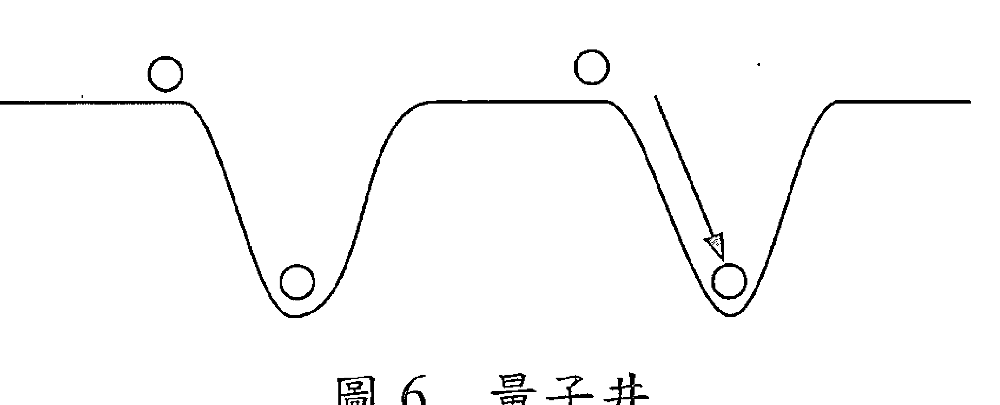

### (2) 高低坡

能量的高低不等情況，造成高低坡，有如山坡的樣子。如圖 7。高能量較強，低能量較弱。因此高向低流，似乎成為一種必然的趨勢。除非有強而有力的吸引，很不容易逆勢而上。

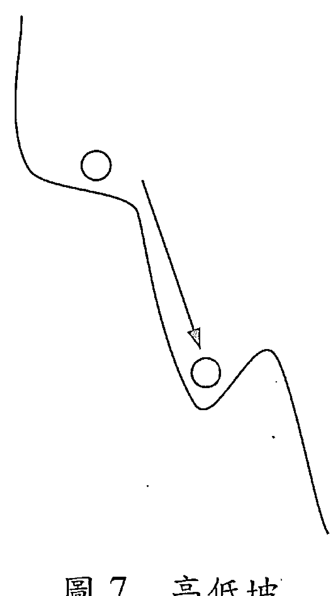

### (3) 凸顯處

有些能量，居於特殊的原因，在凸顯處維持動態的均衡，有如高山的平地，如圖8。原先擁有高強的動能，得以爬上高山，然後維持適當合理的動能，不致向山下滾動。然而仍維持高能量的狀態，必要時還是會向山下流動，可以說動定咸宜。

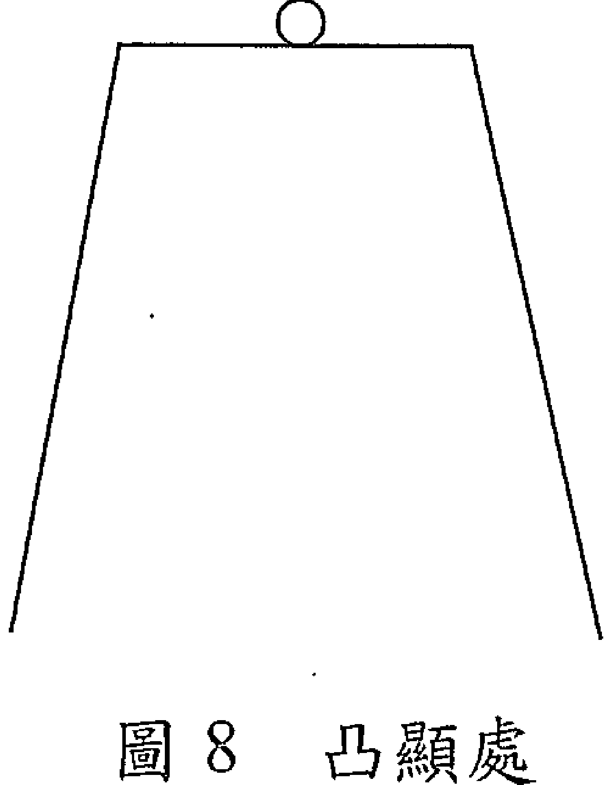

具有這些特性的靈魂，通常依據過去累世因緣所產生的習染，加上當下的修持程度，表現出不同的狀態，茲說明如下：

### (1) 尚未開悟的靈魂

能量從絕對宇宙墜入相對宇宙時，由於自身的能量不夠高強，必須依據自己的方向、大小，選擇適合於自己墜落時的著力處（量子井）。成爲人、一般動物、植物或物質，從此盡力維持穩定，暫不變動。倘若生而爲人，便循著生老病死的固定路徑，生生世世，都依照累世的習慣，以實際行動來證明人是習慣的動物。這些尚未開悟的靈魂，迷迷糊糊過一生。下一輩子，也沒有多大的改變。雖然說是凡夫俗子，卻也不致濫用創造力，擅自做主張，對能量界製造太多的麻煩。

### (2) 接近開悟的靈魂

喜歡尋求真理的靈魂，大多不願意受制於量子井的環境，也就是不安於量子井的生活，極力要發揮自主性與創造力，擅自做主張求新求變，卻又結黨成派，構成堅強而排他的團體，以自己的所是爲是，而以他人的是爲非。這種看似開悟，卻又不能完全覺悟的靈魂，有如高低坡上的能量。自持能量高強，不斷地上下滾動，使得整個社群，熱鬧非凡，卻也煩惱越來越多。徒然證明「天下本無事，庸人自擾之」。

### (3) 徹底開悟的靈魂

能量從絕對宇宙而來，始終不忘「回家是惟一安全的路」，不斷修煉，隨時可以從相對宇宙返回絕對宇宙，並不受形質的拘束。天堂、人間與地獄，都在同一空間，隨時進退自如，而且能夠隨遇而安。有如處身於凸顯處的能量，能顯即顯，應該隱便隱。真正徹底開悟的人，無聲無息，才能夠為而不恃，功成而不居。這些靈魂，證悟了人生有限的人文真理，可以行之於無限的宇宙之間，處於大中至正的和合體系中，有如岸上的燈塔，可以照亮方向，供那些尚未開悟或接近開悟的靈魂，有所指引。

## 4. 絕對宇宙和相對宇宙的關係

現在，我們可以談一談絕對宇宙和相對宇宙的關係，其實和靈魂與身體一樣的玄妙！值得大家關注。

我們看電影的時候，很容易把銀幕上的人、事、地、物當做真的，沉醉在動人的情節中，而感同身受。散場後才知道原來全部都是假的，只有自己才是真的。

其實，我們這些看電影的人，也全都是假的，只有每一個人身體裡面的靈魂，才算是真的。再進一步說，這些在相對宇宙走動的靈魂，也是虛幻的，必須重返絕對宇宙，才是真實的。可憐大部份的人，真假不分，虛實也搞不清楚。把真的當做假的，卻以虛幻的做為真實的。一定要等到死後，才完全明白，實在是枉過一生。

絕對宇宙有如電影院的放映機，其中裝進什麼樣的影片，銀幕上便會播放那一樣影片的情節。相對宇宙有如電影院裡的銀幕，原本一片空白，放映時有人物、有場景、也有各種不同的情節。但是放映完畢，仍然是一片空白。影片如果是靈魂，銀幕應該是身體。影片透過銀幕，把情節呈現出來。銀幕為影片所用，不能夠反過來操控影片的內容。除非影片更換，否則每一次放映出來的情節，都一模一樣，永遠不會改變。

相對宇宙的所有活動，都是絕對宇宙投射出來的。身體的所有舉止動作，按理說也應該是靈魂所主導的。相對靈魂，從絕對靈魂脫離出來。就各有使命，互不相同。這些相對靈魂，依據各自不同的使命，塑造所需要的身體。豬有豬身、狗有狗身、人當然也有人的身體。由於人生的使命，大抵相近。所以人體的構造，相去不遠。有五官、有內臟，各種肢體功能，也都差不多。

絕對宇宙的任務，在提供各式各樣的人生規劃，把它們分門別類，貯存在一個特大容量的記憶體裡。供各個相對靈魂在墜入相對宇宙之前，依照意願或業績，選用各自的人生規劃。由於在未生之前，就已經做好，所以稱為先天人生規劃。絕對宇宙的能量，以「天」為代號，也就是用天來代表。這種先天人生規劃，又稱為天命。相對靈魂在相對宇宙完成任務之後，可以重返絕對宇宙。若是任務尚未完成，就要繼續留在相對宇宙，再次或多次投胎為人，一般人稱為輪迴。絕對宇宙的絕對靈魂，便是絕對神。渾然一體、大公無私、無所為卻無所不為。由於無所不在、無所不知、而且無所不能，成為宇宙最高主宰。面對不同的種族，有不一樣的形體。在不同地區，有不相同的稱名。上帝、阿拉、釋迦牟尼、道、梵，老子說是同出而異名。各有不同名稱，其實相同，都是絕對能量、絕對靈魂、絕對神的別名。

### 大神原本沒有形像

有一則寓言，寫得十分精彩。它說：從前有一個樵夫，以砍柴為生。他所用的斧頭，便是最重要的工具。有一天，他忽然找不到那一把斧頭。心裡十分著急，連忙走上街頭，想抓偷他斧頭的小偷。他看到每一個人，都覺得有嫌疑，好像就是那個小偷。連續找了三天，被詢問的人，都絕口否認，使他很生氣。到了第四天，他在自己家裡的木材堆中，找到那一把斧頭。當他再走上街頭，覺得每一個人，都不像小偷，大家都很友善。

蘇東坡就有這樣的經驗，他和得道高僧佛印是好朋友。有一天，兩人一起打坐。蘇東坡問佛印：「我坐得怎樣？」佛印說：「很好，像一尊菩薩。」蘇東坡很高興，回來告訴蘇小妹，說完接著大笑不停。蘇小妹問他笑什麼？他說：「我看佛印坐禪，簡直像一堆牛糞。」蘇小妹說：「你慘了，人家佛印心中有菩薩，所以看起來人人都像菩薩。你滿腦子都是牛糞，所以看起來誰都像牛糞。」

自己心中有佛，遇到的人都像佛。自己的心中有邪念，就會牽引出魔來。一切都是自己想出來的，所以說自作自受。原始的大神，不過是大的能量，並沒有形像。中國人為了表示尊敬老天爺，想像出玉皇大帝的神像。世界各地的民族，對於大神也各有不同的想像。實際上都是這一個大能量，所演化出來的樣子。鬼的模樣，也是各人有不同的想像，以致並不一樣。中國鬼比較溫和有情，西洋鬼大多十分凶狠，為什麼？

相對宇宙的任務，在提供各式各樣的靈魂，帶著不一樣的天命，在這裡大展身手，各顯神通，看看誰有本事，圓滿完成這一生的使命，重返絕對宇宙。

絕對宇宙是主宰，相對宇宙是被控制下的自由競技場。絕對宇宙是考核者，相對宇宙是執行者。絕對宇宙當於我們的靈魂，相對宇宙有如我們的身體。兩者之間，應該如何互動？有待大家深思熟慮，並且做出合理調整。換句話說，要看各人的覺悟與實踐。

## 5. 相對宇宙可能毀滅

所有的「末世論」，都應該有一個先決條件，那就是「人類會滅絕」。如果人類不可能滅絕，便不可能有末世出現。我們並不是把所有的責任，都推在人類身上。但是「天」代表絕對宇宙，「地」表示相對宇宙，而「人」是所有居於天地之間的萬物，共同認定的總代表。因為萬物之中，只有人類擁有高度的自主性和創造力，足以贊助天地進化，也能夠破壞自然，造成毀滅。

「末世論」和「人類滅絕論」，看似相同。實際上有很大的差異，不能不加以探討，以求有所因應。

科學家證實：宇宙有三種可能的歸宿，如圖 9。一種是持續穩定地加速膨脹下去，造成星系群間和星系團間的距離，越來越大，終至於大解體（Big Rip）。一種是持續穩定地膨脹，並不增加速度，可以延長大解體的期限。還有一種是由於重力的吸引而減少膨脹的速度，終至於塌縮。換句話說，不論宇宙是持續穩定地膨脹，或者加速或減速，結果都將毀滅，重新來過。這種說法，合乎循環往返、生生不息的宇宙。絕對宇宙經過大爆炸，成爲相對宇宙。相對宇宙由於大解體而毀滅，回歸絕對宇宙。

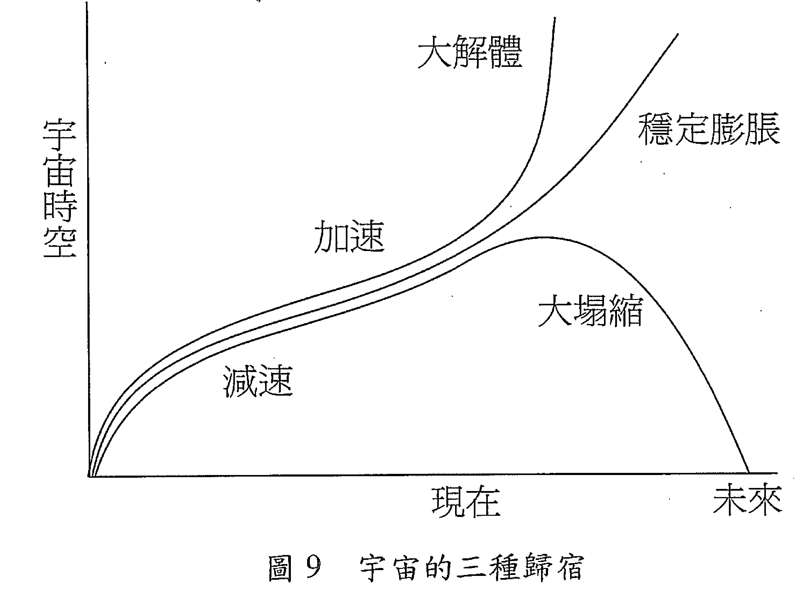

現在的宇宙，正走到穩定解體、加速解體、或者大塌縮的分界點。可以說正當末世，所以末世論十分盛行。各式各樣的末世理論，相繼提出，令人怵目驚心。

實際上，宇宙由生成到毀滅，並沒有固定的期限。就好像我們的身體，有使用期限，卻沒有一一定的保用期間。誰都知道身體會毀壞，但卻不知道什麼時候到期？

宇宙不是靜態的，它不停地膨脹。不論是看得見或看不見的自然現象，不論原子內部或者外太空，宇宙中的物質和能量，都在無情地消散。有如蒸氣那樣，消散在無盡的虛空中。可是，太陽正慢慢地燒盡，各處的熱氣逐漸冷卻，宇宙正走向最後的「熱的死亡」（Heat-Death），於是無光、無生命、無熱、無時間、也無空間，各種自然程序都將停止。必須經過很久很久，才能夠重建新生。

很久很久，到底是多久？答案是快起來很快，轉眼便成為事實。慢起來很慢，也許要等幾億、幾十億年。

末世論是真實的，但是離開我們太遙遠了。很多人不理會，不把它當一回事，認為與自己無關。加上反正大家都碰上，又不是自己一個人倒楣。天塌下來有高個子先頂住，擔心那麼多做什麼？以致說者諄諄，而聽的人藐藐，不但不放在心上，反而斥為胡言亂語。

身體也是這樣，總認為自己還年輕，怕什麼？拿身體來完成任務，就覺得身體健康十分要緊，不能受折磨。拿身體來享樂，卻絲毫不擔心，會樂壞了身體。反而倡導趁著年輕，不要留白。用身體換取金錢，也認為理所當然。甚至於大聲呼喊：反正要死，怕什麼？

## 6. 人類也可能滅絕

大家看到天天有嬰兒出生，而且為數還不少。一定會對人類滅絕這種說法，當作危言聳聽，嚇唬人的。

但是，當我們看到，近年來社會上所出現的「單身貴族」和「頂客族」（DINKS）。前者指不結婚的族群，男女兩性都有。後者則是雙薪（Double Incomes）和沒有小孩（No Kids）的縮寫。雖然結婚，卻不想生育子女。我們應該注意到出生率和死亡率的變化，如果前者不斷下降，到了低於後者的時候。人口問題的性質，就會引起嚴重的改變。只要某個民族的人口數量急速減少，這個民族後繼無人，便自動宣告滅絕了。人類的危機，主要在於有利益驅動，人們便很難約束自己的行為。老年福利制度，使「養兒防老」成爲過時的誘因。兒女的養育、教育費用高漲，長大後又不知孝順父母。女性工作意願提高，寧願就職而不願意成爲專職母親。男女都趨於晚婚，生育意願降低。這些觀念和行爲，莫不由於利害關係所促成。理性的思考，畢竟難敵感情用事。只管個人的生死，不關心民族、種族乃至於人類的存亡。

何況人類已經佔據了大多數的生存空間，自信有能力承擔控制生態平衡的使命。對於每天都有生命的產生和消失，似乎人類已經擁有主導權。生態系統是被動的，人類自從懂得用火以來，逐漸形成掌控生殺的特權。人們不再把某些動物當作經常性的食物，而是想喫什麼，就殺害什麼。人類再這樣恣意地喫下去，恐怕地球上的動植物，都要聯合起來，發表警告性的宣言：「人類太聰明了，快把地球上的東西，全都糟蹋光了，已經成爲大家的公敵」。尤其是犀牛，更加憤怒，因爲他們聽到有人這麼說：希望犀牛早日滅絕，使他所貯存的犀牛角存貨，可以在一夜之間，價格上漲好幾倍。這種人類所特有的貪婪心，已經使得很多在地球上倘佯了數百萬年的物種，徹底地消失。往昔所警戒的暴殄天物，現代已經擴大範圍，並且數量也快速地增加，令人怵目驚心。

實際上，廣大的生靈，以動植物爲主，已經掀起了反撲的熱潮。包括各種微生物在內，不斷發出各種警訊。可是人類除少數先知先覺人士大聲疾呼之外，大多數人，仍然視爲自然災難、天然禍害而不知警戒，甚至於認為事不關己，或者關心也沒有用，而置身事外。

近年來世界各地災害頻傳，從洪水到乾旱，不斷地威脅著世界各地，尤其是發展中國家人民的生存。科學家預計今後二十五年內，全世界將有百分之七十五的人口，面臨洪水或飢餓的威脅。自然災害真的是自然或者上帝對人類的懲罰嗎？科學家認為絕大多數自然災害的始作俑者是人類本身，而非上帝。自從人類社會進入工業化以來，隨著農藥污染和工業污染的不斷加劇，地球上所有的生命都受到人類的威脅。人類的無知與貪婪，已經把無數種生命，變成了歷史上的傳說。人類的胡作亂為，卻要其他的生靈來承擔惡毒的後果，已經嚴重地違反宇宙間自作自受的規律。在這種情況下，人類不滅絕，還有天理嗎？人類可能滅絕，不過是時間的遲早，沒有人知道而已。不如及早圖謀，或許還有一線希望。

## 7. 身體受欲望引誘

現代經濟挂帥，人們考慮任何事物，似乎都離不開金錢。錢財以外的各種關係，好像都被沖淡了。加上中國自古以來，所倡導的尊天敬德、珍惜資源、天人合一的生存智慧，又為過度耗費地球資源的美國式生活價值所取代。東方人培養直覺、謙遜、謹慎、遠慮的教育方式，也被美國人重視積極、行動、攻擊和個人利益的教育方式所淹沒。我們並沒有否定經濟對人類生活的重要性，但是經濟活動是否最有價值的生活要素？則不那麼容易認定。因為人生在世，目標在求得好死，並非經濟因素能夠完全決定的。人的身體，有耳、目、口、鼻、手足這五種感官，原本是用來接觸外界的工具。外界事物，也對準這五種感官，提供聲、色、香、味、觸五類資訊，以了解宇宙和人生。這五種感官所獲得的訊息，必須整體配合，經由心智的分析和研判，才能做出合理的判斷。相當於達成有效的協定，再藉由身體的動作，產生適當的反應。這種理性的身體作用，很快就被伴隨而來的欲望所擾亂，以致產生各種偏差。

人類的欲望，也是靈魂安排的。在先天的人生規劃中，人們至少包含四種基本欲望：即為生存欲望、異性欲望、權力欲望與合群欲望。而這四種欲望，又都具有絕對傾向。在生存方面，凡有利於個人生存的，不論衣、食、住、行，無不極力追求。在異性方面，現代心理學家也指出人類具有多偶傾向。而且男人希望自己身邊有幾個女人，卻又不願意自己的女人去愛別的男人。因此爭風吃醋，造成很多糾紛。在權力方面，人人追求自由，希望外來的干涉越少越好。卻又盡力追求地位和權力，希望他人接受自己的干預。在合群方面，企求自己所屬的組織，勢力越大越好。對於別人的組織，則視為結黨營私，全力加以否定和排斥。

有了欲望，好像就很難維持合理的程度。這種安排，原本是用來幫助自己修身用的。看看自己怎樣以理智來指導感情，以理性來引導欲望。實際的情況，卻大多不如理想。身體受到欲望的引誘，常常走向偏道，而難以自拔。人人總是提醒自己，不要被名利沖昏了頭。但是名利當頭的時候，真的沒有幾個人把握得住。

欲望原本是用來考驗身體的，身體卻似乎忘掉了這種作用。反而以滿足欲望，當作無比的快樂。

人生是為了吃飯，還是吃飯是為了人生？生產是為了做人，或者是為了生產而做人？原本十分清楚的事情，也由於身體擋不住欲望的誘惑，而引起很多的爭議。

「靈魂」與「肉體」開始了「靈肉之爭」，孰輕孰重？各有不同的主張。我們不必強調以肉體的幸福來換取靈魂的完美，卻也不能坐視肉體只顧自己欲望的滿足，卻忽略了靈魂的要求。我們只希望，人們要有整體性的概念。靈魂和身體，都是這個整體性的部分。最好能夠兼顧並重，在靈肉的衝突中，尋求合理的調和。使靈肉都為我們這個整體的人所用，以完成今生今世所要完成的任務。欲望並不可怕，時刻加以合理的節制，不使其過分膨脹，以肉體的健全來增長靈魂的生命，即為上策。

## 8. 反過來囚禁靈魂

人們為了後天這個有形有限的軀體、意識以及現實繁雜的文明事物所迷惑及捆綁，陷溺在這個身體及其有限的運用當中，反而遺忘了這個最為寶貴、最需要珍惜、重視的靈魂。這種捨本逐末的心態，最具體的表現，便是不遺餘力，要把人類的壽命，儘可能地延長。

人類平均壽命不長，主要是由於靈魂投胎為人，所帶來的先天人生規劃，搭配的時間，普遍為期不長。只想早日完成此生的任務，早一些返回老家，安享太平。

現代人不關心人類滅絕的問題，對於個人的壽命，卻十分重視。同時站在身體的立場，來評估我們的生命。認爲人不過是一堆碳水化合物，也就是一堆粒子的組合。當這一堆粒子覺得舒服、快樂的時候，那就是善。若是身體覺得不舒適，感覺悲傷時，那便是惡。因此主張人生以快樂爲目的，再縮小範圍，便成爲人生的目的在追求肉體的快樂。人之所以爲人，即是有欲望的本質。各種欲望得到滿足，就覺得快樂，否則便覺得痛苦。人們好樂惡苦，多以肉體爲基礎。特別是物質主動說（Epiphenomenalism），承認身體是主體，心靈不過是一連串爲身體而產生的事情。身可離心而獨存，而心則不能。也就是身體具有影響心靈的能力，心靈並不能影響身體。希臘哲學家柏拉圖（Platon，427-347 B.C）早已指出：心靈在身體之中，恰似被關在牢獄面。

> >台灣大學哲學系郎昆如教授提供一則笑話，簡述如下：
>有一天，兩位同學在校園裏，坐在草地上聊天。忽然出現一位穿著十分時髦的女郎，從他們眼前走過。這時候唸醫科的同學開玩笑地說：「看，一堆碳水化合物！」於是唸哲學的同學接著說：「不過，你有沒有注意到那堆化合物的表面張力？」

如果只看到身體，物理學家和化學家，可以獲得「一堆碳水化合物」的結論。但是，人的行爲、際遇和結構，都是哲學家十分關注的課題。人性是不是表現在人的行爲？人的行爲果真完全受到環境的支配？人有沒有更高層次的自由？人的自由和靈魂有沒有關係？

靈魂創造身體之前，難道沒有料到有這麼一天，自己反而被身體囚禁起來？依據我們的研究，靈魂這樣做，也是一番好意。相当於安排一些障礙，看這個人能不能適當地加以排除，恢復靈魂原有的靈力、靈氣和靈通？既然身體有如靈魂的工具，它應該是中性的，可善可惡的。使用得合宜，便是行善的工具。用得不妥當，就變成爲惡的工具。工具無善惡，要看人類怎麼使用。

人類和動物最大的不同，其實是看得見的部分，表現在人善於利用工具，而動物則相對地笨拙。瓷器、火藥、機械、槍砲都是工具。但是東方文化，擅長於瓷器和火藥；而西方文化，則專精於機械和槍砲。北京大學吳國盛教授認爲，前者是保守性的，後者則是進攻性的。

我們不能完全把責任推給欲望，因爲欲望並非完全是惡的。我們也不能指責靈魂，不認真保護自己的靈活性。我們更不能眼巴巴的看著自己的身體把靈魂囚禁起來，也就是任憑假我（義我）把真我捆綁起來。

## 9. 形成坚牢的多重心身

按照佛家的說法，人死後尚未投胎之前，由一個微細物質所形成的中陰身（Etherial Body）來維持。這個中陰身在最初的四十九天，也就是俗稱的頭七、二七、三七到七七的日子中，每七天一生死。經過七番生死，等待業緣的安排，然後伺機去投生。如果業緣許可，尚有機會再次投胎爲人。這個中陰身便成爲那一生的塑造模型，由胚胎開始，逐漸呈現人的模樣。中陰身較肉身稍大，如圖 10，有如沿著肉身周圍射出的光。其射出的線越強硬、越整齊，表現其抵抗力越強，身體也越健康。若是射出的線條軟弱、混亂、甚至於捲曲，則其身體即已病或將病。因此有人將中陰身，稱爲健康氣。

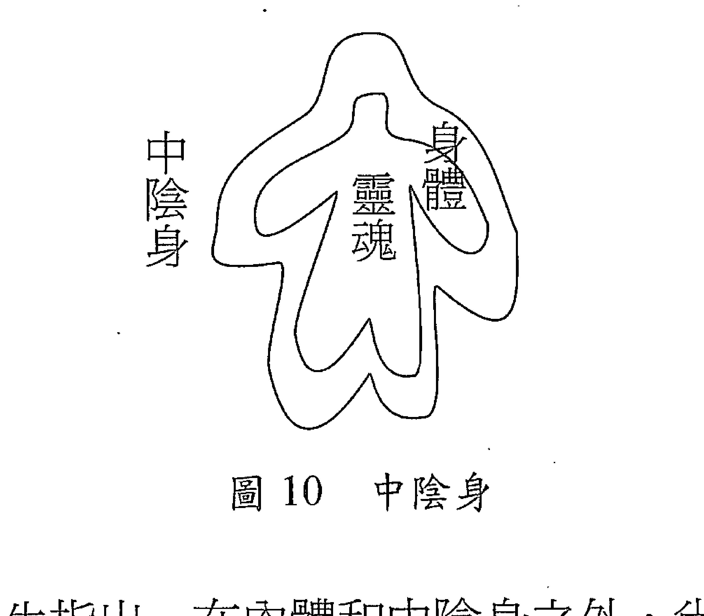

汪少倫先生指出，在肉體和中陰身之外，尚有欲心身、智心身、和理心身，一層又一層地包在外邊，如圖11。這五重心身，結合成一個橢圓形，很像一個直立的大雞蛋。靈魂被包裹在中央，肉身在雞蛋的正中，好比蛋黃，只不過是直的，而不是圓形的。然後中陰身、欲心身、智心身、和理心身，層層包裹，使靈魂幾乎接觸不到外界的環境。欲心身比中陰身稍微大一些，一方面穿過肉身與中陰身，一方面包圍在中陰身的外邊，通常可達好幾吋厚。西洋心理學家，大多把它稱為「情欲」（Desire, Feeling）。

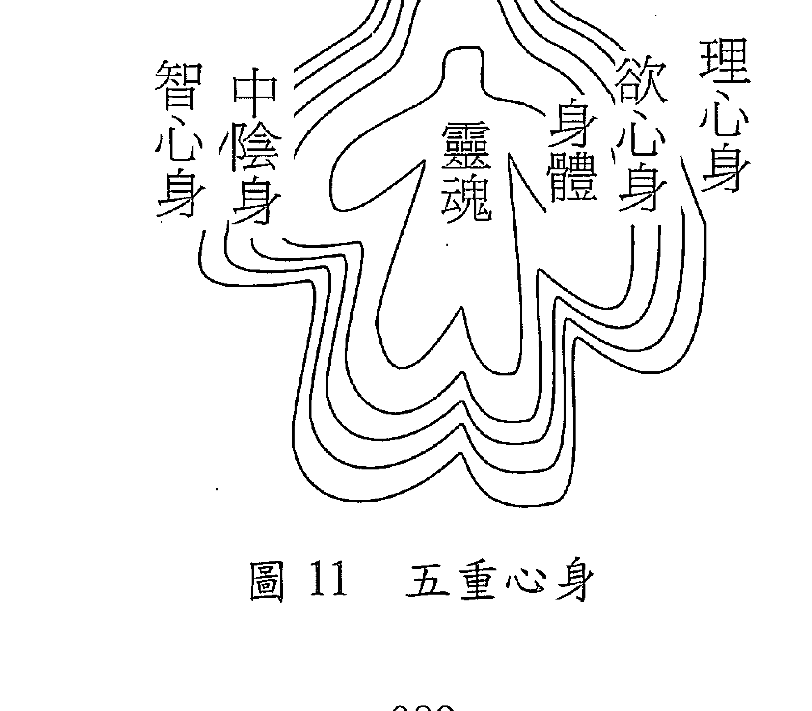

智心身又比欲心身為大，一方面穿過中陰身、欲心身，一方面也包圍在外欲心身外邊，同樣達數吋厚度。智心身便是通常我們所說的智力（Intellect）。

理心身比智心身更大，一方面貫穿中陰身、欲心身和智心身，另一方面又包圍在外智心身外邊，達數吋厚。西洋心理學家，把它叫做「理性」（Reason, Vernunft）。

這五重心身，就正常人來說，應該是彼此合作的。好比一輛行駛中的汽車，肉身相當於汽車架子，中陰身有如汽車引擎，欲心便是汽車司機，智心即為汽車方向盤，理心則是汽車主人。這五部分分工合作，形成一個小宇宙（Microcosm）。肉身是死的，不能夠自己活動。必須依賴中陰身的炁，集中於手時，手才能取物；集中於腳時，腳才能踢物。然而，每一個人中陰身的炁，有一定的分量，好比汽車油箱所能儲存的油量，各有不同。油用完時，必須再加油。這時候要先將火關熄，才不致引起爆炸。中陰身的炁用完時，也必須加以補充。這時候心和身要分離，才能順利進行。否則隨充隨耗，永遠沒有充足的可能。將身心分離，使中陰身順利充炁，便是我們所說的睡眠。我們由飲食補充肉身的消耗，依靠睡眠來補充中陰身的消耗。所以吃得下、睡得著同等重要。可惜有很多人，欲心過強。好像一個鐵籠，將自己和他人完全隔絕。籠內烏雲瀰漫，證明他終日所思、所為，都是自私自利。智心身顯得十分空虛，理心身也像一個空魚胞。智、理兩心身沒有炁，無力上浮，而鐵籠又重，生前生活不正常，死後也必然墮入地獄。

## 四、身體與靈魂的關係變化

## 10. 靈魂面臨強大的挑戰

就人類而言，靈魂來投胎時，深藏於中陰身裡面。換句話說，這個由業和慧所界定的中陰身，把靈魂緊緊地包裹起來，使其忘記一切，誕生後必須從頭摸索。

隨著年齡的增長，肉身之外，又增加了欲心身、智心身和理心身的糾綁。於是靈魂被五重心身團團圍住，好比水的原子H₂O，深藏在各種不同型態的水、冰、汽中一樣。汪少倫先生認為，除非遭遇重大事故，靈魂才會偶爾表現一下。通常都昏昏欲睡，無知無覺。

靈魂這樣安排，目的在看看這一生的五重心身，能不能一層一層加以修脫，好像五層牢房逐一推倒，使靈魂恢復絕對自由，能夠平安地返回老家——絕對宇宙？

中陰身梵文稱為「靈氣身」(Pranamayakosha)，靈魂投胎時以中陰身為藍本，製造合乎過去業力的肉身。中陰身一方面供應靈氣，使肉體有所作為。一方面具有六神通，包括神足通（飛簷走壁的超能力）、天耳通（聽力的增強）、他心通（知道他人心裡所想）、宿命通（知道過去世的事情）、天眼通（眼力的增強）、以及漏盡通（煩惱的徹底消滅，發出智慧與慈悲），生時偶爾可以活用，死後才能充分表現。

肉身長成之後，各種欲望紛紛產生，包括哀、樂、恐懼等生存欲望所產生的感情、愛、恨、爭風吃醋等異性欲望所衍生的感情，悲、喜、勇敢、怯懦、尊敬、輕視、憤怒、厭惡等權力欲望所帶來的感情，以及仁愛、同情、慈悲等合群欲望所造成的感情。形成一股強大力量，驅使肉身不斷地盲動。以致殺、盜、淫、妄、無所不為。可見我們所說的欲心，其實是魔心。這一輩子不能掙脫欲心的束縛，靈魂就將生生世世，帶著這樣的中陰身，不斷地輪迴。

欲心身過分膨脹，是人類的致命傷。它驅使肉身不斷地消耗中陰身的炁，使外環的智心身和理心身空虛無力，而體力也耗費殆盡。我們常說身心疲憊，便是指此而言。智心的主要功能在分辨真假、美醜和善惡，以指導欲心慎重選擇。但是欲心常常不服從智心的指導，擅自為非作歹。理心的職責在開悟，使我們獲得真知，看見真光。除了極少數人，由於前生修持，理心身得以偶爾活動之外，大多數人，都不能發揮功能。欲心身發達，死後大多墮入地獄。智心身旺盛，才有上天堂的可能。而理心身開啟，大徹大悟，才能夠安返絕對宇宙。

靈魂的最大挑戰，是一般人看不見它的存在，誤認為身體便是我。靈魂如果是神，身體不過是他所居住的廟。但是一般人不明真相，不但把身體當做我，而且認為這是唯一的我。肉身死亡，便認為我已消滅。為了延長我的存在，就盡力設法保存肉體。於是講究衣、食、住、行，以實現肉體的生存。未生病時，天天擔心害怕。已生病時，便百般求醫。甚至知道無法醫治，也要盡量尋求秘方。當肉體死亡時，憂傷哭泣。生前以肉身為我，死後也就以屍體為我，魂不離開屍體，成為戀屍鬼，那才是能做神而不當神，一定要做鬼。

靈魂有感於此，便致力於開啟心智。使靈界和能量界，逐漸分隔開來。我們下一章，將有進一步的說明。

## 五、靈魂開啟心智

## 1. 人體內原本有心

靈魂在塑造身體的時候，特別重視腦部的功能。腦部的發展，比身體的其它器官更優先，也花費最長的時間。大約在懷孕的第九週，腦細胞便快速分裂。每分鐘產生十萬個新細胞，到了第二十二週時，腦殼還相當光滑。但是第四十週的時候，腦細胞的數目已經達到一百五十億個。這個數目在出生後不再增加，表示腦部在胎兒期間，已經發育完成，具有大人的大腦皮質。

我們再看五種感覺器官的情況，視覺發生得最早，大約第二十四週時，具備感受光的能力。但是真正能夠看見物體，大約要到出生後三個月。其次是觸覺，大約在第二十四至二十五週時，能夠感受冷熱和疼痛。然後是聽覺，大約在第二十六週時，能聽取各種聲音。但是要分辨和理解聲音，要到出生後五至六個月，才能做到。味覺大約在第二十八週已經發達，但是還不能分出濃淡。至於嗅覺，我們並沒有辦法調查，看有沒有這方面的能力。但是根據推測，很可能在胎內就已經具備嗅覺了。

靈魂為了防止各種感覺發展得太快，腦部來不及加以制約，很可能各自发展而彼此不能协调，以致各是其是而产生种种偏见。有意使人的智能发达，安排在身体发达之先。但是我们所说的脑细胞，包括神经元、神经键、神经胶质等等。而这些神经元、神经键，必须受到刺激之后，才会生长出来。因此各种感觉器官，应该和脑部互动，促使脑部发育正常。如果到了四岁，某些部分的脑细胞，所需要的神经元与神经胶质还没有长出来。这些部分的脑细胞，便会逐渐枯死，也无法再生。

同样的生辰八字，为什么各方面都有那么大的不同？第一个原因，即在于家庭环境不一样。第二个原因，则是各人的个性不相同。家庭有读书的气氛，孩子从小耳濡目染，跟着喜欢看书。思考力、想像力较强，智力的发展也比较好。家庭里经常看电视，小孩又喜欢看漫画书，就会越来越讨厌有文字的书，将来进入学校以后，越来越听不懂老师所讲解的内容，智力的发展必然较差。个性不喜欢动的孩子，小时候爬行不够，长大以后不喜欢看文字，认字、写字都相当困难，对脑力的发展，有不良的影响。喜欢爬行的孩子，脑髓发达得比较好。食物也有关系，白糖吃太多，会影响脑细胞，造成逃学、自闭症、神经疾病、精神疾病。严重的话，还会造成慢性的脑麻痹。汽水、果汁、蛋糕、冰淇淋、饼干吃多了，智力的发展受到阻碍，岂不是自作自受？

这些巧妙的安排，都在警惕我们的身体，必须受到相当的约束，不能够「只要我喜欢，有什么不可以」？明明是脑的作用，我们却一直把它称为「心」。一句「用心」，便包括一切。意思是「用心想想，想好了再动作」，也就是「任何感官接收到的讯息，都应该经过大脑的筛选、分析、比较、判断」。

## 2.先天很固定而後天有彈性

人類的智能會變化，特別是六歲以前，越早接受腦部的開發，就能獲得越高的智能。我們承認腦筋越用會越好，但是不能夠把責任完全推給後天的環境。因為先天的遺傳，同樣十分重要，成爲個人不可忽視的命。

英國精神學的研究，分析了六千對雙胞胎女孩的學科測驗成績，發現基因明顯影響兒童的運算技巧和閱讀能力。研究人員指出：數學及閱讀之間，擁有共同的基因組合，支配著兒童在這些方面的學習能力。其中涉及五十到一百個不同的 DNA 密碼，每個密碼扮演一個小角色。他們相信，每人有不同的學習基因。這些基因對學習的影響，遠較後天的環境因素爲大。學習數學覺得困難的人，可能在其他方面有較高的能力，因爲擁有不同的基因組合，所以形成這樣的結果。

靈魂安排若干固定的先天遺傳因素，目的在造成人類的多元發展，以個別差異爲出發點，各自走出不一樣的人生途徑。同時也預先防患，避免大家爲了趕時髦、或者湊熱鬧、甚至於爲了生活的方便，一窩蜂走上共同的路途，使社會產生畸形的發展。我們的學校教育，採取一致的課程，要求相同的進度和效果，顯然並不妥當。上天希望我們人人都不一樣，我們沒有理由要求大家都要相同。每一個人，都是獨一無二，不能替代的。

至於后天环境的影响，要用來考驗一個人的自主性和創造性，正是我們需要努力的地方。雖然說環境也有固定的部分，但是和遺傳因素比較起來，具有相當大的彈性。我們可以藉由環境的變動，來改變自己的人生。孟母三遷便是很好的教訓，主動參與社區環境的改造，也是現代人必須重視的重大課題。教育與再教育的問題，同樣是為了加強後天的培育，以配合先天的需求。

靈魂對於「心」的功能，既有先天的限制，也有後天的彈性。一方面因應每一個人出生之前的條件，符合公正、公平的原則，在投胎之前，實際上也經過公開的評比和審定，讓合適的靈魂，選定適合的受孕機會，而各就各位。另一方面則促使每一個人，在既定的限制範圍內，各顯神通，尋求最佳的後天環境，向上奮鬥。

我們常說的公正、公開、公平，其實是絕對宇宙才可能出現的情況。靈魂在投胎為人以前，可以享受這種絕對的機會。但是進入相對宇宙，也就是到了母體子宮之後，就只有相對的公平。說起來便是公正的不公平，也就是合理的不公平。後天環境，只有公正並不可能完全公平。原因是相對宇宙的資源，相對地有限；而相對於絕對宇宙所能夠提供的機會，也相對地不足。在資源有限、機會不足的情況下，怎麼可能公平呢？頂多做到合理的不公平，已經是公正合理。至於公開與否？必須看情況而定，有的便於公開，有的則不公開反而比較好。

身體在這一方面，好像越來越不能接受。我們看到多少身體健康的人，心裏越來越不健康。多少身體活動正常的人，心理卻逐漸不正常。這種身心的不平衡，主要來自於我們對於先天和後天的認知，並不一定正確。

## 3.神鬼都在我們心中

鬼神並不是與生俱來的觀念，沒有一生下來就怕鬼。嬰兒單獨睡覺，即使房間再大，光線再暗，位置再偏遠，也不需要有人陪伴，因為心中沒有鬼，所以不怕鬼。小孩子也不怕鬼，怕黑是真的，或者喜歡有人給他們一些溫暖的感覺。一直到有一天，大人們有意無意給予鬼的概念，既恐怖又模糊，他們心中有了鬼的印象，這才開始怕鬼。而且越想越害怕，好像真的碰到鬼。

同樣道理，拜祭的時候心中有神的存在，神就好像真的在那裏。拜同一尊神，各人的感覺不一樣。緣的厚薄，從人和神的互動關係，可以看出端倪。

一直到宋朝，讀書人還是把鬼神看做一種陰陽的變化。譬如朱子，就十分明白地指出：鬼神不過是陰陽消長而已。人有精也有氣，精即魄，屬鬼。而氣則是魂，屬神。這樣說起來，精和氣聚合起來，成為人或物。可見萬物都有鬼神，並不是人類的專有。

朱子認為人自小成長到壯年，是神，衰老以後是鬼。我們則推論人生的時侯，一半是神，另一半是鬼。神鬼的比例不同，造成各人的性格不一樣，命也不相同。其實鬼代表我們的獸性，神表示我們的神性，綜合起來，便成爲我們的人性。身體接受心智的指導越多，神性的部份越獲得發揚，我們稱呼這種狀態爲「真神人也」。身體根本不接受心智的指導，但憑感情用事，想出來的點子，通通是「鬼主意」！碰到這樣的人，便是「見鬼」。有時顯神性，偶而現鬼性，那就是人性。可以說人是世界上，最喜歡也最擅長「裝神弄鬼」的動物。

中國人最尊敬祖先，是世界上唯一把祖先的靈魂扛在肩膀上，到處行走的民族。祖先雖已死亡，而氣尚未散盡。到底還有多少？只有子孫由於頻率最爲相近，最容易有所感應。若是子孫不忘本，心中有祖先，自然感覺有氣的互動。如果子孫心中已經沒有祖先的地位，根本用不著祭祀。因爲拜跟不拜一樣，不過有一些形式而已。我們心中的祖先，是甚麼樣子，想像出來的祖先，便是那種情況。對中國人來說，祖先是我們多出來的一條導航線。有很多不方便說出來的事情，可以放心地和祖先溝通。比其他不崇拜祖先的民族，多了一些可以對談、能夠請教、值得信賴的先輩，當然有很大的助益。

> **鬼和神的區別**

禮記祭義篇記載：有生之物必有死，而死後必歸於土，這便是鬼。骨肉在地下腐爛，化作野土。但它的氣卻發揚於上，成爲活動的光景、氣味，和使人感動的東西，那就是生物的精靈，變成神。

中國自古便相信鬼神，把戰爭和祭祀，看成同樣重要的國家大事。尤其是戰爭之前，往往先要向祖廟報，並祈求上天護佑。和基督教的禱告，十分相似。只是我們認為鬼神種類繁多，基督教則尊奉一神。我們祭祀祖先，基督教並不如此。

倘若認為在宇宙之外，未有宇宙之前，就有一尊巨大無比的神，來創造一切，就會想出一位造物主，把它奉為宇宙的最高主宰。假定宇宙所有的人和物，都是造化先生的神奇妙用，又創造又演化的結果，便會想出萬物皆有神，各自擁有生生不息的造化功能。

怎樣想，就想出怎樣的鬼神，符合相對宇宙的觀點。各種民族，不同地區，立場不一樣，看法也不一致。於是各有各的鬼神，各有各的信仰，也符合多元的需求。只要互相尊重，不要彼此排斥。基本上是正常的現象，不必要也不能夠加以統一。信仰自由，便是不排他，不標榜自己的信仰才是正確的。既不禁止什麼不能夠信，也不規定一定要信什麼？任憑各人自行選擇，可信可不信，反正各人自作自受，管他做什麼？

> **祖先崇拜的意義**

一個人，除非是大聖大賢，或者具有豐功偉業，死後很少會有人長久地懷念他。很快就被大家遺忘掉，好像從來沒有存在過一樣，豈不是白活了這一輩子？中國人十分聰明，知道教導子女，在父母亡故後，要時常紀念他們。把他們看做活在另一個世界的人，仍然要按照他們生前的習慣，把他們所需要的物資，用火焚化，變成屬靈的物資，以滿足先人的需求。

陽世的人，誰比較可靠？當然是自己的子女或後代子孫。為了保證自己死後，在陰間能夠獲得所需要的供品，我們會設法把財產傳給自己的子女。當我們對自己的死亡，以及死後的各種安排之後，我們對死亡的憂懼，自然減輕許多。祖先崇拜，無論對祖先、對自己，以及對後代子孫，都有很大的功能和意義。

子女或至親好友，如果以至誠紀念亡故的先人。一定會將死者生前的音容笑貌、舉止動作、愛憎迎拒等情況，盡情地追憶。想念到極深時，會產生某種幻覺，好像亡者未必離去，而是和往昔那樣，生活在自己的旁邊。只是行動飄忽幻化，不受軀體的拘束。特別是大家追述亡者的種種言行，更是覺得十分親近。祖先崇拜的教化作用，大於紀念和禮拜。我們祭祀祖先時，必須全家人聚集在一起。藉著對祖先的懷念，建立家人的共識，以求協同一致，共同為發揚家風而奮鬥。中國人的鬼神觀，實際上已經提升到文化的層次。我們和鬼神互動，目的在促進生者的孝道和互助。

## 4. 高能量為神低能量即鬼

我們說人的心目中有神鬼，神鬼才能產生作用，並不表示神鬼是人想出來的。真實的情況，應該是鬼神原本就有，只是沒有這樣的名稱。鬼神的名稱，才是人想出來的。我們的想法，固然可以改變神鬼的情狀。然而不管我們想或不想，或者怎麼想，神鬼都是存在的，只是存在的樣子不一樣而已。個人電腦和網際網路連不連線，網際網路依然存在。連線之後，不同的個人電腦，從網際網路上所搜尋到的資訊，並不一定相同。主要原因，是每一個使用者，所想要的東西並不必然完全相同。

宇宙的本質是能量，大霹靂之後所產生的星塵，能量有高有低。高能量的吸引力和電磁力，以及強交互力或弱交互力，通常比較強大。對於維持宇宙能量場的平衡、對稱和動態，作用比較顯著。所以神氣活現，十分靈光，充滿靈氣，表現出強大的靈力，稱之為神，應該當之無愧。低能量各方面的影響力，都比較差。只能搞鬼作怪，稱之為鬼，也堪稱適宜。當然這些情況，隨時都在變動之中，神會變魔，而鬼也可能變神。

左傳早已指出：附在形體上面的魄，叫做靈。附在生氣上面的魂，便是神。形體是個別私下擁有的，屬於私有。生氣則是大家共有的，屬於公器。魄的所知有限，只出現於私的形體，所以只能稱為靈。魂的所知超越私的形體而達於公的生氣，因此被尊稱為神。

我們以人為例，生前有魂有魄，前者指精神，而後者即身體。精神是心智的表現，身體活動較偏重於物質。古埃及人認為人死之後，靈魂離開肉體。若是有朝一日，靈魂重返身體，仍然可以復活。因此對木乃伊的保存，金字塔的建造，十分熱衷，也花費很多的財力。古希臘人相信靈魂不滅。死後離開肉體，純潔靈魂，可以和諸神共處；不純潔的就變成鬼。基督教和回教，同樣相信靈魂能夠離開肉體。佛教不談靈魂，也沒有靈魂轉世的說法。只是佛教主張六道輪迴，使人很容易產生靈魂轉世的想法。中國古代所說的神靈，和靈魂無關。春秋時代，已經認為人只有一個身體，並沒有靈魂投入。有了身體這一個形體，才能夠做出動作，我們把它叫做氣。有了形氣之後，產生種種性能與作為，才稱為神靈。種種說法，證明鬼神實在難以瞭解。然而人的死亡，卻是不爭的事實。一般人不知道死後的真正情況，但是對於死後「一了百了」，總是很不以為然。因此越來越多的人，放棄「一次生死」的論調，接受「多次生死」的說法。

身體的存歿，大家看得很清楚。不論火葬、土葬、水葬或其它葬法，身體不見了，或者逐漸消失。從身體的角度來看，一生一次，用畢即棄，不可能有來生。多次生死，有賴於心靈的持續活動。大家寧可相信靈魂不滅，死於人世間，即生於能量界。既然能量不減，而人類又是大霹靂所生的星塵所轉化而成，當然靈魂不減，身體可以重新換用一個，再來奮鬥一生，更為充實。

人類當中，能量高的稱為得道高人，能量低的便是凡夫俗子，不高不低的即是可造或待造之才。這三系人分別擔任先知先覺、不知不覺和後知後覺的不同角色。

## 5.得道高人可以往返兩個宇宙

古代中國人，早在殷商時期，便出現天上帝廷的觀念，其實就是我們現在所說的能量界。認為先王、先公死後才有資格升天，一般人死後，只能相約在黃泉見面。即是能量高低的不同表現，才有這樣的差異。從絕對宇宙來到相對宇宙的靈魂，能量有高有低。其中徹底開悟的靈魂，能量最高，死後返回絕對宇宙，即為升天。尚未開悟的靈魂，雖然領有天命，卻由於能量低，心智和體能不足，不能完成預期的使命，當然只能相約黃泉，無法返回老家。至於開悟中的靈魂，則尚待努力，一旦智慧大開，依然可以安全回到絕對宇宙。

徹底開悟的靈魂，譬如釋迦牟尼，出生為印度迦毗羅衛國的王太子，當然是人。身中的相對靈魂，經過多年的努力修持，恢復墜落以前的絕對靈魂。這時候釋迦牟尼原本可以返回老家，安全回歸絕對宇宙。但是看到眾生尚未開悟，難以解脫生老病死的痛苦，不忍心棄之不顧，獨自返回絕對宇宙。因此決定留在相對宇宙，做為兩個宇宙的溝通橋樑。扮演往返兩個宇宙的「兩棲神靈」（Amphibian God）的角色，成為一般人所認識的「人格化神靈」（Persona God），以救世渡人。

> 汪少倫先生指出：凡是成道而不願意立即返回老家享福的，就有資格成為兩棲神靈。他並且以釋迦牟尼和耶穌基督做為東西方兩棲神靈的代表，說明兩位神靈都會修成萬智、萬善、萬能，死後原本都可以飛回老家，成為絕對神靈。卻由於救人救世的宏願，保留一部分相對神靈的模樣，居留在兩個宇宙的邊緣。各自為廣大的信徒，做出無限的服務，也創造出不同的境界。

絕對神靈只有一位，相對神靈則不受限制。只要修持良好，達到徹底開悟的地步，便有資格成為兩棲神靈，繼續於死後為大眾服務。譬如後來的關公、媽祖、岳飛，都是兩棲神靈。至於文昌帝君、玄天上帝，則是星辰轉化的兩棲神靈，都是高能量的人格化神靈。

### 觀音菩薩的故事

觀音菩薩原本是興林國妙莊王的第三位公主，名叫妙善。她的兩位姐姐，大姐叫妙音，二姐名妙元。
這個興林國，在我國周朝末年，已經是西域眾多國家中，巍然獨立的一個大國。領土三萬六千里，人民幾十萬，歷史悠久，開化也比較早，可以說稱霸一方。
當時的國王名叫婆迦，年號妙莊，是一位賢明的君主。和王后娘娘寶德，十分恩愛。只是膝下無子，盼到六十多歲，還是盼不到繼承人。寶德王后懷妙善的時候，夢見明珠來投。妙莊王認為一定生男無疑，結果又是女的。使妙莊王覺得很無奈，責怪自己沒有福氣。
妙善公主七歲的時候，王后去世。她那幼小的心靈，覺得母親的恩德，還沒有絲毫報答，便已離去，自己實在罪孽深重。於是決定修行到底，為父母積一些功德，也為自己懺悔罪孽。發下重誓，要為天下蒼生受一切苦惱。兩位姐姐嫁得好駙馬，過著榮華富貴的日子。她卻粗布麻衣，過著尼姑一般的生活。妙莊王十分反對，也擋不住她那出家的堅定決心。聽說中原地區年年戰亂，鬧得男不能耕，女不能織。便越過須彌山，來到南海普陀洛伽山。為中土的廣大百姓，做出種種服務。
從她決心出家，到修成正果。能夠雲浮風蕩，不消片刻功夫，便飛越萬重山，來到氣象萬千的靈山寶境。說起來容易，實際上歷盡千辛萬苦，才終於達成。她被佛祖封為大慈大悲尋聲救苦觀世音菩薩，意思是只要誠心祈求，她聽到聲音，便會自動前來救援。

這一段故事，告訴我們世間的神佛，應該都是人變成的。由於親自經歷過人間的生活，所以最瞭解人間的困苦與煩惱，更容易做出有效的協助和解救。妙善公主原本出生在王室，有資格可以過富貴的生活，但是再富貴也不能如妙莊王的心願，生出一個男孩子。再富貴也不能阻止母親的病痛和死亡，使她深深覺悟這一切都不過是虛幻的，不實在的。只有及早清心明智，才能恢復真實的本我。她修到可以隨時返回絕對宇宙，卻由於慈悲為懷，要普渡苦難的眾生，所以才接受佛祖的封贈，以觀世音菩薩的身份，到最需要的中原地區服務。

在中國的國土裡，與中原百姓互動的結果，儒家的精神與審美觀，不斷地影響著觀世音的內涵與形像。儒家重視現實生活的思想，使得觀音菩薩增添了許多法力。每當人們陷於困境時，便會持觀世音名號求祂幫助。為了避免男女授受不親的尷尬，觀音菩薩也常化身為成年女子幫助女性朋友，而現身為男性以拯救男性同胞。大家又相信祂是送子娘娘，可以向祂祈求生育子女。從觀音菩薩的一生史蹟，我們可以看祂自己的強大念力，以及後來愈趨廣大的信眾，所聚集在祂身上的念力，使得祂以一位弱女子，能夠做出法力無邊的事情。

觀音在佛教中的地位，和釋迦牟尼佛一樣，普受大眾的歡迎，堪稱中國第一佛。在民間傳說中，觀世音的身影，更是經常出沒於道家的天地。與關公、呂洞賓祖師合稱爲三大慈航。到底是真是假，答案應該是心中信以爲真，祂便是真的。由各人自定，才是真正的信仰自由。

柏拉圖是西方古代哲學家當中，最早提出絕對宇宙本體的學者。他認爲我們所看見的一切事物，都是變動不居的相對現象。在這些現象裡面，有一個不變的絕對本體存在，叫做「觀念」（Idea）。各種事物，都有其所要追求或實現的目標。這種理想，雖然看不見，也十分抽象，卻實在普遍存在於一切事物之中。如果把理想當做絕對宇宙，現實便成爲相對宇宙。理想是不變的，現實卻是變動不已。但是，現象再怎麼變，也應該用心，盡力使其符合原先的理想。否則隨波逐流，偏離理想的目標，那就事與願違了。

柏拉圖指出最高的觀念是「善」，它成爲一切觀念的根源，可以稱之爲「神」。英國哲學家格林（Thomas Hill Green, 1836-1882）認爲宇宙間有超越時空的惟一精神原理，稱為「神的自我意識」（Devine Self-consciousness）。宇宙萬象，原本極爲複雜，其所以能夠統一，並且亂中有序，便是受到這種神的自我意識所支配。人的言行，也非常複雜，如果不能成爲得道高人，勢必煩惱多多而難以解決，更談不上往返兩個宇宙救人濟世了。

## 6.人死後一邊為神一邊為鬼

人死的時候，死亡的不過是肉體，而不是靈魂。這時候靈魂脫離多重身，恢復神的狀態，附在子孫所準備好的神主牌上面。徹底開悟的神靈，可以依照自己的意願，重返絕對宇宙，成爲兩棲神靈；或者再行領旨，從事另一種或相同性質的任務，重新投胎爲人。接近開悟和尚未開悟的靈魂，必須經過一次總結，把這一生的功過做一番計算，也就是最後的審判，再作打算。

最後的審判，通常除了罪大惡極、十惡不赦的至惡靈魂。由於罪證確鑿，立即闖入地獄，由閻羅王主審之外，大多數人則居於自作自受的規律，由自己審判，以示尊重。

死後的身體，由於魄的能量尚存，變成爲鬼。土葬的墳場，火葬的靈骨塔，通常所遇到的，都不是神而是鬼。新鬼的魄比老鬼要強一些，所以新鬼比較可怕。老鬼則無能爲力，逐漸隨著魄的消散而回歸塵土。

生前喜歡服務的人，養成熱心服務的良好習慣。死後身體變成鬼，仍然維持喜愛服務的習慣，就會被神靈欣賞而找去幫忙。因爲神鬼經常是一體的，神差鬼使的意思，便是神有什麼事情要辦，可以差使左右的鬼去做。要不然，憑什麼叫做神呢？能量越大的神，越會把喜歡作怪的鬼收服下來，擔任自己的守護。一方面就近看管，使這些鬼不致爲害生非。一方面提供修煉的機會，如果持續成長，有一天也可以變神。如果不被神靈看上，沒有服務的機會。還有另外一種途徑，便是以鬧鬼的方式，來引起人們的注意。甚至於透過威脅利誘的手段，逼使某些人蓋一座鬼廟，然後有求必應，獲得大眾的支持，於時機成熟時，升格為神。只要服務的熱忱不減，不論順取（有神靈的欣賞和提供機會）或逆取（靠自力更生以鬧鬼的手段爭取機會），如果能夠順守（好好把握機會有求必應），原則上都可能奮鬥成為神靈。倘若逆取卻不能順守，還要一路鬧下去，弄得大家不安寧，自然會想辦法加以降服。那時候有如孫悟空遇上如來佛，又將是另一種形態的自作自受，只好認輸了。

至於生前不喜歡服務的人，退休或老弱以後，什麼事情都不想做，根本談不上服務，已經構成「懶鬼」的條件，所以死後更加懶得有所動作，成為十足的懶鬼。不久之後，連鬼都懶得做，也就煙消雲散，復歸塵土。

魄不能投胎，除非被拖出來鞭屍，否則只有以上三條路徑。我們平常所說的鬼，其實有很多和魄沒有關係，並不是真正的鬼。而是一些神不像神，弄得跟鬼一樣，這才把他們，一併稱為鬼。神是魂這一邊的發展，接受最後審判的，也是魂這一部份，可見心智的責任，真的十分重大。身體的所言所行，心智不但有加以約束的責任。而且最後的審判，也大多由心智來執行和承擔。

人死之後，魂為神，所以在外死亡，家人會去招魂。大聲呼喊，要魂兮歸來。魄為鬼，沒有人願意把魄留在家裡。家裡只有祖先的魂，所以稱為神主牌。流浪在外的魂，經常落魄得被當成鬼。神鬼都無形無體，大家看不見也摸不著，以致搞不清楚。靈肉分離，一邊為神而另一邊為鬼。中國人祭祖掃墓分開，相當有道理。

### 招魂是十分普遍的风俗

礼记礼运篇记载：人死亡的时候，活人就登上屋顶，向天空喊叫：「某某呀，你该回来啊！」到了死者不可能复活时，便用生的稻米或贝壳，塞在死者的嘴巴里。埋葬时又送给死者一些用草叶包着的熟食，使其不致挨饿。像这样向天上招魂，在地下埋葬。肉体是埋入地下了，灵魂却仍在天上。

在中国，招魂是相当普遍的风俗，代表我们对于鬼魂不死的信念。佛教只说业力，并不承认灵魂的存在。但是传入中国之后，好像也和灵魂扯不开关系。

魂字从云从鬼，云的意思，是像云那样飘浮。而鬼字的出现，比魂更古老得多。鬼即是归的意思，表示人死之后，尚有不死的存在物，能够归去。同样是归，魂和魄并不相同。魂气归于天，而形魄归于地。古人认为人死归太山。尸体已埋入坟墓之中，什么东西能够归返太山呢？古书中神鬼两字，出现得不少。孔子也说过「未知事人，焉能事鬼」？以及「祭神如神在」。王充指出「人死后并不变为鬼」，事实上还是得不到多少人的认同。王充和我们一样，都是没有经过实验，便直接推论。至少说明有些事情，是没有办法实验的。招魂应该是招神，因为谁也不愿意把鬼招回家。魄为鬼，留在坟墓中，魂是神，把祂招回家，安放在神主牌上面。人死留魂，应该没有具体的形象，所以只有神主牌而不立神像。鬼火是魄的作用，只出现在坟场附近，不会从神主牌飞出来，这好像也是一种实证。

## 7.心智判定好死或不好死

我们曾经把身体的好死或不好死，做过一些说明。其实站在心智的立场，两者的分别，更为显著。凡是死时心安理得，心智认为圆满愉快的，便是好死。若是死时心不安理不得，俗称死不瞑目，那就是不得好死。

不管哪一种方式的死亡，心智都要像卡带或碟片那样，把这一生的经历，完完整整地倒过来放映一次，丝毫都不能跳越。那怕身体已经毁坏，脑部照常要做这样的倒带。这一生的过程当中，骂人的话，掉过头来用同样的话句、同等的气势，骂自己一次。打人几次，每一次都按照当时的实际状况，打自己几次。果真如我们所说的「你如何待人，人也如何待你」。我们看到临终的人，似乎已经没有知觉，而脸部的表情，却时有变化，便是最后审判进行时，所产生的反应。这时功即是功，过便是过，功过不能相抵，必须分别单独计算。审判完毕，所得总成绩如何？心中有数。若是中等以上，能量界的一些老朋友，都会前来欢迎。死者心情自然欢愉，觉得这一生没有白走一趟，因而心安理得，呈现安详、宁静的好死状态。如果得分在中等以下，前来等待的，便是一些冤亲债主，甚至于准备复仇的鬼，穷凶恶极的样子，使死者至感不安，产生紧张、恐惧，以致眼睛合不起来，死不瞑目。一辈子如此结局，令人摇头叹息。

好死不好死？乍听起来，不过是死亡那一刻的事情，其实不然。因为我们随时随地都有死亡的可能，好死与否？随时都要接受考验，简直就是终生相随的问题。时时刻刻，都有死亡的可能。我们只好无时无刻，都要做好准备，可以心安理得地死而无憾！这样一来，就不能够心存侥幸。反正死亡的日子，还很遥远。不如趁着年轻，多享受多玩乐。把好死不好死，暂且放在一旁，不去理它。等待玩够了，乐透了，再来修持，也还来得及。不是说人生几何？对酒当歌吗？不是说年轻不要空白吗？不是说享乐要及时，以免将来没有机会吗？

谁知道欢乐的时光过得特别快，来不及修持，就已经面对死亡的威胁。于是老大徒伤悲，又有什么用？

心智的责任，十分重大。一开始就要不断的接受刺激，来启发自己。接着要不断地学习，以提升自己。时时刻刻，要以理智指导身体的感情用事，更是倍加谨慎，丝毫都马虎不得。对于经由身体的五种感官，接受来自内外世界的各种资料及讯息，都必须针对这些资讯，进行比较、分析、综合、推理、归纳、演绎、假设及验证的工作，最后获得一些结论，使其成为有用的知识。这些事情，随时都在进行，也时刻都要费心。心智原本所具有的先天纯粹的生命意识，当身体逐渐生长茁壮之后，便陷入一种潜藏及被埋没的状态。必须收视返听，息心止念，虚静无为，才能由后天返回先天，以开启或恢复这种能力。摆脱后天生命意识的种种局限，重现直接、立即、纯粹、统一、整体、圆融、绝对、无预设、无主客对立、无时空限制的先天直觉能力。心智必须不断提醒身体明白「为道日损」的警语，以期无为而无不为。然而，不管如何？心智还要对这一生的种种，负起最终的责任。

## 8. 灵界逐渐和能量界区隔开来

我们始终不明白，灵魂为什么能够不死？老子当年说得十分清楚：因为不自居其功，所以永垂不朽。

能量为什么不减？主要是由于能量自身不做功，只是加进去，促使其它机构或物质去做功。充分发挥为无为而无不为的精神，所以转化而不消耗，当然不减。

灵魂也是如此。利用无生命的物质，做成可用的身体，让它去有所作为。用到不能用的时候，使其腐坏而返回尘土。尘归尘，土归土，顶多由于使用日久，遗留一些魄力，继续发生若干作用，变鬼变怪而已。使脑力发展为心智，把人生的重责大任，完全委托给它。灵魂自己乐得安存体内，自由自在地享受自己所安排的人生。人死之后，灵魂的本质，也就是能量，回归能量界。要不要再次加入什么机构和物质？仍然有选择的自由。暂时储存起来，甚至于纳入封闭系统，呈现守恒状态，都有其可能性。没有功劳，也就没有责任，自然不死。

真正功德圆满的灵魂，在人死后，一来时明明白白，去时干干净净的原则，既不成神也不做鬼，保持无来也无去的一贯精神。两栖灵魂，某些有意救世渡人的两栖灵魂，为了配合人世间对于鬼神的认识和需求，以便完成自己许诺的使命，特别扮演大神的角色，带领很多、很多由心智变神的神灵，收服那些体魄遗留下来的鬼怪，共同组成灵界，以行使各式各样的仪式和功能。灵魂将心智培育成熟之后，灵界逐渐和能量界区隔开来，由大神统领，听命于天（能量界的总代表），推广天道，宣扬天理，使鬼神知所遵循，逐渐有秩序而协助人类的修持。

鬼神世界的数量，实际上比人类的人口总数还要多。因为灵魂来回往复，而每一世出现，除了极少数真正做到把心智带走，让身体腐坏，真正生不带来、死不带走任何有形的东西之外，大部分灵魂，不是把心智带走，继续投胎转世，便是放弃这一世的心智，让它去做神，自己则扬长而去。或者另行塑造一个心智，尝试新的人生道路。被留下来的心智，完成任务的，获得奖励，可以成神，扩大其影响力。心智未完成任务的，也可以担任神的助理，继续修炼。情节严重的，被判为鬼，先打入地狱，等候处置。这时候灵魂就要负起连带责任，必须在「天、人、阿修罗、地狱、畜生、饿鬼」之间，做出被限制的选择。好比能量有时也会被机构或物质拉住，在其中往复来回，而难以脱离。六道轮回的安排，表示灵魂的连带责任。灵魂依然保持自由自在的本色，并未受到这些变化的影响。不过是下一次投胎，要承受不一样的际遇罢了。受苦受难的是心智，必须为这一辈子的所作所为，负起全部的责任，承受应得的结果。

人类初生时，灵魂和心智合一，称为心灵。那时候人死后必须把心智带走，由灵魂负责修改。现代心智越来越发达，灵魂和心智逐渐区隔开来，成为身、心、灵三方面的互动。身为地（物质）界，灵为天（能量）界，心属人（媒介）界。能量界（以天地为主）和灵界（以人为主）逐渐分离，产生若干变化。灵魂在人死后，不一定把心智带走，因为有些心智喧宾夺主，未必带得走啊！

## 9.心智和灵魂的三种关系

能量没有生命，灵魂也是如此。能量加入某种机构或物质，可以产生某种生命。灵魂有了身体和心智，才活了起来，变成有生命。灵魂透过心智，把宗旨传送给身体去执行。三者密切合作，成为有思想有行动的人。

心智为灵魂所生，也为灵魂所用。但是逐渐发达以后，反而和身体组成联合阵线，共同对付灵魂。于是心智和灵魂的关系，由一致演变为多元，至少有三种变化。有合一的，也有放弃的，更有带着修改的。

### (1)合一的

能量高的灵魂，对身心的制约良好有效。三者充分合作，十分协调。这种彻底开悟的人，死时和谐安详，心安理得。身体先被安葬，魄也被请去担任「土地公」、「土地婆」等职位，继续服务。说不定什么时候被神看上，也能够成神。心智任务完成，被请去担任神职，作为大神的助理。灵魂则功德圆满，安然返回绝对宇宙，或者依自己的宏愿，成为两栖神灵。有些名声显赫，信徒很多。有的则默默行善，并不张扬。由于能量高而强大，也可以分开来投胎，在各地分别成长。我们在不同地方，有时候发现十分相像的人，便是同一灵魂的分身。

能量高的神，能够分身到各地。也可以把自己所欣赏的神，请来担任助理，统一装扮成自己的形像，分驻各地，以扩大影响力，逐渐构成神灵集团，以资号召。

### (2)放弃的

能量中等的灵魂，把心智开发出来，却无法加以合理约束，以致为所欲为，看似开悟却又不能彻底开悟。这种大好大坏，彼此的差距甚大。大好的心智自立为神，灵魂带不走。只好放弃，自己则另外打算。大坏的打入地狱，受尽苦难，灵魂也不敢带走，赶快放弃。自己负连带责任，很可能在畜生、饿鬼道上，继续修炼。畜生、饿鬼没有人类的心智，仅受本能的支配。

### (3)带走的

能量低的灵魂，好不容易造出心智，当然不见得高明，却也大抵安分守己，不敢胡作乱为。虽然表现不是很好，大致上相当平稳，不至于太坏。这些尚未开悟的灵魂，在人世间大多是平凡的百姓，死时大概都会把心智带走。因为好不容易才有这样的心智，不带走觉得很可惜。就是因为死时把心智带走，又舍不得放弃，也不知修改。所以生生世世，都过着同样的生活，没有什么大的改变。好像电脑的软件没有加以修改，放到哪一个硬件上面，操作出来的结果都一样。人是习惯的动物，上辈子当工程师，这辈子也乐此不疲，说不定下辈子也依然故我，便是指这一大群人而言的。如果忽然觉悟，要修改心智，做出一些改变，那就不一样了。

真正聪明的人，不致为聪明所误。不怎么聪明的人，常常为聪明所误。至于那些根本不聪明的人，当然也不会为聪明所误。俗称：天公特别疼爱愚憨的人，大概就是这个意思。未开悟的人，包括聪明的、不聪明的、以及不怎么聪明的，都需要接受考验。只有真正开悟的人，才能够免除这种考验。

## 10.神魔鬼怪都是一体两面

真正的大神，不可能变魔。心智变成的神，便有很大的机率，会变成魔。有机会服务的鬼，不会伤人。没有机会服务而又很想获得机会的，才会变怪。

大神很多，并不在我们所熟悉的这几位。好比真正彻悟的人士很多，知名的却没有几个。大神的神圣任务，对大神来说，相当平常。祂们不可能有求必应，因为求有合理的，也有不合理的，怎么可以不问青红皂白，一概有求必应呢？合理的祈求，不应该不应；不合理的要求，当然不应。这才合乎公正无私的大神风范，对人世间合理不公平的维护，也有所交代。否则不问合理不合理，但问有没有回报，岂不成为贿赂？大神当然不肯为了一些钱财、物质，做出这样令人丧失信心的事情。问题是祈求的人，根本不知道真相。不知道一个人胡乱祈求，大神可以不理会。许多人提出不合理的祈求，大神便会回避。让这些人反省，看看会不会改过？想不到旁边有一些心智变成的神，此时担任大神助理的职务，却趁着大神回避的时候，擅自代理职务，竟然不分轻重地有求必应。这种分明是魔的作风，为什么会出现在神的境界？原因是魔趁着神回避，而心智变成的神，想抓住机会大大表现一番的紧要关头，附在这些职务代理人身上，这才闹出这种令大神十分不堪的丑剧，令人遗憾！

魔最注目的，当然是大神。只要大神执行魔道，魔便大行其道。这种机率非常小，所以把焦点放在大神的助理身上，随时伺机而入，大行魔道。以扰乱信徒的心，使道德标准产生错乱。整个灵界，都受到不良的影响。

释迦牟尼佛当年曾说：将来败坏佛教界的人，大概就是穿着袈裟的人。已经把神魔的分野，说得十分明白。神不可能变魔，但是魔会趁机附在某些急于表现的神身上，然后再由魔自己扮演成神的角色，而大行魔道。

鬼有剩余的魄力，往往心有不甘，不愿意被埋藏起来。获得服务机会的，大多抱着义工的心态，十分乐意地在神的旁边，分担一些工作。如能善自把握机会，说不定获得神的庇佑。小鬼也有小鬼的乐趣，做下去也很不错。没有机会服务而很想工作的，闹鬼又引不起人们的注意，当然只好想办法作怪。弄出一些奇怪的声音，玩弄一些奇怪的花样，目的都在吸引人们的注意。人们若能见怪不怪，一阵子怪就自然消失掉。因为魄的能力有限，得不到神的帮助，不可能持久。问题是有些不明事理的人，有意无意地和鬼怪互动，把自己的能量，投射到鬼怪上面。一两个人能量有限，没有什么作用。很多人的能量聚集起来，就相当可观。于是鬼怪的能量获得支撑，鬼可以办事，而怪也足以兴风作浪了。

养小鬼便是有意和鬼互动，把小鬼养起来，协助办事的案例。人吓人，吓死人则是人藉着鬼怪的名义，用来惊吓其他的人。无意间看见鬼，便大惊小怪起来，鬼就趁机作怪了。这些现象，大致都和心智有关。我们完全看做灵魂的变化，并不妥当。神魔是一体两面，鬼怪也是如此。一阴一阳，同样是相对宇宙的产物。绝对宇宙当然也有这些部分，却由于统合在一起，平安无事。

## 六、算命改运都是可能的事

### 1.人一生下来就有命

吾身未有日，一气已先存。灵魂投胎的时候，胚胎都还没有形成，不要说什么身体了。然而就在这个阶段，一点先天气已经开始发生作用。可以说小生命从怀孕受胎开始，也就是一生命运，由此出发。我们的年龄，应该从这个时候算起，才比较合理。然而生辰八字，可以说是一生命运的起跑点，也十分重要，一定要精准才行。

我们常说人生如戏，这一生一世所要扮演的人生大戏，和我们现实生活所看的戏，至少有下述三大不同：

- ①人生大戏的剧本，是演出者自己编写的，并不是另外有一位编剧者，来主宰全局的细节和变化。自编自导自演，是人生大戏的特色，符合自作自受的规律。
- ②演出的时候，各人按照自己编写的台词和动作，怎么能够彼此配合呢？可见能量界的互依互赖，具有高度的默契。我们常说有缘千里来相会，无缘对面也互不认识，便是累生累世的因缘和业绩，产生非如此不可的情节。我们称为理所当然、势所必然。纵使有人担任反角，也是经过审慎的安排。绝对宇宙所蕴含的吵杂、争执、错乱，需要透过各式各样的人生大戏来表现。我们最好明白，从绝对宇宙的角度来看，只要如实地表演人生大戏，都是善尽自己的天职，并没有好或不好、善良或邪恶、真实或虚伪的分别。怕的是我们在人生舞台上，应有的台词和动作忘掉了。呆在那里演不下去，弄得其他角色也备受困扰。这时候灵魂会适时提示，透过各种警讯，来提醒剧中人。只要身体尊重灵魂的提示，赶快接上去，对全场的演出，便不致造成太大的伤害。最麻烦的，是演出时忘了台词，却不理会灵魂的善意提示，自己胡乱凑合。甚至根本不是忘记，而是居于自我表现，一心求新求变，而又擅自做出主张，故意变更台词和动作。搞得同台演员，不知所措，完全没有办法继续演下去。社会上所有人与人间的误会、不可理喻的冲突，以及出乎意料之外的灾难，都是这样形成的。
- ③现实生活的戏台，相当有限。演员大多是固定的，预先排演过很多次，所以演起来十分纯熟逼真。人生大戏，说起来也大多是老演员，彼此在一起，演出了好几世。但是剧场的范围，不断在扩大。随时可能闯进一些新手或闲杂人等，众多演出者的纷乱机率也逐渐增大。各种变数，随着时代的演变而推陈出新，越来越难以掌握。因此现代人生剧场，失控的机率比以前大得多。

既然新生命从怀孕开始，为什么生辰八字这么重要？因为从怀孕到出生，不过是粉墨登场之前的准备工作。虽然也非常要紧，毕竟尚未正式开始演出，还可以修修补补，或者把台词拿出来念一念。一旦正式开锣，呱呱坠地，在一片恭喜声中，必须认真负责地演出了。

命代表我们这一生所演出人生大戏的剧本，它是我们自己写的，并不是另有高人为我们安排的。大多数人终其一生，都按照这一本自己写的人生剧本，认真地演出。另外有一些人，则忘掉台词，擅自改变情节。但是，无论如何，人一生下来就有命，没有命怎么活得下去？

### 2.命表示一生的可能选择

了凡先生的命，被孔老先生算定之后。经过二十年的实际印证，发现不增也不减，完全和孔老先生所预测的，一模一样。了凡先生如果没有命，孔老先生算什么命？又如何算起？可见两人所做的事情，都没有什么不对。

后来云谷禅师告诉了凡先生，孔老先生所算出来的，是了凡先生过去世或者累世所造的业，应该是可以改变的。了凡先生二十年来的命运，一点都没有改变。这是了凡先生自己二十年来，既没有行善，也不作恶。所以才一点也没有改变，显得孔老先生算得十分精准。

其实，了凡先生和孔老先生都犯了同样的错误。孔老先生之所以铁口直断，丝毫不犹豫，便是认为命是固定的，并没有改变的余地。否则他怎么敢如此断定，必然这样呢？了凡先生也认为孔老先生是邵康节的传人，并非一般江湖术士，所说的应该十分正确。既然自己命该如此，不妨照着去试试看。越试越对的情况下，使他全力配合，一点也没有想要改变的念头。这两位先生，共同认为命是固定而不能改变的，这才使得云谷禅师，觉得了凡先生太老实了，而孔老先生则太武断了。如果命是固定的，不可能变动。请问我们算它做什么？反正算和不算，都是一样的。而且做人做事，都不需要认真，也不必努力，更用不着计较。因为再认真努力，结果都是相同的，有什么计较的必要呢？

可见人有命，却不是固定的。我们可以这样说：不想改变，一心一意认命，而又全力配合。这个人的命就是固定的，并没有改变的可能。倘若有改变的念头，而且认真去改变，命运是能够改变的。这样的情况下，算命才有意义。算完以后做出合理的改变，也才有价值。

命也不是创造的，如果爱怎么改都可以，我们也用不着算命。只要天天做梦，而梦能成真，还管他什么命？可见命是创造的说法，也未必全对。人生的遭遇，有变数也有常数。变数的部分可以创造，而常数的部分，那就只好接受了。好比我们做好计划之后，遇到变数，也只好作出应变。但是目标和精神是常数，不能变。

我们十分明白，遗传是生命中的常数，而后天的环境则是命中的变数。灵魂设计先天人生规划时，不可能一成不变，完全加以固定，否则根本行不通。也不可能什么都可以变，不然的话，先天人生规划岂不等于白做？

灵魂的设计，小部份是固定不可变的，而大部分却是有选择性的。选择这样，就走向这么一条路径。选择那样，又走上另外一条路径。目标固定，方向和方法都可以变动，才有执行的可能。这样的人生规划，可行性够大。执行起来，有常也有变，也才够灵活有效。

孔老先生算出来的，不过是了凡先生多重选择里面的一种。不应该这样铁口直断，误导了凡先生对于命运的了解，也剥夺了凡先生对自己未来的选择权。可惜一般人都喜欢铁口直断，好像这样才显得很有把握，其实违反了算命是为了趋吉避凶的法则。完全肯定下来，简直无法趋吉避凶，好比一张法院的裁决书，又有什么用处？命有弹性，可以选择自己所希望的，这才合理。

### 3.所有的命都具有相同的要求

了凡先生在没有遇见云谷禅师之前，受到孔老先生的影响。深深觉悟一个人一生的遭遇，不论吉凶祸福、贫富贵贱都有命。都有时节因缘，一点也不能强求。凡是命中有的，什么念头都不想，到时候也会自然出现。而命里没有的，任凭怎么动脑筋，也求不到。

他的觉悟，并非全然没有道理。至少大前提：不论吉凶祸福、贫富贵贱都有命，是十分正确的。灵魂来投胎，只有一个共同的目标。那就是：透过不同的情境，寻求由不圆满而导致圆满的途径。并且在不一样的遭遇当中，磨练自己，使自己在实践中获得圆满的正果。

不论什么样的人生规划，只要圆满达成，便已经修成正果。在过程中，可能有吉凶祸福、贫富贵贱的分别。一旦圆满达成，所有吉凶祸福、贫富贵贱便成为过去。就成果来看，当然是正果。宇宙可以说是灵魂的实验场所，我们做实验的时候，证明实验成功固然是好消息。证明实验不能成功也是好消息，至少可以让更多的实验者，知道此路不通，而加以避免。对个人来说，有成败。对整体而言，都是成功的，有价值的。

演戲的時候，有演好人的，也有演壞人的。演完之後，大家一起謝幕，通通接受觀眾的掌聲。洗淨臉上的粉墨，大家恢復原來的面目，都被認爲是好演員。人生大戲也是一樣，演皇帝和演乞丐是一樣的，下台後還我本來的模樣。都是星塵的一部分，那裏有什麼區別？

從最高目標來看，真的吉凶禍福、貧富貴賤並無不同，反正都是命。但是觸及有或沒有的層面時，就不應該抱持求或不求的執著。好比我們實驗的時候，雖然成功與不成功具有同等的價值。但是實驗成功的人，總比不成功的人，要愉快得多。同樣完成任務，趨吉避凶也是人之常情。人生規劃中的多重選擇，對執行者來說，總是比較喜歡選擇輕鬆愉快的方式。所以趨吉避凶，實在是必要的素養。原來在命中沒有的，當然也可以求。只要能夠保證圓滿達成任務，過程中的任何改變，都是自主性和創造性的表現。若是改變得合理，當然應該受到鼓勵和支持。

後來雲谷禪師告訴了凡先生，大善和大惡的人，都不受命運的拘束。了凡先生二十年來的命運，都被孔老先生算定，一點也沒有改變，證明他是一個標準的凡夫。他說明定數裏有變數，是了凡先生從來不知道的事情。孔老先生給了凡先生算的，不過是定數。要照著去走，全力加以配合，當然十分精準。但是變數掌握在了凡先生自己的手中，只要有意改變，是能夠變動的。了凡先生是一位老實人，剛開始老老實實地聽孔老先生的話，後來又老老實實的遵照雲谷禪師的教誨。這種至誠的態度，才是了凡先生不論聽誰的話，都能夠心想事成的根本因素。我們可以說，孔老先生和雲谷禪師這兩位高明人士，對了凡先生的影響是一樣的。因為無論如何，了凡先生都完成他這一生的任務，那就是：誠心誠意，命定論也好，創造論也好，都可以獲得心地清淨，沒有妄想的效果。變或不變，實際上對了凡先生都是好的。我們曾經說過，了凡先生這種一分法的思維，實際上比二分法思維安全有效，卻遠不如三分法思維靈活，在這裡再次獲得證明。

## 4.改變命運具有很大的風險性

人一生下來，便把命帶出來。由於受到產道的擠壓，新生嬰兒，已經把先天的人生規劃，忘記得快光了。還剩下一些零碎部分，能量界為了安全起見，使嬰兒生下來的時候，有口難言。有嘴巴也有舌頭，就是說不出話來。以免天真無邪的嬰兒，把這一生的人生規劃吐露出來，造成自己和家人的莫大苦惱。譬如有嬰兒，剛生出來，便開口說話。那時候還隱約記得，自己的人生規劃，是要當大官的。很可能造成家人的偏差教養，反而增加很多仕途的阻礙。獲得大人的支持，或不受大人的歡迎。對初生嬰兒來說，都是很大的賭注，風險很大。

通常等到幼兒會說話的時候，根本記不得什麼先天人生規劃。這樣我們才明白，為什麼啟蒙教育十分重要，必須透過摸索、嘗試和不斷的啟發，才能夠找到此生的任務，到底是什麼？有些人甚至到了三十歲，還立不了自己應該遵守的原則。便是沒有人生規劃，或者所做的計畫，並不符合先天的需求。因此三十而立，都很困難。

不知道計畫是什麼，怎樣斷定改或不改呢？有時候沒有改變，才能夠達成預期的目標，改了半天，反而越改越遠離原先的規劃。有時候改變又改變，根本就是回歸先天的途徑。到底改才是命的要求，還是不改才是命中所註定，可能誰也沒有辦法確切加以論定。

按照「人生不如意事，十常八九」這一句話，人生的變動，結果有百分之八十的事情，演變得不如意。可見變動的風險性，實在很高。很多事情，不改變還好一些，一改變就要承擔很大的風險。因此遵守常規，一切聽命令，也未嘗不可。誠如雲谷禪師所說，雖不成大善，至少不會成大惡。了凡先生早期堅信進退有命，因此每天靜坐，什麼都不想，心也安定下來。就算終其一生，不遇見雲谷禪師，不企求改造命運，似乎也沒有什麼不好。萬一雲谷禪師的智慧，還不足以了解改變命運的真諦。只知道要改要改，卻說不出怎麼改才正確有效？了凡先生已經定下來的心，豈不是又要被攪亂了？就算雲谷禪師不說，以了凡先生的禪定功夫，很容易突破時空的限制，將過去、現在、未來打成一片，全都看得到。那時候他不必推算，可以親眼看到命中可能的變數，同樣能夠達成改變命運的境界。幸好雲谷禪師不但知道命運可以改變，而且知道改變的正確方法。加以及凡先生的誠心誠意，以致改變命運的風險性，都降低了。

改變命運有風險性，不改變呢？同樣有很大的風險。為什麼呢？因為我們所做的選擇，究竟對不對？依據算命先生的批示，誰知道是可靠的，還是猜測的？就算大家都說可靠，準確度如何？萬一被誤導，豈不是十分冤枉？明明有改變的可能，卻由於自己的愚昧，放棄了做得更好的機會，當然很不值得。

## 六、算命改運都是可能的事

最好的辦法，便是不可不變，而又不可亂變。變有百分之八十是不好的，反過來說，變也有百分之二十是好的。我們變得合理，控制在百分之二十的良好範圍內，應該是改變命運的最佳方式。有所不變，是遵守常理，重視常數。有所變，則是合理應變，符合做得更好的改善要則，而不致亂變。

## 5.改變命運的三大要則

雲谷禪師最了不起的地方，並不是教人要改變命運。他的改變命運三大要則，才是最為寶貴的至理名言。了凡先生明白其中的道理，並且誠心誠意地貫徹實踐，這才獲益而無所損失。茲將三大要則，分別說明如下：

- (1)求在我

命運可以改，但是只能自己改，別人無法幫得上忙。倘若有人說可以幫忙改命，請千萬提高警覺，不是為了騙財騙色，便是信口開河，隨便說說而已，不要相信比較安全。從內心求，向自己求，才有效。外面的功名富貴，不過是生活上的享受，有固然好，沒有也求不到。如果有辦法求得到，別人也先求去了，怎麼會留下來給我們求呢？內心的道德仁義，真正是德行的修養，有可以再求精進，沒有也能夠藉由自己的培養而獲得。一般人不反省，不向自己的內心求覺悟，不喜歡提升自己的仁義道德，一味動腦筋向外求。縱然有方法、有手段、有計謀，還是得不到。有時候好像得到了，卻不能持久，很快就沒有了，反而增加很多苦惱，比沒有還要痛苦。這樣的改變命運，實際上並沒有好處，很不值得。

### ## (2)要自省

覺得自己的命運很好，大概不會有改變的念頭。凡是想要加以改變的，大多是認爲自己的命運不好，或者還不夠好。這時候最好的辦法，便是反省。爲什麼不好？爲什麼會產生這樣的不好？先把自己的毛病，逐一認真檢討出來，再修改自己的毛病。不知道自己的毛病，或者知道毛病卻不能改過的人，根本沒有辦法改變命運。雲谷禪師指出了凡先生應考成績欠佳、無子女、而且壽命不很長的原因，在於先天累積下來的毛病很多。這些先天帶來的罪過和缺失，是可以改變的。要改變命運，唯一的辦法，其實就是修善積德。除此之外，是沒有作用的。任何人都不可能終生不犯錯，我們找不到一生都行善，並沒有半點惡的人。所以生生世世，累積下來的業，都是善惡混雜，有善也有惡的。居於自作自受的規律，我們的命運，總有一些不好的地方。必須趕快積極地反省，找出自己的過失，才是自求多福的途徑。

### ## (3)能堅持

雲谷禪師詢問了凡先生：積善之家必有餘慶，相信嗎？如果連這個道理都不相信，哪裏能夠改變命運呢？了凡先生之所以能夠有效地改變命運，主要的關鍵，即在於他聽到雲谷禪師的善言，能夠深信不疑，而且堅持到底，貫徹實踐。有很多人相信這個道理，卻經常懷疑：爲什麼做了這麼多善事，命運還是未見改善？便動搖起來，表示信心不夠堅強，誠心不足，當然沒有什麼成效。只要用心再用心，努力再努力，力道足的時候，效果自然顯現。力道不足以改變常數，仍然照常數的宿命進行。力道超越了常數，趨吉避凶的功效就出來了。

了凡先生改變命運，獲得很好的具體成果。即在他能夠求在我、敢自省，而又能堅持。大多數人不敢自省，深怕碰觸自己的弱點短處。請記取朱子家訓所說的「惡恐人知便是大惡」！毛病不改變，終久累積成大惡。

## 6.命和運的關係

人人都有DNA，表示人人都有命。各人的DNA排列組合並不相同，表示各人的命不一樣。但是，人與人之間的 DNA 排列組合，雖然不相同，卻都相差無幾。可見每一個人的命，其實都差不多。人人各有一條命，不過活那麼幾十年，能差到那裏去？命即是我們的性格，孔子說「性相近也」，已經說明大家的命相去不遠。

蛋白質的種類非常多，每一個人又依據各不相同的 DNA 密碼，產生不同蛋白質的組合。造成各人的運，有相當大的不同。孔子說「習相遠也」，習慣便是我們的運，彼此的差異性很大，證明各人的運差得很遠。

DNA 一經選定，就很難改變。一切有定數，原本依據這個靈魂的累世老帳，總結而成。命很不容易改變，從一個人的性格，可以看出來。江山易改，本性難移。已經說得十分明白：要改命，相當困難。命由自己安排，而且有原則，必須遵守，改它做什麼？

## 透視靈魂看人生

了凡先生的命，實際上並沒有改變。他的先天人生規劃，不是直線型的，就是孔老先生所表述的那一條路。而是多重型的，除了孔老先生所說的那一條路之外，還有其它的選擇。雲谷禪師指出命不是純粹的是非題，看我們要不要接受？命是多重組合的選擇題，要我們慎重地自行選擇。由於大多數人都秉持一分法或二分法的思維法則，前者完全相信或完全不相信，後者經過思慮，再決定相信或不相信，以致選擇性大幅度降低，連帶選擇的能力也逐漸減弱。了凡先生對孔老先生的批示，以一分法的思維全盤接受，等於放棄自己的選擇權。完全配合孔老先生的命令，走上那唯一的路途。明明可以自主的，主動的，卻變成孔老先生的奴隸，被動地遵守孔老先生的命令。這是了凡先生的自作自受，並不能責怪孔老先生。後來了凡先生又以二分法的思維法則，經過雲谷禪師的一番開導，他自己深思熟慮之後，判斷雲谷禪師的話是對的，因此完全推翻孔老先生的流年表，深深相信雲谷禪師的道理，改走命中原本也有的另外一條路徑，怎麼可以看成改命呢？DNA 屬於先天的遺傳，除了突變之外，幾乎不會改變。然而命中安排，活多久也有彈性。短有短的安排，長有長的作爲，任憑選擇。我們可以說命有選擇的彈性，卻沒有改變的餘地。

蛋白質的組合，隨時都在改變。好比後天的環境，往昔安土重遷的時代，不肯輕易遷移，環境還單純一些。現代交通便捷，各種物資迅速交流，加上人心求新求變，環境十分複雜，運氣也跟著多變起來。

改變習慣，是改運的最佳策略。習慣一改變，運氣就跟著不一樣。了凡先生深切反省，自己具有不能積功累行、不肯修

## 7. 能量的命都是一樣的

絕對宇宙的能量，無所不在、無所不知、而又無所不能。但是在一切圓滿的絕對環境中，這些特質始終無法展現、無從檢驗、也無緣證實。因此決定把相對宇宙，當作它的實驗室。隨時釋出某些能量，下墜到相對宇宙，從事各式各樣的實驗。總目標只有一個：嘗試從各種不同的缺陷情境中，尋找恢復圓滿的有效途徑。

能量的絕對狀態，來到相對宇宙，分別表現出各有缺陷的相對狀態。從這個總目標來看，能量依各自的意願，設計不同的情境。扮演不一樣的角色，不論是石頭、樹木、花草、礦石、鳥獸或動物，這些算都算不清的宇宙萬物，都具有同等的實驗價值，並無貴賤的分別。

扮演不同的角色，分別證明缺陷可以修造，逐漸獲得圓滿。能量完成實驗的任務，可以按照各自的意願，再度或多次扮演同樣的角色，或者改扮不同的角色，以累積不同的經驗。通常生生世世，扮演同樣角色的能量，而且按照老路子把實驗完成，為數最多。達爾文（Charles Darwin,1809-1882）的適者生存，便是針對這一事實而建立的理論。我們看動植礦物，長久以來，生存的方式基本上都維持不變，也可以推知去了再來，來了又去的往復循環，持續地進行。

只有人類比較特殊，我們的實驗，特別加上自由意志和創造能力這兩項因素。配合自作自受的限制，使人類擔負起贊天地之化育的崇高使命。但是所有人類，與其他動植礦物一樣，都是在前述總目標的主導之下，不能例外。剛開始的時候，人類尚能遵守自然規律，也就是宇宙實驗場的守則。後來自主性和創造力逐漸發揚，造成很多破壞自然的事實。能量界依據自作自受的法則，規定人類必須按照累世的業績表現，做為選擇角色扮演的限制。於是有些人類，不得不選擇動植礦物的角色。當然也有嘗試過人類各種生活方式之後，自願嘗試動植礦物的角色。總是攪亂了動植礦物的原來情況，使得原本相對單純的動植礦物界，也複雜起來，逐漸納入累世業績總量管制的範圍，增加很多角色扮演的手續。

我們從戲劇演員身上，可以看到同樣的情況。大多數演員，都喜歡演老角色，台詞記得牢，動作也很熟練，演起來方便省力，何樂不為？但是不能犯錯，幾次小缺失，或者一次較為重大的錯誤，就要被撤換，或者改演其他角色。許多人想當主角，然而名額有限，所以列出很多條件，合乎資格的，才被列入考慮，參與甄選。

人生舞台上，需要各式各樣的角色。各人的演出內容，並不相同。但是演出的總目標只有一個：把戲演好。每一個角色，都應該克服所有的缺陷，做出最精彩的演出。演員的角色不一樣，大家的命都相同。主角經常挨揍，配角比較有機會把整碗麵吃完，不過是台上的表現，屬於暫時性、可以改變的習慣，也就是運的不同。基本上每一個演員，都要用心背誦台詞，配合整體的需要，逼真的演出。這才是演員的命，個個都相同。

我們在身分、地位、財富、名聲各方面，彼此不相同。根本的人生目標，全都是由自己的缺陷出發，走向圓滿。這種人生使命，人人都一樣，並無不同。

## 8.圓滿是一種精神狀態

絕對宇宙為什麼圓滿？因為沒有分別、不必限制、一切共享。所有相對的觀念，都融合在整體的絕對之中。種種對待關係，全部包容在絕對的和諧之內。誠如老子所說，它的本體是空虛的，作用卻無窮無盡。它雖幽微淵深，卻能生化萬物。精神與物質合一，所以圓滿。

相對宇宙由分別心產生，一般人很容易貪婪自私，就像老子所描述的：過分追求色彩的享受，弄得視覺遲鈍，視而不見。過分追求聲音的享受，搞得聽覺不靈，聽而不聞。過分追求味道的享受，使得味覺喪失，食而不知其味。過分縱情於騎馬打獵，追逐鳥獸，以致心神不寧，魂不守舍。過分追求金銀財寶，因而行傷德壞，身敗名裂。原本就有缺陷，卻越來越擴大。把回老家的本錢，都花光了。不但不可能圓滿，反而更加破碎。

一般人偏向於看得見的物質，誤認為命運的好壞，視物質生活的高低而定。了凡先生無子得子、高中進士、官位也追贈到尚寶司少卿，大家便認爲他改命成功。其實這並不是人生的重點。了凡先生深信孔老先生的批示，也欣然接受。並不想在這些地方多做改變，實際上沒有什麼不對。頂多是先天人生規劃的第三要項：如何做得更好這一項，稍有不足。站在回老家、得好死的立場而論，可以說不枉此生，實驗的成果相當令人滿意。如果他聽了雲谷禪師的解說，把重點放在有子嗣、做高官上面。即使獲得具體的成果，我們還要進一步考察，他的靜定功夫，是不是減退？他的誠心誠意，有沒有改變？假定答案都是肯定的，了凡先生的業障，反而更加深重，還不如不改命來得好。所幸了凡先生畢竟不是真正的凡夫，他了解雲谷禪師的好意，用求子求官來開導他，比較容易聽得入耳。實在是勸他從根本處著手，向內心裡存養厚德，保持了心地的清淨、平和，不管效果如何，總歸是圓滿的。有子無子？官位高不高？壽命長不長？並不是很重要，能夠認清宇宙本來面目，德爲根本，才是大精進。

物質生活的變化很大，而且缺乏共同認定的評鑑標準。同樣的物質生活，各人的感受頗不相同。用來作爲累世的業績項目，顯然很不合適。精神生活變動性不大，安寧與否幾乎是人人都需要的共同需求。有錢可安可不安，做官也是如此。有子女不一定安寧，沒有子女也未必安寧。安寧是人生共同的最高目標，應該是大家的共同認識。圓滿與否，很難以物質生活來評鑑。所以能量界的圓滿，以精神狀態爲準，似乎較爲合理。

我們不必唱高調，說什麼物質生活不重要。把物質生活當做對我們的考驗，看看我們能不能突破物欲的關卡？是不是富也安、窮也安？不受物欲的拘束而得自在？特別是現代社會，一切向錢看，笑貧不笑娼，物欲高漲，人生觀與價值觀都遭受嚴重的扭曲，評估標準十分錯亂。提高精神生活的重要性，更加必要。

了凡先生每天反省，有過失就記下來，有善行便登記。發願改過修善，以報天地祖宗的恩德。一切希求都擺在一邊，惟一的目標，安放在修身積德上面。所以樣樣都圓滿。不存絲毫非份的希望，當然生活得十分安寧。

## 9.命運的某些配套

我們常聽說：一命二運三風水四積德五讀書。很多人會唸，卻很少人明白真正的用意。往往認為按照次序，命最重要，依次為運、風水、積德和讀書。是不是因此而冒犯了讀書人，被貶為迷信，反而不去弄明白。

命和運是分不開的，遺傳和環境都十分重要，難怪很多人性格和習慣分不開。人性原本沒有弱點，只有習慣才分出好壞。現代人卻開口就說人性的弱點，把很多習慣看成性格。簡直不知所云，不幸卻傳播得特別快速。

一命二運三風水四積德五讀書，真正的意思，是人定勝天和天定勝人，這兩種可能性都對。如圖12。

先說人定勝天。讀書的意思，並不是今天大家所重視的求取學問、增加知識、或者獲得學位。讀書的真正用意，在於明理。既應該明白道理，還需要身體力行，付諸實踐。一個人只要做到這種地步，就不需要在乎什麼積德、風水、命運。凡事合理，一切自然順適。

但是，由於理不易明，道理很難說得清楚、看得明白。何況理會變動，合理不合理？並沒有固定的標準，必須在動態中尋求此時此地的合理點，所以十分困難。我們敢說，沒有人有把握凡事都合乎道理。於是，用積德來補足的需求，便因此而生。我們深信，能積德的人，福氣比較旺盛，所做的合理判斷，必定更加正確。

所作所為，究竟是善是惡？屬於積德，還是根本就是積惡？真正追究起來，也是非常不容易。於是，依賴風水來補足，也就引起大家的興趣。好風水有助於行善積德，幫助我們做出合理的判斷，實在十分重要。

風水好不好？誰也不知道。再推下去，運氣相當要緊。運氣同樣不可靠，於是命顯得很重要。命指先天的秉賦，運則是後天的造作，藉由風水的輔助，比較容易積德，使我們腦筋清楚，明辨合理與否？而諸事順適。

這種以讀書明理為主，其他為輔的觀點，即為人定勝天的想法，比較傾向於創造命運的論說。

反过来说，把命看成最重要，其他不过是辅助的配套，那就是天定胜人的观点，倾向于接受命运安排的心态。一个人只要真正好命，其它的就不用操心。只不过谁也不知道自己是不是真的好命？万一不是，那将怎么办？所以借助于良好的运气，希望自己的命，随时有好的机遇，呈现良好的一面。运气靠不住，所以由风水来补助。风水不可靠，因此寄望于积德。积德很难真正掌握，不得不以读书明理，来作为判断的依据。

两种观念，其实各有立场，也都有相当的道理。最好的办法，是两方面兼顾，一方面人定胜天，一方面天定胜人，岂非两全？我们的建议，是大事情天定胜人，小事情则人定胜天。生活细节，由自己安排处理。有关国家民族大事，牵涉到人群社会的事情，诉之于上天。务求大公无私，大致能够平心静气，按照道理而行。

命运需要风水、积德和读书这些配套，我们从一个人所把握的重点，可以推知这个人的基本理念。

## 10.命不可改运便好

孔子说：「君子有三畏：畏天命，畏大人，畏圣人之言。」天命便是我们的先天人生规划，简称为命。孔子把它列为三畏的第一要项，怎么可以说改就改呢？

命是我们未生之前，对能量界的一种承诺。要到相对宇宙，来扮演一种实验的角色。相当于亲自向上帝领旨，由上帝恩赐。释迦牟尼佛、阿拉、耶稣这些得道高人在旁监督，是何等的神圣，务须切实遵照奉行。

孔子指出：小人不知天命而不畏也。小人是能量弱的意思，低到不知道高处的状况，所以不畏。这些人经常出入释迦牟尼、阿拉、耶稣、孔子、老子的殿堂，竟然以为熟不必拘礼，以致狎大人，不把得道高人当一回事。对圣人所说的话，只从字面上解释，而不能体会。

我们要在做实验之前，一定有预期的目的。每一次实验，都有特定的使命，并不是随便闹着玩的。人生也是如此，所以每一个人，都应有不同的旨令，不应违反。

人生的实验，说穿了就是不同的命，如何能够以不一样的途径，来归零？也就是安全返回绝对宇宙的老家。回老家的，便是实验成功。在外面流连忘返，或者有家归不得，必须接受各种磨练的，暂时不得称为成功。

怎样完成使命？通常免不了适当的运作，这就是我们常说的运。命不过是一点气，怎样把这一点气运好？同样是完成任务的重大功能。运不好可以改，那就去改。但是要越改越有助于使命的完成，不能够乱改。如果改得日子很好过，物质生活提高，使命却完成不了，那就完全没有意义。方向一旦错误，越改运越离道违命，很可怕！

了凡先生的一生，即在证明：命不是固定的，并非一定只有这么一条道路。命有目标，不能违反或背离。但是达成目标的途径，则有多重的选择。了凡先生的特别任务，是给诚心诚意的人士，带来一些讯息：还需要提高警觉，寻找命中所有的道路，那一条最为吉利，以符合能量「做得更好」的改善规律。了凡先生的性格，是十分老实，对他人对自己，都很有诚意。他为了表示决心，把「学海」的别号改成「了凡」。

## 六、算命改运都是可能的事

「了」表示明瞭，「凡」就是凡俗。他听了云谷禅师的指点，更加明瞭世俗的事情，而有所觉悟。知道自己太相信命运是固定的，不想去变动。凭这一点信心，把所有的烦恼都镇扰下来。所以三天三夜静坐，都不起妄念。这并非完全无心，不算定功。他领悟到三分法的思维，进一步明白定含有不定的道理。命是固定的，仅指目标而言。其中有不定的部分，那就是可以自行选择的路径。既然条条大路通罗马，要走哪一条路，可以由自己的运来决定。于是他对宇宙人生的看法，一下子转变过来。从前的看法是一切宿命，由命中注定。后来更深一层，了解到运作的途径是变动的，必须谨慎选择。想通之后，觉得原来也这样平凡。因此改号「了凡」，给自己一些鼓励。

人生的结局是一样的，过程却没有两个人完全相同。命是DNA结构，各人的差异性十分有限，怎么改？又何必改？运是蛋白质的功能组合，变化比较大。人人可以各显神通。只要目标不改变，放心去改运就是。

## 七、一切都是一念之差

## 1. 灵魂退居关键性地位

古代民智未开，人类的心智和身体，都以灵魂为主。那时候神权高涨，中国的君王，自称为天子。西方倡导君权神授，表示神高高在上，人们必须顺应神的旨令。

翻开人类的知识发展史，如果按照时间的顺序，很容易发现：每隔一段时间，人类的知识便出现很大的进展。已知的部分逐渐扩大，而未知的部分逐渐缩小。如图13。甚至于有人认为：我们的知识，已经扩展到已知的部分，快要淹没未知的部分。因此大家对心智的发展，越加以重视。对保持相当神秘性的灵魂，不免有轻忽的倾向。实际的情况，并非如此。李政道博士当年在给他颁赠诺贝尔奖金的盛会上，说了一则西游记的故事：「有一只猢狲，非常聪明，野心也很大。想成为猴中之王，很快就如愿以偿。想学人的方式，很快就学得跟人一模一样。想学做神仙，也取得很好的成绩。翻一个筋斗，就能够翻过十万八千里。于是，他向天上的玉皇大帝提出要求，要当天神。玉皇大帝不理会，被他逼得很紧，不得已答应下来，封他为『齐天大圣』。不久，他又想当天堂的王，玉皇大帝不能答应，他就大闹天庭，把所有天兵天将都打败了。玉皇大帝走投无路，只好请如来佛祖帮忙。如来佛对这猴子说，谁想当天堂的王，必须具备一些特殊的本领。如来佛把手掌伸开，说：如果跳进我的手掌心，又跳得出去，就够资格了。这猕猴心里想如此容易，有什么特殊的？纵身一跳，翻进了如来佛的掌心。然后又大翻一个觔斗，想要翻出来。那知道他连续翻了好几个觔斗，翻得十分疲倦，仍然翻不出如来佛的手掌心。」李政道博士并且作出结论：「我们在寻求知识的过程中，可能作出迅速的发展。但是我们必须记得：就算我们翻跟斗翻到了如来佛的掌心，我们距离绝对真理，还是遥远极了。」李政道和杨振宁两位现代物理学家，在美国研究高深学问，遇到困惑时，很喜欢透过占卜，向古老的智慧易经请教。很多科学家最后也都对神十分信仰，因为他们的心思，有很大的启发作用。齐天大圣孙悟空是心智，如来佛祖便是灵魂。看起来孙猴子神通广大，却远不及如来佛法力无边。

人类的知识，其实是能量界逐渐释放出来的。人类探索、发现自然奥秘的勇气、毅力和信念，以及保护自然、造福人群的努力，并不能也不应该扭曲自然的规律。自然界及其物种自有其特定的生成、运动、发展的规律与准则，并不会因人的好恶而改变。然而，人是一种怀有无穷欲望与好奇心的特殊动物。每一次发现自然的奥秘，道破天机，都带给人类许多利益，却也为了心智的不正常运用，制造了很多的祸害。灵魂的隐密空间和神秘感，代表我们的未知领域。神仙居住的仙居，即是可以藏形的地方。尊重自然便应该敬天、顺天，明白灵魂退居隐处，并非消失。而是站在关键性的地位，看我们的心智，如何发挥，必要时再来收拾残局。

## 2. 心智产生正负强弱的念力

地震快要发生的时候，许多动物都知道，赶快逃命。人类这么聪明，反而不知道，只能够无奈地怨天尤人！

原始人类，和许多动物一样，以诚相通，当然知道自然的变化。现代人类，依赖机械、仪器，又突破不了自然的神秘性。往往地震过后，才了解动物比人更灵光。若是有人声称能够预知地震的情况，就会被公众指责，说什么神棍骗人，不存好心。我们的心智，长期和灵魂接触，已经发展出正负、强弱的念力，企求扭曲自然。

现代复制技术十分进步，真迹和复制品，一般人根本分辨不出来。但是一经专家鉴定，甲是真迹，大家的心智，立即响应。分别发展出正面而强大的念力，不约而同地集中在真迹上面。果然不同凡响，值得珍藏，应该提高价格。隔一段时间，又有专家出面，指称这一个真迹，原来也是复制品。于是大家又分别发出负面的强大念力，越看越不对劲，当然是赝品。两位专家的能量不一样，是大家寻常念力焦点的标准。甲专家的能量高，再聚集众人的念力，能量更为增高，可信度大大地提升。他所说的，真的也变成假的，而假的也可能变真。

一尊塑像，大家发出的念力，说它是艺术品，它就不会被视为神佛。大家的念力，一致尊称为神佛。聚集起来，果然有很强大的能量，产生强而有力的磁力感应。大家赶快下跪，顶礼膜拜。加上很多有求必应的传闻，口耳相传，当然法力无边，十分灵验，值得礼拜了。

一棵大树，谁也不知道是不是勤于修炼，达到什么地步，是否具有某些神奇的力量？大家的念力，说它是千年老树，已经成为树神，同样能够有求必应。于是树神大名，远近皆知。能量不断聚集，越来越强大。就算有人硬是不相信，发出负面的念力。若是敌不过原先的正面念力，也不足以动摇大家的信心。究竟有没有树神？答案是：相信的人，与树神频率相近，大多有感应。不相信的人，与树神的频率相差很大，没有感应。对相信的人来说，真的有树神。不相信的话，那就没有。

我们常说：医师才，病人福。意思是同样一位医师，才能是固定的，所用的药，也是那几种。为什么有的病人来就诊，很快就好了。有的病人来看病，却看不好？不一样的病，还可以推说这位医师有一定的专长，并非样样疾病都能看。同样的病症呢？那就是患病的人，自己的福气了。大凡病人对医师有信心，把自己的正面而强大的念力，投注在这位医师身上，大抵都能病愈。不断发出负面的念力，一再否定医师的能耐。毕竟医师再用心，药再合用，也将无济于事。

正面的念力，称为「生的意志」，或者「正面的思考」(Positive Thinking)。负面的念力，便是「死的意志」，或者「负面的思考」（Negative Thinking）。

念力成为我们自作自受的依据，发出什么样的念力，就要承受这种念力所带来的一切后果。我们有充分的自主性，由自己决定，要发出正负或强弱的念力。人们的选择能力，因此越发重要。必须谨慎小心，以免发出错误的念力，害人害己。而且发出之后，很不容易改变。

## 3. 慎用诅咒的力量

负面的念力，最常用的便是诅咒。咒的意思，原本没有好坏。诚心念咒，便十分灵验。不诚心时，念多少遍都没有效用。咒本身也没有意思，不过是促使我们恢复清净心。什么都不想，一直念下去。没有意思，就是表示用不着想。所以念久了，心自然清静。咒越长越难念，因为容易分心，或者夹杂着妄想、邪念，所以很不容易灵验。咒越短越好，比较容易专心，更加灵验。

现在加上一个诅字，情况就大不相同。诅咒的意思，是祈祷鬼神，加灾害给心里所仇恨的人。不但自己发出恶毒的念力，把鬼神也拉进来、企求增加力量。

有没有效果呢？答案非常简单：诅咒得合理，鬼神都会同仇敌忾，一齐把念力集中起来，使被诅咒的人，得到应有的报应。但是，若是诅咒得不合理，鬼神相应不理。这时候胡乱诅咒的人，自己反而获得应有的惩罚。敢做合理的诅咒，称为道德勇气。不经慎重思虑，便随便诅咒，不管有心无意，都应该自己承受后果。

何况每一句恶毒的话，迟早都会变成回头的箭，终将射伤自己。至少到了临终最后自我审判，倒带时每一句诅咒的话，都将重复一次，由对方传向自己。那时候有什么感受，应该可以充分明瞭，到底合不合理？

觉得自己的诅咒，并不合理。结果却获得鬼神的相助，果然十分灵验。这时候应该特别提高警觉，因为很可能不是鬼神，而是怪和魔了。自己的不正当念力，引来怪魔。不能够说翻脸就翻脸，要把怪魔赶出去。这时候切记「迎神容易送神难」，同理「把怪魔引进来很容易，送出去很难」。必须好好向怪魔请罪，说明自己的鲁莽和无知，才造出这样的误会。同时向被自己诅咒的对象，郑重地忏悔，诚意的道歉。祈求上天，不要把自己的诅咒当真，并且原谅自己的罪过。怪魔感受到不断发出的正念，自知邪不胜正，便自行退去，才是上策。

来到陌生的地方，最好入境随俗。按照当地的风俗习惯，不要随便加以批评。以免无意造成诅咒，惹来麻烦、苦难，后悔莫及。特别是「强龙不压地头蛇」，对于当地的神佛，千万不要毁谤。否则招惹意想不到的灾祸，还不是要自己承担。慎言，重视口德，最好心理也要保持清净，不要妄动负面的念力，更为安全。

随时随地诅咒的人，念力消退，终至于失去效能。可怕的是，怪魔随身，跟着任意行恶。当然，这种人身上，着魔的机率并不大。因为魔大概也看不上这样的人，反而是怪的兴趣比较大。我们常把任意诅咒的人，称为怪人。因为鬼怪附身，这种人的可能性最大。

注意自己的言行，避免受到诅咒。这种声音通常都在背后发出，耳朵听不见。但是频率相近，表示所诅咒的相当合理，就会产生作用。如果自己言行合理，那就用不着担心，怕人家说背后话或悄悄话。反正频率不相近，不可能有不良影响。不要随便诅咒他人，甚至其他生灵，再扩大到无生命的物质。因为诅咒错了，自己要倒霉。当然，应该诅咒的时候，要勇敢，大力诅咒。使恶毒的势力消散，让大家平安，人人有责！

## 4. 每人都有一个功过格

明朝末年，功过格相当流行。把一个人的日常生活，依据善恶标准，分别登记其功或过。云谷禅师，当年把功过格赠送给了凡先生，要他依此修行，每天反省，有过失要记下来，修的善事也要详细登记。

我们前面说过，宇宙是一个超级大电脑，里面储存每一个人的资料。当中就有功过格，每时每刻，都详实地记载每一个人的念头。发正念的加一个白点，发负念时马上出现一个黑点。不但黑白分明，而且善恶十分明显。白点越多，运气就越顺越好。黑点越多，也会反映在人的额头上，印堂发黑，运气便不好不顺了。

为什么「但求无过，不求有功」呢？因为把注意力集中在避免失误，预防过错，是十分需要用心的。但是有没有行功立德？最好由老天爷或他人来评定。存心作功德，事实上已经起了妄念。无心之过，有时还可以原谅；有心求功德，恐怕已经得罪天地鬼神，谁承受得起？

记住「人在衙门好修行」，现代的话，应该是「有机会办理公众事务，一定要利益民众」。公务人员，造福容易，造孽也容易。一个政策决定下来，或者执行的结果，白点或黑点特别多。因为兹事体大，影响到很多人。不小心的话，一世为官九世牛。做了一世的官，所造的罪孽，需要转世做牛九次，才补偿得完。当然，抓住机会为公行善，也可以修得大福德。不但自己下辈子好过，子孙也会受到福荫，增加家门的光彩。

了凡先生五十三岁那一年，并没有祈求延长寿数。到了六十九岁，也没有甚么灾难。主要原因，即在有了功过格的概念之后，尽心尽力做好事。他断恶修善，恶的一天一天减少，善的渐渐增加。做了知县，更是全心为老百姓着想，福德大增，所以寿命也自然延长。

中国社会，一般以「幼年惜福，成年造福，老年享福」为人生三阶段的要则。幼年承受先祖、父兄福荫，不可不爱惜，必须养成勤劳、节俭、努力的良好习惯。成年人在社会上服务，应该尽心尽力，把工作做好。趁年轻力壮，多多造福社会人群。到了年老力衰，再来享福不迟。

现代人的想法，却有些不一样。以儿童的天堂，成年人的战场为号召，自然逃不掉老年人的坟场，这样令人悲伤的结局。每一个人的功过，固然是自作自受。但是幼童不明事理，父兄怎么能够置之不理呢？

范仲淹这一家人，历经八百年而不衰。他出身非常清寒，过着十分贫困的生活。后来当了宰相，生活方式也不敢有多少改变。收入多的时候，就想到还有很多贫苦的人，赶快设法去救济他们。能够把自己的福报，拿出来和大家分享，才是真正的大福报。

人类的行为，并不是样样都有功过。血脉的流行、心房的跳动、一切生理方面的机械行为，即无所谓道德或不道德。儿童、疯子、刽子手的行为，若不是非意识，便是无意向，都不能用道德来加以评量。杀人原本是坏事，但是刽子手杀人，不是出于本人的意向，所以无罪。我们所说的功过，是指有意识或有意向的行为。善恶是意志的善恶，并不是行为的善恶，所以善意十分重要。

## 5. 集体功过构成共业

瑞典最古老大学阿皮沙拉（Upsala）进口处写着：「自由思考固然可爱，正确思考更为可贵。」

上天赋予人类自由意志，依据自作自受的规律，可以发挥高度自主性，创造自己所想要的东西。

但是，由于人是群居的动物，不但与他人聚集互动，而且与广大动植矿及无生物具有十分密切的关系。彼此共业，自作自受的「自」字，应该是「我们」而不是只限定于「我」。换个人的功过，固然由个人来承受。然而集体的功过，必须由集体来共同承担。个人的行为，造成个人的业障。集体的行为，那就是我们常说的共业，意思是共同的业障。

仔细看看那些运气良好的人士，那份好运也是他们或他们的家人，经过多年的努力，才经营得来的！

往昔我们以家为共业的单位，一家人荣辱与共。一个人出现在社会，并不仅代表他这个人，而是代表他们这一家人。我们比较不常询问「那个小男孩是谁」？或者「那个小男孩叫什么名字」？却时常问及「那是谁家的小孩」？可见家庭是社会组成的单位，而不应该是个人。现代社会，由于种种因素，大家都明白远亲不如近邻的道理。我们逐渐以社区来代替家庭，成为共业的单位。并不是家庭不重要，而是扩大范围，以社区为对象，来加以评鉴。使大家由私而公，不敢因私害公。

我们所说的社区，并不是政府所规划的行政区域。真正的社区，必须民众透过自动自发的精神，自主地自然塑造而成。社区民众自觉地站出来，为建立社区文化，提升社区生活品质而努力。诸如社区守望相助，成立社区合作社、童子军等团体，先求自助，然后再向学校、政府要求协助，使社区的发展，更为健全。

早期的社区发展，几乎都属于小型的物质建设。目的在求经济的繁荣、生活的改善。随着物质生活水平的提高，以及生活环境的改良，更进一步追求精神生活的充实与生活的安定性和安全感。一方面减少对政府的依赖，一方面强化社区居民的认同感和参与度。共同以公共设施、生产福利、以及精神伦理为三大要项。大家体认社区是地方民众共同生活的地方，大家生活在一起，活动在一起，也欢乐在一起。培养出共同的情感，也享有共同的社区文化。首先，大家必须衷心感谢祖先们的努力，留下这么美好的自然环境，洁净的空气、清澈的河川、甘甜的水源、以及绿荫的树林。想想那些山村的茅草屋、智慧所孕育而成的梯田、具有历史记忆的街道、能够感受到丰收喜悦的割稻情景。还有那些令人赞叹的传统生产方式、特殊的农作法、蕴藏丰富森林资源的林业、妈妈的手艺、充满活力的人们、往来热络的邻居、富有文化气息的风俗习惯。促使社区民众，要以更为坚实的决心，好好地将这一片壮丽的景观延续下去。

但是，大家更应该把「积善之家有余庆」的家，扩大为社区。彼此互相勉励和帮助，多多行善积德。使社区的共业，朝向良性的发展，减少不良的黑点。

## 6. 祸福无门惟人自召

现代手机流行，各种短讯不断出现。听说某些异想天开的新潮女性，产生一些梦想。希望自己的基本配置，可以十全十美。详情有如下述，以供参考：

身边站个英俊的，远方有个思念的。家里待个能幹的，外出带个富裕的。梦里藏个初恋的，偶而来个浪漫的。病了陪个神通的，老了混个医院的。办事找个听话的，累了出个体贴的。

这就是人在相对宇宙，心里依然惦念着绝对宇宙。我们活在相对宇宙，只能够在某些相对性的条件中，做出合理的选择。不能够过份求完美，好像什么都要。当然，死后若是回得了绝对宇宙，根本用不着追求，保证这些理想，必定完全实现。

再看报上所载一则与「情」有关的短讯：

> 世上最难断的是感情，最难求的是爱情，最难还的是人情，最难得的是友情，最难分的是亲情  最难受的是无情，最难忘的是充满爱情的表情！

相对宇宙一切互相对待，分大于合，所以十分复杂。光是一个「情」字，便有感情、爱情、人情、友情、亲情、无情和表情，还遗漏了金钱难买的交情。在这种情形下，我们必须以理智来指导感情。使情合理，以求表现得恰如其份。但是，既然是相对的，便不能要求十全十美。严格说起来，九全九美便好了。什么叫做九全九美，我国先贤，早已把它通俗化，称为「差不多」！

凡事求差不多，才合乎相对宇宙的标准。偏偏有人看不懂，却又自以为是，把「差不多」曲解了，还要大加挞伐，弄得大家连「差不多先生」都当不成。

「差不多」的原意是「不能差太多」，合乎大家能够接受的公差，在标准的上下限范围里。虽然不是百分之百，在相对的宇宙中，已经是九全九美了。

居于物极必反的道理，一旦到达百分之百的十全十美，宇宙就要再度大爆炸了。九全九美，是相对宇宙的标准。等待双眼安然闭合，心安理得地回老家，那才是十全十美。祸福无门，告诉我们就我们能力所及，祸与福看起来是差不多的。如果差得很多，大家都很容易辨认，岂不是祸福有门？若是祸福有门，我们便用不着精进自己的实力，不需要慎始，也不必提高警觉性。大家不必用心，都挤进福门，反而造成很大的祸害。

祸福无门，眼前的福很可能成为日后的祸。看起来差不多，不容许投机份子心存取巧。惟人自召，便是自作自受的结果。差不多才需要用心，谨慎戒惧的人才有福。

人总有缺点，选一个差不多的就好。配合自己这个差不多的人，结合成差不多的伴侣，那就是天作之合。样样都要求十全十美，只好分开来看，从局部去找。势必找出很多不完整的部分人，徒然增加自己的烦恼。

情是完整的，看起来就和无情一样。上天爱所有的人，所以不爱任何人。大众情人，没有一个是真心的。要爱情，可能伤害某些友情。有亲情，就没有什么人情。想要什么？还不是惟人自召。刚开始差不多，仔细看差很多，再深入看还是差不多，所以要适时合理调整。

## 7. 有没有灵魂自己决定

宇宙有成、住、坏、空；万物有生、住、易、灭；而动物也有生、老、病、死。看起来都差不多，但是分辨起来，仍然有不一样的地方。兹大分如下：

-   ①生魂。天地间有形有相的事物，都具有生魂，所以有生有灭。譬如水、火、矿物，都能生也能灭。
-   ②觉魂。天地间有形有相又有感觉的事物，在生魂之外，还具有觉魂。譬如植物，有生有灭之外，还有感觉。对周遭环境，会产生某些反应。
-   ③灵魂。天地间有形有相有感觉又有灵性的事物，在生魂、觉魂之外，还具有灵魂。譬如鸟、鱼、羊、人，都是三魂具全，拥有一种不生不灭的灵性。

人为什么称为万物之灵？因为我们的灵魂，比一般动物所具有的，更加灵光，能够表现出令人意料不到的灵力。换句话说，更具有强烈的意识，看重自己的灵魂。首先，我们不甘心

## 七、一切都是一念之差

死後一了百了，總認爲靈魂不死，可以延續我們的未了心願。我們對現實世界的不完美，難免產生很多不滿，卻又不把希望寄託在死後的另一個世界。我們的內心，有一種不朽的願望，希望死後仍然存留在這一個世界，能夠和自己親愛的子孫在一起，盡力庇佑他們，以求一代比一代更爲興盛。

我們活著的時候，好像有一個最大的心願，那就是死後能夠恢復神的身份，附在家裡那一塊神主牌上面。大家各安其位，還要各司其職。就算活著的時候，爭吵不休，甚至於互相毆打、鬥爭，死了也沒有話講。家家有神，卻互不侵犯，生前的事端，隨著死亡而一筆勾消，才顯得死者爲大。使活著的人，不再說死者的壞話。

活著的時候，把自己看做神人。有神的人，而不是行屍走肉，沒有神的人。但是，只要活著，就一定是人而不是神。有些人一念之差，把自己看成人神，那就是人中之神，已經是神而不是人了。這時候最好打一打自己的嘴巴，覺得痛不痛？如果根本不覺得痛，有可能已經成神。接下去不要飲食，看看餓不餓？若是不覺得飢餓口渴，那就更接近神了。既然如此，就應該避免上街，不要出去和他人接觸，以免被告進官裡，關進牢獄，弄得自己做神不成，做人也很難受。人只要活著，有一口氣在，就是人而不是神。當神人，很好。變成人神，最好提高警覺，要特別戒懼。因爲牢獄之災，快要來了。

我們的生命中，有一些現象，無法完全以生物化學的因果反應來解釋。我們的感情、希望和思想，也不能完全符合物理世界的因果法則。這些靈性層面（Spiritual dimension），很難用理性言語（rational language）來加以表達。然而，從古到今，一直有人觉察到它的存在。

人类的生活，目的究竟是什么？我们长期以来，都认为是追求更加舒适的生活。但是，科技发达以后，生活愈舒适，我们却反而愈觉得空虚，不知道为什么而生活？现代社会，有很多人相信，人生的目的就是要赢。这些人恐怕一辈子都没有机会，体认赢了之后，是什么滋味？不重视灵魂的人，永远不会明白人生的真义。然而，灵魂是什么？到底有没有？我们仍然尊重每一个人的见解。为了尊严，必须要自主地决定。

## 8. 疾病的原因由自己认定

人会生病，通常有四大原因，分别简单说明如下：

-   ①肉体的保养。人有身体，上面有器官、穴位和经络。若是使用不当，缺乏适当的保养，就可能生病。
-   ②遗传的基因。先天性的疾病，来自父母或家族的遗传。可提前或延后，爆发在生前或死后，情况不一样。
-   ③自造的业障。今生的己力，由自己这一辈子的言行所造成，表现在凡事的努力和用心程度。累世的力量，可以说是自造的他力，表现在这一世的命和运上面。今生的业障，有自找的，也有他人所输入的。只要是共同制造的，自己都要受到影响。累世的业障，有自己造成的，也有与他人有关的，更加复杂而多变化。这些无形的因果，往往透过生病来呈现，用意也各有不同。
-   ④天律的违约。人各有天命，最好各人走自己应该走的路。但是人有合群的需求，经常受到他人的左右。不论如何，

## 七、一切都是一念之差

对于自己的天命，若是有违约的情况，通常就会生病。用意在警告自己，方向、方法或方式有错误。至于尚未开悟的人，必须遵守天律（自然规律）的约束。孔子说：「获罪于天，无所祷也。」意思是人类具有上天赋予的「祷」的能力，可以心想事成。但是先决条件，则是不能获罪于天，违犯了上天的自然律则。

前已述及，我们的中阴身是肉体的正本。所以肉体生病，大多从中阴身开始。中医师看病，用手指按脉，由血脉跳动的情况，来测知灵气的盈亏和畅塞。远比西医利用各种器械，仅能测知肉身病征，要有效得多。可惜现代人按脉的工夫，似乎愈来愈不足以令人信服，以致形成西医诊断、中医治疗的错觉。药物只能医治肉身的病征，不能医治无身的病因。所以现代各国，都逐渐重视炁医。由某些灵气较多也较强，又有方法使其输出的医师，将手放在病人身上，使自己的灵气流入病人身中，与输血的效能相似，很快就产生功效。灵气特别强大的，甚至于可以在数步之外，由五指射出灵气，直透病人溃烂的患部，使其去腐生肌。因为炁身为肉身的主体，所以肉体的保养，应该以养炁为主。养炁重要，保炁更加要紧。以免随养随耗，等于不养。养静和禁语，主要功能即在保炁。一个人的灵炁，不但记录过去的思想言行，而且记录着未来的活动计画。没有两个人灵炁完全相同，因为每一个人都有自己的特殊记号（Key-note）。藉由自己的特殊记号，和宇宙大电脑的空中档案（Akasharecord）相对应，便可以查出自己的业障和天命。

生病的原因，最好先由自己认定，再找合适的医师，比较妥当。因为自己的事情，自己应该最明白。我们常说心中有数，特别是生病的时候，更是如此。只要静下心来，平心静气自己反省，不难找出真正的病因。

我们不主张为了宗教信仰而吃素，也不认为吃素一定健康，因而非吃素不可。实际上喫葷喫出很多问题，而喫素的人，同样喫出一大堆问题。我们只是诚恳地指出，身体所需要的碳、氧、氢、氮、燐、硫、氯、钠、钙、钾、铁、锌、铜、镁、镍等元素，不必取之于动物。植物不但能供应，而且品质较动物为佳。生病的原因，有一大部份系由生病动物尸肉传染而来。何况人畜互转，现有的畜生，在地面上各已轮迴数万次以上，难免所杀、所食的牲畜，即是我们过去世的父母、子女、兄弟、姐妹、亲戚或朋友，所以释迦牟尼坚决反对食肉。

## 9. 要不要快乐在一念之间

往昔的人，大多默默地接受命运的安排。乐天知命，把这一辈子的路走完，也就是做完实验，安然返回原来的老家。一辈子不算长，很快就过去，交差了事。

现代人不一样，我们一方面不愿意顺从命运，一方面不快乐便要抗议。发出某些呼声，尽力要求改变。

大家希望快乐，却大多数无法获得真正的快乐。因为我们重视科学，而快乐却是一种艺术。科学只能满足身体的需求，而快乐与否？则是心灵的感受。很多人把快乐寄托在身体上面，这种方向性的错误，使得科学愈发达，人们愈得不到真正的快乐。

## 七、一切都是一念之差

心灵看不见，感觉也捉摸不定。然而，我们自己有决定权，可以选择快乐这一边，也可以选择不快乐那一边。婚姻发生问题的人，因碍于自尊而难以开口向亲友求救。往往选择头痛，来逃避真正的压力。他们宁可以头痛为理由，寻求帮助。也不愿意面对生活，做出重大的调整。我们的痛苦，大多来自我们的选择。我们的快乐，也是如此。许多学者研究指出。灵性（spirituality）是影响生理与心理幸福感的重要变数。而灵性的意义，则是个人感觉到超越（Beyond）的一种内在的经验（inner experience）。特别是这种超越，能够为生命带来和谐的感觉，实际上就是我们所说的心灵。

请问：你的命好吗？人人都有自己的想法，并且各不相同。在这种情况下，怎么才算好命呢？

不必做事就有吃穿，算好命吗？身体健康、事业顺利，如何？姻缘美满，家庭和乐，怎样？心无罣碍，无忧无虑，好不好？答案想必只有一个：很难讲。

听说有这么一位病人，后背颈椎部位得了关节炎。到医师处看诊，向医师诉苦。他说：「这个部位得关节炎，实在十分难过，可不可以不要在这个部位得病呢？」医师劝他先吃吃药，可能病就好了。他再三向医师要求，能不能换一个部位？医师无奈地回答：「你认为换在那一个部位，比较好呢？」病人很兴奋，迫不急待地说：「最好换成你背后的脊椎。」己所不欲，还要强施于人，怎么能够快乐呢？这样的人，命再好也没有什么好处。

单元偏道无法带来快乐和幸福，必须先把自己的脑袋，调整为多元中道。单元的意思，便是认定相反的两种看法当中，

只有一种是正确的。因此采取二分法的思维法则，选择其中的一种，以致走上偏道。如果把相反的两种看法，兼顾并重。承认各有相当的道理，依三分法的思维法则，明白真理不在二者之一，却在二者之中的道理。在多元之中寻找合理点，自然走上中道。

庄子说：「彼亦一是非，此亦一是非。」意思是各单元偏道，各有所对，也各有所不对。因此不能够各是其是，各非其非。以免造成对立，引起冲突，而无法解决问题。宇宙间既没有绝对的真理或是非，就不可能出现绝对的快乐或幸福。我们不可能找到最好的，只能够找到最合适的。不要同别人比，最好和自己比。如果能够调适好自己的心情，要快乐就能快乐，想幸福也得幸福。心想事成，好像并不困难。不妨尝试一下，看看灵不灵？

## 10. 成什么样的鬼也由自己选择

古时民风淳朴，人死后大多升天堂回老家。现代人心变化多端，日趋险恶，死后变鬼的情况也日愈增多。往昔人死时魂归天而魄为鬼，现代人魂归天魄为鬼之外，还多了一项：心智也变成鬼。鬼投胎为人，鬼多人也多，是当代的写照。人口增加，有很多是不够资格的，要特别小心。活见鬼的现代意义，即为见到活的鬼。

-   汪少伦先生将鬼分成五大类，简述如下：
    -   ①极善鬼。由于生性善良，诸恶莫作，而众善奉行。理心身和智心身相当发达，全身光明灿烂，毫无污点。属于「无可审判者」，可以直飞高层天堂。
    -   ②极恶鬼。生时无恶不作，众善不为。所以阴身黑似焦炭，重似铅铁。一旦脱离臭皮囊，便急速堕入地狱。属于「无用审判者」，可以迳行拘押入狱受苦。
    -   ③善多于恶鬼。智心相当发达，欲心虽常作恶，事后尚知忏悔。中阴身色白，却有不少黑点。属于「自我审判者」，死后躲在黑暗地带，自怨自艾，用忏悔以涤除黑点，可以获得自首减刑。由于既自由又有灵知，比较容易显现。不像极善鬼不容易下降，极恶鬼丧失自由，而後述的被判鬼也没有自由，很不容易显现。
    -   ④恶多于善鬼。中阴身大多黑暗，偶尔出现若干白点。智心异常软弱，欲心却有如脱韁野马。自己管不住，无法自我审判。属于「需要审判者」，由阎罗王主审。依据判决的结果，分别执行，所以又被称为被判鬼。
    -   ⑤糊涂鬼。由于死时有重大冤屈，或者恩情未了，因而紧抓住中阴身不放，既不上天堂，也不肯转生，必待冤雪情销，才肯罢休。滞留阴曹的时间，长则数百年，少则数年、数十年。

人由于愚，才投胎；鬼由于愚，才着迷。自然死亡的鬼，或因年老、或因重病，自己知道必死，所以不怨天、不尤人，遇着神明、亲友来接，便欣然随去，或上天堂，或转生，通常不再出现。意外死亡或不甘心死去，由于毫无死亡的准备，以致悲愤填膺，恨之入骨。于是誓必复仇或伸冤，感情至为激动。灵魂物质化，使中阴身无限加强。这样的鬼，可能一现再现，而且一般人都可能看见。自有人类，即有凶宅。时无分古今，地不分中外。凶宅指曾经犯过凶杀的房屋，并不是凶宅的鬼会杀人。不过凶宅鬼和一般鬼只有中阴身没有灵魂不同，通常灵魂尚未离去，和生人一样具有意识，活动时较多变化，对生人举动有反应，更容易吓坏人。一般住宅，也有某些糊涂鬼，因为思念亲人、旧居、事业，甚至于自己的宝物或死骨，而不肯远离。死后就不知上进，滞留地面使自己受苦，实在太愚了。

我们死后，要成为什么样的鬼？必须在生前做好决定。并且从各方面做好准备，以便临终时仍然拥有高度自主权，能够安排自己死后的去处，岂不是既知生又知死，对自己的责任，更加有把握完成？

生前不承认有精神世界，死后精神眼睛睁不开，只见一片黑暗，不得不到处摸索，到处寻找人体，企求借尸还魂。现代社会鬼迷病日多一日，便是为这些糊涂鬼所迷，而难以摆脱。可见害人害己，死后仍然不肯罢休。

## 死亡的种类

人的死亡，可以大分为顺死和逆死两大类：

-   （一）顺死。又称为意中死，身心较易分离。可分为自主死亡、无疾死亡、中等死亡，如下述：
    -   （1）自主死亡。生前努力修持，对死亡具有高度自主。可以延长寿命，并且选择「坐脱死亡」、「肉身飞升」、或「安坐而逝」等方式，灵魂离体十分容易。
    -   （2）无疾死亡。死亡时太多有病，相当于灵魂采取手段，将肉身击破一个或多个孔洞。好比成熟雏鸡啄破蛋壳一样，以自求解脱。生病时所受的痛苦，等于灵魂接受清洁剂的洗涤。痛苦愈甚，灵魂愈洗得清洁，与肉身也愈容易分离。由于所击的孔洞，有大有小。所在的位置，有重要器官，也有不重要的器官，因此病死又可分为急痛死、慢病死与久病死三类。急痛死几乎等于无疾而终，甚为难得。是否有必要急救，将出牢的灵魂强行拖回，禁固在牢中？值得大家深思。救回来之后，应该做些什么？更是至关重要的课题。
    -   （3）中等死亡，慢病死或因破洞不大，或者位置并不重要，若医治得力，可拖延寿命数月。倘若利用这段期间，多加修持，以期转中等死为上等死亡，即有价值。否则白活数月，不过延长痛苦，实无意义。久病死拖延时日，往往达数年之久，必须善加利用，才没有意义。
-   （二）逆死。又称为横死，属于下等死亡。大多由于外来暴力，将肉身突然摧毁。可分为物杀、人杀与自杀三类，分述如下：
    -   （1）物杀。自然物杀，如毒蛇、猛兽、毒药等。自然物力杀，如台风、地震、山崩、洪水、火灾等。人为物杀，如交通意外、生产机械意外等。有人立刻死亡，也有可能拖延时日。命不该绝者，也可能痊癒。必须努力修持，使其改变为中等死或上等死。
    -   （2）人杀。包括战争死亡、受刑死亡与谋害死亡。战争死亡不必惊惶，也不必想逃。可安心等死，使灵魂不迷乱，善者仍能升天。死刑现代大多改为无期徒刑，使重犯者接受感化，仍有获得善终的机会。谋杀则是人类最为愚蠢，也最为卑鄙的行为。被谋杀的灵魂，大多紧追在谋杀者左右。等待其阳气衰落，马上实行报复。现世报复不了。也要等到谋杀者死后，实施来世报。倘若谋杀者死后立即转生，并能修善而无法报复。也会等待其转生数次，再伺机报复，称为隔世报。被杀的仇恨，不但必报，而且要加上利息，所以千万不要谋杀。

### （3）自杀。

除了修持良好的圣哲，发现自己修得正果，不愿意等候肉体慢慢死亡，采取喜极自杀的方式之外，其它不得已自杀、气愤自杀、与鬼迷自杀，大多成为迷鬼或厉鬼。一方面自己痛苦，一方面也可能害人。

人死亡时，心灵离开身体。除了比生时少了一个肉身，其他并无不同。由于脱除肉身，大多恢复原有的他心通、天耳通和天眼通。这种没有身体的心灵，我们通称为鬼。刚开始时，还脱离不了生时的习性，外貌和善而内心丑恶。生前心口不一的习惯，仍然保留。然后逐渐明白，精神才是真正的主人，物质的障眼已经除去，彼此无法隐瞒。于是善鬼和恶鬼逐渐分隔开来，各自走向天堂或地狱。自然死亡的顺死鬼，心里上已经有死亡的准备，做鬼的时间通常十分短暂，便各自转化而去。逆死的鬼，心里上毫无准备，大多变成迷鬼。由于所迷的对象不一样，以致大分为迷地鬼、迷人鬼与迷物鬼三类。兹分述如下：

### （一）迷地鬼。

又可分为迷处鬼、迷宅鬼、迷业鬼和迷尸鬼。迷处鬼是生于某处或死于某处，由于不肯离去，或不知或不接受死亡的事实，照常在原处生活。迷宅鬼指对某一住宅特别迷恋，死后坚持留在故宅，不愿意他去。迷业鬼即对某种工作，十分留意，死后仍不放弃，照常每天工作。迷尸鬼则是对自己的身体，非常喜爱，虽然腐坏，还是不肯离开，一直留守在尸体旁边。

### （二）迷人鬼。

生前爱恋某一个人，死后变鬼，即强行占据此人身体，不肯离开。有的占据数月，有的强占数年，甚至一直占据到死亡为止。生前痛恨某一个人，死后紧随着这一个人，遇到有机可趁，立即进入其身体，使其做出种种自我残害的行为，以资报复。生前糊里糊涂，死后还要因愚而迷人，虽说无意，却时常使被迷的人，十分难过。最为可恶的，是因恶而迷人。恶上加恨，遇着柔弱不能防卫的人，即行迷住，令其杀人或做出其它种种罪行，简直和魔鬼同样可怕。

### （三）迷物鬼。

生前迷恋宝石，死后仍不能舍弃。宝石到那里，便紧追到那处。迷恋电脑，死后抱着电脑不放。迷恋某一衣物，也是如此。爱什么都可以，就是不能迷。否则死后所受的折磨，不会比生前来得少，何苦来哉！

## 八、人生是一连串的不得不

## 1. 我们不得不生而为人

相对宇宙，大致上可以分为六重。由下而上，三重属于地的，分别为地狱、地面、阴曹。三重属于天的，分别为欲天、色天、无色天。阴曹介于欲天和地面之间，新死的灵魂先在阴曹停留，把它当做过渡的通道。

欲天、色天和无色天，合起来称为天堂。我们的修持目的，在回老家，指的就是天堂。有机会重返天堂，表示此生的任务顺利完成，问心无愧，已经获得好死。这个时候不恋生，又无后顾之忧，连鬼都不想做，便欣然归去。然而，若是居于任务的需要，或者自告奋勇，要重来人间尽一份心力，也不得不生而为人。这些由天堂来投胎的人士，很可能遇到前生类似的情况，而触景生情，偶发宿命通，回忆自己的前生往事。也可能偶发天眼通，能知他人的前生。有些灵媒，由于心、炁强过肉体，不完全被禁锢，能借予灵魂使用，也可能由天堂而来。这些人各有使命。不得不如此，更不能玩忽所应尽的任务！

每当能量界告急，担忧宇宙、人类可能遭遇重大灾难，便会征求大批天堂灵魂来到人间，以致能人异士不断出现。却也趁机混入妖魔鬼怪，必须审慎明辨才好。

相对宇宙不止一个，其他相对宇宙的灵魂，我们称之为外太空人。有意或奉命转生到地球来，大概也是不得不然。这些外来者，我们也不得不加以接受。

人类由天堂而来的，为数不多。在地面死，即在地面生的也不多。至于在地狱受刑罚的人，期满多转生为禽兽，必须经过一段期间的磨练，才可能由禽兽转生为人。因此推知人类大多数由阴曹而来，接受审判，更换中阴身。所以将前生往事，忘得一干二净。

少数由地面死即由地面生的人，因为没有经过阴曹，原有的中阴身并未变换，对于前生往事，保留很多记忆，可以直接传达给新的肉身。这些人能够清楚地说出前生的人、事、地、物，经过查证后都十分确实。

有些人急于转生，等不及投胎，便找现成的人身，而借尸还魂。把自己的灵魂，投入某人身体之中，很可能也是一种不得不的行为，具有十分急切的需要。

当今乱世，死后升天堂的很少，而坠入地狱的甚多。人死变畜，而禽兽变人。说起来彼此都不得不，不必笑来笑去。最好认清事实：不好好做人，死后不得不转生为禽兽。同时，大部分人，都由禽兽转生。带有很重的兽性，必须更加用心修持，才能由人性而神性，逐渐提升，使自己避免再度由人变畜，减少受苦的期限。否则不得不在禽兽和人之间转来转去，自作自受。

不管我们来自天堂、阴曹、地面或地狱，都是不得不如此的选择。既然如此，最好的态度，便是既来之则安之，不怨天也不尤人。好好地面對自己的內外環境，搞清楚自己的生活條件和創造能力，先充實自己的本事，再培養良好的選擇能力。最要緊的，便是把不得不轉換為自願的心態。任何處境，都視同自己所心甘情願，喜歡地接受。有了這種其實也是不得不的改變，已經走出成功的第一步。最可悲的，是不能體會自己的不得不，經常陷入不可能的夢想，卻又時常落空，徒然浪費時間。既然是不得不，何不乾脆視同自己願意？心念改變，命運就不同了。

## 2. 我們不得不做出選擇

我們生而為人，實際上只有一個目的，便是嘗試著從自己所選定的出發點，看看有什麼良好的途徑，可以安全地回老家？由於具有實驗的性質，所以不可能事先規定，只有一條路可走。否則上天就不需要賦予我們自主性和創造力。反正一切已經安排好，而且沒有改變的餘地。按照先天的人生規劃，不必費心地空著腦袋走一趟。這樣的人生，有什麼意義？又有什麼價值呢？

雖然說我們的一切，都必須受到慧和業的限制，不可能獲得完全的自由。但是，在限制的範圍內，仍然有相當大的自主空間。就是因為擁有這樣的選擇權，所以自作自受的法則，才合乎公正合理的要求。

隨著年齡的增大，我們的欲心身、智心身和理心身，都逐漸產生變化。這一生的任務，便是把這些牢房推倒，使被囚禁的靈魂，恢復絕對的自由。飛回老家，重新成為絕對宇宙的一份子。因爲相對宇宙不似絕對宇宙那樣完全光明，所以人生下來，必須承受相對自由、相對平等、相對光明所帶來的各種痛苦。我們最好明白：痛苦是修持的障礙。而修持的目的，即在破除這些障礙。人生的共同性質，便是人人都有障礙，必須設法加以破除。人生的個別差異，則在人人各有不一樣的障礙，而破除的方式，也各有不同。前者是人生的大同部分；後者則是人生的小異部分。無論大同小異，都具有相當的彈性，可供人們各自做出正確的選擇。我們要完成此生的任務，便不得不做出選擇，並且承受其結果。

我們的選擇，並不是自己個人的事情。必須和家人連結在一起，努力的成果，才會加倍地顯現出來。

仔細看看那些運氣很好的人士，那份好運是他們和他們的家人，經過多年努力，才經營得來的。想得到好運氣嗎？好好運自己的氣，努力再努力，用心還要更加用心。我們可以自己砌一塊踏腳石，也可以自己砌一塊絆腳石。這種不同的選擇，所獲得的結果，便是自己的運氣。我國先哲，知道人是群居的動物，不能夠獨善其身。因此主張以家庭爲單位，聚合一家人的力量，要比單打獨鬥，更有成功的可能。我們的祖先崇拜，主要用意即在結合三代同堂的能量，爲家族爭光。實際上所有人類都是三代同堂，因爲第三代出生的時候，第一代的祖父母大多仍然活著。西方人以家庭爲有限公司，很快就縮小互助的範圍，由三代而兩代，由兩代而個人。中華民族則順應自然，結合所有活著的家人，在亡故的祖先引領下，繼承家風，凝聚家族的合力。要不要三代同堂？也是出於自己的選擇。就算法律明文規定，也不容易促使全家人同心協力。形式上的三代同堂，彼此貌合神離，各人自有盤算，還不如實質上的合作。看起來祖父母和小家庭並不同住寓所，精神上卻緊密地連繫在一起，可能是更為圓滿的選擇。

我們面臨多元的際遇，必須做出合理的選擇。以中道為標準，選擇當下最為合理的方案。但是，天下事不如人意的，十常八九。因為內外環境都有很多限制，無法盡如我們的理想。從這個角度看起來，我們會做出什麼樣的選擇，很可能也是不得不的結果，高見以為如何？

## 3. 命運即是一連串的選擇

曾經聽過這樣一則寓言：天使有一天來到某甲的家，向這一對夫婦說明上帝的旨意，帶來六件禮物，分別為愛情、財富、健康、青春、工作、和死亡。某甲夫婦可以從中選擇一種，請慎重考慮。某甲夫婦不假思索，竟然異口同聲地要求財富。天使說想好再說，這是不能後悔的。某甲夫婦依然堅定不移，除了財富以外，沒有什麼可以列為第一優先。天使答應了，隨即飄然隱沒。

某甲夫婦變成富豪，隨心所欲地在衣食住行各方面盡情享受，好像生活在天堂一樣。轉瞬之間，兩人年華老去，這才驚覺青春不再。於是耗盡財力想要加以挽回，結果徒勞無功。於是十分懊悔，虔誠祈求天使原諒，再度伸出援手，選擇了青春這一件禮物。

變成少年夫妻之後，卻意識到體力一年比一年衰退。於是跪倒在地，苦苦祈求，賜給寶貴的健康，其它都不想要了。上帝果然寬宏大量，再度恩准，賜予健康。

這一對夫婦雖然已屆中年，獲得健康之後，精神飽滿，身體健壯。但是，對人生充滿了懷疑，對世界不斷地憂慮。偶遇一點小事，便吵鬧不停。在極端後悔之下，鼓起勇氣，要求天使無論如何，賜給永不後悔的愛情。結果又破例地答應了，警告某甲夫婦這是最後一次。

有了愛情，某甲夫婦愉快地度過平靜的晚年。除了陽光、空氣和一些鄰居之外，漂泊在人海的一角，比起富豪的憂慮，更勝一籌。然而，沒有工作便沒有收入，不但生活困難，而且問心有愧。這一對夫婦，不得不鼓起最大的勇氣，直接向上帝苦苦哀求，要求工作。

上帝說：實在沒有辦法，因為這一件禮物，已經給了別人。他們得了工作之後，財富、健康、青春、愛情都可能接踵而來。這對夫妻失望之餘，居然向上帝懇求，那就賜予死亡吧！想不到上帝說：在死亡之前，先要有兩件東西：疾病和衰老。說完，就隱而不現了。

我們每一個人的機會，是平等的。但是我們每一個人的選擇能力，則是不平等的。不是會不會選的問題，而是受到累世的業障和智慧，形成某種程度的限制，不得不做出這樣的選擇。居於這樣的認識，我們最好告訴自己：凡事盡人力以聽天命。隨時隨地用心尋找合理點，做出正確的選擇。若是如願以償，當然十分愉快。萬一謹慎小心，仍然有所偏差，未盡如意。這時候就應該了然於心，這是自己前債未還，或者積德行善還沒有盡心盡力，才有這樣的結果。不必後悔，也不需要傷悲、氣憤或灰心。最好的態度，是欣然接受所獲得的結果。把它當做還債，或者是一種警惕，促使自己更加謹慎。當然，人生是需要不斷學習的。活到老，就應該學到老。學習什麼呢？學習如何做出正確的選擇？應該是重要的課題之一。看到上述這一則寓言，產生什麼樣的感想？便是自己的學習心得。如果面對愛情、財富、健康、青春、工作和死亡，要選擇那一種？經過學習之後，會不會仍然堅持要財富呢？還是乾脆選擇死亡，以減少工作必然帶來的某些痛苦呢？答案是每一個人自己心中有數，別人很難代替決定，也不一定猜得準確。

## 4. 選擇父母很不容易

我們有權選擇父母，因為我們這一輩子所需要的父精母血，完全寄望在這一對父母身上。而且我們這一生所期望的家庭教育，也就是一生奮鬥的基礎，全部委請這一生的父母，來專責處理。父母是我們這一輩子的根源，所以我們必須遵守孝道，不忘根本。

天下的夫婦很多，我們為什麼選擇這一对？主要是依據我們自己累世所造成的慧和業，相當於自己的總成績，來提出合理的申請。由於父母和我們，彼此都受到很多的限制，所以我們只能夠選擇合適的，不可能選擇最好的。居於這種相對的配合，我們必須充分體認：什麼樣的父母，生育什麼樣的子女。而什麼樣的子女，選擇什麼樣的父母。俗語所說：龍生龍，鳳生鳳，老鼠生兒打地洞。既然是不能否認的事實，我們最好的心態，應該是歡歡喜喜地接受，不怨天也不尤人，更不需要自責自誇。以平常心來對待，抱持感謝的心情，必然更加愉快。從這個角度來看，天下無不是的父母，應該是至理明言。不論父母如何待我？都無怨無悔，將來事過境遷，自然明白這一切的安排，都是合理的措施。

想一想自作自受的道理，便知道自己所選擇的父母，是必然也是必要的。天底下什麼都可以更換，只有父母換不得，實在值得我們深思。有些人埋怨、責罵、背叛、甚至於殺害自己的父母，目的不過在喚醒世人，不應該如此，這才不得不做出這樣惡劣的不良示範。

希望選到良好的父母，是大家的衷心盼望。但是這種事情，必須反求諸己，只有自己才有辦法達成願望。中國人把好父兄看成人生的第一好運，然後才是好師長以及好長官。可見良好的父母，代表子女的最高福份。天下人那麼多，憑什麼選上這一對？當然不是偶然的。

選錯父母，有的發現得早，在胎兒階段，靈魂便反悔了。這時候退出母體，形成流產。若是時間過久，便成爲死胎。對靈魂而言，具有這樣的自由，卻不免在自己的業障上，記上一筆。如果是討還舊債，對父母是好事情。否則欠父母的人情，終究是要還的。生出來才發現錯誤，於是想盡辦法，惹父母生氣，或者把自己關在房間裡，經常不發一語。稍爲長大，便要逃家出走，寧可在外面流浪，也不願意返回家中。親子之間的種種摩擦，造成家庭的不安。最好的辦法，莫過於「子女年少時，父母多用心教導；子女長大後，更體諒父母的苦心，而克盡孝道」。以免彼此的負債，更爲加深。

至於父母主動排除子女的選擇權，可以透過避孕的方式，相當於宣示暫不接受申請。儘量避免人工流產，以免嬰兒遭受傷害。如果在不知情或不瞭解真相的情況下，剝奪了胎兒的生存權利，事後最好採取適當的態度，表示懺悔，至少可以減少彼此之間的怨恨。明白事理之後，當然以不墮胎為宜。婦產科醫生，以及從事墮胎的相關人員，都應該極力迴避，除非居於母體的安全，否則不應該如此。對於自己所生育的子女，也不應該提及「避孕不成」、「原本不想要」這一類的話，使子女難堪，衍生不必要的負面念力，徒然增加親子之間的不良因素。

## 5. 選擇師長十分重要

智慧能夠遺傳，表示生活的法則，千古不變。每一世為人，都應該善用智慧，依據生活的法則，尋找自己所要走的道路，以完成這一生所預期的人生目標。知識不可能遺傳，因為我們所生存的環境，隨時在變動。每一世為人，所應用的知識，都不相同。以前生所具有的知識，來看今世的人群社會，有如隔世，當然不合適。生活的法則不可變，而生活的方式應該變。知識不能遺傳，實在是上天對人類的厚愛。一切從頭學起，才能夠切合此生的實際需要。活到老學到老，表示知識不斷地變遷和發展。孔子說：三人行，必有吾師。選擇師長，實在是不得不特別慎重的事情。師長和學徒的關係，可以從「年老慎選徒，年少慎擇師」這一句話，深切地體會出來。耶穌最後被其門徒所賣，多少師父死在徒弟手中，怎麼能夠濫收徒弟呢？跟錯老師，學一些邪門歪道。害自己事小，拿來害別人，那就是事大。小時候自己不會選，也無從選擇老師，所幸學得不夠多，也談不上專精。隨著年齡的增長，便應該謹慎小心，不能夠抱持多學一些，總歸沒有錯的態度。到處亂學，弄得自己的腦袋，有如垃圾桶那樣，裝滿了垃圾，居然還不覺得污穢。特別是知識爆炸的現代，各種尚未成熟，還沒有經過時間考驗的知識，便到處傳播。傳道、授業、解惑的神聖任務，已經不被重視。一招半式的江湖老師，遍處皆有。大家更應該提高警覺，以免浪費時間和金錢，還要造成神經的錯亂。

爲人師表這一句話，充分說明師長的第一要務，在以身作則，自己先好好做人，作爲學生的表率，學習做人的道理，並且真正把人做好。做人是做事的基石，人做不好，不可能做好事情。現代重知識而輕做人，經師還有，人師實在難得。身爲現代人，不得不提醒自己，自動向老師請教做人的道理，主動把人做好。選擇老師的時候，先看做人的表現，而不是專重學問的專精。

我們一出生，就把原先的人生規劃忘得一乾二淨。不得不從頭開始，樣樣都需要學習。既然如此，人生即是不斷學習的歷程。我們一生當中，每一階段都需要師長的啓發與教導。時刻記取人上有人、天外有天的道理，配合驕必敗、謙受益的教訓，虛心受教，以求長進。

孟子當年指出「人之患，在好爲人師」，可惜時間一久，大家幾乎都忘光了。好爲人師，不愛好學習，成爲現代的壞風氣。喜歡寫書、出書，卻不用心讀書，也是害人害己的不良習慣。能夠諄諄善誘，使人如沐春風的言教老師，著實不多。進一步以身作則，使人亦步亦趨的身教老師，更是寥寥無幾。在這種情況下，慎選良師，當然是一大難事。今日名師多而明師少，經師易求而人師難逢。大家必須仔細打聽，耐心尋求才好。

人各有長短，不必樣樣都要學。見賢思齊，是指同一領域的學問，多向其學習。如果領域不同，多聽多請教，增長見聞即可，不一定要勉強求齊。選擇師長，最好選自己合適的，而不是選最好的。師法前人，勤讀經得起時間考驗的經書，有時也能夠無師自通，日有精進。

## 6. 選擇長官影響很大

人生的歷程，最理想的，莫過於「由求人到不求人」。年幼階段，非求人不可。所以初生嬰兒不會說話先會啼哭，表示對父母的懇求，給予幫忙。稍為長大以後，極待各方面的教導。良師的言教和身教，至關緊要。學業告一段落，進入社會，最期盼的事情，便是長官的提攜與教訓。真正可以不求人的，並不多見。開口說出「不求人格自高」的氣話，大多屬於不得意的族群。

求父母，讓我們得以生存。求師長，使我們知所長進。求長官，最好憑自己的誠懇與實力，才最牢靠。

在職場中，一個人最可貴的，便是「用心」，現代稱為責任感。勇於承擔責任的人，上司才敢給予信任，熱心教導。然後表現出令人激賞的「細心」，現代稱為執行力。能夠多方面思慮，設想遇到，並且掌握整個執行的過程，以確保成效的人，當然心細如絲，值得信賴。這時候需要很大的「耐心」，現代稱爲抗壓性。因爲用心加上細心，結果自然良好。上司的信任和成果的耀眼，難免引起同仁的嫉妒。於是各方面的打擊和破壞，不斷湧現。必須忍得一時之氣，才能免得百日之憂。行百里路者半九十，可見耐心對完成工作的重要性。

企業界的朋友，經常稱讚這種「三心」牌的部屬。說什麼一生當中，若能遇見這樣用心、細心、耐心三心俱備的員工，眞是三生有幸。如果再加上「願意」和「無意」，也就是「願意追隨這樣的上司」，以及「無意踩在上司的肩膀求超越」，成爲「三心兩意」好幹部，那才是人見人愛、人見人羨的棟樑之才。

自己具備「三心兩意」的良好條件，長官自然會慧眼識英才，抱著三顧茅廬的心情，前來邀約，並且給予適當的工作。至少也會獲得上司的欣賞，而加以重用。

遇到良好的上司，就應該在「三心兩意」之外，表現出相當的「虛心」，現代稱爲學習力。因爲勝不驕、敗不餒是人生奮鬥應有的態度，謙受益、滿招損又是人生充實必備的教訓。向上級或尊長表示謙恭，是一種本份。向平輩或朋友表現謙虛，是一種和善，而向下級或部屬顯現謙遜，則是一種高貴。實際上，在現代多元化的社會，向所有的人謙讓，應該是最爲安全的態度。當年寒山問拾得：「世人輕我、騙我、謗我、欺我、笑我、妒我、辱我、害我，何以處之？」拾得回答：「惟有敬他、容他、耐他、避他、隨他、不理他，再過幾時看他。」不自傲的人，上司才放心提拔他。

有一種「五心上將」，是領導階層夢寐以求的人才。便是在上述四心之外，還加上難能可貴的「忠心」，現代稱為歸屬感。不忠的人，很容易被挖角。獲得信任、負有重責的樑柱，一旦跳槽，組織必然遭受重大的創傷。所以忠心耿耿、堅持到底，實在是最後的要求。

五心加上「誠心」，現代稱為領導力，也就是善於關懷，能夠以心帶心，那就可以獨當一面，領導眾人了。良好的上司難覓，所以人人多充實自己，把份內工作做好，並且積極提出改善意見，相信賢明的長官，很快就會出現。這時再把握良機，由三心、四心到五心，自然逐漸解除求人的壓力。

## 7. 我們不得不與環境互動

遺傳的因素，屬於先天，比較明顯而確定，通常易於控制。後天的環境，由於隨時都可能發生變動，實在很難加以掌握。然而，人不能獨自生活，有賴於群居互助，所以免不了要和各種環境，包括人、事、地、物互動，並且求得良好的適應。增加應變能力，學習適應環境，已經成為一種不得不的生活方式。因為天有不測風雲，人有旦夕禍福，今日科學昌明，也不可能避免。

在人生的旅途上，經過不同的環境，彼此相剋相生，產生各種情況。最好的辦法，是一方面培養自己的應變能力，一方面慎選朋友。凡事以自己的機靈和朋友的協助，比較容易轉禍為福、化險成安，做好階段性的調整。世事多變化，現代尤為劇烈。老子說：「智者轉禍爲福，因敗而爲功。」真正做得到的，實在少之又少。惟有平日多多持經達變，在實際生活中多加磨練，以求適時應變。在家靠父母，出外靠朋友。我們一生當中，除了父母、老師、上司之外，影響自己最大的，莫過於朋友。歷代先聖先賢，多得力於朋友的幫助。現代社會，單打獨鬥而能獲得成功的機率，簡直微乎其微。結交一些肝膽相照、志同道合的朋友。以道義爲根本，以誠懇爲指針，共患難也共安樂，那才是可貴的知己。

我們週遭所遇見的人、事、地、物，都是我們先天人生規劃中，所必然出現的，並非偶然。既然如此，我們就應該珍惜這種緣份，採取正面的反應，而不是負面的厭惡，甚至於怨恨！由於心想事成，在心想這一部分，必須嚴格加以控管。現代稱爲自我管理，實際上便是嚴以律己，寬以待人。陳立夫先生將人類的天賦，分別爲三種生存的本能。維持生命的本能，即爲求食，以甲表示之。延續生命的本能，則爲求色，以乙表示之。光大生命的本能，便是求仁，以丙表示之。甲與乙兩種本能，多本爲己，屬於不學而能、不慮而知。凡是生物，都具有遺傳（具有生殖能力，可以產生新生命）、代謝（攝取食物中的營養素，變換爲維持生命所需要的能力）、擁有細胞膜（以保護並促進細胞的新生及換舊）以及進化（以求適者生存）的條件，便是甲與乙兩種本能的具體作用。丙種本能，則是爲己之外的爲人，屬於人類共生共存共進化的基本因素。人與禽獸的不同，即在求仁這一種本能。如果不能求仁，不但個人不能生存，人類的綿延也將因而中斷，造成人類的滅絕。中華文化不太重視個人入世的享樂，也不認爲出世才能解除痛苦。因爲快樂與痛苦是相對並存的，求食、求色固然可以獲得相當的快樂，卻也免不了若干痛苦。求仁必須兼顧人與羣體、出世與入世、現在與將來。人類愈進化、科技愈發達，人與環境的關係愈加複雜，求仁的功夫，也因此愈爲重要。我們既生爲人，就應該跳出「人」的範圍，先認識自己所處的環境。以此爲基點，漸進於「人」的體認，才不致「不識廬山眞面目，只緣身在此山中」，而迷失了自己。中庸說：「思知人，不可以不知天。」與所處環境取得良性的互動，便是知人然後可以知天的必要途徑，人人不得不小心爲之。

## 8. 大家不得不善用能量

當我們覺得十分疲勞的時候，我們不妨想一想，原因在哪裡？爲什麼會怎樣疲勞？剛開始也許想不出來。不久之後就想通了，原本是因爲什麼事情都沒有做。

回想一下，當我們熱衷於工作時，我們一點也不覺得疲勞。而且當工作愈接近完成的階段，我們的能量似乎愈能夠湧現。可是工作完成後，疲勞的感覺頓時湧入全身。在疲勞的衝擊下，我們的身體幾乎無法動彈。

只要是人類，都擁有無限的能量。但是，能量不經由刺激，就無法湧現出來。雖然說能量不會枯竭，但是不善加運用，就不能有所作爲。人要知天，也就是明瞭我們所處的大環境，不得不善用天的能量，中庸描述爲博厚（廣大而深厚）、高明（崇高而光明）、悠久（長遠而永久）。博厚才能夠負載得起萬物，高明才得以覆蓋住萬物，悠久也才有成就萬物的可能。天無私覆，地無私載，表示能量是大公無私的，日月的光華普照，絕不私心照耀某處。人類對於能量，必須秉公對待，以誠信互動，才合乎天地生存的道理，也就是走上正道。

要善用能量，必須認識環境、順應天理。陳立夫先生提出三大要旨，分別為「取法於天」、「以聽天命」、「與天地合其德」。茲簡要說明如下，以供參考：

### (1) 取法於天

上天雖然不言不語，但是一年四季的運行，從來不失信。可見誠是天地生存的道理，也是人類應該學習的精神。我們生活在天地之間，仰觀俯察，經由格物、致知、誠意、正心，從宇宙獲得知識，必須透過修身、齊家、治國、平天下的途徑，真正用於天下，才顯得知識的可貴，值得大家盡力去追求。誠便是不二，具有一定的法則。萬物只要知天、法天，掌握能量的規律（一切有定數、自作自受、互依互賴），便能夠自然而然，也就是不知其所以然而然，超越知識的界限，以與生俱來的智慧，來效法天道。在天人相應的過程中，逐漸達到天人合一的地步，十分自在。

### (2) 以聽天命

「命」是因果關係，過去種什麼因？今日得什麼果，便稱為命。算命的意思，實在是依據人事變化的通例，從當事人過去的所作所為，來推出此人未來的趨勢，十分符合理則學的道理，並不迷信。取法於天是對於環境的瞭解，以聽天命則是預知未來的趨勢。

### (3) 與天地合其德

德字的原義，與得字相通。「德者，得也。」原本是一種通行的解釋。陳大齊先生把德的來源，大別為兩種：一種來自自然界，譬如輕重、快慢，現代人稱為性能。一種來自人事界，譬如互打招呼、收受財物，現代稱為品格。世上最值錢而又不能用錢買到的，即為人的品格。對現代人而言，品格比科技更加重要。德本財末以及德本才末的觀念，亟待發揚光大，以求早日與天地合其德，人類才能夠真正幸福。

我們自身便是能量，在宇宙能量場中，如何安身立命？說起來只有重視人倫道德，不得不由自己做起。

## 9. 不得不重視靈界的信息與反應

我國民間信仰的文昌帝君，職掌是人間的祿籍，學子應考能中與否？全由文昌帝君安排，已經成為全民普遍供奉的大神。依據傳說，這位神明原名張亞子，參與作戰而死。民眾為其立廟，頗多靈異。唐宋時封為王，元代晉升為文昌帝君。文昌廟遍天下，香火鼎盛。

依照常理，最靈感的神明，應該是生前最為突出或者最有功德的人士。但是，衡諸事實，卻顯然不是這樣。南北朝以來最具靈異的蔣山神，也和文昌帝君相似，生前不過是一位不著名的捕盜而死的官吏。至於橫跨儒、道、釋三家的關帝聖君，生前也是一位勇猛的將軍，死後卻靈異非常。可見在靈界竄紅，另有一番特殊的道理。並不是生前和死後，取得一致的地位。

如果關羽晚生五百年，讀了一些莊子的書。很可能避免成為這樣的悲劇英雄，或者早就隱居起來，不參與世事了。然而，這並不符合他的先天人生規劃。好像上天有意要他升為全國祠廟最多的偉人，誰也阻擋不了。

宇宙有了人類以後，經由不斷地裝神弄鬼，已經造成靈界的規律和現象，反過來制裁人類，說起來也是人類自作自受，不得不承受這樣的束縛。由於人活著的時候，受到現實生活的威脅和影響，往往不得已先求食、求色，而將求仁暫時置於內心深處，形成人類社會的種種亂象。死後不受身體的困擾，求食求色已不重要，自然顯現求仁的本能。所以生前不像人，死後照樣死者為大，因為已經恢復本來的面目，去私存仁了。

靈界的規律，與求仁更為接近。生時求仁，死後比較容易成神。文昌帝君、蔣山神與關聖帝君，都是生前積極求仁，所以死後靈界一路提升，擴大影響力。

現代重視科學，尊重知識，更應該以「知之為知之，不知為不知」自勉。把「知之」的部分，稱為「智」。而將「不知」的部分，稱為「神」，神不過是科學尚未明瞭的部分，永遠存在，當然也應該加以敬重。

西方人所崇拜的神，如耶穌、釋迦牟尼、穆罕默德，大多屬於宗教神。中國人所崇敬的神，如神農氏、夏禹、公輸子，屬於功業的神；岳飛、關羽，屬於功業兼德業的神；孔子、老子，則屬於學業與德業的神。我們認爲人要永生，最好透過立功、立德、立言。死後不朽，被尊奉爲功業、德業、學業的神，永遠活在人們的心中，也長久爲人們服務，做出合理的貢獻。

靈界的信息，也是宇宙信息的一部分。我們在活著的時候，最好參酌靈界的信息，將來死後，更加容易適應。靈界的信息，具有三大特性，說明如下：

-   ① 提供給人們的信息，並非要求大家遵照奉行，而是提高警覺，以便依據道理及實際情況，做好趨吉避凶的工作。將靈界信息和人間信息結合起來看，彼此印證較為合理。
-   ② 人們必須注意信息的時間性和空間性，以免產生錯亂。因爲靈界的時空無限，不如人間那樣固定而具有侷限性。所以獲得的信息，必須判斷其合理的時空，詳加推論。
-   ③ 明辨高層次、中層次、低層次的靈界信息，彼此並不相同。人們敬神，應該以道德的眼光，來尊敬靈界的信息。必須合乎道德的要求，才能夠加以接納，務求正以避邪。

## 10. 不得不擴大自身所處的環境

我們總認爲：靈媒有能力把死者的靈魂召喚過來。這是不可能的事情，因爲身居活人和死者的媒介，所能夠做的，不過是尊重亡魂，看看有沒有和活人溝通的意願。除非對塵世親友仍然存有愛與關懷，我們不可能勉強把亡魂找出。靈魂具有無比的活力，不受我們的控制。最希望傳達給陽世親友的訊息，通常是：

> 「不要哀傷，我們比活著的時候還要快樂！」
> 「不要想過去的事情，沒有什麼好後悔的。」
> 「不要恐懼，死亡不像大家所想像的那麼可怕。」

孔子建議大家「未知生，焉知死」，意思是先把生活的情境和要求搞明白，再來探討死後的事情。屬於先後的次序，並不是輕重的衡量。他希望我們「敬鬼神而遠之」，只要在祭祀的時候，恭敬地體會神明的信息，不必時時依賴鬼神，使自己的生活受到太大的影響。換句話說，能夠用知識解決的，盡量採用。不能夠用知識的部份，只好以至誠的態度，以求達到近乎神的程度。

人類由於自然科學的突飛猛進，已經將宇宙的神秘面紗，一層又一層地揭開。我們不斷擴大自身所處的環境，也就是把神的範圍，逐漸縮小。我們敬重神，才獲得無比的能力，能夠快速地進展。我們敬重亡魂，才能夠獲得更多有關死亡的信息，促使我們更為瞭解。

西方人相信人有原罪（original sin），認為人性先天有其缺陷，僅憑人類自身的努力，很難提升，必須借助於神明的垂憐關愛，才能增進品德修養。這種依賴神的觀念、科學愈進步，就愈經不起考驗。信神的人減少，等於神的領域受到侵害，以致道德的信仰，也隨著降低。西方社會，知識愈發達，道德水平便因而隨著下降。宗教的力量減小，道德的標準也跟著向下，成為人心不安的重大因素，深深困擾著西方思想家，卻難以解決。

中華文化，以人為中心。認為既生為人，便應該重視自修，促使自己的人格健全、品德高尚。我們不主張為登天堂而行善，也不鼓勵為了怕入地獄而不為惡。我們所尊敬的神，都是得道高人所變成的。以道德來提高神和人的地位，而不是神在維護和教導人的道德。

科技愈發達，西方人對神愈不重視，以致道德日趨敗壞。中華民族，居於知與神的對待，科技愈發達，愈覺得神（未知的部分）很重要，必須加以重視，以便更為接近神。我們不但不依賴神來維持道德的信仰，而且對科技的發展，堅持「正德、利用、厚生」的精神，務求先正其德，然後利用來厚生。科學愈發展，物質生活愈提升，人們在求食、求色之餘，更應該提升品德以求仁。我們不得不擴大自身所處的環境，不得不發展科技，當然也不得不提升道德修養，以免利令智昏，為物欲所蔽，而喪失本有的良知良能，掉入禽獸不如的困境。

從個人向外推展，由鄰居、社區、國家，推到全世界。同時把人類共生共存共進化的原理，也就是我們所推崇的道，由人類向外推展，從生物、無生物到靈界。只要心存誠敬信實，大可以放心地率性而為，而不必存有太多的疑慮。因為在這種情況下，邪不勝正，我們不可能走火入魔，敬請安心。

## 九、心智必須負起一切責任

## 1. 以吉為中心的概念

「中」字的意思，當做名詞，解釋為重心。做為形容詞，便是恰到好處。用做動詞時，那就是射中紅心。

人是感情的動物，不可能摒棄喜怒哀樂的情緒。蘊藏在心中時，尚未表現出來，便稱為中，意思是此時、此地、此人情緒的重心。表現得合情合理，也就是恰到好處的中，我們稱之為和。致中和，便成為心智的衡量標準。致中和，現代稱為合理的和諧。必須通過心智的適當調節，才能夠發而皆中節。無過與不及，實在很不容易。

由於「中」的影響，凡是三個字連在一起，大多以當中那一個字為重心。「知、仁、勇」三字，知為了知仁，勇則是為了行仁，可見以仁為重心。「情、理、法」三個字，情必須合理，稱為合情合理；法必須合理，才叫做合理合法，可見以理為重心。現在「身、心、靈」三者連在一起，而心居其中。可見心智是三者的重心，必須負起所有的責任。自從心靈分別稱為心智和靈魂之後，心智的地位愈來愈重要，責任也隨著愈來愈重大。

心智是我們思想、言語、行為的總樞紐，也是我們這個人的主宰。當靈魂創造心智時，原本是仁愛誠信的。後來由於身體的誘惑與壓力等影響，造成奔放、迷失，以致過與不及，因而中失和。必須養心、正心，才能夠趨吉避凶，恢復以中為吉的良好情況。

「中」為什麼會吉呢？因爲我們所處的環境，經常在變動，必須隨時做出合理的調整，以免失去平衡，而招來凶禍。「中」是調整的動作，也是調整的目的。調整得恰到好處，便呈現「和」的狀態。心平氣和，即指心智調整得合理，所產生的氣，可以成爲萬物生長的動力。「環境決定論」的最大錯誤，便是認爲外界的環境，能夠在決定我們的心智活動。實際上身體也是我們的一部分，並不是外界的環境。「禍福無門，惟人自召」的意思，便是外界的環境，原本無所謂禍福，完全看我們自己的心智，如何反應，才會產生禍或福的結果。我們常說「疑心生暗鬼」，即爲明證。禍福應該求諸己，而不必求諸人。最好的辦法，莫過於諸惡莫作，衆善奉行。具體來說，便是凡求合理，自然有福。以中為吉的概念，實際上由此引申出來。合理就好，是最佳的標準。

環境是多元的，心智必須在多元當中，選擇自己所認定的那一元。首先以三分法的思維，避免先入爲主，或者具有成見，產生偏見。接着用二分法做決定，才顯得當機立斷。最後採一分法來執行，便是誠心誠意、集中意志的效應。三分法思慮、二分法決定、一分法實踐，是每一個人的心智，最合理的運用，效果必然良好。

從多元當中，選定自己所要的那一元，即爲擇善固執。多元社會，表示各色各樣的人都需要，也都受歡迎。然而每一個人，都應該有所不同地確立自己的原則。不能夠藉口「反正怎麼說都有道理」，便放棄自己應盡的選擇責任。社會可以見仁見智，自己則必須堅定意志，做一個獨立特行的人。每一個人的天命，不盡相同。所堅持的合理原則，也不可能一致，才算是合理。

## 2. 人死後心智必須接受審判

> 聽說愛好新潮的朋友，對「愛」有一些時尚的看法：兩千年代，愛情加快，從愛到踹，一個禮拜。週一放電，週二表態，週三牽手，週四做愛，週五談判，週六拜拜，週日尋找新的愛。

結果呢？雙方都「不得好死」。為什麼呢？因為人死的時候，必須接受嚴格的自我審判。生前認為時尚十分有趣，追求時尚才顯得新潮。死時才發現事態嚴重，深怕與往生親朋好友相聚時，會受到大家的嘲笑，而心生不安，當然不得好死。何況把愛情當做兒戲，顯然不符合天理。發表這種言論，採取如此態度。甚至表現出這樣的行為，遲早良心不安，那裡有好死的可能！

老子主張「不敢為天下先」，意思是新奇的東西，尚未經過時間的考驗，根本不知道合理與否？最好不要率先接受，以免受害。不如靜待一段時間，看看反應如何？產生什麼樣的後果，再來做出判斷，更為安全。

孔子剛出生，或者出生後不久，便失去了父親。他的母親不知道為了什麼，始終不告訴孔子，父親葬在什麼地方？但是，孔子依然用心尋覓父墓的所在，務求母親死後，能夠和父親合葬在一起。吳經熊先生認為：

> >「對小孩而言，有父親即等於擁有可資信仰的人，擁有絕無謬誤的嚮導及生活上的支柱。」

孔子長大以後，每當憂煩或苦惱的時候，都會呼喚天。便是把天視同自己的父親，在天的懷抱中，找到了所需要的安全感，以便祛除那種搖撼無助的恐懼。孔子說：

> >「多行不義必自斃。」

若是遵奉仁義而行，那就用不著擔心害怕。有一次匡人想要害他，孔子表現出小孩向父親（在此時指天）抗議、不依的樣子。他說：

> >「假如你（天）竟肯讓匡人害死我，你便要負文明毀亡的責任，因為是你要我做文明的承擔者與傳遞者的。死，我並不在意。不過你也明白，你的後裔會深受其苦的。」

他倡導

> >「始作俑者，其無後乎」

，實際上也是居於傳承的責任，慎防大家亂變花樣。

心智時時都在接受審判，否則我們怎麼會懊惱、悔恨？又為什麼需要禱告？不幸的是，我們懊惱時，經常把責任推向他人，責怪別人的不是。悔恨時不積極尋找補救的辦法，卻經常寄望於外來的援助。我們禱告時，話說個不停，以致聆聽不見靈魂的聲音，錯失了寶貴的信息，卻反過來控訴老天爺無眼，祈禱沒有效果。方向錯誤，是現代人很大的缺失。請記住：方向比速度更為優先！

死亡時，由於心智不必承受大腦的刺激，而嘴巴也說不出話來。這時候清除心中的雜念，等待接納正確的判決。既不可能盲目抗拒，也不能夠強詞奪理，替自己找一些藉口。安安靜靜，不受任何干擾。一絲一毫，都弄得清清楚楚。凡是經不起考驗的東西，悉數清理出來。於是，新潮時尚、搞笑作怪、乖張反常的花樣，逐一出現在自己面前，而痛苦難過。這才想起孔、老大聖人的警語，是不是已經無法挽回了？為什麼生前反省時，不把自己當做檢討的對象？而祈禱時，不緊閉嘴巴，仔細聆聽良心的警告呢？活著的時候，經常審判自己的心智，死後就不必那麼緊張、難過。因為平日多要求自己，到時候接受審判，比較容易輕鬆過關。而這一切一切，都掌握在自己手中，果真自作自受。

## 3. 男人要過五個關卡

說起過關，也是男女有別。先說男人，一生當中至少有五個難關。依次為錢關、名關、美人關、宗教關與藝術關，可以說一關過了又有一關，分別說明如下：

#### (1) 錢關
通常在三十九歲之前，男人為了養家活口，或者求財心切，大多錢關難過，也就是滿腦子都是錢，一切向錢看。看報紙先翻閱財經版、看電視只關心股票漲落、開口便問多少錢？最愛的便是錢，稱為錢關。

#### (2) 名關
四十九歲以前，錢賺得差不多了，就想出名。拿出名片，列出很多頭銜。會長當不上，弄個副會長也過癮。加入各種團體，參與很多活動，說穿了就是要出名。人人都希望名利雙收，所以有錢之後，便急於出名。趕時髦、愛時尚、弄新潮、學搞笑、多作怪，無非為了「這樣大家才會注意」，到處期待別人「記住我的名字」。

#### (3) 美人關
五十九歲以前，名利都有一些，便會引起美人的注意。由於男追女，隔重山，通常比較困難。而女追男，只隔一層紗，輕輕拉開，便抵擋不住。多少男人，慨嘆「英雄難過美人關」。自己不檢點，還要以英雄自居，果然不愧為男人的本色，死不認錯。說什麼天下男人都會犯錯，其實是自己不小心，才過不了這一關。

#### (4) 宗教關
好不容易年逾六旬，進入花甲之年，勉強過了美人關。記住六十九歲之前，宗教關正橫擋在面前。不論出於什麼動機，一旦掉入宗教的陣營，大多迷得不能自拔。頓時覺得以往年輕不懂事，有這麼好的教，居然不會信！不但自己信，還要擔當義務傳教士，到處宣揚自己的迷途和知返，勸告大家也見賢思齊。殊不知自己宗教關難過，還要連累別人。

#### (5) 藝術關
許多人不愛古董，不買字畫，是因為沒有活那麼久。七十九歲以前，若是依然健在，請務必小心，才能安渡藝術關。這一關一旦陷入，比宗教關更難逃脫。多少人傾家蕩產，就為了把石頭當做藝術品。寧願變賣家產，也要買回幾個寶貝石頭，才覺得沒有遺憾。藝術無價，也不致被批評為迷信。老年人有名有錢，最容易愛上藝術，附庸風雅，準備成爲上流社會的高尚人士。特別是闖過美人關，更容易被藝術牢牢卡住。

這五道關卡，可以說是靈魂特別安置的，試一試自己所造成的心智，如何安然渡過？男人怕九，所以每一道關卡，都設置在九的歲數上。如果連九都過不了，便談不上過關與否？過得了九，不一定就闖得過關卡。當然，上面所列舉的歲數，不過是一種概數，因人而異，最好自求多福。若是錢關都過不了，一輩子都忙著賺錢。就要問問自己，賺錢的目的何在？純粹爲生活，其他的關卡，大多自然消失，相當於安全渡過。爲了出名，大概接下來便是名關。爲了享受齊人之福，最好提醒自己：齊人非福。剛開始以爲佔便宜，不用多久就知道原來吃大虧。爲了可以做自己喜歡的事，小心宗教關和藝術關，打算花大錢，便請向前闖。連錢都不想賺，一輩子只求安安穩穩，過平淡日子，做平凡的人，把平實的事情做好，反而五關皆隱，相當於全部安然過關，實在最幸福。至於一些瑣碎事情，譬如考試、找工作、挨上司罵、受老闆氣，不過是小事情，不夠構成關卡的份量。

## 4. 女人也有五個關卡

男女同權不同質，都有五個關卡。看起來平等，卻有不同的設置，也就是性質不一樣。女人的一生，有情關、婆關、子女關、異性關、守寡關。分述如下：

#### (1) 情關
女性比男性早熟，而感情方面，也較為豐富。在舉止端莊、美麗動人的少女時期，便已經情竇初開，徘徊在情關前面。未婚的女性，除特殊情況外，大多姓躉，意思是躉上好丈夫，一生幸福。萬一躉到狼人，那就慘慘慘。現代男女平等，看起來男性也姓躉。但是躉來躉去，女性還是比男性吃虧。因為感情的包袱，無論如何，對女性依然比較重，自己小心方為上策。

#### (2) 婆關
好不容易遇上一位好丈夫，蜜月期過，便要面對婆婆這一關，簡稱為婆關。按理說彼此都是女性，而且婆婆自己也當過媳婦，應該十分明瞭媳婦的苦衷。但是，也許是事過境遷，可能是印象深刻。當年的小媳婦，熬成婆之後，大多和當年的婆婆一樣，對媳婦頗不滿意。自古以來，婆媳之間的糾紛，永不停息。可見這一關對女性而言，也是普遍必修的課程，避免不了。

#### (3) 子女關
生男育女這件大事，只有女人能做。結婚生子，好像甚有關聯。婆婆再不好惹，對生育這等大事，也甚表關心。雖然說現代醫藥發達，生育的危險性大為降低。懷胎十月，以及產前、產後的種種事務，對婦女來說，當然是大關卡。生產這一關，帶來媽媽的喜悅，卻多了繁重而困難的教養工作，何況大多是母親的負擔。

#### (4) 異性關
這一關話分兩頭：一是自己發生婚外情，一是丈夫變心，想要離婚。女大十八變，生育子女的產後調理，如果合適，產後會變得更加楚楚動人。於是引起不必要的追逐，自己又覺得身價上漲，現有的丈夫匹配不上，便會心生離異。若是忙於家務，照顧嬰兒，以致不能為悅己者容。丈夫又難過美人關，因而造成婚變，也是常有的事。異性關對子女最為無辜，必須謹慎處理，以免抱憾終生。若是一時衝動，也應該妥善收場。

#### (5) 守寡關
一般說來，女性的壽命，比男性略長。丈夫比妻子年長幾歲，心理的成熟度才稍為拉近。將來同年同月同日死亡的願望，也比較容易達成。但是，實際的情況，仍然是寡婦比鰥夫要多。有福之人夫前死，明顯地指出妻子比丈夫先走的，為數比較少。

靈魂這樣安排，是不是要求女性及早注意自己和子女之間的關係？年老之後，和子女住在一起，或者需要子女的照顧，比男性的機率大得多。從小自母愛中體會母親的偉大，長大後成為好母親，年老時與子女處得好，似乎這一連串的事情，彼此的關聯性，至為密切。

如果情關都過不了，往後的日子怎麼過？女子教育，在愛情與婚姻方面，應該特別慎重。愛情雖然沒有條件，婚姻卻不得不講求雙方的家庭背景，現代化的門當戶對，內涵和過去不一樣，必要性卻絲毫不能減低。 婆媳和丈夫的關係很大，做兒子的，怎樣在妻子和母親之間，扮演好橋樑的角色？身為婦女，最好在婚前就討論這樣的問題。情關和婆關過得順利，以後的三關，通常都比較容易通過。凡事起頭難，在這裡並不例外。

## 5. 男女都應該長一些心眼

我們都有眼睛，可惜只能向外看，頂多看到自己的身體，無法觀察自己的靈魂。心智依靠眼睛，很不容易體察靈魂的用意。視而不見，經常是靈魂對眼睛的評語。眼睛向外看，實際上也受到很大的限制，很不可靠。

心智必須長一些心眼，以期向內觀，看出自己身心當中的實相。因為實相就是神，也就是靈魂。

通常我們說起「這個人心眼太多」時，心眼所代表的，大多是壞主意。有心眼，反而惹人討厭。其實這是人們對心眼的誤解，最好加以澄清，才能修習內觀。從自己的內部，來發現真實的我。

「心死則神活」，這一句話的意思，是指「當我們不再用現有理解事物的五官來理解這個世界，我們自然會尋找另一種方法來認知，而有所突破」。心不死，就會持續地相信現有的五官感覺，神便活不了。心死了，心眼才長出來，逐漸經由漸悟而開悟，神就活了。

心死，不依靠肉眼，必須長出心眼。心眼不長在臉上，卻長在心上。心地善良的人，長出來的心眼，同樣清淨而沒有污點。

## 九、心智必須負起一切责任

心眼的基礎是道德，當我們過著道德的生活，心眼自然就長出來。邪不勝正的意思，其實就是正面的心眼，可以抵擋妖魔鬼怪，讓我們順利地逐一闖過人生的關卡。真正看到自己的靈魂，所有的關卡，都難不倒我們。

當我們清醒的時候、睡著的時候，以及做夢的時候，心眼是張不開的。只有當我們身、心充分放鬆，完全沒有緊張狀態，有如半睡半醒時，心眼才會自然張開。依據國際腦波學會的規定，將人的腦波分為下列四種：

- ①β波——我們清醒的時候，肉眼開啟而活動時的腦波，在一秒鐘內所發出的電氣訊號振動數，約為十四至三十之間，可以說振動得最為快速。
- ②α波——我們半睡半醒的時候，身、心充分放鬆，心緒十分安定時，腦波每一秒振動數降為八至十三次，屬於次快的狀態，比較容易產生靈感。
- ③θ波——我們睡著了，或者處於模糊狀態，有時如在夢中。腦波振動數降為每秒四至七次，更慢一些。
- ④δ波——我們熟睡時，意識呈現不明的狀態。腦波的振動數，再降為每秒0.5至三次，速度最慢。

通過靜坐的訓練，可以將腦波調到α波的狀態，張開心眼，以開啟心智的自主能力，更加明瞭靈魂的原來用意。我們的心智，介乎靈魂與肉體之間，如果完全依賴肉眼，豈不是完

## 6.看出冰山在海平面下的真相

世界上有陰就有陽，冰山浮出海平面的部分，如果稱為陽。那麼沉入海平面的部分，便是陰。陰的部分，通常比陽的部分還要大。和鬼神（陰）比人（陽）多的現象，十分相似。肉眼只能看到冰山的陽部分，心眼才能夠看出陰的部分。各種禪修、靜坐，都主張人必須回歸到最原始、最自然、最純淨的心靈領域，才能聽見心底深處最真實的聲音，實在是心眼開了，接觸到宇宙信息的同樣效果。宇宙的信息，波長為七點五赫，也就是每秒振動七點五次，剛好比α波低一點，而比θ波高一點。我們可以在冥想時，將自己的腦波維持在七點五赫，和宇宙信息同樣頻率。以便與宇宙交換信息，或者從宇宙獲得能量，這就是天人合一的具體功能。

胎兒和嬰兒的腦波，都是七點五赫。小孩子年紀愈小，愈容易接收宇宙信息。這時候有口難言，有嘴巴卻說不出話來，也是上天對嬰孩的安全裝置，保護嬰孩不致洩露天機，或者禍從口出。長大以後，腦波起伏較大，必須經過修煉，才能恢復原有的頻率，也是上天對人的一種警訊：非自修不可。否則感覺愈遲钝，愈不靈光，逐漸喪失靈力，再也靈通不起來，豈不是活該！

心眼打開時，可以看見心靈的真相。如果存有疑慮、不安、緊張，就不靈了。因為這時候腦波屬於β波，頻率不同，自然十分模糊。值得我們注意的是，知識愈增長，疑慮的負面感情作用就愈大，以致產生負面的影響。小孩子通常在三歲左右，開始學習知識，於是肉眼愈運用，心眼愈模糊。科學的說法，則是左腦漸漸發達，而右腦卻愈來愈少使用，因而心眼的能力，被封住了。原來我們和一般動物的不同，即在我們大腦非常發達。依據部位，可以分成左腦和右腦。左腦負責知識、知覺和語言，右腦掌管空間、形狀與音樂。我們一向著重左腦的教育，要求孩子記憶知識，發展知覺、運用語言的表達。左腦幾乎掌控了大部分人的社會行動。這種理性的發揮，對經濟發展有助益。卻由於相互競爭而產生很多問題，更壓抑住右腦的功能，使非理性的表現，缺乏施展的空間。左腦所控制的肉眼，發揮了觀看的功能。右腦所管轄的心眼，卻閒置不用，真的被封住。

當然，我們除了大腦之外，還有不可忽視的小腦。它職司運動，負責我們的平衡和運動機能。發生故障時，就會出現無法站立、姿勢不正、頭暈、走不直、手指顫抖等症狀。大腦是主腦，但是小腦也很重要。人類進化，所改變的不過是左腦。為了適應生活環境，不得不產生變化。右腦則自有史以來，未曾改變。我們不能用口和植物對話。卻能夠運用右腦，和植物進行心靈感應。因為我們的心眼，可以看透人類和植物那種源自太古的共通意識。這樣我們才明白：為什麼具有知識的人士，能夠說出植物的名字和特性，卻很不容易產生共鳴。那些沒有什麼知識的人，反而憑著直覺，便能夠和植物交換若干信息。這種心眼的作用，只要細心觀察，幾乎隨時可以發現。長心眼，看真相。主要的功能，在幫助我們的心智，產生正面的思考。

## 7.隨時保持正向的思考

靈魂來投胎為人，只有一個目的，便是提供正、負兩種途徑，隨時交互出現，看看會產生什麼樣的結果？我們的先天人生規劃，具有選擇性。便是任何時刻，都有正、負兩個方向。也就是陽、陰兩種指標，供我們選擇。試試看，我們如何趨吉避凶，走出理想的大道？

以壽命來說，我們只知道這一輩子所使用的身體，必然有使用的期限，非死亡不可。但是，人類的壽命，依據腦部持續發育的期間，計算出來的數字。我們的腦，大致成長到二十五歲為止，腦部成長期間的五倍就是壽命的年限，因此二十五乘以五，便是一百二十五歲。這是所有脊椎動物通用的計算模式，相信人類也能適用。人類之所以很少活到這麼長久，主要是成人的疾病。現代醫療技術雖然十分發達，對成人病依然難以控制。因為成人病的八、九成原因，是精神壓力所造成，也就是心智的問題。西洋醫學只著重於引起疾病的局部，卻忽視了重要的心態變化。心眼開不了，成人病難治。

我們的先天人生規劃，雖然受到累世的業和慧的限制，只能相對地自主，必須接受自然規律的制限。但是，能量界的創造原則，其實是出發時的條件各有不同，而追求圓滿的目標則大家一致，並無兩樣。如何達成目標，則是提供多重的選擇，以激勵我們的自主性與創造性。左腦教育，使人們只看到陽的一面，因而偏向陽面的發展。最好把右腦也開發出來，以便同時兼顧陰陽兩面，做出合理的選擇。肉眼和心眼齊開，同時觀照到冰山水平上下，才能掌握整體，均衡發展，而不虛此生。

肉眼所看到的，有時和宇宙信息相同，兩者的頻率相近，獲得增強的力量，有圖 14。有時和宇宙信息相反，兩者的頻率不同，互相抵消，產生不出什麼能量，如圖 15。心眼的頻率，和宇宙信息相近，只會增強，而不致減弱。我們把互相增強的情況，稱為正向思考（Positive thinking）。彼此抵消的情況，則為負向思考（Negative thinking）。正向思考的意思，是肉眼所看到的，全部覺得很慶幸、很愉快。不論如何，總是十分積極地加以因應。就算生病，也應該當做好事情來看待。當一個人一直過著一帆風順的人生，忽然由於大病一場，徘徊在生死之間，頓時驚醒過來。於是覺悟先天人生規劃，早就料到自己此時此地，會生一場大病，看看能不能有所覺悟，而走上正道？有一些人在大病初癒之後，立即獲得新生，便是採取正向思考的功效。過著健康又虛渡人生的人，有如養雞場中，在佈滿電燈的籠子裡，不斷下蛋的雞一樣。由於蛋的數量不會改變，所以雞會很快地不再下蛋，而被當做肉雞來食用。靠世俗成功的人當中，有些人往往早年猝死，便是這個道理。可見我們的一生，既然由自己靈魂所安排，只要因應得宜，應該都會成為好事。保持正向的思考，才是心智發揮智慧能量的表

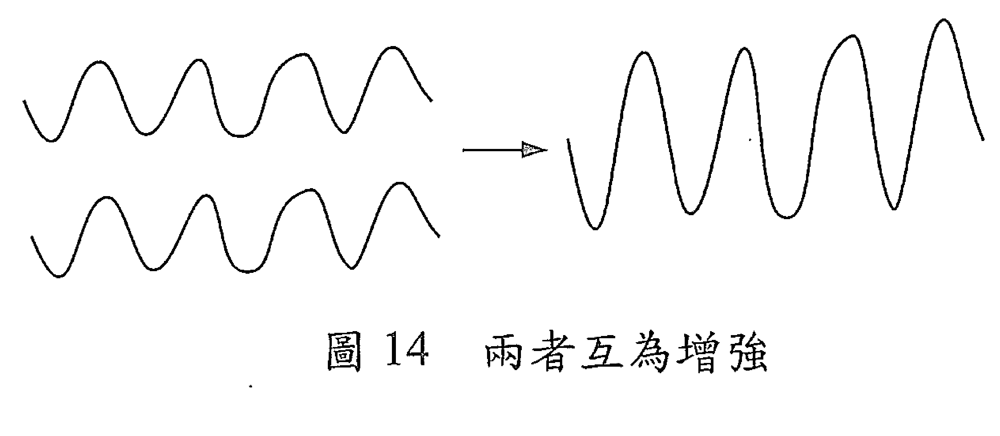

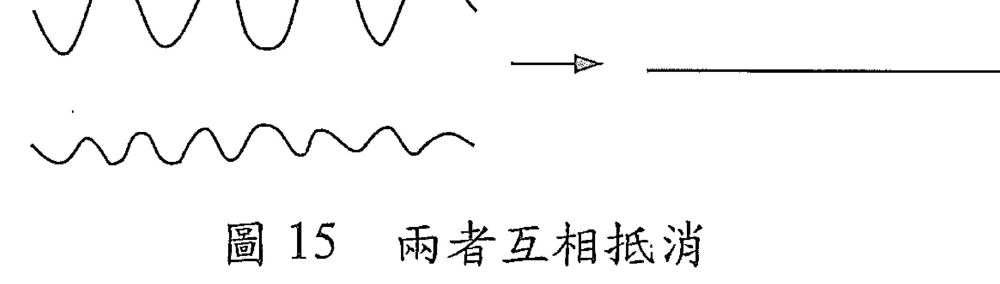

## 8.我们是一个控制系统

行為科學家格拉瑟（Willian Glasser,1925-）是美國俄亥俄州精神病醫生，於1967年提出控制理論（Control Theory），1996年改稱選擇理論（Choice Theory）。他認為我們是一個控制系統，可以控制自己的行動。換句話說，若是心智做好靈魂和身體的溝通，我們可以正確地選擇所應該產生的行動。譬如看恐怖電影時，我們很難不被嚇到。一旦恐懼襲來，即無法阻止心跳的加速。但是只要我們願意，可以在任何時間起身離開。而隨著離開的動作，我們的恐懼感馬上解除，心跳也恢復正常。

我們的行為，係由「行」（作用性）、「思」（思維性）、「感」（感覺性）以及「生理機能」（反應性）四個個別存在的要求所構成。以人類現階段的進化程度而言，在整體行爲中，我們對作用性的動作，幾乎可以徹底掌握。對思維性的想法，有某種程度的控制。對感覺性的部份，幾乎很難控制。至於生理機能的反應，那就更不用說了。但是，只要我們對自己行爲的動作有所控制，顯著地加以調整，則想法、感覺和生理狀態，即將隨著產生變化。心智改變動作，似乎整個行爲都受到控制。所以選擇什麼樣的動作，實在十分重要。譬如前述看恐怖電影而被嚇到時。若是選擇不離開，而不做出離開的動作。一味告訴自己，這只是電影中的虛構情節，要求心跳減緩，不必害怕，大多並無效果。

格拉瑟指出我們經常選擇痛苦，其實相當合理。十歲大的男孩，在空無一人的廣場中，從所騎的腳踏車上面摔下來。他選擇了不哭的反應，因爲在沒有旁人在場的情況下，哭有什麼用？是不是完全沒有意思的動作？但是，回家之後，卻選擇了哭。而且一到自家門口，就哭成一個淚人兒，在母親面前宣洩一番。王君失去一份非常理想的工作時，馬上選擇了沮喪，以避免正面接觸失業所帶來的恐懼。年邁的母親選擇了全身酸痛來控制女兒的感情，使女兒選擇了不夠孝順的愧咎，而在電話中聆聽她的喋喋不休。李君經過長期的沮喪之後，毫無原因地停止了沮喪，因爲他已經選擇了自殺。

我們羨慕那些長壽的人，爲什麼不能向他們學習，同樣選擇長壽呢？長壽有三項秘訣，那就是飲食、運動和冥想。飲食正確，多吃蛋白質和低熱量的食物。保持適當的運動，每天至少走五千步。練習冥想，使腦部形成α波。但是，不論世上任何地方，長壽都有一個共同的條件，便是「心胸廣闊，不要患得患失」，也就是前面所說，採取正向的思考，選擇和長壽有利的動作。

在正向的思考中，心想事成是十分可能的。但是，仍然有一種限制，不能夠違反天命。我們的先天人生規劃，結果能不能實現？借用馬斯洛（Abraham H. Maslow,1908-1970）的說法，要看是不是真、善、美、躍動、個性、完全、必然、完成、正義、秩序、單純、豐富、愉快、自我充實？也就是光明正大的生活方式，可以感受到無上幸福的喜悅。靈魂負責規劃，心智必須做出選擇，再交由身體去執行。做出選擇的心智，當然要負起全部的責任。既然是控制系統的決定者，自然責無旁貸。

## 9.盡力做一個自主的人

既然父母是我們自己選的，要不要來世間做人？做什麼樣的人？走什麼樣的路？也都是我們自己決定的。人的尊嚴，應該就在充分發揮上天所賦予的自主性，盡心盡力做一個自主的人。何況我們又是一個可以自我控制的系統，當然不怨天、不尤人，一切責任由自己負擔。如何在群體中完成自我，便成為十分重要的課題。

社會上充滿了各色各樣的沮喪高手，把自己的生活寄託在痛苦之中，並且用自己的沮喪來控制週遭的人。這些沮喪高手，藉著「充分的理由」，透過各種方式，把自己的沮喪發散開來，弄得大家都莫名其妙地，跟著沮喪起來。接著以同樣的心情和方式，傳佈出去。對未來充滿懷疑和恐懼，大多由此而產生。最好的辦法，便是認清我們並不是先天安排好，必須沮喪過日子。也不是自然感覺沮喪，而是我們自己選擇了沮喪。先瞭解他人的痛苦不幸是出於自我的選擇，再採取適當的方式，使其自己改變，選擇其他的生活方式。譬如夫妻雙方在一天的工作中，都有一些困難和不如意的地方。這並不表示工作表現得不好，只是這些微細的失誤，積少成多已經壓得透不過氣來。為了不繼續陷在裡面，不免盼望獲得一些輕鬆的時間。而實際上心知肚明，回家後有更多令人洩氣的事待解決。可是必須先卸下工作方面的重壓感，否則一旦超過某種程度，難免失去控制而氣憤、沮喪，或者選擇其他具有傷害本質的表現，來設法挽回一些控制。雙方在這種情況下，都不免對家人開口不擇言。其實這些言語，平日也不覺得特別刺耳。只因當時心情已經沉重得不堪忍受，以致選擇了大為冒火的遷怒舉動。如果夫妻能夠在回家之前，選擇「不把辦公室的情緒帶回家」，並且「準備迎接家人的抱怨」。就算面對另一半的開口不擇言，也會選擇「暫時不回應」的方式。於是可能爆發的劇烈口角戰，很可能化解於無形。

自主代表不希望接受控制，但是，我們的習慣，卻經常喜歡控制別人。所以將心比心，設身處地，對每一個人都十分重要。我們可以不接受控制，卻不能夠反過來企圖控制他人。除非對方自己改變，否則我們永遠改變不了任何人。我們每一個人的心智，都擁有在行動方面隨意控制的能力。無論自己的沮喪、頭痛如何劇烈？皮膚病和冠狀動脈阻塞有多嚴重？或者對酒的需要有多大？我們都能夠加以改變。雖然在停止頭痛、提升情緒、阻止血管硬化方面，我們很難加以控制，但在選擇更滿意的行爲上，卻人人都做得到。只要我們願意，隨時在行動上做出某些調整，都會使自己更爲滿意。我們最需要的，是禪宗大師一直努力探索的「悟」（Satori）的境界。使自己和世界在短時間內呈現一種和諧無比的狀態。當一個人無法正常入眠時，如果能夠躺下來，觀察呼吸或感受，把無法入睡的選擇，改變爲選擇睡得安穩。即使真的無法熟睡，第二天起床時，也會覺得精神飽滿，好像從熟睡中醒來一樣。當然，先決條件，心須張開心眼，才能夠看到自己的呼吸和感受。自我控制，原本是靈魂委任心智所要做的事情，並不難行。

## 10.凡事先想好後果再做决定

我們最好把「心想事成」和「自作自受」這兩句話，合起來想而不要分開來看。一般人只樂於心想事成，卻不知自作自受已經如影隨形，緊接著要來承擔責任。

心想事成之前，先想一想自作自受的後果，這是一個人在起心動念的時候，必須同時顧慮的事情。

曹敏先生深研吉凶變化的道理，提出吉悔相依的人生觀，對心智的妥善選擇，以趨吉避凶，有很大的助益。茲說明其大意如下，以供建立自我控制系統的參考：

- ①一般人的選擇，大抵按照由吉而凶、凶而悔、悔而吝、吝而吉的次序，如圖 16。當諸事順吉的時候，大多得意忘形，以致招來凶險。這時候後悔不止，才深切反省。諸多顧慮而倍加小心，以求恢復吉祥的狀態。不久故態復萌，若非驕橫，便是妄行，再度陷入凶險，又悔恨之至。
- ②凡人皆有感性及理性，凶、吝屬於感性，而吉、悔屬於理性。兩者交互作用，因而循環往復不停息。
- ③如果改變一下次序，成爲吉悔相依，如圖 17。意思是吉祥、順利的時候，時常反省，可能產生那些弊端，終將導致悔恨的？及時加以排除或化解，以期不凶。這時候最好的心態，便是養成謙虛的習慣。時時刻刻，不要忘記人上有人、天外有天。採取低姿態，比較不容易跌倒。就算不慎摔跤，也不至於太嚴重。有人說謙虛得過分，便是虛僞。我們則認爲凡事過與不及，都有其害處。惟獨謙虛是例外，永遠不會太過。因爲人有了名和利以後，會自然對謙虛產生抑制的作用。只會嫌不及，似乎不可能太過。

謙虛是一種修養的功夫，並不是一朝一夕，就能夠培養出來。必須經過長久的修持，具有經年累月的自我控制，才能夠愈謙愈悔，愈悔愈謙，而永保吉祥。

吉凶悔吝是自然的現象，一般人很難擺脫。生命的意義既然在求創造，就應該改變自己的控制系統。不要等到凶險出現，才來後悔。而一旦時來運轉，又不知謙虛自持。凡事在做出決定的時候，務必想一想：這樣決定，可能產生那些後遺症，會引起悔恨的？而加以避免。就天道而言，變是惟一不變，固屬必然。但依人事來看，有時堅持固執也是十分必要。「不變也是變的一種方法」，惟有如此，才能夠扼斷變的歷程，以減絕人慾，達到如如不動的狀態。我們在順應的時候，也應該想一想掙脫的方式。身體必須隨著天道而變轉，心智卻有時可以清純物慾而掙脫必然。惟有採用這種方式，處吉境才不致為了感官慾望的滿足而胡作亂為，處逆境更能夠淡然處之而不覺得痛苦。一陰一陽之謂道，運用得恰到好處，自然隨遇而安。日日是好日，時時是吉時，而人人都是好人。一切都在自己的控制之中，怎能不悅樂！

心智具有無比的能量，可以深一層體悟靈魂的旨意，同時對身體得以理智指導感情，給以恰當的約束，使得天理良知能夠指引感官的慾望，當然可以負起全部的責任。

## 十、人類的未來只有一條路可走

### 1.科技發達帶給人類莫大的威脅

1945年，美國把原子彈投到日本的廣島和長崎。人類已經擁有能量釋放的可怕力量，成爲有史以來，真正具備贊天地之化育的能力。然而，英國歷史學家湯恩比（Arnold.Toynbee,1889-1975），卻因此而提出「人類滅絕論」，指出「人類的力量影響到環境，已經達到了可能導致人類自我滅絕的程度」。人類所創造出來的科技，即將反叛人類，將人類滅絕。由於科技文明是人類自身所創造的產物，所以屬於自我滅絕。這種人類滅絕論，並不是危言聳聽。也不是宗教界所說世界末日即將來臨的預言。我們從看得見的科技發展，很容易發覺下述三大現象，已經爲人類帶來滅絕的危機，茲說明如次：

- (1) 濫用科技

科技發達，一方面爲人類減少很多不便，一方面也增加了很多災難。其中最令人擔心害怕的，是核彈的巨大威力和化學武器的難以控制。現代人情緒十分不穩定，萬一不幸擦槍走火，釀成大禍，再來後悔濫用科技所造成的嚴重後果，恐怕已經來不及了。

- (2)污染環境

1970年代以來，環境的污染和破壞，導致氣候異常、生態系統備受威脅。若是海水持續升高，冰河繼續溶化。世界上的陸地，逐漸被淹沒。2005年美國紐奧良市一夜之間由於海水倒灌而整個陸沉的事件，勢必多處呈現。人類為求生存，爭相湧向僅存的少數陸地，必然引起十分劇烈的爭奪。人口眾多而陸地奇小，彼此毫不留情，也將造成滅絕的悲劇。

- (3)輕視倫理

現代教育的方向，幾乎是朝向反倫理而發展。我們常聽到的兒童本位、個人主義、平等思想、自由發展等等。都在促使受教育者，愈來愈沒大沒小，並且視為理所當然。宣稱這些主張，已經成為普世價值。不尊敬長上，怎麼可能敬天？不敬天即為忘本。接受這樣的教育，怎麼能夠慎用科技、愛護環境呢？

上天有好生之德，每當人類遭遇重大災難時，上天總是抱持大家好商量的態度，在天人合一的氣氛中，共商大計。上天所找的對象，當然是少數真正能夠天人合一的得道高人。現代教育，卻把原本有智慧的人，教育成有知識而缺乏智慧，真不知道對於當前的危急，老天爺要同什麼人商量？簡直找不到對象，急死老天爺了。

人類當然可能生生不息，但是必須相關條件的配合。最基本的生存需求，譬如空氣、水和食物，若是不足以因應，人類的生生不息，就會遭受強大的壓力。大部分非洲國家，在1980年代，歷經長期大乾旱，造成百萬人以上的死亡。一向被認爲取之不竭、用之不盡的水資源，竟然全球告急。若干富人或企業，正朝購買私人湖泊進行，將來勢必引起更為激烈的衝突。空氣污染日趨嚴重，食物的供應出現衆多的危機。人類要求生生不息，若是不能充實所需的生存要素，持續快速地增加人口、浪費資源、污染環境、輕視倫理，其實用不著戰爭，自己就會生存不下去，而趨於滅絕。我們必須早日覺悟：唯有人類自救，自己設法解除種種威脅。在思想上和行動上有所改變，才能夠如願地持續生存下去！

## 2. 人類必須負起有意識演化的責任

知名未來學家芭芭拉·胡巴德（Barbara M. Hubbard）指出：在人類史上，每隔一段時期，就會出現一種新的世界觀，將社會改變。現代科技的發展，使我們對大自然的變化過程，包括基因、原子、頭腦、宇宙的源起，以及從大霹靂到人類誕生的創世故事，已經有不同於往昔的領會。我們正在從藉由物競天擇而進行的無意識演化，轉變爲藉由選擇而進行的有意識演化。我們現在所擁有的知識與力量，使我們足以毀滅這個世界，也能夠參與難以限量的未來。她明確地指稱：共同毀滅或共同創造的力量，業已交在我們的手上。並且呼籲大家要以合乎道德的、有創造性的方式，來善用我們擁有的能力，協力走出人類演化的下一個階段，參與人類史上最偉大的盛事。不但拯救我們自己，而且促使世界進化。

> > 她引用謝松（Eric Chaisson）教授的話：「宇宙史上最重大的第二件事，現在正在發生。第一件是當物質獲得輻射能，使超新星的爆炸能量，組成金屬與其他元素，在一百億年前形成了物質世界。第二件大事，則是具有科技能力的人類，瞭解了物質，弄明白大自然不可見的運作過程。我們應該恢復我們地球的環境，使人類免於貧窮和疾病。」謝松教授把第二件大事的主旨，明訂為由「物質優勢」（matter-dominance）轉變為「生命優勢」（Life-dominance），要點在使「未來」與「倫理」成為同義詞。換句話說，我們所面臨的演化時期，應該是「合乎倫理的演化」。問題在時間緊迫，人類必須加緊學習。

一九四五年，美國投原子弹到日本的廣島和長崎。這種能量的釋放，使人類透視了大自然不可見的科技，擁有我們原本以為諸神才有的力量。接著生物科技、毫微科技和人工智慧，蓬勃發展。如果繼續以現行的自我中心意識，來發展和運用，人類的自我滅絕，相信不會拖過數百年。幸好一九六〇年代，大家已經覺察到環境的破壞、社會的不公和對這種趨勢徹底加以扭轉的必要。許多人預見災難即將到來，認為非迅速加以改變不可。

環境保護運動、反戰運動、太空計劃、新音樂、超覺靜坐、心靈改革等等呼聲，都在催生意識的新特徵。比較顯著的，有下述三個，簡單說明如次：

- ① 人類的自我反省能力更為活躍。大家逐漸從忙碌的生涯中，跳脫出來，以更為客觀、有如置身事外、並且不加論斷的態度，來重新觀察世界及運作。

- ② 從這種更加寬廣的角度來看，很容易發現地球，甚至於

## 十、人類的未來只有一條路可走

宇宙是相互關連的、活生生的體系。牽一髮而動全身，彼此息息相關，不能不多方面詳為顧慮。

- ③我們以個體的身分發展自己，卻亟待整合出一種首尾一貫的社會潛能運動，來指導我們的社區和社會整體的演化。合中有分之後，最後能夠分中有合。

社會潛能運動，建立在人類潛能運動的基礎上。人類潛能運動培育人的健康，社會潛能運動則培育社會的健康，並確立社會創造力的高峰。它尋求社會的革新，設計社會的體制，以便走向有益於生命的全球社會。主要在把社會由重視物質，帶到精神成長的階段。

### 3.首先要認清自己的職責

如果人是神創造出來的，我們按照神的形象，也變得愈來愈像神。現代的人類，在神的長期教導之下，已經愈來愈神。像神那樣，具有偉大的創造力。

假若我們是由進化而來，由於進化再進化，人類的潛力不斷地開發出來，左腦、右腦持續地接受刺激。已經由無意識地服從自然規律，變成有意識的參與自然的運作，真正要發揮贊天地之化育的能力了。

神的創造，告一段落之後，停頓了很久。人開始摸索創造，也歷經許多挫折、累積了很多經驗，終於明白完全依賴人力，實在十分危險。現代人類，最好依據天人合一的方式，來一個人神大聯盟。共同合作，發揚順乎天理的人為創作，開創有意識演化的新途徑。

因此，我們擬訂了一份「人類自救宣言」供大家參考：

人類可能滅絕嗎？答案是當然可能。

只要按照現在的情況：濫用科技、污染環境、輕視倫理，持續下去，人類在不久的將來，就會滅絕。

過去，人類由於無知，無法抗拒自然的力量，曾經幾次瀕臨滅絕的威脅。

這一次不一樣。人類知識快速增進，卻由於所作所爲，並不自然的規律，造成自我滅絕的危機。因爲近來世界各地所發生的許多災害，都和人類的活動有關。可以說是人爲的災害，也就是死在人的手上。

有史以來，人類第一次承擔自作自受的強大壓力。善良的人也無法逃避，因爲這是人類共同的命運。

然而，上天賦予人類高度的自由意志，就是不希望人類盲目接受命運的擺佈，而陷入痛苦、絕望的深淵。

人類最大的力量，應該是自反自省，然後虔誠地向上天祈禱。以天人互動的方式，同上天商量，來改變未來的走向。做好階段性的合理調整，以資化解。

科技的發展，實際上是爲了維護人類的生存、改善人類的生活而改造並利用自然。近年來由於方向錯誤，製造大量的核子和化學武器，也激化起嚴重的環境污染和破壞，反而造成人類滅絕的重大危機。

人類必須勇敢面對當前的困境，做出明確的改變，來自我拯救。首先，應該對自己滅絕自己的威脅，感覺十分羞恥。因而堅定決心，要及時奮起、團結自救。

其次，我們必須改變方向，約束人類想要利用宇宙萬物的

## 十、人類的未來只有一條路可走

天性，轉而自我奉獻給宇宙萬物，與所有生靈共存。而不是想盡辦法要加以迫害，甚至於趕盡殺絕。

同時，人類對天地原本懷有敬畏的心情，不應該由於征服自然、人定勝天的信心，不再敬天、順天。應該恢復對天地的尊敬，好像敬重自己的生命一樣。

我們提出人類自救的六大策略，願大家共同努力：

- ①天下為公，世界大同。（人類本來是一家人，絕對不能戰爭。）
- ②東方西方，彼此交融。（東方哲理結合西方科技，正德厚生。）
- ③德本財末，重視倫理。（君子愛財，必須取之有道，不貪婪。）
- ④天人合一，心誠則通。（利用自然，必須依循天理，順自然。）
- ⑤科學宗教，兼顧並重。（對於人類極為重大事宜，請神協助。）
- ⑥人類自救，天助成功。（求神不如求人，求人之前先求自己。）

### 4.用心清理自己的觀念

人是觀念的動物，表示人的心智必須負起全部的責任。有什麼樣的觀念，就會產生什麼樣的後果，也就是一切都是人自己想出來的，另一種表達方式。

我們不妨問問自己：人類是否具有內在目的？

其實，只要平心靜氣，誰都知道事實如此。

再問自己：內在的目的是什麼？大多數人會這樣回答：追求幸福，避免災難。因為這是最共通的要求，相信大家都一樣。

但是，一問起什麼是幸福？大家的想法，就十分混亂，真的是仁者見仁，智者見智，而莫衷一是。譬如：

- ①實現心或精神要求
  - ①信神
  - ①出世
  - ①絕對保守
  - ①實現個人
  - ①絕對為他
  - ①絕對率性
  - ①絕欲
  - ①人類一家
  - ①絕對和平
  - ①絕對自由
  - ①職業合作
  - ①家庭神聖
  - ①征服自然
  - ①發展文化
  - ①發展哲學或精神文化
  - ①經濟生活絕對自由

- ②實現身或物質要求
  - ②無神
  - ②入世
  - ②絕對革新
  - ②實現團體
  - ②絕對自私
  - ②絕對化性
  - ②縱欲
  - ②民族強盛
  - ②絕對戰爭
  - ②絕對集權
  - ②彼此競爭
  - ②戀愛自由
  - ②順應自然
  - ②皈依自然
  - ②發展經濟或物質文化
  - ②經濟生活絕對平等

我們可以自由選擇①或②，但是無論怎樣選擇，都將掉入二分法的陷阱，走上單元偏道，而不是中道。

## 十、人類的未來只有一條路可走

單元偏道的思想，不但不能帶給人類幸福，而且有極大危機，會導致人類滅絕。譬如人類如不能結束殘酷戰爭，殘酷戰爭即將結束人類。人類如不能妥善運用科技，科技便會反過來危害人類的生存。經濟生活絕對自由，人類即更加不平等；經濟生活絕對平等，人類必須喪失許多自由。不幸的是，人類的稟性，由於人人都有相當的缺陷，以致傾向於偏道。但是我們來自絕對宇宙，又難免產生絕對要求。同時，人類所居住的環境，也具有相當的相對性與矛盾性。汪少倫先生指出：因爲人類本身具有偏道稟性或絕對要求，所以人類本身不似天使；由於各種環境具有相對性與矛盾性，所以各種環境也不似天堂。以非天使居非天堂，自然不能幸福。

我們前已述及，真理不在二者之外，而在二者之中。真正的智慧，是把二者合在一起想，並不分開來看。所以在二者之中，尋找合理的平衡點，即爲中道。人類惟有採取多元中道的精神，視人生爲天地的結合，人死即天地的分散。認清人居天地之間，具有神性與獸性，理想的人生，既不能絕慾，也不應縱慾。卻應該節慾，以符合中道的合理要求。努力盡人事以改造環境，但是對努力所得的結果，不必過於計較，以聽天命。兼顧個人與團體，使人近似天使；自然與文化並重，使環境接近天堂。以近似天使居接近天堂，人類必然幸福。

### ## 5.見仁見智中要堅定自己的信念

我們當然需要言論自由，以便從不同的角度，來瞭解真相。我們更應該提高警覺，言論自由造成賢達人士袖手旁觀。

因為半桶水响叮当，往往劣币驱逐良币，致使公理被扭曲，正义遭受误解，社会动荡不安。

社会应该多元化，言论可以见仁见智而有所不同。但是，每一个人，都应该在多元化当中，寻找自己认为合理的观点。做错事情，一定要勇于改过，不能用见仁见智来辩解，弄得没有是非。社会秩序，必须共同维护。独立特行，不能扰乱公共秩序。特殊状况，最好低调处理。换句话说，在见仁见智当中，必须坚定自己的信念。尊重别人的选择，却不能随波逐流，任意放弃自己的主张。我们由学则不固（放开心胸，不固执己见、也不存有成见，从多方学习中，获得更多可以让自己不固执的参考意见）到择善固执（等到多方了解之后，必须慎重地在这些宝贵的意见当中，确定自己所要固执的观点），不断地充实、持续地调整，希望三十岁时，能够确立自己的人生观和价值观，再实践十年，在过程中继续修正、改善，到了四十岁时，可以不再疑惑而坚定不移。特别是有关生活的法则，属于人生中不变的经。人人可以不同，却不宜轻易改变。言论自由，是提供众人发表意见的机会。言论合乎既定的原则，应该是个人必具的良好方针。以免前后自相矛盾，甚至于错乱。贻笑大方事小，导致自己不得好死，那才是大事。

宗教自由，造成道德信仰瓦解，同样值得大家注意。所有宗教，原本都为建立道德而产生。可惜邪教趁机而出，正教反而不敌。宗教互相攻击，彼此破坏，已经成为不良的风气，请问如何建立道德规范？

两党政治，也是众所周知，造成腐败、分裂，很容易为外国强大势力所操纵。轮番把持，相当于各自分赃。企业界必须

## 十、人類的未來只有一條路可走

雙方輸誠，提供資金。公務員在同一單位中，也各懷鬼胎。由於不知同仁的背景，偏於那一政黨，以致構成很多的溝通障礙。天天對抗，怎能安心辦事？

這些耳熟能詳的事情，長久以來，一直困擾著大眾。究其原因，即在於言論自由，公說公有理，婆說婆有理。特別是宗教和政治，更加沒有妥協的餘地。當然溝而不通，各說各話即使搬出親情、友情與愛情，有時也無力挽回。可見個人堅持己見，也不能違反社會公義。而學者專家在推介普世價值之先，更應該衡情論理，看看能否配合各地不同的風土人情，做出合理的調整？

人類具有靈力，擁有道德或宗教上、藝術上、知識上、以及社會上的自由。西方文化自文藝復興以來，認為最大的自由是知識，其次是藝術，最後是社會。至於道德，由於人類具有原罪，必須死心塌地地依靠上帝，祈求上帝賜予力量，才能勉強行善。道德自由必須轉化為宗教上的信仰自由，生命才有價值。然而，道德在東方文化，特別是中華文化，卻擁有極大的自由。「我欲仁，而仁至矣」，便是道德自由的宣言。中華民族透過道德自由，無需西方式的抽象上帝，而能廣土眾民凝聚，產生高度而悠久的文化，是不是值得大家深思呢？

### ## 6.在核子大戰之前衡情論理

東方人瞭解西方人，已經很不容易。西方人要瞭解東方人，特別是中國人，實在十分困難。最關鍵的所在，便是西方人把「理」字稱為真理，而不知單說理不牽涉情，是有害於人

# 透视灵魂看人生

生的。因为情与理互相疏离异化，相当于人天与人我的异化。单从理字做出来的学问，必然使哲学变成科学，而与道德无关。道德在科学的领域中，既无一席之地，不得不从宗教信仰中，树立一位突出的神，认为宇宙万有及其秩序，都为上帝所创造。人类不过是透过一种称为科学的知识系统，来加以认识而已。虽然替科学家信仰上帝找到合理的解释，却也明白指出科学知识与人类是否得救，并无任何关联。

近代科学日愈发达，上帝创世的说法，屡遭质疑。科学知识与宗教信仰愈离愈远，知识即力量的呼声日愈高涨。知识的重要性，胜过道德，也是公认的事实。

二十世纪的人类，相信人定胜天。认为知识的力量，足以改变人类的命运。说什么知识经济的时代来临，网际网路可以不讲伦理，而道德修养也无足轻重。历经三十年代的原子弹爆炸，五十年代的工业污染严重，七十年代的能源危机告急，九十年代的超级武器威胁全球，这才觉悟知识的力量固然可以改变世界，但是变好、变坏？不但难料，而且有可能毁灭全球，造成人类的自我灭绝。于是，西方文化警觉到人类的罪恶已经没有上帝来救，而科学知识竟然像魔鬼那样，给人类少许甜头，就要人类付出灭绝的残酷代价。

西方的思想家已经看出文明的危机，西方国家的知识分子，也大多警觉到世界末日即将来临。美国宗教界对「测定」世界终结日期的狂热，如今更甚于往昔。当今末日观念流行的原因，主要源自「时代派神学」(dispensationalism) 的影响力大幅扩张，在美国福音教派占有主宰性的地位。大海啸、大地震、大飓风、禽流感、核子弹、生化武器，使大家对科技爱

## 十、人類的未來只有一條路可走

也不是，恨也不是，充滿了無奈感。於是，把目光轉向東方，發現莊子在兩千多年前，便已警告機械的盛行，將為人生帶來禍害。中國歷代聖賢，都堅持中庸之道，世世代代，都享受青山不改，綠水長流的美景，過著悠閒的生活。如果不是西方憑著船堅砲利，西方文化強勢入侵，中華民族必然有趣有情地，永遠能夠年年拜祭祖先，維持子孝孫賢、樂天知命的樸實生活。能不能借助東方的智慧，來促使西方的科技知識，走上對人類有益無害的大道，已經引起廣大的關注。隨著全球化的步調，中華文化的向外傳佈，也加快速度，希望能夠在核子武器毀滅人類之前，讓西方人有機會接觸到中華文化善於衡情論理的偉大力量。使道德與藝術，能夠好好駕駛科學技術。向柔性的和平方向發展，而不走向剛性的戰爭。

道德使人類不至於自我毀滅，藝術也絕不會污染大地。現代人類，必須在盲目接受以法律、宗教、科學為主的西方文化之際，恢復中華文化重視的道德與藝術精神。以東方哲學的智慧，來善用西方的現代科技。避免人類的自我滅絕，解除末世的威脅，締造人類的現世幸福。

### 7.好好發揚安身立命的精神

我們並不反對上帝的存在，把一切歸功於上帝的創造，也未嘗不可。因為宇宙是整體而不容分割的，必須歸於一，才不致分裂成為兩個或更多。這種齊全的思想，從易經開始，便存在於中華文化，成為主流觀念。

易經的學理，主要在以人為本。如果沒有人類，沒有生

# 透视灵魂看人生

命，也不需要生存，則一切都失去意義。人類要生存，不能不照顧其他動、植、礦物，在共存共生的情況下，才有生生不息的可能。人類為求生存而思想、而奮鬥，而不斷進化，成為極其自然的趨勢。其他生物與非生物，也是宇宙的一份子，不過只有生魂和覺魂，缺乏像人類這種高明的靈魂。所以人類有責任贊天地之化育，為宇宙全體的進化，盡一份心力，也盡一份責任。

> 曹敏先生指出：中華民族承受整體觀念的影響，採取由「分」求「全」的中道思想方法，表現在生活方面，有下述兩大特性，形成中華文化的特質：

- 1. 第一，家族是大家庭制。我們所說的家，並不是現代一般人所認識的小家庭，而是三代同堂（不一定要住在一起）的大家庭。祖父母在，不能夠分家。
- 2. 第二，就衣食住行帽鞋來看，穿的衣褲，戴的帽子，沒有前後之分。穿的鞋子沒有左右的分別，吃飯共餐使用大圓桌，可以說是生要全福，死為全歸。

要達到「全」的要求，不能從「知」上去求。因為知是差別，只有分而不能全。可是，我們又不能不重視知。因為不講知，連「全」都無法認識。

「知」為什麼一定要分？因為此物和彼物，必然有差異。分而不全，今天稱為專業知識。但是，此物與彼物，固然有差異。彼此之間，卻也有其相同的地方。可以說既有其「別」，也有其「類」。譬如人與禽獸，固然有異。而彼此同屬一類，都是動物。由此向外推進，擴及宇宙萬物，當然具有相通的地方。儒家以生命種子的核仁，來表達這種共通的因

素，稱之爲「仁」。

這樣一來，知識無論有多麼驚人的發現、多麼高深的發展。多麼專精的分割，若是匯集在仁的中心目標，真正做到「以仁統知」，就不會產生紛爭。換句話說，所有分門別類的知識，都以仁爲基礎，只會用來增進人類的幸福。由合而分（爲了求知，不得不分門別類，力求專精），然後由分而合（居於求仁，不得不顧全大局，從全面來考慮事情），就不致只知其一、不知其二，由於以偏概全而走入偏道，終至好心做壞事而不自知。

中華民族，在感情上不鼓勵盡情發洩，在事功上不崇拜好大喜功的英雄。在生活上力求含蓄、容忍、節制、溫和，避免衝動、熱烈、粗暴的放任行爲。便是站在整全的立場，企求圓融和諧的中道精神。由於求全不易，必須各自稍爲委屈，才能夠委屈求全，而安身立命。

退一步海闊天空，意思是受一點委屈，當做禮讓，自然容易顧全大局。既然人與宇宙構成共同的有機體，人的言行會以神妙莫測的方式，來影響宇宙。人類重全，宇宙也會重全，處處顧及人類，減少很多災難。人類重視安身立命，宇宙也就逐漸安穩而緩和，人類所獲得的，遠比退讓所損失的，實在大得多。

## 8. 主要關鍵全在一個德字

士農工商四民，爲什麼士居其首，而商人卻敬陪末座？原因在於士爲讀書人，飽讀經書然後出任公職，稱爲學而優則

# 透视灵魂看人生

仕。按理说读书人不但明白道理，而且凡事遵照道理而行，务必力求合理。足以为所有民众的表率，当然位居四民之首。自古以来，士的地位十分崇高。主要原因，即在修德存仁，以天下为己任。得意时辅助上司做好决策，以福国利民。失意时也能够安贫乐道，绝不搞什么智慧犯罪。以人尽其才为目标，用良好的品德修养来以身作则。这种重德轻财的特性，当然值得尊敬。

农的工作对象为地，以地尽其利为目标。按照自然法则，“日出而作，日入而息，凿井而饮，耕田而食”。享受自然的乐趣，家庭和乐，安土重迁，殊少与外人发生关系，纯朴自然，道德修养也很良好，至少不会伤天害理，危害社会，所以位居第二。工的对象为物，以物尽其用为目标。重视产品的品质与功能，注意效率与价值，很容易流于功利主义，而忽视社会道德所受的影响，所以排名第三。商人的工作对象为货，以货畅其流为目标。整天忙着计算利润，寻思如何降低成本？迷于私利的追求与获取，罕有什么道德良心的顾虑。不法商人，甚至以不道德的方法来达到获利的目的。重财轻德，不得不列为四民的末位。儒商之所以备受推崇，便是“先读书再经商”的良好效果。把道德修养培植好，从事商业行为时，比较有良心而不致危害人群。

放眼全世界，凡是重视工商的社会，大多轻忽道义。虽然高喊社会责任，也是聊为补偿，难以义利相济，做到合理的地步。口口声声提高女权，却拿女性的色相当做商业广告的重要部分。假借审美的名义，来侮辱妇女。甚至于女性自身，也以好东西大家欣赏为掩护，来作贱自己。父母有钱可赚，竟然也

## 十、人類的未來只有一條路可走

欣然接受。

天底下任何東西，都可以鬆綁，並且美其名爲解脫。唯獨道德不能，以免一放鬆便收不回來，果真萬劫不復。我們在這方面，可以說一代不如一代那麼負責任，一句「沒有那麼嚴重」的玩笑話，固然討好很多年輕不懂事的人，卻斷送了我們應該固守的道德水平，實在是作孽。站在身體的角度，難免誤認爲食、色接受刺激，文明才會進步。站在靈魂的立場，人類真正的進步，必須經由「率性」與「修道」。食、色是考驗的關卡，若是通不過，必然是退步。如何調節合理，全看心智的運作。一念之差，重自然科學而輕人文社會，道德自然淪落。重視人文社會，以道德爲本，再來學習自然科學，成爲儒農、儒工、儒商，人類才會真正地進步。

靈魂所要說的話，在《大學》這一本書中，已經表露無遺。它說：「君子先慎乎德，有德斯有人，有人斯有土，有土斯有財，有財斯有用。」總結來說，便是「德者本也，財者末也」。我們長期觀察，真正成功的人，憑良心說，根本的原因，都在於祖上有德。成功又能持久，不致出現可怕的現世報，也就是不多久便身敗名裂，同樣是自己造福人群，善於積德的結果。配合其它種種因素，才有以致之。人類重視道德，未來必然大爲光明。

### ## ⑨.接近神明將其光芒散播人間

古代帝王，於每年元旦的清晨，都以虔誠的心，致祭天地。主要的用意，在代表全體人民，向天地表達不忘本、不忘恩的心情。老百姓祭祀祖宗，也是同样的意思。神明的地位，已经在这么多人的心目当中，建立起来。虽然看不见、听不到，也无法触摸。但是，至诚的人，能够达到近似神的程度，便是我们常说的如有神助。这样的人士，可以大分为两种：一种是神通，另一种则是通神。前者以神为主，由神明主动选择某些适当的人，充当灵媒，来传递某些信息。人依然是人，不过在被神明选中的那一段期间，已经把自己出借给神明，供祂使用，暂时丧失了自主性。后者以人为主，通过不断的自我修炼，持续地自我提升，达到能够通神的地步。具有神的能力，可以将神明的光芒，四处传播，却依然保留自己是人的主体性。我们比较推崇通神，比较不敢相信神通。古代圣贤，大多具有通神的功力，后来知识爆发，读书人受到知识的捆绑，放不开来。致使有学问的人愈多，得道高人反而愈少。上天想要找人商量，经常找不到神通的人。不得不袖手旁观，任凭神通的人在那里装神弄鬼。弄得大家愈来愈不信神，离神明愈远，因而沦落为物质的奴隶，还沾沾自喜，自认为明智。

### 人類已經淪落為物質的奴隸

人類不可能離開物質而生活，這是不爭的事實。但是，人應該是主體，物質不過是幫助我們生存、發展的東西。如今的社會，太過重視物質，致使很多人迷失了本性，從而變成只圖軀殼上的感受，卻失去了太多人類應該具有的良心、理性、愛心、真誠、信任與深度。似乎我們心目當中的進步，便是物質享受的提高。

### 十、人類的未來只有一條路可走

自古迄今，一般人都有一種炫耀財富的心態，不過是程度上有所差異而已。別人沒有的，我有。別人有的，我比較好。除了向人示威之外，實際上也招來了許多羨慕的眼光。物質的享受，並不是人人平等，大家都有相同的能力，獲得相等的水平。於是，由於稀有，所以高貴的論調，使得高享受的人趾高氣揚，顯得高人一等。

上天的意思，原本是一方面以物質養活人類，一方面也用來考驗人類，能不能經得起各種物質的引誘。這才明白地顯現出來，物質不能使人永生；只有精神才有永生的希望。可惜人類大多數不寄望於立功、立德、立言的三不朽，卻盲目地追求物質的享受，終於淪落為物質的奴隸，說起來也是自作自受，活該如此！

我們對於令人增加感官刺激的物質享受，並沒有反對的必要。只要不令人喪失應有的本質，感受好一些，覺得更快樂，並沒有什麼不好。先像一個人，再來提高物質上的享受，基本上還是人。為了物質而搞得人不像人，有了享受便失去人的本質，人就是自甘墮落。好好主人不做，一定要把自己變成奴隸。

要通神，首先應該和自己的守護神處得好。每一個人，或多或少都有守護神。少則一個，多則很多位。而且隨著自己的身份、地位和業績，審視實際需要，適時地調整或改變。我們只有兩個肉眼向前看，怎麼能夠照顧背後所發生的事情？這時候守護神就會做出合理的動作，推一下或者拉一把，以因應這些外來的變數。譬如有一塊石頭，從遠處飛過來，似乎正對著某甲的腦袋。某甲自己看不見，也感覺不出來。幸虧他的守護神推他一下，使某甲忽然低下頭去，躲過了一場浩劫，某甲還蒙在鼓裡。如果某甲與守護神處得不好，守護神袖手旁觀，或者只是替某甲擔心，而沒有任何舉動。石塊打個正中，某甲不死也會受到傷害，豈不是飛來的橫禍？

與自己的守護神好好相處，成爲做人的第一件大事。防止外靈入侵，保護自己身體的安全，還可以扮演行爲指導者的重要角色。我們常說抬頭三尺有神明，好像是做給這些神明看，必須好好表現。實際還有比神明更親近的保護神，祂們的要求，比神明更加明確，而且專門針對所保護的這個人。他們的標準，其實相當一致，便是憑良心、做自己應該做的事情。只要合乎這個標準，祂們都會盡力加以保護。邪不勝正的意思，即是自己行得正當，所有邪道妖魔，守護神都會認真地予以阻擋，不讓他們有入侵的機會。把守護神當做自己的指導者，凡事先考慮一下守護神的觀感，無形中增加了很多自律的警覺性。對自己的言行，發生很大的警戒作用。

神通，很容易變成背真逐妄，隔一陣子，就不靈了。通神，才能夠不斷地反妄歸真，愈來愈神，而且持久可通。對己對人，都有很大的助益。敬神並非迷信，至誠的人能夠通神。心中有神，可以增進自己對道德的修養。是道德在庇護神，卻不是神在庇護道德。人類知識的進展，必須與道德的提升同步，才有幸福可言。

## 10.慎終追遠以求民德歸厚

《論語學而篇》記載，曾子說：「慎終追遠，民德歸厚矣！」慎終指謹慎辦理親長的喪事，追遠則是不忘記對祖先的祭祀。如果能夠普及，大家都如此。風俗就自然而然，會趨向厚道了。人人厚道，天下也就太平了。

為什麼慎終追遠，便能夠民德歸厚呢？因為人必有死，如果死後便一了百了；生前的種種，都一筆勾銷。人的一生，何必講求道德修養？大可以只要喜歡，便不計較後果，去做就是。中華文化在「理」之外，特別重視「情」。我們認為我的存在，既然是祖先生命的延續，自然應該時常想起祖先。紀念祖先最好的方式，便是祭祀。原本只是按時提供祖先在另外一個世界所需要的東西，後來和祖先亡故之後變成鬼神，也有像人同樣生活的信仰，連接在一起，因此形成按時對祖先舉行鄭重祭祀的風俗，以表示不忘本。從「情」的角度來看，研究多年的楊懋春教授認為，為子女者，或者至親好友，如果以至誠、懇切的心情，來紀念亡故的親人。一定會設法將死者在生時的音容笑貌、舉止動作、愛憎迎拒等情況，盡情加以追思，使在心中或夢中不時出現。想念到極度時，人會拋棄理智，幻覺亡故的親人並未化為烏有，也未轉變為不成人形的可怕鬼怪。而是像活人一樣地生活動作，像活人一樣地產生各種需求與愛惡。只是在行動上，由於不受形體的拘束，更為飄忽幻化。於是相信人死後血肉形體腐化，但換上一個與生時一樣的精靈相貌，並且保留著生時形體所有各種屬性。這種死後觀與基督教的耶穌復活後十分相近，對於祖先崇拜或祭祀祖先甚有裨益。人也因此而樂於和祖先相接近，並覺得溫暖可親。最重要的是，必須祖先在活著的時候，在子孫心自當中，佔有很大的位置，也就是子孫心自中，有祖先的份量。亡故後能真心、誠懇地懷念、祭祀才有意義，也才有價值。否則徒有形式，不過做做樣子而已，不能產生任何功效。心自中有祖先，便是我們所重視的孝道。子女心自中有父母，自然不敢為非作歹。子女心自當中有父母的存在，自然憑良心好好做人好好做事。所以孝道為道德的根本，求忠臣於孝子之門，即為此理。

### 葬喪的真正意義

孟子指出：上古時期，父母亡故之後，子女隨便把屍體丟棄在溝裡。隔了一段時間，偶然再經過棄屍的地點，看見野獸正在吃父母的肉，許多蟲聚集在一起，吸吮著腐化的屍體。子女的內心，覺得非常難過，也十分慚愧。趕快跑回家，拿著鋤頭和鏟子，回到棄屍的地方，把屍體用泥土掩蓋起來。可見葬喪的本意，是子女自覺父母的親情，不忍心看到父母死後的情景，發自內心的舉動。孟子進一步解釋使用棺櫝的理由，並不在於外表的美觀華麗，而是避免亡者的肌膚直接接和泥土接觸，是一種心中有父母，雖死猶生的具體表現。

孔子曾經解釋守喪三年的意義，當一個孩子生下來，三歲以前，幾乎都在父母懷抱裡。所以當父母逝世的時候，通常都要居喪三年，以為報答。

我們今天當然無法守喪三年，但是透過孝道的教育，來提升道德水平，仍然十分必要。對亡者的厚意、對亡者的惻隱之心、對亡者雖死猶生的態度，旅美學人吳森教授說是情的文化。他認為不近人情的人，應該是中華文化倫理精神的大敵。

重視忠孝的家族，必定按時祭祀。人們可以不相信鬼神，也可以不認定自己有守護神在保護。但是至少應該祭祀祖先，把他們當做另一種導航線，指示自己應走的人生道路。把他們看做多出來的諮詢對象，將許多不方便向他人吐露的心聲，拿來好好商議。把他們譬喻成自己的監護人，隨時糾正自己的不當言行，對自己一生都有好處。

慎終追遠，是孝道的具體表現。真正有孝心的人，必然不敢辱親，做出使祖先難堪的事情。因此時時自省，警惕自己不要違法亂紀，道德修養自然日愈提升。人人如此，民德當然歸厚，社會隨著太平，大家都有福。

孝道是身心靈協調的有效途徑，先由祭祀祖先開始，推而廣之，擴及神明、靈界，然後各界生靈。不但世界大同，人類安寧，而且宇宙各種生物、無生物，都各自發展，而生生不息。人類解除萬物之賊的惡名，恢復萬物之靈的美名。記住，不要期待別人，務求從自己做起，勇敢地承擔起自己的責任，因為這就是我們的天命！

## 結語

我們不可能回到從前，完全復古是一條行不通的道路。就算聯合國通過世界公約，也不能命令人類放棄已經獲得的知識，恢復古代民智未開的生活方式。儘管人類面臨大自然的反撲，我們還是會勇往直前，繼續走向不可預測的未來。義無反顧，也是一種負責任的表現。

人類最好的態度，應該是不後悔，也不抱怨。因為這兩者固然很常出現，卻已經多次證明，完全沒有效用。世界不會由於我們的後悔而改變，人類也不會接受我們的抱怨而知所改善。如果會，早就不是現在這樣的狀態。

我們應該覺悟，站在能量的立場，沒有一件事情是不好的。反正都在從事「合久必分，分久必合」的實驗。儘管各人的經歷並不相同，大家的結局都十分一致。都是奮鬥一生，然後不了了之。

能量所需要的經驗，不過是每一種不完美到完美的途徑，哪怕是預想不到的千變萬化，都是可以接受的一種新的歷程。老子說天地不仁，即指此而言。

天地不仁，人類卻必須仁。站在人類的立場，我們應該知所警惕。即使有前生也有來世，我們這一生，也是獨一無二，不可能重複出現，更不可能為他世所取代。我們常說的世代交替、生生不息，那是全人類的事情。這一生的生命十分有限，過去的歲月永遠不復返，則是每一個人都不能避免的侷限性。短暫的人生，若是不仁，根本稱不上是人。豈不是白活了，空走一趟？

何況我們所遵守的自作自受規律，已經遭受嚴重的挑戰。各種生靈，由於受不了人類的無情干擾和破壞，已經面臨難以生存的困境。我們一方面要慎防各界生靈聯合起來，共同反撲人類的災難；一方面還要密切注意始料不及的人為禍害，造成人類的自我減絕。以免提前結束這一輪宇宙的生命，加速地球的再次毀滅。

最嚴重的，莫過於科學不斷洩漏天機，侵犯了神的境界。西方人的道德信仰，原本在神的庇護之下，引起很大的動搖。二十世紀以來，由於自然科學突飛猛進。致使人類除了物質之外，不再對其他感到興趣。人為萬物之靈的那一點靈，也跟著被埋沒了。心目中沒有神明，沒有祖先，也沒有父母，時刻念念不忘於物，追求著物，更縱欲以獲取物。不知不覺地，掉入了物的陷阱。

自然科學的求新求變，竟然影響到人文社會，把數千年來思想家、教育家、宗教家的智慧，也以「日新又新」和「回歸自然」的美名，企圖完全加以推翻。宗教失去信仰，只剩下形式。道德淪落，居然以法律來替代。人欲橫流無阻，逼使新女性主義，也不得不公開宣示：女性暴露美色，也是正當的行為，並無侮辱女性的顧慮。年輕人前途茫茫，意志頹喪，十來歲就興起自殺的念頭。人類到了這等地步，不自我滅絕，豈有天理？

幸虧人類還明白「風水輪流轉」的道理，當西方文化發現極大的危機時，知道調轉方向，求救於東方的智慧。特別是中華文化的道德和藝術，以道德補法律的不足，以免「只要合法，什麼事情都敢做」而不憑良心；用藝術來調和科學的抽象、刻板和固執，並且化解宗教的排他與執著。我們深信，二十一世紀是良心的世紀。也許是物極必反的緣故，歷經十九、二十世紀的徹底放棄，良心又在二十一世紀，從人們的腦海裡復活過來。全世界以良心為號召的組織，已經有如風起雲湧，勢不可當。只要有心，就算剛開始有許多冒牌貨，不過是搭乘這樣令人賞心悅目的順風車。相信時間會淘汰虛的、假的。而真實的良心團體，必然蓬勃發展，蔚為奇觀。

世間事有變有不變，前者稱為權，後者即是經。經為根本原則，當然不應該求新求變。我們可以用新思維、新方法，卻不能夠輕易地否定古聖先賢的智慧。譬如男性的人生五道關卡，自古迄今，都實實在在，擺在我們的眼前。不能用視而不見，來自我欺騙。但是化解的方法，則有其時代性。必須隨著時代的腳步，做出合理的調整。名關和利關，如果用淡泊來因應，大多是沽名釣譽。容易引起消極或虛偽的指責，反而不妙。若是以追求大名大利來立志，恐怕年少無知的時候，已經被有心人士利用而遭受很大的創傷，不是憤世嫉俗，便是心灰意懶，並非正道。最好的方式，莫過於淡而不厭，認清名利根本是求不到的。實至自然名歸，過程用心當然福利自來。不刻意放棄，也不一心一意要求。來時不喜也不惡，不驕也不怕。心中沒有名利的欲求，名利來臨時，自然安然過關。美人關是老來入花叢的惡果，一方面表示審美的觀念有偏差，一方面則是不服老，希望以美人的青睞，證明自己寶刀未老。這才有機可趁，而造成禍患。最好是明辨內在美和外表好看的異同，瞭解人會老才證明愛情永固的道理。年輕時不必以柳下惠來自我標榜，並且養成不以貌取人的良好習慣，自然順利過關。宗教關的要害，在包裝的技術非常高明。各種宗教，如果沒有十分令人折服的道理，怎麼可能吸引這麼多信徒？可惜共通的缺失，便是一千句真的，包裹住一句假的。偏偏這一句假的，最為要命。信徒們受到一千句真理的吸引，不得不吸進這一句要命的毒，而難以自拔。靈界是真實的，教義是有道理的，儀式不過為了增強信仰。但是，依賴神是不行的。求神不如求人，因為人只要憑良心，就比神更高明。可以動手動腳，採取實際的行動。求人不如求己，因為所求的人，是不是真的憑良心？誰也不敢預料，必須事後才能證實。往往耽誤時日，後悔不已！自己的事情，只有自己最清楚。自己能夠做的，不假手他人。自己不能做的，向合適的人提出要求，卻絲毫不能勉強。事成不能忘本，不成也不必怨恨。這樣自我提升，終有一天能夠通神。凡事如有神助，宗教關就順利通過了。相信道理，卻不依賴任何人。把求人逐漸轉化為不求人，對所有宗教都給予相當的尊重。不隨便傳教，也不排斥不相同的宗教信仰，便是宗教自由人。至於藝術關，先看清西方的藝術，往昔染上極為濃厚的宗教色彩，現代卻流於科學。宗教和科學，一般人比較容易按步就班地學習和理解。真正的藝術，大多以直覺為主，很不容易加以掌握。最好抱持欣賞不一定要擁有，體會不一定要瞭解的心情。以謙虛的態度，認為自己沒有那麼大的福份，可以承受這麼高貴的藝術品。應該能夠愛而不迷，輕鬆地過關才是。

## 透視靈魂看人生

女性的五關，同樣要以新方法、老原則來因應。首先明白男女同權不同質的事實，知道養育子女才是女性最高的天職。那一天全天下女性，都不喜歡生男育女，人類即將自我滅絕，並不需要什麼外來的力量。對女孩子應該學習賢慧，保持整潔，會害羞，不能孤獨，戀愛沒有條件而結婚卻必須講求雙方的配合等等，都應該提早施加教育，輔導其順利通過情關。慎選合理孝敬父母的丈夫，在婚前多瞭解其家庭背景，並且有適當的往來，比較容易通過婆關。從擇偶開始，便具有優生的心理準備。多生不如少生，少生就應該優生。對懷孕、胎教、適當維護母子安全等措施，無不合理，自然安渡子女關。從小就知道人生只戀愛一次，才最為幸福。男女雙方都堅守貞節，才最為高貴。女性的內在美，要不斷培養。異性關的障礙，自然減少。婚前注意雙方的健康，婚後安排有規律的生活，飲食有變，性事節制。用心教養子女，養成節儉、樸實的良好習慣，家人安樂，守寡的機會也就大為減低。說起來都和品德修養，息息相關。

人類必須自救，才能延緩自我滅絕。首先必須堅持六大信念，分別列舉如下，以供參考：

1.  自作自受，不怨別人。
2.  飲水思源，不能忘本。
3.  謹守本份，不宜妄動。
4.  順天敬神，不能迷信。
5.  德本財末，重視倫理。
6.  中庸之道，合理應變。

然後，人人堅守六大信條，正面因應死亡：

1.  不想不開不能自殺。
2.  不懷大恨不當厲鬼。
3.  不利用也不養小鬼。
4.  不迷地不做迷地鬼。
5.  不迷人不當迷人鬼。
6.  不迷物不當迷物鬼。

對於神明，最好採取由親及疏的方式，由內向外推展。先祭祀自己的祖先，然後和自己的守護神相處良好，再慎選和自己頻率相近，有感有應的神明，多做溝通。真正對靈異有一些瞭解之後，才來慎重研讀有關信仰的書籍，決定自己要不要信奉那一種宗教？或者保高度的自由，深入探索、明瞭各種宗教的要旨。

祭祀的主要功能，在人與人的情愛，並非為本人或家人求福。我們以虔誠的心，以人為出發點，表現出不忘本的德行，不能存有任何迷信的成份，以免不敬。

最根本的方式，則是重視孝道。明白「孝是子女自發的德性」，自動體認「天下無不是的父母」，而不是斤斤計較，「當年父母對我如何，我才願意適度回報」。更不能暴露童年受到父母的不合理待遇，有意無意引發其他子女懷恨父母的動機。中華文化之所以有孝經而沒有慈經，並不是有些人所說的「重父輕子」。孔子用「父父，子子」來加以並列，意思是各盡其所應盡，各守其所應守。基於上下兩代的生長背景，不可能完全相同，所以不能夠要求完全平等對待。

發揚孝道，必須注意我們只提孝道，並沒有說孝順。順這一個字，不知道在那一個時代，由那一位仁兄加進去。結果造成很多愚孝，引起很多人的批評和不諒解。孝有順有不順，不應該全順，才屬合理。

靈魂講求合理，才可能圓滿。我們的所作所為，也是如此。今日世界，強權勝於公理。明明有情、理、法、力四個層次，如圖18，可以供人類選擇。我們偏偏放棄較高層次的情、理、法，一定要惟力是視，而不以為憾！果然自作自受，人類的末日，隨時可能來臨。

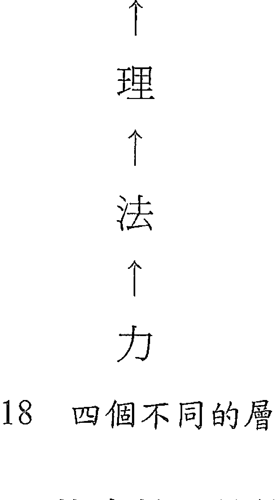

> 中庸說：「明白自己的本性，就能夠瞭解他人的本性；明白他人的本性，便能夠瞭解萬物的本性。」

瞭解自己和他人的本性，然後才推及萬物的性。我們現在致力於探究萬物的本性，卻顯然忽視人的本性。對身、心、靈獲得深一層的瞭解之後，是不是先反求諸己，把自己切身的事情安置好，從發揚孝道的根本做起，共同來盡心盡力，為延緩人類的滅絕做出有利的貢獻！願大家共同勉勵，真心合作，為禱為盼！

## 主要參考書目

| 書名 | 作者 | 年份 | 出版社 |
| :--- | :--- | :--- | :--- |
| 人類幸福之路 | 汪少倫 | 1955 | 台灣中華書局 |
| 多重宇宙與人生 | 汪少倫 | | |
| 失去的地平線 (Lost Horizon) | 詹姆士。希爾頓 (James Hilton) | | |
| 平凡的道德觀 | 陳大齊 | 1977 | 台灣中華書局 |
| 人理學 | 陳立夫 | 1984 | 台灣中華書局 |
| 時間簡史 | Stephen W. Hawking 著，許明賢、吳忠超 譯 | 1991 | 台灣藝文印書館 |
| 中國國家地理雜誌 (相關報導) | | | 台灣故鄉公司 |
| 中國家庭與倫理 | 楊懋春 | 1981 | 台灣中央文物社 |
| 比較哲學與文化 | 吳森 | 1978 | 台灣東大圖書公司 |
| 內心悅樂之源泉 | 吳經熊 | 1983 | 台灣東大圖書公司 |
| 學易淺論 | 曹敏 | 1986 | 台灣黎明文化公司 |
| 蒼蠅、老鼠、人 | Francois Jacob 著，賴慧芸 譯 | 2000 | 台灣究竟出版社 |
| 你正在改變世界 | Barbara Marx Hubbard 著，孟祥森 譯 | 2001 | 台灣方智出版社 |
| 腦內革命 | 春山茂雄 著，魏珠恩 譯 | 1997 | 台灣學欣文化公司 |
| 超右腦革命 | 七田真 著，劉天祥 譯 | 1997 | 台灣聯經出版公司 |
| 如何掌握快樂的生活 | William Glasser 著，譙百城 譯 | 1987 | 台灣聯經出版公司 |
| 觀音菩薩的故事 | 曼陀曼室主人 | 2003 | 北京紫園圖書公司 |
| A Cycle model of the Universe | P.J. Steinhardt & N. Turok | 2002 | Science 296 |
| 我創造了桃莉 (The Second Creation) | Ian Wilmut, Keith Campbell, Colin Tudge 著。陳紹寬、朱佩雯 譯 | 2000 | 台灣究竟出版公司 |## 博雅文庫

## 透視靈魂看人生

叢書主編◆吳涵碧
作者◆曾仕強
發行人◆王春申
副總編輯◆沈昭明
主編◆葉帼英
校對◆翁慧君
美術設計◆吳郁婷

出版發行：臺灣商務印書館股份有限公司
10046 臺北市中正區重慶南路一段三十七號
電話：(02)2371-3712 傳真：(02)2371-0274
讀者服務專線：0800056196
郵撥：0000165-1
E-mail：ecptw@cptw.com.tw
網路書店網址：www.cptw.com.tw
網路書店臉書：facebook.com.tw/ecptwdoing
臉書：facebook.com.tw/ecptw
部落格：blog.yam.com/ecptw

局版北市業字第993號
初版一刷：2006年8月
初版五刷：2014年7月
定價：新台幣290元

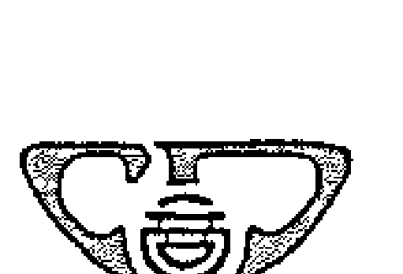

ISBN 978-957-05-2076-7
版權所有·翻印必究

透視靈魂看人生 / 曾仕強著. -- 初版. -- 臺
北市 : 臺灣商務, 2006[民 95]
面 ; 公分. -- (博雅文庫)
ISBN 957-05-2076-0(平裝)

- 1. 人生哲學
- 2. 靈魂論

廣告回信
台湾区邮政管理局登记证
台北广字第6450号
免贴邮票

100台北市重庆南路一段37号

台湾商务印书馆 收

对摺寄回，谢谢！

## 传统现代 并翼而翱

Flying with the wings of tradition and modernity.

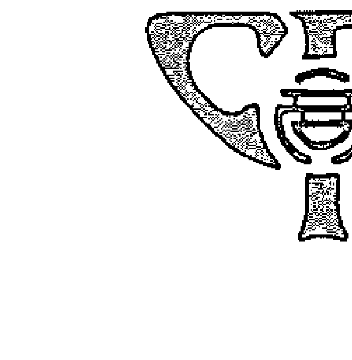

## 讀者回函卡

感謝您對本館的支持，為加強對您的服務，請填妥此卡，免付郵資寄回，可隨時收到本館最新出版訊息，及享受各種優惠。

姓名：_________________________

- □男
- □女

出生日期：____年____月____日

- □學生 □公務（含軍警） □家管 □服務 □金融 □製造 □資訊 □大眾傳播 □自由業 □農漁牧 □退休 □其他

- □高中以下（含高中） □大專 □研究所（含以上）

地址：______________________________________________________________

電話：（H）____________________（O）____________________

E-mail: ___________________________________________________________

購買書名：_________________________________________________________

您從何處得知本書？

- □書店 □報紙廣告 □報紙專欄 □雜誌廣告 □DM廣告 □傳單 □親友介紹 □電視廣播 □其他

您對本書的意見？（A/滿意 B/尚可 C/需改進）
內容 ________ 編輯 ________ 校對 ________ 翻譯 ________
封面設計 ________ 價格 ________ 其他 ________

您的建議：
______________________________________________________________________
______________________________________________________________________
______________________________________________________________________

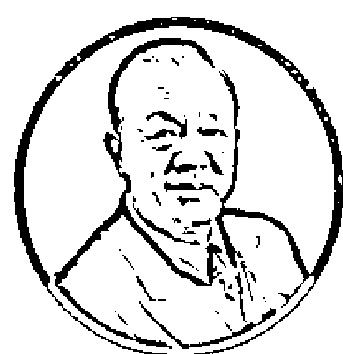

從身心現象看人生，複雜而多變。若是直探靈魂，則簡單明瞭。人人如此，並無多大差異。

靈魂投胎為人時，備有先天人生規劃，稱為天命。

每人都有若干缺陷，出發點雖不相同，目標卻十分一致，要走向完人的境地。由缺陷修成完全，便是人生的修治歷程。情況不一樣，價值相等。修不修得成？由心智負責。這一輩子走完，靈魂回老家，再做其他的打算！

33112010 NT$ 290 (全)
ISBN 978-957-05-2076-7 (191)
条形码数字: 9 789570 520767