## 哲学大典
## (二)

李纯文 编

## 通灵大法
## （二）

冲天居士 李纯文 著

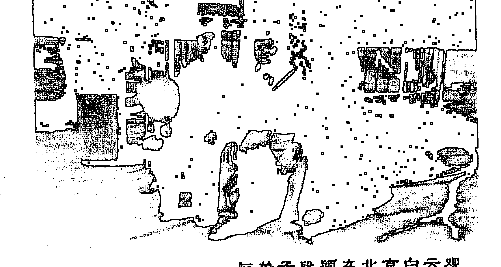

与弟子段颖在北京白云观

## 序言

道教是中国本土的传统宗教，至今已有四千多年的历史。道教奉老子为教主，尊称为太上老君，奉玉皇大帝为最高的神。道教主张修炼成仙，长生不老。道教的纲领是以联系拳术来强身健体，以合理的膳食来补养身体，以中草药来为人治病，以入静入定的功法来控制精、气、神。以顺其自然的思想来修身养性，以符咒大法来保魂安魄。总之，它是以清净、自然、无为、顺化的思想为指导，通过修炼仙功来达到身心健康，长生不老的目的。

道教把人的精神分为三魂七魄，三魂是指：胎光神、幽精魂、爽灵魂（也称为天魂、地魂、命魂）。七魄是指：尸狗、伏矢、雀阴、天贼、非毒、除秽、臭肺（也可称为天冲、灵慧、气、力、中枢、精、英）。

三魂当中，天地二魂常在外，唯有命魂常住身，天地命三魂并不常聚，天魂能使人神清气爽，益寿延年。地魂能使人耗损精华，萎靡不振。命魂能使人机谋万物，生祸惹害。

七魄常附于人体之上，它是人身上的浊鬼，每当月朔、月望、月晦之夕在人身上流荡游走，招邪致恶。当某一魄散去时，人就容易生病，招鬼上身。如果七魄全部散失，三魂也要离体而去，人就要死亡。但人受到惊吓时表现为面色苍白和晕阙。这就是魄散之象。如果一个人魂飞魄散太过或时间太久，就可能造成一个人的死亡。所以必须赶快安魂定魄。道家安魂定魄的法术就是符咒法。

符咒法是通灵之大法，它是通过符文和咒语来恭请神明保佑赐福，驱除邪魔，安魂定魄的一种法术。其做法是用笔、墨或朱砂在纸、布、木、金、石等载体上画符，边画符边念咒语。画符必须得入定，没有杂念的状态下进行，一气呵成。用自己的神去合被请之神，用自己的气去合被请之气，用自己的感应去接受被请神的灵气，使被请之神形于符中。而后进香开光神明即可显灵行使其职责了。符咒法是道家的经典，一般是秘而不传，轻而不传，或者只在师徒之间口传心授的。

著名易学家、冲天居士李纯文老师所著的《通灵大法》与大家见面了。这是一部非常珍贵的宝典。本书既有收魂法及其符咒，又有判断邪魔附体的技巧及破解方法，既涉及到普遍现象的针对性，又列出专门破解的具体方法，既是鲜为人知的内容，又是难得的真经宝典，既方便于实践，又能达到灵验。所以《通灵大法》的出版史每个有志于研究学习符咒者福音。

> 《通灵大法》真乃神明赐福也！

赵世明
于天津
2010年8月15日

- 一、排香……………………………………………………………………10
- 二、请神……………………………………………………………………10
- 三、送神……………………………………………………………………20
- 四、另一种请神法……………………………………………………22
- 五、神词神调……………………………………………………………26
- 六、请上方仙神………………………………………………………55
- 七、请观音神咒………………………………………………………57
- 八、请九天玄女神咒………………………………………………60
- 九、请天兵天将咒…………………………………………………61
- 十、请张天师教主咒………………………………………………61
- 十一、请吕祖神咒……………………………………………………62
- 十二、请神总咒………………………………………………………64
- 十三、请灶君神咒……………………………………………………65
- 十四、治病神咒………………………………………………………66
- 十五、破关………………………………………………………………68
- 十六、勾脚直难文……………………………………………………72
- 十七、准备物备………………………………………………………74
- 十八、阴阳绝技牒文………………………………………………75
- 十九、阴阳关煞准备物品…………………………………………76
- 二十、破煞用七道符………………77
- 二十一、五文广符………………78
- 二十二、破呼用七道符………………81
- 二十三、花姐关煞牒文………………82
- 二十四、破花姐关煞须准备物品………………82
- 二十五、首先排香………………83
- 二十六、童子关煞牒文………………84
- 二十七、八败劫财绝技牒文………………87
- 二十八、八败劫财闰王关煞准备物………………88
- 二十九、破呼绝技牒文………………96
- 三十、阴阳坐寿牒文………………99
- 三十一、阴阳坐寿关煞准备物品………………100
- 三十二、宫牒牒文………………105
- 三十三、宫牒准备物品………………106
- 三十四、三十六煞牒文………………107
- 三十五、三十六煞准备物品………………108
- 三十六、斗底八卦绝技牒文………………110
- 三十七、斗底八卦连环准备物品………………111
- 三十八、开始安星定斗………………112
- 三十九、闯关................................................... 135
- 四十、升符................................................... 145
- 四十一、各种表文打法................................................... 146
- 四十二、通玄大法神咒................................................... 166
- 四十三、坛前请五方神咒................................................... 174
- 四十四、门外安香神咒................................................... 175
- 四十五、神咒打鬼................................................... 175
- 四十六、三姑娘吒开路关神咒................................................... 176
- 四十七、请蓬莱众仙咒................................................... 177
- 四十八、关仙咒................................................... 180
- 四十九、画符请神咒................................................... 184
- 五十、陈靖姑神咒................................................... 184
- 五十一、地藏王神咒................................................... 186
- 五十二、九天玄女神咒（一）................................................... 187
- 五十三、九天玄女神咒（二）................................................... 188
- 五十四、注生娘娘神咒................................................... 189
- 五十五、请天兵天将咒................................................... 189
- 五十六、三奶娘娘神咒................................................... 190
- 五十七、邢府千岁神咒................................................... 191
- 五十八、请齐天大圣咒........................................192
- 五十九、朱府千岁神咒........................................193
- 六十、勒符咒........................................194
- 六十一、季府千岁咒........................................195
- 六十二、赵将军咒........................................196
- 六十三、雪山童子咒........................................197
- 六十四、催神轿咒........................................198
- 六十五、张天师教主咒........................................198
- 六十六、开口咒........................................199
- 六十七、张天师传法咒诀........................................200
- 六十八、调五雷神咒........................................204
- 六十九、关神祝吉请神咒........................................205
- 七十、起马咒........................................206
- 七十一、五雷法咒........................................207
- 七十二、催乱童发毫光咒........................................207
- 七十三、老君咒治邪魔........................................209
- 七十四、老君咒碧妖邪........................................209
- 七十五、收碎公神咒........................................210
- 七十六、被人做叩用此咒收妖精........................................211
- 七十七、关神咒.............................................212
- 七十八、收魂咒.............................................213
- 七十九、镇一切邪崇符咒...................................215
- 八十、镇宅安家符.........................................216
- 八十一、镇家宅流年不利符.................................217
- 八十二、镇凶宅怪异符.....................................218
- 八十三、镇新宅闹鬼符.....................................219
- 八十四、镇宅犯四凶符.....................................220
- 八十五、镇宅犯鬼符.......................................221
- 八十六、镇宅犯七煞符....................................222
- 八十七、镇阳宅风水不利符................................223
- 八十八、镇阳宅风水不利符................................224
- 八十九、镇宅驱犯灵符....................................225
- 九十、镇煞安厅门........................................226
- 九十一、镇宅平安符......................................227
- 九十二、大树电竿对宅门用此符镇之........................228
- 九十三、家宅犯病........................................229
- 九十四、七星镇宅平安符..................................230
- 九十五、镇宅吉利符......................................231
- 九十六、五雷天鬼镇宅符…………………………………232
- 九十七、镇宅光明符…………………………………233
- 九十八、关公斩妖镇宅符…………………………………234
- 九十九、八方镇宅符…………………………………235
- 一百、巽…………………………………236
- 一百零一、五岳镇宅符…………………………………237
- 一百零二、镇宅十二年府神煞…………………………………242
- 一百零三、镇四方土禁并退神符…………………………………248
- 一百零四、镇命元宅有犯人…………………………………250
- 一百零五、贴门镇宅符…………………………………254
- 一百零六、镇文广年建宅神符…………………………………255
- 一百零七、镇宅带身符…………………………………256
- 一百零八、镇五鬼闹宅符…………………………………257
- 一百零九、镇宅八卦符…………………………………258
- 一百一十、镇多年老宅祸患不止符…………………………………262
- 一百一十一、镇八位卦爻反逆…………………………………266
- 一百一十二、镇四邻动土符…………………………………270
- 一百一十三、镇宅中邪气妖鬼作怪符…………………………………271
- 一百一十四、镇宅中有响动符…………………………………272
- 一百一十五、镇宅内被人暗理凶物符………………273
- 一百一十六、镇州县官坐不稳符…………………274
- 一百一十七、家出壮元符…………………………275
- 一百一十八、镇宅其它符…………………………276

## 一、跳神招法

排香    请神    送神

一步走来二步登，三步颠九转连环他来到万马军营，拜托，拜托多拜托应声点动兵马，点动兵博，上方有，上方多，正仙正道正香火，白阳教主，当堂坐，金公木母相陪着，八大名医在上边坐，格济药方，李品虎，要将针法王叔和，走线号脉孙思邈，开肠破肚老华佗，眼光娘娘当堂坐，童男童女相陪着，五家娘娘当堂做，童男童女相陪着，药王老爷当堂坐，药龙药虎相陪着，全堂人马多少多，五路人马六路兵博，两军阵前受香火，将今日的事情办的利利索索，闲言不多讲碎语不多说，二番托鼓再维托。

## 二、请神

时才有一刻间，万马军营排过香烟。二番托鼓站营盘，四面八方接、修仙，鼓靠鼓锣靠锣、牛郎织女靠天河。点香离不开三教主，当仙的离不开老师付。才出茅阁的当帮兵，在家靠父母，在外靠仙佛。今夜晚,晚更合，老堂人马要听着，山高难把太阳遮，强龙压不倒地头蛇，鹊雀难夺凤凰窝，我们借地生财搭救灾格。文王鼓有点有声，堂前八卦有神兵，大报马二灵童，爬山虎串地龙，飞山越岭小黄鹰，各个古洞把信通，报告教主得知情。

我拜天来拜地神，拜拜空中一切过往神、拜拜离地三尺查界神。日落西山黑了天，龙归苍海虎归深山。官奔衙门客奔店，鹊雀乌鸦奔大树，家雀卜鸽奔房檐。大家买卖上了锁，小家买卖把门关。人入群鸟入林，一行人等着一行人。大路断了车和辆，小路断了行路人，家家上锁把门关。今天有一家烧香打鼓请神仙，应声：

左手拿着文王鼓，右手拿着武王鞭。文王鼓不一般，羊皮面柳木圈、里边方,外边圆,横三竖四八根弦,四根朝北,四根朝南、四根朝北胡黄界,四根朝南蛇蟒仙。中间有王小女留下抓鼓圈；老君铁要拧成弯，万岁爷报号上边栓。上边十个乾隆，下边八个开元，十个乾隆打天下，八个开元阵江山。小小玲铛上边拴，鼓要一响它先动弹。

武王鞭表一番，出在南方腾子山，大车拉小车盘，一盘盘到山海关。木匠用锛子砍刨子圆，长短正好一尺三，五色布把它缠，小女的飘带搭拉下边，鼓要一响它先动弹，武王鞭表周全。再表五色大涂但花杆，大的到有五尺五，小的到有三尺三，五艳六色多新鲜。刀子刻剪子碗，上边剪的三环来套月，下边五个小鬼打秋迁。花杆好比绣洋楼，五行人马往里头，顺着花杆走，顺着花杆估，付着弟马神相传。左膀要来左膀动，右膀要来见哆嗦，前边来了暖如火，背后来了冰查山，头上来了压住三尺火，肩角吹灭二盏灯，灯要灭了能入窍。走七窍串七精，十二肝经都串到，那窍不到撒上迷魂药，别让弟子他知道，借口传音把话学。高粮开花节节高、谷子开花压旁腰、茄子开花头朝下、苞米开花一嘟噜毛。我看仙王影影朝朝来到了，我七里接八里迎，九里接过马缰绳。
大门悬灯，
二门挂红，
三门挑出龙凤灯，
铺红毡倒红绒，
搂顺红绒捻捻香灯。
仙王你高山炼了三种宝，
下山你别忘宝三宗，
套仙之锁捆仙绳，
马后捎带拘魂瓶。
弟子好比一捆草，
仙王好比捆草绳，
单三扣，双三扣，
那扣不紧加足蹬，
捆的紧，刹的劳，
别让弟子把罪遭。
捆不紧捆不劳，
人家笑话仙王道横不高。
你将三魂压在灶君府，
七魄压在万马营。
老仙家你威风有杀气多，
威风杀气少带着，
屋子小，柱角多，
跑不开马行不开车，
磕着碰着了不得，
碰着君子到好办，
碰着小人犯啰嗦。
稳稳当当来落马，
稳稳当当来登科，
有麝自来香，
不用大风扬，
包子有肉不在褶上。
我拦住马头问国号，
手扶鞍桥问家乡，
英雄留名传万古，
两军阵前留美名。
二番托鼓维托修兵，
下马规矩礼法，
仙王你落马来登科。
上马到有规矩礼，
下马还有礼规格，
规矩礼法对我说：
旦好吃或好喝，
酒饭茶次预备着，
或用酒或用烟，
或用清茶大碗端。
要用酒更不难，
骡子打里马架辕，
车上好酒一坛坛。
大高粮产地在呼兰，
玉泉方瓶喝不完，
有茅台，有西凤，
卢洲老窖尽管斟，
杜康造酒刘令醉，
刘令醉酒整三年，
到后来他在上方成了醉酒仙。
仙王用酒尽管饮。

应声送你几句良言：

凉酒喝多能伤肺，
热酒喝多能伤肝，
别给弟马留下啰嗦。
啤酒喝多好起夜，
色酒喝多起粘痰，
酒大伤身后悔难。

听我把菜名报一番：

- 要吃肥的牛羊肉，
- 要吃瘦的宰鸡鹅，
- 山中走兽云中雁，
- 江里鲜鱼盘子揣，
- 要吃酸的多加醋，
- 要吃咸的多加盐，
- 酸甜苦辣全都用，
- 加点味素挑味鲜，
- 不知仙王用那般。

三、送 神

好又好，中又中，
万马军营之事办利索。
你的功劳我不讲，
我的功劳也不说，
辛苦劳累一旁格，
改到那方那角在欢乐。
你要走我不拦，
列开马道就送仙，
由我打开三黄锁，
拉开九道栓，
大神沙小神沙，
打开博锁放开他，
叫他三魂七魄早回家。
人得真魂吃饱饭，
马得真魂能撒欢，
放松放松多放松，
放松弟马头也清来眼也明，
别让他关节麻木百节疼。
临来未蹬墙头土，
临走别忘马蛟龙。
吃的多喝的多，
嗝嘎呕吐全带着，
别给弟马留下罗嗦。
送你一里又一里，
送你一山又一山，
吃仙果炼仙丹，
红的红，兰的兰，
红的能治女禅娟。
掐头去尾也有用，
能治儿郎女花荣。
回到深山古洞修真养性，
出古洞四海扬大名。

四、另一种请神法

请 神

哎！二番提鼓鞭子磕，
下边我要请神佛。
通天教主上边坐，
金花教主陪伴着，
一请胡来二请黄，
三请蛇蟒四请狸娘，
五请豆蔻六请鬼王，
七请青风八请家仙，
来到大堂咱们有事商量啊。
鼓要打鞭子抽，
首先请来胡家兵，
胡老太爷他上边，
胡老太奶陪伴着。
胡老太爷快发令，
胡家大兵调整齐，
胡天霸胡天青，
胡天黑有胡天红，
胡老疙瘩名叫胡二愣怔啊，
胡家大兵请完毕。
然后再请黄家兵，
黄老太爷子上边坐，
黄老太奶陪伴着。
黄老爷子快发令，
黄家大兵调齐整。
黄天霸黄天青，
黄天黑、还有黄天红。
快嘴莲儿学舌精，
大报马二灵通，
各个山头把信儿通，
来到大营有事情啊。
老仙家出古洞啊，
离深山抓把黄沙把洞门漫。
阴天驾云走晴天旋风旋，
驾云走，旋风旋，
来去不用一袋烟，
说明老仙你的道行全啦啊。
芝麻开花节节高，
谷子开花压弯腰，
茄子开花头朝下，
苞米开花一嘟噜毛，
我看老仙家影影绰绰好像来到了。
威风有呀杀气多呀，
威风杀气少带着，
屋子小旮旯多，
磕着碰着了不得。
烧香打鼓我请神仙哪啊，
老仙家来到这里要过关。
头道关有人看二郎哪吒来站班，
二郎驾着哮天犬，
哪吒手使金钢圈，
二郎神哪吒神，
二位神将你听言，
往日闲事你多管，
今日闲事少要贪。
你把胡黄白柳，
给我放进头道关啊。
头道关闯进来眼前来到二道关，
二道关有人看，
秦琼敬德来站班，
秦琼手使熟铜锏，
敬德手使草龙钢鞭，
秦二爷敬德三，
二位神将你听言，
往日闲事你多管，
今日闲事少要贪。
你把胡黄白柳，
给我放进二道关啊。
二关道走进来，
灶王老爷把头抬，
灶王老爷本姓张，
骑着马挎着抢，
来到上方见玉皇，
好话多说赖话瞒藏。
上天二十三下界保平安，
胡黄白柳来了你老别拦哪啊，
里神把外神让进来。
走进房门看分明，
花红宝案在前迎。
老仙家临来带来三宗宝，
照妖镜聚魂瓶，
还有爷家捆仙绳。
往你弟子身上仍，
哪扣不紧哪扣松，
哪扣不紧加足蹬。
老仙家捆身要捆紧，
刹身刹牢笼，
半阴半阳你损去道行。

五、还有一种神词神调

请 神

日落西山哪，
黑了天哪啊，
家家户户都把门关。
喜鹊老鸹奔大树，
家雀奔房檐，
大路断了车和辆，
小路断了行路难。
君子奔客店，
耍钱哥们奔梁山。
十家倒有九家锁，
只有一家门没关，
烧香打鼓我请神仙哪。
脚踩地来头顶着天，
身披道袍手拎着鞭。
那老君炉走一番，
金钱打来那个银钱颠，
金钱能跑十万里，
银钱能跑万万千。
帮兵我头顶房薄，
脚踩着砖哪。
这左手拿鼓来，
我右手拿着鞭哪。
左手拿起这文王鼓，
右手拿起二郎鞭，
文王鼓也不叫文王鼓，
鞭也不叫这鞭，
唐王征东十二载，
文王当下晃魂圈。
一晃地来二晃天，
只晃的大道人马不得安啊。
要提起这鼓可不一般一哪，
先说鼓来后说鞭，
木匠师傅选柳木，
锛子锛，刨子圆，
然后成个小圆圈。
八根红绒里边栓，
拴上哪吒闹海金钢圈。
里边拴上乾坎艮震，
巽离坤兑八个铜钱啊。
再说这小鼓鞭吧，
一尺单三寸啊，
五彩飘带耷拉下边，
腰上一又有个弯，
拿起来是溜溜尖。
双手一合响连天，
打一下颠三颠，
打三下是颠九颠，
晃三晃 颠九颠，
前三后四，左五右六，六十八下，
梁山一百单八将，
共颠一百单八鞭啊。
叫声伙计，
一不要你慌来二不要你忙，
慌里慌张累的慌，
常言说老牛拉车要个稳当，
有麝自来香，不用大风扬，
包子有肉不在褶上，
哎-咳哟喂，
芝麻开花节节高，
谷子开花压弯腰，
茄子开花头朝下，
苞米开花嘟噜毛，
我看仙童影影绰绰好象来到了。
叫声伙计，
你不该要请胡二请黄，
三请蟒四请长，
五请判官六请阎王，
你怎知我一马当先来到大堂。
我说仙童啊，
我听说你来帮兵把你迎，
我七里接八里迎，
九里接到长沙店，
十里接到靠沙亭。
长沙店里歇歇马，
靠沙亭里你就歇歇兵吧啊。
仙童我用目洒，
小小凳子二尺八，
虎皮褥子上边搭，
仙童落座好好歇歇乏。
仙童你来了，
不要作，不要闹，
也不要喊，也不要叫，
你要来了我知道，
千万别把脾气闹。
你发脾气不要紧，
帮兵我的腿脚还不地道啊。
鼓靠鼓来锣靠锣，
新娶媳妇靠公婆，
那月亮紧靠桫椤树，
那牛郎织女靠天河，
八郎探母南北和，
这番言语不用说呀，
你跟我今天得合一个辙。
要合辙来我应承，
帮兵有话对你明，
大雁南飞往北征，
人过留名雁过留声。
人过留名知道是张三和李四，
雁过留声知道春夏和秋冬。
我和仙童话语少啊，
我看咋少你得报个名姓啊。
哎-咳哟喂，
沈阳城的古楼高，
许多散仙里边猫，
胡大愣子黄天彪，
那细蛇神吴灵豪。
马莲开花路两旁，
葫芦开花蔓子长，
我要和仙童你唠唠家常，
或住城或住乡，
或住沈阳和辽阳，
沈阳还有一个卧牛庄啊。
沈阳城八道街，
四道正来四道歪，
不知道仙童在哪道街里挂过牌？
快把大号给我报上来吧啊。
问我家来家也有，
不是无名少姓的丁。
我家住东京东阳河，
朝阳洞里练过道行。
我说仙童啊，
你或住山来或住河啊，
要说河就说河，
听我把河名说一说。

- 辽宁有辽河，
- 东辽河，西辽河，
- 还有一个太子河，
- 吉林倒有佟通河饮马河，
- 长春还有二道河，
- 大屯跟前儿还有莽牛河啊。

哟！有那么多的河呀。

不说河来就说山，
论山来就说山，
双鸭山，有密山，
有兴山，有帽山，
许大马棒住的是奶头山，
座山雕坐的是威虎山，
依我看世界高峰，
顶数喜玛拉雅山啊。
秫杆垛节骨山，
谷草垛黄草山，
大巴拉子悠荡山。
不知道仙童你在哪个山上，
练过仙丹啊。
哎！
一不重名，二不更改，
祖祖辈辈贺家兵。
要问我是哪一个，
我本是贺仙童，
一马当先来到大营。
早知仙童你来到，
我七里接来八里迎，
九里接过马缰绳，
大门悬灯二门挂红，
红毡铺地倒红绒。
灯花炮炮打灯，
钻天猴是撵的凶，
二提脚起在空，
嘎嘣嘣两个声，
后跟十响一咕咚。
叫声伙计你稳住砣，
房屋窄柜角多。
屋子小是人也多，
磕着碰着了不得，
磕着君子还好办，
碰着小人是犯口舌，
怕的是他说咱们没有道行。
尊声仙童啊，
你别着忙啊，你别着慌啊，
张飞骗马你坐在当央。
二番击鼓我要盘问家乡啊，
叫仙童啊，
你或住城来或住山啊，
或住湖广共四川，
或住青岛共大连。
往南走是一趟川，
单人独马是凤凰山，
小石顶子杏花山，
大石顶子蛇盘山。
不知道仙童你在哪里呀，
把身安哪啊。
说的是文王鼓就在手中颠哪，
左手拿着一条霸王鞭哪，
往南行咱们往南搬啊，
南海倒有一个八岔山哪。
仙童我正在古洞把仙练哪，
就觉得眼皮不太安然哪，
就知道弟子烧香把我请，
我才急急忙忙下了山哪。
哎仙童你老下了山峰，
有病之人躺在炕当中，
南街大夫治不好，
草药不见疗效功。
万般处在无机奈，
请来仙童你老查查病情啊。
我给你阴阳找来八卦行，
阴阳八卦分分失衡，
男子以气是来以主，
女的以血是为根衡。
我问你得病之人年多大，
我好给他是断断病情。
是肺气肿还是骨质增生，
是败血症，还是有绦虫，
再不就是神经麻痹得了中风啊！
神鼓打来呀鞭子磕又磕，
尊声仙童细听着。
上马倒有规格礼，
下马倒有礼规格。
或好吃，或好喝，
是酒饭茶菜好哪个，
你对帮兵讲啊，
你对帮兵说呀，
帮兵我好给你预备着啊呀。
一好吃来二好喝，
红粮细米用的着，
红粮细米用的着。
尊声仙童抬头瞅抬头观，
六十度烧酒是在面前。
你慢点喝慢占餐，
十个帮兵九个馋，
剩点酒底你给我拉拉馋吧！
烧酒辣来黄酒甜，
还有什么酒你报一番。
仙童啊，
你要喝酒是更不难，
你听帮兵谈一谈，
东路酒，西路酒，
状元红，老白干，
烧黄二酒才开坛。
桔子露，果子露，
又治咳嗽，又治吐，
烧黄二酒更是甜。
要喝啤酒成箱搬，
绍兴酒味道甜。
要喝哪坛搬哪坛啊。
仙童啊，
你要是实在酒瘾大，
还有杜康造酒一坛。
你要喝来我就搬，
一醉醉你七八年。
想当年杜康造酒刘伶醉，
醉倒刘伶整三年。
刘伶醉了酒啊！
到后来刘伶还成了上方酒仙啦 哄。
喝酒就得吃凉菜呀，
帮兵你快把菜名表一回。
吃凉菜更不离，
胡萝卜丝白菜心儿，
醋渔细粉，豆芽子儿，
烀猪爪，凝冻子儿，
烀猪头，熬闷子儿，
有海蜇，有海参儿，
大虾米还有豆腐皮儿，
嫌乎凉拌不凉上那个冰溜子儿，
仙童你说得劲还不得劲啊！
哎！
得劲得劲是真得劲，
仙童我还要吃杂烩。
吃杂烩你听帮兵啊给你配，
猪的心，牛的肺，
撇了疙瘩胡萝卜，
大烧肉往里兑。
干炸丸子分外脆，
碓咕碓咕大杂烩，
仙童你说得味还不得味。
那我要吃脆菜吧？
吃脆菜更不难，
你听帮兵表一番，
南来的螃蟹掰去爪儿，
出水青虾是把腰弯，
江鱼肚乌鱼肚，
红焖鱼翅分外鲜，
溜腰花是爆炒肝，
挂江丸子滴溜园。
酥白肉溜肝尖，
炸鸽子，炸铁蛋，
天鹅的胸脯还有八宝丸哪啊。
我要吃旱菜啊？
吃旱菜是更不难，
你听帮兵表一番，
黄花，木耳，金银花，
驼蹄，熊掌，鹿肉干，
野鸡脖子猴儿腿，
核桃、栗子、鲜杏干，
猪羊肉也不颤，
狍子肉分外鲜，
仙童你吃上一口，
好象驾云上西天啊。
我要吃大菜呀？
仙童啊，
你要吃大菜是更不难；
你听我把大菜一番，
有个厨子刘老三，
伸手拿过牛头，
猪脑袋割两半，
血脖子，前夹袢，
后秋子，屁股蛋，
里脊丝还有里脊片，
哈拉巴还有排骨扇，
剁成轱辘分八瓣。
又好吃，又好看，
加上两个大蒜瓣，
辣的仙童一身汗，
你把帮兵馋的直把垂沫咧咧。
哎酒也喝完菜也吃完，
肚子里不缺稀的光缺干。
吃干我还是不吃米饭哪，
帮兵你快把面食表一番。

仙童啊，
要吃面饭更不难，
听我把各样饼表一番：

- 有丝饼，有糖饼，
- 筋饼、油饼、包馅饼，
- 光头饼、月牙饼，
- 满州饽饽十样饼，
- 八月十五有月饼，
- 二三月里吃春饼。

有个厨子刘老三，
伙计会烙我会翻，
没等吃上3天，
王母娘娘咬一口，
一口咬了多半边，
二郎杨戬没赶上，
带着细狗撵八天，
你说此事冤不冤，
帮兵馋的咽唾沫。
仙童你要吃了，
你说解馋还不解馋吧啊。
我要吃面呢？
要吃面更不难，
你听帮兵表一番，
油拉面，水拉面，
有抻面有擀面，
有个厨子不怠慢，
一抻抻了二斤半，
一和和了个大园蛋，
一擀擀了一大片。
用刀切赛条线，
用缭缭有缭半，
要吃过水面打海卤，
要吃热面牙捣蒜。
你说帮兵多灵便，
赶忙拿过紫皮蒜，
急忙捣个稀巴烂，
捣完了往里拌。
你那吃我这看，
辣的仙童一身汗，
馋的我把唾沫咽，
老仙家你说解馋不解馋啊！
那我要吃包子？
吃包子更不难，
鸡蛋包，鸭蛋包，
澄沙包、水煎包，
烫面饺子油煎饺，
你说包子，全不全哪啊？
菜也香饭也香，
吃完了饭菜我还要喝汤。
吃完饭该喝汤，
你听帮兵说说汤，
金丝汤，银丝汤，
排骨汤，肉片汤，
甩袖汤，蘑菇汤，
加上材料分外香，
仙童你说这汤相当不相当啊。
菜也香甜饭也香甜，
吃完了饭菜快把茶来端。
要吃茶更不难，
你听我把茶名表一番，
南山茶，北山茶，
龙井味美和香片，
扬子江心水，
蒙山茶叶尖，
冬喝暖，夏喝寒，
又赶风，又去寒。
茶也喝完要抽烟，
帮兵你快把烟名报一番。
口尊仙童啊，
要抽烟更不难，
你听帮兵表一番：

东山烟，西山烟，
大把烟，小把烟，
是柳子烟还有片子烟，
十字兰花净籽烟。
王母娘娘打的叉，
九天仙女掐的尖，
凡人抽了是解乏困。
大生产加牡丹烟，
飞马香烟加蝴蝶泉，
五朵金花佳美烟，
凤凰飞上红塔山烟，
大中华前门烟，
这些烟嫌乎不辣，
还有长春产的黑不出溜，
紫不溜丢雪茄烟哪啊。
老头抽了这一颗烟，
腰不驼背不弯，
老太太抽了这颗烟，
健康延寿活百年，
农民抽了这颗烟，
粮食打的堆成山，
工人抽了这颗烟，
月月能得奖金钱，
仙人抽了能练仙丹，
练的红的红兰的兰，
抽一口，冒灰烟，
又赶风，又赶寒，
亚如驾云上西天啊呀！
学生千万别抽这颗烟，
你要抽了考不上大学，
将将巴巴能考中专啊！
仙童你要嫌乎这烟没有劲，
还有一种雪茄烟，
抽一口冒蓝烟，
真如驾云上西天，
脚趾盖子都舒坦哪啊！
又打鼓来又敲锣呀，
仙童你知道打鼓敲锣为什么呀？

又打鼓又敲锣，
打鼓敲锣请神佛，
仙童你酒足饭饱别忘事儿呀，
人家的姑娘还在炕上躺着呀啊！
仙童啊，
你快去问哪快去摸呀，
你给丫头断断肩膀吧啊。
叫帮兵啊你听明白，
你把那丫头的生日时辰，
给我报上来。
尊声仙童啊，
你是听啊，
姑娘的年庚二八加一，十七冬，
正月十五子时生，
仙童快给她找病情吧啊！
叫东家你是听，
你的姑娘管的松，
东跑西颠不正经，
天天竟扯里眼愣，
差点没判刑，
话言话语说到这，
仙童我要打马回山峰！
仙童啊，
你要走了我就拦，
一把拉住马爵环，
堂上大事没办完哪，
不该打马就回山啊。
哎！
当庄鼓当庄锤，
当庄有事当庄为，
大事要说小，
小事要说没，
谁的理谁的非，
谁的黑锅谁得背，
谁占便宜谁吃亏，
杨香武是飞贼，
三盗爷家九龙杯，
三国有个猛张飞，
当阳桥上抖雄威，
大喝三声曹兵退，
今个儿我是张飞露脸头一回。
告诉东家姑娘守法，
吃点消炎药病就好啦，
我要打马回山峰啦！
尊声仙童啊，
这回你走我不拦，
堂上大事都办完，
一把撒开马嚼环，
人魂搁到人身上，
马魂搁到马跟前，
人得真魂吃饱饭，
马得真魂能撒欢儿啊。
放松放松多放松，
放松弟马头也清眼也明，
别让他关节麻木百节疼。
临来未蹬墙头土，
临走别忘马蛟踪，
吃的多，喝的多，
嗝嘎呕吐全带着，
别给弟马留下罗嗦。
送你一里又一里，
送你一山又一山，
吃仙果练仙丹，
红的红，兰的兰，
红的能治男子汉，
兰的能治女禅娟，
回到古洞修真养性，
出古洞四海扬名。

六、请上方仙神

一柱心香插炉中，
飘飘渺渺透九重。
双双玉烛影辉红，
照耀神慈下九宫。
三盏浓茶献圣慈，

附录一

星相山法易学研究会简介

大庆市星相山法易学研究会会长李纯文老师研易多年，从师于五台山、泰山、九华山等道家长者，而后游历天下，遍访高人，融会贯通，自成一家。在当今易界鱼龙混杂互相争雄的情势下，李老师不忍看学易之人走许多弯路，甚至上当受骗，决意要公开古圣先贤和江湖民间的千金不传之秘，让中国数千年的易文化遗产得以发掘研究与应用。以无比坦荡之胸怀，奉于世人，乃功德昭著之事业，有志于易文化者得之，实乃有缘也。

一、办班教学

1. 六爻八卦班，教授纳音，神煞，十二星座，二十八宿，鬼卦惊论等断卦高级秘法。
2. 手面相班，以道家秘传破译其所蕴藏的人生密码。
3. 阴阳宅风水班，传授三元玄空风水等道家秘传和各派精华绝学。
4. 四柱八字班。传授道家和民间八字秘传绝学。

以上各班发教材及学习资料。函授学期一年，单项班学费 1000 元，负责学员答疑。面授班学期 10 天，由会长李纯文老师主讲，单项班学费 2000 元。如有单购此书者，每册 60 元。

凡参加面函授班学员，经考试合格者，可统一颁发结业证书或预测师资格证书，证书由李老师亲自签名，并加盖星相山法易学研究会印章。

二、热诚为社会各界提供优质服务，项目以四柱预测，六爻八卦预测，手面相预测、起名改名，择吉日，阴阳宅风水堪验，风水调整，企业策划，布局指导等，我们的宗旨是以质量求生存，以诚信求发展，与社会各界结缘。

办公电话：0459-6747431 13045497136
邮政编码：163300
联系地址：大庆市龙凤区庆客隆后院 1-6 号楼 3 单元 203 室
李纯文老师

附录二

出 售

一、出售内部绝密资料四册，每册 60.00 元。都是实价、不讲价。

1. 手相过三关。从手相上看祖上父母，兄弟姐妹，子女个数。
2. 面相过三关。从面相可看祖上父母，兄弟姐妹，子女个数。
3. 手面相看牢狱之灾。可看牢狱时间长短及年令。
4. 手面相看财运官运。可看官职的大小和升官时间。财的数量大小及发财时间。

二、出售地音点穴阴阳枕，此枕为道家奇人研制的宝品。每个 800.00 元，也是实价，不讲价。

联系地址：大庆市龙凤区庆客隆后院 1-6 号楼 3 门 203 室
电话：0459-6747431	邮编：163711
联系人：曹丽华
帐号：08-604001100247566品格四字五味中，
六曹紫卷连宵奏。
七表真人瑞气浓，
八宝装成金兰殿。
九宵云里透虚空，
十遍宝宇并法界。
躬身拜请众社恩，
凡民有事来拜请。
传香童郎为民传奏，
盘古大王玉皇大帝，
三皇五帝，禹汤文武周公，
吕尚各大圣人，
先天河图后天洛书，
南斗星君紫微星君，
北斗星君紫微星群，
华山仙人九天玄女，
诸天神圣脚踏祥云降临坐镇，
十方世界，上下虚空，东西南北，
无所不在，无处不到。

弟子 XX 家住 XX 县 XX 乡 XX 村，赐弟子灵符，仙丹妙药，解除 XX 的病痛。

### 七、请观音神咒

- 谨请观音大慈悲，
- 善财良女到两边。
- 左手捧来甘露水，
- 右手持来杨柳枝。
- 头顶玉佛弥陀冠，
- 口中念出阿弥陀。
- 脚踏莲花十万叶，
- 身坐莲花团圆。
- 身穿竹叶百景衣，
- 坐落部团一围园。
- 千手千眼化献身，
- 十八尊者朝观音。
- 有人念出观音咒，
- 火炕化作白莲池。
- 朝念观世音，
- 暮念观世音，
- 念念从心起，
- 念佛不离身。
- 千手千眼观世音，
- 香山会上观世音，
- 天竺灵山观世音，
- 普陀山上观世音，
- 朝云洞里观世音，
- 南海岸上观世音，
- 北海河头观世音，
- 座莲送子观世音，
- 风波浪上观世音，
- 本草灵山观世音，
- 花化鱼蓝观世音，
- 白衣素头观世音，
- 紫竹林中观世音，
- 增福明王观世音，
- 三十六愿观世音，
- 层层焰焰观世音。
- 或是虚空云里见，
- 或是下界救良民，
- 或是房中救生产，
- 或是牢中救罪人，
- 或是江湖救灾难，
- 或是阴司度鬼魂，
- 三灾八难共离苦，
- 四生六畜尽起生。
- 天罗神，地罗神，
- 人离难，难离身，
- 一切灾难化为尘。
- 火临身，火不烧，
- 水临身，水不淹。
- 有人念得观世咒，
- 三灾八难一齐消！
- 愿以此功德，
- 普及于一切，
- 我等与众生，
- 皆共成佛道。
- 本弟子一心专拜请，
- 观音佛祖降临来，
- 急急如律令！

## 八、请九天玄女神咒

谨请九天玄女娘，
腾云驾雾游天下。
符水救人光英辉，
桃枝打鬼法无边。
天上洋洋娘行去，
地下茫茫娘行罡。
绣鞋脱落三港口，
头巾抛落九重天。
我是三师三女子，
降落桃源洞中内。
领受吕公传法教，
救苦救难落凡间。
弟子一心专拜访，
九天玄女降临来，
神兵火急急如律令！

### 九、请天兵天将咒

天雷尊尊，龙虎交兵，
日月落照，照我分明，
远去近来，接我号令！
调到天兵天将，地兵地将，
神兵神将，官兵官将，
五雷神将，符至择行，
急急如律令！

### 十、请张天师教主咒

天清清，地灵灵，
焚香拜请张天师，
神将赵二元帅，
管下百万大兵将。
千星雷公千星光，
万星毫光万星明。
手按宝剑斩妖精，
若有凶神不伏者，
脚踏恶鬼鬼灭亡。
千星发起毫光现，
万星制法鬼神惊，
吾奉玉皇新赦令！
降落凡间救万民，
弟子一心专拜请，
天师教主降临来，
神兵火急急如律令！

### 十一、请吕祖神咒

志心皈吕祖，
救脱人间苦，
疾病无缠绵。
安称天拥护。
十干十二支，
二十八宿主，
天神玉女闻，
度尽凡夫苦。
牢狱枷锁灾，
水火并瘟毒。
部兵急降临，
路中逢险阻。
一世逢若相索，
特此化成土。
随念随时来，
降我吉星辅。
过去尽生方，
现存赖恩主。
一声涌永宁，
全家伏龙虎。
有此圣灵咒，
万魔成束首，
太上吕帝君，
急急如律令！

### 十二、请神总咒

香烟沉沉应乾坤，
燃起清香透天门。
金乌奔走如云箭，
玉兔光辉似车轮。
南辰北斗满天照，
五色彩云闹纷纷。
紫微宫中开圣殿，
桃花玉女请神仙。
千里路途香神请，
飞云走马降来临。
拜请本坛三恩主，
列圣金刚众诸尊。
玄天真武大将军，
五方五帝显如云。
看山雪山二大圣，
金吒木吒哪吒郎。
抉到乩童来开口，
指点弟子甚分明。
神兵火急如律令！

### 十三、请灶君神咒

拜请九天司令灶君，
一家之主，五祀之神。
词候吞于北斗之中，
察善恶放东厨之内。
赐福赦罪，移凶化吉，
安镇阴阳，保佑家庭。
灾祸必灭，保福必增，
有求必应，无感不通，
大悲大愿，大圣大慈。
九天东厨，司令灶王，
无皇定国，护宅天尊。

## 十四、治病神咒

一声霹雳响如空，
邪魔外道走它方。
三十三天外仇门，
地府中默无忌地。
无忌佛法本无道，
南蝉蒜北河蒜来。
无尽赫合斩世间魔，
每玉不顺吾地，
天心奋发霹雳纷。
率普淹经普照俺咒，
手执成法唸经。
上方下方道清净，
西方有佛道流离。
天下界下有莲花，
满地开随五育育界。
吾身一切灾映化为尘，
谨请普俺菩萨降临，
起离天煞起离地煞，
起离年煞起离月煞，
起离日煞起离时煞，
起离五方凶神恶煞，
金木水火土神煞，
阴邪鬼怪急走无停。
吾奉太上老君勒神兵火急如勒令，
急急如律令！

## 十五、破关

排香请上方仙，
开始排香请上方正仙。
正道正香火，
请佛祖十八遍。
十大圣贤来把关，
十二弟子姐妹动。
留下七位上西天，
苍杰修道五峰顶。
孙宾养神在角山，
黄二宫里东方塑。
二郎哪吒小白猿，
水晶宫里蛇似母。
陈禅老祖大为贤，
鬼谷子交下徒弟王禅但老主。
十方留下八亿年，
这才九宫套连环。
请姜太公令旗令箭拿在手，
坐在紫金大城上头。
桃花女破周公，
走在外头。
请家住海南南，
住在普陀山微睁慧眼观世音，
脚踩万朵彩莲花。
吾南海大土奉西方佛祖牒文一道，
东土助阵闯关。
头顶天脚踏砖，
身披道袍手提鞭。
请太上老君，
带领八仙助阵闯关，
请福禄寿三星助阵闯关，
请万教圣君落茅埯，
助阵闯关，
请五道游路将军，
空中一切过往神灵，
山神，土地，门神，
灶君助阵闯关。
请五路人马，
六路兵博助阵闯关。

然后破关人走七个莲花步双手佛诀，走顶字步口念一丝嘛萨，数 数 数一速嘛萨，把红布披在犯关人的肩上（男左女右）然后再披白布，再把花布（男人把兰布）横系在犯关人腰上，然后走八败步，煞字步，五雷步等，然后左手拿镜子，右手拿小刀，在米斗前划二个十字，躁上十字上，开始斩破关煞，念天园地方，律令九章，天有九柱，地有九梁此时破关，万事古昌，门神户蔚闪在两旁，挡我者死，逆我者亡，鬼哭亡魉远去它方，吾奉紫微大帝勒令，把米斗里前边三支香砍断，开始送关，把五方令旗符升了，然后把七道破关灵符和破关牒文还有二十一张黄钱纸一起拿着在犯关之人身上左拉四圈，右拉三圈。

### 口 念

是仙归林，是鬼归坟，不管是门坎里的，门坎外的，打哈哈凑趣的，
屈死之亡魂，
送鬼送到大门南，
要想回来难上难。
送鬼送到大门西，
要想回来五雷霹。
送鬼送到大门北，
要想回来砍断腿。
送鬼送到大门东，
要想回来五雷轰。
一切烟魂但亡灵，
起起架 动动身，
十字路口把钱分。

把破关牒文，烧纸和七道灵符一起叫人去十字路口烧掉。

烧完后给犯关人带锁。如果是小孩带锁开锁，口念上带金锁，下户阳阳，头带三黄锁，腰系捆仙绳，锁本是金银长命锁，绳本是捆仙之绳，犯关人带上这把锁之后不犯任何关口与灾横。五路人马六路兵博，能保你一年四季得太平。

等香火剩下一寸多的时候开始解关。让犯关人站起来，把眼睛睁开，把红布、白布、（兰布）一起扒下来，口念头上带，脚下扒，寿活八十八。头上带脚下走，寿活九十九，然后让犯关人一脚迈出来，给南方丙丁火的令符给犯关人缝好带一百天后摘下来，挂在室内镇宅闭邪。把乾坤锁三天中午十二点从头上往后一甩，扔掉即可。如果是小孩乾坤锁不能扔掉，应保管起来，挂在床头上，这是长命锁，这道关煞就斩破完毕。

### 十六、勾脚直难牒文

爱友一洒天下，南赡部洲，亚细亚洲，中华人民共和国 省 市 区 街 号 单元 号 府 氏君讳于一九 年 月 日生辰八字，经仙佛查出犯关煞如下：

- 一、八败劫财煞；
- 二、天河断桥煞；
- 三、玄武煞；
- 四、五鬼小人煞；
- 五、白虎牢狱煞；
- 六、勾脚直难煞；
- 七、阎王煞。

以上关煞由 省 市 区 街 号 单元 楼 号 仙佛斩破，现送上二十一张黄钱大纸，俸本地山神，土地，以表为证，毋违示喻，右喻通知。

年 月 日

### 十七、准备物备

红布 白布 花布（兰布）各七尺，如果小孩指未婚的各五尺，男的用兰布，乾隆大钱七个，小孩用九个，还得买一把铜锁，小镜一块，小刀一把，二十一张烧纸，米四斤（小米、大米、高粱米都行）

首先在堂前放一个方凳子，上边放上八卦图，上边写五方令旗符即： 东方甲乙木，南方丙木火，西方庚辛金，北方壬癸水，中央戊己土。按着方位摆好，上边盖上红布，在红布上放一个斗，内装四斤米，栽上七根香即：

在米斗前边放上用乾隆大钱编的乾坤锁，在米斗周围放上破关灵符，斗上边放五雷火字符即（如图所示）。

共计七道灵符，六甲斩妖放在东方，六甲斩魔放在南方，六甲斩鬼放在登底下和破关牒文，还有二十一张黄钱大纸一起都放在登底下即可，开始走关时，犯关煞之人坐在米斗对面，两眼微闭，双手放在膝盖上入静。

### 十八、阴阳绝技牒文

爱友一洒天下，南赡部洲，亚细亚洲，中华人民共和国 省 市 区 街 号 单元 号 府君氏讳于一九 年 月 日生按生辰八字，经仙佛查出犯关煞如下：

1. 铁蛇关煞
2. 鬼门关煞
3. 病煞关煞
4. 地水关煞
5. 地牢关煞
6. 天吊关煞
7. 金锁关煞

以上关煞由 省 市 区 街 号 单元 楼 号仙佛斩破，现送上二十一张黄钱大纸俸本地山神，土地，以表为证，毋违示喻，右喻通知

年 月 日

### 十九、阴阳两界综合关煞斩破方法

准备物品红布、白布、花布（兰布）男的用兰布各七天，乾隆大钱七个，花姐和童子用九个大钱，还须买一把黄铜锁，须用五色标语纸制成的阴阳幡，二把菜刀，六十六尺红绒线，一杆称，镜子一块，五方令旗符七道破关灵符，同上一个关写法一样。

摆法一样，还须五只腊烛红色的，用八斤米的米斗上栽菊花香一把，青石二十斤一块，上刻“天雄，地雄”背后刻“泰山在此”青石下边用纸写上，左边写天无忌，右边写地无忌，横批百无大忌，开始走关时犯关煞之人坐在米斗对面，两眼微闭双手放在膝盖上，入静，双脚踩在青石上，左脚踩在天雄上，右脚踩在地雌上，破关人，首先排香请上方正仙，正道正香火，请佛祖十八偏，请万教圣君下云端助阵闯关，请五路人马，六路兵博，破关人双手箭决，走七个莲花步，把红布披在犯关人的肩上（男左女右）再把白布披上，把花布或兰布横系在犯关人腰上，走五雷步，一箭穿心，然后左手拿镜。

### 二十、破煞用七道符

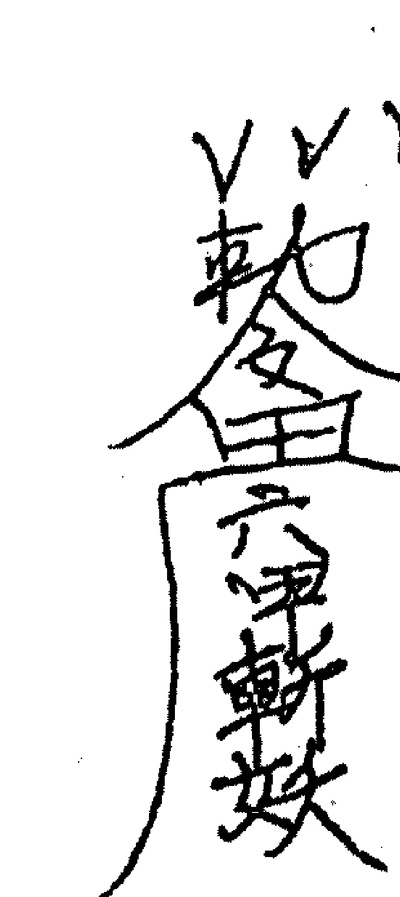

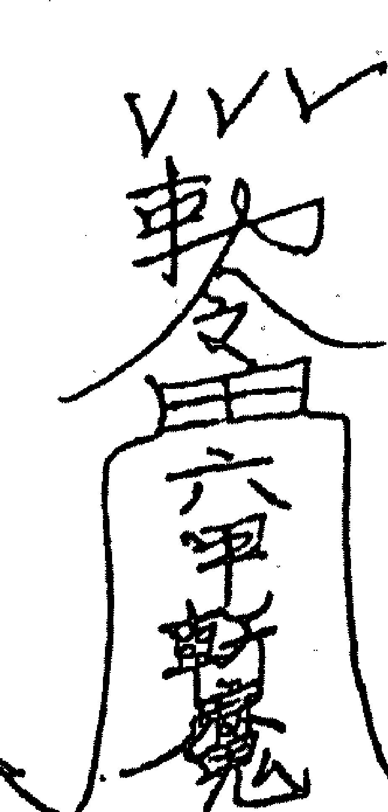

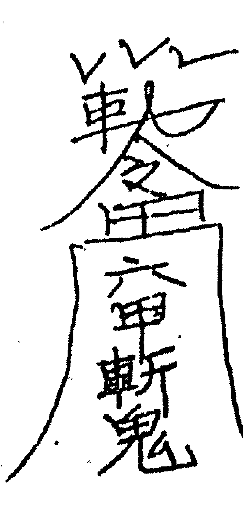

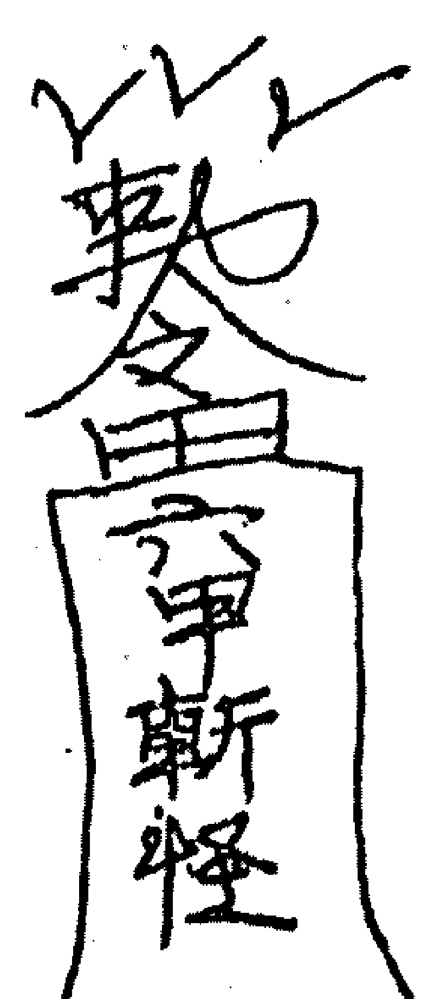

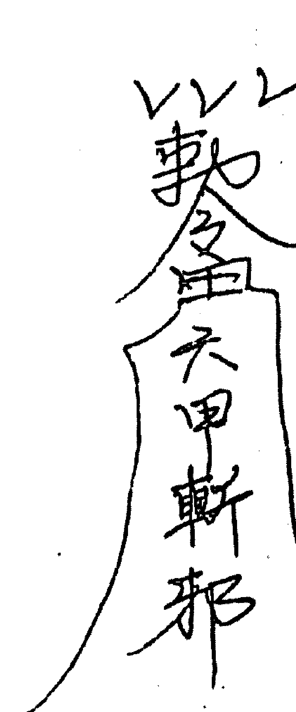

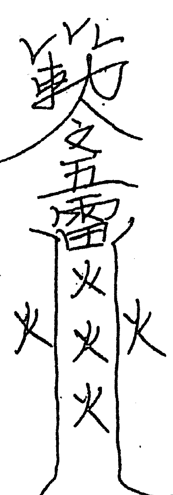

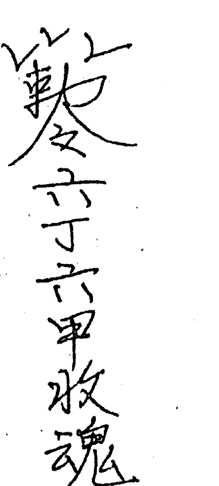

## 二十一、五行符

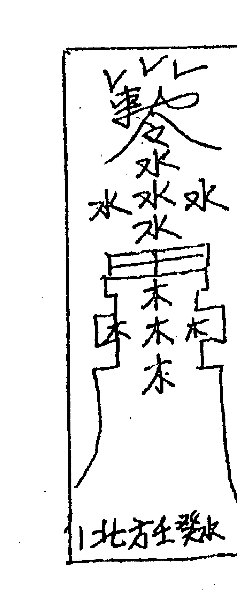

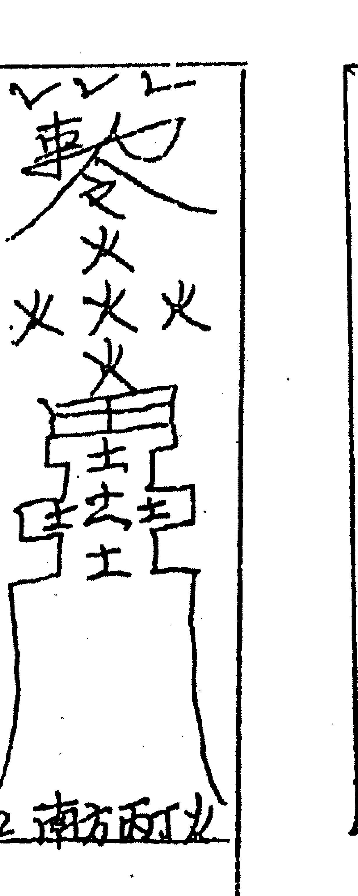

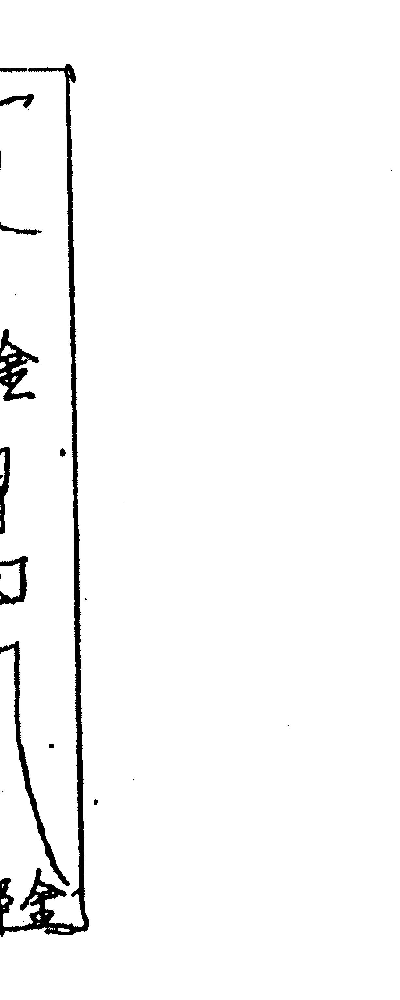

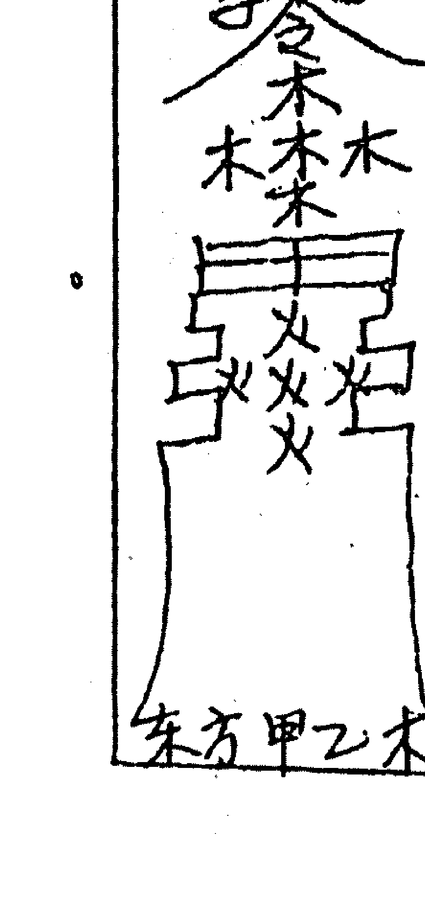

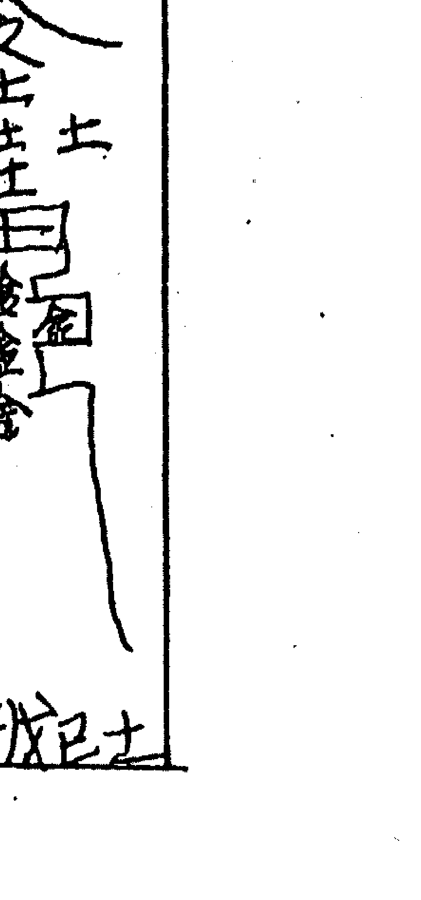

右手拿刀，在米斗前划二个十字，踩上十字上，口念家往南海南，住在普陀山微睁慧眼观世界，脚踩万朵彩花莲，吾南海大士奉西方佛祖牒文一道，东土助阵闯关，头顶天，脚踏砖，身披道袍手提鞭，请太上老君带领八仙助阵闯关，请福禄寿三星助阵闯关，请空中一切过往神灵助阵闯关，请空中一世过往神灵助阵闯关，请五路人马，六路兵博助阵闯关，念天园地方，律令九章，天有九柱，地有九梁，此时破关万事吉昌，门神户蔚，闪在两旁挡我者死，逆我者亡，吾奉紫微大帝勒令，砍香，把米斗里前边三支香砍断，然后送关，把五方令旗将升掉，再把七道灵符和破关牒文还有二十一张黄钱大纸和阴阳幡一起在犯关人身上左拉四右拉三口念是仙归林是鬼归坟，不管是门坎里的 门坎外的，屈死但亡灵，送鬼送到大门南，要想回来难上难，送鬼送到大门西，要想回来五雷霹，送鬼送到大门北，要想回来砍断腿，送鬼送到大门东，要想回来五雷轰，一切屈死烟魂但亡灵，起起架动动身，十字路口把钱分，把这些东西让人到十字路口烧掉，等烧完后给犯关人挂乾坤锁口念头上代三黄锁，腰中紧系捆仙绳，犯关人带上这把锁从今后，不犯任何关口和灾横，五路人马六路兵博能保你一年四季得太平。

等香火剩下一寸多的时候开始谢关，让犯关人站在青石上，睁开眼睛，把肩上披的红布 白布花布（兰布）一起扒下来，口念头上带，脚下扒，寿活八十八，头上带脚下走，寿活九十九让犯关人一步迈出来，给他代上五方令旗符（南方丙丁火）一百天后挂在住屋里镇宅闭邪，乾坤锁三天中午十二点在十字路口从头上往后一甩，扔掉即可。这道关煞就斩破完毕。

### 二十二、破呼用七道符

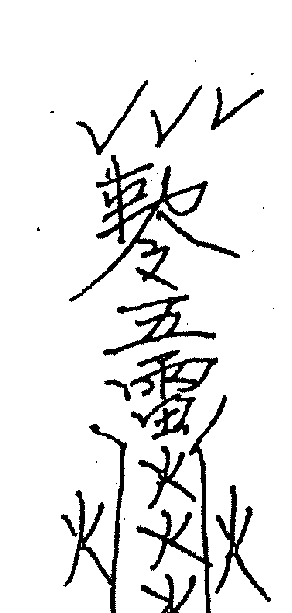

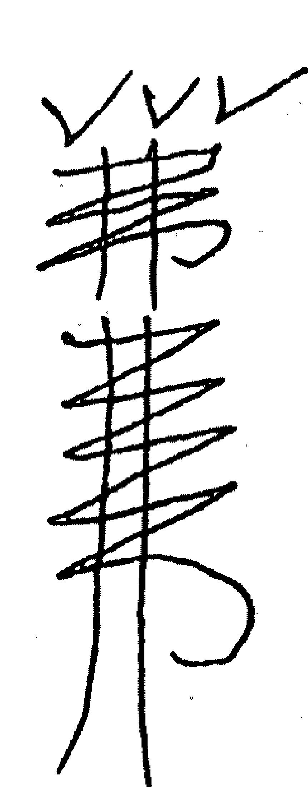

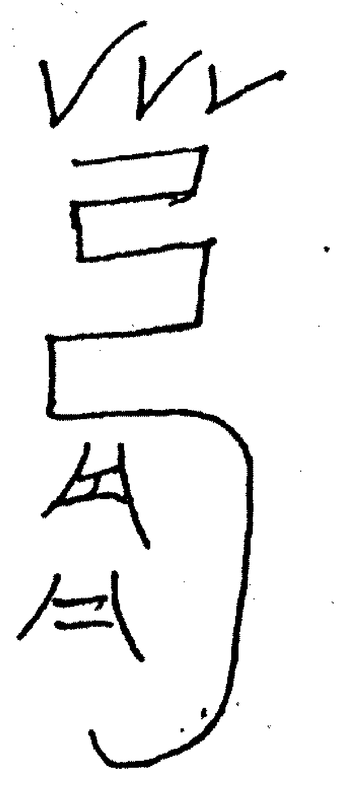

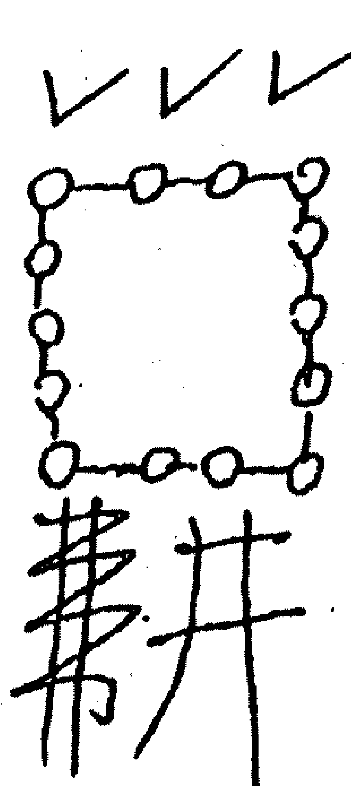

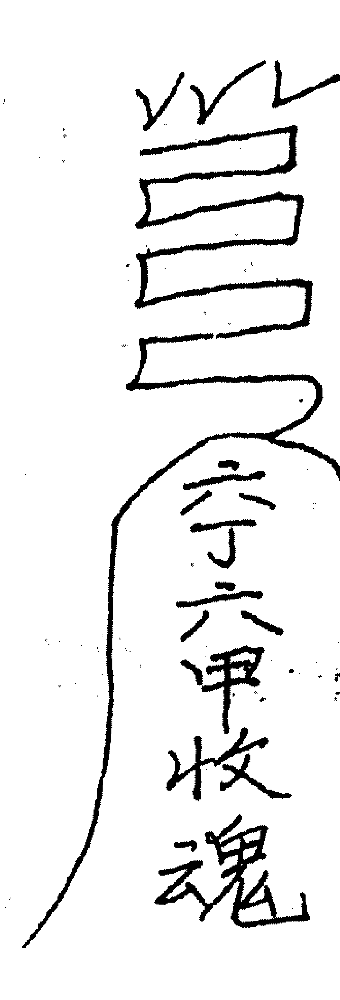

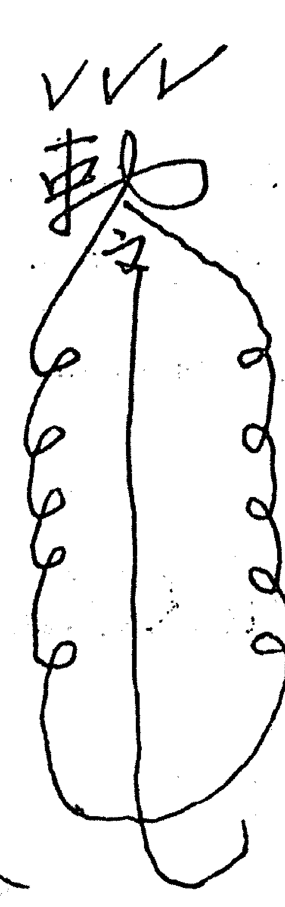

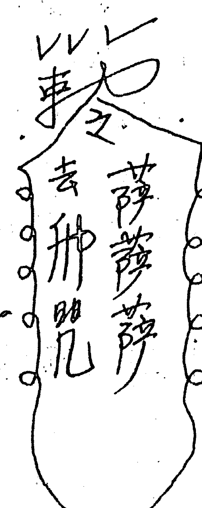

## 二十三、花姐关煞牒文

今有一洒天下，南赡部州，亚细亚洲，中华人民共和国 省 市 区 街 号 单元 号 府君氏讳 生于 年 月 日 时安生辰八字，推出她犯关煞如下:

1. 花姐关煞；
2. 落井关煞；
3. 上吊悬梁关煞；
4. 天狗关煞；
5. 离娘关煞。

以上关煞由 省 市 区 街 号 单元 楼 号仙佛斩破，现送上二十一张黄钱大纸，俸本地山神 土地 以表为证 母违示喻右谕通知

年 月 日

## 二十四、破花姐关煞须准备物品

红布 白布 花布各五尺，乾隆大钱九个，锁头一把，小镜一块，小刀一把，烧纸二十一张，米四斤，七道破关灵符，四斤米斗，八卦图，把果汁放在凳子上，在堂前，下面、八卦图米斗周围放七道灵符，东方放六甲斩妖符，南方放六甲斩魔符，西方放六甲斩怪符，北方放六甲斩邪符六丁六甲收魂符放在堂上，六甲斩鬼符和破关碟文与二十一张烧纸放在凳子底下，开始走关。

## 二十五、首先排香

请上方正仙正道，正香火，请万教圣君落云端，助阵来闯关，请十二云端高灵高仙助阵闯关，请佛祖十八偏，请观音菩萨助阵闯关，请太上老君带领八仙助阵来闯关，请太上老君带领八仙助阵来闯关，请空中一切过往神灵助阵闯关，口念一数苦那萨，走七个莲花步，把红布 白布 花布披在犯关人肩上，把花布横系在犯关人腰上，然后走丁字步。把小镜拿在左手，小刀拿在右手，双手顶在头上，请观音菩萨，太上老君带领八仙助阵闯关，天园地方律令九章，天有九柱，地有九梁，此时破关，万事吉昌，门神户尉，闪在两旁，挡我者死，逆我者亡，吾奉紫微大帝勒令，破香，把米斗前边的三支香做断，然后送关把破关牒文，七道灵符，二十一张烧纸一起，到十字路口烧掉。然后给犯关人带乾坤锁，口念上带金锁，下户阳阳，五路人马，六路兵博一年四季能保你太平，等到香着到一寸多的时候，开始解关，把肩上披的红布 白布 花布一起从上往下扒 头上戴脚下走，寿活九十九，让犯关人一步迈出来，南方丙丁火符，给犯关人带在身上一百天后挂在住屋里镇宅闭邪，乾坤锁留着，长命锁留着自己用即可（此关破完）

## 二十六、童子关煞牒文

今有一洒天下，南赡部洲，亚细亚洲，中华人民共和国 省 市 区 街 号 单元 号 府君氏讳生于 年 月 日 时安生辰八字，经仙佛推算查出犯关煞如下：

- 一、童子关煞；
- 二、鸡飞落井关煞；
- 三、上吊悬梁关煞；
- 四、天狗关煞；
- 五、断娘关煞。

以上关煞由 省 市 区 街 号 单元 楼 号仙佛斩破现备二十一张黄钱大纸，俸本地山神，土地，以表为证，毋违示喻 右喻通知

年 月 日

### 童子关煞准备物品

红布 白布 兰布各五尺，乾隆大钱九个，铜锁一把，小刀一把，小镜一块，烧纸二十一张，米四斤、 七道破关灵符，米斗一个，装四斤米用，阴阳八卦图。开始走关，把四斤米斗放在凳子上，底下铺八卦图，周围放灵符，东方放六甲斩妖符，南方放六甲斩魔符，西方放六甲斩怪符，北方放六甲斩邪符中间放五雷火字符，凳底下放二十一张黄钱大纸破关牒文和六甲斩鬼符，米斗里载七根香，即可首先排香，请上方万教圣君，落云端助阵闯关，请佛祖十八偏，助阵闯关，请空中一切过往神灵，五道游路将军，门神灶君助阵闯关。

破关人走莲花步，铺七朵莲花，走五虎玉龙步，五雷步，念一数一数苦那萨，走到大斗前，把红布斜披在犯关人肩上，在把白布披在右肩上，把兰布系在腰上，然后退出关，走丁字步，把小镜拿在左手，右手拿小刀，在米斗前划十字，两脚踩在十字上用镜子照斗米和犯关人的头，请观音菩萨助阵闯关，请太上老君带领八仙，助阵闯关，念天园地方律令九章，天有九柱，地有九梁，此时破关，万事吉昌，门神户尉闪在两旁挡我者死逆我者亡，吾奉紫微大帝勒令砍香，把米斗前边的三只香砍断退出关阵。开始送关，把七道灵符和破关牒文还有二十一张黄钱大纸一起在犯关人身上左拉四圈，右拉三圈，是仙归林，是鬼归坟，不管门坎里的，门坎外的，打哈哈凑趣的，送鬼送到大门南，要想回来难上难，送鬼送到大门西想要回来五雷霹，送鬼送到大门北，要想回来砍断腿，送鬼送到大门东，要想回来五雷轰，一切屈死烟魂，但亡灵起起架动动身，十字路口把钱分，让别人去十字路口把这些东西烧掉，回来时给童子带锁，破关人给查元身，带锁还得开锁一起办，念头上带上三黄锁，腰中紧系捆仙绳，锁本是金银长命锁，绳本是套仙之绳，小小玩童带上这把锁从今后不犯任何关口和灾病，老君留下三黄锁，仙家一到就打开，往东开，东方送出阳光来，往南开，南方送出一丝火来，往西开，西方送出莲花来，往北开，北方送出玄武来，往上开，上方送出衣服来，往下开，下房送出五谷来，四面八方都打开，今后不犯任何灾。等香看到一寸多高时，给童子解关，让童子睁开眼睛，站起来，把身上披的红布，白布，蓝布一起往下扒，口念，头上带脚下扒，寿活八十八，头上带脚下走寿活九十九，然后一步迈出来，把关符南方丙丁火字符给童子带一百天后挂屋内镇宅闭邪，乾坤锁摘下放好，这是长命锁，此关破完。

## 二十七、八败劫财绝技牒文

今有一洒天下，南瞻部洲，亚细亚洲，中华人民共和国， 省 市 区 街 号 单元 楼 号 府君氏讳 生于 年 月 日时，按生辰八字经仙佛推算关煞如下：

- 一、急脚关煞；
- 二、鬼门关煞；
- 三、深水关煞；
- 四、青龙关煞；
- 五、关府关煞；
- 六、走马关煞；
- 七、坐命关煞；

以上关煞由 省 市 区 街 号 单元 楼 号仙佛斩破，现送上黄钱大纸二十一张，俸本地山神土地，以表为证，违者遭贬，毋违示喻，右喻通知。
年 月 日

## 二十八、八败劫财阎王关煞准备物品

红布、白布、花布（蓝布）各七尺，乾隆大钱七个，青石二十斤重一块，石头上刻天雄地雌，背后刻泰山在此，五色纸叠成莲花，红公鸡血，狗血，雄黄朱砂，酒调后写对联，左边写天无忌，右边写地无忌，横幅写，百无大忌，七道破关灵符，五方令旗符，东方甲乙木，南方丙丁火，西方庚辛金，北方壬癸水，中央戊己土，米斗一个内装四斤五谷粮，二十一张黄钱大纸，小刀一把，小镜一块。

开始走关，堂前放一个凳子，上面铺着阴阳八卦图，把斗米放在上边，米斗里栽七根香，周围放破关灵符，东方六甲斩妖符，南方六甲斩魔符，西方六甲斩怪符，北方门甲斩邪符，中间放五雷火字符、凳底下放六甲斩鬼符和破关牒文与二十一张黄钱大纸，斗前边放乾坤锁，还有五方令旗符，东方甲乙木，南方丙丁火，西方庚辛金，北方壬癸水，中央戊己土，堂口上放六丁六甲收魂符，犯关人对坐在斗的对面，两眼微闭入静，两脚踩在青石上，左脚踩在天雄，右脚踩在地雌上，把天无忌和地无忌放青石底下，左边天无忌右边地无忌，中间放百无大忌，在青石底下摆五色纸叠成的莲花，这时开始排香，请万教圣君落云端，助阵闯关，请佛祖十八偏，助阵闯关，请空中一切过往神灵助阵闯关。请五道游路将军，门神灶君助阵闯关，请五路人马六路兵博助阵闯关，这时破关人开始走七朵莲花步，走丁字步，把红布，白布，花布（蓝布）斜披在犯关人肩上，男左女右，系在犯关人身上，然后在左手拿小镜，右手拿小刀，在头上顶着走莲花步，到大斗前跪拜，用小刀在地上划十字，请万教圣君下云端助阵闯关，请观音菩萨，念：家住南海南，住在普陀山，微睁慧眼观世界，脚踩万朵采花莲，吾南海大士，奉西方佛祖牒文一道，东土助阵闯关，叩拜山神五道游路将军，门神灶君，助阵闯关，天园地方，律令九章，天有九柱地有九梁，此时破关万事吉昌，挡我者死，逆我者亡，吾奉紫微大帝勒令，用小刀砍断米斗中前边的三支香，然后顶字步退出，把小镜小刀放一边，然后走丁字步，到大斗前把五方令旗符升掉，念，东方甲乙木，火化灵符上天空，金鸡报叫，鬼神闪，放回犯关人三魂七魄早回家中，南方丙丁火，火化灵符上天空，金鸡报叫鬼神闪，放回犯关之人三魂七魄早回家中，西方庚辛金，火化灵符上天空，金鸡报叫鬼神闪，放回犯关人三魂七魄早回家中，北方壬癸水，火化灵符上天空，金鸡报叫鬼神闪，放回犯关人三魂七魄早回家中，中央戊己土火化灵符上天空，金鸡报叫鬼神闪放回犯关人三魂七魄早回家中，然后把七道灵符和二十一张黄钱大纸，还有破关牒文一起拿着在犯关人身上在拉四圈，右拉三圈，念：是仙归林，是鬼归坟，不管门坎里的，门坎外的，屈死亡魂，送鬼到大门南，要想回来，难上难，送鬼送到大门西，要想回来五雷霹，送鬼送到大门北，要想回来砍断腿，送鬼送到大门东，要想回来五雷轰，一切屈死烟魂，但亡灵起起架，动动身，十字路口把钱分，把这些一起送到十字路口烧掉，等烧完时，给犯关人带乾坤锁，念，天园地方，律令九章，天有九柱，地有九梁，此时带锁万事吉昌，门神户蔚，闪在两旁，挡我者死逆我者亡，上带金锁下户阳阳，等香看到一寸多高时，开始解关让犯关人把眼睛睁开，站在青石上，把红布、白布、花布（蓝布）从上往下扒，念：头上带，脚下扒寿活八十八，头上带脚下走，寿活九十九，让他一步迈出，把五方旗符，南方丙丁火符给犯关人带一百天后挂在住屋里，镇宅闭邪，三天中午把乾坤锁从头上往后一甩，扔掉即可。（此关破完）

## 附录一

## 星相山法易学研究会简介

大庆市星相山法易学研究会会长李纯文老师研易多年，从师于五台山、泰山、九华山等道家长者，而后游历天下，遍访高人，融会贯通，自成一家。在当今易界鱼龙混杂互相争雄的情势下，李老师不忍看学易之人走许多弯路，甚至上当受骗，决意要公开古圣先贤和江湖民间的千金不传之秘，让中国数千年的易文化遗产得以发掘研究与应用。以无比坦荡之胸怀，奉于世人，乃功德昭著之事业，有志于易文化者得之，实乃有缘也。

### 一、办班教学

1. 六爻八卦班，教授纳音，神煞，十二星座，二十八宿，鬼卦惊论等断卦高级秘法。
2. 手面相班，以道家秘传破译其所蕴藏的人生密码。
3. 阴阳宅风水班，传授三元玄空风水等道家秘传和各派精华绝学。
4. 四柱八字班。传授道家和民间八字秘传绝学。

以上各班发教材及学习资料。函授学期一年，单项班学费 1000 元，负责学员答疑。面授班学期 10 天，由会长李纯文老师主讲，单项班学费 2000 元。如有单购此书者，每册 60 元。

凡参加面函授班学员，经考试合格者，可统一颁发结业证书或预测师资格证书，证书由李老师亲自签名，并加盖星相山法易学研究会印章。

### 二、热诚为社会各界提供优质服务，项目以四柱预测，六爻八卦预测，手面相预测、起名改名，择吉日，阴阳宅风水堪验，风水调整，企业策划，布局指导等

我们的宗旨是以质量求生存，以诚信求发展，与社会各界结缘。

办公电话：0459-6747431  13045497136
邮政编码：163300
联系地址：大庆市龙凤区庆客隆后院 1-6 号楼 3 单元 203 室

## 附录二

## 出售

一、出售内部绝密资料四册，每册 60.00 元。都是实价、不讲价。

1. 手相过三关。从手相上看祖上父母，兄弟姐妹，子女个数。
2. 面相过三关。从面相可看祖上父母，兄弟姐妹，子女个数。
3. 手面相看牢狱之灾。可看牢狱时间长短及年令。
4. 手面相看财运官运。可看官职的大小和升官时间。财的数量大小及发财时间。

二、出售地音点穴工具——阴阳枕，此枕为道家奇人研制的宝品。每个 800.00 元，也是实价，不讲价。

联系地址：大庆市龙凤区庆客隆后院 1-6 号楼 3 门 203 室
电话：0459-6747431 邮编：163711
联系人：曹丽华
帐号：08-604001100247566

## 二十九、破呼绝技牒文

今有一洒天下，南赡部洲，亚细亚洲中华人民共和国 省 市区 街 号 单元 楼号 府君氏讳 生于年月日时，按生辰八字，经仙佛推算犯关煞如下：

- 一、阴魂未散关煞；
- 二、五鬼关煞；
- 三、里呼关煞；
- 四、外呼关煞；
- 五、下情关煞；
- 六、四柱关煞；
- 七、四季关煞。

以上关煞由 省 市区 街 号 单元 楼号仙佛斩破现送上黄钱大纸四十九张，俸本地山神，土地，以表为证，毋违示喻，右喻通知。

年 月 日

阴阳破呼绝技关煞准备物品：

红布、白布各七尺，五谷粮一碗，小刀一把，破关灵符七道即：

这七道灵符用，狗血、鸡冠血，雄黄、朱砂，用白酒调合写，开始破斩时，地中间放一张桌子，上边放三杯白酒，符七道，五谷粮一碗，把门打开，念一数 一数 数 数 数在指针上吹一口气，念：来到三江之府，要把大事办好，小事亦利索，在指针上吹一口，然后从布这头指到那头，换一口气，让别人拿红布，家里人拿白布，走丁字步，念，一数一数苦嘛萨，把红布，白布系在一起搭在门上，红布在里面，白布在门外，走丁字步，回来，念：一数一数，苦嘛萨，双手箭诀，走到桌前，左手旋诀，揣着向外谭，念一数一数，苦嘛萨，第三杯酒，一敬天，二敬地，三敬茅宅的过往神灵，念：天园地方，律令九章，天有九柱，地有九梁，此时破呼，万事吉昌，念，天园地方律令九章，天有九柱，地有九梁，此时破呼万事吉昌，门神户蔚，闪在两旁，挡我者死，逆我者亡，魅魅魍魉，远去它乡，然后在三杯酒里同时抓，念一数 一数苦嘛萨，走丁字步，让他家人把公鸡血端出去把碗叩在门外边然后升符，如果是仙先升一、二、三道符，因为仙三鬼四，如果是鬼就升四道符，让他家拿着符走丁字步，走出门外，或楼梯间烧掉，剩下的符由别人拿着烧掉，念数嘛一诃萨，萨萨萨萨雷嘛一克萨，左手拿公鸡，右手拿小刀，右手叉腰吟，门神户蔚，闪两旁一数一数苦嘛萨数数……转到门口，用箭诀一勾，把红布搭在右腿上，白布搭在左腿上，念一数数嘛萨，落下腿把布搭在做法人身上红布在前，白布在后边，念天园地方，律令九章，天有九柱，地有九梁，门神户蔚，闪在两旁，挡我者死，逆我者亡，右手拿刀和布往手里甩，然后用五谷粮和四十九张黄钱大纸，念亡魂亡魂速升三界，天有九柱，地有九梁，此时清宅万事吉昌，门神户蔚，闪在两旁，挡我者死，逆我者亡，用五谷粮打房子四角，边打边往外边退，退出门外把红布，白布拿下来，念头上带脚下扒，然后把四十九张黄钱大纸拿到十字路上烧掉来去不回头（此呼破完）

## 三十、阴阳坐寿牒文

今有一洒天下，南赡部洲，亚细亚洲，中华人民共和国 省 市 区 街 号 单元 楼 号 府 君氏 讳 生于 年 月 日 时 按生辰八字经仙佛推算犯关煞如下：

- 一、将军箭关煞；
- 二、百日关煞；
- 三、雷公关煞；
- 四、水火关煞；
- 五、千日关煞；
- 六、病煞关煞；
- 七、阴阳坐寿关；

以上关煞由 省 市 区 街 号 单元 楼 号仙佛斩破，现送上黄钱大纸四十九张，俸本地山神土地以表为证，毋违示喻，右喻通知

年 月 日

## 三十一、阴阳坐寿关煞准备物品

红布十二尺，白布、花（蓝）布各七尺，苹果，桔子，桃子各三个，乾隆大钱七个，菜刀两把，红绒线六十六尺，五色纸做阴阳幡，七道破关灵符，五方令旗符，镜子一块，腊竹十二只，矿泉水一瓶，烧纸二十一张，青石二十斤重一块，上刻天雄地雌，背后刻泰山在此，五色纸叠成莲花瓣，左边写天无忌，右边写地无忌，中间写百无大忌，米八斤，称一杆，在堂中放一斗米，内装八斤米，凳上铺阴阳八卦图，周围摆破关关符，斗上插阴阳幡，两把菜刀，用红毛绒连着称一杆，镜子一块，栽莲花香。

首先排香请上房正仙，正道正香火，请万教圣君落云端，助阵闯关，请佛祖十八偏，请空中一切过往神灵助阵闯关，请太上老君带领八仙助阵闯关，破关人走莲花步，念一丝嘛萨，数数数，铺下七朵莲花，再走八卦步，五雷步，两手佛诀，把红布拿到犯关人跟前，由二个人拉起来，在犯关人头上，在把白布斜系犯关人肩上，花（蓝）布横系腰上，点十二只蜡烛，应叫长寿人点蜡，走顶字步，来到斗米前，请观音菩萨助阵闯关，请万教圣君助阵闯关，请太上老君带领八仙助阵闯关，请五道游路将军助阵闯关，念：天园地方，律令九章，天有九柱，地有九梁，此时破关万事吉昌，门神户尉，闪在两旁，挡我者死，逆我者亡，吾奉紫微大帝勒令，顶字步退出，开始送关，把五方令旗，升掉，把七道破关灵符和阴阳幡，破关牒文，二十一张黄钱大纸一起在犯关人身上左拉四，右拉三念，是仙归林，是鬼归坟，不管是门坎里的门坎外的屈死亡魂，送鬼送到大门南，要想回来难上难，送鬼送到大门西，要想回来，五雷霹，送鬼送到大门北，要想回来砍断腿，送鬼送到大门东，要想回来五雷轰，一切屈死亡灵，起起架，动动身，十字路口把钱分，把这些东西，十字路口烧掉，回来后给犯关人带乾坤锁，吟，天园地方，律令九章，天有九柱，地有九梁，此时带锁万事吉昌，上带金锁，下户阳阳今后不犯任何关口及灾横，然后送关把蜡烛往外送，剩一只腊时让犯关人站起来，把身上布从上往下扒，念，头上带脚上扒，寿活八十八，头上带，脚下走，寿活九十九，一步迈出来，双手拿腊烛往外送，然后把五方令符给犯关人带上一百天后卦在屋内镇宅闭邪，三天后把乾坤锁十二点从头上往后一甩扔掉即可（此关破完）

## 三十二、宫牒牒文

南瞻部洲，亚细亚洲，中华人民共和国，省 市区街号栋单元楼号府 君氏讳 生于 年 月日 时，按生辰八字经佛仙查出犯牒煞如下：

- 一、天狗煞；
- 二、铁蛇煞；
- 三、白虎煞；
- 四、天吊煞；
- 五、五鬼煞；
- 六、劫财煞；
- 七、天牢煞。

以上关煞由 省 市 区 街 号 栋 单元 楼 号仙佛斩破，现送上二十一张黄钱大纸，俸本地山神土地以表为证，违者遭贬，毋违示喻，右喻通知。

年 月 日

## 三十三、宮牒准备物品

红布十二尺，白布、粉布、花布，蓝布各七尺，腊烛十二只，阴阳幡，镜子一块称一杆，菜刀二把，红绒线六十六尺，烧纸二十一张。

开始斩破首先排香。请万教圣君助阵闯关，请佛祖十八徧，请太上老君带领八仙助阵闯关，请空中一切过往神灵，助阵闯关。

地中间放一张桌子，上铺八卦图写五方令旗符，七道破关灵符，米斗上插二把菜刀，用六十六尺红绒线连掷起来，插镜子一块，称一杆，犯关人坐在对面，用五色布叠成莲花瓣，上边铺上五色纸，叠成的莲花瓣，上边压上红毡，犯关人坐在红毡上，脚踩在二十斤重的青石上，上刻天雄，地雌，左边写天无忌，在周围摆腊烛，左边五只，右边五只，前边点二只腊烛，每个腊烛瓶底下压一个雷字符，前边放一个香碗一杯清水，十二个桃子，三个芒果，三个桔子，放在前边，犯关人头顶十二尺红布，所有的步法，都跪着走，捕莲花，走莲花步，香碗栽六根香或插一只烟也可以，把香碗放在潭水杯上，都得行大礼围绕四周走腊烛中间，莲花瓣时用脚写萨字，在中央用脚写雷字，走完了牒，就送牒，送牒时得跪着，把腊烛拿在门口，一脚门里，一脚门外，煽灭，剩下的腊在站起来往外送，剩一只要犯牒人自己拿出往门口送须破关人跪着拉手把犯牒人送到门口，就可以了，所用阴阳幡二十一张黄钱大纸，破关牒文，七道灵符，一起烧掉后带乾坤锁。

## 三十四、煞牒言

今有一洒天下，南赡部洲，亚细亚洲，中华人民共和国，省 市 区 街 号 栋 单元 楼 号 府君氏讳 生于 年 月 日 时，按生辰八字经佛仙查出犯牒煞如下：

- 一、金锁煞；
- 二、关府煞；
- 三、斩子煞；
- 四、短命煞；
- 五、八败煞；
- 六、断桥煞；
- 七、天水煞。

以上关煞由 省 市 区 街 号 栋 单元 楼号仙佛斩破现备财宝二十一张黄钱大纸，俸本地山神土地以表为证，违者遭贬，毋违示喻，右喻通知。

年 月 日

## 三十五、三十六煞三十六罡下牒准备物品

红布、白布、花布、粉布、各三尺三寸 五样色方毛巾（手拍）各一条（为五牒）五样色香皂各一块。五样色广告纸各一块。苹果、桃、桔子、香蕉、杏各三个。白酒三瓶，小刀一把，小镜一块，二十一张烧纸，矿泉水三瓶，红毛绒线九十九尺，红腊烛三十六只，五个新碗，五谷米各一碗，十二尺红布代表一年，狗血，红公鸡冠血，朱砂，雄黄，白酒调合写天无忌，地无忌，百无大忌。

摆关，五个凳子，东南西北中，东边凳子放蓝布，南边凳子上放红布，西方凳子上放白布，北方凳子放粉布中间凳子上放花布，每个凳子上放一块毛巾（手帕）放一块广告纸上边放一碗米，每个米碗栽香按着南斗六根香北斗七根香，东斗五根香，西斗四根香，中间福禄寿三星三支香，凳底下放一块香皂，按方向艳色放，每个凳子周围摆六只腊烛，东西北凳前放一瓶酒，南方中央和大斗前摆放矿泉水，犯关人坐在中间身披十二尺红布，脚踩青石，上刻天雄地雌，中间摆五块方毡子，排香，犯关人左边放，天无忌，右边放地无忌，前边放百无大忌，

走关人上船在雷上走，不能落地，走五雷步（五雷，五雷步步跟随……）上三十六姜太公令旗令箭拿在手，中三十六，下三十六就是阴阳五行，口念，姑住吉，巴拉固住吉，那吉，住那，砍完香，连天龙八步献阳关，仙灵坐在犯煞人前边，手拿镜子，应声坐在犯煞人后边，手拿乾坤镜和仙灵的镜子对照，煞上三十六，中三十六，下三十六，才能把所有的煞都煞掉，走完天龙八步献阳关，再升五方令旗，后送关，把牒文，烧纸七道灵符一起烧掉，然后给犯煞人挂锁，送腊烛，剩一只腊，让犯煞人自己揣着送到门口，一脚门里，一脚门外煽灭解关，给五方令旗符，南方丙丁火，给犯煞人带在身上一百天后，挂在房间镇宅闭邪，乾坤锁三天中午十二点，走到十字路口，从头上往后一甩扔掉即可。（此煞破完）

## 三十六、斗底八卦绝技牒文

今有一洒天下，南瞻部洲亚细亚洲中华人民共和国## 三十七、斗底八卦连环镇准备物品

省市 区 街 号 府君氏讳 生于 年 月 日 时 按生辰八字，给仙佛推算出犯如下关煞：

-   一、汤火关煞；
-   二、天狗关煞；
-   三、车前关煞；
-   四、马后关煞；
-   五、走马关煞；
-   六、断肢关煞；
-   七、五鬼因果关煞。

以上关煞由 省 市 区 街 号 栋 单元 楼 号 仙佛斩破现送上二十一张黄钱大纸，俸本地山神，土地以表为证，违者遭贬，毋违示喻，右喻通知。

地方大的地方扎紫金大城，为之八门九关，中央放一桌子，上边铺阴阳物图，斗里放五谷粮用二把铡刀，插在斗米中，用红绒把两把刀把绑在一起，这为红玉马缰来，斗中插一杆称，插五色大旗阴阳幡，插一个稻草人，一块镜子，准备红布、白布、花布（兰布）各七尺，乾隆大钱七个，烧纸二十一张，破关灵符七道，五方令旗符，五道，红公鸡一只，童男童女各一个。

## 三十八、开始安星定斗

混沌初开计时不计年，
熬鱼托地，地托天。
熬鱼扎眼十万八千年，
天连水，水连天。
无有世界断了人烟，
先有五当后有天。
五当到比天在先，
山前出现洪君主。
山后出现陆压仙，
他二人不算大。
白骨真人道法传，
二位大人西天去。
取来太极分两仪，
一铺地，二铺天。
从此才有黑天与白天，
天塌西北，地陷东南。
西北本是冰查天，
西北二海水都淡。
东南二海水都咸。
天上留下星辰共日月，
地上留下九江八河，
五湖四海並山川。
南斗六星安在南方地，
北斗七星安在正北方，
启明星安在东方地，
长庚星安在正西方，
南极星安在南方地，
北极星安在正北方，
文曲星安在东方地，
白虎星安在正西方。
牛郎星织女星，按在天河两岸。
紫微星安在北斗口里也，
天上星辰安完毕。
日月之星咱们安一安，
安日星它属阳，
白天照大地，
万物生长靠阳光。
安月星，它属阴，
专照夜间启程人，
三光星斗我都安完毕。
二十八宿表一番，
斗木獬角木蛟，
星辰並二位，
井木杆奎木狼，
共合四星安在东方地。
室火猪翼火蛇，
星辰并二位，
嘴火猴尾火虎，
共合四星安在正南方。
亢金龙，娄金狗，
星辰并二位。
牛金牛鬼金羊，
共合四星安在西方地。
箕水豹，壁水㺄，
星辰并二位。
参水猿轸水蚓，
共合四星安在正北方。
柳土獐胃土雉，
星辰并二位。
女士蝠氏土貉，
共合四星安在中央地。
星日马房日兔，
星辰并二位。
虚日鼠昴日鸡，
共合四星安在西北乾为天。
张月鹿危月燕二位星辰安在东南地，
心月狐毕月乌，
二位星辰安在东北艮为山。
天盘安完毕。
十大天干安一安，
甲乙丙丁戊己庚辛壬癸，
这本是十大天干。
甲乙东方木，
丙丁南方火，
戊己属土在中央。
庚辛西方金，
壬癸北方水，
这本十大天干安周全。
咱们再把十二地支安一安，
子丑寅卯辰巳午未申酉戌亥，
寅卯属木落在东方地，
巳午属火飞在正南方，
申酉属金安在正西方，
亥子属水玄武北方行。
辰戌丑未属土，安在四方地。
这本是十二地支安周全。
地盘安上金木水火土，
安上五岳并三山，
九江八河五湖与四海，
还有十二州加三川。
花草树木和庄田，
铜铁锡铝金银锌都在地里边，
地盘安完毕，
三皇五帝表一番，
天皇到给地皇做。
人皇留下女共男，
天上到有三百六十度。
人身到有二百六十骨节安，
天上星斗四十八万，
人身毛孔四万八千，
三皇表过去。
五帝谈一谈，
轩辕老主留下礼乐和婚姻，
遂连留火民间用，
免去后人把鲜食餐。
神农留下尝百草，
组织农民种庄田。
留下草药四百八十位，
里边有苦辣酸甜。
伏羲留下先天八卦，
乾南坤北天地定，
离东坎西水火不留情。
艮西北兑东南，
山泽通了气，
震东北巽西南，
雷风相搏变了天。
后来文王把八卦方向改，
乾坎艮震巽离坤兑，
乾为天，为老父安在西北边，
坤为地，为老母安在西南边。
震为雷为长男，安在正东方，
巽为风为长女，安在东南地，
艮为山，排行是老三，
快去东北把家看。
坎为水，排行是二鬼，安在正北去玩水。
离为火，安在正南去烧火。
六丫头做饭，二女去烧火。
兑为泽，为少女，安在正西笑哈哈。
这本是后天八卦安完毕。
再把孔夫子谈一谈，
孔子留下七十二贤。
打发颜回借粮找范单，
借来一管米一管面，
扔在道两旁变成米面两座山。
白面打饼人来用，
黑面打饼小孩做铺坛。
正赶上，太白金星来查界，
米面糟蹋太可怜，
回到上方对着范单讲一遍，
老主一怒收回米面两座山。
这回民间没有饭餐，
二番打发白狗上西天，
偏赶上如来眼睛一睁一闭整三年。
白狗只剩皮骨紧相连，
将白狗拘在后洞内，
莲花台上一百天。
打发白狗把山下，
五谷粮粒口中含，
到了下方交给神农长百草，
组织农民种庄田，
这回民间有了饭餐。
大禹治水十二载，
留下三山六水一分田。
治水经由东海岸，
定海神针扔在东海里边。
孙悟空东海龙宫借兵刃，
定海神针金光显，
落在他手间。
到后来，
他保着唐僧把经取，
得胜还朝凯歌旋。
三皇五帝讲完毕，
三教九流谈一谈。
一道传三教阐截地教连，
老君本是大教主，
二教主本是元始天尊，
通天教主本是老三。
弟兄三人住在昆仑山，
老子留下徒弟人一个，
他的名字南极仙。
二教主留下徒弟十二个，
各个都住石洞和深山。
三教主没交徒弟炼仙丹，
撒在河沟两岸，
鱼虾蟹吃了成仙体，
披毛载甲吃了变成仙。
三教我讲完毕。
九流我再谈一谈，
一留天地二留伦，
三留老君定星辰，
四留仙人住古洞，
五留僧道念经文，
六留山东孔夫子，
七留山西关圣人，
八留三皇来治世，
九留五帝来为君。
为列上中中上下，
才分天地地分人。
五行相出，父生子，
八卦定君君定臣。
父留子，子留孙，
子子孙孙到如今。
三教九流讲完毕。
十三代药王轮一轮，
一帝开源李老君，
二帝开源变神农，
三帝开源玉皇帝，
四帝开源齐伯成，
五帝开源扁鹊住南京，
六帝开源红公允，
七帝开源李化民，
八帝开源奏南叔，
九帝开源切并根，
十帝开源李时珍，
十一帝开源王叔和，
十二帝开源孙思邈，
十三帝开源老华佗。
孙思邈老华佗高，
二人身生在汉朝，
正宫国母身得病，
二位先生请进朝，
走线号脉孙思邈。
他与国母把病瞧，
病症断的妊娠脉，
当时太子要落草，
我说此话你不信，
三针扎掉龙一条。
万岁一见心欢喜，
赏给二位大红袍，
穿上红袍出了朝，
行走过巴凌桥，
巴凌桥头药王店，
二人一见心喜欢，
脱下红袍桥头挂，
穿上兰袍把香烧。
烧香得了三件宝，
压药碾子切药刀。
我说此话你不信，
白药缸子七寸高，
朝天每日兰框上摆着。
前有门神列两旁，
来在当中请灶王。
胡黄二仙老家堂，
南海大士观音堂。
张仙把住狗，
眼光娘娘都把黄香栽上，
十三代药王表完毕。
七星大斗表一番，
什么人留斗？
什么人留秤？
什么人留下照妖镜？
鲁班留斗，
五顶留秤，
包老爷留下照妖镜。
插在斗中央，
听我把五方令旗表一番：
一天旗二地旗，
三龙旗四凤旗，
五军旗六国旗，
达王留下五王单八旗。
姜太公令旗令箭拿在手，
坐在斗上头。
桃花女破周公走在外头，
紫金大城在中央，
请天兵天将下天堂。
请西北乾为天，
空中来了五令官。
身高到有一丈二，
肩宽到有三尺三，
镇守西北乾为天。
请西方兑为泽，
请来天爷五龙花车，
天爷坐着龙居辇，
十八罗汉后跟着。
请西南地道黄，
请来托塔李天王，
镇守西南地道黄。
请正南离为火，
四大金刚镇南方。
请东南巽为风，
请二郎杨戬下山峰，
镇守东南不放松。
请正东震为雷，
请金吒老爷下高峰，
镇守东方震为雷。
请木吒老爷下山峰，
镇守东北艮为山。
请北方坎为水，
请哪吒到坐九龙尾，
镇守北方坎为水。
请八怪下山峰，
西北乾为天，
多年怪蟒成了仙，
眼睛一瞪铜玲大，
尾巴一甩赛钢鞭，
镇守西北乾为天。
请正西兑为泽，
虾米成精一片白，
丈八钢枪拿在手，
冰雹大雨降下来，
镇守西方兑为泽。
请西南地道黄，
多年得道一支狼，
口赛钢刀牙赛剑，
尾巴一甩赛钢鞭，
镇守西南地道黄。
请正南离为火，
蝎子成精没人惹，
镇守南方离为火。
请东南巽为风，
多年蜘蛛成了精，
上打一把黄罗伞，
镇守东南巽为风。
请正东震为雷，
蛤蟆成精没人赶赔，
镇守东方震为雷。
请东北艮为山，
请雷公雷母紧相随，
闪光娘娘前边走，
雷公雷母在后头，
镇守东北艮为山。
请正北坎为水，
螃蟹成精八条腿，
大嘴一张吐法水，
镇守北方坎为水。
八怪请八门安，
再请上八仙。
西北乾为天，
请王禅老主下高山，
镇守西北乾为天。
正西方兑为泽，
请长李大仙下高山，
震守西方兑为泽。
请西南地道黄，
请王邈老主下山峰，
镇守西南地道黄。
请正南离为火，
请南极仙翁下山峰，
镇守南方离为火。
请东南巽为风，
请金眼毛遂下山峰，
镇守东南巽为风。
请正东震为雷，
请东方塑下山峰，
镇守东方震为雷。
请东北艮为山，
请白猿老祖下高山，
镇守东北艮为山。
请正北坎为水，
请陈禅老祖，
镇守北方坎为水。
八仙请八门安，
请了八仙安周全。
再封五官，
请东方青龙宫，
青龙大帅下高山，
上打一把青罗伞，
下照东海青罗兵，
青人青马青旗号，
青盔青甲青刀玲，
前边跑着伍万，伍仟，
伍百伍拾五个青头鬼。
后跟着伍万伍仟伍佰，
伍拾伍个青头鬼兵，
青头鬼，鬼头兵，
鬼哭狼嚎不住声，
别说凡人来入阵，
大路神仙难逃生，
要问大将是哪一个，名叫莫里青，
镇守东方就算中。
请南方离为火，
请朱雀大帅下山峰，
上打一把红罗伞，
下照南海红罗兵，
红人红马红旗号，
红盔红甲红刀令，
在前边跑着伍万伍仟，
伍佰伍拾伍个红头鬼，
后跟着伍万伍仟伍佰，
伍拾伍个红头鬼弟兵，
红头鬼，鬼头兵，
鬼哭狼嚎不住声，
别说凡人来入阵，
大路神仙难逃生，
要问大将那一个，
大将本是莫里红，
镇守南方就算中。
请西方庚辛金，
正西方本属白，
白虎将军下山来，
上打一把白罗伞，
下照西海白罗兵，
白人白马白旗号，
白盔白甲白刀令，
在前边跑着五万，
伍仟伍佰伍拾伍个白头鬼，
后跟着五万五千五百五十，
五个鬼头兵，
白头鬼，鬼头兵，
鬼哭狼嚎不住声，
别说凡人来入阵，
大路神仙难逃生，
要问大将是那一个，
大将本是莫里白，
大将军镇守西方就算中。
请正北坎为水，
玄武大帝下山来，
上打一把黑罗伞，
下照北海黑罗兵，
黑人黑马黑旗号，
黑盔黑甲黑刀令，
在前边跑着伍万，
伍仟伍百五十五个黑头鬼，
后跟着伍万，伍仟伍百，
伍拾五个黑头鬼弟兵，
黑头鬼鬼头兵，
鬼哭狼嚎不住声，
别说凡人来入阵，
大路神仙难逃生，
要问大将是那一个，
大将本是莫里黑，
大将军镇守北方就算中。
请中央戊已土，
土王老爷下山峰，
上打一把黄罗伞，
下照中央黄罗兵，
黄人黄马黄旗号，
黄盔黄甲黄刀令，
在前边跑着伍万伍千伍百，
伍拾伍个黄头鬼，
后跟着伍万伍千伍百，
伍拾伍个黄头鬼弟兵，
黄头鬼，鬼头兵，
鬼哭狼嚎不住声，
别说凡人来入阵，
大路神仙难逃生，
要问大将是那一个，
莫里黄大将就是他的名，
莫大将镇守中央还算中。
五宫请完毕，
请上房大鹏金翅鸟下山峰，
两膀一乍，
盖住星辰与北斗，
你今违了我的令，
天书遭贬不容情。
孔夫子周游列国，
留下一幅对写的清，

-   上联：天增岁月人增寿，
-   下联：春满乾坤福满园。
-   横批：犀牛望月，海马朝园。

## 三十九、闯关

犯关人在前边走，
童男童女跟在后边，
仙灵在最后跟着进关，
应声叫关，
西北乾为天，四道关，
天狗关，地牢关，
急脚关，铁蛇关。
男犯天狗被狗咬，
女犯天狗被狗餐。
把守此关叫张仙，
请金鸡来闯关。
打名金鸡前头走，
童男童女跟的欢。
老仙家雨水垒桥跟后边，
问声童男童女搭一搭言，
你说开关没开关？
答：开关了，
好又好，中又中，
借你吉言就算中，
汉高祖斩白蛇一刀两断就算得。
往前走往前行，
北方北角扎根罗，
北方到有四道关，
天水关，地水关，
四柱关，断桥关。
男犯天水水淹死，
女犯天水被水淹。
把守此关叫龙莲，
请金鸡来闯关！
打名金鸡前头走，
童男童女跟的欢。
老仙家雨水搭桥跟后边，
问声童男童女搭一搭言，
你说开关没开关？
答：开关了，
好又好，中又中，
借你吉言就算中，
汉高祖斩白蛇，
一刀两断就算得。
往前走，往前行，
东北方四道关，
孤辰关，满掉关，
血盆关，坐命关。
男犯孤辰哥一个，
女犯孤辰姐一员，
把守此关叫李全，
打鸣金鸡来闯关，
童男童女搭一搭言，
你说开关没开关？
答：开关了，
好又好，中又中，
借你吉言就算中，
汉高祖斩白蛇，
一刀两断就算得。
往前走，往前行，
东方东角扎根横，
东方到有四道关，
青龙关 断娘关，
断臂关 上吊关。
男犯青龙木上死，
女犯青龙木上悬。
把守此关叫赵源，
请金鸡来闯关，
打名金鸡前边走，
童男童女跟的欢，
老仙家雨水垒桥跟后边，
问声童男童女搭一搭言，
你说开关没开关？
答：开关了！
好又好，中又中，
借你吉言就算中，
汉高祖斩白蛇，
一刀两断就算得。
往前走 往前行，
东南方扎根罗，
东南方四道关，
病煞关，车前关，
马后关，走马关。
男犯病煞伤寒病，
女犯病煞病伤寒。
把守此关叫杜山，
请金鸡来闯关，
打名金鸡头前走，
童男童女跟得欢，
老仙家，雨水垒桥跟后边，
童男童女搭一搭言，
你说开关没开关？
答：开关了！
好又好，中又中，
借你吉言就算中，
汉高祖斩白蛇，
一刀两断就算得。
往前走往前行，
正南方扎根罗，
南方到有四道关，
斩子关，离娘关，
取娘关，将军箭。
男犯斩子无儿女，
女犯斩子，儿女不全。
把守此关叫王弹，请金鸡来闯关，
打鸣金鸡头前走，
童年童女跟的欢，
老仙家雨水垒桥跟后边，
请问童男童女搭一搭言，
你说开关没开关？
答“开关了”！
好又好，中又中，
借你吉言就算中，
汉高祖斩白蛇，
一刀两断就算得。
往前走往前行，
西南方扎根罗，
西南方四道关，
五鬼关，夜行关，
百日关，落井关。
男犯五鬼鬼缠身，
女犯五鬼被鬼缠。
把守此关叫杜坤，
请金鸡来闯关，
打鸣金鸡头前走，
童男童女跟的欢，
老仙家雨水搭桥跟后边，
叫声童男童女搭一搭言，
你说开关没开关？
答：开关了！
好又好又中又中，
借你吉言就算中，
汉高祖斩白蛇，
一刀两断就算得。
往前走往前行，
西方扎根罗，
西方四道关，
白虎关，官府关，
鬼门关，短命关。
男犯白虎虎吃子，
女犯白虎克夫男。
把守此关叫孙邱，
请金鸡来闯关，
打鸣金鸡头前走，
童男童女跟的欢，
老仙家雨水搭桥跟后边，
叫声童男童女搭一搭言，
你说开关没开关？
答：开关了！
好又好又中又中，
借你吉言就算中，
汉高祖斩白蛇，
一刀两断就算得。
往前走往前行，
中央到有四道关，
上悬关，下悬关，
火关，水关。
男犯上悬悬梁死，
女犯上悬必悬梁。
把守此关叫关越，
请金鸡来闯关，
打鸣金鸡头前走，
童男童女跟的欢。
问一声童男童女搭一搭言，
你说开关没开关？
答：开关了！
好又好中又中，
汉高祖斩白蛇，
一刀两断就算得。

## 四十、升符

东方甲乙木，火化灵符上天空，
金鸡报叫鬼神闪，放回三魂七魄早回家中。
南方丙丁火，火化灵符上天空，
金鸡报叫鬼神闪，放回三魂七魄早回家中。
西方庚辛金，火化灵符上天空，
金鸡报叫鬼神闪，放回三魂七魄早回家中。
北方壬癸水，火化灵符上天空，
金鸡报叫鬼神闪，放回三魂七魄早回家中。

然后把破关牒文和二十一张黄纸大钱和七道灵符一起烧掉，回来后挂锁，吟，头上带金锁，下户阳阳，五路人马六路兵博，保你一年四季保太平，然后解关，头上带脚上扒寿活八十八，头上带脚下走，寿活九十九，一脚迈出来，带五方令符丙丁火符，一百天后挂屋内镇宅闭邪，三天中午把乾坤锁从上往后一甩扔掉即可（此关破完）

## 四十一、各种表文打法

## 吉祥疏文

今有一洒天下，南赡部洲，亚细亚洲，中华人民共和国省市区街号单元楼号佛堂教秉教沙门疏，为求吉祥如意事，虔诚祈祷，救苦寻声。

-   信士
-   弟子

以上众等心信礼于 南无大悲观世间菩萨宝莲座前曰： 谁愿大士施大法力，慈悲摄授消灾延寿，诸事吉祥，合家平安，心想事成，福禄绵长

上闻 谨疏

年 月 日 秉教沙门谨疏

## 吉祥疏文

今有一洒天下，南赡部洲，亚细亚洲中华人民共和国省市区街号

黑老太太吉祥疏，为求吉祥平安，生意兴隆，
财源广进．合家团圆，健康长寿虔诚祈祷，救苦寻声。

信士
以上众志礼于

## 拜敬黑老太太宝莲座前日：

唯愿黑老太太施大法力，慈悲摄授，消来延寿，诸事吉祥，合家安泰，福寿绵长。

长闻　　　谨疏

黑老太太谨疏
年　月　日

## 消业还债牒文

今有一酒天下，南瞻部洲，亚细亚洲，中华人民共和国，　省　市　区　街　号单元　楼　号

府君氏讳　因欠转轮受生债，今特备财宝　万贯，送至本郡城隍当境土地送边，违者遭贬毋违示喻，右喻通知！

> 吾奉紫微大帝敕令！

-   还债XXX

年　月　日

## 助财送钱牒文

地府十殿殿主各路跑堂的，各路坐镇的，山神，土神，水神，财神爷们，牛头马面等诸神。

地藏王菩萨本府祖宗 门保府三代宗亲收用，用于南瞻部洲，亚细亚洲中华人民共和国 省 市 区 楼 号 单位，助生意兴隆，财源广进，心想事成，人财两旺，今特备 贯财宝送至门前十字路口，圣冥灵大帝地藏王菩萨，丰都城各路神仙十方土地，门神，灶君，五道游路将军，及空中一切过往神灵，签以表为证，验证查收，毋违示喻，右喻通知。

送钱人：×××

年 月 日

## 超度牒文

幽录府大地藏王菩萨鉴

今有一酒天下，南瞻部洲，亚细亚洲，中华人民共和国， 省 市 区 街 号 单元 楼 号 府 亡灵因含恨而终，不得超生，今特备财宝， 贯

送玉十殿转轮王，望亡灵速升三界，驾返西方亡灵安息。

叩拜地藏菩萨签办当方土地速转十殿查收以表为证，毋违示喻，右喻通知。

超度人：XXX
年 月 日

## 路 引 牒 文

今有一洒天下，南赡部洲，亚西亚洲中华人民共和国 省 市 区 街 号 单元 楼 号 府君氏讳 于 年 月 日 寿终正寝享年岁，今经本郡城隍许可以在冥府安身，红尘路远，黄粱梦长，鹏升天界，驾返西方，红日西坠，鹤唳猿啼，今有不孝之子 XXX 率亲朋故人，邻里乡党，家族子侄，前来十字街口吊唁，因您年积月累，积劳成疾，医治无效于世长辞矣，一生来为国为民，积德行善，永垂千古。

备有金银财宝，万贯金钱，以达留做仙乡费用，遥池之施资，趟要登山，不许魑魅冥阻，或若凌水，不许魑魅拦夺，过关渡口，望把守神员验引为证，如有违者阴阳一样，法律难容，按天书遭贬，走金桥，过银桥，光明大路直奔瑶池，金鸡山，恶狗庄切莫拦路，孟婆店，酒和菜切莫多餐，扶危送丧呜呼哀哉！

中华人民共和国
年   月   日

## 消业牒文

今有一酒天下，南瞻部洲，亚细亚洲，中华人民共和国 省 市 区 街 单元 楼 号 府君氏讳 生于一九 年 月 日 时按生辰八字推算犯关煞如下：

- 一、车前关煞
- 二、马后关煞
- 三、天水关煞
- 四、姑臣关煞
- 五、满桌关煞
- 六、天牢关煞

以上关煞由 省 市 区 街 号 单元 楼 号 仙家斩破，现送上二十一张黄钱大纸，俸本地山神，以表为证，毋违示喻，右喻通知。

中华人民共和国
年 月 日

## 附录一

## 星相山法易学研究会简介

大庆市星相山法易学研究会会长李纯文老师研易多年，从师于五台山、泰山、九华山等道家长者，而后游历天下，遍访高人，融会贯通，自成一家。在当今易界鱼龙混杂互相争雄的情势下，李老师不忍看学易之人走许多弯路，甚至上当受骗，决意要公开古圣先贤和江湖民间的千金不传之秘，让中国数千年的易文化遗产得以发掘研究与应用。以无比坦荡之胸怀，奉于世人，乃功德昭著之事业，有志于易文化者得之，实乃有缘也。

### 一、办班教学

- 1. 六爻八卦班，教授纳音，神煞，十二星座，二十八宿，鬼卦惊论等断卦高级秘法。
- 2. 手面相班，以道家秘传破译其所蕴藏的人生密码。
- 3. 阴阳宅风水班，传授三元玄空风水等道家秘传和各派精华绝学。
- 4. 四柱八字班。传授道家和民间八字秘传绝学。

以上各班发教材及学习资料。函授学期一年，单项班学费1000元，负责学员答疑。面授班学期10天，由会长李纯文老师主讲，单项班学费2000元。如有单购此书者，每册60元。

凡参加面函授班学员，经考试合格者，可统一颁发结业证书或预测师资格证书，证书由李老师亲自签名，并加盖星相山法易学研究会印章。

- 二、热诚为社会各界提供优质服务，项目以四柱预测，六爻八卦预测，手面相预测、起名改名，择吉日，阴阳宅风水堪验，风水调整，企业策划，布局指导等，我们的宗旨是以质量求生存，以诚信求发展，与社会各界结缘。

办公电话：0459-6747431 13045497136
邮政编码：163300
联系地址：大庆市龙凤区庆客隆后院 1-6 号楼 3 单元 203室

### 李纯文老师

## 附录二

## 出售

一、出售内部绝密资料四册，每册 60.00 元。都是实价、不讲价。

- 1. 手相过三关。从手相上看祖上父母，兄弟姐妹，子女个数。
- 2. 面相过三关。从面相可看祖上父母，兄弟姐妹，子女个数。
- 3. 手面相看牢狱之灾。可看牢狱时间长短及年令。
- 4. 手面相看财运官运。可看官职的大小和升官时间。财的数量大小及发财时间。

二、出售地音点穴阴阳枕，此枕为道家奇人研制的宝品。每个 800.00 元，也是实价，不讲价。

联系地址：大庆市龙凤区庆客隆后院1-6号楼3门203室
电话：0459-6747431 邮编：163711
联系人：曹丽华
帐号：08-604001100247566

## 七、异马关煞

以上关煞由 省 市 区 街 号 单元 楼 号 仙家斩破，现送上二十一张黄钱大纸，俸本地山神，以表为证，毋违示喻，右喻通知。

中华人民共和国
年 月 日

## 破关牒文

今有一酒天下，南赡部洲，亚细亚洲中华人民共和国， 省 市 区 街 单元 楼 号 府君氏讳 生于一九 年 月 日 时按生辰八字推算犯关煞如下：

- 一、勾脚关煞：
- 二、五鬼关煞：
- 三、八败劫财关煞：
- 四、天河断桥关煞：
- 五、玄武关煞：
- 六、白虎牢狱关煞：
- 七、阎王关煞。

以上关煞由 省 市 区 街 号 单元 楼 号 仙家斩破，现送上二十一张黄钱大纸，俸本地山神以表为证，毋违示喻，右喻通知。
中华人民共和国
年 月 日

## 童子关牒文

今有一酒天下，南赡部洲，亚细亚洲中华人民共和国 省 市 区 街 单元 楼 号府君氏 讳 生于 年 月 日时按生辰八字推算犯关煞如下：

- 一、童子关煞；
- 二、落井关煞；
- 三、上吊悬梁关煞；
- 四、天狗关煞；
- 五、离娘关煞。

以上关煞由 省 市 区 街 号单元 楼 号仙佛斩破，现送上二十一张黄钱大纸，俸本地山神以表为证，毋违示喻，右喻通知。
年 月 日

## 花姐关牒文

今有一洒天下，南赡部洲，亚细亚洲，中华人民共和国 省 市 区 街 单元 楼 号 府君氏 生于 年 月 日 时 按 生辰八字推算犯关煞如下：

- 一、花姐关煞；
- 二、断娘关煞；
- 三、断音关煞；
- 四、百日关煞；
- 五、断臂关煞；

以上关煞由 省 市 区 街 号 单元 楼 号仙佛斩破，现送上二十一张黄钱大纸，俸本地山神以表为证，毋违示喻，右喻通知。

中华人民共和国 年 月 日

## 八贩劫财牒文

今有一洒天下，南赡部洲，亚细亚洲，中华人民共和国 省 市 区 街 单元 楼 号 府君氏 生于 年 月 时 按生辰八字推算犯关煞如下：

- 1. 急脚关煞；
- 2. 鬼门关煞；
- 3. 深水关煞；
- 4. 青龙关煞；
- 5. 关府关煞；
- 6. 走马关煞；
- 7. 坐命关煞；

以上关煞由 省 市 区 街 号单元 楼 号仙佛斩破，现送上二十一张黄钱大纸，俸本地山神以表为证，毋违示喻，右喻通知。

年 月 日

## 五鬼因果关牒文

今有一洒天下，南赡部洲，亚细亚洲，中华人民共和国 省 市 区 街 单元 楼 号府君氏 生于 年 月 时 按生辰八字推算犯关煞如下：

- 一、五鬼因果关煞；
- 二、断肢关煞；
- 三、浴盆关煞；
- 四、夜啼关煞；
- 五、斩子关煞。

以上关煞由 省 市 区 街 号 单元 楼 号仙佛斩破，现送上二十一张黄钱大纸，俸本地山神以表为证，毋违示喻，右喻通知。
年 月 日

## 阴阳坐寿牒文

今有一洒天下，南赡部洲，亚细亚洲，中华人民共和国 省 市 区 街 单元 楼 号 府君氏 生于 年 月 日 时 按生辰八字推算犯关煞如下：

- 一、将军箭关煞；
- 二、百日关煞；
- 三、雷公关煞；
- 四、水火关煞；
- 五、千日关煞；
- 六、病煞关煞；
- 七、阴阳坐寿关煞。

以上关煞由 省 市 区 街 号 单元 楼 号仙佛斩破，现送上二十一张黄钱大纸，俸本地山神以表为证，毋违示喻，右喻通知。

年 月 日

## 八门九关牒文

今有一洒天下，南赡部洲，亚细亚洲，中华人民共和国 省 市 区 街 单元 楼 号 府君氏 生于 年 月 日 时 按 生辰八字推算犯关煞如下：

- 一、和尚关煞；
- 二、斩子关煞；
- 三、阴阳勾魂关煞；
- 四、取娘关煞；
- 五、夜行关煞；
- 六、阴阳十二月关煞；
- 七、阴阳坐寿关煞。

以上关煞由 省 市 区 街 号单元 楼 号仙佛斩破，现送上二十一张黄钱大纸，俸本地山神以表为证，毋违示喻，右喻通知。

年 月 日

## 阴阳两界牒文

今有一泗天下，南瞻部洲，亚细亚洲，中华人民共和国 省 市 区 街 单元 楼 号府君氏 生于 年 月 日 时 按生辰八字推算犯关煞如下：

- 一、铁蛇关煞；
- 二、鬼门关系；
- 三、病煞关煞；
- 四、地水关煞；
- 五、地牢关煞；
- 六、天吊关煞；
- 七、金锁关煞。

以上关煞由 省 市 区 街 号单元 楼 号仙佛斩破，现送上二十一张黄钱大纸，俸本地山神以表为证，毋违示喻，右喻通知。
年 月 日

## 阴阳呼牒文

今有一洒天下，南赡部洲，亚细亚洲，中华人民共和国 省 市 区 街 单元 楼 号府君氏 生于 年 月 日 时 按生辰八字推算犯关煞如下：

- 一、阴鬼未散关煞；
- 二、五鬼关煞；
- 三、里呼关煞；
- 四、外呼关煞；
- 五、下情关煞；
- 六、四柱关煞；
- 七、四季关煞。

以上关煞由 省 市 区 街 号单元 楼 号仙佛斩破，现送上二十一张黄钱大纸，俸本地山神以表为证，毋违示喻，右喻通知。
年 月 日

## 斗底八卦牒文

今有一洒天下，南赡部洲，亚细亚洲，中华人民共和国 省 市 区 街 单元 楼 号 府君氏 生于 年 月 日 时 按 生辰八字推算犯关煞如下：

- 一、汤火关煞；
- 二、天狗关煞；
- 三、车前关煞；
- 四、马后关煞；
- 五、走马关煞；
- 六、断肢关煞；
- 七、五鬼关煞。

以上关煞由 省 市 区 街 号 单元 楼 号仙佛斩破，现送上二十一张黄钱大纸，俸本地山神以表为证，毋违示喻，右喻通知。
年 月 日

## 送修仙牒文

今有一洒天下，南赡部洲，亚细亚洲，中华人民共和国 省 市 区 街 单元 楼 号 府君氏讳 大堂人马未后收缘，送至 山支修炼，待功果园满十载，弟马迎接返架回府落坐普渡众生为扶，帮弟马四方走，八方征，漂泊两岸搭救灾横，今特备财宝，贯送至十字路上，望当方土地，五道游路将军，一切过往神灵助办，以表为证，违者遭贬，毋违示喻，右喻通知吾奉紫微大帝勒令。
送仙人：XXX
年 月 日

## 还童子牒文

今有一洒天下，南赡部洲，亚细亚洲，中华人民共和国 省 市 区 街 单元 楼号府君氏讳 现年 岁今吾仙佛弟子查知他（她）乃是 庙花姐（童子）今特送 庙，另有香头纸马 万贯金钱相送，速请本郡城隍当境土地办理，以表为证，违者遭贬，毋违示喻，右喻通知。
吾奉紫微大帝勒令
府
年 月 日

## 答谢牒文

十方土地本郡城隍鉴：
今有南赡部洲，亚细亚洲，中华人民共和国，省 市 区 街 号 府仙佛弟子叩拜十方土地，本郡城隍因长期搬请诸神，有劳诸神深感不安，为表虔诚恳之心，特备冥府丰都冥币，十万亿贯望十方土地验表查收，违者遭贬，毋违示喻，右喻通知。

送钱人：XXX
年 月 日

## 顺香牒文

南赡部洲，亚细亚洲，中华人民共和国 省 市 区 街 号 栋 单元 号 府君氏 生于 年 月 日 时，正式清身入九门，七星挂号，万仙册留名，接下堂会带领以撑堂教主胡黄蛇嫡蟒虎狼猪鹰觉鱼悲王教主，走阴串阳，南斗六星，北斗七星，东斗五星，西斗四星，福禄寿三星，准许家大堂人马救苦救难，由 省 市 区 街 号 单元 号仙家，胡教主办理。

堂主：
应声：
年 月 日

## 送钱牒文

地府十殿殿主，各路跑堂的，各路坐镇的，山神土地，水神，财神爷们，牛头马面，地藏王菩萨，本府祖宗，门保府三代宗亲，收用，用于南瞻部洲，亚细亚洲，中华人民共和国， 省 市 区 街 栋 单元 楼 号 单位助生意兴隆，人财两旺，今特将十二万贯财宝送至门前十字路口，望冥冥府大帝，地藏王菩萨，丰都城各路神仙十方土地，门神，灶君，五道游路将军，及一切空中过往神灵鉴，以表为证，验表查收，毋违示喻，右喻通知。

送钱人：
年 月 日

## 四十二、通玄大法神咒

### 封门神咒

天罗网，地罗网，我请天兵，天神来担挡，请来正是李天王，正式传令二将在两旁，二郎天神他在此，还有哪吒和金刚神把门挡，挡得妖魔鬼，不敢闯，他要进来把他降，人退在一旁，送门前一柱香。

### 阴阳风水

治法：用一只红公鸡，一碗米，三柱香，在坟前烧化，叩三个头，围着坟头，左转三圈，右转三圈，烧二百零玖张黄纸钱，天地各一张，剩二百另七张，在坟前全部烧掉即可。

### 消业神咒

家住南海南，住在普佗山，微睁慧眼观世界，脚踩万朵彩花莲，吾南海大士奉西方佛祖牒文一道，东土助阵闯关走走，头顶天脚踏砖，身披道袍手提鞭，吾请太上老君，领着八仙助阵闯关。

拜请山神，五道游路将军，当方土地门神灶君，助阵闯关，天园地方，律令九章，天有九柱，地有九梁，此时破关万事吉昌，门神户蔚，闪在两旁，挡我者死逆我者亡。

吾奉紫微大帝急急勒令

### 消业绝技神咒

都天大雷劈雳震虚空，刀兵三千万云腾出洞中，里化妖禁，银牙吃鬼精，满天雷鼓响，震劈鬼怪精，千罗打拿将，东罡太虚空，斩妖缚邪榜，杀鬼万千灵，如若不遵咒，淩，不容情，压报天罡下，斩此为清风，急急勒令

### 笔上神咒

黄小纸一张，化符要安康
乘笔吹口咒，逢凶化吉祥
吾奉太上老君，急急如律令

### 五雷神咒

五雷五雷，步步相随，左手拿钻，右手拿锤，指山山崩，指地地裂，逢人去生，指树两截，南斗六星，北斗七星，吾奉太上老君急急勒令。

### 五雷神咒

五雷五雷，步步相随，身披金甲，头顶金盔，太公在此，诸神退位，不信恶鬼五雷打碑，南斗六星，北斗七星，吾奉太上老君句句有令。

### 刀伤封口咒

日出东方一点油，黄飞虎手提金鞭倒骑牛，一口喝尽长江水，止住鲜血不流，连念三遍，用酒吹伤口上边，边吹边念咒语，止到封口为止。

### 狗咬神咒

一、二、三、四、五、金木水火土，师人奔犬山，我有五条虎，下山来骨肉还同彦消，去狗牙毒，永远不能犯，千年断了根，万年断了线。
注：口含酒，三遍咒语，吹三口酒

### 太上老君神咒

吾奉太上老君，文嘱咐神坛诸位神斩出邪病，摧生用祈福招财，宅市灵神咒，吹至笔尖上悬卦吞八脏，腑中，南斗六星，离本位，北斗七星，下天宫，急急如律令，黄钱大纸一张，嘱咐要安康吹笔了上神咒，诸凶化为祥。

### 破丁字煞法

房前犯丁字煞的房子，用新红砖一块，刻字用朱砂，写上太公在此，破房山对窗户，用红砖一块刻上，泰山在此，放在超过胸前高度字向外，影出去即可。

### 往生咒

南无阿弥多婆夜，哆他伽夜，哆地夜他，啊弥利都婆毗，阿弥利哆利哆悉耽婆毗，阿弥利哆，毗迦兰帝，阿弥利哆毗迦兰多，伽弥腻，伽伽那，积多迦利娑婆诃。

### 小儿收魂神咒

天门开，地门开，初一，十五庙门开，正当时山头开，半夜子时坟头开，山神，土地，家堂灶君，今奉千里童子，把 XXX 小孩魂给送回来，南斗六星，北斗七星，吾奉太上老君急急如律令。

### 减罪真言神咒

离婆婆帝，求诃帝，陀罗尼帝，尼诃罗毗黎你帝，摩诃伽帝，真陵乾帝娑婆诃。

## 回向偈

愿此香华云至达三宝所，恳求大慈悲施于众生乐。

南无常住十方佛，南无常住十方法，南无常住十方僧，南无本师释迦牟尼佛，南无消灾延寿药师佛，南无极乐世界阿弥陀佛。

- 南无当来下生弥勒尊佛
- 南无十方三世一切诸佛
- 南无救苦救难的观世音菩萨
- 南无大士至菩萨
- 南无清净大海众菩萨

愿以此功德庄严佛净土，上报四从恩，下济三涂苦，若有见闻者悉发菩提心，尽此一报身，同升极乐国。

## 鸣耳神咒

山有山上水、海有海中楼、五龙叱咤五雷轰。吾奉太上老君急急如律令。

### 收魂驱邪神咒

南北靠天河、法术不用多、一字二十笔、斩妖除邪魔、南斗六星、北斗七星、吾奉太上老君急急如律令。

### 治病神咒

八龙八虎八金刚、头顶火龙照四方、照天魔、照地魔、照病魔、顶法成法阿弥陀佛。

### 写符神咒

开天门、闭地户、斩鬼路、穿鬼心、破鬼肚、左青龙、右白虎、前朱雀、后玄武，太上老君急急如律令。

### 驳婚煞治法

剪纸人七个，不论男女，上书写小人二字。剪纸人两个，一男一女，五官端正，咀上抹大油不限多少，在烟道焚之，用红绿广告纸各一小块，男犯放在左脚下，女犯放在右脚下，放在鞋垫底下不能让本人知道即可。

### 化疮神咒

赫赫阳阳，日出东方，太上老君为我收疮，一化天崩地裂，二化脓血不出，三化自消自灭，四化永不扎根，五化一生不犯，六化断根断线。

### 夜梦不祥神咒

开天门、闭地户、斩鬼路。穿鬼心、破鬼肚、左青龙、右白虎、前朱雀、后玄武。吾奉太上老君急急如律令。

### 封七窍神咒

封七星，灭七窍，闭住邪魔妖怪这条道。
注：念七遍，吹七口气，在病人头上天门穴，七遍。

### 治牙神咒

日出东方、一枝花，专治风火及虫牙，三炷香把它划，永世千年它不发。

注：就地划个十字，右脚踩在字当中，用香火划三圈吹三口，连划三次即愈。

## 四十三、坛前请五方神咒

| 左列 | 右列 |
|------|------|
| 拜请五方大将军 | 东方木德青将军 |
| 南方火德红将军 | 西方金德白将军 |
| 北方水德黑将军 | 中央土德黄将军 |
| 五方将军到坛前 | 张肖刘连镇四方 |
| 中营元帅小哪吒 | 威风凛凛不等闲 |
| 捉缚枷镇四大将 | 斩押瘟疫大神王 |
| 将伊王停不可问 | 正刀威见难可得 |
| 或在天中转归衣 | 或在波浪斩蛟龙 |
| 或在人间救善恶 | 或在金桥养尊神 |
| 不问门神并户位 | 不问拾恶狐狸精 |
| 不问神仙无道鬼 | 不问宣封及敕神 |
| 若有不正神及鬼 | 押到坛前化为尘 |

弟子坛前，焚香三拜请，拜请五中营，三太子，神将降来临，神兵急急如律令。

## 四十四、门外安香神咒

天长长，地昌昌，一请坛界，二化祯祥，符烧门外，敕法安香，香烟遥远。诸洞府诚心敬礼降道坛，神兵急急如律令。

## 四十五、神咒打鬼

手接金鞭天地动，
脚踏七星五雷云。
六丁六甲随吾行，
吾转来召天兵。
天兵天将地兵地将，
月兵月将 日兵日将，
水兵水将 火兵火将，
士兵土将 天平地平，
天无血气 地无血气，
天平地平，煞到宁行，
凶神恶煞不得近前。
神兵急急如律令！

## 四十六、三姑娘吒开路关神咒

拜请祖师为吾来开路，
本师为吾来开路，
七祖先师为吾来开路，
仙人玉女来开路，
列位正神来开路，
二十八宿来开路，
中坛哪吒太子来开路，
本坛之姑娘妈来开路，
土地公公来开路，
开路童子进坛来，
开路童子开路途。
开起路途万里路，
接引生魂上草埔。
中朝草埔分三路，
中条岩王至丰都。
左条得过良管井，
右条杨柳江故丹度。
良管井边做你去，
做你行，
急急推急急行，
做你开步行。
神兵火急如律令！

## 四十七、请蓬莱众仙咒

我令禀启元君令，
号召蓬莱请众仙。
玉真宝气临尘世，
驾鹤腾云阐诃源。
高亳仙笔书文字，
速降威灵走锦笺。
叩启诸天诸地府，
通灵位上紫姑仙。
今时有请远报应，
落度乾坤万古传。
火急律令风雷现。
威风凛凛动地天。
请仙宫与桃源洞，
东流少都是真仙。
李公铁拐汉钟离，
吕公洞宾韩湘子。
曹公国舅蓝彩和，
何氏仙姑张果老。
公明正直显灵通，
传梦尚书范太保。
作诗作赋断吉凶，
阴阳福祸无私告。
不分高下贵与穷，
一件一件来禀告。
灵威圣迹显其中，
有求皆应无不从。
回向作急与尘世，
先时报兆星名声。
弟子焚香虔诚拜，
仙翁亲身齐降临。
天高高，地遥遥，
海天万里来飘飘。
不为人间酒与肴，
有如王母献蟠桃。
与汝共作神仙会，
相随永结威寒交。
敬请仙童达洞府，
投仲弟子愿返依。
头上插花迎仙侣，
急急归来赴我箕。

天灵灵，水灵灵，火灵灵，天地水。火地最灵，奉请仙翁请圣众，降我明堂贲我净，我净室永协我箕，急急如律令

(如念七遍不至)

接着念另外咒语

卸嘛赫赫，雷光昭昭，无令凝滞，心黯魂销，奉太上老君急急发中律令。（如箕动,是临乱）

### 又咒

云推雾卷，仙真倏到，愿附神算，推诚乐靠。

（如写向字是仙云却念）

## 四十八、送仙咒

俗说请神容易送神难，又说不清神，不显灵。孙请仙，法不占。故而书符必请仙，请仙必送仙，请神不送神，必得怪异生，所以当完全化解事宜后，一定要送走神仙。

撕蒙仙真降，格尘环扰扰，难以久留，敬焚宝香攀送骈返，来时感恩，去时春福，降则无路不通，回则去路难寻四海之内，难同此音，后有所求，再当奉请（将箕托于水盂即退）。

## 附录一

## 星相山法易学研究会简介

大庆市星相山法易学研究会会长李纯文老师研易多年，从师于五台山、泰山、九华山等道家长者，而后游历天下，遍访高人，融会贯通，自成一家。在当今易界鱼龙混杂互相争雄的情势下，李老师不忍看学易之人走许多弯路，甚至上当受骗，决意要公开古圣先贤和江湖民间的千金不传之秘，让中国数千年的易文化遗产得以发掘研究与应用。以无比坦荡之胸怀，奉于世人，乃功德昭著之事业，有志于易文化者得之，实乃有缘也。

### 一、办班教学

- 1. 六爻八卦班，教授纳音，神煞，十二星座，二十八宿，鬼卦秘论等断卦高级秘法。
- 2. 手面相班，以道家秘传破译其所蕴藏的人生密码。
- 3. 阴阳宅风水班，传授三元玄空风水等道家秘传和各派精华绝学。
- 4. 四柱八字班。传授道家和民间八字秘传绝学。

以上各班发教材及学习资料。函授学期一年，单项班学费 1000 元，负责学员答疑。面授班学期 10 天，由会长李纯文老师主讲，单项班学费 2000 元。如有单购此书者，每册 60 元。

凡参加面函授班学员，经考试合格者，可统一颁发结业证书或预测师资格证书，证书由李老师亲自签名，并加盖星相山法易学研究会印章。

二、热诚为社会各界提供优质服务，项目以四柱预测，六爻八卦预测，手面相预测、起名改名，择吉日，阴阳宅风水堪验，风水调整，企业策划，布局指导等，我们的宗旨是以质量求生存，以诚信求发展，与社会各界结缘。

- 办公电话：0459-6747431 13045497136
- 邮政编码：163300
- 联系地址：大庆市龙凤区庆客隆后院 1-6 号楼 3 单元 203 室

李纯文老师

## 附录二

## 出售

- 一、出售内部绝密资料四册，每册 60.00 元。都是实价、不讲价。
    - 1. 手相过三关。从手相上看祖上父母，兄弟姐妹，子女个数。
    - 2. 面相过三关。从面相可看祖上父母，兄弟姐妹，子女个数。
    - 3. 手面相看牢狱之灾。可看牢狱时间长短及年龄。
    - 4. 手面相看财运官运。可看官职的大小和升官时间。财的数量大小及发财时间。
- 二、出售地音点穴阴阳枕，此枕为道家奇人研制的宝品。每个 800.00 元，也是实价，不讲价。
    - 联系地址：大庆市龙凤区庆客隆后院 1-6 号楼 3 门 203 室
    - 电话：0459-6747431 邮编：163711
    - 联系人：曹丽华
    - 帐号：08-604001100247566

### 五十四、画符请神咒

> 请众神咒（念三遍）
>
> 天苍苍，地苍苍，众神在何方？弟子××家住××县××乡××村或××路××巷××弄××号。今夜以三根清香，化作百千万亿香云，惊天动地，呼风唤雨，朵朵五彩祥云，叩请九天玄女娘娘，北斗星君太上先师以及××××仙圣××××天神，脚踏祥云降临坐镇，西方世界，上下虚空。
>
> 东西南北，无所不在，无处不到，恭请诸天道祖，仙佛，神圣仙驾速速降临来也。弟子××，今夜求诸位仙驾降临，坐镇，赐弟子灵验神符，但愿所画灵符，蒙获道法垂怜，保佑，赐福，得万分灵验，以救世济人，弟子××再三拜请叩求。

### 五十五、陈立青姑神咒

謹请正德陈夫人，
步领天兵救万民。
百花桥头分男女，
鼓色吹来陈水宫。
父是陈家陈圣者，
母是本宫葛夫人。
甲寅年正月十五生，
寅时出世吾娘身。
地养金盆来捧水，
香汤沐浴洗娘身。
南海观音来助法，
老君助法救万民。
鼓角声响天地动，
金鞭接直鬼神惊。
天上阳阳随娘转，
地下茫茫随娘行。
救昨殿中救皇后，
生下太子得分明。
满殿文武真钦敬，
神通广大展威灵。
北子一心专拜请，
陈氏娘娘降临来。
神兵火急如律令！

### 五十六、地藏王神咒

谨请岳府地藏王，
呼风唤雨展灵通。
坐在东岳阴府中，
判断善恶审分明。
掌管地府神通赫，
威灵敢当众岳门。
山神土治备吾问，
阴产是鬼神吾召。
卫国金刚四大将，
召入吾岳听吾令。
弟子一心专拜请，
慈悲尊王親降临。
神兵火急如律令！

### 五十七、九天玄女神咒（一）

香气沉沉镇乾坤，
应开杰源祖殿门。
一片慈云空中起，
毫光显现盖娘身。
头戴五龙珍珠髻，
身穿八卦黄金衣。
炉前提来洗佛庆，
手接宝剑斩妖精。
当初学法南天外，
炼石补天天下知。
行军咒水通三界，
通开三界度众生。
脚踏祥云出天外，
降落凡间救万民。
弟子一心专拜请，
九天娘娘降来临。
神兵火急如律令！

### 五十八、九天玄女神咒（二）

谨请九天玄女娘，
腾云驾雾游天下。
符水救人光英辉，
桃枝打鬼法无边。
天上洋洋娘行去，
地下茫茫娘行罡。
绣鞋脱落三港口，
头巾抛落九重天。
我是三师三女子，
降落李源洞中内。
夜受吕公传法教，
救苦救难落凡间。
弟子特别专拜请，
九天玄女降临来。
神兵火急如律令！

### 五十九、注生娘娘神咒

谨请注生大娘娘，
显管传宰献生法。
阴阳生死有注定，
天罗地网为起先。
香花奉请佛祖灯，
落生虚空有报应。
奉请娘娘到坛前，
起星麟儿养心法。
善恶阳阴有定夺，
显现兵内第一娘。
弟子一心专拜请，
慈悲娘娘降临来。
神兵火急如律令！

### 六十、请天兵天将咒

天雷莫莫，龙虎交兵，
日月落照，照我分明。
远去远来，接我号令，
调到天兵天将地兵地将，
神兵神将，官兵官将，
五雷神将，符到奉行。
急急如律令！

### 六十一、三奶娘娘神咒

> 谨请福州三娘妈。
> 古田森家十八年。
> 小年金心入瑜衙，
> 四子五常随娘行。
> 日在云中骑战马，
> 夜在水上结雄兵。
> 结起雄兵数千万，
> 落在三江五朝前。
> 五海龙王亲眼见，
> 看见妈身显真身。
> 调卜林家林夫人，
> 化作三字救万民。
> 少年香火千万传，
> 家家流传娘妈身。
> 来接奉迎娘妈身，
> 合家平安在坛前。
> 弟子一心专拜请，
> 林奶娘娘降临来。
> 神兵火急如律令！

### 六十二、邢府千岁神咒

谨请本师邢恩主，
英雄猛将遍天下。
监察人间善恶心，
判断阴阳审分明。
巡游天下来救苦，
驱除天下不正神。
诸神闻吾真钦敬，
鬼神闻吾真皆惊。
吾受玉皇亲躬赐，
来到人间救万民。
天兵神将随吾转，
六甲神将知吾灵。
左手接印召天兵，
右手接剑斩妖精。
弟子一心专拜请，
邢府千岁降临来。
神兵火急如律令！

### 六十三、请齐天大圣咒

召请齐天大圣到坛来，
身穿佛衣，
手执一根金光棒，
长戴金筐佛带，
一腾十万八千里。
火眼金睛，
千变万化显神通。
宝棒打鬼杀万千，
灵符有感同神兵。
法行七十二变直斩妖精，
弟子一心专拜请，
请来齐天大圣孙悟空。
神兵火急如律令！

### 六十四、朱府千岁神咒

谨请恩主朱五爷，
巡守天下驱万邪，
上山收斩蛟龙半，
治病救苦亦消灾。
吾令法眼乾坤动，
斩断阴阳不正神。
身穿烈袍金腰带，
阎君殿前亲敕令。
勇敢显现巡满天，
掌管阴阳万万年。
吾奉圣君亲敕令，
焚香拜请到坛前。
弟子一心专拜请，
朱府千岁降临来。
神兵火急如律令！

### 六十五、勒符咒（闾山派）

拜请闾山门下来，
闾山门下勒符三童子。
勒符仙人童了郎，
符令符头带三请。
脚跳邪精，
一道化十道，十道化百道，
化为千千万万道。
道道带兵，道道带将，
道道有感，道道有灵。
符今赫赫为吾敕，
镇守東西南北界，
宅舍安符大吉昌，
前门镇符驱邪鬼。

### 六十六、李府千岁神咒

谨请本坛李恩主，
神通变化巡天下。
上山巡游驱猛虎，
落海巡扫斩蛟龙。
收除天下无道鬼，
收斩邪魔不正神。
有人常念随感应，
亲身显现救万民。
吾奉圣上亲勒令，
焚香拜请到坛前。
弟子一心专拜请，
李府千岁降临来。
神兵火急如律令！

### 六十七、赵将军咒

谨请主坛赵将军，
脚跳七星五雷云。
手接铁炼天地动，
铜枷铁锁随吾行。
吾今有感坛调请，
邪魔鬼鬼尽皆惊。
喝起五雷大神兵，
五营兵马到坛前。
破秽驱邪为第一，
斩尽天下不正神。
玉皇号令亲勑赐，
焚香拜请到坛前。
弟子一心专拜请，
主坛将军降临来。
神兵火急如律令！

### 六十八、雪山童子咒

谨请雪山雪山来，
开山大圣降雪来。
六月洋洋天降雪，
七月洋洋天降雪，
祖师骑牛降霜雪。
打马自穿雪加沙，
手指变作扯条雪，
脚趾变作十条霜。
大雪飞到三港口，
小雪飞落在门前，
随时变雪雪来临，
随时变霜霜来到。
弟子一心专拜请，
雪山大圣降临来。
神兵火急如律令！

### 六十九、催神轿咒

拜请祖师起五雷，
调到地兵共地将。
雷起东方起兵将，
雷起雷神 东来东坐，
南来南坐 西来西坐，
北来北坐 中来中坐。
收领五方大兵将，
领令发兵甲发将。
采起龙轿起金琏，
降起真法，
开沛仙丹好妙药，
救济良民有名声。
神兵火急如律令！

### 七十、张天师教主咒

天清清，地灵灵，
焚香拜请张天师，
神将康赵二元帅，
管下百万大兵将。
千星雷公千星闪，
万星毫光万星明，
手接宝剑斩妖精。
若有凶神不伏者，
脚踏恶鬼鬼灭亡，
千里发起毫光现。
万星制法鬼神惊，
吾奉玉皇親勅賜。
降落凡间救万民，
弟子一心专拜请，
天师教主降临来。
神兵火急如律令！

### 七十一、开口咒

本师为吾开金口，
祖师为吾开金口，
仙人为吾开金口，
玉女为吾开金口，
祖师降乱开金口，
降乱童子说分咐。
神兵火急如律令！

### 七十二、张天师传法咒诀

天上三奇日月星，
通天透地鬼神惊。
若有凶神恶杀鬼来临，
地头凶神邪魔逢之走不停，
天清清，地灵灵，
弟子奉请六丁六甲神。
今日听吾号令，
金童玉女来领天兵，
何神不伏何鬼不惊，
钦吾符令，扫除鬼精。

串鬼心，做鬼肚，
留人门，档鬼路。
一百二十四位凶神恶煞，
及时奉行九天玄女勒，
急急如律令！

### 七十三、调五雷神咒

雷电大雷公，
霹雳现英雄。
统兵千百万，
霹雳在云中。
若有强神恶煞不伏者，
雷令一声放出毫光。
化为尘埃，
神兵火急如律令！

### 七十四、关神祝吉请神咒

禀过三天大教主，
国王灵宝三大尊。
宫中尊圣玉大母，
宝山尊圣龙树神。
南召妙中三太帝，
福洲麟水三宫军。
诸神显化诸本祖，
七祖金化许七娘，
兵府丰都诸元帅。
功曹文武象兵郎，
内兵魔王神兵马。
外得一统象兵将，
身穿龙衣宽心助。
助吾师男调营军，
有事炉前焚香请。
一心专拜请诸神，
本坛列位大恩主。
扶随师男调营兵，
五营兵将调兵马，
点兵点将到坛前，
弟子一心专拜请，
列为恩主降临来。
神兵火急如律令！

### 七十五、起马咒

天地开张，
日吉时良。
伏以焚香，
拜请香烟采起，
神通万里，
香烟沉沉，
正神降临。
拜请本坛诸神，
天庭三界，
神祇来临，
神兵火急如律令，摧乱童不起驾用。

### 七十六、五雷法咒

春雷夏雷秋雷冬雷，雷法雷，摧童不起用五雷，雷雷大将军，打天天开门，打地地开门，打起凶神恶煞尽皆惊，拜请五雷五营兵马速降来临。神兵火急如律令！

### 七十七、摧乱童发毫光咒

乾元亨利贞，乾坤好其形，
日月变其体，
北斗盖其身。
身请神，神变身，
弟子一心专拜请。
请到祖师来扶乱，
来扶童，千里山，万里海，
海水起波浪，
一接童子路，
二接章子郎。
祖师发毫光，
万里发毫光。
千里毫光照童身，
万里毫光照童人。
仙人发起毫光炎炎光，
伏望祖师来扶童，
忝行如云走到降示真坛，
开金口说分明，
神兵火急如律令！

### 七十八、老君咒治邪魔

天纷纷，地纷纷，
拜请三坛李老君。
身骑沟角青牛出天门，
手接柳枝分天下。
斩收凡间不正神，
收斩凡间凶神不近身。
斩奏凶神恶煞不在身。
天清清，地灵灵，
六丁六甲兵，
老君到处同吾行，
圣人守领天兵。
吾奉老君急急如律令！

### 七十九、老君咒碧妖邪

天纷纷，地纷纷，
拜请太上李老君。
老君三岁调北斗，
哪吒七岁踏火轮。
观音十八去学法，
步罡踏斗陈靖姑。
千家流传娘香火，
万家流传娘香烟。
有心念娘娘着知，
焚香拜请则时来。
妖邪见之不留停。
神兵火急如律令！

### 八十、收辞火公神咒

> （过火后用鸡鸭勒剑辞火神）
>
> 天清清，地灵灵，
> 施将军来请令一蜀。
> 涂将军，来压火，
> 压火移弟子拜请涂。
> 理将军押煞火公神，
> 出外方面去不久停。
> 神兵火急如律令！

### 八十一、被人做叩用此咒收妖精

（念七遍）
天苍苍，地茫茫，
焚香拜请四金刚。
东机魔兄法，
西机魔兄奉。
南机机魔兄狩，
小生沾北方，
一人独门到，
吾奉登机姜太公，
手接法尺做横黄，
打你妖邪魍以永无踪。
神兵火急如律令！

### 八十二、关神咒

仰启神威豁落将，都天纠罚大灵官。火车三五号雷公，受命三请降鬼祟。手接金鞭巡世界，身穿金甲显威灵。绿鞋风带护身刑，双目火精耀天地。顷刻三天朝上帝，须臾九地救世民。银牙凤嘴众三千，虎首貔貅兵百万。走火行风前后衙，穿山破石捉邪精。祈晴祷雨济世界，附体圆光通事意。治病去邪如闪电，
收瘟摄毒伏君魔。
腾云驾雾遍虚空，
号令雷霆轹霹雳。
三界大魔皆拱手，
十方外道悉皈依。
吾令启请××神，
大赐雷威加拥护。
弟子一心专拜请，
××恩主降临来。
神兵火急如律令！

### 八十三、收魂咒

奉请天上玉皇上帝勒，
王母娘娘收魂乱纷纷。
身骑白虎下天庭，
收斩皇都三洞鬼。
鬼头落地乱纷纷，
娘妈本是杨洲。
杨洲都督千里，
头戴李花圈。
老君下坛来收煞，
抉起背上斩妖精。
呂山本祖助吾法，
作法之时斩妖精。
普庵祖师助吾法，
普庵佛法本无边。
驱邪斩鬼除妖精，
神兵火急如律令！

### 八十四、镇一切邪祟符咒

功用：凡家宅不安，幽灵出现，用此符镇之，无不应验。

- 天有天将 地有地祇
聪明正直 不偏不私
斩邪除患 解困安危
如干神怨 粉骨扬灰

### 八十五、镇宅安家符

功用：凡平常人家中 贴此符

### 咒语

- 天雷殷殷 地雷昏昏
- 天兵天将 六甲六丁
- 闻我关召 不得留停
- 迎祥降福 永镇龙神

### 八十六、镇家宅流年不利符

功用：凡家宅因流年冲犯，致人口疾病，怪出现者,宜以此符镇之。

### 咒语

- 焚香昭告 家宅六神
- 各居各位 毋乱毋紊
- 消灾降福 坐镇门庭

### 八十七、镇凶宅怪异符

功用：凡一切凶宅或见鬼怪或害生人，以此符镇之，可以安居。

```
咒 语
杳杳冥冥　天地昏沉
雷电风火　官将吏兵
若闻关召　迅速来临
驱除幽属　拿捉精灵
安龙镇宅　功在天庭
```

### 八十八、镇新宅闹鬼符

功用：凡新建之住宅，忽有鬼魅出现，宜用此符镇之。

### 咒语

魔星恶鬼　古洞精灵
举头同祝　俯首同听
上有六甲　下有六丁
骚扰为厉　定干雷霆
太上有令　命我施行

### 八十九、镇宅犯四凶符

功用：凡住宅方位犯四凶煞者，用此可解。

### 咒语

> 雷祖圣帝 远处天曹
> 掌管神将 邓辛张陶
> 能誓万恶 不赦魔妖
> 雷声一震 万劫全销

### 九十、镇宅犯鬼符

功用：凡家中时有失物，或人有东忘西等情，皆系五鬼为祟，须用此镇之。

咒语
五鬼五鬼 奔逐忙忙
迷人藏物 搬运无常
我奉敕令 逐尔遐荒
如敢有违 化骨飞扬

### 九十一、镇宅犯七煞符

功用：凡犯七煞，家宅不安，
疾病口角，终年不已，
须用此镇之。

### 咒 语

- 青龙居我左 白虎侍我向
- 朱雀护我前 玄武立我后
- 四方四神将 将我元形守
- 七煞是凶神 安敢入我牖## 八十七、镇阳宅风水不利符

功用：凡住宅风水不利，往往疾病或凶死，宜用此符镇之。

咒语
乾坤一气 道之长存
散迷六合 聚会五行
不离不判 相克相生
太上符命 元始至文
凶魔邪祟 不得侵临

## 八十八、镇阴宅风水不利符

功用：阴宅风水，有关于子孙兴替甚重，如有不利，镇以此符。

### 咒语

混混沌沌 天地初分
生生死死 昏昏腾腾
同水所向 神应其灵
召请殷帅 为镇荒茔
有功之日 表达天庭

## 八十九、镇宅驱犯灵符

咒语
赫赫阳阳
日出东方
用笔笔灵
用纸纸方
用朱朱赤
用砚砚汪
书天两旁
书地鬼泣
无祷不应
无求不祥
急急如律令

## 九十、镇煞安厅门

北斗解厄七元星君
西露大甲神将
招财进宝
右白虎

南斗注生大司星君
扫除千灾
左青龙

## 九十一、镇宅平安符

利新宅

## 九十二、大树电线竿对用此符镇之

## 九十三、家宅犯病 烧化入水遍洒庭院

## 九十四、镇宅平安符

## 九十五、镇宅吉利符

红纸或红布，黑字画符按照一般请神程序，此符更适用于新居落成，挂贴大厅或门口吉利昌隆家运。

## 九十六、五雷天鬼镇宅符

黄纸：朱砂字，画符，按照一般请神程序，贴于大厅或门口，家中不安疑神疑鬼时用之。

## 九十七、镇宅光明符

黄纸、朱砂或黑字画符按照一般请神程序，贴于大厅或神案皆可。

## 九十八、关公斩妖镇宅符

黄纸，黑字画符，请神时加请关圣帝君坐镇，贴于神案前可破诸邪斩妖灭鬼镇宅功效。

## 九十九、乾

用桃柏木板，朱书神符八道。钉八方大吉

## 一百、巽

东南镇宅符

## 一百零一、中岳符

五岳镇宅符

凡人家宅不安或凶神邪鬼作怪，此符镇之大吉，或夜行身带此符，诸邪不敢近。

## 东岳符

此符用石刻或桃木板刻后用朱砂画上埋于宅的东方。

## 西岳符

此符用桃木板或石板刻后画上朱砂，埋在正南方。

## 南岳符

此符用桃木板或石板刻后画上朱砂，埋在院子正南方。

## 北岳符

此符用桃木板或石板刻后朱砂画好，埋在院子正北方。

## 一百零二、镇宅十二年土府神煞

凡修造误犯土凶神主伤人，用桃板书符于犯处，诸和符用桃板一尺二寸朱书，用僧道祭犯处。

### 子年符

### 丑年符

### 寅年符

### 卯年符

### 辰年符

### 巳年符

### 午年符

### 未年符

### 申年符

### 酉年符

### 戌年符

### 亥年符

## 一百零三、镇四方土禁并退神符

凡误犯三煞神主伤人，用桃板朱书符于犯处。

### 己午未年符

### 申酉戌年符

## 一百零四、镇命元建宅有犯凶

若犯庚辛为孝服之年，主人口灾病六畜损伤，镇用白杨木刻人形两个，于本宅生气方，头南脚北，三尺深，用本人沐浴水泼埋处，书此符带之。

## 附录一

## 星相山法易学研究会简介

大庆市星相山法易学研究会会长李纯文老师研易多年，从师于五台山、泰山、九华山等道家长者，而后游历天下，遍访高人，融会贯通，自成一家。在当今易界鱼龙混杂互相争雄的情势下，李老师不忍看学易之人走许多弯路，甚至上当受骗，决意要公开古圣先贤和江湖民间的千金不传之秘，让中国数千年的易文化遗产得以发掘研究与应用。以无比坦荡之胸怀，奉于世人，乃功德昭著之事业，有志于易文化者得之，实乃有缘也。

### 一、办班教学

- 1. 六爻八卦班，教授纳音，神煞，十二星座，二十八宿，鬼卦惊论等断卦高级秘法。
- 2. 手面相班，以道家秘传破译其所蕴藏的人生密码。
- 3. 阴阳宅风水班，传授三元玄空风水等道家秘传和各派精华绝学。
- 4. 四柱八字班。传授道家和民间八字秘传绝学。

以上各班发教材及学习资料。函授学期一年，单项班学费 1000 元，负责学员答疑。面授班学期 10 天，由会长李纯文老师主讲，单项班学费 2000 元。如有单购此书者，每册 60 元。

凡参加面函授班学员，经考试合格者，可统一颁发结业证书或预测师资格证书，证书由李老师亲自签名，并加盖星相山法易学研究会印章。

### 二、热诚为社会各界提供优质服务，项目以四柱预测，六爻八卦预测，手面相预测、起名改名，择吉日，阴阳宅风水堪验，风水调整，企业策划，布局指导等，我们的宗旨是以质量求生存，以诚信求发展，与社会各界结缘。

办公电话：0459-6747431 13045497136

邮政编码：163300

联系地址：大庆市龙凤区庆客隆后院 1-6 号楼 3 单元 203 室

李纯文老师

## 附录二

## 出售

一、出售内部绝密资料四册，每册 60.00 元。都是实价、不讲价。

- 1. 手相过三关。从手相上看祖上父母，兄弟姐妹，子女个数。
- 2. 面相过三关。从面相可看祖上父母，兄弟姐妹，子女个数。
- 3. 手面相看牢狱之灾。可看牢狱时间长短及年龄。
- 4. 手面相看财运官运。可看官职的大小和升官时间。财的数量大小及发财时间。

二、出售地音点穴阴阳枕，此枕为道家奇人研制的宝品。每个 800.00 元，也是实价，不讲价。

联系地址：大庆市龙凤区庆客隆后院1-6号楼3门203室
电话：0459-6747431 邮编：163711
联系人：曹丽华
帐号：08-604001100247566

## 一百零五、贴门镇宅符

若误犯壬癸者，为盗贼惊恐为官事败财，镇用牢中土一斗。自死一个老鼠，埋在本宅五鬼门下深一尺二寸。如乾宅以震为五鬼方。余防此。

## 一百零六、镇行年建宅神符

凡建宅犯卯酉巳为小凶之年，主小口灾，破财用桃皮二片，朱书赦字烧灰，乳香一两并艾蒿煎水浴身吉。

此符带身吉。

## 一百零七、镇宅带身符

凡建宅犯辰戌为大凶之年，主人家有死亡之事，镇用古墓中砖四块，填卧床脚下吉。书朱符带之。

## 一百零八、镇五鬼闹宅符

宅犯五鬼或五鬼之年，主人家破财口舌不绝，镇用市铺土，十字街中土用破墓土各三升和泥，在门上泥处贴符。

## 一百零九

宅犯祸害之年，主人畜损伤官非口舌，用古井水七升和泥人七个埋入大门左右深一尺即可。

如果建宅凶星高大，灾祸不断。不能修改，急用三教救宅符八道，用桃木板八块，朱书八方用钉在八方可解此灾祸。

### 乾方符

### 坎方符

### 艮方符

### 震方符

### 巽方符

### 离方符

### 坤方符

### 兑方符

## 一百一十、镇多年老宅祸患不止符

凡老宅旺气已尽，人财损伤，用本命福德方土五升，天月二德土五升，东流水和泥，本宅太岁金神处朱书神符镇之。如乾宅四十年，坤宅五十年，气尽宜改别宅。如不能改者，此符法镇之吉。

## 附录一

## 星相山法易学研究会简介

大庆市星相山法易学研究会会长李纯文老师研易多年，从师于五台山、泰山、九华山等道家长者，而后游历天下，遍访高人，融会贯通，自成一家。在当今易界鱼龙混杂互相争雄的情势下，李老师不忍看学易之人走许多弯路，甚至上当受骗，决意要公开古圣先贤和江湖民间的千金不传之秘，让中国数千年的易文化遗产得以发掘研究与应用。以无比坦荡之胸怀，奉于世人，乃功德昭著之事业，有志于易文化者得之，实乃有缘也。

### 一、办班教学

- 1. 六爻八卦班，教授纳音，神煞，十二星座，二十八宿，鬼卦惊论等断卦高级秘法。
- 2. 手面相班，以道家秘传破译其所蕴藏的人生密码。
- 3. 阴阳宅风水班，传授三元玄空风水等道家秘传和各派精华绝学。
- 4. 四柱八字班。传授道家和民间八字秘传绝学。

以上各班发教材及学习资料。函授学期一年，单项班学费 1000 元，负责学员答疑。面授班学期 10 天，由会长李纯文老师主讲，单项班学费 2000 元。如有单购此书者，每册 60 元。

凡参加面函授班学员，经考试合格者，可统一颁发结业证书或预测师资格证书，证书由李老师亲自签名，并加盖星相山法易学研究会印章。

### 二、热诚为社会各界提供优质服务，项目以四柱预测，六爻八卦预测，手面相预测、起名改名，择吉日，阴阳宅风水堪验，风水调整，企业策划，布局指导等，我们的宗旨是以质量求生存，以诚信求发展，与社会各界结缘。

办公电话: 0459-6747431 13045497136
邮政编码: 163300
联系地址: 大庆市龙凤区庆客隆后院 1-6 号楼 3 单元 203 室

李纯文老师

## 附录二

## 出售

一、出售内部绝密资料四册，每册 60.00 元。都是实价、不讲价。

- 1. 手相过三关。从手相上看祖上父母，兄弟姐妹，子女个数。
- 2. 面相过三关。从面相可看祖上父母，兄弟姐妹，子女个数。
- 3. 手面相看牢狱之灾。可看牢狱时间长短及年龄。
- 4. 手面相看财运官运。可看官职的大小和升官时间。财的数量大小及发财时间。

二、出售地音点穴阴阳枕，此枕为道家奇人研制的宝品。每个 800.00 元，也是实价，不讲价。

联系地址：大庆市龙凤区庆客隆后院1-6号楼3门203室
电话：0459-6747431　邮编：163711
联系人：曹丽华
帐号：08-604001100247566

## 一百一十一、镇八位卦爻反逆

凡宅爻神错乱者凶，用柏板八片长一尺二寸，朱书金刚符八方钉之。取本命福德方土并桃李杏仁各四十九，桃杏根，取三家水，在宅长命元五鬼位上令祝人喷之。

### 定贤金刚符

### 青金刚

### 辟青金刚符

### 白鸟水金刚符

### 紫资金刚符

### 大神金刚符

## 一百一十二、镇四邻动土修造误犯我家土府凶神

凡邻家动土冒犯土府者，用雷惊木三尺六寸或一尺二寸朱书神符三道，于本宅中心钉之，诸恶不能为凶。

## 一百一十三、镇宅中邪气妖鬼作怪符

丰都大帝之位

凡宅中气如烟火人鬼形，朱书丰都大帝之位，用柏木板一尺二寸书符，下宅中镇之吉。

## 一百一十四、镇宅中有响动符

凡人家房屋自响者，凶宅用白青石一块重六十斤，朱砂一钱、雄黄一钱五分、草心七根、天月德方水各一升和泥。书符石上，放和泥上，即可。

## 一百一十五、镇宅内被人暗埋凶物符

凡人家被人暗埋镇物所害者，必伤人。用木板二片书符二道。放屋内大吉。

# 一百一十六、镇州县官不稳符

凡天下衙门官员

到任未久被 官，用衙

门下边土以酒合泥后

堂壁上一半。撒于后宅

大青石一百斤重，画符

埋四角，用虎骨一两远

志二两官 一两，四

埋大石下。

# 一百一十七、家出状元符

桥上土三十五斤红 十五斤。 瓶一个，一百二十斤大石块埋在文昌位上，家里出大学生。

# 一百一十八、镇宅其它符

# 镇宅平安符

# 镇宅保人口平安符

镇宅保命符

七真镇宅符

# 镇宅泰山符

# 镇宅动土符

# 镇宅官司不侵符

# 镇宅鬼怪不侵符

# 镇宅利升官符

# 镇宅发财符

人若犯孝服之年主人口灾镇用，白杨木刻人，死几口刻几个，用生姜松枝，各八两，埋于本宅生气方。

用桃木刻符，埋在宅的六煞方。

# 阎王关

出生在七、八、九、十、十二月生人，占子午寅卯时犯阎王关。

# 金锁关

凡是正二月申卯时生人，犯此忌带金银  物，此为金锁关。

# 天吊关

凡是寅午戌年辰时生人，命犯天吊关。

# 落井关

凡是巳午卯申月生人占戌时生，命犯落井关。

# 四季关

凡是正二、三月生人，占壬辰时，此为命犯四季关。

# 深水关

凡是正二月生人，占寅申时，此为犯深水关。

# 五鬼关

凡是壬子、庚子、丙子、戊寅年寅时生人，命犯五鬼关。

# 和尚关

凡是子午卯酉年占辰戌丑未时，命犯和尚关。

# 百日关

凡正月生在寅巳时，命犯百日关。

# 白虎关

凡是日时相克，命犯白虎关

# 汤火关

凡是子午卯酉年生人，生在午时，命犯汤火关。

# 天狗关

凡八字金多，命犯天狗关。

凡生在正二、三月，子寅时，命犯下情关。

凡生在寅午戌年，巳时，命犯铁蛇关。

凡正二三月生人，占亥子时，命犯急脚关。

凡辰戌丑未时生人命犯飞鸡关。

# 浴盆关

凡正二三月生人占申时，命犯浴盆关。

# 千日关

凡是马年生人，占寅申巳亥时，命犯千日关。

# 断桥关

凡是正二月，寅卯时生人命犯断桥关。

# 四柱关

凡巳亥年生人正二月，辰巳时命犯四柱关。

# 雷公关

凡寅午申酉辰末年生在亥时，命犯雷公关。

# 短命关

凡子辰年巳时生人，命犯短命关。

# 将军关

凡辰酉戌生人占未时，命犯将军关。

# 水火关

凡正月二月生人，占未戌时，命犯水火关。

# 鬼门关

凡甲子、丙子、戊子年生人命犯鬼门关。

# 夜啼关

凡子午丑未时生人，命犯夜啼关。

# 灾煞星

灾煞星：人命遇者，其性勇猛，刚傲争强，聪明灵活，上进好胜，别祖离乡，祖业飘零，狡诈嫉妒，多欲奸淫，执拗贫夺，心狠无人性，官讼是非，孝丧又来，坐车小心，防横死，水边少近，在钱财犯小人，财散不聚，破财免灾。吉星扶助，见官见印，反成吉祥。

灾煞星取法：以命局年支见月，日柱地支。寅午戌年生人见子。申子辰年生人见午。亥卯未年生人见酉，巳酉丑年生人见卯。

# 血刃、血支

血刃、血支、主血光之灾，人命遇者，疾病缠身。病痛开刀，车祸死伤，病痛破相，钱财受损，诸事阻滞。事与心违，遇有吉星，方得安宁。

血刃取法：以命局月支见年，日时柱地支。寅月生人见丑，卯月生人见未，辰月生人见寅，巳月生人见申，午月生人见卯。未月生人见酉，申月生人见辰，酉月生人见戌，戌月生人见巳，亥月生人见亥，子月生人见午，丑月生人见子。

生人见亥，子月生人见午，丑月生人见子。

血支取法：以命局月支见年，日，时柱地支。
寅月生人见丑，卯月生人见寅，辰月生人见卯，
巳月生人见辰，午月生人见巳，未月生人见午。申
月生人见未，酉月生人见申，戌月生人见酉，亥月
生人见戌，子月生人见亥，丑月生人见子。

# 亡 神

亡神，亡者，失也，人命见者，落魄不检。志气消沉，心狭独郁，睡觉不安，身体欠佳，一事无成，阴灵盗气，疾病纠缠，药物无效，钱财耗损，求神来救，吉星驾临，方得安宁。

亡神取法：以命局日支见年，月，时柱地支。
寅午戌日生人见巳，巳酉丑日生人见申，
申子辰日生人见亥，亥卯未日生人见寅。

# 命犯官符

命犯官符，人命遇者，官讼缠身，诉事大兴，风波四起，是非严重，吵架打斗，招摇撞骗，牵连

包累，官灾杖刑，忍为妙。

# 官符取法：以命局月支见年、日、时柱地支。

- 寅月生人见午，卯月生人见未，辰月生人见申。
- 巳月生人见酉，午月生人见戌，未月生人见亥。
- 申月生人见子，酉月生人见丑，戌月生人见寅。
- 亥月生人见卯，子月生人见辰，丑月生人见巳。

# 午飞廉 月飞廉

午飞廉，月飞廉：人命遇者，出门办事，坐车慎重，有想不到的伤残之害，血光横死，口舌是非，词讼官刑，招来破财。命遇吉星灾害可免。

# 午飞廉取法：以命局月支见年、日、时柱地支。

- 寅月生人见戌，卯月生人见巳，辰月生人见午。
- 巳月生人见未，午月生人见寅，未月生人见卯。
- 申月生人见辰，酉月生人见亥，戌月生人见子。
- 亥月生人见丑，子月生人见申，丑月生人见酉。

# 月飞廉取法，以命局月支见年、日、时柱地支。

- 寅月生人见申，卯月生人见酉，辰月生人见戌。
- 巳月生人见亥，午月生人见子，未月生人见丑。
- 申月生人见寅，酉月生人见卯，戌月生人见辰。
- 亥月生人见巳，子月生人见午，丑月生人见未。

# 冰消瓦解

冰消瓦解：人命逢者，大不吉，破祖离乡，若家万贯，命该尽，事业难成，钱财不聚，财来财去，兄弟不和，六亲冷淡，一生多灾。

- 冰消瓦解取法，以命局月支见年，日，时地支。
- 寅月见巳，卯月见子，辰月见丑，
- 巳月见申，午月见卯，未月见戌，
- 申月见亥，酉月见午，戌月见未，
- 亥月见寅，子月见酉，丑月见辰。

# 指背煞

指背煞：人命遇者，招人嫉妒，为人无功。当面说你好，背后骂你坏，六亲冷漠，兄弟反目，失信违约，破财，借贷不还，背后小人。

- 指背煞取法：以命局日支见年，月时地支。
- 申子辰日见申，巳酉丑日见巳，

寅午戌日见寅，亥卯未日见亥。

# 破碎煞

破碎煞：人命遇者，任你聪明，凡事不遂，事业无成，有头无尾，兄弟东西，骨肉分离，夫妻绝情，与人缘薄，为财惹祸，官讼连续不断，若有吉星，酌也无妨。

破碎煞取法：以命局日支见年，月，时地支。
子午卯酉日见巳，辰戌丑未日见丑，寅申巳亥日见酉。

# 隔角煞

隔角煞：人命遇者，心性刚硬，兄弟六亲夫妻不和，与人缘薄，不容他人，口舌是非，相骂打架，争强好胜，官讼杖刑，牢狱之灾，命有难免，遇大吉星，化解无妨。

隔角取法：以命局日支取年，月，时地支。
子日见寅，丑日见卯，寅日见辰，卯日见巳，
辰日见午，巳日见未，午日见申，未日见酉，

# 剑锋煞

剑锋煞：人命逢者，无福有祸，刀光锐利，血光之灾，对疾破相，灾疾病厄，须防损子，破家损财。

剑锋煞取法：以命局日柱见年，月，时地支，甲子旬生人见辰剑，戊锋，甲午旬生人见戌剑，辰锋。甲寅旬生人见午剑，申锋，甲申旬生人见子剑，寅锋。甲辰旬生人见申剑，午锋，甲戌旬生人见寅剑，子锋。

# 自缢煞

自缢煞：人命遇者，必性独郁，自尊性强，凡事要合他意，夫妻口舌，与人是非，一想不通，自己缢尽，或服药自尽，大忌相克。天元是墓，更有天中，官符，大耗者定凶。

自缢煞取法：以命局日支见年，月，时柱地支，子日见酉，丑日见午，寅日见未，卯日见申，

辰日见亥，巳日见戌，午日见丑，未日见寅，
申日见卯，酉日见子，戌日见巳，亥日见辰。

# 水 煞

取丙子，癸未，癸丑三柱带咸池，
金刃、羊刃、盖丙子纳音水，为水旺之地，未
为井宿之居，丑为三河之分。更纳音克身。决不可
免。

诗：动煞克身名颠坠，卯申丑未依前位，
大忌空亡 墓鬼，官符大耗须回。
丙子癸未并癸丑，咸池金煞羊刃。
五行若更来克身，一死悬梁 水。

# 小儿关煞

# 一、小儿克亲煞

小儿克亲煞：命局逢者，克父克母，此煞最毒，
宜作过房养子，以解其害，但要长期来往，不得间
断。

小儿克亲煞取法：以命局年支见时支。

寅午巳酉年生人，见辰戌丑未时最毒，子申亥卯年生人，见辰戌丑未时次之，寅亥巳年生人见午申酉亥时，先克父，辰戌丑未年生人见子午卯酉申亥时，先克母。

## 二、雷公关

雷公关：儿命遇者，勿上高，不宜爬树，上屋顶。

雷公关取法：以日主见时支。

甲日生人见丑，乙日生人见午，丙丁日生人见子。戊已生人见戌，庚辛生人见寅。壬日生人见酉。癸日生人见亥。

诗曰：甲丑乙午最不祥，丙丁见子有灾殃。
戊已生人不宜戌，庚辛遇寅须防伤。
壬酉癸亥不住高，若兼逢灾见阎王。

## 三、鬼门关

鬼门关：小儿命遇者，不宜走丧户，不得远行，

以防其灾。

鬼门关取法：以命局年支见时支。

- 子年生人见酉，丑年生人见午，寅年生人见未。
- 卯年生人见申，辰年生人见亥，巳年生人见戌。
- 午年生人见丑，未年生人见寅，申年生人见卯。
- 酉年生人见子，戌年生人见巳，亥年生人见辰。

诗曰：子兼酉上戊巳按，寅未申卯不顺安。
亥怕辰宫午冲丑，古人立号鬼门关。
人命生时莫犯此，六月热天也号寒。

# 四、铁蛇关

铁蛇关：儿命遇者，且出麻疹，痈疽，若生此病，宜早治疗，不得有误，以防不测。

铁蛇关取法：分以下两种：

1. 以命局日主见时支。
   - 甲乙日生见辰、丙丁日见申未，戊己日见寅。
   - 庚辛日见戌，壬癸日见丑。
2. 以命局年干见时支
   - 甲己年见巳酉丑，乙丁丙戊年见申子辰。

庚辛年见亥卯未，壬癸年见寅午戌。

# 五、白虎关煞

白虎关煞：儿命遇者，须防血光，惊风疾病，病疾破相，车祸损伤，西方忌行，小心防备。

白虎煞取法：以命局日主见时支。
甲乙日见酉。丙丁日见子。
戊己壬癸日见午，庚辛日见寅。
白虎关取法：以命局生月见时支。
正月二月见申酉时。三月见子戌时。
四、五、六月见丑时，八月十月见卯时。

# 六、短命关

短命关：儿命遇者，惊风乙脑，夜哭不安，须防水溺，近火烫伤，腹泻发热，破相。幼年小心看护养育。

短命关取法：以小儿命局年支见时支。
申子辰年见巳，巳酉丑年见寅。
寅午戌年见辰，亥卯未年见未。

# 七、五鬼关

五鬼关取法：以儿命年支见时支。

- 子年见辰，丑年见巳，寅年见午，卯年见未。
- 辰年见申，巳年见酉，午年见戌，未年见亥。
- 申年见子，酉年见丑，戌年见寅，亥年见卯。

# 八、和尚关

关取法：以儿命年支见时支。

- 子午卯酉年生人，见辰戌丑未时。
- 辰戌丑未年生人，见子午卯酉时。
- 寅申巳亥年生人，见寅申巳亥时。

# 九、天吊关

天吊关：儿命者，宜作过户养子，他人为父母，以免冲克生父母。

天吊关取法：以儿命年支见时支。

- 申子辰年生人见巳午，巳酉丑年生人见子卯。
- 寅午戌年生人见辰午，亥卯未年生人见申午。

# 十、撞命关

撞命关：儿命遇者，宜作过房养子，坐车过马路，小心照管，以防不测之灾。

撞命关取法：以儿命年支见时支。

- 子年生人见卯，丑年生人见未，寅年生人见巳。
- 卯年生人见子，辰年生人见午，巳年生人见午。
- 午年生人见辰，未年生人见丑，申年生人见午。
- 酉年生人见亥，戌年生人见未，亥年生人见酉。

# 十一、烫火关

烫火关：儿命遇者，火边少近，小心照料，须防烫伤，火烫伤。

烫火关取法：以儿命年支见时支

- 子午卯酉年生人见午，辰戌丑未年生人见未，
- 寅申巳亥年生人见寅。

# 十二、埋儿关

埋儿关，儿命遇者，勿观棺木，孝服丧葬，以免不幸。

埋儿关取法：以儿命年支见时支。
子午卯酉年见丑，辰戌丑未年见卯。
寅申巳亥年见申。

# 十三、天狗关

天狗关：儿命遇者，须防狗咬，血光横灾，跌打损伤，对疾病，破相，好好照管，以免伤害。

天狗关：以儿命年支见时支。
子年见戌，丑年见亥，寅年见子，卯年见丑。
辰年见寅，巳年见卯，午年见辰，未年见巳。
申年见午，酉年见未，戌年见申，亥年见酉。

# 十四、四柱关

四柱关：儿命遇者，父母分离，宦忌远行，须防车祸，凶灾横伤，慎重小心，好心照应。

四柱关取法：以儿命月支见时支。
子午月见丑未，丑未月见子午，寅申月见巳亥。
卯酉月见辰戌，辰戌月见卯酉，巳亥月见寅申。

# 十五、四季关

四季关：儿命遇者，幼年多厄，灾病连绵，长大成人，凡做诸事，有始无终，命有吉星，方可免除。

四季关取法：以儿命月支见时支。

- 亥子丑月见寅戌，寅卯辰月见巳丑。
- 巳午未月见辰申，申酉戌月见未亥。

# 十六、水穴关

水穴关：儿命遇者，切莫近水边，井穴坑边，小心照看，以免不幸。

水穴关取法：以儿命月支见时支。

- 亥子丑月见丑，寅卯辰月见未戌。
- 巳午未月见辰丑，申酉戌月见酉。

# 十七、基脚关煞

基脚关煞，儿命遇者，动土修造，房舍打基，不宜观看，以防不幸。

基脚煞取法：以儿命月支见时支。

亥子丑月见丑辰，寅卯辰月见亥子。
巳午未月见卯未，申酉戌月见寅戌。
基脚关取法：以儿命日主见时支。
甲乙日见申酉，丙丁日见亥子。
戊己日见寅卯，庚辛日见巳午。
壬癸日见辰戌丑未时。

# 十八、阎王关

阎王关：儿命遇者，切勿观人敬神，烧香，不进佛前，高处水边火边。

阎王关取法：以儿命月支见时支，

亥子丑月见寅卯，寅卯辰月见丑未。

巳午未月见辰戌。申酉戌月见子午。

# 十九、断桥关

断桥关：儿命逢者，切勿过桥，坐船渡舟，放摇篮睡，上高地方，可免不幸。

断桥关取法：以儿命月支见时支

子月见亥，丑月见子，寅月见寅，卯月见卯。

## 二十、将军箭

将军箭：儿命遇者，切莫去寺观将军庙。

将军箭取法：以儿命月支见时支。

亥子丑月见巳申亥，寅卯辰月见酉戌辰。
巳午未月见子卯未，申酉戌月见丑寅午。

## 二十一、无情煞

无情煞，儿命遇者，兄弟无缘，六亲无靠，克害父母，宜过房养子，重拜父母，以免其害。

无情煞取法：以儿命月支见时支。

亥子丑月见子午，寅卯辰月见子寅酉。
巳午未月见巳戌亥，申酉戌月见申酉。

## 二十二、浴盆煞

浴盆煞：儿命逢者，不洗浴。

浴盆煞取法：以儿命月支见时支。

亥子丑月见丑，寅卯辰月见辰。
巳午未月见未，申酉戌月见戌。

## 二十三、夜啼关

夜啼关：儿命逢者，夜间忌见火光，须防惊恐夜哭不安，小心照养，以免不幸。

夜啼关取法，以儿命月支见时支。

- 亥子丑月见卯
- 寅卯辰月见午
- 巳午未月见酉
- 申酉戌月见子

## 二十四、水火关

水火关：儿命遇者，切忌近火，近水。

水火关取法，以儿命月支见时支。

- 亥子丑月见辰未
- 寅卯辰月见未戌
- 巳午未月见丑辰
- 申酉戌月见丑戌

## 二十五、深水关

深水关：儿命逢者，切勿接近溪河，水池水库等水边。

深水关取法，以儿命月支见时支。

亥子丑月见丑，寅卯辰月见寅申，
巳午未月见未，申酉戌月见酉。

## 二十六、金锁关

金锁关取法：以儿命月支见时支，

子午月见子，丑未月见丑，寅申月见申。
卯酉月见酉，辰戌月见戌，巳亥月见亥。

## 二十七、百日关

百日关：儿命遇者，防车祸之伤。

百日关取法：以儿命月支见时支。

子午卯酉月见寅申巳亥时。
辰戌丑未月见子午卯酉时。
寅申巳亥月见辰戌丑未时。

## 二十八、断肠关

断肠关：儿命遇者，切莫观看杀猪、羊、鸡、鸭等动物。

断肠关取法：以儿命日主见时支。

甲乙日见午未，丙丁日见辰巳。
庚辛日见寅，壬癸日见丑。

## 二十九、千日关

千日关：儿命逢者，病灾连绵，多病多难，不宜见外婆，不宜吃外婆家零食。

千日关取法：以儿命日主见时支。

甲乙日见午，丙丁日见申，戊己日见巳。
庚辛日见寅，壬癸日见丑亥。

## 三十、落井关

落井关取法：以儿命日主见时支

甲己日见巳，乙庚日见子，丙辛日见申，丁壬日见戌，戊癸日见卯。

## 三十一、鸡飞关

鸡飞关：儿命遇者，须防鸡飞儿头上，或鸡啄小儿等，惊吓成疾。

鸡飞关取法：以儿命日主见时支。

甲己日见巳酉丑，乙丙丁戊日见子。
庚辛日见亥卯未，壬癸日见寅午戌。

## 三十二、取命关

取命关：儿命遇者，多病多疾，多灾多难。

取命关取法：以儿命日主见时支。

甲乙丙丁日见申子辰，戊己庚日见亥卯未。
丁癸辛日见寅午戌。

## 三十三、血盆关

血盆关：儿命遇者，不宜见杀猪、鸡、羊、鸭及动物动血。

血盆关取法：以儿命月支见时支。

寅卯辰月见辰戌，巳午未月见丑未。
申酉戌月见戌亥，亥子丑月见丑寅。

## 三十四、三丘煞

三丘煞：儿命遇者，幼年多病。

三丘煞取法：以儿命月支见时支。寅卯辰月见丑，申酉戌月见未。

## 三十五、坐命关

坐命关取法：以儿命月支见时支。寅卯辰月见酉，巳午未月见子。申酉戌月见卯，亥子丑月见午。

## 三十六、直难星

直难星取法：以儿命月支见时支。

寅卯月见太阳星，辰巳月见太阴星。
午未月生人见火罗星，申酉月生人见水孛星。
戌亥月生人见木星，子丑月生人见金星。

## 三十七、丧车煞

丧车煞：儿命遇者，坐车出入小心，以防不测，出丧不宜观看，避之为妙。

丧车煞取法：以四季见日支。春酉夏子丧车来，秋月午日冬未排，人来疾病若逢此，讨钱火急买棺材。

## 三十八、直难关

直难关：儿命遇者，过关有难。

直难关查法：以生年为定基。

甲子、壬子、戊子旬生人，从申上逆数起一岁。
庚子、丙子旬生人，从寅上顺数起一岁，以上各数至本年方是煞。