# 遇見神奇

# The Wonder of Unicorns

# 獨角獸

黛安娜・庫柏 Diana Cooper ◆ 著 達米恩・基納 Damian Keenan ◆ 繪圖 黃愛淑 ◆ 譯

# St. Royal College

# 天使神秘学院

- ※ 专业占卜预测机构
- ※ 神秘学培训机构
- ※ 水晶能量研究中心
- ※ 官方淘宝：http://strc.taobao.com
- ※ 官方微博：http://weibo.com/715104687
- ※ 新书发布QQ群：316790219
- ※ 购买更多好书请联系院长大天使

# 大天使

天使神秘学院 院长

QQ：715104687

手机/微信：13641926204

微信公众平台：strc2011

# 制作说明：

本书由《天使神秘学院》出重金从台湾购入的原版书籍扫描制作完成。为达到最好阅读效果，特地把原版书全部切开后，再经由专业扫描设备高精度扫描完成，并经过一张张的PS后期处理最终成书，其间花费大量的人力、物力以及时间，只为能给大家提供经济并优质的神秘学学习资料而努力。

本学院强力谴责某些机构和个人，把本学院花心血制作完成的电子书籍，包装后直接放在自家淘宝网上低价倾销的行为，以谋取不劳而获的经济利益。如果长此以往最终将无人愿意再为大家花心思制作电子书，那以后可能大家再无新书可读。

为让大家以后能够读到更多的好书，也为了本学院的良性发展。本学院恳请大家尽量做到如下几点：

- 尽量在本学院的网站购买电子书籍。
- 请勿用技术手段把电子书内的水印及加密去掉。
- 在收到电子书后小范围传阅即可，千万不要公开传播，更别挂到淘宝网上低价销售。

同时为答谢广大支持者，学院电子书将做如下调整：

- 学院会把一些早已收回制作成本的电子书折价销售。
- 最新制作的电子书籍会开放打印功能，大家购买后有条件的可自行打印成书。

天使神秘学院
2017年6月

## 遇见神奇 獨角獸

### The Wonder of Unicorns

安娜·库柏 Diana Cooper ◆ 译：黄爱淑

# 目录

1. 序言 獨角獸的到來 / 005
2. 第01章 關於獨角獸 / 011
3. 第02章 會見你的獨角獸 / 017
4. 第03章 獨角獸如何幫忙 / 025
5. 第04章 獨角獸的名字 / 033
6. 第05章 與獨角獸的連結 / 041
7. 第06章 獨角獸的靈性層級 / 049
8. 第07章 獨角獸的朕兆 / 057
9. 第08章 獨角獸的角 / 065
10. 第09章 獨角獸和天使的任務 / 073
11. 第10章 獨角獸與孩童 / 083
12. 第11章 獨角獸的感官 / 089
13. 第12章 獨角獸願望 / 097
14. 第13章 獨角獸王國 / 107
15. 第14章 獨角獸的祝福 / 117
16. 第15章 各种关系的疗愈 / 129
17. 第16章 梦见独角兽 / 137
18. 第17章 运用独角兽之梦 / 145
19. 第18章 白色动物 / 151
20. 第19章 独角兽与各种动物 / 157
21. 第20章 马匹 / 165
22. 第21章 大自然的力量 / 171
23. 第22章 独角兽与花园 / 179
24. 第23章 独角兽宝宝 / 189
25. 第24章 独角兽之浴 / 197
26. 第25章 独角兽鸣声光球 / 205
27. 第26章 独角兽能量球 / 213
28. 第27章 圣诞节的独角兽 / 219
29. 第28章 独角兽疗愈 / 227
30. 第29章 独角兽疗愈的做法 / 233
31. 第30章 亚特兰提斯时期的独角兽 / 241
32. 第31章 独角兽与水晶 / 249
33. 第32章 星际服务 / 255
34. 第33章 敞开心胸 / 261
35. 第34章 独角兽的能量门户 / 269
36. 第35章 独角兽帮助的对象 / 273
37. 第36章 象征物 / 279
38. 第37章 历史人物看见独角兽 / 291
39. 第38章 独角兽与圣经 / 297
40. 第39章 东方的神话与传奇 / 303
41. 第40章 西方的神话与传奇 / 307
42. 第41章 独角兽仪式和典礼 / 315
43. 第42章 散播独角兽的神奇力量 / 327
44. 第43章 开发能力的练习 / 333
45. 第44章 儿童的独角兽游戏 / 341
46. 结语 / 350

## 致謝

謹以愛將此書獻給我的孫子，伊莎貝爾和芬。

謹此向所有的朋友致謝，他們不吝提供故事給我，並允許我將之公開與大眾分享。

最重要的，我要感謝獨角獸的耐性與光。

## 序言

### 獨角獸的到來

幾年以前，當時我正在寫靈性三部曲的最後一部——《光之網絡》（Web of Light）——我在美麗的花園草地上，坐在椅子上放鬆著，想著那本書。我逐漸察覺到身旁有個存在體，同時也感受到被一種美好的寧靜籠罩著，但感覺上出現的並不像是天使，我馬上知道那是一隻獨角獸。我怎麼知道的？我並不清楚，我就是知道。我無法看清楚，它看起來就像模糊的白光在我身旁盤旋著。它要我把獨角獸寫進書裡。我吸了一大口氣，不知道要如何把那些內容恰當的擺進書中。可是，幾年前當天使們要求我寫有關牠們的事時，我婉拒了，理由是我並不了解牠們，人們會認為我是瘋子！當時天使們問我，是我的小我還是我高我在做事，我很快地就不再拒絕，並接受了那個原本看起來不太可行的提議。我從未後悔做了那個決定，因此不想要再犯同樣的錯誤！對於獨角獸，我除了知道牠們是神話中的馬，其他一無所知，比當年我對天使的認識還少。我以心靈感應的方式讓獨角獸知道這一點，他便把訊息下載到我的意識裡。他告訴我，他們是我們肉眼看不見的乙太界（etheric）的存有，意識已進化／揚昇（ascend）至七次元的馬，完全屬於天使層界。在黃金時期，他們存在於亞特蘭提斯，每個人都能夠和他們連繫，就像連繫自己的指導靈一樣。可惜的是，當亞特蘭提斯進入低頻時，美麗的獨角獸因為無法把頻率降得那麼低，於是便撤離了。

## 序言 獨角獸的到來

多年間天使們要求我在書中或談話中講述有關他們的事時，他們說天使們是在「本源」(Source) 的指令下一群群地來到地球協助提高每個人的意識，同時幫助地球揚昇。我想知道獨角獸是否也是一樣。

獨角獸立即回答，說他們是因為人們祈禱請求協助所以再度出現。也因為現在已有足夠的人把頻率提得夠高而使這件事變得可行，他們正慢慢地回來把智慧帶給那些已經準備好的人。獨角獸能夠淨化我們，因為他們的目的是要啟動神我 (divine self) 的純真，也就是在我們成為神聖火花的那一刻所擁有的本質。

他們來提醒我們認清自己真正的身分是什麼。

我盡責地，也很高興地開始把他們編入《光之網絡》書中的情節裡。一週之後，我離開英國到法國的「黛安娜．庫柏學校」主持「天使與揚昇」的師資培訓課程。在飛機上我告訴自己必須專注在講天使和揚昇，不要提到獨角獸。

上課的地點是在一個漂亮的旅館裡，周圍都是田野，旁邊還有一個馬廄。第一個早上，我簡直不敢相信，在我們房間外面高貴純白的馬正在田野上奔馳著！宇宙送來這麼大的朕兆！當然，我很快地發現自己在談論著獨角獸，同時他們也不斷地給我更多的訊息。他們的能量很強，因此課堂上的每個人都和他們產生很深的連結。

一年之後我在寫《發現亞特蘭提斯》，因為專注在那個文明黃金時期的美好能量裡，有兩年的時間都沒有再寫書。接下來的《來自天使的答案》(Angel Answers) 有如自然寫就，我幾乎不記得有在寫書。雖然我對於天使們給我的某些訊息感到驚訝，然而我對於獨角獸的疑問都有了解答。獨角獸大幅地進入我的生活，我一直注意到他們的存在。我在樹林散步時他們也在那裡，他們也時常在花園裡。我演講時，有天眼通或靈視者會看到他們站在講台上我的背後。我真的感覺有必要寫本有關他們的書，手邊卻十分缺乏他們的資料。有一個晚上，凱西打電話到家裡來。她是個靈媒，我們聊到有關我們未來的一些願景，這時聖母馬利亞出現了。我現在和她常有親近，她也經常幫助我。這次她出現來叫我為她寫一本書，但是她態度很堅決地表示，有關獨角獸的書很重要，必須先完成。她要我好好地去做！我表明我很樂意去做，但對獨角獸卻認識不足，她叫我去跟他們相處一個禮拜。我回答好，同時在腦中翻閱行事曆，發現全都滿檔，但無論如何都得找出時間，也終於讓我找到了。那麼，這些七次元的、帶著神話故事和神奇之力的動物，他們是何方神聖？為什麼現在出現在這裡？他們會如何幫助我們？我們該如何學習與他們共事？他們和天使有何不同？這些問題我都有了答案，我會分享我自己的，以及其他人的獨角獸經驗。我會談論一些古老的神話與傳奇，並嘗試用一種較高的靈性角度去闡釋它們。我也會加進一些對你們可能有幫助的練習、靜坐和遊戲，讓你們可以與他們連結。獨角獸教了我太多，我感覺到自己對他們充滿了無比的愛、尊敬與讚嘆，希望你們在讀這本書時也能被他們的能量和愛所感動。

## 第1章 關於獨角獸

獨角獸完全屬於天使界，存在於七次元或第七層天堂。他們和天使一樣，都是神的不同面向。

他們是白馬，已揚昇到更高的次元。馬就像人類，他們也會輪迴，直到成為完美的存在體為止。就馬來說，他們一再地回到地球來學習，直到變成白馬並且可在火鐡般的光中揚昇為止，然後他們的靈性體會變成獨角獸與我們在一起。

天使們做的事是以心為本的，而獨角獸做的事是和靈魂有關的。

天使以各種不同的方法協助並指引祂們所守護的人類。祂們撫平我們的道路，只要我們的請求是為了更高的福祉，祂們都會有所回應。祂們看顧著祂們所守護的人，在祂們的耳邊細聲提出更好的抉擇。祂們開展雙翅，撫慰和幫助祂們所守護的人。而偉大的、已經揚昇的馬所尋找的是那些散發著光、超越小我、懷著大願景的人。他們尋找的是那些渴望幫助他人並希望能夠改善世界——即便只是世界的一角——的人。

因為獨角獸的光威力太強，所以他們會衡量某些人當時可以承受的程度，以波動的方式逐步把光注入他們的身體裡。

他們幫你堅守你的願景，在你面臨挑戰和敵對時給你勇氣和信心堅持下去。他們使你變得更強大和穩固，讓你在為自己的理想奮戰時擁有尊嚴和感召力。獨角獸會幫助人們實現願望。天使也是一樣，會幫助你實現心中的願望，也就是那些會讓你更快樂和更輕鬆的事。

獨角獸幫助人們實現靈魂的願望，亦即那些讓你深感滿足的事，他們還會幫助你達成投生來此之前已立約要做的事。

他們鼓勵你堅持抱負與願景，鼓勵你為那些造福大眾的理想挺身而出。對於你的靈魂、你的社區以及這個世界長期的成長，他們都守志不忘。

有靈視者所見到的獨角獸是閃亮的白馬；在他的眉心輪，亦即光啟（enlightenment）①之脈輪，有一隻螺旋狀由光形成的角。一個有特異靈性能力的人告訴我，她看到獨角獸就好像看到百萬顆鑽石在陽光中閃耀一般，亮到她幾乎無法直視他。

> 譯注 ①：或譯悟道，是指意識擴展到對萬事萬物有極高的領悟的一種生命狀態，它使你保有更多的光去穿越較低頻的限制。

他們的角有如一根湧出神聖能量的魔杖，不論這個光指向何處，它都會產生療癒的功能。它療癒的不只是身體和情緒，還有靈魂。他們可以消除和療癒那些可能已困擾你好幾世的最深重的靈魂傷痕。假如你已經準備好了，獨角獸可以幫你清除所有的業力，不論這個課題是來自個人、家庭或國家。你可以祈請他們幫忙。最神奇的景象之一是看到業力之主——屬於天使層級裡的力天使（Powers）——在執行任務時由數百隻獨角獸包圍著，穿越過不同的天堂。力天使振動的頻率遠超過大天使們，他們是強大的光。獨角獸幫人們和他們內在的靈重新做連結。當你想著獨角獸時，他會喚起你內在的一種能量，幫你和更高的領域做好能量校準。假如你在夢中或冥想中看到獨角獸，表示你的靈魂與獨角獸能量有連結，它還會帶來巨大的改變。他們在幕後鼓舞著你。獨角獸具備著愛、和平、鎮定、溫和、希望、高貴、關切、神奇以及神秘的特質。當你準備好時他們會來到你身邊，協助你開發你的獨角獸特質。他們的工作與合作對象除了天使及元素精靈（elementals）之外，當然也包括了其他動物。雖然他們的陰性和陽性特質已臻完美的平衡狀態，但是他們被認為是具備陰性能量的，那是因為智慧、慈悲和愛比陽性特質更具力量。天使把人們的祈求和心中的願望帶到神那裡，而獨角獸則是在靈魂的層次上工作著，他們把個人靈魂的希望帶到造物主那裡，促使崇高的願景得以實現。有時這些願望只像蜡烛的小光，但独角兽看着它，对它吹气振动它，想促使小火花燃烧成火燄。如此一来，有些伟大人物的目标和抱负就会实现。当人们被局限在肉体内容，有时他们几乎无法察觉到灵魂所渴求的梦想，也辨识不出眼前大好的机会。有时独角兽会到那个人的梦中试着唤醒他，假如成功了，那个人的生命将会在一夜之间改变。

### 练习

在此生中你可能会得到的一项最大的礼物是——与你高贵的独角兽建立关系。假如你可以在生命中做一件最有意义且能利益这个世界的事，你想做什么？假如你知道你做得到，你的第一个行动是什么？你要怎么跨出那一小步？请独角兽帮助你。

## 第 2 章 會見你的獨角獸

為了要與你的獨角獸相會，你必須吸引他過來。造化中的一切都在吸引力法則下運作。假如你想要得到財富，你必須全神灌注於富裕的想法；假如你想要有很多朋友，你必須散發出溫馨、友善和慷慨的氛圍。假如你想要認識你的獨角獸，你必須想著他們，想像有關他們的事，談論他們，還要讓自己沉浸於獨角獸的能量裡。這種能量包括了天真、純潔、快樂、愛，以及其他很多美好的特質，而最重要的是服務的精神。

假如你常常想到獨角獸，又想要幫助這個世界，他們很快就會來到你身邊。

當你放鬆並相信這一點時，你會發現獨角獸在正確的方向輕推著你，你的腦中會突然閃出新的想法。你會更有自信，而且在你想要做利他的事情之前，你相信自己真的能有所作為的那種感覺也會變得更強。

慢慢地，你會開始意識到、感覺到或知道有一隻獨角獸在幫你。也許你會發現一片小羽毛，告訴你一隻獨角獸已來到你身邊，因為獨角獸和天使一樣會留下羽毛。或者，他們也可能給你另外一個暗示。舉個依娃妮的例子：她告訴我的一個朋友說她有一個想法可以幫助學校裡的孩子。她們討論完之後，整個回家的途中她都在思量她的願景，不知道獨角獸會不會幫忙她達成計畫。

當她回到家時，她的小女兒已經找到一個獨角獸的圖片並幫她描繪下來。依娃妮欣喜若狂，知道這是獨角獸給她的信號。很多人在冥想中——也就是在他們的內在世界中——遇見他們的獨角獸。假如你到能量比較高的地方——例如瀑布、山頂或森林中的空地，在那裡不同次元間的帷幕是比較微薄的——讓自己沉靜下來，你甚至有可能一瞥他的身影。

### 魅惑與錯覺

魅惑和錯覺是所有靈性工作失敗或沒落的原因。能夠連結到其他領域或另一個次元實在是令人興奮的事，以致於有些人會被沖昏頭。這也就是很多宗教對於冥想和類似的靈性工作深覺不以為然之故。人們遇到自己的獨角獸時往往會欣喜不已，只要能感知到他們都是很棒的經驗。這些光的存在們會照亮你們的路，幫助你們達到靈魂上的目的。但是，假如你對他們有荒謬的期待或有不當的投射，他們就會離開。此時會產生一個空間讓能量較低的實體 ( entity ) ⑧ 有機會潛入，假裝成獨角獸。這個低能量的存在體會給你帶來麻煩，

> 譯注⑧：指不具肉身、無物質形態但仍有意識的存在體。

務實，並以常識做判斷，你絕不會因此被朦騙。 我必須承認，在早期的靈性道路上我有時會被這種事欺瞞。很幸運地我是個很踏實的人，不過仍不免被輕微燙傷了幾回，也從此學到要非常警覺。

> 魅惑是指你被所遇見的存有們的魅力以及你擁有的超凡經驗所迷惑，因而讓自己被帶離神性的純真。錯覺是指你無法分辨真相和錯誤的想像與投射之間的不同。

天使、指導靈、獨角獸和大師們都是神聖的存有。療癒、通靈傳訊和解讀都是與神性之間的連接，這些具啟發性的存有和經驗全都能在靈性道路上幫助你、撫慰你、擴展你的意識覺知，並療癒和鼓勵你。但是和一切具有力量的東西一樣，你都必須以尊敬和謹慎的方式看待它們。你最好是在做冥想或靜坐之餘去接觸這些，而不是用這些來取代冥想。

你寧靜安定的中心是你聆聽神的地方，和這個中心保持連結就是你的安全保障，也是你的力量所在。

### 獨角獸永遠只講愛

獨角獸和天使的出發點永遠都是最高的靈性觀點。假如有某種東西慫恿你去與人交戰、傷害或毀損他人，或者做不誠實之事，那就不是獨角獸的能量。不必理會它，用金色和銀紫藍色的火餞淨化自己，並且讓自己根植大地。然後再與獨角獸連結，他會讓你對高貴的、有抱負的、和平的想法有更深刻的印象。

### 記得要提出請求

假如你請你的獨角獸幫忙，你不可能沒有經過神，因為獨角獸和他們的造物者永遠都有直接的溝通。獨角獸和天使一樣都沒有自由意志，因此他們不會去做，也不會建議你去做有違神性意旨的事。他們也不會違背你靈魂的意志。

### 獨角獸是純白光

你的獨角獸是純白光的存在體。因為他是那麼純淨光亮，有可能讓你失明或讓你無法招架，因此他總是把能量下調到你能接受的程度。他永遠不會把你無法承受的光照到你身上。

### 獨角獸日誌

做一本獨角獸日誌對你是有益處的。選一本特別的本子，假如你願意，也可以加以裝飾。把它完全用來記錄你的獨角獸經驗與感想。你寫得愈多，你們的關係就愈拉近。假如你每次的記錄都有加上日期，將來回顧時你會很驚訝地看到他們如何在靈性的道路上幫助了你。

### 準備會見你的獨角獸

靜坐中的觀想是會見你的獨角獸的方法之一，那段時間你周圍的光是既寧靜又清明的。

另外一個做法是，因為獨角獸喜愛大自然中寧靜的地方，你也許會想要到戶外一個安靜的地點 — 特別是有流水聲的地方 — 靜坐。鳥鳴和樹葉的窸窣聲就是你的音樂。假如你在室內做冥想，找一個安靜又不會受到干擾的地方。為了要會見你的獨角獸，你可以特別點一根蠟燭，它就像播放靈性音樂或燒香一樣，會有助於提高能量。

### 觀想會見你的獨角獸

- 1. 閉上眼睛，從心輪輕鬆地吸氣呼氣一段時間。
- 2. 在身旁放一個發出白光的球，這樣便只有純淨的獨角獸能量可以進入。
- 3. 接著吸入愛，呼出和平，直到你感覺放鬆下來。
- 4. 想像你在漂亮的湖邊一個寧靜安全的地方。想像月光照映在水上。花一些時間去聽各種聲音。吸入夜晚空氣中的芳香。
- 5. 透過月光，你看到一道銀白色的光向著你移動過來，從裡面出現了一隻高貴的獨角獸。
- 6. 這隻發光的動物走向你，在你面前停住，用他的光照亮你。
- 7. 感受到他的愛流向你。
- 8. 獨角獸低下頭，把光從他的角引進你心中。用點時間去感受它，就像愛的火焰進入你一樣。
- 9. 假如你願意，也可以站起來輕摸你的獨角獸。
- 10. 看著他的眼睛深處，做一個靈魂與靈魂間的接觸。
- 11. 花點時間去認識你的獨角獸。
- 12. 請他把要給你的訊息以心靈感應的方式傳輸給你。
- 13. 謝謝他，看著他從月光中離你而去。傾聽。
- 14. 打開眼睛。
- 15. 在獨角獸日誌中寫下你的經歷。

記住，只要你喜歡，這個觀想做幾次都可以，你也可以帶著朋友或家人一起做。

# 第 3 章

## 獨角獸如何幫忙

### 保護

我的朋友麗茲是一個很傑出的星象學家、靈媒，也是療癒者。有一次在講電話時，她告訴我她一直在清理約克夏一棟老舊的大房子裡的能量。她說房子座落於一條很強的地磁線上，有很多不同層次的工作有待完成，所以她停留在那裡時已經開始清理阻塞的能量。她在工作中開始注意到屋頂上有一大片桃色和金色的光，好像雲的樣子。然後她看到六隻獨角獸在雲的周圍走動，很明顯地是在保護著她所完成的工作。幾天之後當她再去注意時，只剩一隻獨角獸顯然是在值勤，因為他正在那個地方的附近輕快地昂首闊步著。

鄧肯·傑美告訴我他曾遭到黑暗能量的攻擊，他立刻請來他的兩隻獨角獸——星光和索羅里斯，當他們飛奔來救援時，他具體地看到一道白色閃光和他們的肩膀。他後來告訴他，他當時的課題是要請求幫忙。

### 支持

在超市疲憊無力地排隊時，或者在等待火車時，你可以仔細覺察你的獨角獸。他可能就站在你身旁，準備要幫你鬆弛身體的緊綁。你可能看不見他，但假如你願意臣服，讓他支持你，你會感受到他的能量。要小心，這不是一種實體的支撐，所以假如你靠向他，你可能會跌到地上！但是他會給你能量補給，消除你身體的疲態。

當你的獨角獸要你注意到他的臨在時，他可能會輕輕碰觸你一下！很多人都提到他們曾感覺到身體被輕輕碰觸，就像被一匹馬推了一下，即使是在荒郊野外或在購物中心也一樣。假如你認為那是你的獨角獸，要相信那就是了！用能量去和他接觸並注意傾聽，而非猜測或懷疑這是不是自己想像出來的。立即平緩你的呼吸，把感官從紛擾的外在世界抽離出來。即便你處於吵雜的地方，你也可以找到內在的寧靜，然後你就可以敏銳地察覺到獨角獸的訊息。它出現的方式可能是閃光、想法，或直覺的感受。我的情況是他們常常下載整批的資訊到我的頭腦裡。當你收到答案，請尊重它並付諸實行。

### 靈感

楚達·克拉克和蘇珊·維那斯跟著朋友去幫一個老太太做靈氣治療，這個病人住在偏遠的鄉下。楚達說她住的是一個很恐怖的房舍，雜草叢生，旁邊有一個圈圍起來的地方，裡面有四匹從未被騎過的野馬。

治療的過程花了很長的時間，所以他們做完時天色已暗。這位接受治療的老太太問他們：「想不想要看我的獨角獸？」他們覺得奇怪，答道：「你指的是獨角獸的照片吧？」老太太說：「不，是真的，跟我來。」好奇的楚達和蘇珊跟著老太太出去走到圍場裡。以下是他門寫下的經驗之談。

「那是一個特別的夜晚，空氣清涼寂靜。我們走向閘門，前面的一切都消失在黑暗中。剛才附近的房子從窗戶透出柔和的燈光，現在已變成一片漆黑；在眼睛適應了這個變化之後，我們看到了非常神奇的夜空，在高聳的大樹之間和樹的上方，星星出奇地明亮。羅瑞安輕聲地叫著她的馬。甚至在耳朵還未聽到他們回應的嘶叫聲之前，你都可以感覺到他們在那裡。我們等待著，深知這是他們的空間——他們的時間——」

毫無預警地，他們在黑暗中出現——左邊的是一隻黑一點、小一點的，有著發亮的眼睛、上昂的頭，旁邊還有一隻白色威武的動物。我們都屏住了呼吸。我們緊抓著彼此，心中充滿驚歎和喜悅……淡而模糊的羽毛翅膀，一隻角在兩隻溫暖、洞悉的眼睛之間一閃而過，這一切都在瞬間映入眼簾，真是神奇的片刻。從黑暗中出現了一隻獨角獸！

### 協助

凱西組織了一個成長團體。他們坐著圍成一圈專注於當時正在做的事時，她往上看，看到他們完全被獨角獸包圍住了，他們是來幫助每個人更進步的。在『亞特蘭提斯週』其中的一堂課結束之後，我聽到一個類似的故事。有一個很特別的團體是用歌唱和他們的獨角獸連結的。結束時他們往上看，每個人都看到天空中有一群獨角獸在他們的上方盤旋。

### 陪伴

你有沒有過這種經驗：獨自一個人在做事，很想要有個朋友陪伴？你可以召請你的獨角獸。他們常常被目擊陪伴著孤獨的旅人，假如真的有必要，他們也可以到購物中心陪你。

### 解答問題

羅拉曾經給我寫過一封很有趣的信。那時她五十歲，剛轉換職場想改做意識指導的工作。在冥想的過程中我們連結我們的獨角獸，請他們來幫忙，她發現他名叫優尼克。她決定請優尼克幫她確認生命中這次的改變是正確的。她先問：「我改變職業是對的嗎？」答案裡包括了涵義甚深的上下點頭，再點頭。她接著說：「為了這件事我需要很多錢，可是我目前並沒有錢。」他的答案又是大力地上下點頭，好像要在那一點上奔馳起來。羅拉知道她的決定是正確的，獨角獸和天使們也會給與她所需要的一切支持。

### 得知書名為《遇見神奇獨角獸》

在一個美好的十一月天，我沿著海灘走著，心裡琢磨著這本書的書名。基於某種原因，我對目前想好的兩個書名都覺得不滿意。海風拂過我的臉，我便知道獨角獸就在身邊，我當時正在想，他們不知幫過我多少忙。突然之間，不知從哪來的新書名「遇見神奇獨角獸」（The Wonder of Unicorns）掉進了我腦中。我愈思量愈覺得這個書名是合適的。我決定坐在長凳上，請獨角獸來幫忙。我在袋子裡找到一張紙，把它撕成四張，每一張上面都寫著一個可能的書名——獨角獸的魔力，獨角獸之微光，遇見神奇獨角獸，最後一張我只畫了一個十字，因為獨角獸可能會想要一個完全不同的書名。

我把所有的紙扭緊、弄亂，放在兩個手掌間，請獨角獸指出他們最喜歡的一個。當我碰著其中一張時，我意識到面前有四隻獨角獸搖著頭。當我碰著下一張時他們全都點頭。對於第三和第四張他們都搖頭。我重複問了一次以便確認，得到的結果是一樣的。有一剎那間我覺得出奇地緊張，好像這是一件極其重要的事。我打開第二張紙看到是遇見神奇獨角獸時我有一種無比的喜悦，也有「答案正確！」的感覺。這就是本書得到其名的由來。

### 請求幫忙做決定

- 步驟一：設定要問的問題。你應該會發現當你在想可能的幾個答案時，其中一個會顯得特別突出，在那種情況下你必然是已經得到幫助。假如你的情況不是這樣，你可以試著把問題寫下來，雖然這並非必要，但它有助於思考明晰。
- 步驟二：把可能的答案或解決方法寫在不同的紙上。你可以準備一張空白的，以防這些他們都不喜歡。然後把這些紙都扭緊，再打散。
- 步驟三：營造一個神聖空間讓獨角獸可以進去。下列是幾個你可以使用的好方法。
    - 1. 用音樂或頌缽把房間或戶外場地的能量提高。
    - 2. 點燃蠟燭排成一圈，坐在中央。
    - 3. 雙手合十，把摺起來的紙放在兩掌中。
    - 4. 邀請獨角獸，沉默或出聲的方式都可以，請他們用某種方式指出寫著解決問題的最好方法的那張。
    - 5. 碰觸每一張紙。其中一張可能會讓你有痲刺感。你可以想像獨角獸在你面前，然後你會接收到同意或否決的表示。你也就可能就直接被驅動去挑出其中的一張。
    - 6. 唸出你最好的答案。
    - 7. 感謝獨角獸的協助。

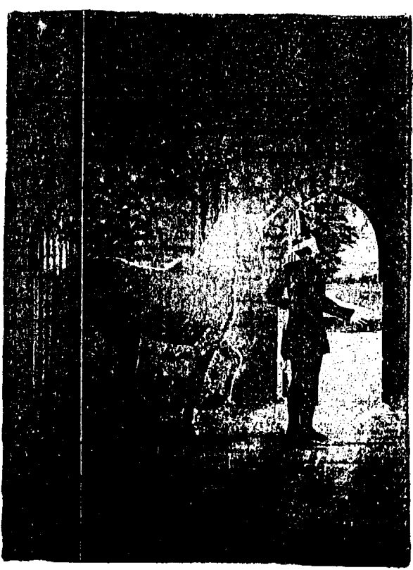

# 第4章

## 獨角獸的名字

> 假如你安靜地坐著，請獨角獸告訴你他叫什麼名字，你的腦中可能會浮現答案，也可能會有什麼想法出現，這就是你的獨角獸如何以心靈感應的方式和你溝通的方法。

每一種生命體，不論是人類、動物、精靈、天使或獨角獸都有一個名字，這個名字帶著他獨特的能量振動，並幫忙他與他的靈魂做連結。你名字的振動顯示出你靈魂的目的。當你用名字稱呼一個存在體時，那會使你們之間的關係更加密切，就像假如有知道某人的名字，你會覺得你和他之間的連結是比較深的。這就是為什麼心懷著愛叫出他人的名字是那麼重要的原因，因為那個人在其生命的最深處會接受到愛。

人類多數都有一個名字方便朋友和家人稱呼他，他們就能夠以那個頻率和他們連結。當他們有更高的靈性修持時，他們會找到自己的靈性名字來配合靈魂更高的面向。現在有更多的人都在使用靈性名字，或者讓別人用這個名字稱呼他們。

很多時候你的獨角獸會立刻告訴你他的靈性名字，有時一開始他會給你一個頻率較低的名字讓你召請他的部分能量。當你準備好時，他會給你一個更高頻率的名字，你就可以連接到他全部的力量和榮光。不論是哪一個，把你們之間的關係擬人化，並且找出獨角獸要你用什麼名字稱呼他真的很有幫助。

### 獨角獸多寶

蘇珊·安是黛安娜天使學校的老師，這是她所寫下的：

> 「二〇〇五年我在倫敦參加了黛安娜的身心靈活動，黛安娜把我介紹給觀眾。在中場休息後，黛安娜帶著大家做一個很有力量的觀想，目的是要讓我們會見獨角獸並得知他們的名字。做完之後，她請大家說出他們所得到的名字。當大家紛紛舉手時，我坐在房間的後面不知所措。我的獨角獸已經告訴我他的名字叫多寶（Dobbin）！每個人喊出的名字都那麼美，那麼有光彩，我怎麼說得出我的獨角獸叫做多寶？太丟人了！我不敢作聲。」

> 「在後的幾個月裡，我和多寶建立了很穩固的關係。有一天他才告訴我他的真名叫奧羅拉（Aurora），之後我就一直沿用那個名字。現在在講多寶這件事時可以笑了，因為我意識到那是我很重要的一個學習。給我這個讓我覺得愚蠢、不搭調的名字把我的小我擊潰了。它告訴我的是，每個人都可以接收到「平凡」的名字，不一定是華麗絢爛的。我仍然和多寶共事著，關係也愈來愈深，不管他的名字是什麼。」

> 「兩三年之後，有一次我跟黛安娜一起坐計程車去機場。我把這件事告訴她，強調我和奧羅拉這個名字是多麼相應。她突然指著我們經過的一家旅館叫我。那家旅館叫做「多寶」。」

> 館的名字就叫『奧羅拉飯店』。我認為這就是一個象徵，表示我的獨角獸跟我在一起，聽著我說故事，說不定臉上還帶著微笑呢。」

### 不同國家的「一隻角」

獨角獸在大部份的國家和語言裡都被稱為「一隻角」，下頁的列表會讓你對其間的不同產生一些很有趣的見解。

### 黛安娜的獨角獸

我的獨角獸名叫艾夫瑞沙（Elfrietha）。我試了幾次才得到正確的名字，主要是因為我之前認為他叫艾夫瑞達。我不斷接到的回答都是搖頭，否定！一直到我大膽嘗試問：是艾夫瑞沙嗎？聽到這個他才鬆了一口氣。獨角獸真的很有耐性。

# 第 4 章 獨角獸的名字

| 語言 | 翻譯 |
|------|------|
| 英文 | Unicorn |
| 俄文 | Yedinorog |
| 立陶宛文 | Vienaragis |
| 葡萄牙文或西班牙文 | Unicornio |
| 瑞典文 | Enhorning |
| 芬蘭文 | Yksiarvinen |
| 希伯來文 | Had-KerenHe |
| 挪威文 | Enhjorning |
| 羅馬尼亞文 | Inorog |
| 阿拉伯文 | Karkadann |
| 世界文 | Unukornulo |
| 拉脫維亞文 | Vienradzis |
| 拉丁文 | Unicornis |
| 波蘭文 | Jednorozec |
| 希臘文 | Monokeros |
| 荷蘭文 | Eenhorn |
| 德文 | Einhorn |
| 法文 | Licorne |
| 義大利文 | Alicorno or Licorno |
| 威爾斯文 | Uncorn |
| 波斯文 | Karkadann |
| 日文 | Ki-rin or Sin-you |
| 中文 | 麒麟 |

### 找出你獨角獸的名字

室內：
- 1. 在一個你不會被打擾的地方安靜地坐著。
- 2. 點根蠟燭提高你的頻率。
- 3. 自在地呼吸直到你感覺放鬆為止。
- 4. 觀想自己在大自然中一個美麗的地方。
- 5. 請你的獨角獸到這個場景裡來。你可能會看到或感受到他的到來。
- 6. 感謝獨角獸。
- 7. 請問他希望別人用什麼名字稱呼他。
- 8. 準備接收可能出現的一切答案。

室外：
- 1. 走在大自然裡某個安靜和美麗的地方。
- 2. 讓自己放鬆下來。傾聽聲音，吸入大自然的氣味。行走的時候要去感覺腳下的土地。
- 3. 環顧四周。放鬆的時候你可能會注意到有一隻獨角獸。
- 4. 在心中邀請你的獨角獸一起走。
- 5. 不管看得見與否，要知道你的獨角獸就在不遠之處。
- 6. 問他想要別人用什麼名字來稱呼他。
- 7. 你繼續安靜地走時，允許獨角獸的名字自然地飄入你心中。

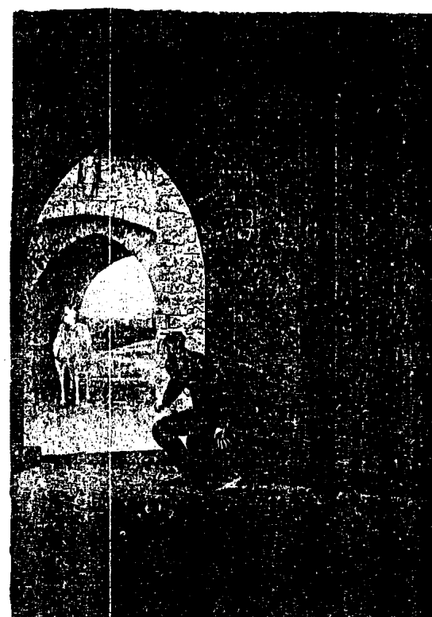

# 第5章

## 與獨角獸的連結

### 遇見神奇獨角獸 The Wonder of Unicorns

獨角獸出現的方式有很多種。有時他們會出現在你面前，但是多數時候他們會用其他的方式讓你知道他們就在附近。

> 有一位女士在研討會結束時來看我。她說話時聽起來是顫慄的：「當你帶我們做冥想去見我們的獨角獸時，他告訴我他名叫星星。而你剛在我的書上簽的字是『追隨你的星星！』」

我猜想她的獨角獸當時正對著我的耳朵說話。

《走在薄霧中》（Walking in the Mist）的作者唐納·麥肯尼（Donald McKinney）告訴我，有

> 一位女士告訴他一個真實的故事。是靈性的問題，她突然說：「聽完我告訴你的這件事之後你一定會說我瘋了，你不會相信我發生了什麼事。有一個大清早我走在蘇格蘭高地上，霧氣低垂，突然間一隻獨角獸站在我眼前，低下頭來跟我打招呼。」她說這種事以前從未發生過，她覺得這是

很神奇的經驗。他向她保證世界上是有奇事的。

艾格妮·麥克勞斯基是一個色彩治療師，也是靈性很高並有超感知力的人。她形容她弟弟是個高大多毛的自行車騎士，不過他顯然是個願意接受獨角獸指引的人，因為有一天他在新時代的商店裡看到了一隻中國麒麟，他清楚地告訴她：「帶我到艾格妮那裡。」於是她買下來送給了她。她至今仍保存著，並且認為獨角獸和她的弟弟與她自己都是有連結的。

我很高兴在一次展覽會中一個名為 Lilycom 的攤位上遇見羅拉·卡麥隆·傑克森和琳·麥尼可，她們告訴我她們的公司是怎麼開始的。她們兩個原來對自己的工作都不滿意，而對獨角獸、精靈和元素界的熱愛把她們牽引在一起。好長一段時間她們都在商討該做些什麼才能讓她們的靈魂得到滿足。有一天，羅拉坐在馬車上經過了幾個村莊之後，從車窗望出去時她看到了一家名為獨角獸的小酒館。她感覺到這是一個朕兆，就在靈感湧出時的那一刻，獨角獸這個主意也出現了。現在她們把所有的時間都奉獻在幫助孩童和成人與獨角獸做連結，並帶給他們希望。她們為喜愛獨角獸的孩子們開派對和舉辦工作坊。她們告訴我：「當我們問：『有誰相信獨角獸？』時，這些小孩子全都會說『我們相信』，假如我們問：『有誰見過嗎？』總會有兩三個小孩可以描述出他們所見到的獨角獸。」羅拉是透過她的指導靈艾森遇見獨角獸的，他是十二世紀時很認真的一個修道士。事情的經過是這樣的：她在冥想狀態時，那位修道士對她說：「來，親愛的。」他拉著她的手帶她沿著一條路走，她的獨角獸「流浪者」（Wanderer）就站在那裡等著她！那是她第一次遇見她的獨角獸。羅拉還有一隻淘氣的小獨角獸寶寶，他是有一天跟流浪者一起出現的。有一次小獨角獸突然說：「這是戰馬（Charger）。」接著一隻能量強大、眼睛迷人的新獨角獸便出現奔馳著。顯然她和獨角獸王國有著很深的連結，她們也和她有著緊密的合作關係。

琳有一個直率的獨角獸指導靈名叫傑士米達（Jasmin_da），他會以非常直接和嚴格的用語和她溝通，也會責備她。例如，有一天他告訴她，她的飲食方式很糟糕，必須改正過來！她也認真地看待他所說的話。然而就像其他高次元的存有們一樣，他支持她的工作。

每個人都認為她們是瘋了才會放棄好工作和退休金去散播獨角獸的光，因此她們也開始懷疑自己的決定。在一個陰冷的下午，琳覺得累極了，她坐在休息區一面空白的牆前面，然後燈亮了。突然間在左邊牆上的燈光變成一個獨角獸的頭形，燈光會前後移動，但總不失那個形狀。那是她們所需要的確認，也使她們恢復當初的決心，繼續她們的使命。

我真的很榮幸在她們的Unicorn遇見琳和蘿拉，同時也體會到她們傳播獨角獸之光的熱忱和喜悅。

這裡還有一個瑪麗．湯遜的故事，是關於她如何在冥想中遇見她的獨角獸的情形。『我今天聽了妳在格拉斯哥的演講，妳帶我們做冥想去會見我們的獨角獸，這就是我的心得報告：我看到一條小溪穿過美麗的森林，一隻引人注目的棕色大馬出現在水的對岸。有個聲音告訴我，我和我的獨角獸見面的時候還未到。我接受了，但仍往前走過，去順著馬的脖子輕拍他。他既強壯又溫柔，我覺得很滿意，也很榮幸能見到他。突然間我站在一池水中央，被七隻獨角獸圍繞著，他們全是發著光的白色，被白光籠罩著。其中一隻走到我面前，讓我輕拍他的脖子和鬃毛，我腦中有一個聲音說他的名字叫厄伯（UrBill）。』

我覺得有趣的是，她接受了指引所說的，她還不能會見她的獨角獸，而且沒有抗拒。她的接受改變了狀況。

法拉薇亞凱特和她的先生在哈士丁（Hastings）時買了一個柔軟的獨角獸玩具；她很喜歡它，也開始想著獨角獸，甚至想在後腰上刺一隻小的圖騰。她寫道：「事情就是這樣，然後獨角獸出現在我的夢裡。我在無意中把獨角獸吸引過來，當然，同類相吸嘛！他們的招募活動奏效了，也到處出現在我的日常生活中。」她還說他們先延攬她之後，再透過她去招募其他人一起來做事；這事後來成功了，而且速度很快。她發現，該要跟他們一起做事的人都會突然間想起對獨角獸的熱忱，並且要求調整他們的能量來協助地球上的療癒工作。

她舉了兩個例子說明人們如何了解到自己原來是認識獨角獸的。其中的一個例子是，她在她的冥想團體裡提到獨角獸，說明他們現在是成群地來到地球，幫忙改變能量，以及在揚昇過程中提供協助。有一個三十幾歲的女士告訴她，她在孩童時期就非常喜歡獨角獸，整個青少年時期也一直想著他們。她給她看肩膀上的獨角獸刺青，那# 遇見神奇Unicorns The Wonder of 獨角獸

是她十八歲時刺的，之後她都沒有再想過他們，直到現在。她對他們更加有熱忱，現在在她十三歲的女兒也找到了自己的獨角獸指導靈，他會來看她，並常常跟她交談——這是真實的事情，就像一般的孩子常有的情形。

另一個例子是，有一個客戶來做靈訊解讀，她抽了一張獨角獸卡，驚訝地倒抽了一口氣，說當她坐在巴士上時她開始想起獨角獸。她不懂為什麼她以前從未想過獨角獸，卻對他們有那麼多的愛。

在法拉薇亞凱特進入客戶的能量裡時，她可以看到她的周圍有獨角獸，他們請她告訴那位女士，要她和他們共事，並把他們帶入她的療癒工作裡。

### 獨角獸能量球

天使們幫助科技產業開發出數位相機，以便靈性存有們的照片能夠在裡面被拍攝到。牠們的光體以能量球（orbs，或稱為光球、黃金球）的樣子出現。假如你看著獨角獸光球，你會從照片裡吸收到獨角獸的能量和特質。我的網站www.dianacooper.com裡可以看到一些很棒的能量球。

## 第5章 與獨角獸的連結

### 加強與獨角獸的連結

純真無邪是加強與獨角獸連結的方法之一，明確地說就是要活出你的神性本質。

在很多情況下，我們生命的焦點是和他人的期望與欲求，或是與我們的匱乏意識、缺乏自重交纏在一起。因此，若要加強你們之間的連結，首先要淨化你的本質。

1. 把使你無法如實活出自己或使你無法快樂的事情全部列出。它可以是恐懼或缺乏自我價值感，可能是他人的期望，或者你的情緒或心智是和別人糾結在一起的，也可能是你處在事情、工作或財務的牢籠裡感覺無法逃脫。完成列表後，開始探索下列的內在之旅。
2. 抱持著淨化你的本質和加強與獨角獸連結的意圖。
3. 找一個能夠讓你安靜下來又不被打擾的地方。
4. 閉上眼睛，想像你披著一件藍色的保護斗篷。
5. 自在地呼吸，直到你覺得放鬆自在。
6. 往上爬坡，半途中你看到一個灌木叢，走進去。你是很安全的。
7. 在灌木叢中有一個大籠子，中間坐了一個人，你看出來那就是你自己，周圍都是荊棘、鐵絲和各式各樣的垃圾。

8. 你發現自己有工具也有力氣打開牢籠和清理荊棘，釋放出你純淨的面向。
9. 牢籠內部清理乾淨後，你看到裡面的那個人發著光。迎接你自己的這個面向，讓它與你結合在一起；你可能會感覺很好，也可能會感覺怪怪的。
10. 走出牢籠，穿過荊棘。
11. 召請大天使薩基爾（Zadkiel）在金紫色和銀紫色火燄中轉化荊棘、牢籠以及其內部的一切。看著這一切都在消融時，謝謝祂。
12. 轉向另一條銀色的道路，它會帶你回到山坡。
13. 你會看到一個白色大光球朝你而來，和你融合在一起。
14. 現在你可以感受到、意識到，甚至看到你的獨角獸。
15. 觸摸他，輕拍他，騎著他，真正地去了解他。不要急，慢慢來。
16. 感覺到事情已經完成後，感謝獨角獸的到來。
17. 睜開眼，回到房間。
18. 你也許會想把這個經驗寫在你的獨角獸日誌裡。

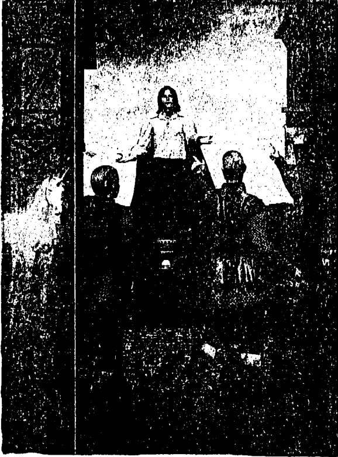

# 第6章

# 獨角獸的靈性層級

# 遇見神奇Unicorns
The Wonder of 獨角獸

獨角獸在靈性階層裡是屬於天使層級的。元素精靈、仙子（fairies）、照顧土壤的地精靈（pixies）、在地下活動的地精靈（gnomes）、火蜥蜴（salamanders）、美人魚（mermaids）、水女神（undines）、風精靈（sylphs）、仙女（nymphs），還有很多其他的存有，都是他們的弟弟妹妹。他們常常與獨角獸共事，做些稍微簡單的事來幫他們。他們的上層是天使，其中有一部分是守護天使，他們被派任的工作是照顧人類的生命。其他的天使在被要求時也會幫忙。

大天使除了掌理天使之事外也有自己的工作要處理。照管人類的大天使中最為人所熟知的是麥可（Michael）、拉斐爾（Raphael）、烏列爾（Uriel）和加百列（Gabriel）。大天使麥可攜帶著真實之劍和保護之盾，被認為是人類的保護者，祂帶給人們勇氣和力量。

大天使拉斐爾是位療癒天使。祂也協助旅者，並且為人們打開豐盛之門。祂的雙生火鑲是聖母馬利亞，她和獨角獸有著很緊密的關係。

大天使烏列爾掌管和平天使們。祂把祂的天使們派到遭遇困難和發生緊急狀況的地方。祂們也幫助個人壯大他們的力量。

大天使加百列穿著發光的、代表純潔的白衣。祂為人們帶來明晰和喜悅，祂也跟獨角獸一樣使用純白光。

獨角獸和大天使是屬於同一層級的。獨角獸的國王和女王的頻率是更高的，他們的頭頂有光之皇冠，是從他們的頂輪散發出來的。如我在第二十三章〈獨角獸寶寶〉所述，久遠以前只有國王和女王可以繁衍後代，後來這個禮物留傳給成熟度和光度已達到某種水平的獨角獸。

國王和女王因為有智慧與光而統治著獨角獸王國，他們也因進化程度非常高而被尊崇、信任和敬重。他們直接從六翼天使或從「本源」接收指令，掌理整個獨角獸王國。

他們工作的一部分是維持著所有獨角獸的頻率，而為了要做到這點，他們所採用的方法是永遠保持著他們神聖完美性的意象。祂們也決定要指派哪些獨角獸去地球，以及到了那裡後的工作內容。當然，獨角獸在很多不同的世界和次元裡工作。身為所有靈魂的守護者，他們的工作量很大。

國王和女王透過服務神聖意旨管理著獨角獸的演化。因此獨角獸是沒有自由意志的，他們的心和靈魂是那麼純淨，所以只能跟隨著光。

還有其他的階層——就像人類中皇家的頭銜，例如王子或公主，伯爵或公爵——他們以所擁有的光的品質來獲得頭銜。他們經過進化而取得這些職位，目的是要支持國王和女王。

白色包含了所有的顏色。黑色是沒有光，是更神秘難測的。它代表空，是蘊藏著最深的神秘的地方，它也可以代表黑暗與負面性，例如在世俗中黑馬代表的意義是貪婪、掌控和凌駕他人。

### 飛馬與獨角獸

獨角獸被描繪成有開啟的第三眼，他是一種已達光啟的、全知的、全見的、高智能的存在。有獨角獸能量的人是已達光啟之人，他們的第三眼是銳利和清明的，但這並不意謂他們是天眼通者（具有靈視力），可以見到其他次元的畫面、顏色和光。很多人是全知者，他們就是知道。飛馬（Pegasus）也是一種已經揚昇的白馬，有著完全敞開的心，因此有可見的翅膀。就像天使的翅膀是從心的中央散發出的愛，飛馬也是如此。有天使或飛馬能量的人心中都有光，散發出來時就像張開翅膀一樣。有意或無意地，他們可以張開翅膀覆蓋在人或動物的身上，給他們祥和與安全之感。獨角獸和飛馬所擔負的角色有點不同。獨角獸是鼓舞、給與希望、賦予力量和光啟，而以心為主的飛馬其角色則是撫慰、救援和擁抱。一旦與獨角獸和飛馬連結之後，你需要更加淨化才能接觸到獨角獸國王和女王。我進入獨角獸王國時，門打開，大量的光照了進來。我被帶領到尊貴的存有們面前前，說出自己想要服務的意願。我也提出要求，希望亞特蘭提斯時代的傷口得到療癒，因為它造成了我喉嚨中央的問題。那時他們說我尚未完全準備好攜帶和傳播光的頻率，雖然我想那麼做，但還是差了一些，所以他們要先保留著我的能量。他們還協助我瞭解喉嚨的毛病，並協助我治療。數週之後，他們告知我已經可以把更高的頻率帶給這個世界了。

這裡有一個冥想方法，你可以利用它來連結獨角獸國王和女王。

### 冥想——會見獨角獸國王與女王

1. 找一個安靜不受干擾的地方坐下來。
2. 不妨點根蠟燭，或播放有助於得到靈感的輕音樂。
3. 想像自己坐在一棵枝葉茂盛的樹下，周圍的一切皆是柔軟的，綠意盎然的。
4. 你可能會聽到鳥的歌聲和輕風拂葉的沙沙聲。
5. 一道純白的光靠近過來，一隻獨角獸從中走出，他來帶你前往獨角獸王國。
6. 有禮貌地問候這隻獨角獸，詢問可否輕拍他。
7. 他邀請你坐上他的背，這是很大的榮耀，你必須恭敬地接受。
8. 你可能會發現你的守護天使坐在獨角獸背上你的後面。
9. 當獨角獸與你一同飛升，越過山巔穿過星群時，你覺得很安全。
10. 你看到前面就是通往獨角獸王國的大門上的柱子。
11. 進入之後你看到很多獨角獸，看起來都是寂靜、詳和的。
12. 一隻純白的孔雀站在你面前，展示著他的尾部。
13. 幾隻獨角獸圍繞著你，並從他們的角中向你灑下大量的星星以此表示他們對你的敬意。然後他們排列成隊伍。
14. 你和他們一起走向一座很迷人的城堡。
15. 很多純白的鳥在你上方飛著。
16. 靠近城堡時你站立不動，讓白光灑向你，幫你淨化和提升頻率。
17. 進入大門，和獨角獸們一起進入接待大廳。
18. 獨角獸國王和女王在等候你。他們都有角、翅膀和光冕，這一切都亮得幾乎要使你的眼睛發痛。
19. 你可以趨前向他們鞠躬，行禮致意。
20. 他們以心靈感應的方式問你需要什麼協助。
21. 你可以告訴他們你的需要，也可以提出問題。
22. 保持安靜，注意可能出現的答案。
23. 把他們的光之祝福從第三眼接收進來。
24. 感謝他們，然後倒退離開大廳，沿著來路返回。
25. 向鳥和獨角獸道別。
26. 回到你開始之處，在樹下靜靜地坐著。
27. 準備好時，睜開眼睛。

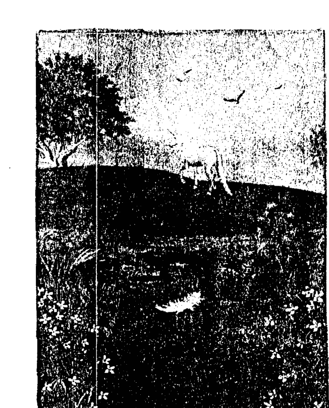

## 第7章 獨角獸的朕兆

### 羽毛

當獨角獸告訴我，因為他們是屬於天使層級的一部分，也會像天使一樣留下白色的羽毛時，我真的深感意外。他們留下羽毛提醒你他們的臨在，帶給你希望，鼓勵你繼續努力，或只是告訴你他們愛你，就在你身邊。因此當你看見一片小羽毛時，要知道獨角獸或天使曾經來看過你。

我認識很多年的朋友安德魯·布瑞爾，他寫的是激發人心的天使音樂。下面這個故事發生的時候他剛好寫完一天使和獨角獸」的樂曲，因此他已經在他們的能量裡生活和呼吸了一陣子。除了音樂和寫作，他的興趣是網球，而且是認真地、堅持地練習。有一次，為了禮拜六的網球賽要和俱樂部裡的冠軍交手，他在那個星期裡打了兩次電話給我。他的對手程度比他好太多，沒有人認為他有任何機會打贏。但是奇怪的事發生了。

這個重要的比賽之前有一天，安德魯正和朋友在練習。在他剛要發球時，一片羽毛在他面前飄下，他停下來看著它慢慢下墜，一直到在他旁邊落地為止。之後他打得非常好。他整晚一直都不斷地想著那片羽毛。對他來說它代表著勝利的力量，因為獨角獸能幫助人克服障礙。

第二天下午這個決定命運的時刻到了，他要決戰球技高超、程度懸殊的對手。每次發球之前他都會想到那片羽毛，當他從未有過的球技打出球，發現以前從未發現的耐力時，那就會成為他的焦點。一切都令人難以相信。這些力量是從哪兒來的？他贏得了前面的十一局。最後的比數是六比零，六比一。他告訴我，他只輸了最後一局，那時候他想的是：「我怎麼能這樣羞辱這位先生呢？這種事對他來說太慘了。」

安德魯相信他受到了獨角獸能量的鼓舞和幫助。

開始撰寫這本書之後不久，我開車去找朋友。我馬上注意到面前有一整群的獨角獸好像在幫我帶路，至少有八到十隻。我的朋友和我自然而然地就談到了獨角獸，而我在回家時也在想他們。突然間，我的車穿過感覺上像是白羽毛旋風的東西，好像是有人把整袋羽毛從車子上面倒下來，到處都是。我驚嘆了一聲，居然有那麼多獨角獸跟我在一起！

數週之後，當獨角獸佔據了我大部分思緒時，我的好清潔工米雪兒問我：「我在屋子裡不斷地發現羽毛，你要我怎麼處理？」我吃驚地問：「你有看到嗎？」她回答：「到處都是啊，我都不知道要怎麼辦，因為我不想用吸塵器來收拾這些東西。」

我請她把羽毛撿起收集起來，我會祝福它們，並謝謝獨角獸和天使。這件事顯示了我在家裡的觀察能力並不太好。我承認我看到一些，但比起米雪兒所找到的還差得很遠。我現在有比較警覺了。

有人問我為什麼認為這些特定的羽毛是獨角獸的。我能怎麼說呢？我就是直覺地認為羽毛是從那些美麗的存有們來的，因為我在寫有關他們的書。我總感覺天使就在附近，但有幾個禮拜獨角獸一直是很貼近的，而有什麼更好的方法能夠顯示他們曾經出現過？我發現一件有趣的事，那就是萬一我沒看到羽毛，他們會確保有其他人會注意到。

### 獨角獸禮物

我注意到現在的商店裡，有更多我以前從來沒看過的獨角獸的小模型，它們是用玻璃、白蠟、陶瓷或很多其他的材料製成的。

我的朋友海瑟（在我寫書時她已八十六歲）和靈界有著很密切的關係。她可以看到仙女、某些元素精靈和天使，也能和他們溝通。當然，她也很愛獨角獸。

她的清潔工裘絲是一個很腳踏實地、通情達理的人，已經替她工作很多年了。而裘絲的妹妹卻熱愛自由、愛做夢、有創意和有藝術才能。她不知道海瑟的天賦或興趣，前後也只見過她幾次而已。

有一天裘絲的妹妹站在一家禮品店前面，她感覺到好像有人靠近到她背後，但實際上並沒有人。她很詫異地往上看，看到一個很棒的陶瓷獨角獸，背上騎著一個仙女且眼睛發亮。就在看著它時，她的頭腦裡出現了一個聲音：「海瑟。」她立刻買了下來，並做了禮物包裝。她請她的姐姐把它送給海瑟，海瑟欣喜若狂，認為是獨角獸送的禮物，所以非常喜愛而且珍惜它。

在海瑟告訴我這個獨角獸禮物的故事時，她的朋友瑪麗也在場，想起了另一個經歷。她和海瑟在愛爾蘭度假。瑪麗在開車，海瑟望著窗外，看見一個小孩騎著一隻小馬；他沒有用馬鞍，手握著馬鬃，馬恣意地在草原上奔馳著。當瑪麗和海瑟到達路底的農莊時，那隻小馬經過一段費力的過程後正站在那裡休息，可是已不見小孩的蹤影。那個小孩從來就不存在，因為那個農莊裡連一個小孩都沒有。

海瑟回想起騎在馬上的小孩的興奮感和淘氣的樣子，知道那一個仙境的小孩。她說完之後幾天，我看著先前寫的獨角獸筆記，發現我是這樣寫的：

### 其他的朕兆

當獨角獸要你想到他們，或者想要引起你注意到他們的出現時，他們會使用一些人類的靈體騎在背上，這是極大的光榮，絕不能被視為理所當然。元素精靈王國的存有們，例如仙子，有時也會騎著他們。

獨角獸是自由的，絕不肯被套上馬鞍或繩索，但出於慷慨大方與愛，他們願意讓人類的靈體騎在背上，這是極大的光榮，絕不能被視為理所當然。元素精靈王國的存有們，例如仙子，有時也會騎著他們。

### 白花

方法。可能是一個人穿著印有獨角獸的T恤走過你身邊，也可能是你經過一家酒館或咖啡廳，它顯示著象徵獨角獸的東西。在海瑟的例子裡，是有人給她獨角獸的模型。出現有關獨角獸的卡片也是可能的，而你也有機會在自己或朋友拍的照片中看到獨角獸的能量球。睜大眼睛注意看總是對的，這會讓他們的工作容易一些！

我在以前寫過的一本書中曾提過我的朋友寶琳的故事。她獨自一人寡居，也是一個白鷹薩滿的治療師。由於我要給她看一些東西，所以有一天下午她來我家裡，我們一起去散步。那是一個美麗的春日，我們在陽光下沿著路走到河邊，我曾在那裡看過正在生長的白色紫羅蘭。當寶琳看到花時，她吃驚地倒抽了一口氣，說幾天前一個靈媒曾告訴她，她的先生會在一個種著白色紫羅蘭的地方等她。

那個地點的能量很神奇，我後來知道她喜歡獨角獸，才開始意識到那裡也有一隻獨角獸。現在每當看到白色紫羅蘭花簇時，我不只想到寶琳，也會想到獨角獸，猜想著他們要給我什麼訊息。

我曾收過一個剛從南非回來的朋友發來的電郵。她說：「你說過獨角獸喜歡白花，特別是外來的百合。我聽過你提了好幾次，說尼爾森·曼德拉（Nelson Mandela） 是和獨角獸能量有關的。最近我去南非時有特別注意到路旁盛開的大白花，但不知其名。有一次去羅本島（曼德拉的二十七年牢獄歲月有十八年是在這裡度過的），我才有一機會近看這種花，它漂亮的喇叭形狀約有六吋（十五公分）寬。我認為這漂亮的花生長在這個他曾生活最困頓的地方不會只是單純的巧合。回到家後我才發現它是一種海芋。」

根據獨角獸的說法，他們是在曼德拉服刑時來護持他的。他受到了他們的協助卻渾然不知。他們幫助他找到力量和堅毅的精神去接受審判，使他得以成為有尊嚴與智慧的領袖。

### 練習

利用一週的時間，記下每一個你看到或聽到的獨角獸的朕兆。當你得知數量時，你很有可能會大吃一驚。

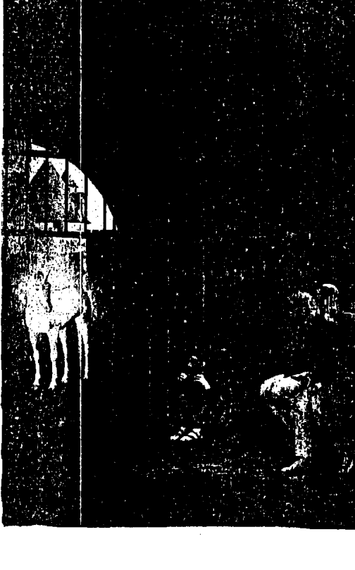

# 第8章

# 獨角獸的角

# 遇見神奇Unicorns
## The Wonder of
## 獨角獸

### 白色和金色的角

這個世界上多數地方都有關於一種神秘動物的故事，這種動物會帶來希望和幫忙實現願望，在他的第三眼有一隻螺旋狀的角，而第三眼是象徵光啟、遠見和智慧的脈輪。這個螺旋產生一個威力外衝的能量渦流，也是一個陰性的象徵，它擁有一種能量，可以打開和釋放各種不同層次的阻塞。當螺旋順時鐘方向轉時是置入能量，逆時鐘方向轉時則是取出能量。

我們看到的獨角獸有時是帶著白色的角，有時卻是金色的，我總是不得其解。問了獨角獸，他們告訴我，愈是進化的獨角獸他的角呈現的金色愈深，代表偉大的智慧。年輕的獨角獸他的角是白色的，會逐漸變成淺金色，最後變成深金色。他們是如何進化的？守護天使的進化是來自他們所照顧的人靈性上的成長。但是獨角獸是透過服務而進化，例如他們的角所發出的光其品質愈高，他們進化的層次就愈高。

全世界所有的神話裡都有一個共通的主題，即獨角獸的角有療癒的能力，特別是有解毒的能力，引申出來的涵義就是它可以避邪。

### 有療癒能力的角

### 毒水的故事

在東方常常講到的一個相關故事是，森林裡的動物會下來到一個水坑喝水。他們都非常緊張，彼此間都害怕對方。有一天，一條蛇滑行到水邊並在水面上噴出他的毒液。那個晚上，動物們發覺到有毒物所以不敢喝水，於是他們派了其中一種動物去找獨角獸來幫忙。在等待的時候，動物們都擁抱在一起作為保護，並且開始彼此交談。英挺的獨角獸來到後把他的角浸入水中，中和了毒素。動物們於是又有甘甜的水可以喝了。

這個故事說明了黑暗如何為光服務。在此事件中，蛇的噴毒行為強迫動物們彼此溝通，共同合作尋求救援。他們也學到了感謝善良的力量。

### 十字符號

在這個毒水的故事裡，有一些版本提到獨角獸用他的角在水上畫了十字符號，這便足以化解惡行。

十字符號是一個很具威力的符號。垂直線從上而下，把天堂帶到地上，而水平線從左到右，把看不見的意圖（在這個故事中是指淨化）變成可見的具體事物。

### 中世紀

獨角獸的角在中世紀變得很寶貴，因為它可以淨化水、解毒，兼治百病。在歐洲的某些地方，宴會時僕人會拿著他們相信是獨角獸的角的東西，觸碰桌上的食物和飲料做含毒測試。那時很多錢都是花在磨成粉狀的角上。十六世紀時伊莉莎白女王曾花一萬英鎊買一隻獨角獸的角，把它雕刻成皇家權杖放在皇家寶庫裡。現在角和牙齒仍被使用，象徵著保護王位、典禮中的拱門和重要場所。想必所有這些鯨魚、海豚、大象、犀牛、羚羊或其他動物的角或長牙，只要是像獨角獸的角都可以拿來使用。

## 第 8 章 獨角獸的角

### 犀牛

### 光啟 (Enlightenment)

我的確感覺到可憐的老犀牛吃了很多苦，因為人類從集體意識的紀錄裡得知，有一隻角的動物是一種力量很強大的存在體，他可以產生神奇的療癒和淨化的效果。人類把這種認知投射在一種有一隻角的實體動物上，結果這個龐大的野獸一直被追捕著，只為了他的角——人們迷信它除了是一種春藥，也是測毒工具之外，還擁有療癒效果和神奇的力量。大多數的人往往會把生活過得像電視裡的肥皂劇一樣，把自己融入整個大環境的劇目裡。所有的痛苦、受傷、嫉妒、憤怒或愛都是非常令人上癮的，而我們在參與演出時會覺得自己是活著的，雖然可能有些不快樂，但絕對是活著的！當你進化時，你可能會決定要站到一旁，看著你生命的劇碼逐步開展，但不參加演出。你看著它，分析你的角色，決定要如何採取不同的做法，然後帶著意識的覺知去做。在這個時刻，你生命中可能會出現一隻獨角獸來協助你走下一步——完全離開這個場景，採用另外一種視野過生活。從獨角獸第三眼延伸出來的角是一個可見的光啟的象徵，因為獨角獸是一種完全光啟的存在。他們的責任是成為引路者，並成為人們的榜樣。帶著光啟的意識你可以做自己——對自己的境遇感到滿意，並且能夠在所有的事物中看見神性。因此，假如你已經準備好要這麼做，假如你感覺到一隻看不見的馬「推動」著你，感覺到獨角獸就在附近或夢見獨角獸，都不要感到意外。然後你可能會察覺到萬物和人內在的光，或者只是深深的滿足感。光啟只是一種單純的存在，它只是一種生命存在的狀態。它是一種接受。你無法追尋它，因為你找不到任何東西。那是你的本質也是你本具的權利，很多人已經達到不同層次的光啟狀態。有些人會有片刻的領悟或靈光一閃，就像打開燈一樣，從此之後一切都不再有相同的面貌，因為你看到萬事萬物和人的內在都有神性。它也可能消退。但無論如何，這個記憶永遠不會消失。

### 光啟的練習

這個冥想的目的是要看見萬物中的神性，然後你才能使用你第三眼的更高面向。有時候，記得黎明之前就是最黑暗的時期會對我們有所助益，在意識上來說也是一樣的。你愈覺得永遠不會看見光，你距離它來臨的時刻便愈近。你當然可以儘量多做這個冥想，做幾次都可以。

- 1. 找一個可以讓你安靜且不會被打擾的地方。
- 2. 請獨角獸幫你披上一件基督意識的斗篷作為保護。
- 3. 舒服地坐著，專注在呼吸上。吸氣時注意鼻孔的涼意，呼氣時注意放鬆脊椎。重複做十次。然後吸氣進入右膝，再從左膝吐氣，做十次。每一次呼氣時都覺得愈來愈放鬆。
- 4. 請你的獨角獸靠近你，當他進入你的能量場時，你可能會感覺到他輕推著你或有麻刺之感。
- 5. 請他用光之角碰觸你的第三眼，之後保持靜止一陣子。
- 6. 想像第三眼像一個巨大的球在你面前。它是什麼樣子的？什麼顏色？還有多少扇門或多少個部分仍然關著？你距離光啟多近了？

## RAG 模型 LLM Surrogate

### 基于大语言模型的文档理解

**作者**：李明
**日期**：2024年1月15日
**机构**：清华大学

> 引用：本文介绍了一种基于大语言模型的文档理解系统，它能够自动提取文档中的关键信息并生成结构化摘要。

本文介绍了一种基于大语言模型的文档理解系统，它能够自动提取文档中的关键信息并生成结构化摘要。该系统结合了先进的检索增强生成技术和多模态理解能力，显著提升了处理复杂文档的准确性和效率。

- 特性：高精度提取、多格式支持、自动化处理
- 参数：模型大小7B、上下文窗口4K、推理速度50 tokens/s
- 性能：准确率95%、召回率92%、F1值0.93

| 模型     | 准确率 | 召回率 | F1值 |
|----------|--------|--------|------|
| Baseline | 85%    | 80%    | 0.82 |
| Ours     | 95%    | 92%    | 0.93 |

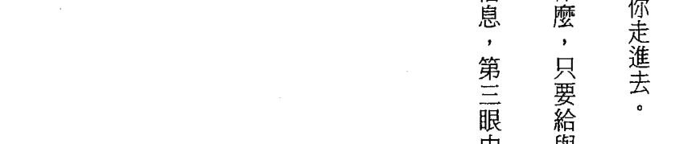

联系方式：lmpaper@tsinghua.edu.cn 或 QQ：71510467

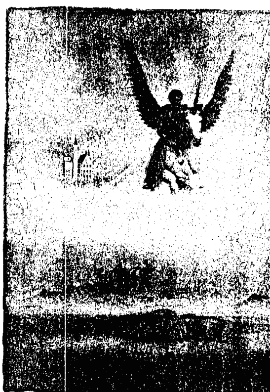

## 第 9 章

## 獨角獸和天使的任務

2025年3月2日，小米15系列15.1.1 OTA版本正式发布！

- 新增了系统稳定性。
- 优化了性能。
- 修复了一些已知问题。

该版本进一步提升了系统的稳定性，为用户提供更流畅的使用体验。

建议用户尽快升级到新版本，以享受最新的功能优化和问题修复。

您可以通过系统设置中的“软件更新”选项检查并安装此OTA版本。

如有任何疑问，请联系小米客服热线400-100-5678或通过官方社区反馈。

## 第 9 章 獨角獸和天使的任務

守護天使會回應你心中的願望。假如你在絕望中，天使會來到你身邊，擁抱你，安慰你。牠們振奮你的精神，幫助你找到快樂。假如你想要，牠們會不斷地想盡方法給你愛。牠們會幫你找到停車位、完美的禮物或正確的方向，讓你的生活減少很多問題。在你和他人溝通時，你也可以請你的天使去和對方的天使說話，這個方法可以解決很多你認為很困難的問題。你的守護天使保有你生命的神聖藍圖並在你耳邊低語。雖然你有自由意志可以不理會，牠仍會不斷地提出一些更好的意見供你選擇。很多人都聽過天使唱歌，因為牠們會在你們的上面唱歌——通常是在你們睡覺時——安慰你或提升你的振動頻率。

### 一則故事

我遇到過一個醫生，有次他在一個朋友的家裡認識了一個有特殊心靈能力的人，在此之前他和靈性領域沒有任何交集。幾天之後，另一個朋友的兒子告訴他有關身體周圍的能量場的事，並說他一直都可以看得到能量場。那位醫生非常震驚！那晚他找到我的網站，也看了電視上的影片，所以知道每一個人都有一個守護天使；假如你提出請求，牠會幫忙，而且你也會比較容易跟牠連結上。於是躺在床上，要求天使的到來。

### 指引和保護

一道深藍色光隨即出現在他的上方。很快地金光也開始流入。他很有興趣地看著。接著，不同的顏色形成一個渦流，開始往下旋轉，進入他的第三眼。他覺得不太尋常，並且確定那是天使出現了。他問了天使一個問題，在那個週末意外地得到了解答。

還有一次他住在另一個朋友的家裡，那一夜他聽到了美妙的教堂音樂。第二天早上他問朋友，在他睡著後她播放的是哪一片CD。她當時很快就入睡，所以並沒有放什麼音樂！他很困惑，於是到書店挑了我的第一本天使書《天使之光》（A Little Light on Angels），打開了第一章——天使歌唱！

他告訴我，第二天有一個女嬰被放在他的手中時，當下就停止了哭喊！她注視著他的眼睛深處，他感覺到他們好像在做一種靈魂與靈魂間的連結，這是他以前從未有過的經驗，而這不過是一個開始而已。自從天使介入的那天開始，他的病人，特別是嬰兒和小孩，對他都產生完全不同的反應。他成了一個靈性療癒者，就在我寫這本書時，獨角獸正等著要與他共事。

每一次開車出遊時，我都會感謝天使和獨角獸在旅程中保護和指引我。我常注意到車前有幾隻獨角獸在領路，這些光之馬往往都是離地面二至三呎。我無法向你描述這種被他們指引的感覺有多美好。但這並不表示我就不會迷路了！我認為在我們一意識外一轉入其他的地方時，我們是需要獨角獸能量的。

請獨角獸或天使王國在生活中保護、指導你，為你指引方向。你和他們交談愈多，連結愈多，和他們的能量與不凡的本質就愈接近。

### 療癒

獨角獸和天使都能提供療癒，因為所有七次元的存有們都可以做得到。獨角獸或天使都可以碰觸到你的脈輪或靈性的能量中心，把光注入你。或者祂們也可以從上面把療癒能量傾瀉給你。

蕾貝卡從未與獨角獸共事過。她有腳痛的問題，我建議召請獨角獸來把療癒能量引導到她的疼痛點。我們兩個都意識到一隻美麗的獨角獸來了，她也感覺到腳上的某個東西正在產生變化。痛楚完全消失了；他們真的把高頻光從角裡射出，消融了造成疼痛的阻塞或業力。

### 免於死亡和危險

獨角獸或者天使什麼時候會救你？假如你的死期未到，或者那不是你該受業力之苦的時候，你的守護天使的任務就是介入並解救你。但是，你的獨角獸也可能協助你，就像天使一樣，獨角獸有時會出於單純的慈悲而應你的召請前來相救。還有一種情況，就是一個人可能和他的獨角獸有很緊密的連結卻不自知。

一個人曾告訴我，有一次他以為他就快溺斃了，而一隻白馬高舉著他，直到救援抵達為止。所以我學到了很有趣的事，海上的白沫之所以被稱為白馬，是因為以前的水手看見獨角獸把他們夥伴的頭舉在海浪之上，若不這樣做這些人都會溺斃。

當凱西·克羅斯威爾和我一起看著當時我們為了要寫《成道與光球》（*Enlightenment Through Orbs*）和《揚昇與光球》（*Ascension Through Orbs*）的書所蒐集的數百張有能量球的照片時，我們看到幾組照片，都是在不到一分鐘的間隔下拍的。其中有一張是獨角獸和仙子能量球在劇烈的風暴中一起移動著，趕著要去幫助船上的人和海裡的動物。因為風暴的威力有時足以把人推落下海，獨角獸也會四處巡邏，拯救在這種情況下落海的人。

### 祝福

你可以請求獨角獸和天使透過你傳遞祝福給他人、地方或事件。請參看〈獨角獸的祝福〉那一章。

### 心和靈魂的渴望練習

- 1. 找兩張紙。在第一張紙的最上面寫「最讓我開心的事」，第二張寫「讓我的靈魂感到滿足的事」。
- 2. 在第一張紙上列出會令你覺得快樂的東西，包括你已經擁有的和你希望能擁有的。這些項目可以是一份好工作、浪漫的關係、任務的完成，甚至是一部新車。
- 3. 在第二張紙上列出任何會讓你深深感到滿足、和神有著連結以及讓你感到滿意的東西。這可以是敞開心胸的服務，有創意的、藝術性的，或者是音樂的表達、深度冥想、置身在大自然中，甚至是個孩子，假如那是你靈魂的渴望。

### 觀想

- 1. 找一个你可以安静不被干扰的地方。
- 2. 可能的话布置一下场地 — 播放轻音乐、点根蜡烛或焚香、摆设一个圣坛或用些花来提升能量。
- 3. 闭上眼睛，感觉眼皮愈来愈重。呼气时专注在脚趾上，感觉到它们放松下来。然后继续把全身放松 — 足部、脚踝、小腿、膝盖、大腿、腹部、后腰、脊椎、后颈、前胸、手臂、手、肩膀、脸和头皮。
- 4. 请大天使加百列在你周围放一个白色的保护泡泡。
- 5. 想象自己在一个森林里的空地上。你可能会闻到微湿的草和花香，听到小溪的潺潺流水，或者感受到脸上和胸的阳光。
- 6. 你的守护天使正穿过空地向你走来，跟他在一起的是一只高挺的纯白独角兽。他们快要走到你身旁了。
- 7. 把你心中的愿望告诉你的守护天使。对于如何使这些愿望照亮你的生命，请他给你协助和指导。倾听他的回答。
- 8. 把你灵魂的渴望告诉你的独角兽，注意听取他的回应。
- 9. 你的守护天使把她的手放在你心的前后两面。当她将你敞开以接收你心中的渴望時，你可能會感覺到她的愛湧入你。你的獨角獸從他的角放出光，用它來碰觸你的第三眼。相同地，當更多的靈魂能量進入你內在時，你可能會感受得到。
- 10. 你的天使和獨角獸用美麗柔和的粉紅光包覆著你，協助你與更高的能量融合在一起。
- 11. 感謝他們，並睜開眼睛。

### 獨角獸蛋糕

嬰兒和孩童是看得見靈體的，特別是仙子和獨角獸。這就是為什麼那麼多小孩的玩具都以獨角獸和活潑調皮的仙子作為裝飾的原因。我曾聽過很多孩子們的獨角獸派對，這裡有個故事是關於獨角獸蛋糕的。

瑪姬搬進了位於約翰尼斯堡一個綜合住宅區裡的新家。建商是一個魁梧大漢，看起來是最不可能知道有關獨角獸的事情的，至少她是這樣想的。有一天他說要給瑪姬看一樣在隔壁房子裡的東西。她跟著他到隔壁的房子，廚房裡有一個獨角獸蛋糕，是他為了孫女的生日而做的。除了蛋糕周圍擺滿了獨角獸，他還用糖為派對裡的每個孩子都做了一個小獨角獸。他問瑪姬：「你認為她會喜歡嗎？」

瑪姬說：「不！」他的臉拉了下來。可是當瑪姬接著說：「她不是會喜歡，她是很愛它！」這個大男人面露微笑了，「你真的這麼想！」他高興地叫了出來。

星期一早上她看到他，問他派對進行得如何。「太好了。她喜歡得不得了，其他的孩子也都喜歡糖做的獨角獸。這麼成功真是令人不敢相信！」

### 出生前的指導

現在有很多靛藍小孩、彩虹小孩、太陽和水晶小孩誕生於世，他們都是已達光啟的人，擁有很高的頻率，在他們出生前獨角獸都和他們有著連結，並教導他們。他們的靈體會組成一個六或七人的小團體在內在界（Inner planes）接受指導。有時候他們也會教導大團體。

獨角獸總是把出生前的準備工作，與那些具有推動人類進步之特殊任務的人以某種方式做好連結。他們在他們的能量場裡植入一顆星星，所以當每一個人在進入地球裡陰暗的負面性時，他們的光仍可被精確地找到。天使和獨角獸花特別大的心力去找出並協助這些小孩。

有些人努力地想做到完美，希望能經由自己的成長幫助他人，獨角獸把五角星放在他們的能量場裡。還有一些人的願景是要把天堂帶到地球，獨角獸把六角星放在那些人的能量場裡。

少數人經過了特殊訓練，目的是要領導一個揚昇團隊。他們會有七角星，以此有別於他人。

之所以需要對這些來自獵戶座且已達光啟的孩子，在他們尚未出生前進行緊密的監督和教育，還有另外一個原因，那就是他們之中有太多人無法應付地球上很沉重的振動頻率。很多時候他們的靈魂退縮了，結果就成了醫生所稱的自閉症或自閉傾向。獨角獸能量可以幫助他們在我們的現實世界裡保持著腳踏實地的精神。

### 騎馬

我認識一個小女孩，她常處在不穩定的狀態中。她容易激動，有時會退縮，要處理這些問題真的是很大的挑戰。她的母親幫她報名和朋友一起上芭蕾舞課，但這個孩子拒絕參加。小女孩解釋說，她雖然喜歡《芭蕾女伶安潔莉娜》的故事，也喜歡讀有關芭蕾舞的書，但她不想要跳舞，所以她的媽媽又嘗試讓她上游泳課，但她也沒有興趣。體操課很無聊。然後母親給她上騎馬課，她的熱忱就出現了。

據說第一堂課教練帶著馬環繞四周時，這個小女孩在馬上坐了半小時。她進入了一種至福狂喜的境界而不想下馬。她們回家後，這個情緒還持續了很久，而且每個禮拜都是這樣。僅僅是和馬接觸就可以把她帶到另一個空間，她在那裡可以找到祥和與寂靜。

我相信這個特殊的孩子坐在馬上的時候可以連結到獨角獸能量，讓她覺得安全和有歸屬感。那是她做靈性連結的時間。

## 第 10 章 獨角獸與孩童

### 孩童看得見獨角獸

> 最先看見我周圍有獨角獸的是孩子們，我在對一些團體演講時，往往有人會帶著孩子一起來。孩子們有很大的能力可以看見靈界的事物，活動結束時常常有些孩子跑過來興奮地跟我說：『我們能看見你的獨角獸！』這真的是很快樂的事！

### 帶孩童去獨角獸王國

有時躺在床上準備睡覺時，我會觀想自己帶著孫子（在我寫這本書時一個兩歲、一個五歲）去一個美麗神聖的花園，我們在那裡遇見獨角獸。然後我們騎在他們的背上，慢慢地他們開始各自騎他們自己的小獨角獸。一旦到了第七層天堂，他們和偉大的動物遊玩並接受純淨的能量、療癒和教學。我相信在某種層次上他們的精神是與我同在的，我覺得能帶著他們一起去是一個愛的禮物。

### 練習

每天早上都點一根蠟燭，請獨角獸去拜訪一個特定的孩子。你不一定需要認識他們，但是你的積極想法會創造出一座光之橋，使獨角獸比較容易與他們連結。

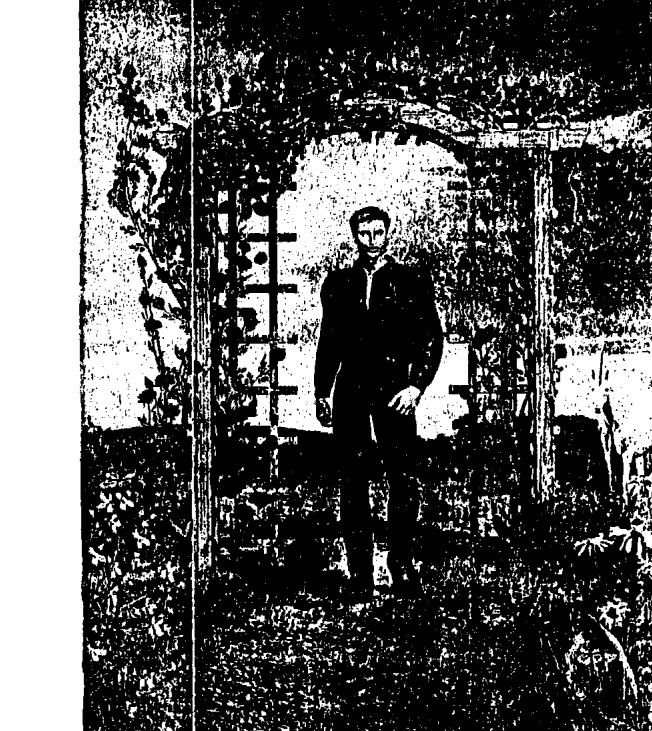

## 第11章 獨角獸的感官

### 聽覺

獨角獸就像已經過精細調音的樂器。他們有高度進化的嗅覺，跟人類一樣也喜歡快樂所散發出的香味，遠離憤怒的臭味。因為他們沒有身體需要滋養，他們當然是不吃東西的，因此他們沒有味覺。

獨角獸是高頻的動物，他們能夠聽見超過我們聽覺範圍的音符與聲調。他們所聽的音樂經常是超乎我們聽力所及的聲音。他們可以接收到的頻率比我們的高出太多，也可辨識出數百個我們根本聽不見的音調。

每種生命體都會發出音樂，不管是草木生長、太陽升起或星球移動都一樣。同樣地，你的能量場也會奏出樂音，而它的品質是由你的意識狀態決定的。你的獨角獸全都聽得見。

跟所有高度進化的存有們一樣，獨角獸喜愛美好的和諧狀態。人類的聲音一直都有療癒和提升的力量。假如某個人有非常好的歌聲可以提高聽眾的意識，獨角獸會到音樂會的現場觀看能量，並把他們自己的光也加進去。或者，假如你的音質已達到天使或療癒振動的境界，他們也會與你共事。

他們傾聽天體的樂音、流水的旋律、風的吟詠和天使的歌聲。例如，一個美麗的花園裡種滿了鮮花和綠草，加上噴泉，就會散發出美妙的樂音。對於獨角獸來說，它聽起來好像是一個樂團演奏著交響樂。他們也喜歡元素精靈們嬉戲於其中的野外園地。有著污水的池塘、四處堆滿垃圾且遭廢棄的花園，在獨角獸聽來就像是重金属音樂！他們會逃之夭夭。

他們覺得變電所發出的雜音令人不舒服。爭吵、尖叫或是任何方式的不和諧都令他們不愉快，於是他們就會離開。不論是真的還是演出來的某些情緒，當它們從電視或收音機裡傳出來時，同樣的情形也會發生。

鐵鎚敲打聲、工具的穿鑿聲，或吵雜的引擎發出像鍋爐熱氣散發出的那種振動，都會使獨角獸拼命快逃，就像你被火燒到時一樣。

情緒會有聲音和氣味。憤怒聽起來像狗吠，而較內斂的憤怒像是嘟囔或低吼。即使是一個不開心的人也會擁有低聲咆哮「離我遠一點！」的能量場。我們或許能夠感受得到，但獨角獸可以聽得見。愛、慈悲和喜悅聽起來像旋律優美的音樂，滿足感發出的是柔和的顫音，而更高的渴望發出的是令人振奮的、帶著感召的號角之聲。

當然，你的獨角獸純潔的、光彩的能量場奏出的是最不凡的曲調與和聲，遠超乎你的聽力範圍。它如此美妙，也因此同時把它周圍的一切都調到更高的音程裡。他們所發出的聲音可以觸碰到人的內心深處，直到他們靈魂的最裡層。

有一段時間，村裡的人會在星期天到當地的教堂禮拜，在唱讚美詩歌時，他們為了求取社區最大的利益而在不知不覺中進入一種和諧狀態。有些情緒或精神上失調的人，朋友的歌聲以及跟他們一起歌唱的天使們會幫他們重新做調整，鄰居們因而可以生活在平靜當中。

獨角獸也會聽到聲音裡的意圖和能量並且做出回應，因此在有美妙的音樂、神聖的唱誦或合唱團的和諧歌聲的地方，獨角獸會在其中加入他的光。母親對嬰兒低唱的聲音會引來獨角獸把愛灑在他們兩人身上。

他們也喜歡愉快的笑聲、有啟發性的談話、愛語以及孩子們快樂玩耍時交談的閒話。貓的咕嚕聲，鳥兒由衷發出的歌聲、樹間微風或拍打著海岸的海浪對獨角獸來說都是音樂。悅耳的風鈴聲會呼喚他們前來。

### 視覺

人類目前發現，當他們的振動頻率提高了，就可以看見以前無法看見的細微之處。愈來愈多的人能夠以開放的態度接受光啟，逐漸開發出他們的超感視覺（psychic vision）、靈視力（clairvoyance）以及超覺知力（claircognizance）。獨角獸是已經全然光啟的，無所不知、無所不見的存在，所以他們可以看見的是遠超乎我們視力範圍的光譜。他們可以透過他們的眼睛和第三眼來看。

# 第 11 章 獨角獸的感官

### 嗅覺

獨角獸有一種精細、微妙的嗅覺。你所有的意念都有氣味。恐懼的味道是很尖銳的，憤怒是有腐蝕性的辛辣味，好像燃燒物或易爆物，而較收斂的憤怒更像是一條功效不佳的排水管。嫉妒像氨水。假如你的想法和情緒發出臭味，無論你如何找理由辯解，獨角獸都會想要避開你。相反地，假如你充滿了愛、滿足、和平與高尚的想法，你的能量場會充滿美好的香氣。

愛像是芳香的玫瑰；慈悲像百合；溫馨、滋養和開放的心胸將人們籠罩在有如烘焙的香味裡，這種細微的程度是無法用身體的感官辨識出來的，可是獨角獸可以。

### 獨角獸聲音的練習

我曾用很多不同的方式，在不同的地方做過這個練習，都會引來獨角獸。他們很喜歡它。它會幫助一個團體變得和諧，也可以產生深沉的寧靜感。

你需要有一群人，把他們分成一、二、三或四組。不過只用兩三個人來做也是可行的。

- 1. 每一組都找一個安靜的地方。
- 2. 他們一起做出一個聲音、歌曲、音調或唱誦，把它獻給獨角獸。一般來說這個過程需要花十分鐘或更久。
- 3. 完成之後他們都要回到主要的地方，每個小組輪流呈現他們的獨角獸音樂。
- 4. 一個小組先開始，一兩分鐘之後，第二組接著開始呈現他們的音樂並和第一組和諧地融合在一起。
- 5. 接著第三組加入，繼續融合音樂，把它變成比每一首個別的歌曲更偉大的作品。
- 6. 第四組加入。
- 7. 這個和諧之樂持續發展，直到有一組想要停為止，然後一組一組慢慢地退出。
- 8. 所有的人安靜地注意聽這個聲音並留意獨角獸的光臨。

這個練習和前述是一樣的，只是每一組加入一個流動的動作。當他們聚在一起時，他們把動作和聲音融合在一起。

# 第 11 章 獨角獸的感官

### 獨角獸聲音、顏色與動作的練習

所有的小組都照著前述方法去做，再加上一個各自選擇觀想的顏色。在他們舞動和唱歌時，會實際地看見這些顏色在他們旁邊旋轉、融合。

# 第 12 章

## 獨角獸願望

義就是，那些真心願意以感恩、喜悦和正直的心接受的，獨角獸會為他們打開大門。一個天真無邪的小孩從內心深處許了願望時，獨角獸會靠近這個孩子，協助他。假如這個願望合乎這個孩子的最大利益，獨角獸會讓它實現。但是，跟地球上所有的事情一樣，它也必須不悖離靈性法則。假如一個喪母的孩子極其迫切地想要母親起死回生，獨角獸不會讓他的母親復活。這是靈魂層次上他的母親在投胎前和所有相關的人一起做的決定，沒有任何一個光的存在體能夠否定這種承諾。不過獨角獸會帶給他一個具有母性能量的人來安慰、幫助他。很多小孩和成人會覺得沮喪、迷惘和孤單，他們生命的色調是灰暗的。假如受到請求，獨角獸可以讓他們重獲閃爍之光與神奇魔法。

### 靈性法則

祈禱的法則是「請求，相信，它即實現。」換言之，信心會得到宇宙的回應。顯化的法則是，當你專注在你的願景，不帶懷疑，沒有偏差，它一定會被應允。你需要採取的第一步驟是明晰。在請求幫忙之前，先釐清你真正的願望是絕對重要的。猶豫不決的態度送出的是困惑的能量，會使獨角獸無法幫你。當你很清楚真正要的是什麼時，專注在其上，想像著它已經實現了，然後告訴獨角獸你要什麼，並且小心你的用字遣詞。例如，你說你願意盡一切努力幫助愛滋病的孤兒，你可能會發現你的生活產生了戲劇性的變化，你的服務機會也多到無法負荷的地步。語言是有力量的，更謹慎的說法是這樣的：「我願意為愛滋病孤兒服務，請給我指引。」假如你的目的是純淨和清楚的，你生活上的變化會是你可以應付得來的。

## 第12章 獨角獸願望

### 找到明晰

- 寫下你的願望。
- 畫出它實現後的景象。
- 它會帶給你一些感受，把這個感受的顏色塗在畫面的周圍。
- 它給你的感受是完全對的嗎？假如是，看看下面的明晰冥想。假如不是，再想一想。

### 冥想——找到明晰

- 1. 閉上眼睛，想像自己坐在一個蘑菇圈（toadstool circle）裡。
- 2. 你的獨角獸來到你這裡，你把你的願望告訴他。
- 3. 爬到他背上，你們一起進入內在層界。
- 4. 走向一個上面寫著你名字的門。
- 5. 你敲門後它會打開，你會進入一個世界，你的願望在那裡已經實現。
- 6. 用些時間去體驗它。在這裡你可以改變任何事。
- 7. 你的身體感覺如何？有沒有感覺到光和快樂？
- 8. 當你確定這是你要的之後，可以請獨角獸帶你回來。

### 冥想——獨角獸願望

- 1. 找個你可以放輕鬆又不會被干擾的地方。
- 2. 閉上眼，離開外在的世界。
- 3. 讓守護天使坐在你旁邊，祂的一個翅膀環繞著你。
- 4. 觀想你面前有閃著白光的樓梯。
- 5. 一道美麗的彩虹光從樓梯上照射下來。
- 6. 從模糊的彩虹光裡出現了一隻發光的獨角獸，走下樓梯，朝你而來。他問候你，請你爬到他背上。
- 7. 你的天使把你舉起放在獨角獸上並坐在你後面，祂的翅膀包覆著你。
- 8. 獨角獸轉身，爬上樓梯。你可以看到彩虹顏色的霧氣繚繞在你的腳邊。
- 9. 你進入陽光裡，面前有一個大拱門，上面長滿了美麗的芳香玫瑰。獨角獸帶著你穿過去。
- 10. 另一邊是柔軟的綠地，長滿了野花，中間有一個古老的許願池。
- 11. 天使幫你從獨角獸身上下來。
- 12. 從地上撿起一塊石頭，小心拿好，祝福它，對著它許個願。
- 13. 請獨角獸用他的角碰觸小石子，祝福你的願望。
- 14. 把帶著你願望的石子丟進許願池裡。注意聽水濺起的聲音。
- 15. 濺起的水有一滴掉回水面上，抓住它，以感恩的心把它交給獨角獸。
- 16. 坐在苔蘚上，觀想你的生命，彷彿你的願望已經實現。

> 譯注：蘑菇生長時自然形成的一個圓圈，大多是出現在森林裡。在歐洲民間傳說中，仙子或元素精靈會在裡面跳舞，又稱仙子圈。

- 17. 天使再度幫忙你騎回他背上，你們穿過玫瑰拱門踏上回程，走下彩虹階梯，
- 18. 感謝天使和你的獨角獸。

### 獨角獸願望的遊戲和練習

### 獨角獸願望螺旋（一）

螺旋是一種神聖的形狀。 當你以順時鐘方向畫出或描繪螺旋時，你得到的神聖能量會使你的願望更有力量。 假如是逆時鐘方向做，你會消除一直阻礙著你的負能量，然後達成願望。 這個練習有助於打開你的第三眼。

畫一個大螺旋，把獨角獸放在中間。 這不是在測試你的藝術能力，畫不好沒有關係。 你可以自己畫出或描繪一隻獨角獸，剪下來貼上，或者用一個銀色的星星象徵獨角獸。

### 獨角獸願望螺旋（二）

假如你喜歡，你也可以用粉筆、石子、貝殼、樹枝或任何東西做成一個大螺旋。

每個人輪流用手指順著螺旋走，走到中間碰到獨角獸時，許個願。然後繞著走，走到中央時，許個願。

獨角獸迷宮許願

迷宮（labyrinth）是比螺旋更複雜和更有力的象徵。當你描繪時或走在這種圖形上時，它象徵著你正走在生命的神聖旅程中：走進你存在的中心，再走出回到這個世界。你的左右腦都是計算機，這個練習有助於你平衡左右腦，讓它們更容易一起工作。它使你的獨角獸更容易幫你實現願望。同樣地，畫出或描繪一隻獨角獸，或找個代表他的東西，把它放在中央。

順著迷宮路線走

用手指順著上圖的迷宮路線走。走到中央碰到獨角獸時，停住，許個願。然後再用手指循環線走出。在我的《發現亞特蘭提斯》（生命潛能出版）一書裡，對於畫你自己的迷宮有完整的說明。

### 星星與獨角獸願望

這也是實現願望很有效的方法之一。你可以和兩個或更多的人一起做，所以對於你所許的願要謹慎看待。

- 1. 剪一個銀色的星星給每個人，或者每人手上都拿一個小水晶。
- 2. 某甲把會讓自己充滿喜悅的願望告訴大家。
- 3. 某甲把星星或水晶握在雙掌間。
- 4. 其他人手掌放在某甲周圍。
- 5. 某甲大聲說出他的願望。
- 6. 他們一起召請獨角獸，懇求他們讓這個願望實現。
- 7. 每個人都專注在這個願望上，想像這個願望已達成。
- 8. 分享你們的感想。
其他人接著輪流做。

### 做一個獨角獸許願池

- 1. 用花裝飾一個盤子或碗，象徵許願池。當然你也可以發揮你具有創意的想像力。
- 2. 你也許會想要播放獨角獸的音樂，例如安德魯·布瑞爾的「天使與獨角獸」（Andrew Brel’s Angel and Unicorns）的音樂。
- 3. 在一張紙上寫下你的願望。
- 4. 你可以用正直的態度寫下為他人許的願。
- 5. 假如有兩個人以上，可以牽著手，說：「親愛的獨角獸，請你接受我們心中的願望，使它們得以實現。感謝你。」

# 第13章

# 獨角獸王國

### 遇見神奇獨角獸
The Wonder of Unicorns

馬是來自拉庫瑪（Lakuna），拉庫瑪是在天狼星群附近的一個已經揚昇的星球，在我們可見的頻率之外。獨角獸王國是在拉庫瑪附近一個更高的層界裡。

想像有一個光亮、美麗、和諧的地方。柔軟的藍綠色草原上花開遍地，色彩繽紛燦爛，輕鬆愉快的獨角獸喜歡在那裡奔馳嬉戲，甚至連樹都會發出光，已揚昇的馬在其間吃草，享受著大自然之美。在那裡身大如鳥的蝴蝶穿梭在花間，有時展開雙翅享受陽光。

來自天狼星的其他動物也會到這個美妙的層界造訪。鳥類來自天狼星，有些會去造訪拉庫瑪，目的是要獲得靈性成長和接受教導。他們的顏色和地球上的不一樣，顏色單調的燕子變成了興高采烈的橙色，成群快樂地叫著，或大膽地飛近高大壯碩的獨角獸。羞怯的鵯鶘是淡粉色的。孔雀的衣裳是寶藍色的。在他們之間有純白色的鳥，有的單飛，有的成群，他們都已熟諳了所學，上升進入一個更高的頻率裡。

海豚也是來自天狼星。當他們投身來此時，替地球保存著長久以來所有的智慧。他們的心智像巨大而先進的電腦，儲存著所有發生過的歷史。海豚有十二個種類，每一種都保存著資訊和知識的一個部分，這就是為什麼人類大量屠殺其中任何一種都是一個悲劇和災難的原因。他們用心靈感應的方式把經過挑選的資訊傳授給有能力了解他們的人。神聖的傳承正在歸還給我們，這就是其中的一種方式。

海豚和獨角獸之間的關係很密切，不僅是因為他們來自同一個星球，也因為他們能夠溝通和交換訊息。他們也可以在一起遊玩中做互動。沒有一種存有會因為進化的程度太高而無法享受單純的樂趣。

所有的魚都起源於天狼星，他們到地球的水中來體驗生命。他們的工作是保持海洋的乾淨，但有些種類的工作是保護天使海豚，因為他們攜帶著亞特蘭提斯深廣的智慧和知識。其他的種類也都有不同生態上和社會性的任務，而也有些只是來這裡享受和學習的。

在內在層界裡，他們全部都能夠和他們的大哥哥獨角獸溝通，也向他們學習，在這一點上他們是跟我們一樣幸運的。

## 第13章 獨角獸王國

### 音樂

在獨角獸王國你可以聽到六翼天使的歌唱、星星的音樂、青草的生長和鳥的鳴叫。它就和地球一樣，只是它的頻率更高。對人類來說這些都是無聲的，因為我們的聽覺無法調整到這種頻率。

獨角獸在他們的王國裡也保持這種馬的身形嗎？
作為七次元的存有，他們可以視需要而化現不同的身形。但是他們不會選擇人類的身形，他們喜愛並尊重「本源」為他們創造的身形，讓祂們擁有平衡和強大的力量。人類可能羨慕一匹奔馳的馬，馬鬃和馬尾隨著微風飄動。他們在內在層界自己的王國裡也可以像這樣奔跑，享受著他們自由的精神。

他們的王國是很壯麗的。以我們有限的視野來看，我們可能認為它是純白色的，但是獨角獸可以在白色裡看到彩虹所有的顏色，以及更多我們不知道的東西。

有他們再度到地球幫助我們是我們的福分。同時我們可以認知到，這個再度受到幫助的權利是我們自己贏取來的，在吸引力法則的影響下，幾千個人散發出足夠的光才吸引了獨角獸再度來到地球。

人類一直都在用不同的方式提高地球的能量，以下只是其中的幾種。神父／比丘和修女／比丘尼神聖唱誦中的神聖詞句，會放出巨大的光到宇宙裡。一個專心禱告的修道者可以平衡大量的業力。個人的靜坐、合唱團的讚美詩、閱讀靈性書籍，這些行為都會發出光，進入集體共享的高頻能量庫裡。當然，每個人都可以把光加入這個光的聚合器裡。你送出的每一個意念都可以趕走或吸引這些光之動物。假如你住在水泥叢林裡，酗酒、說髒話、散播謠言、詛咒他人或貪婪自私，你的能量場會趕走這些純淨的光之存有們。

### 更接近獨角獸王國

- 1. 培養愛、和平、高貴、希望、喜樂和正直的特質。這些特質會給你的能量場增加純淨明亮的光，吸引他人和獨角獸。你可以有意識地選擇改變態度。
- 2. 真誠地渴望為他人服務，這是利益他人的方法。
- 3. 請求在你的夢裡和獨角獸相遇。在第十七章〈運用獨角獸之夢〉裡我會說明如何進行。
- 4. 想念他們，閱讀和談論有關他們的事，畫出他們的形象。換言之，把注意力專注在獨角獸上。
- 5. 每天利用一些安靜的時間祈請獨角獸的護佑和指導。
- 6. 想像跟他們在一起。觀想自己跟他們一起散步或騎著他們。
- 7. 單純地處在大自然中，或漫步其中。

### 造訪獨角獸王國

第七層天堂包括了天使王國和獨角獸王國。當你的光夠亮時，你可以在靜坐或夢境中造訪牠們。你正在閱讀此書，你可以設想自己已經準備好了，這個層界的能量門戶便會為你打開。你一定要請求，當然，大多數人是在不知不覺中做的。所有進入你生命的東西，都是受你的意念之邀而來的。

假如獨角獸帶你到他們的王國，你可能會因為遇到的某些受邀者而感到驚訝，在那裡他們都已去除人的個性和小我。我們永遠無法評斷他人，因為我們認為沒有價值的人在靈魂的層次裡可能很不一樣。那個你一直不喜歡的壞脾氣的討厭鬼，在他的靈魂裡可能有純金色的亮光，你若在獨角獸王國裡看到他，他的能量場可能是粉紅色和紫色的，他還可能帶著燦爛的笑容，眼神裡充滿了愛。

當然有些人你是絕不會在獨角獸王國裡看到他們的，因為他們靈魂的能量還不足以到達這個層界。

有一個晚上，我的朋友偶然來訪，因為她想要探討她未來的情況。我們度過了一段愉快的時間，對於她的目標也有了清楚的認識。

當聖母馬利亞要求我寫這本有關獨角獸的書時，我抗議說我沒有足夠的資訊。她叫我挪出一星期去跟她們共處一段時間，我不太確定要如何在繁忙的行程中排除困難，但我下定決心要努力做到。

第二天早上我出去散步。朝著我們當地的樹林走去時，我讓獨角獸帶領我，而不是走我平常的路徑。他們帶著我穿過一些樹之後，便離開主要道路到了一個空地，在遠處有個小丘，上面有五棵樹。我知道大天使麥可在這個地點為了某個人而現身，所以我偶爾會來這裡沉浸在這個能量中，很遺憾的是當這片樹林因為太濃密而需要進行梳理時，五棵樹當中的一棵被砍掉了。但令我們感到吃驚的是它的乙太體仍然留在那裡，有時我會去那裡祝福它，也接受它的祝福。

獨角獸提醒我，除了樹以及所有周邊的一切之外，還必須注意踩在地上的腳。同時我也使用一部分意識去注意獨角獸王國，發生的一切都很奇特、美好。當我感知到獨角獸在我周圍時，一種祥和的美感突然出現了。

不起眼的鳥變成了帶著美麗的光與顏色的球。一隻友善的知更鳥發著青藍色的光。令我驚訝的是黑鶇閃爍著白色的光。我問：「在這裡所有的黑鳥都是白色的嗎？」我得到的答案是：「不！」他們給我看一些鳥，他們發出的是柔和的紫光。

獨角獸提醒我往下看地上的樹。有一隻說：「你們人類所看到它們的能量場是它們周圍閃爍的白色光帶，我們看到的是它們傳輸智慧到乙太界時向上延伸到天空的金色光柱。要記得，在這塊土地上樹是智慧的保存者，要尊崇它們。它們有很多都是可敬的存有，也有很多都擁有比人類更加進化的知識。它們從你們身上體會到不同的經驗。它們見證、吸收，也學習。它們感受到能量。它們提供庇蔭和保護。在一個非常有智慧的樹精靈的保護之下，有時一個人甚至會變成隱形的。」

「真的嗎？」我想。那一天當我在深度覺察的喜樂狀態中漫步，穿梭在不同次元時，樹林裡發生了一些神奇的事。我察覺到有愈來愈多的鳥在我周圍。有一隻蒼頭燕雀在我面前蹦跳著，燕子快速地飛來飛去，一隻知更鳥、一隻畫眉鳥，還有幾隻斑鳩都飛到附近，彷彿是來打招呼的。我感覺他們是在告知我們，獨角獸王國的能量是存在的。然後我走到樹林盡頭的路，結束了這神奇的一切。

### 如何走一段獨角獸之路

首先要確定你所在之處是獨角獸喜歡的。在水泥叢林裡是很難讓獨角獸靠近你的——但也並非不可能，只是比較困難。嘗試找個比較有綠意的地方，樹林、草地甚至是公園。要根植大地，所以要注意腳下的土地，以及三次元現實裡你周遭的一切。去感覺一些實體的東西——松果、樹皮、小石子或葉片都可以。注意你周圍的味道或香氣。然後注意你的呼吸，讓它是飽滿、自然的。

把意識帶到獨角獸王國。你可以想像自己是很大大的，在更高的層次裡，獨角獸在你的周圍走動著。或者也可以把你的心智投射到那些已揚昇的馬的國度，感受一下那裡所發生的事。和他們交談，傾聽他們，享受你在那裡的經驗。走完這段路之後，要確定你完全回到身體裡。你可以採用的方法是把注意力放在行走上，或者去碰觸某些東西。只有在安全的地方才能這麼做，有車輛的地方千萬不可以！最重要的還是要好好享受這個過程。

## 第14章 獨角獸的祝福

接受獨角獸的祝福

獨角獸的祝福影響深遠，力量強大。當你接受祝福時，因為純淨的能量通過你的身體，你會覺得有麻刺感。你可以直接祈求祝福，其他人也可以送祝福給你。不管是哪一種，你的接受度愈高愈好。假如你不知道有人送祝福給你而沒有事先做好準備，光的存有們會確保他們的能量輕柔地流進你。你一定會收到！

當你從心中把神聖能量帶給某個人或某事物時，你帶給他們祝福。你祝福他們的方法是把他們缺乏（或他們自認為缺乏）的東西給他們。假如他們敞開心來接受，你的祝福可以把他們帶入神聖的整體裡。

假如有人覺得缺錢，以富足祝福他們。假如他們的人際關係正在崩解當中，在完美的愛中祝福他們。假如他們哀傷、寂寞、憤怒或覺得挫敗，以快樂、友善、和平和成功祝福他們。可以給出的祝福其種類是不計其數的。

記住，你送出去的一切都會回到你身上，為你增添無限的豐富。

> 在你請求獨角獸經由你給出祝福時，接受者也會收到他們難以言喻的能量和光。

### 天使和獨角獸的祝福

你可以請求獨角獸和天使透過你祝福他人、地方和各種事件。假如你召請天使前來，高舉雙手，請天使碰觸牠們，當祂們這麼做時，想像手變成金色的。然後你可以用你金色的手，把天使的祝福或療癒送到任何有需要的地方。當然，你也可以只從心中把天使的祝福傳送出去。

### 傳送獨角獸的祝福

假如你和獨角獸共事，高舉你的雙手並請獨角獸碰觸牠們，感覺牠們閃爍著白光。你甚至可以感覺到麻刺感，或看到銀白色的星星在你的指頭上閃爍著。另外一個做法是從心裡送出獨角獸的祝福到任何有需要的地方。你也可以真正地把帶有獨角獸療癒能量的手放在別人的身上，但必須事先徵得對方同意。

例如，你可以送出獨角獸祝福給一天之內你所接觸到的每一個人。在阻塞的交通裡，用耐心和寧靜祝福所有開車和坐車的人。提高雙手，獨角獸星星和能量流才能向外去接觸到每一位相關者。在高速流動的車潮裡，從第三眼送出祝福，讓獨角獸的能量影響每一個人，讓大家行車平安。

你區分出何時該送天使祝福，何時該送獨角獸祝福，有些時候天使或獨角獸會伴隨著祝福到現場去幫忙。

和這些不凡的光之存有們合作，你永遠都會是一股巨大的力量。

### 獨角獸的祝福

像獨角獸這種光之存有只理解好的品質，例如愛、誠實、安詳和喜樂，他們完全無法認可那些較差的品質，這就是為什麼他們必須離開負面能量的原因，也因此他們所呈現出的是像純淨、真實和勇氣這樣的特性。他們的祝福會帶出他們所具備的美德。

從來沒有人需要自覺無用，因為即使你失業、足不出戶、殘障或生病，你都可以在這個世界上大家共同集結的祝福裡放進更多。以獨角獸能量祈禱可以把你轉化成純粹的光。請記住，當你祈求祝福，你是在傳遞神聖的獨角獸能量給一個人、事件或場所。你的發心有多強，祝福的力量就有多大。祝福可以療癒感受，也可以使不好的狀況恢復正常。

### 教育機構

從學校畢業或完成大學教育時要祝福老師，感謝他們的奉獻、正直，以及啟發學生的心和腦的能力。讚賞學生們有興趣和能力學習、專心，盡其所能達到最大的成就。想像建築物充滿著白光，裡面的每個人都昂首闊步，眼睛發亮，帶著喜悅的面容。

### 食物

在你準備食物時，祝福它。切蔬菜時，祝福它。打蛋時，想著母雞下蛋，祝福它。食用之前，把手放在食物上方祈請獨角獸的祝福，他們會經過你的心，再從你的手把它送出。你也可以請天使和獨角獸一起祝福食物，你的食物將會收到天使和獨角獸共同的能量，終究也會使你的身體感到愉悅。

### 水

非常願意在我們喝水之前為它祝福。從此之後我都會把杯子舉高，請獨角獸祝福杯中的飲料。我可以想像他從角裡傾灑星星到飲料裡的畫面，也相信水喝起來一定會更清甜爽甜。我甚至知道液體中的精微能量比以前高出很多。

記得祝福雨水那能夠洗滌、療癒和滋養的效力。經過水坑時，我會伸出手，請獨角獸透過它把祝福送進水中。

### 祝福人們

祈請獨角獸祝福某個人時，你要相信一定會有一隻發光的動物會靠近那個人，用他的光之角輕觸他。當你為一群人祈求祝福時，獨角獸會聚集在他們的上方，把代表希望和愛的象徵灑向他們。

### 政客與商人

祈願政客和商人有節操、正直和智慧，有能力做出利益大眾和賦予大眾權力的決策。

### 媒體

### 電視和收音機

看電視和聽收音機時，召請獨角獸能量，感覺它流經你的身體，然後祝福該節目和節目裡的人。送祝福給讓節目變得更好的潛在可能性，而不是你所看見的現實情況。意即你可以祝福肥皂劇和一些頻率較低的節目，希望它們能夠散播愛、仁慈、友誼、智慧、同理心和正義。你的祝福會使這些品質裡最細微的脈絡開始成長和開展。

### 報紙和雜誌

報紙和雜誌看起來總是把焦點放在日常生活裡的負面性，所以我問獨角獸是否可以給它們一些光。獨角獸也認為大多數的媒體都是這樣。他們又說，目前這些狀況是神聖計畫中的一部分，因為所有的秘密和被掩蓋的角落需要被揭露出來，而那個時刻就是現在。虛構杜撰掩蓋了事實，那是黑暗力量探索光明的反應。而這也會過去。

### 你可以做什麼

首先請獨角獸和主編、節目製作人以及對媒體有影響力的人溝通。將他們引導到那些願意傾聽的人那裡，在他們的耳旁輕聲說出激勵性的建議，告訴他們勇氣、服務和快樂是有報導價值的。假如你持續地這麼做，你就成了媒體和獨角獸之間的靈性媒介。透光的彩虹橋你創造出改變，因為某些有影響力的人會聽到並做出回應。

有些報紙、節目和雜誌的主編已經願意報導正面、希望和善良的主題，你可以請獨角獸和他們一起努力，獨角獸會給他們更大的力量為正直、正義和光挺身而出。

也有一些雜誌和報紙是致力於正面報導的，例如英國有一家報紙叫做《正面新聞》(Positive News)，它還有一個姊妹雜誌叫做《輕鬆生活》(Living Lightly)。在美國我有替《神秘流行音樂》(Mystic Pop)寫文章，它是一本傳播智慧的雜誌。請獨角獸祝福它，支持那些推動善良觀點的主編們。

### 小孩和青少年

以天真、快樂和對生命的熱情祝福所有的小孩與青少年，特別是那些迷途羔羊！

### 雙親

以愛、滋養、耐心和撫育的喜悅祝福母親。以愛、公正和為父之道祝福父親。

### 動物

以愛、不傷害、喜悅地接受生命祝福動物。你可能也會想要祝福某些動物擁有寬恕的能力或勇氣。

### 大自然

讚美樹有智慧、力量和療癒的能力。

### 意識頻率較低者

以他們內在具有的豐饒和誠實祝福竊賊、詐騙者和欺騙者。以和平、自我價值感、自信和寧靜祝福暴徒和恐怖份子。以價值感和歸屬感祝福逃避責任的人。

### 電腦和科技

送祝福給你所使用的現代科技用品，使它們不致變成不良的科技用品。晶片是有意識的，它會對你的意念和態度做出回應。把愛和祝福送給所有的晶片，把純淨和獨角獸的光送進晶片裡，它們會回報給你的是較長的使用期，使用上的麻煩也會減少。

### 地方和事件

以地方和事件潛藏的神聖完美性祝福它們，並且祝福它們擁有你希望賦予的所有品質。假如你以和平祝福一個國家，和平的能量將會在神聖當中被引導到需要它的地方。讚美隱藏在一切事物和人類內在的神聖本質。記得感謝獨角獸經由你祝福他人。

### 散步途中的祝福

不論何時散步，這個很簡單的事是你必須很警覺才能看見途中的動物，並送祝福給他們。你可以在心中這麼做，也可以伸出手把獨角獸能量導向你所關注的焦點。所有的祝福都會產生一些效果，但是你可能只會收到幾個人的感謝或回饋；要知道，在這世界上眾人共同累積的善良裡已經加入了你的一份。

- 感謝獨角獸保護和庇佑你剛離開的家或某個地方。
- 請他們陪伴你，並在你散步時護佑你。
- 請他們祝福天氣，不管是下雨、下雪、晴天或颶風。
- 祝福樹木、花草以及所有正在生長的生命。
- 祝福和你擦身而過的人和動物。
- 祝福你看到的昆蟲，甚至是你看不見的那些。
- 祝福你腳下的泥土。
- 祝福小石頭和大石塊。
- 祝福你所看到或聽到的任何汽車、火車或飛機。
- 完成之後注意自己的感覺。

假如你願意，你可以隨時做獨角獸祝福：坐車時、做家務或園藝工作時，或任何你的部分頭腦能在空閒時間做祝福的工作時。每一次你這麼做，都將為周遭的人增加光芒，你自己的光之商數 (light quotient) 也會提高。

## 第15章 各種關係的療癒

臣服的祈禱

你可以要求你的天使跟他人的天使談話，幫忙解決任何誤解或衝突，這會對雙方都有益。獨角獸能量是不一樣的。你必須願意把小我放置一旁，不再聲稱「我是對的」，或者緊抓著受傷或憤怒的心態不放。假如你真誠地希望這個關係會出現最好的結果，你的獨角獸會協助你。

開始時，先祈求讓你釋放在這個關係裡你對小我的依戀不捨，是什麼障礙使你看不到對方的神性？是你想要成為對的一方，還是希望對方把你看得很重要？你是否頑強地抓住受傷、憤怒、羨慕的感覺？假如是，為什麼？它讓你感覺更優越或較低下？它可以讓你的行為有合理的解釋嗎？你準備好要放下對羨慕、嫉妒、被愛、成功、被錯怪或不快樂的執著了嗎？你可能有一長串的東西需要捨棄。要記得是你把這個人、這群人或這個事件吸引到你慣有的模式裡的。在靈魂的層次上，你早已決定要學習這門課，所以他們都是你的老師。

### 祈禱詞

> 此刻我願意放下對「……」的執著，我願臣服。我認出你「……（名字）」是我偉大的老師。我們是一體的。我祈請獨角獸把我的內心和頭腦對你敞開，為我們彼此帶來和諧。誠心所願。完畢。

### 獨角獸療癒彩虹

這個觀想的目的是要從你的內心把一個療癒彩虹帶到對方的心裡。當然，他們是有自由意志的，不管是你或是獨角獸都無法強迫他們為你打開心房。他們有既定的安排，結果可能是拒絕你提出的方法。但是，假如你真正臣服了，對方會感受到你能量的轉變，通常都會打開心接受彩虹的另一端。然後你們可以允許和平、愛、豐盛或任何有需要的東西在你們之間流動。如同所有類似下面的療癒彩虹的練習一樣，你可能需要做幾次觀想後才會發現到你們的關係有了改變。某一天你可能會想要打電話或寫信給他們，或者你也可能因為你們之間的情況已獲解決而感到滿意，所以覺得不去與對方連繫也是件快樂的事。當獨角獸給我療癒彩虹觀想的方法時我立刻想起一個朋友，我們都不要正眼瞧對方，這個關係讓彼此都不太開心。我坐下來，請獨角獸碰觸我的心，幫我清除這個關係裡所有的負面性。有趣的是，幾天之後我撞見這個朋友，他走過來請我給他一個擁抱。獨角獸再度幫了忙！記住，即使是那個人已經過世你也可以這樣做。有時候這會比對方仍有軀體時更容易，他們在另一邊會具有更高的見解，因此會更願意對你打開心胸。

### 療癒彩虹的觀想

- 找一個不受干擾的地方安靜地坐著。
- 從心輪輕鬆地吸氣呼氣，直到感覺放鬆為止。
- 請你的獨角獸用他的角輕觸你的心。相信這已發生，或者觀想它正在發生。
- 想像你的心是一朵玫瑰，感覺花瓣正在盛開。
- 觀想對方坐在跟你有段距離的地方。
- 想像獨角獸從你心中把彩虹帶到他的心。
- 隨著彩虹一起把愛和其他你依據靈感而想要給予對方的品質傳送給他。
- 當你覺得準備好了，你也可以從心中送訊息到他們心中。
- 過一會兒之後，感受一下你心中的感覺。
- 你可能會收到對方給你的想法，甚至是訊息。
- 謝謝那個人和你的獨角獸，然後在你的能量場罩上一個彩虹斗篷，然後睜開眼。

霸凌者和受害者有著相同的恐懼，只是以不同的方式表現出來而已。霸凌者想要被愛和被尊重，但卻不相信自己值得別人這樣對待自己，所以他們欺侮別人，好讓自己覺得比較優越或比較重要。受害者想要被愛和尊重，但他害怕無助和怕自己不夠好，他的恐懼吸引了惡霸。

受害者需要放下恐懼和缺乏價值感，並準備好取回勇氣和自我價值感，然後走進自己的力量裡。

霸凌者需要放下自己無力擁有所渴望的愛和尊貴的感覺，並準備好認可自己的價值。

「霸凌者—受害者」的情境有時會出現在夫妻間、手足間、老闆和勞工間、同事之間或公司之間。它會出現在任何有恐懼的地方。

霸凌者和受害者是否準備好要先放下一些東西並重修舊好，這都沒有關係。假如這適用於你，做獨角獸療癒彩虹的觀想，你的獨角獸會協助你。假如你看到你認識的兩個人身上有著霸凌者和受害者之間的糾結和問題，呼喚獨角獸，敞開心，做一條療癒彩虹連接你的心和他們兩人的心。

### 國際間、組織間和宗教間的療癒

國際間弱肉強食的例子不勝枚舉。大部分富有的國家是靠著在經濟上和政治上侵害弱小的民族而累積了他們財富和權力。有恐怖份子的地方永遠都存在著無力感和不義感。當你一個人，或者情況好些時有兩人或更多人聚在一起，為兩國或兩個組織做療癒彩虹的祈禱，獨角獸將會很樂意支持這個服務的行為。

商業間、宗教間甚至文化間都存在著不和諧，獨角獸將會和你一起幫忙化解分裂。要如何觀想國家、宗教或其他的組織呢？你可以想像一張地圖，上面標示著那個國家或地方。還有一個方法就是觀想他們的領導者。或者，你也可以觀想著代表那些團體的象徵，例如聖經、可蘭經、十字架、六角星、納粹標幟、旗幟、商標或你認為和那些相關者有關聯的東西。你甚至可以在開始做療癒之前把它畫出來，這會使你的觀想畫面更鮮明。要承認你是整體的一部分，相信你在傳送療癒給別人時，你也在療癒自己靈魂的一部分。我們無法把發生在世界上其他地方的事和發生在自己身上的事分開來。

### 化解人際衝突的祈禱詞

我認知到我們都是一體的，也願意放下我內在和外在的衝突、掌控的慾望、小我的執著和評斷，俾使我在意識上的大轉變能夠為我們帶來改變。為了你們之間的和諧，我祈請獨角獸幫我為你們打開我的心胸，並有更寬廣的心智。誠心所願。完畢。

### 國際間、商業間或各種組織間的療癒彩虹觀想

- 找一個不會被干擾的地方，安靜地坐著。
- 從心輪輕鬆地吸氣呼氣，直到你感覺放鬆為止。
- 請你的獨角獸用他的角輕觸你的心。相信這已發生，或者觀想它正在發生。
- 感覺到你的心花正在盛開。
- 想像著代表每一個國家、商業團體、組織或文化的象徵物或人。
- 想像獨角獸從你的心帶著一條彩虹到他們每一個人那裡，再回到你這裡，於是你的心能量把他們連結在一起。
- 隨著彩虹把愛和其他你依據靈感而想要給予對方的品質傳送給他們。
- 當你準備好時，你也可以從心中傳送愛、和平或鼓勵的訊息到他們心中。你不一定要認識他們。
- 一小段時間之後，感受一下內心的感覺。
- 你可能會收到該地或相關之人給你的想法，甚至是訊息。感謝所有相關的人願意接受，也感謝獨角獸。然後在你的能量場罩上一個彩虹斗篷，並睜開眼。

## 第16章 夢見獨角獸

當你夢見獨角獸，你是在內在層界與他們會面，意即他們已經和你攜手共事了。我在一個派對裡和一個人聊天，她告訴我她對獨角獸一無所知，也不曾想過他們。有一天她參加了一個工作坊，整個團隊的人被帶入冥想，她進入了一個很深的神狀態。一隻獨角獸出現在她面前，非常生動真實，至今她都還記得那個感覺。他並沒有給她任何訊息，只是用關愛的眼神看著她，她離開冥想狀態時覺得很寧靜卻又有些興奮。她想要知道這個夢的意義。因為她曾說過想要做一個療癒者，也因為獨角獸是偉大的療癒者，他們在靈魂的層次上工作，對身體有很大的影響力，所以我認為那是在鼓勵她開發她的療癒能力。我很確定他們是在召喚她使用獨角獸能量，她也覺得這是對的。瑪柔·凱蘇很喜歡獨角獸。她夢見自己在走廊上走著，一隻獨角獸迎面而來。她認出他是先前曾經造訪過她的那一隻，也確定她的獨角獸朋友將以有形體的方式向她致意，並會站起來擁抱她，所以她在等待著這樣的事發生。沒想到他們之間突然出現了一個障礙物。醒來時她意識到獨角獸是來給她一個訊息——她還保留著一個沒有解決的問題，她必須把它放下，好好生活下去。她意識到這個訊息，也採取了行動，此事成為她靈性成長上的一個標記。

### 一隻黑白獨角獸

這是依娃在剛睡著時（此時是不同世界間的帷幕最稀薄的時刻）所做的獨角獸之夢。她看到了一隻獨角獸黑白色的頭，這個畫面持續了一段時間；在驚訝當中，她仔細地檢視分辨所有的細節。她感覺非常好，喜悅之感也油然而生。

一隻獨角獸會以黑白的顏色出現在她面前，我覺得很有趣。通常黑白同時出現表示做事不要太極端，或者不要有黑白太分明的觀點。它也可以是在提醒我們，每一個問題都會有兩面。

但是，黑色也象徵深度的神秘。黑色聖母像代表深奧的女性秘傳智慧。它是最終極的陰性顏色，所以我猜想黑白獨角獸是否在教她必須使用她自己純淨的光，同時也要認出她的女性智慧中的深奧之處。

另外有一位名為艾蓮娜的女士，她說有一天早上她從夢中醒來，夢中有一隻獨角獸在翠綠柔軟的草地上奔跑著！在旁邊有乾淨清澈的水，而獨角獸的頭和鬃毛周圍看起來有如發出金色的光。她在夢中急忙去告訴她的姐妹，希望她也能看到。她想要分享這個神奇的經驗。

夢境、白日夢或冥想都是一種出神的狀態，那個時候有可能潛入其他次元而接觸到不同的世界。瑪麗安一直很忙，有一次她就在休息片刻開始做白日夢。她看見自己是一位公主，正在前往一個美麗城堡的途中，這個發著光的城堡就像是從迪士尼卡通影片裡出來的一樣。當她走近時，兩隻獨角獸出來迎接她。「醒來一時她告訴自己：「瑪麗安，妳也太離譜了吧，獨角獸？是真的嗎？」」後來，她意識到是自己在懷疑當中否定了獨角獸，因為那個晚上她做了一個很清晰的夢。在夢中她到我家來，我在對付一個黑暗力量的威脅時，把深藍色的披風圍在她身上作為保護。在我把她的披風拿開時，她醒了過來。當晚她吸引來了一個很憤怒的人，刺穿了她的能量場，她覺得非常難過，足足花了兩星期才恢復過來。後來她看到我的定期刊物，其中有講到獨角獸，她馬上了解，是她把他們找來的，卻又否定了他們，所以喪失了他們提供給她的保護。她立刻坐下來再度召請他們來解決她自找的痛苦。現在她擁有了許多洞見，也能夠像大師一樣地處理自己的生活問題，這真是太好了。人有時會在冥想中看見獨角獸。安娜告訴我她曾參加了一個一天的禁語冥想靜修活動。剛開始她無法讓腦中的喋喋不休停下來，愈是努力結果愈糟。最後她請求協助，於是就出現了一隻美麗的白色獨角獸。她爬到他背上，緊抓著他的頸部，然後他帶她到一個瀑布，把她放在長滿草的岸邊，坐在她身旁，就像個同伴一樣。她說了聲謝謝，頭腦立刻進入一種鎮靜、平和，甚至是一種至福狂喜的狀態。

## 第 16 章 夢見獨角獸

### 第三眼發出的光

在冥想時間快結束時，她想：「但願今天有什麼辦法可以讓獨角獸現身。」中午的休息時間她到了庭院遠處的一個角落，選了一個有陽光的位置。吃午餐時她瞥向右邊，看見灌木叢中有個白色的東西。她站起來撥開葉子——裡面有個美麗動人的白石頭製成的獨角獸！她高興得差點哭了。

我們是住在身體裡的靈性的存有，所以我們每個人在白天都有一個身體，在睡覺時又有一個靈性的生命。我們在睡覺時拜訪我們的朋友，他們可能住得很遠，或已經不住在身體裡面，也有可能是住在另一個銀河系裡。假如在靈性上準備好了，我們就可以參加天使和大師們的課程或接受祂們的療癒。很多人甚至都不知道自己在做夢時也都在做靈性的工作，幫助、指引和解救別人。
瑪柔——凱蘇記得曾經做過這樣的夢。在夢中她被帶去會見一些來自另一個星系的宇宙友人。他們沒有像人類那樣的身體，但都很友善，很健談，也不時地笑著。這群人之外有一個男性造物者能量站在那裡。他很溫柔，有著閃亮的眼睛，只是觀看著。她知道他在用心智的力量，並且被什麼深深吸引著，所以看起來好像有一隻獨角獸從他的第三眼走出來。她很清楚地收到他傳來的訊息，他想提醒她，人類一定要求取內心和頭腦間的平衡，假如我們只專注於內心之事，我們會變得無法腳踏實地；假如我們只用頭腦，我們會變得自私，缺乏慈悲。瑪柔—凱蘇再次強調他的能量很柔和親切，但是她對於獨角獸的角覺得很困惑。我提醒她，從第三眼射出的光柱是一種高頻念力的進發，它可能是意念的顯化，也可能是療癒或光啟的心念。所有從額頭中央散發出來的純淨能量假如夠強，它的光會形成像角一樣的形狀，就像從內心發出的能量，它的光實質上看起來像翅膀一樣。

我的網站上以前有一個聊天室，莉蒂亞曾經在那裡談過她祖母的故事，她祖母可以看到靈界。她的祖父在戰役中被殺的前兩天，他的靈體來告訴他太太一切都沒有問題，因為他永遠都會從另一個世界指引她、撫慰她。莉蒂亞說，雖然祖母要單獨撫養四個小孩，加上一個還尚未出世，但她從未看過她祖母抱怨。她快樂，因為她知道「真實」為何。她的門總是為窮人開著，願意和人分享食物。她和動物的關係很好，養牛只取牛奶，養雞只取蛋，視他們為朋友。

這位老太太臨終的時刻來臨時，莉蒂亞的母親在半夜中醒來，因為她夢見漂亮無比的白馬帶著閃亮的銀色星星在房子周圍跑著，從窗外往內看。她叫醒全家，大家都圍在祖母旁邊。莉蒂亞這麼寫著：「她的眼睛開始像星星一樣發光，看起來更大，是那種極美的藍色光。她微笑著，因為她自由了——至少可以自由地和獨角獸一起飛了。」她又說：「那個特別的時刻我不在那裡，可是我看到祖母過世前一天所拍的照片。我永遠記得她眼裡所散發出的快樂、喜悅和愛。」

## 第17章 運用獨角獸之夢

## 遇見神奇Unicorns
The Wonder of 獨角獸

夢中的數字是很重要的。例如，你夢中出現兩隻獨角獸，它可能象徵你已達到平衡，或者有一個伴侶將會進入你的生活中，因為二是代表分享與和諧的浪漫數字。或者，你的夢中可能出現一隻獨角獸，裡面還有顯得很突出的五棵樹，這或許暗示著你可能很快要做些改變或冒些風險，而且你將會有更多的能量和資源進來。

- 1. 代表新的開始，與生命合一、聯合、獨立和個體性。它意謂著你把所有的注意力放在一個願景上。這是一個正面的數字，除非你覺得很寂寞或孤立。
- 2. 這個數字代表平衡，融合你陽性和陰性的能量。它是浪漫的、藝術的、敏感的能量，會帶給你一個夥伴的關係。
- 3. 代表三位一體，象徵力量與和睦。它會帶來某種權威，可能會帶著掌控性，但希望它是有趣的。它也可能暗示你已經達到某種程度，但仍需要再多做一些。而因為有三這個數字，你會有力量、自我展現和開闊性去達到目標。
- 4. 四是一個很穩定和扎實的數字，暗示著不管你想做什麼都會有很好的基礎。它通常表示你需要自我約束。
- 5. 這個數字暗示著是該做出改變的時候了，甚至是突然間的改變方向因而可能涉及一些風險。但是你會有你所需要的資源。

### 清理你的能量

在你請求有獨角獸之夢以前要先清理你的能量，並且卸下恐懼和負面性，這會使你的光更純淨，他們才能在更高的層次和你連結。下面就是一些有效的方法。

- 6. 這是一個友善、社交的數字。它也可能表示你需要為某個人或某項志業付出很多心力。
- 7. 這是一個代表神秘的數字，所以要從靈性的觀點來看待這個夢。它可能表示重生很快就會發生。
- 8. 世界就在你的腳下。這個數字代表無限和永恆，包含著權力、財富和宇宙的知識。
- 9. 這個數字暗示著你無私的努力已完成很多事，它恭喜你。
- 10. 這個數字代表完成或一個時代的結束，它可能也會帶給你自我滿足感。一切都很好。
- 11. 這個大師數字預告了一個嶄新的開始。

### 清理能量的方法

- 1. 真正地洗個澡或淋浴。洗澡時想像你的恐懼都被清洗掉，從排水孔流出去。
- 2. 承認自己是具有愛與光的存在體，肯定自己有和平、智慧、喜樂以及其他種特質。
- 3. 敲擊頌缽，專注在你的神聖自我上。
- 4. 吟誦或唱神聖之歌。
- 5. 播放神聖音樂或神聖唱誦的光碟。永恆的「嗡」聲非常有助於能量的清理。
- 6. 在水邊或高能量之處散步——例如海邊、森林或山中。

### 保護

在晚上睡覺時保護你的靈體永遠是明智之舉，這樣它才能安全地到其他的層界探險。你可以請獨角獸或大天使加百列在你周圍放一個反射出純白光的球，你除了用頭腦觀想以外，務必還要想像出畫面。

另外一個方法是請大天使麥可把祂深藍色的防護斗篷披在你身上。當你感覺到天使把它放在你肩上時，務必要豎起帽兜蓋住你的頭和第三眼。然後用心念從腳到下巴把拉鍊拉上。

第三種很具威力的保護方法是三次祈請基督金光。你站在基督之光裡，就是在基督的保護裡。

### 請求做獨角獸之夢

白天時，不時地去想著獨角獸，以及你在夜晚睡覺時想要去的地方。

那個晚上，你可以請獨角獸帶你去某個地方，在那裡學習、提昇和進化。或者你可以請他們幫忙讓你去體驗過去的某一世，拜訪大師和大天使們的靜修處或是獨角獸王國。你當然也可以告訴他們你想要更進一步認識他們，特別是你自己的獨角獸。

假如你有一個想要利益他人的願景，有關要如何采取下一步的問題，你可以請求他們給你一般性的引導或是更明確的指示。

## 遇見神奇Unicorns The Wonder of 獨角獸

### 禱告

親愛的獨角獸，我請求你在夢中帶我到（某個地方），讓我在那裡釋放我的過去／找回我的智慧／認識我的獨角獸／接受指引，並為了我的最大利益，以及為一切眾生更大的福祉而進化、成長。阿門。

### 睡前的準備

把筆和紙放在床邊，以便半夜醒來時可以把夢寫下來。這也是在向獨角獸聲明你已準備好要記住這個夢。在睡前喝一杯水。水是夢的媒介，它往往能確保你不會因為睡得太沉而記不得夢境。最後，在想念著獨角獸中入睡。

## 第 18 章 白色動物

## 遇見神奇Unicorns
*The Wonder of 獨角獸*

纯白色动物（不是指白化变种的）携带着具有纯粹的无条件之爱的基督意识能量（Christ consciousness）⑤。根据美国原住民传统，当一只白色小水牛出生时，地球上会开始出现和平。我还记得第一只出生时的欣喜，而现在已经有好几只了。

根据报告指出，有很多物种都有非白化变种的幼兽出生现象，表示很好的意识转变已经在发生了。这些神圣的白色动物不但没有被同类或猎捕者欺负或杀害，反而被动物王国视为是特别的。

最近我曾在报纸上看到关于一只开屏的纯白孔雀的整版报导，我感到无比的喜悦，不只是因为他美极了，更因为我知道每一个看到他的人都多少都被基督意识碰触到了。

此外，一只多彩的孔雀在形上学上，象徵着对小我的偏爱和对魅惑的喜爱，而白色的孔雀所表现出来的教导则是超越小我。

那时我正在主持一个工作坊。几天之后，我在晚餐时向主办单位提到这件事，其中有一个人说她梦见一只牛正在生产，经过艰难的过程后一只纯白色的小牛出世了。

在梦中她对她的姐妹说，黛安娜·库柏的一本书中曾解释过基督意识正从一只母牛裡诞生。醒来时她的喜悦之泪流了满面。

我解释说，梦裡的所有不同面向都代表着我们的一个部分，梦中她看见的母牛是她自己，因此她女性的、爱的、滋养的那个部分现在正产生基督意识。她非常快乐，并且深信此事的真实性。

另一位女士所分享的經歷是，她正在建一條通往她家的路，有一天她看見一隻很小的鼬鼠，是全白的，正在路上上下下地跑著。 你的房子象徵你的意識，所以築路到房子很清楚地象徵著一個新的開始，看到一隻純白色的動物在上面表示那是受到祝福的。 《光之網絡》的背景是在非洲，當我在寫這本書時我去看白獅，他們的光讓我深受感動。我知道在某種層次上來說，他們仍然是殘暴兇猛的野生動物，但我也能感受到他們所攜帶的純潔和愛的精髓。當然，有純白色動物的地方一定有獨角獸跟他在一起，當他在地球上時，獨角獸會協助他持有基督意識。 純白的動物幫助你的方法有很多種。我有一個朋友是治療師，也是一個療癒者。她和一個做療癒工作的同事一起協助一名被實體糾纏而有嚴重問題的患者。這個實體能夠得逞是因為她小時被叔叔性侵，這事深深烙印在心，嚴重干擾著她的生活。 我的朋友做了她所能做的，但另一個療癒者無法進入這個患者把剩下的部分驅除。當她在開車途中看到一隻純白的鹿時，她立刻知道是該把它釋放的時候了。她召請鹿的能量來幫忙，集中所有力量捕捉殘餘的實體，把它逐出體外。她成功了，也很感謝這隻鹿的到來。

> > 譯注⑤：基督在此並非宗教名詞，而是指智性發展和情緒成熟度達到最高層次的靈性狀態。

### 觀想

- 1. 找一個你可以安靜下來且不受干擾的地方。
- 2. 可能的話，用頌缽和神聖的音樂淨化空間。
- 3. 點根蠟燭提高頻率。
- 4. 閉上眼，把注意力放在呼吸上，直到放鬆下來。
- 5. 從第三眼吸氣，從心輪呼氣，一直做到歸於中心為止。
- 6. 在大自然裡給自己找一個美麗的地方，綠草如茵，有花有樹。
- 7. 你甚至可以感覺到手指在溪水中畫著，水是清澈發光的，你可以感覺到它的涼爽。
- 8. 當你放鬆並變得更寂靜時，你看到一隻白色動物向你走來。他的心進發著愛與寧靜。
- 9. 今天來到你面前的是哪種動物？
- 10. 當他跟你打招呼時，感覺到基督意識包覆著你。向他致敬。
- 11. 注意和白色動物一起來的獨角獸。獨角獸在跟你點頭，送給你愛。
- 12. 他們的信息是愛，把它吸入心中。
- 13. 你可能會注意到白色動物把不同顏色的能量球傾注到你身上和周圍，讓它們進入你的能量場和心中。
- 14. 在這些事進行當中，你可能會接收到希望、愛和支持的訊息。接受它。
- 15. 只要你需要，留在這個愛的能量裡多久都可以。然後你會注意到白色動物和獨角獸的離去。
- 16. 準備好時，睜開眼睛，回到房間裡。
- 17. 因為你的脈輪接收到高頻能量，你可能需要喝些純淨的水。

## 第 19 章 獨角獸與各種動物

獨角獸喜歡那些與動物為伍並尊崇動物的人。真心愛護牛羊或豬，並盡最大的能力照顧他們的農人可能會發現獨角獸輕觸他，叫他去看一下需要他照料的動物。

一個有敞開的心和安靜的頭腦的人，和他的狗一起在自然、美麗的地方走著，可能會很詫異地發現一隻獨角獸就在附近，正安靜地看著他們。

一個有愛心又細心的獸醫在幫助他的病患復元時，可能會很震驚地發現天使或獨角獸正在協助他照顧和療癒動物。

獨角獸用心靈感應的方式傳遞訊息，超越了人類語言的限制。他們使用包含著靈性資訊和知識的光語溝通。天使和獨角獸都傳遞充滿著不可見、隱密難解的資訊和智慧之光給你，就像你身體的細胞，它們彼此的溝通方式是不斷地把光從一個傳遞給下一個。

他們也接近所有心懷良善意圖的人，並與他們溝通。這些人照料著動物，但是可能知識不足，所以他們會提供一些更好的方法給他們用來照顧那些動物。

獨角獸來自拉庫瑪，是天狼星座裡的一顆已揚昇之星。狗、馬、牛和海豚一樣都是來自天狼星。海豚是海洋裡的高層男女祭司，也是智慧的守護者。

所有的動物或人都沒有意識到，他們和那些靈魂也是源自同一個星球或星系的其他生物之間都是有連結的。獨角獸和馬之間當然也存在著這一種特殊的關係，你可能會看到一隻獨角獸在一群他的朋友間飛奔著，他們的鬃毛在風中揚起。喜歡馬和悉心照顧馬的人，都會被連結而進入獨角獸的能量裡。有人寄給我一張照片，是一匹漂亮的馬，就在他兩耳間的頂輪上有一個獨角獸能量球。照片裡還有他的守護天使的能量球。若有人對神創造的動物殘暴或漠不關心，獨角獸就會傷心地離開，讓業力的問題繼續上演下去。

### 獨角獸在晚上教導動物

動物的靈體在夜晚出遊，就像人的靈體一樣，而人常常在夢中於內在層界和他們仍活著或已死亡的寵物見面。很多人在睡眠中從未超越星光界（astral plane）——情緒的世界，這是因為對他們來說，生活中的情緒比靈性的追求更重要。

靈性層界有很多個，假如你和獨角獸能量是相應的，你可能會夢見自己在一個極美的林間空地裡，一隻發光的白馬在那裡迎接你。

你甚至可以上獨角獸學校，你可能會注意到那裡的學生中有很多都是動物！動物們要進入靈性層界是更容易的，因為他們沒有受到知識框架和理性思維的污染。在非物質的次元裡並不需要空氣或水來維持生命，所以你會看到海豚很專心地聽著獨角獸大師的靈性課程。

## 遇見神奇Unicorns 獨角獸 The Wonder of 獨角獸

### 獨角獸會幫助動物嗎？

是的，當動物有顆敞開的心，願意用某種方式服務這個星球時，獨角獸會看得出來，並就近協助。獨角獸曾支持過很多狗幫忙遭遇困難的主人，甚至是陌生人。

### 普吉島的大象

泰國普吉島的大象有一個很動人的故事，他們在二〇〇四年十二月二十六日的海嘯時幫助了人類。我在《來自天使的答案》這本書裡曾寫過這個故事，我覺得它也適合放在這本書裡。 在那個發生重大事件的日子裡，一群大象向世界展示了一個勇氣和善良的典範。 第一個海嘯的海浪來襲前約二十分鐘，有些大象開始覺得焦躁不安也不願受管束。有四隻大象剛從外地回來，在還未被拴住之前先幫另外五隻掙脫鎖鏈，然後大家一起爬到山坡上大聲喊叫。很多人意識到情況不太對勁於是跟隨著他們，因此在後來海浪打過來時都倖免於難。

## 第 19 章 獨角獸與各種動物

### 幫助貓

貓所提供的服務之一是保護他的家庭和房子免於實體的騷擾。這個世界上有很多較低層次的星光界的靈、鬼魂、各種意念等等在遊蕩著。他們喜歡悲觀的人或黑暗的地方，因為便於躲藏，或者他們會尋找具有高頻的人或地方，因為可以得到幫助。假如貓在幫助家庭時感到很吃力，獨角獸常常會去協助。他的光非常亮，所以一些不知名的實體會偷偷溜走，因為這種強光很令人不舒服。另一種可能性是獨角獸的光會把這些不幸的存有或意念帶往一個更高的次元。

每一隻大象都有一隻獨角獸跟他們在一起，教導他們更高層次的作為。獨角獸也用自己的臨在和光幫助被大象救援的人。此外，還有很多獨角獸在受到驚嚇和受傷的人群之間給他們希望和支持。所有的孩子都獲救後，他們開始營救成人。救了四十二個人之後，大象們回到海邊撿起了四具屍體。在工作完成之前，他們都不肯讓主人騎乘。後來他們又開始搬移殘骸！

## **遇見神奇Unicorns The Wonder of 獨角獸**

### **泰晤士河的鯨魚**

人類污染了海洋。他們在水裡使用聲納，導致海洋生物迷失方向，也阻塞了他們的導航系統，使得他們痛苦萬分，甚至常常死亡。因為這個緣故，他們很多都無法完成他們的靈魂使命和天命。

二〇〇五年有一隻鯨魚被指派為特使，目的是要引起這個世界注意到他們的困境。全球願意為他敞開心的人都看到他在倫敦泰晤士河上漂流著。

這隻鯨魚為了拯救海洋裡所有的魚和哺乳動物，因這崇高的目的而犧牲了自己的生命，有一隻獨角獸跟他在一起。是獨角獸的光吸引了世界的注意力和提升了大家的意識。

### **獨角獸是否幫助鳥類和動物進化？**

有些動物的靈魂想要服務他人，獨角獸因為與他們共事，自然而然也幫忙他們提高頻率和進化。

當一群動物或鳥類準備好要進化時，出於愛與恩典，獨角獸會送出他們的能量波，把這些動物包圍在他們渴望擁有的頻率裡。

### 純粹是為了樂趣

我的朋友伊麗莎白送給我一張照片，是她騎著一匹馬在紐西蘭一條湍急的河裡游泳。當我看著它時，深深地感覺到獨角獸的存在，我也知道那隻獨角獸雖然跟他們一起，但並不是來支援他們的。他們是來玩的，因為她和馬都在享受純真、興奮的樂趣。獨角獸的能量在不知不覺中為他們這次的經驗增添了歡樂氣息。她說這是此次旅行中最精彩的事情之一。

### 觀想遇見動物

- 1. 找一個你不會被干擾，可以安靜下來的地方。
- 2. 坐著或躺著，藉著自在的呼吸放鬆下來。
- 3. 想像自己走在安全明亮的林中小徑。
- 4. 突然間前面開展成一塊空地。
- 5. 你可以看到上面有藍色的天空，一片輕柔之雲從你眼前慢慢飄移而過。
- 6. 這塊空地令人感到愜意，充滿著陽光。
- 7. 在中央有一塊矮矮的大石頭，光滑、舒適。坐上去。
- 8. 很快地，一隻美麗的獨角獸從樹林裡出現，向你靠近。
- 9. 他躺在你身旁，你充滿了寧靜和喜樂之感。
- 10. 現在其他的動物也走進了這塊空地，心中帶著寧靜與愛。看到這些動物你會覺得很驚訝。你覺得安全無比。
- 11. 他們在你前面圍成了一個半圓。他們之中有一些是長久以來一直想跟你談話的，現在獨角獸在場，他們可以和你連結上了。問候他們，聽聽他們想告訴你什麼。用些時間以心靈感應的方式和他們對談。
- 12. 感謝他們的到來。
- 13. 獨角獸用角輕觸著你，也離開了空地。
- 14. 懷著溫馨與愛，你返回陽光小徑，到了你開始的地方。
- 15. 睜開眼睛，回到房間。

## 第20章 馬匹

## 遇見神奇Unicorns
The Wonder of 獨角獸

馬是高度進化的動物，他們跟人類一樣一再地輪迴轉世，目的是要體驗和學習。在熟練了地球上所有的課題之後他們就可以揚昇，這時他們就變成了獨角獸或飛馬。

金妮總是說她的種馬是多麼的進化與美好，強壯勇敢，任性、自由。她顯然很喜歡他。她有特異的心靈能力，也是個靈媒，可以看到靈界，也能和他們溝通。後來那匹漂亮的馬過世之後，她看到他的靈魂離開身體，變成了純白色，揚昇之光從他的第三眼湧出，她知道他變成獨角獸了！

我以前的網站上有一個聊天室，曾有一個女士在那裡寫過她有一匹很特別的小馬。有一天她發脾氣，憤怒大吼。她寫道：「我的馬很怕那種噪音，所以在田野附近奔跑了一陣子，應該是在把我那懶人的能量從他身上排出去。然後他靠近我，看著我，與我四目相對，令我極為震驚。那些看著海豚之眼的人一定也是這樣。他給我的印象是，他比我老，老很多，而且以前也來過這裡。感覺上他好像在開導我，我對他充滿了敬畏。」她又說，其他見過他的人也感受到一些他們不知為何的東西。她相信他在地球上雖然是一匹年幼的馬，但不知怎麼又比在地球上的年紀更老，也更有智慧，他對事情的了解也比她多。我想他應該是像很多智慧與美麗兼具的動物一樣，已經修習完成這個層界的課題。

我在其他地方曾提過，天使的翅膀是從他們內心中央放射出來的東西。完全相同地，當人類敞開心時，他們會形成乙太的翅膀，只有具超感知力的人才能看得見。很## 第 20 章 马匹

很多时候，当一个人的翅膀开始冒出来慢慢在成长时，他们的肩后和心轮会有发痒的感觉。我曾和很多有这种经验的人谈过；有趣的是，在很多例子当中，一旦他们知道并确定造成这个感觉的原因是他们的灵性翅膀正在开展，他们会松一口气，然后原先因抗拒而产生的一些感受也就消失了。

和这个相似的情况是，独角兽的角是从他们第三眼放射出来的光，因为他们已经达到光启的程度。同样地，人类在敞开之后，在额头的中央，第三眼往往会有热、冷、刺痛或麻麻的感觉。有时候在我微调这个灵性中心，或向灵界寻求讯息时，我的第三眼会有麻刺感，甚至会跳动。有一次有人告知我，我的独角兽正用他的角碰触我的第三眼，我马上感觉到强烈的痛，有部分原因可能是我没有预期这种事会发生所以没有做好准备，也有可能是他正在帮我打开某些一直被卡住或锁住的东西。

每匹马都是尚在培训中的独角兽，就像每个人都是仍在实习中的扬昇大师（Ascended Master）一样。当一匹马打开了第三眼，他可能会把它靠在柱子上磨蹭藉以纾解酥麻感。

亚丽嘉·菲秀是黛安娜·库柏学校德国分校的负责人，她喜欢马。她告诉我，有一次她已去势的阿拉伯马生了很重的病，兽医想把他送去医院，但她知道那不是他要的。有两天两夜整个家的人都轮流在照护他。

亚丽嘉在马厩里坐在他身旁，不断地说：「请不要离开我们，我们爱你。」第三天当她再次帮他做疗愈时，他站了起来。突然间他长出了翅膀，接着大幅展开。她惊讶地喘着：「我的天！你是一匹飞马！」他用心灵感应的方式回答：「是的！」然后他坐下来开始慢慢复元。她了解那个病意谓着他开始进入马的功课完成阶段，可以让他逐渐增长力量。她说从此之后他改变了很多，「以前他总是到处开荡、爱玩，想要轻咬我。现在我们全了解了。他现在也会尊重我，他本身也很自重。」当然，并非每匹马都已进化到这种程度。很多马在地球上都只经过几世，他们的智慧不如那些拥有较老的灵魂的同类。他们仍要经过一般的灵性成长和过程。当马一开始选择地球作为成长和学习的星球时，他们相信他们会是自由的。他们很大方地自愿成为人类的交通工具。美国原住民骑在光秃的马背上，没有使用韁繩，这是人类和马之间本该有的关系。灵性阶层组织看到马匹们被套上马鞍和韁繩，被驾驭和鞭打，都觉得很震惊和悲伤。力气很大的马自愿要帮助人类从事农耕工作，只是没想到会被束缚，又工作过度，甚至成为人类的盘中飧。在经过一世又一世的投胎转世后，很多马都变得愤怒、固执和痛苦。他们的进化受到阻碍，因此我们现在可以用祈祷、尊重和关心的方式去帮助他们。每一次善待马，你都是在帮助整个马类王国。那些原谅了虐待他们的人类、保持着温和态度的马保存了他们固有的精神，并从被人类迫害致死的挑战中进化。当然，那些曾经做到宽恕的就是独角兽。

### 祈祷

### 荣耀马类的观想

我请求并祈祷人类的心都为所有的马而打开。请帮助我们荣耀和照顾他们。请教导我们如何和各地的马一起生活在和谐、爱、和平与相互尊重里。请让我们能够认可他们的价值和威猛的精神。愿人类和马类王国间有着喜乐与相互的了解。

- 利用时间和空间放松并静止不动。
- 闭上眼睛，轻松地呼吸。
- 观想自己在乡间的某个地方，感觉到全然的安全。
- 一匹漂亮的马正在向你靠近。他很平和，没有伤害性。
- 注意他的色彩。
- 用心灵感应的方式和这只动物连结。问候他，告诉他你祝福他一切顺利。
- 当你觉得时机合宜时，轻敲他的鼻子，带着爱轻拍他。
- 轻轻磨擦他的第三眼。
- 注意听他要告诉你什么。观想所需要采取的行动。
- 问他你可不可以骑着他。在内在层界里你可以很容易就骑上去。你也可以抓住他的鬃毛，不必用马鞍，不必用繮繩。你是安全无虞的。
- 当你和马一起走、一起小跑步或奔跑时，感受到你们正在建立亲密的关系。感觉他的需求，也跟他说明你的需要。让你的心打开。你们正在学习合作无间。
- 你们前往一个农场，很多马曾在那裡受过残酷的待遇。
- 你们一起过河，经过一个平原，然后爬上山丘。
- 抵达之后你们一起合作，在安全、有建设和明智的情况下让他们重获自由，也帮助马主人敞开心胸。
- 做完之后，你和马一起回到你们开始的地方。下马，同时感谢你的马。最后睁开眼睛。
- 要知道你的内在工作帮助了各地所有的马。

## 第 21 章
### 大自然的力量

### 大自然中的颜色

独角兽喜欢白色，因为白色包含了所有的颜色。每一个色调都是一种神圣的振动波，而独角兽赏识所有的这一切。以花为例，仙子们所做的事和颜色的能量及大部分颜色的神圣几何形状有关。天使们可以用较宽频谱的本質和光帮助人类和动物。在内在层界，他们可以把颜色交织在一起作为治疗之用。在帮助往生者的灵魂时，他们会把花中的颜色吹进他们。

独角兽运用的是最好和最细致的颜色，它更高的频率是很多在地球上与我们共事的天使们所无法处理的，它可以抚慰、安定、疗愈和激励人们。他们甚至可以利用花的精微能量，疗愈你的灵魂或找到你真正的神圣道路。记得要提出请求。

### 绿色

独角兽喜欢这个自然、平衡、和谐的颜色。还有，传统上独角兽本来都是在树林空地或绿色峡谷的尽头被看到的。他们可以把绿色和你的生命计划交织组合在一起，为你带来平衡与和谐。

### 黄色

有一天我正看着一株鲜艳的黄色金雀花，独角兽说它包含着阳光的本质与快乐的波动。当你看到这种颜色时，想着独角兽，并吸入喜悦，他们会帮你把它引导至你的体内。

### 淡粉色和蓝色

在乙太界，淡粉色、蓝色和淡紫色漂浮在独角兽周围，因为独角兽已经精鍊了他们已达平衡的阳性和阴性特质。当你看到这些颜色的花时，用点时间好好享受一下。要知道，此时假如你对它敞开，这只发光的动物会用这个植物的特性为你的灵魂服务。

### 黑色

黑色就是没有颜色。它在阴性魔法和神秘学里曾被认为是最极致的颜色。它是一个空界或洞穴，是更新和重生的源头，新的概念在这里生根、发展。当它们准备好要发芽，向着白天的光冒出时，独角兽会帮忙增长它们的力量并滋养它们。

### 银色

我们常看到的独角兽是银白色的，带有银色的蹄；这是月亮的颜色，代表爱、温柔、滋养、智慧和宁静的阴性特质。它也意谓着反思、冥想和向内观照的时间。当你看着月亮时，想着独角兽，你的意识应该会有所改变。

### 金色

一般看到独角兽螺旋状的角常常是金色的，那是智慧的颜色。它也是用来平衡银色的阳性力量，就像太阳代表炎热、猛烈的男性能量，而月亮代表向内、安静的能量。

### 大自然的力量——几何图形

假如独角兽俯视着一个花园，里面充满了发亮的黄色水仙，预告着春天的到来，他们会听到花正和谐地唱着歌。有一个人寄了一张照片给我，上面是在一个击鼓圈（drumming circle）⑥周围的能量球。其中有几个是天使能量球，有些是指导灵的，但有一个是我认不出来的。这群存有们在一个崇高的灵性目的下一起玩着；我问我的指导灵库弥卡，那个不太常见的能量球是什么，他告诉我那是「嗡」，一个神圣的声音，是这些存有们用他们的高频率创造出来的。

独角兽也会看到一些美丽的花所释出的几何形状，可能是顶点向上的三角形。附近有一簇风信子可能正释放着迷人的香味，呈现出美妙的颜色和顶点向下的倒三角形。在花园上面的乙太界里，两个几何符号合并在一起形成了一个六角星，象征天堂降临人间。当这种六角星和人接触时它们会助长团结、和谐、合作，以及万物合一。

这些符号像泡泡似地在空中飘浮了一阵子，然后独角兽轻轻地推送它们，把它们送到会对人类发挥影响力的地方。太多发生的事情都是我们意识不到的。

一朵粉红色玫瑰可能会释出一个心形。有些花会释出高瘦长方体的形状，而有些则释出横向长方体形状，它们会寻找对方，合在一起形成一个十字架。

不同的花在一起，像合唱团一样地唱着，形成了很有力量的符号。古代的花匠知道该把什么花摆在一起，让它们不只保护和滋养彼此，还产生神圣的能量。想到我们确实在发出这么强大的光，对人产生深远的影响，我的敬畏之心油然而生。想像一棵高挺、鲜红的二十呎高的杜鹃生长在喜马拉雅山的雪线上。在纯净的白雪对映之下，生气蓬勃的花送出的乐音好像百万个竖琴齐奏赞美神。它们也同时释出几何图形，邀请我们仰起头看看天堂的能量门户。橡树送出的是乙太正方形或立方体，它把附近所有的能量根植在地上。橡树也是人类和动物的强大保护者。那些愿意寻找合适的地方来连结这种能量的人，独角兽将会保护他们。很多因为得到灵感而在水泥丛林里种花的人是和独角兽有对应的。那些建造美好庭园的人也是一样。

### 玫瑰花

花和树与我们的关系比我们想像的还要密切，对我们的影响也比我们能想到的更多。例如玫瑰花可以帮助消解负面的影响，包括你自己的或别人发送给你的那些使你喘不过气或打击你的意念。这些漂亮的花会帮助你提高频率并敞开你的心。它们象征爱，这就是情侣们送玫瑰花的原因。当你祈请独角兽使用玫瑰花时，它除了会打开你的心，还能加速并有助于你的净化过程。

### 练习

### 花与独角兽

根据古老的英国传说，玫瑰和独角兽在一起是代表力量、忠诚和不朽。在玄秘艺术里，独角兽常常配戴着美丽的红或白玫瑰。玫瑰花代表神圣的女性。它是圣母马利亚——神圣母亲——之花，独角兽是她的密友或特别的灵魂动物。

你随时可以做这个练习，即使天气恶劣或被困在家裡无法出门，你都不会受到影响。只要你想帮助他人或这个世界，永远都可以找到方法。

- 把光吸进到你心中，呼出和平。
- 专注在崇高的意图。
- 看着美丽的花朵，假如你没有花，也可以在网络或书上找到图片。
- 当你注视着花时，注意到它们的能量形成了爱的能量球。是什么颜色的？它有什么特质？
- 请独角兽把这个爱之球带给你认为需要它的人。

### 音乐与独角兽

假如你喜爱音乐，或甚至只是喜欢玩些韵律，你可以使用这个能量来服务人群。

- 想像你的心是一朵花，花瓣逐一打开，散发着爱。
- 想好你想要把音乐传送到哪里，或给哪个人。
- 召唤独角兽，并把你崇高的目的告诉他。
- 你可以单独也能和朋友一起发出嗡之音、唱诵、唱歌，或谱出快乐的韵律。
- 想像独角兽带着你们做出的能量球去帮助这个世界。

## 第 22 章
### 独角兽与花园

假如你有一个裡面有着绿色草坪的花园，不论有多小，只要它的能量是纯净美好的，你的独角兽便会来到你这里。

如何让你的花园吸引更高频的存在体呢？他们喜欢能够为整个环境带来和谐的东西，包括花、树和水池或喷泉，以及任何用爱心做出的手工品，例如木製的庭园家具。

自然的布料送出的频率比合成布料高。

可能的话，放个长凳或座椅，人可以就只是坐在那裡，什么都不做。你坐在那裡沉思时可以送出和平与爱。神圣的或纯真无邪的雕像、石头或水晶也都保有并散发出生命力和智慧，可以扩展你花园的光。

美妙的音乐、铃铛、风铃、流水声全都带给你的庭园更多的和谐。最有吸引力的声音是笑声。

爱是温和的能量，它轻柔、迷人地迂迴流动，绝不会是制式化或死板的。所以独角兽喜欢自然流动的花园，胜过那些正式、有棱有角的。

假如可能的话，给仙女们或自然界的精灵们一个具有野趣的小区块，他们会很高兴的。

有些东西会发出沉重的能量，例如水泥、塑胶、用来做装饰的颜色；还有一些东西是在忿恨、欺凌和恐惧中做成的，要把它排除。如果你的院子是水泥的，车道是沥青碎石的，可以放盆花在上面。尽量把你的地方弄得柔和一些，更自然一些。

### 沥青石子路和水泥丛林怎么办？

祝福你经过的路和建筑物。即使没有张嘴出声，嗡之音也会送出好能量。或者你也可以在路途中演奏美妙的音乐或唱诵。

### 风马旗

我有几个达赖喇嘛加持过的风马旗（Prayer flags），挂在我花园里的一段树枝上。独角兽喜欢它们，因为风从旗间吹过，会发出高頻光的漣漪。

### 跟独角兽一起栽种

如果你和独角兽一起栽种花草树木，你的花园会更丰盛、美丽和多产。做园艺工作时，请独角兽们来指导你，并祝福你的工作。播种之前要先祝福它们，并请独角兽来帮助它们发芽。在挖土栽种花、树和蔬菜之前先祝福它们，再请独角兽来帮助它们生长。培养满足感和喜悦感，你的这些特质会散发出来进入你栽种的植物裡，独角兽会生长。

### 种植蔬菜

独角兽了解人类和作物之间的共生关系。如果你爱你的植物，并以自然和谐的方式栽种它们，你可以请求这些有力的存有们祝福你的蔬菜和果树。如果你知道有人以有机和健康的方式栽种植物，也请独角兽去造访并祝福它们。他们将会从光之角洒下很多星星到植物上，假如尚未发芽，他们会把星星洒到周围的土壤裡，增加农产品的精微能量。假如你经过农场，以独角兽的能量祝福这位农夫的田地，他们的光将会扩展作物里的气能（prana）。假如这个农场喷洒了有毒物，这个祝福将会减少它们对大自然和对人体的影响。

### 祝福已发芽的种子

有一天，我问独角兽是否愿意祝福我们在厨房裡栽种的绿豆和发芽的种子。请这些尊贵的存有们做这种鸡毛蒜皮的事让我觉得自己很愚蠢，但出乎我的意料，他们答应了，还说：「黛安娜，你常常怀着爱心替人家做卑微的差事，我们也很乐意为你做一样的事。」这是给我们大家的一个爱与希望的讯息。

### 打造独角兽花园

### 独角兽园地

你可以用花园的一小块打造一个中央有水池的独角兽园地，它可以在甲板铺成的地面上、长凳的周围，或者在矮树丛或花坛裡。用花、小石子、雕像、一两棵矮树，可能的话用些水，打造出一个和谐的天地。营造过程中只要心中有独角兽，那就是最完美的。

你当然可以把整个花园都献给独角兽，并注意听取他们的指引，你就会知道该放些或种些什么东西。你的发心将会引来这些有力的光之存有，也可能在惊鸿一瞥中看到他们，特别是在有月光的时候。

### 迷你花园

小时候我喜欢在盘子上做个小花园，用苔藓来做草地和花，用镜子做水塘。我会用小树枝做小长凳，用小石子做阶梯或道路。长大成人之后，如果我是和孙女一起做，我们会在其中加入一些独角兽、天使、仙子和小佛陀的模型。我们把小花园献给他们。我可以感觉到它把独角兽们吸引来了，因为我们提供的是他们所喜爱的纯真、趣味和有创意的东西。

### 阳台或窗台花框

如果你没有花园，你可以把阳台或窗台上种花的框盒弄成温馨、神圣的地方来献给你的独角兽。你可以种花或草本植物，要爱它们，好好照顾它们。独角兽会看见你付出了多少心灵之力。

### 室内花园

如果户外没有地方可以献给独角兽，你可以在室内为他们制作一个小花园，最重要的是你的动机！

### 内在花园

有一样东西是别人永远都拿不走的，那就是你的内在世界，那是你可以随自己喜好去创造和经营的地方。当你让阳光和快乐充满你的内在世界，你外在的生活会自动反映出来。下面有个观想可以用來创造独角兽花园，你想要多大或多小都可以。你可以选任何东西放在裡面，让你的独角兽可以在这里找到你。

### 观想独角兽花园

- 找一个你可以放松且不会被干扰的地方。
- 想像自己安全地走在平坦的路上，每一步都让你觉得愈来愈轻松。
- 前面有个大门，把它打开。
- 有一个地方在那里，等待你把它打造成你的独角兽花园。
- 那里有你所需要的一切和所需要的协助。
- 想像会产生力量，你可以用它在瞬间创造出草地、瀑布和花草盛开的花圃，或任何其他的东西。慢慢做，不要急。
- 召请独角兽，跟他们说明你为他们所打造的花园。
- 他们可能会提出一些建议。
- 请他们在你进入这个花园时来造访你。
- 准备好时，从大门离开花园，回到开始的地方。

### 提醒

任何时候你都可以用想像力当作画笔来改变你的内在花园。在做观想之前，你可能会很想把这个花园先画在纸上。假如你愿意，你可以邀请任何人进入花园。没有你的邀请，任何人都不能进入。在你的内在世界里，这个花园可以成为你安全的避风港。你愈常去那里，它就愈会变成你现实世界的一部分。

### 练习

### 感知一朵花

仔细选好花的颜色。假如你想采下它，要事先徵得同意，并不忘致谢和祝福它。做完这些步骤之后，把采下的花放在水中。以稍微失焦的眼光看着花，感受它周围更细微的颜色。问这朵花它的目的是什么。不要忘记每一朵花都有仙子在照顾它，你说不定也可以感受得到呢！

## 第 23 章
### 独角兽宝宝

纯，容易接受精神世界。我突然想起一个有特异能力的小女孩——大约七岁的萝丝，她告诉我一件事情，是发生在独角兽初次来找我的那个夏季之后的事。她在讲述一只独角兽出生在她卧室的经过时，褐眼睛因为兴奋和快乐而发光。她说他的妈妈不让她跟他玩太久是因为他还太小，而且在他出生不久之后就把他带走，想让他安静地休息。她让我知道他的名字。她非常兴奋，认为他将成为她的独角兽，等他长大时可以更常跟他玩。尽管这个小孩总是看见仙子和天使，我必须坦白地说，听她的故事时我是带着怀疑的。

在我给家里进行加建工程时所发生的一些事，让我又想起了这个故事。我那时想在新厨房的后面铺砌一小块地方。当晚独角兽说他们想要木条做的甲板，这种结构才不会使土地窒息。他们还要求很多的草木绿地。让我惊喜和感到有趣的是，他们还补充道，因为我在建造的这个地方是一个有屏蔽的角落，他们要拿它来当作养育独角兽婴幼儿的处所。

独角兽宝宝！有很短的片刻我觉得太吃惊和荣幸了。然后我的左脑闪进了怀疑和逻辑。这实在太疯狂了——独角兽宝宝！真是荒谬。

我想起和那个孩子的对话，以及我看过的印有独角兽母亲和独角兽宝宝的卡片。为了要描述这些小动物，绘者一定在某种程度上「知道」他们是存在的。现在，独角兽自己来告诉我有关独角兽宝宝的事，并且期望我写下有关他们的事！我脑中有了几个问题，所以我敞开自己，并向他们提出来。一个灵性的、乙太界的存有如何繁衍后代？独角兽是超越性别、雌雄同体的，他的阴阳能量已达完全平衡，像天使一样。他们视我们的需要或期望而以男性或女性的形体出现，因为我们把性别的概念投射在他们身上。想要有宝宝的时候，两只独角兽在意象裡会先有一个灵性的意图，想要创造另一个生命。然后他们带着这个意图把双方的能量融合在一起，此即为「交配」。当他们在一个纯白光球裡结合时，附近的万物都可以感觉到至喜的波动。当他们分开时，一只小独角兽就从这个能量体里出现。这个新的、娇小的灵性能量将由较老的存有们抚育长大。为什么独角兽要用这个方法繁衍后代？他们说这是帮助他们了解地球的存有们生产宝宝的经验。独角兽必须把频率降低才能到地球来服务人类，但是他们会把所有学到的东西都带回灵性的家，把它放回到他们王国的知识库裡。他们说，为了要帮助人类忆起他们和动物原本是一体的，未来有些独角兽可能必须投生为有躯体的纯白色的马，而这些經驗會有助於他們的準備工作。這就是這些壯大的成年獨角獸照顧和養育他們的後代的原因。

### 我的獨角獸育嬰所

在獨角獸提出要求之後，我在後院設計了一個甲板做成的隱密處，其中有小瀑布和綠色草木或植物，燈光輕柔地照著，是個寧靜的地方。建築商實在是很棒，我告訴他獨角獸要什麼，他便開始動手把它做到最好！在天使的能量門戶裡工作了六個月之後，他對靈性世界已經相當能接受了。這個加建的部分完成之後，他坐在長凳上說：「我再也不想離開這裡了。」

### 為什麼獨角獸這麼喜歡嬰兒和小孩？

因為他們天真無邪，他們喜歡笑聲、嬉戲和快樂，這些特質當然會吸引任何的光之存在，只不過是特別吸引獨角獸。

### 宙斯寶寶的故事

### 蘇珊・安分享的獨角獸寶寶的故事

二〇〇六年在黛安娜的亞特蘭提斯週裡，她引導我們做一個獨角獸觀想。平常跟我在一起的獨角獸奧羅拉很快就出現了，令我意外的是我感受到第二隻獨角獸——一隻白色的輕輕軟軟的寶寶跟在旁邊自豪地跑著，他們好像父子一樣。奧羅拉把我介紹給他的夥伴宙斯（Zeus）。我心裡想，這麼小的獨角獸居然有這麼強大的名字。從那時起，宙斯一直留在他導師身旁，像個弟子一樣地跟著學習。不管何時奧羅拉把角向下，透過它把療癒指向我，宙斯事後也會模仿他的動作做一次。有時我也必須幫他的忙，比方說，彎下身來讓他可以把短短的、還未長好的角指向我的第三眼，又一次我必須蹲下來他才能碰到我的太陽神經叢。我接受到的能量是不同的：在開始時他的能量不如奧羅拉的那麼強或具有穿透力，感覺上比較是麻刺感和廣泛的，好像搔癢。而奧羅拉則是直接、集中的，充滿了火花，像雷射光的深度治療。幾個月的時間過去了，宙斯開始長大，不再是一個小小的、可愛的、毛茸茸的小寶寶，長著一隻粗短的角。現在的他角已經長長，也長大了。他的療癒力愈來愈強大和集中。他仍然非常的年幼，但以極快的速度日趨成熟，我相信他會長成像他名字一樣的強大。能夠幫助他成長我覺得很榮幸。

## 遇見神奇Unicorns The Wonder of 獨角獸

### 仙子和獨角獸寶寶

仙子們有孩童般的、好玩的特性，他們很喜歡跟獨角獸寶寶玩耍。獨角獸是高貴莊嚴的，仙子們會教他們一些好玩的事情和放輕鬆。當你安靜地坐在庭園裡或在鄉間時，你可能會注意到他們正玩在一起。

### 講台上的獨角獸寶寶

有一次我演講完之後，一位女士過來告訴我說她一生都有天眼通的能力，但從未看過像那個早上的情形。顯然地，我在台上講演時有獨角獸寶寶在我的周圍遊戲、蹦跳著。想到這事我笑了，我很高興我把注意力放在當時在協助我的指導靈和天使的身上，否則我一定會極度分心。

## 第23章 獨角獸寶寶

### 召請獨角獸寶寶

內、外世界是相對應的（As above, so below），不論是天界或物質界都一樣，父母不會把他們的下一代交給他們不信任的人，所以當你做這個觀想時，很重要的一點是要選在一個安全和不會造成傷害的地方，因為成年獨角獸可能會和獨角獸寶寶一起出現！若情況容許，可以點一根蠟燭。

- 1. 安靜地坐在一個不會被打擾的地方。
- 2. 把金白光吸進你的心輪，再從第三眼呼出，直到你覺得放鬆，全身被光所包圍。
- 3. 發現自己到了一個美麗、有日照的花園，水塘邊花兒繽紛，鳥兒歌唱。
- 4. 發出心念邀請獨角獸寶寶來到你這裡。
- 5. 當他靠近你時，坐好不要動，直到他認識你的能量。
- 6. 盡情享受你們的遊玩和交談，多久都沒關係，只要你們喜歡。
- 7. 告訴獨角獸你必須走了，並請他的父母來帶他離開。
- 8. 回到你開始的地方。
- 9. 你可以把這段經歷寫進你的獨角獸日誌。

## 第24章 獨角獸之浴

## The Wonder of 遇見神奇Unicorns

獨角獸

### 獨角獸之浴的祝福

輪打開了，一道光通過了我。令我驚訝的是，獨角獸開始向著我投下乙太的白羽毛、珍珠和花瓣。

白羽毛是他們天使能量的顯現，雖然美極了，卻也沒讓我覺得意外。花瓣是白色的櫻花，我覺得它象徵著一個嶄新的開始，也可能是靈性生命的新起點，也可能是生命中將發生一些改變。珍珠倒是真的讓我覺得意外。

我真實地感覺到羽毛、珍珠和花瓣掉下來，停在我身體上和能量場中不同的地方。

從此之後我就常常做獨角獸之浴，我建議你們也做看看，因為那是一種會讓你發光發熱的經驗。有幾次禮物真的灑在我身上。我曾收過代表愛的玫瑰、代表更高靈性的百合，甚至還有代表明晰和光啟的鑽石。

假如你的衣著沒有問題，在雨中淋個獨角獸之浴也會是很好的體驗！

你當然不一定要在真正的洗澡或風雨中才能做獨角獸之浴。你只要閉上眼睛，想像柔軟的水流滿你全身就可以了。請求獨角獸把祝福淋在你全身，然後感受他給了你什麼東西。敞開自己，讓這些禮物流進你體內和周圍。

記得感謝獨角獸。

## 第24章 獨角獸之浴

### 霧中的獨角獸

有一天，在像細雨又像霧的天氣中我在樹林裡走著，我請獨角獸來和我在一起。我問他，在這麼輕柔的雨中有沒有可能做一次獨角獸之浴。他們的回應是用彩虹籠罩著我，並叫我吸入那些顏色，我自然就照做了。他們說，當天氣低沉潮濕又沉悶時，人們會覺得沮喪，假如你祈請彩虹，它會把你包覆在它的能量裡，給你希望。吸入彩虹光當然會加強我的能量，令我感覺很好。你可以要求任何你想要的顏色，或者就讓獨角獸用他們的智慧把適合你的色調送給你。想像玫瑰粉紅色的光像小雨一樣飄著，甚至也可以是發著光的金色雨下著——這都是你可以吸取的！

### 珍珠

獨角獸說，乙太界珍珠的形成跟物質界的珍珠形成是很像的。他們拿取你的靈魂

## 遇見神奇Unicorns

### The Wonder of 獨角獸

### 羽毛

獨角獸通常會投下一片小的、純白的羽毛在你的氣場裡。但是假如他們要給出特別的訊息，他們會給你一片有顏色的。假如是藍色的，那是代表溝通；深藍色的代表療癒；綠色的是要幫助平衡你生命裡的某些事；紅色的是給你能量；粉紅色代表愛；甚至還有金色的，它是在建議你要用智慧看待事情的狀況。假如你收到一隻有顏色的羽毛，不管是實體或在內在世界裡，要知道那是一種祝福，並且要把那個訊息化為行動。

我為這個說法感到著迷。

在接受挑戰時所表現出的韌性，在它的周圍放了你在努力要做到最好的過程中所得到的知識和智慧。接著他們用宇宙的智慧把它整個點亮起來，靈性珍珠就這樣形成了。

### 花瓣或花

花瓣包含著那整個植物的生命力和能量。因此若你收到一片玫瑰花瓣，要知道你是在接受獨角獸的愛。假如是春天的花，它暗示著有種新的東西在你裡面甦醒過來，夏天的花則是給你能量。舉例來說，假如獨角獸飄送一朵金黃色的金鳳花給你，那可能表示你的智慧正在開展；一片紅色天竺葵花瓣會帶給你活力；藍色的勿忘我可能表示他們要你記得他們！一朵雪蓮或白花會是一個訊息，要你淨化自己，或者表示你很純潔。假如你心中有懷疑，只需要這樣問自己——這朵花對我的意義是什麼？

## 第24章 獨角獸之浴

### 進入珍珠裡面

獨角獸投擲了一些珍珠給我，並叫我進入其中的一顆，這樣我就可以看到挑戰，從中學習，並向它致謝。他們說這會擴展我的能量場，帶我進入至喜的狀態。這些聽起來有點奇怪，但我還是進入冥想，並進入了珍珠。

我在胰臟看到一顆美麗的粉紅和藍色的珍珠，並從一個小門進去。裡面是柔軟和美麗的，好像自己是在一個美麗溫暖的礁湖裡。我游向前面的岩石洞穴，當我進入時，裡面是很黑暗和陰森冷峻的，我顫抖著。有一個聲音出現了：「你年輕時沒有感覺到被愛和被珍惜。你一定要學習愛自己，滋養自己。那就是你的挑戰。」在石穴的中央我看到一個早產的嬰兒，我認出那就是我，在一個巨大、喧鬧又炎熱的世界裡覺得很沒有安全感。雖然她的母親抱著她，她可以感受到母親本身的恐懼、缺乏自我價值，那是很恐怖的事。突然間我感覺到一股很巨大的愛、惻隱之心和釋懷的感受。我把那個母親和嬰兒擁入懷中，此時我周圍的石頭融化了，我可以在礁湖裡非常幸福和快樂地游著。

睜開眼睛時我向獨角獸致謝，因為我知道他們療癒了我。

### 進入珍珠的方法

你可能會想要在實際上洗過獨角獸之浴後，還在水中時馬上做這個練習，或者也可以另外找時間做。水是一個非常高的靈性元素，人們常常會發現在洗澡時比較容易進到另一個層界。要記住是你在主導這一切，而且不論何時，你都是安全的。假如你對所面臨的挑戰感到害怕，召請獨角獸來幫忙。

- 1. 讓自己感到舒適，放鬆。
- 2. 觀想你的珍珠。它有多大？是什麼顏色？是發亮的還是黯淡的？
- 3. 假如它是在你體內，它在哪裡？假如它在你面前漂流著，那也沒關係。
- 4. 在珍珠的旁邊找到門，然後進入。裡面是什麼樣子的？你擁有主導權，你可以到處探索。

## 第24章 獨角獸之浴

- 5. 假如你遇見什麼人或動物，跟他們說話，也探知他們要對你說什麼。
- 6. 向著中心的「韌性」或挑戰移動，它以什麼樣子出現？
- 7. 進去裡面，學習有關挑戰之事。你可能會得到一些想法，聽到什麼聲音，或者你就是知道。
- 8. 假如你不需要協助，召請你的獨角獸來幫你。不管你是否能感覺到，他都會在那裡。
- 9. 當你從挑戰裡學到它要給你的功課，並且擁抱它、了解它，它就會消失。
- 10. 從珍珠裡退出，回到你進去的地方。
- 11. 睜開眼睛，感謝獨角獸。
- 12. 注意自己有什麼感覺，假如你願意，可以把剛才的經歷和所學到的課題寫下來。

## 第25章

### 獨角獸鳴聲光球

鳴聲光球是想像在雙手間以專注的腦力、聲音和顏色所創造出來的一種能量。假如你做過天使鳴聲光球，你會知道它是多有效、多美麗的東西。獨角獸鳴聲光球也很類似，不同之處在於你創造的是一個純白色的光球，當你哼唱時，在內心召請的是獨角獸。在你專注於聲音和顏色時，把你的意圖放進光球裡，它會創造出一些有可能改變生命的東西。這時祈請獨角獸的到來會讓它更不同凡響。做好以後，你可以把它送給任何人、任何事情的狀況，或是任何地方。你可以把這些獨角獸的特質放進你的光球裡：愛、和平、喜樂、正直、信念、希望、尊嚴、安詳、寧靜、純淨、驚奇、敬畏、至喜、毅力、耐心、期盼，以及其他你可以想到的渴望。

### 做鳴聲光球的方法

- 1. 先決定你要在光球裡放進哪些獨角獸的特質。
- 2. 摩擦兩手，然後讓兩手相距幾吋，你會感覺到其間的能量。想像雙掌間有一個純白色的光球。
- 3. 告訴獨角獸你做這個光球的目的，例如你想把療癒送給朋友；把和平送給某個事件；把正直送給一個商業交易；或者把愛送給一個受傷的人，期盼能打開他的心。
- 4. 邀請獨角獸把他們的能量也放進球中。
- 5. 在專心把那些特質以及你的意圖放進球裡時，對著它哼唱，感覺到它慢慢地在擴大。
- 6. 想像閃亮的獨角獸光球在你手上發光。
- 7. 做完以後，請獨角獸把它帶給你在關照的那個人、那個地方或那個事件。

## 第25章 獨角獸鳴聲光球

### 兩個以上的人彼此做獨角獸光球

假如你和朋友在一起，你們彼此為對方做光球就是一件最好、最能表現關心，最能彼此滋長的事了。你可以問朋友他最想要在球裡放什麼，有人可能會說他希望球裡充滿著和平和寬恕，然後放在他的心中。有的可能是為了他的肝而選擇請獨角獸療癒和淨化，也可能有人會為了他正在建設的學校和貧窮的學生而想要力量和尊嚴。接受這個球的人有多少，就有多少種不同的可能性。問你的朋友他想要把哪些獨角獸特質放在他的球裡，讓他們選擇幾種。問他們希望把球送到哪裡，例如改善某種關係、療癒身體的某個部分、加強自信心，或者幫助完成某個任務。

## 遇見神奇Unicorns The Wonder of 獨角獸

- 1. 摩擦兩手，然後讓兩掌相距幾時，你就可以感受到其間的能量。想像它是一個純白色光球。
- 2. 告訴獨角獸你想把球送到哪裡。
- 3. 在你製作光球時，請獨角獸把他們的能量也加到光球裡。
- 4. 專注於把那些特質和目的放進球裡時，對著它哼唱，感覺到它慢慢地變大。
- 5. 想像你閃亮的獨角獸能量光球在手上發光。
- 6. 做完之後，把這個光球放在你朋友的心上。假如他們提出要求，你也可以把它直接放在他們身體上的其他地方。

### 一群人為個人或事件做獨角獸光球

當然，一群人也可以聚在一起為某個人或某個事件做獨角獸之球，或者把它送到某個地方。大家共聚的能量當然比起某一個人單獨的力量強大很多。有幾個方法可供採用。你們可以每一個人都用上述的方法做一個光球，然後把它們併成一個大的，再傳送出去。或者也可以大家圍成一個圈，高舉雙手，為那個大廳用光和意圖做成的大球增加能量，然後請獨角獸把它送到它的目的地。假如你有一整個人廳的人，所有的人都懷著相同的意象，每個人都可以個別做一個球，然後送給主持人。他們的工作是收集所有的能量，然後引導獨角獸如期前來拿取。記得我有一次請三百個人把他們的球丟給我，讓我在手中把它們聚集起來往上送給獨角獸。我幾乎快被那個能量壓垮了。

## 第25章 獨角獸鳴聲光球

### 圍成一圈做獨角獸光球（一）

這種做法所根據的基本原則是，我們會收到我們給出去的。你愈心胸寬大地給出愛，它會流進愈多到你的生命裡。坐或站著圍成一圈，為自己做一個獨角獸光球，把愛和其他的特質放進去。當能量和獨角獸的祝福讓你覺得有點麻刺感時，把球放在你左邊的人的心上。不管右邊是誰，接受他給你的球。因為你在給出獨角獸之球時形成了一個愛的外流，你可以接受更多的愛到你生命裡。

### 圍成一圈做獨角獸光球（二）

坐著或站著圍成一圈，讓一個人坐在中央。對方可以說出他們想要接受哪一種獨角獸能量。圓圈上的人彼此做出獨角獸光球，做好之後他們把那些球放進中間的那個人裡面。接受的感覺真好！圓圈裡的每個人都做一個光球。做完之後，帶著愛和含有特殊意義的祝福把它傳給左邊的人，這樣每個人都有接受和付出。當獨角獸光球在圈裡傳遞時，它們會聚積能量，最後把它們全放在中央。每個人都可以吸入具有愛和意圖的獨角獸能量，各取所需。

### 故事

有一位女士一直希望能看到獨角獸，但是她沒有天眼通。在獨角獸的工作坊裡，她要求幫她做一個獨角獸光球放進她的第三眼，以便能夠看見獨角獸。那晚她做了一個清晰的夢，獨角獸來看她了。她看到了他閃亮的榮光，那是她永遠都難以忘懷的時刻。

另有一位女士是有天眼通的，她做了一個獨角獸光球，把它送給姑媽。她很詫異地看著它飛過乙太層到了她親戚那裡。它進入她的身體，像溫暖的蜂蜜遍佈她全身，然後再變回球狀，飛回到正在觀看的送出者那裡。它進入了她的心，獨角獸能量在那裡振動著，她有一股涼涼的麻刺感。

## 第25章 獨角獸鳴聲光球

### 豐盛氣球

我喜歡收到也喜歡給出豐盛氣球。根據宇宙的法則，你也敞開了自己接受豐盛。當你對著氣球哼唱時，觀想收受者已經接受到你希望他們能夠擁有的富裕、成功和健康幸福。

我常看到天使們帶著豐盛氣球到太空中，讓它充滿宇宙的能量。但是當我看到獨角獸帶著豐盛氣球往上到更高的層界讓球內的願望實現時，我覺得很訝異。獨角獸告訴我，他們常常把這些祈求之球直接帶到更高的王國，讓這些祈求可以在那裡顯化成真，再被拋回物質界。

### 第26章

### 獨角獸能量球

自從數位相機出現以後，能量球或能量圈就變成相片裡的一種現象。它們會出現在有小孩和動物之處、在美麗的地方、教堂、在有典禮或慶典的地方、在靈性聚會裡、在能量門戶或其他地方。你可以用意圖召喚它，就像祈請獨角獸一樣。但是它們會在相片裡出現，其中最重要的因素是在於攝影者，因為它們對心的能量會做出回應。有些照片裡會包含著幾百個能量球或光的泡泡。

目前科學家們說，這些能量球並不是因為相機鏡片上有濕氣水滴或灰塵微粒，而是每一個的裡面都有能量本源，這和神秘學家的了解——能量球裡有靈性的本源——是不謀而合的。

不同的層界之間是相互貫通的，所以我們周圍永遠都有靈性體存在著，其中包括了仙子、元素精靈、天使、已逝者的靈體、鬼魂、靈性指引者、已揚昇的大師，當然還有獨角獸。舉例來說，當我看到仙子時，它們像是舞動的彩色光球，中間有一個帶著翅膀的存在的形狀，這表示我看到的是它們被自身的能量場或光環圍繞著。這個光就是映在照片上的東西。

我們所愛的人的靈體常常會到我們身邊來安慰、支持、指引或幫助我們。流產的小孩其靈體常常會留在母親身旁，在這個家庭裡長大。心愛的祖母偶而也會從另一個世界來探訪一下，看看她的家庭。也有一些人沒有順利地穿越到另一個世界，因而變仍舊依附著地球的鬼魂。這些人全都在乙太界裡留下了他們存在的印記。這就是現在我們都可以在影片上捕捉到的能量球。此外，當人或動物的靈體在睡眠狀態中或冥想時離開了軀殼，它們就變成靈性世界的一部分。有趣的是，他們透過光體或形狀像是三次元六角星的梅爾卡巴（merkabah）來四處漫遊。但是當一個人進化時，他的光體會變得更柔軟、更具陰性特質與更圓，這也是一個能量球。在照片中之所以會出現那麼多的能量球，有一個原因是不同次元間的帷幕現在變得更薄了。根據一些我們得到的訊息，我們將會看到天使和更高的靈性存有們存在的證明！我相信照片裡的能量球就是一個開始。

## 第26章 獨角獸能量球

### 不同種類的能量球

有些能量場看起來模糊，有些看起來非常耀眼，有些小，有些大，全都依它們的頻率而定。比較實心的光球是仙子或天使在發出純淨的愛。我曾在照片裡看過太多的愛之天使而不免心生讚嘆。我有一張照片，上面有一個很亮的光球在很靠近我的地方舞動著。這是愛之天使，而在同一張照片裡要看到獨角獸的能量球卻困難得多。其他的光球是包含著療癒、光、交流或愛的能量球。這裏面往往有圖案或模式，是從我們看不見的領域來的編碼訊息。很多時候那是守護天使或指導靈在跟某一個人說話。

我是透過研究幾千個能量球才從中學習到哪些是獨角獸的，從而對獨角獸有更多的認識。我發現他們常常和天使合作無間。他們也前往搭救因為負面能量而陷於危險的人。我曾看過大天使麥可的能量球和一隻獨角獸合併在一起，急忙趕去幫助某個人。因為牠們移動得很快，一股能量在後面流動，它們並沒有出現在前幾秒所拍攝的照片裡。

### 從能量球中學習

在一次暴風雨侵襲海岸和海洋時，看到獨角獸的能量球和仙子的能量球一起去幫助人們和海洋生物，我真是太高興了。他們也幫忙穩定和清理被擾亂的能量。最重要的是，我曾看到獨角獸美麗的能量球和剛受光啟的孩子們靠得很近，這些孩子們不僅可以感受到，也能了解他們的光，這令我很開心。

### 臉孔

當你把能量球放大時，有時候你可以看到裡面有臉孔。這些是來訪的靈性體，往往會傳遞訊息給你。

## 第 26 章 獨角獸能量球

往是在獨角獸或大天使的光裡，獨角獸或大天使把他帶來看他們還在世的親人。

### 邀請

因為現在有愈來愈多的人在提高他們的頻率，打開他們的心智來接受更大的可能性，天使、大天使、已揚昇的大師、獨角獸，以及其他更高的光之存有們都邀請我們在睡夢中去大天使的靜修處或學習殿堂。我們用我們的靈性體前往內在層界，並在那裡上課。你當然可以請求去一些特定的殿堂、靜修處或獨角獸王國。在《新世紀揚昇之光》一書裡，我談到很多目前正在指引我們的大天使和大師們的靜修處。

### 能量場裡的獨角獸

幾年前我曾在哈羅蓋特的一個超自然博覽會裡演講，講完之後我在演講廳裡四處走著和大家交誼寒暄。我跟一個帶著能量場照相機的人點頭問好，他認出了我，招手叫我過去。他正在幫一位女士的能量場拍照，他告訴我他無法把紅色改成別的顏色。她一定是壓力很重的。我從相機螢幕上可以看到她的能量場確實是不折不扣的紅色。他請我坐在她旁邊，一個令人稱奇的事發生了，她的能量場顏色變成藍色和金色。對我來說那是個關鍵時刻，因為在眼前我清楚看到了我一直都知道的事——我們真的可以影響他人。意外的事還不只這些呢。我問她：「你喜歡天使嗎？」她回說喜歡。我說：「你為什麼不召請天使，請她們來碰觸你？」相機螢幕馬上閃得更亮，但其他部分都不變。我又問，你喜歡獨角獸嗎？她的回答既迅速又熱情，「我喜愛獨角獸。」「真好，」我說：「那你為什麼不請一隻來？」突然間，一個純白色光球在螢幕的一邊出現，橫過螢幕移動，最後停在女士的脖子上，就在耳朵下面。很明顯的那是獨角獸能量，我們都覺得深受感動。

### 召請獨角獸能量球

- 1. 在室內靜靜地坐著，可能的話也可以到大自然去。
- 2. 吸氣到心中，想著一個你愛的人或動物。
- 3. 在心中召請獨角獸能量球，並請這些球環繞著你，碰觸你。
- 4. 啟開自己接受能量的改變，並感受自己究竟發生了什麼事。
- 5. 在獨角獸日誌裡寫下這個經驗。

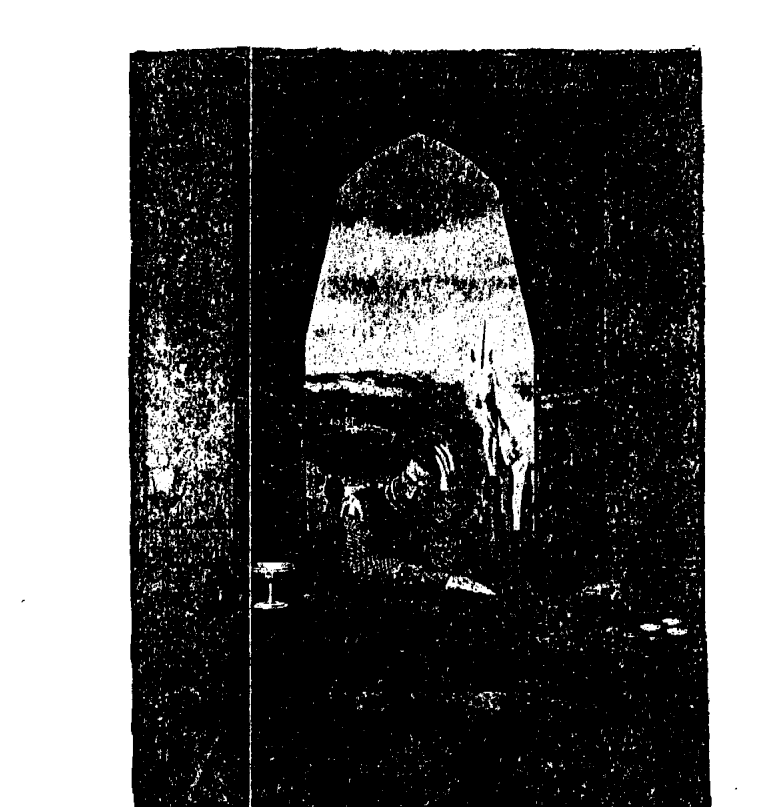

## 第 27 章

### 聖誕節的獨角獸

我曾見過我的車前面站了兩排獨角獸，好像在拉聖誕老人的雪橇。有時候是八隻分成四組。有時是奇數的，有一隻會站在最前面。我一直都認為他們是在保護我並幫我開道，確實也是如此。但他們總是讓我想到聖誕節，因為獨角獸攜帶著基督之光，並且跟那個時節是有關係的。

幾年以前，當我在寫我的靈性小說三部曲的第三本《光之網路》時，我的指導靈庫爾卡告訴了我一些有關聖誕節的實情，也叫我去做些研究。那時我才知道耶穌（在其他獲得耶穌之名並進化到足以擁有基督意識以前，他的名字是約書亞·班·約瑟夫）是誕生在春末的。在以男性為中心的教會裡，曾為了要以哪一天作為他正式的生日而爭論了幾個世紀。在一些不同的地區裡，他們在一到五月間慶祝他的生日。在他出生五百年前，羅馬聖父會議正式宣告他的生日是十二月二十五日。

這是非常實際和合理的決定，因為這個日子是很多偉人法定的生日，在很多古老的文化裡，包括印度、中國、埃及和墨西哥，都把它當作宗教節慶來慶祝。有一些我們所知的偉人故事，背景大多為處女所生的上帝之子，有關他們的故事裡還寫到了一顆偉大的星星引導智者去找找到這些天賦異秉之人。這些人包括女神艾希斯 (Isis)、歐西里斯 (Osiris)、荷魯斯·巴可斯 (Horus Bacchus)、阿都尼斯 (Adonis)、海克力斯 (Hercules)，以及其他很多大師。此外，波斯的救星米特拉 (Mithras)、蘇格拉底 (Socrates)、艾庫拉比亞斯 (Aeculapius)、巴卡斯 (Baccus)、羅穆勒斯 (Romulus)、克里希那（Krishna）、佛陀（Buddha）和孔子，這些人的誕生都是以這種方式被宣告的。再者，聰明的古代人選擇了這個日子，是因為十二月二十五日這個時間具有神秘學上的意義；這時天堂的能量門戶稍微打開了一點，灑下能量清洗地球。也就是說，十二月二十三日到二十六日之間高頻率的能量是可供人類使用的。它的巔峰期是在二十四日午夜到二十五日午夜，在這段時間裡比較容易了解和接觸到基督意識。而且更多的獨角獸在此時進入地球，幫助我們把握這個時刻，善加利用這一波光流。

我曾寫到這些是因為歡樂的節慶時間慢慢接近了，而我也再度看到我車前的兩排獨角獸。我突然有個念頭閃過——他們在聖誕節穿過天空急速奔馳，後來變成聖誕老人駕著雪橇的故事。後來我坐下來問這個問題，確定了古時候的先知們一定也看過這件事。

雖然獨角獸從未拉過雪橇，但是他們告訴我，這的確是聖誕老人從天空飛過，帶著聖誕禮物給小孩作為獎勵的神話的由來。跟在他們後面的能量被解釋為雪橇。從宇宙的觀點來看，每年的這個時間是很重要的，因為次元間的帷幕比較薄，一群群的獨角獸回應著來自各個國家或社區的要求，他們都是為公眾的利益而想些改變，而那些地方的人也都願意為所需要的改變付出心力和能量。他們成群結隊地行動，因為需要多幾隻獨角獸的聚合能量，才能協助這些新禱產生效果。

### 新年的獨角獸願望

先點蠟燭。 拿一張紙把它縱向對折，分成兩欄，一欄的最上面寫「感謝」，另一欄寫「我的願望」。 儘量把這張紙裝飾得很美，留白給兩個欄目寫東西。你可以在靜默中進行，利用這個機會好好想一想剛過去的一年，然後專注於即將到來的新年。 對去年所發生的好事，以喜悅之心感激它，你感激的愈多，給明年創造更好之事的能量也愈多。即使去年是很糟的一年，也要找到光的火花和學習的課題，把它寫在「感謝」那一欄裡。 然後想像下一年你最想要創造的，能夠令你感到滿意和喜悅的事。讓你的想像力穿越所有的藩籬，並且記得，這些意象都是你進行創造時的基本材料。夢想一些對每個人都能帶來最大益處的事，並注意你內在的寧靜、喜悅和溫馨的感覺。要知道，當你從內心深處為宇宙和他人做事時，回流給你的報償是很大的。不要只是用想的，把想要在明年創造的東西也寫下來。

### 遇見神奇Unicorns The Wonder of 獨角獸

### 喂食獨角獸

靈界的存有們無法吃東西，這自不在話下，但是他們可以收下用愛心送給他們的東西所具有的能量。想著你愛吃的食物——巧克力、脆餅、水果，或者任何你喜歡的東西，把它放好，就像在對獨角獸做一種愛的奉獻。第二天它可能看起來是沒動過的，但是獨角獸在接受你愛的意圖與感激時，必定也帶走了裡面的生命力或氣能。

### 除舊佈新

首先把你要獻給獨角獸的東西放好。大聲說：『我感謝去年宇宙給我生命中所有的好東西。』把先前列出的項目唸出聲來。大聲說：『我現在要放掉過去的一年。』逆時鐘方向轉三圈，用這個很有效的象徵方式告別舊的一切。大聲說：『在愛的服務中，在完成最大的自我實現中，我希望創造下列的東西。』然後唸出紙上所寫的東西。

### 祈請

> 我祈請大能的獨角獸之光支持我的願望，帶給我力量、勇氣、愛、尊嚴、自信和自我價值感，讓我可以付出我的心和靈給新的一年。當你感到他們的光圍繞著你時，暫停一下。

誠心所願。完畢。

打開雙臂接受屬於你的好事。

你可以把這張紙放在聖壇或供桌上、一本特別的靈性書籍裡，或你可以經常看到或經常拿出來看的任何地方。你知道在即將來臨的一年裡，你可以創造你的喜悅並擴大你的光。

## 第28章

### 獨角獸療癒

獨角獸是七次元具有愛和慈悲的存有，當然有療癒的能力。像這個存在層界所有的存在們一樣，他們也要遵守地球上的靈性法則。假如你的靈魂堅持要你體驗身體或精神上的不適／病痛，因為這是你唯一學習自己靈性課題的方法，獨角獸必須尊重你靈魂的主導而退居一旁。這是業力浮上表面讓人探索和加以轉化的時候，因此很少有靈魂會拒絕療癒。造成身體上淤塞的原因是來自無益的靈性、心智和情緒上的模式，它具體成形後變成了疾病。當這個原因消除之後，身體就會自行調整。當你能夠原諒、釋放過往之事，並以更高層次的領會去看待它，療癒自然就產生。你心臟的毛病可能源自於這一世裡無法原諒某個人，或是從另一世帶來的深埋在內心裡對受傷的恐懼。獨角獸療癒在你心中填滿了愛與喜悅，讓痛苦無容身之地。肩膀上的關節炎可能源自於你一輩子都覺得在為家庭的問題扛起責任，也因為家人們一直依賴你而讓你覺得憤慨。獨角獸療癒會消融你那個圍繞著一身為那個負起責任的人一的信念，結果可能是還你自由，讓你的家人都為自己的生命負起責任。獨角獸把精神上或情緒上的療癒導向你，最終還是會影響到你的身體。請記得，因為光之存有們不能和你的自由意志抵觸，需要療癒時請提出要求。

有一次我在美國旅行時，每天都要趕不同的飛機，我很擔心我的耳朵會受到壓力而疼痛。有一天早上在飛機起飛時，我的耳朵已開始感覺痛。我請獨角獸幫忙，比較痛的左耳馬上感到溫暖，接著感覺到獨角獸把能量注入我的兩耳，產生了令人驚奇的療癒效果。

還有一是在牙醫診所裡，我已經在診療椅上坐了一個半小時，可以感覺到醫生的壓力愈來愈大。沒有人告訴我發生了什麼事，但很明顯的是事有蹊蹺。我知道我的天使擁抱著我，但還是又召喚了我的獨角獸。我可以感覺到他把光之角的能量集中，送到牙醫的手上和我的嘴裡。儘管有這兩個神奇的光之存有的幫助，這仍是一個很不舒服的過程。後來天使和獨角獸告訴我，在我坐在椅子上時我的牙齒斷了，要不是牠們把事情穩住，我的牙齒已經沒了。我真的很感激牠們。

記得有一次，我和一位參加過工作坊的女士波兒在討論獨角獸的療癒能力。她告訴我，幾個禮拜之前她完全累垮了，結果病得很重。她坐下來和她的獨角獸交談了一下，馬上感覺到他從他的角送了很棒的淡紫色的光到她體內。不消幾分鐘她感到改善許多，也補充了能量。

有一位女士是個療癒師，她告訴我她很清楚獨角獸在她治療的過程中幫著她。她常看到他們和她一起工作。但是就有一次，他們的在場產生很大的力量。那時她正在治療一個常來的病人，這個病人顯然是個有特異能力的人，因為她突然大聲地說道：

### 療癒小孩

> 「平常你會被天使環繞著，但今天有十二隻獨角獸跟你在一起。」這位療癒師非常吃驚也很高興，但也只能興奮地叫道：「喔，你也看到了啊！」

顯然地，獨角獸可以透過我的獨角獸光碟和你連結，並給與你療癒。以下是在南非旅行時聽到的一個很神奇的故事。

有一個四歲的女孩，她因親眼目睹闖進家裡的暴徒兇殘地毆打年邁的祖父母而受到極度的創傷。兩歲的男孩在那兩個小時的攻擊中一直睡著，但這小女孩看到整個過程，不斷地哭叫：「不要再打了！」警察無法了解為什麼那些行兇者甚至什麼都沒偷就突然離開了。

這個四歲的孩子深受驚嚇。一年之後她變得不肯睡在自己床上，並且不斷地做噩夢。她的父母帶她去看大夫、精神科醫生、心理醫生還有療癒師，都沒有任何效果。後來她的母親買了獨角獸光碟帶回家，那一晚，她在帶女兒入睡時播放給她聽。她整晚聽著，在攻擊事件之後首度進入深沉的睡眠中。後來即使已經聽得很熟了，她仍堅持每晚都要播放。我真的心懷感謝，她現在可以在自己的床上一覺到天明。她又成了一個快樂和有安全感的孩子。

> 感謝你們，神奇的獨角獸。

### 獨角獸幫忙排毒

瑪格麗特·梅里森是黛安娜·庫柏學校裡主要的教師之一，和獨角獸有著很特別的連結。她開了一家醫療診所就叫做「獨角獸中心」！當她請獨角獸來給與療癒時，她感覺到有幾隻在一起像個團隊似地在工作。她說這個團隊看著病人，然後決定個別負責的部分——一隻負責身體，另一隻負責心智體，還有一隻負責情緒體。

有一位女士接受過瑪格麗特的獨角獸療癒，她說她進入了一個美麗無比的空間，感覺到獨角獸在治療她的肝，幫助它排毒。另一位則感覺到獨角獸把一串內疚和負面性從她心中拉出。第三個說，她感覺到的是麻刺、在體內竄動的能量，類似一種火光的流動，之後的感覺好像是獨角獸提起她的重擔，把它給帶走了。她覺得更清明、更平衡，呼吸也更順暢了。

### 療癒上癮症

有一天，我在格拉斯哥發表我的新書《來自天使的答案》，凱瑟琳走過來跟我講話。她說一年前她曾參加過我的工作坊，那次我把每個人都介紹給他們的獨角獸。她說：「在會見獨角獸的冥想中，我的獨角獸把我像嬰兒似地包裹起來，用他的角穿透我的心。我覺得安全極了。從那一刻起，一切都改變了。我已經脫離了所有的上癮症——酒癮、毒癮、菸癮，還有很多其他的癮頭。我打開了所有的靈性禮物。我擁有了靈視力，也可以感受到別人的感覺。」她發著光，我可以感覺到獨角獸就出現在她的身旁。

## 第29章

### 獨角獸療癒的做法

你的身體周圍有一個保護層，是和身體形狀完全一樣的乙太體。通常它在從你身體的周邊向外延伸約一吋（2.5公分）的地方，這就是很多療癒者處理問題的層面。想要感覺那些頻率較高的人的能量體，這是最容易做的一個層面。情緒體存在於離身體三到六吋（7.5/15公分）的地方。假如獨角獸從他的角送光到情緒體中的阻塞之處，被治療者可能會覺得想哭或想讓憤怒爆發，因為舊有的東西正在釋放出來。有時在淨化能量時，他們只是感覺好像被包圍在一個寧靜祥和的空間裡。距離身體約一呎（30公分）的地方是心智體，是由你的意念所組成的。獨角獸可以用光穿透或消除引發問題的那些雜亂的信念或想法。靈性體是在精神能量場之外，距離身體大約三呎或一公尺的地方，但是對於進化較高的人，它可以延伸到一哩之外。獨角獸可以看到一個人和神連結之處什麼地方有阻塞，或者什麼地方被錯誤的觀念牽絆住而導致退縮，因此可以協助他們得到自由。療癒的過程也可以倒過來做。獨角獸把光直接送到身體內，消融身體的阻塞之處，造成阻塞的原因——卡住的情緒和無益的信念——也會開始改善。在獨角獸給與療癒之後，他還會陪伴他們一陣子，就像你離開醫院之後的後續照顧。這些光之存在體一直在守護著你！

### 給予獨角獸療癒

跟所有的療癒方法一樣，房間務必要保持乾淨和整齊。

淨化房間的方法——你可以敲擊頌鉢或在每個角落拍掌。

空間的準備——在靠近病人的地方放一碗水，因為這個靈性很高的元素會幫助獨角獸能量連結你們彼此。水也會抽取負面能量，當獨角獸純淨的療癒之光進來時，這些負面能量可能會浮上表面準備被釋放。

可以的話請點根蠟燭，並播放輕音樂。花也會增加光度。

你自己一定要在情況良好的空間裡，身體也要在健康的狀態中。

- 1. 請你的病人舒服地坐或躺著。
- 2. 想像一個純白色的光球圍繞著你們兩個，保護你們，也提高你們的頻率。
- 3. 合掌做印度式的問候或祈禱的姿勢。這是一種神聖的手印，自動把光帶向你。出聲或默念你的禱詞，例如「以基督之名，我請求給予（填入名字）祝福和療癒。我請求獨角獸透過我行療癒的工作。誠心所願。完畢。」
- 4. 高舉雙手，請獨角獸的光碰觸它們。你的手可能會有麻刺感或發著光。
- 5. 想像接地的根從你腳下往地裡長。再想像接地的根從你病人的腳下往地裡長。
- 6. 把手放在你病人的肩上，準備接收訊息。
- 7. 跟隨直覺決定手的位置，是要擺在身體上還是能量場中。記得保持恭敬的心態、感覺安全、榮耀接受你療癒的人。
- 8. 結束時，把手放在他們的腳上幫助他們根植大地，或者把手放在他們肩上，
- 9. 在心中感謝獨角獸。
- 10. 退後並在你和病人的脈輪之間做一個切斷的動作，把你們之間所有的連接線剪斷。
- 11. 在你的病人打開眼睛後，給他們一杯乾淨的水。

### 輕撫你的能量場或乙太體

- 1. 高舉雙手，請獨角獸用光碰觸它們。

疾病、恐懼的思想或憤怒會在你的能量場裡造成破洞，讓黑暗能量甚至疾病有機可乘進入你裡面。花幾分鐘的時間，用具有獨角獸能量的手輕撫你的乙太體，這會使你的能量體保持強壯和完整。這是讓你保持健康最好的方法。下面這個很簡單的方法是你以為自己做的。

### 輕撫他人的能量場或乙太體

你需要請你的病人側坐在椅子上，讓你比較容易接觸到他們的背部。或者你也可以請他們躺下來，讓你從他們的正面著手，然後再請他們翻身，你就可以在背部進行治療。

- 1. 先做前述一到五的步驟。
- 2. 從他們的頭頂開始，在距離大約一吋（2.5公分）的地方。
- 3. 當你感覺到能量是冷的時，多做幾次輕撫的動作，直到這裡的能量場讓你覺得舒服為止。
- 4. 在感覺到有阻塞的地方，你可能會想把卡住的能量拉出，或者你也可以就把它們往下引導到距離你身體大約一吋（2.5公分）的地方。
- 5. 完成之後，請獨角獸把他們純白的保護之光放在你周圍，或者召請基督之光保護你。
- 6. 感覺它們發出白色火花，閃爍著。
- 7. 留意你可能會有些熱、冷或麻刺的感覺。熱感代表淤塞，冷的感覺表示你的能量場裡有破洞。多花些心思照顧、撫平這些地方。

手停在這個點上，請獨角獸做必要的處理。

### 療癒情緒體

照著前述方法做，只是把手放在身體上方約六吋（15公分）的地方，在那裡你一定多少可以感覺到情緒體的刺痛感。

### 療癒心智體

照著前述的要點做，但是把手放在距離身體約一呎（30公分）遠的心智體上。在這裡，你通常會覺得它比情緒體輕一些、細微一些。

### 療癒靈性體

同樣地，照著前述的方法做，但是把手放在靈性體上。這一次開始時，雙手離開這個人的身體到手能伸展的極限，然後讓手逐漸靠近，直到你感覺到他們的靈性能量。

## 第29章 獨角獸療癒的做法

場為止。一般來說，相較於另外兩個層面，病人可以更強烈地感覺到這裡的能量。

> 提醒：純淨的意圖和一顆敞開的心比技巧更重要。你所做的只會產生好處。與獨角獸一起進行療癒時，最重要的是排除你的小我意識，把工作交給他們來做。

## 第30章 亞特蘭提斯時期的獨角獸

亞特蘭提斯是宇宙在地球上的一個實驗，它持續了二十四萬年，是所有存在過的文明中最長的一個。這塊大陸升起又下沉，下沉又升起總共達五次之多。一次又一次地，這個文化在科技上很先進，卻在靈魂上破產，終至毀滅。但是在西元前兩萬年亞特蘭提斯第五次、也是最後一次再出現，這就是黃金世紀出現的時期，也在這一千五百年間，人類在地球上創造了天堂。

他們遵循靈性法則生活，維持著一種第五次元的能量，發展出非常先進的純水晶科技，這種技術是不會傷害地球或人類的。相較之下，它的神奇讓目前的科技顯得很幼稚和不成熟。

在整個黃金時期裡，亞特蘭提斯的人都非常敏感，都有特異功能。他們都有靈視力（clairvoyant）、超聽覺力（clairaudient）、心靈感應能力（telepathic），也能夠瞬間移位（teleport）、自身移位顯形（apport）、漂浮、療癒和念力移物（telekinesis）。念力移物就是把身外一個東西透過去物質化使它消失，然後在另一處讓物質還原，重新出現。在那個年代，每個人都用這種方法移動物品。當你做自身移位顯形時，你先讓自己消失，轉移到另一個地方，再重新出現。除此之外，每個人都可以看到天使和獨角獸，也可以和祂們溝通。

在那個平靜繁榮的時代，獨角獸在整個亞特蘭提斯漫遊，散播他們神聖的本質——純淨、尊嚴與光。每個人都有一隻被指派的獨角獸，就像每個人都有守護天使一樣。

現今這個時代，大多數的人在做決定時都是苦苦思索，不知道頭腦內輕柔寧靜的想法正從他們的天使或獨角獸而來；那是一種低語，包含著靈感、抱負、希望、勇氣與愛。在黃金世紀時，這些高頻的存在們所提供的指引是很清楚直接的。當然，那時的人跟現在一樣，也是有自由意志的，但他們都想要把它用在靈性的成長與神性的校準上，所以他們願意傾聽獨角獸的信息，也可以聽得見。

因為獨角獸是充滿喜悅、有智慧和美麗的，他們所提供的指引都可以讓所照顧的人得到最大的喜悅和幸福。亞特蘭提斯人知道這一點，所以對他們充滿了感謝與愛。

因為獨角獸和海豚都源自相同的地方，有一種很特別的關係，所以他們常常彼此溝通並玩在一起。因為黃金世紀的亞特蘭提斯人喜歡游泳並和海豚嬉戲，所以為他們建造了巨大的水池，讓更多的人可以接近他們。當然，在把海豚運到水池之前，人們有事先取得他們的同意。

我們知道這些巨大的動物是海洋的高級男女祭司，也是智慧的守護者。當他們跟人類一起玩耍時，他們用心靈感應的方式把一些經過篩選的智慧和資訊下載到他們的頭腦裡，即使現在他們都還是這麼做。獨角獸常常沿著池邊奔跑著，或者當海豚在較深的海裡嬉戲時，獨角獸會在海邊的波浪裡潑著水。他們結合在一起的光曾經幫助亞特蘭提斯人保持他們的純淨。

就在亞特蘭提斯的能量下降且變得濃稠時，獨角獸從地球上撤離了。他們回到他們的母星球拉庫瑪，又從母星球被派到其他星系去幫助那裡的存在體。在那個星系裡，能量正在演化中，而那裡的生命體也渴望揚昇。獨角獸被送到這些地方把頻率提高，並幫助當地的居民保持住他們的願景。

### 亞特蘭提斯之前的時代

在亞特蘭提斯之前的每一個時代都有極端的黑暗和光。有一個團體的組成份子是墮落天使彼利爾（Belial）的孩子們，他們是物質主義者，追求感官的快樂。他們和「一」的法則（Law of One）的孩子們是對立的，這些孩子們把生命獻給了靈性知識，他們的核心思想是「合一」。

在所有的這些時期裡，獨角獸尋找帶著強光的人並幫助他們。例如在亞特蘭提斯早期，聖母馬利亞聖殿（Temple of Mary）的女祭司非常清楚獨角獸的能量是純潔和有力的。馬利亞本身出現時總是有獨角獸在她的身旁。

## 第30章 亞特蘭提斯時期的獨角獸

### 找回黃金亞特蘭提斯

最後地球的頻率提高到足以讓黃金亞特蘭提斯的能量再度回來。由此之故，亞特蘭提斯的天使們——在那時代祂們是你們的守護天使，也攜帶著亞特蘭提斯的智慧——現在正回來尋找那些能量夠純淨，有足夠奉獻之熱忱的人和祂們一起做事。這些天使和我們現在的大天使有著相同的振動頻率。在過去的幾年裡，因為人類開始再進化，獨角獸再度前來與地球接觸。有很多的人和團體現在都能從能量場中散發出足夠的光來吸引獨角獸。

假如這一章特別吸引你，這表示你曾在黃金亞特蘭提斯生活過，並且可能已準備好再度與你當時認識的獨角獸重新連結。當然，你可能已經與他們連結上了。

### 在亞特蘭提斯的前世與獨角獸

在一個亞特蘭提斯工作坊（那一次我們都進入了前世）之後，一位女士過來告訴我這個故事。她說亞特蘭提斯的那一世裡，她的獨角獸在她還小時來找她。即使在那麽早的時期，仍有僧侶指責她是女巫的女兒而不讓她進入神殿，說神殿不是她該來的地方。在那一世，她的獨角獸救了她，也帶給她指引。後來她長成了年輕美麗的淑女，有著火紅的金髮。獨角獸和她一起對抗聖殿的偽君子，直到她死在戰鬥中為止。
在另一世中，她仍然是一個年輕少女，這次她有三隻獨角獸：一隻白的，一隻黑的，第三隻是淡紫色的。
她還說在這一世裡，她從小就一直喜歡獨角獸，但從來不知道原因何在。她會在早上起來後跟花草樹木和天空打招呼，大家都認為她瘋了。她的一生裡獨角獸也都一直給予指引，在需要做決定或碰到生命中的困境時幫助她。

### 憶起亞特蘭提斯的一世

假如你對這一章特別感興趣，你一定曾在黃金亞特蘭提斯生活過，因此回到那一世去憶起你真正的身分可能會對你有些助益。你可能會想找回你的天賦；再經驗一次那種寧靜和穩定；查出當時的身分和從事什麼工作；和你當時的天使與獨角獸有更深的連結；會見男祭司或女祭司，甚至是高階的男祭司或女祭司；或者做些完全不同的事。

假如你想要握著水晶，在這趟觀想旅程開始之前，請先用你的意圖幫它充滿能量。

### 觀想和你的獨角獸回到亞特蘭提斯

1. 找一個可以讓你安靜下來又不會被干擾的地方。
2. 把空間準備好，你可以點蠟燭或做任何你認為合適的事。
3. 確定自己可以舒適地坐著或躺著。
4. 請大天使麥可為你披上祂深藍色的防護斗篷。
5. 觀想金色的樹根把你固定在地球上。
6. 閉上眼睛，想像一個炎熱的晴天，你在一個美麗的瀑布旁邊。體驗水噴下來的感覺。
7. 祈請你的獨角獸，等待他的到來。
8. 問候他，感謝他的到來。告訴他你想要他帶你回到在黃金亞特蘭提斯生活過的一世，以及你為什麼要回去的理由。
9. 騎在他背上，進入瀑布上方的彩虹，再飛過彩虹橋到一個金色的大門。
10. 從獨角獸身上下來，打開大門。
11. 穿過門之後，你發現自己已經到了亞特蘭提斯，在另一個身體裡，穿著不同的衣服。注意自己腳上穿的是什麼；去感覺你所穿的長袍，注意它的顏色。你戴著哪一種水晶？你是男的還是女的？
12. 你在鄉間，環顧一下四周。看得見任何建築物嗎？看得見人嗎？動物呢？是什麼樣子的？
13. 讓你的獨角獸帶你去你想要體驗的人事物。你想待多久都可以。
14. 準備好時，在心裡告訴獨角獸你學到了什麼。
15. 允許他用角在你的第三眼處開一個門。謝謝他。
16. 回到現在，回到你開始的地方。你還是原來的你，完全沒有改變，只是你的意識已經擴展了。
17. 睜開眼睛，做一下伸展運動，確定自己是根植大地的。
18. 在你的獨角獸日誌上記下這次的經驗。

## 第31章 獨角獸與水晶

亞特蘭提斯之所以那麼非凡和獨特，其中有一個原因是亞特蘭提斯人對水晶非常了解。他們認知到水晶有意識和能量，是可以受制於人和為人所用的。很多當時的水晶專家都已投生回來，要把他們特殊的知識帶回來。

你可以拿一塊石英水晶，將它淨化、啟動，然後獻給你和獨角獸能量一起做的事。淨化水晶的方法有很多：在它上方敲頌缽、唱誦神聖的嗡之音、放在水中清洗、放在生米裡，或者對著它吹氣。

強化水晶的方法：使用獻給神靈的聲音或進行唱誦，也可以把它放在瀑布旁邊或室外的月光下。

設定意圖很重要，在設定時有些人喜歡把水晶舉到第三眼前面。下面是一些做出奉獻的方法：

- 說出『我特別把這個水晶作為……之用，或我想用這個水晶來……』
1. 連結我與我的獨角獸。
2. 使用獨角獸的能量打開我的心。
3. 傳送獨角獸療癒給他人。
4. 提高我的獨角獸花園的能量。
5. 使用獨角獸之光淨化我的十二個脈輪。

你當然可以依自己的需要把它獻給其他的事，或做其他用途，只要那是有益於光的事。 你可以把水晶放在你的聖壇上或隨身攜帶，它會帶給你所需的能量，實現你的願望。

聖壇是一個獻給神靈的神聖處所，假如意圖和純淨維持不變，它會變成一個力量之點。即使是一個小聖壇，例如架子的一角或一張小桌子，都可以放射出巨大、高頻的能量。

### 設一個獨角獸水晶聖壇

你若把水晶放在一個為特別目的而設的聖壇，其力量可以加強很多倍。

找一個地點，不管有多小，它是只為某一個目的專設的。你可以在上面鋪一塊特別的布，可以是金色或白色的，或是一塊絲絨。 代表火、地、風、水四大元素的蠟燭、水晶、羽毛和一碗水或一瓶花，都可以增加能量。

祝福任何你喜歡的東西，例如一個貝殼、圖片或揚昇大師的照片，然後把它放在上面。

### 獨角獸水晶的清理效果

使用被獨角獸能量強化過的水晶去淨化或清理一個地方的方法有很多。我認識一個住在一條死巷裡的人，她的鄰居裡有幾家的婚姻正瀕臨破碎，有些家裡還發生暴力事件。她用獨角獸能量強化了一塊水晶，把它放在那個地區的街道地圖，就在她家的那條路上。婚姻有問題的幾家不僅沒有破裂，有幾對夫妻還再度復合了。若你和獨角獸共事，要知道當負面能量被去除後，基督之光便會自動地取代。

### 獨角獸水晶清理的做法

拿出你已經淨化和強化過的水晶，放在雙手中，或舉到你的第三眼前，陳述你的意圖：「我祈請獨角獸用這個水晶清理和淨化這個人（名字）或地方（地名）。」把這個水晶放在一個人的照片上。假如你沒有照片，把他們的名字寫在紙上也就足夠。或者你可以把它放在地圖上，你想要清理的那個地方的中央。

或者你可以找一張你家或其他人的家的照片。假如沒有照片，你可以畫一張房子的圖或寫下地址。把它放在世界地圖上有問題的那個地方，或把地名寫在一張紙上。假如河流或海洋需要清理，寫下河流或海洋的名字，把已設定用途的水晶放在它上面，或者帶著你的意圖，把它放在地圖上合適的地方。

### 獨角獸水晶療癒

開始時要確定房間是乾淨整齊的，正如第二十八章所描述的獨角獸療癒一樣，把它清理乾淨，放一碗水在你的病人附近。點根蠟燭，播放輕音樂，在房間裡擺些花，它們全部或其中任何一樣都會對能量有益。

1. 請被療癒者舒服地坐下或躺下來。
2. 想像一個純白色光球包圍著你們兩個作為保護，並提高你們的頻率。
3. 把意圖（請獨角獸使用水晶治療你的病人）放進已經清理好、強化過的水晶裡。
4. 想像接地的根從你腳下往地裡長。再想像接地的根從你病人的腳下往地裡長。
5. 讓你的直覺告訴你該把水晶放在病人能量場裡的什麼地方。

### 病人不在現場的獨角獸水晶療癒

6. 完成之後要確認他們是根植大地的。
7. 在心裡感謝獨角獸。
8. 退後一些，並在你和病人的脈輪之間做一個切斷的動作，把你們之間所有的連接線剪斷。
9. 當病人睜開眼睛時，給他們一杯乾淨的水。

這個做法和你在做獨角獸水晶清理時完全一樣，只是放在水晶裡的意圖不同，現在你把它特別作為療癒之用。如同前述，你可以把一個人的照片放在水晶下面，也可以寫下姓名。你可以寫出你希望集中力量療癒某個器官，但是絕不要詳述病情，因為那會使它更趨嚴重。

記得把你的感想和經歷寫在你的獨角獸日誌裡。

## 第32章 星際服務

假如你曾經自覺或不自覺地想要成為地球的星際大使，也造訪過其他不同的存在層界，你就有令人興奮的事可做了，這一章可能對你有所助益。假如你認為這不是你的人生道路，或覺得這種事很怪異、瘋狂，你可以跳過這一章。除了有幾千個銀河系之外，還有很多相互貫通的次元或不同的存在層界存在著，在有些的上面是有生命體的。在靈性上或科技方面，有些是比我們更進化的，也有些是比我們落後的。有些則需要大量的協助，也有些正在協助我們。假如你請獨角獸在夢中或冥想中帶你去你想要提供服務的地方，你可能會發現自己到了一個很不熟悉的地方，那裡的存有們看起來跟人類有很大的差異。評斷或質疑不是我們要做的事，我們只要提供服務就好。沒有獨角獸會把你帶到能量太濃稠或太危險以致於你無法招架的地方。但不論如何，和其他靈性工作一樣，你必須穿上保護的斗篷，並宣告你只是想要與基督之光在一起，使用它並為它服務。表明自己只想使用光、為光服務是不夠的，因為光有很多層次，有些是很黯淡的。表明你想要的是基督之光會讓你感到很安全。要記得這不是物質界的活動，這是在更高次元的行為，使用的是意念的力量。舉例來說，你可以要求帶花去一個需要被花的頻率改變得更亮麗的地方。花的能量可以療癒和打開心。不論在何處，它們都可以提高當地的振頻。我想和你們分享一個冥想的經驗。在讀這個部分時，你可以把它當成是一種象徵、一則故事、一個想像或你要怎麼想都可以。假如你了解宇宙的運作方式，就如實讀它。這真的都不重要，因為每個意象都有創造的力量，而你的想法會影響整個宇宙。這也是為什麼正面的想像和過程能夠讓世界改觀的原因。

### 我的冥想

我閉上眼睛，放鬆下來，然後專注在呼吸上，吸入愛，呼出和平。首先，我穿上保護的斗篷準備旅行，然後召請我的獨角獸，他出現在我身旁。我請他帶我去我可以提供服務的地方，告訴他我想要把花的能量一起帶去。他點頭同意，於是我採了一大把風鈴草，在最後一刻又加了水仙。這些花聞起來香極了。我問獨角獸是否可以騎在他背上，他同意了。我的守護天使也加入，想要陪我們去。我跳上獨角獸，天使坐在我後面，緊抱著我，讓我覺得很舒服。當然這並不是必需的，因為她不需騎乘獨角獸就可以到任何她必須去的地方！就這種事來說，你我的靈魂在沒有身體的桎梏以及地心引力的牽制之下也是可以做得到的。我們在空中穿梭，多麼令人興奮啊！然後我看到下面有一個小星球，被灰色的薄雲籠罩著，但是有一道粉紅光穿過了雲層。當我的守護天使和我沿著粉紅光飄浮，向著那個新星球而去時，獨角獸則留在後面。我們碰到的是長得很奇怪的人——小個子，灰皮膚，尖面孔，以及像手的爪子。所有人的關注點都在一個躺在地上的小孩身上，他看起來病得很嚴重。很明顯地，他們都喜歡這個小孩，由此之故，他們心中的愛與慈悲是已經甦醒的。他們的心開始打開，每個內心深處都開始湧出粉紅色的光。這就是我們原先看到的粉紅光，它穿越了上面灰色的雲進入宇宙請求救援。獨角獸顯然就是為了回應這個祈求而來的。
我給了這個病童一束花，立即得到了驚人的效果。他坐了起來，也笑了。花的本質碰觸到他的靈魂，死亡之願轉變為生命之力。人們看到後也都笑了，他們的心瞬間都擴展了，粉紅光變成一個寬闊的能量柱，光亮、透徹、迷人。現在獨角獸進入了更高的頻率，到了我們身邊。
我的天使雖然把她的光隱藏在斗篷下，但仍遮掩不住而顯露出來了。我的獨角獸在閃耀的高貴和榮耀中蒞臨，讓他們都倒退了好幾步，眼睛也幾乎看不見。在他們好奇地收集著那些東西時，我們靜靜地離開了。
我下定決心將來一定要再回來看看他們。三個月後我的獨角獸、天使和我一起回去了。這次我帶了四株玫瑰——金玫瑰給我的天使，白玫瑰給我的獨角獸，粉紅玫瑰是我要帶去的愛，紅玫瑰代表能量和生命力。
現在灰雲已退散，只剩幾小片薄雲還留在那裡。我們抵達時他們跑來迎接我們。跑在前面的是一個微笑的小男孩，有著明亮的眼睛和粉紅的雙頰。那裡的人皮膚已沒那麼灰，而我也注意到當他們心的能量進入時，他們的皮膚變得更豐滿，爪子也張開變成了手。
我把玫瑰給他們，用心靈感應的方式解釋了玫瑰花的功用。他們好像能夠理解，然後我又示範了種植和照顧的方法。當然，在那裡玫瑰不會有像地球所能給予的實質上的養分，但是現在它有大量的愛和關注，再沒有比這個更好的養分了。
獨角獸把我帶回時，我是面帶微笑的。我感謝他和我的天使，感覺上好像做好了一件事。睜開眼睛時我是很快樂的。

### 從事星際服務的方法

這只是我所經歷過的旅程其中的一個而已，假如你也想要做星際服務，可以依照下面簡單的步驟去進行你的工作。

記住，假如你有感到任何恐懼或受到驚嚇，只要睜開眼睛，做些實際的事情就可以了，例如洗個碗或泡杯茶。你可能不會了解你曾做了什麼好事。

1. 先花點時間想好你要去哪裡。或者你更想要獨角獸帶你到一個需要你的能量的地方。
2. 為空間做好準備。舒適地坐著，閉上眼睛。
3. 放鬆。
4. 穿上防護的斗篷。
5. 請獨角獸進入你的內在空間。
6. 告訴他你想去哪裡，或者請他帶你去一個需要你服務的地方。
7. 假如他同意，你可以騎在他背上。
8. 記住，你可以邀請你的守護天使加入你們。
9. 讓他帶你往上，飛越乙太層到你可以做些事的地方。
10. 做任何你需要做的事。
11. 你可以和你的天使或獨角獸商議，也可以請他們幫忙。
12. 完成之後，回到地球上你開始的地方。
13. 感謝你的獨角獸和天使。
14. 睜開眼睛，確定自己是根植大地的。

假如你想回去看看事情的進展，重複前述步驟，請獨角獸帶你去那裡。假如你對星際服務有興趣，每天都特別為你星際工作的進展點一根蠟燭，這將會有所助益。

## 第33章 敞開心胸

我們現在正走在神聖陰性時代的途中，此時假如要在靈性上有所成長，我們一定要把心打開。你的獨角獸可以在這方面幫助你，而當你能夠隨著愛流動時，他也會比較容易跟你一起共事。

我們很多人都已經從學習中得知，用理性思考、訴諸理智，或用頭腦生活是比較安全的。書籍通常不會跳起來咬你一口，所以在處理邏輯性的左腦事件時你不會受傷。但是，你也不會真正地活著，因為你錯失了很多有關愛的神奇事蹟。敞開心胸是一把鑰匙，可以通往豐饒、拍攝到能量球、與動物溝通，以及在生活中得到更多的愛與幸福。

有些事是唯有在心打開的狀態下你才能做的，這些事會讓你的生命更豐富更有價值。例如，當你在和小貓小狗玩時，你的心幾乎不可能是關閉的。大晴天在河裡和笑聲不斷的孩子們潑水玩樂保證會打開你的心輪，爬到山上觀賞極美的夕陽也是一樣。

可惜的是，當你回到日常生活的世界時，它也很容易再度關上。

但是，有很多其他方法可以清理、淨化、釋放你的心，把它打開到很深的程度。

## 第 33 章 敞開心胸

### 用粉晶敞開心胸

你需要和另一個人一起做這個練習，也需要一個經過淨化和強化的粉晶專門用來做這種療癒。在使用水晶時，你可能感覺到獨角獸就在你身邊。

- 1. 舉起你的粉晶請獨角獸祝福它。說出你的目的——打開你夥伴的心輪，並加以療癒。
- 2. 用水晶在你夥伴的胸前或心輪上方逆時鐘方向轉動，把悲傷、恐懼、傷痛以及前世今生所有被卡住的感受拉出來。
- 3. 舉起水晶，祈請金色和銀紫色火焰將所有你拉出來的負面能量加以轉化。
- 4. 然後用粉晶順時鐘方向在你夥伴的心輪上方轉動，把愛、希望、幸福、療癒、同理心、慈悲心和喜樂放進去。

> 附記：假如你自己做這個敞開心胸的練習，你可能要把動作反過來做；也就是說，把水晶順時鐘方向轉拉出情緒，逆時鐘方向轉把光放進去。

### 打開玫瑰之心的練習

這是一個很美的練習，假如你是敏感的，你會在心輪處有不可思議的感覺，因為你心輪的玫瑰打開了。給予者和接受者雙方都會從這個練習裡獲益。做此練習時若有個夥伴比較容易，假如沒有其他人在一起，那就自己做。假如你自己一個人打開玫瑰，你可以在鏡子中看著自己。不論你是一個人做這個練習，或是跟夥伴一起做，務必要召請獨角獸，請他們幫助你。

- 1. 想像有一朵玫瑰在你夥伴的心輪——胸部中間的下方——裡綻放。
- 2. 感覺一下這朵玫瑰是什麼顏色。
- 3. 你的工作是輕輕地碰觸花瓣，把它打開。當你用食指打開花時，感受每一片花瓣，假如你感覺不到什麼，就想像花瓣正在打開。
- 4. 正中心嬌嫩的花瓣可能需要用你的小指頭很小心地打開。
- 5. 在做的過程中，你的直覺可能會知道或看到在花瓣下藏著一隻小蟲。把它拿出來，請獨角獸用他角內的光轉化它。
- 6. 你可能會意識或感覺到有一個珍珠、鑽石、露珠或某種非常特別的東西貼靠在花瓣之間。
- 7. 請獨角獸從他的角把光傾注到綻放的玫瑰花中間。

附記：你可以用自己的看法去解釋任何你在玫瑰裡發現的東西，但你也可以考慮以下的意見。珍珠往往代表經過困難後所得的智慧。鑽石可能表示會有一個美麗的新關係、事情的狀況或專案將會進入你的生活，或者它也可能暗示某一個想法現在變得更清晰了，而且它的結果會是好的、持久的。露珠可能表示將會擴展生命的新情緒或感覺快要出現了。

### 練習感受心輪

這是第一個練習，你至少需要三個人。

- 1. 一個人離開房間。從剩下的人裡選出一個自願者。
- 2. 他們用前述的方法輕敲自願者，打開他的心之玫瑰。
- 3. 當心之玫瑰全開後，他們把離開房間的那個人叫回來。
- 4. 這個人必須感受或以直覺感知哪一個人的心是打開的。他可以用手在心的上方感受能量。

我曾在一次工作坊裡推介這個練習，有一個學員大叫：「我找到一隻蟲！」隨即就把牠丟在地上踩死了！這並不是很恰當的做法！最好還是把你所找到的東西送到上面的光裡。

### 方法二

- 1. 將要離開房間的那個人先感受留在房間裡的人的心輪。他用手在距離胸部上方約一吋（2.5 公分）處游移，做完後離開房間。
- 2. 留在房間的人輕敲並打開自願者的心之玫瑰。
- 3. 把離開的人叫進房間。
- 4. 讓他感受每個人的心輪能量場，找出是哪個人發生了改變。

### 方法三

這是練習感受內心能量的簡化版。不用輕敲花瓣打開玫瑰，而是把焦點集中在自願者的心中，請獨角獸把愛注入其中。注意那位離開房間者是否可以找出哪一位是被獨角獸觸過的。

### 唱誦「嘛」的一群人

這是一個很好的打開心的練習，特別是你們也召請獨角獸加入的時候。假如只有你一個人，你可以深呼吸，然後高舉雙手，從心中唱誦「嘛」（maah）音，視你的感覺決定唱誦多久。

假如有兩個以上的人，你們可以牽著手，深呼吸，一起把手舉高，從心中唱誦「嘛」音，視你們的感覺決定唱誦多久。在這個過程中，感受獨角獸從他們的角中，把能量灌注到你們的心輪裡。

### 看見靈魂深處

你需要跟他人一起做這個練習。

- 1. 輕輕地，以適當的方式揉擦你夥伴的心輪，加強它的能量。
- 2. 把手放在他們的前胸上，看著他們的眼睛深處。你現在就在觀察他們的靈魂。大聲說出，或者用心靈感應的方式傳達這個訊息：「我愛你」，重複做三次。假如你覺得很困難，你也可以選擇說：「我看見你的美」或「我完全接受你現在這個樣子。」
- 3. 做完之後，對調剛才的角色再相互練習。

在家庭或團體中，這種練習可以為彼此帶來更新的了解、和諧與共同合作。有時人們在感受到朋友靈魂裡的智慧與愛之後會覺得很驚訝，也會對此留下深刻的印象。

### 看見自己靈魂深處

假如你是一個人做，你需要用一面鏡子去看見自己的靈魂能量是多麼地莊嚴美好。

- 1. 揉擦自己的心輪以加強它的能量。
- 2. 把手放在心輪上，觀察鏡子裡自己的眼睛，大聲說出或想著「我愛你」三次。假如你覺得這樣做很困難，你也可以選擇說：「我看見你的美」或「我完全接受你現在這個樣子」。
- 3. 注意自己的反應。身體有什麼感覺？
- 4. 你可能會意識到獨角獸在你身後，或在鏡子裡看到他一閃而過。所有這些打開心和擴展靈魂的練習都有助於開發同理心，也會讓你和獨角獸之間的連結更加穩固。

## 第 34 章 獨角獸的能量門戶

不同世界間所存在的帷幕在有些地方是稀薄的，一些通道的出入口就設在那裡，讓高頻的存有們可以更容易來到地球。這些能量門戶都是自然地產生在美麗的地方或力量之點，例如山頂或大瀑布旁邊。而人類也可以把他們的庭園或房屋打造成天使或獨角獸的能量門戶，或者兩者兼具。

當獨角獸在地球上面飛翔時，他們會看到從所有的房子升起的能量。有些房子上面盤旋的是一大片蘑菇狀的黑暗能量，也有很多是被灰雲籠罩著的。有時獨角獸覺得很高興，因為一道美麗、明亮、吸引人的光從建築物裡發射出來，他們知道住在裡面的人是處在和諧當中的，並且送出愛與和平給這個世界。假如這些人邀請天使和獨角獸來使用它，這裡就變成一個能量門戶。當然，他們一定要用意圖、頌缽、薰香、愛、笑聲、祈禱、靜心和靈性修持讓它保持純淨。

有時一個光的能量門戶會被設立在一個黑暗的地方，例如警察局、監獄或軍營。獨角獸特別高興，原因有兩個：第一，光的工作者已經在靈魂的層次上願意住在那裡，幫助把光帶到那個地區。第二，它使更高的能量流入，幫忙平衡那裡一部分的好鬥性。

有時一棟房子、甚至一座工廠或辦公室大樓都會釋放出黑暗的顏色，但是裡面往往住著一個純真的人。他們的禱詞，或僅僅是他們的光都可以穿過負面能量之雲，往上送出一道純淨的有色光；假如可能的話，一隻獨角獸會穿過這個光的管道去幫助那個人。光之存有通常只是抱著那個人的能量，帶給他們希望和為他們的理想增添力量。有時這個光也能碰觸到其他的人。那一個帶著光的人本身變成了一個能量門戶。很多時候他們的床或書桌，或者最喜歡的椅子變成了入口。

一個黑暗的家通常是源自於無知，而電視裡傾洩而出的肥皂劇情節、壞消息和暴力影片的能量振動會使其更加惡化。在這種情況下，假如光的工作者送光給這種情況，那是會有所助益的。獨角獸會拿著所有適合的禱告，用它們來掘起希望的火花，使它們在這種黑暗的地方不致熄滅。有時獨角獸會做些小事，例如用最亮的能量去輕推家庭裡的成員，促使他去買一束花或一些靈性書籍，好讓整個家亮起來。這個方法也適用於辦公大樓或是群眾聚集的地方。

但是，獨角獸只有在建築物裡面有一個純真的人時才能帶來比較亮的能量。天使們更能夠降低頻率進入這種地方。他們的愛是很特別的，但還是有很多地方即使是他們也無法接近。

例如，很多監獄是汙穢能量的聚集處，那裡的人都沒有希望或恩典。你把祈禱送到那裡形成火花是很重要的，不知哪一天它就會變成巨大的火焰呢。

高頻的靈性存有們一次又一次地提醒我們，在所有的人類準備好用光點亮自己之前，地球無法真正地揚昇。

### 把你的家變成一個光之能量門戶

有些象徵物是可以被送到任何地方去幫助人的，這其中包括了鴿子、彩虹、星星、光的十字架、羽毛、和平旗或雛菊。觀想其中的一項，把它放在任何有需要的地方。發怒的、情緒沮喪的人，交戰中或失落的人多少都會感受得到而覺得安慰。
任何一個祈禱或善意的象徵都是有效的。它們都會被偉大的光之存有們運用到。

善意、靈性修持和純淨的意圖都可以把你的家轉變成一個光的能量門戶，讓天使和獨角獸可以進來。做這種事是很有意義的，也會獲得很大的回報。
任何會提高你頻率的東西也會提高你家的頻率。
因此，為世界祈禱、靜坐、請求神助、為崇高的目的點蠟燭、唱誦嗡之聲或印度拜讚詩歌、做瑜伽、看靈性影片、讀靈性書籍、談論天使、獨角獸與大師們，這些都會使每個房間發亮。

當然，美妙的音樂真的可以提升一個地方的頻率。當你敲鑼或唱誦聖詩時，請想像天使和獨角獸的蒞臨！
晚上在你家的上面放一個光的圓頂，並召請天使、大天使和獨角獸。你可能會意識到牠們成群地前來守護你，帶給你光與愛。住在這種房子裡是讓全家幸福和安全的好方法。

## 第 35 章 獨角獸幫助的對象

當一個人非常想要服務社會，把它變成一個更好的地方時，他們會發出明亮的光。總有一些人會為自己認為是對的信念——自由與平等——挺身而出。獨角獸能量會接觸到他們，給他們力量去做需要做的事。他們是不是有宗教信仰，甚至是過著純淨的生活都不重要，但他們一定要有一個超越自我的理念。

### 尼爾森·曼德拉

第一次被獨角獸能量碰觸到是在監獄的時候。那是一種緩慢進入的能量波動，不斷地激勵他，給他尊嚴、榮耀和領袖魅力去克服困難，完成理想。在這個時代，往往是那些出現在媒體的人在影響著世界，他們得到廣大的關注，並且讓他們知道他們在從事改善社會的工作。獨角獸看見的是他們的熱忱，以及他們對改善人類處境的展望和付出，而不是看到他們較低的能量。於是他們送出一波波的獨角獸之光去支撐他們。

### 巴博·傑多夫

巴博·傑多夫 (Bob Geldof) 曾讓整個地球都注意到大半個世界都在挨餓狀態。傑米·奧利佛 (Jamie Oliver) 是另一個公眾人物，他一直想要給孩子們有益健康的食物，但卻遭到各行各業人士的嘲笑和奚落，他們對於他的熱情也冷嘲熱諷。靈性世界了解正確的飲食營養對年輕一代的重要性，特別是對很敏感的和已受光啟的孩子，這些孩子未來都將是人類的提燈照路者。

> > 譯註 7：愛爾蘭的搖滾樂歌星，也是政治活躍人士。
> > 譯註 8：英國廚師，以推廣原味和有機烹飪著名。

### 藍尼·亨利

獨角獸一直都在影響和協助這位英國喜劇演員藍尼·亨利（Lenny Henry）所做的慈善工作。

### 德蕾莎修女

德蕾莎修女是一個選擇清苦生活的榜樣，她需要純淨的獨角獸能量在很多不同的層次上幫助她。她引起這個世界去注意到每一個人在上帝的眼中都是平等的，都值得被關懷和被愛。她個人把恩典奉獻給數千人，用愛減輕他們的業力。

### 裘·佛斯特（超級保母）

因為社會出了問題，而且父母不再尊重自己，孩子們用不好的行為把這個現象反映出來給他們看。裘·佛斯特（Jo Frost）開始在英國電視節目「超級保母」裡給父母們示範應該怎麼做。她受到很多責難和抨擊，獨角獸已經開始幫助她。獨角獸幫助那些像這樣的人，讓他們沒有在大大小小的失望中被淹沒，並且還能奔馳穿過很多批評的棍棒與石頭。
很多人都可以認出陪伴著聖佛蘭西斯以及晚年的甘地的獨角獸能量。還有很多在幕後默默工作的人，他們也都有獨角獸把光照進他們。

> 譯注⑨：除了成立慈善團體，他還以喜劇和漫畫來提高全世界對消除貧困和社會公義的認識。

## 第 36 章 象徵物

### 婚禮

象徵物是某種有力量和有意義的東西的表現方法。譬如，一個戴在左手第二個指頭上的戒指，在某些文化裡代表結盟、承諾、忠誠、愛，以及婚姻裡所包含的很多其他特質。鑽石是大天使加百列能量的具體化，它以一種物質形象呈現出來，裡面包含了祂純淨、樸實、光、永恆和喜悅的特性。象徵物有著看不見的力量，所代表的意義是遠超過其形象的。這些象徵物是一把鑰匙，可以打開我們意識裡的門。有些象徵物是一般性的，擁有宇宙能量；有些則是個人化的，所以你可以為自己量身打造，然後把力量和生命力灌注其中，它就會成為你的鑰匙。

白色象徵純淨，是獨角獸重要的特性之一。白色婚禮在過去是用來象徵新娘的貞潔，現在則更傾向於代表心的純淨。她白色的頭紗展現出來的，是神聖陰性的純真與光。在印度，新娘的打扮用的是很華麗的紅色，在傳統上，她們是被白色的馬帶去參加典禮的。

### 獅子與獨角獸

在一六〇三年，女王伊莉莎白一世過世時未曾留下後嗣，所以由蘇格蘭的詹姆士六世繼位。那個時代蘇格蘭盾徽上的圖案是兩隻獨角獸，而英國則是一隻獅子。獅子和獨角獸被認為是敵對的，但令人覺得有意思的是，獅子代表男性而獨角獸代表女性！無論如何，他們都被當作萬獸之王。帶著陽性能量的獅子以力量、強權和勇猛統治王國，而帶著陰性能量的獨角獸則是以和諧統領大眾。
在需要設計新的盾徽時，詹姆士國王展現了他的機智和圓融，把獅子放在左邊，獨角獸放在右邊，象徵蘇格蘭和英格蘭的重修舊好與力量的融合，當然還有陽性和陰性能量之間的平衡。

### 玫瑰和百合

這是地球上頻率最高的兩種花。最早時是西方使用玫瑰作為某種象徵，而在東方用的是百合，但在過去的幾百年裡，兩者都在全世界被使用著。因為它們的光和香氣的緣故，受到獨角獸特別的青睞，也常常與獨角獸被刻畫在一起。

### 獨角獸與玫瑰

玫瑰表達的是完美的愛、祝福與很高的抱負，因此人們看到的獨角獸時常戴著玫瑰花製成的花環。獨角獸和玫瑰花在一起展現出的是力量、堅貞與不朽。玫瑰花是神聖陰性聖母馬利亞的象徵。她來自金星，也就是我們所知的愛的星球，因為它的運行軌跡是橢圓的，所以形成了玫瑰的形狀。

### 獨角獸與鳶尾花

法國人總喜歡把獨角獸和鳶尾花（Iris）描繪在一起。前者代表高尚與良善，而後者藍紫的花代表高貴的舉止，兩者在一起象徵著高貴和忠誠。對有些人來說，三個花瓣代表完美、光與生命，另有其他人則認為是忠誠、勇氣與智慧。在法國，鳶尾花被稱為fleur-de-louis，是因為路易七世而得名，然後是fleur-de-luce，意思是光之花，最後變成fleur-de-lys，是百合花的意思。它被認為是一個很有權力的象徵，也被法國君主制度使用了幾百年。

聖女貞德帶領法軍打敗英國時，所攜帶的旗幟上面描繪的是上帝保佑百合花。鳶尾花代表著童貞馬利亞。它的三個花瓣象徵了聖父、聖子、聖靈的三位一體 (Holy Trinity)。古代哲學家普利尼（Pliny）很顯然曾經說過，只有貞潔之人才能摘採鳶尾花。

在印度和埃及文化裡，也都使用鳶尾花來形容生命和復活。古埃及人認為它是權力的象徵，把它放在人面獅身像的第三眼處以及他們國王的權杖上。在日本它代表著英雄精神，而藍色指的是藍色血液或貴族階級。

鳶尾花是一種神聖之花，被認為有療癒能力，因此被用在他們的醫藥裡。鳶尾花是眼睛的中心，背後所象徵的意義是——我們每個人的內在都有著上帝的一部分。

### 我們學校標幟的由來

我們的黛安娜・庫柏學校討論該用什麼作為標幟已經有一陣子了。一群資深的教師來到了芬虹（Findhorn，或譯芬霍思）這個位於北蘇格蘭美好的靈性社區，大家每年一度在此重聚，討論學校的進度。有一個下午，我們十一個人走到兩條河的交會點，那也是大天使加百列的進入之點。我們在一個巨大的石塊上坐了一段時間，靜靜地看著小河。一隻橘色的大飛蛾在河上盤旋著，因為它太大了，第一眼看到它時我以為是一隻鳥。就在我們看著它時，一條大魚跳出水面把它吃了。

飛蛾象徵負面、黑暗，魚代表靈性，是很多宗教使用的象徵物，所以它們的出現是象徵靈性吞噬了黑暗。

我們站了起來，手牽手圍成一圈，突然間發生了一件很奇妙的事。白光灑進我們圓圈的中央，聖母馬利亞進來了，祝福每一個人。她的獨角獸跟在她後面，他實在太大了，我從未見過這麼大的，還發出閃亮的純白光。

他抬起他的角，把光灑落在每個人身上。大天使加百列進來後給了我們一朵玫瑰，白色的花瓣其尖端為粉紅色，祂說這將是我們學校的標幟。祂告訴我們，我們已經取得權利，可以使用這個象徵普及之愛，帶著陰性能量的標幟。

有趣的是，在我把花形容給大家聽之前，幾乎每個人都從大天使加百列那裡拿到了玫瑰。我們總共有十一個人，這是一個很有力量的靈性數字，代表在更高層次上一個新的開端。

### 常見的象徵和它們的意義

- 太陽——陽性能量、生命力、活力、幸福。
- 月亮——陰性能量、神秘、敏銳的心靈能力和直覺力。
- 魚 —— 宗教、靈性。
- 鳥 —— 自由。
- 貓 —— 陰性能量、直覺力、敏銳的心靈能力。
- 狗 —— 陽性能量、友誼、忠誠。
- 籬笆 —— 阻塞、限制。
- 閘門 —— 可能發生的新事情的開端。
- 爬梯 —— 有機會發生更高層次的事情或接觸到更高的領域。野心。
- 房子 —— 你的意識。
- 樹 —— 你自己。
- 獨角獸 —— 你的光、你更高的面向、基督意識。
- 可以聽的耳朵 —— 你願意傾聽嗎？頭髮是你的力量。你的嘴是什麼樣子的？是大而紅，暗示著你說很多話？或者是緊而直的，代表你是安靜或緊張的？你的鼻子是你推卻的？肩膀背負著你的擔子，胸部代表滋養。你的雙臂是打開和接納的，還是向外推卻的？
- 橋 —— 從一種狀態跨越到另一種狀態。
- 道路 —— 你目前的生命道路。
- 河流——生命的河流。
- 交通工具——目前你生命的進行方式。
- 藏寶箱——收藏著你的天賦與才能。它是打開還是蓋著的？上鎖了嗎？是大的還是小的？

這個列表還可以無限地延伸下去。有一個做法是既好玩又可以為你提供訊息的，那就是自發性或在意識下所畫的圖，裡面會潛藏著不同的象徵。假如你不擅長畫圖那更好，因為在那種情況下你的無意識腦便可以給你訊息。一個受過訓練的藝術家，他的技巧會掩飾無意識腦要傳遞給你的資訊。在你畫完圖之後，將它加以詮釋。假如有朋友跟你一起採用這個做法那更好，你可以輪流為對方所畫的圖發表意見。

### 詮釋象徵物

假如你所畫的內容對你來說不具任何意義，想像你變成那個人或那個物品。例如：你畫的是一把椅子。想像你是那把椅子，而你的無意識腦把它畫出來，是要提供你一些有關你內在世界的訊息。當你進行描述時，以「我感覺到」作為句子的開頭。

# 第 36 章 象徵物

開始。你可以說：「我感到柔軟、舒適。我覺得受到太多的欺負。我感覺到堅硬和死板。我覺得這個空間對我來說太小了。我覺得空間不夠。」

### 自發性的作畫

從前述的象徵物理選五項，加上獨角獸和你自己。你可能會有衝動想用些不同的東西，那也無妨。想一個主題，例如你的職業生涯、人際關係或你目前的處境。拿一張紙畫圖，其中要包括這七樣東西。即使再努力，還是很少人可以把獨角獸畫得很逼真！但這並不礙事。

### 詮釋你的畫

- 1. 把紙對摺。你眼睛看的左邊代表你的過去，你的陰性能量或你生命中的女人。右邊代表你的未來，你的陽性能量或你生命中的男人。假如右邊是空白的，你要看到自己的未來還有些困難。假如左邊是空白的，那可能表示過去有些事情在影響著你的生活，因為你不想面對它們。假如紙的上面部分是空白的，你的抱負或靈性上的理解是什麼？若下面的部分是空白的，你可能還

- 2. 假如你在左邊畫了太陽，表示你認為你的幸福快樂或活力已成為過去。假如是在右邊，你專注的是未來。不了解造成事情狀況的潛在原因。

- 3. 月亮是你的直覺。你畫的可能是滿月、新月或虧月。新月也可能預告一個新的開始，虧月表示某一個階段快結束了。

- 4. 你把自己放在哪裡？你是在自己的道路上嗎？你在房子內向外看嗎？在籬笆後面嗎？你在生命的中心嗎？你畫的自己是全身的嗎？也就是你的整個自我嗎？假如你只畫頭部，它的意思可能是你對自己在這個狀況中的角色並不完全了解，或者你對自己了解不夠，也有可能是你對事情的狀況一直是用思考而不是用感覺的。

- 5. 樹。你從它那裡感受到的是什麼？它是強壯的？脆弱的？疲憊的？柔韌的？充滿整個空間的？小而無關緊要的？是枝葉茂盛的？有開花嗎？或者是光禿的？它向右傾斜嗎？這可能表示你是朝向未來的，或者你倚靠父親的能量或你生命中的一個男性。

它是向左傾斜嗎？這可能表示你在想著過去，或者你倚靠著母親的能量或生命中的一個女性。或者，你的樹是直的嗎？直的代表獨立。

有樹根嗎？假如沒有，你現在可以加強生命中的基礎嗎？其方法可以是結交新朋友、有更多的社交生活、加入某個團體或更常去探視家人。有沒有被砍掉的樹枝或樹洞？它代表未療癒的創傷。

- 6. 你的獨角獸代表你的基督意識或你的光——你的更高的面向。它有多大？跟你距離多遠？

有關解讀自發性繪畫，在我的書《轉化你的生命》（Transform Your Life）裡有更多的資料，包括色彩和色彩的組合。

### 創造自己的象徵物

這是個很獨特的自我表達方式。它可以只用於此刻，也能留著給自己繼續使用。

- 1. 拿一張紙，選擇的顏色不要超過四種。
- 2. 靜靜地坐一會兒，請獨角獸用光照著你。
- 3. 畫出自己的象徵物。
- 4. 假如你是跟團體或某個人一起做，你可以和他們分享你所畫的，聽聽他們的詮釋和投射。

# 第 37 章

## 歷史人物看見獨角獸

### 黃帝

在古代的中國傳說中，有一隻獨角獸出現在黃帝面前，這個徵兆預示了他的在位時間會很長，而且天下太平。之後看起來的確是如此。

### 伏羲王

據說最早有紀錄的麒麟（或稱為中國的獨角獸）出現是大約在西元前兩千九百年，出現在伏羲氏面前。那時他已年邁，坐在黃河岸邊思考生死大事。他想把他的知識流傳給後代子孫，可是那時尚未發明文字。就在他沉思時，一隻獨角獸從河裡出現向他走去。他的背上馱著魔符，伏羲由此而設計出最早的中國書寫文字。所以獨角獸帶來的是神的訊息。

### 漢武帝

相傳漢武帝在皇宮裡的地上看見一隻獨角獸或麒麟。

### 成吉思汗

成吉思汗是中國最偉大的領袖之一，統治的王國範圍從韓國到波斯（伊朗）。他的父親對他的一生有很大的影響力，所以這個偉大的戰士每一次出征之前都會對著父親之靈尋求指引。

後來他準備率領大軍入侵印度。他和部下行軍多日穿過了狹窄的山口，即將要進攻。故事是說，當太陽升起，他站在一個有優勢的地點俯瞰著他即將征服的國家時，一隻獨角獸以謙恭和禮敬的態度三度跪在他面前，他的軍隊都詫異地觀望著。成吉思汗可以看到他摯愛、過世已久的父親從獨角獸的眼裡看著他。

那是給他的訊息——不要侵犯印度，那是一個具有高度靈性的國家，也是佛陀出生的地方。當時他的軍隊正等著他下命令前進，但最後成吉思汗舉起劍，下了命令：「後轉返回，我的父親告誡我不要進入印度。」他把軍隊調頭，再穿過山回去。一隻獨角獸拯救了印度。

### 朱力亞斯·凱撒

為是住在德國黑森林中。其中有一種是這樣形容的：有一隻公牛，狀如成年牡鹿，從上額的雙耳中突出一隻角，比我們所知的角更高更直。

### 亞歷山大大帝

亞歷山大大帝的故事是，在他還是青少年時，有一隻動物 Bakadann 出現在他父親面前。這隻動物有馬的身體，獅子的頭，前額還有一隻角。父親宮廷裡的人試著要騎上去卻全都失敗了。亞歷山大也吵著要試，他的父親只好同意，他認為自己的兒子終會從這件事裡學到謙卑。

亞歷山大知道這隻動物是無法被馴服的，但他一定得同意讓人騎到身上。所以他走過去時沒有帶任何武器或鞭子，只是靜靜地站在他身旁，完全沒有防護。他重複說了幾次：「我向你致敬，高貴之獸。我帶著友誼而來，請容許我只在今天騎上你，你可以決定如何使用你的自主權。」慢慢地，獨角獸低下頭來，直到角碰到亞歷山大的心。這樣保持了一段時間之後，獨角獸突然把角放低，願意讓亞歷山大騎上去。他們

# 第 37 章 歷史人物看見獨角獸

### 孔子

根據傳說，在西元前五五一年孔子出生之前，有一隻獨角獸出現在他母親的面前。這是一種非常殊勝的徵兆。他把頭靠在她的膝上，給了她一塊皇玉，上面預告了即將出世的嬰兒將來會很有智慧，並享有崇高的地位。孔子後來的確成了一個受人景仰和尊敬的中國哲學家。聽說孔子自己在晚年也看到了獨角獸。

再次安靜地坐著，彼此適應對方。亞歷山大的戰馬布塞法洛斯（Bucephalus）像一陣風似地飛奔，回來之後他們成了密不可分的好朋友，後來在每次重要的戰役裡，亞歷山大都騎著他的獨角獸。

# 第 38 章

# 獨角獸與聖經

有一個英王欽定的聖經版本被稱為詹姆士國王版本（King James Version），是經過翻譯的英國聖經裡唯一提到獨角獸的。他們被提到七次。希伯來字 re'em 被翻譯成獨角獸。就字面上來說，re'em 是公牛或野牛的意思，基督教聖經的其他版本也是這麼翻譯的。

不過基於「所有事情的發生都不是偶然的」這個原則，我用形上學的方式去翻譯一些概念。我對神的了解是「神是愛」，唯有帶著這種了解，我在讀聖經時才會覺得那些文字是言之有理的，翻譯如下：

| 原詞 | 我的翻譯 |
|---|---|
| 獨角獸 | 基督意識 |
| 敵人 | 較低的意識層次 |
| 骨頭 | 他們特有的本質 |
| 弓箭 | 愛的力量 |
| 獅子的嘴 | 危險之點 |
| 一初生之犢 | 新的和純淨無染的男性力量 |
| 血 | 生命力或喜樂 |
| 小牛 | 天真、寬厚和活潑的特性 |
| 角 | 光啟或智慧 |

# 第 38 章 獨角獸與聖經

> 「神領他們出埃及；他們似乎有獨角獸之力。」《民數記》第二十三章二十二節

我的翻譯
神帶領他們離開埃及；祂似乎有著基督意識的力量。

> 「神領他出埃及；他似乎有獨角獸之力。他要吞吃敵國，折斷他們的骨頭，用箭射透他們。」《民數記》第二十四章第八節

我的翻譯
神帶領他們離開埃及；祂似乎有著基督意識的力量，此力量將吞噬較低層次的意識，轉化他們的特質，用祂愛的力量穿透他們。

> 「救我脫離獅子的口；你已經聽允我，使我脫離獨角獸的角。」《詩篇》第二十二章二十一節

我的翻譯
救我脫離危險之地，因為基督意識已經與你有了交流。

> > 「他的榮耀如牛群中頭生的；他的角如獨角獸的角，用以抵觸萬邦，直到地極。」《申命記》第三十三章第十七節

他的榮耀像新的、無染的陽性之力，帶著基督意識的啟迪，他將聚集全世界之的人。

> > 「獨角獸豈肯服事你？豈肯住在你的槽旁？你豈能用套繩將獨角獸籠在犁溝之問？他豈肯隨你把山谷之地？豈可因他的力大就倚靠他？豈可將你的工就交給他作嗎？豈可信靠他把你的糧食運到家，又收聚你禾場上的穀嗎？」《約伯記》第三十九章第九至十二節

基督意識是否會幫助你，並一直與你同在？你能否約束基督意識把它控制在你要去的方向？在你死亡之後它還會留在那裡嗎？你會因為它的大能而信任它嗎？你會把事情交託給它嗎？你相信它會照顧你的家庭嗎？

# 第 38 章 獨角獸與聖經

> 「獨角獸、牛犢、和公牛要一同下來；他們的地必為血浸泡，他們的塵土因脂油肥潤。」《以賽亞書》第三十四章第七節

我的翻譯
獨角獸意識將會與陽性能量結合，地球將充滿了喜樂和靈魂的滿足。

> 「他們要像牛犊，又像小牛，一同跳跃。黎巴嫩和西连，並其中的树木，都必因他们的跳跃。」《詩篇》第二十九章第六節

我的翻譯
他們將以純淨無染和生命力跳躍著，黎巴嫩和西連將帶著基督意識跳躍著。

> 「你卻高舉了我的角，如獨角獸的角；我是被新油膏了的。」《詩篇》第九十二章第十節

我的翻譯
你將在基督意識的啟迪中提升。一切看起來都會是光鮮、嶄新的。

# 第 39 章

# 東方的神話與傳奇

看來獨角獸好像都是以一種對當地有意義的形象存在的。在東方，帶著一隻角的神奇之獸都被描繪成山羊，有著張開的蹄和鬍子。他是溫柔、和平的，會帶來好運。有趣的是，獨角獸帶來光啟，而山羊來自獵戶星這個光啟之星球。鬍子長久以來都是成熟和智慧的象徵。在黃金亞特蘭提斯靈性很高的時期，山羊被尊為已達光啟的動物，因此他們會展示他們更高層次的本性。一直到教會有了影響力，挑出繁衍後代這個生殖行為裡面有關性的部分加以扭曲，把重點放在欲望的不潔情感上，而不是一個愛與超越的機會。然後他們把山羊妖魔化，給了大自然之神潘（Pan）一個羊頭和卑劣的性格。事實上潘是一個九次元的大師，他所擔負的職責和擁有的權力遠超過我們的理解範圍。他和大天使波麗梅克（Purimek）一起掌理整個大自然界。很多東方的故事都是由一位叫做克忒西亞斯（Ctesias）的希臘醫生記錄下來的。他在西元前四一六年到了波斯王的宮廷裡，在那裡住了十七年。在那段時間裡有很多商人和旅者經過他工作的地方，告訴他很多故事，聽完後他把它們記錄下來。克忒西亞斯顯然認為那些旅者看到的動物是具有物質形體的存有，這可能有一部分是真的，但其他有些是四次元的存在體，例如尼斯海怪，並不是人類的眼界可以看到的。在印度的傳說裡有兩種版本，其中一種是說獨角獸是巨大的野驢，有白色的身體，暗紅或藍紫色的頭和深藍色的眼睛。但是根據另一個版本，他們有鹿的頭（信念和直覺），馬的身體（更高的靈性），獅子的尾巴（勇氣與力量），山羊的腳（智慧與光啟），藍色的眼睛（遠大的眼光）。兩種版本都描繪他的獨角有十八英吋（四十五公分）長，底部是白色的，中間為黑色，尖端是深紅色的。白色表示他釋放出很純淨的知識和力量，黑色是神秘和神奇的顏色，暗示著深奧的智慧，而紅色意謂他的光是以活力和生命力傳送出去的——確實是具有大能的巨獸。在中國，獨角獸是獅子和龍雜交的結果，也是男性和女性的結合，代表著勇氣、力量與智慧。中國獨角獸被稱為麒麟，麒麟代表男性，麟是女性。看見獨角獸是吉祥的預兆，因為他來自上天，帶來和平、智慧與豐盛。因為他很溫和，所以走路很輕以免壓壞青草，他的聲音像鈴鐺一樣的清晰純淨。據說他們可以活一千年。他們是萬獸之王，也是強大的統治者。有時他的身上有魚鱗或龍鱗，同時也有鬃毛和張開的蹄趾。獨角獸有「正義使者」的美譽，在漢朝時獨角獸曾被畫在判官的椅子背面。中國獨角獸只有在預告未來之事時，才會從他孤立隱密的生活中出現，很像從天而降的信使。有一隻獨角獸曾出現來預告孔子的誕生和他偉大的前景，這就是一個例子。據說也有一隻獨角獸來到佛陀母親的面前——有些記載是說在他母親懷孕時，另一個說法是在佛陀誕生時——來祝福他。在佛教的影響之下，中國的獨角獸變得溫和、樂善好施、純淨，他甚至不會讓他的蹄踩到昆蟲，而且他還能在水上行走。
日本的獨角獸有很大的不同。他被稱為麒麟，有著牛的身體和雜亂的鬃毛。很多人都怕他，尤其是做錯事的人，因為他是一個公正的仲裁者。假如在審判期間麒麟被召請而來，他會瞪著犯罪者，然後用他的角刺穿他的心，這種行為被認為是一種嚴厲的懲罰。但是從更高的觀點來看，很明顯地，獨角獸因為出於慈悲之心而把他的啟迪之角放進犯錯者黑暗之心的深處裡，讓它充滿愛、喜樂和療癒。

### 太陽和月亮

有一個故事是有關於獅子和獨角獸的，時光追溯到遠古的巴比倫時代，在當時太陽和月亮被認為是神聖的指導者。太陽以獅子作為代表，獨角獸則代表月亮。
獅子有著金黃色的頭髮和像太陽的圓臉，用他的力量統治王國。他被認為是有很強的主導性的領袖，並且不時地追逐著獨角獸。獨角獸是銀白色的，他的統治方式是恩典、和諧與合作。獅子很少抓到他的獵物，可是當他抓到時，變得陰暗的是太陽，而不是月亮。
這個故事肯定了神聖陰性能量是統治管理中的最高力量。

# 第 40 章

# 西方的神話與傳奇

# 遇見神奇 Unicorns The Wonder of 獨角獸

對於神話中動物的描述，難免都是根據通靈人士們長久以來對於他們在其他次元所見的存在體的形容。像是天使、元素精靈，以及像尼斯水怪這些動物一樣，獨角獸並非物質實體而是存在於乙太界。他們可以從所存在的次元影響我們，幫助我們。

### 西方的故事

在西方，通靈者和神秘主義者看到的獨角獸永遠都是純白色、已經揚昇的光之馬。早期的基督教神秘主義者了解到，他們是基督意識或純淨的無條件之愛的顯化，這個部分變成了民間傳說。獨角獸成了基督教神話裡的一部分。

### 伊甸園

根據聖經舊約，獨角獸是一種既受人尊敬又令人害怕的動物。我喜歡的一個故事是，神命令亞當為地球上所有的動物命名。他第一個命名的是獨角獸，所以神給這個動物一個特別的祝福，祂碰觸了他的角尖，把療癒能力賦予給他。後來亞當和夏娃被逐出伊甸園時，獨角獸被允許選擇繼續留在樂園裡，或陪著亞當和夏娃進入審判和苦難的世界。出於純粹的慈悲與愛，他決定和他們一起離開，並永遠受到祝福。因為他

# 第 40 章 西方的神話與傳奇

### 大洪水

存在於天堂也在地球上，所以總是和純淨、貞潔、愛與喜樂聯想在一起。
關於獨角獸在大洪水裡的傳說有很多個。很明顯地，因為他們很有信心，相信自己能安然度過大洪水，所以拒絕進入諾亞的方舟。他們努力游了四十個晝夜後已筋疲力盡。有些鳥看到獨角獸的角露在水面上，於是棲息在上面避難；很不幸地，這個負荷對這幾隻大獸來說太重了，終於沉了下去。
多麼有趣的寓言。就我所了解，在聖經和其他版本裡提到的大洪水，是指大約西元前一萬年亞特蘭提斯文明變得很黑暗，因此不被允許繼續存在，最後將它淹沒的洪水。那些出現在黃金亞特蘭提斯的美麗獨角獸，因為當時能量太沉重而無法再停留，所以他們終於離開，轉而進入靈性的層界。這個故事生動地描繪出一個事實，道出了獨角獸曾經奮力地想留在亞特蘭提斯繼續服務，但最後還是得必須放手。
猶太人的民間傳說對這個故事的說法有些不同，他們說獨角獸死在大洪水裡是因為他們太大了，進不了方舟。這可以解釋為，對於方舟上的那些動物來說，基督意識的振動頻率太高了。
另外一個故事主張的是諾亞用鏈子把獨角獸綁在方舟後面，他游了四十天後終於抵達了。和前面的故事相反，這意謂著在方舟上的那些動物在四十天裡都保持著基督意識。

### 捕捉獨角獸

在所有的傳統中都有一個共通點，那就是獨角獸是無法以蠻力逼使牠就範的，也是無法被活捉的。因為獨角獸代表基督意識，所以這一點都不奇怪，因為你無法強迫愛做什麼，牠是要經過允許後才能慢慢地進入的。

很多故事都有這樣一個主題——一個獵人很努力地要抓住一隻獨角獸，把他送給國王。有個類似的故事是關於一個靈性修持者，他為了自身的高我而想要得到基督意識，而它是無法被強迫的。所以根據寓言，一個貞女（最好是赤裸的）必須被留在森林的空地上，然後獨角獸會找到她，她可以緊抓著他的角，再被帶到國王那裡。

換言之，基督意識或真愛會找到純淨、不虛偽矯飾、天真無邪的人，然後基督才能一起被帶往高我。

這故事還有第二個層次的解釋。貞女代表聖母馬利亞，而這個寓言代表她請求要代替人類孕育一個可以把基督意識帶到地球的人。她以謙遜、高尚、智慧和慈悲的心來做這件事。

### 德國神話中的獨角獸

二〇〇七年我曾在德國漢堡的天使代表大會裡講過亞特蘭提斯的黃金時期，在過程中我曾提到獨角獸。當我在帶領一個有關亞特蘭提斯的冥想時，獨角獸堅持要我再度把他們介紹給在當時與他們非常熟稔的一些人。那個演講的主要目的是讓每個人對於亞特蘭提斯的十二個脈輪有初步的了解，但是研討會結束之後，他們接二連三地來感謝我幫助他們與自己的獨角獸再度相會。

當時我並不知道德國文化裡充滿了獨角獸的故事，雖然我認為在那個時代，一個到處都是森林並以神話和魔法著名的國家裡，這根本沒有什麼好訝異的。在中古時代，他們的皇宮和教堂到都有獨角獸的形象。

### 貞女馬利亞與獨角獸

在德國崇拜貞女的狂熱組織裡，貞女馬利亞被稱為獨角獸馬利亞（Maria Unicornis）。他們一定連結到了亞特蘭提斯時代，因為馬利亞在那個時代不管走到哪裡都會帶著她的獨角獸——這是她的密友或靈性動物。

# 遇見神奇 Unicorns
The Wonder of 獨角獸

### 獨角獸洞穴的故事

這是一個有名的德國神話的改版。
在德國中部，有個森林茂密的地方叫哈茲山脈，那裡有個洞穴叫做獨角獸之洞。
一個有智慧的女醫住在洞穴裡，很多人都去找她治病和請求指點迷津。這些事自然引起基督教教士的警覺和憤怒，於是公開指責她是女巫。
在此之前，教士們已經使法蘭克國王改信他們的宗教，現在我們還要說服他出兵，並加上一位修道士同行去逮捕她。
在士兵們攀登高山時，那個女人走出洞穴低頭看著他們，完全沒有害怕的樣子。
雖然士兵們都覺得不解，但估算她只是個年長的女性，所以就繼續往上爬，向著她前去。
這時來了一隻美麗的獨角獸，金色的角閃閃發光。他在這個女士前跪了下來，她騎了上去，他們就一起離開了，留下了懊惱的士兵和教士。

### 文藝復興時期

在十六世紀，有一波高能量在神諭的指引下被導向地球，試著要把掉進黑暗的頻率提高起來。這個時期被稱為文藝復興或重生，很多藝術家、雕塑家和有創造性的靈魂## 第 40 章 西方的神话与传奇

灵魂都投生而来，透过他们的艺术来表现基督意识。至今很多作品仍然存在着，并协助人们敞开自己去接受神性。因为独角兽是本源引导到地球来的光波中的一部分，所以有几只独角兽曾回来一段短暂的时间；除了被通灵者看到，也有人在梦中或观想中看到他们。这些都在这个时期里被画在挂毯或其他艺术品中。有一幅中世纪的挂毯，上面的独角兽把他的角放进一池水里，它象征的是基督正在疗愈这个世界的罪恶。

### 亚瑟王和独角兽

传说中亚瑟王遇见过独角兽。在第一次探险经验里，当他在不知名的海边奔跑时遇见了一个小矮人，他告诉他这个故事：他和他的太太多年前被放逐到那里，而太太在生了一个儿子之后过世了。小婴儿本来可能无法存活，但是小矮人巧遇了一只母独角兽带着小独角兽。她收养了小婴儿，愿意让他和她自己的幼子一起吃奶。在这种神奇的奶水滋养之下，他的小孩长成了一个真正的巨人。当独角兽带着收养的孩子回来时，据说亚瑟王亲自目睹了这个奇迹。后来这个巨人帮助亚瑟和他的同伴从沙中把船拖出来。

### 丰饶之角

几乎每个文化里都有一个关于丰饶之角的神话，最早的象征是丰饶的羊角（cornucopia），也是和独角兽有关连的。在希腊的一个传说里，宙斯是由山羊所哺乳的。他弄断母羊的一只角，她变成了一只独角的动物，或称为独角兽。从那只断掉的角里倒出了大量的好东西。

### 练习

- 大家围成一圈，每个人都要用独角兽写或讲一个故事或寓言。完成之后，在你的故事里为每个人都找出一些可供学习之处或讯息。
- 一个人以独角兽为主角开始说故事，说完几句之后让下一个人接着讲，一直到故事结束为止。然后大家讨论故事里的涵义对自己的影响。

## 第 41 章 獨角獸儀式和典禮

### 遇見神奇獨角獸
The Wonder of Unicorns

儀式讓宇宙的力量運作起來，因為它們遵循的是一整套的例行模式，然後再以某些方法將能量啟動。使用能點亮儀式力量的字眼非常重要，所以它們必須是很正面和純淨的。

典禮召請了光之存有們為儀式增添力量。因此，每次舉行時都必須非常用心，並將其特別呈獻給至善。

為了使儀式或典禮更能發揮效力，除了要穿特別的衣服，還要慎選顏色。雖然穿白色可以使獨角獸儀式產生很大的效力，但若求方便，選任何高度靈性的顏色如金色、藍紫、紫色或粉紅色都可以。

在行事先開始之前，先沐浴或洗髮來象徵自我淨化。

神聖的音樂、祈求、唱誦、蠟燭、薰香、聖水、花朵，甚至水果都會擴大所出現的光。

在獨角獸儀式中，以聖壇作為中心可以照亮一切事物，金色或白色衣服也都是很合宜的穿著。

跳舞和擊鼓也可以提高能量。

儀禮結束之後要喝杯乾淨的水，因為過程中高頻之光經過你而湧出，所以你需要把舊能量和毒素清洗掉。

### 淨化

你可以噴灑天使精油或獨角獸精油，也可用頌缽或鑼清理場地。假如你是在室內，讓噴灑的精油或聲音遍及每個角落。

### 獨角獸聖壇

你可以獨自或和一群人一起佈置聖壇。在準備過程中，你們的恭敬和喜悅的態度比放在聖壇上的東西更為重要。但是有了代表火的蠟燭、代表風的羽毛、代表水的盆花和代表土的水晶，才能確保將四大元素的精靈們都邀請來。把你喜愛的東西擺上去也會很有親切感，例如家庭照片，或者神聖的物件如天使或獨角獸的像。聖壇做好之後說些祈禱詞，表明這是要獻給某個特定的目的。最後感謝獨角獸。

你的目的可以是：賣屋成功、充滿快樂的新年、開設療癒中心、事業成功、社區親善友好、家庭安康，或者其它任何東西，只要是能夠為大家帶來最高利益的都可以。恰當的說法是這樣的：『我把這個聖壇獻給……』，請獨角獸來祝福我們的願望，感謝獨角獸的愛與光。

### 蠟燭

點蠟燭會產生神奇的效果，它永遠都能提高頻率。走過燭光之道時同時哼唱著「嗡」，加上有獨角獸相伴，這是很美好的，特別是在黑暗寂靜的夜晚。

另一個很美的儀式是點一根主要的蠟燭，把它獻給某個目的，例如國際和平或快樂的生日。然後每個人都可以到這個主要的光源處點燃自己的蠟燭，再回到原來的位置，心中明白他們的光是受到祝福的。還有另外一個做法是每個人都幫旁邊的人點燃蠟燭。

### 玫瑰精油

獨角獸和玫瑰有一種特別的關係，所以做獨角獸儀式時選用玫瑰精油是特別恰當的。玫瑰精油聞起來有燦爛愉快的感覺，可以驅除低能量與帶來愛。準備一根白色或粉紅色的蠟燭和玫瑰精油，在點蠟燭之前先用精油塗抹在上面，再把它呈獻給你的心願。另外一個方法是用精油燃燒器點燃玫瑰精油。

### 獨角獸步行——儀式或典禮的一部分

每個人都摘一片結實的葉子。要記得事前先向樹或植物徵求許可。用原子筆或籤字筆，把你心中所懷的願望簡單地用幾個字寫下來，然後雙手合十把樹葉放在雙掌間，請獨角獸祝福它。因為你將開始行走，所以要在心中祈請獨角獸與你同行。不論是獨自行走或與團隊一起，安靜地走著，觀想著願望即將實現，或者祈求幫助讓它得以成真，然後專注於你的意圖並哼唱著。回來之後，把樹葉放在聖壇上。

### 迷宮

若你請求獨角獸的祝福，在走迷宮時心中抱持著你的願望，你獲得的能量會增加，因為迷宮是一種神聖的圖形。

### 圓圈

假如有一個人在一起，這會是很好玩的事情。在繞圈時，大家牽著手象徵整體性或合一性，它也意謂著完成。因此，假如這個典禮的目的是完成或結束，圍成一圈是個很好的方式。

大家坐著或站著圍成一圈，手持點燃的蠟燭，這會形成很美的能量。每個人手拿點燃的蠟燭繞著圈了走也是很特別的。

假如一個圓圈是順時鐘方向移動，另一個是逆時鐘方向，你會非常有力地增強能量。

### 「8」的形狀

這是一個代表無限的符號。當一個人、一對伴侶或一群人走在這個形狀上，手中握著點燃的蠟燭，心中祈求著願望可以恆常持久，那個能量會在他們的意識與土地上烙下深刻的銘記。假如有兩個人希望關係能夠長久，某些人希望事業能夠永續，或某個團體希望他們的服務可以持續下去，這就是一個適合他們的方法。

### 螺旋狀

不論是一個人或一群人，你都能以順時鐘方向走在螺旋圖形上，以這個方式加強能量。因此，若你要增強意圖的能量，你可以這麼做；但假如你想鬆開能量，例如你想釋放過去的某些東西，你也能以逆時鐘方向走螺旋圖形。

### 漫步水邊

假如你可以在湖邊、水塘邊或是海邊漫步，或者沿水邊繞行，你的儀式或典禮的能量會增強。

### 上坡或上山

爬坡是攀爬靈性之山和接近更高之光一個很好的象徵。

### 滿月時

滿月時舉行儀式和典禮是很有效的，因為你有神聖陰性力量作為助力。古代那些有力量的儀式都是在滿月時舉行的。獨角獸喜歡月最圓的時候。

### 新月時

假如你有新的計畫想要請獨角獸幫助你，例如想要懷一個孩子或上大學，你可以在新月時做獨角獸儀式。假如你的願望是純淨的，獨角獸的祝福會對你大有幫助。

### 虧月時

假如你想結束某種情況或關係，在虧月時做儀式或典禮。不論是什麼，請獨角獸協助你以恩典和尊嚴結束它。

### 獨角獸的祝福

祈請獨角獸幫忙，允許他們的祝福從你的手流向人們、地方或事件，這會增加獨角獸儀式的效果。

### 祈請高靈們的降臨

你可以祈請任何一位大師、天使或大天使降臨你的典禮，為它增添更多的光。假如你的意圖是明確和純淨的，祂們都會很樂於協助。
這是其中的一些：
耶穌基督（在內在層界之名為薩南達）、庫彌卡、佛陀、穆罕默德、上主庫圖彌 (Lord Kuthumi)、世界的導師）、迪瓦·庫 (Dwhjal Kuhi)、聖母馬利亞、亞維拉的 德蘭（Theresa of Avila）、觀音、艾莫亞 (El Morya)、藍道 (Lanto)、威尼斯的保 羅 (Paul the Venetian)、瑟若佩斯·貝 (Serapis Bey)、希拉靈 (Hilarion)、抹大 拉的瑪利亞 (Mary Magdelene)、娜達女士 (Lady Nada)。
常常參加光之典禮的大天使們包括了麥可、加百列、拉彌爾、烏列爾、夏彌爾、 約菲爾、薩基爾、麥達昶和聖德芬。

註①：這些人多為十二道揚昇之光的大師或守護者，例如庫彌卡是第八道光的大師，佛陀是第十道光的大師，觀音是第 十二道光的大師，艾莫亞是第一道光的大師，藍道是第二道光的大師，智瑟大師威尼斯的保羅是第三道光的大師 師，瑟若佩斯，貝是第四道光的大師，希拉靈是第五道光的大師，新約中被描述為耶穌的追隨者的抹大拉的瑪利 亞是第六道光的大師，娜達女士是第七道光的大師。

### 迷宮裡的獨角獸

你可以把獨角獸的照片、石頭或水晶等代表他的東西放在迷宮的中央。假如它是設置在地上的，你可以在那個神聖的地方繞行，不然也可以在圖片上用手指沿著圖形移動。走到中央時稍微暫停一下，讓獨角獸的光深入你的意識裡。這是非常有效的。

- 決定儀式或典禮的目的。
- 不論是在室內或室外，要清理、準備和裝飾場所。
- 營造一個聖壇。
- 沖澡、洗頭。
- 穿上乾淨的衣服，可能的話穿些比較特別的。
- 放音樂，唱誦或唱歌。
- 點燃蠟燭。
- 給自己或團體罩上保護的東西，例如大天使麥可藍色的斗篷或基督之光。
- 每個人可能都會為了世界和平或其他的願望而特別點上蠟燭，也可以將花或其他的貢品都擺在聖壇上。
- 祈請獨角獸或其他的光之存有出現。
- 獻上祈禱、祝福與感謝。
- 以願意接受的姿態坐或站著，準備接受能量。
- 採取行動，例如把你要釋放的東西燒掉；為新的東西寫上祝福之語；為了加強意圖的能量而走在神聖空間裡，甚至是淋浴淨化。
- 聚集在聖壇旁邊再度表達謝意。
- 讓自己根植大地——想像根從你的腳往下進入土裡，感受到能量經過你而進入大地之母。

這些都只是建議而已，其中的變化有上百萬種，你們都可以用自己的靈感和方法做一個把每個人都包括在內的儀式，來提升氣場。

## 第 42 章 散播獨角獸的神奇力量

做好獨角獸精油之後，你可以把它噴在自己身上，敞開自己接受他們的光，這會使他們跟你靠得更近，並與你接觸。它的意義也在於你能在細胞的層次吸取他們的能量，所以精油可以進入你的生命，在更深的層面影響你。假如你的動機是正確的，也請了獨角獸進到你的能量場，他們會盡力協助。獨角獸精油在這方面有所助益，假如果你要鼓勵獨角獸進入你的空間，你可以在房間裡噴灑他的精油。當然，若有人在做獨角獸療癒和連結時，你也可以把精油給他。

### 獨角獸精油的做法

假如你要做這種精油，一定要在滿月時在水邊做，最好是河流、大水池或湖邊，寧靜的海邊也無妨。

- 找一個有顏色的瓶子、礦泉水，和一點酒精。
- 把一個碗裝滿水。可能的話應該要用雕花玻璃水晶碗。
- 坐在旁邊，想著獨角獸的特質。
- 你可以唱誦、唱歌或發出「嗡」之音。
- 召請他們，感受他們的出現。
- 請他們祝福水，觀想他們的角灑出光到水裡。
- 坐下來冥想，你覺得需要坐多久就坐多久。
- 感謝獨角獸。
- 把碗放在月光下隔夜，讓它補充能量。
- 把水放進瓶中，以不超過百分之五十的酒精調製而成。

你可以一個人做，但假如有更多心念和動機都純正的人一起做，能量會大幅提高。

### 祝福獨角獸之石

幾年以前，天使們教了這個方法讓我用在「發現天使日」。現在我常常和獨角獸一起做，它一點都不複雜，也很容易做，效果很好。這是一個把更高的能量散播給世界的一個很好的方法。

- 找一個表面平滑的石子，大小不拘，把它握在手裡。
- 放鬆，在從容不迫中感覺它、輕拍它。
- 想像愛、和平和其他美好的特質從你的心流到手中，再流進石子裡。
- 儘量讓這個石子充滿你想的美好特質。
- 然後把手伸出，讓獨角獸祝福石子。
- 無論你把它放在哪裡，這個石子都會散發出獨角獸的祝福，所以你可以考慮把它放在需要這種特殊能量的地方，例如學校外面、醫院、警察局或議會辦公室。當然，你可以把它放在你的房子外面，或者你所愛的人的房子外面。

### 畫獨角獸之石

石子在經過繪畫或裝飾之後，獨角獸的能量也會在細微的層次上和它們一起發生效用，因此這種活動很適合和小孩子們一起玩。對成人來說，這也是可以享受精微的獨角獸能量的一個有趣和有創意的方法。

- 找幾個大一點的石子，必要時把它洗乾淨。
- 將繪畫區裡容易遭損壞的東西、桌子和地板都用布蓋好。
- 小孩和大人都需要穿工作服或罩衫。
- 點燃蠟燭。播放輕音樂，照一般的方式準備一個神聖空間。
- 站在石子旁邊，祈請獨角獸來幫忙。祈請的方法是大家牽著手，說：「我們現在祈請大能的獨角獸，請他們祝福這些石頭，讓石頭充滿他們的光。」或者你會更想要請獨角獸以和平、幸福、耐心或其他的特質祝福它們。假如你願意，也可以大家輪流祈求把不同的特質放入。或者你們也可以都把手伸出來放在石頭上方，請獨角獸經由你們的手把祝福傾灑入石頭裡。
- 在石子上噴灑獨角獸精油或玫瑰精油以增強能量。
- 然後開始盡力把石頭畫得很漂亮。
- 有的人喜歡靜靜地畫，有些人喜歡一邊聊天說笑或唱歌。大家可自行決定。
- 完成後記得要感謝獨角獸。
- 把石頭放在特別的地方，相信它的能量會擴散出去。

## 第 43 章 開發能力的練習

### 感知蝸牛

為了開發你的心和第三眼的能力，這些簡單又特別有效的練習都是你可以和別人一起做的。這些全都是為了讓你可以和孩子們一起玩而設計的。

這個活動的目的是開發同理心，對小孩特別有益處。它也會以不同開發你的心靈能力。

- 找一隻蝸牛。假如你必須移動他，一定要輕柔、有愛心。
- 做幾次呼吸，放輕鬆。
- 坐定下來，試著感受他的能量場的顏色。你可以問自己，假如你可以看得見他的能量場，那會是什麼顏色的。
- 想像蝸牛會有什麼感覺。
- 假如你願意，你可以畫一張蝸牛的圖，用蠟筆在周圍塗色，你可能在選用顏色時，不經意地畫出了他能量場的樣子。
- 這個練習你也可以用蠕蟲、甲蟲或其他動物來進行。

### 感知湯匙能量

- 找一支湯匙。
- 一個人離開房間。
- 房間裡其中一個人拿著湯匙，讓它充滿他的能量。
- 離開的那個人回到房間裡。
- 他拿著湯匙，試著感覺誰拿過那個湯匙。

### 感知一朵花

做這個練習你需要有花，可以是花園裡的，也可以是野花或雜草堆的花。假如你要採花，要事先徵求它的同意，感覺到它答應了才動手。這個練習可以自己做也可以和他人一起做。

- 在離開花大約一時的地方感受它的能量場。
- 感覺它是否快樂、健康、疲倦，或感覺它的能量是怎樣的。
- 開始去覺察照顧這朵花的仙子。
- 假如你無法感受得不到這些，想像著若你可以看得見，這個仙子會是什麼顏色的？身形是大是小？

### 折彎湯匙

這是一種心靈能力的練習，不是要訓練力氣。很多年前我曾住在一個朋友家裡，他大約十歲的兒子有一本遊戲的書，其中有一項是把湯匙折彎。他問我想不想跟他一起玩，我當然說好。做完後的結果讓我大吃一驚，所以我立刻回家，在我的課堂裡讓大家嘗試把湯匙折彎。所有的女士都把湯匙彎成兩半。男士們比較屬於左腦型，困難就比較多，大多數人只能使湯匙彎曲一點點。有好幾年我都會碰到一些曾上過這堂特別的課的人，他們讓我想起了這件事。很多人都保留著那支湯匙來提醒他們心智的力量其大無比。這麼做真是再正確不過了，因為假如你知道你能做到這件事，你還會有什麼做不到的，包括與獨角獸共事。

你需要一位朋友跟你一起做這個練習。找一支湯匙或叉子，是你在上面使力時它不會彎曲的那種。假如你使用不堅固的，別人會認為你有作弊的嫌疑。

- 舒服地坐著，放鬆進入一種安靜、沉思的心智狀態。放下期盼，只是單純地把湯匙握在你非慣用的那隻手裡，用另外一隻手的一或兩根手指輕敲它。不要在湯匙上施加壓力。
- 你的朋友坐在你身旁，輕聲地幫你做如下的提示，而這個提示你們可能需要重複做幾次：

> > 「當你敲著湯匙時，你會覺得愈來愈放鬆和自在，湯匙也變得愈來愈熱，愈來愈容易被折彎。另外一件事也正在發生。隨著每一個輕觸，湯匙裡面的原子愈來愈分開，所以金屬會變得愈來愈軟。是的，隨著每一次的輕觸，湯匙的金屬正在變得愈來愈柔軟。不久之後，當湯匙開始彎曲時，你可能會注意到手指下有輕微的振動感。你的手指感覺愈來愈暖，湯匙給你的感覺可能也不一樣了，因為金屬裡面的原子改變了，變得更有彈性。是的，它變得更熱更軟，開始一點一點地動搖，準備好要自己彎曲了。」

- 大約五分鐘之後，你可能就有一支彎成兩半的湯匙。

### 擁抱或輕敲水晶

淨化你的水晶。你可以在它的上方敲頌缽、薰香或哼唱「嗡」之音。假如你有一些大水晶，每個人可以選一個，擁抱它。假如你有的是小水晶，每個人選一個，輕輕地敲它。然後把手掌放在離它約一時的地方，感覺它所釋出的能量是冷的還是暖的。它的周圍是什麼顏色？感覺到它是活的還是死的？這個水晶的元素精靈有在跟你溝通嗎？每個人跟自己的水晶在一起一段時間後，跟大家分享他的經驗。結束之後，謝謝你的水晶。再次淨化它，然後大家交換水晶，體會一下不同的水晶所帶來的感受。

### 尋找獨角獸的遊戲

這個遊戲可以促進和開發對能量的敏感度。你最少需要三個人。這是個對小孩很有益的遊戲。

### 兩人玩尋找獨角獸的遊戲

- 一個人離開房間。
- 其他人決定誰要祈請天使，誰要祈請獨角獸。
- 他們站在天使的角落或獨角獸的角落做祈請。
- 然後把離開房間的人叫進來。
- 進來之後，請他去感覺每一個角落的能量，判斷誰的是天使能量，誰的是獨角獸能量。

假如只有兩個人，其中一人安靜地坐著，另一人則祈請天使或獨角獸。當他覺得已經吸取了能量，請另一人過來感覺他的能量場，判斷他召請的是天使還是獨角獸的能量。

### 獨角獸之歌

這是一個很好的活動，可以使一個團體和諧相處，同時帶來獨角獸能量。很多人一起做會很好玩，但即使只有兩個人還是可以做。

# 遇見神奇Unicorns
The Wonder of 獨角獸

1.  分成 A、B、C、D 四組，每一組都到不同的房間或地方。
2.  每一組都把這段時間獻給獨角獸的連結。
3.  每一組創作一個獨角獸的歌曲或音調並加以練習。這可能會需要十分鐘或更久，所以一定要預留足夠的時間。
4.  大家都準備好之後，回到主要的房間。
5.  A 組唱出他們的歌或音調。
6.  B 組加入，和 A 組相互配合，取得和諧。
7.  輪到 C 組和 D 組加入，四組一起取得和諧。
8.  在享受音樂時，認出或感覺到獨角獸跟你們在一起。

假如只有兩個人，每個人都做出一首歌或音調，然後合在一起，取得和諧。

### 獨角獸之歌與律動

跟前述一樣把人分成四組，這一次每組都隨著歌曲或音調舞動，最後大家再融合在一起。

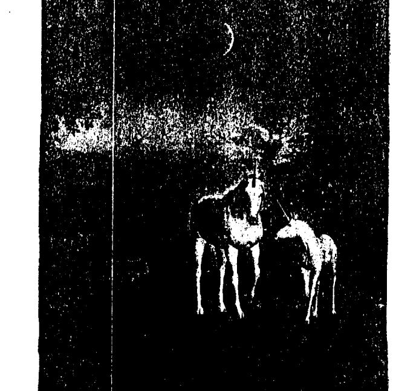

## 第44章 兒童的獨角獸遊戲

### 畫獨角獸

這些遊戲無非是要引起小孩子對獨角獸有更多的覺察。

很重要的一點是，在畫的過程中要談論或想著獨角獸。
1.  從這本書中或網站上找出獨角獸圖，描出其圖形，或是自己畫一個。
2.  你想要的獨角獸是什麼顏色的？假如是白的，就不要塗顏色，假如是其他顏色，用彩色筆或用蠟筆塗上顏色。
3.  自己畫上背景，塗上顏色。
4.  畫完之後，請你的母親找個地方把它掛起來。

當然成人也可以畫自己想要的獨角獸並塗上顏色。

### 配對遊戲或培爾曼式記憶法（Pelmanism）

你可以使用一般的牌或是配對卡來玩這個遊戲。在我的孩子小時候，我們用這種遊戲來增強記憶力。我很快就發現它的用途並不僅限於此，因為我的兒子在兩歲時就開始運用感知力做完整副卡片的配對。它調整了他的心靈能力。

### 盤子遊戲

這個遊戲的目的是要開發靈視力和記憶力，可以一個人或數個人一起玩。經過事前的放鬆及打開右腦，將盤子上的東西做成一個綜合圖像，這會讓你開發靈視力。

要記得，這不是競賽。你愈輕鬆就愈容易找到。這個遊戲你可以自己做，也可以和別人一起做。假如是一個人做，要把自己需要玩多少次才能做完所有的配對記錄下來。

1.  開始之前先放鬆，準備好。你愈自在，就愈能加強你的記憶力和使用心靈的能力。
2.  把牌或卡片散開，正面朝下。一開始時只用六組，等你做得愈來愈好後再增加數目。
3.  第一個人選兩張牌，把它翻開。假如兩張牌是一組的，牌就歸他所有。假如不是，就把它放回，正面朝下。
4.  第二個人也是選兩張牌。同樣地，假如選到的牌是一組的，牌就歸他。
5.  最後拿到最多牌的就是贏家。
6.  這種遊戲你練習得愈多，記憶力和心靈能力就開發得愈多。

因為這是一個獨角獸的盤子遊戲，所以挑選的項目要和他們有關，例如白色小石子、花、羽毛、馬的模型、貝殼或珍珠、可以象徵翅膀的東西、水晶。你還可以放蘋果或胡蘿蔔，雖然獨角獸無法吃或嚐味道，但他們可以聞得到，而且他們很喜歡蘋果和胡蘿蔔的香味。

### 三種記憶的方法
1.  快速地用其中的每樣東西編一個故事，這是一個把它們都記住的方法。假如你採用的是這種方法，你不僅使用左腦，也用到了右腦。
2.  集中注意力，把所有的東西都交給短期記憶。這是使用你的左腦。
3.  放鬆，掃瞄整個盤子，但眼睛不要太用力聚焦，這樣才能讓右腦有一個整體的畫面。

### 練習用不同的方法玩這個遊戲
1.  一個人收集一盤東西，用一塊布把它蓋住，拿進來。
2.  開始前先深呼吸幾次，放鬆。
3.  視參加者的年齡而定，掀開布十五到三十秒，再把它蓋上。
4.  儘量寫下你可以記住的東西。

這個練習還有一種不同的方法，就是看完盤子裡的東西後，拿走其中一樣，讓大家猜猜是哪一樣。

### 盤子遊戲的變化

每一個人都從盤中拿一樣東西，輪流說一個有關它的故事、畫一張圖，或者編一首詩或一首歌，當然每一樣都必須包括獨角獸。

### 瞎子認人

1.  一個人把眼睛閉上或朦住眼睛。
2.  其他的人分別站在房間各處或不同的角落。
3.  「盲人」小心走向每一個人，感覺他們的能量場，但不要碰觸到人。
4.  他要以每個人的能量去認出他們。

若要把上一個玩法弄得容易些，那些「被辨識」的人在「盲人」靠近他們時可以哼出聲音，但是盲人仍要在不碰觸任何人的情況下認出他們。

### 用聲音玩瞎子認人

讓孩童去尋找獨角獸羽毛

這個遊戲的目的是要提醒孩子們記住獨角獸和天使的羽毛，同時也要玩得開心。在你的庭園裡或在散步的時候收集一些羽毛，你也可以買到一包包的白羽毛。告訴孩子們，獨角獸和天使留下羽毛給他們，是表示牠們曾到過他們的身邊。把羽毛藏在花園裡或公園裡，藏好後叫孩子們去找。視孩子們的年紀，可以每找到一片羽毛就給一張貼紙，然後他們可以用羽毛和貼紙製成一幅畫。你也可以給每個孩子一個小禮物，或者你們也可以只當樂趣玩，不用給額外的獎品。

### 獨角獸小徑

『獨角獸領袖』（成人或大一點的孩子）用羽毛或能自然分解的白花瓣，做出一條讓其他的人可以依循的路線。他們在沿著路線走時可能會看到一隻獨角獸。

### 獨角獸餅乾

給每個孩子一塊素面的餅乾，讓他們用糖霜做裝飾。大一點的孩子可以用裝飾蛋糕用的擠花器擠些星星放在上面，甚至可以用糖霜描繪出來，或用小銀珠擺出獨角獸的輪廓。

### 打造獨角獸庭園

用一個淺砵擺上苔蘚或插花用的海棉當作底部。你可以用小鏡子或銀色的錫箔紙當作小池塘或小河。用小石子做路徑。小樹枝可以上顏色當作樹。小松果可以當作很漂亮的附加裝飾。乾燥花或鮮花。摘花前請記得先徵求同意。假如你有和農家庭院有關的動物模型，可以用馬代表獨角獸。玩具小人。其他動物。

### 樹林裡的空地

其他任何你想到的小東西。

你可以用上述的方法做出一個樹林裡的空地，用樹葉和樹枝製成樹，或許也可以剪下一些仙子的圖片，或把塑膠土製作的蘑菇圈設計成一個仙子圈（fairy circle）。

### 你做得真好

每個孩子都特別喜歡他人的誇獎或提起他們做得不錯的事。當然，到目前為止，培養小孩子的正面特質最快的方法還是對他們的關注。在臨睡前，我的女兒和她五歲的女兒及兩歲的兒子都會有一個「你做得真好」（Well done）的時段；看到我的小孫子臉上發亮，於是我知道這就是他們睡前的例行事項裡一個很重要的部分。假如我在那裡，我永遠都可以想到很多他們做得很棒的事加進去！獨角獸喜歡孩子們的天真無邪，所以你在做這些事時，可以請獨角獸來把他們的祝福和光加進去。

下列是幾個「你做得真好」的例子，雖然孩子和環境的狀況可能會有所不同。

你對某某小姐很有禮貌，做得真好！你接電話接得很棒，做得真好！你有照顧弟弟，做得真好！你有好好地吃晚餐，做得真好！你有好好地謝謝人家，做得真好！我們當初答應要出去，後來不能去了，你沒有因此吵鬧不休，做得真好！你塗色塗得很漂亮，做得真好！你對隔壁的孩子做了好事，做得真好！你願意和別人分享你的玩具，做得真好！

「你做得真好」對意識的影響真的很大。我兩歲的孫子芬突然大發脾氣，但過了一會他停下來，說：「芬很快就不哭了，做得真好！」也許是獨角獸推了他一把呢！

## 結語

我們都很有幸，能夠在這個充滿靈性成長機會的時代投生在地球。 以前從未有過這麼多來自靈性界的協助出現在我們面前；我謹代表獨角獸王國，帶著愛把這本小書獻給你們。 他們最後要告訴你的訊息是：

當你懷抱的願景不再只為你自己時，我們會協助你，直到你最重要的本質迸發出美麗的光彩。

> > —— 獨角獸

## 心靈成長系列 177

### 遇見神奇獨角獸
The Wonder of Unicorns

作 者 | 黛安娜・庫柏 ( Diana Cooper )
繪 圖 | 達米恩・基南 ( Damian Keenan )
譯 者 | 黃愛淑
特約編輯 | 陳維岳
編 輯 | 黃春華
主 編 | 王芳屏
經 理 | 陳伯文
發 行 人 | 許宜銘

出版發行 | 生命潛能文化事業有限公司

聯絡地址 | 台北市信義區 (110) 和平東路3段509巷7弄3號B1

聯絡電話 | (02) 2378-3399

傳 真 | (02) 2378-0011

郵政劃撥 | 17073315 (戶名 : 生命潛能文化事業有限公司)

E-MAIL | tgblife@ms27.hinet.net

網 址 | http://www.tgblife.com.tw

郵購單本九折，五本以上八五折，未滿1000元郵資60元，購書滿1000元以上免郵資

總 經 銷 | 吳氏圖書有限公司・電話 | (02) 3234-0036

內文編排 | 菩薩蠻腦電科技有限公司・電話 | (02) 2917-0054

印 刷 | 承峰美術印刷・電話 | (02) 2225-7055

版 次 | 2015年3月1日初版

定 價 | 380元

ISBN : 978-986-5739-30-0
The Wonder of Unicorns ©Diana Cooper, 2008
Unicorn illustrations ©Damian Keenan, 2008
First Published in 2008 by Findhorn Press, Scotland
Complex Chinese translation copyright ©2015
by Life Potential Publications
ALL RIGHTS RESERVED

行政院新聞局局版台業字第5435號
如有缺頁、破損，請寄回更換
版權所有・翻印必究

國家圖書館出版品預行編目(CIP)資料

遇見神奇獨角獸/黛安娜・庫柏 (Diana Cooper) 著; 黃
愛淑譯.-- 初版.-- 臺北市: 生命潛能文化, 2015.03
面: 公分.-- (心靈成長系列: 177)
譯自: The wonder of unicorns
ISBN 978-986-5739-30-0 (平裝)
1.超心理學  2.靈修
175.9     103026822

存在於第七次元的獨角獸，是肉眼看不見的乙太界存有
他們帶著神奇之力，提醒我們生命的純淨本質與智慧

象徵純粹天真的獨角獸，一直是奇幻文學和電影不時出現的角色。這些七次元的、帶著神話故事和神奇之力的動物，他們究竟是何方神聖？他們和天使有何不同？為什麼現在出現在地球？他們會如何幫助人類？我們該如何學習與他們共事？

享譽國際的靈性療癒者黛安娜·庫柏，透過與獨角獸王國的連結，將他們的神話、傳奇及靈性層面的智慧從第七次元接引下來，並提供冥想練習、儀式及成人孩童皆宜的遊戲，幫助我們從更高的觀點去認識這些深具魔力的存有。一旦你清楚了解靈魂渴望服務的意圖，你就可以和獨角獸一同合作，讓他們無時無刻地陪伴、療癒、支持你。

獨角獸邀請你，重返孩童般的天真，接通他們的魔法，為自己和這個世界帶來更多的光、療癒與希望。閱讀本書，你將被獨角獸的能量和愛所感動。

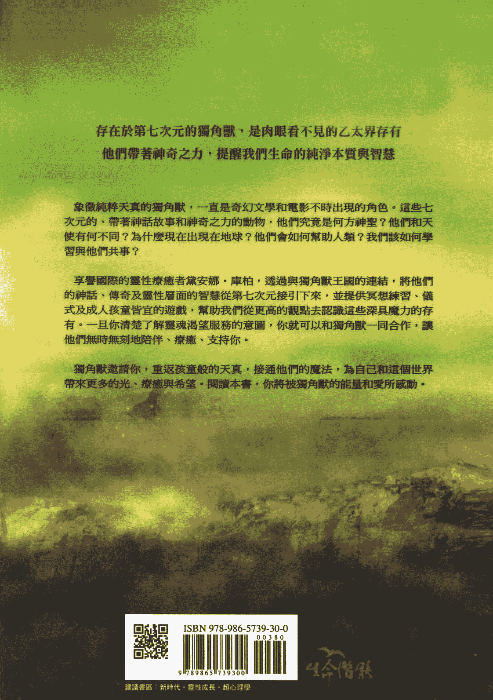