# 邀请你的指导灵

### Ask Your Guides

Communicating to Your Divine Support System

让神圣团队支持你

直觉治疗师 桑妮雅·乔凯特 博士 Sonia Choquette, Ph.D. ◇著 邱俊铭 ◇译

心灵作家 王静容·塔罗教师 邹瑞姝 ◇推荐◇

欢迎来到神圣存有的国度，力量强大的天使、差使、助手、灵性教师、动物以及各种光的存有组成了神圣的团队，已经准备好为你的生命提供指引，协助度过每一个挑战。现在就邀请你的指导灵吧！让他们为你的生命注入奇迹的光芒！

本书献给我那些美妙的指导灵——

优阿幸（Joachim）、第三道光使者（Emissaries of the Third Ray）、玫瑰、约瑟夫、三位主教（the Three Bishops）、昴宿星姊妹（The Pleaidean Sisters）、点点、查理、托利博士以及我所有其他天界的帮手们。还有也要献给我最亲爱的人间守护使者，包括我的母亲以及姊姊库琦、我的先生派崔克以及心爱的女儿们索妮亚与莎柏丽娜。

# 推荐序

朝向至上的祂
王静蓉
009

把指导灵当成最贴心的朋友
郑瑞姝
012

# 前言

平凡的一天
015

# 引言

我们所能期待的
019

# 第一篇：欢迎来到灵的世界
031

## 第1章 从认得自己的灵开始
033

## 第2章 进入灵的广大世界
043

# 第二篇：天使：你最初的灵体伙伴
051

## 第3章 守护天使——你的私人保镖
053

## 第4章 大天使们
069

第五章 天使圣团 081

第六章 生活在天使的影响里 087

## 第三篇：会见你的指导灵 093

第七章 指导灵常见问题Q&A 095

第八章 准备会见指导灵 105

第九章 初步接触指导灵 117

第十章 更进一步：写信给指导灵 125

第十一章 学习看见指导灵 135

## 第四篇：介绍你的指导灵 145

第十二章 自然界的指导灵 147

第十三章 你的差使(Runners) 161

# 第五篇：与指导灵直接合作

- 第23章 灵在说话 265
- 第22章 指导灵也与传讯者合作 261
- 第21章 指导灵比想象更加亲近 255
- 第20章 负向存在体 (Negative Entities) 245
- 第19章 光之存有 (Light Beings) 237
- 第18章 喜乐指导灵 (Joy Guides) 227
- 第17章 动物指导灵 (Animal Guides) 215
- 第16章 教师指导灵 (Teacher Guides) 203
- 第15章 疗者指导灵 (Healer Guides) 187
- 第14章 你的助手 (Helpers) 171

- 第24章 指导灵的名字 273
- 第25章 指导灵帮你——而不替你工作 279
- 第26章 借助神谕工具 289
- 第27章 神谕占卜牌组 297

## 第六篇：指导灵指引的生活 307

- 第28章 你的高我：最伟大的指导灵 309
- 第29章 可能的挑战 319
- 第30章 好消息与指引 323
- 第31章 找寻伯乐（Believing Eyes） 331

## 跋：感谢你的指导灵 335

## 推荐序——朝向至上的祂

我们与无限可能的存在体相连着，所有存在体又与至上意识——伟大的祂相连着。人不可能不通灵，因为人之净化历程就是一个朝向所有存在体的过程。通灵，是通向我们的灵性真我，灵性真我随着意识频率的提升，会和曾经结缘的存在体相连，怎么相连呢？和他们的振动频接触。就像今天，用过午餐之后，我的喜乐指导灵进驻，原本该去工作室做事的，看到冬日大晴，山色青翠，心窗就大大地打开了，决定驾车穿过高速公路去看朋友；沿途，太阳与天上的所有灵性存在体织了一匹璀璨的织锦，闪烁在人间，车子像飞了一样快速地流经遥远的道途。我和朋友度过甜美的下午，并且在归途时，喜乐灵的一个意念引导，我驶向另一个区域！这个区域是我喜爱却久违的台大校园，跟着引导步入园区，在湖前静坐，见波光柔软软地振荡，漫步其间，听风轻吟，感受学子气息。喜乐指导灵将我自工作堆中移开，带我来到松放的灵感空间，返家后，工作反而很快就完成了。

王静蓉

与指导灵相连是每位发展意识的人都会感知的，祂们透过精细波频与我们打招呼，以直觉与我们的敏细感知相连，你若是纠绑在惯常的时间感与逻辑思考里，很难让祂敲门。要不松也不紧，让出心的空间让祂的讯息流入，并循着祂的线索移动，让未知与惊喜为你引路。《邀请你的指导灵》这本书就在邀请你打开心灵之眼，放下严肃感，尝试对心灵的更多可能开放——天使、大天使、动物灵、植物灵、疗者、教师灵及我们的高层真我，指导灵就是灵感源头的传讯者，连上灵感便是连上真我的讯息，一步步前进朝向伟大的祂，上主。作者以轻松易懂的案例让我们对灵性开放，这也提醒了我：在朝向高等意识的过程，我倾向理想而期许自己太多，偏爱深刻以致不自觉扛了重担，在通灵这件事变得严肃，被想要更好的意图拉开了眼前的讯息，事实上，祂们已在我身旁环绕多年了。往往，我们宁可接受努力而不愿跟随灵感，我们对放松也误解。其实，放松发生了，我们就能回到自己的中心，就有灵感、就会和灵性真我相连。因为我们甚至否认灵性真我才是本来面目，在通灵这件事上，由于集体意识的许多染色，人们变得对灵性感知太排拒了，变得被心智恐惧所驱逐。这也是东西方文化对灵性的差异认知，透由这本书——这本会唤起你对指导灵与起信心的书，我邀请你，和我一样，放下一些道听途说的偏见，放下对非理性事物的恐惧，来允许

来允许

神圣的灵性进驻我们内在，更多、更丰富、更幸福地带领我们，开展更多层面，与更多未知的惊喜、与汹涌而来的奇迹恩典相遇！

在此，献上作者的祈祷诗：

> 愿神祝福你，愿你的天使保护你。
愿你的差使为你连结，愿你的帮手协助你，愿你的疗者支持你，愿你的老师启蒙你，愿你的喜乐指导灵使你欣喜，愿自然精灵活衡你，愿你的动物指导灵唤起你的灵魂，愿你的高我引导你过着具有平安、恩典、创意的生活，使你个人的尘世旅程满载着爱与欢笑的赠礼。

这也是我的祝福，愿更多更多的生命与灵性相连，光与慧永恒照耀！

王静蓉

作家，光的工作者，系统排列治疗师。
- 著有《把神秘喝个够》、《光的工作书》等三十多本著作。
- 相关讯息请见奇摩部落格：王静蓉老师的静心学校和网页。

## 推荐序——

## 把指导灵当成最贴心的朋友

郑瑞姝

两年前在美国山区的小书店，意外看到了《指导灵讯息卡》（Ask You Guides Oracle Cards），那时我正在寻找生涯成长的另一目标，我就每天都祈祷，祈求指导灵给我更高的指引，让我知道我所要事奉的是什么？当时抽到的牌是「祖灵」，里面有一段话说：「祖灵围绕着我，祂们建议我去上一门课程。」祖先们给予你的讯息是：「敞开心，感受我们存在你的生命之中，同时也向你地球上的灵性家族敞开自己。」这些内容给我很深刻的体验，也促成我往后开始学习中医的历程。经历了一、两年之后，我才领略到指导灵带给我的是更深的意涵，让我理解到新的方向，是来自于较高的指引……我的祖灵，祂们给予我很大的支持与教导。感谢所有存在及指导灵与守护天使的护持，引领我走向健康丰盛的人生。看完《邀请你的指导灵》译稿之后，感受到桑妮雅是一个毫无藏私并热爱分享的人，她用浅显易懂及活泼生动的方式，教导有关如何召喚指导灵，助手灵、购物灵、缝纫灵、销售灵、绘灵或是大天使麦可、加百列、拉斐尔们……并分享如何获得这些指导灵的协助，让你体验更多生命的乐趣。文中还提到有关如何清理净化的方法，如运用自然精灵地、水、火与空气精灵等，来振动自己的灵力并进行自己心智与灵魂的充电、安定与清理；或召唤极具治疗特性的自然精灵，提升自己对祂们的敏感度并请求祂们的帮助，让自己感觉到祂们的支持。另外，当你感觉耗尽、失去连结、不受支持以及不被爱的时刻，就呼唤大地之母来滋养你，并让祂用那温暖无尽的手臂将你包起来，如此一来，就会清除你的沮丧与恐惧，甚至能舒缓我们最大的文明病之一——慢性疲劳症候群。桑妮雅在书中分享多年来的咨商经验，并举例说明，而这些内容也可以帮助人们在灵性进展中所遇到的疑惑与瓶颈的理解。作者在书中用非常轻松的观念，教导如何与指导灵作连结，如何识别指导灵（守护天使）的方法，这是一个非常重要的一個过程，尤其在灵性的道途当中，有很多较低的频率、较高的频率，也许混杂在我们周遭环境里面，当我们在寻求指导灵的讯息引导时，也会有因应我们『小我』的需求而执着于世间的负向存在体现在生活中，让你去经历所有负面结果。我们要学习的是如何去辨识与信任较高指导灵（守护天使）的指引，我想这本书将带给读者很大的深思，并学习活出一个真实自由、充满爱与无惧的生命。书中不断教导如何保持觉知并与内心深处的指导灵沟通，敞开心灵、保持诚挚、坦然的态度去体验并接收宇宙圣灵、指导灵（守护天使）全然地给予的爱和支持。让你在生命里的各种情势和环境中得以创造出最佳的结果。同时也为自己带来丰盛富足、轻松快乐的人生。桑妮雅以轻松幽默的口吻来告诉我们如何与指导灵对话，我想这些都可提供读者如何用轻松愉快的心情来探索及练习与指导灵培养默契，把指导灵当成最贴心的朋友，永远守护及关照着你的人生，同时也祈求指导灵永远指引你前进的方向。

郑瑞姝Michelle

国际巴哈花精咨询师·心灵成长推广工作者、光的课程教师、塔罗牌咨询师、指导灵神谕牌教师、英国
信箱：michellecheng21@yahoo.com.tw

# 前言

### 平凡的一天

上个礼拜我因为讨厌的感冒，在床上躺了五天而感到非常不耐。虽然能量低落但又想要改变状况，于是我决定去女儿的教练那里载她回来，这是目前自己能够应付得来的大胆出游了。 当我离家驶过几条街之后，灰蒙的天空开始暗沈下来，云层间闪烁着冬天少见的雷电风暴。我的车就在拥挤的车阵中毫无预警地开始喷气、抽动，然后熄火，这是我最不愿见到的情况。我赶忙将车驶离车阵停到路边，并试着发动几次，但都没有用，引擎完全停摆。「可恶！」我大叫着，对我的困境感到十分挫折。 我身上仍有轻微的发烧在消耗着能量，这样的景况只会让我觉得更加难过。更惨的是，女儿正等着我去接她回家赶着上家教的课。我拿出手机打给老公派崔克求助，他说他赶过来至少要一个小时，因为他在城市的另一端，也困在一样拥挤的车阵里面。我关掉手机、为自己难过了起来，更别提担心女儿会淋雨等我，于是我开始祈祷。我向我的灵性助手、指导灵询问，他们是否知道灵界哪里有汽车技工？如果有的话，可否请她或他现在来修理我的车。我非常安静地坐着，安抚我的挫折、放下我的恐惧，并打开心胸。「我知道你能帮我，而且我会非常感激你的帮助。只要告诉我该做什么就好了。」我这样低吟着。突然间，我有股冲动要把双手合搓、像要搓热那样，然后把手放在仪表板上。「将你的能量给予车子，」我感知到这样的声音，「别担心能量耗竭的情况。将你的手放在仪表板上，以你的心使引擎复苏。」我毫不怀疑地信任并接受指引、依样而行，观想能量从我的心、经由身体而进入汽车里面。「完成了。」我感觉听见这句话，就一手放在方向盘，深呼吸之后用另一手发动车子。引擎喷吐几声之后，万岁！它动起来了！车整个活了起来，再次开始运转。我大笑着跟指导灵连连道谢：「你是最棒的！」「我就知道你会帮忙！」

我再多花几分钟听引擎的声音，确保它是真的准备好可以上路，之后就毫不犹豫地驶上要走的路。暴雨在五分钟之后就停了，车也停在教练的家门前。我的女儿莎柏丽娜冲出门口钻进车子里面，「抱歉，我晚了点，」她喘气地说，「我们比以往多练习了几分钟。」「没关系，」我微笑地说，「我自己也才刚到。」就这样，我们高兴地开车回家，是因为指导灵们回应我的呼唤来协助我才能如此，类似的情形已不只一次。这就是我身为灵通者的生涯的其中一天，充满着来自彼岸的指导灵、天使与助手们，他们一直都在帮助我的生活过得更加轻松。

# 引言

## 我们所能期待的

我生长于充满各种指导灵的家庭，在我非常幼小、母亲首次向我介绍我的指导灵之后，我就逐渐觉知到我的灵体伙伴，而母亲也跟我一样，任何时候都能与她的指导灵交谈。她是我第一个让我知道我在这世上绝不孤独的人，她让我知道我有着被指派的指导灵，在这一生照顾、帮助、保护与教导我。她时常与自己的指导灵商量，通常在我们家做比较多决定的是他们，而不是她。她提及他们时用的是“我那些灵”（my spirits），因为他们就是那样——没有肉身的灵性存有。她与他们讨论所有的事情，从在哪里停车到大家可以在哪里享用晚餐等等，而且她有特定的灵来应付各种任务，像是购物灵会帮助我妈找到好的折扣，这是仅靠父亲的零售商收入来维持七个小孩的家庭所必要的；缝纫灵会帮助她找到布料并制作图样，而治疗灵会在我们这些小孩得腮腺炎时提供协助；团体野餐灵会忙找周日出游时最佳的山间景点，而销售灵帮忙增进我爸的生意；当她沈醉于她最喜爱的兴趣之一——油画时，就会呼唤绘画灵，另外也有顺道经过、属于过世亲戚的罗马灵、法国灵。我们的指导灵在餐桌上是有位子的，祂们也参与所有的讨论，所有大大小小的事情都会问过祂们，而当我们处在疑虑中的时候，通常会让祂们下最后的决定。因为有这么多的灵，我们那拥挤的家充满着能量、主意、点子，然而装着最多的就是爱，以及因为知道我们从不孤独而产生的稳固安全感。我自己的指导灵帮助我度过儿时的病痛、家庭的口角以及学校的问题，祂们一直随侍在旁，以超过我能想象的方式日复一日地给予接二连三的奇迹。从我最早的 기억开始，我已知道自己有着指导灵的忠诚支持。在祂们照顾的注视下，我觉得受到保护，也因着祂们的实际解决方案而获得协助，并惊叹于祂们丰富的礼物。至于我家门外的世界，关于灵界的讨论是从位于丹佛市西边的天主教学校开始的，介绍天使与圣人（一年里面每一天都有一位）给我们知道，以及较个人化、有着和我们相似名字的圣人。此外，还有圣母马利亚、耶稣与最大的灵——圣灵。在我们还是小孩的时候，每天早上都要去望弥撒，点燃蜡烛来获得指导灵的注意并以衷心的话语请祂们为我们介入所有事情，包括面对考试、在餐厅找到好位置，当然还有赢得排球与篮球比赛。就我所注意到的来说，指导灵们一直都在倾听——我考试考得很好、在餐厅有着不可思议的好运，以及赢了无数个排球比赛。为何我不应这样做呢？我不仅向灵性助手与指导灵寻求帮助，还完全相信祂们必会回应，而且我感受到祂们的协助与存在。我也以为大家都这样，至少到国小三年级我的好友苏西抱怨她的母亲不准她在我家过夜之前都是如此。当时我建议她可以请她的指导灵帮忙改变她母亲的心意，她说她不知道我在说什么。在我跟她解释之后，她说我很怪。我那时起了防卫心，就问她如果那里没有帮助她的指导灵，为何还要每天去望弥撒与祈祷。她说那是因为修女要我们去才去的，而不是因为那里有灵。我感到挫折，但仍坚持灵是存在的，并且告诉她如果她让自己非常平静并半闭双眼（而不是紧闭起来），她也能看到祂们。祂们的外观不一定像人类，我说，「祂们有时看起来像是空中飞舞的光点，有时看来像是闪光灯那样一道爆出的白光。有时你完全没看到祂们，但有感觉到祂们的存在，好像空气在某处变得厚实了些，或变得较为凉爽、通风。有时你只是在心里感受到祂们，但他们是那里的。」她翻白眼并发出嘘声，再次说我很奇怪，所以我当然没告诉她我喜爱的指导灵玫瑰（Rose），长得像圣女泰瑞莎的她就住在我的衣柜上面；也没提那位在学校尾随我的厄色尼派教徒约瑟夫（Joseph the Essene，註：厄色尼教派为古犹太苦修教派）。更没告诉她，我在她家过夜时，看到她的卧房的某个角落站着一位指导灵，看起来像是历经沧桑、相当年老的美洲原住民女性，她裹着一条红白相间的粗毯，并在我们上床休息时对着我们微笑。天啊！如果只提到指导灵就认为我很奇怪，那么再跟她多说一些就不知她会怎么看我。我不想拿自己已是薄弱的学校人际关系冒险，就对她的回应一笑置之，并建议换去她家过夜。从那时起我才开始了解，绝大多数人几乎不知道那个给予我这么多安适的丰富灵界。令我难过的是，我与自己的指导灵共享的双向沟通管道，对大多数人来说是条单行道。在我尚不清楚知道其他人变得如此与灵界失去连结的原因时，我只认为他们对此不太熟悉而已。等到我成年之后，开始认为我们对于灵界的失联是一种西方灵魂的疾病。我们的心原是与灵见面与沟通的处所，而工业化以及理智主义已将我们的觉察中心从心移出，并直接塞到头脑里。不过，还是有好消息，无论什么原因造成这种分离，只要我们想要的话、只要我们不容许自身头脑完全挟制自己，都能将内在觉察重新连回心中。只要藉由来自我们的一些努力与合作，指导灵们将乐意为我们显示道路。

## 你期待什么？

在一开始当你参与自己的指导灵时，完全了解自己能期待什么是很重要的。你瞧，那里有着各种层次的指导灵、非实体的存有以及灵界的能量，祂们都以自身独特的频率在振动着，就像许多不同的广播电台同时发送独特的信号那样。不仅每个指导灵有着自己的频率，这行星上的每个人也都有自己独特的振动。那些以心生活的人们有着高的频率，跟非实质层面的存有所具有的灵性频率差距不大，与指导灵的连系会比较轻便。那些已经忘记自己是灵性的存有、只与自身头脑与肉体认同的人频率较低，离指导灵的频率较远，因此建立连结时会比较困难。这就是为何有些人比较能觉知到指导灵的原因。若深思此事，那么宇宙每事每物都是以不同频率振动的灵。举例来说，我们都知道原子是以独特的频率在振动着，就像光波那样。海浪也有频率，甚至我们的心跳也有韵律。因为每事每物都是正在移动的频率聚集，所以身为灵性存有的我们自然能够连结其他灵界存有的频率。如果我们把自己视作灵魂，同理我们就能更轻易地认得非实质世界的居民。灵界就像我们所居住的世界那样人口众多，许多不同的指导灵一直在不同的频率里提供服务，因此我们够连结许多种类的指引，像是曾住过实质世界的指导灵、已到彼岸的家人、曾与你共度前世的指导灵、为了照管你的道途而当灵性教师的指导灵、能在身心照护上帮助你的治疗者、使日常生活变轻松些的助手、将你与地球连结的自然精灵与元素、在你的道路上引导你的动物灵，甚至当生命变得过于沉重与艰难时，也有喜乐指导灵使你振作精神。还要留意那些只会制造麻烦、不处在那样高频的指导灵或是自称为指导灵的存在体，我会在后面多说一些他们的事。难过的是，虽说对于自身指导灵的认识与合作已算是我的第一天性，但是对于周遭许多人来说是陌生的。不幸的是，我也目睹那些没觉知到灵界、与指导灵失联的人们，在恐惧与绝望中挣扎、感受孤独与遗弃，浑然不知那股随时可及、慈爱的灵性支持。因为我是如此地受到祝福、有着来自指导灵的支持，而且从小就了解此事，我已认定自己的人生使命即是帮助他人觉察到自己的指导灵。如同我之前接受协助那样，我希望每个人都知道他们也能够接受协助。在接收指引方面我并不特别，也没有人是这样。我们都是宇宙的神圣孩子，而我们每一个人从出生到离开肉身、回归灵界之间，都有一套灵性支持体系使我们的生命变得更轻便、更成功，而没有觉察到此项事实对我们可不是好事。宇宙是设计来照顾与指引所有它的创造物。鸟有雷达、蝙蝠有声纳，我们则有指导灵。当我们唤醒第六感并学习如何连结像天使那样的指导灵时，我们的生命就自然形成轻便与流动的模式，并在其中培养我们的灵魂、完成人生使命、尽情享受我们在地球上的时光。

本書會提供簡要的指示以幫助你連結自身指導靈，好使你能享受自己本應擁有的豐盛、支持與愉悅。我們全是慈愛母神與父神的「信託基金小孩」（Trust-Fund Baby，註：指一出生即獲大筆基金保障一生的孩子。），因此我們與生俱來的權力即是期待一趟受到祝福的美麗人生。然而若要接受這樣的禮物，關鍵在接受我們是無法僅靠自己成功的。我們必須對那所有人都可以連結到的慈愛支持敞開心胸與觀念。走上這趟旅程，你將會很快地經驗到超乎你能想像的支持、成功與祝福。那麼，我們就出發吧！

## 如何使用本書

本書旨在教你藉由連結那些已在你的靈魂道路上待命的眾多天界助手，直接與自身靈性支持體系溝通。我將要教你祂們是誰、來自何處、希望助你一臂之力的原因、輕鬆跟祂們溝通的方式，並更了解祂們對你說話的方式。
你將逐漸認識靈界，好使你能舒適自然地提升自己對於靈界的敏感度。我在每一章都提供關於特定指導靈的描述、解釋祂們的差異，並分享各類指導靈幫助我或其他人的故事，在這之後會提供日常練習，使你能以自己的方式運用，強化直接與自身指導靈進行穩定且實際的溝通。
我會以一次一種的方式來介紹指導靈，好使你能感受到如何去經驗祂們的能量與影響，之後就會換你嘗試各式直覺練習，使你能直接連結到每一種指導靈。這樣的方式是在訓練你

## 本書的組成

以一個具有第六感、靈性意識的人來思考，並容許你的指導靈幫助你創造沒有壓力與恐懼的生活。

這些工具之後，就會開始學習準備自己的身體向精微能量對焦。接著，你將一一認識更高、更精微的特定靈性助力的領域。我會教你如何連結自身指導靈並與祂們合作，然後指導你如何過有著靈界指引的生活。

請將這樣的過程看做是個課程或是訓練，它其實很像音樂欣賞課程，首先你先學習靈界的音符、接著是靈界指引的旋律，最後則是第六感、神聖指引與創意生活的組曲與合奏。藉由允許自己接受神聖的指引，你就進入了生命之流，並開始經驗這個美麗宇宙的奇蹟。

以你自己的步調來運用本書，一次一小步地與指導靈合作。如果你願意的話，每一章都是個人練習為前提寫就的，使你有足夠穩固的基礎以認出靈界指引，並幫助你在面臨任何景況都能容易安心信任自己的指導靈。

天使神秘学院官方淘宝 http://strc.taobao.com
获取更多好书，请加微信 : 13641926204 或 QQ:715104687

就把本書看做是一趟靈界的遊覽，與你同行的我則是經驗老到的導遊。由於我這一生都與指導靈合作，教導人們連結自身指導靈也超過三十年，我非常熟悉靈界並安處其中。現在就換你來學習我所知道的事物。 當你決定與指導靈合作，你就改變了掌控你生命的規則，容許它變得比較輕鬆。藉由這些練習建議，你將開始感受到宇宙想要給你的支持。即使我們都有一潛力「接受指引，只有想要是不夠的。就像只看運動影片並不會給你鋼鐵般的腹肌，只有知道關於指導靈的事或想要接受指引也不會完全打開那扇門。除非你主動邀請你的指導靈在日常的基礎上幫助你，不然你將阻擋祂們提供的強大內在指引。 剛開始在大量聚焦於彼岸時可能會有生疏的感受，然而如果你繼續堅持下去，很快就能享受這個過程，畢竟，指導靈是有趣的，並且很幽默。向祂們請求所有你需要的協助別遲疑，畢竟祂們是為了幫助你而在這裡的。 留意進入你的意識的所有精微線索，而且也別為了等待巨星偶像的靈體出現，而拒絕一切。靈界的指引是細微的，就取決於你是否要提升自己的覺察，認出並接受祂們提供的幫助。如果你經常連結眾多不同的指導靈，你很快就有祂們正在行使任務的證明，亦即看見自身生命開始出現魔術般的品質。 最困難的部分在於學習接受幫助，畢竟我們已被制約要去掙扎奮鬥，甚至一直美化這

樣的制約。然而，具有靈界指引的生活會緩和這樣的掙扎奮鬥。因此在你開始之前，先問自己：「我能承受多少好事？」一身為喜愛過著靈性指引的生活、具有第六感的人，答案應是：「能有多好，就承受多好。」而且要不了多久，你將會享受這種原本就是屬於你的好處與支持。如果你以開放、誠摯的心來開始與自己的指導靈連結，祂們一定會回應的。事實上，你周圍的人不久就會問你有什麼秘訣來活出這麼令人著迷的人生！

身為靈性的存有，我們是被造物者深深地愛著、支持著。我們從不孤單，也不會在面對超過自己能夠處理的景況時，沒被給予使我們得以成功的所有工具。我們想要超脫於塵世掙扎之外，活出充滿恩典與順遂的人生。而我們會這樣想，是因為我們全身上下的細胞都直覺地知道，我們可以這樣做。而這樣做的過程是簡單的，停止抗拒、開始聆聽你的指導靈與靈界要提供給你的慈愛支持。祂們很樂意來服務你、幫助你。那麼，就讓祂們做吧！

# 第一篇

## 歡迎來到靈的世界

# 第一章 從認得自己的靈開始

在你能開始認得自身指導靈的存在之前，你必得先留意「自身」美麗的靈。學習以這樣的方式看待自己也許是個全新的概念，但這就是你的真正本質，我們都是如此。
在我成長的過程中，我的母親常以靈來指稱我們，而我們也這樣對她。她常會在家常對談當中問：「你的靈想要什麼？」或「你的靈說了什麼？」知道我自己是祂們的一員，那麼在連結那些能夠幫助我的靈就變得非常簡單，不論是我這邊或是對方那邊都是如此。我在成長的過程是以這樣的視野來看待自己與他人，並且欣然接受這個原則。然而，直到我的長女索妮亞出生的時候，我才見識到這項事實的真正力量。
我還記得她剛出生時是多麼全然地平靜安詳，甚至就像佛陀那樣。一開始，她完全不動，帶著一點淡淡的藍色，接著隨著一陣強力的抽動，她開始自己的第一個呼吸，藉著一股強大的力量猛然活了起來。她的顏色變成明亮的粉紅色，並發出讓這世界知道她已抵達的哭聲。就在那裡，我親眼目睹她的靈魂進入她的身體，藉著那一口氣使她活了起來。從那時起，我無法在看著他人或自己時，不會想到我們也有類似的時候。認出給予你生命的是你的靈，這樣的見解能幫助你感激那股被稱為「你」的令人敬畏的力量。

雖然我們全都共享著同樣的永恆生命氣息，但祂在每個人裡面的具顯都不一樣。你的靈有著自身的存在，祂的頻率完全跟你的人格相異（人格大多是為了當成你的靈之防護盾而形成的）。而連結自己的靈最好的方法，即是開始認知到能讓你變得生氣蓬勃的事物。

首先，探索你那獨特的靈到底像什麼。你會如何形容那股稱作「你」的永恆、炙熱的生命能量呢？祂是溫和、熱情、威風、遲疑、創意、害羞或是愛玩的呢？你的生命中是否有自覺最能勝任的部分呢？什麼樣的活動會使你非常專注其上而忘了自己呢？什麼事物能提升、振作你的靈魂呢？

接著，留意什麼事物能「餵養」你的靈。也就是說，什麼樣的經驗、活動與能量能夠給你力量、滋養你的核心，使你感覺滿足、對生命感到滿意並安然做自己呢？什麼事物會使你感到高興與驚喜、將你帶進生命、幫助你樂意擁抱生命，並引領你朝向自身內在的平安呢？

舉例來說，能夠滋養我的是古典音樂、美麗的布料，以及聞起來有異國風味的香水。我

的靈喜愛自然，特別是山區以及松樹的香氣，還有異國旅遊、講法語、埃及市集以及穿梭於新德里的人力車。而講故事、教導他人關於他們的靈，還有最棒的——跳舞——也能使我的靈更加地成長茁壯。上列任一種活動都會擴展我對於自身本質的感受，並使我滿足、滿意與踏實。

我丈夫他的靈就跟我有很大的差異，他喜歡行動、移動、執行事情，會在長程單車旅行、夏季自然健行或是全速滑雪下山時變得活躍。他的靈也是注重感官享受的，但比我的更為簡單、健康、親近自然，像是停在路旁欣賞農田、芝加哥老家那裡的印度香料市場，或是附近的市場那一桶桶鮮魚所呈現的景色與氣味，都使他的靈雀躍不已。

留意哪些事物能夠強化、滋養你那獨特的靈，特別注意你對於自己的靈的敏感與覺察程度。為了使他茁壯，你有需要的經驗來餵養他嗎？

這使我想起曾經為一位名叫薇樂莉的女性做的個案，她那時苦於嚴重的抑鬱、疲勞以及——就我看來——極端的靈性無聊，因此她每天的生活都會出現耗竭的情形。由於不知道什麼樣的神秘疾病會造成這樣的能量喪失，她拜訪過許多醫生、治療師與靈通人士以尋求答案，也做了所有的測試，從甲狀腺機能低下、萊姆症（Lyme disease）、重金屬中毒到EB病毒（Epstein-Barr virus）等等，結果都是呈現陰性，也沒有任何確定的答案。

她在絕望中打電話給我。我馬上辨認出她的問題：她有我會稱作『心靈厭食』（psychic anorexia）的嚴重狀況，或說是她的靈太餓了。她的指導靈向我顯示她的內在是個藝術家、音樂家，那個靈喜愛演奏美妙音樂並創造美麗花園。她是一個內斂的人，其靈魂會因著安靜的靜心與祈禱而成長。她的靈是溫柔的，需要動物的陪伴、花朵的美以及在大自然長期低調的生活所具有的寧靜。
薇樂莉早年曾在威斯康辛的小鎮體驗過所有這些事物，她那時非常健康與快樂，直至她結婚為止。她的對象是高中時代的愛人，他的工作是航空技師，而且他也經常有野心地找新工作。在跟這位男士結婚之後，她在五年內就搬了六次家，大多都是在大都市跟陌生人分租小公寓，因為他們無法負擔獨自承租的費用。她丈夫的靈喜愛這樣的冒險與刺激，但是她的靈卻因這樣的戰鬥感到疲勞並逐漸萎縮。
由於對丈夫的忠實，我的客戶失去跟她自己的連結，她的能量完全給了出去。她的指導靈說她得要回到安靜、自然的生活，並離開所有那些束縛她的粗率、意外的變化，而這就是使她的靈復甦、身體能夠療癒所要做的動作。
當我向她說明這一切之後，她問：「你是說我應該要離婚嗎？」由於不想做這樣的決定，所以我回答說：「我所說的是，你應該更加覺察那些能餵養自身靈魂的事物，然後去做任何使自己好轉必須要做的事。」

關於你的靈有個有趣的現象，就是當你變得敏於覺知到祂，並決定給予注意時，所有你的內在事物都變得安定與清晰。薇樂莉懂了，並且同意我的話，開始傾聽她的靈，這是多年以來的第一次。她離開丈夫並搬回到安靜、自然的環境，在那裡可以有動物作陪、在大自然散步、享受單獨並練習演奏鋼琴。丈夫並沒跟她離婚，反而他會在紐約努力工作十天，接著回到威斯康辛四到五天後再度離開。由於她喜欢单獨而他喜愛冒險，這樣的安排運作地十分完美。隨著回覆自己的靈，她逐漸恢復自身氣力，證明指導靈當時是正確地引導她回到能夠滋養她的事物。許多我的客戶在被問到的時候，都承認他們很少花時間在滋養、餵飽他們的靈，並且僅倚著使命與責任感來過生活。他們覺得是在「忍受」生命而不是「活出」生命，而且忘記要去享受它！如果你發現自己的感受是這樣，要曉得你對你的靈的感受也會變得僵硬、遲鈍，而後果就是斷開與靈界及其所有禮物的連結。在我們嚴肅的道德文化中，人們自小被鼓勵要把別人放在自己前面，並稱那些對於個人的興趣或照顧為「自私」，因此會發生這種僵化是容易理解的。直到你反轉這種令人衰弱的想法之前，你的靈會繼續受苦，而你仍會掩耳不聞靈界的指引。

你知道要怎樣餵養你的靈嗎？試試這樣做……

- 傾聽令人心情愉快的音樂。
- 唱歌。
- 使用芬芳浴鹽洗個奢華放鬆的澡。
- 靜心。
- 用鮮花與盆栽裝飾自己的家。
- 不做任何事。
- 去散個步。
- 用蠟燭與很多枕頭裝飾你的臥房。
- 閱讀異國旅遊雜誌。
- 給自己的身體足夠的運動。
- 祈禱。
- 在處理所有自己的事情上改用比較緩慢的速度。
- 開懷一笑。

你的第一個功課就是餵養、滋養你的靈。如果你失去對自己的靈的連結、對祂也不敏感的話，那麼你非常有可能也斷開來自指導靈的連繫。就從注意自己的日常生活開始，認出哪些事物使你感覺全心投入、在參與時有著平靜。你在做什麼呢？專注在使你有著滿足感的活動上，更好的是，在自己笑的時候，感覺心的輕鬆與肌膚的輕盈。這些都是你的靈得到鼓舞的時刻，也就是這樣的經驗使你向指導靈的廣大世界敞開心胸。當你對自己的靈比較敏感的時候，要非常覺知自己的感受且誠實以對，因為對祂回應並給予祂的需要將會使你感到滿足與平安。

你們當中有些人或許對自己的靈的需要非常清楚，因此就開始去做、去回應。例如，如果你喜愛自然，那麼沒有內疚的公園散步或跑步，或是每週一次花幾個小時整理花園，就足夠餵養與恢復你的靈。這裡的關鍵詞是「沒有內疚」。如果你喜愛購物並探索新奇地方，那麼就花幾個小時在從未到過的鄰近地區，瀏覽那些不熟悉的店面就可以了。你不需要買任何東西，就只是享受那樣的冒險而不需要藉口來將時間留給自己或為此道歉。而且別擔心滋養你的靈會對你的生命造成巨大破壞……當你敏於回應自己的靈，即使只是一點小事都能有巨大的作用。

當你一開始回應自己的靈，你將從那時起接觸你那美麗的指導靈與同伴們。例如我的母親，她喜愛縫紉，她在她的縫紉室裡度過許多安靜、內省的時刻，並常在那裡感受到和她的

## 輪到你囉……

指導靈的連結，甚至與祂們有著長時間的心靈溝通。事實上，她愈常餵養她的靈因而感到安詳，愈能連結指導靈的細微能量。

如果你已很長時間沒與自己的靈連結而不曉得該從何處開始，別擔心，如果你是真誠地對重新連結的想法敞開心胸，所要做就只是一點探索使你能夠憶起。如要熟悉這些能夠餵養你的靈的充滿力量的活動，其關鍵在於將你連結到你的靈的正確途徑不會只有「一種」，你僅需要使自己有興趣、好奇、敏感，並且最重要的是，回應那些能滋養自身核心的事物。經常餵養你的靈能幫助你變得更加覺知所有事物裡面的靈，而這樣就打開連結你的指導靈與其支持的門戶。

為自己空出一段自由時間，像是每週有個十五到二十分鐘的空檔，完全只給自己、不給別人。在這段時間裡，容許自己去進行某個真心喜愛的興趣，像是彈鋼琴、花時間在花園裡，或者就只是邊喝茶邊做白日夢——沒有內疚。慢慢地增加另一段自由時間，從每週一次變成每週兩次，然後繼續增加。你或許得提醒自己要把你看成是珍貴的時間投資，特別是如果你不習慣為你自己做一些事，或花時間敏銳地覺察自己的靈。

你或許也得教導他人——像是家人，還有特別是幼童，他們也許不習慣你雖在這裡卻不能找你——尊重這段重要的時間。我知道這聽起來像是離譜的要求，然而你若以一次十五分鐘的短時間開始做的話，每個人（甚至是你）都能簡單地適應。你也可以試試在早上花幾分鐘，或許就在洗澡或是在做今天的準備時，完成以下這一句話：

「如果我不會害怕的話，我就會……」

例如：

「如果我不會害怕的話，我就會禮拜天休息並好好放鬆。」

「如果我不會害怕的話，我就會穿更好的鞋。」

「如果我不會害怕的話，我就會更常打電話給我媽，並告訴她我愛她。」

大聲說出來，允許你的心——也就是你的靈的寶座——能自由不受限制地說話。幾次之後，它將指引你到真正能滋養、餵養你的事物那裡。

# 第二章 進入靈的廣大世界

就連結自身指導靈而言，一旦你活化對於自己的靈的覺知，下一步就是意識、感知到自身周遭人們與生物裡面的靈性能量。畢竟，量子力學告訴我們，在所有表相的裡面，宇宙中每個事物都是由不同頻率振動的純粹意識所構成，現實物體只是「看起來」如此堅固與劃分清楚而已，事實上它們僅是能量，並以快速的移動創造出堅固的「幻象」。

許多年以前在我實習心靈與療癒技術的時候，我的導師川頓·托利博士（Dr. Trenton J. Kelly）告訴我物理性質是最不準確的訊息來源，不應過於倚賴它們來做出結論或決定。這個建議幫助我張開自己的眼睛去看什麼是真實的，並協助我拉開那隔著現實世界與非現實世界之間的簾幕。靈界是以相當不同於現實世界的層次振動

動，無法被肉眼辨認，當你開始練習自己覺察並留心注意的時候，心智能感受與經驗它。為了要對準那些頻率，先從認出周圍獨特的能量做起。開始做時或許覺得奇怪，但是藉由一點想像與專注，此事會變得驚人地簡單。從最親近你的人們開始，像是每天跟你一起生活或工作的人們，試著去感受與描述他們的靈，將你能辨認出的個體間的差異記錄下來。 為了連結周遭人們的能量，就閉起眼睛，讓你的注意力從頭腦溜進心裡。（那些天生感受力強的人會馬上就知道我在說的事情，因為他們很可能已自然地對準周遭的生命頻率，雖然他們可能還沒完全把那些頻率當成靈來看。）接下來，專注在某個特定個體，並讓他們自己的獨特振動，包括屬於他們的指導靈的振動。描述你的感受，最好大聲說出來，當你愈以聲音表達出來，就愈強化你的覺察。 舉例來說，我會用溫柔、敏感來描述女兒索妮亞的靈。她會抵抗變化，因而使她表現出固執、天生的實際以及可靠。她的靈魂具有力量、忠誠與平靜，但也能因狀況需要變得猛烈。對於她的靈，我熟悉到無論去到何處都能認出她的獨特振動。 我曾在百貨公司逛的時候感覺到我的女兒就在附近，即使我知道她跟手帕交共度週末，並沒計畫來這間購物中心。我對於她的感覺強烈到轉身看看是否她在我後面，結果沒看到她，就繼續購物。五分鐘之後就聽見她的聲音，我轉身就看到她在哪裡。朋友的媽媽帶她們來購物中心看場電影，因此她們就決定在等電影上映之前逛店面殺時間。就像我會感覺到她

的存在那樣，如果我在附近，她對於我的靈的熟悉態度也會給她提示。感覺周遭他人與廣大世界的靈使我們能激發出正向經驗的嶄新層次。舉例來說，我的客戶哈芮特曾告訴我，她從未想過把自己當成靈來看。然而這個想法使她著迷，因為祂承諾會將色彩與興奮帶進她那沈悶的存在狀態。雖然她馬上就遲疑了，她仍接受我的建議並開始嘗試著看得比平常所見還要更多一些。

六十七歲的哈芮特已經單身超過三十年（拜一次不良婚姻所賜），那時在兼差作保險經紀人的秘書。她覺得生命非常壓抑與封閉，並希望認出需要做的改變以在自己的生命中創造更多令人興奮與滿意的事物。她首先觀察到，她老闆的靈感覺起來灰暗與沈重，而且他那沮喪的能量影響了她。另一方面，她感覺某位跟她住同一棟大樓的鄰居，他的靈是開放的、心情輕鬆且非常明亮的，這是她認識他幾年來都沒注意到的。

哈芮特感受到自己受到她鄰居正向能量的吸引，使她決定開始與他對話，而他也樂於予以回應。在幾次愉快的意見交換——包括她指出他的氣質是多麼令人感到愉悅——之後，她的鄰居邀請她參加一個月兩次在他家舉辦的橋牌聚會。而她就在那裡遇見一位願意僱用她的牙醫，因為他那間位於城裡的龐大辦公室需要一位新的接待人員來管理。當他被問到什麼原因促使他要僱用她時，那位牙醫承認他喜愛她的氣質！（spirit，譯註：這個字同時兼有「靈」與「精神」、「氣質」之意。）

就僅是感覺他人的真實能量，哈芮特在兩個月之內就有了新朋友與新工作。藉著提升她的覺察，首先是對於自己的靈，接著是他人的靈，她就吸引到一個支持她的美妙情形，帶來她尋求的正向改變。

我曾在教課時請學生描述他人的靈，而他們的第一個反應是僵住。如果這個「靈的廣大世界」對你而言是嶄新的，這樣的反應是正常的，所以就放輕鬆、把它看作是一趟興奮的冒險而不是玄學的測試。有趣的是，即使你的頭腦使你失望，只要一點動力，你的心（你會想起來它是你的靈的寶座）將會認得並大聲說出那些你原本習慣於忽視的能量與振動。

一位練習這方法的學生克萊兒，描述她某位「非常保守」的年長同事的靈為驚艷與性感的，後來才發現隱藏在她同事的保守套裝裡面的，是一位長年在週末跳佛朗明哥舞的女性。

「誰會知道啊？」克萊兒笑著說，「看她的外表，我從來不會這樣想！藉由連結她那看來保守、安靜的同事的靈，我的學生能夠享受那個廣大靈界的基本好處之一：她容許自己的靈參與周遭能夠增益自身生命的同類靈魂，甚至不時會帶她去跳佛朗明哥舞！」

你知道嗎？……## 第2章 进入灵的广大世界

……看见所有事物里面的灵之学习过程中，最棒的就是它使你的世界变得生气勃勃，将你的心与想象力转为随时待命的创意吧？藉由灵的视野来看这世界，你也会开始看到隐藏的连结、机会，还有就在你的眼前随手可及的支持。藉着这样的接受性，连结非现实世界以及自己的指导灵仅是一步之遥了！

另一个拓宽自身眼界的方法，即是分辨你的宠物的独特能量。你能感受并认出你的狗、猫甚至是鱼的灵吗？例如，我知道自己那只狮子狗T小姐，他的灵是非常敏感、幽默、有自尊心的。他在外表散乱时会变得不开心，并且需要剪毛，而在洗毛与剪毛后从宠物美容院出来时显得相当高兴。另一方面，我邻居的狗爱蜜莉的灵就没有像T小姐那样独特，事实上，他不具有关心仪容、相当具有冒险精神，并且随时都准备要跑去玩。他的灵是傻气、好奇的。

在过去二十几年里，当我问及人们关于他们宠物的灵，没有人是描述失准的，甚至比描述周遭人们的灵还要来的准确许多。也许是因为宠物们是如此地友爱并接受我们的灵魂，使得我们也能觉察、感知到他们。现在尝试更加扩展你的觉察，看看你是否能感知到自家盆栽与花园植物的灵。你有注意到健康植物的灵跟凋亡植物的灵之间的差异、兰花与水仙的不同，或是盆栽与野生植物的差别吗？你的头脑或许认为这样的尝试很傻而拒绝，但是请放心，当你留心所有事物的灵之层次时，你并不会虚构事物。

只要一点注意与练习，你的所有感官都可被训练来接通灵界的细微能量层面，使你能以崭新的方式享受自身生命的所有面向。例如，我记得在大学上的音乐欣赏课程，使我的觉知在几周之后有了惊人的突破。我一直喜爱听音乐，但是那些乐器都混成一团无法分割的声响与拍子。然而当这课程引导我的觉知到那些正在演奏的微妙细节时，我开始认出不同的乐器与韵律，因此无止尽地深化我对于乐曲的享受并获益良多。

同样的状况也发生在我上法式烹饪课程的时候。我一直喜爱法式菜肴，特别是它那著名的酱汁，但直到上课之前我都无法分辨那些能形成如许美味的成分与香料的细节。突然间，我对于菜肴里的独特风味达到崭新的欣赏、觉察层次，将我对于法式佳肴的沈迷转变成为敏锐与满足的经验。我的崭新觉察使我在狼吞虎咽时还能注意到食物的能量与振动。

藉由训练自己认出周围人事物的能量以及用心去感受那些振动，你也能获得类似的成果。藉着努力与注意，你能感受以下事物：婴儿的细致甜美，而不只是看到她的脏脸；年轻德国牧羊犬的真心热诚，而不只是听到牠的汪汪叫；还有橡树的纯粹坚忍，而不只是看到它那阴沈外观。对周遭的灵界调准频率，在一开始或许像在不熟悉的水域钓鱼，但持续做的话终究会成为你的第二天性。就像我上的烹饪或音乐欣赏课程，它将使你更能与自身周遭环境协调同步。

轮到你啰……

开始注意周遭每个人及每事每物的灵，并看看自己是否能清晰地表达对于他们灵的能量的感受。

如果你是那种习于卡在头脑而与自身感觉中心失联的人，开始做这样的练习时或许会有些不甚灵巧的感受，因此就先用简单的字词开始形容其他人的灵，像是「轻盈」、「沈重」、「迅速」、「沈著」、「明亮」或「灰暗」。当你的想象力在引导这经验时，让你的心表达它自己，并且别压抑自己的印象。这里的诀窍就是略过头脑，让你的感受像汽水冒泡那样从你的心直接冒出到嘴巴。你可能甚至会说出自己并不清楚认识的字词。

现在你已被引介到灵的世界，就让我们前去认识你那最基本的指导灵：你的天使。

## 第二篇

## 天使：你最初的灵体伙伴

## 第三章

## 守护天使——你的私人保镖

当你愈来愈觉察到所有事物里面的灵，你将开始将宇宙大致看作是个美丽、滋养、正向的处所，里面的每个人事物（包括你）都是被照顾的、被珍爱的。就像所有的存在都有灵在保护他们，你也有属于你个人的心灵支持系统，是由许多不同层次的存在体与灵性力量所组成的。最初被送来帮助你的伙伴就是天使们，正确的说是你个人的守护天使。

守护天使对于人类个体是非常重要的，因为他们是唯一从我们生命的开始到最后一口气为止都与我们有著紧密连结的灵。他们看顾、引导并滋养我们，保障我们的身心与灵魂的安全，直到我们准备好回归为灵，并亲自陪伴我们返回天堂。

关于我们的守护天使何时开始与我们连结，有著不同的说法。有些人相信是在受孕的时候，有的认为是在出生的时候，还有人认为是在我们第一次笑的时候。我不是所有守护天使发言，但是就我所做的通灵工作来看，我能说的是他们总会现身宣告小孩的消息，因为我感觉祂们是在受孕时与我们连结的（而且通常在九个月后会有另一次现身喔）。

我还清楚记得在我长女出生的时候，我激动地看着她，有三分钟那么久，还是不知道她是男生还是女生。突然，我听到陌生的声音在问：「好啦，宝宝男孩还是女孩呀？」当我抬起头，看见就在我的丈夫派崔克的背后，有一张带着耀眼光芒的美丽脸庞，如此的温暖与兴奋对着我们微笑，立刻使我镇定下来。

我看向宝贝寻找答案，大叫著：「她是个女孩！」但回头看时那光芒已经不见了。我那时认为那张美丽的脸庞应该是这里某个护士，就用眼睛来回搜寻房间想找到她。然而就在那时，我的宝贝发出哭声——由于我是如此地气力耗尽、如此兴奋，并且对我的新生宝贝情感满溢到不知言语——我完全忘记关于那位护士的事。直到那天稍晚比较回复气力之后，我跟医生重述这段经验，并问那位护士是谁以及当时她去了哪里。

「喔，对啊，我也喜欢她。」她回答，「但是我以前从没看到她，所以她应该是新来的。」

第二天当我准备好要回家之前，医生在检查时跟我说：「对了，我四处打听了一下，没有人知道妳在问的护士。甚至接生的时候也没有她出现的纪录。」

听到这样的讯息，一阵颤抖从脊椎窜上我的头顶并以同样方式窜回去，我发誓就在那时，我的新生女儿正在微笑。我那时就知道她的守护天使是跟我们在一起的。藉著那油然而生的信心，我已准备好展开担任母职的新鲜冒险，并转身对派崔克说：「我们回家吧！」

- 你知道吗……
  - ……天使们在每个传统信仰中都是主要的力量，而且算是所有世界宗教一致认同的少数事物之一吗？
  - ……基督教有七位大天使，而回教认为有四位吗？
  - ……在犹太教的信仰里，麦达昶（Metatron）是天使里面最大的吗？
  - ……约略计算，圣经提到天使有三百次之多吗？

为了要连结你的天使，你需要放下自身理智的抵抗、接受他们的存在，并解除了自己之外，不需要他人相信你有这样的连结。然而，既然天使是最为普遍接受的指导灵，你通常能跟任何人提这个话题并确信他们会接受。事实上，愈多人参与这样的对话，至少会有几位承认自己有着守护天使的人（即使冒着被认为发疯的风险）！

目击天使的报导有无数个，而且非常有机会你也已经遇过自己的守护天使，即使你不太愿意这样称呼祂。问问自己是否经历过「千钧一发」的意外事件，或是因著一些奇异的直觉而避掉某些伤害，那么就回想当时事件的发展以及事件过后给你的感受。你可以确定的是，无论那经验多么细微，那是个正在执行任务的天使帮助了你。

在九一一事件不久之后，我被邀请去对华盛顿特区一群女律师演讲，她们当中有许多人是在国防部工作。事实上，我的灵媒身份已经快要超过她们能够接受的程度，所以没有人敢公布个人第六感的经验。虽然她们大多对于这个主题有着相当的兴趣，但是承认任何对于无形（更别说灵性）世界的觉察，明显地威胁到她们对于自身专业的安全感。然而，当天使的话题提出时，大家的心情顿时转变。

当我问及有没有遇到天使时，大家好像发疯那样地举手，一个接著一个讲述她们是如何因著守护天使的救助，而在恐怖份子的致命攻击中存活下来。葛丽雅在国防部的工作地点正好是撞击的地方，她说那天在上班途中加油，而那位服务员实在相当健谈与友善，使得她在离开前与他谈了快二十分钟的话。这二十分钟使她上班迟到，救了她一命。当她第二天回去要谢谢他时，他不在那里……而且没人知道那位跟她说话的人是谁。

凯特描述一个在星巴克的类似经验。她像以往一样因为上班快要迟到，冲进店里买杯当天的「补给」，然后一头撞到正进门的俊美年轻男士，咖啡撒了他一身。出于抱歉，她在帮他擦干净的过程中一直感到非常不好意思。那是一位非常讨人喜欢的男士，而他说了三次：「别担心……我使你这样做，好让你能慢下来享受生活。」这个事件也使得她上班迟到，她也因此避开当时正在发生的恐怖事件。

凯特在第二天回到星巴克并询问当时帮忙她们清理的员工，就是她撞到的那位男士是不是常客。当他说他以前从来没见过那个人，并且就那样的情形来看，他也觉得那男士真的相当使人感到愉快的时候，她马上就相信他是一位天使。

或许这些女士会乐意如此公开谈论她们的天使经验，是因为九一一事件的惊吓仍新，而打破她们原本的防卫。即使如此，当在问及天使时，举手的数量仍清楚指出这样的接触是比人们所想的还要普遍。我并不讶异于看到这样的确认，毕竟天使们的基本工作之一即是保障我们的安全，直到我们已经完成在这里的目的，而这些女士的守护天使确实救了她们一命。

我们的守护天使也跟我们的灵及高我合作，使我们一直保持在自己的道路上，特别是在陷于自我怀疑的时候。举例来说，我的客户丽莎交往三年的男友为了她的好友而甩掉她时，她从没那样悲惨过。有天她在上班前在邮局排队的时候，她跟一位善良的老人聊天，他说她的人是多么的美丽，以及她未来的伴侣会是多么美好。她觉得心情舒畅许多，走出邮局时就想找他好好感谢，但是他就不不见了。她向自己的车走去，突然想起他或许就是专为着她而安排的天使。

## 这是我的祝福清单

- 我感谢我能够晚睡。
- 我感谢原本电子邮件坏掉的电脑自动修好了。
- 我感谢我的双亲都是健康地活着。
- 我感谢所有那些美好的客户，以及帮忙需要的朋友募款的可亲人们。
- 我感谢车子的维修完全还在保固范围里面。
- 我感谢我的狗——T小姐，从宠物美容院跑掉之后自行返家。
- 我感谢帮我的草地浇水的邻居。

当你开始计算自己的祝福时，你首先会注意到自己的天使就像是心灵层面的警察，持续地保护你、为你抵挡所有形式的伤害。

客户黛比跟我说一个天使的故事，跟她三个月大的女儿维多莉亚有关。那时她跟丈夫去洛杉矶，下榻的旅馆套房是两房的那种，而黛比把婴儿床放在前面的房间。那晚发生剧烈地震，整个城市都在摇晃，房间里所有东西都掉下来，包括灰泥、上面的灯饰以及窗户。夫妻俩惊慌地从床上起来飞奔到婴儿床那边。地上都是天花板的碎块，而原本位在婴儿床上方的吊灯也碎散一地，但婴儿床丝毫未伤，婴儿在这样的混乱中依然熟睡。唯一靠近维多莉亚的东西是一小根白色羽毛。黛比跟她的先生抱著女儿，喜极而泣地感激天使的保护。另一个关于天使的事实即是，祂们是灵体助手里唯一具备现身能力的，而且祂们在执行对你的照顾与保护时常这样做。有时祂们现身来救你一命、保护你免于心碎与绝望，或是将生命中最为艰难的挑战变得比较容易面对。虽然你只有一位守护天使，祂能以各式的服装、各种年龄、体型、肤色来显示自己。你瞧，不同于大众的想法，守护天使并不需要穿著飘逸银袍、亚麻色头发的样子来现身，有的时候祂们看来像是游民或是摇滚明星。附带提一下，与成人相比，孩童有很高的机会，能跟他们的天使有着意识清楚的沟通与互动，因为他们的心如此敞开、他们的灵如此强壮。事实上，孩童甚至被教导召请天使的祈祷，但是大人们相信自己已经超过使用这种亲密言语的年纪。我的两个女儿在年幼的时候都有一连串遇见天使的经历。莎柏丽娜在三岁左右生场大病，她说她的守护天使为了使她高兴起来，带了许多婴儿天使来这里游行。当祂们在她房里跳舞的时候，我正坐在她的床边、听着她的欢欣尖叫，她还抓著我的手臂问：「你看见宝贝天使吗？你有看到祂们吗？」由于我那时非常担心她而无幸得见，然而当我看到她的喜悦，一阵轻松像波浪那样扫遍全身。虽然我没真正看到那些天使，我确实感觉到祂们，而那样的经验使我镇定并相信她在那晚会好起来，而她真的好了。

莎柏丽娜十一岁的时候，她的天使又再次介入，把一点喜乐带进原本看似悲惨的状况。在圣诞假期，我与丈夫同意她可以跟朋友去购物中心吃晚餐与看电影，不需大人陪同。她觉得自己是个大人，并为新的自由兴奋不已，拿著自己的圣诞钱包出门了，里面装著所有送她的礼券以及我们给她的二十块美金。虽说我叮嘱她看好自己的钱包，她看电影过于投入而把钱包留在自己的座位。当她走到大厅，立刻想到就赶回去拿，但钱包不见了……更难过的是她的朋友非但没寄予同情，而且还嘲笑她。

我与丈夫在接到莎柏丽娜的电话之后很快到她那里，我们看到她极为伤心，很难过失去所有在圣诞节累积起来的财物。我们同情她的处境但也对她的粗心感到生气，在这样复杂的情绪下带著哭泣的女儿回到车子那边。

突然，有一位看似莎柏丽娜翻版的年轻女孩从一群孩子中向她跑过去。她直直看向我们，说：『不好意思。』并把莎柏丽娜拉到一边问她：『妳还好吗？我知道妳难过自己在电影院掉了钱包，但是别担心啦！只要决定自己能够接受这事的话，妳就会好起来的。妳并不笨，这只不过是妳的课题而已。』然后她拥抱她之后就跑回她朋友那里。

此事来得如此突然，而且那女孩是这么贴心与亲切，莎柏丽娜马上克服自己的悲伤。她告诉我们她想去谢谢她的新朋友，但是那女孩消失了。莎柏丽娜在四周绕了几分钟，就摊着手回来。

「她是一位天使。」她认真地说，「她说我会好起来的，所以我猜我会的。」从那时起，我就没再听到莎柏丽娜提过这次的损失。

那位女孩是个天使吗？考虑到孩子平常的表现，我会确定地说她是的。

你的天使通常会在你最需要祂们的时候出现，但你常没认出祂们，直到事后因为祂们留下了那么确定的能量，才会发现自己居然没认出祂们的存在。举例来说，我的客户葛瑞丝正逢母亲因癌症过世、丈夫跟她离婚，而她又接到自己的好友死于离奇的意外事故的消息。悲伤到难以自持的她搭飞机前去参加朋友的丧礼，当她在飞机上坐好等待起飞时，一位坐在飞机专用的轮椅上，非常年老、柔弱、看似友善的妇女，从走道那里被推到她旁边的位置。她们开始交谈，葛瑞丝向这陌生人倾吐心事，而专心倾听的她把葛瑞丝逗笑了，并跟她保证生命里最棒的部分还没来到。

这位老妇人一直紧握著一本非常小的祈祷书，并提醒葛瑞丝她要做的就是一直向神寻求帮助。在两小时的飞行结束时，葛瑞丝感觉好很多了，她总算想到要问妇人的名字，而她的回答是「桃乐丝·古德」（Dolores Good）。

当桃乐丝坐在轮椅上被护送下飞机时，葛瑞丝看到她忘了她的祈祷书，所以她赶到飞机前面去还她，当她问空服员桃乐丝去了哪里，她们都无法回答，因此她跑过整个航空站想要追上她。但是葛瑞丝没找著她，就好像桃乐丝凭空消失了！回到航班柜台，我的客户询问关于桃乐丝·古德的资讯。服务员拿出乘客名单，非常困惑地检查，回说没有一位乘客叫这个名字，事实上17B的座位是没人的。当葛瑞丝坚持桃乐丝就是那位坐轮椅下飞机的乘客，服务员说他所接获的指示是从另一个航空站来的，所以他没法查。

带著挫折的心情，葛瑞丝仔细看著祈祷书，发现它的标题是「上主是善（The Lord is Good）」……她笑了出来，因为她看到桃乐丝·古德（Dolores Good）与上主是善（the Lord is good）之间的连结，马上了解到桃乐丝是一位天使。

- 你知道吗？
  - 守护天使从未生为人身？
  - 他们在你受孕的那一刻出现并一直陪著你过这一生？
  - 他们是来引导、保护并滋养你的身、心、灵？
  - 在你死亡的时刻，他们都陪著你？
  - 天使是唯一能以人的形体呈现的灵体存在？

我在好几年以前见到我自己的守护天使，那时我在深冬时分到夏威夷避静，希望能从连生两个女儿、无止尽的房屋修缮、超量的个案所造成心神耗损的长期失眠当中恢复（这是我在第一本书《灵媒之路》（The Psychic Path）提到的故事，但是这里值得再提一次。我抵达欧胡岛之后，前面几天就只是睡觉。然而在第三天，我自己爬起来并走到沙滩，就是静静地坐在那里省思我的生活。虽然我有两个美丽的女儿以及一个好丈夫，但我不快乐。我们的生活被拉的太紧、债务缠身，而我跟派崔克能做的就是战斗。那时很少有外界的支持，我跟我的先生被责任弄得昏头转向，清楚但令人痛苦的事实即是，所有的喜乐从我们的生命中流失殆尽，而我们只能是勉强度日而已。当我坐在海滩、远离这一切时，我祈求改变，亦即某个能使我的生活回归正轨的事物。隔天，我沿著海滩散步约一个小时，然后自发地转而走到城市中间探索。我进去一家卖玄学书籍的店，感觉我是被带领到这里的。在我开始浏览的时候，只有一位女士在柜台后面工作，而我发现自己感激她正在忙，使我可以四处浏览不被打断。在几分钟之后，有位非常俊美的非裔美国男子从后面的房间直接向我走来。他的身高大概一百八十公分、服饰全都是白的，有著灿烂的微笑与明亮的笑声。他一看到我就说：「哈啰，我一直在等你。」「我？」我惊讶地回问。「是的，」他边回答，边示意我走到一箱灵性海报那里。「看看这里，」他一边说，一边拉出一张海报，上面画著一位女天使在海边摊著，「这就是你。」

「好准，」我笑说，「我现在的的确感觉像这样。」「现在看这里，」他继续说，「这是你必须做的。」他拉出另一张海报，上面有一位男天使拥抱著女天使并飞向天堂。我顿时感到悲哀、内疚的痛苦，了解派崔克跟我已经分得愈来愈远。我们两个都是拼命工作，使得我们很少见面，即使见面也很少是处在相互倾听或共度时光的心情。而最严重的是，我们都没有时间给自己，更别说与女儿们享受天伦的机会。「连结你的伴侣并记得跳舞，」那男士一边微笑著说、一边晃进后面的房间。他在走到门帘后消失之前，又转身说：「我会回来的。」我握著两张海报站在那里思索他刚说的话，那时柜台后面的女士问我是否需要帮忙。「不用，谢谢你，」我回答说，「后面房间的男士已经帮了我很多。」她皱眉地说：「男士？什么男士？」「就是刚刚走进后面房间的那一位。」我回答道。她对我摇头，像是我疯了那样，她说：「没有别人在这里工作。」在进去检查后面房间之后，她又出来（还是摇著头）再次跟我确定地说：「那边没人。」我困惑地低头看著天使海报。然后我记起那位男士闪亮的全白服装，马上就知道他是一位天使……我的天使。他从虚无中跨进这里，为的是带讯息给我，像是放鬆、简化自己的生活、享受派崔克与女儿们的陪伴、信任一切都会变好等等，这就是当时的我渴望的讯息。因为他说他会回来，我心里知道我的家庭与我自己将得到帮助。我总算能够开始微笑，之后大声地笑出来，安下心来的奇妙感觉正流遍全身。「没关系。」我一边跟女士说话，一边慢慢走到外面，还震惊于刚刚发生的一切以及近乎狂喜的放鬆。我非常感谢这位存在个体在那一天现身点亮我那沮丧的生活。从那时起，我称我的天使为「晴亮」（Bright，译註：即晴朗、明亮之意）。你知道如何跟你的守护天使交谈吗？试试这个……每天晚上在睡前练习说这个简单的孩童祈祷，好使你可以开始马上感觉到自己的守护天使在你身旁。

神的天使，亲爱的守护者，
因著神爱对我的应许而来这里的那一位，
永在今日，与我相伴，
为我照亮、保护、安排与导引。

現在我已分享過守護天使能做的事情，現在讓我們看看如何使你盡快連結你的守護天使。除了憑著信心的一躍接受他們的存在，以及用親切與感恩來肯定他們的支持之外，還有其他有效跟他們溝通的方法。例如，天使喜歡音樂，因此你能在家中、車中或甚至自己的辦公室演奏或播放振作人心的美麗旋律，召請你的守護天使來享受。

還有，就像無形的保鏢與永遠的夥伴，你的天使一直在傾聽與行動，因此就按照你可以的時間直接跟他們說話——特別是大聲說。例如，當你早上起床時，感謝他們在你睡覺時照顧著你；或是在準備早餐的時候，請他們為你安排好今天的行程，使你有著輕鬆的舟車往返，並在所有自己的事情有著正向的溝通。在日常生活當中，你也能請他們站在辦公室的門口以阻擋所有負面的能量、過濾你的來電，並在飛機、火車與自己的車中坐在你旁邊的位置。如果你即將面對困難的會談，請你的指導靈提早去見會談對象的靈以清除障礙。持續交代任務給你的天使，也別忘記在一天結束之後為他們的良好成果感謝他們。

對於我的天使，我喜愛的溝通方式之一就是書寫。這是你連繫所有自身指導靈最為有力的一種方式，因為你的手連結著心，而你的心連結著你的靈，並將你的靈與其他的靈界連繫。將你的恐懼、擔心、選擇或任何使你覺得受到威脅或不愉快的事物告訴你的天使，然後——重要的來了——請求他們的幫助與指引。要求他們將你的身、心與頭腦移往改善的方向，並在你晃到錯誤的方向時加以介入。

當你完成你的信，你可以將它燒掉，好把訊息轉換成意念（spirit）。藉由這樣的行為，你同意讓你的天使接受你的要求、臣服於他們的支持。這種臣服的概念是重要的——別玩「拉鋸戰」，亦即要求協助但拒絕放下對於自身問題的掌控。

天使一詞有著「使者」之意，因此這些天界的存在認為，這是他們支持、協助你與靈界溝通的基本任務之一。將你的祈禱當成是要遞給神聖母親、天父與聖靈的委託書，並祈禱你的天使會把他們帶到該處，之後就信任他們，因為他們知道自己在做什麼。

最後，別忘記跟你的天使分享你的成功，畢竟他們是你最親密的擁護者，並在為你未來的計畫與努力提供幫助的同時，歡慶你的成就。

我們不習慣對自己抱持好感，因為我們已被告知這是自私的——但這不是。身為靈性的存在，為自己的成功與成就感到歡喜是健康的、重要的，而且既然沒有人會像自己的天使那樣熱烈地鼓勵自己，我們當然要確定跟他們分享這一切囉！

## 輪到你啰……

晚上在你沉入夢鄉之前，安靜地呼吸並留意房間裡的能量振動。你的守護天使有著強勢而細緻、有力而輕盈的能量，使你感覺自己有著良伴作陪——那麼就信任這樣的覺知。我保證你不會在床腳遇到像綠巨人浩克那樣的能量，因為天使帶有輕盈、溫暖與平靜的感受。當你感覺到連結，就打招呼並詢問你的天使的名字。信任自己所接收到的，如果在期待像是「杜彼歐」或「奧如福」的天使名字、但接收到的卻是「布魯斯」（譯註：亦即常見的人名），也別驚訝。指導靈是實際的，也會告知祂慣用的名字。如果你今天沒有任何收穫，明天再試試看，我從來沒看過有人嘗試十天還沒成功的例子。一旦連結上了，跟你的天使說你期望跟祂有著長期、親愛的關係，你會敞開接受祂的幫助，你會感謝祂的存在。嘗試在任何自己所到之處尋找祂的振動，就像獨特的歌曲或香水那樣，你將學習輕易地將祂認出。一旦你這樣做，將永遠不再孤單。最後，創造一個信號，代表認得自己的守護天使的存在。我的就是眨眼一下與一個微笑，代表著「我很高興你在這裡」的意思。讓你自己的靈能夠休息，並知道你的守護天使正在執行任務，在這個瘋狂的世界裡守護著你。

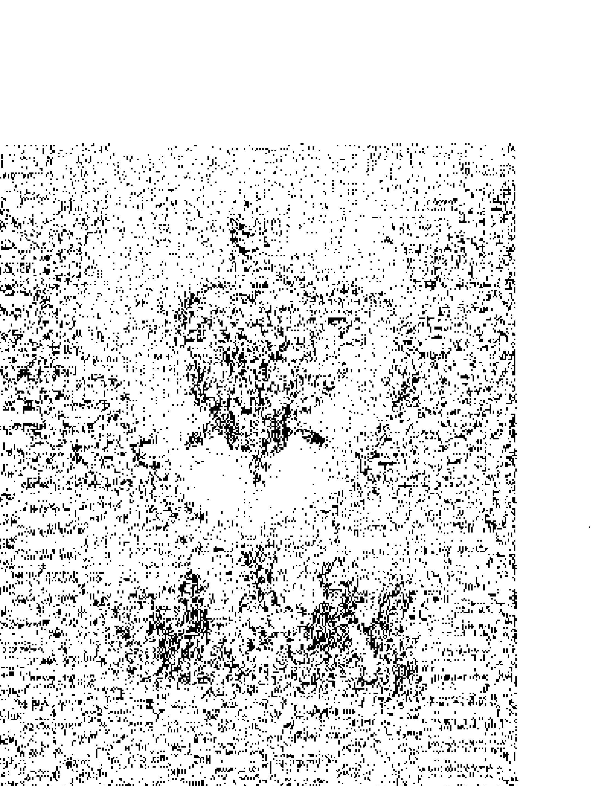

## 第四章 大天使們

除了與自己專屬的守護天使合作之外，你還可以接收來自大天使的巨大能量支持，祂們被認為是在天界階級裡最為重要的神之使者。你在任何時候都能請求祂們額外的協助，而且，由於這些天使力量如此強大，呼喚祂們就好像是宇宙中最棒的足球隊來介入那樣，以助你贏得生命的賽局。自幼開始教導我的天主教課程，稱大使共有七位——麥可（Michael）、加百列（Gabriel）、拉斐爾（Raphael）、烏列爾（Uriel）、拉貴爾（Raguel）、撒伊爾（Sariel）與瑞米爾（Remiel）（或許你會覺得奇怪，祂們的名字都是「el」結尾，但這不是偶然，因為「el」在猶太語有「閃亮的存在」之意）。每位大天使都有特定的領域，因此你能從祂們任一位引來相當特定與強烈的能量，取決於你想要進行的事情。請讓我向你簡單介紹每位大天使：

麥可，第一號大天使，祂是猛烈的、熱切的，是保護與愛的使者。當你的生活缺乏活力、興奮與愛的時候，就呼喚祂使你動起來。如果你真的準備好面對自身恐懼並嘗試新、甚至令人生畏的事物，像是換工作或是第一次獨自出遊等，你可以在冒險前進時請求麥可保護、引導你。

加百列被認為是排名第二位的大天使，掌管情緒。祂與水元素有關，並能撫平你的憂慮並增添你的信心，使得祂特別對那些常與焦慮爭鬥的人們助益很大。

接著是拉斐爾，負責療癒以及監督身心靈各個層面的療癒能量。祂的本質是空氣，因此祂不僅能在現實層面補充你的能量，也是增添創意的良好源頭。我會在開始進行任何寫作計畫之前祈請拉斐爾，使我一直保持清新與專注，幫助我創造出對於所有讀者而言有所啟發與療癒的作品。

烏列爾有著落實大地的振動頻率，而祂擔負多重任務。會在天堂門口歡迎你的祂，是帶來警訊的使者，也是音樂的守護者。

第五位則是拉貴爾，祂是大天使團隊裡面的警官，確保他人遵守規矩。當我們得要在孩子還很小的時候搭飛機作長程旅行時，我請求拉貴爾幫忙確保我的小天使們遵守規矩。應該是有發揮作用，因為我們坐上許多跨國與歐洲的航班，而女兒們不知怎地直覺知道她們得要守好規矩，不然就有得瞧（我並沒威脅她們）。事實上，我們常被路人攔下稱讚她們的舉止得宜，而這是女孩們喜歡聽的。

大天使撒伊爾保持事物的秩序，因此我通常在年幼的孩子邀請朋友來家裡玩的時候召請祂。不用說，孩子們會玩得很瘋並搞得一團糟，由於我不想成為掃他們興致的人（但也不想幫他們善後），我請撒伊爾處理此事。祂的成果真是令人印象深刻，因為到了下午的某個時刻，必然會有一個小孩建議來玩「管家」的遊戲，並在我知道之前，所有人都勤快收拾自己弄亂的部份……至少會是這樣（某一天當他們堅持要用吸塵器時，我就知道有位天使正在執行工作）。

最後的瑞米爾是希望天使。祂是一位非常強力的存在，是我在收容所擔任直覺引導者時經常合作的對象，畢竟祂的任務是在死亡之門歡迎我們，並把我們護送到天堂。有好幾次，我要先感受到瑞米爾的存在才去握著瀕死之人的手。當祂出現時，面臨死亡所出現的恐懼、緊張與戲劇事件的振動退讓給絕對的安詳與平靜。此刻就是我們的守護天使引導我們進入瑞米爾充滿愛的懷抱裡，在那一瞬間，在場的所有人都知道並感受到這個靈魂再次是安全的了。

除了個人的守護天使之外，大天使會鼓勵發展你的藝術才能，並有力量將你的創意啟動為高度的表現。不論你享受的是音樂演奏、繪畫、舞蹈、表演、烹飪或園藝，祂們會推動你去承擔風險並分享你的天賦能量。

藝術是自身靈魂的表達，因為給了靈魂發聲的機會。可以想見的是，壓抑藝術的動力，對靈魂造成很深的心靈傷口，需要強大的力量來療癒。例如，我生命中有一大段時間是遠離音樂的，因為我小學三年級的音樂老師讓我在耶誕詩歌合唱表演時坐冷板凳，說我的身體裡面連一個音符都沒有。對於這個事件，我對外的表現是一笑置之，但是內在受到的傷害是超乎想像的——在那次可怕經驗之後，沒人能從我這裡聽到一個音符。因為我是個很好的舞者並熱愛音樂，我感覺自己好像得做大範圍的心靈切割手術。

有一天我收到上面有烏列爾圖案的卡片，想起祂是音樂大天使。我曉得自己富有創造力的心，在這一方面需要一些強大的心靈「法術」，我請烏列爾療癒我並逐漸恢復我那歌唱的心。當你召請大人物時，你就得到大的成果。不出我所料，在呼喚烏列爾之後不久，我就遇到一位名為馬克的音樂家，他願意跟我一起旅行與工作，只需微薄費用。我知道馬克是烏列爾派來的，他在他的音樂中如此安然與落實，使我感動地想唱：……在意識到之前，我早就開始唱了起來。

在兩人一同參與的各地工作坊以及簽書會裡唱了起來。我有唱對音嗎？沒有，至少一開始沒有，但是藉著烏列爾（還有馬克）的幫助，我的唱歌終究有所改善，直至今日仍不斷為我增添喜樂。我的母親有類似的情形，她在第二次世界大戰所受的傷使她損失95%的聽力，而哀嘆她是多麼希望能夠再次聽見、享受音樂。她說她會向大天使們祈禱，過了不久，她就有一項令人驚訝的聆聽經驗：她說整晚在做夢時，有著為她演奏的小夜曲，那是她聽過最為精美的天界音樂。她無法形容那音樂有多美好，但是她臉上的光彩明顯表示她被深深地感動。更令人高興的是，這音樂從未休止。媽媽聽著同樣的天樂跳舞，已經頻繁到我們會對她開玩笑，說她得趕快上床才不會錯過她的音樂會。而她會笑著回答說：「我做夢才會夢到這種情形呢！」

由、完全地表達出來。然後做好準備，因為大事會開始發生。

## 你知道大天使……

- ……是神最重要的使者嗎？
- ……是你的靈性支持團隊的電力增強包嗎？
- ……掌管你藝術才能的進展嗎？
- ……是強力、友善與仁慈的，並且沒有人類的個人自我嗎？
- ……喜歡被召請，因為服務你就是事奉神嗎？
- ……能藉由二次呼吸之間緩慢吟誦祂們的名字來召請祂們嗎？

我通常跟客戶分享召請大天使的資訊，他們大多發現這樣做的結果都會超過他們最高的期待。例如，安妮在公立高中教導情緒失常的孩子，雖然她堅定地進行她的使命，但是她所承受的壓力已超過底線。我建議她召請拉貴爾來幫她使孩子們（還有她自己）遵守紀律。

> 「我究竟要怎麼做啊？」她問道。
「你不用做，」我說，「或許這裡沒有可以幫忙的，但是拉貴爾不在這裡——祂在天堂——而祂裝滿潛在的能量，所以試試看吧！」

安妮整個週末都在召請拉貴爾並「卸載」她的挫折，就只是要求祂幫助她使事情保持平靜，好使她變得能夠專心教課而不是調停糾紛。

接下來的星期一，校長找她過去並告訴她，學校被列為這城市嘗試新式課堂策略的目標，畢竟原本使用的那套是失敗的。他們決定的第一項改變，就是把她那班二十九個孩子分成二個小組。她不敢置信地看著班上前十名最會製造麻煩的孩子，在五分鐘之後走出她的教室，讓她負責剩下的九位學生，跟以往比起來是相當容易管理的。

> 「是拉貴爾做的嗎？」她問我。「安妮，我們現在說的是芝加哥公立學校體系喔！」我提醒她，而兩個人笑了出來。「你難道不會說這一切的發生，都是某人藉由超自然力量精心設計出來的嗎？」

## 如何召請大天使

我所受的教導說，召請大天使最好使用某個特定的方式。當然，祈禱一定會引起他們的注意，但祂們喜好的方式是以類似歌唱的形式吟誦祂們的名字來召請祂們。

- [吸氣] Mich-ael [吸氣與休息]
- [吸氣] Ga-bri-el [吸氣與休息]
- [吸氣] Raph-ae-el [吸氣與休息]
- [吸氣] U-ri-el [吸氣與休息]
- [吸氣] Rag-u-el [吸氣與休息]
- [吸氣] Sar-i-el [吸氣與休息]
- [吸氣] Rem-i-el [吸氣與休息]

邊呼吸邊吟誦每個大天使的名字，念完後從頭反覆，直到能夠感受祂們為止。吟誦得愈長，愈能感受祂們的存在。你不需要急，只要有耐心，祂們會來的。你會知道祂們在你身邊，因為祂們的振動令人尊敬，感覺力量強大（彷彿祂們是真實的），但不會使人驚慌。你不僅感受到祂們的振動，你將會看到祂們的成果。

如果你想特定要求其中一位大天使，你可以藉由在呼吸間重複祂的名字來直接召請祂。不論你是要召請一位大天使或是整個團隊，要確定你是認真的。請記得天助自助者，因此除非你已準備執行必要步驟來推動事情，即使大天使也無法幫你。『決心』這一層是你負責的。

大天使是你的靈性支持團隊的電力增強包。在與守護天使與指導靈合作的時候，要記得他們並沒有能力給你造就改變時所需要的能量，只有大天使可以。祂們單靠自己就可以把你往前用力拋出去，但只有在你準備好了才行。

這讓我想到那位名叫西瑟的客戶，她想要運用自身創意書寫的能力，不停地說她『總有一天』會寫一本書出來的。當她第一百六十四次提出這個話題時，我問她為何還沒開始，還有什麼時候會真的開始做。她透露這真的是她的心想要的事，但看似找不出時間——更別說能量——來著手進行，雖然她腦子裡已經想過好幾遍要寫自己的書。

因為我也曾有許多類似西瑟『想要啦、可能啦、應該吧』的寫作情形，就分享我召請拉斐爾將自己推入行動的秘訣。她覺得這主意太棒了，要我做給她看，於是我教她「吟誦召請祂」的方式，並請她讓我知道後續的發展。

三個月之後我遇到她，在問及她的進展時，西瑟轉著她的眼睛說：「真是無法想像！自從我接受你的建議並吟誦召請拉斐爾時，我從未錯過每日的寫作。每一天，有個更大的存在使我坐到自己的座椅上，直到我寫了至少一個小時才讓我離開。除非我做完了，不然我無法做其他事。我真的在生一本書出來。」

「是啊，那是拉斐爾，」我說，「提出要求，但確定你是認真的。」

這就是與大天使連結的美——祂們使你行動並且不浪費時間。大天使們不像你的守護天使那樣地保護你或照顧你，祂們是你的靈性指導團隊的四分衛，而且樂意參與其中。

查理·古德曼（Charlie Goodman）是我第一位在玄學領域的老師，他也是引介心靈技術給我的第一人，教我一個美妙的儀式，用於出門時召請大天使。首先，我觀想自己的守護天使——晴亮——握著我的手。然後以一次吟誦一位大天使的名字方式，我請麥可走在我的右側、加百列走在我的左側。接著我召請烏列爾在前引路、拉斐爾在我後面留意後方。最後，我安排拉貴爾在頭上以管理秩序、撒伊爾在我身旁。當「大頭們」（archies）（我愛這樣稱呼祂們）都就位時，我邁步前行。

這個儀式給我信心與能量去面對任何事情。我甚至將我的福斯金龜車命名為「大頭車」（Archie-Mobile），並觀想四個輪子代表著麥可、加百列、烏列爾與拉斐爾，而車頂代表拉貴爾、煞車代表撒伊爾，晴亮則在乘客座位。有了這樣的陪伴，我感覺自己開車上哪條路都是安全的——而且直至現在都是如此。

召請大天使能夠加速提升我們的頻率並擴展我們的氣場。因此，我召請大天使們在演講時跟我一起上台，使我的表現比較有力。而且我總是在進行個案時請他們出現在我的辦公室，因為他們幫助我在面對如此困難與消耗心力的工作時維持住自身能量。晚上我也把他們安置在屋頂的四角以更新家庭成員的靈。我旅行時也帶著他們，特別是在長期的工作坊教課時。事實上，我請大天使們在我生命中的每一刻都環繞著我……而他們也這樣做了。

## 輪到你囉……

練習召請大天使們，並注意事情的發展。你的守護天使的平靜存有是安靜的伴侶，但大使們不一樣，他們的能量使你準備好行動。他們給出如此激勵人心的振動，使得所有的恐懼與焦慮馬上讓位給明亮的信心。

雖然大天使們強而有力，他們是仁慈的、友善的。他們從未轉世成人，因此他們沒有我們那樣的自我。他們喜愛被召請，因為他們的意願是在我們的一切高貴理念上提供幫助——畢竟，為我們較大的善服務，等同為神服務。

另一種連結大天使的有趣方法就是將祂們描畫或彩繪出來。我懷疑現在還有小時候沒畫過幾十個天使的。當我還是小孩的時候，祂們可是我喜愛的主題之一呢！即使是漫畫也可以，所以無論如何，就運用你的創意並記得我們應當享受自身對於天使的解釋。

這項練習幫助我們直接連結天使們，因為我們的手切斷了我們與自我的連結，重新連接上自己的心，而我們會在那裡跟自己的天使朋友與助手有著最直接、親密的接觸。任何需要天使們支持的時候，請以亂畫亂塗的方式畫出祂們，祂們的協助將立刻流向你。事實上，現在就試試看，讓你自己看到自身能量增進的情形。

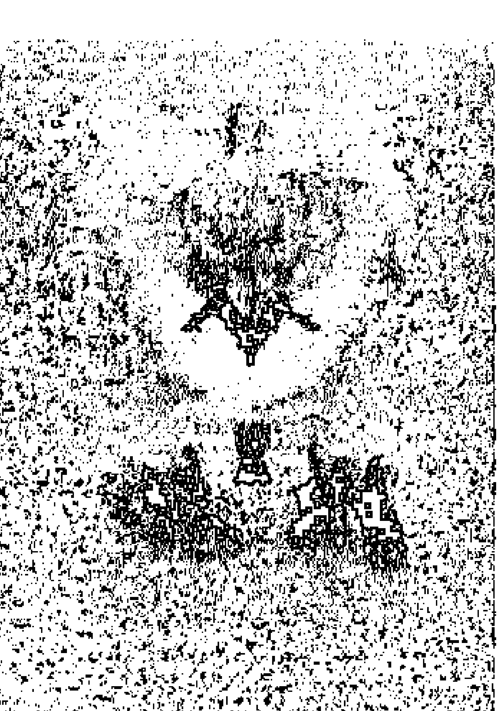

## 第五章 天使聖團

記得你是上帝神聖的孩子，是珍貴的、被愛著的，而天使們是依著神的計畫來這裡服務你的。你受到的祝福是，具有一個平和、豐盛與保障的人生所需要的一切資源。根據這個目的，你的天使支持體系不僅包括你的個人守護天使與充滿能量的大天使，事實上你還能立即、直接連結所謂的天使聖團，以在自身生活每一層面獲得特定的協助與支持。

與聖團一起合作會是相當有趣的，因為身為一「良善送貨員」，祂們非常樂意送來禮物、帶來驚喜、使我們感到高興並讓我們的生活變得輕鬆些。在天使聖團裡有著數不盡的部門，像是停車、電腦、購物、縫紉、旅行、辦公室、療癒等等，哪裡有需要，哪裡就有提供服務的天使。聖團是全天全週無休的，並在我們召請他們幫助時立刻行動。唯一的條件是我們的需求是良性的，而且不會傷害其他人……在這條件之下，我們能夠自由享受祂們的祝福！

## 正在運作的聖團

我的母親在很年輕的時候就開始縫紉，並且逐漸把它當成最喜愛的創意活動。就像她說的：「這是我把世界移開、眼神對話的時候。」因此，她跟縫紉天使有著特別緊密的關連，她會召請祂們幫忙找美麗的布料、在某個花樣上面卡住的時候提供靈感，並在創作自己的想法上遭遇困難時提供協助。

二十五年前，我的母親自願為我製作結婚禮服，而她召請她的縫紉天使來幫忙。在祂們領她到某個從未去過的小布店後頭之後，她興奮地打電話給我。在那裡、就在一大堆棄置的零頭布裡面，她找到一匹義大利的精美手工珠飾絲布，完全適合作我的新娘上衣。而這還不是最驚訝的，她看著布料的價格標籤，原本應是一碼兩百到五百美元的布料，現在只要一碼二十五美元！她不敢相信自己的眼睛，就把布抱到店前問老闆：「不好意思借問一下，這布料的標價是對的嗎？」

「不，事實上，那個不對，」他回答道，「它又再次降價了。我已經有好一陣子想要把它降到一碼十二塊半美元，但一直沒動。你瞧，這是相當精美的布料，但是它一直賣不出去，我想要出清它。事實上，如果你喜歡的話，我整匹只賣你一百塊美元。」

媽媽告訴我說，在她脫口說出「成交，我買了！」之前，她抱著超過兩千美元的布料，站在那裡無言了五秒鐘。不用說，我非常高興聽到她的故事，但使我更加驚喜的，就是母親拿給我看的結婚禮服（還有搭配的手套），那樣的精緻超乎我的想像。我母親的天使再次地帶來完美的驚喜，以滋養她的創意並增添她的喜悅。

我的丈夫派崔克，跟聖團中另一特定部門有著緊密的連結，就是特價天使。這或許是因為他在很年輕的時候就建立這樣的關係，當時他在資源有限的大家庭成長，買特價品似乎是唯一的選擇。然而不論何種原因，我知道沒有人能有他那樣的好運，總能在對的地方、對的時間遇上世紀大拍賣。

長期以來，他的特價天使喜歡經常地以美妙驚喜來祝福他。例如，祂們引領他買到第一輛車——奧斯摩比的戴爾他88型，只花了三百美元。也因為這樣而使他找到一份需要他經常開車的工作，並有一英里三十二美分美元的補貼。而這輛車跑了超過十三萬英里都一直運轉良好，因此他能夠完全回收原來的成本，也賺足夠的錢去環遊世界一趟——這可是他從小就有的夢想。

有一次派崔克被領到一場樣品拍賣會（這是商品在正式推出之前所辦的），使我驚訝的是那一套價值一千二百美元的銀盤組，他只用二十美元買到，還有零售價是七百美元的桌布，他只用二十美元買到。

另一次則是天使們領他去芝加哥商品市場，結果他所收到的是用一元買到自己喜愛、單價幾百元的聖誕飾品。他找到許許多多美麗的寶物，使得我們家變成內在小孩的遊樂場以及每個聖誕節都會出現的奇幻冬季樂園。當天他戴著聖誕老人的帽子高聲歡唱，因為那一盒盒精美飾品與娃娃總共花不到美金兩百元。

即使過了這麼多年，特價天使未見懈怠。就在最近，當客戶來話通知請他過去的路上，天使們堅持要我的丈夫在客戶辦公室附近的過季商品購物中心停車，他走進位在遠端的設計師品牌商店，不敢置信看到店員正在陳列一折的亞曼尼的毛衣、套裝、襯衫與西裝褲。驚訝於商品的質感與價格，他問店面經理這種機會是否經常出現。經理說這並不是經常有的，賣主估錯時節買進，所以現在想盡快出清……事實上，他們可能只做這一次。派崔克非常感謝他的天使，讓他把自己夢想擁有的衣物帶回家。

至於我呢，有著天使來幫助我的無數例子。我喜歡的一個例子是，就在我所服務的航空公司被接管，空服員罷工。而我因而失掉工作之後，我的旅行天使馬上替我出面處理事情，三年後（在我的第二個女兒出生後隔天）罷工結束。前一百位回電的員工，可以獲得自己與所有家人終身免費旅行，代價是放掉他的工作……而我是第一位。我並不想回去工作，因為我在這段時期已經建立了自己的靈媒工作，這樣的代價就跟中了樂透一樣。現在我能夠待在家中跟家人相處、做我喜愛的事，並能環遊世界。只要容許祂們為你運作奇蹟的話，你是否看到祂們能是多麼慷慨大方呢？

你知道天使聖團……
- ……是你的步兵部隊？
- ……是良善的送貨員？
- ……照顧你一切的需要？
- ……服務你是為了使造物者喜悅？
- ……具有明亮、輕盈與雷射般的振動？

在教導我與天使聖團合作時，母親這樣說：「就把天使加進來，並期待好事。」並在暫停之後說：「當你回家的時候，我期待聽到這些好事。」直至今日，我把天使加到任何正在進行的任務，這已成為習慣，而我不會想嘗試不用他們的幫助來完成任何事——就好像我握有頭等艙的機票，卻跑去坐經濟艙那樣！

輪到你囉……

為或許要嘗試幾次之後才會習慣，但是召請天使的幫助將會隨著練習而愈來愈容易，因為當祂們進來的時候，所有事情都變得更好、更快。請記得，你能夠活出奇妙的人生，只要你能容許它是那樣……至於它的奇妙程度就取決於你願意召請聖團的程度。

連結天使聖團就像是連結自己的守護天使那樣簡單——只要相信並呼喚幫助。達成此事最好的方法，是認出你正在跟天使聖團建立關係，就像你對於所有支持自己的靈體們的連結那樣，你愈常跟祂們合作，連結就愈有力。

召請聖團的最佳練習方式，就是在每一個任務的開始時做個簡短祈禱，像是

> 「天使聖團，請照管所有我正在做的事情並把它變得輕易、迷人並充滿禮物。謝謝你們。」

在祂們飛來幫忙時，感受祂們的存在。而更棒的是，藉由請祂們停留在固定的任務上，給予祂們代你行事的自由。

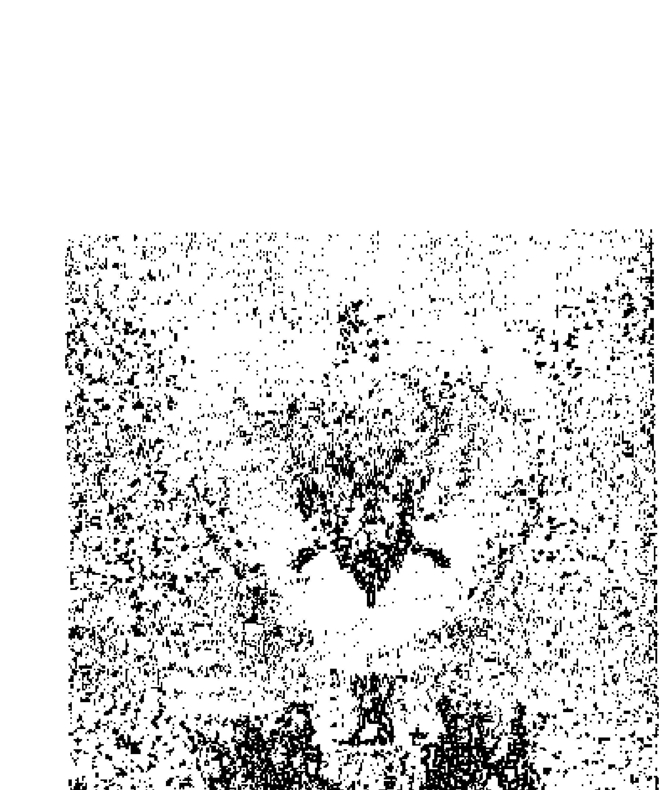

## 第六章 生活在天使的影響裡

連結你的天使指導靈是非常容易的，而且只要一點努力，就能開始知覺到一直都在的他們。現在閉上眼睛，看看自己是否能感受到自己的守護天使站在附近……祂是在你的左邊、右邊、房間的另一邊或是就在背後（我大多感受到自己的守護天使——晴亮，在我的右側；然而，當我在做個案的時候，祂會移動到我跟客戶之間）？接著，嘗試召請大天使並留意祂們的振動是多麼不同：雖然祂們知道你（其他人也一樣啦！）不敢挑戰祂們，你能感受到祂們仁慈但又強勢的勁道嗎？現在試著去聽見大天使們各自的精微差異。例如，麥可有著強烈、像是戰士的特質，而加百列是比較深邃、冷靜一點。另一種辨明天使振動的方式，即是將祂們看成是同種顏色之中的細微變異。例如，大天使或許感覺起來像是強烈的靛藍 (indigo) 光束，你的守護天使可能是天藍色 (sky blue)，而聖團像是蔚藍色 (azure)。換句話說，祂們都是獨特的，但是分享著共同的連結。

信任自己的感受，別讓你的頭腦用「這是自己編造出來」的說詞來干擾你。

由於你或許不太習慣表達你覺知到的靈視者的世界，懷疑、質疑這些差異是否為自身想像是相當自然的。而令人驚訝的答案即是：是啊！因為靈是藉由你的想像與你連結的。無論如何，這仍是個真實的觀點，只不過跟你被認知的那種不一樣而已。

多加磨練你的覺知，讓你能對準天使聖團的能量頻率。同樣地，再次留意祂們跟守護天使或某位大天使之間的頻率差異。請記得，就像嗅覺、視覺、味覺、聽覺與觸覺那樣，覺知也是一種感知能力，需要練習使它變得敏銳，因此要有面對學習曲線的準備，並且別過度執著於把它做「對」。一旦你抓到訣竅，你就會知道此事就像分辨不同的布料、香水或是管弦樂中的樂器。請記住，大腦是非常複雜的，它足堪應付於同一時間內完成吸收、分類、辨別大量資訊的工作。

你知道嗎？……當靈性力量向你靠近時，分辨不同天使振動的最佳方式之一，即是言語歡迎祂們的出現？以這樣說作為開始：「早安，守護天使。」（暫停）「早安，大天使們。」（暫停）「早安，天使聖團。」然後再暫停一次使你有意識地連結每一道頻率。

我的客戶克莉絲汀受苦於一長串的身心障礙，非常需要幫助與支持。她在年輕的時候嫁給一位酗酒與慣性暴怒的人，而這種持續的恐懼又被自己那對跟先生有著同樣癮頭的雙親所給的壓力與虐待放大。更不幸的是，她因車禍而有嚴重背痛與行走的困難。不久，她又被診斷出因意外與失能而造成的創傷後壓力症候群。感覺到完全挫敗與孤獨，克莉絲汀來到我這裡……而且她得要偷溜出來見面，害怕她的丈夫在發現她來找我時會傷害她。

我一見到克莉絲汀，就非常清楚地看到她受苦於嚴重低落的自尊。她相信自己是「瑕疵品」，除了忍受丈夫的虐待之外別無選擇，畢竟她唯一擁有的就只有他。在聽完她的故事之後，我決定當天首要做的就是向她引介她的天使部隊，使她能夠感覺受到保護與自由。在一開始，她嘲笑我，說她得要到真正絕望的時候才會召請天使。我一臉認真的同意，但也告訴她說不需要讓自己一直絕望下去——她只需要經常召請她的天使而已。

我請她閉上眼睛召請她的天使來幫助她，試著去感受祂們慈愛與強力的振動，並在感受到祂們的存在時讓我知道。當她點頭表明自己認為祂們在她身邊時，我請她詳細描述自己的感受。

她遲疑一會兒，然後說有一股溫暖、滋養的感覺籠罩著她，就好像她被包在嬰兒毛毯裡搖著那樣。我解釋這是她的守護天使，祂正保護著她並使她知道她是安全的。

突然，克莉絲汀顫抖起來，說她感受到一陣強大的寒顫沿著脊椎爬上來，而她覺知到某個巨大的存在就站在自己的面前。我告訴她這位是麥可，亦即愛與保護的大天使。她閉著眼、帶著微笑持續呼吸、專注在那振動上，然後她的眉頭漸漸放鬆下來。「如果這股力量與我同在，」她最後開口說，「那妳是對的，我沒什麼好怕的。」

> 「那妳是對的，我沒什麼好怕的。」

> 「是的，你沒有什麼好怕的，」我跟她保證，「當你的天使跟你在一起的時候。」

在幾次個案之後，克莉絲汀的信心已足夠到能自行嘗試與天使們溝通的程度。她已倦於感到害怕，一連幾週的每一天就召請她的守護天使（還有麥可、拉貴爾與提供個人支持的聖團），並且每次做完都愈覺得強壯。當然，就像管絃樂團在音樂會開始之前會先調整樂器那樣，我的客戶感受到她的支持團隊逐漸進入她的生命。

然而突然停了。天使們全力參與其中，在那一刻，她所有的恐懼——不管是對於她先生、對於倚賴、對於失能——離開她的身體。她站直起來（幾年來第一次沒有疼痛），感覺非常強壯，她看著他，說：「我受夠了你和這堆愚蠢。」然後安靜地走出門外。事後，她說

> 「我受夠了你和這堆愚蠢。」

她覺得好像整個天堂都爆出歡唱。

當克莉絲汀走出她的舊有生活，她走進一個嶄新、使自己更有能力的生活：她離了婚、參加療程與匿名戒酒會（Al-Anon），在園藝中心獲得自己喜愛的工作，並嫁給一位更溫和、仁慈的男性，而且跟他有了一個健康的兒子。

「如果我沒跟自己的天使們連結，請祂們移除一直傷害我的事物，誰曉得我會是什麼模樣？」她說道，「祂們的協助救了我的生命並給我一個兒子——更別說還有一雙能夠穩穩站著的腳。」

輪到你囉……

鍛鍊自己覺知自身天使的存在，此方法最能與祂們建立更為有力的連結。當你在淋浴或泡澡放鬆時，藉由吟唱不同的振動來練習。慢慢地召請下列的能量振動：

- 你的靈
- 跟你有連結的人們的靈
- 你的守護天使
- 大天使們
- 天使聖團

在每一項召請之後，暫停下來感受特定的頻率所引發的細微變化，練習時請保持輕鬆，這樣它不會有像是工作的感覺。運用你的心與想像力，而不是愛挑剔的頭腦。更重要的是，留意在對準頻率時那股洗滌自己的安詳與平靜，並讓自己享受那在非實質層面上將你圍繞的眾多精緻、美妙的能量。

在接下來的幾天或幾週，就只要專注在感受你的天使部隊，使自己能夠習慣他們慈愛與支持的振動。每天練習辨認他們的頻率幾次，直到你感覺自己能順利接上他們。一旦你連結自己的天使們、熟悉他們幫助你的形式，我們將移向下一個關於支持與方向的靈性層面——你的指導靈。

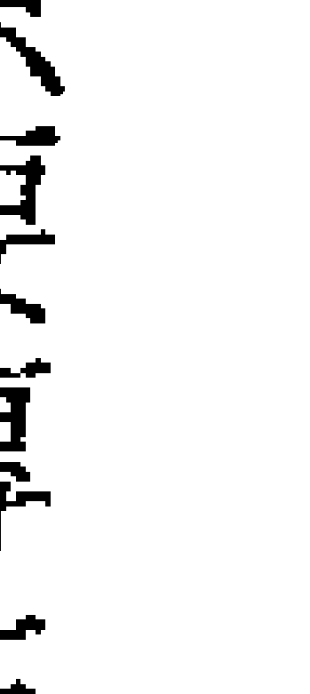

## 第三篇 會見你的指導靈

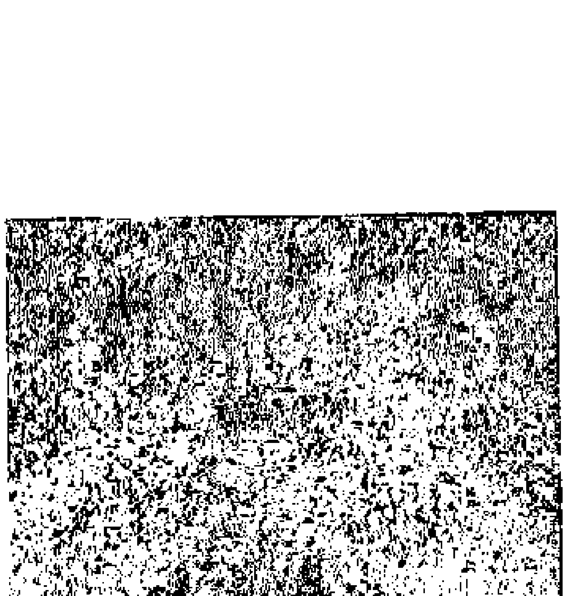

### 第七章 指導靈常見問題 Q & A

能夠在你這一生提供協助的指導靈與靈性資源是無盡的。除了你的天使之外，彼岸還有無數稱作「指導靈」的幫手，就像你生活中的人們那樣形形色色，並各自負有或長或短的使命。如果你把你的天使們想成是你的貼身保鑣與部隊，那麼你的指導靈就是你的義警，它們一直是準備好的，樂意且有能力在你召請祂們時提供服務。在討論指導靈的主題時，有些問題不可避免地會被提出，而答案可能得依所問的特定指導靈而有相當的個別性。這一章會成為你對於指導靈的「速成課」，它對於這些問題給予一般性的答案，並為後續篇章對於不同種類的指導靈的詳細介紹打下基礎。因此，為了想將關於靈界最為基礎的資訊提供給你思考，請讓我列出關於下一層級的指導靈四個最為常見的問題：

### 一、天使跟指導靈的差別在哪裡？

天使與指導靈之間有著幾個重大的差異，包括是否有人身的經驗、祂們出現在我們生命中的目的、能夠介入的程度，以及跟我們溝通的方式。例如，天使從未有人身的經驗，但絕大多數的指導靈至少會有一世為人，因此祂們馬上能了解身為人類的我們所面對的特別考驗與挑戰。因此，當我們需要祂們來鼓舞與協助我們，來教導我們使靈魂成長與掌握身為人類的創意時，祂們是隨手可及的。這裡的關鍵詞就是「當我們需要祂們」。天使是接受上主的神聖指派，從我們出生到死亡都提供無時無刻的服務，每天都在影響著我們（不論我們對此有無知覺）。然而指導靈並不是如此，祂們雖然隨手可及，如果沒有我們的允許是無法服務或引導我們的。祂們通常善於引起我們的注意並請我們去要求祂們的幫助，但是祂們必得尊重這是我們的生命，沒受到邀請是不能進入的。最後一點，天使有著比指導靈高很多的振動——畢竟祂們那麼靠近神——而且祂們很容易連結。祂們保護、提振、滋養我們，使我們更有能力。而他們雖然有可能會藉由我們的意識來影響我們，但祂們不一定提供直接的建議或指示，而這些是指導靈所做的事。

### 二、指導靈是誰？

既然絕大多數指導靈是曾在地球上生活的個體，也就可理解祂們是為了服務我們而回來的。事實上，有些指導靈可能跟我們有著連結，因為祂們在人世時遇到類似的挑戰，所以想要提供祂們的指導使我們的道路能夠輕易些。也有其他的指導靈會出現在特定目標或任務上幫助我們，因為祂們的前世是我們現在正探索或努力範疇之中的大師。指導靈也有可能是過世的家族成員，被選來在靈的層面與我們保持連結以提供方向與協助。與之類似的是，也有可能是那些在我們的前世共享重要的親密關係或靈性工作的個體，決定在這一世繼續跟我們合作，為的是繼續增添我們靈魂經驗的豐富。這也包括靈性教師（spiritual teacher），算是指導靈中最重要的類型之一，祂們想要在我們使自身靈魂成長的同時，幫助我們學習並了解自身靈性的本質。而且我們還有差使（runners），或是在前世相當接近大地的指導靈，像是美洲原住民，祂們幫助我們能更加連結自然的世界。除了這些美妙的存在之外，要記得前來協助你的指導靈甚至可能是你自己的高我，祂就像你所遇見的其他指導靈那樣的美麗與開悟。

### 三、指導靈來自何處？

這問題的答案也是有點複雜，因為指導靈來自許多不同的領域以及能量場。也有許多指導靈是從其他的銀河系、太陽系來到地球層面——有些從未有過肉身——與我們連結以幫助恢復這行星的平衡與平安。

### 四、我們會有多少個指導靈？

我的老師查理·古德曼告訴我，人們一般最多能跟三十三位指導靈同時連結（不包括天使）。然而，如果這個體成功地擴展意識與提升頻率，這數量會提高到他們想要連結的量。

例如，當我還是年幼小孩時，我開始只跟兩位指導靈合作：我稱其中一位為「點點」（Dot），因為我在心靈之眼感受到祂像亮藍的光點（我相信祂是我的高我）；另一位則命名為「玫瑰」（Rose），祂看起來非常像聖泰瑞莎，我感覺跟她曾共度前世。

在我這一生，這兩位指導靈一直跟我有著密切的合作。除了祂們之外，我連結另一位名為約瑟夫的指導靈，祂跟我共享厄色尼派教徒的前世。祂也是在我小的時候就出現的，雖然祂來來去去的，當我需要祂幫忙有關身體健康的事情時，祂總是在那裡幫我。

當我與我的靈魂逐漸長大，我開始適應一些自己的靈性教師。我首先遇到的三位法國主教，祂們跟中古世紀的薔薇十字會有關連，也在我其他前世擔任我的教師。祂們與另外兩位老師會一直跟著我，那兩位是從別的銀河系來的，自稱是「昂宿星姊妹」（The Pleiadean sisters）。我感覺跟祂們沒有前世的連繫，祂們會被我吸引的原因，僅是想要幫助我提供更好的服務，使人們更能了解自身生命目的。

近期我又跟新的指導靈團隊連結，祂們自稱為「第三道光使者」（Emissaries of the Third Ray）。這個指導靈團隊並不針對個體進行工作，通常都是透過我向較大的團體說話。

你可以看到，不僅你的指導靈的數量在這一生會有變動，指導靈自己——以及祂們在你生命中停留的時間——也可能隨著你對自身靈魂的培養而改變、進化與轉換。這些年來，我有許多指導靈——大部分是助手（helpers）與療者（healers）——在出現之後又離開讓新的存在個體進駐祂們的位置。這樣的情形一直都有……就像旋轉門那樣！

我的先生派崔克也有同樣的情形。他有幾位忠誠、美麗的指導靈，在許多不同生活層面中幫助他。例如曾當國王的西摩斯（Seamus）是他的靈性老師之一，在領導統御層面提供靈感；讓·奎樂（Jean Quille），是助手指導靈（祂跟他共享許多前世），努力助他維持自己的冒險感與趣味；還有萊瑞（Larry）是他的陪伴指導靈（companion guide），幫助他有著更好的傾聽與溝通。除了這三位之外，派崔克在幾年以前也連結到一位名為文森（Vincent）的藝術家，是來幫助他繪畫（這是他最深愛的消遣活動）。最後還有瑪麗，這位教師幫助他柔軟自己的心、開放自己的思想並了解所有關於女性特質的事物……特別是家中的女人！另一方面，我的姊妹庫琦（Caly）跟許多她幼年在丹佛長大時相當親近的家族成員一起合作，特別是喬凱特祖父與祖母，還有愛瑪·柏娜德姨媽，這些指導靈使她的靈保持在輕盈、慈愛與笑聲之中。身為治療師的她，庫琦也吸引來數個美麗的療癒指導靈，包括幾位跟她共享前世的古夏威夷與波里尼西亞療癒者與戰士。這些存在體出現在她的「療癒室」，而她則在清理客戶的過往心靈垃圾與釋放客戶的靈使其自由時，藉由己身傳導他們。事實上，當庫琦在我身上工作時（藉著她的指導靈的協助），我的靈被帶出體外接受深度的滋養與清理，那時我的身體正清理著所有的能量干擾。你知道嗎……指導靈可以是助手、療者、教師、差使、前世有關係者、家人、來自其他銀河系的高等存在，甚至是動物？你有權力只召請最高等的指導靈，而當你這樣做時，你也沒有責任要聽從那些自己覺得不對或不妥的建議？你愈向自身指導靈與祂們的協助開放，你的人生將會變得更棒？指導靈的唯一功能是提供協助給你？

請記得，某些指導靈是比其他的好，因此確定我們跟目前祂們當中最好的合作是重要的。無論是否有著肉身，我們都是走在通往更高意識的路上，因此我們必須記得的是，如果往生的某人想要以指導靈的身分來提供服務，並不代表他或她突然開悟了。

這使我想起客戶愛咪的母親瑪麗亞，她已過世成為靈，並以指導靈的身分服務愛咪。雖然愛咪非常高興能與自己的母親再次連結，但她不久就了解，已經身為靈體的瑪麗亞幾乎還是一樣還是跟生前一般的小心與恐懼。每次愛咪想去旅遊或是做一些冒險或放縱的事情時，她尋求母親的指引時馬上就感受到她回應著「要小心喔！」或是「我的天，好貴啊！」而不是「去吧！好好享受！」

「我一生都在跟她的恐懼打仗，」愛咪憤怒地告訴我說，「現在我感覺她將永遠纏著我！」

我笑著同情地說：「對於某些事情，你為何不就停止問她呢？無論是在肉身還是靈體，她仍是妳認識且愛著的母親，所以如果你想要問她的意見，聽到時就別驚訝是那樣。」

對於愛咪而言，她最好只在那些她「想要」瑪麗亞的意見的主題上諮詢她，像是僅以她的愛、持續在愛咪的生活與心中存在著來安慰愛咪，而不讓她碰觸關於冒險出遊、放縱興致的選擇，畢竟這些從來不是她母親擅長的部分。

在連結你的指導靈時，非常覺知自己的意圖是相當重要的。人們在連結或感受自身指導靈上出現困難的原因之一，即是他們過於積極地完全翻覆自己的生活。高等的指導靈——亦即那些靈魂已經提升、對於支持你的成長有著真誠興趣的個體——只會提供建議，而且他們「從不」告訴你怎麼做。你可以從某個指導靈在知道你要祂們做某事時是否拒絕與你連結或介入，來認出祂們是否來自較高的層次（還有值不值得聽）。高等的指導靈了解祂們並不是來這裡以任何形式替你過生活（你也不應讓祂們這樣），而且在這地球層面的你是在上一「靈性學校」以學習掌握自己的神聖創造力量。指導靈的服務就僅止於指導者的角色：祂們不會代替你寫作業的！

輪到你囉……

逐漸認識你的指導靈以及學習與他們合作是相當令人興奮的過程，而且將會使你的生活變得奇妙而且沒有壓力。祂們希望在可以的時候盡量幫助你，並耐心等待你邀請祂們進來。連結自身指導靈的最佳開始方式，即是花些時間思索自身生活哪些區塊是祂們最能勝任的。就挑選一個自身生活的面向，並想出哪些區塊是可行的、哪些是不可以的。用頭腦或用筆記錄那些你目前還沒有、但是想要經驗的事物。哪一些是你最有興趣獲得靈性的指引呢？一旦你決定哪裡想要有靈性支持，我們將討論要連結那些能夠助你達到目標的指導靈之必要步驟。

## 第八章 準備會見指導靈

現在你知道自己能連結到各式各樣的美麗指導靈，祂們將與你合作以使你的靈魂成長並在日常的挑戰中幫助你，而此時該是開始準備連結祂們的時候。這一章將告訴你依序進行的詳細步驟。

第一步：問自己對於指引的敞開程度有多少。

第一步看似有著理所當然的答案。事實上，不論何時我提出這個問題，絕大多數的客戶與學生都這麼認為。他們說自己當然是完全敞開的啊——不然他們為何會來跟我對話呢？

或許你覺得這樣的想法對你而言也是真實的，但是就我擔任直覺引導者與教師的經驗來說，此事或許並非如此簡單。我雖對客戶提供能使他們的生活明顯過得比較輕鬆的建議，也是有忽略或拒絕建議的人，而且還算常見。例如，我看到許多在做個案時寫一堆筆記的人們，事後把筆記擱著一旁……從此再也不看。我也遇到在整個個案時間都在說話的客戶，幾乎沒留什麼時間給我提供引導，只想要我聽他們說話就好。現在注意囉，上述這一切都沒錯——但是非常不像在尋求指引。

我自己也有忽略靈性指引而產生的罪惡感——像是那時我詢問指導靈關於某位非常有天分的新朋友，我非常享受跟她在一起，因此想要跟她合作。祂們請我要多注意，說她並不是那種能夠共享舞台的人，倒像是想將一切收歸自己的那種人。由於這是我當然不會認同的意見，我就忽略我的指導靈的意見：……而且我也忽略我的姊妹、丈夫、其他朋友甚至我的孩子的意見，他們都說跟她共事最後必定出問題。然而，固執的我不想聽進去，之後我就真的驚訝地發現事情怎麼變得跟他們所說得一模一樣！我非常享受跟她在一起，使得我看不見她的野心，而時間一久，這野心就超過我們的友誼。

就像你看到的，一旦我們的心意已決定要以特定形式來做事的話，接受指引與支持可能會是非常困難的（即使是我也一樣）。事實上在好幾年前，當客戶來我母親那裡尋求指引時，她會先問：「你是真的想要指引，還是只想要我同意你？」之後，她才開始進行個案。如果你想要成功連結「自己的」指導靈，這是一個非常值得回答的問題。此時也適合

## 第二步：学习使自己的头脑安静下来并倾听内在。

提醒你自己，过此一生但从未寻求协助或支持，仍是完全没错的，你的指导灵永远不会来干涉你。就只是清楚、诚实地了解自己对于协助的开放与接受的程度，并知道无论何时你「真的想要指引，问了就会有。」

我母亲教导我另一件重要的事情，亦即除非我愿意听进答案，不然别去询问我的指导灵……因为如果我太常忽略祂们的指引到某种程度，祂们就噤声了。此事的真正意义在于，你「能与指导灵连结，而祂们也会帮忙——但「只有」在你容许祂们的时候！」

灵的指引是如此精微，所以非常容易被你的头脑扑杀，认为那是胡说八道而丢弃。你的聪明才智也许会尝试告诉你这只是想像，然而这是没问题的。请记得，如同我们前面所讨论的，所有的灵界指引是藉由你的想像力来到你的灵魂与觉知之中，这就是为何此步骤如此重要。

有许多你能熟练掌握的简单方法能够帮助你接受灵界指引，包括深度聆听（deep listening）与放松呼吸（relaxed breathing）。深度聆听的做法，就只是闭上眼睛、不受干扰地聆听自己喜爱的平静古典乐。选择那能与你的心相通的，并在聆听时尝试辨认特定的乐器。当你在音乐中浑然忘我时，如果某些指引与资讯的细小片段跳进头脑时可别惊讶。发生此事时，就把它看作是对于灵界指引的前导。

放松呼吸也能使你对于自身深层觉知具有接受性，容许你开启与灵界沟通的特定管道。下一次当你在与某人相互注视并进行对话时，深度聆听与放松呼吸是很容易结合起来运用的，如果可以的话，跟他们一齐呼吸一阵子（亦即你的呼与吸是跟他们同时进行的）。只要你注意对方的呼吸模式并套用，它是很简单的。这样做法会建立一致的振动并自然地敞开你与对象的心胸，之后就会因灵魂的相互连结而打开通往深厚连结的道路。

接下来，一边聆听对方说话的内容，一边放松并以自己的步调深呼吸，在你回应之前要确定他们已经说完。在放松呼吸之后，你或许会惊讶于自己总算真正开始讲话时、从口中冒出来的内容！

## 你知道如何切换频道吗？试试这个……

我最喜爱的工具之一叫做「切换频道（changing the channel）」。它的作法就只是说：「我的头脑对于某主题的意见是 _______ 。」暂停之后，接着说：「我的心与内在指引对于某主题的意见是 _______ 。」这样的练习能帮助你将觉知的频道从絮叨的头脑切换到灵的较高频率。

你也能够藉由学习静心（meditate）来迎接灵。这个建议一直在我的课程中引发集体抱怨，然而这是使自己的头脑安静、规范自己、将自身注意力转到灵的精微振动之必要学习步骤。

静心并不需要你将自己扭成莲花坐姿、口诵「嗡（OM）」一音……你甚至不需坐着！我享受过许多很棒的走路静心、煮菜静心、打扫静心、园艺工作静心，甚至还有洗叠衣物静心。我个人对于此事的成功关键在于，当我在享受周遭一切时，我停止去想未来与过去，并专注在我的呼吸上——只将我完整不分割的注意力放在当下自己正在做的事情（一行禅师称之为「正念静心（mindful meditation，译注：亦可称为观照静心、内观禅。）」。把这段时间当成是当天自己向支持与指引开放的时候，并告诉你的指导灵们这是很好的报到时间，因为你的注意力会放松下来，能够自由地倾听。

更进一步的准备步骤是——经常且一直地——祈祷。你可以用任何自己喜欢的形式祈祷，毕竟这仅是与神、宇宙与所有神的助手的对话。你愈常祈祷，自身频率就变得愈高，更容易建立与自身指导灵的连结。

在祈祷的时候，你不应只是将你的心声与灵魂坦露给造物主，也要记得为你生命中所有的祝福来感谢祂。特别的是，藉着开启心胸、专注觉知所有已在自身生命中出现的爱与支持，感恩的祈祷会提升你的频率。

你知道……你愈是感谢自己目前是多么受到祝福与支持，愈容易持续连结你的指导灵吗？

## 以下是我喜爱的祈祷之一：

> 「宇宙的造物者，以及支持生命良善面向的所有形式或表现，感谢你们今日已将——的祝福赐给了我。」

一旦你已练习过将自己朝向灵的较高频率敞开的不同方法，下一个准备连接自身指导灵的步骤，是回头浏览自己先前决定需要指引的区域并认知它们，之后（这很重要）停止谈论它们。锤炼自己的沟通，使其维持在乐观与正向，毕竟如果你一直被戏剧性的事件与苦恼所催眠，是很难对准自身指导灵的。现在你知道问题在哪里——那就练习让自己能安静到听见答案吧！

## 第三步：运动！

这或许使人讶异，但是运动自己的身体也能帮助你变得在灵性层面更有接受性。毕竟，我们人类天生就是要动的，我们愈是动起来，地球的自然精灵（nature spirits）愈能帮助我们提升自身振动。不妨这样看：我们愈去运动、喝愈多水，就会给水精灵更多机会来清理我们的情绪。同时，空气精灵与火精灵提升我们的意识，以创造出恰当的状态来接收自身指导灵的通讯。我的许多客户回馈说他们在运动时或运动后，会感受到跟宇宙合一并接到非常清楚的指引。

运动会为灵性连结提供极大助益（甚至是必要条件）的另一个原因是，头脑想要固定下来，所以它将一切关闭在外，但流动的灵容许一切流动。我们愈是流动，我们就变得愈是灵活，而我们的指导灵也能更容易地指引我们的道路。

灵活（flexibility）是改变的重要成分，因此我们必须确定自己在听进给予我们的指引时，愿意摧毁那个常伴随着期待的架构。我无法告诉你有多少次我的指导灵给我这边一下、那边一点的轻推，使我做出改变自身生命的行动。

举例来说，在我念大学时，我申请参加去法国留学的计划，但是因为超过申请期限而被退回。当我躺在丹佛大学的草上哀叹被退回时，我的指导灵轻推了我一下，并且清楚大声地建议我去见教务主任。如果我不是那样习惯以身形灵活、积极肯做的行动来回应我的指引，我的头脑可能会把这个建议关在外面。反倒是由於那个轻推，我站起来并走进教务主任的办公室。恩典是站在我这一边的，我得到一个临时的机会来陈述自己的事情，不仅获准参这计划，还得到全额的奖学金。如果我当时没决定听从自己的指导灵并马上行动，我确定自己是没法去的。

## 第四步：停止当受害者。

或许，关于你的指导灵及自己的灵和你之间的大门的最佳办法，就是说：「我毫无选择。」——选择是你真正拥有、生命中没人能拿走的事物……特别是关于你如何看待自己的选择。

你可以告诉自己是个对自身生命没有力量、受限于五官感受的情境受害者——或者你可以邀请具有第六感的灵进入你的生命，并藉由祂的引导面对自身情境负起责任。如果你是你的話，我会选择后者。认出并接受自己是灵、是这美丽世界重要的一部分——你被神创造、被天使保护、被大天使照顾、被圣团协助，并被自身指导灵好好地支持——这一切都是因为

## 第五步：成为原谅的人，且不论断。

你是珍贵的、神圣的、高贵的，并被爱著的。想想你在宇宙的地位，你会被引导真是再合理不过了。毕竟，任何跟你一样宝贵、珍贵的存在，自然会被给予繁荣兴旺所需的一切资源！

准备接受灵的最后（有时也是最重要）步骤，就是停止论断自己或他人，还有原谅、原谅。没有什么还能比抱持论断或执于怨恨更快、更完全地扰乱心灵回路、断开你跟高层频率的连结。这些负面能量不仅使你断开对于指引的连系，也断开对于你的灵、他人与大自然的连系。

我知道这是个离谱的要求，然而如果你真的仔细思量的话，就会看到原谅与不论断会比责难还要来得非常不费功夫。我们人类都是同一种神圣之灵在同时间内以不同的意识层面与频率振动的具现。我们是一起生活在这星球上的，就像身体里面的细胞们那样，而当某个细胞攻击身体里另一个细胞，我们就称之为癌症。同样地，当我们藉着责难与论断攻击他人（或自己）时，这对我们身心灵的整体存在也是同样地致癌、有毒。

不论断的好处是，它容许你的意识能被接通去看见重要的事物——像是你自己的灵、自然精灵、你的天使以及你的指导灵。释放自己论断与执于怨恨的习惯，最简单的做法就仅是

每天宣告你要这样做的意愿。肯定地表达：「对于那些评断或憎恨的作为，我原谅我自己。我从自身所有的评断与憎恨，以及所有负面观点当中释放我自己。藉着呼吸，我与我的灵分享一切，并回归到安详与平衡。就是这样。」

我的老师查理曾说过：「连结自身指导灵的最佳途径，即是透过对于明显事物的敏锐感受。」一开始更加觉察自己在日常生活的何处寻求指引。使自己习惯于在开始每个任务之前来个祈请协助与支持的短祷。例如，在早晨沐浴时，先为这一整天祈请指引。之后，在开车上班的路上，要求引导开到最棒、最没压力的路线；或者在搭乘公众运输系统时，要求找到车厢或公车上最好的位置、最舒服的旁乘客，以及最刚好的抵达时间。

轮到你喔……在这一天里跟你的指导灵连系。例如在执行某项专案时，要求将它做得轻松、快速及有创意的引导。在你正与难相处的人物或语带威胁的个体交谈时，关于说话内容（以及如何说）咨询你的指导灵也是有所帮助的。你甚至能询问午餐到哪里吃以及订什么菜。

在身体层面，记得要弯曲、伸展与移动以保持自身灵活，这是很重要的。每天早上，在起床前深呼吸并伸展身体；接着站起身来向天空伸展，然后慢慢地弯下腰尝试摸到自己的脚趾头（轻松做——别折到背）。在刷牙时，温和地转动你的躯干，从一侧转向到另一侧并动动你的腰，刷牙结束时臀部左右各旋转几次，使它们保持美丽与放松。这不仅会增进你的循环，也会使你变得更能够接受引导。你也可以尝试在离上班地点几条街之外停车并走路上班，或者在搭乘公众运输系统时早几个街口下车并做同样的事，留给自己足够的时间缓慢行走并享受运动与景观。在一整天里，别忘记花时间深深地倾听与静心，并在任何可以的时候，跟自己正在交谈的对象一齐呼吸。最后，在上床之前，回顾这一整天，并视状况适当地进行原谅、遗忘、放下，并朝高等频率开放。如果你觉得必要的话，写下任何在这一天里仍依附着你的烦恼，并在睡觉时寻求指引以清除这些挫折与障碍。睡觉时带着完全放下这一天的清楚意念，安详入睡。你马上能享受这样做的好处，并且很快地你将创造出连结所有自身指导灵的干净途径。

天使神秘学院官方淘宝 http://strc.taobao.com

获取更多好书，请加微信：13641926204 或 QQ:715104687

## 第九章 初步接触指导灵

一旦你愿意敞开，与自身指导灵分享你的担心、挑战与成功，祂们也会回报以细微但直接的接触，在一开始是非常轻柔的。事实上，除非你变得熟悉祂们的独特频率，你或许会怀疑这样的连结是否出自自身想像，并因此将它们丢掉。

连结自身指导灵的最大障碍之一，就是对接收指引是如何有着不切实际的期待。绝大多数的人会讶异于指导灵可以多么低调。由于受到好莱坞与不良恐怖小说的制约，他们会期待穿着太空衣的奇特个体在晚间以光束传到他们那里，而现实世界里的灵界引导，绝大多数都像蝶翼轻拍你的脸那样轻柔。因此，如果你正等待某个轰隆声响或是梅林的幽灵出现在你的床脚，那么你非常有可能会失望。

与指导灵的连结发生在某个深邃、亲密的层次——这并不像外在个体朝你靠近那样。「真确感知自身指导灵」的技艺，是来自能够安适地对准并倾听这些细微事物、将其接受为重要对话的能力。例子，当我连结第一位指导灵时，我闭起眼睛经验祂为在我头上盘旋的亮蓝光点，但是在睁眼时祂就消失了。在学习更多关于指导灵的事情之后，我发现这种细微沟通的层次是相当常见的。绝大多数的指导灵都是以这种表现方式与我们连结，至少在接触的初期，那种感受就像是听着自己的内在声音——然而，你的声音与你指导灵的聲音「之间」是有差异。

在某个直觉工作坊里，我跟一位名为苏珊的女性说话，她觉得自己好像卡住了，并且没法连结自己的指导灵。她抱怨著：「我只听见自己的声音。」

> 「你确定吗？」我问道，「你自己的声音说了什么？」

> 她回答说：「我请自己的指导灵对于我那困难的婚姻提供一些洞见，以及能够减少我们争执的指引。」

> 我继续追问：「那么你自己的声音说了什么？」

> 我安静地跟她坐着一阵子，然后问：「这是你时常对自己说的话？还是自己以前想过的事情呢？」

> 「我从来没把回去学校当成对付婚姻难题的答案，」她说道，「我有想过婚姻咨询、治疗，甚至分居，但从来没有想过学校。」

> 「所以这样的建议给你什么样的感受呢？你希望回去学校吗？」

> 「嗯，是啊，我很愿意。」她热切地说，「我一直想要继续念研究所，但是结婚之后就忘了。」

> 「那么就我看来，毕竟你还是『确实』收到一些很棒的指引呢！」

> 仍然怀疑的苏珊大声问说：「你认为是这样吗？即使我觉得这只是我在说话的声音？」

> 「或许它感觉起来像那样，然而它是你平常会有的念头或想法，还是完全不一样的东西？」

> 「它是不一样的，甚至令我惊讶……这就是我会认为那是自己编的缘故。」

> 「这就是指引的本质。」我向她保证，「它是如此细微与自然，因此如果你没注意的话可能会错过的。它通常提出一些异于自身平常所思的事物。所以，你收到的这项指引会吸引你吗？」

> 「是的，」她说，「事实上，我愈去思索它，愈觉得合理。我很想在自己的工作上有所成长，并觉得我为了成为好妻子、好母亲而拖延我的梦想、不能成为自己，而这是我會如此不快乐的原因之一。如果它真的是帮助我的指导灵，而不是我自己编的，那么我感觉连结得很好——而且我准备好听更多的指引。」

就像我跟苏珊说的那段，与自身指导灵直接接触的成功关键之一，在于练习大声说出来我们收到的任何内在指引，不做任何删除。在这个迟钝的五感世界里，我们被制约去怀疑自己，并把自己的生命臣服于外界的权威声音。而在第六感的世界里，我们的内在声音是最高的权威，它超越其他一切。我们必得倾听它、尊重它、大声说出它，并且不带迟疑或歉意地荣耀我们的感受。

而且要记得，你的指导灵最重要的功能是连结你的灵魂并提供细微的建议……但祂们只在被邀请时才这样作。藉着跟自己的指导灵说话，你就只是为自己的选择征询意见，就像在跟信任的知己脑力激荡那样，你愈是向祂们说话，祂们就回应你愈多。

当我学习与自己的指导灵连结时，我常问查理老师关于灵界的事，而他总是回问：

> 「那你的指导灵怎么说呢？」

因为害羞且担心被误会、被当成傻瓜，我会咕哝地说：

> 「我不知道。」

他就会笑着说：

> 「问祂们。」

被他那充满爱、幽默与安全感的气场笼罩著我，就尝试向内走并在心的周围四处探查以期得到灵感。虽然担心那是我自己的声音，不过我还是冒险寻求答案。令人惊奇的不是答案本身，而是一项事实——我就坐在某个巨大权威形象的脚边，有他在那里增强我的力量，使我能在与自身内在声音（还有自身指导灵的声音）交谈时，不需带有恐惧或自卫的感受。

开始做时并不熟练——即使我是在充满灵的世界中长大的——一旦掌握诀窍之后，它是令我感觉如此真实可信而不再退缩。

你知道吗……在论及指导灵时，你是在以爱与友谊提供协助的光之存在建立关系？就像益友那样，祂们总是倾听并保留论断，从不试着控制你或告诉你该怎么做，也不奉承你或是迎合你的自我。

不久前，在指导连结指导灵的四日工作坊中，有位美丽的女士是个医生，同时也是阿育吠陀医药（Ayurvedic medicine）的执业者。当我请全班连结自己的指导灵并提问题时，她说：「我不认为那是我的指导灵。我认为这都是我的杰作，因为我很聪明。」

我请她站到讲台上并公开地清晰述说她的内在存在状态。她大胆地走到房间前面，但她的振动与信心在面临听众的那一刻发生转变。她突然变得像被车灯照到的鹿那样，而且她在意外的丧失自信中哭了出来。她很快就发现，「选择去连结、信任并在之后表达内在经验」对于从很早就被训练要去隐藏之的人来说，那会令她感到很深的气馁或是畏怯。

她的泪就像来时那样迅速停止，浮现一个崭新、放松下来的自我。我直到那时才请她分享她问指导灵什么，并告诉我们她「聪明自我」的回答。

> 「我问祂们我要怎么才能变成一位更好的医师与治疗师？祂们的回答是『作我自己』。」

> 「这是你那聪明自我的回应吗？」

> 「我想是的。」

> 「那么，让我们再多些对话来查个清楚。问你的内在自我，你自己是代表什么意义。」

她照做了，并说：

> 「是诚实、慈爱、关照的。」

暂停一阵之后，又说：

> 「跟你们分享我的直觉能力与了解他们的伤痛——特别是关于失去家庭的爱与支持——的能力，并让他们知道我能够使用自身能力去爱并帮助他们疗愈。」

我观察到这些字词的振动是完全不一样的：它们是清楚、简单而且真实的。同学们一致点头同意，而我问她：

> 「这是你一般的聪明自我，或是跟它不一样的事物呢？」

她在迟疑之后说：

> 「不，这不是我那一般的自我。或许我在心底会喜欢这样，但是身为医生，跟自己的病人如此涉入是太过冒险了。我通常不会如此开放与前卫。我只尝试让我的病人知道我爱他们，但我『从来』没这样说。」

即使它们都以你的声音进入你的觉知里，你能感觉到这次的沟通跟自己常见的聪明自我是有着差别？「我问道。」

她点头说：「如果我真的去探究这样的差别，我会说自己是曾经听过另外一个声音并忽视了它，而它真的感觉像是个指导灵。事实上，我愈是将它放大来听，它的感觉就像是我小时候知道的祖母声音。她常告诉我爱疗愈一切...你认为她会是我的指导灵吗？」」

「问。」我说。

「你是阿嬤吗？」她问，之后她微笑起来，因为那声音说：「是我，而我很高兴你总算听见我了。」

同学们跟我笑了出来，因为我们感觉到在她声音震动里的真实。

轮到你喔...

不论何时你遇到麻烦或是需要指引的时候，就大声说：「让我问我的指导灵。」之后就照这样做。接下来，就让祂们这样回答：「别担心自己是在编故事——当你让自身内在自由说话时，就只要倾听内容与冒出字词的频率。每天花十到十五分钟练习。」

如果跟开放与信任的朋友一起合作的话，也是相当有帮助的。互相轮替——先是你，之后是你的朋友——向指导灵询问洞见，之后藉着彼此相互的见证，大声说出所有跑过自己内在的事物，并找出答案里的不同频率。其关键在于舒适、享受这样的对话，并把它们视之为正常与重要的。尝试高兴地玩这个练习，并好好品尝探索的过程。连结你的指导灵是精微沟通的技艺，当你愈练习分享你的内在世界，它就愈能舒服地成为你外在世界的一部分。

## 第十章
## 更进一步：写信给指导灵
### 开始进行

除了跟指导灵说话之外，书写是另一个跟指导灵联络的直接手段。就像以声音清晰表达自身指导灵给你的讯息，你也可以在手册或笔记本写下你的问题，并在书写时接收祂们的回应。引导书写是很美的表现，是因为我们之前所讨论的原因：你的手直接连结你的心，而那里就是你的灵跟你说话的地方。

当你在做接触自身指导灵的准备时，最好能挑定每天固定时刻，是自己能够放松、不受干扰地写信给祂们的时候，而且「只在那时写给祂们」。如果你有问题或课题在书写时间之前出现，将它们记在小记事本里待到预定时间（然而，别惊讶答案在书写时间一到就已出现）而在开始进行的时候，找到你能关起门、拔掉电话的地方，并且确保自己有隐私。

请注意我说的是「隐私」，而不是「隐藏」……：这是我想要提出的要点，因为许多客户跟我说，他们必须把他们那些连结自身指导灵的作为隐藏起来不让身边的人知道，例如他们的配偶不会同意，或是他们的家人会对他们有负面的评价。相对于隐私——这是个正向的选择——隐藏则暗示着羞愧，而且如果你带着疑虑或隐藏的感受去连结指导灵，你是在冒着风险吸引低频存在体（或是意识层级不甚高的指导灵，无法提供给你很多帮助），而不是能够为你服务的高频指导灵。

连结指导灵是你身为灵性存有的权力，在你成长自身灵魂并为此目的寻求指引的支持时，有遇到别人负面反应的风险时，你不需要其他人的赞同。但如果你正在努力连结自身指导灵，有这样的说法，就是当你第一次坐下来开始做引导书写时，宣告自己只愿意与高层指导灵合作。其中一种做法即是说一段短祷以请求你的天使保护你，并只容许高振动的指导灵在你书写时进入你的频率。

你也可以点一小根献愿蜡烛（votive candle）代表自己的灵光，并示意着你只愿意接收那些支持你的灵的最高益处之指引。

我的学生们问我的第一个问题是，他们应该用手还是用电脑写给指导灵。

我以前基于习惯，曾说用纸笔书写（因为这比较自然，而且能略过头脑），但是之后遇见像是我老公派崔克那样因写字难看而在书写方面有压力，造成混淆的人们。他们都发现用电脑做还轻易许多，所以虽然我还是会说如果可以的话用手书写，但若书写造成压力的话，现在我会建议使用电脑来写。当你用你的指导灵时，你有两个选择：其一，使用自己的惯用手写出问题并用另一只手写出答案；其二则是在心智层面转换频道，并用惯用手书写两者（当然啦，如果你是使用电脑，你将打出问题与答案两者）。你的指导灵不会管你用哪一种方式，而且当你祈请他们出现时，他们会照做，所以就用自己觉得最好的方法——并且记住关键在于快速书写以及顺着流走。

一旦你已设定自己的意图并准备好开始书写，用下列的方式来介绍你自己并询问指引：我是 （你的名字） ，而我正为着此刻的协助与支持来请教我的指导灵。要有礼貌与尊重，并且记住你是在寻求指引，而不是奉上自己的生活让灵界去过。恰当地书写你的问题，避免“我应该……？”的问题，而只问说：“你们对于 能够提供什么指引呢？” 温和地接近你的指导灵，别一次用太多问题轰炸他们。在一开始，规范自己一次只限三到四个问题，而且别一直卡在像是“你是谁？”那样的质询里，因为指导灵通常是以团体来书写回应的。就只要信任自己已经召唤请最高的指导灵在自己的书写练习时来协助你，并让此事保持这样就好了。

把你的问题保持在简单与直接。你的指导灵与你有着亲密的连结，比你所认为的还要熟悉你的困难，因此不需要提细节。例如，你或许会写：我在寻找让自己满意的工作上遇到困难，而且我觉得无法突破且感到挫折。关于我那些阻碍的本质，你们能够提供什么指引呢？有什么我可以做（指导灵是精明的，所以就信任祂们读得懂字里行间之意）？

在写下自己的问题之后，把笔提起一会儿，打开心胸将你的倾听转而朝内。信任你的身体，放松，之后轻松地握笔，在你感到冲动的时候再开始写。你的指导灵会轻柔地示意你去写，因此别担心自己的手被「附身」了。虽然有时我的指导灵是那样地热切、而我当时又是相当开放的话，就会感觉像是股巨大力量接管那样，但是通常（至少在一开始）书写的冲动是细微的，因此当你一感觉到它，就开始做。你可能只接到几个字，也可能收到好几页的指引，就取决于你自己接受与平静的程度。如果你是诚心地开放自己接受洞见并愿意成长，会有很多进来的。

在写的时候，你会由内容知道自己正在接收指引——即使它看来如此精微——因为即使你不舒服的指引，把它丢掉或烧掉，因为低频的存在可能溜了进来并给予无用的意见。你对它的做法就像你对任何不良建议的做法那样——无论它来自哪里——就只是忽略它。

### 你知道吗……

在寻求指引的时候，你不只是在找能同意你的人吧？真正的高层指导灵会支持你灵魂的成长并激励你，而且你的请求若是真诚的，这管道将好好地为你服务。

若要在引导书写方面有所成功，要持续但不是沈迷。如果你希望的话，一天与你的指导灵连繫一次，但过程别超过半小时。最好是小量地接受指引，让它稳定下来。享受它、思索它，并评估它是否使你变得平静、踏实、振作，然后再将它交给你的灵做最后的检验。

一位名为柏妮丝的客户为自己的体重所苦，就使用纸笔的方式询问指引。她的问题很简单：为何我会带著过多的重量，还有我可以怎么做来减除它？之后，她就安静坐著，准备接受资讯——在30秒后，想写的冲动进来了，笔就开始动了起来。她感觉自己的指导灵传达答案的速度如此地快，她只能勉强赶上。

首先柏妮丝写著，她在某个前世是个波里尼西亚的公主，而她的体重是权力与尊贵的重大源头。她的许多百姓喜爱她的体态，将其视为繁荣兴旺的象征。她写著，她想念这种特别的注意力并希望人们再次仰慕她，而这这就是她一直不愿减除过多重量的原因。

接著，她换了频道，而书写的语调也改变了。她写著，她的胰岛素浓度已经过高，因此素食餐饮以及少量多餐能够使她的神经系统稳固、平静。

她的书写又换了一次，写著她整个童年都因著「好女孩」的称赞而被喜爱与表扬，而这样的称赞有部分来自于她的良好饮食礼仪，总是把份内饭菜吃干净。她最后写著，当她停止为著他人的赞同而活的时候，体重就会找到恰到好处的平衡。

柏妮丝阅读她所写的，惊讶于这从未在脑海中出现过的资料，然而她觉得在很深的自然层面，它是真实的，而且她运用接收到的资讯为生命做出正向改变。首先，她去检查胰岛素浓度，结果是危险地高——就像她的指导灵所指出的。至于成为素食的人，嗯，我这位客户是爱吃肉的（美国）中西部人，她一开始嘲笑那样的想法，然而她觉得自己太没元气，所以她就试试看……：并在接下来的四个月里减掉五十三磅。

而且不是从饮食那里获取，她加入教会的唱诗班，并在那里因着美妙声音而得到独唱的机会，以真正展现她的天分。

当我问柏妮丝对于前世主题的感受时，她回答：「嗯，谁晓得呢？我正在减轻重量，所以我会质疑它！」

同样地，我的客户提姆所学到的是，藉由引导书写所能接收到的指引是无止尽的，他那时在尝试数週之后，就发现自己在写自己已经挣扎很久的小说。另一位名叫米契的客户，询问指导灵关于爱情生活的建议，而书写的回应却是三明治店，他觉得这很荒谬就把它丢了。二週之后，他的工作同僚说：「要不要去買新午餐？新开一间三明治店就在两条街外喔！」他当时没联想起来，米契走去那间店，马上就煞到那里的柜台小姐——而她似乎对他也有同样的兴趣。他们相互逗弄著，而当她送来他的午餐时，她说：「如果你晚上有空的话，我们五点就休息了。」他们就约了会喝饮料，而米契一直到第三次约会才想到他是被引导的。那晚快睡著的时候，他突然想起自己写过什么，而他马上道歉并感谢指导灵的指引。

> 「要不要去買新午餐？」

> 「如果你晚上有空的话，我们五点就休息了。」

### 轮到你喔……

在写给你的指导灵时，重要的是你放轻松……别担心自己连不上。祂们「会」写回来的，但有时这需要几分钟，甚至更久的时间。事实上，甚至你的心可能需要用到一次到两次「不会」写回来的，在练习书写给自己的指导灵时，仅依照下列步骤即可：

> 「会」

> 「不会」

#### ◎ 步骤一：

在一个安静、不受打扰的空间练习。并在开始之前，点一小根献愿蜡烛并说一段短祷以保护不受低层能量干扰。

#### ◎ 步骤二：

藉由写出下列文字以宣告自己的意图——我只寻求与最高频率的指导灵对话。接著用书写介绍自己——我是<u>（你的名字）</u>，而我正在寻求此刻的协助。

#### ◎ 步骤三：

开始一次一条地写下自己的问题，之后就将笔提起并放松。

#### ◎ 步骤四：

手上仍松握著笔，并准备好让指导灵接管并用书写回应你的问题。期待指导灵的意见流进你的心智里，之后并写于纸上。别让你的心智删剪你要写的东西，或是骗你相信这都是编造的——要记得指引是细微并感觉自然的。当流动停止时，把笔放下并重读刚写的资料。

至于最后要提的重点，我建议你将所有书写资料都放在同一本手册或笔记本里，一句都不丢（除非那些资料让你感到不舒服，如果是这样就烧了它们）。你接收的资讯或许不是自己所期待或想要的，或者你当时还无法了解，但无论如何还是把它保留下来。你看，在我的经验里，绝大多数的指引都会有其意义的时候——如果不是现在的话——因此最好的规则即是把你所写出来的资讯先放一边，以后再回头参考。如果这样没有效果，在另一段写作时间询问你的指导灵以获得更多资讯，如果之后它仍是「不清楚」，就放下它吧！

## 第十一章
## 学习看见指导灵

看见指导灵或许是连结祂们的方法中最具挑战性的一种，毕竟祂们存在于完全不同、非实质振动的世界，而祂们得要花很大的力气才能将自己的频率调整到你能够看见祂们的程度。同时，你自己的频率得要提升到某个层次以启动所谓的「第三眼」（你用以想像的内在之眼），并用它来看见你的指导灵。

具有非常活跃与开发的第三眼的人，通常最有可能很快见到他们的指导灵。如果你并不是那种容易观想画面的人，别担心。我们都有心灵之眼，而且在年幼时都运作得很好——事实上，这就是为何如此多的孩童能够看见指导灵与天使的缘故……虽然祂们被称为「想像的朋友」。难过的是，当我们开始上学时，我们被制约停止使用内在之眼，取而代之，则是鼓励将注意力转向外在寻求方向，使得我们逐渐……

### 切断看见灵界的能力。

好消息则是，藉由一点努力以及一些传统所谓的耐心与练习，你能够重新启动这个连向灵界的天然管道，并开始真的「看见」你的指导灵。在接触自身指导灵的准备里，请尝试下列练习来帮助你重新开启内在之眼：

### 练习一：学习处在当下

首先，仔细观察你的周遭环境，尽你所能地留意在你面前的所有细节。这练习听起来像是做反了。当你正在尝试看见灵的层面时，为何要专注在物质实相呢？嗯，绝大多数的人并没专注于此刻，因为他们过度著迷于对于过去的重演或是对于未来的想像，其结果就是他们错过了当下。

### 练习二：花时间做白日梦

看见指导灵即是专注于面前态势的超级敏锐能力——只是在另一个次元。为了发展这项能力，你需要练习看见自身周遭的一切事物，这样做会刺激你那沈睡的内在之眼，使它再次运作。

如果你的生命过于忙乱，或是你的工作时程排得非常紧凑，那么运用白日梦来连结你的指导灵就会是一项真正的挑战，因为这比运用心灵感应来连结指导灵的做法需要投注大量的时间与心力。然而，如果你愿意付出额外的努力，你会成功的。

年幼时的我们都有过出神发呆的经验，而在这样做的过程中，我们通常离开自己的身体并连结到我们的指导灵（甚至跟祂们玩）。而身为孩童的我们所接到最为削弱能力的命令即是一个「别再做白日梦！」而当我们这样做时，我们就与帮助我们的疗者、天使与灵体朋友断开连结。

让你的心智漫游，松开自己对于线性物质层面的专注，将其扩张并训练你的内在之眼能够看穿它。当我受教于查理老师学习看见指导灵时，他一直跟我说，物质表象对于任何存在而言都是最不准确的代表物，而他鼓励我去看穿它、对人或事物能够看得更深入。一旦你训练自己这样做，并看进事物的本质——包括你自己——那么开始直接看到你的指导灵就只差小小一跃而已。

在你开始这项练习之前，确定自己是处在落实、没有情绪的状态。如果你在烦恼，你可以先呼唤天使圣团来使你平静与安定，之后你就可以开始做（但是要约束自己每天只做到十五分钟）。你不需要到特定的地方做这个练习——你可以在公车上、在火车上或在车上做（只要你不驾驶的话），或者正在做晚餐、清理碗盘或割草皮的时候做。不论你身处在何处，试著想像你的灵的长相、感觉与声音：……并想想看什么会让牠快乐。努力看到牠的立体呈现与色彩，尽你所能钜细靡遗地想像所有你用内在之眼看到自己的灵的模样。

这样练习一阵子之后，试着在你的心灵之眼看到你所爱的对象的灵——想像你的孩子、父母、伴侣甚至宠物的灵。别急，就让你自己好好享受几週的练习。这样做会锻炼你的内在之眼、提升你的频率，并训练你马上看穿物质表象并对准高层频率。

我有位名叫莎拉的客户，她花了几週想像看见自己的灵，而每次看见牠时莎拉都在想像自己骑著一匹美丽的栗色马全速奔驰于乡间，她的头发随风狂舞（这样的景象跟她的工作实在差很多，她是市立医院的接待管理人员）。她开始感觉到那匹马应是她的指导灵，并在每次的白日梦里愈来愈少专注在马身上，而是愈来愈注意马要带她去哪裡。几週的白日梦最后将她俩带到犹他州普洛佛市。

住在克里夫兰（译註：位于俄亥俄州）的她并不晓得普洛佛市，而她认为让自己的马带自己去那里是可笑的事。然而，她还是对此事抱持开放的态度，因此你不难想像她的惊讶——十个月之后，她在一场健康照护会议上被介绍认识一位来自普洛佛市、名为佛瑞德的整脊师。他跟她说他新开克里夫兰区域第一间另类健康照护中心，并在简短的对谈之后问她是否有兴趣转换跑道来帮他管理这个中心。

我客户的白日梦开始有意义，而且她接受他的提议，并开始她生命里的专业征途。为了提醒自己是如何到达那里，她在办公桌上摆了一匹青铜小马。莎拉能够熟练这种练习的原因，是她愿意采取以下这些步骤，亦是任何人为了成功看见指导灵都得这样做的步骤：一、他们必须希望看见祂们；二、他们必须相信自己将会看见；三、他们必须接受自己所见。不是所有的指导灵都以人形呈现，因此如果这是练习者的期待，那么这练习很可能令人失望。例如，当我开始尝试去看我的指导灵时，第一位的呈现是在我的床上方盘旋的蓝色亮点。而就我的姊妹库琦看来，她其中一位指导灵——已经去世的艾玛姨妈——并不像她生前模样，而是像一滩水那样出现在自己的卧房角落。还有我的客户马文，他很认真地练习看见自己的指导灵，他只看到白色羽毛组成的云朵，就像羽毛枕头爆开了那样。他接受那个就是他的指导灵。

同样地，我的客户达莉雅在看她的指导灵时，原本看见淡蓝的鹭，坐在她的对面并用感应的方式传达讯息。而那蓝鹭最后变形为美丽的淡蓝存在，祂的名字是尔琳（我的客户用感应知道的）。有时她会看到蓝鹭，有的时候会看到尔琳……一直使她惊奇不已。达莉雅最后注意到，蓝鹭通常会出现在自身想法停滞不前的时候——祂的出现象征她需要放轻松以接受新的想法。当尔琳出现时，她会得到特定的指示，而不只是提醒她改变心情或观点。无论她的指导灵的形象如何变化，达莉雅所看见的总是符合当时她的需要。

请记得，灵「的确」会向你显示自己——就取决于你学习去看到它。

### 你知道吗……

- ……指导灵喜欢效率？他们会现身并以特定的简短讯息连繫。
- ……最高级的指导灵倾向于清楚明瞭、简单、开朗，并给你一种轻盈的感觉？
- ……最好持续地在每天同一时刻与你的指导灵连繫，因为他们会把你的注意力当成是你跟他们的约定并且会努力准时现身？
- ……指定一天的某个特定时刻来推开帘幕并看穿实质世界，以训练你的潜意识不那么严肃地过滤灵性世界？

当你准备好要看自己的指导灵时，坐在能够放松的椅子或躺在床上，闭上眼，并想像一幅内在电影银幕在你脑海亮起。请你的指导灵将自己投射到银幕上，然后就放松、准备享受放映。如果你的头脑很难安定下来，就想像你的灵在你旁边坐了下来，而你邀请祂跟你一起看萤幕，如同在电影院那样。

接著，请你的灵把地球上最美的地方投射到银幕上——那是你能够在任何时刻与你的指导灵连结的地方。接著舒适地从鼻吸气、从嘴吐气，容许浮现的任何事物出现在银幕上。试著保持耐心并不带抗拒地接受任何出现的事物。或许出现在你的心灵之眼的事物是你熟悉的——或是童年喜爱的地方，或是过去还满享受的旅游景点——但也有可能是自己从未见过的地方。即使它看起来毫无意义，你的指导灵会决定他们想要呈现的形式，并选择对你的连结而言最具效力的影像。例如，汤马斯童年时期的厨房出现在他的银幕上——中间还有湍急作响的小溪流过。当他请自己的指导灵现身时，祂从溪中冒出来，坐在厨桌上，之后又潜回去。在一开始他觉得困惑，但他后来记起自己最喜爱的童年回忆，就是在厨房跟妈妈烤饼干还有跟爸爸在小溪钓鱼。他自己从来没想过这些场景会在他的想像力里结合，而成为遇见自身指导灵的最佳地点。如果你发现银幕上没有出现任何东西，别担心——你的内在之眼或许只是比你的希望还晚些启动而已。在那样的情形，稍微帮助一下是没问题的。邀请你的灵以任何你喜爱的方式来装饰你的会面地点，并尽你所能地选择最棒的地点。一旦你这样做，记得闭上眼睛并要保持耐心，因你可能需要做个几次才会成功——然而，如果你坚持下去的话，你的指导灵将会出现。当牠们出现时，接受任何出现的事物，请记得指导灵并不一定使用人类外型。

The request was rejected because it was considered high risk對象。我的查理老師教我稱呼祂們為「差使」，因為這就是祂們在做的事：跑在前面幫你找到遺失或放錯位置的東西；或者將你連結到自己尋求的事物，像是住的地方、拍賣的東西，甚至還有停車位。

差使是非常親近大地與自然界的靈，通常是曾在你現今居住的地方生活過的當地靈魂。

例如，生活在美國的人們通常會有美洲原住民差使，因為祂們是與你現處之地（而不是你家族的發源地）連結著的。同樣地，身為非裔美國人，住在英格蘭或蘇格蘭的你會有一個居爾特（Celtic）差使，或者身為華裔澳洲人，住在紐西蘭的你會有一個毛利（Maori）差使。差使的忠誠是獻給土地的，並不是對你的。

這些指導靈最擅長的，就是為你的生活撒上魔法。你瞧，你感受到的魔法愈多，就會愈敞開心胸，而你的心若愈敞開的話，你的振動會變得更好、你的靈也會更快樂。當你的靈魂開心的時候，你遇見的每一個人都會感受到。這就是差使的工作如此重要的緣故——這份工作使我們持續相信生命以及這個世界的良善。

我召請自己的差使已經超過三十年，祂們從未讓我失望。甚至祂們有時幫我找到我不曉得自己已經遺失的東西！舉例來說，上星期的某一個早上，前晚熬夜趕文案的我坐在辦公室裡突然有一股強烈的衝動，要在助理還沒來清理垃圾之前檢查字紙簍。我抓起一堆前晚扔掉的紙，並找到一個信封，裡面裝著的款項相當於兩週的銀行存款，大概是我前天不經意掉的。要不是我的差使，我就會相當倒霉。另一個例子是在好幾年前當空服員的時候，我的差使讓我免於遇到可能會丟掉工作的狀況。那時，我必須每週兩次從居住的芝加哥通勤到工作的聖路易市，而且都是自己出錢。即使有人員的折扣，這樣做還是很花錢，而且有風險，因為芝加哥－聖路易市航線一直是客滿的。如果我錯過一班，我可能會失去工作。因此在這些年裡，我相當倚賴自己的差使為我留個機位，使我能毫無問題地飛到聖路易市。在那一天，即使我已經劃好機位，我的差使在航班起飛十分鐘前帶我離開，而且換過去的航班會多花五十塊美金。我不知道它們的打算，但是我把登機證繳回並到另一航班劃位，登機後四十分鐘就到了聖路易市。我在那裡沒看到留在那一航班的朋友，就看很快抵達班次的佈告欄，發現它被取消了。我問服務人員發生了什麼事，他說他們在快要起飛之前發現某個機械問題。那一航班的同事在那天都沒法來工作，但是我到了，當然是藉著差使的幫助。差使們很少用字詞來溝通，它們反倒是用輕推的方式提醒你，你也不需要知道原因。當我覺得有衝動要去檢查紙簍或是更改航班時，我僅是不假思索地行動。我的差使並不向我的頭腦解釋——它們只是吸引我的注意，並把我推到自己必須去的方向。你的差使一直密切注意著你，只要你花時間去召喚它們，它們就會出來幫助你。我的朋友艾拉遺失一條祖母在死前給她的家傳項鏈。她不相信自己的直覺或是自己的指導靈，她打電話問我能否幫她。通常我會試試看，但是我的直覺堅持把這項任務推還給她。「這次不行，艾拉，」我說，「我的直覺說你應該派遣自己的差使去找。」「你知道我並不相信這些，」她哀訴著，「難道你不能幫我找嗎？」「不，我不能。但是如果你和氣地請求你的差使，他們倒是可能可以。我勸她要有禮貌地提出請求，因為他們是一堆敏感的傢伙。他們是很棒的斥候與偵探，畢竟他們與這地方有著如此緊密的連結——但是他們比較高傲，所以你必須尊敬地向他們提出要求，而不是對他們吆喝。」艾拉抗議地哀嘆著，但她最後還是試試看。「請幫我找到我祖母的項鏈。」她十分鐘之後她站了起來，不假思索地打開襪子的抽屜並四處翻找，毫無頭緒要做什麼。突然，她摸到一只有著硬塊的襪子，就把手伸進去，摸到那條項鏈。老天，它怎麼會在裡面，她自問著，然後她記起來就在幾個月前的週末旅遊，自己在出發前叫丈夫把它藏起來，因為那時她剛拿到它，放在珠寶箱不太放心。他把它藏在放襪子的抽屜裡，然後兩個人都忘了這件事……但是差使們並沒忘記——他們看著他把項鏈藏了起來，並在艾拉有禮貌地請求他們的協助時，直接帶她到隱藏的地方。

你也可以請自己的差使幫你找任何東西，包括停車位。查理幾年前教我以下這個技巧：他告訴我每次坐進車子的時候，請差使先過去留個不錯的停車位給自己——不是一般的停車位哦，是最好的停車位——如果我有禮貌地請求祂們。幾年前，我教我的朋友黛博拉關於差使與停車位的事情，她完全接受祂們的存在。她在發動車子的時候，觀想她要去的地方還有自己想要的是哪種停車位，然後她就請自己的差使們前去為她保留下來。有一天她邀請我去吃午餐，而當我們快到餐廳的時候，天暗了下來，並突然下起春季的暴雨。「沒問題的，」她說，「我會請我的差使為我們找到好的停車位，這樣我們就不會被淋濕。」想當然，當她開進餐廳的停車場時，有輛停在距離門口二十英尺的車子剛好駛離，留給我們一個很棒的車位。「這是我的差使送給你的禮物。」她說。她一說完，另一輛停在距離門口十英尺的車子開了出來，我轉向她並說：「現在這是我的差使送給你的禮物！」我們在前去享受乾的午餐時都快樂地大笑著。

## 你知道嗎

差使能夠為你省去費時、挫折與迷惑，並且幫忙緩和因喪失而引起的難過？大方地為祂們對你的良好服務感謝祂們，祂們下次將會加倍地努力。

差使的外表有各種形狀、大小與顏色，但是祂們會有三個共同的特徵：

- 一、在請求祂們的幫助時，祂們是迅速、不浪費時間的；
- 二、祂們與大地及自然界有著強力的連結，並在前世通常是天生的偵察兵；
- 三、祂們不說話——如果你有禮貌地請求祂們，祂們就是行動。

差使不僅幫忙找回失物、保留機位以及找到停車位，祂們還能助你找到自己需要但是沒辦法拿到的東西。對我的客戶蜜爾娜來說，這是真的，因為她那十一號的腳從來找不到有型又合穿的靴子。她已習於見到店員對她翻白眼、對她的腳說著不良評論，所以幾乎要放棄了，直到她在我的某堂課裡認識了差使（她現在對祂們有著深厚的情感）。

在她第一次請自己的差使幫忙時，她被帶到購物中心裡面一間新開的店，找到一雙她喜愛的黑皮靴。雖說已經習慣失望，但她還是抱著希望問老闆有沒有十一號的那種靴子。

「嗯，通常是沒有的，」他回答道，「但我剛好今天收到兩雙十一號的。」妻子的腳也是十一號，所以說他已經找到所有會有十一號鞋的設計者與當地鞋店，甚至知道何時到貨。他給她靴子時也附上那份店家名單，她那因為自己的大腳而引起長達二十年的不愉快與低落的自尊就此完全結束了。

差使知道我們在這一生成想要的一切有多困難，而且他們是很棒的助手，幫助我們不再浪費時間與能量。而且他們在工作時也是相當慷慨與滿溢著愛的。

舉例來說，一位名為史帝夫的客戶因為被安全檢查的長龍耽誤，而延誤他要搭機從丹佛飛往紐約的時間，他很確定自己會錯過那班飛機。他事先已請差使過去，而在趕到登機門時卻被告知來得太晚，機門已關不能登機。就在那時，另一位服務員從空梯走到櫃台，看到史帝夫，就說：

「貨物還沒完全裝上飛機，所以我們可以讓他進來。」

他們一起跑過空梯並敲著機門。史帝夫就上了那班飛機，並被領到頭等艙的位子！所以，他的差使們不僅使他上了那班飛機，順便也幫他的機位升等了。

輪到你囉……

與你的差使合作是相當容易的。你必須做的一切就是請他們幫忙——並記得如果你以柔和而非激動的語調跟祂們說話，祂們會回應的很好（在你召請祂們時說「請」以表達相當的尊敬，而不是給予命令而已）。一旦你對自己需要的事物提出請求，你應要放鬆、休息，並停止對於此事思考至少二十分鐘。當你關掉自己的頭腦時，差使們就會進來引你朝著正確方向走去。

我有個老師曾說：「如果你停下來並且開始思考的話，那一刻就失去了。」這再真實不過了，畢竟為了與你的差使合作，你必須願意毫不遲疑地跟隨自己的直覺並保持柔軟。

最後，謹記差使們喜歡賞識、認可，這是很重要的。是的，他們非常滿意於好好服務並

## 你的助手（Helpers）

我的一位叫娜塔莉的朋友在幾年前開始對於自己的家族歷史感到興趣，後來找尋過去與現在的親戚幾乎就變成她全部的興趣。她開始組起家譜，然而自從一位叔伯輩的遠親不肯跟她分享任何資訊之後，她就走到了死胡同。娜塔莉感到挫折，但也沒因此斷念。

某天，她正在客廳放鬆時突然感受到已逝父親的存在，他飛快地降臨並經過她的眼前。這樣的感覺強烈到使娜塔莉從椅子站起來、直接走向她的電腦，並用Google搜尋她父親的名字——這是她從來沒做過的事（也沒這樣想過）。她開始瀏覽跑出來的一百零六頁，但是沒有什麼資訊跟她的家族有關。

她不想浪費自己的時間在這一堆像山一樣多的資訊裡面詳細探查——也不確定自己在開始要找什麼——我的朋友就斷然地決定她只要看第十六頁，如果那裡面沒有關於她家族的資料，她就罷手。預期應該是找不到任何資料的，她按進連結，瞠目結舌地看到關於她父親的檢索連結就列於頁面最上頭。那個連結所連到的是整個家族接近完成的家譜，可以上溯到幾個世代。她原本嘗試要自力完成的事物——完完整整地——就在眼前！她所經驗到的「快速降臨」應該就是她父親的靈，以一個助手指導靈的身分，藉由回答她關於家族的問題來幫助她。

助手指導靈的目的就如祂的名字所呈現的那樣：幫助你的生活變得比較輕鬆，好使你能享受生活。藉由對你的服務，祂們會提升自己的頻率、更能享受彼岸的生活，並容許自己的靈魂能夠成長。祂們非常像天使聖團（通常也受祂們派遣），在特定的任務、特殊的專案或嗜好上幫助你，祂們也有一些劃分的類別。如同娜塔莉的例子，在彼岸跟你說話的祂們常是過往的家族成員或朋友，祂們因為愛你而提供祂們的幫助。

助手們在其生前專精的領域上特別有用。例如，我有位指導靈名為凱先生（Mr. Kay），他曾是我在初中時的演講老師，也是我最喜愛且善解人意的指導老師之一。他的靈曾在我製作錄音的時候出現，幫助我避免口吃或犯其他的錯誤，如同他在以前學生時代幫忙我參加演講競賽那樣。讓我驚訝的是，我的錄音作品絕大多數在第一次錄就已幾近完美——像這樣的事情，若凱先生沒在我身邊是辦不到的。

當你遇到挑戰、阻礙或氣餒的時候，助手指導靈會非常樂意現身來幫忙，就像底下丹的例子：那時，帶著一對七歲的學生兒子、初喪妻的他來找我做個案。他不僅因為太太得了乳癌過世而感到心力交瘁，而且更挫折的是他找不到任何人來照顧兒子們，好使他能回到工作上。他已試過兩間保姆仲介公司，但都無法為他提供足夠的關愛照顧來填補他們的家……還有他們心裡的空虛。求助無門的他最後來到我的辦公室。幸運的是他的助手指導靈有進來，而就我所收到的訊息來看，我確定祂是他的太太。當他第一次問「我能做什麼？」的時候，我所聽到的回應就只是幾個字——「初領聖禮」（first communion）。

我問丹：「你是天主教徒嗎？」

「不，我不是，」他說道，「我老婆是聖公會的虔誠信徒，她常帶兩個兒子上教堂——但我並沒做個人的宗教誓約，所以我偶爾去而已。」

「聖公會有初領聖禮嗎？」我問道。

「我認為有，」他回答道，「為什麼呢？你認為我應該讓兒子們接受他們的初領聖禮嗎？這樣做跟找到對的人來照顧兒子，好使我能回去工作有什麼關連呢？」

「我不曉得，」我回答道，「不過你的妻子就只是這樣建議。」

「嗯，這就是她，」眼中盈滿淚水的他說道，「我不認為這會有助於解決我的問題，但是我很樂意遵從她的願望……雖然我還是連不起來。你能請她解釋嗎？」

當我傳達他的問題，還是得到同樣的答案，因此丹接受那段訊息並去到妻子的教堂那裡，為他的兒子們報名初領聖禮的課程。在兒子們上課的期間，他遇見其他的家長並跟他們分享他的故事。有位名叫多娜的太太跟他說，她那新寡的母親下週會從猶他州搬來跟她的家庭一起住，而且很快就要找工作。她跟丹保證，她那一生都在當家庭主婦的母親會是個完美的保姆。

多娜的母親在從猶他州搬來一週之後就出現在丹的家門，準備好工作、疼愛並滋養他們三個。這樣的連結真是令人不敢置信，而且五年之後，她仍是跟他們在一起並成為他們家的定心錨。

有個要注意的重點，助手們並不一定要做什麼才是有幫助的。我想在很多方面，神們最偉大的禮物即是讓我們知道，生命在死亡之後依然繼續，還有靈不會死——即使身體會有死的時候。放下對於死亡的恐懼，能夠幫助我們完全地活出自己的生命，這也許是助手們最大的使命。例如，我丈夫的弟弟丹尼斯，許多年前就去到彼岸，但是他常常拜訪我們家。

在年輕的時候，丹尼斯喜歡跟派崔克一起騎自行車（他們還曾經騎車橫越美國一次）——而他現在仍在我先生騎自行車的時候現身，特別是騎到郊外的時候。派崔克說他感覺到弟弟就在他身邊一起騎車，帶他去發現新的小徑以及路上有趣的角落。

丹尼斯也喜歡花，而我常在花園裡感覺到他。事實上，每次當我看到開新的花，我會感受到他那充滿愛的靈站在花旁。我感謝這些時刻，並知道丹尼斯是在那裡幫助我欣賞生命。同樣地，我的母親跟她的母親（就是我的外婆）一直是在夢的狀態下進行溝通的。在我的母親還小的時候，她倆就因戰爭而分離了，所以母親相當高興能在做夢時與外婆重會。有時她們會到某個美麗的地方聽著美妙的音樂，並整晚一起跳舞與歌唱；而在其他的時刻中，外婆教她關於縫紉與編織花樣的秘訣——那是她們共享的創造熱情。她甚至會說笑話，我母親會記起來跟我們分享。有的時候，她就只是在那裡，為我母親給出她的愛與陪伴。除了過往的家人與朋友之外，助手們也有可能跟現在的你沒有任何關係、但在前世確實跟你有著強大連結。它們通常現身來繼續協助你在過去一起合作的領域上成長。例如，我有兩個充滿愛的助手指引靈，名為玫瑰與約瑟夫，它們在我面對身為第六感覺知的老師與治療師的人生使命上幫了很大的忙。當我在鼓勵人們敞開心胸並多愛自己與生命的時候，我感覺到它們就在身邊。我非常確定自己在前世是認識這些靈的，甚至那時的合作也是使用相類似我現今的做法去引導、諮詢、指引人們。我也跟昴宿星姊妹一起合作，它們是在我做個案時幫助我的指導靈，特別是我正引導人們到他們的靈魂道途或是較高目的時。根據這些姊妹的說法，我已有好幾世是它們的學生。我知道它們對我的工作來說是不可或缺的，並在所有客戶的方向指引上非常仰賴它們。

## 你知道指導靈……

- ……都曾經是人類，而且祂們的振動與頻率仍密切連結著人類層面？
- ……常以你在腦海中感應到的字詞或短訊，與你做心靈感應的連結？
- ……喜歡在你做夢的時候跟你連結，通常那是一些友善的對話？
- ……很少去詮釋祂們給予的訊息——如果你是控制慾很強或容易鑽牛角尖的人，這會帶來相當的挑戰——因為如果你期待獲得協助，通常需要立即接受祂們的指引？
- ……保有在人身時所學的知識與技術，並承諾在移往較高頻率之前與你分享這些經驗？
- ……幫助你的目的是在結束他們的人間連結，好使祂們能夠繼續移向較高的振動與其他的靈魂經驗？

你也許會吸引來那些喜愛你正在做的事情、想要跟你分享祂們的知識與專業的助手們。這時他們跟你的連結就比較不具個人色彩，畢竟他們在過去並沒與你連結。事實上，祂們通常是由天使聖團派來的，因為聖團知道某個特定助手能運用自身前世經驗，在你可能不曉得該怎麼做的領域來幫助你。

這些來協助你的指導靈，或許是來幫助身體健康方面的醫師，或許是幫助你吸引錢財、妥善管理金錢的理財經理或銀行家。祂們或許甚至是打零工的人或修理妙手來幫助你修理東西——像是我之前所提的那位機械指導靈，祂在我的車子於交通尖峰時間熄火的時候，幫忙重新啟動車子。

我的父親是個修理達人，就我的記憶所及，他能夠修理任何故障的東西，包括電視、吸塵器、冰箱、DVD播放器、冷氣機，甚至洗衣機跟烘衣機。我對於他的技術感到驚奇，有次就問他說他從哪邊學的好功夫，他就說：「我其實沒跟什麼人學。我只是聽從內在指導靈告訴我該怎麼做，而且看來我們是一起想出可行辦法的。」爸爸一定有個非常專業的助手，因為他總是能把工作做好。

要注意的是，有些助手會一生都跟著你，而其他的助手大多是暫時的，只有短暫地介入來協助某個特定的計畫或任務。如果你願意傾聽祂們的引導，這些指導靈會在附近逗留，把事情監督到完全結束。相反地，如果你要求幫助但是一直忽略，祂們就會撤離。祂們來這裡是為了提供幫助的，但祂們不會強迫你接受祂們的援助，因此如果你堅持事情都要照你的方式作、從不考慮祂們的提議的話，祂們會尊重你並撤退。

與任何你的助手合作的成功關鍵在於使自己的頭腦安靜，並信任來到頭腦的事物，而不是容許懷疑與邏輯打掉祂們的建議。你或許聽到祂們只用一兩個字詞組成的指示（你如果幸運的話會多一點，而且祂們通常只重複祂們的指示一次，那是為了不去干預你的自由意志——就取決於你要留心注意，好使你不會錯過指示。

身為房地產經紀人的黛安是我在紐約州郊區教課的學生，她分享一個美妙例子，是關於如果我們不帶遲疑或抗拒地傾聽助手時，所能展現出來的益處。似乎某天她在參加家庭招待會，會後開車回家的路上接到電話，說有間新屋子才剛上市販賣。她決定開車去看看它的模樣，而當她抵達的時候，馬上感覺到這屋子的吸引。突然有個大而清楚的聲音說，買它。黛安已經有兩棟房子，而且財務已經吃緊，但是她的助手再次堅持說，買它……她只有聽到這樣，但感覺是對的，對她而言這樣就夠了。「好，我會的，」她大聲地說著，並加下一句話，「但是你得要幫我。」當她回家跟丈夫講剛剛發生的一切，他的反應是否定的，並問：「那麼你原本購買海邊的夢幻度假別墅的計畫呢？」但是黛安並不退縮。她以前是不相信自己的決心——她很少無疑地信任自己的直覺（而且從未勇敢面對她的丈夫），但在這個事情，她堅決要傾聽自己的助手。她了解到自己已倦於因自己的恐懼與遲疑而錯失時機，並準備好要給自己的直覺一個機會。當她表達她要傾聽自身助手的堅定意志時，她的丈夫就打退堂鼓了，這是以前從未發生過的情形。

當天晚上，黛安跟她的已婚的兒子萊恩訴說關於要買那間屋子的計劃，當時萊恩正承租她的第二間房子。而令她驚訝的是，他問：「媽，你介意我買那棟房子而不再繼續跟你租嗎？」萊恩從沒表示過想要搬家——更別說要買自己的房子——然而當他說出來的瞬間，黛安也有同感。他們就一起以他的名義提出交易，三週之後房子就是他們的。故事的高潮還沒到喔——既然萊恩已經搬出她的第二間房子，黛安就可以把這間屋子出售，幾週內就賣出去了，成交的價錢是她當初買進的三倍。突然間她就有了一筆足夠的錢買下她的海邊夢幻渡假別墅——那是她跟丈夫不久後就找到的。也許這一切聽來牽強，但這就是擁有助手指導靈的好處之典型範例：在不到兩個月的時間，因為黛安接受他們的幫助，使得一整串關連的想望變得能夠實現。留意自己的夢也是重要的，因為夢通常也是你的助手指導靈與你連結的管道。舉例來說，一位名為派翠西亞的客戶感覺到她的助手是往生的父親。他們的關係在他活著的時候並不很親，因為他都埋首於投資銀行家的工作，然而這一切在他死後就馬上改變了。她開始夢見他——都是關於他提供給她的財務建議——最後就進化為日間的連結，她能在自己的腦海裡聽見他的聲音。身為一位懷有大志的製片人，派翠西亞從密西根搬到加州——她的父親還是一直為她提供意見——特別是當她想要進去工作的製片公司跟未來的雇主面試的時候。她受寵若驚地發現自己有機會獲得夢想的工作，迫不及待地想要進去這家公司，甚至對方要求無薪的話也會接受這項工作。

當派翠西亞跟面談的人討論合約細節時，她強烈地感受到父親的存在，而在她能回答這位女士首先提議的美金兩萬七千元之前，她聽到父親的聲音說三萬三千元。

他的提議如此突然，使得她倒抽一口氣，嚇到她跟面談的人，而出乎派翠西亞的意料之外，面談者說：「好吧，或許那真的有點低...如果你願意按照指定的時間工作的話，也許我們可以加到三萬。」

派翠西亞的父親又再次冒出來說，三萬三千，而且他的聲音如此清楚與強勢，所以她就大聲回應說：「三萬三千。」

「這就是妳的底線嗎？」她的未來雇主問道，「這樣的話，我得要跟夥伴討論一下。妳有著非常好的履歷，而且看得出來有著扎實的技術，不過三萬三千超過我們對這位置設定的投資。我之後再跟妳連絡。」

派翠西亞當時確定自己不會被錄用，當她進去自己的車子時，她跟她父親說：「我知道我值得三萬三千元，但我懷疑他們會接受。」

一個小時之後，她接到電話說願意依她的條件給她那份工作。

有趣的是，我發現助手們通常出現時僅僅是在提供援助或是解決某個問題，當事態處理之後，他們就離開了。像我和派崔克買第一棟屋子就是典型的例子，那間屋子需要重新裝修。由於這並不是我們兩個熟悉的事情（而且也沒有裝修的錢），所以我們是在全然的無知恐慌中進行裝修工作。我們拆掉所有東西，好使我們能從頭開始做。

那房子最令我感到頭疼的是一樓的餐廳很暗而且沒有窗子，然而如果我們真的裝上窗子，隔壁建築物醜陋的那面就向著餐廳。派崔克建議我們換用燈光來照亮那個房間，但我不喜歡那樣的想法。我知道一定有容易執行而且不貴的解決辦法，因此我在某晚睡覺之前請我的助手們給我一些主意。

我夢到遇見一位高大俊美、穿著涼鞋的羅馬男子，他帶我走過一間間的教堂，指出所有的彩色玻璃窗讓我欣賞。他有三、四次提到當陽光穿過這些玻璃窗、使得所有東西都閃閃發亮時，會有多麼美麗。

我醒來感覺好像去渡過了假那樣。當我向我先生重述我的夢時，醒悟到我那羅馬助手是在告訴我將彩色玻璃用在餐廳。我們可以裝設一扇美麗的彩色玻璃窗，使光與色彩能夠進來，而且又能避開不順眼的景觀。這是個完美的解決方案，單靠我自己的話是想不到的。我喜愛這個主意，派崔克也很喜歡……然而要怎麼開始呢？

我要再次感謝我的助手，因為祂連這個都辦妥了。第二天，某位客戶在我幫他做完個案後問到屋況，我跟他分享我們的考驗與煩惱，包括那個彩色玻璃的主意。他說他認識當地最優的彩色玻璃畫家，而且他剛從歐洲過來，願意在名聲建立的期間收取不高的服務費用。長話短說，那天下午我們連絡那位藝術家，他樂意為我們設計一扇彩色玻璃窗，收取的費用僅比普通窗戶高一點點而已。裝好之後，它真是令人嘆為觀止，光與色彩能夠進來，同時也阻擋醜陋的景觀。一年以後，想當然爾那位藝術家的名聲已然成長並且開始得獎——甚至還被某本建築雜誌特別報導過。由於我們家有那扇他設計的玻璃窗，賣屋的時候價值大增。

## 靈界裡的名人

至於我的羅馬助手……嗯，在那場夢之後，我就再也沒看見他了。最有趣的助手通常是過世的著名人物，而且如果你想要的話，真的可以召請像那樣的已逝大師來幫助你。例如，我通常召請著名的靈媒與靈性主義者愛德格·凱西（Edgar Cayce）在我的靈媒工作上幫助我，特別關於健康與前世的課題。在許多個案裡，他比其他的指導靈更能幫助我了解這些主題。

我的朋友茱莉雅·卡麥隆 (Julia Cameron) 是一位著名的作家與劇作家，她召請羅傑斯與漢默斯坦 (Rodgers and Hammerstein) 在她的音樂劇幫她，還有請著名的導演約翰·紐蘭 (John Newland) 在她的戲劇幫她。同樣地，我的一位年輕女博士客戶常常召請做研究的化學家居禮夫人 (Marie Curie) 來幫助她做出適當的分析。名人助手指導靈在提供創意上具有很好的支持，就像我的朋友搖滾明星比利·寇根 (Billy Corgan) 所證實的那樣。比利曾經告訴我，當他在製作第一張個人專輯《前進未來》（The Future Embrace）時，他感覺自己好像被灌輸來自天界音樂大師的特定樂章。聽過他的音樂之後，我確定他有受到幫助，因為那裡面有著美麗的天界能量。我知道另一位年輕作曲家召請約翰·藍儂的靈來幫助他寫曲；再看看那些召請貓王的人們——他當然有在幫忙，不然就不會有保存他那偉大音樂的專屬企業，裡面的人除了以此為生之外，還做得非常高興呢！在我還是年輕女孩的時候，母親開始去上相關課程來學習繪畫。她是如此想要專精繪畫，使得她進步神速，而且不久就開始參加比賽。不論何時她在某個主題上面卡住，她就坐下來祈求幫助。而回應就是一位名為安基利軻修士 (Fra Angelico) 的文藝復興時期畫家出現在她作夢的時候，針對增進她的表現給與特定的秘訣。他引導她完成一幅特別困難的繪畫，而他的指導作得真好，使得我的母親以那個作品贏得國家級的比賽！

# 第2章

召請名人來助你，或許看來是個大膽或令人吃驚的想法，但是為何不這樣做呢？這些靈魂把他們的天分提升到名家的層次，而且更是樂意去分享他們在彼岸學到的事物。畢竟，希拉蕊·柯林頓在身為第一夫人的時候召請愛莉諾·羅斯福（Eleanor Roosevelt）來幫助他。那時人們都在笑，但是我覺得這樣做很聰明……而且考慮到柯林頓夫人從那時的位子到現在的地位所發生的一切，我會說她一定有得到幫助。

甚至我的女兒，在數學與自然科學方面有困難的她，毫不客氣地要求最好的家教來幫助她，包括愛因斯坦（她常呼喚他）。他有回應嗎？嗯，那些科目她都及格了——甚至今年還拿到一些「A」——所以我猜想他一定有。

如果你在某個特殊領域裡需要協助，並且能夠想到某位已往生到彼岸的名人的話，只要確認他們並呼喚他們的協助即可，其做法即是，如果可以的話找一張他們的照片，如果沒有的話，寫下他們的名字並冥想他們的靈，之後就請他們前來幫助你。不需要用乞求的方式，因為他們已是靈體，不再有自我了——只要請求幫助即可，簡單、明瞭，並且儘可能地明確。

而這裡有要給聰明人的話：不論你相信與否，人們在名人身邊有時會傾向做出可笑的事情，並且把自己看得比名人還要小……即使那些名人已經死了。只要記得，我們在某個靈魂層次都是同一個靈魂與同一個家族（one spirit and one family）的一部分，僅是在不同的層次振動而已——並沒有分開。因此在提出請求時，請記得祂們的角色是在支持你的創意，而不只是給你祂們的想法。助手們（甚至是著名的那些）並不會把你看低；你是高貴的，祂們知道此事並且也想要幫助你發現這一點。

輪到你囉……

召請你的助手指導靈——有名的或是熟悉的、朋友或是親人、自己以前認識或不認識的——的時候，先專注在你想要得到幫助的領域，之後就要求以最高等級的專業來協助你。召請往生的家人或朋友是很美的，但是要小心——祂們雖已離開肉身，並不代表祂們就因此馬上開悟了。如果你所愛的人在生前某個特定領域有天分，那麼祂們也能從靈的層面提供幫助。舉例來說，假設你的母親是個沒救的賭徒，那就別在債務上尋求她的協助。相反的例子則是，如果你的祖母在她過世之前跟同一個男人有著六十年的快樂婚姻，那麼她或許能在你的婚姻難題或是親密關係的挑戰上成為非常棒的助力來源。只要記得在尋求幫助時運用常識，就像你在這個層面找人幫忙那樣。敞開你的心胸、安靜你的頭腦，並傾聽祂們的指引……

# 第十五章

## 療者指導靈（Healer Guides）

你的療者指導靈是你所連結過最美的指導靈團體之一，祂們會有兩個形式：其一是那些在前世曾經是治療師、醫師或照顧者，並專注在療癒你的身體的個體們；其二則是來自非常高的能量頻率、可能從未有過人類經驗的個體們，祂們是來療癒你的靈。祂們的慣例是會用各種可能的辦法來吸引你的注意力，包括心靈感應的溝通、出現在你的夢裡、輕推或是在你的身體引發其他的感受。祂們也有可能派代表帶訊息給你，並且被認為是不遺餘力地持續指引你在正確的時間處在正確的地方。祂們會運用一切能力所及的巧妙策略。在一開始，這些存有們是細微的，但祂們會根據你的狀況的嚴重程度開始調大音量、強化祂們的作為，並在權責範圍內盡一切努力願終你一生為你指引、與你取得連繫。祂們並不像助手指導靈那樣需要你的請求才能介入——祂們已許下靈魂的誓約。

這個團體的成員並不干預你的選擇，但是祂們會讓你知道自己作的那些決定對自己的健康與身心安泰而言並不適合。例如，一位名為湯姆的客戶最近被診斷出第二型糖尿病。他說，每次當他打算再吃第二塊蛋糕或是再喝第三瓶啤酒的時候，就會感覺到身體輕微地緊張，而且左耳會有一陣細小的聲音說：「太多了，太多了。」這樣的情形已經超過十五年。他不理會這個訊息，認為這是自己的良心在嘮叨，但他深深感覺這應是更大的事情。

那聲音與緊張感覺並不像從裡面來的，反倒是從身旁的某人傳過來的。而且他當時身材較瘦、也不是很耽溺甜食，從來沒其他人跟他建議要節制。

當他聽到這樣的診斷，他問道：「它是怎樣發生的？」

他的醫生說：「誰曉得呢？有可能是遺傳的因素，也有可能是不良習慣。但也有可能是你的飲食裡面有太多對其他人沒問題、對你就是不行的東西。」對湯姆而言，聽見「太多」並不會驚訝，因為他的療者指導靈已經提醒他好幾年了。

這些靈不僅在個人的決定會造成傷害的時候向你示警，祂們也會要你注意環境問題。我們住在第一間房子的時候，祂們曾帶給我先生一項救命的訊息。房子是位於芝加哥北側的雙拼紅磚平房，而在那年秋天，都是自由業的我們在家中成立辦公室，我的在一樓，他的在地下室。派崔克每次都會在樓下工作幾個小時，但是他在某一天就是無法靜靜地坐在辦公桌前。他一整天一直接到訊息，要他去暖氣間。他每次都照做了，雖然沒找到任何故障的事物，這訊息仍持續煩擾他。在我們睡覺之前，他反思這些事件並說：「我不知道發生了什麼事，但是我決定明天打電話請修理匠過來看看，確定一切事物在天氣變得很冷之前都沒問題。」第二天中午來了一位修暖爐的專家，他發現一道非常緩慢的一氧化碳漏氣。他告訴我們，這漏氣太小了，在門窗打開的時候不會有危險，但是好險我們現在及時發現——因為當我們在冬天關上門窗時，這會使我們喪命。感謝上天，讓療者指導靈在那天與派崔克接通聯繫！

## 靈的轉介

這些靈體助理也會做間接的服務，藉由帶你到某人的所在，由那人提供給你維持自身健康所需要的資訊。例如，我有一天約時間去做臉——這是我不常做的——但不是去附近的美容院，而是被指引要開車到兩鎮之遙去找某位在家開業的女士。我認識她好幾年了，因為她是我的客戶，但從來沒想過利用她的服務，直到我的療者指導靈在我的腦海裡說，去見愛瑞卡，聲音清楚到好像有人對我大聲說話。

「愛瑞卡？」我問道，「只是做臉而已，有必要跑那麼遠去找她嗎？」

去見愛瑞卡，我又再次聽見……所以我就過去了。

她很高興看到我，並且她在我皮膚上所做的服務是無人出其右地認真、滿溢著愛以及專業。當她在工作的時候，我跟她訴說我的小女兒莎柏麗娜正不斷受苦於偏頭痛、嚴重腹痛與晚上失眠——她的醫師都無法確診病因。這已經持續了好幾年，使她的生活陷入悲慘之中。

「我知道該找誰。」愛瑞卡說道，並告訴我某位大概能夠提供協助的著名營養學家。我倒是從沒想過這樣的方向，而且我總算感覺相當寬慰，因為我現在能夠做些事情來幫助我的女兒。

我把這項建議當成是療者給我的訊息——也是我被指引去找愛瑞卡的真正原因——莎柏麗娜跟我一起去營養專家那裡，而那位專家判斷我的女兒對於小麥與牛乳製品過敏，因此她的飲食就馬上去掉這兩種東西。雖然她並沒出現我希望她會有的迅速奇蹟，這樣的飲食改變在一個月裡為她消除了百分之九十五的問題，包括免除頻繁進出急診室的狀況。

如同它們對於我女兒的導引那樣，這些指導靈通常在面對醫生會感到困惑的病症上提供良好的協助，而且它們也會盡力嘗試協助我們在現實層面的醫療者。這樣的例子出現在我的客戶露易絲身上，三十六歲的她可算是健康的典範，而且事實上她是個健身狂熱者，熱愛跑步、對自己的飲食相當審慎，並把心思都花在類似這樣的行為。然而，她不懂為何自己的健康開始惡化，更令她覺得可怕的是，一年之內就從洋溢青春的年輕女性無緣無故地變成幾乎完全失能的人。她的能量逐漸減少，使得她幾乎都躺在床上，頭髮掉光、視力模糊，而且心智無法專注。

「飲食？」她嘲笑道，「這怎麼可能？我就只吃蔬菜和魚而已。我的飲食做得非常好，比絕大多數的人都要來得好。」

「指導靈說：『飲食。』」我堅持道。
「但是我又沒吃肉、糖或加工食品，所以怎麼會有問題？」
「或許跟魚有關。」我回答道。
「怎麼可能是魚呢？吃魚對人很好。」
「我不曉得，」我說道，「拿這訊息去問你的醫生。或許他知道一些我們並不知道的事情。」

露易絲準備動身離去，不論我的或她的指導靈都沒對她的病症有較好的解釋，她讓我知道她很失望。我也感到失望。我本來希望能從指導靈那邊給她一些更好的幫助，但我從未控制祂們的表達。然而，祂們的訊息如此清晰，使我覺得那訊息終究會有其意義的時候。

「我對於你的失望感到抱歉，」我站在門邊說，「但別排除掉剛才的傳訊。下次遇到你的醫生就問他一下，看他會說什麼。」

一週之後，露易絲打電話給我。「桑妮雅，」她說道，「猜猜發生什麼事？醫生們總算認為他們知道使我病得如此嚴重的原因，而且是你先告訴我的！那是汞中毒，來自所有我所吃的魚。真是非常感謝你。」
「不用謝我，」我說道，「感謝你的療者指導靈，是祂們指出問題的。」

對於像是露易絲的情形，這些靈能夠提供很棒的協助，但是它們的工作不會僅限於身體健康而已。祂們也勤快地照料你的靈魂，因為靈魂可能會因為沮喪、毒品、酗酒、創傷以及虐待（特別是童年時期）而生病、變得支離破碎。祂們也會在你的能量場上工作，因為能量場會因為軟弱的個性、低下自尊、精疲力竭或缺乏個人界限而耗盡能量。

祂們就是為我的客戶諾亞做這樣的工作，他掙扎於長年的沮喪與藥物濫用，使得他付出極大的代價：他的太太離開他、破產、孩子不再跟他說話。他並不是不想清醒起來以及用他的話來說——「長大」。他有試過抗沮喪的藥物治療、十二步驟計畫（12-step programs）甚至參加團體治療。然而，他心裡覺得把自己所作的決定歸咎其他人，會比真實面對自己要來的好受——也就是說，只有等到他的酒友跟那些自憐的癮友都因腦動脈瘤猝死才行。

身心交瘁的他看到自己那虛擲、自毀的歲月裡面的空虛，走到自己的床邊哭了出來，而或許這是有生以來第一次他認真請求「不論聽到的是誰」幫助他。

諾亞掉進一場深沈的熟睡，進入了所謂的「清明夢」（lucid dream）。他發現自己站在一位穿著紅灰長大衣與黑靴的高大、俊美的蓄鬚男士。他們一起看向下方諾亞正在睡覺的身體。

我的客戶對著夢中那人說：「我討厭自己。有什麼可以治療我的嗎？」

那位男士給他一個直入心房的大大微笑，並說：「原諒你的過去、願意付出、潔淨身心的毒素以及服務神……還有知道我們已準備好來幫助你。」諾亞醒來時仍在腦海聽見那男士的聲音，並且生平第一次覺得有人在照顧他並且能夠幫忙。藉此，他那瘋狂的生活方式結束了，他也停止自己那種自毀的行為，在他裡面某些非常深的傷痛痊癒了。

他稱之為奇蹟，我也是這樣認為。他在四十六歲的時候回去學校當老師，這是他的工作想做、但是從未有勇氣去做的事情。

藉由神的慈悲與美麗療癒者天使的協助，我已見證了許多奇蹟。祂們的工作中最重要的部分是在教導你要有信心，好使你能將你自己從自己的路上移走，並容許那股天堂的宇宙神聖力量穿透你的身體、心智與靈魂。

## 手觸療法 (Hands-On Healing)

去年秋天，我的朋友莉莉剛從保加利亞搬到芝加哥，因為一顆牙裂開，使得她突然承受巨大的疼痛與痛苦中。她需要趕快找個牙醫——而且能講保加利亞語的——這使得能夠立即協助她的選擇縮減到一位默默無名的女性執業者。她不想忍著痛去尋找更好的人選，莉莉決定試試看。

當她閉上眼睛，嘴巴張開的時候，突然在心靈之眼看到一位外表兇猛、以紅火為髮的薩滿，他稱自己是佐努（Nonu）。莉莉看到他出現就安心了，她請他去指引這位牙醫好好修補（並且希望能救回）她的牙齒。不久又有另一位指導靈現身，名叫Q女士（Madame Q），與佐努一起商議。她所知道接著發生的是，這兩位在治療過程中一起合作引導牙醫的手。僅花了二十分鐘，那位牙醫——她自己也很震驚——說她做好了。在那樣短的時間裡，她不僅救回那顆牙齒，還把它重建到完美的狀態，這是她從未成功做到的。

莉莉並不驚訝，因為她知道這樣的成功是因為佐努與Q女士的幫助。她大大感謝牙醫並說：「我從未懷疑你能夠為我提供完美的服務。」受寵若驚的牙醫有點困惑於這治療過程的快速與成功，最後承認說：「說實在地，我其實不太知道這怎麼做到的。我甚至沒像以前那樣應有的專注，全程都在想怎樣粉刷我的家。而我接著意識到的事情就是已經把牙補好了，而且我可以說這是我有生以來做得最好的一次。」

莉莉笑著回答說：「怎麼發生並不重要。重要的是你做得真好，而且我可以快樂地回家——所以，謝謝你。」然而在她心裡，莉莉非常感謝佐努與Q女士，因為她知道這樣完美與快速的成功是來自祂們的專業。最令她印象深刻的是指導靈們能夠借用那位女士的手，在她作白日夢的時候執行祂們的工作。藉由祂們的協助，莉莉經驗到牙醫界裡等同奇蹟的事物——一顆救回來的牙齒與一張便宜的帳單！

你的療者指導靈的最高使命，即是恢復你的自覺（self-awareness）與身為神之兒女的自尊，並幫助你接受神所授與你的愛與無盡祝福。使你的心與頭腦敞開接受「自己是值得的」——這樣的感受，是最好的療癒。

這在我的客戶茱莉葉的經驗是很明顯的。這位三十七歲的女士才剛從五年激烈的離婚糾纏中解放出來，她在這過程中失去她的家以及兩個兒子的監護權。離婚文件才剛簽妥，她又受到另一個嚴重的打擊：右乳房發現有硬塊，經診斷為第四期乳癌而且預後不良，存活的機會非常小。她本來還在為家庭問題的損失而頭昏，這一下可就真的太難承受了。她振作起來，馬上接受侵入性的治療，包括雙乳切除術、放射線、化療等等，然而這些療法不但使她變得虛弱不舒服，也剝奪了她的生存意志。

某晚，當茱莉葉因為噁心與悲哀而累倒床上時，她決定活下去是不值得的，她放棄了。她知道她會像失去自己的兒子、自己的家——甚至妻子與母親的身分——那樣失去自己的身體，感覺再也沒有什麼東西留下來了。絕望的她一心想死。

當她總算睡著的時候，她夢見自己被十位美麗的女士包圍著，她們輕哼著搖籃曲、梳理她的頭髮並揉搓她的腳與趾頭，就好像她是地球上最為珍貴的孩子。她哭了起來，問她們為何對她那麼好。最年長的那位微笑著說，她們是來協助她的療癒、使她開始享受她的生命。茱莉葉回應說她沒有什麼好活的，因為自己實在徹底的失敗，然而那位女士只是一邊微笑、一邊梳著她的頭髮並跟其他人一起哼唱。

茱莉葉允許自己享受她們那充滿愛的照顧，開始深沈地放鬆，那樣的深度是比她之前所感受過的還要來得深：……而下一個她知道的事，就是早上到了。雖然那個夢看來只留下胸口的暖意，但還有別的。她明顯地感受到平安且非常想要活下去，就好像那些女士已經移走自己悲痛的重量。

茱莉葉不再留戀過去或感到羞愧，她以全身投入自己的療癒當作對那一切的回敬。她改變自己的飲食、加入支持團體、找個治療師與教練。兩年之後的她被宣告沒有癌症，而且這已是七年前的事。「那些女士對我施了奇蹟。」她對我這樣說。
「她們是你的療者，」我答道，「而且她們做到了。她們為你開啟愛自己的門戶，是愛自己療癒了你的身體。」

## 你知道療者指導靈……

- ……是給你一種平安、愛自己、接受自己的感受？
- ……是溫柔的、非強制的與寬容的？
- ……是你的心說話，而不是你的自我（ego）——是對你那永恆的本質說話，而不是你那終會消亡的部分（mortal self）？

如果你受苦於缺乏信心，代表你在某個地方與那充滿愛的神聖源頭及造物者斷了連結。就像美麗的花沒有可供生長的花園那樣，沒有信心的生命就變成一場生存的掙扎。最會損耗殆盡你身心健康的事物莫過於此，你應當請自己的療癒指導靈來回復它們。

祂們會藉由開啟你的心胸、安靜你的頭腦與提升你的振動來回應。我的療者指導靈約瑟夫曾告訴我說，他的工作很像把電腦重新開機，並清理所有無用的舊程式與病毒。亦即他移除那些負面的模式，好使平衡能夠回復。

你的療者能為你做出非凡的事情，但只有在你遵照祂們的指示並用愛自己來合作時。就從瞭解到每個病痛的背後都藏有學習、愛、榮耀自己與接受神愛的大好機會作為開始，當這神聖的愛沒被阻擋的時候，那麼療癒就能發生。

如果你有病痛或是艱難的生命困境，請務必了解我並不是說這就代表你在某方面是失敗的。每個靈魂都有各自選擇挑戰的理由，而這些理由是他人無法評斷或完全了解的。這結合了環境毒素、情緒壓力或靈魂業力課題——你得面對在前世、今生或彼岸所做的不好的決定所導致的後果與影響，所以要簡單地把某個課題歸因於任何失衡是不可能的。所有的病痛，不論對於當事者或是周遭的人來說都是課題。

療者指導靈分享的第一課即是：「在面對病痛（或就生命而言），別論斷自己或任何人，絕對不要！」而第二課是：「原諒——先是自己，再是其他人。」

如果你願意做這兩個步驟，你將為這些存有清理道路，使祂們能做祂們的工作。

以下是需要注意的重點，別拿你的療者指導靈代替尋求自己所需要專業醫藥、心理與情緒照護。

事實上，他們另一項重要工作就是指導你去找到恰當的專業協助。

他們在我第一個女兒出生後為我做這樣的事，那時我的身體累倒變成重度慢性疲勞，無論我睡多久都一直感到每況愈下。我去了無數的醫生、進行無數的測試，都沒有用。

我請求療者指導靈的協助，而在第二天我去連鎖書店為長女挑些東西的時候，有本關於甲狀腺機能衰退的書從架上掉下來，差點打到我的頭。不用說，這引起我的注意，雖然我曾經做過這種症狀的檢驗，當時醫生說我的甲狀腺荷爾蒙的濃度還低過標準，不會造成問題，但在讀過那本書之後，我知道有些事不對勁。

我的療者在這之後使留意到一位整體醫學療法的醫生（holistic doctor），我請他提供意見。我的荷爾蒙仍在良好範圍的邊緣上，但他還是開給我非常低劑量的天然甲狀腺荷爾蒙處方，而這樣的的做法有發揮效果。我的能量在一個月之後提升上來，生活也回復常軌。

療者指導靈再次地指出問題所在，並帶我到對的醫師那裡接受治療。

我對於像這種與書相關的經驗不會很少，畢竟那是這些指導靈主要的溝通方式之一。查理老師曾告訴我，如果有一本書被推薦給你一次，那有可能是來自療者的信號；如果你們跟你提到這本書二次，那麼這一定是來自祂們的訊息。如果你聽到那本書三次的話，祂們已經在尖叫要你注意啦！

這些靈是由療癒天使管理的，並且是在非常高的頻率上工作，帶有最大程度的愛與慈悲。祂們類似於你的手指導靈，大多都有當過人類的經驗，所以它們能夠了解人類經驗裡面特定的挑戰，以及人們生病與失衡的原因。祂們許多來自亞特蘭提斯（Atlantis）與列穆里亞（Lemuria）的失落文明，所以是來分享祂們在那世獲得、但被浪費或誤用的知識。

有跟我合作過的個體都是永不疲倦、願意付出的，並為能幫上忙感到相當榮耀的。

祂們跟所有的指導靈一樣，都不能把你變好、變平衡，你必須為你自己做。祂們是根據「天助自助者」的箴言來工作的，然而祂們是你在健康方面的夥伴——如果你願意跟從的話，祂們就會在前引路。

## 輪到你囉……

為了召請你的療者來敞開你的心或是修復你的身體，你必得先為你自己找出慈悲與愛，並願意被療癒。藉著你的合作，祂們將精確地知道該怎麼作。

在以他人名義召請療者時，將你的心向他們敞開，向他們送出同樣無條件的愛與慈悲。別專注病痛上，因為這樣做就好像給雜草澆水使其生長那樣。相反地，專注在那按照神之計畫的百分百健康。

這兩者接下來的步驟都是祈禱，而療者指導靈立即依此回應。無數的研究已確定，有在祈禱的人會比沒在祈禱的人療癒得更加完全與快速。

以下是我喜愛的療癒祈禱：

> 神聖母神、父神，以及宇宙中所有療癒的力量，  
> 請恢復我身心靈的平衡。  
> 請從我的意識與身體移除所有並不完全符合你對我的慈愛計畫之事物。  
> 為了我的身心健康，我對於來自天界與自然界的所有療癒力量給予全然的允许与合作。  
> 阿們！

## 第十六章 教師指導靈

我們的教師算是最為奉獻自身的指導靈之一。祂們與非常高的頻率共振，並緊密地與我們合作，以提升我們對於身為靈性存有的真正本性的覺察與了解，將祂們的努力專注在協助我們發現生命中的自身目的以及業力，或說是課題上。事實上，業（karma）這個字代表「學習」，並暗示著一種像是教室的感覺。這些靈並不差使與助手，祂們對我們的日常生活事務並不怎麼感興趣。祂們並不專注在像是「我會結婚嗎？」或「我應該買輛新車嗎？」的問題。相反地，祂們的注意力被引導到將你從自我（ego）的局限中解放出來、拓展你的覺知，好使你能完全擁抱自身作為神聖存在歡喜生活的無限潛能。祂們也承諾要引導你去以最好的方式服務你的人類同胞。祂們幫忙敞開你的心並驅除幻象、恐懼、批判、虛假之想法以及自我設限。

在你一世世的轉換之中，通常會是同樣的教師指導靈看顧你的靈魂道路。你的生生世世集結起來形成你靈魂的學校，而每段地球生活的時間代表某段進步的級次，這與現實中在學校裡面升級的情形非常類似。

祂們有些具人類的前世，因此對於人們在學習生命的進展中面對的困難寄予同情。祂們通常曾是智者、導師或聖者，並且決定在靈的層面繼續這項工作。在祂們致力於助你與自身靈魂的意圖保持一致時，祂們具有極大的耐心與慈悲——還有通常相當幽默。

雖然這些指導靈也許在你的前世已經教導過你，在祂們來到這裡與你再次合作之前，祂們仍得要等你發出信號。甚至祂們當中有些曾是指導過這一世的你、但已去世的個體。許多年來，我已跟許多通靈者、靈媒與其他靈性傳訊者談過話，而他們幾乎都至少有一位對他去的關係是非常深遠的靈魂約定（soul contracts），不會被死亡阻斷。

我的兩位生命導師，查理·古德曼與托利博士，都在好幾年前過世，然而他們仍從那個層面繼續與我緊密合作。我感覺到他們的指引，就像多年前我還是年輕差澀的學生時，坐在他們各自的教室那樣地清晰。

查理是我的第一個導師，教我幾乎所有關於靈界的事物，也是第一位向我引介與自身眾多指導靈合作的恰當禮節。當我在幫助他人學習——即便是我現正撰寫這本書——的時候，都會非常覺察到祂的存在。他當時（現在也是）獨特的招牌是類似瀑布洶湧澎湃的笑聲，以及與之相符的能量。他那得意的笑聲不斷地提醒我，在靈魂的層次一切都好、一直如此，也提醒我對於任何事物都不應太過激動。

我愛查理，而且非常感謝能夠在他死後仍與他保持聯繫。他知道我的優點與弱點，每當我因為不安、恐懼、批評、不耐、自以為是或憤怒而轉離我的道路時，我會聽到他的笑聲粉碎我所墜進的魔咒。藉著那股笑聲，我知道他正帶我回歸中心。

托利博士，我過去的另一位導師，就比較沒那麼親近，但對我學習的影響卻一點也沒有比較小。他不斷地向我展示自身思想與經驗之間的直接連結。他那超然的風格是其力量的一部分，而我經由他學習到以較少的情緒、較多的客觀來回應這個世界，這是我非常感激能學到的一項困難課程（而且我在此課題上仍需要幫助）。他的招牌即是那股有力的聲音，斬斷我頭腦的絮叨，使其立即安靜下來。

他教導我要馴化自己的頭腦，而不是任其享受自己的混亂。他也向我顯示我在地球上的靈魂目的即是成為有創造力的——並為自己創造出來的生活負起全部責任。直至今日，當我溜回幼稚的受害者模式時，托利博士的聲音就會在我的腦海中冒出來，提醒我莎士比亞曾說的話：

> 「事無對錯，只是思想將其分別」（"There is nothing either good or bad but thinking makes it so"），  
> 所以要小心自己的思緒！

我的教師指導靈當中，最讓人印象深刻的是『三位主教』，他們已經陪我度過幾次前世，並且在我身為法國祭司，檢視中世紀古老奧秘的那一世，我與他們一起進行研究。三位主教在關於抉擇的方面引導我與我的客戶，而且他們專注在建立個人的健全與品性。他們相當直接地指出不妥的選擇以及出錯的地方。雖然他們不會咬文嚼字，但他們在訴說我與客戶們的最高潛能時，她們的表達非常慈愛，而且通常蠻幽默的。

或許你能想到某些類似自身靈體老師的個體，事實上有些指導靈可能仍然活在這世上，除了在清醒的意識狀態指導你之外，也在你的夢中拜訪你或是在你的白日夢中與你連結。我們與教師指導靈的接觸絕大多數發生在這個時候，因為我們都過於專注在自身清醒生活的日常劇碼，而無法憶起自己的較高使命。他們也在靜心的時候拜訪我們，那是在清醒意識狀態下有著直接接觸的美妙方式。他們的協助在其死後大多仍然繼續下去。

就我那靈性教師的身分與使命而言，已經有幾百個學生回應說我去到他們的夢，或是突然出現在他們的覺知裡。有些人甚至在課題當中掙扎時，看到以靈體呈現的我，而我相信他們真的有看到。靈並不被身體局限，因此我能夠同時處在兩個地方。

我必須承認，有時當我一覺醒來，只覺得自己整晚都在幫助與教導我的學生，而他們的回應證實這樣的感受。或許你已有過這種經驗，亦即你在靈魂的層次是擔任某人的教師，也是在身体睡着的时候于灵界行使这样的能力。

我的两位仍在世上且最为伟大的教师指导灵，就是我的导师卢・安・格莱兹梅尔（Lu Ann Glatmaier）与琼安・史密斯（Joan Smith），她们是我从十四岁起就认识的睿智灵魂。

我不仅在清醒的时候与她们连结，也会在梦中看见她们。当我睡觉的时候，我时常拜访她们，并有着灵魂疗愈般的深入对话，我将这一切像是电话联络或亲密连系那样地珍视。

而在个例子，我是那位夜里拜访老师的学生，有时会上课直到清晨。发生这样的情形时，我是精疲力竭地醒过来的，或许这也是你在梦到学习或指导他人之后，可能醒来觉得很累的原因。

你或许会讶于有些教师指导灵仍是活人，或是甚至把自己视为一位潜在的教师指导灵，然而我们都有一段古老的灵魂历史，所以我们可能在某些领域具有优势——甚至专精，同时在其他的部分还有很长的路要走。查理与托利博士都教我，我们同时都是彼此的指导者与学生，因为我们都是像身体里的细胞那样地连结着的——所有的细胞彼此相互显示如何成长到不同的层次。

你也能连结到那已获得灵性觉察、寂静心智的自律并直接与天界连结的古老智者。他们是相当温柔、慈爱与非常有耐性的个体，并出现在你开始质疑自身生命的本质与目的、想要以更有意义的形式活出来的时候。他们曾花费无数心力与时间在消融自我（ego），所以他們許多都選擇保持默默無名。

這些指導靈通常指引你到特定的演講、工作坊、研討會以及靈性聚會。自從一九五〇年代開始，祂們許多都專注在將群體意識轉換到較高頻率，而且獲得很大的成功。本來在一九六〇年代人數較少的嬉皮，現在已經拓展成數以千計對於靈性主題有興趣的人群，大多要感謝這些指導靈，祂們把靜心、放鬆、按摩療法以及直覺探索帶給更為廣大的愛好者。祂們也跟療者指導靈負責在科學與宗教之間的空隙上搭起橋樑、使靈性變成主流、創造像是十二步驟觀念計畫與團體治療等具有夥伴關係的團體，並開通往另類與全像療法的大門——這一切都通向靈魂層面的更多學習。

你知道教師指導靈……
- ……現在正大量地來到我們這裡，幾乎涵括所有學習與專業的領域，例如，祂們正藉由量子物理教導我們，我們是純粹的能量、純粹的靈，以及唯有我們自己的思想能夠限制住無限的我們。對於絕大多數的學科，祂們引進新的發現並清除舊有的偏見。在我們的世界面對嚴重的挑戰時伸出援手——特別是在我們對於形勢、局面的靈性了解？
- ……服務於祂們的主要使命，亦即協助你褪下任何將你連結到自我（ego）的虛假認同？
- ……引領你去充分地、真實地活在自己的靈裡？

教師指導靈常用的工作方式之一，即是派傳訊的人來邀請你到學習的討論團體。記得有一次當我對於自己的婚姻、孩子與工作感到不知所措時，我請自己的導師指導靈指出我需要學習的事物，好使我的生命能更從容流動。就在第二天，我被邀請去參加霍夫曼四一療法（Hoffman Quadrinity Process），那是八天的密集課程，讓我學習如何運用具有創意的新策略來生活在自己的靈裡，結果它變成我所參加過的最佳課程之一。（詳細資料請參考：www.hoffmaninstitute.org）

同樣地，當你不再滿足於自身面對生活的方式並想要學習更多的時候，你就會知道自己的教師指導靈就在身邊。

例如，四十歲的麥克斯在外表是個成功人士：英俊、單身的民航機長，有型、有錢、有魅力，有著傳統的義大利老母親。然而，他在內心感覺悲慘、衝突與煩悶，並且因為輕微的沮喪而認為自己的生活是無意義的。

有一天，當他自己一個人坐在克里夫蘭某架已經清空的班機中，等待機員與乘客登機時，閉著眼睛放鬆了一下。突然，他感覺到好像有位高等存有過來拜訪，祂似乎打開他腦海裡某扇原本釘緊關閉的門，就好像一股善力解放了他的眼與他的心，而他馬上了解到自身生命缺乏滿足的原因是自己竟如此自私自利。

他沒聽見任何聲音，也沒看見來自聖誕節的鬼魂，他只是感覺內在有一條原本是被堵住的通道……而他看到那依著自己所做的選擇而前去的境地。大部分自己的負面行為突然浮現出來，他覺得羞愧與難過。

他是如此驚駭於自己所變成的樣子，所以很難專心那天的飛機。幸運的是，他還是把飛機開到芝加哥（他的起航點），只是無法趕上他的飛航計畫。他請了病假，因為這是他的感受。

接續而來的是他的靈魂暗夜。他的教師指導靈持續地存在，使他的嶄新覺察不斷向他過來的生活擴張，直到他父親去世的那一天，當時麥克斯才十一歲——就在那天，他的心緊閉起來，而且他決定只為自己著想，不要再經歷喪失的痛。

全都了解之後，他哭喊著：「我應該做什麼？」但沒聽見任何聲音。

第二天的早上，仍然不用上班的他開車進城，最後去到轉變書坊（Transitions Bookplace），當時那是一間迷你、狹小、販售新時代與自助書籍的書局。直到他走進去參觀，才知道世上也有自助書籍這種東西，對他來說，靈（spirit）這個字只代表雞尾酒（譯註：spirit也有烈酒的意思）。他歡喜若狂，花了三个小时仔细浏览，之后就带回十本书，有些是关于灵魂、有些关于人生目的与方向，有些则是关于静心。

麦克斯的灵性旅程开始于他的指导灵带他到镜子前面的那一天，让他看到自己已经变成的样子。之后，他被指引到的资源都是为了使自己更真实地存在，先是透过书店，再从那里连到课程、工作坊，以及导师们与其他指导者的直觉个案……最后到我这里。

他灵魂的成长缓慢但是稳固：他的老师带他到某个志工团队，去帮助开发中国家、亟需医疗照顾的孩童。麦克斯不时地将他们用飞机载到美国接受治疗，这令他如此心满意足，他将自己的工作调整为兼差的形式，并把他绝大部分的心力都放在这项服务上。藉著帮助这些贫穷的孩子，他敞开心并学习到再度去爱，完整、没有抗拒的爱。他的指导灵将他教的不错。

他已了解到他们的最大使命，即是教导我们敞自己的心、以爱来看待世界与我们自己，并认出我们所有人都属于同一个有着缤纷色彩的家族。如果我们伤害他人，就是伤害我们自己；如果我们帮助他人，等同帮助我们自己。

## 向大師們學習

除了從我們現在與過去的教師指導靈接收靈魂層面的指示之外，我們也能連結到兩位大師級的靈性領袖。這個團體通稱為揚昇大師（Ascended Masters）或是白光兄弟會（Brotherhood of the White Light），而且會在個人與非個人的層面與我們合作。祂們當中最著名的幾位都是有過塵世生活的，像耶穌、聖母馬利亞、觀音、佛陀、穆罕默德、瓦坎通卡（Wakantonka，美洲原住民的大靈）以及聖哲曼（St. Germain）幾位。

包括我在內的許多人都為由耶穌或聖母馬利亞而擔任自己的大師導師深受吸引。我有一位客戶與聖母馬利亞連結很深，她一天三次以《玫瑰經》向祂祈禱。這位女士是我所見過最為慈愛的靈魂，她這些年來已經領養超過十四個孩子，目前還領養了八個。她相信那是馬利亞——眾人之母——賜給她無盡的能量、耐性與信心，喜樂地走這條路。另一位客戶莫瑞斯，不停向耶穌告訴說他生活中的每件事，而我能了解他的虔誠。他在一場奪走全家人的火災中倖存、身上有著超過百分之四十燒傷，他認為耶穌教導他寬恕，並且繼續活出自己的生命。他現在教導著失能與肢障的孩童，並活在平安之中。

## 正在開課的學校

如果你的心柔軟下來，變得更加安靜、更想傾聽而不是說話，你就知道自己已經進入某位老師指導靈的教室。如果你想要讀更多關於靈性的題材、參加能幫助你成長的聚會或社群，或是以某些直接形式尋求靈性指引，那麼你就在跟隨祂們的影響之中。特別如果你感覺受到召喚以深切、無私的方式服務人類，那麼你已經跟隨某位老師指導靈了。

這些課程會根據對你靈魂的益處而做調整。這些存在知道、而你也應該知道的是，就靈性成長而言，同一尺寸不會適用於每個人。某個人的指導靈可能會把他帶出教會，而另一個人的指導靈可能會把他帶出教會，並指引他到與神及宇宙有著更加個人的連結。

教師指導靈特別希望你知道，在靈性層面與自己的靈魂同行並沒有某個所謂對的方式。你必須傾聽自己的心、跟隨它的指引、自願成為獨特的自己，並在自愛與接受——而非恐懼或討好他人的欲望——的基礎上，活出你的生命。

根本不用擔心過度頻繁召喚自身教師指導靈的狀況。穿越黑夜與困惑的你是祂們第一優先的目標。當你召請時，祂們就來了。

## 轉到你囉……

在安靜的地方，輕聲要求你的老師指導靈向你顯現，首先藉由一道放鬆的深呼吸來要求你的高我敞開你的心。接著詢問：「我現在要學習什麼呢？還有您要如何適當助我做到此事呢？我正在逃避的是什麼呢？我在害怕什麼？」

安靜地傾聽，如果你能大聲回應這個問題，那麼在祂們引導答案的同時，讓你的心說出話來。

與其他指導靈相比，你的老師在指引方面擁有無懈可擊的水準。雖然祂們致力於創造正面的學習經驗，祂們並不讚你、奉承你或使你脫離現實。祂們不會拿你跟別人比較，只會給予建議、從不下最後通牒，但祂們會要求你盡自己所能——祂們已經使你拿起了這本書，不是嗎？

就像所有的指導靈那樣，老師們完全知道你想要什麼。祂們會一步步地帶你走上和緩的學習曲線，並且只要你需要的話就一直在你身邊。只要記得，當學生準備好的時候，老師就會出現。如果你準備好了，那麼祂們也是。

## 第十七章 動物指導靈

有一些最為重要、最有力的指導靈，是最為明顯、但通常被忽略的，就是屬於動物王國的指導靈。我們在過去曾有段時間與自然世界緊密地連結著，並向動物諮詢牠們的智慧與個別力量。然而，雖然我們已經偏離，這樣的連結從未遺棄我們，不同的生物繼續與我們溝通，不論在現實層面或是夢裡，牠們一直嘗試與我們的靈魂與靈說話。

動物是屬於教導層面的一部分，有些帶給我們智慧與生存技術，有些則向我們顯示有時相當有用的變形與適應方式。牠們可能是幽默的、愛玩的，並教導我們輕鬆起來、笑看生命挑戰的方式。牠們很多具有眾所皆知的忠誠、無條件的愛，或是具有腳踏實地的超然、忠於自己而不是取悅別人。牠們有的是偵探，有的具備藏匿蹤跡的本事。無論如何，牠們都具備使靈魂甦醒的驚人特質，以及用自己的形式跟我們說話的本事。

動物們以三種形式來擔任指導靈：其一，他們就只是活在我們的世界裡，並直接與我們溝通；其二，他們出現在我們的夢裡，藉由無形層面帶來訊息；其三，藉由提供他們的靈所形成的圖騰或門戶，來接通他們各自獨特的力量與能量，幫助我們達成自己的目標。

你可以觀察那些已在生活中出現的動物們的靈，來開始與自己的動物指導靈連結。從你擁有（或是曾經擁有）的寵物開始，專注在他們的本質帶給你什麼樣的禮物。我那隻黑色小獅子狗——T小姐，是個令人愉快、願意付出、易感的靈魂，致力於平等地、無條件地愛著一家大小。牠的做法之一就是晚上會輪流跟我們每一個人睡，從我的房間開始，接著再到女兒莎柏麗娜那裡睡幾個小時，最後到另一個女兒索妮亞那邊睡到早上。他也常常輪流跟我們每一個坐在一起：像是我做個案的時候，牠就會在我的辦公室陪我；在女兒們寫作業的時候，他就坐在女兒們各自的書桌腳邊，有時會在她們之間來回踱步；下午的時候就到老公派崔克的辦公室。當牠出現的時候，我們都感覺變得相當鎮定與快樂。我們也都認知到牠的心靈能力以及跟我們溝通的方式，無論早晚都是如此。當我醒著的時候，T小姐的一個眼神就會讓我知道某人是否無恙。如果出現牠向某人吼叫或咆哮的稀有情形，我馬上知道那個人不對勁，而且我需要警戒起來。

有一次我們雇用一位評價甚高、相當優雅的保姆，然而T小姐並不喜歡。牠很難容忍這位新的成員，而且一直監視著她，讓我們知道這個人不能信任。這位保姆只為我們工作幾天，我們就接到她那抓狂的父親打來的電話，說她是個逃家的孩子，而他希望她回家。我們的確感覺到有些不對勁，但是我們的小狗知道事實，所以我們把這女孩送回家。

T小姐也是個相當愛玩的靈，為我們跳舞、玩有趣的把戲，並在我們心情低落的時候玩你丟我撿或是捉迷藏的遊戲。牠幫助派崔克放鬆下來、使我們停止過度工作，並使我的女兒們免受驚嚇與寂寞之苦。牠的才能是無窮盡的。

幾年以前，我感覺這個甜美的靈不太對勁，但覺得並沒跟平常差太多。稍後我就夢見牠說自己生病了，需要看醫生。因此第二天早上，我就請派崔克帶牠去獸醫那裡，但是獸醫並沒找出任何有問題的地方。那天晚上，牠就坐在女兒索妮亞的床腳，並讓她知道牠需要幫助。索妮亞撬開牠的嘴巴，在牠的喉嚨深處發現一根小小的雞骨頭，她就把那骨頭挑掉。T小姐可能會因此死去，但是骨頭一拿掉之後，牠就回復正常了。

貓也是相當好的老師，牠們會與我們的靈魂溝通。我從來沒養過貓，因為我對牠們過敏，但是我的兄弟安東尼養了兩隻虎斑貓，夏女與冬女，牠們幫助他沈著且愉快地度過許多因疾病與壓力帶來的挑戰。在那些容易關閉自己的時候，牠們的滑稽動作與安靜的存在一直使他保持愉快並敞開自己的心。在許多方面，牠們是他的治療師，而且他也總是這樣說。

鳥類也是另一種會對你說話的生物，而我的客戶馬律翁相當倚賴牠們的指引。他本來打算跟他的妻舅進行一項關於露天劇院的生意投資，但是他注意到連續兩個晚上都有一隻夜梟停在自家後院。他知道這種鳥是夜間活動的掠食者，所以認為這個信號是在確認他的懷疑，亦即他的妻舅是個狡詐、陰險的人。感謝夜梟帶來的警訊，馬律師拒絕參與合資。當他做出決定之後，那隻鳥就離開了。

失望的妻舅又找到另一個合作的人。最後，他跟新的夥伴開始爭論各自的所有權，並暴露雙方各自作帳掩飾的手段。戲院收掉了，開始打官司。然而，我的客戶跟妻舅的私人關係仍然保持得很好——這都要感謝那隻夜梟。

這些年來，鳥兒們也是以相當直接的方式向我說話，肯定我的方向並指引我的靈。幾年以前，在派崔克的雙親遇上嚴重的意外事故之後不久，我家前面的樹站滿烏鴉並開始叫了起來，像是為我們帶來信息。我一直將鴉類當成力量與奇蹟的象徵，因此我知道他們的出現是相當重要的。他們用最大音量叫了十分鐘之久，然後就飛走了。我知道他們在告訴我，說我的公婆都沒事。當然，我不懂烏鴉的語言，但在我的心與靈魂之中，我知道這是牠們飛來的原因。由於有他們的智慧作我的後盾，我跟派崔克保證他的雙親會完全恢復過來，即使當時看起來很不樂觀。他們的確好了起來，而且直至今日我還是感謝那些鳥兒，讓我在狀況不樂觀的時候知道真相。

有一次，當我在相當為難要不要應人家的邀請來寫自傳的時候，那時我正與丈夫還有孩子們去法國度假，拜訪我年輕留學時代的寄宿家庭。我不確定自己的故事在其他人的眼裡有無價值，就請自己的指導靈給我一個確定的信號，然後上床睡覺。好像有股高層力量叫我起床，我在清晨五點從深眠中甦醒起身，並望向窗外。有隻漂亮的白鴿直直向我飛來，穿過臥室的窗戶並結實地撞上我的頭！由於我的老師告訴我，鳥類是靈魂的使者，因此那使我嚇一跳的朕兆，是向我保證寫這本書是我必須為自己的靈魂所做的事，即使不是為了別人。那隻受到撞擊的可憐鴿子在房裡飛了一圈之後，就暈眩地降落在房間的角落，但是不久又振作起來向窗外的陽光飛去。我寫了那本書，我不知道其他人怎麼樣，但是我知道它的確對我的靈魂有益。

我的姪兒傑考伯告訴我下面這段美麗的鳥兒故事。在他的父親去世一年的忌日，難過的他思念著他的父親，決定去附近密西根的廢棄沙灘走走。在散步的過程中，有一隻他在這個州從未見過的高貴禿鷹，不知從何處冒了出來，並在他的頭上翱翔。然後他往下看，一朵冰封的玫瑰。奇特的是，這兩個震撼他的事件使他得到了安慰，而且他知道那禿鷹是個使者。

這種鳥類還在另一個場合出現，那是我親愛的朋友茱莉亞·卡麥隆（Julia Cameron）在擔心要不要搬到更靠近紐約市中央的新公寓，那裡距離自己原本在曼哈頓河邊道的住處頗遠。她害怕這樣的改變會遠離深愛的自然花草與樹木。然而，她決定還是這樣做，當她搬進新家的那一天，看見一隻美麗的老鷹棲息在新公寓外面的消防通道上，牠在那裡歡迎著她，還有一些人也看見牠。牠一整天都停在那裡，就好像讓她知道這間公寓會好好地服務她，後來證明這是真的。在她搬去那裡之後，她寫出一些她最好的作品。

如果我們留心牠們帶來的課程，動物們一直在教導我們。我的姊姊庫琦，是我們七個孩子裡面的老大，也是養育我們的人，那時正準備在療癒方面開始新的工作。然而當她到大自然的時候，就變成膽小鬼，她自己知道這樣的情形會阻礙進步。雖然她喜愛自己的貓，但她總是避免與自然合一，也從不露營。她想要面對自己的恐懼以成為全然的靈魂治療師，就跟她最好的朋友、同時也是薩滿學徒的黛博拉·格雷絲（Debra Grace）一起到新墨西哥的阿納薩齊遺跡（Anasazi ruins）旅行。

當她們走在林木之間，動物們一個接一個出現，從樹叢裡偷看她。特別是有一隻熱心的紅松鼠，一看到庫琦就直直向她衝去。牠跑的速度很快，她覺得來不及避開牠跳撲到自己身上。我的姊姊害怕到叫不出來，就僵在那裡小聲地說：「牠要撞到我了。牠要撞到我了。」黛博拉也同意地說：「喔，我的天，牠真的是這樣！」

當松鼠向牠們衝去時，不確定該怎麼辦的牠們就站著不動。突然，牠就停了下來，在她面前幾英寸的地方牠微笑。牠大概維持這樣整整十秒鐘，然後就像牠來時那樣飛快地跑掉了。整件事是那麼地好笑與令人驚喜，她們都爆出了笑聲。那小傢伙真的太可愛，不會讓人害怕，而我的姊姊知道牠已經送了禮物給她，亦即藉由看進她的眼裡，幫助她克服自己對於大自然的恐懼。

一年之後，庫琦去到夏威夷並在野外過活，而且在向一位原住民師父學習羅米羅米（Lomi-Lomi）古老療法的過程中，一整個月都住在帳篷裡。如果沒有新墨西哥那趟旅程，她做不來這樣的事。

然而動物指導靈並不一定是逗人喜愛的。幾年以前，派崔克在加州山上閉關靜心的時候，決定要出去走走。當他在山路時，開始注意到控制自身生命的恐懼到底有多少。當他一有這個念頭，不知從何處就冒出一隻對他齜牙怒吼的兇惡比特犬。手邊沒有任何防身工具，他那明顯的恐懼像是生肉那樣引誘這隻動物，派崔克突然記起他的靜心技術，就藉由呼吸與平安的思想使他的恐懼安靜下來。當他放鬆（或嘗試放鬆）的那一刻，那隻狗停止吼叫，並轉身跑向牠的主人，那個人也是突然冒出來的。那隻怒吼的野獸幫助我的丈夫面對自身恐懼並選擇去掌握它，而不是任由恐懼控制自己。當派崔克這樣做的時候，那隻狗就撤退了，而他也平安回到自己的房間。

這幾個例子只不過在顯示動物指導靈會如何緊密地與你連結，以及牠們會用什麼方式出來給你更多關於你的靈的教導。當你開始注意這些直接的會面，你的心智將會敞開以接受牠們在你的生命中提供指引更多、更大的形式——而且牠們為了要達到目的也不一定是活著的！

有一次我正沿著芝加哥的湖邊騎著自己的腳踏車，結果差點輾到一隻已經粉身碎骨的大老鼠。我轉彎避開牠時，知道這不安的朕兆是特別給我的及時訊息。兩個念頭掠過腦海：
- （一）大老鼠並不令人愉快
- （二）牠們住在我的環境

把眼前所見與朕兆結合起來，我感覺這隻死老鼠的靈正向我示警，要注意我那不受歡迎的社群團體，而且我不注意的話可能會帶來不好的結果。我愈思索此事，愈不得不認清當時我所連結的一些人，他們並不認同我的道德觀與價值觀，而且在許多方面相當像大老鼠。路上那隻齧齒動物是給我的訊息，亦即要我在某些不好的事情發生（就像發生在那動物身上）之前離開那些人，所以我照做了。

幾個月之後，我注意到這些不令人愉快的「大老鼠」裡面的一個，偷了好友的錢與信用卡，並逃出鎮外以躲避官司。這的確是個不好的結果，然而由於路上那隻死老鼠所帶給我的警訊，我就避開了這場戲。

如同上述經驗所顯示的，只要我們留意的話，所有動物都是老師，並帶來療癒的訊息。還有許多更為平和的例子：觀看水族箱裡的魚群、或是魚缸裡的一條魚在游泳，會帶來很深的平靜與連結感。動物指導靈——
- 是你最具威力的指導靈之一？
- 給予你那些能強化你的生命、活化你的創意與直覺的品質？
- 協助找回你失落的靈魂碎片，並使你與大自然重新連結？

在連結自己的動物指導靈時，留意不同的生物在你夢裡溝通時有什麼差異，因為當他們出現的時候，他們的靈是要向你傳達重要的事物，而且通常會以圖騰的形式來到你這裡，給你需要的能量。我的客戶湯姆做了一場生動的夢，他整晚在夢裡騎著一匹俊美的白馬，而醒來時發覺自己的精力從來沒這樣好過。這場夢給他強烈的衝擊，他知道這隻動物來拜訪他是有原因的。

仔細斟酌這段經驗之後，他記起來在夢境中感覺自己是多麼有力量，這是自己在醒著的時候感覺不到的。那匹馬的靈是來給他力量的。他接受這項禮物，聚起那股能量與意志來辭掉他那沒有前途的工作、結束那已走投無路的親密關係，並搬到他一直想去的加州。在他的夢之後，他穿越這些困難的抉擇並繼續拓展他的人生。

如果你的人生停滯不前或亟需療癒，你是能夠如實地請求動物之靈來助你改變自己的頻率並提振自身能量。只要記得在召請這些指導靈前來的時候，是動物之靈選擇了你，而不是相反的情形。

這一章僅是對這些奇妙存有們的簡介，如果你想要多加學習，坊間關於專門與動物指導靈合作的優良書籍還滿多的。不過現在，就只要向所有動物敞開——像是處在你生活中的、在路上遇到的、在夢裡出現的動物，或是以你的圖騰為表現的動物指導靈。他們為你的靈魂提供協助與服務，所以得要好好地愛護、尊敬與珍視他們。如果你允許的話，他們將為你提供周到的服務。

輪到你囉……
你自己有養寵物，還是常常在某些動物附近呢？藉由欣賞自家寵物或常遇見的動物所具有獨特的靈，開始與這些指導靈連結。
你要怎麼形容牠們的靈呢？你可以從牠們身上學到什麼課題呢？你從牠們那裡接收的訊息或療癒是什麼呢？讓你的心說話，而非你的頭腦。信任自己的感受，別抹煞你的情感。

接著，開始認出動物們在何處以其他形式出現在你的生活中。例如，你最近有注意到鳥類嗎？那麼鹿與馬呢？
想想看有沒有動物反覆以某些形式向你呈現牠們自己。或許你一直遇見老鷹、兔子或其他野外生物。詢問你的靈關於牠們想要傳達給你的事物，並記得信任自己的感受。

為了更能吸收自身動物指導靈所帶來的禮物，在你的床邊放一本日誌，並記錄夢中來拜訪的動物或鳥類。至少也要跟某人（當然是要能夠信任的）談談這些經驗，因為當某個生物引起你的注意時，牠是要帶給你一段靈的訊息。

如果你想要馬上開始與你的圖騰動物之靈連結的話，你必須運用自己的想像力。以下是進行的步驟：
- 一、在不會被打擾的地方，找個舒服的位置放鬆下來。
- 二、想像自己進入洞穴或是一棵中空的老樹，然後進入某個自然景觀，像是草地或原野。
- 三、經驗大自然的平安與力量呈現在這地方。
- 四、邀請你的動物指導靈出現在這個美麗的地方並向你說話。信任出現的動物以及牠溝通的形式。你或許是以感知、感受、聽覺、視覺或是心裡明白的方式來知道牠的存在。
- 五、一旦你連結到自己的指導靈，運用你的想像力從那個原野或草地回到你的洞穴或樹木，然後再跨進當下實相。花些時間讓自己落實下來並緩緩張開眼睛。
- 六、一旦你知道了自己的動物指導靈，就好好的研究學習所有關於牠的一切。坊間有許多關於動物指導靈的書籍，像是泰德·安德魯斯（Ted Andrews）的一些著作。
- 七、在你連結之後，感謝你的動物並請牠給你一個信號，代表牠真的是你的指導靈。這樣的指標可能會以多種方式呈現：你或許在卡片、圖畫、雜誌或電視上看到牠的臉，甚至可能看到活著的版本。保持耐心，那麼牠會出現的。要求一些確定的信號，以使自己完全肯定牠就是你的圖騰。你的指導靈不會介意的，而且會傳給你更多的證明。
- 八、留意自身動物指導靈在日常生活中的出現，並運用牠的獨特能量來支持與教導你。注意牠的力量的所有表現，並且一定要感謝來幫助你的動物指導靈。

## 第十八章 喜樂指導靈（Joy Guides）

喜樂指導靈是我最喜愛的指導靈團隊之一。祂們是宇宙的年幼之靈，而祂們的工作就是使你的內在孩童保持活力與健康。有時祂們是在非常年幼的時候去世的孩童，但是祂們大部分都沒有當過人類的經驗。祂們具有輕盈、歡樂的高層頻率，非常接近大自然，並致力於使我們別把自己以及人類的戲劇事件看得太嚴肅。祂們使我們不去沈溺於自身的悲慘裡。喜樂指導靈通常出現在最想不到的時機，通常是當我們的小我太過沉迷於過於抬高自我的受苦之中，使我們變得目光短淺而孤立自己。這並不是說我們所有的苦痛都是自己強加的，當我們面臨真正的挑戰與令人心碎的喪失時，我們的天使與療癒者會出來幫助我們穿越這一切。然而即使是那樣，這些歡樂的靈會運用喜劇般的滑稽巧思轉移我們對於自身傷痛的注意力，而且當牠們這樣做的時候，我們會非常感謝牠們的存在。

不過，牠們比較傾向於出現在——我們的小我占了上風、把自己壓榨得太過的時候，像是當我們過度工作但又拒絕在生活中將其平衡的時候。喜樂指導靈是工作狂的敵人，也是這個嚴重癮頭的解藥。通常牠們現身干涉你的時候，你的反應會是非理性的。牠們喜愛的方法就是將你的孩子送過來，他想要說話、嬉戲與大笑。這個手法有時候挺管用的，如果你對他們置之不理或者沒有小孩，牠們就會運用你的寵物使你停下來休息一會兒。

我的朋友茱莉亞·卡麥隆曾跟我說，當她太過埋首於工作、過於專心而失去幽默時，她那名叫夏綠蒂的西莎梗犬會拖著老鼠玩具過來，堅持要玩你丟我撿的遊戲。我那隻叫T小姐的狗也會對我做一樣的事。我們這些毛茸茸的朋友常是喜樂指導靈的特使。你有注意到有多少高傲、承受名聲重擔的好萊塢名人會帶著可愛的小狗呢？吉娃娃、瑪爾濟斯等等都有——他們承接神的旨意來使這些演員卸下小我的重擔。

如果你沒有寵物，喜樂指導靈也會找到其他方式來引起你的注意。牠們或許會讓電話響起鈴聲但是另一端並沒有人，或是讓門鈴響了起來但是外面沒人。牠們特別高興幫助我們笑看自己小我的愚蠢。我們通常在牠們開始對付自己的高傲時感到煩擾——小狗的把戲、嬰兒的笑聲以及孩童的快樂絮叨。但是喜樂指導靈永不懈怠，你愈是抗拒，牠們就有愈多的嘲弄。你可以冒出怒火，試著把牠們以及牠們可愛的助手嚇到趕緊躲起來，但是如果你這樣做的話，就會感覺自己是個不知感激的怪胎。祂們在那裡是把你從小我當中解放出來，而不是與小我作戰。如果你僅是放棄戰爭並笑了出來，你將回復平衡並逃離那畫地自限的角落。

為了要執行祂們的使命，你永遠都不知道喜樂指導靈何時出現。擁有自發性以及搞笑頑皮的特質，祂們特別喜愛名為「驚訝」的成分。

就在最近，有位客戶跟我分享一個關於這些靈的有趣故事。她跟她先生一直受苦於他們悲慘的婚姻，雙方都耗費非常大的能量想要控制對方，並且無時無刻處在爭鬥之中。他們無法同意任何事情、不斷爭吵，並且彼此浪費許多時間在抱怨對方令人生氣的行為。有一天，這樣的狀況已經惡化到兩個人都說：「這一定要停止。我們一定要離婚才行。」

總算有了共識，他們非常冷靜地（至少對他們而言）開始討論他們要怎樣分開走各自的路。當他們說話的時候，一隻蒼蠅飛到他們中間。當這個先生在用沈重嚴肅的聲調在敘述自己對於自由的需要時，這隻蟲子停在他的鼻子上。當他使勁揮走牠時，那位太太哈哈大笑出來，因為他的動作實在太好笑了。這樣的情況是那樣地荒謬，他也露出了微笑。當他再次使出那種嚴肅的架式時，那蒼蠅飛了回來，就停在他的兩眼之間。他這次拒絕承認蒼蠅的存在，繼續講那些挑剔的話，而那隻蟲子就橫著走過他的前額。他的太太再次捧腹大笑，而他的反應是用力拍打自己的頭，力道如此之猛更使她笑到無法控制，因為他對自己做她很久就想要做的事！

之後，就換她發表自己的不滿。當她開始詳列他的長串罪過時，那隻蒼蠅就停到她的臉上。她馬上暴跳起來想要拍掉牠，但是牠又躲掉了。當然，她的先生加倍地笑了出來。到那個時候，這樣的無厘頭真有感染力，連她也笑了出來。他們的笑聲逐漸擴大，直到眼淚自兩頰落下。他們自從約會之後就沒有一起享受像這樣的樂趣。不久，他們開始回想起那些一同分享的歡樂時光，並花幾個小時一起漫步在記憶裡的歡樂小徑。而到最後，那位先生說：『很抱歉，我不想離婚——我只是想念跟你一起享受樂趣的時候。』她也有同樣的感受，所以他們就休戰，決定給他們的婚姻另一個機會。這會有用嗎？我不知道。但是藉由喜樂指導靈的出現，至少他們還有機會。

> ……祝福你的生活，好使你的心柔軟、你的內在小孩感到舒適？
> ……幫助你開始表現像個慈愛的成年人——從容、慷慨、更大地接納他人？

你知道喜樂指導靈……
喜樂指導靈只有一個目的：幫助我們克服自己並記起生命是多麼美好。他們特別會跟嬰## 第18章 喜乐指导灵（Joy Guides）

我的女儿索妮亚在婴儿的时候就跟这些存有们有着很深的连结，并且她藉着他们帮助找出所有能够娱乐我的方式。她非常擅长这样做，特别在我怀第二个女儿而出现疲倦与耗竭的时候。当时只有七、八个月大的她时常看到自己的喜乐指导灵，并且跟他们一起笑得很大声，她完全知道自己这样做的话也会使我笑了出来。我有好几次已经完全准备好要坐下来沈迷在自哀自怜的情绪中，而她就会开始尖叫并发笑，并做出那样有趣的鬼脸，使我无法陷在忧郁之中。藉由她，我感觉到这些灵正在周围跳着舞，而我们都哈哈大笑到所有的担忧都逐渐消失。

有一次，我参加朋友母亲的葬礼，她是个快活、坦率的女人，坚持对每个事物都要讲上两句。她因心脏病猝死而使得家人与亲友的心都碎了。在牧师念诵庄严的悼词时，有只手机响了起来，但是没人敢承认。那牧师扫视整个集会，也找不到那个人，因此他等到铃声总算停止后，他说：『看来索妮亚也来了！』

在场的每个人都知道她在世时有多么喜欢开玩笑，于是所有的人都笑了出来，然后大家都开始讲起她的趣事。在那半小时里，没有人哭泣，只有笑声。在那之后，我们轮流把她从棺木中拉出来，告诉她我们有多么爱她，以及我们有多么想念她。我们都笑了出来，并且拥抱她。那是一个多么美妙的告别！这正是喜乐指导灵的工作。

停住之后再继续念悼词。

过了不久，又从集会的另一个地方传来手机铃声，还是没人做出关机的动作。这个牧师对于再次的干扰感到非常不高兴，他等到铃声停了之后，再带着不满的眼神继续说话。

接着，又出现一道手机铃声，回荡在整个空间。那位牧师这下失去所有的耐性并说：

> 「看在圣彼得的份上，这些手机铃声到底是怎么回事？」

那位女士的四岁大孙女爱蜜莉举起小手，并脱口说出：「我知道！我想这是祖母从天堂打来的电话，她要你知道她忘记说她多么喜欢巧克力冰淇淋。」

每一个人都大声笑了出来，包括那位严厉的牧师。他们的悲哀得以释放，而原本充满哀伤言辞的追悼仪式变成洋溢着祖母带给心爱之人的美妙时光。身为宇宙的恶作剧者与喜剧作家，喜乐指导灵很明显地来这里拜访了。

调皮捣蛋的祂们喜欢玩的把戏之一就是藏东西，而且通常藏在视野可及之处。你有过出门前找不到车钥匙、要登上国际航班时找不到自己的护照，或是要去戏院时找不到自己的票吗？惊恐的你最后总算在口袋的一角找到它们，或甚至早就握在手上。这就是喜乐指导灵的杰作，祂们正在告诉你要停下来深呼吸一下、放松，并知道每件事终究都会变好。祂们并没恶意、也不卑鄙，祂们只是跟你玩使你轻松起来。

祂们也喜欢藏珠宝、鞋子、钱包、皮包、努力撰写的报告、图书馆的书、入浴衣物还有手机等等，就是为了使你离开自动导航的模式而回到当下。如果仔细听的话，你可以听到祂们看着你像只无头苍蝇跑来跑去而咯咯地笑着。如果你就只是认知到喜乐指导灵并附和祂们的玩笑，是可以省下那些紧张与时间。只要说：「好啦，我知道啦，我需要放轻松一点。谢谢提醒我。」如果你这样做的话，原本找不到的东西会奇迹般地再度出现。祂们是永恒的孩子，喜欢跟你的差使玩躲迷藏。祂们把东西藏起来，差使们则去找寻那些东西，所以只要享受这游戏就好了。除了使你别对生命太过严肃以外，这些灵也为你连结到带给你欢乐的事物。祂们会把你拖进美术用品店、玩具店或是音乐行、某个舞蹈或表演的课程、某个击鼓团体，或带你到旅行社专员那里报名自己拖延不去的旅程。祂们是那股在你的脑海跟你说「让自己愉快一下是没有问题」的那股声音，像是周六纸盘游戏，而不是一家子沈默地盯着电视。祂们提醒你不带内疚地去骑那趟车、去上那个串珠课程、去某处闲逛或是读本好书。开始感谢、欣赏自身周遭的喜乐指导灵，向祂们敞开你的眼、你的耳与你的心。我的老查理常说过：「忘掉你自己，并进入你的灵。」——亦即注意力并不是放在目前态势的错处，那是你的小我告诉你的，而是放在对处，那是你的灵显示出来的。

祂们藉由送你礼物来帮你做到这样的事情。我的母亲喜欢给这些灵一些事情来做，亦即经常、公然向祂们要求礼物（也告诉我们可以向祂们要礼物）。在早上出门上学时，她都会提醒我们去要求——并且期待收到礼物。『你永远都不知道祂们什么时候会来。』她会这样说。当时我照着她的指示来做，直至今日还是这样做。在睡醒的时候，我会说这一段小小的祷告：『神圣母亲、神圣父亲与神，我感激你们出现在我的生命里。喜乐指导灵，我感激你这一天都在我身边。谢谢你们。』我喜欢跟祂们玩，让祂们带给我许多礼物。有次我去堪萨斯拜访我的姊妹，遵守母亲建议的我们在外出用餐时都真心期待收到礼物。我们在选好的饭店那里等非常久才有位子坐，但我们谈得正起劲，没注意时间。最后，经理注意到我们的情形，就送给我们一人一张免费晚餐礼券！对于好运感到高兴的我们，逛到隔壁的服饰店，我的姊妹找到一条完全合身的美丽长裤，只是上面有点脏——那是干洗店能够应付的。她把长裤拿到柜台那里，老板跟她道歉并说：『如果你有买其他东西，那条裤子就送给你。那是季末商品，不值得花钱整理。』我的姊妹就选了一件衬衫，然后带着完整一套服饰离开了。走在外面的我们发现有两个年轻人在清洗我们的车，当我们询问他们在做什么的时候，他们回答说今日是社区服务日。我们想要付费，但是他们拒绝收钱。我们一路上边笑边唱地回家——喜乐指导灵，感谢你们！

### 轮到你囉：：：

每天召请你的喜乐指导灵，为祂们取名，感谢祂们的滑稽把戏。向祂们要礼物，并藉由记起没有什么事物值得失去你的幽默，来协助祂们帮助自己。如果你不确定自己想要收到什么样的礼物，那么就说「给我个惊喜吧！」祂们一定会的，因为祂们是通往天堂的桥梁。

## 第十九章 光之存有（Light Beings）

去年四月当我在夏威夷考艾岛与自己的疗者、助手团队一起带连续六天的密集工作坊——「清澈的你」（Translucent You），这是用来疗愈客户灵魂深处的的设计，有一道相当有力的崭新指引与我接触。我开始注意到这股崭新、强烈的灵力是在第三天的下午，那时我正跟三十几个人一起做下午的静心。我们在音乐家朋友马克·维尔屈创作的美丽音乐里放松，我指示全班缓缓闭上眼睛专注在自己的呼吸，看着祂进出自己的身体。过一会儿，我失去所有对于团体的觉知，突然在自己的心灵之眼看到一群又高又蓝的圆柱形存有，祂们的手臂是敞开的、满载着爱。祂们的频率是那么高，使我逐渐完全专注在祂们强力的疗愈能量。当这一大群光之存有们靠近时，我逐渐感觉到自己的头正向后微倾，我的小我意识让出位置，祂们钻进我的身体里，用所谓的通灵方式向上课团体说话。那时我还具有意识，但是感觉像是远离自己的身体，如同我在远处观看那样，而且也跟其他人一样对于所发生的一切感到兴奋。

祂们自称为「第三道光使者」，并且很有礼貌地请求允许向这个团体发言。大家都不确定该怎么办，但是感知到祂们有着一股透过我焕发出的深刻爱的强烈频率，大家一致同意了。

按着这些光之存有们开始分享一段清楚的紧急讯息。藉由我，祂们先提到我们所有人是多么珍贵、多么受到爱护，但是如果我们要是以人类个体的身份存活下来，我们得要改变自己的频率，从恐惧转向爱。这些光使者具有极大的慈悲，表示祂们正藉由我形成祂们与在场人士的连结以提供他们的协助，帮助我们达成这次的转化。在祂们藉着我说话的时候，我的声音有着截然不同的声调与韵律。这样的感觉满奇特的，但并不会不舒服。

当祂流遍我的全身时，我震惊于祂们频率的强度。祂们的光与爱如此庞大，感觉好像一万伏特的能量要传导到两百伏特的电器，似乎随时都有爆炸的可能。不可置信的是，接着所发生的并非爆炸，而是我的心敞开到前所未有的境地。乘在这道爱的波浪的我是那样兴奋而陶醉不已，体内每个细胞都已更新并充饱能量，酸与痛都退让给完全的安详与平静。藉由这些慈爱的光之存有的协助，我感觉到和宇宙、和神合而为一。

祂们只讲了一阵子，但是言语本身并不是最重要的部分。祂们传送出如此庞大的疗愈频率，使得字词无法传递祂们的讯息，而我事后发现每个在场人士都有同样的感觉。藉着传递这股爱的有力振动，第三道光使者将我们的心轮扩展到远超过自己能够想像的宽广层次。我们是因为自己的感受而收到这讯息。

祂们藉着我进行通灵几分钟之后，祂们就一边退离、一边感谢我们的注意并要我们再次感受祂们的存在。我们所要做的就是敞开我们的心，并让祂们从我们的手流过去。在这之后，我就逐渐回到自己的意识里。

我以前曾进行指导灵的通灵，允许祂们藉由我来说话，特别是我的教师指导灵三位主教，但在这之前从未进入那么深的意识转变状态或是那样地感同身受。

当祂们离开以后，我们都在震惊的沉默中坐着。我们都感觉到能量的改变以及从恐惧中解脱出来的振奋自由。这股强烈、慈爱的力量，跟我们已经熟悉的意识频率有着如此明显的差异，我们都无言以对。不需要说什么话……我们就是身处在福之中。

跟第三道光使者的第一次接触真是令人相当兴奋。过去五年以来，我感觉到祂们一直尝试要与我接通，但是我的振动对祂们来说不够敞开与落实，直到这次才可以。我在想自己能不能再跟祂们接触，而在场的其他人也是这样想。

第二天下午的静心时间，第三道光使者回来了。当祂们那种高到令人不敢相信的振动开始以光与挚爱将我填满时，我差点昏了过去。这一次，有位发言人从这个爱的蓝色团队当中站了出来，并介绍他自己名叫优阿幸（Joachim）。

祂以同于第三道光使者之前那样的礼貌与挚爱来问候我们，并向我们请求发言的许可。

我们迫不及待地给予同意，祂就藉由我再次传达那段所谓的紧急讯息。藉由缓慢、清晰的语调以及庞大的意志，祂告诉我们人类除非将自己的基础意识从勉强过得去的程度提升上来，不然在未来无法存活。祂说这个行星将无法支持我们正在创造的恐惧层次，而为了使行星回复平衡，绝大多数陷于极度恐惧的人类将必须离开地球。

祂提到，只要每个人将自己的生存能量从恐惧与不愿给予、付出爱当中提升上来，事情并不一定会这样发生。人们不仅将在这段转换的时期有着完全的保护与平安，而且还会是某个高等存有的新种族之始祖。当祂说话的时候，我再次感觉到跟前一天同样的深邃安详与平静，众人也有同样的感受。

优阿幸用我的身体与手来展示如何产生这股强力的心轮能量。祂请在场的每个人敞开他们的心并将双手向外伸展，同时用意图让爱的振动藉由他们流向世界。祂向我们保证，我们用这样的方式能够创造并吸引任何我们想要的事物。

当我照着指示做，并感受到一道强力的振动穿过我的存在时（而且事后发现每个人都这样），我了解他所说的一切都是真实的。第三道光使者帮助我们每个人将那股毫无拘束的爱之流传导到这个世界，那股流动如此令人信服、平安，使我直觉地知道这跟基督用来疗愈的能量是一样的。如果我们完全潜进这道流动并认为这就是家，那么我们也能行使奇迹。

优阿幸说第三道光使者是来帮助我们引进这个世界目前亟需的事物，就是无限之爱的奇迹。接着，他与其他的光之存有们带领我们进入一段将心敞开的静心，使我们处于几个小时的意识转换状态。我们被告知，新人类将从安静我们的头脑、敞开我们心开始，而祂们是来教我们如何种下这些种子。

优阿幸在临别的祝福中退离，但在离开之前，祂跟我们保证第三道光使者以及许多其他光之存有的团体都是全时间待命，以引导任何一位已准备好放下恐惧并移进爱之振动的人类个体。

优阿幸与光使者们从那时起就有着紧密的连结。

祂们告诉我说，我的灵已经同意成为这刚萌芽的新种人类的助产士之一，这种人类将爱作为根基，而不是恐惧。

我的使命是帮助人们启动、扩张自身心轮，并且逐渐扎根在这股深爱之中。

我相信事情真是如此，因为我从小时候就在为这个使命做准备。

现在光使者们会在我所有的公开演说时进来，帮助我启动在场每个人里面这股较高的振动。

祂们——以及其他光之存有——正在接触许多愿意接受将地球提升到爱的人们，因为假使没有大量的相互合作，我们是不会成功的。

### 你知道光之存有们……

……告诉我们，宇宙有个灵性计划要将地球的振动完全地提升到和谐与平衡的更高音调？
……比以往更常与我们连结，是为了要在我们面对目前发生的重大变化时，带给我们更大的了解与爱？
……在地球自发地清理那已在我们的困惑中累积的旧有负面模式时，祂们会来协助我们？
……将会引领我们度过这些变动的时期？

或许你已经跟祂们接触过了。如果你突然感觉一股既深且急的需要，想要去原谅所有基于小我的被害感受以及过去伤痛，并选择用心与灵魂来爱自己、别人与生命，那么你就会知道自己已跟祂们接触过了。

你也许没有像我这种的直接连结，但是如果你感觉受到召喚来尽自己的本分，以使祂们的工作得以完成，那么你也一定会收到来自祂们的连繫。当这样的事情发生时，你的心会轻松起来，并且开始感受到我们一同分享的灵与生命。你再也不会在看见某人时还有着分别心，或是任何仇恨或评断。这并不代表你就不会有那些洋洋得意的时候或是生气与烦扰，只是代表这些感觉与那些以恐惧为基础的振动不再重要。

刚开始，我不愿意在只跟祂们接触几次的状况下就向外分享自己与第三道光使者的连结，但是祂们鼓励我这样做，因为祂们的讯息是重要的：『离开那已成为自身基底能量的恐惧，并在爱的居所拥抱爱。』我感受到这讯息当中的紧急，希望你也感觉得到。

### 轮到你囉：...

将你的心向光之存有敞开，让它们进入你的振动里——就是这么简单。无论何时你感受到直接的恐惧，或是戴上愤怒、论断、难过或是其他伪装的恐惧时，就召请祂们相助。藉由一道缓慢的呼吸，敞开自己的心并伸展你的双手。在一开始或许感觉没发生什么事，但别气馁。

继续呼吸、继续敞开你的中心。

你将很快地感受到祂们的支持，因祂们的慈爱力量相当强大。现在就做，看看自己是否能够感知到祂们。如果可以的话，享受祂们的疗愈能量；如果没有，继续呼吸并放下自己的恐惧。

无论你是否有感觉到，光之存有们都会出现。在很个人的层次里，无论你的生活目前发生什么状况，祂们将激发出深邃的平安感受。而在宇宙的层次里，你将加入那股希望我们能爱自己、拯救这个美丽行星的力量。我真的希望你会加入我与其他正在为此努力的人们。

## 第二十章 负向存在体（Negative Entities）

在向自己的指导灵敞开的时候，保持落实与识别力是相当重要的，好使你能吸引并连结那些能够在生活上协助你的高频指导灵，而不是低频、负面的存在体们，他们会扰乱、歪曲事物并制造麻烦。

就像你不会让陌生人进入你家并给他掌控的权力，在还没进行一些初步的详细检验之前，你也不应认同所有指导灵都是有用的、有价值的。绝大多数的指导灵是美妙的光之存有，但是也有一些灵并没有那样高的振动，失落、迷惘、四处游荡的他们想要抓住你，并尝试过你的生活来替代继续在虚空中漫无目标的漂浮。这些较次等的灵大多无害但令人讨厌，而且他们的振动是容易辨认的。高振动的指导灵是细致的，有着耐心、平静与慈爱，不会告诉你你要做什么，而是通常在请求之后提出细微的建议，并使你觉得平安与受到支持。另一方面，低频的存在体是爱干涉的、跋扈与负面，会尽一切努力来控制你，包括对你奉承、批判他人，或在心灵层面一直骚扰你要去做他们想要做的事，亦即创造戏剧性的事件与麻烦。

他们会使你相信他们是你必得服从的巨大力量，然而他们真的一点力量都没有，并且相当容易被驱逐出去。如果要这样做，你只需要用自身意愿将他们送进光中，并坚决地要他们离开。他们大多是以你的损失来自娱的讨厌个体，并在你不是落实或专注的时候溜进你的意识场里。

你也能够认得低频的存在体们，因为他们相当具有诱惑力。他们会提出那些使你感到比其他人更重要、更聪明或更特别的暗示。

高振动的指导灵不会这样做，因为他知道我们在灵的层次都是一样的，只是展现在不同的意识速度而已。没有人是特别的，因为我们是彼此连结的。负向存在体们是对你的小我说话，而高层指导灵则连结你的灵。

这些能量偏爱将你的问题怪罪他人，并怂恿你为自己感到受害与可怜；他们希望你与其他人保持距离。另一方面，值得信任的指导灵会鼓励你将自己的挑战与经验，看成是灵魂的功课，并将那些相关人事物看作是一心要帮助你学习灵性层面的成长。他们会请你带着爱从所有的状况中学习与研究，并在学到之后，继续前进。他们并不玩怪罪的游戏，而且他们支持你以慈悲与宽恕看待他人。

负向存在体们会对你颐指气使，并且不断骚扰着你。非常想要表现影响力的他们会给人一种骚扰的感觉，这跟高振动的指导灵不一样，后者是相当细微的，并只在请求的时候才带着敬意缓缓进入你的世界。

### 吸引负向存在体的事物

对于这些存在体们的恐惧使许多人吓得不敢接受指导灵，拒绝自身广大的灵性资源。吸引低振动的存在体并没那么简单，即使你真的吸引到了，他们是很容易被消除掉的。无论如何，知道什么事物一定会吸引他们还是有用的，这样你就可以完全避开这种麻烦。或许最明显的吸引力是来自于任何种类的上瘾，从酗酒到工作狂都是。上瘾会削弱你的气场、混淆你的意志、扰乱你的灵，并且破坏你的创意。它在你的能量场引发混乱，就像家里有人闯入那样。当你上瘾的时候，你是没有自制的，所以负向存在体们当然就把握这个进来的机会。要把这扇门关上的方法，就是认知到问题并进行治疗、处理。另一种会吸引他们的情形，是对于自身优先顺序与目标长期地消极与茫然。这不代表你得要每一刻都知道自己想要怎么做，但是你必须至少清楚自己所珍视的事物，以避免持续漂浮在负向的领域。如果你是那种想要被牵着鼻子走、不愿为自己的生命负起任何责任的人，负向存在体们将占你便宜，就像人们占你便宜那样。而且，宇宙定律说：「物以类聚。」如果你是易怒、爱批判、好斗、嫉妒以及心胸狭窄的人，你将在非实质的层次聚集同样的品质。我并不是在指状况不佳或是不愉快的片刻——人嘛，难免的。我是指长期、严重的负向特质，这是一种完全不一样的能量，会吸引来负向存在体的能量。

如果你非常精疲力竭、承受非常大的压力，或是处在情绪脆弱的状态，那么你才有一丝机会在公开场合约到一个负向存在体，就像得感冒的机率那样。例如，我曾让飞机上、旅馆房间、饭店甚至医院遇到的负向存在体附随着我，这些令人厌烦的能量都出现在长期具有低落或紧张振动的场所。他们就像偷渡客那样，抓着像你那样的较高振动并跟着到处走，通常不具恶意的他们，只是想要脱离自己身处的混沈境地而已。

> 你知道负向存在体们......
> …………怂恿你批评每个人与每件事？
> …………是非常弱小的能量，而且是永远无法压倒人类的灵？

负向存在体正于附近游荡的征兆有：突然掉进相当差或不爽的情绪、斥责他人、感受到激增的自我怀疑或是能量丧失，并以沮丧或怀疑的语调来面对世界，特别这并不是你的平常行为的时候。

好莱坞产业尝试用它对于这些存在体们、以及他们的出现会发生什么事的诠释来吓唬我们，但是别被唬弄了。你在银幕上看到的故事不仅是虚构的，也是愚蠢可笑的。他们就像是飞向光的苍蝇——而不是「恶夜僵尸」（Night of the Living Dead）。并且值得一提的是，我从未见过哪个负向存在体能够附身控制任何人。他们可能会吓你，但是人类的灵相当强壮，没那么容易被削弱的。

### 赶走负向存在体

一般来说，当你加进正能量时，负向存在体们马上就被驱离了。然而，如果你怀疑自己已经吸引到他们，不要害怕。他跟病毒没什么两样，如果你及早抓到他，那么仅是藉由对你爱做的事以及心爱之人的正面思想来提高自己的振动，就足以轻松地将他丢到一边去。

如果某个负向存在体已经伴随着你一段时间或是特别黏人，你或许需要举行仪式以去除它。首先，请你的天使们与大天使们将所有负向力量扫出你的气场。接着，泡一个很久的澡## 第五篇

### 與指導靈直接合作

## 第二十一章 指導靈比想像更加親近

如今你已認識許多種可以連結的指導靈，現在該是討論你應如何跟祂們合作的細節。我相信，若要時常接受來自祂們的智慧，最大的阻礙會是你對於祂們的溝通有著錯誤認知。指導靈的細緻，以及祂們的信號是多麼容易被錯過或丟棄，這是我再怎麼強調都不嫌多的。

還有我要說的是，一旦你開始邀請祂們來協助你，祂們會掌握所有的機會，並使用所有可能的方式來獲得你的注意。因此，我們所要做的僅是認知祂們的努力，感激祂們在與你溝通時是那麼親近與認真。

指導靈最經常與你連結的方式之一是藉由靈感。祂們會以某個想法、解答、新的行動方向或是一些創意表達來給你靈感。「靈感」（inspiration）這個詞直接源自「靈」（spirit）這個字，因此當你處在這種狀態時，你正與這些幫手溝通。我有位名叫克萊兒的客戶，是個具有才華的歌手與作曲家，她帶給我以下這個很棒的故事：她說當她在念大學的時候，跟我一樣到法國留學。在某個寒冷、沉悶的十二月天，感覺相當寂寞與不適應的她考慮要離開了。當她計畫自己怎麼回去時，她突然有著靈感要從學校坐地下鐵回家，而不是慣常的為了省錢走六條街回家。靈感來的時候，她發現自己正站在某家地下鐵商店的門口，於是毫不遲疑地決定要搭地下鐵，甚至沒去確定這條路線是不是對的。當她走下樓梯到月台時，她聽到一群年輕男子正用英文高聲唱著美妙的歌曲，使她露出久違的微笑。在這樣陰沈的日子，她深深地被他們的音樂與能量吸引，就走到那裡的月台，看見三個相當俊美的年輕男子在彈吉他，把樂器盒打開給人丟小費。他們開始聊天，所以她知道杰與斯奇卜來自倫敦，剩下的那位名叫東尼（她覺得他很有魅力），是從紐西蘭來的。令她高興的是，他們問她是否留下來跟他們一起唱歌，甚至提議一起分小費，沒事可做的她就同意了。等她回過神來已經過了六個小時，而她經歷了生命中最美好的時光。她便計畫隔天再去跟他們見面，然後就一直持續到學業結束——包括她留了下來、把課上完，還有跟東尼戀愛。他們結了婚並搬回紐西蘭，在那裡開了一間唱片公司，生產他們自己的音樂光碟。

她說，這段故事還有更離奇的一面，就是她從來都不知道自己喜歡唱歌！她對於發生的一切感到驚奇，因為她只是順著靈感去搭地鐵而不是走路。

另一位客戶名叫傑考伯，他是個廣告業創意總監，但內在其實是個音樂家。他依著傳統路線來過生活，大學畢業後馬上去一家廣告中介公司工作，這工作一待就是二十五年，他在這當中結婚、住到芝加哥的郊區，並有兩個孩子。

他對於音樂的喜愛一直潛伏在那裡，每天都盯著他看，使他覺得難過。自己身為父親、丈夫與養家活口的角色，與自身想當爵士音樂家的渴望之間的拉扯，使得他過去這幾年變得非常沮喪。

某一天，他有靈感要去自己家庭常去吃的餐廳，跟老闆提議週末家庭音樂夜的活動。他提議辦個晚會，他跟幾位音樂家會來現場演奏，有家室的顧客可以帶著家人來享受音樂、飲食、跳舞與歡樂。雖然他覺得這不太可能，但還是順著靈感來作。

那老闆相當熱心，而且首次晚會是如此地成功，傑考伯受邀擔任長駐表演。附近的飯店也打電話來找他過去，他的週末事業就迅速成形了，甚至還不用離開原本的工作呢！

### 你知道指導靈......

……在幕後提供很棒的主意，並以靈感的形式進入你的覺知？
……可能不會經由你所期待的管道提供靈感？
為了要認出靈感並據以行動，需要一個開放的頭腦。指導靈能為那些願意幫助自己的人提供最好的協助。他們提供靈感，但是接受以及依其行動與否取決於你。

舉例來說，二十年前，熱中騎自行車的派崔克突然有個靈感，要進口法國與義大利的緊身車衣與車褲在美國販售，當時美國這邊幾乎不知道有這種產品。我覺得這是個頂好的計畫，並鼓勵他馬上著手進行。但是他問到某個好朋友的意見時就放棄了這個想法，那朋友說這個想法很可笑，因為美國男人絕不穿彈性纖維服飾。

兩年以後，彈性纖維服飾遍布美國的市場，其中賣得最好的就是法製與義製的緊身車衣。派崔克收到靈感但拒絕它，顯然地這想法就被傳到某位會依此行動的人那裡。

派崔克的例子並非獨特。在我從事靈通工作的過程中，常常聽到客戶跟我抱怨「有人偷了我的想法」。事實上，沒有人拿走任何東西。這只不過是你的指導靈會藉由時機已到的概念來給你靈感，但是如果你忽略的話，就會由另一個願意接受並運用的人得到。我聽過無數次「要是、早就」的人們嘆息自己錯失機會與直覺般的突破，因為他們選擇忽略自己的靈感。有些最偉大的音樂、藝術、文學甚至科技突破，是直率接受指導靈賦予的靈感所致。所以，開始注意今天的靈感，更重要的是，看看自己怎麼處理來自靈的禮物。你是把它們看作是指導靈送來的禮物並加以運用呢？還是將它們當成瘋狂的想法而丟棄，使自己繼續守舊下去？ 當我問你這個問題時想起了一個笑話，就是某個人一直盡心盡力為教會服務，他相信神會一直照顧他、保護他。有一年，他住的鎮上發生可怕的洪水，每個人都撤離了，只有他還留著，並稱神會伸出援手。很快地，水已淹過教會的一樓，有輛車出現要救他，但是他繼續留在那裡，並說他相信神。 水又淹了上來，所以他跑到唱詩班的長廊，之後就眼睜睜地看著整個會堂被水淹沒。有一艘船划來救他，但他還是不走，說著同樣的話並跑到屋頂去。不久有架直升機飛到他頭上並放下繩梯，他拒絕那個繩梯，之後就淹死了。 在天堂裡，他生氣地對著神質問：「為何你不照顧我、保護我呢？」而神的回答是：「你在說什麼啊？我已經派了一輛車、一艘船以及一架直升機給你了。」 我提出這個笑話，是因為它很接近高層力量如何與我們連結的真相。他們會引起我們的注意一次、兩次甚至更多次。我的老師查理曾說：「如果它出現你的腦海兩次，那絕對就是了，超過這樣的次數，代表你的指導靈幾乎已對著你吼了。」換句話說，來自靈界的協助是唾手可得的，但是它有自己過來的方式，而且不一定得是你所期望的樣子。

如果你希望獲得靈體助手的益處，留意自身指導靈怎麼工作，別只因他們不按照你的方式來做就拒絕他們的幫助。

將每個靈感、衝動以及靈光乍現的點子，都當成天賜的重要訊息來接受，不要浪費時間在爭論、拒絕或質疑：⋯⋯不然你可能會錯過最後那架直升機。

## 第二十二章 指導靈也與傳訊者合作

指導靈想要得到你注意的意願，可能會被你的情緒狀態所阻礙。如果你正處於緊張、擔憂或經驗任何情緒巨變，你的指導靈幾乎無法直接連到你。然而說實在的，這是你最需要祂們的時候。所以你的指導靈會怎麼做呢？與其繼續嘗試與你溝通或是直接給你靈感，祂們反倒常藉由你周遭人們的協助來傳達祂們的支援訊息。事實上，別人的指導靈也同樣有可能運用你去協助祂們所照顧的人。舉例來說，你是否曾有過不知何故就是覺得想要拿起電話聯絡某個人，而對方說你打來的正是時候呢？我的客戶杰夫跟我說，不久前，他在暮春之時的早上六點前往工地上班的路上，突然有一陣非常強烈的衝動要打電話給他的祖母，雖然他愛她，但也一年多沒聯絡了。那感覺如此強烈，因此雖然當時很早，他還是馬上打電話給她。而她是哭著接電話的。

「你還好嗎？」

「喔，杰夫，我以為你是獸醫。不，我不好。我的貓鮑伯剛剛死了，牠是我二十年來最好的朋友與同伴。現在身邊一個人也沒有，我覺得好難過。」

杰夫對她的悲傷感到震驚，就說：「我很抱歉，祖母。但你弄錯了一件事。你並不孤單。我這個週末沒事，所以會來看你。撐著點，我晚上晚一點會去你那裡，助你度過這一關。」

他下班後就立刻去她那裡。

另一位客戶潔西，跟我說某天早上她坐在星巴克忙著自己的工作報告時，她相當地意外地向隔離桌的女士詢問是不是常客。

那女士說：「事實上，不是。算是，也算不是。我的意思是，我剛從印第安那搬來這裡才三天，住在以前大學的室友那裡，現正要在這附近找公寓住。我喜歡住在這裡，但是我聽人家說目前這個時候不好找。」

潔西笑著說：「這真是奇怪，我的房東今早才在問我有沒有認識的人想要租房子，因為她不想費事登廣告。我已經在那裡住了五年，還滿喜歡的。那邊離這裡只有三條街遠，我把她的電話號碼給你。」

當天午餐之前，那位女士就簽了租約，而她們變成相當好的朋友。這位女士的指導靈借用潔西來幫助祂們的負責對象。另一個例子則是我的好友比爾，他是芝加哥電視節目的主持人，也是個非常想要找到心上人的單身漢，而他不敢相信自己的願望居然在某一天實現了。有位名叫安琪拉的美麗女士，為某本當地雜誌來採訪他。而那樣的化學反應是無法否認的。然而，由於他害怕這不是真的，放下工作、前去與她共進午餐的他，要求自己的靈體助手們給一些征兆，讓他知道愛真的來了。當他進到飯店時，餐廳總管給他一朵玫瑰。當他問這是做什麼時，那男士回答說：「我不知道，就是有種感覺要把這朵花給你。」比爾就拿了花，並猜想這朵玫瑰就是他所要求的征兆，而且他走到餐桌旁邊把花獻給了安琪拉。一年之後，他們就結婚了。你知道嗎……不論傳訊者是誰，引起你注意的每個訊息都是有意義的？

> 「那朵玫瑰決定了一切，」比爾說，「當我收到那朵玫瑰的時候，我就知道自己的心願快要實現了。而且真的是這樣。」

### 輪到你囉......

回想自己自發地成為某人的傳訊者或指導者的時候，自己打了及時的電話使對方好過的時候；說對的事情、提供正確解答的時候。當時發生了什麼事？何時發生的？它怎麼發生的？有哪些相關人士？結果是什麼呢？你在這個事件裡有感受到彼岸的影響嗎？至少跟一位對此有興趣的人談談這樣的經驗，並注意這件事對你的影響。在這些情形裡，對方的指導靈暫時借用你來傳遞具有幫助的訊息。這就是無盡慈愛宇宙的美，我們都是相互連結的，在接受幫助的同時，也能給予協助。

## 第二十三章 靈在說話

除了細緻的品質之外，與其以直接的語言對我們說話，指導靈可能會用謎語、比喻、符號、夢境甚至笑話來跟我們溝通。所以你不僅要熟練地認出細緻的振動，還得要認知到靈界有自己的語言，而你的責任便是去學習它。別被這樣的情形嚇著了，你的指導靈並不希望玩弄或迷惑你。事實上，他們的溝通方式通常比直接的訊息還要來得清楚、有力以及幽默。我有個客戶，身為空服員的她有著一口好牙。某天清晨四點，當她在準備出發去四十英里外的機場時，她在腦海中聽到：「今天吃甜甜圈不是很好嗎？」習慣跟指導靈說話的她喜愛這個關於剛出爐的甜甜圈的主意，她就大聲說：「是啊，但我已經晚了，今早沒辦法停下來吃。」

當她把袋子放進汽車時，她又聽到一遍：「今天吃甜甜圈不是很好嗎？」她笑了出來，並說：「是啊，真的很好。但是沒法停下來，我已經晚了。」當她準備要從連接道開上高速公路時，看見一輛賣甜甜圈的車子停在分叉道隔壁加油站的旁邊。她的指導靈又一次送來：「今天吃甜甜圈不是很好嗎？」

「好吧，我投降，不過我得趕快。」她把車開進賣甜甜圈的車子後面的加油站，關掉引擎時發現她的車幾乎沒油了。在了解到自己本來會在高速公路上車子沒油而拋錨，然後就趕不上她的班機時，她驚訝地倒抽一口氣。指導靈們異口同聲地說：「看吧，今天吃甜甜圈不是很好嗎？」

我的客戶弗瑞德在早上準備上班時，他聽到：「離開快車道。」他想這是來自指導靈的比喻訊息，要他慢下來、放輕鬆。他不久就發現這句話還有很多其他的意義。在二十五英里的上班路程中，他如往常那樣開進快車道。但右前輪馬上爆胎，使他幾乎無法控制車子。

「幸運的是，我緊握著方向盤把車子駛出快車道，並橫過三個車道停在路邊，沒有撞到任何車或人。」他跟我說，「這真是奇蹟。我跨出車子檢視輪胎，發現那裡只剩下一條很細的橡膠帶掛在輪圈上。之後我記起沖澡時聽到的話，就感謝地對我的指導靈說：『我猜你們今天講話沒拐彎抹角。』」

他說，當他開始走向出口斜道尋求幫助時，看到地上有個五分錢與一分錢的硬幣，就彎腰撿起它們，並大聲的說：「喔，六分錢。」他突然醒悟到他的指導靈正在逗他開心。
「六分錢（six cents）。第六感（sixth sense）。我懂了，再次謝謝你們。那麼現在請搬救兵來。」

學習靈的說話方式是個嘗試錯誤的過程，需要耐心與幽默。指導靈喜愛笑聲，也會嘗試讓你笑出來。你愈這麼做，你的振動就愈高，而他們喜愛感受到從你那邊來的這種氣氛，因為他們會在任何他們可以的時候跟你玩。

我有次在紐約的亞米茄學院（Omega Institute）教授如何與指導靈溝通的課程，其中有一個練習是要全班的學生兩兩搭配，嘗試跟他們的指導靈直接說話。有位原本期待出現很大啟發的學生，挫折地舉手說：「我完全聽不懂。所有我聽到自己的指導靈在說的是『豆豆糖。』跟你的同伴說好好和豆豆糖玩。」這實在太荒謬了。

當她一說出來，跟她一起做的同伴倒吸一口氣並說：「喔，我的天啊！你為何會說這樣的話呢？我一整個早上都在想是否養隻小狗來填補生活的空虛，因為隔壁的狗剛生一窩狗仔，所以鄰居太太想要送我一隻，而牠的名字就是豆豆糖！所以我已經回答了我的問題。」

有時你的指導靈是以符號出現的。有位不斷接收到蝴蝶影像的客戶來問我原因。「我的鄰居才剛打電話來問我喜不喜歡在生日時收到蝴蝶樹（譯註：butterfly tree，即羊蹄甲）。我甚至不曉得有這種東西。」

我建議她在接下來的六個月裡面，在自己的日誌裡寫下每次遇見一隻蝴蝶的詳細經過。 當她開始記錄蝴蝶的出現時，她瞭解到他們都在自己向宇宙、自己的指導靈確認自己走在正確生命道路上的一個小時之內出現。他們是她的指導靈在說一切都好。

另一個參加我的課程的女士，告訴我說每次她快要犯錯的時候，腦中就會浮出艾爾頓強唱的「別讓太陽落在我身上」（Don't Let the Sun Go Down On Me）。她最後一次聽到這首歌是在剛跟自己瘋狂愛上的男士訂婚的時候——或說至少她瘋狂愛上他的外表與財富（他是個英俊的專業運動員）。當她第二天坐上自己的車時，她打開收音機就聽見艾爾頓強在唱這首歌。
她一邊尖叫、一邊關掉收音機，但她知道這征兆是指一切並不好。在相當訂婚後六個月的混亂之後，他們決定結束了。在某一次愚蠢的爭吵之中，他對她說自己最不想要的事物，其中之一就是「還有，我討厭艾爾頓強。」

你的指導靈選擇象徵物的方式之一，即是跟那些你已熟知的事物一起合作。例如，當我的女兒索尼亞很小的時候，她喜歡那本童書《逃家小兔》（The Runaway Bunny）。當她在模仿主角的時候，我都會問她是不是我的逃家小兔。而當十幾歲的她在測試那些限制時，每次當她要偏到可接受的行為程度之外時，某種形式的小兔就會出現。她有一次考慮用在朋友家過夜的謊話，來隱瞞要去參加某場我們認為她還太小不宜參加的音樂會，就在學校門口遇到一隻小兔跑在她面前。她最後還是徵詢我們的同意，我的丈夫跟我都同意她能參加，只要來回都讓我們開車載她的話。另一次，在一場激烈的母女爭吵之後，她衝出去散個步，並在不同的地方看到兩隻兔子腳。她就回家跟我道歉。在那一瞬間，我在辦公室書櫃上的木頭兔子無故掉落下來，所以我也跟她道歉。此外，當她在考慮要不要跟某個朋友出去時（因為她不確定自己是否想要花那麼多的時間跟那個人在一起），派崔克從地下室出現，拿著索妮亞那本破舊的《逃家小兔》童書並遞給她。她就留在家裡了。所以，什麼樣的事物會引起你的注意呢？如果你無法馬上回答這個問題，不用擔心。只要把這個問題放進自己的覺知當中，並讓答案過來就可以了。有位正開始與征兆與符號合作的客戶分享這段有趣的故事：有一天，當她正準備跟女性友人外出購物時，她聽到自己的指導靈說：「不能去，除非你洗過自己的牌。」她想，這主意真好笑，就推掉這個想法，繼續做出外的準備。幾秒鐘之後，她又聽見一次，這次是好玩的語調。她突然想到或許指導靈是在指她剛買新的全新塔羅牌，早上還仔細看了一陣子。那時她又再次聽到又大聲又清楚的「不能去，除非你洗過自己的牌。」她突然聞到奇怪的味道，接著意識到那是從客廳傳來的。她走過去一看，發現她的塔羅牌著火了！她滅了火，並明白指導靈在警告她那副牌有問題，不該帶出門。這個例子說明了，靈有時會用非常直接的方式讓你注意到訊息，甚至不惜製造一點小混亂來確保你明白。

鹽浴（Epsom-salt bath）以清除任何殘存的心靈垃圾。最後，要求你的高我移除任何殘留的討厭能量，並大聲說：「我現在將所有負向存在體們送進光中。我已將所有的心靈垃圾清理乾淨。」這樣就應能發揮功效——我用都有效。

我的確發現，那些容易吸引負向存在體的人們，絕大多數都有虛弱、不健康的個人界限（boundaries）。就像家中門戶一直大開的話可能會招來乞丐那樣，敞開自己的氣場也會招來心靈層面的闖入者。即使當個人界限不太穩定或不甚鞏固的時候，高振動的指導靈絕不會踰越界線，但是低振動的存在體會這麼做。

為了建立健康的界限，就只要大聲說：「我要求我的生命、我的界限以及我的權利在任何時候都是完全屬於我自己的。在現實與非實質的世界裡，我都只邀請最高層次的支持來連結我的心。受到保護的我不被任何不符合我最高利益的事物所影響。」並在說的時候確定想要這樣。

練習不去擔負不屬於自己的責任。如果某人的感覺不是很正向，那麼將愛送給他們，但不吸收他們的振動。如果需要的話，只要遠離他們的負面感受即可。在你的心靈之眼裝上一道白光，把它當成護盾以阻絕所有負向事物。

在請求指引或是敞開自身心靈管道時，要設立清楚的個人界限。在尋求指引之前先設定界限，就像裝一個可以濾掉雜質的濾網那樣精明。而其做法即是要求只允許最為慈愛的指導靈進來影響你的能量。這樣就足以防範難搞的存在體。
如果某個相當討厭的負向存在體佔著不走，並且引發大混亂，這可是稀有的情形。我見過這種事情發生，那真是令人煩擾。就像處在心靈層面、拒絕尊敬你的頑童那樣，有些這樣的傢伙還會來測試你。我曾見識過這樣的情形，特別是嗑藥的年輕人以及茫然、不願負責的無聊人們，他們希望用一點心靈層次的刺激來使生活增添趣味。
即使到這樣的程度，如果這些人還想請求幫助、用自己的祈禱來包圍自己、請其他人為他們祈禱，並且將他們的意願重新設定到當下最為重要的自身目標，那麼這些負向存在體仍然可以被驅除。如果你相信某人正被負向存在體騷擾，你可以為他或她驅除之，只要以神的名義要他立刻離開並進入光中即可。他一定要服從，因為沒有什麼比神還要大的事物。
別花很多時間討論這些存在體，因為閒話會滋養他們。就像流氓玩的把戲那樣，他們喜歡去嚇人並因得到注意而茁壯。與其受制於他們，不如堅持他們離開，這樣會很快去除他們。
我有寫過關於負向存在體的文章，因為他們是討厭的東西而且會製造麻煩，但是你不需要把他們當成是大麻煩。只要在敞開心靈管道的時候明察秋毫，並設立完整的個人界限就可以了。如果你是清楚、落實的，並記得用神聖的光與保護來籠罩自己的話，你不會有問題。

### 輪到你囉……

如果你真的遇到一個負向存在體，就依照下列步驟：

- 保持落實。
- 劃出你的界限。
- 召請你的天使與大天使來清理你的氣場。
- 泡瀉鹽浴。
- 請求協助並請其他人為你祈禱。
- 重新設定你的目標。

這樣應能祛除你的問題，更好的是你可以把這些步驟當成預防措施，來阻止這類問題的發生。

現在你已熟悉特定的指導靈以及他們在你生命中的目的，就讓我們繼續學習如何輕鬆地認出他們跟我們合作的形式。

## 第二十四章 指導靈的名字

在辦公室關著的玻璃門時看到那房間充滿了煙。她打開那扇門並發現她之前點的一盞獻願蠟燭玻璃杯還在燒，那玻璃已經變得很熱，使得底下的桌子開始悶燒。她就把蠟燭吹熄，並把餘燼熄滅。「本來這可能會燒掉整棟房子的，」她大聲說著。之後她就看到蠟燭的旁邊就是她那副牌，她就把整副牌拿起來洗，當作是對指導靈的感謝。「謝謝你，」她說，「任何時候需要我洗牌的話，請讓我知道。」接著，就從牌堆裡掉出一張卡片，那是紅心A，代表「你是被愛保護著的」。

一旦你開始有意識地連結那看不見的世界，你能學習用它的語言說話。那語言充滿符號、香味、謎語、笑話甚至還有聲音，被挑選出來的都是就你看來有其意義的事物。

熟悉靈界的過程就像你要認識國外某個陌生地方那樣——欣賞它的景色、享受當地風俗習慣，並接受當地居民（也就是指導靈們）的招待。在你覺知到之前，你已能流利地運用它們的語言。

你知道嗎？......

學習與指導靈溝通的其中一部分是，熟練地使用符號與徵兆的細緻藝術，並在它們出現的時候予以回應，你愈能認出它們，它們對你愈具意義。

### 輪到你啰……

用口袋筆記本記下那些看似出乎預料地出現並在生活中不斷重複的物件、衝動、圖像、片語、旋律、點子甚至隨機的思緒。兩週後，回頭檢視你的筆記。有出現什麼模式嗎？有人想要告訴你什麼事情嗎？留心並注意正視著傳遞過來的事物。

# ## 第二十四章

# # 指導靈的名字

客戶最常問我的問題之一是：『我的指導靈的名字是什麼？』如同我希望你現在已經知道那樣，你這一世會連結到許多指導靈，不會只有一個，而且當祂們離開肉體時，存於能量層面的祂們絕大多數都沒有性別或名字。然而，為了幫助我們能跟祂們連結得更好，祂們有時會套用某個名字，甚至是性別。為了幫助你憶起祂們並且有意識地重新與祂們連結，祂們通常套用自己在前世認識你時的身分。

其他的指導靈，特別是從其他的太陽系或是非肉身頻率來的存有，僅會套用最接近其振動的名字。就頻率而言，使用母音以及母音開頭的字通常會比子音開頭的字來的高，這就是為何你會聽到許多指導靈的名字是輕快、明亮的，像是愛瑞爾（Ariel）、阿布（Abu）等或其他母音開頭的名字。

有些指導靈是已經去世的愛人、家族成員或朋友，而且也可能仍以同樣或類似生前所你所認識的那種頻率在能量層面運作。為了使你能夠認出他們，他們通常使用生前的名字。當他們的名字經過你的腦海幾次時，你可以確定他們正與你同在。當某人剛過世時，他的名字會明顯頻繁出現在你的腦海裡。為了分辨這樣的情形是因為他才剛過世還是在嘗試跟你聯絡，那麼在他的名字出現的時候，嘗試看看自己是否有感受到他的靈或是任何能連結到他的事物。如果你真的有感受到，那麼很有可能是他的靈嘗試接觸你。如果沒有，那麼你大概是因為他們才剛過世而想著他們。

我的客戶愛蒂絲跟她深愛的史丹利結婚已有四十幾年，一起住在密西根北部。當他因中風驟逝時，愛蒂絲極為哀慟。葬禮之後過了幾個禮拜，當愛蒂絲恢復一點鎮靜時，她感覺到所有地方都有史丹利的存在，但最強烈的地點莫過於後面的門廊，他生前常在那裡坐搖椅。

她看到一隻北美紅雀停歇在那椅子上，就說：「你在史丹利的椅子上做什麼？」那隻鳥沒有動作，她就靠近一些並說：「為何你在這裡？」

愛蒂絲想起史丹利相當喜愛鳥兒，所以這樣的事情使她有點氣餒。第二天她再次感覺到史丹利的存在，並被吸引到後面的門廊，又看到同樣的紅雀正啄著椅子的扶手，他仍然沒飛走。

這樣的情形持續了十天。最後，愛蒂絲就跟那隻紅雀說：「史丹利，是你在嘗試要告訴我什麼嗎？」那隻鳥並沒動作。「你就是史丹利嗎？真的嗎？」接著她就坦露自己的心聲，感覺那隻鳥就是史丹利，並且正在傾聽著她。她傳達給鳥兒最重要的訊息，是對那已去世的丈夫痛道別，那是她之前因為丈夫驟逝而沒法做的。在這之後，那隻鳥就飛走不再回來，然而，那樣的聯繫總算完成了，史丹利出現來幫助愛蒂絲繼續前進。

在近期的一週工作坊裡，有位客戶著急地想跟自己的某位指導靈連結，向祂尋求對於自身婚姻的協助。當她一問及祂的名字，腦海中就跳出詹姆斯這個名字，並接著敘述「有著藍眼睛，並善於言辭。」她懷疑這真的那麼簡單，就問祂是否能給她另一個徵兆，以確定她有記對祂的名字以及祂確實源自療癒力量。馬上在她的腦海出現的是「用寫信來跟你的先生溝通。不要用說的。」她思索幾天之後，決定遵照詹姆斯的建議。她寫給丈夫一封十頁的信，清楚解釋自己在兩人關係中想要什麼樣的改變，還提到為何這樣對她有用的原因，並邀請他做同樣的事。然後她把信寄出去了。兩天之後當她還在工作坊時，他送來花束與一封回信，上面寫著他對她的認識又更深了不少，並且同意致力於她所提出的課題——而這一切都是來自一位平常在語言上或情緒上對她沉默以對的男人。所以她認定了自己的指導靈的名字是詹姆斯，而且祂以提供的建議充分證明自己是一股療癒力量。

有時你不會接收到名字，因為你不是跟單一指導靈合作。如同我之前所提到與我連結的三位主教，是那三個總是齊聲說話的指導靈的自稱。而跟我接觸的昴宿星姊妹，是兩個美麗的天使，有時她們是三個或更多，她們也是齊聲跟我說話的。

我那親愛的朋友茱莉亞・卡麥隆在幾年前致力於某部電影時，常常寫給她的指導靈們，而祂們總是以群體的形式回應而不顯示祂們的名字。另一個朋友稱她的指導靈們為光之族（the Light Ones）。

有的時候，指導靈會藉由自動書寫來給你一個名字。在用這種方式連結時，詢問你的指導靈或指導靈們：「我該怎麼稱呼你？」並看看你的筆下寫出什麼。

在你的神聖會客室觀想你的指導靈時也是同樣的做法。當你看到或感受到指導靈出現時，就問：「我該如何稱呼你？」並傾聽答案。

如果名字會改變，這代表你的指導靈已退到幕後並換上另一位，或者你的指導靈變頻到另一種不一樣的震動，而創造一個新名字。

你也可以為你的指導靈取名，這不會變更或修改你們之間的連結。你所選的名字使你深受那位指導靈的喜愛，就像暱稱或綽號那樣。就像莎士比亞的《羅密歐與茱麗葉》裡某個場景所說的：

> 「名字裡面有什麼呢？玫瑰即使換了名字，聞起來還是一樣甜美。」

你知道嗎…… ……如果某位指導靈並不是去世的朋友或親人，那麼找出祂名字的最好方法即是用心靈感應詢問祂。無論從你的腦海冒出的第一個是什麼，就是正確的名字。

### 輪到你囉……

為了要接收到指導靈的名字，閉起眼睛並深深呼吸，接著請你的指導靈（們）上前。當你感知到自己的指導靈時，就問：『我該如何稱呼你呢？』接受第一個出現在腦海的名字。如果沒有名字，不用擔心，就依你的意思為指導靈取名。別想太多，好好地玩。你的指導靈會喜愛你所選的名字。

如果你感知到自己正連結著某個指導靈團體，就詢問這團體的名字。相信任何出現的事物。當你確定了名字或團體名字之後，每當你想要跟祂們聯繫時，就用這個名字，你一定會收到回應的。那些取用的名字使你們之間的連結變得更加親密，並使連通高層能量的管道打得更多。而且特定的名字的選擇，只要能夠持續使用就好，其他因素是無關緊要的。名字只不過是意圖的招牌，藉由持續地使用，你就建立強力的連結，更容易接受來自指導靈的協助。好好享受你那些新支持者的陪伴。

## 第二十五章 指導靈幫你——而不替你工作

如果你希望跟指導靈有著正向的經驗，了解祂們在你的生命中扮演的角色是相當重要的。祂們喜愛提供協助，而且每當你要求祂們的幫助時從來不會嫌麻煩。但是祂們完全不能——也不想——替你做事。這是我的親身經驗，那時是一月中旬，經過一年半在外獨居的生活，我決定搬回家，就與我的好友盧・安（Lu Ann）在芝加哥把行李裝上車，打算要開車回丹佛。當我從私人車道開出來時，盧問我有沒有地圖。「沒有，」我傲慢地回答，「我不需要地圖。我的指導靈會指路給我。」在一個小時之後停車加油時，我發覺我們是在密爾瓦基，亦即朝著錯誤的方向走了九十英里。當我詢問我們是否開上芝加哥到丹佛的高速公路時，那個加油站服務人員對著我大笑，所以我謙卑地買了一份地圖。

不論你的指導靈或是祂們有多專業，在你向祂們的影響敞開自己時，重要的是了解祂們是來提供隨時的協助，而不是把你的生活拿過來。祂們的工作是慈愛地提供線索與方向，來緩解你的擔心，並引領你到自身地球旅程中更高的個人成長。想要高層力量來接管生活、為你省下那一切潛在的錯誤等等雖然聽來誘人，但這樣做幾乎會變得令人無法忍受。畢竟，我們是來這裡學習的，唯一做法即是不斷摸索、嘗試錯誤。你的指導靈不想做你的功課，祂們只想幫助你在享受自身生活的同時盡可能快速、有效率地學習你的課業。

換句話說，不要偷懶（就像我那天所做的行為）並認為你能將自身生命轉到自動導航、不做自己的家庭作業，並期待你的指導靈會來接管。高層的個體無法也不願接管，他們所能做的是支持與協助你。就像路線圖那樣，祂們會為你顯示達到自己的目標最好的途徑，但是祂們不會幫你開車。

然而，我必須要提醒你，那些低層、執著於世間與小我的負向存在體會很樂意接管你的生活，如果你容許他們那樣做的話。我有個名叫丹妮絲的客戶，她由於累積很多的債務、想要趕快應付過去而尋求指導靈的幫助。與其要求幫忙她瞭解如何更加管理好自己的錢，她相信指導靈能為她迅速賺錢。她問指導靈的第一個問題是，她能否在新開的一間河船賭場賭博並迅速贏一些錢，這是另一個欠債的朋友所提的計劃。不出所料地，一個低層的負向存在體馬上冒了出來並鼓勵她這樣做。相信自己是被引導要去贏一筆財富的她，積極地按照這個魯莽的負向存在體的建議，每個禮拜都去賭場報到，即使事實上她每次去都輸了更多的錢。她不僅沒有如自己原本希望的那樣，讓指導靈幫她把債務還清，而且還比以往更加深債務之中。在短短六週中她失去了自己的房子，並且在她原本美金五萬元的債務上額外增加超過美金七萬五千元的卡債。

她跟她那震驚、崩潰的先生說這件事，並把一切怪罪於她的指導靈，這樣做對她沒有任何好處。他並沒有緩解她的困境或留存她的資產，更不用說，它使她看起來像個瘋子。與其誠實地承認自己有問題，她反倒將她的力量轉交給這個負向存在體，而它操縱著她掉進更多的麻煩裡。她失去了所有的東西。

跟自己的指導靈合作的最好方式，即是請求祂們的協助，並了解祂們最多會經由輕觸、靈感或瞬間的洞見來給建議。至於要不要聽進去並依其行動，是由你作決定的。無論祂們的提議是什麼，都要充分運用自己的判斷力與常識，並記住：直到你決定行動或不行動之前，任何事物都不會改變。祂們只能使你覺察到宇宙的自然魔力與善意，並激勵你去跟宇宙同步一致。

這裡有四個問題，可以幫助你決定自己接收到的指引是否值得一聽：

- 一、這個指引是否實際，而且不具威脅性？
- 二、這指引是否有溫柔與慈愛的感覺？
- 三、這指引是否有考慮到所有牽涉在內的人們？
- 四、這指引是否能幫助我，並且不傷害他人？

如果你對於這四個問題的回答全都「是」，那麼你所接受的這個指引是值得一聽的。如果不行，那麼這個指引可能源自低層振動，並不值得納入參考。

無論如何，別讓任何指引使你苦惱。如果那指引所傳遞的訊息的負向只是因為自己寧願不聽，但是它並不嘲笑你的判斷力，也不是來挫敗你的話，那就不妨聽聽看。指導靈的工作並不是來奉承你或是同意你。祂們的工作是來引導你，有時難免忠言逆耳。如果收到的指引只提出是你或其他他人沒有愛的事，使你覺得受到威脅或攻擊，以任何形式貶低你的靈，或是鼓勵你明知不可為而為之的那種負向性質，與其讓它嚇唬你，就不理會它、不給它一絲一毫的重要性。你有可能不經意地讓一個執著世間的負向存在溜進你的意識之中、跟你玩起遊戲，或者更有可能的是，你自己的低落自尊已經用比平常還要大的聲音說話，並正在干擾你的靈。

我最近在芝加哥的一場大型集會演講，而在簽書的時候遇到一位非常緊張的年輕女士，她說她的指導靈對她跟她的朋友講她們最近會死於車禍，而她想要知道我的看法。我馬上告訴她，我不會去浪費任何時間注意這種無聊的事，而且她也應該別再浪費任何時間對此事苦惱。不過我也告訴她，這並不代表她開車時就不用小心謹慎。每當上車時，她還是必須使用常識。『別酒駕、別超速、遵守交通規則，並且每次上車時都祈求保護。』我對她建議道，『還有放輕鬆。你只不過是有個低層負向存在體正在嚇你取樂。』她看起來放輕鬆了，而我也跟著輕鬆下來。一直讓自己的存在受到類似這種被告知即將死亡之類的毒性折磨是沒有意義的。貨真價實的指導靈絕對不會做這種事。死亡是你與神之間的神聖對話，指導靈不會干涉其中。高層的指導靈不會用這種令人恐懼的資訊來折磨你或預期她的死亡。所有高振動的指導靈將你看作是一位受到愛護與珍惜的美麗神靈，正在地球上上著一堂珍貴的課，而指導靈覺得幫助你是祂的榮幸，並以正向、尊敬與慈悲的方式來行使。對自己的指導靈說話時，別問他們你『應該』做什麼。相反地，要求他們引導你走向你靈魂的最高利益，並幫助你做出基於更多了解之後的決定。藉由詢問你『應該』做什麼，你等同把自己的力量轉交給他們，這是他們不希望你做的事情，也不會接受。如果你要他們用這樣的形式代替你過你的生活，他們就會變得與你保持距離並從你的頻率中離開，而你得再重新與祂們連結。

認出指引與一廂情願之間的差異也是很重要的。真正的指引是細緻的，並且兼顧所有的人，而且總是領你到個人責任、靈性成長以及高潔操守的康莊大道。如果你收到的「指引」繞過這些原則，就要起疑心。這或許不是指引，而是你自己的小我所說的話，嘗試將你騙來受它的慾望奴役。

有個客戶在某場婚禮遇到一位對她很注意的英俊男士，就詢問她的指導靈她應不應該馬上離婚。由於她很不高興自己嫁給一個酗酒的人，但是有著互依課題的她也是個購物狂，所以她想要某種能夠擺脫這情勢的捷徑。她的指導靈沒有說話，但是她那不快樂的頭腦馬上就說：「是的，就離開你的丈夫，因為這個新認識的人愛你。」由於她自認為已經找到「對的人」，而且離開「錯的人」也得到上天的同意，她就把文件填妥，準備去追那個新認識的人。

她那震驚的丈夫哀求她別這樣做，甚至建議找婚姻諮商輔導，但是她已經把自己的目光鎖定在這個婚禮來賓，完全不考慮他的提議。她當時很確定這樣做是正確的，因為她的「指導靈」已經這樣說了。離婚的過程相當迅速，她開始追求那位新認識的人，而那個人馬上向她表明他對她完全沒有認真的興趣，並叫她走。極為震驚與困惑的她，在我的辦公室裡哭著說：「我的指導靈叫我離婚的啊！我相信祂。祂怎麼會這樣誤導我呢？」

> 「我沒有指導靈會做或能做這樣的宣告，」我跟她保證，「你確定那是你的指導靈，而不是你的私人意圖嗎？」

> 「我想祂是我的指導靈。」她順從地說，「當祂告訴我離開我的丈夫時，感覺像是我的指導靈。」然而當我用那四個問題詢問她時，她都無法說「是」。

> 「那麼我相信祂並不是你的指導靈。」我若有所思地說，「因為你的指導靈並不會做這樣的決定或是對你的丈夫如此漠不關心。祂也許根本不是指導靈。也許祂只是你想要抄捷徑的企圖。」

> 「也許。」她一邊回答，一邊思索她因沒經周詳考慮就迅速行動而造成自身生命的混亂。

> 「也許。」

如要分辨你正在接受的是實實在在的指引，或是源自自身小我或低頻存在們的低層次建議，其線索就是真正的指引——無論那訊息為何，即便它並不完全是你想要聽的——總會留給你一種滿足與平安的感受，它會在你的身體深處叮噹作響或是有著能量層面的共振，並且安頓下來使你感覺很好。如果那並不是個實在的指引，它不會安頓在你的身體裡，相反地你會發現它會不斷在你的頭腦遊蕩、喀喀作響，就像是顆放不對位置而鬆動的球那樣。因此在判別指引時，傾聽你的身體。感受它、而不是思考它，那麼你很快就能認出差異。

每當你卡住的時候，別讓對於低振動的存在或自身小我力量的恐懼，阻止你憑己意要求協助。你的指導靈的目的與意願就是來幫助強化你與自身最高利益的直接連結，而且祂們樂於幫忙。你愈是與指導靈合作，你的內在羅盤與直覺更為強化。這是一個比較清楚的指標，代表你的指導靈與你合作順利。

你知道高層的指導靈……

- ……會來協助但不會代行你的生命。
- ……會提供靈感給你，但不會幫你做決定。
- ……會提出不傷任何人的細緻建議。
- ……絕不願頤指氣使。
- ……幫忙強化你的直覺。
- ……留給你平安與受到支持的感覺。

### 輪到你囉……

避開所有那些「我應不應該……」開頭的問題。相反地，要求：「為我顯示我最好的選擇項目」。接著耐心傾聽。運用這種形式來形塑問題，將不斷地強化連結自身指導靈的管道，並使其保持敞開，而你的小我與其他自己不想要的能量就會噤聲不語。每當你問出「我應不應該……」時，就是在要求外界力量來接管。高層的指導靈拒絕這樣做，但是你的小我——如果你容許它的話——會跳進來導演一切。

懷著正確的意圖、並與指導靈正確地溝通是需要一些練習與注意力的。以下是個能幫助你維持在正確道路上的防錯技巧：每天早上都跟你的指導靈說：「如果我不經意地講出『我應不應該……』，請曉得我的意思其實是『為我顯示我最好的選擇項目』。」這會使你的指導靈知道你並沒放棄自己的責任。你僅是正在學習要多加覺察，是有可能犯錯的。這樣進行一到兩個禮拜，應已足夠重新訓練自己正確地請求幫助。

## 第二十六章 藉助神諭工具

當我十二歲時，我運用自己的一套神諭工具來連結自己的指導靈，那是一套普通的撲克牌。雖然就絕大多數的人來說，撲克牌僅是玩遊戲的簡單工具而已，然而它事實上是源自亞特蘭提斯古老文明傳遞下來的數字學神諭工具。每張牌都有特定意義，我是從母親在餐桌上實際讀牌時學到的。在一開始運用這些卡片的時候，我只能記得它們的意義而已，但是過一陣子之後，有些東西轉變了，而我能夠穿越這些基本意義並感覺它們在跟我說話。當我在跟我的心靈導師查理・古德曼一起工作幾年以後，他告訴我，我的指導靈真的是透過卡片跟我說話的。這的確說得通，因為我所接收到的遠超過我所學到的基本意義。

我記得為我的好友薇琪解牌（當時她還是有點懷疑）。在解讀幾張牌的同時，我直覺地感受到她快要有一部新車。兩天之後，她的父親給她一個驚喜，就是一輛一九六九年的公路奔跑者（Road Runner）。雖然我也高興的不得了，但我卻激動於自己沒使薇琪的希望落空，而她也一樣，我們整個夏天都在丹佛駕車奔馳。我愈用自己的牌卡做解讀，我愈感受到與我合作的指導靈正在靠近，最後還知道祂名叫約瑟夫。當我一拿起整套牌卡開始洗牌時，我就會感覺到祂在我背後。

牌卡並不是你跟你的指導靈唯一的溝通方式。坊間許多神諭工具都可以讓你使用。不論是塔羅牌、靈擺、盧恩符石（rune stone）、易經或是其他源自這些古老神諭工具的現代版本，所有的神諭工具為你的意識創造連結到你的高我、你的靈以及宇宙中所有神聖力量的熱線。占卜大約就跟人類的歷史一樣長久。傳說在法國中部有幅史前時期的洞穴壁畫，是由列穆里雅的遠古人民所繪，當作是跟天界溝通的占卜形式。雖說你可以跟自己的指導靈溝通而不用神諭工具，祂們可以讓你跟祂們的溝通變得容易許多，就像學習騎自行車時可用輔助輪來使過程容易些。就像沒有輔助輪一樣可以學騎自行車那樣，學習跟自己的指導靈溝通時也有可能不需使用神諭工具，但是運用這些神諭工具的確會使學習過程變得比較容易掌握，至少在一開始是這樣。坊間有許多不同神諭工具形態可供選擇，但視自己覺得受到哪種神諭工具的吸引而定。

像是盧恩符石、中國易經、西洋占星、靈擺，當然還有塔羅牌，這是我一向喜愛的神諭工具。我覺得所有的神諭工具都很棒，因為祂們為你的指導靈提供與你溝通的額外通道。藉由神諭工具，指導靈可以向你指出特定的方向、邀請你去看自己忽視的事物、對你示警內在的越軌或是外在的威脅，並提醒你什麼是重要的，這一切都使你的靈性旅程變得更加容易。

神諭工具是有用的，因為它們為你的指導靈提供你可以懂的語言來運用，如果使用恰當，它們會很有效率地將你直接連結到你的指導靈以及高我。

神諭工具能夠有效地幫助你放大自身指引的音量，而不是只在你的腦海後面咕噥，然後就被噤聲、忽略了。在使用神諭工具時，你愈是大聲說出自己對於顯示意義的思索，你愈能從較高領域汲取更多的指引。

我的母親有一個非常要好的靈媒朋友叫做瑪麗，她把撲克牌當成自己的神諭工具來用。她那副牌經過多年的使用，已經破爛到讓我覺得每當那些牌被拿起時應該會在她手上碎掉的程度。當她在讀牌的時候，她會一直洗牌直到她感覺到自身指導靈的存在，而且只有到那個時候她才開始。身為傳統西班牙天主教徒的她跟我說，她的指導靈是聖方濟（St. Francis）與聖雅風（St. Alphonsus）。藉由一張一張地把牌擺出來，而她的「聖者進來時」（譯註：聖詩名），她就馬上開始讀牌。牌卡為她顯示出來的事物遠超過它們的基本意義，所以她相當精準。

除了我母親之外，瑪麗是第一個用牌卡為我做解讀的人。她跟我說，她的指導靈對她說我有一天會聞名全世界，而那時我才十三歲，所以聽到時相當不敢置信。我凝視那些她正在看的牌卡，詢問她哪張牌指出這件事。她搖搖頭，並說這不是來自己牌卡本身，而是聖方濟藉由牌卡跟她說的。我不知道自己算不算是著名，但是我的書已經是全球皆知的了，就像聖方濟預知的那樣。直至今日，每當我的某一本著作在海外出版時，我都會感謝聖方濟並想念瑪麗。

在運用神諭牌卡或是其他神諭工具時，重要的是別只因為自己不喜歡第一次出現的答案就重複占算同一問題。如果你嘗試操縱神諭工具，不容許它自由顯露自身智慧，指導靈就會退去，而神諭工具失去它的能量，它就會對你無效。

若探究這現象的基本面，這代表如要成功地運用神諭工具，你必須認真並且使用常識。樂意學習，並對於自己所接受的事物予以尊敬。我的查理老師說：「當你在靈性層面是成熟的，神諭工具會創造奇蹟，並給予明亮的指引來幫你度過黑夜。當你在靈性層面是不成熟的，它們會被那些會愚弄、取笑你的低層次能量占據。」

許多靈通或直覺人士會受到除了撲克牌之外其他神諭工具的吸引，將它們當成是連結自身指導靈的一種方式。我認識一位女士，即已故的漢娜·克羅伊格（Hanna Kroeger），她住在科羅拉多的博德（Boulder），她那舉世著名的能力即是精確地診斷，以及使用她的神諭工具——附有鏈子的靈擺——來治療身體疾患。她將靈擺平穩地握在某個人的上方，就能判斷那是什麼疾病，包括身體層面與情緒層面，並建議適當的治療。

我那三十年來的好友與導師盧·安（就是那個跟我去丹佛的盧·安）常使用牌卡來連結她的指導靈。但是對她來說更為有用與喜愛的神諭工具就是易經，這是中国用於預測的古老神諭工具。她每天早上向它諮詢以引導她一整天的生活，並在個案中使用。她有一本記錄所有易經個案的筆記本，而這些紀錄也成為她與自身指導靈晨間談話的一部分。

盧·安的密友，同時也是我的另一位導師瓊安·史密斯（Joan Smith），喜歡使用占星當作神諭工具，她藉此與指導靈連結。雖然她單靠星盤作為她的基本指引，她不時地會開始接收到指導靈的協助，使她能夠非常精準找出特定的狀況、事件甚至星盤無法確定的日期。

所以，無論你決定要探索並運用某種或多種神諭工具，如果你是真誠向它們諮詢意見，你將得到很棒的指引。

我不完全知道為何如此，但不同的神諭工具容易吸引來的指導靈類型是不同的。易經、符石、塔羅牌以及占卜卡，傾向吸引來能夠提供許多關於方向、輔導方面的高層指導靈。

然而，靈擺可能會因著吸引來的指導靈類型而有準或不準的情形。有時進來的是高層的指導靈，但有時出現的是低層的個體。我相信那是因為靈擺很容易被使用者的心智框架所操弄，因此就有混淆的可能。這並不是說靈擺不是能夠助你連結自身指導靈的良好神諭工具，只要记住它可能會是易變的，並且在使用時需要認真的焦點與專注，以吸引來你想要的指引類型。

我是個占星學與數字學的愛好者，因為它們融合了高層邏輯與直覺管道兩者的運用，如果修習的人對指導靈的訊息輸入敞開的話，也能邀請到美好的指導靈帶進祂們的影響。然而，使用這兩種神諭工具很有可能因為不夠敞開自己的直覺管道，而接收不到較高層次的指引，因此它們雖然可以是自身指導靈的直接管道，但不一定是必須的。

你知道嗎……

牌卡是最常見的神諭工具嗎？……塔羅牌、易經、占星、數字學、靈擺、水晶、符石、靈應盤（Ouija）以及占卜輪到你囉……

不論你選擇哪種神諭工具，只要記住——這些工具是用來強化你的心到你的高我、指導靈的管道。它們是中性的，就像電話那樣，你輸入你的問題，宇宙則回應你的來電。規則是簡單的：

- 熟悉並適應你的神諭工具。
- 如果可以的話，用絲絨包或絲絨袋保護之。
- 別讓其他人使用它。
- 要真誠。
- 傾聽、學習並辨別。
- 別問兩次同樣的問題。
- 將最後的檢驗交給你的高我。
- 好好地自得其樂。

如果你遵從這些基本規則，所有的神諭工具都可以是個與自身指導靈對話的強力方式。

神諭工具已經為我服務了三十七年，而我現仍在向它們學習。

如果它們吸引你，就試試看。藉著恰當的態度與意圖，它們也會為你服務。如果你想要知道更多關於神諭工具的事情，有很多書談及它們，包括我的第一本書《靈媒之路》（The Psychic Pathway）裡面的資訊。如同我剛說的，使用神諭工具並不是必要的，但是它們很有趣——特別是占卜牌組，這是我的個人喜好，會在下一章多一些討論。

## 第27章 神谕占卜牌组

像是塔罗牌之类的神谕占卜牌组是个与指导灵沟通的绝佳方式。一套占卜牌组通常包括五十六到七十二张，但这取决于每种牌组的设计，而每一张牌卡都有独特的意义以向询问者传达特定的讯息。像传统塔罗牌组这类的占卜牌组是相当具有深度与复杂度的，它们专注在个体灵魂的成长。而其他较为基本的牌组，像是《吉普赛巫婆命运占卜卡》（Gypsy Witch Fortune Telling deck），就专注在简单、俗世的事物上，像是「我的邻居可以作朋友吗？」一套占卜牌组的使用，只需要你在洗牌的时候专注于某个特定问题、课题甚至是特定人士，然后随机抽牌并将它们依设计用来看这些问题、课题或是人物的牌阵摆放。事实上可供选择的神谕牌组有好几百种，包括普通用来玩的扑克牌。绝大多数的牌组都以空氣、水、火與地等四大元素，以及它們所對應身體、心智、情感與靈性面向為基礎。神諭牌組存在已久，其豐富的歷史可追溯至中古世紀。有些牌組出現的時間甚至更為久遠，傳說來自亞特蘭提斯。過去的玄學家為了保存大師們的靈性教導，創造了一套放諸四海都能了解的符號，並把這些符號放進牌組裡面，而它們就以多樣形式延續至今。最傳統的神諭牌組稱為塔羅牌，每套裡面通常分成兩個群組，或稱為原型（arcana）：主要（major）原型有二十一張、次要（minor）原型有五十六張，每一張都代表來自你的高我與指導靈的一段溝通。主牌代表的是我們都必須學習的靈性律法，而小牌代表的是我們在學習這些律法時被要求使用的無數途徑。塔羅牌含有豐富的指引與資訊，但需要努力練習來學習運用它。每張牌卡都有獨特的象徵符號與意義。已經研究塔羅牌超過三十年的我，仍然感覺自己僅是剛開始充分掌握那些牌卡的深意而已。然而，你不需要等到熟練並記憶這些意義之後才能使用牌組，坊間已出版許多使用說明的書籍可供運用。因為那遍於一切的光之力量（the Universal Forces of Light）希望我們盡速運用那原本就在的自身靈性指引，許多直覺工作者與藝術家（包括我）受到指示，依照古老塔羅牌體系創造出易懂的現代版本。因此，現在市面上有許多相當簡單明瞭的神諭牌組，包括我的《指導靈訊息卡》（Ask Your Guides Oracle Cards）牌組，是基於傳統塔羅牌的次要原型來設計的，而且容易上手。

無論你選擇哪副牌來用，你與指導靈的連結是藉由問出問題，並從牌組裡抽牌當成答案而形成的。神諭牌組對你說話的方式有好多種。最基本方式的是抽單張牌卡來回應一個問題，你只要提出某個問題或專注在某個課題上，並抽出一張牌卡當作洞見即可。若要對某個問題有著更深入的了解，可以抽出一些牌卡，並照特定的牌陣擺放。我在使用神諭牌組上獲得巨大的成功，並發現它們的表現像是極棒的管道。它們在傳導關於情緒課題的指引特別有用，因為身處其中的你無法保持中立或毫無偏見，像是還要不要繼續跟剛認識並喜歡、但還不信任的某人約會，或者要不要買一間自己喜愛但目前付不起的房子。它們容許你越過自身頭腦想要聽的主觀部分，並給你比較客觀的觀點。話雖如此，我真的認為當你正值情緒激動的時候，去向神諭工具諮詢或是嘗試連結自己的指導靈是不智的。那個時候實在非常容易錯誤詮釋它們的信號，或者雖然使用神諭工具，但你正處於激動的心智狀態，就會忽視自己所接收到的事物。然而如果你願意向客觀的高層影響力敞開，那些牌卡將會運作良好。再次強調的是，這一切關乎你的意圖。你是在找尋答案，還是想要聽到自己想聽的話呢？如果你尋求真正的指引，牌卡將會有效。如果你只是在找權宜之計或是同情，它們就沒效。塔羅的美在於使用圖像來替代字詞，它直接對我們潛意識的心智說話，並將其連接到我們的高層意識。塔羅牌開啟跟宇宙的對話並讓你連接到更偉大的創意。偉大的心理學家榮格（Carol Jung）曾說過，如果他被關在監獄裡只能帶一件東西，他會選擇塔羅，因為宇宙的智慧隱藏在裡面。如果你想要探索神諭牌組的使用，就從吸引自己的那一副開始。你可以選擇一副或幾副，畢竟跟靈的對話是一項藝術而不是純粹的科學。由於很喜愛這些牌組，我有完整的收藏而且全都依不同場合使用。有些特定牌組看似會將對話引導到某一特定主題，有些則處理別種事情。舉例來說，像是萊德─偉特（Rider-Waite）這種傳統的塔羅牌組能滿足深入靈性課題的需要，但是在當你詢問要不要去旅遊的方向與指引時會帶來混淆。天使卡也許會在面對沈重的情緒課題時給你很棒的靈魂指引，但在關於工作的詢問上可能就不太讓你滿意。由於這樣的特性，我自己就創造了幾副占卜牌組。我的《信任你的頻率》（Trust Your Vibes）牌組是設計來協助你做決定並增長、強化你的直覺肌肉，而《指導靈訊息卡》牌組是設計來直接強化與自身指導靈的對話。我也設計出一套用來協助你面對自己的靈魂目的與靈魂課題的占卜牌組，而我可能會再創造其他牌組也說不定。有位名叫貝契的顧客很興奮地打電話來跟我說，她用我的《信任你的頻率》牌組幫助她寫一本童書。每次當她卡住或開始變得沒安全感，就從那副牌抽一張，自己就不自覺地受到足夠的激勵來完成這本書。接著，她開始用我的《指導靈訊息卡》來幫忙使這本書出版。她在接觸潛在的出版社或仲介之前，會抽一張牌看看對象或出版社是否願意給她的書應得的機會。而她十分驚喜地發現，她只是藉由諮詢牌卡，而將第三次的提議書交給一位仲介，就在書完成後的兩個月左右賣出。她跟我保證，如果沒有那些牌組來指引她，她絕對會失去勇氣並在計畫完成之前就放棄。而藉由它們的幫助，她現在反倒在慶賀成功。

我還有另一位名叫馬庫斯的客戶，他每天早上跟自身指導靈直接說話的方式，就是一邊詢問自身指導靈關於當天心靈層面的「天氣預報」，一邊拿起自己那副傳統塔羅牌，洗牌後抽出一張來看。有一天他抽出「塔」（Tower）的牌卡，那是標示著混亂與毀壞之主要原型牌卡。當天稍晚，他被自己的老闆告知這公司已經被別人接管，而他的工作只到月底就結束了。通常這會使他掉進可怕的焦慮之中，但是那清早的警示已使他有著足夠的心裡準備來面對此事。接續的抽牌則是出現「星」（Star），那是代表會有從宇宙冒出來的嶄新驚喜。馬庫斯就像「星」所指示的，這件事是沒由來地出現的，而且時機實在是再好不過了。我最後知道他正準備要做那個事業，並且依然日復一日地藉由牌卡向他的指導靈諮詢。

使用神諭卡尋求指引的關鍵在於，拿幾副牌組來使用，看看哪一（幾）副對你有效。當你选出一副牌组时，花些时间运用它、熟悉它、学习如何使用它。你可以把使用一副新牌当作是使用一台新的电脑，让你能马上跟世界各地的人们联络。同样地，藉着一副神谕牌卡，你能够横跨宇宙进行联络。

人们问过我，是否他们应在向神谕牌组咨询之前，先把它們的意义背起來。许多占卜专家会说「是的」，但我说「不用」。我真的认为，你应在参阅你的使用手册之前，先试著直接解读你的神谕牌卡。在凝视某张牌时，你的灵看到了什么？你的内在声音说了什么？你可以拿使用手册来作解读，但是也要信任你的直接洞见。还有，倾听你的指导灵。如果你不晓得或是不确定某张牌的意义，你甚至可以问它们要怎么解读它。解读占卜牌是个自然的过程，而且你可以实验多种方式，直到你找到适合自己的方式。

绝不要没诚意地使用你的神谕牌组。别嘲笑神谕工具或是用任何形式取笑之，如果你这样做的话，你将吸引来的并不是高层的指导灵，而是低层次的负向存在体，如同我之前所说的，它们喜欢给你混乱、骚动人心的讯息，只会使你困惑与烦恼而已。像这样的乌合之众通常是无害的，但祂是个毫無用處的心靈干擾，而且是藉由漫不经心的咨询不请自来。

我并不是说你不能享受使用占卜牌，相反地，你应要享受之，因为它们可以是安慰与指导的美妙来源。只要认真，就足够了。

我有位名叫MK的客户，她用我的牌组来询问自身生命的目的。它的建议则是她所要做的事情跟孩童以及寫作有關。這些都完全不是她的興趣，當時也看不出什麼意義。然而一年以後的某個午夜，她突然有個想法，要以兒童的形式來寫一本成人書籍，而她就開始致力於這專案。六個月之後，她寫出了一本美麗的書，書名是《你要跳舞嗎？——一本給大人們的童書》（Will You Dance?……A Children's Story for Adults）。現在她正運用這本書在全國各地的工作坊將自尊教導給成年人。

你喜歡的話，是可以每天諮詢占卜卡，但是是一個問題只能占一次，除非情況有變，你才能就同樣的問題再次諮詢神諭工具。例如，去年我向我的牌組詢問是否為我的女兒去特定的學校註冊，當時我突然受到指引要讓她在家學習。即使牌組說所問的這間學校會對我女兒很好，這個新狀況值得我再度檢視。第二次的諮詢相當支持在家學習的想法，而且比第一次還要更加熱心。根據那樣的訊息回饋，女兒就在家學習，這是她有生以來第一次說她喜歡學習。

我無時無刻都在使用自己的訊息卡，因為有效率的它們相當有趣。但是只因為它們有，你的靈的耗損，是相當令人興奮與享受的。然而你的占卜效率是取決於你而不是牌組。你愈有接受性，你愈能期待它以你與自身指導靈之間的溝通方式為你服務。

你知道……
……所有占卜牌組都是恰當的，哪副牌會對你說話其實完全跟個人喜好有關。

輪到你囉……

在使用你的占卜卡之前要徹底洗牌，這樣做會使你的個人振動浸透自己的牌組並吸引自己的指導靈。感受你的牌，並在洗牌時看看自己是否能感知到它們的存在。別讓其他人使用它們。將它們保存在安全的地方，最好是用絲巾或緞布包起來作為保護以儲存乾淨的振動。

適應你的牌組，以朋友般的尊敬待之。如果你恰當地運用它，它將是你喜愛的工具。

當你準備好向牌組諮詢時，在你洗牌時專注在你的問題與關心之事，一次問一個問題。

一邊在腦海中維持單一的問題，一邊從牌組中選出牌卡，之後就依著使用手冊的解讀方式來做。就跟所有的指引一樣，要確定別用「我應不應該……」來說自己的問題，相反的，就說：「一向我顯示我的選項，以及所有我需要知道關於這主題的訊息。」接著就運用神諭工具以得到洞見與指示。

將你的神諭牌組用來當成直接連結自身指導靈的跳板，並對指引敞開，即使它在傳遞當時不是完全有意義的。給神諭訊息一個實現的機會，通常指引會隨著時間推進而變得清楚。神諭使你覺察到你的清醒心智不知道、但應當知道的事物。

現在你已學到自身指導靈如何跟你有著最佳的合作，讓我們轉移焦點到如何活出一個受靈指引的美好生活。

# 第六篇 指導靈指引的生活

## 第28章 你的高我：最偉大的指導靈

所有你的指導靈當中，最重要的是你自己的高我，祂是你內在神性的聲音與頻率、是那完全了解的永恆自我，也是你跟自己的創造者、上帝的直接連結。祂是你所能夠擁有最為有力、堅毅、慈愛且迅速的連結，將你連向所有你的欲望、所有你來這裡要學習與貢獻的事物。你的其他指導靈與天使之主要使命，是來協助你強化對自身高我有意識的連結，使祂來掌管你的生命，而不是那個有限的、以恐懼為基礎的自身小我。當你的高我以你的眼觀看世界、與他人互動、做出自己的決定與評估你的進展時，其他的指導靈就覺得已成功達成使命。不同於其他自己的指導靈，自身高我的聲音是最真實的你正在引導你自己。當你與自身高我連結時，腦海裡沒有其他的聲音，使你完全專注在成為一個更有創意、喜樂的存在。當你的心擴展時，自身小我的擔心就掉到旁邊去了。

看待你其他指導靈的方式，即是將他們當成使者與教練，一邊在生活事務上幫助你，一邊引領你成為真正的自己。另一方面，你的高我並不是使者，而是你的至高表現形式。你的指導靈是仲介，而你的高我則是你真實本質的直接源頭。你的指導靈的工作是來將你連結到你的高我，而高我的工作即是將你連結到神。

在跟其他的指導靈合作時，你絕對不能將自己交出去，並期待他們來掌管你的生命。然而，在連結自身高我的時候，將自己的力量轉交出去不僅是對的，而且是應當需要的，因為祂並不是外來的事物，而是真實的自己。

有位客戶問我說，如果他的高我如此有力，我們為何還需要其他所有的指導靈。答案是，你不需要。他們唯一角色即是協助、支援、陪伴以及逗樂。在你的生命旅途中，他們是屬於可供選擇的幫手，並不是必需的。另一方面，你真的需要自己的高我。沒有了祂，你就失去方向並被恐懼與焦慮吞噬，就如同那些跟自身高我不熟悉或斷掉連結的人所證實的那樣。你的小我就會接管，不安全感與疑慮將你淹沒。無論你的小我是多麼想盡辦法避免，祂還是躲不掉死亡。即使你變得有財富、有名望、有權勢，你無法避開死亡的必然性。小我愈嘗試避免，你的感受會愈糟。

小我是基於控制欲而成長茁壯的，因此牠會藉由關於你與他人的故事、投射與批判來將你隔離於其他人之外。牠會使盡所有手段使你不去感覺自身的柔弱或尋求指引。此外，小我的謀略作為總是耗損心神並且徒勞無功，使你只能用所剩無幾的能量來經驗、享受生命的奇蹟。你將變得虛弱、疲倦、生病以及迅速衰老。這是一個死胡同——若讓你那有限的、以恐懼為基礎的自身小我來接管的話，必定糟蹋你的生命。而對治這種靈魂絕症的唯一解藥即是連結自身高我的聲音與振動，讓牠引導前行。牠是不會死去的自己，簡單、永恆地活著的自己。

你如何連結自己的高我呢？第一步即是使自身小我的聲音安靜下來。你知道我說的聲音是什麼，就是那些埋怨、怪罪、防衛、批評、合理化、哀嘆、不原諒、永遠記恨、期待最壞的情形、不信任他人的聲音。除非這聲音安靜不語，不然你聽不到自己的高我。自身高我的聲音比所有其他的指引更加細微，至少在一開始首度連結的時候是這樣的。當你這樣做時，那信號會愈來愈強烈，直到難以忽略。就像第一次試吃糖那樣，它是那樣地甜美、那樣地令人臣服而且那樣地令人嚮往，使你想要更多。

靜下自身小我的喋喋不休、聽見你的高我之最佳方式即是藉由靜心——每天花十到十五分鐘使你的頭腦休息、平息自己的恐懼，並有意識地轉移焦點。這樣做並不困難，所有要做的就只是在那時間停止向外界連結，並向內連結自己的呼吸，緩緩地吸氣並默數到四，慢慢地吐气并默数到四。就这样而已。

如果你的心思飘走了，别难过，只要继续有韵律地呼吸。这是个简单的练习，但是需要纪律与练习。头脑不希望被控制，所以它会对抗你，你必须对这状况有心理准备，并下定决心每天都做，最好是固定的时刻来做。你愈按时来练习，它会愈来愈容易。你的潜意识心智将会适应这个惯常程序，并自动执行你的意愿。如果你坚持下去，几个礼拜之后你会真心期盼它。

第二个做法则是开始做所谓的静心练习，我这里的意思是指带着安静自身心智的意图来做事——散步、摺衣、编织、整理花园或绘画——将你的注意力转移头脑的唠叨，让自己休息一下。

这两种练习会一直将你连结到自己的高我。它们会帮助你认得并信任自己拥有一位高我，能够有效引导你的生命、为生命完全负责、并停止把自己的力量交出去或怪罪他人掌管自己的生命。

当你连结到高我后，如果自己正在偏离，你会马上知道。祂可能会藉由你的身体给你信号，像是轻敲心口、轻拍头后或是在你的肚子里面滚动，直到你给予注意。当你走上岔路，你的高我会藉由这些方式使你一刻都感觉不到内在的好感与平安。就像自己鞋里的小石或是指甲里的小裂片那样，当你正在减损自己真实、永恒的身份，你的高我就传达恼人、不舒服的感受。

不幸的是，許多人自願與這種不舒服一起生活，他們不是將其忽略，就是花很多力氣藉由沈迷外在事物、甚至上癮使自己分心來掩飾。

然而，當你決定不忽略這些信號、決定不計任何代價都要回歸正軌時，那一天就是你的高我開足馬力進來的時候。當你將小我臣服於自身高我的面前時，那一天就是你的生命開始逐漸改變的時候。

另一個連結的方式就是訓練你的潛意識心智忽略你的小我，並臣服於自身高我的掌管，就這樣說：「潛意識心智，從現在直到永遠，帶我去我的高我那裡。」任何時候如果你感覺到焦慮、難過、不安、生氣、傷痛、困惑、仇恨或卑微時，就一直重複這句話。

如要更進一步強化連結，在每天早上睜開眼睛之前，就說：「潛意識心智，就讓我的高我、並且只讓我的高我來引導我過這一天。」

我的朋友尼爾森在他結束一段不和諧的婚姻時使用這個策略。雖然他跟他的妻子都同意要各走各的路，他們的小我繼續在發飆。而最困難的決定在於把房屋賣了，並把賣掉的錢均分。就在他們公開出售房屋的那一天，就有對象願意用現金支付他們定的價格，但有兩個先決條件——就是他們必須在兩天內接受這個買賣並在三十天內搬出。尼爾森非常驚喜，準備要過自己的生活。他本來確定自己的妻子也會這樣，但是她反而表示不要，堅決不做任何妥協。

他非常生氣，她可是首先提出離婚的人。由於害怕丟掉這筆買賣，他的小我想要全力壓制她。他打電話給我問說怎麼辦。
我告訴他將這課題轉交給他的高我。「但我沒有時間，」他說，「我們明天就得要回覆買主了。將這事情轉交給我的高我是個很好的理念，但是我的高我不能使我的前妻簽字。」
「轉交給你的高我，」我重複地說。他就安靜了整整五分鐘。
「你的高我怎麼說？」我問道。
「他說不做任何動作。」他說。
「你可以接受嗎？」我說，「畢竟，這對我來說是滿有道理的。對於此事，你是沒辦法做什麼的，你的妻子需要以自己的方式來做出決定。」
「我想這樣做很聰明，」他承認道，「我以前就沒辦法逼她做任何事，所以為什麼現在要強迫她呢？」
所以他不做任何動作，一如他所收到的建議。在期限之前十分鐘，她打電話來，只說：「我接受這筆生意。」就掛斷電話。到了第二天，契約簽妥了、房子賣出去了，中間都沒有一句怨言。他的高我是對的。

當我的客戶瑪麗·愛倫突然發現她的上司與其他兩個員工對她工作的投資公司盜取基金，使她因為內心而出現失常的情形。她喜愛她的工作，但她是最資淺的員工、唯一的女性，而且明顯不受許多男性同事的喜歡。她害怕自己要是說出來的話就會遭到攻擊，但是如果她不說的話，就可能被這個犯罪案件牽連。難過、擔憂、憤慨、對於該怎麼做感到恐懼的她打了電話給我。

「你的高我怎麼建議的呢？」「我不曉得，我的高我一直沒說話。如果我當面質問自己的上司，就會失去我的工作。我就變成告密的人，沒有人會雇用我。」

我再次地說：「將你的恐懼安靜下來，並告訴我你的高我怎麼建議的。」在很長的沈默之後，她說：「我的高我說，將這一切用書面的方式向我的上司以及上司的上司報告原因，但不指名道姓，並且相信我可以找到另一份工作。」

過了一個月，那樣的偷竊仍然困擾她。最後她受不了了，就依照她的高我的建議寫信。她辭職時沒有離職金或推薦信，因為她不敢去要。

三個月之後，原來那間公司跟她聯絡，他們已經把她的上司跟那兩名員工解雇，想要重新雇用她並加薪。沒有人提到她的辭職或控訴。

信任你的高我並略過自身小我，一開始時的感覺會像是矇眼跳下懸崖那樣。你的小我希望你這樣感覺，使牠可以繼續掌控下去。然而當你決定你是自願要跳下那道懸崖，你會發現，就像靈那樣，你是會飛的。你變得不被小我的恐懼束縛，並開始以你的靈希望你的方式生活。

> > 你知道嗎：……：選擇跟從自身高我的指引，所給與你的自由遠遠超過你的想像。它使你活出一個真實、充滿愛、無懼的生命。沒有什麼能給你比它更多的力量。就只要決定你要你的高我來掌管你的生命，並以完全不遲疑的語氣說出來。這是實現你的所有夢想最為直接的途徑。

## 輪到你囉：……

接觸自身高我的最佳方式即是靜心，而靜心是一種可以學習的技術。現在就開始緩慢呼吸。注意到你的覺知是怎麼藉由數次的呼吸而擴展的。再做一次，這次吸氣時默數到四，閉氣一下，再吐氣並默數到四。不要急，給自己足夠的時間。繼續重複地做，直到你建立起舒適的步調。如果你喜歡的話，可以聽音樂，特別是巴洛克 (baroque) 的類型，每分鐘的節拍次數跟深層靜心是一樣的，能夠幫助你放鬆你的心智。繼續這樣呼吸，直到你達到一種緩慢的韻律。呼吸時，只要重複地在吸氣時說「我是」（I am）、在吐氣時說「平靜」（at peace）。如果你的心智開始漫遊，別擔心，這是正常的。只要重新專注在你的呼吸並回到那兩句「我是」（吸氣）與「平靜」（吐氣）。就這樣，你正在靜心了。每天做十五分鐘這樣的練習，過了一週左右，你將會期待靜心，因為它會使你的頭腦安靜。而當你的頭腦安靜時，你就開始接觸你的靈。

天使神秘学院官方淘宝 http://strc.taobao.com

获取更多好书，请加微信：13641926204 或 QQ:715104687

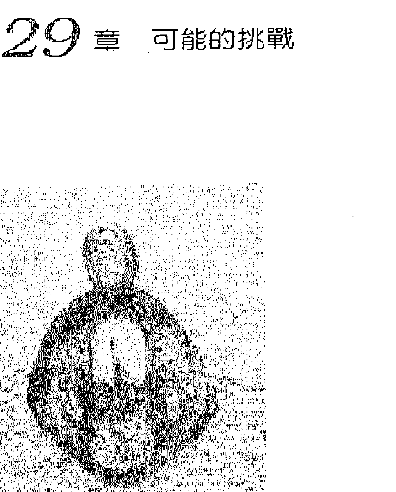

## 第二十九章 可能的挑戰

在與你的指導靈合作時，你所面臨最為重大的挑戰即是接受並信任他們告訴你的事物，特別是在完全沒有看似能夠證實你所接收的事物時候。要像一個具有直覺與第六感的人那樣來過一種受到指引的生活，是需要勇氣的。指導靈會指出符合你的道路與目的，並使日常生活變得比較輕鬆的最佳可能途徑，然而這還是得要由你決定是否跟從祂們的建議。

我有個客戶名叫保羅，他是很棒的靈媒與靈通者，白天是在紐澤西的一間麵包店上班。他有著快樂的婚姻以及兩個孩子，但在工作的時候很不快樂。他的指導靈建議他搬到自己姊妹住的俄亥俄州哥倫布市，並開始做專業的靈通服務。這想法使他感到興奮地顫抖了起來，但也同時把他嚇壞了。

「夢想成真了！」他這樣想，「這真是一個服務他人的美好方式！但是我要怎麼付我的保險？我要怎麼才能買到房子？

外面的人都認為他瘋了，叫他別那樣做，但是他妻子說：「我們去吧！」因此，在沒有任何保證之下，他辭職並跟老闆說他是個靈通人士，要去走自己的路。他的老闆不僅樂意接受他的辭職，還成為保羅的第一位顧客。在過了幾個月的新生活之後，有廣播電台找他上節目。他做得很成功，所以一再受到邀請。不久之後，人們開始跟他聯絡要求做個案，而他的事業就興旺起來了。到了年底，他全心投入超自然靈媒的工作。聽從他的指導靈是有挑戰性的，因為看起來是那樣地冒險，但是當他決定與祂們合作並信任祂們的建議時，證明那是他有生以來做過最好的決定。

另一個名叫喬絲琳的客戶是位寡婦，她有無時無刻跟她說話的美妙指導靈。祂們建議她跟女性朋友在聖誕假期去搭郵輪，即使這會使她的預算見底。她的兒子們認為她這樣做太過愚蠢，並很嚴重地非難她要去的決定，說她這樣做是非常不負責任的。她擔心他們說的是對的，並準備要取消她的預約，但是她的指導靈尖叫著：「不要！」所以她在最後最後一分鐘還是決定照她的計畫來做。為了確保她的兒子們不會在她前去的路上臭罵她，她甚至拒絕讓他們載她到機場。

她在郵輪上遇見一位很棒的男士，他住的地方只離她三英里遠。剛從整脊師的工作退休的他是個鰥夫，而他們馬上就變成一對了。下了郵輪之後，他們的關係還持續下去，並在兩年之後結婚。最棒的是，她的兒子們逐漸喜愛他，他裡裡外外都是個好人。她偶爾會逗弄她的兒子們關於要她留在家中的建議，他們否認曾經說過這樣的話。

你知道嗎……與自己的指導靈一起合作是一種生活態度。決定去接受並擁抱源自高層的幫助，就代表放下充滿恐懼與失控的舊有生活。那些真正放下的人，至少就我的經驗所知，有著遠較受到祝福、同時性、豐富、喜樂的人生。

輪到你囉……當你周遭每個事物、每個人都告訴你不要跟隨你的指導靈時，這樣做可能會是困難，甚至是可怕的。我能夠建議的是你信任自己的感覺、傾聽自己的心，並別問其他人的看法。畢竟，靈的指引是屬於最高的層次，不需要秤斤論兩。如果你有疑慮，外界的意見只會使你更加困惑。然而，如果你信任你的指引，美妙的事物將開始展現——可能沒像你想要的那麼快，但它們一定會展現出來的。

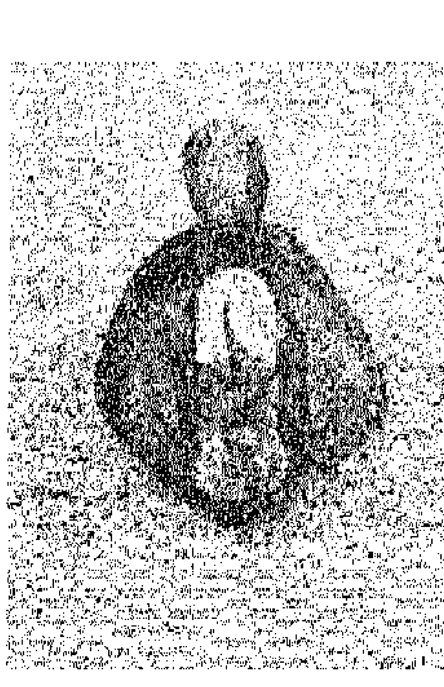

## 第三十章 好消息與指引

在與你的指導靈合作時，非常重要的是對自己所接受到的事物敞開、不修改它們的訊息來符合自己的秘密意圖。我們尋求靈性指引，是來協助我們獲得正向的成果與快樂的結局，這是毋庸多言的。然而獲取這些正向成果與快樂結局的方式，或許會跟你們想要用的方式差異很大。尋求指引的整個重心是在使自己敞開，接受那能影響你對形勢的了解之新視野以及新資訊，好使你在之後能夠做出更好的決定。當你只希望你的指導靈或高我來同意你或支持你的思考路線（甚至那路線並不正確）時，那都不會有用的。

欺騙與背叛的嚴重警告。
由於她對這資訊感到憤怒，就丟掉那副牌。身為投資銀行家與交易員，她的先生據她所言是個「尊貴的典範」，從來不讓她失望。此外，他也沒機會拈花惹草，每天晚上都回家，而且她知道他是忠實的。幾個月之後，他因內線交易與挪用公款而被逮捕，並判坐牢五年，你可以想見當時她有多麼震驚。
他居然為自己與家庭帶來這樣的差事，更別提財務方面的破滅，使她感到羞辱並傷痛到難以置信的程度。她對我說：「那副愚蠢的牌向我提出警告。我不應該使用它的。」好像那副牌得要為她先生的名譽掃地負責。
「那是一個很有趣的看法，」我說道，「就我看來，你的指導靈嘗試藉由那副牌跟你示警。為何對那警示生氣呢？你的指導靈當時正在建議你要留心注意，甚至跟你的先生討論關於留意背叛與欺騙的事情。而你就把它丟了。你事前沒有一些疑心嗎？」
「嗯，有啦，」她不好意思地承認，「他當時表現出不尋常的緊張、常常大發雷霆，而且好像把自己封閉起來——並不像他正常的樣子。這就是當初我向那副牌諮詢的首要原因，我覺得有不對勁，想要知道更多。」
「那麼，就你的反應看來，我會說當你把那副牌丟掉並忽略自己的指導靈時，就犯了斬殺來使的典型錯誤。」

「那妳會怎麼做？」她防衛地問道。
「如果換作是我，這樣的情形來看，我會直接面對我的先生，並說我有不好的預感並問他在幹什麼。」
「我想過這樣做，但我害怕。說真的，我並不想知道。我們生活的很優渥，而我是因為過得太舒適而不去問問題。我真希望我有問。」
「就你的先生被關到監獄的情形來看，我打賭你的先生也會希望你有問。」

這樣的情形不是只對神諭工具是如此的，因此在詢問指引時的基本原則是：如果你不想知道答案，就不要問問題，而且如果答案不是你所喜歡的，也別斬殺來使。

你的指導靈能給你的只有事實而已，無論如何至少是高層次的事實。如何運用這項資訊就取決於你。如果你接收到負向的資訊，在你反應之前先對自己誠實。你，或是你周遭的人，是否正在做什麼事情而招引這樣的負向性質呢？你是否對任何事物都採取拒絕的態度，或是做出不充分的判斷，或是忽視某些可能會回來煩擾你的事物呢？你是否一直待在使你的靈不安或緊張的人物旁邊呢？如果是這樣的話，就要留心注意。至少，這是指導靈正在建議你要做的事情。

在我作個案的三十七年裡，我能很誠實地說，自己在聽到客戶分享他們難以接受或不好的指導訊息時，從來不會真的很驚訝。我們的覺知遠比我們所承認的還要來的銳利，而我們傾向擋住不愉快的實相。指導靈不能也不會這樣做。所以如果你問的話，指導靈就會回答，但那樣的回應是沒有偏見的，也不一定是你想聽的。

在另一個案例裡，我的客戶問說：「無論你做什麼，就是別給我任何壞消息。我會無法承受的。」我就順著她的意思，並沒告訴她現在的工作準備要結束了（這是我看到的），與之相反地鼓勵她跟隨自己的直覺並盡快開始尋找她夢想中的工作，因為時機是成熟的。十天之後，被辭退的她打電話給我，尖叫地說我應該當時要警告她。「就你給我的限制來看，」我說道，「我盡力了。我們詳細地談論你的工作，而且你的明信片，她說她找到一份很棒的工作，並且對於她的過度反應感到抱歉。指導靈也向你提議去找新工作。現在你知道原因了。」她生氣地掛上電話。三週之後我收到丟棄那種不會奉承你或贊同自身觀點的指引是個相當誘人的想法，特別是在使用神諭工具的時候。我有客戶在洗牌後抽牌當作指引，但是當那指引不吸引他們的話，就把他們所接收到的訊息丟到一邊去。

有位名叫姬娜的女性，詢問關於開設自己的新餐廳的問題，並從她的塔羅牌抽出三張牌卡。指導靈們建議她不要動作太快而跟錯誤的人形成不穩的合夥關係，這 是她不想聽的建議。她已經在詢問神諭卡之前就想好關於這個事業與合夥人的事情，當指導靈建議她改變計畫時，她明顯地惱怒生氣。她不管三七二十一就衝了，跟找到的第一間店面簽約，並與一位幾乎不認識的男士合夥。幾個月後這餐廳就倒了，而她正在控訴她的合夥人將債務留給她。她回來見我，對於她的失敗感到氣餒，對於發生的這一切不敢置信。 「你已經收到警告，」我提醒她，「你只是不想聽而已。」 「我知道，」她哀怨地說，「我並不真的想要聽，我只是希望你跟我說我很聰明，而且會成功。」

這就是為何我的老師查理總是告訴我，除非我真的敞開接受答案，否則絕不詢問指引。如果你詢問了指引但一直忽略它，你的指導靈會認為你並不是認真的並會退離，就如同一狼來了」的故事那樣。

你知道嗎？ ……不對指引敞開接受，或許是你得要克服的最巨大的障礙，如果你的心思已經確立的話，會是很難接受建議的。

## 輪到你囉……

保證與自己的指導靈有著和諧關係、建立起與祂們之間流暢溝通的最好方式，就是練習以下四個步驟：

第一步：向指引敞開。這代表以一個接受的心與頭腦來開始每一天的生活，為的是接受指引。

第二步：期待指引。就像你期待生命中其他的事物那樣，你愈期待它，就愈吸引它。

第三步：信任自己所接收的指引。在每次你可以的時候大聲說出你的指引，並聽聽看在說的時候感覺如何（如果你把它寫下來的話，雖然會不太一樣，但這也是另一種創造流暢指引的方式）。即使你受到警示，或接收到難以置信的消息時，一旦你把它大聲表達出來的話，你將能夠感覺到它是否準確，以及在承認這項訊息之後是否有一口氣的感覺。如果指引是完整的，你說出來的那一刻就會感覺的到，所以要做。

第四步：當你接收到指引時，盡快依其行動。這可能看起來好像我在邀請你跳下懸崖，但我沒有。我認為，忽略自己的指導靈、不依著指引而行並向錯誤的方向移動，這些才是遠較令人擔心受怕的吧！這是需要練習的，所以放輕鬆來做。給自己足夠的時間並好好地玩。先從小事開始，等到你能舒適地信任自己的指導靈、期待正向的結果。之後移向嚴重的問題。你將很快地與指導靈有著長久的和諧關係，並持續處在自身生命的順流之中。相信我，這真的有用。

## 第三十一章 找寻伯乐（Believing Eyes）

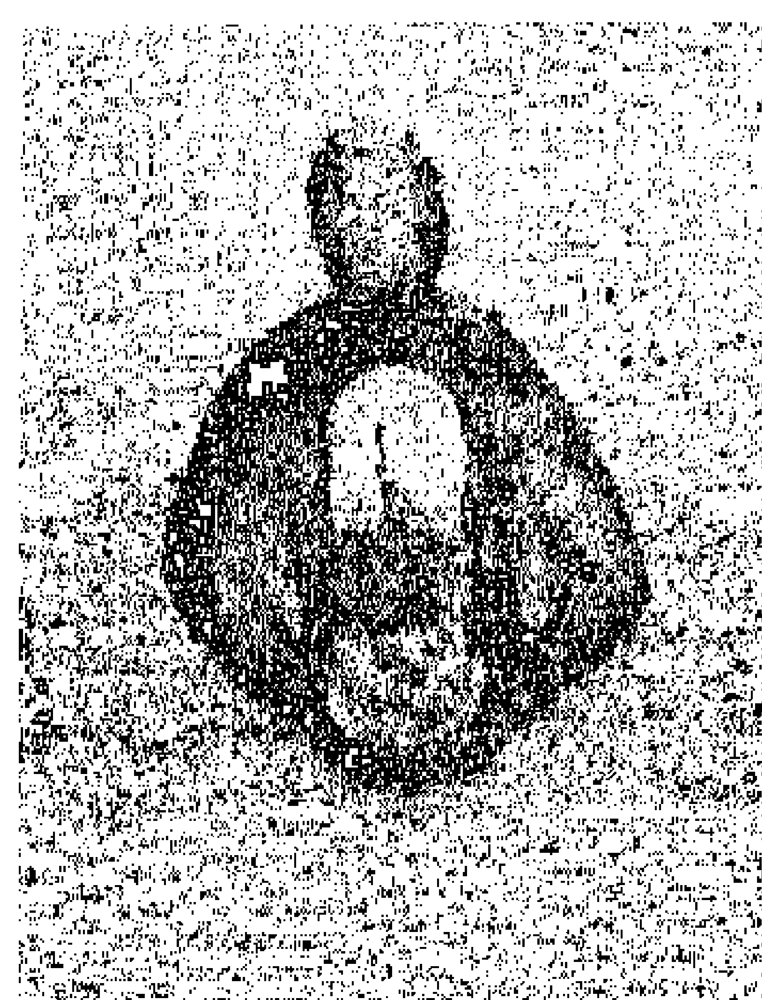

在学习信任自己的指导灵时，如果能够找到一两位你能向其分享自身指引的开明朋友，会是非常有帮助的。你在这里是要寻找支持，而不是那些会批判或质疑你所收到的指引的人。他们应是心思开放、具有「伯乐眼光」的人——就是了解并鼓励你倾听你的指引、同时又对你熟悉到能够辨认出你有什么样的课题，可能会干扰接收清晰程度的那些人。我非常幸运，在成长过程有著母亲与众多兄弟姊妹能够让我自由谈论自己的指导灵，不害怕被禁止或嘲笑。当我感到紧张、不安或是不清楚那是指导灵的建议或是小我的恐惧时，我的母亲或是某个兄弟姊妹就会只藉著倾听我把它大声说出来，而帮助我厘清自己的困惑。我也受到查理老师的帮助，他并不确认我的指引，而是鼓勵我去信任自己所接收到的事物，不論那是多麼細微與模糊，並接受從我那正在發展的直覺管道過來的所有事物。

我當時有女性朋友，現在仍然也有，像是我的導師盧·安以及瓊安、我的密友茱莉亞·卡麥隆，以及我的薩滿朋友黛博拉·格雷斯。當然，我還有丈夫派崔克，還有兩個女兒索妮亞與莎柏麗娜，我們四個人在討論自己的指導靈時就好像在討論天氣那樣地舒適。能夠分享我與指導靈的關係，是強化那關係並且每天連結祂們的主要因素。

或許你已經知道哪些人是可以跟他們公開說自己與指導靈相處的經驗，如果是這樣的話，你就知道這樣做有多麼重要。但是如果你剛進入指導靈的新奇美妙世界，而且沒有人能讓你分享的話，要求你的靈體助手帶給你符合資格的人選。辨認哪位是適合你、哪位不適合你的最快方法之一，即是拿出一些神諭牌組，像是我的《指導靈訊息卡》，將它公開展示，並讓你的家人與朋友知道那是你的新嗜好。那些能夠提供鼓勵與支持的人就是要找的人選。那些嘲笑的人不會認同你的興趣，就別去改變他們的想法，因為你改變不了的，反倒要將你的能量花在尋找那些不需要說服的人們。連結指導靈是個非常主觀的經驗，相反的觀點也很少找到中立之處。在跟他人討論你的經驗時，先運用常識並仔細觀察之。別容許某人用負向觀點來轟炸你，而妨害你與自己的指導靈的關係。

導靈正在建立的細緻能量管道。

你知道嗎……

你能夠藉由公開談論自己的指導靈、分享你的感受，或從祂們那裡接收到的事物來得到支持。成功的關鍵在於你如何談論你的經驗。如果你是實際、正向與感謝的，就幾乎像是在談論某位新朋友那樣，你將吸引到對的人的興趣與信任。別浪費時間跟沒興趣的人爭論。

輪到你囉……

我相信，如要成功的話，擁有那些你能分享自己與指導靈之間的互動的人們是相當基本的因素，因此我藉由自己的網路課程開放聊天頻道，讓世界各地的人們能夠分享指導靈的經驗。它們已證實在幫助人們活出更為舒適的第六感生活上有著極大的價值。

我也有每週一次的電台節目，邀請大家藉由 www.hayhouseradio.com 或我的網站 www.trustyourvibes.com 分享他們跟指導靈的連結。

我的網站裡有一個區塊是供人們貼上他們的靈通故事，讓大家都可以閱讀並從中獲得支持。我謹邀請你參與所有這些連結。上述這些只是將你引介到自己的「伯樂」們的幾個方法，並幫助你推開第三與第四次元之間的能量簾幕。這樣做會幫助你順利、自然地與自身指導靈溝通。公開地尋求支持或許看來像是冒險，但是它遠小於你從有著類似想法的相信者那裡接受到的回報。

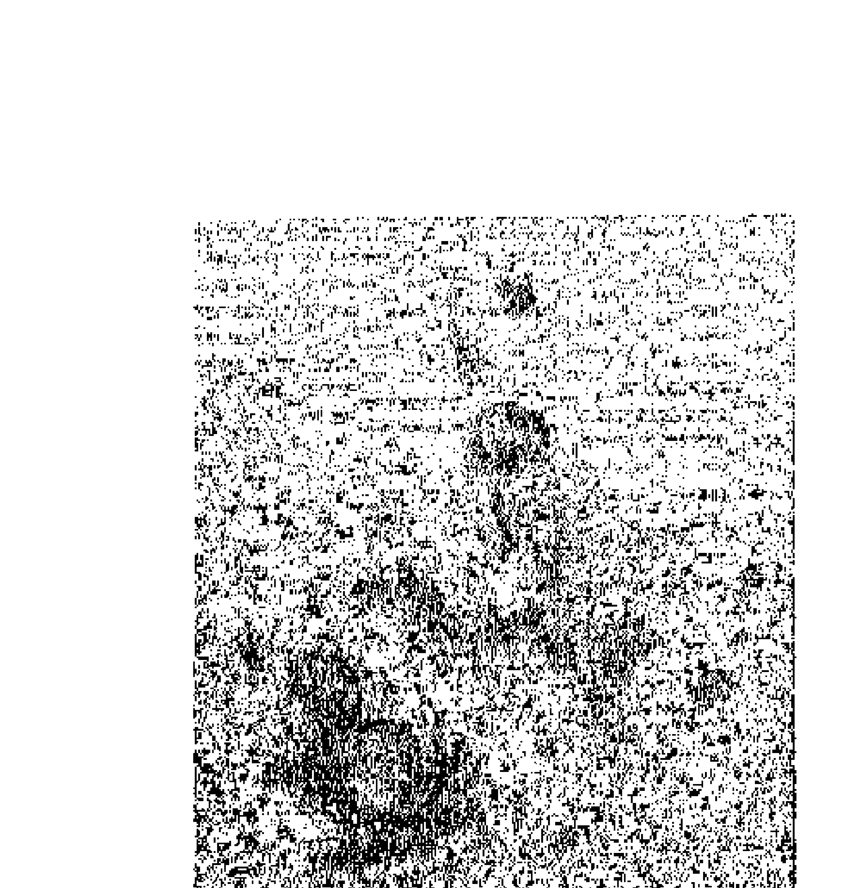

## 跋——感謝你的指導靈

在跟你的指導靈合作時，公開讚美祂們的協助並為這一切感謝祂們，是相當必要的。這會使祂們非常高興，因為這是在認可祂們在支持你以及使你的生活變得容易一些的努力是成功的。對祂們而言還有更重要的是，藉由好好地感謝與認可祂們的幫助，你就擴展你的心並更有能力接受祂們的愛與神聖支持。你愈是這樣做，祂們愈努力來引導你，而你就能接受到更多的指引。

有許多方式可以用來感謝你的指導靈。當然啦，最簡單的（也是最容易忘記的）方式就是在每次你經驗到祂們的幫助時，大聲說：「謝謝你，指導靈。」更好的是，你可以預先感謝祂們。一個簡單的「謝謝你」會使你在靈界走得長長久久，因為它認可指導靈的出現、參與你的生命並為之貢獻，並對那個希望以各種方式支持你的靈魂成長的神聖計畫表達肯定。 然而我發現的是，在把「謝謝你」變成比較正式一點點的儀式時，指導靈會特別歡喜接受。舉例來說，每次當我的指導靈送來特別的喜事或是以意義重大的形式幫助我，即使只是讓我把我注意力轉離過多的擔心或用新的想法給我靈感，我喜歡點一根愛用的線香以榮耀祂們，表達我對祂們的感激。當我這樣做時，我跟祂們說：「這柱香是獻給你們的，因為我非常感謝你們為我做的一切。」

另一種酬謝我的指導靈的方式，即是送鮮花給祂們，這是我在二十年前第一次拜訪印度時接收到的主意。我們每次拜訪廟宇時，外頭有婦人在賣獻給眾神的萬壽菊。這些美麗的花環是榮耀祂們的禮物，而且因為它們是專用於取悅神明的，如果送的人先聞過的話，它們就不能用來奉獻。這種花朵獻禮對我來說並非第一次看到，我是以天主教徒的身分長大的，而每年五月一日我們都會向聖母瑪麗亞獻上美麗的花朵，感謝祂的愛與支持。

將這樣的主題放在心裡，我就每天藉由在自己的辦公室擺上鮮花來獻給自己的指導靈，特別是那些在個案中協助我的那幾位。我為了謹記那是專用於取悅指導靈的，就忍住不要直接嗅它們，雖然我真的享受那股充滿房間的香氣。

我也用點燃香氣蠟燭來感謝自己的指導靈，這是我從天主教生長背景帶來的另一種充滿愛的傳統方式。每個禮拜當我去教堂時，我會留一點零錢使我能夠投一枚一角五的硬幣到奉獻箱中，並點一盞蠟燭獻給聖泰瑞莎，因為我感覺祂就是我專屬的指導靈玫瑰。直至今日，我都有點七日與十四日的獻願蠟燭來感謝我的指導靈。

另一種對自身指導靈的幫助表達感謝的美妙方式，即是為祂們唱一首美麗歌曲或是演奏一首好聽樂曲給祂們聽。歌曲與樂曲創造出指導靈喜愛進入的高層和諧振動。

還有另一種認可你的指導靈的方式，即是為祂們創造一個聖壇（altar），並在上面置放所有你喜愛的圖案、照片以及塑像。我十二歲的時候，在自己的床腳邊設立第一個聖壇，上面有我的初領聖禮念珠、聖誕節拍的全家福照片、以我的指導靈玫瑰為主體的繪畫、一些從前院花叢找來的乾燥紫丁香花，還有一個鈴鐺。每當我的指導靈前來時，就會搖那個鈴鐺。

我依然保持一座聖壇在自己的辦公室裡，它幾乎佔去整個牆面，保存著神聖的事物，那些是我過去三十五年以來從世界各地獲得的。它已不再是座聖壇，而是一間廟宇，充滿神聖與喜樂的圖案、藝術品以及其他提醒自己是有福的事物。站在它的面前不僅吸引來自己的指導靈，也同時強化我跟基督、馬利亞與神的親密連結。

如要創造你自己的聖壇，就選一張桌子或架子放在不會被打擾、自己常去的房間。將它設計成你的靈的聖壇，並布滿象徵物、照片以及能夠觸發喜樂、平安與愛的感受的事物。拿多種物件來實驗，看看哪些會提升你的頻率、敞開你的心並引出自身內在的深深感激。試試神聖與個人的照片、鈴鐺、花朵、蠟燭——甚至是一個小鏡子，因為它反映著光與你。

另一種表達感激的方式，即是維持一個乾淨與有序的家。如果這樣要求太超過，至少在你的聖壇周遭維持這樣的習慣。這樣的做法是藉由給予指導靈一個安靜、乾淨的休息處所，來表達你對祂們的尊敬。聖壇構建出你與自己的指導靈的會面地點，它愈是平靜與乾淨，你藉由它所連結的管道就會愈加清晰。

如果你發現自己指導靈特別支持你，就創造出榮耀祂們的花束來酬謝祂們。如要做這個，就把蠟燭、鮮花、香、快樂照片、鈴鐺與神聖圖片集結起來，並附上一封手寫的感恩祈禱，就慎重地把它放在聖壇上。讓你的指導靈知道這是送給祂們的花束，請祂們上前享受。祂們會為你的家創造出高到不敢置信的強力振動，那是一份持續給予的禮物。你將感受到神聖能量迅速進來接受你的禮物，並留下愛與祝福。

你知道嗎：
……我的老師川頓。托利博士有一次跟我說，你所能為別人、為自己以及為這個世界做最棒的事情，即是使自己快樂。這是對於你的祝福以及自身指導靈的支持之最佳感謝方式。

## 輪到你囉……

榮耀並感激你的指導靈與所有神聖幫手的最高形式之一，即是專注在以快樂的心及正向的態度來過生活，並把自己的恐懼留給它們來處理。這樣做的話，你不僅接受自己的神聖祝福，而且你也成為別人的指導靈與祝福。

- 願神祝福你，願你的天使保護你。
- 願你的差使為你連結，願你的幫手協助你，願你的療者支持你，願你的老師啟蒙你。
- 願你的喜樂指導靈使你欣喜，願自然精靈平衡你，願你的動物指導靈喚起你的靈魂。
- 願你的高我引導你過著具有平安、恩典、創意的生活，使你個人的塵世旅程滿載著愛與歡笑的贈禮。

獻上我所有的愛與支持
桑妮雅

## 感謝

我要感謝我的母親桑妮雅·喬凱特，她拉開通往靈界的帷幕並向我引介天堂的愛。感謝我的父親一直是我那相當屬靈的世界裡的穩固大地。感謝我的丈夫派崔克以及女兒索妮亞與莎柏麗娜你們那永無休止的愛、耐心以及願意了解我那一輩子的工作。感謝盧·安·格萊茲梅爾與瓊安·史密斯成為我的「伯樂」以及長久的靈魂姊妹。感謝川頓博士與查理·古德曼兩位老師向我分享他們的智慧與技術，以建立最高層次由靈指引的溝通。感謝瑞德·崔西（Reid Tracy），我新認識的人間天使，以及在賀氏書屋（Hay House）出版社的所有員工。感謝我那富有創意的「捕手手套」與好友茉莉亞·卡麥隆幫助我將這作品帶進這個世界。感謝我的編輯布魯斯·克洛芬尼以及琳達·卡恩幫助我把這本書塑造成能夠展現出來的文書，以及感謝我的所有客戶讓使用你們的故事。在這之上，我想要感謝神以及宇宙的所有受到祝福的存在們，謝謝你們的愛、指引以及依我的名義而努力工作，同時又持續地在我的道路上引領著我。我心懷感激地成為你們的謙卑僕人。

## 關於作者

桑妮雅．喬凱特是舉世著名作家、說故事家、頻率治療者，也是顛覆傳統的靈媒，對於她的指引、智慧與療癒靈魂的能力之需求遍及全世界。她著有八本暢銷書籍，包括《靈媒日記》（Diary of a Psychic）以及《信任你的頻率》（Trust Your Vibes），還有許多有聲系列與牌卡。桑妮雅曾就讀於丹佛大學、巴黎的索邦大學，並且具有美國全形宗教理論學院（American Institute of Holistic Theology）玄學的哲學博士學位。她現與家人一起住在芝加哥，她的網站是 www.soniachoquette.com。

## 生命潛能出版圖書目錄

| 心靈成長系列 | 作者 | 譯者 | 定價 |
| --- | --- | --- | --- |
| ST0111 如何激發自我潛能 | 山口 彭 | 鄭清清 | 170 |
| ST0125 平靜安穩 | 匿名氏 | 李文英 | 180 |
| ST0131 沒有你我該怎麼辦？ | 米勒 | 許梅芳 | 130 |
| ST0133 天生我材必有用 | 米勒&梅特森 | 鄧文華 | 210 |
| ST0136 一個幸福的婚禮 | 約翰·李 | 區詠熙 | 260 |
| ST0137 快樂生活的新好男人 | 巴希克 | 陳薏多 | 280 |
| ST0139 通向平靜之路——根絕上癮行為的新認知法則 | 約瑟夫·貝利 | 黃春華 | 180 |
| ST0140 心靈之旅 | 珍妮佛·詹姆絲 | 侯麗場 | 200 |
| ST0142 理性出發 | 麥克納 | 陳薏多 | 200 |
| ST0143 向惡習惡語挑戰 | 詹姆絲 | 許梅芳 | 220 |
| ST0144 珍愛 | 碧提 | 黃春華 | 190 |
| ST0147 揭開自我之謎 | 戴安 | 黃春華 | 150 |
| ST0149 揮別傷痛 | 布萊克 | 喬安 | 150 |
| ST0151 我該如何幫助你？ | 高登 | 高麗娟 | 200 |
| ST0153 電視心理學 | 早瀨泰次郎 & 北林才知 | | 200 |
| ST0154 自我治療在人生的旅程上 | 羅森 | 喬安 | 200 |
| ST0155 快樂是你的選擇 | 維拉妮卡·雷 | 陳逸群 | 250 |
| ST0156 歡暢的每一天 | 蘇·班德 | 江孟蓉 | 180 |
| ST0159 扭轉心靈危機 | 克里斯·克藍克 | 許梅芳 | 320 |
| ST0160 創痛原是一種福分 | 貝佛莉·恩格 | 謝青峰 | 250 |
| ST0161 與慈悲的宇宙連結 | 拉姆·達斯 & 保羅·高曼 | 許桂綿 | 250 |
| ST0165 重塑心靈 | 許宜銘 | | 250 |
| ST0166 聆聽心靈樂音 | 馬修 | 李芸玫 | 220 |
| ST0167 敞開心靈暗房 | 提恩·戴唐 | 陳世玲／吳夢峰 | 280 |
| ST0168 無為，很好 | 史提芬·哈里森 | 于而彥 | 150 |
| ST0172 量身訂做潛能體操 | 蓋兒·克絲 & 席拉·丹娜 | 黃志光 | 220 |
| ST0173 你當然可以生氣 | 蓋莉·羅塞里尼 & 馬克·瓦登 | 謝青峰 | 200 |
| ST0175 護心無懼 | 闕道·布里登 | 陳逸群 | 280 |
| ST0176 心靈舞台 | 薇薇安·金 | 陳逸群 | 280 |
| ST0177 把神秘喝個夠 | 王靜蓉 | | 250 |
| ST0178 喜悅之道 | 珊娜雅·羅曼 | 王季慶 | 220 |
| ST0179 最高意志的修煉 | 陶利·柏肯 | 江孟蓉 | 220 |
| ST0180 靈魂調色盤 | 凱西·馬奇歐迪 | 陳麗芳 | 320 |
| ST0181 情緒爆發力 | 麥可·史凱 | 周晴燕 | 220 |

| 編號 | 書名 | 作者 | 譯者 | 價格 |
| --- | --- | --- | --- | --- |
| ST0182 | 立方體的秘密 | 安妮 & 斯羅波登 | 黃寶敏 | 260 |
| ST0183 | 給生活一帖力量——現代人的靈性維他命 | 芭芭拉·伯格 | 周晴燕 | 200 |
| ST0184 | 治療師的懊悔——頂尖治療師的失誤個案經驗分享 | 傑弗瑞·柯特勒 & 瓊恩·卡森 | 胡茱玲 | 280 |
| ST0185 | 玩出塔羅趣味 | M.J.阿芭迪 | 盧娜 | 280 |
| ST0186 | 瑜伽上師最後的十堂課 | 艾莉絲·克麗斯坦森 | 林惠瑟 | 250 |
| ST0187 | 靈魂占星筆記 | 瑪格麗特·庫曼 | 羅孝英／陳惠嬪 | 250 |
| ST0188 | 催眠之聲伴隨你（新版） | 米爾頓·艾瑞克森 & 史德奈·羅森 | 蕭德蘭 | 320 |
| ST0189 | 通靈工作坊——綻放你內在的直覺力與靈性潛能 | 金·雀絲妮 | 許桂綿 | 280 |
| ST0190 | 創造金錢（上冊）——運用磁力彰顯財富的技巧 | 珊娜雅·羅曼 & 杜安·派克 | 沈友娣 | 200 |
| ST0191 | 創造金錢（下冊）——協助你開創人生志業的訣竅 | 珊娜雅·羅曼 & 杜安·派克 | 羅孝英 | 200 |
| ST0192 | 愛與生存的勇氣——自我關係療法的詮釋與運用 | 史蒂芬·吉利根 | 蕭德蘭、劉安康、黃正頤 梁美玉等 | 320 |
| ST0193 | 水晶光能啟蒙——礦石是你蛻變與轉化的資產 | 卡崔娜·拉斐爾 | 鄭婷玟 | 250 |
| ST0194 | 神聖占星學——強化能量的鍊金術 | 道維·史卓思納 | 張振林 | 250 |
| ST0195 | 擁舞生命潛能（新版） | 許宜銘 | | 220 |
| ST0196 | 內在男人、內在女人——探索內在男女性能量對關係與工作的影響 | 莎加培雅 | 沙微塔 | 250 |
| ST0197 | 人體氣場彩光學 | 喬漢娜·費斯林傑 & 貝緹娜·費斯林傑 | 逸音編譯群 | 250 |
| ST0198 | 水晶高頻治療——運用水晶平衡精微能量系統 | 卡崔娜·拉斐爾 | 弇蘭 | 280 |
| ST0199 | 和內在的自己玩遊戲 | 潔娜·黛安 | 黃睿華 | 200 |
| ST01100 | 和內在的自己作朋友 | 潔娜·黛安 | 黃睿華 | 200 |
| ST01101 | 個人覺醒的力量——增強心靈感知與能量運作的能力 | 珊娜雅·羅曼 | 羅孝英 | 270 |
| ST01102 | 召喚天使——邀請天使能量共創幸福奇蹟 | 朵琳·芙秋博士 | 王愉淑 | 280 |
| ST01103 | 克里昂靈性寓言故事——以高層心靈的視界，突破此生的課題與業力 | 李·卡羅 | 邱俊銘 | 250 |
| ST01104 | 新世紀揚昇之光——開啟高次元宇宙奧秘與揚昇之鑰 | 黛安娜·庫柏 | 鄭婷玟 | 300 |
| ST01105 | 預知生命大蛻變——由恐懼走向愛的聖魂進化旅程 | 弗瑞德·思特靈 | 邱俊銘 | 320 |
| ST01106 | 古代神祕學院入門書——超感應能力與脈輪開通訓練 | 道格拉斯·德龍 | 陶世憲 | 270 |

| 叢書號 | 書名 | 作者 | 譯者 | 定價 |
| --- | --- | --- | --- | --- |
| ST01107 | 曼陀羅小宇宙——彩繪曼陀羅豐富你的生命 | 蘇珊·芬徹 | 游珮娟 | 300 |
| ST01108 | 家族系統排列治療精華——愛的根源 回溯找回個人生命力量 | 史瓦吉多 | 林群華、黃翎展 | 380 |
| ST01109 | 啟動神祕療癒能量——古代神祕學院進階療癒技巧 | 道格拉斯·德龍 | 奕蘭 | 280 |
| ST01110 | 玩多元藝術解放壓力 | 露西雅·卡帕席恩 | 沈文玉 | 350 |
| ST01111 | 在覺知中創造十大法則 | 弗瑞德·思特靈 | 黃愛淑 | 360 |
| ST01112 | 業力療法——清除累世障礙，重繪生命藍圖 | 狄吉娜·沃頓 | 江孟蓉 | 320 |
| ST01113 | 回到當下的旅程——靈性覺醒道路上的清晰引導 | 李耳納·傑克伯森 | 鄭羽庭 | 360 |
| ST01114 | 靈性成長——與大我合一的學習之路 | 珊娜雅·羅曼 | 羅孝英 | 320 |
| ST01115 | 如何聆聽天使訊息 | 朵琳·芙秋博士 | 王愉淑 | 220 |
| ST01116 | 天使之藥 | 朵琳·芙秋博士 | 陶世惠 | 350 |
| ST01117 | 影響你生命的12原型 | 卡蘿·皮爾森 | 張蘭馨 | 400 |
| ST01118 | 啟動天使之光 | 黛安娜·摩柏 | 奕蘭 | 300 |
| ST01119 | 天使數字書 | 朵琳·芙秋博士 | 王愉淑 | 250 |
| ST01120 | 天使筆記書 | 生命潛能編輯部 | | 200 |
| ST01121 | 靈魂之愛 | 珊娜雅·羅曼 | 羅孝英 | 350 |
| ST01122 | 再連結療癒法——來自宇宙能量的治療奇蹟 | 艾力克·波爾 | 黃愛淑 | 380 |
| ST01123 | Alpha Chi 風水九大封印——風水知識的源頭與九大學派的演變 | 阿格尼·艾克曼&杜嘉·郝思荷舍 | 林素綾 | 360 |
| ST01124 | 預見未知的高我 | 弗瑞德·思特靈 | 林瑞堂 | 380 |

| 叢書號 | 書名 | 作者 | 譯者 | 定價 |
| --- | --- | --- | --- | --- |
| | 心靈塔羅系列 | | | |
| ST11003 | 女神神諭占卜卡（44張女神卡＋書＋絲絨袋） | 朵琳·芙秋博士 | 陶世惠 | 780 |
| ST11004 | 守護天使指引卡（44張守護天使卡＋書＋絲絨袋） | 朵琳·芙秋博士 | 陶世惠 | 780 |
| ST11005 | 揚升大師神諭卡（44張揚升大師卡＋書＋絲絨袋） | 朵琳·芙秋博士 | 鄭婷玫 | 780 |
| ST11006 | 神奇精靈指引卡（44張神奇精靈卡＋書＋絲絨袋） | 朵琳·芙秋博士 | 陶世惠 | 850 |
| ST11007 | 大天使神諭占卜卡（2009年新版）（45張大天使卡＋書＋絲絨袋） | 朵琳·芙秋博士 | 王愉淑 | 780 |
| ST11008 | 古埃及神圖塔羅牌（2009年新版）（78張塔羅牌＋書＋神圖占卜棋盤） | 白中道博士 | 蕭靜如繪圖 | 980 |
| ST11009 | 聖者天使神諭卡（44張聖者天使神諭卡＋書＋絲絨袋） | 朵琳·芙秋博士 | 林素綾 | 850 |
| ST11010 | 白薩滿藥輪卡（46張白薩滿藥卡＋書＋絲絨袋） | 瓦納尼奇&伊莉阿娜·哈維 | 邱俊銘 | 850 |

天使神秘学院官方淘宝 http://strc.taobao.com
获取更多好书，请加微信：13641926204 或 QQ:715104687| 编号 | 名称/描述 | 作者 | 译者 | 定价 |
|---|---|---|---|---|
| ST11011 | 生命疗愈卡（50张疗愈卡+书+丝绒袋） | 凯若琳·密思博士&彼得·奥奇葛罗素 | 林瑞堂 | 850 |
| ST11012 | 天使疗愈卡（44张疗愈卡+书+丝绒袋） | 朵琳·芙秋博士 | 陶世惠 | 850 |

奥修灵性成长系列

| 编号 | 名称/描述 | 作者 | 译者 | 定价 |
|---|---|---|---|---|
| ST6001 | 成熟——重新看见自己的纯真与完整 | 奥修 | 黄琼莹 | 280 |
| ST6002 | 勇气——在生活中冒险是一种喜悦 | 奥修 | 黄琼莹 | 300 |
| ST6003 | 创造力——释放内在的力量 | 奥修 | 李舒洁 | 280 |
| ST6004 | 觉察——品尝自在合一的佛性滋味 | 奥修 | 黄琼莹 | 300 |
| ST6005 | 直觉——超越逻辑的全新领悟 | 奥修 | 沈文玉 | 280 |
| ST6006 | 亲密——学习信任自己与他人 | 奥修 | 陈明尧 | 250 |
| ST6007 | 爱、自由与单独 | 奥修 | 黄琼莹 | 300 |
| ST6008 | 叛逆的灵魂——奥修自传 | 奥修（精装本定价500元） | 黄琼莹 | 399 |
| ST6009 | 存在之诗——藏密教义的终极体验 | 奥修 | 陈明尧 | 320 |
| ST6010 | 禅——活出当下的意识 | 奥修 | 陈明尧 | 250 |
| ST6011 | 瑜伽——提升灵魂的科学 | 奥修 | 林妙香 | 280 |
| ST6012 | 苏菲灵性之舞——让自我死去的艺术 | 奥修 | 沈文玉 | 320 |
| ST6013 | 道——顺随生命的核心 | 奥修 | 沙微塔 | 300 |
| ST6014 | 身心平衡——与你的身体和心理对话 | 奥修（附放松静心CD） | 陈明尧 | 300 |
| ST6015 | 喜悦——从内在深处涌现的快乐 | 奥修 | 陈明尧 | 280 |
| ST6016 | 欢庆生死 | 奥修 | 黄琼莹 | 300 |
| ST6017 | 与先哲奇人相遇 | 奥修 | 陈明尧 | 300 |
| ST6018 | 情绪——释放你的愤怒、恐惧与嫉妒 | 奥修（附静心音乐CD） | 沈文玉 | 250 |
| ST6019 | 脉轮能量书I——回归存在的意识地图 | 奥修 | 沙微塔 | 250 |
| ST6020 | 脉轮能量书II——灵妙体的探索旅程 | 奥修 | 沙微塔 | 250 |
| ST6021 | 聪明才智——以创意回应当下 | 奥修 | 黄琼莹 | 300 |
| ST6022 | 自由——成为自己的勇气 | 奥修 | 林妙香 | 280 |
| ST6023 | 奥修谈禅师马祖道——空无之镜 | 奥修 | 陈明尧 | 280 |
| ST6024 | 灵魂之药——让身心放松的静心与觉察练习 | 奥修 | 陈明尧 | 250 |
| ST6025 | 奥修谈禅师南泉普愿——灵性的转折 | 奥修 | 陈明尧 | 280 |
| ST6026 | 女性意识——女性特质的庆祝与提醒 | 奥修 | 沈文玉 | 220 |
| ST6027 | 印度，我的爱——灵性之旅 | 奥修（附「宁静乍现」VCD） | 陈明尧 | 320 |
| ST6028 | 奥修谈禅师赵州从谂——以狮吼唤醒你的自性 | 奥修 | 陈明尧 | 250 |
| ST6029 | 奥修谈禅师临济义玄——超脱理性的师父 | 奥修 | 陈明尧 | 250 |
| ST6030 | 热情——真理、神性、美的探寻 | 奥修 | 陈明尧 | 280 |
| ST6031 | 慈悲——爱的极致绽放 | 奥修 | 沈文玉 | 270 |
| ST6032 | 静心春与夏——奥修与你同在 | 奥修 | 陈明尧 | 220 |
| ST6033 | 静心秋与冬——奥修与你同在 | 奥修 | 陈明尧 | 220 |
| ST6034 | 莲花中的钻石——寂静之声与觉醒之钥 | 奥修 | 陈明尧 | 320 |
| ST6035 | 男人，真实解放自己 | 奥修 | 陈明尧 | 300 |
| ST6036 | 女人，自在平衡自己 | 奥修 | 陈明尧 | 300 |
| ST6037 | 孩童，作自己的自由 | 奥修 | 林群 | 320 |

## 美丽身心系列

| 编号 | 书名 | 作者 | 译者 | 定价 |
|------|------|------|------|------|
| ST80001 | 双人亲密瑜伽——用身体来沟通、分享爱和喜悦 | 米夏巴耶 | 林惠瑟 | 300 |
| ST80002 | 花草能量芳香疗法——融合阴阳五行发挥精油情绪调理的功效 | 盖布利尔·莫杰 | 陈丽芳 | 320 |
| ST80003 | 图解同类疗法——37种常见病痛的处方及药物宝典 | 罗宾·海菲德 | 陈明尧 | 250 |
| ST80004 | 图解按摩手法——体验双手探索身体的乐趣 | 柏妮·罗文 | 林妙香 | 250 |
| ST80005 | 水晶身心灵疗方 | 海瑟·芮芳 | 郑婷玫 | 360 |
| ST80006 | 五大元素疗愈瑜伽——整合脉轮的瑜伽体位法 | 安碧卡南达大师 | 林瑞堂 | 380 |
| ST80007 | 树的疗愈能量 | 派屈斯·布夏顿 | 许桂绵 | 320 |
| ST80008 | 灵气情绪平衡疗方 | 坦玛雅·侯内沃 | 胡泽芬 | 320 |
| ST80009 | 西藏医药 | 拉斐·福德 | 林瑞堂 | 420 |

## 健康种子系列

| 编号 | 书名 | 作者 | 译者 | 定价 |
|------|------|------|------|------|
| ST9001 | 身心合一 | 肯恩·戴特沃德 | 邱温 | 250 |
| ST9002 | 同类疗法I：健康新抉择 | 维登·麦凯博 | 陈逸群 | 250 |
| ST9003 | 同类疗法II——改善你的体质 | 维登·麦凯博 | 陈逸群 | 300 |
| ST9004 | 抗癌策略 | 安·法瑞&欧夫·法瑞 | 江孟蓉 | 220 |
| ST9005 | 自我健康催眠 | 史丹利·贺云 | 季欣 | 220 |
| ST9007 | 21世纪医疗革命：自然医学 | 黄俊杰医师 | | 320 |
| ST9008 | 灵性按摩 | 莎加培雅 | 沙微塔 | 450 |
| ST9010 | 脑力营养策略 | 西格&席尔 | 陈丽芳 | 250 |
| ST9011 | 饮食防癌 | 罗伯特·哈瑟瑞 | 邱温 | 280 |
| ST9012 | 雨林药草居家疗方 | 阿维戈&爱普斯汀 | 许桂绵 | 280 |
| ST9014 | 呼吸重生疗法——身心整合与释放压力的另类选择 | 凯瑟琳·道林 | 廖世德 | 250 |
| ST9016 | 让你年轻10岁、多活10年 | 戴维·赖伯克 | 黄文慧 | 250 |
| ST9017 | 身心调愈地图 | 黛比·夏比洛 | 邱温 | 320 |
| ST9018 | 灵性治疗的艺术 | 凯思·雪伍 | 林妙香 | 270 |
| ST9019 | 巴哈花疗法，心灵的解药 | 大卫·威奈尔 | 黄宝敏 | 250 |
| ST9021 | 逆转癌症——恢复生命力的九大自疗课程（附引导式自疗冥想CD） | 席瓦妮·古曼 | 周腾燕 | 250 |
| ST9022 | 印加灵魂复元疗法——跨越时间之河修复生命、改造未来 | 阿贝托·维洛多博士 | 许桂绵 | 280 |
| ST9023 | 灵气108问——以双手传递宇宙生命能量的新时代疗法 | 莱丝蜜·宝拉·贺伦 | 欣芬 | 240 |
| ST9024 | 印加巫士的智慧洞见——成为地球守护者的操练与挑战 | 阿贝托·维洛多博士 | 奕兰 | 280 |
| ST9025 | 灵气为你带来丰盛——远离匮乏、体验丰盛的42天灵气方案 | 莱丝蜜·宝拉 | 胡泽芬 | 220 |
| ST9026 | 不疼不痛安心过生活——解除你的疼痛 | 克利斯·威尔斯 & 葛瑞姆·诺恩 | 陈丽芳 | 280 |
| ST9027 | 印加能量疗法（新版）——一位心理学家的萨满学习之旅 | 阿贝托·维洛多博士 | 许桂绵 | 300 |
| ST9028 | 灵气心世界——以抚触与觉知开发生命疗愈 | 宝拉·贺伦博士 | 胡泽芬 | 280 |
| ST9029 | 印加大梦——萨满显化梦想之道 | 阿贝托·维洛多博士 | 许桂绵 | 320 |
| ST9030 | 声音疗法的7大秘密 | 强纳森·高曼 | 奕兰 | 270 |
| ST9031 | 灵性按摩——品尝静心与能量共鸣的芬芳 | 莎加培雅 | 沙微塔 | 450 |
| ST9032 | 肢体疗法百科——身心和谐之旅的智慧导航 | 玛加·奈思特 | 邱温 | 360 |
| ST9033 | 身心合一（新版）——探索肢体心灵的奥妙互动 | 肯恩·戴特沃德 | 邱温 | 320 |

## 两性互动系列

| 编号 | 标题 | 作者 | 译者 | 价格 |
|------|------|------|------|------|
| ST0204 | 寻找心灵的归依处 | 约翰·李 | 黄春华 | 130 |
| ST0207 | 影子配偶 | 狄妮丝·蓝 | 邓文华 | 350 |
| ST0208 | 你这话是什么意思？——终结伴侣间的言语伤害 | 派翠西亚·依凡丝 | 穆怡梅 | 220 |
| ST0212 | 男人女人 2 分天下 | 克莉丝·爱维特 | 江孟蓉 | 200 |
| ST0214-5 | 背叛单身不后悔 I、II | 汉瑞克斯 & 杭特 | 李文英 | 250 |
| ST0216 | 女性智慧宣言 | 露易丝·贺 | 萧顺涵 | 200 |
| ST0217 | 情投意合沟通法 | 强纳生·罗宾森 | 游琬娟 | 240 |
| ST0218 | 灵性情色爱 | 许宜铭 | | 200 |
| ST0219 | 亲爱的，我们别吵了！ | 苏珊·奎莲恩 | 江孟蓉 | 250 |
| ST0220 | 彩翼单飞 | 雪伦·魏士德·克鲁斯 | 周晴燕 | 250 |
| ST0224 | 男女大不同：身心健康对策：如何让火星男人与金星女人活力焕发、甜蜜持久 | 约翰·葛瑞博士 | 许桂绵 | 320 |
| ST0226 | 婚姻诊疗室——以现实疗法破解婚姻难题 | 盖瑞·查普曼 | 陈逸群 | 250 |
| ST0227 | 爱的沟通不打烊——让你的婚姻成为幸福的代名词 | 琼恩·卡森 & 唐恩·狄克梅尔 | 周晴燕 | 280 |
| ST0228 | 男女大不同：火星男人与金星女人的恋爱讲义 | 约翰·葛瑞博士 | 苏晴 | 280 |
| ST0229 | Office男女大不同：火星男人与金星女人职场轻松沟通 | 约翰·葛瑞博士 | 邱温 & 许桂绵 | 320 |

## 乘着天使的羽翼飞翔

## 守护天使指引卡

朵琳·芙秋博士◎著 陶世蕙◎译 定价780元

你曾感应到你的守护天使给与你的指引吗？守护天使无时不在你身边，即使你没有发现依然存在守护着你。芙秋博士透过这套卡提醒你——你是被眷顾的，要记得每天与你的守护天使连结，接收祂要给你的讯息，协助你在每日的生活与工作中清楚自己的方向，稳定地发挥个人的力量。

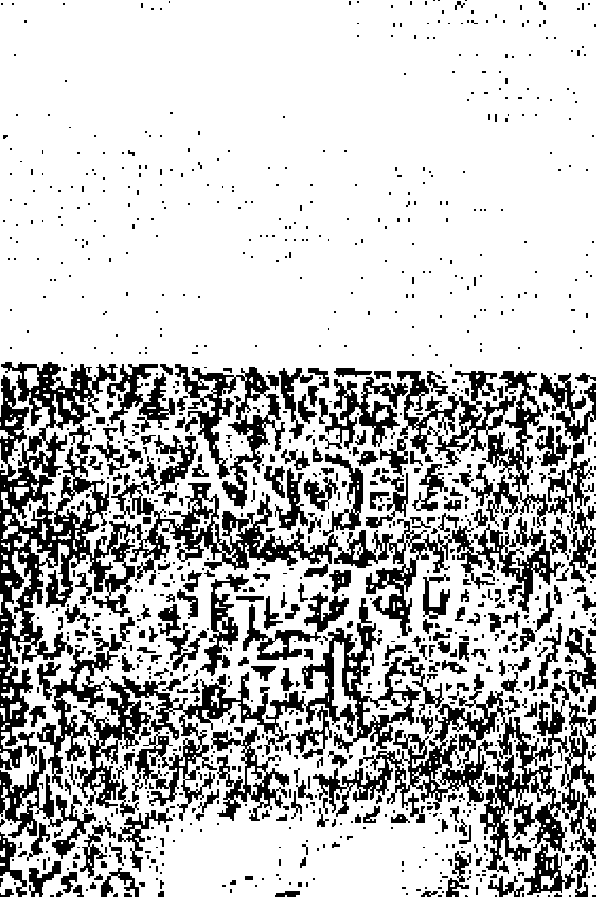

## 神奇精灵指引卡

朵琳·芙秋博士◎著 陶世蕙◎译 定价850元

精灵是喜悦轻盈的能量，是大自然的盟友，守护着大地、动植物与孩子们。他们精通以充满爱的方式导引并运用宇宙与地球的能量，且擅长疗愈工作。你可以召唤他们来解决问题、疗愈自己和他人，或显化物质上的需求。亲近这些自然界的精灵，会唤醒你潜藏的力量，增加你的超感应力与显化梦想的能力，有勇气做真实的自己。

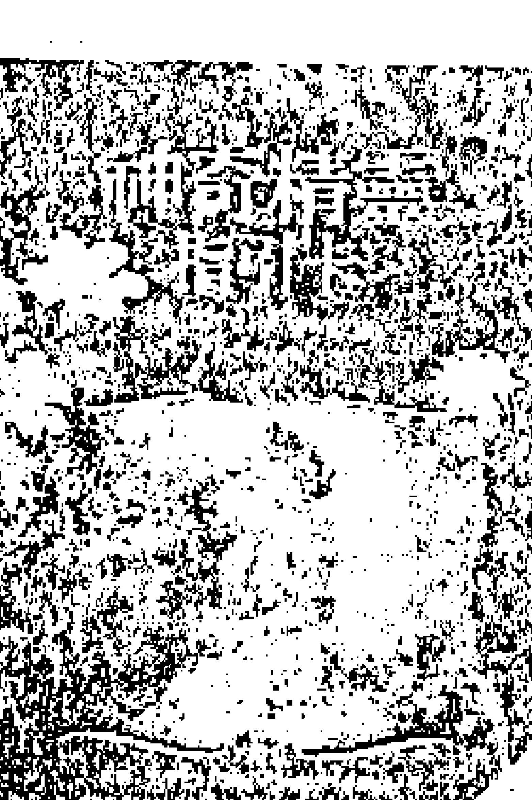

## 圣者天使神谕卡

朵琳·芙秋博士◎著 林素绫◎译 定价850元

在个人有限的生命中，圣者活出了生命道途的最高使命，为全人类树立了典范。这些圣者以鼓舞人心的生命故事提醒我们，每个人都可以给世界带来不同的助益。朵琳·芙秋创造的这套神谕卡，让不论来自何种灵性及宗教背景的人，都能欣赏与享受，透过与这套卡片的连结，释放紧绷的心与压抑的情绪，找回神与天堂赐与所有人强大的爱。

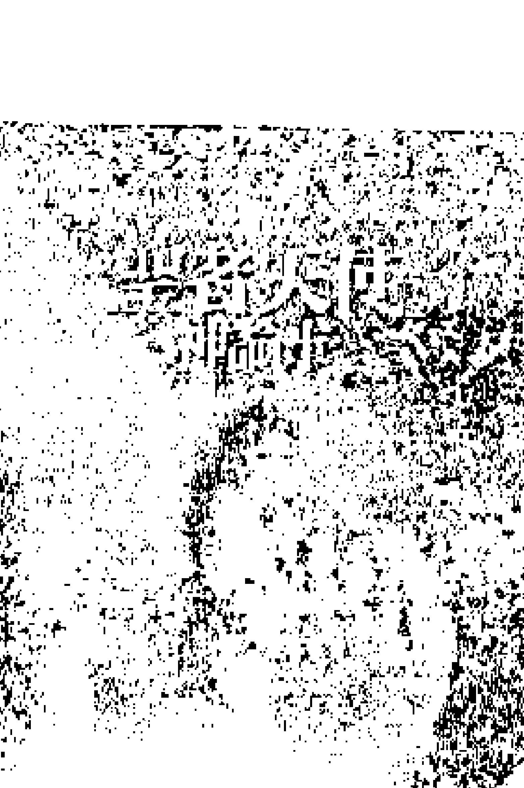

天使神秘学院官方淘宝 http://strc.taobao.com
获取更多好书，请加微信：13641926204或QQ：715104687

## 大天使神谕占卜卡

朵琳·芙秋博士◎著 王愉淑◎译 定价780元

大天使是超越各宗教与灵修派别的神圣存有，真实且有力量，他们乐于守护人们，帮助你在生活的每一个面向中发现上天的祝福，并带来疗愈、指引与奇迹。他们给出正向的力量与讯息，能迅速协助你解答困惑，释放负面能量。这套卡片连结了十五位大天使，透过他们掌管的范畴与专长，提供你生活上的最佳建议。

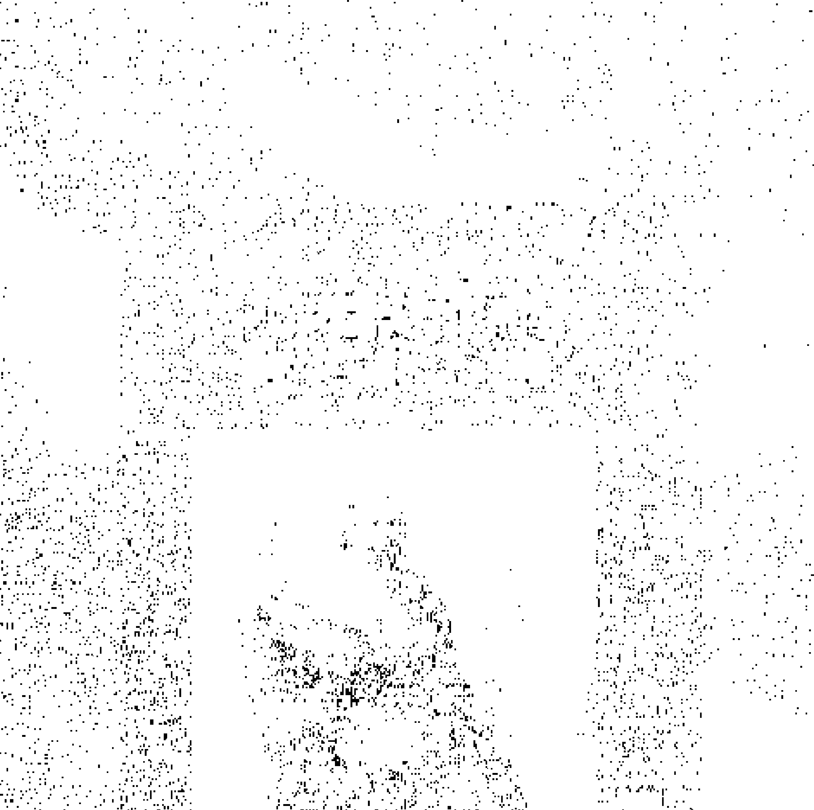

## 女神神谕占卜卡

朵琳·芙秋博士◎著 陶世惠◎译 定价780元

女神是灵性传承与各宗教民族中，充满爱与力量的存有。透过这副优美的女神神谕占卜卡，你可以连结来自埃及、印度、马雅文化、克尔特、希腊、西藏与其他传统的四十四位女神，包括我们熟悉的观音、雅典娜、绿度母等。每一张卡都为你带来指引的讯息，协助你改善生活境遇、解答灵性道路的种种疑惑，以及找到你此生的神圣使命。

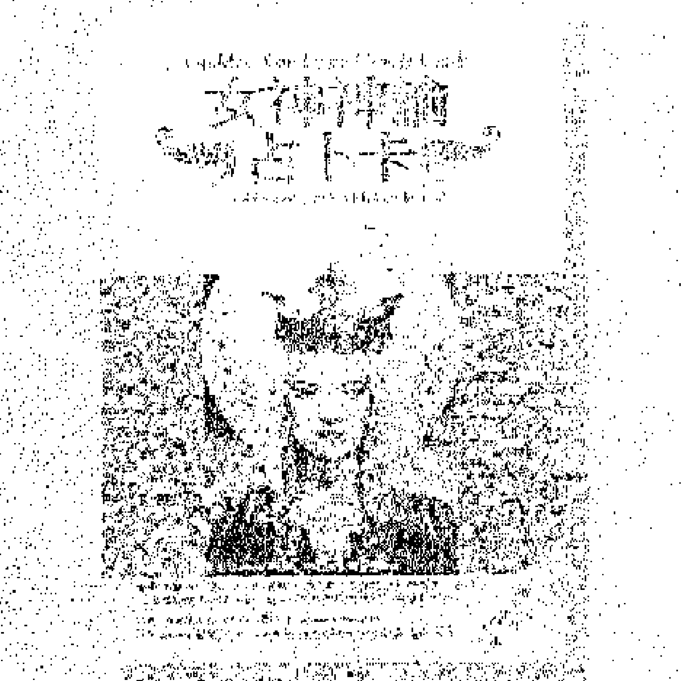

## 扬升大师神谕卡

朵琳·芙秋博士◎著 郑婷玫◎译 定价780元

扬升大师充满力量与智慧，是天界与地球之间的讯息管道，也是人们最佳的生活教练。藉由与神圣存有／灵性大师连通来开启高我的面向，激发最高的潜能，已成为新时代人们修炼自己的便捷法门。芙秋博士引导读者与44位跨各民族文化中的扬升大师连结，例如耶稣、摩西、圣哲曼、甘尼许、库图弥、观音等，你能透过能量上的连结得到最高的指引。

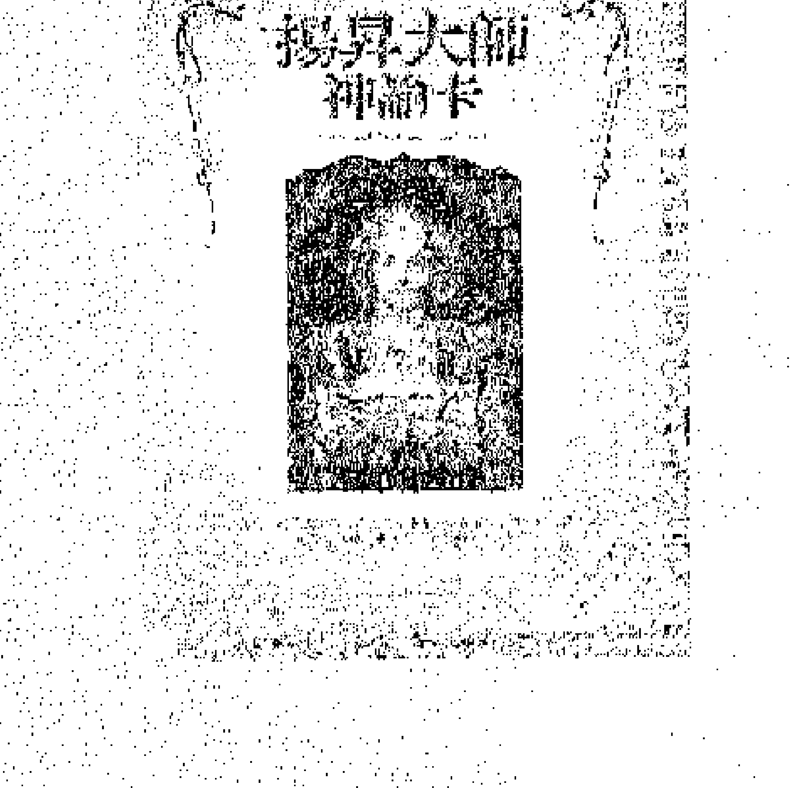

## 用心灵之眼，体验身心的和谐与活力

## 美丽身心系列

16开全彩

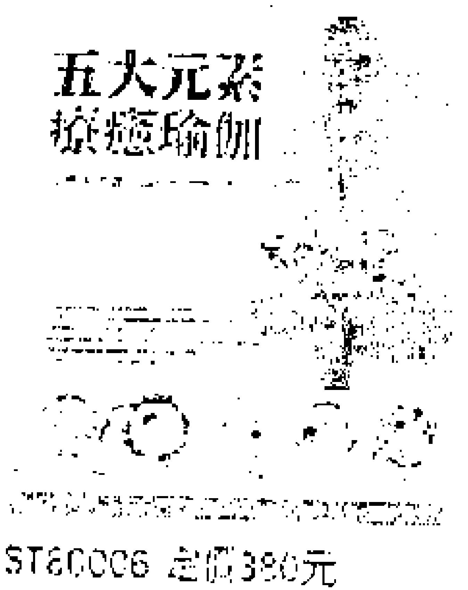

## 五大元素疗愈瑜伽

整合脉轮的瑜伽体位法

Healing Yoga

安碧卡南达大师◎著
作者精通静坐、瑜伽、吠陀多哲学与自然医学，为读者勾勒出精细完整的五大元素地图，在书中详细解说地、水、火、气、空每一种元素与身心的关联及调整的瑜伽动作。

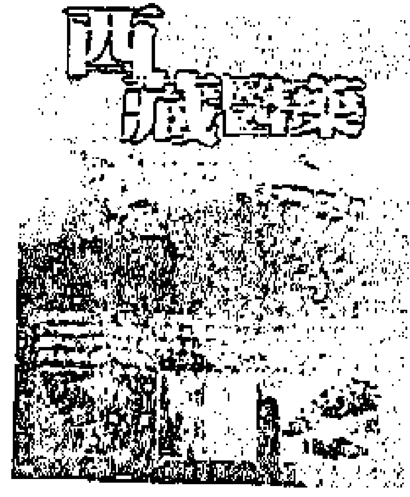

## 西藏医药

The Book of Tibetan Medicine

拉斐·福德◎著
西藏医药融合佛教哲理对生命的看法，有来自中国把脉的智慧，也包括阿育吠陀关于五大元素、三种体液的精华，其他如草药、矿物、炼金术的运用，形成了独特的西藏医药。

## 双人亲密瑜伽

用身体来沟通、分享爱和喜悦

The Book of Partner Yoga

米夏巴耶◎著
用心灵之眼体验爱，用身体感受浪漫和谐！作者以传统的哈达瑜伽为基础，并配合泰式、日式按摩和瑜伽治疗技巧，邀请你来体验双人瑜伽。

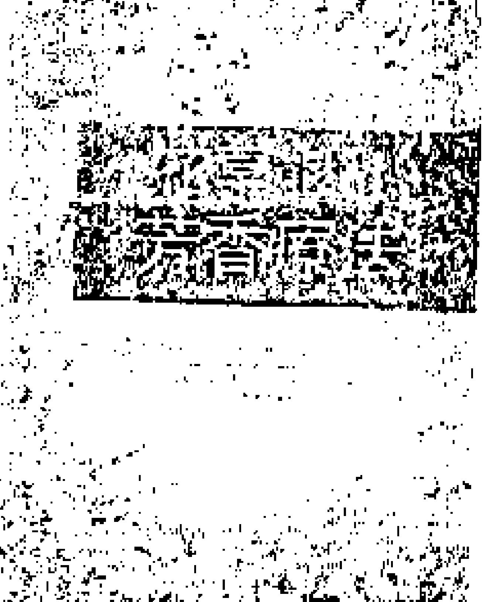

## 花草能量芳香疗法

融合阴阳五行发挥精油情绪调理的功效

Aromatherapy For Healing the Spirit

嘉布利尔·莫杰◎著
作者将东方医学的传统智慧应用到现代芳香疗法中，从阴阳五行及热、冷、干、湿等能量特质的角度，深入探讨四十种芳香植物以及对应的心理与情绪问题。

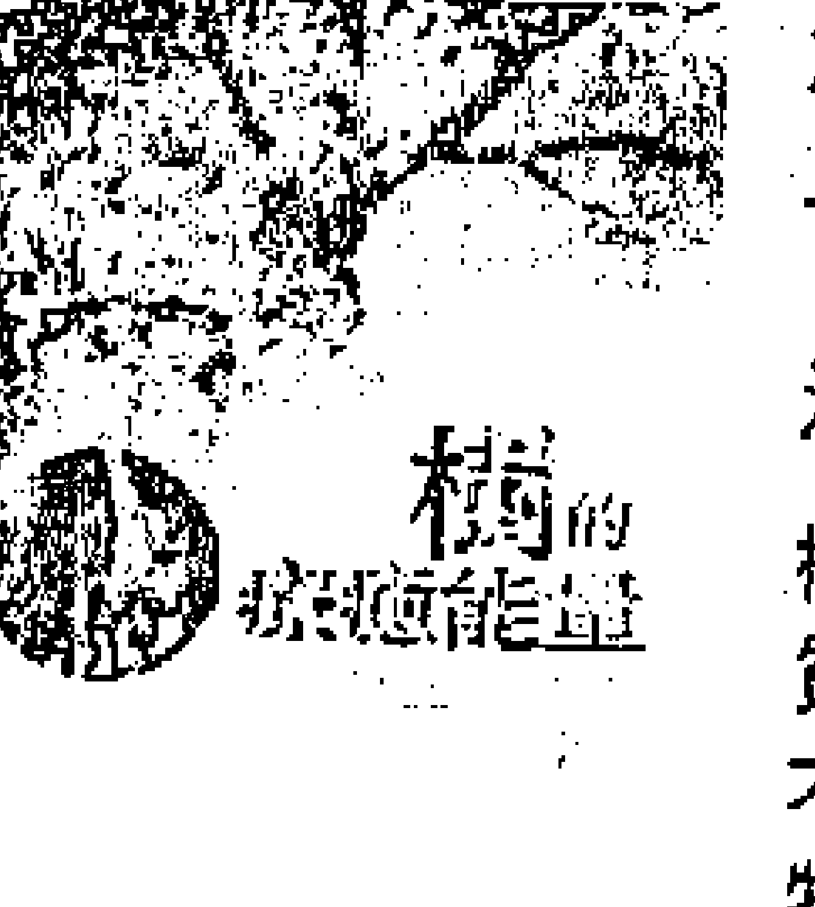

## 树的疗愈能量

The Healing Energies of TREES

派屈斯·布夏顿◎著
树，具有连结大地与天空的特质，本书指引读者发现及运用树木的能量，让你启动属于自己的特殊经验。与树接触，将重新连结内在及外在的生命力。

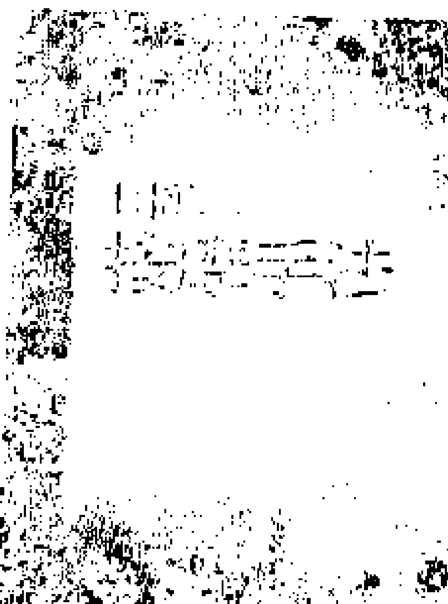

## 图解按摩手法

体验双手探索身体的乐趣

Massage

伯妮·罗温◎著
全书超过150张的精美全彩图片，教你如何运用简单却有效的方法进行按摩，你不需要是个按摩师，也能在家运用这些方法，享受按摩所带来的好处，帮助你抒解身心压力。

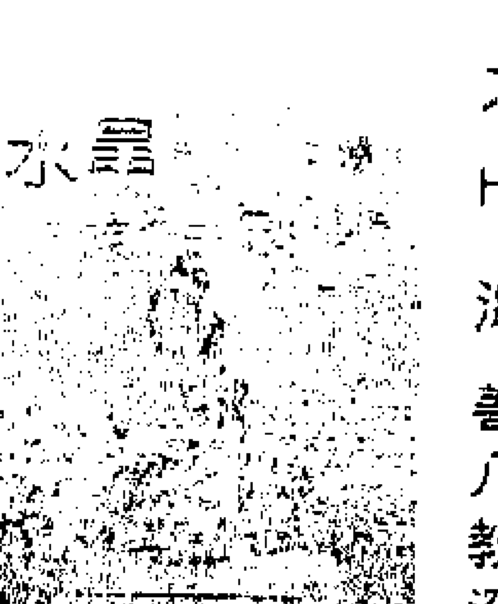

## 水晶身心灵疗方

Heal Yourself with Crystals

海瑟·芮芳◎著
善于处理精微能量的作者，针对八十种常见的身心灵不适状态，教你如何运用水晶矿石，进行深度的身体、情绪与灵性上的疗愈。

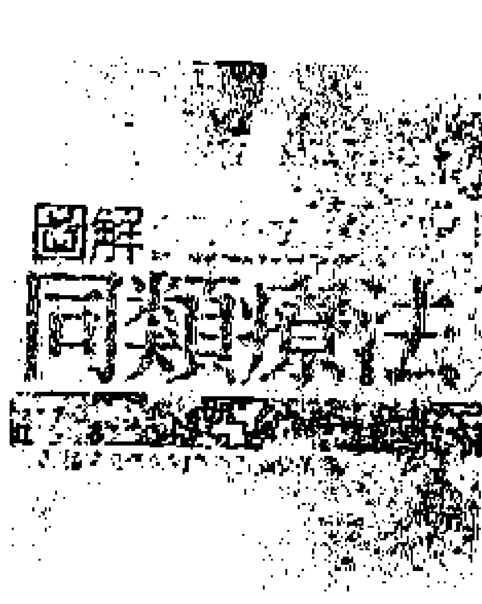

## 图解同类疗法

37种常见病痛的处方及药物宝典

Homeopathy for Common Ailments

萝宾·海菲德◎著
治疗哲理在于：「采用引发同样症状的药物治疗疾病」，能将病毒与症状适时抒发出来，并刺激个人内在治愈力，达致彻底转变体质的功效。

天使神秘学院官方淘宝 http://strc.taobao.com
获取更多好书，请加微信：13641926204 或 QQ:715104687

## 透过灵气拥抱世界

## 萨满的疗愈之道

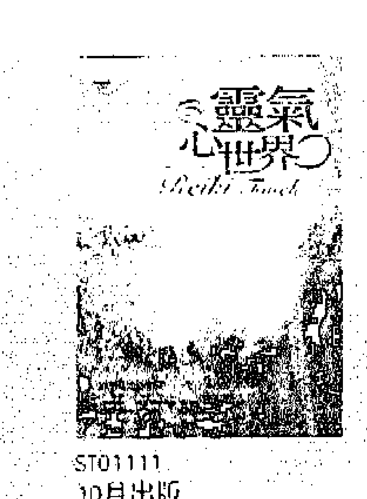

### 灵气心世界

透过觉知给出爱与抚触的疗方

The Ultimate Reiki Touch

莱丝蜜·宝拉·贺伦博士◎著

灵气的核心精神在于「觉知」，透过觉知给出爱、承诺与抚触。当灵气工作者敞开自己成为宇宙生命动能流通的管道时，也就迈向身心灵成长的旅程，协助自己及他人净化身心、体验空无与合一。

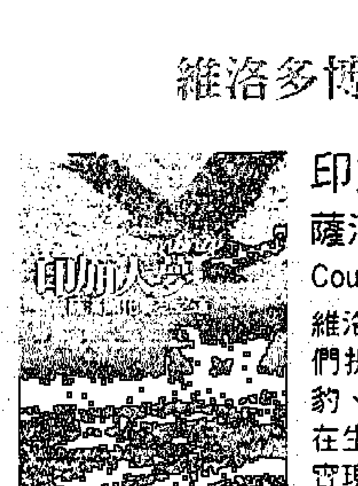

### 印加大梦

萨满显化梦想之道

Courageously Dreaming

维洛多博士以巫士的洞见来协助人们提升感知层次，透过蛇、美洲豹、蜂鸟与老鹰层次的操练，可以在生活中全然地放掉恐惧与冲突，实现最深刻的梦想。

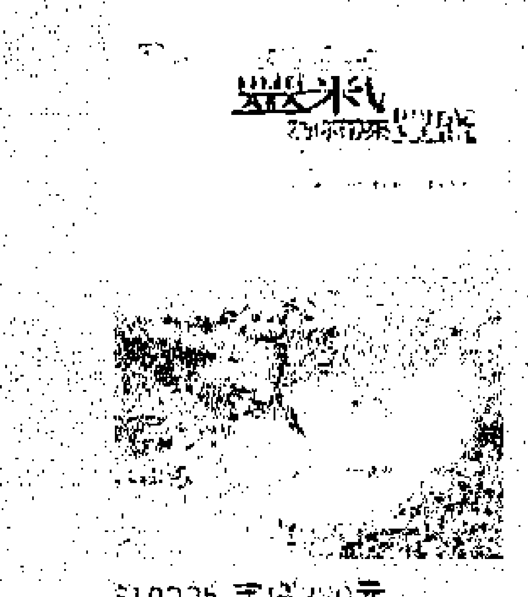

### 灵气为你带来丰盛

远离匮乏、体验丰盛的42天灵气方案

Abundance Through Reiki

莱丝蜜·宝拉·贺伦博士◎著

本书42天核心计划能进一步协助你放掉自身的抗拒能量，接受与宇宙合一的流，为你带来更多的丰盛，包括健康、爱、财富与经验。

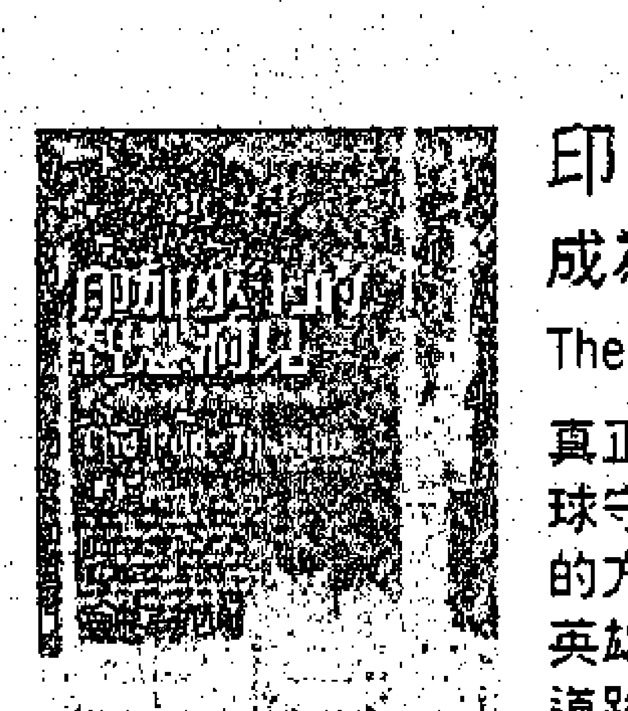

### 印加巫士的智慧洞见

成为地球守护者的操练与挑战

The Four Insights

真正的巫士是拥有力量与恩典的地球守护者，作者提出许多能量操练的方法，指引你一条提升自己成为英雄、光的战士、预见者与圣哲的道路。

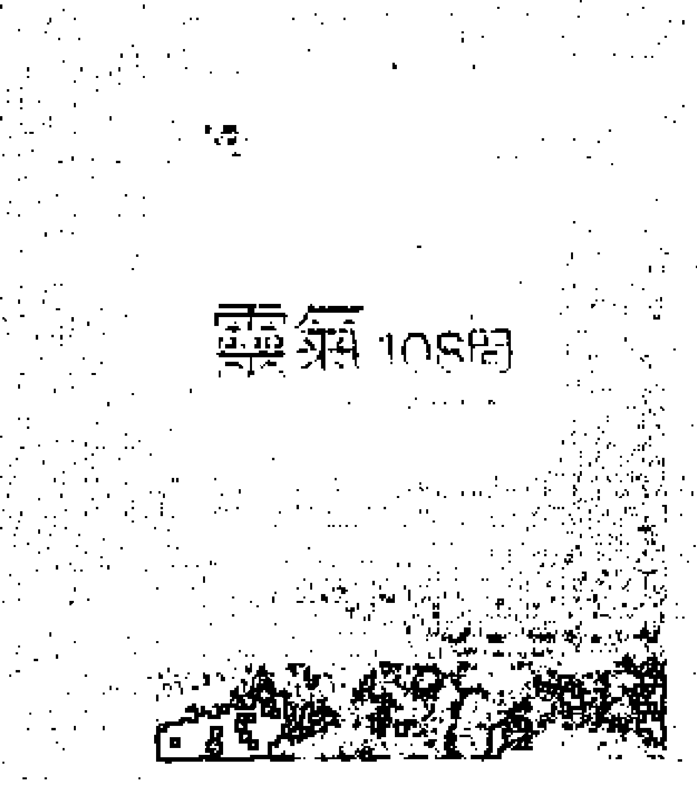

### 灵气108问

以双手传递宇宙生命能量的新时代疗法

Exploring Reiki

莱丝蜜·宝拉·贺伦博士◎著

作者为经验丰富的灵气老师，为好奇的入门者提供灵气的第一手资料，解释一百零八个修习灵气时最常见的问题，也为熟练的修习者解答灵气运用上的相关疑惑。

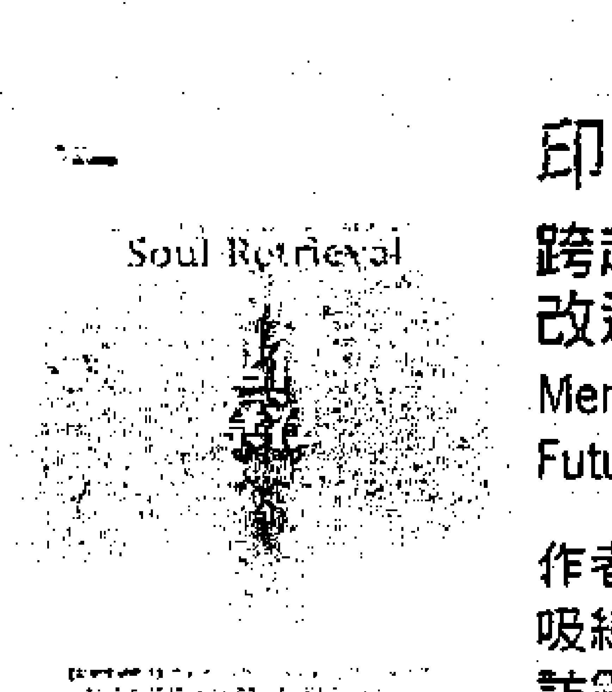

### 印加灵魂复元疗法

跨越时间之河修复生命、改造未来

Mending the Past and Healing the Future with Soul Retrieval

作者藉由引导式的冥想和独特的呼吸练习，带领你改变意识状态，采访灵魂世界，修复过去储存在脉轮里的原始创伤，并找出灵魂潜藏的恩典与宝藏。

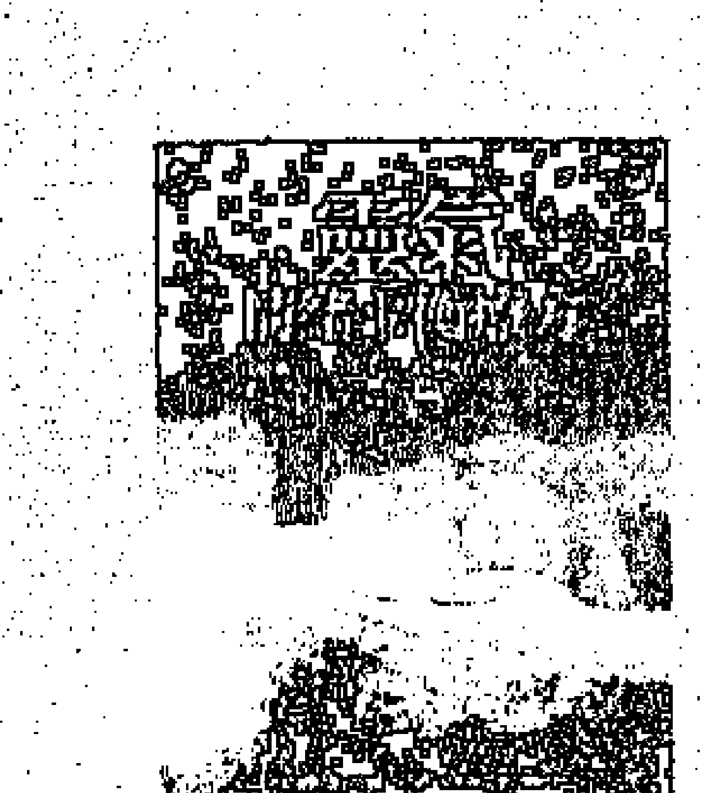

### 灵气情绪平衡疗方

Reiki for Emotional Healing

坦玛雅·侯内沃 灵气师父/教师◎著

透过灵气可释放负面情绪，进一步与你内在正面的特质连结，本书旨在指导如何使用灵气相关疗愈技巧，让人在生活中即使面对棘手的状况，仍能以专注、轻松和有创意的方式应对。

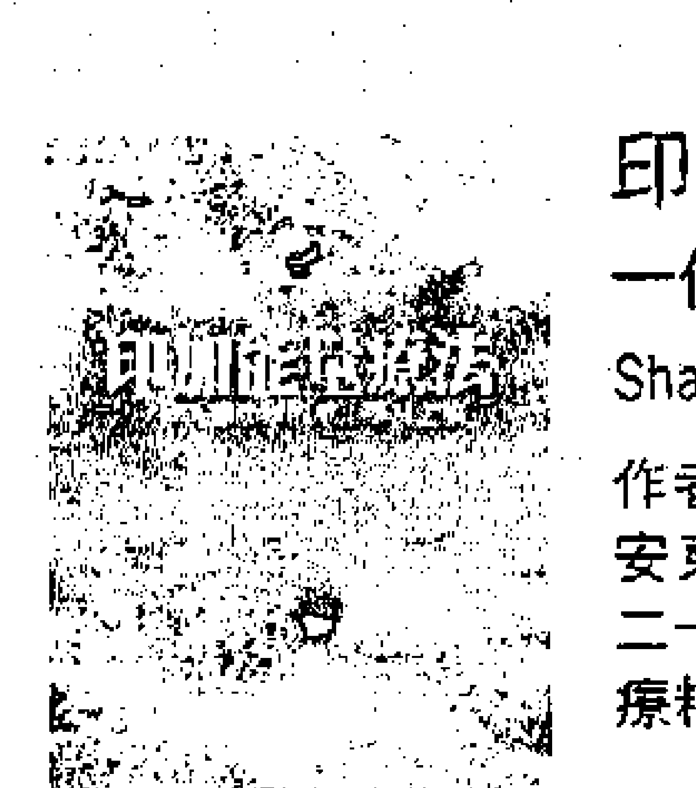

### 印加能量疗法

一位人类学家的巫士学习之旅

Shaman, Healer, Sage

作者深入南美蛮荒之地，追随巫士安东尼欧学习印加能量医术长达二十年，整理出清楚易懂的能量治疗精华。

## 邀請你的指導靈

- 原著書名／Ask Your Guides: Connecting to Your Divine Support System
- 作者／桑妮雅・喬凱特
- 譯者／邱俊銘
- 總編輯／黃寶敏
- 執行編輯／王芳屏
- 發行人／許宜銘
- 行銷經理／陳伯文
- 出版發行／生命潛能文化事業有限公司
- 聯絡地址／台北市信義區 (110) 和平東路3段509巷7弄3號1樓
- 聯絡電話／(02) 2378-3399
- 傳真／(02)2378-0011
- 網址／http://www.tgblife.com
- E-mail／tgblife@ms27.hinet.net
- 郵政劃撥／17073315（戶名：生命潛能文化事業有限公司）
- 郵購九折，未滿1000元郵資60元，購書滿1000元免郵資
- 總經銷／吳氏圖書有限公司．電話／(02)3234-0036
- 內文編排／菩薩蠻電腦科技有限公司．電話／(02)2917-0054
- 印刷／承峰美術印刷．電話／(02)2225-7055

2010年1月初版
定價：380元

ISBN : 978-986-6323-05-8
Ask Your Guides
Copyright © 2006 by Sonia Choquette
Originally published in 2006 by Hay House Inc., USA
Complex Chinese translation copyright © 2010 by Life Potential Publications.
through Bardon-Chinese Media Agency
ALL RIGHTS RESERVED.

行政院新聞局局版台業字第5435號 如有缺頁、破損，請寄回更換
版權所有・翻印必究

## 國家圖書館出版品預行編目資料

- 邀請你的指導靈／桑妮雅．喬凱特( Sonia Choquette )著；邱俊銘譯. -- 初版. -- 臺北市：生命潛能文化, 2010.01
- 面： 公分. -- (心靈成長系列；125)
- 譯自：Ask your guides : connecting to your divine support system
- ISBN 978-986-6323-05-8（平裝）
- 1.心靈學 2.通靈術 3.心靈感應
- 175.9 98023120

## 邀請你的指導靈，讓神聖團隊作後援！

能夠在你這一生提供協助的靈性資源是無盡的。世上有著無數個作為『指導靈』的存在，就像生活中的人們那樣形形色色。例如：守護天使與大天使。他們是你的貼身保鑣，為你帶來力量和保護、差僕，為你安排前方的道路。預先處理大小的事務，甚至指引靈。他們創造突破事件，協助你跳脫困境的情境，重新發現生命的奇蹟。其他還有各式各樣的指導靈，各自負有不同使命。幫助你的生命變得更加順利！

隨著柔順的引領，你會逐漸熟悉這個圍繞在我們身邊、隱而未顯的神聖國度。每個人都是神所眷愛的孩子，生來便有著無盡的祝福與資源。現在，請敞開生命的接收開孔，接受神聖的支援吧！你會發現生命是，節奏著愉快歌曲的小溪。陽光普照，微風輕拂，而你在其中悠然游。

- 指導靈可以是助手、療者、教練、差僕、前世有關係者、家人、來自其他銀河系的高等存有，甚至是動物！
- 你愈向自身指導靈與他們的協助開放，你的人生將會變得更棒！
- 指導靈的唯一功能是提供協助給你！

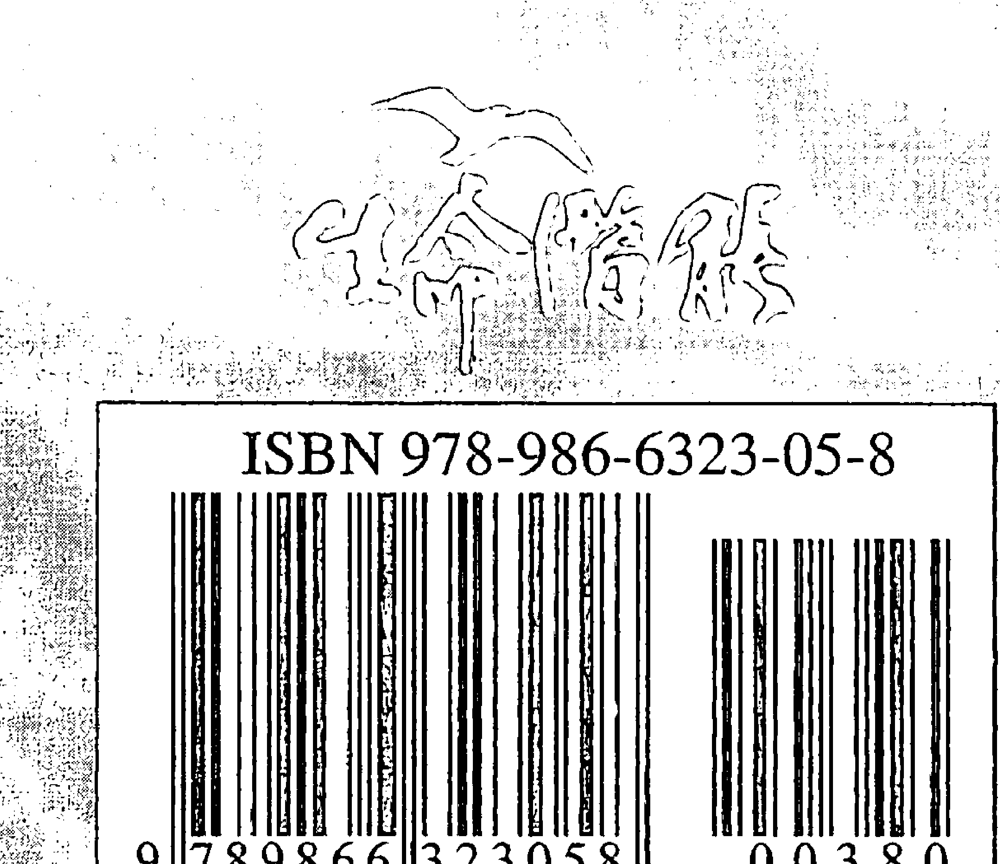