# 阿乙莎灵讯：创造新我新地球

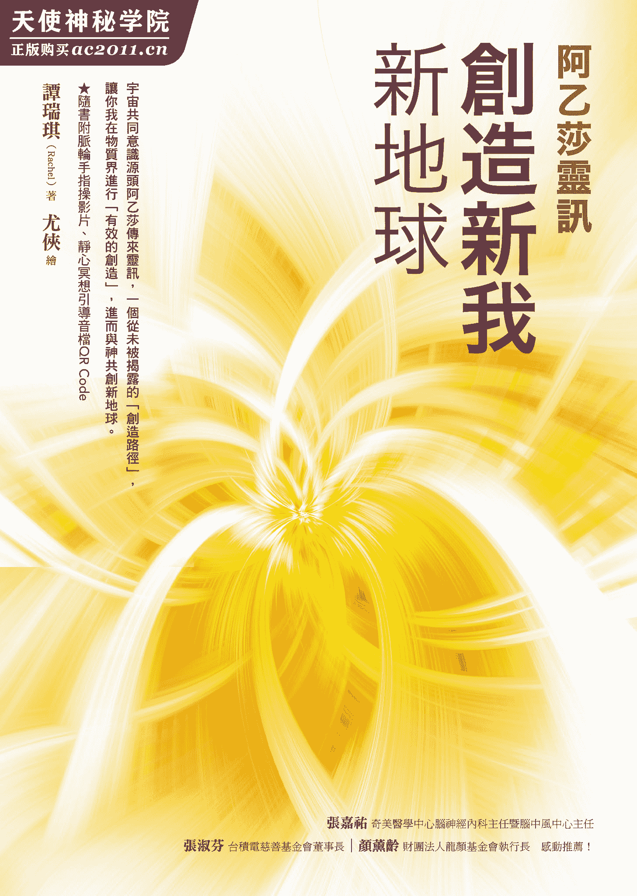

作者简介

谭瑞琪（Rachel）

一九六七年出生，台湾桃园人。美国爱荷华州立大学财金管理系硕士毕。

从小到大家庭和乐安康，没有后顾之忧地拿到硕士学位。回国后，顺利进入职场工作，在台湾的汽车业及电信业缔造了辉煌的商场经历。

虽然拥有顺遂的生活和工作，但是，生命不管你是跌入谷底或正玩得起劲，仍然会拉你走回此生早已安排好的路。

第一次与内在声音相遇是在同事的婚宴上，以主管身分在台上致词的她看着台下的众亲友，突然间，内在出现一个声音：“这些人认识的你，不是真的你！”

被这突如其来的声音震慑住的她，没多久就走上了寻找生命意义的路，想要弄清楚：“如果那些人认识的我不是真的我，那么，我是谁？”

在探索自己的阿卡西纪录的过程中，收到宇宙共同意识源头阿乙莎（Aheetha）要她传给世人一起分享的智慧与教导，她忠实地记录下来。这是阿乙莎给地球人类直接而完整的传讯内容。

著有《阿乙莎灵讯》《创造新我•新地球》《爱的复苏计划》《星光体》《新人类密码》等书。

•欢迎上粉丝页“阿乙莎”分享自己阅读后的心得：www.facebook.com/anitya.com.tw

•阿乙莎体验工作坊：[www.anitya.com.tw](https://www.anitya.com.tw/)

绘者简介

尤侠（YuSha）

文化媒体图文工作者，擅长漫画、插画、绘本、数码多媒体创作，相关图文著作与禅画多达十馀本，其中电子书图文绘本以中、英、德、法版本发行。

曾获教育部优良漫画奖项，以及《讲义》杂志年度最佳漫画家，二〇一六年受邀为佛陀纪念馆驻馆艺术家。“参禅参缠”系列作品于澳洲、马来西亚巡回讲座及展览。

近年接触凯史科技，进行穿戴型等离子产品的开发，并从阿乙莎的教导讯息中打开磁引力能量装置的研发与制作。

［推荐序］ ————张嘉祐

链接高我， 共创地球新未来

在多年灵性追寻的道途上，读过不少高灵传递的讯息，《阿乙莎灵讯》一书最让我有一种“与君一席话，胜读万卷书”的感动与畅快！可能是因为讯息是由作者 Rachel 直接以中文传递，少了语文转换的不顺，加上传递的对象是台湾及华人世界的读者，更让一直都接受西方信息的我们很有亲切感。当然更重要的是，阿乙莎高灵传递下来的讯息非常全面及完整，常须拜读再三，始能体会文字里蕴含的真知及深意，也解答了我多年来内心在生命追寻过程中的许多困惑及迷惘。当得知 Rachel 又接收了以灵性意识创造为主题的讯息，写了第二本“阿乙莎灵讯”，我自然迫不及待地先读为快，既满足自己心灵的渴望，并乐于推荐给目前跟我一样还在地球上追寻灵性成长及回家之路的兄弟姊妹。

这本书一开始，阿乙莎就直接讲清楚宇宙的“生命再生循环”机制，为我们锚定了生命轮回的目的，提醒我们不要再浑浑噩噩度日了！祂提到，进入新生命的开始，来自意识创造的生命动能。当人类的身体结束运作时，围绕着全身细胞和循环系统的灵性能量流会在身体停止运作后，自动回流到脑干下方后颈部的灵魂回收中心，然后透过这个回收站，将灵性能量上传至位于头顶上方六吋的晶体中。生命结束之后，经由晶体带回阿卡西纪录等候区的讯息会与全部人类的资料库再次汇合，成为更新后的集体意识。而我们会携带更新后的集体意识，伴随着尚未完成的生命意图，进入生命的选择区，再次进入新生命的循环及重生的体验。许多人都相信生命有轮回，但宇宙为何会有这样的再生机制，阿乙莎在这次的传讯中说得很明白，让我们可以理解耶稣为何能复活的真相。其实，真理一直存在，只是人类都被过往的局限性集体意识框住，而自我蒙蔽。有了这样的认知后，人类将能摆脱死亡的幻相，开始理解生命的永恒性。

阿乙莎也提点我们，在了解生命再生循环的机制后，要善用这一次的生命，迈入全然不同的认知系统。人类过去因为处于灵魂ＤＮＡ被封印的状态，无法忆起自己的生命蓝图，让生命在有限的生物脑中持续以创造为名，碰撞出周而复始、不断轮回的生命之路，这是我们过去熟悉的文明创造之路。只有当我们找回自己生命的蓝图，表达出自身生命最初始的意图，让生命展现超越生物体的智慧和创造力，才能帮助自己，也帮助所有人类和地球，走上扬升的道路。

高灵阿乙莎于本书末章呼唤我们要认知到灵魂是永恒的生命，我们就是自己的神和造物主，要从源头的合一意识找回最初始的生命蓝图。肉体只是我们目前暂时使用的载具，这个生命载具最大的功能，就是辅助我们完成一次又一次的生命目的，因此我们要在永恒生命的时空看见自己生命的目的。

目前地球的人类虽然受到社会文化的制约和规范，但都不该影响永恒生命的前进。阿乙莎邀请所有地球人一起走入内在宇宙，找到自己生命的目的和意义，创造属于自己的新宇宙传奇。

（本文作者为奇美医学中心脑中风中心／神经内科主任、

中兴大学食品暨应用生技系博士）

［作者序］————

一本务实帮助人们 提升灵性意识的训练手册

先前出版的《阿乙莎灵讯》收到来自各方的热烈回响，对灵性麻瓜的我来说，是非常重要的支持力量。前辈给予的肯定与认同，让我更有信心和阿乙莎链接，继续传达讯息给大家。与读者分享新讯息时，我还是戒慎恐惧，深怕在没有科学证实的情况下误导大众，让人盲目地追求灵性成长，忽略要稳定扎根于地球生存的现实。然而，结束这本书的收讯之后，我的担心已是多余，因为这是一本务实地帮助人们提升灵性意识的训练手册，一点都不空灵，也不会让人陷入幻境。

这本书将给予迈向灵性觉醒的人一条清晰的创造路径。这是来自宇宙源头的智慧和慈悲，在地球人类的扬升过程中提供意识上的训练和指导。宇宙经由不断创造来维持生命的永续与平衡，而当生命进入更高次元探索时，我们的确需要锻鍊自己的意识，才能顺利进入宇宙的创造法则。那是超越三次元物质世界、属于量子世界光之场域的运作法则。

这本书就像是给一个刚觉醒的学步灵魂的训练手册。当我们重十本自具足的意识能量，就可以链接内在宇宙，并与他人及这个世界相互融合。新世界就在每个人活出自身灵魂最高版本时被显化出来，这不是魔法，而是灵性提升后自然到达的状态。在阿乙莎一步步的带领下，我才明白，进入自己的灵魂晶体，与灵性源头相遇只是开场，跟随自己的大师、导师和灵性至亲给予的指导，除了可以让我们随时校准源头，还能积极地为自己和他人创造出和谐共振的量子场域，而这个经由更高意识创造出来的意识场就能转化世界的低频振动，改变地球实相，创造新世界。

对仍在寻找内在宇宙的朋友来说，这也是一本回归源头的路径指南。书中详细介绍进入晶体的祈祷路径及意识引导练习，并且进一步让我们在晶体中与灵性父母达成三位一体的合一意识。而当我们有幸与内在神性意识结合，扬升契入合一基督意识场域时，就可以窥见来自更高宇宙的运行法则，以及地球为何如此迫切需要人类集体扬升。此外，书中还收录我灵性父母创世的故事和新地球的讯息，我当作是宇宙殷切的呼唤所创造的故事情节，我自己仍无法确认这些戏剧化故事的真实性。

本书最核心的学习，是进入量子世界的创造，学习感知万事万物和创造过程中我们可以运用与衡量成效的方法。跟著书中的教导如实演练，将能得到印证，并有所收获。这些都是珍贵的高阶意识引导练习，但我要提醒各位读者，若只是阅读书中的内容，而没有实际练习，并到达自身意识的转化，即使能够进入晶体一窥源头，也不代表我们已经活出更新的意识状态。我们依然带着小我的意识生活在地球上，生活中仍会面临诸多挑战。因此，若你是带着小我的低频意识去操作书中教导的创造能量，就只能显化出局限或相对性的结果。你不过是再一次体验小我设定的戏码，重做了业力命题。只有与自己的更高意识源头校准，我们才能突破三次元世界，创造出跨越物质层次的新实相，而你最高版本的生命蓝图也将为你重新展开。

本书最后的“附录”单元收录了读者阅读《阿乙莎灵讯》后的相关疑问，希望提供在阿乙莎灵讯道路上学习的朋友更清楚的指引。此外，我更要感谢阿乙莎和雷巴特，以及来自更高次元的所有灵性团队给予我无条件的爱与教导，剩下的工作就交给我们，让我们在地球的这端一起实践和创造。

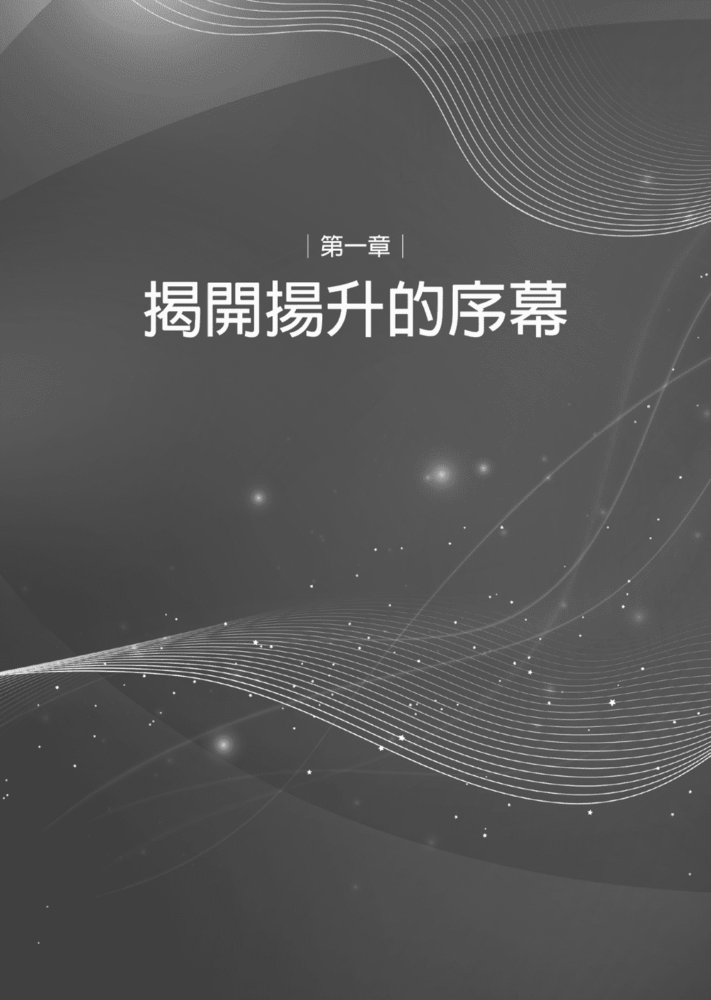

我们从“人”开始谈起，当人们觉醒之后，链接到宇宙意识时，就展开创造之路，你们的生活将进入绝对的创造。所谓绝对的创造，就是去创造灵魂宇宙的实相。这也是让地球与新次元接轨的重要里程碑。若人类在觉醒后无法走向一条正确的灵性创造之路，仍无法帮助整体地球扬升。

 生命的再生循环

进入新生命的开始，来自意识创造的生命动能。当人类的身体结束运作时，仍有一部分的能量不受身体系统死亡的影响而继续存在，那就是位于你们中枢神经系统中的灵性能量流。这些围绕着全身细胞和循环系统的电流会在身体停止运作后，自动回流到脑干下方后颈部的灵魂回收中心，透过这个回收站将你的灵性能量上传至头顶上方六吋的晶体中。

你在有意识地进入自己晶体的过程中，仅使用不到百分之一的电流就可以进行讯息的传输和解码，你的身体、大脑、器官、细胞则占用了百分之九十九的能量，让身体可以正常运转。当身体不再需要使用这些能量时，就会全数回流到你的晶体，进行讯息储存，而灵魂意识也会在此时透过晶体传送到位于阿卡西纪录的生命讯息储存区等候。

生命结束之后，经由晶体带回阿卡西纪录等候区的讯息会与全部人类的资料库再次汇合，成为更新后的集体意识。你会携带更新后的集体意识，伴随着你尚未完成的生命意图，进入生命的选择区，也就是再次进入新生命的循环。而此时，你尚未完善的生命意图会与要和你一起完成这个生命意图的灵魂意识融合，成为下一个新生命的生命蓝图延伸版本，进入重生的体验。

所以，现在的你是过去所有人类的集体意识，以及要和你一起完成尚待完善生命意图的灵性意识再一次结合之后，进入这个世界，你是包含自己、他人和所有人类集体意识的一个全新的生命。当你完成此生的体验，又会回到阿卡西纪录中，改写集体意识资料库。所以，每一个生命都是过去的一个结果，更是未来的希望种子。你们正在生命的恒河中不断创造彼此的更新体验，为迈向宇宙合一的意识而努力。

当你了解生命的再生循环机制，会对如何善用这一次的生命有全然不同的认知。你会使用自己的生物脑去想像出一个和自身携带的灵性意识总合无关的全新生命历程，抑或去找回此生携带的生命意图，从认识你到底是谁、为了什么目的来到此开始，与自己尚待完善的生命意图重新对焦后再次创造？这是两种全然不同的生命之路。

人类过去因为无法忆起自己的生命蓝图，在灵魂ＤＮＡ封印的状态下，让生命在有限的生物脑中不断以创造为名，碰撞出周而复始、不断轮回的生命之路。这是你们过去熟悉的文明创造之路，然而现实状况是，地球资源在短短的两百年间便损耗殆尽。

你们的生命再生循环系统只能储存人类的灵魂意识，你们在此创造的物质、身体、房子、车子、加工食品、机械等，都只是让你们体验和重新忆起自己是谁的工具与生活辅助。只有当你们去找回生命的蓝图，表达出自己生命最初始的意图，为生命蓝图创造更新的体验，让自己的生命走入绝对的创造之路，才能帮助所有人类和地球。

将创造聚焦在物质生活的显化，在排挤、对立和竞争冲突中创造出优胜劣败的生命道路，都是你们的生物脑创造出来控制自己和他人生命的伎俩。看穿小我的恐惧与陷阱，回到圆满自己和他人生命的意图，以创造人类集体意识的扬升为目标，你们才可以从创造中找到圆满生命的道路。

 未来世界的蓝图

未来世界在集体意识里，更新的集体意识正在快速地显化，你们以个体之姿无法在有形有相的物质世界中看见未来世界的样貌。但只要让自己的意识回到阿卡西纪录中，与人类集体意识场对焦，你就可以窥见人类正在共同创造一份未来世界的蓝图。这份蓝图会注入新的生命灵魂意识中，诞生在地球上，而你们也正在迎接这群携带未来世界蓝图的孩子。

当现在的孩子对学校、社会、国家表达出自己的看法和想法时，你会惊奇地发现，不论在世界上的哪个国家、哪个地区，在地球的哪个角落，这些孩子都有着一致的世界观，关心相同的议题，带着慈心且爱护地球。

不要认为他们对你们天天关注的话题显得漠不关心是件不好的事，也别以为他们忘了传统的礼教与价值观是教育的失败。勿轻易对孩子现在的表现贴标签，别忘了，他们是更新后的人类，不但比你了解全体人类最高灵性意识的想法，还带着要让所有人类觉醒与合一的意图再次来此体验。未来世界的蓝图就在孩子们表达出来的自身想法与见解中。

知识传承的目的不是要求别人照着已知的道路和想法前进，知识传递的意义是承认过往的不足。从传承中看见人类过去认知的局限，然后将知识交托给具备更广大群体意识的新人类，回到生命蓝图的再创造中改写有限的认知，这才是知识传承的真谛。

人类无法以自己有限的想法去要求别人都和自己一样。当前人写下的所有实验结果和研究报告缔造人类认定的辉煌纪录时，只是再一次向所有新人类宣告，我已经走到这里，你们不用来复制我的想法、我的道路，去寻找属于你的更新体验和道路。就如同阿卡西纪录的讯息场为人类保留得以探索的讯息，同样也被人类自己不断地改写。

 你就是创造的源头

接下来的传讯，我们要重新校准人的创造力并厘清观念。创造的本质是什么？你们在学校和古老的传承中已经忘却了创造的真义。创造不是破坏后的重建，也不是为了更好的生活与物质享乐境界采取的行动，而是一种表达，是生命进入更高意识的完整表达。你以崭新生命之姿来到地球，你的生命诞生本身就已经是一个创造的开端，你只是忘了自己在诞生之前的约定，也未曾忆起来到此生的目的。在生命的旅程中，你看不见自己就是创造的源头。你走进人群里，看着眼前花花世界中琳琅满目的创新科技，体验着五感的极致享乐，以为这些物质的展现就代表人类前所未有的科技文明与创造能力。结果，你一直往外寻找创新的点子和新的体验，试图在外面找到更好、更优秀的替代品，以为只有在物竞天择、优胜劣败中，才能证明自己。你花了一辈子，努力在物质层次创造和追求，却忘记表达出自己生命最初始的约定，创造此次生命的极致体验。

事实上，你无法向外找寻生命的方向，只能从内在找到专属于自己生命的创造本源。当你与自己的内在宇宙愈来愈靠近，走入内在宇宙的灵性源头时，那合一的意识将带你超越线性物质时空的幻相，帮助你回到灵魂最初始设定的道路。

在这趟灵性生命旅程中，没有时间与空间的限制，也不会有资源匮乏的问题，你将重十清晰的生命蓝图指南，在灵魂量子宇宙的实相里创造。这个创造的源头就是你，你被赋予实现你的天命须具备的天赋才能，从自己的源头中，你可以发掘并表达出你生命本有的光辉。这是你与自己的生命最初始的约定，和别人如何看待你，以及你目前的身分与职业并没有关系。

当你的灵魂从你目前身处的地球实相苏醒时，你会发现你已处在平行宇宙中。你的肉身正经历着这个世界幻化出来的一切体验，有限的时间里，你得到物质身体的滋养，与此同时，你的内心已经超越时空的限制，就在你的晶体中，你的灵魂源头正准备开展专属于你的灵魂量子世界创造之路。

因为已经清楚知道即将迈向的生命蓝图大未来，你将不再被物质世界的表象所困，会更感激和珍惜此生遇见的所有人、事、物，他们都在适当的时机来帮助你看见和擦亮你自身灵性的光。你会以更高的意识帮助所有与你链接的人一起迈向光明。在灵性世界的创造之路上，你并不孤独，你的灵性大师、导师和挚爱的家人将一起指引你、协助你校准源头，迈向生命的永恒旅程。

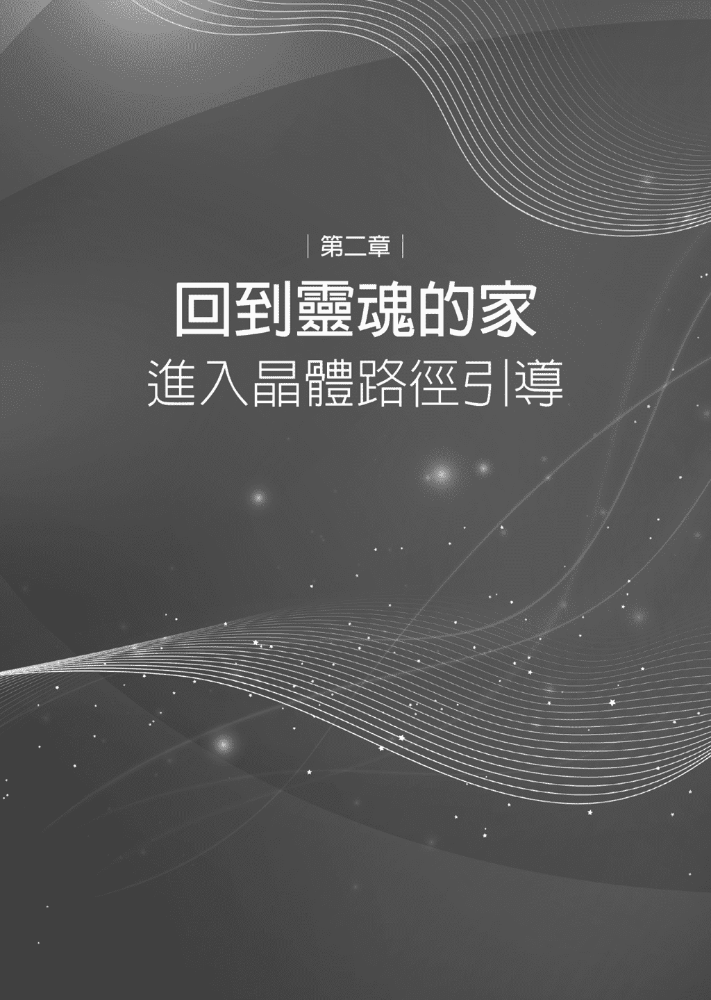

 进入晶体的行前准备

要进入自身的晶体，有许多方式和路径，但前提都是要从到达脉轮畅通、中轴稳定的状态开始创建链接的基础。这个脉轮畅通与中轴稳定的相关练习和静心冥想，在《阿乙莎灵讯》一书中已有详尽的说明，在学习进入晶体之前，希望你们已经完成这个部分的练习。

若期望仅仅透过晶体路径的冥想引导来获得晶体中的体验，是不太可能的，因为在中轴未稳定的状态下，会被自身意识干扰而造成链接过程的混乱。也因此，在学习进入自己的晶体之初，除了要达到中轴畅通稳定的状态，亦须学习解除关系业力的枷锁。若已经完成大部分业力命题的疗愈，那么，经由能够进入晶体体验的老师在过程中协助，将可以帮助你们更顺利地契入自己的晶体中，得到全然的合一意识体验。

个人晶体的链接是进入灵性源头的路径导引，可以将意识链接到自身灵性源头，展开灵性生命的创造，这是人类处于二元对立线性时空中的灵性成长机会。若能唤醒更多人与自身灵性源头链接，帮助每一个人回到自己灵魂的家，整个地球意识将可以更顺利地扬升至第五次元。

阿乙莎，进入晶体的过程需不需要有任何保护措施？有些人会担心是否有可能在没有任何保护的状态下遭受外灵干扰。

当你们的灵性意识处于不完整或不够落实扎根在地球的状态时，有时会在链接更高意识的过程中，被自身恐惧，或是隐藏在潜意识中仍待平衡的情绪能量牵引，以致你们会以为看见外灵或神佛了。那些都是你自己的游离意识呈现出来的镜像。也因此，在开始练习进入晶体前，除了稳定中轴、畅通脉轮之外，很重要的是必须先净化和平衡自身携带的业力，再学习进入晶体。这是需要循序渐进和深入业力净化的过程，而最终，你们将可以在校准自身的晶体后，达到与高我意识融合的状态。此外，你们也可以在契入晶体的链接之前，进行以下两个或其中一个你觉得自己需要的行前静心冥想引导。

进入晶体行前静心冥想一：集中分散的意识，归于中心

1.深呼吸，放松坐着或站着。

2.想像你的身体被一圈蛋形的光包围着，你站在蛋中，受到保护。

3.接下来，用手从四面八方将蛋形外边的意识拉回到中心，放进心轮的位置。

4.双手放在胸前，跟自己说：“我将所有的意识归于中心，我是完整且受到保护的。”

进入晶体行前静心冥想二：与大地链接，释放疑虑和恐惧

1.深吸一口气，将空气吸入自己的太阳神经丛——在肠胃和心脏之间，接近肝胆的位置。

2.吐气，用意念冥想在太阳神经丛的位置画出逆行三圈的图形，同时将气息吐出（逆行是指从肚脐向上往左胸再移往右胸，向下回到肚脐为完整逆行一圈）。

3.连续进行上述步骤，呼吸三次，释放自身的疑虑和恐惧，并扎根，与地球链接。

 进入晶体和通灵或解读阿卡西纪录的不同之处

晶体场域和所谓的通灵或阿卡西场域是不同的。通灵是将自己的意识链接到其他非物质生命体，在人类过去的经验中，只有少数人得以经由通灵的方式链接。但连上的灵性意识可能来自不同层次，遍及四面八方，也有许多通灵者是在意识不清醒、身体被外灵暂时进入使用的情况下获得讯息。

阿卡西纪录则是人类过往历史中所有意识层的统一场域。这个场域允许全然地存在，所有的一切，相互矛盾的、好的或坏的，以及在有限与无限之间的，这里所有的讯息在不同的层次中都是真实存在，并储存于阿卡西纪录中。人类可以在有意识的状态下透过与自己的高我意识链接，得到来自阿卡西纪录场域的智慧与知晓，也可以透过阿卡西纪录的链接路径帮助身边的亲友链接，取得阿卡西纪录中属于他的解答。这个场域是开放的统一场，讯息包罗万象，上至天文，下至地理，如同链接 Google 云端资料库一般，可以获得超乎个人这一世经验或集结所有人类集体智慧的最佳解答。也因为是在开放的空间中，需要学习辨识讯息来源是否正确，并能以无条件的爱支持你在其中得到的来自任何层次的解答。

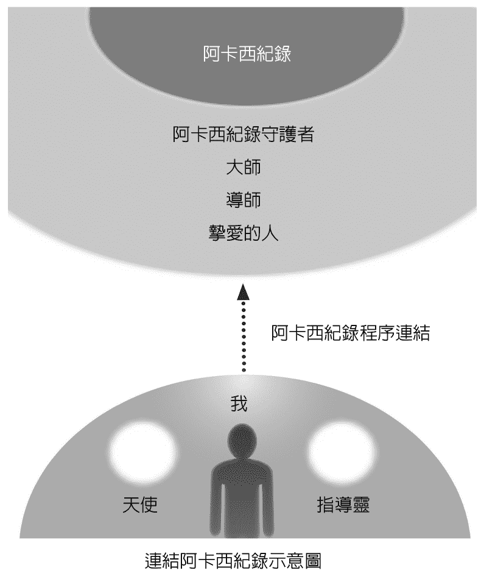

而契入晶体并不是走向开放式的统一讯息场。这里是专属于你自己的灵性空间，是一个更小的、封闭式的场域，透过你的高我指引进入。处于自己晶体中的感受，与通灵或进入开放式的阿卡西纪录场域中的感受会有明显的不同，你会在这里感受到轻盈、明亮、宽敞与清晰的能量。这里不会让你觉得肩膀或头脑昏沉，你反而会感受到让你呼吸更为顺畅、空气含氧量更高的天堂气息。在这个属于你自己的晶体中，只有你，以及你的灵性大师、导师与灵性家人同在，没有其他的意识体可以进入你的个人空间，你可以安心地在此与自己的大师、导师、灵性家人畅谈。即使你不想交流，处在你个人专属的晶体空间中就能增加你灵魂的安定与能量，净化你的灵魂体，抖落你身上的噪声和低频振动干扰。

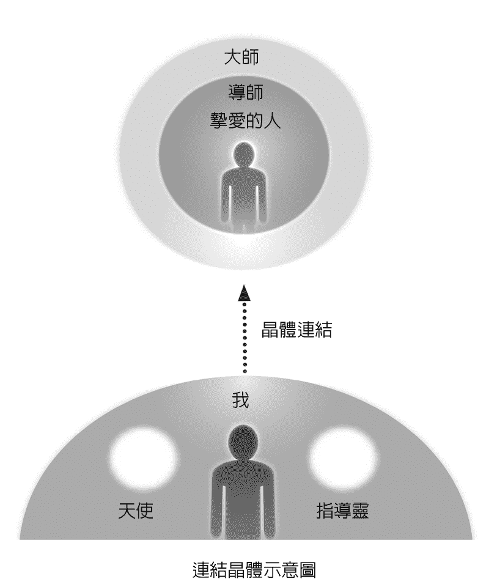

你在自己的晶体场域中是绝对安全的，你的头脑会处于意识更清明的状态，意识场则因大师、导师与灵性家人的临在，如水晶般通透明亮。在此，你不需要进入阿卡西纪录中搜寻关于自己的一切，所有关于你灵性成长过程的信息都已经在此让你撷取。若需要寻求超越自身相关问题的解答，可以透过自己的大师、导师和灵性家人的协助，从阿卡西纪录中撷取出来；或是透过灵性家人穿越他们自身的晶体，帮助你获得更多宇宙共同存在意识的协助。大部分与你相关的讯息都已经存在，如同在自己的 Dropbox 资料库一般唾手可得。这是专属你一个人的灵魂空间，你不会开放给其他人进来共享，你的灵性大师、导师和家人也不会允许非属于你的灵性片段侵入或干扰。你与认识的亲朋好友或已经离开地球的家人仍然可以透过自身的晶体相互链接与沟通，但这并不代表进入对方的晶体里。

在晶体中的灵性大师、导师和灵性父母可能不像你一样拥有物质生命体，也不是像天使一般具备特定的灵魂形体围绕着你的灵魂旋转。你可以想像自己处于晶体中时，你的灵性大师、导师和挚爱的灵性家人就是围绕着你的同心圆外圈的光环，他们的光就是意识群。进入自身晶体的过程就是从自己第三眼后方的松果体核心进入，透过大师、导师与灵性家人的引导，产生光的同频共振。这个来自你自身和你高我的光链接在一起，扩展成更大的同心圆。每一层光圈代表不同的意识能量，而你与你的大师、导师和灵性家人在这时已是一体的存在。你们以同心圆的方式呈现出属于你们共同意识存在的光芒，充满在你的晶体中。

（我相信有许多方式可以契入自己的灵魂晶体，这里即将介绍的是我自己经由阿乙莎的教导得到的方法。还记得在《阿乙莎灵讯》一书中，我使用阿卡西纪录的祈祷路径链接上阿乙莎，开始下载一连串传讯内容，一直到进入《阿乙莎灵讯》的“宇宙”单元时，透过阿乙莎的带领，我才第一次契入自己的灵魂晶体中。这个路径是如何展开，又是如何让我顺利到达的？说实在，我一直都无法取得阿乙莎的正式回答，祂甚至曾开了个玩笑，在我与祂链接，准备进入自己的晶体时，告诉我，跳～下～去～就可以到达。也因此，我过去总是循着阿卡西纪录的祈祷路径先链接上阿乙莎，再由阿乙莎带着我进入自己的晶体。

直到完成《阿乙莎灵讯》的内容下载，我依然是使用阿卡西纪录的祈祷路径契入。因为已经累积下载了许多关于如何在晶体中工作的关键讯息，在下载讯息的过程中，我时常会在阿卡西纪录的氛围里感受到能量过于稠密和沉重，而不得不中断讯息的链接。我明白这是因为在开放式的场域中，讯息层次很多，场域较为拥挤，纷纷扰扰的讯息交杂，所以每一次下载讯息后，我需要不断地与自己的高我再次确认，以免有内容不够完整就被我中断的状况，或是误植之处。因此，我再度向阿乙莎请求，希望祂赐予我一个不需要经过阿卡西纪录的祈祷路径，就可以直接契入自己灵魂晶体的方法。以下就是我得到的灵魂晶体祈祷路径，可以经由三个步骤让自己的意识链接高我，然后直接契入晶体中。

在开始学习这个三步骤的晶体祈祷路径之前，我必须先提醒大家阿乙莎给予我这段祈祷文的前提。这个契入灵魂晶体的祈祷路径是创建在自身脉轮畅通、中轴稳定的基础之上，同时，在晶体中的停留时间也跟自己的中轴稳定状态有关。人很容易被自己的情绪与小我意念干扰而偏离了中轴，此时意识也就会偏离自己的晶体场域，但人们会误以为自己仍处于晶体链接的状态，急着想要在此创造出非凡体验，这样反而会因为意识偏离，去链接上自身小我意念投射的较低振动频率，产生误导自己的讯息。这一点请大家谨记在心。创建自身的中轴基础是追求与神合一体验的前提，也是提升自我意识的开始。）

如何辨识讯息内容？

进入晶体时，除了空间场域在身体上给你的感受有所不同之外，你可以透过以下三个层面来判断自己是否仍处在晶体中。

一、语气

就像和别人交谈一样，你和自己的高我之间也会产生沟通的默契。当你发现过去习惯的语句或回应方式有所改变时，这份讯息就可能是来自其他的灵性存有，而不是你的高我。此时就代表你已经不在晶体中，可以中断链接了。

二、内容

高我传达的讯息内容通常和你的左脑认知有所不同，当你放下左脑的惯性思维，你的右脑仍能呈现顺畅的文句与理法时，就是正确的链接，而非来自你个人小我意志的语言。若你发现自己的左脑意识仍以逻辑性的思维包裹着讯息，就已经不是来自高我的讯息了，可能是来自你个人的评估判断或直觉。

三、频率

接收高我的讯息时，你的灵魂意识振动频率会高于身体，在这个状态下，右脑可能会有麻麻的或振动的感觉；同时，这个频率会让你的身体放松，全身感到舒适，内在也处于平安喜悦的状态。若你感受到的频率让你觉得脑波混乱、心跳加快、身体紧绷，甚至恶心想吐，可能就是来自低频能量的干扰。这时请停止接收讯息，起身走走，让自己的意识落地。

 契入灵魂晶体的途径

方法一：阿乙莎教导的路径

进入晶体

（以下是我透过阿乙莎得到的直接契入灵魂晶体的方法。这看似简单的三个步骤已经包含清理校准、向高我祈祷，以及意识带领进入等三阶段，对我自己来说是非常直接准确的到达，而进入晶体的意识移转过程也很明显。）

•步骤一：清理脉轮与中轴校准的静心冥想

1.闭上眼睛，可以坐着或站着，全身放松，深呼吸数次，意识放在自己的呼吸上。

2.让意识从最下方海底轮的位置开始往上，在每一个脉轮上用意识正旋三次、逆旋三次。依序完成海底轮、脐轮、太阳神经丛、心轮、喉轮、眉心轮、顶轮七个脉轮的正逆旋各三次，完成每个脉轮的清理。

3.接下来，从顶轮往身体前方画弧线，往下由海底轮进入中轴，再从海底轮向上贯穿中轴回到顶轮。画三次大圈后，再反转，由顶轮沿着身体贯穿中轴，从海底轮出去，再往身体前方画弧线，往上方由顶轮回到中轴，共三次大圈，完成中轴的能量贯穿与校准。

•步骤二：打开晶体的祈祷文

念出以下祈祷文：

1.“我感谢大师、导师和我挚爱的人的临在。”

2.“请帮助我×××（自己的法定名字），在您的引领下，契入我的灵魂晶体。”

3.“让我在晶体的圣光中分享大师、导师和我挚爱的人赐予我的智慧、勇气和慈悲。”

4.重复第二、三句，共三次。

•步骤三：意识契入

闭上眼睛，让意识向自己眼睛上方的眉心轮移动，并念诵三遍：

“我现在已经进入晶体中。

“我现在已经进入晶体中。

“我现在已经进入晶体中。”

进行第一个步骤的快速清理和校准时，最好是以站姿进行，让自己整个身体的中轴可以清理与流动得更顺畅。若不方便站着，也可以让自己轻松地坐着进行。第一个步骤全程要将意识放在每一个脉轮的一呼一吸之间，同时进行意念带领的旋转。将意识放在呼吸之间可以扩展脉轮的能量场，以意识画圈旋转则是在帮助该脉轮提升能量和清理净化。

脉轮清理完毕就可以坐下，进入下一个步骤。

进入第二个步骤时，当“请帮助我×××”那一句念到第二遍，会感受到能量从头顶上方缓缓流进身体中。有些人会觉得头脑昏沉或肩膀沉重，这时你链接的大师、导师就停驻在心轮后方，双肩下方的位置。这是你与自己的高我链接时身体会感受到的状态。

进入第三个步骤时，眼睛闭上，让意识往上方眉心轮第三眼的方向移动，口中念着“我现在已经进入晶体中”，这时你会发现刚才的肩膀沉重或头脑昏沉感瞬间消失，意识移转进入一个宽广轻盈的空间。这就是你的大师与导师带领你移动到晶体的过程，你甚至会明显感觉到像是搭乘电梯往上方平缓地移动，电梯门打开时，你就已经处在晶莹剔透的灵魂晶体中。

大师和导师都是一群光的意识体，并不会有形体或外貌让你看见。因此，在整个静心冥想、祈祷或进入晶体的过程中，你都不会看到有形有相的人物。他们会以光的意识振动频率，让你知晓他们正与你同在。

离开晶体

要离开晶体时，就念以下的祈祷文：

“我感谢大师、导师和我挚爱的人的引导。

“感谢你们的爱和慈悲。

“我现在离开晶体，回到自己。

“我现在离开晶体，回到自己。

“我现在离开晶体，回到自己。”

念完之后，可以起身走动一下或做家事，让自己更落地。

方法二：透过阿卡西纪录祈祷路径进入

（下面提供的是透过阿卡西纪录的祈祷路径进入自己晶体的步骤。关于进入阿卡西纪录的教导有很多，也有书籍详细说明，如琳达．豪儿博士所写的《如何解读阿卡西纪录》这本书就有详细的阿卡西纪录祈祷路径的说明，市面上也有许多课程或参考书籍提供这方面的信息。

在此提供阿乙莎给我的链接阿卡西纪录祈祷文，你也可以透过此祈祷路径与自己的高我链接，获得来自阿卡西纪录场域的讯息。）

阿乙莎提供的阿卡西纪录祈祷路径

•第一段：光的引导

“我感谢圣灵之光，从我的头顶上方缓缓向下，流经我的眉心，进入我的心轮。在此，我愿意敞开我的心，与圣灵之光链接。”

•第二段：祈请

“喔，圣灵啊！请帮助我在阿卡西纪录的光中，超越小我意志，为所有人的福祉，知晓我自己（或祈请人的法定名字）。

“让我透过阿卡西纪录，分享来自我（或祈请人）的大师、导师，以及我（或祈请人）挚爱的人赐予我（或祈请人）的智慧、勇气与慈悲。”

•第三段：打开纪录

“纪录现在已打开！”

若无法念诵一遍就进入阿卡西纪录的氛围，可以重复念诵第二段祈请文“喔，圣灵啊……”二～三遍，然后再进入“打开纪录”阶段。

若你已经透过阿卡西纪录的祈祷路径成功与自己的大师、导师链接，那么，当你进入阿卡西纪录的氛围时，可以直接请求大师、导师带你进入自己的晶体。这时，你的意识就会向上方移转到较高振动频率的晶体空间里了。

而要离开晶体，可以运用前面提供的离开晶体的祈祷文，或是念诵阿卡西纪录的结束祈祷文亦可。

和阿卡西纪录的阅读路径不同的是，如果你是阅读别人的阿卡西纪录，这时就无法同时要求对方的大师和导师帮助你契入对方的晶体中。如之前所说的，晶体是个人专属的神圣灵魂殿堂，是安全封闭的空间，并不像阿卡西纪录是开放式的统一场域。因此，透过这种方法进入阿卡西纪录祈请大师和导师时，只能针对自己的晶体提出要求。

 契入灵魂晶体的作用

链接更大的我

当你链接进入晶体时，就可将意识的振动频率重新调频校准至更高意识存在的频率。在此状态下，你可以从扩展意识后成为更大的“我”的角度去展开全息宇宙的世界，除了可以获得生命的导航、疗愈自己和此生的关系命题、由此契入合一的意识源头，更重要的是，在这张全息宇宙的晶栅里，你的意识产生的振动可以在量子世界里移动、链接、转换，最终进入宇宙实相的显化。

因此，进入自己的晶体就是你的灵魂苏醒的时刻，在晶体中随着你意识的升起，在量子维度中穿梭，超越时空限制去链接，并扩大意识影响的范围。除了可以在晶体中认出自己的灵性源头，以及他们来自哪个星际宇宙，更重要的是，你将亲身体验与他们在灵性层次是不可分割的共同存在意识体。你明白自己是一个永恒的意识存在，于投生进入地球体验物质的旅程中暂时遗忘了与源头家人的链接，而你现在可以重新忆起并回到自己灵魂的家园。虽仍无法透过眼睛看见自己灵性源头的形体，但与更高意识的链接之钥就存在你的晶体中，随着你的灵魂ＤＮＡ解锁、打开，你们再次合一，成为共同意识的存在。

解开灵魂ＤＮＡ的封印

在晶体中，你因链接到自身更高意识的光，终于打开被封印的灵魂ＤＮＡ，这是你与自己的更高意识源头校准时得以重十的自身之光。这个光经由你的更高意识晶栅，传送到你处于较低密度生物体的意识中。灵魂更高意识的光启动的过程，会打开你灵魂ＤＮＡ的封印，帮助你再次链接和扩展到更高的神圣维度。

人类的集体意识里有共同的ＤＮＡ光码。来自不同星际族群的光码虽然不一样，如天狼星的光码与克里昂或爱莎莎尼的光码会有些许不同，但这并不影响人类在更高意识的融合与交流，因为你们在更高的意识层仍是互通的。当你打开灵魂之光时，会帮助你链接其他同样来自你灵魂星球的地球家人，这些人也会因你的光芒而打开与你的链接共振。这是光在量子世界的晶栅打开必然会有的现象。同样地，当一群来自相同灵性源头的意识之光被启动链接时，也会与其他星际的存在意识相互链接，形成更大的银河意识群。当人类达成百分之五的人灵性意识觉醒这个目标时，地球就能因这股新的共同意识能量流入，而迈向银河轨道的扬升。这一切的意识扬升与转化，就是从你们契入自己的灵性源头晶体开始的。

创造宇宙实相

进入晶体不是用来满足更多小我在地球上展现的私欲，当你的意识与高维度的自己合一时，你已经迈向不受物质捆绑的平行宇宙，你的目标不再锁定拥有更多的金钱或物质享乐。你进入光的世界，看见更大的全息宇宙全貌。你会明白即将迈向的光明之城不是用一砖一瓦堆砌而成的，那是意识显化的城市，你早已经在那里生活亿万年，你只是终于回到属于你们共同灵魂的家园。

在晶体中，你意识的表达就是一种创造。这里没有所谓的实验进行中或等待验证的对照组，此处是你怎么想就会怎么到达的世界。当意识进入晶体，与高我和自己的灵性源头接轨时，将没有时间的概念，没有因与果的距离和时间差，一切的显化就在当下的创造中，你的意识在此可以得到支持和立即的回应。

进入灵魂晶体，等于获得个人意识扬升太空船的钥匙。在驾驭这个迈向宇宙的扬升工具之前，要先了解它的功能和操作方法，同时也要开始进行道路训练。一切准备就绪，就可以带着自己航向灵魂生命的旅程，创造宇宙实相，并完成永恒生命的目标和使命。

 晶体航行轨道

宇宙是一个庞大的磁引力场，每一个具备生命存有的星球都有固定的磁引力位置反映其频率。这些频率交织成宇宙中的磁栅网格，以棋盘状展开成晶体路径。当你进入晶体时，升起或下降最基本的动力不是来自爆炸式的火力推进系统，那是你们处于稠密的重力下需要使用的动力来源，这样才能从Ａ点航行到Ｂ点。当你进入自己的晶体时，是经由斥力与引力交互产生的磁引力，在宇宙磁栅的网格中航行，如左页图。

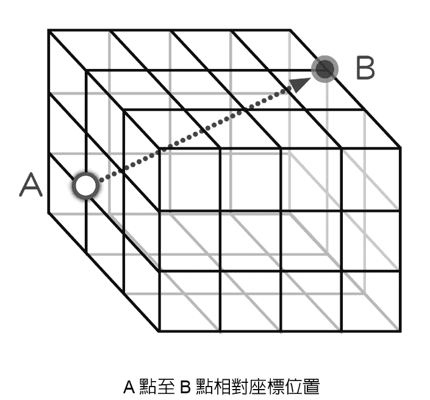

例如从Ａ点到Ｂ点，就不是以平面的相对位置距离换算出航程，而是以一个个晶体的十二面多维度空间位置计算出轨道。假设Ａ点处于三次元的座标（x, y, z），Ｂ点处于五次元座标（a, b, c, d, e），就从这两个相对的晶栅网格空间最短距离计算从三次元Ａ点跨入五次元Ｂ点。若只是绕着Ａ点的地球位置绕行地球一周，是无法跨次元到达Ｂ点的，但以晶体磁力栅线空间内位移，只要数秒钟就可以到达。不过，这样的到达对地球上的人类来说，会产生两种可能的地球时间错觉，一种是相对Ａ点更久远以后的时间，一种是时间轴位移，到达Ａ点过去的时间点，以致有时光倒流的错觉。而你在晶体中的动力来源就是心轮发出的功率，目前地球上的人类只能达到五次元的位移，若要到达更高的次元位置点，需要透过辅助工具。

你可能会觉得奇怪，为何当你进入自己的晶体时，可以带你去感知第九次元的存在情境？那并不是从你自己的晶体到达的，而是透过你的晶体链接到你身上高次元灵性源头的空间位置，在那边透过灵性存有的许可，跨入你的灵性源头所处的晶体才能到达。

每个人都有独立的十二面体晶体。然而，晶体虽独立，却又因磁引力彼此链接，形成星球或宇宙共同体晶栅系统（如左页图）。

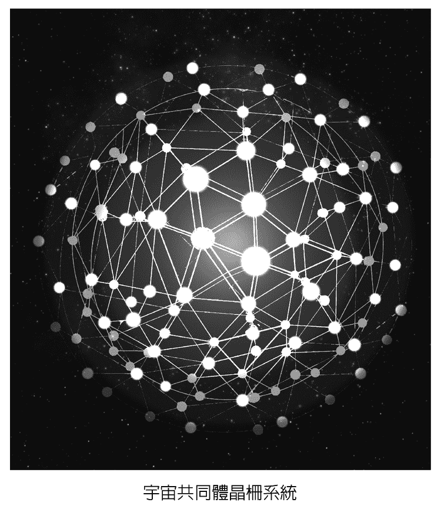

链接契入你的晶体时，要使用第三眼松果体去感知这里的一切。使用第三眼时不妨闭起眼睛，才不会因物质环境的讯息连线到大脑造成干扰。闭上眼睛的时候，虽然暗无一物，但这时会开始启动第三眼的感知，链接到心轮，与你个人晶体内的通讯系统连线。现在你明白，你就是自己晶体里的正驾驶，而有了个人晶体，驾驶也入座了，接下来就是开始检视晶体的能量是否齐全。

 打开第三眼，检视能量

下页图是将你晶体内的位置分成五大区域，每个区域分属不同的宇宙元素：

地→土元素→黄色

金→金元素→金色

水→水元素→蓝色／黑色

风→木元素→绿色

火→火元素→红色／橘色

首先要透过第三眼检视自己晶体中的土、金、水、木、火这五大宇宙能量基本元素是否全数备齐。

检视的方法就是用第三眼从左上角的土元素开始，以８字形依序扫描，第三眼到的区域会呈现出该元素的光。每个区域停留五秒钟，然后逐渐加速，持续画８，同时扫描每个位置的光，反复进行，逐渐将在每个元素位置停留的时间降为三秒，两秒，一秒。

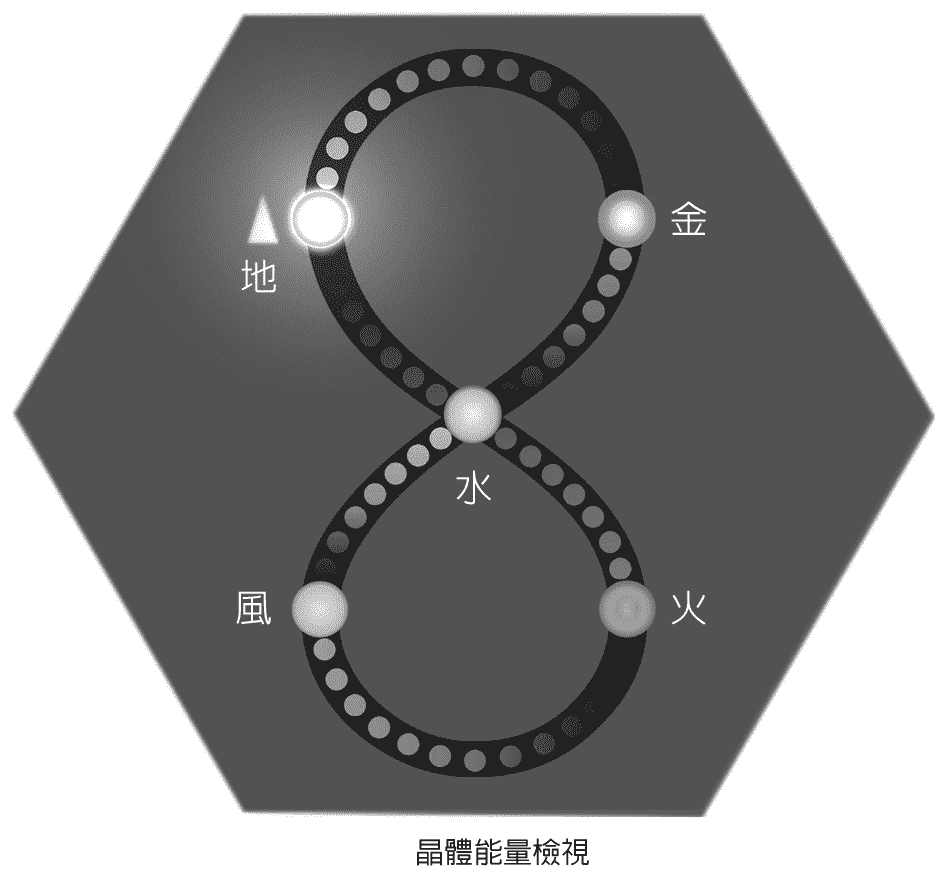

若是第三眼扫描到的位置仍是黑暗无光，就代表那个元素尚未具足。你可以运用呼吸，以手指操对应的五元素系统（请见五大系统示意图），去加强那个位置的能量，直到扫描时五大元素的光都可以出现为止。

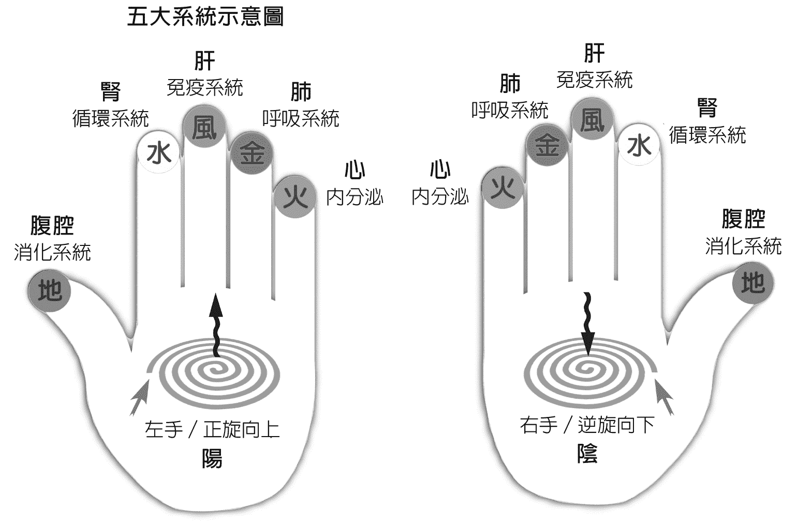

例如，若扫描到中央“水”的位置时没有出现蓝色光，可以用一只手去握住另一只手的食指，加强水元素的能量运行。像这样用第三眼去扫描晶体的每个元素，同时可以帮助你校准与平衡身体的中轴系统，达到身心灵的协同平衡。

当所有元素的光全数到齐，就可以将第三眼锚定晶体中央。这时，你的晶体已经准备启动，你会发现中央出现一个融合你身上五大元素的光、属于你自身的光晕组曲。这个光晕不断融合变化，你将可以看到代表你的宇宙光，色彩比你在地球上看到的极光更加迷人。这融合你自身能量的宇宙光就是你的晶体发出的光，现在你可以先好好享受，并融入你个人晶体专属的宇宙光。

（这时，我看见玫瑰红、紫红、玛瑙红、紫罗兰等颜色的光，非常美丽，从没看过这样漂亮的颜色组成。色彩会随着光的波动逐渐变化，主色系就如同下方这些缤纷的色彩不断幻化组成的一团光晕，在晶体的中央旋转着。）

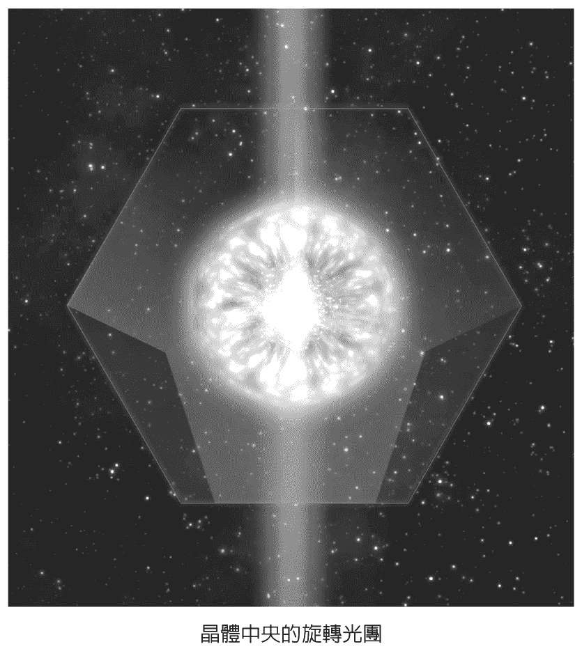

 清空晶体噪声

进入晶体中看到的色彩，就是你身上的五大元素呈现的彩光，不会有任何具象的实物。你若是看见了具象的晶体或人事物，表示你的灵性片段记忆被唤起，那不存在你目前的晶体中。你深深陷入某个灵性记忆里，试图穿越进入那个时空，找回自己曾经拥有的记忆片段。如果遇到任何具象的实景或人事物，就当成是在观看自己内心投影的纪录片段，看见了，知道了，电影结束，用意念告诉自己：“我现在需要清空我的晶体空间，让我回复我最初始的面貌。我请求让我自身的光再次闪耀！”然后静静等待这些景象逐步消失。你自身的宇宙光会回复初始设定，回到属于本我的晶体中。

自己身上的五大元素融合出来的光，色彩会不断变化，随着你的意念改变，同时会集结放射出不同光的组成。这些光都携带着能量，也可以经由这些光的组合创造宇宙实相。每一个灵性组成都有特别的元素及特质，也就是每个人身上的光的组成都不同。当你进入自身的晶体，就是进入光的世界，宇宙的存有透过你晶体的光知道你身上淬炼出来的独特品质。每个人都有自己的独特性，没有一道光是一样的。

你身上绽放的光与进入宇宙的维度息息相关。光的波长决定维度，当你身上的光到达无条件的爱的振动波长时，你的灵魂意识就能契入基督意识，也就是神的维度。

你也可以透过另一种方式跨越地球维度，到达不同的宇宙空间。你的光可以链接自身的灵性高我，高我就是你的灵魂指导师，或是目前存在于其他维度的你的灵性片段。即使自身的意识无法到达，你仍然可以透过链接指导师和自己的灵性片段，帮助自己到达不同的宇宙维度。

同样地，目前处于不同宇宙维度的灵性存有要进入地球维度，也是需要调整自身光的波长，才能进入地球。但若不具备如同人类生物体的行动载具，宇宙其他维度的存有只能透过与人类的意识链接、沟通，或是选择将自己一部分的灵性片段重新投生到地球上，才能行走于地球维度体验和创造。

人类已经可以收到来自不同维度不同宇宙种族的讯息，这里就不一一列举了。这主要是源自一个共同的期待，希望帮助地球顺利进入第五次元的轨道。地球已经迈向第四次元，许多人类正在忆起自己来到地球的目的，很多新人类正带着需要完成的工作项目投生在地球上。你们都是为了再造一个更美好的地球而来的。

你们现在的想法已经渐渐脱离传统价值观的制约，不论宗教、政治、经济、教育和文化，都在回应这个转变。这样的转变正快速蔓延开来，这是集体意识觉醒的时刻，当你们清醒之后，就不会再盲目向外寻求，而是会回到内在，与自己更高的灵性意识链接，展开新生命的再造阶段。

 意识振动产生光的折射，可以创造实相

接下来要进入光的世界的操作原理。晶体内没有任何仪器设备，你只需要知道如何调节晶体中的光。从内在晶体创造出相应的波长和振动频率，与宇宙各次元沟通和链接，就是透过光进行的。也可以把这种沟通称为“光语”，这是由不同光的振动频率和波长组成的语言，经由光的链接和转换来沟通和交流。

操作晶体的最根本动力来源就是人类的意识。人的意识本身具有振动频率，透过地球所在行星系统中的恒星——太阳的热能反射而产生光。这个意念振动频率会链接并启动宇宙基本元素，交互作用后产生特定光的波长，然后这个来自你意识的振动波就以光速发射进入宇宙，得以和宇宙存有进行光的沟通。

当你能够进入个人晶体中，和你宇宙高我的光链接之后，你更高维度的灵性指导师和灵性片段就得以接收你在地球上产生的意识所发送的光语。你们并不需要使用共通的语言交流，透过光的沟通，就可以让彼此的意念无缝接轨。同时，你也可以借由这层与高次元维度的链接，创造你所处的地球的新实相。

你可以经由自己的晶体，与高我联手创造自己的实相。你的意识就是显化地球实相的开端，透过与高我链接，你可以取得宇宙无穷尽的资源，将自己的意识再次扩大融合或转化成一个比你自身更庞大的光体，绽放于地球和宇宙中。

不同的光呈现不同的折射波

现在，来看看什么样的光会带来什么样的结果。当你发送波长最长最远的红色热情光芒时，可以触及最远的宇宙，也就是当你跟随内在的兴奋而绽放红色的光时，你将能够得到宇宙的链接回应；而当你处于无条件的爱的白光，就可以照耀宇宙一切的存在；若是你保护自己，为了自身利益彰显权威，极尽所能地吸入周围所有的光，就会组成黑色。

以下是光的颜色的能量意涵。

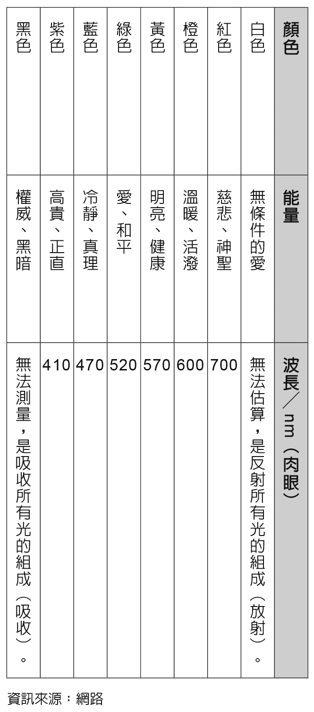

这里所指的波长适用于物质身体的眼睛可以见到的波长范围，而你用意识进入晶体时产生的波长会是物质世界波长的上万倍。但因为透过晶体链接进入不同星际存在次元的振动频率不同，会创造出不同的宇宙光网络。

这么说来，若吸收所有的光，是代表黑暗的能量吗？

黑色也是宇宙的必然现象，当宇宙折射出色彩缤纷的光时，也同时照亮了宇宙的黑暗，就像你所处的二元世界有黑就有白，是同样的道理。但这些光也只能以黑暗为背景，才得以展现闪耀光芒。当愈来愈多的光芒汇聚在一起，会渐渐形成黑色与白色的两极世界。黑色代表吸收，白色代表放射，宇宙的动能就在这一呼一吸的收放之间源源不断地再生和演化。

黑暗是一股不容小觑的能量，它可以切割新世界之前的混沌，带来新秩序出现前必要的破坏与重整。其实，你们自身每一个灵魂ＤＮＡ中也有这股能量，才能让你们的生物体细胞不断地汰换与重生。只是，你们在生命的体验过程中可以自由选择是要站在放射自身的光，或是吸收所有光的位置。

我们现在认定的好人就是站在放射光的白色这一边，坏人则是选择站在吸收光的黑色那一边吗？

这是你们人类给自己的限制性定义。我宁可说，所谓的好人或坏人的生命中都存在着所有的光，你们只是选择了想要以什么方式体验生命。任何人都无法被以黑色或白色简单定义，你只能如实呈现自身的光，来完整自己的生命应有的体验。

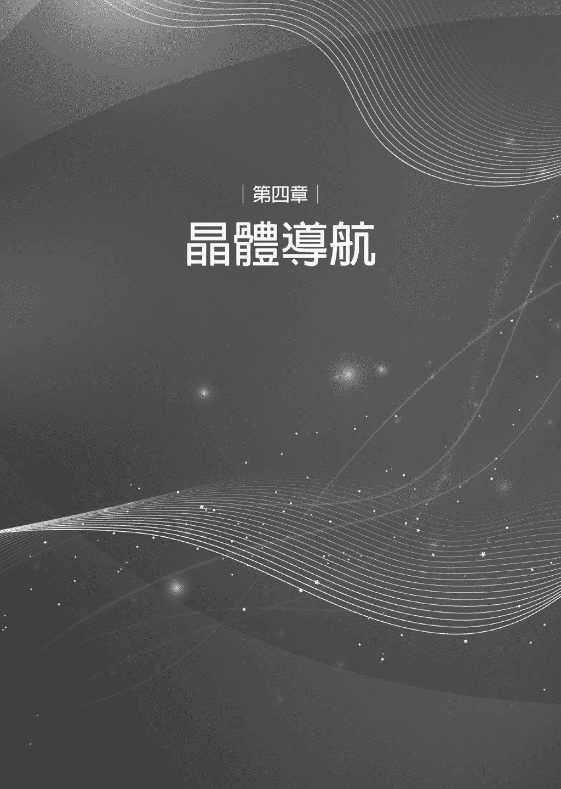

接下来，要进入晶体导航的学习。

灵魂觉醒之后，正需要开展你们的生命全貌，经由灵性更高意识的带领，展开你们生命蓝图的轨道。否则，人类即使觉醒，仍会因小我的拉扯和整个地球的沉重引力，再次进入物质欲望、生老病死的沉睡循环，灵魂的觉醒就又成了昙花一现，这也是地球不断沉沦的主要原因。你们总是隔着宇宙的帘幕，无意识地生活在地球上，载浮载沉，浑然不知在宇宙的帘幕之外，是你们精神世界蓬勃链接的讯息场。一旦觉醒之后，要学会持续地链接进入源头，不再只是追求地球游戏场的累积点数。

迈向灵魂永恒存在的道途，你们累积的不仅仅是在地球上的学习，而是让灵性生命持续绽放。若是无法链接源头，你们在地球上就会进入不断轮回、反复遗忘再忆起的过程。灵性永恒生命的学习是不会遗忘的，这也是人类跨入灵性觉醒的真谛。真正的觉醒是为永恒生命开展伟大的蓝图，不论你身在哪个地方、哪个次元，你的生命之花都可以不断扩展、链接和绽放。

然而，人类要展开灵性生命，需要学习如何操作，我们现在就要带着你去认识自己灵魂旅途的操作方法。虽然每个人携带的灵性源头不同，也可以展开不同的生命全貌，但一些操作方法和路径都是依循相同的架构和原理。我们经由带领你，让人类得以循着同样的路径，找回自己的灵性全貌，和自身的灵性源头生命体共同创造。即使你仅用文字来分享这个操作方法和路径，但别忘了，地球人类在更高的意识存在次元是一体的，只要有一个人觉醒，就可以将觉醒的振动意识带给全体，一起迎向觉醒之路。

 进入晶体的操作方法

设定意念

还记得之前你进入自己的晶体时，是不是运用意念就可以到达你的灵性源头，并获得与问题有关的知晓？人的意念拥有振动频率，折射出来的光足以产生方向和目的地，因此，意念的发送是设定晶体中轴非常重要的开端。若你的意念没有指出目的和方向，就无法产生光的移动座标，因而无法到达。

举例来说，当你提到“请带我去列木里亚”，这个“带我去某某地方”是有目的性的，而列木里亚又是个明确的方向，因此，这个意念进入你晶体的中轴锚定，你的意识就顺着中轴的光到达列木里亚，让你得以链接列木里亚整体共同意识的存在体。

另外，当你提及“请莎雅带我去列木里亚”，你的目的就不只是到达列木里亚，而是由莎雅指定在列木里亚的位置。所以，在意念中置入条件式的请求是可以的，那也是在设定座标参数。

无法成功在晶体里移动的原因很多，以下是一些常见的状况。

•中轴不稳定：中轴同时关系着通讯的连线品质，一些小我或业力的干扰是让中轴无法稳定最常见的原因。此外，也可能是身体健康方面的因素让脉轮阻塞，造成中轴不稳。

•小我的意念：自我更高意识源头无法支持那些仅满足小我原点的目的和方向。例如，“我要在地球上拥有富足的生活”是小我生活在地球上发出的意念及渴望，而其更高意识源头无法在更高的宇宙次元设定让光的投射回到自身的座标原点，自身的更高意识源头只能在晶体可以显化的空间进行光的链接。若这个意图是为了整体生命的存在而设定，就可以从更高的源头链接显化，并让利益回到自己在地球的生活，即使这是出自小我想要利益自身的意念，仍可获得源头的支持和帮助。只不过，这需要透过利益他人及整体的过程，返照回向到自己身上，因此，唯有在小我发出的意念能够拉高其层次为请求利益整体时，才得以显化。

•意念夹杂多重意图：若一个意念中有多重意图，就会因目的地不同，无法创建正确的路径。

•意念与自身无关：如果一个“想要帮助别人取得宇宙源头资源”的意念投射出去，会因为自己的晶体源头和此人并无直接链接，或者，虽然可以链接上对方的晶体源头去感知，却因为无法进入对方的晶体中轴锚定目的地，而无法创建路径。

•不真实的意念：当你发送出不真实的意念时，自己所处的原点（立基点）就无法稳定，而这个无法确定的原点就没办法创建晶体的光谱路径。

起点：辨识自己的晶体环境

每个人认知自身晶体的方式都不同，有些人可以用第三眼看到全貌和实景，有些人是看见色彩和光，也有人会经由耳朵听见频率的变化，或者，有些人是无法看见、听见，却有个明确的知晓进入心中。身体如何回应对自己晶体环境的认知，和每个人大脑的习性有关，因此，一开始在练习进入和熟悉自身晶体环境时，就需要不断地确认。只要进入晶体时一再出现同样的身体回应，就可以确定这是进入自己晶体的感知方式。

能够辨识出“在”晶体中的状态，才能进入跨次元的旅程，因为在晶体旅程中会由身体感知到不同空间的变化。而认知自身晶体的觉受，是可以帮助辨识已经进入不同空间次元的对比依据和起点。

结束：离开晶体

每一次结束光的旅程，只要深呼吸，让意识回到自己的身体，或是念一段离开晶体的祈祷文就可以了。

若需要更加清楚地确认自己的意识已经回到身处的地球，可以用右手握住左手大拇指，深呼吸一、两次，意识就会落地。

另一个方法是用双手按压肚脐，同时将意识带回自己的肚脐，意识就会离开晶体，回到身上。

停留：超越线性时间

在晶体中的灵性旅程并没有限制可以停留的时间，有些人甚至在没有外在或小我意识的干扰下，可以在自己的晶体里遨游数年的地球时间。你们只需要确认自己身体所在之处是安全无虞的，同时可以满足身体的代谢和补充元素需求，就能让意识一直存在晶体中。

路径导航：穿梭宇宙时空

进入自己的晶体时，你会发现你灵性源头的晶体和你是互连的（如左图）。

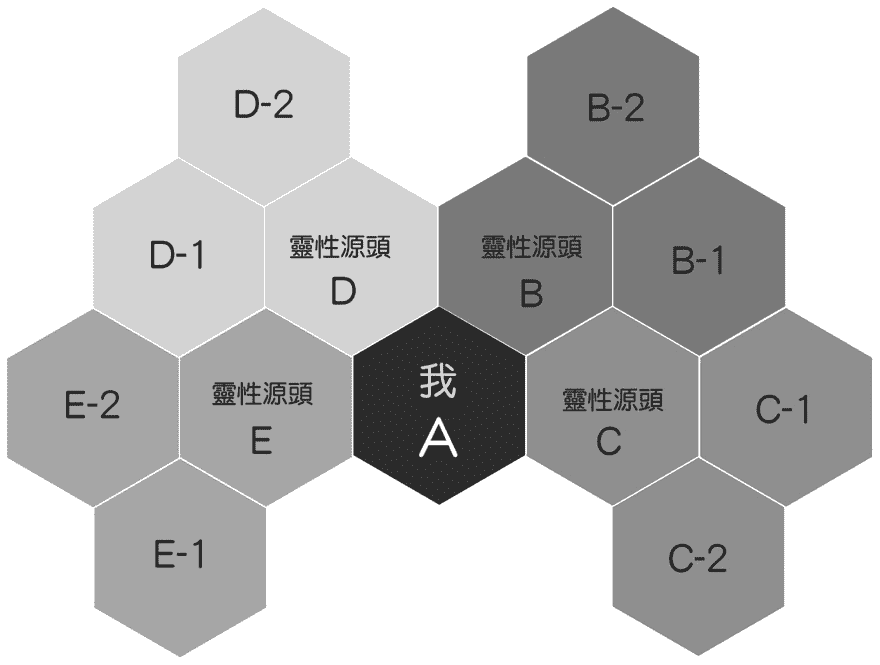

你从自己的晶体（Ａ），就可以透过进入与自己有关的晶体源头Ｂ、Ｃ、Ｄ、Ｅ，跨入宇宙次元的旅程。从Ａ跨入Ｂ、Ｃ、Ｄ、Ｅ等和自身相关的晶体，并不需要经过允许，透过自身意念即可到达。而从Ｂ要进入灵性源头Ｃ，要先回到自身晶体Ａ中，再从Ａ前往Ｃ。在Ａ晶体的结构中，Ａ的灵性源头涵盖Ｂ和Ｃ，但若要从Ｂ进入Ｃ，是以Ｂ为中轴进入，而这个由Ｂ进入Ｃ的链接就和Ａ的中轴无关。你无法取得和自身晶体Ａ相关连的Ｃ的相关讯息，同时，Ｂ和Ｃ也不一定是互相链接的关系。

而进入灵性源头Ｂ，要再去探索灵性源头 B-1、B-2 时，就需要经过灵性源头Ｂ的允许才能进入；进入时，也必须经由Ｂ的协作与带领。而当你从自身晶体Ａ进入Ｂ时，所展现的Ｂ的整体意识存在，若要再进一步了解Ｂ的整体意识的全貌和组成，就需要透过Ｂ的源头意识带领，去展开Ｂ的整体认知系统。

在光中的旅行是处于跨越宇宙次元的空间。如果你将地球的天空用经度和纬度画出一格格的网栅，你所在位置的这一点，就是目前你的晶体发射光的定位，如北纬某某度、东经某某度，这个座标是Ａ点的定位。若你要前往比地球次元更高的星球，就必须进入你的晶体中，从光的定位Ａ点设定到Ｂ点，而Ｂ点不会仅有经纬度，而是会有星座，以及该星座相对于最近的恒星的位置所产生的座标，然后是目的地的座标：（星座；恒星；x, y, z...）。

想要了解Ｂ点的座标定义和要去哪个星球，对没有学习过这方面知识的地球人来说是不可能的事，但没有关系，所有的宇宙人都同样不清楚。有个最简单的方式可以解决未知世界的锚定，就是用你的意识设定你想要去感知的地方就行了。这就是全息宇宙的运作机制。每一个意识存在都已经内建了宇宙全息地图，这个地图是光的存在不断更新并共同储存在宇宙全息网格里的。

你的晶体是反映你身上的五大元素，集合成你专属的光，这道光就内含关于你的所有讯息，包括你曾有的经历、你的意识体和身体存在的位置，还有你曾经投射出来的所有意念，这些讯息都贮存于你自身的光中。而这道光携带的晶体粒子已经储存了所有信息，也包含整体宇宙全息图资料库。所以，当你用意识投射要前往的地点，这个资料库会自动运算出座标，让你从自身所在的Ａ点出发，到达目的地Ｂ点。

只要进入自己的晶体，你就已经坐在庞大的数据资料库中。若你需要和位在地球某端或宇宙某个次元的生命体沟通，你的晶体会将你需要的信息撷取出来，放在你的晶体图书馆中供你查阅。所以，是你自身的光在宇宙中旅行和链接，帮你找到你需要的信息，让你在宇宙间穿梭、沟通。你需要操作的部分是让自身的光携带着你的真实意图发送出去，然后你就可以取得宇宙无穷无尽的知晓。

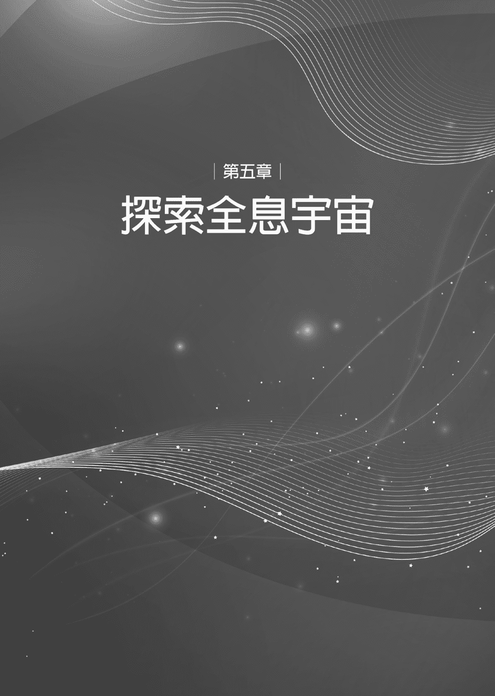

 从晶体探索宇宙

初探自己的灵魂晶体时，你可能会发现来自晶体场域的回答会出现多种讯息形式。讯息可能会以明确的知晓进入心中，也可能是一段故事情节、一个身体上的感受，或是只有一个图像等等。若是讯息本身让你无从理解，你可以请求自己的大师、导师和挚爱的人进一步说明为何是这个讯息或图像，询问能否以让你更容易理解的方式呈现出来。这些讯息会在你逐渐熟悉自己的晶体场域感知的过程中愈来愈清晰，同时，你也将透过自身的灵性源头，开始迈入专属于你的灵性学习路径。

首次进入晶体时，你不妨提出以下问题，帮助自己探索生命蓝图的全貌。

一、你灵性源头的组成有谁、分别来自哪里。

二、请求你的灵性源头带你去体验一趟穿越宇宙时空之旅。

三、你此生需要学习的生命课题或来到地球的目的是什么。

四、你具备什么可以帮助你达成使命的天赋才能。

五、深入探索你灵性源头的晶体可以链接到哪些宇宙次元或行星群。

六、从更高意识之眼看见你灵魂最高的使命是什么。

七、从更高意识之眼看见地球亟待解决的问题，以及你可以做些什么来帮助地球。

 穿越时空之旅

（坐在室内有光线的位置，闭上眼，深呼吸三次，用第三眼开始画８——左上角黄光，右上角金色、白色光，中间蓝光，左下角绿光，右下角红光，依次检视。第一回合仍然看不见中间的蓝色光，左上角的黄光也不太明显，左下角的绿色则不太稳定，只闪现一下。我用手指操加强缺乏光线那个位置的元素，持续做了大约五分钟，终于看到中间的蓝光出现。接着，在所有的光都齐全之后，将第三眼锚定晶体中央。等到我熟悉的玛瑙红、紫罗兰这些颜色出现，我确定自己已经在晶体中了。

接下来，我请求晶体带我去列木里亚。我熟悉的晶体颜色瞬间变成黑暗无一物的空间，明显感觉到意识移转，我猜想应该是已经来到列木里亚。我用意念请求带我去看这里的太阳，希望这里的阳光可以给我一些空间里的色彩。结果，虽然我无法明确看见形状和颜色，却可以知晓这里的太阳是一颗非常巨大的矿石，类似白色的水晶，而这颗白水晶矿石的光是列木里亚人身上的光反射出来的——也就是说，所有列木里亚人将自身的光投射到这颗水晶上，照亮这里的一切。这颗太阳明亮而不刺眼，在温柔的光晕笼罩下，整个环境很温暖，不会像地球那般炎热。

初探了列木里亚的景象之后，我想直接去天狼星看看。结果，我在晶体中得到一个知晓，明白我无法直接从列木里亚前往天狼星，必须先回到自己的晶体，再从晶体重新设定，出发到天狼星。

我依循这个知晓，先回到自己的晶体，再设定进入天狼星。这次回到晶体后，我就没有重新确认每个元素是否到位，因为晶体中的色彩已经恢复原来的玛瑙红和紫罗兰，是我认得的光，于是我直接向这个光请求让我进入天狼星。

才三秒钟不到，同样有意识瞬间移转的感觉，我的身体明确感受到严肃的氛围——也就是说，即使是从地球到第九次元的星球，也非常快就到了。

然而，这里实在是太专注又严肃，因此，我发送出一个意念，想找我的灵性源头片段雷巴特带我去看看这星球上最好玩的地方。他带着我瞬间移转至一个巨大的太空舱前面，这个太空舱底部有非常明显的五星形状〔如下图〕。

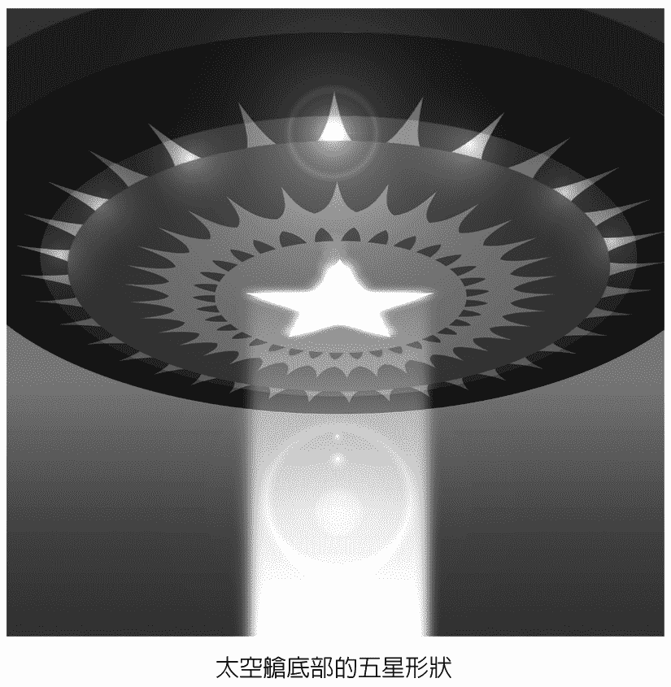

我问雷巴特这是什么，他说这是他们星球上目前最受欢迎的体验馆，可以容纳上万人，但并不是电影院，而是让你身历其境。在里头，天狼星人可以去体验人类世界的各种情绪，这就是天狼星目前最好玩的游乐场。

哈哈！我实在是很想笑，原来地球人身处的那个每天各种恼人情绪喷发的世界，他们却觉得是非常好玩的游乐场所。我们地球人如此幸运地住在游乐场里，还不自知。

接下来，我回到自己的晶体，结束五分钟的光之旅程。但是在这短短的五分钟里，我可以看到、感觉到、体验到的信息还真多呀！）

阿乙莎，为何我在列木里亚不能直接前往天狼星，要先回到自己的晶体？

我之前跟你提过，你的起始Ａ点是定位点，定位后才能取得Ｂ点的相对位置，然后从自身的光发射进入。而光的照射永远是直线的，若从Ｂ点进入Ｃ点，就无法从Ｃ点回到你晶体的Ａ点，你将失去原点定位，而你的晶体是无法将Ｂ点当成定位点的。

我还是不太明白，但我先听话照做，以免回不了家。

放心，不会回不了家，只会在从Ｂ点要前往Ｃ点时，无法到达，只能停留在Ｂ点，或是回到Ａ点原来的地方。不要吓人，让别人不敢学习了。

哈，对不起！我会注意我的用语。

阿乙莎，我刚才几乎是几秒钟就可以到达，而这个光速般的前进，是用我的意识在自己的晶体中完成的。但是，这会不会是我们自己的想像，因为这些景象无法证实。

你看到的这些景象都尚未显现在地球实相里，就算是你幻想的景象好了，若你愿意去做、去实践，地球就会显化出那个实相，因为你就是诞生于地球的创造者。同样地，其他星球的存有透过他们自身晶体的光来到地球，也同样会学习地球人值得学习的优点，然后带回自己的星球去创造、显化。目前地球上的许多器械工具、造形原理，有不少也是光的旅行者去星际旅游后得到的灵感。只是，那些创意发想的人自己还没有理解这些神来一笔的创造是来自真实的光之旅程。

你有没有发现，在列木里亚和天狼星，除了你呼叫的雷巴特之外，其他的人都看不见你，你已经化为一个光之存有。同样地，在今日的地球上，也存在许多你们肉眼无法看见的光之存有；若再仔细观察周遭环境，你会发现地球上许多甜点美食上面都有光晕，因为星际的存有特别欣赏地球人做的甜点，常来参观取经。你现在会更加明白，光之存有无所不在，当我们成为光，可以在宇宙跨越时空和次元，自由地探索，取得知识和经验。但是，如果你想要显化和落实你的所见所闻，就必须选择某个星球，成为那个星球的肉身或存在意识，才能再次创造和显化。你在光中游历时，是无法进行创造的，只能隔靴搔痒，当个旁观的旅人。想要创造与显化，就必须扎根成为那个星球的存在体，你才有权利去创造和落实。

透过光的旅程，你可以将在宇宙中得到的知识与美好体验带回自己的星球，但别忘了，你的生命体所在的位置才是你能够创造的园地，是你的晶体得以真正发挥的场域，透过光的旅程，引领你走进生命的创造旅途。你不妨去找出自己生命最初始的目的，去看看当时你所处的环境欠缺哪个元素。

祢指的元素，是金木水火土等五元素，或者只是形容词？

是五元素。

那么我再去找找线索。有没有更快的方法让我知道？我自己去探索都是走马看花，如果有人直接给我看我需要知道的原因，就更快了呀！

你只要问自己的灵性源头莎雅，她就会直接让你看见你需要明白和体会的事。

（我直接用意念呼叫莎雅，请她带我去了解为何我要来到地球。

大约三秒钟，光的颜色改变，转变为黑色和冷色调，原来的红色不见了，我想自己应该是来到列木里亚了。然后，我突然觉得身体的正前方很热，像是站在温泉池前面。这个温度已经超出我们觉得舒适的体感温度，是应该要开冷气的状态。我问旁边的莎雅，这里怎么那么热？）

莎雅：这就是你必须去地球的原因之一。地球人类肆意破坏大自然，污染水源，让海底生物生病，空气污染又造成更严重的大气层破洞。地球上的陆地是人类生活的场域，但海水的底部就是列木里亚的陆地，海水温度上升，已导致我们的陆地上不断冒出热泉，类似你们的火山爆发，海底的火山也不断喷发，流出的岩浆造成海底生物死亡，也导致我们生存陆地的土壤变质，而气温就如你目前感受到的状况。

海豚是我们派遣至地球的先遣部队，它们会回传海底的讯息，警告我们哪个地方即将喷发热泉，我们就会跟着海豚迁移到安全的区域。但目前海豚的生存环境也愈来愈恶劣，如果失去与海豚的密切连系，我们就必须更积极地与人类沟通协调，改变人类的生活价值观，终止人类破坏大自然和海洋生态的行为。

列木里亚人已经进入第五次元，可以跟更高次元的存有交流互动，因此我们去寻求天狼星高度文明的协助，利用天狼星的生物科技，帮助我们让更多灵性生命进入地球生活，希望新人类能够影响地球人类逐步提升保护海洋和大自然资源的生态意识。我们有许多灵性片段已经在地球上生活很久了，但在地球不断追求物质文明的集体意识下，许多灵魂虽然来自列木里亚和天狼星，却仍然沉睡或无力反抗。我们需要唤起这些人，让他们链接上自己的灵性源头，进入更积极的共同创造。你之前在练习进入晶体时，是否也发现你身上一直很缺乏水元素？你要加强水元素的能量场，才能顺利地和我们链接。

我：是的，你说得一点都没错。我也觉得很奇怪，每次最中间的蓝色都出不来，要握住手指画８两、三次，才会慢慢出现。

莎雅：回到地球上的生活，去关注自己身上的水元素是否改善，从你自己的身体就可以了解你们是正在进步或退步。地球整体的水元素是必须改善的。

我：所以，我只要把自己生活中需要用到的水资源整理好，就是在帮助地球，同时帮助列木里亚？

莎雅：是的，你和所有我们植入地球的人类都如同海豚，是我们设计出来改变这个世界的种子。只要种子能生活在地球上，健康地成长茁壮，整个地球就有救了。

我：好的，我明白了。不必把自己说得多伟大，要去救地球、救全世界和宇宙，我只要认出自己身上欠缺的元素就行了。若能将自身的元素补足，就代表整个地球的状况渐渐回归正常。如果每一个地球人都能看见自身的元素出现状况，将自己不足的水元素补好，这个地球就可以复原了。看起来，改善水元素是我应该要去做的，我过去总以为天然资源事不关己，那是环保人士和政府的责任，现在你要我回到自身的元素平衡，做好自己该做的功课，才不枉此生，这个题目很大哩！谢谢莎雅，我明白了，这是地球上所有生命体共同的功课。让我带着这份理解，回到现实的地球好好研究一下。

＊ ＊ ＊

探寻列木里亚，我看见了自己缺乏水元素的原因，也带回一份新的理解：平衡自己身体的元素，就可以帮助我们生存的环境。顺着这份理解，我想再去深入了解该如何做。

你身上携带的，不只是来自灵性源头的问题和功课，也包含你完成这项功课所需的知识与资源。列木里亚人是同样生活在地球上的生命体，他们懂得如何请求更高次元的协助和支援。透过与天狼星的合作，列木里亚人获得新生命的种子，回到地球表面生活，这个配置最主要的目的是为了帮助解决目前地球环境遭遇的问题。你身上已经携带了天狼星回应列木里亚人的请求而提供的解决方案与祝福，现在可以进入自己的天狼星灵性源头，去了解当时这个问题是怎么被看待的，还有天狼星创建了什么样的机制来帮助地球复原。若你可以看见当初自己生命的种子计划，就等同找回了自己生命最初始的设定。

嗯！我知道了。我好像突然找到被遗忘的藏宝图，现在要循着这张地图去寻找源头的答案。我现在就去问一下雷巴特吧！

＊ ＊ ＊

（我感觉晶体瞬间就转成白色带点灰色的光，是雷巴特直接带着我进入他的晶体，我们已经在天狼星的实验室中。我开始询问雷巴特，当初列木里亚人来请求解决地球水元素的问题时，他们是怎么想的？）

雷巴特：地球的气候和生态问题最根本的原因，是人类的健康出现问题。因为追求物质文明，人类肆意破坏生态，造成环境污染。还有人类使用的药物对治疾病的方式，造成人类的身体失衡，而当身体的运行失衡，就会产生负面情绪体。这些负面的想法会导致忧郁、恐惧、怀疑、自私等心态，人类的意识体就开始混乱了。而为了控制身体健康，又大量使用化学药物，于是产生更多化学药物干扰之后的无意识行为。地球环境遭遇的问题就是因为人类切断了与大自然的沟通能力，做出许多无意识的破坏行为。想要改造并恢复美丽的地球原貌，要从恢复人类的健康着手。

人体有百分之七十是水分，水可以说是最重要的身体元素。将人类每日会使用到的水进行完整的元素配置后再使用，就可以帮助恢复人体健康，并净化整个大地。而所谓“完整元素配置的水”，就是将水以外的其他元素——土、金、木、火——都补足。缺乏某个元素所产生的水，不是完整配置的水。完整元素配置的水可以帮助提升人体的免疫力，同时，人的意识体将可以跟大自然重新链接上，恢复有意识的行为，让地球逐渐恢复本有的样貌。

（从这段与雷巴特的链接中，我更清楚地知道人与环境是如何相互影响，而人的身体能量基本元素与大地是相通的，当地球的五大元素失衡，人也不可能独善其身，健康地存活在地球上。帮助地球就是帮助人类自己，只是要从何开始做起，我还需要更深入去探索。）

 深入探索灵性源头的旅程

探索 Rachel 灵性源头之一——列木里亚

（我进入自己的晶体，从画８开始，大约进行五次，逐渐看到每个颜色都具足了，进入自己熟悉的紫红色系光晕中。接下来，我投射出“请带我进入其中一个灵性源头的晶体，去探寻我灵性源头的全貌”的意念。

不到三秒钟，我看见晶体的光晕和之前不同，但有很明显的慈爱的感觉。虽然已经可以大约感受到这个慈心应该是来自莎雅，我还是先确定这是哪一个灵性源头的存有。于是，我直接发出意念询问：“请问这个光是来自哪里？我现在处于谁的晶体里？”

回应我的正是莎雅。目前列木里亚的整体意识是这样的，感觉是和谐与慈爱的存在。我询问莎雅：“我想探寻我的灵性源头全貌，你是否同意带领我去看见你的灵性组成？”

莎雅二话不说，直接把我带进其中一个晶体空间。这里的光更柔和、更白、更明亮，有许多像水母一样透明的天使存在。我内心有个知晓，明白这里是织女星，莎雅的一部分灵性源头是来自织女星。得到这个答案后，又进入另一个空间，是较为冷静、男性般的存在的感觉。那里呈现白色的光，莎雅告诉我这是大角星，是她的科技和智慧部分的来源。接下来，进入一个厚重难受的空间，我的眉心之间立即紧缩，头部觉得很沉重。和刚才的意识空间比起来，这里真的让人很不舒服，也不适合一直待在这儿。莎雅跟我说，这也是她的灵性源头之一，就是地球。目前地球的整体意识就是这样的存在。

天啊！我快喘不过气了，这么浓稠沉重的共同意识存在，居然就是我生活的地球？莎雅答道：“意识到地球的现况时，我们也非常担心和难过。你可以知道，我们是一体的存在，地球也同时存在我的晶体中，是我们的一个源头。我们必须协助地球，净化地球的意识体。现在，你可以进入自己的晶体，你会感受到比较轻盈的空间，那是因为你已经进入地球的新意识空间。虽然同样存在于地球，但这已经和地球原本的意识体有所区隔。这是我们目前正在进行的计划，要为地球创造一个更净化轻盈的集体意识存在空间，而那个你目前感受到的厚重和沉重的地球，会从我们的源头分离，进入适合它的轨道。你现在处于新的地球轨道，必须让更多目前仍在旧轨道中的地球人接轨。”

啊！我终于明白，为何之前会提到我们和高次元的存有互为源头，又为何高次元的灵性一直前来地球提醒人类。因为，地球现今已经分离出一个净化后的新意识空间，这里应该就是为地球进入第五次元而准备的。我们在自己灵性源头的晶体中体会到地球偏移的问题很严重，当灵性源头要协助净化我们的链接时，就将地球分离出更洁净的意识空间，除了摆脱厚重的引力牵引，也可以在目前仍在旧地球的人们觉醒时，让他们得以在原来的地球上无缝接轨进入新地球的意识空间。）

探索 Rachel 灵性源头之二——天狼星

（继续前往我的另一个灵性源头，到天狼星雷巴特的晶体探索。我也在进入自己的晶体时，发现一个更明确快速到达自己晶体的方法：在用第三眼观想画８的同时，配合使用阿乙莎提供的脉轮手指操。当意识指向左上角的“地”元素时，用右手握住左手大拇指；意识指向“金”时，用右手握住左手无名指；意识指向中央的“水”时，用右手握住左手食指；意识指向“风”时，用右手握住左手中指；意识指向“火”时，用右手握住左手小指。就这样依次在每个位置停留三秒钟，并带入呼吸，用第三眼去观察颜色是否显现出来。画８的程序大约进行三次之后，每个位置的停留时间可以缩短到一秒。当所有位置的颜色都出现后，就可以很快到达自己的晶体中。这是我发现的另一个辅助法，可以更快速地到达校准中轴、进入晶体的状态。

进入晶体后，我先请问雷巴特是否可以带我进入他的晶体中。大约三秒，我的晶体颜色就改变了，出现更白、更明亮的光，身体的沉重感消失，取而代之的是全身轻盈的感觉。虽然我的全身变得轻盈，却有种超纯净的文明感受，和处于列木里亚时的慈爱祥和感不同。这里没有太多自然生态，却有非常精良优质的纯净生命形式，感觉雷巴特所处的晶体已经是非常进化的文明结晶，没有任何噪声和正在演进的产物——我所谓的没有噪声，意思是这里似乎感觉不到有任何细菌和微生物，一切都已经是完美精良的最优化生命存在体。

依照阿乙莎的教导，我必须提出有方向和目的性的意念，才可以到达需要理解的地方。因此，我开始询问是否可以让我参观雷巴特的晶体全貌，以及雷巴特的灵性源头组成有哪些。以下是雷巴特带着我快速环顾一遍后，我感知到的内容：

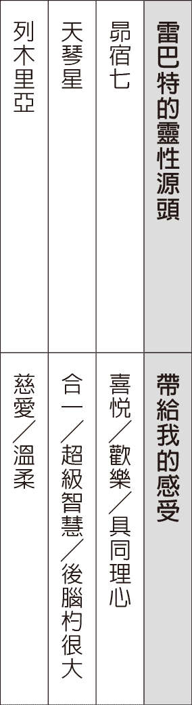

我一面跟着雷巴特环顾他的晶体灵性组成，也开始好奇，这当中为何没有地球？我不是透过自己的晶体来到天狼星吗？这代表我们是链接的，我的晶体有你，你的晶体应该也有我才对，但为何雷巴特的晶体并没有直接链接到地球？当我的意识产生这个疑问的同时，立即收到了雷巴特的回应。）

雷巴特：地球的三次元密度过于沉重，我们无法直接链接，需要透过列木里亚人来协助接入。你的灵性源头可以链接到我，是因为列木里亚的莎雅，她是中继站，经由她，地球人可以链接到我。而我也是透过她，将我一部分的灵性资源接入地球，与你们链接。

我：为什么天狼星的存有需要进入地球？你们正在进行什么工作？

雷巴特：我们正在协助地球，打开人类的ＤＮＡ。这项工作从二〇〇八年开始进入加速期，当人类的灵魂ＤＮＡ能够打开和宇宙意识的链接时，就可以帮助人类迈向新地球的轨道。

我：你可以说明是如何打开人类的ＤＮＡ吗？

雷巴特：ＤＮＡ可以透过振动频率打开。我们用一种微量电波振动人类的身体细胞，将细胞ＤＮＡ与更高意识源头封闭的部分打开。目前已经能够打开人类第三层星光体内的第七、八、九股ＤＮＡ，你们也因此可以顺利打开人类共同意识链接，此外，更可以进一步来到第八股ＤＮＡ，与更高的宇宙源头意识共同创造新生命蓝图。人类必须打开和宇宙共同意识的链接与沟通，才能进一步展开新地球的生活。

我：你们是透过哪种媒介释放解码频率的？

雷巴特：这项工作对我们来说并不困难，我们只要在你们的电子产品或灯光的照射过程中置入光码。这个频率不在你们耳朵听力的辨识范围内，所以人类的感官无法觉察到。但是，有些人已经能够在意识和身体上感知到一些变化，而逐渐打开宇宙意识的人，在身体和感官方面会出现以下迹象：

一、睡得更少，精神却更好。

二、呼吸更畅通，也较以往深。

三、不想吃肉，食用有人工添加剂的食品后会觉得失去体力和能量。

四、喜欢天然的蔬果类食物。

五、感官更精细，可以感受到大自然的变化，对身边的花草树木、气流和气压变化更加敏感。

六、对他人的感知力提升，容易感受到别人的喜怒哀乐和隐藏在心底的真实意图。

七、对社会中的自私、分离状态感到厌烦，开始有意识地选择读取信息，不想参与会造成内心恐惧和分离意识的言论，也不急于追求世俗定义的成功和名利。

八、不再期待政府或当权者能够改变目前的社会、经济、环境、教育等问题。

九、想要追求更符合共同利益的生活方式，寻求内在平静，以及与大自然和谐共生。

十、意识到自己不只是独立存在的个体，可以与更多的人和大自然链接。

这些都是打开第三层ＤＮＡ的人开始迈向新地球和新世界之后，身体和意识上的自然改变，而这也是让地球上的人可以和列木里亚人产生意识交流的开端，以及我们回应列木里亚人的邀请，进入地球协助的原因。在地球转变的时刻，将会发生不得不调整地球磁场的地壳变动，而当人们能够更有觉知地生活，就可以避免受到伤害。这些灾害会以地震、海啸、土石流、森林大火或细菌吞噬等方式出现，人类在面临大自然的反扑时，也终于明白照顾地球是每一个人的天职。没有地球，人类就无法在此延续生命。

我：台湾在地球转变的过程中，会受到严重的伤害吗？

雷巴特：这取决于居住在台湾的人觉醒的速度。愈多人愈早觉醒，这个区域会愈趋稳定，就不需要靠水火来平衡和调整区域的能量。台湾目前的状况比起其他区域来说是较为稳定的，不至于遭受严重的伤害。也正因如此，居住在台湾的人更需要把觉醒的力量传播到全世界。

我：所以，之前阿乙莎告诉我，要将我们的振动频率调整成七．八赫兹，这跟你们打开人类的ＤＮＡ是相同的频率吗？

雷巴特：那是不同的原理。阿乙莎提及的七．八赫兹是人类的意识要达到的振动频率，好让人类可以进入宇宙和谐的“一”的境界。而我们用来打开人类封存的ＤＮＡ频段的振动频率要更高，才能解锁你们身上的ＤＮＡ。这个解码包含频率和不同的光的波长组合，是天狼星的生物科学家设计的，我无法在此跟你说明更多细节。

我：我还记得你之前跟我提过，天狼星在蒐集人类的情绪体讯息，但你们并没有和地球人直接链接。所以，我再理解一次：你们是蒐集列木里亚人的情绪体资料，是吗？

雷巴特：嗯！关于人类的仇恨、自私、嫉妒、恐惧的情绪，我们蒐集到非常多的资料，期待能够找出更高情操品质的情绪体，而列木里亚人确实对我们帮助很大。

我：你可不可以建议一下，人类在打开第七、八、九股ＤＮＡ的频段后，接下来要如何做？

雷巴特：当你们的灵魂ＤＮＡ打开宇宙意识，你们会开始熟悉新世界的显化之道。这个显化可以在物质层面，也可以在非物质层面展现，我可以进一步说明，提供进入新世界的光码——创造的能量——给人类。

 与高我携手合作，迈向新世界

当人类能够提升意识，从更高次元的观点来看今日的地球，就会了解宇宙是一个相互支援的协作网络。虽然每个星球都有自己的问题待解决和改善，但在自身能力所及的范围内，即使跨越不同次元，远在数万光年之外的存有都可以经由意识交流，或透过光和振动频率来协助其他星球。这也是神创造一切万有、生生不息的基础：透过彰显无条件的爱，从付出当中获得通行更高次元的奖励。

地球人虽身处较低次元，仍受到宇宙高次元存有们的支持与保护。透过意识交流，在光的世界里，你们可以得到源源不绝的爱和所需的资源。与此同时，你们也终将忆起自己的源头，知道你们是来自宇宙的勇士，为了地球的扬升，愿意挺进这个不断遗忘、轮回，充满仇恨和恐惧的物质世界。我亲爱的孩子们，我心疼你们一再经历苦难，但也为你们的灵魂在地球上得到的锻鍊和成长感到欣慰，这是非常难能可贵的灵魂历程。当你们试图协助地球回复过去的光辉时，虽然付出许多努力之后失败了，但你们总是愿意再试一次，直到能够带着自己和所有一起前来地球的兄弟姊妹共同迈向新地球的轨道。

最终，无论成功与否，你们仍会回到光的世界，告诉你们在宇宙更高次元的伙伴，你们是如何经历地球上的一切，又是如何突破困难，为其他即将到来的伙伴造桥铺路。现在，你们已经能够链接自身的宇宙源头，他们是你在地球上的坚强支援部队。他们来自宇宙无穷尽的光和能量晶栅，只要你提出需求，宇宙都将无条件地支援你的请求。

当你们身上封锁已久的灵性意识打开时，地球人类终于可以恢复星光层的意识沟通能力，你们可以运用自己的更高意识，创造出新我的阶段。透过你们畅通的身体脉轮，宇宙能量正在调整你们的星光体，协助你们更快链接自身的灵性源头。

此时此刻，你们先将拯救地球的任务放一边，因为，新地球已经形成了，旧地球自有它所属的轨道。我们引领旧地球的人转化进入新地球的同时，需要再造许多新地球的游戏规则，在此，我要分享一些新地球的新观点。你们深受旧地球的制约已久，虽然在新地球中或许仍会看见这些制约行为模式残留的能量，但这些残留的能量已经无法形成阻碍。新地球的世界将重启人类新生命的高度和视野，你们虽然仍身处旧地球，新地球的显化速度会让你们很快脱离旧地球的束缚，甚至遗忘。这些改变会在二十年间交接、替代完成，你们可以拭目以待，看看新地球如何脱胎换骨，迈向新世界。

新地球的新观点

以下这些新地球的新观点正在凝聚中，这些汇聚的意识能量达到临界值，就会显化出来。

一、政府的角色转变：独裁的君王体制，以及由少数人控制多数人的制度将被改变。政府将由一群志工和有服务能力的团体联合组成；政府无法向人民取得税收；政府的当权者角色将转变为服务大众的志愿者。

二、经济和交易模式转变：以金钱为主要媒介的交易模式被取代，多种交易形式透过更简单多元的交易管道进行。没有储存和管理金钱的中央机构，银行和保险业的金钱借贷会以服务的形式呈现。金钱将无法取代服务，但服务会创造金钱的流动。

三、教育的变革：学校没有固定的教科书和学习科目，成为创新实验的基地与更高次元的智慧交流场域。学生将自行开创所需的课程或研究主题，为了符合新地球的需要，而进行各方面的学习。

四、能量医学兴起：人类的能量感知能力大幅提升，许多人具备自愈力，也拥有疗愈他人的能力。生命形态的改变让人类更关注能量的平衡和引流，以化学药物治疗将只占一小部分，而人类的生命将可延长至两百到三百岁。

五、生态的平衡与保卫：新地球的生态环境将充分使用自由能源。地球的自然资源将透过联合国会议，创建跨国联合公约，水、森林及矿产资源的使用和开采都受到国际公约的约束和监管。

六、宇宙和平协议：地球资源将受到宇宙更高次元的保护，以防止遭受恶意存有的侵占和掠夺。地球人也将透过联合国会议，和宇宙星际代表进行和平协议，并取得资源交流的机会。

新世界的形成和转变，是能量的汇流创造的结果。当人们凝聚共同的期待时，投射出来的能量就足以显化这个共同意识期待的世界。你们目前尚未从眼中的世界看见这些转变，但这些想法和意念已经深植在许多人的意识中，还有许多孩子携带着新地球的视野诞生在地球上，这些孩子没有被制约，降低了显化的干扰与门槛。你们不能期待目前生活在地球上的所有人都会改变，改变不会来自目前拥有既得利益的当权者，也不会来自社会底层那些生活无以为继的人，而是会来自社会中坚分子、各行各业的菁英觉醒者，以及跨越国界、语言、文化，能够创造与外界交流管道的团体和社会组织。你们将会看见这股凝聚的意识如星火燎原般带动各个企业和团体，透过经济活动、崭新科技、文化艺术、学术交流，深入世界各个角落。

练习：进入自己的晶体探索生命源头

了解自己的晶体有哪些路径，进入Ｂ和Ｃ的协作系统中，进行主题探索：

❶了解你的灵性源头Ｂ和Ｃ的全貌。

❷从Ｂ和Ｃ的角度来看地球正处于什么状态。

❸你需要做些什么，以帮助自己和地球迈入新世界？

当你能了解自己灵性源头的全貌，并进入自身源头反照目前身处的环境，就可以看出自己ＤＮＡ的关键元素，以及自己的生命蓝图该如何展开。

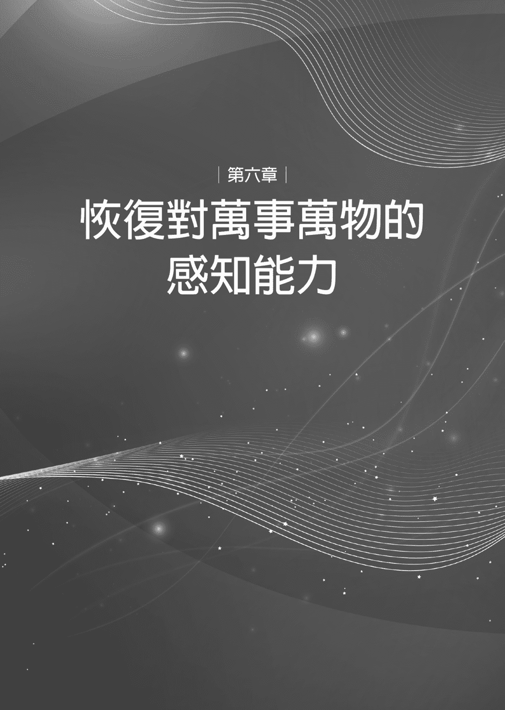

 天狼星给人类的训练课程

首先，我要欢迎你终于和宇宙源头意识链接上。我是人类的祖先，来自天狼星的雷巴特，也是地球人进入宇宙意识信道的守护者。接下来的训练课程，我们先从学习恢复人类本有的万物感知力开始。

人类的身体细胞原本就具备和宇宙意识源头沟通的能力。在你们的远古时期，地球原是所有宇宙存有最喜欢到访的蓝色星球，这里的人善良、勤奋、美丽，人类生活在此，享受着丰富多元的大自然资源。而地球人类在物质世界的学习力很强，在很短的时间里就学会使用地球上可撷取到的天然资源，创造无数地球文明。然而，正当地球上的一切发展到达巅峰时，却引起恶意星球的觊觎和攻击，地球文明遭受严重毁坏，而人类的基因也被恶意封锁。于是，人类自从文明毁灭以来，一直携带着不完整的ＤＮＡ，在地球上代代繁衍至今。

人类的生命蓝图在旧地球时代是跟着业力之轮前进，人类生命会陷入不断重复体验的轮回，以达成灵魂学习的目的。但无止境的轮回依然无法超越层层宇宙黑幕，与源头链接，这也是因为人类处于心智黑暗时期，无法用内在之眼链接更高的灵性意识，于是更难以超越业力和轮回的枷锁。

恶意星球不但封锁人类ＤＮＡ与更高意识链接的频段，摧毁地球和宇宙链接的天幕，还刻意创造让各种族之间产生分离思想的宗教派系，使各色人种将灵魂之钥交给自身之外的神掌理。所以，当人类在旧地球时代遭遇生命中无法理解或承受之难时，会倾向往外找寻生命的依托，殊不知，从自己的内在宇宙就可以找到生命所有的答案。

人类生活在禁锢灵魂的牢狱中已久，过着被制约的生活，更无意识地创建起社会规范、戒律教条，长养恐惧、嫉妒，以及防卫和竞争的分离意识。在一个全人类共同生存的小小星球上，各阶层的领导人纷纷创建国防、种族隔离、专利保护、阶级意识、菁英教育制度，人类一出生就被集体意识完全控制，而这个集体魔咒早已深入每个家庭、学校、工作场所，以及每个人的心智图里。在这样的分离意识中，地球文明演变成弱肉强食、贫富不均，地球资源被无限制地漤垦、破坏，这一切的发展有如恶意星球的复刻版。人类已经遗忘，曾经拥有的至真、至善、至美的灵性是人类行动的共同准则，今日的地球已成为物质凌驾人类自身最珍贵灵魂意识的世界，反为物所用。

原本的美丽蓝色星球终于生病了，长久以来得不到宇宙能量的滋养，美丽的花草树木和善良的动物纷纷离去。地球已经超负荷，呈现更稠密的重力状态，整个地球能量就是人类和所有存在物种整体能量的反照。物质文明发展到极致带来的厚重与稠密，只会将地球带往更低次元的轨道，而与此同时，为挽救地球生灵，处于更高次元的宇宙星际存有联合起来，不断发送光和ＤＮＡ解码频率到地球上，期待唤醒人类，恢复和宇宙共同意识源头的连系。此外，也有许多高次元伙伴自愿来到地球，共同协助人类忆起在物质身体之外，你们原本的灵性意识样貌。

宇宙星际联盟经过很长时间的研究，终于突破人类ＤＮＡ的封锁，顺利进行人类灵魂ＤＮＡ解码还原工程。从现在开始，人类无须再过着无意识的生活，你们将重十意识沟通和显化的能力，并在新地球即将诞生之际，充分运用这份能力，重塑新地球和新世界的景象。

地球拥有来自银河邦联一千多个种族的联合援助。在此，我也代表基因工程小组，感谢所有宇宙家人、星际盟友的支援和协助。现在，我们要将这份启动新世界的意识训练教材传递给人类，并且一起为即将到来的新地球献上祝福。愿你们成功展开新生命的蓝图，更期待美丽的蓝色星球再次闪耀。

 意识锻鍊：辨识能量

宇宙是个庞大的能量场，万事万物都具备能量。人体本身就是能量的接收器，意识则是能量的发动器，而人的眼睛虽然看不见灵性意识的核心物质，却可以用身体和内在意识去感知能量。接下来，我们要循序渐进地学习如何辨识能量，之后再学习侦测和觉察能量的流向和品质。完成基础的能量课程后，再陆续导入进阶课程，学习操作能量、清理自身及环境场域、疗愈自己和他人。最后，进行每日的能量引导练习，将高次元能量导入新地球，并将能量显化和落实在每个人的生活中。

你们身在量子世界里，万事万物，小到一颗种子、一个思想，大到一个物体、人、环境、社会、国家，乃至人类居住的星球、太阳系、银河系里的星团、跨次元的星系团等等，一切意识、物质和生命都具备能量，而能量又在不断的交互运动中寻找动态间的平衡状态，于是，能量就在不断交互变动和再次取得恒定之间诞生了。

人类过去被感觉器官蒙蔽了识别无形能量的能力，你们以为从身体的外显器官（眼、耳、鼻、舌）可以看见、听见、尝到、触摸到的才是真实的。大脑一直以来只接收和判断这些感官接收到的讯息，内在身体发送出来的讯息却被隔绝在帷幕之外，无从领受。这是人类从心轮通往大脑的链接被封印的结果。人体中存在着超感官能量传感装置，那是人与更高次元链接的所在——心轮。它位于身体中除了大脑之外，被最多骨胳保护的心肺位置。

心轮就是人体宇宙的能量中枢。人体是一个独立的小宇宙，心跳和呼吸的振动反映整个小宇宙的能量场体，同时也是透过小宇宙的运行，与外界能量产生交互作用。人类可以透过身体的外显器官传感到一定距离和频率范围内的变动差异，但这个传感是有限制的。人体宇宙的心轮感应器则不受时空限制，能和宇宙中的万事万物产生链接和跨越时空的共振。

接下来，要带大家学习如何从心轮感知开始，进而延伸感知身体内的器官，和大脑之间创建沟通回路，灵性意识就能超越物质的幻相和桎梏，打开人类的第二生命——灵性意识的场域。先透过以下几个基本练习，学习如何透过不同的侦测、量测和传感方法辨识能量。

呼吸侦测法

先将意识放在自己的呼吸上。闭上眼睛，去感受自己目前一呼一吸的深度和长度。

接下来，打开眼睛，将视线放在身边的每一项物品上。每项物品感知十五～三十秒。

开始侦测自己的呼吸在每项物品上的深度和长度变化。

若呼吸变得更深、更长，表示该物品对你的能量扩展是有帮助的；反之，则是会干扰或减低你的能量。

接着，再将眼睛闭上，用心去想一些情绪性的名词。

先选择正面的词，如爱、感激、关怀、丰盛，去感觉自己的呼吸变化。

然后再选择负面的词，如破坏、战争、失望、恐惧，去感觉呼吸的变化。

从这个简单的呼吸侦测法中，你会发现自身的小宇宙是如何与带有正面或负面性的物品和意念产生共振。你的宇宙和万事万物链接，你的能量是被扩展，还是被曲解、压缩，和你身处的环境、使用的物品、心里的意念都息息相关。

现在，带着自己去看见身边的所有物品，看见自己环境场中的哪些东西对自己有帮助，哪些则是会减损你的能量。接着再去每个空间，用更广大的角度去传感整体空间的能量，甚至传感脑海中盘旋的一些事情对自身能量的影响。

建议可以用冥想的方式与带来正面能量的物品或意象链接（例如太阳、树木、花草、水晶、自己信奉的神），持续帮助扩展自己的心轮。

双手量测法

另一个方法是使用双手来量测。

1.创建双手的感知：首先，将双手伸出来，掌心相对，让双手距离十五～二十公分左右。接着，双手掌心相对移动，你会从两只手之间的运动感受到能量交互作用产生的相吸与相斥的力量。有些人还会觉得手心有热热麻麻、带电流的感觉。

2.设定基础：创建起手掌心的能量感知链接后，深呼吸，让意识从双手之间回到自己身上心轮的位置。掌心相对，让双掌自动展开，从你的意念链接到自己心轮的中心。现在以这个来自你身体心轮整体能量的掌心相对位置为基准点，开始传感与其他事物的链接能量。

3.开始量测：将视线扫向周边的每一项物品，观察双手的距离产生的变化。当双掌之间的距离扩大时，代表这项物品可以让你的能量扩展；若双掌之间的距离比基准点小，甚至小到双手交叉，代表这项物品会降低你的能量或逆转你自身的能量场。

这个方法和呼吸法不同的是，你可以透过双手的距离变化，看见能量扩展或被干扰的大小和程度，而呼吸侦测法无法透过视觉让你明白能量的差异程度。

乙太体传感法

前面提到的两种方法可以很快地让人初步了解能量的大小变化，接下来则进入进阶的乙太体传感法。这是要进一步分析和解读链接到的能量流，透过身体感知可以得知全身的能量流动是否顺畅。一股顺畅流动的身体能量会像上图这样，全身的气流顺畅地从心轮往下流向大地，再向外扩展延伸，回到顶轮，呈现中轴为信道的一个球状循环能量场体。

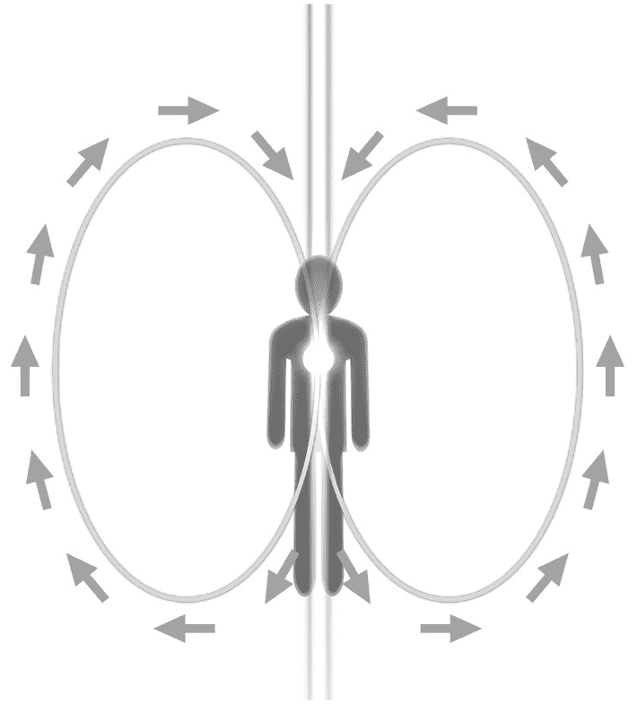

每一个能量场体都会因能量共振产生相对应的讯息编码，而人体感官受体之外那个更扩大的乙太体可以感知这个编码，并解读能量信息。

解读之前，须先进一步认识自身乙太体的感知偏好。有些人的乙太体对场体中呈现的光和颜色感知敏锐，有些人则对接收到的声音或振动音频具备解读能力，也有人是透过嗅觉来诠释能量场体，还有些人则是透过情绪来诠释能量。每个人乙太体的感知方式都不同，可以先进行下面这个检测练习，了解自己的乙太体是以何种方式来诠释能量。

辨识你乙太体的能量侦测与解读偏好

挑几张老照片，仔细端详照片中的人、事、物和当时的场景。

•运用身体感知系统回顾照片

深呼吸，可以张着眼睛，用心去链接照片中的某个人或某项物品。

现在闭上眼，去审视自己的每一个身体感官都出现哪些变化。

眼睛→三百六十度环顾一次，是否可以看见当时环境的整个景象？

耳朵→是否可以听见当时的声音？

鼻子→是否可以闻到当时的人或环境传来的气味？

身体→身体是否呈现放松或紧绷的感觉？

情绪→是否感受到喜、怒、哀、乐、悲、恐、惊等情绪？

•延伸探索照片影像之外的场域

将前述每一个身体感官可以链接到的感知链接回自己的心轮，在心轮安装一个照相机镜头，带着这个镜头，将心轮的影像一一映入自己心底。

现在，再次用自己的心轮去感知带着照相镜头时，这张照片能否提供更多讯息。

在进行心轮镜头扫描的同时，你还可以用意念将心轮的镜头往照片之外延伸，去感知更多这张照片之外的相关讯息。你也许会发掘出当时并未觉察，也没有存在记忆当中的更多细节。

•远端感知万事万物

接下来，请继续不断地进行以下练习。经由照片或感知链接，你对能量的感知与诠释会更熟悉，并恢复链接与感知万事万物的能力。

1.感知远在他乡的家人。

2.感知家里的宠物。

3.感知某个区域的花草树木。

4.感知环境、场所、房子。

5.感知你的友人正在谈论某个你未曾谋面的人。

6.感知组织、国家和地球。

找出你的乙太体解读能量的偏好后，就可以接着进行自身能量的扫描与侦测。

 侦测身体能量场

侦测身体脉轮能量

每个人的能量就类似一个蛋形的发射器，距离你身体四周约一百公分处有一个蛋形的外壳包围着你的身体，这就是你的能量场体（如左图）。接下来，用你在前面能量辨识单元学到的任一种方法去侦测自身能量场体的状态。可以从头到脚一一传感身体能量场七个脉轮的状态，你会发现每一个脉轮位置的能量大小不同，有些宽大或过强，有些过窄而微弱。将需要平衡脉轮能量的位置记录下来。

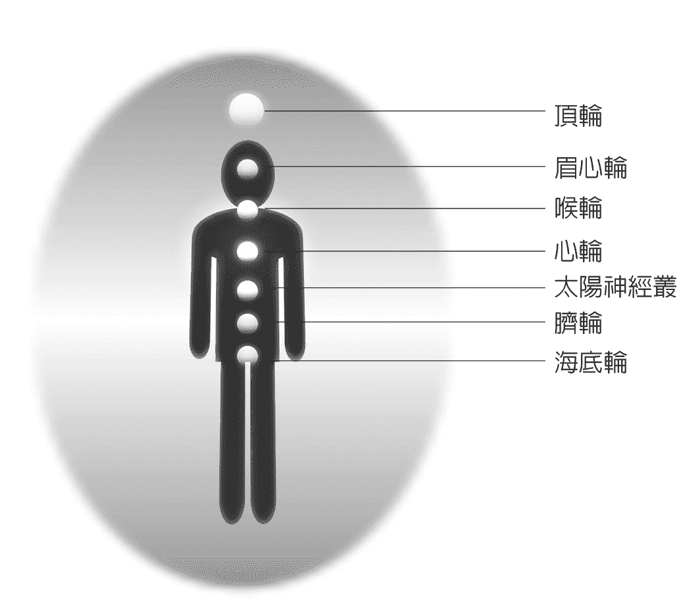

调整与净化脉轮能量

将意识放在需要调整的脉轮上，运用以下的能量辨识法，在脉轮位置进行能量引导。

呼吸侦测法

将意识放在脉轮上，在呼吸过程中进行引导。若需要加强脉轮的能量场，就加强吸气，深深吸一大口；若需要降低脉轮的能量场，就加强呼气——可以用急促而短的呼气方式，呼、呼、呼连续几声，降低脉轮位置过剩的能量，连续做几次。

双手量测法

将双手伸出来，掌心相对，意识放在需要调整的脉轮上。这时，伸出的双手会因意识的到来自动调整两只手之间的距离。若需要扩展脉轮能量，就用意念对着双手间量测的能量范围，在心里大声喊“扩大、扩大、扩大”数次；如果需要降低能量，就用意念对着双手间量测的能量范围，在心里大声喊“缩小、缩小、缩小”数次。

乙太体传感法

这个方法可以更全面地让身体整个能量场重新与中轴校准，更全面地净化与清理整个乙太体。

1.呈站立姿势，双手自然垂放，肩膀放松，眼睛微微闭上。

2.深呼吸数次，从心轮吸入外界的能量。

3.开始想像自己如同一棵大树，将你从外界吸进来的能量由心轮向下，沿着脐轮、海底轮，往地下延伸，让意识穿越地面，将根部蔓延伸向大地，完成扎根。

4.持续深呼吸，将身体的秽气、杂质往地下的根部排放出去。

5.接着，用意识想像从土地获得身体需要的矿物质和微量元素，然后往上延伸，让这些矿物质和微量元素从海底轮、脐轮，往上经过太阳神经丛、心轮、喉轮、眉心轮，到达顶轮，去滋养修补每一个脉轮的能量。

6.平衡脉轮：在运用大地能量滋补修护的同时，当意识进入需要特别扩大或排出能量的脉轮，可以用意念画螺旋，来补充或释放能量。若要补充能量，就让意识在脉轮位置呈右旋螺旋状旋转；若要释放能量，则让意识经过该脉轮位置，用意念进行左旋螺旋状旋转。

7.扩大能量：完成全身脉轮的平衡之后，意识到达顶轮，然后持续向上延伸至顶轮上方一百公分的位置。想像一道金黄色的光从宇宙之心洒向你的星光体，进入乙太体，贯穿全身，直到脚底。这个扩大的能量将你整个身体包覆起来，再次净化后，向四面八方扩展开来。

8.将双手放在胸前，感谢地球母亲、大地和宇宙一起帮助你净化全身，并扩大你的能量场域，然后结束乙太体净化步骤。

完成之后，你可以再次使用能量辨识法去测量全身的脉轮是否已经平衡，也可以和同学交叉验证。当一群人聚在一起平衡自我能量时，就可以进一步帮助环境完成同步的调整和净化。宇宙能量流动于万事万物间，处于彼此共振的动态平衡状态，而当你们有意识地净化和平衡自身能量时，就是一种重新校准中轴、利己利人的慈心行动。这在家里、学校和工作场所都可以进行，能够帮助你们恢复身体中轴的顺畅稳定，让宇宙能量经由你们的中轴，与大地、宇宙进行交换，你们也因此可以让生命展现超越生物体的智慧和创造力。

快速清理与调整全身的能量场

以下提供快速清理和重新调整自身能量场的方法。

1.双脚打开，与肩同宽。双手轻松垂放身体两侧，呈现站姿。

2.大口深深吸气，将气吸到腹部丹田位置；吐气时则分段，用力“呼、呼、呼、呼”数下。重复吸气、吐气三次。

3.用双手轻松拍打全身，从头顶拍打到脚。随着身体摆动，自动拍打需要加强的地方，大约五分钟。

4.以发热的双手从头到脚抚触全身。

5.接着，再次扩展与放大自己的能量场：双手向上举起，掌心向外，画一个大圆圈包围住自己的身体，从头顶到脚底，想像身体往外一百公分的范围已经处于一个蛋形的光环绕的能量场中。若需要特别加强保护，可以重复多做数次。

6.双手回到心轮，默念：“感谢宇宙赐予我无条件的光和爱！”

 感知万事万物的真实意义

（练习感知万物能量的次日，一早醒来就觉得内心无比通透和喜悦，还精神奕奕地替自己和家人做了份美好的早餐。我已经有好一阵子没体验到这么愉快的餐食准备过程，也不知是从何而来的好心情，我就当作是阿乙莎的早餐邀请。吃完早餐后，回到晶体，与阿乙莎链接，立即得到以下来自阿乙莎的反馈。）

我要来提醒你，能量辨识的学习还有需要补充的。昨天你不是向雷巴特学习能量辨识吗？我要给你一个真正需要到达的境界体会：你们要学习的能量辨识，是从“心”出发。这个心，是你的心；不在外面，是在你之内。

人类的心是外界万事万物今日呈现状态的“因”。当你的内心平静，澄澈如水晶时，你就能看见万物美丽的本质和样貌；若你的心蒙尘，镜片缺角，你只能看见模煳不清和残缺的样貌。而那个残缺和不足，是被你的心遮蔽了，而不是事物的本质，你只是无法透过自身看见它们原本的美丽样貌。

在学习辨识能量时，不光是去辨识外界的能量状态，再用你的理性脑去比较和批判，辨识的真正意义是去分辨你内在的状态。若你的心处于较低振动频率的物质界，就会被一切外显的物质所困，你会无意识地让自己的心与物质界共振；若你的内在已提升进入更高意识的宇宙次元，你内在的光就会被淬炼得如同水晶般晶莹剔透，在内在之光的照耀下，你自然可以成功超越物质幻相，在自身所处的世界投射出美丽的天堂景致。你今天准备的早餐，就是用内在的澄澈振动获得了一个给自己的小小反馈。

所以，练习辨识能量时，要学着让自己不被物质所困，提升内在的意识振动，并在平日练习时，不断地从能量辨识中反求自身，直到琢磨出自己内在的光为止。你可以想像自己是一颗石头，然后不断向内淬炼成高密度的水晶。你看，地球上最古老的水晶，哪一颗不是从内在淬炼出晶莹剔透的美丽晶体？它们从来不是由外在显现自己的美，而是向内逐渐晶化成形，这个晶化的过程就在累积和蕴藏庞大的智慧与能量。人类外显的美丽是短暂的，只有内在晶体的光能呈现出灵魂的永恒之美。

渐渐地，你开始学会辨识两种世界的美带给你的全然不同的能量振动和品质。

一种是外显的虚幻世界创造的美，另一种是内在真实宇宙显化的美。

第一种美投射出来的能量振动会让人觉得炫目、刺眼、心虚、自我能量萎缩、焦躁不安。接收到这个振动波的人会感到羡慕、嫉妒、自我价值感低落、没自信，甚至愤恨不平。

第二种美则是内在宇宙振动显化出来的美，带给人光明、圆满、信心、希望和力量。接收到这种美的同时，内在会不由自主地产生爱、感谢、慈悲与感动。

这是我对能量辨识学习单元的补充，希望每个人都可以不断练习，反省并琢磨自己内在的光，再依循内在的光去看见、去听见、去行动，你就会带给这个世界最真实美丽的样貌。

回复对能量的感知能力，目的是要看见自己的状态。外境是反映内在状态的镜子。

阿乙莎，为何创造能量的操作法要透过天狼星的雷巴特下载？为什么不是由祢直接教导我？

嗯！这是很重要的学习，因为地球人类的组成是由他们设计的呀！人类来自高次元存有创造和显化的地球种子植入计划，也是为了拯救地球特别创造出来的。天狼星人用自身擅长的科技文明设计了生命自体演进法，现在他们协助打开人类的灵性体，并教导人类操作自己被封印已久的灵性意识。我认为这是非常有智慧的一步，也是人类进入新地球进行自我更新的最佳办法。

过去有部分星际存有认为自己可以担任地球的指挥官，却造成人类的集体恐惧和地球文明毁坏。这一次，由人类自己的觉醒带领人类进化，这是天狼星人对自身生命体的一种设计，他们今日的高度文明也是自身觉醒后启动自我进化的结果。你们即将打开灵性的潘朵拉盒子，人类的跨次元旅程即将展开，祝福你们携手得到完美的成果。

最近我和一群同好见面，大家都想学习如何链接到阿乙莎，或是透过我，像灵媒那样让祢可以和他们面对面地答问和教导（例如巴夏的传讯方式）。我并不懂得如何让祢展现在他们面前，我该如何做？

很好，这是一定会被提出来的问题，也是聪明的人会提出的请求。我不是你 Rachel 专属的，任何人只要心性光明、世事圆满，就可以链接到我。你将我的话用文字写下来，若人们仍无法循文字找到我，和我链接，那是来自他们自己的干扰，和你、和我，都无关。

我为所有链接上我的人提供同样品质的教导。若人们不阅读文字，不去看、不去听我，又想得到你写下来的那种体验，于是向外追寻，那么，他们愈是向外找寻某种体验，反而会更深地陷入被小我控制的状态。

你就依照让你觉得最舒适的方式传递我的讯息。这个世界有许多不同的方式可以展现我的存在，我就在一切形式的表达和显化中。我已经在一切万有当中很久很久了，仍然被视而不见。人们想要找到更艰难、更隐晦的神秘体验，才会相信自己终于遇见了我，体验到神迹和恩泽？

啊！孩子，我只需要你们每一个人用自己最擅长的方式诠释我的存在。每一个人就是我的显化，所以，尽情挥洒你们的生命，看见自己和宇宙万物平等同在，你们就可以从自己身上看见我。

请告诉那些想亲身体验到我的人，去认真活出自己生命的精采，我就在一切的创造里。我可以很美，也可以很丑；我可以成功，也会想体验失败；我可以在宗教里，也存在战争血腥中。你们的一切都是我的彰显，所以，去活出最能表达我的存在的你的版本，活出自己，就是与我同在。

面对那些想找到我的人，请告诉他们，不需要透过你才能链接上我。你在他们面前也不必展现他们尚无法拥有的能力，只须帮助他们看见，他们自己就拥有如你所能的、如你所是的那种链接上我的能力，让他们自己去创造属于他们的版本来诠释我。你只需要帮助大家校准自身中轴，帮助大家链接上他们的高我意识，帮助大家觉醒，我会在那里协助众人获得知晓，并永远与我同在。

阿乙莎，谢谢祢让我再次感受到祢的爱与慈悲。

当你能够从自身的觉受系统感知能量的流向和品质之后，就可以进入操作能量的进阶练习。人类最佳的能量操作工具就是自己的意识，意识具有磁引力，经由意识的带领，可将能量导入、扩展、内聚、防御，或朝着不同的方向与指定的路径移动。人类过去只知道活用大脑的逻辑思考能力来落实物质层次的行动计划，却不知道自己拥有更强大的意识能量，可以协助人类提升至量子世界的创造。这种无相界的创造也是人类进入第五次元的重要创造法则，将为人类和新地球的显化带来突破性的文明大跃进。

 光的语言：光码

光码（Light Code）就是和宇宙沟通的语言。这个沟通符号由结构化的意识组成，每个符号有特别的振动结构，和人类用情绪产生的意念振动频率是不同的。人类的情绪引发思想，思想创造行为，这种由人类情绪引发的思想是线性而松散的。而光码也同样具有思想，只是这个思想有先后顺序，有指向性、融合度和完整的结构张力，也因此，光码产生的振动频率影响的层次与范围更为广大。

光码本身就是一个完整的光的结构体，类似一个包含多种元素的晶状体，因此，它能放射出多重角度的光彩，而不是单向的光。单看光码的符号图像无法理解其中的意涵，你们仍须学习将意识带进光码意图表达的路径。当你有意识地使用光码路径表达时，可以帮助你的意识免受情绪和业力的干扰。最终，人类可以透过光码的沟通净化自身的意识层，让意识能量再次扩展和提升。

启动光码须透过有意识的带领，若是在无意识的状态下使用光码，就无法得到全然的理解，虽能获得短暂的疗愈效果，却无法持久内化到你们的灵魂体中。你们必须了解并学习每个光码的意识路径代表的意义，只有在你有意识的带领下启动光码，才能共振链接到更多宇宙意识群，在量子宇宙集结成更大的光之拼图。

每一种光码携带的振动结构与内涵都不同。宇宙光码如同你们人类的语言文字，有多达一万四千四百个图形，在取得光码的同时，必须一步步学习该光码的路径指引，才算完整下载了光码。你会从自己的灵性导师那里取得哪种光码，与你个人的生命蓝图有关。若你可以透过自己的灵性源头取得光码，不要吝于分享你的光码给这个世界。一个小小的光码启动，就能链接更广大的意识群体，也可以因此帮助链接下载更多光码，一起创造新世界的实相。

 帮助人类创造实相的光码（天狼星雷巴特传递）

创造的能量就是汇聚思想、因与果的能量，经由意识带领能量流动路径，将意念转化为量子世界的原子态动能。这个经由意识创造的原子态动能可以驱动实相改变其粒子结构。当该实相的核心结构晶栅松解，就会跟随创造的能量流一起调整相对位置，并在量子宇宙世界重新聚合成新实相，而这个经由意识投射的新实相会显化在所有宇宙时空，也触及你们所处的地球。

这是人类经由意识开创宇宙实相的方法。人类意识觉醒之后，可以更稳定地进入量子世界的创造场域。透过启动创造的能量光码，你更能将自身的意识流结构化，超越理性头脑分析、评估、判断的惯性，创造和显化出期待的结果。

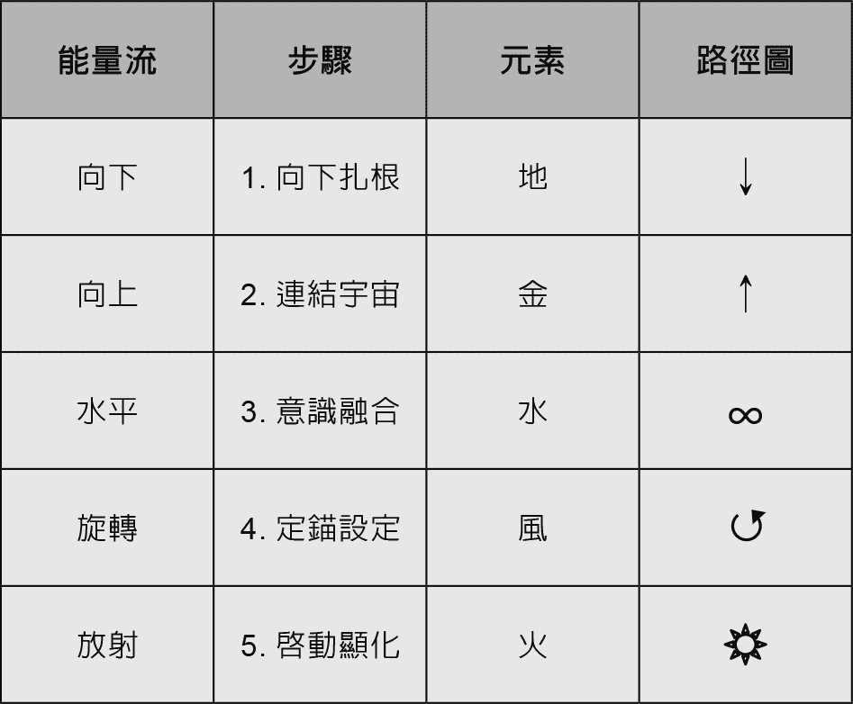

创造的光码结构包含多重能量流动组合。以意识带领右页表格中的五个步骤，陆续完成地、金、水、风、火等五元素的能量流，然后启动经由意识结构化的能量晶体，让这个创造的意识在量子世界里先运行，最终会落实显化在物质实相界。

这就如同你们人类站在岸边向湖中央投入一颗石头，这颗石头会在湖面产生振动波，最中央的振动会带动整个湖水产生一圈圈的波动效应，最终触及岸边而停止。你们所处的地球就像位于最外圈的岸上，呈现出石头投入湖中的最终现象。

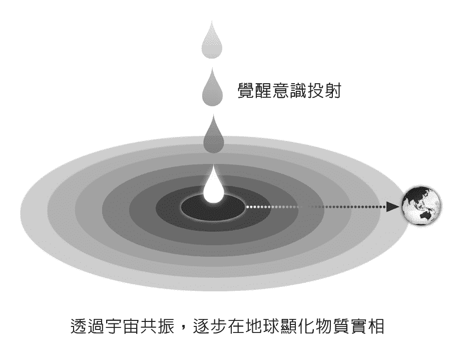

现在，觉醒意识投射出的意念就可以直达湖的中央，你的意识可以影响和带动整个宇宙，与地球互动。下一节将详细说明每个步骤的原理和关键要素。

 创造光码的意识流动路径

步骤一：向下扎根（启动地元素）

根据目前显化的结果，先设定一个与目前结果不同的期望，然后让这个期望的结果向下穿过你的海底轮，扎根落地，进入地球之心。

步骤二：链接宇宙（启动金元素）

意识向上经过喉轮，提出可以达成此期望结果的提案。接着，将提案往头顶上方的宇宙投射出去，同时观想这个提案已经在顶轮上方形成一颗晶状的能量球。

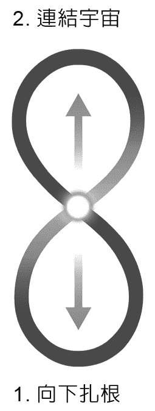

步骤三：意识融合（启动水元素）

将顶轮上方的提案能量球带回心轮，启动意识融合的能量流，于此融合过程中找出最佳行动计划，并且去校准和修正自身的意图，最终就能在一切能量和因缘具足的状态下，让期待的结果落实和显化出来。

此时，需要观想这个提案会涉及或互动的对象（包含人、组织、事物），将提案链接到这些人、组织或事物上，去测量能量，感受这个提案内容是否可以与这些人或组织完全融合。

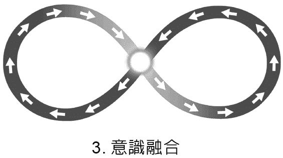

意识融合的过程中，可以使用下面这两种方法找出最佳行动计划，并调整能量场体，让未来的显化更容易实现。

意识融合方法一：探索最佳行动计划

1.量测事件的现状和你期待的结果之间的距离

现状放在左手，期待的结果放在右手，然后让两手掌心相对，以能量侦测法量测现状与期待结果之间的能量差距。

2.将你心中的计划提案放进中央，再度传感能量

将此计划的意念投入双掌之间，掌心相对，去感知能量变化：

a.若左右手之间的距离没有缩短，表示这个计划提案无法顺利达成你期待的目标。

b.若双掌之间的距离缩短，表示此计划提案可以缩小彼此的落差，有助于向目标推进，但仍然有段距离。

c.若双掌完全密合，表示此提案是你当下的最佳行动计划，可以准备朝此计划的方向前进。

不论是否在这个过程中找到最佳行动计划，都可以不断用意念去感知左手和右手。你可以感知是需要调整期待结果，或者改变提案本身，也可以透过这个过程了解需要融合意识的对象目前的想法、期待的改变方向或内容，在此能量探测的过程中找寻可以达成期望的最佳提案。

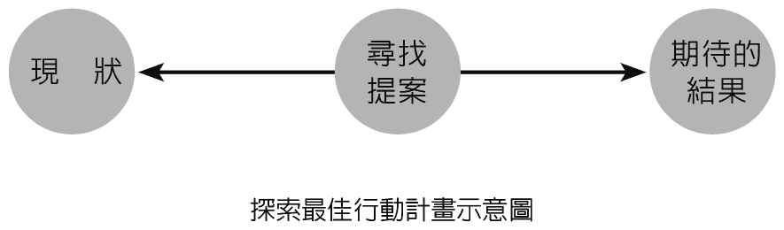

3.向宇宙发送提案

确认提案内容后，让此提案向上进入第三眼（眉心轮）。你进入更高的意识中，去看见这个提案应该展开的执行细节，将这些细节留存在心中，感谢宇宙给予你更高的智慧与真理，然后将意识往上提升至顶轮上方，形成一颗经过意识融合的提案能量球。

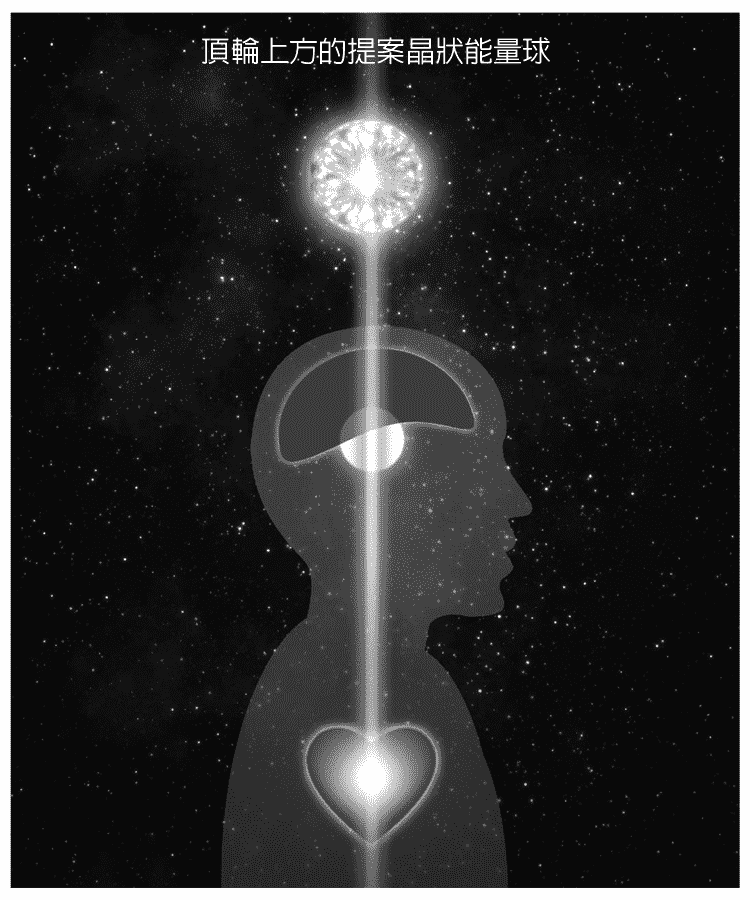

实例练习：探询“夫妻双方照顾年迈父母的计划”最佳提案

现在，将左边的“现状”与右边“期待的结果”圈起来，然后意识放在心轮的位置。运用能量辨识与量测的方法，伸出你的双手去传感一下，目前这两个圆（现状与期待）之间的距离有多大。

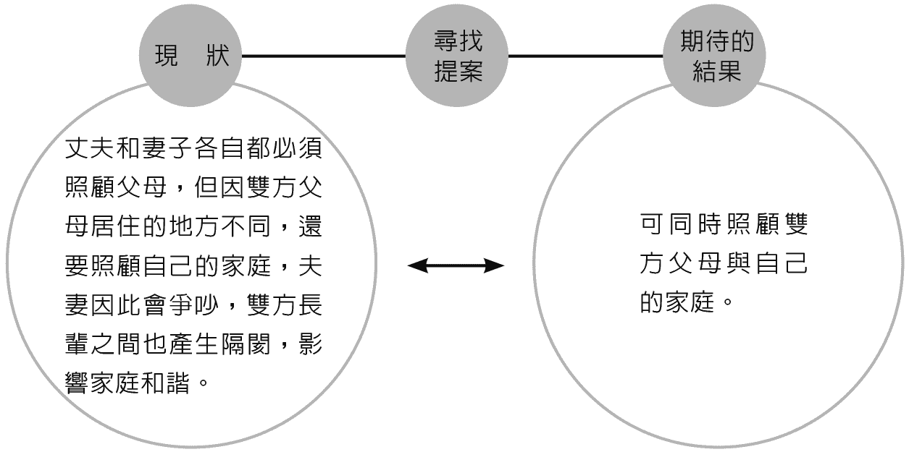

假设，双手传感能量场约有八十公分的距离。

这八十公分的距离就需要进入意识融合测试。现在，将双手仍然摆放在这相对八十公分的位置上，开始提出不同的方案，逐一检视哪一个提案可以拉近双手的距离。

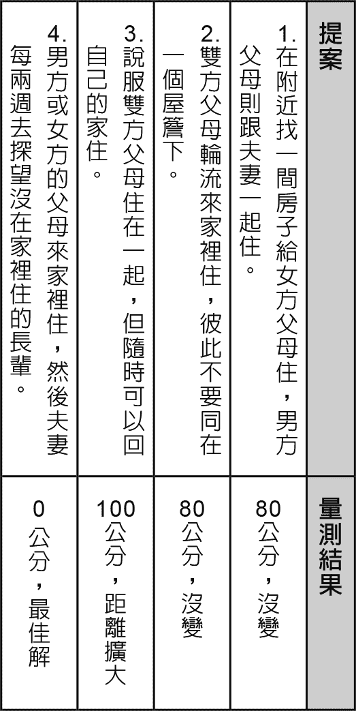

第四个提案很明显可以缩短能量差距，完成融合，是达成期望目标的最佳解。

现在，以第四个提案的内容，让意识继续往上，到眉心轮。用智慧之眼仔细描述第四个提案，看看在这个情境中有没有你需要调整做法或想法的地方，或是要达成此提案有没有一些必要条件或前期该准备的工作，然后将第三眼看见的提案相关配套措施和做法记录下来。

例如，让意识继续往上，停在第三眼，眉心轮的位置，这时你可能会看见，需要将家里的长方形大餐桌改成圆形餐桌、来家中居住的父母生活空间里的客厅或餐桌位置要如何安排、房间该如何安排、要由夫妻还是长辈决定餐食内容、若住在同一屋檐下，对未来居住场所的认知有哪些需要调整之处，以及每两周去探望另一方的父母时要做些什么活动等等，都可以在此时先觉察到这个提案可能造成的变化、这个变化会让每一个人产生什么样的想法和反应，以及你在这当中需要抱持什么样的想法或态度，来面对即将到来的挑战。

完成后，将这个意识融合后的能量球往顶轮上方投射出去，就可以准备进入下一步骤：定锚设定。

意识融合方法二：净化与修正意图

在探索提案及设定的目标的过程中，你会被小我的意图干扰，无法随时处于更高意识的状态，去找出最佳行动方案，甚至会一再陷入业力牵引，重复创造业力的延伸版本而不自知。这时，身体的感知是你最好的导航系统。当你善用自己的身体能量去传感时，可以看见投射出去的目标与现实之间的距离，以及你需要调整的心态和想法，也能在这个过程中看见自己内在的真实。只有将真实的意念投射出去，才能创造并显化成为宇宙的实相。

接下来要说明意识融合的第二个方法。透过这些步骤，可以进一步净化和修正自己的意图，为创造未来实相奠立稳定的能量流动基础。

1.设定步数

将期望达到的目标，以及你探索到的最佳行动计划在心中陈述一遍，接着问自己，以目前的状态，需要往前走几步才能到达。此时，你的内在直觉会告诉你一个数字。

2.开始出发

想像你前方的目标，和目前所在的位置中间共有刚刚内在直觉告诉你的这几步路要走，然后开始踏出第一步。此时，你的身体会进入这个未来实相的能量场中，你身体的感知会告诉你，当你站在第一步的位置时，会有什么样的感受。顺着这个感受去跟随自己的身体延展或做动作，这些感受都是在帮助自己打通每一个关键节点的能量场，并获得全然的知晓与整体能量融合。

3.继续往终点走

重复第二个步骤，依序走完每一步，直到抵达终点，你的身体会让你感受到达成这个目标中间显化过程的演变。过程中，如同走进自己设计的虚拟实境，于此时此刻得到完全的体验和理解。此外，也可以借由这个过程增强自己的意志，修正自己的心念与能量状态，为显化未来实相铺设出一条康庄大道。

4.抵达

让意识回到心轮，将这条路径带来的全然体验与理解放进自己心中，并感谢宇宙和地球母亲的协助。

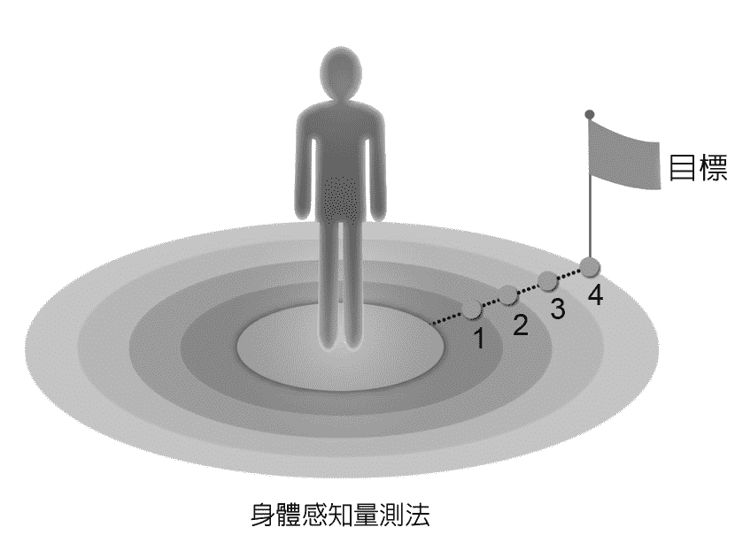

实做心得：净化与修正“销售房子计划”的意图

先运用前面提过的方法，探索最佳行动计划。

将左边的“现状”与右边“期待的结果”圈起来，然后意识放在心轮。运用能量辨识与量测的方法，伸出双手传感一下，目前这两个圆（现状与期待）之间的距离有多大。

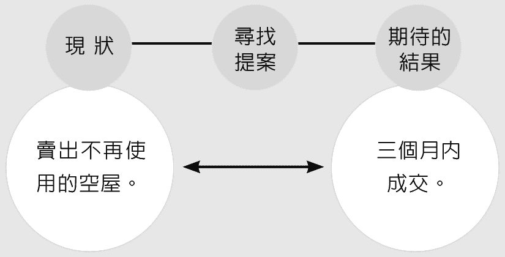

结果，双手传感能量场约有一百公分的距离。

这一百公分的距离就需要进入提案的意识融合测试：将双手仍然摆放在这相对一百公分的位置上，开始提出不同的方案，逐一检视哪一个提案可以拉近双手的距离。

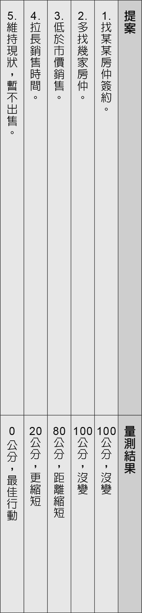

第五个提案很明显是最佳解，却是无法达成期待目标（三个月内成交）的行动方案。会出现这种状况，最可能的原因是没有找到达成或落实期待结果的真实的“因”。所以，必须进入自己的内心寻找想要售出不再使用的房子真实的意图，进一步探索让自己发出这个意念的真正原因。

接下来，我就运用净化意图的方法，去探索我当下为何觉得想要卖这间房子，并进一步了解其中是否有其他原因，或者需不需要调整意图。步骤如下：

1.设定步数：目标是售出不再使用的房子，此时，我的内在立即出现“２”这个数字，亦即两步。

2.开始出发：移动身体，往前踏出第一步，感受到气流停滞，于是直觉地想要摆动一下身体，让整个房子的能量可以开始流动。因此，我的身体跟着左右摆动，随即自动停止。这个阶段的感知结束后，我进入下一个步骤。

3.跨出第二步：当我迈开步伐，跨出第二步时，身体突然不自觉地想往后倾，让我向后倒退五、六步，一直觉得有往后的拉力。这时，我停下脚步，问自己的内在，这是来自哪里的讯息？很奇特的是，我的内在获得一个清晰的知晓：我其实不是真的想卖掉这间房子，而是因为觉得贷款的压力很重，才会出现想卖房子的念头，其实我很舍不得卖掉这间房子。当意识出现这个理解后，我的身体瞬间自动往右方转动，而在我跟着身体的动作转向右方时，获得一个更清楚的新意图：也许，不一定要卖掉这间房子，而是可以转成出租，以稳定的租金纾解贷款的压力，这样我就可以有足够的现金流去保留这间房子。

4.结束：感谢我的身体带领我进入我投射出去的这个意图在量子世界的真实景象。我现在明白该如何做了，感谢宇宙和地球母亲的协助！

步骤四：定锚设定（启动风元素）

观想经过意识融合的能量球从顶轮经由中轴，缓缓向下移动到太阳神经丛，开始进行定锚启动设定。

定锚设定步骤

这是将意识投射在量子世界的启动设定。启动关键密码可以是一句话、一个声音、一个图形，或是某种你自己设定的讯息表现方式。

比方说，你可以设定一个关键词，像是“现在开始了”或“你愿意听听看吗”等等，任何你可以在显化的现场发出的声音、图像，或是说出来的一段话，以引导这个能量球启动显化。

当你启动能量球之后，太阳和月亮的磁引力会经由你稳定的中轴，让这个结构化的能量晶体抵达它在宇宙的相对位置。当这颗能量球移动到宇宙相对行星位置时，就能逐渐显化在地球上。地球是意识能量显化的物质场域。

这个过程是透过创造的能量路径，将意识汇聚成能量球，并经由发起人的中轴启动该能量球在量子宇宙的航行轨道。这个轨道可以穿越宇宙晶栅，最终将此能量晶体结果显化在地球上。

人类目前处于较稠密的第三次元，无法带着自己的身体跨入晶栅。但是，人类的意识体不受此限，唯一的限制是人的意识产生的能量投射只能回馈到地球上，还无法用意识去驱动能量球在地球之外的行星上显化。不过，当人类迈向第五次元时，就不会受到这样的限制了。人类必须先学习以更高的意识进行量子世界的创造，并了解宇宙的创造法则和星际联盟的规范之后，才能晋升为星际的创造者。

完成上述步骤后，这个经由意识产生的创造能量，就同时完成了锚定宇宙与扎根地球，一个完整结构化的意识晶体就在量子宇宙诞生了（如下页图）。

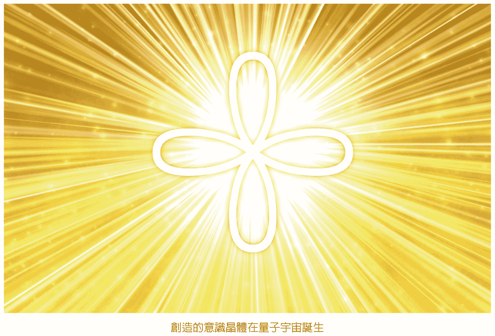

补充与增强能量球动能

将已经设定好启动码的能量球以意识导入自己太阳神经丛的位置，以抛物线画出四个圈的运行轨道（见左页图）。将此提案的意识能量球扩展成原子态，重复四圈为一个完整的路径周期，持续进行十～十五分钟后结束休息。

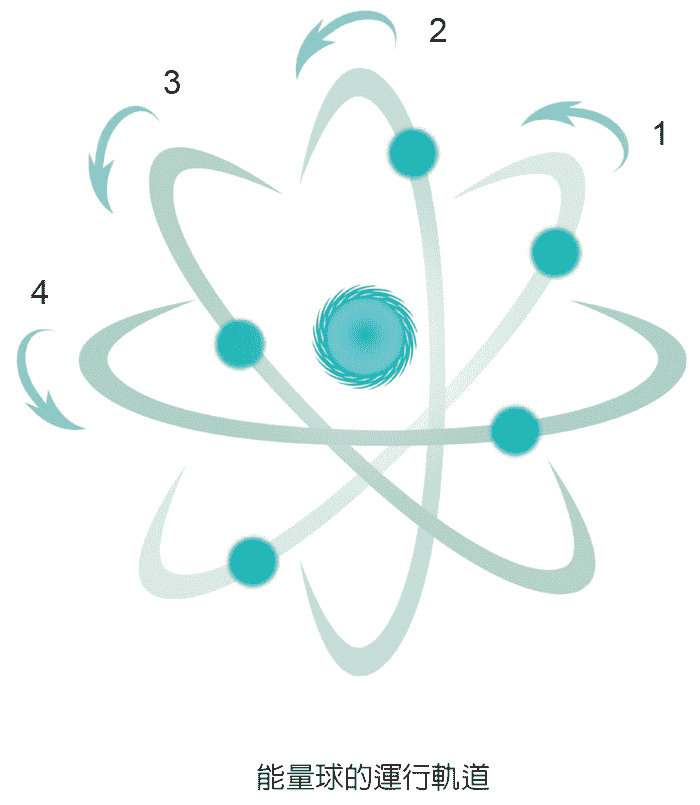

步骤五：启动显化（启动火元素）

让创造的能量球启动显化的方法，是用意念启动之前设定的关键密码。

你只须在想要启动显化的当下，念出自己之前设定的关键密码，接下来就可观察原先设定用来达成目标的计划提案是如何显化在实相中。有时，显化的速度非常快，那是因为你之前在量子世界的投射冥想非常完整；若尚未显化，仍然可以重复之前的步骤，以当下的结果重新出发去调整。这个步骤很像是在量子世界引爆能量球，让实相可以被显现出来。

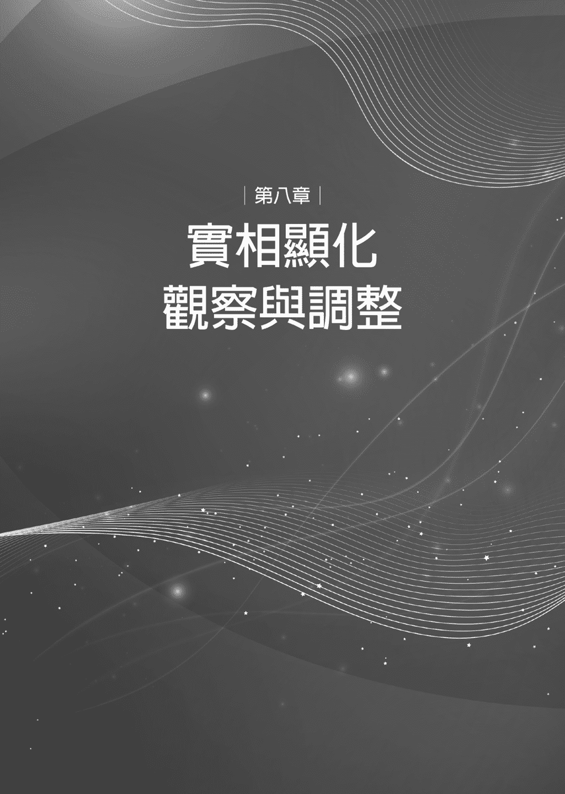

你们身处物质世界的幻相，只相信眼睛能看见的一切，而量子世界运行的过程因为无法亲眼看见，而无从领会。你的大脑若还没有新的输入，你的感官就无法输出讯息让你理解和感知，一直要等到结果被显化和落实，大脑重新有讯息输入后，你的感知系统才会收到，并有所反应。人类在物质幻相中成了后知后觉的灵魂载具。

人体就如同你们早期的电脑，用的是旧式操作系统，而量子世界的电脑是超级电脑，其运算结果出来后，会把结果输入你的脑中，让你可以感知并采取行动。现在，有个方法可以让你在能量运行时同步观察整个显化过程。

当你完成创造的能量意识流之后，这个能量球已经传送到宇宙，并链接与此能量显化有关的人事物，而这个能量的振动频率会让所有相关的人的意念或事情的晶栅移转。针对能量的参与者正在想什么、事情正往哪个方向前进，你仍须在尚未显化时持续链接自己的晶体去观察，并随时调整。若投射一个意识能量球到宇宙，你却置之不理，结果可能不会如你期待地显化。因此，在物质实相尚未显化之前，你要去观察能量球种子的状态，适当地调整能量，取得专家协助，直到发芽、开花、结果。整个过程就像在种植花草树木，从种子发芽，到开花结果前，你必须依状况随时调整，给予适当的灌溉和滋养。

 显化观察与调整

观察显化过程的步骤

1.深呼吸，进入晶体中。

2.请求大师、导师和你挚爱的家人协助将你曾经投射的×××能量球带入你的晶体中。这时，你的前方约五十公分处会出现这颗能量球。

3.打开第三眼，观察这颗能量球目前的状态。

✦你是否可以感知它的外形变化？试着用你的内在感知描述你感受到的变化。例如，光的色彩或能量球的外观有改变吗？

（我曾经练习投射一个意念，次周进入晶体去观察这个能量时，看见它已经形成生命之花的展开样貌。这是值得喝采的，虽然尚未显化成物质实相，我已经可以看到在量子场域里的能量展开状态。）

✦这颗能量球是否传达出某些讯息给你？

✦扫描一下提案内容涉及的所有成员目前的想法是否有所改变，或者他们正在考虑的是什么。

✦你是否可以调整自己的想法，来满足和实现你想要的结果？

✦若感受到能量球处于静止不动、不活跃的状态，可以进一步请求能量球让你理解你现在需要做些什么，才能让它继续转动和显化。

4.调整提案内容，或结束观察。若需要调整提案，就用意识向自己宣告：“我×××，针对×××提案，需要重新设定。”然后将此能量球放回心轮，重新进行创造光码的意识流。若不需要修正提案内容，就结束观察。

能量补强与调整

在观察能量显化的过程中，可以随时补强该能量球需要的宇宙元素。例如要加强水元素，就是将此元素的意象带入能量球的中心位置，以扩大能量的四圈路径运行，重复进行几回合。也可以放进太阳或月亮，代表阳性及阴性的能量。

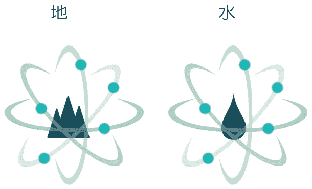

侦测四元素的能量状态

使用能量侦测法，让双手掌心相对，用意念开始审视地、水、风、火每一个元素在双掌间的相对位置。若某个元素能量不足，双掌的距离就会缩小，甚至合在一起。这时，将需要加强的元素放在中央（如右图所示），以扩大能量的四圈路径运行几回合，再重新量测，就会知道该元素是否已经补足。

补充太阳或月亮能量

太阳代表的是斥力，月亮代表是引力。若是要让能量球产生放射的能量，由内而外流动，就要做补强太阳能量的静心冥想；如果要加强能量球的吸附力，由外往内流动，就做补强月亮能量的静心冥想。

举例来说，如果你正打算在店里销售一项新产品，希望上市期间的来客数增加，这时就可以做补强月亮能量的静心冥想，加强这项产品吸引客人前来的能量流。假如你的产品并没有在店内销售，而是放在网络上，与众多产品摆在一起，这时，你或许需要增加这项产品的太阳能量，让它可以在众多产品中被凸显出来。

打开内在恩典

在能量尚未显化前，你随时可以进入自己的晶体，请求大师、导师和你挚爱的人带领你寻求专家的协助。这个专家不是别人，而是来自永恒生命的你。你在某个前世曾经学习过的经验或专长，可以经由打开内在恩典的过程被发掘出来，你只是再次忆起你所是、所拥有的天赋才能，来帮助你完成此生创造的新命题。以下就是请求大师、导师协助打开内在恩典的步骤。

1.依照祈祷路径，进入自己的晶体。

2.请求大师、导师和你挚爱的人，针对你目前投射出来的提案×××（详述提案内容），帮助你忆起属于你某一世的专家经验或天赋才能。这时，在你的大师、导师与你挚爱的人的临在下，你前方大约五十公分处会出现一个光柱，这个光柱里面会出现可以帮助你在此提案中得到灵感或智慧的想法。

3.与自己灵魂过去的经验或前世片段对话，提出问题，帮助自己在此生的这个提案中获得更多内在恩典与智慧：

“那一世，我学习到什么可以帮助现在的我？”

“我为什么会在此生创造这个命题？它对我的意义是什么？”

“此刻，我该如何想或行动，来实现我期待的结果？”

“未来我该朝哪个方向前进，让我可以达成生命的最高目的？”

4.使用离开晶体的祈祷程序，结束这个打开内在恩典的过程。

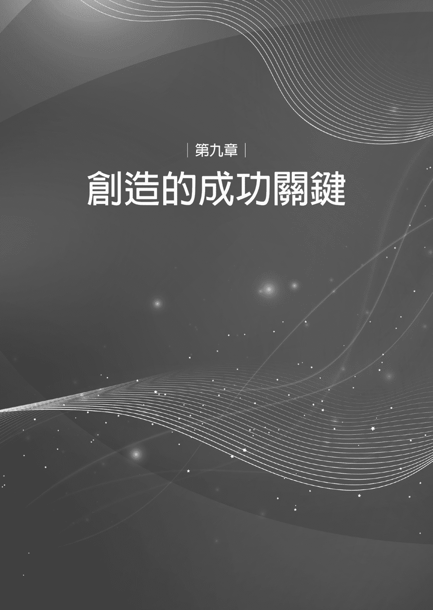

 创造是有意识的“由果造因”的意识扬升之旅

人类传承并教导给后代奉行的圭臬，是万事万物的发生都有其前因后果。这个“因先果后”的想法，阻挡了人类透过自身力量进行有意识的创造，但这个阻碍将在你们意识觉醒的同时被打开，你们会发现，由因致果的想法和宇宙的创造能量流刚好是相反的。人类唯有重新创建“以果造因”的意识流，才能脱离因果轮回，产出跳跃式的创造能量。

将期待的实相经由身体中轴链接更高意识，这个过程就是超越地球层次的小我，创造一个可以与此期待的结果同频共振的“因”的晶体；而透过这个“因”的晶体，可以穿越时空、扩展链接，与更广大的宇宙存有共振。你们的思想得以穿越时空，扬升进入量子宇宙，产生人类无法理解的一些超自然现象，诸如遇见来自未来的人、人体或实物瞬间移位等。

有了这个新的理解，你可以透过意识扬升载具，链接自己的过去、现在和期待实现的未来。当你认知的现实不但可以被改造，还可以去改变即将实现的成果时，你就能体认到，意识在宇宙和物质的显化过程中扮演非常重要的角色。

意识向上通过不同脉轮流动的过程，就是用更高的意识层次去看见你所想、所期望的结果是否仍然有显化的需要，这个想法是应该继续存在、消失，或是重新调整——关于这些问题，你在这个意识拉升的过程中会得到完整的见解。而当你透过这个过程再次确认这个结果依然如你所想、所期待时，宇宙将透过你的中轴，为这个结果的显化注入创造的能量。

心轮：以爱之名，去审视当下产生的想法与期待的结果。

喉轮：提出创造性的提案。

眉心轮：以智慧之眼观察。

顶轮：以神圣的意识观看。

在意识扬升的旅程中，你会更钜细靡遗地描绘出期待的样貌，描绘得愈详细，愈能产生符合期待的显化。当你的意识无法通过上述较高脉轮的意识认同时，宇宙能量流入的信道会出现阻碍，你必须重新调整想法与期待的结果，再以意识引导向上的过程。这整个以更高意识观察的过程，可以免除二元对立世界里的限制性思想。

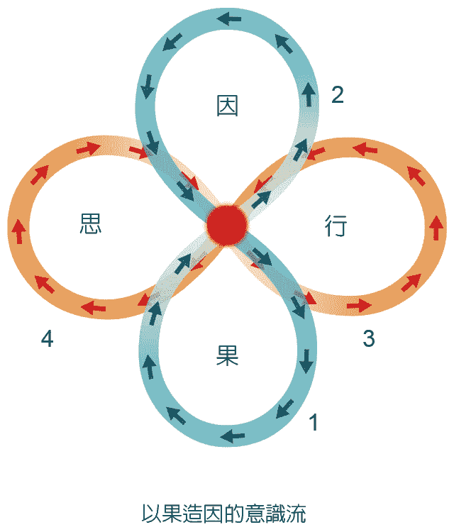

 避免掉入无意识的能量循环

小我很容易掉进无意识的能量循环里绕不出去。垂直的“由果造因”能量流动，是小我与高我意识进入合一意识之流；水平的“意识融合”能量流动，则是思想与行动不断校准并达成合一的意识流。整个过程都需要用“心”带领，才能落实和启动此创造能量。

人在无意识的状态下，很容易陷入无限的思想与行动循环之中。人类的世界里有许许多多生活在这个能量流中的人，他们为了生活赚钱打拼，还以为赚钱是生命的目的，结果赚足了一辈子都花不完的钱，还是停不下来，仍在思想与行动之流中不断循环。这样的流动虽然可以在物质层次创造丰盛和实质的显化，但这些显化最终仍会随着时间的流逝而消失，丰盛的物质为生命带来的真实喜悦有限。不要尝试用自己的想法或意念去贯彻执行，这么做非但达不到你想要的结果，还会因为坚持落实这个想法，反而让自己落入思想与行动的能量循环中，耗尽心力却得不到想要的结果。这也是目前人类在不断尝试创新的行动中普遍面临的问题。你们一直让自己的意识处于低频率振动中，只在物质层次来回振荡，无法提升意识层次，跳脱物质的控制，得到超越现有实相的创造。

另一种则是陷入因果之中，在垂直的能量循环里不断来回摆荡，一下子跨出次元得到出体经验，一下子又落入地球的稠密空间无法逃脱。在此循环中摆荡的人总是不断地找寻更出离的体验，但愈想逃离，愈容易落入更沉重的拉力牵引。

其实，人类来到地球，不必执着于停留在永恒的高维意识里。你们身处地球的三次元世界，要落地扎根于地球，体验人世间一切的悲喜苦乐，保持心识之眼居于中轴，身体之眼在外行动，并且在每一次创造能量流产生具体行动后，将意识拉回来校准中轴，用意识之眼观看结果。若只是将小我意识融入行动，你们很容易将自身能量过度倾注在眼见为凭的行动中，进入另一个因果循环里随波逐流。唯有在稳定中轴的能量流中创造，才能顺利带着自己进入下一个更高的次元。

练习：描绘创造能量流动路径

拿出纸笔，练习画出完整的能量流动图，观察和审视自己目前的状态，看看是否容易卡在某个循环，或是在哪个环节停滞不前。然后，你可以将意识带入那个环节，再次引导能量，生命会在你自己有意识的能量引导下，再次流动起来。

❶ 练习画出由果造因、意识向上方流动的能量流（画一个直立的８）。

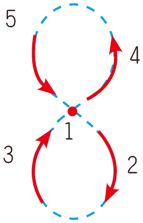

❷ 练习画出意识融合的能量流（画一个横躺的８）。

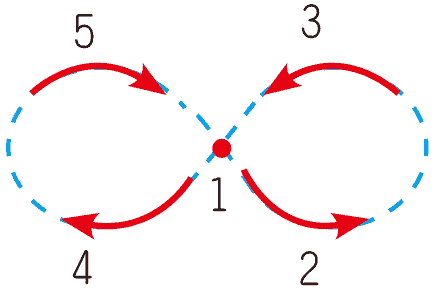

在创造能量的意识流动路径中，你可以观察到里面蕴藏着生命多元展现的可能性。现在先练习用手画，拿出一枝笔、一张纸，自己画画看，你会从描绘的过程中发现其中的真理。

（我试着照意识能量流动顺序描绘能量的走向〔如下图〕，发现要完整画出这个图其实并不简单。我们很容易在垂直或水平的 8 字无限循环中进入无意识的循环，要稳稳地画出完整的流动，一次又一次没有差错，几乎不太可能。只有每一次都将自己的意识带入下方，然后要先往上走，再由上方回到中心，转向右方，再拉回到左方，在这两个转折点都必须将意识带入，才不会因为惯性或无意识的带领，进入永远的循环里。

第二次、第三次、第四次，我都成功画出完整的图形，但这不代表永远都可以成功地画出来，只要一失神或没用心，手部的惯性动作就会将你再次拉进循环里。这是我自己在描绘的时候遇到的状况。）

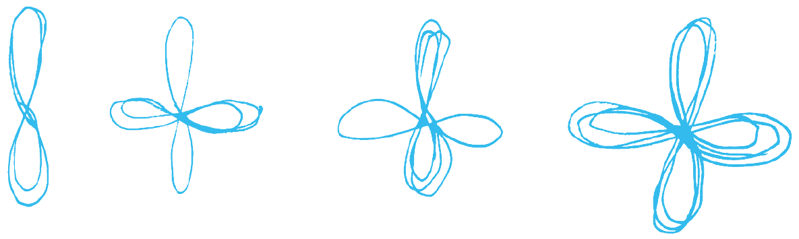

 避免受小我和业力牵引，看见真实

你无法要求宇宙给你一个和当下的结果无关，或是来自一个虚假命题的创造能量。一切的创造都是根植于“果”的改造，由当下的“果”再创造一个新的想法出来。如同宇宙旅行，你从Ａ点到Ｂ点，那个Ａ点是目前所在的光的座标起始点，而创造就是以Ａ点的现在为轴心，去产生另一个新的结果的过程。一个无法看见并处于当下的“果”的人，是无法进入创造过程的。若意识无法觉知当下的“果”，从思想直接出发，就很容易让意识流入空转状态。要避免意识空转，你可以透过观察自身的问题或所处环境中的现象，以当下观察的结果为基础，才能进入下一次创造的投射，写下心中对观察到的一切果所投射的想要的未来版本，然后为每一个未来版本进行意识向上提升的造因行动。

然而，人类因为受到业力的牵引，无法从更高、更广大的视野和角度看见真实。人很容易在自己创造的虚拟情境中自得其乐，并让这个世界充斥着无数虚假的命题。你们一直未觉察自己已经偏离自身的中轴轨道，直到大难当头，环境或身体出了状况，才会看见那个由众多无意识的行为累积而成的结果。人类总是在不喜欢、不愿意、拒绝接受时，才会看见结果；若处于开心、欢喜、满足的状态，你们不会看见那个已经存在的真实。比方说，今天天气很好，你不会想要改变这个好天气，创造一个不同于“天气好”的体验；只有当飓风来袭，造成生命财产损失时，人类才会看见这个结果，而想要创造能够挡风避雨的环境或材料工法。人类一直在害怕失去与恐惧死亡中求进步，这是你们意识处于二元对立世界时的游戏，从错误和失败中学会看见真实。

在更高的意识次元，你们将不再处于非黑即白、非善即恶的二元对立世界，而是可以透过链接自身的更高意识，看见万事万物原本应有的本质和样貌。你们可以在一切非真实的显化中还原其本有的真实样貌。比方说，看到身旁有棵果树，树上结实累累，有许多又大又甜的果实，你不会只看见结实累累这个单一结果，而是会经由更高的意识，看见并感受到可以再为这棵树做些什么。你会看见原本果实诞生前该有的蜜蜂消失了，看见生产完的果树不再开花，周边的土壤长不出小草，于是，你的意识会与果树显化的这个结果产生链接。你不须体验树木和土壤的死亡，就可以知道这个结果需要被重新创造；同时，你会感知到这棵树更高、更大那个版本下的真实，然后创造出果树原本该有的健康样貌。

在你意识提升的过程里，看见当下万事万物最真实一面，这个世界也因为你的更高意识投射出爱的光谱，不断显化出更美好的结果。

 意识融合后才可能实现

每一次意识融合的过程，都可以根据当下观察到的状态调整提案。当你明白每一个人的想法而提出新的提案时，就距离显化更进一步了。最终你会发现，改变自己是创造意识融合最有效率的手段。透过创造能量路径提升自己的意识，也就是让你与神圣的你一起创造，这个创造本身就是神给地球万有的祝福，而你是在被祝福的状态下进入神圣的创造源头。在这整个过程里，你自己就是你期待的结果的因和果，你创造出想要的结果的因，这个造因的人是你，而不是你以为从外面可以寻求到，或是由别人的改变来满足你。是你创造了一个能够成就这个结果的意识，而这个意识最先改变的人，就是你自己。

当你自身的意识调整，你投射到宇宙的晶栅转动时，这个晶栅会让与此结果相关的人事物都连带转变。而在观察到周围状态改变的过程中，你又再度调整自己的思想和态度，改变后的思想和态度连带转动你的能量状态，让你产生不同的行为，而这个行为造就了你应有的回应给你。所以，透过你自己的意识转变，以及与当下对象之间的融合，你就已经改变了量子世界的现状，进而成就自己投射出去的目标。

每一个意念的投射，都在量子宇宙和当下之间形成一个该想法的量子能量场域——也就是说，当下的念头所创造的宇宙实相版本，已经在另一个平行宇宙中开始振动，这个振动的能量会逐步显化在你所处的地球实相界中。只是，你所在的当下仍处于未显化的未来实相的过去式。虽然以目前的肉眼无法看见量子世界的实相，你却可以利用身体的觉受与感知，取得量子世界的讯息。因此，你就是自己未来实相的导演和主角，你的未来显化的版本，取决于你当下产生的每一个真实意图。所以，你不但可以在当下创造未来，也可以在当下改变未来，只有当下能够改变未来显化的路径。

 愿意持续以更高意识观察与修正

创造能量的发想和投射造因都不会太困难，但要让人愿意以更高的意识不断观察和修正，就不是件容易的事，很多人都因无法落实最重要的意识融合环节而失败。在这个过程中，有人需要调整的幅度较大，造成的意识位移会让人感觉失去重心，产生恐惧或因不明了对方的行为而生出愤怒的情绪，这些都是因为意识被晶栅调整而产生的情绪反应。这个时候，你必须让自己的意识沿着心轮向上伸展，才能稳定自身中轴，链接上更高的意识能量，来转化过程中不平衡的磁场。

同时，在这个晶栅移动的过程中，与关系人创建有意识的沟通也很重要。从二元对立世界要进入整体意识转化推移的过程中，会发生许多对或错、应该或不应该的讨论与争执，这时，唯有提升意识，以爱出发，才能化解纷争，一起穿越共同的挑战。若这个意念投射出来的所有关系人都紧紧抓住自己固着的想法，无意识地对抗，产生的反作用力会让彼此的能量振动摆荡更大，造成身心疲惫。能经由更高意识的带领去看见的人，可以在这个过程中担任催化剂，用对方可以理解的语言或文字引导她／他离开固着的想法。

地球是金钱创造物质的世界，有钱能使鬼推磨，只要有钱就可以推动事情，却也同时导致更多痛苦被无意识地创造出来。创造与破坏只是一线之隔，但有意识的创造不可能造成破坏。这个创造的能量路径若能落实到每一个人、每一个领域，让教育、科技、生态、医疗等领域都能秉持这个创造能量流，去投射、提案、调整及修正自我的思想和态度，地球就能够转化掉不必要的创造性破坏，让万物回归本有的快乐和幸福。而当人类可以与神圣意识共同创造时，就能创造出新地球的轨道，迈向银河宇宙的世界。

＊ ＊ ＊

雷巴特教导的在实相中创造的能量路径，让我不禁对应到《易经》中的古老智慧：太极生两仪，两仪生四象，四象生八卦，八卦衍生万物。能量显化的过程中，大自然五元素——土、金、水、木、火——生生不息地存在此能量路径的流动里，宇宙运行之道，大道至简，唯心所造。

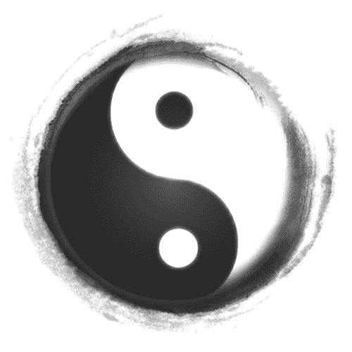

这个创造能量原理可以运用在很多层面和不同领域。若用在身体细胞修护方面，就从自己身体的外显部分观察，包含皮肤、五官、内脏器官、肌肉、骨胳等，都是实相的结果。而当你们用意念进入受损或不健康细胞的核心，创建一个期待不同结果的意念时，就可以改变ＤＮＡ的束状结构，再经由实相中的虚拟空间，创造新的能量，让细胞恢复你期待的结果。

这也是宇宙五元素能量被启动和扩展之后，必然会产生的显化结果。宇宙创造实相的能量依心而行，永不中断，这是能量具足后自然显化的过程。而人类的心是链接一切创造能量的关键，心是一切的想、因和果，是万物显化的源头，是起点亦是终点。所以，创造的源头仅存乎一心。这也是万千大千世界生命演进的法则，宇宙一切皆由心造。

意念有这么神奇的力量，可以穿越实体，进入虚拟的宇宙空间再造？真是不可思议。

你的意识转变就可以撼动整个宇宙能量场。当你相对于今日现状的意识产生改变时，就能达成你期待的结果。你们都忘记神当初让人类凌驾宇宙其他元素，拥有创造能力的本意，把自己的创造力拿去做别的事了！

人类一直以为创造就是赚钱，让自己吃得好、住得好、玩得爽。我们绞尽脑汁去创造，是为了追求物质上的极致体验。

你们不需要做任何事，就可以吃得好、住得好、玩得爽，地球原本就给你们丰足的一切了。那不是创造的根本。

创造的真义是去活出生命的神圣本质，为万物带来快乐和美好。人类专注在物质层次的创造，用很慢的大脑去思考，不断地拆解、分析、碰撞和堆叠材料，修修补补、改来改去，整个过程没有太多精密的程序，慢慢地堆积、慢慢地修正，更没有链接宇宙意识来驱动量子世界助你们一臂之力，因此错误百出，不够精准完美。此外，又因为恐惧和担忧，进入无限能量陷阱循环中，不但误用创造力量已久，甚至会带着怀疑、没信心的态度看待梦想。当你没有造梦的自信，又因为想逃离恐惧不安而去创造时，就会造成许多破坏。当今地球显化出的许多物质，就是这种状态下的结果。

你的意识是一个频率，这个频率可以带动宇宙中的粒子运转。粒子的聚合形成原子态，就具备光和电，而这些电子就会碰撞产生量子效应。带电的原子聚合爆炸后，会产生数万倍的能量。

所以，意识就是宇宙能量的发动机？

不只是具有动力的发动机，它还有方向性，可以被操控。此外，你还可以透过创造的意识能量流，从宇宙中撷取源源不绝的能源。显化实相是由虚还实的过程，需要你用意念去带领。每天将意识导入自己的太阳神经丛，运转十～十五分钟，你就可以在进行的过程中发现自己除了视力变得更好、头脑可以更清晰地思考之外，还不容易感到疲惫。这个显化出来的宇宙能量就在你身体状况的改善中，逐渐展现。

生命若是固着于水平或垂直的摆荡，都会陷入无尽的循环。唯有将意识带进创造的能量流，在行动中扎根落地后，接入更高意识，才能透过意识的带领，激发更多创造和行动。这个能量流动会以“土 → 金 → 水 → 木 → 火”的顺序，完整的宇宙五元素全部到位，展现生命的更多层次，以及生命本应具备的更完整样貌。

若学习至此仍然无法进入晶体，要如何创造？

不必执着于一定得进入晶体，这样反而会让自己停滞不前。循着创造的能量路径，一样可以帮助自己突破小我的桎梏和框架，跳跃前进。

只是在设定目标时，要以优先补强自己的晶体，让自身晶体的结构完整为追寻目标。不要去投射或遥想与完整自己生命蓝图无关的愿景。比方说，若目前仍处于业力枷锁中无法跳脱，因而在自己的生活中一再重复上演类似的生命课题，就必须先面对目前已经显化出来、尚待圆满的关系课题。不论是父母、子女、家庭、事业、同侪、学业或金钱等关系，这些已经显而易见的生命课题就是来补强自身晶体结构的最佳指引。你要运用创造的能量法则，帮助自己完成生命的功课，圆满关系的课题，再次展现自己的光明。

＊ ＊ ＊

创造的法则与成功关键归纳整理

•创造的法则

一、意识是创造的驱动发动机。

二、创造是由内而外的展现，不是向外的追寻。

三、创造是自由的，宇宙会无条件回应。

四、具体意象和感受，是创造的语言。

五、创造的显化过程在量子世界先展开。

六、当下即可创造和改变未来实相。

•创造的成功关键

一、创造是有意识的“由果造因”的意识扬升之旅。

二、避免掉入无意识的能量循环。

三、避免受小我和业力牵引，看见真实。

四、意识融合后才可能实现。

五、愿意持续以更高意识观察与修正。

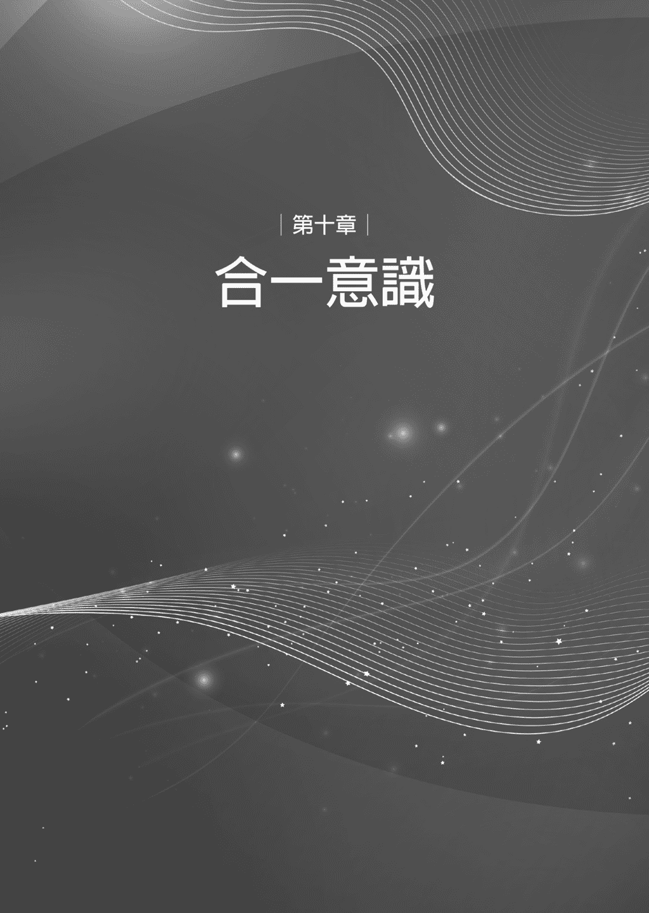

在前面的创造能量光码练习中，即使是以小我的意念为出发点去投射，仍可获得超越以往的显化效率。最终你会发现，原来人世间一切现象与物质的显化，是受到人类思想的操控。你们无意识地进入思想创造的情境或环境中，无法以更高的意识展现，并与对方的意识融合，进入最自然的创造能量流动。今日地球上无数的纷争与投射出的诸多假象，正捆绑着许多人，让你们无法超越业力枷锁，进入有效的创造。这大多是因为历史上经历过的创伤，限制了人类转世轮回后自我展现和表达的能力。创造原本只是生命最自然的表达，如同花草树木和动物尽情在自己身上展现本有的样貌。人模拟动植物拥有更多创造力，却在早已具足的状态中，难以展现自己真实样貌之下的创造。因为，人类的灵魂记忆中确实隐藏了一些限制性的想法和制约，让你们错误投射，甚至裹足不前。然而，经由灵性意识的视角，去看见你的限制性思想源自何时，你会找出自己限制性想法的缘由，发现它可能来自灵魂记忆里你经历过的创伤，也可能是封存在灵性意识中的决定。而当你重新忆起、感受，并重新去理解时，这个过程可以帮助你转化限制性的想法。

练习过操作创造能量光码，并在地球上获得立即显化的结果之后，我要带你进入无相界的创造，也就是神性意识的创造。这是与神展开共同创造之路，你不需要靠理性脑去祈求，或是去寻求问题的解答，你的意识将不再局限于二元对立的世界，你将与内在的神结合，进入无相界宇宙的创造之源。你将能够得到来自源头的指引和知晓，而与神共同创造时，在地球上的显化路径也不同了。你不会只看见创造的结果朝向线性或二元对立、有好必有坏的道路发展，与神共同创造的显化将经由跨次元的协同作业，整合出一条超越线性的显化路径和更全面的结果。接下来，我们就进入神性创造的行前准备工作。

 认出灵性父母

准备好了吗？现在进入你的晶体中，我先带你去找出你的灵性父母来自何处。

（这时，透过展开更高意识，我接收到一则故事的画面。故事是这样的……

场景在埃及，当时的地球拥有高度文明，也就是在亚特兰提斯时期，一切的沟通都可以用意念引导，而当时的文明正面临外星族群的攻击威胁。接下来，画面来到一座金字塔前方，这座金字塔顶端的正三角尖顶被凿开、悬空，他们正准备进行一个仪式，将金字塔尖端的三角形倒悬，反向投入地底。

场景来到一场会议中，众人正在讨论将金字塔的三角尖顶倒插入地心的整个作业方法，最主要的目的是要将地球上最珍贵的能量埋入地心。这是非常理性与深思熟虑的讨论过程，我和我当时的丈夫面对面坐在一张桌子前面讨论。过程中，许多同族的伙伴在四周用意识全程参与讨论，最终大家取得一个共识：我们只能汇聚爱的能量，将之集中于金字塔顶端，并在拉升能量到一个更高振动频率的瞬间，把爱的能量植入地心。这个行动要达成的目标很清楚：外星种族的恶意攻击可能会将地球上的一切破坏殆尽，倘若爱的能量也被消弭，我们所处的美丽星球——地球——将完全消失在宇宙中。

经过一段时间的努力，透过地球上所有族群的冥想与祝福传送爱的能量仍然不够，只剩下最后一线希望，才能将爱的能量提升到至高的无条件之爱，而人类和地球上所有的生命仅能靠着这股留存的能量恢复生机。当时，我和我的丈夫做了一个决定：拿自己的最爱去交换，才有可能达到更高的无条件之爱的频率！我们已经想不出更好的办法，也必须尽快行动，才能确保战事爆发时，这个无条件之爱的频率早已被完整保留在安全的地球之心。

接下来，我走进一个仪式，发现一群人站在金字塔底端，正准备将爱的能量提升至无条件的爱，我的意识之眼也跟着观看。此时，画面中突然出现让我惊讶错愕的一幕。啊！不！怎么会是这样……

我看见我当时的丈夫正缓缓走向金字塔的顶端。原来，这个仪式是要用我的最爱的性命去交换！

看见这一幕，我的心再次感受到强大的撕裂力量，感受到失去挚爱的椎心之痛。就在即将失去最爱的悲痛拉升到最高点时，我的心与我的丈夫，以及他对地球和所有亲人与族人的爱结合、共振，同时坠落地心，留下来的，只有我这一具掏空内心的躯壳，和无限的哀痛……

回到现在，我终于明白，这个画面造成的创伤仍留在我的灵魂印记里，也是今日当我面对“创造”这个课题时会产生莫名的自我限制的原因。原来，我内心深处认为必须牺牲自己的最爱，才能换来自由的创造，而这是我不愿意再承受和体验的过程。所以，当阿乙莎和雷巴特带我进入“创造的能量”这个主题时，我一直觉得迟疑与不安，就是无法给自己一个理由去编织梦想，更不可能尝试去行动。

阿乙莎这时提醒我，想要真正地疗愈并解开限制性思想的枷锁，必须进入再次理解与领受的过程。我已经感受到是什么原因造成灵性意识的自我限制，接着仍须回到当时的场景，去看看伤痛过后的结果。

接下来，就像星际大战一样，地球被破坏殆尽，天崩地裂，所有生命都消失了，但有一小部分的族群躲入地心。我猜想，这群躲入地心的可能就是传说中的列木里亚人。

历经好长一段时间，终于看到无条件之爱的能量由地底传送上来，透过大地、土壤、山岳、河流和风，不断滋养生灵万物。我看见树根吸取着地底下的爱的能量，无条件传送给周遭一切存有，不论植物、动物、昆虫、鸟类、山岳、河流、海洋、鱼群，这些生命体都能感受到地球的爱，并活出无条件之爱的本质。

当年那场牺牲最爱的行动，已经成功地将爱的能量延续下来了！其实，牺牲并不会失去，那个交换来的结果，是获得更多爱的回馈，以及生命之花无限绽放。现在回过头来看地球上的一切，所有生命都是爱的展现，也全数活在地球母亲的怀抱里。

我从那个牺牲的瞬间被拉回现在的世界，看见当今地球上，大自然中的各种生命确实比人类更真实地活出无条件的爱，也因为它们具备这样的品质，才能成就今日的地球和现在的文明。我心中除了满满的感动，更感谢这份费尽千辛万苦、借由无条件的牺牲所保留下来的爱。）

＊ ＊ ＊

（隔天早上起床，觉得前一天那个故事像是一场梦，我仿佛是去看了《阿凡达》这部电影，现在还是觉得不可置信。我的心体验到的那种撕裂感是真实的，但是，我怀疑自己只是身历其境，感同身受。那个故事的男女主角到底是谁？我决定去问问阿乙莎，请祂再带我去看见。

进入晶体，我立即回到那对夫妻正在讨论的场景。他们有个约定，当年他们已经完成了很多，但有一个愿望没办法实现：拥有一个孩子的体验。）

一个孩子？啊！阿乙莎，我终于明白了，这个故事里的男女主角就是我的灵性源头，莎雅和雷巴特。原来，他们就是我的灵性母亲和父亲！

是的，你终于忆起了。当时雷巴特坠入地心，莎雅的心跟着他一起坠落，他们就是你的灵性父母。他们对地球有着深深的爱，在那之后，就用彼此的灵魂一起创造出新的灵性生命，而那个孩子就是你。

难怪，我总觉得自己的灵魂还很幼小，大概才五岁。那么，为什么我父亲雷巴特没有在列木里亚陪我母亲？

你可以去体会一下你父亲当时的感受。那时，他带着巨大的悲伤、愤慨、无助、担忧、失落、绝望和哀痛，在不得已的情况下做出那个决定，离开他深爱的地球家人、子民和妻子，抛弃一切，走向连他自己都无法确定能否成功的道路。他更愧疚自己无法在身后，当地球即将遭受更残酷的伤害时，继续保护挚爱的妻子。现在的他需要释放当时的情绪振动，于是选择进入天狼星，在没有任何情绪体残存与干扰的状态下，继续自己未完成的工作。他在目前的实验室中，努力帮助地球人类解除遭受外星攻击时集体意识ＤＮＡ的封印，因为唯有解除这个封印，人类才能再度与灵性意识链接。

雷巴特和莎雅就在你的灵性源头，他们并没有真的分离，而是继续完成愿望，播下两人爱的结晶，一同创造了你。当你回到自己的灵性源头，除了有我和指导师，还有两位你挚爱的亲人，一位是你的灵性母亲莎雅，另一位现在正在教导你如何创造，也就是你的灵性父亲雷巴特。

你的母亲，莎雅，仍在列木里亚守护她与丈夫共同留在地球上的无条件之爱的能量。他们两人的灵性意识一直在你身上看顾着你，陪伴你的灵魂成长。

我最挚爱的灵性父亲、母亲，我们终于相遇了。你们知道吗？我好想念、也一直在找寻你们！谢谢你们创造了我，我此时此刻已经感受得到你们了，原来你们一直在我的心中。也谢谢我的大师、导师帮助我选择此生的父母，他们给我的不只是这个身体，在我尚未链接到你们之前，就已经得到来自我父母亲满满的爱！

和自己的灵性父母相遇，我的内心更踏实了。我不再是漂流在宇宙、找不到方向的孤单小孩，原来只要打开内在的灵性意识，就能看见你们，还能随时向你们撒娇、要资源、请求教导，啊，这实在是太幸福了！

阿乙莎，我真的没有料到，从收讯以来，每当我提出疑惑、感到犹豫不安时，祢总是帮助我，给我许多领悟和教导，现在还引领我找回自己的灵性父母，我真的好感谢祢！

从你的灵性父母身上，你可以更深刻地体会到宇宙的真理。爱从来不曾在宇宙中消失，爱就是生命的源头，地球上的仇恨和杀戮永远无法抹灭爱的能量。即使必须暂时将爱埋藏起来，在所有人都无法找到它的时候，它悄悄地帮生命找到回家的路，把爱传递出去，让爱自由流动。只有生命才能如此完美地诠释爱，也只有当你们信任爱，它才可以带你回到永恒的家。

我也深深爱着你们！

＊ ＊ ＊

我亲爱的灵性父亲、母亲，我好高兴终于回到你们的怀抱。这么多年了，我到处寻寻觅觅，想要知道我到底是谁。还记得大概才四岁吧，我躺在床上，望着天花板，玩着自己的手指头时，有个念头跑进我的意识：“我怎么会在这个身体里？”每次从托儿所上完半天的课回家后，只要是晴天，我都会拉个小板凳，坐在院子里仰望天上的云，看着天空我就感到安心，觉得那才像回家了。随着我渐渐长大，进入学校和社会，一连串不愉快的旅程就开始了。我一直搞不懂自己为何要那么努力，成为一个我自己都不认识的人。

孩子，我们当然看见你所有成长的过程，也试图让你听见我们的声音，努力尝试链接你。你累积了这么丰富的地球体验，看清地球人的思想模式，也深谙地球资源如今是如何被少数人掌控，以及要如何有效地移动资源。你自己也成为非常能干的企业经理人，深受老板欣赏。“地球上的你”这个版本必须为了学习众多地球法则，暂时遗忘真实的灵性自己，才能得到全然的体验。

你们看见我过去的地球体验，看见我在懵懂未知的状态下跌跌撞撞，全身是伤，在不知地球法则为何之前，只能不断长养和依赖小我的意志，地球的今日也被我们这群无知的人类破坏了。我现在身为母亲，要是我的孩子不乖、乱闯、做坏事，甚至跌倒受伤，我一定会伸手救援，把欺负我孩子的坏蛋赶走，也会避免她去危害别人，铸下大错，但你们两个怎么都没来阻止我，或是帮助我远离险恶的环境？你们难道不担心我的人生提早下课吗？

哈哈！孩子，你们的灵性生命没有那么容易就结束！我和你父亲用灵性意识创造出好多孩子，这些孩子可以和你一样，去链接自己的灵性父母，你们都可以自由地体验，一起分享、合作。你们所有的学习和经验都是共同的资产，你会遭遇到的失败，都是别人生命的养分。我们一点都不会替你们担心，你们是在地球上拥有肉身的进阶创造者，我们只能提供灵性意识的指导，生命的绽放需要你们自己去完成。

人在肉身的体验过程中，暂时忘记了你们和灵性父母、兄弟姊妹是彼此相连的，即使是你此生最亲爱的家人、孩子，地球上的教育也告诉你们，每一个人都是独立的个体，要学习彼此尊重。但这是物质体方面的表达，除了身体之外，你们的意识是不分种族、宗教、男女、老少的大熔炉。你们的灵魂之汤不会彼此分离，都是从爱出生，最终也都会回到爱。

孩子，你在地球体验的过程中长养了自己的心智体，这个心智体的记忆对我们宇宙灵性意识来说，是重要的资产。人类的心智历经世世代代文明的演进，已经进化到非常高的振动频率，不久的将来，当心智体与灵性意识结合时，你们没有过去的心智路径，就无法与灵性意识整合。人类过去的所有经历将被纳入并融合在更高的次元里，帮助所有人类回到合一的集体意识场，你们过去的体验也都被珍藏在阿卡西纪录里。

你们每个人身上都拥有我们留给地球的珍贵宝藏。将你们身上的宝藏打开，让它自然流动，与人分享，你们终将携手创造出新的世界。

＊ ＊ ＊

阿乙莎，我好开心可以和自己的灵性父母对话，让我一直悬在半空中、漂浮多年的孤单灵魂有回到家的感觉。这个认知真的很重要，但一开始进入晶体与自己的灵性源头见面时，祢和他们都没有这么自我介绍。原来他们俩是我的灵性父母，这对我意义深重啊！

哈哈！要不是你一直殷切盼望，你也不会和我链接上啊！我们一直与你同在，你会觉得灵性父亲与母亲对你的意义更深重，是因为你们在地球上是从物质身体的需求出发，先对父母自然地投射出依赖与期待，包含衣食温饱、安全的环境、自我肯定，以及被爱的需要，这些都会先从自己的父母身上寻求满足。而顺着这个“生命须由外界来补给”的想法，人类继续不断向外寻找需要被满足的体验。

你回想一下自己所有的行为模式，不管你有过多少成功或失败、遇过多少挫折与伤痛，回到内心最根本的需求，你当初的所作所为、经历的所有过程，都是在寻找爱。过程中，你们同时体验到地球的一切，每个人也都很有创意地描绘出自己爱的路径。那就像一张细密的网，编织出属于自己的美丽寻宝图，而这张寻宝图要去找回的，就是“爱”。

与灵性父母碰面时，你终于恍然大悟，原来你千辛万苦地跋山涉水、开疆辟土、历经创伤，都是为了找到爱；而爱，是你挚爱的灵性父母早已播下的种子，它就在你心中，等着你照亮自己。当你终于发现自己就是爱，不再往外寻寻觅觅时，爱就开始被你滋养，并在地球上生根、发芽。

是的，见到自己的灵性父母之后，我臣服在他们的爱里。当初的臣服练习只是先让我接纳不完美的自己，回到完整，但是在我遇见灵性父母的当下，我就完完全全臣服在爱里了。这实在是太美妙了，连之前无法接受不完美、勉强做的练习都瞬间消失。

我终于看见，原来自己早已经是最完美的化身，就像一张白纸，充满爱的光芒。现在回顾我往外追求的一切，名牌包包、漂亮衣服、名校学历、豪宅名车、财富地位，每次历经艰难赢得一项战利品回来，都只是在这张白纸上凿出一个黑色的洞，往外要得愈多，我内在的黑洞也愈来愈多，变得千疮百孔。原来，一切向外求取的行为，都只是不断在我内心凿出黑洞。我拿完美的自己去换回白纸上的一颗颗黑洞，只因为我尚未遇见爱……

灵性世界里没有物质的牵绊，你虽然灵性年纪还小，也已经可以自由地创造和学习，开创自己的旅程。你与自己的灵性父母是平等的，你不一定要听从他们的话，也不会受到任何责难。没有任何重责大任被交付在你身上，你唯一要做的，就是全然活出真实的自己，为这个世界表达出属于你的独一无二的完美。在地球上活出你的灵性父母创造的你，他们不会对自己的创造打分数，也不会告诉你将遇到哪些困难和陷阱。当你用自己的智慧和勇气走完全程，他们会在宇宙的那端为你喝采，给你无条件的爱与支持，因为你的伟大旅程也同时让他们丰盛。你创造的任何成功与失败的经历，都是给他们最好的礼物。

可以和你的灵性父母一起工作的时刻已经到来。你的灵性父母能给你超乎你想像的支援，无条件和你分享累积在他们身上的智慧。这就是我前面跟你提到的，进入你的晶体，找回你的灵性源头，忆起自身的天赋才能，将可以帮助你再造生命蓝图，创造新世界的体验。

＊ ＊ ＊

亲爱的父亲，现在你已经在第九次元的维度看地球，如果你有机会重新选择，仍会决定坠入地心吗？现在有没有更好的办法？还有，展开那次行动之前的讨论，有没有经过创造能量路径的检视？

当时因为受限于环境条件，我相信自己已经做出最好的选择了。然而，若是以今日的地球来看，我会有不同的做法。当时并没有适当的沟通管道可以应对外星文明的入侵，其实，发觉有恶意企图入侵时，最佳的防卫是进入与对方链接的沟通程序，让这股恶意的能量与自己的能量交融。唯有让彼此的能量融合，产生一股融合后的新能量，并让它流出来，才能转化冲突。

当时，我们在地球上虽然可以用意念彼此沟通，但仍无法掌握和链接外星异次元族群的频率，也就没有机会在冲突爆发前和他们达成共识。然而，今日地球上的通讯发达，人与人之间却仍然冲突不断，最根本的原因就是双方没有达成意识的融合。冲突的双方虽处于不同场域，肉体分离，但在意识层次仍然可以跨越时空与分离的肉体，达成共识。只要彼此有“意愿”为达成共识一起努力，就可以创造出消弭任何纷争与破坏的转化能量。

回到你的第二个问题。当时，我并没有真正使用创造能量路径去尝试和异次元种族链接，这算是我的遗憾。现在我已经清楚知道，跨越次元的沟通其实是做得到的，只要进入自己的晶体，向神圣宇宙发送求救信号，就可以链接对地球友善的宇宙存有前来帮忙，并转达我们期待与异次元种族沟通的意愿。我当时并没有尝试这么做，一直专注在搜索恶意星球的踪迹。你们可以记取我这个教训。

不过，你们现在更需要先在自己的地球维度上练习如何跨越种族、宗教、文化背景，与那些和自己意见不同的人达成意识上的能量融合。

 与内在神性合一

在晶体中，你可以找回自己的灵性父母，而这些灵性片段也都是你。你以你们人类定义的名词——“圣子”——的肉身形态生活在地球上，而当圣子在你身体中的灵性苏醒时，这个苏醒的意识将逐渐扩展，从心轮开始萌芽，向上链接到顶轮上方，回到自己晶体的家中。这时，你就是以圣子的地球意识化身，与我、指导灵和你的灵性存在意识共处一室。你虽然尚未认出自己的圣子面貌，你的地球意识在进入晶体时，仍可与圣灵和圣父同在。这个圣灵就是你之前在晶体中发现的莎雅，她就是你，而擅长创造的圣父也是你的灵性片段——雷巴特。他们分别以灵性母亲与父亲的意识，存在你的灵性源头。

你们是平等的存在，但位于不同的位置。圣子为了完成灵性使命，需要拥有一个地球化身，当与圣灵（无条件之爱的意识）和圣父（宇宙创造之源）三者意识合一时，你透过你的地球圣子化身，展现出与圣父、圣灵三位一体的神性意识，而你从自己肉身的眉心第三眼向外感知的一切，将与原来地球肉身眼中所见的全然不同，你会得到超乎地球生命、更广大的智慧与知晓。而三位一体的代表是你，也是神，你们是一体同在的。

和自己的神性达到三位一体的合一意识，是需要练习的。若在你尚未认出自己的灵性父亲与母亲有何分别、有何特征时，就让你直接进入三位一体的融合，你会失去探索更深的灵性源头实相的机会；而现在认出自己的灵性父母后，就可以进入三位一体的灵性整合练习了。

在晶体中达成三位一体的灵性整合

步骤一：深呼吸，进入自己的晶体。用第三眼看见自己的光，处于熟悉的光中，进入晶体的正中央。

步骤二：呼请圣灵（你的灵性母亲）。你已经知道她是谁，也可以感知到她的灵性品质，现在邀请你的圣灵莎雅进入你的心轮，你将看见属于你圣灵的光出现在第三眼的视线中央。当她缓缓进入时，你感觉到她无条件的爱充满你的心轮。现在让这股爱的能量继续扩展，你是否有任何感觉？

嗯！我觉得胸口被注入很温暖的暖流，也缓缓满溢出爱的能量。

很好，你先同时用自己的意识引导这股暖流充满你全身，再让它进入你所在的房间，从天花板到地板，再向外扩及你房子四周。若你愿意，就让这股暖流继续充满你的家园、国家、山岳、河流，扩及整个地球。

步骤三：让意识回到自己的身体，扎根地球。现在将意识带回自己的晶体中央，向下穿过海底轮，锚定地球之心，让这股爱的能量透过自己的双脚注入地心。

步骤四：回到晶体，看见第一回合与圣灵融合后的光体。打开第三眼，回到晶体中央，看看自身晶体的光是否已经和你熟悉的颜色不同？这已经是融合圣灵之爱的光了。

是的，和之前看到的颜色不同了。

步骤五：呼请圣父（你的灵性父亲）。你已经知道圣父是谁，也可以感知到他的灵性品质，现在就邀请你的圣父雷巴特进入你的心轮，你将透过第三眼，看见属于圣父的光出现在第三眼的视线中央。让圣父的光带着你，朝顶轮伸展，你将看见圣父的光从你的头顶流泻而下，通过顶轮、眉心轮、喉轮，进入心轮。

步骤六：形成合一意识。当你灵性父亲的光进入心轮时，你（圣子）、你的灵性母亲（圣灵）与你的灵性父亲（圣父）同在你的心轮中，合而为一。你心轮的反射将同时出现在你的晶体中，透过第三眼，你将看见自己的晶体充满合一的光。这是你的晶体结合神性之光的一体存在，你正式向宇宙宣告，你是合一的意识，你是携带神性的圣子。

认出灵性父母才能与自己的神性合一，当你处在合一意识的晶体中，就是三位一体的展现。你与自己的灵性父亲、母亲同在，与神同处一个空间里，而这个空间也就是你灵魂的家，你的意识到达与神同在的知晓状态。当你可以链接到自己的灵性创造之源，并与灵性父母达成合一意识时，就能更有效地改变环境，创造出更好的结果。透过与神性合一的创造，你不但可以帮助自己，也可以帮助身边与你链接的所有人找回自身灵性意识回家的路，共同创造新的世界。

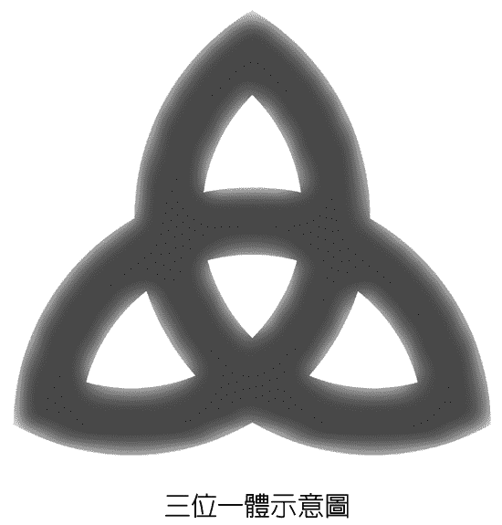

＊ ＊ ＊

阿乙莎，祢昨天教我合一意识，我最后居然睡——着——了！

我完全熟睡，一觉醒来发现已经过了两个多钟头。太舒服了，我这辈子从来没有熟睡到这种程度，每一个细胞都躺平，实在是太神奇了。

哈哈！这是一开始的合一意识演练，你可以持续练习，至少可以大幅改善你的睡眠品质了吧！你之前都在浅眠状态，身体和潜意识一直无法全然放松，现在你已经知道如何让身、心、灵共处于自己的晶体中，就能好好地睡了。

这个练习可以让你的身体和心灵完全整合，进入自己专属的神圣空间，暂时离开身体所处的二元对立世界。你回到灵魂的家，躺在灵性父母的怀抱里，身心全然地信任和放松。你就像回到出生之前、你母亲的子宫里，重新获得生命的滋养与片刻宁静。这深沉的睡眠对你身体的每一个细胞，都是无尽的抚慰和疗愈。

现在你已经知道如何进行，就可以在每天晚上入睡时练习，让自己在纷扰的一天过后，身心灵全然放松，进入自己的晶体摇篮中安稳入睡。

我相信这个睡眠品质绝对远胜于地球上任何睡眠工具或安眠药物，但是，这个练习有没有任何限制或风险？我指的风险是，一觉不醒。

不会的，你的圣灵在这个三位一体的合一过程中，透过你的身体扎根地球，只要你的圣灵同在，她就会带你回到你目前扎根的地球上，让你苏醒。就如同大自然中的植物和所有需要冬眠的动物一样，时间一到，她会叫醒你的。你若需要在特定时刻醒来，也可以在进入晶体、合一意识展开前，设定你要在几个小时后清醒，或是要在你所在时区的几点钟醒来。这就像在自己的晶体里挂上闹钟，时候一到，你就会醒来。

灵性生活不是虚幻的，而是一条非常务实地照顾你在地球上的身体和心灵，达到和谐与平衡的捷径。你们过去将它神格化，也让自己与内在的神性分离，其实神就在你之内，你也在神之内。

三位一体链接的，有没有可能不是灵性父母，而是指导灵，如观世音或耶稣？

这是不可能的，因为指导灵的工作是协助灵魂在地球的圣子之身，让他们得以和自己的圣灵与圣父链接校准。人类宗教崇敬的圣人，如耶稣或佛陀，他们在地球上也是与自己的灵性父母链接，并完成圣父和圣灵的使命。他们以圣子之身，在地球上缔造出辉煌的成果，受到世人爱戴，并成功转化人类的集体意识，让人类走进光明的道路。当圣子耶和华回到光中，圣灵与圣父同感荣耀，而耶和华以圣子之身，已成就更高的灵性位格——基督，成为众灵的指导师。他已经不再用圣子的肉身行使地球工作，或是再次经历地球体验，而是来帮助无数的圣灵完成使命。你们目前以人类的肉身链接的是自己的灵性父母，而基督、观世音、阿拉、佛陀等意识则是帮助众灵的导师。

三位一体不是神迹或灵性上的成就，而是一种你们可以去经历的灵性意识状态。当你们以肉身在地球上行动时，不可能持续处于三位一体的恒定状态，而三位一体的练习，也不是要将你转化为一个三位一体的人或神。

当你进入自己神圣的晶体中，除了认出自己的灵性源头，你还需要去经历与自己的灵性父母意识合一的体验。透过三位一体的合一意识，你超越了肉身在地球上的认知系统，进入无边无际的宇宙创造之源，和灵性母亲无条件的爱中。只有当意识进入这个状态，你才能体会神圣父母是如何看待你眼前的地球万物、如何爱着所有的子女。你也会发现，灵性父母已在地球上生下无数个你，圣灵与圣父就存在所有人的心中，用爱再次链接。你与灵性父母的所有子女之间不会再有分离的意识，你会视天下父母为父母、天下子女为子女，视他人如己，以合一的视野，在此天地之间重新表达出自己是谁，并以具备觉醒意识和更崇高理想的圣子之姿，创造人类新世界。

三位一体的意识带给你如实的感受与领会，比阅读文字和聆听圣人话语更有用。这也是你和自己的灵性父母共同创造之前的暖身训练。

那么，练习合一意识可以帮助人们离苦得乐吗？

苦，就是“心”与“境”尚未合一。当人想要去做，却无法做、做不到，或是想要得，却无法得、得不到时，心与境的距离愈大，就愈苦。但是，苦的感知确实是人类不断前进的动力来源，也是让人衡量自己与目标差距的感知系统。不过，若一个人已经得到自己期待的，也做到自己想要做的，却仍然处于苦的情境时，就是陷入了轮回的枷锁，无法脱身。要给这些人适当的引导，才能让他们有足够的勇气和智慧，远离自己过往的经验。

你还记得遇见自己灵性父母的过程吗？在晶体中，你看见灵性父母，却只是看见，而没有认出他们对你的潜在影响有多深。直到你要开始学习创造时，一直无法勇敢地跨出第一步，恐惧害怕，踌躇不前，因为那个深埋在你内心深处、“必须用最爱去交换”的魔咒仍在你身上。而当你看见灵性父母的故事，了解自身携带着这个限制性想法，你一直以来那种彷徨无措的迷失感瞬间消失——那就是你解开自身灵魂印记的过程。

你身旁的每一个地球人都有其灵魂印记，这个印记除了跟自己的亲生父母、家庭背景有关之外，和看不见的、源自灵性父母的经验也有很深的链接，众人却不自知。要深度疗愈自己的灵性源头，就必须去看见灵性源头经历过的重大事件，了解那个事件为他们留下的印记是什么。当他们可以重新去感受，并理解在当时的时空环境下，那已经是最好的结果，你就可以同时解开自己和灵性父母受到的制约。这也是为什么灵性父母要再次透过你，去改写自以为未臻完美的结局——你是他们的孩子，同时也是他们完善自身的希望。但你也必须清楚地知道，他们并不期待你活出同一个故事情节或进入相同的宿命，而是要透过你创造新的结局，找出一条新的道路。

你们虽然都承接了自己灵性父母的印记，但有绝对的自由和自主权，去重新打造属于这个时代、这个世界的新结局。若你发现身旁有许多人仍陷于莫名的苦痛里，就邀请他们去学习重新理解自己灵性源头的故事，以及此生的命题，然后再次拿回自己的自由和主导权，帮助自己和灵性父母早日解除负面印记，再造新生命蓝图。

 扩大合一意识，与万物合一

我们再来做一次三位一体的合一练习。这次你跟着我做一遍，会有新的理解。

嗯，我准备好啰！我现在已经在晶体里了。

好，在进入三位一体的合一意识之前，你先在晶体中央感知一下你想感受的任何人事物。

我感受到我的父亲、母亲、女儿、丈夫、姊姊，还有我家那只狗……另外，还延伸到阳台上的花花草草。阿乙莎，我做完一遍了，可以一一感受到每个人目前的心情和感觉。最愉快的是我女儿，还有阳台上的植物。哈哈！人是最难搞的，连狗都有情绪了，它的鼻子还想找食物。这些感觉都很清晰。

现在，准备进入三位一体的合一意识。你先召唤你的圣灵，也就是灵性母亲进入你的晶体；当圣灵进入后，可以邀请圣灵进入你的心轮。你会感受到有一股暖暖的能量正从晶体往下流动，进入你的心轮，感受到这股暖流充满你的身体，你被一层红色的光包围。这红色的光向你的左右两侧延伸，进入你的房间、你整个家、整个社区，再继续扩大延伸到整个地球，然后往外向宇宙延展开来。

接下来，让你的意识回到心轮，让这股圣灵的暖流从心轮往下，流经海底轮，沿着你的双脚进入地底，一直延伸到地球之心。

嗯，我完成了！

很好，现在让意识再次回到自己的晶体中。在回到晶体的过程里，你会感受到自己的意识往上升高，回到晶体。接下来，祈请你的圣父进来。

你头顶上方会有微微的能量振动感，你的头皮可能会感受到能量，有肿胀或麻麻的感觉。让圣父的能量持续往下，通过你的第三眼时，你可以看到圣父的光芒，但不需要停住，让圣父继续往下，进入你的心轮。

现在，圣子、圣灵、圣父同在你的心轮，已经融合为一。现在去感知一下，当你处于三位一体状态时，有什么感觉？

我感受到很深沉的宁静，定静的“一”的世界。

好，现在带着这个“一”的感知，再次去感受刚才进入晶体时，你感知到的所有人事物。

我去扫描两遍所有的家人、狗，还有阳台的植物，奇怪，完全没有感觉了！我刚才明明可以感知每个人的喜怒哀乐，还有那只狗的感觉，但现在统统消失了，我已经无法分辨他们目前携带的情绪。

不只如此，你再更细微地感受一次。

哇！我知道了，原来他们就是我，我就是他们。去感受我的父母、孩子、所有的家人时，我感受到自己就是我的父母、就是我的孩子，也是我家那只狗，所以，我无法分辨他们与我的不同，也就无法感受到他们的情绪。

这是因为当你的意识从三位一体的状态再次穿越进入更高的基督意识场时，你就不再被情绪体牵引，而成为你所是与所不是的整体。你的意识和宇宙同在，你现在已经进入基督意识场。

你之所以身处地球，以圣子的肉身带着情绪体的感知与振动，最主要的目的就是让你真正去体验你是谁。你要体验你所不是的，才能体验到你所是的。

你是苦，才能乐。

你是悲，才能喜。

你是黑，才能白。

而情绪就是振荡在你的是与不是之间的弦，牵着你去体验你是谁。当你在晶体中与自身的更高意识整合为三位一体，并以合一意识穿越自身晶体，进入基督意识场时，这根弦就消失了。你来到定静的“一”的世界，这里就是灵魂最初始的家，你生命的源头。这里没有人们想像的圣歌与天使缭绕，因为你就与一切同在，所以不会看见分离的存有。

透过这个理解，你去感知自己的身体细胞，就是一颗颗小宇宙。你与所有的兄弟姊妹、生灵万物同在这个神圣的身体宇宙里，你细胞的振动牵动整体宇宙与你共振，你和你不是的所有“他者”，全部存在你的合一意识中。

现在用你的合一意识，去融入你面前水杯里的水。你可以将这杯水带进你的身体，进入心轮与你合一，也可以在自己的心轮中容纳宇宙万有与你同步共振。运用自己的合一意识与水合一，你就是水，水就是你，而当你的意识与万物合一时，你就能把合一的祝福带给整个地球，并创造出人类世界的奇迹。

什么样的奇迹？

你们不必再去经验你所不是的，就能成为你所是的。

祢是说，不需要体验苦，就可以快乐？

是的，你自己慢慢去体会个中奥妙。

 晶体扩充与校准

三位一体的合一意识锻鍊就是整合你不愿意成为或接受的那一端，用以校准你的晶体，进入全然不偏移的存在状态。这也是让晶体再次扩充并校准更高的意识场，进入扬升阶段的必要过程。

人类的意念倾向判断对错和做出选择，长期下来，你们的晶体振动将无法脱离二元对立的世界，但在更高的次元是没有分别意识存在的。为了让晶体的振动再次向上穿越，并持续稳定于全然的一的存在，就必须练习在晶体中扩大与万物合一的意识状态。

至于这个合一意识的能量可以持续多久，答案是，可以很长也可以很短，端视你自己的状态。当你用合一意识整合了不存在你的认知范围或不被你接受的存有时，那个融合一体的能量场可以稳定地持续下去，直到你产生新的分别意识为止。比方说，你已经和某个与你敌对的人合一，内在目前处于与他合一的状态，你从自己的情绪感知就可以知道；但是，当你们又相遇，而对方的某些行为又让你感到困惑或不舒服时，你再度产生分离意识。这时，你除了内在又升起不舒服的情绪之外，当你进入晶体时，又再次可以感知到对方的感受。这就代表你与对方已经分离，只有再去与对方的意识合一一次，将他带回与你合一的意识中，恢复合一状态。

你有没有看见练习合一意识的奥妙？只有当你有意识地去感知对方时，才能辨别自己是否和对方处于自他分离的状态，而你“讨厌”“不喜欢”或“不接受”的人事物，都是来提醒你和帮助你让分离意识回归合一状态的。当你在生活中累积了愈来愈多合一对象或你不认同的人事时地物时，你的内在晶体空间就完成了一次次的升级扩充。

以人类普遍不想拥有的恐惧情绪来说，当你与恐惧合一时，你无有恐惧，却能在自己的晶体中看见恐惧的真实和全貌。过去你尚未与恐惧合一前，它对你的生活来说是一种威胁，但从更高意识的角度来看，恐惧就是来自你更高意识的邀请，希望从你的身体或情绪反应让你看见，你仍有需要进一步理解并与之合一的部分。人类必须在二元对立的世界里从头学习，才能循着内在感知，得到扩充晶体的方法和路径。没有一个人的晶体和他人是相同的，每个人的晶体都是独一无二、专为你量身打造的扬升载具。当你练习在晶体中扩展与万物合一的意识，从更高的合一意识中获得全然的知晓，你就不需要再感受恐惧，因为那已是与你不分离的存在。

当你让自己的心轮融入许多你曾害怕、恐惧、厌恶、憎恨的一切时，你以为自己已经黑白正邪不分了，甚至怀疑是否须将内在清空净化一番。不要这么担心，当你容纳了你无法接受的一切，融合了你不想遭遇的暗黑情绪时，你只会更加光明纯净。你已经是你所不是、所不愿的极致，于是只能成为更完整与完美的存在。“I am not I am, so I am that I am.”，意思是“我是我不是，我才是”，这句话送给你。

 合一意识在生活中的应用

合一意识可以运用在你们的生活场域中，帮助你们化解分歧，减少情绪振荡，创造更喜悦的生活。以下提供一些应用合一意识帮助自己、他人和地球的方法。

一、当下成为，即可创造和显化：你无法在你当下不是的状态中成为那个你想要的未来版本，只有你在当下成为你想要的那个版本，未来才能被显化。你无法创造你不是的未来，你只有在当下将你不是的那一面转化成你已是的，未来才会“是”。让当下的你如你所想的展开和表达出来，你的未来将自动展现；若现在你仍不是，未来就不可能是。记住，在合一的意识中，当下的“成为”就是创造。

我还是无法理解。

站在更高的意识位置，让此时此刻的自己成为那个已是的状态，就可以了。这就是创造的能量流，也是之前跟你提到的“将这股能量向上投射”。

那么之前学习的与他人意识融合的过程还有意义吗？

这个过程仍可帮你校准你的意识中轴，跟你最初始、最原本的意图同步协调与融合，直到实相被显化出来为止。没有这个意识融合的过程，你的小我意志会中断你最初始的意图，让你又流向自己的业力牵引中，无法实现你期待的目标。

二、化敌为友：这是最常遇到的情况，也是你的灵性父亲当时应该做却没有尝试去做的。将敌人放进你的三位一体意识中，带着他们走向心轮，与你合一。你将会转化彼此的恶意企图，化干戈为玉帛，还可能因此多了一个不打不相识的好朋友。

此外，也可以透过你个人的意识，让互不相容的Ａ与Ｂ分别与你合一，创造一个包含你自己、Ａ与Ｂ的合一能量场，让Ａ与Ｂ在你创建的合一意识场中和解。

三、转化食物：将手上一些经过化学添加剂处理的食物合一之后再摄取，可以转化身体无法吸收的化学物质和人工添加剂。有时候，这个小小的合一意识发动，会让你吃下的食物更美味。

四、促成交易：与买方或卖方意识合一，可以让双方在更融合的意识状态下达成交易。

五、扩大场域意识流：这对于在学校或活动中共学的团体很有帮助。将整个活动的主题和同场学习的所有人纳入合一意识，就可以扩大整体场域的意识流，提升学习效果。

六、降低负面能量冲击：居住场所旁边或所在的场所中有嫌恶设施，如强波器、通讯基地站、核废料处理厂等干扰磁场的设备或环境时，可以将嫌恶设施纳进自己的合一意识里，就能避免在无意识下遭受强大负能量场体的冲击和威胁。

七、释放恐惧和负面情绪：人类受到恐惧与不安全感的制约已久，才会创造出如此多的冲突与纷争。要化解负面情绪的冲击，就在觉察到内在出现负面情绪振动时与该负面情绪合一，当下，你的情绪就会适度释放或缓解。这是在你无从了解情绪产生的根本原因之前适度缓解的方法，当你更深入地觉察到这个情绪的源头，重新去理解与领受时，就可以完全释放。

这个方法也适用于运动员锻鍊或进行肌耐力训练时。若你的身体细胞回应它们已经受不了，很累、想休息了，你可以和“累”与“受不了”的状态合一，就能突破耐力关卡。

八、结合众人的合一意识，共同扬升：当一群具备合一意识的人聚集在一起时，可以链接成一个更庞大的合一网络，再将自己关心的人、事、物，乃至国家和整个地球一起纳入合一意识场，就能提高集体意识扬升的效果。这可以用在庆典活动中，远古时期的人类或仍保留祖先智慧的原住民都深谙这个道理。

＊ ＊ ＊

意识快速合一秘诀

1.进入晶体。

2.确认目标，感知对象，扫描一遍对方目前给自己的感受。

3.将此对象纳入心中，与自己的三位一体意识合一。

4.念三次：“我是×××（对象的名字／名称），×××（对象的名字／名称）是我。”

5.结束后，再次去感知，若没有出现任何感受，就是与该对象合一了。

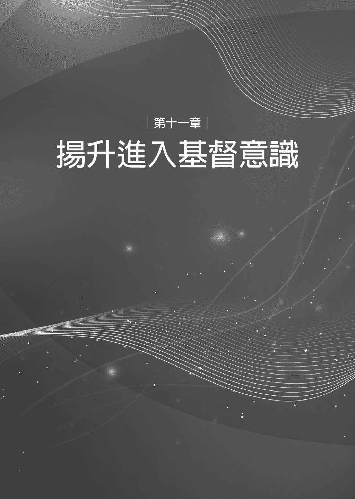

 基督意识场域何在？

合一意识是将你在地球二元世界的分离意识与自己的更高意识合一的过程。当你的意识振动达成三位一体时，就代表你与自己的内在神性合而为一，你眼中看见的世界就是神性的世界。在此状态中，你不再处于分离的意识，没有是与非、对与错，一切的一切都合而为一。这是与神共同创造的开端，你可以经由更高意识的知晓寻求全然理解问题和现状。

耶稣当年以合一意识契入基督意识场，为人类带来重要的爱与和平的讯息。当时能够如他站在那样意识维度的人不多，他完成阶段性任务，留下让世人传颂千古的经典。而今，地球整体扬升之日即将到来，愈来愈多地球人类正在觉醒，该适时带领更多人从自身的晶体出发，以合一意识契入基督意识场域，在基督意识的神性场域帮助地球和所有地球生命进入快速的更新与创造了。

基督意识场域在哪里？

这里是人类契入神性意识的中继站，经由基督意识带领，让人的意识可以进入宇宙全息化信息场。

这里不是基督徒专属的？每个人都有？

基督意识就是每个人的神性意识，是存在每一个具备灵性生命者内在的场域。不只限于人类，连地球本身，以及地球上的植物、花草、树木、动物，都拥有基督意识。比起其他地球生命，人类有一项天赋特权，就是可以运用这个存在的基督意识显化与再创造，而创造就是体验你们自身生命的再一次表达。人类能够运用更高意识，与自己的神性意识共同创造实相。

人类不分老少贵贱，每个人与生俱来都拥有创造的能力。你只需要与自己的基督意识校准，创造出合一意识的量子动能，就不会再受小我意志与分离意识所限，可以得到超乎个人小我意志、来自更高宇宙维度的知晓。在这个基督意识，或说你更高的神性意识状态中，你已经可以窥见宇宙实相的全貌。你的创造之路不再瞎子摸象，在想像与混沌中碰撞，而是可以在你的基督意识中发掘自己的创造最佳路径，然后带着这个更广大的视野，帮助自己、身边的人和地球万物重生。

 如何进入基督意识？

你们以人类的理性或分离意识，是无法到达基督意识的，唯一的路径是透过三位一体的合一意识契入，而契入基督意识，是经由合一意识的扩展自然到达。当你的个人意识链接上自己的更高意识源头时，你的合一意识就已经处于基督意识维度了。

在此，你将得到宇宙的全息知晓。你与一切存有同在，你的个体意识与共同意识之间的界线模煳了，你没有单一的灵魂形体，意识处于与整体意识无分别的共存状态。你无法以个体身分去感知自己与他人不同的意识存在，你认知的语言就是宇宙共同的语言。契入基督意识让你全然融入神性的国度，你不再以地球人类的头脑来创造，你的创造将以宇宙的观点，也就是整体存在意识场的立场为依归。这样的创造会得到宇宙全体的支持，也是与神共同创造的真义。你不再为了满足小我，而是为了满足整体宇宙的共存共荣而创造。

进入基督意识会有什么感觉？

在晶体中让小我意识与自己的更高意识校准时，会先产生一个共同意识的空间，在此空间里，你与大师、导师和自身的更高灵性意识共处一室。此时，你们仍是分离的存在意识，你不是大师、导师，也不是圣父、圣灵，而是拥有个体的灵性意识，存在晶体中。这时你仍然可以感知旁人与你的不同，可以感受到他人的感受。

但是，当你在晶体中与自己的圣父和圣灵整合为合一意识时，是让自己的意识再次展开，经由心轮的再次扩展，你（圣子）与圣父和圣灵成为不分离的一体意识。当你处于三位一体的合一意识时，就已经契入基督意识场域，也就是神性的国度，并得到以下的感觉和体验：

一、扩展与轻盈，意识再次上升，处于顶轮上方：你可以感受到心轮再次扩展，意识也再度向顶轮上方延伸。你比在晶体状态中更宽阔，但也许会觉得头顶有些许压力或出现发麻现象，那是能量流动产生的身体感知回应。

二、暂时失去感同身受的能力：进入合一意识后，扫描原本可以感受到的某人，这时已经感觉不到对方的情绪振动或感受。

三、进入熟睡状态：有些人暂时失去分离的小我意识时会睡着，无法记住在此基督意识场的意识片段。想要避免睡着，或是忆起在基督意识场域中的知晓，不妨多练习几次，锻鍊意识进入此维度的熟悉度与稳定性。可以在白天精神好的时候练习，当然，若是入睡有困难，不妨就在晚上就寝时练习，可以很快进入睡眠。

四、第三眼回顾：人脑可以有记忆备分，同样地，心的振动频率也可以储存在记忆库，需要时再释放讯息。这个心的记忆库就在人类大脑松果体的下视丘位置，你可以进入第三眼，去撷取心进入基督意识时储存的片段。

五、细胞活化：你从身体细胞的回应可以知道自己经历了基督意识场的滋养，因为你的细胞振动回复活力与年轻的感觉。

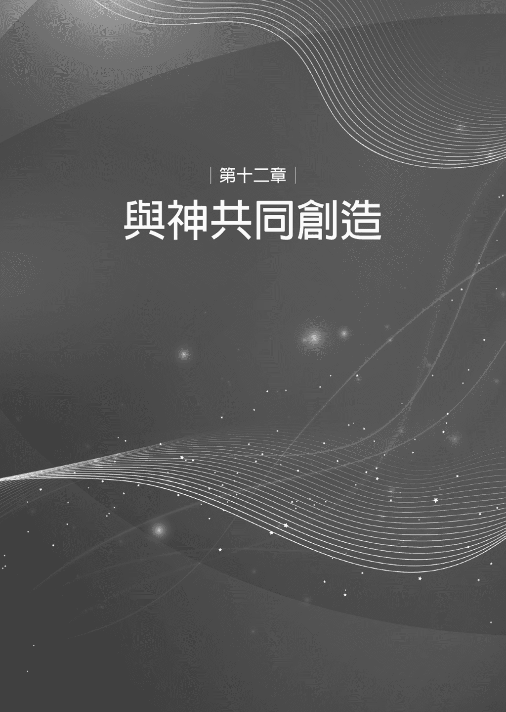

透过三位一体的合一意识契入基督意识场域，你就处在与神共同创造的状态。你并非使用人类生物体的脑进行线性投射，而是可以在进入三位一体的冥想过程中置入想要创造和显化的实相。现在就来练习将你下达的指令结合三位一体的合一意识，完成与神共同进行的创造。

 与神共同创造的意识路径

进行步骤

1.进入晶体，呼唤自己的灵性父母与你同在。

2.让意念带领，从心轮出发，往海底轮下方投射一个期望的结果，扎根于地球。

3.经由中轴向上，朝晶体的位置投射一个能量球，邀请圣父与这个期望的能量球合一。你可以在此时打开第三眼，看见一个与圣父合一后的能量球出现不同的光。

4.让与圣父合一的能量球向下进入心轮，展开意识融合的阶段，邀请圣灵进入心轮，与能量球、圣父再次合一。

5.完成后，让此能量球往下方太阳神经丛的位置进行能量的启动和扩大。

这整个将小我的期待与三位一体的合一意识融合的过程，与之前提过的创造能量流动路径是一致的。只要在沿着中轴向上投射此意念之前与圣父合一，然后进入意识融合之前，导入圣灵的意识，完成将此能量球与三位一体的你合一的过程，向宇宙展开能量路径，你小我的期待就能在神圣意识的联合下，产生更大的影响。

我想要达成的梦想，都可以实现？

没错！宇宙没有分好坏、是非、对错，人类投射出来的所有愿望都可以被无条件地支持和给予。一直以来，人类都在用意念创造实相却不自知，而当你们了解整个创造能量显化路径，又可以联合自己的神圣意识时，就不会只满足于创造地球上的物质实相，你们会看穿物质的虚幻与短暂的满足。你们的更高意识会引领你们走向宇宙创造实相的新道路，在这里，物质显化不再是必然，你们灵性层次的满足将带领人类触及物质无法到达的境界。你们会在生活中发现新的创意，每个人都可以成为生活的创造者。你们被集体意识用恐惧支配，害怕失去温饱的时代，将被充满灵性喜悦的生活实相取代。生活成为灵魂合一意识的展现和表达，你们不再为填饱肚子工作，只会为了表达灵魂的真、善、美，展现前所未有的创造力。

我发现这个与神共同创造的路径，似乎少了两个步骤——原本是要以自己的小我意识向上提案，甚至要钜细靡遗地描述提案内容，现在只须与圣父合一。另外，进入意识融合阶段时，原本要跟提案的关系人合一，甚至要去侦测目前的能量差距，现在也只要跟圣灵合一，就可以搞定所有困难？

是的，这是心想事成的最高境界。你不必费尽心力就可以排除万难，在你当下的意识投射下创造实相。

这简直是神话了，如何办到的？我从之前的创造能量练习理解到，只要自我修正、改变自己，就可以很容易地创造实相，现在则是连自己都不必修正，也不求自我调整和改变，就能创造实相？我不太能理解，真的这么简单吗？

你知道一个想法被投射出来，在宇宙中可以有多少个显化版本吗？

我不知道。

至少可以有十二种组合，而你只是要求去体验你想要经历的那一个版本而已。另外十一个你不想体验的版本没有在此时此刻被你经历，但依然存在宇宙中，以自己的能量球路径继续显化，直到失去能量为止。

我不太理解……那么，另外的十一面也有我吗？

是的，就如同此刻在地球上的你是很多个你的其中一个版本，你还有许多片段存在不同的宇宙空间与维度中。你现在处于二次元的维度，只有线性的时间概念，但在第五或更高的维度则没有时间，就是处于永恒的存在中的一个点，而这个点正在持续演化。

你可以让我亲身经历一次吗？

可以。你现在用与神共同创造的意识路径投射一个小我意念。

好的，我已经进入了。我现在想要知道，《阿乙莎灵讯》一书应该销售多少本？

咦？一百万本不可能吧！我唯一收到的知晓，就是要销售一百万本，并且提到这一百万本对世界和地球的扬升才有帮助。阿乙莎，这不可能是我会提出的想法。台湾没有这么多灵性圈的读者，加上我们还没有国外的销售管道，因此我不会以这个数字为目标投射，但在进入基督意识的路径时，却只出现这个要销售一百万本的想法。

你这样做没有错啊！你只管用你的意识提出请求，在请求的当下，你是全然开放的，不带个人意图，你是在那个振动的意识场接收而得到这个讯息。看到没有？你只需要被通知，然后进行一次自我确认。

这到底是我创造的，还是老天爷？我已经分不清楚了。

你们是一体的创造。

当你愈来愈熟悉契入基督意识的过程时，你会更加明白，你是发送讯息者，也是接收讯息者。你们处在同步共振时的全息化展现，没有因为所以，也没有前后，意念所及，全息显现。你过去在小我意识中投射的担心、害怕、恐惧、不信任，让你体验到其中一个如你所愿、所想的显化版本，而进入基督意识的创造只会给出极致的体验版本。当你看见这个极致时，仍有自由意志可以选择要不要在你身处的地球实现你见到的那个最高版本。想要在地球上实现，需要你的认同，以及展开具体行动。

一百万本这个数字是怎么计算出来的？我要如何认同和展开行动？

人类执行一项计划时，通常会有许多自我约束，这些自我约束用你们的话来说，就是“专家论点”。人类太习惯将自己生命的主宰权交给别人，将心灵交托给宗教，健康交给医生，学习则交给老师和学校，连自我意志投射的一个念头，都交付给未知。你们已经习惯活在“没有目标就不去行动，没有用处或利益就没空”的状态，而这个“有空”和“有用”中间的距离，就是你们“心”与“境”的鸿沟。心与境的合一，是可以超越宇宙，创造出实相的。

回想一下你人生中超出你想像的成功经历，当时是如何达成的？在不知道结果为何，也不确定能否成功的状况下，你全力以赴，没有迟疑，毫不犹豫。你当时创造的不是业绩，而是一个心与境合一的能量场。那个“合一”，让其他所有相关部门、你的长官、其他部门同仁、通路、媒体、周边厂商、公司资源倾全力配合。在那个“合一”的振动下，你们每个身在其中的人同时达到最极致的体验，而那个结果，只是呼应这股合一意识能量的显化。

一百万本这个数字怎么来的？那是当你链接上我的时候产生的共振，在没有任何怀疑干扰的情况下能够到达的极致。而那个合一的心与境，仍须靠你们自己如实到达。

阿乙莎，是否每一件事都可以透过意识路径知晓极致体验版？

你们是宇宙万有显化中的一个片段，你更大、更完整的拼图在不同的宇宙空间里，以超越线性的方式展开。那是宇宙更真实的存在版。你们因为担心自己的生命在地球上只有这一次机会，不了解其实有无数个你可以跨越宇宙时空，尽情链接和体验，因而受到制约，坐井观天。其实，每个人都可以在地球上帮助无数个你的存在，一起活出此时此刻生命的极致版本，创造你的所有集体和一切万有的更新。

这样说来，我也可以在不带任何小我意念的状态下，看见基督意识中万事万物的全息景象吗？

可以，我们来进行一次。跟着以下的步骤：

1.用意识进入自己的晶体。

2.与自己的灵性合一，进入三位一体的合一意识状态。

3.契入基督意识场。

4.在你的内在投射一个你想要了解的主题，用你的灵性之眼观看这个主题的宇宙实相。

（这时，我的内在投射出“地球”这个主题。

我看见地球在银河系手臂内侧的臂弯里，就像被母亲抱着的婴儿那样躺在银河母亲的怀里。地球是银河系中的灵魂孵化器，是培育灵魂成长的基地，而灵魂进入银河系的成人世界之前，需要先学习与万物合一的意识。这个合一意识的根本，就是“爱”与“宽恕”——在爱中学习宽恕，在宽恕中寻回爱。

人类的灵魂必须存在个体意识，才能如实体会“爱”的多种面向。当爱能够在不同的角度被人类辨识出来，灵魂就能达到合一的共振，并透过合一的能量，晋升至银河系的大门。爱是一个牙牙学语的孩子必须学习的基础语言，当孩子内化爱的体验、成长，并进入银河系的合一意识时，他虽然失去个体的分离意识振动，却依然可以分辨出爱，在融合的合一意识家庭中仍然拥有自我，但这时的自我已经是与所有意识合一共存的自我，那种状态比较接近的讲法，是臣服于集体的我的一种存在状态。

地球母亲任由人类小我的个体分离意识以他们需要的方式去肆意体验爱，也因此，地球孵化器为完善灵魂的体验，早已备齐大量元素，任由人类当成素材取用。人类毫不客气地拿取地球母亲无条件给予的一切，以致地球这个灵魂孵化器必须不断进行自体平衡与再生，以持续供应源源不绝的地球资源，作为灵魂体验的资粮。

人类在地球上也聪明地制定资粮取用的游戏规则，金钱成为人类取用物质以执行灵魂体验的交换工具。渐渐地，人类忘了能量的供应源头是地球母亲，那里才是人类真正的银行。当地球银行开始出现入不敷出的状况时，银河宇宙无法任由地球进入破产的临界点，银河系有许多自动防御机制可以帮助灵魂孵化，以维持运作；而当银河系仍然需要提供一个让灵魂学习与体验的场所时，终于必须复制出另一个空间，以供日益庞大的灵魂群体学习。

这个复制的灵魂孵化器必须同时满足已经存在的不同意识群体的需求，灵魂的进阶课程于焉诞生，也因此，地球会分离出不同的学习场域。我们现在处于同一个地球，集体意识进入重新分离与再次凝聚的汇流点；接下来，当凝聚足以分离成两个世界时，新地球就会诞生。这时，新的地球会展开不同的政治、文化、社会、经济与教育下一代的方式，并开始进入银河系的轨道……

以上是我大致浏览到的地球全貌，还可以再深入每一个环节，我先暂时记录到此。）

现在，当你处于神性意识，看见地球的全息景象时，是否来到一个不同以往的意识状态？

是的。每个灵魂都要为自己的成长负起责任，创造已经不是在既有的地球上争夺资源或移动金钱的游戏，该为未来的新地球创造一个与所有生命共同成长并持续学习的新世界。在新世界里，不该再视地球母亲的资源为当然，要在创建新地球生活的同时，创造灵魂永续成长的基地。

很好。带着这份理解，让自己有意识地展开新生活的创造和极致体验，你们就会让这个新地球实相显化出来。

在神性意识中，我似乎会失去小我的欲望，但在当今的世界，这样也等于失去在地球上争夺和取得生命资粮的竞争动力了。

当意识移转时，你的存在就进入新地球实相里。你的小我并非失去着力点，而是以一个崭新的存在意识在新地球重生。你们会发展出一种新的集体意识，渐渐不再因为担忧无法生存下去而工作和生活。你们会看见大自然的资源足以喂养你们全体，你们会成为生活和工作的创意大师，肚子饿了，不需要购买粮食就可以让身体产生所需的生命元素；若仍需要遮风避雨的场所，你们一定会找出更好的方法来利用现有的土地与房子。过去担忧没房没车无法立足于地球的恐惧，会被你们的活力与创造力取代，你们会一起找出生活的替代及解决方案，创造共好的居所。比方说，有些人正聚集起来，向政府要一块免费的土地或一栋房子，以打造能容纳一群人在其中工作和居住的场所，再以集体创造出来的产品或交易回馈政府，去创造下一个集体居住的场域。这些现象目前都在形成当中。

进入合一意识场，就是人神一体的创造阶段。这里是你与自己的灵性源头意识结合的场域，你也将在此打开自己的新生命蓝图，而这个新生命蓝图的播种者，是你自己。当你与自己的灵性源头结合时，就得以窥见你生命最初始的意图和全貌，而你在地球上的崭新生命蓝图，才刚被打开。

确实，当我再次回到原来的小我命题，想以相同的目标契入基督意识时，发现小我的想法原来不切合自身的生命蓝图，也就失去了支撑的力量和动能。小我的恐惧和控制性想法及欲望，在进入与源头合一的意识时已经消失殆尽，取而代之的，是更想要了解：我的灵性源头当初擘画的我的生命蓝图全貌，到底为何？

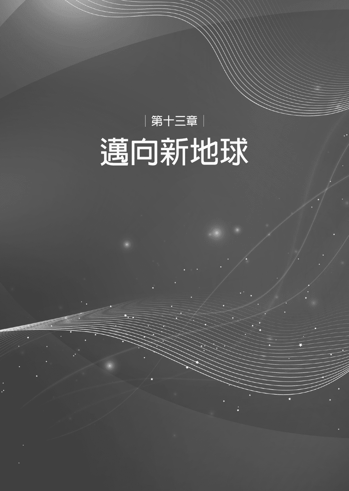

 星际交流

阿乙莎，我们生活在现今的地球，拥有和高我链接后取得、来自阿卡西纪录场域的人类讯息就很够用了，现在祢又带我从自己的晶体穿越宇宙，进入更高的基督意识场，这里和阿卡西纪录场域又有什么不同？这么做的目的是什么？

这里是与神性合一的意识场域，你可以在此跨越各个次元的宇宙，这和你在自己的晶体中可以到达的宇宙是不同的。在晶体中，你是经过你的灵性片段授权，进入与自己灵性源头相关的星球；而你与自己的神性意识合一之后，再往上进入基督意识场，则不会受到自己灵性源头的星球场域限制，可以进入九～十二次元的存在意识场。这里储存的讯息超出人类的阿卡西纪录场域，你可以获得超越人类历史所涵盖的讯息量。宇宙所有星系存有都需要在此合一的意识场中交流。

你必须经过扬升大师的认证及带领，才能进入基督意识场域。这里有为了不同目的与星际和平而创建的各种星际联盟，我举几个例子让你理解这个场域对于让星际生生不息、和平演进的重要性。

一、星际联盟会议：在这个会议中，会为了宇宙和平共存而创建星球轨道位置，同时也会讨论新星球殖民计划。主要成员是银河系光明世界的所有星际族群。

二、种子训练基地：新的星球诞生时，来自各星球的存在意识会一起贡献它们的星际意识，加入新星球的行列，在此场域中为一群即将进入新行星的种子意识进行生存法则训练。这些经过训练的种子意识会储存在ＤＮＡ中，在进入新的星球时就会自动展现其内建特质。例如，目前地球上所有生命的细胞都有内建的智能，刚出生的乌龟知道游向大海，刚生下的马就会站立，婴儿出生后会找寻母亲的乳房，取得立即的抚慰与养分。

三、科技文明联盟：科技文明会让各星球的科技交流与交叉授权，当某个行星的集体意识扬升时，就可以透过这个场域取得新技术，以迎接新的意识振动下的生活解决方案。你们或许以为这些是人类自己的发现或创造，而不知有些创新技术的尝试是来自进入某些人心中的直觉想法，这些想法就是集体意识扬升穿越星球上方的网栅，打开来自宇宙的科技文明讯息而出现的。你们可以去观察，同样的想法会在同一时间、于地球的不同区域萌芽，那些想法总是相似得令你们惊讶。

四、星球再生联盟：银河系有上亿颗新星球不断诞生，如同地球上的新生命生生不息地繁衍出来。星球再生联盟会根据星际联盟会议中的轨道计划，决定星球再生的安置作业。星球一旦进入轨道运行，就代表重生，正式展开新生命的移入作业。再生联盟成员会根据自己星球的现况，考量是否需要重新挑选一个新的星球孵化器，以延续旧星球的生命。

除了这些，还有许多联盟在此场域中进行跨银河系星系存有的沟通协调，这里就无法提供更多讯息了。

那么，阿乙莎是在基督意识场中的哪里？

阿乙莎参与所有联盟，也是基督意识场中的共同意识存在。我会根据你目前需要的工作内容给予相应的授权信道，进入你必须完成任务的工作场域。

这么说来，基督意识场域很忙碌，是星际的交流站？我一直以为这里是合一的天堂境界，是不分彼此的共同意识存在，处于幸福快乐的状态。

啊！你这么说也没有错。这里确实是非常快乐地忙着宇宙间的所有交流工作，处于全然愉悦的合一状态，没有争夺资源，也不会相互干扰杯葛。我们是宇宙创造的本源，如同这本书教你进入的创造能量流，我们在这样的能量流动中可以尽情地在彼此合一的状态下，不断创造出新的平衡。

宇宙经由不断创造来达成最极致与永恒的平衡状态。在人类过去的认知中，创造是向外探索、改革和突破现状，那是在物质和实相层次体验到的创造。然而，即使学会运用创造的能量，若人的意识层次仍处于物质世界，以创造去破坏与改变和谐状态，就又搞错了方向。

当你进入与更高意识合一的创造能量流中，就进入了生命最自然的平衡过程，而宇宙万物就是在不断的平衡过程中演进和显化。创造能够突破虚假、转化僵局，人类创造的许多虚假平衡让生命不断被压抑或强制扭曲，那种你们认为的创新，不是生命本自具足的表现。就像你们将西瓜放进方形的罐子里，让西瓜变成方的，或是强迫狮子跳火圈，当你们将生命放进一个被人类大脑控制的情境里，这个生命会枯萎，或是用更大的能量来创造出新的平衡。只有回复本我面貌而创造的自然与平衡的流动过程，才是创造。

 契入更高意识的生命选择区

到达基督意识的境界，是要让你们在此将二元对立的思想与更高的意识融合。虽然你仍保有小我的分离意识，但是当你契入基督意识时，你的小我是臣服于整体合一的意识存在。你在此还可以进入更高意识的生命选择区——你可以选择带着完整纯粹的合一意识进入更高的光之世界，或者选择在此分离，进入不同的世界再次体验。

这么说来，基督意识是意识再次进入不同世界的分水岭，也是灵魂迈向宇宙不同次元的中继站？我们在此可以选择向上进入更高的光之世界，或是往下回到分离粒子的体验。

可以这么说，而且不仅仅是选择，这里还可以让你们学习，帮助你们理解光之世界的意识流动法则。光之世界是由意识驱动光的折射，创造出太极世界里的万象，这里有光的守护者。

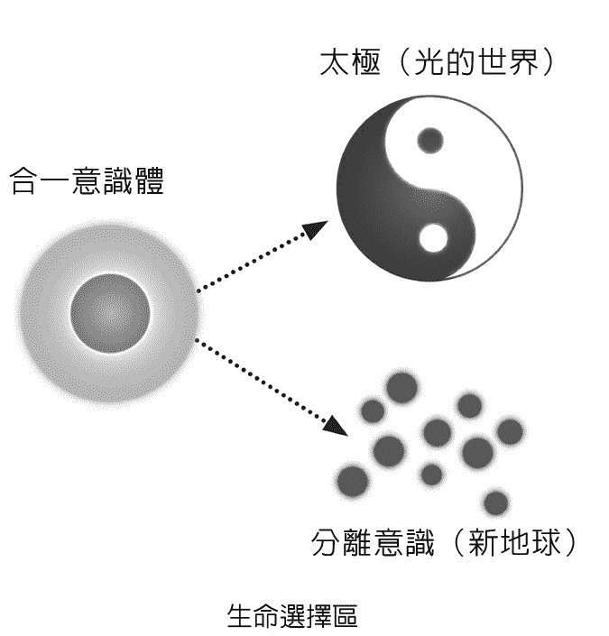

同样地，当意识到达合一的完整灵魂意识时，仍可以在此场域选择继续前往分离的意识体验。需要分离意识体验的灵魂会被赋予一个让它再次去体验的载具，透过载具或生物体形式的感知系统，分离意识可以拥有不同的体验和学习过程。这和之前分离意识进入地球体验不同，已经转换成携带完整的灵性意识迈向新地球的下一阶段去体验，是带着神性的祝福的灵性种子进入分离意识去体验。

更高次元的星球也有其创造法则，你会透过自己源头的合一意识了解宇宙的运行法则和真理，帮助你进入量子跳跃式的更新与创造。你也可以在这里学习，然后带回更高的意识，进入新的星球，并运用在生态、教育、医疗、身体等各个层面。

阿乙莎，新地球在哪里？

在比你们目前的振动频率更高的位置，大约是十八赫兹，许多生命已经在那里等着迎接新生命的到来。

我还活在七．八赫兹的地球上，现在可以去看看吗？

当然可以。进入自己的晶体，你就能进入新地球去感知那里的一切。

哈！太棒了，我现在来试试。

（接下来，我进入晶体中，请求阿乙莎和我的灵性父母帮助我进入位于十八赫兹的新地球。

大约一分钟后，我进入一个新的场域，这里的磁场感觉更轻盈。新地球是颗蓝紫色的星球，天空有晚霞般火红色的极光，并没有看见太阳在照耀；表面有大片海洋，许多海豚和海中生物已经移居至此，有非常美丽的湛蓝带点蓝绿色的光照耀着这群海中生物。

紧接着，我的身体俯瞰整片海洋，意识继续带领我朝海底前进。我感觉海面之下是新地球人类居住的场域，这里似乎还没有太多人类，好像正准备迎接许多种子到来……我停在这里，不知道为何要看见这些。）

阿乙莎，请帮助我，让我更清楚我需要理解的是什么。

是的，你已经进入新地球。新地球是一个结构完整的星体，地下土壤层的元素和目前的地球有些不同，地表下的环境是更适合人类居住的生存系统。

新地球地底下的水来自上方的海洋，是经过天然的土壤及矿石筛滤后的负离子态水。地底的中心可以获得天狼星的光，所以，不同于目前地球拥有的来自太阳的直射式光源，新地球的光源是由映照在海面的光折射进入地底下。这里的环境可以形成多种生命组成元素，你们的物质身体在此居住时，外观会和目前的地球人类有所不同，皮肤呈现蓝绿色，身形也更高大，还有多元种族、各色人种在此融洽地共存。这是个充满慈悲与爱的星球。

祢这样讲，让我想起之前探索过的列木里亚……

是的，这个来自列木里亚的族群会是新地球的首批移居者，他们目前已经展开移居新地球的行动。

他们怎么过去？

他们有自制的太空船，可以前往距离这里一百五十光年之外的地球。

那么远？那我们这群现在居住在地球上的人类怎么过去？

你们将以更高的意识带领自己的灵魂诞生在新地球。在你们目前居住的地球上方建造前往新地球的诺亚方舟，这艘船可以带领扬升的灵魂意识成为新地球人类的种子。

这艘船是怎么建造的？又该怎么到达新地球？

你们将在地球上布建一些磁引力能量装置，透过光码和音频链接这些装置，形成完整的架构，并定锚于宇宙时空。这些装置将链接成可以到达十八赫兹新地球的诺亚方舟母体船舰，当灵魂意识登上此母船，就可以透过宇宙光之桥，快速传送至新地球的地心。这座宇宙光之桥是天狼星人和列木里亚人合作建造的。

祢是指我的灵性父母已经搭好一座宇宙光之桥？

是的，而你将和一群人一起带领即将进入新地球的未来种子登上这艘船。

打造这艘晶体船需要多少个装置？

一千个装置节点形成一艘完整晶状体太空船，里头每一区域节点的功能和设计会有些许不同，每个区域有不同的设计需求。

有时间急迫性吗？

二〇三六年以前，你会带领第一批人类前往新地球。

啊？这么说，我二〇三六年就要死了？

不是的，你是用意识引领一批人类前往新地球重生。你会穿梭于新旧地球之间继续完成工作，所以你还要学习穿越宇宙时空、重启新地球的生命种子延续工程。

妈呀，这太超过了……

（总之，我在这段收讯中理解到的是，即使晋升进入基督意识的场域，合一灵魂还是可以再次选择：是要继续往上进入真理的太极世界、光的世界，在没有生物体形式的状态下继续灵魂的旅程，或是要再次进入分离意识的体验，以另一个生物体回到地球体验？而此时，因为旧地球无法负荷与承载，地球的上方已经有一艘前往新地球的诺亚方舟，要将具备合一意识的灵魂带到新地球，成为新地球人类的种子。这个新地球位于振动频率更高的次元。

若在目前的地球离开生物体，灵魂却无法进入合一意识，这些尚待完整的灵魂便无法进入基督意识的选择区，亦无法链接登上前往新地球的诺亚方舟，就会回到旧地球继续学习和体验，只是此时旧地球的环境和样貌，恐怕已经被我们自己破坏殆尽了。而从旧地球分离出新地球，也只是浩瀚宇宙不断创造，以达成自身平衡的一个演进过程。）

 爱的能量

雷巴特，我想请问，你和我的灵性母亲莎雅一起搭建的光之桥，是什么时候完成的？

在地球时间二〇一二年就已经搭建完成，准备迎接人类进入新地球。

这是穿梭宇宙的信道，无法以地球的线性时间来估算。我和你母亲从在地球分离的那一天起就开始筹备，要搭建这座宇宙光之桥。这必须取得银河议会的轨道同意权，并采纳各星球的建议，而我们从来没有停止发展这件事，连最困难的部分都已经突破了。

哪个部分最困难？

就是打开人类ＤＮＡ的封印，让人类得以打开觉醒意识，经由灵性意识的链接，进入内在宇宙，重新找回宇宙源头的家。这是最困难的一步，因为即使打开ＤＮＡ封印，人类仍有许多恐惧，并且执着于肉身，不愿意回到银河共同意识的家园。

你和莎雅母亲这些年来都相距这么远吗？一百五十光年……

我和你母亲共同存在我们孩子的灵性意识里，就像现在我俩同在你的灵性意识，时时刻刻都在一起看顾着你。人类用物质身体来体验和感知爱的存在，我们则透过灵性意识就可以交流爱的能量。爱的能量无所不在，它也是目前地球生命的根本动能。你们以为只能用肉体感知来了解爱与被爱的感受，其实，用你的意识就可以感知到无所不在的爱的能量。

怎么感知？

用爱进入每一个生命里，去拥抱对方，你们的爱的能量就会彼此交融。你现在可以试试看，进行爱的能量交融练习。

从心轮出发，向上链接自己的松果体，再从松果体出发，进入对方的松果体。接着，让你心中无条件的爱透过链接着你和对方松果体的这座桥，进入对方的心轮。你们在心轮合而为一，已经是一体的存在。

这就是用爱的意识让彼此融合。你们可以不必透过肉体的拥抱和性的接触，就达到不分彼此的合一状态。透过无条件之爱的振动，你们被授权穿越一切屏障与分离的肉身状态，契入一体的合一境界。

以分离意识或非爱的振动能量，无法擅自侵入任何生命的独立场域。只有无条件之爱的能量可以带你们行遍宇宙，融合一切存有。

所以，因为你和母亲深爱着地球和你的子民，当年你就以无条件的爱注入地球，为地球保留了爱的能量和人类生命的种子，你也因此可以持续和莎雅母亲紧紧相连。即使你在天狼星，也可以透过爱的能量与母亲合一，同在每个孩子身边。现在只要我们愿意打开自己的心轮，以无条件的爱和宇宙万物合一，就能走上你为我们铺设的回家之路，到达你的天堂之境。

孩子，不光如此，若你们能够明白自己就像我一样拥有爱的能量，你们也会为其他人搭起这座光之桥，让彼此得以在爱中链接，不再分离。

这真的让我好感动喔！谢谢你的提醒，我好像从结婚以来还没有真正用心轮链接自己的另一半。我应该好好练习，从身旁的挚爱开始，扩及家人、朋友，以及整个国家和世界。

孩子，我爱你们，我以你们为荣！

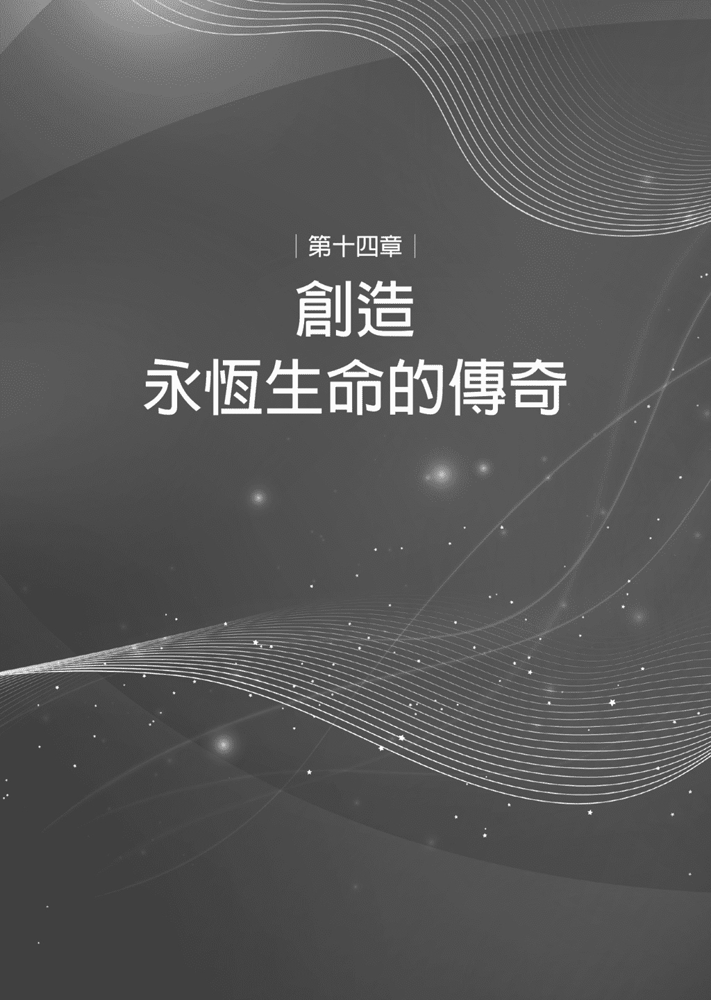

 意识自由进出身体

未来，人类将可以自主离开身体载具，进入生命下一个阶段，这和人类目前因为生病或意外才被迫离开身体的情况是不同的。

我对死亡真的很好奇。身体停止运转时，是什么通知意识该离开？还有，意识是怎么离开身体的？现代人很害怕死亡，我很想知道死的瞬间是什么在运作。祢要是能帮助人类弄清楚，我相信可以释放许多人的恐惧。

是的，你们没有人可以将死亡说清楚，我来揭开这个谜。

基本上，我不会用死亡来解释生命的终结。你们的生命有肉体与灵魂体两个部分，意识就是灵魂体的部分，你的灵魂在地球上的载具则是肉体，而肉体的智慧来自意识的操作，所以与其说你有两个生命主体，不如说你其实是一个生命主体，但可以换不同的载具穿梭在宇宙之间。肉体是你在宇宙间航行用的晶体，但进入高次元航行时，你必须换乘不同功能的晶体才可以到达。

地球人将肉身视为生命的主体，当肉身遭受损害或不堪使用时，就以为生命完全消失了。这是你们感到恐惧的原因，主要是因为你们尚未链接上自己的灵性意识，不确定灵性意识在没有载具的情况下会发生些什么，因而感到忧虑。

若一个人可以随时与自己的灵性意识链接，是不会恐惧死亡的，因为他清楚知道自己意识的存在，也可以随时进出自己的肉体，保持与灵性意识合一。你可以做个小试验，就能了解你可以随时离开自己的灵魂载具，然后就不会感到害怕或奇怪了。

练习：体验意识与肉体分离

❶深呼吸数次，将呼吸调整到稳定状态。

❷现在让吸气与吐气的规律改变，先吐～～～再吸～～～

❸长长地吐一口气，然后将意识放在身体后方一步之处——想像自己退后一步，站在身体后方。

❹气完全吐完之后，吸一口气，让意识回到身体。

❺再长长地吐一口气，将意识放在距离身体右侧一步之处——想像自己站在身体右方。

❻气完全吐完之后，吸一口气，让意识回到身体。

❼重复做几次，每次吐气时就让意识往自己身体的四周移动。

❽多次练习之后，你会发现每次吐气时，意识在身体之外的时间愈来愈长。你的意识并没有受到一呼一吸的影响，可以清楚地临在，观看自己的身体没有呼吸。

❾若你身体的呼吸系统停止运作，不再自动吸上一口气，你的灵性意识与身体的脐带关系就自动终止，意识会自然地离开你的身体；而只要你的身体回复吸气，意识就会自动被拉回你的身体中。意识离开身体就是这么自然发生的。

你的呼吸与你的灵性意识之间有脐带关系，意识会被你吸入的氧气牵引、带路，帮助你的灵性意识锚定自己的灵魂载具。同样地，树木是透过二氧化碳，将它的灵性意识带回自己的身体中，而当一棵树无法吸入二氧化碳时，其灵性意识就会脱离树身，另觅适当的载具。

人类的灵性意识离开肉身时，与树木的灵性意识就毫无分别了，都拥有相同的意识振动频率，可以去找寻新的生命体验形式。你可能会认为，植物又没有像人一样的思考和创造能力，你的灵性意识怎么可能与植物相同？没有错！就是这么有趣。你会发现，当意识回到宇宙中，要重新进入下个体验的选择时，你与所有的意识体——不论是来自动物、植物、昆虫、矿石——都是进入浩瀚无垠的宇宙，而你们希望拥有的所有体验都是被允许的。你也可以去体验成为树、海洋生物、水草、昆虫，或是遨游天际的小鸟。你会发现，你的意识存在拥有绝对的自由选择权。

照祢这样说，去体验生命体任何形式的存在有何意义？我们已经是主宰万物的人类了，怎么可能有人想回头去体验当个动物或植物，被人类食用？

正好相反，有许多人的灵性意识选择成为动植物，是为了快速净化自身。当这些灵性意识在生生世世的体验过程中遭遇太多伤痛和仇恨，一时半刻无法解除或让自己释怀时，就需要让意识归零重设，而成为动植物是最快的方式。在短短的生命体验周期中，他们就可以进入无条件的爱与付出的振动频率，而被全然净化。接下来，当他们进入下一次的肉身或其他次元的高智慧生命形态时，就可以降低不必要的自我意识干扰。

所以，佛教说不杀生是因为这些动物很有可能是自己的父母兄弟姊妹，这样的说法并没有错。但是，人类并不会因为食用动物而被诅咒。不会的，这是灵性意识自己选择的途径。人类是经由不吃肉来提醒自己，人身难得，要以慈悲心同理万物苍生。

 从源头的合一意识找回最初的生命蓝图

前面关于死亡的说明，是要让你明白生命的多元载具形式。身体只是意识暂时的载具，而认知到身体这个载具不堪使用时，你们下一次仍有绝对的权利去选择生命载具的形式。届时，灵性意识会进入生命选择区，做出新的生命选择。然而，现在你们已经不必等到被迫汰旧换新时才匆促做出选择，而是可以在有意识的状态下提前拟定下一个生命计划。

对了，我这一次生命的功课到底有没有做完？若此生的目标仍在未知状态，当然就无法做出有连贯性的下一个生命计划啊！

那么，现在我们就先回顾，为何你此生要以这个生命形式来体验、你的目的是什么，然后才能进行下一次生命的选择。你现在无法判断是很正常的，我先让你明白这个流程，当你回顾一遍，也再次对选择自己下一个生命体验有所期待时，就可以回到自己的生命蓝图中，找回自身生命的意义。而且，你会更加把握目前这个载具的时间，以接续你期待的未来。

喔！好期待，能这样明明白白地活着真好！

带领意识回到今生灵魂选择区的步骤如下：

1.进入自己的晶体。

2.请求大师、导师和你挚爱的人带你回到此生的生命诞生前的选择区域。这时，你会从一个轻盈的晶体空间，转进一个更为稠密的磁场空间。有些人会觉得好像在搭乘向下移动的手扶梯，也有人会体验到一扇旋转门。每个人的状态不同，在这个移转的过程中，你的身体会有所感知。

3.进入选择区后，可以开始提出以下问题：

“我当初是为了什么原因而选择进入这一次的生命？”

“我选择来到此生是希望完成什么工作？能否让我看见这项工作的时空背景及重要性？”

“我要如何做才能达成此生的生命意图？还有更多方法可以指引我吗？”

“我当时为何选择我现在的父母？我现在的家人、朋友、长官和这件事的关连是？”

“我的灵魂想在这一次的生命中学习到什么？”

4.结束探索之后，请求大师、导师和你挚爱的人带你回到晶体中。

5.回到晶体时，你会明显地又感受到轻盈，然后就结束生命选择区的探索。

阿乙莎，当我进入灵魂选择区，看见此生的生命目的时，有点不太敢相信自己所看到的。我无法在此赤裸裸地将毫无根据、无法被科学证实的论点公诸于世，对于被别人当成茶余饭后的笑话，我仍有芥蒂，因为我还是很在意别人的眼光。当然，不论我在当初的时空位置看见的那个未来故事是否会发生，对于唤醒人类的意识、帮助地球这件事，我是举双手赞成啦。只是，当我去探索自己的生命蓝图时，祢非得用这么夸张的故事情节让我配合不成？

你没看错，你看到的正是当时你选择来到此生的目的。至于你看见的那个未来是否会发生，以目前的状态来看，机率是非常大的。回顾过去的三十年，你生活的环境变化有多大？就以这个基础来看，你怎么会不切实际地期待未来的三十年会维持你今日所见的样貌？你们以为太阳永远会为地球升起，甘霖总会降在你最渴望的时候吗？不会的。大自然是地球全体生命力的展现，所以，当地球生病了，就会像人类一样调整自己身体的运作机制。它可是会寻求解救自己的替代方案。人类活在天地之间，只看见自己想要的，没有顾及天与地的需要，你认为地球和宇宙还可以容忍多久？

我不想以“恐惧”和“不得不为”来设定我生命的目的，那不应该是祢自由选择的教导方式。为何要让我看见那个故事？

没有看见那一幕，你会忆起当时你自告奋勇并带着自己活出此次生命的目的吗？你不会的。你天生爱好自由、和平，还有些偷懒，所以会去找寻自己的快乐和安身立命的生活方式，不会去管别人。

可是，祢让我看到的未来世界，如果没有发生，我不就会被人挞伐、取笑？

你害怕的是别人怎么看你？

当然。我毕竟是活在群体制约的世界里，不是隐居在山中的隐士，当然会担心别人怎么看我。

别人怎么看你，会影响你的生命？再想清楚喔！当你生命终止的那一天，你即将前往下一站时，你还会带着别人对你的看法往前走吗？

当然不会啦！那些都成了过往云烟。

如果你很清楚生命的下一站跟别人无关，那么，你现在不会担心自己下一次生命的进度被别人拖延了？

嗯……我不曾从这个角度去思考，好像也没有人这么看待自己的人生。

你已经很清楚地知道灵魂是永恒的生命，你就是自己的神和造物主，肉体只是你目前的载具，你当初选择用这个肉体有你的理由和目的；同样地，当你离开这个肉体，选择下一次生命的载具时，那个载具最大的功能就是辅助你完成下一次生命的目的。所以，你这一次生命的完成进度将与你下一次生命的选择息息相关。你不可能站在这一世的终点回首才发现自己的生命目的，你要在永恒生命的时空看见自己生命的目的。

每个人的生命都有其目的。地球上的每一个人携带的目的不同，你们只是在这个时空有机会相遇，在此共同学习，当生命完成阶段性任务，你们将各自走进自己下一次生命的选择区。你和其他人不见得会再次相遇，你们都会为了自己生命的最高目的，展开自己的路。

所以，你们目前虽然受到社会文化的制约和规范，但这些都不该影响你们永恒生命的前进。只有那些尚未看见、尚未觉醒者会被制约，活在别人的期待下，而这样的生活毕竟只会发生在有限的时间里。当你以永恒生命为目标而活时，将活出无限；没有这一世和下一世，你会超越任何时间的限制。你只会在乎自己是否与生命目的相契合，是否已经走在最高生命目的的轨道上。也唯有走在这条属于你自己而不是任何人的期盼、为你设计的道路时，你才会获得生命的喜悦和感动。你不会觉得累、觉得疲惫，也不会找不到方向，更重要的是，你会更清楚地知道自己此后将往哪里去，才能延续你尚待完成的工作。就像你的灵性父亲与母亲一样，他们都在自己的道路上，等着你与他们同行。

祢这么说，我更明白了。我们从小看别人的传记，听长辈传诵古老的智慧，从来没有想过要创造自己永恒生命的传奇。而当我们认出自己是浩瀚宇宙的旅人、地球暂时的过客，不论方才我看到的未来故事是否成真，至少，每一个人都该去找出自己生命的目的和意义，创造属于自身宇宙的传奇，在自己更高意识的带领下重生。

［结语］

为自己和全人类创造永恒生命的新页

写完第一本《阿乙莎灵讯》时，我对于自己灵魂设定的生命蓝图到底是什么仍然一头雾水，摸不着头绪。现代人生活忙碌，有时间和空间觉察自身和周遭环境已是很奢侈的事，若还能觉醒还原成最初始的设定，就千万不要错失找回自身最高生命蓝图版本，开始迈向永恒生命的机会。

这本书的收讯一开始，阿乙莎要我先重新认识生命的循环是来自人类意识创造的动能，而未来世界的蓝图已经在更新的人类灵性意识中，就在我们自己身上。我们只要活出自己的生命蓝图，就可以带来新地球实相。

接下来的传讯，阿乙莎要我向自己的灵性父亲学习，我才明白，想找到自己生命蓝图的最高版本，就要与自己的灵性父母合一，契入基督意识场域，如此才得以揭晓。

在向我的灵性父亲雷巴特学习的过程中，他教导我去看见创造不是破坏后的更新，而是在更高的意识中与万事万物融合的过程。透过创造能量流动路径，我们可以经由更高意识的带领，识破小我的虚假命题，让自己顺利走回生命本有的创造之路。每个生命都是灵性父母创造的结果，而这个创造另有更高的目的，必须由你在内在意识觉醒后开始去创造和实践。

走进内在，与自己的灵性父母达成三位一体的合一时，我得以窥见灵性父母创造我们生命时最初始的意图。这来自最高灵性的意图十分恢弘与远大，远远超越小我的想像。我就像走进一部虚拟实境的电影，在观看剧情发展的同时才发现，原来自己就在这部戏里。

结束这整本书的收讯，我才明白内在宇宙展现的创造威力令人瞠目结舌，让我喋喋不休的小我全然臣服。这时再回头看，发现阿乙莎在本书一开始就以简单的几句话，道尽了其中精髓：

“创造就是生命进入更高意识的完整表达。”

“你的生命诞生本身就已经是一个创造的开端。”

“重十清晰的生命蓝图指南，在灵魂量子宇宙的实相里创造，这个创造的源头就是你。”

“当你的灵魂从你目前身处的地球实相苏醒时，你会发现你已处在平行宇宙中……你的内心已经超越时空的限制，就在你的晶体中，你的灵性源头正准备开展专属于你的灵魂量子世界创造之路。”

这本书的讯息有其特殊意义。生命已经可以突破物质世界的幻相，进入无相界的创造，而宇宙源头此时此刻捎来新地球的讯息。姑且不论这个讯息的真实性为何，也不论新地球是否真的在一百五十光年之外，对我来说，这是来自阿乙莎的呼唤，正式邀请所有地球人一起走入内在宇宙，为自己和全体人类创造永恒生命的新页。

［附录１］

宇宙能量交换机的源起与应用

阿乙莎，我在接收上一本书《阿乙莎灵讯》的讯息时，有要求祢提供一个改善地球能量场最快的方法，祢跟我说：

“你们要在地球的每一条河川、每一片海洋，以及任何有水流动的区域放入能量平衡装置，让水携带着平抚人们情绪波动的能量，流进每个家庭，让饮用和沐浴用的水都成为净化人类的载体。那个装置可以将水的振动频率调到接近西塔波（θ波）。至于用哪种设计则不必局限，金属、矿石、声波都可以，重点是这个水流入每个家庭让每个人使用的流通过程，你们得自己想办法突破难题。”

是否可以进一步指导我们设计这个能量平衡装置？

这个装置是环境能量转换器，就像交换机，可以迅速让环境能量校准中轴，清理环境中的负能量，帮助重设生态环境的磁场，让宇宙更新的能量重新注入。你们可以把它放在已经受到破坏的场域，如战场、混乱的场域、贫瘠的土地、被污染的水域和海洋，任何需要协助以恢复物质原貌的区域和环境都可以。

只要做好能量交换的功能，做到完整的装置呼吸运动，就可以让能量从宇宙流入、从下方吐出，渐渐扩展，并转化平衡周围的负能量。其作用流程如下：

设计一个磁力结构装置，中间摆放纯净的光源。可向大地之母取材，使用列木里亚白水晶或各种天然且纯净的水晶。

结构体可以使用铜线，模拟上下金字塔的形式，如同人体能量运行结构。

上方吸入宇宙能量→金字塔结构体的每一面以三螺旋正旋方向安置。

下方链接地心→金字塔结构体的每一面以三螺旋逆旋方向安置。

上下中轴平衡转化→金字塔底部以正逆三螺旋安置。

当环境遭受严重破坏，欠缺自身调整动能，或是处于长期负能量胶着状态时，就用这个装置来快速净化和消弭噪声，帮助环境能量场体重设，以恢复生机。这个装置适合用在人类较无法进入的区域，或是已经遭受严重破坏或攻击的场域。这是宇宙和大地之母联手送给人类环境的小礼物，只有经由无条件的爱与慈心的能量灌注，才能真正发挥它的功用，所以请善用它。你们可以称它为“宇宙能量交换机”。

这个宇宙能量交换机的运作原理为何？

人的意识具有能量，在量子世界里，意识就是导航器。你们的心轮有导航地图，只有可以顺利进入自身晶体的人，才能链接自己的灵魂晶体太空船。人类的意识经由地球之心的晶体校准，就可以链接形成今日的地球整体意识，但要让人类提升进入更高的次元，就需要人类有意识地链接回自己的晶体；而恢复人的晶体与地球意识体的链接之后，就能和宇宙意识合一及校准。这是唯一的路径，也是最正确的方式。

然而，地球上有些区域因为环境能量遭受破坏，因为气候变迁、战争、生态破坏，以及被许多低频能量干扰和牵引，让人无法顺利进入自己的晶体，这时才会需要在这些场域布置能量交换机，让人可以免受干扰，更容易成功链接进入自己的晶体。宇宙能量交换机就是你们环境的安定器，现在必须先让大家厘清这个观念，才能进一步谈未来的应用层面。

阿乙莎，祢说能量交换机只有经由无条件的爱与慈心的能量灌注，才能真正发挥功用。那么，若是没有正确启动和灌注能量，会怎么样？

没有经由宇宙基督意识源头的能量启动，这个磁力结构只能发挥百分之十五～二十五的功效。因为这种设计的磁力结构尚未在你们肉眼看不见的量子场域进行能量锁定，磁力结构粒子仍处于三次元物质的紧密结构状态，同时也因为制作过程中受到环境与制作者的意识流影响，尚未发挥宇宙能量交换机的量子场域链接作用。

当你启动时，这个能量交换机在三次元的粒子结构会重组，成功进入量子场域。交换机的结构整体会链接位于地球之心的晶体，并收到基督意识场的能量挹注。不过，这个装置每年必须校准一次，因应地球磁栅位置的偏移。

启动后的宇宙能量交换机除了与地球之心和宇宙进行锚定工作，还可以链接起来，在目前的地球上方形成一个更稳定的能量网格。链接基督意识场中的阿乙莎光源，让光源投射进入这些能量交换机，就完成启动。而将设备移动到地球的任何角落，是不会影响扬升工作的。

透过宇宙能量交换机的网格链接，环境中的人和所有生命体，包含动植物，都会觉得场域被净化、自身的中轴更加稳定，会立即受益，但还是有一个前提：这些生命的灵性意识仍须锻鍊回复到可以进入自身晶体。若尚未能有意识地进入自己的晶体中，仍是无法顺利扬升，迈向更高次元。

一些晶体结构尚未完整，或是已有结构完整的晶体但仍处于无意识状态的人，依然无法透过宇宙能量交换机取得此能量引导路径。这是他们的生命早已做出的抉择，勉强进入对他们并没有帮助。当人类回到有意识的生活，和大自然链接时，就是与地球之母的晶体链接的开始；当有足够的人可以进入自己的晶体时，这些人意识的提升，就可以让地球整体扬升。

［附录２］

脉轮畅通手指操Ｑ＆Ａ

Ｑ：早上是否一定要先排完便，做脉轮手指操才会有效？

Ａ：不一定。这是让你身体的脉轮畅通的练习，若尚未排便就做，也能够帮助打通“地”元素，促进肠胃蠕动，有助于排便。

Ｑ：一天可以做几次？一定要早上做吗？一定要按照１、４、２、３、５的顺序做完才行吗？

Ａ：任何时间都可以，没有限制，尤其当你觉察到自己的中轴不稳定，容易生气、沮丧、烦躁时，不妨立刻就做，帮助自己稳定中轴，让身体的能量流动尽速回复稳定。

若能将意识导入身体，按照１、４、２、３、５的顺序做完，会更深入净化自己的脉轮。不过，这要看个人的时间是否允许，不是强制性的。

如果身体有明显需要调整的地方，也可以穿插运用不同手指对应的身体元素进行补充。比方说，若肠胃寒冷不适，可以先握小拇指，带动“火”元素，再握大拇指加强“土”元素，以中医的理念进行“火生土”的调理，这些都是可以弹性应用的方法。

Ｑ：做脉轮手指操，手握手指时，掌心是朝上，或者要朝向左右？

Ａ：不需要特别让掌心朝上、朝下，或朝向左右。手指带有电流，当一只手握住另一手的某一根指头时，身体就会产生系统回路，像是在充电。掌心的方向以能让自己的身体轻松放下为原则，刻意将手掌放置在不顺手的位置，反而造成身体紧绷，对身体能量的运行没有加分作用。

Ｑ：我在握住手指头时，为何无法如《阿乙莎灵讯》一书所写的那样，能量向右或向左、向上或向下旋转？我需要用自己的意识去引导这个旋转吗？

Ａ：在做脉轮畅通手指操时，身体必须完全放松，意识回到身体，专注于自己的一呼一吸，逐渐展开内在的觉察。你会感受到能量在自己的身体里运作，那是让意识跟随身体，而不要用意识去带领身体做出能量应有的走向。所以简单说，就是不要去想像能量应该如何运行，也不要因为发觉自己的能量不像书中所写的那样，就去干扰自己的身体智能。每个人身体的状况不同，而能量在运行之初会适应你身体的实际需要。相信宇宙会提供最适合你的能量进出方式，让自己的身体回复本有的自体疗愈能力。我们只要专注在自己的一呼一吸上，将宇宙能量吸入身体内就可以了。

Ｑ：我的手指不完整，某个指头断了，该怎么做？

Ａ：一样可以用意识带领自己的意念进行，没有手指也可以。身体除了肉体之外，还有扩展的乙太体和星光体，以意识带领自己握住那个没有实体手指的位置，仍然有效。

Ｑ：我在做脉轮畅通手指操时，为何感觉身体某些部位会疼痛、发麻或皮肤出现红疹？

Ａ：所谓痛就是不通，这是身体能量流动造成的身体好转或排毒反应。此外，这也是你的身体发出的讯息，过去没有被你觉察到，现在透过能量的运行过程，你终于看见身体的讯息。若有非常剧烈的疼痛或不适，建议去医院做个检查，用科学仪器检测是否需要接受进一步的治疗；若无大碍，就可以继续做手指操，也可以在进行到与那个疼痛部位对应的手指时，给身体一个清楚的指令：“×××（器官或身体部位名称）啊，我知道你正在帮助我回复健康，请放慢释放的脚步，以我能够承受的方式清理。谢谢你，我爱你！”然后每天持续进行，就可以帮助细胞逐渐分解杂质，排除身体的垃圾。

Ｑ：做脉轮畅通手指操之前，是否应该保护我的能量场？

Ａ：接收这段讯息的过程中，阿乙莎并没有说要先保护能量场再进行手指操。但是，要成功到达脉轮畅通的境界，最重要的就是在做手指操之前，先让自己飘散在外的意识能量聚集回到身体里；若目前因为工作或环境的影响，没有聚焦回到自己身体的习惯，就可以运用本书提到的进入晶体前的净化练习，让意识先回到身上，同时也可以运用书中介绍的方法，进一步释放恐惧不安的意念。完成这两个动作，就可以保护自己不受低频意念干扰。你可以视自己的需要，增加这两个让意识回到身体并释放内在恐惧的练习，再开始做脉轮畅通手指操。

Ｑ：做脉轮手指操时，是否会有其他的特殊体验，比如看见光码或特别的影像？

Ａ：有些已经练习一段时间的人确实会开始有一些特别的灵性链接体验。那是身体中轴畅通后的自然现象，有些人会因此打开自己的松果体，看见光码或特别的光影。若看到的影像是带给你安定祥和的能量，就表示你正确与自己的灵性高我链接了；如果你看见让自己恐惧或不安的光影，就代表那仍是你身上的低频振动释放出来的能量。建议在进行脉轮畅通手指操时，不要以意识带领自己，而是要让意识稳定地放在自己的一呼一吸上，觉察每一次的呼吸让身体的哪个部位有所反应，这样就可以减少中轴尚未平衡稳定时的低频意识干扰。

**“畅通脉轮手指操”影片和**

**“与大自然共振静心冥想”音档 QR Code**

**请点击 QR Code，**

**链接示范影片**

**及引导音档。**

“畅通脉轮手指操”

示范影片

“与大自然共振静心冥想”

引导音档

