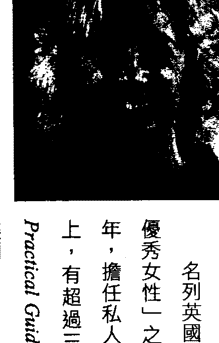
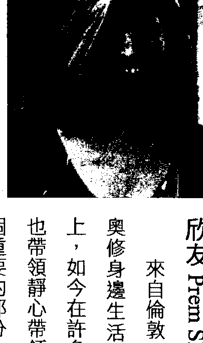
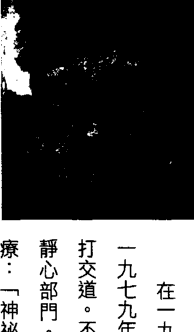
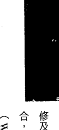
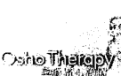
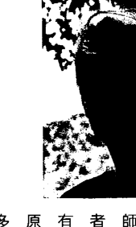
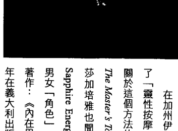
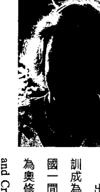
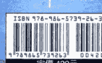

# 静心治疗：16位著名疗愈师与1位成道奥秘的相逢

# 前言

本書是一些受到成道大師奧修（Osho）的生命洞見啟發，與靜心連結的身心治療方法，因此稱為「奧修靜心治療」。在這個前提下，治療不僅是一種解決個人問題的方式，同時也準備帶領一個人走向靜心。

治療可被定義為：當靜心來到一種超越頭腦的狀態，在身心創造出健康狀態的方法。平靜、和諧與個人滿足感，在頭腦的向度上，是完全不可能存在的；因為頭腦天生就是一個製造問題的機制，如果你解決一個問題，它一定會再製造另一個；假設你找到了某個問題的答案，會有更多的問題出現。

這就是為什麼某些神祕家把頭腦比做一棵正被修剪的樹：你剪下一根分枝，接下來會在那裡長出更多的分枝。

真正的解決之道是站在頭腦的向度外，進入那個很自然就經驗到寧靜、平安、至喜的無念向度裡。所有的靜心方法就是一些要來到這種情境的途徑。

這本書呈現了在自我發展、療癒及治療領域中，一種以這份了解為基礎的工作方式。因此，在介紹不同的治療方法及形式時，其核心方向是一樣的：靜心的基本重要性。

帶著意識活著、與此時此刻連結的藝術，是活出真實、真誠、滿足的生命最好的方式。

史瓦吉多 Stagio

# 新洞見的誕生

那些在本書中呈現他們工作的治療師與團體帶領者，都深受成道的奧祕奧修，以及他將東方靜心與西方治療技巧結合的洞見所影響與引導。他們在工作中運用奧修的靜心技巧，並把治療工作視為朝向更高意識狀態的踏腳石。

> 奧修說：
> 我的治療師不只是治療師，他們也是靜心者。治療工作只是表面的事，它有助於清理地表土壤，但只是清理整地，並不表示你就擁有花園，你還需要其他更多的東西。

# 東方與西方的交流

在一九七○年代末期，一些受到西方心理治療訓練的治療師，聚集在這位備受爭議的大師身邊，探索東方的靜心方法，帶起了一場獨特的實驗。
也許這是史上首度，西方的心理治療與東方的神祕主義相逢。結合奧修的引導，治療師用各種不同的成長方法，發展助人工作的新方式。從一種不設限的視野，深入人們的心靈世界。

# 前言

對每個參與其中的人而言，內在有可能開始出現更深的洞見。包括治療師自己，也包括那些參加他們的工作坊、研討會、訓練課程的人。

治療師身懷不同的才能彼此互相學習，實驗助人工作的新形式，不需要待在每種治療訓練的有限準則裡。在這個過程中最重要的是一種東方的體悟——放下個人自我，允許更高能量顯露，超越治療師個人本身的知識與技巧。

有一個很大的差異需要強調：西方文化強化個體的自我，因此有才能跟有天賦的人在各行各業——政治、商業、醫學、治療——傾向於去獲得一種伴隨成功的自負感。

東方文化正好相反，視「無我」為一種成就，比起自我擴張更加重要。因此，在奧修身邊所建立起的印度普那社區裡，對職業狀態不那麼地認同；特別是因為角色與工作是有彈性的，而且易於快速改變——在某一刻也許是一位獨立作業的治療師，但下一刻也許就變成廚師或清潔人員。

在奧修將西方治療加入到他的工作中，親自督導這些工作坊裡所發生的一切。每個課程結束後，他與參加團體的學員及帶領者會面，邀請每個人分享他們的經驗並發問。

治療師學到以完全不同的方式應用他們的技巧，在某些工作坊中——比如說原始治療——治療師的行為會像一位引導者，且他是在一個權威者的位置；但是在社區更廣大的環境背景下，治療師與學員會一起學習與經驗到靜心。其中有著一種整體感以及些許的區別。

在奧修過世後，這樣的情形一直持續很久。

重要的了解在於，靜心是一個無法被量化、測量、甚至讓理性頭腦了解的奧祕過程，因為它畢竟是一個「沒有頭腦」的狀態。因此，假如一個治療師在靈性意識上沒有更好的狀態與成熟度，即使他具有能幫助別人的優秀能力，也是徒然。

治療師不因為他的工作而獲得酬勞，而這個事實支持著這個革命性的方法。他們是出於愛與貢獻社區的願望，還有支持更好的靜心而給出工作。

讀者也許會對在這本書裡寫稿的治療師們奇怪的印度名字感到好奇，在此稍微提一下背景將有助於了解：在七〇年代，當人們開始來到奧修身邊，他開始點化他們成為「桑雅士」（Sannyas）。在印度傳統裡，桑雅士就是一個棄世與獻身於靜心、改變名字及穿著的人。

但奧修對於桑雅士革命性的態度是入世的——探索關係、工作、事業等等——同時透過學習靜心來解除所附加的東西。他教導新的桑雅士要喜悅與全然地投入生命，同時尋找自己最深處的「佛性」。他將此稱為「新桑雅士」，並要求他的桑雅士穿著傳統橘色，戴上一條有他照片匣盒的木珠項鍊——稱作「念珠」（mala）。

一個以這種方式成為桑雅士的人，對他自己許下承諾去靜心，向世界宣告現在他準備要進入一個新的意識之流——就是喜悅生活與探索靜心二者緊密結合的藝術；這既非與世界脫離，亦非屬於任何宗教的一份子，或是成為任何派別的跟隨者，而是學會自立，與卸下過去從知識、傳統、宗教而來所承載的包袱。

在八〇年代末期，奧修宣佈這項內在靈性承諾的任何外在象徵已經不重要了，所以特殊的衣服、色彩以及念珠項鍊都可以放下。現在，選擇一個新名字或是保留原來的是依每一個人的意願，但是對於靜心以及自我探索的承諾依然不變。

奧修的工作歷經許多階段，而他身邊逐步發展形成的社區也是如此。也許史上從不曾有過如此重大的實驗，人們來自各行各業與各種背景、國家、民族或文化，齊聚在一位成道大師的身邊，創造出最空前多元化的大熔爐。

奧修多元大學——為了他的治療工作形成的傘狀組織——於一九七四年的印度開始，然後在一九八二年跟隨奧修及他的門徒移往美國奧瑞岡（Oregon）。在一九八七年回到普那（Pune），在此蓬勃發展，為身心靈提供了超過五十種以上不同的治療、課程及個案。治療師、醫療專家及藝術家彼此分享他們的技能、知識與洞見。

# 豐富經驗

現今，曾經一起在普那受過的治療師，大多在自己的工作領域上，並沒有跟特定的奧修社區或中心有關連；然而，在他們之間，還是保有共同的連結，正如讀者將會在這本書裡發現到的。

透過多年的分享、合作與交流，同時尊重獨特性，這些治療師學會去欣賞這份能帶向對人類靈性的廣泛和多面向的了解的豐富性。

# 前言

假如每個人都是獨特的，讀者一定會感受到，相較之下，自己對於某些治療形態有更密切的關聯。然而，在此要請讀者接納：這些都是朝向意識成長更邁進不同方法的一部分，而不是用一種比較的观点來談論；奧修對生命的態度是多向度的，因此才稱作「多元大學」。

這本書可以依序閱讀，但也可以不用；每一篇章都各自獨立，可以作為一種工作方式的引介，而這也許會啟發你更深的探索，甚至參加這些治療師所帶領的其中一項課程。

# 超越醫病關係

奧修靜心治療為人類賦與尊嚴，是由於它了解到生命存在的問題解答，是來自內在而不是外在。它們從個人本質的最深核心出現，而非來自任何其他人。就最佳情況來說，治療是幫忙移除障礙，好讓我們找到自己的答案。

換句話說，意識不是一件能被給與的商品。一個奧修治療師的工作是創造出對的氛圍，讓案主與生俱來的智慧與了解，在其中逐漸展現綻放。治療師的工作比較像是助產士。它不是一個從「這裡」到「那裡」的進程，而是愈來愈深入的「這裡」。

最後，治療師並不是一個指導者，懂得比案主多，而是一位朋友，覺察到即使他具有某種特定的技能，他在本質上還是在同一條船上。

編注：本書原為二十一章，為篇幅考量，中文版選出其中十四章較為臺灣讀者所熟知的治療師與治療法。

# 奧修說：

當治療師與患者不是二者，當治療師不僅是治療師，而患者再也不是患者，而是產生一種深深的「我—汝」關係（I-thou）（譯注）。當治療師不試圖想要醫好病人，患者不再把治療師視為跟自己分離，在那些稀有的片刻裡，療癒就發生了。

當治療師忘了他的知識，且患者忘了他的疾病，那裡就有了一場對話——兩個本質的對話。在兩者對話的那一刻，療癒發生了。如果它發生了，治療師永遠會知道他的作用只是像個神性力量、神性療癒的媒介，他會跟患者一樣感激這個經驗，事實上他從這個經驗所獲得的，會跟患者一樣多。

譯注：「我—汝」關係是以色列著名的宗教哲學家布柏（Martin Buber, 1878-1965）在其名著《我與汝》（and Thou: Ich und Du）一書中所提出來的原則。布柏認為「我—它」（我—它）、「我—汝」（我—你）是人與世界溝通的二種方式，兩者共同建構了人性的存在。「我—它」關係意指：凡是與「我」產生關聯的人或萬物（它），都是滿足「我」的利益、需要、欲求的工具，因此「我」與「它」建立的只是局部、片面的關係，此時的「我」並不完整。而「我—汝」關係則是：「我」把「你」視為世界、視為生命，而不是為了滿足「我」個人的需要而與「你」建立關係。因此要以「我」的整個存在、全部的生命接近「你」，此時的「我」才是一個真實存在、真正能自我覺察的人。

# 1
## 珍愛自己
### 阿南朵 Anando

有句老話說，每個治療師所專攻擅長的正是自己的課題，我就是個活生生的例子。在我遇見奧修以前，我從來沒有意識到我不愛自己。在我第一次經驗到無論我做得多蠢、無論我怎麼抗拒，他對我無條件的愛都毫不改變時，我並不信任。

我花了很長的一段時間去學習信任，一直在用所有的方式踢開及對抗，所幸他對我的耐心非筆墨所能形容。我終於放棄抗爭，允許自己去感受被愛——有時那帶來無盡的淚水，而莫名的淚水融化了我多年來的創傷，幫助我成為更真實的。

在那之前，我一直非常忙著在透過成為律師、妻子，以及成功的女強人來避開自己。我非常專注在外在世界，去達到那些我認為就是生命一切的「目標」。我努力達到成功，甚至小有名聲；我也賺了很多錢，有一個好丈夫，一棟不錯的房子和一群好朋友——總之，一切看起來應該是幸福快樂的，然而我並沒有。

很快地幾年之後，我開始注意到那股主宰著我生命的內在動能，我真的了解到在我「成功人士」這層外表底下，總是有個無意識的聲音在說著：「你並不像人們所想的那麼好。」、「你是個騙子！」、「如果別人真的認識了你，他們不會喜歡你。」

當然，因為它是無意識的，我並不知道它存在。只有在我走上自我探索的旅程之後，才了解到造成我不開心的壓力和緊張，正是那些強烈的內在聲音所導致的結果。然而在那個時候，我對於這一切是完全盲目的。

一開始，我以為只有我感覺到某種莫名的不對勁，覺得自己像是個局外人、一個不適應的人。而我以為那是因為我來自一個很不正常的家庭。我自個兒猜想，所有的其他人行動都是整合沉著的，並且都像他們看起來一樣那麼自信快樂。

但是漸漸地，我開始看到大部分的人至少都藏有一點格格不入的感覺，一點不確定的感受，不管他們建立在外引起注意的形象是什麼。而這個不安全感，或是自我之愛的缺乏，正是我們建立在四周保護自己不被揭露，甚至感覺這份脆弱的圍牆根基。

不幸的是，這些牆也阻止了其他人太靠近我們，我們都渴望親密，但同時我們也害怕如果讓別人靠得太近，他們會看到我們的脆弱而拒絕我們。所以我們只讓別人靠近到某個點，不能再更近，而這對於親密滋養的關係來說，可不是一個好的基礎。

# 尋找生命的新途徑

我無意識的懷疑之聲與勉力維持女強人和妻子的外在形象，所導致的內在衝突緊張變得非常難以忍受，我決定辭去工作——不久之後也離開我的丈夫和房子——尋找一種不同的生活方式。我感覺到生命中，一定還有比那些不能帶給我滿足的物質成功更多的事情。

我經由陸路旅行到印度，在一九七六年到達普那奧修社區。在倫敦我就已經開始經常做他著名的動態靜心（Dynamic Meditation），卻沒有意識到這靜心有多強烈——事實上它已經點燃了我叛逆的催化劑，反抗我一直以來的生活方式。

我本來只打算在普那待兩個星期，只想要走馬看花。我當然也沒有打算成為奧修門徒，改變我的名字、穿上橘色衣服；我做慢地以為，會那麼做的人只是一些無法在現實世界裡成功的遁世者。

一個星期後，我加入了他們的行列。

與奧修會面是一種能量的事件，是我那女強人律師存疑務實的頭腦所無法理解的。事實上，我認為頭腦不曾了解過；但這對我來說，已經是整個生命的新開始了——它正是我一直在追尋的。而且我在這裡面一待就是三十年。

七〇年代的普那社區是個令人驚奇的大熔爐——東方神祕學與靜心加上新心理學與正在西方崛起的能量療法，我帶著「不知道我的生命將有多大的改變」而跳進去了。

# 靜心：最基本的要素

一開始，我必須承認，探索自己到目前為止所過的無意識生活，是相當沮喪的；像是那個我之前提過的內在聲音，事實上一直在我不知情的情況下，主宰著我的生命。例如：我終於了解到過去以來，我一直活在恐懼中：害怕別人的意見與評價，害怕被批判、懲罰等等。

當我第一次面對我的恐懼，它們幾乎將我淹沒，好像我在一個很深很深的洞穴底下。我一向用來掩蓋恐懼的成功形象，在社區裡維持不了多久——我被派去的第一份工作就是刷廚房的地板！

我進入一個又一個的課程，很快地了解到，是每天的靜心在幫助我穿越那些揭開的痛苦與恐懼。在某些課程裡看到了我的無意識之後，無論我感到多麼灰心，奧修亢達里尼與動態靜心，總是能讓我與它們保持點距離；而聽奧修每天的演講，則把我從無意識頭腦傳送到可以有不同觀點的空間。

在之後，我開始著手自己的課程，總是會結合這些靜心。我了解到如果我們停留在頭腦，想要找出事情的原因，那麼就無法改變任何事；因為頭腦無意識地、自動地控制了一切，它只是把新的資訊加到它一向的老套，它的「工作」就是讓我們待在熟悉的、舊有的「舒適區」裡。

# 了解我們的頭腦如何運作

但靜心是在頭腦的掌控區域之外，才讓我們可以跟舊有的模式保持一些距離，用不同的角度去看事情。正是這不同的觀點，讓我們可以選擇以不同方式去回應與行動。所以對我而言，靜心是最基本的要素。

其中一個特別觸動我的團體是「珍愛自己」（Self Love），它建立在奧修的洞見上，並加上了西方的治療。透過它，我發現如何辨認，以及如何不被先前那些讓我難以放鬆下來，享受生命的舊有聲音所影響。我學習這個過程，接下來改造它，來符合我自己持續中的了解與經驗。

我也開始對發現大腦如何運作的科學新知感到興趣，而且我了解到，它們跟奧修從六〇年代起就在談的有意識與無意識的頭腦運作相當吻合，我研究了大腦的「神經可塑性」——關於我們可以改寫大腦設定的發現——然後開始結合到我的工作裡。

以下是今天我所教導的：

我們的思想主宰著我們的人生——基本上我們活在頭腦裡。

我們的思緒大部分是無意識的，任何認知學家都會告訴你，我們百分之九十五到百分之九十九的思想是自動預設好的。即使我們認為有一個「有意識」的想法出現，高度精密的大腦掃描顯示，早在幾秒鐘之前，我們一部分無意識頭腦就啟動了，繼而引發了那個想法。這代表我們只有百分之一到五的時間是有意識的！知道這點有些令人沮喪，但這也表示還有很大的進步空間。

舉個例來說，你還記得某一次當你正從甲地開車到乙地，而你到達乙地之後卻不記得自己是怎麼做到的……這蠻令人心驚膽跳的對吧？但這就是我們大部分時候的狀態：像在飛機上的自動駕駛。或者，記得有多少次立下「有意識」的決心要繼續減肥或固定的運動，或變得更有愛心，或少發點脾氣……而都沒有成功？

為什麼呢？因為在意識想要做那件事時，也有一個無意識的聲音在裡面說著：「今天還不行，也許明天吧！」或是諸如此類的。而哪一個聲音會贏呢？是你思想裡百分之一的意識，還是百分之九十九的無意識？

所以，如果我們想要改變，如果我們想要離開我們所待的自動化舒適區，那麼重要的是開始去覺察到我們無意識的思緒。

在「珍愛自己」的工作裡，我們開始覺察到那些使我們懷疑自己的無意識念頭，或是對於我們想要的猶豫不決。大部分的人都有一些隱藏的議題像是「我現在的樣子還不夠好，我需要成為不一樣的才是可愛的，值得接受的或是被尊重」之類的，我想奧修是我所見過唯一沒有這些想法的人。

這不是與生俱來的想法，假如我們不夠好是無法在出生時活下來的，這表示我們是學到這些想法的——我們從其他人那裡獲得它們，通常是父母——雖然我們常會忘記這件事。我們大部分在早期時就得到這些想法，幾乎可說是從出生的那一刻。

最初那幾年，是學到我們是獨立個體、我們是誰、別人是誰，以及別人對我們的期待——我應該成為怎麼樣的時候。而很不幸地，我們不僅獲得有用的資訊，也接收了無益的資訊像是：「你真是蠢蛋……你不像你哥哥或弟弟那麼好……你必須要認真負責一點……你不值得……」等等。

這些想法有時候直接從我們的父母那裡獲得，但經常是間接地。也許爸爸下班回家很累了，孩子跑向他說：「爹地爹地，你來看看這個。」爸爸很自然會說：「我現在沒辦法。」孩子所獲得的訊息是：「對爹地來說，我現在的樣子還不夠好。」，「為了讓爹地聽我說，我必須成為不一樣的。」或是類似的事。

這些想法被當做「事實」直接進入無意識頭腦，而孩子還沒有能力去質疑那是否是真的，孩子的頭腦大部分只是消化吸收——看著一個年幼兒童的臉龐，它就像是一塊海綿，很天真地吸收著一切。

一旦有東西被當做是「事實」嵌入無意識，我們就不會再質疑它。無意識的職責就是證明它是真的，所以它會透過這個「事實」的角度，來詮釋我們從別人或別的情況所接收到的片段資訊。

舉例來說，假如有九個人認為你人很好又可愛動人，而有一個人不認為你是。哪一個影響你比較大？當我在團體裡這麼問時，幾乎每個人都承認受那個負面的評價影響大過於那九個正面的評論，你可以花一點時間來確認一下對你來說是否也是如此。

那就彷彿像用各種鏡片覆蓋在我們的感官知覺上，而那鏡片是根據我們內在無意識最主要的負面印象，去詮釋發生在我們身上的一切。

## 覺得不值得愛

最重要的第一步，是開始察覺到，這些負向訊息總是在背後不著痕跡地影響我們的能量和情緒，更別提影響我們如何對情況做出反應。

我自己生命中的一個例子是：當我在青少年時期，甚至到了二十歲出頭，我一直在換男朋友，因為我從不相信他們真的愛我。我的無意識告訴我說，我不可愛——我從母親身上得的某種想法，而她也同樣從她的母親那裡得到。而這是另一個把所有垃圾倒進頭腦無意識裡的問題——除非我們開始覺察到它如何影響著我們的生命，否則我們會無意識地將它傳給孩子。

## 無意識需要被愛

我最近在跟一個案主進行工作，暫且叫她伊莉莎白。她一直在把所有的問題歸咎於前伴侶，她聽起來很有條理——頭腦非常擅於合理化，但她的聲音——當她在談論前伴侶時，是一個受傷小女孩的聲音，她把自己當成受害者——當然了，當我們把問題歸咎於別人或別的情況時，我們就成了受害者，因為我們不能掌控別人或其他情況。

所以一有男生說他愛我，我就會想他是哪根筋不對勁？立刻對他頓失興趣，開始找下一個。或者，我會不斷藉著挑剔一點小事來測試他們、激怒他們直到他們離開我。在那個當下我的無意識就會說：「看吧！你是不值得被愛的。」因為在當時，我對我的無意識一無所知，總認為那是男生的問題，不是我的。

一旦我們學會認出，我們正在照舊有無意識的想法做出反應時——不論是藉由注意到內在的訊息，或是認知到所引起的情緒火藥味——在那個當下，我們就有了選擇，我們可以做點跟平常無意識回應不同的事。

那份覺察也給與我們一個機會去療癒內在「受傷」的空間，我們強烈的情緒反彈幾乎總是我們還是小小孩時的反應，這孩子接收到他或她們本然的樣子是不好的，接收到他們需要去贏得愛，或者試著更努力點，成為不一樣的來得到尊重與接受。

那個空間仍在我們裡面，在我們的無意識裡，即使我們已經長大成成人，我們的情緒反彈還是來自那裡。看看任何一對伴侶吵架，你會聽到也看到他們過去小時候的樣子，他們的聲音、說的話及行為表現，很明顯地就是一個小孩——他們小時候的那個孩子。

首先，我協助伊莉莎白去看她之所以氣前男友，是因為他不照著她想要的方式去做。我問她想要他成為一個怎樣不同的人，在她冗長的清單經過濃縮後，得出幾個重點：

她想要他聽見她，了解並尊重她，以及愛她。

> 「妳愛妳自己嗎？」我問道。

這引起了一陣很長的沉默，然後露出一一個苦笑。這是我們都在做的事——我們期待別人對我們比我們對自己更好，但假如我們不愛自己，我們怎能期待別人來愛我們？我們怎能相信別人會愛我們？

所以伊莉莎白有一部分要做的功課是，自己負起責任滿足被愛和被接受的需要，那是她前男友的責任。而對她而言，啟動這個歷程的方式是：開始覺察到，她在無意識裡，一直攜帶著感到不被愛的負向訊息。

一旦她開始覺察到這些訊息，認出它們是在她小時候所接收到的想法跟信念，那麼她就能開始透過再度連結以前那個小女孩，從內在改變它們。在這本書稍後的篇章，會更深入這部分工作的細節。

它聽起來容易，但其實並不容易。我們是自己最大的敵人，對很多人來說，甚至連要幫助我們過去的那個小孩都很困難了，更別說要開始無條件地愛他們了。當伊莉莎白終於能以一種同情了解的眼光，看著過去的小女孩，而不是透過父母批判的眼光看著她，她會開始了解到，覺得自己不可愛並不是那個小女孩的錯。那小女孩天真又美麗，她只是一個在父母無意識訊息——「她不夠好」——下的不幸受害者。

所以伊莉莎白要持續進行的功課是：讓愛與內在小孩空間的連結愈來愈強，好讓她可以開始修改那些在無意識裡的錯誤訊息。當這個小伊莉莎白開始信任這些新的訊息，她放鬆下來並開始信任她自已，然後她可以不帶著匱乏，成熟地來到現在這個片刻。接著，理所當然地，每件事都改變了。

這工作的一部分，是了解到他們無意識的行為不干你的事，你要做的事是承認別人引起了你的反彈，而那是「你」的反彈——來自你無意識的需求與恐懼。然而那不是別人要去照顧的事，那是你的工作。事實上你是唯一可以照顧這些需求的人，因為你是那唯一可以了解你無意識的人。

在伊莉莎白的例子裡，那工作涉及到：了解她對男友的期待是完全不切實際的，他不像那樣的人，而且他也永遠不會成為那樣的人。有很多很好的無意識理由讓他他這樣——但那些原因不干她的事，去改變他不是她的事，她要做的是：認知到他的無意識行為，觸發了她內在舊有的孩童創傷。

他所觸動到的舊恐懼，來自於她童年時的遺棄和拒絕——假如沒有得到父母的贊許認同的話。要是伊莉莎白能夠認出，她正經歷著和小時候覺得被拒絕時完全相同的感覺，那麼這個工作就變得更清楚了：當內在的小伊莉莎白了解她不會被遺棄，而且她原來的樣子是沒問題的，那麼她就能開始放鬆。最後對於要靠別人來讓自己感覺不錯的倚賴性，也會減少。

這個工作是療癒而解放的。因為當我們學到愛與接受自己本然的樣子，不需要變得完美，那麼只有在那個時候，我們才能開始愛別人如他原本的樣子，不帶著批判或是要他們變得不一樣的 need。

## 什麼是我們該做的，而什麼不是

假如我們能學會愛與尊重自己，照我們本然的樣子，不試著要變得完美，那麼我們會不費力地開始變得放鬆且自然，而這會讓我們具有吸引力。這很奇怪：我們不期待我們的朋友成為完美的，但我們期待自己要是完美的。這帶給我們極大的壓力，而且是相反的影響——它使我們表現得非常緊張與不自然，一點都不吸引人。

當我們開始領悟到無意識影響我們有多深時，我們了解到，在生活中的其他人，也受到他們無意識的影響，他們也有來自他們內在所攜帶的隱形訊息的限制。

## 改變內在無意識的設定

正是如此，這工作牽涉到治療與改變無意識裡關於「不夠好」的老舊設定訊息，而且它真的有可能改變那些舊訊息。現代神經科學研究顯示，不論你的年紀多大都可以改變在大腦內突觸之間的連結——那就是現在大腦被比作「塑膠」（plastic）的原因。

那個意思是說，你可以改變在思想無意識裡循環的舊有固定路徑。這並不容易，而就我所知，只有把靜心當作是從無意識緊抓中逃脫的方式才有可能。但是它確定是可行的。我見過許許多多的人——包括我自己——以這個方法改變了他們內在對自己的態度。

所以「珍愛自己」工作使用自我覺察來了解頭腦的無意識本性，加上催眠來重設舊有的頭腦，再加靜心來允許這個「改變」定型下來。

愛或許在這個組合裡是最強大的元素，而且透過愛，我是指無條件的愛——就是我一再地從奧修身上親眼看到與經驗到的，這樣的愛了解我們都是無意識的，而這不是我們的錯，或甚至任何人的錯。這樣的愛了解我們不是頭腦，我們比那還要更多。而且我們可以改變我們頭腦運作的方式。

我記得當我在擔任奧修照顧者的時候，有一次，我感覺很神經質，就跟經期前一樣。我有點遲到了，所以沒有時間在進他房間前讓自己平靜下來，有點像就是闖了進去……奧修抬頭看著我說：「妳好嗎？阿南朵。」我的回答衝口而出：「我緊張到快瘋了，簡直是一團糟。」

奧修的臉上綻開一個好大的微笑，他說：「那很好啊！」我感覺到那個緊張頓時消失，而我也笑了。那真是接受性即刻療癒力量的美好一課，而在與人們的個案與課程中，我已經用了很多次。假如有人全然地接受你，正如你所是的樣子，那麼它就打破頭腦裡那個有什麼不對勁需要被修正的制式關聯，你立刻脫離那個思維模式來到當下。當然這只有當它是來自真正愛的空間，而不是只把它當作技巧來用時才有用。

這樣的愛，在我的經驗裡，只會在靜心中誕生。因為它來自大腦不同的部分。它無法來自頭腦——那個思考與批判的部分，它來自那個我們只能以超越頭腦的靜心去探索的部分。

這就是我認為，以奧修的洞見為基礎的治療，與那些以頭腦工作的治療的不同之處。

## ◎練習活動：檢視舊有的信念

你可以為自己做以下的練習活動：

選擇你對自己最愛用的批判或意見，然後用一句簡潔的信念來說明，例如：「我覺得自己是沒有價值的。」或是「我不值得擁有快樂。」，或者「我是個失敗者。」，或「我不可愛。」、「我還不夠成熟。」、「別人都比我重要。」等等。

假如你回想一下，你會發現這是已經潛伏在你大半人生裡的舊想法，或許你把它掩蓋得很好，不斷地證明你是夠好的；但是你知道每當事情失控時，每當你的計劃被打亂了，那麼舊的恐懼就會無聲無息地再度降臨。

現在，我要你問自己：「這信念是與生俱來的嗎？」我跟你保證絕對不是，否則你無法經歷出生而存活，為什麼你要離開溫暖舒適的子宮進到一個認為你不夠好的世界？

所以它不是與生俱來的，你從某個比你大的人的無意識頭腦接收——很可能是無心的父母。因為在當時你還沒有能力去質疑它的真假，把它當成事實直接輸入你那天真信任的頭腦，直到現在，你不曾懷疑過。

現在我要你回想一個你強烈感受到這個信念的情境，這情境有可能會讓你覺得有點受傷，甚至緊張不安，又或許你會出現像是憤怒或嫉妒的強烈情緒反彈。

閉上你的眼睛，記得你在哪裡，發生了什麼事，還有誰在場，等等。當你記起來時，感覺你自己回到那個情境。注意到在當時某些你或許沒有察覺到的事——注意到當你相信這個想法時，你的身體感覺如何。注意到它如何影響你的能量與身體姿勢、你的態度。真的去感覺它在你的身上做了什麼。

接下來，仍然記得自己在那個情境裡，注意到你是如何投射那個想法——它使你有什麼行為？你說了些什麼？或者沒說什麼？你是怎麼述說的？注意到它如何影響你對別人的態度。

回想其他當你相信那個想法時的情境。你是否看到自已如何努力地證明它的真實，就只是藉著你的行為？實際上你對那個信念深信不移？花點時間跟它在一起，真的努力地看它。

這會帶給你一些了解，關於這信念是有多麼影響你的感覺與行為，還有它到目前為止，如何運作了你的人生，以及限制你想要去做的事。

假如你覺得不想要餘生像那樣活著，那麼就用想像力，不帶著那個信念看看自己。在你的想像中，看著自己在相同的情境與相同的人在一起，但沒有那個關於自己的信念。然後注意看看，如果你不相信那個信念，你的態度會是怎樣，你會如何表現與溝通，甚至你的姿勢會有什麼不同。

注意到當你想像自己不帶有信念的本質時，那個實際來到你身體的感覺：這是你本然的感受。要是你勤於練習這個想像，你會發現自己在生活中愈來愈能感受到這點。

真正去利用你的想像力——它是非常強而有力的工具。能量跟隨著想像力。例如：在哈佛醫學院的一個實驗裡，科學家發現，那些想像在鋼琴上彈著某些音調的學生，在他們大腦中與音樂及手指移動相關的區域，有著和那些在真正的鋼琴上彈奏同樣音調的學生相同的變化。所以想像某些逼真的事物——跟好萊塢電影不同——可以真的影響我們大腦的線路。

畢竟你已經花了大半時間活在那個舊的信念裡，那隻是一個被別人無意識頭腦所植入你無意識頭腦的想法，不是天生就有的，所以那不是你的本性的一部分。

現在你正用想像力想像著自己沒有那個信念，想像著自己真正的樣子——自然且輕鬆的，在你接收到那個信念以前的自己。

假如你發現自己沒辦法想像進入那樣的情境裡——不帶著那個關於自己的負向信念——那麼就向自己承認：「我還沒有準備好要放掉這個信念，我想要帶著這個念頭，因為它是自我認同的一部分，而我害怕去想到沒有它的自己。」

為此負起責任，將會允許你內在某些事來到放鬆，對於你「應該」要如何的抗爭將會停下來，而且這會讓在未來對於你改變信念的門敞開。

是的，放掉這些關於我們自己的舊信念是有點嚇人，它們是我們的自我認同，我們的舒適區。但這真的是一個值得這一切受苦與悲慘的自我認同嗎？

問你自己：「在我的餘生，帶著這個信念進到我想做的每件事，感覺怎麼樣？」

在每天的生活裡，當你注意到這些舊信念——或是它們所引起的感受——出現，給自己時間暫停一下，來到當下，然後問：「這果真是如此嗎？還是只是一個我小時候接收到從未質疑過的舊想法？」

提醒自己——你是獨一無二的，所以你不需要有任何改變。這是一個科學上的事實，不是一些新時代的空想。在整個世界歷史裡，從不曾有任何人跟你完全一樣，而且也不會再出現另一個你。如果你對存在而言夠好，而被邀請來到這世界，為了享受身為你真正的獨特之人，你並不需要其他任何人的允許或同意。

## 作者簡介

**阿南朵 Anando**

名列英國 ASHA 基金會二百四十位「全球各界具影響力，啟發人心的優秀女性」之一，知名律師與商業管理者。阿南朵在奧修身邊工作很多年，擔任私人祕書與照顧者之一。她在進行奧修靜心及蛻變技巧的工作上，有超過三十年以上的經驗。她的著作《對生命說是》（YES-A Practical Guide to Loving your Life）已出版多國語言。她的引導靜心 CD 由美國 New Earth Records 發行。

◎相關網站：www.Lifetrainings.com

## 2 奧修靜心法

**欣友 Shunyo**

靜心成為主流已經很長一段時間了，有各種特定型態與不同的活動類型被統稱為靜心的練習。唱頌真言，使用祈禱念珠，冥想與集中專注……等，全都被認為是靜心的一部分。

「正念」（mindfulness）這個字近來常被用在靜心，事實上數十年來它意思指的就是覺知（awareness）。而東方神祕家則用它來意指「記得自己」（self-remembrance）、「觀照」（witnessing, watching）以及「正念」（right-mindfulness）。

有許多網站正在推廣正念，許多好的老師與主辦者關切的，是透過正念帶來社會的正向改變與更多的幸福。這是很棒的消息，也指出在某種程度上，許多人逐漸開始對於改善他們生命的品質更加注意，也有興趣。

「正念」已經幫忙把靜心帶進了世俗。人們了解到靜心不必在一天中的特定時間做，就像某些跟日常生活分開的事；然而假如你有辦法每天花點時間放鬆進入自己，就只是在，那麼正念或是覺知會變得更容易。作為一個穩固的基礎，所需要的只是學習放鬆來到當下這個片刻的訣竅。

以我的了解，正念或是覺知，並不是那麼類似練瑜伽或在健身房裡努力地「活動」，也不是任何一種工作，而更像是了解到待在當下的片刻，注意到當你在做一件事時，你正在做什麼？它的感受如何？或是它意謂著什麼？

有一些常見的陷阱需要避免。例如：當正念被當成一種有特定目標的技巧呈現時——即使那個目標是放鬆，那麼你在練習「做」正念作為達成些什麼的這個事實，意謂著你仍然以某種方式控制著這個方法，因此並沒有全然地放鬆。在你所做的事情上，仍然有一些努力、野心、緊張或操控。

靜心有時候被宣傳可以減輕健康問題——像是沮喪和焦慮，應付壓力，建立正向的情緒與幸福。正向的好處據說還包括：在工作場合提升工作成果，包括做決策與更高的生產力。

在這種方式下，放鬆與頭腦的寧靜，有時被當作靜心中能欲求達成的目標，因為一個放鬆的人能變得更成功。然而，當靜心被當作是一個達成這種好處的手段時，你也許發現自己會以一種更簡單的方式適應日常生活，但它不必然能幫助你變得更有意識。

## 醒來的方法

奧修的方法能喚醒你，而這可能是危險的，因為你或許醒來面對這些事實：你想要以不同的方式生活，一份不同的工作，或是換一個不同伴侶。

四十年前我開始靜心——確切地說是奧修動態靜心（Osho Dynamic Meditation）。我並不覺得有壓力或不開心，但不知為什麼，總覺得生命還有比擁有還可以的工作、穩定交往的男朋友、一棟舒服的房子來得更多的東西。

某個部分的我在攢動，彷彿從沉睡中甦醒。我有種還沒看到事情真貌的感覺。我找到一本奧修的書，看到在書的後面有一間倫敦靜心中心的地址，所以決定去一探究竟。

我每天做這個靜心大約六個月，但在第一次做的時候就愛上它了。每次我離開靜心中心都感到無以言喻的快樂，而且這份快樂會持續一整天。

中心位於倫敦最糟的其中一區，靠近帕丁頓（Paddington）火車站——它是一棟又舊又醜的紅磚建築，街道和高架道路上到處都是大卡車與汽車，然而我四處環視，在心裡想著：「這一切多美啊！」

在一天之中會有幾個片刻，我突然開始注意到微風拂過臉部那細緻的感覺，或者傍晚的天空看起來熠熠生輝；我變得對自己以及周遭的一切都更敏感了。靜心不僅帶給我極大的喜悅，漸漸地，一種到目前為止所知的一切都沒什麼意義的感覺也變得愈來愈強烈。

## 領會基本原則

在成為靜心者的最初幾個月裡，就好像是我第一次看見了事物。面紗從我的眼前揭開。動態靜心喚醒了一股活力能量，為求道者的視野帶來鮮活與清晰。靜心對我人生的影響是不尋常的，許多我之後遇到的朋友們也有同樣的經驗。一個重大的改變發生在他們看待自己的生命、感覺與渴望，因為有種更深或更有意義的東西催促他們探索更多。

待在靜心之路是一場偉大的冒險。我旅行到很多國家分享靜心方法，而當然，今天一切都非常不同了。幾乎就像是我們已經從舊的、狂野的時代長大，人們變得更有知覺；然而新的世代也更聰明，他們領會靜心的基礎原則比我快多了。

奧修的方法能蛻變你，而它們是革命性的。這些方法都是簡單而有力，但它們需要一個改變的承諾，以及放掉舊的想法與習慣的勇氣。他的方法並不是一種應急之道——比較像長期的蛻變。它們不同於傳統的方法，因為它們並不嚴肅，包括了一些動作、舞蹈、情緒宣洩還有靜坐。

在靜心技巧與靜心狀態（state of meditation）之間，有一個重要的區別。技巧不是狀態，但是它們為靜心的發生預備了背景。我喜歡強調，這樣是有幫助的；為了技巧本身而去享受它，然後如果靜心發生了……很好；假如沒有……嗯，無論如何你都已經享受到了舞蹈、方法，以及一些放鬆的片刻。

意識的放鬆與警覺狀態，帶領我們來到單純的見證（witnessing）或觀看（watching）：看著身體和它的移動，甚至看著頭腦——這比較困難，因為思想是更細微與持續地來來去去；到最後，我們會開始有能力去觀照情緒是如何來了又走，而且就如我之前所說，它會變成日常生活的一部分，而不是某件必須在特定時間獨立去練習的事。

## 資訊超載

在我們忙碌的生活中，要人們就只是坐著安靜下來，是很不容易的事，這就是奧修創造出動態式靜心（active meditation）的原因。它們是特別為了我們忙亂緊張的生活型態所設計。在奧修的一段演講中，有人問道：「什麼是精神官能症？要怎麼治好它？」奧修回答說：

> 精神官能症在過去從不像現在這麼頻繁。它幾乎快要成為一種人類頭腦的常態。……
>
> 現代的頭腦過載，而那些留在裡面未吸收理解的事物，造成了精神官能症。就好像你不停地吃，塞滿身體，不能被身體消化的部分將成為有害的。而你所吃的，還不比你所聽見和看見的重要。

從你的眼睛、耳朵、所有的感官，每個片刻你持續地在接收無數的東西，而沒有多餘的消化時間。就好比一個人坐在餐桌前，一直吃，一直吃，一天吃二十四個小時。
這就是現代頭腦的情形：它已經超載了，承擔了那麼多東西。它會崩潰一點也不稀奇，每件機器都有上限，而頭腦是最精密細微的機器之一。
真正健康的人是那些花百分之五十的時間來消化他的經驗的人。百分之五十的作為，百分之五十的無為——這才是正確的平衡。百分之五十思考，百分之五十靜心——這就是解藥。
靜心不是別的，就只是當你可以全然地放鬆進入你自己，關起你所有的門，所有的感官。你從世界消失。你忘記這個世界，彷彿它從不存在——沒有報紙，沒有收音機，沒有電視，沒有人群。你單獨在你內心最深處的本質裡，放鬆，在家。
在這些片刻裡，那一切所累積的都被消化了，那些沒有價值的被丟掉了。靜心的作用就像一把雙刃劍：一邊吸收那些滋養的，也拒絕和丟掉所有的垃圾。

> ——奧修

這個靜心改變了我的生命，而我也看到它改變了許許多多人的生命。前面三個階段是動態性的，讓我們為進入第四階段的寧靜作準備。動態靜心的發明已經很多年了，根據奧修的觀察，它已影響無數人。

這個靜心要閉上眼睛來做，為時一小時，五個階段裡有四個階段有音樂，做它的最佳時間是在一大清早。

第一階段：雙腳與肩同寬站立，透過鼻子混亂式地呼吸。讓呼吸變得強烈、深、快速、沒有節奏、沒有模式——而且著重在吐氣。身體會自己吸氣。呼吸必須要深深地進到肺部。盡你所能快速且用力地來做，直到你真的變成這個呼吸。運用你身體自然的移動來幫助建立能量。感覺它正在集結，但在第一階段還不要放開它。

這種混亂的呼吸會為你的血液帶入更多氧氣，為細胞帶來更多能量。你的身體細胞會變得更更有活力，而這個氧化作用會幫助製造身體電能，或你可以稱它為生物能……當在身體裡有電流時，你可以進入很深的內在，超越自己，因為這個電流會在你內在工作。

身體有自己的發電所，如果你用更多的呼吸和氧氣來敲打，它們會開始流動。假如你變得真的活生生，那你就不再是一個身體；當你全然地活生生，你會感到自己是能量，而不是物質。

> ——奧修

### 第二階段：發洩，爆開來。讓所有需要丟出來的一切都放掉，跟隨你的身體，不論出現什麼就讓身體自由地表達。進入全然的瘋狂：尖叫、大喊、哭泣、踢跳、抖動、舞蹈、唱歌、大笑，把你自已扔出來，毫無保留，保持整個身體移動，些許的動作通常能有助你開始。千萬不要讓你的頭腦阻止正發生的事。有意識地進入瘋狂。全然地。

> 我要你們有意識地變得瘋狂，而且不管什麼出現在你的頭腦——無論是什麼——允許它表達並與它合作。沒有抗拒，這只是一個情緒的流動。
>
> ——奧修

### 第三階段：手臂高舉到頭頂上，上下跳躍喊著這個咒語（mantra）：「護—護—護！（Hoo）」儘可能地深入，用整個腳掌著地，確定你的腳跟碰到地面，讓聲音深深地打擊性能量中心。給出你所有的一切，讓自己徹底地精疲力竭。

在第三階段我用了咒語「護！」當作是一種手段，把你的能量向上拉提……當喊著咒語「護」，我們帶著兩隻手臂向上直接跳入天空。

> ——奧修

### 第四階段：停！

聽到「Stop! (停)」後，在你所在的地方完全不動，沒有任何動作，就只是成為一個觀照——一個意識的警覺，什麼都不做，沒有移動，沒有欲望，沒有發生，除了靜靜地觀照，不論發生了什麼。

> ——奧修

### 第五階段：溫柔的音樂開始響起，我們舞蹈慶祝。

## 奧修亢達里尼靜心 (Osho Kundalini Meditation)

亢達里尼是奧修另一個著名的方法，在世界各地實行。做這個靜心最好的時間是在傍晚時。

我們在此做亢達里尼靜心，但不是為了要喚醒亢達里尼；目的有點不一樣，是為了讓你內在的亢達里尼能量有機會舞蹈。

這目的是非常不同的。在你裡面的能量迄今仍在沉睡，要喚醒它則必須撞擊它、搖晃它。我自己的經驗是沒有必要喚醒它，它應該就只是得到一支舞，它應該就只是得到一首歌，它應該要被蛻變為一場歡樂的慶祝。所以沒有必要去迫使它或搖動它……
我的亢達里尼靜心的目的不是好幾世紀以來存在的那個。就我而言，我正在改變每件事的目的。在這裡，亢達里尼靜心意謂著舞蹈——沉浸在歡喜中，變成沉浸，沉浸到你的自我不再是分離的。
這不是古老喚醒亢達里尼的傳統過程，這是將舞蹈注入亢達里尼的過程。

> ——奧修

這個靜心為時一小時，有四個階段，每個階段持續十五分鐘。三個階段有音樂，前兩個階段眼睛可張開或閉著，在後兩個階段要閉上眼睛。
第一階段：振動你的身體。振動的目的是，無論能量是被壓抑或堵塞，都會從那裡開始流動起來。
你安靜地站著，感覺震動從你的雙腿升起。當身體開始有點顫抖，幫助它直到全身都在振動。
第二階段：跳舞。舞蹈是為了讓那已經釋放、遍布全身的能量能夠轉變成喜樂。彷彿你在慶祝般地舞蹈。

所以喜樂地舞蹈，因為你越是喜樂，就有越多能量升起，半調子的努力是沒有用的。
你的舞蹈需要強烈。一個人跳著舞，就彷彿失去了理智。

> —— 奧修

第三階段：站定或是坐下，好讓能量可以有充分的機會流動。就只是觀察，聆聽音樂。
第四階段：躺下，安靜靜止。

奧修還發明了更多靜心，它們可以透過網路在 www.osho.com 網站上取得。當你已經找到一種適合你的動態式靜心，連續做二十一天是很重要的。這會讓靜心有機會發生作用。
當前幾次經驗動態靜心時，你的肌肉或許會覺得酸痛僵硬，但在身體適應了新活動後，這將會減輕下來。在第二週，大部分的人可以很容易地在發洩階段表達頭腦的混亂；在第三週，你會在靜默階段沉入得更深。

一九七五年我住在普那的奧修精舍（ashram），那裡不久之後變成他的社區。正是在那個時期，靜心對我開始變成一種生活方式，而不是某種與生活分開的事情。

奧修每天公開演講將近四十年。他的談話是自發性的，充滿著永恆的智慧與很棒的幽默感，但他常常提醒我們，他真正的訊息並不在話語裡，而是在話語之間的寧靜空隙。
聆聽奧修曾是——現在還是——一個靜心經驗。還記得那些日子，當我們坐在靜心大廳的大理石地板，在靜止不動與靜默中，隨著四季流轉，從夏季的炎熱，經過了激烈的雨季，來到冬季寒冷的清晨。我以為自己只是在聽一場演講，但我也被吸引到奧修話語間的那個寧靜空隙。他用這樣的方式說話，讓靜心透過只是聆聽他而發生。

我曾聽奧修說過，假如你不僅是把覺知聚焦在他身上，而且也同時覺察到這個在聽的人，聆聽可以被當作一種靜心方法。不要迷失在說話的人，或是音樂，或是不論你正在聽的什麼。別忘記是誰正在聆聽，因為這個聽者比較重要。帶著這個記得，意識的箭會指向雙面：一邊指向說者，一邊指向聽者。

假如聽者可以被記住，那麼了解就可以進入到很深，但假如一個人聽的時候沒有覺察或是睡著，那麼這個說者就無法真正溝通；如果聽者是清醒的，那麼即使這個人什麼也沒說，你將能夠了解這份寧靜。
真是不可思議，直到今日，當在聆聽奧修，或是看著他的影片時，一樣的寧靜傳遞還是在發生。我應該還要加上他的演講內容對現代人是完全切題的，包含了生活的所有面向——世俗層面與靈性層面都有。

## 你去了哪裡

有十四年的時間，我的工作就是幫奧修洗衣服。儘管是在那個奉獻與靜心的氛圍裡，朋友們還是會很納悶地問我，難道我不會感到無聊或厭倦我的工作？我從來不會，直到如今，每當我需要放鬆一下，我就會走向我的熨衣板。
奧修說他不是在「做」靜心，他是「活在」靜心中。看著他，我可以感覺到這點，而這對我來說是一個教導——去看到靜心是同時很深的放鬆與完全地覺察。

當我在奧修屋裡的工作加入擔任他的照顧者，我會陪著他走向早晨與傍晚的演講，那時是在他房子裡的一間小廳堂舉行。一天早上，在演講之後，我們回到他房門前。當我打開門，奧修從我旁邊走過，他看著我帶點輕笑地問：「欣友，你去了哪裡？」
我回答說我跟他去了早上的演講，但我立刻就知那不是我指的意思。他知道我確實去了某個地方，無以言喻的某處——說它是個靜心經驗就已經足夠了。如果奧修沒有勾起我的記憶，這個珍貴的經驗也許在我不注意的時候就過去了，因為它不是我已知頭腦的一部分。對我來說這是個提醒——我們並非總是知道或記得在靜心中發生了什麼，因為那不是我們頭腦的一部分。

當我開始靜心，第一次聽到奧修談論到「頭腦」時，我深信我就是我的頭腦，我無法——也不會認為「我」是分開的。隨著時間過去，我開始了解到我不是我的頭腦，我可以運用我的頭腦，我可以思考這個或那個，我甚至可以強迫頭腦停下來一會兒。所以，我認為我一定是分開的，我一定有比頭腦還多的東西，我一定是覺知，或是觀照者。

我以一種不尋常的方式領悟到這點。當我們從普那搬到美國奧勒岡州，奧修非常喜歡每天開車出去。當我擔任「照顧者」的角色時，我得到一個不可思議的禮物，就是跟著他去。他會開好幾個小時到偏僻或荒蕪的鄉間，大多時候，四周都沒什麼可看或可聽的，奧修總是安靜的。

對照之下，我發現自己的思緒是在最大音量，好像它們充滿了車裡。光是我的思緒有多麼大聲、多麼持續不斷（還有多麼尷尬）就已經嚇到我了，而我確信奧修能夠聽得到。

不知道為什麼，我想做對它做點事，所以我對自己說：「我不再想任何事，直到我們抵達下一個路口（或是不論什麼路標出現）⋯⋯」。我會失敗，接著再找另一個遠處的地標。重新開始，以這種方式，我的思緒漸漸慢下來了。就方法而言，它似乎有點粗糙，有點強迫，但是它真的幫助我了解到思考的過程。

我和一群想在愛與覺知裡成長的人們一起的那幾年，是一份我再怎麼感激也不夠的禮物。我們獲得了某個生活藝術的祕訣：比你做什麼工作不如你如何做來得重要。

這是一個簡單且每個人都能獲得的了解，讓我們不要放這麼多的注意力在爬往成功的梯子上。當我們在工作時，在當下，此時此刻，在我們所做的事情中，工作本身就可以變成靜心。

## 白袍靜心 ( Evening Meeting Meditation )

換句話說，要成長與成熟為一個靈性的存有，奧修的靜心方法不該停留在坐著一小時，而是可以，且必須，變成我們日常生活的一部分。

這是奧修創造的最後一個靜心。它在世界各地的奧修中心每天晚上七點鐘舉行，共有四個階段。我們從大約十到十五分鐘的音樂開始，慶祝跟舞蹈。接著我們靜坐，聆聽有時會穿插安靜間隙的音樂。在三聲鼓聲後，這部分的靜心結束，然後接著一段奧修的演講。最後階段是一段由奧修引導的亂語 (Gibberish) 及放開來 (Let-go) 的特別靜心。

在他生前最後兩年，每次演講結束前，奧修會把一個引導靜心包含進來——他會引導我們來到丹田 (Mana) 中心，大約在肚臍以下兩英吋。

奧修演講與白袍靜心的多媒體格式，透過網路在 www.osho.com 可取得。

## 奧修味帕沙那 (內觀) 靜心 (Osho's Vipassana Meditation)

我認為作為一種可以幫助我們日常及世俗生活的方法，味帕沙那靜心是完全被低估了。我們也許從在閉關中被「敲」到而開始，但是最終會有機會把它帶入日常生活，作為在日常生活中，以一種放鬆與平靜的方式活著很美的支持。

奧修對味帕沙那的洞見與傳統的方式不同，傳統的方法可能極為嚴格，而奧修的方式比較友善而放鬆，不那麼嚴肅。所以，在靜默的靜心中坐著，觀照呼吸進出——這是味帕沙那的基本技巧——我們可以讓自已非常舒適，在任何時候也可以變換坐姿。此外，把清早的動態靜心包括進來，當作這過程的一部分，給我們一個很棒的機會，釋放掉所有僵硬與被壓抑的感覺。

這是我的貢獻之一，這將會被所有的宗教譴責——冷漠的宗教。我教導的是溫暖、愛、歌唱、舞蹈、音樂的宗教，這一切都極有助於使你成為警覺的、覺醒的。

> ——奧修

在奧修式的味帕沙那閉關期間，包含動態式的靜心是這過程的必要部分。沒有動態靜心，靜心者可能會在每天的靜坐裡壓抑著情緒感覺。把能量用在觀照會比壓抑好很多。

一段佛教經文說：

> 愛你自己，然後觀照
> 今日，明日與永遠

奧修告訴我們這段經文可以變成重大蛻變的基礎，且它是佛陀最深邃的經文之一。但看起來似乎許多佛教徒已經忘了「愛自己」這部分，而使得靜心變得非常枯燥乏味。
在味帕沙那中懷著愛的態度是很重要的，事實上，這在所有靜心技巧的探索裡都一樣。要是我們不把愛朝向自己，那麼就是替「頭腦」開啟了一扇門——那個習慣挑剔、不停地在找問題思考的聲音。
靜心者最大的敵人就是他自己——「自己」成為批判的頭腦、評論家、懷疑者。而你一定有注意過這「頭腦」是多麼傾向於抱怨與找碴，彷彿它早已習慣生活在「客服申訴中心」。
當我們為了不夠好、為了沒有把事情做對而譴責自己，又或者當我們與別人比較而否定自己，那麼我們是在餵養一個從小就在我們裡面的內在畫面。
這個影像是從一堆關於我們是誰，以及我們應該怎麼表現的想法聚集形成，它是透過社會給與我們的。我們從父母老師那邊接受了這個錯誤的想法，當我們把注意力放在這些負向的模式，我們就是在助長它們，因為注意力就是養分。
當我們開始靜心時，容易感受到自我批評，因為靜心不是某種可以用邏輯證明的事。

> ——奧修

評自己、批評我們的進展，或是批評我們沒有進展是容易的，因為我們的思考過程不懂靜心。它就是沒有辦法。我們的頭腦只知道我們已經經驗到的——已知的。反之，靜心不僅是屬於未知（有一天會變成已知），也屬於是不可知的。我們可以成為它，但無法思考它。
有時在靜心工作坊，人們分享他們的失望，說雖然他們已經靜心了一段時間，但是憤怒還是在、嫉妒還是發生……等。這是一個集體的想法，認為成為一個靜心者，意謂著我們會立刻充滿愛與和平，變得簡直像個聖人。
所以當所謂的負向特質仍然還在經驗，是會有點震驚的。這就是「愛自己」變得重要的地方。能夠承認憤怒與嫉妒在那裡，在你裡面，而不批判的本身就是一種靜心。一開始並不容易，但是帶著愛與幽默感，你會注意到一個像「觀照者」的距離，在你跟情緒及思想之間產生，無論你所觀照到的是什麼，你漸漸不認同它們，而這需要一種愛的接受性態度。
了解到在靜心裡沒有目標，可以是一種釋放。目標造成壓力，而它是一種自然傾向，從舊的習慣而來，帶著我們在日常生活的相同制約的態度來到靜心，像是競爭、比較、達到成功的欲望、成為最好的……等等。
沒有目標，沒有要去哪裡，就是享受這個方法，享受待在這個片刻，看著無論頭腦出現什麼，都不帶譴責，或去想它應該要不一樣，這將會帶來放鬆的覺知。它會給你一種感受，是你正在做你能做的，邁向創造一種靜心的狀態，並且單純地以愛的方式觀照。
不論你是在觀照忙碌或安靜的頭腦，都沒有關係。重點是不管什麼在那裡，你都不帶批判地觀照、觀察著。

## 靜心諮商 (Meditation Counselling)

味帕沙那是跟你自己的相逢，在閉關團體中，所有一般會讓我們分心的事物——朋友、手機、網路、八卦、電視、購物、工作企劃——都要暫擺一邊，我們只跟自己單獨留下。

當在閉關進行期間與參與者諮商時，重點在幫助他們無論發生了什麼都要保持觀照，不要試著改變任何事或解決任何問題。

不論何時，閉關中的參與者覺得對不熟悉的狀況不知所措時，可以選擇私下與帶領者洽談：情緒也許出現了、舊的記憶也許浮現而感覺很痛苦、坐了這麼久，也許導致身體不舒服⋯⋯等諸如此類。

帶領者主要的角色，是支持與鼓勵人們繼續往前。有時候就只是給與一個靜心簡要的說明提醒就夠了；不管這個人說什麼——也許會出現老掉牙或簡化版的故事，重要的是不要被帶入那些故事情節裡。即使有人在分享一個對你而言聽起來極不道德的經驗，這會是一個機會，去觀照你自己頭腦的批判。

身為一個帶領者，記住我們的思考意念對於靜心一無所知——也永遠不會知道——是有幫助的，雖然對人們來說很自然——特別是初學者——想要「知道」發生了什麼事，精確地了解「什麼是靜心」，以及要怎麼「做」。
我們無法「做」它，我們可以實行某個技巧，但是靜心只能發生而不能「做」到。假如我們了解到這點，為了這個方法本身而享受它——不論是靜坐、跳舞、或是震動——然後知道「它」（一個寧靜片刻，或沒有頭腦的經驗）並不在我們掌握中，這可以讓我們從目標導向的習性中跳脫出來。

身為一個諮商師，幫助人們了解到無論發生什麼都沒有對或錯，那只是需要觀照或覺察到，並且帶著一點耐心的想法慢慢來的某件事——這對人們來說是一份支持。
許多人認為靜心是某種嚴肅或靈性的事，這會使得一場閉關感覺像是重擔或是責任。所以就我的經驗，在與人們諮商時有點幽默感是好的，可以幫助減輕他們的擔子。
味帕沙那閉關與我其他的靜心工作坊是不同的經驗，因為每個人在期間是禁語的——除了諮商時間，而這本身創造了一個更認真的氛圍。每個人真的靠自己，向內看，享受內在寧靜的片刻，以新的方式感受與感知，有時候有了全新的洞見。

這些片刻非常美，人們想試著把它們留住，但這不可避免地產生了期待、希望，以及可以摧毀你放鬆觀照狀態的欲望，然後一切都改變了。你可能會因為失望，或是無聊、憤怒而受苦。
這是個很棒的「旋轉木馬」，而這也是我愛味帕沙那的地方：一個人看到高峰與低谷，並且透過這個蹺蹺板，人們才有可能去經驗某些更深、更內在、不曾改變的東西。某些像是## 奧祕之書

《奧祕之書》(The Book of Secrets) 由印度古老文獻《譚崔經典》Vigyan Bhairav Tantra 中的一百一十二種靜心技巧所組成，奧修在其中談論每個方法。根據奧修的說法，這一百一十二種方法只是一個主要技巧的不同形式，那個基本技巧就是觀照。透過在不同情況下應用觀照的藝術，一個新的方法產生了。

有一些靜心是關於聽覺、視覺、觸覺、呼吸與做愛，有些方法是為了歸於中心，另外有些方法是為了擴展感覺而沒有中心。事實上，各種類型的人會在其中找到一個適合他的方法，這些不僅是技巧，也可以成為一種生命型態，一種生活的方式。

我創立的工作坊基於這些方法，參加的人不論男女老少，各種背景的人都有。有些人或許才剛接觸靜心，有些人或許在這條路上走了很久。我總是被人們那麼強烈地想要跟自己有更多連結，而這在一開始是多麼困難而感動。

在這種情況下，以一種輕快喜悅的方式來靜心是非常有幫助的，帶著這個想法與馬可覺知恆常不變。

這就是我們可以帶進日常生活的東西：這份不論發生了什麼，我們都有機會去觀照一切的了解。

## 心的靜心 (Heart Meditation)

我們一天之中會做五到六個靜心。假如地點適合的話，有時候我們也會到大自然做。有些方法是我們與夥伴一起探索，有些則是單獨進行。

能量會跟隨想像力與視覺化觀想（visualization），這兩種都是透過頭腦移動的強大力
量，能夠影響身體。只要試一下：閉上你的眼睛，雙手放在你的心，當你吸氣時，想像你正
呼吸到心臟。很快地你會發現，你的心和與它有關的感覺，正在補充能量。因此，才有傳說
故事說西藏喇嘛與印度苦行僧赤裸站在雪中，想像他們的身體是熱的，而不感到寒冷。

> 「在你的心中吸收感官知覺」（Absorb the Senses in Your Heart）是在奧修《譚崔經
典》裡的一個靜心，以類似的方法作用。在這個靜心中，我們練習將每一感官感受帶到
心，然後將它溶解到心中。我們用聽、看、觸摸的感覺作為方法，將覺知帶入心的中心。

當我們專注在感覺，我們的思考過程慢了下來。在那些思想真的進入打擾我們的片
刻——溜回思考的習慣——我鼓勵人們就只是注意到頭腦進來了，然後溫柔地把注意力的焦
點帶回到心的中心。

奧修說一旦我們充滿能量地在心輪歸於中心，我們就有可能進到更深，往下沉入就位在
肚臍下的中心。奧修非常強調這個中心（一般稱為「丹田」）的重要性。他給了我們許多關於這個中心的靜心，包括他在傍晚演講後的引導靜心。

在這種情況下，以一種輕快喜悅的方式來靜心是非常有幫助的，帶著這個想法與馬可
（Marco）一起工作和旅行是很美妙的，馬可是一個音樂家，他特別為這些靜心創作了音樂。

## 誰在感知？

另一個靜心是「覺知到誰在感知」（Be Aware Who is Sensing）。這個方法用「看」當作技巧，去覺察是誰在這個「看」的感知背後。或者可以說，你變得覺察到自己的「看」，而不是注意到你眼睛正在看的事物。我們的感官是門、接收站、媒介、感受體，而你是這個意識，透過眼睛在看。

你透過眼睛來看。眼睛無法看，你透過它們在看。看者隱藏在後面，眼睛只是這份打開，只是窗戶。

> —— 奧修

在靜心的第二階段，我們用「聽」當作一個方式變得覺察。我們的耳朵是接收站，為我們接收資訊，但是是誰在裡接收聲音？是誰在覺察到「聽」？這個詢問、向內看的行動過程就是這靜心的本身——沒有任何言語上的回答。

## 黑暗靜心

在《譚崔經典》中，有關於光與黑暗的靜心；在黑暗靜心中，奧修說假如我們可以愛黑暗，就會變得不怕死亡；假如我們可以沒有恐懼地進入黑暗，就可來到全然地放鬆。

> 光出現又走了，黑暗就只是存在，它是不朽的。
> ——奧修

當我決定要在一個靜心課程裡介紹黑暗靜心時，最大的挑戰就是要找一個沒有光進入的空間。這出乎意料地困難，甚至是在晚上。在家的話，我在衣櫥裡做過這個靜心，不過那有點像會導致幽閉恐懼症。

在這個靜心中，我們坐著四十五分鐘。張開眼睛，看入黑暗，允許黑暗進入眼睛。在完全的黑暗中，我們失去了所有界限，我們無法知道所在的房間盡頭與起始是哪裡。

我想起有一次，跟一群人坐在一個蠻小的空間，我發現在完全的黑暗中會看不到時間，所以請求一個朋友，看他是否能在一小時後來窗外吹哨子。當時我並不知道，他的蹣跚腳步聲穿過屋子四周的樹叢時，在我們小小的房間裡聽起來，竟是如雷貫耳般的清楚。

我也不知道那急促、費力的呼吸聲，以及受到驚嚇般的呻吟聲來自其中一位靜心者，他
沒有告訴我，他這輩子一直都很怕黑。幸運地，這是一個很真誠的團體，沒有人反彈、批評或是竊笑。事實上，當靜心結束時，這個一直很怕談到他一生怕黑的人，覺得已經在那一小時裡穿越它了。

關於黑暗有一個更進階的靜心是：帶著一小片黑暗在身上，正如在光的靜心中，在內在帶著一束火焰。

很建議我們可以實驗或嘗試一個靜心，連續三週到三個月。當我在團體裡介紹這些方法，人們感覺到對於某一個靜心很有共鳴時，我就會鼓勵他們跟這個靜心「把玩」幾天；接下來，如果還是感覺不錯，就持續久一點的時間。令人驚訝的是，人們要更深入這些靜心技巧中的一種，是那麼的容易。

## 包括一切

我記得一個很美的場景，發生在英國的一棟老農舍，有五十個人在裡面做一個「包括一切在你的存在裡」（Include Everything in Your Being）的靜心。
這技巧有一點困難，但如果你可以做，那麼它會非常地美。
基本的要點就是記得包含一切，不要排除在外。在 Yogan Bharan Tantra 經文裡記載的關鍵是：包含性（inclusiveness）。包含然後成長，包含然後擴展，跟著你的身體與思想一
起嘗試，接著也跟外在的世界一起嘗試。
你不僅可以把它當作靜心，也可以成為一種生活型態，生活的方式。

第一階段：坐著，不要劃分。靜靜坐著不動，把一切包含進來：你的身體、頭腦、呼吸、思想、認知……每件事，把一切包含進來。
只要說：「我是一切。」然後成為一切。不要在裡面製造任何分裂。這是一種感覺。閉上眼睛包括存於你裡面的一切，不需要以任何地方為中心，在這個技巧裡沒有中心，然後包含一切在你的存在裡——不要摒棄任何事，不要說：「這不是我……」而說：「我是……」然後包含一切進來。

假如你可以做到，那麼一些美好全新的經驗會在你身上發生，你會覺得在你身上沒有中心，而隨著中心的消失，沒有自己，沒有自我，只留下意識——意識就像天空罩著一切，當這種感覺增長，不僅是你自己的呼吸被包含，不僅是你自己的形式被包含，最終整個宇宙也變成你的一部分。

第二階段：帶著這個「我是一切」的感覺坐在房間之後，參與者走到外面，他們或許看著一棵樹，然後閉上眼睛感覺這樹在他們裡面；或著看著天空，閉上眼睛感覺到天空在裡面。

而這並不是想像，因為樹和你都屬於大地，你們都深植於同樣的大地，而最終根植於同樣的存在。

所以當你感覺到樹在你裡面——這樹是在你裡面。你感覺到樹的生命力、綠葉、鮮活、微風正拂過它。
這個技巧擴展你的意識，注視著天空，一個人會開始感覺天空也是你的一部分，閉上眼睛一會兒，允許那個與天空合而為一的感覺，它是美麗的。
而它確實是的，我們所看、所感受、所接觸的一切，都是我們的一部分。「我是一切」的感覺，到最後，當你注視著其他四周的參與者，會了解到這個在你眼前的人，也是你的一部分。

> —— 奥修

對我而言，看著整個團體穿越這個包含一切的經驗是令人驚奇的，他們在農舍的外面，以緩慢的動作移動著，他們的眼睛充滿著好奇，他們的臉龐發亮，我心想：「我的天啊！如果有人看到這景象，會以為每個人都嗑了迷幻藥（LSD）。」如此的場景，發生在英國鄉間的平緩起伏的山丘上，是真的相當超現實的。
同樣超現實的是，我們結束不了的「滿月靜心」（Full Moon Meditation），一直持續著、持續著。即使最後我敲了好幾次西藏鈴表示這個靜心結束，我發現自己看到五十個人，像雕像般地佇立在月色下的原野，沒有移動。
我熱愛分享奧修的靜心方式，因為教學就是學習的最佳途徑，而我仍然還在學習。我開
始踏上這個旅程後認知到，生命比我過去所經驗的還更多，而在一生的經驗與靜心以後，我仍有這種「還有更多」的感覺。
不同的是，生命已經變得如此之大，生命本身已經在各個層面擴展了，而我仍知道還有更多。很奇怪的，這種感覺是喜悅、興奮與平靜。在同一個源頭，我繼續以一種簡單的方式活著，知道每件事在實際上，都是令人驚奇的。

## 作者簡介

### 欣友 Prem Shunyo

來自倫敦。欣友在一九七○年代到印度旅行，而她的覺知培養始於在奧修身邊生活長達十四年，就像一家人。她做奧修靜心課程與女性團體。也帶領靜心帶領者的訓練課程。在欣友的工作裡，音樂、舞蹈與慶祝是一個重要的部分，再加上她直覺性真誠的工作方式，讓參與者得以接觸到更深的寧靜與平安。她的著作《與大師同在》（Diamond Days with Osho）已經被翻成八種語言。

◎相關網站：www.mediantra.com

## 2 奥修静心法

## 3 奧修的靜心治療

里拉 Leela

一九八八年五月我在奧修普那社區工作，擔任治療部門的協調者。我接到一通阿南朵的電話——她當時是奧修的私人祕書，她說：「我有些東西要給妳。」她來的時候帶著幾張紙在手上，遞給我時除了：「喏，讀這個。」就沒再說別的。
第一頁是奧修對於「神祕玫瑰」（Mystic Rose）的說明：一個新型課程，參與者在裡面一天要笑三小時，連續作七天；然後一天哭三小時，連續做七天——兩週的過程。在笑的期間沒有哭，在哭的期間沒有笑。
奧修談著這個新的靜心如何發揮深度清理的作用，一種生理性及醫療性的轉變，并且帶出內在小孩本身的清新與驚奇。翻到下一頁，寫著：「負責人：里拉。」
我大吃一驚，看著阿南朵問她：「這是什麼？」

她聳聳肩，一副就事論事的樣子：「就是妳所看到的。」
過了好一會兒，我好奇地問阿南朵：「我是怎麼得到『神祕玫瑰』的？」因為對我來說，顯然假如奧修親自發明了一種新的治療過程，那麼適合帶領的人，會是社區的其他帶領者之一。
這是她告訴我的：她跟奧修檢視社區治療師的名單，而他們還沒想到有誰有空可以上場，並且某種程度是適合的，所以她跟奧修說：「也許我該去問問里拉，因為她是課程團體部門的協調者，她或許可以建議看看有誰。」
奧修說：「里拉？那個之前幫我按摩過的人？」
阿南朵：「是的。」
奧修說：「她可以做這個。」
這就是我怎麼開始帶領「神祕玫瑰」的經過。只是再澄清一點：我在幾個月前幫奧修做了一連串的按摩個案，因為兩位常幫他按摩的身體工作者——薩達爾堤（Sadharti）和阿南普連（Ambuddha）——都不在普那。我也一直在教導身體工作者按摩。
所以，「神祕玫瑰」落到我身上，最起碼來說是個意外，因為那時候我還蠻膽怯的，並不覺得自己是個可以擔任這麼重要角色的人。然而，我所確知的是我可以很自然地笑，且我在神祕玫瑰發展的早期發現到的是：我也可以容易地哭。

## 帶領這個過程：第一步

作為第一步，我邀請了一群人（主要是社區的居民）加入一個導航聚會，有點像排練看看會發生什麼。奧修並沒有給我詳細的指示——沒有「做這個，做那個」——所以我需要走一步看一步想辦法找出來。

總之，大約四十個人出現在這傍晚的實驗，有兩個小時它就像是一間瘋人院。要是那時我有一台攝影機，那就有的看了。有許多的笑聲、四處戲謔、戲劇與角色扮演，許多的互動，大家一起以各式各樣的方式在娛樂彼此。

我目瞪口呆，因為有些平常在社區裡忙著日常事務、看起來神聖不可侵犯的人，突然間變得狂野瘋狂……我不敢相信他們正在做的事。

過了兩個晚上的實驗聚會，我寫信給奧修問說：「這個過程中有些互動是可以的嗎？」因為我看到試著去控制一個有這麼多「演出」的團體，有其困難。我也注意到，比起把能量放在笑的本身，人們更傾向於以一種幽默的方式，發洩與丟出個人的壓抑。

奧修的回答很清楚：「沒有互動。」而這是他回答我第一個關於怎麼去運作這個新的治療過程的問題。這是一段嘗試錯誤時期的開始，在這期間我們逐漸地發現愈來愈深地進入「神祕玫瑰」蛻變力量的方法。

這是一個矛盾的情況，因為當我們以一種社交方式正常地笑，它很容易被視為一種表面
短暫的經驗——的確是，與負面情緒相較之下，笑通常被當作膚淺的。但是來自奧修的訊息正好相反：「笑本身可以成為意謂深遠的行動。」所以我決定要創造一個過程，讓參與者可以品嘗奧修想提供給他們的。
在收到開「神祕玫瑰」的紙條幾天後，奧修在日常演講時，公開介紹了它。他正在談論關於「呀呼！」（Yaa-Hoo）——一個已算是進入他笑話詞彙裡的戲謔表達——他總是在演講的最後說幾個笑話，接著他說：

> 我已經選了里拉——我的治療師之一，開一個新的靜心治療。第一個部分就是「呀呼！」——在三個小時裡，人們就只是完全沒來由的笑。挖了三小時後你會很吃驚，有多少層灰塵已經累積在你內在本質的上面。笑就像一把劍會把它們一劍砍斷。
> 接著第二部分是「呀啵！」（Yaa-Boo）。第一個部分移除了所有妨礙你笑的东西——所有過去人類所禁止的、所有的壓抑。但你仍然必須再走幾步到達你本性的聖殿，因為你壓抑了這麼多的悲傷、絕望、瘋狂、眼淚——它們全都在那裡，覆蓋著你，破壞了你的美、優雅，與喜悅。

他繼續指出過去沒有人曾經用笑與淚水當做靜心的形式，但是這些品質對於清理所有禁
止的核心極有幫助。他還提到笑與哭不但對身體很有幫助，對頭腦也是。
「這絕對是我的靜心，」他宣稱，然後再次指明：「里拉會主導這件事。」

在奧修給我的紙條與他的演講裡，他都提到笑的健康益處，而這也符合近代醫學上大量指出笑的療癒能力的研究。

在八〇年代早期，諾曼·卡森斯（Norman Cousins）——一位知名的美國媒體作家、學者，寫了一本關於他與嚴重關節炎奮鬥的暢銷書——《笑退病魔》（Anatomy of an Illness）。這是首批把笑作為治療形式，引起大眾注意的例子之一。書裡描述，他如何透過看馬克思兄弟（Marx Brothers）的老電影來哈哈大笑，而產生無痛的時期。卡森斯堅信人類的情緒與疾病是深深地相連的。

二十年後，另一個作者——桑德拉·科恩布拉特（Sandra Kornblat）——探討了笑如何使你感覺更好。根據大量研究企劃收集到的證據顯示，科恩布拉特列了一張「笑」做了什麼的清單：降低血壓、增加血液含氧與流動、減輕壓力荷爾蒙、增加消除疾病的細胞反應、防禦對抗呼吸道感染……等。
清單很長，且令人印象深刻。它還包括了一項約翰霍普金斯醫學院（Johns Hopkins
University Medical School）的研究，顯示出幽默的教學過程使考試分數增加。

幽默立即見效。在有趣的事曝光之後不到半秒，就有一道電波通過大腦皮質層更高的腦部作用；左腦分析笑話的結構跟用語，右腦「抓到」笑點；枕骨腦葉的視覺感官區產生了畫面，邊緣系統（情感面的）使你更快樂，而運動神經區則讓你微笑或大笑。
撇開醫學，有能力自我解嘲，是人類最偉大也最聰明的因素之一。不幸地，我們很多人已經喪失或忘記了生命這方面的價值，我們其中一些把自己和生命看得很嚴肅的人，很難對任何事情開懷大笑。

在學習軟化嚴肅的過程中，有一個我們能感到放鬆，能敞開去經驗別人跟我們一起「歡笑」而不是「嘲笑」的環境是有幫助的。這是一個很重要且需要了解的区别，否則笑可能會變成一種嘲弄、評斷與嘲諷，可能是傷害性與侵略性的。
每個參與者帶著他或她自己獨特的壓抑背景來到這團體，不可能——事實上也不能期待——每個人都用一樣的方式來笑。對某些人來說笑是容易的，對其他人來說，則要多花一點時間。無論如何，在一個像「神祕玫瑰」這樣好玩、有支持性的團體環境裡，對自己釋放嚴肅與培養笑的能力，會變得容易許多。
成千上萬已完成這個過程的人，對於他們如何從中獲益，以及這個過程為他們的生命帶來如此多的喜悅，感到震驚。很多人一再地回到這個過程，因為他們領會到在他們身上產生了療癒與自由。

## 自我解嘲

學會自嘲需要去看到，我們有多麼與自己的社會角色、行為和關於自己的信念與批判認同。在很深的笑裡，有一些很棒的片刻，突然間有可能看到我們過去在某個或其他情況的影像——嚴肅且迷失在那個片刻，完全地認同於一些我們自己創造出來的個人瑣碎戲碼。但現在我們能夠好好地笑一笑自己的荒謬。

當我們可以自我解嘲時，同時也能夠看到我們周遭世界裡的幽默。從對負向信念及習慣運作的行為模式認同中，保持距離，帶著一份清明。很多參與者分享第一週後的經驗，他們常常會在看來嚴肅的情況中爆笑，像在跟伴侶吵架時；突然間整個情節都變了，然後他們就完全無法再待在那個嚴肅裡了。這種觀點的改變，可以影響我們生活所有層面：工作、關係、家人之間……等，事實上，一般的生活都可以。

現代社會以某種方式發展成多數人的生活以工作為中心，只有一點點的時間可以玩樂。這是多麼可悲！所有的本性都是朝向玩耍的，但我們——大概是在這美麗地球上最聰明的生物——全都太常悲傷與嚴肅了。

立即採取行動吧！多笑一點！你的健康及幸福或許全靠它了。而這所有的好處將會撤向你周圍的一切。這不表示說我們應該要成為專業演員或表演者，就只是單純地在自己心中更快樂。

隨著我們自嘲的能力成長，謙卑與更有愛的了解，也會在我們心中成長。放下生活的嚴肅觀點，變得更接受自己與身邊的人是非常重要的。
慢慢地，一整天與輕鬆的心情態度連結會變得更容易，所以鼓勵自己開始注意到生活中的幽默是重要的，然後整合這份輕盈為每天的行動方針。我們可以學著少去擔心別人怎麼看我們，這極為令人解脫，因為要是我們不停地透過別人的眼光看自己——批判自己，我們無法很自然地運作。保持好的幽默感令我們健康、平衡與放鬆。

我自己的經驗告訴我，假如你能在正確的時候，正確地笑，它將會帶領你離開無意識，進入敞開的天空，從黑暗到光明。我採用笑當成一種靜心，是因為沒有任何東西像笑一樣，可以使你如此全然；沒有東西能像笑一樣，讓你停止思考。只要一瞬間，你就不再是頭腦；只要一瞬間，你完全失去時間；只要一瞬間，你就進入了另一個你是全然的、整體的，以及被療癒的空間。

## 幫助淚水流動

被吸引而來參加「神祕玫瑰」過程的人，似乎已有一種這就是他們所需要的固有了解。

> ——奧修

即使在最初有些猶豫,更深的直覺會幫助他們克服任何的不確定。一般而言,參加的人只是厭惡和厭倦了生活在痛苦與悲傷中,所以他們決定自己全心全意地投入。

當參與者來到哭的那週的一開始,很多人準備好要放手進入他們的淚水,儘管其他人還是有更多的緊張和焦慮。允許已經埋藏這麼久的感覺,可能是很需要勇氣的。在第二週的介紹中,帶領者對每個人說明恐懼與痛苦是我們心中都有的東西,穿越痛苦與恐懼去經驗一個極大的釋放與療癒是有可能的。

讓參與者清楚地知道他們被允許全然地放開來,而且愛哭多大聲都可以,要是大哭真的會打擾到別人,我們會建議他們向軟抱枕裡哭,但是重要的是不要克制它。

有大量精心挑選的,偶爾可以播放的悲傷和喚起某種記憶的音樂,這可以幫助淚水發生。集體的團體能量支持這整個過程,就跟笑一樣,淚水也是具有感染力。所以其他人哭泣的聲音,對每位參與者有很大的幫助。

有一個重要的了解要傳達給參與者的是,不論經歷什麼恐懼或痛苦,它們只是過去事件的一個回音,他們不需要害怕那些在小時候發生的創傷、暴力,或相同的處罰。我們需要允許壓抑的記憶浮現,好讓這些強烈的情緒可以再度升起。

我們進入這過程越深,越是了解到:我們將會遇到深層被壓抑及深埋的情感——以前我們藉著把它們塞滿在裡面,而試著要逃避的那些感覺。隨著我們開始經歷過阻礙與緊抓的模式,我們有了勇氣去面對更多的痛苦。很清楚地:我們越是哭出這些情緒,我們就越感覺到無牽無掛與輕鬆愉快。

對那些無法哭泣的人，幫助就在身邊。奧修曾經說：「沒有人該被留下來等死。」對其他人來說，靠近握著彼此，是沒問題的，假如他們自己已經在哭了。

這是一個重要的區別：其他的參與者必須是在哭泣，而不是在安慰彼此。在正常的生活
中，那是我們為了避開感覺自己的痛所做的：當有人在哭，我們表示同情然後告訴他們：
「沒關係……一切會沒事的……別哭喔！」

悲傷、不顧一切、憤怒、絕望、焦慮、極度痛苦、悲慘，這些唯一的問題是：你想要
脫離它們。那是唯一的障礙。你必須要跟它們一起生活，你無法只是逃離。它們是生命必
須在那裡整合與成長最主要的情況，它們是生命的挑戰，接受它們，它們是偽裝的祝福。
……悲傷痛到骨子裡，進到骨髓。沒有任何事情能走到像悲傷這麼深，跟悲傷待在一
起，它將會帶你到內在最深處的核心。你可以乘上它而將能夠領悟到一些你以前從不知
道，關於你本質的新鮮事。

——奧修

## 山丘上的觀照者

我注意到當哭泣的那週結束時，許多人都感到有點難受，而這也是我自己的經驗——在哭的階段結束之前，我們都感到非常脆弱敏感且易受傷。

所以我寫信問奧修：「在之後我們也許可以做幾天靜心嗎？因為人們需要點時間去整合他們這段時間所經歷的。」我得到一張奧修對此的回信，在其中他談到「山丘上的觀照者」——這是他稱為有能力去觀照自己思想與感覺的靜心者——附上指示要在二週的過程，再加上第三週的靜心。

所以這就是「神祕玫瑰」怎麼變成一個每天三小時、連續二十一天的過程，看起來似乎是我憑直覺問了正確的問題，而共同創造出這個過程；但是根據我事後的了解而猜測，假如這些是奧修認為我應該要問的問題，那很明顯的，這些事情像以某種方式來找我，就如我們正在經驗的事一樣地自然發生。

當我們要做第一次「神祕玫瑰」的「觀照者」階段時，我發現沒有足夠的空間可以走動——那時我們在克里虛納屋（Krishna House）的屋頂——因為團體有太多人了。

或許我該在這裡補充一下，說明奧修的味帕沙那（內觀，Vipassana）靜心，它主要跟山丘上的觀照者是一樣的，人們會靜坐大約四十分鐘，然後站起來慢慢地在靜心大廳四處走動，把他們的覺知放在腳底，然後感覺著每一步踩在地面的知覺。

但是四處走動對於這麼多人是不太實際的，所以我有了這想法：人們站起來，就在他們坐著的前面，做一些非常柔和的舞蹈動作，就在這個位置上，放鬆他們的肌肉，以及因為身體所造成的僵硬。

我問奧修這樣是否可以，他的回答是：「可以，那很好，只是要提醒人們保持在觀照者，不要迷失在舞蹈裡。」

因此，我把這三小時長的時間分成三段的靜坐，中間夾著兩段十五分鐘的舞蹈，結果進行得好美。依照奧修的指導，我對每個人說道：「當你站起來舞蹈時，不要離開你的靜心，待在那個空間……」然後他們做得真的非常好。

## 趨於完善的過程

慢慢地，更多的人開始帶領這個過程，因為它大受歡迎，而且經常舉辦。我無法同時兼顧團體部門的協調與帶領每一場「神祕玫瑰」。很快地，我們在社區組成了一個「神祕玫瑰」帶領者團體，且定期會面分享我們的經驗。我需要知道其他人進行得如何，而他們也需要知道我的經驗，所以我們分享資訊來提升我們帶領的水準，對於如何進行得到更深的體悟。

有一件事我們都同意：「神祕玫瑰」是一個純粹能量的過程。在這個背景下，我們需要覺察到我們的態度——我們可能對團體中的人們和他們在用的方式有所評判——因為這些有點負向的氛圍，會阻止帶領者的能量流向某些人。

在一開始經常發生：一旦我開始想著：「這人卡住了⋯⋯那個笑得不夠開⋯⋯這邊這個哭得不全然⋯⋯」我就變得對他們有點惱火，接著我會微微切斷我朝向這些人的能量。因為當你有了指責，你的能量就會被鎖住，取而代之的是送出一個負向的回應。

所以這是有助教的其中一個好處，如果帶領者不能對某個有困難的人感到敞開，那麼他（她）可以讓助教去照顧一會兒。這種事無可避免，直到我們已經來到了解人類制約這種深度的地步——不管任何人在什麼樣的狀態，都不影響到我們個人——這就是我們都在努力朝向的方向。但那不會太久，在這樣的強烈過程，帶領者很自然地會對參與者培養出同理心與慈悲。

在過程中的前兩週，參與者不涉入任何平常的思想活動。當你在一種狀態，全然地縱聲大笑，你並不是坐在那兒跟隨著喋喋不休的頭腦，就像它日常在做的一樣。這是一個「沒有頭腦」（No Mind）的經驗，而當你在你的淚水裡時，也是一樣。

但接著，在第三週一開始，當你坐下靜心時，頭腦有時候會全力地回來，想要再度拿回掌控。對我來說，當我第一次經驗到「觀照者」階段時，感覺就像我的頭腦有一種倖存者的恐慌，且不顧一切地想要一再地主張它自己，有好幾位參與者也有相同感受。

我寫信給奧修說：「頭腦極度地想要回來，而我目前為止對參與者所說的是：『別擔心，它會沉澱安頓下來的。』這樣可以嗎？」

## 打破障礙

他說：「是的，你說得對，不用擔心，它會安頓下來。」這是真的，在二、三天的靜坐之後，思考活動逐漸地慢下來，變得不那麼急躁了。許多人向我表達：在過了「神祕玫瑰」的前兩週後，他們靜心到達前所未有的深度。

隨著時間過去，我獲得更深的洞見，觸及「神祕玫瑰」是如何在卡住的能量上發生效果，它與在動態靜心裡的發生很相似。在動態靜心，第一階段的快速、混亂式呼吸打開了能量阻塞，接著就透過發洩釋放出來。三小時的笑或哭，在全身產生了這樣動態的能量流動，以新鮮、充滿活力的生命力，來替代一股大量的停滯能量。

這是一種大量排毒、深層淨化的過程，在許多層面上運作，在每一層會遇到不同的品質。舉例來說，當你超越笑的表層，這過程從待在「你的」一笑，一瞬間轉換到你「成為」笑。當能量強烈地流經你，你甚至不是在促使笑發生，你不是帶著它，而是彷彿你「變成」了笑。

而那就是當奧修說：「它打破了障礙。」的意思，你所必須做的只是打破障礙，然後這道能量流動撲倒你，讓這過程自己發生。

動態靜心有一陣子變成一個爭論的主題，因為奧修告訴我們，人們在「神祕玫瑰」前兩週的期間不做動態靜心是可以的，還說：「為了團體保留你的能量。」有些人不敢相信，因為動態靜心已被視為是啟動每一天的基礎，而且所有的團體老師都強烈要求學員要去清晨六點的一小時動態靜心，作為一天的開始。

所以這個從奧修而來的指示令某些人感到驚訝，但是當我跟自己的經驗確認過後，感覺上奧修說的是對的。假如你做完動態靜心，然後幾小時後做「神祕玫瑰」，你是有點涼涼的、放鬆的，還有某種愉快地疲累。你已經完成了一項大的身體活動，花了很多能量。但是在「神祕玫瑰」，假如你準備要爆發進入笑或哭的過程，你需要所有能量不停地持續三小時。只有在第三週「山丘上的觀照者」階段，我們再把動態靜心帶回這個程序。

當我在世界各地的中心帶「神祕玫瑰」，那是不同的情況，很多人在早上做動態靜心，因為團體是在晚上六點到九點進行，所以那完全沒有妨礙到這個過程。

從非常早期，舉辦完這個過程之後，我會急於想找出奧修多年來曾經說過關於笑、淚水、和靜心的內容。所以我和助教們一起去社區的研究圖書館，花了很長一段時間，從他的演講收集了短篇節錄，而可以在第一、第二和第三週各自的期間播放。

這是對此過程一個很棒的支持，對人們在做的時候很有幫助。但即使是如此，我仍必須要小心。例如：在一開始，在過程開始之前，我放奧修關於「笑」的話語，但接著我就發現它讓能量柔和放鬆太多；聽奧修說話，人們安靜下來，而變得有點飄走了，這會讓過程更難啟動，所以我們換成在結束時，播放奧修的話。

這效果好多了，而且也給參與者時間平靜下來，從笑的高度張力降落下來——這能量是如此的打開，通常他們感到欣喜若狂，是因為所有的腦內啡（譯注：大腦分泌的具有鎮痛作用之胺基酸。）流經他們的系統——在離開這個空間以前，有多一點根植於地，再度面對所謂的「真實世界」。所以那個效果完美極了。

我真的領悟到——從非常早期——在笑的階段，你絕對不能有任何互動，但是我會透過引導，謹慎地解釋。因為對於兩個人一起享受笑，有點眼神的接觸，握著手，或是靠在一起躺下來，偶而輕輕地彼此搔癢等等，這些是可以的，但是不要發展成打枕頭戰，或是摔角比賽，或者是具娛樂性質地上演一場節目。

「那是一種使你自己分心的方式，」我說明：「不要迷失在表演裡，而是待在真實，與內在正在發生的事在一起。」

這是帶領者的工作全貌：鼓勵人們，並給他們自由去探索這個過程，同時保持能量指向單一方向——經由笑的力量釋放負向、卡住的能量。

隨著「神祕玫瑰」傳到世界各地的門徒社區，一些問題逐漸產生：人們試著進行這個過程，卻沒有任何助人工作的經驗，或者沒有太多對奧修靜心的了解。

奧修得知這個情況，沒多久後就要我開訓練課程，這在普那開始變成一個標準的特色。

## 再生 (Born Again) 與無念禪 (No Mind)

奧修在他生前最後兩年裡，再創造了兩個靜心治療：

- 再生：這過程一週，每天兩小時。鼓勵人們回到成為小孩的能量，然後接著靜坐。每個階段一小時。
- 無念禪：這過程一週，每天兩小時。邀請人們透過口頭的胡說八道或無意義的聲音來表達自己，之後進入一小時的靜坐。

當「再生」宣佈後，奧修再度說：「讓里拉去做吧！」所以我要協調團體課程，同時還要帶「神祕玫瑰」與「再生」！

過不久，我被調到奧修靜心治療學院工作，裡面包括了這三項——奧修「神祕玫瑰」、「再生」、「無念禪靜心」——我同時開設帶領者訓練課程。

我感到精力充沛——這些過程全都非常相似——因為我對「神祕玫瑰」的經驗，所以我怎麼運作它們。

奧修對「再生」的指示是：人們應該進入他們的童年，去做他們一直以來想做的事，以及他提到幾件事：笑、哭、跳、叫……等，所有這些當我們逐漸長大時，父母經常阻止我們做的事。

隨著愈來愈多人完成了訓練課程，我儘量與他們保持聯絡，幫助他們維持這個標準。我很高興地說，我所訓練過的許多帶領者，現在正在全世界提供「神祕玫瑰」。

同樣的，沒有任何互動。我從自己的錯誤中學習且注意到，假如你真的允許某種程度的互動，一些小孩會溫和地玩在一起，不過要是某些小孩進入調皮的情緒，他真的搞破壞與妨礙到每個人，變成在角色扮演，而不是靠自己去探索他獨自想要做的是什麼。

在「神祕玫瑰」身為一個帶領者，我完全能夠進入到過程裡——但是在「再生」，我注意到我必須「坐在一旁」，而且待在團體領導者的角色中，專注在保護與支持這些「孩子們」。假如你進入到一種退化的集體能量，你不會感覺到你自己和這團體有任何差異，你變成「這群孩子」其中一員，就跟大家一樣，那麼在控制與引導這個過程將會有困難。

「再生」對內在小孩有非常大的釋放，非常立即且直接的，就是跟著活潑及遊戲般的能量流動。同樣的，它無關於談話、療法、觀念。你只是再度潛入成為一個孩子的經驗，直接進入能量，然後再出來，感覺真的很好。

當奧修給我們「無念禪」，他談到一個蘇菲神祕家賈巴（Jabbar）。他從不用平常的語言說話，跟他的門徒到處旅行，他們除了亂語以外，不說任何話，他們許多人都成道了。

奧修把一個幾分鐘的亂語，包含在他每天演講最後「放開來」的靜心裡。有一次他開玩笑地說：「如果你不懂中文，那就講中文；如果你不懂日文，就說日文；假如你懂德文，就不要說德文！」所以這個想法就是深入一種純粹口語的表達流動。

在「無念禪」與「再生」二者中，帶領者需要覺察到這些過程可以被帶向任何方向。舉例來說，有一個帶領者鼓勵他的「無念禪」參與者進入憤怒和在地上打枕頭，或是對著軟墊牆打，因為對他來說，亂語意謂著表達憤怒；另一位則是原始治療師，所以這就變成了重點，他在下午就替一位參與者約了原始治療的個案。

這兩種方法都太狹隘了。激勵的方式必須要保持非常寬廣的範圍，帶領者必須覺察到他（她）正在說什麼。例如，某天我在「再生」團體說：「如果眼淚來了，你應該要允許它。」我沒有再說其他的，然而那天整個團體都在哭！所以我就了解到：「我必須要小心自己所說的。」然後隔天以一種較全面性的說法：「笑、跳、哭……」就像奧修在他的介紹裡說的，好讓頭腦不會聚焦在任何單一事件。

在這三種靜心治療裡的靜心品質是不同的，許多人對我說過，在他們進入「神祕玫瑰」的「觀照者」階段時，那靜心的狀態是目前為止他們所經驗過最深的，而我也有同樣的感覺。經過一個這麼大的清理，靜坐會來到非常深。

「再生」之後的品質有比較多深度放鬆的味道，它彷彿就像所有的緊張被抽離了身體，透過你用長期壓抑的天真能量去表達你一直想做的，它終於被允許自由地表達自己了。

我記得看著人們在經過第一小時後，他們有多麼平靜與完全的放鬆。我讓他們想坐、躺或任何姿勢都可以，我並不期待他們要從孩子的空間出來，馬上坐直而成為好的靜心者。我說：「只是放鬆。」然後放一段奧修的演講。

## 不同性質的治療

關於「無念禪」，它又是一種不同的品質。亂語——如果你以一種全然的方式做——清空了頭腦所有的內容，而在第二小時的靜心時，產生了一個「沒有頭腦」或是無思想的深度空間。

在奧修靜心治療與其他類型的治療之間，有很大的不同，並不是說哪個方法比較好，而是這個差別值得記錄下來。

靜心治療允許你進入那個你裡面的本性，那個我們與生俱來的。孩子是帶著歡笑、眼淚與自我表達的藝術出生的，這些都是自然的元素。一個人在做的時候會造成有益的影響，但是它沒有既定的概念或架構，沒有要專注在特定的主題或議題上，所以它是處在這種意識中的療法。

這就是為什麼我決定我們應該被稱為「帶領者」（facilitators。「促進者」之意，但「在國內目前已習慣都稱「帶領者」。），而不是「團體領導者」（group leaders）——那是我的想法——因為我們的角色只是解說這整個過程要怎麼進行，然後支持人們走完它，而他們全都是自己去做這個工作。以某種意義來說，他們變成了自己的治療師，以他們自己的步調前進，自己去做。

對我而言，「神祕玫瑰」是全面包含的，涵蓋了原始治療、呼吸工作、創傷工作等等——你無法相信在哭的階段有多少創傷被釋放出來。最早提出「原始吶喊」（Primal Scream）概念的美國心理治療師楊諾夫（Arthur Janov），在他的《新原始吶喊》（The New Primal Scream）一書裡寫道，除非你深深地大哭一場，否則無法得到療癒。而我知道這是千真萬確的。

基本上，在這三個療法中，你用的是自己的能量，同時邀請存在的能量流經你，不透過頭腦作任何事。所以自然地，人們會很驚訝之後他們所感受到的改變，還有所發生的療癒。因為他們不曾帶著任何特定的問題被有意識地對待過。

人們之後來找我時說：「我真不敢相信自己感到有多驚奇，也不敢相信我感覺又多了多少自發性。」不管我們如何，事情就是如此。當然，有些特定的回憶在歡笑與淚水的期間出現，但是沒有特別的焦點，所以儘管他們全都在同樣的架構裡，但是對每個人來說，有不同的經驗。

人們以他們自己的方式獨自進行，沒有什麼方式才是對或錯，有些人會有點困難去笑或哭，其他的則是順著流走。這過程有種每個人可以在其中做自己的寬容，只是盡力就好。

因此它跟一般的療法不太一樣，它的風格極為強烈且有效。人們身上發生了某些頗驚人與奧祕的事，而我說不出他們之中有多少人，是一而再，再而三地回來「神祕玫瑰」，因為在經驗過它之後，令他們感到多麼美好，以及對他們生命中許多方面的影響，有多麼深刻。

如我之前所說，「神祕玫瑰」最強烈的影響之一，就是它擴展了你的感知，當你躺在地上，沒有理由的笑，它更像是外在空間在看著你的生命，它有點自動地發生，你獲得洞見進入你自己，你看到你全神貫注的瑣事，你看到你的生命從你面前經過，而你嘲笑所有的擔憂、失誤、成功。

有這麼多的神祕家，在靈性覺醒的片刻突然大笑，並不是偶然的，因為他們從一個全新的洞察，看到整個人類存在的戲劇性。

笑也有一種不受控制的特性，因為你在笑著每一件你認為那麼嚴肅又那麼重要的事，突然間一點都不重要了。所以不只是你走得更深，同時也看到一個更大的圖像——你看到什麼才是你生命中真正重要的。

讓我藉此結束：透過仔細地聆聽所有奧修曾說過關這些過程的每個方面，我學會了帶領「神祕玫瑰」以及其他兩個靜心治療。有二十五年以上的時間，我一直在跟全世界無數的參與者分享我的了解，結果我用來傳播這些來自奧修的禮物的能力變得更深——身為帶領者與身為人類二者都有。

我，以及其他許多提供奧修靜心治療的人，傳遞我們的洞見給其他人，所以他們可以從參與和分享這三個非凡過程裡得到最大好處。這些靜心治療是源自一位成道大師，他對人類制約的了解深度，引領這些動態技巧的誕生，透過它們，我們得以開花。

## 作者簡介

### 里拉 Leela

在一九七三年接觸到奧修，在倫敦探索動態靜心。她到普那旅行，從一九七九年開始在社區新聞出版部工作了二年半，負責和全世界來的記者打交道。不久之後，里拉教按摩與能量療癒，同時管理協調社區內治療與靜心部門。在一九八八年，她被奧修要求設計、發展與帶領三個靜心治療：「神祕玫瑰」靜心、「再生」與「無念禪」。在過去二十五年來，她已在世界各地提供這些過程，並且仍在繼續進行。這三個靜心被稱為里拉主導的奧修靜心治療。

> ◎相關網站：www.mysticosemeditation.com

## 4 簡約與諮商
改變你人生之路

### 塔麗卡 Tarika

初次遇見奧修時，我是一個菜鳥心理治療師。為了與案主建立密切的關係，我的腦袋充滿了所有應該要說的話，以及所有關於要怎麼樣，看起來才能幹、有益於人的想法。我知道一大堆什麼是正常與什麼是不正常的。我知道我的工作是幫助人們維持在一個正常的生活型態裡。

這一切都合乎道理，直到那天我坐在奧修面前深深地望著他的眼睛——突然間，所有我認為自己知道的，就這樣飛出了我的腦袋，我震驚到說不出話。在我面前的是一個優美的存在，我以前從未見過像這樣的人。我仍然可以聽到我的頭腦說著：「這是什麼？這看起來就像個男人，但是我無法理解在這個片刻我所經驗的空間。」那感覺就像是掉進一個深淵，但卻帶著全然的冷靜。就這樣，我開始了我的旅程：尋找如何在我自己的生命中有這樣的經驗。

## 什麼是制約？

我已經學過許多治療方法，為了自己個人成長與助人工作的訓練都有，這些經驗加上靜心非常有幫助，因為它讓我對新的未知空間有了小小的體驗。但是，它同時讓我感到不滿足，我感覺建立一個更好的人格面是不夠的，為了找到自己，我需要找到一種方式去超越人格。那需要一個工具，能夠讓我回到這個內在「本質」的地方，那個還保留著未被我早年經驗所影響的地方。

對我而言，第一步是盡可能地找出關於我的人格如何建立、它如何形成，以及我需要它是為了什麼。這把我帶向在早期童年制約上工作。對我來說愈來愈清晰的是，對於制約行為如何掌控我們的生活的了解，對於任何蛻變的發生至關重要。我們不能通過早期制約所建立的習慣途徑，期待會鋪出一條新的去思考和作爲的道路。我們必須願意挖開這些舊的道路，面對埋在下面的，然後走在透過意識覺知與了解所建立的新路上。

諮商需要提供這個機會來到表層之下，並發覺我們遠比我們的制約允許我們去做的還多。

制約是一個生命的事實，只要我們一出生，進入流傳著觀念與信念的家庭——就像是傳家之寶，我們就會帶著滿滿整櫃的東西，不管我們要不要。但有點不同的是，傳家之寶是看得見、可以丟棄，或者可以在拍賣會上賣掉的；制約則深入到我們的無意識，從那裡掌控我們的生命。

制約是慣性的，正如所有的習慣，我們在移動之前沒有必要去思考。如果我們真的停下來，即使是一秒，然後問自己為什麼要做這件正在做的事，會開始發現到，我們的生命有多麼在無意識模式的控制中。所以，我們怎麼會被培養，變成相信那個我們認為且覺得是對的事，即使它並沒有以任何方式支持我們成長？

我們以一個完整的本質來到這個星球。就我可以說的，我們帶著主要特質的原料來到這裡，但是沒有使用手冊。所以我們仰賴身邊的人，給我們一些要以這些特質做些什麼的意見。他們一定知道，因為他是大的而我們是小的；對我們來說，為了成長且成為快樂的人類，我們要跟著他們的榜樣，這是很有道理的。

我們所不知道的是，這些「大人」帶著一套過時的觀念與信念，那是很久以前——當他們還小時——無意識裡承襲自其他「大人」。這是一個非常重要之處：沒有人是有意識地想要傳遞功能失調的垃圾，但事實是，我們的所言所行，卻在創造痛苦與不幸，只要我們持續對此沒有覺察，我們就會把它傳下去。雖然我們認為自己正在做某件有價值、幫助下一代的事。

所以，我們來了，清新地來到這個星球，帶著這束美好的特質，被包裹在一個小小孩的身體裡。儘管有著孩子的天真，我們展現這些像禮物般的特質給這些大人，假如他們有意識且注意到他們自己的特質，那麼我們在追求幸福的路上是被接受與支持的；但假如他們一直把我們壓下，或是以某種方式削弱——幾乎都是這種狀況——那麼我們得到的訊息就是：我們有些不對勁，而應該把這些特質收起來。

一旦我們因此而受傷，我們便花費餘生防衛自己免於痛苦；因為拒絕天賦是非常痛苦的。我們隱藏起「自己是怪怪的」這種感覺，而將餘生花費在自己以外的事情上，來證明我們是沒有問題的。

孩子開始相信他（她）是不好的，每次我們想要採取行動時，我們就會面臨到舊有的恐懼，我會被愛嗎？我會被接受嗎？我這樣是夠好的嗎？隨著我們漸漸長大，我們做很多事——以理性的頭腦表現——來壓倒這些恐懼，但是那內在受傷的小小孩不斷地被觸發發動。這個活化作用在暗中破壞與妨害我們的行為。

雖然我們以為自己是以自由意志在行動，實際上我們是在製造一個內在的大衝突。假如我們向前移動，我們怎麼會有辦法生存？受傷的小孩很清楚地知道：他會做任何事以確保生存下來，這意味著接受這個制約，訂下契約，然後以任何需要的方式，把自己適應到環境裡。這就是我們學到所謂的「愛」。

但是，在現實裡，我們想辦法去做的一切，就是繼續活著。我們的需求與渴望很難相遇，而在成長過程中，我們相信其他人比我們還清楚我們是誰，以及我們所需要的。一種很大的依賴產生，我們甚至連想像自己可以不需要妥協，就得到所需的自由都沒有。

# 4 制約與諮商：改變你人生之路

所以，我的工作最先就是帶著這個人回到過去，與他（她）的受傷小孩聯繫。這產生一個了解，除非我們能夠擁抱內在這個受傷的小孩，否則我們將無法得到解放，而以光榮的方式實現與活出我們令人驚奇的特質。帶著受傷小孩進入我們的意識覺知是最基本的，但也有點令人害怕。這是我們痛苦的居所，這是我們防禦建立之處——我們已經透過這些防禦，活下來這麼多年。

在展開與這個小孩的關係裡，我們首先必須願意承認我們已經受傷了。這會直接帶我們與脆弱接觸。很難想像一個小小的受傷小孩，正掌控著我們的生活，但是當我們踏出第一步，它會帶給我們一個驚人的釋放。這些傷害背後困著龐大的能量庫。一旦我們開啟這份了解，停止為我們生活中的問題而指責自己與他人，我們就可以採取更進一步的步驟了。

再來，我們需要學習如何以一種愛的方式，去擁抱我們受傷的一小部分。因為這部分有這麼多的痛苦，所以我們花了大半成人的人生否認或甚至壓抑它。這意味著去接觸無意識的制約程式——我稱之為「收音機」——一天二十四小時，不停地在我們的腦袋裡播著。認識到我們透過頭腦，一直不停在重複循環著多麼負向的談話——它就是從頭腦來的——這將帶領我們走向下一步。

這個步驟要我們放下防衛，然後去感覺這個痛苦：去表達受傷的部分，承認我們有多麼受傷，打破我們從小就一直相信的那套保護契約。儘管孩子被那個應該要愛他的人傷害，對他來說，很難去允許這份他們造成傷害帶來的痛苦，反而孩子的頭腦會創造出許多不同的方式，來保護這些人。孩子擁有有限的資源，事實上一直被扣押成人質，所以訂下契約來存活，是孩子頭腦的聰明才智。但是，在某些點上這些防衛在擋路，而我們需要能夠打破這些契約。這只發生在孩子知道有個成熟的人在他身旁。這意謂著從孩子般依賴的位置，來到自由與責任的成熟領悟。

# 負起責任

通常人們願意在這個方向做前幾個步驟，他們想要感受曾被傷害的憤怒，喜歡激烈反抗這些加害者的念頭，但是接著他們就想要停下來。他們想要感覺他們是有權利被更好的對待，以及要回一些東西。換句話說，他們想要保持身為一個孩子，但是帶著更好的武器。對我來說，至關重要的是帶領人們離開過去，幫助他從一個根植大地與愛的位置。去看待當下；能夠擁抱責任，並以有意識的方式享受自由的獎賞。所以，打破這個契約只能發生在我們感覺自己長大，當我們真正地感知到不需要為了存活而去履行契約。一旦我們可以誠實地說：「我現在已經夠大了。」那麼這孩子可以讓這契約解除。

小孩永遠不可能解除契約——了解這點是重要的。從一個心理學家的觀點來看，當我們小時候和感到無助時，這些契約讓我們活下來，且到成年後，在無意識層面裡還是深信不疑。除非我們覺得自己目前生活的能力超越我們的制約，否則這些契約是會持續有效。如果在我們對此有一個清楚的了解之前，試著去打破它們，我們會在內在製造一個大衝突，而且受到傷害。這樣我們是在以療癒之名，做一些反對自己的事。

當我們與這個受傷小孩的需求與感受站在同一陣線上，那麼我們就能夠採取必要的行動，破除那些捆綁我們的東西。一旦採取行動，這工作的一個重要部分就開始了。長大成熟與活在當下是什麼意思呢？這是一個我們都需要的學習經驗，假如我們真的想要活在更多愛與意識的生活之中。

成長的過程需要掌握在我們手裡。變老是自然發生的——對此，我們可以只是靜靜地坐著，什麼都不做。但是，假如我們想要經驗一種充滿愉快的生命，給自己機會去活出潛能，我們一定要做任何需要做的，來清出這條我們正在行走的道路。

我工作的重點是支持人們去找到他（她）自己的道路。身為一個治療師，我有意識地盡可能待在這條道路之外。我跟這內在小孩一起工作，來到一個人們可以有愛心地把痛苦的經驗放到過去的空間，而不與這個受傷的小孩切斷連結。然後開始出現的是，一個帶著這小孩來到更健康與活生生當下經驗的意願。

# 為蛻變創造工具

我邀請案主了解到，在他們生命早期所製造的防衛，是一個聰明與必要的生存策略，但這是一個孩子在無助狀況下的聰明才智。一旦案主能夠承認，所有過去他所必須做的一切是為了存活，對他會變得比較容易繼續前進。

一旦跟這受傷的內在小孩有一個信任的關係，這個「孩子」不會覺得受到威脅，且防衛會比較少一點。是從這個點上，切斷制約才變得可能。這個切斷可以用很多不同的方式完成，但目的是為了打破過去的昏睡狀態，以及開始去感覺到當下的感官知覺。

我有興趣儘可能地分享許多工具，支持人們活在一個生氣勃勃與快樂的生命中。我認為如果無法在家做這項工作，那麼它就無法造成長期的影響。只是在一節個案中或是團體中感覺舒服，就我而言不是目的。能夠在日常生活中再現那種美好的感覺，對我才是最重要的。

我一直謹記著初見奧修、聆聽他的演講、做他的靜心、就他在超越人格的向度上所說的更多功夫，我開始感覺到有必要創造一個工具，讓我有機會在每天的基礎上活出更深的經驗。所以，在一個治療師朋友的協助下，我開始探索：假如我可以走出我舊有的故事，以及感覺我自己在所謂的「此時此刻」，那將會發生什麼事？

我是我自己的白老鼠。我帶出一個困擾自己的議題，開始探究這個煩惱的起因。我了解頭腦是多麼的二元性運作，因此當我在痛苦時，它連結到我制約中相互衝突的兩個部分。隨著時間它開始變得清晰，我的人格是建立在所有我接收到受制約的資訊上。我可以真的感覺到、看到與聽到它們每一部分所緊抓的是什麼。這工作接著變成了認出人格（性格）的部分，能夠看出與感知到我不是那個人格，而且能夠描述出我在當下的感知。

我越能跟當下連結，就越能夠找到解決煩惱的辦法——是一些很不同於我「通常」會做的、創造性的方法——這開始令我興奮，我開始感覺從來沒想到我是有選擇的。

一旦我出現一個更適合的想法：是什麼構成了我習慣的、受制約的思考方式，我就可以輕易地定義它是過去的事，而這賦予我能力，走進一個更敞開與自在的空間。生命開始變得更容易，我感到與自己真實的感知更有接觸連結。

接著這實驗的關鍵性時刻來了：我在對一個非常痛苦的狀況進行工作，那是一個造成我極大焦慮的狀況。一旦能夠看到我制約對立的一部分，一旦我可以經歷與它們保持一段距離，從一個我現在了解的方法來接觸，這個痛苦的情況就不再回頭了。

自然地，因為我是一個實事求是的人，我自信它會再度發生，而且我會需要再看一次這個衝突，找出另一個解決辦法。但是，事實上這個衝突沒有再度出現。這是一個「啊哈！」的片刻，我真的設法做到了不認同與不再餵養我受制約的頭腦。事實上，如今已過了三十年，我不曾再遇見這個產生焦慮的衝突。

# 「返璞歸真」（Transessence）的誕生

「返璞歸真」技巧的誕生，是為了作為最基本生活的工具。「返璞歸真」的名稱描述了這工具目標在於：回到本質。對於走出舊習性，進入新的可能性，它是個簡單卻很深入的工具。

這個技巧幫助我們更清楚地看到：我們是如何活在過去的情境中。給我們機會，把過去的事放在它所屬的過去，然後從我們活生生、當下的本質開始生活。作為一個諮商工具，它的效果很好，以案主為中心，允許案主慢慢地開始覺察到人格（制約的事實）與當下個體性的不同。

打破捆綁我們的束縛，是任何助人治療技巧的目標，我工作中最棒的片刻在：當案主感到他們可以把生命握在自己手中，當他們能夠認出他們不是他們的制約，他們會同時地經驗到他們遠比制約允許去他們成為的還多得多。這是一個帶著愛、了解、勇氣、意願、渴望、耐心，與任何可以被丟進鍋子裡東西的奇蹟。但對我來說，一切都值得，我不想要錯過這些時刻。

在「返璞歸真」個案的開始，我會說明當我們陷入困境，我們制約的頭腦受到驅動，我們會被抓進舊的習性裡。這人格是在我們早期童年，各方面所認同的想法與信念所組成。它有助於看到這些被啟動，有衝突的人格面向。一旦我們能夠做到這點，我們就能找到新的解決方法，在當下片刻，它不存在於制約頭腦所思考的方式裡。

這工作的進行是與案主面對一個前方的開放空間——工作區，而我會待在這空間的外圍作引導一起完成。我告知他們所坐的這地方稱為「中立的空間」，或者「當下的空間」，然後這工作的行動會在那裡發生。一旦基本的安排都清楚了，我會請他們告訴我，他們想要看的議題是什麼。

# 要求完美

一個年輕人來看看他對某個女人在責任方面的感覺，他們曾有過一段關係，那段關係在不久前結束了。雖然他現在有一段新的關係，他發現很難不去跟前女友聯絡。這在他的新關係裡正造成麻煩，而他下定決心要停止跟前女友連繫，即使他還是喜歡跟她連絡。他正經歷著焦慮的心情，以及不能在他生活中需要去做的事情上專注。

在詢問過他後，漸漸清楚的是：他不確定自己是否已經結束這段舊的關係，但自從他有了新女友，他覺得必須要弄清楚，不能讓自己有任何存疑。

我：你可以聽到現在是誰在說話嗎？那個覺得無法允許自己有所存疑的人是誰？

案主：我的完美主義者那部分，沒有犯錯的空間。

我：對你來說，有沒有可能帶這個部分出來這裡，然後看一下這是誰，或者這是什麼？

## 4 制約與諮商：改變你人生之路

  年輕人閉上他的眼睛，花了點時間去感覺內在發生了什麼事。

  案主：可以。

  我請他放一個抱枕在工作區，代表這個部分，接著收集這部分他所能得到的資訊。過了一會兒，他打開眼睛，然後把抱枕放在離他坐的位置一段距離的地方。

  案主：我看到一個急躁不安、害怕犯錯的年輕學生，他很嚴肅，而且想要確定他做對每件事。

  我：從你現在坐的地方，對於在那邊跟你分開的這位完美主義學生，你感覺怎麼樣？

  案主：我覺得很煩，不想看到他。

  我：誰不想看到他？這是你的什麼部分？

  案主：（閉上眼睛）感覺像我父親。

  我：有沒有可能帶這個父親的部分出來這裡，然後看看這是誰或這是什麼？

  案主：可以。

  他拿了另一個抱枕，放在離他跟那個學生的抱枕一段距離的地方。

  我：你可以描述一下你看到的是誰，或是什麼？

  案主：好的，我看到一個彎腰駝背，且非常支離破碎的男人，他在說他不想看。

  我：從你現在坐的地方，當你看著在那邊的學生與父親的部分，你自己感覺如何？

  案主：我感到放鬆、根植於地和正直，我可以感覺到我的脊椎，且感到非常在當下。

  我：待一會兒，並且深呼吸進到這個放鬆、根植於地和正直的感覺，呼吸到這個感覺，不管你在哪裡，感覺到它，穿過你的全身。這會讓你安住這當下的感知。有什麼你需要對在這邊這些部分其中之一或二說或做的嗎？

  案主：沒有，在這個片刻，沒有什麼我想說或做的，蠻好的是能夠感受到跟這些部分有距離。

  我：現在看一看這個必須要跟前女友清楚斷絕的議題，從現在你正坐著的這個比較根植於地、放鬆且正直的位置，發生了什麼事？

  案主：實際上，我還沒準備好要作最後的斷絕，我仍然需要去看看在我們之間有什麼。我需要去做的是，對我的新女友坦誠這個部分，現在不清楚是沒有問題的，我需多一點時間。

  出於這個了解，這案主在一個平靜與自在的空間，結束了這節個案，說這是他幾週以來，第一次能夠對自己感到沒問題。

  與當下片刻連結，允許他來與力量、活力以及聰明才智這些主要特質連結。他能夠從一個不認同的觀點看到問題，他不是這個需要得到父親注意的完美主義學生。事實上他是一個了解到，即使他犯了錯，他能夠為此負起責任的年輕人。

  學習不認同起源於過去的人格部分，帶給我們去認出我們當下片刻能力的可能性，帶我們直接與所有內在攜帶的美好特質接觸。我們開始感覺自己是完整的，沒有漏掉什麼，從這個地方，我們可以創造一個有愛的、美好的生命關係。

  當我們跟自然的特質越有關連，我們會改變對自己說話的方式。舉例來說，我們不再告訴自己，我們必須做得更好，或是我們需要取悅別人。我們領悟到，在此時此刻，我們是自己所能成為的最棒的人。這給我們自由去發展我們的力量，開始變得更放鬆於我們所的樣子。當我們對自己感覺更好，相反的，我們可以跟四周的世界有更好的方式來連結。

  這個「返璞歸真」的技巧，幫助我們更清楚地看到我們是如何活在過去的事件、制約裡，這給我們機會，把過去的事放在它所屬的過去，而開始活在當下。作為一個諮商工具，它的效果很好，因為案主會慢慢地開始覺察到人格與個體性的不同。

  個體性是你的本質，你帶著它來，是你與生俱來的。人格是借來的，它是被社會加諸於你的。它就像是衣服，看不見的衣服。孩子赤裸地出生，而我們隱藏他的赤裸，我們給他衣服。孩子帶著本質、個體性出生，我們也隱藏那個部分，因為赤裸的個體性是叛逆的、不守常規的。

## 個體性是我們的本質

  個體性正是它本身的意義：獨特的。人格不是獨特的，它是社會性的。社會要你具有人格，社會隱藏你的個體性，然後給你人格。人格是一件學來的事，人格（Personality）這個字來自希臘字根，意思是面具、角色。

  當人格消失時，不要感到害怕，第一次你變得真實的，你變得真誠，你到達了本質。

  > ——奧修

## 作者簡介

**塔麗卡 Tarika Glubin MA**

  擁有心理學碩士，在過去四十年來，花了大部分的時間，幫助人們提升他們的生命品質。塔麗卡自稱為奧修治療師，是因為她的工作最初是受到這位成道大師的鼓舞。她結合靜心技巧與多項治療形式。她最大的喜悅是看到人們學會愛他們自己。在追尋更深的了解過程中，她發展出「返璞歸真」技巧（Transcense Technique），是一個關於本質生活的工具，她在全世界與個人和團體分享這個技巧。

  ◎相關網站：www.free4being.com

## 5 脈動治療

**阿妮夏 Aneisha**

  奧修與威爾漢·芮奇（Wilhelm Reich）這二位對於性自由的想法，都很吸引我。我成長於美國六○年代，在當時是「舊社會秩序」的很多面向被質疑與挑戰的年代，對我來說，「性觀念」名列清單上的頭條。身為一個二十歲出頭的年輕女子，所關心的是女人的自由、節育、墮胎與婚姻等等這些對我非常重要的議題。

  在芮奇早年，身為一位心理治療師的先驅，以及佛洛伊德的學生，了解到性慾是人類基本的本能與需求。他相信性的不滿足——由於性的錯誤情報與官能障礙——是引起現代人類痛苦的最大原因之一。

  許多年的時間，芮奇設立了讓一般人——包括青少年——可以來接受諮商與性教育的診所。他也開創許多技巧，為了釋放被壓抑的能量，反駁佛洛伊德認為現代人被迫成為神經病的說法。

  我在加州雷迪克斯研究中心（Radix Institute）接受芮奇呼吸療法（Reichian breathing）與身體工作技巧的訓練，讓我有機會去探索自己的情緒，以及更意識到我埋了什麼在自己的內在。我回想起我吞下所有的悲傷、憤怒，還有保護我的脆弱的那些年。現在，我有機會哭出深處的淚水、憤怒地尖叫，讓童年與青少年時期一直被壓抑的舊情緒釋放出來。

  漸漸地，隨著身體與情緒上的波動放鬆下來，我再度連結到自發性的情感與表達，以及自童年以來，不曾感受過的一種身體移動的自由。這帶給我極大的喜悅，即使在一些令人難受的記憶所反應出非常痛苦的情緒中，我總是有一「這是好的，這是正在療癒」的一種堅定連結感。

  在物理身體上這麼強烈的工作，必然會接觸到基本的性能量，我開始了解到我有多麼否認自己對性的感覺。一步一步地，在我個人的治療個案中，痛苦漸漸散去，身體充滿活力的力量展現出來了，我開始打開自由流動的愉悅能量。

  此外，我發現一項用新芮奇療法（neo-Reichian）與人們工作的自然天賦——呼吸、身體工作以及情緒釋放——適時學習如何與案主進行這項深入、強烈又敏感的能量工作。我的老師查爾斯·凱利（Charles Kelley）把我引見給他在加州、美國中西部及東部的同儕；沒多久我就發現自己在許多地點工作，包括西岸很有名的大蘇爾伊莎蘭學院（Esalen Institute in Big Sur），我住在那裡工作了一年。

  我是在伊莎蘭的那段期間聽說奧修，一位成道的印度神祕家，他發明與微調了一些革命性的靜心做法，是為了當代的求道者而設計，非當有別於目前我所知的。相較於以正確的姿勢靜坐、專注在只有天知道的事情，這些靜心反而用了強而有力的身體動作、跳舞、呼吸，以及情緒發洩為暖身，來到寂靜與寧靜。

  從七○年代早期起，奧修給他的門徒與其他從世界各地來到印度的求道者這些現代靜心，他設計「身體動態式靜心」來憾動、移開及逐出這些西方人在成長過程中，也許已經「吞下」的任何童年制約。

  我第一次在倫敦的卡普塔魯靜心中心（Kaplan Meditation Centre）嘗試奧修的動態靜心，當時中心的負責人邀請我去並且試試看。這個靜心細節被寫在這本書的別處，所以我只是很簡單地陳述這五個階段：

  - 十分鐘透過鼻子快速且深的混亂式呼吸，著重在吐氣。
  - 十分鐘的發洩表達：大吼大叫、哭、笑。
  - 十分鐘的跳躍，雙手上舉，喊著咒語：「護－護－護－！」（Hoo!）
  - 突然地停止，接著是十五分鐘的靜止與靜默。
  - 最後十五分鐘的階段自由舞蹈。

  動態靜心的效果很深地作用在我的身體、能量及感覺上。即使我有在情緒釋放工作上的經驗，做這個靜心還是很挑戰，特別是在前幾次。但是我可以立刻了解它的價值，並在一段時間之後，注意到它幫助生命能量更自由地在我全身流動的效果。

  經歷動態靜心使我了解到，我已經找到了正確的靈性師父來教我靜心。透過奧修創造的這些方法技巧，我領悟到他懂芮奇在《性高潮的功能》（Function of the Orgasm）一書中的「歐格尼能量」（orgone energy）理論裡概述的原則。奧修了解充滿活力的「充電」與「放電」法則，芮奇稱之為「性高潮公式」（the orgasm formula），以及芮奇所談論到的像是「肌肉盔甲化」（muscular armouring）的理論。不久，我得知奧修很鍾情地談論過芮奇，而且還收藏許多這位精神治療師的書在他自己龐大的圖書館。

  我在一九七六年來到奧修普那社區，在做了一年奧修的動態式靜心後，獲邀運用我身為芮奇唯能療法（Reichian）與雷迪克斯中心治療師這項技能去帶領工作坊。奧修熱衷於將芮奇的工作加入社區裡各種不同的團體與工作坊中，說明了這些療法幫助人們來到與身體更深的連繫，釋放被壓抑的能量與排出情緒上的緊張；這反而會讓他們更具有活力、更放鬆——對於經驗靜心的理想結合。

  就在這幾年期間，我發展出自己的獨特治療風格，我稱之為「脈動治療」（Pulsation）。這是我仍在教的，約有四十多年的時間在全球旅行，帶領工作坊，提供個人的個案，也訓練人們成為「脈動治療」執行師。

  奧修支持與指導我的工作，不但在晚上達顯（darshan）——個人與師父的會面——時，也在他每天的演講裡回答我的問題；而且偶爾當我工作坊裡的參與者坐在他面前，想要更了解他們所經驗到的是什麼，也會諮詢我的意見。

  舉例來說，一位參與者也許坐在奧修面前，描述他的身體或可能是能量流動發生了什麼狀況，然後奧修會轉向我問道：「你認為呢？安妮夏？」

  我總是給予實際的回答。例如，一個緊壓感在這個人的橫膈膜上而牽連到無法呼吸得很深——就靈性來說，沒什麼深刻的，但就我的工作而言，卻確實精準。奧修會點點頭，然後說：「完全正確！」接著繼續對那人給與指導。

  帶著奧修的支持，我發展出跟人們直覺式的工作，這足以超越新芮奇療法的教學理論。我建立了治療與靜心的橋樑，引導人們從頭腦到心，來到本質，愈來愈深入他們自己內在的世界及旅程。

  所以，當我在接下來的段落描述我的工作，請記得這些方法是在一個更寬廣的信任、自我接受與智慧的氛圍下進行引導，像在一種靈性容器裡起作用。芮奇並不知道靜心，那正是他在提到人類達成滿足感的訣竅裡，所缺少的成分，奧修就是補上那一味的人。在普那的靜心，足以超越一些技巧，像動態靜心和亢達里尼靜心。靜心它是在大佛堂當下的寧靜，就像我們等待奧修來演講時；在達顯後，它瀰漫在空氣中，就像我們單獨安靜地走在社區的小徑上；它在那些我經驗到的神奇片刻，在奧修的能量達顯時段中間，身為參與者與訪客，我們都消失、進入內在的宇宙空間，廣闊空無，卻與我們充滿著敬畏與喜悅的狂喜能量一起脈動著。

## 早年經驗

  現在回到實際面，讓我們來看看我工作上的治療背景。

  「童年心理制約」的觀念，以及我們皆受到早年經驗的正面與負面影響這個事實，在現代心理學、自我療法，以及個人成長的世界裡，已經眾所皆知。透過佛洛伊德的發現，壓抑和無意識頭腦的概念，在西方世界已普遍存在了。

  比較不那麼為人所知的是，我們的情緒與心理創傷都被儲存與記錄起來，不僅透過大腦與神經系統記錄在心理上，同時也記錄在我們全身裡：肌肉、筋膜、細胞……等，根據最近的研究指出，甚至記錄在我們的遺傳基因（DNA）上。

  許多肌肉牽涉到伴隨情緒表達的動作。而那些肌肉在創傷或痛苦經驗生起時，也會做控制及壓抑感受的工作。這些經驗的鮮活印記，在當時太痛苦了而不想感覺，太驚嚇或不知所措而無法表達，被壓抑進入到無意識頭腦，在那裡它們可以比較容易被遺忘。

  佛洛伊德以及那些跟隨他腳步的人，在與病患工作時，運用了言語與分析的技巧：夢的分析、關連性與其他主流派的心理方法，來「解開」神經病患頭腦的「結」。但佛洛伊德的其中一位年輕學生威爾漢·芮奇，透過研究他自己的病患，開始了解到：物質身體也深深地涉入了情緒的表達與壓抑。

## 懷孕，出生與童年

  在維也納，身為一個年輕的醫學院學生，芮奇開始看出性慾在人類生命中的重要性。他被佛洛伊德的工作所吸引，特別是他的「里比多」（libido）理論，教授描述說它就像身體上生物的性能量。

  不幸地，這個「里比多」令人興奮的觀念，被佛洛伊德與他最親近的擁護者所淡視與削弱，減低到只比一個心理學概念多一點。但對芮奇來說，這個生物能量遠比一個觀念來得多。他一生中最主要的工作，引領他穿梭在許多科學研究的領域，以及臨床的實驗中，去追求性能量與生命能量的奧祕，他稱之為「歐格尼能量」（orgone energy）。

  在近數十年中，科學對大腦與神經系統的研究已經告知我們，成年人行為的模式與回應，源自他們在出生前幾週到幾週的胚胎經驗。在母親的子宮內，孩子浸淫在母親能量上、生化上與情緒上的氛圍——她的思想、感覺、情緒反應——還有她所吃的、所喝的，以及她所攝取到體內的一切。

  假如母親是放鬆的，滿足的，感覺被她身旁的一切所愛與支持，她會產生一種能量上與生理上愛的氛圍支持她的寶寶；如果母親被不和諧、暴力、憎恨敵意、貧困或情緒上的拒絕所包圍，她怎麼能創造出一個安全的空間讓她的寶寶在裡面茁壯成長？

  所有母親供應給成長中胎兒的傷害與支持，都會影響這個纖細敏感的過程，而生理上的設定在懷孕的九個月中進行。因為這超敏感的胎兒在他肢體形成的非常早期就受到影響，隨著他的成長，這些經驗將會烙印在他的身上。一個發展中的個體，終其一生會帶著這個影響——好的與壞的——在他或她的身體裡面。

  出生「制定」了另一層的經驗——對我們所有人來說，那常常是一個強烈的創傷事件。許多經歷了透過原始治療技巧「回到」以前遺忘事件的人，都回報「重新活過」痛苦的出生經驗。

  我們父母的影響，塑造我們有意識與無意識地，變成我們所成為的成年人。我們現在的人際關係，經常反映出或從我們生命的更早期，就不滿足或扭曲了的關係。我們的生命經驗——無論是受傷的、令人害怕的、憤怒的、快樂的、喜悅的——都被記錄下來，像某種烙印，進入我們的能量、神經系統，以及物質身體。因此，佛洛伊德聲明：一些不舒服的經驗或痛苦，無法有意識地記得，會被捨棄、推開，壓抑到更深的無意識之中。

  努力推開那些我們不想去感覺的，會在身體上經驗到像身體緊繃、痛、麻木、無精打采、有限制或無法協調的動作，以及其他許多不舒服的症狀。在我們逐漸養成克制那些衝動習慣時，這些症狀就「住」在我們的身體肌肉、韌帶與骨頭裡。

  我們所用的最強烈手段之一——像孩子一樣去鎖住討厭的感覺與表達——是藉著控制我們的呼吸；當我們摒住呼吸，胸腔的肌肉與橫膈膜開始緊繃，喉嚨關閉，並因此吞下感覺。

## 能量與生命力

  要說脈動治療是以身體為導向的話，只對了一半，有另一個元素加入才是完整平衡，那就是生命力——或稱生命能量的概念。生命能量是一股看不見的暗流，在所有生物全身流動與脈動，比物質世界更難以捉摸。

  在成為雷迪克斯教師的過程中，我研究了十八世紀麥斯默（Franz Anton Mesmer）與十七世紀賴辛巴赫（Hans Reichenbach）的學說，他們各自論述了某種在人類身體流動的生命能量理論；事實上，這能量據說瀰漫在整個空間，所有物質，大概就像瑜伽裡的「普拉那」（prana），或是中醫所說的「氣」（chi），它們透過特殊的通道或身體經絡流動。這些概念，在歷史上一再地被發現與再發現，它們在科學的外緣指出一股暗藏於無形、卻明確的力量或能量，它們賦與生命。

  如果經常不斷地重覆，這個緊繃就會開始慢慢不斷地變硬，我們再也無法放鬆，即使這麼做是帶著一個有意識的目的。

  身體被抑制在一種受控制與嚴格的方法中，或者可能呈現一種垮下來的姿勢。呼吸幾乎是無法鬆動、又淺又緊。當它在身體上很明顯時，威爾漢·芮奇稱這種僵硬為「肌肉盔甲」；當它顯現在情緒、頭腦及行為時，他稱之為「性格盔甲」。

  佛洛伊德的「里比多」理論是其中之一，但是他迴避更深入地進入性慾。確定的是，這個活生生而充滿能量的理解，支持著眾多薩滿的療癒實作，以及世界各地部落民族的慶祝型態。

  芮奇稱這股生命力為「歐格尼」，查爾斯·凱利稱它「雷迪克斯」（radix），意思是「根」或者最初的起因。

  就很多含義來說，生命能量透過活的有機體而脈動。例如，心跳與循環系統、呼吸與消化系統。我們的身體是活生生的，帶著許多流動與韻律，有些是身體上的，其他則更細微些。我們的能量系統不停地忙著充電與放電，在日常生活的活動裡表現出能量。

  事實上，「呼吸脈動」像是供應一台充氣馬達給生命能量，幫助它在全身流動；每次我們吸氣進來，改變了我們的能量系統，不僅帶進了富氧量的空氣，同時還有「普拉那」——我們需要用到一種像是燃料的生命能量；每一次我們吐氣，我們不僅排出二氧化碳，同時也在特定行動與創造性表達的形式中，把能量運轉向外在世界。接收與給與是整個能量波動的部分，就像陰性（女性）與陽性（男性）能量是一個圓的兩半。

  當我們過著日常生活，生命能量流進與穿過身體的每個部位，進來又出去，上去又下來，像波浪般藉著身體的液態物質轉送，支持著我們到處走動、溝通交流、吃、說話、聞著玫瑰……回應著世界呈現在我們面前的一切。這些都是無意識的行動：移動這個身體，做點什麼。

  我們也持續地回應在內在感受到的一切，回應具有情緒的衝動，如在看一部悲傷的電影時，突然意外地流淚，或是出於本能地逃離危險。許多出現在我們身上討厭的感覺與情緒——那些我們的教養與社會訓練教導我們不要表現或表達，卻要默默忍受的事情。孩子在哭的時候被安撫或忽視，因為展現生氣而被處罰，因為表現出恐懼而被羞辱。因此，我們都學到如何調整與控制我們情緒能量的表達，使我們的行為去適應父母、老師與別人所期待的樣子，好讓我們長成行為端正的公民，為了循規蹈矩，而控制著我們的情緒。所有這一切，都反映在我們一生使用身體的方式，像是站著、坐著，以及移動。

  我在前面稍早提過，我們習慣表達情緒的肌肉，與在事件發生時阻止表達而緊蹦的肌肉是相同的。這些肌肉位於身體裡的協調組織群，沿著身體核心圍成一圈，有點兒像蟲或蛇的節段。

  這些肌肉環像括約肌似的打開與收縮，讓這些「無足生物」像往前滑行般地產生了波狀的移動。在人類身體裡，能量沿著脊椎上下流動貫穿七個環狀。芮奇稱這些肌肉群為「肌肉盔甲化的七個部位」：

## 肌肉盔甲化的七個部位

### ◎ 部位一：視覺區（眼睛）

  位於頭部頂端與側邊，這一區包括了眼睛，以及眼窩與額頭裡面和周圍的所有肌肉，還有頭頂、頭側邊及後面的肌肉。

### ◎ 部位二：口腔區（嘴巴與下巴）

  包括了嘴巴與下巴區域、嘴唇、牙齒、舌頭，以及一組將下巴向後連結到頸部的肌肉。這是一個讓能量流經整個喉嚨的主要出入口。

### ◎ 部位三：頸部區（喉嚨與脖子）

  牽涉到脖子與喉嚨的肌肉。很多能量以向外表達的形式，通過脖子與喉嚨，同時從外在環境接收呼吸、能量與滋養。

### ◎ 部位四：胸腔區（胸、背、肩、手臂、手）

  與胸部和背部的肌肉有關連。包括胸腔、胸肌、肩膀、手臂與雙手，還有從心的中央出## 5 脈動治療

現的感覺與表達。

### ◎部位五：橫膈膜區（橫膈膜、前面與背面）

這裡有橫膈膜——一種傘狀的肌肉群就在肋骨下並附著在肋骨上，一路包覆到背部。它的功能是支持我們的呼吸，隨著吸氣，充滿肺部，自由地向下擺動，然後隨著吐氣，清空肺部而向上擺動。

### ◎部位六：腹腔區（肚子，腰部）

包含了腹部與腰部裡面和周圍的肌肉。

### ◎部位七：骨盆區（骨盆，腿部和脚）

包括骨盆、肛門、生殖器、尾椎骨的肌肉，還有連接腿部到肢體的肌肉。它控制著腿和腳有力的紮根功能，還有生殖、淘汰與生存本能的功用。

這七個部位不僅包含了肌肉，同時還有器官、腺體、神經叢，以及其他受到能量流動——或缺少流動——穿過每個部位所影響的結構。

## 七個部位與脈輪

芮奇推論癌症與其他疾病會在被身體緊繃所困住、還有因淺呼吸而低氧量的組織裡發展；在脈動治療中，我們主要處理肌肉緊繃與抑制的能量，但許多健康專家承認，某些醫學症狀是由於被卡住的情緒所引起。

芮奇七個肌肉部位的原型是一個重要的地圖，告訴我們——身為治療師——就能量的補充、緊繃、充滿活力與放鬆這些方面來說，在案主身上發生了什麼事。當它呼吸，當它建立起一個能量的充電時，我們靠近觀察身體，關於在這些身體中被卡住或受保護的部位，緊繃給了我們資訊，去發現那是什麼感覺。

我們用在脈動治療中另一個重要、但非芮奇療法的「地圖」，是脈輪系統。幾千年前，在東方被帕坦伽利（Patanjali）——瑜伽的創始者——一派的瑜伽追隨者所找到。甚至在聽說芮奇以前，我就已經對脈輪——或是能量中心——開始有興趣，它們由查爾斯·里比特（Charles Leadbeater）、安妮·貝沙特（Annie Besant）以及通神論運動（Theosophical Movement）帶進西方而引起大眾的注意。

芮奇從不知道東方所實行的瑜伽，但他對肌肉區段的描述，幾乎是完全符合脈輪的位置。在每一個肌肉部位裡，有一個能量層微妙的漩渦，在身體更深的裡面面。每個脈輪在它的區塊不僅掌管器官與神經的功能，而且也指出心理情緒上的議題，確實是透過身體上這些地方「存在」且被處理。了解脈輪地圖，幫助了我更深入了解人類能量。

## 呼吸脈動 (Breathing Pulsation)

「呼吸脈動」是在物理身體與微妙能量體（它是情緒的媒介）之間的連結關係，一種複雜的移動相互作用，而呼吸是在這個感覺與情緒表達背後的驅動力。除了心跳以外，呼吸是身體最強烈與一身相關的生理功能。沒有這兩個反覆、脈動、循環的行動，身體將會死去。

呼吸有兩個基本的動作：進來和出去。這個反覆的韻律——吸氣進來，吐氣出去——保持身體供應生命所需的氧氣，且排出身體的二氧化碳與其他廢物。我們能夠控制呼吸到某一程度，但是生命依賴呼吸，且存在明智地安排呼吸不在我們有意識的控制或甚至注意之下，持續進行。

我已經提過生命能量——氣、普拉那、歐格尼、雷迪克斯——在我們呼吸時，被吸收到我們的身體裡，它同樣藉著呼吸在全身循環。生命能量「乘」著呼吸的脈動波浪，我們整體的能量等級影響著呼吸，正如呼吸影響著我們的能量等級。

透過更深、有意圖的呼吸，我們積聚比生存「基本需求」更多的能量，這就是所謂在呼吸進來時建立一個生命能量的充電；同樣地，在呼吸出去時，能量被放掉或消耗，當我們吐

## 性高潮公式 (The Orgasm Formula)

呼吸是新芮奇療法工作的基礎，因為透過呼吸，建立了一個能量的充電——我們可以稱之為生物電（bio-electric）或生物能（bio-energetic）的「充電」。它是某種類似電力的東西，但不是我們一般以為的那種電力，反而這種生物電充電會產生一種為了讓能量「放電」或釋放的張力。

如我先前指出的，威爾漢·芮奇對這個生物電的充電與放電過程取了一個名稱——他稱為「性高潮公式」，這公式有四個階段：充電→緊繃→放電→放鬆。

同樣的過程——差不多像發生在治療情緒釋放個案中——用芮奇療法的方式：

### ◎充電階段：

當呼吸變深，生命能量的波動開始湧向全身，充電就已經開始。然而，肌肉已經被這一生所壓抑的傷痛、創傷、背叛與緊繃……等，這些感覺「充滿」與「戴上盔甲」到了某種程度，藉著加深呼吸，我們的肌肉被逐漸增加的能量活化了起來，同時肌肉裡的緊繃感增強以確保控制。

### ◎ 緊繃階段：

當呼吸脈動建立時，緊繃出現，充電變得越大，肌肉就必須更努力地運作，在裡面抓緊每件事。終於肌肉再也控制不了這個充電，它以情緒表達的方式爆開來，同樣也承載著舊創傷的情緒力量。

### ◎ 放電階段：

在一個情緒上的宣洩，記憶排山倒海地從腦海中泉湧，情緒淹沒了心，充滿憤怒或痛苦的淚水，雙手雙腳全力地踢打床墊。過了一會兒，一切都被感覺過、表達過，以及釋放過。在這樣的釋放中，它彷彿一個人被暴風雨席捲，或是被波浪所淹沒；像是一個全身的性高潮，這浪潮變得不可抗拒——當它經由情感的波動最終來到表達時，身體會不由自主地震動著。

### ◎ 放鬆階段：

漸漸地一切變得安靜、放鬆下來，回到平常的呼吸。這是當神經系統與生理可以在身體裡整合的一刻；這是從恢復活力的生命能量流動中，吸收到療癒益處的一刻，而那是更敞開、更放鬆的。

芮奇的工作，引領他找到身體上一些實用的及言語上的方法，當他和病人一起工作時，會以某種方式鼓勵他們去感覺及表達痛苦的情緒記憶。要求他的病人深入地呼吸，他在他們身上刺激與按摩那些很緊的肌肉，就是那些已經涉入抑制情感表達的肌肉。

他也鼓勵病人透過眼睛表現他們的感覺，藉著移動身體，表達他們全部活生生的感覺，用拳頭揍打沙發，大吼、腳踢等等。在不久之後，芮奇的病人描述說他們的肌肉與關節，神經系統跟心，還有頭腦……以及最後，在生活中都經驗到和緩輕鬆。

讓我再強調一次：去連結更深的感覺與情緒，最重要的關鍵是呼吸。所以在芮奇療法上，這是最主要的重點。當身體呼吸時我們需要讓它整個移動，好讓能量散佈到全身。這個移動結合了各種口頭上的聲音：亂語與無意義的語言，吼叫的聲音與字句。這三件事：呼吸、身體動作與口頭聲音是關鍵。當治療師敏感的療癒臨在，與在緊繃的肌肉組織上精準適切的碰觸，二者熟練地結合在一起時，許多東西就可以被釋放、放鬆與蛻變。

這些釋放通常與情緒表達有關，它似乎不知道是從哪裡冒出來的，在身體裡的深處。當暴雨經過後，所留下的是放鬆進入一種內在平靜的泉源，寧靜、沉靜與接受性。

一旦我們打開我們的門窗，重要的是去感謝這份從裡面升起的喜悅、愉快、愛與很深的

## 感覺配對 (The Feeling Pairs)

我想介紹一個概念，這是由我的新芮奇療法（Neo-Reichian）老師——查爾斯·凱利所闡述的，凱利的雷迪克斯「品牌」與他個人應用芮奇療法的工作類型，通常是高能量、實用，且在治療師與案主之間有良好的互動。

這個工作型態可以釋放爆發性憤怒與盛怒、令人驚厥的痛苦與哭泣、恐懼與恐怖。因此，去了解到情緒表達的這些動態——每一種情緒如何有自己獨特典型的方式來阻礙呼吸，是很重要的。

這三種基本的情緒——憤怒、恐懼和痛苦——與呼吸脈動有積極的關連。了解每個情緒表達的方向，我們可以更清楚如何以最有幫助的方式支持表達與釋放。

這些感覺配對有：憤怒／愛，恐懼／信任，痛苦／愉悅。

憤怒是和外在的能量移動聯結在一起，從中心到外圍；恐懼是與內在的能量移動有關，從外圍到中心；痛苦是與快速的肌肉收縮與擴張有關，像是我們在笑、啜泣與性高潮中所經驗到的。

信任，允許清新的微風拂過我們，所有在我們裡面的不和諧都可以鬆開，自由地搖動，且有可能找到新的內在和諧。

### ◎憤怒/愛:

每一個負向的情緒——當它們卡住時——在身體肌肉緊繃的形式裡,都有一種抑制自己的獨特方式。這讓有經驗的治療師能夠「閱讀」案主的身體,以及察覺到最明顯卡住的情緒。

憤怒是能量一種以突然衝向外圍的形式,堅硬、爆發性、具有侵略性的表達。在一場爭鬥中,一開始僅僅只是強力的衝動向外移動而已。愛——這組配對的另一半——是我們能量向外移動,柔軟、溫柔、溫馨的表達。雖然它們很不一樣,但愛與憤怒是在同一條路上,往同樣的方向,從中心到外圍。

假如向外表達的其中一面卡住了,它也傾向於卡住其他方面;愛是比憤怒更柔軟、更細緻的感覺,它將無法穿越由長期習慣卡住的憤怒,所產生的盔甲硬層;即使如此,在你的內在核心,你渴望表達你的愛,在擴展移動中對其他人伸出你的手,但你做不到。這條路上塞車了,交通癱瘓,任何東西都動彈不得。

為了讓愛流動,憤怒需要被釋放與表達。

### ◎恐懼/信任:

恐懼令人畏怯，它是一種收縮、向內拉的能量，因為我們基本生存的本能在說：「快跑！」它是帶我們脫離發現有危險的情況的驅策力，腎上腺素分泌釋放到身體，促使行動，使得我們內在的動物本能想要逃跑。

在某些狀況，逃走是一個實際的選項；然而，對一個年幼的孩子來說，被困在一個受驚嚇的家庭情況，那就另當別論了。不能逃走，無助與依靠著讓他害怕的雙親，除了畏怯、退回到內在中心，沒有其他的選擇了，建造一面牆、一座內在的城堡，保護裡面那位受驚嚇的小傢伙。

一個擔心受怕的人，有困難信任別人或四周環境，這是可以理解的，因為信任需要敞開與接受性。信任是決定要允許能量從外在穿透你，好比恐懼、信任順著體內的脈動跳動，從外圍走向中心；所以如果一個人戴上盔甲抗拒恐懼，這也會阻止了信任的柔和、接受與進入，它是緊隨其後的。

恐懼需要一個在裡面可以被感覺、被允許及臣服的安全空間，由於恐懼的消融，信任很自然地就升起了。

### ◎痛苦/愉悅:

當一個小孩真的哭或笑時,他整個身體是在一種自然的狀態,健康的脈動。但是當這些感覺被壓抑或卡住時,這個脈動就變弱了,以致呼吸的雙向——吸氣跟吐氣——減到最低,為了盡力消除討厭或難以接受的感覺。在痛苦的阻礙中,盡全力在「不」去感覺、「不」去認清想被感覺與表達的是什麼,有點像是抓住或暫停這個脈動。

假如我們允許去感覺到痛苦,假如這些受傷的感覺可以被接受及擁抱,隨後很可能會有突如其來的啜泣與很深的哭泣,緊繃會被釋放,然後身體再度變得更加活生生及敏感。

解放痛苦,打開了喜悅與感官高度愉悅的能力。

## 脈動與反脈動 (Counter-Pulsation)

當我們單獨與一個案主工作時,我們通常以呼吸開始。隨著呼吸向下移動,肌肉的環狀區段為了讓更多空氣進來而擴展出空間;隨著呼吸向外移動,這些環形收縮把呼吸往上推出身體。

當能量的充電逐漸地擴張,更多的能量開始循環與流經全身,呼吸愈來愈深,進進出出,肌肉各區脈動著,打開與收縮每個肌肉群,拉進與推開穿越另一個能量、感覺與情緒的波動。

相對於未戴上盔甲的身體，或是在某些已經做過很多情緒釋放工作的人身上，對於完全不受約束的脈動治療有更大的承受能力。對於這樣的身體，有可能容納一股強大的能量充電而無需發洩、緊繃，或者飄出去。

只不過我們已學會去控制我們的感覺，否定它們，不承認它們是自己的感覺。幾乎每個人都養成緊繃的習慣與模式，克制、抗拒更充分的呼吸，更深的感覺，以及不加修飾的表達。所以我們的肌肉區變得更緊，開始對抗呼吸脈動。

有時候可能會有些逃避的表現——全面的憤怒、「過早」的發洩、無關的身體動作，或是呼吸停下來了，或者注意力「飄走」了，有很多我們用來阻止充電逐漸強到放電的逃避技倆。

每一次一波感覺升起——我們可以稱它為一道「脈動」——它遇見長期卡住，阻止移動與表達的肌肉區，當這種事發生時，有一道次要的波動形式——我們可以稱之為「反脈動」——會往相反的方向推回去。

它彷彿像是身體在說：「不，我不想要感覺任何事！不要讓我哭或是喊叫！」

隨著充電變強，舊的感覺變得活躍起來，這些緊繃的模式在這些肌肉上變得顯而易見，然後身體動作變得更緊、更不自在。當我們學習去辨認出反脈動，我們也會了解到如何鬆動這些肌肉硬塊，好讓生命能量能再度自由地流動開來。

## 脈動治療技巧的實際應用

熟練的脈動治療師可以看出、同樣也可以感覺到在案主身上的這些緊繃，透過多樣化的介入手法——身體與言語上皆是——我們可以邀請、支持與帶領一個療癒的情緒經驗。

每一個團體或單獨的個案，我們連續不斷地埋首致力於呼吸，使用強力的充電與放電過程，作為一項療癒的工具，我們有意識地以芮奇的「性高潮公式」工作，使長期以來在肌肉上的緊抓可以放開，疏解身體上的能量流動。

在團體或個案的一開始，身體或多或少是在一種休眠的狀態，強力的充電相對地低，所以過程的第一步，要在身體建立一個充電。

像先前有提到，我們利用多樣化的身體活動，結合深呼吸與身體動作，以及口語的聲音，來幫助鬆開肌肉的緊繃，增強身體裡生物能的流動，打開感覺更深的能力。我們搖晃身體，說出亂語，鬆動脖子、肩膀、手臂、骨盆……等，轉動每一個地方。跳舞是我最愛的方法之一，移動全身的能量，不論裡面有什麼卡住，都可以變得自然鬆開。

這些活動的其中一項作用是「根植於地」，這與我們最基本及原始連結到骨盆、性、雙腿與腳，以及我們在地上向下紮根的感覺有關。這些活動都是站著做，有時候圍成一個圓，有時候跟一個夥伴配對，通常彼此會有眼神接觸。跺著腳，用不同的方式走動，混亂地移

## 奧修、芮奇與譚崔（Tantra）

一旦身體與心靈已經變比較鬆了，沒戴那麼多盔甲，也解放更多壓抑的部分，那麼能量可以開始再度流動。有新的可能性來到與真實感覺，以及豐富表達——情緒上與能量上都是——再度連結。我們開始活在一種真實本性和最主要的本質逐漸茁壯的覺知之光中。身體展開它的接受能力，在自然的生命裡，去經驗深層的愉悅、喜悅和信任。

再重申一次很重要的一點，就持續的改變而言，會讓脈動治療這麼有效的原因是靜心，所以我包含了全系列的奧修靜心在我的團體與訓練課程裡。透過觀照，我們學會與情緒的旋風保持距離，以及不認同它們強迫性的心理根源。當頭腦的掌控放鬆下來，身體變得更敏感，然後我們就能察覺全身細微的流動，以及令人愉悅的能量之流。

在一九八六年的一場演講裡，奧修回答了一個關於威爾漢·芮奇的問題，令我銘記在心。當我聽到他說，雖然芮奇從未去過東方，也沒有機會接觸到瑜伽和譚崔，他的著作與工作卻顯露出他直覺地知曉譚崔的奧祕。奧修又說到源自芮奇療法靈感的工作，在未來應該與譚崔技巧一起合作發展。他還說，或許在他的門徒之中，以芮奇技巧工作的一些人，能夠做到這點。

我將這項挑戰放在心上，經過接下來的十年，我練習瑜伽，並以奧修的《奧祕之書》（Book of the Secrets）——評論古老印度文獻《譚崔經典》Vigyan Bhairav Tantra——上的譚崔靜心做實驗。我開始以奧修書上所描述的更細微能量之靜心，發展出結合芮奇呼吸療法與身體覺知的團體架構。

這結果成為脈動治療的新分流，我稱為「譚崔脈動」。在此，我強調身體裡生命活力的重要性，與寧靜、無為，以及意識、平靜的臨在一起，學習和鍾愛的伴侶慢下來與放鬆，加深內在的感受性；然後會發生深深的融入，溶解愛人之間的界限。二個人在靜心中相逢，然後一般的性行為可以被蛻變成一場靈性上的經驗。

## 單獨個案

喬歐年約四十三歲，來自南美洲，這是他找我做的第十次個案。他氣色紅潤，手臂與飽滿，暗示著力量，然而也同時保護著底下敏感易受傷的部分。在脈動治療的類型上，十分我們會說喬歐是屬於「憤怒／痛苦」型。

了解到這點，我可以想見在這節個案中會有很多能量的移動，但我還不知道它會如何移動。我們從呼吸開始，他顯然地還沒有跟任何感覺有連結，所以我們可以允許這個充電建立與成長。隨著我的接觸，我將喬歐的注意力與呼吸帶到他的肚子，我鼓勵他加深呼吸——不一定是要加快，但總是更深一點點。

當呼吸加深時，我的右手檢查著他的橫膈膜與肚子的緊繃程度，我的左手檢查著他脖子背面的緊繃，接著我把雙手放在他的肩膀與脖子，以確定它們緊繃的程度。

當我們加深呼吸進入胸部，突然一切「啪嗒關上」，接著一陣咳嗽，有點像強忍住感覺，而且呼吸有一種上氣不接下氣。我們讓咳嗽順其自然，而我注意到喬歐的脖子、喉嚨和胸部有點激動漲紅，無法容納從橫膈膜往上衝的能量。

咳嗽通常表示更深的能量要開始升起了，我們在肚子與胸部重新開始呼吸，我的手在那裡幫助鬆開與打開肌肉組織，不久有一波感覺出現了。

喬歐用他的拳頭不斷地猛打床墊，我要求他看著我讓感覺說出來，「我恨你！」他不由自主地叫喊，喘著氣，我看到能量卡在他的嘴巴周圍與喉嚨裡。我伸出我的舌頭邀請他跟我一起做，發出像「不啦啦不啦啦」的聲音。

一聲巨大的吼叫從他的食道衝出來，恨意從他的眼睛傾射出來，而身體其他的部位——手臂與雙腿——用踢打來加入這場表達；這持續了好一會兒，然後逐漸慢慢地消退。

當喬歐回到他自己身上，他的臉變柔和了。幾個深呼吸之後，他的嘴巴、喉嚨和胸部打開允許大量的淚水、無助和恐懼，帶著渾身的傷心、哽咽，排山倒海而來。無需言語，這正是純粹無法形容的悲痛表現。

最後，哭泣變和緩了，痛苦和緊縮被新的內在空間所取代，輕鬆愉悅的、某些超越言語的大笑從他身上翻騰而來。

個案結束之後，喬歐談到幾個從他身上出現的重要感覺——憤怒與悲傷都有——特別在與他母親的連結裡。在個案的尾聲與她有一種很深的再連結感，即使對他自己來說，這感覺無法理性地說明。

這是一個不尋常的強烈清理與明確的能量釋出，當時機成熟時，有時候這發生在連續的個案工作進程裡，它沒有必要在每一次的個案或每個練習活動裡發生。

隨著經驗，一個人學會如何有意識地與感覺一起配合，臣服在情緒波動中與順著流走，沒有制止、催促或強迫任何事，這種積極的放電，在身體與能量上，伴隨著一種很深的放下，而在解開老舊、受制約的行為模式過程中，當成一種踏板，因而恢復自然的能量流動，給身體帶來愉悅的享受。

## 我畢生的工作

奧修脈動治療已經成為我一生主要的工作，如我所猜想，它接在一九七二年我與查爾斯·凱利在雷迪克斯進行新芮奇療法的執業訓練之後；關於這過程有某些令人興奮的東西，感覺到能量在我裡面竄動著，給與想要被感覺及表達的情緒空間，它帶給我極大的喜悅。

和團體與個人工作了這麼多年，我一再看到，當人們對一層又一層否認的感覺敞開，釋放一生中的混亂緊繃後，這個療癒過程發生了。透過脈動治療的過程，隨著時間，許多人能夠察覺到一個更深的實相，一個力量的本質核心，一個信任與喜悅的源頭，這源頭存在於我們所有人的內在深處，不受時間與情勢所損毀，像一股資源，總是隨時可取用。

## 作者簡介

### 阿妮夏 Aneesha Dillon

一九七一至七四年在加州雷迪克斯研究中心（Radix Institute），師從查爾斯·凱利（Charles Kelley）接受新芮奇療法的訓練教育。她長期與奧修及他的工作連結，帶來人類成長與內在探索的一個獨特的東西方技巧結合，稱為「奧修脈動治療」（Osho Pulsation），融合靜心與威爾漢·芮奇（Wilhelm Reich）的身體工作及呼吸。多年以後，她發展出譚崔（Tantric）脈動能量工作，源自身體對愉快及喜悅的自然本能，以及靈性對寧靜與靜心的渴望。阿妮夏目前居住在北加州，並在世界各地帶領團體。她的書《譚崔式脈動》（Tantric Pulsation）已經發行數種語言，包括英文、俄文、義大利文、西班牙文，及葡萄牙文。

◎相關網站：www.oshopulsation.com

## 6 出生整合：誕生成為

### 杜娃莉 Dwari

對我來說，過去這三十五年，一直是一場透過身體治療與靜心進入呼吸的向度，豐富又強烈的探索。它始於一九七七年，我到了印度加入奧修周圍的實驗性社區。在那裡，日常生活的重點變成心靈的成長。

關於那些日子，已經在本書裡談到很多。所以我簡單地說，在奧修社區，治療會變成一個重要的元素，是因為許多來到普那的西方求道者，是對人本心理學領域裡正在發生的迷人改變感到著迷的治療師。

大約在七〇年代，這種心理治療的形式已經不再注重於療癒精神官能症和其他心理上的問題。一種新的治療法——特別是團體治療——發展出來，人們可以在其中探索他們文化制約的侷限，並找到方法超越它。

奧修鼓勵他的治療師為人類在意識上的發展及成長創造一些過程——通常他也親自投入——但是很清楚的，靜心是他最基本的洞見。治療主要是當作一座通往靜心的橋樑。

## 靜心：一項資源

靜心是一項龐大的資源，因為它將你與內在的主觀世界，以及對事實的覺察連結起來——如它所是，在此時刻。它加強你的感知能力，轉入你身體的感官知覺，以及情緒的變化波動，還有縈繞在你腦海裡不同的心智觀念。

透過這個，你找到對於身體的新連結，以及你的「身體—心智—本質—系統」的直覺性才智，就在這個片刻，此時此地，你變得根植於事實。

在奧修所發展的靜心方法裡，每個人都可以找到一個支持他們的成長過程，並加深自己和生活連結的技巧。這樣一來，靜心是一種驚人的自我增強，因為你是這個人，提供空間讓你打開進入更多的：

- 覺知
- 放鬆與自我調整
- 對你自己及生活不批判的態度

在你個人靜心中所發生的一切，都獨立於任何外在的影響之外。它是關於你和你對自己的連結。你所有的能量向內走——一種你自身力量的驚人增強，進入在此時此刻。

我聽過奧修所說最重要的陳述之一是：「我對你的人格沒有興趣，我只對如何讓你的能量全然地進入當下有興趣。」

這句話轉變了我對治療的理解。是我們的自我、人格與僵固的觀念，阻礙了我們處在與生命以及當下的和諧狀態。

治療可以幫助我們看到自己變得有多麼不自然、多麼壓抑，以及多麼地與虛假的人格認同。治療可以支持解除不健康虛假認同的挑戰性任務，並去除我們路上的障礙。

## 認清虛假

第一步是認識，我們虛假的人格——它在早年時期發展的方式——是一種當我們還小的時候，面對挑戰、困難與難以忍受的情境時，一種聰慧的直覺式反應。除了讓自己適應外在的制約，以及來自家庭環境、學校與其他社會狀況的期待外，我們別無選擇。

後來，當我們開始意識到自己，我們最常與之認同的最深感受是：我們所存在的方式是不對的。面對這個最基本的問題，我們必須認清所創造出來的大量生存策略，是為了保護自己的脆弱，以及沒有被支持成長為健康、完整及獨立個體的痛苦。

第二步是接受我們已經成為的樣子，以及生命能量是如何建立起扭曲的方式在流動及表達。根據這個基礎，可以開始對我們的整體，建立起有意識的連結。我們可以開始擴展及蛻變，脫離這些曾經有用及具有保護性、但現在卻阻礙我們發展的防衛機制。

## 限制性的結構

在身體層面，我們建立了一個受限的身體結構，顯示出盔甲化以及在神經系統裡，某種程度的「抑制充電」（holding charge），透過：

- 切斷連結。
- 垮下來，撤退抽離。
- 轉向一種高壓狀態。

在頭腦層面，我們發展出僵化的信念系統，關於：

- 我們自己。
- 人際關係與愛。
- 生活的事實與我們生活的能力。

由於這個不健康與不自然的情境，行為模式浮現，而對於以下的狀況造成困難：

- 與最基本的需求連結。
- 真實的展現與表達出感覺及情緒。

## 我進入呼吸的旅程

無論如何，治療師與案主都要有心理準備的是，這個內在自我探索以及面對現代生活的挑戰是一段持續進行的過程，遠遠超過治療。

擁有熟練的治療工具箱的治療師，將能具有支持性地引導與他一起工作的案主。治療會總是一段有限的時間，焦點在於重新找到案主的自然資源，使案主能夠重新信任他（她）原始的生命能量與多種感知與表達。

一個與他自己內在過程有連結、對當下敞開且有所覺察、能夠以愛來回應案主、手上也花上一段相當的時間。

在治療過程中，與治療師的連結使你進入了一個鏡像動態中，而為了有所改變，這需要的一步。治療可以幫助這個過程，但是真正的療癒是發生在靜心。

- 允許正向滋養的親密。
- 活在滿足的性生活。
- 找到個人個體性的創造力與生命最主要的意義。

接受我們個人的生存策略與人格發展，並對它們變得有意識，這是走向蛻變重要且必要。

像每個在奧修與奧修治療背景下找到自己的一樣，我一開始是一個靈性追尋者。作為一個求道者，最核心的問題不是「我要怎麼幫助別人？」核心問題是「我是誰？」，假如求道者亦是治療師，下一個問題會是一「從我內在可以提供支持與幫助其他人的地方是什麼？」

在這個探尋的早期，我的個人道路指引我，像是在我的人生與成長中，有一條引導線將我帶向呼吸的覺知之路，而且不久後也進入特定的「呼吸|身體」除制約化工作，稱為「奧修鑽石呼吸」，以此當作助人工作的治療工具。

一個人在身體、心理或情緒上所經驗的每一個狀態，都反映出一個呼吸模式。儘管大部分的呼吸模式都是無意識的，被自主神經系統所管理；但在一個人把覺知帶到呼吸的那個片刻，它就有可能進入被隱藏的身體記憶，並打開積極有意識的改變。

當我大約二十歲左右，出現了在自我探索中的第一個火花。當時，我對我首度的嚴重危機感到不知所措：一段感情關係的分手，伴隨著迷惘與混亂的情緒，有一種再也動不了的感覺。在一個奇特的片刻，不知怎麼，我開始注意起我的呼吸。我不加思索地坐下，注意著呼吸的移動，進與出，抓著它，把它當成會以某種方式讓我覺得更穩定與歸於中心的那望之錨。

它有用。坐在那兒看著我的呼吸，內在的一切慢慢地開始安靜下來，放鬆與轉換。我的焦慮思緒失去了它們的力量與壓迫，我的情緒開始融解。隨著每一次呼吸，我身體上的緊繃明顯地放鬆下來，彷彿在這個片刻沒什麼是真的如我所想的那麼大的威脅。

至少可以說我很驚訝，我真的不知道到底發生了什麼事——只知道它莫名地讓我平靜下來。多年以後，我懂了，在這個奇怪且意料之外的經驗中，我已經跳進了靜心的基本原則。這個情緒混亂的經驗逼得我去調查研究治療療法。除了這一個經驗，我很少注意到我的呼吸模式，直到有一個治療師在一節個案中建議：「你應該對你的呼吸下點功夫。」我被這句話搞糊塗了，我不知道他指的是什麼。但我接受了他的暗示，並且試著去找出答案。關於我的呼吸，到底讓他看見什麼？而什麼是我還看不見的？

很快地，我就發現自己一直習慣於創造出一種緊張壓力的呼吸模式。例如，無論何時我跟某人講話，特別是當我對那個人有情緒時，我會忘記呼吸。我的呼吸很短促，這已經是我養成在無意識下壓抑感覺的方式。

這個自動化的呼吸行為所帶來的結果是：我講話的句子很快，又亂七八糟地出來，我的音調偏高，身體變得很緊繃。這個緊繃無可避免地會被和我講話的人所接收到，讓他（她）聽不懂我在說什麼。

對我而言，關於這個發現最值得一提的事是：我以前從來不曾注意到這個。它已經行之有年，像個機械化的習慣，不經過我意識上的同意。藉著逐漸地對這呼吸模式與身體上的反應變得有意識，我能夠更深入地看入這個造成緊張表達的情況。

我發現到這個呼吸模式最原始的起因，是一個根植於恐懼的童年經驗：「沒有人在聽我講話⋯⋯沒有人想聽我在說什麼⋯⋯我必須在我的聲音上更加地努力⋯⋯我必須講得很快，而且在我被打斷或被忽視之前，一次全部說完⋯⋯」

這個單一的呼吸模式隱藏在我整個童年故事中，在我的家庭中，每個人幾乎都同時在講話，講得很大聲又很快，沒有人是真的在傾聽。所以與其他家人的連結是一連串的挫敗感與緊張感。

這個領悟給我很大的震驚——以一種正向與療癒的方式——我開始對於呼吸，以及它背後的奧祕，感到非常好奇。

我了解到，如果過去發生在我身上的事，可以在我呼吸時，這麼清楚地被看到，那麼我也可以透過改變現在的呼吸方式、以不同的表達方式和行為實驗看看，對它做點什麼。

## 跟著呼吸移動

我透過各種呼吸方法探尋自己的方式，像是明朵芙呼吸療法（Middendorfche Respiratory Therapy）。我花了三年的時間，每天訓練及探索我的呼吸模式，利用動作與聲音。它也帶給我在自己的身體形式上，更具體化的感覺。此外，這個訓練讓我有機會去支持其他人努力發展更深層的健康呼吸。

這個課程之後，我還上了很多：再生（Rebirthing）、生物能（Bioenergetics）、瑜伽、氣功、太極，最後是奧修的呼吸靜心。不管如何，沒有一種有助於我學習「正確的呼吸」，反而我得到一個了解是，「正確的呼吸」終究只是一個人頭腦裡的想法——另一個想法是我們認為我們需要刻意去做自然的呼吸。

呼吸是這麼地活生生，無法被套進「正確的呼吸」這個框架裡，它不斷地在改變，與當下緊緊相連，反應出在身體上、情緒上與靈性上正在發生的事。

從呼吸的方法可以學到很多：如何對呼吸打開你自己、有意識地實驗它；溶解舊有僵硬的呼吸模式，深深地進入你身體的歷史，回到你的自然本性、原始的呼吸，以及與當下建立一個更健康的連結、此時此刻、「當下片刻」。

唯獨我開始以奧修的動態式靜心實驗才領悟到，動作、表達與覺察全都密不可分。所有的動態式靜心都有一個身體注入能量的階段，也有很多不同方式釋放能量的空間，隨之而來的是—個寧靜觀照的靜心空間。

我在這裡找到工作的關鍵。當我們的能量有一個表達與釋放的自然流動，放鬆很自然地來到，我們可以在一個孩子的豐富表達裡看出來。當一個孩子可以在一個情境下自由地表達他自然的身體與情緒反應——奔跑、大喊、尖叫——它就像一道能量波浪穿越他小小的身體，在那之後就安頓與放鬆下來……直到下一個活動。

這反映出我們的自主神經系統、交感神經系統（行動、移動、表達）與副交感神經系統（平靜、放鬆）的固定程式。我們身體裡有一個內建的平衡系統，自然而然地支持它的發展，它可以提供我們一個內在調節與彈性來應付外在環境的挑戰。

然而，隨著我們成長，這個內在平衡徹底地被擾亂，能量釋放及放鬆的自然流動變得卡住了。這是有可能發生的,舉例來說,假如孩子開始表達憤怒,然後母親或父親喝止他要安靜,那個平衡的流動就被中斷,然後能量被抑制下來,這同樣也會發生在哭泣、太吵鬧了、在家裡四處亂跑……等。

這些是一個孩子在學習當一個社會人士的歷程間,所發生的例子。他從自然的回應,轉成控制、破壞自己、別人與環境的防衛行為。我們都為這些壓抑的能量、緊繃與內在的不滿,付出沉重的代價。

## 創傷的解決之道

在過去二十五年,透过神經生物學與神經心理學的發展,對於人類大腦與神經系統複雜性的深入了解已經浮現,顯示出在發展與成長中,它的重要角色。

因此,多樣化的治療取向已經發展出處理解決創傷的方法,包括法蘭辛·莎彼羅(Francine Shapiro)的「眼動減敏與歷程更新療法」(EMDR),以及彼得·列汶(Peter Levine)的「身體經驗工作」(Somatic Experiencing)。這些方法進入了新的科學理解,且為了有效地與各種創傷事件工作,提供了很有幫助及很美的工具。

這些新發現,已經對「奧修鑽石呼吸」在出生與發展性創傷的工作上,造成影響。同時也確認靜心與身體/呼吸治療連結的經驗。

## 身體記得

當我們持續地跟隨我們的呼吸，允許任何當下從裡面浮現的，我們走入一個非常個人的旅程，重新擁有我們的生命能量。我們進入身體，進入以不同形式緊抓的舊有緊繃，範圍從外在的肌肉盔甲，到內心深處神經系統細微的緊張。

我們來到我們的感覺，穿透被禁止及壓抑的情緒和感知的許多層面，我們從現在進入過去，穿越許多痛苦記憶的來龍去脈，穿過童年，回到出生以及第一個呼吸——甚至到出生前的時間。透過一個加深的意識，一個包含覺知的身體，這一切都有可能。

在子宮裡、出生及出生後十八個月的這段時間，是我們生命裡最重要的時光。它是我們最深層無意識烙印與設定的時期。我們在這段時間所經驗的每件事，是透過身體直接在感覺，正向的與負向的經驗，像是緊繃或收縮，都儲存在發展中的神經系統，被記錄在身體的每個獨立細胞——沒有理解的可能。

## 子宮裡的時期

在這時期的記憶，只會透過身體感知或當時無認知構圖般的內在影像出現。

在子宮裡，孩子感受到與母親是一體的。最初，他飄浮在溫暖的羊水，一種像海水的鹽液中，給這個新生命一種與海洋的融合感，感覺到安全。

透過這九個月，他經驗到一種在母親體內共生的融合，孩子的所有需求連最細微的細節都被滿足了。如果在懷孕期間一切都進展良好，孩子會感受到安定與受到很好的照顧。

在之後的數年裡，從這個經驗所留下的是對這早期的融合、合一與整體感，一種強烈的渴望，想與我們自己、世界及其他人處在和諧的感覺。這是所有靈性追尋的根源。

在同時，孩子漸漸地經驗與感知到母親所有的感覺。這以振動的形式直接發生。他感受到像是放鬆、舒適與交融，或是緊張、痛苦與壓力的情況。他感知到心跳、血液循環的變化與腸道的聲音。

在有壓力時，會造成幾乎像是電子音樂般激烈的節奏。這帶出一個有趣的想法：或許時下年輕人之所以那麼熱愛電子音樂，只是一種無意識企圖徹底解決在胎兒期被抑制的神經系統緊張？畢竟，有誰能在子宮裡忍受九個月的「電音舞會」還沒不爆炸的呢！

## 基本信任或原始恐懼

胎兒不能保護自己，這個胚胎有機體所擁有的唯一保護，是收縮與緊張。這會減低敏感度且像是一種身體的本能反應，或像資訊的片段儲存在神經系統裡。如果這緊張一直沒有被解決，日後他會顯現為一種無法辨識的焦慮，例如「我感到受威脅」或是「沒有屬於我的空間」；他也可能顯示出焦躁不安、強迫性的行為與呼吸紊亂：「我不能呼吸！」，或者以一種刻板的態度面對生命：「生活對我來說就是壓力！」

在這個過程中，子宮的能量場伴隨著母親面對胎兒的基本心情與態度，可以有各種不同的氛圍。每一個負向的氣氛，稍後就會以身心相關症狀的形式呈現出一個影響。

以下有幾個在子宮能量場裡可能有的氛圍例子，以及它們在出生後的結果：

| 子宮能量場氛圍 | 出生後的結果 |
| :--- | :--- |
| 溫暖與邀請 | 孩子的身體是放鬆的，而且他或她對周遭環境是敞開的。 |
| 心情矛盾與過度情緒化 | 孩子常會患胃病與消化失調，或抽筋痙攣。 |
| 寒冷與受打擾 | 孩子看起來害羞內向與心情不好，整個身體結構虛弱，孩子發展遲緩且常常生病。 |

在這段期間所發生在母親與孩子間的每件事，決定了孩子面對生命的基本態度，它會對以下造成影響：我們在自己的生命力是否有健康的信任感，接受生命及感到與它連結；或者是否有潛伏在內的原始恐懼，抑制了每一個自發性動力，留下被切斷、孤立的感覺。

最重要的，出生幾乎就像在經歷一個極大的創傷。

母親的子宮是最舒服的情境：：：你只是飄浮在母親的子宮裡，所有需要的都會被滿足。

當孩子從子宮裡出來，這是他生命中最大的驚嚇。即使連死亡也不會像這般的驚嚇，

# 自然的誕生

  讓孩子自然的方式中生產真的可以是很容易的。一個女人懷孕了。孩子是被期待的。母親在她的生命中，為了放鬆的懷孕過程找出時間。她與體內的小生命說話。在母親體內的胎兒可以放鬆，依自己的進程展開成長。被照顧、保護、培育，以及被鍾愛地期待著。在九個月裡，胚胎經歷了六百萬年的進化，一個不可思議的成就——生命的奇觀，甚至連科學都還未揭露這個奧祕所有驚奇複雜的細節。母親為一個自然的生產作準備。也許在家裡，或在有特殊設備的醫院生產。不管哪一種

  因為死亡會無預警地來，死亡最有可能在他無意識的時候到來。但是當他將要從母親的子宮裡出來時，他是有意識的。事實上，這是第一次他變成有意識的，他九個月的長眠——平靜的睡眠——被打斷了。接下來你剪斷他與母親連結的線，在你剪斷那條他與母親連結的線那一刻，你已經製造了一個害怕的人。這不是正確的方式，但這是目前為止一直在這麼做的。孩子應該更慢一點、更漸進地從母親身邊分開，不應該有那種驚嚇——而且它是可以被安排的，一種科學上的安排是有可能的。

> ——奧修

## 6 出生整合: 誕生成為佛

  都不要有藥物治療。她知道生產是費力的,且或許意謂著疼痛,但她信任她的身體所告訴她的,信任她身體的本能了解。

  生產壓力是必要的,能刺激新生兒的感官,在一個友善的方式下,將有助於新生兒來到新的未知世界。這是一個極度強烈的能量經驗,伴隨著疼痛——假如不掙扎對抗的話——幾乎會是狂喜地度過。

  在母親與孩子身體裡的一切都為了這個目的而設計與設定。只要允許自然照它的行程運行與給與它所需的支持,母親與孩子的身體化學作用,被一個不需要任何人干預的完美互動所掌握。

  母親學習呼吸,學習隨著產程的韻律緊縮與放鬆;在適當的時候她可以用盡所有的力氣來收縮。

  要考慮到胎兒的需求是:不要太明亮的燈光,不要喧嘩或緊張的聲音,不要有忙亂的行為,反而要有充足的時間。溫暖與盡可能在出生後靠近母親身上,躺一段較長的時間。

  躺在母親的肚子上,新生兒可以從外在感受到她的皮膚,重新調整到適應的脈動。臍帶還不要剪,直到孩子可以開始自己呼吸為止。

  當嬰兒離開母親的身體,馬上有一種稱作「催產素」(oxytocin)的「愛的荷爾蒙」分泌,遍布母親全身,帶她進入到對孩子的一種愛的狂喜狀態。她的全身化學作用與嬰兒和諧一致,而且在一種很深的感情連結中;感受這個連結,嬰兒的神經系統能夠放鬆與信任。

## 最初的呼吸

  第一口呼吸像是自然的反射出現。從母親身體的收縮中被擠推出來,以螺旋狀移動離開產道,這小嬰兒自己在喘氣。然後這巨大的壓力減輕,讓肺有空間得以擴展,而呼吸本能則跟著小小的、仔細打進空氣的呼吸開始。

  空氣在敏感纖細的黏膜中是不習慣的,且幾乎是痛苦的。最初,兩片肺葉在肩膀下仍然是呈摺疊狀……吸氣……吐氣……吸氣……吐氣……肺部開始在胸腔充氣,一個接一個地呼吸,透過連續性的呼吸韻律。

  吸氣……吐氣……吸氣……吐氣……只要這嬰兒的臍帶脈動仍然在輸送母親的高氧血液,這相連的呼吸訓練會持續一會兒。

  在出生後很快地,孩子會需要二十分鐘到一個半小時之間,讓他的肺完全地發展,並且適當地促進它的呼吸,好讓它可以自己提供這個小小的有機體氧氣與能量。

  吸氣進來,吐氣出去;吸氣進來,吐氣出去……仍然被抱住靠在母親身上的赤裸嬰兒,現在可以試試他的吸吮本能。這本能出生後二十分鐘最強烈,而且在四十個小時後才會再度來臨。

  當嬰兒吸吮乳頭,這會刺激胸部分泌母乳。而在同時,母親身體裡也分泌一種荷爾蒙,告訴子宮:「這孩子已經出生,他正在呼吸,他是有活力的,他正在吃,這小小嬰兒可以維持他自己了，所以不再需要胎盤了。」

  在這個時候，胎盤開始從子宮壁上脫離，對母親而言，出生過程結束了。只有當這一切完成了，嬰兒的呼吸才會調整到新的韻律。

  在溫馨中，嬰兒可以臣服於呼吸律動的自然本能，這會讓殘留的出生壓力得以融解；以輕微的搖晃與小小的擺動，來融解脊柱在產道緊縮的壓力下這個「核心的緊繃」。

## 剪斷臍帶

  現在，是切斷臍帶的時候了，呼吸已經讓肺展開，啟動了橫膈膜，呼吸的波動往下振動進入肚子到達丹田——生命的中心。

  吸氣……安靜……吐氣……平靜……小小人兒放鬆進入他的肚子中心，因此靈魂已經完全地抵達他的新身體。正如胎兒與母親透過臍帶連結，孩子現在透過呼吸，與他自己的身體連結，伴隨著一股很深且合理的基本信任感。

  為什麼說「合理的」？因為人類必須完全地依賴他們的呼吸，從出生後最初的吸氣，到死亡時最後的吐氣，連最小的移動或情緒，也是伴隨著呼吸，它提供了一切。

  現在對新生兒來說，出生完成了，一尊小小的佛誕生了，而生命可以開始了，一個好的開始！

## 生命的方向

  假如出生可以像這樣發生，勢必將不會對神經系統造成創傷性影響。讓孩子準備好面對子宮外新挑戰的這個生物性平衡，會得到支持。

  在母親體內經過了九個月的合而為一，慢慢地展開進入本身的人類身體，出生是嬰兒必須穿越的第一個極大壓力的經驗。

  而一切都為此做好準備。在出生中，已經模擬好與活化所有大腦功能，以應付巨大的壓力與以下改變：光、聲音、氣味、溫度、觸感、進食……所有需要被處理的新經驗。

  在出生後，母親與孩子之間立即有感情的相連，經由愛的荷爾蒙「催產素」的大量釋放，在雙方經歷出生的張力後，都是一段放鬆的時間——對孩子來說，是放掉他第一個高壓力經驗的時間。

  這段時間也能夠讓母親在接下來的幾個月裡，與嬰兒的能量和他的需要，達到協調一致。我們在之後的生活中，對壓力及挑戰的反應，非常有賴於我們的早年經驗，包括在我們生命前幾週與母親的健康連結與鏡射。所以，這段時間意謂著以母親的身體直接地接觸，給新生兒一個安全受保護的環境。

  科學研究已經發現：一個嬰兒可以放鬆在距離母親半徑六公尺以內的範圍——實際的能量場。但是為了嬰兒的身體完全放鬆，直接與母親身體接觸是有必要的，錯綜複雜的神經系統得以繼續自然地發展。

  在新生兒身上大量的身體接觸，會幫助嬰兒的大腦發展。滋養的互動，使大腦產生讓嬰兒情緒與身體成長的化學作用與荷爾蒙。在接下來的一至二年裡，孩子大部分的動作，會是純粹對母親的在場出於本能的反射。

  當孩子開始自覺地控制本身的原動力，以及探索與周遭世界人們溝通的方式，這是一個驚人的學習過程。與母親健康穩定的接觸，會支持大腦產生神經網絡來做到，調節與平衡不同的感官知覺，舒服或不舒服。這些記憶會留存為無意識的印記，或神經迴路，產生與保留關於自己與生命的潛在感知。

  所以是與母親的關係紐帶與依附，在提供安全的環境與照顧上，扮演著決定性的角色。

  在其間孩子可以找到身體、感官感覺與外在世界穩定的情緒連結各方面，找到一個有彈性的定位。

  它將會花上十二到十八個月的時間，自主神經系統才會完全發育，給孩子更成熟的策略去回應壓力、威脅與危險。它也許要花上一年或更長的時間，孩子才能擁有清晰的時間感，開始發展帶著理解，清楚明確的記憶本身的經驗。

  人類發展的生物藍圖，包含了成長為一個健康的自我意識、根植於身體、信任個人的能力，以及對新經驗的挑戰敞開……等，所需要的一切。

## 二度出生

  根據我的經驗，多數人已經完全失去了對身體與內在核心，孩童般的基本信任。不知道他們正活在未解決的出生創傷餘波與隨後的童年事件影響下。

  他們經常感到孤立、任憑世界擺佈、迷失而不知道原因。「核心印記」(core imprints)與出生創傷的原始恐懼，就像無法放鬆和深入自己的內在圍籬。

  每一個強烈的生命經驗，例如愛、激烈的性、分離、死亡、驟變與未知的情況，都可能引起恐懼。這會接著啟動大量的防衛行為——我們都相當清楚，但卻不知該如何解決。

  在很深的靜心中，在內在放鬆與「放下」的一些片刻裡，潛意識原始的恐懼也會顯現，把我們帶回有限制的熟悉舒適區的牢籠裡。

  「二度出生」變得有其必要性。意識回歸到我們身體記憶裡的起點，帶著所有的生命經驗，與我們已經發展出的資源。

  當我們在「此時此刻」，我們能進入到身體裡的資源區，就能到對我們的受孕與出生期間發生了什麼，有很深的接受與了解。我們也會明白，根據我們內建的生物藍圖，這個過程為何必定是自然的。

  在從事治療工作的這些年裡，我仍然因為人們修復療癒創傷，與在他們的生命中重新生的品質，以及探索未知的心靈向度的能力，而感到驚奇與感動。

## 與出生創傷工作

  「誕生成為佛」是一個出生整合過程，從不同的呼吸法、身體工作，及靜心技巧來工作、探索及實驗，已經發展超過三十年以上。這過程是「奧修鑽石呼吸訓練」的一部分，但也可以分開成一個團體或個人過程進行。

  出生是一個非常個人的經驗，每個人都有他們自己的故事。無法預料什麼會從這過程浮現，也無法強迫它。它需要一個安全的環境，在治療師與案主之間有一個信任的連結，以及進入案主現在生命中健康的資源區的能力。

  當與案主工作時，在呼吸過程中的某個點，出生時以身體形式記憶的創傷感覺，很可能會出現。在過去，當再生還是新的方法時，人們經常毫無防備地進入這些記憶。

  處在措手不及，無法整合或理解自己的感覺中，要在穿越這些浮上表面的恐懼與混亂層，會花很長的一段時間。時代與作風已經改變了，但我還是利用「海洋式呼吸」當作在過程中主要的方法之一。在安全的情境下，與不同的身體活動與準備一起使用，它變成有意識的身心自我調整的能力探索。

  每個人都可以找到自己呼吸的節奏，身體移動的進度，還有情緒或需求的表達。活躍性的呼吸部分可以從二十到六十分鐘，就看會出現什麼，以及如何處理或整合。

## 海洋式呼吸

  之後，緊接著一段放鬆的時間，讓身體／心理／本質，吸收已經打開或釋放的東西。大部分的個案會有一位治療師或是有經驗的夥伴陪伴，一個知道如何待在當下，不論是要用什麼方法支持這個人的人。

  海洋式呼吸（connected breathing）是一種穿透早期身體記憶，並有意識地再經歷創傷的重要方法。海洋式呼吸意思是指沒有間隔的呼吸，吸氣跟吐氣在一種連續性的起伏或是循環的動作。

  這不只是一個呼吸技巧，它重現了新生兒的呼吸模式。出生後很快地，嬰兒需要二十到九十分鐘展開肺葉及安置呼吸。在這段期間，海洋式呼吸就是嬰兒的自然韻律。

  在那之後，呼吸落入一個新的韻律，在每個吸氣的尾端會有一個暫停，而每個吐氣的尾端也有另一個暫停。對新生兒來說，這個新呼吸模式的開始象徵最初的呼吸過程已經完成，現在可以放鬆了。所以這時候嬰兒可以在接下來的三十個小時睡個覺，或是待在放鬆的狀態。

  在一節個案中，海洋式呼吸通常會有這種影響：身體很快記起所有與出生有關的創傷緊繃。藉著讓移動與改變在呼吸中發生，而不妨礙它，一個人可以學習接受這些感覺，有意識地順流走。

  你越放掉自己進入呼吸的起伏，它會變得越直覺以及越自然。強烈的呼吸起伏，使身體在移動或表達中鬆開，那麼融解就會進入更深、更放鬆的呼吸模式。

  當給出空間，高張力情緒如痛苦與憤怒，融化變成舒服的感覺。漸漸地，振動的能量流在身體開啟一個深層釋放，呼吸脫離所有控制，而回到下腹的中心。

  在這深層的釋放中，神經系統的核心緊繃融解了，身體重新恢復，所有的近期經驗記憶關連漸漸開始整合。生命能量從內在中心流向外圍，再回到中心——寧靜的呼吸模式——生命之門再度敞開。

## 出生：核心議題

  這個出生整合個案，發生在長時間的團體過程與個人工作的背景下。

  最初，克爾絲汀帶著一些身體壓力的症狀前來：難以入睡的模式、神經質、突如其來的盜汗，加上對於無法控制這些症狀感到壓力與憤怒。

  她直覺的想法是要回到她生命的初始，因此她想做這個出生完成的過程。她帶來一點關於她是如何出生的資訊。每當一問起，她母親只是很普通的回答：每件事都進行得很好啊！然後就改變話題。

  有時候，克爾絲汀的盜汗發生在當工作中期待某種成就時，或者當她必須要上台簡報時，同時也會在跟朋友或愛人之間親密情感的狀況下發生。

  克爾絲汀描述它就像在身體一個突然開始的緊張，緊接著一種幽閉恐慌症的感覺，然後就大量可見的冒汗。唯一可以控制這冒汗的方法，是離開這個情境，那給了她某種控制與賦權的感覺，但並沒有清楚的感覺到是什麼觸發這個盜汗，或者原始的起因是什麼。

  在這些症狀發作期間，她並不是真正感到害怕，只有焦慮緊張和一種被包圍的感覺。她的反應比較多是以懊惱和憤怒的形式出現。

  從她所描述的狀況，以及逐漸知道更多關於她的童年與生活情境，克爾絲汀的直覺看來是對的：在症狀的背後，一切都指向她跟母親之間可能的關係議題與衝突。

  我們已經一起工作超過了幾個月的時間，她有參加過一些「出生與創傷」團體及「出生整合」團體過程。

  在這個「出生完成過程」中，並沒有特定的目標要達成，因為每個人都在他們探索裡的不同位置，關於如何調整生命能量，總是有可能去學習與發現到更多的。

## ◎ 出生個案

  當她來做個案時，克爾絲汀對於做了一個她認為很重要的夢，而有點興奮。這我倒不驚訝。根據我的經驗,出生經驗經常第一次出現在夢裡,以例如像隧道,被困住在車子裡,或者從高處跌落的影像出現。

  但是克爾絲汀的夢非常清晰,她發現自己在一座電梯裡,不確定它是要往上還是往下。一開始,她很放鬆且好奇她將要去哪裡,但接下來,當電梯並沒有要去哪裡,她開始擔心起來並想要出去。在她想要出去的時候,電梯四周的牆像是開始靠近,而且在她頭上有一股強烈的壓力。

  這些個案是我所謂的「開放性空間」,去看在當下發生了什麼,並回應能量與想要移動的地方。在克爾絲汀身上,我們已經發展出一種彼此連結與確認的相處模式,在進入呼吸之前,先做一個引導性靜心或是回到雙腳的活動。

  經常,克爾絲汀利用個案進入一個呼吸過程。她喜歡呼吸,因為這同時給她一種放下與有力量的感覺。

  這一次,她想要以一個感覺到感官的引導靜心開始,我在先前的個案有幫她做過。她喜愛那種放鬆加上高度覺察的感覺,且喜歡保持眼睛閉上一會兒。這在早期對她而言,簡直是不可能。

  通常,在這引導性靜心裡,我會瀏覽全身,讓這個人去感覺身體的不同部位：最基本的骨架……被肌肉包圍……最後來到皮膚，像是一層身體清楚的界限與界定。

  對於克爾絲汀，我讓它簡單一點。從坐的姿勢開始，邀請她給出空間，讓她的腿去感受穩穩的紮根，讓她骨盆腔的穩固性自然與輕鬆地支撐她上半身的重量，讓她背後的椅子有一種支持的安全感。

  隨著我們的進行，她似乎沉浸在她內在的感覺，可是有一些輕微的移動在她腿上、雙手與脖子。在她整體呈現一種警戒的預期，我當成是最初她來時所帶的那個興奮的表達。

  我將她夢裡的興奮與她的身體感覺，包括在我的引導裡，沒多久後，所有的動作都放鬆下來。這對我來說是一個重要的訊息，顯示出這個夢對克爾絲汀一定相當重要，而且了解到對它的需要。

  當她睜開眼睛，她敘述在她上半身的一種空間感，以及能量流經她雙腿的感覺。我問她是否能夠同時感受到我個案室的安全，還有在她內建的緊張，她點點頭。

  當我問她是否需要什麼，她說想要躺在墊子上，好讓她的身體有空間可以移動。我鼓勵她允許任何的移動，但是要慢慢的，這樣在跟我保持接觸的時候，她可以感覺與連結到它。

  回想起她的夢境，我問她是否有方法可以讓她離開這座電梯，或是她是否需要幫助。克爾絲汀的身體回應，開始移動，接著她舉起雙手握拳放在她胸部。突然間，她看起來就像個被困住的嬰兒；至於她的雙手，看起來像在用很用力地試著拉開電梯的門。

  在那時候，她開始冒汗了，呼吸漸小，克爾絲汀的脖子和頭看起來是緊縮的。由於感到安全以及與我的連結，她可以允許這一切，而沒有進入驚嚇、恐慌、或切斷這個經驗。我提議碰觸她的頭，她同意了。在我的手輕柔地放在她脖子與額頭的那一瞬間，她全身作了一個驚人的伸展，作出像嬰兒從產道出來時同樣的轉動與伸直的動作。

  那是一個非常特別的片刻，而同時它似乎是這麼地容易又自然。她的身體在墊子上伸直，一點點發抖，以各種極小的動作呼吸與展開，呼吸本身來到海洋式呼吸的模式，非常容易且流暢。

  但接著這過程被中斷了，一切都停下來，她似乎與她的身體失去連結。我知道這是一個關鍵時刻，我把我的手放在她的脊椎上，在第七節頸椎的區域上，以一種溫和托住的接觸——在身體工作裡，這個點也是為人所知的恐慌點。我另一隻手輕輕放在她胸部上方，那裡有著非常淺的呼吸，彷彿不敢流向身體更深的地方。

  我要克爾絲汀說出她正在經驗的。她低聲地說，她可以在身體上方的高處，很清楚地看到她自己，她母親躺在醫院房間，而一個小嬰兒躺在另一間房間的小床上，在兩個影像間拉鋸，她很困惑自己該往哪裡去。

  我問她是否可以感覺到我的雙手。她確認可以，且她的呼吸隨著喘息變大。這是一個人很容易進入無意識的恐懼呼吸模式的時候，但是隨著令人安心的接觸與鼓勵的話語來維持連結，可以支持身體與呼吸保持自在與放鬆的。

## 回饋

  當我用我的接觸和聲音與她連結，她的呼吸再度改變。現在它像一種和緩間斷的起伏移動，呼吸進入胸腔的上方。她在一種出生呼吸的模式。她的身體在她上背部輕微的扯動下感到釋放，接著一些微顫波動在背部往下流動——她形容這像是一種愉悅舒服的感覺。她的身體似乎更深的放鬆進入這些移動，呼吸變得更強烈也更深。隨著吐氣時的喘息聲，看到以及感覺到她自然地再次找回她的身體，是件很美的事，彷彿她就是那個小嬰兒，選擇待在她新出生的身體裡。

  她的雙手進入明顯的緊抓反應，就像個小嬰兒，當我把我的手指放到她手上就立刻被握緊。她微笑著張開眼睛，仍然是自然地呼吸。海洋式呼吸持續了二十分鐘，能量在全身柔和的移動中釋放了。

  之後，她進入一種深刻的放鬆狀態，她後來形容那像是：「終於回到家了。」

  在個案中，最吸引克爾絲汀的是當開始冒汗的那一刻。她感覺到：假如她不找到方法移動，她就會死，但同時她知道她無法獨力完成。即使之前我碰觸了她，有一種內在引動——像一個細胞訊息——是時候推一把和一點努力了。

  另一個強烈的經驗，發生於當她飄浮在母親與自己身體間的空中時，她完全迷失方向，而且整個注意力是朝向母親的身體，但最終還是呼吸把她帶回到自己的身體。這種時候，深層的絕望與失落感，常會一起出現，只有我的接觸與聲音有可能讓她待在與身體連結，以及重新經歷這些年曾經經歷過的。

  我鼓勵她再去跟母親談談，帶著有關她出生更明確的問題靠近她母親。這一次得到資訊了，她母親承認女兒的出生不太正常，克爾絲汀卡在產道超過十八個小時以上，而且母親不記得她最後是怎麼出來的。還有，母親當時太疲倦了，所以他們把克爾絲汀帶走，放在醫院的嬰兒室。

  這節個案之後，克爾絲汀的盜汗並沒有馬上消退，但是對它的恐懼消失了。這逐漸地讓她更容易找到資源與工具，以一種更積極的方法去處理這個事件。

  在我們一起工作的這段期間，克爾絲汀已經選擇德瓦瓦泥（Devasuni Meditation）作為常態性靜心，這個靜心包括十五分鐘發出柔和的亂語或沒有意義的聲音——類似奧修的無念禪靜心（No Mind Meditation），但是柔和許多。

  在我們的個案之後，這個靜心的品質改變了，而她覺得像是個活潑快樂的孩子，深深地跟她的身體連結，允許令人愉快的喜悅之聲。

## 作者簡介

杜娃莉 Dvani Deutsch
從事助人工作已超過三十年，在科倫（Cologne）與柏林（Berlin）唸完書後，她當了五年的老師。透過教學，她開始對身體開發心理學與家族系統感興趣。她在柏林跟隨艾爾莎·明朵芙（Ise Middendorf）教授接受三年的「呼吸治療」訓練，接著更多的訓練：再生（Rebirthing）、諮商（Counselling）、原始治療（Primal Therapy）、譚崔（Tantra work）、家族系統排列（Family Constellation）、以及身體經驗工作（Somatic Experiencing）。在一九七七年遇見奧修，她的重點轉向了靜心，她是奧修呼吸能量訓練的共同策畫人與訓練講師，且在不同的國際治療中心提供家族系統排列的課程。她與人們的工作重點在於內在蛻變與整體性的療癒。

◎相關網站：www.dwani-lifeskills.net

## 愛的源頭
### 奧修家族系統排列

史瓦吉多 Svagito

一九七九年遇見奧修時，我是一個剛出爐的心理學家。我做的第一件事就是把所有心理學書籍與論文統統丟掉。對我而言，需要一位成道師父來說清楚的是：知識不是了解你自己的方法，也不是跟人工作的主要因素。正如一則關於薩拉哈（Saraha）——他是譚崔靈修傳統的創立者——的故事裡說道：學識必須來到生命力，虛假必須來到真實。

在一開始，我並不是在找尋任何師父，而是在找尋心理學與治療訓練中缺少的某些東西，那就是靜心。我花了一點時間才了解到，與奧修在一起，意謂著跟隨內在深處的真實，不是你自己的頭腦，也不是任何人的教導。在奧修社區做了其他工作幾年，學習更多一些當下，少一些頭腦後，我開始重拾治療工作，不過現在我再也不是一個心理學家，而知識已經不再打動我了。

那時我花了很多年不斷研究、實行與教導身體工作，呼吸、脈動治療、能量工作以及其他許多治療方法，終於在九〇年代後期發現了「家族系統排列」。這個新的治療方法——很快地就開始在世界各地的心理治療師與健康專家之間盛行——提供了一個觀察人類的新方式，而且似乎能對複雜問題顯現簡單的解決方案。

在生命中，我常常想要遠離我的家族，從來不曾對我的祖先們真的感到興趣。探索家族系統排列幫助我更深地了解到，我們都是多麼地與過去連結，以及把過去留在背後真正的意義是什麼；我開始變得更意識到自己的傲慢，以及了解到，如果一個人對父母沒有很深的愛與感恩，那自我之愛就只是流於空談。

家族系統排列對於愛、敬重、自由、感謝……等，提出極好的新洞見。但在同時，某些人，有一種傾向，抽取基於知識而非觀察所得來的結論，將系統的原則當作是一種生活的正確指導方針。家族系統排列擁有幫助人們從他們舊信念與思想牢籠跳脫出來的潛力，但這不該變成一種關於愛以及根據一堆規則來行為的新制約。

對我而言，奧修家族排列有助於自我探索，從一個新的觀點看待自己和生命，而不成為這個系統治療形式的原則的固執信徒。

如今，我以許多不同的治療形式工作——其中一些已在本書中描述——所以對我來說，對於個別的方法保持不認同是很容易的；在一個家族系統排列個案中，我可以容易地轉換與做點頗不一樣的事，表面上似乎與系統工作無關，卻帶人們跳脫看待生命一貫的方式。

## 關於自由

家族系統排列充滿了驚喜——也許這就是為什麼它變得這麼受歡迎，一個人會突然發現自己上下顛倒，或是好一點：正面朝上。對於愛與關係的舊信念原來是徹底的錯誤，還發現到對於我們完全沒有覺察的行為其無意識的動機；事實上，我們發現到自己與一股很巨大的能量有著捆綁與連結，這股能量在很多方面超越個人的選擇與好惡，而推著我們前進。

當代對於個人自由的概念受到強勁的一擊。這項工作中的移動，揭示了我們都是關係場中的一部分，不僅包括我們的家族，還有整個文化、國家、最終及於所有的生命。在這個意義上，我們在一個排列中所觀察到的，遠超過一般家族的动力。

我們帶著修正問題的念頭去做治療，獲得多一些些的洞見，調整我們的觀念⋯⋯四處轉轉幾個螺絲釘。在一個排列中，我們突然發現自己是完全不同了。我們的事件問題是與一股巨大的能量場、一個複雜的系統有關，在其中，有許多人牽涉其間，過去與現在，有些事是我們以前從來不曾想過的。

> 「我是一個自給自足的人」這個想法是最自我本位的態度之一，愚蠢又不真實。我們不是獨自的，也不是依賴的，我們活在一種互相依存（inter-dependence）裡，這才是事實。
> ——奧修

## 系統治療

首先，簡短介紹一下這個工作。從二〇〇〇年開始，幾乎在每個國家的個人成長與治療圈裡都受到很多關注。

系統治療是一種治療形式，在一個更大的群體與群體中關係的背景了解個人與他的問題——特別是在家族系統裡。在這樣關連性的場域中，每個人的行為舉止、感覺與態度，對所有其他家族成員，都帶有影響。

這樣的方法既不是原始分析式的——像是嘗試找到童年時期的原因——也不是去治療症狀，而是聚焦在幫助一個系統發展出整體運作的新方式，允許成長的方式。一群人停滯不前的行為模式直接地被帶入，但治療師不是那個握有改變鑰匙的人，他只是支持整個系統改變它自己。

家族系統排列最初是由伯特·海寧格（Ber Hellingер）——一位德國治療師——所發展的，在德文中，他的工作稱為「Familiensellen」，已通譯為「家族排列」。海寧格的方法非常獨特，且與其他系統的方法有著重要的差異。在他的工作中，人們被選來代表案主家族中的某些成員，被放在一個開放空間，不做更多的指示。

在原初的型式裡，案主會以相互的關連擺放他們，得到一個揭露出一些關於家族成員間關係動向的畫面。在最新的方法中，這些代表不是根據案主的內在圖像就定位，也不是被帶領者四處挪動，而是被要求去注意到他們內在的引動，然後自由地跟隨它們。

案主所屬的家庭開始有了清晰的動態相片，揭露了每個人與其他人關聯中的親密、痛苦、愛或遭棄感的程度。它也暴露出深層的認同與糾結，來自於一個大的系統或集體的束縛，其中包括了許多其他人過去的與現在的。

以這個方法工作，不限於家族。可以放任何系統的成員在排列中——公司的成員、團隊或是班級——以了解該系統的關係動態。

## 集體的場域

一場排列揭露了一個集體能量場的存在，對每個屬於它的人，都有著強烈的影響。它使得這個影響對外在的觀眾變得可見，包括案主。它也允許人們——那些對案主與他的家族一無所知的人——踏入這個場子透過它而移動。

對某些第一次看到排列個案的人來說，對於代表們（除了告訴他們代表誰以外，沒有收到任何資訊）開始精準地行動，反映他們所代表的家族成員的感覺與行為非常驚訝，簡直不可思議。這也許包括了——例如，經驗到一個身體的障礙，是代表事先完全不知情的。

這個現象沒有任何科學解釋，除了總結說那裡存在著某種能量場——或是「知之場域」(knowing field)，或者像許多作者所稱的「型態生成場域」(morphogenetic field)，進入其中，代表們能夠連結和允許他們自己被引導。透過這些移動，一個家族系統深處的事實來到了光中。

這個方法的另一個獨特的面向是，它呈現出前幾代家族成員的強烈影響，包括已經過世的人，還有那些沒有血緣關係但以某種方式與案主的家庭有牽連的人。來自其他時代人們的這種影響已經被科學論證稱為「表現遺傳學」(epigenetics)，它是在研究經驗如何影響我們的基因——不僅從我們本身的生命經驗，還包括那些來自我們的母親、祖母以及更以前的經驗。

表現遺傳學證明我們與祖先的經驗從未消失，即使它們已被遺忘。它們變成我們的一部分，一個分子的殘留緊緊地攀在我們的基因骨架上。換句話說，你也許不僅遺傳了你祖母的圓膝蓋，還有她還是嬰兒時受到忽略所引起的沮喪傾向。

這類的遺傳在一個排列中揭示了自身。案主也許發現了一個關於他自己更深藏的事實，是他平常不曾注意的，這顯示出他是多麼受到過去的掌控。作為對他的答覆，他可以對過去放鬆，並在同時發覺如何更連結、和諧地處於當下。

家族排列法的另一個特色是案主幾乎不說話。在排好當家庭成員的代表們後，案主在大部分的個案時間裡都保持是觀察者，雖然他也許在結尾時會被放進排列中——替換原本代表他的那個人。

當案主只是在這過程的觀照者，他的頭腦不太可能去干預這個排列所展現的。因此，它能有效避開個人頭腦表層（產生欲望、態度與信念的地方），反而能直接著手處理衝突的根源。

案主與他頭腦的更深處（在他日常生活的意識層下）開始有連結，海寧格稱這個更深層面為「心靈」（soul），但我比較喜歡稱它為「集體心智」（Collective mind）。總之，這個較深層面就是代表們在排列中所意識到跟感受到的，所以排列真的是在案主內在較深層面所發生的真實寫照，顯示出集體跟宇宙力量如何對他產生影響。

## 與生命和諧一致

對我而言，在排列工作中有一個令人稱奇的地方是了解到，有時候它甚至不需要知道哪一個家庭成員被代表著，這場子仍然對案主顯現出一個重要的動能。即使案主並不是有意識地了解每件發生的事，排列仍然對他有療癒的影響。

安置代表們而沒有告訴他們所站的位置是誰，這與一般的治療法不同，甚至和家族排列剛開始所做的也不同，在當時每件事都有清楚的界定。

在最初的型態，一個排列從糾結的畫面來到療癒的畫面，從問題來到解決辦法。排列由一個帶領者所引導，帶領者幫助大家在系統裡找到一個新的且更恰當的位置。有一些法則需要認識，一些規則需要遵守，而帶領者對於什麼才是最正確的有某些既定的概念。

儘管這種工作型態有其重要性與療癒效果，它顯得相當僵化與控制。一個人跟著一個概念走。對我個人而言，這跟我在奧修身邊所學到的如何與人工作——強調在能量上工作和信任這個當下，就沒那麼一致了。

事實上，在糾結與療癒的畫面之間，沒有真正的區別，因為每件事總是會涉入，而牽連糾葛只是生命的一部分。生命一直朝向完美的方向，但是永遠達不到完美，因為完美意謂著成長的結束，沒有更進一步發展的可能性了。

在我們的頭腦裡，我們有一個概念是，針對每個「問題」都需要有一個「解決方案」。但據奧修所說，所有的問題只是我們對情境的解釋，所以即使是「解決方案」的想法，也不見得與生命協調一致。

我還不曾遇見半個真正的問題，所有的問題都是假的。你製造出它們，因為沒有問題的話，你會感到空虛，接下來不知道要做什麼，沒什麼可以抗爭的，不知道去哪裡……你製造問題，好讓你感覺到生命是一項偉大的工作、成長……首先你製造一個問題，然後你再去找一個解決辦法。

> —— 奧修

謹記得這一點，我經常比較喜歡讓代表們在排列中自由地移動，就好像在與這個場子調頻。這種排列風格沒有開始也沒有結束。更確切地說，它更像從案主的生命電影截取一段。我看到一股能量的流動，很類似一條流動的河，而我的工作頂多需要移走一些石頭，讓水能流得更順暢。

每個在現場的人——不論是案主、治療師或中立的觀察者——當他們觀看一個排列展開，都會學到一些事。他們越能客觀公平地觀看，就有越多的洞見出現。它就像從生命中學了一課，在生命中，愛有時候會以奇妙、意料之外的方式流動開來。

## ◎ 個案範例：

一個女人的兩個叔叔在內戰結束時被行刑隊槍決。當我們在排列中放上代表行刑隊的人，案主的代表對那些執行死刑的人感到一股很深的同情。由於無意識的認同，她不知不覺中承接了加害者的情緒與某種行為。現在案主第一次了解到，為什麼她在背後對丈夫與孩子會有如此難以形容的侵略性，以及為什麼他們會遭受到她如此的威嚇。

## 背後的真相

一場排列揭露了背後的真相,但對問題並沒有一般意義上所謂的「修正」或「解決」。案主更深地了解到為什麼他/她會以某種方式表現,而光是這點本身也許就是解答。這份了解或許在未來改變事情,但是改變比較像是一種副作用,而不是這節個案的目的。這讓我想起了一個奧修的評論,他提到,生命會改變你,但是你無法照自己的意思改變生命。

因此我們了解,廣義的治療與特指的家族排列,呈現出不同的色彩。個案的主要目的不再是幫助他去得到他所想要的來解決他的問題,而更是關於與生命處於和諧,與生命一起流動而不再反抗。

排列讓我們看到我們是否與生命處於和諧,如果不是,那可能會是什麼阻止了它?我們或許領會到是時候終於要跟母親道別了,停止繼續黏著她;或者我們也許與內在想要跟她待在一起的深處連結。我們或許發現到,我們需要回顧過去的某人,表達迄今我們一直沒有吐露的感恩之情;再或者,我們也許學會該是時候,停止那麼擔心過去的事件,而更加待在當下。

在個案的一開始,沒有人知道對個案來說與生命和諧一致是指什麼,這就是為什麼在任何個案中,沒有可應用的準則,同樣的介入絕不會以同樣的方式再次管用。

這在與疾病工作時很明顯。自然地,案主帶著疾病來做個案,是因為他想要得到療癒,他想要擺脫那個一直折磨他的病痛,但是治療師不應該無意識地認為,他有權利以這種方式去幫助案主。有時候,一個疾病必須當成案主命運的一部分,被接受與接收進來。在其他的情況下,疾病出現也許是因為案主與生命並不和諧,他或許把某人從他的生命中排除在外,而疾病只是提醒在家族系統裡存在一個「不舒服」(disease)。每個案例中,排列的工作都會不一樣。

以我的觀點,一個好的排列就本身而言沒有目標,但是會幫助助案主與生命更加協調一致,放掉任何個人或許與他命運衝突的欲望。

我們現代的訓練與教養,帶給我們一個錯誤的觀念:生命完全掌握在我們的手裡。這讓我想起一個美國口號「是的,我們辦得到。」(yes we can),它在更深的層面上,是多麼徹底的不真實與誤導。事實上,生命中不曾有過什麼重要的事在我們手上。在我們既已出生到某個家庭、文化、宗教、國家的意識下,我們無法改變生命的命運。

排列可以幫助助案主了解到這點,且變得更成熟,不再那麼幼稚。舉例來說,孩子認為他是宇宙的中心,成熟的人知道,他只是整體的一小部分;孩子想要被其他人所愛,成熟的人在他自己的內在找到愛;孩子願意為別人犧牲自己,成熟的人了解到尊重、不干預的愛。

## 系統法則

藉著觀察相同系統下人們的互動，可以推演出某些系統法則。這些法則在無意識層面，深深地影響著人們的行為與思考方式。正如佛洛伊德發現我們的行動受到個人無意識頭腦的影響，一場排列揭開了集體無意識，與它對家族系統中所有成員的強烈影響。

系統法則顯示出無意識頭腦如何運作。隨著我們成長，我們開始從他人身上吸收價值觀，特別是父母。我們培養出個人良知，開始經驗到內疚與清白的感覺，它能告訴我們，何時我們對家族或社會群體的歸屬感是鞏固或瀕臨危險的。當我們根據被植入的價值觀來表現時，我們感到清白；當我們違背它們時，會感到內疚。

然而，有一個更深的良知，無關乎從家族與社會中養成的價值觀。它是宇宙性的，在有的人類身上發生作用。這個集體良知在一場排列中變得可見。我們看到集體的法則在所有家族中運作，不管他們來自中國、義大利或是巴西，不管他們是基督徒、印度教徒，還是回教徒。

## 歸屬法則

「歸屬法則」是每個系統成員跟其他人一樣，都有同等權利成為它一份子的原則。這是一個簡單的真理，但是在日常生活中，我們經常沒有考慮到這點；我們以很多方式排除其他的成員；例如，透過批判他們，忘記他們存在，排斥他們，希望他們不在這裡，或者只是討厭他們。

排除的負面結果可以在一場家族排列中看出，後代家族的一個孩子，在其中不知不覺地認同了一個被排擠的前代家族成員；它可以在整個國家被看出來，較年輕世代的族群從過去吸收行為與信念，模仿那些曾被拒絕或討厭的人；它也可以在公司裡看出來，一些員工在其中，認同了那些被無理開除的人。

這個原則在較深層靈性上的真理是，存在中，沒有更好和更差、較高與較低、好與壞的分別，甚至連最壞的罪犯，他們在人生劇本中，也有演出的戲分。

排列可以幫助我們領悟到生命的合一，學會對那些——為單一或其他理由——已經被排除、遺忘、批判或討厭的人敞開。它需要我們放棄想要待在「好人國」的幼稚想法，靈性上的成長，取決於包含一些被拒絕、批判或忽略的——一個人的內在與外在都是。

## 序位法則

「序位法則」或「系統層級」是另一個如果忽略了它們，就會走向衝突與受苦的重要原因。在現在的家庭裡，很常見到的例子是，孩子要不是不敬重父母，不然就是像過期品一樣地打發他們，或者把他們當成小孩般看待，彷彿他們無法料理自己的事務。

這不一定是帶著不好的意圖而做。在家族排列中，我們看到孩子是多麼常想要從過去的創傷拯救父母，這出於好意，但卻是錯誤的；因為孩子會因此而違反了序位法則，試著成為比他的父母還「大」，這會帶來不必要的受苦。

例如，案主或許認同了她早年就過世的祖母，有可能是當她的母親還是個小孩時。因為這個認同的結果，她跟自己母親的連結會傾向於彷彿她是真的父母，而她母親是小孩。這會導致一個不健康的母子關係，這使得她未來有困難進入親密關係，以及創造自己的生活。

這樣的認同在排列中變得顯而易見，或許呈現出案主她為什麼不想待在親密關係裡，或為什麼不快樂。繼續活在不幸裡，讓一個人有一種歸屬與忠誠的感受。束縛與忠誠是不幸的主因，而且不太容易超越它們。悲苦帶給我們一種無辜善良的感覺，當幸福伴隨著罪惡感——假如我母親如此受苦，我怎麼能是喜悅的？鼓起勇氣去承認內疚的感覺，冒險去成為一個局外人，而不被家族或社會所接受。

一個塞浦路斯（Cyprus）女人來做個案，提到她住在國外，無論什麼時候她回國，她都會痛苦不堪，而導致一些身體症狀。我很清楚地看到她背負了她族人的痛苦，那些涉入土耳其與希臘塞浦路斯之間過去衝突的人。

她本身來自島上的土耳其領域，而當譯者翻譯說「希臘領域」與「土耳其領域」時，她開始有點不高興，這象徵著她愛著整個塞浦路斯。

與其帶她完成整個排列，我決定跟她一起做一個小活動，在那裡，她練習當一個局外人，而且——不會背負任何人的痛苦。我邀請她站在希臘塞浦路斯的代表們前面，告訴他們她是土耳其這邊的人，而且愛著土耳其人；然後我邀請她站在當土耳其塞浦路斯的代表們前面，告訴他們，她一樣也愛著希臘人。

在每個族群裡，有一些代表喜歡她說的這件事，其他的則不喜歡。她接受了她不被某些人所喜歡，但是仍能夠帶著愛，看著所有的人。

這個原則更深的靈性真理是，我們在生命中都有一個獨特的位置，一個我們無法與任何人分享的獨特命運，甚至連我們的家人。套句奧修說的：「我們在此都是單獨的，單獨是我們的絕對本質。」

這個份單獨或是獨特（也可以這麼稱之）也意謂著沒有人可以替代我們，沒有人會再次地跟我們一樣，存在不會重複；就系統而言，一個家族系統的每位成員，在家族中都有一个只屬於他的特定位置與地方。

在這個工作中，我留意著每個人的位置與界限被所有系統成員所敬重。孩子需要學習敬重他們父母的界限，而不得不接受什麼是他們可以或不可以從父母那裡得到的。換句話說，孩子需要去接受他們父母真實所是的樣子，而不是繼續緊抓著一個想要他們是怎麼樣的幻象。這份接受包括了主要的了解，就是父母給出他們「唯一」所能給的，而這依序漸漸地會來到一種感恩的感覺；事實上，所有靈性發展就是在增長感受到感恩的能力。

家族排列幫助一個人去感受到對生命的如是，深深地說「是」。對我們父母的如是說「是」，對我們自己的如是說「是」。一個人只有以這種方式愛著他的父母時，才能夠愛他自己。

要記住重要的一點是，接受不應該被誤解成是一種放棄的態度、不得已的結果，或者機械式習慣地說「是」；更確切地說，它需要一種欣喜與感恩的品質。因此，我們經常會說「接納」（receiving）我們的父母，而不僅是「接受」（accepting）他們而已。

## 平衡法則

作為一種系統的法則，「平衡法則」說明了生命中平衡的影響力。在一個有意識的、人際的層面上，我們常會有一種要回報些什麼的感覺，例如在接受了禮物之後。在一個集體層面上，有一個無意識驅動著我們，想要去為某些我們祖先做過的事付出代價。舉例來說，在排列工作裡，我偶爾會見到富人家的小孩遭受極大的不幸，特別是如果那些財富是他們祖先以一種無情或殘忍、犧牲他人的方式取得的。

平衡以我們在生命中想要公平正義的感覺呈現它本身。當我們抓住個人的正義感且拒絕前進時，當生命不再滿足我們的需要，當我們看不到遠景時，問題就出現了。集體的或是宇宙的生命平衡法則，可以從一極擺盪到另一極觀察到，就如同在大自然裡所見：大浪之後隨著小浪，夏季過後是冬季⋯⋯等等。

從平衡的觀點來看待關係，我們看到兩種。一種在那裡平衡是可能而自然的，像是男人與女人之間的親密關係；另一種是不平衡的，典型的例子就是在父母與孩子間的關係。

在第一種類型中，當伴侶其中一方試著給出多於另一方時，麻煩就來了。這個伴侶正試著把另一方變成孩子，而他自己則開始變得像父母，這樣的關係通常維持不久。在第二種類型中，困難會在於如果孩子嘗試要給他的父母，或是父母嘗試要從孩子身上得到些什麼。

自然的狀態是父母給與，而孩子接受。孩子永遠沒有辦法平衡來自父母所給他的。顯然地，這裡我們不是在談關於贈與小禮物，而是「本質給與」（essential giving），在父母給與孩子生命，照顧與扶養他，直到他可以獨立自主的概念下。

以上概述的系統原則並不是真的各自分開，而是彼此一致地協調運作，它們呈現人類頭腦的本性，以及它在個人與集體層面二者的運作方式。超越頭腦與深入靜心，也許有助於個人超越這些法則，因為據像奧修這樣的神祕家所言，一個成道的意識是免於所有制約的。

## 超越系統法則，超越家族

在家族排列中，我們了解到內在的運作，不僅在個人層面上，還在集體層面上。當我們學會去敬重集體心智試著要告訴我們的事，在我們裡面有些東西就開始放鬆了。在安排工作裡，我總是看到這點在發生：例如，當一個被排除在外的人，在系統中重新回到他的位置，每個在場的人都鬆了一口氣。

現在案主可以更與他自己的個體性連結，跟隨他自己生命的天職，而無須攜帶著過去的包袱，這會導向更多的創造力、自由、喜悅與走向靜心的能力。

在此，一個人進入生命的另一向度，在那裡，系統法則仍然適用，但並不束縛著個人。例如，在父子間一般的動力裡，兒子或許有一股強烈的感覺是「我不想要變得跟我父親一樣。」但儘管有這個決心，他也許慢慢地發現到他終究還是有點像父親。家族排列的益處是，兒子也許真誠地感受到來自父親身上的愛，且接受他分享了某些相似之處。這反而創造出空間，讓兒子擁有自由，去發展其他頗不一樣的品質。

一個人越要強迫改變自己，就越不可能成功，內在蛻變之路所需的是深深的接受與愛。

奧修說：

> 超越透過經驗而產生。你無法駕馭它。它不是某種你必須做的事情。你只是經歷過許多經驗，而這些經驗使你愈來愈成熟。

在寧格其中一本著作中，他陳述愛必須跟隨著「序位」，但這只有在意識的某種程度上是適用的。在覺知的更高層面裡，愛比生物驅策力更高，愛成了唯一的法則——像許多神祕家曾經強調過的。我比較想說的是愛必須是有意識的，來替代海寧格的觀點。

我之前提到其中有一條重要的系統原則是，父母本質上地給與，而孩子本質上地接受。這是一個作用在他們關係裡生物向度上的事實。顯然地，我們都從父母那裡得到生命，我們的身體得自他們，我們已經接收到其他好多是孩子無法回報，甚至是單向的禮物。

但是有另一個向度——我們姑且稱之為心靈上的——在其中，孩子可以給與父母，而父母可以接收。在這裡，另一條法則的運作是：覺知較深的人，能夠分享給覺知較少的人，而他們所擁有的生物層次關係是不受影響的。

孩子可以分享他的覺察與了解，這是一種不同的給與。這不是物質的，它是不帶有行動，沒有「作為」地在給與。孩子還是孩子，母親仍然是母親，但是當一個人能夠完全地保持警覺與覺知時，那麼他們關係裡一般的生物性層面就不重要了。

以下是一個典型的個案範例：

### （三對雙胞胎）

有一個女性案主——我們稱她珍，她帶來一個跟母親相關的議題。當我排一個她母親的代表，以及她自己的代表，互相面對面，她母親無法注視她，但一直看著地板，那通常象徵著有一個已過世的重要親人。我問案主關於這點，得知她母親曾經失去過六個孩子，在出生後不久夭折。

當我們排進已逝孩子的代表，躺在母親面前的地板時，母親僵住了，無法移動也無法有任何感覺。很明顯地，她無法克服喪子之痛。珍的代表在另一邊，立刻被她的兄弟姐妹所吸引，躺在他們旁邊時，感到一種釋放的感覺。

在沒有更多移動時，我介入了個案，問案主她是否意識到自己想要死，以及她是否可以看到同樣的受創經驗在她的代表臉上，如同她母親一樣。

我們在這裡所看到的是一個孩子對母親盲目與無條件的愛。我們稱之為「盲目」，是因為珍試著把她母親從喪子之痛中拯救出來，無意識地在對母親說：「我願意代你而死。」完全不考慮她母親對此感覺如何，她讓自己「大於」她的母親，違反了系統序位的法則。

我問案主：「假如你母親和兄弟姐妹發現到你也想要死，你認為他們會有什麼感覺？」在回應中，珍立刻了解他們不會喜歡這樣。

我重新整理了排列，這一次把案主直接放進去。當她看著她的手足，我請她開始覺察到他們看起來多麼平靜詳和，且與他們的命運和睦。我也放了一個代表「生命」的人在他 們後面。

過了一會兒，珍也開始平靜下來，同時淚流滿面，她從半死不活的狀態中離開，且她感覺到她愛著兄弟姐妹，同時也愛著曾遭受如此大創傷的母親。

現在她母親首度可以帶著釋放的感覺看著她了。

我請她對母親說：「謝謝妳沒有放棄且再度嘗試，現在我會為我的生命做點什麼，我會留下來。」

在這部分的工作，一個人可以看到一節個案是如何從盲目，進展到有意識的愛——當我們們將覺知帶進一個情境，我們就是在與更高形式的愛連結。母親生下了珍，但無法全心在她身上，因為她在處理失去那麼多孩子的創傷。身為小孩的珍無法了解，她只感受到母親的悲痛與自己也想要死去——或許是想要救母親離開那個痛苦。

現在身為一個大人，她可以看到這只會增加母親的悲痛，並沒有辦法減輕她的痛苦。看著她手足的平靜，將他們的早天看作是生命的移動，想想母親所經歷的，珍可以從她的牽連涉入後退一步。她了解到無論她從母親那裡接收到什麼，都是母親在這些艱困的情勢下，盡她所能的去做了。

珍的觀點從聚焦在她沒有得到什麼，轉變去看見她所得到的，這麼做她不僅解放了自己，也同時讓母親自由。因此，父母可以從孩子逐漸成長的覺知裡受益。珍的母親首度可以看著她的女兒且感到輕鬆。在這個出現之前，對母親往前超越她失去孩子的創傷與情感，是不可能的。

父母賦予孩子生命。在另一個層面，孩子可以回報愛與了解給父母，而父母可以接受它。但這類的「給與」不是一個「作為」，也不是一種要去把某人從痛苦中解救出來的努力。

這類的情境時常發生在排列中。它呈現出創傷是如何從這一代傳給下一代，母親的痛苦變成女兒的痛苦，而且——除非這個移動是出於有意識的——她會再傳給她的孩子。

珍還是需要接受這個她得不到母親注意力的事實，以及學習如何療癒，然而這麼做對她而言，將會容易多了，現在她了解這系統的背景了；所以系統工作可以伴隨著身體創傷工作，來幫助案主同時在生理層面上，整合一個具挑戰性的生命經驗。

## 家族排列與創傷療癒

大部分導致系統中牽連糾葛的事件都是痛苦難忘的。家族排列的專長，就是它顯示出過去世代甚至是整個國家的創傷，是如何在個人身上留下它們的影響。當承認這個創傷的事實，家族排列並未提供特定的概念在生理層面療癒。這會造成忽略掉一個事實，就是受創的案主，需要以某種不同於其他案主的方式治療。不是每個人都能夠接收排列的所有衝擊。家族排列的新取向是，我們在代表的自發性移動上工作較多的地方——通常是以一種漸進與細微的方式展開，會多花一些時間去整合。這是更接近以身體導向的創傷治療觀點，它把創傷視為一個影響了身體與神經系統本身的事件。

去了解在創傷中到底實際上發生了什麼事，是有幫助的一不僅在心理上，也包括生理上。這會超出這一章的主題而廣泛地探索這個題材，但我會提到幾個重點。通常，受創的案主不是精力旺盛，就是處在一種分裂的狀態；像這類的案例，在開始排列之前，降低案主的意識激動程度將會有幫助，並幫助身體放掉與未解決創傷有關的過多能量。這個預備過程，使案主落實到當下這個片刻，使他更有空間去觀察、吸收與整合這項工作。

我曾發現，引導一個案主在個案一開始追蹤他身體的感官知覺，透過暖身與釋放的循環來移動——不用太擔心要把這個與家族動力作連結——可以幫助我找到最重要的家族成員來開始這個排列。案主身體的反應會告訴我們什麼是重要的。

在這個簡單的例子，可以看到生理上的支持如何運作，且為系統工作做準備：

一位大約四十歲的女性案主來做個案。她相當憂心忡忡，身體在發抖，且她在以普通的音調說話方面有困難。在詢問她的議題之前，我先幫助她變得比較平靜一點，我建議她不要跟這個發抖的感覺對抗，而是把注意力放在她身體比較不受影響與平靜的區域。這幫助她更容易進入暖身活動。很快地，她能夠釋放一些身體的緊繃。同時我也幫助她了解——只是邀請她看看四周——她是在一個安全且支持她的環境裡。

用這樣的方式讓她根植於地，以及重新連結資源後，她告我有一個記憶浮現。大概在六歲左右，她父親用枕頭悶住她，她記得自己感覺到快要死了。我沒有進入這個記憶太多，我提醒她：她還活著，而且當她有一點點放鬆下來時，我詢問她是否記得當時母親在哪裡，以及是否有其他可使用的支持。

她告訴我，母親和其他兄弟姐妹都看著這個事件，而且似乎都目瞪口呆。她記得放手跟不去抗爭的感覺，我詢問是否有可能正是這個反應救了她的命，而她也同意。我指出她對於放手與臣服的能力，成為一項拯救她性命的個人資源。接著，她的能量慢慢地開始擴展，之前她的能量一直是從她身體外圍往內縮，在中間緊抓著，連同她的四肢一起處在低能量與近乎崩垮的狀態——一種典型恐懼型的身體症狀。

現在她的身體姿勢改變了，而她的手臂變得更充滿能量。當我邀請她仔細追蹤她身體的感覺，她開始注意到能量注入她的手臂與手掌。當它發生的同時，她做出防衛與保護的姿勢，特別是在她的右手掌與手臂。在跟著這個一會兒之後，她感到更紮實於地面，更處於當下與她自己的力量裡。我對她說明，在經過這樣的受創事件後，她的身體發生了什麼事；同時當父母無法成為孩子安全可信賴的支持時，會有困難去培養出自我信任。

現在我的案主比較穩定，也準備好了，要去看這個或許會驅使她父親變成她性命威脅的家族動力。很清楚的是，為了跟男人建立健康的關係，她必須解決這個跟父親有關的議題。在她的生命中，她傾向對男人保持距離，同時也在尋找一個父親形象。

一開始在排列中就讓她面對她的父親，對她來說也許會是太震撼的經驗。這樣的面質如果沒有適當的準備，可能會導致強烈的反彈，或者使她受到更深的創傷。現在她是比較有準備的，我問她是否準備好要繼續進行這個排列，她說好。

她選了當她父親與她自己的代表，然後在一個安全的距離觀看。在排列中所顯現出來的是，她父親無法看到他的女兒，卻從他曾經殺過人的祖父，承接了謀殺的衝動；她——他的女兒——認同了這個被謀殺的人，這導致過去的劇碼重演。當這個真相揭開時，父親與女兒都鬆了一口氣，且第一次可以真正地看到彼此真正的樣子。

雖然在這節個案裡，並沒有發生與她父親完全的和解，但案主第一次有一種可以放鬆地跟父親在一起的感覺，且不久之後能夠去探望他，這些在過去對她來說是有困難的。她同時對現在的生活情況也感到更自在了，允許事情慢慢地成長，不再強迫自己要跟男人進入穩定的親密關係。

這讓我確認，把身體工作與身體導向的靜心，包含進家族排列這個工作裡有多麼重要。我們一向包含動態靜心與亢達里尼靜心在所有課程裡。身體需要空間去整合在個案中所獲得的洞見，意識到身體在某方面所攜帶的未卸下與卡住的能量，對受創的案主來說甚至是更重要的。他們通常受苦於身體上需要被處理的症狀，不只是透過了解家族動力而已。

舉例來說，對曾遭受到性侵害的案主，在排列前我通常在根植於地以及釋放上面，做點預備開始的工作。否則的話，看到他們的代表面對施暴者或許會太過於震憾，且他們情感上的充斥，將不允許他們汲取關於在動力底下的新洞見。

在這樣的排列前後，我讓個案有時問去感覺身體，以及感受身體對說過或看到的事，有什麼反應。生命在這個身體裡發生，那也是整合需要發生的所在之處。如奧修所說：「所有的成長，取決於一個人如何與身體連結。」

所有創傷工作必然會導向產生受害者與加害者，而在這類事件療癒的一個基本元素是：必須給加害者一個位置。為了做到這個，受害者通常需要認出與承認加害者的能量在他們內在。換句話說，當一個人與恐懼認同，那個人需要找出內在的憤怒。相反地，一個人與憤怒認同，則需要去承認他背後的恐懼。因此，內在與外在重新恢復平衡，而一個人體驗到完整——之前所失去連結的再度變成更大整體的一部分。

以我的觀點，有效的治療對應到所有層面——身體的、情緒的與心智上的——因為它們是緊密相連的。例如，案主也許了解到敬重父母的重要性，但光是理智上的理解並沒什麼作用，除非他能夠對於他對父母說「不」的源頭之痛敞開。

創傷對於削弱一個人對生命說「是」的能力，影響很大。一個人不是變得從生命之流失去連結，不然是養成對生命的負面態度。在這些態度的源頭是一種無法承受的痛，再加上必須再次面對的恐懼。只有當一個人感受到安全，紮根於他的身體，且連結他的資源，才會允許自己敞開。

## 從家族排列中學習

我從排列工作中，學到一些重要的基本要素：

- 家族排列是一種務實的方法，在短時間內，使人來到與真實連結。有可能產生深入的洞見，而不需要冗長的分析。一個排列的畫面與我們的無意識頭腦對話，比起智力上的理解，有更強烈的影響，移動與行動比話語還重要。

- 一個排列呈現出我們全體是如何彼此關連。通常在生活中，我們的行為並沒有覺察到這點，活在像被孤立的「我」的幻象中；排列提醒我們，當我們以為在做一個「自由」的決定時，事實上我們正在被一股更深的力量推進。我們沒有自由「不愛」我們的父母，或是不跟祖先們有所連結。我們也許不是有意識地了解與感受到這點，但每個小孩愛他的父母——這不是他的選擇，排列揭開了這個愛的真相。

- 透過看見是什麼束縛著人們，我們變得更敞開與慈悲。每個看著排列的人——包括我自己，在了解一直以來為家族背負著什麼樣的重擔之後，都能經驗到心是如何地對某人敞開，某些事將無法再照以前同樣的方式做下去了。家族排列幫助我們以一種不費力與自然的方式，超越我們的批判。

一般在我們的關係中，我們太傾向把別人的行為視為是針對個人的——以一種正向或負向的感覺。一個排列幫助我們超越個人，了解到沒有人是錯的，個人罪惡感的概念是沒有意義的。我們都牽連在家族命運中，以及在不知不覺中，承載了其他人的感覺。

通常，我們以為藉著知道問題的原因，我們將能夠控制結果。透過系統的觀點來看著生命，看見這個更大的畫面，那問題本身傾向變得不重要了；更確切地說，一個人學到接受生命的如是。最終，「為什麼」將消失，生命是一個奧祕。

- 在這工作中，觀察是最主要的元素，所以家族排列與靜心有一點類似，它們的主要品質是覺知，或是觀照。允許集體靈魂的能量揭露它本身，需要一點時間、耐心與等待的意願。它不代表家族排列的帶領者什麼都不做，而是一種無為的態度——不帶有任何意圖想著事情該如何進行——是最主要的品質。那麼生命的力量會被彰顯，而我們變成生命的觀照者。

- 帶著所有過去的悲劇事件，找到一個深深的「是」，對我們的父母與祖先，也對生命如其所是。這跟靜心的觀點很相似。真正的謙遜與感恩，是自然發生的。

成功的治療完成過去的某些事，心理上與生理上的。它恢復了一個人更在當下與在生命中敞開前進的能力。在有效地處理及圓滿一個令人痛苦的經歷後，一個人產生了放手不再執著的力量；這時候，一個人真正對生命說「是」就有可能存在了。

## 通往家族排列的奥修途径

最近在一場專訪中，我被問到：在奧修的教導中感到有少了什麼，才讓我開始對家族排列有興趣？經由回答，我說明應該反過來才對。首先，我是在其他類型的療法中感覺到少了些什麼，這才是我被家族排列所吸引的原因；再來，我發現到在家族排列中少了些什麼，所以一個成道神祕家的視野才是最不可或缺的。

靜心逐漸地引領我們來到觀照意識的空間。這個觀照不屬於任何家族系統，它是一個純粹「如是」的空間。從這個空間升起的愛，不是特別針對某個人，它沒有源頭，就是這樣。

> (If that is.)

一個師父的工作不是在教學，它是在摧毀教學；你不用向一個師父學習如何游泳，你被丟進水裡就會了。教學或許在一開始是有幫助的，但之後它變成一個障礙。我喜歡把家族排列用得不那麼像教學，而是更像一種允許我們從不同角度去看待生命的方法，因而新的洞見變得可能。

當人們受訓於某種方法，且希望成為帶領者，教學有它的一席之地；但當一個人想要知道關於自己，這就不是正確的方法。一個人需要經歷穿越一個自我探詢的過程，奧修的重點一向是幫助人們朝向自己的經驗，遠甚於對別人的想法囫圇吞棗。「知識」是透過別人傳遞給我們的，而「知道」是我們自己的。

在奧修家族排列裡，我們不以新的規則組合取代舊的，這不是在學習「我跟父母一樣的行為方式是錯的，而我現在要把它做對。」這是在了解我行爲的含義——它對我及其他人做了什麼。這份本身的了解通往改變。

通常，在排列之後人們會問我：「那麼我現在該做什麼呢？」這就好像在問「對的」生活指引，而避開自身探險的邀請；當一個帶領者掉進一個告訴人們該怎麼做的陷阱時，他摧毀了一個聰明才智與自由的機會。家族排列不應該被看成一本指導手冊，而是一張允許你從新的觀點，去看看生命風景的地圖，這鼓勵一個人去質疑從童年就一直攜帶的舊信念。

藉著待在內在空無沒有企圖與目標的空間，帶領者創造出一種可以在裡面升起自發性覺知的氛圍。

任何在覺知裡完成的行動是對的，而任何在沒有覺知中完成的行動是不對的……行動無關緊要，重要的是你的意識。

所以在奧修家族排列裡，我們不教人們該如何與家人連結或者愛父母，我們支持人們去獲得更多覺知。不管案主在做什麼，是否能更真實與更有意識，比起他是否能敬重父母還來得重要。在任何案例中，更大的覺知，會為他人帶向愛與慈悲。

——奧修

# 愛的源頭：奧修家族系統排列

所以我比較喜歡幫助人們以新的方式去看到父母。在孩子的狀態中，一個人也許只看到他從母親身上失去了什麼。帶著更成熟的意識，或許就能夠了解他過去「真正」從母親身上得到什麼，儘管他必須要經歷一些困難與挑戰。

這稱為「完形的轉變」（change of gestalt），或是「再建構歷程」（re-framing）。幫助案主重新詮釋他的經驗與他人的行動，以一種讓他接受他們為資源而非匱乏的方式。

帶領者站在一個有別於案主的位置上。藉著不涉入案主對情況的觀點，可以幫助案主轉換他的看法。這需要站在自己腳上的能力，並且以一種全新的方式回應每個狀況，而非依循固定的常規。一個片刻接著一個片刻地回應，發自真誠，有助建立一個療癒場，讓案主可以在那裡學到從意識而非良知來行動。我們變得越覺知，良知就越不會緊抓住我們。

所有的治療法都在頭腦上工作，以這種方式試著帶來和諧與平靜。這只能到達某個程度而已，因為頭腦的本性是在製造更多問題，對於一切問題真正的解決之道，是進入一個超越頭腦的空間。

通常我們只有在透過動態式靜心與治療工作，整理我們內在的混亂之後，才能夠進入寧靜的狀態。這就是治療結束而靜心開始的點。每當在一個課程或訓練結束後，我最大的滿足，便是人們開始對靜心產生興趣。

奧修家族排列位於治療與靜心的邊界上。每個涉入的人，包括案主、代表以及帶領者，都在一種警覺、覺知與觀照的狀態——看著內在與外在會打開什麼。我們看著一齣戲在眼前展開，同時也觀察它裡面的影響作用。透過這個練習，我們學到我們認同了哪裡，我們緊抓住哪裡，以及感激任何在排列移動所浮現的新領悟。

終究，隨著了解成長與靜心加深，一個人來到內在不再受影響的「觀照者」狀態。當在移動展開，而沒什麼可說時，排列會有一個靜心的品質。不需要評論或分析。頭腦待在安靜，一種當下與愛的品質充滿空間。當然，不是所有的排列都像這樣，只是這些是最感動與最深刻的。

如同我稍早提到，我所有的排列工作都伴隨著靜心。或者更確切地說，靜心伴隨著排列。奧修家族排列與靜心的會合點就是，當我們承認生命的「如是」，並且超越改善的觀念，那麼自發性的成長才變得有可能。

這會繼而允許一份對父母的深深同意，如他們本來所是，且對過去已經發生的一切也是一樣。這種深度的接受或許會是一生要學習的過程，遠超過一節個案的完成，而排列一定會幫助我們往那個方向前進。

# 作者簡介

史瓦吉多 Svagito Liebermeister

從德國慕尼黑大學（Munich University）心理學系畢業，且從一九八一年開始從事助人工作。他的訓練課程專長在家族排列、新芮奇呼吸工作、諮商、男女能量工作與身體經驗創傷療癒（SE）。多年來他都在普那奧修國際靜心村共同統籌奧修治療師訓練，每年他都穿梭於歐洲、亞洲與南美洲，提供課程與訓練，遍及十五個國家以上。史瓦吉多有二本著作：

《家族系統列治療精華》（The Roots of Love: A Guide to Family Constellations）與《當靜心與諮商相遇》（The Zen Way of Counseling a meditative approach to working with people）（皆由生命潛能出版），這一本都已翻譯成九種語言。

◎相關網站：www.constellation.net

# 8 愛的學習：朝向成長與親密關係的途徑

克里虛納南達、阿曼娜 Krishananda & Amana

我們大多都渴望一份深沉且持續的愛——一份生意盎然、親密、安全，且不斷加深與成長的愛；或許導致我們多數人最多受苦的主題（issue），正是因為少了像這樣的愛。

這究竟怎麼了？我們能怎麼改變這個痛苦的狀況呢？

要如何創造與維持著我們如此渴望的愛？

這是我們最關心的議題與問題，「愛的學習學院」（The Learning Love Institute）的工作，就是致力於對這些問題找出解決方案。

在這些篇幅裡所描述的方法，是基於我們的靈性師父奧修的教導所啟發。他對內在工作與意識追求的獨特貢獻，是一種培養覺察、生命力、敏感性，以及冒險活在愛與自由中的巧妙融合。

這份工作致力於找到一條道路，朝向深刻、充滿生命力、持續、承諾、性感活力與專一的親密關係。

## 乞討愛

讓我們來看一個例子：

愛莉絲是一個三十五歲的女人，跟男人的關係長時間一直遇到麻煩。她總是被那種不是真的有興趣進入穩定關係的男人所吸引。當她跟他們在一起時，她很快就失去自己而變成愛與注意力的乞丐，抱怨著她沒有得到想要的愛與注意力。她也說無論何時，跟她交往的男人只要看一眼其他的女人，她就會無可救藥的忌妒和沮喪。這只會把別人推開，男人告訴她她實在太匱乏，還有占有欲太強了。

最近她開始跟一個不同類型的男人交往，一個真的想跟她在一起的人，但她發現她還是被前—任只想要隨性戀愛的情人所吸引。在與新男友做愛時，她幻想著另一個人。她說她很明顯地想著另一個男人，但又不想放掉新男人，因為她不想要獨處。當問到想像沒有男人自己獨處時她會怎麼樣，她回答說那簡直太痛苦了。她來找我們，是想要一個解決她問題的办法，以及一些關於如何讓她的前男友回頭的建议。

當她還小時，她父親時常很生氣地在屋子裡大吼，也常常打她。她母親非常怕她的丈夫,不僅沒有在她父親盛怒時保護她,還經常指責她,對她大吼。她仍然對一直是「憤怒狂」父親感到害怕,對母親感到有距離。她承認對自己有很深的羞愧感與不安全感,特別是身為一個女人,而且充滿了恐懼。

在聽愛莉絲故事的過程中,對我們而言,第一個浮現的問題是:「她問題的根源是什麼?」

通常,特別是當我們處在痛苦中時,我們在尋找一個快速的解決辦法,一個快速的修正。這也是愛莉絲想要的——在一開始時。她要一些簡單的建議,可以讓這痛苦消失,以及讓前任男友回頭。

但是以愛莉絲的情況而言,這治療比找到一個實際解決她問題的辦法,還要深入許多。這治療牽涉到很深的內在探索,去發現為什麼她創造了這個處境。她是相當典型的一種會在關係中依賴的人,而且在尋找一個男人來拯救她脫離痛苦、恐懼與不安全感。她同時也受苦於低自我價值,且沒有感受到值得被愛。

有兩個基本的創傷在她問題的根源上,被遺棄與羞愧的創傷。這些創傷來自於童年的經驗,在這之中有許多也許我們已經遺忘、放棄或低估的。

清楚的是愛莉絲沒有安全可靠、始終如一的父母之愛,她沒有被愛的內在經驗,身為一個人或一個女人的價值;從她小的時候,現實中就沒有親密關係的好榜樣或表現慈愛的男性在場。

## 成為脆弱是不安全的

通常，我們沒有注意到本身的受創感，有多麼深刻地影響到現今的生活，特別是我們的親密關係。愛莉絲的模式，只是我們的創傷與來自這些創傷的虛假認同，如何影響我們現今生活的一個例子。

從這個虛假的認同，我們產生了負面與不真實的信念，絕望、不抱希望、無助的負面痛苦感覺，以及那些破壞性的自動化行為，導致我們最害怕的結果。是這些創造了我們的受苦。

它以一般我們創傷的結果出現。它是我們虛假的認同，一個對自己以及他人，還有一般世界的負面感受，一種不信任、匱乏、不足的認同，還有導致我們受苦的可怕寂寞。

這已經帶給她羞愧與遺棄的深處創傷，但它不是真正製造我們問題的創傷。

缺少了這些東西，影響到她會被吸引的男人類型，以及她從這些男人身上所受的待遇。

以下是另一個例子：

多明尼克是一個五十七歲的富有商人。表面上，他來治療是因為與交往三年的女朋友一直有衝突，想找到一個方式，能讓他們更和諧地在一起。他抱怨她為了想要更深的承諾給他壓力，且常常有很大的反彈與情緒化——這兩樣都讓他很生氣，想要逃開。他一向都照自己的方式在做任何事。他不習慣信任別人，使用了金錢與性格上相當大的支配力，讓人們做到他想要的。他曾經有過三段重要的親密關係，包括一段婚姻，生了三個小孩，現在都已長大成大人，有著自己的生活。但是他曾經遭遇過失去親人的慘痛，而那個悲痛的經驗，引起他對生命的重新審視，刺激他來尋求治療。在他跟女人與孩子的關係裡，他承認他從來不曾有空陪他們，因為他把時間都花在工上了。現在，他為此感到後悔，特別是對他的孩子；而且他覺得現在的女朋友對他而言，是第一次真正重要的連結。他想讓這件事成功。在與他女朋友一起來的幾個個案裡，他們吵架。她聲稱他很自私，執迷於把事情做對與掌控，且不把她當成「他的女人」包含進來。他爭辯說她所爆發的情緒與壓力，只會讓他更不想給她她所想要的。一直以來，他最大的困難在於無法容許與暴露他的脆弱，因為對他而言，像個孩子般地脆弱是不安全的。他的成長過程中有一個嚴格易怒、不帶感情與吹毛求疵的母親，而父親是一個崩垮無力且經常不在的人。因此，不論何時他感到驚恐、不安全或是失控時，他就退縮到他自己的世界裡。他已經用了大部分的聰明與毅力在學校表現出色，之後也成為一個出色富有的企業人。他在很早就認定變得敞開與展現脆弱是不安全的，所以他需要照顧自己。親密的連結不僅是低優先順序，甚至不在他的考慮範圍之內。在他過去的所有親密關係裡，包括現在這一位，他只要感覺到有一絲壓力和期待，就會藉著消失在工作中來逃開，而且用「所有的女人都是『賤人』」的信念，來證明自己退縮是絕對有理的。

這些是驅使多明尼克行為的信念：信任別人是危險的，特別是女人；事情必須總是在掌控中；他的價值以及生命的意義，建立在他的成功事業上。

## 內在的受傷孩童

愛莉絲和多明尼克有些共同點：在他們的心靈中有受傷的小孩，他充滿著負向不真實的認同與負向的信念，就是這個在掌控他們的生命。

接著重要的問題是：我們要如何改變這個負向的自我感覺，培養出對我們自己、對別人與生命更多的信任？

要促成這個改變，需要去了解我們所謂的「受傷孩童的意識狀態」。

在小孩的狀態，會盡可能想要避免不舒服、恐懼和痛苦。孩子沒有興趣與能力，去包容接受或待在當下。面對各種紛擾，他想要和諧、舒適和滋養。

從這個空間，在孩子的狀態，無論何時我們感到受威脅、不安全或是沒有被愛，我們會控制、操縱、抗爭、妥協、挽回、變得服從，或者抽離。在受傷孩童的意識狀態裡，事情都是外在的情況或是其他人的錯。而我們試著抗爭、修正、改變、控制，或者轉頭不理，來擺脫問題。

我們會試著避開各種攻擊、輕視、批判、拒絕、失敗或批評，因為我們不想要感覺這些會造成痛苦與恐懼的原因。而且如果經驗到它們，我們會很快地、不知不覺地，且通常是無意識的反彈。

各種的挫折、拒絕、失敗或得不到別人的注意，加深我們對於生命、他人，以及最糟的是，關於我們自己的負向信念，而所有這一切負向信念早已經存在於我們的內在很久了。

在孩童的狀態下，假如我們碰巧遇到失敗、障礙、氣餒，我們要不是強制地或者攻擊性地更使力強迫自己，不然就是抱怨或放棄，變得沮喪。孩子討厭責任，可能留下一團混亂，希望某人會奇蹟般地來照顧他們。

或是，我們也許去到另一個極端，變成太有責任心，過分地照料所有的事，解決問題，想辦法不讓船沉下去，完全地自以為除了我們以外，沒有人可以做到。

更甚者，我們的內在小孩喜歡活在夢幻中，因為通常事實太痛苦與令人驚嚇，只好躲進靈性上的陳腔濫調、規則與思想裡。

## 認出我們的模式

你有認出自己身上有其中任何一種模式嗎？你能在與別人的連結中——特別是那些親近的人——認出自己的孩童意識狀態嗎？在這些行為風格下，有一些也許是影響著我們怎麼生活以及如何連結的強烈信念。

舉例來說：

- 「這有什麼意義？也許我還不如放棄吧！」
- 「你不能相信任何人。我永遠都得不到愛、了解，或是我需要的注意力。」
- 「我值得無條件的被愛。」
- 「其他人要為我的痛苦負責。」
- 「我需要有人讓我開心。」
- 「表現脆弱是危險的，因為別人會佔我便宜。」
- 「幫助別人是很重要的，即使我並不想做。」
- 「如果我堅持自己的立場，其他人會受傷，或是利用我。」
- 「必須要小心謹慎，因為有些不好的事可能會發生。」
- 「我不值得被愛。」
- 「沒有人真的懂我。」
- 「我做不到。」
- 「這一切太過分了。」
- 「我太自私了。」
- 「生命實在太辛苦又困難。」
- 「這都是我的錯，我真糟糕又一無是處。」

## 找到愛的祕訣

當我們進入一段親密關係，大部分的時候，並不是以我們那個有能力去看到真正情況的成人本身，通常是以我們那個還無法很清楚完全看到自己或別人的受傷孩童本身。

一旦我們能辨別、感受，以及把覺知帶到孩童意識的狀態，我們就有能力從一個更高的意識層次來生活與連結。

找到愛的祕訣是走出自動化與遍布的孩童意識狀態，用一種成人的意識狀態來替代。

所以，要如何從活在孩童的意識狀態，轉變為活在成人的意識狀態？

療癒中的第一個部分，是辨認出我們一直活在孩童的意識狀態，然後開始去看到我們的內在小孩是如何思考、感受與表現。

在發展覺知之前，我們像機器人般活著。在我們的工作裡，我們使用一個象徵來描述這個狀態。我們請人們拿一個枕頭，想像這就是他們的受傷孩童，然後告訴他們，當他們的受傷孩童在掌管他們的人生時，就彷彿像這個枕頭在他們的頭上。

「你的大人本身沒有在負責你的人生，是你的孩童正開著你的車。」「想像一下，如果你的內在小孩在開你的車，會怎麼樣？」「很有可能你會撞上一棵樹或者跟別的車相撞，或許撞上你女朋友的車。」「觀察與知道我們受傷孩童的意識狀態，牽涉到去覺察意識的三個方面：感覺與身體感知、思想、行為。

通常在我們的無意識狀態，我們不會把經驗中的這三方面分開。但是如果我們略加注意的話，我們可以開始在行動中，去觀察我們的內在小孩。

例如，愛莉絲已經預期了拒絕，因為她相信這是她應得的。當她與男人在一起時，她的內在感到極度的不安全感與空虛，軟弱與沒有價值。她以男人應該要在她需要的時候「隨傳隨到」的期待，來遮掩這份不安全感；然而，她的期待與纏人的行為，卻讓男人退避三舍。

我們稱此為「遺棄與羞愧感出沒（go shopping）」。

多明尼克抱著他最終能被了解、尊重，以及無條件被愛的希望，且他相信這就是女人應該對待他的方式，內在他感到極度的不信任。只要他的伴侶一令他失望，他就溜之大吉，完全深信他可以永遠不信任別人。他深信找到平靜的唯一途徑就是獨處，無論何時，他感到受威脅，就開始退避。

我們稱此為「不信任出沒」。

## 學習感覺

無論如何，覺察到我們受傷孩童的感覺、思想與行為，只是旅程的開始而已。這個工作最重要及基本的方向，是學習去感受我們所經歷的，以及深深了解到，現在我們為什麼，以及怎麼會被受傷孩童如此追趕著？

它牽涉到我們必須重回那個被忽略、被侵犯、孤立無援、被羞辱，甚至被傷害的孩子的位置，在想像中再度經歷這個經驗並感受它曾有的影響——以及到現在對我們仍有的影響。

它牽涉到帶著覺知與大人的資源回到過去，再次經驗過去我們必須度過的所有大小的無禮與忽視，看著我們自己根據結果所發展出來的感覺。

這個階段不是一種快速修正。

它需要花上時間與耐心。

跟隨有技巧的引導，我們可以開始感受到每一個我們經驗過的創傷深度，在過去以不同的方式——失去自己、培養出虛假的存在方式，以及在生命中失去信任。

這個過程出現在一些發現的層面、記憶的層面、感覺到經驗過的痛苦、羞愧與驚恐的層面，以及還是經驗。

通常，我們會猶豫要不要去看與感覺童年真實的發生，我們更喜歡假裝與抓住那個一切都沒事的幻想。但是這樣一來，就無法了解負面的自我形象、信念與行動是從哪裡來了。

同樣的，在童年創傷的這個深度探索裡，我們有能力去感覺一輩子所攜帶的痛苦、羞愧、恐懼，甚至驚嚇，然後了解到現今在我們的生活中，一些小小的事件有多容易觸動它。

讓我們回到愛莉絲與多明尼克的案例上。

當我們引導愛莉絲回到她的童年，慢慢地，她能夠感覺到必須生活在父親的盛怒之下有多痛苦，而已經有多少驚恐逐漸地注入到她身上。她可以感受到跟她的父母在一起時，有多麼地不受保護，而她因為所發生的一切，有多麼地自責。她無法想像被愛與被照顧會是怎麼樣的光景。但是她跟我們在一起時，感受到的愛與接受，正療癒著她，也能想像像是她所不曾有過的父母。

當我們協助多明尼克有意識地探究他的過去時，他也可以感受到他的不信任是從哪裡開始的。他可以看到是怎麼發展出自給自足、強壯的獨立風格，成為一種生存方式——而且還持續活在這種方式中。

他認出內在的小男孩不信任他會被愛、被了解，或者被允許成為他自己。透過一連串的突破，他能夠感受到被一個這麼嚴苛與冷漠的母親扶養長大的痛苦所在，同時因為父親的在與他在母親面前的站不住腳，而對父親感到憤怒。

第二步的療癒，是允許去感覺過去小時候所感受到的，了解與感覺到有多少恐懼、驚嚇與羞愧，在我們裡面。

在這個階段，我們開始認出為何與如何發展出一個負面的自我形象，這是建立在不安全、恐懼、有害的與不信任……這些左右我們人生的負面信念上。

然後透過深深地潛入，探索與感覺到童年的傷口，有些相當奇妙的事會發生。它們開始療癒，而我們發現自己自發性地在當下作出更好的選擇。

## 把覺知帶入日常生活

不過，療癒復元的旅程尚未結束。這工作還有第三個部分。這部分的工作，需要把新的覺察，帶進我們每天的生活中。

這份覺知包含了：

- 在每日的生活中，認出何時我們是處在孩童意識狀態。
- 儘管恐懼，還是不斷地嘗新、冒一些險，挑戰我們舊有的思想、感覺與行為表現。
- 即使有抗拒，還是藉著經常讓身體動一動，來刺激我們自己提升生命能量的層次。
- 縱使不信任，仍然對親密關係敞開。

有意識地選擇走出我們的孩童意識狀態，來到成人意識狀態。

「成人意識狀態」是建立在我們所謂的「核心洞見」中。

- 我承認在我生命與關係中的困難來自童年創傷，我要承諾在治療中處理這些創傷。
- 「冒一點險，變得更加活生生，在我的生命中帶入更多正向，協助我脫離我的負向頭腦。」
- 當衡量別人時，我會學習信任我的直覺，且尊重與敬重我自己與他人的需要。
- 我覺察到沒有人可以把從我的恐懼或痛苦中拯救出來，親密關係意謂著：當我沒有得到我所期待或想要的時候，我需要去學習包容我的挫折。」
- 我同樣也覺察到：與某人靠近，將會不時地挑戰到我所設下的界限與站在自己的立場。」
- 我了解愛是建立在帶著我的能量負起責任，我需要找到方法調整我的神經系統與壓力，與我的憤怒好好相處，而不是把它丟給我的伴侶。」
- 我不是一個受害者，其他人與生命對我的回應，是根據我是活在孩童或是大人的意識狀態裡。」
- 我認清：假如我給出愛，將會收到愛，但我也必須成為真實的，且以一種對我來說是在自的方式，給出愛。」

## 對療癒的承諾

愛莉絲與多明尼克仍在療程中，且尚未處於正常健康的親密關係中。他們接受為了療癒，需要在自己身上下工夫，承諾會把這件事當成持續不斷的過程，且願意去感覺他們的痛與恐懼；甚至當他們在內在小孩的空間行動時，他們已經多了很多的覺察。

愛莉絲認清到把焦點多放在自己身上，幫助她不去依賴男人來使她感到完整。她比較少跟男人妥協，更注意到什麼時候她失去自己，在試著討好，且開始對於她自己身爲一個女人與一個女人時，感覺好很多。她經常上健身房鍛練身體，對於所吃的食物更加留意，而且更敢冒險去表達她的感覺，以及設下界限。

多明尼克認出他以來是多麼地執著於控制，他曾經——現在仍然是——多麼地虐待跟他在關係裡的女人，並為他所遭受到的痛苦負起更多的責任。他看到自己有多麼無意識地指責他人與逃避。現在，相反的，當他感覺被遺棄時，他冒險待在去連結與分享他的傷痛，而他也更加照料自己的身體。

本質上，這個工作的第三部分，是關於覺知，以及把新的覺察帶入我們的生活裡。帶著這份新的覺察，我們可以從活在孩童意識的狀態中走出來，擁抱成人的生活與愛的方式。同時，透過經常挑戰我們負面的自我感覺與信念的冒險，我們重新設定自己，獲得自信，並改變我們對自己、別人與世界的感覺。

我們已試圖在這些篇幅裡概述，我們一直以來幫助人們恢復健康的自我與世界感知的方法，為了跟他們自己及其他人進行一段良好的關係而建立基礎。

我們認為自我工作（self work）的終點是，當我們能夠在生命四個主要面向中找到滿足：我們的親密關係、創造力、身體健康與生命的意義。

要達到這點，找到一種有效的方法、以及找到那些有自信引導我們朝向深處、真理與自我之愛的人是很重要的。

但是最重要的，在這個成長過程中，它需要耐心、堅持不懈、承諾與信任。

## 作者簡介

克里虛納南達、阿曼娜 Krishananda & Amana Trobe
從一九九五年就開始一起帶領工作坊，他們是「愛的學習學院」（The Learning Love Institute）的創立者與主事者。他們的工作與幫助人們學習如何愛自己和別人有關。克里虛納南達是一位精神科醫生，畢業於哈佛大學與加州大學；阿曼娜是一位治療師，受過頭薦骨平衡、諮商師、內在孩童工作、與非暴力溝通（Non-violent Communication）等訓練。他們一起合著了六本書：《擁抱你的內在小孩》（Face to Face with Fear）、《Stepping Out of Fear》、《真愛的旅程》（From Fantasy Trust to Real Trust）、《When Sex Becomes Intimate》，以及他們的新書《The Learning Love Handbook》、《Book 1 Opening to Vulnerability》及《Book 2 Healing Shame and Shock》。他們的書已被譯成十一種語言。

◎相關網站：www.learningloveinstitute.com

## 9 鑽石呼吸：佛的氣息

> 德瓦帕斯 Devapath

> 狂喜意謂著脫離——離開所有的外殼、所有的保護、所有的自我、所有的安逸、所有像行屍走肉般的外牆；成為狂喜的意謂著掙脫，成為自由的。
> ——奧修

日本大佛坐在狂喜中，露出他的大肚皮——所有自然的呼吸都來自這個腹部中心。我們在呼吸治療上所努力的，就是打開這個腹部中心，允許我們跟世界一起，處在很深的信任與內在和諧中。

那要怎麼到達那裡，移向心與腹部中心的敞開呢？奧修的治療洞見與靜心，提供了最美的途徑讓我們與「佛的氣息」作連結，這就是為什麼我愛它。

寫下這章時，我記得首次在呼吸工作的深入經驗。當時我在一九八〇年普那的重生團體（rebirthing），進入海洋式呼吸（connected breathing）。我很高興地發現自己在母親的子宮裡。那是個驚奇的經驗，被溫暖的、海洋般的水所包圍著，休息在一個難以置信的平靜空間。如果我對奧修的了解是正確的話，我們整個靈性追求，是關於去經驗這美好無念空間，以及回到在宇宙子宮的家的渴望。

奧修談論他的心理學為「超心理學」(Parapsychology) 或「諸佛心理學」(Psychology of the Buddhas)。這種心理學從已知移向未知，最終移向不可知的——從身心 (body-mind) 進入到生命的奧祕。在這趟旅程中，我們的呼吸是最寶貴的工具。沒有它，什麼都做不成。它是生命的基本要素。如果我們清理身心去除一切的緊繃，我們可以隨著呼吸的起伏，從性來到超意識。

在這一章，將會呈現這個稱為「鑽石呼吸」的工作的最基本原則。我也想要分享它在過去超過三十五年來改變我的方法。那個我看到奧修使用治療來為靜心做準備的方法，真是好極了。

經過了多年尋找生命的意義之後，我在一九七九年抵達印度普那，參加了好幾個月的密集團體治療。我愛上了這些團體直接的方法：沒有留下任何空間給頭腦，只有跟身體連結，幫助我清空自己透過社會制約所累積的垃圾。

這完全改變了我的生命。我來對了地方。光與清晰進入了我的生命。沒錯，我同樣也充滿了恐懼，但是最驚人的經驗是勇氣克服了我的恐懼。它讓我了解到，如果我們想要跟擁有新生命的渴望——一個自然深呼吸，打開愛與靜心世界的生命——勇氣是最重要的助力。

我聽過奧修談論兩種人。一種是在跳進一個不熟悉的狀況之前，需要知道會發生什麼以求保險；就靈性方面來說，這種人跟隨帕坦伽利 (Patanjali) 與他的瑜伽途徑。另一種人只是跳，不管代價以及看起來有多危險，這種人跟隨老子與道的途徑。我被老子所吸引，而這也反映在我的治療工作裡。

我覺得老子與莊子最大的魅力，在於他們自相矛盾的智慧：

> 輕鬆是對的
> 有一個對的開始，那你就輕鬆了
> 持續地輕鬆下去，那你就對了
> 來到輕鬆的正確法門，就是忘了這個正確法門
> 然後也忘掉那個過程是輕鬆的
> ——莊子

對我而言，奧修靜心與治療感覺就像這樣。呼吸工作是最容易的。只要將頭腦與它把事情搞複雜的天性，置之不理就好。

以我的看法，一個治療師最精華的品質就是藉著成為真實的來產生信任。那麼他可以幫助個人克服恐懼，包括深處根本的恐懼，像是害怕瘋狂、害怕性高潮，以及害怕死亡。它就像一隻鳥媽媽幫助她的幼鳥離開舒適的鳥巢，然後學習獨自飛翔。沒錯，有時候她需要把幼鳥踢出鳥巢，因為鳥寶寶還不懂飛出去成為自由的意思是什麼。

這是我喜歡運用治療的方式。我透過創造一個動態的治療過程，幫助團體或個人克服恐懼。集體能量的火燒毀人格的牢籠，你再也無法妥協。你渴望那個躲在裡面某個深處真實的人——那個真實的你。你清理自己，除去過去所有的制約，第一次，你經驗到自己是輕鬆自在的——處在狂喜中。

我在一九七八年第一次讀到奧修的書，是一本叫做 *Hammer on the Rock* 的達顯日記，在裡面，奧修以個人名義跟他的門徒談話，並回答他們的一些問題。我對他的滿腔熱情、他的清晰與直接了當所著迷，這就是把我踢去普那社區——當時叫做「精舍」（ashram）——一探究竟的臨門一腳。

現在讓我們來看看我的治療工作，我想要以三個部分來呈現：

- 一、團體治療藝術中的禪
- 二、鑽石呼吸的工作
- 三、呼吸力量的經驗

### 一、團體治療藝術中的禪

團體治療會是人類未來，其他的——心理分析的那些方法——在現今實在是過時了；團體治療要成為整個心理分析學、心理療法的未來，個人的心理療法基本上是虛假的，因為你把個人看成彷彿他是單獨存在的；團體治療師——其後是社區治療師——將會取代它。

這是喜歡的工作方式——讓個人的治療成為團體集體過程的一部分。我的重點在團體治療。比起從他或她神經質的過去來療癒個人，這個方式快多了。團體增加了每個學員的能量，它提供了一些我認為在個人治療中不太可能的方式。但我會注意那些特別害怕、也許需要先經歷個人治療來做準備的人。我本身很少進行長時間的個人治療，我的方式一向是團體治療。

一個團體就像是一個療癒的子宮。這是一個我們讓自己脆弱，打開我們最深的創傷，在愛與接受的氛圍中療癒的地方。我們經驗到自己由許多人的鏡子反映出來，而得到自己更真實的寫照。

但要療癒什麼？在普那一九八八至八九年間，治療課程由隸屬於社區的「蛻變中心」（Centre for Transformation）所提供。我們這些治療師坐下來討論治療到底是什麼。全部的人各有各的意見，最後我們決定去問奧修。而得到的答案是：「治療是跟性有關的。」沒錯，當人們開始敞開並享受他們的生命能量，團體治療會得到一種性的振動。當它有前戲、正式上場以及後戲時，就變得超讚的。

在這裡，我想要提出五個主題，這是我覺得在團體治療中最精華的：

- 分享的渴望
- 宣洩的力量
- 從人格來到個體性的旅程
- 透過動態式靜心的內在蛻變
- 性的療癒

#### 分享的渴望

> 這是人類僅有的希望——傾聽心並跟隨它。那麼你的生命就會變成充滿祝福的朝聖之旅。
> ——奧修

#### 宣洩的需要

在這個失去連結的世界裡，我們傾向自以為孤單地與所有問題為伍。日常生活被生存恐懼所佔據，我們彼此競爭、感到寂寞、錯過愛、與封閉的心一起活著，甚至連我們自己都不信任。

心的分享是了解到我們全都是被相同議題所困住的一種方式，我們都渴望擁有充滿喜悅的關係，也想要被愛。我們尋找內在自由，以及讓生命更好的深刻改變。

這就是我們聚在一起的原因。我們想要學習打開我們的心愛自己。在心底深處，我們知道這是也愛他人的方式。我們渴望帶著呼吸的心和歡笑的心靈一起活著。我們想要克服分隔的世界、頭腦的世界。

團體中的學員也許分享了一個關係的事件，它以一種或其他方式反映在每個團體成員的經驗裡。我讓這個主題攤開在整個團體面前，然後顯示出它是如何影響所有我們連結的方式。那一刻我們看到我們並不是獨自面對問題，我們敞開自己，且創造出親密無間的愛的氛圍。

分享可以用很多不同的方式表達：握著手、注視彼此的眼睛、擁抱，或者只是說：「我愛你。」事實上，最美的分享出現在當我們透過呼吸的和緩韻律，在寧靜深沉的放鬆中連結。

我的方法從發洩開始，只有當你的緊繃被釋放，才能跳入你自己內在深處。

> ——奧修

奧修對靜心及治療的方法，不同於所有的傳統。它從發洩清理過程開始，卸下心中的負擔，使我們的神經系統得以放鬆。但是若沒有靜心而只有發洩是沒有用的。

在佛陀的時代，沒有電視、Radio、電腦或是Phone。沒有路過的車水馬龍噪音。沒有廣告。夜晚是暗的，不像現在充滿了人造的燈光，所以人們可以睡得更自然。空氣是新鮮沒有污染的，所以人們可以更高興地呼吸。頭腦以完全信賴為基礎，然而現代科學的西方頭腦是以懷疑為基礎。

基於以上所有原因——除此之外還有很多——我們的神經系統如今是超載的，因此處在一種長期緊張的狀態。它找不到時間與空間來放鬆，我們從瑜伽到太極或氣功，試了每件事來幫助我們平靜下來，但是這看來像一滴冷水掉進一個滾燙的爐子裡。我們的神經系統基本上跟二千五百年前是一樣的，但是它卻得到一千倍以上的輸入。難怪人們要喝醉、變得暴力，或需要藥物來逃離這個我們稱為世界的瘋人院。

對我而言，一九七九年在普那的治療，是我首度透過發洩清理身心頭腦，並打開我的心。下一步是學習愛自己與享受我自己。最後一步則是帶著我所有的能量來到生命當下的片刻。這些原則仍然引領著我的工作：離開頭腦與所有分析療法——不要讓你的頭腦有機會。我們已經知道了太多，且這知識妨礙了我們的內在蛻變。

當我一九八七年回到普那，看到奧修在廣邀各式各樣的療法，包括那些更著重了解頭腦的方法，儘可能地充分撒下他的網來吸引人們。但是在最後，就在他臨終前，他藉由開創他的「靜心治療」而關閉了奧修治療圈，這無疑超出了知識界的理解，因而激怒了所有的分析療法。

奧修的「神祕玫瑰靜心」（Mystic Rose Meditation）是極出色的二十一天靜心治療過程。它是一個提醒，對身體、頭腦、心與心靈來說，發洩是最基本的清理過程。以這個方式，奧修的治療觀得到最後的修飾：西方面質（encounter）治療與東方內觀（Vipassana）靜心的綜合。

我聽過他在幾個場合提到，二十一天經驗同一個靜心技巧，對我們本質的深切改變是有必要的。我們用了相同的模式在鑽石呼吸訓練中。我已經做過神祕玫瑰很多次，對於我的助人工作是一個很棒的資源。笑與哭的發洩從所有本身的緊縮釋放了呼吸，它對享受靜心與慶祝是極好的準備。

### 從人格來到個體性的旅程

淺微的呼吸已經變成我們的老習慣，我們的壓抑不允許我們活出真實的能量。我們感到卡住、在身心結構裡被困住，無法表達我們的身體、情緒、性慾或靈性上的需求。甚至如果我們只是做一個深呼吸，曾經參加過團體治療的人都知道那會怎麼樣。內在旅程引領我們從被社會所塑造的假人格，來到奧修所謂的「個體性」，回到我們始本性的家。這個旅程要經歷四個階段。

第一階段是開始覺察到社會規則、社會行為與信念系統的層面——虛假的人格層面。佛列茲·波爾斯（Fritz Perls）——完形治療（Gestalt therapy）的創立者，稱之為「毫無價值層」（chicken shit layer）。社會在這個層面上利用恐懼、貪婪與罪惡感操控人們來維繫。那裡沒有愛，只有迫切服從的欲望，以確保我們的生存。

我們壓抑了真正的感覺、情緒、單純的活潑與天真。我們不知情地坐在挫敗、負向與瘋狂的火山；在這個前提下，只要活潑一點或感情豐富一些的人，就會被批判為「瘋狂」。

第二個階段是透過發洩，來釋放這一層。我們從一個傷害身體健康與心理幸福的長期壓力狀態解放自己。無法表達自己是造成沮喪與自殺傾向的根本原因。

在這層，我們需要混亂、動態、強烈與有意識的呼吸技巧，它們吹走我們的制約架構，讓我們與身體成為朋友；它們帶我們回到本性純真的心智，打開通往靈性的門，這些技巧我稱為「動力呼吸」（Power Breathing）。

下一個階段是進入性的生命能量層。在這裡，我們學習去接受痛苦與愉悅的韻律，當成生命的基本生物運作。我們領悟到我們是美麗的性感生物。我們再度變得自然，並且看到我們需要活出這股能量，提昇淨化與蛻變它。我們學習愛自己的身體，以及進入「譚崔呼吸」（Tantric Breathing）的世界。

最後階段是回到我們最內在深處本性的家。單獨走在喜悅與靜心的神聖之徑，當有一天我們經驗到存在呼吸著我們時（existence is breathing us），這天我們將會在禪中呼吸。

### 透過靜心的內在蛻變

奧修在離開身體以前，對於帶領團體治療做為靜心的準備，給了我們一個很美的架構。當時我在普那的工作裡，身為治療師與「蛻變中心」的主導者，我了解到，如果與靜心連結的話，治療會變得有多強烈。它比傳統治療運作得快多了。它開啟了傳統治療無法達到的門。

我們的習慣是緊抓熟悉的舊東西，害怕離開我們的舒適區，因為不知道前面有什麼在等著我們。舉例來說，當我決定成為奧修門徒，然後被要求成為「桑雅士」（Sannyasin）——一個對真理求道者的傳統印度名稱。我坐在師父的面前，然後意識到，光是注視著他的眼睛，我就感到害怕。直到那一刻，我還不曾注視過一位成道者的眼睛。我太驚訝了，我知道這是我生命中的轉捩點，而且我認清到之前所做過的團體治療與靜心，已經給了我力量，去對它說「是」。

假如我想幫助人們放掉頭腦，我需要給出某些比頭腦還深的東西；假如我相信頭腦是我生命中唯一的資源，那麼很顯然地，將會有困難去放掉它。靜心給與人們的經驗是：他們的意識不是被侷限在頭腦裡，而是更寬廣，根本上是無限的。

擁有一個發展覺知的內在空間，有助於整個團體走入更深，不會卡住或是抗拒，因為這我們不會那麼地認同我們的問題。要是我們有享受自己或讓自己受苦的選擇，我們會怎麼做？我們已經受苦了這麼久，我們將會選擇去享受生命，以及快樂地對過去的痛苦說再見。

奧修對動態式靜心的概念是獨特的，它為現代人的內在蛻變創造了恰當的氛圍。首先我們帶著陽性活躍的能量來到高峰，然後釋放我們的緊繃，接著我們深深地放鬆在陰性的能量中，走向靜心。

第一個靜心是在清晨的動態靜心——一個從治療到靜心的驚人旅程，它對於治療的過程是一個很棒的原型：我們從二氧化碳及死亡導向的化學作用，走向氧氣與生命導向的化學作用。奧修說這個方法是心理的更甚於靈性的。它最終會導向心靈的向度，但是從心理開始。

動態靜心已經在本書的其他地方詳述，所以我只說，它從深且快速的混亂式呼吸開始，再來接著強烈的發洩與跳躍——總共三十分鐘的強力活動——在最高潮處突然的一聲「停！」，接下來是靜止、寧靜與慶祝。就我所見，這讓我們去面對與克服三項基本的恐懼：害怕瘋狂、害怕性高潮及害怕死亡。而動態靜心的關鍵就在混亂式的呼吸。

有一次在早上的演講裡，奧修提到所有的技巧要「精力旺盛、沒有章法、混亂式地」去做，把靜心者的覺知中心往他的本性推得更深。混亂式呼吸把中心從頭往下推到心，發洩卸除心的所有壓抑，再把中心往下推向肚臍中心。

在傍晚的「亢達里尼靜心」（Kundalini Meditation）裡，團體整合一天下來的治療經驗。關於亢達里尼的能量，奧修提到呼吸在亢達里尼的覺醒上，扮演了一個很好的角色。

# 9 鑽石呼吸:佛的氣息

亢達里尼靜心跟隨一個類似從男性(陽剛)能量移向女性(陰柔)能量的模式:半小時喚醒我們的生命能量,透過震動與舞蹈打開我們的呼吸,接著是靜止與深深地放鬆,進入我們內在深處的本質。

這就是「道」。道談論平衡陰陽能量去找到內在和諧,這是奧修的動態式靜心怎麼發生作用的流程。

在晚上,最後一個為了治療師與團體的靜心是「奧修白袍兄弟會」(Oslo White Robe Brotherhood),現在被稱為「白袍靜心」(Evening Meeting)。當奧修還活著時,他每天都會演講。這是一個跟他一起深深進入和諧的機會,在聆聽他的話語同時,接受他的洞見。在他過世前不久,奧修建立了這個至今我們仍在做的獨特靜心:它一開始是二十分鐘的舞蹈靜心,然後放鬆進入柔和的音樂,接著一段奧修演講的影片。

在他的書《金色花的奧祕———————奧修談呂洞賓》(The Secret of Seres)中,奧修談論在傳統的道家中,從師父傳給門徒的奧祕。說到其中一個最偉大的奧祕就是,坐在師父的旁邊,門徒開始和師父以同樣的方式呼吸。

這對門徒來說是最偉大的禮物:與師父的呼吸同調。他會變成師父內在本質的一部分。這是當我在聆聽奧修演講時所發生的事,這是我能夠放掉自己,放鬆進入一個深刻寧靜能量的片刻。

我一直想知道,為什麼在普那,催眠沒有成為主流的治療法。後來我了解到奧修的演講本身就是一種催眠形式，或者更確切的說是去催眠（de-hypnosis）。我的治療工作基本上是為了這個時候所做的準備，我幫助學員在一天結束後變得放鬆，好讓奧修的話能夠觸及到他們內在深處的本質。我可以傳授呼吸與身心療癒，但是對於心靈上的療癒，我需要靜坐在師父的臨在（presence）中。

對我而言這是奧修工作的核心。假如我沒有在我的團體中提供它，我會覺得我背叛了團體與自己。這是我離開治療的世界，與我的團體一起進入不可知的最後時刻。

> 譚崔幫助人類，把性還給人類。而當性已經恢復自然時，禪就升起了。禪不抱著任何態度。禪是純粹的健康。
> ——奧修

我們的親密關係有許多問題是由於錯誤的性教育。因此，我們甚至在愛的第一階段——身體之愛、性慾之愛——都是不成熟的。在我的團體，我用不同的呼吸技巧與練習活動，在性的療癒上工作。

在西方，有關性的一切，被既侵略又充滿色情圖文的男性頭腦所支配，主要利用性來作為一種釋放。我喜歡示範一種性的譚崔式方法,並且打開生命能量的女性面向。它長久以來不是被忽略,就是被譴責。譚崔療癒是去享受我的身體,以及在與他人相逢時,隨著能量自發性的流動的藝術。它讓我丟掉所有要成為「真正的男人」或「真正的女人」的想法。

當性與心連結時,譚崔顯露出生命的新品質。在此我們採用譚崔中,一個男人和一個女人使一個能量圈圓滿的洞見。在性能量中心的層面上,男人是帶著外向能量的正電極,同時女人是善於接受的負電極;在心與胸部的層面上,它是相反的:女人是正電極的,透過她的心與胸部給出能量,同時男人是負電極與樂於接受的。

帶著這個了解,就能創造出一個能量圈。女人的能量,透過她的胸部,流向男人胸部的接收極,男人接收到能量,往下輸送到他身體的性能量中心,然後透過生殖器,把它還給女人,她透過她的性能量中心接收能量,然後經過她的身體往上传送到心的層面……接著再次開始循環。對此我們連結呼吸,當接收時吸氣,給與時吐氣,產生了一個很美的呼吸與能量循環。

奧修談到愛的三個階段:肉體之愛、精神之愛、靈性之愛,就肉體之愛來說,當還是小孩時,我們最先學到就是愛自己及我們自己的身體。接著,當我們從童年年期成長進入青春期,我們進入了「男孩遇見女孩」的「排練」階段。

在我的團體裡,我喜歡製造一種氛圍,重新創造在性發展的排練階段。這很重要,因為排練義同於前戲。我們跳舞玩耍,像個冒險家享受我們的相遇。什麼都還不是認真的。

下一個階段，從青春期直到二十歲出頭，正是在發展浪漫的幻想與享受浪漫性經驗的時期。當學員對他們的性能量不帶有恐懼時，這很自然地會發生。我鼓勵他們去約會與寫浪漫的情書，這是我們學習性的後戲藝術的階段。

精神之愛發生在我們長大，超越肉體與性的需求而變成真正的人的時候。在一個鍾愛、友善、分享的空間裡，我們對連結的更深向度敞開。感覺就像我們是為彼此而存在的。

精神之愛是纖細脆弱的，因為它連結到我們心智的狀態。例如，有一天，我們對伴侶承諾我們會永遠相愛，而我們是認真的。在那個片刻，那個感覺是真的，但是在後來，愛也許消失了，而我們覺得愧疚。這樣的愛對於西方的頭腦與其忠誠的概念，開始變成一個大挑戰。因為其實，有時候一個新的伴侶進入我們生命，就像是一陣清新的微風。但要是我們的心智年齡沒有成長超越十四歲，我們將沒辦法嘗到精神之愛的滋味。

在靜心裡，我們偶爾會有精神之愛的瞥見。我們感覺像是與伴侶合而為一，所有的分別都消失了。在這時候，我們領悟到沒有靜心，關係就沒有辦法走入非常深。兩個頭腦可以偶然相遇，然而沒有任何事比得上兩顆心的相逢，甚至是我們本質與本質更深的相逢。

靈性之愛是一種開悟成道的狀態。假如門徒的心是敞開來接收的話，師父可以傳遞這個愛給他們，奧修稱它為在師父與門徒之間的愛情事件。如果我看著奧修，這種愛的狀態，就像是在宇宙中純粹的幸福與信任。

# 二、鑽石呼吸的工作

> 在人的生命里，呼吸是最不可思議的要素。

目前為止我所描述的，與我的第一份工作「團體治療藝術中的禪」有關。現在我要更具體地談到關於「鑽石呼吸」的工作。

我們的呼吸是一顆覆蓋著制約塵埃的未加工鑽石。如果我們學會除去覆蓋物，磨亮把玩這顆鑽石，它將會熠熠生輝，照亮我們生命的所有向度。

今天有愈來愈多人，對於在我們的生活中呼吸所扮演的重要角色，以及它與身體、頭腦、心與靈性的互動感興趣。呼吸像是身體與靈魂之間的橋樑，能夠改善我們心臟、肺臟、腎臟、腸道、肝臟、脾臟或生殖器官的功能與效率；能夠平衡我們的情緒，轉化壓力與負向，成為一種我們可以使用在自我療癒與個人成長上的能量。

以這種多向度的方式，整體性的呼吸工作從身體到心靈，支持與增加我們整個生命的品質。最終，呼吸是經驗到欣喜若狂的神聖之徑。

無庸置疑地，淺呼吸不會給自己帶來太深的經驗。如果我們能夠深呼吸與放鬆，我們就朝預防許多現代生活常見的身心靈問題邁進一大步了。深沉放鬆的呼吸支持我們內在的蛻變。

變。它使我們對自己真正是誰的覺知變得敏銳，使我們的本質變得結晶化。在愛中一起呼吸與靜心，會讓我們在關係中療癒與成長。

我熱愛道家與中醫對於身體對於身體是外在世界的小宇宙的觀點。金、木、水、火、土等等元素，反映在我們的身體與器官裡；而體內的氣——藉著生命的呼吸，帶著生命能量——滋養了我們所有器官。

從傳統的治療法轉向，我展現出一個從分析移向了了解充沛生命能量與心靈潛能的治療向度。乘著深呼吸的浪潮，我們可以在「此時此刻」得到全然的放鬆與警覺的極樂經驗中。

我曾經在很多方面深入地研究過呼吸的科學、藝術與神祕學。我得到一個洞見是：不論我們用什麼治療或醫療方式工作，它總是對我們呼吸的方式有影響。對於療癒、幸福、性的滿足、愛的關係與我們真實本性的了悟，擁有對人類呼吸的深刻了解，是生命的關鍵。

換句話說，只要懂得呼吸我們就通曉了生命的奧祕。從與生俱來的智慧到靈性修行，呼吸被認為是存在中基本的力量。在許多語言中，代表呼吸的字詞，與生命是同義的。

我以廣泛多元化的呼吸技巧工作。它們讓我們可以做自己的主人，以及療癒童年的創傷。它們讓我們探索自己的性能量，以及經驗到幸福與狂喜。在我們裡面的動物本能有潛力提昇變成神，希臘左巴有潛力變成佛陀——左巴佛陀。

# 呼吸的向度

如同奧修已經說過很多次的，能量在起伏中流動。在不同的頻率上震動，它們永恒的運動總是在，永不止息。一個人若知道在這波浪的永恆之海中放鬆休息，會隨波漂浮朝向無垠。這份藝術是要去享受音樂、聲音、呼吸，以及跟波浪共同交織的存在性交響樂，在永無終點的空間裡。奧修也說過，它們的內在奧祕就是永恆的寧靜。

呼吸的起伏連結到我們不同的意識狀態。一個淺的呼吸起伏，讓我們繼續被社會意志所控制、被壓抑的制約所束縛，它讓我們卡在含氧量非常低的程度——生命能量的最小程度。

像海嘯般的混亂呼吸起伏，對社會頭腦刮起了大風吹。它打開了與我們身體再連結的大門，讓我們深深地潛入無意識頭腦，透過深入的全身發洩這樣的化學作用，來清理我們的心。

放鬆的感官呼吸韻律讓我們變成敏感的人，並能享受我們的性能量。更深入、放鬆、平靜的低頻率海洋式呼吸波，幫助我們找到愛與內在的和諧；當呼吸韻律快要消失時，我們就在禪中呼吸。

鑽石呼吸有四個向度：

- 動力呼吸 (Power Breathing)
- 譚崔呼吸 (Tantric Breathing)
- 海洋呼吸（Oceanic Breathing）
- 禪中呼吸（Breathing in Zen）

# 動力呼吸

「動力呼吸」是動態呼吸技巧的一員，像「深層意識呼吸」（Trance Energetic Breathing）、「混亂式呼吸」（Chaotic Breathing）以及一些「薩滿呼吸技巧」（Shamanic Breathing Techniques）。這些技巧打開我們身心的緊縮，晃動橫膈膜，讓我們身體中間的力量中心打開。

這些技巧同時也打破我們淺呼吸的模式，與我們「內在的瘋人院」——無意識的頭腦——連結。它們使我們釋放一股大量被壓抑的情緒，恢復我們內在的力量。我們學會去信任自己的感覺，以及愛我們自己本然的樣子。

我們用一種多樣化的「動態式減壓法 DSR」（Dynamic Stress Release）支持這個過程，它在身體特定的區域打開呼吸。舉例來說，在背面，它們幫助我們吸氣更深；而在前面，則吐氣更深。

還有更多特定的練習。我們可以在手臂或腿上工作，打開在頭部、胸部、橫膈膜、腹部或骨盆區域的肌肉阻塞。關節釋放技巧打開能量流經全身，特別的伸展打開身體更深的呼吸。生物能練習、原始治療或面質治療的元素、部落舞蹈、深層組織按摩與柔和的接觸，是其他支持呼吸工作的元素。

我們學習自然、自發、遊戲、天真與富創造性地表達自己，就像個孩子。我們開始去經驗到生命是一場不斷的冒險。

在我工作裡的關鍵技巧是「深層意識呼吸」（Transc Energetic Breathing）。它運用了海洋式呼吸的動態形式，模仿慢跑者快且深的呼吸。對慢跑者來說，當透過鼻子呼吸不足以供應時，他開始透過嘴巴呼吸來得到更多能量。同樣地，「深層意識呼吸」是透過不間斷地用嘴巴呼吸。它也像是新生兒的呼吸，且可以導向出生創傷的釋放。

在柔和的方式下，「深層意識呼吸」可以被當成催眠技巧來用。在動態的方式下，它支持情緒釋放。躺下來，快且深的呼吸，彷彿你在奔跑，創造出一個矛盾的情境：頭腦失去控制、通往無意識的門打開了，深處的緊張釋放了。只有在那個時候，我們才真的了解到，我們的一生一直帶著這些沉重的緊繃。

瀕死經驗或被遺忘已久的身體、心理、性侵害的經驗，也許會浮現。追溯至早期的受創，甚至在母親子宮裡的時期，都可能被釋放。被遺棄的痛苦，或是跟酗酒的父母一起生活的創傷經驗，也會出現。在子宮裡瀕死的恐慌，與母親的意外事件有關，或是她並不期待這個孩子，或者被丈夫毆打：⋯⋯等，任何這類的創傷都可能出現。

我們需要讓這些傷口來到表面。我們需要打開這些傷口，好讓它們能夠被療癒。沒什麼比緊閉的身體創傷更有害，那會無法呼吸。同樣地，沒什麼比隱藏的心理創傷更有害，那也會無法呼吸。

當發洩的風暴漸漸平息下來後，一個深處的放鬆就發生了，那是許多人畢生從未感受過的。這同時也能為了深深的靜心經驗狀態打開通道。我們從全然的行動移向全然的放鬆，這也是動態式靜心的祕訣。我們結束了陰陽的循環，我們處在「道」之中。

「動力呼吸」撞擊到橫膈膜。這是我們最大的呼吸肌肉，分隔了上半身與下半身。它也被稱為「精神肌肉」，且負責了我們百分之七十五的呼吸工作。很特別的是，在這裡有兩個神經系統的會合：軀體神經系統（voluntary nervous system，受意志控制）與自主神經系統（autonomous nervous system，不受意志控制）。這兩個系統透過與橫膈膜工作，同時表達它們自己。

帶著虛情假意的玩笑嬉鬧，在腦袋裡忍受著宗教培養下的壓抑本質，我稱這縮緊橫膈膜的制約為「梵諦岡之牆」（Muro Vaticano）——道德之牆。強烈的呼吸打破這道牆，讓呼吸往下到達性的中心，我們再度與性能量連結，享受我們的性慾感覺。當呼吸碰觸到性能量中心時，我們已經讓自己從所有壓抑的制約裡掙脫了。我們回到了家，愛我們自己。我們已經準備好要進入禪的世界，靜心的世界。

自由浮動的橫膈膜移動，使我們從上面的胸腔往下到骨盆腔，一路解放呼吸。我們經驗到腹式呼吸的喜悅，我們享受著胸腔的移動與心跳脈膊，直到這一刻以前，這個地方嚴重地被橫膈膜裡的大量緊繃壓著。我們可以防止心臟病發作,且可以開始再度感覺了。

橫膈膜的移動很重要,因為它對所有的內在器官給與了持續的療癒按摩。它清理與恢復器官的精力,透過健康富含氧氣與生命能量的血液流動,使整個身體得到滋養。這能量在印度稱為「普拉那」(Prana),在中國則稱為「氣」(Chi)。

古代希臘人把靈魂的所在,放在身體中間的這個位置是有點道理的。因為這是我們呼吸和決定生命品質的中心。這是太陽神經叢的位置——我們神經系統的「太陽中心」。當身體的內在太陽是放鬆的,它為我們的整個存在帶來溫暖與光芒。

相對於威爾漢・芮奇(Wilhelm Reich)跟亞歷山大・羅溫(Alexander Lowen),我贊同古代希臘人,在身體的中間——橫膈膜區域——開始我的呼吸工作。從這裡,我往下走到腹部與骨盆區,然後向上來到胸腔與頭部。我看到橫膈膜作為身心的中央部位,一個創造我們呼吸品質的地方,不是淺短壓抑,就是敞開,深而充滿能量。

為了打開橫膈膜,有一個很棒的靜心叫「生命深呼吸」(Breathing into Life Meditation)。隨著這個方法,我們模仿小孩子讓橫膈膜保持敞開,處在健康情緒的方式。我們扮成火車頭、學狗吠、變得像隻性感小貓、像個孩子唱唱跳跳、從肚子哈哈大笑、哭泣,來釋放心痛。接著我們保持安靜,走入內在寧靜的世界。

另一個喚醒我們力量的靜心是「獅子心靜心」(Lion Heart Meditation)。在內在成長世界裡我們談到三個蛻變的狀態。首先是駱駝的狀態:完全沒有覺知的狀態。第二是獅子的狀態：變成一個叛逆靈魂的狀態。第三是赤子的狀態：在愛、喜悅與內在自由的海洋中，成為天真與欣喜的狀態。

這個靜心的靈感，來自於一個注視鏡子扮獅子臉的禪宗靜心。首先，為了供給自己能量，緩慢且深深地呼吸，然後做出狂野的表情與姿勢，來打開僵硬的能量，發出獅吼。你像獅子般地跳舞，打開你的獅子心。然後你走向內在，靜坐，躺下，然後休息。

看到這個小小的靜心能如何打開心，是很令人驚奇的。雙手移到胸部的中間，並感覺到心卸下它所有的緊張，產生了最美的親密氛圍。

# 譚崔呼吸

所以，威爾漢·芮奇是對的，完全地正確，性是根本的問題，所有其他的問題只是它的副產品，它的分叉而已。

> —— 奧修

「譚崔呼吸」為我們的身體與性生活，帶來一個療癒、愉悅與幸福的新向度。很多科學報告提到性能量的療癒力量，因為基本上，它也是我們的生命能量。它是愛的第一步，也是朝向精神之愛的一步。

「動力呼吸」撞擊到橫膈膜，然後打開通往性能量中心的通道；「譚崔呼吸」讓我們經驗到自己的性感而不帶罪惡感。我們了解到性對於我們的身體、心理與情緒健康，以及內在蛻變的重要性。我們學會去享受身體與喜愛感官享受。

難以想像性的壓抑已經對我們造成多大的傷害。佛洛伊德與芮奇都已經讓我們注意到這個事實了。有幾次，奧修談到擁有健康的性生活，我們百分之九十的心理疾病與百分之六十的身體疾病會消失。

「譚崔呼吸」技巧，將我們的骨盆區從性的制約所產生的深度緊縮解開。我們或許曾經驗過這些緊繃，像是下腰痛或甚至在骨盆區更嚴重的問題。這工作幫助我們整合骨盆的動作，進入溫和與愉快呼吸的和諧律動。它喚醒我們的性能量，從脊椎釋放許多的緊繃。

骨盆隨著吸氣向後移動，隨著吐氣向前移動。這個細微的動作，主要是讓我們脊椎保持彈性。在這個鬆動骨盆的過程，以及再度與柔軟性感的骨盆動作連結中，我們找到性的療癒。一旦我們的骨盆和脊椎再度具有彈性，即使是漫步在大地這樣的簡單行動，也會是種愉悅，我們感受到是多麼地融入這個美麗的存在。

這帶領我們來到一個薩滿靜心：「龍的呼吸靜心」（Dragon Breath Meditation）。我們透過像龍一樣地走路與大地之母連結，讓我們的骨盆底部靠近大地。我們呼吸從天上之父而來的能量，然後把它往下帶到大地之母。我們打開了我們火的能量，然後帶著來自力量中心的有力聲音把雙手往前推。最後我們打開手臂像是心的翅膀，往上送出大地之母的能量給天上之父。我們飛向敞開的天空。放鬆呼吸，坐下來，躺下，並放掉一切，進入生命的奧祕。

## 海洋呼吸

「譚崔呼吸」打開性能量中心，我們開啟生命能量，這是為了內在的蛻變所需要的。現在我們可以從性成長到愛，從肉體之愛來到精神之愛。我經驗到的像是一種深度至福的放鬆感，與我的伴侶成為一體，或是與存在合一的感覺。

「海洋呼吸」以優美的靜心將我們打開向愛之海。所有這些靜心，利用一個溫和且擴展的呼吸韻律。每個靜心是隨著吸氣與吐氣的循環來移動，作為一種在愛與單獨中靜心的方式。

在佛教的傳統中，「阿底峽之心的靜心」（Atisha's Heart Meditation）使用了呼吸的力量，來轉變悲苦為祝福。在吸氣時，帶進整個世界的苦難，然後在心輪中心蛻變它；在吐氣時，流露出祝福，並散播到世界各地。這真的是一個很奇妙的靜心。

另一種我使用的靜心稱為「在愛中擴展」（Expanding in Love）。隨著柔和的呼吸，我們擴展愛，超越身體進入空間，包括世界各地的一切生物，都納進我們的愛裡。我們學習放掉界限，與存在處於和諧裡。

## 禪中呼吸

面對我們的瘋狂，第一步是從過去清理自己，還有透過「動力呼吸」恢復我們的內在力量；第二步是透過「譚崔呼吸」與我們的性能量連結，第三步，利用「海洋呼吸」打開我們的心，朝向愛的能量。現在，有可能再多一步：在禪中呼吸。

在這之前，我們可以用治療與靜心的技巧工作。而「禪中呼吸」是不一樣的：它只有在當我們已為靜心的玫瑰準備好成長的花園時才會發生。在禪宗的傳統中，它稱作「三托歷」（Satori）——當頭腦消失，出現極樂的那一刻。

這讓我想起了七〇年代末期與八〇年代初期，與奧修在普那的「能量達顯」（energy darshans）。當時有二十到三十人的不同群組，會跟奧修在一個鄰接他住所的小廳堂會面。在某個時間點，燈光關閉，我們舉起雙手開始呻吟。同時——就在我們面前——奧修會給出能量在兩到三位訪客身上，大約有十二位女性靈媒圍繞在外。音樂頓時變得狂野，很快地我們全都在狂喜之中，全然地沉醉且自由。

過了幾分鐘後，音樂突然停止，只留下深深的寧靜，世界彷彿是靜止不動的，有一刻像是永恆。在這時候禪的呼吸來臨——狂喜的呼吸。存在呼吸著我們，我們進入了生命的奧祕。

想像我們能夠帶著這種狂喜的感覺進入日常生活——一個片刻接著一個片刻地生活，沒有困在過去，或是夢想著未來。這將會是我們內在解放的那一天。

## 三、呼吸力量的經驗

在我這一章的第三個，也是最後的段落，我想要敘述一個呼吸力量的經驗。通常，我會說在治療工作裡，最簡單的事通常效果最好。呼吸是在生命中最簡單的事，但因為每個人被困在頭腦裡，很少人能夠體察到它。另一方面來說，許多人害怕走向深呼吸，是因為他們不敢冒險變得更活生生與放掉一點控制。

我從介紹我的工作開始進行團體，介紹所有工作人員及我自己，然後詢問學員們是否想要分享一下為什麼會來這個團體，以及他們現在有什麼議題。這些議題大多數都是跟關係或健康問題有關。

接著我開始這個團體的活動。從舞蹈開始，我鼓勵學員們開心地以好玩的心情彼此認識。他們把手放在胸口，從心溫和的呼吸，來敞開心輪中心。現在，我會邀請他們去想像擴展進入一種愛的能量氛圍，藉著握手、擁抱或注視彼此的眼睛來連結。

當奧修說擁抱是最好的治療時，我贊同他所說的。這是我們大部分人在生命過程中已經遺失的東西。我們害怕擁抱，但它的確是我們需要學習的藝術。通常，我會做一個示範，很多人不允許他們的身體完全地接觸，特別是骨盆區的部分。有時候我會開玩笑打破僵局：

「別擔心，只是身體接觸不會讓你懷孕的。」

隨著他們開始放鬆與暖身並且信任這個過程，我引導他們進入打開頸部與喉嚨的練習。通常會從引發憤怒的恐懼開始，然後接著是憤怒的釋放。人們開始了解到是時候去問：是誰想要再繼續這樣控制與限制表達？誰想要活在過去出於好意卻誤導我們的權威者造成的可怕氛圍底下？

在這時候，發洩會像把野火散播到整個團體，而我會支持它們。熱騰騰的憤怒是恐懼最好的解毒劑。長期的恐懼緊縮像是癌症的前兆，會導致悲慘與疾病。我們需要憎恨的熊熊烈火來加熱我們的系統。它清理了身心，就像一個療癒性的發燒。

與火熱的憎恨相反的是冷漠的憎恨。在這裡面，人們變得卑劣，用惡意的評論傷害別人，不停地指責別人，貶低自己，破壞別人和他們自己的生活。他們害怕自己的憎恨。在一個像這樣安全的環境裡釋放憎恨，可以打開正向生命能量之門。

我喜歡奧修談論愛與恨。在某些點上他提到說，與愛不同，我們的恨是不受污染的，因為沒有人曾經教過我們評價它。如果某人恨你，你可以相信它；但是相反的，假如某人愛你，那麼你要小心，愛已經被那些喜歡談論它，但對於愛沒有任何經驗的人的教導所污染。取而代之的是，為了阻止我們去經驗愛的真正向度，他們給了一個塑膠替代品。

我帶團體進入海豚呼吸（dolphin breathing），這是另一個為了釋放緊繃的強烈技巧。在薩滿裡，稱海豚為神聖呼吸的照顧者。在牠進入深海之前，會儘可能的吸入許多空氣，這可以讓牠待在水裡很長一段時間。在經過長潛之後回到海面，牠以一個爆發性的呼吸，釋放掉所有的緊繃，就像一個軟木塞從一瓶香檳「砰」的跳出來。

接下來，我引導大家躺下來，開始進行「深層意識呼吸」。這個更快速的呼吸，打開無意識頭腦的門，大家甚至開始放掉更多控制，移動他們的身體，表達出不管在當下出現的任何情緒——不是負向就是正向。它也許是對愛侶生氣，或者來自性侵犯產生的盛怒，又或是需要透過舞蹈，來表達本身的性慾或感官的愉悅感受。

這類的呼吸沒有按照任何分析的結構。更確切地說，它把當下不論我們系統裡任何需要被釋放的帶到表面。它是自發性的、無預期的，且與我們真實的生命境遇有關。它像是學習再度成為一個孩子，不再控制自己釋放感覺。

隨著不同的身體治療方法，我們幫助學員更深入這些他們為自己所創造的過程。舉例來說，我們開始在肩膀的深層組織，或是大塊的胸肌按摩工作，來幫助釋放在心周圍的緊縮。然後我們在頸部與脊椎上釋放恐懼，這裡在中醫是連結到膀胱經。

我們也在憤怒上工作，藉著鬆動雙手、雙腿來清理肝臟，把所有侵擾我們空間的人——身體上、心理上或是性方面——踢出去。我們協助從肺部釋放悲傷，從心釋放仇恨，淨化膽囊免於嫉妒的感覺。

透過身體從頭頂到腳的許多壓力點，可以完全打開能量的流動。我們碰觸與按摩這些壓力點，在能量已經卡住的一些身體區域上建立覺知，進而釋放大量壓抑的情緒感覺。

這時我們在自我探索可以更進一步。用「譚崔呼吸」專注在性能量上，骨盆的柔和移動與呼吸的韻律連結。從骨盆到頸部的脊椎動作，讓學員敞開經驗到很棒的愉悅感。

我們工作的下一步是把雙手再度放回到心的位置，在一段長的時間裡，學員們跟著柔和的靜心音樂，放鬆地進入寧靜與平靜的空間。

### ◎ 在團體架構裡的個案

在這段活動的結尾，馬西莫——一個約四十五、六歲的義大利男人，舉手分享他正遭遇沮喪、偏執多疑，還有低落的生命能量——基本上是想自殺。我問了他關於家庭背景、親密關係，以及是否有愉快的性生活。馬西莫告訴我們，他已經好幾年沒有性生活了，而且害怕跟女人有身體上的靠近；他也分享到在他很小的時候，就感覺到自己是多餘的。因此，為了想要被愛，他試著去討好別人，但總是失敗。

我問他當母親懷他的時候，感覺如何？他答說她並不真的想要他；他有一種強烈的感覺，在懷孕期間有某些威脅的事發生，但他不確定到底是什麼。父母的關係很糟，父親會毆打妻子。在他出生後沒多久，父母就離婚了，而他跟母親一起生活。

我問他：對於從來沒有感到被愛、被接受的感覺怎麼樣？馬西莫開始哭泣，但他的哭混合著一股深深的憤怒。所以我引導他進入生物能的練習，以鬆開他的能量，加深他的呼吸，並透過打坐墊枕頭，表達憤怒。

連我——在呼吸工作上已經有很多經驗的人——都很驚訝馬西莫現在所釋放的狂怒分量。他整個人生一直都處在盛怒當中，用盡他所有的力氣去控制，基本上在扼殺他自己的能量，那就是為什麼他會變得愈來愈沮喪。

運用呼吸作為深層意識技巧，我引導他回到母親的子宮裡；握著他的手，邀請他表達出恐懼與驚慌的感覺。對整個團體而言，看到他的痛苦與絕望，在痛哭流涕的大發洩中釋放，是很心疼的。終於，馬西莫放鬆下來，進入深沉柔和呼吸的療癒性韻律中。

在這個溫和的空間，我問他在媽媽的子宮裡，是否有任何正向的感覺。他告訴我們，有的，無論何時只要他母親是放鬆的，就有一個很美的寧靜感；我建議他在團體結束後，帶著這個感覺一起回家，在他未來的生活裡，讓它成為一項資源；我還告訴他，如果他學習做靜心的話，這個感覺會變得更強烈。

我引導他把雙手放在心上，花一點時間，就只跟他自己在一起，沒有他的父母。另一層的淚水出現了，但這次它們沒有憤怒；我溫和地碰觸他的頭，幫助他放鬆在他的淚水裡，邀請他找到一個愛自己的內在空間。馬西莫的哭泣轉變成感謝的淚水，他的心打開，且變得非常沉靜。他告訴我，他對自己從不曾感到如此深的放鬆與愛。

整個團體被這個經驗所感動，許多人都哭了，我邀請他們把雙手放在心上，去感覺這個對愛很深的渴望。然後這團體最美的時刻來臨：只是一個很深的寧靜——一個我們可以在裡面進入無念（No Mind）狀態的寧靜，且我們在禪中呼吸。

在馬西莫的個案之後，我請其他學員分享他們在這三組活動的經驗，現在他們在一個更敞開、信任的空間，而且可以分享他們內在的呼吸冒險，這個團體活動在一個大大的愛的擁抱中結束。

當一個團體或學員信任我，我們可以很容易地走入治療的深處，這是我工作的簡單推論：愛療癒而靜心蛻變了我們生命的品質。

我們呼吸進入一種新的生命方式，我們為了「心的方式」而敞開。

## 作者簡介

**德瓦帕斯 Devapath MD (Jochen Peters)**

一九七八年在德國獲得醫學學位，在過去三十三年來一直是奧修治療師，是國際呼吸能量學院的主事者。他是許多歐洲成長中心的共同創始者，並且有五年的時間在普那奧修多元大學的「蛻變中心」擔任主導者。有好幾年的時間，他協助創立四個月長的「奧修治療師培訓」，在諮商、原始與呼吸治療中，教導治療師。隨著「奧修鑽石呼吸」，他建立了一個多面向的治療法，包括：「呼吸的力量」（The Power of Breath）、「愛、譚崔與禪」（Love, Tantra and Zen）以及「水能量療癒」（Aquaprana Healing）。他已經出版了一本著作：《呼吸的神奇力量》（The Power of Breath）。

◎相關網站：www.devapath.com

## 10 解除性的制約與譚崔

**特麗雅 Turiya**

性能量始於脊椎的源頭。假如一個孩子從很小就被教導要對抗性——例如，性是原罪、性必須要被摧毀，或者至少要被控制——而且從不允許走得太遠或成為自發性的，那股性能量必須被壓在許多控制、律法，或規則之下，那麼這些壓抑會變成一種緩衝作用：建立了一個「亢達緩衝區」（kundalabuffer）（譯注）。當它發生時，性能量在脊椎的源頭持續被壓抑，就不會在脊椎中升起，阻止了性完全的表達。正如在東方他們說：一旦性能量從脊椎升起，你會開始變得非常非常快樂；當性能量到達第七個脈輪——薩哈拉（SAHASRAR）——你綻放成一朵蓮花，你的生命接著就是很深的狂喜。

——奧修

我在奧修的引導下成為治療師與帶領者已經三十五年了。當我在一九七五年跟丈夫及女兒來到普那時，那年我二十七歲。不久之後奧修對我說，我應該跟提爾塔（保羅）（Teeta, Paul Lowe）一起工作，共同帶領有名的「面質團體」（Encounter Group）。

後來他告訴我：「去做味帕沙那靜心，你不需要別的，你不需要進團體。」

「味帕沙那」是一個古老的靜心技巧，靜心者需要挺直背脊靜坐以及觀照呼吸四十分鐘，然後在靜默中走動二十分鐘。這個循環，從早上五點半到晚上十一點不斷地重複。

這是我第一次從我的師父那裡所收到的「禪棒敲擊」，因為它是如此的自相矛盾：「內觀與面質」。「面質團體」與「味帕沙那」僻靜團體是完全相反的，它是跟二十個人一起在一個小房間，在任何情況下都要勇於做你自己。

每件事都被允許，它是徹底的情緒表達，把你自已跟別人帶往最極限的對抗。自從好多年以前第一次帶領「面質團體」，我一直持續在與團體工作——一開始在社區，之後就在世界各地。

譯註：「Kundalini」詞由第四道神祕家葛吉夫（G. I. Gurdjieff）所提出，帶有反諷印度原文「亢達里尼」（Kundalini：生命能量、拙火）的意謂。他笑稱神在每個人的尾椎下裝了這個小小緩衝裝置，來抑制幸福的能量升起，為的是害怕人類會因為太幸福而不聽神的話——奧修在這段演講的前面提到，這雖然是個虛構的想法，但事實上也許真的有，只是它不是由神所植入，而是由社會、宗教所植入，因為所有的神都是由社會及神職人員所創造的。

在普那，每一次「面質團體」之後，學員們跟帶領者會和奧修在定期的晚間聚會聚集在一起（稱做「達顯」），他會問我們所有人關於團體的事——進行得如何，人們的個人經驗……等。從這些達顯聚會與奧修的教導，我不僅學到如何與別人工作，同時也學到如何跟我自己在一起。

另一個形成我個人生命與擔任治療師工作的深刻經驗是，我的丈夫在一九八一年無預警地去世。那股深深的失落以一種痛苦但深刻的方式，打開了我的心，讓我有機會去學習到關於真實的愛與慈悲。

跟一個成道師父一起，生活在一個有世界各地各種聰明奇人所在的社區——這個經驗教導我很多事情。雖然我無法說出學到的每件事，如果必須以幾句話濃縮我的了解與經驗，我會說：

- 靜下來聆聽。
- 與你自己以及需要你幫助的每個人，成為朋友。
- 愛與尊重你自己，以及這個寶貴的生命。
- 你不只是你的身體、你的心與頭腦，你遠大於這些。你是在有限世界裡的無限本我。

如今，我在許多主題上使用很多形式工作，每一個都有不同的題材，也有不同的工作方式。這篇文章是關於解除性的制約，我最愛的主題之一。在這個主題上，我通常需要花七天，在一個約三十到四十人的團體內工作。透過清楚的活動架構與每天各種靜心的練習，學員們有機會去探索與經驗身體、頭腦與心的部分，療癒舊的傷疤與創傷，找到溝通與存在的新方式。

## 受靜心協助的治療

在過去三十五以來，我受過心理學與靜心的訓練。我擔任帶領者期間已經建立了許多橋樑：治療與靜心之間，生活在世俗與覺察之間，從虛假到真實，從死亡到不朽，從有限的頭腦到無限的內在天空。

在與無數人的工作中，我發現要透過治療方法提供療癒，只有當個人也承諾做靜心，並且學習在日常生活中成為實際、真誠、待在當下的，這樣效果才能持久下去。除非治療是建立在靜心覺知上，它才能永久持續；因為人類的頭腦正無止境地製造問題，為了待在控制，待在已知，想知道身為個體的我們要往哪裡去。

奧修一向說治療是為靜心所做的準備，靜心則是為了成道與覺醒而準備土壤。基本上來說，我的工作是協助與支持人們在逐漸成長的過程中，找到逐漸成熟與了解真實自我的方式。首先，這意謂著要擁有覺知、了解與洞見，去辨認出他們所生活的牢獄。這些牢獄的牆，充滿了古老的故事、傳統、觀念，與我們過去及未來的想法。透過研究這些牢獄的牆跟門窗，有一天他們也許會鼓起勇氣去打破它，然後活在自由裡，活在本性中，活在此時此刻。

## 我們美好的記憶

在某種意義上，我視我的工作如一種記憶，記憶一種古老聲音、一首遺忘已久的歌，或是一種語言，提醒我們是神的存有，或一切與萬物（All-And-Everything），或一切與無物（All-And-Nothing）（這些全都只是指某些沒有名字或形體之之無限存有的字眼）。

我不認為人們天性邪惡或是敗壞；我感到在核心裡，我們都有一個愛的意識，它充滿了喜悅、歡笑、美好、優雅與愛的潛能；任何人睜開雙眼，打開心，就能夠看到與經驗到這點；或許在一個孩子的微笑裡，一份愛人的禮物，甚至於一隻狗的搖尾乞憐，它可以在許多方面被經驗到。

但我們通常遺忘或遺失了跟這個天生良善的連結。當有人生氣、感到受傷、暴力或是沮喪，我只看到一些感到困惑、挫敗或深陷痛苦的人，而他們大部分都充滿了自我厭惡。一個有愛的個體，從不會做出暴力的行為，治療與靜心提供了一個很大的空間，當某人珍惜與愛他自己時，他在你身邊會是一種喜悅。

當某人在受苦時，治療與靜心提供了一個很大的空間，讓他揭開所有舊的傷口、痛苦、信念，和使他避開療癒、只活在他生命的限制性觀念。

## 從自我到無限本我的旅程

我看到治療就像一個深且強而有力的成長過程，隨著另一個人或是團體的協助，個人可以面對處理生命的危機、挑戰與轉變期。在治療中（以及在其它面臨的時間），個人被邀請放掉一些舊的想法，以及放掉另一些也許讓他待在安全和已知裡，但卻阻礙了他擴展與成長的過時信念。

這是一個強烈的過程，因為許多人不願意放棄舊的想法；因此，他們錯失放掉舊有模式，迎接一個幫助他們轉變成更加成熟重生的機會。

治療是一個研究你的信念與觀念，以及面對恆常變動的生命，去發展出不斷進化、臻至成熟態度的罕見機會。這是一種方式，去記得你是一個天生帶有本質與天真的人類，有機會在生命中學習與成長。

## 治療：生命的學校

在學校裡，我們學習數學、代數，如何寫出關於作古已久的歷史人物的複雜文章，但我們沒有學習最基本的生命主題：如何去愛？如何對待我們的性慾？我們如何與人親密？要怎麼扶養孩子？如何安靜下來？然後最重要的是，我們要如何面對死亡？

## 10 解除性的制約與譚崔

我看到有很多不懂扶養孩子長大是什麼意思的年輕媽媽；我記得自己生下了女兒，但不知道自己接下來要做什麼。帶著愛與覺知去養育孩子，可能是我們生命中最具挑戰與最困難的功課之一；但是我們沒有任何準備，我們在学校學了一堆無用的東西，而不是學習如何與我們內在的本質連結，怎麼去認出我們受制約的頭腦，如何去面對、處理我們的感覺，以及如何愛。

我將治療看作去喚醒本我幾個面向的機會，像是勇氣、好奇心、愛、承諾與坦率，好讓我們能走出自己的路，發揮全部的潛能。在我的工作裡，我幫助東方人接近這些品質，在真實中活出他們的生命。

我的助人工作運作方式，會帶進覺知到舊的行為模式，因而從阻礙我們對生命與愛敞開的舊創傷與痛楚，促進療癒。我們大多數來自受制約的家庭，學習到妨礙我們經驗真實自己的行為模式；我們無法活出真實的自我，反而活在一個被預設好借來的生命之中，設定在固定的防禦和反彈模式，不讓我們待在真實自性裡。

我的工作大多數是協助人們了解到他們的自我與人格架構，發掘遠超過他們現在的樣子有多少，去想起他們是真實到令人如此動容，真的可以活在當下，這個此時此刻。

## 性：萬物的源頭

我們的性能量是最有力，也是在這個星球上最深奧的能量。沒有性，我們不會誕生，甚或被創造出來。這是萬物的源頭。男人與女人做愛，他的精子遇見她的卵子，而由於這個邂逅，一個新生命被創造出來；有九個月的時間，它在女人的肚子裡成長，接著奇蹟發生：這個新生命誕生了。

透過性行為，這個創造每秒都在發生。它無關乎我們是貧或富，黑人或白人，創造自行展開，且繼續往自己的方向前進。所以我們性能量的源頭是神奇的，而且有一個不可思議的力量，它真的是某種神聖的事。

透過西藏的佛教，我們發現了對性的更深了解，與一種內在科學有關，透過它一個人可以到達開悟。性的功能不僅是繁殖創造新生命；同時，像東方傳統所傳授的，它也是成道與領悟的途徑。我們西方人只有在最近六十年，才發現兩極的全新見解：男性能量與女性能量雖互為相反，但卻是生命、性與親密的互補表現。

當我在一九七五年來到奧修身邊，對我而言，清楚的是，他是一位會透過全然地接受——而不是否定——我本然的樣子，教導我成道與領悟的譚崔師父。最大的譚崔教導之一是：「在上如在卜」（As above, so below）。當我第一次聽到這句話時，我內在的某些東西立刻感到共鳴，這是真理。

## 性的壓抑

性這個星球上最受壓抑與扭曲的能量之一，傾聽奧修的教導，我聽到他一再地反對性的壓抑。在我自己的治療工作上，我已經看過太多壓抑造成分裂的例子，其他則像清教徒對抗娼妓、聖人對抗罪人、身體反對靈魂⋯⋯等。

壓抑不曾帶來自由，壓抑使你成為奴隸。壓抑某件事，那件事就會成為你的主人。所以，那些在僧院裡所謂的獨身主義者——「婆羅門」（the BRAHMACHARIS）——持續地受到性所困擾，而他們的頭腦裡面，完全是跟性有關的。它必須要如此。否則那些瘋了的人，以及那些「真正」反對身體的人，會開始摧毀它，直到變成太監為止。

> ——奧修

在我們的身體，沒有所謂「較低的」。性是我們基本的能量，需要被承認與經歷它，好讓它可以被蛻變。正如我們根本的能量（root energy），假如我們的性不被承認與解開，它永遠無法往更高意識的層次移動。我們是有性生物，而宇宙到處都是正負的相反兩極所組成：光與暗、晝與夜、冬與夏、雌與雄。因此，從這個觀點，我們可以說，這個圍繞著我們的宇宙，真是非常性感！

性與親密是通往成道的途徑。發掘性與那股強大能量的煉金術，是靈性蛻變的一種工具。

宗教、文化與家庭徹底地干預我們的性，企圖透過戒律、禁忌、某些傳統，甚至自我鞭打，來根除性。在一些中東國家的女人，因為性感而被扔石頭；也像在印度新德里（New Delhi）發生了很可怕的事，一個年輕女人，在巴士上被結夥輪暴，在受重傷後死亡。

在南非，每四分鐘就有一個女人被強暴。在某些文化裡有個信念：女人對她們性感美貌，以迷人的方式引起男人的性慾有責任；在某些非洲的部落，女人被割除卵巢與受到傷殘，好讓她們在做愛時，無法經驗到喜悅；在某些國家，假如一個女人遭遇到性侵害，她會被家族禁錮，因為她被視為受損、被污染與不潔淨的。

壓抑的性本能，會在最糟的扭曲或誤解中付諸行動：強暴、人身攻擊、亂倫、性騷擾、虐待、失去健全的界限，在身體、情緒與能量層面上的侵犯。只要看一下在天主教會整個系列的調查裡發生了什麼，天主教士們——還有其他羅馬天主教的成員——受到審判與定罪，對三歲大那麼小的孩子，犯下性犯罪。

同時，長久以來天主教會已盡它所能的掩蓋真相，繼續支持獨身的修行，強迫教士與修道士遵從一連串辦不到、讓性看起來骯髒污穢的條例與規範。

看到我的案主中，有多少人曾經或持續被性侵，或是以其他方式被傷害，這總是令我震驚。我以很多方式，在女人和男人身上都看到這點。假如個人以這種施暴的能量行動，它變得非常難以處理。他所需要做的是從壓抑中釋放本性，重新恢復這些扭曲的分裂與被誤導的慾望，進入我們全然的本質。

真正的自由是建立在對性、對自己跟別人，在不可侵犯的前提下健康的尊重，而不是把毀滅性的扭曲與本能慾望結合在一起。

我聽奧修說過，除非性的自然本質開始得到全心全意的接受，否則沒有人可以愛任何人。性的能量是神聖的能量，虔敬的能量。那就是為什麼這能量可以創造出新生命，它是一切萬有最奧祕偉大的力量。這也是為什麼奧修這麼堅持人們應該放掉任何對性的敵意，承認它的神聖。

## 解除性的制約與譚崔

療癒的主要方式之一，是把性帶入開放當中。所有那些被否認的、我們試著隱藏起來的。為了把覺知帶到某些事，它們就必須被帶進光亮裡。只要一個人的性本能保持隱密，壓抑的傷口就無法療癒，且會待在陰暗裡，繼續地化膿，並使傷口惡化。有時它會被愧疚所覆蓋，有時它會被很深的羞愧感所掩蓋，這兩種感覺，都不會允許真正的療癒發生。

在我所教的過程中，一個人可以開始從早期的制約中解放自己，這樣性的自然感官可以被重新恢復，並用於打開新的門。我喜歡這句引自一位罕見的西藏大師的話，他說：「有三種途徑達到悟道——靈性修行、譚崔與創傷。」

## 三個能量中心：丹田、心、頭腦

我在三個中心上工作：性的起始點，位於下腹部；靈性上的心，位於胸腔與周圍；然後是心智頭腦，位於頭部。為了讓一個人待在當下，感受到性與情感上的活力，這幾個中心都需要被打開與可供取用的。

我在自己和別人身上工作的發現之一是，能量是往上移動而不是往下。因此，我的經驗顯示出，我首先需要幫助一個人鬆開生殖器與腹部區域，才能讓他真實地經驗到他的心。

為了打開性的中心，一個人需要鬆開在身體那個部分阻礙能量流動的一切，能夠感覺到你的性器官與擁有性高潮，都是出於我們身體本能非常自然的作用。一旦我們與自己的性器官有所接觸，一個人就會知道它們是人體一個令人愉快的部位，有愉悅的能力，有時候也是一個充滿喜悅的釋放。

## 愛你自己

在我的工作中，我所重視的第一件事，就是真正的去愛整個自己，包括性器官與性的慾望。對許多人而言，光是去感覺他們的性器官這個簡單行為，就會連結到極大的羞愧感、不安全感與失去自信。這個工作的一部分，就是在學員開始將注意力放到身體的這個部位，他們開始了解自己，以及發掘他們真正的樣子。

威爾漢·芮奇（Wilhelm Reich）——一位身體導向精神療法的先驅，經常說，一旦一個人能夠經驗一次全然的身體性高潮，那治療就成功了。當然，聽起來也許這目標有點太高了點，但這個概念是，治療把人帶近一種與他的性在一起的自然方式。它就像跟你自己開始變得親密，允許自己作為性感的人來享受愉悅。

為了做到這點，我會先帶領身體導向的活動，人們在其中閉上眼睛站著，允許他們的身體震動。通常從輕輕的抖動開始，然後它慢慢地增強，直到整個身體都在震動，以這種方式慢慢變得活生生。連同這個動作一起，我會鼓勵人們讓嗓子發出聲音；我們常對發出展現性感的聲音感到難為情，我們也常害怕不由自主的動作，因為這些可能意謂著我們是失控的。

允許這些動作和聲音同時表達出來是很重要的。

## 一塊看板：不准碰！

身為小孩，性總是一個禁忌話題，孩子很自然感受到這麼令人愉快的身體感官享受，卻被譴責或強迫被隱藏起來。許多孩子不被允許去碰自己或跟自己的身體玩耍；從早期，它就彷彿立了一塊看板在性器官上：「不准碰！」這些都導致我們與性器官的關係緊張和不自然。

治療工作的一部分，是帶來一股新鮮的能量流動回到身體。某種意義上，它是在你真的與別人親密之前，學習與自己親密。

## 治療師的態度

當我們面臨像「性」如此親密的議題，對治療師來說，營造一個安全的地方，不論案主提出什麼事件或感覺，讓他或她感覺到完全被支持與被接受是很重要的。由於這能量曾經被傷害與關閉，各種壓抑的感覺很可能會浮現：舊的傷口、羞愧感、失敗感、感到嚴苛與冷淡、感到不自在與極度害羞、感到懷疑的。所以，特別是在這些主題上工作時，重要的是治療師知道本身在做什麼，以及願意不帶批判。

在我長期的助人工作經驗裡，我已經了解到當一個治療師最重要的要素之一，是不帶有自我的偏見，或者至少要覺察到它們，好讓它們不妨礙愛與接受的態度；特別是當你在性的議題這一帶工作時，這是絕對必要的一個要素。

有這麼多羞愧環繞在性的四周，以致於好不容易揭開否認、不信任、深處的痛苦與傷口的所有層面。人們來找你，是在某種混亂中需要協助，而最大的幫助事實上是：人們感覺到你絕不會嘲笑他（她），不管他（她）所揭露的故事有多麼悲慘，你都會愛這個人。身為治療師，我需要創造出安全的空間，好讓案主感受到被重視、被聽見，以及被接受。否則案主不會敞開心懷，尤其是涉及到他或她性方面的議題。

我跟一位在丹麥團體中的年輕瑞典女人工作，她的個子非常高，身形瘦長且內向。她有生以來第一次離開家生活，但是性格內向怕羞且不快樂。當我們開始工作來打開她的身體，她感覺不到任何事。她的聲音很小，某種程度上身體是垮下來的。漸漸地，她開始打開，然後突然想起，當她小時候，父親經常喝很多酒，當他喝醉時，就會不屑地批評她的身材，因為當時她正長得又高又瘦，她因此學會藉著關閉來保護自己。

當她想起這件事，她突然不由自主地開始啜泣，我可以感受到她內心深處的痛；然而對她來說，要在一大群男女之中更進一步地敞開，感覺並不安全，因為任何人都有可能會嘲笑她，或是說出傷人的話。

為了要幫助她，我請她想像擁有一個保護者，某個強壯到可以給她完全保護的人。猶豫了一會兒，她選了一位團體中她信任的男士，一旦他站在她旁邊，握著手，她慢慢地開始放鬆下來。

我問她，當她允許自己去連結那個從父親那裡經驗到所有羞辱的內在小女孩時，覺得自己有多小？過了很長一段時間，她終於回答說非常小。所以我讓她選另一位保護者，有時候只有一個還不夠。當第二位站在她前面，保護她免於團體其他人的注視時，她總算開始覺得安全，可以放鬆。

當身體覺得安全，能量就回來了，臉色開始紅潤，一種自然的力量恢復，且活力被展現出來，慢慢地再次被經驗。

一旦我的案主感到安全，她會開始在她的心中感受到更多的活力，這帶她到被母親所遺棄的感覺記憶，母親因為忙於工作，而沒時間陪她。這真實的失落表現為一場大哭。當她允許痛苦出現，我問她：當她真的用心去感受時，在痛苦的背後是什麼？

過了一會兒，她表達有一種很少經驗過的連結感來到身體，一種放鬆，或像是回到家。同時，她也有一種處在纖細與害羞的感覺中。

感到安全與受保護是療癒的第一步，了解到當不再需要保護自己時，身體真的可以感覺到不同。通常，當人們與他們的身體這麼地沒有連結時，它需要很多的注意力，一個全然安全的地方，和一個有愛與接受性的治療師，才能夠再度去感覺。

我教導你身體：身體是美麗神聖的。回到身體。讓身體變得再度充滿活力，而它會接管，你不需要擔心。身體有一個內建程式在維持你的健康，讓你朝氣蓬勃，讓你精力充沛，讓你清新年輕。

身體有一個內建程式：你不需要從書本或教導上學習任何有關它的事。所以當人們剛開始來找我時，有時候他們也許會放縱自己一下——但我不替他們的放縱負責。是教士們——那些制約了他們的人——要負責。假如這些人可以在這裡跟我待上個幾天，不久之後平衡會恢復。隨著平衡，寧靜、祥和、微妙的喜悅，與微妙的自然本質，就會發生。

> ——奧修

## 學會愛身體

為了能夠去感覺性與感官感受，一個人首先需要去感覺與意識到他（她）的身體。我與來自很多國家的人們工作過，包括克羅埃西亞人、德國人、猶太人、以色列人、瑞典人，還有芬蘭人。我很少發現真正愛與感謝自己身體的人，大部分的人都有一些跟身體有關的議題，範圍從較不重要的事件，到甚至全盤否認他們有相關議題。

我認為世界各地體重過重的小孩數量劇增，是與身體沒有連結的結果。人們可以如此輕易地就批判自己，只要看著鏡子，大部分的人都會找到一些不好的地方。我很驚訝甚至連最具模特兒相的年輕女人，她們來找我，通常也會做出對自己身體嚴厲的批判，不是乳頭太小，就是肚子太大，不然就是腿太粗。

我們活在一個如此做作，把「肉毒桿菌」視為理想的文化裡。在時尚雜誌裡，只看到年輕、翹臀、皮包骨似的人，許多人已經喪失了一種對自己身體愛的自然意識。但如果你討厭（或至少不是那麼愛）你自己，你怎麼能夠信任和讓別人來愛你？這些衝突引起一個與我們身體、自然的性，還有感官感受失去連結的結果。

## 關於身體的信念與畫面

解除性制約的部分工作，就是把覺知帶到自我嫌惡的感覺，去詢問這些感覺是從哪裡來的。也許有一個自我厭惡的模式在家庭中；也許媽媽貶低你，是因為她害怕你太漂亮了，而嫉妒你，或者可能你的兄弟曾經評論了你的腿，而你永遠記得這件事。

我的祖母非常地愛我，每次一跟她見面，她總是對我的體重有意見。這些意見讓我感到羞愧與忸怩；到如今，每當我一站上磅秤，就會開始冒汗，即使我對身體已經有另外一個好的連結——愛與接受它，如實如是。

解除制約的第一步，就是把覺知帶到這些舊模式，一旦人們可以看見與認出這些模式，他（她）就有可能可以拉出距離，與停止對它們的認同。

第二步是讓身體再度變成活生生的。這也許是一個緩慢的過程，或者很快地發生。對有些人來說，能夠感受與意識到身體，提供他們一個即刻「回到家」的感覺。他們對生命充滿了能量、衝勁與興趣。他們的身體也會感受到充滿擴展與熱情。

然而，對其他人而言，要達到這點，時間上或許會久一點，他們也許需要很多的鼓勵，才能夠再度感覺與意識到自己。他們一直使用分裂當成生存的手段，意思是他們已經學會根本不去感覺身體。如今，這麼多年輕人在身上穿刺、圖騰刺青或是以某些方式切割自己⋯⋯等，對我來說，這似乎就像渴望想要感覺些什麼。

## 感覺身體裡的流動

最後一步是開始正向經驗，個人可以在其中經驗到身體，當成活力、知覺與熱情的一個源頭。

我進行一系列專注於再次感覺你身體的活動：學習如何碰觸你的手臂、肚子、腿⋯⋯等，也學習如何從內在去感覺你的身體。

我注意到一個人越是真的意識到自己的身體，就越不會輕易地批判自己，能夠再度從內在感覺與意識到你的身體，或許是任何人所能經驗到最大的禮物之一。它允許與協助你，信任你的身體，它使你和大地連結，並且打開身體裡與生俱來的聰慧。它給你一種自由與移動的感覺，以及真正傾聽你的身體想跟你說什麼的能力。我們迫使身體表現出我們理想中的標準，但我們卻很少花時間傾聽或注意到身體本身所要說的——它想要告訴我們什麼。

## 邀請感官享受

一旦你敢去經驗放鬆，以及對感覺身體熟悉，很重要的是去邀請一個知覺流經你全身。當你閉上眼睛，這會變得容易些，因為有這麼多的批判來自眼睛。一旦眼睛閉上，你可以從內在意識到你的身體，甚至不用去考慮它。一旦你敢待在裡面，身體可以成為活力與感知的充沛源頭。當我閉上眼睛去意識到身體時，我可以更容易進入一個似乎沒有開始、也沒有結束，不受時間影響的空間。閉上眼睛，提供一個經驗我自己的不同方式，因為接下來除了透過其他的感知經驗自己以外，沒有別的選擇了。靜心是這個過程的主要部分，很多靜心包含身體柔軟的移動，這些移動有助於打開通往我們內在本質景色的門。

我跟一位五十幾歲的挪威男士工作，他是一個事業有成的人，與妻子約一年多前離婚，他的四個孩子都長大了，不需要他或他們的母親。就像許多挪威人一樣，他會跑步和透過健身來保持好身材，他看起來非常地結實與健康，然而當我們開始在團體裡工作時，他完全無法感覺到他的身體。

當我們談到這點，我得知他內在感到寂寞，總是感覺像個局外人与旁觀者，這些感覺是來自他童年時期舊模式的一部分。當他身邊還有家人時，他能夠掩蓋這些感覺；但現在獨自一人，這些長期漠視的感覺開始浮現。當他強迫自己晨跑或在健身房努力地健身時，他感到與身體有連結；但是當放鬆時，他不太能夠真的意識到自己。

首先，我問他身體感覺怎麼樣，他回答只感受到限制與空虛感。我邀請他對此放鬆下來，不需要有任何期待。很快的，他開始意識到他的雙手。我持續地向他保證，他是在一個安全的地方，不論他經歷到什麼，絕對都沒問題。接著我請他去意識到他的雙腿，看看有什麼感覺出現，這時他的左腿輕微地抽動著。一旦他開始覺察到和允許未表達的知覺，在他的腿上突然出現一股能量的激增。

這時候，雙腿開始抖動，因而出現想踢腳的衝動，我鼓勵他去踢且發出聲音。起初，他還控制著他的聲音，但過了一會兒它變得更有力。當我問他感覺如何，他回說：「激動且充滿著……」他繼續踢著，並從他的腿釋放能量。

當我問他接下來會發生什麼事，他感受到一股突如其來的盛怒，他說：對他來說，從來就不可以真正地大聲喧嘩與活潑，他總是必須要克制他的熱情與全部。甚至在以前，連他老婆都告訴過他，不喜歡他「很吵」的時候，她要他乖一點！就跟他母親一樣。

我得知他母親經常被在星期六喝醉的父親用很大的聲響要求「性交」（tucked）；身為小孩，他聽到這些聲音覺得非常害怕，他會躲在床底下，然後摀住耳朵直到那些聲音結束。他也試著透過成為乖巧安靜的孩子，來保護母親，換句話說：成為不活潑的小孩。

一旦他看到與明白這一切，我要他允許自己去照他想要的發出聲響，也允許他的身體去做任何他想做的。他的全身變得通紅，開始活絡起來，充滿了激烈的憤怒，同時帶著一股強烈的欲望要踏出「乖寶寶」框框的限制。當他這麼做時，能量開始流經全身，再度成為活生生。

我鼓勵他去意識與全然地經驗這個身體的活生生，接著我問他：「你仍是個局外人嗎？」他看看四周，意識到與團體裡的每個人都有連結。這個蛻變會發生，是因為他與自己身體有連結了，接著依序讓他的感覺打開，他能敢於「踏出框框」，成為他本來應該就是的，充滿活力與豐潤。

從敢於在身體上成為活生生與熱情的開始，我們可以開始探索自己的性，問你自己：「我真的在我的性器官上感受到生命力嗎？它們是我所愛與感謝的身體的一部分嗎？我如何與下腹部和性器官上，紮根、熱情的能量連結？」

某些人在那裡只意識到匱乏感，而對一些人而言，則是感到壓力，對另外有些人來說，它過度負荷而需要常常釋放能量；在所有這些不同案例上，我的工作都一樣：協助個人連結他們的身體與性器官，重新恢復自然能量流動的感官知覺。

## 性發展的三個階段

奧修說過孩子有三個經歷性發展的階段，當一個小小孩與他（她）自己相愛時，這是第一個自體享樂（auto-erotic）階段。在這個階段，小孩喜歡與他們的身體玩，享受碰觸他們的性器官，很自然地享受身體的感官知覺。假如父母和社會不要不斷地複誦「不要那樣做！」來干預的話，這會是一個生命的快樂狀態。

在第二階段，當孩子稍微長大一點，他們開始對自己的性別感興趣：男孩想要探索其他男孩，女孩則與其他女孩。這是一個好奇心與探索的心態：「噢，你也有小鳥耶！」或是「我想看看妳的小妹妹！」如果這個階段以一種自然的方式被允許的話，父母不用急著擔心女孩會變女同志，或男孩會變男同志，孩子們會生意盎然地成長到對相反的性別感興趣，也就是最後的第三階段。這些就是孩子在性發展的階段，如果這些都被允許的話，是健康與自然的。

我們能量的根部是完全地活躍與根植大地的。通常與性能量中心有關聯的顏色，是一種熱烈的對生命充滿欲望與熱情洋溢的暗紅色，它是一種尚未被精煉或培養過的原生狂野能量。多數人對這股能量感到羞愧，且試著隱藏起來，而不是跟它一起成為敞開的。當一個人來到渴望有性伴侶，以及出現性慾高漲的這個階段，會帶出很不舒服的匱乏感或需求感，大部分的人都不喜歡這兩種感覺，因為它們使我們需要依賴別人。

我跟許多人工作，鼓勵他們清楚地表達自己對性的需求，而不是隱藏它們，或是以一種異常或扭曲的方式表達。學習從這地方表達，會非常具有挑戰性，但當它被完成時，也可以帶來很大的釋放。

## 從身體到心

一旦我們喚起身體內更多生命力、熱情與接受，這些品質會很自然地想要流入我們的心以及胸部周圍的區域。這比生理性的心臟還多，這是在我們整個胸腔活生生的空間。一旦我們開始與身體連結，這個流動會很容易就發生。

要隱藏起來，這些感覺通常會變得扭曲，因為性能量是這麼地強大。許多人反應說，他們仍然對自己在童年期與青少年時期自慰的事，感到多麼難為情。

但是當我們開始切離我們的性慾，同時假裝「很好沒事」時，這些事就擱在我們潛意識的深處，且製造出我們身體與頭腦的分裂。

通常，我會建議做一個練習，你跟伴侶彼此各分享十五分鐘：「和你一起度過最滿足的一夜性愛，會是什麼情況？」我要說清楚的是，任何事都有可能，而這只是一個溝通練習，它不代表說你必須實際照著這樣去進行。

或許在家的時候，跟你的伴侶分享這種類似的「告白」可能不錯。跟另一個人分享這一切的夢幻與需求是重要的。當它們待在不見天日之處，就會產生很多的羞愧，就會經常以一種很不自然與破壞性的方式出現。一旦人們開始以一種放鬆的方式去連結他們的身體，他們會自然地首次對性敞開。

## 心的連結

假如我們只連結到身體，性可以是熱情如火、像動物一般的，但沒有真正的感受性。它僅僅是性交或是沒有真正連結的做愛。很多人喜歡這樣，他們害怕去連結到感覺，因為他們不想要受傷，或太依戀，或受牽連。

但只有我們從性器官到心，從內在連結，性行為才會具有重要性，並獲得更令人滿足的意義。像動物本能的原始性能量得到蛻變成為充滿愛的性，它對與他人更深的交流敞開，願意給與和接受。

一旦一個人從內在連結到他（她）的身體，學會去愛與接受身體的本然，帶著溫柔與關心，他（她）會渴望能量擴展並移向心的中心，因為在這裡，我們經驗到意義。一旦我們能感受到心，我們就會擁有價值感與很深的滿足感。

透過與心的連結，我們經驗到愛，這是許多人所渴望的。這是一種跟自己有親密的連結，以及能夠意識到自己對心的連結的渴望。通常這個連結讓我們變得柔軟脆弱，且一旦我們敢待在這些經驗，我們會變得容易受傷。

這是為什麼很多人築起心牆的理由之一，甚至在還很小的時候。許多人說：「我寧願孤家寡人，也不要再感受到痛苦。」他們出於怕被拒絕或受傷的恐懼，避開生命所提供的。

我們經常渴望親密，然而我們卻加了那麼多條件在上面：你應該永遠都不背叛或離棄我、你每天應該告訴我十次，我對你有多麼特別、在任何情況下，你都應該要遵守你的承諾、你應該在財務及情感上全然地支持我；不用多說，沒有人可以滿足這些條件，即使他們想要嘗試。

我協助人們與心連結，這意謂著，讓心外圍舊的保護圈可以裂開；要開始這個過程，我經常會介紹一個靜心，邀請人們在其中連結他們的心。通常這是一個需要很多愛與溫柔的細緻過程，我們大部分人在很久以前，就選擇關起來，或許是一個早期失落的經驗，可能是不被重視或忽略，或可能來自被羞辱。

心的靜心是一個在這個地方再次待在當下的開放性邀請。一旦人們讓他們的感覺浮現，他們通常會流出孤單的淚水，就好像他們已經活在那個「隔離室」好久好久，雖然許多人隨著時間變得習慣於隔絕，但他們仍感覺到寂寞，不僅是跟世界，也跟他們自己無法連結。

我和一位一生都很嚴厲、冷酷、有效率的女人一起工作，她大約四十出頭，非常漂亮又出色，在一家醫院擔任醫生；她很聰明，有很高的智商，曾唸過美國與澳洲的頂尖大學。

她談到她的渴望：跟「對的」男人在一起。她有非常高標準的期待，且說什麼也不願意妥協。她的腦筋靈活，也非常吹毛求疵。當我問到在她童年時期是誰這麼挑剔，她大笑之後，微笑地說：「噢，我父母都是。不管我做什麼，對他們來說永遠都不夠；不論我拿什麼大學的文憑回家，對他們永遠都不夠。」

我問她，那樣對她造成什麼感覺？她回答：她總是處在壓力下，且非常地自我批判。再挖深一點點，我問她，當她還小的時候，誰是她的同伴或她的守護天使？慢慢地，她提到她深愛的狗，且在她只有九歲時就死了。

當她說到這個，眼淚突然流下來：「我好愛好愛那隻狗！」透過她的淚水，低聲含糊地說。當這隻狗死去時，她的父母沒有花一點時間跟她一起同理感受，穿越這個失落。他們就只是繼續生活，彷彿什麼都沒發生過。

他們告訴她，不用把這件事看得太認真，他們唯一的回答是：「你可以再養另一隻狗。」帶著很深的失落感與痛苦，她感到非常孤單。在那時候，她下了一個無意識的決定：從此不再打開，而是變得堅強、獨立，且不讓任何人看到她哭。

在治療上，一旦她開始打開心周圍的保護，她突然間更加在她的身體裡，面對所有的感覺。她領悟到一直以來感到多麼地寂寞，在她小時候，甚至在求學階段，更是多麼地孤單。她全神貫注地成為才女，是為了要克服這個孤單與寂寞。然而，這當然不管用。

結果，她的能量都跑到她的頭腦，而她的心卻極度地被保護著與凍結；慢慢地，她開始在團體中打開，讓自己的心去感受痛與寂寞，它帶出一個她必須學習去擁抱的極大脆弱，這不是一夜之間就能發生的過程，要花點時間。

無論如何，當她允許團體中一位朋友看到她的脆弱時，她很驚訝於感覺起來多麼不同，她說：「一時之間，我可以看到他像一位出色的男人。」我把它反映回去給她，我說：「你在他的眼裡，看到你自己的美。」她一下子透過她的心之眼，在看著世界。

因為傷痛與傷口，我們試著保護自己。一些人開始變得嚴厲冷酷，其他人的補償方式則是透過選擇凡事都自己來。有些人陷入自憐。由於原本的創傷，出現一整套提供保護的行為模式，可是卻阻礙我們活出一個滿足與自我實現的生命能力。

當一個人關起門來時，我工作的一部分是找出那個主要的核心點。它可以是一個事件，或者是許多情況；但通常是一個太難以承受或有困難完全活過的事件。一旦這個片刻出現，每件事都可以從那裡解開。那麼工作的重點，就在看到為了築起保護牆，而被建立起來的行為模式——這個人開始強烈認同的模式。

- 接受如實如是。意謂著我邀請人們去探索與發掘自己真正的樣子，而不是試著成為不同的人。它有助於學習去接受情況，即使感覺上好像幾乎不可能做得到。一旦一個人接受了甚至最具挑戰的狀況，他（她）會開始放鬆下來，一旦他（她）放鬆了，就有空間可以成長與改變。
- 建立一個內在空間的感覺。個人可以意識到空間。一旦一個人習慣留出空間，就有可能從不同的角度，來審視這個情境，與一個新的了解、覺知的位置連結。
- 創造一個新的觀點。
- 幫助個案找到在身體或在心理上的資源，好讓案主感覺在身體與本質裡。
- 像遇見最好的朋友一樣對待自己，意思是帶著友善，面對自己困難的部分，而不是拒絕。
- 學會接受與整合你自己否認的部分。
- 在豐富與複雜性中，了解與經驗自己，而不是否認與企圖想成為某人。
- 整合所有這些我們本來所是的不同面向。

心的向度是如此地豐富深刻，光是這章還談不完這不可思議的深度，以及一旦我們開始與本質的面向連結，就有可能發生的蛻變。這是我們最有力量的中心之一。

我們的心一旦敞開去愛，整個世界就改變了；草地的每一小片葉子都變得多彩而醒目，每個臉龐看起來都好美，不論年紀或膚色；心帶著天生的接受性，且由此升起慈悲。一旦我們與心連結，我們很自然地變得慷慨分享，不是出於有條件的責任感，而是因為它像一個喜悅的泉源，從我們身上流出。

## 帶著心與性連結

當我們允許自己去意識到在性（下腹部）與心之間的連結，一股愛的和諧流動，會在身體與本質裡出現。性突然之間具有一種更深的意義：它是溫和與熱情，同時是狂野與柔軟的經驗，它是一種女性與男性能量可以相逢，彼此連結的方式。

我發現一旦可以打開能量的流動，連結我的性器官與心，就產生一種深深滿足的感官感覺。一旦我意識到這份連結，要去跟其他人相逢，融入在愛與信任中，就容易多了。從這個地方去分享與尊重彼此，也容易許多。

對我而言，關於探索性最重要的一課，是學習尊重自己的界限與伴侶的界限。在性的議題工作中，我常常驚於多少人曾經受過性別上或情緒上的傷害。「界限」是我直到不久以前才聽說的字——在二十年前我不認為它在治療方面會有占有很大的地位。當性侵害的故事開始曝光，它在九〇年代末期慢慢地浮現並獲得承認。

根據我自己的經驗，當我覺得安全時會放鬆下來，只有在我能夠放鬆時，才能與自己的身體連結。什麼會令我感到安全？感覺與聽到我自己說出「是」，也有說「不」的自由，且不論如何，都會被聽見與被尊重，這樣的可能性，讓我感到安全。

特別是在性愛的前戲與調情的時候，我聽過很多男人說：「噢，當女人說『不要』，事實上她是想要上床的。」在我跟女人的工作中，我曾碰過很多人，當與男人涉及性的親密時，就容易與自己身體失去連結和分離。我認為這是長期以來，女人認為她們必須容忍性，且在不被侵犯及折磨的情形下，沒有權利說「不」的制約。

而事實是：當我感到我有權利與自由說「不」時，我才能全心全意地說「是」。

## 健康的界限觀念

界限是給我們距離去成為自己與意識自己的能量場。沒有界限，在我們感到不安全時，唯一所擁有的防護，就是解離——這通常意謂著離開我們的身體，退避到麻木、否認、做白日夢或出神。

界限對一個健康的存在感是不可或缺的。為了讓我感覺到自己，我需要清楚的界限：能夠表達我自己，慢下來，花點時間，尤其是在親密關係裡能表達我的需要。據我的經驗，性在很多關係裡，變得無趣甚至死氣沉沉，是因為伴侶們不知道如何不造成冒犯與不傷害別人地尊重自己的界限，或伴侶的界限。

大部分的人，在小時候都忍受過父母、老師与其他大人對我們個人空間與選擇的不尊重，經歷到被侵犯與不被尊重是「正常的」。漸漸長大，我們開始習慣了，學會關閉與虛應一下，產生了一種防衛的自我結構，帶著深深的羞愧、無助的感覺，也有時是——盛怒與生氣。

我跟一位中年英國女人工作，她無法感覺到她的身體，且大部分的注意力都在她的頭部——也就是說，被心智活動，以及關注聰明才智的事物所佔滿了。

她的議題是：在大團體面前說話有很深的恐懼。我邀請她描述一下這個恐懼，把它畫在一塊帆布上，然後把它掛在這房間裡的某處。一旦她給了恐懼一個影像且可以看著它，她開始呼吸得多一些，同時感覺到跟她的身體有更多接觸。

可是，當她開始放鬆下來，一種焦慮的感覺出現。我要求她在身體裡意識到它。突然間她回想起，當她大約五歲左右，隔壁鄰居一個大她很多的兒子，進到她房間，告訴她，要是她不跟他玩，一隻喜歡吃小女孩的大紅怪物，就會來找她。

等她說完這件事的時候，她的焦慮充滿了身體。我邀請她在四周建立一個安全的地方——一道牆，一個帳篷，或者不論她需要什麼都好——把怪物擋住。她創造了一道想像中的牆，然後就能夠再多放鬆一些些，再次感知她的身體。甚至對她來說，能夠做到這點了不起的事，已經算是非常新的經驗了。

接著我問她：「當你小的時候，誰保護你？」她不記得有誰。這點令她落淚，然後她開始啜泣。在這之後，她可以意識到身體更多。突然間，在她的心中也有一个感覺出現了。

隨著她開始連結到身體與心，她慢慢地、溫和地從凍住的空間走出來。她看著我突然說：「噢，我現在比較在這裡了，多麼不同！」這個了解帶來更多淚水。在一個酗酒的家# 解除性的制約與譚崔

庭裡，不太注意到這個年輕女孩的多年孤單感，令她感到完全不受保護。作為一道保護屏障，她進入她的頭部，變得高度警戒——這是她能在非常艱困的童年生存下來，所能做到最好的了。

我接著問她，現今是否有誰能給她支持或保護。她想起她的男友。在她的想像裡，她帶他來到這個空間，且讓他坐在旁邊。帶著男友與牆的支持，她慢慢開始愈來愈有生氣。從待在身體的這個位置，我請她再偷瞄一次那個怪物；隨著她更強壯，這怪物漸漸更虛弱了。她能夠站起來說：「不，我不想要！走開！」她的聲音裡帶著力量，而不是倒向無助。

我的工作坊裡，在這類的議題上工作時，我會介紹許多不同的活動，來幫助人們擁有界限感，好讓他們能開始放鬆下來。

擁有界限意謂著：

- 慢下來，好讓你可以真的感覺到發生了什麼，當你速度很快時，你經常無法感覺到自己，那是一種防衛。
- 花一點時間，不管要多久，讓你自己一步一步地前進。
- 沒有目標，特別在性這件事上，我們是非常緊迫與目標導向的，讓你自己待在當下這個片刻。

# 靜心：最基本的要素

在我的工作裡，靜心占有一個主要的部分，除非我們學習慢下來，變得更加意識到正在發生什麼，否則我不認為有任何方法或是一「指引」，能修復我們的問題。

我們需要覺知，我們需要對自己錯綜複雜的心理內在全貌，有一份深深的了解。而這需要靜心。

透過靜心的覺察，新的中庸之道在我們大腦形成。同時，新的觀點在我們的腦海浮現，允許待在我們身體與心的創新鲜活方式，靜心創造了空間與臨在。

一旦我們覺得更在當下，就有距離去看看我們的生命故事、劇本情節、挑戰、恐懼與不安全感，而不會立刻被它們追上；距離產生了清晰的無限存在感。

性是本意識的、世俗的、愛的最低形式。愛是有意識的，比性更高，只是在途中，在地面與天空之間的一個休息站。它更具詩意，但詩仍是可以定義的，它被包含在文字裡。愛的最高形式是祈禱，它無以形容，不再被包含在任何定義裡，沒有適當的文字足以表達它，它是不可言喻的。當最高的被感覺到，你只能透過淚水表達它——或是笑，或舞蹈——非常間接地。當最高的被感知到，它激起你裡面最高的：它透過超意識而感知。

——奧修

許多神經生物學的研究顯示，在情緒與身體上都感到安全，是一個能以健康與全然的態度面對生命的主要因素。一旦我們被允許慢下來，我們會更加覺察到內在與外在正在發生的事，這會產生安全待在此時此刻。

# 10 解除性的制約與譚崔

# 作者簡介

特麗雅 Turiya Hanover
國際知名治療師，從一九七三年起，在世界各地帶領自我發展工作坊與訓練。她受過以下訓練：人本心理學、完形理論、身體經驗工作、九型人格與鑽石之道（Enneagram & Diamond Logos）。在一九七五年成為奧修門徒，並開始她在普那的治療師工作，帶領許多團體。在那段期間，她負責創立一系列的新自我發展（new self-development）的過程。特麗雅在她的工作上，運用心靈治療的鍊金術與靜心，為每個人旅程的獨特蛻變給與空間。如今，她持續在世界各地帶領工作坊以及訓練課程，她是「愛的途徑」（Path of Love）創辦人之一，她也共同帶領一個新的認證治療師訓練課程，稱為「助人工作」（Working with People）。

◎相關網站：www.divinemeetings.com

# 11 男性／女性能量工作

莎加培雅 Sagapriya

## 核心主題概述

也許你已經在這本書讀過下述想法，不過我在此以非常簡要的形式重述一次：

- 臨在的品質，與奧修治療師提到的「靜心」或「靜心空間」，是同樣的事。
- 不在當下，與奧修治療師談的「頭腦」——欲求、夢想著有關不在真實裡的未來，是同樣的事。
- 當你從一個當下狀態所做的行為，是出於自發性、自然的回應你所在的情境。這會使你煥然一新，並在身體裡提升愛的感覺。
- 當你是從欲望中做出行動，它與自發性是相反的。它計算著要達到某個目標。它是需要努力的。是精疲力竭的。

## 等待的藝術

- 你花了很多年在學校與之後的生命中，學習怎麼以努力來行動。你思考各種策略來計畫，然後決定哪一個對達成頭腦想像的未來最有效、效率最好。
- 一個來自當下的行動無法被計畫。沒有「如何」。它就只是在你放鬆的時候自己發生。它是對某個片刻的回應，來得像是驚喜——通常是一個美好又令人開心的驚喜。

奧修靜心治療表面上用了許多不同的形式，但每個治療師只是在等待看見案主來自「無念的行為」或「當下的行為」。老子稱它作「為無為」——來自沒有作為的作為。它有某種韻味，或是滋味，或是氣味。假如治療師已經在自己裡面，當它在案主身上發生時，他馬上就可以認出，在那一刻，等待就結束了。自然的，案主通常很快就會離開當下，所以治療師開始再度耐心地等待。

當我說治療師等待，並不是說他什麼都不做。治療師首先要與他自己的靜心狀態保持連結，要不然，當案主抵達那個點時，他怎麼會知道？靜心狀態是一個人本性的家。它是一種非個人的感覺，在每個人身上都是一樣的。不論你有什麼樣的人格面，你總是跟別人一樣有相同的「中心」。所以治療師要確定他正在自己裡面休息著。

其次，治療師了解到，如果他能整節個案都根植於臨在，他其實就像是把他人帶離夢境，進入當下的催化劑。所以，表面上看起來是治療師在聆聽案主，注意著案主，照顧案主，實際上他是在聆聽自己，留意他自己的行為與選擇來自於靜心空間，而不是來自欲望，因為他能為別人做最大的支持，就是跟自己待在當下。

當我說治療師在等待，並不是在說他等待的時候不愉快，然後當等待結束時就開心了。在他等待的期間，他是創造性的——也就是讓自發性的回應一個接著一個鋪陳出來，滿足創造出連自己都意外的地毯或小徑。他很愉快地做著這件事，而且他的快樂並不依賴與案主積極的相逢。

然而，當案主來到他的中心，或甚至在他的中心待上一會兒，治療師馬上感覺到那個連結。現在這兩者是有連結的，但治療師不會比先前更開心或不開心，只是外在的情境已經從「單獨」變成了「在一起」。

在一起是一種愉悅，但是單獨亦有它的美。治療師只是看著這兩者哪一個正在發生，並在兩種情形中保持同樣富有活力的臨在。這意謂著他完全不是倚賴他治療的結果來得到工作的滿足。如果他能幫助某人，那很好；如果不能，也是好的，而且對他來說，去承認「我無法幫你」是容易的。

通常，後者會發生，是當案主不了解所得到的幫助並不是關於任何外在條件的滿足（例如：希望沮喪能消失），而是關於案主接觸到他早就具有的內在愛的狀態，一種在其中他已經滿足，且能對生命做出創造性回應的狀態。

## 與能量工作

我自己對奧修靜心治療的學習以一種特殊的方式展開。當我初見奧修時，已經是一位治療師。在參加了他建議的六個團體之後，我收到他的指示要帶領一個五天的團體名叫「嗚札」（Uha），在印度語裡意思是「能量」。

之前舉辦過不少「嗚札」團體，我在那裡該做什麼是清楚的。就是「在」。當某些事發生或沒有發生，就只是觀照。發生像波浪般來臨，一開始小小的，然後漸漸增加到某種強烈的形式，接著失去力量，最後消散。在事件之間的空隙中，存在著寧靜。

我非常珍惜那個空無寧靜的空間，所以我沒有給團體任何要做什麼的指引——在之前那段時間，我對於企圖要設法搞定所有的事已經精疲力竭了。我不提供任何分心的事物，甚至是音樂。一開始人們睡著，然後他們抱怨或者生氣，接著，他們開始創造性地運用同一股能量。對我來說，去經驗到每個出於無為的團體，喜悅的創造力綻放最終的爆發，實在是非常有趣的事。

在開始「嗚札」團體後的幾年，奧修設計了兩條治療主線，各包含三種團體，以期更能容納來到社區追尋自己日益增加的人數。其中一條主線稱為「覺知與表達」（Awareness and Expression），另一條則稱作「能量工作」（Energywork）。我的團體被包括在「能量工作」體系，而當時特麗雅（Turya）與拉菲亞（Rafa）是屬於「表達」陣營的。

## 男性／女性兩極

自然地，我並沒有一直帶領「嗚札」團體，但或許在接下來的十年我仍牽連著相似的主題：放鬆與能量。然後，一個改變來臨。它會發生是因為我的男性面覺醒了。一旦我了解到每個人擁有帶著完全不同天賦與興趣的兩邊，我就必須為我的工件建立起架構來包含兩者。

我會說這個發現很重要，是因為這是我對男性能量與女性能量的第一個瞥見。大約在那時，我知道那是我內在的女性能量在帶領團體，而我的方法是陰性的、內向的，從不活躍的當下臨在開始，就像在味帕沙那靜心裡經歷的一樣；而我開始明白，其他的團體帶領者，或許主要用他們的男性面在工作上：他們是更外向的類型，且在行動與作為的形式上更真實與自在。

在那不久之前我才領悟到一些重要的事：有一種類型的人可以使用這個我已知的方法，它是先從臨在開始，再到行動；然而另一種類型的人，自然地朝另一個方向移動，從行動到臨在。第二種類型的人需要做呼吸、生物能、面質團體——各種可以帶一個人超越限制的活躍性事物——而全然待在行動中的經驗，會帶領這種類型來到我在兩個事件之間所看到的相同的寧靜。

很快你將會讀到這工作的一個範例。然而在說明之前，我想要提出幾點，也許能給你更好的定位，或是減少一些你對於我在做的事的驚訝感受。

跟案主一起在個案裡，我知道人的右腿攜帶著內在男性的品質，左腿是內在女性的源頭。如果我把每隻腳放在我手裡，要是它們有足夠的發展，有時候我可以確定這些品質的輪廓。在雙腿的檢查結束之前，有可能我已經定義出兩個性格特質或人物了，一個是男性，一個是女性；但一般來說，這個定義還不會馬上表達出來讓案主知道。

透過雙腿我也可以感覺到每個人物有多在當下。臨在的品質是個關鍵。一個存在當下的人在生命中不需要辛苦工作。他們放鬆且順著流走，浮現的方向與決定，對自己與別人來說都是好的。有時候在雙腿上都沒有臨在感。這並不會妨礙我的工作，因為我還會檢查脈輪與氛圍（aura），尋找我還可以在哪裡遇見臨在感。我所找到的數量引導這節個案。臨在越多，就有越多潛能朝好的方向上改變。

每個人物——不管是內在男人或內在女人——被要求保有他（她）所有的能量，並用在一些滿足自己的行動上。它們無法「分享」。一邊無法為了自己的目的而吸收另一邊的能量。所以這兩個人物必須要有某種分隔，因為他或她每個人都有自己的根據地（home base），而在那個根據地上，他們保留自己所有的能量和自己在一起。

大部分的內在伴侶（男人及女人）都尚未適當地運作，因為一個角色是支配的，而另一個則是服從的。有時候那個較弱角色的順從是自願的：他們認為藉著積極支持另一邊的目標與野心，在「幫助」那一邊。有時候支配的一方——較強壯的部分——認為他們是藉著扛起工作、金錢、生存、關於家庭的決定等等所有責任，在「幫助」較弱的一方。在一個健康的關係中，「幫助」的概念是不存在的。每個人就只是存在，被他們所有的能量包圍，允許自發性的回應流動。那麼他們所做的事會是有愛的，且整個系統開始洋溢著愛。

這個案例以現在式時態紀錄，好讓你感覺到當它呈現的時候，你也在那裡⋯⋯

## 蘇瑞拉 (Surela)

蘇瑞拉是「奧修治療師訓練」裡的學員，這訓練已經進行了超過一年。對這個訓練來說，她有一個不尋常的經歷背景：她是一個精神科醫師。通常人們來上這個課程，是想要學習如何成為治療師，但是她在這裡，是要改變她成為治療師的方式。當她陳述為什麼她要參與這個示範個案的原因，她說：「我需要一些指引，因為我真的完全不享受我的工作，我想要往前走幾步，或者至少一步也好，而我不知道要怎麼走或走去哪兒。我感覺到此刻我被我的角色限制住了。」

我問她關於工作的事，發現她目前在一家與醫院有關連的診所工作。她的患者不需要住院，所以她白天時，在精神科病房活動。

我已經知道她之前結過婚有小孩，現在離婚了。我問她是否有男朋友，她有點害羞地回答有一個新男友，她感覺到「在這個關係中有很多的天真、喜悅與平靜——這對我真的很有幫助。」我得知這位男朋友的專業是建築師，但從事透視圖設計，為一群表演者製作舞台場景佈置。

詢問完畢，為了進行我所謂的「能量工作」，我請她躺在一張墊子上。我握住腳，一次一隻，把我的手掌放在腳底下面；接著我把手慢慢地依序放在七個脈輪上方，它們位在軀幹的底部與頭頂之間。

在左腿上，代表著她的女性面，我發現到能量是四散、朦朧、未成形的，而且這個人不是很快樂。我不覺得與她的臨在連結。依我的經驗，我會猜這人在內在男女的關係裡不是支配者，也不是那個選擇這個工作狀況的人，但她有可能是向我求助的人。

在右腿上，這個人物有著非常明確的形體。我在這裡看到了這位精神科醫師。雖然此時沒有患者，他坐在一張桌子前，指揮著周遭的許多人。這是一個忙碌的場所。除了他每個人都在做事，有些人（全是女人）正從牆邊一排的櫃子上把檔案歸位或抽出。大家都在專心地聽他的指示。我有個感覺是：他喜歡四周井然有序。儘管所有這些細節都很清楚，還是有一個大問題：沒有臨在感。這個人物是完全地單調無聊的，當我試圖透過靜心找到一個與他的連結時，一個也沒有。

檢查其餘的脈輪，我發現沒有臨在感從裡面散發出來，雖然在心和頭部給我一種某些東西最近快要冒出來的感覺。有一個大驚喜是，當我跟氛圍連結時，有紮實的臨在感，令人印象深刻。對我而言，這指出某個帶著許多這份神奇的質地的人是在身體之外的，而且它一定是女性，因為男性非常地在身體裡。可能只有他住在身體。難怪她是朦朧不成形的。無論如何，因為在這個氛圍上的臨在感，她會被視為是兩者中較有愛的一方。

我對蘇瑞拉解釋，我們即將要利用個案的下一階段，來見見這兩位人物，意思是指我會一一地跟他們談話。然後我們把他們放在各自的椅子上，來看看他們到底是什麼人。會有一陣子，我們只會觀察這情況，沒有任何改變它的想法。

### ◎ 訪談

首先我面談內在女人（總是從比較愛的一方開始）。我請蘇瑞拉用眼罩遮住右眼，左眼成為「她」來看看我，回答關於工作。代表她的品質以及她生命中的優先順序等問題。她有一刻很難回答這個問題：「你有工作嗎？」因為她感覺到跟她的病人在一起，比較是「享受」多於「工作」。

她說：「它就這樣發生了。我什麼也沒做。我在城裡的另一區有自己的小辦公室，我在那裡看診，而且在那裡我可以有多一點的自由。我可以只是跟人們在一起。例如，當他們正面臨到焦慮時，我只是在那裡陪著他們。」以這種方式，我得知蘇瑞拉每週和兩三個客戶有一個私人和活動，這是先前沒有提到的。

這個女人是想要有一份新工作的人，因為她正感到壓抑。當我請她再多說兩個除了「壓抑」以外的品質代表她時，她說「有直覺力的」和「溫和的」。她在生命中的一些優先順序是：

1. 以閃耀眼的方式，活在每天的生命中。
2. 分享。
3. 美麗。

接著眼罩重新調整，所以現在它遮住的是左眼。在內在男人回答我問題的過程，「他」從右眼看著我。他告訴我他有工作，但是他非常厭倦了，他被期待去做很多他並不真正相信的事情。

我好奇他怎麼能夠待在這樣的地方，他回答：「因為對我而言，有些可能性能去做一些我真正相信的事。我得到了一部分我喜歡的，就是與其他人一起工作，而且我得到金錢！（帶著很大一股能量說這句）錢是我賺的。」

當我要他說出三個代表他的品質時，他說：「我很有彈性。我很擅長促成事情發生。我相當目標取向，而且我總是達成目標。」他在生命中的優先順序是：

1. 我的孩子會得到好的撫養。
2. 有一些人在我身邊，且我有一個還不錯的地方住。
3. 某個地方或某個系統的一部分需要我，而那是對人性發展有幫助的地方。

我立刻對於前兩個優先事項給他回應。它們都是需要舒服地做，過一種舒服的生活。第一個，當然是為了他的孩子，他們該有一個舒適的生活；第二個是為了他自己要有舒服的生活，有人在身旁且有個好地方住。我問他，那個舒適對他來說是最最優先，這件事是否為真。他回答：「是的，我覺得我同意那點。」然後對於他創造舒適的能力顯露出自豪。接下來，他優先順序的最後一項是一份依賴，需要被某人需要。我問他，他想要依賴某個需要他的人，這點是否為真。他回答：「我想要以某種方式成為一個團隊的一份子，我早期曾經是一個足球隊員，我選擇精神醫學作為專業，其中一個原因是因為它比其他領域有更多團隊運作。所以我喜歡團隊工作。」訪談結束了，蘇瑞拉閉上右眼然後拿掉眼罩。

### ◎ 彼此的描述

休息一會兒後，我要蘇瑞拉坐在我指定代表她女性能量的那張椅子上。這張椅子代表我之前提到的根據地——女性這邊的。我根據在腿上所看到的，以及她告訴我的，來描述這個女性人物時，蘇瑞拉閉上她的眼睛。而她將要變成這個女人，然後根據當下的內在經驗來描述她。

簡而言之，我的描述就是，她很天真，有一些生命的新事物正在她身上發芽冒出——就好像它一向是冬天，而現在是春天了——例如，在心與上半身。但在心底深處，她並不快樂，即使是現在。她擁有一些很美的品質，像是和善與敏感性，但她不是這麼清楚分明的人。或許我指的是還未具體成形——不太習慣展現她的事與看重她的貢獻。她在氛圍上有許多的臨在，也因為這點在工作上有些事默默地發生，然而她還未能給這些發生的事，一個可辨識的形狀或形式。

接著蘇瑞拉描述這個女人是「非常警覺的，總是往後站一步，她有一點點害羞，但就某種程度上，她擁有一股力量，當她信任她所在的位置，她總是想要往前跨一步。」

我邀請蘇瑞拉身體移動到她正前方的空椅子上。解釋女性仍然留在她的椅子上。身體現在移到她對面，坐在男性能量的椅子上。蘇瑞拉變成男人，回看著女人，以男人的觀點來描述她。

他的描述還蠻正向的，例如，他說她很纖細但並不脆弱。她帶有柔和的色彩。她很性感、很美、敏感、細心。他對她的抱怨只有：太低姿態與缺乏勇氣。他大多談到的是和她在一起有多麼舒服。顯然地，她把他的第二優先事項照顧得很好。

蘇瑞拉換回到女性能量的椅子上，從一個女人的角度看著男人。她描述他是「安全，像是個父親般的照顧者，單調但是安全。」我認為還沒揭露全部的事實，所以我請她再告訴我一件關於他的事。她面有難色，我說：「這是我最後的機會，聽到你是怎麼看他的，所以試著盡可能越詳細越好。」她終於承認：「他成功地建立了一個非常棒的舒適區。然而，我可以看出，他同時也在保護我、約束我；還有，他會這麼無趣，是因為每件事都這麼地已知確定。」

### ◎ 調整

現在我感覺到讓一些事情走到新方向的動力。我對女人說：「要走出這個壓抑的方式——假如你夠勇敢的話——是離開他舒服的氛圍，並選擇你自己住的地方。我們馬上就可以來做這件事！如果你願意，你可以帶著你的椅子到這空間的某個地方，代表你選定的新地點，那是在他提供給妳的舒適氛圍之外。在那裡，接下來不知道會發生什麼事，但它是活生生的！你想要試試嗎？」

她移動她的椅子，換了好幾個地點，換了大約五、六個，最後選定了一處。

我要她（內在女人）現在專注在這個想法上：她不需要男人來告訴她，接下來要做什麼。現在她有自己的房子，她會用很好的直覺來決定要採取哪一個行動——當她付出某些事給存在，某個人會為那件事付她酬勞。而我不認為那會是在男人現在工作的醫院裡。她也這麼認為嗎？

「是的，」她回答：「我認為它會在一個地方，有我自己私人患者的看診室，一個非常不同性質的診所。在那邊，我已經在談一份工作，且初步結果出奇地好。至於後續的討論，我會試著說得比他（她的內在男人）多一些。」

我很驚訝她已經做了這件事，且沒有人告訴我——幾乎就像是秘密。我對她說：「只有你！你自己完成所有的協商！他沒有理由要涉入，因為你是那個跟診所達成協議的人。這只是一個需要他的舊習慣，且他喜歡被需要；你們兩個在這裡一起產生了不好的連結。我想要在這個個案裡看到的是，他應該要試著找到自己到底是誰，如果他不被需要的話。他不知道。所以首先你不應該需要他！只要你需要他，這個壓抑會繼續，因為他會給你一些東西，但要付出代價！」

內在女人同意這點。

現在，在我的要求下，蘇瑞拉轉到男性能量的椅子。我問這男人，現在既然「第一次她帶著身體離開你的影響範圍。她以前從來不曾要求使用身體，她只是帶著靈魂在某處。現在她帶著身體到她想要的地方。」他感覺如何？

他覺得鬆了一口氣，因為他累了。面臨到這個他再也不被需要的情境，他回應：「我是個蠻單調的人。我會躺在沙發上，或者可能看書，或四處走走，看看人們。」

我對他說：「如果你是單調的人，意思是你並沒有內在的生活，是這樣嗎？」

他回答：「目前我還沒有碰到太多这方面的事，對。我一直非常忙於安排所有的事，讓我夠累的了。」但是他說，假如他不在生活做這麼多安排，他不知道該怎麼辦。「或許我只是必須讓自己無聊一會兒,直到一些事發生。」

我問他是否喜歡靜心,他說:「是的,那是非常好的旅程,但我不會主動去做它。」

「我們換回到女性能量這邊,我問她:「既然現在你不在一個跟他要些什麼的位置上,對你來說,他看起來有不一樣嗎?」她說:「他是一個值得信任的好朋友,但現在他已經後退了一步。」

以我的看法,這男人並沒有後退一步——他只是展現出一直以來的狀態——但女人已經向前跨一步了。她繼續說:「我感覺變大了,感覺他小一點,他看起也滿足於那樣。他對新診所的反應真是驚人。」

我對這個女人再次強調,如果她要那份新診所的工作,她應該要全部自己來做——投入她的一切——暫時不要讓他工作。「然後你要進入形體,你需要形體;你會以那個方式具體成形,完全照你要的方式去做這個工作,不需要問他的意見。」

她才正開始了解。「所以現在我可以負責這個協商!上次那個說了一些重要事情的人是真正的我,而且我還可以說更多。」不止更多,而是一切。她同意:是一切。

這節個案可以就在此停下,不過——即使有違我平常的工作原則,也就是較沒有意識的那一方，可以保持他們現在的樣子就好——我發現自己緊追這個男人，因為他懶惰，還躺在他的長沙發上。

所以我們再次來到男性能量這邊，我問他：「當她為這份新工作完成所有協商然後做它，你這邊發生了什麼事？」他說想要與她分享，想要支持她。

我反駁他說：「好，首先，她不需要你的支持。再者，你的內在沒有半個人可以跟她在一起，這是問題所在：你很乏味。是你自己告訴我，你很單調。」

他說：「那麼我就不知道了，我很空虛，或許我會去度個假。」我心想：這是另一個長沙發。

換到女性能量，我問她是否她選了一個新男友。「是的，」她說：「他是第一個在許多方面真正滿足我的男人。」

我說：「你交的新男友似乎不像這位（內在男人），所以我不認為他最後會一直是你男友（她看起來有點失望）。然而，當下你需要他；你需要一些成為女性的東西，而你已經找到了，很好！試著對內在男人說：『我需要一些你無法提供給我的東西，所以我選了這個新男友。』」

她試了這句話。帶著臉上的光芒，她說這是真的，而她甚至告訴內在男人：這個人對她來說是真的很好。而他的確是！

## ◎ 交換

詢問內在男人：「是你選擇了新男友嗎？」他回答：「不是。」我的評論：「她需要一些東西，所以她去得到了，讓我相信她不像你說的那麼缺乏勇氣。她有一個不一樣的男朋友，對你來說沒問題嗎？」

他回答：「是的，因為我相當疲倦了，我有我的極限，我想我們對彼此感到厭倦。」

我同意他：「完全沒錯。所以之前儘管她還沒有搬出你的房子，她仍然接受所有舒服的一切，那是不好的狀況——她已經選了一個不同的男人。現在她搬出去了，她快要有自己的工作，她會跟新的男人在一起，而事情將會好得很多很多。

所以，你能看到對你而言，說出：『我想要與她分享，我想要支持她。』這有多瘋狂嗎？這完全不符合實際的狀況。」

內在男人開始嘲笑這份荒謬。他說：「我有點分離的焦慮。」

我回應說：「是啊，好的。那麼現在有一個分離。而這全憑你有多想要創造你的生活而定。假如你想要，你可以成為她的夥伴，但是它要下點功夫。」

「嗯……」他若有所思。

不過我繼續加壓：「一個人不能只是說：『噢，假如我什麼都不做，只是躺在沙發看著電視，一切船到橋頭會自然直。』你得到了這個訓練的示範個案，然後是最後的個案，再來就結束了。你了解我在指的是什麼嗎？不要讓這訓練沒有被利用就這樣過去了。」

他說：「現在我沒有聽懂。」

「你跟我提到躺在沙發上，你對我說要去度假，你並沒有對我說要走入內在，或者要對其他人敞開你自己。」

現在他懂了：「嗯……對喔！」

「你沒有談到愛，問說：『我內在的愛在哪裡？』或是『我要去哪裡？』這些是重要的問題！在你現在做的工作裡，你只是在討人們喜歡，不論他們期待什麼，你就去做。這是一種駱駝的行為。」

「噢——駱駝！」他很驚訝地認出其中一種他已經學過的行為模式，就是你從別人的認可得到滿足，且你為了自己的身分而依賴它們。內在男人說：「我會試著去抓到內在的純真。」

但是我知道「試著」和「抓到」的字眼並不是伴隨著純真，我告訴他：「『試著』這個字仍然是在欲望的向度，真實的情況是待在『我不知道，我必須看看！我不知道……』像一種很深的承認你不在任何地方。」然後他同意這點：「是啊！我不知道我在哪裡。」

接著我告訴他：「幸運的是，她已經帶著你離開你的牢籠。在新診所的工作不是你的工作，是她的。它只是一小段時間的兼職，而那意謂著你有機會去做其他事，以及去實驗會帶給你喜悅的事。（對話短暫的停頓）我對你有一點嚴厲，是因為你一直在說著：『啊?什麼?咦?啥?』」

現在內在男人再次大笑,「是的,是嚴厲,」他說:「我信任你。」

我們再次交換到女性能量那邊。我對她說:「我很高興你在那裡是開心的,跟你的男朋友在一起,跟你私人的患者一起,以及探查一份新工作,加上你眼前的協商任務。我很高興看到你開心,這是很棒的一步——對這個情況是一個很大的幫助。」

她看起來洋溢著幸福與感謝,但是注意到內在男人相當失落。

「失落?沒錯。」我說道:「對我來說,這節個案是關於一些事實:你在一個好位置,而他迷惘。但這是很典型的,不用擔心,這很正常的。」

內在女人笑了。

「不尋常的是,」我繼續說:「這個女人實際上已經好幾步路都走得不錯,有協商,有新的男人。甚至在你來到這節個案之前,已經發生了很多好的行動。」

「是啊,」她說:「而且房子準備出售,我要搬進一間小公寓,我決定的。」

哇!令我印象深刻,她在事件後面已經做了那麼多事。「所以一切在當下正是好時機,去稍微晃動一下這個人的生活(他的生活)。那麼他必須要有所回應。他必須要找出答案,『我要向內看哪裡來做出回應?』你激起了他!讓每件事都激起他的反應——這很好!」

我們在這裡結束這節個案,我請蘇瑞拉坐回中性的椅子——觀照者的位置,在個案一

## 一些技術性細節

我沒有事先計畫這節個案，只是逐步地進行。但在身體的能量檢查結束之前，有兩或三件事情已經是清楚的：

- 女人有臨在的品質，但她不在身體裡。
- 男人掌控身體的使用，但他沒有臨在的品質。
- 女人需要改變一些事情，男人則還沒有加入改變的行列——他選了這個工作，且自我已從現有的情況得到好處，在當下他是這對伴侶中支配的一方。

所以接著我做了訪談。我之前沒有提到這個——但在訪談過程中，我分別問了兩邊是否她（或他）是門徒。你或許會想知道這是什麼意思，當然，它也許有許多不同的含義，要看你是在跟誰說；但針對這個說明的意圖，它是指一個成為「空無」的承諾——那正好是內在男人在個案結尾時，所在的空間。一個「不知道」（not knowing）的承諾——在其中，你承認頭腦無能為力帶你到任何地方。一個觀照頭腦慾望的承諾，但它什麼都不做，等待一個來自腹部跟心的行動，而不是頭部的心智決定。

師父——在這裡指的是奧修——完全不做什麼。他只是在場；而那份臨在的光輝，支持了「本質」(being) 的自然能量開始移到門徒的雙腳、腹部，以及心。任何奧修門徒都認得這種「愛接觸到愛」的感覺，然後，理所當然很快地，這兩種愛無法被分開了。

內在女人告訴我她是門徒，而這是很明顯的。從她優先順序的項目可以看得出來（我待會兒再說多一點）。當我問內在男人這個問題：「你是門徒嗎？」他回答前遲疑了一會兒，然後說：「算……是吧……」不像女人的回答那麼有說服力，但還是一個「是」。

所以這是一個對他有利的加分，讓我緊追在後。假如他說：「不是。」他不是門徒，對發展他內在的本質沒有興趣，那麼個案就會在女人得到支持去做她的事之後停下來，男人的關閉會默默地得到尊重。

## 創造恐懼的優先事項

當我在和一個人物做訪談，其中一個問題是有關生活中的優先事項。這個人物可以選三項，然後我會看看它們隸屬哪一個範疇之下：愛還是恐懼。一些優先事項實際上在你的生命中創造了恐懼，例如：安全感、舒適、平安、金錢以及德高望重，但還有一些其他的。

假如你要安全感才能放鬆，反而會覺得更沒安全感，因為生命本身是不安全的！所以一個想要安全感的人，必須變得警戒、緊繃與嚴苛，以確認安全感維持在同樣的程度或是增加。帶著每件以恐懼為前提的事，當你放鬆下來時，你想要的東西會消逝。

而相對地，其他的優先事項在你放鬆時會增加。這些例子像是：知道你自己、靜心、創造力、喜悅、敏感性、美的事物、信任。這些會把你帶到愛，因為你越放鬆，你愈感受到你的本性就是愛。

女人的優先順序——在每天的生活中閃耀發光、分享、美麗——是以愛為優先（在她的案例「分享」還有待商榷，但一般而言，它是愛的優先順序）；男人的優先事項全都是以恐懼為優先，它們隱藏了生命不會提供足夠的舒適給孩子和他自己的信念。它們隱藏了他認可的需要。他不可能放鬆下來，他會很怕放手，所以理所當然地，他一再地在整節個案裡告訴我們他有多累！

在人物們坐在椅子上對彼此的描述中，女人那邊描述男人像「父親般的照顧者，單調但是安全」當然，我知道他一定是這樣，但為什麼她卻選了一個不是父親般照顧者的男朋友？這個男友一點都不像這個內在男人，他的工作是在藝術領域。

當事情正確地運作時，內在女人與內在男人會想要結合，彼此相愛，在這件事發生之前，生活中任何事都不會管用；但似乎這個女人已經放棄了她的內在伴侶，為什麼？她很快地公布了答案，承認說她被他壓抑了。一開始我們就發現到「壓抑」是其中一個特質，不過接著，我們發現到她是被他所壓抑著！

嗯，當你被壓抑時，你必須脫離這個情況，走到你可以自由與自己做決定的地方。於是開始了下一個階段的主動改變。她移動她的身體離開他的舒服區（在個案中最重要的的一個發生),然後注意到她已經在做某些事,為她自己創造一份新工作,但她抱著期待,要跟內在男人「分享」協商。

現在你知道為什麼在這個案例中,「分享」是一個有待商榷的優先事項。我不會讓她分享!「做出選擇,然後靠你自己完成它!」這從來不曾發生在她身上,因為男人那邊的制約很強烈:「團隊工作」才是好的。團隊工作只有在當兩個人都在當下時才是好的;如果有一方在當下,而另一個是諂媚者的話,那就不是好的。最好還是那個在當下的人獨自完成,而那個沒有內在真實性的人,投注他的時間與能量在自我探索上。

我稍早前對內在女人說過「我想要在這個案例裡看到的是,如果內在男人不被需要,他應該要試著找到自己到底是誰。」我希望他會來到不被需要的經驗,然後去感覺它,但事實上,他來到了不被需要的事實,但卻避開去經驗它。

在某種意義上,他想要睡覺,而沙發是一個很適合做這件事的地方;他想要透過觀察其他人、看書、度假,來分散自己的注意力,或者只是無聊地待著,等到某些事讓他振作起來,除了向內走,任何事都好!他無法開始做靜心,無法承認他需要做靜心!他沒有那份想要了解他自己的渴望,這就是內在女人放棄的原因。

## 挑釁

現在我來到最後一個重點，但會帶有一點介紹。如果你沿用「能量工作」（奧修靜心治療的女性風格）的主要原則，你支持在當下的那一方，鼓勵它成為有自信的、強壯與快樂，然後不去打擾還沒有在當下的另一方。

不需要去碰它，因為清醒覺知那方的放鬆，會對封閉昏睡的一方有微妙的影響。很快地他（在此案例）會用睜開一半的眼睛看著她（在此案例），好奇著為什麼她這麼地快樂，然後他會閉上眼睛繼續打呼。之後他會再次睜開眼睛，注意到她沒有因他的不在場，而感到困擾，她還是繼續地快樂，他的眼睛這次會睜開久一點，然後好奇將會增加。

慢慢地、漸漸地，他進入了臨在的向度，甚至沒有注意到有些事已經發生了。如果敞開的一方能毫不猶豫地待在信任與自信，封閉的一方就會加入它，因為對生命說「是」的放鬆是更誘人的，比起說「不」更容易些。

但是，如你所注意到的，我並沒有讓男人單獨留下。我找他麻煩，一直騷擾他。我告訴他：「你看，女人已經選了另一個男人，因為你不能給她她所要的。」我為什麼要那麼做？說真的，我不知道。那真的不像平常的我，我比以前更活在我的男性面；且我跟大家一樣驚訝的是，現在我基本上已經有部分時間加入了「覺知與表達」的陣營。

這完全是這類型治療師助人工作的方式，讓我想起一個很特別的朋友，他激怒你，他會開心，而扭打在一起。

我感覺到蘇瑞拉的內在男人以某種方式跟我有連結，或許透過信任而連結，且我能用激怒他的方法，而沒有傷害到他。或許他所感受到的信任不是特別針對我的，而是透過他決定成為門徒所引發的。我所知道的是，激怒他的感覺還蠻好的，幾乎像是兩個青少年全然為了理解，你只能用心來體會哪一個方向適合這個當下。

「表達工作」會是主題。生命就在這兩極之間，來回移動，陰與陽。你沒有辦法用頭腦理解，你只能用心來體會哪一個方向適合這個當下。

「表達工作」會是主題。生命就在這兩極之間，來回移動，陰與陽。你沒有辦法用頭腦理解，你只能用心來體會哪一個方向適合這個當下。

所以，我想說的是，在「奧修靜心治療」裡，有時候「能量工作」會是主題，有時候目標，然而他使他們停下了腳步，為此，對他再多的感謝都不夠。

「踢你一腳」；結果很多人非常愛他，他們向我敘述他們之前一直在表面的生活打轉，漫無意要分開，但是他沒有搬出去——而這樣的情況已經一年了。

當我問起工作，英格博格告訴我，她目前有三個主要活動；第一個是跟臨終階段的殘障人士以及他們的家人一起工作。她喜歡這個工作，她通常跟這個家庭一週見四次，且與他們在一起半年。她一次只跟一個家庭工作；一般來說每次拜訪花十到十二個小時，但有時候一次二十個小時；有時候一週四次都要二十個小時！但是在其他日子，他們也有不同的照顧者。

她描述這工作如下：「在最後，他們大部分都無法活動，無法說話，甚至沒辦法眨眼，而我會做所有的事。我在他們的家，而他們在家逝世。在最後一刻，我在那裡跟孩子一起，跟母親一起，跟整個家庭一起。我覺得我非常擅於在那時候穩住那個空間，去連結，讓人們放手。在那個過程裡，他們信任我，而且他們非常平靜。」

她的第二個工作，是替家裡有一批護士的殘障人士擔任顧問，她必須教會他們如何在自己的家裡成為指揮者——護士並不是客人，相反地，「現在這是一個工作的地方了。」

接著英格博格要去護士學校受訓。除了這三個與工作相關的活動，她還有兩個小孩，一個女兒已經長大了，所以她只需照顧十歲的小男孩。

我開始握著左腳做能量檢查。因為我們是在訓練過程中，所以當我看著現場聽眾說出英格博格女性面的描述時，她會聽見。

女人的腿：沒有臨在的品質，黑暗，且有一種很不開心的感覺。慢慢地，我看到一個蠻真實的女人形象，一個穿著過去制服的護士——一九五○年代的護士帽和細藍條紋的長服。對我來說，她似乎是有點跋扈（和現在我所看過的英格博格不一樣，她很瘦，活潑輕快，且非常尊重別人）。這女人臉上的表情是嚴肅的，結實的雙腿微微打開且穩立在地面，你幾乎可以想像她為了某事手臂交疊在胸前擺出的姿勢。但接著，我看到她在很多方面的積極，經常擔任管理人的角色。不完全像醫院，但我說不出來她在哪裡積極活動；肯定的是，這是在這組配對中掌控的一方。

男人的腿：在這個男人身上，有一份找尋持續著。我還找不到任何臨在的品質，但是他正在搜尋：「我在找某樣東西，它在哪裡？」他比另外一邊更遊戲。他喜歡玩得很痛快，他更善交際，我看到他在戶外。當她選擇待在建築物裡，這個人比較喜歡到戶外。這個人不是穿著很現代的服裝，例如牛仔褲之類的，但我無法描述細節。我看到他在一個小型，也許算中型的歐洲小鎮，路上的交通不是騎著馬，就是用牛或類似動物拉著的木頭貨車。他有許多男性朋友，和他們在街上碰面，討論一些企劃或計畫；他是一個親切的人。（暫停）但是男人和女人友善的方式不同，像是拍一下背說：「喂，你好嗎？」當男人享受彼此陪伴時，就是那種「鐵漢」一般的朋友關係。

雖然我在英格博格的腿上沒有找到任何臨在感，但在第一脈輪卻有一種豐富感。這是物質世界與身體生存的脈輪，當它有臨在感時，這個人對於生存沒有恐懼。這就是為什麼她可以與垂死的人們工作得很好，因為她並不害怕，她知道靈魂會存留下來。

## ◎ 訪談

事實上英格博格在更多的脈輪上有臨在感，在第二脈輪（與工作有關）有不錯的臨在感，在力量中心較少一些，心跟第三眼也有。所以只有在喉嚨和頭頂，我找不到任何臨在感。在最後的能量檢查，我感覺到英格博格確實為這節個案選了正確的主題，因為在雙腿上沒有臨在感，表示出她有著男女能量的問題。

在我開始訪談之前，我跟英格博格說，女性能量是掌控的一方，而男性能量最有愛心——微微的，非常地細微的，因為他們都相當固著在他們的位置上。我替她戴上眼罩，好讓她只從右眼看著我。

當我問內在男人他在目前的生活是否感到快樂，他覺得非常難過。我請他談談那些令他難過的事，他說：「我不會說——我要試試看……我無法移動，我想要行動，但我動不了。（暫停）到處都有牆，我可以感覺到這個空間的一切，但四周都是牆，我開始感到害怕。」

我問他，在這些工作中是否有參與任何部分，他回答：幾天前，他在三十個人面前發表了一個演講，他非常喜歡。但除此之外，他對工作並沒有貢獻。我問他，是否因為害怕在她的工作上打擾到她？他回答，一般來說，他怕的是她。

## 11 男性/女性能量工作

  當我要求三項代表他的特質，他說：「脆弱、喜悅的、親切。」而關於優先順序，對他不是很容易。我問他：「在生命中你要去哪裡？」他回答：「目前我沒有要去哪裡，我甚至不確定我想要去，我沒有主動去想這件事。」

  從接下來的對話中，我得知在過去，他想要長大，或者「去更遠的地方」，但是他失敗了很多次，以致失去信心。然後他設下了牆。我鼓勵他重新考慮，如果牆被拆掉了，什麼是他想做的。「否則你一輩子就一直在砌牆，然後就結束了一生。你說你沒有任何優先事項，但你一直在建造牆，所以一定有一個優先順序——保護或類似的事情，一定是最先考慮的。」

  他同意。我告訴他現在可以閉上眼睛，但是我有最後一件事要說：「我喜歡你。」他很感動，但同時也很害怕。我對他說：「我可以了解，因為如果愛是有可能的話，那意味著你需要敞開。那麼你整個防禦系統就垮了，而你會不知道你是誰，因為你從這些牆得到自我感。但我有感而發地對你說，我看到那裡有一個有可能是很有趣的人，我看到一些不錯的事。」他輕聲地回答：「謝謝。」

  我移走眼罩好讓英格博格的右眼被遮起來，然後女性之眼——左眼——睜開了。

  我問她跟男人同樣的事：「你在目前的生活裡開心嗎？」她說：「不開心。」「原因是？」「我有太多壓力。」「那它從哪裡來的？」「從四面八方，也從我自己。我只是繼續在移動，我像一列火車——無法停止，而且沒有車站！」「火車要去哪裡？」「我根本沒有半點頭緒，我只是不停地移動。「如果你停下來，你內在會有什麼感覺？」「空虛。」

  我們改變到工作的話題，她做著所有的工作，她說百分之百的工作都是她在做的。當我問她是否認為那場演講內在男人有所貢獻？她說：「那帶來更多工作！」明顯地，她是指那場演講很成功，而在那之後，人們請她做更多事。

  然後出於憂鬱，她說：「這真的是一個寂寞的地方，我真的感覺到要『關機』（shut down）了。」我建議把「關機」當成其中一個代表她的特質，她還要再說出兩個。她說：「有效率，我還想要說有影響力的，但我認為那是個假象——也許強壯的。」我同意她的看法，那是某個介於權力（power）與力量（strength）之間的地方。

  至於她在生命中的優先順序，第一是「井然有序」，第二是「人性」——服務人群，幫助人們，幫助他們死亡。「我很驚訝。「你不想要幫助他們活著嗎？」她回答：「我所陪伴的這些人，都已經是重病，無路可走了；當我說『幫助他們死亡』，是指當日子真的很辛苦時，當你的脖子以下已經無法動彈時，或者你無法說話時，幫助他們仍然充滿活力，令它成為一個值得尊敬的死亡。」

  「那你的第三優先？」她幾乎有點不好意思說出口，所以聲音真的很小：「愛。」我告訴她我蠻高興她說到這個，然後她回答：「是啊。我說愛，但我感覺不到它……所以有點難以……」「停。」我反駁她：「我很高興你把這個包含進你的優先順序，即使你離得很遠，因為假如你想要達到目的，你一定可以成功，所以這是一個很好的徵兆。你也許為這個，必須放棄第二優先順序。」她說她準備要放棄助人工作，特別是交換一點點愛來替代。

  此時，我們拿走眼罩，然後我安排兩個坐墊彼此面對面，很快地讓男性與女性能夠彼此交談。在這期間，英格博格坐在另一個墊子，好讓她可以離開這兩個角色一會兒，她需要新鮮空氣！

### ◎ 彼此的描述

  當她準備好了，她坐上男性能量的墊子閉上眼睛，我開始描述他。她將要進入這個人物，且在我結束之後，「他」要以自己的話，描述他自己。

  我告訴她：「他有一個結實高大的身體，就好像在過去，他是用身體來工作——或許在戶外的某些事。他喜歡強壯的體魄，身旁也是一群喜歡強壯體魄的男人，所以他們有點像兄弟一樣。他是一個很容易交到朋友的人，特別是對其他男人來說；他有時候會很開心且有趣，他還很愛玩，開玩笑與逗弄人們，然後大笑；他是一個善於交際的人，實際上我認為，他在工作上貢獻了一些事，當他去到人們的家裡，他到處說笑話，且製造愉快的心情、開朗的氣氛。但他不喜歡待在房子裡，所以他會儘快離開。

  「他不真的知道，在生命中，他要去哪裡。他的行為像是他已經達到他可能做到的最多，但我不相信那是真的。我認為對他來說，還有更多內在豐富的可能性，一點也不那麼困難。」

  內在男人增加了他自己的描述：「我當然是不滿足的，我真的很愛大笑，我喜愛色彩。我也有一點生氣。」

  英格博格換到另一個坐墊變成內在女人，她接著從女人的觀點來描述這個男人：「他很可憐，虛弱，令人同情的，我正要說出從我裡面浮現的一些字眼，但它們一定都是不好的。『噁心』，嗯……我真的不喜歡他——那是比較客氣的說法。我的肚子正在……呼！

  我認為他很髒，他真的是噁心、粗俗、愚蠢。」

  現在她被要求描述，當她跟他在一起時，發生了什麼事？她變成了什麼樣的人？「易怒，僵硬，冷漠，太過嚴苛，批判；像一面鏡子，所有我不喜歡的事情都出現在這裡，真的是壞消息。我變成了一個我不喜歡的人，我看到這些在我裡面的特質——這個力道，這個硬度，像頭公牛——但我想要敞開且成為溫和的。」

  我告訴內在女人，她應該只要待在這件事情上，而我會幫助她，「如果你開始想著你希望成為什麼樣的人，我無法幫你；所以待在這件事情上，我不覺得在此刻你是嚴苛的或批判的有什麼問題，它就跟任何的起始點一樣的好。」

  我對英格博格說：「你現在可以睜開眼睛換到另一邊。」

  我們再度來到男性能量這邊，他從男人的眼光來描述這個女人：「她不是我會想要說話的人。批判，實際上是愚蠢的；她在浪費時間。她太過於嚴格，太過於拘謹；她沒辦法移動，她不在那裡，沒有任何流動。」

  我請他描述一下當他跟她在一起時的自己，他回答會轉身離開她；他有點洩氣，就像內在香檳的氣泡都消失了一樣。他說：「因為沒有人可以一起玩。她沒法玩，因為她很拘謹，我沒有辦法融入她。」

### ◎調整

  我說：「假如她現在沒有辦法玩，也許你最好提出一個怎麼玩的範例。」他說：「現在我真的感到害怕了，好吧……好啦，我願意。」（嘆了一口氣）

  我解釋因為她目前沒有辦法玩，他必須要獨自玩，他驚訝挑起眉：「我必須自己要玩？」「對這時候來說。但記得我在團體裡說過的：假如只有一個人知道怎麼成為好玩的，另一位通常在不久之就會趕上。我想邀請你去考慮一份你能做的工作，它應該要離開這房子，而且也離開任何人的房子；它應該要跟幫助任何人都無關，它只是要讓你覺得好玩的。你能想到任何像這樣的工作嗎？」一開始他想到一個活動：「跟我兒子和他一些朋友一起騎腳踏車。」接著他突然有一個工作的靈感：「我想要成立一個小公司，我可以讓它變好玩，一個專為殘障人士的諮詢顧問公司。」

  我們換到另一邊，我對女人說：「他即將要透過範例教你玩耍，他告訴我他能以一家顧問公司的方式來做到，在那裡他會跟一些殘障人士工作，而且他可以讓它變得好玩。你相信他可以嗎？」

  她回答：「也許。」過了一陣緊張的沉默，她說：「我在生氣。」為什麼？「因為你在把一些東西從我身邊拿走。」我告訴她這是真的，她完全說對了，但我這麼做的理由，是因為她的第三個優先事項：愛。「假如你所得到的不能使你快樂，然後我看到一個讓你快樂的方法，我會拿走那個讓你不快樂的事。」她說：「好吧，我讓步。」我說：「太美了，這就是愛，你可以感覺到嗎？現在你可以感覺到一些愛在你身體裡嗎？」「是啊——對我來說有點難讓自己去感覺到這部分。」她說。

  我作了一件我認為是簡單的要求：「我想要請你讓他獨立在顧問公司裡工作。這段時間你只要……」但這女人痛苦地呻吟：「噢……」當我繼續這句話時：「看著他做，而他有能力做到的。」她緊張地說：「我真的不喜歡那樣。」為什麼？「嗯，不能說我不喜歡啦，我只是感到抗拒。」為什麼？我認為他真的會做得很棒。

  領悟到在她深處的一部分想要他成功，她慢慢地放鬆下來，讓她的「不」轉換成「是」。我請她祝福這份新工作，以及那些為需要他的人們工作的時間，還有答應要暫時離開，讓他負責整件事。她花了很長的時間，找到這些話，且她的聲音有點沙啞，但她設法對他說出這段訊息，最後她說：「這真的很難，完全不要建議、解釋，或介入。」

  交換過來，對於男人，我問他是否喜歡完全掌握在手中，且他可以照他想要的方式做這份工作的想法。他咯咯地笑，他好開心。所以最後他終究有一個優先事項了：就是好玩。多美的一個優先事項，去要一個好玩的生命，且有笑話和笑聲在裡面。

  「但要記住，」我跟他說：「就是你的目的，不是去幫助她『了解』，你的目的，是給你自已你要的這種生活。」「所以我必須堅持玩耍。」他說。「沒錯，而且你同時會賺到收入，且同時地在白天佔用空間，所以從每個觀點來看，它只會是正向積極的。」「那會很好玩。」他說，又咯咯笑了起來。

  交換過來。女人看著他發現，他再也沒那麼噁心了，我說：「假設他接管這份工作——而他會的。他跟你所做得非常不一樣，但它是有趣好玩的，且人們喜歡它。你可以考慮在工作上，給他更多空間？」她嗤之以鼻，再次抗拒：「我想要說：『一步一步來』。」我回應：「我問你這個問題是有原因的，你說你像一列火車，而且有好大的壓力；如果他有更多的時間與空間，這兩件事都會改變。」

  女人一邊聳肩一邊「我知道，我知道……」「而且你可以停下來，可以停下來一會兒，他會把事情繼續進行——就算你只是停下來幾小時，他走，然後你停。」她在聽著。

  「這會讓你更柔軟些，因為你不需要一直繼續著，所以從每個角度來看，它只會是正向的。」她再次地放手：「是的，我可以讓他多做一些。」

  交換。男人跟我敘述他不再覺得在箱子裡了。我說：「你可以做一些現在她不能做的事。那就是為什麼之前我對你說，在你的生命中擁有優先事項真的很重要，讓我們現在列個清單⋯⋯」

  「好玩是第一個，」他說，把頭歪轉向一邊：「然後，我想要散播幸福，隨遇而安。」他思考著：「第三個是愛，接受，而且包括——而不是除外——其他人。（暫停）這就是我。」（他有點激動，喘著氣）當我問他，現在是否喜歡他自己，他說：「是的，如果不把我的紅鼻子算進去，是的，我真的喜歡我自己。」

  到這裡，我們幾乎算是結束了，我要英格博格離開男性能量的坐墊，然後坐在旁邊，同時要團體其他的人更靠向我們。現在她已經回到平常的她，全部的自己。我問她在我邀請其他人說話以前，是否想說些什麼。她說：「這真的很困難。」

### 不認同

  確實，改變是困難的。我要團體對於哪一個改變是困難的，提出他們的意見，我同意他大部分的答案，但是當有一個人說，對女人來說，接受男人是有困難的。我必須澄清一些事：「有困難接受他只是在表面，真正難的是，像我之前告訴你們的，掌控的人物得到所有的能量在他們的方向流動，而當某人在另一個方向稍微拉它一下，他們就抗議；生命本來就該是在兩端之間擺盪，但是頭腦不喜歡那個擺盪，頭腦想要一直線，它想要展現給世界看：它已經達成某些事了。

  所以全部的能量徹底地在一邊,且從不轉回來,那麼一個人必須花二十四個小時活在那一極:永不止息。接著她說:『我在一列火車上,我不知道為什麼,我的火車停不下來。』那是因為所有的事,一天二十四小時,都往同樣的方向走。但是下一分鐘,有一個邀請可以擺盪到其他方向,這人卻說:『不行!那是我的身分,如果我不是二十四小時擁有全部,我會感到空虛。』「這很正常,」(人們在笑)「真的沒什麼不尋常,只要想一下海洋中的海浪,當一個浪花落下,這個升起的浪就抵銷無形了,反之亦然;當一個浪升起,這谷底——當一個浪結束時,沉入水裡的可愛曲線——再也找不到了。問題在於假如認同了一邊:我『是』這個升起的浪,或者我『是』落下的浪。

  英格博格認同了女性能量,這在她的工作上也是很明顯的,因為她幫助人們朝向死亡,她幫助他們留下用過的、結束的、準備要丟棄的身體形式,接著就不再有任何海浪,但是海洋當然還是在。這是女性所感興趣的事——形式的消失,那麼一個人就能經驗到一個更加浩瀚的無形。

  現在男人出現一個完全不一樣的想法,他想要在不同的片刻,幫助同樣的人,當他們有能力去活著,且用這個身體去創造,去享受與歡笑。當他做著他的事,這個『落下的浪』就不見了,對女人的自我來說,有一個短暫的死亡。

  這有點諷刺,不是嗎?女人的工作就是幫助其他人死亡,但她本身沒辦法這麼輕易地死去。在這方面,靜心幫助我們——不去認同,不去成為特定的某些事,但是在加深我們靜心的過程中,這最大的死亡——自我的死亡——真的是很難。愛是唯一可以幫助我們完成的力量。

  一個團體的成員說:「我認為女人那方有意識到她有多想要愛,這真的是很重要。」它當然是這節個案裡最重要的事,那個優先事項,它讓一切都變得不同。

  我評論說道,我真的喜歡女人有能力說:「我覺得他很噁心……他很這個……他很那個……」而且她知道那不是美好的,但她還是誠實地說。還有當她說:「愛是我的優先事項,但我現在還沒辦法愛。」她也是誠實的。有一個點女人說著關於她的負向特質,「但我不想要這些東西,我希望有其他美好的品質。」還記得那時候英格博格說:「我想要逃避,我感到有點難為情。」

  我可以了解她,但我對團體說:「當你學習靜心,你學習去看一切你不想要成為但你卻是的事情,然後你學會只是成為這些事,同時覺察、待在當下、不去認同。那就是為什麼靜心是這麼地有價值,你不用逃離進入希望與假裝,因為那樣事情就無法被修復。我們必須以我們實際上所在的,是一個好的起始點为前提,那麼事情就可以從這裡運作。只是誠實,它就會有效的。」

## 作者簡介

### 莎加培雅 Sagapriya DeLong

在加州伊莎蘭學院開始她的事業，她在那裡指導按摩課程，其後發明了「靈性按摩」（Psychic Massage）這個身體工作技巧。她已經寫了兩本關於這個方法的書：《靈性按摩法》與《靈性按摩》（Psychic Massage and The Master's Touch: Psychin Massage），第二本是受到奧修的影響而啟發。莎加培雅也聞名於另一個原創的發明：「星光藍寶石能量工作（Star Sapphire Energywork）」，這個言語上的治療方法，描述著身體裡的內在男女「角色」，且改善他們與另一方連結的方式。她近期關於內在男女的著作：《內在男人，內在女人》《Le due sponde dell'amore》，於二〇〇九年在義大利出版。莎加培雅住在義大利，她在當地持續地教學與主持「意識生活基金會」。

◎相關網站：www.consciousliving.it

## 12 催眠與催眠療法

普連阿南達、帕拉波蒂 Premananda & Prabodhi

什麼是催眠？許多人會問這個問題，是因為他們受到這個主題吸引，同時卻又害怕。事實上，處在一個催眠深層意識的狀態中，是很普通自然，且為人所知的現象，它在我們所有人身上一天發生好幾次。

它就是白日夢，或是坐在一個最喜歡的地方盡情幻想的經驗，又或者在夜晚經驗著營火，或是看一部電影、讀一本書，不然就是全神貫注在一件任務上，像開車、寫一封電子郵件，或者忙碌於一項創造性的行動。

換句話說，它是眾所皆知的個人經驗。催眠一直被定義為「一種特別的心理狀態，帶有某種生理特質，表面上像是在睡覺，而除了普通的意識狀態外，以一種個人在覺知層面上的運作為特徵。」

人們在催眠之下，據說會提高集中點與專注力，隨著在明確的思想或記憶上極度集中的能力，同時封鎖分心的源頭。

為了治療上的原因，使用這個催眠技巧，以「催眠療法」著稱；用催眠為娛樂目的，則以「舞台催眠」聞名。

「催眠狀態」（trance）這個字，可以說是從我們平常每天的清醒狀態，來到一種意識的改變狀態。關於這點，有兩大學派的說法。一派說催眠是一種對別人做——或是透過自我催眠對自己做的非常特別的技巧；另一派說我們每天生活的本質，就是在極度的催眠裡，我們整天都在不同的催眠意識狀態中，進進出出。我們發現第二種觀點比較有用且恰當。

「催眠」這個字是在一八三〇年代，由一位英格蘭醫生詹姆斯・布雷德（James Braid）所提出，在希臘文意思是「有意識的睡眠」。無論如何，這個催眠意識與改變狀態的現象，早在人類一開始就存在了。

所以，催眠是一項非常古老，且基本上繞過意識心智，直接與無意識心智溝通的簡單藝術。

### 佛洛伊德：雙心智原型（Two-Mind Model）

佛洛伊德利用冰山的象徵，提出「雙心智原型」。露出水面最小的部分，與意識心智有關連，在水面下大很多的部分，與無意識心智相關。對於我們的這部分還有不同的名稱，像「潛意識」或「唯意識」(other-than-conscious),不論你稱它為什麼,都不重要,只要這兩種心智的概念有被用上。

這個原型是一種看出人類本性分裂經驗的有用方式,雙心智原型還不是全部的事實,其他原型理論還有更多層次或等級的心智,像「超意識」(superconscious)、「整體意識」(universal conscious)、「原始潛意識」(archetypal unconscious)諸如此類等等,但它是去考慮我們經驗本質的實際方式,也是在治療上有用的助人方式。

我們都知道有意識地想要在生活中改變的經驗。我們在新年時下定決心,卻發現在幾週後,甚至幾天後,就忘得一乾二淨;或者,我們失眠清醒地躺在床上,翻來覆去,有意識地希望能睡著但卻做不到;或是我們正在嫉妒,然後努力試著「不要嫉妒」,想改變這種痛苦的情緒。

為什麼我們不能有意識地做這些改變?原因當然是,我們頭腦裡的無意識部分有點反對改變,或者有些懸而未決的事件,窩在我們無意識而沒有察覺。要允許改變發生,似乎真的取決於我們的無意識。

我們的意識執行一些特定的職責與工作,這是我們做決定的部分,這是我們一向習慣完成各式各樣任務與成果的部分,也是奧修常談到的,成為不管發生什麼的「觀照者」一部分。是這個部分的我們知道需要把注意力放在哪裡,或是選擇要將注意力的火把照在哪個部分;所以要是我們需要過馬路,我們把注意力放在是否有接近的車輛;如果我們在購物,我們找要買的東西。給個立即的例子:如果你在當下此地找黃色——你也許注意到自己會這麼做——去除所藍色、綠色、紅色,及黑色的東西。

我們的無意識大多了。當你讀到這些文字,你有覺察到你的心跳脈膊、下一個呼吸、腎臟正在過濾血液、這本書在你手上的感覺,及你即將要思考的下一個念頭嗎?你或許會回說:「有啊!當你提到這些時,我有覺察到它們,但在你說之前,並沒有。」

美國心理學家喬治·米勒(George Miller)在一九五三年創造出「神奇的數字七加減二」的概念,談到意識在每一刻能處理的資訊數量。是我們的無意識在覺察其他的一切。對於確切的數目,心理學家還無法達成共識,但是認為:我們每秒鐘透過無意識,取得數千條不同的的資訊。

### 奧修:催眠成為治療

奧修終其一生對催眠的技巧很有興趣,他時常談及此,且告訴我們在學生時代,他如何在朋友們身上實驗的故事;他說到這是一個傑出的技巧,用來連接治療與靜心之間的空隙,同時也是很棒的方式,讓人們學習如何——他是這麼說的:「與他們的頭腦成為朋友。」在奧修普那社區,「催眠療法」在一九七○年代,由一位美國治療師桑托須(Samosh)首次進行,他稱他的工作為「解除催眠療法」(Dehypnotherapy)。在八○年代中期有一度停擺，然後在一九八八年，當「催眠療法」再度引進時，奧修非常地支持，且所有的治療師都去受訓。隨後，就開了一個七十人的訓練課程，其中大部分都是治療師。

奧修提出的最後一個靜心，叫做「回想與身心對話的被遺忘的語言」，以催眠技巧為基礎，包含了一個與個人無意識對話，以及與它做朋友的過程，為了找到在身體病痛背後，更深的意圖與動機。

在一九八八年，催眠療法的形式，由美國精神科醫師米爾頓·艾瑞克森（Milton Erickson）提出以更寬容、非專斷的態度開始發展，艾瑞克森逐漸以現代催眠之父聞名，且讓催眠療法成為一種受敬重與眾所皆知的技巧。

## 兩種風格：權威與寬容

權威式與寬容式催眠之間的差異性是值得注意的；帶著權威的態度，催眠師發出像「你將會放鬆」或「我要你現在放鬆」的指示。

在寬容的態度上，治療師會試著透過說一些事，來達到同樣的結果，像「回想起上次當你在一處最喜歡的大自然裡，一個你喜歡逗留與消磨時間的地方，看看這地方的色彩、形狀與景色，聽聽聲音，在你額頭上感覺空氣中的溫度，聞聞你四周的空氣。」

很自然地，大部分人會做的就是放鬆，因為催眠師正勾起案主的回憶，他們在那裡已經放鬆下來了。

據說權威的方式對某些人很有效，但肯定不是所有人。寬容的方式，傾向對更多人發生作用。

當你經歷了催眠——不是透過自我催眠，就是跟催眠師一起進行，你都將學到與你自己成為朋友，還有在兩種心智之間，建立起一道雙向溝通的自在流動。

許多人對他們的無意識不太了解，而傾向於害怕。我們的無意識有許多功能，其中重要的一項，是帶來過去創傷與傷痛的解決方案或療癒。我們都過著忙碌的生活，這聽起來像是老生常談，就是我們的無意識記錄了曾發生在我們身上的一切。

當我們不斷地在日常生活中前進，我們經常不允許自己有時間，去整合與消化發生在自己身上的一切；因此，我們把無意識當成垃圾筒，往下塞進每件我們現在無法處理的事，然後不給自己時間或注意力去處理它。

但假如放任不管的話，在底層的事件主體就會開始發臭；所以這一切傾向於集結增加，然後當我們終於去注意到我們的無意識時，它易於反應過度，說著：「啊哈！現在我得到你的注意了，讓我們來處理這項⋯⋯還有那件⋯⋯跟這個⋯⋯」揭開許多古老的懸案。它可能會淹沒我們，之後我們就得到無意識是敵人的觀念，這其實不是真的，它只是想要帶出一個舊創傷的療癒而已。

此外，人們經常不停地在內心交戰；比方說，有人也許決定，他想要改變早上因為賴床、太懶惰，以致無法參加附近中心清晨靜心的「壞習慣」。不可以再這樣了！他決定明天早上要在五點半起床，去中心做動態靜心，他設好起床時間的鬧鐘，鬧鐘響了，但……還是很想睡，於是伸手把鬧鐘關掉。過了三小時，他起床了，然後立刻因為他錯過靜心而心情不好——尤其是他還下了這麼大的決心要做靜心。

但他的無意識並沒有同意要做靜心，所以才會沒有實現。從這類的情況看來，我們可以推論：做出改變的「允許」深植在無意識裡。

催眠是一個強大的工具或技巧，直接地對無意識說話，好提供建議、想法與新的可能性出來，而反對、恐懼與限制，可以被承認與創造性地對待。

## 主觀上的事實

對於催眠工作有一個重要的理解是，了解到每個人都活在他（她）自己的主觀事實中，這和其他人的事實有很大的不同。奧修在《隱藏的和諧》（The Hidden Harmony）中談論過這點，講到赫拉克利特（Heraclitus）的格言，他說道：

> 清醒者有一個共同的世界，
> 昏睡者則有各自的個人世界。

奧修評論說：

> 這就是為什麼，因為有這麼多的昏睡者，才存在著這麼多種世界。你有你自己的世界，如果你是睡著的，你與世隔絕地活在你自己的想法、觀念、夢境、欲望，無論何時你遇到另一個，兩個世界就發生衝突了。
> ——奧修

只有那些靈性上已覺醒的人，才有可能論及「無夢」的經驗；但無論如何，我們每個人都活在自己獨特的世界裡。

想想看，所謂真實的本質的經驗。我們看到外在的某個東西，一道細微的光束到達我們眼裡視網膜的細胞，刺激一股電化學，向內傳到視覺神經的神經衝動，在我們大腦製造出一個影像。同樣的作用發生於聽覺、觸覺、嗅覺與味覺。

這只是開始，收到了神經衝動，大腦接著試著詮釋這個新資訊，使用它的智力，透過無數的神經衝動，還有它已接收儲存的印象背景，安置它，來了解新的資料。

所以，以一種非常真實的方式，我們正經驗到生命就像一種電化學神經衝動的結果，不論外在是什麼，我們都無法直接經驗到。有一句有名的格言用來形容這點：「地圖並不等於真正的疆域。」（The map is not the territory.）人類能做的，最好是可以建立起外在實體疆域的內在地圖——不論我們認為外在有什麼。

### 回應內在地圖

由此可見，可以說人們對自己的內在地圖——他們所認為的就在外在疆域中——比起實際上外面有什麼，有更多回應；每個人建立他（她）自己的世界地圖，而這個地圖既不是對的，也不是錯的。

這個理解支撐著艾瑞克森的方式，它鼓勵催眠治療師對個人的地圖不再持有比別人對或錯的態度；每個人都是獨特的，沒有單一的正確之路。這對世界上其他原型，培養出一種很深的敬重態度，且超越了那些自認為他們的地圖才是正確的人——甚至為了保衛或把他們的地圖強加為真理，而不惜引起爭鬥。

為了符合社會的運作，我們偶爾會在內在不同的地圖上，標出某些論點，做出一般的協議，但這是有限度的協議——只夠我們彼此和睦相處，就這樣而已。

我們也傾向於專攻、發展在生活中因我們興趣而產生的地圖；因此，醫生有一個關於身體、有效的醫藥，以及什麼有助於療癒，而什麼不行的豐富地圖；一個園丁會有关于植物、花，與如何打造一個美麗花園的豐富地圖。

如果人們對他們內在地圖比事實本身有更多回應，那麼你可以說，每個人都在內在入神或催眠狀態的不同程度。由此可見，一個人可以有效的顯示出每天生活的本質是深度的催眠，以及我們整天全都在不同的催眠狀態進出。

從這個觀點看來，催眠的技巧變成很棒的方式，去幫助人們擴大或豐富他們的地圖，以便他們能做出更恰當的選擇，實現他們想要在生命中做的改變。

這是艾瑞克森的想法。奧修透過建議，更進一步地說——正如前面提過的——催眠可以成為一道橋樑，鼓勵頭腦更深入地來到「沒有頭腦（No Mind，無念）」的狀態或靜心，它是成道，以及完全地有意識、覺醒狀態的重要特性。

### 解決你自己的問題

帶著這個態度，對催眠治療師來說的挑戰是，要跳脫他知道什麼對案主是最好的想法。對治療師而言，去告訴案主他認為他們應該做什麼，什麼對他們才是好的，或是給他們現成的答案，這都不是適當的工作方式，而是寧可去支持案主找尋他們自己的解答，他們自己內在的資源與療癒潛能。

艾瑞克森強烈地相信：一旦他們發現可以啟動無意識來做到這點，每個人都有他們自己的才能、豐富資源與解決自己問題的能力。他用在很多案主身上的一句名言是：「其實你知道很多事，你只是不知道你知道而已；當那個適當的情形發生，好好利用你所有的知道（knowings）。」

根據史德奈·羅森（Sidney Rosen）在他的著作《催眠之聲伴隨你：艾瑞克森的故事手法》（Teaching Tales of Milton H. Erickson，中文版由生命潛能出版）所說，艾瑞克森對有位來學催眠的皮爾森醫生說過這點，不過這訊息不是透過正常的教學方式傳給皮爾森——這位醫生沒有任何他被告知的意識記憶。

艾瑞克森以一種獨特的方式教導學生：透過把他們放到很深的催眠狀態，然後根據他的經驗，教他們催眠。他的許多學生以此方式，學到如何在此藝術中發揮作用，但沒有意識覺知到它們是「如何」這麼有效；艾瑞克森已經在無意識裡教他們了，所以他們沒什麼意識覺察到，他們是怎麼做到他們所做的。

幾週後，皮爾森醫生在美國一個城市裡，沿著街道走著，當他走過一座鷹架下方，被一塊掉落的磚塊砸到他的後腦勺，他倒在街上在那裡奄奄一息地，後腦勺碎裂，且半個大腦正晾在外面。

在那時候他聽到艾瑞克森的聲音在說：「皮爾森醫生，其實你知道很多事，你只是不知道你知道而已；當那個適當的情形發生，好好利用你所有的知道。」

他發現自己正把手放在後腦固定，不讓腦漿掉出來，爬起來，然後走到最近的電話亭，打電話緊急求救，精確地提供街道地址與他的位置。救護車趕到了，他被帶往急診醫院，在那裡接受了重要的手術，把他的頭再度恢復原狀，醫生們都說他能活下來是一個奇蹟。他復原得很快，且差不多七到十天，就回到一般的生活。

許多年前，我們在義大利的一個催眠訓練課程中，告訴大家這個故事。大約過了四年，一位學員回來複訓同樣的課程，她說想要加深對催眠的了解。在當時，她的臉已經受到嚴重的損傷，我們找到一個適當的時刻，詢問她這件事。

她說第一次訓練過了不久，她在一個又溼又冷的晚上，獨自開車上高速公路。她的車子打滑了，然後撞上兩個車道間有一道空隙的金屬分隔物；它就像是一把將她車子切成兩半的刀片，也幾乎要把她切成兩半。她發現自己躺在路邊，幾乎要失去意識，感覺到就快死了。

突然間，在她的腦海裡，她聽到我們其中一個人的聲音，說著這個皮爾森醫生與艾瑞克森的故事，她發覺到自己並不想死，而且決定要存活下來；她告訴我們，她不知道當時是怎麼做到的，但她能夠保持呼吸，並且設法處理難以置信的疼痛，直到一輛救護車到達，並帶她到最近的醫院。

在接下來超過兩年的時間，她經歷了若干重大手術，包含了極大量的疼痛與不舒服，她之所以能夠熬得過，是因為她想活下來，以及在她一生，想要做點什麼的堅定決心。

這是一個無意識心智力量的範例，我們所需要做的，就是跟它連結，要求它實現生命中的事。然而，大多數的人，並沒有注意到無意識的潛在力量。

對深度催眠工作的另一個重要觀點是，了解腦與身體是一體的，認為它們是兩個分別的實體，是非常無益的，我們身體的條件與本質，深深地影響著我們的頭腦，同時我們所擁有的每個思想，影響著我們身體的每個細胞。

## 思考的本質

當你得知催眠的影響效果，了解到思考的本質——我們在大腦所製造的圖像，以及伴隨著內在發聲形式或是與自己對話的錄音帶，就變得非常重要，例如：假如有人對你說：「不要想著一隻粉紅色大象。」你首先需要製作出一張大象的圖像，然後以某種方式再試著銷毀它。

人們一直在產生這類的內在陳述，我們都很擅於知道在生命中所不想要的是什麼。我們常對別人與對自己說的陳述像是「我再也不想要感覺到難過、沮喪與寂寞。」說著這些話，你必須做出一張內在悲傷、沮喪與寂寞的代表圖像，因此在我們身上再現這些情境，這是一種我們可能會稱為「負向自我催眠」強而有力的一種形式。

相反地，如果我們說「我想要在內在感覺到強壯、有自信與美好。」那麼我們需要做出這張這些情境的代表圖像，而因此幫助我們在進行的經驗中，創造這些情況。可以說對大部分的人而言，最大的問題不是我們不知道想要什麼，而是我們太明白自己不想要的。

這就像去到在德國漢堡的旅行社，安排行程的業務問說：「你想去哪裡？」然後你回說：「不要去漢堡。」或是，像坐上一輛計程車，當司機問：「到哪？」你說：「不是這裡。」

## 自我調整的能力

當我們得知催眠與無意識的力量，我們也獲知為了平衡與身體的健康，身體有能力去帶出一種身體、心理與神經學上的自我調整狀態。這包括了自律神經系統的活化，它在意識層面底下運作，且控制主要身體上的功能，像是心律、消化、呼吸頻率、分泌唾液、汗水、撒尿，以及性的興奮感。

對任何催眠工作來說，渴望得到的結果之一是，對自律神經系統與它所控制的功能重新恢復平衡與自我調整。因為在我們忙碌的社會裡，很多人已經失去了自我調整的能力——主要是因為缺乏休息與放鬆。

這系統無法透過意識直接控制是眾所皆知的。而它似乎在深度催眠意識中，案主的無意識建立了一個和諧關係，它將會回應與活躍在自主層面上。

傳統上，在催眠中有一個言語模式的範疇，人們傾向使用所謂的「器官語言」（Organ Language），它與這類思考的結果有關。

舉例來說，有人對自己跟其他人抱怨說，他再也不想「忍受（stomach）這份工作」了，或許他會納悶為什麼他有胃潰瘍（stomach ulcer）；另一位也許說「我老闆真令人討厭」（a real pain in the neck），然後會納悶為什麼他脖子真的會僵硬疼痛。

## 催眠對案主的影響

傳統上，催眠一直被用來針對許多健康問題，身體上與心理上都有。但重要的是去了解，它們不是催眠本身或催眠師的力量所療癒的，而是案主本身的能力去療癒他們自己，催眠工作只是支持及鼓勵這個療癒過程。

身體與無意識包含了一個針對健康與療癒的藍圖。只是因為壓力與內在衝突，我們與這個藍圖的連結才變弱。隨著鼓勵，透過放鬆，在某種程度上，透過適當的建議傳遞，一個人的無意識會接受它們——一種自我調整的狀態——療癒與平衡可以被重建。典型的偏頭痛，耳鳴與一些沒有生理起因的疾病，能由於使用催眠，而順利地發生療效。

舉例來說，一位有名醫學院的皮膚醫學教授，參加了兩次我們的訓練課程，告訴我們，他所診察的皮膚毛病有百分之九十五，找不出生理起因，因此可能最好的治療是使用催眠療法。

除了帶領許多催眠訓練課程外，我們也做過無數的個案，跟許多不同的議題工作。一些最有成效的案例一直跟健康有關。有些已經幫助那些對自己擁有很深程度負向信念的案主，或是那些對自己做了自我毀滅的決定——在很多年前，且沒有覺察到它——且繼續活在它們陰影之下的人。

透過催眠工作，為了更豐富、更滿足與更具創造性的人生，這些案主已經能在無意識裡建立新的基礎。透過暗示、故事與隱喻，人們對於自己生命的可能性與潛力，順利完成了再教育自己的過程，帶著更多為他們所敞開的選擇。

我們的了解來自奧修與他具有穿透力的洞見，對於人類頭腦的本質、無意識的力量、社會對個人的衝擊，以及——或許是最關鍵的——意識本身的本質，在我們工作時，都足以激發我們的靈感。

### ◎個案史：處理癌症

一個女人來找我們，她最近罹患了乳癌，她已經經歷了化療，也進行了幾個步驟，試著要讓癌症消失：改變她的生活型態、減輕壓力，以及改善她的飲食。她想請我們支持這個過程，我們姑且稱她為「瑞秋」。

我們在癌症這一带的一些議題上工作了超過十節個案，包括當時她在右邊乳房發現腫塊的生命狀況。在其他事情之中，瑞秋回想起她擁有非常嚴苛的態度，以及常常感到有壓力。所以我們特別在這兩個議題上工作，給了她的無意識很多關於療癒的暗示。

運用我們所稱的「動態信號」（ideomotor signals）我們發現她的無意識知道如何照顧她的癌細胞，且表達它會持續地做這件事，只要案主透過更放鬆的生活型態，支持這過程。

在這十次個案的過程中，也出現了若干隱喻。這女人喜歡園藝，並且住在地中海邊，她喜歡去的那個海灘的水經常是溫暖的，在夏天，有時候會變成像在浴缸裡停留的水。然而大約每個禮拜，會發生一次暴風雨，然後水流會從大海遠處來到海灘，沖走溫水，替換新的、清涼乾淨的水。這個影像幫她減輕她的嚴苛態度，以及了解到療癒的品質有多麼新鮮、變化與流動。

談到花園，指出園丁在為花園種新的灌木叢和花做準備，除掉雜草，整頓好花園是很重要的，接著就讓草木自然生長。你不用一直把新種的灌木拔起來，看它們的根長得如何，園丁完成他的工作，然後就休息，讓花園自己照自然的方式發展。這幫助她看到：當「無為」是更有幫助與滋養時，壓力是多麼導向多餘的「作為」。

它也指出，在深度催眠狀態裡，癌細胞是一個已經失去方向的可憐小細胞，而且不知道拿它自己該怎麼辦；而且每個人都有癌細胞，不過當我們的免疫系統強健時，是很有能力能夠處理它們的；而瑞秋的免疫系統這幾年來對於它們，已經處理得非常成功。

「所以，瑞秋的免疫系統，記得你知道如何處理消除癌細胞，且現在就開始。」假如你對一個人的意識說這種話，他們會馬上問說：「我要怎麼做？」但是在深層催眠狀態對一個人說，繞過受限制的意識心智，會非常有效。身為催眠帶領者，你總是要注意到，你是在跟哪一個心智頭腦說話。

所有意識心智可以擁有了解與洞見，卻什麼也不曾真正改變。當你跟一個人的無意識有密切關係時，你不是直接，就是間接，透過故事、隱喻及軼事給與暗示，真正的改變會更容易發生。當你過一陣子後看到案主，問他們在當初來找你時的那個議題現在怎麼樣了，這點的事實與力量會被看到。

他們通常說一些像「是什麼議題？」這樣的話，而你必須提醒他們。案主很少在之後會說「謝謝你，很棒的個案工作。」然而你知道你的工作是強而有力的，因為案主真的有些改變，而他們之後通常會介紹朋友來找你做個案。

### 無止盡的清單

瑞秋的個案結束了，她已經維持十六年的健康以及遠離癌症，後來，她回報說治療方面特別有助益；在其中一次個案期間，同時在深度催眠狀態中，她已經從我們這邊，收到關於學習更放鬆，以及跟自己更容易相處的暗示，加上了解到人們有多麼容易受到「當所有的『待辦事項』都被完成後，你才能放鬆與享受自己」的想法所操控。

這對很多人來說，是一個很常見的議題，容易有一個永無止盡的「待辦事項」清單，它變成是一種習慣，無情地驅使自己去完成不可能的任務。

就像一個週末，或一段假期，在這期間你說：「當我洗完衣服、洗完碗、打掃完房子，燙好衣服、寫完報告，讀完一本工作上重要的書之後……我要放鬆與享受自己。」

很自然地，完全沒有假日可言了。整個週末帶著一堆的努力與壓力，你完成了一些工作，但接著就禮拜天晚上，然後週末就結束了，禮拜一早上的陰影逼近，結果還是沒有時間可以放鬆。

我們對這位案主的暗示是：先做一個放鬆與享受她自己的決定，不去管一切的「待辦事項」，這個簡單的暗示，徹底地讓她的生活變得更好。這些個案支持了她天生的療癒能力，與她所做的全面性改變內容中的一部分，讓她的生活更輕鬆、更健康。

## 真實性：擁抱對立

奧修是真實性原型（Facticity model）主要的影響者——由羅姬妮·麥可（Ragini Michaels）所發展的，這是有效的催眠工作的主要因素。羅姬妮注意到奧修與其他成道者談到接受生命的「真實性」，包括在相反的兩極之間游走：在生命中就是由生與死、光與暗、愛與恨、美與醜所組成……真的不誇張，數以千計的對立。

當人們僅緊抓住每組對立中的一邊，他們容易感到有壓力與困難；舉例來說，人們盡了## 12 催眠與催眠療法

很大的努力，盡可能的變得聰明美麗，總是做對，從不犯錯；人們把焦點放在生命，而避開死亡的想法，人們尋求一種沒有變化，且活在總是令他們愉快的「正確方向」的生活方式。

奧修多次談到，生命包含一切，而當這被了解與接受，深沉放鬆就可以出現。

催眠是一個特別有效的工具，用來對無意識傳遞「老生常談」，或是宇宙性的隱喻，讓人們帶著「如是」而放鬆，因而消除了若干他們帶到催眠療法來的問題。

例如，許多非常害怕變老與死亡的人，抓住一個深深的信念：他們可以避免改變，化妝品產業會這麼成功，就是因為這個恐懼。在深度催眠狀態中，若干隱喻或老生常談，可以被提供來處理這些恐懼，邀請更全面性的接受與更實際的遠見：

當樹變老，會變得愈來愈雄偉，有著深入地下的根⋯⋯當一棵樹在一座森林裡，或者在一場暴風雨中消散，它為新樹的生長提供了基礎⋯⋯在我們不斷變化的身體裡面，每秒鐘製造出一千五百萬個血液細胞，而另外的一千五百萬個則被消滅⋯⋯河流從小小的源頭開始，逐漸地流入海裡，在那裡，風會集結同樣的水，變成雨送回到源頭⋯⋯儘管太陽自己會逐漸地燃燒殆盡，而我們的星球會毀於沒有熱源⋯⋯

## 一節個案的剖析

任何個案的第一部分是「收集資訊」：案主的問題是什麼？他們想要為自己用什麼來取代問題？他們需要什麼資源，來幫助自己得到那個結果？

很多不同的事會在個案中發生，最重要的原則是，啟動案主的無意識，去找到資源與解決辦法，好在案主的生命中，達到一個令人滿意的結果。

催眠治療師的工作，是用他（她）的創造力，去模擬案主自己的創造力，支持案主的無意識，解決自己的問題並找到自己的解答。

治療師或許給出暗示、譬喻、軼事或故事，能啟動案主內在的聯想、新點子、遠景與可能性。以這種工作方式，催眠治療師不給與答案或告訴案主他們應該做什麼。

更確切地說，治療師以一種開放的方式，謹慎地標定與提供暗示，因此如果它們是不恰當的，案主不需要接受它們。這是一個不同於傳統的催眠方式，傳統催眠傾向於告訴人們「去成為」與「去做」某些特定的事。

這不是說催眠治療師知道正確的答案——以這種工作方式，沒有正確的答案，只有案主的潛能為自己的議題找出創造性的解答，為自己的生命承擔起責任，找到自己「去適當地回應的能力」。

這是其中一個奧修給的主要訊息：以一種深刻有意義的方式，負起自己生命的責任，培養出回應（respond），而不是反彈（react）的能力。

艾瑞克森式進行催眠療法的方式，幫助了人們與自己深層的部分連結，使他們覺察到，他們比自己所以為的還要多很多，這同時也幫助人們在很深的程度上，與他們自己做朋友。

想當然催眠——作為一種技巧——不是一切的萬靈丹，在一節個案中，包含了更多東西，當你和人們工作，重點是你是否有能力和你面前這個人產生連結，以及你的意願與才能，創造出一個穩定的療效與療癒關係，在這其中，改善就有可能。

## ◎「是的，我可以」——一個放鬆的技巧

這裡有一個技巧，是我們一向用來幫助人們放鬆與學習更在當下，更在「此時此刻」。特別是在一段寧靜的靜心期間，或只是坐著什麼都不做。

舒服地坐著，對你自己說三件你可以在這時候看到的事情。

例如，你可以說：

> 「我可以看到光線透過窗戶照進來。」

> 「我可以看到地板上地毯的花樣。」

> 「我可以看到牆壁的顏色。」

在這個之後，你可以對自己做一個暗示，像是「然後我現在可以開始放鬆了。」

接著你說出你可以在這時候聽到的三件事，記得要用現實的經驗。

「我可以聽到車輛經過的聲音。」

「我可以聽到房間裡的音樂聲。」

「我可以聽到我自己的呼吸聲。」

然後你做出一個暗示，像「現在我可以開始更加放鬆了，而且讓內在舒適在裡面加深。」

再接著說你在當下可以感覺到的三件事。

「我可以感覺到我正在坐的椅子。」

「我可以感覺到我現在正在做的呼吸。」

如同前面，你可以在後面加上另一個暗示，像「現在我可以更深地放鬆了，且讓任何的擔憂或掛慮逐漸離開。」

接下來你重複這個流程，對你自己說兩件你看到的事，兩件你聽到的和兩件你感覺到的事，每個後面都跟著暗示；最後，你說一件你看的事，一件你聽到的，與一件你感覺到的事。

在你開始加進暗示之前，最好是先透過熟悉這個基本技巧開始——看、聽與感覺事物。

感官的順序是視覺（V），再來是聽覺（A），然後最後是感覺或動覺（K）；你也可以用不同的順序來進行，可能會是 VKA、AVK、AKV、KVA，以及 KAV。這些組合中，會有一種的運作對你最好，實驗看看。

為什麼這些技巧有效？因為透過對你自己述說正在進行的感覺經驗，你正在建立一個為人所知的「是的組合（Yes set）」

我可以看到光線透過窗戶照進來——是的，我可以。

我可以聽到一輛車經過的聲音——是的，我可以。

我可以感覺到坐在這把椅子上的支撐——是的，我可以。

創造了這個「是的」的心情，你可以輕易地加上一個新的暗示：

我現在可以開始放鬆了——是的，我可以。

這個簡單又有效的練習，會非常有助於把你帶到當下片刻，因為在這個當下，你已經走過碰巧發生的感覺經驗，它有支持你要放鬆與使頭腦安靜的意圖的效果。

## 作者簡介

普連阿南達、帕拉波蒂 Premananda (Roger Vaisey) & Prabodhi (Greta Mildenberg)

在催眠上工作了三十年,兩位都是心理療法歐洲協會(EAP)的認證成員,自一九九六年起,就是NLP高階訓練師(master trainers)與美國催眠師訓練局(ABH)的催眠療法訓練師。帕拉波蒂生於哥倫比亞,在德國受教育並成為律師。她也是一個脈動療法(Pulsation)的老師。她的熱情已經超越身心的虛假表達,專注於支持人們活出他們的中心,加強思考、感覺、行動的一致性。普連阿南達生於英國,他透過催眠工作的願景,幫助人們喚醒自己內在具創造的可能性,重新接觸他們沒有覺察到他們本具的資源。

◎相關網站:www.isnbp.de

## 13 藝術治療

「好，你的畫很美，那麼就開一個藝術團體吧！」

一九七九年十一月十九日，我坐在奧修面前，這是他在達顯（darshan）——我們與師父的晚上個人聚會——中給我的訊息。「開一個藝術團體吧！」他說道。就這樣，沒有說明，沒有指示要如何做，就叫我回到位子上。

說這是個意外驚喜，一點都不誇張，因為我還不曾給奧修看過我任何一張畫。但某種程度我應該已經在期待了，在奧修身邊的這些日子，發生了這麼多的實驗：各式各樣的治療團體、靜心方法、音樂、戲劇、手藝，簡直就是人類成長與創造力的彩虹光圈。

我的背景是一個藝術家。從在東京成為藝術系學生開始，在歐洲藝術博物館巡展，最後在西班牙的托雷多（Toledo）定居，我在那裡成為「Tolmo」——一個十位國際藝術家組成的團體——的創始成員。

### 藝術治療

當時對我來說,繪畫是一種全然投入的熱情,本身就是目的;然而我遇見了奧修,一切都改變了。

我告訴我的藝術家同伴,「我要去普那,且不會再回來。為了人類的成長,或許有一種不同的方式來運用藝術。藝術比我們所知的,還可以提供更多,我要去找到那個東西。」他們很難過,因為我們已經形成一個是朋友亦是藝術家的親密團體,但我能怎麼辦呢?我強烈地被加入奧修的工作所吸引。

所以我離開我的西班牙團體移向印度,只為了被奧修邀請開另一個藝術團體。但要怎麼把它放在一起?這個答案要透過過程本身逐步形成。我很快地就看到,當那些不曾受過藝術教育的人開始一起畫畫,他們在畫紙上帶來一種全新鮮活的品質。事實上,我開始注意到關於藝術的知識,有可能會成為探索個人獨特表達的妨礙。

在托雷多,我們對於藝術一直是非常認真的。我們始於佛朗哥(General Franco)獨裁政權時期,所以我們想要利用我們的藝術間接地表達個人與政治上的自由。我們帶著許多關於現代藝術應該是什麼,以及它應該如何對社會造成影響的智性上的點子。

我同時也留意到一般常見關於藝術治療的概念。因為在六○及七○年代期間,人們發現繪畫能夠在人類頭腦的無意識層面直接運作。你可以透過他們的畫作,「讀到」案主或病患的心理狀態,且看見何種無意識力量正被表達。你也會希望看到案主透過這種表達形式來釋放壓力、精神官能症,甚或是精神病。

### 非語言治療

有很多種治療法，但繪畫是獨特的。圖像表達是非語言的，且直接與頭腦的無意識層面連結，所以智力與理性無法介入。那就是為什麼你會非常驚訝於在繪畫活動中所出現的東西——好的與不好的。在非常短的時間中，這項工作幫助人們了解到，在他們的心裡發生了什麼。當你停下來，留意且看到你所做的，你必須面對它，就像是自己的倒影。接著，你要不

對我而言，不管怎麼樣，藝術可以被用在發展人類意識上，不僅是為了分析心理上的煩惱。對那些有興趣在個人發展與人類成長的人，你可以運用繪畫當作一面立即的鏡子。在你內在正在發生的，會反射在你的畫作上，所以當你在畫畫時，你正看著自己。奧修告訴我們，每個人都是獨特的。本質上，我們已經是自己認為應該要變成的那個了。所以「變成」（becoming）不是答案，更確切的說，「變成」是一個問題。「存在」（being）才是答案，而我們只需要再拿回這個被遺忘的空間。所以我的工作是：幫助人們回想起自己本質上被遺忘的語言，去領悟到自己現在這樣子是沒問題的，且看到是什麼阻止了他們吟唱著本性之歌，吟唱著已經在他們內在的那首歌，是什麼不讓生命更豐富、更有意義。

### 對身體說「是」

是把它丟到垃圾堆中，這樣就不需要去承認它；不然就是你深入地看到自己，然後接受它。大部分常見的藝術治療法依賴一種分析方法，但問題是，你越分析自己，就越進到頭腦的結構，而頭腦是沒有出口的，沒有讓你離開被自己人格所強加的限制的路。帶著本質，帶著立即性，有一個更好的機會，讓人們再度經驗他們原始的自己，深藏在內在那個像孩子般的靈性。這個靈性一直都在，它最寶貴的品質是天真。我們被教育成要忘記我們的天真，但它一直是在那裡的，等待著我們再度發掘它。

一個奧修的洞見是我運用在工作坊中的重要觀點，就是了解到首先要考慮的是身體。身體是我們存在最天真的部分，不像我們忙碌、喋喋不休的頭腦，經常忽視身體試著要告訴我們的事。

所以這是基石之一：回到我們的身體，對我們的身體說「是」，更加地根植於我們的身體；當我們這麼做，我們也同時變得對當下片刻更敞開。無論什麼行動正在發生，都帶著覺知——喝水、坐著、走路、刷牙——我們被帶入身體上一個更大的覺察，且以這種方式直接與當下接觸。

我對身體覺察下了很多功夫。我是日本人，在日本有許多專注在腳的傳統。例如：佛陀的內觀靜心，有一個走路的階段，在其中，一個人的覺察被全神貫注在腳接觸到地面的感覺；在日本「能舞」（No）學校中，所有的重點都放在腳上與後背。我的舞蹈老師 Kanomoe 已經九十歲了還在表演，經常對我說：「當你的背完全地在當下，那麼你就變成一個舞者——然後舞蹈就發生了。」

> 對身體說「是」，意謂著對我們自己說「是」。但我們不說「是」，反而隱藏自己的赤裸，我們已經忘了像動物本能般生活的壯麗，我們已經壓制了動物生命力，這個生命力是必要的，甚至在靈性的道路上，它是本質；因為如果能量要保持活力充滿生氣的話，它需要移動。但不管是什麼，我們都克制住，在我們內在累積且繼續壓抑，漸漸變成不愉快的。

其中一個我所領會的了解是，似是而非的矛盾，是生命的基本法則，那在外表上看起來對立的，其實是互補；舉例來說，我們說「是」的能力，取決於我們說「不」的能耐。

只要想一下當你還是個小小孩時，必須遵從父母、其他親戚長輩、哥哥或姐姐、學校老師們的權威，即使在許多場合裡，你想要說「不要」，你還是必須點頭說「好」，這是一個生存手段。

這個「不要」被抑制了，因為你沒有選擇，你沒有力量去反抗，但是你「不要」的能量仍未消失在空氣中；它被關在裡面，掩埋著，但沒有忘記，而同時你學會自動地說「是」，出於習慣，出於在社會上被接受的需要。

結果就是你的「是」並不是真正發自內心的「是」！在它背後，沒有任何能量，充滿了陰魂不散的忿怨與敷衍了事的態度。所以，如果我們真正想要帶著全部的熱情與能量說「是」，最主要是為了解放你的創造力與藝術的引動，那麼我們必須先允許自己帶著所有力量來說「不」。

有很多做這件事的方式，包括在奧修動態靜心裡的發洩階段。但我也在我的繪畫課程裡，創造了一些特別的練習活動，來表達這個經驗。其中一項我們會在這章的「原始治療繪畫」（Primal Painting）那一段提到。

不管是什麼方法，目的是一樣的：恢復我們的尊嚴，就像那些——當他們說「是」就真的是那個意思，「不」也是一樣——完整與真實的人類一樣，你或許從來不曾這麼思考過，但這對當一個人類是真正的挑戰，因為我們的本性有這麼多面向可以去探索、開拓與發展。

### 自畫像

近年來，一個在奧修度假村已成為常見的景像是，看到約五十人左右，帶著一張黏在木板上的大畫紙，放在他們的膝蓋上，旁邊有一個顏料盤，坐在佛樹林（Buddha Grove）的大理石地板上，看著一面鏡子，然後畫下他們所看到的。這是相當壯觀的場面，且你可以看到他們有多認真在看著，彷彿這些人毅然決然要找到自己。

不論何時，一個藝術家畫出一幅自畫像，它需要比替別人畫肖像時更投入。畫出自己，需要某種存在的驅策力、能量或找尋，彷彿這藝術家深入地在問著：「我是誰……真正的我到底是誰？」

面貌是百分之九十我們的認同所在，可是當你看著人們的臉，他們是僵硬的，幾乎是凍結了。通常他們不動，他們不改變表情，這就好像我們有一個固定的自我形象，而不想要冒險超越我們展現在四周的外表。這個表象已經以某種方式，變成了我們的特徵。

如果你看著孩子，你會注意到他們以一種很有朝氣與表情豐富的方式，很自由地動他們的嘴巴和臉部的肌肉，這是因為他們不像我們，緊抓住一個身分。

在我的課程裡，我會在解放臉部肌肉上，做很多工作。我們做的方式，是跟一個夥伴面對面站著，彼此互相注視，同時自己按摩臉上的肌肉，讓臉透過東拉西扯而有彈性；接著我邀請大家做鬼臉，就好像我們突然全變成小孩子，完全自由地去做任何臉部的表情。大家很快地開始注意到這很有趣。我透過講述一些事鼓勵他們，像是：「好，讓你的臉盡可能地生氣，在現在這個片刻，你是哪一種動物？老虎、獅子或是老鼠？讓你的夥伴看看！」

過一會兒，我要大家停下來，然後只是柔和地凝視彼此的眼睛，不費力的。這給大家一個機會，去了解一些關於自己的新事物——「我不只是一張帶著單一表情的撲克臉孔」——也去看到在他們面前的夥伴臉上的美。

這是一個幫助大家變得較自然與放鬆的方式。接下來，當他們坐定後，我邀請他們閉上眼睛，碰觸自己的臉，建立一個對它外形與形體更深的了解。這總是讓我想到海倫·凱勒（Helen Keller）——美國有名的盲聾女士，她藉著老師安·蘇利文（Anne Sullivan），學會突破她的孤立。

凱勒在世界旅行，一九五五年來到印度。她在印度與總理賈瓦哈拉爾·尼赫魯（Jawaharlal Nehru）見過幾次面。在尼赫魯答應讓她摸他的臉之後，凱勒說它有「真正高貴與高圓頂的額頭，需要有詩人的天賦來描述它，它看起來就像在我腦海中平常所看到的，一種提升人類理想與目標，以及促進世界更接近真正文明的品格。」

這件事啟發我運用同樣的方法，來建立一個自畫像的團體。在這裡，我邀請學員們變成盲人，培養同樣的感官知覺與直覺，透過接觸的手段收集資訊；我告訴他們：「閉上你的眼睛，然後開始觸摸，彷彿你此生從不曾摸過你的臉。」

我引導他們透過不同的方式去探索臉，利用手指、手掌、手背，最後我讓他們初次嘗試像雕刻家在溼黏土上雕塑般的接觸，用能幫助他們得到臉部——還有自己——更深印象的強烈力道，去觸摸。

這時候，我請他們用一隻手去摸臉，感覺這形狀與形式，接著用另一隻手抓著海綿，沾上灰色顏料，用海綿在紙上替臉的形狀賦予表情，就像是他們正在紙上雕刻自己。我們不用筆刷,唯一的方法就是用一塊小海綿接觸畫紙。

我們已經準備好一種非常特別的顏色——混合了白色、黑色、深藍色與些許紅色,這個結果是一種細膩的灰色調,且我們只把這個顏色用在這幅自畫像。它讓事情非常專注、未加修飾與赤裸裸,那麼就沒有人可以把他們的真實藏在美麗的顏色下。

一般來說,在生活中,我們傾向避開灰色與黑色,這是一個心理上的本能,一種「要是我走到那裡,進入黑暗,我就無法再出來,我會抵達一個死亡的終點」害怕的感覺。但是,藉著運用硬面的畫紙,我們可以帶入所需要的亮度對比到肖像畫。

從深灰色開始,我們透過洗掉幾層,帶進更亮的色調,顯露出紙原本的白。「你們可以看到光照到你臉部的哪裡——它很明顯,對吧?」我問學員們,「所以,拿起海綿,把它浸到水裡,握緊它,然後輕輕地在你的肖像各處——你在鏡子裡所看到的明亮部分——移動它。」

這個行動有一個出色的效果,畫紙的白色表面從灰色顏料底下顯露出來,在臉上產生出亮度。這個繪畫方式的新奇經驗,使得每個人感到驚喜愉快,光亮不一定要被加上去,它可以是被揭露的。

### 放掉控制

一旦我們的學員已經「雕塑」過臉，在紙上建立了一個基本的外形或輪廓，他們變得更加小心謹慎，他們想要偷瞄……睜開眼睛……確認他們沒有破壞之前所完成的，他們想要控制所發生的事。

我鼓勵他們放掉要挽救這一切的想法，這有點困難，因為我們是這麼地訓練有素，要待在每件事都有條不紊的習慣中；但慢慢地，他們都抓到要領且很快地，每個人的紙都完全覆蓋了灰色顏料。

當我邀請大家張開眼睛，他們都嚇了一跳，所有的形狀都沒了，全都變成灰色的。接著我問他們：「當一切都是灰的，對你們來說怎麼樣？」真的很有趣的是，很多人都說同樣的事：「終於，我可以放鬆了，我可以放掉我的自我形象，我不需要成為任何人。」

這是象徵性的，一種我們有多麼活在一種持續緊張的狀態反射，因為我們總是想要緊抓住某些事不放……我們的銀行存款餘額、我們的愛侶、我們的家人……任何造成認同感的事情，失去認同的恐懼，已內建於我們的系統中，那就是為何我們無法放掉，我們不能放鬆。

## 溫柔地注視

下一步對他們來說，是變得更加意識到他們是如何看待自己的。我在眼睛帶著能量，侵略性地往外看向客體，或是溫柔與接受性地看之間，做了一個區隔。

「我要你們當一個無論在鏡子裡出現什麼都好的客人，」我告訴他們：「而不是看著在鏡子裡的人，允許這個有人在鏡子裡看著你的感覺。」

這算得上是一個強烈的經驗，因為當你允許自己這樣被「看」，你就沉入自己更深，與愈來愈多的印象與感受連結。所有關於你自己的批判開始浮現⋯⋯你有皺紋，你愈來愈老了，你的眼睛太大、太小，你的嘴唇應該再豐厚一點⋯⋯人們開始遇到所有這些他們過去所得到，關於什麼是可接受的、什麼是不可接受的錯誤信念。

當他們更深入，許多學員開始看到父母的印記——他們的母親、父親——因為這張臉來自他們，透過他們的基因。當這點發生時，一些人真的不想要看著鏡子；他們開始哭泣與宣洩，說些像是「我以為我終於擺脫我父親，那就是為什麼我改了名字變成桑雅士，可是當我看著鏡子，我卻只看到他！」的話。

自畫像意謂著你不能逃離你的父母，你必須面對他們，因為很有可能會在鏡子裡看到的，不是母親就是父親，透過你自己的特徵看著你。當它發生了，我引導學員進入一個完形對話，用兩個抱枕，一個是父母，另一個是自己；因此，他們可以經驗到成為父母，打開一個溝通的管道，以及解決任何或許仍持續的衝突。舉例來說，你或許開始了解到「我以為父親使我的生活一團糟，但現在我也可以從他的觀點來了解這件事。」

我也會用家族排列，引導學員選擇代表來代替母親、父親，以這種方式揭露原生家庭的能量動能情況。這種治療型式在本書別的章節有描述，所以我會簡單地說，它對於父母、他們的命運、他們的情感，以及他們把孩子帶到這個世界的愛，帶來更深的了解。

有一個活動練習特別地強烈，我會帶領學員進入母親的身親，變成母親。這有助於了解母親的生活與她的情感，每個人攜帶著母親的強烈印記，然而我們一般只從孩子的角度來經驗這點。

當這些活動與進行中的注視鏡子、畫畫過程結合時，學員們逐漸經驗到一種接受性的狀態，不只對他們的父母，還有對他們自己以及他們看起來如何。

## 緩慢建構中

如你所見的，自畫像有許多的向度，利用很多不是直接與繪畫有關的活動，但在每個帶我們離開畫紙的探索之後，我們總是會再度回來，透過新洞見與新的經驗讓我們更加豐富。

因此，這幅肖像慢慢地有了深度、獨特的表情，包含對在外表下真實的我們的瞥見。不過想當然，我們的傾向是匆忙地建立外形、結構與細節，例如：有一個很大的誘惑是，很快地想畫上眼睛，這個意向幾乎在每個人身上都很常見。

我提醒他們說：「慢慢來，不要急，還不要放眼球！」因為一旦你畫上眼球，你就會變得癱瘓，沒辦法移動。比例或許不對，它們可能會靠太近了，或離太遠了，它們也許在頭的太上面——一個很常見的錯誤，因為很多人不知道，其實他們的眼睛是介於下巴跟頭頂的一半位置。

所以我請大家真的照自己的時間慢慢來。就像一個建造者在建物的位置上，一開始是打地基，這就像我之前提到的，透過接觸的手法，去欣然接受他們在鏡子裡所看到的臉。

對我而言，說出以下的話並不稀奇；「閉上你的眼睛，還不是我們做那件事的時候，現在再次觸摸你的臉，閉上眼睛……是的，從你頭頂到眼睛這頭部的上半段……感覺到它有多大……」

這就是我們怎麼產生這幅自畫像，當來到我們能夠對反射在鏡子裡的內在本質、裡面的佛，說「是」的時候，就會超越我們父親、母親的印記，超越所有的批判，我們看到自己天生的本質，從鏡子裡向外看著我們。

重點在於，當我說：「注視著你的眼睛，看看它們有多閃耀，不要浪費這個機會，接收這股能量，透過鏡子接收你自己。」

現在學員們開始了解，這不只是一堂畫出他們自畫像的課，這是一個很長、很深的向內看，這是在靈魂層面與他們自己的相遇，這是一個創造自己的行動。

## 黑暗與光亮

當黑暗包圍著我們時，是令人恐慌的，我們會緊張不安，我們想要快點改變一些事，我們想要離開它且移向光亮。因此，我重要的工作之一，就是幫助人們跟黑暗在一起時感到自在，且讓他們感覺到「黑暗就是我的家。」

在普那，我帶大家去社區的團體治療地下室，在那裡有可能製造一種全暗的氛圍。對大部分人來說，這是一個很不尋常的經驗，我們很少——應該說從來不曾——會選擇把自己放在一個完全封閉的黑暗裡。

在我的書裡——Reawakening of Art——我曾廣泛地寫過這部分，不過它值得一再地複習，因為這在個人的蛻變上，是一個很重要的過程。

每個學員靠著房間裡的軟墊牆面站著。當燈熄滅後，我邀請大家面對著牆且去掙扎抵抗黑暗，用力推著牆來對抗它，同時從他們的生活中，回想一些不可能的情况——那些他們感到受困的狀況。

這是象徵性的，但非常有效，在這個黑暗的氛圍中，對人們來說，很容易連結到一種絕望的淹沒感：努力要達到我們認為會讓自己快樂的事，為了要脫離我們認為讓自己不開心的事而抗爭；這種內在衝突，在每個人的生命中已經持續了很久很久的時間。

這也是另一個層面，黑暗與死亡有關連。這個普遍黑暗、空無的空間，有一種終結的覺，它看起來像是一切的終點，我們故事的結局。黑暗是死亡，似乎無路可逃，沒有盡頭，在任何方向都無法更進一步。就顏色方面來說也是如此，我們已經碰到底了——沒有比黑色更黑了。我鼓勵人們繼續地推開牆對抗它，至少十五分鐘，為了要在完形中，製造一個戲劇性變化的機會。

當他們停止掙扎，然後放鬆在黑暗的懷抱中，我會讀一段奧修的演講。在這之中他說到，黑暗就是沒有光，在某種意義上，它比光走得更深，因為光來了又走；光有一種瞬間的品質，即使我們的太陽，有一天也會燃燒殆盡，漸漸暗淡，然後趨於黑暗。奧修指出黑暗是一種存在的永恆品質，宇宙的原則，不是負向也不是正向，而且它一直在，我們來自於黑暗，也回到這個黑暗。

我並不鼓勵對這些經驗有情緒上的反應，因為與黑暗的連結，在寧靜中會進入得更深，但有時候它會自己發生。例如：有一次，在這個活動的這個階段，一個年輕的義大利女人開始哭泣。當我問她發生了什麼事，她回答：「在一生中，我從來不曾用過黑色，我學藝術已經十二年了，從未使用過黑色，因為不知怎麼的，它太強烈了。現在我看到，一直以來我有多麼逃避這個顏色，因為它讓我想到了死亡。」

所有這些態度都會反映在畫畫，當我看到人們甚至連黑色罐子的蓋子都還沒打開，我就知道他們是在逃避一些在自己身上隱藏的特性。所以下一步就是跟一張單純的紙坐在一起，然後開始在上面畫——只用黑色。

當他們在這個工作上全神貫注的時候，過一會兒，我會突然把燈關掉，告訴他們：「讓你的眼睛仍然打開，並且繼續在紙上使用你的筆刷。」。

關於盲目地（是真的看不見）畫畫有一些奇妙的事發生，我可以保證沒有人曾在這個團體做過這樣的事；你的眼睛是張開的，你的手在移動著，畫畫還在進行著⋯⋯而你眼下所能見的只有黑暗，完全的黑暗。在這樣的情況下，你是無助也是天真的，因為沒有任何一個平常所控制的技巧是管用的。

我引導他們去畫，首先是打開眼睛，之後就閉上眼睛，好讓內在黑暗與外在黑暗逐漸出現一個融合。因此，慢慢地，他們正在與黑暗成為朋友。即使看不到他們在畫什麼，他們開始感受到，繪畫是一個發生在自己內在的過程。

過一會兒，我點了一根小蠟燭，柔和地照著房間。這時，我給出幾罐白色顏料，因為下一步同樣是有意義的。首先，我們移開光亮進入黑暗；現在我們要倒回來，從黑暗中來到光亮。

以這種方式，我們跟黑與白玩耍著，獲得在兩個方向移動的彈性：從黑暗到光亮，從光亮到黑暗。漸漸地，我們要移向一個平衡的狀態，在那裡，對立的兩者，都被允許與欣然接受。

這是我的了解：假如人們是積極性的探索自己的心理方面，逐漸覺察到他們是多麼壓抑自己的能量、情緒與恐懼，他們會自然地在他們的繪畫上，開始把黑暗包含進來。

在這個經驗後，平衡變得很容易，如果這幅畫似乎太暗了，可以加點亮度；假如它太亮了，可以加暗一點。而且透過畫畫你所學到的，也可以應用在你的日常生活上。

## 畫夥伴的肖像

在我生命中曾有過最強烈的經驗之一，是當一個雕塑家的模特兒。他用黏土創作，要做一個我臉部的雕像，我一天大概要當三小時的模特兒。那時我對靜心還一無所知——我只是一個二十歲大的學生——但在當模特兒期間，我有一個非常強大的經驗是，生命不僅僅是由這個肉身所組成的，應該還有一些其他東西。

有一道內在的光在閃爍，穿透且離開我，穿過我的眼睛，甚至穿透我的皮膚，這藝術家一直看著我，而似乎是我這道內在的光，在回應他所給我的注意力。

對每個人而言或許不會一樣，但我已經在我的工作坊裡發現到，當藝術家的模特兒這個經驗，對大部分人來說是有幫助的。當其他人在看著你，然後畫畫，或以你為模特兒，你真的會開始覺察到你的內在特質。所以我把這個帶入我課程的一個架構裡，稱為「夥伴繪畫」(partner painting)。

夥伴繪畫，對於要畫自畫像的強烈度是一個很好的暖身。我請學員們選一個夥伴，然後彼此面對面，閉上眼睛坐著。我要其中一個當主動的夥伴，而另一個是被動的，我引導那個主動的夥伴更靠近被動的那個，輕輕地碰觸這個人的臉，探索它的結構、曲線與細部。被動的夥伴就只是接受；過幾分鐘，他們停下來，交換角色，然後重複這個練習。

接著我們放兩張紙在彼此相鄰的兩個夥伴之間，然後一個變成畫家，同時另一個變成模特兒。在這項活動裡，最重要的因素，是要保持眼神接觸，所以兩個人都要張開眼睛。在紙上所發生的事不是重點，而是在藝術家與模特兒之所產生的感覺。

為了這個肖像畫，我們用水彩或墨水，它賦予畫作一種清澈透明的特性，而且我知道——在一開始它會有點混亂，因為重點是放在眼神的接觸上，而不是把大量的注意力，放在畫畫本身的形式上。

十五分鐘後，我要大家交換角色，所以現在輪到另一個夥伴當畫家。以這種方式，我們每十五分鐘交換一次，直到這幅畫差不多完成，接下來的時間，就是兩個夥伴分享他們的經驗：當模特兒感覺怎麼樣，當畫家又感覺怎麼樣等等。

## 原始治療繪畫

「原始治療繪畫」是我教學上的主軸，童年事件幾乎在我所有的工作坊與訓練課程中被碰觸到，但是在「原始治療繪畫」中，我們讓它成為主要的焦點，好好深入地看一看那些我們從小就一直鎖在裡面的態度與感受。

每個人帶著關於自己在早期被塑造的信念，包括所有關於一個人本身創造力的觀念。不幸地，這些信念通常是負面的，甚至曾以別的方式在童年議題上工作過的一些治療師，經常對我說些類似的話：「畫畫？我不行啦！我太笨拙了！」（I have two left hands.）意思當然是指他們沒有天分。

可是當我看著三歲以下的小孩子，他們從來不曾質疑自己的創造力，假如得到材料——蠟筆、顏料、炭筆——他們就是用這些材料，跟隨著好奇心與天生遊戲冒險的感覺。

舉例來說，當我姐姐的小孩兩歲時，我經常照顧她。有一天，就當作一個實驗，我給她幾大罐顏料，大筆刷跟很多紙，沒有任何說明，我並沒有說：「現在畫一棟房子。」或者「好，我們來畫一棵樹。」我只是讓她自己去做她想做的。她在那裡待了好幾個小時，一直不斷地發明新的方法，畫在不同的紙上。

那就是為什麼當大人說像是「我沒有天分」這樣的話時，我知道那是不正確的，那完全沒有道理。當然，不是每個人都能當畢卡索或梵谷，但是每個人可以進入他們天生創造性能的源頭。

我一開始的工作之一是，引導人們回到童年時，創造力被阻礙的那些時刻之一；為了做這件事，我邀請大家坐在一張全白的紙前面，花點注意力，在被這個簡單的行動所觸發的記憶與感受上。

> 也許你想要令某人印象深刻——你的老師，你的母親——但你做不到。我建議：

一般來說，儘管房間裡的氛圍是嬉鬧的，大家會想要制造出一些他們在創造東西的感覺——仿佛有人在看著與批評著他們正在做的事；所以我鼓勵他們回想當他們小時候在海灘時，花好幾個小時堆沙堡，然後踩在上面帶著無憂無慮的開心搗毀它，這兩個創造與毀滅相反的引動，當我們還小的時候，是自然地在我們裡面呈現的。

「或許你畫了一張圖，而父母之一表現出失望的樣子；或許有人告訴你『不要這樣畫……那是不對的！』，也許你被強迫或被催促得太多。
以某種方法，你得到這訊息：要成為某個比你好的人；且為了要被愛、被接受，你修改與調整了你的創造性能量，去符合別人的期待。慢慢地，這些限制性模式在生命的所有面向，都變成了一種根深柢固的習慣，不論是什麼行動——與人連結、工作、跳舞、講話——同樣負面的看法會一再重複。」

這是我的目的，去揭開這些驚駭發生的記憶，因為這是解開損壞的關鍵之一。一旦你開始想起來，一旦你有意識地帶著成人的智慧與慈悲，再次經歷創傷的經驗，療癒會開始發生，被阻礙的創造力會再度開始流動。

一個遊戲般的心情，在療癒創傷上會很有幫助，藉由請學員們坐在白紙前，已喚起一些不愉快的回憶。我接著就鼓勵他們，盡可能去找到許多跟紙一起玩耍的不同方式。

透過我的話語鼓勵，房間很快地變成一個馬戲團：大家在放紙風箏與紙飛機，穿過洞伸出他們的頭，扮成動物，撕開紙然後互丟……每個人都超興奮，紙片四處紛飛；這是很棒的方式，可以釋放一直被困在負向看法的能量。

接下來我告訴他們，把所有的紙放到房間的中央——一座小山出現——在紙山外圍站成一圈，這是一個很棒的片刻。看著這堆紙，我們可以把它像垃圾一樣丟棄，但透過天真的眼睛，它也可以被看成像是一座美麗的雕塑品，充滿了未知的形狀與明暗的對比。

## 交換作畫

另一個在「原始治療繪畫」中我們做的練習活動是，創作一幅畫，然後找一個夥伴，交換彼此的畫作，接著繼續畫——畫在另一個人的畫作上。這個簡單的行動會產生強烈的感覺。當然，當某人涉入了「我的畫」或是「我先前的創作品」時，我們並不喜歡。我們感到氣憤、被侵犯、令人無法忍受。我們想要保護自己的領域，自己的所有物。所以這是一個有效的活動，讓我們看到自己的包袱、盲點，以及模式。

在畫完別人的作品之後，下一步是表達出被引發觸動的感受，從一句陳述開始：「我不喜歡你在我的畫上所做的……」接著進入細節，與個人感覺連結和表達出來。

這是一個機會，很清楚與直接地去說「不」，如我稍早說明過，這不是大部分人通常會喜歡做的事，在我們的教養過程中，我們學會了妥協，隱藏我們真正所感受到的，而且這逐漸養成一個長期的制約、一種習慣。

隨著這種壓抑，壓力持續在裡面增加，年復一年，以致於當釋放終於發生，它就像是一個爆炸；在這樣的情況，將不會有太多溝通——只是兩個人彼此反彈對抗，所以我們建立一個安全的空間，來允許與表達一個清楚的「不」。

當這已經被充分地表達後，我們轉換到另一邊的表達。現在我鼓勵學員們去說「我喜歡你在我的畫上所做的……」然後透過另一個人的貢獻已經變得有多好，不帶偏見地去探索這幅畫。每當你帶著真誠與誠實，對別人說「不」的時候，有些事很神奇地開始發生：它創造了一個真正的「是」能夠因此而產生的空間。

這個在看法上的突然切換，會引起深刻的洞見，我們看到自己一直在排斥的，真的是我們自己創造性潛能死氣沉沉的部分；我們看到自己一直在壓抑自發性、欣然想要去冒險、去探索新事物的好奇心；我們一直小心行事，因為這是我們從小所學到的。

現在我們在一種尋找自己真實的創造成能量中，被迫離開舒適區，當人們來到活動的結尾，再次開始在他們自己的繪畫上工作時，這點變得顯而易見。這是他們經驗一種新的自由，去超越關於「我的創造力」這個舊想法的時候。

這些是有助人們著重在他們心理上的所有方式，讓他們對於一直在隱藏與壓抑的東西，有一份更深的了解，還有讓他們看見他們的創造性潛能可以有多大與多麼無邊無際。

團體動能在這個過程中，是極有幫助的。比方說：我邀請人們去注意他們對彼此的作品有什麼意見，因為當你批評別人的作品時，你對某些在你身上的事正產生一種投射與否定，這是無可避免的。我們都是彼此的鏡子，反映出無限的可能性。

在這個團體過程，分享起了很大的作用，因為它讓我們更接近自己真正的感受，挑戰我們去有意識地覺察到內在發生了什麼事；這麼多的人，這麼多不同的國籍，這麼多看法，全都聚集在一個工作坊……自然地，在短短的時間裡，我們的問題被掀開、被其他人反映出來，因此，我們學到真誠與坦率。

## 生產

我幫助人們成為自己繪畫的助產士；換句話說，我帶他們進入一個心理上的空間，在那裡，他們願意讓一幅畫自己產生，他們不是「做者」（the doer）而只是幫助它向前。當他們不運用關於筆觸應該怎麼畫的想法時，畫畫變得單純，或許甚至比跳舞或音樂還容易。

畫畫是出於本能的，它是人類最早的成就之一。在任何複雜的語言存在之前，圖畫是我們生活的一部分——古老的洞穴壁畫是這事實的證據——而且這反映出一個至今還存在的真相：圖片比言語更深入，它們造成更強烈的印象。

但是，話語可能阻礙想透過我們表達的繪畫。如我先前說過的，評論抑制了創造力，批判限制了我們的眼光，所以我才發展了許多方式來繞過它們。舉例來說，其中一個是邀請學員們站著，四處走動，然後站在一幅他們不喜歡的畫前面，我放音樂然後問說：「如果這幅畫讓你跳舞的話，那會是什麼樣的舞？以一種柔和的方式接收這幅畫，讓你的身體回應出你的心所感受到的⋯⋯」

有些人感覺到一種大地的品質，所以他們的身體往地面伸出緩慢的動作；其他感到輕盈與飄渺，所以他們幾乎是踮著腳，往上伸展好像他們要融入音樂一樣。所以你變成這幅畫的翻譯，表現出它對你的影響。這是一種沒有言語的簡潔訊息，那麼人們透過一幅乍見之下眼睛並不是很欣賞的畫，會開始變得對自己的美感更有連結。

> 想像著帶你自己的畫來這裡，跟這幅畫美的部分融合，它會變成是什麼樣的畫？

像這一刻，某些難以置信的事會發生，隨著學員們站在這幅畫的前面，想像他們自己的畫與它結合，他們用心在畫畫，外在沒有發生任何事，但內在的畫畫在發生，他們個人的內在空間。

這算得上是一個重要的療癒過程，因為我們心理上遭遇的許多創傷，是透過分離與疏遠所造成——一種待在孤島，無法跟其他人或大自然有連結的感覺。

這個簡單的練習活動，幫助人們變成這美麗存在的一部分，因為透過它，你可以繼續畫畫，任何時候，任何地方，沒有顏料、紙與筆刷。畢竟，誰在乎有形的畫？真正重要的是你自己的能量，以及你看待生命的方式，你可以參與大自然的創造力，你每個片刻都在創造，什麼也不用做。

## 奥修治療師

在我的工作上，我不只帶領工作坊，我也教學員們藉著結合藝術與治療，要如何進行助人工作。所以在這裡很重要的是，要說一些關於奧修藝術治療師的態度與方法。

當某些人在四周帶著覺察，我們自己內在狀態會因此變得更寧靜，而更放鬆平靜時，我們感覺很好。透過這個人的臨在，在我們身上的一些東西被觸動，我們感覺到一種內在的擴展、輕盈、溫暖或是超越一般友情的感覺、超越人格層面的幸福感。

很多人帶著病去看醫生會知道這個經驗，假如是一個好醫生，光是他的存在，就開始令你感到好多了，它有自己本身的療癒效果。對一個治療師來說也是一樣。他（她）的工作，就是為學員們「照顧這個空間」，好讓他們感到在自己心靈上的探索是安全與被支持的；慢慢地，在一個工作坊裡，人們建立起信心——放鬆他們的防衛是沒有問題的，然後對彼此敞開。

創造這個信任的集體氛圍最好的一個方式是，在整個團體面前，個別地與學員們工作；當一個人真正開始正視他（她）內在的黑暗面，它會感動到每個人的心，那些黑暗面是由所有像是能量阻塞，或心理議題所構成，它已經阻止了一股能量與創造力的自由流動，直到生命的這個片刻才出現。

然後其他人開始感受到：隱藏與保留真的有點可惜，因為透過隱藏，你無法對自己下功夫。一個接著一個，他們彼此互相支持，且得到勇氣，去分享自己的議題，去看看可能一直在阻止他們的自發性與生命力的模式，不管是跟愛人、家人，或是在工作上跟老闆、主管……等。

碰觸到另一個人的心，唯一的方式，就是去成為一個真實的你，成為真實的，你就需要向內看你自己，對於這點，靜心是最基本的。一個觀照的空間，需要有能力去看到個人自己的特性，且出於這份觀照，愛會自然地出現。愛是靜心的副產品，所以治療師的工作不那麼注重提供建議，而是幫助人們抓住警覺之火——這是助人的關鍵。

這是我的工作目的，我想要提供幫助，讓人們對每件事敞開心，內在與外在都是，因為生命可以是這麼地豐富，這麼地美，而且可以提供這麼多機會去成長。

# 作者簡介

蜜拉 Meera Hashimoto
出生於日本石川縣，她畢業於武藏野美術大學，接著旅行全歐洲，拜訪了全歐有名的美術館。後來她定居在西班牙的托雷多，她在那裡唸書與畫畫好幾年，漸漸成為被稱為「TOLMO」藝術團體的創始成員。在一九七四年，她成為奧修門徒，幾年後，受奧修邀請，在普那社區開藝術團體。蜜拉在世界各地舉辦過很多畫展，她研究與整合了其他治療方法在她的課程裡，包括「星光藍寶石能量工作」、「家族排列」與舞蹈治療。她的「奧修藝術治療師培訓」在普那奧修國際靜心村、義大利奧修米亞斯多（Osho Miasto），以及西班牙埃瑪洛拉（Anantara）等地舉辦。

◎相關網址：www.meera.de

# 14 三托歷：覺知密集

甘噶 Ganga

三托歷（Satipatthana）是一個強大且密集的向自己參問的方法，在日文「Satōri」這個字意謂著開悟的瞥見。這個過程的目的，在於建立一個與我們內在生命源頭——我們的本質（Being）堅固的連結。我們都曾瞥見過它，但是它們大部分都很意外地發生，例如：當看著美麗的夕陽、牽著愛人的手，或是悠游在海中。

要顯現這種偶然性，我們就需要發掘：怎麼樣才能有意識地到達同的空間。為了這個，我們利用一串的問題作為手段，來穿越我們的思考層與感覺層，進入一種無念（no-mind）與本質的狀態。

為了區別這些問題，我們稱它們為「公案」（koan），因為一個公案並不像一般問題，有智性上的答案在那裡，公案需要被直接經驗。思考著一個特定的問題還不夠，你必須要體現它，一個片刻接著一個片刻。你在每一刻成為活生生的答案——新奇，新鮮且充滿活力。

這些公案被稱為「生命公案」，因為只要你活著，就可以直接經驗到它們；然而，就像一個人的探尋一樣，這沒有最終的答案；更確切地說，你需要一次又一次地去感覺、意識到、進入「現在怎麼樣了？」去探索。

這個需要進行不間斷自我探索的覺知過程，已經命名為：「覺知密集」（Awareness Intensive）。

## 我是誰？

最有名且為人所知的生命公案，是源於古老印度靈性傳統逐漸發展出來的「我是誰？」（Who am I?）它十分普及，且以一位南印成道神祕家拉瑪那·馬哈希（Ramana Maharshi）的核心教導，吸引了全球的注意力。

這過程的實際架構，原本稱為「開悟密集」（Enlightenment Intensive），在一九六八年，由美國治療師及靈性求道者查爾斯·伯納（Charles Berner）所提出，在靈機一動之下，他把三個元素放在一起：

一、「我是誰？」這個問題如我所說，源自印度。

二、西方相互諮商（co-counselling）的方法，由美國心理學家卡爾·羅傑斯（Carl Rogers）所發展。

三、在禪宗攝心——面壁靜默的傳統中，參透公案的戒律。

伯納的意圖是要喚起案主他所謂的「自我意識」，不需要在靜心中面壁無數年；他的觀察是，那些獲得這份自我意識的人，在治療中的情況，比那些不找尋解答的人進步得快，他想出了「開悟密集」的結構。

當我抵達普那時，這過程被奧修改名為「密集開悟」（Intensive Enlightenment），且是最先被引進的團體之一，從一九七六年起，數百人來到「希瑞羅傑尼希精舍」（Shree Rajneesh Ashram，奧修靜心度假村當時的名稱），依奧修的建議參加這個「密集開悟」的過程。

社區場地非常有限，但學員的人數不斷擴展。舉辦過最大的一場是兩百一十四人，全部的人只有六間淋浴間可使用。沒錯，你或許會說，我們為這場追尋獻身了！

在九〇年代末期，奧修以「誰在裡面？」（Who is in?）這個問題替代了「我是誰？」，有個關於這是怎麼發生的故事，這我會簡短地敘述一下。

## 其他的生命公案

其他我們已經行之有年的生命公案還包括：「愛是什麼？」、「另一個是什麼？」（What is another?）、「我是什麼?」、「信任是什麼?」、「什麼是自由?」、「生命是什麼?」、「什麼是臣服?」、「如果完全地單獨，我是什麼樣子?」、「放鬆是什麼?」、「意識是什麼?」。

這些公案其中的任何一個，都是一個揭開個人本質之門的鑰匙，也都隱藏在最重要的鑰匙：「我是誰?」之中。

為什麼要用這麼多公案?因為，在我們與各式各樣的人工作的經驗裡，不同形式的社會制約產生不同人格類型，使他們的發展傾向不平衡的。

結果，人們易於跟自己的某些部分有聯繫，其他部分則不然。透過提出一系列的問題，我們邀請學員們從不同的方向，接近這核心，其中一些證實富有成效，而其他的則沒那麼好；但所有公案的共同目標只有一個：擁有一個本質的直接體驗。

本質是在我們裡面那個始終存在、健康、自由、整體性、閃閃發光、有愛以及不可思議的核心跟源頭；出於本質，我們透過出生之門而出現，然後進入透過死亡之門我們將會消失的本質，它的直接體驗會在適當的時間來到。

「三托歷」過程是當作「密集開悟」的延伸而發展出來，持續五天、一個禮拜、十天，或甚至更久。「密集開悟」和「三托歷」二者，都歸屬在「密集覺知」的類別之下。

「三托歷」過程的目的，是與我們的核心和天生具有的——我們從未遺失但也許已經遺忘的東西——再度連結。

為了讓這個發生，我們需要放下那些不屬於我們的東西——那些不是我們與生俱來的東西——在我們求學期間所接受到的制約，和成長過程中的社會化，也就是一些信念、習慣、看法、自我形象……：只舉幾個例子，而以單字來說就是：人格。

從這個角度來看，它是一個自相矛盾的工作，去探尋那個在我內在早就有的東西（本質），而拋棄那些從來就不是我的東西（人格）。

既然知道我們在用什麼工具，以及在找什麼，那我們就可以繼續敘述如何使用它。

主要的工作是以「配對關係」（Dyad）來做，意謂著兩個人面對面，且以一種結構性方式來溝通。一個傾聽且保持被動的，同時另一個向內詢問且保持主動；當過程開始，被動的一方會說：「告訴我誰在裡面。Tell me who is in」（或者依夥伴的公案是什麼而定），接下來他會帶著全部的注意力（包括頭腦、心和本質）傾聽，但不帶任何反應或評論，僅僅是待在傾聽的、待在當下、接受一切正在被表達的。

五分鐘後，角色會對調，那個先前在傾聽的夥伴，現在會被剛剛說話的一方問道：「告訴我誰在裡面。」他會把公案接收進來，意圖在這個片刻有他自己與公案的直接經驗；他會對這經驗敞開，且不論是什麼來到他的意識——當他帶著這個公案——他會傳達給夥伴。他會重複這個過程五分鐘，直到敲鈴為止，然後，再一次角色調換。這樣來回四十分鐘，之後人們會被要求去找一個新夥伴，然後這個過程再次開始。

在一整天中，這些配對會分散進行，從大清早到深夜。

過程中的其他要素包括每天動態式靜心：動態靜心和亢達里心靜心；另外，每天會撥出時間來做工作靜心——打掃、烹調、園藝，及其他簡單工作——帶著去連結靈性與世俗的意圖，把靜心的臨在帶入日常活動中。

當然還有用餐、散步、小憩，以及偶爾有其他奧修動態式靜心，像是曼達拉（Mandala）、脈輪呼吸（Chakra Breathing）、無邊無際（No Dimension）、那塔若吉（Nataraj）。一整天當中，每個人都在禁語中（除了在配對工作以外）。

## 清空頭腦

在原本伯納的「開悟密集」形式，與後來奧修「密集開悟」的發展之間主要的差異在動態靜心與亢達里心靜心已加進這個過程，透過包含身體和頭腦的動態式靜心，提供機會去直接經驗自己。還有，對飲食不是那麼注重。

這個技巧很簡單卻非常有效，不久，該說的都說了。你在過去所做的（故事情節、回憶），你在未來想要或應該要做的（希望、想法、期待），你是什麼或不是什麼（認同），你所相信或不相信的；當這些描述與定義我們自己的慣用方式已經被佈滿時，愛思考的頭腦帶著它所有關於自己的陳述很容易就會精疲力竭。

現在這旅程可以開始進入直接經驗自己了，它變得有趣了，因為：……要怎麼做？一片空白，領悟到「我不知道」與感到內在空虛全都是需要去面對的挑戰。這是我們舒適區的終點，一旦這個障礙被搞定，這旅程會變得非常有活力與不可思議，有時感到奇幻，充滿著洞見，享受著感官知覺。

但這也還不是旅程的終點，它一直持續到所有被經驗的與經驗者本身之間的隔閡消失，主體與客體合而為一，一個人在合一中煥發，他就是他自己，他回到家了。

## 切換到「誰在裡面？」

隨著歲月的經過，一個重大的改變在九〇年代發生，就像是這過程變得不那麼目標導向的一個反映。漸漸地，我們了解到：把重點放在擁有「開悟經驗」，似乎不那麼有幫助，正如對於靈性上的自我而言，以某種方式想要「得到它」，而產生了極大的緊繃。

另一方面，如果重點放在和「是什麼」待在當下，此時此刻，接受「現在我是誰？」以及「我是什麼？」，學員會變自然地，在最後來到他（她）自己本身的直接經驗上。因此，會更容易來到核心與本質的源頭，且經驗到在人格與「真正的我」之間的空隙。

一個人越深入安在於本質，他的人格就會越模糊；它就像樹葉一樣，如果我順著葉子倒著走，回溯它是怎麼長的，任何一片葉子都能帶我找到樹根：從葉片到樹枝，到樹幹，再到樹根。同樣地，我可以用任何的感官、感受、情緒或思想——任何事件——透過問「誰正在經驗這個？」來回到核心。

那麼我就不會迷失在事件中，它們不會誘惑我離開我自己；相反的，它們變成一個機會，一個在回家路上的踏腳石，回到真正的我、找到自己不曾改變而總是存在的那部分。它無法被忽略，不論我們是否認出它。

另一個史上趣聞發生在一九八九年，在奧修稱作「呀呼！神祕玫瑰」（Yahoo! The Mystic Rose）的系列演講期間，奧修反覆強調「我是誰？」是所問過最愚蠢的問題…這對很多聽眾來說非常詫異，因為在其他場合，奧修曾清楚地說他很喜歡「我是誰？」。

總之，隔天我寄了一個問題給他，問我是否應該找另一份工作，因為我一直在那個一整天什麼都不做，只問這個「蠢問題」的過程中工作，他的回覆來了：新問題是「誰在裡面？」。

一個全新的情況誕生了。

## 奧修個人的指導

我把它留給每個人自己去發掘，對他們來說，當在這個新公案上工作時，有什麼不同，而我會加入兩件個人的趣事：

在一九七六年，我去達顯（darsan）跟奧修談話，「達顯」是師父與門徒之間，私人會面的印度傳統名稱，有好多年的時間，奧修以這種方式每個晚上接見我們。

我告訴他：在靜心的過程中我的內在感覺到分裂，他回答：「對你來說，去做密集開悟會蠻好的，因為它可以連結大腦的左邊與右邊。」

呃⋯⋯我是在那裡啊！奧修指示我回到像當初對靜心還一知半解的新人般，參加同樣的過程——而這徹底地改變了我的生命。所以這就是這個愛情事件怎麼開始的，過了三十八年仍然還在展開。

另一個狀況也是發生在達顯，在前件事不久之後，我問奧修我是否該待在關係裡或離開，他拿出他的禪棒說：「把這種小事情跟你是誰放在一起，你應該就可以自己決定。」這讓我目瞪口呆，因為我所有的注意力一直聚焦在這次戀愛上，奧修留給我自己去想想，什麼是有可能比跟一個男人在關係中更重要的事。

我提到這個是想說明，奧修的引導是如何影響我對這個過程的了解，以及塑造了我助人的工作方式。

## 面談學員

跟大家介紹完「覺知密集」的進行方式，也讓他們知道未來幾天是怎樣的架構後，再來，與個人單獨工作的主要媒介，就是面談。這是一對一的會面——會在過程中進行——在其中，我可以了解到，一個人跟這個公案一起進行得如何。

我著重在四個要點：

- 這個人有把公案放進內在嗎？或者他是看著外在，在跟別人運用公案的方式比較他自己的「演出」？
- 他有打算要直接經驗他自己與他的公案嗎？這裡，我會著眼於個人動機的強度：他真的想要找到嗎？如果不是，為什麼？通常，原因起源於很深的個人創傷，像是缺乏自我價值，以及對生命放棄絕望的態度。
- 當他帶著這公案，對自發性出現在他意識的一切是敞開的嗎？或者他有一個事先計劃？他認為他應該要經驗什麼的待完成事項？
- 他有真正地傳達了他所發現的，還是他經過挑選與編排？

他指出方向，但留給我自己去想出什麼被包含進來，有注意到建立大腦兩邊的連結嗎？或是尋找生命中什麼才是重要的。

在第一次的面談，我的注意力大部分放在詢問的方式——很少放在說出的內容上。

第二次面談，我著重在垂直與水平的向度是如何表現；關於「水平」，我指的是時間、物質、事件的向度，像身體上的感覺、感受、情緒、思想；簡而言之，那些來來去去的，加上不管我們在生命旅程中所承受的是什麼——回憶、故事——還有不論外在世界正在發生的是什麼。

關於「垂直」，我指的是永恆、靈魂、心靈、神聖、本質的向度……不管你喜歡稱它什麼，總之，那個不會改變的、我們天生的意識核心。

在任何時候，垂直與水平向度都存在我們身上，然而，由於頭腦的天性，我們傾向更注意到水平的向度，因為那裡總有些事在發生，頭腦是靜不下來的，持續地在運轉，尋找新奇的事物、娛樂——它對改變與感覺真的是毫無價值。

同時，垂直向度始終是在背後平靜地不動，一個能量池與「如是」（isness），一個潛能、資源、未顯露的寶庫，你很容易會忘記它，因為那裡什麼都不曾發生，它就只是在，它是我進入行動之前的「我是」。

在跟公案工作了一整天後，大多數人對表達他們所感覺到的事物已相當熟練了，但要是我在他們說話的過程中，突然說：「停！」他們會看起來百思不解，甚至生氣。通常，我是在他們說：「我……」之後插入這個，而之前他們所具體表達經驗的內容像是：「我覺得無聊、生氣、快樂、我的腳在癢……」

我要他們慢下來，不帶著之後的常見內容，去經驗這個「我是，我存在」；對許多人來說，這是一個轉捩點。他們第一次有意識地經驗到他們的存在，這基石已經放入，船錨已經投下，他們不再忘記他們的存在，也不再視為理所當然，它就像第一次出生，愛的氣息與感謝瀰漫在空氣中。

所以，在這面談中，經驗的主體——經驗者——是被強調與放在最重要的地位。這常常會啟動在學員身上自我增能（self-empowering）的經驗，找到它的陳述表達，像是：「這就是我，我就是我，我是，我在這裡。」，停止扮演膽小鬼——開始活得像个女王或國王。

## 不帶批判的接受

在更進一步的面談中，我或許會確認一下這個人怎麼處理他的經驗。在這個階段，我們正在應付觀念上的全面覆蓋，那個不是當下真實性的一部分，但卻在上面蜂擁成堆；在這裡，我們正要進入事實的看法與詮釋裡。

舉例來說，無論在當下出現的是什麼，這個人是帶著感謝或者批判？他是對這個經驗說「是」，還是拒絕它？他是否被不切實際的空想鉤住，而忙著遊走在夢境跟未來之中？他是否有勇氣如他現在所是的，去迎接、擁抱自己，而不是試著想改變跟改善自己？他能否放下完美、比較與信念——只為了這個片刻？他能否停止添加更多的痛苦給自己，以及允許自己就只是存在就好？

在這背景下，與其他人訂的契約——父母、老師及配偶——常浮出表面；而在個人能捍衛他自己，以及享受做他自己而沒有罪惡感之前，需要針對這些先來探討。

比方說，或許在面談中，會出現學員正感到憤怒，他判斷這是不好的；或許，在小時候，他學到絕對不可以生氣——他的父母曾為了這個責備他；或者他想要藉由成為一個「乖小孩」，來討好母親或父親。所以現在對他來說，有困難進入憤怒的經驗——只為當下的如實。

又或許他不敢去經驗他的神性，因為他一直被教導，宣稱自己在本質上像神，就是不虔敬的行為。但如果這件事發生了，怎麼辦呢？他需要感覺自己的靈性看法與宗教信念，好讓他能允許與享受這個經驗。

再一次地，重點僅在這個人如何處理他的經驗，而不是他所正在經驗的事情；就經驗而言，不論有什麼就是什麼，沒有對或錯。

在面談中另一個支持的方法是，幫助學員把他（她）的經歷根植在身體裡。例如：或許某個學員告訴我：「我好無聊。」為了回應，我問：「你怎麼知道這點？你是怎麼辨認出來的？」

通常，會有一個混亂的片刻，接著新的了解升起：「噢，是的……我的呼吸很淺……我的眼睛覺得疲倦……我癱倒在我的椅子上……」

## 事實的徵兆

在面談中，還有另一個主題是閱讀事實的徵兆，我要怎麼辨識說的是否就是事實——不管是在聽別人或自己說的時候？

這算是一個複雜的問題，因為我們傾向根據所謂的「學習風格」來描述事實經驗，那已經被歸納為視覺型（Visual）、聽覺型（Auditory），或是感覺型（Kinesthetic）。這些類別是在一九七〇年代被發展出來，作為溝通與個人成長新方法的一部分——被稱為「神經語言程式學」（NLP: neuro-linguistic programming）——由理查·班德勒（Richard Bandler）及約翰·葛瑞德（John Grinder）所倡導。

這有點像使用反轉的工具，回到我們小時候的經驗。身為孩子，我們待在所感受到的，我們有一個身體裡的經驗，但我們不知道它叫什麼——我們在智力上，還沒有辦法清晰明確地說出來；但很快地，我們學會給它名字。例如：媽媽說：「不要害羞！」那是我們如何學到去稱呼我們的感覺，了解到「啊！這個我感受到的不舒服感覺，就叫做害羞。」

身為成年人，在身體上，我們需要跟感覺的身體經驗再連結，假如我們想要活出我們的能量，那麼我們就不能只是智性上地描述現在正在感受什麼——它也許比真正允許一份感受還來得安全，但這就稱不上是人生了。

這系統聲稱如下：

- 視覺學習者，偏愛看到他們正被教導的東西——例如：透過閱讀文字——且他們也容易以圖形圖片去思考。
- 聽覺型的人，最好的學習是透過聽——參加演講、參與討論、聽光碟或錄音帶。
- 感覺型的人，喜歡透過體驗來學習——藉由移動、觸摸與實際操作（例如：操作科學企劃）。

依我的學員可能會是——視覺、聽覺，或感覺——的感知類型而定，他們會相應地描述他們的真實經驗。因為他們之中很多人，並不知道要如何察覺與傳達它，所以我幫助他們覺察到它。

舉例來說：事實對某些人來說，或許像一張清楚的視覺圖像；對其他人，則是某些聽起來像是真的，以及「聽起來應該沒錯」的事；又或許對其他人，只是有一種內在的知道，像一種皮膚起「雞皮疙瘩」的感覺。

去知道自己是如何經驗事實這件事，對人們是好的，因為他們走向內在越深，他們就越走向單獨。在這趟內在旅程，它有助於擁有一些界標，因為沒有人可以問，而且容易迷失。

學員或許還需要協助，而這與你所得到的「答案」有關；這會出現在詢問者認不出他已經有自己的直接經驗，它也會發生在某人宣稱「我已經有直接經驗了」，但情況卻不是這樣。的時候。

在要發布指示、闡明技巧、或者說明在這過程中一個人可能穿越的階段時，把團體視為一個整體來對他們說話。在這個背景下，我想要提一本奧修很美的書，包含所有內在探尋的步驟。非常切題地叫做《禪宗十牛圖》（The Search）。在這本書裡，禪宗十牛圖的經典故事，替奧修的演講提供了主要部分。這故事是以三個不同的形式講述：詩文、圖畫，以及評論。

## 在過程中一般的反映

「覺知密集」是一個靜心過程，不是治療方法。不過，它是非常有療效的。它都是關於接受與放鬆進入「我是誰」——不是關於成長、改善，或是成為任何除我已經是的外在的東西。一旦接受的種子被植入，愛、信任、覺知、慈悲、幽默感與喜悅，都是這內在蛻變的花朵。

大腦有兩邊，且都同樣地在這過程中被活化。首先，當把公案帶入內在時，右邊開始透過接收的行動發生作用。再來，當試圖要有一個直接經驗時，左邊主動與陽剛的品質，像專注、積極行動、替這個任務設定頭腦的架構。

第三，當對於當下任何發生都敞開時，會需要右邊大腦與陰性的品質，像是處在能接受與臣服於所來臨的。材料以豐富的圖片與象徵出現，通常是混亂、零碎與片段，沒有條理與散漫的。

第四，當溝通已經找到的東西時，左邊帶著它的概念與邏輯，被挑戰要把這團「混雜材料」轉成不失其內在神韻、詩意與味道的簡明易懂之表達。

即使是在傾聽夥伴的位置上，也都呈現出兩邊。給出指示：「告訴我誰在裡面？」是左邊的工作，待在接受與聆聽的是右邊的工作。

這個大腦兩邊相等的持續刺激，在更容易進入直覺與內在資源裡產生結果。對於向內走，面對本身與未知會有比較少的恐懼。言語上的表達變得清楚、更精確與更多彩多姿——不會只是黑與白。

我看到兩極與對立的整合，不管是什麼在那裡，都欣然接受與擁抱，像是奧修教導的重要部分，不管是左｜右、男性｜女性、好｜壞、神聖｜世俗、物質｜意識、道德｜不道德、努力｜放鬆。當學員們透過「覺知密集」過程穿越需要的改變時，我看到這個了解的影響同時反映在他們的態度上，他們的視野變得更寬廣。

既然一切都被允許，且沒什麼需要被譴責或排除，既然每樣東西都有自己的位置，放鬆就開始發生了。一個人對自己與別人少點批判、多點愛與友善的話，一種生命的肯定態度出現，而且在它的覺醒中，學員們可以享受到一種幽默感與遊戲般的創造力。

幾年前，我看過一部有趣的動畫，描繪一個很棒的脫衣舞表演。當這女人全裸時，我以為這部電影就結束了，但並沒有，她繼續跳著……拿下她的頭髮、眼睛、耳朵、鼻子與舌頭……最後就剩一副跳舞的骷髏，非常吸引人！

這麼說，「覺知密集」帶脫衣舞更進一步：甚至連骷髏——最後一根稻草——也必須放掉，沒什麼（nothing）——或是沒有東西（no-thing）——被留下來，只剩下意識。

透過有名的大乘佛教《般若心經》（Heart Sutra），或許對這個徹底赤裸其最終狀態的經驗，是最貼切的表達：

> 走了，去了，永遠地走了，不再回來，多麼狂喜啊！讚美神！
>
> (Gate gate pāragate pārasaṃgate Bodhi svāha.)

當神祕家試圖要描述這個狀態時，通常用詩來代替散文。有一首魯米（Jalaluddin Rumi）——著名的蘇非神祕家——的詩，由科爾曼·巴克斯（Coleman Barks）翻譯與出版，它是我心愛的詩，因為它散發光在「覺知密集」的主要公案上：

> 誰藉我的口述說？
>
> 我思考一整天，在晚上說出來
> 我從哪裡來，我又該做什麼？
> 我一無所知
> 我很確定我的靈魂來自別處
> 而我將在那裡結束
> 這次喝醉是始於某個酒館
> 當我再回到那個地方
> 我將會完全地清醒。同時
> 我像一隻來自其他陸地的鳥，坐在這個鳥舍
> 我飛走的那一天即將來臨
> 不過現在是誰在我的耳朵裡聽我的聲音？
> 誰藉我的口述說？
> 誰藉我的眼在看？這個靈魂是誰？
> 我不停地問
> 如果我可以啜飲一口答案
> 我就能逃離這個酒鬼的監獄
> 我並不是自願來的
>
> 我不能就那樣離開
> 無論誰把我帶來這裡就必須把我帶回家
> 這詩，我永遠不知道我將要說的
> 我不曾計劃
> 當我在述說之外
> 我變得非常安靜，幾乎沒有言語

## 常見問答集 FAQ

### ◎誰可以參加？

任何想要找出是誰在裡面的人。

來參加過我帶的「覺知密集」的人，最年輕的十六歲，最老的是八十四歲。

有某些生命經驗是有幫助的（沮喪對於向內看是很好的引發動力）和需要身體稍微健康（緊湊行程、要坐很久）。

這過程提供一個自我探詢的空間，它不提供治療上的建議，它完全尊重這個單獨的過程與主題、速度、步伐，以及每個學員探詢的方式，不介入所呈現的內容。這也意味著，每個人必須找到他（她）自己的方式，透過嘗試與錯誤，穿過迷宮。

這就是「覺知密集」的美，它替每個人照顧了這個空間，在信任中讓每個人能做到。我們都非常受苦於被告知「這樣做」或「那樣做」，還有「這是對的」與「這是不對的」。我回想起在小時候，我那野蠻的哥哥曾經瞪大眼睛看著我說：「嗯……你吃反了。」這讓我早餐的攝取慢了很多。

「覺知密集」不適合那些處於嚴重的情感危機中或神經崩潰的人，他們需要更多引導或甚至醫學上的支持，大過於「覺知密集」所能提供的。

### ◎ 有任何要求條件嗎？

是的，想要知道「誰在裡面？」。除此之外，任何人都符合條件。它就像一個知道如何綻放的花苞，以及知道如何萌芽的種子，每個人透過存在，完全具備了所需的工具：帶著感知的的身體，感受的心，可以思考的頭腦，觀照的意識，以及安在合一中的本質。

### ◎ 在覺知密集中有正確的工作方法嗎？

有多少人，就有多少種方法，有人拿一條橡皮繩，像高空彈跳一樣直接就跳入核心，完全不管在路上遇到什麼;有人在途中收集了很多洞見,當他們搬進去時,仔細地打掃房子。沒有做的正確的方式,只有用你的方式去做。這是一個進入你獨特性的旅程。

### ◎我可以重複參加這個過程嗎?

當然可以,既然它是一個靜心過程,它就沒有終點。但是如果你期待跟上一次有相同經驗的話,那是自找麻煩。你無法重複任何經驗,也不能從上次停下來的地方繼續,它總是鮮活與新奇的,最有幫助的是,待在像新手般「不知道」的頭腦結構中,因此禪宗說:「不知道是最熟悉的。」

### ◎我可以跟伴侶一起參加嗎?

可以,雖然有時候給自己全部的空間比較好,跟伴侶一起,我們通常會有些協議,一些能夠打開通道,讓你進入走向未知並打開你自己的更多面向。

夫妻或非常親密的朋友,會被要求在前二天不要一起工作,直到雙方都在這技巧中安頓下來,然後他們就可以面對彼此。簡單的事實是,每個人都有相同的時間去溝通,去傾聽,以及被傾聽,對關係來說,算得上是非常有轉化性的。假如雙方都以一種著重在「我—我」（Time）的語言，這會特別真實。例如：「我覺得受傷。」或「我感到難過。」因而揭開脆弱，而不是逐漸陷入責備與解釋的「你」的語言，諸如「你總是……」等等。

### ◎我要選擇我的公案嗎？

每個人都從「誰在裡面？」或「我是誰？」的公案開始。

通常，下一個公案會從某個個人的回應浮現，他表達與傳達他「誰在裡面？」的經驗方式，會提供我一個跡象，看看有什麼其他公案會有幫助，然後可以深入地探索他本質的這些部分……所以它會繼續。

但是如我先前所說，主要關鍵「誰在裡面？」、「我是誰？」能打開所有內在世界的門，從次要到更重要的公案都沒有分別。

### ◎我能從中得到什麼？

最重要的是，我學到著名的從外在到內在在一百八十度轉變，它讓一切變得不一樣。因為透過發現自己的核心，我也經歷了自己對整體基本的連結；我不再活在分離與孤立的生命中，不再相信自己就像一片在樹上的葉子——不斷地處於被吹落，孤獨地死去的危險中。更確切地說，我就像樹本身一樣活著，帶著它無窮的潛力，隨著季節更迭，產生無數的樹葉，更深地根植於生命；藉著在生命裡有更多的信任，跟人格與一連串自我的問題，保持更多距離，我會注意到它對我的影響；我學到不去糾纏指著月亮的手指，而是轉向看著它所指的地方。

月亮代表著一件新事物，它代表了女性、柔軟、充滿詩意的，而一個人必須走向女性的，走向柔軟，走向詩意。

活在自己的外在，邏輯就夠了，算術也夠了；活在自己的外在，一個人需要是冷酷、暴力、侵略性的；一個人需要成為競爭、殘酷與狡猾的；但是進入內在，只需要反過來。邏輯在那裡是個障礙，且冷酷的存在不會允許你進入；一個人必須成為柔軟的，一個人必須融化；一個人必須像一顆石頭般地消失，而變成一朵花，只有花朵成為開悟的，只有花朵才知道這就是生命。石頭只是奮鬥，但它們不曾抵達，而花已經抵達了。

關於在「覺知密集」裡所發生的，有另一個隱喻，呈現在覺知雙刃劍的象徵：一邊指向經驗的客體（改變的），一邊指向經驗的主體（不會改變）。頭腦在兩邊之間游移，且傾向對中間不以為意。

奧修

# 在本身的直接經驗中，一個人坐在中間——可以這麼說，同時覺察到兩邊，一把帶著雙刃的劍。

在這個狀態下，沒有步驟，沒有分隔，只有合一。

總是去留意那不曾來也不曾走的，就像天空。變換形態：不要把焦點放在客人身上，在主人身上紮根，客人們會來來去去。

當然，會有壞的客人與好的客人，但你不需要擔心他們。一個好主人用同樣的方式，對所有客人一視同仁。好主人就只是一個好主人：一個壞思想來了，而他對這個壞思想跟對好思想是同樣的方式，他不在意一個思想是好或壞。

葛吉夫（Gurdjieff）常常說只需要一件事：不要認同那個來來去去的，早晨來臨，中午來臨，傍晚來臨，然後它們走了；夜晚來臨，清晨再度來臨。你等候：不是你，因為那也是一個想法——如純粹的意識；不是你的名字，因為那也是一個想法；不是你的形式，因為那也是一個想法；不是你的身體，因為有一天你會了解到，那也是一個想法。只是純粹的意識，沒有名字，沒有形式，只是純粹，只是這個無形無名，只是非常覺知這個存在的現象——只有那個等候。

—— 奧修

這過程的進一步結果是：我會更自我導向，而較少他人導向。有一個學員很美地表達了這部分：「我發現一個以前從不曾有過的內在參考點，一個像家的地方，知道即使在情緒騷動中，還有某些東西的地方；有個感謝是，經過這麼多年，我現在終於知道神祕家在談論的喜馬拉雅山峰是什麼了。這道光持續著，且真的永遠不會再熄滅——某些我一直在等待的事，多年來在人格上的治療工作後，這個靜心閉關給我一種它是有可能的感覺。」

言下之意是：這個參考點現在在我內在，不在別人身上。我正在導向我自己的經驗與價值，所以，我需要為自己的行動，拿出回應的能力（response-ability），包括我犯的錯。換句話說，我主張自己的權威，並將它從他人身上收回來，但是，要警覺！這個態度也意謂著停止指責他人，和停止扮演著受害者「我好可憐」的把戲。它也開啟這扇通往大量的更多呼吸空間、自由、自發性、有趣，還有對自己與別人的愛的大門。

## 作者簡介

### 甘噶 Ganga

出生在德國，甘噶畢業於海德堡大學（University of Heidelberg），受訓成為臨床心理學家（Clinical Psychologist）。在七〇年代早期，她在泰國一間佛教寺院做了第一次的長期靜心閉關，接著在一九七五年去印度成為奧修的門徒。她是「覺知與創造性表達學院」（Academy of Awareness and Creative Expression）的創立者兼主事者，她在世界各地帶領「覺知密集」訓練課程，包括「誰在裡面？」以及「川托歷」。她其他的技能包含各式各樣的身體工作方法、生命教練（life coaching）、直覺式中國書法，以及園藝。

◎相關網址：www.awareness-academy.com

## 後記

這本書的每個章節由不同的治療師所寫，而就如同讀者們或許已經注意到的——他們的觀點有時會不同。每位寫稿人強調一個稍微不同的「奧修靜心治療」的面向。這些差異性說明一個重要的關鍵：「奧修靜心治療」不是帶有一套明確規則的系統。它不那麼涉及概念與結構，比較著重在進入本質的狀態。因此，重點不在於使用的技巧或方法，而在於應用的方式。

「奧修靜心治療」是一種精細的現象，比起教條，更像是一種風味。在眾多治療方法的萬花筒之旅後，這本書目的在於讓讀者一嘗這個風味。

通常，我們對於研究、學習與改進自己的需求，來自於一個我們不以自己內在深處的品質為榮的態度——我們已經是誰，而非我們想要變成的。

在「奧修靜心治療」中，我們被提醒自己內在的美，以及什麼才是生命中真正必要的。那麼自我改善、成就與社會認可的需要，就漸漸消失其意義。換句話說，這類的治療法引向一種靜心的生活方式。

在「奧修靜心治療」的所有方面，靜心扮演了核心的角色。動態靜心與亢達里尼靜心是多數治療課程不可或缺的部分。所有奧修治療師都一致贊同在他們工作中，靜心的核心角色，以及以愛作為療癒力量的重要性。

在這點上，治療師跟案主之間，沒有實質上的差別；治療師是在特定領域的專家，但是當來到超越頭腦的基本挑戰時，專業技術與知識是沒有用的，在這個重要的出發點，治療師與案主一樣必須願意放下知識。

成為治療師是這世上最困難的事情之一，因為你必須對幫助有所了解；另一方面，你必須忘掉你對幫助的所有了解。你必須對幫助了解很深，而你又必須忘記所有關於幫助的事情。治療師必須做一件非常矛盾的事情，只有這樣治療才會發生。

——奧修

史瓦吉多 Svagio

## 台灣奧修靜心中心

1. 奧修生命之道學苑
   地址：台北市延吉街 50 巷 6 號 1 樓
   電話：(02)2577-8655
   網址：http://www.oshotao.com

2. 創見堂身心靈整合中心
   地址：台北市重慶南路一段 75 號 11 樓
   電話：(02)2375-1471~2
   網址：http://www.enlightcenter.com.tw

3. 奧修花園
   地址：新北市淡水區沙崙路 156 巷 6 號 1 樓
   電話：(02)2805-7959 或 0922-872-644
   網址：http://www.oshogarden.org/news.php

4. 奧修庫瑪洛
   地址：桃園市北新街 62 號
   電話：(03)338-1126
   網址：http://www.khumal.com/

5. 奧修文教中心
   地址:新竹縣竹東鎮二重里自由街7號3樓
   電話:(03)582-2230
   網址:http://www.osho.com.tw/

6. 奧修台中資訊中心
   地址:台中市龍井區藝術北街80巷19-1號
   電話:(04)2652-5887或0938-895-691
   網址:http://www.oshotaichung.url.tw/

7. 奧修蘇克拉靜心中心
   地址:台中市美村路一段462號地下一樓
   電話:(04)2375-5350
   網址:http://www.shukra.org/

8. 奧修梵朵
   地址:高雄市三民區建中路27號3樓之1
   電話:(07)376-6657或0938-885-579
   網址:http://fanduolife.pixnet.net/blog/category/636922

> 我的治療師不只是治療師，他們也是靜心者。
> 而治療工作只是表面的事，它有助於清理地表土壤，
> 但只是清理整地並不表示你就擁有花園，你還需要其他更多的東西。
> ——奧修

在一九七〇年代末期，一些西方各專業領域的助人工作治療師，陸續聚集在神祕家奧修身邊探索東方的靜心方法，這掀起了一場獨特實驗的誕生，也是人類史西方心理治療與東方神祕主義的首度相逢。加上奧修的引導，治療師們用各種不同的成長方法發展出助人工作的新方式，從一種不設限的視野深入人們的心靈世界，逐漸融合出前所未有的「奧修靜心治療」。透過了解到生命存在的問題解答，是來自個人內在本質核心而不是他人，進而給予人們尊嚴。就理想來說，治療是幫忙移除障礙好讓我們找到自己的答案，因此奧修治療師的工作是創造出對的氛圍，讓案主內在與生俱來的智慧與了解逐漸綻放。它不是一個從「這裡」到「那裡」的過程，而是在「這裡」愈來愈深入。

本書收錄了十六位奧修治療師所分享的助人工作主軸，內容包括：自我意識覺察、深度靜心治療團體、解除過去制約、呼吸工作、家族排列、愛與親密關係、譯崔、內在男女能量工作、催眠、藝術治療等等，深受奧修大師結合東方靜心與西方治療的洞見所啟迪，他們在治療中運用靜心技巧，且視治療為朝向更高意識狀態的踏腳石。他們本身或是其所介紹的團體工作領域，近年來受到各大心靈成長中心邀請來台，深獲學員一致好評，很多人生命因此而受到極深的蛻變與覺醒。

