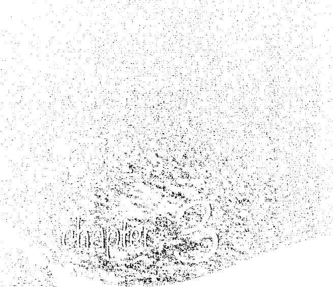

# 靛藍天使

# 新世代小孩的來臨

李·卡羅 Lee Carroll
珍·托伯 Jan Tober 編著
蔡心語 譯

他們看似反社會，無法理解絕對的權威與服從，社會替他們貼上標籤：學習障礙、注意力不集中、過動、亞斯伯格、自閉……其實，他們是散發靛藍氣場的，新世代小孩，需要你我的尊重、陪伴與支持。

天使神秘学院

- 專業占卜預測機構
- 神秘學培訓機構
- 水晶能量研究中心
- 官方淘寶：<http://strc.taobao.com>
- 官方微博：<http://weibo.com/715104687>
- 新書發布QQ群：316790219
- 購買更多好書請聯繫院長大天使

大天使
天使神秘学院 院長
QQ：715104687
手機/微信：13641926204

微信公众平台：strc2011

製作說明：

本書由《天使神秘学院》出重金從台灣購入的原版書籍掃描製作完成。為達到最好閱讀效果，特地把原版書全部切開後，再經由專業掃描設備高精度掃描完成，並經過一張張的PS後期處理最終成書，其間花費大量的人力、物力以及時間，只為能給大家提供經濟並優質的神秘學學習資料而努力。

本學院強力譴責某些機構和個人，把本學院花心血製作完成的電子書籍，包裝後直接放在自家淘寶網上低價傾銷的行為，以謀取不勞而獲的經濟利益。如果長此以往最終將無人願意再為大家花心思製作電子書，那以後可能大家再無新書可讀。

為讓大家以後能夠讀到更多的好書，也為了本學院的良性發展。本學院懇請大家盡量做到如下幾點：

1. 盡量在本學院的網站購買電子書籍。
2. 請勿用技術手段把電子書內的水印及加密去掉。
3. 在收到電子書後小範圍傳閱即可，千萬不要公開傳播，更別掛到淘寶網上低價銷售。

同時為答謝廣大支持者，學院電子書將做如下調整：

1. 學院會把一些早已收回製作成本的電子書折價銷售。
2. 最新製作的電子書籍會開放列印功能，大家購買後有條件的可自行列印成書。

# THE INDIGO CHILDREN

The New Kids Have Arrived

# 靛藍小孩

新世代小孩的來臨

李·卡羅 Lee Carroll、珍·托伯 Jan Tober 編著

> 孩子不是你們自己的孩子。
他們是生命對自身的渴望所孕育出的兒女。
他們借你們而來，但不是由你們而來，
儘管他們就在身邊，但不屬於你們。
你們可以給予愛，但不能給予思想，
因為他們有自己的思想。
你們可以庇護他們的軀殼，但不包括他們的靈魂，
因為他們的靈魂住在明日之屋，即使在夢中，你們也無從造訪。
你們可以努力效法他們，但不可設法讓他們像你們。
你們是弓，孩子是彎弓射出的生命箭矢。
就讓自己歡欣地在射手的手中彎曲吧！

——《先知》（The Prophet），哈利勒·紀伯倫（Kahlil Gibran）

## 獻詞

獻給聯合國工作人員琴·弗洛瑞斯（Jean Flores），她在本書編寫期間與世長辭，現今已是你們在另一個世界的天使，依然持續協助全球孩童。

> 「這些孩童可能非常聰明，非常迷人，也可能令人難以忍受。他們可以每秒想到十個有趣兼具創意的點子，你才剛忙著撲滅他們烤棉花糖的爐火，他們已經在浴缸裡進行「金魚能不能在熱水中生存」的實驗。」

——〈母親〉，娜塔莎·克恩（Natasha Kern）。摘自《時代》（Time）雜誌，南西·吉布斯（Nancy Gibbs）的引述。

## 推薦序

### 自主又敏感的現代小孩

光流聯合診所院長 楊紹民醫師

先不管各位讀者是否熟悉「靛藍小孩」這個名詞，不知道大家是否發現到現在的小朋友跟過去的小孩非常、非常不同。光流聯合診所為全人預防醫學診所，在過去十年來，我們運用自然醫學、能量醫學、營養醫學，以及情緒療法，陪伴非常多的小朋友處理他們的環境適應障礙、分離焦慮、學習障礙、人際障礙、情緒障礙，以及自我認同障礙等各種問題。許多家長，包括我周圍的朋友，都發現他們的孩子，真的跟以往非常不同。首先，他們對於3C電子產品，彷彿上輩子就已經知道該怎麼使用，一拿到就立刻上手，完全不需要他人指導，也不像上一個世代的我們，必須將說明書研究透徹，才能使用得順手。比起這些電子產品的主人，他們彷彿對這些東西更為熟悉。此外，日文、韓文等各種語言的電子遊戲，對他們來說都不會是什麼限制。

再來，他們比起上一個世代的小孩，彷彿更會講道理，即使口才不好或沉默寡言的小孩，一旦你讓他開口了，他講的許多道理都比大人還要深入，讓周圍的大人們根本都不知道該如何回應。甚至，話不用多說，一句就能打中我們的死穴，非常直白地點破，讓我們不得不更深入思考問題的本質，釐清更多之前沒有想清楚的地方。
還有，就是固執，或者說執著。即使是外在行為看起來唯命是從的小孩，一旦他願意講出真心話，就會發現他非常有自己的想法，才不理會大人說的那一套自以為是，卻跟現實世界非常不一致的大道理。他們非常堅持自己的想法及選擇。另一種小孩，他不管三七二十一，就是非常堅持自己想要的，怎麼講也講不聽，怎麼說也說服不了。
在我工作二十多年的前半段，許多家長會以為是大人把小孩寵壞的，覺得現在的小孩愈來愈難教，愈來愈講不聽。此外，用西方心理學與醫學進行兒童心理健康評估的專家，開始告訴我們，這個時代的小孩罹患自閉症、過動症和注意力缺乏症候群者愈來愈多了。在這些專家所知道的心理學與醫學方法用盡之後，接著就是開始要求這些孩子吃藥。

如果您關心環保、地球永續等議題，會發現其實小孩的這些現象，跟整個地球、大環境，以及人類文化與文明的變遷，有著非常深的關連。我們日常生活中最常使用的通訊、交通、多媒體、網路等工具，其運作與發展速度，比起十幾、二十
年前快上數十倍甚至數百倍。文化交流的速度也有著同樣的發展。
前幾週，侄子來我家玩時，我非常詫異地發現，他竟然使用手機的 App，跟不同
國家的小孩，包括說英文、日文及韓文的，在網路上直接面對面的交流。比起三十
年前，我的大學時代，我們寫一封英語信給筆友後，往往要等待一年半載才能夠收
到回信，實在大不相同。有線及衛星電視頻道、網路電視等資源，讓我們隨時隨地
可以看到異國的風光及美食，甚至在極端氣候下極端環境中的各種生物生態。包括
現在最夯的網路直播，只要透過網路，地球上任何一個地方發生什麼事情，我們幾
乎都可以在非常短的時間內接收到這些訊息。許多資訊用更快的速度（可是相對也
比較表象化）的方式在傳遞。
我們的小孩，這些未來世界的主人翁，在成年後，甚至在成長的過程中，就必
須面對一個更快速、更多變、更多元的時代。因此，他們不得不變得更敏感、更敏
銳、更有主見，更堅持自己想要做的是什麼，否則就很容易淹沒在這些形形色色、
變化多端的資訊中而迷失了自己。 他們的身體也必須比過去的孩子更敏感！他們很容易出現各式各樣的過敏性疾病。真正的原因是他們必須能夠更快地偵測到許多對健康有危害的環境細微變化，並且透過身體的症狀，讓他們有能力快速離開那些有危害的環境或生活方式。如果孩子有成癮的問題，喜歡不當的飲食，包括高糖、高熱量、高人工添加物的食物或零食，其實最大的問題一定是來自於生活周遭的大人與所成長的環境中，存在著讓他們身心不舒服、混亂的潛在問題。他們有點像是以毒攻毒，不自覺地用這種方式來緩解自己的不舒服，或者轉移自己的注意力。這個部分是我們在跟無數個求助於光流團隊的家庭合作過程中，一步步求證出的心得！這些不管是身體或心理情緒的問題，如果只用傳統的醫學與心理學觀點，非常容易帶來長期用藥的結果。因為大人們並沒有提供這些孩子能夠有效成長及抗壓的技巧！最重要的是，這很可能會讓孩子失去了真正了解自己的天賦特質，並發揮這些天賦特質去幫助他人及社會的機會；然後反過來終其一生，要背負著自己有注意力缺失症候群、過動症等疾病的稱號過一生！靛藍小孩，只是這群高敏感特質者的其中一個稱號。而這本書即將帶領我們從
不同的領域來理解這個議題。更重要的是，要讓更多人一起來面對、共同來思考，如何面對這個蛻變中的世界？如何陪伴這些走在蛻變前端的孩子們，讓他們能得到更快樂、更健康、更不同凡響的未來！

> 備註：本文中所提到的資訊，一部分已獲得國際論文研究驗證，跨領域論述則源自筆者多年臨床觀察、透過整合式思索得出。僅供個人參考，如果有醫療需求請諮詢醫師的意見。

## 譯者序

### 改變舊思維，全心全意尊重孩子

幾年前，我正為教養兩顆「魔王等級皮蛋」而頭痛，第一次在網路上看見「靛藍小孩」一詞，以為是電影《阿凡達》裡的納美人。初步瀏覽網站的資訊後，腦中浮現各種問號：原來世上有這種事？那我自己是不是靛藍「老孩」？我的兩個兒子是不是靛藍小孩？

我身邊沒有專家指導，網站上也沒有提供保證有效的檢驗方式，這些疑問無從查證，也隨著時間慢慢淡忘。

接下本系列，純因「靛藍小孩」四個字喚醒了當年的記憶。翻譯本書期間，我的心情起起伏伏，問號有增無減。直到譯完本書，接著翻譯同系列第二本，同時翻閱第三本，問號愈來愈少，終至銷聲匿跡。我向來不愛「書中自有黃金屋」之類的論調，倒是嚮往「柳暗花明又一村」的境界，本系列正符合我這獨特的癖好。

此刻，我的感想是：孩子到底是不是靛藍小孩根本不重要，重要的是他們的
「作業系統」太高階，我這種低階系統到底該如何升級？如何因應？這才是父母最應該學習的地方。

本書不只為靛藍小孩的父母而寫，說句真心話，我認為它提供的資訊值得所有父母參考。當我譯到書中某一段：「小兒子史考特很黏人，而且很不高興來到地球。從吸進第一口氣開始，他就哭個不停」。不禁放聲大笑，因為我的大兒子正是如此。當下的心情便是：「管他是不是靛藍小孩！他們和書裡的許多描述實在太像了！我一定要把這些父母的「招數」全學起來！

> 有一段話也讓我印象深刻：
> 「當我們觀賞克林·伊斯威特的電影時，總會為他的叛逆鼓掌叫好。但是當孩子出現叛逆精神時，我們居然叫他們去吃藥。」

我便常陷入「孩子是不是過動兒」的焦慮中。大兒子活動力旺盛，運動神經發達，當五歲孩子站在超長溜滑梯上嚇得哭泣，一歲的他已經率先擠過去，尖聲大笑地玩了好幾趟。除了電腦遊戲和運動，他做任何事都不專心，注意力非常不集中，有很長一段日子不喜歡上學，以叛逆來表達抗議，在學校的行為總是令師長頭痛。我心中帶他就醫的念頭從來沒有斷過，但有個聲音也從來不曾消失：一定是沒有找對方法，他需要的一定不是這種方式。

也許上帝要考驗我的能耐，小兒子與大兒子的個性完全相反，總是沉默不語，躲在角落玩小汽車，不與人交流。上幼稚園一個月後，老師告訴我，他至今沒有交到半個朋友，也不會像大多數孩子哭著要回家，他只是一有空就躲在角落自得其樂，經常幾個小時一句話都沒說。

他在家也是這樣，我甚至曾經懷疑他有語言障礙。現代人總是會拿各種資訊嚇唬自己，我以為自己「得天獨厚」，生一個過動兒之後，又生了一個自閉兒。我不只一次懷疑：難道運氣真這麼差，回回抽中「鐵王」？答案到底在哪裡？

如果早點往對的方向尋找，例如早點看到本書，我就不會這麼慌了。書中提到：「觸覺學習者偶爾在聽覺和視覺學習上發生障礙，往往需要觸覺刺激從旁協助他們透過其他感官學習。這代表當他們在看或聽時，可能需要可以觸摸的東西。我們會給孩子小而軟，又可擠捏的球。你應該允許孩子，在聽講、閱讀或書寫時，一手操控球或其他物品，不管在學校或家中都是如此。在學習過程中以觸覺輔助，或許能夠提升他們的聽覺和視覺學習力，也可能減少在課堂上發生不受歡迎的激烈行為。」

翻譯這一段時，我赫然發現小兒子正是觸覺學習者，他從小就熱愛拿各種東西為。
在地上、桌上，以及所有你想得到的材質上滑來滑去，甚至在我臉上滑！藉以研究不同材質所產生的觸感。我心中不禁大嘆：原諒你愚蠢的媽吧！你媽從來不知道天底下有這種事！我在翻譯本系列時，上面這兩句話不知喊過多少遍了。作者也一再對家長喊話：要研究，要精進，要學會與新世代靛藍小孩相處，要好好愛他們，不要故步自封，不要用舊能量、舊思維捆綁自己和孩子。

> > 「生養靛藍小孩對這個世界是一種真正的恩賜，如果你與聖靈一同面對，對你和孩子也是一種恩賜。孩子生下來是為了教導你及被你教導。親子之間不妨開誠佈公地懇談，你將在孩子身上發現令人驚奇的靈性，還能大大拉近親子間的距離，加深彼此的信任。我們一定要時刻謹記，神是靛藍小孩真正的父母。當我們為了與神一同教養孩子，不斷向祂尋求協助，養育靛藍小孩就會成為我們神聖的生命目的中，最有意義又最快樂的一部分。」

這正是我一直在尋找的答案！養育孩子的過程中，我經常搜尋各種資訊，並尋求諮詢管道，答案時近時遠，時有時無，而我始終力不從心。慶幸的是上帝聽見我
的心聲，給了我翻譯本系列的機會。此外，透過書中各個家長的分享，我明白自己並不孤單，原來這一切只是因為時代變了，孩子們配備的是高階作業系統，身為家長，我們必須充實自己，最重要的是改變舊思維，不能再奉行「高壓統治」、「聽話才是乖小孩」這些理論，必須全心全意愛他們、尊重他們，才能勝任養育靛藍小孩的重任。

如果你也對自己的孩子有此疑問，對現行各種教育方式或制度感到迷惑，如果
你也像我一樣，堅信孩子不是只有「帶去給醫師看、請老師教訓、找補習班補救」
等等這麼簡單，那麼請一起加入探索的行列，尋找適合你的答案。

相信讀完本書後，許多家長也會和我一樣，很多問題獲得解答，但從解答中又
添了新的疑惑，這正是養育新世代孩童的最大挑戰。本書做為「靛藍天使」系列的
第一本，扮演拋磚引玉的角色，書中充滿各種解說、理論與引用，難免讓人有種
「怎麼問題好像變得更多」的感覺。不過，到了第二本，你會看到大量的「苦主」
父母分享寶貴經驗，除了可供驗證第一本的各種論述，也可與自己的實際情況互相
參照，相信你必能如我一樣，有種豁然開朗、撥雲見日的驚喜。

此外，本系列特地找了幾位「資深」靛藍小孩分享成長過程，在我看來，他們
的心路歷程比黃金還要珍貴。在資訊不發達的年代，多虧這一批靛藍先鋒（包括他
們的父母），今日的我們才能獲取這麼多實用資訊。第二本書便集結了各種靛藍小
孩的實例與心情故事，有子女摻雜喜悅與淚水的成長紀實，也有父母歷盡艱辛的寶
貴經驗。
我已經迫不及待要進入第三本的世界，因為它與第一本的問世時間相隔十年，
充滿各種新訊息。我想早點知道，自己這顆過時的腦袋到底可以進化到第幾版？什
麼時候才能趕上這些與生俱來就安裝四度空間版本的新孩子頭腦？什麼時候才不需
要在心底狂喊：原諒你那愚蠢的媽吧！
小兒子前兩天看我埋頭苦幹，有點不高興，便拿他最近學的魔術騙倒我，然
後得意地大笑離去。現在的他已經當上副班長，有很多好朋友，也是老師的得力
助手。大兒子度過最令人頭痛的二年級，四、五年級時非常幸運，接連受到亦師亦
友的兩位導師細心帶領，完全變了一個人，我也終於明白他要的不多，只希望大人
「懂他」。我花了十年摸索，這是條漫長的學習之路，後面還有更多挑戰。（青春
期！）但套用本書資深靛藍小孩所說的一句話：「愛是唯一。」我相信父母只要深
愛子女（絕非溺愛），終有一天會找到出路。

## 譯者序

「自閉、過動、注意力不集中、叛逆」等等，是標籤，也可以視為問題，甚至是病症，但在我看來，它們都是求救訊號，孩子在向父母求救，只是父母往往無法理解。再次強調，需要升級的是父母！本書有專文探討這些標籤，甚至探討藥物對孩子的影響，並強調營養的重要，我認為每位父母都需要了解這方面的資訊。

最後要說的是，大兒子常拿冷笑話誘我上當，小兒子最近也愛變魔術騙我。我們會在大笑中熱烈擁抱這場「欺騙」。本書有一位父母提到：「我曾夢見自己能把紙吸到手上，仿佛手有磁性。這場夢如此逼真，令我不由自主地嘗試隔空翻書。阿
嘉見狀，便問我在幹什麼。我說：『沒事。』她說：『妳是不是想隔空翻書？』我說：『沒錯。』於是她說：『妳需要閉上眼睛，熱愛上帝，看見隔空翻書的情景，然後就可以成功。』接著她要我試試看，結果這孩子趁我閉眼時把書頁翻了過來。」

不管你信不信，我的兩個兒子天天對我做類似的事，而我居然樂於被整！但我可是最資深的『皮蛋』，正等著哪天升級到高階作業系統，回頭好好整他們一回！

各位還在路上的父母，不要忘了，你們的認藍小孩正在前方等著爸爸媽媽。祝福各位家長成功升級。

推薦序 自主又敏感的現代小孩 004
譯者序 改變舊思維，全心全意尊重孩子 009
序論 帶著自覺降生地球的新型孩童 020
什麼是靛藍小孩？ 031
理查·席格爾——人的分類系統 034
南西·安·戴普——靛藍小孩序論 039
芭芭拉·迪林傑——關於靛藍小孩 056
朵琳·芙秋——是天賦還是麻煩？ 064
凱西·麥克羅斯基——全新且強大的孩童 066
黛博拉·海格爾——靛藍小孩 075
羅伯·傑拉德——天堂的使者 082

你該怎麼辦？

- 南西·安·戴普——引導孩子 027
- 朵琳·芙秋——養育靛藍小孩 103
- 凱西·麥克羅斯基——養育靛藍小孩的要點 106
- 黛博拉·海格爾——厭煩與誠實 109
- 茱蒂·史匹勒·麥基——傳達正面有力的訊息給孩子 112
- 羅伯·傑拉德——如何讓靛藍小孩遵守紀律 132
- 羅伯·歐克——心靈之旅：獻給模範先鋒的教育願景 137
- 凱西·派特森——引導靛藍小孩的策略 140
- 羅伯·歐克——榮耀這群如同恩賜的小朋友 153
- 珍妮佛·帕瑪——教導靛藍小孩 159
- 全美蒙特梭利學校 165
- 全球華德福學校 167
- 寶琳·羅傑斯——非競爭的生活遊戲 173
- 喬依絲·謝朋——養育健康快樂兒童的7個秘訣 175

## 靛藍小孩的靈性層面

181
米蘭妮·梅爾溫——尊敬靛藍小孩
185
羅伯·歐克——從心出發的旅程
201
南西·安·戴普——靛藍靈性
206
朵琳·芙秋——養育靛藍小孩
214
蘿莉·喬伊·平克翰——我親愛的靛藍小孩！
227

## 健康問題

243
朵琳·芙秋——順從是否合乎健康？
248
基斯·史密斯——當今特殊孩童的慢性兩極反轉
261
凱倫·艾克——透過營養找到答案
282## 附注
366
协同撰稿人简介
346

## 附录
346

## 总结
337

### 康蒂絲·克里曼——愛是唯一所需：靛藍小孩經驗談
327

### 萊恩·莫魯斯基——成長中的靛藍小孩
313

### 靛藍小孩的訊息
311

### 凱倫·博斯基——肢體整合：個案研究
304

### 黛博拉·葛洛斯曼——過動兒營養補充備忘錄
291

## 序論

當你開始閱讀這本書，可能會想：怎麼，又是一本「悲慘絕望」的書，告訴我們社會如何改變孩子？但事實並非如此，它或許是人性中最令人興奮（哪怕有些奇特）的改變，儘管所有團體以各種工具進行研究，但它從未被人注意並觀察過，也不會被記錄下來。

珍和我走遍各地擔任講師和作者，教導人們如何自我幫助。六年來，我們的足跡遍及全球，在大眾和小眾面前演說。我們處理各年齡層的議題，橫跨多種文化和語言。我兒子在多年前便已長大自立，珍則沒有孩子，但她總覺得有一天會從事相關研究（她猜對了）。我們曾經聯合出版六本著作，其中沒有一本針對孩童，因為那不是我們的研究重點。那麼，為什麼我們現在會聚焦在這個議題上呢？

如果你從事心理諮商，很多時候必須與他人親近，便會不由自主地注意到某些人類行為的模式正在漸漸成形，於是將它當作研究主題。我們的研究與本書出版商露意絲·賀 (Louise Hay) 秉持的精神一樣，旨在激發大眾自立自強，加強他們的自尊心，使其懷抱希望，並賦予提升自我的力量，突破內心「認定」的自己。它也包含靈性治療（非宗教），並鼓勵人們自我檢查，希望大家在向外尋求奧援之前，能夠先尋找「內在神性」。它也談到自我治療，以及在負面思想盛行的多變世界中，如何擺脫煩惱憂愁。這是一項收穫非常豐富的研究，但也令我們注意到許多現象。

多年前，人們便開始和孩子討論某些特定問題，由此看來，現在還有什麼新鮮話題？孩子往往是我們生命中最大的恩賜，也是最困難的挑戰。現今市面上探討養育與兒童心理的書籍琳瑯滿目，但我們注意到現象和這些書的主題完全不同。

我們愈來愈常聽見一種新型孩童的出現，或至少可說是父母正面臨新的問題。

這些難題之所以奇特，在於成人與孩子的立場互換，令父母始料未及，也不符合我們這一代的成長歷程。起初，我們對此議題並沒有多加注意，後來聽見兒童專家談到他們也面臨相同的挑戰。許多專家為此惱怒不已，而且弱於應付。全國具有三十年以上資歷的幼兒園所教職員中，也有些人回應同樣的情況，指出現今的孩子不知道為什麼就是有些不一樣。接著，我們發現一種可怕的情況，隨著「新」問題日益嚴重，社會上出現壓倒性的聲浪，最後竟以合法毒害孩子的方式來解決問題！

一開始，我們以為这只是一種文化特質，反映了變遷中的美國。美國人具有偉大的情操，一方面靈活地度過一次又一次的巨變，一方面還能維持穩定的政治基礎。問問現今的學校教師，他們會告訴你，美國的教育體系確實需要革新。也許時機已經成熟，但這並非革命性的新消息，我們也沒有為此開始撰寫本書。

珍和我始終致力於解決個體問題，從未觸及政策或環境「因素」。並非我們不感興趣，而是身為顧問和講師，我們注重的是如何幫助個別的男人和女人（儘管我們常對著一大群人演講）。這份工作的前提，始終是打造身心靈平衡的人，讓他們擁有積極的心態並致力於幸福安康，必要時能夠強力扭轉任何局面。也就是即使個體在理智和情感上同時面臨巨大的社會衝擊，依然可以安然度過。

此外，我們認為，即使現今的孩童有很大的變化，專業人員與學者必定會互相交流，所謂的「專家」也會密切觀察。數年前，我們原本以為可以看到初等教育機構及幼兒園發表的「新型孩童特質」相關報導或分析，然而，什麼都沒有發生，就算有也不足以引起大眾的注意，家長並未知悉，也沒有獲得實質的幫助。

由於事情不如預期，使得我們對原先的想法更為篤定：我們觀察到的現象，也許沒有想像中來得普遍，再說孩童本來就不是我們關注的焦點。過了幾年，我們終於改變主意，總覺得不管這個議題有多麼奇怪，都該有人蒐集相關資料並加以報導。就這麼決定了！讀者可以看到，以上就是促使本書問世的因素，在你盲目聽信我們所謂的「發生生活中的無解難題」之前，首先應該了解它的成因。如今，我們已經明白下列事項：

- 1. 它不只是美國現象而已，我們親眼目睹三大洲也有相同的情形。
- 2. 它似乎跨越了文化的藩籬（包含多種語系）。
- 3. 心理學界向來將人性視為固定不變，而它在各種型態的學說中都屬於「異類」，於是不受主流重視。一般來說，社會傾向於相信革命，但只相信曾經發生過的革命。我們可能正目睹一種新的自覺現在正慢慢地出現在地球上，並顯現你我的孩子身上，而這個想法已遠遠超出固有而保守的觀念。
- 4. 這個現象正逐漸擴大，愈來愈多相關報導浮上檯面。
- 5. 它由來已久，許多專家已經開始觀察。
- 6. 當中許多難題漸漸有了答案。

## 本書目標

綜合以上所述，我們已注意到一個必定會在多方面引起爭論的議題，並決定公開自己的見解，盡可能為你傳達最好的訊息。據我們所知，這是第一本專門探討靛藍小孩的書籍，許多人閱讀時會發現它與自身密切相關。我們由衷盼望藉由本書拋磚引玉，以使將來有更專業的人士繼續探討這個議題。

這本書專為父母而寫，為靛藍小孩議題開宗明義，而非「總結」。本書的目的在於協助你與家人的相處，並提供資訊，用以辨別自己是否面臨類似的局面。我們要求你運用本書一一檢視所有浮上檯面的問題，若非確信這本書能幫許多人找到答案和解決方法，我們也不會將它付印並出版。我們曾在世界各地與數百位家長和教師懇談，本書的問世主要來自他們的鼓勵，還有少部分來自他們的請求。

## 方法

我們曾經想過，呈現無數父母養育靛藍小孩的故事一定很棒，因為有太多案例可以書寫。但這些畢竟只是故事，不符合研究人員（或邏輯思考者）驗證行為的模式。因此，我們決定運用人脈，蒐集一系列報導和評論（當然也包括少數故事），蒐集對象包括全美各地公認可信的社工、教師、哲學博士、醫學博士和作家。讀者閱讀本書時將會發現，我們透過工作以非科學的方式觀察到一種現象，且盡力以合乎現實的方法來驗證它的存在。當我們認為某些部分適用科學分析時，也會在書中加入一些個案。我們在這個領域並未從事可信的研究，因此提出專家的報導和發現，將有助於驗證本書的議題。

## 各章大要

我們盡可能為本書設定可產生最大助益的結構，透過接下來的介紹，將幫助你對我們有所認識，也盼望你能明白，我們真的非常關心你的孩子！

第一章中，嘗試列出這些孩童的特質，並引介幾位參與者或協同撰稿人，他們將在某些章節登場。

第二章隨即談到如何與靛藍小孩相處。許多書籍都將這類實用資訊擺在結論，但本書後續各章主要在探討醫學和／或一些奧秘的題材，需要單獨完整地呈現。因此，在第一章和第二章首先提出答案和實用資訊，而這部分單獨完整呈現，也有助於你及早決定是否要繼續深入研究這個議題。另外，本書也探討靛藍小孩的教育進程以及替代教育方案。

第三章將闡述靛藍小孩現象的靈性觀點，當中並未涉及宗教，而是報導這些孩童普遍具備、但在大人身上非常罕見的特質，這是本書必須討論的議題。這群孩童似乎打從心底「明白自己是誰」，而且很早就對父母交代清楚！我們怎麼能夠漏掉它呢？

第四章描述靛藍小孩的診斷。並非所有靛藍小孩都會遇到嚴重的精神問題，然而一旦發生時，下場往往是被診斷出罹患注意力缺失症（Attention Deficit Disorder, ADD）或注意力不足過動症（Attention Deficit Hyperactive Disorder, ADHD）。請注意，並非所有罹患注意力缺失症的孩子都是靛藍小孩。不過，你是否想了解有效的注意力缺失症替代療法？我們試著在第四章提供一些傳統與非傳統的方法，並列出相關個案。這是一種嘗試，希望孩子不需靠藥物就能保持鎮靜，也讓父母有一些替代方案可以試用。

請仔細想想這個嚴肅的議題：如果你是家長，有一個服用鎮靜藥物的孩子，也許你會覺得利他能 (Ritalin) 是真正有效的良藥。這孩子的行為改正了，似乎變得更冷靜，在家中和學校的表現也更穩定，太好了！然而，利他能使得孩子的行為停滯，說不定連孩子都喜歡自己變成這樣。但是，在往後的人生中，一旦塞子拔出瓶口（孩子停藥），內心潛藏的泡沫仍會一鼓作氣地湧現。當他們長大後回顧兒時，某段日子只剩下一片模糊，而且脫離了真實自我，可能會覺得喪失部分童年。利他能常延遲成長期的問題，也延遲了伴隨成長而來的智慧，使人無法學習社會化。這個副作用已經過醫界的證實並列入紀錄。

也許真的有其他方式可處理孩子的問題，而不需仰賴利他能，好比某些替代療法。不妨抱持開放的心態嘗試，我們也會在本章介紹幾位資歷豐富、熱心助人的專家，他們提倡的方式普遍具有良效。

第五章將為你呈現幾位靛藍小孩撰寫的訊息，包括已經長大或即將長大的靛藍小孩，透過他們的觀點回顧成長歷程。相信我們，他們明白自己與眾不同！這些訊息具有深遠的意義。

第六章是本書的總結，為你呈現每位作者撰寫的簡短訊息。

## 协同撰稿人

我們每介紹一位协同撰稿人，都會列舉對方的資歷，至於完整資料與所屬機構則詳列於書末。如果你對本書有任何問題，或想購買他們的著作或產品，我們鼓勵你寫信、寄電子郵件或打電話聯絡。如果他們代表某個機構，我們也會盡可能附上該機構的網址。如果對方沒有電子郵件或網址，也沒有其他聯絡資料，儘管寫信給本書的出版社賀屋出版（Hay House），由公司代為轉交。信中務必寫上本書的英文書名，公司收到信後就會將你的問題轉達給相關人士。你也可以來信提問，但我們畢竟不是專家，在這個領域比較像是記者，負責尋找一群更有資格的專業人士，請他們幫忙解明並處理靛藍小孩議題。也許我們會將你的問題轉交適合的协同撰稿人，由他們來回答。

> 譯注●賀屋出版的各項聯絡資訊，可上網 http://www.hayhouse.com/contact/查詢。

## 參考資料

每當某個議題有更進一步的資料可供查詢時，你會看到文字有註記的數字，每個數字代表書末有一條附註，列出其他參考書目、產品或是機構。

## 什么是靛蓝小孩？

什麼是靛藍小孩？為什麼以「靛藍」稱呼他們？在這裡，我們先解釋定義：靛藍小孩展現一組全新且與眾不同的心理特質，其行為模式通常無法以舊有理論來解釋，而且普遍具有獨特性。在生活中與他們互動的人（特別是父母）往往會改變對待與教養方式，以便取得平衡。一旦忽視他們全新的行為模式，可能使得寶貴的新生命陷入失衡與挫敗的困境。本章旨在點明、解說並驗證靛藍小孩的特質。

十種靛藍小孩最常見特質：
- 1. 自覺以皇族之姿降生在這個世界（行為也像個皇族）。
- 2. 自覺「應該來到地球」，對沒有這種想法的人感到詫異。
- 3. 自我不是大問題，他們經常主動告訴父母「他們是誰」。
- 4. 他們很難服從絕對的權威（泛指沒有任何解釋或選擇餘地的情況）。
- 5. 某些事他們就是不做，例如排隊，這對他們來說很難辦到。
- 6. 制式化與不需要發揮創意的活動，會令他們洩氣。
- 7. 不管在家中或是學校，他們經常有一套更好的做事方法，使得他們看起來像是「制度破壞者」（與任何體制不相容）。
- 8. 除非和同類在一起，否則他們看起來像是反社會人格。如果身邊沒有同類，他們通常會縮進內心世界，覺得知音難覓，學校的社交生活常令他們感到痛苦。
- 9. 他們對「罪惡感」之類的教條（「等你爸回家，看看你做的好事」）無感。
- 10. 他們會大方讓你知道他們的需求。

以上某些特質會在後面詳細闡述，接下來我們想要讓你了解，為什麼以「靛藍」稱呼這些孩童。

自心理學問世以來，人類的行為模式被劃分為幾種系統。一般人確實常落入「群組」行為模式中，當你閱讀相關資料，發現自己符合某一組行為模式的描述，有時會覺得很有趣。各群組以不同方式試圖解明並連結人類的行為，其目的顯然是為了找出準確套用在每個人身上的公式，以便心理學家進行各種研究。有些研究體系具有悠久歷史，有些則是劃時代的新學說。

接下來，我們將焦點轉向心理醫師，一窺心理學的分類，以可靠的學術理論做為本書的開端與立足點。理查·席格爾（Richard Seigle）不僅是開業醫師，也透過原住民的醫療方式研究人與心靈。

#### 人的分類系統

> —— 醫學博士理查·席格爾

綜觀西方文明史，西方人熱衷於探索、定義與評判。隨著新土地與住民不斷被發現，西方人的第一個念頭往往是：誰像或是不像我們，以及我們可以拿走什麼東西？在漫長的西方歷史中，那些膚色、信仰、文化和語言不同的民族，幾乎都被判定為下等人。

在科學術語中，我們試著將人按照頭型、膚色、智商等分類。人類學家與心理學家花費多年苦心，為人類的思考、感覺及行動各方面進行評估。以下列舉一些分類法：

- 智商測驗：例如魏氏（魏氏成人智力量表，WAIS）與史比人格量表（Stanford-Binet Personality）。
- 人格測驗：例如明尼蘇達多相人格測驗（MMPI）、米隆臨床多軸量表（MCMI）、A型性格與B型性格。
- 投射性人格測驗：例如羅夏克測驗（Rorschach）、主題統覺測驗（TAT）與社會認知理論（SCT）。
- 記憶測驗：例如魏氏記憶量表（WMS）與班達（Bender）測驗。
- 特定心理因素：下列因素偶爾用來做為行為分類的基礎，如家庭結構和習俗、文化、夢想、自我心理學、連結與附著、神話、宗教、意識與無意識動機與思想等。
- 廣獲認可的精神學家所提出的理論：例如，佛洛伊德（Freud）、榮格（Jung）、阿德勒（Adler）、柏尼（Berne）、弗洛姆（Fromm）、肯伯格（Kernberg）、克蘭（Klein）、馬斯洛（Maslow）、佩爾斯（Peris）、瑞克（Reich）、羅哲斯（Rogers）、史金納（Skinner）與蘇利文（Sullivan）等，皆各自運用了不同的人格類型系統。

> 甘地（Gandhi）曾說：「我們在多元文化中融為一體，打造美麗的文明，也為文明帶來考驗。上個千禧年結束，象徵全人類在愛與接納上，展現更高層次的覺醒。如果西方人不曾貶低原住民，早在數世紀前便可透過其文化學會更寬容的愛與接納。

#### 以色彩劃分人類行為

除了傳統心理學，還有許多靈性與形上學的分類系統，它們試圖以下列各種方式做為分類依據：生日屬性（星座）、生命能量，或是與神聖的動物連結（中國人與美洲印第安人的文化根源）。不論你是否覺得上述星座與某些系統並不科學，它們都被公認為最古老的科學，在許多早期文獻中都能發現它們的存在。從古到今，所有系統都是為了幫助人類更了解自己。一九八二年，南西·安·戴普（Nancy Ann Tappe）出版《透過色彩了解生命》（Understanding Your Life Through Color）一書，首度提及並闡明新孩童的行為模式。南西以色彩劃分人類行為，憑直覺打造精準無比且深具意義的分類系統。該書雖屬於形上學範圍，但讀起來不但不枯燥，反而妙趣橫生，令你忍不住在她開創的系統中尋找自己的特質，時而被一語道破的內容逗笑，甚至噴噴稱奇。時至今日，南西依然走遍全球，針對人類行為舉辦演說與研討會。

有些人認為以色彩劃分人類行為太過怪異了，有些人則只對形上學感興趣，在此推薦他們閱讀這本全新的《顏色密碼：從顏色看性格》（The Color Code: A New Way to See Yourself, Your Relationships, and Life），作者是泰勒·哈特曼（Taylor Hartman）博士。本書與靛藍小孩無關，只是表明以色彩為人格特質分類並非靈異團體的專利——哈特曼的著作以希波克拉底（Hippocratic）或中世紀模型為依傍，探討四種性格——熱情、憂鬱、沉靜與急躁，並分別歸類為紅、藍、白及黃色。

> 譯注 1 希波克拉底（西元前四六〇～前三七〇年）：是古希臘醫師，西方尊為醫學之父。他提倡體液學說，認為人體由血液、黏液、黃膽汁和黑膽汁組成，每個人體內的四種體液比例不同，因而形成不同人格特質。

前面提到南西·戴普憑直覺與觀察，用色彩來為人格分類，結果精準無比。在她的著作中，其中一種色彩是什麼呢？你猜對了，就是「靛藍」。這個類別對新型態兒童的描述非常準確……而且早在十七年前便已問世！（這代表至少有人注意到這件事。）我們認為南西對人性有非凡的見解與體認，卻不曾受到應有的推崇，這個世界應該還她一個公道。如果你對相關議題的預言有興趣，可參閱第三章介紹的影視圈名人，在他的預言中曾經提到全新的「深藍」孩童！珍在深入研究後，發現有必要當面與南西會談，針對其書中提到的「靛藍生命色」提出幾個基本問題，以便撰寫本書。我們一致認為，南西的發言最適合做為探討靛藍現象的開場白，畢竟她是引進並闡明這個議題的先驅。本書將在各章引述珍與南西的談話，針對不同主題擷取相應的談話內容。

## 靛藍小孩序論

——南西·安·戴普／由珍·托勃（代號J）訪問之第一部

> J：南西，妳在《透過色彩了解生命》一書中提及並闡明靛藍現象，成為相關議題的先驅。究竟什麼是靛藍小孩，為什麼以「靛藍」稱呼他們？

> 我稱呼他們靛藍小孩，因為我實際「看見」的就是靛藍色。

> J：這是什麼意思？

這是生命色彩。我藉由觀察每個人的生命色彩，明白他們來地球的使命，包括他們要學習哪些事物，此生的規劃又是什麼。一九八〇年代，我覺得將有兩種新的色彩加入這個系統，因為有兩種顏色消失了。其中紫紅色不再出現，洋紅色則廢棄不用。於是，我認為這兩種生命色彩將被取代。不過，有一次我在加州度假勝地棕櫚泉（Palm Springs）看見一個人呈現紫紅色，不禁大吃一驚，因為這個顏色早已不用。

在一九〇〇年代就已經不再出現，至少我是這麼聽說的。我告訴大家將有兩種新的生命色彩，但我自己也不知道答案。我到處尋找，終於『看見』靛藍色。當時我到聖地牙哥州立大學（San Diego State University）做研究，試圖歸納出完整的心理分析，以便禁得起學術界的考驗。一同參與研究的，還有精神病學專家麥葛雷格醫師（Dr. McGregor）。另一位醫師的名字我忘記了，他在兒童醫院服務，是第一個引起我注意的人，因為他的妻子原本不孕，後來居然懷了身孕。孩子誕生後，心跳出現嚴重雜音，他來電拜託我過去一趟，想了解我究竟會『看見』什麼。我抵達後仔細觀察，確認這是一種新的顏色，尚未納入生命色彩系統。然而，寶寶在六週後不幸逝世，小生命來去匆匆。那是我首次親眼見到不一樣的孩子，從此我開始尋找他們的蹤跡。一九七五年，我辭去聖地牙哥州立大學的教職，上述事件發生時我尚未辭職。不過，我並沒有專注在這個議題上，直到一九八〇年開始寫書後才有所改變。我足足花了兩年時間編寫那本書籍，一九八一年第一版問世，現今的版本則是一九八六年出版。由此推斷，我應該是在七〇年代開始注意這件事。一九八〇年代，我正式為它取名，並著手研究相關人格學。當時有幾位五到## 什么是靛蓝小孩？

七岁的研究对象，我单凭观察就能「读」出他们的性格。最大的收获是，我发现一般人都有生命蓝图，但在他们这个年纪还看不到，必须等到八年后。靛蓝小孩在二十六、七岁时，会出现重大转变，也就是生命意义终于底定，较年长的人将会逐渐确立人生目标，年轻的人则尚在摸索阶段。

> J：听起来，未来似乎仍有待我们努力。

这个议题仍处于研究阶段，正因如此，我的靛蓝小孩相关著作一再延迟出版。我很高兴你们也加入研究行列。

> J：大众对这个议题似乎具有高昂的兴致和旺盛的求知欲。

没错，确实有，因为大家对靛蓝小孩依然陌生。他们是「电脑化」孩童，意谓他们的头脑比心更发达。我认为这些孩童天生具备视觉心像的能力，他们深知一旦掌握技巧，就能成为个中高手。他们也是科技导向的孩童，我据此认定未来的科技将突飞猛进，这些孩童三、四岁时的电脑素养往往超越六十五岁的成人。

他们是科技孩童，为科技而生，这代表我们可以大胆预测，未来十年的科技发展将达到出人意料的地步。我相信，这些孩童正在开启一扇门，帮助人类摆脱各种苦差事，未来唯一需要辛勤工作的大脑。

> J：我同意你的看法。

这就是他们存在的目的。我看过一些案例，由于成长环境过于封闭，有时候会导致孩子们杀戮。如今我信奉矛盾理论，这个世界必须具备黑暗，也要具备光明，以便我们选择。没有选择，人就不会成长。如果我们只是像机器人般守规矩，自由意志便不存在，也等于没有选择；没有了选择，一切都没有意义。这段话虽然离题，但我自有道理。

> 我最近一再告诉学生，如果真要相信人类的起源，真要相信《圣经》，需知经文是这样写的：「起初，地是空虚混沌，渊面黑暗。」经文始终如此陈述。接着神说：「要有光。」祂创造了善，创造了光。祂并没有创造黑暗，黑暗本来就存在。

## 什么是靛蓝小孩？

接下来，祂的创造历程是一连串分离。祂分开黑夜与白天、光明与黑暗、天与地、天空与空气，以及地与水。祂分开男人和女人，创造男性和女性，创造法则便是分开然后选择；没有选择，我们就不会成长。

因此，我的看法是，人类在各方面都有极端，尤其是这个层面。我们已经有了最极端的人——最神圣的人与最邪恶的人。大多数人都置身于两者之间，一边渴望达到神圣，一边犯错。如今我发现，极端正在渐渐整合。最神圣的人正在成为普通人，最邪恶的人也渐渐变成普通人，这种平衡已经达到更精微的地步。目前为此，我见过的那些杀害同学或父母的年轻凶手，每一个都是靛蓝小孩。根据我的观察，其中只有一个是人文型靛蓝小孩，其余都是概念型靛蓝小孩。

J：这些杀害其他孩子的都是靛蓝小孩，妳的观察确实很有趣。根据妳的谈话，我归纳出以下结论：他们的道路本来很明确，却基于某种因素而受到阻碍，他们只好致力于清除阻碍，对不对？

这是一种新型态的生存之道。你我在幼时都有过可怕的念头，也曾想过逃离一切，但我们会畏惧，他们不会。

J：他们不畏惧，因为他们知道自己是谁。

他们信任自己。

J：接下来我们深入其他问题。根据妳的了解，世人何时开始注意到靛蓝小孩？目前靛蓝小孩在全体人口中占有多少比例？

我认为，目前十岁以下的孩童有百分之九十是靛蓝小孩。我无法明确指出第一批靛蓝小孩诞生于何时，但我知道自己从何时开始关注这件事。一九八六年，我的著作《透过色彩了解生命》问世，代表我在此之前已注意到它。我想，最早可以追溯到一九八二年。虽然我已经关注它很长一段时间，但始终没有给它一个正式的名称。直到大约一九八五年，我终于确认这些孩童的存在。

## 什么是靛蓝小孩？

> J：靛蓝小孩有没有不同的类型？如果有，个别特点是什么？

靛蓝小孩共有四种类型，每一种都有一个人生目标：

- 一、人文型：首先是人文型靛蓝小孩，他们将来会与大众共事，是未来的医生、律师、教师、业务员、商人和政治家。他们为大众服务，十分活跃，也善于社交。他们任何时候都能跟任何人攀谈，态度非常友善，主张强而有力。他们的肢体动作笨拙，诚如我刚才所说，他们相当活跃，因此偶尔会忘记踩煞车，以致不小心撞墙。他们不知道如何玩一个玩具，必须把每件东西都拿出来，全部摊开，但很可能不碰任何一个。他们是这种人：如果你要他们打扫房间，一定要再三提醒，因为他们很容易分心。他们进房间，开始打扫，不久看到一本书，然后就坐下读起书来了，因为他们是阅读狂。

我昨天搭机时看到一个三岁的靛蓝小孩，他显得烦躁不安，于是母亲给他一本安全手册。他打开印满图片的手册，正经八百地坐在那里，仿佛正在阅读，态度非常严肃又专注。他研究了五分钟，我知道他根本看不懂，但我认为他觉得自己看懂了。这就是人文型靛蓝小孩。

## 二、概念型：

接着谈到概念型靛蓝小孩，他们比一般人更擅于规划，是未来的工程师、建筑师、设计师、太空人、飞行员与军官。他们的肢体动作并不笨拙，往往像小孩一样好动。他们是控制狂，如果是男孩，最想控制的是母亲，女孩则最想控制父亲。如果他们侥幸得逞，问题可大了。这一型靛蓝小孩有上瘾的倾向，少年时期特别容易染上毒瘾。父母必须严加注意他们的行为模式，一旦他们开始躲躲藏藏，或是说出「不准靠近我房间」之类的话，做母亲的就需要搜搜他们的房间了。

## 三、艺术型：

接下来探讨艺术型。这一型靛蓝小孩很敏感，身材多半娇小玲珑，但也不是个个如此。他们具有艺术倾向，创造力十足，是未来的教师和艺术家。他们在每个领域都担任与创意有关的职务，如果学医，可能会担任外科医师或研究员。他们从事艺术表演时，绝对是演员中的佼佼者。在四到十岁这个阶段，他们可能会对十五种别具创意的艺术感兴趣，但每种只有三分钟热度。所以，我总是告诉那些家中有艺术家或音乐家的母亲：「不要买，用租的！」艺术型靛蓝小孩也许会同时学五、六种乐器，进入少年时期后，他们就会专攻其中一种，成为该领域的行家。

## 四、超空间型：

最后探讨第四种，也就是超空间型靛蓝小孩。他们的体型比其他靛蓝小孩高壮，在一、两岁的阶段，你不能命令他们。他们会说：『我知道，我办得到，别来烦我。』他们会为全世界引进新哲学与宗教。由于体型壮硕，又没有其他三型适应环境的能力，他们可能会变成小霸王。

接下来要谈的是，单就生命色彩来看，在二十年内，所有生理面的生命色彩都会消失，只剩下红色。其他留存的心理面生命色彩，包括黄褐色、黄色和绿色，以灵性面生命色彩，包括蓝色和紫色。而人文型靛蓝小孩正逐渐取代黄色和紫色。艺术型靛蓝小孩正逐渐取代蓝色和紫色。概念型靛蓝小孩正逐渐取代黄褐色、绿色和紫色。超空间型靛蓝小孩正逐渐取代紫色。由此看来，紫色横跨了四种类型。

> J：他们是不是直觉很强的人？

我有个今早刚发生的故事。某位朋友已经升格当奶奶，她前往圣塔巴巴拉（Santa Barbara）探亲，带媳妇和四岁大的孙子查克瑞（Zachary）外出用餐。做母亲的不停吹嘘查克瑞的学业成绩和游泳技能，还说老师夸他学得很快，跳水时后空翻表现得可圈可点，丝毫不觉得害怕。他们在高级餐厅吃饭，餐后甜点是巧克力慕斯，小男孩非常期待这道美食。服务生端来甜点，放在桌子中央，热烈地介绍一番，然后给每个人一支汤匙。查克瑞兴奋地张大眼睛，笑着伸手把甜点拉到面前，开始享用。他坐在那里吃着，最后母亲说：「查克瑞，你知不知道『不害怕』是什么意思？」他放下汤匙，皱起眉头，看着母亲说：「我知道。」「你认为那是什么意思？」她问。查克瑞说：「我相信自己！」四岁的孩童，对他来说，这句话就代表不害怕。查克瑞非常清楚地发表声明，因为这些孩童相信自己。面对如此相信自己的孩童，如果你试图指出错误，他们只会认为你根本不知道自己在说什么。因此，我建议家长，不要总是告诉孩子「不可以」做某件事。要这么说：「来，你跟我说，为什么你想这样做？我们坐下来好好谈谈。你觉得以后会怎么样？不妨演练一次给我看。你认为做了之后会发生什么情形？」孩子说出想法后，接着问：「好，那你会怎么处理？」他们便会告诉你该怎么做。你必须用这种方式和比较小的靛蓝小孩应对，否则他们不会回应。除非你的孩子是人文型，否则他们根本不会和你谈。

> J：妳所谓的比较小是几岁？

他们学会说话后，你就要坦率地跟他们沟通，诱导他们说出想法。

> J：婴儿时期该怎么做？

婴儿时期也可以照做，和他们沟通、谈论事情，让他们听你说。「现在要来换你的尿布，这件事一定要做，你的屁股才不会破皮。换新尿布后，你就会开心，我也会开心。你不会痛得大哭，我就不需要操心了，我们俩都会很开心，是不是？现在要开始换尿布了。」

## 靛蓝天使 I

J：妳刚才的谈话带出另一个重点——这些孩子学会说话后，就要以成人的方式对待他们。

你不能以高高在上的姿态教训，否则他们会不屑一顾。他们不会尊敬有白头发或皱纹的人，面对靛蓝小孩时，你必须靠真本事赢得尊敬。

J：我们已经谈了这么多，关于靛蓝小孩，妳还有什么话想对读者说的？

我想说的是：「听他们说就好。」跟着你的直觉，不要想用权威压制孩子，让他们把需求告诉你，接着你再说明为什么不能答应，或是为什么可以答应。说真的，这些靛蓝小孩非常坦率，你唯一需要的就是倾听，如此而已。

> J：再次强调要用心。

没错。如果你虐待靛蓝小孩，他们会告诉老师，或者打电话报警。想必近年来你听过许多例子，两三岁孩童在父母遭逢急难时主动报警，成功替父母解围，类似的情况经常出现。如果这些孩童遭到虐待，他们一样会主动向相关单位求助。他们一定会这么做，而大人通常会为此伤心不已。

> J：身为靛蓝小孩与大人之间的沟通桥梁，我喜欢以「彩虹桥」称呼自己。

我认为这是对的。我也称之为三度空间与四度空间的桥梁。三度空间是理性的空间，也是思考的空间，四度空间则是存在的空间。我们常谈论爱、荣誉、和平、快乐之类的话题，却鲜少付诸行动。不过这个情况正逐渐改进。在四度空间里，我们将会实践所有美德。人类渐渐了解战争毫无益处，打倒别人只是另一种形式的自我残害。这些孩童早已明白这个道理。

我第一次举办靛蓝小孩研讨会时，父母和孩子都来到现场。他们请保母帮忙照顾孩子，一位保姆负责四个孩子。下午孩子们进会场，让家长观察他们之间的互动并问问题。会场有一台旧的电动打字机，我们把它放在地板中央，再将一些小玩意儿散落在各处。虽然现场没有摆放电脑，但我说过，这些孩子特别容易对电子产品着迷，于是一个孩子在打字机旁落坐，其他孩子也纷纷停止游戏。实验结果令人惊讶。

往往有个孩子先注意到打字机，开始摆弄它，接着另一个孩子便凑过来，坐在旁边观看。一会儿后，先前摆弄打字机的孩子站起来并走开，旁观的孩子便挪过去，而人群中又有一个孩子来到旁边，坐下观看。他们反复进行这个步骤，就像早已排好队似的，但其实没有人排队。

> J：没错，因为这些孩子不排队。

是的，而且父母都在现场。只有一位大约十五岁的孩子跑去找父母，坐在他们的膝上，其他孩子根本没有注意到父母的存在。

J：那是哪一年的事？

我想，应该是一九八四年。这些孩子……他们唯一的要求是得到孩子应得的尊重，还有把他们当「人」看待，不能因为他们是孩子就有差别待遇。接下来，说一件我外孙的趣事。他今年八岁，我女儿是那种不让孩子碰武器的家长，所以他不能玩枪或是与战争有关的玩具。她当然也不希望他接触任何电子产品。外孙三岁时，某天早上，我在浴室卷头发，使用一冷一热的两支电棒。我拿着热电棒烫卷发，他在旁边拿起冷电棒，口中发出「砰砰」声。我也举起手里的电棒，和他一起「砰砰」。我们开始在家中追来追去，大玩「砰砰砰！」游戏。我女儿说：「妈，妳不应该和他玩这种游戏。」我说：「是他先开始的！」总之我们玩得很高兴。他八岁时来找我，对我说：「外婆，你知道我想要什么圣诞礼物吗？」我说：「不知道，你要什么？」他说：「任天堂游乐器！」我女儿咬牙切齿地说：「妳敢买就试试看。」我笑了，心想：要知道我是他外婆，他都已经提出要求了，至于后面的问题，就留给她去解决吧。于是，我在离开前买了任天堂游乐器。

两个月后我回来，女儿来电说：「妈，真的很感谢妳送科林（Colin）任天堂游乐器。」我说：「噢，好，好的，我知道了。」她说：「不，我是认真的，真心要向妳道谢，因为我不可能把它拿走，也明白我必须好好控管，于是我开始『卖』他任天堂的使用时间。我说，如果他准时做完家事，就可以得到很多玩任天堂的时间。还有，他在学校老是因为不合作而被开警告单，所以我又说：「你在学校只要好好配合，就可以得到十分钟的任天堂游戏时间。成绩每进步一级，还可以得到很多时间，如果退步就收回来。」所以，他放学回家，乖乖做完家事后，还会主动提问：「妳还有什么事要我做的？」我女儿就会说：「哦，你可以做这个。」他会问：「我做完可以得到多少任天堂时间？」另外，他的数学成绩也从D升上A。两个星期后，老师来电询问：「科林怎么了？」他现在判若人。」萝拉（Laura）说出原委。老师说：「看在上帝的份上，请继续，他已经变成我教过的、最上进的学生！」放学回家前，他也会主动找老师：「有没有什么需要帮忙的？」老师就会说出需求。科林回家后，也会把自己帮的忙告诉母亲，并说出他期望得到的任天堂时间，母亲全都大方赠送！后来他变成一个品学兼优的好学生。很多人谈到网络对孩子不好，有很多危险的事物。但若家长与孩子好好沟通，开诚布公，并教育他们如何选择好的网站，这些孩子就不会深陷其中，以致无法自拔。其实，需要注意的是那些已经无法自拔的孩童，靛蓝小孩十分聪明，但他们也和大家一样，有时候难免基于需要而做出愚蠢的选择。如果父母帮助他们搞定相关问题，他们就能做出非常明智的抉择。他们是很棒的孩子。

## 这是真的吗？

也许你对「看得到」色彩的人不感兴趣。接下来，我们将引述四位博士和一位教师针对靛蓝小孩的讨论与研究。

南西的靛蓝小孩分类法是否与专家的看法一致？芭芭拉·迪林杰（Barbra Dillenger）博士持肯定态度。芭芭拉·迪林杰博士在清醒时间几乎都在进行咨询，她是研究人性的专家，帮助大众建立人生观、探索生活的目的与生命课题。她具有真知灼见，乐于改变，知道人有许多不同「类型」，也明白分类学对帮助人类了解自己有多么重要。她亲眼证实靛蓝小孩的存在，也不吝与我们交流，她对本书的卓越贡献令我们激赏。

## 关于靛蓝小孩

南西．戴普通过观察归纳出四种靛蓝小孩：人文型、概念型、艺术型和最稀少的超空间型。他们的行为具有共通性，但彼此之间也存在显著的差异。以下是三段与靛蓝小孩相处的经历，分别是艺术型、人文型和概念型。

## 艺术型——关于使命的故事

> ——芭芭拉．迪林杰博士

戴维斯（Travis）是艺术型靛蓝小孩，具有音乐天赋，四岁时便首度公开演奏曼陀林，五岁左右组了一个靛蓝小孩乐团。九岁时赢得全国大赛后，他们录制生平第一张专辑。十四岁时，他的独唱专辑高居排行榜前十名，所有歌曲都由他一人筹备、创作并演奏。《芝加哥论坛报》（Chicago Tribune）的乐评指出，他是公认的曼陀林界莫札特。

以下是在他的某次音乐会发生的轶事。

这场音乐会的听众大约三千人，我和丈夫特地前往聆听。我在女厕听见两位女士聊天，其中一位说：「我丈夫坚持要我来，他觉得这样会让我的心情好一点。」我听她说起，才知道她前阵子刚生产，但孩子却在两周前不幸夭折，至今她仍穿着孕妇装。我听了内心充满哀伤。

戴维斯上台后，陆续表演许多作品，其中一首是他九岁时写的歌《勇敢前进》（Press On），歌词描述命运过世。这刚好是我最爱听的一首歌，它谈到酸甜苦辣的生命历程，在神的帮助下我们必须勇敢前进。这首歌博得满堂彩，全场观众纷纷起立鼓掌，音乐会至此圆满结束。我看到刚才在女厕遇见的年轻妇女，她正在和戴维斯交谈，只见她眼眶含泪地说：「你最后唱的这首歌疗愈了我的心，谢谢你，很高兴我来了。」

戴维斯致谢后，等她走远，他便回头用青少年的腔调对吉他手说话：「赞啦！就是要这样。」他还和对方击掌庆贺。我的情绪再次沸腾，感觉有源源不绝的生命力注入体内。如今他是十七岁的老成少年，依然持续创作并演出，果真是肩负使命的靛蓝星星宝宝。

## 人文型——关于家教的故事

陶德（Todd）是人文型靛蓝小孩。某次他到祖母家拜访，发生一件不愉快的事。祖母的床上摆着一个美丽的瓷脸音乐小丑，那是她最心爱的娃娃，也是祖父送的礼物。小丑的哀伤表情令陶德想起某个「往事」，于是他设法把娃娃的头砸得粉碎，而且声势惊人。祖母见状相当惊愕，但陶德年仅三、四岁，也不懂什么叫内疚。祖母镇定下来（这时她已经把陶德带到沙发上坐下），颤声问道：「你最看重的玩具是哪一个？」「警车。」陶德说。祖母说：「那我可不可以现在就去你家把新警车砸烂？」「不行。」陶德张大眼睛说。

「那么，这里是爷爷和我的家，我们不会故意打破东西。」她接着说：「我们喜欢看到这个家充满快乐的气氛，所以，如果你是奶奶，这时候你会要求陶德怎么做？」

陶德考虑了一会儿，然后说：「我可能需要离开一下。」他离开正在举行的派对，来到另一个房间，把自己关在门内。几分钟后，祖母进房，和陶德谈论愤怒、恐惧以及正面的表达方式（当然是以四岁听得懂的话）。在这里，我们看到人文型靛蓝小孩（热爱人类与自由）选择暂时离开，把自己关起来，即使如此幼小的孩子也不例外。在陶德看来，以自我禁锢来惩罚他的不恰当行为，十分公平。

祖母现在有了一个全新且漂亮的天使娃娃，这是好友赠送的礼物，而且它的脸是布做的。

## 概念型——关于学校与需要改变的故事

提姆（Tim）是位十二岁的少年，某天随着沮丧的母亲来到我的办公室。提姆不愿意上学，总觉得在这上面花时间没有价值，而且他特别讨厌英文课。（我认为他母亲希望我能说服提姆回学校！）他是概念型靛蓝小孩，完全沉浸在电脑世界里。

我问提姆：「你为什么不喜欢英文课？」

他回答：「老师很笨，她要我读《顽童历险记》（Huck Finn）²。」我暗示他，或许他确实比某些老师聪明，但我也表明，他还是可以向他们学习。我告诉他，学好英文是上学的必备条件，不过有其他管道可以学习。接着，我问他打算如何解决这件事，提姆立刻有了答案。

他说，他和几个志同道合的朋友组了一个英文社团，他们对《顽童历险记》毫无兴趣，但想运用网络资源来学英文。他们正在寻找志愿者，希望放学后有人指导，上学时也有人监督。我告诉他，这个主意非常好。我建议母亲支持这个做法，并协助他找到愿意帮忙的教师，母亲听得目瞪口呆。

提姆觉得终于有人懂他的心情，整个人放松下来。我听说，提姆虽然尚未解决上学的各种挑战，但他以受到监督的网络课程代替英文课，现在他又回去上学了，他那聪明又有概念的主意，代表僵化权威的学校已经开始改变。悟性强的靛蓝小孩之思考模式与众不同，当前有太多学校的教育方式不符合他们的需求。提姆的困境解决后，他的母亲也成了改革教育的积极拥护者。

## 比一般人聪明？

在探讨靛蓝小孩的议题时，有一个相关现象正在发生。天下的父母都认为，孩子的智商比平均值要高，最近的研究证实了这一点！所以，妈，妳没有发疯！不过，平均值可能已经改变，这表示儿童也有一套全新的智商量表。

你是否觉得孩子真的比你小时候更聪明？或是比你以前养育的其他孩子更聪明？说不定他们的「聪明」还被诊断为问题，但其实应该把它视为优点。「聪明」是否真的会引起机能障碍？你如何知道这点？对于教育更聪明的孩童，学校是否准备不周？（我敢说，你心里一直藏着这种感觉。）靛蓝小孩是否普遍比大多数父母

> 译注 ②《顽童历险记》：美国大文豪马克・吐温（Mark Twain）的代表作之一，又名《哈克历险记》、《顽童流浪记》，与作者另一部作品《汤姆历险记》（The Adventures of Tom Sawyer）齐名，描述顽童哈克常遭父亲家暴，逃家后在外流浪的遭遇。

的兒童時期都要聰明？如果這一點屬實，大多數新世代孩童（靛藍或其他）是否帶著新的智能與智慧誕生下來？
對全國民眾來說，這個問題聽起來可能透露警訊。你是否注意到，最近新聞媒體大肆報導，小學生在學校的學習狀況不佳，以致「考試」成績普遍低落？你當然聽過類似的報導。然而，所見所聞並不代表事實，下列敘述也許能讓你好好思索這個議題，同時也指出某種情況正發生在所有孩童身上。

確實有證據顯示，當今孩童的心智成熟度，遠遠超過學校所能應付的範圍，或是正確處理相關問題的能力。以下引述《上升的曲線：智商與相關測量工具的長期收穫》（The Rising Curve: Long-Term Gains in IQ & Related Measures）封面文案。

> 《上升的曲線：智商與相關測量工具的長期收穫》（The Rising Curve: Long-Term Gains in IQ & Related Measures）

現在的孩童學習能力低落，學校也無法教育他們面對人生重大挑戰，這兩種情形普遍為人詬病。然而，計量心理學家發現，有一種奇特的趨勢與上述情形互相抵觸，亦即近五十年來的智商測驗分數呈現驚人的上揚，而且白人與少數民族的分數差距愈來愈小。社會科學家詹姆斯．弗林（James Flynn）首度為此趨勢提出證明，並將其稱為「弗林效應」（Flynn Effect），這本引人入勝的書便是以此為宗旨……。兩代的智商是否有可能互相比較？哪一項環境因子對智商的影響最大？各項測驗實際測量的是何種智力？營養學、心理研究、社會學等各領域的知名專家，與認知、社交及發展心理學家，對弗林效應的根源爭論不休，此外，《鐘型曲線》（The Bell Curve）作者查爾斯·莫瑞（Charles Murray）提倡的劣種假設（dysgenic hypothesis）也引起廣泛討論與爭議。對當代智商研究及智力測驗有興趣的讀者，絕對不能錯過本書。

## 什麼是靛藍小孩？

我們不妨直接從靛藍小孩的角度探討智商的屬性與「聰明」。首先引介本書了不起的協同撰稿人朵琳·芙秋（Doreen Virtue）博士，她除了關注兒童議題，也是全國知名的暢銷書作者（《靈療·奇蹟·光行者：一個博士靈媒的故事》（The Lightworker’s Way）與《神性指引》（Divine Guidance））。幾本全國性雜誌都曾報導她的學說，她曾進行多項深入研究，結合了科學事實與至今難解的玄學思想。她的論述將在本章及二、三、四章陸續登場。

#### 是天賦還是麻煩？

> ——朵琳・芙秋博士

我們都知道，靛藍小孩誕生時穿著上天賦予的「禮服」，其中有許多人是天生的哲學家，用心思考生命意義，努力尋找拯救地球的方法。他們生來就是天賦異稟的科學家、發明家和藝術家。然而，這個以舊能量（Old energy）打造的社會，始終壓抑著靛藍小孩的天分。

資優兒童國家基金會（National Foundation for Gifted and Creative Children）是公正的非營利機構，其宗旨是為這些珍貴的孩子提供援助。根據基金會指出，許多天資聰穎的孩童被誤判為「學習障礙」。此外，基金會幾位高層也表示：「許多天分高的孩童被公立教育摧毀，有些則被貼上『過動兒』的標籤，家長往往不知道孩子可能天賦異稟。」

他們列出下列各項特徵，用以判斷孩童是否具有過人的天分：

- 高度敏感。
- 精力過度旺盛。
- 容易感到厭煩，許多人的注意力只能短暫集中。
- 需要情緒穩定又可靠的大人陪伴。
- 抗拒不民主的權威體制。
- 有自己偏愛的學習方式，尤其是閱讀和數學。
- 他們有偉大的構想，但缺乏資源或援手，理想不能順利開花結果，因而常感到挫敗。
- 喜歡以探究事物的方式學習，拒絕死背硬記或是單純聆聽講解。
- 除非吸收真正感興趣的事物，否則無法乖乖坐著。
- 富於同情心，對死亡和失去所愛非常恐懼。
- 如果太早經歷失敗，可能會放棄並出現永久性的學習障礙。

> > 對我來說，上述各點正是靛藍小孩的特徵，你是不是也這樣認為？基金會的說法與我們的發現不謀而合：「天資聰穎的孩子遭受威脅或感到孤立時，為了找回歸屬感，可能會犧牲創造力。許多接受我們測驗的孩童表現出高智商，但也常出現創造力「僵化」的情形。」

凱西・麥克羅斯基（Kathy McCloskey）博士是本書的另一位科學顧問，針對靛藍小孩的議題提供協助。她的經驗豐富，手邊有許多案例，以下的論述也非常具有可看性。

### 全新且強大的孩童

去年，我在社區心理健康中心為三個孩子做了正式的心理測驗，他們顯然都是靛藍小孩。三人由同一位兒童心理醫師轉介，根據其雙親和師長的報告，都有行為問題——凱西・麥克羅斯基博士

出現上述情形，可是大人一再堅稱，他們在家或學校或雙邊都「失控」。

我們不妨以「阿曼妲」（Amanda）稱呼這位醫師，她治療兒童患者自有一套漂亮的辦法，總是給予滿滿的愛和尊重。大人們的報告不符合她的親身經歷，於是她拒絕接受他們的片面說法，決定進行正式的測驗。

第一位是十四歲的白人少女，她未經同意便開走雙親的車（而且無照駕駛），離家到二十四小時營業的購物中心鬼混。她在學校的表現很差，身體又過早發育，加上愛說俏皮話，受到同儕和師長的排斥，因而重讀一年。除了上述問題，她和雙親爭論時絕不認輸。

雙親在報告中提到，他們已經無計可施了！

測驗結果顯示，這個孩子的口語能力達到一百二十九分，視覺空間能力達到一百一十一分（六十九分以下不及格，七十至七十九分及格邊緣，八十至八十九分低於平均值，九十至一百零九分達到平均值，一百一十至一百一十九分高於平均值，一百二十至一百二十九分優等，一百三十分以上超優等。）此外，在課業表現測驗中，她的各項語言表現都達到優等，與同齡和同年級學生比較起來，分數最低的項目也達到「平均值」！

換句話說，她沒有弱項，事實上，不管在認知能力或課業表現測驗上，她的分數都比同齡孩童高，即使她曾經重讀一年！這到底是怎麼回事？

這位少女曾服用利他能和塞洛德（Cylert），兩者皆是注意力不足過動症藥物的「第一把交椅」，但治療失敗。雙親在報告中聲稱，她「老是這個樣子」，他們的努力全都「無效」。與她交談時，顯然她的回應已經達到非常明智的層級，宛如成人；她的表情和眼神也一樣。用白話來形容，她看起來就像個「睿智的老靈魂」，問題在於只有她一個人明白這一點！

新諮商師阿曼妲和我（透過測驗與臨床面談）對這一點心知肚明。多虧少女的雙親適時改變方針，她現在已經轉到適合個別發展的特殊學習場所就讀。這可不容易！其雙親必須額外申請獎學金，否則無法應付高昂的學費，幸好學校的教育方式非常有效。因為雙親十分用心，總是大方給予回饋，並把女兒當作特殊又有天分的靚藍小孩來對待，她入學後的表現特別優秀。

第二位是九歲的非裔美籍男孩。三年前，男孩被兩位非裔美籍父親收養，一家人剛從外地搬來。兩位父親都聲稱兒子「極為好動」，因為他無法安靜坐著，一直動來動去，而且最近也接獲老師的通報，指出他在上課時破壞秩序（搶著回答、干擾同學，以及未經允許隨意走動等）。這孩子的親生父母中有一位有毒癮，養父擔心他可能開始出現生理失調。

男孩在幼時曾多次進出寄養家庭，在這種不穩定的家庭生活和就學情況下，養父也擔心他出現後遺症。老師提議讓孩子服藥治療過動症，但養父認為在採取激烈手段前，應該「確實找出」原因。

這個男孩在智商測驗中，口語能力和表現能力均高於平均值（分別為一百一十六分和一百一十分），但尚未達到天賦異稟的程度。他另外做了兩項子測驗，分別是社會秩序與規範及抽象認知能力，成績都達到超優等。課業表現測驗則顯示各科均達優等，代表他是一個「成績大於預期的學生」。

我最樂觀的估計是，在這個案例中，課業表現測驗比智商測驗更準確。許多天賦異稟的孩童，因幼年時期貧困無依或歷經混亂的生活，偶爾會出現類似的測驗結果，這個男孩便是如此。他在兩項智子測驗中拿到超優等，很有可能這才是他真正的潛能和實力。

不管這孩子的實際表現如何優異，他也被貼上「過動兒」的標籤，真正的問題亦再次發生，也就是學校沒有發現這一點！就和第一個案例一樣，他與別人互動時相當聰穎，像個成熟的大人，這一切透過表情和眼神充分展現出來。他看起來也像是「睿智的老靈魂」。至於他那過人的體力該如何宣洩？他的養父已經制定詳細的家規（孩子本身也參與制定），提供他適當的宣洩管道，讓他「表演」某些課程（包括以肢體語言表達、重複大聲朗讀、背書時單腳站立或動來動去、扮演某些故事中的角色等）。養父同意將這些「表演課程」送給老師運用。其實，最花時間的反而是替他們找出與老師互動的最佳方式，以免讓老師覺得受到冒犯，或是教學外行試圖領導內行。

最後一個是八歲的非裔美籍男孩，外表看起來比實際年齡幼小，與生母、繼父和十八個月大的同母異父弟弟同住。母親向阿曼妲求助，因為孩子最近兩度擅自離校，打算自行返家，最後被警察帶回。他也曾對母親透露想死，並表明很快就會自殺，母親問他打算怎麼做，他只是搖搖頭，呆望著地板。這個孩子和他的弟弟令我震驚。從許多方面來看，前兩個天賦異稟的靛藍小孩似乎是為了幫助我面對眼前的案例才出現的。這個八歲男孩平靜地直視我的雙眼，訴說著若是母親無法展現對他的愛，那麼這條人生路不值得繼續走下去，他還說很遺憾自己生而為人！他的弟弟也有同樣老成的表情和眼神，雖然說話還不夠流利，但他歪著頭，深邃的目光直盯著我，我可以手按一堆聖經發誓，這個小小孩正以行動表明心意，不希望我洩漏他的秘密——哎！

總之，根據母親的描述，做哥哥的不需要大人特別交代，每天主動照顧弟弟，而且他似乎生來就懂得怎麼照顧人。不過，她也提到了這一點，這孩子相當「可怕」。她說，他從學齡前便「過動」，老愛頂嘴，總是堅持「按自己的方式做」，而且善於控制，彷彿他知道別人想要如何被理解，於是便「操弄」人心。兩年前，她帶這孩子去找另一位治療師，但情況改善後便停止就醫。如今，所有努力宣告失敗，她決定讓孩子開始服用利他能。

母親又談到，她明明深愛大兒子，他卻認為世上沒有人愛他。她每天必須耗費所有時間照顧小兒子，丈夫則不肯分擔育兒工作。還有一點，為了丈夫的工作，四年來他們每年至少都要搬一次家並轉學。她還說，儘管她比較想在家照顧孩子，但經濟壓力迫使她必須回到職場。她希望丈夫能夠積極參與兩個兒子的生活，因為她知道大兒子想念「真正」的爸爸，但親生爸爸近幾年屢次進出監獄，與孩子幾乎斷絕聯繫。

測驗結果令阿曼姐和我始料未及。這位八歲男孩的各項能力指標均達到天資非常聰穎的程度（智商達一百三十或更高），至於課業測驗，只有書寫能力落在平均值（其他各項均達超優等）。這幾年，他的學業並不順利，老師和母親都注意到他在家或上學時不「專心」。此外，他也不是「理想」的學生／兒子，他的認知能力和課業表現能力在一萬個同齡孩子中，只能找到一個！

我第一次見到他時，多少能體會他的父母和老師面臨的難題。他拿起我辦公室裡的每件東西並仔細觀察，甚至打開抽屜。我多次要他入座，他都置若罔聞。因此，我決定換個方式，以平和、安靜的成人態度對他說話。我說，有人跑進我的地盤，未經允許隨便動我的東西，這樣很傷我的心。我還說，他這種作法讓我覺得自己不被喜愛或尊重。我問他，是否也遇過別人擅自動他的東西，他答有兩次，一次在家裡，一次在學校。接著，他向我道歉，我也接受，然後我們像平輩一樣握手。

在長達四週的測驗期間，每次和他互動時，他再也不曾出現冒犯或「不恰當」的行為。他很專注，又有禮貌，努力做測驗。阿曼妲一開始也遇到相同的情況，她以同樣的方式處理，結果也一樣圓滿。與這個孩子互動的要訣就是尊重！他和前兩名案例的遭遇相同，沒有人看見他真正的價值。

直到撰寫本文之際，阿曼妲和我仍在努力尋找最佳的表達方式，以便孩子的雙親接受我們的新發現，畢竟我們不希望拿孩子的「問題」來責怪他們，再說，他母親的壓力也夠大了。不過，只有他們可以改變他的環境，幫助他學會應付每天的規定和待辦事項。

綜上所述，以下列出兩種辨別靛藍小孩的方式：

+   一、如果某個靛藍小孩被斷定為「問題兒童」，進行測驗是必要措施。
    - 並非所有靛藍小孩在各項測驗都能達到「天資聰穎」的程度，大多數至少有某個領域（或是智商測驗中的子測驗）可以達到優等。
    - 多數人的課業表現測驗至少會落在平均值。
二、如果某個孩子被認定是過動兒，很有可能就是靛藍小孩！
    - 找出那些被人誤認為過動症的「破壞」行為。
    - 靛藍小孩會被貼上「過動的麻煩製造機」標籤，也會被當成「不聽話」的兒童，因為直接命令之類的舊方法不管用。

與靛藍小孩共處，正如與自己相處，從他們身上學到的東西顯而易見！我以「官方」心理學家的身分與這些孩子互動，為了讓他們適當地改變，我很樂意運用「專業的力量」。然而，我們需要更多像阿曼妲這樣的人，能夠認清這些孩子的情況往往不是表面所見的那麼單純。阿曼妲為三個孩子盡心盡力，我很榮幸有機會協助她。對這些全新且強大的孩童，我可由衷尊敬他們。

### 教師與作者的談話

我們曾和許多從事兒童教育的人士會面，大多是基層人員，包括學校教師、幼兒園職員及助教，男女都有。他們天天在新世代的孩子堆裡工作，往往累積了數十年相關經驗，孩子們的變化令他們噴噴稱奇。

我們想對父母說，「不要放棄希望！」許多正在為家長解決兒童問題的專家都有共同體認，那就是局面即將改變。讓你「碰壁」的也許是教育體系，但不盡然是體系裡的人。這一點他們往往無法說破，但在你憤而離去的瞬間，挫敗感可能會浮上他們的心頭。其實，你的心聲他們都聽進去了，只是礙於缺乏解決問題的典範，他們也無計可施。我們將在第二章告訴你如何在家教育。但現在，我們想請你見一見黛博拉·海格爾（Debra Hegerle），她在加州擔任助教，也是上文提到的基層人員。聽一聽這位教師智慧的談話，她不曾學習靛藍小孩的相關知識，但她天天和他們相處。此外，她也和許多讀者一樣，家裡也有一個靛藍小孩。

我有一個七歲的靛藍兒子，在他就讀幼幼班、幼稚園以及現在的小學一年級時，我都是他班上的助教。我仔細觀察過兒子與靛藍小孩、一般孩童的互動情形，非常有趣！事實上，嘗試把所有過程寫下是個難題，因為孩子們做的事都很瑣碎。

黛博拉·海格爾

靛藍小孩處理情緒的方式，與一般孩童不同，因為他們自尊心強又非常正直。他們可以輕易看穿你的心思，就像打開書本翻閱一樣輕鬆，任何暗中進行的計画或企圖，很快就會被他們識破，而且被巧妙化解。事實上，你還沒有釐清想法前，他們就已經知道你會打什麼算盤！他們天生具有為自己排除萬難的強大決心，如果大人能基於尊重而給予真正的選擇，他們只需要表面上的引導，這些孩子比較喜歡自己找出路。從出生開始，他們的意圖和天賦便顯而易見。他們可以像海綿一樣大量吸收知識，尤其是喜歡上某件事或深受某個主題吸引時，他們會成為當中的佼佼者。體驗人生是幫助他們學習的最佳方式，因此他們自己打造各種體驗，用以解決當前的問題，或在需要成長的領域中求進步。如果把他們當作值得尊敬的成人看待，通常可以得到他們最好的回應。他們具有高超的本領，能憑直覺發現大人暗藏的計謀或動機，「反將對方一軍」的本領也同樣高明，尤其是面對雙親時。心理學所謂的「情緒按鈕」（button pushing）往往讓他們被貼上「標新立異」的標籤。如果他們發現你另有企圖，打算讓他們做某件事，就會強烈反抗，並且深深覺得自己的抗拒合情合理。在他們看來，既然你在親子關係中沒有盡到家長的本分，他們自然可以挑戰你。

我稱呼他們為「情緒按鈕」高手，只是想表明，他們其實在協助成人認清兩件事實，一是我們到底掌控了什麼，二是我們總以過時又令人費解的方式操縱他們，這在過去雖然管用，但在將來卻不再是了。所以，如果靛藍小孩總是反抗你，請先檢討自己，他們也許是一面鏡子，也許正以叛逆的方式要求你，協助他們拓格局、妥善運用自身的技能或天賦，或是邁向成長的下一階段。

靛藍小孩天生具有療癒能力，而且隨時會啟動，但他們可能不知道自己正在用它！最令我噴噴稱奇的是，他們會組成小團體，進行自我調整或放空，尤其是另一個生病或沮喪的孩童在身旁時，他們會坐下來陪伴，將自己的正能量傳給對方。他們大多時候兩兩成雙，偶爾人數較多時，便圍坐成三角形或菱形。他們不會表現得特別明顯，而是巧妙地暗中進行，結束後又立刻忙其他事去了。

這真是令人驚訝。他們單純地做這件事，但不會刻意提起；在許多例子中，他們甚至沒有意識到自己正在發揮療癒能力，也不知道自己為什麼這麼做！對他們來說，一切都是那麼自然，只要有個孩子需要這群靛藍小孩協助，他們就會過去，坐在對方身旁一會兒，雙方甚至不需要交談，之後兩人便會分開。

還有另一個有趣的情形，靛藍小孩會歷經互相吸引和排斥的階段，或是在某個階段需要彼此的陪伴，某個階段又不需要，一年當中這樣的週期會斷斷續續出現。我並不清楚它的成因，但它似乎和個體的成長歷程一致。即使處於互不干涉的階段，他們對彼此的親密感和關心依然不滅，只是仍然保持分開，直到適當時機才會再度在一起。

接下來，我要分享一個小故事，與我的靛藍兒子有關。首先說明背景：我丈夫的家庭是中裔美籍，我本身則具有德國和芬蘭血統。丈夫家裡非常重視教育，兄弟姊妹都在長輩的殷殷期盼下長大，懷抱著非成功不可的鬥志。這種風氣不時擴及其晚輩身上，大家會比較誰的孩子好、聰明和動作快。丈夫和我取得共識，不要捲進這種競賽，但我們無法阻止其他人。最重要的是，在五位內外孫當中，我兒子是唯一的男生，也就是唯一的男繼承者，你應該明白局面多麼暗潮洶湧。
那年聖誕節，我們在親戚家共度佳節。我兒子即將滿四歲，正在對親戚們展示早上剛收到的千年鷹號（《星際大戰》的玩具，適用年齡為六歲），這是一艘大型飛船，內部有各種小零件，外型與電影裡的造型類似，但不完全一樣。他當時對玩具的擬真程度不感興趣，只喜歡假裝自己乘著它飛行，然後射下想像中的各種火箭。他的叔叔後來也一起玩，並拆下所有小門堆在一起，然後交給我兒子，問他：「你可以把這些全部裝回去嗎？」這是圈套！所有小門都一樣，只是形狀和尺寸有細微差異。噢，還有叔叔說這話的語氣，好像嘴裡有一團化不開的奶油。叔叔有三個女兒，本身又是個鬼靈精怪的人，做這種事不足為奇，但是……我超愛接下來發生的事。我開口打算阻止，但兒子轉過頭死盯著我，那副表情令我永遠難忘。他望著我，研究我的意圖，瞬間明白我那「絕不讓兒子遇到這種事」的獅子媽媽保護心態，於是他迅速回應，以眼神宣示：媽，退下，我要自己解決。他拿下主控權，氣場隨即轉變，原本在聊天的眾人都轉過頭望著他。只見他平靜地對叔叔說：「我也不會，以前沒有組過，我試看看吧。」接著，他開始把門拼回去，動作迅速，完全正確！他拼完後，氣場再次轉變，他回頭看我，彷彿在問：「這樣可以嗎？」我只是微笑對他說：「做得好。」包括叔叔在內的眾人都明白這件事背後的意義，叔叔後來再也不曾在我們面前為難兒子或其他孩子。當晚發生的事，沒有多做評論，我們都知道大家會私下個別處理，每個人都有## 靛蓝天使

有自己的课题——全因为这个孩子决定自己学习，大家才有了这么多体认。靛蓝小孩是天生的大师，每一个都是！我们必须了解，他们全心期盼每个大人都能自然而然地像他们一样，如果做不到，他们就会继续按下我们的情绪按钮，直到我们做对，也就是说，直到我们成为自身生命的大师为止。因此，当儿子发挥靛蓝小孩的本领，无形中给在场人士上了一课，他自己也上了一课。
对我来说，这次经验学到的是：尽管放手让他去做；不要在意他的年龄，他办得到，只要小心注意过程就行了。这次事件的经过相当有趣，他迅速确实地衡量情势，根据自己想要学习何种经验来决定如何回应。他先确认过有后盾，才选择直接面对挑战，并立刻聚精会神完成任务，事后也迅速恢复原状，回去做原来的事。
我见识过多次同样的情形，他或其他靛蓝小孩以相同方式处理问题。他们首先衡量情势，接着根据自己想要学习何种经验，来决定采取何种行动。这当中只有一种变因，他们会根据不同的后盾调整应变方式。在安全的环境中，他们一致采行这种模式。
安全非常重要，因为所有孩童探索整个宇宙时都需要安全感。对靛蓝小孩来说，安全代表可以用不同方式处理事情！最好的方式就是让每个人都有安全的空间，这样对孩子好，对自己也好。

## 什么是靛蓝小孩？

罗伯·杰拉德（Robert Gerard）博士身兼讲师、治疗师与梦想家。他同时是出版商，经营奥登书屋（Oughten House Publications）多年，其著作包括《亚特兰提斯女王》（Lady from Atlantis），《合伙的骡子》（The Corporate Mule）与《解决对话冲突：消除面对他人的恐惧》（Handling Verbal Confrontation: Take the Fear Out of Facing Others）。他最近正在各地巡回，推广最新著作《基因疗法：基因的扩充与再生指南》（DNA Healing Techniques: The How-To Book on DNA Expansion and Rejuvenation）。罗伯亦曾举办多场基因疗法研讨会，并巡回世界各地举办演讲及研讨会。

你已经厌倦听见别人说全新孩童是个大问题吗？罗伯直觉知道自己的孩子属于哪一种类型，凭着独特的智慧迎接挑战。因此，他的靛蓝小孩非但不是问题，反而带来欢乐！珍与我发现一个永恒的定律：靛蓝小孩若不是兴奋过度兼生理失调的麻烦精，就是全家的开心果！如果本书没有举出这一点，对他们来说太不公平了。

### 天堂的使者

身为七岁半女儿的父亲是一种祝福，因为她带给我大量微妙又深刻的经验。我把每件发生的事都当作人生的礼物，当作一种觉醒。许多人告诉我，她是被送来地球的靛蓝小孩，从专家与父母的角度来看，我要说一句真心话：靛蓝小孩既真实又特别，他们需要被了解。
——罗伯·杰拉德

一位富有爱心的家长，具备温柔的双眼和开放的心胸，能够轻易看出这些孩童天赋异禀，他们会让大人觉醒并拥有难忘的回忆。这群小朋友使我们专注于当下，提醒我们要玩乐、欢笑和无拘无束。他们的目光深入我们的双眼，让我们再次看见幼小的自己。他们似乎很清楚我们的人生，急于点出我们的灵性所在。只要他们不受父母的权威约束，不被社会的阻碍绊住，就能持续前进并畅所欲言。

在我和妻子心浮气躁或情绪不稳时，女儿莎玛拉（意思是「从神而来」）与许多一九八〇年代晚期出生的孩子一样，怀着明确的目标诞生在这个星球上，日复一日传递复杂难解的讯息。靛蓝小孩肩负天堂使者的使命，为了服务地球、双亲与朋友而来，如果你愿意听，他们其实充满了智慧。

「靛蓝小孩」四个字对我来说具有何种意义？最简单的答案也许是：女儿是个很好相处的人。我养育的其他三个孩子都已经长大成人，说句真心话，莎玛拉拥有不同的心灵和脑袋。靛蓝小孩可以平易近人并充满爱心，许多孩子具有睿智的气质和有力的眼神，他们活在当下，看起来很快乐而且活力充沛，有一堆鬼点子。对我来说，「靛蓝小孩」一词代表特别的使者，由造物主从天堂派遣过来，其生命具有深刻的意义。

靛蓝小孩带来奥妙的讯息，超出了常人可理解的程度。仔细看看他们，聆听这些讯息，然后与他们一同前进。他们借此帮助我们找到真理、目标与平静。请凝视他们的双眼。靛蓝小孩有福了，他们明白自己在地球上的任务。我以父亲和咨商师的立场坚定地支持他们，同时也为自己有此见解而心怀感激。

身为出版商，我家往往如同供应早餐的旅馆，每位上门的作者、艺术家和同事总是被莎玛拉逗乐。他们会进房间找她玩，并闲聊彼此知道的事情。这些人下楼时，看起来更为平静又快活。等到我准备开始谈正事时，他们已经累了！她深深掳获大家的心，后来每个人都只想找她玩，甚至发展出固定模式：她每次与大人互动，都能引出他们内心的童真与单纯的存在感。另一方面，她和同侪相处却有点困难，不是被排挤，就是被过份赞美。我往往必须教她以比较亲切的方式表达意见。

大多数靛蓝小孩看得见以太（aether）中的天使和其他存在。他们反复详述亲眼所见的事物，这并非出于幻想，而是一种说明。靛蓝小孩会与其他靛蓝小孩畅谈这些见闻，直到被他人阻止。幸运的是，愈来愈多人愿意敞开心胸，聆听这些天堂使者的谈话。以往大人对孩童有许多不切实际的想像，如今已被好奇心和信任取代。

靛蓝小孩执著于正确性，对人与人之间的关系也相当着迷。每当事情乱了步调（特别是谈话），他们很容易心烦意乱。他们喜欢自动自发，常常无缘无故高兴起来。许多人与这些天堂使者相处时感到困难，因为他们有许多既定的信念和教条，可是这些孩子根本不理会。「你长大后要做什么」这个恶名昭彰的问题，你从小被问过多少遍？它瞬间将你拉进未来的某种职业或活动，难道你没有因此脱离当下？问别人「你长大后要做什么」是一种侵犯和打击，妨碍别人的存在，令人无法活在当下。孩子该是什么就会是什么，他们就是他们自己，不妨放开手，让他们成为真实的自己。

## 靛蓝小孩可能遇到的问题

我已发掘靛蓝小孩的一些正面特质，在专业领域和个人经验中，也曾见过三种比较复杂的情况。

- 1. 他们需要大人更加关注，他们认为人生太宝贵，不能白白浪费。他们希望事情如愿，往往为了实现期望而强人所难。父母本应担当典范或与他们分享经验，却很容易掉进为他们代劳的陷阱。一旦演变到这种地步，孩子一定绕着你打转，就像系在身上的绳子甩也甩不掉。
- 2. 如果同侪不了解靛蓝小孩，这些天堂使者可能会变得沮丧。他们想不透别人为何不以爱为准则。尽管如此，他们仍会迅速振作起来，哪怕好意常遭到拒绝，他们还是乐于帮助其他孩子。不过，他们年幼时和其他孩子相处，可能比较不容易调整心态。
- 3. 靛蓝小孩经常被贴上过动症或过于亢奋的标签。许多案例透过医学检验确实属于过动症，病因来自化学物质或遗传基因。但是那些被误诊的孩子又该如何解释？他们在灵性方面和以太领域，具有卓越的疗愈能力，只因科学不接纳，便被归类为过动儿。

我曾和那些看似过动或声称为患过动症的孩子及成人交谈，发现他们的思绪专注于以太领域和灵性层面。这些被贴上过动标签的靛蓝人类，不能总被误认为线性思维或心灵贫乏，这不是一种缺陷，反而是宝贵的特质。与这些孩子进行一场创意十足的对话，容许他们展现活力，将谈话重点摆在灵性或创造层面，也许这正是与「过动儿」相处的秘诀。把自己当作过动或罹患过动症，可能比此症状对个人造成的损害更大，容易使人否定自己的内在优势并低估能力。有些病症尚未经过彻底研究，在断定是否罹患这类病症并进行治疗前，应该审慎评估。

靛蓝小孩的下一代会不会接着来到地球上？身为家长和成人，我们是否欣赏造物主派来的使者？我们是否准备好聆听？
不必怀疑，他们确实带来新的意识，足以解决现实中的各种问题。不妨保持纯净的心与开放的灵，接受这天堂使者送上的礼物。

## 温暖窝心的靛蓝小孩故事

我们打算以两个靛蓝小孩的故事做为本章结尾，我们觉得这是恰当的安排，毕竟每一个靛蓝小孩是这么独一无二，这么特别。了解靛蓝小孩最好的方式就是亲近他们！

艾玛做过一件很棒的事，当时她甚至还不会走路或说话……那是我家的一个小奇迹。

一九九六年三月，我父亲自从罹患郁血性心脏衰竭后，便待在家中由亲爱的家人陪伴。他的健康迅速恶化，虚弱得无法进食，大多时候都坐着睡觉。

小艾玛当时仅仅十五个月大，一个字都不会说，也不会走或站，可是她已经具有高超的理解力和丰富的同情心。她那颗小脑袋瓜有自己的盘算，基于某种原因，她知道外公身体不适，需要鼓励。于是她爬过去，抓着外公的膝盖站起来，把心爱的兔子玩偶送给他。老人家的生命力不可思议地复苏，他对艾玛微笑并开口说话。

短短两天后，他便过世了……留下这个小奇迹！对我们来说，当时拍下的照片至今仍是很大的慰藉。

——琴·弗洛瑞斯，于纽约布鲁克林

我女儿诞生于一九八八年，两岁时便说话流利，沟通无碍。三岁时，有一天去游戏场，她和几个大女孩玩。她们当面笑她，认为她太幼小，不适合一起玩。女儿泰然自若地回来找我，以就事论事的口气说：「妈妈，她们就是不知道我是谁！」
——琳达·艾思里奇，教师

## 你该怎么办？

在你阅读本章之际，我们希望你明白，各位协同撰稿人彼此不认识，意见却一致，彷彿他们早已经熟识！当各方看法一致时，我们知道这通常反映了一种共同经验，且正在提出有效解决方案！
本章将从「行为」与「养育」两个角度切入主题，探讨如何与靛蓝小孩相处。尽管其中有些经验与建议稍有不同，但你会发现它们具有极大的共通处。不过，在开始之前，我们打算分享一件事，平心而论，这是你们应该知道的。
第二章充满专家、教师与家长所提供的良好建议和实用经验，他们为现今所谓的新式育儿难题提出解决之道。虽然各界不吝提供宝贵意见，仍有许多人认为我们不需要撰写本章，或是整本书！他们说，我们和家长一样，没有能力改变孩子！
举例来说，一九九八年八月二十四日的《时代》杂志刊登了〈同儕的影响力〉（The Power of Their Peers）一文章，专栏作家罗伯．莱特（Robert Wright）提到茱蒂．里奇．哈里斯（Judith Rich Harris）的《教养的迷思》（The Nurture Assumption），她主张父母对孩子的影响力非常小！以下是文章节录：
心理学家耗费整个世纪寻找养育好孩子的秘诀，但他们可以停止了，原因并非已经找到秘诀，而是这种东西根本不存在……茱蒂．里奇．哈里斯直言，父母「对儿女个性的养成，没有重大而长期的影响」。
哈里斯女士显然相信，打造孩子的人生之最关键因素，是遗传与外在环境的影响。她在书中提到，孩子打造人生的方式，是从外界吸收价值观，再与遗传的天性结合，父母则有点类似「听天由命」，只能袖手旁观。
我们自然不同意这个观点，但还是把它写出来，以便你自行判断。有兴趣的话，可以阅读她的著作，读完后，你可以判断究竟是《教养的迷思》或本书，与你的教养观相符。以下是莱特先生的结论：
哈里斯有一个令人信服的核心观念：父母往往轻率地高估自己的影响力。这个观念也许可以安慰正值高度焦虑期的家长。不过，也有可能出现反效果。近来，家长的焦虑着重在：如何为孩子选择良好的同侪团体？该上哪一所私立学校？周六要踢足球还是上法语课？生日派对要在玛沃塔少年育乐中心（Marva Tots）还是在探索游乐场（Discovery Zone）举办？放轻松，目前就连科学也无法回答这些问题。

我们当然相信你可以改变，而且可以有很大的改变。阅读本章时，请了解这些内容都来自经验丰富的协同撰稿人，以下的建议全是适合你参考的解决方案。

首先是我们的十个基本建议，它们来自巡回全球的经验：

- 1. 以尊重的态度对待靛蓝小孩，尊敬他们在家中的存在。
- 2. 协助他们制定专属的纪律。
- 3. 每件事都让他们有选择权！
- 4. 绝对不要小看他们——绝对不要！
- 5. 每次下达命令前都要说明原因，首先对自己说明一遍，检验看看是否有「我叫你做，你就做」之类的蠢话。如果有，请修改指令。他们会尊敬你的作法并耐心等候。但如果你下达专断独断的命令，却没有充分的好理由，这些孩子将会反驳你。他们不会愿意遵守，且会列出一大张清单，说明你的命令哪里不妥！有时候，最简单诚实的命令最有效，好比「因为我真的太累了，你这样做可以帮助我」。他们经过思考后就会去做。
- 6. 提升他们的地位，让他们成为你的伙伴，请多思考这一点！
- 7. 从婴儿时期开始，把你正在做的事对他们仔细说明。他们不会明白，但能感受到你的重视和尊敬。当他们想找你谈谈时，这是非常重要的步骤。
- 8. 如果发生重大问题，在你决定采取药物治疗前，先帮助他们通过考验。
- 9. 支持他们，给予安全感，避免负面批评。永远让他们明白，你支持他们尽最大的努力，他们常会力争上游，达到你的标准，而且过程令你惊艳。接下来，一起庆祝成果吧！不要插手，只要从旁鼓励，让他们独挑大樑。
- 10. 不要老是提到你现在的成就，也不要强调他们将来应该如何，他们自己比谁都清楚。让他们从兴趣中寻找出路。别因为世世代代都从事一样的工作，就逼他们加入家族事业或企业，这孩子绝对不会跟随家人的脚步。

我们最喜欢分享这个故事：在某次巡回中，我来到一个有三岁靛蓝小孩的家庭。当你凝视他的双眼，就能看见里面住着一个老灵魂。父母明白他的特质，经过一番努力，让他在家中占有一席之地。晚餐时间，父母体贴地提供两个座位，他不需要大人指派，而是可以自己选择。因此，原本可能让孩子觉得自己不被重视的命令，立刻变为亲切的要求，而且提供了选择权。不论是大人直接命令或让孩子选择，情况不外乎晚餐上桌后，需要孩子做出符合父母期望的举动。他每次都专注地凝望眼前的局面，看得出他很认真地考虑该坐哪个位子，而且没有「不想吃晚餐」的情形。
后来，这孩子有一、两次累得发脾气，拒绝吃晚餐，小孩难免偶尔如此。父母严格地训诫他，并采取适当措施。虽然大人以正确而尊敬的方式对待他，这孩子依然试图逾越分寸，以试探底线。于是父母采取行动，维护纪律，以合理平静的态度耐心解释。重点不在于孩子如何被纠正，也不在于整个过程中父母如何对待他，而是他学到一个道理：「爸妈尊敬你，你也要尊敬爸妈。」

接下来，南西・安・戴普再次上场，听听这位开创「说蓝小孩」一词的专家怎么说。

### 引导孩子

——南西・安・戴普／由珍・托勃（代号J）访问之第二部

> J：南西，妳对靛蓝小孩的父母有什么建议？
> 
> 只需要和孩子谈谈，帮助他们解决所有事情，不要只说：「我的回答就是不行！」这些小孩不会接受这种回答。如果你说：「不，你不可以问问题。」孩子会自行向外找出路，因为他们觉得你根本不知道答案。
> 
> J：如果在这种时候给他们选择权呢？
> 
> 你必须给他们选择权，不过，你得先陪伴他们。你可以说：「我在你这个年纪时决定这么做，然后产生这样的结果。你会如何处理？」他们往往会完全遵照你的模式去做。我女儿用这一招对付她儿子科林不下数十次。你可以和他们一起坐下来，然后说：「知道吗？我今天好忙，非常需要你的合作，因为我已经有点受不了了。如果你逼我，我会放声尖叫。我知道你不爱听我大喊大叫，我也不喜欢这样。不如这样：你合作，帮我一个忙，事情结束后，我们一起去吃冰。」接下来，你可得记住自己答应的事！
> 
> J：知道吗？妳说的话非常有趣，我觉得这真是好建议，即使在夫妻或朋友之间也很管用。
> 
> J：他们会逼我们说到做到。
> 
> 这些孩子要求我们落实家庭生活，而不只是空谈打造理想的家庭。他们在对我们说：「我是家中的一分子，我要要求投票权。」
> 
> J：所以，他们会帮助我们磨练沟通技巧？
> 
> 对，没错。而且，你看，我们都大大提升了沟通技巧。做父母的非学这一点不可，因为这些孩子生来就有卓越的沟通本领。
> 
> 下达命令是没有效益的，这就是学校教育系统失败的原因。学校只有绝对的规则，不容许任何偏差，也就是「不要问，不要说」。靛蓝小孩会问也会说，他们问：「为什么？为什么我要那样做？」或是「如果我必须这样做，就要按照我自己的方式。」这些孩童对理想中的世界自有一套准则，但对真实世界并没有，他们衷心希望我们当个称职的父母，希望我们坐下来，与他们分享宝贵的时光。大人总把过好日子当作前提，但靛蓝小孩有不同的看法，他们希望我们在场，不希望单纯为了做事而埋头苦干，他们想要有某种实质的回馈。
> 
> J：大人也是如此。此外，家长应该谨记这一点：如果你打算和他们在一起，就要用心！不要心不在焉，因为他们感觉得出来。
> 
> 告诉他们：「我需要离开一下。」孩子会说：「好，那你不在时，我自己吃冰。」只要父母诚实，孩子并不介意他们暂时离开。孩子要的就是父母据实以告，大多数靛蓝小孩在这种状况下都会非常合作。但要是你逼他们，他们就会坚守立场。靛蓝小孩很信任自己。
> 
> J：对于需要同时教育靛蓝小孩与一般孩童的教师，妳有什么建议？
> 
> 这向来是个重大问题，不过这个问题会愈来愈小，因为靛蓝小孩愈来愈多了。
> 
> J：妳是否知道有哪一个教育体系懂得如何教育靛蓝小孩？
> 
> 当前美国最适合的教育机构是华德福体系（Waldorf System），它是新版的德国的教育事业移到瑞士。❶
> 
> J：对于功能失调的靛蓝小孩，妳建议采取何种治疗方式？
> 
> 寻求好的儿童心理学家协助。不幸的是，很多心理学家并没有受过处理靛蓝小孩的训练，他们所受的基本儿童心理学训练，源自斯波克（Spock）、佛洛伊德和荣格的学说。这三种系统无法处理靛蓝小孩，即使有些可以，也于事无补，因为这些孩童和以前的孩童不一样，完全无法相提并论。
> 
> 我想，对概念型靛蓝小孩（参见第一章）来说，最好的专家是运动心理学家，尤其适合男孩；对人文型或艺术型来说，只要找一般心理学家即可。而超空间型则需要更多坚定而明确的规则，因为他们非常抽象，需要常找牧师咨询。这是不是很有趣？
> 
> 为了协助靛蓝小孩，这些心理咨询专家必须大幅改变，他们也正在努力改变。过去，从许多方面来看，寻求密传心理学家（esoteric psychologist）的协助反而比较好，因为他们可以运用感官、灵体或其他替代方式，而一般心理学家则被禁止碰触相关领域。不过，情况正在迅速改变，现今大量受过专业训练的心理学家，已经懂得善用各种形而上的工具。这种转变太好了。此外，也有很多医师勇于尝试替代方案。
> 
> 注❶ 请见本章后续关于替代教育体系的说明。

# 养育靛蓝小孩

让我们再次聆听来自博士团队的意见，他们都有丰富的儿童心理学实务经验，朵琳・芙秋博士首先为家长和教师提供建议，接下来则是凯西・麦克维斯基博士。

—— 朵琳・芙秋博士

我在研讨会上和诊间时，常有慈爱的家长们请求协助，育儿这件事往往令他们感到挫败。我听过许多气急败坏的投诉，包括「他就是不肯写作业！」以及「我女儿完全不听话！」我身兼家长和心理治疗师双重身分，总是第一个跳出来承认，养育靛蓝小孩绝非易事，除非你能够改变整个思考结构。

不需要心理学家或灵媒指点，我们自己就能明白这个事实：我们的育儿技巧都是从父母、媒体，甚至教养课程学来的。不幸的是，这些讯息都是旧能量的产物，无法应付新能量的需求。不要忘了，靛蓝小孩可是百分之百的新能量产物。

靛蓝小孩的家长所面临的挑战，是必须为孩子抵挡旧能量的余孽，协助他们牢记与生俱来的内在神性和使命。我们禁不起靛蓝小孩遗忘人生目标，因为整个世界都得仰赖他们！

因此，第一步是对孩子的看法与期望保持弹性，大家可以反思，为什么我们如此看重孩子的课业表现？我并非暗示教育不重要，但你不妨诚实面对自己，当老师打电话向你投诉时，为什么你会难过？这是否令你想起自己儿时闯祸的记忆？如果是这样，那么你并没有生孩子的气，而是为孩子感到恐惧。

另一方面，也许你相信孩子需要接受「良好教育」才能「成功」。但我个人对这一点存疑，因为新世界是由完全不同的典范构成。在新天地中，个人的正直清廉（可藉由心灵感应判定，不出几年，我们都能恢复与生俱来的灵力）将是履历表上最关键的优势。未来，在雇主眼中，不能培养正直清廉人才的教育体系，是毫无价值的。

## 你该怎么办？

父母若对孩子的行为采取不同观点和期望，就能以平静的方式育儿。显然这件事听起来有一点不安全，有一点危险。身为父母，直觉告诉我们要保护孩子，于是我们下意识替孩子争取成功的权利，而这代表你总是不遗余力地与孩子奋战，催促他们赶快写作业。

毕竟你是第一代靛蓝小孩的父母，错误在所难免。在这即将迈入下个千禧年的伟大时刻，你的灵魂与孩子的灵魂能够合一，实属难得。因此，站在灵魂的层面来看，当你签下属灵的合约，准备养育靛蓝小孩，便 already 了解自己肩负了多么重大的责任。在原谅自己一肩挑起如此重担的同时，还要明白一个道理，如果我们还没准备好迎接成功，上帝也不会把任务交给我们。

凯西・麦克罗斯基博士的几点指示，她的资历请见附录。

接下来，养育靛蓝小孩时，该如何面对几个表面上的问题，请研读下一位专家

## 养育靛蓝小孩的要点

> — 凯西·麦克罗斯基博士

1. 设定各种限制时，请发挥创意。
   - 允许孩子发泄额外的精力，并在大多数情况下套用（例如授课、坚持原则及做家务时）。
   - 允许孩子发挥实力，突破限制。除了实力外，其余不考虑运用。靛蓝小孩的能耐绝对超出你的预期，请以安全的方式尝试。
   - 最重要的一点，请和小孩一起设定底线。事实上，在大人的协助下，许多靛蓝小孩很乐意自己划底线。
2. 不要让靛蓝小孩背负成人的责任，但以对待成人和同侪的态度对待他们。
   - 给他们成人等级的解释，你的说明里要包含各种型态的决定权，最要紧的是，要给他们很多选择！
   - 不要用高高在上的口气对他们说话。
   - 倾听他们的心声！他们是智者，明白许多你不懂的事。
   - 在各方面尊重他们，就像你尊重父母或亲密好友。
   - 如果你声称自己爱他们，却以无礼的方式对待他们，那么他们不会相信你的话。
   - 如果你没有以爱来对待他们，他们不会相信你的爱。任凭你说破嘴，他们依然充耳不闻。
   - 对靛蓝小孩来说，你经营人生和家庭的方式，直接证明了你是否有爱！
   - 与靛蓝小孩互动是一种工作，也是一种特权。
   - 所有谎话都会被他们拆穿，你最好别轻易尝试！
   - 拿不定主意时，除了询问孩子，也可以向其他靛蓝小孩的父母征询意见。
   - 别忘了好好观察靛蓝小孩们彼此互动的情形，其中有很多值得学习的东西。

记住：他们不但知道自己是谁，也知道你是谁。靛蓝小孩的眼神和表情不容错认，其中蕴含非常古老、深刻而睿智的成分。他们的眼睛是感情和灵魂的窗口，他们似乎无法像一般人一样「隐藏」情绪，如果你伤害靛蓝小孩，他们不但会对你失望，甚至可能会质疑上天为何「选中」你做他们的父母！但当你付出爱，并认清他们是谁，他们便只会为你敞开心胸。

接下来，黛博拉·海格将为读者推荐相关书籍。请记住，本书提及的大多著作，在书末的附录都找得到详细资料。

### 厌烦与诚实

靛蓝小孩坦率又诚实，这不是弱点，反而成为他们最强大的力量。即使你无法坦率及诚实地对待他们，他们依然不变；只不过，他们不会尊敬你。一旦失去靛蓝小孩的尊敬，问题可就大了，因为他们会拿出正直的一面，争取再争取，直到你清醒得足以面对真正的问题，或是退缩，或是干脆放弃。在这三种反应中，放弃是最坏的情况。他们不尊敬半途而废的人，而且放弃代表你并没有尽到自己的责任。退缩对他们来说还算好，因为至少你还在解决问题，他们会尊敬这一点。如果你终于认清这项恩赐的真实价值，那么局面就会好转，因为他们从不曾期望你达到完美的境界，只希望你能诚实以对！靛蓝小孩在厌烦时会变得傲慢，所以别让他们觉得无聊。如果他们态度傲慢，代表需要新的挑战和界限。避免他们淘气的最好方法，就是喂养他们的大脑，让他们闲不下来。然而，如果你已经照办，但他们依然不时捣蛋，表示他们正在为自己开创人生经验，假如你仔细观察，就能从中发现他们的生命蓝图。

> ——黛博拉·海格尔

其自然对大家都好。你可以辨别孩子只是厌烦或正在开创人生经验。若是前者，你无法制止；若是后者，你事后一定会发现！

天底下的父母都可以从下列书籍大大获益，特别是靛蓝小孩的父母：

- 《拿回主控权——教出守规矩的小孩》 (Back in Control — How to Get Your Children to Behave)，作者是葛雷格里·波登哈默（Gregory Bodenhammer）。父母站在尊重自己与尊重孩子的立场上，给予子女清楚的选择权，并解释清楚各种选择的后果。接下来，最重要的部分就是坚持到底。
- 《生命数字全书》 (The Life You Were Born to Live — A Guide to Finding Your Life Purpose)，作者是唐·米尔曼（Dan Millman）。这是一本杰出的指南，可帮助你识别及认清他人的强项和弱项，并引导它们发挥最积极正面的效用。（对我们来说也有用！）让孩子加入你的行列，一起研究他们为何会遇到特别的问题和挑战，为何拥有过人的天赋。

在底线划分清楚的环境中，靛蓝小孩充分了解哪些行为不被接受，而在规范下又有某方面供他们尽情探索，最能优游自得地生活。这代表父母、师长和照顾者必须清楚划分底线，确实遵守规范，但又保持足够的弹性，必要时根据情绪／心理的成熟度，改变和调整这些界限。要知道，靛蓝小孩进步神速！严格但公平的态度，对亲子双方来说都是不可或缺的。

接下来，给父母一些实际的教战守则如何？下列清单可能让你觉得非常熟悉，也许这辈子早就听说过其中的每一项，而且讯息往往来自你的父母！一种对待孩子的新范本已经出现，虽然看似普通，却从来没有人实践。你对孩子说话时，是否发现自己正在复制父母对你说话的模式？这些新世代小孩正以「靛蓝天线」朝向你，你是否知道自己的行为和说话传递了何种能量？

荣益教授茱蒂・史匹勒・麦基（Judith Spittler McKee）是身心发展心理学家与顾问，以及幼儿教育家。她曾撰写十二本教科书，横跨儿童学习、发展、游戏与创造力等领域。她也为父母、教师、图书馆员、治疗师和医疗从业人员主持研讨会。

### 传达正面有力的讯息给孩子

> > ——教育学博士茱蒂·史匹勒·麦基

所有孩童都需要成人给予专属而热烈的照顾、关注、陪伴、鼓励和引导，双方的互动从头到尾需以关怀、亲爱和抚慰为主，还需保持头脑清醒，而且要多多刺激大脑。传达给孩子的口语及非口语讯息，必须让他们感到轻松自在，仿佛他们受到隆重邀请，成为我们生命中的贵宾。

成人的感觉、行为和谈话，往往令孩子觉得自己不受欢迎，甚至觉得自己很坏，在大人眼中只是负担或讨厌的东西。孩子原本将大人视为学习典范与生活支柱，但这些不欢迎且沉重的讯息却彻底破坏了他们的成长、学习、努力与创造力。

这些讯息被孩子解读为：我是坏孩子，这里不欢迎我。令人痛苦而恐惧的讯息将会降低孩子的反应力，并且严重阻碍他们的整体发展。

相反的，一连串轻松自在的讯息会被解读为：我是好孩子，生活在正面与充满爱的世界里。这种心态让孩子培育出信任感，从内心激发他们成长、学习、努力和创造的动机。

### 培养孩子的信任感或不信任感

在孩子的幼年阶段，主要照顾者及关系亲密的成人，如能满足其基本生理、感情、智力与创意等身心方面的需求，孩子就能培养出信任感。大人给予的讯息和关怀，必须是愉悦大于痛苦，慈爱大于恐惧。双方的关系奠基于信任，伴随亲密、相互连结与尊敬。

在以下案例中，我同时举出「沉重且不欢迎」及「轻松且欢迎」的态度，细节可随年龄或情况而改变，但最重要的是隐藏在讯息后面的含意。遇到下列情形时，你可以试着改变：

### 一、一个避风港。

孩子满身泥巴冲进后门，哭了起来。她想被拥抱，在令她泪丧的世界里找一个避风港。

- **沉重／不欢迎**：『别用妳那双脏手碰我，妳浑身脏兮兮的，离我远一点！』
- **轻松／欢迎**：『妳一开始想要抱抱时，我有想到会弄脏衣服，但妳对我来说比衣服重要多了。我们去洗干净吧。之后要不要去把妳最爱的那本书找出来，我们一起窝在沙发上读？』

### 二、孩子在你忙得不可开交时来找你。

- **沉重／不欢迎**：孩子走过来，你翻个白眼，心想：麻烦来了。或是想：他又来了，哦，不，我会变得更忙。你做出防卫性的肢体动作，肩膀抬高，嘴唇紧抿，仿佛准备上战场。
- **轻松／欢迎**：你把手轻轻放在心口，想想你和孩子各自需要与可以分享的爱。目光要柔和，身体放轻松；现在你可以传达清楚而慈爱的讯息了：欢迎你进入我的生活。

### 三、孩子总是重复问相同的问题，或是一再需要你给予指示或制定守则。

### 四、孩子在外面不受控制。

- **沉重／不欢迎**：无礼、冷漠、恼怒或尖锐的声调，往往具备以下含意：你真的很烦！去别的地方。或代表：你在这里不受欢迎。持续采取这种态度，孩子便会觉得自已不被疼爱。
- **轻松／欢迎**：把你的声音当作教学工具，练习调整口气和声调。当你觉得压力或怒气破表时，请先大大吸两口气，让有助恢复活力的氧气注入体内各个系统，如此一来，你的思路会更清晰。接下来，练习以柔和的声调与缓慢的速度说话。
- **沉重／不欢迎**：「不要去玩那边的溜滑梯！你可能会像电视报导的小女孩一样跌断脖子，趁你还没进医院前赶快下来。」或是「不要跟陌生人说话，危险份子无所不在，到处闯晃，你一到就打给我。」你不断想象「最坏」的情况一定会发生，使得孩子惶恐不安，神经紧绷，随时准备应付危险。他们全身充满这些负面情绪，应付恐惧、打架和逃跑的荷尔蒙分泌旺盛，大幅削弱免疫系统的功能，将导致诸如此类耳朵痛或消化不良等疾病。
- **轻松／欢迎**：「我知道我们谈过安全问题，也谈过要小心不认识的人。你和朋友去听音乐会前，有没有什么想问的？我知道你今天一定会平安，因为你很谨慎，也知道如何照顾自己。我知道你会用脑及用心注意。记住，需要时或是只想找人说话，都可以打电话回家，好不好？」以肯定的方式表达你的期望，将能加强孩子的好习惯。

### 五、你没有遵守对孩子的承诺。

- **沉重／不欢迎**：「别再因为没和表哥去看展览就抱怨，你会没事的，我和你一样大时，根本没有人带我去其他地方。」不管未能成行的理由是什么，你都拒绝在这几句话中提出来讨论，也拒绝面对你没有遵守对孩子的承诺。这会让孩子收到「大人根本不在乎」或是「不能相信大人会遵守承诺」的讯息。
- **轻松／欢迎**：「我因为忙着工作，完全忘了要带你和表哥去看展览。对不起，我们现在来谈谈彼此心里的感受。」

## 用羞耻心或罪恶感对付孩子

成人偶尔会利用孩子的羞耻心或诱发孩子的罪恶感，因为他们在儿时也受到相同待遇。此外，这些严重伤人的伎俩似乎有效，因为孩子被羞辱时确实改变了行为，尤其是在公开场合。事实上，它们真的有用，但会大大赔上孩子的人格发展！
羞耻心和不必要的罪恶感对孩子的表达自我能力产生负面影响，强烈而痛苦的情绪常令孩子封锁好奇心与创意，变得不爱玩乐。孩子很快就学会一件事，即不要对别人坦率或诚实。大人不要一味依赖羞耻心和罪恶感这两招，要思考其他方式，订下守则，让他们的行为合乎你的期望，鼓励他们不断尝试，说明各种行为可能产生的后果，提供合理的选择。
以下列出几种情形，示范如何避免运用羞耻心来对付孩子：

### 一、家中幼儿或身障儿在排泄方面出状况。

- **沉重／不欢迎**：「妳这个坏坏女孩！明知道不可以尿在裤子（或是奶奶的新沙发）上。妳一定是故意的。现在，妳自己把身体和臭烘烘的脏东西擦干净，不要指望我会帮忙。还有，不准妳再这样，不准再做这种害我丢脸的事情！」
- **轻松／欢迎**：「喔呀！看来妳发生意外状况，尿湿裤子了。没关系，我来帮妳换上干净衣服，让妳舒服一点。」清理完毕后，你可以和孩子一起高高兴兴地阅读五味太郎 (Taro Gomi) 的绘本《大家来大便》 (Everyone Poops)。

### 二、孩子游手好闲、吃饭太慢或挑食。

- **沉重／不欢迎**：「快一点！你又不听话了，害我一直等。现在就把你的豆子全部吃掉！要是你不肯吃咖哩肉丸，就给我待在椅子上。我要先离开，等我回来，最好这些肉丸都消失了。别这么挑食，如果你不把东西吃完，以后会生病。」
- **轻松／欢迎**：「我要你跟着我做。我现在要尝一汤匙乔阿姨特制的豆子和炖饭。」（大人示范如何吃，态度正常，避免大惊小怪。）「这道菜和我们平常吃的有一点不一样，但味道不赖。好，你现在也尝一汤匙，你觉得泰迪熊会不会也想来一口？」饭后，你们可以一起共享这本书：《我们这样吃午餐》（This Is The Way We Eat Our Lunch）或《大家来煮饭》（Everybody Cooks Rice）。

### 三、孩子拒吃某些食物，基于个人喜好、厌恶、疾病、怕胖及怕不被喜爱，或是模仿挑剔或节食的大人。

- **沉重／不欢迎**：「我不会再浪费一秒钟等你去找那些『不会发胖』的脱脂零热量食物！吃这个，不然就饿肚子。」
- **轻松／欢迎**：「我们一起设计一些好菜单，好让我们找到想吃的东西。这是我喜欢的两种菜单，还有一篇有趣的报导，探讨身体需要的营养，以及哪些食物供给这些养分。我们之后能不能一起讨论？」

### 四、孩子对某种状况、某个人或某种动物，有强迫、不理性或夸张的恐惧。
- **沉重／不欢迎**：「看在老天的份上！你只是在地区讲习会朗读七行诗，其他孩子负责的部分比你还多，看你这副样子活像小宝宝。快回房间认真练习，好让我到时能够以你为荣。」
- **轻松／欢迎**：「可以给我看看下周你要在学校讲习会上朗读的诗吗？不晓得老师是否因为知道你会努力练习，所以才选上你？你想自己练习朗读，还是需要一些指导？」

### 五、孩子似乎违反规定，而且反抗大人的权威，或是踩到你的「地雷」。孩子在学校说谎、作弊，或有一些不恰当的行为。

#### 沉重／不欢迎

对老师说那种可怕的谎话（或是作弊，或是没有参加舞蹈或足球练习），故意要害我丢脸。我说，有一天你真的需要帮忙时，别指望我或老师！你要被禁足四个星期！撒了漫天大谎的人，没资格要人听你讲理由，不用解释了，我不想看到你！

## 贴标签或取外号

区分众多孩子的方式，包括把他们贴标签或取特别的名字。然而，贴标签和取外号，常会落入文化或性别的窠臼，损害孩子的自信和独立性；此外，孩子通常会因此给人单一的刻板印象，但其实每个人都有值得栽培的多方成才。

既然孩子无法独立于行为之外，也脱离不了因行为而被贴上的标签，外号往往会变得名符其实。即使友善的昵称或看似正面的标签，都有可能高度限制孩子的成长和学习。在幼年时被贴上错误的标签，宛如正要萌芽的植物遭受霜害。在成长过程中，许多能力和兴趣因而失去开发的机会，天赋也可能因为未培养或空间不足而夭折。何妨抱持顺其自然的心态耐心观察，看看孩子如何展现天生的秉性。

让孩子体验他们热衷的活动和兴趣，也让他们接触各种机会、场所、人物及想法。这样的努力，将使大人和小孩在接纳与平等中共存，在这种生活方式之下，所有成员都能彼此欣赏，乐在其中。以下是避免给孩子贴标签的几点建议：

1. 孩子往往在无意间令你想起最不喜欢自己的某一点。
   - **沉重／不欢迎**：「她搞得一团乱，房间像猪窝。我猜我自己忙得要命时也会这样，但为了让她整理，我必须拿出做父母的样子。她很讨厌我这样，但我逼她时，她还是会做。」或是「别再摆出大小姐的架子，没有人会支持一个目中无人的家伙，我们在公共场合时，妳应该要尊敬我。」
   - **轻松／欢迎**：「我们俩在很多方面很相像，但也有不一样的地方。她创意十足，而且总是有本事同时进行很多计划。既然我们都不喜欢打扫，也不想丢掉还能用的东西，就得想办法容忍对方的脏乱。」
2. 孩子与其他人之间有尚待解决的问题，使孩子做出非常不受欢迎的举动。
   - **沉重／不欢迎**：「他真难搞，和我弟弟一样从小就是捣蛋鬼，两个人都像固执的骡子，只做自己喜欢的事。同样的话我就算说上十几遍，他也不会听，尤其是他在读书或用电脑的时候。他们都让我觉得好生气又好累。」
   - **轻松／欢迎**：「杰瑞德和弟弟在某方面好相像，两个人都好恶分明，而且会长时间投入有兴趣的事物，完全不想被打扰。」或是「杰瑞德，我知道你非常投入某件事时就很难中断，但我们需要在十分钟内出门。我知道你听见了，也已经设定计时器，五分钟后它就会响，以便我们赶上预定的出门时间。」
3. 将刻板形象强加在孩子身上时，他们不是消极接受，就是会激烈反抗。即使是正面标签和夸大的赞美，都可能引起强烈的自卑感，或是觉得自己没有资格犯错或探索未知领域。
   - **沉重／不欢迎**：「麦克是我们家的学究，他比其他孩子更早长牙，我们当时就知道他很聪明。爷爷奶奶在他两岁时就开始存钱，为他将来上常春藤联盟大学做准备。他宁可一个人安静读书，也不要和别人在一起，总有一天他会是全家人的骄傲。」
   - **轻松／欢迎**：「麦克，我们在很多方面一直以你为荣，你在学术研究上始终专注投入。不过，你要不要休息一下，做点无关学业或成绩的事？要不要效法你最喜欢的堂姊卡洛琳，和她一样探索音乐的世界？或是到庇护所帮布莱恩叔叔分担一些志工的工作？平常你和他们两位处得不错，你觉得呢？」
4. 避免在单一领域对孩子有期望，或是只看见他有限的能力或特质，令他觉得没有选择的余地。此外，避免在家人间互相比较，不要期望每个人都走你指定的同一条路。
   - **沉重／不欢迎**：「我一直想要有个好相处的孩子，现在她就在这里，万人迷小姐。她在所有场合都会努力做个最讨人喜欢的小女孩。」或是「我的孩子全是运动健将！他们在运动场上花那么多时间，最好能拿到体育奖学金上大学。我的继子是数学先生，永远严肃，合乎逻辑。他的将来大有可为。」

為，因為他總是服從命令，絕不破壞秩序。輕鬆／歡迎：『所有孩子都不一樣，每個人都有各自的長處。給人貼上標籤並不難，但我不會允許任何人對他們這麼做。我知道每個孩子在成長過程中，會遇上各種有趣又具挑戰的事物，幫助他們找到自己的路，是一種真正的冒險。』

在以下的真實案例中，大人與孩子分享自己的經歷。有一些人始終支持她的成長方式與所選擇的道路，她給予他們高度的肯定。這種輕鬆而受歡迎的談話技巧，往往非常有效，可幫助孩子激發潛能，在多變的世界中探索各種可能性。在內心深處明瞭有個人相信你並持續愛著你，將讓你接收到一種強而有力的訊息，那就是生命是一段旅程，也是一種探索自我並與他人分享的歷程。

我知道妳在家裡（或學校）拼命努力，想要找出自己的定位。我在這個年紀時也經歷過相同的階段，我也知道妳不明白自己為何和他人不同。不過，希望妳明白，我相信妳，在妳努力追尋夢想時也會支持妳。我很感激我母親當年信任我，給予充分的愛和自由，讓我做自己，嘗試不同的領域。她沒有給家中任何人貼標籤，我知道不管選擇哪一條路，她都會相信我的決定。過去我不斷領受她的愛和指引，至今依然如此，不曾中斷。

藉由親子同樂打造、再造，並修補關係

在每一段健康的關係中，彼此信任是基本要素。若能以穩固的信任做為基礎，孩子便可打造與他人相互依存的連結關係，他們也會想要與大人和同儕交流、合作，並互相提攜。如此一來，孩子對不久的將來就會產生希望，凡事都能自信面對，相信任何事必有解決之道。

對，相信任何事必有解決之道。

當信任破滅時，我們需要誠實並按部就班地重新塑造關係。孩子若遭到羞辱，或是為自己的存在感到不必要的內疚時，這些心病必須被治癒，他們才能再度擁抱生命。此外，若孩子曾被大人取綽號或貼標籤，因而感到痛苦或覺得受限，這時雙方必須和解，徹底原諒彼此。

幸運的是，享受大自然、藝術、文學及一同笑鬧等等，都是修補和再造關係的自然良方。玩耍是成長的良伴，用在各年齡層的互動上也不具威脅性，伴隨而來的樂趣和歡笑，將會帶來無拘無束的氣氛，為彼此開創具有連結和合作意義及目標的獨特機會。親子同樂時往往有出乎意料的驚喜，讓人讚頌生命的美好，慶幸在人生旅途中擁有彼此。

#### 一、嬰兒與幼兒（出生到三歲）

下列各種玩樂的素材和活動，可在純玩耍、不計成敗，也不互相競爭的前提下進行，由每位參加者輪流掌控，確保公平。

- 在搖椅鋪上靠墊和枕頭，提供動物玩偶，大家抱在一起。
- 一起玩溫和的捉迷藏與你躲我追遊戲，可讓動物玩偶和家中寵物加入，製造更多樂趣。
- 在塑膠盆或充氣游泳池裡玩水，自備一些玩具（篩子、漏斗、杯子或船），可加入藍色或綠色食用色素，製造不同效果。
- 享受閱讀樂趣：《晚安，月亮》（Goodnight Moon）、《漿莓》（Jamberry）、《穀倉之舞》（Barnyard Dance）、《小蟲蟲》（Babybug）雜誌、《我愛媽媽，因為……》（I Love My Mommy Because…）與《我愛爸爸，因為……》（I Love My Daddy Because…）。

### 127 chapter 你該怎麼辦?

#### 二、三歲到六歲

- 來一段題材與兒童相關的表演，可挑選《三隻小貓》（The Three Little Kittens）、《金髮女孩與三隻熊》（Goldilocks and The Three Bears）或是喜愛的故事。邀孩子一起加入，但不要強迫。
- 唱最喜歡的童謠，挑傻得可愛的類型，例如《王老先生有塊地》（Old MacDonald）、《說哈囉》（If You're Happy）或是《在海灣》（Down by the Bay）。
- 一起玩「兔子跳」或「小皮球香蕉油」。
- 自己編一段動物舞，例如「蜥蜴跳」、「青蛙跳」或「袋鼠跳」。
- 用溼溼的沙堆或培樂多黏土，蓋一座小型建築。
- 享受閱讀樂趣：《小兔彼得的故事》（The Tale of Peter Rabbit）、《帶著鱷魚皮包的女士》（The Lady with the Alligator Purse）、《發怒之書》（The Temper Tantrum Book）、或是《小火車做到了》（The Little Engine That Could）。

#### 三、七歲到十一歲

- 一起玩積木。
- 一起畫磁性塗鴉板、萬花尺或神奇畫板。
- 一起收看自然題材節目或國家地理頻道。
- 一起閱讀「敲敲門」雙關語和謎語，可挑選約瑟夫·羅森布魯（Joseph Rosenbloom），或是凱蒂·哈爾（Katy Hall）與麗莎·艾森伯格（Lisa Eisenberg）所寫的爆笑選集。
- 閱讀並表演下列書籍中最喜歡的段落：《貝貝熊的骯亂臥室》（The Berenstain Bears and The Messy Room）、《貝貝熊是電視兒童》（The Berenstain Bears and Too Much TV）、《貝貝熊吃太多垃圾食物》（The Berenstain Bears and Too Much Junk Food）。
- 聆聽拉菲（Raffi）的《鯨魚寶寶》（Baby Beluga）歌曲、伯爾·艾佛斯（Burl Ives）的《你眼中的光輝》（A Twinkle in Your Eye），或是由查爾斯·庫洛特（Charles Kuralt）朗讀的《小熊維尼》（Winnie the Pooh）。

### 129 chapter 你該怎麼辦？

- 享受閱讀樂趣：《夏綠蒂的網》（Charlotte's Web），或是以有聲書代替，聆聽由作者懷特（E. B. White）親自朗誦的版本。
- 享受閱讀樂趣：《吉米·哈利為孩子撰寫的寶典》（James Herriot's Treasury for Children），描述一位英國獸醫的生平。
- 閱讀《和我一樣的小孩》（Children Just Like Me）、《父母兄弟姐妹：全家人的詩集》（Fathers, Mothers, Sisters, Brothers: A Collection of Family Poems）、《綠野仙蹤》（The Wizard of Oz），或是一起觀賞一九三九年出品的電影版《綠野仙蹤》。
- 收看美國公共電視網（PBS）的《幸運狗》（The Wishbone Classics）影集。
- 觀賞經典電影《E.T. 外星人》（E.T.）、《我不笨，我有話要說》（Babe），或《看狗在說話》（Homeward Bound）。
- 聆聽史塔克·查寧（Stockard Channing）朗誦的有聲書《雷夢娜》（Ramona Forever）系列，或艾倫·班奈特（Alan Bennett）朗誦的《怪醫杜立德》（The Story of Dr. Doolittle）。

#### 四、十二歲以上的青少年

- 帶寵物去散步，或是在大自然中餵食動物。
- 玩庫許（Koosh）球，只用腳或小指玩。
- 發生尷尬場面時，打暗號給對方，例如，不小心穿錯鞋、左右腳顏色不一樣，或是忘記自己的名字。
- 表演各種情緒，歡喜、失望、生氣、傷心、成功的驕傲或遭到誤解。
- 一起玩電腦裡的紙牌接龍。
- 朗誦報紙的漫畫。
- 讀一讀傻氣又刺激的俏皮詩〈在你的鼻樑上行走〉（Walking the Bridge of Your Nose）。
- 閱讀凱薩琳·克魯爾（Kathleen Krull）撰寫的傳記故事，書中充滿各種奇聞軼事，包括《運動家的生活》（Lives of the Athletes）、《藝術家的生活》（Lives of the Artists）、《音樂家的生活》（Lives of the Musicians）與《作家的生活》（Lives of the Writers）（And What the Neighbors Thought）。
- 挑一位令人欽佩的對象，輪流朗讀此人的自傳。
- 觀賞電影《阿波羅13號》（Apollo 13）、《牠不重，牠是我寶貝》（Shiloh）、《小貓熊歷險記》（The Amazing Panda Adventure）、《梅岡城故事》（To Kill A Mockingbird）。
- 聆聽由作者麥德琳·蘭歌（Madeleine L'Engle）朗讀的有聲書《時間的皺褶》（A Wrinkle in Time）。

### # 靛藍小孩的優雅

達賴喇嘛聽說有一個癌症病童想見他，於是在公開演說時，首先便邀請這孩子上臺。達賴喇嘛綻出歡快的招牌笑容，恭敬地請對方告訴聽眾，他心裡的想法。這孩子毫不猶豫地轉身面對人群說：「我得了癌症，但最重要的是，我是個小孩子。我需要玩，需要笑，需要你們看見我心中的喜悅，然後再去看我身上的病。」

這個簡單的故事對靛藍小孩具有深刻意義。沒錯，他們與眾不同。沒錯，他們是老靈魂。沒錯，他們有特別目的。沒錯，他們的靈性受到啟發。沒錯，他們擁有特殊的天賦和能力。沒錯，沒錯，沒錯，但最重要的是，他們是小孩。請大家記住這一點，我們就能將他們獨特的天性培育得更好。

### 如何讓靛藍小孩遵守紀律

靛藍小孩獨特的天性需要特殊的紀律。羅伯·傑拉德將再次與讀者分享他的想法與準則。

紀律對靛藍小孩來說極為重要，因為他們靈敏又富有創造力，喜歡嘗試各種事物及探索極限。他們想要安心，想了解有哪些安全限制，並希望有人說明哪一種經驗不能滿足他們追求至善的心。我常看見父母「告訴」孩子，什麼事該做、什麼事不該做。但這會扼殺他們的創意，使他們不敢表達意見，往往以頂嘴代替發言，防衛心變得很強，行為惹人厭。

愛的紀律是我獨創的新術語，意謂著我如何以滿足孩子靈性的喜好為目標，讓他們守紀律。愛的紀律符合下列準則：

1. 事先對孩子說明規範，並讓孩子參與制定規範。
2. 說明要簡單明瞭，避免可能的誤會。
3. 不要被孩子影響。
4. 避免發號施令。
5. 遵守承諾。
6. 有狀況立刻處理。
7. 不打也不辱罵孩子。
8. 自然流露你對孩子的愛。
9. 如果要處罰孩子，請用「隔離法」。
10. 處罰過後，要對孩子分析整件事。
11. 事件平息後，要重新連結感情，並確保一切都已經順利解決。

由於你允許孩子的靛藍精神蓬勃發展，他們會尊重你的睿智和先見之明，這將令你大為驚喜！我讓女兒莎瑪拉享有高度自由和創造力，同時規範她的態度和行為，在我嚴密的監督下，她很少踰矩。表面上的我似乎很嚴厲，但莎瑪拉清楚界限和門檻，當我管教她時，她總是感謝我的妥善處置。記住，「直升機父母」是大忌。許多家長深怕被孩子厭棄，怕失去孩子的愛，因而採取放任與安撫策略，無所不用其極地討好孩子。一旦孩子發現自己有權控制大人，他們就會開始發號施令，靛藍小孩會充當父母的角色，使得親子關係複雜化，孩子被迫承接家長的缺點，無法過自己原來的生活。父母要注意自己與靛藍小孩之間的關係。有位洞察力敏銳的人士曾給我建議，也許應該在此分享：「羅伯，你女兒需要指引、愛與紀律，而不是父母。她明白自己的目標和使命，請你引導她吧。」這幾句話對我大有幫助。

### 教育與靛藍小孩

不管喜不喜歡，都必須把這些東西全塞進腦子裡，這種強迫手段造成阻礙，使得我考完期末考後，有一整年想到科學問題就厭煩……說實話，現代授課方式居然尚未徹底摧毀神聖的發問精神，簡直是一種奇蹟。對一棵纖細的幼苗來說，除了激勵，主要還是得讓它自由成長；否則它尚未經歷失敗就會夭亡。如果認為強迫手段和責任感，能激發一個人觀察與探究的樂趣，那真是太錯特錯。

> ——愛因斯坦

關於教育，我們能告訴你什麼？有一句簡單扼要的話：教育必須為了靛藍小孩而改變。許多遭受重大挫敗的教師，對教育體系大聲疾呼要關注並採取相應措施。這些改變的出現，也許是因為他們終於明白，孩子的分數太低，只是因為討厭考試，而非思考能力和認知能力低下。這樣一來，教育界的決策者、執行者和心理學家便會開始懷疑：教學和訓練是否適合考試？（這是最需要好好省察的問題之一。）

以下引用教育家針對這個問題所進行的討論，緊接著列出一些適用於靛藍小孩的替代教育。最後，我們還會提供幫助孩子的替代方案，這些新方法應用在難搞的孩子上也很有效。

所有努力都是為了給你希望，你不需要被迫把孩子交給現有體系，只能袖手旁觀。有些事你可以做，有些地方可以去。你的努力到時會值得嗎？那當然！

我們希望你認識羅伯·歐克（Robert P. Ocker），他是威斯康辛州蒙多夫市（Mondovi）的中學顧問，也是販售希望的商人，引進改變的代理人。他畢生致力於引導青年，曾對各年齡層舉辦多場說明會。他幫助學生把生活重心放在解決問題、消弭衝突、承擔責任和品格養成等方面，曾獲威斯康辛教育顧問協會（Wisconsin School Counselors Association）「未來教育界傑出領袖」的認可。對我們來說，羅伯的意見真是「對極了」！

### 你該怎麼辦？

#### 心靈之旅：獻給模範先鋒的教育願景

在教育及養育子女方面，我們正面臨重大的轉捩點，同時也是該改變型態的時候了。大眾普遍有個共識，當前社會最深切的問題就是如何養育子女。為了二十一世紀的孩子，教育需要全新的願景，為孩子們提供希望，啟發他們的心智。這份願景可以在孩子的夢想中找到。我們必須全面了解人生，以便採取真實而全面的教育方式，滿足新千禧年人類的需求。這裡所謂的人類，當然是指現今的兒童，他們值得被重視，而我們的未來端賴這次的努力。

教育界必須承認，當我們要求社會結構改變時，必須連帶要求教育方法改變，讓教育從另一個源頭流出活水。我們當然有能力改變，畢竟如何教育下一代，取決於教育界。

我們必須重新了解人性，並據此提供引導。我們必須給孩子和學生良好的引導，帶領他們追求內在的紀律與平靜。

孩子正值成長階段，我們必須確實理解孩子的天性，讓他們在人本的基礎上成長。他們必須自行選擇如何發展天性與本質，進而邁入成人期。二十一世紀的教育家將會明瞭並引導人類的發展，給予珍貴的內在紀律。我們將憑著聰明與智慧，引導孩子成為負責、機智及關愛他人的個體。因此，身為教育家，我們必須成為模範先鋒，再度審視教育的意義、目標和功能，並重新認識這一切。我們必須教導孩子如何思考，而非思考什麼。我們的角色不是傳遞知識，而是傳遞智慧。智慧是知識的應用，當我們僅僅灌輸孩子知識時，只是在告訴他們該思考什麼、該知道什麼，以及我們要他們相信的都是真理。當我們給孩子智慧時，並非單純告訴他們該知道什麼或何者為真，而是告訴他們如何找到自己的真理。當然，傳授智慧時不能忽略知識，因為沒有知識就沒有智慧。上一代必須傳授一定的知識給下一代，但必須讓孩子自己去探索！知識常會散失，但智慧永遠不會被遺忘。我已預見未來的教育重點是培養孩子的能力和技術，而非僅僅訓練記憶力。孩子是我們的引導者，應該給予他們探索及打造真理的能力。二十一世紀的教育必須以培養思辨能力、解決問題能力、想像力、誠實與責任感為主。我預見的未來教育願景，將奠基於無條件的愛，這是新人類的本質。身為教育家，我們的周圍一定要充滿志同道合的夥伴，大家全心全意將今日的兒童培育為明日的新人類。真正的教育兼顧一個人的身心靈，如此才能達到真正的自由與獨立。真正的教育必須為人們灌注生命力。教育家若能成為這方面的先驅，就能為全人類帶來卓越貢獻。為了人類的提升，我們必須革新教育系統。如果你也加入這場心靈之旅，孩子與人類的未來都將受到祝福。

之後我們會再次分享羅伯的意見，接下來請認識加拿大的特殊教育教師凱西·派特森（Cathy Patterson）。她與黛博拉·海格爾、羅伯·歐克一樣，每天在教育場合與孩童相處，經驗非常豐富。但有一點不同，凱西是問題兒童特教體系的管理階層。以下是他為我們提供的評論。

### 引導靛藍小孩的策略

—— 凱西・派特森

我是特教老師，在教育體系內主持一項計畫，輔導行為嚴重失調的學生。你們應該想像得到，我一整年都和真正注意力不足及各種情緒障礙的學生相處，也為他們的老師與家長提供協助。

然而，我也處理過某些被貼上「注意力缺失」或「過動」標籤的孩子，但這些人只要在家和學校時，情緒獲得滿足，便不再需要服藥。此外，我也遇過被老師和醫師認定是過動兒的學生，在他們開始回應各種家庭和學校的情緒治療後，一切立刻改觀。我認為，如果學生對這類療法有回應，那麼所謂的「過動」就是誤診。

當然，有學生真的罹患過動症，可能源自神經失衡或腦部損傷，一旦沒有接受正確治療，身心功能就無法運作。這些確實罹患過動症的學生，也許並非全是靛藍小孩，而且和情緒治療相比之下，他們對藥物治療的反應更好，因為他們控制衝動的能力非常弱。

我在教育體系內目睹新能量所帶來的改變，也見過許多問題，以及舊能量主導的管教方式如何影響情緒障礙的孩子，這些孩子可能有許多都是靛藍小孩，以下我將針對各點一一解說。最後，我會為父母和老師提供實用策略做為總結，讓他們支持孩子，賦予孩子權力並提升其能力，同時還能提供必要的準則和界限。

學校的舊能量源自一種基本信念，相信孩子如同空瓶，應由專家也就是教師灌注知識。在傳統體系中，學生學習成為僱員的各種必要知識，以便為社會貢獻己力。他們展現傾聽的本領，自尊強弱則是由書寫量的多寡來決定。老師慣以羞辱和比較成績高低做為手段，藉以激發學生產出更多書寫量。在這種氛圍之下，那些不能無條件配合的人就會被視為問題學生。

幸運的是，當代教育家已開發大量以學生為本的技術和策略，例如自我評估、自導式個人教育計畫、檔案評量與學生主導的會議。舉例來說，加拿大不列顛哥倫比亞省的小學教師不再以「F」表示不及格，而改用「IP」表示「進步中」（In Progress），意指學生需要多一點時間才能達到該科的學習目標。接下來，老師必須研擬一套計畫，幫助這類孩子達標。

有些教育家也引進其他方式，他們授權給學生，並證實學生的能力，讓他們擔任領導者，包括同儕之間的仲裁、顧問，或者主持防止霸凌專案。此外，父母在學校也更為活躍，他們加入家長諮詢委員會（Parent Advisory Committees, PACs），為學校舉辦贊助活動。另外，許多志工家長也成為小學教室裡的活躍分子。

學校運用的管教方式至今仍是舊能量教育體系的餘孽。不幸的是，許多孩子不服從規範時，老師仍會要他們把座位搬到走廊，之後還會把他們送去校長室，由校長教導如何守規矩。更嚴重者還有下一階段，亦即被送回家，由家長管教。舊能量的問題在於，孩子因此學會以負面手段博取旁人的注意和認可。他們很快就明白在走廊上課會成為眾人矚目的焦點，反而因此高興起來。他們本來就想得到同儕的認可，尤其是那些經常受罰的人，被人指指點點和嘲笑正好能滿足這種渴望，因為他們成了全校的風雲人物。

靛藍小孩天生就需要旁人認可，需要身分地位。如果沒有妥善處理，他們會犧牲受教育的權利來滿足這類需求。他們很快就能釐清自己有沒有本事光憑傻笑就逼得大人尖叫大吼。因為受到這麼多關注，他們真的可以像個皇族！此外，這些孩子被送回家，對他們來說反而是最好的結果，因為這樣就不必寫作業，說不定還可以看看電視、打打電動。

父母若得知孩子長時間待在走廊上，一定會相當震驚。也許老師要他們在走廊上課。

## 你该怎么办？

上写作业，但无人监督的孩子忙着扮鬼脸或做其他举动，以便吸引同侪注意，根本不会花心思写作业。

许多学生上高中后出现显著的学习落差，是因为国中阶段有太多时间在走廊上度过。此外，有些学生来自寄养家庭，学习落差更大。许多人读完七年级后，甚至还不會阅读！

这些旧式管教方式正在逐渐改变，我由衷相信父母是其中最重要的推手。家长要懂得询问学校采取何种管教方式，以及校方有没有满足孩子的需求。我目前正参与委员会，审查各种替代方案、介入措施及支持方式。我们不再是传统体系的一部分，不再因为孩子没有乖乖坐在教室里就指责他们怪异、不守规矩或有问题，也不会只采取有限的替代方案，更不会总是将他们送回家或送去特教班。

### 学校是否满足孩子的需求？

孩子需要安全、注意、尊重、尊严以及可靠的归属。下列问题可以协助家长判断，学校是否满足他们的需求。此外，我也随着各项问题加入一些实用方针。

- 1. 孩子的学校有没有全校通用的管教计划？老师为了解决学生的行为问题，会不会处罚他们到走廊上课，再要求他们提早回家？如果有，建议学校采取替代方案。
- 2. 孩子班上的气氛如何？学生的作业有没有贴在墙上展示？互相问候时，老师的口气是否尊敬？老师是否赞美学生并注意正面的表现？
- 3. 老师是否以正面的方式赋予权力和责任，例如选拔小帮手、处理特殊事务、制作荣誉榜，以及成立心情小组？
- 4. 学生是否能够参与决策？校内有没有学生主导的会议、学生议会或班会？学生能不能制定班规？
- 5. 班上有没有干部组织？孩子是否明白自己的责任与老师的期望？
- 6. 老师是否将工作拆成几个部分？老师会不会强迫学生听从命令？当学生有注意力不集中的现象时，老师一次只能进行一个步骤，同时还需要看得见的标记，比如制作一张星星表，记录他们的表现。一旦星星积累到一定程度，就让他们享有自由时间，或是自由选择自修科目。
- 7. 孩子是否明了任务的目的？如果孩子问为什么要做某件事，老师有没有提供解释？
- 8. 学生有没有下课时间？是否整天坐在书桌前写作业？
- 9. 教材是否有趣并适合学生？学生学习同一份教材时，能否各自报告，或是从不同角度描写？
- 10. 如果学生对理解某种教材感到困难，老师是否愿意修改或调整，以便原本跟不上的学生也能像其他人一样完成作业？
- 11. 老师对学生的期望是否清楚并一致？未遵守班规的学生是否有完整且固定的处分？或者这些处分随着老师的心情而定？
- 12. 班上的干部组织是否经常变动？学生是否明了今天有哪些工作需要完成？
- 13. 如果孩子受到其他人事物吸引，例如同学、门口或窗外的景物，以致上课不专心，是否会被老师带离原来的位子？此时他们是否依然参与课堂上的活动，或是觉得丢脸或遭到排斥？
- 14. 孩子如果行为不端，是否能在其他单位监督之下，采取适当的隔离方式，或者只是把孩子赶到走廊上？
- 15. 教职员管教学生时，是否尽量避免被情绪左右？请确认他们不会一直对孩子叫嚷，或是过度训诫，因为这只会满足孩子以负面方式引人注意并获得认可的需求。
- 16. 孩子是否单纯被贴上「坏」的标签？或者教职员并未贴标签，而是讨论孩子的需求。这位教职员是否对孩子这么说：「这是好的选择吗？你原本可以采取怎样不同的作法？什么样的选择比较好？」
- 17. 老师是否只提到孩子的问题，而没有注意到他们正面的表现？
- 18. 教室有没有显而易见的标记，用以展现孩子的良好表现，例如星星表、其他图表或奖状？
- 19. 老师有没有为孩子示范解决冲突的替代方案，以及如何与自我对话？
- 20. 孩子有没有机会因为遵守规定及专心上课，而获得班上的特权？老师有没有制定一套适当的奖励制度？如果没有，请老师想一想，如何为孩子或全班规划奖励制度。
- 21. 你有没有老师每天都会签名的联络簿，好让你持续了解孩子在学校的情形，随时知道有哪些正面的改变？请每天查阅联络簿，与孩子进行正面的对话，谈一谈他们在学校的行为。
- 22. 你对教育有什么看法？它重要吗？你是否支持教职员？你是否讨厌孩子的老师？你是否曾在孩子面前批评老师？

### 家庭是否满足孩子的需求？

下列问题可以协助你确认家庭是否能支持孩子及培育他们的天赋。

- 1. 你是否觉得孩子的观点很有价值，你可以从中学习？或者你总是得在亲子关系中扮演教导和训诫的角色？
- 2. 你是否耐心听孩子说话并与他们同乐？你是否抽空和你内在的小孩同乐？
- 3. 你是否尊重他们的隐私和个人空间？
- 4. 对于自己所做的决定，你是否给他们合理的解释？
- 5. 你有没有常夸奖孩子，而且每批评一次就赞美三次？
- 6. 你能不能偶尔承认自己犯了错，并且道歉？
- 7. 你是否教导孩子尊敬并怜悯他人？
- 8. 你是否花时间教导孩子这个世界的不同层面，好比为什么人类需要雨水？他们吃了某些食物后，有没有发生过敏或出现过动的迹象？
- 9. 你是否常鼓励孩子？或是只告诉他们，有些任务他们永远不可能完成？
- 10. 你是否會替孩子做他们已经可以胜任的事？
- 11. 你是否让孩子负责家中事务？有没有让他们自由选择想做的家事？
- 12. 你会不会对孩子矫枉过正？如果会，记住只在真正重大的问题上纠正他们。孩子每分钟都保持正确姿势，真有那么重要吗？不要小题大做。
- 13. 你会不会注意孩子的行为并赞美他们？
- 14. 你是否定期举行家庭会议，讨论每个人的责任归属，接着宣布全家即将快乐出游？孩子在会议中是否扮演重要角色，是否参与制定决策？在家庭会议中，你们甚至可以为恰当与不恰当的行为订定奖惩制度。
- 15. 你是否教导孩子认识各种情绪，以及表达情绪的各种方式，或是有哪些情绪未曾表露过？
- 16. 孩子抱怨孤单、沮丧或感到孤立无助时，你是否用心倾听？或者你只是以「过渡阶段」来解释他们的情绪？
- 17. 孩子行为不端时，你有没有清楚且一致的期望与处分？
- 18. 你是否让孩子摄取过量的糖与防腐剂？

## 设定界限与准则

父母若以「靛蓝小孩」为由放任孩子行为不端，没有设定界限与准则，这对他们没有任何帮助。即使世上出现终能提升全人类意识层次的孩童，也需要大人设定界限。有了界限后，孩童才能学习自我控制，这是平静生活的要素。靛蓝小孩需要导正及界限，这可运用代表新能量的方式来进行。以下列出有效方案，既能管教孩子，又能维护孩子的尊严：

- 1. 给予指示时，可以这么说：「我需要你帮个忙，请你把鞋子从门口移开。」
- 2. 委婉地通知孩子，他们必须赶快准备参加某项活动，如几分钟后要吃饭。
- 3. 尽可能多给孩子选择权。如果他们经常不想进饭厅吃晚饭，告诉他们可以选别的食物。
- 4. 简单扼要说明你为什么希望他们把事情做完。
- 5. 一次只给一个指示，不要让他们被太多指示压垮。
- 6. 和孩子一同坐下来，讨论如何处分不良行为。举例说明：「你有个到处摆玩具的习惯，那会让我绊倒。这件事我们可以怎么处理？你能不能帮我决定，要是你没有收好玩具，会有什么后果？」接着便开始执行调整后的处分。
- 7. 选定一张隔离用的椅子，或在家中挑一个安静的地方，当作处分孩子的场所。如果房里摆满吸引人的玩具，不要命令孩子回房间待着，否则他们只顾着玩。
- 8. 当孩子行为不端，而你必须提出警告时，可以采用费兰（Phelan）的「一二三魔法」：要求孩子停止某种行为，接着数一二三要他们停下来。若你数到三时孩子没有停，他们就得为此接受隔离。
- 9. 管教孩子时不带任何情绪，不要对孩子长篇大论说教或与他们争论，仅提供简单的解释。
- 10. 你也许想在冰箱上贴一张星星表或其他图表，以便孩子在一定时间内表现良好时，就可以得到一颗星星或一个记号。等他们集满星星或记号，就能享有特权，比如办一次特别的出游。这种正面方式可以让人把心思放在如何表现良好。
- 11. 孩子表现良好时，你一定要注意到，并为了他们达成你的期望而赞美：「我很高兴你……」或是「你这样做很好……」
- 12. 要求孩子以正确的方式再来一遍：「汤米，你穿着沾满泥巴的鞋子跑进家里，这样不太妥当。你能不能再用正确的方式做一遍给我看？」汤米脱掉鞋子后，你可以说：「谢谢你，现在我知道你做得到，这样好多了。」
- 13. 规律的生活作息能给孩子带来安全感，如果有固定的饮食、睡眠和休闲时程，孩子的表现会比较好。
- 14. 记得永远坚持原则，即使某些时候连你自己都懒得遵守。否则，孩子会明白他们根本不需要遵守规定，因为规定一直在改变。

希望以上这些资讯对你有帮助。我鼓励父母找校方确认，学校是否为情绪障碍孩子提供协助，而非采取过时的管教方式。此外，我认为家长应该省察自己对孩子设定界限和准则，这是孩子在成长发育过程中不可或缺的要素。家长必须订定界限，尊重他们，在适当时机授权给他们。最后要提醒的是，家长应该省察自己对靛蓝小孩的态度，因为他们可以让他们保有适当的感受和尊严。前文列举的各项策略对靛蓝小孩特别有帮助。

接下来，罗伯·欧克再度上场，这位热爱大朋友、小朋友的教育家，这次要分享个人经验：

### 荣耀这群如同恩赐的小朋友

有一次，我在威斯康辛州的欧克莱尔市（Eau Claire）一家幼稚园，教导小朋友解决冲突。我伸出手，问全班：「各位同学，什么是暴力？」有位双眼绽放光彩的小美女答道：「很简单——就是一种美丽的紫色花朵。我每天都会闻它的香气，觉得很快乐。」

听完她的话，我的灵魂充满爱与平静。她的心灵送出智慧和力量，彼此的目光在她眼中那片星海相遇，我说：「小朋友，继续每天闻那些花，你明白平静的真谛。不晓得你愿不愿意教大家认识恐惧，我们可以像朋友一样一起合作。」她露出笑容，牵起我的手。她是珍贵的恩赐。

——罗伯·欧克

## 新靛蓝小孩（我以「小朋友」称呼他们）来到地球，让我们重新认识人性。

他们是送给父母、地球和宇宙的礼物。当我们荣耀这些如同恩赐的小朋友，就能看见他们带来神圣的智慧，提升地球的振动频率。

想要了解全新孩童并与其沟通，最简单且重要的步骤就是改变你对他们的想法，不再将他们视为问题，而是荣耀这些如同恩赐的小朋友。

之后，你将打开一扇门，开始了解他们的智慧，也了解自己的智慧。这群小朋友将荣耀你的意图，通往了解的入口也会打开。你生命中的每个孩子都是为了领受恩赐而来，他们在这过程中也会为你献上恩赐，让你找到「我是谁」的生命真谛。

## 跟着直觉走

我的工作必须面对各年龄层的孩童（从幼稚园到十二年级），我发现一年级小朋友似乎懂得比大人多。他们相信自己的本能和直觉。

有一次，我和一年级学生谈人与人的沟通，一个靛蓝男孩的天赋唤醒了我。当时我们正在讨论倾听的重要性。

这位奇妙的小朋友缓缓上前，对我说出充满智慧的话：「欧克先生，『倾听』（listen）和『安静』（silent）是同一个词，只是由不同的字组成。」我微微一笑，感觉到这孩子非常聪明。我们望着对方，一切尽在不言中。他以直觉的话语带我领会沟通的真谛。

人类正临转型期，准备跨入「跟着直觉走」的时代，靛蓝小孩既是媒介又是当事人，对他们来说这是一条艰辛的路。这群小朋友天天面临挑战，因为许多文化并不重视直觉。主流文化对直觉持高度怀疑，事实上，孩子从小就被灌输「直觉不可靠」的观念。

直觉告诉年轻人，自我也可以具有正面意义：事实上，若想有效处理各种事务，自我是必备要素，我们的文化也巩固了这种概念。然而，这正是靛蓝小孩困惑及挫败的地方，我们教导这群新孩童，倾听自我是错的，人必须为自己涂上一层社会化的保护膜。于是他们退到安全区，远离自我，始终隐身在面具后方寻求表面关系。教育体系、媒体和深受主流文化影响的人教导他们，建立「自我形象」才是最要紧的事，这对新孩童来说是种毒害。

> 注：她把暴力（violence）误听为紫罗兰（violet）。

令及认识现实世界。这些孩子终生以外在力量为依归，很少触及内灵性，他们的直觉很快便遭到遗忘。他们就和醉生梦死的大多数人一样，用笨拙且往往带着焦虑的方式，计算人生的价值，这是他们学到的衡量成功的唯一方法。新世代孩童为自我形象提供新的意识，为地球带来「跟着直觉走」的愿景，让全世界重新认识人性。他们希望凭借本能和直觉生活，成为一个单纯的存在！他们想要不假思索便说出正确话语，想要体验纯净的心智，不被讨厌的事与错放的责任感纠缠。他们想知道正确的姿态、行为，以及如何对每种情况做出创意的回应。是他们在教导我们关于人性的愿景，他们恳求大人相信自己，相信本能和直觉，这些是每个人与生俱来的权利。

在适当的指引之下，靛蓝小孩终有成熟的一天，不但保有原本的能力，还能发扬光大，把它淬炼为艺术品。他们和他们的社会将时时刻刻跟着直觉走，而且殷勤地邀请我们共襄盛举。

## 管教但不处罚

> 处罚对这些孩子没有用处，只会造成恐惧、批判和愤怒，而且引起更多冲突。

他们会退缩、反抗，沉浸在怨恨之中。这么一来，将会危害他们的灵魂和他人的生活，所以请避免处罚！
以合乎逻辑和现实的处份来引导孩子，让他们知道自己哪里做错了并面对问题，提供一些解决问题的方法，不要伤害他们的自尊。
靛蓝小孩接受合乎逻辑与现实的处份后，将会正面积极地掌控人生，也能独立自主并解决自己造成的问题。他们需要这样的指引，那高贵而睿智的天性因此获得授权，使他们成为负责、机智且具同情心的个体，成为他们想要成为的那个人！
靛蓝小孩需要尊严与价值，他们能看透你话里暗藏的意图，他们有睿智的灵魂和年轻的心。你有多么尊敬并看重自己，就要多么尊敬并看重他们，他们将以荣耀回报你的用心引导。在你的关怀与怜悯之下，他们会明白，分享你的爱，就等于爱你自己，以及尽情拥抱这个四海一家的世界。因此，说出你的真心话，说了就算话，说到就要做到。让诚实引导你！为自己说出的话做一个好榜样，这些小朋友就长成喜悦的种子。
在管教与授权的过程中，选择权是非常重要的一环。如果你希望这些孩子明智地选择，必须给他们大量的机会，包括一些不太明智的选项。除非不明智的选项可能危害生命、道德或健康，否则容许他们体验在现实世界犯错的后果，或是偶尔只有少数机会可供选择，这时他们可能会觉得很痛苦。

> 福斯特·克林（Foster Cline）博士与吉姆·费（Jim Fay）在《培养小孩的责任感》（Parenting with Love and Logic）一书中，对于与小孩（以及所有人）共处的方式及观念，做了最有效的研究。这些原则对孩子真的有用！两位作者都是模范先锋，致力于找出并解决当今儿童面临的问题，我强力推荐你阅读他们的作品。

## 为教师而写

许多与我们碰面的教师都在问：「我该如何在体系内帮助靛蓝小孩？我无法带来改变，总觉得好累！我好失败！」

珍妮佛·帕玛（Jennifer Palmer）在澳洲担任教师，她与全球的教师一样，必须在体系内工作，但她十分清楚靛蓝小孩的新趋势。珍妮佛自教学相关科系毕业，也拥有教育方面的证书，她以二十三年的丰富经验告诉我们，她在课堂上如何与靛蓝小孩应对。

## 教导靛蓝小孩

——珍妮佛・帕玛

在我带领的班级中，会花时间讨论学生的期望，包括对老师有什么期望。这一招通常可以收服他们。学生很快便会发现，他们对我的期望也是我对他们的期望，因而逐渐明了老师为什么也会如此。他们也开始认清双边的对等关系与权利。我们必须像家人一样生活一年，若大家都能认同基本原则，以便明了师长的期望，这样会比较好。我的班规中比较倾向期望与权利，较少传统规范。处分是建立在犯规的本质上，不会因为缺乏关联性而只针对人。所有规定一律采取正面用词，「不」、「不要」之类的用语均不使用。整套班规往往需要一个星期来设计、构思并付诸实行，相比之下，数十年来不变的「必须遵守」和「不得违反」的制式班规快多了。但努力果真有回报，每个人都对班规抱持快乐的期待，也盼望自己在这段时间尽全力成长。

我会将自身的一些经历与学生分享，这样做可能会为双方的关系带来冲击，例如我是否觉得不舒服、曾经搞丢某个东西、受伤了、头痛，或是谈谈我和他们都喜欢的某项运动。同样的，如果他们心情低落，也需要说出来，好让大家明白。我们就是这样分享心事并互相支持。

我是倾听者，并非多嘴的人，除非对方愿意让我将心事分享给其他适合的对象。我可以做他们的朋友和知己。

## 课程

各种需求、标准、技术和知识，乃是为不同的个体而设计。

课业的各种主题、题目和单元，是为我们的活动而设计，例如小组报告、自我评估、文学评论与研究辅助等等。为了追求各领域的兴趣，学生有时候需要选择主题，我一定会提供已经设定参数的选择。如此广泛而复杂的方式，可培养高阶的思考能力，也满足多样化的学习型态。

按照惯例，得到特别支持的学生往往会选择需要高阶思考能力的挑战。我会指派大量预习功课，效果远大于付出的时间。我设计的活动兼顾简单与复杂的思考，并培养下列能力：

- 观察
- 团队合作、分类
- 重述、记忆、复习
- 比较、对照
- 理解、领会
- 推论、判断
- 应用
- 设计
- 创作

评估可以由自己、同侪或老师执行，包含多种类型，例如学习纪录、口头报告、海报、示范、角色扮演、成绩分析、特定指标、轶事纪录、会议或生活影片。这些都是学生经常处理的类型，一旦老师决定要评估学生的哪一方面能力，一定会在一开始指派作业时就说清楚。当今许多老师让学生在合作中学习，这是一种有用、有效又普及的方法。

在学生的学习与个体发展上，我身兼共同创造者与促进者，以上简单扼要说明我在学校的工作内容。

## 适合靛蓝小孩的替代教育

以下是当今遍布全球的靛蓝小孩替代教育体系。所谓的「替代」意指与现有体系不同，当前的教育始终无法认清全新孩童多变的需求，这种学校通常都是由各县政府设置。但话说回来，并非所有公立学校都不适合靛蓝小孩，我们确实见过偏远乡镇（通常规模比较小）的教育意识出现重大变革，这种变化源自当地观念先进的主事者，或是给予老师极大弹性的体系。我们赞美这些努力，但他们毕竟是少数。

身为家长，你可以用前几页凯西．派特森列出的评判标准，看看孩子的学校是否适合他们。

最后，我们希望以国家和城市为依据，列出全球的学校清单。看过这份清单后，你可能会气愤地想：「你们怎么没列这一间或那一间学校？」我们承认这只是开始，而且我们知道的并不多。因此，这本书在此议题上只能算是入门等级。不过，我们依然会提供一个方式，供你查询最新资讯。你可以上 www.indigocom.com 网站浏览，当作本书的补充。

你也可以一同参与改变，如果觉得某些现有体系应该纳入我们的建议清单，或者在你居住的城市有很棒的靛蓝小孩学校，尽管来信告知。我们会在网站上列出全球靛蓝小孩替代教育的新资讯，如果你的建议可行，也会把它放上去，到时所有家长都能运用，不需要等到下一本书出版！网络最大的用处就在于此，我们真心希望每个人都能查阅最新资讯，此外，我们不是因为任何商业考量才推荐这些学校。

你或许想问：哪一种学校适合做为替代教育？答案是符合下列型态和建议的学校。这种学校是否真的存在？是的，其中有许多已问世多年……甚至比靛蓝现象还早出现。

這類學校的主要特徵很容易分辨，而且都是基本原則，包括下列各項：

- 1. 受到榮耀的是學生，不是體系本身。
- 2. 學生對課業的傳授方式與進度，有合理的選擇權。
- 3. 彈性的課程安排，根據各班學生不同狀況隨時調整。
- 4. 學生和老師負責設定學習標準，而非由體系決定。
- 5. 老師帶領班級時，享有高度自治權。
- 6. 學校不推崇舊式教育，反而歡迎新觀點。
- 7. 考試富於變化並經常修改方式，配合學生的理解力、程度、吸收多寡與授課內容。（最糟糕的莫過於讓聰明的學生考一大堆落伍的試題，他們不是誤解就是打從心底放棄考試，往往考得很差。考試必須配合學生的程度。）
- 8. 「隨時調整改變作風」是這家教育機構一直以來的準則。
- 9. 學校的作風很有可以引起議論。

接著，介紹我們所知的兩種教育體系，做為本書第一版分享的替代教育資訊。

#### 全美蒙特梭利學校

> >「我們的目標不只是要孩子了解，更非強迫他們記憶，而是觸動其想像力，激發內心深處的熱情。」——瑪麗亞·蒙特梭利（Maria Montessori）博士

蒙特梭利教育體系可能是當今同類型中最廣為人知的，其歷史可追溯至一九〇七年蒙特梭利博士在羅馬設立的日間托育中心，後來成為遍布全國的優良教育機構，學校與教師均領有合格證書，他們將孩子視為「獨立的學習者」。一九六〇年，美國蒙特梭利學會（American Montessori Society, AMS）正式成立。他們獨特而具革命性的教學方式，似乎與本書倡導的靛藍小孩教育模式不謀而合，以下引述蒙特梭利教材中刊登的教學理念。培育完整的孩子是蒙特梭利教育的獨到之處。蒙氏課程的主要目標，是協助每個孩子在生命的每個層面完全發揮潛力。我們設計的活動，旨在促進社交技能、情緒成長、生理協調與認知準備。透過用心認真的教師帶領，完整的課程能讓學生體驗成長、生理協調與認知準備。

學習樂趣、享受學習過程、確保自尊發展，並在自己打造的知識殿堂中獲得寶貴的經驗。蒙特梭利博士以適性發展為準則，所設計的課程適合每個孩子，而非強迫孩子遷就課程。她的核心思想是尊重每個孩子的特質，以此為基礎培養互信的人際關係。蒙特梭利機構也培育教師，目前全美有三千家以上公私立或由公共基金支持的蒙特梭利學校，在富裕的郊區、移工社區、舊城區和鄉村地帶都找得到。你會發現學生來自天南地北，橫跨每個社會、文化、種族和經濟背景。

- 欲知詳情，可寫信詢問：
- 美國蒙特梭利學會
- 地址：116 East 16th Street New York, NY 10003-2163
- 電話：(212) 358-1250
- 傳真：(212) 358-1256
- 電子郵件：ams@amshq.org
- 網站：www.amshq.org

#### 全球華德福學校

> 「華德福學校以最令人印象深刻的方式關懷教育品質，所有分校盡得華德福教育精髓。」——鮑耶爾 (Boyer) 博士，卡内基教育基金会 (Carnegie Foundation for Education) 會長

蒙特梭利學校是既有的知名替代教育體系，同樣可靠的選擇還有華德福學校，又稱「魯道夫·史代納學校」。一九一九年，全球第一所華德福學校在德國的斯圖加特 (Stuttgart) 誕生。北美第一所則是一九二八年在紐約成立的魯道夫·史代納學校。據聞今日的華德福已是全球最大及發展最快的無派別教育運動，在三十多個國家擁有五百五十所學校。這項運動在西歐如火如荼展開，尤其是德國、奧地利、瑞士、荷蘭、英國和北歐各國。北美則大約有一百所學校。

早在一九一九年，華德福學校就已確立目標，以培育自由、創造、獨立、端正、快樂的人為宗旨。史代納總結其任務：

> 「懷著敬意接受孩子，以愛教育他們，

> 讓他們自由。「你認為史代納是否早已知悉詭異現象？他確實是一位有遠見的教育家！以下摘錄一九八九年《東西日報》（East West Journal）的文章，作者是羅納德·卡茲（Ronald E. Kotzsch）博士：

走進華德福學校宛如穿過愛麗絲的鏡子，進入教育界的奇境。這是一個令人驚喜的世界，偶爾讓人迷惑，充滿童話、神話、傳說、音樂、藝術、體能示範、班級表演與四季節慶，還有學生自己編寫並繪製的作業簿。這是一個沒有考試、分數、電腦與電視的世界。簡而言之，在這個世界裡，美國教育界絕大多數理論與實踐都必須反其道而行。

- 欲知詳情，可聯絡以下單位：
- 北美洲華德福協會（Association of Waldorf Schools of North America）
- 電話：在美國 — 612-870-8310
- 在加拿大 — 226-455-0136

### 你該怎麼辦？

電子郵件：awsna@awsna.org
網站：waldorfeducation.org

#### 其他方法

### 愛的訓練——心的能量

以下某些方式十分深奧。它們不屬於我們前面討論的教育典型，但仍與基本學習相關。令我詫異的是，它們都直觀而簡單，但往往被大眾遺忘，必須由高瞻遠矚之士找回來。再次提醒，我們只是從眾多方式中，攝取少數目前通用且成效斐然的例子，你可能會覺得有些很怪異，但我們只提供那些經確認效果良好的方式。

珍和我巡迴世界，教導大眾自立自助。我們談論最健康的心態和精神所需的基本要素，也就是愛自己和他人。透過這自然充沛而令人敬畏的力量，一個人可以達到健康和平靜，個性也會平衡，壽命甚至更長！它是我們的利器，不論走到哪裡，我們都會教導大眾學習愛。

### 靛藍天使

還記得前文羅伯・歐克說的話嗎？他說孩子「在你的關懷與憐憫之下，他們會明白，分享你的愛，就等於愛你自己，以及盡情擁抱這個四海一家的世界。」你將不斷在本書中讀到愛，讓我們先為你獻上一位研究人員的報告，他在這個議題上有實用的見解！

我們在《心靈冒險》（*Venture Inward*）雜誌讀到一篇短文，了解大衛・麥克阿瑟（David McArthur）的作為，讀完後內心充滿溫暖。他曾與父親布魯斯（Bruce）合著《聰明之心》（*The Intelligent Heart*），這位老麥克阿瑟先生在世時曾任律師及合一教會（Unity Church）牧師，也是加州博爾德克里克市（Boulder Creek）心能研究所（Institute of HeartMath）個人提升與宗教派別分會會長。

《聰明之心》清楚詳盡地闡述愛如何成為我們談論萬事萬物的關鍵。此外，老麥克阿瑟也寫道，心是整個人的樞紐，有效分配能量至身體各主要部位。本書有引人注目的分析，將心的電磁「特徵」透過心電圖顯示出來，比較人在挫敗憤怒與感受平靜兩種心境下的差異，讀者將發現，憤怒情緒下的雜亂心電圖（即不連貫頻譜），與平靜情緒下的整齊心電圖（即連貫頻譜），完全不同。

本書的主旨是愛，此外也教導讀者如何在需要時讓情緒從混亂變為有條理，儘

管一般認定這個步驟是由大腦控制，但其實它與你的心有關，或者更確切地說，它與我們稱為「心情」的感情靈敏度有關。這些資訊既實用又完整，不只是孩童，全人類均適用。我們的情緒往往難以掌控，對於那些喜愛閱讀相關實用資訊的讀者來說，本書是很好的指南。

接下來，我們會介紹一種名為「觀想」（Freeze-Frame）的技巧。為了尊重原創者，我們不會在此詳細解說步驟，因為它需要正確的教導、步驟，以及整套必要的訓練。

> 觀想練習由杜克·齊德瑞（Doc Childre）所創，是心能系統的基本技巧。心能研究所已開發多套減壓練習，而觀想的用意是平緩心跳頻率，最終讓它達到前面提到的連貫頻譜。我們鼓勵你與心能研究所聯絡，查詢杜克·齊德瑞的《觀想：一分鐘減壓法》（Freeze-Frame: One Minute Stress Management）或大衛·麥克阿瑟的《聰明之心》等。

寶琳·羅傑斯（Pauline Rogers）曾主動與我們聯絡，並介紹觀想練習。她是一位領有執照的工作人員，活躍於兒童發展領域。她曾獲得加州兒童發展管理人協會（California Child Development Administrators Association， CCDAA）頒發的「促進兒童」

「童發展」獎，並獲得蘇·布洛克獎學金（Sue Brock Fellowship）支持。她的資歷令人印象深刻，足以表示她將畢生心力奉獻給兒童。那次她主動聯繫我們，希望盡一份力量。

我們問寶琳：「在妳的所學中，以哪一種方式幫助孩子最有效？」她便提及觀想練習，這套方法適合每個人用來解決問題，孩童也不例外。此外，她也談到在課堂上運用非競爭遊戲。

由於觀想練習簡單明瞭，寶琳將之稍微調整後，便運用在孩童身上。她說：「這個練習教導孩童聽從心的指引，學會容忍、耐心和負責。這是一種不引起衝突的解決問題之道，也可以在做決定時派上用場。我強力推薦大家以觀想做為教育和生活的工具。」

### 你該怎麼辦？

### 非競爭的生活遊戲

—— 寶琳·羅傑斯

非競爭遊戲是另一種教導容忍的方法，在兩本好書《神奇的室內遊戲》（The Incredible Indoor Games Book）和《驚奇的室外遊戲》（The Outrageous Outdoor Games Book）中均有介紹。多年前，我們發現孩童都會透過遊戲學習。寶貴的高瞻（High Scope）教法將現實生活的活動融入遊戲中，教導孩子如何獨立及共同生活。近來已有數間學校實施這套教學法。

教育小孩勢必要需要兼顧全方位發展，包括生理、心理、情緒、人際關係和靈性。若不採取「全人」式發展，就得按照當今學校採取的不平衡發展方式。近年來，學校很少教導或示範人際關係或自我負責，因此大人必須為孩子做好榜樣。

除了上述各書，我也推薦行星出版社（Planetary Publications）的出版品：杜克·齊德瑞克所寫的《教養指南——青少年自我發現》（A Parenting Manual, Teen Self Discovery）與《教孩子去愛》（Teaching Children to Love）.. 迪博拉·羅茲曼（Deborah Rozman）的《與孩子一起冥想》（Meditating with Children）.. 傑佛

瑞·葛里茲 (Jeffrey Goelitz) 的《終極小孩》(The Ultimate Kid) 以及史蒂芬妮·賀佐 (Stephanie Herzog) 的《快樂教室》(Joy in the Classroom)。

### 阿育吠陀 (Ayurveda) 式管教

你有沒有聽說過狄帕克·喬普拉 (Deepak Chopra)？他可能是自助領域中最知名的倡導者。喬普拉博士教導擁有五千年歷史的「生活科學」，又稱為「阿育吠陀」，將它巧妙地應用在日常生活與健康方面，讓人類再次覺醒。

喬依絲·謝朋 (Joyce Srbun) 曾與喬普拉博士共事，她特別將阿育吠陀用於教育孩童！其著作《養育健康快樂兒童的七個秘訣》(Seven Secrets to Raising a Healthy and Happy Child: The Mind/Body Approach to Parenting) 引導讀者透過瑜伽，呼吸，營養、按摩與阿育吠陀觀念，成為健全的父母，讓他們養育下一代時更得心應手。

以下由喬依絲為你簡介該書重點。

#### 養育健康快樂兒童的七個秘訣

—— 喬依絲·謝朋

我認為，養育孩子時要為他們打好根基，使孩子禁得起一生的變化、壓力與挑戰。以下是養育孩子的七個秘訣。

第一個秘訣是從受孕那一刻起，用心呵護子宮裡的胎兒。以定期適度運動、注意營養及充足休息，使生活達到平衡，培育健全的母體。

第二個秘訣是了解孩子的身心型態，也就是體質（dosha）。身心型態的訊息源自阿育吠陀，亦即「生活科學」，它是橫跨古印度至今五千年的全面性預防保健系統。為了明瞭孩子屬於哪一種身心型態，請觀察他們的飲食和睡眠、對光和噪音的敏感度，以及與他人互動的方式。

第三個秘訣是在集中精神與安撫寶寶或孩子之間取得平衡，最好的方式就是透過冥想，有聲或無聲均可。孩子不需要冥想，但他們確實需要冷靜和集中思緒的好榜樣。

> 撫觸——看起來渺小，實際上卻很重要的新證據

方法。另一種辦法是透過感官，利用音樂、在大自然漫步或芳香療法等等。

- 1. 第四個秘訣是每天按摩，可以幫助寶寶促進消化並增強抵抗力，同時提升睡眠品質，幫助肌肉鬆弛。對較大的孩子與成人來說，按摩可以舒緩肌肉緊繃，釋放皮膚下的內啡肽，令人心身舒暢。
- 2. 第五個秘訣是以瑜珈和呼吸調養你自己和大孩子的身體。這種終生受用的方法，可以提高身體的靈活度和協調性，並能調節飢餓、口渴、睡眠和消化。
- 3. 第六個秘訣是配合個人體質選擇適當的養生之道。當父母遵循上述各項建議，進而樹立良好典範，平衡與健康的節奏就會根植於孩子的生命之中。
- 4. 第七個秘訣是運用休息、按摩、補品和食療，舒緩分娩的痛苦，防止產後憂鬱，並好好養育寶寶和自己。

遵循以上守則，好好養育孩子，你們雙方就能享受更平靜安穩的生活。

### 你該怎麼辦？

也許你並不想立刻狂奔出去，加入五千年保健體系的行列。沒關係，只要等得夠久，它總有一天找上門！上面提到喬依絲·謝朋的第四個秘訣，如今已經成為主流趨勢。

一九九八年七月，《時代》雜誌有一篇名為《及早並經常撫觸》（Touch Early and Often）的文章，黛莫琳·杜倫孟德（Tammerlin Drummond）提供以下資訊：

撫觸研究所（Touch Research Institute）發現，早產兒若能每天按摩三次，連續數日（例如五天），與同樣脆弱但沒有按摩的嬰兒相較，其健康進展較大。足月生下的嬰兒和較大的寶寶也可得益於按摩。

蒂芬妮·菲爾德（Tiffany Field）博士是邁阿密的兒童心理學家，六年前創立撫觸研究所，上述文章也引用她的談話。她表示，按摩可以刺激迷走神經，進而啟動幫助消化的機制。菲爾德說，這樣一來，早產兒的體重就能迅速增加，平均可提早六天辦理出院，為父母省下一萬美金的醫藥費。美國每年有四十萬名早產兒，透過按摩可省下的費用相當可觀。菲爾德也說，每天接受按摩的早產兒在滿八個月後，

運動神經與心理發展會變得更好。第四章將為你介紹一些治療與身心平衡的替代方案，還有一些你可能意想不到的日常養生法。再次強調，我們是因為這些辦法管用，才會收錄在本書中。

### 更多溫暖窩心的靛藍小孩故事

我們將再度以靛藍小孩獨特真實的故事做為本章總結。下面的故事闡明靛藍現象的本質和內在意義。來見見更多的全新孩童！

有一天，女兒向我要咳嗽藥。她見我有些遲疑，便說：「媽，妳知道，真正對我有幫助的不是藥……是我相信它有用，所以它真的有用！」
又有一次，女兒上騎馬課，我坐在一位有三歲女兒的婦女旁邊等候。婦人告訴我，她女兒快把她逼瘋了，總是不停問一些她無法回答的問題，答不出來時，女兒總是非常沮喪，還會抱怨：「妳應該什麼都知道才對！這是規定！」

「什麼規定？」做母親的問道。
「媽咪守則啊！妳應該說出所有答案！」孩子非常堅持。

### 179 你該怎麼辦？

> 做母親的再次說明自己就是不知道所有答案，女兒不耐煩地踩腳，對她說：『我不喜歡這樣，不喜歡當小孩！我想現在就當大人！』過兩天，這位女兒因為爸爸的某些限制而大發雷霆，她氣憤地對他說：『你得對我好！你當初想要生我，所以才會有我，現在你最好照顧我！』

—— 琳達 · 艾思里奇，教師

> 尼可拉斯今年兩歲，妻子和我告訴他，我們都愛他。有時候，他會說他也愛我們，但他也常附和地說：『我也愛我自己。』

—— 約翰 · 歐文，父親

> 有一次，我的天使說，星星也是天使，名字就叫『星星天使』。他們還說，天上的某顆星星就是地球上某個人的天使，許願星則是每個人的天使。不論如何，星天使們都應該照顧地球上的每個人。

—— 梅根 · 舒畢克，八歲

## # 靛藍小孩的靈性層面

請注意，如果你對新時代玄學或大多數靈性探討反感，請略過這一章。我們不希望這裡的資訊，使你對本書或其他章節產生偏見。對某些人來說，本章的主題顯得愚蠢，與西方一貫的靈性教導不同，可能讓人覺得這些資訊不符合他們從小在現有宗教中學到的神與教義。因此，你也許會產生質疑，恐怕無法接受後續章節所傳達的優良訊息。

但對其他人來說，本章可是全書的「聖杯」！

以下將忠實呈現所見及所聞，我們無意將你拉進任何靈性哲學領域。如果你覺得內容含有偏見，我們也不否認，但它與愛有關，與對待全新孩童有關，並非刻意宣傳宗教或哲學。

如果你對玄學抱持懷疑態度，請翻到第四章，我們將探討健康層面，特別針對注意力缺失及過動。略過本章，並不會改變我們所要傳達的靛藍小孩核心訊息。

獻給願意看下去的讀者

本章包括從世界各地蒐集而來的故事，甚至有一則為靛藍小孩定位的預言：

> 「他們知道自己從何處而來，也知道自己以前的身分。」

## 靛藍小孩的靈性層面

> 電視劇角色高登·麥克·史考利昂（Gordon Michael Scallion），來自影集《預言與預測》（*Prophecies and Predictions*）曾預言新的「深藍孩童」到來，在古代文獻中，也有其他研究靈性的史學家預測同一件事。

輪迴（轉世）是否為真？數不清的孩子告訴父母，他們「以前是誰」。這究竟是聰明而富有想像力的心智所編織的幻想，還是值得我們注意的久遠記憶？

當孩子告訴你，他們以前就來過地球，你有什麼反應？或是他們談論「天使朋友」，或提到你從來不曾教導過的靈性層面時，你又有什麼反應？還有，他們開始糾正你信仰的教義時，你怎麼做？

盼望我們對這一切都能提供解答，但只能說，孩子傳達這類訊息時，你不應該鄙視他們。如果訊息與你的信仰抵觸，你不妨直接忽略，不要聽他們說的話。然而，換作是我們，一定會馬上抓起筆來記錄！這些「訊息」將隨著時間逐漸釐清，也許不會影響他們後續的宗教信仰。大多數孩子在七歲後都會忘記自己說過的話，至於信仰，我們有強力的證據，足以證明孩子迫不及待要上教堂！靈性導向是當今孩童的全新特質，值得我們詳加闡述。

在開始前，首先定義本章提及的幾個術語：

- · 前世（past life）：人类灵魂永生的一种概念，永远存在的灵魂拥有不只一次的肉身生命。
- · 因果（karma）：前世或多世的能量，据信可以帮助形塑今生的学习潜力和人格特质。
- · 气场（aura）：围绕个人周身的生命力，有时候会被直觉“看见”，以具有意义的各种颜色呈现。
- · 振动（vibration）：也被称为“频率”（frequency），“高振动”用以形容一个生命高度启发的状态。
- · 旧能量：旧方法，通常用来形容向未启发的状态。
- · 光行者（lightworker）：处于高振动的人，受到高度启发并从事高灵性工作。
- · 灵气（reiki）：一种能量平衡的系统。

通常用来形容俗世里的一般人。

## 185 Chapter 靛藍小孩的靈性層面

### 尊敬靛藍小孩

靛藍小孩這一世帶著自尊降生，並且堅信他們就是神的孩子。他們認為自己是具有靈性的存在，凌駕於萬物之上，如果你沒有相同的認知，你的靛藍小孩將會困惑且沮喪。正因如此，你一定要尊敬自己，如果你得不到孩子的尊敬，反而將權力和責任交到他們手上，對靛藍小孩來說是最嚴重的打擊。

珍與我十分尊敬以下提及的學者。她對順勢療法的研究令我們佩服，我們甚至有幾次受益於此。這位名叫米蘭妮·梅爾溫（Melanie Melvin）的博士，也是整體醫學博士、順勢療法醫師、英國順勢療法協會（British Institute for Homeopathy）會員與世界級諮詢師。米蘭妮的貢獻橫跨多個領域，但都與靈性層面有密切關係。

> 米蘭妮·梅爾溫博士

我們的兒子史考特（Scott）在兩歲半時，有一天跑進厨房，朝我剛拖過的地板直奔而來。我當時還跪著擦地，只能伸長了手，以防他在潮濕的地上滑跤。但他靠自己的本事站直，而且正視著我，口氣透著無上的權威和果斷：「不要推史考特。」他覺得自己不被尊敬，於是勇敢捍衛自尊。一個小男孩居然有如此大無畏的精神，令我佩服不已！

你不能對孩子偽裝，自尊必須發自內心。若只想採取某個「專家」推薦的技巧，一定會被孩子察覺。你必須真誠，盡全力做真正的自己，必須成為孩子的榜樣。孩子從父母身上學到最多道理，而非從書裡的字句，如果他們覺得父母不能提供正直的榜樣，便會尋找其他目標。在任何情況下，他們都不會完全模仿父母，因為這群孩子顯然有自己的個性。

某次，有個小女孩和我女兒一起玩，她母親嘗試以「偽裝的技巧」對待她。當這位母親走過來，打算把非常獨立又固執的三歲女兒接回家了，但她早已把自己的權威交到女兒手上，女兒唯一的態度就是瞧不起母親的無能。局面愈演愈烈，母親愈發挫敗與憤怒，但她依然以親切而懇求的語氣對小女孩說話。我再也看不下去，便對這孩子說：「妳媽媽要妳回家時，如果妳不聽，下次妳還想來，她就不會再帶妳來了。」小女孩以明瞭的眼神望著我，終於和母親一同離開。

如果做母親的誠實以對，採取尊敬和堅定的立場，只會簡單地說：「我要回家了，妳需要做些什麼好準備離開？」這時情況會順利得多。當靛藍小孩察覺你懷著正直尊敬的態度，將他們當作有正當權利的人看待，他們會更樂意配合，並誠實面對你。如果他們感受到父母正在運用心機和罪惡感，反而會激起他們的怒氣。

尊敬你自己，尊敬你的孩子，將他們視為另一個有靈性的生命，並且期望他們以尊敬回報。我的孩子看見其他小孩對父母出言不遜時，往往會對我說：「媽，我們要是那樣，妳絕對不會輕易放過！」他們為此尊敬並感激我。

現代父母最常犯的錯，就是絕不容許「傷害或損害」孩子的心，這是一種倒行逆施。他們也許不曾想過，世界大得超過孩子所能控制的範圍，如果沒有父母引導，竟然把控制權交到孩子手上，對他們又會造成何種傷害？

在靈性層面對孩子一視同仁，但也要體認到你依然是他們的家長，你對他們有責任。不能放任他們作主，但要尊重並榮耀他們的存在，給他們充分的選擇及可控的自由。例如，容許他們在你準備的餐點中選擇想吃的部分，或是讓他們幫你挑選食材。但是，你並非速食餐廳廚師，不能放任每個人選擇不一樣的食物。我見過許多母親為了取悅大家的胃口而疲於奔命，這樣代表家人不尊敬母親。如果家庭中有任何一人必須犧牲自己，其他人也不會受益，一個家必須支持家中的每一分子。

我在心理與順勢醫療職涯中見過很多孩子，最憤怒的往往是那些父母從不限制其行為的小孩。我見過孩子故意激怒父母，為的是讓父母限制他們的行為。如果你任由孩子控制你，就等於放棄自己身為家長的角色。

我們的兒子兩歲時，我告訴他不要碰咖啡桌上的某個東西。他故意去碰，為的是試探我。我也明白他的用意，便打了他的手。他三番兩次去碰，每次都被我打手。最後他哭了，我也跟著傷心，但我明白一旦讓步，他會受到更大的傷害。那表示原本更強大獨立、有本事保護他的父母，居然被他打敗，這對一個孩子來說是多麼可怕的事！事件過後，我們互相擁抱，他破涕為笑，再也不需要試探我的底線。

如果我讓步，今後我們將一再重複同樣的情形，直到終於明白人要堅強，不能過度同情，才會有更深層的體認。

當靛藍小孩出現挑釁舉動，通常是因為他們覺得不受尊重，或是覺得你隨便把權力交給他們，顯然你並不尊敬自己。每個孩子也許過一段時間就會試探你的權威，記住要尊敬自己和孩子，如此一來絕對不會錯。尊敬的基礎是愛，如果你真心愛孩子，不指望由他們來滿足你被愛與被接納的需求，你們之間就能達到最理想的狀態。

### 自由選擇權

「自由」對靛藍小孩來說非常重要。真正的自由，是在做出選擇時也要兼顧伴隨而來的責任。這些選擇必須適用於孩子的成長，舉例來說，我們的女兒海瑟 (Heather) 在尚未邁入青春期時，曾受邀與朋友一家人前往迪士尼樂園。然而，她感冒了，朋友的父母會在車裡吸菸，往往令她很不舒服。再說，她剛去過迪士尼，不知道該不該短時間內又花一次錢。儘管如此，沒有一個孩子能抗拒迪士尼，何況她不想害朋友失望。

她不知道該怎麼辦，做決定的壓力太大，身體又剛好不舒服。我知道這對她目前的智慧來說是最棒的考驗，她只想待在家裡，卻又開不了口拒絕。於是，我直接要她待在家裡，她雖然失望地哭了，過後卻覺得如釋重負，甚至感謝我不讓她去。

同樣的情況在海瑟十八歲那年再度發生，她感染病毒，復原時剛好來得及參加週六晚上的畢業舞會，並於週日清晨返家。週日晚上，她本來應該開車載朋友去跳舞，車程大約一小時，但她重新考慮後，覺得週末的活動太多，很有可能舊病復發，但她又覺得為了跳舞的樂趣，值得冒一次險。我告訴她，想待在家就待在家，但我堅決表示要去，我便尊重她的決定。

在這兩個實例中，我尊重她潛在的意願，發現她需要協助時才會介入，當她堅決做出決定時，我便退開。兩次都需要尊敬和洞察力，而海瑟也從中獲取經驗。人活著就是在獲取經驗，沒有錯的選擇，因為任何選擇都能讓我們增長智慧。身為家長，我們必須引導、教育並鼓勵孩子，但也盡可能容許自然合理的後果來教導他們。如果孩子覺得自己要被強迫接受別人的意願，他們一定會反抗，靛藍小孩尤其如此。

靛藍小孩已經察覺自己與眾不同，過動與注意力缺失的標籤會令他們相信自己比別人差勁，使得他們氣餒並消沈，導致負面行為和情緒的惡性循環，潛能和天賦都遭到剝奪。他們不能乖乖站好或專心聽課，背後藏著痛苦的心情。當他們被當作壞孩子看待時，起初他們會氣自己的自尊被貶低。然而，就像洗腦一樣，一再被貶低的下場就是認命。

有一個這種類型的靛藍小孩，她長得像金髮藍眼的天使，是蒙特梭利學校的四歲新生。她不時尖叫發怒，鄰居紛紛致電詢問，老師到底對這可憐的孩子做了什麼事！而這位「天使」居然一邊踢打老師外加霸凌同學，一邊滿足地望著鏡中的自己！

小女孩氣母親沒有尊重她，只給她自由，也氣老師讓她過分自由地欺負別人。這位靛藍小小孩不曾吸引大人注意，她在某方面覺得自己有能力又聰明，卻在另一方面被貶低，所以她想證明誰比較好！她其實暗自希望有人懂得應付她的胡鬧。

對站在局外人立場的專家來說，因為情緒不曾受到影響，可以保持中立客觀的態度，比較容易解決這種問題。因此在我的課堂上，我首先會確認誰負責掌控全局。我秉持堅定、關愛、公平與尊敬的立場，也希望小女孩照辦。

她實施順勢療法，如此一來，我的心理輔導工作就能更順利。順勢療法可以刺激不協調的細胞，使其恢復平衡。她接受順勢療法的隔天，孩子的老師便來電詢問，因為奇蹟發生了，老師很想知道我到底做了什麼。天使終於像個天使，不再暴怒、踢人，也不霸凌同學了！

她的怒氣消散後，藏在底下的傷害浮上檯面，原來是她覺得同學不喜歡她，好像自己比別人差勁。我為她實施另一種順勢療法，撫平她的哀傷與失落，附帶一些心理諮商，讓她心裡的傷口癒合。此外，我們也加強訓練她的社交技巧。

### 獨立的靛藍小孩

一般來說，靛藍小孩是獨立的存在，因此，當他們按自己的方式行事時，不要可能會說不喜歡，這便能提醒他們，想要成為什麼樣的人全憑自己決定。

我們無意勉強靛藍小孩和大家一樣，但與眾不同是一條艱辛的路。他們偶爾會感到孤單，總覺得不屬於團體，這實在令人傷心。然而，單憑嘴巴說他們並沒有不同，其實無濟於事，因為他們明白自己就是不同。我們應該協助他們認清，這種不同是很寶貴的。不妨問他們，喜不喜歡與別人一樣，可以舉出幾個特定的例子說明。他們以為是衝著你來的。他們熱烈的企圖心令人欽佩，但對你來說，也可能像是一整列迎面衝來的火車！

我和丈夫曾在餐廳裡見到一位母親和小女孩。母親希望女兒無所事事地坐著，等她吃完早餐。這位母親想必憶起自己兒時的情景，大人每每希望孩子乖乖坐在眼前，而且一聲不吭。但忙東忙西是小孩的天性，他們有很多事要學。尤其是靛藍小孩，他們往往具有強烈的企圖心。

這位小女孩可能三歲大，坐在木製高腳兒童餐椅上，因為椅子靠著桌子擺放，活動式餐盤沒有放下來。然而，由於椅子比桌面高很多，媽媽便讓椅子離開桌子大約三十公分，以防女兒爬上桌面。這位母親告訴我們，她叮囑過女兒要乖乖坐著，所以她期望女兒會聽話。然而，我和丈夫席德（Sid）觀察這孩子一、兩分鐘後，隨即互看對方一眼，異口同聲說出：「靛藍小孩。」

我們看見孩子熱烈且實事求是的眼神，還有她覺得自己應該和在場的大人平起平坐。她不害羞，也不恐懼，甚至根本不在乎我們是否認同她，只是執意站在高腳椅上。她無意公然挑釁母親，而且沒有察覺自己做錯了，她會這麼做自有其內在動機。雖然她高高站著，我倒不擔心她會跌下來，何況她確實沒有摔跤。她的平衡感好得不得了，對自己有十足的信心，也激起我們的信心。我擔心的是她母親。如果她想用過時的觀念應付這孩子，一定會忙得不可開交。我以同情的口吻對她說：「她知道自已在想什麼。」盼望暗示她這是一種好的特質。母親答道：「她當然知道！」表情混合惱怒與驕傲。孩子聽見我們說的話，從容不迫地繼續我行我素，自己做決定，遵循內在的直覺、價值觀、動機和洞察力。要是母親讓女兒有事可做，並且事先溝通過跌倒的危險性，她們或許可以達成共識，兩人都會比較開心。只要這位靛藍小孩以自我為指標的獨立心，能夠融合對他人的關懷心，不妨以優點看待之，不要灌輸罪惡感、對旁人意見的恐懼或對直覺的不信任，這些都是歷代前人所要面對的問題。

### 攝取需要的食物

以下探討全新孩童另一個沒有遺傳到我們的特質。對他們來說，吃不是什麼大事。他們不常吃大量食物，使得許多父母擔心不已。這還真是諷刺，想想每個大人多麼在意自己的體重！總之，他們會喫下身體需要的食物，不會讓自己挨餓。與我們相較之下，他們的肝臟可以代謝更多垃圾食物，但許多孩子似乎比較愛喫新鮮食物，好比蔬果、肉類和魚。他們喫得少，也不擔心下一餐。這些孩子不會回應罪惡感、詭計、恐懼或手段，所以若你想要這些伎倆，只會失去他們對你的尊敬。如果你真的很擔心，或有營養訊息可以提供，不妨與他們分享。說完後便退開，讓他們自己選擇。他們若是未受時尚、恐懼、該與不該等等毒害，身體的智慧將會非常明白地指出它所需要的養分。

### 由衷助人

這群孩子對其他生命富有同情心，包括整個星球、絕大多數生命體、動物、植物。一九七〇年代，有人做過實驗，以大量兩歲半以下的幼童為對象。每次用餐時提供多種自助式餐點，他們想喫什麽就喫什麽，完全不會被勸阻。結果與研究人員的預測恰恰相反，孩子們主動選擇各種營養食品，沒有人喫太多甜食。一個罹患軟骨症的孩子攝取許多魚肝油，直到完全康復。如果一九七〇年代的孩子都做得到，爲什麽不信任現在的靛藍小孩，讓他們按身體所需選擇呢？

物與人。他們無法坐視殘忍、不公平、野蠻、愚鈍、麻木與遲鈍。雖然他們想要擁有某些東西，但不會變得功利（除非被溺愛），而且通常很大方。

心理學研究持續指出，敏感而樂於協助孩子的父母，其孩子也會變得敏感而樂於助人。最近的研究顯示，在幫助他人時，助人者的心跳頻率會下降，不常助人者的心跳頻率則較高。此外，助人者（非指相互依存的人！）即使不在當事人身邊也能伸出援手。他們是發自內心地想要幫助別人。

簡而言之，富同情心的孩子一樣具有堅定的自信與較低的心跳頻率，他們的情緒、心理、人際關係與生理，都更加健康。那些幾乎不奉行利他主義的人，通常都過著最悲慘的日子。富同情心的孩子也比較有自信，不容易被他人當成予取予求的爛好人。

研究也指出，優良品行來自同情心。一個人藉由他人對自己的憐憫，來學習同情心。要尊敬孩子與生俱來的生存能力，還要完成他們的潛能。為了獲取經驗，他們帶著特殊問題和能力來此。不要為孩子的選擇而著急，反之要相信他們制定計畫的智慧，提供一些引導並全程支持。做你自己，承認問題及錯誤；他們也會放心地效法你的作為。要誠實面對自己的情感，讓孩子知道你愛他們。

幫助別人不只是發自內心，對心臟本身也有益。我們有具體的證據足以證明，利他主義者在情緒和生理層面都健康！孩子甚至在尚未能以口語表達道德原則，或對這些原則有任何想法之前，就已經懂得展現同情心。

我兒子史考特在十七個月大時便展現這一點。當時我很不舒服，覺得忍耐已到極限，忍不住哭了起來。當史考特看見我流淚時，我本來打算走開，但他問我為什麼哭，我便說因為心情不好。他要我抱他起來，還要我走到牆邊，接著，他指著牆上每張照片要我看，還有我可能感興趣的一些玩具。每當他心情沮喪時，我總會運用這些方式轉移他的注意力，他用同樣的方法對我，而且相當管用！

另一次，海瑟想吸引我的注意，我對她說：「媽媽現在沒空陪你。」史考特就在旁邊，以同情的口氣說：「可是她需要妳！」當時史考特未滿三歲，海瑟大約八個月大，就算是幼小的孩子都能察覺其他人的情感需求。

同情心是培養品行的開端，道德規範源自內心，並非從一整套嚴格的規定而來。當人遇上緊要關頭時，主宰的是心，而非大腦。勇氣與膽量來自日常培養的無私與甘心為他人的利益冒險，不是來自對情勢正反面的邏輯判斷。

最後要提醒的是，一個人要不要做正確的事，決定的不是大腦，而是心。

### 堅強的意志，堅強的靈魂

這些孩子對於想要的事物具有堅強的決心，可怕的是他們會一直糾纏你，不達目的絕不罷休！你最好說：「我先想一下。」不要一口回絕。他們想要某個東西時，通常都有好理由，也許會令你重新思考答案，決定讓步。聽聽他們的理由，在回答前仔細考慮，這樣比較好。如果你拒絕後又反悔，他們很快就會明白，只要不斷糾纏就能成功。這並不表示你得完全答應他們的要求，而是當你清楚表達可以或不可以以後，就要堅持原則，不可動搖。

### 責任感

最重要的規則就是規則少一點，對行為的引導和原則多一點。如果靛藍小孩有自己的價值觀和原則，他們可以想出最好的辦法。你必須協助他們從內心發展道德規範，即使你不在身邊，他們的互動與決定依然會由愛而生，不需要仰賴權威人士給予指示，也不需要等權威人士離開，才去做自己真正想做的事。

大多數人不喜歡命令，你最好做一個慈愛並值得信任的知己和顧問，不要只成為嚴格執行紀律的人。請事先把界限定義清楚，再規定孩子遵守。將你的要求調整為適合孩子的標準，允許他們偶爾因孩子氣發作而不負責任，並允許自然合理的後果來教導他們。與孩子一起討論，容許他們發言。相信他們，他們就有可能值得你信任。

### 愛是關鍵

請記住，你的孩子與你一樣（或多或少）曾經擁有生生世世的生命，因此也與你一樣是具有靈性的存在，擁有特別的經驗、天賦、因果以及個性。孩子這一世化身為你的家人，他們選擇你為父母，以你為榜樣，汲取你的經驗，培育自身的個性，努力強化靈性發展的不足之處。

這並不能免除你身為家長的責任，但能讓你不需要為孩子將來的發展負全部責任。身為靈性存在，他們的地位與你相等。只是這一次他們選擇做你的兒女；也許在其他世，你是他們的兒女。你知道，父母常說：「就等你自己生小孩的那天到來，希望他們和你一模一樣！」嗯，也許這就是孩子這一次選你的原因！我們都不願意承認，其實我們很像孩子，孩子也很像我們。

幫助一個人成長的絕佳機會，就是檢視自身和別人的關係。唯有在孩子身上看見自己的寫照，我們才能釐清自己是誰。如果你能把孩子製造的問題，當作彼此人格發展的契機，你會發現問題小了很多人只有在煩惱、責怪或想要逃避孩子的挑戰時，才會把問題擴大。不妨看看自己面對孩子時，哪個部分令你覺得棘手，接著找出你需要學習的課題。當你能夠面對並處理它，就能放下糾葛的情緒，你和孩子的關係便會改善。記住，在各種情況以及你們的關係中，要努力找出有趣的點，這個人對你來說如此特別，要用心感受你對他（她）的愛。

你要覺得光榮，因為他們這一世基於某個理由選擇你，勇敢迎上眼前的挑戰吧！大方將你的時間、注意力和你自己給予他們，這就叫愛。孩子會記住與你一起度過的重要時刻，但不會記得重要時刻多久發生一次。所以，當你辦得到時，請全心全意給予。

接下來，羅伯·歐克再度登場，身為教育家和「心的專家」，他有更多訊息值得分享。

### 從心出發的旅程
——羅伯·歐克

我為一群中學生成立支持團體，傳授處理怒氣的方法。我請成員寫下生命中一次重大事件，寫完後互相分享。身為他們的引導者，我的用意是幫助孩子們把注意力集中在自尊上。

一個八年級男生站起來問道：「你們知道百年來最重大的事件是什麼嗎？」

大家你看我我看你，最後紛紛望著我，回答不知道。這位靛藍小孩語帶真誠地說：「我！」

其他孩子笑了起來，中學生不自在或不明白時，都會以笑來掩飾。一時之間，我感到室內能量轉為低振動。我懷著敬意，慢慢走近這位天賦異稟的孩子，深深注視他帶著智慧的迷惑雙眼。我以榮耀和尊敬的口氣說：「你確實是！很高興你在這裡，我們感激你的指引，你教會大家用笑和平靜克服怒氣。謝謝你！」

這位靛藍小孩以溫暖的微笑回報我眼中的笑意，接著自己也笑了。室內能量再度轉變，這次是一種平靜的能量。

靛藍小孩的信心對其未來的成功具有決定性的影響，保持孩子與生俱來的自信，比獲取科技技能更為重要。你可以分享他們需要知道的知識，但一定要留住他們天生的自信，這是他們展現相信神的方式。

> 誠如肯·卡利 (Ken Karey) 在其著作《第三個千禧年》（The Third Millennium）中所述：
> 
> 恆靈體在生命上空舞動，請協助他們轉世。你第一次看見他們的美麗與完整，確認他們真實永恆的存在，並在他們的眼中看見它，你會不由自主地將它汲取出來。要把他們以及你遇到的每個人心中最好的特質引出來。有些人不知道自己是永恆存在，你不必理會他們虛構的言辭，而要認清那些藏在個體中尋求轉世的靈體。向這樣的存在致意，與其建立和諧關係，將其吸引過來。幫助其他次元的永恆悄悄進入你的時空，幫助這些新世代覺醒。

這些小朋友中，有許多人還沒有忘記那位「偉大的存在」，祂的光透過他們個人特質的濾鏡照耀出來。你的角色是幫助他們成長，不讓他們忘記這一切。這些永恆的存在，正是協助地球轉型的關鍵。

### 玩耍的力量：通往宇宙的途徑

> 你和一個人玩一小時，比和他說一年的話，更能了解他。
> ——柏拉圖

我嘗試透過語言接近這孩子；
但他常常沒聽見一個字。

我嘗試透過書本接近這孩子；
他卻只對我露出困惑的樣子。

我絕望地別過臉。

「到底該如何接近這孩子？」我哭喊。

靛藍天使 I

他對著我的耳邊低語。「來吧。」他說：「跟我玩！」—— 作者不明

我們和這群小朋友玩耍時，天使也在和星星玩耍。玩耍的力量開啟宇宙玩樂的大門，我們都和造物主一起玩。這是一場歡樂的遊玩，也是愛的遊戲，有付出也有收穫。榮耀並學習小朋友玩耍的意圖，我們會從他們身上學到，以純真的心擁抱無條件的愛。他們也將秉持這份愛繼承地球。

孩子的腦中和心中，懷著對地球的想像與願景，靛藍小孩的使命就是為全人類歡唱愛的宇宙之歌做好準備。這些願景將鼓舞全宇宙成為一首歌。聽聽願景吧，看他們有哪些盼望，然後引導他們，今日的想像將成為明日的景象。

感受想像中的玩笑，在這股能量中，我們可以找到自由選擇權，它能加速宇宙的運行。這股能量將為我們演奏群星與宇宙之歌。傾聽小朋友的想像，傾聽並鼓舞他們。這些小朋友正漸漸失去在心中夢見宇宙的本領。了解他們的意圖，帶領他們做出選擇，幫助地球邁向和平。他們知道和平，透過和平，他們教我們更深刻地理解人性。

### 與小朋友一同歡笑

笑聲是關鍵！聆聽小朋友的笑聲；他們歡笑時，連星星也綻放喜悅的光芒。他們的笑是喜悅與希望，如同新的光芒照耀地球上——一個有著自由選擇權的星球，有著笑聲的星球。我們的孩子會不會太嚴肅了？老人又如何呢？他們沒有教小朋友學習他們的榜樣嗎？笑一笑，認清小朋友也需要歡笑。他們的心要求笑聲，星要求笑聲，宇宙也要要求笑聲。笑聲是地球繼續在愛、喜悅與和平中振動的要素，與這群小朋友一同歡笑吧！

以下是珍針對南西・戴普採訪的最後部分內容。

### 靛藍靈性

——南西·安·戴普／由珍·托勃（代號J）訪問之第三部

J：南西，這些靛藍小孩中，有沒有人是第一次來這裡的？

有一些是。有一些已經穿越三度空間，我想，還有一些是從其他星球來的。這是一群超星球靛藍小孩，所以我稱呼他們為「超空間型」。不過，藝術型、概念型和人文型（請見第一章）已經來過，經歷過顏色系統。

J：他們也背負著因果嗎？

是的，他們背負著因果而來，無法不受因果影響。假使你觀察剛出生到兩歲間的靛藍小孩，就會發現他們還記得前世。

## 靛藍小孩的靈性層面

這是我很愛講的另一個故事。關於我外孫科林，我有五公里長的故事可以說。有一天，我下班回家，女兒蘿拉和他也在家，他們在他五歲前和我一起住。蘿拉對我說：「哦，媽，妳一定愛聽這個。讓科林告訴妳，他今天對我說了什麼話。」科林便說：「不要，我才不想說，我不想說。」蘿拉說：「快告訴外婆，她愛聽這些故事。」科林說得飛快：「我只是跟媽說，以前住在瑪各地（Land of Magog）時，她不是我媽。我們是朋友，接著歷史就這樣發生，我們再也不是朋友了。」我說：「真有趣。」他望著我，笑著說：「妳知道嗎？那是我編的。」我說：「是啊，我知道，每個人都會編故事。」只不過，一個兩歲的孩子從哪裡知道「瑪各」這個聖經上的名字？多年來，我發現很多靛藍小孩在幼時都會提起其他時間的記憶。我在加州的拉古納灣（Laguna Beach）有兩位客戶，他們曾當我的學生長達數年。有一天，他們來電說：「南西，我們有個大問題，可不可以過去妳那裡談談？」我說：「當然可以，來吧。」我利用午餐時間接待他們，並特別騰出一個地方。他們的問題來自兩歲大的女兒，就在三天前，女兒早上醒來，忽然通知他們，她懷孕了，必須立刻回紐約！她說，她有個女兒在幼兒園，她自己則是舞台上的演員。於是我進入通靈狀態追蹤她。接著，我告訴他們：「知道嗎？根據我所見，她確實是舞臺上的演員。當時劇院著火，大家都忙著逃命，她不慎摔跤，一顆大石頭掉下來把她困住。她不是燒死的。消防員趕到後，不知道她還在裡面，是灌救的水把她淹死了。」這孩子想起當時的記憶，之後便哭個不停，變得歇斯底里，一直嚷嚷，要他們「一定得把她送回紐約」。她三天來又哭又喊，客戶說不知道該怎麼辦，只得找我商量。我告訴他們：「你們該做的只有回家，讓她坐下來，對她說：『米蘭妮（Melanie），現在聽好：妳看見的是前世，妳女兒已經比妳現在的年齡還要大，而且有別人在照顧她。妳現在沒有懷孕，也不住在紐約。妳看見的是前世的記憶。』把她當作成人一樣溝通。」他們照辦了，事後向我回報：「妳知道嗎？和她談過後，她就再也沒有提起這件事了，到現在隻字未提。」

### 靛藍故事

兒子曾帶懷孕的女友回家同住，他們後來有過短暫的婚姻，但雙方在青少年階段就分居了。她搬離我們家，打算產後就把寶寶送走，這可能是我一生中最難熬的日子，我們的長孫居然落到要被人撫養的下場！慶幸的是，他們終於改變心意。

一天早晨，距離媳婦預產期還有六週左右，我起床後照例開始準備上班，忽然發現客廳一角有一道光柱。我嚇了一跳，端詳好一會兒，它便漸漸消失了。我猜想，大概是陽光或其他原因造成的。隔天，光柱再度出現，這次我拉上所有窗簾，它居然還在！丈夫進來吃早餐時，我把這件事告訴他，但他不太相信。

光柱連續一週出現在我眼前，我告訴每個人，但沒有人相信。直到週一早晨，它再度出現，距離我第一次看見它，恰好一週。這次，丈夫走出臥室時，終於看見了，我們倆不禁目瞪口呆。我暗自認定這是天使為即將誕生的寶寶所做的準備，光就這麼持續出現，直到寶寶誕生。新生兒回家後，我有一、兩個月還是每天看見光柱。

孫女誕生時，我就知道她與眾不同，只是不知道她有多麼不同！我抱著她時總看見光柱。有股熟悉感，不僅僅因為她是孫女，而是彷彿我曾經與她一同生活，有時候又覺得似乎是她主動抱著我，不是我抱著她。她三個月大時，會朝著天花板高舉雙臂，我便問她是不是看見天使。我知道這聽來很怪，但在她小小的棕色眼眸裡，我幾乎看到肯定的答案。

隨著時間流逝，我們都心知肚明，手裡捧著一個特別的孩子。無論如何，她都要照自己的安排過日子，她還有天底下最古怪的睡眠習慣。她不喜歡睡覺，還曾經在一歲半時告訴我，她不喜歡做夢。

兩歲時，她找到我兒時玩的一些舊娃娃。她會把最大的娃娃立起來，喊它：「奧麗薇」。對一個兩歲幼兒來說，能說出「奧麗薇」這三個字，足夠讓人噴噴稱奇了。但讓人更驚奇的還在後面：我母親的名字就叫奧麗薇。我們在女兒面前很少提及母親，她在女兒出生前兩年就過世了。

此外，她常常這麼說：「加油，艾德。」我父親名叫艾德。我父母的婚姻長達四十二年，直到父親過世。

面對任何大事，孫女茉莉需要至少三個選擇。除了《晚安，月亮》，她不要我們讀書給她聽。此外，她比較喜歡自己一個人玩、看兒童電影、玩沙、給月亮幾飛吻、抱著樹幹，以及把她稱之為「靈氣寶寶」的玩偶塞給受傷的人。她還記得出生前待在媽媽肚子裡見到的血，她說，血傷害她，因而不想待在那裡。她接受父母不住在一起，她愛他們，也愛出現在他們生命中的每個人。她愛所有孩子，也是真正的調解人。她的名字是茉莉．布魯克．凡艾塔，今年三歲半。

——瑪麗與比爾．凡艾塔

我是尼可拉斯的父親，他今年兩歲，是靛藍小孩。我太太蘿拉自從生下他後，甲狀腺變得腫大。某個星期三，醫師要她做切片檢查，而且就訂在週五實施。

我利用那兩天空檔研究人體電磁場平衡法（Dubro EMF Balancing program，見第五章），發現運用人體周身的能量是一種美好的經驗。我認為，這次是個大好機會，可以好好利用這種能量。我在為太太的治療禱告時，看見蘿拉的甲狀腺周圍出現一條具有療效的綠色項鍊（與我太太的珠寶零售工作很相稱）。切片手術後，在等待結果的期間，綠色項鍊持續為她的甲狀腺注入能量。我對這種能量不會特別敏感，當然也不可能看得到它，但我依然相信它真的存在，而且功效一直持續。

距離蘿拉第一次接到要她進行切片檢查的電話滿一週後，我們正在吃早餐時，尼可拉斯忽然指著我太太的臉說：「綠的。」這孩子該不會看得到能量吧？我詫異地張大嘴巴。我從未向任何人提及這場能量實驗，更別提告訴一個兩歲小孩！我當然也沒有對太太透露一個字，她認為我對玄學的興趣只是一種迷信。

當然，太太隨即以為尼可拉斯說的是她的鼻子，便抽了張面紙。仔細檢查過後，她什麼也沒看見。尼可拉斯又說：「媽，妳的臉是綠的。」我只能假設尼可拉斯看得到我為蘿拉做的綠色能量項鍊，它居然真的在！它有用嗎？不需多說，總之我把這當作好兆頭。

這天早晨，期待已久的電話終於打來，醫師說檢查結果顯示是陰性，不礙事。

——約翰·歐文，兩歲尼可拉斯的父親

我曾夢見自己能把紙吸到手上，彷彿手有磁性。這場夢如此逼真，令我不由自主嘗試地隔空翻書。阿嘉見狀，便問我在幹什麼。我說：「沒事。」她說：「妳是不想隔空翻書？」我說：「沒錯。」於是她說：「妳需要閉上眼睛，熱愛上帝，看見隔空翻書的情景，然後就可以成功。」接著她要我試試看，結果這個小孩趁我閉眼時，把書頁翻過去。

### 21.3 靛藍小孩的靈性層面

朵琳·芙秋最近出版三本著作：《靈療·奇蹟·光行者》、《天使療法》（Angel Therapy）與《神聖指引》。從這些書名便可看出，她是靈性先驅。然而，她真正帶上檯面的是融合現實與靈界的美好資訊，以下便是這些資訊的核心訊息。

朵琳在第四章會教導我們處理過動和注意力缺失，但靛藍小孩的靈性層面與這兩種疾病的診斷有何關聯，她的看法也很重要，所以我們先在此介紹。

> 馬修完全符合靛藍小孩的特徵。去年聖誕節時，他來看我，我請直覺治療師芭比·哈里斯太太為他按摩。他不但表示在昏暗的室內看見「頭上有光在動」，還說：「有時候電流會穿過我的大腦兩次。」他曾經提到要回上帝身邊，甚至提到火葬。
> ——雪瑞爾·羅伊爾，六歲阿嘉·羅伊爾的母親
> ——桑妮·葛林博，七歲馬修的祖母

## 養育靛藍小孩

關於靛藍小孩的血統，我的看法可謂兼容並蓄。我是兩位青少年的母親、心理學家，也是青少年藥物依賴治療計畫的前任負責人。此外，我終生研究玄學，也是具有靈視能力的治療師，從事天使領域相關工作。我也和你一樣曾是小孩，記得成長期間的喜怒哀樂。

你是否記得，小時候曾覺得自己是一個裝在小身體裡的成人？幾乎每個人都記得兒時有過老成或已經長大的感覺，我相信這是源自輪迴。我們都是古老的靈魂，但除非有辦法來去自如，否則每一世都得從孩子開始。

然而，大人往往把孩子當作……呃，就是孩子。他們對孩子說話時，忘了這和對大人說話並無不同。我們和成人談話時，態度尊敬且專注，孩子期望並值得我們同樣的尊重。

> ——朵琳·芙秋博士

## 靛藍小孩的靈性層面

用相同的對待方式。 在這即將邁入新千禧年的時期，過動與注意力缺失的病例直線上升，這並非 巧合。一九九六年，約翰霍普金斯大學醫學院（John Hopkins University Medical School）的研究顯示，服用利他能（派醋甲酯）的年輕人口已經比一九九〇至 一九九五年間多達兩倍以上。 根據緝毒局（Drug Enforcement Administration, DEA）的報告，近十年來， 開立利他能的處方次數，上升百分之六百。緝毒局還有另一項報告，在許多學校， 利他能的使用率非常普遍，多達百分之二十的學生服用此藥。記者約翰·朗（John Lang）稱他們是「處方世代」。這數字看起來相當不妙，若按照目前處方增加的速 度計算，在二〇〇〇年時，美國學校將有高達八百萬名學生都在服藥。 問題是，一項重要研究顯示，利他能雖然能改善學生在學校的行為，卻無法改 善回家後的表現。還有一個潛在問題，軍隊拒絕招收十二歲以後曾服用利他能的新 兵。顯然，藥物並非萬靈丹。 在兒童期以精神病症藥物治療的案例不斷增加，反映這個世界對改變的不適應。 我們正處於新舊交接的關卡，從奠基於競爭、嫉妒與貪婪的舊世界，邁向基於合作、爱与世界一家的新时代。旧能量正逐渐被新能量取代。

似乎每个人都注意到这些变化，就连灵性最鲁钝的人也不例外。我的灵性谘商工作室，有许多西装革履的商人来电或上门面谈，他们都想知道：「到底发生了什么事？」以及「我该如何过更有意义的生活？」几年前，这些人可不会接近任何带通灵色彩的领域。现在，他们明白商业世界和物质导向都不能提供快乐和安全感，因而准备向内寻找答案。

然而，即使大众开始拥抱（或者至少是开始探究）改变，我们依然集体抓住旧的附属品不放。换句话说，我们抗拒不同的做事方法。举例来说，我们依然在批判和竞争，把缺乏和缺陷当一回事。此外，我们对自己和他人没有百分之百诚实，常把自己藏在理解或政治正确后面。

最近转世为孩子的这些人，与世世代代的人类不同。就有充足理由被称为「光的小孩」、「千禧小孩」与「靛蓝小孩」，因为他们敏锐、具有高度意识，而且充满灵性。他们无法容忍不诚实与不真实，要是有人说谎，他们会立刻察觉！

所以，试想这些孩子在现今教育体系中多么难熬，因为学校充满不真实，比如：「大家一起假装自己喜欢上学。明明被逼着来这里学习／教导一些不知能否在现实生活派上用場的東西，卻不去討論我們有多麼不快樂。」 在家中，成人往往不能誠實面對孩子。舉例來說，貪杯的父母可能會對孩子隱藏自己對酒精的愛好。然而，這些直覺很強的小孩總能發現情況不對。他們也許會找父母確認這些感覺，如果父母否認事實，孩子可能會會被挫敗感逼瘋。小孩不懂得如何協調內在感覺（事實）與父母的話（非事實）之間的不一致。

靛藍小孩這次轉世具有非常神聖的理由：為了引進基於誠實、合作與愛的新社會。等到他們長大成人，整個世界將會大幅改變，再也沒有暴力和競爭。我們會謹記如何表明需求，再也不需要與別人競爭。既然天生的心靈感應將再次復甦，人類再也不可能說謊。每個人都將體認萬物同源的真諦，因此為別人著想便成為社會的基礎。

當我們妨礙孩子神聖的使命時，將使自己承受慘烈的惡果。我們最重要的任務是幫助這些孩子，讓他們準備好迎向靈性面的成功。為了完成任務，一定要非常誠實地對待孩子。孩子提問時，即使你覺得不自在也要說實話。我與自己的孩子談話時，經常暗自禱告，尋求指引，以便能以慈愛的方式說出事實。如果對孩子說實話，會令你彎扭，不妨讓他們知道這一點。你不需要把孩子當成知己，重要的是和他們誠實分享心情。這樣一來，你就會成為正面榜樣，教導孩子如何尊重他們自己的感情。

### 從靈性層面恢復親子關係

每逢家長問我：「關於孩子，我該怎麼做？」背後都有一層含意：「我希望孩子改變。」家長的問題洩漏了心中暗藏的信念，他們真正的目的是希望孩子順從。當我們試圖要某人去做某事，就是把自己的意願施加在對方身上。這樣做很少行得通，而且往往導致雙方你來我往地較勁。當你如此對待靛藍小孩之類的高直覺個體，這種情況尤其嚴重。他們就像動物，感應得到控制慾之下暗藏的恐懼。他們便會反抗你想要「贏」的企圖心，因為你的恐懼嚇到他們。他們希望你平靜又可靠。當你逼迫孩子，他們會變得不穩定又恐懼。因此，當孩子行為的某一面惹你不高興時，第一步是抗拒立刻反應的衝動。讓自己暫停五或十分鐘，退進浴室或其他私密場所，閉上眼睛深呼吸。祈求神、你的天使和先賢哲人，給予靈性方面的協助。推薦一種特別強力的方式，想像自己把整個情況交託給聖靈。我自己常在腦中浮現天使提著一個大水桶，讓我好把煩惱全倒進水桶裡。一日內心感受到平靜，我便知道解決辦法出現了。這個方式每次都能帶來奇蹟。第二步，牢記事情的先後順序。在新舊千禧年交替之際，你獲選為光行者來到地球，更獲選為靛藍小孩的家長。這些使命具有第一優先的權利，其他一律向後退。當你站在來世的基準回顧這一世，你為孩子示範愛的那些時刻，一定會被你視為最大的成功。至於廚房是否非常乾淨，或是孩子的成績到底好不好，這些事根本不重要，只有愛才重要。第三步，預想你希望和孩子有哪一種關係。多年來，我建議許多父母採取這個方式，每次都有很大的收穫。有位母親對女兒一籌莫展，一直抱怨女兒的行為有多麼「壞」。我打斷母親的話，對她說：「妳聲稱女兒有一大堆毛病，這是妳真心想要的結果？」她望著我，好像拿我當瘋子看，接著她說：「不，當然不是！」「那好。」我答道：「我們口中說會發生的事，都會一一發生。妳一直聲稱女兒的行為失常，只要妳把這件事當真，它就會應驗。」這位客戶在玄學方面的領悟力很強，她立刻明白自己非得改變觀念不可。我幫助她想像女兒可愛、親近並和善的樣子，以及她希望女兒擁有的一切特質。她鉅細靡遺地想像，例如腦海中浮現她們一起去看電影的情景。過了幾天，她說女兒的表現真的和想像中一模一樣。問題迎刃而解，且效果持續數年，直到現在不曾失效。

> 我相信這種觀想法是「萬物一體」知識的產物，所有人並非單獨個體，自己與他人分開只是一種幻象。觀想法強調以下事實：每個人都是自己的思維、感覺與期望的顯現。

有些人可能會退縮，心想：這不是把自己的意願強加在孩子身上嗎？事實上，

### 轉換面對靛藍小孩的頻率

說到底，難道你對人的態度不會因人而異？在比較喜歡你的人身邊，難道你不會表現得「比較好」？在總是否定你的人身邊，難道你不會心情惡劣？孩子也是一樣。如果我們將他們視為神聖、快樂、完美又美麗的神的孩子，他們自然就會流露這些特質。

你可以在健康食品店和自然生活雜誌，找到專為過動兒設計的草藥與芳香「療法」，也許這些方法的效果很好。事實上，我們相信有效的東西，永遠都有效。

### 221 chapter 靛藍小孩的靈性屑面

不過，我不熱中運用這些外在療法，但也別因此誤會我，我相信擁護藥物和芳療的人都有最純正的目的。我有一套信念，它來自「所有狀況都是虛幻」的哲學思想，如果我們花心思診斷、判定並治療某種狀況，反而讓它成真，還會搞得更糟。不要在任何方面評判或論斷孩子「壞掉」，這是很重要的。我們甚至得小心使用「靛藍小孩」一詞，不要讓這個標籤令我們覺得自己的孩子特別或不同。神的每個孩子都是一樣的，萬物本就一體。唯一的不同點是，在物質世界的夢裡，我們看起來都是單一個體。靛藍小孩必須完成獨一無二的使命，他們可以說是未來人轉世到根植於過去的星球上。所以，請站在最高基準看待我們的靛藍小孩。誠如高靈克里昂（Kryon）所說，讓我們榮耀他們心中的天使，一如榮耀自己與他人心中的天使。大家不妨抱持這種信念，一起與神養育我們的靛藍小孩。透過與神和天使的對話，我明白盡心守護身體健康是非常重要的。原因與虛榮或美感都無關，純粹因為健康與營養充足的身體更能接受神的指引。從靈性層面來看，自然飲食方式就是儘量少吃肉，或者完全不吃肉，許多來自東方的指導與畢達哥拉斯學派（現代玄學與靈療的搖籃）都推崇這一點。

少吃肉或不吃肉的原因在於，食物帶有振動頻率。高頻食物幫助身體產生高頻共振，讓人更容易保持真我狀態。你的頻率愈高，與生俱來的直覺就愈能擷取上帝、守護靈和天使的訊息。

鮮活的食物，如蔬菜、水果與各種穀類的胚芽產品，具有最高的振動頻率。死亡、冷凍、脫水或過度烹調的食物，則振動頻率最低。此外，添加砂糖、色素、防腐劑與殺蟲劑（含有致死能量）的非有機食品，也是低振動。

新時代需要新能量，你必須幫自己和孩子達到最高靈性頻率，不妨吃大量蔬菜，此外還要避免化學添加物。事實上，這就是專家對過動兒的飲食建議。

媒體平臺包含電視、雜誌、電影、廣播、網路與報紙等，這些也都有振動頻率。媒體往往帶有負面、恐懼或缺乏的色彩，因而振動頻率最低。若能擁護真實靈性的愛，這種媒體的振動頻率才是最高。盡可能保持家庭的高頻振動，是非常重要的，因此，最好盡量縮短收看或收聽新聞的時間，不要到處擺放充滿負面資訊的報紙或雜誌。祈求靈的協助與指引，讓孩子遠離負面媒體。比起說教或斥責孩子，你的禱告不但快又有效。

最後，請記住，寬恕的力量足以在生活各方面帶來奇蹟，尤其是親子關係。誠## 靛蓝小孩的灵性层面

> 如《奇迹课程》(A Course in Miracles) 所说：「不要忘了，现今受的任何苦，都无法隐藏不原谅他人的念头。但只要愿意宽恕，任何痛苦都能治愈。」

我发现，父母的婚姻发生问题或遭遇棘手的离婚程序时，养育靛蓝小孩的问题也会随之扩大。派翠克·克里卡 (Patrick J. Kilcarr) 博士与派翠西亚·昆恩 (Patricia O. Quinn) 医学博士，在长达十八个月追踪家庭问题与过动症后，得出以下有趣的结论：

父亲对孩子的态度及信任与否，是教养孩子最重要与影响最大的两个因素。母亲面对孩子时，往往自然地表达出无条件的爱，特别是过动儿这种高需求、高依赖的小孩。另一方面，父亲如果不明白孩子的过动症会出现哪些症状，他可能会持续表现出对孩子的失望，造成孩子情感退缩。

我们访谈的许多父亲都无法分辨哪些行为与过动症有关，哪些负面行为则是孩子故意的，这往往会加深父亲们的挫败感，并使他们过分关注有问题的行为。这种模式可能让父子之间陷入负面互动的恶性循环中。至于那些对过动症有深刻了解的父亲，则会聚焦于孩子的正面行为，通常不至于陷入这种毁灭的恶性循环。

我无意在此藉故指责父亲们。事实上，我早已发现，如果靛蓝小孩的母亲对父亲有任何责难，情况就会更糟。有一点事关重大，孩子身边的家人一定要原谅自己、另一半、孩子、老师、医师及所有人。当我们的意识紧握不宽恕的能量，便是整个人聚焦于旧能量中。如此一来，我们将活在自我驾驭的平行宇宙中，在这样的宇宙里，问题是主宰，混乱是赢家。然而，当我们乐意宽恕自己和全世界，就能重新让自己聚焦于爱与圣灵的真实世界。在这样的世界里，一切都能和谐地治愈。幸运的是，我们不需要试着宽恕，只要乐意宽恕就行了。一扇宽恕的小窗便已足够让圣灵的光透进来，治愈我们所有虚幻的念头。生养靛蓝小孩对这个世界是一种真正的恩赐，如果你与圣灵一同面对，对你和孩子来说也是一种恩赐。孩子生下来，是为了教导你及被你教导。亲子之间不妨开诚布公地恳谈，你将在孩子身上发现令人惊奇的灵性，还能大大拉近亲子间的距离，加深彼此的信任。我们一定要时刻谨记，神是靛蓝小孩真正的父母。当我们为了与神一同教养孩子，不断向祂寻求协助，养育靛蓝小孩就会成为我们神圣的生命目的中，最有意义又最快乐的一部分。

### 灵性革命

玄学家及其讯息根源教导我们，这些全新孩童以高度灵性进入地球。但这并不代表所有靛蓝小孩在长大后，都会成为牧师与灵性巨擘，而是代表他们为这个星球带来完全不同的意识。

如果这一切都是真的，原因何在？再次提醒，根据最高灵性的讯息来源显示，在万众期待下，这些孩子以人类意识的进化之姿到来，超越历代的「旧能量」，现在他们也证明了确实如此。他们是调解者、老灵魂，也是这个星球进步的最大希望。他们喜欢促进父母和平共处，对人的关心远超过一般人的预料，流露的智慧令我们哑口无言。他们生来便「内建」博爱本能，而且一开始就表露无遗。他们明白自己的归属，是人性踏出的全新与革命性的一步。

我们不清楚你怎么想，但我们打算培育这些调解者！他们怀抱希望前来地球，要让全体意识达到前所未有的提升。为了帮助他们彻底实现这个目标，我们愿意在各方面给予充分考量。

许多灵性和宗教界的史学家，正在注意地球这种现象，他们相信它确实触发了所有预言提到的改变。预言提到全人类将获得一次大好机会，这个改变远远超过千禧年的影响。它使得旧经典预测的可怕结局不复存在，并带来其他灵性讯息，亦即人类将能扭转命运，改变未来，摒弃恐惧与仇恨。它带给我们希望，在这个靛蓝小孩时代，所有关于西元两千年的末日预言都只是胡言乱语。

除了为你呈现萝莉·乔伊·平克翰（Laurie Joy Pinkham）的故事，我们不知道还有什么更适合做为下一章的前导。萝莉在本书以母亲的角色登场，但她拥有新罕布夏大学（University of New Hampshire）幼儿教育的文凭，还有神学院博士学位。

萝莉分享教育靛蓝小孩的经验与奋斗史。虽然她谈的是灵性层面，但你会发现对于注意力缺失及过动，仍具有参考价值。为什么这两个医疗诊断总是在本书各章节出现？它们到底和靛蓝小孩有什么关连？以下是萝莉的故事。在你阅读下一章探讨利他能、过动症诊断与被误诊的靛蓝小孩之替代健康方案时，请牢记萝莉的故事。

●●●●

## 我亲爱的靛蓝小孩！
—— 萝莉・乔伊・平克翰牧师与博士

我曾养育两个靛蓝小孩，而三个孙女也都是靛蓝小孩。我的两个儿子于一九七〇年代出生，孙女们则是这十年间的新世代。这么多年来，养育他们并非易事。我始终明白儿子们非常与众不同，每一个都有独特的个性，与同年孩子比起来非常不一样。

大儿子马克（Mark）向来敏感，也不大与人亲近。婴儿时期，他会自己一个人躺在小床里数小时，对着汽车和动物布偶「说话」。他不喜欢搂抱，只有「看不见」的指导灵和小床的栏杆，才能让他感到舒适。

马克很小就有清晰的口语能力，十八个月大时已能用句子沟通。两岁时，他已经是玩乐高积木和林肯积木的高手，此外，他也热爱音乐，特别喜欢莫札特、萧邦、贝多芬和所有巴洛克音乐。

小儿子史考特很黏人，而且很不高兴来到地球。从吸进第一口气开始，他就哭个不停，这种情形好像持续三年之久。在满九个月大之前，他的睡眠时间很短。事实上，这时期的他，大多被包裹在婴儿背巾里。唯一能滋养并安慰他的，好像只有我的心跳、体温和彼此亲暱的依偎，这带给他安全感，好让他可以小睡片刻。

养育这些孩子最困难的就是没有资源协助。我会凝望其他父母，纳闷自己的孩子到底是怎么回事。他们为什么会这样？由于孩子不是「正常人」，我们也没什么亲近好友，亲戚也不会邀我们去玩，我们觉得很孤单。

我一直很爱小孩，也笃定我至少会生两个孩子。为了更了解自己的小孩，我拿了幼儿教育学位，并于一九八〇年代主持儿童照护计划。在这段期间，我观察各种背景的孩童，他们会说最疯狂的故事，好比天使、指导灵和想象中的朋友。我爱听这些故事，有一天，这样的孩子会被视为正常人，这些故事会成为大家都了解的事实，一想到这里，我便倍感安慰。从两个儿子的经历来看，他们都不是普通孩子。史考特常在夜里叫醒我，要我去外面看他找到的太空船。我会起床，走到外面，听他描述眼前的东西。当然，我什么都没看见！我知道这对他来说很重要，而且半夜让一个七岁孩子独自在外面也不妥。这情况持续到他十四岁，我们会谈论他知道的所有玄学议题。他哥哥马克则会在夜里喊我进房，问我有没有看到站在那里的太空人或是外面的飞碟。当然，和史考特的情形一样，我什么都没看到，但我还真想看一看。我会在原地等候，盼望自己也能看见。如今回想起来，不禁好奇，一直以来是否都是孩子在唤醒我的意识？

一九八四年，史考特的学校生活遭遇重大困难。他被诊断罹患过动症（当时病名是注意力缺损症伴随过动，简称ADHD）。我对 this 病一无所知，但立刻开始钻研。阅读一些资料后，我发现马克也罹患注意力缺失症，但没有过动。从此，我展开全新的养育措施，了解孩子，尽可能让大家过平静的生活。这不是一件容易的工作！可以说没有任何资源。

孩子们从事所有常见的运动，因此全家常聚在一起。运动也让他们有归属感。在他们幼小的生命中，大多时候不受欢迎，与别人相处时，往往出现争吵和反应激烈的行为。他们不明白为什么会遇到这种事，同侪的不谅解令他们悲伤。

我们试过各种医疗方式，每一种效果都只能持续一段时间。在那个年代，利他能和德太德林（*Dexadrine*）是医疗的第一选择。我们生活的区域没有顺势疗法医师，再说顺势疗法在一九八三年时尚未被大众接受。

我们拜访几位专家寻求答案，可是大多都碰壁。他们的建议是采取极为严格和高度控制的行为守则，但我们一一尝试后深觉不妥，这会制造家人间的仇恨，孩子的行为反而出现更多问题。

我发现，接受他们的不同是帮助他们的第一步，毕竟这些孩子能为更多过动与注意力缺失儿童找到一条出路。我协助当地成立支持团体，为那些有相同经历的家长提供协助，最后创立了儿童注意力缺失症协会（*Children with Attention Deficit Disorder, C.H.A.D.D.*）®新罕布夏分会。这个组织的优点，在于家长可以分享彼此的经验，一同讨论大家遭遇的失败，藉由尝试和错误找到解决办法。

在儿子进入青春期后，想要帮助他们变得更加困难。青少年普遍出现的行为加上他们的病症与学习障碍，令我们精疲力尽。学校制度向来以惩戒为依归，无法提供支持，他们不了解这群扮演引路人角色的孩子，只想控制其行为。

马克在十五岁时告诉我们，他想和朋友合住，我们决定试一试。他在家的情况并不好，我们希望暂时分开可能有所帮助，但事实证明，情况变得更糟糕。

马克陷入困境，最后被安置在儿童之家，但问题愈来愈多。他的行为过于冲动，加上迫切希望与大众一样，导致他不得不被安置。他故意做出一些举动，但未曾考虑后果，总之，他就是不明白事情的因果关系。事后，他往往露出茫然不解的表情，仿佛难以相信自己居然没想到所作所为会带来麻烦。起初的连串事件，包括在书店偷窃《符文之书》（The Book of Runes），几个星期后，他胆子愈来愈大，偷了朋友父亲的车。

他从儿童之家获释后，数年间的情况时好时坏，每次的麻烦事都与未能考虑后果有关。他变得哀伤而冷酷。身为家长，我不知道该如何帮助他，才不会激起负面行为。我知道他的本性很好，但是我穷于应付一个内分泌失调加注意力缺失的男孩子所制造的问题。

小儿子史考特同样令我疲于奔命。他擅长运动，特别是曲棍球，另外，他也擅长音乐、艺术与撰写幻想故事；然而，他在学校诸事不顺。对他来说，事情没有灰色地带，面对同侪时，总带着十足的竞争性，不管是和同学下棋或课堂上讨论，做任何事都只想赢。

一九九一年冬至当天，我前往马克和朋友合租的公寓，带了一大包「关怀」食品。（上一次拜访时，我发现他们的冰箱里只有热狗、波隆那香肠和啤酒。）我走进公寓大门后，赫然发现楼梯顶端有一尊耶稣基督的雕像，随即想起它属于不远处的某个教堂。

屋里的每个人都脱不了关系，我对他们说，四十八小时内一定要归还雕像，否则我会报警，说出雕像的下落。之后，我每天都打电话问牧师，对方的答覆完全一样：「没有人归还雕像。」

第三天，我打给警察，举报雕像的下落。警方前往马克的公寓取回雕像，并且逮捕他。由于马克已经成年，即将面临一年徒刑。

回顾这段时期，我觉得挺有趣的。在等待听证会期间，马克可以暂时保释，但他「错过」听证会，因而于一九九二年一月十一日被捕，日期的数字近似「一一一一」，这在玄学上具有重大意义，象征开启通往开悟的灵性之门。

五个月之后，史考特禁不起良心的谴责，招认他才是偷走雕像的祸首；是他把雕像搬去马克的公寓。他前往法院，向法官坦承一切，最后被安置在儿童之家九十天。我的婚姻也在这时走到尽头。身为父母，我和丈夫不知道该如何帮助孩子。当我回顾往日，离婚是独自生活的真正开端。包括报警抓儿子、婚姻退场、警察在二二二到来，以及我的灵性觉醒等等，一切都由一九八八年我成为灵气大师开始。现在，我们可以开诚布公地笑谈这段往事，两个人已走过生命中最艰难的阶段，虽然明白自己当初可以采取不同的作法，但这是我们的选择。一九九七年，马克再度因为交通违规、超速罚单、肇事逃逸与逾期未缴罚款而入狱。这段期间，我接到「指示」，要我别去看他。我被「告知」要耐心等待，给他时间去明白行为所导致的后果，这是他学习以及觉醒的机会。距离他出狱还有六个月，我再度收到指示，要我送一些书过去。我把李·卡罗（Lee Carroll）写的高灵克里昂书系全带去，还有《与神对话》（Conversations with God）书系。他全部读过後，显然成了忠实书迷，而且开始和狱友分享。他们会一起读书并讨论心得！我感到我们的灵性仿佛圆满了，从我早期的觉醒，向外星人、指导灵和天使敞开自己，直到他在狱中觉醒，再到他唤醒愿意听从的旁人。他就是引路人！出狱后，马克成为灵气引导师，工作并抚养女儿凯瑟琳（Kathryn）与艾玛（Emma），过着全新的生活方式。除了面对自己的与众不同，他对自己也有了全新的认识。我确信，这位靛蓝小孩先驱是来帮助其他人的，他的两个女儿亦肩负改造世界的任务。史考特如今投身医疗领域，有一个女儿凯莉（Kayley），我给她取了个小名「凯比」（Kibit）。虽然我们相隔几个州，但我能真切感应到凯比就要出生，于是立刻启程赶去。后来史考特才从医院打电话来通知，我察看简讯，得知消息时并不觉得意外。我及时赶到现场，见证了凯莉·伊莎贝尔的诞生。这孩子出生不久便对我「说话」。她遭受巨大痛苦，院方决定将她空运至大型医疗中心。我抱着她并告诉她，如果她需要回到灵界也无妨。就在这时，她告诉我，她是为了见我而来的，四个月后我们会再度碰面。我们之间的沟通完全透过眼神交流，彼此心照不宣。史考特的看法不同，但我确实在四个月后才有机会再度抱着凯比。史考特开始诉说女儿的事迹，他总觉得女儿可以看透他的一切。还记得他说，女儿好像读得到他的心思，总是一直凝望着她。她一天天长大，展现优异的口语能力及独立自主的个性。十四个月大时，她已经能说完整的句子。她知道自己的来处，也会对我说明。她坐在小床里，眼睛凝望着我，不需要张嘴就能「谈话」。

史考特一直是个「好运」的人。他每次都知道自己会赢或输，而且几乎都能猜对。他说了很多凯莉的事，因为他知道女儿也和他一样与众不同。

在人们开始讨论靛蓝小孩前，对于这些不寻常、有时遭到误解，而且往往天赋异禀的孩子，我们没有任何参照对象。我有一股强烈的好奇心，很想看看这些美丽生命的下一代。他们知道自己要什么，也知道自己的身份，关于这两件事，他们会毫不害羞地问你，也不吝于告诉你。他们会谈到以前就来过地球，也知道你前世的身份。现在，凯莉也对我说起这些事，她将天使和指导灵对她说的话都告诉我。史考特听过後，终于明白他的成长过程为何历尽艰辛。

马克的女儿艾玛还很小，但已展现靛蓝小孩的特征。她说起话来滔滔不绝，而且运动神经发达。她的身形瘦长，灵活自如，双眼总是闪闪发亮，有时候指着我看不见的东西，我知道她想说，她看见我身边围绕着指导灵和天使。她对他们微笑和说话……然後凝望我的双眼，默默对我说明我是谁。马克的另一个女儿是凯瑟琳·伊丽莎白，她会提起她的宠物天使。她微笑着，伸出手，他们一起走向沙坑，挖隧道、做泥巴派，还会聊一聊将来的事。透过协助，我终于明白自己的孩子其实是恩赐。我们之间一直有个约定，当我知道这个约定延续到孙女身上时，深深觉得这是一种祝福。我深爱两个儿子，到现在仍会诉说他们有多么特别。我告诉他们，很感激那些艰辛的日子，那段旅程让每个人的关系更紧密。我知道孩子多年来一直在为我指引明路，他们在旅途中唤醒我的灵魂，现在又生了三个女儿。她们完全明白自己的身份，真真切切地明白！

### 更多靛蓝小孩故事

女儿玛琳将满三岁时，有一天我们一起大声祷告，开头是：「我现在让自己躺下睡觉……」祷告进入尾声，玛琳问起我通常都怎么祷告，要我大声说一遍。我便开始对主祷告，她立刻加入。我知道她从来没有听过，至少这辈子没听过，于是我问她为什么这么清楚我的祷告内容。她说，这个祷告，她「一直」都有在做。接着，我恭喜她记性这么好。 我们经过一番长谈，讨论有些记忆多么强烈以及尊重它们的重要性。尽管我自己没有兄弟姊妹，和幼儿相处的经验也很少，但我觉得这样的谈话不至于不寻常，在我看来相当正常。只有朋友在场时，我完全站在成人立场看待这种对话，才会觉得不寻常。 有一次，朋友开车送我们，女儿坐在后座，我在前座。朋友和我正在讨论某次参加宗教聚会，会中有一些比较玄秘奥妙的概念，还有一些人面对会长时显得非常自我中心，但事实明明摆在眼前。玛琳忽然插嘴，要我们努力彼此了解，还要了解「事实」（显然她是在说刚才提到的会长）。朋友吓呆了，但我觉得理所当然，因为玛琳是个老灵魂，对她来说，认清事实是很自然的事。 —泰莉•史密斯，十二岁玛琳的母亲 我和十五岁女儿史黛芙住在乡下的荷兰传统宗教社区。我知道有一个适合我们的归属，祈求将来有一天能被领去那个地方。有一次，我们谈起学校同学对天堂的看法，她说：「天堂是另一个形容死後世界的词汇，但还是很有限。」

讨论天堂时，她说：「神从未停止创造，宇宙一直在改变。祂创造人事物，让他们学会爱祂。」

讨论宿命时，她说：「神不知道你会做什么。祂以爱和知识创造你，你必须做自己认为对的事。你有命运，但是你要它吗？如果你打了人，那不是神预先为你安排好的；那是你的选择。神有一个想法——祂创造了人类，而人类努力要获取那个想法。我现在是那个想法，也是人，我是神和创造的一部分，我是造物主，也是被造物。」 ——萝莉·维尔纳，十五岁史黛芙的母亲

## 我们的靛蓝小孩
我望着你的双眼，被你的凝视攫住。
如此丰富的知识，如此高度的灵敏与觉悟。

我觉得自己认识你，以前就遇过你。
你从哪里来？我想更深入了解你。

你是否记得一个遥远的地方，
那里有不同的名字和脸庞？

你带着讯息回到这片土地，
即使我们不明白也别泄气。

我们知道你是谁；我们知道你为何到来。

为了回答我们的问题，你的目标十分明白。

我知道你觉得自己不属于这里。

不要灰心，我们会一直陪着你。

全家人在灵性与心智上如此相契，

我们懂你，知道你。

你给我们爱，让我们齐心，

如轻柔的羽毛般触动我们的心。

小女儿，是什么原因让我们拥有你？

你为这个世界带来什么讯息？

> > 你的心灵平静、温柔又和蔼，你的心灵如此特别，我们的靛蓝小孩。
>
> ——马克·丹尼为两岁女儿莎凡娜所写

## 健康问题

本章并非特别针对注意力缺失症（ADD）或注意力不足过动症（ADHD）。关于这类议题，现今已有大量的杰出资讯可供参考，我们无意假装自己是相关领域的专家。然而，利他能广泛用于这类疾病的治疗，当中许多人很可能只是靛蓝小孩，因此我们希望你了解这种药物的最新资讯。

如果你翻阅这章是为了寻找注意力缺失症或过动症的替代疗法，我们也提供相关讯息。不过，本章主要是献给那些被误诊为注意力缺失症或过动症，但真实的身份是靛蓝小孩的人！在许多案例中，对注意力缺失症有效的方法，对靛蓝小孩也有效，特别是营养疗法和替代行为疗法。

首先复习一下本书一再强调的重点：

| 序号 | 重点 |
| :--- | :--- |
| 1 | 并非所有靛蓝小孩都罹患注意力缺失症或过动症！ |
| 2 | 并非所有罹患注意力缺失症或过动症的孩子，都是靛蓝小孩！ |

在我们呈现这道难题的一部分之前，首先要为相关领域的佼佼者献上敬意，他们的著作正在帮助全球解决问题。在主流市场上，注意力缺失症的畅销书为数众多。

## 健康問題

多，可以說對數百萬家長都有助益，以下僅節錄其中幾本的內容。也許在本書出版後，將會有更多特別針對靛藍小孩而寫的書，好讓我們列出更齊全的書單。若你想看看後續是否有這份書單，可以上我們的網站：www.indigochild.com查詢。

### 注意力缺失症與過動症的建議書單

-   1. 《分心不是我的錯》（Driven to Distraction），作者是愛德華·哈洛威爾（Edward Hallowell）醫學博士。在注意力缺失症的醫療方面，各界均推崇本書為最佳指導。
-   2. 《幫助你的過動兒》（Helping Your Hyperactive ADD Child），作者是約翰·泰勒（John F. Taylor）。又一本好書，被公認為注意力缺失症與過動症領域最全面性的著作。
-   3. 《養育高度靈性的孩子》（Raising Your Spirited Child），作者是瑪麗·薛迪·庫辛卡（Mary Sheedy Kurcinka）。本書站在養育子女的角度，探討如何處理某些特質。
-   4. 《注意力缺失症手冊》（The A.D.D. Book），作者是威廉·席爾思（William
-   5. 《依賴利他能》（Running on Ritalin），作者是勞倫斯·迪勒（Lawrence Diller）。如果你的孩子正在服用利他能，你真的應該好好閱讀本書。
-   6. 《利他能非萬能》（No More Ritalin: Treating ADHD Without Drugs），作者是瑪麗·安·布拉克（Mary Ann Block）。本書忠實呈現本章所要探討的內容。
-   7. 《利他能的使用與濫用》（Ritalin: Its Use and Abuse），作者是艾琳·畢爾（Eileen Beal）。（本書撰寫期間，此書尚未出版，但已有新書介紹。）

坊間也有許多機構專門協助你處理孩子的注意力缺失症，最常出現在本書的是兒童注意力缺失症協會（Children with Attention Deficit Disorder, C.H.A.D.D.）。這個機構歡迎你去電洽詢，它擁有全美各地蒐集而來的詳盡資料，不妨當作最新統整資料的集散地，它的網站便是很好的訊息來源。

另一個優良機構是希望網絡（Network of Hope）。它的總部位於佛羅里達，是一個公益團體，由一群關懷之士集資贊助。官網載明其宗旨：「我們都認同一個理念：『孩子是我們最大的資源。』我們是北美的民間團體，大家心連心，擁抱世人，與所有家庭分享這份希望。」官網也是你尋求營養資訊的優良來源。

### 漸漸恢復或麻痺？

到這一節為止，你在本書已經看到許多束手無策的父母，他們的孩子看起來得了注意力缺失症，其實不盡然。有一些人的孩子被診斷為罹患注意力缺失症後，有很長一段時間定期服用藥物。前面曾經提到，這樣做看似有幫助，但到底是幫了大人還是小孩？當然，有些孩子可能因此恢復平靜，變得順從，但會不會是因為他們的『進化意識』麻痺了？

也許你不曉得孩子究竟是得了注意力缺失症，或可能是靛藍小孩，如果你剛好有這種疑慮，本章正是專門為你而寫的。我們將提供朵琳·芙秋博士針對注意力缺失症和靛藍小孩的診断，以及我們在全球巡迴中找到的替代療法，它們對與世界格格不入的靛藍小孩也有用。

有一些替代療法可能令你覺得怪異，但我們收進本書的絕對是有用的資訊！

### 順從是否合乎健康？
—— 朵琳 · 芙秋博士

靛藍小孩常被診斷為過動兒，因為他們拒絕順從。當我們觀賞克林·伊斯威特（Clint Eastwood）的電影時，總會為他的叛逆鼓掌叫好。但是當孩子出現叛逆精神時，我們居然叫他們去吃藥。羅素·巴克利（Russell Barkley）是治療師，也是《過動兒的診斷與治療》（Hyperactive Children: A Handbook for Diagnosis and Treatment）一書的作者，他寫道：「很多人把過動兒最常見的症狀，歸納為以下三者：注意力不集中、過動和控制衝動的能力薄弱。然而，我在研究中發現，不順從同樣是個大問題。」我在精神醫學領域工作多年，還記得在一位知名精神科醫師的診所實習時，每天候診室坐滿數十位病患，醫師實際看診時間往往會比預約時間晚一個小時，大家只好耐心等待。他看診最多十分鐘，坐在大桌子後面，一邊聽患者說明病情，一邊做記錄。結束診斷前，他會開立處方。

我承認，一開始看到醫師對每個病人開藥方，而不是給口頭建議，我確實頗有微辭。後來我終於明白，他只是做每位醫師都在做的事。如果你給一個人一把槌子，對方一定會拿去敲打東西。如果你去找醫師看病，對方一定會為你的病痛開立處方藥。這讓我想起一句古諺：

> 『不要教豬唱歌，不但浪費時間，還會惹惱那隻豬。』

換句話說，人會受到職業的影響。難怪教育者厭煩學生不順從，把他們交給兒童心理學家和家庭醫師時，利他能就會成為處方藥。

說句公道話，仍有些精神科醫師公開譴責醫界使用利他能。

> 「利他能非但不能導正失調的生化功能，反而是罪魁禍首。」

以上摘自彼得·布列金（Peter R. Breggin）醫學博士的談話，他是約翰霍普金斯大學心理諮商系附設機構成員，也是精神病學與心理學國際研究中心（International Center for the Study of Psychiatry and Psychology）會長。他的看法如下：

過動症是一種有爭議的診斷，只有些微或沒有科學或醫療基礎。家長、教師或醫師若能完全摒棄這種診斷，拒絕給孩子服用利他能，他們就會成為團結一致的好夥伴。

那些按照慣例被貼上過動標籤的孩子，沒有證據足以證明他們的腦部和身體有任何反常。這些專家不知道什麼是生化功能失調或「雞同鴨講」。

布列金博士也表示，有些證據顯示利他能會對孩子的腦部及其功能造成永久損傷。利他能會減少腦部的供血量，導致兒童正在發育的腦部功能出現重大失調。他接著說道：

兒童並沒有功能失調，是他們住在功能失調的世界裡……當成人提供更好的環境時，有助於快速提升他們的觀念與行為。然而，兒童與青少年往往變得心煩意亂、困惑不解，並且出現自我毀滅的傾向，將痛苦藏在心底，或是不由自主地叛逆。大人絕對不能灌輸他們有病或有缺陷的觀念，因為造成這些衝突的主因往往來自學校和家庭。

引導孩子學著為自己的行為負責，他們便能因此受益；然而，若因他們暴露在環境中而承受了創傷與壓力，便予以責難，對他們沒有任何好處。他們需要增權益能，而非羞辱人的診斷與損害心智的藥物治療。最重要的是，當成人關懷並注意他們身為兒童的基本需求時，他們便能茁壯成長。

### 針對靛藍小孩的不同處理方式

我們依然置身於舊能量的餘毒中，現今第一要務是把自己和孩子保護好，不受它的侵害。除了給孩子吃藥，或是逼迫他們服從舊能量的標準外，其實有一些替代方法，可以為靛藍小孩打造和諧家庭。

舉例來說，《利他能非萬能》的作者兼骨科醫師瑪麗・安・布拉克的作法便不同，面對被診斷為過動症的孩子，她總是盡力了解他們獨特的思考模式。根據她的觀察，這些孩童主要是以右腦思考，亦即他們具有視覺、創作、藝術、身體和空間等傾向。我們的教育體系要求學生具備圖書館員式的左腦思考能力，不太接納自然思考方式或是右腦思考的學生。

布拉克醫師表示：「孩子往往成為觸覺學習者。」這表示他們的最佳學習工具是雙手。在上學的前幾年，由於這些孩子通常都很聰明，懂得自己調整。但是升上四、五年級後，老師站在全班面前講課，並在黑板上寫下當天應該完成的作業。學生必須按照老師的期望，上課筆記，回家正確寫作業。但他們在這種環境中，往往會出現學習障礙。她寫道：

雖然他們看到也聽到資訊，大腦卻沒有處理眼睛和耳朵收到的訊息。這些學生仍會試著努力學習，但畢竟他們是觸覺學習者，可能會拿起鉛筆轉個不停，或是把手插在口袋，或按著前面的同學。接下來他們會因此惹上麻煩，但其實他們只是想嘗試自己知道的最佳方式——觸摸來學習。因此，即使他們相當聰明，也常被貼上學習障礙或麻煩精等標籤。

當布拉克醫師提到這些孩子是觸覺動物及感覺導向時，她指的是他們天生的超感知力。這代表靛藍小孩透過情感和生理感覺收發訊息。靈視是一種心靈的溝通，常被稱為「直覺」或「心電感應」。我相信每個天生都具有心靈感應力，而在新世界中，我們都能重獲這個能力。靛藍小孩保有的能力可以讓全人類受益，因此別輕易責罰他們！布拉克醫師接著談到：觸覺學習者偶爾在聽覺和視覺學習上發生障礙，往往需要觸覺刺激，來從旁協助他們透過其他感官學習。這代表當他們在看或聽時，可能需要可以觸摸的東西。我們會給孩子小而軟，又可擠捏的球。你應該允許孩子，在聽講、閱讀或書寫時，一手操控球或其他物品，不管在學校或家中都是如此。在學習過程中以觸覺輔助，或許能夠提升他們的聽覺和視覺學習力，也可能減少在課堂上發生不受歡迎的激烈行為。觸覺學習者的父母在呼喚他們或與之談話時，他們或許聽不見。家長可以這麼做，先呼喚孩子的名字，試著引起注意，不要一開始就下命令。如果你就在孩子身旁，可以輕輕碰觸他／她的肩膀或手臂，以便訊息「著陸」，然後再給予口頭上的指示。

### 該如何處理？

好的。看來孩子有可能是注意力缺失兒或靛藍小孩，或是兩者兼具。不管是一種情形，我們知道身為家長的你，必須日復一日處理失衡的家庭狀況。你該怎麼辦才好？只是枯坐呆想，對你和孩子都沒有幫助！也許你已經採取某種行動。也也許，在你決定讓孩子接受治療前，已研究過注意力缺失症，與其他家長談過，也找過醫師。我們肯定你的努力，也期望你會付出這麼多心力。現在我們要告訴你，還有其他辦法！但我們的目的是給你希望，而不是增添疑惑。

首先，我們要釐清一個觀念：本書作者與每一位協同撰稿人，無意使父母為自己逼迫孩子服藥而感到內疚。我們不是來指責任何人的「錯處」，只想為你呈現對你有利的反面看法，也讓你明白可以採取替代療法。我們也希望你慎重評估，也許孩子根本沒有罹患注意力缺失症或過動症。如果本書到目前為止提供的資訊「適合」你的孩子，那麼也許你會想要了解其他人都採取哪些方法。

治療師、教育家與兒童領域工作者共同寫就本章，對於那些看來由注意力缺失與過動症（前面提過許多靛藍小孩也有類似情形）造成的問題，他們會提供解決之道。並非每個人都能接受每一種方式，但據我們所知，革命性療法往往一開始就被放棄！這種例子在近代歷史上比比皆是，讓人想起潰瘍療法的重大發現——潰瘍原來是細菌造成的。醫界到最後一分鐘還在對這個新發現嗤之以鼻，大聲譴責，直到發現細菌的醫師為了提出有力證明，以自己的身體做實驗，幾乎害死自己，但也證實了理論不假，藥廠終於願意投入生產藥品。本書提供的替代療法也許會面臨相同的局面，只有時間可以證明一切。

> 我們希望提供一些關於利他能的報告和事實，有的是最新資訊，有的是最新但對你來說都非常重要。《時代》雜誌最近對利他能做了專題報導：

評論家對於利他能的使用率逐漸提升，已經注意一段時間，有些醫師往往必須與緊張的父母爭戰，這些家長擔心孩子會整天做白日夢而耽誤將來，於是要求醫師開藥，如果醫師拒絕，他們會轉而尋找願意配合的醫師。有些父母則擔心，只為了要孩子的行為與其他小孩稍微一致，就得強迫他們吃藥，即使父母對孩子的情況還算滿意，包括詭辯、愛發怒等。

八年來，利他能的產量增加了七倍以上，其中百分之九十都被美國人吞下肚。

這種數字吸引了學校、保險公司與壓力過大的家庭，為了迅速解決複雜問題而求助藥物，放棄或許更好的療法，比如小班教學、心理治療或家庭諮商，或是轉換今日多數美國孩子每天面臨的快速變遷……

即使某些醫師認為利他能具有正面功效，但偶爾出現的不可思議效應，無異於警告人類，這種藥物不能代替更好的學校、創意教學和父母花更多時間在孩子身上。除非孩子學會自己處理，否則藥效消失後，它的好處也隨之消失……近年來的趨勢十分明顯：被診斷為罹患過動症（或是注意力缺失症）的孩子，帶著處方箋離開診所的比率，已經從一九八九年的百分之五十五，上升到一九九六年的百分之七十五。

在主流科學與醫學領域，我們開始看見「利他能警訊」，對於被診斷為過動或注意力缺失的孩子，我們也有了更基本的認識與替代療法。這種人們常使用的藥物，如今面臨基本的技術性問題：利他能真正的效用到底如何？你該如何知道醫師到底了解多少？這些是不是副作用？專家又怎麼說？

> 加州家庭醫師與數本育兒書作者辛克（J. Zink）有話要說，這段話同時收錄在《時代》雜誌同篇報導中：「我們不必否認利他能的功效，但它為什麼有效？過量服用所造成的後果又是什麼？事實是，我們根本不明白。」(1)

以下摘自羅伯·門朵森（Robert Mendelsohn）醫學博士一九八四年的著作《如何養育健康的孩子，不管醫師說什麼》（How to Raise a Healthy Child . . . in spite of Your Doctor）》，他也抱持相同看法：
沒有人能證明塞洛德與利他能之類的藥物，可以改善服藥學童的在學校表現。
利他能與相關藥物的主要效用，是對過度亢奮的行為達到短期馴服。為了讓老師輕鬆一點，學生就得服藥，而非為了改善情況或是提升學生的學習力。如果孩子已經是犧牲品，比起讓老師舒服過日子，這些藥物潛在的危險所造成的代價會更高。
心裡有個底後，不妨思考以下兩段話，摘自一九九八年國家衛生研究院（National Institutes of Health）的會議，亦被收錄於《時代》雜誌。本篇引文與羅伯醫學博士的引文發表時間相隔十五年，對於利他能的看法卻幾乎沒有改變！

利他能對於短期減少過動症候群的療效顯而易見，但近年來愈來愈多孩子服用此藥，卻沒有針對他們的在校表現或社交行為是否持續有效，而進行長期的追蹤研究。

良。愈來愈多五歲以下幼兒服用刺激性處方藥，沒有證據足以證明這些藥對幼童是否安全或有效。

利他能會妨礙孩子的生長，雖然近期有研究指出，它只會延緩而非造成發育不良。

#### 利他能的副作用

接下來要探討你從未聽聞的新觀點，這些資訊通常只有醫師讀得到。你可能會感到心寒，但我們正希望如此。誠如上文摘錄羅伯・門朵森醫學博士的著作《如何養育孩子，不管醫師說什麼》，以下引文亦逐字摘錄《醫師的案頭參考書》（The Physician's Desk Reference），這段記錄由利他能的藥廠汽巴嘉基（Ciba-Geigy）按法律要求提供。

當你閱讀它時，請注意，藥廠也承認他們不知道利他能如何發揮效用，也不知道這種藥對中樞神經系統有何影響。藥廠同樣承認長期服用的安全性未知。閱讀時，請注意門朵森博士在括號中的註解。緊張不安與失眠是最常見的負面反應，但通常可以藉由降低藥量，與省略午間和晚間的服藥來控制。其他反應包括過敏（包含皮疹）、蕁麻疹（皮膚腫脹與塊狀面積搔癢）、發燒、關節痛、剝落性皮炎（皮膚呈鱗片狀）、多形性紅斑（一種急性皮膚炎），以及組織發生病變，如病理性血管炎（血管受到破壞）。此外，還有一些症狀，包括血小板減少性紫癜症（一種嚴重的血液凝固症）、厭食症、噁心、暈眩、心悸、頭痛、運動障礙（隨意肌不靈活）、睏倦、血壓與脈搏升高與降低、心搏過速（心跳加快）、心絞痛（心臟強烈抽痛）、心律不整（心跳不規律）、腹痛，以及長期服用時體重減輕。有極少數的妥瑞症報告。有報告顯示病人服用此藥後，罹患中毒性精神病、白血球減少症與/或貧血；還有少數掉髮。小孩服用時，報告顯示造成食慾減退、腹痛、長期服用時體重減輕、失眠，心搏過速可能更頻繁地發生；然而，除了這些症狀，前述的任何一種負面反應，仍有可能一併出現。

接下來要探討全新內容，與各種療法相較可謂「離經叛道」，比較像是實用的營養資訊。基斯·史密斯（Keith Smith）是加州的虹膜學家與藥草師，他曾以完全顛覆正統的作法獲得顯著成功，其中一些方法幾乎無人知曉，本單元首先引述他的報告。有些報告可能會令人覺得過於學術性，但我們也請他列舉一些案例，相信大家閱讀後都能了解。我們請基斯展示他的作法，並且特別針對靛藍小孩和注意力缺失的兒童。再次強調，沒有經過事先求證，我們不會在本書提出！今日的「離經叛道」往往是明日的科學。

#### 當今特殊孩童的慢性兩極反轉 (Chronic Reversed Polarity)
基斯·史密斯

面對所有孩童，我們的目標應該擺在治癒，而非療程。當我回顧注意力缺失症、過動症與學習障礙的資訊，國家兒童健康與人類發展研究院（National Institute of Child Health and Human Development, NICHD）的一份報告令我震驚不已。

> 報告摘要指出：「支持學習和語言障礙相關計畫的經費，從一九七五年的一百七十五萬美元，上升到一九九三年的一千五百萬美元。」

單單研究經費總計便高達約八千萬美元。

標題是「學習障礙的未來研究方向」，副標題是「治療／介入」，內容如下：

回顧閱讀障礙與其他學習障礙的相關文獻可知，針對被診斷為學習障礙的孩子，沒有任何單一治療／介入方式，可能出現重要而長期的收穫。不幸的是，迄今為止，對於特殊介入或不同類型學習障礙的聯合介入，仍缺乏足夠的科技支持。

根據我的計算，這間機構單單研究經費就高達一億五千五百萬美元。其他來自mediconssult.com網站的文件估計，全美國大約有三百萬至五百萬名過動兒。加上學習障礙兒童，數字攀升至一千萬以上。在這份文件中，國家衛生研究院 (National Institute of Mental Health, NIMH)，以經費支持全國性腦部、心理疾病與心理健康研究的聯邦機構) 表示：

過動症已經成為全國優先考慮的第一要務。一九九〇年代，總統和國會曾宣佈這是「大腦的黃金十年」，科學家有可能準確找出過動症的生物學基礎，並學會更有效的預防及治療過動症。

如果一個組織耗費一億五千五百萬美元，還有其他政府機構也投入經費，我不禁好奇，到底有多少金錢與時間都投入研究，最後卻毫無所獲。

我是一位藥草師，也是整體健康師，上述資訊令我震驚不已，因為在我的專業領域中，注意力缺失與過動是很容易改善或減輕的症狀之一。(我們不是醫師，因此，我們不治療，只獲准提供在開業範圍內可增進健康與減輕症狀的方法。) 在這份報告中，我加入三個案例，但想要找出三百甚至三千個相同案例並不難。印象中，沒有一個過動或注意力缺失的案例不曾出現正面結果，除非客戶沒有按照我們建議的療法去做。

#### 慢性兩極反轉

多年前，我「意外」發現慢性兩極反轉（CRP）可以治療慢性疲勞症候群。後來我漸漸明白，兒童的過動症候群症狀，有許多與成人的慢性兩極反轉症候群，完全一樣。當我開始測試過動兒，心中的疑慮便獲得證實。上門求助的過動兒幾乎都有慢性兩極反轉。我將針對這個情況的標準藥草療法加入營養計畫後，孩子身上開始發生美好的事。他們對療程漸漸有反應，而且情況獲得改善，大部分都變「好了」。我們身體的每一個系統和處理程序，都與「電」相關，凡心理處理程序、免疫系統與心臟，全都是以電來運作的巨大系統之一部分。人體就是自足與自生的電力系統，電力運作時便產生磁場。磁場有兩極，也就是南極和北極。如果你把一塊磁鐵加壓，它的兩極便會反轉，即南極與北極交換位置。

既然人體帶電，有一個微微的磁場，某些諸如壓力會改變它的南北極（兩極）之類的情況，也會與磁鐵非常相似。這可能是暫時現象，可由廣大的整體／替代療法專家來治療。然而，在我的經驗中，我發現兩極反轉往往持續很久，如果對它的各種表象沒有全盤了解，治療會變得很困難。我漸漸發現，兩極反轉常變成慢性現象，此外，慢性疲勞症候群、抑鬱、焦慮、纖維肌痛症、自體免疫疾病、癌症、過動症，與其他不能以標準療法「治療」的病症，主因都是源自它。多變的病程與症候群，使人不知該如何解決這個問題，只好視而不見，直到各種症狀嚴重到讓你再也無法忽視。

#### 身體的電力系統

兩極反轉會削弱身體的「電力」，長期壓力是這種情況的主因。當身體的電荷減弱，症狀就會如同警訊一般出現。如果身體的電荷低於四十二赫茲，免疫系統便無法抵禦疾病。在慢性兩極反轉初期，身體的警訊可能包括背痛、肌肉拉傷或頭痛；如果不理會，沒有慢下來讓身體「回充電力」，症狀就會惡化，例如極度疲勞、抑鬱、焦慮、偏頭痛、纖維肌痛症、麻痺，或是在較虛弱的部位產生慢性疼痛。隨著兩極反轉，自保系統變得不活躍，平常保護免疫系統的電流訊號似乎變得有破壞力。

> > 作者對醫治者的叮嚀：關於血小板減少性紫癜症之類的疾病，默克藥廠（Merck）的手冊說明如下：罹患這種疾病時，脾臟會開始破壞紅血球，這種情況往往無法醫治，為了延緩病情，只能摘除脾臟。手冊也指出：「看起來紅血球似乎承受相反的電荷……」

毀滅性壓力迫使我們不得不進入休息狀態，像是坐輪椅、待在家或躺在病床上，如果能夠反轉身體虛弱部位的電荷，會不會是導正這股破壞力的最後手段？

慢性兩極反轉的某些主要症狀，與過動症候群相似，例如短期記憶力薄弱與無法專心。如果我對患者談到「腦子像塗了一團漿糊」，都能得到他們肯定的回應。還有一項有用的診斷，請患者想像他們的腦子是一顆燈泡，然後我指出最耗能且最亮的地方。接著我問，是否曾有過「部分停電」的經驗，或是能否想像燈泡昏暗時的感覺。一般人都會立刻回答：「我的感覺就是這樣！」

想一想，一個學齡兒童有一顆「昏暗的腦袋」，這是多麼大的障礙，因為課業最需要的就是專注力和良好的短期記憶力。

#### 確診所需的九種症狀

根據美國精神病協會（American Psychiatric Association）的診斷準則，注意力缺失症或過動症的確診需要符合九種粗心症候群，或是九種過度活躍／衝動症候群，而且在七歲前便已出現這些症狀，持續至少半年，嚴重程度足以妨礙正常社交或學校活動。特定症狀包括：

- 1. 很少注意細節，會犯粗心的錯誤。
- 2. 難以集中注意力。
- 3. 別人對他們說話時，他們沒在聽。
- 4. 沒有辦法貫徹始終或完成任務。
- 5. 組織能力欠佳。
- 6. 規避需要持續貢獻心力或注意力的任務。
- 7. 經常搞丟學用品，或常忘記完成例行任務。
- 8. 容易分心。
- 9. 常忘記日常活動。

## 健康問題

#### 過度活躍／衝動

- 1. 常坐立不安或動來動去。
- 2. 在需要安靜坐著的場合常離開位置。
- 3. 在不適合的場所奔跑或攀爬物體。
- 4. 難以安靜地玩耍或從事其他活動。
- 5. 總是忙個不停，或是像裝了馬達一樣動力十足。
- 6. 滔滔不絕。
- 7. 貿然脫口說出答案。
- 8. 等不及要輪到自己。
- 9. 常插嘴或打擾別人。

### 虹膜分析：花朵型與珍珠型

用來分析虹膜的雷伊（Rayid）技術在此不須詳述，簡而言之，虹膜（或情感）屬於花朵型的孩子，較容易出現粗心傾向，成人則較容易抑鬱。虹膜屬於珍珠型的孩子，較容易出現過動或衝動傾向，成人則較容易焦慮。利用兩極反轉、營養分析、雷伊技術與替代治療師的其他療法，我們獨特的孩子就可以獲得正確的分析。一個接一個逐步考量，衡量個別症狀，往往能締造輝煌成果，以下案例便是證明。

#### 案例一

患者：女孩子，四歲，具有典型的注意力缺失／過動症候群。

病史：這個孩子提早七週出生，在新生兒加強照護單位住了五天。她的母親表示，她一直都「不健康又沮喪」，每段睡眠很少超過三小時。她非常情緒化，在第一次拜訪時，表現出典型的過動症候群。母親也說她常突然嘔吐，而且夜間盜汗。

## 健康問題

##### 醫療

經過測試，醫師診斷為過動與注意力缺失，如果孩子開始上學後症狀仍持續，建議服用利他能。父母決定尋求替代療法。

##### 替代療法

這個特別的孩子在誕生前曾出現在父母的夢中，並說出她那美麗而不尋常的名字。她的眼睛是水流／花朵型，因此個性屬於敏感／情緒型。

調查結果顯示孩子有慢性兩極反轉，根據父母的報告，她對糖極度敏感。進一步探索壓力來源，顯示早產帶來創傷，而父母雙方都有兩份工作，還在她出生前搬過三次家，更加深了這層傷害。母親提到孕期持續反胃和嘔吐，由於脫水而頻繁進出急診。

在檢查與了解病史的過程中，我注意到雙親都過著壓力很大的生活。胎兒在母體內受到這些症狀和情緒轟炸，出生後壓力依然存在。我也發現孩子承襲母親的習慣，以嘔吐釋放情緒中心——胃部的壓力。

我啟用標準的慢性兩極反轉藥草與營養療程，盡可能去除日常飲食中的糖分，只在特殊場合吃糖。此外，建議以額外的擁抱、單獨和父親或母親度過高品質的親子時光，滿足她敏感／情緒型的個性需求。

##### 結果

孩子在學齡前調整得很好，所有過動症狀皆消失不見。她現在已能正常睡足一夜，夜間盜汗與嘔吐也停止了。一位心理學家最近為她診察，聲稱她「字彙能力超齡的程度令人驚嘆」。

##### 討論

研究指出，父母如果過動，常伴隨神經或心理問題，如此更容易生下注意力缺失／過動的孩子。專家也注意到，一個過動的孩子出生，其弟妹過動的風險就會增加。於是科學家得出結論：這種症狀源自基因遺傳。結果導致醫界消極的態度，逃避有效的療法。

就我的經驗來看，慢性兩極反轉會蔓延，問題並非來自生殖細胞，而是因為親近。如果你把電力飽滿的電池，擺在電力耗盡的電池旁邊，前者的電荷就會衰弱。孩子被「壓力破表」（慢性兩極反轉）的父母圍繞，或是在這種母體的子宮裡孕育，父母在不知情的狀況下，害得孩子的電荷衰弱，孩子就會出現兩極反轉現象。這種情形常發生在孕期，也常在孩子誕生後延續，因為沒有任何治療介入，無法打破惡性循環。我預測學界最終會證實，這個現象造成了腦部的化學失衡，而持續的神經失調則造成連串症狀。

#### 案例二

患者：男孩子，七歲，被診斷為注意力缺失／過動症與肌肉萎縮症。

病史：孩子一出生就被發現罹患肌肉萎縮症，伴隨生理缺陷。過動症候群從一開始就顯現且嚴重，他無法靜靜坐著、學習、集中精神與服從命令。在學校，他不會寫自己的名字，他的拼字課永遠上不完，他也不能做數學題目，即使是最簡單的題型。

醫療：這孩子最近在兒童醫院接受持續治療，連同物理治療。精神科醫師匆忙進行十分鐘診察後，便開立利他能，於是孩子的媽決定尋找非藥物療法。

替代療法：經過檢查並詢問病史，發現這孩子是極度婚姻壓力與難產的產物。我已事先治療他母親的慢性兩極反轉，值得注意的是，目前她已離婚，正展開一段比較沒有壓力的生活。

改變生活方式往往對慢性兩極反轉的父母和孩子都有幫助。

經過檢驗後，證實孩子有慢性兩極反轉，我為他施行兒童專用標準藥草療程。

他沒有辦法吞膠囊，所以藥草以蘋果醬、果汁和蛋白飲料混合，甚至加進阿華田中，為他補充營養。

療程一直持續到反轉現象消失，接下來維持最低劑量，以便延續療效。

##### 結果

這個小朋友在學校度過令人驚嘆的一年。他不僅會寫自己的名字，現在拼字測驗也拿到完美的分數。他依然無法順利地進行心算，但有人介紹他去上新的「觸摸式」數學，目前他幾乎趕上同齡的程度，希望能在今年完全趕上。

一位資源專家對這孩子進行一連串的智商測驗，母親依稀記得名稱是「吳考客強森測驗（Woodcock-Johnson test）」，結果顯示各項類別的分數落在一百二十八分與一百三十五分之間（優等與超優等）。兒童醫院的主治醫師喊他「阿爾伯特（Albert）」，也就是愛因斯坦的名字。據我們所知，愛因斯坦小時候被老師認為是笨學生。

本書撰寫期間，這孩子的肌肉萎縮症沒有變化，原本伴隨此病的許多症狀沒有再出現。他的醫師為他檢測，對結果充滿敬畏，不停地告訴孩子的母親：「我不知道妳在做什麼，但絕對不要停！」物理治療師表示，在他治療過的肌肉萎縮症患者中，這孩子進步最多。

##### 討論

基因檢測顯示孩子的母親沒有肌肉萎縮症基因，其肌肉萎縮症來自她母親受孕時的壓力，當時她剛好排了一個突變的卵子，這種事有時候會發生。在我自己的經驗中，大量過動症患者都有慢性兩極反轉，以藥草導正後往往成效顯著，這個年輕人便是很好的例子。直覺告訴我，肌肉萎縮症、腦性麻痺與許多生下來就有缺陷的情況，都源自慢性兩極反轉，它會出現在胎兒神經系統發育的各個階段。

#### 案例三

患者：十五歲中學男生，症狀不尋常，無法確診。

病史：這個天分很高的年輕人正逐漸消瘦，身高一百七十二公分，體重莫名降到四十公斤。他的膚色蒼白，有黑眼圈，同學都會嘲弄他，喊他吸血鬼。這位少年的四肢看起來像細長的枯枝，因為他幾乎流失去了所有肌肉組織。他的背愈來愈僵硬，上半部明顯地佝僂或彎曲。他抱怨腿部抽筋、夜間盜汗，以及說話時偶爾會用錯詞彙。他的腸胃極度敏感。

##### 醫療

核磁共振、斷層掃描與其他醫療檢測，都沒有找到任何病因。唯一重要的發現是他的血液分析報告顯示缺乏鐵質。五位醫師都建議他服用硫酸亞鐵（鐵質補充劑），結果反而讓情況更加惡化。接下來的評估是他可能罹患克隆氏病，這是一種小腸的炎症，除了引起疼痛，還會阻礙營養吸收。然而，進一步的評估也推翻了這個懷疑。

##### 替代療法

透過檢查，這位年輕人有慢性兩極反轉全部的病徵，很快便獲得證實。症狀似乎最接近僵直性脊椎炎，這個疾病往往伴隨腸炎，例如潰瘍性結腸炎或克隆氏病。就像大多數原因不明的病症，它們很難確診，必須等到症狀持續進行並符合典型的情況，但這時通常已經來不及阻止或反轉身體的損傷。

我為他實施專治慢性兩極反轉的標準藥草營養療程。由於他的腸胃過敏，一開始的劑量低於一般使用量。

慢性兩極反轉的患者必須等到兩極位置導正後，多數功能失調的現象才會平衡過來。因此，慢性兩極反轉的治療必須持續到兩極回到正常位置。治療期間只能讓他服用最溫和的含鐵質藥草，除了貧血問題，也可以舒緩腸道。

##### 結果

三個月後，患者已經漸漸擺脫慢性兩極反轉，體重增加四、五公斤，夜間盜汗與腿部抽筋也已停止。

##### 長期結果

患者增加了十六、八公斤，背部僵硬與佝僂徹底痊癒。四肢長出肌肉組織，看起來更正常。黑眼圈消失，蒼白的膚色也不復存在。他最近剛從中學畢業，並完成特別的電腦設計。聽說他還寫了一本間諜小說，但尚未出版。如果「正常」一詞真的適合套用在這麼能幹的孩子身上，那麼從各方面來看，這個特別的天才孩子已回復「正常」生活！

##### 討論

在這個病例中，患者有嚴重的生理症狀和高智商，由於他沒有上精神科就診，並沒有被診斷出過動與／或注意力缺失。然而，如果他曾接受正確評估，很可能也會被診斷為過動兒。

根據我的經驗，壓力是導致慢性兩極反轉的主因。在我逐漸了解這位年輕人的過程中，發現他來自善良崇高的家庭，精神壓力很大。這位學生也在智力表現上有驚人成就，在學校獲獎多次，更加重他的壓力，造成兩極反轉，病情由此展開。

我認為這個病例足以代表靛藍小孩最極端的問題。治療過動的藥物絕非解決之道，強體松（腎上腺皮質類固醇）或其他消炎藥同樣沒有幫助。

##### 結論

用「概括性」診斷將一竿子打翻一船人，把他們一律劃為注意力缺失或過動患者，並建議他們立刻服用藥物，這樣無法解決問題。關於過動合併抑鬱的情況，目前已有研究顯示，患者之後經常出現更嚴重的問題。主流醫療體系無法發揮功效，特別是對我們獨特的靛藍小孩！專家仍持續研究，醫界正準備邁向長足的進步與深入的了解。然而，他們才剛開始注意當今壓力破表的世界所引起的廣泛問題，完美的解決之道尚未出現。

為了徹底了解這些孩子，每位家長都應該認識各種有效的選擇。我們自己若是機能失衡，生活絕望或充滿壓力，或是正遭受慢性兩極反轉的危害，自然無法培育健康、快樂、協調的孩子。許多靛藍小孩的父母發現，在協助孩子的過程中，他們自己也被治癒了。

一項重要研究得出以下結論：對於被診斷為注意力缺失、過動或是學習障礙的孩子，目前沒有任何療法、措施或介入方式有效。另一項耶魯大學的研究指出，在三年級發現學習障礙的學生，百分之七十四到了九年級仍未解決；另一項研究顯示，一九九〇年至一九九五年間，利他能的使用率加倍，已經來到一千五百萬人次。在本書撰寫期間，這個數字很可能接近兩千五百萬。

藥物治療的主要用意在於方便管理這些孩子，而不是為了治癒他們。在另一項研究中，兒時曾接受過動藥物治療的成人，與對照組相較之下，藥物濫用的機率多達三倍。多項研究也指出，在受刑人當中，兒時曾接受注意力缺失／過動治療的比例高得不尋常。當愈來愈多孩子伴隨前所未有的壓力進入這個世界，這些數字便成為警訊。

我建議為這些美麗的孩童研究替代療法。目前的症狀以藥物治療或許有效，但幾乎治標不治本。科學家正在持續進行研究，以尋找更好的療法。在許多案例中，全家人都需要評估，找出壓力因子，唯有如此，才能為這些敏感的靈魂打造一個健康的環境，讓他們茁壯成長。

我們正邁向新時代，關於自己與孩子，還有很多事需要探索。包括我在內，有很多人將為這些孩童貢獻一己之力。孩子們不能再被統一歸類並接受相同治療。每個孩子都不一樣，需要大人好好對待與了解。就看你如何決定，你在一堆差勁的選擇中，可以把主流療法當作最好的選擇，或者你可以尋求其他方式，找出對孩子和家庭最有用的解決之道。

獻給靛藍小孩的父母和朋友：請充分考慮這些新時代導師的個別需求，你必須充當特別的典範，尊崇他們的個人特質，為現狀發掘真相與替代措施。最重要的是，絕對不要放棄！

前面提過，這些事都經過我們的研究後才會寫進書裡，最好的研究是真實孩子的故事。我們收到前述基斯．史密斯的意見後，不久又接到貝拉．理查斯 (Bella Richards) 來信提到女兒諾琳 (Norine)，在此與你分享這封信：

我女兒今年十五歲，正在接受加州艾斯康迪多市 (Escondido) 虹膜學家與藥草師基斯．史密斯的治療。我們相信她是靛藍小孩，在基斯的治療下，她出現顯著進步。她現在是高二學生，過得非常辛苦，有注意力缺失的徵兆，在學校無法專心或集中注意力。我們找過她的家庭醫師和神經科醫師，但他們都查不出異狀。

可憐的孩子在十年級時被當掉，我沮喪無比，只想帶她離開一般學校，讓她上補校。我與副校長激烈爭執，拼命想找出她的問題。她非常聰明睿智，但與同儕嚴重不合。總而言之，她似乎不適合這樣的生活與年齡。

最後，我們帶她去找基斯，他只觀察她，聽她說話，便完全明白她的問題所在。這是真正的祝福。當所有人都說不出她到底哪裡有事時，我實在無法形容心中的挫敗！

幫助靛藍小孩甚至注意力缺失的兒童，都離不開營養補充品。然而，接下來的內容遠遠超出單純的營養主題。營養能不能做為利他能的替代品？這聽來也許有些滑稽，但以下有兩段持反面觀點的引文，摘自非常好的出處：

> 『這等於穩固且劑量低的藥物。』一些評論家聲稱飲食、運動或其他療法，與利他能的效用相當，這簡直是在和自己開玩笑。」——非立普·貝倫特（Philip Berent）博士，伊利諾州阿靈頓高地（Arlington Heights）注意力不足症阿靈頓研究中心（Arlington Center for Attention Deficit Disorder）諮商精神病學家

> 『有些人私下串連，指出至少有部分過動兒可能對營養療法有反應，包括在飲食中添加定量脂肪油，或是排除某些種類的食物……這方面還需要更多研究才能證實有效。』——國家衛生研究院，一九八八年

上述兩段引文是否暗示，『陪審團』依然狀況外？不要因此認為營養不重要，它非常重要！以下引述三方意見，說明營養補充對注意力缺失兒童與靛藍小孩有重大深遠的影響。

凱倫·艾克（Karen Eck）來自奧勒岡州。除了擔任無派別的教育顧問，也是教育軟體的經銷商。此外，她畢生追求無藥物療法，也因此跨入營養範疇。目前凱倫與一家名為因賽特美國（Insight USA）的公司合作，這家公司生產營養補充品「聰明開端」（Smart Start）。她們在成人身上見到很好的成效，也包括許多有注意力缺失的兒童（以及被誤診為注意力缺失的靛藍小孩）。在此並非推銷產品或特定公司，但若要讓謹慎研究的結果符合實際需求，有時候這是唯一辦法。如果你知道其他公司的健康產品對靛藍小孩或注意力缺失兒童也有幫助，請來信告訴我們。我們將徹底調查，確認無誤後收錄在靛藍小孩的網站，網址：www.indigochil.com。

### 透過營養找到答案

> —— 凱倫·艾克

「聰明開端」的故事與堆積木有關。孩子一開始以堆積木進行簡單組合遊戲，最後學會組合複雜而具功能性的玩具。同樣的道理，你的身體一開始構築簡單元素，最後能夠打造複雜的生理機能系統，包括腦部的學習中樞。

我們應該從飲食中攝取這些營養元素。養分可以為我們的生命增添創意與獨特性，不幸的是，日常飲食往往缺乏許多必要營養元素，使得身體缺少完整養分。因此，「聰明開端」的核心宗旨，便是確保它包含所有必要營養元素。一直以來，研究人員致力於提升「聰明開端」對腦力表現的幫助。

精緻食品通常缺乏微量礦物質，它們可是體內大多數酵素的基礎。酵素可以加速身體機能，從視覺到神經脈衝均包含在內。「聰明開端」含有獨特礦物質，來自艾爾實驗室（Albion Laboratories）的專利，整合物可以迅速為人體吸收。這代表按定義來看，維生素是身體無法自行生產的營養元素。為了供給身體能量、保護健康，這些元素必須天天補充。其他成分對於保持最佳健康狀態同樣不可或缺，例如卵磷脂，它負責打造腦部百分之七十五的組織。其他元素比較罕見，但往往是最重要的。好比銀杏，這是一種常見的遮蔭樹，原產地位於中國，帶有苦味的黃酮類化合物可以增加進入腦部的血流量，也可以穩定血腦屏障。這種屏障是體內最強的過濾器，血糖產出的能量以及氧氣送達腦部時，必須透過它來調節腦部的吸收量，此外它還能避免有害物質進入腦部。研究顯示，柏松素之類的松樹皮萃取物富含抗氧化成分，可以改善視力。藥草以延年益壽的功效聞名於世，再加上維生素與微量礦物質，為「聰明開端」打造完整營養元素。「聰明開端」是獨特的營養補充品，為了讓個體達到最佳學習表現，特別加強提供相關的重要微量營養元素。這些成分被稱為「聰明營養素」。本產品結合重要的整合礦物質、抗氧化維生素與植物性成分，是一種味道很好的嚼錠，非常適合小孩。然而，它不只是「孩子」層級的東西，全家人都適用。每瓶含有九十錠，可供一個月的服用量。

# 「聰明開端」成分

## 每三錠的成分

| 維生素 | 含量 | 占美國建議每日攝取比例 |
|--------|------|------------------------|
| 維生素A（β胡蘿蔔素） | 15000國際單位 | 100% |
| 維生素C（抗壞血酸） | 6060毫克 | 100% |
| 維生素D（膽鈣化醇） | 400國際單位 | 100% |
| 維生素E（最小生育酚） | 30國際單位 | 100% |
| 維生素B1（單硝酸硫胺素） | 1.5毫克 | 100% |
| 維生素B2（核黃素） | 2.0毫克 | 100% |
| 維生素B6（氰鈷胺） | 6微克 | 100% |
| 維生素B12（鹽酸吡哆醇） | 200微克 | 100% |

## 健康問題

| 硒* | 鋁* | 碘 (碘化鉀) | 卵磷脂 | 鉻* | 銅* | 錳* | 鋅* | 鐵* | 泛酸 (D泛酸鈣) | 菸鹼醯胺 | 生物素 | 葉酸 |
|-----|-----|-------------|--------|-----|-----|-----|-----|-----|----------------|----------|--------|------|
| 10微克 | 18微克 | 37.5微克 | 80微克 | 410微克 | 0.5毫克 | 1毫克 | 3.75毫克 | 4.5毫克 | 10微克 | 20微克 | 300微克 | 400微克 |
| 15% | 15% | | | 15% | | 15% | 15% | 100% | 100% | 100% | 100% | 100% |

上述打星號的礦物質，是艾爾賓研究室專利生產的胺基酸螯合物，當中亦含有與腦部功能相關的藥草成分，同樣具有獨家專利：

| 銀杏葉 | 覆盆子（花青素萃取） | 海藻 | 黑胡桃殼 | 西伯利亞人參根 | 柏松素 |
| :---: | :---: | :---: | :---: | :---: | :---: |
| 40毫克 | 20毫克 | 22毫克 | 22毫克 | 22毫克 | 400毫克 |
| （其他還有：果糖、葡萄糖、甘胺酸、檸檬酸、香料與硬脂酸。） | | | | | |

你可以看見，「聰明開端」含有各式各樣的成分，具有廣泛效益，以下單元將詳細說明。

#### 維生素

食物中的維生素常因烹調而減少，尤其是油炸食品。因為人體無法自行產製維生素，所以必須透過食物和補充品來攝取。對人體的能量產生、壓力反應與免疫力來說，維生素是最重要的元素。

-   β胡蘿蔔素（維生素A）：抗氧化（非由肝臟儲存，比較沒有毒性）。
-   維生素C與E：抗氧化。
-   維生素D：人體吸收鈣質的必需營養素。
-   維生素B1、B2、B6、B12以及菸鹼醯胺：能量產生與壓力反應的必需營養素。
-   葉酸：能量產生的必需營養素。
-   生物素：是體內所有細胞的重要生長因子。
-   泛酸：增強免疫反應。

#### 微量礦物質

許多食品都不含微量礦物質，「聰明開端」在配方中讓微量礦物質占有一席之地。微量礦物質是體內數百種酵素反應的催化劑，這些反應幾乎控制所有的身體功能，從神經脈衝到血糖濃度。這一切作用對生活與學習都具有重大影響。

-   鐵與鉬：紅血球的構成要素。
-   鋅：六十多種酵素的構成要素，其中某些對身體製造天然抗氧化物非常重要。
-   錳：骨骼發育、能量產生與免疫力所需酵素的重要元素。
-   銅：對於與免疫力及心血管健康有關的酵素特別重要。
-   鎘：對糖與脂肪的健康代謝非常重要。
-   碘：對製造甲狀腺的酵素非常重要。
-   硒：重要免疫酵素的構成元素。

#### 藥草成分

「聰明開端」添加藥草成分，以便在最大程度上增加學習力。

-   銀杏：帶苦味的化合物，可以穩定血腦屏障，阻擋不需要的物質進入腦部。
-   覆盆子：提供可以保護個體細胞的花青素（抗氧化物）。
-   黑胡桃：碘（幫助平衡新陳代謝；為身體提供能量）的自然來源。
-   西伯利亞人參：含有調理素，可以改善人對壓力的反應。
-   柏松素：從松樹皮萃取的抗氧化物。
-   卵磷脂：腦部主要由磷脂（類卵磷脂化合物）構成。

##### 結論

服用「聰明開端」後，家長的評語如下：「現在彷彿置身別人家中，燈忽然都亮了！」有位家長度假時忘了帶營養補充品，不禁異常懷念它，因為孩子的行為又開始變得不穩定。許多時候，家裡的營養補充品吃完了，家長沒有添購，也不覺得情況有多大變化，直到他們開始思念它。他們會迅速來電，驚慌地表示要盡快補足供應量。我們的互動式教育軟體，對於注意力缺失與過動兒也帶來很大的轉變。孩子喜歡接受電腦的一對一教學，他們可以立即獲得回饋。有個孩子常站著做功課，全身動來動去，但他喜歡做出正確的解答。這種情形令人看了無比欣慰。這些孩子後來逐漸明白，原來自己相當聰明，也可以正常學習，於是自尊開始高漲！各種行為問題不復存在。

黛博拉·葛洛斯曼（Deborah Crossman）是靛藍小孩的母親、順勢治療師以及註冊護理師。她研發一套營養補充的有效排程，也很樂意在此分享。請注意清單中名為「藍綠藻」的品項，這也許是最令人驚奇的發現之一，就在我們聽見黛博拉提起它後，坊間也開始討論。

### 過動兒營養補充備忘錄

—— 註冊護理師黛博拉・葛洛斯曼

我確信孩子之所以選擇我，是因為他知道在這個舊典範崩塌的交替年代，我不會任由他像口香糖一樣「被嚼一嚼，然後吐掉」。我投入整體醫療多年，習慣與正逐步瓦解的體系打交道。我最近努力想要影響的是教育體系，在我看來，要這些藍小孩應付枯燥的任務很難，但他們總是被要求在枯燥模式下作業，尤其是那些用紙、筆和乏味背書堆起來的課業。

我兒子專用的備忘錄，包括攝取來自克拉馬斯湖的藍綠藻，以及一些添加物。備忘錄是在我兒子當白老鼠的情況下實驗而成，我發現許多項目整合在一起非常有用，以下是每天的用量：

-   超級膽鹼 (Super Choline) 膠囊 — 三顆
-   倍優牌 (Biochem) 5-羥色胺酸膠囊 — 兩顆
-   一千毫克卵磷脂膠囊 — 一顆
-   倍優牌五十毫克硫辛酸膠囊 — 一顆
-   高加索杜鹃（Rhododendron Caucasicum）膠囊升級版（通常必須透過郵購才買得到）——一顆
-   瑞斯托（Restores，胺基酸郵購產品）——三顆
-   金奧米迦（Omega Gold）膠囊（藍綠藻組合郵購產品）——兩顆
-   索拉利牌（Solaray）DHA膠囊——一顆
-   依菲列斯聚焦膠囊（Efalex Focus）——兩顆
-   逆滲透水添加電解質與微量元素製劑（Trace Lyte）

很幸運，我兒子願意配合服用這一串營養補充品。他的體重是47.5公斤，所以你可依據體重調整服用量。無法吞服錠劑的孩子，可以使用「活躍兒童」（Pedi Active）噴劑，做為營養補充。

加拿大養健（Nutrichem）公司的產品，幾乎包含上述清單中的營養成分，因為不含填充劑，用量較少，價格也可能較低。

### 替代選擇

以下我們想介紹一些健康與均衡的替代方法，看起來或許有些奇怪，但相當有效。前面曾提到，今日的離經叛道往往是明日的科學，這句話千真萬確。許多替代療法日漸普及並證實有效，醫療科學終於願意以全新的目光切入奇怪詭異的一面。

全新想法似乎是這樣：如果它有效，也許這裡面有什麼緣故，以後總會找出原因。

舊時代的思維則是：它不可能有效，因為原因不明。相較之下，前者已有長足的進步。

就在短短幾年前，某些想法在我們的文化中仍被貼上「愚蠢」的標籤，當初把它們汙名化的人，現在卻開始拿它們開立處方。

替代與補充醫療分支正在全美醫院快速崛起，許多人接受迄今未經驗證的均衡與治療方法。

對許多專業人士來說，這些方法確實尚未經科學證實，但就是有效。在許多保健組織的保險計畫中，針灸已經列為給付項目之一，它的優點數十年來被主流醫界蔑視，如今終於洗刷汙名，被認可為異國文化中具有優點的古老科學。

即使許多看起來相當奇異的古老療法，現在也加入科學領域。聽聽美聯社一九九八年十一月號的報導怎麼說：

許多中國古代的療法也許會讓美國醫師覺得稀奇古怪，像是在孕婦的小趾邊加熱艾草，幫助臨盆的她調整胎位不正。

然而，本週數千位醫師打開《美國醫療協會雜誌》（Journal of the American Medical Association）時，將發現一篇科學報導，指出中國療法確實有效，西方婦女應該嘗試。

一九九七年《新英格蘭醫學雜誌》（New England Journal of Medicine）的研究指出，高達百分之四十六的美國民眾曾採用針灸或按摩替代療法。同篇報導亦指出，在大家最常採用的替代療法清單中，「旁人執行的靈性治療」位居第五！

請看一看接下來的內容，也許裡面有你用得著的訊息！

#### 克拉馬斯湖奇蹟：藍綠藻

本章一開始便為注意力缺失症患者推薦愛德華·哈洛威爾的著作，他是專門研究學習障礙（特別針對注意力缺失症）的權威人士，作品《分心不是我的錯》曾登上《紐約時報》暢銷書排行榜。如同前面提及，本書全面涵蓋注意力缺失與過動兒議題，是最實用的指南。哈洛威爾博士是一九九八年在夏威夷檀香山（Honolulu）舉行的太平洋地區學習障礙藥物治療會議（Pacific Region Learning Disabilities Drug Treatment Conference）的主講人，他在演講中談到注意力缺失症的非藥物治療，藍綠藻是他最推薦的替代品。這種野外食物採自奧勒岡州南部的克拉馬斯湖（Upper Klamath Lake），負責採集的是細胞科技公司（Cell Tech）。克拉馬斯湖藍綠藻以「超級食物」問世，因為它被發現含有多種功效。它是自然食物，而非人工食品，不添加防腐劑、人工色素或香料。

另一位產業心理學家約翰・泰勒曾出版《幫助你的過動兒》書籍與《注意力缺失症的解答》（Answers to ADD: The School Success Tool Kit》影片。《希望之聲》（Network of Hope）時事通訊營養專刊曾引用他的文字：…本人與涉及種植、生產或銷售食品、藥物或營養品的公司，沒有任何關連，有一次，我曾對數千名父母與專業人士開誠佈公地討論注意力缺失症與過動症，在交流過程中，家長一再對我提到，他們正以藍綠藻幫助注意力缺失與過動兒。

記住，並非所有注意力缺失兒童都是靛藍小孩，但許多靛藍小孩的家庭或環境不接納他們時，他們被迫忍受不當待遇，就會引發某些注意力缺失症的特徵。因此，我們發現，許多靛藍小孩的父母以克拉馬斯湖藍綠藻做為孩子的營養補充品，效果非常好，因而對它非常有信心。他們說，它能穩定血糖，不含毒素，包含重要維生素（特別是濃縮β-胡蘿蔔素與維生素B12），並具備其他「超級食物」的特質。

在巡迴全球的旅途中，我們聽過各種東西，藍綠藻是最常被提到的一種，也是最有效的。它能幫助過動兒嗎？它能幫助協調靛藍小孩的特質嗎？有人真心相信，而且證據似乎隨處可見。許多人甚至認為，它應該納入所有人的日常飲食中。

以下介紹數種對注意力缺失兒童（靛藍小孩）有幫助的系統與方法，雖然並非主流，但有可信的人與經證實的研究予以支持。

#### 磁力關連

我們與幾位磁力治療的研究人員有密切交流，從而認定磁力與人體具有非常深厚的關連。這項研究扮演開路先鋒的角色，大部分用於控制癌症與疾病，其實並不符合本書的主題。此外，研究的某些部分與遺傳基因有關，儘管我們知道實驗結果非常值得注意，但至今尚未證實。我們原本打算放棄收錄相關資訊，直到派蒂·麥肯帕拉（Patti McCann-Para）來信表示，另一位醫師在注意力缺失症與磁力的研究取得卓越成果。派蒂在信中說到：

我剛讀完一本書，書中提到將靜磁鐵運用在注意力缺失的孩童身上。書名是《磁力療法》（Magnetic Therapy），作者是醫學博士與哲學博士朗·勞倫斯（Ron Lawrence）、美國胸腔醫師學會資深會員（F.A.C.P.）與醫學博士保羅·羅施（Paul Rosch），以及茱蒂斯·普勞登（Judith Plowden）。她在第一百六十七頁，第八章，提到賓州哈利斯堡（Harrisburg）的博納·馬戈里斯（Bernard Margolis）博士，最近在這些孩子身上使用靜磁鐵，獲得卓越成效。另外，他也談到自尊之類的議題。

根據馬戈里斯博士的描述，他以二十八位五歲至十八歲孩童為實驗對象，其中有兩位是女生。他也提到一九九八年，北美磁力療法學會（The North American Academy of Magnetic Therapy）於洛杉磯舉辦的會議中有一項相關研究。馬戈里斯博士在研究中運用靜（或稱永久）磁鐵，而最適合判定磁鐵療法是否有效的人選，就是孩子的父母！根據這些父母的回報，磁鐵對孩子的幫助大到無法估計。有些還表示：「就像夜晚與白天兩種截然不同的現象。」(孩子)接受磁鐵療法後就變得討人喜歡，一旦脫離這個療法……就準備被收養吧。」

一些專業人士正在研究磁力與人體的關係，在結束本單元之前，我們還要提供他們的建議，儘管這與靛藍小孩的主題沒有特別關連。記住：千萬要注意，不要經年累月使用磁力床墊或磁力椅做為個人治療／舒展身心設備，否則你的身體會長期暴露在電位中，改變了細胞指令集。這類設備只能間隔一段時間使用，不要持續使用！我們相信，科學界終將提出長期使用的危害報告。如果小心、慎重並巧妙使用永久磁鐵，就能治癒患者，想想看，無知而草率地一次使用數百個磁鐵，將會造成何種後果。

#### 生物回饋與神經療法

如果你對第二章介紹的心能系統感到有興趣，應該也會想聽聽以下關於生物回饋的簡短討論。第二章會提到測量腦部的方式，可以顯現心情混亂或喜悅、憤怒或愛的差異，也介紹了可以幫助平衡行為的系統。以下是更具醫療性的方式，它曾短暫問世，但不應被忽略。

多娜·金（Donna King）是合格的神經療法治療師，也是美國生物回饋認證研究所（Biofeedback Certification Institute of America）的副研究員，同時是行為生理學研究所（Behavioral Physiology Institutes）的專業教育主管，這個機構位於華盛頓州，是一家行為醫學研究所。以下是她的發現，雖然簡短但引人注目：

我之所以寫下這段文字，是因為我曾和許多被診斷為注意力缺失症或過動症的孩子相處，從中獲得很大的樂趣。我運用腦波儀（EEG）測量他們的腦波，接著教孩子改變腦波，直到他們覺得可以輕鬆地運作。這些孩子能夠減少或完全不需要藉助醫療，不但睡眠品質改善、不再尿床，也不再突然暴怒。這種療法可稱為「腦波儀神經回饋」或「腦波儀生物回饋」，除了提升孩子的能力，也讓他們可以選擇自己的行為，而不是透過藥物或秩序的規定，强迫他們就範。生物回饋與神經療法並不新奇，事實上，多娜提供許多文件，證明此法有效，另外，她也提供一些與一般孩子有關的研究報告。誠如前文所述，她每天與孩子們相處，他們到底獲得多少幫助，她知無不言。這項科學技術經過認可，對許多孩子都很有效！坊間大約有數十個神經回饋與神經療法的組織和方式，我們無法一一在此詳述，以下介紹一所機構，他們的理念與多娜的主張大致相同。機構的名稱是「聚焦神經回饋訓練中心」（The Focus Neuro-Feedback Training Center），特別針對注意力缺失症與過動症而設立。諾博特·果格曼（Norbert Goigelman）博士創立這家中心，潛心研究神經細胞調節（SSNR），在神經回饋領域獲得認證。他有電子工程博士學位及心理學博士學位，專門以神經回饋技術幫助注意力缺失症和過動症患者。以下是該中心對讀者的談話：

有了當今尖端的電腦技術，注意力缺失症與過動症患者可以選擇很好的非藥物替代療法。腦波儀神經回饋訓練不但安全，而且無侵略性也無痛感，過程中只需要將腦波儀感測器安置在個體（六歲以上）的頭皮上。

這些感測器可將患者的腦波活動資料傳進電腦，資料會顯現在彩色螢幕上，讓患者自行觀察腦波的活動狀況，進而了解自身的腦波活動型態，便可學習改變腦波。透過視覺和聽覺的回饋，就能漸漸進步。

腦波儀神經回饋訓練被比喻為電動遊戲，其中的獎賞是在學校或公司的表現獲改善，自尊心提升，以及發現尚未開發的潛能。初次訓練課程結束後，患者很少需要再次接受諮商、訓練或醫療。

#### 神經肌肉整合

想不想了解一種如同神經回饋的訓練，可以處理腦部問題，又能將身體組織整合為具有療效的系統？凱倫·博斯基（Karen Bolesky）擁有碩士學位，是臨床心理健康諮詢師與合格按摩師，也是合格的心理健康諮詢師。她曾接受心理療法訓練，目前自行開業，同時也是肢體神經肌肉整合研究所（Soma Institute of Neuromuscular Integration）的教師與共同負責人。

這個系統與其他同類型方式一樣，近來用於治療注意力缺失與過動兒相當成功。肢體神經肌肉整合是一種身心療法，能同時改變生理與心理。這種變化是從結構層面平衡身體，同時整合神經系統。整個療程包含十項基本訓練，運用操縱深層組織、動作訓練、治療師與患者的對話、日誌以及其他學習工具，循序漸進地重組全身及重新調節神經系統。

聽起來好像很難！這套肢體系統與其他現有系統類似，但在我們見過的各種系統中，它是少數結合筋膜訓練與神經療法的其中之一。我和珍都體驗了針對一般人設計的療程，由我們的好友席德·渥夫（Sid Wolf）博士（他是本書協同撰稿人米蘭妮·梅爾溫的工作夥伴）執行。療程完全針對放鬆筋膜，效果立竿見影！這是我們推薦你了解肢體神經肌肉整合的原因之一，看來這套療程使得渥夫博士的卓越貢獻更上一層樓。

肢體系統由比爾·威廉斯 (Bill Williams) 博士開發，他的團隊稱它為「三腦模型」，顧名思義即可看出它的運作方式。根據凱倫·博斯基的解釋：「肢體系統的目標，是在患者身上運用三腦模型，藉以打造一個環境，讓患者開始體驗，然後決定在當下或當前的任務中哪一個『腦』最有效率。」她說，除了佔優勢的左半腦，說不定使用其他「腦」會更有效率。凱倫也表示，不管在理論面或實務面，肢體系統均設計為重整三腦，以便個體可以運作得更好，達到更健康、更完整及更有活力的狀態。

她特別針對注意力缺失症和過動症說明如下：

所有被診斷為罹患注意力缺失症與過動症的患者……全都顯示左半腦佔有絕對優勢，已達過度支配的程度。這會讓患者處於左半腦的生存模式中，這種人害怕放掉左半腦，因此始終不能專注，注意力持久度每秒最多十六位元。以肢體術語描述即為：區區十六位元就滿載了！每位患者進行肢體整合，找出進入三「腦」的途徑，能使得個體更放鬆、更舒展。我認為，注意力缺失和過動兒更符合「左腦支配的固定狀態」，而非一種病。若要將人的內在經驗提升至更加整合的狀態，肢體整合是一種非常有效的方式。整合後的身心可容納更多能量交換，讓人得以脫離壓倒性的左腦支配。

### 肢体整合：个案研究
—— 凯伦·博斯基

有一个非常聪明的八岁男童，由他的主治医师转介过来。他有完整的心理侧写，被诊断为罹患注意力缺失症。这孩子已经与学校和咨询师会谈过，家人把他带回来找我，他在学校和家中的表现令他们倍感压力，而且束手无策，他们认为肢体整合很可能是“最后的手段”。举凡听从指示、安静做事、注意礼貌、完成作业、保持整洁，或是为自己的行为负责等，他没有一件事做得出。他在学校常出现攻击行为，在家则常和手足争吵，这是最令父母头痛的两个问题。

他长时间玩任天堂和电脑游戏，这是结果导向并由左半脑支配的行为。他讨厌被人指出他是错的，紧张时喜欢独处。在学校的攻击行为大多与使用电脑有关，他告诉我，每当压力大时，他就想玩电脑。他对自己的身体有很好的心理认知，但大多时候觉得这副身躯令他不舒服。他说，他的“脑神经很紧张，胃部纠结，双手惯怒，膝盖紧张，眼睛紧张，脊椎纠结。”这等于是在宣告，他对自己的身体有敏锐的内在意识，不难看出他为什么不想再有这些感觉。我为他采用四周的疗程，效果逐渐显现。由于他的注意力很短暂，第一阶段的疗程很难执行，或可说很难出现成效。然而，他对肢体整合有立刻且正面的反应。要把他的意识引进体内是很困难的，因为他只想藉由傻笑、抗拒和转移注意力等，设法让自己不再“感觉到自己”。我让他引导我。由于他的注意力很短暂，我必须更有效率。我告诉他，如果疗程的侵略性太强，请他通知我停止。这个要求使他必须专注，也让他有了主控权。一个阶段的疗程结束后，他便骄傲地宣布：“我这整个星期都没有和别人吵架。”四个阶段的疗程全部结束后，他告诉我，不想再进行任何肢体整合。他说：“自从开始疗程到现在为止，我已经好多了，不需要再继续下去，今后我可以靠自己的力量变得更好。”我相信他。第一阶段疗程过后，他已不再出现攻击行为。他在学校和家中表现良好，甚至成为冲劲十足的足球选手。我的评估如下：当他放弃左脑掌控，转而感受核脑（corebrain，三脑模型其中之一，主管身体的感觉和能量），如此一来，便提醒了他，身体是安全的地方。他在核脑中感受到身体的能量，进而减轻庞大的压力感，接着进入整合阶段，这时就能轻松获得更多能量。他重新运用核脑后，健康也跟着回复。这些成果在疗程结束后的十九个月达成。

结论：如果理论属实，注意力缺失与过动症真的肇因于左脑的固定支配，那么愈彻底的整合，就能让个体愈轻松且愈长地延续注意力持久度。被诊断为注意力缺失与过动的孩子，大多在接受肢体整合训练后都能达到一定的进步，行为展现显著变化。他们能更妥善地应付问题，在集中注意力上也变得更轻松自如。

### 速眼技术 (Rapid Eye Technology, RET)

蕾娜・强森 (Ranae Johnson) 博士是奥勒冈州速眼机构 (Rapid Eye Institute) 的创始人，曾出版两本著作：《速眼技术》(Rapid Eye Technology) 与《冬之花》(Winter's Flower)。开发速眼技术的宗旨，在于为自闭症找到合适的替代疗法。

《冬之花》是一本温馨感人的书，描述蕾娜为家中的自闭儿寻求帮助的过程。在这条漫漫长路上，她不仅找到帮助儿子的方法，对于注意力缺失和过动儿及成人也大有益。以下是速眼机构提供的讯息：

速眼技术从人的生理、情绪、心理和灵性四个层面着手。

- 首先是生理层面，学习者深入细胞，将体内积存的压力释放出来。身体学会全新的技术，可以自觉地释放压力，进而让学员更能面对生活中的各种压力，身体的自然健康状态就能平衡生物化学功能，打造更健康的人生。
- 第二是情绪层面，速眼技术促进负面情绪能量释放（负能量与疾病有关）。患者学习释放负能量，或将它转为正能量，用以开创不同的人生结局。
- 第三是心理层面，讲师教育患者善用生活技能。这种技能是一些精神方面的原则，协助患者以不同的角度看待人生。据说，如果你一直做同样的事，就会永远得到相同的结果。速眼技术的认知技巧，让患者以从未有过的方式去做同一件事。患者获取精神方面的原则，便能了解如何增进内在能力，进而创造更好的人生。
- 第四是灵性层面，速眼技术提醒人们注意自己的完美。压力释放后，患者得以开启灵性层面，进而确认人生目标，避免会引发疾病的“存在空虚感”。

远眼技术透过眼睛和耳朵进入边缘系统。边缘系统是大脑负责处理情绪的部分，眼睛透过名为“外侧膝状体”的构造连接边缘系统，耳朵则透过内侧膝状体连接边缘系统。这种连接使得患者有机会透过脑下垂体处理细胞层面的压力，因为脑下垂体可以调节身体的生物化学细胞功能。患者透过海马区（边缘系统的另一部分）和脑部其他相关记忆区，得以进入旧日积累的压力并将它释放。

撰写本书时，我们评估过多种方法，在这段期间收到了速眼机构训练小组的来信誉，他们集体表示：

> 我们目前有六到三十岁，共十二名患者，百分之百体验到你对靛蓝小孩的描述。我们必须直接面对的有注意力缺失症、过动症、自闭症与其他病症。我们根据普世法则（Universal principles，生命技术疗程（Life Skills program））教导父母养育之道，事实证明成效显著。

创始人也来信表示：

### 健康问题

速眼技术与生命技术疗程，曾经协助我的孩子和孙子，也协助数千名前来学习的训练员及他们的患者，使他们得以扩展旅程，携手开创人生。能够见证许多替代疗法与我们的医疗方式结合，以整体医学的型态治愈病患，令人兴奋无比。

### 人体电磁场平衡技术

人体电磁场平衡是玄学领域最新出现（可能也是招来最多白眼）的一种技术。它看起来很像“按手疗法”（hands-on healing），但它惊人的成效甚至引起太空总署的兴趣，他们一度想要好好研究它。这项技术“奥妙之处不可言传，但很有效”，你可以用心深入了解。佩姬与史帝夫・杜博（Peggy and Steve Dubro）研发这项技术，他们巡回全球，训练其他人运用电磁场平衡。以下是官网的说明：人体电磁场平衡技术是能量系统与宇宙校准网（Universal Calibration Lattice，一种人体能量结构的模型）并用，它简单而有系统的步骤，让每个人都能轻易上手。

它利用人对人的电磁场效应……（整合）心灵（神我）与生物。这项技术共有四个阶段，每个阶段都针对加强人体电磁场而设计，藉由新的能量成功打造现实生活。

至于太空总署如何感兴趣？一家名为索纳力兹（Sonalysts）的公司请求研究许可权。在实验中，人体电磁场平衡技术提供训练和练习，以便测试电磁场能量意识对“提升团队表现”与“强化人体健康维护进程”的效用，换句话说，便是藉由整合心灵与生物来激发集体意识！

想听听我们的建议？尽管投入研究并大翻白眼吧，把你的靛蓝小孩也送去——他们可不会翻白眼。

## 靛蓝小孩的讯息

本章我们将实际聆听一些靛蓝小孩的心路历程，如今他们已经或即将长大成人。寻找较大的靛蓝小孩来书写经历不是件容易的事，因为“靛蓝小孩”是全新的称谓。若非我在上一本著作《与神携子》（Partnering with God）中写了一小章相关议题，今天也不会有这些故事。去年我们收到一些故事，大多都要归功于那个小单元。然而，一旦这本书问世，势必有更多人明白，他们自己就是靛蓝小孩，或是他们的孩子或亲友是靛蓝小孩。我们了解这一点，因为在全球巡回的研讨会中，数千名与会者听说相关讯息后都非常震惊，如今他们终于知道自己遇上了何种状况。莱恩・莫鲁斯基（Ryan Maluski）二十出头，这个年龄层的靛蓝小孩通常都是先驱，是第一批抵达地球的。我们几乎可以断定，他们曾被诊断出问题，虽然当年注意力缺失症并不普遍，他们可能会被诊断为心理失调或任何与“不适应”有关的病症。此外，许多较大的靛蓝小孩也会提及灵性层面。这种情况似乎不可避免。当你阅读莱恩的叙述时，试着从中找出本书介绍的靛蓝小孩特质。

### 成长中的靛蓝小孩

> ─── 莱恩・莫鲁斯基

要我描述身为靛蓝小孩的成长心声，这不是件容易的事，因为千头万绪，有太多要谈。再说，我并不知道非靛蓝小孩是怎么长大的，所以你应该明白我的困境。就从这句话开始吧：我一直都明白自己属于地球，对于世事的真实面与自己的真实身份，也拥有深刻的体认。然而，就因为绝佳的幽默感作祟，我选择在“非我族类”的环境中成长。你是否能开始明白，我选择的这齣戏“乐趣”无穷？我受到极大的挑战，总觉得自己是异类，而且非常孤单。我也觉得被一群侵入家中的外国人包围，他们只想按自己的意愿改造我。坦白说，我觉得自己像个为乡下人工作的国王，被对方当成奴隶。

有时候会发高烧，导致热痉挛，然后入院接受冰块治疗。经医师诊断后，我曾服用苯巴比妥（Phenobarbital）大约两年，以便控制热痉挛。母亲发现我只要与一大群人在一起就很容易生病，于是她尽可能让我远离人群。她的亲友始终不明白，对她有些意见，但她知道这是必要措施。

父母在能力范围内尽量满足我，给了我满满的爱与关怀。他们几乎每天都带我去宠物动物园，我还记得那些动物，总觉得他们属于我。我甚至把山羊从畜栏里放出来，这带给我极大的乐趣。第一次去看马戏团也很好玩，母亲说过一个故事：

> 莱恩两岁时，我们带他去看大型马戏团表演。他有自己的位子，但我太高兴，不希望他错过任何精彩的场面，于是把他放在膝上。他看得兴高采烈，我也兴奋地一直说：“莱恩，看这个！莱恩，看那个！莱恩，看小丑和大象！”突然间，他转过身，结结实实给了我一巴掌！接着便回身继续看表演。医师说我过度刺激他，应该让他一个人欣赏，自己决定要看什么东西。

大约七岁时，我发现自己有一些与众不同的行为。例如去糖果店时，如果大人要我自己挑，我会直接拿当下想要的糖果，不会浏览整家店。店员也注意到我非常不一样，大多数小孩会拼命搜刮，但我只拿当下觉得需要的或想要的一点分量。我有很多圣诞礼物，但拆开第一份礼物后，我就会坐在那里玩一段时间，直到母亲怂恿我拆开别的礼物。其实拿到第一个礼物，我已经很感激了，当下也只想专心把玩眼前的礼物。如果没有人阻止，我会整天只顾着玩它。在年纪比较小时，我常盯着一个物体，感觉自己渐渐靠近它，灵魂几乎离开身体，我可以从任何角度看它，而且每个感觉都夸张地增强，每个东西似乎都变大了。我把这件事告诉朋友，他们根本听不懂。我觉得自己很古怪，遭到同侪误解，实在“不对劲”。高中是这辈子最艰难痛苦的时期，对这个阶段的孩子来说，最重要的是同侪之间相比、融入环境以及被接纳，任何“怪咖”都会像疼痛的拇指一样突兀。我觉得自己就是个“怪咖”。先前我有许多朋友，与每个圈子都相处得不错，但随着时间过去，我与每个人渐渐拉开距离。我置身在自己一个人的世界里，感到非常孤单，也很愤怒，我只想要当个“普通人”。大约十五岁时，我告诉父母，我觉得情绪低落、疑心病重，而且与众不同。我被焦虑侵袭，以古怪、强迫性而不合理的方式发泄，但唯有如此才能给我安全感。我心中也常冒出贬抑、负面且操弄人的话语，理智和情感互相较劲。想要长时间专注很难，想要控制自己也很难，就像绷紧的弹簧。我觉得体内像有一万伏特电能，但其中一半不受控制。我还觉得自己像一条通了电但没有接地线的电线。我会轻微地抽搐，那是妥瑞症的症状，于是父母带我就诊，看过很多医师。我以幽默感平衡内在的混乱，成为班上的小丑。我很高兴被处罚课后留校，因为那代表有人注意我。想方设法逗人发笑，对我来说是很重要的事，每当这种时候，我与这星球上的人才有真正的互动，才会有人注意我！有时候，我独自坐着，思考整齣内心戏的脚本。在这齣戏中，我可以自由选择任何角色，自由发挥演技。有时候我会突然歇斯底里笑起来，别人问我为什么笑，我会给一个无厘头的解释。表现逗趣的样子，可以帮助我忘记自己的“问题”，因为笑的感觉是如此美好。然而，我的性情令人难以捉摸，心情常无预警地瞬间变换。人家喊我神经病、疯子之类的，我也相信，因为我真的有这种感觉。我想，自己永远逃不开这个牢笼。各种药物可以在一段时间内帮助我对抗某些问题，但一阵子之后又会有新的问题出现，新的焦虑和恐慌发作，新的症状，新的想法，新的恐惧。

十五岁那年，全世界顶尖的妥瑞症专家告诉我和父母，我是他见过最独特的病例：“看起来，我们解决一个问题后，另一个就会冒出来。所有问题都在他身上占有一席之地，我这辈子从来没遇过这么棘手的难关。”当时，医师的束手无策甚至让我感到自豪，因为这代表前方还有希望。药物无法带走或控制所有痛苦与混乱，但我发现酒精办得到。我几乎每天都会偷带酒回房间，然后一醉解千愁。喝酒让我麻木，引我进入安全、稳固、熟悉而始终可亲近的世界。香烟也是一种融入环境的好途径，至少让我觉得自己有一点点正常。

十六岁时，我因为过动而开始接受新的药物治疗。某天傍晚，我严重神经质，母亲和我联络医师后，他要我再吃一颗药以便安静下来。于是我吃了，结果变得更加神经质，然后我打给另一位医师确认，她说药物本身会让我出现这种感觉。我已经快要从自己的皮肤底下跳出出来了，只能哀求母亲买酒来麻痹它。这感觉令人难以忍受，死变成一个美好的念头，因为可以让我脱离人间地狱。我总觉得自己被锁在身体里，动弹不得。

高三那年，我走投无路，自愿进入精神病院。这是治疗师建议的，而我不知道该怎么办，只能同意。院里大约有二十五位孩童，年龄横跨十到十八岁。我在那里觉得挺好的，因为看见每个人都和我一样，必须面对一大堆挑战和问题。这是第一次入院，我住了将近一个月。入院几天后，我发现几乎所有孩子在心情不好时都会来找我谈，他们在我面前毫不保留，也会接纳我的意见。医院职员不大乐见这种事发生，他们纳闷一个“疯子患者”怎么有本事帮助任何人。这些孩子的问题反映出我在内心构筑的牢笼，而现在牢笼成真了，令人恐惧。

一天晚上，我被自己置身于精神病院的残酷事实击垮，在房里崩溃，几度哭喊：“为什么是我？”入院第一天，我连续四次目睹职员把失控的病患压制在地，为他们注射冬眠灵（Thorazine），再把他们绑在静室的床上，直到平静下来为止。紧接着还有一连串的鉴定，不能打电话、见访客、看电视，也不能离开自己的房间，此外必须“敞开房门”，好让职员二十四小时都能看见病患。我热爱自由，因此非常小心，绝对不让自己陷入这种境地。

在医院所有规定中，最令人挫败的是，看得出来负责推行规定的人，自己都大有问题！我天生具有“看透”人的本领，因此不难发现这一点。家人和学校朋友会来探望我，给我很大的支持。我在医院度过十八岁生日，甚至非常想念毕业舞会。

我觉得自己不像人，有充分的理由可以自怨自艾。还记得我曾说：“我一定会克服所有问题，让其他孩子效法，我知道一定有办法。”

高中毕业后，我决定不上大学，父母相当清楚原因。我努力自学，首先感兴趣的是巫术与魔法，后来迷上自助指南与通灵资讯。这才是我一直以来需要的体认！它带给我希望，我知道一切都很好。

即使单独待在房里，我总是觉得自己被监视，分分秒秒每个动作都受到评判，而且记录在某种簿子里。因此，独自一人待在森林中，只是单纯地“活着”，这种感觉还不错。这是平衡与整合感觉的最佳方法之一，在对自我感到迷茫时，它能帮助我找到真实的自己。

身为靛蓝小孩，还有一种与众不同的情况，也就是在成长过程中，我往往怒不可遏，因为每当我写出真实感受，从来没有人能理解。最后，我决定不再对人描述内心感受，这种情况才停止。我觉得自己的频率和大家不一样，随时准备大爆发，我会乱扔椅子，痛骂并诅咒某个人，或者干脆借酒浇愁。

你看，我一直在“膨胀”，由于我偏离正轨，医师开药试图将我拉回。但我不停膨胀，不受控制也回不去正轨。我持续膨胀，直到现在依然如此。这就是身为靛蓝小孩的感觉。

我最奇特的经历是接受佩姬・杜博的人体电磁场平衡技术治疗，在某种程度上将体内的电磁场重新接上。第一阶段疗程结束后，我感到自己的内在有大幅转变，宛如白天与黑夜的差别，体内的每个电路仿佛变得完整，身体以及电磁场的细小通道原本有许多热闹的“活动”，如今纷纷平息下来。我觉得整个人非常稳定，更能控制并平衡自己。

我感到平静，自制能力提升，也更了解情绪的变化。我终于能够释放负面情绪，坏心情会离去，心境恢复平稳。电磁场平衡对我来说超级合常理，我觉得靛蓝小孩都应该学习这项技术。事实上，地球的每个人如果希望更好过，想要提升掌控人生的能力，都应该学会运用电磁场平衡。

有人介绍我服用一种生命精华食品，它叫超级蓝绿藻，这是一次重大突破。服用三天后，我的生活开始改变。我感觉体内的电路连接了起来，终于得以完全控制自己！我觉得平静而自制，专注力、精力和记忆力全都提升，有一股全新的内在力量勃发，进而达到前所未有的平静与平衡。这种食品确实救了我的人生，我强烈建议让每位靛蓝小孩都用用看。

对我来说，独处是生活中不可或缺的要素。独处时，我变得非常开放，像一朵盛开的花。我的独处场所就在附近的自然环境中，我会一大清早过去，跨出日常生活范围，以超然的立场检视一天的生活，宛如看一场电影。如果没有这段独处时光，我只能随着身边的人事物打转，往往会让我感到困惑与挫败。独处时，我可以清楚看见人生的整体，也更容易了解自己在某方面为什么会遇到挑战。我看得见走出森林的小径，如果决定跟随这条小路，我也能看见它会带我到哪里去。我看得见尽头，也知道该修剪哪边的树叶和灌木。

在独处中，我也有了更多美好的领悟，对生活上的一切如此，对自己更是如此。如果某件事激怒我，我不会以批判的眼光看待它。我和别人的互动普普通通，但自己一个人时，直觉变得很强，这种神奇的情况一再发生。我感到更能掌控自己的人生，带着更深的体认回到日常生活，便能应付各种状况。

我认为，尊重别人神圣的私人空间和时间，是非常重要的。我自己待在森林里，可以放心做自己，就是这么简单。我可以与树木及周遭万物对话，它们只是静静聆听，并喜爱最真实的我。我在一个可以单纯“存在”的地方，我知道没有人有机会来论断我，这种感觉真好。在成长过程中，我始终觉得无时无刻活在别人的论断中，是个彻彻底底的异类。

如果我生了一个靛蓝小孩，一定会用不同的方式对待孩子。我会立刻让他或她摄取高振动的生命精华超级食品，尤其是蓝绿藻，再教导稳定自我的技巧，并让孩子学会电磁场平衡。我一定会让他们充分认识自己独一无二的特质，那是与生俱来的恩赐，绝对不是错误、坏处或罪恶。

我也许不会让他们上学，而是和一些家长组成自学团体，自己教导孩子们真正需要学习的知识，包括灵性层面与真实自我，以及如何表达感受、释放怒气、开发直觉、打造自尊、学习自我成长，以及爱自己并爱他人。我对学校厌烦透顶，校内的一切都没有意义，没有必要学习过去的学说。我对过去的事物不感兴趣，毕竟现在就已经穷于应付了，未来也好像看不见一丝亮光。教育体系绝对需要再造。一个正在进化的人居然会被当成小笨蛋，这实在太可笑了。我们必须确认每位教师都受过适当的训练，而且身心发展均衡。大量身心不平衡的教师正在掏空孩子们的素质，同样的问题也发生在精神病院。病人应该获准与外界联系，不能只是让他们服药，再强迫他们与世隔绝。

靛蓝小孩在生活中有更多工具可以运用，一个普通孩子也许有一把挖洞的铲子，靛蓝小孩则拥有牵引机或挖土机，可以更迅速地挖洞，但也会挖得太深，因而……陷得太深。如果他們的身心不平衡，往往找不到梯子爬出洞外，因此某方面來說，靛藍小孩的天賦可能會害到自己。

在此特別強調，萊恩撰寫前文時，並沒有任何需要「注意」的地方。我們徵求他的意見，純粹是因為從別處聽聞他的經歷，但我們沒有指導他該怎麼寫。你也許看得出來，他的故事百分之百「原汁原味」。他對你提及「膨脹」，以及沒有人瞭解他，即使他嘗試說明自己的情況也沒有用。這正是典型的靛藍小孩。此外，你有沒有注意到他的博愛精神？在精神病院中，他成了助人者，其他病人立刻發現他值得信任。他也提到：「我一定會克服所有問題，讓其他孩子效法，我知道一定有辦法。」找出方法是他最關注的焦點，以便幫助其他人，直覺告訴他，世上還有許多和他一樣的人。

典型靛藍小孩，正因只注意眼前事物，他們看不到行為可能導致的後果，只看到拆解事物的樂趣。他始終活在「當下」，只專注於「現在」，而不是以後會發生什麼事。這也是聖誕禮物的情景、糖果店裡琳瑯滿目的商品等。那種單純「存在」的慾望，想要獨處的強烈渴望，在在表明他活在「當下」的特質。對一般孩子來說，這並非基本意識，通常在比較大之後才會發展到這個層面。但他現在就有這種意識，因而被貼上「怪胎」的標籤。萊恩說：「我持續膨脹，直到現在依然如此。這就是身為靛藍小孩的感覺。」

萊恩有「看透」人的本領，關於這一點他談得不多，因為許多人認為這樣很怪異。對我們來說，這不過是一種對周遭能量的感應力，藉以做出明智的決定。有些成人稱它為「直覺」，而萊恩從很小就有強烈的直覺，他「看」得出來老師和醫師身心不平衡，因而感到挫敗！這是多麼難得的天賦……但若不被理解，又是多麼沉重的負擔。

萊恩感到自己進化了，但沒有人發現這一點。記不記得前面曾提及，靛藍小孩覺得自己是皇族？萊恩說他「覺得自己像個為鄉下人工作的國王，被對方當成奴隸」。學校也令他痛苦，老師不認可你真實的一面，這是多麼荒謬的事？

他提到超級藍綠藻與杜博的電磁場平衡技術，對我們來說是一線曙光。我們原本不知道萊恩正在運用這些資源，他的意見聽起來很像在打廣告，由此可見，這些資源對他來說一定大有幫助。

還有一件事你可能也想知道，萊恩的父母終於熬過來了，如今他們有一個身心平衡、快樂、穩定、可愛的兒子及最好的朋友。這可是他們的真心話。如果這個例子沒有給你任何啟示，至少你會明白，身邊看來絕望的人其實還有希望，永遠不要放棄！

> 我們收到以下簡短而窩心的來信，發信人是另一位靛藍小孩凱西·瑞特（Cathy Reiter）：

我今年十六歲。我相信自己受到啟發，但我常常搞不懂同儕的行為、想法和感覺，如果非要去了解，我就會覺得非常挫敗。我最近認識一個人，他有一樣的感覺，而且也受到啟發。我一輩子都想找這種人分享經歷，現在終於找到了，令我又驚又喜。

我剛讀完靛藍小孩的章節，發現世上原來有許多小孩與青少年和我一樣挫敗，心底忽然有種奇異的解脫感。

即使是寫這封短信，讓你們聽見我的心聲，都能令我相信會有好事發生。你們有沒有收到大量與我同齡的人寄來的信？我還不知道下一步該怎麼走，大概只能繼續過日子，看看這條路會把我帶去哪裡。

這封短信與萊恩的訊息一樣，都是李·卡羅系列最後一本《與神攜手》的讀者來函，他們看過我在書中簡短提到的靛藍小孩的訊息，便寄了信來。凱西並沒有說自己很聰明，她用的辭彙是「啟發」。她也是全憑自己努力去蒐集靛藍小孩的資訊，而且讀的是成人玄學自助指南！她也試著向外探尋，以便確認有沒有人和她一樣。最後她找到另一個同齡而且懂她的人，令她欣喜若狂，畢竟同儕幾乎不了解她。如果凱西是靛藍小孩（我們認為她是），想必會覺得孤單。目前大多數靛藍小孩大約六到十歲，凱西是另一位先鋒，如同以下的协同撰稿人康蒂絲·克里曼（Candice Creelman）。

## 愛是唯一所需：靛藍小孩經驗談

> > 康蒂絲·克里曼

一開始我就知道自己與眾不同，但不明白究竟是哪裡不一樣。我依然清楚記得上幼稚園的第一天，老師身旁圍坐著許多學生，我走進去，赫然發現有件事很奇怪，我真的不屬於那裡。從這一天開始，其他孩子把我當成外國人之類的對象看待。我已經忘了他們說什麼，只記得他們讓我覺得，自己在這個班上沒有存在的價值，我不屬於這裡。這種感覺一直持續到上大學，再延續到我踏入「真實」世界。 對我來說，上學非常痛苦，不僅僅是我被孤立，又被當作「異類」，也因為我知道太多課程都是垃圾，與「真實」世界毫無關連。我始終明白，他們教的東西在這一輩子都絕對用不著，不管大家怎麼說服我，我依然清楚學校教育沒什麼用處。除了基本的閱讀、寫作和計算能力，還有對外界有個大概認識，學校只會拿一大堆沒用的資訊來填鴨。雖然當時我不太明白這種情況背後的意義，但事實證明我的看法是對的。畢業的日子一天天接近，有件事始終困擾著我，我們真正學到的只有：把老師的填鴨教材全吐出來還他們，以及和他們一樣照本宣科，沒有經過任何邏輯推理或獨立思考。這樣的教育如何幫助我們在真實世界生存？

於是，我的學校生活挫敗連連，對這種愚蠢的教育厭煩透頂，成績自然不好，其實我能畢業已經算運氣不錯了。我的高中成績只比畢業門檻高一點點，畢業後終於不會再被同儕排擠。然而，好日子在上大學後宣告結束，被排擠的歲月甚至延續到今天。

儘管父母深愛著我，卻不明白我過的是什麼日子。媽會對我說這種話：「大家都被選中了，就妳落選。」以及「小孩本來就很殘忍。」最經典也讓我大笑的是這一句：「不要理他們，他們就不會來煩妳了。」根本就不是這樣，而且說得比做得簡單。如果我選擇龜縮在角落裡，他們不但不肯放過我，還會變本加厲地捉弄我。

小時候，我沒有和其他孩子出去玩，沒有過普通孩子的生活，而是在爸媽的地下室聽音樂，讓日子好過一點。事實證明這是非常好的選擇，因為後來我以音樂為業。不用說也知道，我從小到大都感到自卑，自然要不時與內心的聲音對抗，它每提醒我是個失敗者之類的傢伙。我最近進入一所休養中心，但沒有歸屬感，學生時代的遭遇瞬間湧上心頭，那些傷痕依然存在。幸運的是，如今我已經找到自我探索的方法，得以發掘心情起伏的原因，進而以適當的方式進行療癒。

就在高中畢業前，某天我忽然膽子大了起來，決定問一個人為什麼要這樣對待我。當時我住在加拿大亞伯達省（Alberta）的小鎮，就在艾德蒙頓市（Edmonton）近郊。我在鎮上看見一個女孩，從上學第一天起，她就和我同校。我看著她，再望藍天，忽然生出一股勇氣，便上前質問。事情發生得太快，我還來不及反應，話已脫口而出：「妳知道我這些年都被虐待，對吧？」她茫然地看著我，假裝不知道我在說什麼。我再度逼問，她終於喃喃表示認同。「為什麼？」我問道：「我到底對你們這些人做了什麼，要淪落到這種下場？我是幹了什麼好事，活該受到這麼可怕的對待？

她環顧四周，試圖找到不必回答的好辦法。後來她知道自己躲不掉，只能認真思索。可是左思右想，僅僅得出一個結論：「因為妳與眾不同。」我當下想得到、說得出口的只有：「妳在說什麼？與眾不同是什麼意思？就算我真的不一樣，為什麼麼就得成為多年來大家如此對待我的藉口？」

當時，我不知道自己哪裡或為什麼與眾不同，但最近幾個月，漸漸有了眉目。如今，我很高興當年有這些經歷，因為它們讓我變得更堅強，即使當下覺得很可怕。我的童年和青少年時期都在孤單中度過，沒有一個人可以親近。因此，我曾搬到加拿大另一邊的多倫多（Toronto），住了兩年半。然而，這個夏天我「被迫」回到艾德蒙頓，因為母親生病了。不料這竟是我一生中最美好的夏天，因為我終於得以擺脫過去的陰影。

至少，這次的經驗給了我探索內心的能力。此外，我終於找到一個讓我有歸屬感的團體。我從來不曾覺得自己屬於任何地方，而這群朋友給了我歸屬感，讓我有了新的目標和自信。真實的自我非常美麗，我正在學習不隱藏它。目前我已經回到多倫多，此刻我覺得自己更完整，也比從前更有能力。

回多倫多是個相當困難的決定，因為我在艾德蒙頓找到前所未有的歸屬感。不過，我也深刻地感到有多任務在多倫多等著我。我已學會不逃避內心的黑暗面，人遲早都得面對自己，正如我這個夏天在艾德蒙頓的經歷。我從過往的經驗學到很多，也明白它真正的意義。

我漸漸意識到靛藍現象的崛起，它也為我解答了許多疑惑，幫助我更了解自己真實的身份與自我，以及我為什麼在此時來到此地。這些給了我治癒昔日傷害的力量，使我成為強大而有自信的個體，在人生的道路上繼續前進。我決定將這些未曾利用的能量注入音樂中，譜寫人生真正重要的事物。

許多時候，我分享那種「超前」大多數人的感覺，都會遭到反駁。姑且借用一種說法，那是超前同時代的感覺。我的所學、經歷和感覺遠遠超出大多數人的理解範圍。當我錯將這種「認知」告訴不懂的人時，往往令我相當挫敗，甚至把我擊垮，他們總是認為，我並非真的懂得這些想法，我還太小，不可能擁有高等智慧，只是出於自大才會說自己在某些層面的經驗「超越」某人。

不過，我要強調一點，生理經驗與智慧毫無關連。不管年齡大小，每個人都能獲得這種智慧，只要你心胸開放，它就能進入你的生命，而非由年齡決定。

就在同一個夏天，我的靈性在各方面都有長進。我參加大師級靈氣課程，比同期和具有多年經驗的大多數學員都學得更快。我也不知道自己是怎麼辦到的，一年內便完成所有目標。但我不該（真的嗎？）對很多人提起這件事，我知道他們對我感到生氣，因為我不停說著自己的程度多麼高，靈氣課程只是一種餘興節目。好幾個人試著說明我並沒有體驗到課程的奧妙之處，但我很清楚自己有。大多課程其實挺不錯的，但我覺得討論的東西太過基本。

當然，每次我說這種話時，旁人總是下意識地認為我太自負。今年夏天，另一位老師也說我太過自我中心，對我十分嚴厲，嚴重傷害了我的自信。然而，我是真的知道，但無法證明給別人看，只能單純地表現出來。

身為靛藍小孩，我不覺得自己為此投入很多心力，就像我為這本書提供經驗談，只是想幫助大家了解靛藍小孩。靛藍現象僅能幫助我看清自己過往的經歷，而我依然得在靛藍小孩的路上繼續走下去。從前我把它視為負擔，恨自己與眾不同。

現在的我樂在其中，因為我已經完全明白它的意義，也可以輕鬆地稱它為一場冒險。我每天早上醒來，都覺得自己像是聖誕節時等著拆禮物的小孩，從來沒料到我還會有這種心情，但我就在這裡，熱愛每一天。我活著，在處處驚奇的人生中優游自得。每個人遲早都可以達到這種境界，但是靛藍小孩似乎比大多數人早得多。

因此，對於那些關心靛藍議題的人，我以自己的經驗提供最佳建議，那就是要有同理心。靛藍小孩很單純，真正需要你的愛和支持，如果你保持距離，我們就不可能健康成長。我們需要知道自己被愛、受到支持，以及自己是重要的。一旦知道這一切，我們就有能力活出真實的自我，不會因為自己與眾不同而感到羞恥。不知道有多少次，我心裡只有一個盼望：有人願意告訴我，他們愛我，我很特別。他們說這些話時，態度不能高高在上，而是要讓我覺得自己和大家一樣，懷著崇高的目的而為人。

若有人一邊對我們指指點點：「唉，那就是靛藍小孩。哇！快把他們放上展示臺。」一邊又說要幫助我們，那是不可能的。請讓我們明白，我們可以放心活出真實的自己，你們只需要愛我們真實的一面，那就夠了。簡單來說，用〈愛是唯一所需〉（All You Need Is Love）這首歌來形容最貼切。不只是靛藍小孩，每個人都需要愛。地上天國不只是幼稚的夢想或幻想，幻想往往代表開始。地上天國真實存在，雖然並非每個人都看得到它。有些族群看得到地上天國，靛藍小孩就是其中之一，如今地上天國的時代已經來臨，看不見無妨，只要相信它就對了！

康蒂絲與萊恩及大多數靛藍小孩都有許多基本共同點。她今年也是二十多歲。你有沒有注意到，她多麼討厭自己「與眾不同」？這讓她被貼標籤，與一般人格格不入。你可能也會看到令她苦惱的求學生涯，相信我們，這種情況會快速增加，這對現今教育方式的一種反抗。許多教育界人士表示，學校確實正面臨這種問題。

康蒂絲的與眾不同在於她的「認知」，她比大多數人更有智慧，也因此不能見容於大眾。她的分享還有一個主題，那就是她受到高度啟發。她比年齡更大、更有經驗的學生「知道」得更多，而他們仍處於摸索及學習的階段。她在課堂上侃侃談論古老的智慧，彷彿她早就瞭然一切。這是靛藍小孩的另一種特質，當你正準備教導他們某個知識，他們卻覺得無聊，想要更深入地探索，或是完全不想聽。你可能覺得這些孩子很難搞，但說不定他們早已掌握核心資訊，對他們來說，還有必要再學嗎？這不僅是聰明，而是超齡的智慧。康蒂絲的文章充分表露這項事實，她一再試著讓我們明白，那不是出於自大，而是她本來就如此。她的分享還有一個主題，那就是她受到高度啟發。她比年齡更大、更有經驗的學生「知道」得更多，而他們仍處於摸索及學習的階段。她在課堂上侃侃談論古老的智慧，彷彿她早就瞭然一切。這是靛藍小孩的另一種特質，當你正準備教導他們某個知識，他們卻覺得無聊，想要更深入地探索，或是完全不想聽。你可能覺得這些孩子很難搞，但說不定他們早已掌握核心資訊，對他們來說，還有必要再學嗎？這不僅是聰明，而是超齡的智慧。康蒂絲的文章充分表露這項事實，她一再試著讓我們明白，那不是出於自大，而是她本來就如此。雖然靛藍小孩覺得自己不停「膨脹」（誠如萊恩所說），但隨著時間過去，這項主要人格特質會因為屢屢遭受打擊而消失。萊恩和康蒂絲都有過相同經歷，慶幸的是透過不斷調整，他們終於把它找回來了！

這兩位靛藍小孩都覺得不該對別人透露自己真實的感覺！因為這樣似乎會讓情況變得更糟，最後被同儕排擠。儘管如此，他們依然嘗試表露心聲。如今回顧往日，他們都覺得自己應該閉嘴，讓全世界主動去發現他們真實的一面。我們實在無法想像，從頭到尾要忍住不說會有多麼困難！靛藍小孩偏愛的方式。他們在教會通常如魚得水，因為那裡是愛的歸屬。他們深受愛的法則吸引，因為他們懂愛，在愛中找到「家」的感覺。請注意：萊恩、凱西和康蒂絲全靠自己尋求靈性的智慧。先前我們說過，這是康蒂絲說她的慰藉主要來自什麼？就是愛。本書協同撰稿的博士與教育家幾乎都在文章中提到愛。康蒂絲對愛與尊重的渴望凌駕一切事物，她想要傳達什麼訊息給我們？那就是要愛靛藍小孩！

### 總結

在研究靛藍小孩的過程中，我們逐漸明白：雖然這些孩子是比較新的族群，但他們永恆的智慧卻為我們指引全新而更有愛的明路，讓我們懂得如何與他們相處，也更懂得如何彼此對待。

李和我認為，本書的主旨是孩子，目標讀者則是父母、祖父母、教師與諮商師，但它其實與每個人息息相關。這些孩子要我們捨棄「罪惡感」與「犧牲品」之類的字眼，以「希望」、「同情心」與「無條件的愛」等更正面的字眼來取代。它們並非全新觀點，這群「小朋友」正給予我們大好機會，要我們實踐、實踐，再實踐。

他們提供大家衡量自己的全新方式。他們的手上都戴著上帝賦予的恩賜：

-   他們提醒我們活在當下，珍惜所有美好的關係。
-   不論是有意或無意間說出的話或盤算好的計畫，他們都要我們確實負起責任。
-   他們要我們對自己負責。

這些「皇族般的存在」反映出每個人內心的珍貴價值，難道我們不都是皇族？不都是在地球有肉身經驗的靈性存在？

最後，靛藍小孩還要送給大家一件精美的禮物。我們正在學習尊崇他們的存在與人生歷程，也學習以更有效的方式養育他們，同時我們也學著尊崇並愛護自己內心深處的靛藍小孩。靛藍小孩要求我們玩耍，如果你沒有時間找樂子，那就努力擠出時間！樂趣只能靠自己打造，不會從天而降。如果生活變得正經八百，害得我們不能笑鬧玩樂，雨天不能待在家用毛毯打造要塞，不能和狗一起奔過泥地，那我們就迷失了。智者曾說：「重要的不是你獲得什麼，而是你如何運用獲得的東西。」

現在就讓我們分享以下的文章，做為本書的總結：

### 光之孩童：獻給所有孩子

> —— 織光者麥克 (Michael Lightweaver) 二〇一二聯絡網

大覺醒時代已經來臨，選擇從黑暗中抬眼仰望光明的人，都能獲得祝福，得以見證地球迎接嶄新的一天。因為你的心長久以來渴望在戰爭地區看到真正的和平，在暴行肆虐之地展現憐憫，在恐懼冰封人心之境了解愛的真諦，你在你的世界中享有優先權。
地球對你來說是一種恩賜。她是你的朋友和母親，你要永遠銘記在心，並與她一同榮耀這份友誼。她是活生生、慈愛且會呼吸的存在，就像你自身。當你快樂地走在她的土地上，她可以感受到你付出的愛。
造物者選擇用你的手撫慰孤單的人，用你的眼看見非關罪惡的純真，用你的唇說出安慰的話語。讓傷痛消失吧！你已在黑暗的夢中長久漫遊，現在就進入光明，召喚你所熟知的真理。全世界都在受苦，但並非邪惡在作祟，而是世人害怕承認善良。就從現在開始，永遠釋放這層恐懼，讓它在光明中轉化，你內在的力量足以完成這件任務。

除了你，沒有人可以找到你的自我，所有答案都在你心底。請將你學習到的經驗教導世人，上天賦予你理解力，不單只是為你著想，也要你帶領痛苦疲憊的世界進入全新的意識層面，充分休息一番。你所洞悉的事物就在面前成真，你要的答案就擺在眼前，那是一首撫慰疲憊靈魂並使之重生的歌曲。你面前有一條連結兄弟姊妹的橋，自我就在眼前。就這樣溫柔地看著自己吧，沐浴在先前目睹的那道光之中。真愛從你身上而來，每個意念對整個宇宙都是一種祝福。你的生命每個層面都會被治癒，你的全身金光燦爛，智慧與榮耀的造物主創造了你，而你將為祂發聲。過往將如同漆黑的夢境般消滅，你心中會充滿喜樂，永遠不再想起黑夜。向前邁進，成為希望的使者。懷著感激的心情行走，指出通往治癒的那條路。你的兄弟姊妹都將跟隨。當你越過那道限制，你的身心將會合一，也會和那些曾經迷失的人再度合一。在造物主裡沒有失喪，挑選那條寬恕的路吧，你將為沿途發現的善良流下喜悅的淚水。

向前邁進，活出你靈魂的光彩，在你的所作所為中讚美造物主。你很重要，也被人需要，具有非凡的價值。別讓恐懼的黑袍遮住眼前的光明，你並非為了失敗而生，你註定會成功。世界的希望之苗已經在你的胸膛種下，當你成為造物主的代表，就一定會成功。

這就是療癒地球的方式。你可以把所有懷疑和恐懼拋到腦後，因為你知道這股療癒力量正透過內心的愛凝聚而成。

## 來自李·卡羅的訊息

以學術觀點撰寫書籍，對我來說司空見慣，現今已堂堂邁入第七本。然而，本書的不同之處在於，你所讀到的字字句句都有隱藏的含義，那是受挫的孩子造就的想法，大方呈現在你面前，讓你看見他們深刻連結的人生經驗。

在研討會上，我們總是面對整排與會者，讓他們上前相見並相擁，聽他們訴說總結

煩惱或開心的事。一個又一個家長前來，請我們為家中的靛藍兒子或女兒注入能量，這些孩子不是充滿困惑，就是在學校遇上大麻煩。老師們總是問道：「我該怎麼辦？」個案雖不同，卻有奇特的相似之處。幼兒園職員表示，某些孩子似乎發展出全新的遊戲模式與待人接物的方式，在其他同齡小孩身上完全看不到這些特質。

兒科護理人員則講述令人驚嘆的故事，在一些生命極為短暫的場合，靛藍小孩往往會幫助艱困的孩子振作起來。許多孩子生病或瀕臨死亡，我們聽見靛藍小孩幫助他們的經過，感動得都要哭了。靛藍小孩往往在這種場合發光發熱，唯有此時，他們才不會遭受嘲笑，或被指為「異類」。這種地方通常只有少數幾位成人，其他孩子則虛弱得無法關照他人，只有靛藍小孩主動邀大家玩遊戲，或者關愛年齡落差很大的人，甚至扮演諮商的角色！

他們會陪重症患者躺在病床上，給予愛和陪伴，然後關懷下一個人，這些患者往往因為太累或重病，而無暇在乎「怪」孩子到底是誰。靛藍小孩一直重複這種模式，直到他們自己病況沉重。接下來，他們也會像其他患者一樣病倒。本書並未詳細探究這一點，因為對某些人來說，那種環境讓人不忍細細檢視，大多數人都不想踏進那樣的地方看上一眼，但護理師沒有選擇的餘地，因而有機會觀察「新品種孩童」，並轉告我們。偶爾研討會上來了幾位靛藍小孩，他們也上前排隊。有一些只有六歲大，他們竟然主動詢問父母，是否能和大人一同出席研討會！一個六歲男童等不及要知道我能不能「認出」他。我說自己不認得他，我們從沒見過面。他眨了眨眼，對我說，其實他不曾真心期盼我認得出來，但早在他是「他」之前，我就已經認識他了。他是非常老的靈魂，我到現在仍不明白他到底知道什麼，或是他認為自己知道什麼。只不過，一個僅僅六歲的孩子竟然有這種觀念，實在令人震驚。我不在乎他是否因為追隨別人的意識型態才說這些話，與我對話的其實是他高貴永恆的一面，總之他由衷相信我們早就認識。

與我們談話的靛藍青少年非常特別，但願我能把他們都找來，大家一起唱歌！我想他們應該會很喜歡。沒有電話，沒有典型的青少年音樂或電視節目，只有大人和青少年在短暫相處中彼此關愛。這群青少年帶來訊息，我每次聽到的都一樣：「年齡對我們來說不重要，我們了解彼此。如果你願意發自內心尊敬我們，請看看我們將來的作為！」這群靛藍青少年非常、非常特別。每次我與其中一人相處過後，總會默默走開，內心暗想：我十五歲時完全不會這樣！我剛才明明是和一個有著年輕身軀的智者說話。難怪別人會覺得他們很奇怪！全世界還沒有發現這件事，因此某些人也許會認為這很詭異。另一方面，他們也是我在地球上最喜歡的一群人，時而像年輕人忽然瘋瘋傻傻，時而像睿智的老人。這是一種你必須親眼目睹並相信的能量，就像穿上最時髦的裝扮，上唇釘著唇環，與你的曾祖父、幾位神父和一位部落巫醫，一同聆聽喧鬧的饒舌音樂，享受最開心的時光！本書的協同撰稿人對靛藍小孩非常著迷。這群孩子在社會上常常「越界」，時而挑戰某個體系，時而支持某種尚未證實的事物，現在他們漸漸受到注目，也已驗明正身。他們是非常特別的族群，即便在本書現身，他們也冒了很大的風險！不妨問問他們，他們會告訴你這次的冒險非常值得。因為他們明白，是時候讓社會形成一股輿論，再讓輿論造就優秀的團體，這群傑出人士能夠辨識靛藍小孩的特質，而知道下一步該怎麼走。

附錄

協同撰稿人簡介

凱倫・博斯基擁有碩士學位，是臨床心理健康諮詢師、合格按摩師，以及佛羅里達與華盛頓州合格心理健康諮詢師。此外，她也是領有執照的按摩師，曾榮登《美國婦女人名錄》（Who's Who of American Women）與《美國財務與企業名人錄》（Who's Who in Finance and Industry）。

她畢業於南佛羅里達大學（University of South Florida）文學院，領有學士與碩士文憑，最近則是肢體神經肌肉整合研究所的共同負責人與擁有者，教導神經肌肉整合。凱倫曾接受以下訓練：高階完形（gestalt）技法、生物能量學（bioenergetics）、營養諮詢、人際歷程回顧、瀕死患者諮詢、高階心理療法與生物動力學（bio-kinetics）。

聯絡資訊 — The Soma Institute，730 Klink St.，Buckley，WA・（360）829-1025・e-mail: soma@nwain.com

康蒂絲·克里曼是第五章的协同撰稿人。她是已经长大成人的靛蓝小孩，自愿書寫一小部分經歷，提供大家參考研究。

> 她說：「愛是唯一所需。」

聯絡資訊 — e-mail: amora@interlog.com

一九六九年便投入玄學領域。她有牧師執照以及學士和碩士學位，專攻教育和心理學。她也是玄學科學領域的醫師。芭芭拉在業界以通靈和靈視能力享譽盛名，私人診所中有各行各業的專家，在加州德爾瑪市（Del Mar）與舊金山都有分部。

芭芭拉·迪林傑博士是超個人發展（transpersonal development）諮詢師，自

聯絡資訊 — P.O. Box 2241, Del Mar, CA 92014

佩姬與史帝夫·杜博曾獲取相當可觀的宇宙知識，他們身為克里昂國際研討會 (Kryon International Seminar) 的一份子，為世界各地獻上心靈成長發展訓練（life-empowering training），帶領無數個體進入全新意識層面。
佩姬·菲妮克絲·杜博是康乃狄克州諾里奇市（Norwich）能量擴充公司（Energy Extension， Inc.）的创始者之一，她也藉由通灵传递「菲妮克丝因子」（Phoenix Factor）资讯，其中包含电磁场平衡技术。七年来，佩姬对于人类能量场有独到的见解，在她即将问世的著作《灵智——菲妮克丝赠礼》（Spiritual Intelligence—The Gift of the Phoenix）中有详细介绍。
联络资讯—Energy Extension， Inc.， 624 W. Main St.，#77， Norwich， CT 06360 · www. EMFBalancingTechnique.com

凯伦·艾克成长于奥勒冈州贝克市（Baker City）。她总是在寻求真理，由于对健康和科学深感兴趣，她于一九七○年搬到奥勒冈州波特兰市（Portland），并就读玛丽赫斯特学院（Marylhurst College）与圣文森医疗技术学校（St. Vincent School of Medical Technology）。凯伦学习多种疗法，从中得出结论：各种疗法主要是透过该体系中某个人的信念而得以治愈人。凯伦近来致力于经销教育软体、各种学习程式与营养品，这些营养品经证实对大多数医疗状况都有帮助。她最近在一些精油中发现神奇的成分，也发现野牛至的油可以消除大多数传染病与过敏。
联络资讯—2499 8th St.， Baker City， OR 97814 · e-mail: kareneck@eoni.com · (541) 523-0494

### 羅伯·傑拉德博士
羅伯·傑拉德博士是一位講師、夢想家與治療師。身為出版業發行人，他擁有並親自經營奧登書屋。羅伯有多本著作：《亞特蘭提斯女王》、《合夥的驟子》與《解決對話衝突：消除面對他人的恐懼》。他最近巡迴各地，宣傳最新作品《基因療法：基因的擴充與再生指南》。羅伯定期舉辦基因療法研討會，並巡迴全球擔任講師。

**聯絡資訊**
- 組織：Oughten House Foundation, Inc.
- 地址：P.O. Box 1059, Coursegold, CA 93614
- 電子郵件：robert@oughtenhouse.com
- 官方網站：www.oughtenhouse.com

### 黛博拉·葛洛斯曼
黛博拉·葛洛斯曼畢業於康乃狄克州格林威治學院（Greenwich Academy），接著進入北加州杜克大學（Duke University）就讀，後於邁阿密大學（University of Miami）獲得護理學位（BSN）。

黛博拉為了關懷群眾而傾注所有熱情，在各醫療學科教導護理師，並於指壓學校與邁阿密針灸學校擔任教職，直到幾年前才退休。現在她在南佛羅里達擔任講師，傳授自我照顧的技巧，以及如何引進順勢療法。她也是順勢療法護理師的顧問，同時是阿蒂密斯國際公司（Artemis International）的創始人與總裁，公司致力於整合所有形式的療法。

聯絡資訊 — 102 NE 2nd St., #133, Boca Raton, FL 33432

黛博拉·海格當了十四年的「左腦」會計師，後來決定開拓偏向「右腦」的職業生涯，於是她白天擔任旅遊顧問，晚上則是靈媒。六年後，她開了一間名叫「蜻蜓生產」（Dragonfly Productions）的公司，除了幫人做帳，也提供諮詢服務。

她已結婚十六年，有一個孩子，五年來志願擔任助教。此外，黛博拉也是合格的靈氣大師教師（Reiki Master Teacher），她正在學習占星術，也從事胡娜（Huna）能量療法。其他的興趣包括騎馬、跳爵士舞與有氧運動。

黛博拉最近在慈悲行動（Compassion in Action）的舊金山與聖荷西分部擔任志工，她有一個長期計畫，希望將來成立慈悲行動的加州康郡（Contra Costa County）分部。

聯絡資訊 — Dragonfly Productions, P.O. Box 2674, Martinez, CA 94553 · e-mail: daurelia@wenet.net

蕾娜·強森博士著有《速眼奇蹟》（Reclaim Your Light Through the Miracle of Rapid Eye Technology）一書，另外也出版《冬之花》，描述養育自閉兒的經歷。蕾娜有七個孩子及二十六個內外孫子女，在奧勒岡州成立速眼機構。
她曾就讀加州州立大學長灘分校（Long Beach State）與楊百翰大學（Brigham Young University），並於加州聖安娜市（Santa Ana）美國催眠療法機構（American Institute of Hypnotherapy）成為臨床催眠療法醫師，後於夏威夷檀香山市美國太平洋大學（American Pacific University）取得博士學位。
蕾娜持有各種執照，並修習多項專長，成就非凡，在此僅列舉其中幾項：遊戲療法、悲痛諮商、時間管理、危機管理、高階神經語言程式學、骨骼自我矯治療法（orthobionomy）與積極教養法等。她是全國催眠師公會（National Guild of Hypnotists）的合格催眠治療師，也是神經語言程式學大師，同時是速眼技術大師及訓練師。
她曾在加州芳泉谷市（Fountain Valley）從事學齡前自閉兒治療，也曾任職於華盛頓州斯波坎市（Spokane）的社區心理健康危機中心（The Community Mental Health Crisis Center），以及斯波坎市的自閉兒家長支持團體（Parents of Autistic Children Support Group）。最近，她在奧勒岡州的塞冷市（Salem）負責經營速眼機構。

聯絡資訊－Rapid Eye Institute, 3748 74th Ave., SE, Salem, OR 97301 • e-mail: ret.campus@aol.com • www.rapideyetechnology.com

多娜·金畢業於北德州大學（University of North Texas），在生物回饋與神經回饋領域擁有多項證照，近來擔任行為生理學學院（Behavioral Physiology Institutes）專業教育學程主任，這是一門關於行為醫療學的博士學程，學院位於華盛頓州的布里治島（Bainbridge Island）。

金女士自一九九一年以來，積極參與成人與兒童的神經治療教育、療程和研究。在生物回饋與神經回饋方面有卓越貢獻，並曾協助制定訓練課程，符合各領域和背景的臨床醫師需求。

金女士也協助設立神經療法夏令營，以學齡前的注意力缺失與過動兒為診療對象。自一九九二年起，她的主要貢獻在於推廣並運用臨床行為醫療計畫，其中包括神經療法。身為兒童健康基金會（Kidwell Foundation）的顧問委員會成員，金女士致力於推廣最先進、最全面的療法，用以治療全國各階層的兒童。

萊恩·莫魯斯基是靛藍小孩，如今已長大成人，自願為我們撰寫個人經驗，相關內容請參考第五章。他最近住在康乃狄克州，以助人為業。有沒有讓你嚇一跳？聯絡資訊—439 Bjure Rd. SE, Bainbridge Island, WA 98110 • e-mail: brainwm@aol.com

凱西·麥克羅斯基是哲學博士與心理學博士，將近十年在俄亥俄州德通市（Dayton）擔任空軍的聘僱科學家，負責研究環境刺激對人體生理機能與生物化學特性的影響。她的研究對個人及專業人員都別具意義，後來她離開軍隊，成為臨床心理學家。一九九八年八月，她獲得第二個博士學位，準備參加心理學家全國特考。她曾在癌症中心、附設住院病房的醫院、社區心理健康中心、大學健康中心與家暴犯強制治療計畫等接受完整訓練。 凱西亦會為不同族群服務，經驗豐富，包括非裔美籍、阿帕拉契族（Appalachians）、青少年、兒童、男同性戀、女同性戀、雙性戀、跨性別者、受虐婦女及施虐者、校園社區與嚴重心理疾病患者。目前她是俄亥俄州戴通市艾利斯人類發展機構（Ellis Human Development Institute）的博士後研究員。她的專長包括短期危機介入療法、治療家庭暴力施虐者、以存在主義取向解決人生問題，以及監督管理培訓人員。 凱西隸屬美國心理協會（American Psychological Association）、俄亥俄州心理協會（Ohio Psychological Association）、美國科學促進協會（American Association for the Advancement of Science）及人類因子與人體工學協會（Human Factors and Ergonomics Society, HFES）。她曾是協會的考試主席與評估科技團體（Evaluation Technical Group）主席，最近成為全國性合格人體工學專家（Certified Professional Ergonomist）。她出版大量著作，許多年度會議和專業期刊曾多次引用，各種科學刊物也曾刊載她的文章。從一九九一年到一九九四年，她在萊特州立大學（Wright State University）擔任心理系副教授，並於一九九二年起在萊特州立大學醫學系擔任臨床指導教授。她獲得第一個博士學位時，也在所屬學程內擔任指導教授。自一九九六年起，她便是俄亥俄州的合格社會工作人員。

聯絡資訊—Ellis Human Development Institute, 9 N. Edwin C. Moses Blvd., Dayton, OH 45407 • e-mail: kcam@gateway.net

茱蒂·史匹勒·麥基是教育博士，也是發展心理學家、成長諮商師，以及東密西根大學（Eastern Michigan University）教育心理學與兒童早期教育的榮譽教授。

她曾撰寫十二本以兒童學習、發展、遊戲與創造力為主的教科書，包括：《遊戲：成長的工作夥伴》（Play: Working Partner of Growth，一九八六，學歷評鑑機構[ACIE]），《發展中的幼稚園》（The Developing Kindergarten，一九九〇，密西根幼兒教育協會[MIAEYC]），與十本《兒童早期教育年刊》（Annual Editions: Early Childhood Education，一九七六～一九九一）。

她為家長、教師、圖書館員、治療師與兒童發展醫療人員舉辦研討會，也是超宗教牧師，從事治療藝術與心靈諮商。身為第七等阿斯特拉人（Seventh Degree Astarian）、靈氣大師／教師與仁神術（Jin Shin）操練者，她在《自然替代療法》（Healing Natural Alternatives）通訊新聞寫下一系列文章。她也負責主持靈性成長、整體醫療與教養靛藍小孩的研討會。

聯絡資訊 — Fax: (248) 698-3961

米蘭妮・梅爾溫是整體醫學博士，亦是北美順勢療法協會會員，並擁有心理學博士學位，自一九八八年至一九九六年是加州領有執照的醫師，並於一九九四年起獲得科羅拉多州頒發的執照，最近都在當地開業。此外，她也擁有順勢醫療的文憑，身兼英國順勢療法協會與北美順勢療法協會的會員。十八年來，她以順勢療法結合心理療法為患者治病，包括許多孩童在內。一九七〇年，米蘭妮因車禍導致大量後遺症，後來發現順勢療法。她花了十年時間尋訪有能力治療全身症狀的醫師，而非只是專攻某個部位。一九八〇年，一位新朋友告訴她，有一位順勢療法醫師符合她的需求。她興高采烈地登門求診，開始接受治療，並學習順勢療法。她終於有了歸屬感，從此她的患者橫跨各年齡層，許多人紛紛接受她結合兩種學說的療法。

聯絡資訊 — 34861 W. Pine Ridge Lane, Golden, CO 80403 . (303) 642-9360 . e-mail: cmelwolf@aol.com · www.dmelanie.com

羅伯·歐克是威斯康辛州蒙多夫市的中學顧問，以熱情和決心引導年輕人。他曾在歐克萊爾校區擔任小學顧問，並負責推行同儕領導訓練課程（CHAMPS Peer Leadership Training Program），曾於日內瓦湖城（Lake Geneva）擔任小學與中學顧問。他對各年齡層聽眾演說，主題是「寓教於樂」。羅伯透過戲劇協助學生解決問題、消弭衝突、善盡責任，並進行品格教育。他曾獲威斯康辛教育顧問協會「未來教育界傑出領袖」的認可，在教育生涯中經常公開演說。羅伯是認證的教育顧問，輔導對象從學齡前到十二年級。他在威斯康辛州威斯康辛大學歐克萊爾分校獲得傳播學士學位，後因傑出的領導與溝通技巧獲得當地認可。他曾在歐洲就學、生活、遊歷並演講，也在威斯康辛大學斯塔特（Stout）分校

譯注 1 阿斯特拉（Astara）是一個超宗教團體，也是「光的處所」，提供靈修課程，其中「生命之書」（Book of Life）課程共分為八等。

### 協同撰稿人簡介

碩士班教授指導與顧問技巧。羅伯因傑出的研究、論文與教育觀點，而備受該校研究生所推崇。他是一個親切、和善、有愛心又精力充沛的年輕人，與和他相似的孩童及成人分享他的天賦。

聯絡資訊：1150 Mobile St., Lake Geneva, WI 54137 · e-mail: roboccker@hotmail.com

珍妮佛·帕瑪擁有教學與美術雙學位，並獲得教育學士學位。此外，她也在建教合作的模式下取得教育類的深造證書，並於澳洲公立小學任教二十三年。她曾獲頒教學優良獎，目前定居於澳洲阿得雷德市 (Adelaide)。

聯絡資訊：e-mail: kryonmail@aol.com · Indicate “Indigo book—Jennifer Palmer.”

凱西·派特森住在加拿大不列顛哥倫比亞省溫哥華市，從事特殊教育。她專門負責教導行為嚴重偏差的學生，並與各界專家合作，推動行為療法與學術計畫。她最近剛讀完諮商心理學碩士課程，平日也會帶領團體教養課程，協助在教養上遇到困難的家長。凱西的近程目標是促成學校教職員和家庭合作，滿足公立教育體系中行為偏差學童的需求。

聯絡資訊：e-mail: rpatter262@aol.com

蘿莉·喬伊·平克翰是牧師，也是神學博士。這位「猫头鹰女子」住在新英格蘭郊區，持續寫作不輟，並協助人們了解自我以及人生目的。她是光的使者、治療師、作家，也是攝影師。她巡迴各地舉辦活動，盼望喚起這個世界的靈性自覺。她為人類帶來改變，擁有滿滿的能量，為世人搭起意識的橋樑。她寫下今生與歷世的個人經歷，並訪談全球在出版品公開披露前世經歷的人。她曾撰寫《神之歌》（Songs from God），有部分歌詞錄製下來，其他故事、詩詞、訪談和攝影作品，散見於全球報章雜誌。她是靈氣大師、副交感神經治療師與直覺強烈的人，擁有新罕布夏大學幼兒教育學位及神學博士學位。目前她自行開業，在新英格蘭郊區開設按摩工作室。

聯絡資訊：PMB #622, 67 Emerald St., Keene, NH 03431. e-mail: owlwoman33@aol.com. www.owlwoman.com. (603) 526-8424

寶琳·羅傑斯畢業生致力於兒童發展領域，並擔任相關事務諮商師。她擁有加州州立大學文學士學位，以及加州拉文大學 (University of La Verne) 教育管理碩士學位。她也在加州大學洛杉磯分校 (UCLA) 選修過兒童發展管理的課程。她陸續於加州貝勒法爾市 (Bellflower) 的八所學校擔任導師與督學，也曾在加州諾瓦克市 (Norwalk) 擔任社會服務機構的兒童發展計畫協調人。她的專業能力和資歷相當廣泛，無法在此一一列舉。

聯絡資訊：680 Juniper Way, La Habra, CA 90631

理查·席格爾醫學博士在加州卡茲巴市 (Carlsbad) 開業，他曾在加州大學洛杉磯分校受訓，並於南加州大學 (USC) 獲得學位。理查曾在纳瓦霍 (Navajo) 保留區工作三年，其後在加州大學聖地牙哥分校 (UCSD) 完成精神科實習。從那時起，他便與許多加州大學聖地牙哥分校醫學系的治療師與教師一同研習。

聯絡資訊：(760) 434-9778

喬依絲·謝朋在韋恩州立大學（Wayne State University）獲得教育學士學位，並擔任幼稚園與一年級教師。三個孩子年幼時，她依然努力攻讀兒童早期發展碩士學位。喬依絲是《底特律新聞》（The Detroit News）的專欄作家，也曾在各種雜誌發表文章，還曾與其他作者合著短篇故事集。狄帕克·喬普拉中心（Deepak Chopra's Center）位於加州拉荷雅社區（La Jolla），喬依絲曾在此負責身心醫療，任職期間將所有心力投注在身心的連結上。當她發現自己即將成為祖母，想與孩子分享身心兼顧的教養書籍卻遍尋不著時，決定自己著手進行，因而寫下生平第一本著作《養育健康快樂兒童的七個秘訣》。

聯絡資訊：1155 Camino Del Mar, #464, Del Mar, CA 92014 • e-mail: joy7secrets@hotmail.com

> 译注②纳瓦霍：是美國人數最多的印第安族群，散居於亚利桑那州、猶他州和新墨西哥州。

基斯·史密斯毕业于旧金山州立学院 (San Francisco State College) ，其後持续了整整二十年的学术训练！他拥有草药学硕士学位（加拿大多米尼安药草学院 (Dominion Herbal College) 与克里斯多夫自然疗法学校 (Christopher School of Natural Healing)），曾研究高阶虹膜学，并接受伯纳·詹森 (Bernard Jenson) 的训练，学习成为一名讲师。基斯也是犹他州自然疗法学校西班牙分校的荣誉校友，并曾于加州治疗技术学校 (School of Healing Arts) 圣地牙哥分部研习。

基斯后来成为拥有硕士学位的营养学家，并对雷伊技术产生兴趣。雷伊技术的创始人是丹尼·雷·强森 (Denny Ray Johnson)，这是一种以虹膜学为基础而进行的情绪—灵性练习。基斯目前是国际雷伊协会 (International Rayid Society) 会长，也是雷伊技术大师。他已从事药草医疗长达二十一年，你可以在加州艾斯肯迪多市 (Escondido) 找到他。

联络資訊：360 N. Midway, Suite 102, Escondido, CA 92027 • e-mail: ksmithrb@adnc.com

南西·安·戴普投入通灵领域长达二十五年，她在大学主修神学和哲学，目前是受教會任命的牧師。她對人抱持正直的觀點，對於如何深入了解自我和他人也有獨到見解，因而在美加地區、歐洲及亞洲部份地區享有盛名。

她在探索人性的過程中，開始研究色彩學和人體氣場，耗費三年時間定義並解讀氣場。她很快發現自己擁有「看見」氣場的稀有天賦，因而熱切尋找一種方法，盼能賦予這些氣場意義。

為了測試自己憑直覺得來的訊息，她找到聖地牙哥一位精神科醫師。在他的協助下，數百名患者和志願者以她接收的理論為基礎接受測試。他們研究了九年，直到她確信自己的理論正確。

南西後來任教於聖地牙哥州立大學（San Diego State University）的實驗學院，現在的她繼續演講、教書，並巡迴全球從事諮商工作。

聯絡資訊：Starling Publishers, P.O. Box 278, Carlsbad, CA 92018

朵琳・芙秋博士擁有諮商心理學學士、碩士和博士三項學位，她長年演說不輟，曾出版十八本著作，在全球各國的印量高達五十萬本，包括《靈療・奇蹟・光行者》（賀屋出版，一九九七）、《天使療法》（賀屋出版，一九九七），以及《神性指引》（文藝復興／聖馬丁出版社 [Renaissance/St. Martin's]，一九九八年八月）。她也出版十三項有聲書，包括《脈輪淨化》（Chakra Clearing）與《召喚天使》（Healing with the Angels）（賀屋出版）。芙秋博士的網站 www.angeltherapy.com 有研討會與著作的相關資訊，還有一個非常活躍的討論版。

身為基督教科學派（Christian Science）醫師的女兒，芙秋博士是第四代玄學家，她的諮詢與著作融合通靈、天使療癒、心理學與《奇蹟課程》的靈性原理。多年臨床經驗包括擔任女精神病院的發起人和院長、指導青少年精神病治療計畫，以及在私人診所實施精神療法。此外，芙秋博士是美國催眠療法機構的會員，她在其中教授通靈與靈媒發展。

她與詹姆斯・特曼（James Twyman）和葛列格・布萊登（Gregg Braden）合創全球數個平靜禱告所。她也常擔任談話性節目的特別來賓，包括《歐普拉脫口秀》（Oprah）、《早安美國》（Good Morning America）、《觀點》（The View）、《唐納修脫口秀》（Donahue）、《瑞琪雷克脫口秀》（Ricki Lake）、《蓋拉多脫口秀》（Geraldo）、《莎莉瑞芙脫口秀》（Sally Jessy Raphael）、《蒙特爾脫口秀》（Montel）、《麗莎脫口秀》（Leeza）、《七百俱樂部》（The 700 Club）、《戈登艾略特脫口秀》（Gordon Elliott）、《美國有線電視新聞網》（CNN）、綜藝節目《幕後直擊》（Extra）及其他。自一九八九年起，她便持續舉辦靈性與心理健康研討會，聽眾包括「生博覽會（The Whole Life Expo）、宇宙光行者會議（The Universal Lightworker's Conference）、豐富健康與人生博覽會（The Health and Life Enrichment Expo）等與會者，以及五百大企業、習技公司（The Learning Annex）與美國催眠療法協會（The American Board of Hypnotherapy）的職員或會員。

聯絡資訊：www.AngelTherapy.com, or through Hay House Publicity, P.O. Box 5100, Carlsbad, CA 92018-5100

## 附注

- 1. Gibbs, Nancy. "The Age of Ritalin." Time magazine, page 86. November 30, 1998.
- 2. Tappe, Nancy Ann. Understanding Your Life Through Color. 1982. ISBN 0-940399-00-8. Starling Publishers, PO Box 278, Carlsbad, CA 92018. 本書並未全面發行，如欲索取，請聯絡加州Awakenings Book Store (接受信用卡) (949) 457-0797或寄電子郵件至govinda4u@aol.com。印第安那州Mind, Body, Soul Bookstore (317) 889-3612或寄電子郵件至mnbdoodsoul@aol.com。
- 3. Taylor, Hartman, Ph.D. The Color Code: A New Way to See Yourself, Your Relationships, and Life. 1998. ISBN 0684843765. Scribner.
- 4. The Rising Curve: Long-Term Gains in IQ & Related Measures, edited by Ulric Neisser and published by the American Psychological Association, Washington, DC (1998).
- 5. 朵琳·芙秋博士在本書三個章節的相關參考資料如下：
  - 网址…http://www.angeltherapy.com。
  - ‘Ritalin use is a bar to military service.’ Cox News Service. Dec. 1, 1996.
  - ‘A Course in Miracles,’ workbook lesson 198, 9.5. Foundation for Inner Peace.
  - Hayes, Laurie L. ‘Ritalin use has doubled in past five years.’ Counseling Today, vol. 39, no. 11. May 1997.
  - Kilcarr, P., and P. Quinn. ‘Voices from Fatherhood: Fathers, Sons and ADHD.’ 1997. New York: Brunner/Mazel, Inc.
  - Lang, John. ‘Boys on Drugs.’ Scripps Howard News Service.
  - Schachar, R. J., R. Tannock, C. Cunningham, and P. Corkum. ‘Behavioral, Situational, and Temporal Effects of Treatment of ADHD with Methylphenidate.’ Journal of the American Academy of Child and Adolescent Psychiatry, 1997, 36(6):754-763.
- ⑥如欲联络 The National Foundation for Gifted and Creative Children，可寄电子邮 至nfgcc@aol.com，或传真至395 Diamond Hill Road, Warwick, RI 02886，或致电 (401) 738-0937。
- ⑦Wright, Robert. "The Power of Their Peers." Time magazine, p. 67, August 24, 1998.
- ⑧Harris, Judith Rich. The Nurture Assumption: Why Children Turn Out the Way They Do. ISBN 0684844095. 480 pp. 1998. Free Press.
- ⑨Bodenhamer, Gregory. Back in Control—How to Get Your Children to Behave. ISBN 0-671-76165-X. 1988. Fireside, NY.
- ⑩Millman, Dan. The Life You Were Born to Live—A Guide to Finding Your Life Purpose. ISBN 0915811-60-X. 1993. HJ Kramer, Inc.
- ⑪Gomi, Taro. Everyone Poops. ISBN 0-916291-45-6. 1993. Brooklyn, NY: Kane/Miller Pub.
- ⑫Baer, Edith. This Is the Way We Eat Our Lunch. ISBN 0590468871. 1995. NY: Scholastic.
- ⑬Dooley, Norah. Everybody Cooks Rice. ISBN 0876144121. 1991. Minneapolis, MN: Carolrheda Books.
- ⑭Gardner, Howard. Frames of Mind: The Theory of Multiple Intelligences. ISBN 0465024335. 1983. NY: Basic Books.
- ⑮Goleman, Daniel. Emotional Intelligence. ISBN 0553380168. 1995. NY: Bantam Books.
- ⑯Greenspan, Stanley I., M.D. Building Healthy Minds: The Six Experiences Every Child Needs to Thrive. ISBN 0738200639. 1999. Cambridge, MA: Perseus Books.
- ⑰Hart, Betty, and Todd R. Risley. Meaningful Differences in the Everyday Experience of Young American Children. ISBN 1557663062. 1995. Baltimore, MD: Paul H. Brookes Publishing.
- ⑱Healy, Jane M. Endangered Minds: Why Children Don't Think and What We Can Do About It. ISBN 067176956X. 1990. NY: Simon & Schuster.
- ⑲Henderson, Nancy, and Bruce D. Perry. Helping the Child Who Doesn't Fit In. ISBN 1559590278. 1992. NY: Walker and Co.
- ⑳Kotulak, Ronald C. Inside the Brain: Revolutionary Discoveries of How the Mind Works. ISBN 1570711150. 1996. Kansas City, MO: Andrews McMeel Publishing.
- 21 Porter-Gaylord, Laurel. *I Love My Daddy Because...* ISBN 0525446249. 1996. NY: Dutton.
- 22 Potter, Beatrix. *The Tale of Peter Rabbit*. ISBN 0590411012. 1987. NY: Scholastic.
- 23 Wescott, Nadine. *The Lady With The Alligator Purse*. ISBN 031693165. 1990. NY: Little Brown & Co.
- 24 Preston, Edna Mitchell. *The Temper Tantrum Book*. ISBN 0140501819. 1976. NY: Viking.
- 25 Piper, Watty. *The Little Engine That Could*. ISBN 0448400413. 1990. NY: Price/ Stern/Sloan Publishers.
- 26 Raffi. *Baby Beluga (Audiocassette)*. ISBN 6301878949. 1990. Universal City, CA: Rounder Records.
- 27 Ives, Burl. *Burl Ives: A Twinkle in Your Eye (Audiocassette)*. ISBN 6304902158. 1998. Sony Wonder.
- 28 Milne, A.A. *Winnie the Pooh (Audiocassette)*. Read by Charles Kuralt. ISBN 0140866825. 1997. Penguin Audio Books.
- 26. McKee, Judith Spitler. The Developing Kindergarten. ISBN 0962915408. 1990. East Lansing, MI: Michigan Association for Education of Young Children.
- 27. Armstrong, Thomas. Seven Kinds of Smarts: Discovering and Using Your Natural Intelligences. ISBN 0452268192. 1993. NY: Plume/Penguin.
- 28. Erikson, Erik H. Childhood and Society. ISBN 039331068X. 1993. NY: Norton.
- 29. McKee, Judith Spitler. Play: The Working Partner of Growth. ISBN 0871731126. 1986. Olney, MD: Association for Childhood Education International.
- 30. Brown, Margaret Wise. Goodnight Moon. ISBN 0-064430170. NY: Harper Collins. 1947, reissued 1991.
- 31. Degan, Bruce: Jamberry. ISBN 0060214163. NY: Harper Collins. 1990.
- 32. Boynton, Sandra. Barnyard Dance. ISBN 1-563054426. 1993. NY: Workman Publishing.
- 33. Porter-Gaylord, Laurel. I Love My Mommy Because... ISBN 0525446257. 1996. NY: Dutton.

## 371 附注

- 25. Rosenbloom, Joseph. Doctor Knock Knocks. ISBN 080698936X. 1976. NY: Sterling.
- 26. Rosenbloom, Joseph. Biggest Riddlebook in the World. ISBN 0806988843. 1976. NY: Sterling.
- 27. Hall, Katy, and Lisa Eisenberg. 101 Cat and Dog Jokes. ISBN 0590433369. 1990. NY: Scholastic. 注意……作者有很多很多的書--
- 28. Berenstain, Stan and Jan. The Berenstain Bears and The Messy Room. ISBN 0394856392. 1983. NY: Random House.
- 29. Berenstain, Stan and Jan. The Berenstain Bears and Too Much TV. ISBN 039485707. 1984. NY: Random House.
- 30. Berenstain, Stan and Jan. The Berenstain Bears and Too Much Junk Food. ISBN 0394872177. 1985. NY: Random House.
- 31. White, E. B. Charlotte's Web. ISBN 0064400557. 1974. NY: Harper Trophy.
- 32. White, E. B. Charlotte's Web (Audiocassette). ISBN 0553470485. 1992. NY: Bantam Books Audio.
- 37. Herriot, James. James Herriot's Treasury for Children. ISBN 0312085125. 1992. NY: St. Martin's Press.
- 38. Kindersley, Barnabas and Anabel. Children Just Like Me. ISBN 078940217. 1995. NY: Dorling Kindersley and the United Nations Children's Fund.
- 39. Hoberman, Mary Ann. Fathers, Mothers, Sisters, Brothers: A Collection of Family Poems. ISBN 014054891. NY: Puffin/Penguin.
- 40. Baum, L. Frank. The Wizard of Oz. ISBN 067941794X. 1992. NY: Knopf. 注意... 相关书系包括 Ozma of Oz, The Emerald City of Oz 或 The Patchwork Girl of Oz.
- 41. Cleary, Beverly. Ramona Forever (Audiocassette). Read by Stockard Channing. ISBN 0807272655. 1989. Old Greenwich, CT: Listening Library.
- 42. Lofting, Hugh. The Story of Dr. Dolittle (Audiocassette). Read by Alan Bennett. ISBN 0553477692. NY: Bantam Books Audio.
- 43. Rosen, Michael. Walking the Bridge of Your Nose. ISBN 1856975967. 1995. NY: Kingfisher.
- 44. Krull, Kathleen. Lives of the Musicians (and What the Neighbors Thought). ISBN 1856975967. 1995. NY: Kingfisher.

## 273 附注

- 0152480102. 1993. San Diego, CA: Harcourt Brace.
- —— Lives of the Writers (and What the Neighbors Thought). ISBN 0152480099.
- —— Lives of the Artists (and What the Neighbors Thought). ISBN 0152001034.
- —— Lives of the Athletes (and What the Neighbors Thought). ISBN 0152008063.
- 45. L'Engle, Madeleine. A Wrinkle in Time (Audiocassette). ISBN 0788701371. 1994. Prince Frederick, MD: Recorded Books.
- 46. Parenting with Love and Logic. Contact Cline-Fay Institute, Inc.; 2207 Jackson Street; Golden, Colorado 80401. (800) 338-4065.
- 47. McArthur, David. "Learning to Love." Venture Inward magazine, page 33, January/February 1998. A.R.E. Press.
- 48. McArthur, Bruce and David. The Intelligent Heart. 224 pp. ISBN 087604-389-9.

## 凝藍天使 | 374

- 49. Planetary LLC, publishers of the HeartMath® System: 14700 West Park Avenue, Boulder Creek, CA 95006. Toll free: (800) 372-3100. http://www.planetarypub.com. Deborah Rozman, Ph.D., Executive Director.
- 50. Childre, Doc Lew. Freeze-Frame: One Minute Stress Management. ISBN 1-879052-42-3.
- A Parenting Manual. 160 pp. ISBN 1-879052-32-6.
- Teen Self Discovery. 120 pp. ISBN 1-879052-36-9;
- Teaching Children to Love: 80 Games & Fun Activities for Raising Balanced Children in Unbalanced Times. ISBN 1-879052-26-1. 如欲訂購上列名書，請致電 Planetary LLC: (800) 372-3100。
- 51. Gregson, Bob. The Incredible Indoor Games Book. ISBN 0-8224-0765-5. Belmont, CA: David S. Lake Publishers.
- 52. Gregson, Bob. The Outrageous Outdoor Games Book. ISBN 0-8224-5099-2. Belmont, CA: David S. Lake Publishers.
- 53. Rozman, Deborah. Meditating with Children. ISBN 1-879052-24-5. Planetary LLC.

## 375 附注

> 59. Goelitz, Jeffrey. The Ultimate Kid. 主題與整體教育有關。 154 pp. ISBN 0-916438-61-9. Planetary LLC.

> 60. Herzog, Stephanie. Joy in the Classroom. ISBN 0-916438-46-5. Planetary LLC.

> 61. Seyburn, Joyce. Seven Secrets to Raising a Happy and Healthy Child: The Mind/Body Approach to Parenting. 1998. ISBN 0-425-16166-8. Berkley Press.

> 62. Drummond, Tammerlin. "Touch Early and Often." Time magazine, page 54, July 27, 1998.

> 63. Hallowell, Edward, M.D. Driven to Distraction: Recognizing and Coping with ADD From Children Through Adults. ISBN 0684801280. 1995. Simon and Schuster.

> 64. Taylor, John F. Helping Your Hyperactive ADD Child. ISBN 0761508686. Prima Publishing, 1997.

> 65. Kurcinka, Mary Sheedy. Raising Your Spirited Child: A Guide for Parents Whose Child is More Intense, Sensitive, Perceptive, Persistent, and Energetic. ISBN 006092328-8. 1992. Harperperennial Library.

> 66. Sears, William, M.D., and Lynda Thompson, Ph.D. The A.D.D. Book, New Understandings. New Approaches to Parenting Your Child. 1994. ISBN 0-316-77873-7. http://www.littlebrown.com.
>
> Diller, Lawrence H. Running on Ritalin. A Physician Reflects on Children, Society, and Performance in a Pill. ISBN 0553106562. 1998. Bantam-Doubleday-Dell.
>
> Block, Mary Ann. No More Ritalin: Treating ADHD Without Drugs. ISBN 1575662396. 1997. Kensington Publication Corp.
>
> Beal, Eileen. Ritalin: Its Use and Abuse. ISBN 082392775X. 1999. Rosen Publishing Group.
>
> CHADD. 為醫師、學校、支持團體與家長，蒐集、整理並分享過動症資訊。National: 499 Northwest 70th Avenue, Suite 101; Plantation, FL 33317; (800) 233-4050; Fax: (954) 587-4599; http://www.chadd.org.
>
> Network of Hope: Mary Votel, Director. PO Box 701534, St. Cloud, FL 34770-1534. http://www.networkofhope.org. Fax: (407) 892-5657.
>
> Barkley, R. Hyperactive Children: A Handbook For Diagnosis and Treatment, p. 13. 1981. New York: Guilford Press.

## 377 附注

> ⑩Breggin, Peter R., M.D. Talking Back to Ritalin: What Doctors Aren’t Telling You About Stimulants for Children. ISBN 1567511295. 1998. Monroe, ME: Common Courage Press.
>
> ⑩Mendelsohn, Robert, M.D. How to Raise a Healthy Child... in Spite of Your Doctor. ISBN 0-345-34276-3. 1984. Ballantine Books.
>
> ⑩Keith Smith... 電子郵件請寄 ksmithb@adnc.com 或致電 Herb Shop (760) 489-6889。本書撰寫期間，網站正在擴增新資訊... http://www.health-forum.com. 可單獨諮詢 商、緊急預約依個案情況個別收費。參考書目...
>
> Lyon G. R., D. B. Gray, J. F. Kavanagh, et al (eds.). Better Understanding Learning Disabilities: New Views from Research and Their Implications for Education and Public Policies. Baltimore: Brookes, 1993.
>
> Moats, L. C., and G. R. Lyon. Learning Disabilities in the United States: Advocacy, Science, and the Future of the Field. J Learn Disab 1993 26:282-294.
>
> Stanovich, K. E., and L. S. Siegel. Phenotypic Performance Profile of Children with Reading Disabilities: A Regression-Based Test of the Phonological-Core Variable-Difference Model. J. Ed Psych 1994; 86:24-53.
>
> Lyon, G. R. (ed.). Frames of Reference for the Assessment of Learning Disabilities: New Views on Measurement Issues. Baltimore: Brookes, 1994.
>
> Duane, Drake D., and David B. Gray. The Reading Brain: The Biological Basis of Dyslexia. ISBN 0912752254, 1991. Parkton, MD: York.
>
> National Advisory Committee on Handicapped Children: Special Education for Handicapped Children. Washington, DC: Department of Health, Education and Welfare, 1968.
>
> Lyon, G. R. Research in Learning Disabilities (tech. report). Bethesda, MD: National Institute of Child Health and Human Development, 1991.
>
> A Guide to Medical Cures and Treatments — A Complete A to Z Sourcebook of Medical Treatments, Alternative Options and Home Remedies. P. 237, “Inattention/Hyperactivity Comparison.” ISBN 0895778467. A Reader’s Digest Book publication, 1996.

## 附注

> ⑦關於學習障礙的研究，來自國家兒童健康與人類發展研究院的瑞德·里昂（G. Reid Lyon）博士。母親與兒童研究中心（Center for Research for Mothers and Children）人類學習與行為分部，其他協同撰稿的科學家來自國家兒童健康與人類發展研究院及國家衛生研究院。請上官網：http://www.nih.gov，頁1。
>
> ⑦出處同上，頁九。 http://www.medicomconsult.com Attention Deficit Disorder News and Attention Deficit Hyperactivity Disorder. Deca. p. 1, paragraph 5, summary: p. 10 of 11, paragraph 2。
>
> ⑧Insight USA: 1771 S. 350 E., Provo, UT 84606. (801) 356-1322. http://www.insight-usa.com. E-mail to Karen Eck: kareneck@worldnet.att.net。
>
> ⑨Nutri-Chem: 1303 Richmond Rd.; Ottawa, Ontario, K2B 7Y4, Canada; Toll Free 1-888-384-7855 (Canada and U.S.A.). http://www.nutrchem.com。
>
> ⑩“Doctors Give Alternative Remedies Closer Look.” Associated Press quoted in Norwich Bulletin: Health, November 11, 1998. Reporting on The Journal of the American Medical Association; Book 008, November 11, 1998 (alternative medicine edition).
>
> ⑪Taylor, John F. Answers to ADD: The School Success Tool Kit. 102-minute video with over 125 techniques described and illustrated. ISBN 1-883963-00-1. http://www.add-## 381 附注

㉑ Lubar, J. F., and M. N. Shouse. "The Use of Biofeedback in the Treatment of Seizure Disorders and Hyperactivity." Advances in Child Clinical Psychology, 1, pp. 204-251. Plenum Publishing Company.

㉒ Lubar, J. O., and J. F. Lubar. "Electroencephalographic Biofeedback of SMR and Beta for Treatment of Attention Deficit Disorders in a Clinical Setting." Biofeedback and Self-Regulation, 9, pp. 1-23.

㉓ Mann, C. A., J. F. Lubar, A.W. Zimmerman, B. A. Miller, and R. A. Muenchen. "Quantitative Analysis of EEG in Boys with Attention Deficit/Hyperactivity Disorder (ADHD)—A Controlled Study with Clinical Implications." Pediatric Neurology, 8, pp. 30-36.

㉔ The Focus Neuro-Feedback Training Center: 2101 Business Center Drive, Suite 120; Irvine, CA 92612. (714) 833-1882.

㉕ The Soma Institute of Neuromuscular Integration: 730 Klink, Buckley, WA 98321. (360) 829-1025. http://www.soma-institute.com.

㉖ Dr. Sid Wolf, H.H.P., Ph. D., Phoenix Healing Center (有治療按摩與生理運作國家執照。）1017 Vision Way, Lyons, CO 80540, (303) 823-5873.

+   1. Johnson, Ranae, Ph.D. Rapid Eye Technology and Winter Flower. 可上网购买... http://www.rapideyetechnology.com.
+   2. 液眼機構… 3748 74th Ave. SE; Salem, OR 97301. (503) 373-3606. http://www.rapideyetechnology.com.
+   3. Peggy and Steve Dubro. The EMF Balance Technique: Phoenix Factor. http://www.EMFBalancingTechnique.com.

39. Network of Hope newsletter, February 1998, nutrition edition. P.O. Box 701534, St. Cloud, FL 34770.

79. Cell Tech: 1300 Main Street, Klamath Falls, OR 97601. (800) 800-1300. http://www.celltech.com. 下列人士解说者孩子，可为你解说者产品。经销商: Michael & Sandy Lansdale at (800) 342-7162 或 lyaskey@rockies.net。经销商: L. Askey, (250) 9548 or mlansdale@aol.com。联络 John Paino (978) 371-2355, paino@earthlink.net, http://www.the-peoples.net/celltech.

80. Lawrence, Ron, M.D., Ph.D., Paul Rosch, M.D., F.A.C.P., and Judith Plowden. Magnetic Therapy: The Pain Cure Alternative. ISBN 0-7615-1547-X. CA: Prima Publishing, http://www.primapublishing.com.

81. 神经疗法训练：行为生理学机构: 175 Parfitt Way, Suite N150; Bainbridge Island, WA 98110. (206) 780-5500 ext. 104. http://www.bp.edu. E-mail: proed@bc.edu

82. 神经疗法机构: Kidwell Institute, 1215 Mulberry Lane, Oklahoma City, OK 73116. (405) 755-8811. http://www.kidwellinstitute.com. E-mail: kidwell@theshop.net.

国家图书馆出版品预行编目 (CIP) 资料
靛蓝天使 1：新世代小孩的来临 / 李·卡罗 Lee Carroll、珍·托勃 Jan Tober 编著；
蔡心语 译. -- 初版. -- 台中市：一中心, 2017.02
384面；14.8×21公分. -- 译自：The Indigo Children: The New Kids Have Arrived
ISBN 978-986-93726-7-1 (平装)
1. 特殊儿童教育 2. 亲职教育

## 靛蓝天使 1：新世代小孩的来临
The Indigo Children: The New Kids Have Arrived

### 系列编号 YG17003-1

- 作者 李·卡罗 Lee Carroll、珍·托勃 Jan Tober
- 译者 蔡心语
- 发行人 蒋圣光、宋彬如
- 销售总监 阮祥莲
- 主编 赵碧琴、李琼丝
- 翻译总监 蔡孟璇
- 责任编辑 洪昶珊
- 校对 阚若婷、陈汉杰
- 美术设计 小草 chic.vivian@gmail.com www.attic-studio.tw
- 视频制作 黄丽安、张威莉
- 出版者 一中心有限公司

出版者 一中心有限公司
台中市西屯区市政北二路 236 号 14 楼之 3( 七期鼎盛大楼 )
公司电话 (04)22533388
传真 (04)22540038
客服专线 0800-383800
客服专员 宋翊瑄 0909-808-686
客服信箱 info@1center.com
官网 www.1center.com
邮政划拨帐号 22808968 (户名：一中心有限公司)

- 法律顾问 群展国际法律事务所
- 经销商 联合发行股份有限公司
- 电话 (02)29178022
- 印刷制版 卡乐彩色制版印刷有限公司
- 定价 新台币 399 元
- ISBN 978-986-93726-7-1
- 初版一刷 2017 年 2 月

THE INDIGO CHILDREN: The New Kids Have Arrived
By Lee Carroll and Jan Tober
Copyright © 1999 by Lee Carroll and Jan Tober
Original English language publication 1999 by Hay House, Inc., in California, USA.
Traditional Chinese edition copyright © 2017 by 1 Center Ltd.

本书如有缺页、破损、装订错误，请寄回本公司调换
版权所有・翻印必究 All rights reserved

## 靛蓝天使 I
THE INDIGO CHILDREN
The New Kids Have Arrived

他们是一批新世代的小孩。为什么以「靛蓝」称呼他们？
靛蓝是指生命色彩。靛蓝小孩十种最常见特质：

- 自觉以皇族之姿降生在这个世界（行为也像个皇族）。
- 自觉「应该来到地球」，对没有这种想法的人感到讶异。
- 自我价值不是大问题，他们经常主动告诉父母「他们是谁」。
- 他们很难服从绝对的权威（泛指没有任何解释或选择余地）。
- 某些事他们就是不做，例如排队，对他们来说很难办到。
- 制式化与不需要发挥创意的活动令他们泄气。
- 不管在家中或是学校，他们经常有一套更好的做事方法，使得他们看起来像是「制度破坏者」（与任何体制不相容）。
- 除非和同类在一起，否则他们看起来像是反社会人格。如果身边没有同类，他们通常会缩进内心世界，觉得知音难觅，学校的社交生活常令他们感到非常痛苦。
- 他们对「罪恶感」之类的教条（「等你爸回家，看看你干的好事」）无感。
- 他们会大方让你知道他们的需求。

### 作 / 者 / 群 / 说

> 靛蓝小孩诞生时穿着上天赋予的「礼服」。他们当中许多人是天生的哲学家，用心思考生命意义，努力寻找拯救地球的方法。他们生来就是天赋异禀的科学家、发明家和艺术家。
——朵琳 ・ 芙秋博士

> 这些孩子是比较新的族群，他们永恒的智慧却为我们指引全新而更具有爱的明路，让我们懂得如何与他们相处，也更懂得如何彼此对待。
——珍 ・ 托勃

> 这群靛蓝青少年非常非常特别。每次我与其中一人相处过后，总会默默走开，内心暗想：我十五岁时完全不会这样！我刚才明明是和一个有着年轻身躯的智者说话。
——李 ・ 卡罗