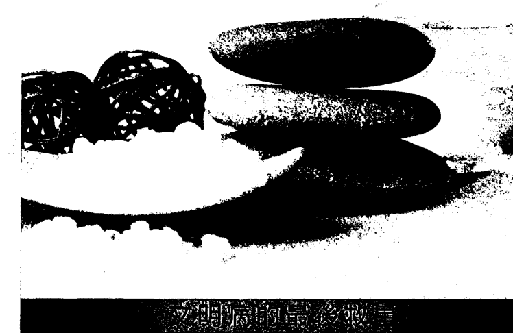

# 靛蓝天使2：新世代小孩捎來的訊息

## 謝詞

感謝以下諸位促成本書問世

Nancy Coleman
Mallika Krishnamurthy
Allison Hurley
Petra-Sarah Neumayer
Grace Kohl
Jere Neal
Justine Turner
Brian Coleman
Constance Snow
Anne Saunders
Robin Rowney
Katherine
Felicitas Baguley
Yvonne Zollikofer
Angela Graves
Mary Ann Gildroy
Umar Sharif
Mike Meloy
Pamela Hollander
Barbara Gilman
Katarina Friedrich
Betsie Poinsett
William Linville
Steve Arnold
Connie Mann
Dee
Nancy Shea
Marcia Pack
Jenny Marrs
Joanne Wisor
Gabby van Heerden
Susan Saunders
Sally Donovan
Barbra Dillenger
Evelyn Beatty
Kerry-Lynne Findlay-Chapman
Anna
Rabbi Wayne Dosick
Jaye Powers
Joyce Tutty
Nancy Tappe
Shirley Michaels
Patty Doe
Karen Eck
Kim Mander
Cher Matthews
Marie-Helene Dubois
Gousei Robert Jacobs
Sharon Marshall
Doris Crompton
Kathryn Hutson
Monique E. LeBlanc
Renee Weddle
Jennifer Walsh
Bev Wells
Nikki Dolan
Tracy Cisneros
Bea Wragee
Nan Sunshine
Barbara Brandt
Vanessa
Sharyl Jackson
Lisa Wallace
Jacob Butler

## 推薦序：用愛滋潤高敏感孩童

——光流聯合診所院長 楊紹民醫師

在《靛藍天使1》的推薦序中，我已經與讀者們分享如何從全人整合醫學的角度，來理解這些新世代小孩為何會發展出這些高敏感特質的環境因素、文化因素，以及相關的社會因素。在《靛藍天使1》這本書中，我們看到許多專家學者從各自的臨床經驗分享他們的觀察與想法。幫助聽過或沒聽過「靛藍小孩」議題的朋友們，逐步開始了解這個議題。而在《靛藍天使2》中，我們看到更多的故事與分享，不管是尚未成年的靛藍小孩，或是書上稱為「靛藍先鋒」的靛藍成人、靛藍銀髮族，都有非常多精彩迷人的親身歷程，可以提供給我們參考。

不同於《靛藍天使1》，《靛藍天使2》有一部分好像是我們小時候所聽過的床邊故事。沒有高深的知識，也不講什麼深奧的大道理。可是，在一個又一個平易近人的故事中，我們內心似乎有一種簡單又純真的聲音慢慢甦醒過來。我們也開始回想起從小到大的某些經驗，某些記憶也被喚醒。我們也許會回憶起童年曾有過的單純與天真，也可能回憶起在成長過程中的某些挫折與領悟！當這些回憶伴隨著世界各地「高敏感（靛藍）特質」者的生命故事，以及書上的心靈視野的分享，也許會讓我們可以釋懷過去某些孤單、不被了解的心情，或是人生過程中的某些困惑與茫然，突然有了一種定向感。或許，我們對於社會上那些看起來無解的負面事件，也開始產生理解。甚至我們會知道除了大聲疾呼「我們的社會/教育/醫療生病了」之外，還可以透過自己的改變與提升，用愛去滋潤更多身邊的朋友們，讓這些高敏感孩童不再成為社會負面連鎖效應的犧牲者！

過去七年來，許多光流的志工走進監獄，透過教導「光流九式瑜伽」的方式，讓許多受刑人感受到愛與尊重之後，受刑人的回籠率大為減低。事實證明，如果我們對這個世界以愛相待，這個世界也會用愛回應我們！

許多靛藍小天使剛來到診所時，可能在外面被診斷為「憂鬱症、自閉症、過動症」，甚至可能已經罹患「躁鬱症、恐慌症、社交恐懼症」。而形成這些症狀的關鍵因素，是因為傳統的醫療與教育體系中，對於「高敏感特質/體質」幾乎一無所知。包括免疫系統（過敏）、神經系統（有些感官太敏感、易受刺激、反應太強）、人際—環境敏感（非常容易受人際互動與環境的氣氛、磁場干擾），這些孩子長期暴露在無法保護自己的過量刺激中，也缺乏循序漸進以及精準明確的導引與陪伴，最後導致大腦、神經系統與免疫系統當機／失調。這並不是說，那些疾病是不存在的；可是有一個重要訊息是，如果您或是您的家人符合「高敏感特質」或「靛藍特質」的大部分條件的話，也許除了藥物治療與傳統的心理治療外，更需要一起來了解「高敏感（靛藍）特質」，然後透過我們自己的成長與改變，提供這些靛藍天使們一個更具有支持、保護、陪伴與自我提升的人際—環境系統。然後您就會發現，疾病的背後存在著一些過去被忽略的健康干擾因素。而當這些健康干擾因素被排除後，孩子們需要使用的藥物就可以逐步減少，甚至如果他們的人際功能、生活功能、自我功能提升到一定程度後，是否需要一輩子依賴藥物來安定其神經或大腦，就開始有更多思考的空間與可能性出現！

您欣賞各個宗教大師所分享的「無私大愛」或「同體大悲」的情懷嗎？您是否也非常渴望生命中能夠體驗到「無條件的愛」（unconditional love）？您是否曾經羨慕上古時代「路不拾遺、夜不閉戶」的幸福生活呢？與其等待，不如從我們自己身上做起。在二十多年來的臨床經驗後，我深刻地發現，一開始我們只是想幫助這些受傷、脆弱的靈魂，找回力量、找回健康。可是，在陪伴他們改善困境的過程中，我們自己的人生就已經開始出現非常正向且美好的轉變！

我們診所曾經陪伴過一位「靛藍天使」，在主流醫學中，她被診斷罹患「重度憂鬱症合併聽幻覺、視幻覺」。可是多年以來，服藥雖然可以稍微幫助她穩定情況，但是總好像漏了什麼因素，她的症狀還是會起起伏伏！幸好，她的父母對她有很深的不捨，在尋覓多年，也包括多處求神問卜之後，他們終於來到診所！經過儀器檢測與深度評估，她百分之百符合「高敏感（靛藍）特質」的許多行為特質。在初診的家庭評估中，雖然表面上她仍然喃喃自語地與幻聽對話，表達時前言不對後語，好像思考邏輯也嚴重混亂。可是醫師卻發現，她眼角的餘光似乎總是不經意在觀察父母的互動，以及父母怎麼陳述她的狀況。如果講到她不好的狀況時，她的自言自語就會變得更嚴重；可是當父母講到她的優點時，就可以看到她的眼睛散發出光采與喜悅。在深度溝通通過「高敏感特質人」的照顧方式後，其父母開始自我學習與成長的旅程（因為她生病十多年，所以先從家庭環境的支持能力提升上來）。在開始學習大約兩週左右，有一天，我們這位天使又變得非常不穩定，可是其父母打電話到診所時，醫師剛好都在看診，直到三更半夜才接到訊息，來不及回應。可是，第二天，當醫師與其父母聯絡上以後，得到一個非常感人的訊息。

她母親說：「因為初診時醫師的檢測分析，非常符合我們家女兒的狀況，所以我也把醫師的醫囑牢牢记在心裡。昨晚，我女兒又發病時，一開始我們夫妻倆非常緊張，因為過去遇到這種情形時，如果不想辦法帶她去醫院打針，她是沒辦法穩定下來的！可是，我在忙亂中，突然回憶起醫師在初診時提醒我們的，這個孩子的心與父母連結很深，很容易受到父母狀況的影響。所以，我趕快邀請我老公一起做呼吸練習，讓自己的心平靜下來。平靜下來後，我們才看到自己這一陣子已經忙累到講話的語氣和音調都愈來愈急躁而不自知。結果，等到我們倆平靜下來以後，我女兒十多年來第一次不需要到急診打針加藥，就可以穩定下來了！」其父母為了陪伴她得到健康，就持續地學習靜心、內省與自我成長。十天前，我再度遇到他們一家，可以看到父母喜形於色。原來，孩子已經很少自言自語，言語表達的邏輯也愈來愈清楚，眼神也愈來愈清晰！（她還是有繼續服藥。之前的藥物只是讓她的干擾行為減少，而現在似乎某些她遺失的人格都慢慢地被找回來。這種服用相同藥物超過三年以上，卻開始出現明顯進步的反應，在臨床上非常罕見）。

她父親也說，有一位資深的療育老師對他說：「你要相信你女兒講的話！」從前，他聽女兒講述一些事情時，心裡總是主觀認定她在胡說八道而不理會她；自從有老師這樣提醒後，自己就會比較耐著性子來聽女兒說話。結果，非常出乎意料的，他開始發現，女兒只是表達的邏輯性太弱，因此聽起來前言不對後語；但是，若順著語意去理解的話，就會慢慢發現女兒的心靈直覺能力非常強，總是在有意無意之間，提醒一些家人常常忽略、卻非常關鍵的重要事情。當父母願意傾聽、思考，並且嘗試去解決這些問題的同時，他們開始發現家庭氣氛、親人相處、人際互動的品質都變得更好了。而她的妹妹，也因為看到父母與生病的姊姊之進步，感動到開始願意敞開自己的心，與父母分享在姊姊生病的十多年裡，自己的擔心、無奈，以及內心深處的自責與無力感。透過父母的成長與穩定能力的提升，妹妹知道自己可以放心地像朋友般與父母分享自己的感受和想法。家人之間的感情變得更好、更穩定，爸爸與妹妹的事業竟然也因為他們的提升，而變得更好、更順暢了！

也許，我們的靛藍特質或是身邊的這些「靛藍天使」，就是我們與宇宙相連接的管道與通道。如果我們願意喚醒自己的靛藍特質，或是願意呼應身邊的靛藍天使的需要而改變自己，您會發現，生活愈變愈單純，人生愈來愈美好，身邊也會有愈來愈多的「奇蹟」（用過去的價值觀想像不到的好事情）發生，人生也會變得愈來愈有意義，愈來愈有價值喔！

## 序論

這是我們出版的第二本靛藍小孩著作，但並非接續上一本的內容。換句話說，本書稍微改變方式，為讀者呈現許多父母提供的訊息，並分享教師和專家方面更深奧的智慧。鑑於上一本的主題是揭露並說明靛藍現象，本書打算減少嚴謹的學術氛圍，增添一些樂趣，也就是說：準備好迎接歡樂吧。

珍和我很願意相信，本書的讀者都已讀過上一本《靛藍天使1：新世代小孩的來臨》（The Indigo Children，以下簡稱《靛藍天使1》，一九九九年由同一家出版社（賀屋出版／Hay House）出版。

> 譯注①中文版於二〇一六年由一中心出版。

然而，我們無法假設人人都讀過《靛藍天使1》，因此，如果你正在閱讀我們的第二本相關著作，心中浮現疑問：「什麼是靛藍小孩？」我們將針對上一本暢銷書的內容，為你做簡短的摘要。

回顧：珍和我是自助（self-help）學說的講師與作家。身為諮商師，終日與形形色色的人相處並處理人性議題，我們經常因此發現新的行為模式，但對於那些眼界狹窄的人來說，這些行為模式不夠明顯，因而不易察覺。

上一本書提到，我們愈來愈常聽見一種新型小孩出現，或至少可說是父母正在面臨新的問題。這些難題之所以奇特，在於成人與小孩的立場互換，令父母始料未及，也不符合我們這一代（甚至下一代）的成長歷程。許多父母為此惱怒不已，而且窮於應付。全國具有三十年以上資歷的幼稚園教職員中，也有人反應同樣的情況，指出現今的孩子不知道為什麼就是有些不一樣。

我們後來發現，不單是美國的孩子出現這種情形，當我們巡迴全球，與許多父母交談時，總會聽見相同的問題。即使在亞洲國家，過去的孩子在傳統文化薰陶下，從小便學習榮耀並尊敬父母，如今也開始出現同樣的反常行為（見第八章）。

於是我們寫下《靛藍天使1》，本書受到各界人士鼎力相助，包括備受推崇的家、學術界的協同撰稿人、幼稚園幼教人員、哲學博士與醫學博士，以及從事兒童工作的相關人員。

我們站出來公開發表第一本書，盡力提供最好的資訊，也心知我們所觀察的主題可能引起爭議。畢竟我們不是這方面的權威，又有什麼資格拍拍大眾的肩膀說：「不好意思，我們認為人類正在進化，而小孩就是證據」？

嗯，我們猜對了，這個主題確實引發爭議，郵差送來大批信件，有些充滿仇恨言論，也有很多人感謝我們拯救了孩子的生命，這些信全都裝在同一個郵包裡！如果是你，你會怎麼做？答案很簡單：把不喜歡的信丟掉，把反應良好的內容貼在自己的網頁上！

言歸正傳，大眾對第一本書的接受度很高，令我們信心大增。幾個月內，《靛藍天使1》便行銷到全球各地，被譯成多國文字，銷售量打破我們過去的紀錄。對我們來說，這代表書中內容切合大眾的需要，要不然就是大家都拿書頁去鋪鳥籠了。

全美各地書店開始銷售《靛藍天使1》後，他們遭遇行銷上的難題（幸好是很正面的）：到底該把這本書擺在店裡的哪個位置才對？我們看到邦諾書店（Barnes & Noble）把它擺在「親子教養」區，後來又在「新時代」區發現它。另外，有人告訴我們，某些書店把它擺在童書區，真奇怪，這本書是寫給大人看的。後來，我們發現有些孩子要求父母購買《靛藍天使1》並讀給他們聽！其實他們只是偶然聽見書名，便對內容感到好奇不已（我們愈來愈想不透）了。

我們也在好市多發現這本書，大家都知道好市多是一家大型折扣量販店，你會去那裡購買一整車的家用紙製品和飲料。在美國某些州，還有名叫「山姆會員商店」（Sam's Club）的量販店，店裡也找得到《靛藍天使1》。一開始，我們不知道這對書來說算不算是一種恭維，但現在，我們決定把它當成好事來看待。在我們的家鄉聖地牙哥，《靛藍天使1》被擺在八十磅重的盒裝迴紋針旁。客人來到店裡，若要購買成噸的衛生紙，必須先經過我們的《靛藍天使1》。

我們終於架設了網站：www.indigochild.com。《靛藍天使1》上市八個月後，已有數千名讀者造訪網站。許多專業人士將書帶進辦公室，有些則因工作需要而閱讀本書。我們也聽說幾位校長大量購入本書，在全校每位教師的桌上各擺了一本！

沒錯，這本書在一年來引發熱烈迴響，我和珍曾遠赴新加坡，針對相關議題接受新加坡廣播（Singapore Radio）的訪問，也上過聽眾遍及全美的廣播節目《夢境》（Dreamland），其口號是「萬事皆有可能」，前後任主持人分別是亞特·貝爾（Art Bell）和惠特利·史崔伯（Whitley Strieber）。我們已上過惠特利·史崔伯主持的節目兩次了）。然而，接下來我們該往哪兒去？

有些人指控我們偏袒自己信奉的靈性體系（玄學），以及鼓吹兒童崇拜（看得出他們的怒氣不小）。我們的回應是：當我們探索這個領域時，就是無法把上帝排除在外。如果大家想讀的是把孩子當成白老鼠的實驗數據，那麼我們的研究一定會令他們失望。這是生命的議題，也是遍及全國甚至全球的難題。我們從靈性角度切入，而在本書問世後，市面上便相繼出現數本相關著作（請見後文）。

我們無意偏袒特定教會或宗教，而是探討某些靛藍小孩行為的靈性層面。我們發現，許多靛藍小孩往往對宗教和自身的靈性很感興趣。進教會是他們自己的選擇（那當然），因此，如果小孩想談論上帝，我們會如實傳達。許多孩子甚至看得見天使！有些父母把這當成大問題，一心想找捉鬼特攻隊或當地驅魔師來趕...

## 序論

鬼（沒騙你！）我們只想讓他們放心，孩子絕對沒問題。事實上，我們認為孩子滿好的。

如果你想看看反對意見，儘管上亞馬遜網站（www.amazon.com）瀏覽讀者書評，我們得到的評價很極端，不是五顆星，就是一顆星。討厭這本書的人，其實不懂它的重點所在。有些讀者表示本書毫無助益，但也有另一些讀者表示本書大有助益。其他讀者則認為，我們只是在倡導這些地球上的全新小孩都是外星人！其實不是，我們只想告訴大家，人類正面臨一場全新的進化。儘管書評有褒有貶，《靛藍天使1》上市兩年來，始終名列亞馬遜網站暢銷排行榜前六百名。

有一點很重要：靛藍議題並非我們的專屬。我們只是引介並探討所知與所見。

此外，我們也發現，隨著靛藍現象漸漸獲得大眾的認可，更多訊息將接踵而至，但我們不知道會來得多快。就在《靛藍天使1》上市同時，另有兩本同一領域的主流著作也問世，分別是艾特瓦特（P. M. H. Atwater）撰寫的《新千禧年世代》（Children of the New Millennium: Children's Near-Death Experiences and the Evolution of Humankind）②，以及湯姆·朔德（Tom Shroder）撰寫的《老靈魂》（Old Souls: The Scientific Evidence for Past Lives）③。這兩本書都在探討靛藍小孩，唯一的差別在於，兩位作者沒有使用「靛藍小孩」來稱呼孩子們。不曉得他們是不是也收到宗教人士的憤怒來函，或是讀者認為他們書中提到的孩子也是外星人。

話說回來，我們的書依然擺在大型量販店的醒目之處。每次去店裡採購超大包尿布，或是可以吃上五年的超大罐花生醬時，除了我們的著作，並沒有看見其他相關書籍並列。

誠如前面所說，這本書並非直接承襲《靛藍天使1》。市面上有許多優秀作者也探討靛藍議題，並傳授教養靛藍小孩的祕訣。本書則意欲與學術領域稍作區隔，讓它單純地歡慶靛藍經驗。我們盼望為讀者營造舒適溫和的閱讀體驗，其中有清新的空氣，有歡笑，也有一點淚水。此外，我們也會探討幾個前作沒有討論的議題，例如，有一些人自認是靛藍小孩，但年齡過大，不符合我們在書中描述的年齡層。我們還會提供一些嚴謹的訊息，有些內容甚至非常嚴肅，包括兒童殺害兒童、如何幫助青少年，以及探索成人內在小孩的重要性。不過，我們也要提醒你，除了這些嚴肅議題外，閱讀本書仍能獲得許多樂趣。

## 本書目標

很多家長來信述說靛藍小孩的故事，這些孩子令人窩心、心智受到高度啟發，也有一些人活得不快樂。不管故事是悲是喜，全都是靛藍小孩的生活寫照。他們是正在地球上茁壯成長的新世代族群，天資聰穎，領悟力強，反應力與上一代截然不同。因此，本書的目標在於提供樂趣之餘，同時提供深具知性與教育性的激勵。希望本書讓讀者見識到過來人的經驗談，也希望讀者透過家長提供的生活記趣，與他們共享歡樂時光。

所以，找個適當的時機，摘掉那頂學術大帽子，換上派對帽吧！歡慶時光樂趣橫生，我們允許你歡笑、哭泣、驚喘、大叫和高呼：「嘿，我家『那隻』也是這樣！」接下來，如果你沒有讀過前作，可能需要讀一遍，看看究竟是怎麼回事。不妨前往你家附近的量販店，在購買一整車衛生紙的同時，順便找找我們的書。《靛藍天使》系列的陳列架就在衛生紙區前面，旁邊則是一年份的葡萄乾麥片。

## 各章大要

好，現在來談談各章大要。我們其實很想大喊：「沒有那種東西！」這是我們內在小孩的心聲，這兩個「孩子」不想刻意分章節，不想納入註釋之類的無聊成分（關於內在小孩的詳細說明，請見第五章）。但我們還是做了，只不過並不多。

本書的第一個部分，是由許多家長與孩子提供的故事組成，有些很短，有些較長。我們將在故事與故事之間穿插小孩的談話，甚至加入詩詞。

如前文所述，本書有個向靛藍先鋒致敬的小篇章，並且依照前作的模式，刊登靛藍先鋒的來信。我們也加入南西·安·戴普（Nancy Ann Tappe）的二度專訪，她是我們心目中最內行的「色彩女士」。另外，本書也收錄許多協同撰稿人的智慧語錄。書中還有一章探討如何發掘成人的內在小孩，因為我們相信內在小孩是養育子女的關鍵。最後則是摘要，我們蒐集教育家、父母、新聞報導及社會大眾等，關於教養靛藍小孩的方式，在這章做個總結。

## 協同撰稿人

站在協同撰稿人的立場著想，每次呈現一個故事，我們都會盡量刊登他們的名字（有些是大人，有些是小孩）。然而，某些成人不希望自己的姓名曝光，因為擔心孩子長大後，讀到本書時會覺得丟臉。有些提供故事的孩子，也不希望父母的名字曝光，有點像是在描述某段不知名的關係，可不是嗎？所以我們尊重這些特定的請求。如果你發現自己在很久以前寄給我們的故事被刊登出來，但你因為搬家或更改電子郵件信箱，而沒有收到我們的詢問信件，你會看到書中只登出當事人的名字，但沒有姓氏。

## 網際網路：新的出版難題

我們也遭遇新的困境，不知道該如何找出網路訊息的來源。公開發行著作必須有稿源，如果不是自己撰寫的內容，就必須刊登原作者的姓名。但有些父母或子女在網路上匿名貼文，讓我們不知該如何是好，只能捫心自問：到底是要忽略某些很棒的素材（而且超級有趣），還是乾脆把它們刊登出來？事關誠信，不可不慎。

因此，我們決定這麼做：在網路上找到的珍貴文章，都會收錄在本書中，標題下方的作者則顯示為「佚名」，並標明來源為網路。如果你在本書中讀到自己的文章，或知道某篇文章節錄自某個特定出版品，請立即上官方網站（www.indieonline）與我們聯繫。待本書再版時，我們可以進行必要的修訂，也會在適當時機補上原作者的真實姓名。只要在來函中提供版權資訊或文章出處的證明，我們一定會對引用的文章補登真實姓名。此外，我們還會在官網刊登修訂公告，以便即時告知社會大眾。許多知名出版品都有類似的先例，我們決定從善如流。

盼望本書為你帶來知識、願景、歡笑與希望，為了地球的未來而努力！

# Chapter 1
## 聰明的小孩

靛藍小孩和霸子·辛普森（Bar Simpson，知名動畫劇集《辛普森家庭》（The Simpsons）的角色）有什麼不同？」去年，靛藍天使系列的第一本書上市後，珍接受採訪時被問到這個有趣的問題。答案是什麼呢？雙方各有一個顯著但完全不一樣的特色。小霸王（霸子·辛普森可做為代表）總想引人注意，用盡各種手段達到目的，即使如願後仍繼續努力，因為他想知道極限在哪裡。靛藍小孩則是努力讓別人搞懂他們，或者至少讓別人願意接納他們，如願後便不再繼續下去。

仔細觀察靛藍小孩，其智慧將令你嘖嘖稱奇，他們總是暗自思索各種深奧無比的生命課題，隨時準備向聽眾傾訴。即使有些孩子仍處於懵懂階段，思路依然展現出聰慧的特質。

以下列舉孩子們針對愛與各種人際關係的發言（這是很多人喜愛的主題），作為歡慶靛藍經驗的開場：

### 愛的小祕訣

**什麼時候可以親吻別人？**

你絕對不能隨便親吻一個女孩，除非你有足夠的錢，可以買一枚大戒指和錄放影機送她，因為她一定會想要把婚禮錄下來。（吉姆，十歲）

**為什麼兩個特定的人之間會產生愛意？**

沒有人知道這種事是怎麼發生的，但我聽說這和你身上的氣味有關，所以香水和除臭劑才會這麼受歡迎。（珍，九歲）

**愛上一個人就像遇上什麼事？**

就像遇上雪崩，為了逃命，你必須狂奔。（羅傑，九歲）

如果愛上一個人就像學習拼字，那我才不要，因為那要花好多時間。（李歐，七歲）

作者：佚名／來源：網路

**漂亮的外表在愛裡扮演哪一種角色？**

如果你希望外面的人愛你，那麼擁有美貌不算是一件壞事。（珍妮，八歲）
外表不一定是重要的。看看我，我帥得跟什麼一樣，但到現在還沒有人要跟我結婚。（蓋瑞，七歲）
美貌很膚淺，財富才能長久。（克莉絲汀，九歲）

**相愛的人為什麼常常牽手？**

他們想要確保戒指不會掉，因為買戒指花了很多錢。（戴夫，八歲）

**你對愛有什麼想法？**

我支持愛，只要它別挑《辛普森家庭》播出時發生。（艾妮塔，六歲）
哪怕你想躲開，愛仍會找到你。我從五歲就開始躲它，但那些女生總是找得到我。（鮑比，八歲）
我不急著墜入情網，因為我發現四年級就夠難熬了。（瑞吉娜，十歲）

**當一個優秀的愛人需要具備哪些特質？**

你應該學會的是開支票，因為就算你有幾噸的愛，生活中還是有很多帳單要付。（艾娃，八歲）

**有哪些一定管用的祕訣，可以讓一個人愛上你？**

不要穿發臭的綠色帆布鞋，這麼做或許會引人注意，但它和愛是兩回事。（阿隆佐，九歲）
有個好辦法，就是帶她去吃東西，而且一定要是她愛吃的，我用「薯條」這一招通常都管用。（巴特，九歲）

**大多數人說「我愛你」時都在想什麼？**

他們都在想：對啊，我是真的愛他，但我希望他每天最少沖一次澡。（蜜雪兒，九歲）

**你如何讓愛持續下去？**

把大部分時間用來愛，而不是工作。（湯姆，七歲）

訓練高超的吻功，這樣或許可以讓你老婆忘記你從來不幫忙倒垃圾。（藍迪，八歲）

有些發言不只有趣，還很精明！讓你好奇這種智慧是從哪裡來的。接下來，一組專家對一群八歲兒童提問：「愛是什麼？」結果得到令人出乎意料的深奧答案。

### 愛是什麼？

作者：佚名／來源：網路

「奶奶得了關節炎，再也不能屈膝和塗腳趾甲油，於是每次都由爺爺幫忙，即使後來他的手也得了關節炎，他還是幫奶奶塗腳趾甲油。這就是愛。」

「愛你的人喊你名字的方式和別人不一樣，你知道自己的名字在他們嘴裡是安全的。」

「愛就是女孩噴上香水，男孩也噴上古龍水，然後外出時互相聞一聞身上的香氣。」

「愛就是外出去用餐時，你把大部分薯條都分給別人，而且不要求那個人把吃的分給你。」

「愛就是有人傷害你時，你雖然氣得要命，但不會吼他們，因為你知道這樣會害他們傷心。」

「愛就是在你很累時，還有某些事能讓你微笑。」

「愛就是我媽幫我爸泡咖啡時，她會先試喝味道後再端給他。」

「愛就是你們一直吻個不停，到最後不想再吻了，但還是願意在一起，而且聊得比以前更多。我爸媽就是這樣，他們親吻的樣子好噁心。」

「聖誕節時，如果你停止拆禮物並仔細傾聽，就會發現愛。」

「如果你想學會更高明的愛，就從愛你本來很討厭的朋友開始。」

「你對朋友說起自己不好的事，怕他們因此不再愛你，之後你發現他們不但愛你，甚至比以前更愛，讓你又驚又喜。」

「愛有兩種：我們的愛和上帝的愛。但這兩種都是上帝創造的。」

「愛就是你告訴某個人，你喜歡他的襯衫，之後他就天天穿著那件衣服。」

「即使小老太太和小老先生非常了解彼此，他們依然是很好的朋友，這就是愛。」

「我參加鋼琴獨奏會，自己一個人站在舞臺上，心裡很害怕。我看著凝望我的每個聽眾，忽然發現爸爸正在對我微笑並招手，全場只有他這麼做，我的恐懼立刻消失不見。」

「媽媽是全世界最愛我的人，你不會看到別人在臨睡前給我晚安吻。」

「愛就是媽媽把最好吃的雞肉給爸爸吃。」

愛就是媽媽明明發現爸爸流了渾身臭汗，依然說他比大明星勞勃·瑞福還要帥。

愛就是你把寵物留在家裡一整天，牠還會舔你的臉。

我知道姊姊愛我，因為她把所有的舊衣服都留給我，害得她只能去買新的。

我讓大姊捉弄我，因為媽媽說，她愛我，才會捉弄我。所以我也捉弄小妹，因為我愛她。

類似情人節卡片這種表達愛意的卡片，上面寫著我們心裡想說的話，但送卡片就不必當面對人說。

當你愛著某個人時，你的睫毛會眨個不停，小星星就從眼睛裡滾出來。

愛就是媽媽看見爸爸在上廁所，但不覺得髒。

除非你是真心的，不然不應該隨便說『我愛你』。如果你是真心的，應該一直說個不停，因為人都很健忘。

有太多孩子分享充滿智慧的故事，我們常常不知該如何篩選，因為每個故事都好棒。以上雖然已經列出很多，但由於篇幅有限，還有十倍以上的故事沒有機會露臉。現今的孩子不只聰明，他們往往可以擔任大人的導師！以下的故事就是一例。

### 特別的情人節

——南西·科爾曼（Nancy Coleman）

戴維斯四歲時，某天在學校慶祝情人節。老師要求孩子們送卡片給同學，戴維斯回家後對我說：「媽，有個小孩很壞，沒資格收到情人節卡片。但我想，如果我送他一張卡片，並且對他好，就算他對我不好，說不定還是可以讓他的心裡好過一點。」這段話讓我聽得倍感窩心！

### 柴克瑞

——威廉·林維爾（William Linville）

很高興分享七歲兒子柴克瑞的幾則趣聞。柴克瑞為我們平凡的生活帶來重大改變，多虧了他，我和妻子蘿拉明白他是為了我們而存在，也因此我們存在的目的變得更明確。

我想分享柴克瑞六歲那年發生的事。有一天，我發現他閉著眼睛坐在客廳的沙發上，玩具散落一地。我看收拾時間已到，便對他說：「柴克瑞，現在該把玩具收好，請你收一收吧！」但他沒有反應或任何表示。我有點不耐煩，不由得提高音量，再說一次：「柴克瑞，現在該把玩具收好，請你收一收！」這次，他張開眼睛，直盯著我說：「爸，現在不要，我正在和『高我』對話，還沒有說完！」

不用說，這個令人意外的回答讓我樂歪了，心中升起滿滿的喜悅與領悟，以致我們開始照你們書上的建議，給他許多選擇。現在，我們三個都覺得生活輕鬆多了。

柴克瑞第一個熱愛的對象是大自然。有一天，我們走出健康食品店，柴克瑞開始描述某些樹木的樹皮如何剝落，以及葉子如何掉落。我知道柴克瑞在學校裡還沒有學到這方面的知識，出於好奇心，我問他在哪裡學到關於樹木的知識。他立刻給我一個簡單的回應：「爸，反正我就是知道。」

在此提醒各位家長，請注意現今的孩子與生俱來的潛力。許多孩子能夠看穿「舊世界的運作模式」，他們的誕生是為了帶我們「回家」，並為我們展現「更好的方式」，讓大家的生活更加快樂和諧。這種生活方式能幫助我們體驗自身與萬物，以及所有存在間的緊密連結。

——金姆·曼德（Kim Mander）

也害我趕不上八點的會議。我告訴他，他的行為令我非常生氣，他突然（當時他才三歲）說：「媽，妳的良心才是關鍵。」我聽了驚訝不已，便請他解釋。他說：「妳心裡有個小小的聲音會告訴妳該怎麼做才對。」

另一天，隔壁的小女孩對我兒子說，她爸爸有本事打倒他爸爸，因為她爸爸四十六歲，而且強壯多了。我兒子說：「外表有多強壯並不重要，關鍵在於你的內心多麼強大。」

自從他在三歲那年說出這番話後，我便開始「記錄」他的生活，至今累積了好些讓人嘖嘖稱奇的發言！他的直覺很強，常能感知別人心中的想法。他有金棕色頭髮和大大的藍眼珠，個性嚴肅，往往悶不吭聲地在一旁觀察，較少與他人互動。老師說他的知識水準已經超越幼稚園層級，但注意力不夠集中，也無法獨自完成作業。我兒子說，那是因為作業太蠢又無聊，而且從頭到尾只有玩顏色。

你準備好要聽更多他們對親密關係的看法嗎？聽聽婚姻方面的如何？好的，底下是網路上另一些關於愛、婚姻與感情之類的看法，這些意見宛如無價的寶石!

### 小孩眼中的婚姻

作者:佚名/來源:網路

**你如何決定要和誰結婚?**

一定要找個和你有相同喜好的人,假如你喜歡運動,她也應該和你一樣喜歡,而且她必須避免無聊的事發生。(亞倫,十歲)

沒有人會在長大前就下定決心要和誰結婚,而且這件事神早就決定好了,將來你到底會和誰在一起,要靠你自己找出來。(喀斯坦,十歲)

**幾歲適合結婚?**

二十三歲是最適合結婚的年齡,因為你到時已經永遠認識那個人了。(卡蜜兒, 十歲)

沒有最適合結婚的年齡，想要結婚，你要變成傻瓜才行。（弗瑞迪，六歲）

**如何分辨兩人是不是夫妻？**

你可能需要猜一下，判斷的標準是他們有沒有對小孩吼叫。（德瑞克，八歲）

**你認為你爸媽有哪一點一樣？**

兩個人都不想再生小孩了。（蘿莉，八歲）

**大多數人約會時都在做什麼？**

約會是為了找樂子，大家應該利用找樂子的機會了解彼此。如果你願意耐心傾聽，男生其實也有一些心裡話要說。（琳奈特，八歲）

第一次約會時，他們都在說謊，這些謊話通常會讓他們對彼此感興趣，然後敲定第二次約會。（馬丁，十歲）

如果第一次約會不太順利，你會怎麼做？

我會跑回家，並假裝我死了，隔天我還會打電話給所有報社，確認他們有在訃文版刊登我的死訊。（克雷格，九歲）

什麼時候適合親吻一個人？

當他們很富有的時候。（潘，七歲）
法律規定必須滿十八歲才可以親別人，所以我不會亂搞。（庫特，七歲）
規則就像這樣：如果你親了某個人，就應該跟這個人結婚，然後生小孩，這是正確的作法。（霍華，八歲）

單身比較好，還是結婚比較好？

單身對女生來說比較好，但對男生來說不好。男生需要有人跟在屁股後面打掃。（艾妮塔，九歲）

如果大家都不結婚，這個世界會有哪裡不一樣？

當然會有一大堆小孩等著聽大人解釋，不是嗎？（凱文，八歲）

**你如何維繫婚姻？**

就算老婆長得像卡車，你也要說她很漂亮。（里奇，十歲）

這種字字珠璣的發言，好像從他們很小的時候就開始了。伊鳳·佐利科弗（Yvonne Zolikof）談到兩歲的兒子維多。有一天，兒子問：「媽，我很老嗎？那不是真的吧？」她答：「不，親愛的，我覺得是真的。」我認為，伊鳳一定沒料到兩歲孩子會問這種問題。

這種早期的智慧是從哪裡來的？在後文，我們將會探討孩子談論靈性（非宗教）話題的情形——他們往往提到生命的核心概念。但首先，我們必須先了解靛藍小孩的特質，我們是否真的發現它了？以下有個小故事，再次描述一個涉世未深的孩子，在懵懂的年紀卻已通曉世事的例子。

### 自尊

——瑪莉卡·克里希納穆提（Mallika Krishnamurthy）與史帝文·艾默德（Steven Arnold）

我的六歲兒子薩希，在小小年紀便充滿智慧，明瞭自己的身分、來歷與生命的真諦。他兩週大時，負責照護兒童健康的護理師說，他好像上輩子就當過人了。

大約在他兩歲時，某次我們參加大型家族聚會，他獨自跑去車裡。我們發現他安靜地坐在黑暗中，便問他在做什麼，他回答：「我只是在想事情。」

他三歲後的某天，我們聊起他愛的人以及愛他的人，列出一串超長的名單後，他說：「我也愛自己，因為它帶給我能量。」

他的生活盡是類似的片段，他充滿智慧，富於同情心，總是啟迪我們的心靈。

### 信封

雪兒·馬修斯

有時候，孩子的發展著實令人震驚。聽聽單親媽媽雪兒·馬修斯（Car Matthews）的談話，關於三歲兒子對她約會習慣的觀察，後來甚至改變她的習慣！

我兒子賈斯汀出生於一九八○年代，從小便出現靛藍小孩的大多數行為，總歸一句話，這孩子「生來就無所不知」。

我永遠忘不了他三歲那年說的某句話，我把它寫在寶寶日記中，因為我不敢相信三歲小孩會有這麼深刻的洞察力！

我一直是單親媽媽，在兒子小時候，我交往的每個對象總會努力試著和賈斯汀做朋友，以便「贏得我的芳心」。然而，賈斯汀明白這些人並非真心想要了解他，這麼做只是為了討好我。

長話短說，在某次約會後，兒子發表評論：「妳是信紙，而我是信封。」小小年紀說出這種話，實在很奇怪！我問他這是什麼意思。他解釋道：「大家都會撕開信封，讀裡面的信，然後把信封丟掉。」不用說，我聽得心都碎了，至今回想起來仍會眼眶含淚。他的體會改變了我的約會習慣，讓我有了更深的領悟。

前作曾提到孩子的直覺有多麼強，即使牽涉死亡與離婚這類嚴肅議題也不例外。後文呈現伊森的故事，它將融化你的心。孩子對這類事情的「原因」也許不太了解，但他們絕對能「感覺到」情況不對勁。

## 揉進心裡

——艾莉森·赫利（Allison Hurley）

在兒子三歲那年，我和丈夫離婚。基於多種因素，我搬到英國住了一年半，我和前夫共同擁有伊森的監護權。從九月到隔年五月，我回美國幾趟，但都沒有如願與伊森共處。到了陣亡將士紀念日，他終於搬來與我共度整個夏季。

時間轉瞬即過，夏季結束了，他爸爸搭機前來接他，我的心因而徹底粉碎。我與伊森長談這件事，他的冷靜和客觀總令我訝異，而且他似乎真的能夠理解。在他隨著爸爸登機前，我最後一次擁抱並親吻他。我試著保持冷靜，把心思集中在愛他，但我真的非常非常難過。臨上飛機前，他跑回來親了我的臉頰一下，接著直望進我的靈魂深處，用柔軟的小手揉揉剛才親過的地方，對我說：「我把它揉進妳心裡。」然後他就離開了。

譯註 ① 美國的法定節日，在每年五月的最後一個星期一，悼念在各戰爭中陣亡的美軍官兵。在民間也代表夏季正式開始。

## 後座的智慧

康妮·曼（Connie Man）提到，她與十五歲的女兒在車裡談話，九歲的兒子在後座旁聽。你是不是認為，年紀小的通常都聽不懂大家在說什麼？這個故事可能會改變你的想法。

上天恩賜我和丈夫三個寶貝：十五歲的大女兒梅麗莎，九歲的兒子約書亞，還有三歲的小女兒克莉絲汀娜。以下是一則關於梅麗莎與約書亞的故事。

一天下午，我從學校接回這兩個大孩子，梅麗莎在車上談起昨晚的事。她和幾個朋友參加派對，她希望我分析當時發生的某個事件。

為了交代整件事的來龍去脈，我必須先回頭說明。幾天前，梅麗莎希望我協助她釐清一段關係。她和學校裡的一個男生真心喜歡彼此，但兩人常常踩到對方的地雷。她意識到這些衝突帶來的感覺代表某種訊息，而男生正是發送訊息的人，她無意改變對方，只想知道如何「掌握」訊息，以便改善這段關係。我先恭賀她這麼小就有這方面的體認，並提議我們倆一同坐下來請求指引，以便釐清整個情況。我們將意識導入心中，對愛敞開心胸，梅麗莎大聲說出意願。靜默了一段時間後，我們分享想法和感覺。梅麗莎決定，下次若再和對方起衝突，她會默默感謝他給她這個機會，然後敞開心胸，把愛獻給他。

回到車裡的談話。梅麗莎描述前晚的情形，男生因故生她的氣，但她沒有以吼叫反擊，而是默默感謝他，並敞開心胸，把愛獻給他。她說，她能真切感應到心中升起一種感覺，接著有一束光從她的心射向他，現場頓時鴉雀無聲。後來，梅麗莎有些害怕，便停止輸送愛。她不明白發生了什麼事，希望我能為她說明。我告訴她，敞開心胸會讓人覺得自己非常脆弱，但不要嘗試一次就放棄，因為愛比恐懼更強大。

坐在後座的約書亞本來在和小妹玩耍，沒有注意聽我們的談話，不過可能只是我自己這麼認為。他忽然傾身向前說：「梅麗莎，當妳敞開心胸，把愛獻給朋友時，有沒有可能妳感受到的是他的害怕，不是妳自己的？有沒有可能他的憤怒是因為害怕？」剎那間，敬畏湧上我的心頭，喜悅和感激的淚水也湧現，我猛點頭，開車變得有點困難。

我只能說：「對，對，對，約書亞！當然有可能是這樣，梅麗莎把恐懼轉換成愛了。」

梅麗莎和我默默思量他的智慧之語，約書亞則繼續和小妹玩耍，根本沒發現我的心正愉悅地唱著歌，我的靈性也輕快地飛升。我慶幸自己得天獨厚，能夠常伴這群愛的導師——我的小孩左右。

十個月大的孩子腦袋瓜裡在想什麼？他有沒有幫媽媽做事的概念？或是懂得關注自身以外的事情？後文的例子是靛藍小孩典型的處境，也許不完全相似，但與專家所謂的嬰兒期發展仍有顯著差異。靛藍小孩除了表現出「陪伴、幫忙」的態度，也具備令大人跌破眼鏡的概念。以下幾個例子會讓你好好思考，你我在十個月大時，與他們有多麼顯著的差別⋯⋯更別提等他們長成新世代靛藍小孩之後。

## 椅子

——瑪麗—海倫妮·杜博斯（Marie-Helene Dubois）

阿里十個月大時，某次堅持把一張椅子推進廚房。我非常生氣，告訴他，廚房太小，容不下椅子。我把椅子拖走，放回原位。阿里沒有哭，自己去別的地方玩。

三小時後，我看見廚房的燈泡壞了，赫然明白阿里為什麼要推椅子進廚房。他只是想幫我換燈泡，但年紀實在太小，還不會說話。那天我內疚不已，發誓今後在發脾氣前，一定要先弄清楚我兒子行為背後的目的。當時我還不知道什麼是靛藍小孩，只知道我兒子非常特別，而且比我聰明。

（你覺得上面的故事不尋常嗎？接下來還有，同一個孩子在十四個月大時發生的事，由瑪麗-海倫妮·杜博斯繼續說下去……）

阿里十四個月大時，第一次打開櫥櫃。廚房裡的櫥櫃非常小，我在裡面堆滿各式各樣、大大小小的鍋子。由於空間十分有限，我把所有東西擺得井井有條，充分利用兩個架子的空間，沒有留下任何空隙。有一次，阿里走進廚房，打開櫥櫃，把所有東西拿出來。我暗想：「哦不！廚房一定會變得一團亂，到時我要收拾好久！」但我強忍住阻止他的衝動，立刻離開現場，讓我兒子開心地玩他的新遊戲。

二十分鐘後，我回到廚房，眼前出現一個大驚喜。地上居然沒有留下任何東西！「我的鍋子都到哪裡去了？」我大聲提問，然後打開櫥櫃，發現阿里已經把所有鍋子精準地擺回原位（大約有二十件）。從此，阿里每次玩鍋子，最後都會把它們全歸回原位。

提到這群小孩，有時候事情往往令人無法置信。嘿，如果你是孩子的媽，鐵定不相信前面那則故事！

那麼接下來這一則又如何？去年許多小孩領著父母進書店，想要購買第一本有關靛藍小孩的书！我們聽過很多相關例子。這些孩子怎麼知道這本書能幫助他們（或家長）？他們怎麼知道書裡寫了什麼？我們無法回答這些問題，但以下舉出兩則故事，第一則的主角是大衛，看來他在最恰當的時間點協助父母找到這本書。第二則是一個常和媽媽一起讀書的男孩，他們也會讀靛藍小孩的书！

## 醫師就醫途中

——佩塔·莎拉·紐梅耶（Peta-Sarah Neumayer）

非常感謝你們寫了《靛藍天使1》這麼棒的書，它救了我兒子大衛·納森（David Nathan）！這麼說也許太誇張，卻是千真萬確的事實。我們本來打算放棄了，因為兒子非常聰明又極度敏感，總是不守規矩，也無法與同齡的孩子相處。

他八個月大時就會說話，三歲就學會閱讀和算數。現在的他對科學和天文學很有興趣，每天談論上帝和天使，他甚至稱呼天使為「我的天使」和「我的人民」。他還說自己是國王，而且他似乎無所不知。

他常生我們的氣，而且老愛挑釁，因為我們不懂他。我們捫心自問（也問他），為什麼他就是不能當個「正常人」？

最後，我決定帶兒子去找醫師開利他能，就在前往診所的途中，兒子要求進某家店。他要我找一本靛藍小孩的書，其實我先前已經看到架上有這本書，也知道自已應該買下（但我從來沒有聽過「靛藍小孩」之類的事）。買了書之後，兒子的行為就此改變，他好像很高興又很滿意，到現在依然如此！

（附注：大衛不需要接受利他能的治療！）
——蒂（Dee）

## 他說我做得對

在此感謝你們寫下有關靛藍小孩的書。我有一個十三歲的兒子，我相信他是靛藍小孩。我發現自己常對別人提起，他多麼與眾不同，不能以傳統方式對待他。我只是這麼說，從來沒有說明細節或原因。幾年前，許多親戚信誓旦旦地聲稱，我已經完全「失去」他了，但我從未對他的本質與未來發展失去信心，而現在，我正目睹他的大部分特質「復甦」。你們的書幫了很大的忙，讓我更了解他。

我們曾在報紙上讀到一篇靛藍小孩的報導，兒子要我買你們的書，與他共讀。他有閱讀障礙，知道自己讀書時需要協助。自從我把書買來後，他讀了多次，每次讀個幾段。他對我說，據他觀察，雖然我以前沒有讀過這本書，但我已經下意識按照書中建議的方式養育他。

我也將這本書推薦給家中有孩子的親戚，以及兒子的幾位老師，盼望他們也會像我一樣受到激勵！

在後文的故事中，某些小孩不但不會受限於現今的暴力電影和電玩，反而對這類事物具有洞察力。有時候，大人可能會認為孩子分不清現實與幻想，於是禁止他們涉獵這類遊戲或節目。這麼做當然有好處，但以下的故事表明，有些小孩確實懂得分辨，即使在現實中親身體驗也不例外。

現在就為你呈現這個男孩，他以一種有趣的姿態接受真正的武術訓練。透過他的空手道教練，你將看到難以駕馭的靛藍鬥士——強比的故事。

## 訓練強比

——羅伯特·雅各布斯（Robert Jacobs）

一九八〇和九〇年代，我在佛羅里達州的道場教授空手道，在這麼長的時間裡，我教過的孩子想必有上千個。大多數年輕人的表現令人難忘，有一些更是出類拔萃，其中一個叫「強比」的七歲男孩，我永遠不會忘記。他被診斷為罹患注意力缺失症（Attention Deficit Disorder, ADD），很難專心上課。道場常收到這類患者，家長帶孩子來這裡，是希望他們透過武術學習專注，或學會自律，或學著當個安靜的學生。強比常瞪大雙眼，也會問一大堆問題，但他是個帥氣的好孩子，並沒有惹太多麻煩。我是他的老師，也可稱為師父，我總是盡最大的努力教他。

記得每次教他新的東西時，他總要先問「為什麼」，弄清楚原因後才能理解整個過程。有時候時間不夠，無法仔細說明原因，他便學不會新技巧。

有一天，我教他把人摔到地上。我先示範如何跨步並抓住對手的袖子和翻領，接著以自身為軸心將對方扭倒。他不明白我們為什麼不能直接抓起人往地上摔。我的解釋是，有些人比較高大，你必須運用巧勁才能把他們扳倒。強比一聽，興致全來了，最後學會這一招。

他不懂我們為何要一再重複踢打，這在空手道屬於強健體魄的基本訓練。我說，這種重複練習可以協調他的身心，他聽完後卻用一種看瘋子的眼神看我。我告訴他，如果踢打練習做滿一千次，他就能下意識地出腳飛踢，變成一種反射動作。他聽完後，再度送我一個大白眼。「總之，運動對你有好處。」我說：「相信我，這能讓你長高。」「強比這才接受。

他不想練自由搏擊，因為覺得沒有意義。我告訴他，自由搏擊可以同時強化並協調每一塊肌肉，這樣就能學會保護自己。

「保護我免於誰的攻擊？」他打破砂鍋問到底。

「嗯，說不定是學校裡的小霸王。」我回答。

「為什麼不走開就好？」他問。

「我們也覺得走開比較好，但有時候事情沒有這麼簡單，所以我們才會成立空手道學校。」我說。

「那為什麼不直接打小霸王？」他問。

「強比，我就是在教你打人的技巧。」我回應。

「羅伯特師父，為什麼呢？」他又問。

「因為電影和卡通裡的壞人，都是因為不懂得打人的技巧才會輸。你媽付錢要我我們教你，你就乖乖聽話吧，兄弟，現在舉起你的拳頭。」我說。

他還是不想打，就怕自己傷到別人。真要命！有個小女孩上前，打他的頭一下，然後說：「來啦，強比，這很好玩！」於是他開始學自由搏擊，但一邊打一邊笑，我只好由他去。哎，我可不想潑他冷水。打鬥講究技巧，如果強比在學習技巧時決定傻笑，那也行。我始終覺得，我對強比的耐心應該比對其他學員都要多，簡直是空前絕後。

強比學了半年後，接受晉級黃帶的考試。在我們這所空手道學校中，黃帶是第二階。強比站在道場中央，展現他學會的所有踢、擋和打等技巧，並按照套路比劃。他的反擊表現令我們相當滿意，此外，他也和一個小女孩對打自由搏擊，兩人一邊打一邊傻笑，老闆兼空手道大師嚴重警告，要他們正經一點。強比的媽和我只能無奈地對望。

接下來，他必須擊破幾塊板子，強比卻說他不想做。喔，天啊，這是考試最後一關，他居然在這時擺爛。大師已經失去耐性，我怕他會開除強比，便搶先說：「和他談一下。」

我和強比額頭抵著額頭，問他為什麼不想擊破板子。他說，這些板子很好看，而且它們又沒有對他怎樣。我問他，知不知道傳統的意義，他說：「知道一點，它代表你每年都會給別人某個東西。」

我說：「差不多就是這個意思，強比。告訴你，它的真諦就是：你學的所有空手道技巧，都是多年前從中國傳承而來，這門知識可以回溯到四千年前。強比，你只需擊破那幾塊板子，就能成為古中國的一份子。你已學會當中的祕訣，只差一步就可以成為傳統的武僧。為了中國，為了你自己，為了你媽，一定要完成。強比，就算是為了我吧，請你去擊破那些板子。」

強比抬眼看我，說道：「中國，嗯？」我點點頭。

強比終於把板子擊破，小小的嘶吼聲充斥整個道場，最後大師把黃帶套在他身上。強比雖然不是李小龍，但他畢竟通過了這次考試，我感到無比光榮。我為學校的每個孩子感到光榮，但對強比的感覺格外強烈，他是一塊特別難犁的田。不久後，他離開我們的空手道家族，他的父母讓他去另一個學區上學，不方便再來我們這裡。有一次，強比的母親帶他過來買空手道運動衫。我們聊了幾分鐘，最後我抱了他一下，他們便離開了。

多年後，我在洛杉磯參加克里昂研習會，聽到靛藍小孩的講座時，立刻想起強比，腦中靈光一閃，沒錯，他就是靛藍小孩。當年的一切忽然有了意義，我完全明白了，也知道強比為什麼我行我素。就在靈光乍現一分鐘後，我再度發現另一個事實，原來他的空手道老師正是太早出生以致沒能留住靛藍特質的人，當然，這個空手道老師就是我。

還記得在廚房大玩鍋子的阿里嗎？（我們還是想不透為什麼他可以將物品歸回原位，乾脆把他複製，送到全美的廚房去！開玩笑的，可別真的寫信來「索取」。）他好像知道所有東西原來擺放的位置，也許他應該見一見碧碧絲，她可是年僅兩歲的毛巾大師。

## 迅速整理廚房

——葛瑞絲·高（Grace Koh）

關於我那三歲大的女兒碧翠絲，我一直想寫下她的故事。她提早兩週誕生，每次我們想把她抱到床上，她就開始掙扎抗拒。她睡得很少，生下來就愛湊熱鬧，永遠要其他人注意她，而且最好把心思完全放在她身上，否則後果不堪設想！只要把她當成尊貴的人看待，自然一切順利。愈早發現這一點，照顧她就會愈輕鬆！她很快就受不了平躺，未滿三個月時，她已經可以抓著膝蓋，努力想要坐起身！

她將近兩歲時，有一天走進廚房，我正在準備她的午餐。她開始玩鉤子上的擦手巾，並問我為什麼在鉤子外圍纏繞橡皮筋。我說，因為鉤子向上彎的幅度不夠大，每次擦時，手巾都會掉下來，只好用橡皮筋增加阻力。（但也不是每次都管用。）

碧翠絲安靜了好一會兒，接著忽然說道：「媽咪，這樣可以嗎？」我看了一眼，發現她把橡皮筋解開，將手巾的吊環掛回鉤子，接著只是簡單地把橡皮筋也勾住鉤子，再往旁邊勾住另一個鉤子。相信我，從此擦手巾乖乖地待在鉤子上，除非我把它拿下來！真是既簡單又有效的辦法！那些把靛藍小孩捧在手掌心的父母，你能怪他們太寵小孩嗎？

## 靛藍小孩的格言

談到智慧，哪一次不是舉出孩子的格言，或從他們身上學到的經驗，才能讓整個章節大功告成？以下將列舉散見於網路上的資料，也許你已經看過其中某些句子。就從孩子的格言開始吧！看看從這些小大人口中說出的智慧之語。

永遠不要把吃的交給狗看顧。（派翠克，十歲）
作者：佚名/來源：網路

你爸正在抓狂時，如果他問你：「我看起來會不會很蠢？」絕對不要回答。（漢娜，九歲）

絕對不要對你媽說，她的減肥餐沒有用。（麥克，十四歲）

最好不要碰梅乾這種東西。（藍迪，九歲）

絕對不要尿在電網上面。（羅伯特，十三歲）

靴子裝上馬刺時，不可以蹲下來。（諾朗哈，十三歲）

爸爸叫你去拉他的手指時，千萬不要拉。（愛蜜莉，十歲）

在你媽被你爸氣瘋時，別讓她幫你梳頭髮。（泰莉雅，十一歲）

絕對不可以讓三歲小弟和你的作業共處一室。（翠西，十四歲）

吃餅乾時，千萬不要對著媽媽打噴嚏。（蜜雪兒，十二歲）

狗狗就算吃了薄荷糖，口臭還是很嚴重。（安德魯，九歲）

絕對不要同時抱著貓又拿著吸塵器。（裘友，九歲）

不要傻了，牛奶裡面藏不了花椰菜。（艾米爾，九歲）

絕對不要在白色短褲裡面穿圓點內褲。（凱莉，十一歲）

如果你想養貓，就先從養馬開始要求父母。（蘿倫，九歲）

你妹手上抓著球棒時，千萬不要捉弄她。（約爾，十歲）

如果考不好，就等你媽講電話時，再把考卷拿給她看。（艾莉莎，十三歲）

絕對不要嘗試為貓舉辦洗禮。（艾琳，八歲）

以下是一張常見的清單，名叫「我從孩子身上學到的知識（實話實說，不是開玩笑的）。這是網路上的資料，作者是「一位在德州奧斯汀的不具名母親」。所以，如果妳剛好就是那位母親，請和我們聯絡！

## 母親從孩子身上學到的知識

作者：佚名 / 來源：網路

| 內容 |
| :--- |
| 特大號水床裡的水全流出來時，可以在五十六坪的屋子製造四吋深的積水。 |
| 如果你拿髮膠噴在厚厚的灰塵上，再拿冰刀鞋摩擦，灰塵就會起火。 |
| 三歲孩子的嗓門比高朋滿座的餐廳裡兩百個大人的聲音還大。 |
| 如果你把狗鍊掛上吊扇，扇子的馬達無法承受身穿蝙蝠俠內褲和超人斗篷的十九公斤男孩，因此它不會旋轉。然而，若要把油漆噴到十一坪房間的四面牆上，它絕對夠力。 |
| 吊扇正在運轉時，不該往天花板丟棒球。 |
| 把吊扇的葉片當作球棒時，要丟好幾次球才能「打擊」出去。吊扇可以把棒球打到很遠的地方。 |
| 窗戶的玻璃（即使裝了兩層）無法阻擋被吊扇打中的棒球。 |
| 當你聽到馬桶沖水聲和「喔哦」聲時，已經太遲了。 |
| 煞車油與漂白水混合時會產生濃煙，而且是大量濃煙。 |
| 六歲小孩有本事用打火石生火，哪怕有個三十六歲的傢伙聲稱這種事只有電影裡才會發生。 |
| 就算是陰天，放大鏡也可以用來生火。 |
| 某些樂高積木可以通過一個四歲孩子的消化道。 |
| 「培樂多黏土」和「微波爐」，這兩個名詞絕對不可以在同一個句子裡並用。 |
| 三秒膠的效果可以持續到永遠。 |
| 不管你在游泳池裡放多少果凍，都不可能在那水面上行走。 |
| 現實中的錄放影機只能退帶，不能退出花生醬與果醬三明治，即使電視廣告中的錄放影機辦得到。 |
| 垃圾袋不能成為優質降落傘。 |
| 油箱裡的彈珠會讓行駛中的車子發出巨大噪音。 |
| 你可能不想知道那陣氣味是什麼東西發出來的。 |
| 每次使用烤箱前一定要看一下裡面，塑膠玩具不喜歡被烤。 |
| 德州奧斯汀的消防局有五分鐘應答時間。 |
| 洗衣機的旋轉馬達不會讓蚯蚓頭暈，但真的會讓貓頭暈。 |

貓頭鷹時的嘔吐物是體重的兩倍。

以下列舉一些諺語，但都經過改寫。你有沒有聽過「小心勝過後悔」這類的俗語？接下來又是網路資料，為你呈現靛藍智慧。這是一次測驗，由老師寫出知名諺語的上半段，讓一年級小朋友寫下半段。

## 諺語

- 小心勝過——揍一個五年級生。②
- 要打就要趁——蟲在旁邊的時候。③

作者：佚名/來源：網路

譯注②原為「小心勝過後悔」。
③原為「打鐵趁熱」。

## 聰明的小孩

最黑暗的时刻总在——日光节约时间之前。④

絕對不要低估——白蟻的力量。⑤

牽馬水邊易，但是——到底要怎麼牽過去？⑥

不要咬那隻——看起來骯髒——的手。⑦

沒有消息是——不可能的。⑧

一次失誤就和——先生一樣好。⑨

老狗學不會新——數學。⑩

④原為「最黑暗的时刻总在黎明前」。

⑤原為「絕對不要低估好話的力量」。

⑥原為「牽馬水邊易，但逼馬飲水難」。

⑦原為「不要咬那隻餵你的手」，比喻人不可忘恩負義。

⑧原為「沒有消息是好消息」。

⑨諺語的原文為「A miss is as good as a Mile」，指反正都發生了，幸虧沒事。「miss」在這裡指「失誤」，但答題的小孩誤解為「小姐」，因此填上「先生」。

⑩原為「老狗學不會新把戲」。

- 與狗同眠，必然——到早上全身發臭。①
- 多愛人，信任——我。⑫
- 畜欄強於——豬。⑬
- 懶惰的心是——放鬆的最佳方式。⑭

譯注①原為「與狗同眠，必然惹上一身跳蚤」，比喻近朱者赤，近墨者黑。

⑫原為「多愛人，少信人，不害人」，此為莎翁名句。

⑬諺語的原文為「The pen is mightier than the sword」，指筆強於劍，比喻文字的力量比武器的殺傷力還強，pen也有「畜欄」的意思，答題的孩子沒有聯想到筆，以爲這裡是指畜欄，因而填上豬。

⑭原為「懶惰的心是魔鬼的工廠」，比喻無所事事為萬惡之源。

## 聰明的小孩

- 有烟就有——污染。15
- 最快乐的新娘是——收到所有礼物的新娘。16
- 省一分钱——没省多少。17
- 两人成伴，三人——成三剑客。18
- 不到明天别脱掉——睡前穿上的衣服。19
- 笑的时候全世界都陪你笑，哭的时候——你就得擤鼻涕。20

15 原为「有烟就有火」，比喻事出必有因。
16 原为「最快乐的新娘是阳光下的新娘」。
17 原为「省一分钱才是赚一分钱」。
18 原为「两人成伴，三人太挤」，比喻三个和尚没水喝。
19 谚语的原文为「Don't put off till tomorrow what you can do today」，指今日事今日毕。「put off」的意思是「拖延」，答题的孩子误解为「脱掉」。
20 原为「笑的时候全世界都陪你笑，哭的时候只能自己哭」。

## 最盲目的人是——史提夫·汪達。①

- 小孩只能看，不能——被打或被禁足。②
- 初試不成功——就換新電池。③
- 拿出來的就是——盒子上印的東西。④
- 瞎子牽瞎子——不要擋路。⑤
- 遲來總比——懷孕好。⑥

> 譯注①原為「最盲目的人是不願意張開眼的人」。史提夫·汪達是美國知名盲人歌手。
> ②原為「小孩只能看，不能說」，比喻大人說話時小孩不能插嘴。
> ③原為「初試不成功，再試有希望」。
> ④原為「拿出來的就是當初放進去的东西」，比喻要怎麼收穫先怎麼栽。
> ⑤原為「瞎子牽瞎子，一起墜深淵」。
> ⑥原為「遲來總比沒來好」。

## 聰明的小孩

南西·席（Nancy Shea）有三個靛藍小孩，接下來她將透過詩句分享兩個故事。然而，我們最愛聽的其實是她兒子的一幼稚園智能測驗」故事，但她說這個故事不適合放進後文的兩首詩中。

在那次的智能測驗裡，他為兩個問題填上不尋常的解答。第一個問題要他在人體的輪廓圖寫上各部位的名稱，通常小孩會寫上諸如手臂、腳、頭、手掌等。但他卻標出內臟的位置！南西坐在外面的家長區，聽見老師說：「有意思，那麼膀胱是幹什麼用的？」

第二個問題又是什麼？他被要求說出有翅膀的東西，他答道：「天使。」果然是和我們同一國的！

## 幼稚園學究

長著一張娃娃臉的派提小朋友，
溫順地迎接新來的老師大朋友。
老師發現他是創意無限的小孩，
於是她盡可能溫柔和善地交代：
「進了幼稚園，我們來看看你知道多少，
做完幾個有趣的測驗，就可以去外面跑跳。」
身體各個部位他全都知悉，
還一氣呵成地背完ＡＢＣ。

南西·席

## 聰明的小孩

「如果我鬆手，這顆球會怎麼樣？」
嗯，世上沒有什麼比重力還要強。
這些會飛行，這些有四隻腳，
再用亮色曬衣夾測驗認知。
她說：「好棒！」對小小學究綻出笑容。
他便豎起衣領，展現驕傲燦爛的笑容。
還有最後一個問題，她屈膝跪在他身邊：
「請告訴我，冰融化後會出現什麼？」
「我不確定。」他擔憂地小聲回答。
為了讓他有其他選擇，她換一種問法。

她以舞者之姿耐心等待回答，
因為她由衷明白，他有正確的解答。
他挺起胸膛，如國王般展現堅定的信念，
然後信心滿滿地回答：「冰融化後，就有了春天。」

*
*
*

## 我的朋友強尼·喬 (Johnny Joe)

強尼·喬是個很棒的男孩，
但不幸地還沒學會低調的姿態。
他動不動就高分貝劈里啪啦，

南西·席

## 聰明的小孩

害他的爸媽被攻擊得稀里嘩啦。
星期天，他和爸媽上教堂，
這傢伙又一次鬧場。
牧師太太戴著大帽子走進來，
正好坐在強尼前面那一排。
媽媽祈禱他能保持安靜，
強尼卻站起身大叫：「那頂帽子真低級！」
牧師太太大人不計「小人」過，
爸爸則巧妙地化解：「兒子，它確實是第一級，你說得沒錯。」

在前作中，我們曾探討靛藍小孩在學校裡惹了多少麻煩。大人說他們是「破壞制度的傢伙」，並且信誓旦旦地聲稱，他們最後一定會搞垮整個制度。《靛藍天使1》上市後，這件事確實發生了。這群孩子比考試卷的題目更聰明，一致抱怨題目有多爛。若遇上學校將分數曲線當作爭取經費和通過鑑定的標準時，這種情況就會更嚴重。

二〇〇〇年六月，《時代》（Time）雜誌在〈這是你最後的答案嗎？〉特別提到這個問題，報導指出：「現今的考卷充斥無關緊要的噱頭，教師為了教導這些東西，不得不降低課程難度。」《時代》雜誌也報導：「伊利諾州有兩個百個學生聲稱，他們故意考不及格。」

這種情況讓老師進退兩難。體制要求老師不斷提升學生的考試分數，學生卻不願意考試！「這到底是怎麼回事？」成了大眾熱烈討論的新聞。《時代》雜誌又說：「單就最近幾個月來看，加州、佛羅里達州、馬里蘭州、紐約州和俄亥俄州都有人聲稱老師協助作弊，在很多學校裡鬧得沸沸揚揚。」《時代》雜誌有一篇附帶報導名為〈給聰明孩子考笨問題？〉這裡摘錄其中一小段：「教師認為許多考試並不適合拿來考核，他們群起反抗，這股浪潮已經蔓延到資優生的一級戰區。」

## 聰明的小孩

由此看來，難道是老師們忽然變得不誠實，開始幫學生作弊？幾乎不可能。如果前文不曾提過，在此特別說明，在我們心目中，這些教育人員對孩子始終充滿熱情，雖然薪水不高又無人感激，但他們依然是為教育奮戰的鬥士。當今許多教師或多或少都面臨相同的困境，究竟是要滿足一個早已過時的制度，或者接受事實：孩子真的需要一些新東西？這對他們來說宛如走鋼索，也許，身為家長，我們應該抽空為這群正而臨挑戰的教師獻上敬意。

在此同時，孩子又是如何看待這場知識與政治的角力？後文是一個名叫「李」的八歲小孩故事，他根本不懂政治或教育制度，只是單純地感覺。這則故事來自倫敦的一篇文章〈全自動小孩〉。

## 全自動小孩

——雪倫·馬歇爾（Sharon Marshall）

為了響應你們徵求靛藍小孩的故事，我認為你們也許會想聽聽一個有趣的例子，主角是我的八歲兒子李。李對機器非常著迷，常說他自己已經（可不是用「以後」兩個字）是偉大的發明家兼科學家。

幾天前，我問他為什麼在學校這麼不快樂。他說，因為老師要他手動操作，但他可是全自動。我要他詳細說明，他便繼續解釋，手動操作的意思就是「要自制」，這是老師的要求。

我提醒他，機器唯有事先設定程式，才能達到自動化，所以它們依然需要人在一開始時操縱。但是李回答（好像在說顯而易見的事實）：「不，那不一樣。我的程式早就設定好了，我知道自己該做什麼，不需要被老師操縱。」

我能說什麼呢？

多謝你們給我機會分享兒子最近的寶貴經驗，也謝謝你們耗費心血和時間寫下《靛藍天使》，這本書終於讓大家心中的謎團豁然開朗（包括我自己的童年階段！）

### 無師自通的小孩

小孩是攜帶電子設備的巫師。儘管試試，請孩子為你解決錄放影機數字燈號不停閃爍的問題，或是改變某些設定。他們一定辦得到！

你可能會以為以下是小學生的故事，但如果主角未滿兩歲呢？好吧……她並沒有設定錄放影機……但說不定她三歲時就會了？

我有一個美麗的小孫女，即將滿兩歲。她有許多「豐功偉業」，我們總是說：「她到底從哪裡學來的？」她好像是個天生就非常聰明的小孩（當然這裡面有我主觀的偏見），而且她非常固執。誠如書（《靛藍天使1》）中所述：「自我價值不是大問題」

——傑瑞·尼爾（Jere Neal）

以及「自覺以皇族之姿降生在這個世界」。現在，她只不過是個幼兒，卻總是堅定無比地告訴我們，她喜歡什麼、不喜歡什麼！她對一切都有自己的主張，但她也可以表現得很貼心及可愛，也知道如何「玩弄」全家人，就連幼稚園老師也不放過！

我想起最近發生的兩件事：一、她十八個月大時，有一天她母親需要準備出門，便讓她看《小美人魚》（Little Mermaid）的錄影帶以打發時間。我孫女不想看這部電影，只想看《小姐與流氓》（Lady and the Tramp）。但她母親早看膩了，便對她說：「看《小美人魚》就好了，我很快就弄好。」

她母親到另一個房間準備，過了一會兒走出來，只見我孫女高高興興地坐在沙發上，看的居然是《小姐與流氓》！她把自己把《小美人魚》退帶，再將《小姐與流氓》放進去，然後按下正確的按鍵，帶子順利播放，把她母親嚇得目瞪口呆！

> （作者注：好吧⋯⋯表面上看起來小孩很會模仿，是不是？但我們想提醒你，小女孩必須找到「退帶」鍵，然後恰當地取出錄影帶，再用力地把另一捲帶子推進去，力道一定要夠，否則感應器不能順利將它「歸位」。接著，她必須按下「播放」鍵才能成功。換成我們，一樣會對此感到嘖嘖稱奇。）

二一、最近（記住，她未滿兩歲），幾個家人坐在客廳裡討論如何歡度聖誕節。岳

## 聰明的小孩

母說，她已經幫我孫女買了一頂大乂ㄥ（她說的是拼音），讓她放在床上用。我
孫女抬起頭，說出「帳篷」兩個字，大家都聽到了，說完後她又安靜地看著電視。幾
個大人愣愣地望著彼此，不敢相信自己的耳朵。

好，如果一個剛學會走路的孩子都知道如何操作錄放影機，那麼十一歲大的孩子
又會如何？這個特別的男孩居然在考數學小考時設計電腦！

## 太陽能發電與聲控

——瑪夏·派克（Marcia Pack）

首先，我要感謝你們的著作《靛藍天使1》，它大大地啟發了我，讓我豁然開朗。我覺得自己好像有一屋子的靛藍小孩！家裡有五個孩子，我和丈夫一直認定，他們全都是靛藍小孩，大的幾個可以說是靛藍先鋒，安然度過書中列舉的整套獨特挑戰。

這則窩心但有點模糊的故事是其中一個孩子的經歷，當時凱爾十一歲，正就讀國小三年級，在學校的表現很差，寫作技巧、處理能力與成就分數都遠低於平均值。凱爾會搗蛋，若有人衝撞他，常會引起他的過度反應，而且相當激烈。凱爾是個聰明的孩子，但無法專注於課業，很容易分心。

他的智商測驗達到一百二十九分，但表現方面的分數只有一百零五，這代表有學習障礙，因為兩者的落差大於二十分。由於凱爾無法完成作業，行為脫序，而且常忘東忘西，我便與三位老師會面，商討對策。

會中，我們討論他在學校的數學考試，整份考卷中，他只做了兩、三題。幾個大人不明白原因，我提議叫凱爾過來，直接問他。他進來後，我給他看考卷並問：「凱

## 聰明的小孩

爾，你沒有寫完這張考卷。你當時在想什麼？是不是在看窗外？還是有同學讓你分心？到底是什麼原因？

凱爾端詳了一下，答道：「噢，這張嗎？啊啊……那時我正在設計太陽能發電的聲控電腦，這樣就算停電了，還是可以透過聲音操作電腦，不需要用到手，甚至不需要滑鼠！」接著他從書包裡掏出一張設計圖！

我和三位老師訝異地呆坐著，默默對望，終於有位老師說：「呃，派克太太，您有什麼建議？」我笑起來，高舉雙手說：「這就是我來這裡的目的——尋求建議。你們才是專家，應該由我來問你們才對。」

家裡有過太多「靛藍事件」，但只有這件事讓我和丈夫笑了很多回，所以我覺得一定要寫信告訴你們。

我們在前作中建議父母，他們可以採取下列措施：一、把孩子當朋友般尊敬；二、給他們選擇權。許多家長來信表示，教養靛藍小孩的最佳方式，就是把他們當

## 這孩子到底是誰？

> ——朵莉絲·克朗普頓（Doris Crompton）

成迷你大人，他們正在努力「想起」一切。父母需要從旁協助，讓他們重新發現自己。當你想吃飯，但你朋友不想吃時，你會對他吼叫嗎？當然不會。那就別這樣對待孩子。如果你不尊重這些孩子，他們可是會用超出兒童等級的方式懲罰你。以下舉例說明，「苦主」是四歲孩子的媽，名叫「朵莉絲」。

我有四個孩子，分別是五歲、八歲、十一歲和十二歲。我對靛藍議題愈來愈熟悉，也就愈來愈了解孩子。以前，我總是努力教導他們，但不懂他們為什麼沒有回應。你們也許同意，那些一九五〇、六〇年代用在我們身上的老方法，現在恐怕都失效了。

有時候，孩子惹我生氣，我注意到他們總會望著彼此並問：「媽又怎麼了？」

## 聰明的小孩

偶爾他們會對我說：「媽，妳今天脾氣不太好喔！」我很快就發現他們的層級與我不同。小時候，我習慣被父母恐嚇，但他們卻完全不買帳。有時候我情緒失控，孩子依然冷靜回應，我感到自己才是那個蹣跚學步的小孩，而他們則是成熟的大人。

有一次，兒子直盯著我的雙眼，以堅定的口吻說：「媽，不准妳這樣對我說話。」我當然會覺得被冒犯（嘿，我才是這裡的大人），但我聽見心底另一個聲音說：「他說得完全正確。」於是我向他道歉。他的口氣並不傲慢，表情也沒有惡意，是他那莊重的態度打動了我。

經過種種考驗和錯誤的嘗試，我學到很多經驗，這些孩子需要大人的尊重。他們是美麗的光芒。我愈尊重他們，親子之間的關係就愈好，這簡直是一種奇蹟般的轉變。當他們受到應有的對待後，反應比以前好多了。愛才是王道，恐懼、威脅和所有老把戲，大可全部埋葬，因為它們已經失去作用。

本章最後將為你呈現一位教育人員針對聰明兒童所做的評論，這是一連串的短

評，對象包括九歲、十歲和十一歲兒童，並以一首詩做為結尾。

賈絲汀·透納（Justine Turner）是加州的小學老師，這位專業教育人員對當今的孩子有一些想法，也許你想聽聽看。

## 他們和我們不一樣

賈絲汀·透納

早期的社會和家庭常以罪惡感逼迫孩子屈服，但靛藍小孩不吃這一套。他們對高壓手段、大聲恫嚇、處罰、隔離、不准休息等無動於衷，過去教師或長輩習慣拿社會規範鎮壓小孩，但他們照樣置之不理。我們小時候會把校規（大魔王）當一回事，但他們不甩，甚至不像我們那麼怕被打耳光。成人的手段只有極少數不會遭到他們激烈抗辯或拒絕遵守。這裡有兩個重點，第一，他們不會退回界線內；第二，根本就沒有界線！唯一引起靛藍小孩回應的就是尊重——尊重他們是聰明的個體，尊重他們身為

## 聰明的小孩

童的身分，尊重他們遇到的問題。我們無法承受的問題，他們也一樣無法承受。尊重他們的選擇和權力，他們就會有所回應。在大人的協助下，他們可以做出好決定，此外，他們也會善用權力，拚命創造不同凡響的結果。他們的存在非常重要，而且很快就會主導這個世界，光憑這一點就值得我們獻上敬意。

我不再將教書視為充斥分數、班規和框架的工作，學校無法再單憑考試分數或背乘法表，就判定一個人是否成功。重點是什麼？靛藍小孩擁有我們想像不到（嗯，還是有少數人想像過！）的工具和資源，未來，他們甚至擁有更多成人始料未及的工具。他們需要的是在樂趣中學習和探索，也需要閱讀歷史、生態學、地球與自然科學，並學習數學，以便打造屬於自己的夢想。

他們絕對需要學習數學，但必須鼓勵他們盡情地玩形狀、圖案、螺旋體和公式，在玩樂中學習，接著將它當作基本知識。一旦他們明白，就會發現收支平衡這種事，電腦就能處理，不需要花時間去學。他們必須知道如何為了樂趣而閱讀，並學會從不同的角度看待事情。

我認為學校可以成為教養人類的場所，這是史無前例的突破。每位老師都有機會迎接這個改變，每年最多有一百八十三天的時間可以改變孩子的生命，所以，我

天使神秘学院官方淘宝：http://strc.taobao.com

靛藍天使 2
090

們有能力打造更好的世界。學校應該為孩子培養一種觀念：他們不需要老是活在大人的陰影裡，更何況這群大人壓根不尊重他們的身分。孩子的力量一定要發自內心，學校或許會害他們崩潰，但它也可以成為友善的環境，有關心孩子的人聆聽、了解、說故事、歡笑，以及幫助他們重整。這個地方要讓孩子明白，他們可以與眾不同，甚至告別過去的自己，成為脫胎換骨的新個體。對這樣的學校，他們才會有所回應。
這些孩子的話語充滿智慧，他們與不安全感、無力感、學習的無助與社會的不公平等爭戰，在成長中掙扎。他們也和與眾不同、要當男生或女生、要不要交朋友、要不要當運動好手等爭戰。如果我們用心傾聽，他們說的話其實很好懂。
如果我們用心觀察，他們的感受其實我們也有過。我們對他們的喜怒哀樂感同身受，代表他們並不孤單，這似乎是他們最需要的，也是他們唯一會回應的。這時，他們才會學習，才會認真看待大人提供的一切，因為我們已經把他們提供的一切放在心上。
這正是我們身為老師的寶貴之處，不管是形容詞或加法、動物學或時區，我們都能無縫接軌。在交替之間藏著大好機會，好比上歷史課時，既能以過去的史實啟發學生，又能給予他們選擇未來的機會。我們可以上科學課，教導地球的運轉和獨特的地

获取更多好书，请加微信：13641926204 或 QQ:715104687

## 聰明的小孩

區，也可以教授政治，並分析宗教歷史的差異，好讓孩子們明瞭思考事情可以從不同角度切入。這看起來像是為他們的未來盤算，其實是為我們的未來而做。

不妨注意觀察靛藍小孩與幼兒相處的模式。看看他們如何照顧並觸摸，如何引導並示範，以及如何與更小的孩子對話。當你聽見他們嘴裡吐出你說過的話，不妨開懷大笑。聽聽他們抱怨那些小朋友都不聽話！儘管微笑以對，要明白你深受祝福，因為這代表他們把你的話都聽進去了，並且基於肯定才會使用。要祈禱你當初好好地说這番話。當你表明內心的感受，並說出他們的感受時，就可以和他們一同歡笑了。當傷害降臨時，不妨受一次傷，明瞭世間不如意事十之八九。用心觀察他們帶領弟妹遠離犯錯的能力，哪怕自己曾經在學校「使壞」或集結幫派，他們也有本事不讓弟妹重蹈覆轍。有時候，只有小孩才能幫助並拯救更小的孩子。注意觀察他們和大人的互動，不管大人是建築工人、消防員或校長都無妨，重要的是教導這群孩子懂得尊敬每個人。我們必須教育他們有關尊敬的感覺與行為，孩子需要知道該怎麼做才能獲得尊敬，以及如何尊敬別人。

他們知道自己將接管世界，知道自己擁有大量選擇權，於是他們心裡感到害怕。不管是當球星或科學家，他們都盼望能盡力表現。他們想要與眾不同、獨一無二，想要別人傾聽心聲。他們想做正確的事，每一個小孩都這麼想。

然而，他們不一定都會做正確的事，有一些會感到失落，非常非常失落。這群人長年覺得自己不合時宜，直到終於找到自己為止。其中有些人現在便掌控權力，如何適當運用權力則成了一種挑戰。當然，並非每個人都如此。有些掌權者非常低調，別人幾乎不曾察覺。至於另一批人則會玩火自焚。不論如何，他們都應該享有接受引導的機會，在大人的鼓勵中盡全力表現。這樣可以幫助他們目睹自己的成功，給予他們繼續前進的動力，完成偉大的夢想。

我們總覺得白日夢和幻想充滿孩子氣，但這是年輕人正在嘗試尋找出路及發現潛能的方式。當你聽他們訴說夢想時，務必留意這一點。當你與他們對話，請談一談崇高偉大和聰明才智。當你制定計畫時，要乾淨俐落並誠實，還要設下他們能夠明瞭而你也能守住的底線。這就是尊重。他們一定會明白，也會回應。

現在，該來聽聽賈絲汀的學生分享所見所聞，她請學生們寫下短文，描述他們想成為怎樣的人，以及未來想做什麼。

不妨問問自己，在你九歲時是否曾想過將來要當人道主義者？也許不曾想過。看看這些普通孩子的夢想，有一些希望成為「和平推動者」，這是很明顯的靛藍傾向。有個孩子在籃球和兒科醫師兩個願望之間猶豫不決，後來他決定怎麼做？他決定當個會打籃球的兒科醫師！

我們事先改正了文章中的錯字以利閱讀，敘述則維持原樣。

——由學生合寫

賈絲汀：以下是我的學生在二〇〇一年一月二十三日所寫的日誌。問題圍繞在新時代的議題、新的開端，與從今天開始要堅持一生的夢想。我深愛這群年輕人和這份工作！

## 學生A

我想要一輩子從事的工作是醫師，不過，我也許會去當老師，總之我想幫助別人，也想做一個有用的人。我的專長都和學校的事情有關，比如說作業和數學，歷史也有點強。我想繼續努力培養好個性，因為我想當個對大家都很好的人，有時候，我也會思考自己可以做什麼，好讓世界變得更好。

## 學生B

我長大以後要當總統，把錢送給窮人，還要維持地球和平，禁止亂丟垃圾，這樣我才可以打造一個更好的星球。

## 學生C

我想好好利用一輩子的時間，盡量接受最好的教育。長大後，我想當警察，因為要和我爺爺一樣。我還想當爸爸，也要當一個幫助很多人的好人。我想盡力當一個最好的人。我的數學很好，平常會盡量避免和別人起衝突。還有，我也很會照顧我的小妹妺。

## 聰明的小孩

## 學生D

我想出版一本書，或是做一份好工作，上班時沒有人會對我吼叫。我想當一個值得尊敬的好人，或是和別人分工合作的人，一個願意給別人機會或第二次機會的人。

我很會摺紙船和紙雪花。我想繼續守護健康，顧好身體，不要生病。

## 學生E

長大後，我想幫助別人實現夢想。我還會努力讓每個人都有笑容，我也喜歡每個人的意見一致。希望我可以說動大家都出來投票，因為他們的意見也算數。我想讓每個人都覺得很公平，希望大家能過好的退休生活。我也希望長大後能當警察，我還想當個好心的紳士。

## 學生F

（一個組織能力很強的孩子！）

每天都是新的生活，我每天都要按照以下的方式度過：

- 1. 成為挺身做好事的人。

## 學生G

我首先要做的是幫助別人，第二件要做的是，如果忘了寫功課，我會對透納老師說實話。第三件是我要幫助妹妹、爸媽和親戚。第四件是我要學會溜冰，或是當一個老師。我想當一個高手。我還想當一個從不對他人尖叫的好人。我也想當藝術家，還想幫助全世界的每個人，我想做好人。

## 學生H

（應該立刻幫這個孩子訂閱《動物世界》（Animal World））

- 2. 我在班上擅長數學和拼字。
- 3. 我想在學校工作，把自己的事告訴學生，像是「我喜歡寵物和數學」。
- 4. 我希望新的一天有好的開始，並且對每個人說早安。
- 5. 長大後，我要當老師或代課老師。
- 6. 我很會寫作，也很會和朋友玩還有笑。
- 7. 我休息時喜歡做非常有趣的事。
- 8. 我正展開一項新計畫，也就是每天放學後去朋友家。

## 聰明的小孩

## 學生 I

我有個夢想，有一天我會成為獸醫的助理。我想照顧狗狗、貓咪、豬豬和所有動物。我想去看各種動物，讓牠們覺得舒服，盡可能擁有最舒服的感覺。我熱愛非洲，那裡有全世界最多的動物。如果動物受重傷，我一定會在這裡幫忙。我會替每位獸醫服務，我真的超愛動物。

我要好好利用一輩子的時間，接受好教育。這樣我就能得到以前沒有的東西。如果我有另一種選擇，而且更專心，我就知道怎麼利用新的選擇。這樣我就可以得到喜歡的好工作。我想當兒科醫師或是會打籃球的兒科醫師，因為我喜歡幫助別人。說到籃球，因為我喜歡投籃，我覺得打球時很自由。我想當一個在世界上更有責任感或更有助力的人，我很會幫助別人，也很會打籃球，還很會做作業。我想繼續努力，變成更好的人，還要當同學或其他人的好哥兒們，然後花時間讀書，把字寫得更整齊。

## 學生J

我想在新生活中當總統，我會把食物分給窮人和挨餓的人，再給他們房子住。我想對每個人好，我最擅長的就是對每個人好。為了當總統，我要繼續努力，我想變得偉大。

## 學生K

這是我的一輩子，我想在這輩子確認一件事：只要我下定決心，就能利用這麼長的時間完成任何心願。我以後想做會付出關心的人，還有會好好負責的人。我認為我比較擅長的是帶啦啦隊，因為我在班上就是擔任這個工作，還得到很多很好的稱讚。我認為為我不擅長的是如何搭配每天上學時要穿的衣服。

## 學生L

我想在學校努力讀書，或是努力當上墨西哥的總統，讓那個地方變得更好。我很會踢足球、賽跑和溜滑板。我想變得更好和更聰明，因為我爸要我試著更努力。我不想一直亂吼亂叫，因為那會害我聽起來像個壞人。我想在學校和比賽中拿到最好的成績，我想當好人，長大以後當可以幫助別人的顧問。

## 聰明的小孩

## 學生M

我想上大學，取得好成績，以後就可以當警官。我只想對壞人開單，比如有人綁架小男孩或小女孩，我們查出綁架犯時，就可以對他開單。以前有個警官中彈，但我忘了他的名字，希望我不會像他一樣被槍打中。我的開車技術有點好，但有時候會撞車，我想學更多開車技巧，還有長大後要學會用槍。我想當警察，因為我想幫助快死的人，再把綁架小女孩或小男孩的壞人送進監獄。

## 學生N

我想幫助心情不好的人，我也想變成有錢人，還要當個百分之百可愛的人。我希望馬丁·路德·金恩（Martin Luther King）⑦依然在世。我要全世界的人都手拉著手，看著彼此的眼睛說：「你是我的姊妹。」我想和每個人做朋友，我也希望我媽很快樂。

> 譯注⑦馬丁·路德·金恩：生於一九二九年，一九六八年遇刺身亡。他畢生致力於提倡非裔美國人的權利，曾獲頒諾貝爾和平獎。

## 學生 O

我要在別人需要幫忙時幫助他們，我還想繼續上學，學習更多歷史，做更多拼字練習，還有數學題目。我想上大學，這樣就能找到好工作，照顧我的家人。我很會玩 foursquare®，我也很會做功課，但我今天忘記把作業帶來學校。

## 學生 P

我在學校會盡全力用功，以後我要在三年內讀完大學，長大後我會回來探望透納老師。我將來要當戰鬥機飛行員，還會買一隻狗。我也想當海洋生物學家。我要做凱撒和理查最好的朋友。我今天會把功課寫完，明天就能得一個花豹點點。（這是班上表現優良的獎勵。）

## 學生 Q

我這輩子要做的事：教育學生或打職業籃球賽。我還想進教會做事。我對學校的科目、比賽和運動都很擅長，我想努力變得更整潔，甚至籃球打得更好。我也認為我應該再努力練字，寫得整齊一點。我在每個學年都會許一次這種願望，而且每年都會進步一點。

## 學生 R

我想在合唱團中更努力練習，也要更努力成為模特兒。我要嘗試並成為有錢人，這樣就可以買自己的地和機器，到時還可以擁有自己的保全、私人游泳池，以及我專屬的派對屋，賓客只限小孩和友善好心的大人。

## 學生 S

我要當總統，制定新法律來改變世界，還要提高罰款，並且讓戰爭消失，因為它會造成人們死亡。

> 譯註：這是提供用戶定位的社群網路服務。

## 學生 T

我要從今天展開新生活，我想幫助別人，並成為「希望他人怎麼對待我，我就要怎麼對待他人」的那種人。我想做好人，我還想變聰明，我想努力提升做人技巧。我這輩子想做的是成為一個盡力幫助別人的人，還要上大學，當一個成功的歌手和舞者，退休後我會加入社區服務工作。

## 學生 U

我想對需要做的事下正確的決定，我想讓傷心的人變得快快樂樂、高高興興！我希望有能力向所有人證明，你想當怎樣的人都可以，想做怎樣的事也都可以。我是打掃和唱歌高手，我對很多小事還有幾件大事都很拿手，但其中只有少數是我喜歡做又非常厲害的，那就是幫助別人和唱歌。我想繼續努力改變的是表達感覺的能力，希望我沮喪時能更大方地與別人分享不愉快的心情。但是關於我的其他部分，我想全部保留，因為我喜歡自己。我的新年新希望是要更努力地學習，更專心聽老師說話。我想當職業足球員。我不想老是對別人生氣，我想花更多時間陪家人。長大後我想當商人。

以上我們只提供學生公開交流的部分想法，但他們的字跡（有好也有差）、字裡行間的小插圖，以及程度上的明顯差異，無法在此呈現。有些學生的拼字非常好，其他人則寫得很辛苦。但不管怎麼說，夢想一樣偉大。

最重要的是，有個非常隱私的東西我們不能展示，那是老師賈絲汀·透納在學生交來的報告中所寫的評語。顯然她和許多畢生奉獻教育的老師一樣，毫無障礙地將心理學大師、媽媽和教育人員三種身分合而為一。她會不遺餘力地祝賀學生的志願（不管拼字或文法再怎麼拙劣）。這次的練習與夢想和想像力有關，評分標準則依照他們是否掌握住「分享夢想」這個概念而定。她鼓勵每個人，寫下諸如「很棒！」「長大後請你一定要回來看我。」等評語。像賈絲汀這樣的老師，將讓學生終生難忘。

前文說過要呈現一首詩，現在就為你獻上，作者是珍妮·馬爾斯（Jenny Mars），她有一個罹患唐氏症的靛藍小孩，你將在詩中看到母子倆的智慧。

## 特別的內在

每個細胞都多出一條染色體，這是他們說的。
「生長遲緩」是他們眼中唯一能看到的。
「他兩歲前學不會走路」，身體發展很慢。
「他懂得運用的詞彙很少」，學說話很慢。
「他以後會閱讀嗎？會寫字嗎？」認知學習很慢。
照這樣看來，未來並不光明燦爛。
他憑著實力推翻這些預測，

——珍妮·馬爾斯

但實力與他所傳達的訊息相較之下黯然失色。他從嬰兒時期便散發濃厚的愛。他溫暖的心必定來自上天的愛。奶奶有一次提到：「我被一股神祕力量吸引，它來自約翰那顆特別有愛的心。」他在房裡到底看到什麼？讓他頻頻輕笑低語——我只能如此揣摩：他是不是在和天使說話？他們是不是在逗他笑？他們是不是已經開始引導這個小寶寶？他們是不是為他的心注入憐憫，送給他珍貴的禮物，讓他能下意識察覺到有人需要幫助？我常目睹奇蹟發生，每當他走進房裡，往往能為陰暗的地方帶來陽光和笑意。他的心誠懇而純真，完全敞開。他的可愛和魅力無所不在。

有個陌生人曾說：「孩子終將失去翅膀，
在七歲或八歲時踏進世俗的染缸。」
他說，我的孩子有更偉大的計畫，
他要保留翅膀，好讓上帝的手一直撫摸他。
他還在學習和成長，但他比大多數人更接近上帝設定的完善。
而我們卻還在為他診斷，
我們的染色體比他少，
是不是代表我們返回天家的悟性也比他少？
約翰多麼努力地學習世俗的事物，
他讀書、寫字並唱歌，他熱愛上學。
他的口語能力不錯，但寡言少語，
因為唯有靜默才能聽見上帝的話語。
所以，如果你有勇氣，請坐在他身旁，
這個小孩子有深刻的智慧要與你分享。

活力充沛的小孩對於自身的意願從不設限，
那是他唯一在乎的事實。
這並不代表他要抵抗其他意願，
而是那些意願對他來說並不存在。
一如藝術家，他毅然投入創作，
只有孤身一人。

> ——珍·哈里森（Jane Harrison），英國古典主義學者①

# Chapter 2

## 神聖的靛藍小孩

我們在前作提到，靛藍小孩對神特別有興趣。不只如此，我們還提到他們對能量特別敏感，看得到並感覺得到不尋常的事物，對於神可能的樣貌都有自己的看法，對他們自己的身分也有獨到的見解。本章是上述的綜合，也包括一些稀奇古怪的想法。

人可能有前世嗎？也許這件事只存在我們的想像中。就在千禧年即將交替之際，全國性的雜誌刊登了許多宗教報導。因為人類普遍意識到末日預言可能成真，媒體出現大量報導，針對各主流宗教如何看待這危急存亡的關頭，進行深入的研究，並提供許多詳細資料。某個聲明指出「全球人口有百分之八十五相信來世。」（必須考量到全世界有非常多伊斯蘭教、印度教和佛教徒）。然而，根據我們的觀察，這個數字也許真的可信，但大多數人不相信「前世」，尤其是西方文化。

身為靈性導師，對我們來說，這並沒有靈性上的意義。基於某種原因，你透過生物學上的誕生過程，得到了永恆的靈魂。你並不是「呼！」的一聲忽然出現並存在，你是「永遠」的存在。如果你真的有過前世，我們恐怕永遠無法證實，如同要證實天堂和地獄一樣困難。教宗在去年對天堂與地獄下了定義，說明它們不是真實的地方（參見 www.vatican.va）。我們不是新教徒，也不打算要你相信天堂與地獄。總之，它們屬於靈性層面的謎題，只有上帝清楚……或者靛藍小孩也知道。換句話說，這道謎題永遠無法解開，但我們可以仔細思考，為自己做出決定。靈性層面的選擇是每個人至高無上的特權，它需要單純的動機，毫無雜念地問神：哪一種選擇適合自己，哪一種選擇不適合自己。這是非常私密的事，只有心底深處明瞭。

當今有個有趣的現象，全球各地的靛藍小孩都會告訴父母，他們「以前」是誰！這個情況非常普遍，以致我們出席研習會和各種會議時，相關議題都會被列入討論的範疇。通常小孩在尚未接觸「前世」概念的牙牙學語階段時，就會對父母提起這件事。根據我們先前所知，孩子說出這種話時，把很多父母嚇傻了，於是被帶去給教區的牧師，希望能把他們身上的「惡魔」趕跑。

如果你的信仰體系與前世概念抵觸，以下是我們的建議：不必為孩子或自己感到害怕，他們沒有被附身。請發揮耐心並尊重他們，即使你可能不相信他們說的話。許多父母提到，前世話題在孩子八到十歲間就會逐漸減少。不要輕視或指責他們是「錯的」，這只會讓孩子疏遠你。帶他們去你選定的教會，看看他們多麼喜歡上教堂。這群孩子的靈性非常聰穎，一旦有機會上教堂，很多孩子會發現這是他們內心嚮往的地方。他們在集會中感受到愛，享受置身於靈性深層，因那讓他們有一種非常接近「回家」的感覺。

有些父母不上教堂（或猶太教會堂、其他宗教場所），他們都提到孩子主動提議要去！於是孩子過了一定的年齡後，父母便會帶小孩上附近各處的教會，來一趟「教堂之旅」。每個星期日（若合適的話則挑星期六），他們會上不一樣的教堂，孩子一邊參加禮拜，一邊觀察並「感受」。幾週後，鄰近各處教會都輪過一遍後，父母會問孩子喜歡哪一間。

我們聽過很多靛藍小孩的事，這是最尊敬他們的一種方式。不但尊重他們的識別能力，也給予充分的自由選擇權。父母並沒有強迫孩子一定要遵守家裡的宗教傳統（有些是父母本身有其他信仰，有些是祖父母傳承的信仰），而是為教養靛藍小孩而樹立了優良的典範。相信我們，孩子的回應非常正面！當然，這件事還有另一層意義，由於孩子年齡太小，大人不可能只負責接送，必須親自帶他們上教堂。大多數這類父母表示，陪孩子上教堂的收穫很大，親子之間的關係變得更親密。此外，在這些場合中，他們比較容易認識良師益友。

靈性高的孩子對神有種奇妙的狂熱，這不是批評，而是事實。他們覺得自己貼近上帝的能量，常常對你提及此事。如果你找的教會不適合他們，他們最終會徵得你的同意，去尋找適合自己的地方。他們對不合常理的信仰相當敏感，對表裡不一的人也一樣。他們能感應到欺騙的能量，知道哪個人不穩定。他們希望大人正直誠實，如果希望落空，他們會有所反應。即使在中東地區，孩子們被集體教導「以真主之名發怒」，但他們對於不正直的大人依然敏感。靛藍小孩的思考模式沒有一定準則，然而我們發現，他們對「神的談話」有非常強烈的反應，我們這樣大人小時候在這方面遠遠不如他們。南西·安·戴普（她是最早「看見」並報導靛藍小孩的女士）在後面的章節將針對這個現象進行心理剖析。

從出生到大約八歲左右，靛藍小孩時常說出深刻雋永的話語，話題圍繞在神和人性。有時候，他們會看到天使或神奇的朋友（順便一提，根據家長的描述，孩子說有的寵物也看得到！）許多兒童心理學家說，這和我們小時候的想像不一樣。當時我們的見聞受到電視和電影影響，幻想中的朋友有小飛俠彼得潘和他的精靈叮噹小仙女。而靛藍小孩描述的朋友不是典型人物，他們存在於這個世界之外，連電影或電視也找不到。

在這個時代，物理學家聲稱所有物質的中心至少有十一維度，而我們只「看得到」四維度（又稱「弦理論」），不難想像還有一個看不到的浩瀚宇宙就在眼前，超空間的神性存在也陪伴在我們身邊。忽然間，科學界主動宣稱人類的視覺有限，可能還有更多東西有待發掘！這世上有沒有天使？靛藍小孩在年幼時是否看得到超空間的存在？或許是因為他們剛剛離開「那裡」？至於他們的「前世」經驗又是怎麼回事？

本書不會給予這些問題的答案，而是呈現靛藍小孩的所見所聞，好讓你自己慢慢思索這些深奧的宇宙問題。這群孩子有可能是關鍵，他們或許會向我們展現神的真理，這不是很有趣嗎？在這個時代，「寶寶說的話」正逐漸變成為奧妙的話語。

當你請孩子針對神發表意見時，你會聽到什麼？凱瑟琳·休斯頓（Kathryn Huson）問她的四歲孩子（在影片中）：「什麼是神？」這是兒子的回答：「一個超大、閃閃發亮的光球，身上伸出很多尖刺——光球觸碰每個東西，感覺很好！」（她到現在還留著這捲影帶。）

布萊恩·柯爾曼（Brian Coleman）某天與兒子戴維斯在海灘漫步，他們注意到太陽穿過雲層，照耀在海面上。

> 戴維斯問爸爸：「你知道我幫海上這些光點取什麼名字嗎？」「什麼名字？」布萊恩問。
> 「神的光點。」
> 「哦，那神的光點有什麼用途？」

> 「有人過世時，這些光就會像電梯一樣，把靈魂送回天堂。」

你有沒有發現這孩子的說法是「送回天堂」？彷彿俗世生命只是天堂生命的插曲那般。

如果一個孩子嘗試去找出他的前世，會發生什麼事呢？請聽聽喬安妮的四歲兒子葛列格的故事。

### 名叫「羅伯特」的天使

——喬安妮·威瑟（Joanne Wisor）

我們有一個九歲的靛藍小孩。葛列格總是說他看到天使，根據他的描述，天使有不同顏色，甚至當他單獨待在房裡時，天使會化身為飛禽走獸，例如鷹和鷲。一家人開車上路時，他會說：「媽，車裡有一位棕色的天使陪著我們。」

葛列格四歲時，一天晚上爬下床（你知道的，也許他不想睡，又使出拖延戰術），跑來告訴我，在他出生前，有一位天使負責照顧他。他甚至能說出天使的名字，但等我轉述給丈夫聽時，卻怎麼也想不起這個名字。

大約六個月後，他又親口對我們說了這個故事一遍。他一提到天使的名字，我立刻想起來！他說，有位天使名叫「羅伯特·史托本」（Robert Stobben），在他出生前負責照顧他。羅伯特說，某次他（是指羅伯特）去探望祖父母，途中不幸死於車禍。

羅伯特一直陪著葛列格，直到葛列格「下凡」來，進入我的血液中，待在肚子裡，最後醫師切開肚子，把他拿出來。這一切都是葛列格親口說的。（我生他時是剖腹產，但他不可能知道，也不可能明白那是怎麼回事。）

當他愈來愈大時，就愈少提及這類事情，但偶爾還是會告訴我們他看到的事物。我從來沒有鼓勵或催促他，只希望他說的都是真心話。可以這麼說，我試著敞開溝通的大門，也試著盡可能回答他每天提出的幾百個問題（笑），有一些真的很怪！例如，某次他問我：「媽，古早時代，就像《石頭族樂園》（Flintstones）開著石頭做的車，那時的人也說英語嗎？」所以，你看，他在這間屋子裡的生活永遠不會無聊！

再次強調，靛藍小孩往往可以「看透」你。許多父母來信提到這方面，以下是一位讀者描述兩歲半兒子的靈性體驗。有時候，小孩子就是會如此對待我們。

譯注①《石頭族樂園》：美國喜劇電影，由卡通《摩登原始人》改編而成，用現代的觀點詮釋原始人的生活。

### 察覺真實的感受
——莫妮可·李布蘭（Monique LeBlanc）

雷米兩歲半時，有一天問我：「媽，妳是不是在生氣？」「沒有，我沒生氣。」我平靜地回答。

他又問了兩次，每次我都堅稱自己沒有。

過了幾天，他再度問我生不生氣，我也再次說明自己不生氣。他第二次重複提問時，我心想：他為什麼一直問這件事？他是不是看到或感覺到我忽略的事？相同情況一再上演，我認為這不太尋常。

我教養兒子時，盡可能讓他遵守誠實的原則，我知道自己也必須當一個誠實的榜樣，於是我開始檢視自己心中的感受。我的心其實不快樂，內在彷彿正經歷戰爭或風暴，不安與焦慮重重敲擊著心牆。我開始找藉口：「他不可能感受得到我心底的起伏，因為我控制得很好，聲音很平靜，也沒有表現出不耐煩的樣子！」

我是個外向的人，但已學會控制，不讓怒氣流露出來。我可以保持聲調平穩，口氣平和，還會注意用詞，我覺得自己挺厲害的。但現在面對孩子的質疑，讓我不再有兒子第二次問我是否生氣後，這些念頭在轉瞬間閃過我的腦海。我想起幾天前，他也曾數度提問，我連續三次否認，覺得自己就像否認過耶穌三次的使徒彼得。我不希望這種情形再次發生，於是強迫自己誠實面對情緒。我彎下腰，望著他的雙眼，開口承認道：「雷米，你說得對！媽媽的心情不好，我心裡很生氣，但不是因為你。我愛你。」我抱了抱他，心底湧出愛的暖流。

三十個月大的幼兒竟然有如此的洞察力，一眼就看穿我的偽裝，察覺到我深藏內心的感受，不禁令我嘖嘖稱奇。我明白是他引領我內省，讓我正視自己的感受。後來，我感謝神讓這孩子走進我的生命中。他在出生後十一天被我們收養，而我打從心底明白，雖然他不是親生的血脈，但早已注定成為我們的孩子，我們早已「簽下」這份合約。我了解身為家長，除了教育孩子，自己也學到許多經驗。我非常感激他讓我擁有這次經驗，我感動地流下淚水。這難得的時刻令我再三回味。

好的，有些人會說：「我的看法不同……這真的只適合『怪咖』……適合瘋傻俱樂部成員。腦子真正清楚的人才不會相信這種事。」

如果真是這樣，那麼許多父母和老師都成「怪咖」了。靛藍經驗與怪事及相關一切事物，在專業領域和「瘋傻俱樂部」發生的頻率其實相同，因為它是全球性的現象。

以下為你引介康絲坦絲·斯諾（Constance Snow），她是佛羅里達的律師，最近正在撰寫《用愛打官司》（How to Bring a Lawsuit with Love）。你是否想過法界會在意識型態上出現重大轉變？這是好的開始。康絲坦絲對靛藍小孩有一定了解，也曾與靛藍小孩的親屬訪談，以便得知當前的狀況。她是講師，也是研討會的主持人，在授課或討論時會從法律與靈性兩方面切入。我們認為或許你想聽聽她的看法，畢竟她的職業需要清楚、條理分明和簡潔有力的思緒……此外，還有一點點的瘋傻。

### 靛藍小孩
康絲坦絲·斯諾

靛藍小孩的父母常發現教養孩子非常艱辛，背後的原因是父母從小被灌輸的觀念無法套用在靛藍小孩身上。此外，大人很難用羞愧、罪惡感、管束或懲罰來控制孩子。於是，孩子顯得不合作，常以身體的「意願」與父母及其他權威人士的命令抗衡。據我們所知，他們並非「故意」表現得自我中心，只是因為他們了解存在的真諦，想要維護自己的主張罷了。

他們是孩子，需要大人引導。請注意，這裡所提到的父母的責任是引導，而非控制。當孩子受到認可、支持和良好的培育時，他們就能為家庭帶來至高無上的喜樂。否則，他們會變得空前頑固，一意孤行，而且一再挑戰父母的權威。

靛藍小孩往往比父母更有智慧，他們說不定更懂得和家族中的長輩交流，好比祖父母。父母如能接納祖父母的意見，也許更懂得如何與這些非凡的孩子相處。由於靛藍小孩的存在，家庭與社會更需要祖父母明智審慎的意見，老一輩也會更加受到敬重。

當父母與祖父母確認家裡出了一個靛藍小孩，我強烈建議他們要多愛孩子，把孩子當成小小耶穌一般尊敬。接著，扶持並滋養孩子的神性本質，這是一個強大又受人喜愛的靛藍小孩，你要成為他／她的聰明管理人。接受孩子的本質，尤其是在養育過程中面臨混亂的時刻，需要大人保持堅定立場。父母一定要打從心底與靈魂堅信，引導靛藍小孩是至高無上的重責大任，而且要以喜悅的心承擔這份責任。

在教養過程中，以放鬆愉快的插曲點綴，氣氛會更為輕鬆，家人也能在日復一日的家庭生活中優遊自得。令人不舒服的部分，不要太在意或根本不去理會，只需專注於你認定的事實：你正在以愛、憐憫與和平的心態，養育一個美麗而強大的人，讓全人類達到革命性的進展，這是多麼喜悅的事！

靛藍小孩對能量非常敏感，從很遠的距離就能感應到能量的振動。如果社會上的主流派嘗試診斷你的孩子，給他／她貼上令人無法接受的標籤（例如注意力缺失症或過動症），請你要自己努力，熟悉相關知識，為孩子的學習和創造方式尋求出路，並尋找替代的健康措施，尤其是對一般食物和環境特別敏感（過敏）的孩子，你要找到療法。務必謹記，你的情緒和壓力是製造負能量振動的關鍵因素，很可能誘發孩子的過敏反應。

接下來獻上另一個故事，它來自南非的教育人員（沒錯，靛藍經驗無遠弗屆）。蓋比·凡·赫登（Gabby van Heerden）覺得自己是靛藍小孩，雖然她生於一九七〇年。她對我們詳細描述生平經歷，聽起來確實像靛藍小孩！本書將特別以一整章的篇幅描述「靛藍先鋒」，所以蓋比並不孤單。她的興趣是了解現今的靛藍小孩，盡可能以最好的方式協助他們。

蓋比經常一天花上數小時在教室裡與孩子們相處，請聽聽這位教育人員談論選擇、對待靛藍小孩的方式，以及……沒錯，主題甚至包括天使和能量。

### 南非教育人員的來信
蓋比·凡·赫登

我剛讀完你們的書，一如往常，我感謝宇宙在對的時刻送來對的訊息，這麼多謎題終於能夠一一揭曉答案！

我來信是為了說出自己的故事。在因緣際會下，我成了教育界的一份子。起初我很抗拒這件事，因為我憎恨學校。我在大學就讀的前三年，對它的恨幾乎和以前一樣，但到了第四年，我決定專攻視覺藝術教育，彷彿像是迷路多年，終於回到了家。

刻板的教育制度沒有我容身的地方，我的學生也遇到相同的困境。教導視覺藝術為我開啟一連串嶄新的門，我逐漸明白教育的真諦，也清楚自己的目標和動機，我十分看重自己和學生擁有的選擇權與自由。

故事正式開始。我很幸運，在開普敦（Cape Town）的法蘭克·朱貝特藝術與設計中心（Frank Joubert Art and Design Centre）教視覺藝術，學生橫跨學齡前到十二年級，此外，我們也針對教師和一般民眾推出各種課程。

讀了你們的著作後，我終於明白自己教過許多靛藍小孩，今生能與他們相遇是多麼幸運。我雖然是老師，但與體制不合，無法接受傳統教學模式。看來，我在不知不覺中吸引了同樣與體制不合的學生，這些孩子需要我們以成人的方式來對待。有一次，我不慎對某一班的學生喊了一句：「我的寶寶們。」一個小男生望著我說：「你知道嗎？我不做寶寶很久了。」我在他眼中看見彷彿一輩子的光陰，隨即道歉。

我收過一個名叫「派翠西亞」的靛藍小孩，遇見她是我的福氣。派翠西亞今年六歲，一到四歲時都待在專收自閉兒的學校。如今她回歸主流體制，在我的藝術課剛讀滿一年。派翠西亞在小小年紀就有深奧的智慧，她在做任何事之前，一定要先了解原因，不懂的絕對不做。她在獨處時最快樂，但也常主動接近需要陪伴或支持的孩子。因此，整天下來，她不停地換座位，很少和同一群人一直坐在一起。我常看見她與自己世界裡的天使交流。她的獨立和堅定的同理心令我激賞，我很慶幸她可以完完全全做自己。想到她必須熬過嚴苛的教育體制（雖然正在逐漸改變），我的心就會不由自主地飛向她。但我明白，她的存在可以讓老師們以及同類型的孩子學習到寶貴的經驗。

我的靛藍學生常以客觀平常的口氣提到天使，我也常讓他們畫出天使或其他朋友，那些畫作的美麗與細節總令我敬畏不已。

### 靛藍天使 2

對靛藍小孩來說，上藝術課是相當理想的安排。選擇是必要的，老師只給一個基本架構，學生必須自己決定要畫什麼主題，以及要用什麼顏色。沒有對或錯，每一週想做什麼、需要多少時間完成，以及如何進行等等，都由全班共同決定。

他們漸漸成長，靈性與生命層面的議題遠遠超過父母，而我也是在靈性成長討論。我發現這群孩子對於靈性層面的領悟遠遠超過父母，而我也是在靈性成長的路上獨自摸索，才逐漸有所領會。這些孩子對靈性觀念了解得非常透徹，令我相當訝異。

我還收過馬克和巴比這兩個靛藍小孩，他們都被診斷出罹患過動症。醫師建議家長給巴比服用利他能，但父母覺得孩子不適合。巴比在與同儕相處時經常出現紛爭，因為他有一種直指問題核心的本領，常惹得周遭大人或小孩不自在，那些人往往不想聽真話。平常巴比對自己的這種特質似乎還能接受，但偶爾也會覺得自己和大家格格不入，感到相當挫敗。

馬克則是正在服用利他能，但父母明智地停藥，將他轉到對兒童更友善的學校。他也是破壞制度的人，讓我學到許多寶貴的經驗。

我每次上課時都會播放音樂，並點上芳香精油，也會在教室四周擺放寶石和水晶。我不會主動用這些東西，但歡迎學生「賞玩」。如今回想起來，我發現很多靛藍小孩深受寶石和水晶吸引，或是要求其他同學安靜，以便專心聆聽音樂。此外，也只有靛藍小孩會為了音樂特地來找我，拜託我立刻把可怕的樂曲換掉！

我常戴著水晶項鍊，有些學生會向我借，因為他們覺得自己也需要一點能量的支持，或是平衡當天不如意的學校生活。每次有新的靛藍學生進教室，他們首先注意到的往往是這條水晶項鍊。我發現靛藍小孩會主動靠近水晶或寶石，只要身旁有這些東西在，他們就會變得更穩定，注意力更集中。

我衷心希望我父母在我小時候就讀了你們的書，不過，他們依然很有智慧，願意讓我走自己的路，即使他們無法理解。我把書借給一些同事，好讓大家更了解新世代的孩子。

好，關於這個「迷信」議題，我們已經請律師和教育人士暖場，現在直接切入重點，請父母一起來分享經驗談，注意聽他們的「瘋言瘋語」！

### 從「另一邊」來的靛藍小孩
——芮妮·薇朵（Renee Weddle）

直到我即將邁入三十大關，我和丈夫才決定生孩子。兒子傑西於一九八七年八月誕生，女兒瑪蒂雅則是一九九○年七月誕生。

傑西是個討人喜歡的小男孩，他很少哭，非常安靜，新生兒階段也不太需要人抱。要是抱太久，他還會哭，直到我們把他放回床上並離開房間為止。許多人都說他在這方面很不尋常，但我在生產前幾乎不曾和嬰兒相處，也沒有想太多。

他大約四、五歲時，有一天對我說，他是另一個星球的統治者，那個地方曾發生地震，他的頭部受到撞擊，靈魂掉進我的肚子裡。當時我的靈性還沒有覺醒，但我和丈夫始終認為，應該以開放的心態面對孩子，所以我們一直遵守這項原則。

又有一次，兒子說，他覺得自己不應該叫「傑西」，他前世的名字是「湯瑪斯」！我因為這件事而開始閱讀轉世的書。傑西與我分享的許多事，改變了我對生命和上帝的看法。

傑西在五、六歲時，開始談論舊星球的人想要找他談話。我問他有沒有辦法與他們對話，他說有，還做給我看。他只是閉上眼睛，靜靜聆聽，然後告訴我，他聽到什麼。我認為這代表他讀得到別人的心聲。隨著他邁入青春期，這種能力似乎仍在增長，有時候會令他不安。

傑西從很小就能摸透我們的心思，我感到他具備超齡的智慧。他在五、六歲時便嘗試解決全球性問題，好比飢荒，還有替無家可歸的人找一個家。由於他太過嚴肅正經，而我們覺得他應該像正常小孩一樣找樂子，所以帶他去看兒童心理醫師。他常發表這類的談話：「媽，就算家裡沒錢也沒關係，因為我們擁有太陽裡面的所有金子，那才是我們需要的。」

瑪蒂雅是個意志堅強又愛尖叫的小孩。她還沒出生時，丈夫艾德只要按著我的肚子，她就會隔著肚皮把他的手踢開。她是個高需求寶寶，而且始終沒變。十八個月大時，如果我們對她說，現在該來收拾玩具了，她會大叫：「不要！」然後亂扔玩具。前面有了「安靜無比」的傑西，瑪蒂雅對我們來說真是個「大驚喜」！

她在三、四歲時，有一天問我，知不知道她為何選擇做我的女兒。我說不知道（當時她哥哥傑西已經六、七歲大，我已能用開放的心態面對他們所說的話）。瑪蒂雅說：「我來是為了教妳怎麼樣當一個呆瓜和傻瓜。」她果然「信守承諾」，而且，我總覺得她到現在還很認真地執行這個任務！

我們相當肯定，瑪蒂雅在另一世一定是皇族。她會單憑觸感挑選衣服（她偏愛絲質），她想要的東西，如果我們因為太貴而拒絕購買，她則完全無法理解。早上醒來時，她會在房裡嚷嚷：「我醒了，妳可以把早餐端來我床上。」雖然我可能每年只會如此款待她一、兩次，她卻天天要求，如果我沒有照做，她就會不高興。另外，她也希望我為她挑衣服，幫她打扮、洗澡等，提出一些非常超齡的要求。

我們很慶幸聽了你們的建議，去上「以愛和合乎邏輯的方式教養孩子」的課程，而且上了兩次，這對我們的幫助非常大。像瑪蒂雅這類的靛藍小孩認為，父母應該隨傳隨到，雖然她在這些年來改進很多，但如今九歲的她依然有這種傾向。她就是不明白，家裡為什麼不能請個傭人或管家，也不懂她為什麼必須幫忙家務，還得自己打掃房間等。

瑪蒂雅感情強烈，容易相信別人，而且意志堅定，這是相當奇妙的組合。她憤怒時，怒氣非常明顯，但另一方面，她的愛與關心同樣顯而易見，而且擴及所有生命。

（她似乎比我還要具有母性本能！）

她非常在意平等和公正（不是只為自己），而且她對別人的傷心情緒特別敏感，但若她自己正在生氣，就會變得無情。她很會說話，幾次發火時都曾喃喃抱怨，說她但願自己「選」了另一個母親。

她會跟精靈與矮人交談，為他們打造外面的遊樂場和室內的安樂窩。瑪蒂雅從很小就能感應到某人正在傷心或身體有病痛，我和艾德不只一次默默忍著痛，而她只是上前用雙手按著我們，並在一會兒後詢問有沒有好一點。

我可以一直談論這兩個孩子，他們有說不完的迷人趣事。當初我和艾德決定生孩子時，我沒料到會是這樣。雖然這種生活充滿挑戰，令我始料未及，但若要拿再好的東西來換這兩個特別的存在，我也絕對不換。我經常覺得，與其說是我教育他們，不如說是他們教育我。關於養育孩子，我有了結論，那就是盡可能去愛並引導他們，此外還要尊重他們，因為他們帶給我許多寶貴的經驗。當我和艾德無法回答他們提出的靈性層面疑問，他們都會感到挫敗，但我們也會努力幫他們找到答案。當然，瑪蒂雅堅稱我們一定知道答案，只是故意不告訴她。每當她在房裡聽見說話聲，或看見閃光，她總認為我們一定明白其緣故。為此，我只好從可能有答案的書裡去找，或向朋友討教。當我告訴她，說話聲可能來自她的靈魂指導，她感到非常挫敗，因為她認為我應該知道。

最後，深深感謝你們寫了《靛藍天使1》。

### 家人的認可
——安妮·桑德斯（Anne Saunders）

我是有三個靛藍小孩的澳洲媽媽。

大約在潔西卡二十到二十二個月大時，某天經過我奶奶的照片，當時我奶奶已經過世十多年了。潔西卡指著照片說：「我認識這位女士！」我們從未對她提到「奶奶」兩個字，因此當潔西卡這麼說時，把我們都嚇呆了。她明顯流露出「我們竟然不知道，真是太蠢了」的口氣，接著說：「我在媽咪肚子裡時，她來看過我。」

我並沒有懷疑，反而好奇地問了一堆問題。但兩歲的小潔西噘起嘴，雙臂交疊，憤怒地拒絕回答任何蠢問題。

我有兩個女兒，一個七歲，一個三歲，還有七個月大的兒子，他表現出的類似行為比兩個姊姊加起來的還要多，所以我迫切期待你們再出下一本書！

我和靈魂伴侶韋恩住在一起，他有一個六歲大的女兒叫「珊曼莎」（小珊）。

大約在一年前，我們第一次發現她對某些事有感應。韋恩挑了兩本新書，打算當床邊故事讀給她聽，但小珊並不知道這件事。當晚她跳上床，韋恩說，現在應該要安靜下來。她仍繼續跳著，隨後瞬間停住，看著韋恩說：「克麗絲朵（她的第一個天使）說，如果我能安靜下來，好好躺在床上，你就會讀新的故事給我聽！」

幾週後，我們開車經過鎮上，小珊開始問起祖父的事。韋恩告訴她，祖父在她十二個月大時過世，她愣了一下後，以堅決的口氣說：「爸，他沒有死，奶奶也沒有死（她比祖父早一年過世）。他們都和我說話，也和你說話，但你就是不聽。」

她還喜歡和動物天堂裡的動物玩。她說，人死後不需要回天堂，還說她知道自己為什麼又回到人世間：「為了要把愛送給大家。」她曾說：「我知道我犯了錯，不該進媽咪的肚子。我告訴神，我改變主意了，只想回家，但祂說現在後悔太晚了。」

小珊對於自己只能在夢中飛翔，感到非常挫敗。她告訴我，我曾在天堂當過她的母親。有一天吃晚餐時，她隨口問起袋鼠住在哪裡，那個地方有沒有印第安人。她記得自己曾是一個男孩，愛上印第安酋長的女兒，那是一個有袋鼠的地方，還說了這個故事的許多細節。

小珊說，她張開翅膀飛翔，也會運用泡泡保護自己。她說得如此輕鬆：你只需要想著要去的地方，就可以去了。有一個星球的風太強，很難著陸。但只要你成功，就可以看到一切都閃著金光的風景。她熱愛飛越那些漂亮的外環，直達土星。她昨晚告訴我，大地之母是神的妻子。她說，上次她去拜訪神，神告訴她，我們都是神的孩子，人人平等，沒有誰比誰好。她聲稱每個人的名字開頭都是「天國之子」。她還告訴我，天國很快就會在地球上出現。她也說，她很想再回來，感受不同的事

### 凱蒂的故事

物，並且學習一切！

有一天，小珊醒來時異常興奮。我餵她吃早餐時，她問我能不能幫她抓抓背，因為她的翅膀很癢！她開始解釋，翅膀是隱形的，但她看得到我的翅膀。我問她，她的翅膀是什麼顏色。她說是薰衣草般的紫色，還有粉紅色。她繼續說，只要我閉上眼睛，用第三隻眼看，就能看見身上的翅膀。她要我試試看。我照辦了，但是一如往常，我什麼也沒看見。她說：「要更專心一點。」我再試一次，還是沒有用。接著她說：「妳需要多多練習。」她還提到她整夜沒睡，忙著到處旅行，我並沒有追問她看見了什麼或到哪裡去。

——珍妮佛·沃許（Jennifer Walsh）

從凱蒂誕生的那一刻開始，我便知道她與眾不同。她的悟性令我們震驚不已。每當她張開雙眼，便散發出充滿歲月智慧的光彩。凱蒂看著某個人時，往往能看進對方的靈魂深處。

她睡得很少，對原住民的吟唱有反應，但似乎不太適應小小的身軀，經常顯得非常挫敗。

我鑽研能量已有多年，因而注意到凱蒂對聲音和其他人的能量非常敏感，她對負面能量和謊言特別敏銳，從以前到現在一直如此。

自從凱蒂會說話以後，便告訴我，她來自某個星球。我多次發現她仰望星空，對著自己低聲吟唱。

她的幽默感、想像力和創造力豐富得出奇，自我意識也很強。有時候她會和我玩「創造」遊戲，她要我托起雙手手掌，然後她抓住我的手，我便可以隨心所欲地創造。

凱蒂一開始便明白自己是皇族，她不接受其他說法。養育這個有趣的孩子既是榮耀，也是挑戰。我們幾乎在各方面都賦予她選擇權，因為其他方法全都不通。

這個聰明的孩子很快便明白，外面有很多地方不屬於她的世界，於是她停止對每個人說話，只有我、丈夫、大女兒和幾個鄰居小孩例外。她被貼上「選擇性啞巴」的標籤，是一種焦慮症候群。她在學校長達四年沒有說一個字。二〇〇一年六月，她滿八歲。

凱蒂能捕捉到每個人的能量，老師說她能感知別人想說的話或想做的事。有位老師如此形容凱蒂：如果她願意，她可以獨自管理整個班級，維持其正常運作。只要她用心，基本上什麼事都能勝任。

去年夏天，凱蒂的祖母病危。我把這件事告訴她，她以非常直接又就事論事的口氣對我說，告訴奶奶，不必擔心，她不會有事。接下來，她像是不經意地提到，奶奶很快就會回來，變成一個新誕生的寶寶。她似乎覺得不需要為祖母的過世而傷心，那不是問題。然而，當她看見祖母進了殯儀館，心情依舊受到影響。她問我們，奶奶根本不在那裡，我們何必如此。但凱蒂必須明白，其他人只能按照舊時代的方式，向逝去的親人道別。

眼睜睜看著這個美麗而天賦異稟的孩子縮進自己的世界，實在讓人痛苦。她的本性其實並不安靜，然而他人都無法相信這一點。

她在學校裡有一些美好的「小」朋友，雖然她從來沒有提過他們。這些小朋友經常圍繞在她身旁，形成保護圈。凱蒂和最好的朋友在一起時，不必開口，純粹依靠心靈交流，他們之間相處愉快。

當凱蒂覺得進入真實的自我比較安全時，她會慢慢進步。當凱蒂和其他靛藍小孩大放異彩時，這個世界將會變成更美好的地方！

我為家長提供以下幾個有用的小祕訣：

- 1. 和你的孩子一起待在「當下」，穩穩當當度過每一天，不要一直展望漫長的前路。
- 2. 愛、接納、耐心和容忍，是非常重要的！
- 3. 了解這是巨幅願景的其中一部分，不要施加壓力，否則只會讓孩子更加退縮。
- 4. 如果可能，不要讓他們服藥。（那幾乎毀了我們的女兒。）
- 5. 記住，他們還是孩子。基本上，他們只想過一個相當「普通」的生活，至少目前是如此。他們還是很需要我們。

### 柴克瑞和泰勒

——羅蘋·洛尼（Robin Rowney）

我是單親媽媽，有一對五歲的雙胞胎兒子，當然，他們都是靛藍小孩，也都出現注意力缺失症和過動症的許多典型症狀。我在這一、兩天剛讀完《靛藍天使1》，你們寫下如此啟迪人心的作品，我說再多話也表達不完心中的感激。我一拿到書，便狼吞虎嚥地迅速讀完了。

我想分享「天使們」的兩個故事。兒子們誕生的第一年，我們住在我父母家中（感謝上帝，有他們陪伴我們），母子三人共用一間臥室。每個孩子都有嬰兒床，我則睡在自己的床上。第一年他們從來沒有整夜安眠過，所以我成了睡眠被嚴重剝奪且壓力超大的媽媽。

一天夜裡，我剛剛哭過，躺在床上看著熟睡的兒子們。我忽然聽見柴克瑞大笑，他笑得很大聲，恐怕連我父母都會被吵醒。我看著嬰兒床，發現他的上方有一道很亮的金光在盤旋。我簡直目瞪口呆。後來他安靜了，我靠過去仔細看，那道光隨即消失，而柴克瑞已經熟睡，臉上還掛著大大的笑容，那是一個靈魂對宇宙奧祕了然於胸的笑，是一種平靜的笑。諷刺的是，這孩子平常幾乎不曾靜靜地坐著，隨時隨地蓄勢待發。

至於泰勒，他可說是「先知」。記得有一次，他大約十八個月大時，我在小停車場停好車，正準備把他從安全座椅抱出來。他望著停在旁邊的車，指著裡面說：「天使。」他看見那輛車的後座有一位天使。我甚至不知道他曉得「天使」這兩個字，更別提他還能說出來！接下來大約一年，他經常指出天使在某處，大部分都是在車子裡。直到今天，他依然常常夢見天使，不但看見他們，自己也在夢中變成其中一份子。這是多麼美好的天賦！

我深受祝福，能擁有這麼美麗又寶貴的兩個恩賜，他們就是我的天使。再次感謝兩位作者，我將永遠感激你們寫了這本書。

### 媽咪，她不會死

——莎莉·唐納凡（Sally Donovan）

一九九二年三月十八日，我成為靛藍小孩的母親，覺得既驕傲又敬畏。當然，我那时並不知道什麼是靛藍小孩，直到六年半以後才第一次聽說。然而，回顧往昔，我赫然發現靛藍現象的徵兆一應俱全。

在女兒剛生下來的幾分鐘，她便讓我知道她希望擁有哪個名字。我已經事先準備好三個選項，當醫院職員讓她趴在我身上時，我要她自己選，只需要眨動那雙大眼，眨一下代表同意，眨兩下代表反對。

「茉莉？」只見她的眼皮迅速眨動兩下。「泰勒？」再度迅速眨動兩下。「墨菲？」眨動一下。

所以就是墨菲了。她很晚才開口說話，直到兩歲半左右。呃，至少她說的是英語。但是嬰兒時期的她會牙牙學語，十二到十八個月大時，她會說出一大串胡言亂語，在我們聽來沒有任何意義，但她可是別有用意，而且該有的抑揚頓挫都有。我從她的眼神看得出來，她想對我們說什麼，也想不透為什麼我們聽不懂。

有一次，我們在高速公路上開車，墨菲指著一輛經過的車子說：「那個人很壞。」我當時已經知道她是個老靈魂，便請她說得詳細一點。她開始長篇大論描述，說那個人做了什麼事，現在心裡有多麼難受。我感覺得出來，由於她會用的詞彙有限，不能暢所欲言，所以她感到非常挫敗。

後來，類似的情形出現過很多次，墨菲常告訴我「那邊那個人」的心情如何。有時候我請她多透露一些訊息，但她不願意，因為她對他們的興趣已經消失，轉移到其他事物上了。

在墨菲三、四歲時，每當我試著對她解釋某件事，她會頑固地用「我知道」三個字來打斷我。我會問她是怎麼知道的，她便回答：「因為，媽咪，我什麼都知道！」她的口氣完全就事論事。我毫不懷疑，她的確如此。現在，如果她說「我知道」或是「反正我就是知道」，我會停止要求，然後說：「哦，對啊，我忘了妳什麼都知道。」她是這麼相信，而我也相信。

墨菲將近兩歲時，我們家迎接第二個靛藍小孩。海莉於一九九四年一月六日出生，她是個安靜的寶寶，不像姊姊那般活躍，只是睡眠習慣一樣很古怪，有許多個夜晚，我只能陪著她們坐在沙發上。

海莉在九個月大時生了病，經常嘔吐與腹瀉，接下來半年內，她接受一連串密集檢查。十四個月大時，她依然不會行走，彷彿是因為太虛弱的緣故。沒有人查得出問題，直到有人提醒我們，也許她有黏質不耐症。我們在她的飲食中完全斷絕小麥後，她的健康狀況立刻改善。兩週後，她已經可以步行，我們一直讓她遵守嚴格的飲食規範，她也適應得不錯。

直到海莉即將滿兩歲的聖誕節時，她再度病倒。我又開始帶她進行另一波的就診與檢驗，除了發現一邊耳朵遭到感染外，沒有人找得出病因。在她過完兩歲生日的兩週後，我已經能明顯看出，她的情況愈來愈糟。一天晚上，儘管隔天約了另一個醫師的門診，我還是忍不住哭了，覺得自己真的就要失去她。當時墨菲將近四歲，她來到我身邊說：「媽咪，她不會死。」這句話讓我重新振作起來，因為墨菲知道事實真相。

隔天早上，海莉在診所裡突然發病，我勉強來得及將她送到大醫院。後來醫師在急診室告訴我，海莉的身體已經在抽動，那是腦死前的最後反應。醫師終於查明，她的腦部有一顆葡萄柚大的腫瘤，打算讓她接受緊急摘除手術。外科醫師說，核磁共振的結果顯示，腫瘤看起來是惡性的，所以手術後必須接著進行化學治療或放射線治療。

在海莉的病情暫時穩定下來後，我們獲准進去探望她。我站在床尾，內心浮現一幅景象，有一張笑臉就在海莉毫無生氣且靜止的身軀上方盤旋。那是海莉的臉龐，她笑著對我說：「媽咪，我沒事，我會好起來，真的。」這句話不斷在我耳邊迴響。

我走到海莉身旁，右手握住她小小的手，左手按著她的頭，然後閉上眼睛，默默呼喚宇宙。我請求所有為海莉而做的禱告能匯聚起來。接著，我感到它們從遙遠的倫敦和紐西蘭傳來凝聚的力量。就在電光石火之間，它們形成一道眩目的白光，筆直射向我們，就像拖著發光尾巴的彗星。

雖然我的眼睛緊閉，卻能「看到」光芒穿透醫院的窗戶，直射進來。我感到它從右邊進入我體內，一直來到左臂，接著從左手鑽出，直接射進海莉的頭部。

這道光擊中腦瘤，如煙火般綻放為一陣火花。腦瘤彷彿就此瓦解，消失不見。這是我見過的最美麗的景象，我被一種陌生的平靜給包圍，心中篤定海莉絕對會完全康復。

手術後，醫師走出來，搖了搖頭。他說，腫瘤並非如他所預料是惡性的，但目前他也不敢斷定就是良性的。「若真是良性的，那一定是奇蹟出現。」他說。

接下來，她的組織切片被送去三個實驗室化驗，就連明尼蘇達州羅契斯特市的知名醫學中心梅約（Mayo Clinic），也查不出腫瘤到底是良性還是惡性。最後重新切片，總算找到答案，證實是良性腫瘤。我並不覺得意外，因為海莉本來就是一個奇蹟小孩。

現在，海莉已經是健康快樂的六歲兒童，她的麩質不耐症在手術後隨即消失，完全不需要嚴格控制飲食。最近一次的核磁共振顯示，她的左腦已幾乎再生，令所有人大感驚訝（呃，被嚇到的其實只有醫師）。此外，她曾被診斷出罹患中樞聽覺運作失調，已接受語言治療兩年。她在幼稚園表現良好，各方面的發展都有達到標準！

我知道有許多天使圍繞著她。她十八個月大時，在機場的電動步道上，手指不小心被捲進尾端。有個人突然現身，幫忙護理她皮肉撕裂的手指。我們在現場等候醫護人員到來，期間他一直守在旁邊照料海莉的傷口。到院後，醫師看見傷口處理得很好，十分訝異。我看看那人給我的名片，上面寫著「安捷契科醫師」（Dr. Angelchik）－他對我們來說真的是天使②。

每當我們享受著安靜的時光，或是一起冥想時，海莉會指著某個地方說：「神在那裡。」以及「那邊有幾個天使。」她到處都能看見他們，甚至會告訴我，他們對她說的話。我對此感到無比敬畏，但願我也能看見這些景象。有一次，我們正搭著飛機穿過雲層時，她指著天空說，上帝和一大群天使正在對她招手，告訴她：「歡迎啊！海莉！很高興妳來了。」

在許多沮喪失落的時刻，孩子們總會送給我最美麗而單純的建議。我心情不好時，她們會獻上最甜蜜的安慰。她們說出的想法和智慧簡直就是奇蹟，讓我不再作繭自縛，領悟自己並沒有把握真正重要的事物。

一年半前，有位靈媒說，我的兩個女兒都是「發出藍光的小孩」。我向周遭親友探詢，希望能查出任何相關資訊，但得到的訊息很少。後來有個朋友向我提起你們的書，我知道自己終於找到答案了。我迫不及待地讀，就連頭痛發作時還是繼續讀下去。

我現在投入改革的行列，希望能改變學校的運作模式。我主動與教師、家長及所有願意傾聽的人懇談，我發現他們都很感興趣，也會把自己孩子的故事告訴我，而且內容都一樣：「這些小孩就是不肯寫功課！」我很樂意開辦學校，為這些靛藍小孩提供一個學習的好環境。

謝謝，謝謝你們出版這本書。現在我終於有證據，可以翻出來給別人看，並說：「這裡有寫！他們是上天特別的恩賜，我們必須立刻改變！他們需要我們的幫助，我們應該改變整個教育制度，好讓他們發掘自身的潛力。」

莎莉在來信中表示，墨菲「看得到」海莉不會死。難道她只是說出心中的盼望？或者這個靛藍小孩真的看得見生命力或是超空間？如此說來，靛藍小孩是否能看見氣場（aura）？接下來的故事不只是相似，可以說幾乎一模一樣！

> 譯注②醫師英文名字中的「Angel」就是天使的意思。

### 他今天不會死，是不是，外婆？

——貝芙·威爾斯（Bev Wells）

我要告訴你們一個靛藍小孩的故事。去年勞動節，我的女婿洛伊德生病，脊椎遭到感染，害我們差點失去他。他的脊椎原本就有問題，不幸在手術後併發感染。他有三個孩子，至於我女兒（也就是他的老婆），簡單來說，她已經傷心得不成人樣了。

洛伊德需要接受非常危險的手術，必須在心臟裝設分流器，以便醫師直接注入抗生素。由於洛伊德身上的細菌是新的菌株，醫院無法自行培養並觀察，也就無從得知該如何醫治，所以他們等於是「有什麼就拿來試試看」。

他進手術室前，我把三個外孫帶去探望爸爸。他說，他在這世上能看的東西不多了，希望在最後看看他們三個。我看得見他的氣場，真的非常微弱，幾乎不存在，我真怕他熬不過這次的手術。

## 神聖的靛藍小孩

當他們把洛伊德推出恢復室時，我努力安慰女兒。事實上，他還能活著就已經是奇蹟了！三歲大的外孫女珊曼莎想看看爸爸，而另外兩個較大的孩子都在上學，所以我先帶她過來。

她爬上病床旁的椅子，小臉蛋距離父親的臉大約五吋，然後便不再移動。洛伊德偶爾會張開眼睛說：「嗨，小珊。」然後對她太太或我說話，接著又不知不覺地睡著。

最後，我女兒忍不住輕聲問：「小珊，妳在做什麼？」珊曼莎轉身，看著母親的雙眼說：「我正在看他，聽他的聲音，好讓我在他死後依然記得他。」不用說，我女兒聽完差點昏倒。但小珊接著對我說：「不過他今天不會死，是不是，外婆？」我看到他的氣場已經比昨天強多了，於是柔聲地說：「對，小珊，他今天不會死。」

珊曼莎在前一天來醫院時已經看見氣場，今天她發現氣場有所轉變，只是不懂得該如何描述。她一派輕鬆地爬下椅子，對我們說：「我覺得他不會死。」然後要求去禮品部挑選禮物，打算等爸爸醒來時送給他。我要女兒待在病房裡平撫情緒，接著帶珊曼莎去禮品部，為她爸爸挑了一隻泰迪熊。

我的三個外孫都是靛藍小孩，但其中兩個女孩特別愛說愛問，她們分別是四歲的珊曼莎和六歲的維多利亞。八歲大的孫子則比較含蓄，但對妹妹們提出的問題也非常感興趣。

維多利亞曾問我，是否有過前世，以及我會不會有來世。她也想知道自己有沒有前世，以後會不會轉世。我當然據實以告。不過，由於她就讀教會學校，我建議她，這類問題還是問父母或我就行了，別去問老師。她用六歲小孩的眼光看著我說：「我的天啊！妳該不會以為我會去學校提這種事吧？」

我居然會這麼想，真是笨透了。

氣場？人體四周有色彩？能量？靛藍小孩有可能真的看得見這些東西？以下是一位教育人員的經歷，她要求小孩「張開眼」，並且讓她知道結果。

### 有沒有人看見身體四周環繞著色彩？

——凱瑟琳（Katherine）

我叫凱瑟琳，曾經遇過最不尋常的事。去年十二月，我在加州艾爾蒙特市（El Monte）一處小校區擔任代課老師，被指派接下一年級的某個班級。班上大約有二十名學生，他們都非常守規矩。

某天，我忽然心血來潮，帶了一些自己畫的「能量畫」到學校。（我閉上眼時，能夠畫出這些「能量畫」。）放學前，我把畫放在黑板上，學生都坐在我面前的小地毯上。我坐在椅子上，有個聲音從心底發出來，要問他們：「有沒有人看見身體四周環繞著色彩？」

所有學生望著我，再看看彼此，接著有五個孩子害羞地舉起手。氣氛頓時轉變，我感到能量攀升，彷彿我和孩子之間的門被打開。這種感覺實在太奇妙、太不可思議，而且美得令人驚歎。

有個孩子站起，來到我面前。他的發展有一點慢，但文法已經進步了，他說，他一直都能看見人身上有一片模糊的顏色。接著，他準確說出我的顏色（前陣子有幾個人告訴我，我是金色），然後一一指出其他人的顏色，有玫瑰色、紫色和粉紅色，最後他點到一個靛藍色同學。

這個靛藍男孩名叫「艾瑞克」，他只是看著我，我也看著他。一會兒後，我說：「你知不知道我們在說什麼？」他非常緩慢地點頭。我又說：「我向你致意，很高興認識你。」我全身感到一陣震顫。接下來我問道：「你知不知道自己為什麼來這裡？」他再度非常緩慢地點頭。我說：「你正是我們一直在等待的人。」他點頭表示知道。我打從心底明白這是真的。

其他孩子告訴我，他們看見的景象。大家都知道氣場和天使。第一個男孩的名字我已經忘了，但他說他可以召喚其他的靈體：「他們來的時候，樣子像是由光形成的蝴蝶，其他人都看不到他們。」他隨著他們前往其他星球，過程中都保持清醒。

其他孩子告訴我，他們看得見人的身體被一圈色彩圍繞，他們可以任意開關這種能力。還有幾個孩子會在每週五看見天使，有的則是固定於一月份時看見天使。那天還發生更多不可思議的事，但如果要全部說完，篇幅都能湊成一本小冊子了。總之，我永遠不會忘記那一天。

### 奶奶，妳有沒有看見天使？

> ——芭芭拉·迪林傑（Barbra Dillenger）博士

艾爾是超空間型靛藍小孩。他今年九歲，但體型高大，很容易被人誤會是青少年。一直以來，他都是這麼健壯結實、骨架寬大且發育良好的孩子。他祖母是我的好友，說他是一個「溫柔的巨人」。他相當逆來順受，特別是概念型（概念型是靛藍小孩的種類之一，前作第一章有詳細描述）靛藍妹妹總能對他予取予求。艾爾常對她讓步，也沒見他因此而忿恨不平。他這幾年一直就讀天主教小學，其祖母經常幫忙照顧他和妹妹，以便孩子的父母享受一些應有的獨處時光。

這家人知道祖母對天使很感興趣。一天晚上，她再度幫忙照顧孫子，兒子和媳婦留了一件禮物給她，那是一本描寫天使的書。孩子們坐在她身旁，看著那本書，艾爾從頭到尾都沒有說話。

妮姬·朵蘭（Nikki Dolan）

在此呈現我女兒潔西卡的事蹟。要挑一個適合的例子實在很困難，畢竟我有太多次都被她的智慧給打敗。我就舉幾個簡短的例子，讓你們自己下結論。

我向來懼怕雷暴，偏偏住在「龍捲風道」（tornado alley），對我來說，春天和初夏時最令我神經緊張。本地人都知道，我只要聽見第一聲雷響就會衝進地下室避難。

一九九八年六月，我們一家人前往大型商場，成員有我丈夫、母親、剛出生不久的小女兒愛蜜莉，以及兩歲的大女兒潔西卡。開車返家的路上，有一個非常危險的超大胞（super cell）迅速逼近我們，超大胞很容易生成龍捲風。天空變成不祥的綠色，那種可怕的景象會讓你不停祈禱自己別有機會看見它。我骨子裡的恐懼爆發，整個人開始恐慌。如今回想起來，我在兩個幼兒面前做了很壞的示範，成了十足的白癡。怪的是，我的恐懼並沒有在她們的生命中留下創傷！我大概恐慌了十分鐘，期間拚命對丈夫尖叫，要他開快一點。我沒有聽見女兒說話，直到我害怕得開始哭泣。（我知道，我是個沒用的傢伙。）忽然間，後座傳來細小的兩歲聲音，平靜地對我說：「媽咪，耶穌會拯救我們。」這是我生平聽過最有信仰和信心的話。我忽然發現，抓狂的我已徹底遺忘自己對神的信仰。我覺得自己活像個傻瓜，同時也猛然醒悟。接著，風暴很快就轉向了，完全脫離我們。潔西卡按照慣例，平靜地度過這陣煎熬。

潔西卡有過人的記性，如今她即將滿五歲，經常告訴我，她記憶中未滿兩歲前的一些事。我爺爺過世時，她才兩歲半，而她直到現在還記得我們在他過世前曾去探望他。當時她在房裡大概只待了兩、三分鐘，卻將一切看在眼裡，這些年來不斷在心底思索這幅景象。

她經常提起我爺爺的病床，還有旁邊的供氧機運轉時發出的噪音。我爺爺是在家中過世的，沒多久，親戚便把他房裡的病床給撤掉，等到潔西卡再度造訪時，那張床已經搬走幾個月。潔西卡最近問過我，那是不是他的「臨終床」，她還想知道那張床是不是隨著爺爺一起上天堂了。我並不覺得這番話有多麼奇特，反而發現她的大腦到現在仍在處理兩年半以前接收到的訊息，而且自己得出合乎邏輯又聰明的結論，這才讓人訝異。

潔西卡最喜歡的句子是：「我愛每個人。」我堅信她確實愛所有人。不論遇見誰，她都愛和尊重相待，如果別人沒有以相同的方式回應，她會感到震驚，而且深受傷害。她是一個令人非常想要擁抱的小孩，最近我們剛好在家裡的搖椅進行「抱抱課」。我會問她：「潔西卡，妳內心有很多愛，對不對？」她就會說：「當然啦，媽咪！我是在愛裡誕生的。」我自己從來沒有這種想法，但她說得沒錯。她的話令我熱淚盈眶，那是喜悅和驕傲的淚水。就憑一個簡單的句子，她便教了我這麼多。

我的第一個孩子剛出生便夭折了，他叫「道格拉斯」，是我懷胎足月生下來的。潔西卡在他過世後十三個月出生，關於道格拉斯，我們對潔西卡沒有任何隱瞞。她知道他已經不在人世，去了天堂。但她經常告訴我，她和道格拉斯說話。此外，她也會提到，她的「天使」名叫「莎賓娜」。我絕對不會批評她太愛幻想（父母便曾如此說我），我真心相信她與靈界的互動有確實根據，至少比我們在這星球上的現實經驗還要真實。

### 我覺得自己像耶穌

——菲莉琪達斯·寶格利（Felicitas Baguley）

我來自德國柏林，我想告訴你們八歲兒子大衛的故事。今天我問他，是否同意我把他的故事送給靛藍小孩新書的作者使用。他同意，還說他很樂意參與。然而，他只想到一件事要說，我問他是什麼，他說：「哦，沒什麼，我只想說我是耶穌的追隨者（接班人）。」

大衛在五歲時便曾對我這麼說過。那時，他為了耶穌的死而傷心痛哭，對於耶穌被釘上十字架，他真心感到難過。（我們在復活節時討論過這件事。）他哭得好像耶穌是很親近的家人，卻不幸慘遭殺害。他說：「我是耶穌的追隨者，我覺得自己像耶穌。」

還有一個小故事，發生在他三、四歲時。我帶他到我上班的地方，那是一家幼稚園。有個孩子故意激怒大衛，但他只是非常親切地朝對方微笑，然後轉身離開。

大衛誕生的過程也很特別。分娩到了某個階段，我感覺到自己已無法繼續下去，力氣全部用光，不可能把他生下來。我覺得我會死，便說：「大衛，拜託幫個忙。」他居然立刻從我體內滑了出來。我這才發現，共有兩位醫師和兩位護理師助產，一般都只有一位助產士和一位護理師。由於產程出現狀況，院方派出其他人手來支援。

大衛出生後，醫院職員不知為何把我們忘了，讓我和他有充足的時間獨處，不受任何人打擾。大衛以非常熱切的眼神直望著我，長達數分鐘之久！（通常新生兒出生後就會立刻閉上眼睛。）他一直看我，看進我的心底。我們互相對望，眼神非常熱烈。當然，回到家後，我們有無盡的時光可以對望，我在大衛的眼中看見非常古老而睿智的靈魂，我遠遠不如他。

在孩子還小時，沒有人會向他們灌輸各種道理，因此他們不「知道」自己不可能與耶穌及前世經驗有關連。孩子只是單純地感覺，單純地表達身邊的愛與能量。

有些孩子非常清楚自己「來這裡」之前的身分，有時候只是一般人，有時候他們會說出一個特定的名字。但他們常把「來自過去的能量」視為有幫助的事物，好比天使那般。再次強調，這種富有同情心的特質是新的現象。人類誕生後，在第一年的生命裡充滿了生存能量與初期的情緒學習。一般人大多不會以同情心看待周遭世界，這情況通常在十二、三歲後才會發生。當你和這些小東西相處時，一定要想一想，他們的同情心到底是從哪裡來的。在上一個故事中，是誰教導大衛「容忍」的道理？其實那是他發自內心的天性。他不但覺得自己像愛的主人（耶穌），而且年僅四歲的他奉行基督的訓示——就在他就讀的幼稚園！

### 緬懷賽巴巴上師

——艾芙琳·比提（Evelyn Beatty）

有些人會說，美國盛行基督教，小孩很容易得知基督的事蹟，畢竟在聖誕節和感恩節時有聽不完的故事。

那麼，如果換成印度教上師呢？

你們好，我有一個靛藍小孩的故事，主角是我的外孫奎爾蘭。

他大約十八個月大時，才剛開始學走路和說話，會的字彙很少，只有媽媽、外婆和爸爸之類。他會拿起賽巴巴（Sai Baba，印度非常有名又極具威望的上師）的書，對著封面上賽巴巴的照片微笑，然後雙手手指互碰，拱成三角狀，鞠躬說：「賽巴巴！」

他兩歲時，有一天，我在房裡正準備打電話，忽然想到電話號碼放在客廳的書桌。我走進客廳時，注意到寫著電話號碼的紙條放在書桌前的椅子上。我訝異地問女兒（奎爾蘭的媽媽），為什麼紙條在椅子上。她說，奎爾蘭本來在玩耍，忽然起身打開書桌的活動桌面，把裡面的紙條拿出來，擺在椅子上，接著就回去玩積木了！

現在奎爾蘭已經三歲大，畫畫時總是把人畫成三隻眼睛。如果問他原因，他會說：「每個人都有第三隻眼。」媽媽問他，他的第三隻眼看到什麼，他便回答：「很多很多光，大部分是白色和銀色。」

儘管我女兒用最大的耐心對待孩子，奎爾蘭還是會挑戰她的極限，令她難以招架。有一天，她非常挫敗，雙手叉腰，怒瞪著奎爾蘭說：「你不是我的老大。」這可是對一個三歲孩子說的話！

靛藍小孩不是很棒嗎？你們不也很棒，為我們提供這麼多資訊？當我們得知家裡的紅髮寶貝原來很正常，而且又特別，不禁滿心感激，終於可以鬆一口氣了。謝謝你們。

### 妳不記得了嗎？

——翠西·西斯內羅斯（Tracy Cisneros）

我們的信箱裡塞滿了小孩「想起」前世的相關故事，以下是我們最愛的部分。

在女兒米莎六歲大時，我們搬到厄瓜多。搬家三個月後，米莎忽然生重病，發燒及嘔吐。我緊急將她送去醫院急診室，後來發現只能聽天由命。我當了二十年的護理師，知道她需要靜脈注射以補充水分。她的體重掉到十五公斤，而且已經脫水，我抱她進醫院時，感覺她就像一塊軟布。

她躺在擔架上，我還記得自己望著那張可愛但蒼白的小臉蛋，為她的性命感到擔憂。我向她說明，護理師等一下會把靜脈注射器插進她的手臂，只會痛一下，等到針插進去就不痛了。我要她勇敢起來，看著媽媽的眼睛，把恐懼趕走。

她照做了，而在護理師離開後，我開始對可愛的寶貝解釋，以前自己當護理師時，如何幫小孩和大人進行靜脈注射。我詳細說明如何幫助他們消除恐懼，過程就跟我剛才對她做的一樣。

那一瞬間，女兒心照不宣地望著我說：「媽媽，我知道。」我疑惑地看她，問她怎麼會知道，畢竟這些都是在她出生前很久的事。

她答得坦率誠實：「妳不記得了嗎？妳以前當護理師時，我一直在看著妳，當時我在天堂和天使一起。」

### 進入更高的境界

——伊鳳·佐利科夫

昨天，我兒子維多一邊泡澡一邊玩玩具，我們小小聲地談話。

「維多，你曾對我說了很多『以前』的事，那麼你對即將出生前的那段期間還有印象嗎？」

維多的眼神似乎飄向遠方，一會兒後才回答：「有。有人要我到地球來幫忙。一方面我不想來，但另一方面我又想來，最後我還是答應了，然後我必須挖個隧道下來。」

我繼續問：「那裡是暗還是亮？感覺怎麼樣？」

「噢，很窄又很黑。」

「你知不知道當你離開這一世，接著會發生什麼事？」

「知道啊！隧道會變得非常亮，我會進入更高的境界。」

他再度開始玩玩具，通常這時我會停止問問題……。

### 三歲的靈性諮商

——凱莉琳·芬萊·查普曼（Kerry-Lynne D. Findlay Chapman）

我要分享我和女兒朵娜最深刻的一次經歷，當時她才三歲。首先交代背景，我哥哥（四十八歲）不久前因癌症而過世，這段時間家人備受煎熬。我還有三個兄弟，但只有一個姊妹，她叫「貝芙莉」，二十七歲時過世，留下三個孩子，當時老么才剛出生。此外，十年前我丈夫因心臟病發而猝死，我成為單親媽媽，獨自撫養一兒一女。後來我再婚，丈夫收養了我和前夫的兩個孩子，我們也生了兩個孩子。丈夫比我年輕，但朵娜年僅三歲，不可能知道這件事。

在哥哥的葬禮過後，大家回到我母親的家，朵娜和我坐在一起。一開始我們待在客廳，後來進臥室（因為她想找個安靜一點的地方）。她在房裡告訴我有關天堂的事，用詞成熟，態度認真，於是我趕緊拿紙筆記下，後來更專程用電腦打字存檔。我想，她認為哥哥的死對我來說是揮之不去的陰影，所以我需要來一場「靈性諮商」。

以下是我們的對話記錄：

**朵娜·查普曼（三歲九個月大）：**

我要教你天堂的事，妳應該學起來。我父親曾經年紀輕輕就過世。他是老人，去天堂，接著離開天堂，現在在我們家。他是我父親布倫特。

他年輕時，有一段很小的故事，死後去了天堂。他在天堂不年輕也不老，然後他回來，不再是天使。

我們去找個安靜一點的地方，這樣才能說話。（我們從飯廳來到她外婆的臥室，然後關上門。）我要妳學學天堂的事。

妳先到，然後是爸，再來是我，後來琳賽回來加入我們。妳的兒子（貝奧）小時侯從來沒有離開太陽底下，因為他不能飛，而且他需要吃很不好的藥，就像醫院開的那種。

我小時候是非常老的妹妹，我從來沒有離開太陽底下，因為我在天空中非常忙碌。

妳還是小寶寶時，我告訴過妳天堂的事，但妳不能說話。

妳的姊妹，也就是我阿姨貝芙莉，年紀輕輕就走了。現在她是小女孩（這件事朵娜提過兩次，她說貝芙莉現在變成一個小女孩）。

如果妳上天堂，我會很傷心，因為妳是我媽咪。但是學習天堂的事很好，如果妳受傷，就必須去天堂。

以下是我這個媽的感想：

注意到她對我說話時成熟（僅僅三歲）的用詞，以及權威又自信的口氣。她首先提到她父親布倫特，他經歷過前世。朵娜說，他有過一次短暫的生命，後來去了天堂，在那裡既不年輕也不老。她還說，父親死後變成天使，並提到我「先到」，然後是她爸爸，再來是她，接著是琳賽，出生順序完全正確。她提到琳賽（老么）「回來加入我們」，也說她自己「在天空中非常忙碌」。此外，她告訴我，我的姊妹貝芙莉（已過世）回到地球，變成一個小女孩。

### 我選到最好的媽媽

——安琪拉·葛瑞福斯（Angela Graves）

我不確定兒子是不是靛藍小孩，不過他符合那些特質。嬰兒時期，他睡得很少，警覺性很高。兩個月大時，醫師來家裡訪視，拿出手電筒在他面前一百二十公分處，對著空中亂照。醫師說，艾力克斯的目光始終跟隨光線，小嬰兒的警覺性這麼高實在罕見，還說他將來可能會非常聰明。

艾力克斯很早就會說連續的句子，一歲半會認顏色，三歲時不但會唱完整的卡通歌曲，還能搭配手勢、唱顫音及角色扮演。也是從這時開始，他在幼稚園裡過得不太順利。

他的社交能力有問題。他想和五歲大的小孩玩，但被拒絕，他依然執意加入他們的圈子。無論如何他都不願意順服，在我相處過的人裡，就屬他最愛挑戰別人的耐性。他的精力讓人筋疲力盡，而且一定會踩到你的每個地雷。由於他的行為脫序，我在他四歲時帶他去做智商測驗，希望能在他上小學前找出問題。就連祖父母都注意到他過動。測驗結果顯示，他的智商高達一百五十六，遠高於平均值，導致他很難融入人群。

他告訴我，他選到最好的媽媽。我問他是什麼意思，他說：「我還沒有進妳的肚子之前，和神在一起，我在全世界到處找，最後在所有人裡選妳當我的媽咪，還有爸爸當我的爸爸，因為我覺得妳會是最好的媽咪，爸會是最好的爸爸，結果我猜對了，你們真的是最好的。」

他也常說很怕自己一個人睡，因為只要我不在，有個人（靈體）就會走進房裡。這個情形持續三年，直到我告訴他，可以要求對方離開，或請神幫忙趕走那個人，他才不再提起這件事。他也常提到他的兄弟傑瑞（其實他並沒有傑瑞這個兄弟）。

有一天，我們坐在卡車上，他說：「媽，記不記得傑瑞拿走我的熱狗，一口氣吃光，一點都沒有留給我？」

我說：「不記得，誰是傑瑞？」

「妳知道啊！我的兄弟，傑瑞。」

「你是說你兄弟，班？」

「不是，另一個兄弟，傑瑞。」

「你沒有別的兄弟。」

「妳知道的，就是在妳和班之前，我的另一個媽媽和另一個兄弟。」他說。

他現在已經不記得這段往事，但他直到四歲以後才停止提起傑瑞。

### 他的茶要加奶油？

安娜

關於我兒子，第一件奇事發生在產檢（依正常程序執行）時。我有明顯的懷孕跡象，卻沒有檢查出我已經懷孕一個月。後來撒姆爾在一九九五年七月出生。

撒姆爾很慢才學會走路和說話（大約在兩歲生日左右），但從一歲開始，他好像已經聽得懂話語。三歲時，撒姆爾開始運用抽象詞彙與概念，好比「我的看法、我的想像、幸福、邪惡」等。雖然年紀很小，他卻能在某種程度上進行角色扮演（揣摩角色的心理層面），對於與物質世界區隔開來的內心世界，他有很清楚的認識，也會顧慮別人的觀點。提到「人」和「人們」之類的詞彙時，他的態度特別客觀，有時候幾乎像個局外人。

撒姆爾精力充沛，相當健談，主要興趣吻合四歲兒童的喜好（例如玩具車和電腦遊戲）。然而，平日他總會問一些聰明的問題，比如：「為什麼印第安人的名字和印度人一樣？他們根本不住在印度。人類是動物嗎？水要多冷才會變成冰？」

撒姆爾常提起對與錯的道德議題。他顯然早就知道這世上有許多不同國家，說著不同的語言，有時候他會問我某某東西在英文或法文中怎麼說。雖然沒有人對他提過其他國家的習俗，但他似乎知道一些。例如有一次，他要我在他的茶裡加奶油，因為「中國人都這樣喝茶」。

後文為你介紹碧·瑞吉（Bea Wragge），她是教師、治療師兼能量工作者。她曾在密西根州的中學任教，後來搬去加州，在當地從事出版業數年，接著投入玄學研究，並養育兒子。她運用愛的能量，為人和動物製作花精。此外，她與丈夫合作，到各個家庭及公司行號進行能量治療。她曾製作專門的靛藍小孩花精，幫助這些特殊孩子面對地球的旅程。你可以透過電子郵件聯絡她：beababeth@aol.com。

### 礦物質

### 文明病的最後救星

雖然大眾沒有廣泛認知，維他命能在人體內掌控礦物質的使用，但缺少礦物質，維他命將無法發揮功效。缺少維他命，生物系統尚能運用礦物質，然而缺少了礦物質，維他命就會失去作用。

> 1936年，美國參議院第264號文件

也許我應該從頭細說。四十歲生日那天，我收到羊膜穿刺報告，結果顯示一切正常，我即將生下男孩。我高興得不得了。開始分娩後，整個產程我完全不覺得痛，這個交託到我和丈夫手中的小小靈魂，與我配合得天衣無縫。特雷誕生時，全身散發光芒，雙眼非常吸引人，令人目不轉睛。就連醫院裡的陌生人都會駐足評論，我猜當時我已經知道他有多麼特別。

有許多例子足以說明，這個靛藍小孩如何展現獨特的能力和天賦，以下列舉幾則故事，讓你們見識我們家充沛的活力。特雷是人文型靛藍小孩，偶爾出現藝術型靛藍小孩的特徵。他是溫和的靈魂，以優雅的方式滿足自己的需求，不走激進路線。

他快要滿四歲時，有一天我們行駛於尖峰時段的高速公路上，車子突然故障。在加州這種地方，那可是個大挑戰。我們停在黑暗的路肩，眼看車輛呼嘯而過，我問：「現在該怎麼辦？」特雷睜著大眼看我，說：「媽咪，別擔心，只需要運用愛的力量，讓某個人停下來。」話還沒說完，一輛卡車已經停下來幫忙。對方告訴我，他從來不曾在高速公路上停車，但看見我兒子，他覺得非停下不可。他不但幫忙查看車子的情況，還一路把我們載回家。

## 神聖的靛藍小孩

某個假期，我丈夫吉姆病得很重。特雷說我們需要幫爸爸治療。我表示同意。他要我負責治療胃部，他則負責治療頭部和膝蓋。我完成後，便問特雷如何進行能量治療。他說，想像爸爸在一個電動遊戲裡，再把能量輸送到生病的部位。我想起法蘭克說的話，便告訴特雷，我認為這是很棒的能量治療方式。我無法想像我母親會做何感想，但我知道她一定不會相信。噢，順便一提，到了早上，吉姆真的覺得好多了。

學校生活帶來一些挑戰，不過我們似乎還能應付，簡直不可思議。特雷在幼時上過蒙特梭利學校。後來，因為他的一些生命課題，不得不上公立學校。一開始我非常擔心，後來我明白，重要的是他必須看看一般孩子如何過學校生活。我相信他能充分理解在學校的各種經歷，如果他對上學表示懷疑，我會先請他說出自己的觀察與分析，談話中絕不會出現「你幹了什麼好事，為什麼會這樣」之類的句子。

現在特雷已經上高中了，挑戰比以往更多，包括做作業的意義在哪裡、某些課該不該上，以及說真話的重要性等。在一個要求你達到「標準」的體制中，這並不是一件容易的事，但我說過，特雷的反應很快，表達也很流暢。他會以獨有的溫和方式向老師提問並說出真話，不至於引起太大的騷動，因此我們還算幸運。

他七年級時，某一天對我聲稱，他可以判斷某個人目前在何處，即使他看不見對方。我問他是怎麼辦到的，他說只是把心裡的能量投射出去，就可以找到某個人，並且得知對方的所在地。他說：「有點像聲納的原理。」他的直率與化繁為簡的高超說明技巧，令我印象深刻。不過，他有點驚恐地說，這個本領無法用在所有人身上，只能針對他喜歡的人。

我這身為母親的第一場冒險已邁入第十六年，明白智慧無窮的神始終耐心等待，盼望我培養更強的自我意識。在接納這可愛的靈魂走進生命之前，我始終關注靈性連結，神同樣盼望我對這方面有更深入的認識。相信我兒子這輩子不論選擇什麼，他都知道自己被愛、被尊重及被信任。我很早就學會，不管我覺得多麼彆扭，一定對他說真話，他則會以愛和信任為回報，這是多麼美好的禮物！

瑪麗·安·吉爾羅伊（Mary Ann Gilday）寄來一封感謝函，她很欣賞我們提供的靛藍小孩訊息，也提到她身為教育人員，二十四年來所目睹的靛藍現象。她還提了一個意見，靛藍天使書系的內容大多適合父母參考，而教育人員也需要一本指南。接下來她提供充分的理由，說明某些學校的教育為何會失敗，也提到大批教師在課堂上只要能獲得實用且負擔得起的輔助，他們的專業水準就能更上層樓。

### 我帶你回家

這些我們都同意，也許「如何教導靛藍小孩」將成為續作的主題，到時若真的付諸實行，我們將在書中向瑪麗·安致敬！

現在，我們盼望刊登她的一首詩，向這位教育人員獻上敬意。這是一位教師送給學生的訊息，很榮幸能將它收錄在本書中。這首詩也獻給熱切期待能得到大眾支持的教育人員，他們是一群能重新打造體制的老師，容許學生帶來全新的意識⋯⋯這些學生名叫「靛藍小孩」。

> 每夜，我把你裝在腦子裡帶回家。
>
> ——瑪麗·安·吉爾羅伊

為了你，我的眼睛不肯閉上，思緒不停翻騰。
我看見你的臉，有時充滿陽光，發出信任和期望的光芒。
我看著你的臉，有時因自我懷疑而黯然，因孤單而缺乏自信，這些都是成長的一部分。
你是我的靈感，我的挫折，我最大的挑戰，最重要的是，你是我最棒的禮物。
從你眼中的倒影，我看見自己的真實面貌。
你是我的學生。
每夜，我把你裝在心裡帶回家。
為了你，我的眼睛不肯閉上，思緒不停翻騰。

——© 1994，經當事人同意刊登

既然本章是探討靈性，而前文已為你呈現許多這方面的故事——也就是這些孩子生命中的一切，與耶穌、賽巴巴及前世等都有關連。接下來，請聽聽我們最喜歡的猶太學者韋恩·朵斯克（Wayne Dosick）拉比的意見。他是博士，也是教育家、作家、靈性導師與治療師，教導人們關於信仰、靈性與道德觀等議題，並給予寶貴的建議。他已出版六本著作，也是深愛孩子的人。二〇〇一年三月，加州聖迪市（Santee）發生校園槍擊事件後，他寫下這段話。

### 猶太教拉比的見解

再一次。

再一次，槍聲在兩所學校響起。

再一次，無辜的孩子受傷或倒斃。

再一次，青少年成了冷血殺手。

再一次，我們遭受巨大深刻的創痛。

——韋恩·朵斯克拉比

天使神秘學院官方淘宝：http://strc.taobao.com

靛藍天使 2 180

再一次，我們說：「夠了！」
但是，單單說「夠了」已經不夠。
我們需要真正的答案，真正的解決辦法。
問題出在這裡：每個與孩子相關的成人或設施，包括所有教育人員、醫師、治療師、諮商師、心理健康專家、作家、政府計畫、社福機構及父母，大家都努力醫治我們的孩子。事實上，每個人在一定程度上都算成功，但綜合各方的結果卻是全盤失敗。

我們的失敗，在於孩子不但缺乏道德良心，直接帶槍枝上學，也不懂得分辨對錯。此外，他們「不適應環境」、「沒有進步」，最後乾脆「付諸行動」。我們的失敗，在於把一些孩子趕進所謂的「特教班」，等到所有方式宣告失敗後，再拿藥物治療他們。這群孩子活在幻想中，耗費無數時間玩電子遊戲和上網，但我們不懂怎麼教育他們。

我們失敗了，因為我們全都嘗試在認知、智能與理性層面醫治孩子。
但孩子的創傷位於能量、靈性層面，那才是他們需要醫治的部分。

获取更多好书，请加微信：13641926204 或 QQ:715104687

我是這麼相信的：

## 神聖的靛藍小孩

孩子是神純粹的光之使者，他們以這種身分降生於世，身心充滿神的光和愛。他們超古老的靈魂依然懷著永恆而普世的知識，他們知道也見過一個完美、和諧而充滿歡樂的世界。

他們完美地到來，卻被扔進非常不完美的世界。他們「內在」的潛意識明白何謂對錯，但「外在」的經驗全是這世界帶來的錯誤與邪惡。

最初的完美和聖潔，與現實世界隔著巨大的鴻溝，他們感受到這一點，也經歷了創傷和打擊，心與靈魂痛苦不已。與生俱來的完美和在地球上遭遇的不完美，形成極大的落差，令他們深受傷害。

他們像破碎的容器，無法承載光，無法繼續維持神賜予的神聖能量。

還有一些孩子的情感受創，儘管我們全心全意關心並保護他們，但日常生活中真假虛實、有意無意的輕忽怠慢，依然會傷害他們。

對大多數成人來說，生命中最大的傷害與孤寂，來自自身的行為或意念，因為我們莫名地遠離了神。對孩子來說，生命中最大的傷害、憂慮和存在的孤寂，則來自於儘管他們努力想要與神連結，卻被不協調的世俗生活給破壞，因而遠離了神。

此外，孩子常被形容為「極端聰明⋯⋯早熟」，以及「擁有超齡的智慧」，他們看起來常顯得不快樂、生氣和沮喪。他們被歸類為冥頑不靈的小孩，家庭生活和學校生活都面臨問題。有時候他們被診斷為學習障礙、過動或注意力不集中。

我們的孩子非常珍貴，是神對持續擴張的全人類意識所賜下的禮物，他們的痛苦應該被治癒，以驗證他們（以及我們）身為宇宙靈魂的完整性。他們必須教導大人，真正的醒悟是明白自己並未與神分離，我們身上只有相似於神和宇宙的完整性。

### 所以，我們該如何醫治孩子？

為了改變負面行為，必須追溯行為的源頭。孩子負面行為的源頭位於能量、靈性層面，因為他們在這裡受傷了。

所以，請想像一下：如果抽乾汽車電瓶裡的水，車子便無法發動，因為電瓶無法充電。

如果以相同的模式運作，「抽乾」孩子感情創傷的能量，它就再也不能「充電」，也無法繼續將能量供應給傷口，孩子就會被治癒，停止負面行為。接下來，光與愛就會開始流動。

我們總共找出十七種孩子可能遭遇的感情傷害：生氣、悲傷、恐懼、懷疑、失望、苦惱、羞愧、不安全感、自我中心、失落、恐慌、自卑、恨、憤慨、不滿、嫉妒和內疚。每一種都會盤據心頭，也可能潛藏在體內某個特定部位，導致身體病痛。

若要「抽乾」每個靈性層面受到的傷害，必須做個小儀式，也可以說是小遊戲，專門用來醫治每一種特定傷害。

我們稱這些小遊戲為「你我」，因為是在「你」和「我」共同合作下完成的，也就是一位家長和一個小孩。表面看來，這些遊戲似乎與特定傷害或行為沒有多大關連，但治療會在能量、靈性的層面完成，這正是「你我」遊戲的功效。每次玩「你我」約需兩、三分鐘，一套完整的「你我」可在一個半小時內完成。

在遊戲中，家長不是治療者，也不是由家長為孩子施行療法。家長擔任關懷與愛的協助者，推動並促進治療與轉變，動力一方面來自於神的靈性與能量，另一方面來自於宇宙和孩子的靈魂互相擁抱。靈性治療相當迅速，但我們是怎麼知道的？

我們曾進行一個小實驗，測試一小群父母與孩子，讓他們玩「你我」遊戲。父母紛紛回報，玩過「你我」之後的一到四週間，孩子的行為都出現顯著改變。

懷疑者可能會說這根本就是「加州騙術」，但它千真萬確有效。現在，我們已經知道孩子的傷痛根源於何處；也知道它藏在哪裡；更知道在內心的最深處有個神聖的地方，我們必須到那裡推動治療。此外，我們也知道什麼是當務之急。

唯有孩子的感情創傷被治癒，全世界才能邁向更高次元，登上更高靈（振動）的層次。

邁向更高次元，意謂著我們將擁有更深的智慧和更多的知識；所知超越已知，所見超越已見，感官將更為敏銳，意識會更為提升。我們將完全沉浸在神的能量之中，反映更多神的光芒。

那時，唯有那時，人類才能超越現今的極限，邁入普遍治療的時空，舊時對完美世界的期盼與指望終將實現。「這樣小小孩將引導他們。」

當我們治癒孩子在能量、靈性層面的感情創傷，他們的傷痛就會痊癒，人也會健康而完整。

接著我們才可以說：「不要再發生了！」我們不必再目睹孩子以脫序的行為表達內心傷痛，或帶槍枝到學校宣洩痛苦。

如此一來，孩子就能帶領我們，邁向他們所知所見的完美世界。

## 神聖的靛藍小孩

如果你想針對治療孩子進行更深入的談話，或是想了解上面提到的訊息，請來電：(760) 943-8577，或撥打免付費電話：(877) SOUL KID。

> 原文刊載於《聖地牙哥猶太時報》(San Diego Jewish Times)

為了拯救孩子，首先必須讓他們拯救我們脫離舊勢力，我們必須信任他們恆久展現的差異。此外，必須賦予他們無須恐懼死亡的選擇權：來到地球後，選擇跟大人一樣，或是讓大人跟隨他們，這個小小小孩將帶領所有大人回到永遠持續的兒時，一個敏感脆弱、因渴望愛與美而心痛的人。

> ——瓊·喬丹（June Jordan），美國詩人與公民權運動家①

### 靛藍先鋒

我們巡迴全球，舉辦玄學研討會時，靛藍小孩始終是熱門主題。我們發現，《靛藍天使1》正好在最適當的時機發行，許多父母和教育人員都對我們提到這本書。

然而，在書籍出版後第二個月，有個出乎意料的情況忽然變得非常明顯，亦即很多成人讀了本書後，開始覺得自己曾是靛藍小孩！

我們必須將這一點納入討論範圍。《靛藍天使1》講述了人類近來的進化趨勢（我們這麼認為），南西·安·戴普是相關領域的先鋒，她最早「看見」小孩身上發出的靛藍光，並於一九八二年出版《透過色彩了解生命》（Understanding Your Life Through Color）⑤。第一次看見靛藍光的確切時間點，她已不復記憶，但她認為應該沒有三十六歲以上（編按：約一九六五年前出生）的純靛藍色人。

在前作中，我們提到許多「較年長的」靛藍（二十到三十多歲）小時候可能過得很辛苦，也分享了兩位靛藍成人的故事，進而證實我們的推測沒錯。此外，我們也指出，大多數進化都是逐漸演變而來的，靛藍現象也不例外，或許它早已在多年前就開始發展，只是人類最近才開始注意到，並樹立發育的全新典範。這正足以說明目前作為何具備啟迪人心的重要功能。

然而，我們突然面臨另一種情況，而且集中在某個特定族群（也就是玄學和靈性工作者）。許多四、五十歲的中年人認為，自己符合靛藍小孩的所有特質！他們有沒有可能是靛藍先鋒？或者他們並非百分之百純靛藍人，只是具備其中幾項屬性？

在深入探究這道謎題之前，我們首先刊登一些相關來信和訊息。

# # 靛藍小孩前身

——南·桑珊（Nan Sunshine）

你們的新書有沒有可能以一個靛藍小孩前身寫的熱情短文當作開頭？有太多太多人需要我一一致敬並起立喝采，因為他們始終「高舉火把」，帶領我們進入「靛藍小孩」一詞問世的全新時代。

世世代代以來，各地有少數人為了改變，始終屹立不搖。他們渴求全新的思考和生存方式，但大多時候孤立無援。他們挺身而出，對宇宙大聲疾呼：「我們可以更進步。」他們懷著比常人更多的愛來到世間，他們是「狂暴的叛徒」，與整個社會抗衡。

也許，有時候他們看起來像傻瓜，但今日他們是真正的靛藍小孩前身，為全人類樹立新典範，動搖了最根本的人性。由於這些人的存在，我們現在才能站在全新的出發點，準備邁向更高層次的存在。

也許在我們寫下這些字句時，他們正站在我們的背後，看著我們說：「如果可以再做一次，我們還是會做。」他們微微一笑，眨眨眼睛，然後說：「我們的任務已經完成了，接下來就順其自然吧！」

這些人究竟是誰？他們是正在閱讀本書的人，也象徵那些已經逝去的前人。

靛藍天使 2 190

靛藍小孩前身？南剛剛替它命名了。他們可能是靛藍小孩的先鋒，認為自己是靛藍小孩，或至少是這股新浪潮的第一波。以下有四封來函，全都以不同方式提出相同的問題，第一封信甚至提供合理的解釋。我們赫然發現，前作在無意間開啟了新的討論主題。

### 生命是一種漸進的過程

——烏瑪·雪瑞（Umar Sharif）

非常感謝你們撰寫靛藍小孩的相關書籍。身為教育人員和顧問，我多年來不斷提倡養育及理解孩子的全新方式。我和一些同業注意到一種新現象，名之為「集合效應」（The Gathering）。我自己是五個孩子的爸爸，老么（艾山提）今年十二歲。早在他三、四歲時，我便開始與他進行充滿靈性的對話。我由衷希望當初養育大兒子（曼殊）時，自己能更明智一些，我相信他是深受傷害的靛藍小孩。他非常聰明又伶牙俐齒，今年二十五歲，高中便輟學，沒有拿到通識教育的文憑，卻是自學電腦的奇才。

關於自己，我有一個非常重要的問題。自然現象通常不會突然出現，生命是一種漸進的過程。你們的書和其中幾位作者所引用的數據，似乎將一九七○年代視為靛藍小孩現象的開端。有沒有可能靛藍小孩現象早在幾十年前便已經開始，只是因為人數太少，以致他們從出生到長大成人都沒有引起大眾的注意？

我的問題來自兩方面的觀察。第一，奧魯都瑪（Oldumae，神）總是派遣歐昆（Ogam，守護者）為他／她的使者或目標開路。如果這個世代百分之九十的新生兒是靛藍小孩，我的引導靈告訴我，在之前的數十年間，必定有先鋒降生，他們主要的功能是「看」、「說」和「救」。

第二，我目前只讀到《靛藍天使1》第四十三頁，但我敢說你們和協同撰稿人講的正是我，包括我的童年、世界觀及個性。只不過我今年已經五十三歲（一九四七年生）了！

### 學習與進化

——潔·鮑爾斯（Jaye Powers）

說起靛藍小孩和他們的故事，我有兩個正值青春期的孩子相當符合書中的描述。不過我有另一個問題：那些描述似乎也符合我的情況！這世上有沒有年齡較大的靛藍類型？我是四十四歲的中年婦女，覺得提這個問題挺丟臉的，但老天，我可以告訴你們一些靛藍經驗！

我的孩子觀念很先進，理解力強，聰明又敏感，很多方面的看法都和同儕不一樣。由於我相當了解他們的感受和經歷，在養育孩子這項任務上，我非常稱職。

生了兩個這樣的孩子，對我來說既自然又能夠理解。在閱讀你們的著作前，我從來沒聽過靛藍小孩，現在我不僅明白兩個孩子（十三歲和十五歲）是靛藍小孩，我自己也是。

> 譯注①奧魯都瑪與歐昆屬於西非約魯巴人（Yoruba）的信仰體系。

### 全新的理解

——芭芭拉·布朗特（Barbara Brandt）

你們有沒有聽過年齡較大的靛藍人類？若有這方面的訊息可以分享，哪怕只有一點點，我也會衷心感謝。我和其他人一樣，依然在和自己的「與眾不同」奮戰，孩子則是我畢生最大的恩賜。我懷著堅定的信念，一定會繼續學習與進化。

我在無意間讀到《靛藍天使1》的簡介，以前從來沒聽過靛藍小孩，但當我看到你們對這些小孩的描述時，心頭湧起一波又一波的認同和理解。我今年五十六歲，完全符合你們描述的每個特質！

從自我意識開始萌芽的階段（大約四、五歲時），我便已經相當肯定自己的身分。五歲時，我立定志願，將來要治癒社會，帶來改變，我要影響很多人。
我始終明白自己是上帝的一部分，不懂那些自稱有信仰的人為何會做可怕的事。

### 我來這裡擔任老師

如果父母採取傷害性的管教方式，就算我年僅五歲，也會震驚得忘了生氣！傷害可不能當作幫助孩子學習的對策。
我的心飽受折磨，因為我常看見別人自討苦吃，但他們不知道我看得出來，所以我明白要小心保護自己，隱藏這些情緒，直到我能夠「開出美麗的花朵」。
我常覺得孤單，因為不知道這世上有哪個人和我一樣，但我最渴望的是有人能說明我的人生為何充滿矛盾。我知道自己在各方面都還過得去，這個世界也沒有糟到哪兒去，但就是有種使不上力的感覺。
你們有沒有聽過和我年齡相近的人提起這種事？

我剛讀完你們的著作，謝謝你們。讀完後，我發現書中的描述和故事恰好符合我的人生！

——麥克·米洛伊（Mike Meloy）

我生於一九六四年，因此我在想，我們來到此地的時間比八〇年代早多了。我知道你們把人分成幾類，至於我自己，雖然很多方面符合人文型靛藍小孩的特質，不過，我認為我更適合被歸類為超空間型。

早在八歲時，我便在家人和朋友之間扮演顧問的角色。隨著年紀漸長，我發現完全不認識的人會告訴我有關他們的故事。我會用心傾聽，並給予建議，幫助他們應付日常生活。對於一般的八歲孩子來說，不可能懂這種事。如今我已經三十五歲，依然在生活中扮演顧問和引導者的角色。

我一直都知道，我來這裡是為了擔任老師，愛則是最重要的元素。這本書鉅細靡遺地寫出我的人生經歷，相信這世上還有其他人和我一樣，只是我還沒有遇見他們。我非常樂意坐下來，與任何人討論這一切。

芭芭拉·鮑爾斯（Barbara Bowers）是南西·安·戴普的學生，她於一九八九年寫下《你的氣場是什麼顏色？》（What Color Is Your Aura?）有些讀者來信提到這本書，以下的喬伊絲·杜蒂（Joyce Tully）便是其中之一。她說芭芭拉也通曉人體氣場的色彩，並證實了南西的主張。有些讀者甚至不知道南西出版過相關著作，在信中只提到芭芭拉的書。儘管芭芭拉·鮑爾斯已不在人世，我們依然要向她的貢獻致敬。

### 我既正常又能讓人接受

> 我是四十五歲的加拿大籍靛藍女性，從來沒有遇過另一個靛藍小孩！我之前讀過芭芭拉的書，接下來讀你們的書，內心非常感動，因為我發現自己原來既正常又能讓人接受，而不是大家認定的生來就有缺陷的人。我一直清楚自己的身分，現在發現別人也知道並理解我的真實面貌，而且還有更多「同類」誕生，這種感覺實在太美好了。

——喬伊絲·杜蒂

### 靛藍天使？

你們和芭芭拉都指出，靛藍小孩與我至少相隔一個世代，不知你們是否認識四十多歲或更年長的靛藍人類？如果真的有，我很樂意與任何一位聯絡。孤單了這麼多年，遍尋不著知音，能與心靈相契的人交流，簡直是無法想像的美夢！

在拋出更多值得思考的議題前，應該先提醒你，我們將在下一章再度訪問南西·安·戴普，這次我們提了一個問題：「這世上有沒有年長的靛藍色人？也就是現今靛藍小孩的前身？」讀過她的回答後，你會明白，靛藍小孩是一種新的「顏色」，也是混合了許多前人的新「品種」。南西告訴我們，一些人「覺得」自己像靛藍小孩，他們很有可能就是先鋒，但並非靛藍小孩。

也就是說，或許這些年長的靛藍色人不是「純的」。他們沒有完整的靛藍能量，無法被「視為」靛藍小孩。誠如烏瑪·雪瑞在前文所說，也許他們都是新人類的使者。這件事純屬推測，我們無法給予明確的答案。然而，我們依然可以告訴你，即使有再多問題也阻止不了這個議題持續發酵，此外，一直有年齡較大的人「承認」他們是靛藍人類。

### 靛藍先鋒

許多來函所透露的訊息，看起來就像宇宙在對我們「眨眼」。他們紛紛表示，因為自己曾經度過「靛藍類型」的童年，於是以獨特的教養方式養育他們的靛藍小孩。
潔·鮑爾斯（本書第一九三頁）提到：「由於我相當了解他們的感受和經歷，在養育孩子這項任務上，我非常稱職。」

如果說，有些先鋒來到地球，是要讓純靛藍小孩有更多機會了解自己呢？這種事有沒有可能發生？當然，這個問題屬於靈性層面。在我們收到的大批來函中，有幾封已經在前文與你分享，還有一些故事來自年齡較大的父母與老師，他們聲稱基於自己的先鋒經歷，使得他們充分展現熱情，把孩子養育得和他們一樣！他們清楚靛藍小孩的想法與意圖，深知該怎麼做才能「安然度過」，並戰勝別人無法通過的難關。

神為這世界做了很多恰當的安排，包括這類美妙的共時性（synchronicity）②（這是我們在研討會的教學內容）。我們也告訴大眾，他們有能力依自己的期望讓生命轉向，有時候一成不變的生活彷彿永遠都擺脫不掉，但它只是一種幻覺。身為人類，我們有能力提升人性，或是消滅周遭的事物，你知道的，一切但憑自由意志決定。

如果靛藍小孩會挑選父母（前面有許多故事提過），那麼他們很有可能選了這些先鋒，這是多麼恰當的選擇！這究竟純屬偶然，或是事先計畫好的？我們猜想，只有孩子們才知道答案，他們在誕生後的幾個月裡還沒忘記，卻無法開口說出：「嗨！我知道你是誰！」

接下來是先鋒們來信舉出的幾個例子，第一個是回應前作最後一章萊恩·莫魯斯基（Ryan Maluski）的故事（《靛藍天使1》第三三三頁）。萊恩在文中描述靛藍色人二十幾歲時的生活，你也許會喜歡這篇寫給萊恩的回應。

親愛的萊恩：

我剛讀完你在《靛藍天使1》刊登的故事，覺得非得立刻寫信給你不可。我也是靛藍小孩，很小就痛苦地意識到自己與眾不同。你的故事有太多地方與我的人生完全一樣或類似，但當你飽受他人的誤解時，我竟無緣與你相識，心中不免有些失落。如果當初有緣，我一定會說：「我完全明白，也對你的經歷感同身受。」

我們的故事只有一點完全不同，那就是我生於一九五一年，並非七〇或八〇年代。由於當時的社會風氣沉重且壓迫，我家的氣氛尤其如此，為了保護我與神的私密領域及靈性層面，我變得非常退縮，唯有這樣才能生存下去。我很怕把自己的事告訴父母、其他成人、老師或牧師，因為免不了會被大家嘲笑。

我現在是三個靛藍小孩的母親，也已經成功將他們養育為優秀的人才，但這不是因為我讀了《靛藍天使1》，而是我下意識明白他們與眾不同，就和我當年一樣。他們需要身為家長的我投注大量心力並密切關注，我的作法與父母養育我的方式非常不同。

在教養孩子的這條路上，我獲得實用的智慧與可行的觀念，將孩子養育得非常傑出，他們也因此常受到推崇。《靛藍天使1》提到的教養建議，我早已奉行十五年。

我真的非常興奮！只想趕快告訴我認識的每一個靛藍小孩，要他們立刻閱讀該書，充分感受被肯定和接納！

親愛的珍和李：

感謝你們找到我和其他靛藍小孩。我今年四十一歲，在加州擔任瑜珈老師，擁有精神心理學與兒童教育碩士學位。我從事的業務是「靛藍瑜伽」，獨創一套混合瑜珈體位（姿勢）、呼吸技巧、想像遊戲、肯定法與心像法等的瑜珈課程，適合各年齡層的孩子。
我在你們的書中看見每個靛藍小孩的特質，也爲自己找到定位，不禁驚歎連連。我一直覺得自己有點像「以前」的人。總之，我寫這封信只是想道謝，順便打聲招呼，很高興有機會告訴你們靛藍小孩瑜珈的訊息，另外，我近期打算爲老師和家長開課，教導他們如何正確養育小孩。

——潘蜜拉·霍蘭德（Pamela Hollander），各年齡層小孩適用的「靛藍瑜伽」，1830 Avenida Mimosa, Encinitas, CA 92024。

——凡妮莎

### 為靛藍小孩設計的瑜珈？沒錯。以下摘自《時代》雜誌的報導〈小茶壺〉（On a Little Teapot，2001年1月十九日），作者是納迪雅·拉比（Nadya Labi）。

對於壓力過大的孩子來說，瑜珈是一條通往內在平靜的道路。對他們的雙親來說，任何型態的平靜都是好事。

作者提到印地安那州密西根城的全國性機構——「瑜珈兒童」（YogaKids），他們訓練成人成為合格的瑜珈老師，教導兒童瑜珈，今年至少會有三十五名老師畢業。

我們也得知靛藍小孩夏令營與工作小組的訊息，我們敢打包票，當中的企畫人員和教師有許多都是靛藍前身。也許他們不是純靛藍小孩，但已經夠格做為孩子們的依靠，有這樣的大人作伴，能令他們感到安心。

> 若要成功訓練孩子，
> 首要條件是自己先成為小孩，
> 但不是假裝幼稚，
> 也不是故意用娃娃音說話，
> 因為小孩會立刻拆穿你的把戲，你還會被他們厭惡。
> 要做真正的小孩，就要全心全意、單純且徹底地成為其中一份子，一如孩子完全
> 融入他的生活一樣。

——艾倫·凱（Ellen Key），瑞典作者①

譯注②由瑞士心理學家榮格提出的理論，意指看似毫無關連的巧合，因人的主觀意識而有了意義。

### 南西、安、戴普的第二次訪談

我們在第一本靛藍小孩的著作中，曾為讀者引介南西·安·戴普，「靛藍小孩」一詞首度出現於一九八二年出版的《透過色彩了解生命》⑤書中。這是第一本為這群全新兒童的行為進行分類的出版品，南西以顏色區分幾種人類行為，憑直覺打造的系統居然呈現驚人的準確度，帶來重大的啟示。這本玄學書讀起來相當有趣，你會忍不住想在她的系統中找到自己的定位（並且嘲笑自己一番），還會對它的準確性讚歎不已。

《靛藍天使1》的研究與出版已經過了整整兩年，我們盼望再度訪問南西，詢問其他問題。前作曾提及，南西在攻讀博士期間注意到新生兒開始出現另一種顏色。這是一九七○年代發生的事，後來她於八○年代的出版品中為這個現象正式命名。

為了充分了解以下的問答，我們建議你先回頭讀一讀前作的三篇南西訪談錄，分別收錄於第三九頁、九七頁與二○六頁，相信會大有幫助。在那些訪談中，主要討論的是靛藍小孩的四種類型：人文型、概念型、藝術型和超空間型。此外，你可能也想讀一讀關於靛藍小孩和南西·安·戴普的媒體訪談，可上 www.kryon.com/janober/indigo.html 瀏覽。這篇報導有額外的資訊，有助於你了解本章。

當你閱讀下列內容時，記住，南西將此議題視為「高科學」，並且巡迴全球教授性格色彩學。若你無法立即消化吸收在此讀到的資訊，可以參考她的其他著作，對於了解她的某些意見大有幫助。你也許會看到南西提及多種顏色（包括紫色、藍色、綠色、黃色和褐色），它們各自象徵不同的人格特質，在她的著作中都能找到詳細說明。

### 與南西・安・戴普的再次私人談話

由珍・托勃訪問

珍：在討論靛藍小孩之前，我們想先提出家長心中的疑問：許多四、五十歲的中年人覺得自己符合所有靛藍條件，他們有沒有可能是靛藍小孩的先鋒？

南西：這些人是紫色。每種顏色都有深淺不一的色階，每個人的靈性年齡也都不一樣。這樣妳明白嗎？有些人比其他人更早投入，有些人則是以其他方式進行，就像上大學，我們會選擇不同領域和興趣。好比大家都修政治學，但在大題目之下還有許多細項，例如法律、健康、心理學等，也就是在政治學中還有不同的分類，需要我們個別去學習，從事不一樣的工作。

> 珍：妳的意思是，同樣屬於紫色，但它有不一樣的色調？

> 南西：是的，不同背景有不同色調。我一直強調：生在富裕家庭的紫色人與生在少數民族家庭的紫色人，行為完全不一樣。生在學者家庭的紫色人和生在非學者家庭的紫色人也不一樣。在藝術環境誕生的紫色人，和在西維吉尼亞礦區誕生的紫色人也不同。

> 珍：那是當然的，但是他們的色調怎麼會不一樣？

> 南西：色調或色階都不是問題，關鍵在於基質。不過，我幾乎不曾在公開演講或私人讀書會中詳細說明，因為要花太多時間解釋，對一般人來說，這個問題太複雜了。

> 珍：那麼妳現在可以為我們說明嗎？

> 南西：可以，不過這和它們運作的模式有關。我認為這世上應該有一些紫色人。正如我一直強調的，人文型靛藍小孩正逐漸取代黃色人和紫色人，因此，他們的人格特質將會包括黃色和紫色。另外還有概念型靛藍小孩，他們正取代褐色人和綠色人，並將紫色人囊括在內。至於藝術型靛藍小孩，他們正取代藍色人，並將紫色人囊括在內。最後是超空間型的紫色人，他們正逐漸取代紫色人。
> 我說，超空間型的紫色人都是怪人，他們遍布各個領域，作風十分抽象。他們會帶來新哲學與新宗教，李（本書另一位作者）就相當符合這個類型。妳明白我的意思嗎？他就是紫色人，但他也符合概念型靛藍小孩的特質，因為他也是褐色。妳聽出這裡頭的重點嗎？因此他做事不但抽象，可能會去做一些旁人無法理解的事，不過他依然會努力合乎邏輯，這是褐色人的特質。

珍：沒錯。

南西：他沒有黃色的特質，但妳有。他沒有藍色，也就是藝術型的特質，而妳有。所以，你們倆會成為好搭檔的原因，就是妳擁有人文型和藝術型的特徵，他則擁有概念型和超空間型的歷程。不過他不是靛藍小孩，妳也不是。

珍：那麼，那些覺得自己是靛藍小孩的成人，他們有沒有靛藍小孩的特質？

南西：他們有靛藍小孩的意識。

珍：所以他們也具備一些靛藍特質？

南西：他們有相同的特質，但更重要的是，靛藍小孩具備他們的特質，妳懂我的意思嗎？

珍：妳是說靛藍小孩有其他顏色的特質？

南西：是的，不只如此。這一點我們務必要記住。不只是紫色會覺得自己可能是靛藍前身，包括紫色、藍色、綠色、黃色和褐色都有這種感覺。這些顏色都會經歷靛藍小孩的部分過程。妳看，人類正邁向心智統一的局面。《聖經·啟示錄》多次提到「四個角落」，以及「四位天使掌握著四方的風」，並說：「除非這段期間過去，否則不讓風吹。」妳懂了沒？

我看著這些句子，覺得就像在說靛藍小孩的四種類型。我一直在想辦法解釋，那也代表除了三度空間外，還有四度空間。人類此刻大概在這個地方（南西指著一塊板子上的某一點），接近邊緣地帶。儘管靛藍小孩目前還沒有真的跨出懸崖之外，但已經搭好部分橋樑，紫色人也出了不少力。紫色人將會持續監督，他們必須讓橋橫跨這個地方（她再度指著那個點），這得花上兩百到四百年的時間，快慢取決於我們的學習和成長速度。我們可以用兩百年搞定，也可能花上四百年，到那時人體不再有免疫系統，情況會改變。人體不再是今日的樣貌，功能也不可同日而語，總之，紫色人是這一切的開端，其他人都應該效法。

> 珍：免疫系統會被什麼取代？

南西：內分泌。所以，就看靛藍小孩能多快搭好這座橋，至於我們，妳、我和李可以回來再次貢獻己力。現今二十歲以下的靛藍小孩不願回顧過去，不想遵守我們訂下的規則，他們深知自己的規則將會不同。目前的規則結合了過去與未來兩種型態，有一些與過去的規則抗衡，有一些則試圖吸納過去的規則，然後繼續前進。接下來的六年，所有規則都將出現天翻地覆的變化，我說過，他們會以一種「滴水穿石」的模式找到自己的規則，一次只改變一點，並非一夜之間天翻地覆。新規則在不知不覺間進駐，我們會突然發現，原來除了紫色人，世上還有另一批主宰。所以我們試著讓紫色人明白：他們確實帶來一些訊息，但只有一點點。我們還想告訴他們：這個角色他們扮演得相當完美，沒有任何缺陷，只因他們是紫色人。

> 珍：我們收到一封來函，信中提到：「自然現象通常不會突然出現，生命是一種漸進的過程。你們的書和其中幾位作者所引用的數據，似乎將一九七〇年代視為靛藍小孩現象的開端。有沒有可能靛藍小孩現象早在幾十年前便已經開始，只是因為人數太少，以致他們從出生到長大成人都沒有引起大眾的注意？」（摘自前一章）

> 南西：要記住一個重點，在十八世紀以前，紫色人非常少，可以說根本沒有。當時藍色人最多，此外也有褐色人、黃色人和綠色人。後來，紫色人愈來愈多，就像現在的靛藍小孩一樣。

紫色人是靛藍先鋒，妳明白我的意思嗎？過了將近兩個世紀，新的顏色問世，文明發展邁向新階段。到了十八世紀，紫色人大量湧入，在此之前，他們只是少數份子。等他們壯大後，人類社會開始突飛猛進，而現今的靛藍小孩帶動社會進步的速度又比所有顏色都快。

紫色人是靛藍小孩的先鋒。記住，他們沒有新的課題，而是必須回顧一切——有些只記得一半，有些則已忘掉一半。而靛藍小孩不需要回顧，他們是未來主義者，來到地球是為了帶給我們明日的願景，他們對昨天不感興趣。紫色人必須完成使命，將一切交織在一起，以便完成三度空間。總之，每個顏色扮演的角色都很重要，值得推崇。每種顏色都不可或缺，各自發揮應有的功能，才不會因此削弱整個系統。我們需要理解的是：紫色人的任務就是擔任靛藍小孩的先鋒。

記住，從兩千年前直到二十世紀中期，人類一直處於嚴格的宗教規範之下。儘管亞里斯多德獨創「玄學」一詞，我們仍不願意使用這個詞彙。在這麼漫長的時間裡，人類以宗教為導向，哪怕到了二十世紀中期，現今的玄學在當時仍被稱為「降靈術」，遭遇好比當年新教徒對抗傳統基督教。任何人只要與超自然沾上邊，都會被歸類為邪惡的少數份子，地位與娼妓一樣低下。我們可以這麼說，人類從百年前開始才能夠獨立思考，不受已知的《聖經》影響。所以歷史上沒有人敢談論氣場的顏色，沒有人敢就這個層面來討論心智的發展，或是人在宇宙中的生存目標。我們只知道自己是神的孩子。

當前玄學已展開戲劇化的發展，達到史無前例的速度。人類至今依然緊抓宗教不放，對於自身的進化依然無法抱持肯定的態度。百年來，人類的心智有多次量子等級的大躍進，但我們依然覺得不夠，因為地平線那端仍有某個新事物在等待。這件事始終令我感到困惑——為什麼我們會有新事物？正是因為它，我們才能飛快進步，生命的延續變得更戲劇化。現在，新事物已真實地存在，不是在過去，而是現在。新事物像一圈平滑的小漣漪，沒有人發現它，但它已幾乎變得像電腦訊號，可以是位元，可以分割，也可以挪移。所以我們必須密切注意這些。這實在很有趣。

### 靛藍天使 2

214

珍：我們再回來討論小孩。距離上次專訪已經過了兩年，關於靛藍小孩，妳有沒有任何新發現？靛藍現象是否有什麼變化？

南西：我覺得他們已經漸漸發現自己的真實身分。我最近正在進行一項研究，發現一年來歐洲大多數人文型靛藍小孩都出現一個特質，就是有一顆歪掉的牙齒。這種事聽起來可能有點蠢，但是人文型靛藍小孩的門牙會有一顆歪掉，因為他們的嘴巴往往不夠大，牙齒的生長空間受限，而且很少人會去矯正。這是我注意到的現象。不知道為什麼，家長大多沒有為這些靛藍小孩戴牙套，令我訝異的是，這群孩子都已經十六、十七、十八、二十或二十二歲了。此外，我在年齡較小的孩子身上也看到一樣的情形，不知道他們的父母會不會讓他們戴牙套，反正這好像也不是多大的問題。至於藝術型和概念型靛藍小孩，就沒有歪掉的門牙。

珍：也許這些孩子不在乎外貌。

南西：我真的不清楚原因。還有，我認為現在的人沒有像以前那麼重視醫療，他們（醫師）也不再有絕對的準則。除了地球上出現愈來愈多的靛藍小孩之外，這是唯一注意到的變化。我認為，在接下來的五、六年內，我們將會目睹最大的改變，但我覺得不至於連定義都會變動。我認為定義只會愈來愈明確。

### 南西·安·戴普的第二次訪談

珍：憑著妳那過人的天賦，有沒有看見其他新的顏色出現？

南西：還沒看到。但當我發現靛藍色時，聽說還有另一個顏色也會問世，目前我沒有看到，所以還在等。

珍：妳可以猜猜可能是什麼顏色嗎？

南西：不能，我甚至無法推測。

珍：在我們出版靛藍小孩的書籍後，關於小孩殺小孩的暴力事件大幅增加，這種事如何歸為靛藍經驗？

南西：嗯，記住我說過的話。當人類達到百分之百的完成度，將有一半的人忙著打造烏托邦，另一半則打造混亂的世界，也就是地獄。我注意到那些殺人的小孩，他們全都是概念型，記住，我說過概念型是計畫導向，在他們心目中，人只是實現計畫的一種工具。我最大的發現就是，這些概念型靛藍小孩在犯下殺人案件之後，往往也會自殺。只有兩個學例外，（據說）他們殺了（達特茅斯（Dartmouth））大學的教授，我對這件事還不太清楚，不了解他們的背景與當時的情況，因為他們來自中上階層，不是一般大眾。這個特例有另一個重點，但我還來不及釐清。

靛藍小孩不吃這一套，現在就連年齡更小的孩子也會舉報施暴的父母，而且方式更誇張。這些十歲以下的小孩擁有其他人都沒有的特質。

在這方面他們比我們更開放，如果是我們，就會受到某種內在機制制約，然後告訴自己：「這是我的錯，不能告訴別人。」可是靛藍小孩不吃這一套。

### 南西·安·戴普的第二次訪談

我認為，我們應該釐清目前人類的進展有多麼迅速，以及世事已經演變到何種地步，如今有許多事在十五年前甚至十年前看來簡直直驚世駭俗。所以，我想靛藍小孩會愈來愈一致，我們將目睹更多類似的事件，紫色和靛藍色這兩代將會出現顯著的差異，而且很容易辨認，有點像老人對抗年輕人。我們將以尊敬的心目睹這些孩子在身心進化後所擁有的新能力。

珍：現在的靛藍小孩是否比原先的靛藍小孩具備更多能力？關於這一點，妳有任何想法或證據可以提供？換句話說，妳是否覺得在這群孩子身上看得到靈性的進化？

南西：我覺得看得到，這其中有一個明確的差異。我不知道該不該稱為「靈性的進化」，因為年齡愈小的靛藍小孩愈會使用電腦，而且愈實事求是，愈不相信這個世界，愈把大人視為失敗者，也愈容易看得岀大人不誠實，我想這一切大家都看在眼裡。

珍：妳是否認為那是因為他們可以看穿我們的心思，而大人往往口是心非？

### 靛藍天使 2

南西：嗯，我不知道他們會不會看穿我們的心思，但我覺得他們比我們敏銳多了，他們會去感受事物，也相信自己的感覺，大人在這方面簡直一塌糊塗。我常說：「大人一直在腐化世界。」我們經常不清楚現實到底是什麼，只知道自己的感覺。
把十五個人找來，就能得到十五種不同的認知，所以真相有許多個面向。對靛藍小孩來說，真相有一個不同的含義。我認為他們將來會比我們更接近雌雄同體。他們對待性愛的態度不再像我們一樣，不會拿它當作結婚的手段，而是以它為樂，這正是我認為性愛除了生殖以外的最初目的。不過，他們可能不會像我們一樣，把生殖看得如此重要，這表示他們可能對自給自足比較感興趣，而這正是紫色世代的課題。
妳知道，紫色世代總被要求達到自給自足，大多數紫色都是目標導向。靛藍小孩則會愛上努力的過程，但目標不重要。所以，大批家長正面臨挑戰，孩子已經高中畢業，卻還不打算上大學，或是根本不想上大學。很多人將會待在家裡，直到他們有本事靠自己獲得相同的生活水準。妳明白嗎？
我們這一代在當年迫不及待離家，從零開始，不希罕父母的金援，反正他們也不會平白給錢。離家自立是一種成就，但靛藍小孩會說：「我也會這麼做。」然後一直待在家裡，這段期間將會相當有趣。他們的價值觀與我們完全不同，有些人會覺得年輕人這麼做真是不得，有些人則覺得很不錯。事實上，他們正在改變，要讓我們見識什麼是愛，我們到時就會無比震驚，發現自己竟然早已失去了愛！他們即將讓我們見識如何享受生活，但不是教我們如何躲過大塊頭同學的追打，而是為我們示範活在當下的樂趣，還有不要那麼在乎是否考到證照，只需要及時行樂就對了。總之，他門一定會和我們不一樣。

珍：這正是我所說的「與內在小孩和平相處」，當我母親遭遇名為死亡的轉換時，我才發現了自己的這一部分。自從我找到內在小孩，開始努力與「她」相處，我的人生就完全改觀了。我需要再次「養育」她（內在小孩）。當她和我一起送走我們俗世的母親，我得以幫助她，並提醒她，我是她真正的媽及神仙教母。

南西：妳想想，有多少人不會這樣做。

珍：所以，我從靛藍小孩身上學到的是，這些父母努力想要學會控制孩子，但我發現，他們其實需要學習如何控制自己的內在小孩。若能掌握這一點，他們自然也能掌握孩子。

南西：我想妳說得完全正確，不要想成為他們（靛藍小孩）。

珍：與你的內在小孩接觸，靛藍小孩將會看到你內心的正直和真相。

南西：是的，後續就由靛藍小孩接手，他們喜歡開門見山地暢談。

珍：完全正確。

南西：他們不喜歡對方擺出高姿態說話。昨天有位女士來找我，她在洛杉磯擔任編劇，同行的還有她十二歲的兒子。我坐下來和這孩子聊天，她說：「妳知道，他會告訴妳實情。他不願意告訴別人。」這小孩只想和我談，不想和她談，所以她只好帶兒子過來，看看他到底在幹什麼。這是不是很有趣？

珍：我好愛這個故事。再次感謝妳，南西。

### 内在小孩

> 大人若是疏遠孩子的世界和自己的童年記憶，那麼在這樣的社會裡，他們只會把孩子說的話當成外國話或謊話……孩子在大人心目中，成了生來就愛說謊、造假和作白日夢的傢伙。
>
> ——碧翠絲·坎貝爾（Beatrix Campbell），英國記者①

你可能覺得接下來的主題很熟悉，但很多人或許不太明白，一個人的內在小孩與養育靛藍小孩有什麼關連？這與你和靛藍小孩的互動又有什麼關連？在本章的討論中，我們將針對這方面的問題進行剖析。

你該怎麼做才能讀懂這一章？不妨舒舒服服地放鬆下來，回想一下六、七歲時的情景。什麼？你想不起來？問題就在這裡，是不是？

我們最近在美國東岸舉辦一場研討會，有個人上前詢問珍，能不能與他共進午餐。剛開始聊天時，他就已經眼眶泛淚。他說，一年前，他參加我們的另一場研討會，經歷了前所未有的覺醒。

這位名叫「大衛」的男子今年五十多歲，以飽含感情的語調談起往事，作風與絕大多數的同齡男性完全不同。他說：「珍，你知道嗎？我和太太多次參加妳的研討會，一直很喜歡這些課程。然而，就在上一場，妳提到自己探索內在小孩的經驗。之後妳鼓勵學員放鬆，跟隨妳的引導開始冥想，我本來期待這會是一次愉悅又舒服的體驗，然而，這次妳引導我們探索所謂『內在小孩』的部分，我試著保持客觀，不做任何批判，但說真的，我不太能接受這種事。不過基於尊重，我還是閉上眼睛，按照程序做。結果令我震驚不已，我心中冒出一個悲傷、邋遢又憤怒的小男孩，他說我從越南返國後，就把他埋在自家後院，對我感到非常生氣。我的眼淚立刻奪眶而出，平常我根本不會這樣。」

大衛來找珍，是想把這段回憶告訴她，並當面致謝，這次的經歷令他印象深刻。珍問道，在那之後，生活有沒有改變。他說，他已經答應這個新發現的「小孩」，要買一輛哈雷機車，以便「他倆」可以來一趟有趣的長途「兜風」。

接著珍詢問他：「有沒有人說你是遭遇了中年危機？」他說確實有一些人這麼認為，但他正準備回答時，新小孩（小大衛）就會跳出來，用俏皮的方式接招，沒有使用任何防衛性強的字眼。

小大衛經常告訴他：「我們正一起度過中年重生期！」他繼續告訴珍，現在的他宛如新生，內心有股源源不絕的動力，人也變得快活，幽默感登上史無前例的重要地位。大衛說：「我現在常常笑。」

像小孩的人並非發展停滯，而是給自己一個長久發展的機會，其他成人則大多作繭自縛，把自己困在中年嗜好與習慣裡。

> ——赫胥黎（Aldous Huxley）

內在小孩是誰？人到底有哪個部分可以大半輩子埋在後院？有時候這種埋葬將持續到生命落幕，再也不曾重見天日。我們為什麼要討論這個東西？畢竟本書的主題是真正的小孩，不是嗎？

當初我們在為靛藍天使系列第一本書蒐集資料時，一個有趣的想法浮現腦海，後來在那本書中稍微提及。我們歸納出靛藍小孩來地球的幾個原因，其中之一聽起來可能有點難以捉摸，那就是他們來幫助我們找到自己的內在小孩。為什麼？因為靛藍小孩對父母的「真實自我」較能正面回應。

### 媽咪，妳為什麼這麼生氣？

一天下午，我拿著洗好的衣服走進五歲兒子的房間。特雷好奇地看著我，問：
「媽咪，妳為什麼這麼生氣？」我訝異地回答：「親愛的，我沒有生氣。」他目不轉睛地看著我說：「那妳臉上為什麼有那種生氣的表情？」
我那再清楚不過的表情引起他的反應，事實就是事實！我正在生氣，他對我的肢體語言和表情相當敏感。既然如此，身為大人的我，有沒有勇氣承認？我該忽視他察覺到的現實，或是尊重他的認知？
我鼓起勇氣告訴他：「你說對了，親愛的，我正在對今天發生的某件事生氣，剛才我沒有說實話，抱歉。」

兒子的天賦提醒了我，要做完整的自己，還要誠實。如果自己不誠實，如何教導孩子誠實呢？

有沒有看到碧的兒子直覺多麼強？這是怎麼回事？靛藍小孩擅長「看見」大人心裡的能量。他們希望自己看著一個人時，不管對方是不是成人，都能看見小孩的那一面。我們稱它為「真實自我」或「完整自我」，它是和靛藍小孩交流的共通語言。

接下來看看關於內在小孩的學術解釋，由《治癒內在小孩》（Healing the Child Within）的的作者查爾斯·惠特菲爾德（Charles L. Whitfield）提供：

內在小孩的概念在全球文化中至少已有兩千年歷史。榮格稱它為「神性小孩」，艾米特·福克斯（Emmet Fox）稱它為「驚奇小孩」。精神治療醫師艾莉絲·米勒（Alice Miller）與唐納·威尼考特（Donald Winnicott）則偏好「真實自我」這個詞。研究藥物依賴的相關人士，包括洛克勒·雷納（Rokelle Learner）在內，則說它是「內在小孩」。內在小孩是每個人的一部分，它非常活躍並積極，充滿創造力，而且滿足。它是真實的自我，是真正的自己。

許多人在成長過程中，偶爾需要隱藏全部或部分的自己，把它「埋在後院」，以便繼續生存下去。「真實自我」退去，常常就在後院這麼近的地方，卻不在屋子裡和我們在一起。你是否曾經覺得人生失落了某個東西？我們所謂的東西是指核心價值，不是伴侶或金錢。你有沒有覺得自己的某個部分似乎不見了？這意味著你的內在小孩可能已經躲藏起來。

靛藍小孩以深刻的方式處理這個問題。還記得我們在前作提到，靛藍小孩是左右腦平衡的人？他們的知覺生來敏銳，經常察覺到父母心中的陳年舊傷。他們發現父母的內在小孩已經失蹤，或是只有部分知覺。他們渴望平衡（正如剛才所說），如果發生任何不平衡，就會妨礙溝通。當我們把內在小孩深埋心底，不但與自我隔絕，也與他人隔絕，甚至與我們生育的靛藍小孩隔絕！

你有多少陳年舊傷？想像一下：萬一你的長子或長女不見了呢？請想一想。多麼可怕！有一些人知道這種悲傷和痛苦的滋味，也完全明瞭它的意義。這是一種改變生命的能量，而且它將永遠成為你的一部分。雖然隱藏內在小孩不能和失去真正的小孩相提並論，但這兩件事依然有某些共通處。你是不是習慣躲避他人？你會不會隱藏真實的感受？培養新友誼對你來說是否困難？你是不是覺得自己病得很重？你是不是老覺得很累？你會不會常無緣無故發脾氣？你是否常以奔跑代替行走與停下來深呼吸，以避免檢視自己的處境？你是不是很容易害怕？你是不是一直都很孤單？你的生活是不是很無趣？是不是覺得每件事都像「歹戲拖棚」？

請針對這句話回答「是」或「不是」：大人工作，小孩玩樂。

如果你回答「是」，那麼也許你需要繼續讀下去。這些都是典型的「失愛症候群」，也是內在小孩被隱藏的證據。在糞堆裡尋找小馬的經典故事，依然是我們能提出的最佳例證：有個小孩滿心期盼地走進房間，以為會看到小馬，因為他先前被告知小馬就在裡面。房間裡還有不太重要的糞堆，而且沒有大到阻擋去路。孩子興奮地在糞堆裡挖掘，尋找小馬，從頭到尾開心地笑著，最後果然找到牠！但若換成大人，他雖然知道小馬在房裡，卻往往先看到糞堆，之後，他不是立刻停步，就是從頭到尾抱怨那股惡臭。大人的經驗就是得到一堆馬糞，而不是小馬。在這個例子中，你是哪一種呢？

好吧，我們都是成人，大家都知道在日常生活中，我們承受的壓力和責任遠比孩子多。然而，這裡要強調的是，請對自己的平衡做一次自我檢視。少了內在小孩，恐怕你已經徹底失衡！有沒有人曾經說你是抱怨王或破壞王？有沒有小孩曾對你這麼說？（那可能是個非常聰明的孩子！）

有些人會說：「我沒這樣，我有個快樂的童年。」實際上，很多人的童年都有缺憾，甚至在某些方面不太正常。對你來說，成長也許是一件苦差事，因此你決定「挖洞」然後「跳進去」，好讓其他部分的自己熬過不正常的局面。在這種情況下，你與「真實自我」失聯，而且動不動就想逃。

隨著漸漸長大，聽多了權威人士的發言，我們往往把那些話當作事實。權威人士包括父母、師長和顧問等，甚至包括書本、電影和電視節目。不過，人到了一定的年齡後，愈老愈能認清事實，因此還是有希望的。兒時的原始「設定」依然留存，只不過已經潛伏在性格之中，不再浮上檯面。例如，你小時候可能會被大人警告，不可以玩火，而現在你想要利用小型噴槍製作雕塑品。你需要再次評估那幾捲舊「帶子」，以便釋放恐懼或負面情緒，否則它們會澆熄你用噴槍製作雕塑品的熱情。

健康的內在小孩有什麼基本屬性？我們無意過度簡化這個問題（既然已經說了這麼多），但真的只有「平衡」兩個字。若成人擁有健康的內在小孩，便能成為自動自發、創造力強、風趣幸福的人，能夠釋懷地笑看自己的處境。在我們看來，這樣的人正是能和最高靈性存在交流的人，有些人將這種最高靈性存在稱為神，但還有更多不同的稱呼，不過你應該知道我們的意思。

當你搭乘飛機時，空服員會教你使用氧氣面罩。如果機艙失壓，面罩就會自動降下來。要是你剛好帶著小孩，空服員會對你說：「先顧好你自己，再顧小孩。」我們要說的話也一樣。如果生活充滿壓力，你一定要先顧好自己，才能顧及神託你代管的寶貴「貨物」。

好的，那麼眼前的任務是什麼？這麼說吧，這艘抽象的飛機在失壓後陷入一片漆黑，我們必須採取兩個步驟，成功後才能幫助自己的小孩：一、找到你的氧氣罩；二、趕快把它戴上！

### 到後院找出埋藏已久的小孩

找出埋在後院的小孩是一種比喻，代表你承認內在小孩已經脫離你的生活。當你明白這小孩被藏起來，那股尋找他的熱情幾乎會在同時被激發出來。有一點需要考量：我們對孩子說話時，經常把成熟掛在嘴邊，彷彿只有大人才能吸引別人的注意。比如小孩號啕大哭時，你常會聽到家長這麼說：「別哭了，要像個大男孩。」你有沒有聽過單親媽媽對兒子說：「你是不是媽媽的小男人？」似乎要當大人才能受人尊重。我們對孩子說這些話，是因為我們認為他們會因此想要快快長大，但這種話往往也否定了身為小孩的重要性。其實，「小孩自我」在孩子和大人身上多多益善，該是承認這一點的時候了。

這其中稍微有點諷刺的意味。如果你有辦法得知孩子內心深處的想法，有些專家會告訴你，小孩對於這一切可是相當聰明的，他們雖然渴望得到長大後才能享有的各種特權，但也察覺到伴隨成熟而來的不快樂，這些情況有時候就反映在他們自身的家庭經驗。說不定他們真心希望的是，當個小孩最好！我們希望你省察的是：重拾小孩具備的重要特質之能力。你本來就擁有其中一些，只是不小心把它們埋藏起來了。

成長對小孩來說，幾乎像是討厭的災難，基於某種神祕的理由，「成長」本身永遠都不會成長。所有三十歲以上的人都不快樂，變得怪模怪樣，永遠在不重要的瑣事裡打轉。在小孩看來，他們雖然活著，卻沒有任何事物值得他們活下去。說到底，唯有小孩的生活才是真正的。

> ——喬治·歐威爾（George Orwell）①②

我們想介紹一本偉大的書，它以循序漸進的步驟教你如何找到被埋藏的小孩，那是當今相關書籍中最好的一本。書名是《找回內在小孩》（Recovery of Your Inner Child）⑦，作者是露西亞·卡帕瓊尼（Lucia Capacchione）博士。以下是卡帕瓊尼博士對於內在小孩的敘述，可讓你明白它的重要性：

> 要成為完整的人，一定要擁抱內在小孩，讓他有表現的空間。

現在就來尋寶吧！「尋寶」這個詞彙可能會讓你的內在自我躍躍欲試。我們打算幫助你找到真正的寶藏，也就是找到你自己！以下將提供幾種方法，這是別人教導的經驗。如果你非常認真地看待這件事，那麼別被這些方法的儀式或新奇特性給嚇跑，它們確實有用！

第一個方法由莎瑞兒·傑克森（Sharyl Jackson）提供，她在公立學校擔任八年級的教師。莎瑞兒在北達科他州的農場長大,於北達科他州立大學取得語言學士文憑,之後於華盛頓大學取得西班牙文學碩士文憑。她在公立學校任教八年後,轉往西雅圖從事少年法律扶助。莎瑞兒養了一屋子的靛藍小孩,他們如今都已經長成大人,她踏上個人的回憶路程已有多年。她的敘述曾在網路上(www.PlanetLightworker.com)公開刊登,我們獲得她的許可後收錄於本書。

### 你的內在小孩和靛藍小孩

——莎瑞兒·傑克森

建議你先打造一個安靜、安全又放鬆的時間和空間,再和你的內在小孩交流。我也建議一開始先大聲陳述,說出自己的意圖。

(我們不得不打斷莎瑞兒的敘述,以便舉例說明如何說出你的意圖。你可以這麼說：「我呼喚神、聖靈和神聖的愛，請充實我的生命。我以純淨的心召喚內在小孩。」運用那些對你有意義的字句，這不是宗教活動，而是要召喚你靈性層面的感受，顯示你的意圖純粹是為了找到潛藏的寶藏。)

我也認為清除「舊檔」是很重要的前置作業，所以先對你的內在小孩說，你要和它（用「它」這個字代替他／她）來一次新型態的溝通交流。還要说，你很抱歉，不該長年對它忽視並疏於保護，甚至拋棄了它。總之，你想要且需要聽的話都能說。或者你還想對它說，你會原諒它造成的痛苦，原諒它讓你的身體不好，還有它在你的人生路上設下的所有障礙。這個步驟請耐著性子做，千萬不要急躁，因為溝通、澄清與信任是這次任務成功的三大要素。

當你覺得前置作業已經完成，準備進行對話時，可以先開口或無聲詢問內在小孩的名字。接受你第一個聽見、感覺或浮現的名字，不必太訝異。持續這樣的對話，提出一些簡單的問題，好比最愛吃的東西、最喜歡的顏色等，什麼都好。換句話說，花時間學習溝通交流，營造信任的氛圍。隨著時間流逝，你會慢慢投入更深刻、更有意義的談話。你的任務是為這個小孩提供安全感，還要向它保證，它將獲得愛與滋養。這孩子會在很多方面給予你了不起的協助，比如打造快樂、和諧、健康和幸福的人生，還有，它甚至會帶來奇蹟，只要你願意讓奇蹟進駐生命之中。

請至少撥出一點時間，想想自己在年幼時希望別人怎麼對待你。這是很重要的線索，不管是愛或有效養育內在小孩或家中的小孩，它都可以提供很大的幫助。我可以打包票，只要你對內在小孩用心付出，在各方面都能收穫滿滿。如果家裡的靛藍小孩總是挑戰你的極限，不妨運用這些新技巧，做更清楚的溝通。如果你是一個養育靛藍小孩非常成功的家長，想想你如何對待他們，再想想這些養育孩子的技巧是否也都用在你內在小孩身上。再次提醒，這項任務對於我們自身的成長，以及家庭與世界的和諧，都至關重大。它的重要性不管我再怎麼強調都嫌不夠。

現在，回來談談尋找內在小孩實際經驗。我們最近辦了一場研討會，會中五十七歲的吉莉安與珍對話。吉莉安已經罹患糖尿病三十年，必須按時施打胰島素。當然，她總是渴望吃甜食，明知不該吃卻又放縱口慾。雖然吉利安明白這對自己的健康有很大的傷害，卻往往拒絕不了甜食的誘惑。

珍建議她找個地方「安靜下來」；做幾次緩慢的深呼吸；接著請求她認可的神靈幫忙。珍看得出吉莉安有冥想的習慣，所以，接下來的步驟她應該能夠理解。珍要她詢問「內在小孩」，嗜吃甜食明明對健康有害，這孩子到底想透過對甜食的渴望傳達什麼訊息？如果這孩子有其他喜好可以取代甜食，那會是什麼？還有，她能否真的與內在自我溝通並得到答案？

吉莉安照著做。她安靜下來，不久便做出回應，開始講述故事。她有個哥哥，在她出生前便因為心臟病而過世，幼年的她有個抑鬱的母親，總是不肯讓吉莉安從事太多體能活動，深怕兒子的悲劇也會發生在女兒身上。然而，吉莉安的生活重心是學芭蕾，卻因母親過於恐懼而被迫中斷。看來吉莉安的內在小孩依然對這件事耿耿於懷，明白這一點後，她緊接著發現，糖尿病是從她生下老二後開始的！因為內在小孩想告訴她：「我愛跳舞！我真的很懷念可以跳舞的日子，跳舞多麼愉快又有趣，拜託，能不能再開始跳舞？」

因此，吉莉安開始抽空跳舞，她對甜食的依賴隨即消失，彷彿身體得知內在小孩的需求已經被接納並獲得尊重。回顧這段歷程，她從一開始便充滿決心，最後也找到# 另一隻手的力量

《另一隻手的力量》（The Power of Your Other Hand）是卡帕瓊尼博士的另一本著作，它也是一種方法，在她的《找回內在小孩》（前文曾提及）一書中再次引用。鑑於有些讀者沒有冥想的習慣，可能想知道有沒有一種練習可以讓你像吉莉安一樣找到答案。當然有！這是卡帕瓊尼博士研發的有趣方法，許多人一試便成功。

以下是她的說明：

我們比較少用的那隻手，因為經常閒置，功能有些退化，而且從發育初期就停滯了。怪就怪在這裡，正是停滯的「另一隻手」可以帶我們找回內在小孩……你正在開發你的右半腦……人類是靠左半腦控制身體的右半邊，靠右半腦控制身體的左半邊，而左右半腦各有擅長的功能。左腦包含語言中心，控制語言及分析，它被稱爲大腦的線性與邏輯區。右腦則正好相反，主要掌管語言以外的功能，並支配視覺（空間），還有情緒的表達與直覺。根據我的觀察顯示，以不常用的那隻手書寫文字，可以直接啟動右腦的功能⋯⋯當我們寫下內在小孩（以不常用的手寫）與成人或內在父母（以常用的手寫）之間的對話，我們的左右半腦似乎也在交談。

卡帕瓊妮相信，透過她對內在小孩的廣泛研究，以停滯或不常用的手書寫文字，可以直接啟動右腦功能。她稱其中一種書寫技巧為「與雙手對話」。

她要我們用雙手寫下一段對話。你擔任成人的角色，以常用的手書寫（左撇子就用左手，右撇子用右手）。你的內在小孩以另一隻手，也就是不常用的手書寫。一開始，你先口頭通知內在小孩，這次對話的目的是要「認識他或她」。詢問這孩子的名字，還有它想告訴你的任何事。舉例說明，可以問它的感覺、年齡，還有它願意和你分享的事。接下來，請這孩子畫出它現階段最想要的是什麼。再以一個問題收尾：「還有沒有它希望你知道的事？」最後感謝內在小孩，告訴它，下次還會繼續對話。在這次的談話中，請記住：內在小孩永遠是對的。它正在抒發感受，不管是正面或負面，它只是說出真實的感覺。

我們曾說過，這件事似乎很瘋狂，但根據卡帕瓊尼教授的说法，結果具有深遠的意義。此外，我們還要提醒你，這個練習應該每天做，哪怕十分鐘也好。抽出一點安靜的空檔，好比睡前。我們也建議在進行對話時，把兒時的照片擺在眼前，這會幫助你聚焦於它告訴你的年齡。卡帕瓊尼博士也建議，把第一次談話時內在小孩的畫作保留下來，之後每次談話時都擺出來。

#### 如何與內在小孩交談（重點歸納）

1. 找個安全的地方，能夠讓你安靜下來。深呼吸，帶領自己走進心中的美麗寧靜之處。
2. 口頭告知意圖，要大聲說，以找出並認識這個內在小孩。
3. 以常用的手擔任成人的角色，開始發問。
4. 以不常用的手擔任內在小孩的角色，開始回答。
5. 用第三隻手指揮樂團！哎！不好意思！那是我們的內在小孩在插嘴（嘿嘿）。
6. 詢問內在小孩叫什麼名字，請它畫一張它的肖像畫。要有耐心，慢慢來。不要笑。要充滿愛心和耐心，就像你陪伴其他小孩一樣。
7. 提出其他問題（如前文所舉的例子）。
8. 以最後一個問題收尾（「你希望我知道什麼？」）然後謝謝它出來和你聊天。
9. 告訴內在小孩，下次還會再找它談。

為了讓成人與內在小孩進行一些美好的對話，請仔細研讀卡帕瓊尼博士的著作。這些對話充滿啟示，讓人窩心，有時候雖然沉重，但很值得。

#### 重新養育

現在你找到內在小孩了，也和它談過話，該來重建你一直渴望的關係了。這叫「重新養育」，也就是前文提到在失壓機艙中「戴上氧氣罩」的比喻。

這是什麼意思？很簡單，這是為內在小孩制定養育標準，也就是你在孩提時代一直渴望被對待的方式。「完美家長」會怎麼做？完美家長會耐心傾聽，抽空一起玩，說故事時不會只說一個，並且花時間與孩子談話，表達對孩子的尊重。

當然還有更多方式，但你必須捨棄「老帶子」，正是這幾捲帶子讓家長變成「愛批評的家長」或「權威人士」。這件事有個最美好的特質，那就是現在的你已經長大成人，它代表小時候在人生路上摸索時遇到的每個問題都已經消失，因而簡化了整個過程。

#### 該如何重新養育？以下有幾個方法：

1. 不管內在小孩想花多少時間溝通，你都要答應。
2. 搞得又亂又髒！我們是說真的。到土地裡玩耍，種一些植物，畫有趣又蠢笨的玩意兒，畫畫時不必在意顏色是否塗到輪廓外面。
3. 唱歌和跳舞，演奏樂器，從事藝術活動。
4. 去跳舞！這對平常不跳舞的人更好。做些蠢動作，像個笨蛋一樣。別人不會覺得你很奇怪，他們一定看得見你的歡喜和玩鬧。說不定他們會很羨慕你。
5. 如果你在過程中遇到其他內在小孩，別太訝異，儘管跟他們一起玩！
6. 偶爾讓內在小孩打扮你。（沒錯，該穿上你當年在迪士尼樂園買的滑稽襯衫了。）

由迪士尼出品，布魯斯·威利（Bruce Willis）主演的《扭轉未來》（The Kid），片中有我們談到的每一種情形。成年男子布魯斯·威利在門前與他的內在小孩不期而遇，接著開始一連串前文描述的過程，首先相認，進而傾聽內在小孩的心聲。過程中，難免會遇到一些困境，但當他終於接納內在小孩，就能重塑並改寫過去，現在的他也跟著改變。他在一開頭是個愛批評的家長，後來慢慢變得稱職。雖然有許多情節脫離現實，但比喻中蘊含了真實奧妙的意義。

# Chapter 6

## 關於養育

> （你是否注意到，現今的孩子需要父母更細心的養育？）

以下列舉兩位「資深前線勇士」的發言，他們的工作必須天天周旋在小孩及家長之間。美國有一段期間幾乎每週發生一次校園槍擊事件，我們便是在這樣的背景下收到他們暢談理念的來信。

世界各地都有許多父母在追尋——尋求一種與老一輩截然不同的教養方式，為此我們獻上由衷的敬意。他們的動機並非源於生長環境過於貧困！很多家長最大的挫敗感都來自同一個原因：他們一直以爲自己是稱職的父母，就像上一代一樣，但結果就是不如預期。

現今的孩子是否比我們小時候需要的更多？答案是肯定的，他們到底需要什麼，其實很明顯。它必須以愛、邏輯和友誼為基礎，要用心傾聽和留意，而且需要自律、智慧與其他特質，但若生活非常匆忙，便很難獲取這些特質，而匆忙正是我們這類社會的標準生活方式。

親愛的家長，在這條挫敗的教養路上，你並不孤單。至於我們正在籌備的著作，並不是為了指責你而寫的。我們只是想幫你，讓你做孩子最好的朋友，哪怕你覺得自己正走在一條「惡水上的大橋」，而你的孩子又是「迷失」的青少年。全世界的家長來信告訴我們，你的恐懼不會變成事實。對孩子展現你的愛永不嫌遲。然而，他們必須真的看見你有所改變，這一切對他們來說才有意義。

後文是芭芭拉·吉爾曼（Barbra Gilman）關於教養的信件內容。她擁有二十年的治療師資歷，也是兒童與家庭世界聯盟（International Network for Children and Families）認證的教養指導老師，同時是跨教派牧師，以及成功人生法則機構（Success Strategies for Life）的執行長。此外，芭芭拉也擔任紐約靈性覺醒中心（Center for Spiritual Awareness）會長，並主持廣播節目《意識選擇》（Conscious Choices）。芭芭拉是一位激勵人心的演說家，帶領過數百場研討會，探討個人與靈性發展，並成功引導學員邁向靈性覺醒。她最近出版《成功人生的非官方指南》（The Unofficial Guide to Living Successfully on Planet Earth）。如欲聯絡，可致電（888）826-8930。

### 訓練父母——和平始於家庭：獻給靛藍小孩家長的智慧與協助
——芭芭拉·吉爾曼

首先請欣賞年輕人寫的詩：

**獻給父母：**

你們愛我，因此認定愛賦予你們權利，
把我的生命塑造得和你們一樣。
但這種事永遠不可能發生。我非自由不可，非做自己不可！
我知道我會犯錯，
然後在睡夢中啜泣。
身為父母，
你們願爲我阻擋所有厄運。

> 但我不是寵物，
你們不能訓練我聽命行事，
也不能總是拉著我的腳爪或手掌前進。
不管贏或輸，我必須靠自己，
獨自照亮那條時而孤獨、時而令我疼痛的小徑
——賽夫·崔特（Sef Tru），十四歲

如果每個孩子誕生在這世上時，小趾已經繫著個人專用的指南，那會怎麼樣呢？
如果新手父母都能接種一系列預防針，以防他們重蹈上一代的覆轍，又會怎麼樣呢？
所有負責照顧孩子的人，不管是父母、祖父母、老師或朋友，如果都能獲得一項特殊配備，讓他們擁有超強的洞察力，確保他們再也不會為了任何理由而虐待孩子，或曲解孩子的意圖，又會怎麼樣呢？如果每個孩子生下來後都能健康、快樂、平靜及自由地成長，結果會怎麼樣呢？這會是怎樣的世界？

嗯，這世上並沒有繫在腳趾上的個人指南、超強洞察力配備或預防針，可以用來幫助家長。當父母的角色落在我們頭上時，無法確保我們已經做好心理準備。大多數人都是直接接下這份職責，盼望能做得好一點。在這裡，我想表達一下個人意見，父母們儘管面臨惡劣的條件，但大多數都非常認真，無時無刻都在盡最大的努力，這一點值得表揚。不過，盡力往往還是不夠，無法避免不健全的教養模式從上一代傳承下來，再傳到孩子身上。

那麼，我們該怎麼辦？

盡責的父母除了會注意孩子，還要注意自己，包括自己的需求以及內心受過的傷，或許這才是最重要也是最好的作法。事實上，讀這篇文章的人極可能藏著至少一段傷心往事，也許是曾被父母徹底誤解，或是父母的教養與他們的成長需求背道而馳，以致他們不能長成身心平衡的個體，沒有穩固健全的自尊。一些人有許多段傷心往事，其他人的美好回憶則遠遠少於痛苦經歷。

然而，當大多數這樣的人成為父母後，總以為自己本來就明白該怎麼做，或是片面認定只要仿效上一代的模式就夠了。但我們就是不明白如何當父母，或只是在重蹈上一代的覆轍，雖然努力想把孩子養育為健全及身心平衡的個體，卻免不了對他們造成一些傷害。

有些父母即使曾在充滿愛與支持的環境中長大，一旦在社會上面臨需要付出愛的環境時，可能依然會感到不知所措。現今許多家庭無法依靠單薪支撐生活需求，當雙親都有工作時，不管是全家共進晚餐，或是進行其他可以鞏固並聯絡感情的單純家庭活動，全都成了奢望。為了填補無法團聚的那些時光，父母往往選擇讓孩子參加課外活動，而且經常超出孩子的負荷。於是形成我所謂的「後現代家庭」：一群人住在同一個屋簷下，但是每天各忙各的，幾乎沒有機會培養真正的親密關係。後現代家庭缺乏感情交流，有時候，家人之間似乎對彼此不夠了解。

地球即將邁入新的千禧年，主宰人類進化的原動力在原有基礎上注入新元素，它不但是人類未來的新禮物，也是所有人都將面臨的新挑戰，這個新元素就是靛藍小孩。

靛藍小孩是全新的靈魂，為了幫助我們進入意識進化的下一個階段，他們銜命來到地球。他們是非常敏銳的多維存在，常伴隨許多天賦和微妙的直覺。在漫長的人類歷史中，從來沒有出現過差異這麼大的下一代。誠如一位女性對靛藍嬰兒的讚歎：「他們生來便明白自己的使命。」

## 誠實是關鍵

什麼事是大多數成人不知道，只有靛藍小孩知道的？靛藍小孩下意識明白自己的身分與需求。他們知道人類該如何對待彼此，也盼望人人都能互相敬重，謙恭有禮。在任何情況下，他們對謊言、耍手段或暴力都不會有好的回應。靛藍小孩期待任何事都有合理的解釋，往往無法接受「因為我說算了」之類的說詞。此外，只要別人拿他們當大人看待，他們就會拿出最好的表現。

> 「但是我不會對孩子撒謊！也不會耍手段！我更不是暴力份子！」我聽得到此起彼落的抗議聲。大多數父母從未刻意欺騙孩子，或是利用孩子的自尊來控制他們的行為，更別提在盛怒之下對孩子動手。然而，社會學家、心理學家和各領域的文化批評家，不約而同地發現，人類文化本身就已經牽涉暴力、欺騙和耍手段。這種小而猛的文化威力從小便對我們灌輸各類相關訊息，使我們下意識養成一些習慣，也許會影響每個人的生活，而我們怎麼可能察覺得到？

我們或許不會直接欺騙孩子，除非覺得某些訊息不適合讓他們知道，基於為他們著想才會刻意隱瞞。大人就是從這裡開始愈來愈不誠實，而且大多數人不會審慎不妨看看聖誕老人的故事。聖誕老人普遍為大眾接受，就連許多非基督教家庭的孩子依然認可並讚美他。聖誕老人已成為一種象徵，他的大眾吸引力已經超越原先具備的宗教意義。但是如果我告訴你，在這位戴著毛茸茸帽的老紳士背後，其實隱藏著操控人心的兇暴謊言，目的是幫助大人控制孩子的行為並維持現狀呢？你會說我太偏激嗎？嗯，那就來看看真相吧。

每年聖誕節時，聖誕老人為小孩帶來慷慨大方、毫無條件的愛，但這是真的嗎？聖誕老人象徵性的禮物袋總是大爆滿，但大多數人自小便熟知，只要我們不乖，聖誕老人就不會送禮物。所以，要是你不乖，聖誕老人會把你的禮物全都拿走。這根本就不是什麼無條件的愛，這樣的聖誕老人只是一種順應社會潮流的處罰方式，對孩子來說既是心靈暴力，又是操控人心的手段。

再說一次，上述說法對某些大人而言似乎挺偏激的，我們甚至會自我安慰，孩子才不會對這種事過度認真，也不會因此受傷。但這可是個危險的假設。我在研討會中教導父母，要以孩子的眼光來看世界。對小小朋友來說，這個故事可不是神話傳說，它非常非常真實！利用聖誕老人控制孩子的行為，在最好的情況下，只能藉由傳達故事訊息而從外部誘發動機；但在最壞的情況下，孩子將因為害怕失去而不得不學習服從，他們還會明白一個道理：愛和接納都有可能被大人收回。

有一次，一位母親對我描述家中十二歲靛藍小孩的事，我才驚覺聖誕老人故事的影響力很大。這對母女當時開車前往商店，途中收音機傳來〈聖誕老公公來了〉（Santa Claus is Coming to Town）的歌聲。母親隨著音樂拍著頭，回想兒時的暴風雪和熱巧克力，多麼快樂的一段回憶。可是女兒金姆立刻抗議：「媽，那歌詞裡講的簡直就是虐待兒童！真糟糕的一首歌！」

> 「告訴你，我當場嚇呆了。」金姆的媽對我說：「後來我再也不曾把聖誕老人和美好回憶連結在一起。」

現今的聖誕老人象徵給予和恩惠，我們當然可以讚美聖誕老人，但別把他當成威脅或獎賞的工具，就讓他象徵豐裕以及無條件的愛帶來的奇蹟吧！

我們必須從各種訊息中清醒過來，包括從小到大被灌輸的訊息、我們輕易盲從而曾被它們微妙地傷害過的訊息。那些父母用來控制我們行為的訊息，對靛藍世代的影響力將逐漸降低。我並不是企圖說服你，要你為了當好父母而把聖誕老人趕出去，當然不是這樣！我真心希望說服你的是，身為父母，我們需要覺醒，舊的管教和控制方式已經不再有用。如果我們願意接受這些全新的孩子是為了教導我們而來，如果我們能學會透過他們的眼睛來看待事物，每個父母的人生都會變得更好。

## 不同的看法

孩子是否真的以不同角度來看待事物？沒錯，他們確實如此，而且不只有青少年如此。

另一位與我共事過的母親曾經分享她的親身經歷，有一天，六歲兒子過來問她：
「媽咪，妳為什麼不再愛我了？」
母親訝異又困惑地問：「丹尼，我當然愛你啊！你為什麼會覺得我不愛你？」
丹尼回答：「因為妳現在都只讀一個床邊故事給我聽，以前妳會讀兩個。」

這位忙碌的母親沒想到，例行活動只不過有個簡單的改變，卻讓兒子這麼傷心，覺得自己不再被母親疼愛。她當然無意傷害自己的小寶貝，只是她就像一般工作過度的父母，不斷嘗試調整步伐，以便從容應付每一天。她也和許多家長一樣，沒想到她的小兒子已能察覺現實的存在，不過她依然抽空傾聽他的心聲，並尊重他的感受。現在，丹尼知道自己依然受到疼愛，即使有時候他被疼愛的方式不太一樣。丹尼的母親在上我的課之前，並不知道傾聽兒子的感受有多麼重要，她總是以簡單的話語打發他：「喔，親愛的，那種事不重要，你那樣想就太傻了！」後來，她終於明白要從孩子的角度與他一起看待世界，當彼此眼神交會，他的神祕宇宙便在她眼前展開，讓她明白孩子的感受有多麼深刻。她可以幫助他調整步伐，但不會害他心理受創。

我們已經知道，靛藍小孩心理受創時，不管是因為被虐待或單純被誤解，他們的下場往往就是服用利他能和其他相關藥物，以便矯正行為。大人如此敷衍地應付年輕人的需求和要求，雖然可以方便掌控孩子在學校和家中的行為，但孩子到底有沒有受到幫助？答案是沒有。這只是幫助大人維持現狀罷了。

然而，大人想要維持的現狀又是什麼？難不成我們的世界完美和諧，充滿和平與愛，我們完全不需要質疑自己的選擇？當孩子遇到困難時，也許需要改變的是我們這些家長，難道我們真能選擇忽視這種可能性？我認為不能這麼做。事實上，我相信世界的未來仰賴用心教養兒童的父母、教師和成人，他們關心兒童的福祉，並培養自身所需的觀念和行為，以便激發年輕人最大的潛能。為了達到上述的目的，我們必須充分理解，在很多情況下，我們根本不知道年輕人到底有哪些潛能，因為靛藍小孩的天分往往以奇特的方式表現出來。

那麼，我們該怎麼辦？就只能多多充實自己。你可以閱讀靛藍小孩的相關書籍，並回顧自身的兒時經歷，正面和負面的經驗都不要放過，像大家一樣地成長。

我開了一門名叫「導正兒童行為」的課程，為期五週，訓練家長們為生活採取必要的改變措施，以便改善他們和孩子之間的關係。如果你的腦袋整天充滿各種自我批判和抨擊，如何教導孩子與自我正面對話？你當然辦不到！尤其不該讓高度敏感的靛藍小孩接觸這種負面身教，他們立刻就能嗅出虛偽的氣味，這時你想再怎麼教訓他們也沒用了。因此，導正兒童行為課程一開始便教家長如何與自我正面對話，接下來，再協助家長學會如何在這方面成為孩子的榜樣，整個過程宛如學習新的語言。

如果你的生活充滿壓力，以致沒有時間好好照顧自己，又怎麼能成為尊重自我和為他人著想的典範？你當然辦不到！因此，導正兒童行為課程也會在一開始教家長如何抽空愛護並滋養自己的身心。一個壓力過重的人就像一口已經被抽乾的井。當我們學會重新澆灌自己，讓這口「井」維持基本水位，就更懂得如何為周遭親友帶來養分和活力。當我們真心愛自己，便能更真誠地愛護生活中接觸的每個人。

如果父母想要學會如何支持孩子的夢想；幫助他們更專注；抽空榮耀他們的目標；尊重他們的極限；公開表達對他們的愛；允許他們順其自然地體驗後果，而不是以獎賞或責罰代替；以及將他們所犯的錯誤當作機會，鼓勵他們繼續努力等，為了達成上述目標，我們必須學會重新注滿自己的靈性之井。但該如何做呢？導正兒童行為課程教導父母，若想正確引導孩子，首先要融入他們的世界，學習從他們的觀點來看待人事物。我們的靛藍小孩會興高采烈地帶路，所以盡情玩耍、歡慶、創造並探索吧！孩子天生便有所感應，治療與修補靈性的關鍵是能夠無拘無束地表達活著的喜樂，聽從孩子的指引就對了。

這恐怕不太容易。很多人從小就便被教導要「成熟」一點，所以，一旦從學校畢業、找到工作，或是生了孩子，我們便會告訴自己：「我現在是大人了。」

我們開始樹立「大人」的行為模式，接下「大人」的責任。我們變得老成世故，與那個充滿好奇心、創造力和探險精神的自我失聯。有一位母親談到她的故事，其次她和七歲女兒及其兩個朋友一起共度午後時光，當天溫暖有雨，三個孩子在家裡玩到快把屋頂掀開了。這位母親向來非常盡責，不會拿電視機當保姆，但眼看局面愈來愈失控，她發現自己變得嚴厲，而且壓力破表，「不可以」三個字一直掛在嘴邊，音量也提高了。

不知何時她忽然頓悟，察覺到自己的可悲，於是她跌坐在沙發上，拚命揶揄自己，並以拳頭搥打沙發，尖叫著：「我不想再當大人了。我討厭當大人，討厭要一

## 關於養育

直說『不可以』，我只想當個找樂子的小孩！」

室內瞬間安靜下來，三個女孩盯著她，接著大家一起放聲大笑。「來吧。」她說。「我們去外面淋雨，繞著街道跑一圈。」她們還真的去了，而且跑了三圈。事後，她們回家沖熱水澡，喝熱巧克力。接著，三個女孩不是默默讀書，就是靜靜玩耍，直到這段共處的時光結束。在接下來的兩年裡，做母親的不時聽見女兒提起往事，津津樂道她和母親及兩個朋友在雨中繞著街道跑，而且整整跑了三圈！可見這趟小小的冒險對孩子來說意義多麼重大。

其實，它對這位母親來說，意義更加重大。她發現自己依然有美好的部分，那部分的她不但懂得玩耍，還會自動找樂子。透過這次的經驗，她重新與內在小孩取得聯繫。

撰寫這篇短文時，我曾經為了是否要用「內在小孩」一詞而猶豫不決，因為這個概念在十五年來一再出現，很多人都聽煩了。「噢，就是那個嘛！」我們會這麼說，然後直接略過。但我們不明白，被忽略的不只是概念或口號，而是我們再一次與內在小孩擦身而過！

可憐的小東西！請想一想，你遇到這種情況有何感受：你是個四歲小孩，置身在大型活動中，每個人都想了解你、想和你玩，還想學習你的經驗，可以說毫無隱私。接著，你這群新「朋友」一個又一個表示：「哇，沒辦法繼續，『生活』在喊我了。」

接下來，你只知道每個人都回去過大人的生活，徹底忘了你。而你剛習慣變成萬眾矚目的焦點，轉瞬就被拋下，再度形單影隻。你會做何感想？覺得困惑？受創？失落？缺少關愛？

我想要強調的重點是，若要將上述這種自我的脆弱部分重新融入意識的核心，我們不能認為僅僅度過週末假期就能長久改善生活品質，而是必須努力，更確切地說，要每天玩一下。

我的研討會上曾有個女學員，不妨稱她為「完美女士」。她是很棒的女性，位高權重，事業有成，只是肢體語言非常僵硬，像個機器人。她對人似乎還不錯，但缺少熱情，彷彿心裡築了一道牆。於是我請她做以下的練習：她必須在接下來的一週裡，想像自己是小丑。這道題目她表現得很好，所以在下一週，我乾脆直接請她上派對用具商店，買一個大大的紅鼻子，再圍上領巾，戴上滑稽的帽子，以這種打扮和小孩互動。再見面時，她說她的十三歲兒子告訴她，從來不曾與她如此親近。兒子還說：

## 關於養育

「媽，不管究竟妳為了改變而做了什麼，總之，謝謝妳。」

大約一個月後，她來電提到，她在公司得到了意料之外的升遷。發生了什麼事？公司告訴她，我們不知道妳做了什麼，但感覺就是不一樣！

道理如下：只需要朝內在小孩跨出最簡單的一步，每天練習與「它」連結，就能從各方面改變一個人的生活。以我多年與他人接觸的經驗來看，那些真正深入內心，確實與內在小孩連結的人，最後都能打造最不可思議的改變。完美女士不但樂意改變，而且每天練習改變，這正是她成功的關鍵。

如果我們能勇敢地誠實面對自己和小孩，就能為許多處境相似的父母和子女打造通往新生活的通道。靛藍小孩清楚自己的需求，如果我們採取開放的態度，專心聆聽，不要隨便發怒，孩子就會對我們說出需求。如果父母願意先從自己做起，誠實、信任、坦率與真摯，就能透過簡單的行為模式在孩子心中扎根。或許某些父母從未認真看待孩子的想法，但靛藍小孩的想法也許是這個世界最需要的。當父母跨出真誠的步伐，為了打造和平的世界而前進，靛藍小孩絕對不會錯過，正如完美女士的兒子一樣。因為他們打從心底明白全世界最大的祕密，那就是和平始於家庭。

## 有時候

有時候，生命會忽然回身，給你一記迎頭痛擊……
害你痛得要命。
有時候，愛撕裂你胸膛裡的心，
把你丟在深黑的盡頭……
你學會繼續前進。
有時候，你在心中找不到自己……
你便微微一笑。
有時候，美夢成真，但是沒有人擰你一把……
於是你繼續作夢。

——凱特，十三歲

## 關於養育

以下是雪莉·麥可 (Shirley Michael) 獻上的迷人故事，主角是名叫「安珀」的靛藍小孩。雪莉·麥可擁有諮商碩士學位與超個人心理學博士學位，並具備東西方營養學、身體細胞學、振動醫學、色彩與聲音療法、生物物理學、能量學及舞蹈（運動）療法等專業背景。她除了經營心理諮商診所，也主持多種議題的研討會和研習會，並定期發表健康與治療方面的文章。她是一個靛藍小孩的母親，這是她至今最寶貴的教育經驗！

若想獲取更多訊息，可以透過電子郵件聯繫麥可博士：smichael@znet.com。

## 藥物、死亡與來世

早上，一位母親慌亂地來電，提到十三歲的女兒拿菜刀威脅家人，把大家嚇壞了。他們到底該怎麼辦？

——雪莉·麥可

### 靛藍天使 2

十三歲的安珀抵達我的辦公室時，外表看起來和許多少女一樣，留著長頭髮，素顏，衣著毫無特色。她的舉止顯得拘謹，棕色眼眸中閃著好奇的光芒。我想與安珀獨處，便要她母親離開，並說我會在傍晚打電話通知他們來接孩子。

我首先答謝安珀願意走這一趟，並說明我無意給她冠上任何罪名，我明白她必須鼓足勇氣才能過來見我這個陌生人。此外，我並沒有站在她父母那一邊，而且我只希望能幫得上忙，如果她願意讓我幫的話。總之，就看她怎麼選擇。她聽完便直視我的雙眼，然後說：「好吧。」

我問她，為什麼願意過來見我。她說，她被自己的某些行為嚇到，其實她不想傷害任何人，卻總覺得自己像「一顆隨時準備爆開的氣球」。

安珀的學業成績只有及格邊緣，學校生活令她無比厭煩。她覺得既然凡事都只能靠自己，不明白現今的學校能給予自己怎樣的協助。她也覺得自己和大多數同學不一樣，而且大人不尊重她。身邊的人只要出現膚淺或偽善的言行，她都能立即察覺，就連老師和父母也不例外。當她尊敬老師時，她會盡力做出讓自己滿意的表現；但當她不尊敬老師時（大多數老師都無法獲得她的尊敬），她便拒絕做功課，毫不在乎成績是否及格。她痛恨別人用「因為我說不行就不行」這種藉口來阻止她做某件事，也痛恨「一直以來都這樣，所以就只能這樣」的做事方法。她會反抗她覺得僵化的事物，並渴望待在充滿善意的體制內，只有這種地方才能讓她成為一個「真正的人」。

她的意識、雙眼和與生俱來的智慧在在證明，在我面前的是一個天資聰穎的少女，她的心智比大多數同儕更成熟，甚至在某些方面比她周遭的大人更成熟。她想以自己的方式體驗人生，但她只是個十三歲小孩，成熟度畢竟不足，在某些方面仍無法為自己下決定，她為此相當惱怒。她只想立刻變成大人！她熱愛畫畫，喜歡各種色彩和形狀，也愛動來動去（舞蹈），最愛的則是藉由「動手去做」來體驗生活，以上種種全是動覺（kinesthetic）學習者的特徵。

生活中各種懸殊的差異令安珀非常困惑。父母、學校與教會的教導，往往與她所觀察到的社會現狀互相矛盾，對她來說，這是一種偽善。她鄙視那些在「真理」面前閃爍其詞的大人。她熱愛怒氣流竄全身的感覺，也愛把怒氣一股腦發洩出來，嚇壞身旁的每個人。她喜愛上演這種戲碼，唯有此時，她才覺得自己在家人面前很有分量。然而，她明白自己有時差點就玩過頭，生怕控制不住自己。她也察覺到父母拿她沒輒，一方面她很享受這種優越感，另一方面她又害怕他們沒能力保護她。

安珀在嬰兒時期被父母收養，他們非常疼愛她。安珀的弟弟是養父母的親生兒子，小她幾歲。安珀在學步時期就被形容為「難搞」的小孩，極端任性，而且「為了達到目的，一再試探大人的底線」。隨著年紀漸長，她愈來愈固執，提出的要求若遭到拒絕，就會立刻大發雷霆。她的行為令父母茫然又挫敗，而他們的親生兒子偏偏很安靜、很合作、成績很好，還參加多項體育活動。安珀唾棄運動，認為那些比賽很「蠢」。

他們的社區大多是白色房子，犯罪率為零，居民是中產階級，附近有幾所學校。父母都是受過高等教育的保守派，安珀的父親是中階主管，母親從事兼差工作，以便下午在家照顧孩子。父母鼓勵孩子們多多參與足球、棒球、舞蹈和其他社區活動，全家也定期上教堂。換句話說，他們是一對「好」父母。

安珀來找我時，那陣子我正在研究南西．安．戴普的著作與靛藍小孩的典型，憑著我的直覺和南西的論述，我明白安珀是靛藍小孩，是我在專業領域中遇見的第一個靛藍小孩。我在這方面的訓練和經驗非常少，大多時候只能憑勇氣和直覺行事。我對安珀說話時把她當成大人看待，以充滿關愛的口氣向她提問，這些通常有效。

安珀是典型的人文型靛藍小孩，具有下列特徵：

- 她想愛並尊重父母。
- 她喜歡被觸摸、擁抱，以及被人疼愛。
- 她討厭孤單，並非因為恐懼，她只是想要有人陪伴。
- 她愛動物，動物也愛她。
- 她活在當下，一旦發現自己想做的事，會立刻去做。
- 她盼望周遭的人都能誠實，尤其是父母和她在乎的大人。
- 她盼望受到尊重，如果別人不尊重她，她不但會有所反應，有時候甚至非常激烈。
- 她知道她需要的是完整架構，而不是僵化制度。
- 她討厭約束，想要自己做決定。
- 她絕對不會被罪惡感嚇到或影響，使出威脅手段也不能改變她的行為。
- 她想要的是選擇，而不是命令。
- 她想要犯錯，想要從「親身體驗」中學習教訓。
- 她厭煩學校生活，而且她能看透整個體系和某些教師的缺陷。
- 她偏愛需要用到右腦、富有創造性的項目，好比數學和閱讀，不喜歡需要用左腦的、單純的運動。
- 她對一切都充滿好奇心，包括死亡、藥物和性愛。
- 她具有靈性方面的領悟力，也相信來世和輪迴，這些觀念並非來自教會或父母的教導。
- 她不喜歡說話模稜兩可的大人和令人起疑的祕密。
- 如果她覺得某個人不尊重她，或是某個人內心虛假或偽善，她會完全無視於對方的存在。
- 她覺得自己像大人，不過她也明白自己還沒有長大。
- 她輕輕鬆鬆就能以發脾氣來控制父母。
- 她的直覺非常強，有時候可以察覺別人的心思。
- 她對周遭的能量變化非常敏感，好比他人的心情起伏。
- 她對上面列舉的每一點毫無罪惡感，至於她最想要實現的願望便是找到親生母親。

安珀十一歲時，某天偷偷在父母的辦公室裡翻閱文件，找到當初父母收養她的資料。前幾年她曾問過，自己是不是養女，他們的回答始終如一：「當然不是！」安珀對我描述這件事時，全身不停顫抖，哭著表示她覺得自己遭到父母最可怕的背叛。她明明已經起疑，他們怎麼還能欺騙她這麼多年？他們為什麼不能相信她，並且據實以告？為什麼把這件事搞得像天大的祕密？難道他們為她感到丟臉？他們真的認為她在得知真相後會就此離去？難道他們不明白，她愛的是養父母，而不是她根本不認識的親生母親？他們是不是覺得她很笨？自從有記憶以來，她就覺得在家裡沒有歸屬感，他們怎麼會不懂這種感覺有多麼可怕？她的憤怒、傷痛和屈辱的感受都是真實的，絕沒有作假。

安珀在生存的邊緣搖擺，曾多次興起自殺的念頭，也試過藥物，目前正渴望獲取性經驗。她需要也想要值得她信任的指引，能夠教導她如何為自己做出選擇，並且為她激昂的能量找到一個正面的出口。顯然在收養疑雲爆發前，她就已經懂得利用發脾氣來控制父母，她需要學習為自己的行為負責。她始終明白自己與社交圈及家庭格格不入，這股壓力無時無刻折磨著她，都快把她逼瘋了。她非常清楚，自己就像一根插進方形洞孔中的圓木樁。

安珀日漸長大後，父母也漸漸覺得身邊就像擺了一顆原子彈。他們從來沒有和安珀這樣的孩子相處過，長期下來已經無計可施。他們雖然有心但無能為力，無法以建設性的方法對待靛藍小孩。他們唯一的辦法就是依靠自身與家人相處的經驗，以及從出版物中吸取知識。父親後來變得消極，藉著看電視逃避現實；母親只能一肩挑起教養孩子的責任，親子之間的談話大多是由母親與孩子進行。

這家人很少彼此擁抱或碰觸，也幾乎不說「我愛你」。隨著家庭氣氛愈來愈劍拔弩張，這些愛的互動也變得更少。安珀渴望被父母愛撫及擁抱，在他們的愛裡安心自在，但父母只是盡責地在各種活動之間來回接送孩子們。這是一個典型的家庭，忙著做事，就像社區內的許多家庭一樣。

我建議安珀的雙親，幫助她找到生母，他們驚駭不已，生怕安珀再也不願意回家，可能就此失去她。我也建議他們讓安珀離開公立學校，轉進表演藝術中學，比較適合她的天賦和發展。但他們也婉拒了。不久後，他們不再帶安珀來找我，說是想聽聽「別人的意見」。

幾年後，我巧遇安珀的母親。她說，最後他們還是決定按照我的建議，把安珀轉進更適合的學校，安珀總算乖乖上學並且順利畢業。此外，他們也幫安珀找到生母，這對全家人來說是一次具有正面意義的經驗。儘管安珀的行為仍不時考驗他們的耐性，但在找到生母後，她的反覆無常與暴怒情形已經大幅減少。

我打電話給安珀，聊得非常愉快。她述說第一次和親生父母見面的細節，在這之前，他們的存在對她來說始終是個謎。安珀被收養幾年後，她的親生父母終於結婚。自從取得聯繫後，安珀每半年回去探望他們一次，但也不忘告訴養父母，她多麼愛他們，唯有他們才是她真正的父母。她告訴我，找到親生父母後，她對自我終於有了真實感，也不再覺得自己多麼與眾不同。她還找了一份工作，那種成就感讓她得到自我滿足。此外，她一直在學習為自己的行為負更多責任，這幾年也重拾對養父母的尊敬。

## 混亂的社會，不安的靛藍小孩

並非所有靛藍小孩都易怒、善變且具破壞力，有些非常惹人憐愛，簡直能融化你的心。就像每個孩子一樣，靛藍小孩是獨特的個體，但若以群體來看，他們還是有一些共同的特徵（請見安珀的列表），這些特色與上一代孩子的特色不同。在安珀就學期間，靛藍小孩占總人口的比例遠低於今日。而收養問題無疑加深了她那種與周遭格格不入的感覺，然而，「格格不入」其實是靛藍小孩普遍有的抱怨。他們打從心底明白自己對生活的看法、感受與反應，和同儕及大多數成人不同。現今成績低下的學童可能百分之九十五到一百都是靛藍小孩，而靛藍族群中年齡最大的似乎可以延伸到三十出頭。

不安的靛藍小孩人口數，與社會上不安的個體、母親、父親和家庭的數量成正比。因此，靛藍族群的人口數與前幾代沒什麼不同。然而，由於他們比較敏感，總是覺得混亂、功能失調，還有身心缺乏愛的滋養，這些感受比前人強多了。他們在情緒上受到毀滅性的衝擊，導致依賴藥物（包括所謂的「合法」藥物，好比利他能和百憂解）的比例日漸攀升，這種情況在各年齡層的兒童身上都看得到。相反的，若能讓他們在支持個人獨特性的環境中成長，並設下善意的界線，就有可能培育出身心平衡且極為有趣的個體。

除了安珀，我還認識幾個靛藍小孩，他們都過著非常混亂不安的生活。一旦他們決定追求不同的生活方式，很快就會振作起來。靛藍小孩可以凝聚巨大的內在力量，願意的話，也能甩開各種上癮問題，並以客觀的立場治癒生命中的創傷，大多數人對這種客觀精神都望塵莫及。反過來說，如果他們壓根不想換個生活方式，沒有人可以改變他們的心意！

## 自殺、死亡和靈性

在我和安珀以及其他年輕人聊過幾次以後，我不禁好奇，這些孩子對藥物、死亡和靈性的看法如何。為了找到答案，我草擬一項研究，邀請十六歲到十九歲的年輕人參加，結果令我嘖嘖稱奇。

除了少數細節不同，大多數問題的答案都驚人地相似，並且展現出深刻的哲學觀點。參與調查的學生在校成績多半為「中等」，有幾個「不及格」，還有極少數人是優等生。只有一個參與者曾接受正式的宗教教育，另一個曾經接觸玄學領域，其他人則有幾次或從未正式接觸宗教，或是因為父母的關係而接觸過宗教。除了上過學校的正確用藥教育宣導外，沒有一個人在校參與過以「死亡」或「靈性」為主題的討論，而父母對於這兩種議題的指示與討論也非常少。

## 關於死亡

大多數參與者記得自己五歲時知道死亡，有些人則是三歲時就知道。他們都相信自己對死亡的認識並非來自父母的教導或受到其他影響。

### 問題：「死亡代表什麼？」

- 「在這座星球上停止存活，但會成為其他東西。」
- 「離開肉身。」
- 「結束一個部分，往下一個部分前進。」
- 「從一個狀態到另一個狀態。」
- 「進入另一個次元。」
- 「死亡最好的部分就在死掉之後。」
- 「你必須離開這座星球。」

他們全都對死亡極為好奇，很想知道真正的死亡有什麼感覺。百分之七十五以上的參與者曾不只一次認真考慮自殺，尤其是那些長期服藥的人。然而，在這群曾想自殺的人裡，百分之五十都沒有長期服藥的習慣，但生活依舊非常痛苦，他們不知道該如何解決。（有個參與者在五、六歲時父母離異，他曾想要「離開」。）最終讓他們拋下自殺念頭的因素是「對家人的愛」，儘管有些人的家庭充滿混亂。

第二個問題是：「你相不相信人絕對有來世和永恆的靈魂？」（大多數都回答「絕對相信」，少數不太確定，但經過一番思考後，他們都表示相信。）

- 「你生下來，活下去，繼續前進。」
- 「我確信靈魂會繼續下去，我的意思是，它沒有終點，這一點我很清楚。」
- 「你的靈魂住在一副軀體裡，它向地球借來這副身軀，最後總得還回去。」
- 「靈魂會脫離，去它要去的地方，我猜它接下來會一直待在那裡，直到它回到人世，進入另一個身體。」

最後一個問題：「孤單或與眾不同是怎樣的感受？」

- 「孤單代表一種沒有人和我一樣的狀態。」
- 「就某方面來說，它讓我覺得有點悲傷，但和別人有點不一樣又令我覺得自豪，悲傷則是因為我不能與多數人來往，有一好沒兩好。」
- 「糟透了。」

## 永久的遺物

在我做完這份研究的同時，我讀了《家庭天地》（Family Circle）（一九九一年八月號）雜誌的報導，正好可以解釋一切，特此摘錄。

許多早晨，三歲的科迪·松頓（Cody Thorton）坐在階梯上，與牆上照片中的大哥凱西（Casey）聊天。去年秋天，凱西（五歲）就是在這裡和科迪進行一場交心的談話。

「科迪。」他說：「我快死了，意思就是我不能再陪你一起長大。」凱西在兩年前檢查出罹患急性淋巴性白血病，這個小男孩歷經放射線療法和化學療法，也曾孤注一擲地進行骨髓移植，最後疾病仍然復發。

「你想要花多少力氣對抗病魔？」母親茉莉還記得當時曾問過凱西這個問題。他的回答令她訝異。他說：「五歲的凱西很想活下去，因為我想跟你們在一起，但是我不知道我的靈魂會怎麼選擇。」

## 藥物與靛藍天使

藥物是我們的文化中不可忽視的一部分，美國人愛吃藥！孩子誕生在每年花費數十億美元吃藥的社會，有止痛藥、減肥藥、鼻塞藥、抗憂鬱藥、增強性慾藥和避孕藥等等，還可以一直列舉下去。此外，菸酒也不妨加進去。

坐在我面前的是珍娜，一個二十二歲的靛藍漂亮寶貝，有清澈的藍灰色眼珠和美麗的膚色，全身散發一股甜美氣息。

珍娜誕生在一 個充滿菸、酒、抗憂鬱藥和阿斯匹靈（用來應付宿醉）的家庭。請注意，左鄰右舍都不知道這個情形，珍娜的父親是醫師，母親則是藝術家。

珍娜還記得自己在三歲時曾見過天使，她還會與植物和小鳥說話。她熱愛大自然，可以看穿電視螢幕，望進宇宙，並與星辰對話，她喜愛觀看繁星，對它們總有股熟悉的感覺。七歲時，她對父母宣布，將來她不打算上大學，只想研究天使、星辰和外星人。父親說她的思想是「魔鬼的思想，很邪惡」，於是處罰她。

母親帶珍娜上天主教堂望彌撒，並且讓她從三年級開始上教會學校，直到八年級。珍娜在教堂時只喜歡儀式、焚香、使用念珠和唱聖歌。她認為女孩子不能主持彌撒很不公平，也覺得神父講道很「枯燥乏味」，修女對他人漠不關心，沒有人要和珍娜的靈魂對話。

珍娜為了逃避現實，經常作白日夢，沉浸在仙女的幻想中。她喜歡把學校改造成滑稽有趣的組織，也記得六年級時，同學只因她看起來「不一樣」就無情捉弄她。

家中的氣氛始終緊繃，母親的情緒一直很低落，父親則嗜酒。有一次，她發現馬桶後面藏了一瓶酒，父母為此大吵一架。每當珍娜與家人分享自己的經歷時，不是遭到嘲笑或忽視，就是被處罰。有一次，父親把她鎖在房裡，自己站在門外朗誦《聖經》給她聽。

珍娜和學校的同學相當疏遠，她沉默不語，覺得自己像個隱形人。上國中後，她自動朝那些染黑頭髮、穿黑衣及嗑藥的同學靠攏。就在這時，父親離家，她還記得當時她才十三歲，有想死的念頭。

父親離家後不久，她便開始嘗試迷幻藥。十五歲時，她已經沉浸在酒精、大麻和香菸的世界裡；喜歡追求高速快感，而且已經輟學；她對任何事都毫不在乎。後來，珍娜離家，到處流浪，變賣行竊所得的贓物，以便購買食物並嗑藥。十七歲時，她已經對海洛因和古柯鹼成癮。父親依然繼續指責她很「邪惡」，母親則故意說「家族有

## 關於養育

酒精中毒的病史」，希望能嚇得她戒掉。十九歲時，她已進出戒毒中心七次，感到人生毫無希望，準備一死了之。她病得很重，連過日子都覺得吃力。

這段期間，她開始參加「匿名戒酒會」（Alcoholic's Anonymous, AA）組織的聚會。當時她住在某個勒戒所，某天室友因吸毒過量而暴斃，另一個朋友也在當週死於吸毒過量。管理階層終於發現珍娜還在吸毒，明顯違反規定。他們要她離開，幾個小時後她再度無家可歸。母親允許她回家，隔天，又有人拿毒品供她吸食，但她因為病得太重而婉拒了。她並沒有多想，但這次的拒絕為她開啟一扇復原的門。

珍娜對上帝感到非常生氣，周遭大人的行為讓她的信仰漸漸崩盤。小時候，她注意到大人並沒有以身作則，尤其是她父親。如果神愛世人，為什麼世上有這麼多痛苦？如果她惹人憐愛，而且上帝愛她，為什麼她的人生有這麼多傷痛？她覺得被父母、教會和上帝背叛。

珍娜持續參加匿名戒酒會，她喜歡他們傳達的靈性觀點。她的身體漸漸恢復健康，終於可以找一份工作。從此她只想過著沒有毒品的生活。一天晚上，她和朋友參加專為年輕人舉辦的團體治療（主辦單位不是匿名酒戒酒會），大家互動良好，珍娜和輔導員雪儂特別投緣，其實雪儂只比珍娜大幾歲。從那天起，雪儂就成為珍娜的良師益友，一個年輕人教導另一個年輕人，而兩人都是靛藍族群。

珍娜想要和雪儂一樣，做個坦誠、有自信、深情、有趣，而且以靈性為導向的年輕女性，對生命充滿熱情，有理想和抱負。雪儂教珍娜如何保持身體健康以及該吃何種食物，並協助她度過戒毒階段，指引她做正確的選擇，無條件愛她，而且不容許她再亂搞。雪儂後來成立寄宿式勒戒所，她邀請珍娜住進來並擔任職員，一同教導其他年輕人，就像當初雪儂對她伸出援手。珍娜欣然接受邀請。現在，她仍繼續跟著雪儂進行她個人的復原療程，並與其他年輕女職員住在一起，大家都是靛藍族群。她在日間托兒所擔任全職員工，這是她熱愛的工作，閒暇時間則全部投入勒戒所，幫助那些在毒品與生活中痛苦掙扎的年輕人。她與父親已經和好，他已戒酒數年，而她與母親的關係也更加親密。父母時常鼓勵她，也以她為榮。

一年前，我經人介紹認識雪儂，她是不折不扣的人文型靛藍小孩（請見安珀的列表）。雪儂從小就「明白」自己將來會協助有問題的青少年，高中時期便投入相關領域，直到現在不曾中斷。她在大學時主修社會學，特別針對青少年各種成癮問題進行研究。她也是合格的瑜珈老師和按摩治療師，並接受過藥草、營養、芳療與表達藝術治療等訓練。她決心成立勒戒所，運用各種專門設備來協助年輕人改變自我毀滅的習慣，進而提升身體健康、保持情緒穩定、追求靈性連結及達成人生目標。目前她正以自己的薪資所得逐步實現夢想，這家機構的宗旨由雪儂和其他靛藍族群共同擬定，內容如下：

以教育和賦權增能為基礎，本計畫的主要目的在於協助十五至二十五歲的青年，從身體、心理和靈性三個層面克服成癮問題、濫用問題和無能為力。這項計畫著重於三個層面的療癒，亦即身體、情緒（心理），和靈性。

本計畫基於「人人都有獨特的目的需要實現，彼此之間互相聯繫」的前提而創立。因此，我們對身體所做的一切，等於是對更大的地球所做的一切，無可避免地也等於對每個人所做的一切。為此，本計畫的課程包含替代性健康照護、培養環境意識和生存能力，以及促進靈性成長。

這也是一項同儕互助的計畫。隨著參與者的自我意識日益增強，他們會漸漸投入同儕諮商，除了當作一種回饋，也能協助其他年輕人找回自我。這群青年分工合作，分別擔任志工、主事者、職員、教師和同儕諮商師。綜上所述，本計畫專為所有年輕人設置，協助他們找回並再次探索真實的自我。

雪儂邀請我加入這個組織的董事會，我同意了。與這群靛藍年輕女性一起工作是一種恩賜，我由衷欽佩她們。這些人具有典型的靛藍能量，未達目的絕不罷休。她們非常認真，充滿熱情，使命再大也毫不畏懼，此外，她們也全心致力於靈性成長。

靛藍小孩將長駐地球，他們是堅持改變、破除陳規的新人類；是汙濁傳統上方的清新空氣；是新社會的先鋒，準備帶領大家邁入更高的意識。靛藍小孩的存在處處挑戰著大人的言行，他們堅決擁護誠實和事實，如果環境中缺乏正直，他們會直接關上心門，並且（或者）離開，不會白費力氣抗爭。我們可以與他們合作，大家一起成長；也可以抗拒這種改變，繼續自鳴得意。就看我們選擇哪一條路。

靛藍小孩的需求很簡單，他們需要大量的愛、善意的環境、意識的指引，以及發揮獨特性的空間。若能滿足這些需求，全世界將得到難以想像的恩賜。

## 和平

我們手牽手
一同行走
和平與我
以及
所有種族
黑的、白的
以及
所有
大海中旋轉的鯨魚
所有
浪花中衝刺的海豚
我們手牽手
一同
行走

> 心中納悶
為什麼有戰爭
為什麼有憤怒
為什麼有仇恨
和平與我
以及所有
地球上的
生物
永遠一起
手牽著手行走

——莎拉·巴克利（Sarah Barkley），十歲

我們將以利他能的最新資訊做為本章的結尾。兩年來，市面上出現許多關於利他能的報導，大多持否定立場。多達數十個網站致力於呈現利他能對兒童的長期影響，並提供協助。如今它已成為主流議題。

我們仍然秉持前作的原則，鼓勵家長嘗試替代療法，不要輕易踏上使用利他能的這條路。關於利他能對生理方面的影響，學界已有大量研究，如今利他能對心理和文化層面的影響也逐漸為人所知。

以下的報導摘自《今日心理》（Psychology Today）（二〇〇〇年六月號），作者是艾本·卡爾（Eben Carle）：

## 販售中的過動症

在富裕的維吉尼亞海灘區，每天將近有百分之二十的年輕人與特權階級都在服用利他能，但其中有許多人根本沒必要服用。」兒童心理學博士葛莉珍·李菲弗（Gretchen LeFever）說。近年來，美國服用利他能的兒童確實大幅增加，從一九九〇年代的九十萬人上升至二〇〇〇年的五百萬人。心理學家把矛頭指向競爭過度的家長，這些父母願意為了保住孩子的優勢而付出任何代價。

李菲弗的研究刊登於《美國公共衛生期刊》（American Journal of Public Health），他發現美國有百分之三到五的小學生罹患過動症，而維吉尼亞海灘區服用過動症藥物的五年級生幾乎達五倍之多，她說這數字在美國的富人社區很常見。她進一步說明，父母依賴利他能，主要是看中它提升專注力的效用，企圖以化學藥物逼迫孩子「集中注意力」。不過，耶魯大學教授羅伯·史登堡（Robert Sternberg）表示，讓孩子服藥還有另一種優勢。「一旦小孩被貼上學習障礙的標籤，就能享有多項好處，可以獲得額外的協助，在學力性向測驗（Scholastic Aptitude Test）這類考試還能獲得延長時間，以致大家都在爭取貼上標籤。」

許多專家爲此而震怒，這並不令人意外。去年年底，美國公共利益科學中心（Center for Science in the Public Interest）成員，懇求美國衛生及公共服務部（US Dept. of Health and Human Services）部長唐娜·夏拉拉（Donna Shalala）出面，鼓勵大家以教育和紀律代替興奮劑，用以導正學生行爲與促進良好的表現。他們也對藥物的副作用表示憂心，這些症狀包括胃痛、失眠與發育不良，此外，動物實驗證實，利他能會導致肝臟出現惡性腫瘤。但這些呼籲和警告依然阻止不了家長，科羅拉多大學哲學博士克勞蒂亞·米爾斯（Claudia Mills）發表評論：「我們讓小孩服用利他能，是因爲大人受不了他們的成績低於平均值，受不了他們的成績沒有高於平均值。」

## 關於養育

以下是另一篇中肯的報導（路透社於二〇〇〇年九月十四日發表）：

## 集體訴訟聲稱藥商與神經科醫師聯手發明「過動症」以販售利他能（節錄）

——艾德華·托賓（Edward Tobin）

紐約（路透社）——理查·斯克魯格（Richard Scruggs）律師曾於一九九八年為美國州政府與菸草業達成和解，據他表示，向過動症藥物利他能的製造商提出告訴，將是美國「下一個集體訴訟的戰場」。

這位來自密西西比州的律師組成律師團，在兩項民事提告中聲稱，利他能的製造商與精神科醫師密謀「創造」所謂的「注意力不足過動症」（ADHD）。

斯克魯格律師在對抗石棉業的集體訴訟中初試啼聲，隨即告捷，並再接再厲扳倒龐大的菸草業。他聲稱美國正有四百多萬兒童面臨健康危害，因為他們都在服用根本不需要的藥物。

這兩起訴訟分別於紐澤西州赫肯色市（Hackensack）州法院與聖地牙哥聯邦法庭提出，被點名的機構包括：瑞士健康照護組織諾華公司（Novartis AG, NOVZn.S）、美國精神醫學學會（American Psychiatric Association, APA），以及非營利支持團體「罹患過動症的兒童與成人」（Children and Adults with Attention-Deficit/Hyperactivity Disorder, CHADD）。

本案盼能以集體訴訟形式提出，並主張數十億美元的損害，但所有聲明都遭到藥商和美國精神醫學學會否認。

> 「原告的訴求點，在於他們（被告）對過動症給予不恰當的定義，連『正常』孩子也包括在內，以便他們推廣業務，販售更多藥物，治療更多民眾。」斯克魯格在星期四的電話訪談中對路透社提到。

> 「這兩起訴訟足以代表美國新近的集體訴訟戰場，但其中牽涉到兒童的權益，相形之下變得更為重要。官方、藥商和醫學專家對於以利他能治療兒童的過動症爭論已久，本藥上市四十餘年，於今春面臨強大的壓力，因為白宮提案，打算減少以本藥（化學名稱為『派醋甲酯』〔methylphenidate〕）治療兒童。」

斯克魯格曾在與菸草公司的和解案中，創下四億美元的訴訟費。據他表示，公共健康是這次提起利他能訴訟的主因，其最終目的在於改變本藥物的使用方式。

「目前可以說每個孩子都符合服用利他能的標準，藥商利用父母生怕孩子健康受損的心態，來謀取不當利益，我認為這種情況應當受到嚴厲的譴責，它對美國兒童的健康帶來廣泛的影響。」他說。

斯克魯格表示，律師團正在尋求全國性的證明，並期盼更多人加入提告行列。本案的立基點在於「過動症的患病標準受到人為操縱，以致過度擴張，如此才能讓更多兒童確診，進而販售更多藥物。」

> 你為孩子所做的努力絕不會白費，表面上看來，他們不太注意我們，只是在我們身旁徘徊，避開我們的視線，很少表示感謝，但我們為他們所做的一切，永遠不會白費。

——葛里森·凱勒 (Garrison Keillor) ①

## 透過靛藍小孩的雙眼
看世界

前作出版後，我們收到大量來信，其中有些意義最為深遠的迴響都是青少年和年輕人寄來的。雖然「純」靛藍大多是小孩，也有許多先鋒是青少年或二十出頭的年輕人。我認為無須耗費太多時間提醒各位讀者，大家早就知道青少年的人生多麼戲劇化，我們當然見識了許多激動的場面。

在前作中，我們提到靛藍小孩的特徵之一，是感到「正在成長的身體裡住著一個大人」，如果靛藍小孩沒有受到應有的尊敬，他們會非常挫敗。他們幾乎已經長大成大人，卻還是被教育體系和父母當作「小孩子」。家庭帶來的挫折感成為他們在其他場所的地雷（比如學校），這正足以說明當今全世界面臨的處境。

我們在前作刊登兩封年輕靛藍族群的來函，他們在信中訴說「身為靛藍小孩的感受」。這兩個故事收到很多迴響，大多來自年輕人，除了道賀，他們還想說：「我也一樣！」接下來，我們想呈現幾個年輕靛藍族群的故事，也許你認為本章是專為他們而寫，但事實上是為你而寫。我們對孩子和年輕人的想法聽得愈多、了解愈多且學習愈多，就愈能為家人帶來和平安寧的生活。

事先聲明，我們並沒有作弊。這類來信絕大多數的開頭都是這句話：「我今年十六歲。」大家似乎都認為十六歲是小孩與成人之間的分界點，也是人生最重要的階段，舉凡自我價值、談情說愛與職涯選擇之類的核心議題，都在此時浮上檯面。其中一些信件在前作出版後便立即寄到我們手上，另一些則直到本書截稿前才收到。如果信上沒有署名，為了尊重當事人的隱私，我們會以化名刊登。也許他們不願意暴露身分，但相信他們不會反對讓大眾閱讀信件的內容。事實上，我們認為這些消息來得這麼早，就是因為想與大家分享靛藍現象。

當你們閱讀信件內容時，不要忘了這些訊息百分之百純正，沒有經過任何加工處理，透過年輕人的「濾光鏡」，忠實呈現他們成長中的苦悶（半大不小的尷尬階段）。或許對每個問題，他們不一定有答案，但絕對有第一手經驗。

記不記得前作提到的一些特徵？這些孩子非常需要找到心靈相契合的同類。此外，他們還有一種全新的性格，不願意被已經明白的道理或比自己低下的事物測試。除了上述兩項，我們也討論一個重點：教師必須努力才能贏得這些孩子的尊敬，單憑輩分高也無法激發他們的敬意。我們在書中點明，有些學生能察覺出大人（特別是老師）正處於身心不平衡的狀態，因而不理會那個人；同時指出如果這些孩子得不到需要的關心和照顧，他們會自組支持團體，甚至向外尋求刺激，以便發洩心中的挫敗和憤怒。

你將在後文的故事中看到上述的特徵，以及有著許多共同點的討論。請特別留意這一點：如果家長或老師十分盡責，孩子會報以尊重，哪怕是原本不樂意做的事，為了回饋大人的用心，孩子仍會特別努力。

在以下的幾封來信中，最後一封來自一位長大成人的靛藍族群，從個人的發展和宗教經驗談起，告訴我們一個懷疑論者的心路歷程。記不記得前面提到靛藍小孩重視靈性？他們喜歡上教堂，但這件事最好有意義！他們可是非常屬靈的小東西，如果牧師知道的比他們少，他們一定會察覺。（這種「本領」通常會帶來麻煩。）

這些信都是作者鼓起勇氣寄來的，我們在此獻上敬意。此外，我們也要對他們的生活表達敬意，並且希望他們明白，在我們的心目中，他們是非常寶貴的存在。

不管你現在幾歲，這些訊息對所有人來說無比重要。之前我們提過：有一些年輕人有很多話要對我們說。希望你在閱讀各個故事時，能用心「傾聽」這些年輕人的肺腑之言。

## 致《靛藍天使1》作者

——麗莎·華勒斯（Lisa Wallace）

你們的書我才讀到第一章而已，就覺得非寫信給你們不可。我今年十六歲，知道自己正是你們談論的那種小孩。

據說我從很小就開始問我們是從哪裡來的，我會問母親一些她心目中根本不存在的問題。很長一段時間裡，我感到孤單，儘管從以前到現在，我一直擁有許多朋友和心愛的人。我常覺得自己需要付出的比別人還多，而且不只一次表現出超齡的成熟。邁入青少年階段，我已經懂得如何為這世界和自己找到出路，但父母直到今天都還在迷霧中尋找答案。

從小到大，我始終覺得自己不完整，而且非常孤單。諷刺的是，直到幾週前，我這才發現自己面臨的是靈性層面的問題，也才發現我的「另外一半」。

如果以下的想法有一些不太清楚，請原諒，因為我一方面很想說，一方面又不想張揚，所以有些猶豫。有一次，我與最要好的朋友聊天，雖然我和他始終比朋友更親近（與性愛無關，我指的是靈性層面），這還是第一次發現，我們的感覺竟然相同。

我們的心思都比其他孩子深沉，對自我的接納程度也是別人望塵莫及的。此外，我們都認為，學校生活談不上無聊，但就是沒什麼用處！最後，我們都覺得很孤單。

在談話中，我們發現彼此都是老靈魂，這次無疑是我們最後一趟來到地球。結束談話後，我掛上電話，明白自己終於不再孤單。當我讀著書上其他靛藍小孩的故事時，覺得自己與他們有很強的連結。有沒有可能讓所有靛藍小孩碰一次面？你們覺得呢？

我閱讀你們的著作時，全身起雞皮疙瘩，隨時都可能哭起來。雖然我的生活中已經擁有很棒、很好的人，但知道世上有很多同類，感覺依然相當美好。我曾經感到完全的孤單，現在終於「遇到」朋友了。

如今我明白我們倆並不孤單，謝謝你們出了這本書。

## 透過靛藍雙眼觀看我的人生

——卡塔琳娜·弗萊德瑞奇（Katarina Friedrich）

我是澳洲的超空間型靛藍小孩，今年十六歲，最近正遭遇我媽所謂的「中年危機」。三個月前，十多年來獨力撫養我和妹妹的母親面臨痛苦抉擇，很想把我帶去兒童醫院開藥，好讓我靜下來。當時的我歇斯底里地哭叫，拚命央求她讓我回家（意思是我想死，想回靈界）。我激動地啃咬自己的手臂和手掌，幾乎要把頭髮扯下來。我還記得自己一直哀求她聽我說，我只希望有人能聽我說！

母親總是把我當大人看待，也把我介紹給她的所有朋友認識。她從來不肯聽我說，而且總能察覺不對勁，並及時找我談。因此，面對一個瀕臨瘋狂的青少年不斷求她傾聽，這實在傷透了她的心。她每次說情況會變好，我就會更激動地尖叫，因為我知道情況並不好，迫切需要一個人來幫我。真正的問題不在於母親不聽我說，不願意聽的其實是學校。

我上學的頭幾年過得很不錯，在大量美好的回憶中充斥著書本、故事、說故事時間和魔術。我有一段最鮮明、最寶貴的回憶，還記得有一次躺在開滿黃花的樹下，讀著一本書，但並非透過我自己的眼睛，而是透過某一雙正看著我的眼睛。我讀書時總是只讀一半，然後自己編結局。我活在與老師沒什麼關連，甚至完全沒有老師存在的樂園，大多時候我獨自一人，但一點都不孤單，只覺得心滿意足。我感到自己和周遭的人很不一樣，但也僅止於此，並沒有覺得自己比較低等或刻意逃避人群。我會盯著別人，觀察他們的行為，但不會和他們一起行動。我的口頭禪是「為什麼」，通常以這種型態出現：「他為什麼那樣做？」或「為什麼我該那樣做？」我問這些問題並非出於挑釁或叛逆，只是想知道原因。

七、八歲時，情況開始改變。學校開始上音樂課，老師會在黑板上畫音符，要我們拿著小鈴鼓跟著她一起拍，不停反覆練習。我會盯著窗外的樹，機械化地敲打鈴鼓。單調的三週過去後，一個特別聰明伶俐的七歲男生忽然跳起來，把包著塑膠皮的鈴鼓丟到老師頭上，彷彿《蒼蠅王》（Lord of the Flies）①的場景出現在眼前。

這個行為很快就獲得全班同學的熱烈響應，不久後，所有設法控制秩序的老師都失敗了。如果老師對我們大叫，我們就叫得更大聲。有位老師因為受不了壓力而跑掉，下一位老師沒力氣教課，因為光是管秩序就忙不過來了。

我大多時候都在教室後面寫功課，那都是母親指派的作業。後來我變本加厲，把自己鎖在教室，校長只好過來開門。她會把我帶去辦公室，對我大吼，我總是用死板的聲音回答：「老師很笨，而且他們什麼也不做。」

母親把我轉到另一班，那位老師非常老、非常嚴厲又超級醜。可是我愛她！不可否認，我們也會坐著背乘法表，但她還會教我們裝飾，也教我們做太妃蘋果糖當作聖誕禮物。如果是學習手寫體，她會先以印刷體列印一篇故事，然後全部用手寫體寫出來，我們就照抄，模仿她無懈可擊的字體。她雖然傳統，卻愛護並關心學生，學生也以愛和關心做為回報。不幸的是，那年年底她退休了，我被迫回去原來的班級，可是我拒絕。

學校告訴母親，我會情緒低落只是因為父母剛離婚。有鑑於此，母親帶我去找諮商師。對方做了一件超棒的事，他告訴母親，她是個好媽媽，還有我的創傷來

譯註①威廉·高登（William Golding）於一九五四年發表的寓言小說，後於一九八三年因本書榮獲諾貝爾文學獎。故事描述一群小孩因空難流落到荒島，為了生存下去，他們雖然彼此合作，卻因人性的脆弱和缺陷而發生種種衝突，最後變得如同野蠻人。

自學校，並非家庭。母親開始努力游說學校，希望他們嘗試改變，但屢戰屢敗。最後，她終於放棄，決定讓我轉學。

儘管我在新學校依舊適應不良，但至少願意乖乖受教育，我上的課包括英文、科學、歷史和創意寫作等。雖然在舊學校有些問題，但這四科還是都拿到高分，只有數學一直是例外，我對它的邏輯和死板感到沮喪。

我在新學校被同學惡整、嘲弄和排擠，令我非常受傷。我把這件事視為「非我族類的人天生就這樣」。然而，這裡對我來說依然宛如天堂，因為老師很棒！我有機會上職業作家的作文課，因而遇上我最愛的作家——克莉絲汀·哈里斯（Christine Harris）。

此外，我參加合唱團，也拉小提琴，更幸運的是遇上另一個「同類」。他和一樣被其他同學排擠，主因是他聊天的層級遠高於他們的智商。雖然我和他很少交談，但發現學校裡有和我一樣的學生，已經算是意義非凡的大事！

上高中後，我非常幸運地加入資優計畫，可以在擅長的科目學到更高深的學問。這對我來說簡直是恩賜，因為我可以多學些歷史、社會研究、生物學和藝術，並且避開不適合的科目，好比數學和以公式為基礎的科學。此外，我還可以自己排課表，避免被那些會妨礙我學習的老師教到。

接著十六歲生日來臨，我也一併迎接在學校的最後一年（我本來這樣盤算）。然而，原本助我擺脫多餘課業（因為那些內容我已經會了）的能力忽然不被認可，我必須完成每項課業。看來，實際上聰明還不夠，我還得向這些人證明我真的聰明。我開始懷疑自己的資質和價值，也和一個大七歲的男人發生初次性關係，他讓我覺得自己很實貴又受寵愛。但他有個破碎的家庭，個人問題也很多，包括性虐待、酗酒和其他成癮問題，這是一段漸漸把人榨乾的關係。

我後來終於結束這段感情，這個決定極為痛苦，讓我感到徹底孤單。上學對我來說只有壓力，而且我和僅有的幾個朋友都斷了聯繫，這都要怪我當初只顧談戀愛。母親一直都是我背後的「直布羅陀巨巖」，在離婚十年後，她第一次開始一段新的感情，正值人生的轉捩點，我不好意思打擾她。於是我開始狂吃，體重暴增，心情變得更低落。我覺得自己很醜、被孤立、沒有價值、又笨又懶，也為自己害得心愛的人沮喪難過而內疚。

那麼，究竟是什麼讓我得以寫下這封信，而且只灑了幾滴有益健康的淚水？是愛！我在父親家裡住了幾天，爺爺第一次對我說他愛我。接著，我與阿姨一起住了幾天，外公和外婆特地從鄉下開車過來陪我。妹妹也和我擁抱，母親更是拚命守護著我，決心幫助我度過這個難關。

我到醫院就診，但醫師對我說他無能為力。後來，我找了一位專攻草藥的醫師，他開的藥很有效，而人體電磁場平衡技術（EMF Balancing Technique）也幫了大忙。

最後，有個地精（gnome）②跑來我夢裡，他和藹可親地對我說了幾句話。

> 他說：「上一批人類必須試著改變自己，至於妳這批（靛藍小孩）已經改變，所以你們的使命是要改變世界。」

聽見別人說，癥結不在我身上，而是在全世界，感覺真的好多。我喜歡自己，但不喜歡這個世界的各方面。我沒什麼問題，我就是我，我可以也一定會帶來改變，而且這個世界終將跟隨我，走上改變的道路。

有人指控現今許多孩子認為世界總是繞著他們旋轉，我反而希望有一天真能如此。

### 我知道自己是靛藍小孩
——派蒂·杜依（Patty Doe）

我是十六歲女孩，剛讀完你們的靛藍小孩著作。我相信自己就是靛藍小孩，呃，這樣說吧，我知道自己是靛藍小孩，但我已學會修飾措詞，讓別人聽起來比較沒有自我中心的感覺，就可以避免收到負面的回應。也就是說，我想謝謝你們寫了這本書，也想提供自己的幾個意見。

我真的很喜歡這本書，不僅因為它提出受歡迎的主張，在某幾個領域的論述也令人大開眼界。讓我特別有感觸的是康蒂絲·克里曼（Candice Creciman）的故事（《靛藍天使1》第三二七頁），她駕輕就熟的學習能力引起旁人的嫉妒和憤怒，這種局面我再熟悉不過了。

書中提到的許多靛藍經驗，我都有過，唯獨沒有健康問題，尤其是過動症和注意力缺失症。我非常幸運，擁有十分支持並接納我的雙親。他們讓我在自由的環境中成長，我可以隨意探究內心和周遭世界。書中探討的靈性層面，在我家是常見的議題，輪迴和因果則被視為生命的法則，對於能在這樣的環境中成長，我始終心懷感謝。相信正是因為這樣，我才不曾遭遇不被理解的挫折。

多年來，我和家人不斷嘗試與鎮上的教育體系奮戰。上小學後，我很幸運地遇到幾位對我有知遇之恩的老師。但上了六年級後，情況完全不同。我見到許多悟性很高的同儕遭受挫折，對整個制度心灰意冷。這讓我更下定決心要去改變它。

我這麼做，只盼望明年畢業時，能看到學校裡像我這樣的學生過得更輕鬆，還能接受更適合他們的教育。

最後要談的是，很多靛藍小孩都會覺得孤立無援。我從小就知道自己與眾不同，我不僅是靛藍小孩，母親還在小社區裡開了一家健康食品店，她提供的替代食品依然飽受質疑。此外，我們不是基督教家庭，偏偏住在這個以基督徒為主的社區中，也算是異類。

很小的時候，我從與其他孩子的互動，便知道自己不一樣，我也始終為此心懷感激。看得出來，別人不了解我，不明白我的意圖，但我不會因此看不起他們。我很清楚自己的悟性比他們高，而且我絕對不會放棄這個天賦。我是個「怪咖」，但我很滿意自己。

### 宛如看見鏡中的自己

> 我是靛藍小孩，最近讀到你們的《靛藍天使1》。哇！感覺就像看見鏡中的自己。我選擇這樣的人生，欣然接受當中的課題以及該走的路。
> 我只是單純地想與你們分享這些想法，讓你們知道世上仍有靛藍小孩順利成長，而且守護著與生俱來的直覺，不但沒有被天賦壓垮，還能運用它們為他人和自己謀福利。
> 再次感謝你們寫下這麼有趣的書，最後我要以一個故事做為結尾。我很幸運地遇到許多和我一樣的小孩，每次和他們說話，談起某一個人時，我們永遠會回到同一個老問題：「這個人會不會是我們的一份子？」「一份子」就是我們的慣用語。我們總是想知道誰才是同路人，但我到現在依然覺得，連我自己也不明白「我們」究竟是什麼，只知道我們是活生生的存在。
>
> ——雅各·巴特勒 (Jacob Butler)

己。我是年長的靛藍色人，今年二十六歲，已經生了兩個很棒的靛藍小孩。養育孩子對我來說不算難事，因為我對自己的童年記憶深刻。你們的書提供了很多建議，我和太太已經開始運用它們來鼓勵孩子，並引導孩子努力做自己。請原諒我跳躍式的句子，因為我腦中掠過太多東西想寫出來，顧不了整齊和連貫性。接下來，我會先從自己的成長經驗開始談。

小時候，我非常清楚自己是誰。還記得我會和父母談論最根本的問題，這些事我本來就知道。但他們總是要我「乖乖當個小孩就好」。我對於當小孩沒有任何問題，只不過我真的明白一些道理。父親開設木材行，有一段時間我和哥哥就睡在店裡的閣樓，因為這裡只有兩間臥室，父母睡一間，姊妹們睡在另一間，不過感覺挺酷的。我常在夜裡跑進父母的臥室，告訴媽媽我看見飛碟。她說，那種東西不存在，要我回去睡覺。幾年後，有一天，我和媽媽上教堂，我在她身邊說，我看得到眾人身上發出亮光，還看到牆上的耶穌畫像環繞著紅光，我不禁好奇，為什麼耶穌這麼生氣。媽聽完後，只對我說，我不可能看得見這些，而且耶穌並沒有生氣，我最好閉上嘴，放尊重點。這種情況發生幾次後，我再也不對任何人提起那些怪事，雖然我明知它們都是真的。

在我八歲時，父母離婚，母親轉向新時代信仰體系，這個舉動激怒了父親，因為他是虔誠的摩門教徒。母親搬走後，我與她大概只見過十次面，不過她一直靠書信和電話跟我保持聯絡，也會告訴我，她經歷哪些深刻的覺醒。我不想表現得很自大，但我真想對她說：「嘖！」那些經驗對我來說根本不算什麼，但我明白她必須自己走完這條覺醒的路。她在這條路上時進時退，跳來跳去，但始終不曾離開。父母離婚後，父親和一位信仰新時代宗教的女士在一起，她確實提供了冥想方面的指引，也允許我和三個兄弟姊妹做自己……但他們分手時，這些都變成我父親的課題。他總說我們都很固執，想做什麼就一定會去做，於是他決定退到一旁，萬一哪天我們做得太過火，或是跌得太慘，他才會挺身而出。

青少年時期，我真心覺得自己是多餘的。父親生命中的每個女人不是離開，就是討厭他的小孩。我很容易就陷入自責當中，數度想要自殺，但一直沒有付諸行動，因為我知道自己的存在一定有意義。我開始回想深埋心底的兒時記憶，也恢復冥想，它對我有些許幫助。我也開始大量閱讀東方哲學書，《幻影》（Illusions）是我很喜歡的其中一本，十二歲那年第一次讀它。記得很小的時候，有一位老婦人來找我，但我已記不清是在現實還是在夢中。她問我的名字，我回答：「雅各。」她聽完便說：

「噢，對了，就是那個治療師。你來這裡是為了擔任世人的治療師和老師，時機成熟時，你的才能就會顯現。」說完後，她帶著慈祥的笑容離開了。

有一次，我躺著，沒有休息也沒有睡意，但身體突然僵住，完全不能動，無法說話、呼吸或眨眼，但我還活著。我常被亮光吸引，但也不是每次都這樣。這種情形嚇壞了我，我只能拚命抵擋「回到自我裡面」的衝動。不過，上次發生時，我採取前所未有的措施，完全釋放恐懼，丹田因而出現一陣強大的拉力。我覺得全身都被拉起來，產生不可思議的振動，接著出現一道光芒，我變成一種無法解釋的事物。我變成一切，我是萬物的一部分，萬物也是我的一部分。這種心情，和強烈的愛與歸屬感，無法言喻。

之後，我陷入深沉的睡眠，隔天在全然的迷惑中醒來。我必須獨處才能釐清發生了什麼事。我生怕把這件事告訴別人後，會遭到迫害，但我還是對妻子說了，她則要我放心，我絕對沒有發瘋。後來我也對太極拳老師提起，但他不明白。這次的經驗太逼真，歷歷如昨。此外，我也作過好多夢，並透過這些夢境了解自己和孩子的本質。

兒子迪藍·艾里胡（Dylan Elihu，迪藍代表海洋之子，艾里胡代表守護天使）出生後三個月，我作了一個夢。夢中的他和現在一樣都是八歲，個子比他真的滿八歲時還高。我們在夢裡為他辦生日派對，其他孩子都在玩耍。他坐在我身旁，與我展開成人層級的對話，暢談生命以及我們來此地的原因。之後，他的妹妹潔登·珊曼莎（Jaiden Samantha，潔登代表中國皇室的玉石，珊曼莎代表火）坐下來，開始傾聽。他說，有一天我會覺醒，發現自己的真實身分，而且我真正的名字是「塔瑪拉」（Tamara）。他還說，他來自鯨魚座，被送來地球是為了擔任世人的導師。他也告訴我我他母親的真名，但我醒來就忘了。他說，我和他母親也是從鯨魚座來的。

這是八年多以前的事。由於這個夢讓我太震撼了，我便打電話告訴母親。她把我的描述全寫下來，很感謝她當時這麼做，因為我直到最近才想起來，之前全忘光了。她前陣子寄信給迪藍，對他提起這個夢，他讀完信後，我問他有什麼想法。他只是說：「酷，我喜歡。」接著就跑出去玩了。我和妻子偶爾會被他和他妹妹的意見與評論嚇到，小小年紀竟能說出這麼睿智又深奧的話，令人震驚。不過，我只要想起他們的真實身分，便覺得沒必要大驚小怪。

小時候，父親要所有小孩跟他一起信摩門教，直到我八歲那年為止。幼年時期的我很喜歡上教堂，但隨著漸漸長大，我開始質疑教會倡導的許多信念。並不是我不相信神或造物主，而是我想找出其他信念，以及人類做的許多事為什麼都與神無關。我們和第一位繼母住在一起時，父親有一陣子要我們上一神派教會（Unitarian church），但情況和問題都一樣，只是換個名字罷了。後來，我們有一陣子改去路德教會（Lutheran church），還是沒有改變。不過，這幾個教派都聲稱自己是「真正的」宗教。我相信真正的信仰存於內心，我們只能在心裡找到神和真理，而不是在教會、某個地方或某一州。當然，和別人聚在一起討論生活經驗，或是攜手度過難關，這些都很美好，但我已經看透這一切，總覺得許多人很怕省察內心。我討厭爸爸硬逼我去教會。

他與繼母分開後，我們有一陣子沒上教堂。全家搬去爺爺奶奶家，爸則又回去信仰摩門教。他在那裡遇見我現在的繼母，她是我深愛並珍惜的一位女士，也是摩門教徒，但她允許我們追求自己的信仰，她知道我們都是好孩子。

十二歲時，父親逼我加入教會的神職體系，我斷然拒絕。雖然他遭到很多教友的炮轟，但依然允許我自己做決定。此外，我在主日學也變成「麻煩精」，因為我老是問問題。怎麼有人膽子這麼大！我猜，這有點類似學校的情形，總之我就是個闖禍鬼。我常常分心，也害同學不專心，但老師要我回答問題時，我都能對答如流，甚至拿問題反將老師一軍，害得老師張口結舌答不出來。我有一陣子被主日學開除，由擔任高階神職人員的爺爺陪著我接受心理諮商。我告訴爺爺，我只不過是問問題而已，老師答不出來又不是我的錯。

在這段期間，我不停閱讀東方哲學書。教會特別為青少年開設進階查經班，以便訓練他們接下攻讀神學院的使命，但我也被查經班給除名了。當時，父親剛好是這個班的老師，他與大家討論耶穌。我卻不停插嘴談論佛陀，還說佛陀雖然比基督早五百年誕生，兩人提倡的學說卻驚人地相似。父親根本不喜歡這種話題，便要我停止上課。

後來，我發現人們應該讀遍世間所有學說，然後接納與自身情況相應的學說，並按照佛陀的說法，找到一條中庸之道。我們做任何事都應該出自善意和愛。我明白自己這輩子幫助別人時都沒有想過要求回報，不管幫了多大的忙，一句簡單的「謝謝」便已足夠。我不知道該怎麼讓別人明白這個道理，每當我對別人提起這件事，他們都因為我年紀太小，而根本不想聽。

我知道自己是治療師和老師，但別人不聽我的。為什麼該由我來說？我知道我想說的話很重要，但不知道別人是否準備好要聽我說。當我有機會切入相關話題時，往往被旁人打斷。舉例說明，我對太極拳老師提起靛藍小孩的書，他說，那不過是新時代宗教的胡說八道，就是這樣。我後來說服他，他承認靈性和心理進化有可能存在，但他也認為不可能現在就出現。我告訴他，不管現在有沒有，我們都應該抱著希望，沒有希望就不會改變。如果世界完全不會改變，我不知道活下去還有什麼意義。但願他把我的話聽進去。

我在高中畢業後隨即結婚，和妻子搬去夏威夷住了一段日子，後來再搬去科羅拉多州，一直住到現在。妻子已經和她父親重新建立良好關係，正在努力改善她和母親之間的關係。我相信她也是靛藍小孩，正因如此，我和她在一起時十分自在，自從相識的那天起，我便覺得和她無話不談。我們已經結婚九年，生活愈來愈快樂。

我寫這封信是想了解，不知道你們是否認識其他靛藍小孩，和我一樣在成長過程中充滿挫敗。我們知道自己是誰，也知道來此地的原因，但其他人似乎還沒有準備好迎接我們的到來。我在想，有沒有可能安排一場聚會，讓所有年齡的靛藍小孩參加，特別是那些年紀較大的人。如果能和擁有相同經歷的人談話，對方徹底明白我心底所有的掙扎起伏，這會是多麼美好的體驗。我覺得自己此刻已經爬上山丘的頂端，攻頂後的我準備往下滾，但要怎麼做？我該如何才能完全了解並運用自己的天賦？這個世界必須明白，我們不必按照現有的方式生活，我們可以得到需要的一切，每個人的需求都能徹底滿足，只要我們活在光明之中，並且讓愛主管一切。

### 經驗分享

在我們不遺餘力地提供「好處」之際，其實造就了史上最忙碌、最競爭、壓力最大，以及過度有條理的年輕世代，而且說不定還是有史以來最不快樂的世代。我們似乎在拚命地消滅童年。

> ——艾達·里珊（Eda J. Le Shan），美國教育家，著有《殘害童年的陰謀》（The Conspiracy Against Childhood）①

最早一批靛藍資訊公開以來，已經過了兩年，這段期間，我們看到當初在書中呈現的一些基本資訊，如今被當作重大新聞來報導。我們曾強調某些初等教育體系的考試過時無用，也談到孩子對這些考試的反應。在撰寫續作期間，《時代》雜誌（二〇〇一年三月十二日）封面報導以「學力性向測驗」為主題，來自教育界的數篇文章和討論指出，這源自一九二六年的測驗早已過時，應該捨棄。

老師幫忙作弊、學校教育失敗、全國廣發教育憑證、在家自學，以及一系列注意力缺失症與過動症的相關新聞報導，已在全國性媒體與電視節目中一一進行探討。如前文所述，與利他能有關的醜聞如今也成為新聞頭條，許多家庭的「用藥選擇」竟是透過非法管道取得利他能，相關報導證實了當初我們提出的警告：利他能通常不是解藥，只是OK綳，還是效果很差的OK綳。我們現在正面臨全民利他能成癮的可能性！

從正面的角度來看，《時代》雜誌也刊登全頁報導，指出一個六歲兒童以瑜伽代替服藥，孩子從事這類向內探求的活動，效果遠遠超過大眾的預期，而我們在前作已提出相同的意見。一些雜誌也刊登所謂「全新小孩」（不一定非得搬出「靛藍小孩」的稱號）的報導。

針對全國各地湧現的靛藍小孩，各種夏令營也應運而生，與我們先前所說的一樣。想看看愛達荷州的夏令營嗎？請上網址 www.campindigo.org 瀏覽。以下節錄網站的說明：「本營隊鼓勵每個孩子探索自身的真實面貌、天賦與才能；教導他們尊重自己、他人与環境。」

還有一個問題也掀起討論熱潮，就是小孩殺小孩。我們從來沒有收到比這個還要具「挑釁」意味的關注。這些悲劇亟欲喚醒世人，要求父母和學校從根本上改變，為這積習已久的養育模式興利除弊。我們對深陷悲劇中的父母和學生寄予無限的同情，我們稱為孩子的這群寶貴靈魂，似乎正不斷在發生不可思議的事情。

大人的怒氣高漲，大多源自這一代的父母和教育人員內心深沉的挫敗，他們明明已拚盡全力，但就是有問題在「裂縫中滑動」，使得主流學校和教育界出現重大缺陷。這種缺陷扭曲了孩子的心智，以致他們居然會帶著槍到學校殺害同學。

許多受過高等教育的專業人員，憂心忡忡地來信表示，我們的續作走「溫馨愜意」風格相當不合理，因為他們認為，教育現況既不溫馨也不令人愜意。他們需要幫助，覺得這本續作應該和前作一樣，為父母和教育人員提供建議。為了尊重他們的意願，我們很願意在此聲明，目前已經有許多作者正在撰寫相關書籍（包括我們），足以接下這個嚴峻的挑戰，並提供更多的學術資訊。

在這些作者中，有一位是前作《靛藍天使1》的協同撰稿人朵琳·芙秋（Doreen Virtue）博士，她已有一本著作問世，由賀屋出版（也是本書的出版社）於二〇〇一年八月發行，書名是《養育新時代靛藍小孩：具靈性天賦的孩子與眾不同》（The Care and Feeding of Indigo Children）。更多書籍都在陸續製作中，我們在一九九九年引介的「靛藍小孩」稱號，如今已在網路上廣泛使用。最近一項研究指出，「靛藍小孩」四字在搜尋引擎排行榜中名列前茅，共有六萬八千個搜尋結果。

就在撰寫本書之際，我們這座位於聖地牙哥的社區舉辦了兩場葬禮和追悼會。短短一週之前，聖迪市（Santee）的聖塔納高中（Santana High School）發生校園槍擊

---
**譯註②** 歐洲傳說中的妖怪，身材矮小、頭戴紅色帽子，經常在地下活動。

### 經驗分享

事件，兩個高中生遭到槍殺身亡，案發當下的照片傳遍整個社區，引起大眾的憤怒和失落。許多家長上街大鳴喇叭，抗議無數轉播車入侵市區，像電子禿鷹般無孔不入，將麥克風和攝影機硬推到哀傷的父母、師長與學生面前，連珠砲似的逼問：「你覺得怎麼樣？你看到什麼？」民眾已經不想再次經歷這種恐怖的遭遇，我們只想要答案，不要電視轉播。

二〇〇一年三月十日，電視節目《政治不正確》（Politically Incorrect）主持人比爾·馬赫（Bill Maher）在鏡頭前對全國觀眾表示憤怒。他說「把家要回來」的時候到了。他說，讓孩子在家中擔任夥伴的角色是個錯誤，「他們會掌控一切」，還會「控制我們的生活」。他接著談到，孩子應該聽大人的話，就像他小時候一樣，不能給他們平等的地位，應該讓他們回到原本的位子。成人有智慧，但孩子沒有，不應該讓他們繼續「管理」我們。他說這些話可是認真的！我們坐在電視機前，目睹這深埋於舊思惟裡的無知，不禁感到自己遭到背叛。

所有校園槍擊案的兇手，都是在家不受尊重的孩子。如果一個家庭尊重孩子，他們的父母會是「最好的朋友」，此外，他們會在成長過程中被賦予「成為家中夥伴」的選擇權。這些養育靛藍小孩的基本觀念，給了孩子們自尊與明辨是非的能力，幫助他們應付社會上難免出現的同儕壓力。

犯下校園槍擊案的孩子都相當困惑，這幾乎沒有例外。他們缺乏和家人討論問題的能力，或者他們的父母非常粗心健忘，以致孩子就在車庫裡製造炸彈，而父母居然沒有發現！資料顯示，「兒童殺手」大多深受挫折，在學校遭到霸凌，無法應付日常生活的壓力。他們無法在家庭結構中尋求「友情」般的慰藉，有些便決定自行打造一個充滿忿恨的世界，用死亡遊戲和仇恨網站發洩怒火。研究顯示，其中某些孩子甚至正在服用利他能，再次表明此藥並非萬靈丹。這些孩子平常不與父母溝通，或是對家人感到生疏，不知如何主動找家人談。

請恕我們對馬赫先生直言，這位優秀的喜劇演員在節目中說的這番話，對全國兒童來說其實是幫倒忙。這些犯下殺人案的孩子，如今不是死亡就是入獄，難道我們真的認為，當初如果父母打他們幾巴掌，並警告「乖一點，不然就給你好看」，他們就真的會變得行為端正嗎？這些全是靛藍小孩，住在小身軀裡的智慧之士，被迫進入足以摧毀其中一些人的體系。他們的內心充滿怒氣，你可以怪罪限制太多的環境把他們逼入絕境，這些限制包括以冷漠築起的高牆，以及忙得沒空停下來分享心情的成人。

我們依然相信，這種現象的最終解答，在於從根本上改變養育小孩的態度。讓他們成為家庭的夥伴，我們從未建議把小孩變成獨裁者，或讓他們獨攬大權。給孩子選擇權和尊重，並不表示讓他們掌權，家規依然存在，在可以接受的範圍內「設下底限」仍是有效的教養方式。然而，當你在孩子的成長過程中給予充分的尊重，他們更能明白家規的重要性，也更願意接受規範，效果比起單純告訴他們「等你長大再說」、「你離什麼都懂還差得遠」以及「照我說的做」好多了。

若真要按照馬赫先生的提議去做，我們就會回到五十年前大眾普遍採行的教養模式。順道一提，那些高舉雙手投降的父母和師長也贊成這麼做。他們認為，既然那種模式讓小孩看起來「還不錯」，為什麼不回到「美好的舊日」呢？那時的孩子正如俗話說的「有耳沒嘴」，尊敬父母，而且絕不會拿槍去學校掃射。若果真如此，那又該如何解釋日本近來接二連三爆發的兒童暴力事件？日本文化可是以融洽的親子關係享譽全球。日本人對家庭的重視，似乎為世人樹立了良好的文化楷模，他們的孩子行為端正，非常尊敬長輩。然而，最近日本的新聞報導卻指出，美國人正面臨的許多問題也在這個遠東國家蔓延開來，以下便是《時代》雜誌（二〇〇〇年一月八日）的報導節錄。

#### 日本狂人
提姆·拉瑞默（Tim Larimer）

這個國家（日本）因經濟停滯而帶來失落的十年，這段期間，社會上的青年處於持續下沉的漩渦中，有人萎靡，有人覺醒並起身反抗……愈來愈多日本年輕人莫明地爆發，青年的暴力犯罪率與去年同期相較可謂直線上升（在西元兩○○○年的一到十一月激增將近百分之二十五），學生輟學率和校園犯罪率也大幅攀升。最近一項政府調查指出，大約四分之一的國中生承認，他們有時候會「在盛怒下爆發或訴諸暴力」。光是去年，日本青少年就犯下：劫持公車並將一個女乘客割喉；年輕人持球棒毆殺母親；刺死三個親人等案件。就在上個月，一個十七歲男孩以釘子、螺拴、火藥和咖啡杯做成炸彈，把它放在東京一家影音出租店。他被捕時身上還有一把獵槍，根據當地新聞報導，他對警察說：「我要毀滅大家。」……顯然日本年輕人正遭遇某種問題，如果他們並非受到動畫、電子遊戲和電影的影響，那麼會是什麼讓他們變成這樣？

我們得到的資訊說明一件事，現今的孩子已經變了，不管舊式典範如何管用，它都已經派不上用場。五○年代和六○年代已不復存在，無知當道的舊文化隨之而去，擁有一半無知人口的世界也消失了。靛藍小孩是人類進化的產物，為所有人帶來希望。儘管一路走來困難重重，人類似乎已躲過千禧年的所有預言與末日。我們正站在意識的十字路口，這裡的孩子有知識又聰明，正準備接受截然不同的養育模式。「寬容」在這世界漸漸有了全新的定義，舊式的政治與宗教在他們看來如同騙局。在他們掃描人性的雷達中，「正直」是頭號搜尋目標，一旦沒有發現正直的蹤跡，年紀再小的孩子都會有所反應。如果他們在家裡或學校找不到正直，有時會縮回內心世界，看看能不能找到其他東西，或者嘗試用怒氣武裝自己，希望得到更好的結果。

有些和我們一樣挫敗的年輕人，也想表達他們對這方面的意見，畢竟這是他們自己的生活！有時候，大人認為年輕人一片空白，什麼都不懂，只有我們這些成人會聚集起來，或召開會議，或撰寫書籍，按部就班解決這場困境。但愈來愈多青少年和年輕人受責任感的驅使，自動自發聚在一起，沒錯——他們甚至寫了書。以下是我們強力推薦的其中一本，作者傑森・萊恩・多爾西 (Jason Ryan Dorsey) 非常年輕，書名是《學生能否終止校園暴力?》(Can Students End School Violence? Solutions from America's Youth)。

本書由年僅二十歲的美國傑出青年演說家——傑森·萊恩·多爾西編纂而成，每個章節都充滿年輕人的觀點，和以行動為導向的解決方案。傑森與全美各界十五萬名以上的年輕人接觸，每天直接處理從他們而來的各種經驗、挑戰和機會。為了幫助年輕人，我們必須直接效法他們，必須徹底翻轉學校，若要這麼做，首先必須重新塑造學生，因為他們是校園暴力的始作俑者和受害者。

你可能會發現，我們在書中提到的所有問題，都附帶了解決方案。我們試著在作品中點出某些問題，同時給予建議，供大家解決問題。

因此，說到就要做到，我們為上述問題提供以下的建議。想要成功養育純靛藍或是接近靛藍邊緣的小孩，以下幾個條件必須納入考量：

- 1. 孩子的年齡。你不了解孩子的靛藍屬性已有多久時間？
- 2. 居住地。請面對現實，有些人住在生存條件非常艱難的地區，當桌上有沒有接下來，我們針對各點深入探討。

如果家中有學步時期的幼兒，而你已經讀到這裡，那表示你很幸運。你有能力以新的模式展開浩大的教養工程。你要發掘孩子真實的一面，他們對全新而「靛藍」的事物接受度很高，你要打從心底喜歡這種特質。

然而，許多父母有較大的孩子，他們不是接近青春期就是已經邁入青春期，在他們心目中，早把你看得只比狗屎高一等。你對他們說話時，他們動輒翻白眼，腳動來動去，眼睛不看你，只盯著地板，以身體語言無聲地訴說：「對啦，隨便。」只要這場他們根本沒在聽的談話一結束，他們立刻跑出去逍遙自在，你只能暗自希望他們在外面不會做出你不允許的事。

食物成了你最關心的事，你很難有餘力為這些更高層次的孩子設想。

- 3. 家裡的情況。目前是不是單親家庭？所在的學區是否不適合孩子？
- 4. 你的勇氣。最難的往往是與自己的孩子懇談，我們知道這真的很不容易。

該來一次畢生最重要的互動了，這是一場強迫性的會談，你一定要撤掉防護罩，並祈禱一切不會太遲。好機會是不等人的。通知孩子，你想要談一談，請他們選一個適合的時間。告訴他們，你需要一個小時，要求他們至少空出這麼長的時間。千萬記住，絕不能讓任何事情干擾這項計畫。當下的你等於在向孩子表明，這次會談比其他任務或家庭事務都重要。你得事先準備好，因為他們可能強烈反對，你可以溫和但堅定地要求他們。

帶著記事本坐在他們面前，在你說話時，要求他們看著你。首先說明你無意說教，不打算要求他們服從，也沒有要說服或責備的意思。告訴他們，對你來說，和他們做朋友是世上最重要的事，接著要他們說出哪裡需要改進。

你自己要採取開放的態度，不要期待奇蹟出現，最重要的是你必須無條件地接受。記住，這次會談的主角是他們，不是你，所以不要提起自己小時候的情形，不要說教，不要發火。不管他們的反應是錯得離譜、誇張或甚至帶有傷害性，你都不能退縮。記住，如果他們願意坦誠以對，你就能直接得到生命的第一手資訊，不管它是對或錯。讓他們痛快地數落你，讓他們盡情地抱怨一切，即使任由他們如此為所欲為並不公平。你要邊聽邊做筆記，以便顯示你在乎他們說的每句話。注意，用聽的⋯⋯只要聽就好。

最後，不要出現預期的行為，不要逐一反駁。總之，時候還未到。要知道你所聽到的幾乎是他們的感覺，這正是本次會談的重點。請你發揮創意，讓他們詳細說明他們所看重的事物，也許你幫得上忙。也許他們會覺得你太嚴肅，或者太老，不懂他們的世界，例如無法領會他們愛聽的音樂；不欣賞他們的穿搭風格或結交的朋友；或者覺得你不愛也不關心他們，或是你根本就不夠聰明。

第一次會談應該以一系列問題做為結尾，雖然每個案例各不相同，你還是可以參考以下這些問題範本：

#### 1. 我該怎麼做才能幫你改善生活？

他們可能會開始說些荒唐或是離題的話，沒關係，你是在為孩子打造情緒出口，在這個安全的範圍裡，他們可以盡情宣洩。同時，這也代表你開始締造前所未有的新連結，請用力吞下口水，然後傾聽。記住，你只是專心聽而已，並不代表他們的每個要求你都得照辦。

#### 2. 我們能不能討論出幾個折衷方案？如果你是我，你會怎麼做？

這是個發人深省的問題，也讓孩子明白你是認真的。他們也許真的有機會改善生活，所以可能會把握這次良機。既然你有備而來（希望如此），關於這類討論應該不至於把你嚇著。因此，不妨準備幾個折衷方案，針對重要的議題協商。

先做好你得付出些什麼的心理準備。試著回想自己小時候的情形，並站在孩子的立場想一想。

#### 3. 我們倆從現在開始做朋友會不會太遲？如果你需要幫助，你能保證會來向我求助嗎？你下次還會不會像這樣和我談？

這些可都是大哉問，代表進行第一次會談的主要原因。孩子可能會隨便答一答，其實還沒準備好說真心話。為什麼？因為他們不相信你！沒有一個父母聽見這種話卻不感到難過，但事實就是如此。許多接近青春期和已邁入青春期的孩子，對認識不到一年的同儕非常信任，卻不太相信生養他們的父母。

像這類的特殊會談可能需要舉辦多次，孩子最後會接受下列事實：

不管談多少次，你們之間都不會吵起來（你一定要對自己承諾這一點，若想達到目標，需要你拿出智慧和高度的自制力。如果真的吵起來，效果將大打折扣。我們已經事先警告過，這件事並不容易……）

- 不管他們說什麼，你都不會猛烈抨擊。

他們可以暢所欲言，不怕你爆發。你唯一需要做的就是在場聆聽他們的感覺，甚至不用忙著幫他們釐清這些感覺，這時候不適合說教或搬出大人的智慧，只適合默默坐著，靜靜聆聽。

根據許多家長的經驗，到最後你就能和他們談學校、朋友、音樂，慢慢從他們身上或某個主題引出其他主題……沒錯，包括性愛。結果呢？你的孩子終於獲得一位叫媽媽或爸爸的朋友。有些家長甚至獲得更大的進展，孩子願意和他們一起聽音樂會和買衣服之類的。雖然這些活動不一定是你想參加的，但孩子絕對永生難忘。所以，這麼做值得嗎？當然值得！說到底……難道你不希望孩子回到身邊？!

### 居住地

你可能住在富裕的地區，也可能住在少數族群社區；孩子上的或許是菁英學校，也或許是每天都要檢查有沒有攜帶武器的學校。有個很有趣的地方值得注意：大多數受到媒體大肆報導的校園殺人案件，都不是發生在少數族群社區的學校，而是在中上階層聚集地的學校。少數族群社區的學生告訴我們，他們的學校也有這類案件，只是沒那麼誇張，而且晚間新聞通常不會報導。

每種情況都不同。那些為了生計而掙扎的家庭，父母和子女之間反而更能溝通。孩子若是早早就得承擔工作和責任，也就有更多與父母對話的機會。然而，即使在這種種情況下，前文條列的項目在某種程度上依然是必要的。總而言之，有一些關鍵問題必須提出來，讓孩子明白不管家裡遇到任何情況，都需要他們給予意見並投注心力。

### 家裡的情況

你是不是單親家長？這代表你獲得的援助比較少，也代表有很多人和你一樣，所以不算特殊情況。即使你只有自己一個人，依然可以與較小或青春期的孩子溝通，不過方式有點不一樣。你可能需要請他們額外協助你，以便完成這項任務。你可以這樣提問：「你知不知道為什麼家裡只有我們倆？」

不要在孩子面前抨擊離你們而去的前夫或前妻（因為孩子可能偶爾會跟對方見面），試著開誠布公地討論實際情況，用簡單的詞彙表達。你們可以討論失去愛、物質濫用、不忠及許多看似成人的話題，也許可以簡單而公開地討論。打開話匣子後，你或許會訝異，一個孩子居然懂這麼多。這類談話也會讓你們的關係更緊密，但不要指責離去的前妻或前夫，你可以對孩子解釋自己的真實感受，而不是計較誰辜負了誰。

如果你的遭遇是喪偶，請謹慎討論死亡議題。它非常真實，而且「咄咄逼人」，你無法忽視它的存在，也不能指望孩子哪天會忽然長大並明白一切。公開談論死亡可以消除大部分的誤會和恐懼，如果你不曾和孩子談論至親離世，死亡對他們來說往往會顯得可怕又陰鬱，使其心底藏著死亡會隨時找上門的陰影（或者出現更糟的情況，自己成了帶來死亡的罪魁禍首）。

你可以與孩子討論對過世配偶的思念與心中的真實感受。配偶過世時，如果孩子已經夠大，不妨和他們一起哀悼。我們聽說過許多案例，有些幼兒聽母親提起喪偶的心情，他們會切入「護理師」或「母親」模式，一再擁抱自己的母親，安慰她一定會「沒事」。所以，他們可是你生命中真正的朋友。談話進入尾聲時，你要答應他們會努力改善情況，並且說明你打算如何改善。整個步驟結束後，你便打造了一個新的相處模式，我們喜歡稱它為「喜樂的團隊」。

孩子的學校是否正讓你或孩子面臨難題？校方是否採行舊式教學模式，是否不清楚孩子的真實情況？你該如何因應？反覆與老師和顧問開會的效果十分有限？如果你常上辦公室找老師，有些學校（我們聽說）最後會把你列入「怪獸家長」的名單，你該如何是好？

當然，答案就是把孩子轉去更好的學校或是採取在家自學方案。然而，這只是理想狀態，其中牽涉到許多層面，包括法律、你的財務狀況與居住地等，這些因素往往使你無法如願以償。許多父母告訴我們，答案（又一個）是你和孩子來一場交心的對談。你要當他們的「指導老師」。如果他們和老師處不好，或是在學校遭到霸凌，你要寄予同情。永遠都要讓他們明白，你一定能理解他們的處境，哪怕誰也改變不了學校發生的事或既定的局面，你們還是可以一起大笑或痛哭。抽空和孩子聊聊，盡可能多聽他們說，不要讓忙碌的生活輕易抹去這種機會。只要你用心，成果一定會令你驚歎。你會發現，與孩子懇談後，情況通常都能緩和下來，甚至賦予他們勇氣，得以迎接明日的挑戰。不管大人或小孩都獲得支持，為明天做好準備。請想一想其中的效益。

### 你的勇氣

與孩子談話為什麼會這麼難？原因之一是孩子一直和你一起生活，他們真的了解你！他們看過你只穿內衣褲的樣子，甚至看過你早上還沒照鏡子的「尊容」。你的各種癮頭、壞習慣和錯誤，全攤在他們面前，這些都讓你們之間的談話以及各種形式的溝通變得困難。而且，有時候較大的孩子活像討厭的獄友，反而不像親愛的家人。

不過，你應該還記得熬過青春期的感覺，對吧？就像有一天你忽然醒來，心裡納悶：父母怎麼好像忽然變「聰明」了？或者覺得奇怪：他們是什麼時候脾氣變好了？其實他們沒變，是你變了！這時的你搞不好已經二十三或二十四歲。換句話說，現在的你還有希望，在孩子長大後，恐怖時期築起的高牆通常都會自然倒塌，但空等不是一個好選項。許多父母告訴我們，只要按照本章的建議去做，所謂的代溝都能大幅縮減，孩子的信任正是全宇宙最棒的好處。

我想這意思應該是，身為這類議題的作者，我們明白與孩子溝通很難，但你依然陪著這些全新的靛藍小孩成長進化，我們要向你的勇氣致敬。為了讓你做得更順手，以下提供許多父母分享的祕訣：

#### 絕不說謊

正如前文所述，靛藍小孩的直覺非常強烈。他們能辨別你是否正直，一旦發現你不正直，你們之間就會產生鴻溝。若是父母為了保護孩子，不讓他們太早面對現實的殘酷，不得已說出半真半假的話，這麼做依然不妥。付不出房租嗎？擔心嗎？不要和他們分享你的恐懼，但若孩子想了解某件事，儘管告訴他們事實。說完後，記得為彼此加幾句正面的安慰，好比：「我們一定可以解決，因為我們是優良團隊。這次也一样，我們一定會熬過去。」（或是說其他有相同效果的話。）這樣一來，孩子能更了解你為何心情不好，不至於懷疑是他們自己的問題。事實永遠是最好的良方，試著正直誠實地將事實呈現出來，孩子一定會明白。如果遇到危機，乾脆和他們一起禱告！盡可能讓他們參與，但並非和你一起恐懼，而是一起面對現實，一起懷抱希望尋求解

### 經驗分享

決之道。

先將重大的家庭事務告訴他們，再做最後的決定。

雖然孩子無法真的參與決策過程（例如你們夫妻倆需要搬家），但讓他們一起討論，他們會覺得自己不至於被環境所逼，或是被迫接受現實。如果讓他們有參與感，他們也較能接受後續安排，不會大爆發。在大家討論的過程中，也許你會發現他們害怕某些情況，從而促使你採取原本不會列入考慮的行動。如此一來，你會得到這樣的結果：孩子將終生銘記父母對自己無比信任，願意讓他們參與家庭的重要事務。

試著理解什麼能讓孩子快樂，請他們偶爾讓你參與他們的活動。

也許孩子的嗜好在你看來很蠢，既浪費時間又幼稚。請想一想自己小時候的情況，然後提醒自己多容忍。和他們一起前往能滿足他們喜好的地方，即使你在那裡毫無所獲。如果你對他們從事的領域完全陌生，只要據實以告，並以開放的心胸接受他們的說明就行了。孩子熱中的活動可能包括滑板競賽、奇怪的時尚、令人不快的（對你而言）的音樂、為空洞的漫畫組一個同好會、在素食餐廳聚餐、極限運動、玩拖拉機（哎呀，抱歉，那是老公愛玩的東西）⋯⋯總之，你知道，就是那個意思。試著融入孩子的活動，但不要違反「不可以帶爸媽來」的規定。這表示有一些活動你不能加入，總之孩子會事先讓你知道是哪一些，以免他們被朋友嘲笑。你可以這樣問：「這個活動你只想和朋友一起進行嗎？」他們會告訴你答案。

此外，你也可以和孩子互換立場。有些地方沒有你接送，孩子就無法前往；有些東西沒有你掏錢付費，孩子就買不起。既然你答應他們的要求，也可以要求他們和你一起去某些地方，也許是看一齣戲、一場好電影，或是上音樂廳聆聽交響樂。當你們願意為彼此奉獻一點心力或時間，你們之間就能建立起夥伴情誼。

### 懲戒

要謹慎保守地使用這個方法，並且清楚說明你的底線。請盡量讓家規與時俱進，不要一成不變，等到大家都有所成長，某些家規也許沒有存在的必要。時間會改變一切，所以在你下意識對某件事說「不」之前，務必搞清楚所有細節，有些事或許現在已能為社會甚至大多數父母接受。

關於三餐、看電視、門禁、使用電腦、玩遊戲與穿著打扮等事項，如果你能先和孩子面對面討論，那麼他們會較願意接受你設下的底線和對他們的期望。再次強調，與孩子協商討論或許是個好主意，這能幫助他們明白你的用心良苦，明白你是明理的人，會盡力為每個人找到適合的解決方案。不要只是頒布命令，要討論！

然而，你到底還是一家之主，因此如果真有討厭的選擇非要孩子抉擇不可，也得讓他們知道你為什麼下這種決定。說明原因後，你就得堅持到底。畢竟大人無時無刻都要面對這種情況，也許你還記得生命中遭到降級、批評或免職等經歷（倒抽一口涼氣）。當孩子失去協商的機會或對結果不滿意，在某種程度上就和你的那些遭遇是一樣的。請尊重他們的感受，試著在規範中注入愛，讓情況保持平衡。

簡而言之，成長不是容易的事，但擁有充滿愛心、同理心且秉持公平原則的父母，不管是對親子間的互動、爭執或討論，都能在合情合理的基礎上進行。以前的懲戒往往用在「你不做，我就要怎樣；叫你做你就做」等方面，現在則是「你必須做，因為你是家裡的一份子，大家都得同舟共濟。」或「你必須做，因為我們互相尊重。」

美國是建立在「少數服從多數的意願，多數尊重少數的權利」之基礎上。或許你應該向孩子說明，全國國民如何能夠攜手走過兩百二十五年，一個兼顧大眾權益但無法讓人人始終如意的制度，又有哪些優點。你在家中代表多數，孩子則代表少數，也許你會勝利，但他們還是享有權利。

### 經常撫摸孩子

沒錯，包括青少年。這真的能幫助他們回去自己的身體。各位爸爸，記得多撫摸幼小的孩子，他們不會像長大後那般抗拒。即使是男孩都會接受你的擁抱，如果你從來沒有這麼做過，現在就開始吧。頭幾回不妨讓他們把你推開，做就對了，他們遲早會接受，甚至會回抱你一下——終於啊！

養育孩子或許是人類最艱難的考驗，但它也會帶來最豐厚的成果。有很多途徑，也有很多出路；有很多故事，也有很多心得。有時候情況不如預期，但當你面對這場艱鉅的挑戰時，問題在於你如何處理？用愛心、同情心和理智……或是用爭吵和惡意？就看你怎麼選擇。

### 夜半哭泣的母親
——貝西·波因賽特

本書許多讀者的孩子很可能遭遇意外或疾病而身故。最後，我們將為各位呈現貝西·波因賽特（Bessie Poinsset）的故事，除了向逝去的孩子致敬，也為依然在世且潛力無窮的靛藍小孩獻上最特別的敬意。

許多寶貴的靈魂照亮了新靛藍小孩的人生道路，感謝你們為他們發聲。你們的號召一開始便吸引了我的注意，我在網路上看見李發文徵求靛藍小孩的故事，便一直思考這件事。昨晚就寢時，它一直在我腦中縈繞；今早醒來時，我已明白自己應該把它寫出來。

我兒子是靛藍先鋒，可以說他正是為此而犧牲了生命。他於一九九七年過世，年僅二十一歲，始終不願意待在這個三度空間，卻又轉變了每個與他接觸的人。他的印第安圖騰是蜻蜓，代表將每個人從一個空間轉移到下一個空間。他在這裡的行為（嗑藥、酗酒和酒駕）每每挑戰我的底線。他出過很多意外，也曾多次毫髮無傷，直到最後一次為止。就在那次，他「呼！」的一聲不見了。我面臨嚴峻的考驗，不是靈性轉變就是崩潰，最後我選擇轉變。

兒子過世後，許多人來電談到，他是一個多麼具有靈性的人，他們的生活又是如何因他而轉變。我和丈夫會彼此互看，心裡納悶他們說的是不是同一個人。他大約從五歲起便會把我們推開，我想那是因為他知道自已不會活太久。他過世後又回來陪著我，像是一道發出嘶嘶聲響的電波，不但捎來訊息，也出現在許多人面前。我當時便明白，在那張「巨大的藍圖」中，他來此地的目的是擔任導師。

他留下兩百多首詩歌，我們從來不知道他寫過這些作品！為了紀念他，我正試著將它們集結出版。此外，我也正在撰寫與他共同生活的點滴，書名是《夜半哭泣的母親》（Mothers Who Cry in the Night）。

兒子的某個朋友在四年來遭遇二十多個朋友過世，不知你們是否明白，究竟有多少這樣的孩子來了又去？我想到的就超過三十五個。我們必須向他們致敬，因為沒有他們，這些全新的靛藍小孩就不可能存在。下面的詩句節錄自兒子寫給一位亡友的詩：

#### 康拉德

日復一日
我的愛獻給妳
日復一日
未曾止息
永不道別
連恐懼都失去了主控權
我的心智切入另一種模式
僅以光明做爲分類依據
又一位朋友騰空飛去
飛進高高的繁星中
而一道道彩光留在瓶中
抹去痛苦與殘餘

時常改變的步調幾度更迭
又一位朋友優雅地逝去
請相信這些字句
它們是我
唯一的表達方式
無法言喻
即使我荒蕪的心
還能重新安頓
不求物質不求財富
我只要妳這樣的人
她就在高空中，穿過太陽
莊嚴氣質顯而易見。生命剛剛開始
一雙鷹眼透著一抹天空的色調
無盡的愛獻給這光明的創造物

這位朋友是重整空間的蜻蜓
他是切斷迴圈的人生導師
與生俱來的靈動能力
顯現需要更多愛
用以哀悼的愛

© 1996 Bennett E. Poinsett @(Betsie966@aol.com)

## 後記

非常感謝支持我們的工作、參與研討會、與我們聯絡，以及給我們鼓勵的每個人。我們向你們的生命致敬，並獻上這本書，藉以榮耀地球上正準備改變全人類的眾多兒童。

我們愛他們每一位！

李·卡羅與珍·托勃

## 注释

- The Columbia Dictionary of Quotations is licensed from Columbia University Press. Copyright © 1993, 1995, by Columbia University Press. All rights reserved.
- Children of the New Millennium: Children's Near-Death Experiences and the Evolution of Humankind, P.M.H. Atwater; Three Rivers Press; September 1999, ISBN 0609803093.
- Old Souls: The Scientific Evidence of Past Lives, Tom Shroder; Simon & Schuster; 1999; ISBN 068485192X.
- Golden Rules: The Ten Ethical Values Parents Need to Teach Their Children, Wayne Dosick; Harper; August 1998; ISBN 0061013285.
- Understanding Your Life Through Color, Nancy Tappe; 1982; Starting Publishers; ISBN 0-940399-008. 本書並未大量發行，如欲取得，請聯絡加州 Awakenings Book Store (947) 457-0797; 或印地安那州 Mind, Body, Soul Bookstore (317) 889-3612.
- Healing the Child Within: Discovery and Recovery for Adult Children of Dysfunctional Families; Charles L. Whitfield; Heath Communications; January 1989; ISBN 0932194400.
- Recovery of Your Inner Child; Lucia Capacchione; Fireside; March 1991; ISBN 0671701355.
- The Power of Your Other Hand: A Course in Channeling the Inner Wisdom of the Right Brain; Lucia Capacchione; Newcastle Publishing Co; August 1988; ISBN 0878771301.
- The Care and Feeding of Indigo Children; Doreen Virtue, Ph.D.; Hay House; August 2001; ISBN 1561708461.
- Can Students End School Violence?: Solutions from America's Youth; Jason Ryan Dorsey; November 1999; JayMar Services; ISBN 1929749007.
- From The Dragonfly Collection: Poems and Songs by Bennett E. Poinett • e-mail: Betsie966@aol.com • Publisher: Shakti-Hill House.

## 作者生平

### 李·卡羅 (Lee Carroll)

李·卡羅於加州的西加州大學 (California Western University) 取得商業與經濟學位後，在聖地牙哥創辦錄音公司，經營長達三十年。通靈、靛藍小孩與一名工程師，究竟有何關聯？

> 誠如李所說，神曾經給他一記「當頭棒喝」，證實他的靈性經驗不假。一九八九年是他生命的重大轉捩點，一位靈媒告訴他，他將畢生行走靈性之路。三年後，另一位靈媒說了相同的話，但前後兩位靈媒沒有任何關係！

接下來，他寫了幾本著作，獻給加州德爾瑪市 (Del Mar) 的玄學團體，還有一本歷史方面的作品，七年內共出版九本玄學書。如今，他的著作印量超過五十萬本，被翻譯為十五種文字，包括：西班牙文、法文、德文、中文、希伯來文、英文、丹麥文、義大利文、希臘文、匈牙利文、日文、芬蘭文、俄文、荷蘭文與土耳其文。

一九九一年，李和靈性夥伴珍·托勃，在德爾瑪市創辦「克里昂光團」 (Kryon light groups），不久後，場地便從客廳移到德爾瑪市的教堂。現在，他們主持的研討會橫跨全球，光是歐洲的一場研討會就有三千多位聽眾。在網路剛興起的年代，克里昂有全美網路史上規模最龐大的新時代宗教網頁，如今他的網站吸引了更多點閱，只要上 www.klyon.com 就能找到。這個網站也是線上雜誌，克里昂的新發表文章，和靛藍小孩的相關文章，均按順序一一呈現出來。

二〇〇〇年十月，珍和李在以色列的特拉維夫（Tel Aviv）舉辦的研討會，或許稱得上是最令人感動的一場。當時的中東衝突不斷，暴力攻擊事件節節升高，就在混亂中，靈界的重要訊息透過單一團體傳遞開來，團體成員則是一千多位積極上進的以色列人。（研討會的訊息內容可上克里昂官網瀏覽，網址請查閱前段內文。）

一九九五年，李和珍獲邀於紐約聯合國總部向 S.E.A.T（Society for Enlightenment and Transformation）引介克里昂的談話，這次的會議非常成功，後來他們又獲得兩次邀請，分別於一九九六年及一九九八年，再度引介克里昂之愛的訊息！

李一共撰寫九本克里昂著作，也是《靛藍天使 1》的共同作者（另一位作者是珍）。靛藍小孩的官網是…www.indigokid.com。

李目前仍在聖地牙哥的家中持續寫作，家庭成員有妻子派翠西亞與馬爾濟斯犬米妮。

李的電子郵件信箱：kryonemail@kryon.com。

### 珍·托勃 (Jan Tober)

珍·托勃一直都是活躍的玄學家，二十五年來，她身兼直覺諮商師、按手能量治療師（或譯手療癒師）、靈媒、冥想引導師、靈氣導師、意識教會（Church of Awareness，位於加州聖地牙哥）共同創辦人，以及全球克里昂研討會的共同引導師。

珍的事業從青少年晚期便已經開始，聲音是她最初的治療工具。十八歲那年，她受雇與爵士樂大師史坦·肯頓（Stan Kenton）合作，後來又和班尼·古德曼（Benny Goodman）及佛瑞德·阿斯泰爾（Fred Astaire）等傳奇人物一同唱歌、錄音並巡迴全美。這些人可以說是她的良師益友。

在珍為靈性工作奉獻的一生中，曾經三次與李合作，於紐約聯合國總部向 S.E.A.T 引介克里昂。珍也曾在數張通靈冥想專輯中擔任主唱與作曲家，最近與豎琴家馬克·蓋斯勒（Mark Geiser）和加拿大暢銷音樂家羅伯·考克森（Robert Coxon），共同發行音樂專輯《彩色織錦》（Technicolour Tapestry）。這張專輯主打療癒通靈音樂，包括高品質聲音與西藏頌缽。

珍的電子郵件信箱：kryonemail@kryon.com。

## AN INDIGO CELEBRATION
More Messages, Stories, and Insights from the Indigo Children
靛藍天使

- 靛藍小孩是未來主義者，來到地球是為了帶給我們明日的願景。
- 靛藍小孩是來幫助我們找到自己的內在小孩，因為他們對於父母的「真實自我」較能正面回應。
- 靛藍小孩堅決擁護誠實和事實，如果環境裡缺乏正直，他們會直接關上心門。
- 唯一能引起靛藍小孩回應的就是尊重。尊重他們是聰明的個體，尊重他們身為兒童的身分，尊重他們遇到的問題。

書中集結了大量的隨筆、文章及個人觀點，分別闡述靛藍小孩的現象。透過各界分享的故事，讓讀者能更了解靛藍小孩的想法與行為，以及靛藍小孩為我們的生命帶來哪些影響。

不管故事是悲是喜，全都是靛藍小孩的生活寫照。他們是正在地球上茁壯成長的新世代先鋒，天資聰穎，領悟力強，反應力與上一代截然不同。希望本書在提供樂趣之餘，也提供深具知性與教育性的激勵。

這些幽默風趣的故事，不僅具備娛樂功能，同時啓迪、傳授並激發意義深遠的對話。靛藍小孩是新千禧年人類正向轉變的必要元素，盼望讀者一起加入歡慶的行列！