# 頌缽全書

# 頌缽

### 身心靈整合療癒

在焦慮、抑鬱、躁狂、恐懼……各種情緒失控的今天，頌缽的出現有著特殊的意義——它是紅塵裡安頓身心的最佳工具。

彼得·楊力虹 蘆啟明 著
呂啟仲老師強力推薦

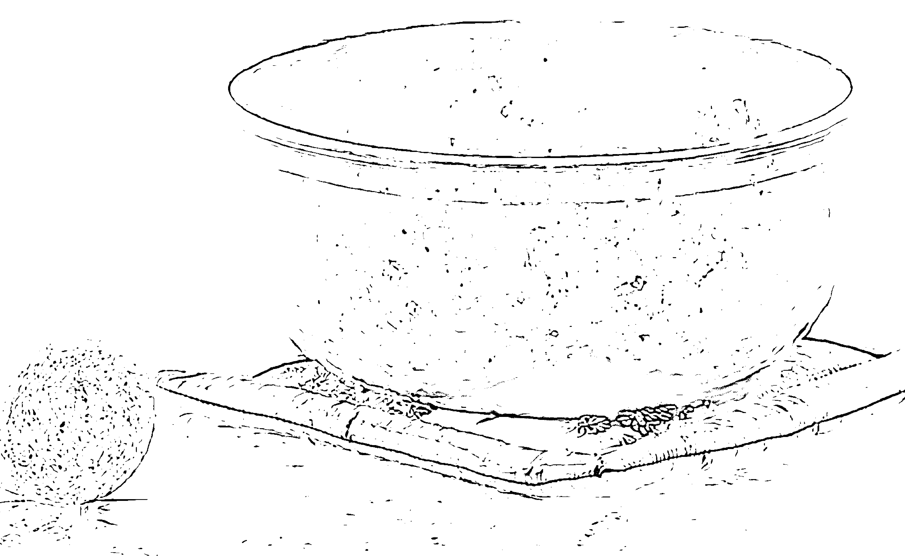

## St. Royal College

### 天使神秘学院

- ※ 专业占卜预测机构
- ※ 神秘学培训机构
- ※ 水晶能量研究中心
- ※ 官方淘宝：http://strc.taobao.com
- ※ 官方微博：http://weibo.com/715104687
- ※ 新书发布QQ群：659338717
- ※ 购买更多好书请联系院长大天使

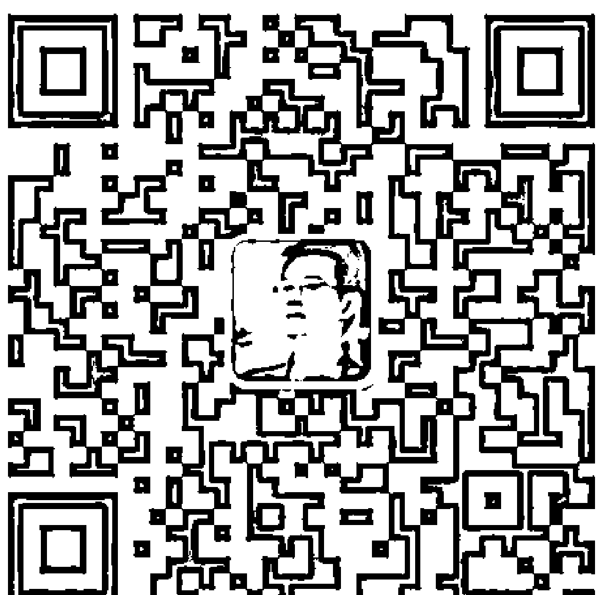

大天使
天使神秘学院 院长
QQ：715104687
手机/微信：13641926204

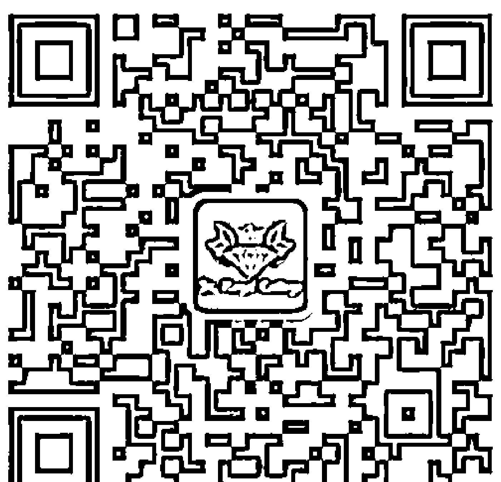

微信公众平台：strc2011

# 頌缽
與
身心靈整合療癒

陽明

### 身心靈整合療癒

在焦慮、抑鬱、躁狂、恐懼……
各種情緒失控的今天，頌缽的出現有著特殊的意義
——它是紅塵裡安頓身心的最佳工具。

彼得·楊力虹
盧啟明 著

呂啟仲老師
（強力推薦）

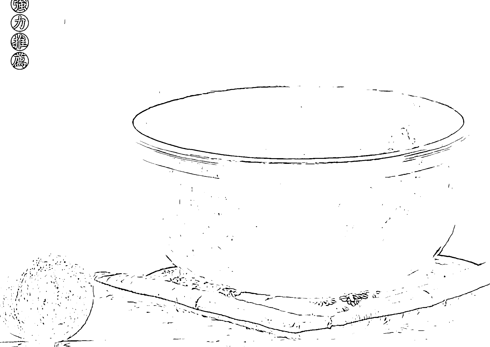

## 序一

### 聽見宇宙的聲音

楊力虹

當我被宇宙的聲音包圍時，我的身體成了一個餘音嫋嫋、與它四處共鳴的樂器，中空的管道裡充滿七色虹光，上下流動、綿延不絕，一種被無條件的愛包圍，跟宇宙源頭連接的喜悅充滿內心。

宇宙的聲音是藉由頌缽傳遞給我的。而無條件的愛的蔓延傳達，則是由頌缽與泛音人聲共鳴達成。

經由它們，我越來越清晰地聽見自己內在的聲音。

安心、寧靜、了了分明，藉由科學儀器腦波儀，在唯物主義教育中長大的我們，可以清晰地看見頌缽是如何作用於人，尤其是調整、安撫、和諧、平靜人的身心靈世界。

當然，你還可以用簡單的缽內裝水，輕聲敲擊的方式來看見：水花四濺的震動，會如何作用於70%是水的人體。

在焦慮、抑鬱、躁狂、恐懼……各種情緒失控的今天，頌缽的出現有著特殊的意義——它是紅塵裡安頓身心的最佳工具。聲音的頻率僅次於光，它的高頻、和諧震動會經由觸覺、聽覺等，整合人的身、心、靈世界的和諧度、安寧度。

與頌缽結緣，我不想講那麼多神奇殊勝的前塵往事，只想說：尼泊爾有那麼多的頌缽店，五年前的我卻走進了——行星能量頌缽療癒原創者彼得·索內老師合辦的這一家。而我，曾為占星、塔羅、生命數字等神秘學著迷，也接觸過華德福教育，花精、彩油等自然、順勢療法，繪畫、音樂治療等療癒方法，當時，也已經步入佛法修行的正軌中。因緣和合，良緣就此結下。

引進、傳播、推廣、分享行星能量頌鉢這樣的心靈療癒工具，成了我的使命。並且，居然在翻譯公司不肯接手的行星能量頌鉢精英班講義時，我靠著谷歌翻譯和4-6級英語水準，硬是把德式英文整成了中文。何等的願力啊。當然，這些本人的翻譯作品也為後來蘆啟明先生整理此書文稿時，製造了不少麻煩與障礙。這些因緣，相當有趣，似乎看見：任何困難，都不能阻止頌鉢的超強能量在流動。

五年來，經由頌鉢課程的開辦，療癒個案的發生，我們見證太多身心療癒奇蹟的發生，也親證過太多有緣人心靈的蛻變，更看見越來越多的頌鉢療癒師走上這條自助助人的道途，感恩生命的不可思議，感恩彼此的遇見或重逢，更感恩有多年實修經驗的彼得老師，為紅塵顛沛、身心混沌的眾生，開啟了這樣一條穿越身體、直達心靈的療癒之路。後來，我又引進了臺灣呂啟仲、李維琳伉儷帶領的泛唱頌鉢工作坊，和他們一起組成了一個「聆心自在」泛唱頌鉢音聲薈演出團隊，讓更多的人受益、開啟。

而我本人，卻藉由頌鉢，帶領關係工作坊、擁抱內在孩童、親密伴侶工作坊、OH卡與心靈療癒等課程，進行身心靈整合個案，許多學員或案主的潛意識裡的負面信念、塵封往事、童年創傷、家族失序等，都經由頌鉢療癒，得以浮出潛意識的海底冰山，被看見、療癒、穿越、蛻變、和解、放下。釋放負面情緒，改寫負面信念，重演人生劇本。

我也會用頌鉢帶領催眠，因頌鉢可以快速地讓人腦波進入阿爾法、西塔波。而許多的瑜珈教練、SPA、美容、保健、養生從業者，都用頌鉢與自己的專業結合，為客戶帶來更大更美好的收穫……

當你遇見這本書，也正是因緣和合。

當你看見這些文字和圖片，你會聽見內心的聲音：生命還有更多的可能性，等著你去探索。你會發現：金色陽光下，還有一條更適合你的自助助人之路，正鋪展在你的面前。

請抬起頭，望向遠方，看見正在等你的我們了嗎？

## 序二

### 與愛攜手，走上心的歸途

初識頌缽，是源於2006年6月風潮唱片發行的Hans De Back老師親自錄製的一套西藏頌缽音療的CD。記得當時拿到這套CD，還要感謝天津德暄閣茶苑的董新老師，拜託普洱茶人石昆牧老師從臺灣帶回。到現在為止，那天在茶會上播放這套CD的情景還歷歷在目，當時不僅我自己有著很深的感觸，就那次茶會而言，現在回想，當是有幾位茶友藉由頌缽的聲音，開啟了敏銳的覺察，才能夠理解和感知普洱茶中的茶氣走向以及在人體的作用，其實這也是頌缽的振動頻率和聲音，與人體共鳴產生的神奇療癒效果。後來在不斷新的聆聽這套CD，從聽到而至聽見，從欣賞而至研究。因為當時臺灣剛剛引進頌缽課程，所以當時可以搜集和查找到的資料是鳳毛麟角，但是我對頌缽的興趣卻是與日俱增，熱情絲毫未減，我堅信頌缽在不久的將來，絕對是會作爲一種神奇的療癒工具，在我們中華大地上利益眾生。

直到因緣際遇，忽然在有一天產生了很強烈的念頭，如果國內有頌缽的培訓該多好。你若盛開，清風自來，人的念力就是實現夢想的動力，當你堅定的走在自己的路上，機緣自會向你湧來。就在想要學習頌缽療癒的這個念頭充滿我的身體的時候，我就在网络上找到了紅塵的安心者——楊力虹老師與她的「自在家園」網站，看到楊老師創辦的「慧心自在藝術培訓公司」，自此毅然决然的走上了學習和探寻颂钵这一神奇的疗愈工具的道路，感恩杨老师将行星能量颂钵体系的创始者、发明人peter老师引进中国，颂钵疗愈自此与扎根于中国大陆的疗愈师们，产生了紧密的连接。

在杨老师创办的位于杭州临安东天目山的自在园，每年也都在如期的邀请peter老师亲临，举办着行星能量颂钵的课程，自助助人。颂钵加上人声泛唱，也是杨老师在主推的自然疗法之一，泛唱请来的是台湾的仇丽吕启仲、李维琳老师。在北京，杨老师也开办了颂钵店，给喜爱声音治疗的同修道友们，提供相聚的机缘。杨老师如此笃定的在国内传播着颂钵，弘扬艺术治疗，真可谓功德无量。也感恩peter老师一丝不苟的详尽的传授，他以一个修行者的广博的爱，在传播着行星能量颂钵这个可以真切可以帮助到人们的爱的种子。

随着时间的推移，研究的深入，我发现从宏观的宇宙观，到微观的量子物理学，从身体节律的调节与回馈，到灵性层面的行星运行对于人类气场的影响，这些理论无不在证明着颂钵疗愈的深厚的理论基础。而随着使用经验的积累，行星能量颂钵的诸如可以如实详尽的回馈人们的身体状况，可以有精确的使用部位与方法，可以有丰富的使用疗程，以达到不同的疗愈效果的这些优势日漸凸顯，明确的神奇的疗愈效果，也进一步加强了我的信心。而一次又一次的疗愈的发生，既疗愈了案主，又使我潜移默化的发生著变化，随着与颂钵的连接加深，我更加坚信，颂钵这个神奇的疗愈工具，将是我以后助己助人的好帮手，

这一次受杨力虹老师所托，执笔整理这册《颂钵与身心灵整合疗愈》，感谢杨老师的信任，我们希望能够将行星能量颂钵从理论到使用方法，尽可能多的介绍给中国的读者们，希望这本书能够成为想要瞭解和进一步学习颂钵疗愈的朋友们的一本入门参考，也希望能藉本书的出版，使更多的人瞭解行星能量颂钵疗癒，从而使更多的人得到行星能量颂钵的疗愈帮助。这也是我们想要编写这样一本书的初衷。

感谢peter老师毫不吝啬的开放了他几十年的研究成果，允许我们将行星能量颂钵的理论翻译并整理进本书中，内容涉及到古老的占星学、人智学等，可能在翻译整理上比较生涩，在这里希望能够起到一个抛砖引玉的作用，还望各位读者指正；感谢我的好友、古建筑保护的践行者胡瑾小姐，及他的朋友徐锦明先生远赴泰国、老挝及印度等地，为我搜集照片素材；感谢“画视文化工作室”的专业摄影师郝颖殊先生，为我们的行星能量颂钵拍摄唯美的照片，作为这本书的插图；当然还要感谢我的爱人郑颖女士，她为本书进行了校对工作，还为我的工作与生活提供了很大的支援。

爱的光芒汇成海洋，这股巨大的爱的力量，将透过颂钵疗愈这一议题传递给各位读者，让我们洗耳恭听，听颂钵的声音，带领我们走上行星能量颂钵的心灵疗愈之路，走上心的归途吧。

蘆啓明 2014.9.22

## 序三

### 聆聽如如不動的良師——來自星際源頭的「頌鉢」

這本書出現在你面前，不是偶然與巧合，而是我們都準備好了，預備要進入人生的下一個階段。當你了解頌鉢的振動，你的感官會變得更細緻靈敏，因為你學會聽到更多的泛音，體會到聲音的豐富細節。

在我多年的教學經驗中，許多人第一次聽到頌鉢的聲音，會有一種親切的熟悉感，那是源自靈魂深處的強烈共鳴，帶來醍醐灌頂的明晰，就像是行走在人生旅程當中，紛亂的思緒往往在腦中穿梭奔流，當我們佇立在這意識中車水馬龍的十字路口，必須警醒地等待紅綠燈的變化，才能順利穿越，安然自在地前往目的地，而頌鉢的聲音在此時就扮演了交通指揮的角色，它提醒我學會「停」，呼吸調息，穩住；「看」，仔細觀察，保持內在的中觀；「聽」，覺察當下的狀態。當調整好自己的頻率後，才能沉穩地勇往直前。因此，每當鉢聲響起，總能讓我們保持在敏銳諦聽的存在狀態，能讓我們專注心神，而有新的創意來開展旅程。

感謝自在家園楊力虹老師的邀請，為這本精闢的好書寫序，也因此能一睹為快。這是華文世界難得的頌鉢專書，深入淺出地介紹頌鉢的基本原理及頌鉢音療的運用手法，特別是書中介紹了頌鉢跟其他身心靈療法的配合運用，讀時讓人愛不釋手，實在是近年來喜愛頌鉢音療者的福音。

書中提及「作為一個宏觀宇宙的現實反映，人類受著行星或遠或近的影響，事實上，所有主要的宗教和文化，或其他形式的占星術，都在關注宇宙的運行規律，都強烈地影響著人類的身體健康」，這些想法啟發了十五世紀的醫學家帕拉塞爾蘇斯醫生，他探尋人與宇宙星體的關係，發展出極少副作用的植物療法形式，而行星能量頌鉢也是基於這天人合一的基礎，來開展療癒的特質。

帕拉塞爾蘇斯醫生提出治療的五大支柱，及成為一個真正治療者的兩個方法：治療者必須自己透過地獄之火的淨化或開啟自己。也由此他引出治療意義的洞見是：「進入存在（智慧），會導致內心的平靜（愛）」，每個人都應該獲得美德，實現自我價值，發展出愛的能力，並利用這些為他人謀利益，紮實地回答了療癒者應有的態度及核心價值，很值得參考，同時也提醒我，對於音療還有許多進展的空間及研究方向。

我跟行星能量頌鉢的創始者Peter老師是很有「音緣」的，他在杭州東天目山教授頌鉢課程，而我則是教泛唱，經常是我們先離開山上，Peter老師隔天才到上課地點，所以始終緣慳一面，但我們的交流卻是透過音波的傳遞而延續著，兩班學員也經常重疊。我可以在行星能量頌鉢療癒師的敲鉢聲中，感受Peter老師細心傳授的音療精髓，而在我的泛唱頌鉢課堂上，因為有Peter老師的頌鉢基礎，學員都可以學得更快、更深入，且能舉一反三的運用聲音的波動來陪伴個案。

Peter老師將行星醫學理論與脈輪氣場結合運用，發展出獨到的音療體系，從他親手挑選的行星頌鉢頻率，能感應到音頻定位的準確度，宛若天上繁星降臨人間，閃耀著金色的樂章。

我有一個Peter老師挑出來的OM缽，陪我做過許多聲音的療程，而個案最常給我的回饋是，有回到家溫暖的感覺，讓身心靈放鬆安靜下來，我則從個案的臉龐看見那重新回到愛的自在光亮。

我個人的靜修方法是跟著缽聲唱頌OM。因為OM是宇宙的元音，當身體發出OM的振動，並與頌缽的泛音合而為一時，會有回到宇宙源頭之感，小我不見了，情緒被撫平了，彷彿到達「空」的境界，心中自然湧現一種平靜喜悅及感激之情。這時，經常會有一個美好的景象出現在我腦海中，在一片金色的神聖光輝中，圍繞著難以數計的敲缽人，共振著和諧的OM聲，送出未來美好生活的願景。

在此也呼籲愛缽人，當世界發生災難時，我們可以敲缽祝福，或聚集一群人合唱OM，在無條件的愛與光中祈禱、迴向，這樣的振動可啟動宇宙的療癒力，送達需要的地方。

而相信讀過本書之後，您也可以更加親近自己內在的喜悅之聲，學習如何溫柔虔敬地對待頌缽，去聆聽這位如如不動的良師，透過聲波的直觀感動，開啓您心中那有待持續探索的無限星空。

呂啟仲

## 第一章 缘起

### 西藏颂钵，非西藏颂钵，是名西藏颂钵

西藏颂钵是对颂钵而言，国际上习惯使用的名称，是行星能量颂钵的前身，是颂钵疗愈系统的源头。

在1200年前，颂钵随着佛教的传播，由北印度传到西藏，而后又由西藏民众作为生活必需品与家庭宝贵资产带入尼泊尔，最近20年来，越来越多的人开始关注颂钵的神奇疗效力，用于身体与心灵的调理。西藏颂钵，并非发源于西藏，也非发展于西藏，却因西藏而得名。

- 第1节 颂钵的前世：三衣一钵的衣钵传承 022
- 第2节 颂钵的今生：由盛放食物到提升精神源於那美好的声音 025

## 第二章 初識

### 如何的存在，才能發出這觸碰靈魂的天籟

傳說中，頌缽是煉自喜馬拉雅山上礦石中的七種金屬，而後錘打而成。其發出的聲音能夠和大自然本身的頻率產生共鳴，並影響附近物體組成分子的振動頻率。當頌缽的聲音響起，體內最細小的原子也會隨著頌缽的音波振動而變化，當然其中的變化也包含了我們的意念思維。

- 第1節 頌缽的製造過程 028
- 第2節 頌缽的種類、樣式、聲音特色 030
- 第3節 如何使用頌缽 034

## 第三章 探索

### 當我們把世界無限細化，最終剩下的只有振動

人類對於世界的探索，從來沒有停歇過，從證實地球是球形，到挖掘原子、電子哪個才是組成世界的最小組份；從看得到、摸得著的物品，植物，動物，人，我們的身體，到看不到、摸不著的精神、靈魂、意識、能量。直到人們發現，光是振動，熱是振動，聲音是振動，將物質無限的細分下去，他的每一個組份都在振動，而頌缽發出的泛音與振動，對於人體的振動來說卻是最好的調音器。

- 第1節 世界的本源是振動，而聲音是振動的完美表達 042
- 第2節 人體本身是一個極其精妙的共振系統 046
- 第3節 腦波：人體的特殊振動 052

## 第四章 深入

### 仔細的觀察閃爍的繁星，每一顆星對你來說都有特殊的意義

在茫茫人海中，我們尋找著本屬於我們的、散落在這世界上的事業、金錢、朋友、愛人，正如我們篩選頌缽的頻率，精準的與你連接，收穫不一樣的效果。

- 第1節 氣場與脈輪 060
- 第2節 行星醫學與七脈輪理論對人的生長和發展的解釋 086
- 第3節 行星醫學探究人的生命過程與生病的原因 094
- 第4節 找到合適的共振，發現行星頌缽 123
- 第5節 行星頌缽頻率簡介 129

## 第五章 發出

### 先天之理已明，後天之事唯需靜心待之

萬事俱備的時候，你只需要靜下心來，輕輕的與頌缽的聲音在一起。讓頌缽的聲音指引你去開啟一段療癒之旅。

- 第1節 頌缽療法介紹 150
- 第2節 行星能量頌缽的使用部位 155
- 第3節 行星能量頌缽的效果及案例回饋 158

## 第六章 展望

### 佛說八萬四千法門，等待有緣人

無為才是大自在。頌缽，最自然、最接近世界的本源的聲音與振動，造就了無限的可能，它必然會與其他自然療癒力量融合，發芽、怒放、並結出最豐富、燦爛的果實。

- 第1節 頌缽與泛音詠唱 166
- 第2節 頌缽與芳香療法 169
- 第3節 頌缽與中醫 172
- 第4節 頌缽與瑜伽 178
- 第5節 頌缽與催眠及心理疏導 181

## 附錄

1. 聲音星象儀頻率 184
2. 行星頌缽頻率組合 210## 第一節
### 鉢的前世：三衣一鉢的衣鉢傳承

說到鉢，可能在中國人的腦海中最先浮現的，應該是吳承恩所著《西遊記》中，唐僧化緣使用的「紫金鉢盂」。其中寫唐僧從觀音菩薩受佛祖所賜三寶，後又從唐太宗受通關文牒一通，紫金鉢盂一個，供「途中化齋而用」。後在西天佛國求取真經時，紫金鉢盂被當作取經的「人事」，送給了阿難與迦葉兩位尊者，在此我們撇開作者是為了諷刺佛祖貪財，還是要表達「本來無一物」的空性不去討論，而單提出這故事後面與鉢相關的資訊來。

紫金鉢盂「供途中化齋而用」，說到鉢作為食器的用途。

《西遊記》56回裡說到，「錦斓袈裟，紫金鉢盂，俱是佛門至寶」，說明了這鉢在佛教中的重要地位。

這一則唐僧受太宗紫金鉢盂的事情，實則是由禪宗六祖惠能受中宗「寶鉢一口」的事情脫化而來，說明鉢在佛教長期以來是不可或缺的必需品，這可以追溯到最初佛教傳法時的三衣一鉢的傳承。

在印度，依佛制，初期的出家者須過質樸的僧團生活，因此在個人物品方面，僅獲准持有三衣一鉢、座具及濾水囊，其中，尤以三衣一鉢為出家者最重要的持物。

《大堅固婆羅門緣起經》卷下中說：「謂一類人起正信心，修出家法。（中略）但持三衣一鉢，餘無所有。」

關於比丘常應隨身攜帶三衣一鉢之事，《摩訶僧只律》卷八中說：「出家離第一樂，而隨所住處，常三衣俱，持鉢乞食，譬如鳥之兩翼，恒與身俱。」

《四分律行事鈔》卷下之一亦說三衣是賢聖沙門的標幟，鉢為出家者的用具，非俗人可用，應執持三衣瓦鉢，即是少欲少事，或略稱衣鉢。至後世，比丘臨入滅時，常將此衣鉢傳及門人，作為傳法的信物。也因此才有稱呼主要弟子為「衣鉢傳人」的稱謂。

而後佛教初來中土，僧人托鉢乞食，化齋為生，遂成傳統。在中國佛教的漢傳禪宗，由初祖達摩法師至五祖弘忍法師，師徒之間的傳授佛法，常付衣鉢為信，故稱衣鉢相傳。

可見鉢在於僧人來說的主要作用就是食器，在中國僧人用作食器的鉢幾乎都是陶製，而在印度，尼泊爾，泰國等國家，僧人使用的是金屬缽。

在這裡特別提一下印度，印度這個國家受宗教影響比較大，所以在很長一段時間，特別是印度北部靠近喜馬拉雅山的地區，很多家庭都使用缽作爲日常的食器。

如聖雄甘地的遺物中，就有一隻銅制的缽作爲食器。

直到今天，在印度北部的國家如孟加拉（邦加爾）、阿薩姆邦、奧里薩邦、比哈爾邦，這些地方還都保持著這種用法和習俗。缽仍然是日常生活的一部分，被作爲餐具和炊具來使用。人們把缽用作結婚禮物和貯存大米和食物的重要家用容器。

在印度阿育吠陀醫學中，某些冶金混合物確實也有藥物效用，所以在這方面，缽也許對康復治療起到促進的作用。在當地的習俗中，可以用缽盛溫熱的食物給剛剛生產的產婦吃，幫助她們恢復身體。

### 第二節
### 頌鉢的今生：由盛放食物到提升精神，源於那美妙的聲音

頌鉢本來被使用於藏印文化區，透過佛教由印度北部傳到西藏，由西藏民眾攜帶，傳回印度和傳入尼泊爾北部。後來，居住在尼泊爾加德滿都的西藏民眾，開始為了生計，出售一些有價值的物品。人們發現，日常作為食器的鉢，有很多在被敲擊的時候，都可以發出奇妙的聲音，這聲音安靜悠遠，使人可以很快進入一種深度的冥想狀態，並開啟身體自癒之門，舒緩精神層面及肉體層面的痛苦。很多西方的遊客驚歎於這些古老的頌鉢的驚人的音色，而將其命名為西藏頌鉢。逐漸的，頌鉢的名稱隨著頌鉢的教義而聞名，直到今天仍然會有很多西藏人從西藏來到尼泊爾，但他們更多的是帶著更高的精神追求，而不是像很久以前為了逃難，而將頌鉢作為不可割捨的珍貴的物品而隨身攜帶。

傳統的頌鉢使用在療癒上，似乎都是與藏傳佛教結合來支持冥想，這也可以被看做是一個支持放鬆和淨化能量的過程。因為這個年代，需要實現不同階段的啟蒙之路來最終解脫痛苦。在印度的靈性中心，大型的頌鉢已經用在了修行以及儀式當中，在藏傳佛教的寺院，頌鉢也是一種常見的工具。頌鉢經常用在冥想練習的開始和結束，頌鉢的非常放鬆和令人震驚的效果，可以引導人們進入一個十分美妙的冥想狀態，而且也有利於安全的探索自己脆弱的心理狀態。直到今天，藏傳佛教的寺院，在一些儀式中還使用這類似於頌鉢的各種樂器，有節奏的敲擊，來輔助冥想練習。在這些使用中的一大重點，就是淨化和協調身體的能量，並引導人們進入安靜的冥想狀態。這些用法，在藏傳佛教的教義中也有提到。因此，我們也可以說，佛教的最終目標是痛苦狀態的結束和徹底的解脫，而頌鉢這樣的工具的使用，是通往開悟的道路。這是直到今天很多冥想大師和藏傳佛教的師父們的使用心得。時至今日，很多現代人透過使用這種神奇的療癒工具，來幫助冥想和提升精神的修為，並取得了重要的和實際的效果。在這裡，我們將做一個簡短的概述。儘管頌鉢的傳統應用並不是眾所周知的，但其在聲音療法的發展中，扮演了一個關鍵的里程碑式的角色。

## 第二章 初識

如何的存在，才能發出這觸碰靈魂的天籟。

傳說中，頌鉢是煉自喜馬拉雅山上礦石中的七種金屬，而後鎚打而成。其發出的聲音，能夠和大自然本身的頻率產生共鳴，並影響附近物體組成分子的振動頻率。當頌鉢的聲音響起，體內最細小的原子，也會隨著頌鉢的音波振動而變化，當然其中的變化也包含了我們的意念思維。

### 第一節
### 頌缽的製造過程

頌缽是用含有5到12種金屬構成的、以黃銅為主的冶金混合物。在生產頌缽的過程中，首先熔化這些金屬混合在一起，然後將金屬熔化注入到鑄模後進行冷卻，脫膜後製成頌缽的粗胚，此時的頌缽具有其傳統的外形，但由於鑄造的原因，難免在內部會出現氣泡或不均勻的現象。所以粗胚製成後還需要進一步的加工，將鑄造好的頌缽粗胚再次加熱，並進行手工錘打，細緻的錘打，每一次落錘都與上一錘互相銜接，這樣細緻的錘打，使原本疏鬆的解理緻密起來，並使原本不很均勻的缽壁趨於均勻，持續錘打直至在缽的表面，錘印銜接形成一個完整的層，之後再磨光；說起來幾百字就可以簡單概括了頌缽的製造過程，但這個過程交由熟練的製造者手中，也要幾天的時間才能完成，更以顯示頌缽的彌足珍貴。

每一位頌缽製造者，每一個頌缽的產地，都有他們各自的混合配方，而不同金屬的確切含量，則取決於其製造者，正是由於這樣多元化的配方混合，才能獲得各種各樣的聲音頻率和音色。

關於金屬混合，實際上我們並不能評判哪種配方是更好的或者是更差的，因為每種金屬和混合物，都有其各自的用處和療效，也都可以產生不同的頻率和音色。一般情況下，新製的頌缽選用三到五種金屬混合製作，但三種金屬混合製作的頌缽，明顯在聲音的飽滿度，泛音頻率以及泛音持續的時間上，都遜色於五種金屬混合製作的頌缽。而頌缽關於用7種或9種甚至更多數量、種類的金屬混合製成的缽的廣泛宣傳，可能是為了提升銷量而虛構的。

德國馬普協會的科學分析顯示，在冶金混合物裡發現的像金、銀這樣的貴金屬的比例低於0.01%。這是由於在大約50或200年前製造過程中，沒有更好的金屬提純工藝，而使這些金屬混入頌缽的材料中。然而這個問題的核心之處，在於微量的貴金屬的熔入，是否對缽的音色和力度產生影響，還需要進一步驗證。

經過對頌缽長時間的研究，我們相信觸動人心的，正是頌缽那可以使人迅速進入內在寧靜狀態的柔軟、卻充滿內在柔韌力量的聲音。學會在正確的位置用合適的缽錘，和細心的手法敲擊或摩擦缽，就是揭開頌缽秘密的方法。

### 第二節
### 頌鉢的種類、儀式、聲音特色

超過30年的頌鉢，被稱為老式頌鉢。

每一隻老鉢都帶有時間的印記，都在講述自身的故事，也都擁有各自獨特的能量。

比如下圖這只名為AURA（氣場）的頌鉢，他輕質的鉢體，散發著穩重的均勻內斂的光，當輕輕敲擊他的時候，一個溫柔的聲音滲透開來，彷彿一位老者，以他仁慈寬厚的手掌，輕輕的拂過身體，給疲憊的身體以愛的呵護。使身體充滿能量。

目前，世界上只有極少數非常專業的商人出售老式的手工頌鉢，比如旅居加德滿都的行星能量頌鉢的開創者Peter老師，在二十年的頌鉢教學中，堅持甄選優質的頌鉢，但大部分出售頌鉢的商人，都出售機器壓製的工藝鉢或品質較次的老鉢。如圖工藝鉢和機器鉢。

由於有利可圖，在市場上出現越來越多的老式頌鉢仿製品，沒經驗的買家不易辨別出某些贗品。所以說購買頌鉢，還是要尋找嚴謹的良心商人，才不會購得仿製品，但無論是新鉢或是老鉢，只要找到合適做爲療癒工具的鉢，那就是好的。

由於最近二十年，越來越多的人關注到聲音治療，關注到頌缽的神奇療癒作用，市場需求越來越大，現在越來越難找到擁有對治療有用的美妙聲音的老式頌缽。

目前一群經過嚴格挑選的冶金學藝術家，承擔起再次製造已失去的手工頌缽的傳統的重擔。由於他們擁有多年的經驗，複製並復活頌缽的製作工藝，在未來不久這種新製的手工頌缽即將誕生。

經驗豐富的使用者，可以輕易感受到聲音鳴響的時間更長，而且效果更和諧。當缽經過多重加熱和錘打過程中被回火後，聲音振動的持續時間更長和更穩定。缽的邊緣厚度也更加均勻。

頌缽有4種不同的種類或類型。每種類型的頌缽製造出其各自的獨特音質，而且它們的名字都起源於其位於印度的發源地。

**◎班加羅爾頌缽**

它們特有的高度和敞口式發出最多不同的聲音特性。音調的聲響和高度，直接取決於金屬的厚度。頌缽的金屬薄邊發出低沉的蜂鳴音調，而較厚的一邊則發出更高甚至振動更強烈的音調。

班加羅爾缽對療效而言尤其有用。

- 重量：600g.到5,000g。
- 寬度：15到60cm。

**◎阿薩姆邦頌缽**

扁平、寬闊、敞口，阿薩姆邦頌缽擁有在空間內完全打開的更強烈的振動。大部分這些更小的頌缽有時擁有振盪的聲音。

- 重量：100到350g。
- 寬度：11到17cm。

**◎奧里薩邦頌鉢**

高高的、直立的像被牆圍住的頌鉢，大部分擁有2種尺寸（小型的和大型的）。它們擁有能殘留在空間的以及高頻率的聲音。

- 小型：重量：200 - 350g.寬度：11 - 13cm
- 大型：重量：700 - 1,000g.寬度：15 - 19cm

**◎比哈里頌鉢或JAKHARKAND頌鉢**

這種頌鉢是在鉢的底部有一塊小小的圓形中心，而且通常擁有薄薄的金屬邊，這樣通常會製造出擁有強烈振動的輕量頌鉢。

這種類型較大尺寸的頌鉢的容量，出人意料地深而且充滿特色。

- 小型：重量：100 - 300g.寬度：11 - 13cm
- 大型：重量：400 - 700g.寬度：15 - 19cm

同樣大小的頌鉢，邊緣相對較厚的那一只，音調會相對較高，而且，聲音會更加平穩，振動的時間也明顯較長，而邊緣較薄的那只，振動會更加強烈，甚至可以在鉢的邊緣處觀察到振動，但聲音會相對低沉。從另外一個側面來比較，尺寸較小的頌鉢，音調會相對較高，具有更高音調的振動，而較大的頌鉢聲音更加低沉，且振動相對持久。

### 第三節
### 如何使用頌鉢

當你拿到一只頌鉢的時候，先不要急於讓他發出聲音，先去感受他的樣子，大小、輕重、厚薄，如果你用心的話，你甚至可以感受到他的性格，是溫柔還是有力，是活潑亦或安靜，當你與你手中的頌鉢產生連接，那麼他將不再是一個工具，而成為了你的朋友，協助你幫助他人的朋友。

#### 1、頌鉢的握持方法

將頌鉢輕輕的放置在平坦的手掌上，請放鬆，伸直手指，攤平手掌，儘量不去觸碰頌鉢的側壁，儘量做到使頌鉢在手中保持穩定，且不會受到手的觸碰而阻礙振動；對於尺寸非常大的頌鉢，可以置於鉢墊上，以一隻手輕輕扶住鉢的側下部；對於尺寸非常小的頌鉢，你可以用三根手指支撐起頌鉢來，當然原則相同，一切與頌鉢的接觸都不能夠阻礙其振動。如果你在敲擊的時候，握住頌鉢的一側邊緣，那即

#### 2、工具與技巧

使頌缽發聲，可以使用敲擊和摩擦兩種方法，這兩種方法要使用到不同的工具。

敲擊頌缽可以使用毛氈錘子、裹著皮革的木棒，甚至是直接用手指手掌來敲擊，但針對不同的缽，使用的工具是不同的。

對於相對較大的缽，建議使用錘子來敲擊，錘把的長度提供了一定的衝程，使敲擊的力度更容易掌握，軟硬適度的錘頭，可以過濾掉一部分尖銳的泛音，使敲擊頌缽發出的聲音更趨於柔和。在錘頭的使用材料上面，我使用過多層毛氈層疊後，外面再裹一層薄毛氈的，也使用過橡膠纏繞後再裹一層薄毛氈的，甚至試用過打擊樂中專業的定音鼓槌、軍鼓鼓槌、鑼錘，以及毛線纏繞的馬林巴鼓槌等，但在打擊樂中使用的錘子，一般情況下大多偏硬，這使得敲擊頌缽的時候，使發出的聲音趨向於較尖銳而有穿透力的較高泛音。這樣的聲音，相比較於使用柔軟的毛氈槌敲擊頌缽發出的聲音來說，就更少了一份安靜的內在力量。所以使用在療癒的療程當中，推薦使用高品質的進口羊毛經過特殊工藝製作的毛氈頭的錘子，這種錘子相對於多層毛氈層疊的錘子來說，敲擊頌缽發出的聲音更穩定、更容易操作。如果在大的頌缽上面使用較硬的工具敲擊，發出的聲音會有些刺耳而煩躁。

對於非常小的頌缽，使用較硬的工具敲擊，可以發出特別清脆的泛音。建議使用小木棒，在接觸頌缽的一端包裹上薄薄的皮革，這樣敲擊頌缽會發出比較柔和而清脆的音色，但如果襯墊太厚的話，就不能體現其高音調的特性。

選擇錘子或棒子來敲擊頌缽的原則就是，頌缽的尺寸越大，棒子的襯墊應該越厚，錘子的錘頭應該更鬆軟，當然，適當的才是最好的，你必須反覆試驗，去選擇適合你手中的這一只頌缽的敲擊工具，才能讓你手中的這一只頌缽發出最悅耳的聲音，與具有療癒作用的振動。

一旦挑選好頌缽和敲擊頌缽的工具，你可以用柔和敲擊的方法進行練習。首先要找到為發出和諧響聲需要多大強度的敲擊。太用力敲擊，會發出刺耳的聲音，而用力太小，則發出空洞的聲音而且毫無效果。有意識地將動作表現出來。此時此刻，柔和地敲擊頌缽，也是療癒師當下的一個極好的鍛煉。

當敲擊頌缽時，錘頭要平行於頌缽的邊沿，柔和的敲擊頌缽的上三分之一，邊緣下面的部分，握住錘子的手要手腕放鬆，使錘子接觸頌缽的瞬間既離開，就好像是彈開一樣，注意此時一定不要使沒有柔軟包裹的部分接觸頌缽，那樣發出的刺耳的聲音，絕對可以用災難兩個字來形容。

每敲擊完一次，用心去體會頌缽發出的聲音與振動，體會這聲音與振動的持續狀態，直到你聽到、感覺到，這聲音和振動衰減或即將消失的時候，可以重複進行柔和的敲擊，但在連續的兩次敲擊之間，要有一定時間間隔，這樣才能夠展現有節奏的敲擊和有韻律的聲音，讓頌鉢發出的聲音更加悅耳舒適。

在這裡提供一個練習方式：你可以嘗試先用手指輕輕的敲打手掌，以不會感覺到疼痛為度，記住這個力度；然後在不產生疼痛的前提下，再次用手指輕輕的敲擊頌鉢，使敲打手掌和敲打頌鉢的力度趨於一致，記住這時頌鉢發出的聲音，還有手掌受力的感覺。然後使用錘子分別輕柔的敲打手掌和頌鉢，這個練習可以使你更快的找到並記住敲擊這只頌鉢的力度。

然後我們再來說一下摩擦頌鉢的工具與技巧。使用合適的工具，摩擦頌鉢的邊緣，也可以使頌鉢發出聲音與振動。首先根據鉢的大小，選擇合適的摩擦棒，大的鉢，摩擦棒要大些，包裹的皮革也要厚些，小的鉢可以使用稍小的摩擦棒，包裹的皮革也應薄些。你需要更多的耐心去嘗試，因為有些鉢更容易摩擦發聲，而有些鉢使用摩擦的方法發出泛音是困難的，這是鉢的形狀和邊沿的薄厚決定的。開始練習的時候選擇較硬的、包裹皮革較薄的摩擦棒，更容易使頌鉢發出聲音，而包裹適當厚度皮革的摩擦棒，卻能夠使頌鉢發出完美低沉且豐富的聲音。

選擇好合適的摩擦棒之後，使用摩擦棒，在鉢的邊緣輕輕的敲擊一下，然後在振動尚未消失之前，開始摩擦。在頌鉢的邊緣處垂直握住摩擦棒，並將其緊貼頌鉢的一側，沿著上部邊緣緩慢且平穩地繞著頌鉢移動摩擦棒，直到發出響聲為止。在這個過程中，要保持摩擦棒與頌鉢間，既要有均勻而緩慢的速度，又要有一致的壓力。你會感覺到振動是疊加的，在開始的時候，摩擦棒移動的速度稍快些，可以更容易使頌鉢發出聲音，而隨著振動的疊加，聲音與振動越來越強烈，就需要放慢速度，保持壓力，使聲音與振動維持在一個恆定的水準上，尋找一個相對平衡的速度與壓力並維持。因為，如果仍然保持較高的速度與較小的壓力的話，隨著頌鉢發出的振動越來越強烈，這個振動與摩擦棒碰撞，就會發出刺耳難聽的聲音。

切記切記，不要著急，安靜下來，傾聽缽的聲音，感覺缽的振動，你慢慢會找到那個使聲音與振動平衡持續的點，也是你自己的平衡點。

## 第三章 探尋

當我們把世界無限細化，最終剩下的只有振動。

人類對於世界的探索，從來沒有停歇過，從證實地球是球形，到挖掘原子、電子、夸克哪個才是組成世界的最小組份；從看得到、摸得著的物品、植物、動物、人、我們的身體，到看不到、摸不著的精神、靈魂、意識、能量、氣場。直到人們發現，光是振動，熱是振動，聲音是振動，將物質無限的細分下去，他的每一個組份都在振動，而頌缽發出的泛音與振動，對於人體的振動來說卻是最好的調音器。

### 第一節
### 世界的本源則是振動，而聲音是振動的完美表達

早在西元前6世紀的希臘，畢達哥拉斯就認爲宇宙是一個巨大的單弦琴，弦的上半部分連接絕對的靈性，弦的下半部分連接著絕對的物質。他曾向學生們指出：「學習單弦琴，你就會知道宇宙的秘密。」宇宙的秘密就是振動。愛因斯坦的老師、量子力學之父普朗克博士感嘆道：我對原子的研究最後的結論是——這世界上根本沒有物質這個東西，物質是由快速振動的量子組成。這個世界上的有形無形的，皆是不斷振動的能量，兩者的分別在於振動頻率的不同，因而產生不同的意識或不同的物質。振動頻率高的成爲無形的物質，如人的思想、感覺、意識、意念；振動頻率低的成爲有形的物質，如桌子，椅子，杯子等等。

朱清時院士曾在2009年的一次名爲《物理學步入禪境——緣起性空》的演講中，對現代物理學的最新成果——弦論進行瞭解讀，他說：「弦論的一個基本觀點就是自然界的基本單元，如電子、光子、中微子、夸克等等，看起來像粒子，實際上都是很小很小的一維弦的不同振動模式。正如小提琴上的弦，弦理論中的宇宙弦（我們把弦論中的弦稱爲宇宙弦，以免與普通的弦混淆），可以作某些模式的振動。每種振動模式都對應有著特殊的共振頻率和波長。小提琴弦的一個共振頻率，對應於一個音階，## 第三章 探尋

> 「而宇宙弦的不同频率的振动，对应于不同的品质和能量。所有的基本粒子，如电子、光子、中微子和夸克等等，都是宇宙弦的不同振动模式或振动激发态……简言之，如果把宇宙看做由宇宙弦组成的大海，那么基本粒子就像是水中的泡沫，他们不断在产生，也不断在湮灭。我们现实的物质世界，其实是宇宙弦演奏的一曲壮丽的交响乐。」

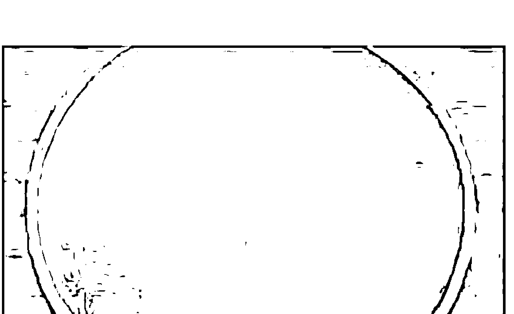

现代物理学看来，宇宙间充满了各种物质与能量，从组成物质基本粒子的夸克到无限大的宇宙，都以振动的方式存在。万事万物都有自己独有的振动频率，并以这样的方式吸收或释放能量。在这里我们不去讨论各种物理学流派的学术纷争，也不去专篇论述宇宙弦的运作模式，而恰恰是这一宇宙的弦理论，对于宇宙结构的阐述却很圆满。如此，物质世界中的各种存在，都是弦的振动的表达，也就是说，声音就成为了诠释这个世界最完美的表达方式。再加上共振的理论或者说是振动的运作方式，就不难解释为何外在的事物如近到声音、光，甚或于说直接的撞击；远到自然环境的改变，甚至行星天体的运作，如何会影响到人体的健康，当然关于行星的运行如何对机体产生影响，在颂钵疗愈中如何体现振动与行星影响的作用，我们后面会用专门的篇幅来阐述。

现在我们来说一下刚刚提到的共振。

从19世纪，西方的物理学对共振的现象进行了深入的研究，美国科学家尼古拉·特斯拉就充分认识到共振的力量。一个小的能量输入，经过共振就可以变成大能量的输出，这种能量的超级传输，可以带来全球的能源革命，特斯拉终生都在研究这种共振能量传输。著名的实验是，在地下打一口深井，装入钢管，然后向井内输入特定频率的振动，结果地面开始晃动引起了一场小型地震。特斯拉说：「如果把物体的振动与地球的谐振频率正确的结合起来，几个星期内就可以造成地动山摇，地面升降。」他还仿照阿基米德的名言说，「如果给我一个共振器，我就可以把地球一分为二」。

每一个物体都有一个自然的振动频率——在一个特定的频率上振动，即共振频率。当一个物体遇到与自己完全匹配的频率时，它就会开始以其固有的频率振动，例如音叉就可以产生这样的共振。如果你有两只一样的音叉，例如频率均为100Hz，首先你敲响第一只音叉，当你拿着被敲响的这第一只音叉，去靠近原本静止的第二只音叉的时候，没有被敲打的第二只音叉，就会开始震动并发出声音。不仅仅一只，你可以把十只相同频率的音叉放在一起，只敲响其中一只，然后拿它靠近其他只音叉，剩下的相同频率的音叉都会振动并发出声音。但是，如果你改变被敲响的那只音叉的频率，哪怕只是1Hz，比如让它变成101Hz，当你把这只音叉敲响，再去靠近其他音叉的时候，这些静止的音叉就不会发出声音了。

而共振还存在另外一种运作方式。那就是当一个物体产生振动，即使两个物体的振动频率可能不相同，但因为其中一个物体的振动，可能影响或改变其他物体的振动，这种运作方式可以使一个振动的物体，与其他许多振动频率不同的物体产生共鸣。

如同蘭道爾·麥克柯愛蘭博士在《音樂的治療力量》一書中提到，水是一個對這種共振模式產生回應的物質。

说到这里值得一提的是「音流学」这门学科。远在18世纪，有一位科学家名叫恩斯特·克拉的尼，他将沙粒放在玻璃板上，然後使用小提琴的琴弓來讓玻璃板振動，最終這些沙子會排列成非常美麗的圖案。而後來，瑞士的漢斯·詹尼博士用十年的時間來觀察和研究，如何利用波形來展示出聲波對於許多不同類型的物質所產生的影響。包括水、液體塑膠、膠水、塵土。詹尼博士把這些物質放在一個鐵盤上，用一個水晶震盪器來振動盤子，製造出一種精密的振動頻率，然後，將受到振動影響的物體展現的效果拍照下來。

在他捕捉到的眾多不同的形狀當中，液態塑膠會隨著震動形成類似海葵的樣子，石鬆粉（一種類似於爽身粉的粉末）變成類似人體皮膚細胞的形狀。而水，則根據頻率的變化，形成許多奇特的幾何形狀。圖中可見，在不同頻率作用下，水可以呈現出不同的波形與形態。證實了水可以受到很多頻率的振動的影響，並產生相應的變化。我們由上面的試驗可以看到振動使水產生的改變。而人體的70%是由水組成的，當頌缽的聲音與振動，作用於人體的時候，頌缽的頻率就經由水的共振特性，傳達到人體相應頻率的器官，從而起到調節機能的作用，以及在體液中就起到了轉化和調節的作用。

上面說到的共振的方式，還有一個特例，那就是當一個物體振動的頻率，是另外一個物體振動頻率的相應的幾何倍數的時候，仍然能夠產生共振。舉例來說，當你按下鋼琴上最低音的c的時候，你會讓鋼琴上其他的c音開始共鳴，因為他們是諧音關係。這一點我們也將在行星頌缽的產生與篩選原理的章節仔細討論。

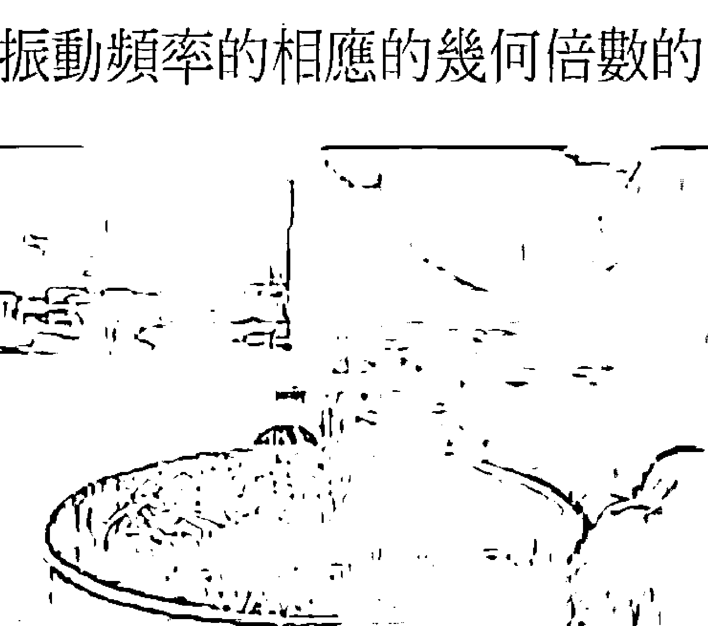

### 第二節

### 人體本身是一個極其精妙的共振系統

宇宙的弦論說，宇宙作為一根大弦，連接著靈性與物質，而人是肉體與靈體的結合，古人說做人要頂天立地，真是一句真理，因為人真的同時存在於兩個不同的世界，頭上頂著高層次的靈性的世界，而作為肉體的人身，腳踏著物質化的實體世界，所以說人既有肉體也是靈體，是真正的靈與肉的結合，也可以將人體比像於宇宙也是連接著靈性與物質的弦，所以整體來說，人體是一個極其精妙的共振系統。

透過現代的研究，我們知道人能夠透過嗓子發出的聲音在65~1100Hz之間，透過練習一些泛音詠唱的技巧，人的嗓子可以發出的聲音，甚至可以達到1600~2300Hz之間。而人耳能聽到的頻率範圍為20~20000Hz之間，低於20Hz在我們聽覺門檻以下的被稱為「次聲波」，高於20000Hz超過聽覺所能聽到範圍的聲音被稱為「超聲波」。

人是如何聽到聲音的呢？首先我們來談談一些最為基礎的概念。聲音目前可以被理解為一種波，就像我們已經習慣性的稱其為聲波。通常聲波是可以在空間移動的，是由於某個物體的振動造成他們的運動，這種聲波運動撞擊我們的耳鼓，並進入到人體十分奇特的聽覺過程，這個過程是在我們的腦中，將振動轉化為化學形式，然後再轉化為電脈衝形式。這樣我們的大腦才會回饋出我們聽到聲音了。

前面提到，聲波的計量單位是「Hz」，是聲波美妙的振動週期，一個聲音的度量名稱是「頻率」，每秒鐘一個振動週期被認為是1Hz，較緩慢頻率的聲波，創造出非常深而低的聲音，較快頻率的聲波，創造出高而尖銳的聲音，比如一台鋼琴，他的最低音可以達到24Hz，而最高音4186Hz。

正常成人能夠聽到的聲音大概是從16Hz~16000Hz，當然，這些數字並不是一成不變的，特別是高音的部分，年紀小的孩子可以聽到接近20000Hz頻率的聲音，但隨著年齡的增長，我們愈發的暴露在噪音之下，我們的聽力範圍就會減小。

在美國的科羅拉多大學的菲斯科天文館內，有一間多重感官聲音實驗室，這間實驗室的初衷，是為了幫助聽力受損的孩子體驗到聲音而設立，在那裡有著十分先進的設備與具有創意性的裝置設置，在那裡的地板下安裝有喇叭，有聲音輸入裝置連接著這些喇叭，當你對著連接著喇叭的麥克風說話的時候，地板會產生振動，而且實驗室內還設有一台精密的頻率發生裝置，可以用來精確的發出某個頻率的聲音，用來測試來訪者的聽力範圍。

當來訪者準備好的時候，解說員會開始播放回應頻率的聲音，從12000Hz的頻率開始，提升到13000Hz的時候，幾乎所有人都能聽到。但，當頻率提升到14000Hz的時候，房間裡的部分年紀比較大的人，就開始聽不到這個頻率的聲音（提示：隨著年齡的增長，首先喪失的是高頻聽力），然後當逐漸提升到16000Hz以上的時候，幾乎所有成年人，就都聽不到這個高頻率的聲音了，但是孩子依然能夠聽到，直到將頻率提升到20000Hz以上的時候，包括孩子、房間內的所有人，都聽不到任何聲音。但是問題在於，聽不到的，感覺不到的，就不存在麼？不是的。

我們不能因爲聽不到，就表示這個聲音不存在，海豚一直在使用高達180000Hz的高頻率的超聲波，來進行溝通和感知周圍的環境，每個人的敏感度也不同，有些人可以聽到電流穿過房間或電燈被點亮的聲音，有些人可以聽到從水晶傳出來的振動頻率，有些人甚至可以感覺到，從附近的其他人體發射出的振動頻率，我什麼都聽不到，但不意味著這些聲音並不存在，更不意味著這些聲音對我的身體不起任何作用。

以人體來說，不僅僅五臟六腑有自己的振動頻率，小到細胞，硬如牙齒骨骼，細微到腦電波都在振動，比如頭部的固有頻率在8~12Hz，腹部內臟的固有頻率爲4~6Hz。如果外在某一振動的頻率與其相應，也許很弱小的能量，就能夠起到很大的影響。

比如行星能量頌鉢的木星鉢，對應於人體的肝臟，在輕柔的敲擊木星鉢並將其放置在肝臟的位置，就可以達到改善情緒、整理思緒的作用，並對關節疼痛有很好的緩解效果。

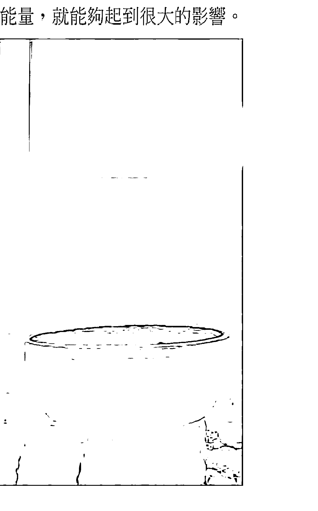

對於我們人的身體內部的運作來說，更是神奇的運用了共振的原理，比如血液的循環的運作模式，人的心臟只有1.7瓦的功率，卻能夠在長達幾十年的時間裡，源源不斷地把血液送到全身各器官，而現代人研製的人工心臟，即使設計成幾十瓦的功率，很短時間也會造成器官的缺血而衰竭。

從人體構造來看，心臟的位置距離人體頂部的距離，大概是整個身長的四分之一的左右，而不是在人體的中部或最上部。為什麼會有這樣的構造呢？如果根據引力的作用，水往低處流，心臟要省力，應該生長在頭部的位置才合理啊。如果要省做功距離，應該在人體的中間位置啊。心臟收縮擠壓出血液，為什麼不直接從動脈流出，而是先讓動脈拐了一個彎，好像河流的一個大彎道，水流如果經過彎道不是更加費力麼？人體的進化為何是這樣的設計？

美國約翰霍普金斯大學的生物物理學博士王唯工撰寫的《氣的樂章》一書中，提出了血液循環共振理論，這些看起來不合理的人體設計，隱藏著自然進化的大智慧，當血液被打出心臟後帶著心臟的頻率，然後隨即在冠狀動脈裡拐了一個彎，之所以拐這個彎，就是為了在這裡改變振動的頻率，使此時血液的振動頻率與肝臟的振動頻率一致（記得在上一節中我們說到，水是對各種頻率都會有呼應的物質吧），之後就流到肝臟，血液原有的頻率與肝臟的頻率共同生成一個新的頻率，這個頻率與腎臟的頻率一致，然後就流到腎臟，如此往下，依靠共振，血液在體內有力的流動著。

另外，如果把人的身體整體看成是一個橢圓，那麼，冠狀動脈剛好是這個橢圓的一個焦點，而另一個焦點在下腹部，剛好，這兩個焦點的位置，就是中醫所說的中丹田膻中穴——為宗氣之所聚，和下丹田關元穴——為藏精之所，處於這樣的黃金分割的焦點，其實也是整個人體中共振最強的焦點，也是整個人體小宇宙的玄妙在中西方探索中的相互佐證吧。

每一個器官都有自己特定的振動頻率，但是，如果發生病變的話，比如脂肪肝，肝臟細胞發生變化，影響肝臟原有的振動頻率，肝臟就得不到更多的血液供應。如果脂肪肝長期得不到逆轉，那麼惡性循環，越是得不到血液滋養，就越是推動脂肪肝的發展，於是輕度到中度、中度到重度、最終肝硬化。相應的，這個頻率的改變，又會影響下一個器官的接受頻率的改變，環環相扣，於是，由脂肪肝的脂代謝紊亂，逐漸的累及其他器官，胰腺負責的糖代謝紊亂也會相繼出現，於是就出現了現代人的代謝綜合症。

打個比方，剛剛說到我們身體的不同部分，我們的各個器官、骨骼、臟器、肌肉等等不同的系統，全都有他們自己特定的共鳴頻率，就好像很多種不同的樂器，而這些共鳴頻率、這些樂器，可以在一起創造出一個混合起來的聲音——一個人整體的共鳴頻率，這就像一個很特殊的交響樂團，正在演奏一個特別的「自己的組曲」。

當我們處於一個平衡與和諧的完全健康狀態，我們身體這個交響樂團，就可以演奏出一場十分美妙的「自己的組曲」。但是如果其中的一位藝術家出現了問題，就好像我們剛剛提到的脂肪肝先生，就如樂隊的第二提琴手掉了某頁樂譜，他開始拉錯音，或是演奏出錯誤的曲調，或是與整個樂隊不同步、不和諧，這不僅僅是音調的失誤，也許他彈奏的時間節奏也不對，這樣也就會影響到整個樂隊的演奏，這就是身體不舒服了，生病了。

當整個樂隊出現了這麼一位掉了一页樂譜的藝術家的時候，傳統的對抗醫學的處理方式是，給這位可憐的藝術家足夠的藥物，讓他昏睡過去，這樣他就不再拉琴，或者用手術的方法，把這位出錯的藝術家殺掉，就是用各種方法，設法將這位走音的藝術家移除，這樣就可以讓影響整個樂隊的錯誤聲音消失，當然消失的不僅僅是聲音，也可能包括這位第二小提琴手。這樣整體的演奏就會顯得和諧很多。
但是如果有一種方法，將丟失的那一頁樂譜歸還給這位藝術家呢？如果我們只是帶領這位第二小提琴手，再次跟上整個樂隊的演奏呢？如果我們可以將正確的共鳴，投射給身體上振動失去和諧的那一部分呢？頌鉢就是使用這樣的一個簡單有力的工具，是立基於萬物包括身體皆是振動的原理，採取了提高身體、情緒、心智、心靈的正確的共鳴方式，使身體找回原有的共振頻率，當頌鉢運用在身體上的時候，這些共鳴頻率就可以將匱乏的細胞充滿能量，使他們恢復健康。在後面的章節裡，我們會討論頌鉢療癒的各種頻率能夠達到的效果，現在讓我們更加深入一些，去探索一下頌鉢是如何影響更加精微的腦波的振動的。

### 第三節

### 腦波：人體的特殊振動

腦電波（Electroencephalogram, EEG）是大腦在活動時，腦皮質細胞群之間形成電位差，從而在大腦皮質的細胞外產生電流。它記錄大腦活動時的電波變化，是腦神經細胞的電生理活動在大腦皮層或頭皮表面的總體反映。

腦電波同步節律的形成，與皮層丘腦非特異性投射系統的活動有關。腦電波是腦科學的基礎理論研究，腦電波監測廣泛運用於其臨床實踐應用中。

#### 1、原理特徵

生物電現象是生命活動的基本特徵之一，各種生物均有電活動的表現，大到鯨魚，小到細菌，都有或強或弱的生物電。其實，英文細胞（cell）一詞也有電池的含義，無數的細胞就相當於一節節微型的小電池，是生物電的源泉。

人腦中有許多的神經細胞在活動著，而成電位性的變動。也就是說，有電位差的擺動存在。而這種擺動呈現在科學儀器上，看起來就像波動一樣。腦中的電器性震動我們稱之為腦波。用一句話來說明腦波的話，或許可以說它是由腦細胞所產生的生物能源，或者是腦細胞活動的節奏。

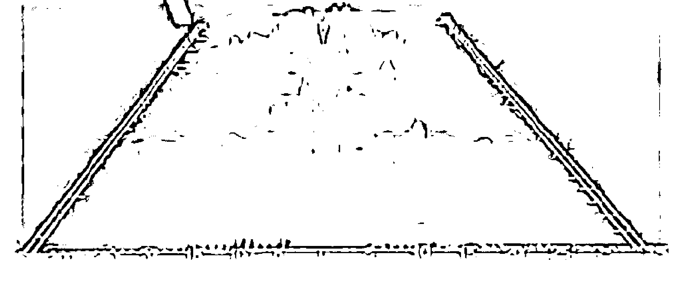

#### 2、研究歷史

早在1857年，英國的一位青年生理科學工作者卡通（R. Caton），在兔腦和猴腦上記錄到了腦電活動，並發表了「腦灰質電現象的研究」論文，但當時並沒有引起重視。十五年後，貝克（A.Beck）再一次發表腦電波的論文，才掀起研究腦電現象的熱潮，直至1924年，德國的精神病學家貝格爾（H.Berger）看到電鰻發出電氣，認為人類身上必然有相同的現象，才真正地記錄到了人腦的腦電波，從此誕生了人的腦電圖。

#### 3、腦電波的四個重要波段

現代科學研究已經知道，人腦工作時會產生自己的腦電波，可用電子掃描器檢測出，至少有四個重要的波段。經過研究證實，大腦在至少有四個不同的腦電波。

腦電波是一些自發的、有節律的神經電活動，其頻率變動範圍在每秒1－30次之間的，可劃分為四個波段，即δ（1－3Hz）、θ（4－7Hz）、α（8－13Hz）、β（14－30Hz）（這幾種波的頻率邊界，在學界還沒有完全統一的標準。亦有學者認為δ波小於4Hz，θ波4～7Hz，α波8～12Hz，β波13～35Hz，並認為有大於35Hz的腦電波，並命名為γ波。長期處於該狀態下的人會有生命危險）。

- δ波，頻率為每秒1－3次，深度睡眠腦波狀態，範圍0.5-3Hz。

當人們的大腦頻率處於δ波時，為深度睡眠、無意識狀態。人的睡眠品質好壞與δ波有非常直接的關係。δ波睡眠是一種很深沉的睡眠狀態，如果在輾轉難眠時，能夠召喚出近似δ波狀態，就能很快地擺脫失眠而進入深沉睡眠。另外，當人在嬰兒期或智力發育不成熟、成年人在極度疲勞和昏睡狀態下，可出現這種波段。

- θ波，頻率為每秒4－7次，深度放鬆、無壓力的潛意識狀態，範圍4-8Hz。

當人們的大腦頻率處於θ波時，人的意識中斷，身體深沉放鬆，對於外界的資訊，呈現高度的受暗示狀態，即被催眠狀態。θ波對於觸發深沉記憶、強化長期記憶等幫助極大，所以θ波被稱為「通往記憶與學習的閘門」。另外，成年人在意願受到挫折和抑鬱時，以及精神病患者，這種波極為顯著。但此波為少年（10－17歲）的腦電圖中的主要成分。

- α波，頻率為每秒8－13次，平均數為10次左右，學習與思考的最佳腦波狀態，範圍8-13Hz。

當人們的大腦頻率處於α波時，人的意識清醒，但身體卻是放鬆的，它提供意識與潛意識的「橋樑」。在這種狀態下，身心能量耗費最少，相對的腦部獲得的能量較高，運作就會更加快速、順暢、敏銳。α波被認為是人們學習與思考的最佳腦波狀態。是正常人腦電波的基本節律，如果沒有外加的刺激，其頻率是相當恆定的。人在清醒、安靜並閉眼時，該節律最為明顯，睜開眼睛或接受其它刺激時，α波即刻消失。

- β波，頻率為每秒14－30次，緊張、壓力、腦疲勞時的腦波狀態，範圍14Hz以上。

人們清醒時，大部分時間大腦頻率處於β波狀態。隨著β波的增加，身體逐漸呈緊張狀態，因而削減了體內免疫系統的能力。

#### 4、合理性

每一種腦電波都有其相對應的不同的大腦意識狀態，也就是說，在不同意識狀態下，需要不同的腦電波，才能最好地完成大腦的工作。如果大腦在某個具體情況下，不能出現相應的腦波，人們就有麻煩了。例如，如果在想睡眠時，大腦不出現δ波和θ波，這就是失眠症（Insomnia）。當您在緊張狀態下，大腦產生的是β波；當您感到睡意朦朧時，腦電波就變成θ波；進入深睡時，變成δ波；當您的身體放鬆，大腦活躍，在人心情愉悅或靜思冥想時，一直興奮的β波、δ波或θ波此刻弱了下來，α波相對來說得到了強化。因為這種波形最接近右腦的腦電生物節律，於是人的靈感狀態就出現了。

一個有用的比喻，可以把大腦的四個腦波看作是汽車的四個檔位。δ是一檔，θ是二檔，α是三檔，β是四檔。沒有哪一個檔位適合所有的行駛狀態，也沒有哪一個腦波狀態，適應所有的生活挑戰。如果汽車的某個檔位不能使用，或我們忘記去使用，這台車就有問題了。例如我們起步用一檔，然後直接掛到四檔（省掉了二檔和三檔），汽車的油耗就會大幅增加，修車費也會不菲。大腦也是一樣。但我們不幸看到的是，太多人使用大腦時省掉了二檔和三檔（θ波和α波），如此駕駛大腦的結果，是大腦工作效率低下和醫療費的上升。這是如何發生的呢？

我們舉例來描述現代人的生活。一個人在早晨還在深睡時（$\delta$ 波狀態）突然被鬧鐘叫醒，時間來不及了，馬上行動（$\beta$ 波狀態），緊張、焦慮和匆忙的一天開始了！喝一杯咖啡使自己保持清醒（$\beta$ 波狀態），咖啡因可以抑制 $\theta$ 波和 $\alpha$ 波，並提高 $\beta$ 波。一整天在緊張、壓力或焦慮下工作（大腦中 $\beta$ 波、$\beta$ 波、還是 $\beta$ 波），一直到晚上精疲力竭時，一頭栽到床上開始大睡（直接進入 $\delta$ 波狀態）。一天當中連放鬆和感到困倦的時間都沒有（沒有時間進入 $\alpha$ 波和 $\theta$ 波狀態）。現代生活中太多的人這樣駕馭自己的大腦，突然而有力地從一檔直接進入四檔，並從四檔直接回到一檔。

$\alpha$ 腦波的存在的合理性，是我們人類大腦先天所具有的，是大腦的基本狀態之一。但現代生活的緊張，使太多人忘記了自己的大腦處於 $\alpha$ 腦波狀態，從而許多人成為緊張、焦慮所導致的疾病的犧牲品。緊張和焦慮降低人體的免疫能力。而大腦有相對較多的 $\alpha$ 腦波的人，有相對較少的焦慮和緊張，因此免疫能力也相對較高。這當然對每一個人都有益處。

$\alpha$ 波分為三種：

- （1）慢速 $\alpha$ 波（8-9Hz）：臨睡前頭腦茫茫然的狀態，意識逐漸走向模糊。
- （2）中間 $\alpha$ 波（9-12Hz）：靈感、直覺或點子發揮威力的狀態，身心輕鬆而注意力集中。
- （3）快速 $\alpha$ 波（12-13Hz）：高度警覺，無暇他顧的狀態。

以前，大多數醫生對腦電圖的 $\alpha$ 波熟視無睹，因為它反映的是正常人常見的腦電圖，與診斷疾病關係不大。隨著科技的進步，國外的腦電圖學者、心理學家、社會學家對 $\alpha$ 波已經刮目相看。

看了。

這是為什麼？更多的研究發現，$\alpha$ 波具有以下幾個方面的神奇功效：

- (1) 激發潛在能力
- (2) 提升記憶效果
- (3) 發揮靈感及創造力

#### 5、潛能開發

日本的研究人員認為：人腦以 $\alpha$ 波為主時，大腦的潛意識大門打開，潛意識和意識之間的通路打開，但是這時注意力很難集中。

若人腦電波處於 $\beta$ 波狀態，則思維清醒、邏輯思考、計算推理、注意力集中；或感到壓力很大、緊張、憂慮（高頻 $\beta$ 波）。

低頻 $\beta$ 波說明一個人比較警醒，但是高頻則往往出問題，比如考試時產生的焦慮和怯場現象。

#### 6、右腦記憶

國際右腦教育權威七田真教授，透過其全世界近500所右腦教室實踐驗證：右腦的記憶力是左腦的100萬倍，右腦具有高速、大量地記憶和處理資訊的能力。

美國神經科學家W.Gay Walter於上世紀四〇年代做了一系列實驗，他使用電子頻閃觀測裝置結合EEG設備，讓受測者看節奏性閃光。研究發現大腦能夠迅速跟接收到的頻率產生同步，此現象稱為「光導引效應」。同期，研究人員又發現了腦波的聽覺驅動效應。聲光同頻調節 $\alpha$ 腦波，是科學上公認的最直接、最有效的喚醒右腦記憶潛能的方式。

傳統的教育，人們更重視「邏輯性」的左腦活動。但為了利用右腦和潛意識的驚人力量，高效學習的真正鑰匙，可以用兩個詞來概括，即放鬆性警覺（relaxed alertness）。這種放鬆的心態是每次開始學習時必須具備的。許多研究人員和教師相信，人們可以透過潛意識，很好地學習大量資訊。最適於與潛意識的腦電波活動是以8～12周／秒速度進行的，那就是α波。

在自然環境中，某物體較強的旋律波動，能夠改變另一個物體較弱的旋律波動，並且讓後者與前者達成同步的振動，這種現象被稱為「耦合」。腦波像呼吸、心跳一樣，是人的身體的一種旋律，是可以受到外在的聲音影響，產生改變的。

頌缽作為聲音療癒的工具，作用在人體，可以繞過人的意識，直接作用在身體層面，不可抗拒的使大腦在很短時間內產生大量α波，使身體進入到完全放鬆、而意識完全清醒的狀態，在這種狀態下，潛能被開發，機體機能在恢復，而自我療癒的機制被開啟，如圖所示，（上圖）是案主進行頌缽療癒前的腦波顯示，在頌缽療癒開始後不久，案主的其他腦波逐漸平靜，代之以α波為主的腦波（下圖）

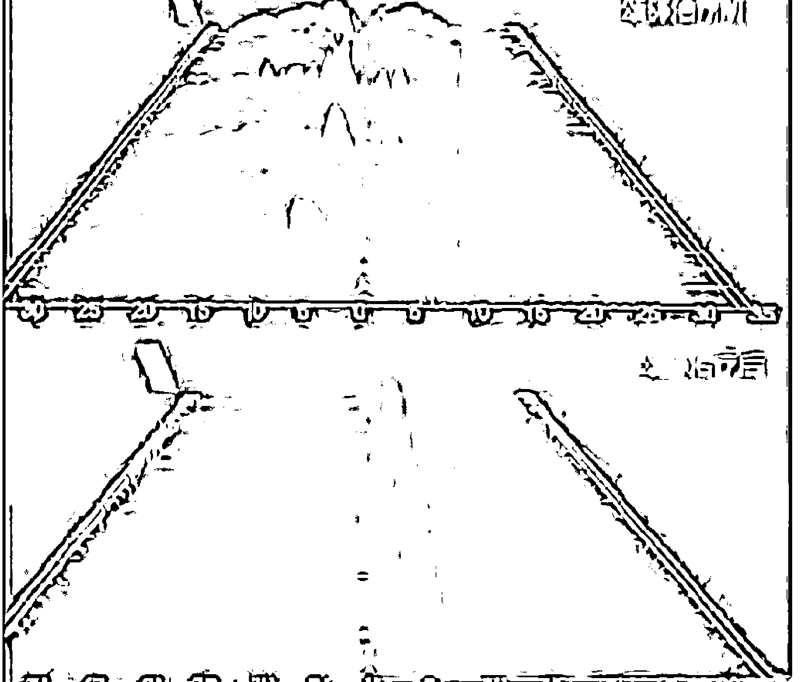

## 第四章 深入

仔細的觀察閃爍的繁星，每一顆星對你來說都有著特殊的意義。

在茫茫人海中，我們尋找著本屬於我們的、散落在這世界上的事業、金錢、朋友、愛人，正如我們篩選行星能量頌缽的頻率，精準的與你連接，收穫不一樣的效果。

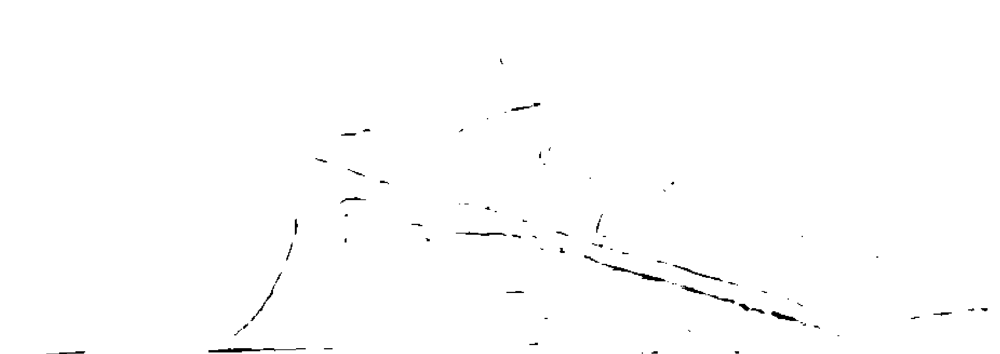

### 第一節 氣場與脈輪

「氣場」是一種古老的術語，用來描述普通覺知不容易識別的、但卻是真實存在的一種能量場。

在大多數情況下，我們最常說的是人的氣場，但是實際上，這個世界上的動物和植物，推而廣之的所有眾生都是有氣場的，只是植物與動物的氣場有範圍大小、能量強弱、振動頻率高低的差異。而人類較之於動物來說，有更高的感知情緒的能力，以及更高級別的個性的展示，由此而散發出的氣場範圍更廣且能量更強。而另一方面，人的氣場是可以變化的，並且可以對人所處環境與人的狀態產生反射樣的反應的。相對而言，動物的氣場較人類的氣場弱，而植物相對來說更弱些。

當今社會，大量的不安全因素，充斥著我們生存的這個環境，大氣、水源的污染，噪音的污染，物欲橫流，導致越來越多的身體上的疾病與心理上的疾病，顯現在人類的身上，我們希望藉由古老的氣場知識，使用聲音治療這樣一個很好的技術手段來造福人類。

在接下來的章節中，我們將主要討論人類的氣場，並利用古代和現代的各種見解，來闡述氣場是如何與人類的身體、情感以及精神產生互動。在很多外在可以影響並改變氣場的方法當中，行星能量頌缽的使用，將是一種嶄新的且效果確切的嘗試。

#### 1. 气场与脉轮概述

气场在光中最凝练的形式，是在物质肉体上，但其他一部分气场由于振动频率更高、更快，会被稀释、淡化。气场的能量在水平的振动产生很多的分化，相关的能量密度变的松散，我们的气场从身体由内向外飘移。事实上，气场能量靠身体和意识这两种极性构建。我们希望从一个实质存在的角度来形容它们，我们可以说，降低振动水平会趋近于身体的物质实体，而在外较高的振动水平更接近意识。然而，物质或意识注入了有节奏振动的生命。生命里，脉动也是带有约束力的能量。这样的生命给精微能量以形式，不同性质为形式提供支援，提供架构。

气场跟一个人的意识有直接关系，气场的实际尺寸可以有很大差异，这取决于一个人的意识状态。首先，一个人产生想法、意识、念头，然后采取正确的方法，紧跟着意识导向而行动。在不断的行动当中，一个人的經驗在意识的学习和形成过程中，也扮演着重要的组成部分。因此，意识和物质会相互交互和创建。

正常人的气场延伸到离身体约1.5米以外的四周空间，但修行者或长期禅定的大师，可能有更大的气场范围，它们可以扩展到几百米。一个人的气场，实际上可以影响物质实体或者其他气场。当然，也包括我们经验到的环境，被称为感受气氛的地方。我们遇到某些人，觉得舒服，遇到另外其他一些人，则完全相反的感到不自在甚至讨厌。所以气场是一个可以被感知的有机体，不仅与身体的感觉器官相关。

其实气场渗透到我们能够感知的空间时，这个空间似乎被东西占用。这就是为什么大师禅修的圣地，有如此巨大加持力，或到寺廟，甚至遇見禪師，也會有強烈感覺。一旦進入這樣一個強大的純化的氣場，自己的氣場會受到積極正面的影響。接近一個真正的實修的開悟者的經驗，正如接近核心的氣場，會給人留下深刻印象，這正是東方哲學中的師生關係如此重要的主要原因。

與一個有見地的上師或大師相遇，產生的個體經驗，可作為一個修行之路的參考點。教義的教導要以生活經驗作為支持和提升。沿著這些路徑可以找到更大的安全性和方向。經驗確認氣場支持意識發展，有真正的效果。

下面我們將以脈輪的發展進程的展開，脈輪的功能與器官的關係，以及脈輪、氣場以及每七年一次的轉型週期，人的生命是如何與這些循環的微妙能源系統及他們的脈輪聯結等問題逐一進行討論。我們希望行星能量頌缽這種自然無副作用的療癒形式，能夠給更多需要療癒的人受益。

脈輪是一個古印度梵語的詞彙，在他們靈性方面的宗教經文裡，可以追溯到5000年前。歷史上很多精心設計的典籍，與精神訓練和健康密不可分。在這些典籍裡，氣場和脈輪的中心意思是「能量之輪」。這些術語在前印度教時期被應用，但似乎沒有可查的文字紀錄。尤其是古印度教裡的密宗，對能源系統有廣泛深入洞察。

大約2500年前，釋迦牟尼佛出生在尼泊爾南部的印度教環境裡。他發心要解決所有眾生的痛苦，進入印度教的解脫道路但未能成功，於是摒棄了印度教苦行原則，成為一個哲學上具反叛和突破性的人物，靠著自己的覺悟，明心見性後，成就了佛教、佛法。佛教教義在亞洲廣泛迅速傳播，約12-13世紀，成功進入西藏。由此氣場和脈輪已經成為佛教徒的修持方法，不僅限在西藏。

事實上，在通往覺悟的佛教法門裡，很多修煉方法可以控制和開發氣場，以淨化和釋放全部潛力。很明顯，在過去的2500年間，這些方法和資訊在亞洲迅速散播，越傳越遠。許多中國道教的心靈感悟，也有類似的理論。類似印度教的瑜伽練習，道教高級的功法，如冥想、太極等，也用以協調和加強氣場。我們的傳統醫學中有很多複雜的手部和足部的按摩針灸方法，經絡系統的知識等也是如此。許多世紀以來，這些古老的文明成功地用清晰的語言，講述自己的價值觀、醫療方法對人類健康的作用和影響。在他們的基礎上，我們發現身體的能量流，還有不同能源類型的輸送管道和能量點。對於許多能量體描述的中心位置，在佛教和印度教的理念是相似的。

在西方神秘的古老傳統裡，我們能查到的文字，可以追溯到16世紀的玫瑰十字會的傳統，這是一個與神秘主題相關的精微能量團體。在17世紀，一個重要的學者雅各博梅（J.G.Gichtel）在一本書上，對精微的能量系統做了詳細的解釋。印度教聖雄甘地的朋友、哲學家奧羅賓多，研究氣場和精微的肉體，不少現今的印度學者和大師們，仍把遠古的氣場理論為今所用。著名的通神論者利德用所有的時間，圍繞20世紀30年代，製作了一個開創性的著作經典的主題，即「人的內心生活和脈輪」。人智學創始人魯道夫斯坦納博士在他的許多書和公開講座裡，多次提及的「3層人」，即人除了物質體，還有生命體（以太體）和星芒體。這三個層面中的兩個由精微能量組成，有詳細描述。顯然，人智學和魯道夫斯坦納博士對能量體的認知及強烈的靈感，都是來自印度教通靈協會的Blavatsky夫人和她的朋友們觀點。

在目前，人們對「不可見的存在」的理解越來越深，對氣場和脈輪的興趣，也在持續增長中。事實上，它們成為了現代語言的一部分，在全球範圍內被使用。

氣場與脈輪這兩個都是屬於典型的、用我們的正常視力不能看到的東西，這就是為什麼慣於理性思維的人否認它們的存在。氣場是一個能量系統，是活動的，是能夠呼吸和振動的，而主要器官的氣場叫脈輪。氣場是由普拉納（中國=氣）流引導，在能量的管道裡（脈）流動，這是一個精微能量。脈輪是像物理的心，它們的脈動，提供氣的能量流，透過脈和能量管道的同時，脈輪攝入和推動這些能量流。脈輪也被視為氣脈系統的中央交叉點，或可被形象的命名為「旋轉的蓮花」。這些脈輪可以透過發送氣味或有不同強度、動態的精微能量，與外在環境產生交互作用。在這方面，不同脈輪內的內容，對人類生活本身的經驗和能力有不同側重點。在這裡，我們需要知道：對個人而言，每個脈輪具有同等的重要性和價值。每個脈輪在實現基本生命任務時，都有很深的意義，它支持相關的整個生命動力。我們可以用較高和較低的位置來區分脈輪，而不是價值上的意義。

脈輪是氣場內的能量中心，在這裡精微的能量或積聚或通過或分散。每個人的脈輪順序、編號、能量中心的位置，在各種宗教和哲學有很大不同。幸運的是相似之處多於差異。在這裡，我們希望是可以理解的小小區別，為讀者個人的研究工作打下良好的基礎。

氣場中有7個脈輪的說法來源甚廣，其他像藏傳佛教講的4個或5個主要脈輪。脈輪是有交叉點的複雜系統，它是氣——普拉納——是微妙的能量流。中國人把這個系統稱之為經絡，而印度教徒認為有3個主要管道。中脈在身體的中心，沿脊柱和另外兩個像蛇一樣纏繞在附近，被稱為左脈和右脈。左脈與右脈在與中脈交叉的少數地方形成主要脈輪。還有其他的說法是，有許多規模較小的能量的交叉點形成較小的脈輪。於是人們發現並分化出二級和三級脈輪的理論，還有一些延長到了12個主要脈輪的系統分類法。

我們認為，氣場和脈輪，正如在氣場複雜的通道系統內能量的流動，會被冥想、瑜伽和其他能量修煉方式強烈地影響。當然，意識影響精微的能量系統是可能的，能量流可以被思想指導和控制。意識似乎是所有組件的起源，從心念到物質相互影響。

意識的影響可以作用在整個脈輪系統上，也可以包括在視覺化位置創建脈輪。換句話說，氣場與脈輪系統是受意識影響，如果加以控制，人都有學習、影響的能力。自從我們對人類有記錄以來，古代的哲學和精神一直在利用這種連接。

在這一點上，我們希望消除可能出現的混亂，想談談最經典的關於七個脈輪的整體資訊。我們希望保持資訊的獲取和理解，並選擇盡可能簡單的工具。邀請有興趣的人士都隨著自己的意願，深化主題。

#### 2.七脈輪系統簡介

經典的七脈輪系統中，七個脈輪由下而上，它們分別是：

- 1. 海底輪（純真輪 Muladhara Chakra）
- 2. 本我輪（真知輪 Svadhisthana Chakra）
- 3. 臍輪（正道輪 Navel 或 Manipura Chakra）
- 4. 心輪（仁愛輪 Heart 或 Anahata Chakra）
- 5. 喉輪（大同輪 Vishuddha Chakra）
- 6. 三眼輪（覽恕輪 Agnya 或 Ajna Chakra）
- 7. 頂輪（自覺輪 Sahasrara Chakra）

##### 海底輪：第一個能量中心

- 位置：海底輪位於生殖器與肛門之間，即會陰穴所處的位置。
- 顏色：紅色、粉紅色。
- 對應身體器官：脊椎、腎臟。
- 對應腺體：腎上腺素。

平衡時的特徵：第一個能量中心使人在物質世界站穩、和存活密切相關。第一個能量中心平衡時，表示雖然開放但不會過度興奮。能量中心和諧運作時，你會因本能的信任他人而覺得溫暖。你存活所需的所有東西，都會自然而然的流向你：生命力、安全方面、食物及金錢。

不平衡時的特徵：身體的脊椎、腎臟、性方面全都會出毛病。在你的思緒裡會一直被生命力、安全、食物、金錢、存活等問題圍繞著。你會以自我為中心的方式得到滿足。你只在乎自己及你周遭的一切是否順利，但對此之外的事物不會有興趣。你會用侵略性的方法獲得自認該擁有的東西，或是發現自己缺乏毅力，無法成功。

海底輪代表的是生命的最基礎的存在。

人區別於動物的地方，動物不需要考慮過去和未來，因為他們沒有過去與未來，他們只有現在，當它們找到了吃的，他們會比誰都幸福，當它們挨餓的時候，它們會顯得比誰都可憐。

人類不同於動物的地方也就出來了，因為我們擁有的不僅是現在，還有過去和未來，生命所賦予人類的遠遠不僅止於此，生活不只是為了生存，生存是為了某些更重要的事情。沒錯，生存是必要的，但生存本身並不是終點，它只是一種過程。一個只知道生存的人是可悲的。

海底輪的能量主要掌管與肉體的聯繫，使人感覺安心。如果海底輪處於活躍狀態，你將覺得有種「身植大地」的感覺，感到穩定和安全。你不會不必要的懷疑他人。你覺得活在當下，而且和你的肉體緊密結合。你不會覺得自己可有可無，不會覺得自己不受歡迎。在性格方面也會顯得踏實穩重，做事一步一個腳印。

海底輪未開啟的人容易感到不安、緊張，容易焦慮。

海底輪過於活躍的人，可能會過於追求安定和拒絕改變，有些過於偏執的人，有可能看見幻想。

##### 臍輪：第二個能量中心

- 位置：生殖器官附近，位於你可以感覺到的脊椎的最底部。
- 顏色：橘色、珊瑚色。
- 對應身體器官：生殖器官。
- 對應身體腺體：生殖腺（卵巢、攝護腺、睪丸）。

平衡時的特徵：第二個能量中心管轄創造力，和生殖器官相關。如果和諧運作，可以在幸福及放鬆的狀態下享受情慾，而且不會常常想到這件事。

不平衡時的特徵：不斷的想著性，或者性趣缺缺，也是功能失調的另一跡象。

臍輪位於腹部中央肚臍的地方，主要掌管胃和腸臟等消化器官。他的特徵是追求、滿足以及平衡。腸胃有疾病的人，臍輪開發狀況一定不佳。簡單的來說，臍輪開啟的人，知道我們自己真正追求的是什麼？親情、家庭或者是愛，相比於這些，還有更多的東西迷惑著我們，金錢、權利、地位……一個處於不斷追求中的人，難免會遇到挫折，苦尋不到以及迷茫的痛苦，人的欲望是永無止境的，所以只有在我們懂得物質性的東西永遠不能滿足，真正有价值的东西才配得上永恒的称呼，那就是爱与真理。

脐轮的不足，会导致我们追求的过多，因为总是得不到满足，从而变得自私自利，永远得不到幸福。脐轮所要告诉我们的便是懂得知足常乐，只有懂得知足，才会珍惜我们现在所拥有的，变得快乐和幸福。过一种中正平和的人生，不为外物干扰，不以物喜，不以己悲，珍惜当下。

##### 胃轮：第三个能量中心

位置：太阳神经丛，胃部，肚脐的上方。

颜色：黄色、金黄色。

对应身体器官：消化系统。

对应身体腺体：脾脏。

平衡时的特征：自信，力量。了解如何以建设性的方法，处理获得的知识。

不平衡时的特征：缺乏自信，力量。太依赖自己所积累的知识，甚至夸耀不已。不然你会感到混乱，不太敢依赖自己的知识，怕会很快忘记所学的东西。

胃轮象征的是人的活力、动力。代表的就是我们说的追求和渴望，特质是纯洁的知识、注意力还有创造力。

胃轮开启的人，我们可以认为他拥有自我主见，能正确认识事物、明辨是非，能够主动远离错误的学说，懂得做计划和思考。如果一个人胃轮过度活跃，过份思考和计划，便会使脐轮发胀，长期的透支，便会使这个轮穴衰竭。但是如果胃轮不够活跃，就会出现注意力无法集中，经常烦躁，胡思乱想等情况。

##### 心輪：第四個能量中心

位置：整個胸腔。

顏色：綠色、橄欖綠。

對應身體器官：心臟及肺部。

對應身體腺體：胸腺（調節身體的成長及淋巴系統，強化免疫系統）

平衡時的特徵：傳統上，心輪是所有能量中心的核心，主旨是「愛」。如果開放，和諧運作，你會散發出溫暖、同情心及理解心。你能愛別人也能感覺被愛。

不平衡時的特徵：和愛無緣，或是極度依賴他人。也許你很難接受愛或給予愛，或是每做一件小事，就希望別人拍肩嘉許你。

心輪在我們胸部正中，胸骨的後面，心輪相應於心臟神經叢，照顧著我們的心臟及呼吸系統。

心輪的特性是愛心。心輪打開了的人，會自然生出一種仁人愛物之心，這是一種無條件的愛，不是因爲某種功利的目的才這樣做。心輪打開了的人，能超越一己形軀之私，去關心和幫助周圍的人。在靈的層面，大家都是同一個整體的一個部分。因此這種愛是無條件的、無執著的。心輪不活躍的人，大多因爲小時候缺少父母的關愛，從而導致他的心智也比較幼稚、脆弱。

心輪和海底輪常常可以對照一起觀看，一個心輪發育不好的人，也不善於向他人表白他自己的愛，同時也不容易接受他人的關心，因此常常獨自一人孤獨，常常一個人不安焦慮，他們需要的不僅是一個能夠開導他們的人，他們也需要學會去信任他人。同樣的，心輪代表了一種平衡，心輪是神性與人性之間的橋樑，當上三輪與下三輪發展的不平衡的時候，心輪的發展也會受到影響。

在心輪以下，人是獸性的，在心輪以上，人變成是神性的，只有在心輪這個部位裡，人之所以為人。所以，只有當一個人能夠去感覺、能夠去愛、能夠去祈禱、能夠哭泣、能夠笑、能夠分享、能夠感受慈悲時，他才成為一個真正的人；而人性也終於能夠展露出曙光，太陽的第一道陽光開始照耀在人身上。

##### 喉輪：第五個能量中心

- 位置：喉嚨。
- 顏色：藍色。
- 對應身體器官：整個喉嚨及頸部。
- 對應身體腺體：甲狀腺。
- 平衡時的特徵：有能力順利表達自己的想法、見解及感覺，也可以在適當的時候保持沉默。
- 不平衡時的特徵：口吃，害怕說話。或是即使有重要事情要說，也只是不斷重複無意義的小事。或者，也有可能講太多話。

喉輪位於頸項底部喉嚨處，它照顧著我們的頸部神經叢和甲狀腺。如果說海底輪是下三輪的根基，那麼喉嚨就是上三輪的根基。

喉輪是我們身體上最為敏感的一個脈輪，就像是我們把手指頭放到眉心會有感覺一樣，喉輪也是一樣，不過當我們開心亦或是傷心，如果我們注意喉輪一般都會是先有感覺的。同樣的，喉輪所照顧的喉嚨也是最容易生病的。

喉輪是一個特別的脈輪，他所主掌的不僅僅是我們的溝通能力，更是我們對待世間萬物的一種態度和看法。愈是感受自然萬物的偉大，愈是能夠感受我們身爲萬物一體的雄偉，我們不該認爲一個夸夸其談的人，便是喉輪發育良好的人，這只能說明他的健談，只有身兼尊敬謙卑、過往浮華榮辱若閑庭信步，才是喉輪真正發展良好的應有的態度。他們能言善辯，卻更懂得傾聽他人的想法，他們更懂得如何安慰和鼓勵他人。

喉輪不足的人，不善言談，語言思維邏輯遲鈍笨重，性格比較自閉。喉輪過度活躍的人，說話輕浮粗暴、尖酸刻薄，容易對人冷嘲熱諷。只有喉輪開發良好適度的人，具有良好的溝通能力。他們從不誇大自己的作爲，保持平常的心態，替人排憂解難。由於他明白到自己是整體的一個部分，他很能合群，很受集體的歡迎。這類人引導我們走向團結，走向美滿的人際關係，在大的層面走向世界大同。這類人通常是集體中的智者和引導者。

##### 眉心輪：第六個能量中心

-   位置：眉心，頭部中央。
-   顏色：寶藍色。
-   對應身體器官：臉及頭部所有感覺器官。
-   對應身體腺體：腦下垂體（又稱「最高腺體」，因爲主導其他所有腺體的功能）。

平衡時的特徵：第三眼的主題是直覺。和諧運作時，你就能綜合從理智獲得的見解，以及從直覺獲得的洞見，讓兩者在你的經驗中開花結果。你能觀察到大的視野，能從各式各樣的碎片中，創造出令人理解的整體。

不平衡時的特徵：完全依賴理智，或者完全依賴直覺，你甚至可能依賴幻想。

眉心輪位於腦的中心，照顧著我們的松果體和腦下垂體。這個輪是連接著視神經床的，因此怎樣使用眼睛很重要，如果我們常用眼睛看那些不純潔的事物，目迷五色，左顧右盼，我們的眉心輪便不能良好。眉心輪的元素是光，因此多看藍天白雲，多看自然界的花草樹木，或多看純真無邪的小孩子，都會對我們的眉心輪有幫助。長期接觸陰性的物質能量，會讓眉心輪的光元素暗淡，也就是我們俗稱的「印堂發黑」。所以，那些被鬼怪纏身以及修煉邪術的人，他們的眉心通常都非常的暗淡。

眉心輪是一個靈量的感應脈輪。大多數有關靈力的特異能力，也都是要運用到這個輪穴的能量，不過，這些能力的運用並不是眉心輪的本質，同時也是極少數人所擁有的天賦，多數人需要後天的不懈的努力才能獲得。

眉心輪不足，會讓人無法獲得高層次的精神力和感知能力。而眉心輪過度活躍的人，會非常的狂妄自大，無法寬恕他人，愛記仇，重報復。

眉心輪所代表的是純潔、寬恕與平和。不知道有多少人在不知覺的時候習慣把眉頭皺起來，也有很多人會把這種習慣帶到睡眠中去。眉心輪是一條狹窄的通道，過多的體能活動和思考過度，和過度情緒化和思想積集，會導致眉心輪的堵塞。要改善這個中心，我們就要學會去寬恕別人，還有寬恕自己。

##### 頂輪：第七個能量中心

-   位置：頭部最上方。
-   顏色：紫色。
-   對應身體器官：大腦。
-   對應身體腺體：松果體（功能還不清楚，對古希臘人來說，是靈魂所在）。

平衡時的特徵：與萬事萬物合爲一體。
不平衡時的特徵：思緒過多，疏離感。

終於到了最後的脈輪，所有一切的終點。頂輪象徵的是智慧以及世界一體，象徵著人們對於最終真理的嚮往和崇尚。頂輪是神祕的，也是神聖的，只有當我們完整的發展了其他所有的能量，並且平衡了所有脈輪的能量，頂輪也就出現了，也就是人們所說的「自覺」，這是一種精神上的變化。你將到達嶄新的自我世界。

當此脈輪活躍時，你會傾向沒有偏見，並且十分意識到此世界和你的存在。如果此脈輪不活躍，你將不會察覺到精神世界的存在。你可能在思考十分受限。如果此脈輪過度活躍，你將可能過度思考事物，可能對於精神世界追求過度熱衷並忽略你身體的需要。

#### 3.氣場與行星運作對人體發展的影響與意義

完整的氣場系統，涉及到一些特別重要的主題，七個脈輪都會作爲一個單獨的發展，貫穿他 / 她的一生，和他們不同層次的精微能量狀態緊密相連。一般的頻率和能量，形成一個多層次的振動氣場。當我們檢視身體，其中哪裡的能量最粗放，最簡練的能量形態又在哪裡，這些能量位於身體中，我們可以很容易地認識到，各種類的人體器官在身體與年齡有關的生長週期裡已經發展出來。身體組織也像生活的一部分不斷更新。身體及其功能的演變，貫穿於一個人的生命始終，並在不同的階段有相當顯著的區別。氣場能量凝結成物質形態，就是我們的身體。我們可以稱身體爲氣場1級或氣場1層。這是最裡面的，也是最堅硬的一層，用肉眼可以看到，可以觸碰到，它的振動速度比其他層次都慢。

同樣，一個完整的人的其他部分，包括氣場其他部分的細微層次，都經歷誕生、發展和惡化、轉型、死亡和重生的循環。這些過程往往涉及到一個人的年齡和發生階段，以及後來的發展也與比這個所在階段更早期階段的發展有關係。

氣場是一個人在有生之年裡漸進的，而且是長期的發展過程。一個階段的發展跟下一階段個人意識演變相互交織。每一個階段的發展有一定的主題，是個人自然演化的一部分。某些階段甚至可以被稱為一個心理變態的人，也許實際上沒有，因為他們更多地沉浸在情感或者生理狀況的糾結裡面不能自拔。隨著年齡漸長，主題和發展與意識的轉型變得越來越明顯。人從孩子到青少年到完全成熟，逐漸獲得其他的情感和精神方面的天賦。根據主題如何在一個人的生活道路發展，氣場的水準如何對應年齡，生命的主題如何受到影響。

作為一個微觀的有機體，作為宏觀宇宙的現實反映，人類受著行星或近或遠的影響。事實上，所有的主要宗教和文化，或其他形式的占星術都在關注這點。這是人類共同的知識，宇宙的實際運行規律，恆星、行星和宇宙的生命能量，都強烈地影響著人類的身體健康、思維意識以及生活狀態。

西方醫學最重要的夢想家和實踐家——生活在15世紀的帕拉塞爾蘇斯醫生，他用古老的見解作爲基礎，利用人與宇宙星體的關係，發展出極少副作用的植物療法的形式。直到今天，越來越多的人開始重視帕拉塞爾蘇斯的理論與方法，行星能量頌鉢就是基於這樣的天人合一的理論基礎，運用行星與個人的關係開展療愈過程的。

在這種情況下，其實很容易理解，也就是：在她 / 他的一生中，個體的身體與氣場生長發展與進化，和在這階段被覆蓋的主題，是與宇宙運動——特別是離我們很近的太陽系中的行星——密切相關的。

簡而言之，我們的生命道路，我們的氣場發展階段，與意識發展水平密切相關的主題，都與行星和它們的基本屬性直接相關。這是因爲，如果我們人類的發展緊密相連，透過變老的過程，似乎外在的宇宙間有更大的氣場來相應，我們內在也越來越具有影響我們的行星的屬性。嬰兒出生時，跟恆星和行星的當時狀態也有著密切的聯繫。其實這也是在占星術中，一個好的星盤解讀，可以像生命地圖一樣，指導一個人的生命歷程的主要原因和神奇之處。

這種與人的生命道路高度相關的事件，使我們人類從物質進入到精微的身體開始得到延伸發展，一些氣場早期的水平逐漸衰退惡化，其他層次的進一步發展。在我們的存在和氣場水準不斷演變時，出生和死亡的不斷發生，超越人體本身的身體和精微能量的氣場。

需提醒的是，倘若一個行星的運作或與一個人的生命發展，不是正處於一個和諧的過程中，不足或過度影響的結果，將是本應正常開發的氣場級別和意識導入相關錯誤，而且緊跟著這些錯誤將被呈現。另一個在此基礎上產生的不良結果，將使下一個進化階段的個人，不在一個理想的狀態，人的意識發展將不能發揮充分的潛力。由於所有的意識形成物質和縮小的過程，也有高的振動水平和較低水平，這影響也意味著不必要的負面情緒狀態，甚至身體不適和疾病。事實上，這是所有的不適和疾病的根源。

因此，真的需要努力創建一種全面的療程療效以及極少副作用、認可天人合一關係的治療系統，用以理解和支援人類在這些階段進化的核心動力。這樣的治療也需要支援發展的意識，透過實際的個人生命階段進行相關、適時的治療。

因此，一個真正的全面治療，需要考慮病人的年齡，這個階段，個人需展開的主題，療癒師也需要瞭解，在以前的發展階段，也有可能有不足之處。這是必要的診斷，身體、情感和意識方面也有可能需要治療。只有這樣，才可以區分出需要治療的氣場水準。然後療癒師可以為那些確診的缺點，確定宇宙支援工具（行星能量頌缽），並加以適當運用，為他們提供最好方式的幫助。

如果有效、極少副作用的真正支持、給予，這可以幫助一個人在個人進化中解決過去的缺點，開啟個人自我療癒的機制，引導人走向完整的個人潛能全然開發之路。

這是現代社會對一種醫療方法革命的要求，分化年齡組的治療方法，在整體傳統的對抗療法醫學中相當罕見。這是由於對抗醫學觀點的導向，被越來越多地質疑。人類正在呼籲全域性的順勢醫療方法。

現代，足夠的醫療方法被肯定，我們認為概念上的醫療水平需要更具包容性，考慮到（1）在整個生命發展中的過程；（2）動態中的人體粗重的身體和精微的氣場；（3）人與宇宙的關係。

在這種情況下，將在下面討論其所衍生的重要問題：什麼是治療？什麼是療癒？

#### 4.治療與療癒

為了評估有用的方法來治療，我們首先應弄清楚「治療」概念的闡述和意義。那麼什麼是「治療」？我們發現，有各種形式的治療手段。最廣為人知的是「物理治療」，這涉及到身體治療，其次是「心理治療」，它涉及本身情緒和精神、心理問題。雖然症狀的緩解，使物理治療的效果可以相當容易判斷；同時，症狀使心理更加努力去發現更多的問題。物理治療的目的，在於重新建立運作良好的身體機能，心理治療的目的，針對的是在一個正常化的行為和願望導致的情緒和心理因素，支持一個人「正常」地參與到人類社會。在這裡，我們認為，決定什麼是正常的、什麼是不正常的，這是相當不客觀的，這在迅速變化的社會和不同的文化背景，使這一評判標準演變成一個相當模糊的界限。

而在當今社會中，科學的分析方法仍然占主導地位，這種科學的分析方法涉及到人類的方方面面。反而讓人們忘記把大部分的見解重組融入而去整合的全面思考問題。幸運的是，這種分析方法是一種較新的發明，已經發展的不成比例，然而我們的祖先們長期以來早已經是從一個更全面的角度，去關注到人類的狀況。

將古老見解注入在現代觀點上，我們希望用行星醫學為實踐基礎，來運用「聲音療法」。我們認為，這可能是一個早期的嘗試，可能引導未來的研究到正確的方向。

為了達到這個目的，我們需要包括對人的精神生活的能力的識別。在這一點上的討論，不同起源的古老的見解，明確的開始將整個人類的形式分為身體、情感體（或靈魂）和精神。這些部分在整個人透過的生命過程中，也經歷了分化、通過、發展和各種形式的蛻變。生命是一門複雜的科學。所有這些疾病或症狀，都被貼上了不良的、甚至是痛苦的標籤，希望改變或轉化需要多種形式的治療。因此，整體觀念指導的治療方案是更可取的，甚至人的身心靈狀況，可以在健康的條件下改變。

在這裡，我們需要補充的是，人類希望由一個給定的時間和區域文化環境提供的規範，作為存在的基礎，這是在轉換和進化。這些規範往往需要很長時間，才能夠接受和認可廣泛的變化。由於人類的生活和生存目的的理解大多是非常含糊，甚至誤解的，這自然也是社會的規範流程中的文化體現。同樣，基本規範的理解「健康是什麼」和「什麼形式的治療效果最優」，也有諸如此類錯誤的過程。因此，對我們個人的因緣，我們必須對健康問題以及治療本身的人文條件的認識意義，始終保持清醒的理解。什麼觀點是正常的、恰當的，能夠給人們帶來好處的，應細心甄別。治療已成爲一個粗暴的概念，它已成為一種定式與習慣。現在，每個人都需要開發自己的個人思路，理解這是什麼意思。

從古到今，療癒的概念在許多形式和許多的意義上被使用。許多各種古老的哲學和宗教見解的討論中，也似乎有更多的方法論證，看上去難免有些牽強。我們提出的使用行星頌鉢來進行聲音治療的方法，從而希望利用古人知識，在各種已被證明是有效的療法的基礎上，推陳出新，再努力發展一小步，把人類智慧裡的古典治療方法，賦與新的含義。下面的論述相信具有推理和發展的潛力，我們相信許多聲音療法應用者，可以得到共鳴並同時支持、擴大他們對治療的理解。

在整體醫學背景闡述「什麼是治療手段？」，已經在許多書上有專論。在這一點上，我們不希望就此進一步探討。然而，爲了瞭解治療及康復，我們需要精心研究人類的狀況，需要知道它是什麼？人類爲什麼生病？爲什麼不快樂？人類是如何在一生裡變換各種條件？我們只有懂得設立問題，才可能探索到正確而有效的答案。

##### 人的整體狀態——生命是什麼？

出生到死亡。在這期間，我們經歷了不同的發展階段。我們經歷了童年、成人，然後變成成熟的成年人，父母和老人。隨著這些階段的生命的奇蹟，我們經歷了極大的幸福，同時，也經歷了充滿了各種形式的危機的階段，甚至疾病。

我們大多數人的感覺是想控制自己的生活，但在許多情況下，我們是無奈的，我們在生活中所發生的事情、我們進入的關係，往往在家庭或在工作中扮演一些角色。這些角色，我們已經在無意識中受到外部環境的影響。下雨的時候，我們可能會被淋濕。當太陽升起時，我們醒了，從床上爬起來。是的，有人會提出我們可以調整和改善外部條件，但是那只能是在一定程度上的改善和調整，我們受制於其他外部環境的影響更大。

許多環境和外部條件在制約我們，我們以爲自己不喜歡的狀況是單一原因造成的，這是錯誤的解讀。必須從事件的整體結構來看待問題的發生。

總之，生活發生在我們身上，我們只有一點點的控制權。這是因爲我們在同一時間，既是主人，又是奴隸。所以很多時候，我們肯定是無意識地，適應在一種框架的條件下。當我們試圖找出如何改變，以及爲什麼是我們處於如此環境的時候，我們就有可能成爲主人，我們開始覺醒，但所有的變革都是緩慢發生的。生命是一個奇蹟，很難完全理解它，也許理解透徹，要花一生的時間或更多。

正常人問自己這些問題，即使在相對年輕的年齡（12-15歲），爲什麼這種事發生在我身上？爲了什麼？這裡有一個最好的、最簡單的答案：因為我遇到它！

這是基督教深奧的觀點，在佛教、印度教和道教有非常不同的闡述，但往往是在類似的推理背景下，論述上述問題。我們不希望從廣義上探索問題，我們從一個更具體的角度、更多選擇的方法來講，可以更好地理解身體（總振動的物質），情感（精微振動物質）和精神（高振動光物質）的意義。

古印度教非常注重人類生存條件，指出人是一個物理體，它是由另一個身體（氣場）包圍和滲透到精微能量。Aura（氣場）是由振動產生的精微能量，也包圍著我們的心智情緒體。道教以他們的精煉的見解，描述了一種能量身體的能量流（經絡），這些經絡將一些具有獨特功能的能量點（穴位）連在一起，形成經絡系統，而經絡系統的功能與情緒性相連。印度教和道家的理論，有驚人的相似之處，確實，阿育吠陀的觀點和中國傳統醫學理論及其基本概念，有許多相似之處。佛教，尤其是藏傳佛教的見解也很相似，這不足為奇，因為佛教一直是印度教的蛻變。有人說，我們知道佛教是印度教的革命，類似於耶穌，在某些範疇被稱為一個猶太教的反抗者。看來，從古至今，人類的生命體和生命流程早已被奇蹟般的詳細闡述，人類的基本狀況也在生活中發生演變。

佛教本身就本質來講，就是一個哲學，是一個教育，而不是宗教；訓練與覺照是佛教教徒實踐的核心。佛教的觀點也看到身體被氣場包圍和滲透精微的能量，生物進化中，DNA會包含進化過程中經歷的各種資訊，人類更是如此，這些DNA的記憶由過去而產生，然而為何這種進化的記憶的疊加，卻無法使一個人的基本性質，趨於達到一個完美的展現呢？因為這些DNA的記憶，包含了很多消極的資訊，這些消極的資訊，使這些生命永遠存在一個痛苦的存在狀態，最終的目標是從痛苦地狀態中解脫出來，這是一個人心靈本質的認識。

反過來，自然也承認人類自身的條件和許多的佛教修行的識別，是基於進入一個精微的能量體和氣場系統，這樣深刻的見解，在世界各地的各種古老的理論中被闡述，雖然也許它並不叫這個名字。而主流基督教有天堂和地獄的概念，震懾力的論證基於十誡等更深奧的基督教分支，他們似乎有更詳細的見解。例如中世紀的基督教教派——薔薇十字會，肯定有氣場和能量流分佈在人類系統內的特性。

在過去一個世紀，一個非常著名的、現代的西方哲學家，魯道夫博士，很好地解釋人由物理和精微能量組成。他甚至詳細地把氣場分為兩層，在一個較小的貼近實質身體的乙太體，和在乙太體外層的一個更大的星光體。魯道夫博士的一些最有趣的研究和成熟的理論已經出現，其中一些也被用來解釋我們行星頌缽的療癒理論基礎。

我們都知道我們的身體，我們可以感覺到乙太體的存在，當人們處在同一個環境中，乙太體的互相觸碰與交融，造就了一些氛圍，有的人會互有好感，有的人見面就互相討厭，這就是氣場中乙太體的一個作用。白天，當我們清醒，我們有感覺，定義我們的經驗，而在晚上，當我們睡著了，我們有更多無意識的睡眠經驗，而我們的身體仍然呼吸和心跳。死亡臨近的時候，就好像身體停止運作，但只有經過幾天，身體開始腐爛。

我們知道一些禪修大師，即使在死後，他們的身體沒有衰變腐爛，甚至可以在死後很長一段時間裡仍然保留肉身。什麼是人死後身體腐爛的決定點？其實就是我們身體的能量狀態，修行者的能量的振動狀態是頻率高、振動精微的，所以他們的肉身能量充沛，在意識離開身體後，仍然在長時間可以保持高能量狀態，從而不會腐敗。而普通人的身體相對能量較低，在意識等精微能量離開後，身體無法維持能量，所以會很快腐敗。

現在讓我們再回過頭去看看之前提到的七脈輪系統，之前提到脈輪是重要臟器的氣場，例如心有氣場，我們稱之為心輪。所有這些能源能夠從外界吸收能量，也能夠在系統中，以能量的方式向外發散。雖然有些部分的氣場在身體——如激素腺體系統——中產生衝動力，其他部分都與更高的氣場的意識發展階段有關。作爲人類，生命中穿越一個階段的發展，也有相應的氣場伴隨他。我們可以很簡單地說，能量體、氣場和脈輪每時每刻處於相應的發展階段，都處於在生命的不同時期。可悲的是，在大多數解決這些狀況的處理上，很大程度上是不夠的。

另一方面，在治療裡，並不多考慮DNA記憶的概念與具體內容的解釋。基本上，DNA記憶的這些消極資訊，意味著我們作爲人類（或其他生物），正在經歷幾次甚至無數次的生命，爲了達到一個目標，那就是——脫離痛苦狀態。它被認爲是痛苦的最終結束。這個目標是難以實現的，由於我們經過痛苦存在的階段，不斷地造新的負面影響。這種負面影響的核心力量是如此強大，過去生活的行動，將導致個人經驗直接相關的結果。

在DNA記憶的消極資訊，將造成在目前的生活裡負面的經驗。因果不虛，有其因，必受其果。但是有機會，可避免造新的惡因。一個人甚至可以淨化這些消極影響，透過經歷負面的經驗卻沒有消極的反應，沒有去造成新的消極影響，透過修行，淨化DNA記憶殘留的各類還具有影響力的部分。透過修行，精神的發展是可能的，佛教是在清理過去的負面資訊。任何負面資訊的殘留物，都是一個人過去生活造下之因顯現於當下生活的果。這些DNA記憶殘留物記憶體於思想核心，在心和氣場裡。人生其實是沿著思想核心的資訊產生，過去生活而來的消極影響結果，變成了現在的經歷。因此我們認為沒有必要在生命進化的所有歷程做贅述，因為所有生活在消極影響核心產生的那一刻，就在這裡和現在。有趣的是，這些消極影響殘留的作用，在任何時間也有氣場，而且也會影響到人的氣場，治療應致力於淨化氣場，至少減少負面影響。最重要的是，治療應以避免再次引起了人們的、由之前消極資訊造成人們繼續生活在苦難裡，而造成進一步的負面影響。

因此應透過有針對性的治療，使意識到心靈得到平靜和放鬆。沿著氣場淨化的方向，將不必要的情感甚至物理干擾清理轉化修補，讓健康之路也成為一條靈性的道路。

在這一點上，必須一提的是，最重要的醫學天才帕拉塞爾蘇斯。帕拉塞爾蘇斯生活在第十五世紀末的歐洲（現屬德國），他重新定義了更多古希臘和古埃及的適用藥物，直到今天，對於大部分已知的疾病，無副作用的天然藥物仍在生產。例如哈內曼的順勢療法，就是基於這些見解。大量所謂被稱為煉金術和自然療法的東西，也由於帕拉塞爾蘇斯，打下了很堅實的基礎。

帕拉塞爾蘇斯說，人類是選擇時空點來降生的，即父母以及外行星的條件，都是根據履行個人的命運的需要，是包含在意識裡的資訊核心。在某種程度上，這些未出生的嬰兒，是在等待和尋找合適的時機和條件誕生，這個主要的方面是在出生時刻，行星環境充滿活力的影響。人類具有體現命運的特定需求，在行星/宇宙條件下在過自己的生活。作為個體的生活，在永恆的宏觀運動（外行星和宇宙能量）的影響下正在改變。

這導致個體在生活經驗的宏觀變化影響下的衝動。其實，事情是這樣發生的，行星與地球的位置變化的時候，人與其他行星的關係也會改變。

### 第二節

### 行星醫學與七脈輪理論對人的生長和發展的解釋

在下面的闡述中，我們可以發現個別脈輪的素質，和在人類生活中的各個階段的特徵有相似之處。我們可以說，每隔七年，我們都會進入一個新的水準。我們的祖先說，在時代的變化，從一個階段到另一個階段，我們需要改變。這個時期的外在形式，不適合我們的內在形式，是需要被轉換的。這些轉換發生在3個更大的週期，每個大的週期可以再分成3個較小的循環，下面我們會詳細介紹這個過程。他們彼此互連支援個體，作為人類生命過程的一部分，與整個世界處於能量交換狀態，貫穿靈魂從注入身體到離開肉身的過程。這些週期的某個部分，也存在出現個人危機的可能性。每個階段都有一個特定的行星，起到主導影響的作用。

在第一個3階段的人，專注於完美的實質的身體發展和身體器官的生長，這是一個特別是在心理上接受的階段，個人的衝動與命運交織在一起所產生的前世今生。這是一個為了一成為一個完整的人類而做準備的階段，一般來說，這個時間段從出生到21歲（22歲）。

- 1. 在第一個7年裡，根脈輪（海底輪Muladhara）展開，並建立與它的物理形式相對應的驅體。由此形成力量的化身，一種典型的創造性的力量，這是一個基本的瞭解人身體的水準。在這7年，是專注於中樞神經系統和感官的發展。在中間，坐落於「自我意識」的覺醒，當孩子第一次說「我」，樹立「自我」這個概念。

- 2. 第七個年頭後一個化身和發展的新階段。情感認同的意識開始逐步形成，並開始一個全新的生活片段。在此階段的重點是發展特別重要力量和內心世界的展開。這些最裡面的先天形成的力量，奇蹟般地保持在個人內在，臍輪在這時發展完成。呼吸和循環系統也得到發展，並在9至10歲左右，他們的情緒更加覺醒。「我的感覺」在這段時間中，他們學會了如何處理衝突，這和逐漸發展的能力有關係。在此期間成人生活的實際值是必要的，孩子有健康的權威與自由之間的平衡需求。

- 3. 14歲，左右力量強大、活潑衝動的青年出現了。這是青春期，身體的骨骼、肌肉和肌腱、代謝系統和生殖器官的增長達到完整的功能。在中間的階段，「自我」深深地滲透到肢體／消化系統（太陽神經叢的位置），現在，真正的個人代表在堅固的地面，有時會出現對未來的願景。「自己在社會世界中的自我覺醒」就發生了。

感情上，這一次帶來了自信，充滿活力，激情四射，這是第一個成就的外在世界。在這7年的週期中，「太陽神經叢」展開。它涉及到的火元素，是第一次真正給予自己的祝福，祈願與激情。在第一、二個7年的週期，這不可能發生，因爲意識還沒有真的體現或形成，但從第三個7年週期開始，意識誕生，並用它喚醒神經衝動和反應，不斷增加和擴大年輕的個人生活。身體的成長、整理，身體功能正趨於穩定，現在的身體可以作爲基礎，開始與靈魂、情感和心智的整合生活。

需要指出的是，在18歲的2/3完成第一次月球節點軌道內的人，有什麼真正出現的個人問題？

第二個3階段是以前的3個較小的週期和21年作為一個鏡像軸鏡像的階段。其中被併入個人從外部在第一現在三個週期內再次出現在第二三個週期。目的是利用個人自我改變和改造。在這第二階段為主的靈魂（情緒）發展任務，是自我教育和自我實現的需要。這是一個大擴張階段，往往把婚姻和擴大的社會生活加入。這帶來了對抗，造成內心的掙扎，個人的自我控制需要。這些鬥爭，最終帶來心理成熟和個性形成，這是一個懂得施與受、生活和奮鬥的時期。

- 4. 21（或22歲）歲承擔很大的潛力，開始一個新的發展。以前的生命週期，從14-21的鏡像，現在的發展發生在情緒體，展現成熟的心理特性。在這個時候通常是成年的開始與社會意識的開始。在此期間，自己對他人的表現有更深的情緒反應，開始成人的思維模式。心輪（地球年／OM）開始用敞開的心，去感受與別人更深的連結，人的社會性在此期間更加明晰，此階段的人也經常從自己的婚姻伴侶處尋求支持力量。

接近27歲經常會發生危機，現在青年期已經結束，如果還沒有作出任何努力連接到靈性，可能為時已晚。

- 5. 隨著年齡為28歲（或至30）的關鍵7年，一個新的東西開始誕生。這在年少時很容易實現，現在只有靠個人努力、紀律、專注來獲得成功。在第5個7年的週期，一般要求更多的個人活動和投入。這是一個非常有創意的時期，可收穫更大的成就，創作更多的作品。在此期間展開喉輪（Vishudda地球年／OM）與成人、動態力和7-14歲第二個7年的週期，從鏡像與此相類似的動態觀察來理解靈魂的發展，學到更多的成人形式。這個時期是一個偉大的將利己主義的思維、規範需要加以整合改造，成為可團結的力量，習慣也需要改變。在婚姻生活中，需要開發和學習獨處，放掉對伴侶的期待，擺脫預設的奉獻，此時，真正的友誼才可能會出現。

- 6. 在35歲（或36歲）的第三隻眼眉心輪（臍 / 地球年 / OM）展開，進入人生路徑，並帶來了新的動力。在此期間，意識覺醒，思想帶著天生的性質和普遍性，它可以被稱為原型。個人開始更深入地滲透到創造的奇蹟。直覺與觀念達到更敏感、更準確的狀態，與自己或他人的人生經歷、生命奧秘相連接。對一個健康的身體已經建立的個人來說，從0-7歲第一個7年週期而來的，全意識靈魂的發展只能發生在此期間。需要指出的是，在第二個月亮節點軌道在37歲需要釐清的問題是：是否個人帶來的力量和勇氣，能意識靈魂發展的重要？還是個人滯留在頭腦理解的靈魂裡？

第三階段是靈魂離開肉身和精神發展的階段，也是瓜熟蒂落的成熟階段。現在不僅是一個轉化的身體，也有轉化的靈魂，心智、情感。這種情況導致的問題是：怎麼完成所有這一切的？在這一點上的人已經開始克服自我中心的觀點，並希望回饋給世界和社會。真正的「生命果園」成為更高目標，取得豐碩成果需最好的表現，達成為人類目標利益需要更大的能量。在3個週期的循環過程中，建設性的生命能量累積，意識覺醒、提升，現在，可以展開新的精神能力與不斷增長的自由。給予是這個時期的中心態度。

- 7. 在開始的第七個7年的週期，42歲（或43歲）的梵輪（頂輪Sahasrara火星geo）展開，它帶來了巨大的權力和精神的人才。這是另一種鏡像的第三和第四週期延長。「心靈我」和「精神我」想像力的能力，是這一次的重點核心。微妙的能量提供新的創造力的發展。有能力自我反省，無需他人的回饋，出現超越二元對立的現實，真正達合一之境。這個非同尋常的震動，從更高的領域為個人的存在導致更密集的活力和意識。一般看來，這是一個更為良性的生命狀態，智慧的發展和開啟，導致更無私的結果。

年齡為49或50是另一個變化後出現的振動，不再連接到特定的脈輪。針對這種「終極熟」，會以不同的方式影響所有的脈輪。這些躍動，或成爲諧波導致的潛力，這些發展可以豐富整個基本上是一見成效、享成果的生活。

- 8. 在49歲（或50）第8個7年的週期，木星對發展的心智自我或精神自我的靈感，會產生更大的影響力。以前綁定的節奏能量系統——心臟和肺被解套的新的道德和倫理發展提供能源。現在，人們不希望完成自己了，而處於一個更高的目標——去超越個人的自我願望中。無私和放手是中心主題。質疑現有的原則導致心理、情緒、精神狀態失序，內心的平靜成爲調整的要領。尤其是女性，會獲得美妙激增的創造力，在這些年中會釋放大量的能量。

需要指出的是，在第3個月亮節點的軌道在56歲完成，重生的門戶網站再次打開。在這裡，個人有意識的自我會遇到再一次的機會，進入他/她一生的命運的核心，並再次重新調整自己。

- 9. 在56歲（或57歲）的第9個7年的週期，土星的影響巨大，對內在空間而言是偉大復興的機會。在這一時期的思想（或精神）自我的直覺方面成熟。跟第一個 7年的週期又形成鏡像。其中一個需注意到的是此間體能下降明顯。由於平時的工作生活轉向結束，在此期間的生活，下面的問題突顯：我該怎麼面對死亡？死後？這是個產生內心平靜、內在空間復興的遠瞻階段。自性越來越認識到：作爲一種精神的實現，作爲一個宇宙鏡像，這導致精神狀態的朝內蛻變。這是一個偉大的旅程。

- 10. 63歲後，身為外行星的天王星、海王星和冥王星影響著人們，較以往各階段的影響而言，這一時期是溫和、細微的，沒有任何更多的顯著作為，這是個人意願來完成一些新進展的時間段。

結論：脈輪過程中進行轉換的過程，從底部到頂部，我們可以看見：這些流程遵循宇宙的節奏。脈輪發展密切的關係，是指導性的，以極大的信心和穩定對所有潛力的發展，體現在宇宙中的人類個體的生命過程中。人發展身體、靈魂和意識。天人合一。

我們可以看到上面的發展，作爲一種理想的形式是明顯的，但人很少完全表現爲希望的或理想的情況。我們可以看到，一個完美的系統很到位，但一個人的人生軌跡常沿障礙物發展，與宇宙的神聖理想相違。爲了糾正個人命運道路上出現危機的狀態，或疾病、或負能量、或各種形式的身體，情感和心理失衡。通常，人們會卡在停滯的週期任務裡，從來沒有真正進一步發展，並在某種程度上，成爲氣場發展背景下發育不良的個人，每個脈輪也都無法承擔正常展開後的喜悅與好處。

爲了讓行星能量頌鉢的療癒更有利於療癒工作，創造更好的效果，我們將上面的理論與行星理論相結合。這些天體行星的影響效果，像一個看不見的光穿透地球和人類的宇宙振動傳輸，讓行星頌鉢能量聲音療癒發生。

由於行星在一個更大的宇宙背景框架內，按照各自的軌道運行著，太陽、恆星和星系系統外框架的行星，對地球和人類有不同程度的影響與放射，事實上，宇宙的基本性質是一個給予和接受一切形式的振動和媒介。

正如我們現在明白了，人的基礎條件，在人類的生活和脈輪、行星的關係，我們需要問自己：如何可以達成療癒的好處，特別是良好的療癒過程。

幾種可能性似乎是合乎邏輯的：

人類壽命顯然是一個過程，有很多方面，我們需要擴大我們的觀點，從一個更高的層次來看待生命。一個人的生命是一個過程，和健康需要的處理過程中的各種週期被視為在7年週期的發展發生，以及後來事態發展的基礎的情況下，一個週期的早期發展沒有完全完成，後一組的發展和以後的發展中的一個週期期間，會導致缺陷，過去的週期中的不足之處，是缺乏特定的行星影響。如果治療方法，可以協調行星影響的這類缺陷，它可以更好地得到個人與宇宙的流動交互作用。因此，對於聲音療法提供支援，以便使一個人的能量是積極的，在一個人7年的週期中，在治療時，它可能是非常有用的。

如果診斷有一定的暗示，病人已經在先前的7年週期裡，有一種形式的能量阻礙了發展，在此期間前7年的週期，可能會刺激或升級宇宙的和諧，需要在一定程度上調整／重新連接。過去的不足可能會降低，並融入現在的生活。當然，這種調整可以實現短期積極的作用，長期影響可能需要重複進行操作。

地球和人之間的交互作用和影響，有利於早期週期人與地球母親的連接，從地球尋求支持力量，利於後面週期的有序、正常、穩定的發展。

這種治療需要考慮到患者可能需要瞭解的共同原則，身體健康的靈魂離開肉身週期的可能不一定適用。事實上，永保青春的期望可以降低，人是生活的自然组成部分和基础，沿着人类的进化道路，带来智慧，实现蜕变。生老病死是一个自然规律，在自然老化过程中，许多人产生的焦虑和抗拒，患者需要了解：老龄化是一个自然的过程，承担了极好的灵魂蜕变的机会和潜力，尽情享受人类生存真正的丰硕成果。

作为前5个7年的周期，治疗过程中运用从头部到脚的做法，以支持整体的发展历程，直到大约35岁。在此之后灵魂离开肉身进程开始主宰生命的做法，因此脚到头将是可取的治疗过程。

由于微观的人也反映了宏观宇宙从地心位置所有地心的行星特点，反映自然和精神的行星，可能是被支持的治疗方法。太阳为中心，也可以被支持，但地球为中心应该有偏好。帕拉塞尔斯的医疗方法和他们的追随者，都给予了很多的实践与经验，这可以为进一步研究提供一个大的资源。生病的原因、愈合、精炼的补救措施，在良好的治疗以及适当的治疗应用中发展，也可以在这样的研究中成为较大的主题。

在这方面，需要提及的是，在生活中的关键阶段，跟宇宙的月亮节点节奏一致的效果。这种节奏和能量脉冲产生可以带来正面效用，当生命周期处在37和56时。即使在危机时刻，行星能量和DNA记忆的消极资讯影响的问题出现，这种能量也可以为一个人重新定向生命路径提供支援。

### 第三節

### 行星醫學探究人的生命過程 與生病的原因

在前面的章節中，我們集中討論了氣場與脈輪，以及一些行星醫學理論與脈輪相結合的理論。我們知道，人是由身體、靈魂、精神三個部分組成，這三部分共同形成一個整體，彼此錯綜複雜地交織在一起，在生活中，精微能量會逐漸轉化成爲提供肉身物質形成的能量，他就像是一個發生在精微體與粗糙體的不同層面的鑄造過程，同時鑄造本身也在發展當中，即使如前述，生命週期的基本思想，已經形成一個較爲完整的框架，但是，在人的一生當中，這個氣場和氣場表層不斷轉變的過程是一個精微的動力，而整個太陽系、行星乃至整個宇宙本身，也影響著個體的發育與進化。

所以說，人類的生命是一個個體發育成長和創造的過程，而在這個過程當中，人體作爲一個小宇宙，就像整個宇宙的投射一般的存在，其實也就是宏觀的大宇宙投射在地球小宇宙上的一個不斷進化成長的倒影，同時地球與個人的連接，也是一個逐步展開的過程，在生命的早期階段，肉體逐漸發展，日趨成熟，靈魂逐漸進入肉身是一個持續發生的過程，而肉體成熟後日趨衰老，也是一個持續的過程，精神的脫離肉體的過程，也是在生命結束前幾個循環週期就開始發生，而在這個持續發展的過程中，人與地球的關係也是至關重要的，因為人類生命的所有外在條件，與地球本身的生命節奏也是緊密相連的，地球與人類一樣作為微觀小宇宙，都是宏觀大宇宙的反射。

## 第四章 深入

### 1. 最重要的行星能量——太陽與月亮

作為人和地球來講，當大宇宙中移動的星體失去平衡時，隨著振動與能量的傳導變化，會影響到人，從而產生心理或生理的疾病。在這些可以影響到我們的星體中，相對於較遠的星體而言，太陽和月亮的作用無疑是壓倒性的。沒有太陽，地球上的生命就不能夠存在，地球和太陽的相對運動，為我們創造多變的自然環境，像季節、白天、黑夜、季風，同時月亮的作用也是驚人的，它不僅僅照亮夜空，也是漲潮退潮的主要原因，對女性生理週期而言，也是重要的影響因素，因此，這些物理學的影響對我們的地球而言，太陽與月亮絕對是迄今為止代表最主要作用力量的星體。

在精神層面上，一些古老文明的文化和神話中，都提到了太陽與月亮對人的生命的影響，如月亮與女性的接受的原則與能力相關，而太陽與男性創造的原則與能力相關，比如古希臘神話中與太陽有關的神有三位，第一位是光明與太陽之父許佩里翁，第二位是他的兒子赫利俄斯，第三位是宙斯的兒子阿波羅，這三位都是男性，而分別代表新月、滿月和彎月的三位月神——菲碧、塞勒涅、阿爾忒彌斯——都是女性。

在人類的情感生活中，我們也可以發現這些力量的代表。向外輻射的太陽具有的生產力和創造力，是我們情感生活中的行動意志、陽性能量、月亮需要接受太陽的光才能發出光亮，所以接受是月亮的特點。而月亮的特徵是人的想像力的情感能力，是陰性的力量，這與中國傳統道家「陰陽」的思想不謀而合。

同樣的，在人類的精神層面，太陽與月亮的本質特徵，也在我們的實際經驗中有所回饋，比如我們的意志與思維，也都受到太陽與月亮的能量波動影響，從而可以引起精神的變化，比如與太陽相關的意志力和與月亮相關的直覺力。

我們還可以區分出身體的極性，在人的身體上，頭上的太陽與月亮的力量，是以不同的方式在工作，與身體作爲相對的存在，我們可以說，頭相對於軀幹來說就是月亮，而軀幹相對於頭來說就是太陽。因爲頭作爲神經感官組織，接收來自身體的信號感覺，是月亮的力量，而軀幹的行動力是太陽的力量，這是相對而言，可單獨作爲軀幹來說，要有如月亮般的接受力，才能夠發揮太陽的行動力，所以我們可以說，人體是真正的微觀存在，他又是宏觀宇宙的投射；「頭」像月亮女性的組織，是接受太陽的鏡像，而「軀幹」像太陽男性的組織，是接受月亮的鏡像。

在這一點上，我們可以仔細看看出生的秘密，太陽的創造力量和月亮的接受力量共同作用，發起誕生。自然陽光負責所有增長，所有地球上的生命，包括人，都必須依靠太陽的創造力量才能夠獲得能量。月亮實際上是在反射太陽的光亮，它只有接受太陽的光的生命力量，才能展現自我，並創造出一個平靜的鏡像。這些強大的宇宙力量，對協調身體的出生，是一個非常重要的過程。

宇宙中的太陽和月亮的力量，就好像婚姻中的男性與女性，兩股能量的結合，爲了生命的誕生，創造出一個容器。女性月亮的力量接受孕育，造就人類形體，深深滲透男性太陽力量，爲了保持內部形式。這對立的太陽和月亮的相互作用，為胚胎的誕生創造一個環境。所以受精不過是太陽的力量被深深推動，月亮的力量接受並塑造形式。

#### 太陽與月亮的力量

球接受這股力量，並使其保留並孕育的過程。這樣的自然的生命孕育過程，可以理解為與更高的自我精神的誕生過程類似，也是太陽男性力量與月亮女性力量共同作用的過程，成為在生命的過程中，個體進化的主要特徵。就可以把更高的自我精神的孕育與誕生，當成一個高八度的身體的出生來看待，這裡面也體現了之前我們闡述的共鳴的理論。

身體和精神誕生是宇宙事件。太陽和月亮是最強大和最重要的兩個生產過程中的影響因素，隨著時間推移，行星運轉、宇宙天體位置的變化，星體影響的強度以及關係也在變化。此外，在太陽系其他行星在與太陽和月亮的合作中，也發揮了重要的支持作用。

總之，我們可以說，就人類的經驗本身而言，太陽和月亮是最重要的宇宙星體。他們影響著身體方面以及精神方面。而人類的情感與生活，源自身體和精神力量的交互作用，這就是為什麼人類的古老智慧中心，都十分強烈地崇拜太陽與月亮這兩個天體的原因了。

接下來，我們將評估行星對人類生活的影響，並從不同角度，進一步細化和利用所產生的見解。

### 2. 龍的章動週期

龍的章動週期，指的是月亮和太陽在黃道十二宮之間的關係（補充資料：英國天文學家布拉得雷（1693－1762年），在1748年分析了20年（1727－1747年）的恒星位置的觀測資料後，發現了一重要天文現象——章動。月球軌道面（白道面）位置的變化，是引起章動的主要原因，白道的升交面沿黃道向西運動，約18.6年繞行一周，因而月球對地球的引力作用，也有同一週期的變化，在天球上，表現為天極（真天極，即地軸方位，在章動錐的某一位置上）在繞黃道軸運動同時，還圍繞平道軸（天極平均位置，也稱平天極），作週期為18.6年的圓錐面狀運動，同樣，太陽對地球的引力作用也具有週期性變化，並引起相應週期的章動。

地球繞太陽公轉的365天裡，地球也在自轉中。月球在運行軌道上繞地球一周要28天左右。與此同時，太陽通過黃道十二宮的道路，被稱為黃道。月亮不是水平狀態，而是在一個小的傾斜約5度的地球軌道上運行，月球返回後，幾乎在軌道上相同的交點位置穿越黃道兩次。

隨著這一進程，軌道上的月亮通過黃道約242個交點月或18年7個月又10天為一個完整週期，也被稱為龍的垂頭。在這一點上龍的章動週期結束，在和地球、太陽和黃道十二宮的關係上，月亮返回到與原點幾乎相同的位置。

由於龍的章動週期顯然是一個時間週期，其實質是在太陽和月亮的關係，因為他們都通過黃道十二宮。隨著這個過程的觀察，從地球上觀看，我們需要更清楚的看到兩個主要力量：太陽和月亮的力量。

毫無疑問，太陽和月亮在天空中，對人的生命是最重要的兩個體系。沒有太陽，沒有月亮，沒有他們共同的運作，就沒有地球上的生命。在古老的神話中，月亮的力量被認為是宇宙的女性接受力（陰），太陽被視為宇宙創造性的男性力量（陽）。輻射、生產力、創造力的太陽是我們意志力的內在狀態，而接受力的月亮是因為我們富有直覺、想像的能力。因此，太陽和意志力之間的關係，跟月球和思想之間的關係一樣明顯。這些太陽和月亮的力量，不僅在天空中，他們也浸漬我們的整個生命以及生活。

## 第四章 深入

男性意志力和女性的直覺力和太陽月亮一樣，存在我們的同一個人的每時的狀態之中。當我們認為自己擁有月亮般的直覺與想像力時，同時又會想要太陽般的生命力。這些也可以呈現在我們身體組成上。在頭腦的極性上，一般人都有一個月亮般的直覺力，而身體的其他部位（軀幹），則擁有陽光般的生命力與行動力。

然而，在精神方面，它正好相反。月亮接收產生自太陽的照射和光線。因此，活躍的頭部，它可以看作是宇宙裡的太陽，實際上它又跟月亮本身一樣。這是很清楚的：地球上居住的人類，反映了錯綜複雜的宇宙的太陽、月亮和地球的關係，它們貫穿於整個人類的生命中。

前面我們已經描述了太陽和月亮在人身體、情感和精神的各個層面上如何作用，如何影響地球上的生命。現在，我們希望對龍的章動週期更加貼近的觀察，在這個過程中，月亮像太陽一樣，在同一時間受到密切關注，地球上的人凝視天空觀察龍的章動週期，看太陽和月亮在黃道帶的運轉，如何發生宏偉和密切的相互作用。

透過章動，我們希望深入瞭解：太陽和月亮的宇宙力量如何發揮到我們生命歷程的成長裡。

#### 巨龍章動週期結束過程中的衝擊特性，正是一部分人自我意識覺醒的階段

月球節奏的月亮節點垂頭，對人類的整個生命過程中有重要影響。它關係到人類的發展和人類的生命歷程。龍的月亮節點章動週期的知識，和在人類的生活中產生的影響，可以提供一個接觸到個人發展成長的根本的重要機會。有針對性自我意識覺醒的人，也是透過自己努力，一步步透過生命週期的個人歷程展開的成長過程，在這個歷程當中，覺醒可以深入潛意識深處，增加覺察力，結束無意識狀態。

月亮節點垂頭是出生後龍的章動節律的表達與詮釋。這是物體誕生後，月亮回復到與出生時幾乎相同的位置的情況。這需要18年7個月10天左右再次發生。這樣的一個星體間的和諧運動週期，就產生了猶如音樂般的振動頻率，從而對處於這第一個時間節點的人們產生很大的影響。

處於這個時間節點，月球回復到與出生時相同的位置，而出生時的宇宙條件也會相似。

向外宇宙星座幾乎是相同的，當它涉及到2個主要影響人體的天體——月亮和太陽時。由於這些系統構成，最有力地影響個人的內部狀態，當他／她進入地球誕生在一具身體裡時，人能夠最清楚地記得那一刻。

從精神科學的角度來看，這是一次巨大的和非常重要的事件。我們希望能有一個可以支撐理論解釋的圖像和畫面。誕生不僅是一個物理／有機過程。精神（精神）與整個宇宙是統一的，沉浸在所有的空間逐漸收縮，隨著時間的需要推移，爲了最終能夠使一個小小的身軀，可作爲一個人類的藏身之所。

這種收縮過程，是一種精神的死亡帶來的不自由的痛苦，這意味著宇宙精神意識的正大量減少中。有了這種精神死亡，人體出生後就是開始個人發展的一個很好機會。現在開始個人還會添加一些從過去帶來的資訊，這並非現在自己努力的結果。

人都可以根據自己的獨立個體意識，努力擴展到宇宙意識。

這個過程由精神死亡／物體出生，經過7年週期在整個人類的生命歷程裡有節奏地延伸。 7年的週期會帶來一次又一次新品質的自己，同時透過行星領域向外進展，從月亮直到土星。由單獨逐步展開，透過物理、情感和精神來集中節奏。

不同的章動月亮節點的交點會出現一些相似，通常是在人的19、36、56和74歲時。龍的章動點年齡的各種實際時間，會在相關的7年週期中，呈現出各種情緒氣氛，他們的內在品質也是獨一無二的。

在7年的週期內，有些事會被更新，有些新的品質會增加。在龍的垂頭點，有些過去的事情會被記住，被回憶起。龍的章動點對我們此生為何而來—— 使命的認清，被憶起，是一個偉大的時刻。

我們經常會隨著外部環境和教育的改變，忘記了來此世間的任務和使命，甚至我們需要經歷痛苦，才能憶起那些與生俱來的任務和使命。

在龍的章動中，有節奏的更新在出生原始狀態下已經發生，可能會經歷一個不和諧的狀態，有些作用在出生時，已開始細微地發生。實際的不和諧在沒有實現最初的任務時已經產生了。這是經歷龍的章動點時，生活中往往出現激烈的情況：危機，離職，死亡等負面事件的原因。

然而，這不是認識交點垂頭唯一的重要角度。在月球節點，月亮和太陽正好在最高和最低水準的太陽路徑的中間。在這一點上的平衡，正好實現月球和太陽之間的平衡。

月亮代表地球和人類過去的一切。浸漬月亮的能量與實際出生前，他/她帶來了DNA的記憶資訊到此生，所有的人在生命歷程中需要經歷的，月亮呈現給我們的是符合我們需要的生活。這些DNA記憶的發生和呈現，已經在月球的支持下準備就緒。如果月亮持續不斷地動作，我們的生活將像宇宙機器。

太陽為我們生活提供了自由選擇的機會，從過去的強大影響裡超越。太陽是真正的救世主，我們擁有自己的個性，這種自由，在我們的關係建立上可發揮效力。太陽是活躍在我們人類接觸上的。只要我們克服月亮對潛意識的影響，用自由的個人意志來建立人與人之間的關係，太陽的影響，為我們提供了必要的自由。

因此，龍的垂頭之間的力量，連接在月亮代表的過去與太陽代表的未來中，在宇宙中，是一個真正複雜的相互作用。

為了瞭解每18年7個月10天發生的各種龍的垂頭點詳細資訊，我們需要在這些點看起來是靜態的。龍的章動發生宇宙影響大概實際的具體日期。通常，6個月至滿一年的天文日期之前或之後出現上述效果。

這適用於所有的章動，實際強調的經常出現的真正時間點。

##### 第一次龍的章動週期出現在18歲至19歲之間。

出生後的18年7個月10天左右，第一次龍的章動週期完成，那時的我們處於跟出生那一刻幾乎相同的宇宙位置，感受著主要的宇宙能量對身心靈的影響。在這段時間裡，我們可以感受到一種自然記憶能力。

第一次龍的垂頭點是非常富於青春活力氛圍的啟動期。這一次龍的垂頭點，幾乎是在第三個7年生命歷程週期的最後三分之一處。在這3個週期的結束，成長到21歲的實際時間時，是個人自我實現，並紮根於地球的偉大時刻。

第一次龍的章動點，可以體現在一個人的生命階段會出現抗議和反抗：對狹隘框架裡的家庭限制，或對其他環境因素缺乏深入的理解。基於這些條件下的反抗，可能會導致希望離開家鄉，到其他地方去學習、受教育。

這個年齡段的年輕人，也可以自發自覺地浸入藝術領域或其他地方。在這個時候，個人內心存在的某些部分真實呈現，實現他/她自己的理想和所產生的內部深度，擁抱自己生活的主題。

在這一時空點上的人，往往會與神秘人物相遇，這些生命中的貴人會提供重要指示。一些人，在這個點上，開始向世界展現自己。內向的人會遭遇強大的孤獨挑戰。這個聲音會一直迴盪：「我感到孤獨，彷彿世界徹底拋棄了我。」深層的暗夜經驗會在情緒層面全然經歷。外在的世界會被認為是不可靠的、膚淺的，這會導致內部問題：這是否有意識？是否有意義？是否深刻？令人沮喪和絕望激烈？問題層出不窮。其實，一個人到處移動、搜索是一個人的機會。這是一種奇怪的思維方式，因為一個人老想成為已經成為的那個人，總是認為自己不夠好。青年們鑽研所產生的問題很多答案出現過，直到最後，最大的問題是：「生活的意義為什麼？是什麼？」

在第一次龍的章動點，人類深入研究這些問題，並經常記住自己內在的深思，答案逐漸會升起：「生命的意義是——我們成為我們自己」，他/她/她自己是要對自己負責的那個人。

自己真正想要成為那個人，需要這樣的勇氣，也能孤單承擔自己的命運。對自己的命運的獨自承擔，我們不能同意這點。重要的個性化蛻變會發生在21歲。

##### 第二次龍的章動週期出現在38歲。

37年2個月20天左右，第二次龍的章動週期完成，那時的我們處於跟出生那一刻幾乎相同的宇宙位置，感受著主要的宇宙能量對身心靈的影響。在這段時間內，動態危機似乎更強烈的增加。在第一次章動期，滲透於青春期性格的轉變是明顯的轉型。痛苦的情感陰暗面的發生，關係和友誼也要穿越變化。整個情況，經過多年的貯藏、折磨與掙扎，往往在此刻解決時，會有痛苦的情感過程。在極端情況下，甚至是肉體的死亡也可能發生。

當然，第二次龍的章動週期結束，並不會導致在大多數情況下發生這種極端，但週期結束的強烈衝擊，往往是最容易引人注目的急劇變革的時期。這一事實本身也發生聚焦在情感層面上，長期持久的關係突然變得毫無意義。這種時候，可能會導致離婚或嚴重關係危機。

另一種情感體驗，以前成功的在職人士（特別是藝術家）陷入抑鬱症的情緒階段。這樣的人一段時間內不能正常工作，或意識到：必須完全改變自己的生活方向。

此期間也為許多人帶來恐懼攻擊，甚至攻擊的恐慌。這些攻擊除了抑鬱、壓抑外，沒有任何明顯的原因。但也有情緒的波動與身體的不適，必須要學習新的技能，來消除這些負面的影響。

在其他情況下，心靈的撞擊會在命運出現，潛意識裡的DNA記憶的資訊殘留物和痛苦的淤積點，直到這個時候——龍的垂頭點，這些經驗提供了機會，讓個人獲得新的視角，並有機會改變。由於業力印記上升到意識層面的心態，重新定位為一個強大的機會即將來臨。

在更普遍的和非常重要的意義，第二次龍的章動週期結束期间发生的事件，与7年生命周期年轻的革命性质也在发生变化相关。人的生命中，35岁作为一个中心点，人生理想的中间点。35岁前，身体的发展是重点，从35岁起，挖掘内在的进程开始确立，直到35岁，我们越来越深入的与地球母亲连接。到达底点后，我们开始在外行星的影响下，开始相反的运动。35岁是一面镜子，出现在显示一个人的生命历程的中轴上，包括第一和第二部分龙的章动，也包括七年的周期本身。

这中间生活的一部分，矗立着危机和停止的迹象，它也被称为中年危机。这是一个变革的时代，因为以前的标签是一个人的生命失去他们的权力。个人觉得从环境中分离出来，从而使更强烈的孤独感再次发生。生命感的问题是第一交点垂头期间的特征，在第二次龍的章動時，以前感覺很重要的野心、外界評判和更高的理想等，彷彿瞬間被燒毀。在更深的層次上，個人在生活中經歷了個性化過程，實際上是個性展開的過程，以極大的努力，一步一步克服障礙和阻止障礙發生。在21歲，這個人開始認識到這一點，雖然它仍然被綁定到一個更大的情感層面。

只有在中間的生命，它可以真正找到情緒平衡的本身。在這一點上，個性不需要強迫性的外衝擊力，或者任何更多的關注。現在，個性化可以在自己創造力的基礎上產生。只是現在，個性化的力量中主要加強了孤獨、艱難，也可以添加一些新的東西到環境和文化中。大約從35歲以後，個人開始消化此前影響的權力，向內尋找幸福，向外分享施與。這時，永恆的個人利益，已經成熟到可以給予世界東西，可以成爲內心強大、富足的人。

在35歲，與生俱來的意識的靈魂開始覺醒。個人開始認識在自己的意識層次，作爲內在空間的探索者和自由的觀察者，自身能夠覺醒。人往往可與第一精神的經驗和能力，卓有成效地納入外部世界的經驗連接。這只能在自己內因外緣都具足的情況下發生。意識的靈魂的誕生，是人類經歷出生、進化、發展的一部分，在過去、現在、未來都相當重要。意識的精神的「發展」事件，也發生在每個接近35歲的人身上。

我們可以說，一個人活到35歲，才算在宇宙內實際存在，才真正到達個人與整體相關連。在所有實際存在已經準備就緒前，35歲只提供瞥見這樣一個新生兒的小小機會，我們可以說，龍的章動週期結束的第二功能，如在門口的意識靈魂的守護者，他是檢查個人是否確立的真正代表。這是問我們是否已經認真聆聽內在聲音的守護者給我們的提示，我們是否內心發展嚴重不足？我們是否已經真正開始跟著下半生的精神導引？是否和我們更深的內在自我有良好連接？

在第二個交點章動週期結束的這個階段，一個人遇到這樣的守護者，是覺醒和轉型很好的機會。個性的覺醒一切都取決於以何種方式被帶到這個難得的機會中獲益。

##### 第三次龍的章動週期出現在56歲尾聲。

55歲10個月後，第三次巨龍章動週期完成時，我們處於跟出生那一刻幾乎相同的宇宙位置，再次感受著主要的宇宙能量對身心靈的影響。這一時期正在2個7年痛苦地狀態週期之間（第8和9之間的），有著特殊意義。是隨著年齡增長，越來越多的分離發生的自然過程。在早期的7年週期的潛意識，變成中心生活的情感財富。在以後的階段中，它越來越被需要，它是利用個人的覺醒，實現即將到來的、對自己核心動機開展工作的機會。

這個階段，很多人不靠非轉化的力量養活自己，進入個人停滯。只有從根本上活在當下的人，才算實際利用了自己的機會。生命週期是個人內在與外行星共同演出的大戲。在第7個7年週期，火星的力量使人們去掉個人野心，發揮出強大崇高理想的一面，在互動中共同創造，與外部世界達成真正的和平。

這第8和下面的第9個週期是非凡的，經過一段時間的危機，往往是質的變化開始。在充滿檢討的需要與平和時，退一步的美德會帶來認知上的需要，無私的衝動偶爾發生。重新定位的問題帶著很明顯的觀點：屬於這樣或那樣的目的，實實在在我想要的嗎？我到底想要什麼？或者這個目標只是一個目的，我有時糊塗、有時明智，它錯誤地進入了我的生活嗎？在這個意義上來說，這個時期的生活真的是屬於較高的自我。木星的慷慨品質為第8期提供了權力統治的大智慧。木星是行星系統提供創意和形成眾生力量的思想家。個人被要求學習積極思考內心的平靜，但有一種強烈的接近真相的內在衝動，木星的權力將會顯現。如果一個人已經學會了安撫內心的情感生活，這個人就可以無私地為世界開始工作、奉獻。

諸如此類無私行為的考試，充滿平靜智慧的概貌，將在第3章動週期結束時出現。測試是嚴格的和堅定的。以前的章動週期結束，針對的是家庭，個人關係或專業的生活。現在，第三個交點章動週期結束時，重點放在更大的宏觀社會歷史條件上。一個新的、更大的任務出現，甚至可以改變以後的職業生涯。

代替這些情感 / 心理經驗，身體情況也可能發生一些變化，往往心臟病或癌症等嚴重或者久治不癒的慢性病會發生。據統計，大部分的心臟攻擊發生在56歲，甚至在隨後的幾年中過早死亡，似乎這也屬於這一段時間的考試。如果對生活深深的恐懼會自然體驗到，會小小地被影響到，孤獨和無意義感也會發生。

##### 第四次龍的章動週期74歲後出現。

74歲5個月6天，第4個龍的章動週期完成。我們處於跟出生那一刻幾乎相同的宇宙位置，再次感受著主要的宇宙能量對身心靈的影響。該期限不像前3個週期結束時那樣令人印象深刻地浸漬到一個人的生命。第3個龍的章動週期結束時，人正在土星嚴格、嚴厲的指導下，經歷7年的週期。63歲後7年的週期裡，越來越多自由觀念的個性和標籤。這些歲月的祝福，是來自精神世界的禮物。越來越多的身體解構，而靈體就可以開始越來越輕盈，如果個人透過自己的能力和意願，為個人進步提供了落腳點。

在現代生活方式中，人們的精神力量非常強烈地跟肉體糾纏在一起，阻礙著身體，這需要獲得精神上的祝福。第4次龍的章動週期結束代表另一個跡象，指向個人的人生使命。危機的出現可能導致2個方向的結果：一個可以崩潰，另一個可以情感精神蛻變、昇華。在個別的情況下，習慣滿足於戴著歡愉人格面具的人，可能在生活的過程中發生崩潰，同時他們會避免自我覺知、逃避問題，直到面具突然被撕開，這種人會立即潛入水底，陷入深深的持續低迷、沮喪中，無力應對內在未解決的課題，更無法達到冷靜與平和。

如果一個人已經做好充分的自我準備，這個時空點會成爲一個提升自己的極好機會，凡在生活中出現的危機和痛苦，都是一個創造性的提升。尤其是，這種情況對藝術家們更加有利，文思泉湧，內在經歷另一種靈魂層次的開悟經驗後，天才會上升到一個新的高度。

##### 巨龍章動週期結束——「自我認知的門」

我們對每個交點章動週期已逐一分析，它們有著共同點。個人展開生命旅程的重要面向，其核心功能就是自我確立。第一個步驟是一個人的自我接納，這是自己與自己的命運交朋友的過程。我們能夠認出當下發生的一切。它擔負著光和愛，好接受需要添加第二個品質的現實。這對我們隱藏著的潛力是一種基本信任。由於這些神奇的、堅定自信心的開發與發展，我們可以認識到人人都是天才。唯一缺少的是對事實具清晰的意識。

以藝術的方式觀察，我們可以借鑑、可以拓寬視野、可以對內在兩個非常不同的自我有明確的認識。第一自我，是密切糾纏在生命故事裡的，它似乎來自外在，有獨立的外觀。我們可以練習，去探索第二個自我，它可以在內在驅力和恆常的日常活動中被感覺到。這個更高的自我，涵蘊著天才的質素，但這些較高。

| 人的生命作為一個拋物線，7年傳記週期和龍的章動點 |
| :--- |
| 此圖展示了人的生命歷程如一個拋物線，其中標註了7年傳記週期與龍的章動點（18.6年週期）在生命各個階段的關鍵位置，用於說明兩者如何共同影響個人的發展與轉型。 |

的自我需要逐漸被喚醒，直至達到內心的平靜。這種內在的平靜是心理平靜，從那裡可以看到日常發生的焦慮的事情並沒有被帶走。從這樣的立場看，龍的章動週期結束時，被觀察到與個人生命歷程中的相關性已被提及。

要提一下最重要的特點，生命是在不同的人生階段的背景下，回歸、上升的。對生命源頭的追憶是一個核心功能。

在一些人7年的週期裡，可更清楚地看到他們的簡歷，但也有很多龍的章動週期，在溯本溯源導致的反射和變化中，成為重要支柱。

非常重要的還有，那些龍的章動週期中的夜晚，可以被稱為最重要的「生命之夜」。

上圖所示的人生道路上，你可以看到從神入肉身階段，到大約35歲，這是隨後由靈魂離開肉身階段，直到生命的盡頭。

這些都是自我認識、自我覺醒的重要過程，是生命的核心。在前3個7年生命週期展開的物化形式，正是龍垂頭結束危機顯現時，它被貼上起點的標籤，也是第一次發現高我的核心。這將導致個人的自我在21歲誕生。第二次3個7年的生命週期帶來的靈魂提升，個人的自我和高我開始更深入的互動。在這個過程中間，肉身發育結束，靈魂離開肉身開始。

第2次龍的章動點的標籤是轉型。個體意識靈魂的誕生，到達人類的進化中很重要的一點。這個進化點上，人類作為一個整體存在。當一個人能正確面對這內在的演化，我們可以說，這個人才是真正的存在。在這個偉大覺醒點的護衛者，現在可以有所反應，重新定位的機會是否已經發生？第三次3個7年的生命週期，帶來更深層次的精神誕生的過程，在此期間，比以往任何時候都更清楚地經歷高我。個人演進进化站下更大的「無私」的標签下，奉獻是第三次龙章动点的主要功课。这一次危机是聚焦在较大的宏观社会或历史层面，对另一种「无私」的重点测试。第四次巨龙章动点带来了另一个机会，如果正确应对危机，会让更深远的个人天才的火花绽放。一般的巨龙头危机底下，总是潜藏着无限的机会。缘于跟出生点相似的行星影响，记忆溯源能力增强，可以被重复提醒：每个人的命运的核心从一开始就被带到这个人生中。这些特殊情况下的发生嵌入到7年的生命周期里，既有很大的相似之处，又有着不同的生命内涵。

由于这些龙的章动，来自危机四伏的时刻，这些深刻的见解，在许多形式的治疗中有着非同寻常的收效。而来自帕拉塞尔斯，做为治疗用途的行星医学概念，更是阐述了宇宙的和谐共振与人体疾病的原因。

从远古时代，就有恒星和行星（宏观）在宇宙中的活动和在地球上发生的事情和人（微观）密切相关的想法。事实上，占星术科学透过许多文化传播就是一个明显的迹象。在古代，西半球占星术中最先进的埃及学者赫尔墨斯Trismegistos，为我们今天所知道的希腊占星术提供了最重要的原则。这些原则也非常强烈地影响了近千年後最重要的医学天才——帕拉塞尔斯。

> 赫尔墨斯说：「这的确实是真实的，毫无疑问，那上面与下面是平等的，以示现所有事物的奇迹。」在近代，地球和人类的微观内涵，反映了宇宙的宏观盛行。天人合一的理念在中国传统文化中，也是表现得淋漓尽致，比如天有五星，地有五行，人有五脏，一一映射。

以帕拉塞尔斯命名，连接上面与下面的力量，宇宙的起源时的光被分成7种光线。7条光线体现行星的智慧，承担重要的精神功能。这7条光线激发有机和非有机的一切存有。帕拉塞爾蘇斯把它稱為「光的性質」。

宏觀宇宙在微觀地球上的鏡像不是固定複製，或者成為一種精神映射？

在礦物王國裡，宇宙精神力量以可以確認的結晶形式存在，在植物世界裡，我們可以新陳代謝來識別它們，在動物界，它們有覺受和人一樣的自我認知能力。

除了這些基本原則，所有其他現象也和星星有關係。人類的不同性質，器官，器官的功能，因此所有故障和疾病都是這樣的關係。其他效果，如從大自然而來的療癒效果的補救措施，需要提及。

帕拉塞爾蘇斯診斷疾病以及人與宇宙之間失調的原因。致病的原由被提出並支持：在更高的頻率中，自我認同的過程導向人與宇宙之間和諧。帕拉塞爾蘇斯的經典名句：「人是由外在生物形成的唯一目的，是以生病來自我反省，來認識人是什麼創造的。」

醫治疾病主要是透過個人努力來實現。可以由被帕拉塞爾蘇斯稱為「阿卡納」的特殊藥物支持。這些「阿卡納」透過對個體的振動，支持個人的變換，它們由7組光線組成。在古代科學煉金術中，療癒轉換被看作是由一個粗振動（鉛 - 疾病 - 土星）到更加美好、更高的振動（金 - 健康 - 陽光）的轉型。

為了實現類似轉變，根據帕拉塞爾蘇斯的原理教導，需要選擇類似生病狀態振動的物質/工具。煉金術釋放的精髓和意義，宇宙充滿神性奧秘的自癒能力，提高潛力的奧秘。這種藥物可以把人帶離疾病，然而，這並不意味著所有的物理/情感的疾病症狀就會消失。帕拉塞爾蘇斯對治療意義的洞見是：進入存在（智慧），會導致內心的平靜（愛）。這就進一步要求我們探求疾病的原因，以及我們如何使用行星頌缽，來進行這樣的聲音治療。這是必要的，因爲一些因素影響這兩個過程。帕拉塞爾蘇斯的經典的典籍中提及，生病的原因，其實在其原出生地有5個生病原因（ENS），他們每個原因都需要相應的特殊形式的治療。同它們的起源相比，生病有不同的形式、性質或發展。因此，可以說，每個疾病根據原因，出生地（或ENS），有5種不同類型。對應的也有5種不同的癒合和治療路徑。

### 3. 五種病因

#### 什麼是ENS？

ENS是疾病原因的性質和因此導致的疾病，它具有超越身體的無限的力量。

-   ENS有2組

ENS 1-3主要影響身體
-   ENS 1 = ENS Astrale是在身體的力量和星星的性質和他們超越身體的力量（即外框架條件）。
-   ENS 2 = ENS Veneni是有毒物質（營養和排泄器官的功能）的影響。
-   ENS 3 = ENS Naturale是關於人體是如何使自己生病，由於混亂和外部原因（體質，性格，素質）。

ENS 4-5心/靈的影響
-   ENS 4 = ENS Spirituale是精神條件，使身體不舒服（心理，心身醫學）。
-   ENS 5 = ENS Dei是工作／神的影響／宇宙（Karma和命運）的影響。

##### ENS Astrale

對宇宙中所有的生命形式而言，在星光燦爛的宇宙中的存在，是必不可少的先決條件。在地球上，尤其是地球的大氣層和宇宙的物理特性很重要。帕拉塞爾蘇斯說，我們必須瞭解ENS Astrale跟不能用裸眼看到的東西一樣，這使所有的眾生和我們都還活著。帕拉塞爾蘇斯叫它Meteoron，印度教徒稱爲普拉納，中國稱它爲「氣」。帕拉塞爾蘇斯說，Meteoron是創建和負責一切之王，地質、氣候和地理發生都是它的功勞。它還提供了地球上的生命和靈魂的人文環境。作爲Meteoron主要是實證主義，在Meteoron的品質影響下，它也可以在任何指定的位置經歷變化，因此植物發生變化，本土的Meteoron/普拉納影響動物和人。在某些情況下，Meteoron負向影響個人，也可以成爲一種毒藥。

例如，如果我們留在地球上的某些地方，當地的輻射可能會引起免疫系統的功能障礙。在其他地方的ENS Astrale影響天氣這麼多，如風濕疾病或感染性疾病或過敏症是常見的。帕拉塞爾蘇斯這樣認爲，「Meteoron中毒是由最初被創造出來的星星們帶來的」。其實，空氣或大氣中的位置變得有毒。結果是生病與那些恆星/行星有關系。ENS Astrale像恆星/行星的能量或輻射，它跟駐點的氣象混合在一起。帕拉塞爾蘇斯稱爲「超升」的行星，而且星座也有諸如此類的效果，所以要明白這點非常重要，不是一個星球會導致疾病，得病因爲我們不得不在中毒的Meteoron上生活。

中毒Meteoron只可以影響那些氣質受到影響的人。例如一個人如果曾在出生的時候（像行運情況下發揮作用的觸發器）受到星座影響，人生過程中會有類似的星座在天空中，結果是有些人受到影響，另一些人卻沒有。如果人有跟盛行指定的時間和地點相似的Meteoron，他們同步的Meteoron會帶來危害。人們具有不同的個人氣/Meteoron，被命名爲antipathic和免疫。

##### 治療應用的ENS Astrale

帕拉塞爾蘇斯說，一個治療者不應該相信影響這個星球規則時是可以治癒疾病的。然而，透過施加一個性質相反的行星的影響，可以被轉化成有益的一個。這就是所謂的「移植」。此外，預防形式的奠基於行星特性、礦物質，如二氧化矽和硫被推薦。也有方式來影響中毒Meteoron本身，例如一些修行的儀式，特別是透過普遍增強免疫的修煉形式等。

這些應用程式是最好的重複，每年一次或更頻繁甚至（空腹/淨化）。工作和生活空間的一個感應力是非常有用的，能夠改變位置上的氣。現代對負面有更多影響，可以減少電子煙霧和所有其他類型的輻射和環境毒物。如今，生活在日益擴大增長的城市，各種形式的輻射轟擊、廣播、電視都透過乙太創造了巨大方便，是現代的危險和ENS Astrale。

##### ENS Veneni（體）

這裡疾病的原因是毒藥也是食品的影響。帕拉塞爾蘇斯提到：「身體被我們給予免費的毒藥。它是無毒的，但我們給予身體的食物也含有毒藥。」這種毒藥，也可能導致疾病，但在同一時間，我們需要食物的基本成分來維持身體。食品是必要的本質和毒性並存，帕拉塞爾蘇斯說：「我們已經被賦予了內在的支援，而爲了區分和利用食物中的有益部分，不必要的毒藥被排出體外。毒藥塞進一個袋子，並排出體外，有益的部分被供應給身體。」他把這個內在的支援系統，稱爲「內部煉金術士」，它在腹部，也進入細胞內部工作。一個人只要「內部煉金術士」攝取、轉化和排泄功能正常，它就是健康的。在內部器官的感覺，主要是他的肝，加上所有其他解毒和排泄器官。只要這些器官功能良好，一個人可以不因ENS Veneni而生病，但如果不是的話，巨大的危險依然存在。

##### 疾病的母體——惡液質：

內部煉金術士生病了，食物中的毒不能分開，並隨糞便排出有益部分，毒衰減，產生出一個Digestio，一種變性內的失調的粘液，這是所有疾病的母親。

內部煉金術士生病的原因是多方面的，其中有3個例子：

-   1、片面和錯誤的營養；2、衰老；3、便秘。

所有治療解毒的母體：

非常明確，主要是「內部煉金術士」需要治療。如果治療成功，加強實現胃、腸、肝、膽囊和腎臟的宏偉任務，然後療癒就會發生。

> 事實上，一些身體部位的疼痛自然會產生，她希望在那裡儲存和排泄有毒物質。一種療法需要總是把疾病從高貴的內部器官推向外部低賤的（皮膚，粘膜）器官。大多數解毒過程的補救措施所需是自然硫。帕拉塞爾蘇斯說：「硫是一種消耗疾病的心靈之火。火的元素是所有的疾病一個偉大的奧秘（真正的補救方法）。」此外硫激發生命的力量。此外，「內部煉金術士」可以透過對肝臟的支持，朝向解毒器官（如腸）的再生，健康均衡的生活方式。

##### ENS NATURALE（身體）

帕拉塞爾蘇斯派關注一個人的體質，和由此產生的對某些疾病的處置，他們認爲人類是由母親和父親的遺傳而來，從精微的身體層次來說，它完全受制於星體和4大元素。ENS NATURALE的人，是由元素、星座和行星、氣質和體液共同組成的一個縮影。

每個器官對應一顆行星。心——太陽，腦——月亮，脾——土星，膽——火星，肺——水星，肝——木星，腎——金星。與這七個行星相關的器官，被視爲實體和高貴的器官，給予整個機體能量，讓生命充滿活力。每個器官與整個機體具有一特定關係。心臟透過整個生命傳送能量，而大腦傳送的能量只通往心臟，再回傳。肝傳送的能量跟流動的血在一起，脾能量流經大便，腎經由膀胱和小便傳輸能量。肺的能量流在胸部和喉嚨，而膽囊能量流在胃和腸道。這些流動的精神能量如果混亂或流向錯誤的器官，都會導致疾病。

行星——器官的關係，是帕拉塞爾蘇斯工作裡一個主要的焦點，給出了大量的疾病和相關治療的資訊。也正如金屬——行星的關係，帕拉塞爾蘇斯發現並在他的實踐性的治療中經常使用。ENS NATURALE擔當重要任務的元素被發現，無形的火就像生命綻放的火花，它和身體的溫暖一樣，都歸功於心臟，器官的自我意識。水的再生電力在所有體液和組織中有一個主要器官——肝臟。風是所有代謝活動的基礎和回饋系統，荷爾蒙系統，其主要器官是腎臟。土是爲身體上一切存在形式提供的物質基礎；土的主要器官是肺。

相關的治療是心臟的補救措施，通常是提供溫暖和自信，肝是可修復再生的生物體，腎的補救措施是積極作用的回饋系統，肺的補救措施是提高生命能量。與氣質相關的關係是一個膽汁（火）的人創造了太多辛酸，憂鬱的（土）是酸的性質，粘液質（水）是甜的性質，樂觀的（風）創造出過多的鹽。

##### ENS Spirituale（心靈）

那麼，什麼是心靈或精神？帕拉塞爾蘇斯提到，它在我們每個人心中，但不顯現的原因。我們每個人都創造自己的意識，理性、世界觀和視覺，就像人類微觀存在皇冠上的明珠，那是人類對自己和環境的反映。另一種心態來自潛意識的願意，沒有任何原因或理由，但與繁星密佈的世界中的生命週期密切相關。光線充足的原因，是太陽之道與月球的混沌意願之道並存。大多數聯結是透過文辭和利用太陽之道的原因，而月球之道則與更微妙的方式聯結。人有不同的願望，他們有誤解對方的傾向。這裡要注意的是，正在出現的衝突可以被解決，可以降低和消除影響。與ENS Spirituale（心靈）相關是社會心理、心身的影響和心理學作為一個整體健康課題。

心靈生病的原因是多種多樣的。原因之一來自於人的激情，作為人性善良和生來嫌惡的行為導致的矛盾缺乏正確區分的能力，反過來就失去自信。無論正面或負面的自我性格的人，編造出的只有圖像，想像正是這個巨大的力量。由於ENS Spirituale生病的另一種原因，是在於人類的關係，總是將力量放在充滿激情的競爭上。還有一種人容易患病，他們的家庭關係不睦，同時也被學校或工作圍攻，種族歧視的社會原因也在其中。此外，傳輸的念力也可以通過神秘力量發生，因為它已經存在於許多文化中。而黑魔法是一種利用魔法破壞性手段，盡量避免其他形式的黑魔法的影響。魔法需要用魔法治療。心理治療無法工作的情況下，也可以嘗試神奇的手段，以避免疾病相關的ENS Spirituale。

##### ENS DEI（心識）

講述的是命運和因果報應。每個病有形而上的原因，我們應該看見他們淨化小地獄之火。根據古代歐洲的世界觀，有「4個神根」的存在，被稱為火，水，風，土。亞里斯多德在西元前4世紀增加了另一個元素。它被稱為精髓或乙太。非常有趣的是，這5個元素的選擇也與佛教的觀點一致。

在這些時代，所有存在跟這些元素的力量，這樣的ENS聯結。ENS Astrale相關的元素是風，ENS Veneni相關的是土元素，ENS NATURALE與火元素相關，ENS Spirituale跟水元素聯結。精髓和5個元素是最神秘的創意力量。它一直被視為原始元素，不可分割的原因。在擴張時間和空間的方面，精髓超過所有其他元素。在這個元素的形式中精髓是不可見的。這精髓是隱藏的神秘力量本身性質的原因。第五個要素是ENS DEI（心識），帕拉塞爾斯認為它是所有顯現中和上帝的神秘工作相連。

這ENS DEI（心識）是疾病和有效的治療方法最根本的原因。他的意思是光的世界，透過材料物質的折射被劃分成7種光線。自然中的光源是人作為人的鏡像。ENS DEI（心識）生病時，總隨身攜帶神聖意志和人的局限性標籤，因此，ENS DEI（心識）是人類的愚蠢和缺陷的一個真正證明。ENS DEI（心識）支持透過自我實現的超自然意識的發展。疾病作為一種「地獄火」的形式，唯一的治療方式是「信任神的指導」。

帕拉塞爾斯說，健康與疾病是從神聖的而不是從人而來。人類生病可分為自然原因（ENS1-4），神之緣由（ENS5=ENS DEI）引起。神創造生病形式的處罰，並清楚地證明：人類的知識是膚淺的，沒有達到全部真相。神給予健康、疾病和補救措施，並決定在正確的時間進行治療。

根據帕拉塞爾蘇斯每種疾病是一種小地獄之火，燃燒人身上的雜質，這是淨化。因此，他指出：「沒有一個醫生能治病，如果不是神的決定完成與淨化地獄之火。在這個淨化過程中，醫生應該也不能違背神的意志。」

當神決定：就是這個時間點。治癒的時間就已成熟。

這就是為什麼疾病與痛苦相連。痛苦的人需要戰勝他／她自己。這就是為什麼只有那些願意被醫治的人，才可以被治好。要接受痛苦作為一種淨化的工具，和自我實現的機會，對於大多數人來說是困難的。

除了自己自身的缺陷外，兩個因素是主要的療癒之敵。

##### 疾病和「因果報應」

只要一個人由於他／她自己的缺陷生病，他／她是可以治癒的，因為有一個被治癒的意願。事實上，神不同意療癒時，即使有精心挑選的補救措施，也不會有療癒發生。在連接這些「不可治癒」的情況時，帕拉塞爾蘇斯提到：「神不會由於人的罪惡而懲罰他們，神寧願施惠於尊重那些疾病的人。沒有醫生可以幫助這些人，神希望他們攜帶這些標記。」這就是為什麼患者和療癒師必須學會臣服。在這種情況下，一個療癒師的任務在於支援，以加強客戶諮詢時的基本信任。

一個療癒師因這種形式的病，他／她自己也被汙名化，也不罕見。為了一個真正的療癒者，只有兩個辦法：去自己通過地獄之火的淨化或開啟自己。這些開啟往往會導致後死亡的經歷，在那裡接觸到的神聖權力發生。當然，一個真正的療癒者是不是由單由研究和程度決定。很簡單，那就是神的意志會作出決定。這樣的治療者會發展出不同尋常的能力，如千里眼，或成爲精神療癒師。

##### 疾病作爲一個「謎」

當然，一個疾病的原因，最終紮根在ENS DEI，是很難得的。帕拉塞爾蘇斯這樣說：「神混合了懲罰的力量，秘密進入了4 ENS，人不容易認識到真正的原因是ENS DEI。這就是爲什麼一些疾病與其他4個ENS相關，實際上是無法治癒的。」這是永恆的不安全的療癒者，他/她自己在神面前有缺陷。

因此，這裡沒有爲ENS DEI共同的補救措施，但作爲一個只能贖回一次的時機已經成熟。一旦這個時間點不明確地來了，一個人不能處於遲鈍狀態。每個人都應該嘗試獲得個人的美德，實現自我價值的實現，發展出愛的能力，並利用這些爲他人謀利益。每個人都應該獲得最崇高的美德，統一的知識和愛，這是根據帕拉塞爾蘇斯的最高實現形式，完美的Arkanum和最大的補救措施。

##### 關於5 ENS的闡述結論

帕拉塞爾蘇斯提到，人們可能永遠無法確定ENS導致一個特定的疾病。這樣做的後果是治療需要建立在5大支柱上。

##### 這些治療的5大支柱

-   1、加強生命能量和電阻／保護，以克服當地Meteoron的框架能量。應根據占星術的見解（行運）的治療。另外風水現象應該被考慮。
-   2、加強「內在之煉金術師」透過刺激代謝活動和可能的飲食規定。非常重要的是刺激身體的排毒過程。治療方法的構成，應根據占星術的星座來分析。
-   3、治療聚焦於病人的心理和社會價值框架。
-   4、爲客戶進行精神導引。

此外，在治療中3 foldedness的重要性被認識到了。根據疾病與硫、汞和鹽的不同關係，原則不同的治療模式和補救措施應被提倡。另外要注意的是，補救措施對疾病來說是最好的。因此一個富同情心的治療應首選到對憎惡的處理中。

##### 自然中的光和三位一體原則

從古埃及神秘學校開始，一個包容各方的三位一體的想法已經存在了。它是現存的最古老的哲學原則，仍然明確地存於印度教、佛教和基督教中。帕拉塞爾蘇斯第一個三位一體的概念，也包括了煉金術和醫藥。他稱這三種精神力量，硫、汞和SAL或鹽。選擇的名稱有點不走運，因爲這可能會產生誤導。這裡所指的素質是精神素質，而具有相同的名稱的物質，承擔一定的精神力量，但實際上是生物的精神與生活本身的過程的真正用意。

三個原則是所有的有機和無機生命的基本原則。墨丘利（水星，汞）是心靈的原則，薩爾（鹽）是身體的原則。（硫）是調和的靈魂的原則，是默庫里烏斯／心靈和Sal／身體從對立到統一的原則。水星的原則提供了神（硫）給物體（SAL）的資訊傳輸軌道，帕拉塞爾蘇斯提到，所有物質材料都由這三個原則組成。只有生命的氣息在這樣一個機體裡是必須的。他說，健康是指個人原則之間的平衡局面。疾病是不平衡的。硫的原則是今天提到的肢體代謝系統，薩爾原則是神經檢測系統，墨丘利（汞）的原則是有節律的系統。

### 第四節 找到合適的共振，發現行星頌缽

眾所周知，在太陽系中的行星，都是圍繞著太陽而沿著自己的軌道周而復始的運轉著，這樣的運轉週期就產生了一個頻率，而這個頻率如何轉變為與行星運轉相關的聲音信號，從而可以讓我們用來指導頌缽的療癒過程呢？

瑞士數學家和音樂科學家 Hans Cousto，在1978年發現了行星音的準則。他提出計算行星的運動週期，並且根據八度音階的法則使用計算的結果。以這樣的「宇宙八度音階」的構想，使行星的運轉週期，可以轉變為可以被人耳感知的頻率，他提供了這個可用作測量頌缽與行星音關係的技巧的數學基礎。

如果我們監視一架鋼琴，我們會發現它一共有八個八度音階，舉例來說，C這個音會在鋼琴上出現八次。鋼琴上最低的C非常低（32.703Hz），而最高的C非常高（4186.009Hz）。可見這些音並不相同，甚至於可以說相去甚遠，但是這些音彼此相關，如果你按下鋼琴上最低音的C，你會發現，鋼琴上其他的C音會開始共鳴，雖然他們之間可以相差四千多赫茲的頻率，但因為它們之間存在諧音的關係，就會發生這樣的諧音共鳴。

而且我們來看一下鋼琴上的各個音的頻率對照表，就可以明確的看出，每一個八度的音差，頻率相差一倍。運用以上的這些法則，就可以直接將行星的運轉週期，直接轉化為人耳能夠聽到的振動頻率範圍內。

頻率單位為赫茲（括號內為半音程，0為中央C）。

| 八度 → 音名 ↓ | 0 | 1 | 2 | 3 | 4 | 5 | 6 | 7 | 8 | 9 |
| :--- | :--- | :--- | :--- | :--- | :--- | :--- | :--- | :--- | :--- | :--- |
| C | 16.352 (-48) | 32.703 (-36) | 65.406 (-24) | 130.81 (-12) | 261.63 (0) | 523.25 (+12) | 1046.5 (+24) | 2093.0 (+36) | 4186.0 (+48) | 8372.0 (+60) |
| C#/Db | 17.324 (-47) | 34.648 (-35) | 69.296 (-23) | 138.59 (-11) | 277.18 (+1) | 554.37 (+13) | 1108.7 (+25) | 2217.5 (+37) | 4434.9 (+49) | 8869.8 (+61) |
| D | 18.354 (-46) | 36.708 (-34) | 73.416 (-22) | 146.83 (-10) | 293.66 (+2) | 587.33 (+14) | 1174.7 (+26) | 2349.3 (+38) | 4698.6 (+50) | 9397.3 (+62) |
| D#/Eb | 19.445 (-45) | 38.891 (-33) | 77.782 (-21) | 155.56 (-9) | 311.13 (+3) | 622.25 (+15) | 1244.5 (+27) | 2489.0 (+39) | 4978.0 (+51) | 9956.1 (+63) |
| E | 20.602 (-44) | 41.203 (-32) | 82.407 (-20) | 164.81 (-8) | 329.63 (+4) | 659.26 (+16) | 1318.5 (+28) | 2637.0 (+40) | 5274.0 (+52) | 10548 (+64) |
| F | 21.827 (-43) | 43.654 (-31) | 87.307 (-19) | 174.61 (-7) | 349.23 (+5) | 698.46 (+17) | 1396.9 (+29) | 2793.8 (+41) | 5587.7 (+53) | 11175 (+65) |
| F#/Gb | 23.125 (-42) | 46.249 (-30) | 92.499 (-18) | 185.00 (-6) | 369.99 (+6) | 739.99 (+18) | 1480.0 (+30) | 2960.0 (+42) | 5919.9 (+54) | 11840 (+66) |
| G | 24.500 (-41) | 48.999 (-29) | 97.999 (-17) | 196.00 (-5) | 392.00 (+7) | 783.99 (+19) | 1568.0 (+31) | 3136.0 (+43) | 6271.9 (+55) | 12544 (+67) |
| G#/Ab | 25.957 (-40) | 51.913 (-28) | 103.83 (-16) | 207.65 (-4) | 415.30 (+8) | 830.61 (+20) | 1661.2 (+32) | 3322.4 (+44) | 6644.8 (+56) | 13290 (+68) |
| A | 27.500 (-39) | 55.000 (-27) | 110.00 (-15) | 220.00 (-3) | 440.00 (+9) | 880.00 (+21) | 1760.0 (+33) | 3520.0 (+45) | 7040.0 (+57) | 14080 (+69) |
| A#/Bb | 29.135 (-38) | 58.270 (-26) | 116.54 (-14) | 233.08 (-2) | 466.16 (+10) | 932.33 (+22) | 1864.7 (+34) | 3729.3 (+46) | 7458.6 (+58) | 14917 (+70) |
| B | 30.868 (-37) | 61.735 (-25) | 123.47 (-13) | 246.94 (-1) | 493.88 (+11) | 987.77 (+23) | 1975.5 (+35) | 3951.1 (+47) | 7902.1 (+59) | 15804 (+71) |

#### 例子

地球日的聲音被 Hans Cousto 稱為平均的太陽日，而且是在一天時間裡地球的自轉週期，這個轉動為時24小時。即86,400秒，量度赫茲是週期的同義詞，表示每秒的週期次數（週期/秒）。

用1除以86,400得到0.000011574Hz。這是一個個人耳遠遠聽不到的頻率。

如果將這個數字提高24個八度，也就是加倍24次，我們得到的頻率為194.18Hz。參見上表，我們發現這個音就接近於鋼琴中的G3這個音了。

那麼，如果我們再引申一步，我們可以聽見50到12000Hz之間的頻率，所以可以說地球日的聲音的頻率可以為97.09Hz、194.18Hz、388.36Hz、776.72Hz等等。

同樣的計算適用於其它的行星音。

如果我們用心傾聽代表這個星球的、可以為人耳聽到的頻率，我們就很有可能與它發生共鳴與耦合。即使這個星球所創造出來的聲音，實際上比我們能夠聽到的頻率快或者慢了幾千倍。但這種共鳴產生的作用是確實存在的。「天如何，地就如何」，當這種共鳴產生並持續，就會對人體起到各種調節的作用。

我們的行星頌缽，是使用 Hans Cousto 開發的高靈敏度電腦軟件計算測量出來的。這個程式能識別出頌缽不同的振動頻率，並將這些頻率與已知的行星頻率進行比較。就像這樣，我們可以較簡單但精確的篩選出符合行星頻率的頌缽來。

之前我們提到，一隻頌缽被敲擊的時候，可以發出3到4種頻率的聲音，我們用電腦軟件收集測量並計算出這幾種頻率，並與已知數據進行比對，如果這3到4種聲音當中，有一種與已知行星頻率相符合，那麼我們就會在頌缽上標注出這一符合的行星頻率的名稱，這樣就篩選出了行星頌缽。

在實際操作中，我們發現老的手工頌缽的每一邊，並不具有同等的厚度；而且用不同的錘子來敲擊頌缽，以及敲擊不同的位置，頌缽所發出的聲音頻率也有些許差異；同樣，敲擊的力度的不同，也會造成差異；再者，還有溫度、濕度、空氣品質等等因素的影響，這些因素可能會導致測量結果出現微小的差異。

而且，在已知的行星頻率中，有些行星的頻率值很接近，所以當測得的頌缽的頻率，與這些相近的行星頻率非常接近的時候，對於這只頌缽，我們會標注有幾個行星頻率。

到這裡，疑問就來了，之前的基礎原理說，哪怕頻率相差1Hz，共鳴都會大打折扣，那這樣的差異會不會給操作中的療癒效果造成困惑呢？答案是不會，因為，在這裡還有一個能量場在起作用，那就是我們的意念。

「聲音是意念最好的載波」，也就是說，根據人在發出某個聲音時意識所處的狀態，聲音將會攜帶這種狀態的訊息，給予接收聲音的人。比如說，如果你很生氣，而你說一句話，即使這句話的內容是令人愉悅的，你也會將憤怒與那個聲音結合並傳送出去。接收到這個聲音的人，會在某些精細的層面上感知到這一點。而這一點其實就是這聲音背後的意圖或用意，之所以用了「意圖」這個詞，是因為，我們在這裡特指的是被創造出來的聲音的意識，這裡包含了製造聲音的這個人的整體狀態，身體、心靈、情緒等。

舉例來說，我聽一首古典音樂，由一位著名的指揮家指揮交響樂團來演奏，當我聽這首曲子的時候，請我的助手來測量我的各項生命指徵。我的呼吸深而均勻，心跳穩而有力。接著我再聽同一首樂曲，也是由同一個交響樂團來演奏，只是換了一名指揮家，但是，再次檢測我的生命指徵時發現，我的呼吸變淺，心跳加快，這是為什麼呢，同一個樂團，同一首樂曲，同一個聆聽者的反應，為何如此的不同？答案就在指揮家身上。

第一位指揮家受到古典音樂界的愛戴與尊敬，可謂德高望重，他似乎真正觸及到所要演奏的樂曲的精髓，成為了這首樂曲的媒介，他的音樂讓人平靜而有力。但第二位指揮家非常嚴厲而死板，與他合作的人無不心生畏懼。他要求所演奏的音樂一定要完美，每次拿起指揮棒，都是在拿自己的聲望地位做賭注，他的音樂讓人產生緊張無力感，這就是創造聲音的人，在創造聲音時的意圖不同，導致的接受者的感受不同。

這個原理在頌缽的療癒過程中，也是起到了至關重要的作用，甚至於在頌缽療癒中，這種能量的傳輸經過行星頌缽的放大與傳遞，更加的被彰顯出來，比如有一次在行星能量頌缽學員的兩兩練習中，其中一位充當案主的學員，在療程後分享體驗時說到：「首先，雖然我全程感覺比較放鬆，但是心裡有一種緊張的感覺，並沒有完完全全放鬆下來，總覺得心裡有些事情放不下，卻不知道是什麼，另外我的左肩膀又麻又痛，從療程中段開始直到現在還在麻。」

這時候療癒師的分享，為這位案主提供了完美的答案，首先由於是練習療程，整體下來療程的程序不是很熟悉，在操作的過程中，心裡總要想著下一步要幹嘛（案主的不放鬆由此而來）。其次，療癒師由於操作時動作緊張，加上前一晚感受風寒，肩膀麻痛（案主的肩膀反應，就是療癒師的能量傳達所致），多麼神奇的療癒工具，這個例子實際上為行星能量頌缽的能量傳遞以及調整的療效，提供了很好的佐證，而且也提醒我們的療癒師，一定要好好的修煉自己，讓自己的身體與精神都處於和諧平衡的狀態，只有這樣，才能夠真正將行星能量頌缽的療癒力量發揮到極致。

如果你集中精神聽頌缽的聲音，就能輕易分辨出這兩種等級的聲音。正是因為我們知道，不同的聲音可以產生不同的效果，所以我們利用各種技術手段來分辨和標記這些聲音，以使他們更明確的在頌缽上表達出來。

雖然，每只古老的頌缽都可以發出2至4種頻率的聲音，但是，其強度有強有弱，並非四種頻率齊頭並進、強弱一致。所以，為了避免太多的混亂，我們將研究的精力集中在頌缽的兩種主要的聲音上，我們稱之為「基礎聲音」和「第一泛音」。在頌缽上直接用標籤命名的是基礎音，而標籤上代表頻率的名稱後面帶有一個單引號「'」的，是用來標記第一泛音。通常來說，基礎音是較低沉的音調，頻率也較低，而第一泛音是較高頻率的聲音。

被標記好行星頻率的頌缽，被稱為行星頌缽，同樣的，行星頌缽與普通頌缽一樣，可以用來演奏、觸摸和使用，但它們擁有其它的好處，即能夠更簡便地使用在治療過程中，因為人們知道不同的聲音產生不同的效果。在行星醫學理論的指導下，可以明確的知道行星頌缽放置在人體上或人體周圍的不同位置，具有什麼樣的效果，傳遞什麼樣的能量與資訊，也能幫助療癒師知道，針對客戶想要解決的問題或想要達到的目標，可以選用什麼頻率的頌缽來使用。另外也方便療程的設立與研究，以及各種頻率的頌缽的配合使用。

### 第五節 行星頌缽頻率簡介

經過了複雜的計算和篩選，行星的頻率與頌缽的頻率相對應，行星頌缽就這樣篩選出來，被用到後續的療程當中，每一個行星頻率都有他特殊的功用和使用部位，在這個章節，我們簡單的討論幾種典型的行星頻率的作用，其他的行星頻率的作用可以在附錄中查找到。

#### 土星

- 金屬：鉛
- 器官：脾臟
- 主要法則：知覺。年齡從56歲直到死亡。
- 基本性質：耐心，紀律，洞察力，謙遜，辨別力，搜索使命和洞察宇宙的相互關聯。
- 主要器官：脾（如死亡極性），感覺器官，骨骼，皮膚器官。
- 功能：分解代謝，接收感官刺激的辨別力。
- 土星是修行和禁欲的星球。這是一個高八度的月亮和門檻上的衛士，沒有其他的星球像它一樣隨時與 SAL 原則連結。
- 極性是月亮（銀）和土星（鉛）。
- 表現：在行運 / 對立它往往體現出否定，因為只有很少會跟隨實際召喚而行。
- 土星會經歷不想要的限制和危機，或者出現慢性和大傷元氣的疾病。通常，它涉及到損失的經驗，但經驗卻服務於個性化發展和性格強化。
- 土星每7年提供一次危機情況，當行星進入行運 / 對立相位時。

##### 基本背景

脾臟是唯一重要的退化器官（特別是老的退化血細胞和免疫複合物）。類似的過程發生在身體精神原則上。土星是負責所有流程的硬化。沒有土星，我們就沒有結構或表面區域。土星掌管骨骼、牙齒、皮膚、癒傷組織形成和連同月亮 / 水星（汞）淋巴系統。

如果脾不履行其任務的過程，會出現多餘的變性鹽（暗無天日的地獄）和過早老化。這些也是免疫系統疾病，過敏、癌症、慢性疾病、衰老、疾病和死亡。

所有支持脾延長壽命，因為它的代謝和保護功能，一個青春之泉和死亡謊言並存在脾臟，因為脾淨化血液和異化、分解代謝血液。但脾也儲存鐵和血，甚至產生血液，產生如胸腺這樣主要的免疫細胞。

在這裡，火星和土星之間的友誼變得明顯（膽囊和脾造血和免疫能力）。與木星和土星的共同目標是顯而易見的，因為肝臟和脾臟組成血液和淨化它。

傳統血液淨化是一個綜合的肝；脾和淋巴結的排毒。通常透過刺激消化，支持普通排毒過程。

脾的最重要的功能是分離的純與不純，是細微的總和。這是煉金術的任務，產生保證不朽的魔法石。內在的煉金術士位於脾臟。

土星（鉛）標誌著精神的秋天，到物質和地球（銻）體現了心靈對於身體的依戀。這兩個符號的創造，是為了喚醒人類對他們真正起源的意識。具有象徵意義的是，這是不純的金屬（行星）的轉型，把鉛（土星）和銻（地球）轉為像黃金一樣的太陽，人類的覺醒。

精神化的土星（鉛）是一種靈丹妙藥，因為它增強了脾臟和淨化身體殘留（暗無天日的地獄），這是非常重要的血管、免疫系統和肌肉。

應用動脈粥樣硬化，多發性硬化症，退化血球計數，組織萎縮。

##### 相關的功能和阻礙

解毒的塔耳塔洛斯（暗無天日的地獄，毒素在 meteoron & 身體受制於行星的影響）；慢性疾病，老年相關的疾病，皮膚乾燥相關疾病；上癮；由於太多的原則導致的剛性思維，弱智。

##### 療法的效用

對治硬化症，退行性疾病和老年症狀；帶干擾骨化；干擾的血細胞計數，成癮和老年癡呆症。

##### 應用的條件

- 移植（轉化），土星過境，可以交換中的銻金星。
- 低度效力（低頻）：被使用在月亮的影響過量和缺乏土星的影響。
- 中度效力（中頻）：被使用在基本統一。
- 高度效力（高頻）：被使用在過多的土星影響和月亮影響的缺乏。

##### 一般的病理學

冷土星代表硬化傾向和結石（地獄）。
慢性、老年和磨損相關的病，結核，局限性變動；疾病相關的骨骼和干擾的感覺，如耳聾、貧血和牛皮癬。

##### 行星的影響過度時

許多原則框架下的剛性思維；缺乏靈活性；缺乏幽默，過分強調智力；脫水；乾性皮膚疾病，不孕不育，喪失感官能力，像耳聾、貧血、白血病、硬化，老年相關的頭暈、僵硬、關節炎、克羅恩病、脊柱炎、結石病。

##### 行星的影響不足時

弱智，老年癡呆症，不負責任，不穩定性，毒癮，不成熟，佝僂病，骨化弱，骨質疏鬆症，弱韌帶。

##### 聲音療法的運用方式

1. 土星過境可以被交換＝被地球統一在金星。
2. 對土星、木星、火星（脾臟、肝臟、膽囊），血液淨化作為基本的淨化。
3. 創意自然支持土星和地球（也有大一些的太陽）。
4. 土星靈性（高效）是一種靈丹妙藥（也有大一些的地球）。
5. 地球是（補救）心臟最好的 ARKANUM。
6. 土星與木星和水星加強邏輯思維能力，和在困難的時期生活產生耐力。一個額外的保護 Meteoron（氣場）是火星（名為聖石的大祭司）。
7. 土星與一些組合的月亮、水星刺激骨骼中的新陳代謝，對後骨折或骨質疏鬆症，是非常有用的。

#### 月亮

- 金屬：銀
- 器官：大腦
- 主要法則：反射作用。年齡從小孩子直到7歲。
- 基本性質：自然性，被動性，關懷。
- 主要器官：大腦（特別是右半部分），性腺體，淋巴，皮膚。
- 功能：再生，合成代謝，生長。
- 月亮掌管植物生長和果汁。月亮是平靜的，支持睡眠、生育和再生。月亮通常是冷卻，特別有利於與金星相結合。
- 極性是月亮（銀）和土星（鉛/銻）。
- 表現：占星學上的月球支配的大腦（月球大腦），在星座裡對應巨蟹座。月亮自然是被動的。如今的腦功能經常被看作是積極的，並認同自我意識和理性，但帕拉塞爾蘇斯看到那些像心一樣駐在太陽裡。帕拉塞爾蘇斯認為太陽感知處理月球大腦，簡而言之，一切感性的印象是公認的在心臟和大腦中處理。諸如此類的反思的結果，進而影響心臟功能和自我認知。像連體嬰一樣，太陽代表了有意識的識別和月球的境界富有想像力的可能性。不像其他宇宙力量的月亮透過快速穿過星座，改變永久的臉，這帶來了不斷變化的情緒。

##### 基本背景

加強免疫力和啟動它們的細胞是月亮，類似於細胞分裂和淋巴。這表明了月亮對生育能力培養的影響非常明顯。現代環境污染等災害影響了土星，月亮也因此受影響。

月亮有7個週期。月球功能在大腦潛意識、營養功能和情感認知的處理，如記憶和反射作用。對睡眠過程的干擾。

基於過量的意識能量水準，以及恐懼的被動狀態的睡眠和失控。慢性失眠是由於經驗在夢境中，人接觸星體生命的結果。干擾能力缺乏喚醒意願，以應付白天的挑戰。那些人不願意對外部世界表達自己，還待在月亮般被動、嗜睡的日子裡。

在這些情況下，銀——月亮是特別有益的，在上床睡覺前，找到內心的平靜和平衡。在某些情況下，這是不夠的，朋友金星（銅、鋅）有額外的幫助，以達到更深層的平靜。即使太陽的支持（金）是有用的，但如果有恐懼和自我懷疑，還是問題的一部分。

這個喜怒無常的月亮，常常體現在感染、發燒的疾病，也表現在攻擊上的疾病，如癲癇。

**相關的功能和阻礙：** 失眠，癌症，不孕不育，暴食，發燒。

**療法的效用：** 防硬化，退行性疾病和老年症狀；帶干擾骨化；與干擾的血細胞計數，成癮和老年癡呆症。

**應用的條件：** 月球應該採取類似金星的補救措施，在下午和晚上最好。

- 低度效力（低頻）：被使用在土星影響過剩或缺乏月亮呈現。
- 中度效力（中頻）：被使用在基本的平衡。
- 高度效力（高頻）：被使用在過量的月亮或缺乏土星影響。

**一般的病理學：** 急性疾病，炎症，發燒，不孕不育，失眠，痰，心身疾病，童年創傷，病毒性疾病，癌症，腦疾病。

**行星的影響過度時：** 痰，暴飲暴食，吸毒成癮，缺乏個人見解，情緒化，喜怒無常，幼稚，傾向於過度，夜遊症，粘液阻塞，放電，分泌物，發熱讝妄，過量的雌激素，腫瘤。

**行星的影響不足時：**神經質的激動、失眠、休克、不育、流產的傾向。缺乏孕育，皮膚和粘膜、脫水、多發性硬化症、消瘦的退化過程。

聲音療法的運用方式：

- 1. 月亮（銀）臨睡前冷靜下來
- 2. 月亮（銀），金星（銅，鋅），情緒放鬆和平靜。
- 3. 月亮（銀色）與太陽（金），當被恐懼和自我懷疑困擾。
- 4. 太陽（金）當問題困擾著清醒。
- 5. 火星（鐵），以促進血液循環和記憶。
- 6. 媒介質的月亮（銀）效能和金星加強反射和記憶。
- 7. 月亮／太陽／金星作爲抵禦大腦的感染和攻擊，如癲癇。
- 8. 月亮（銀）高效力，減少強烈的情緒低落，喜怒無常和低燒。
- 9. 月亮（銀）低效力的刺激出現發燒和免疫系統的反應，啟動情感過程。因此，月亮是很奇妙的心理導向療法中的調用，準備應對情緒變化。
- 10. 月亮（銀），以刺激男性和女性的性腺體，（更好地結合土星和解毒的木星。）
- 11. 月亮（銀）和火星（鐵）是神奇的保護（也作爲鍍銀的鐵鍊等）
- 12. 月球的婦女觀促進和調節月經週期，激發性腺體，制伏經前綜合症。最好用一些水星和金星。

金星：（金屬—銅；器官—腎）

主要法則：感覺。青春期，年齡從14-21歲。

#### 基本性質：
感性，性欲，音樂素質，走向和諧的驅動器。

#### 主要器官：
腎，腎上腺，血管，靜脈，激素腺體。

#### 功能：
淨化，能源儲存，衝擊肉欲感官。

金星是花神，它掌管著花的形式與美感，它也是善良的施與者，它能調和強或有毒物質的配方。因此，它應當在許多情況下被使用。

極性是金星（銅）、火星（鐵）。

#### 表現：
占星學上，金星與天秤座有關，器官在腎臟和腎上腺。

這些器官最重要的任務，是淨化身體從酒石酸的殘留，但也供應能量和情感過程的控制。例如左側偏頭痛是一種缺乏情緒處理能力的信號。更多右側偏頭痛是與膽囊的功能相關。

##### 基本背景

腎臟是生命的本質所在和存儲天體的能量，透過肺部，以便在需要的時候，提供它們給心臟（生命中的阿契厄斯——精神）。女性的行星動力金星，一邊站在為生物體的生態和經濟（財富）的協調原則，另一邊的金星器官腎臟，可幫助在月球大腦對感覺印象的處理。同時性欲強烈受金星（腎臟是與人類果實相同的，正像她是大地的果實）。

如果腎臟不透過新陳代謝管理、改造和整合所有的感官印象，那麼這個人把所有的恐懼和驚慌，隱藏在蝸牛的房子裡，或很快有歇斯底里的反應。因此，腎也被稱為恐懼的器官。造成的干擾是恐懼的生活和情感生病，同時也是金星力量的過度需求。其他結果是過敏哮喘或神經性皮炎、甲狀腺疾病和多發性硬化症等自身免疫性疾病，多由緊張造成。

最終，免疫系統不區分任何外來和自己之間利用防禦性免疫侵略的情緒和身體的水準。這就是為什麼許多腎臟的療法，也有補救情緒性問題。讓他們放鬆，允許與環境接觸。同時影響排毒和協調過程的保護。

## 第四章 深入

#### 相關的功能和阻礙：
恐懼，飲食失調，痛風，消瘦和偏執。

#### 療法的效用：
止痛，鎮靜，營養協調，刺激腎功能，溶解靜脈血液淤滯，影響情緒的過程。轉移酒石酸，把殘留物排出體外。

#### 應用的條件：
金星補救措施應該採取類似於月球的補救措施，在下午和晚上最好。

- 低度效力（低頻）：被使用在火星過多或金星缺乏。
- 中度效力（中頻）：被使用在基本的和諧。
- 高度效力（高頻）：被使用在金星過量或火星缺乏。

#### 一般的病理學：
恐懼綜合症，飲食失調，代謝紊亂，痛風，甲狀腺疾病，靜脈疾病和毒素過多，荷爾蒙疾病。

#### 行星的影響過度時：
感傷主義，沉迷於快樂和奢侈，懶惰，依賴性，堅持，代謝紊亂，痛風，炎症，甲狀腺功能低下。

#### 行星的影響不足時：
缺乏情感，情感痙攣和凍結情緒，情感冷漠，偏執，抽筋所致精神障礙，內心冷漠，消瘦，甲狀腺亢進，月經不調，閉經，痛經。

#### 聲音療法的運用方式：
- 1. 金星（銅／鋅）補腎淨化身體，任何形式的過敏和各種
- 2. 金星低效力的經常性膀胱和腎臟感染。
- 3. 金星中效力的輻射損害和天氣靈敏度，情緒緊張，偏頭痛（特別是左側偏頭痛）。
- 4. 金星高效力的憤怒，壞的誹謗，悲傷。
- 5. 金星高效力整合奇怪的感性印象。
- 6. 右側偏頭痛補腎（金星），膽囊補救措施（火星）。
- 7. 所有過敏金星和火星的組合，最好用一個頌鉢來處理。
- 8. 金星，太陽配方為男性和女性刺激性慾和情緒uncramping。

火星：（金屬—鐵；器官—膽囊）

主要法則：意志。中年危機，年齡從42-49歲。

#### 基本性質：
勇氣，行動，大變動，實用知識。

#### 主要器官：
膽囊，動脈，造血器官，保護，肌肉。

#### 功能：
氧化，食物的處理，血液形成，保護。

火星最具特色的是保護的特質，就像是抗生素和抗病毒（類似月亮和太陽）。火星能補充水星和土星，火星展示自己為戰士與保護者。
極性配對是金星（銅）和火星（鐵）。

#### 表現：
火星展示自己為戰士與保護者。

##### 基本背景

火星戰士和保護者的對應器官是脾臟，它負責排毒和食物的處理。此外，火星掌管血液的形成，皮膚的色素沉澱，氧氣的使用。如果火星是虛弱的，膽囊也會虛弱，這位虛弱的體內煉金術士，會導致腸道的失去平衡、毒素增加，導致貧血，疲憊，失去意志力，容易遭受感染。右側偏頭痛與膽囊功能相關。虛弱的火星會造成害羞，循環和呼吸的虛弱，嚴重則會失去知覺或是過度恐懼。在這種情況下，火星是能量較低的。

如果火星過度彰顯，我們發現人們不隨波逐流，他們脾氣火暴、氣量狹窄，充滿想要改變現狀、伸張弱者。同時會發生高血壓，在腸道器官和關節處會有發炎現象。這種情況就是火星能量過高，金星能量過低，此時適合補充金星和木星。

#### 相關的功能和阻礙：
血壓失調和生殖力問題。

#### 療法的效用：
可以影響血液，有助於虛弱的消化功能，缺乏生命力，無法鎖定，可以提供能量並消除恐懼，能對治免疫功能的紊亂和意志力提升的障礙。

#### 應用的條件：
火星配方的應用與太陽配方很相似，最好是早晨與中午。

- 低度效力（低頻）：被使用在當金星能量過度，或是缺乏火星時。
- 中度效力（中頻）：被使用在一般的調和。
- 高度效力（高頻）：被使用在當火星過度，金星缺乏時。

#### 一般的病理學：
性行為障礙，造血器官的疾病，血壓及生殖力失調，能量平衡失調，膽囊的疾病，容易抽筋和偏頭痛。

#### 行星的影響過度時：
像膽汁一樣的性情，感官過度刺激，沒頭沒腦的，沒耐性，過度性興奮，高血壓，發炎，風濕病發作，膽囊發炎，偏頭痛，神經痛，痙攣。

#### 行星的影響不足時：
意志力不足，不穩定性，恐懼害怕，肺部虛弱，容易感染，貧血，疲憊，血壓過低，性冷感，肌肉無力，容易暈倒。

#### 聲音療法的運用方式：
低頻的火星（鐵）備用來治療害羞，過度恐懼，因為火星可以作用在恐懼上，與力量的感覺的溝通。

火星配方可以強化保護免疫系統和意志力量，通常和太陽，金星，土星搭配使用。

木星：（金屬—錫；器官—肝臟）

- 主要法則：思考。更年期，年齡從49-56歲。
- 基本性質：理智，審慎，正義感，企圖心。
- 主要器官：肝臟，關節，結締組織。
- 功能：可塑性，調控化學機制，營養。

木星高出太陽八度音階，他所帶來的正面效益，和宇宙太陽的療癒是相似的。

- 極性配對是：木星（錫）和水星（水銀）
- 表現：木星可以清理思緒，喚醒希望，照亮心靈

##### 基本背景

木星歸屬於身體的煉金術士——肝臟，肝臟不僅僅是有消化的功能，他還可以保護和排毒。肝臟將食物中好的成份提供給身體，而將不好的成份透過尿液糞便排出體外。能支援這些功能的組合是木星和太陽。

木星是調節體內的煉金術士，讓人可以保有健康的生命精神，也就是元氣。消化和慢性疾病通常伴隨肝臟虛弱與生命精神的消退。如果肝臟無法有效的進行排毒，那些存在於結締組織與神經系統的堆積物，會影響我們的情緒，木星與身體的可塑性有關。

對於無力的結締組織，如血管腫脹和痔瘡，最首要的是用肝臟的療法。對於關節疼痛與脊椎變形也是如此。這些體內的毒素稱為憂傷的攻擊，會造成特別的古怪任性，稱為肝鬱。這種情況之下，人無法思考。前額的悶痛會延伸到頸部，這也是肝臟引起的。

當情緒低落時，都應該考慮木星，因為他會使心情愉快，喚醒希望，清理思緒。木星——肝臟的療癒法特別受到推崇，可以支持一些酗酒，藥物濫用甚至是用在排毒療法之後。

#### 相關的功能和阻礙：
可以用在當智力受到干擾，或是肝臟和脂肪代謝失調。

#### 療法的效用：
調節肝臟功能，關節和組織變形，例如：關節炎和肌瘤。

需要改善情緒和支援性的思考。

#### 應用的條件：

- 低度效力（低頻）：被使用在水星過多，木星不足時。
- 中度效力（中頻）：被使用在一般性的調和。
- 高度效力（高頻）：被使用在木星過多，水星不足時。

#### 一般的病理學：
思考能力受到阻礙，使用在結締組織的疾病或是虛弱。關節病痛，脂肪和肝的代謝失調。

#### 行星的影響過度時：
過度的完美主義，自大浮誇，利己，高傲，可憐的行為，奢侈，腫脹，水分積聚在處之中，肝腫大。

#### 行星的影響不足時：
漫無目的，拖拖拉拉，順從，退化性的水腫，肝硬化，結締組織無力，慢性肝虛弱。

#### 聲音療法的運用方式：
- 1. 排毒療法需要用到木星（錫），最好是和太陽結合。
- 2. 虛弱的結締組織，如：血管變形，痔瘡等，需要用木星（錫）
- 3. 木星可以幫助清理思緒，喚醒希望，照亮心靈
- 4. 最好的排毒療法就是結合肝（木星）和腎（金星）
- 5. 木星／太陽的搭配，加上一些火星，可以用在肝臟虛弱，沮喪和身體排毒。

水星：（金屬—水銀；器官—呼吸系統）

主要法則：溝通。孩童期，年齡從7-14歲。

#### 基本性質：
智力，好奇心，表達能力。

#### 主要器官：
呼吸系統，內分泌，酵素，神經傳導物質，皮膚黏膜系統。

#### 功能：
新陳代謝，回饋系統，催化劑。

水星掌管植物枝幹和葉子的生成。水星有很好的調和功能，常用在療癒最後一個步驟。

極性配對是木星（錫）和水星（水銀）。

#### 表現：
水星會活化新陳代謝。

##### 基本背景

黃道十二宮的雙子座和水星，掌管和氣體代謝有關的呼吸系統：氧氣的吸收和二氧化碳的排出，細胞內檸檬酸循環中，水銀的任務是釋放能量，這也是為什麼肺臟的療癒配方，經常用到太陽／水星和能量的提供者。肺功能也提供巨大的能量，它可以經由呼吸的技巧去強化靈性的力量。

水星是尋找智慧者的守護神，呼吸意味著帶入更大的能量，呼氣是將一部份的靈魂還給上天，透過呼吸，星體可以在我們身上找到入口，這就是為什麼氣喘被視為一種超自然的疾病。有些人天生較容易感受這樣的情況，他們可以輕易的成為管道，但也往往很難保護自己免於這些外來的干擾。

在這種水星虛弱的情況下，火星可以給到支持，幫助強化星體（氣場），可以用金星對治氣管炎，過敏性肺病，百日咳，他有助放鬆呼吸，慢性肺病可以用土星和木星。如果水星，土星和木星之間有連接，可以協助在生命困難的時期增加耐力，強化邏輯思考能力。如果可以增加火星，就等同獲得主教的聖石，可以保護氣場。

#### 相關的功能和阻礙：
過敏，言語障礙，氣喘，慢性發炎

#### 療法的效用：
退熱劑，發汗劑，影響呼吸器官和習慣，適合動作和靈活性失調

#### 應用的條件：

- 低度效力（低頻）：被使用在當木星過多，水星不足的時候。
- 中度效力（中頻）：被使用在一般性的調和。
- 高度效力（高頻）：被使用在水星過多或是木星缺乏的時候。

#### 一般的病理學：
像是運動機能亢進這一類的動作障礙（缺乏注意力），小腸機能障礙，言語障礙，過敏，濃液性發炎，內分泌障礙。

#### 行星的影響過度時：
焦慮心理，忙碌，運動機能亢進（缺乏專注力），說話結巴，坐立不安，尿床，物理性震顫，超蠕動，腹瀉，濃液性發炎，扁桃體周膿腫，鼻竇炎，過敏。

#### 行星的影響不足時：
冷淡，遲緩，強迫症，缺乏社交，不想思考，慢性發炎，氣喘，體液囤積，便秘，全身浮腫，不靈活，僵硬，血栓。

#### 聲音療法的運用方式：
- 1. 太陽和水星可以提供肺部的療癒和能量。
- 2. 水星和他的朋友火星，可以強化星體和呼吸，保護呼吸系統的污染，並支持靈魂進入身體。
- 3. 水星和金星的效力，可以提升和放鬆呼吸。
- 4. 中度效力（中頻）的水星，可以幫助受干擾的呼吸和發炎的呼吸器官。
- 5. 土星可以幫助慢性肺部的疾病。
- 6. 木星特別有助於慢性肺病和結締組織的缺陷。
- 7. 土星、木星、水星有助於提供忍耐力當生命遭遇困難時，並強化邏輯性思考。
- 8. 土星、木星、水星，火星可以提供氣場的保護，就如同是主教的聖石。
- 9. 水星／火星的配方，可以針對膿液性發炎，如：扁桃體周膿腫。

太陽：（金屬—黃金；器官—心臟）

主要法則：意識。青春期，成熟，21-42歲。

#### 基本性質：
理想主義，性格強度，自我意識

#### 主要器官：
心臟，循環，左腦，免疫系統

#### 功能：
循環，補償，保護。

以整個宇宙來講，太陽是我們行星系統的中心，太陽可以調和配方，在植物的世界中，有太陽特性的植物都是香料和藥用植物。

太陽沒有相對極性的行星。

#### 表現：
人類通常指著心臟代表自己，因此我們說心臟是「我」的器官。

心臟是我們人類的發射中心，如同太陽是我們行星系統的中心。

##### 基本背景

我們的心會隨著外在的影響和情緒的變動而有敏感的反應，因此心臟的疾病通常不是機能的問題，而是與情緒的表達有關。尤其是當生命的狀態與內在的實相或是自然的韻律不吻合，他就會發展成疾病。

太陽光滋養萬物，他的火讓萬物生氣蓬勃。地球繞太陽的軌跡一天或是一年，產生日夜的變化，冬暖夏涼的韻律創造出生命。太陽是生命本質的氣息，太陽力量最強烈的顯化就是黃金，因此他是最重要的心臟配方，和情緒的干擾有強烈的連結。黃金是金屬之王，可以發出最強烈的反射光的金屬，因此在自然界中是以最純粹的狀態存在。他不會和其他物質混合在一起，他要很純粹的發光，單一、具有無比的耐力。

太陽 / 黃金配方擁有讓生命延長的鮮明特質。從遠古時代，太陽一樣的黃金是全能之神的象徵。當希臘太陽神阿波羅去尋找智慧，說出他的核心理念「瞭解自己」，就是佩帶著黃金弓箭。

太陽 / 黃金會依據用量和調配的方式不同而有不同的效用。低度效力（低頻）用來治療虛弱的自我意識，他提供地球的沉重感，促進和情緒中心連接，可以幫助這些缺乏圓滑、不懂世故又忙亂的人。這些人總是到處尋找上師，或是一些承諾創造美好世界的信念系統。太陽 / 黃金能夠幫助陳述這些主張，認清內在的實相。對於如此虛弱的靈魂轉世與意志力的其他指標：貧血，低血壓，心臟虛弱，免疫系統虛弱。太陽 / 黃金低頻的治療中，通常伴隨使用火星的火的原則，他會活化心臟功能，支持病人更好的去表達他的意志力和想像力。

太陽 / 黃金的中度效力（中頻）能促進身體功能的平衡，提升自我價值感，讓生活充滿喜樂。這對於恐懼的治療有效，因為在心中可以更加理解太陽的和諧原則。要了解和諧必須學會體諒。因此中頻可以用在太陽缺乏或是過度，出現一些變動的症狀：心率不整，體溫不穩定，血壓波動，心臟痛，心身疾病。

太陽 / 黃金的高度效力（高頻），在這個充滿唯物主義思想的時代特別重要，他會照亮心靈。唯物主義的心態通常是狂妄的、刻薄的、內在充滿恐懼，對他人有著最深的不信任感。靈性和無法感知的外來力量，被視作陌生和不真實的。

如此的心態，加上被神和世界所拋棄的感覺，會導致自我毀滅的傾向，通常使用酒精、藥物，企圖自殺或是傷害他人。更進一步的徵兆是高血壓、痛風、風濕病、呼吸過速、硬化症。血管硬化的改變，通常代表太陽和火的慢性增加，導致他們自己轉化成過多的地球和土星。太陽火星固化的過程，就等於是老年人的慢性疾病的本質，這類人容易隨著年紀增長而有感情的疏遠、冷漠、不自覺的固執，這也是需要加上土星療法的原因，然而太陽對於情緒還是最為有效和最重要的。

#### 相關的功能和阻礙：
自我價值感，心臟和循環，過敏，自動免疫系統病變，自我懷疑，自我認定

#### 療法的效用：
和心與循環的疾病與失調，有補償功效，與血壓有關的疾病，活化生命機能，可用作抗憂鬱，促進認知功能，使用在壓力引起的自我免疫系統疾病。

#### 應用的條件：
太陽療法和火星療法一樣，最好的治療時間是早上和中午。太陽療法最好可以和土星療法一起搭配使用，如此可以避免造成小我的過度發展。

- 低度效力（低頻）：被使用在缺乏太陽時。
- 中度效力（中頻）：被使用在一般的調和。
- 高度效力（高頻）：被使用在太陽過多時。

#### 一般的病理學：
自我價值不正常，社交問題，心臟循環系統受到干擾，過敏，自我免疫系統疾病。

#### 行星的影響過度時：
唯物主義執著，迷戀，高估自己的能力，自命不凡，自我破壞，硬化症，風濕病，中風，張力高抗的體質。

#### 行星的影響不足時：
冷漠，脫俗，自我懷疑，心胸狹窄，虛弱——張力減退的體質，與感染密切相關，疲憊，體內發冷，手足厥冷。

#### 聲音療法的運用方式：
- 1. 長生不老的藥是由太陽和金星組成（活化生命力）。
- 2. 低度效力（低頻）的太陽用來治療虛弱的自我意識，他提供地球的沉重感，促進和情緒中心連接，可以幫助這些缺乏圓滑，不懂世故又忙亂的人（對於虛弱的心臟和虛弱的免疫系統很有效）。
- 3. 低度效力（低頻）的太陽加上火星，可以活化心臟功能，提升自我意志的表達能力。
- 4. 中度效力（中頻）的太陽，可以治療與心臟有關的恐懼，可以支持對和諧的理解，更為體諒。
- 5. 高度效力（高頻）的太陽，對於沮喪特別有效，讓人清明，這種清明與自己的本源意識，自己的宇宙本質是相同的。
- 6. 高度效力（高頻）和土星搭配，有助於年老的硬化性疾病，像是固執，缺少自發，痛風，風濕病，呼吸過速。
- 7. 關於心臟是靈魂居所的奧秘，使用太陽和金星
- 8. 關於洞察力的奧秘，使用太陽4，月亮3，水星3，土星2，木星1。

## 第五章 澄出

先天之理已明，後天之事唯需靜心侍之。萬事俱備的時候，你只需要靜下心來，輕輕的與頌鉢的聲音在一起。讓頌鉢的聲音指引你去開啟一段療癒之旅

### 第一節

### 維鐵療法介紹

為什麼我們對於現代音樂、古典音樂與搖滾音樂感覺不同？為什麼我們喜歡某一種類型的音樂來配合跳舞，而不是另外一種？

在我們生活的道路上，經常會發生一些奇蹟或奇怪的事情。很多我們希望成真的事情，別人卻不希望發生。我們都在想避免去一次又一次的經歷這些意外情況，我們從幼兒成長，逐漸老去，我們逐步瞭解我們的自身條件，並學會處理這些問題，這些身體與精神的發展，為我們理解如何解脫痛苦創造條件。

最重要的是，我們的身體，可以感知身邊的動物植物，透過感知這些周邊的環境來學習，而我們很快也注意到，一旦身體死亡，這些觸覺嗅覺也都隨著失去，身體也會分解，最終不復存在。我們所經歷的我們稱之為生活，為什麼我們可以感知周圍的環境物品、動物植物卻不能觸摸生活本身？在這一點上，我們無法得到詳細的答案，但是你可能還會注意到，關於「我們是誰」這一重要的話題。因為我們可以感覺到我們還活著，卻真的不知道生活是什麼。

古代哲學和宗教，一直都在提出，關於恆星與我們人體親密的連接，這種連接不隨意識而改變。中國、印度和西方哲學在進行著交流。占星學在這些文化上，讓這個問題更加明顯的呈## 第五章 演化

人類知道一些關於行星與人類的關係。在所有文化精神的探索的路上，在這條通往自由、健康和力量的路上，都體現了行星與人的關係與影響。

行星頻率是利用古老知識的內在關聯性，行星、地球和人類的關係發展出來。透過改善人體與行星之間的聯繫，提供自然的情感與精神條件，同時影響著身體的健康。行星頻率治療的是看不見的生命能量「氣場」。而行星能量頌缽選出的頻率，正是試圖改善人與行星之間的聯繫。在某種條件下，使行星能量與人體氣場互相影響，如果這樣的嘗試協調成功，人體機體的自癒能力將被啟動。

而行星能量頌缽的療法運作在人體，調整人體的生物節律，調整著人體的氣場，不僅僅可以緩解或治癒我們身體上的不適，很多時候是給與我們心靈的支持與指引，這種療癒是潛移默化的。

在行星能量頌缽的療癒體系中，目前有從身體層面到精神層面的各種療程，下面我們做一個簡單的講解。

### 男性能量與女性能量的調整療程

這個療程中，分別使用基於月亮頻率換算的男性能量頻率與女性能量頻率。女性能量調整的療程，在身體下部進行操作，強調了與大地的連接，與女性月亮的接收能力的能量調整；而男性能量調整的療程，在身體的上部進行操作，強調了太陽能量的創造與開拓能量的調整。

### 深度放鬆療程

運用行星能量頌缽對應七脈輪的位置使用，可以迅速達到深度放鬆的效果，而且由於使用的行星能量頌鉢的頻率組合不同，在放鬆療程上的加乘效果也不盡相同，所以僅僅在這個放鬆療程裡面，可以進行組合而達到的效果就有很多。舉例來說，以月亮、腦波組合如冥想鉢等為主體的套鉢，可以迅速達到深度睡眠的效果。而以火星頻率為主的行星能量頌鉢組合，可以給人以更強烈的溫暖的能量及行動的力量。

在這裡需要特別提到的是，當今社會給予男性與女性的壓力是同樣較大的，在這樣強大的壓力下生活，使很多女性不得不強勢起來，活得越來越像男性，但這不僅僅影響性格與情緒，還會影響女性身體的接納的本能，這樣往往會導致不孕，在這種情況下，使用以月亮頻率為主題的行星頌鉢來進行放鬆療程，多多補充月亮頻率的能量，可能會有較大幫助。

### 排毒療程

排毒療程是一個很神奇的療程，它針對第二個病因。很多明顯的毒素因素，都會在這個療程的幫助下，以很明確的方式排出體外，如量大且黑的大便，代表著表面的腸道毒素，如由於感冒病毒被排出而迅速好轉的感冒症狀，如身體毒素排出而迅速見效的痤瘡，這些都是顯而易見的。而這裡說到的排毒療程，不僅僅是作用於身體，他對於氣場的排毒同樣有效，當我們感覺虛弱的時候，配合放鬆療程使用，效果很好。

### 轉化療程

這個轉化療程是針對社交上出現的危機，比如，關係、家庭、婚姻、工作、情緒等受到的影響，但是當這個危機出現的時候，人們往往當時無法處理，好像人生沒有定位，對於婚姻問題、親密關係問題或孩子的關係問題。因為重新定位是一個過程，而「轉化療程」帶給案主能量，啟發他思考。可以連續做3~5個療程，隔天一個，這樣可以增加影響力。

對於極嚴重的可以連續做到案主能夠重新定位，情緒干擾逐漸消退。記住，真正的定位調整必須是內在的。不要把我們療癒師自己的意見加入到案主身上，完全接受並支援即可，與案主的接觸，也是我們自我學習與自我定位的機會。

### 長壽療程

長壽療程針對第一個病因，周圍氣場的問題，人的氣場的改變與行星運行的改變相關聯，而這種發生不可避免，也無法改變。唯有加強我們的內在，預防內在次序受行星影響而改變，才能預防疾病，達到長壽的目的。這個療程使用很廣泛，可以輔助放鬆療程使用。

### 免疫強化療程

這個療程可以加強氣場能量，防止氣場改變而生病。加強人體的免疫能力，啟動對於疾病的自我療癒功能。可以在季節變化前使用，或春天秋天使用，來預防生病。

### 釋放恐懼療程

適合使用於矛盾狀態，人們會有恐懼的情緒摻雜在裡面，無法認清二元對立的假像，日常受權威告知什麼是對、什麼是錯，靈性的發展受到壓制，無法看清任何事情都有好壞兩面——其實並沒有什麼好與壞，「犯錯→發出情緒→放到心裡→不喜歡自己→犯錯接受懲罰→恐懼」，這只是一個從錯誤中學習的過程。「恐懼→放鬆→釋放恐懼」，直到案主平靜下來，針對第四個病因，讓案主放鬆，並在放鬆中使其瞭解，「恐懼只是自己創造的，並不存在於外在，是由「好與壞」的分別而來。當人們認清這一點，就可以釋放恐懼，回歸自我。

當然，我們還有專門支援處理生命中重要危機的龍星章動療程，針對緩解女性生理期疼痛和增加女性活力的力比多療程，這些療程可以單獨使用，或者根據案主實際情況配合使用。

### 第二節 行星能量頌缽的使用部位

之前在相應的章節，我們提到了行星能量頌缽是如何從收集來的頌缽當中，篩選出對應於行星運轉的頻率，篩選出的行星頌缽，最直觀的好處，就是可以更精確的運用於身體的各個對應的部分，簡單的來說，木星的頻率可以對應肝臟，土星的頻率可以對應脾臟的位置，金星的頻率可以用在腎臟，火星對應膽囊的位置，負責開啟排毒機制，水星對應呼吸系統與語言系統。這些在之前的行星頻率的簡介中有所提及，但行星頌缽的使用是靈活多變的，也是互相配合的。我們姑且總結一下各個脈輪和人體臟器對應的、可以使用的缽的頻率，以供大家參考。

首先來說脈輪系統。

- 在海底輪可以使用的行星能量頌缽的頻率：貓、土星H、地磁力、火星h、月球頂點週期、有生命節律的身體、地球日、女性能量、氣場、大師、舒曼頻率1、火星G、木星G、金星G。
- 在臍輪可以使用的行星能量頌缽的頻率：貓、巨龍章動、月合相、有生命節律的精神、莉莉斯H、地磁力、月亮sid / met / culm / saro speriod、海王星H、太陽、火星H。氣場、大師、舒曼頻率1、金星G，水星G。
- 在太陽神經叢可以使用的行星能量頌缽的頻率：太陽、巨龍章動、莉莉斯H、月亮麥塔尼克 / apsidian、男性能量、女性能量、貓、θ波、氣場、大師、舒曼頻率1。
- 在心輪可以使用的行星能量頌鉢的頻率：銀河系（愛神星），霍皮心、金星H、大師、OM（太陽）。氣場、舒曼1。
- 在喉輪可以使用的行星能量頌鉢的頻率：水星H、冥王星、凱龍星H、男性能量、有生命節律的精神、水星G。氣場、大師、舒曼1、OM（太陽），水星G。
- 在眉心輪可以使用的行星能量頌鉢的頻率：木星H、α波、θ波、凱龍星H、金星H、火星H、木星H、男性能量、氣場、大師、舒曼1、OM（太陽）。
- 在頂輪可以使用的行星能量頌鉢的頻率：世界年，凱龍星，木星H，氣場，舒曼1，大師，木星G，土星G，外行星G。
- 用於膝部的頻率：貓、地磁力、女性能量、有生命節律的身體、土星H、天王星H、地球日，木星G。
- 用於小腿和踝的頻率：天王星H、有生命節律的身體、地球日、女性能量，土星G
- 用於腳部的頻率：天王星H、海王星H、α波、有生命節律的身體、地球日、女性能量。

當然，這只是機械的總結歸納了一下，行星能量頌鉢中，各個頻率與身體的對應關係，是共鳴最強烈、效果最顯著的點，具體的用法，還是需要各位深入的學習和研究療程和頻率使用原理，來靈活使用各個頻率的搭配，以期對案主而言達到最好的療癒效果。

### 行星能量頌鉢的使用部位圖

頂輪：世界年，凱龍星，木星h，氣場，舒曼1，大師，木星g，土星g，外行星g

喉輪：水星H、冥王星、凱龍星H、男性能量、有生命節律的精神、水星G。氣場、大師、舒曼1、OM（太陽）

眉心輪：木星H、α波、θ波、凱龍星H、金星H、火星H、木星H、男性能量、氣場、大師、舒曼1、OM（太陽）

心輪：銀河系（愛神星），霍皮心、金星H、大師、OM（太陽）。氣場、舒曼1

太陽神經叢：太陽、巨龍章動、莉莉斯H、月亮麥塔尼克／apsidian、男性能量、女性能量、貓、θ波、氣場、大師、舒曼1

臍輪：貓、巨龍章動、月合相、有生命節律的精神、莉莉斯H、地磁力、月亮sid/met/culm/saro/speriod、海王星H、太陽、火星H。氣場、大師、舒曼1

海底輪：貓、土星H、地磁力、火星H、月球頂點週期、有生命節律的身體。（地球日、女性能量）氣場、大師、舒曼1

用於膝部的頻率：貓、地磁力、女性能量、有生命節律的身體、土星H、天王星H、地球日

用於小腿和踝的頻率：天王星H、有生命節律的身體、地球日、女性能量

用於腳部的頻率：天王星H、海王星hH、α波、有生命節律的身體、地球日、女性能量

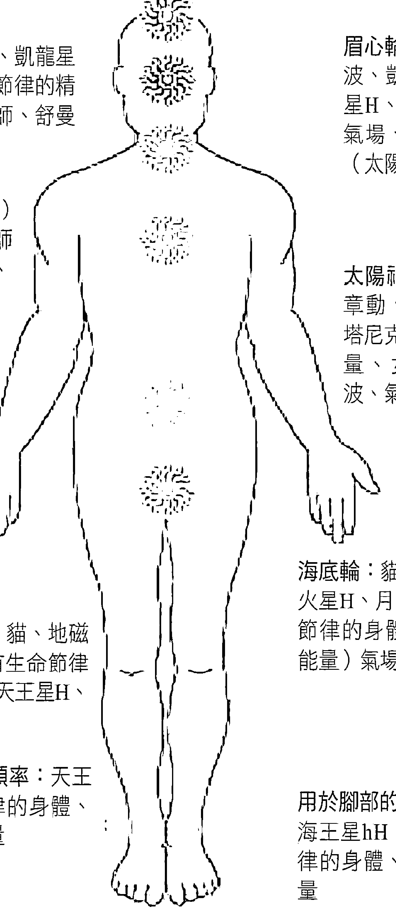

### 第三節 行星能量頌鉢的效果及案例回饋

行星能量頌鉢在療癒過程中，可以有很多的使用方式，在一對一的療癒療程中，或者一對多的療癒沙龍中，體驗者都有著不同的感受。

在沙龍中，請大家體驗頌鉢的聲音和振動，在頌鉢的聲音響起的時候，很多人產生了類似於催眠中前世回溯的畫面效果。

參加沙龍的體驗者分享說，當頌鉢的聲音響起，整個人都被籠罩在一種安靜祥和的氣氛裡，心逐漸的沉靜下來，當鉢聲由遠及近，眼前浮現出一座寺院，僧眾托鉢而行，而自己正是這些僧眾中的一員，心如止水。

很多體驗者在沙龍中聽到鉢聲響起，很快就進入了一個深度的放鬆狀態，周遭的聲音都被隔絕，身體完全放鬆，意識卻十分的清醒，有的雖然是閉著眼睛，但是能夠清楚的看到身邊發生的一切，能夠聽到所有的聲音。

很多第一次接觸頌鉢的體驗者，都抱持著懷疑的態度，他們大多是邏輯思維很強、平時的頭腦運轉速度很快的人群，其中有的體驗者在頌鉢的療癒療程當中，集中精神去抵抗頌鉢的引導，比如想很興奮的事情啊，想工作，想娛樂，想學習，想孩子，想美食，但是，當頌鉢響起的時候，所有的念頭戛然而止，紛亂的思維被很快抽離大腦，迅速進入到深度放鬆狀態，這種無法抗拒的作用，正是我們之前闡述的共振運作原理可以跨越大腦跨越意識，直接作用於我們的身體的神奇功效的體現。

療程結束後，體驗者無不驚嘆，頌缽真的是一個神奇的療癒工具。在我們的個案中這樣的體驗者很多，很多人苦於自己的頭腦無法安靜下來，無法真正靜心去做一些事情，此時頌缽的療癒效果的持久功力就彰顯了出來，在幾次接連的行星能量頌缽的深度放鬆療癒之後，案主發現無論是心性還是脾氣，都逐漸的趨於平和，開始可以安靜的做一些事情，而不是風風火火的把自己陷入一個貌似忙碌的狀態裡，這是找回自我的開始，而這個療癒的效果，並不會因為頌缽的療程結束而終止，反而是滲透到生活的每一個細節，是每一分每一秒的持續效果。

在體驗頌缽療癒的過程中，發生情緒的爆發也是時有發生，在現在的中國，高速高壓的人們都糾結在關係中，糾結在諸多的「如果」當中，壓抑著自己的情緒，而當頌缽的聲音與體驗者產生共鳴的時候，眼前幻化的，是潛意識裡面壓抑很久的不能抒發的苦悶，於是，情緒如山洪般爆發，壓抑的能量也在這個節點宣洩而出，當情緒過後，溫柔的頌缽的聲音持續響起，彷彿傳遞著愛的溫暖，輕撫著受傷的心靈，安慰著澎湃的情緒，而後，能量隨著頌缽的聲音沁透體驗者的身心，療癒自此圓滿發生。

失眠可能是現在社會的高壓環境中，人們的一種普遍苦惱，有些人入睡困難，有些人早早醒來卻無法再次入睡。優質的睡眠是身體天然的療癒者，在睡眠過程當中，神經元再生，身體打開修復和排毒的機制，使機體快速恢復活力、增強免疫力。

### 案例一

案主女，42歲，企業高管，每日思考問題較多，工作繁忙，經常需要將工作帶到家中處理，作息習慣不規律，每天十二點照顧好孩子後上床，入睡不難，但三點左右會醒來，後面入睡就困難了。第一次做了一個加長時間的深度放鬆，療程結束後自述精力充沛，說好像美美的睡了一夜一樣，當日晚覺得不困，看電視劇到天亮，直接去上班，忙碌一天僅僅在晚飯前有一點點倦意，直到晚上九點與孩子一同入睡，三點仍然醒來，但很快就又睡著，直到早上六點起床，睡眠品質很好，後又將免疫增強與放鬆療程交替幾次鞏固效果。一個療程週期後，案主回饋整個人都輕鬆了很多，一整天精力充沛，之前的煩躁易怒等等不良情緒，也幾乎都消失不見，做事情更加堅定有力，這就是行星能量頌鉢跨越意識作用於身體，穿越身體療癒心靈的確切作用。

### 案例二

案主男，36歲，工程經理，晚間應酬較多，經常打牌喝酒到凌晨才回家，到家後入睡困難，輾轉到三四點鐘都不能入睡，即使睡著也是夢境連連，白天精神很差、容易疲勞，給與深度放鬆療程加排毒療程，第一次療程結束後感覺渾身充滿能量，當晚又去應酬到凌晨，到家後迅速入睡，一夜無夢，自覺睡眠品質好轉很多。隨後在自覺疲勞的時候，就前來接受頌鉢療癒，戲稱頌鉢為人體充電器。

隨著環境污染的日益嚴重，和食品安全危機的加劇，我們呼吸的空氣、我們吃的食品、我們攝入的營養，同時也攜帶著毒素進入身體。這些毒素在體內蓄積，包括情緒的毒素，曾經在自在園的行星能量頌鉢的課堂上的一次學員體驗療程中，一個學員爆發了憤怒的情緒，這讓在學習行星能量頌鉢的療癒師們，都深深的震驚了，頌鉢這種心靈的共鳴，引發了強烈的情緒排毒，而行星能量頌鉢的排毒療程，對於身體的效果也很顯著。

### 案例三

案主女，20歲，學生，自述身體弱，經常感冒，前來接受頌鉢療癒的時候還流鼻涕，咳嗽，給予排毒療程，做之前自己還在開玩笑，說要多預備紙，回頭弄得到處鼻涕什麼的。實際上在做排毒療程的過程中，案主沒有咳嗽一聲，而且在做完療程之後，鼻涕就完全不流了，當晚在一夜高品質的睡眠之後，感冒基本痊癒。後交替做排毒與免疫增強療程數次，在療程期間沒有再感冒，體質改善很明顯。

### 案例四

案主男，32歲，平日暴躁易怒，雙側肘部神經性皮炎，隨情緒波動而誘發，直接應用深度放鬆療程加排毒療程，療程結束後馬上就排出黑便，囑清淡飲食，忌酒，作息規律，隔天再做排毒療程，做完後又有黑便，身體排毒效果立竿見影，而做完一個療程後，自述情緒平和很多，之前會暴怒的很多事情，現在看來都可以很平靜的處理。

隨著年齡的增長，很多人都會或多或少的有些疼痛的困擾，而女性的生理期疼痛，更是困擾著各個年齡段的女性，在使用中發現，用到合適案主的頻率的鉢，止痛效果立竿見影。

### 案例五

案主男，36歲，電子研發人員，整日的工作與電腦關聯，久坐，腰間盤突出，影響日常的工作與活動，在給他做深度放鬆的時候，我特意加入了組合頻率「感情的穩定」：月球&土星 Stability of Feelings (moon syn/sid&Saturn H) 這只鉢對於腰疼有獨特的作用，在深度放鬆療程期間，案主得到了完全放鬆的狀態，而這只組合頻率的鉢的使用，使腰疼在第一次療癒結束後就大幅度緩解了。

### 案例六

案主女，28歲，公司職員，從月經來潮開始痛經，每次都十分疼痛，有時會因為疼痛而暈厥，醫院診斷雌激素水準過低，給予口服激素調節，但只要停藥，下個月的經期痛經就依舊嚴重。這個案例從案主排卵期開始，做第一次深度放鬆，隔天做女性能量調節，直到下次經期，做完頌缽療癒的第一個週期，就自覺疼痛的程度比以往要減輕很多，可以忍受並不影響日常工作。於是在經期後每週一次深度放鬆，加女性能量增強療程，兩個月經週期後，痛經基本痊癒。這是我目前為止，接到的療程時間最長的個案，其中穿插了一些OH卡的潛意識溝通以及和解的心理療法，算是嘗試性的整合，在案主完全接受女性的身份的時候，她的痛經就開始呈現徹底不疼的徵兆，而頌缽從始至終都扮演著支持與調節的作用。

在眾多的案例回饋中，這只是極少的一部分，行星能量頌缽的療癒作用是神奇而確切的，他不僅僅可以調節氣場，舒緩情緒，緩解痛苦，而且可以療癒心靈，給案主一個清晰的指引。

記得在一次沙龍中，有一位女性朋友回饋，雖然聽著頌缽的聲音很舒服、很平靜，但是無法達到其他朋友分享的那個類似入定的狀態，透過瞭解才知道，這位女性朋友腦海裡事情太多了，一直紛紛擾擾的，卻也不知道所做的這些是否是自己想要的，於是我在沙龍中請求了其他朋友的支持，由其他朋友以手掌按到這位女性朋友的後背及肩膀，給她一定支持的力量，然後，選用了「鬥爭精神」：火星&天王星 fighting spirit (mars H & uranus H) 這只缽放置於她的面前，讓她把注意力專注到這一只缽的聲音上。在冥想中，這位朋友得到了明確的啟示，什麼才是最重要的、最想要的，該如何去 做。去除了外表的忙亂，真正內心的訴求才會展現，真正的療癒才會發生。

透過體驗者的眾多分享，大家可以看到，行星能量頌缽的確切的療癒效果和靈活的使用方法，還有很多的可能去和我們手中已經掌握的技能結合起來，去提高療癒效果，幫助到更多的人。

## 第六章 展望

佛说八万四千法门，等待有缘人
无为才是大自在。颂钵，最自然、最接近世界的本源
的声音与振动，造就了无限的可能，他必然会嫁接在各种
砧木上，开出艳丽的、不同的花朵。

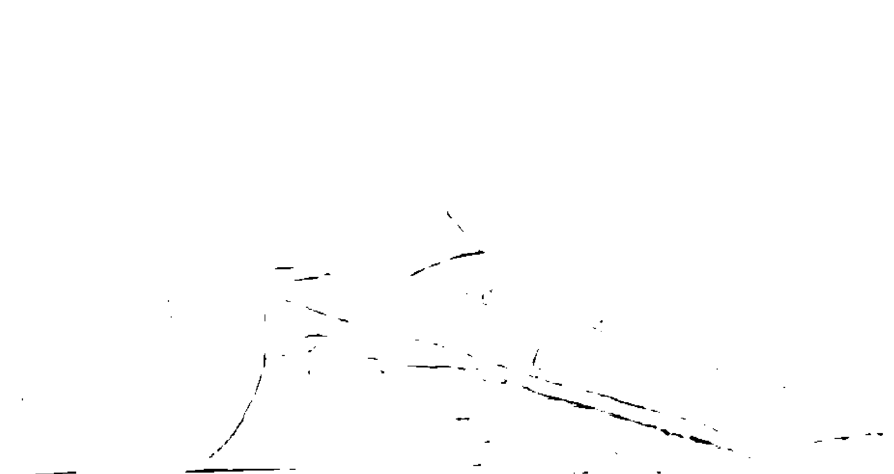

### 第一節 頌缽與泛音詠唱

我們周遭的每一種聲音都各有其性質，我們不必都能夠聽到，但是，不管你聽到與否，都會受到影響，因爲耳朵不是聲音的唯一入口，我們的腹部也可以直接感受到所製造出來的振動。我們處於這樣的一個富有聲音的環境中，某些動物的叫聲，人群中甜美的歌唱聲，各種樂器悅耳的曲調，這些聲音都讓人感受到其和諧之處，我們會有意或無意的想起我們自身其實是宇宙性的存在體，而且，我們正朝著擁有更高頻率的境界邁進，這些聲音是催化我們向靈性層面進展的力量。

如果我們仔細聆聽世界上比較古老的語言，尤其是原住民的語言，我們會發現，那確實很像在唱歌，也許在語言的發展過程中，以唱誦的形式來溝通，曾經是一個重要的過程。

在音樂和聲學中，泛音（overtone）是指一個聲音中除了基礎音以外，其他頻率的聲音、樂器和自然界裡所有的聲音都有泛音，而人聲泛音詠唱（overtone singing），就是歌者運用口腔及頭顱的共振，同時唱出兩個聲音的詠唱方法，在基礎音之上，還有一系列的高音可以被唱出來，這樣的詠唱方法，讓人可以似樂器般地，唱出許多晶瑩剔透的高頻音調。這樣的高頻泛音練習，可以喚醒人們因為吵雜環境的刺激而逐漸麻木的耳朵，重新聽見聲音中的細微變化和豐富性，同時刺激我們的大腦神經元，松果體與腦下垂體也會因此活化。

當人聲與鉢聲的泛音能和諧地共振時，神奇的加乘效果就會發生，此時人徜徉在聲音的海浪中，一波波的音浪，輕撫著身體，深入各個毛細孔，抒緩情緒、釋放壓力，並調校五臟六腑的音準和頻率，讓所有的循環、免疫、內分泌、神經系統等在和諧音中恢復正常的韻律，一體合作。

運用人聲更能細緻的掌握人的情緒和記憶，因為每個人都有一個相似聲帶的振動，人聲這時就產生了鼓舞及安慰的力量，直接的讓人心靈放鬆，這時適當地加入頌缽的共振，讓人轉移注意力及維持較長的專注力，如此就能建立新的神經連結，帶來新的行為模式與訊息，並能激發潛能，創造出新的實像，進而解放自己，恢復身心的健康。讓一個有機活躍的身體，像一個美妙的交響樂團，可以接受大腦指揮，準確地演奏出心所創作的瑰麗曲目，而所有的感覺器官也都能敏感覺察地捕捉和傳遞訊息，品嚐到生命中的真實，並有足夠的能量得以勇往直前地朝目標前進，完成個人今生的甜美夢想。

泛音詠唱的聲音，可以與行星能量頌缽的振動聲音發生共鳴與放大，將這個共鳴的聲音，以療癒師的意識投射到案主的身上，去細心體會聲音與振動的回饋，可以讓療癒師第一時間瞭解案主的情況，也是一種特殊的掃描方式。

首先選一隻行星能量頌缽，敲擊或摩擦並記住頌缽發出的音高，泛音詠唱可以藉由人聲隨時調整音高，這樣可以嘗試調節音高與頌缽的聲音相合，這需要大量的練習與敏銳的覺察。

當你能夠用你的聲音與頌缽相合的時候，你就可以將頌缽放置於案主的脈輪上，並唱誦屬於那個脈輪的母音，通常我們會根據案主的情況，集中處理某一個脈輪的問題，但在處理的過程中，不要只关注这一个脉轮，适当的照顾一下上下相关的脉轮，对于整体的效果很有好处。

泛音咏唱与颂钵的结合，已经由台湾的吕启仲、李维琳两位老师整合出一整套的体系，这对同道于泛唱的伉俪，学习并教唱泛音超过十年以上，师事德国泛唱大师蜜雪儿·费特修行泛唱之道，并学习赛斯的创造实相心法、灵气、天使疗法等。

他们在台湾各地及厦门带领声音疗愈工作坊，也曾为忧郁症和癌症患者设计舒缓疗愈的唱诵方法。他们为世界带来一种深入内在的声音振动，安住当下，才能取得共鸣的声音，这样的声音会把人带回自己，去聆听内在的智慧，鼓励人们发出真我的声音。

这套泛唱颂钵的体系，也与杨力虹老师合作，在自在园开展了系统的传授课程，为行星能量颂钵的疗愈，提供了一个很好的扩展。

### 颂钵与芳香疗法

芳香疗法起源于古埃及等古文明，近代盛行于欧洲，法国化学家Rene Maurice Gattefosse在偶然的机会里，发现了薄荷或薰衣草（Lavender）的油有特殊的治疗力量，证实了植物精油在科学上的立论根据，亦即“植物精油因其极佳的渗透性，而能达到肌肤的深层组织，进而被细小的脉管所吸收，最后经由血液循环，到达被治疗的器官”。

芳香疗法这个名字来自拉丁文Aromatherapy，“Aroma”意谓芬芳、香气，即渗透入空气中的一种看不见但闻得到的精细物质，这里指植物精油的芳香挥发成份，亦指精油本身；“Therapy”意谓对疾病的治疗，或者阐解为“调理”、“辅助疗法”。系指使用植物芳香精油，来舒缓压力与增进身体健康的一种自然疗法，其以芳香精油为物质基础，以芳香疗法学为理论指导，依不同的方法如香薰、按摩、吸入、沐浴、热敷等，让精油于人体上作用，而透过调节人体的各大系统，激发人类机体自身的治愈平衡及再生功能，达到强身健体、改善精神状态的目的，甚至可以透过人体的视觉、触觉和嗅觉来刺激大脑皮层，启迪人的思维，为人类提供精神上的慰藉，并释除心理和精神上的种种重荷及疾病，使人树立积极的人生态度。

芳香疗法与颂钵疗愈可以在以下几个方面产生协同作用。

#### 1. 净化空间和静场

通常松柏科的精油，如雪松、云杉、落叶松、杜松、丝柏等都有着强大的净化气场与空间的作用，能够消除恐惧，提升视野，强化情绪的承载力。链接所有脉轮。藉由空间扩香的方式，可以增强颂钵净化场域的效果，以嗅觉、听觉、振动感觉三个维度改善场域的能量状态。

#### 2. 提升疗愈的效果

不同科属的精油，所对应的脉轮位置不尽相同，例如：甜罗勒主要是促进太阳神经丛与心轮的和谐，可以平衡脆弱的神经，让案主以创造性和开放性的态度来面对新事物，而罗马洋甘菊可以开启和放松太阳神经丛，可以舒缓案主的烦躁情绪，解除身体与心理的压力，缓解紧张和焦虑。来自地中海地区的充满热力的意大利永久花，永不凋零，主要是针对第一脉轮，可以帮助案主克服困难的童年，脱离艰困的状况，协助案主在觉知深藏在意识中带来内心的平静，而玫瑰天竺葵主要协调太阳神经丛能量，让案主感到无条件的喜悦，驱散阴暗能量，摆脱困难，创造其他机会，针对案主问题，适当选用相应脉轮的行星能量颂钵或者选用相应疗程，就可以产生协同加乘的作用，使疗愈事半功倍。

曾经有一例这样的案例，案主30岁，已婚已育女性，生育后始终没有恢复原有体型，颜面、下肢都有不同程度的肿胀，对外互动较为被动，整体呈现的是一种凝滞不流动的状态。使用玫瑰天竺葵的精油为主，配合其他相关精油配成复方精油，让案主涂抹在太阳神经丛以及水中的部位进行按摩，后，采用行星能量颂钵的放松疗程，结合排毒或免疫增强疗程交替进行，案主很快沉浸在深度放松的状态，来接收芳香疗法的疗愈过程，取得了不错的效果。

## 第六章 展望

### 第三节 音乐与中医

中国传统医学博大精深、源远流长，它承载着中国古代人民和疾作奋斗的经验和理论知识，是在古代朴素的唯物论和自发的辩证法思想指导下，通过长期医疗实践，逐步形成并发展成的医学理论体系。

中国传统医学的理论基础，来源于对医疗经验的总结及中国古代的阴阳五行思想。其内容包括精气学说、阴阳五行学说、气血津液、脏象、经络、体质、病因、发病、病机、治则、养生等。早在两千多年前，中医专著《黄帝内经》问世，奠定了中医学的基础。时至今日，中国传统医学相关的理论、诊断法、治疗方法等，均可在此书中找到根源。

在《黄帝内经》中，处处体现了“治未病”的中心思想，而古人说，一位好的琴师，一定是一位调和阴阳五行的高手，传说古时对于真正实病前的一些小恙，因情志不舒而导致的身体不爽等，不用针砭药散，用音乐，五脏五音在五行理论的调和下用处，一曲终了，病退人安。古人是如何做到这一点呢，让我们姑且从概念上进行一番初探。

首先我们要明确一个概念，那就是五行而非五材

> > 《左传·襄公二十七年》：天生五材，民并用之，废一不可。

> > 《尚书大傅》：水火者，百姓之所饮食也；金木者，百姓之所兴作也；土者，万物之所资生，是为人用。

> > 《说文解字》：行，人之步趋也。

> > 《白虎通·五行篇》：言行者，欲言为天行气之义也。

> > 《春秋·繁露》：天地之气，合二为一，分为阴阳，判为四时，列为五行。行者，其行不同，故为五行。

> > 《素问·阴阳应象大论》：天有四时五行，以生长收藏，以生寒暑湿燥风

> > 《素问·天元纪大论》：天有五行御五位，以生寒暑湿燥风……

夫五运阴阳者，天地之道也，万物之纲纪，变化之父母，生杀之本始，神明之府也，可不通乎！

> > 《伤寒卒病论集》：天布五行，以运万类，人禀五常以有五脏，经络府腧，阴阳会通，玄明幽微，变化难极。

在五行学说中，木、火、土、金、水这五个字，不是五种物质或材料，而是气的五种运动趋向或方式。

不是形而下的“器”，而是支配万事万物变化规律的形而上的“道”。

所以在《尚书·洪范》中有这样的原文：水曰润下，火曰炎上，木曰曲直，金曰从革，土爰稼穑 ，说的就是五行的道。

那我们再来看看《黄帝内经》中如何来阐述五脏的。

> > “脾胃者，仓廪之官，五味出焉”。

> > “ 脾、胃、大肠、小肠、三焦、膀胱者，仓廪之本，营之居也，名曰器，能化糟粕，转味而入出者”。

也就是说我们摄入的食物经过胃的消化后，营养精华全部存入脾，脾成为我们身体的“粮仓”，其他的脏器生长和维持运转的能量皆从脾中来，

所以脾才是五脏的中心，正好与五行中的“土”相对。

“肺者，相傅之官”。“肺者，气之本，魄之处也”。肺属于呼吸器官，我们所吸进的空气经过口腔、气管进入肺中，然后由肺过滤出氧气之后，再把氧气融入血液输送到全身各处，根据“阳主肃杀，阴主收藏”的原则，肺属阳性，而肺与聚集全身血气的心相比，阳性较弱，是为少阳。肺所位的背部也是阳性，故为阳中之少阳，在洛书中，正与金相对。

“肝者，罢极之本，魂之居也；其华在爪，其充在筋，以生血气”。食物经过小肠的吸收后，输送到肝中，肝从中吸收人体所需的蛋白质等营养，再送往下一器官，以供人体需要。同时肝还会分泌胆汁等人体必需的物质，帮助消化。所以肝也属于阳性，但是因为肝所处的腹部属阴，故肝是“阴中之阳”，在洛书中，只有木与之相配。

心是我们全身血脉的聚集之处，全身的血液都会从心脏经过，再从心脏中流出，输往全身各处。因此，心脏是五脏中血气最为旺盛的，所谓“心者，生之本神之变也；其华在面，其充在血脉”，而根据“阳主肃杀，阴主收藏”的原则，心属阳性。再根据“背为阳，腹为阴”，心脏所处的背也为“阳”，故心为阳中之太阳，在洛书中，只有“火”与之相配。

“肾者，主蛰，封藏之本，精之处也；其华在发，其充在骨”。肾是全身精气储存的地方，根据“阳主肃杀，阴主收藏”的原则，可得出肾为阴性，但它与脾相比阴性较弱，是为少阴。而肾所处的腹部亦为阴性，故为“为阴中之少阴”，与水相配。

那么对应五音，我们再来看看五音与五行的关系。

“商之为言章也，物成熟可章度也。”“商”在古代的本意是度量，测量。《汉书·律历志》中的这句话的意思是说，

“商”是言的章法，是事物成熟时的测量标准。而《尚书·洪范》中说“金曰从革”，“金”是坚硬的，但又可以被改造成任何形状。从这里看来，两者似乎并没有什么关系。但事物——尤其是植物——成熟是在秋季，此时已过了阳气最为旺盛的夏季，故洛书中阳数为七的西方为“商”，同时，正与“金”相对。

“角，触也，物触地而出，戴芒角也”，也就是说，所谓“角”就是植物的种子发芽，钻出地面，其形如角。而“木”顾名思义，就是树木，泛指植物，很明显与“角”相关。而且植物发芽而出时，正值春季。而且按洛书所示，“一”在北方，表示阳气开始发生，是为冬季；“三”在东方，表示阳气逐渐增长，是为春季，也是“木”所在的方位，故而“角”与“木”相对。

“徵，祉也，物盛大而繁祉也”，事物盛大而繁茂，按我国传统的阴阳思想来说，事物生长旺盛是因为阳气旺盛。而按洛书所示，“一”在北方，表示阳气开始发生；“三”在东方，表示阳气逐渐增长；“九”在南方，表示阳气达到极致；“七”在西方，表示阳气逐渐消失。那么只有代表“九”的、正位于南方的“火”符合“徵”所表述的意象。

“羽，宇也，物聚臧，宇覆之地。”那么什么时候“物聚臧，宇覆之地”呢？正是冬季，冬季的时候，万物萧索，而根据洛书所示，“一”在北方，表示阳气开始发生，正是阳气最弱的时候，即四季中的冬季，也正是五行中最阴柔的“水”相对。

透过前面我们对“五行”与“五脏”、“五行”与“五音”的关系的简介，我们就可以得到下面的关系表

| 五行 | 木 | 火 | 土 | 金 | 水 |
| --- | --- | --- | --- | --- | --- |
| 五脏 | 肝 | 心 | 脾 | 肺 | 肾 |
| 五音 | 角 | 徵 | 宫 | 商 | 羽 |

古人就是应用这样的一个关系，进行生克演化，灵活使用乐曲配合达到调和身心的作用。如果单单是听乐曲就可以达到病退身安的效果的话，那么我们就可以使用颂钵的振动频率，来完成声音与振动直接输入身体相应经脉，从而直接起效。

心为五脏之君主，现代生活中的高速高压，作息不规律，缺乏充足的睡眠与运动，都在对心脏有损伤，心脏损伤的一些信号比如失眠、心慌、心胸憋闷、胸痛、烦躁、舌尖部溃疡等等，这些都是在真正实病到来之前的小信号，在这里运用属火的徵音钵和属于水的羽音钵，调和心肾二脉，使心火可以温养肾水，肾水也可以濡润心火，心肾当交则交，从而调节心脏受损症状。

肝为五脏中的将军，喜爽朗豁达，如果长期被一些烦恼琐事困扰，肝气不舒，不得条达，则使肝气瘀阻，日久生病。肝脏受损的症状有：抑郁、易怒、乳房胀痛、口苦、舌边部溃疡、眼部干涩、胆小、容易受惊吓。用角音钵作用于肝经，舒解郁结的肝气，配以羽音钵来滋养补充体内木气，事半功倍，但如果本就肝火过旺，那就要用金音钵来克制过旺的木气。

#### 脾——化中土而生万物

脾是我们身体里的重要能量来源，身体活动所需要的能量，几乎都来自脾胃，经过食物的消化吸收，才能转化成能量供应给各个脏器。暴饮暴食、五味过重、思虑过度等，都会让我们的脾胃承担过重的负担。

脾常见不适：腹胀、便稀、肥胖、口唇溃疡、面黄、月经量少色淡、疲乏、胃或子宫下垂。用宫音钵调节脾经使阻滞活化，使脾恢复动力。

#### 肺——肺者，相传之官，治节出焉。

肺在身体里是管理呼吸的器官，全身的血液里携带的氧气，都要透过肺对外进行气体交换，然后再输送到全身各处。也正因为肺和外界接触频繁，所以污染的空气、各种灰尘、致病细菌都会趁虚而入。

肺常见不适：咽部溃疡疼痛、咳嗽、鼻塞、气喘、容易感冒、易出汗，以商音钵，悲亢之力入肺，清理外泄，补足正气。

#### 肾——肾者做强之官，技巧出焉，肾藏精，不管是先天之精还是后天之精，都是我们身体的蓄电池，其他脏器由肾精供给而正常运作，所以肾脏常处于相对不足状态。

肾常见不适：面色暗、尿频、腰酸、性欲低。使用羽音钵滋养肾水，调节肾的功能。

中国传统医学理论博大精深，在这里只是简单介绍一下中医理论与颂钵疗愈的结合，由五行、五脏、五志、五音相互结合，调和作为理论基础，而由颂钵的独有振动，直接作用于相应经脉，从而达到直接调和各脏腑功能的目的，在这里就不再展开阐述，后面还会有专书介绍这一部分五行颂钵的内容。

### 第四节 颂钵与瑜伽

“瑜伽”（英文：Yoga）这个词，是从印度梵语“yug”或“yuj”而来，其含意为“一致”、“结合”或“和谐”。瑜伽源于古印度，是古印度六大哲学派别中的一系，探寻“梵我合一”的道理与方法

瑜伽发源于印度北部的喜马拉雅山麓地带（与颂钵的发祥地相同），古印度瑜伽修行者在大自然中修炼身心时，无意中发现各种动物与植物天生具有治疗、放松、睡眠或保持清醒的方法，患病时能不经任何治疗而自然痊愈。于是古印度瑜伽修行者根据动物的姿势观察、模仿并亲自体验，创立出一系列有益身心的锻炼系统，也就是体位法。这些姿势历经了五千多年的锤炼，瑜伽教给人们的治愈法，让世世代代的人从中获益。

关于瑜伽的记载最早出现在《吠陀经》的印度经文中，大约在西元前300年时，瑜伽之祖帕坦伽利在《瑜伽经》中，阐明了使身体健康、精神充实的修炼课程，印度瑜伽在其基础上才真正成形，瑜伽行法被正式订为完整的八支体系。

-   1) 制戒（Yamas）：是指外在控制，宇宙的道德戒律。
-   2) 遵行（Niyamas）：是指内在控制，透过自律进行自我净化。
-   3) 体位（Asanas）：是指瑜伽姿势，也称调身。
-   4) 呼吸控制（Pranayama）：是指有节律呼吸的，控制呼气。也称调息。
-   5) 制感（Pratyahara）：精神从感觉和外部事物的奴役中解脱出来，是指感觉消失，控制内心，也称调心。
-   6) 专注（Dharana）：集中注意，一心一意。
-   7) 冥想（Dhyana）：静坐冥想。
-   8) 三摩地（Samadhi）：由冥想而来的超意识全部集中到灵魂中，和宇宙合二为一。

瑜伽是一个透过提升意识，帮助人类充分发挥潜能的体系。瑜伽姿势运用古老而易于掌握的技巧，改善人们生理、心理、情感和精神方面的能力，是一种达到身体、心灵与精神和谐统一的运动方式，包括调身的体位法、调息的呼吸法、调心的冥想法等，以达至身心的合一。这门课程被其系统化和规范化，构成当代瑜伽修炼的基础。帕坦伽利提出的哲学原理，被公认是通往瑜伽精神境界的里程碑。

在现代的瑜伽修习中，最常说的就是，“既要修炼垫子上的瑜伽，也要将垫子外的瑜伽修炼好”，垫子上的瑜伽就是上文提到的体式，而垫子外的瑜伽却是一种心法，一种生活原则，或者说是一种智慧。

在瑜伽体式的修习中，我们发现，通过体式的练习，可以使我们脊椎挺直，避免腹部内脏收缩，把思想从身体的压力下解脱出来。通过对呼吸与注意力的调节，可以增加我们的专注度，从而强化我们的精神力量，在瑜伽体式修习的过程当中，使用颂钵来做背景音乐，或对于熟练的修习者作为更换体式的提醒，都是不错的选择，可以加强修习者的意识能量，让意识贯穿全身，最终播散到身体的每一个细胞，紧张的意识被排空，让心专注于身，在一个体式当中，用颂钵来贯穿思想、呼吸、行动，当身心专注、整合，过去、现在与未来将融为一体，只有当下。

而在八支体系中重要的一个部分就是冥想，以颂钵来带领冥想是很成熟的技巧，使颂钵的声音与冥想的引导语相结合，更容易使修习者迅速进入专注放松的冥想状态，达到更好的冥想练习效果。

### 第五节 颂钵与催眠及心理疏导

催眠术（hypnotism），源自于希腊神话中睡神Hypnos的名字，是运用心理暗示和受术者潜意识沟通的技术，施术者会用一些正面的催眠暗示（又称讯息，例如信心、勇气、尊严），替换受术者原有的负面讯息（又称经验，例如焦虑、恐惧、抑郁），从而让受术者能够产生和原有不同的状态。

1775年，奥地利医生麦斯麦尔能够透过一套复杂的方法，用磁铁作为催眠工具，应用“动物磁力”治疗病人，其中包括能使病人躺在手臂上面。并用神秘的动物磁气说来解释催眠机理，按现代理解，那就是一种暗示力。

一位苏格兰外科医生布雷德（James, Braid）对该现象发生了兴趣，能够给手术病人引起麻醉，于1842年提出“催眠”一词，并对催眠现象作了科学的解释，“hypnos”（即睡眠的意思）一词改为“hypnosis”（催眠），使得催眠术有了广泛的传播，至今一直沿用这一术语。后来，在前苏联生物科学家巴浦洛夫带领一班人多年系统深入的研究下，催眠有了长足的发展，催眠真正成为一门有理有用的应用科学。

总体来说，催眠术在19世纪曾引起研究的热潮，包括精神分析学派的创始人佛洛依德，也曾深受催眠术的影响。但进入20世纪后的前三十年间，人们对此的研究被冷落下去。它在治疗精神病方面，受到了一些重视与应用，并取得了一些成功。相对而言，在一战期间，这种治疗方法还只受到少数人的重视，但到了二战期间，它已受到了广泛的注意，在治疗由战争带来的身心疾病中，发挥了巨大的作用。

目前，在国内，张芝华老师在利用颂钵来引导催眠的实施，特别是含有阿尔法（α）波频率的行星能量颂钵，当颂钵的声音作用于案主的时候，案主大脑中会在短时间内产生大量阿尔法波，加上简短的引导，可以直接进入催眠状态，而不需要长时间的大量的引导语来完成，而且由颂钵引导的催眠态更加放松和稳定。

而当催眠或心理疏导完成后，大量的情绪宣泄消耗很多能量，案主会呈现一个较为疲累的状态，如果在此时，适时的应用合适的行星能量颂钵的疗程给到案主，将会得到一个更为完整的心灵疗愈过程，补充能量，消除疲劳，甚至为催眠或心理疏导的效果加分。当然，这需要行星能量颂钵与催眠进行无缝对接，才能达到一个完美的效果。

## 后记

当我们越是想要将关于行星能量颂钵相关的东西，融汇到这本书中的时候，我们就越发的发现，这是不可能的，因为这是一套极其完整而庞大的疗愈系统，而且，本身颂钵疗愈的开放性，又可以与很多疗愈手段完美结合，这又使颂钵疗愈又有着无限扩展的可能。

仅希望，以此书的问世，带给大家以简单的介绍与启发，为大家在自助助人的旅途中，提供一个工具、方法，或者说更适合你的选择。

## 附录

### 1. 声音星象仪频率

根据它们的计算方式，作为实际运用和摆放位置的参考资料

-   1.土星（以地球为参考点）—（Saturn G）

从地球上观测土星会和周期（以地球为中心）需要37809天，才能回到原来与太阳的相对位置，地球和人类通过这样的节奏来体验土星。自从远古时代天文学家利用以地球的角度来观察，并且派瑞瑟尔斯的医学或顺势疗法这一类的传统医学，也是通过以地球为中心的角度来形成的。

声音星象仪的疗法，将这样的频率运用在很多方面，当人类跟土星G的能量不和谐的时候，一些慢性病会发生，代表个体在生命开展过程中，要承受一些灵性成长的任务。当土星G的能量失去平衡的时候，个体会经受很多危机或不顺。所以疗愈师最常使用此频率，来让我们个体的气场与土星的再次连接。此频率最适合摆放的位置是：靠近脾脏，同时在一些骨骼的位置（头盖骨，肩膀，手臂，髋骨，腿，踝关节和脚）

-   2.土星（以太阳为参考点）—（Saturn H）

土星（以太阳为中心）需要29458年，才能环绕太阳一周回到原点。以太阳系来讲，这些行星环绕着太阳的移动，会产生很強烈的震波，會對人類的能量系統產生不同的影響。這個節奏是一種遲緩的土星生命週期，可以幫助我們從生命的本質中，區分出不重要的部分，因此提供出了一種穩定性。這個頻率最適合在身體下半部分使用：第一脈輪、膝蓋、脾臟，還有身上比較堅硬的部分，像是骨頭。同時土星H也可以提升我們的直覺力，所以也可以擺在靠近頭部的第六或第七脈輪的位置。

### 3. 地磁場（最大化）—（Geomagnet）

地球磁場分為南極和北極，它會產生一種微弱的震動範圍，這個節奏達到最大化，就是介於9 - 10個赫茲之間。它的顏色是靛藍色或是藍紫色，經常被使用在顏色治療上。這兩個因數被用在研究舒曼頻率上，也就是因爲這樣，這個頻率被我們用來作爲聲音療癒，它被命名爲最大化的地球磁場，這個與地球相關的頻率，有利於活化跟連接地球能量，同時也用在身體的排毒，調整荷爾蒙腺體的功能，它可以很有效的用在第二脈輪以下到腳的位置，也可以放在小腸的位置，如果把它放在小腸到膝蓋的位置，最好是放在第一跟第二脈輪的位置，可以支援跟地球母親的連接。

### 4. 太陽銀河系心跳宇宙年—（Galaxy=Eros）

這個頻率類似於整個太陽系圍繞著銀河系的中心所產生的軌跡，在這個中心有一個很小的空間，它有個像黑洞一樣的巨大重量，它不斷的吸食周圍的東西。這個黑洞是無限的能量源頭，這個宇宙年週期大約是兩億三千六百萬年，這是我們所使用的宇宙韻律中最長的一個週期，它也被稱爲宇宙的能量。大約有六十八個八度音階高於這個震動頻率，類似於人體在放鬆狀態時每分鐘的平均心跳，60 - 100下。
在2000年的時期，有一個非常相似的頻率被音樂療癒師所採用，也就是用來作爲心跳的頻率，他們當時並不知道這個頻率跟宇宙年其實是相同的。

### 愛神星（以太陽為參考點）—（Eros）

愛神星是在火星軌道中最靠近地球的小行星。它環繞太陽一周需要1.76年或是643.219天。愛神星有很大的機率與火星交叉，也就是說它有50%的機會，在大約兩百萬年後影響地球。會造成氣候改變。就像當年恐龍滅絕的情況一樣。這個行星在1998年被發現之後，就以愛神的名字來命名。這個頻率可以放大並開啟心輪，並提升喜悅的放鬆，同時會很有趣並充滿光，這個頻率很柔和而且很平靜，可以放空心中充滿壓力的想法，平衡感覺和心。男性（陽）、女性（陰）被整合並且成爲譚崔的生命能量。讓你身處浩瀚之中升起的平靜。最適合宇宙年的位置是第四脈輪，也就是心輪。放在第三脈輪的位置也很有幫助。

經過計算，愛神星的頻率與太陽銀河系心跳宇宙年的頻率相同，所以現在將兩個頻率統一為太陽銀河系心跳宇宙年。

### 5. 女性的生理結構—（Female）

> > 魯道夫博士在他的演講中曾經描述過：女性的生理結構是可以孕育胎兒的，女性妊娠期的長短是受到月亮週期的影響。約為十個月亮週期，因此女性生理的頻率就是10x月亮週期=295305886天，頌缽的聲音治療就是使用氣的精細能量來影響氣場，這個在氣場裡面流動的、有節律的能量流，會慢慢的很緻密的形成肉身，我們使用這個頻率，可以幫助將氣場治療的效果整合到女性的身體，使用這個頻率的步驟經常被整合在SP（聲音的星象儀）療程的開始和結束的部分。這個頻率是一個支援性的橋樑，用來幫助氣場的療癒效果，更適合於女性的身體。最適合這個頻率的位置，是從身體的中間部位到身體的下半身，主要是幫助我們與地球母親的連接，還可以放在第二脈輪、第一脈輪、第三脈輪。為了強化和地球的連接，也可以放在膝蓋、腳踝和腳。當案主本身達到地球和天堂的連接，那這個頻率也可以放在心輪的位置。

### 6. 男性的生理結構—（Male）

這個頻率的基礎，也是來自於魯道夫博士的演講，他提到一個月亮年（十二個月。大約29.5天／月）是和男性自然的生理狀態最為相關的，因此被計算成爲12x295305886天。很多聲音療癒的效果，都是發生在氣場，慢慢的氣場的狀態就會轉化成生理的狀態。氣場的改變，也會慢慢變成生理上的改變。這個頻率特別是支援氣場的改變，並將它與男性的生理狀態整合在一起。所以它對於SP（聲音的星象儀）療程的運用，特別有支持性的效果。為了將氣場的效果跟男性的生理結構整合在一起，很多SP療程在開始跟結束的時候，都會應用這個頻率來幫助整合男性的案主，這個頻率是一個支援性的橋樑，讓氣場可以更適應男性的身體。最適合擺放的位置是身體的中部到上半部，主要是幫助我們與父親一樣的天連接在一起，這個頻率會開啟氣場，就像一朵花對著天空開放，然後可以放在頭部的第五脈輪跟第六脈輪，也可以放在第四脈輪跟第二脈輪，還有大腿跟小腿的位置。

### 7. 金星（以地球為參考點）—（Venus G）

金星合象（以地球為參考點）需要58392天，才能回到以太陽為參考點的相同位置，當我們從地球觀察金星的時候，我們是以這樣的節奏來體驗金星的。
從遠古時代，占星學家都是以自我觀察的方式，也就是以地球為中心的方式來觀察這些行星，還有行星醫學和順勢療法，都是用以地球為中心的參考點形成的，SP療程將這個頻率運用在很多方面，當人類和金星G的能量不和諧的時候，就會產生與恐懼相關的情緒狀態，或者社交生活或力比多出現問題，因此金星G經常被用來支持我們身體裡面類似於金星G的品質，例如毒素的淨化、處理情緒必須的能量提供。最適合這個頻率的位置：腎臟（腎上腺）、膀胱。次要位置是：心臟、荷爾蒙腺體。

### 8. 金星（以太陽為參考點）—（Venus H）

金星（以太陽為參考點）需要224701天，才能環繞太陽一周，太陽系裡的行星繞著太陽運轉，會產生很強的震波，並且會對人類的能量系統帶來不同的影響，這個節奏是一種不活潑的金星生命週期，它支持人類的情緒體和內在的和諧度，這個頻率非常接近愛（性）以及享受生命的能力。當我們具備如同希臘女神金星一樣去愛其他人的力量時，這個自我解脫就會伴隨著自我欣賞的發展而產生。最適合擺放這個頻率的位置，是第四和第六脈輪，但是也可以被用在從心到頭的氣場一帶，當深度的情緒干擾出現的時候，可以使用在全身所有的脈輪上，藉此可以幫助情緒平靜下來。

### 9. 貓—（Cat）

這個頻率主要是貓打呼嚕發出來的聲音。貓有九條命的傳說，主要是因爲它對於一些嚴重的外傷有特殊的能力去修復，在古時候，人們認爲這種能力與它們打呼嚕的過程有關。這個頻率來自於貓的打呼聲，它對於骨骼的成長十分有效，可以促進骨骼損壞的再生，因爲它的打呼可以製造一些抗發炎的物質，減輕關節疼痛和水腫。大家都知道貓不會產生一些關節炎的病變，打呼就是它們自我療癒的過程。

我們都知道這個打呼的聲音是具有安撫的效果，這個頻率說明我們與大地母親連接並且感覺到平靜祥和，讓我們信任造物主的力量並且可以放下。就像天對於地，藉由重建再生去調和我們的身體，這個讓人非常愉悅的聲音可以充滿全身，支援往下紮根與地球連接，所以我們強烈建議當你有骨折創傷的時候，可以使用這個頻率，例如髖部、肩膀、手臂、腿、腳踝。其他還可以放在身體下半身的位置，從第三脈輪到膝蓋。

### 10. 水星（以地球為參考點）—（Mercury G）

水星合象（以地球為參考點）需要11588天，才能回到以太陽為參考點的相同位置，我們從地球觀察它，所以我們體驗到了水星的韻律，從遠古時代，占星學家都是以自我觀察的方式，也就是以地球為中心的方式，來觀察這些行星，還有行星醫學和順勢療法，都是用以地球為中心的參考點形成的，SP療程將這個頻率運用在很多方面。水星G會活化新陳代謝（呼吸系統與內分泌）和人類的溝通能力。水星G最常用來支持呼吸系統的功能，特別是肺部。也可以支援、活化荷爾蒙功能。因此最適合這個頻率的位置是在肺部、第三脈輪、小腸、腎上腺以及附近的其他腺體。除此之外，這個頻率也會用來調和相對的行星影響。所以水星G是整個SP療程中最常使用到的頻率，根據派瑞瑟斯的三個原則，這個頻率可以用來調和一切聲音的療癒。

### 11. 水星（以太陽為參考點）—（Mercury H）

水星環繞太陽（恆星）一周需要87.969天。太陽系的行星群環繞太陽時，會產生很強的振動頻率，並且會對人體的能量系統有著不同的影響。這個韻律是一種遲緩的水星生命週期。他支持溝通的能力，同時也是兩種相對力量的調解者。水星是個傳遞訊息者與調解者。水星的力量主要是用於使用有品質的語言來理解和溝通。這個溝通方式主要是用於個人與外界的溝通，同時也用於個人內在高價值的自我與低價值的自我溝通。也可以支援自我成長。水星還有一個很棒的特質，就是增加調試能力。這個可以用來個人成長。這個頻率最適合的位置：第五脈輪、肩膀上靠近喉輪的位置、脖子、上臂。次要位置：肺、小腸。當有危機發生的時候，可以放在頭部周圍，可以幫助個人成長。

### 12. 生物節奏心理—（BR Mind）

這個頻率是33天的心理節奏，心理學家斯沃博達和醫生菲利耶斯發現，人類有各種不同的生物節奏，這些節奏會影響生理和心智活動，還有情緒體。這些節律在大部分人剛出生的時候，是十分类似的，這個特殊的生物節奏心理頻率，可以提供覺醒的意識，它會對我們提供保護層。最適合這個頻率的位置，是下半身到身體中間的部分，特別是第二脈輪。這個頻率同時也可以廣泛的用在第一到第五脈輪。

### 13. 氣場（生物節奏靈魂）—（Aura）

魯道夫博士在他的演講中提到：宇宙韻律（周／月）對人類的氣場是最相關的。魯道夫博士根據能量的緻密程度，將氣場分成兩部分，星狀體（情緒的）和乙太體（生命力）。魯道夫博士說：一周七天的節奏，對星狀體是最重要的，一個月28天的節奏，對乙太體是最重要的，根據八度音階的原理，這兩個周／月的相關頻率，被發現是一個相同的可聽到的頻率。因此我們可以將這個頻率用在全身的氣場，這個頻率本身就是一個情緒的節奏，因此這個頻率可以用在氣場和全部的脈輪。這個聲音可以提供心智的清晰、放鬆、調和與淨化氣場，同時帶給人們一種愉悅感。最適合的位置是：靠近耳朵、心輪、前額。同時也很適合放在全身的氣場和脈輪。

注意事項：

這個頻率又叫做生物節奏靈魂，心理學家斯沃博達和醫生菲利耶斯發現，人類有各種不同的生物節奏，這些節奏會影響生理和心智活動，還有情緒體。這些節律在大部分人剛出生的時候是十分類似的。SP選擇去將這個頻率重新命名爲「氣場」，因爲SP對於這個頻率的實際運用與它的功能，有更準確的描述。

### 14. 生物節奏身體—（BR Body）

這個頻率是我們23天的生理節奏，心理學家斯沃博達和醫生菲利耶斯發現，人類有各種不同的生物節奏，這些節奏會影響生理和心智活動，還有情緒體。這些節律在大部分人剛出生的時候是十分類似的。這個特殊的生物節奏身體頻率，可以提供能量和強化我們的生理結構，並且讓我們更加靈敏。最適合的位置是我們的下半身，特別是第一脈輪，同時這個頻率也可以用在從腳到肚臍至心輪的位置。

### 15. 火星（以地球為中心）—（Mars G）

火星合相（以地球為中心）需要779.94天抵達以太陽為參考點的相同位置，我們從地球觀察它，所以我們體驗到了水星的韻律，從遠古時代，占星學家都是以自我觀察的方式，也就是以地球為中心的方式，來觀察這些行星，還有行星醫學和順勢療法都是用以地球為中心的參考點形成的，SP療程將這個頻率運用在很多方面，因為火星與人類的意志力有關係，也和生理結構的氧化過程有關。基本的火星特性就是人類的勇氣與行動力，戰鬥與保護。火星最常用來提供能量，影響血液形成的器官與消化功能。其主要位置是膽囊。可以放在脊柱末端，沿著脊柱往上到頸部，對於氣場中央的管道可以有效提供能量。

### 16. 火星（以太陽為參考點）—（Mars H）

火星環繞太陽（恆星）一周需要686.98天，太陽系的行星群環繞太陽時，會產生很強的振動頻率，並且會對人體的能量系統有著不同的影響。這個韻律是一種遲緩的火星生命週期。他支援生命力，並且開創精神甚至侵略心，它是一個很強的陽性能量，讓我們能夠為生命奮鬥。火星是戰神的化身，當我們要去從事一個新的事情的時候，就需要這個能量，甚至是個人成長的新一頁。它為我們提供力量去開創新生命，但是也伴隨著提供機會和挑戰。最大的挑戰，就是火星會給予我們正確而積極的方向。最適合這個頻率的位置是：第一脈輪、第二脈輪、第五脈輪、第六脈輪。可以將能量導入能量的迴路中。放在背部第一第二脈輪，可以提供很好的能量，放在身體正面的第五第六脈輪，可以提供較好的能量。火星也很適合放在身體的肌肉的部位，例如大腿的部位。

### 17. Theta波&Alpha波

腦波是人類意識的鏡子，它們的組成不斷的改變，芝加哥大學的喬伊卡米亞，從1960年開始研究腦波，已經擴展到世界各地，它證實了靜心對腦波的影響是十分明顯的，一個覺醒的心智狀態，它的腦波的組成（alpha、theta、beta和delta波）是很和諧的。研究顯示，如果一個人在醒著的時候可以保持這樣的心智狀態，他將會非常有效率。覺醒的心也可以稱之為高效能的心智，因為他有著靈活的意識。在SP的應用上，Alpha波和Theta波主要可以讓心情平靜，讓案主壓力放鬆，進入靜心的狀態。從每天的狀態中抽離。可以放在頭部附近的位置。

#### A. Theta波—（Theta waves）

Theta波（範圍是3.5-7Hz）是潛意識的波。這是波會在下列情況下產生：做夢，靜心，當登山者抵達山頂時，從事創造力活動時。這個Theta波讓我們發現無意識、被壓抑的情緒問題，以及創造力和靈性。單獨的Theta波只是一種無意識的狀態，唯有加入Alpha波，我們才能有意識的體認到滿足，並且能記住。資料上記載，他可以提升語言、學習、記憶力，並為個人成長與轉化創造願景，培育創造力與靈性。適合的位置：靠近頭部的第6和第7脈輪，放在第3脈輪也很有用。

#### B. Alpha波—（Alpha waves）

Alpha波（範圍是8-14Hz）這個波在下列情況發生：放鬆的時候、心情輕鬆的時候、做白日夢的時候、視覺化（利用所有的感官，例如：有些人可以較其他人更專注的、在心中想像一個有味道或是有聲音的圖像），Alpha波是進入靜心的大門，像是一座橋樑，從Theta波接收訊息進入有覺知的意識狀態。如果深層的靜心只有存在Theta波和Delta波，那我們將無法記得靜心的經驗與滿足感。因此Alpha波與其他腦波的結合，顯得特別重要。資料記載，他可以幫助回溯到生命前段的記憶，促進心理狀態的視覺化，覺察生理失去平衡的原因和身體的療癒。適合此頻率的位置：靠近頭部的第6和第7脈輪。放在腳部也非常有幫助。

### 18. 巨龍章動—（Dragonic Nutation）

月亮環繞太陽的軌跡有5%的傾斜角，在這個軌道上有兩個交點，這兩個交點伴隨著日蝕的發生，我們稱為月交點，因為太陽和月交點都會經過這個蝕相，它需要249.82個巨龍月，才會抵達蝕相發生的相同位置，我們稱它為章動，也就是等於18年7個月又9天。

### 巨龍月

月亮環繞太陽的軌跡有5%的傾斜角，在這個軌道上有兩個交點，這兩個交點伴隨著日蝕的發生，我們稱為月交點，有著兩個月交點的軌跡，我們稱它為巨龍月，它需要27,2122,0817天（目前在SP運用上我們不使用）。這個巨龍章動的週期，主要是在黃道中太陽跟月亮的關係，按照每個人的出生時間而有不同，這個週期的影響是很個人化的，但它帶來很相似的衝擊。現代占星學家根據魯道夫博士的生命史的工作，已經認識到這個巨龍章動週期是有節奏的重複發生，對於聲音治療來講，這個週期十分重要。人類每隔18年又7個月，就會體驗到宇宙能量中的月亮跟太陽能量，是相似於出生的時候的，這個週期幫助我們回想起，從前世帶來的生命任務和個人的命運，特別是當我們面對危機發生而需要重新定位的時候，因為危機是要讓我們回想起一開始的目的和任務，當巨龍章動出現的時候，重複的事件就會發生，再度回想我們深刻的命運安排，可以喚醒並且重新走向生命的真正的使命。

巨龍章動的頻率具有喚醒我們真正使命的本質，讓個體明白他的命運，在情緒上和靈性上有所成長。所以SP使用巨龍章動的頻率，在多方面去支援個人的成長與生命再定位，這個頻率可以被應用在很多方面，適用於各種人群，特別是在危機發生的時候，如果這個療程是希望更深入的去探討一些議題，就必須要使用這個頻率。

巨龍章動的頻率可以使用在：頭、心輪、海底輪。通常對這個聲音的感覺，就是細微能量朝海底輪的方向游動。它可以支援靈魂進入肉身的過程以及根植大地。太陽和月亮對人類的影響是很巨大的。特別是放在第二和第三脈輪，可以支持我們再度回想起我們成為人類的過程。這個頻率是SP運用上最重要的一個頻率，它支援危機處理與個人成長。

### 19. 木星（以地球為參考點）—（Jupiter G）

木星合相（以地球為參考點）需要398.88天，抵達以太陽為參考點的相同位置，我們從地球觀察它，所以我們體驗到了木星的韻律，從遠古時代，占星學家都是以自我觀察的方式，也就是以地球為參考點的方式，來觀察這些行星，還有行星醫學和順勢療法，都是用以地球為參考點形成的，SP療程將這個頻率運用在很多方面，木星與人的思考和性格有關，人類的理性、企圖心、正義感，都是木星的本質。他是比太陽還要高的音階。在很多情況下，木星G可以支援Om缽（太陽）的頻率，他被稱為宇宙的藥物。

木星最常用來讓情緒活躍，讓頭腦清醒，喚醒希望。木星G扮演煉金術師的位置是肝臟，也很適合放在關節，結締組織。所以肩膀，手肘，手，髖關節，膝蓋，踝關節和腳都是木星G的主要位置。

### 20. 木星（以太陽為參考點）—（Jupiter H）

木星環繞太陽（恒星）一周需要11.862年。
太陽系的行星群環繞太陽時，會產生很強的振動頻率，並且會對人體的能量系統有著不同的影響。這個韻律是一種遲緩的木星生命週期。它支持成長與創造力以及探索，它支持我們去瞭解我們是從哪裡來的、要去往哪裡，它建立清晰感，並且調和生命的能量。在情緒層面，木星H慷慨的給予但卻不寵壞我們，它為我們鋪好希望的道路，並且讓我們對自身產生正面的感覺，讓我們的心理體驗到一體感，所以它對靈性成長是非常重要的。因此木星是一個很好的幫手，讓我們達成目的，並提供過程中所需要的能量。最適合的位置是第六跟第七脈輪還有髖部、肝臟。也可以放在第三脈輪和其他的肌肉上。

### 21. 舒曼共鳴1—（Schumann Resonance1=SR1）

舒曼共鳴的頻率屬於ELF（極低頻率）大氣層組。這個缽是由德國慕尼黑大學舒曼教授在1950年發現的，他的學生葛妮閣教授也確認了他的這一發現，大部分的低頻率，是在好天氣時被測量到的，並不是來自於太陽，它們是一種介於地球與電離層之間的產物，是由閃電產生的。
韋弗教授證明人類非常需要舒曼鈸，在今天它們被認定為是一種生物學意義上的正常化。這個變得特別重要，是因為氣候變遷的事實，導致這個頻率在生物圈裡很難被測量到，也就是，說舒曼頻率逐漸改變為較高的層次，舒曼頻率又被稱為「好天氣」頻率，它支援我們的幸福感與喜悅感。舒曼共鳴1的基本頻率是7.83Hz，他的4個高八度音階是125.82Hz.

舒曼頻率的應用，是幫助現代人放鬆回到自然的狀態。這個頻率造成的放鬆，是一種在此時此刻的正常狀態。支持生理上的舒適感，還有情緒上的平和，可以將我們帶往深度的靜心層次。舒曼共鳴1適合的位置是第5、6、7脈輪，還有整個氣場。

備註：舒曼共鳴2會在大師頻率討論。

### 22. 大師頻率—（Master）

這個頻率也是高八音階的舒曼共鳴（256Hz），是一個放鬆覺醒意識的頻率，可以用在全部的脈輪上，特別是第7脈輪，放鬆的關注被理解為是生理和情緒體處於一個較高的靜心階段，他會朝向開悟前進，是一個真正的「好的內在天氣頻率」。

這個頻率被歸類為一種全音階的古室內樂曲C調，它是根據一種古代的和聲科學和室內樂A調=432Hz，這個古典全音階系統的頻率，和地球轉動的頻率非常相關，所以它非常適合一般地球人的狀態，事實上，多數的古典音樂大師，是用全音階的頻率創作他們的音樂，很不幸的，權威人士將這個A調的全音階（432Hz）系統改為半音階（440Hz）系統，並且使古代作曲家的作品殘缺不全。他們的作品本質改變了。

威爾第與魯道夫博士還有其他人，都建議去使用室內樂曲C調。

調這個全音階的頻率128Hz，因為它可以更加調和人類的狀態，這個頻率類似於無私的愛，因此被稱作大師頻率，它支援去調解地球上的人類和天界的關係。藉由放鬆和完全的解放，可以讓人類的天與地的關係更加協調，其他作用就是面對他人的需求時將心打開，釋放恐懼，重新信任自己。

這個頻率可以很大的提升我們氣場的狀態，這個頻率可以用在所有的情況之下，包括和地球母親的連接，還有與其他人的—體感。最適合的位置是心輪，但事實上這個頻率使用在全身的脈輪，全身的氣場，全身的經脈都很有效。它的最廣泛使用的SP頻率。

### 23.太陽閘道或太陽（古司托）—（Sun）

這個頻率是根據量子力學的原理而不是自然現象。是由天文數學家古司托計算出來的。這個聲音的計算方式，是來自於太陽系中膨脹和收縮的臨界值。這是一個想像的行星，在一個有固定引力的軌跡上，以光速繞行太陽32000次/秒，在這個情況下，連黑洞邊緣被吸進去的光都被計算進去。這個音調和物理性存在的限制有一致性，那是一個和我們完全不一樣的世界。因此這個頻率是我們進入另一個世界的大門。

他提供我們足夠的能量和安全感，去維持內在的情感運作，回到心中。他的聲音在陰與陽的邊界，是卓越與神奇的。這個聲音治療最有價值之處，是將情緒從潛意識釋放到覺知中並提供能量。對長期的狀態有所覺察是改變，轉化，療癒，個人成長的基本先決條件。這個頻率最適合的位置是第3脈輪，第2脈輪也很有幫助。其他位置：頭部（針對眼睛和放鬆）和心輪。身體中間部位都可以。

### 24.地球年，太陽（以地球為參考點）—（OM）

這個頻率是地球繞行太陽轉動的軌道，繞行一周需要365.2421905天或是一個地球年。因為這是地球繞行太陽，所以其實並不完全是以地球為參考點，應該是以太陽為參考點。然而我們將這個頻率當成以地球為參考點的頻率，是因為人類體驗到的這個頻率，和地球韻律是相同的。

這個地球年的韻律，是我們人類對太陽的體驗。這個韻律在地球上形成季節，地球氣場的呼吸韻律，也在自然界中和人類的情緒生活中顯示出來。在古印度，他們稱OM聲音為薩加，是一切聲音之父，古典樂器用OM來調音，這一千年以来，静心时的咒語的唱誦，通常包含這個音，帶來非常好的靈性成果。

這是我們在自然界中體驗到最重要的聲音。是大自然心的聲音。這個頻率可以鎮靜、舒緩，深度放鬆，接受一切外在世界的發生，並與他和諧共處。心臟是身體的太陽，位於身體的中央。「心」位於心臟，如果說什麼是人，其實人就是心。那也是意識存在的地方。理想主義，堅強的個性也存在那個地方。是一個高自我與低自我相遇的點，其基本功能是循環，修正，保護。

希臘的太陽神很清晰的說「認識你自己」，表示無限的力量是來自於心的淨化。如同心的淨化，自我欣賞，自我價值感，謹慎等等這是幾個我們需要去獲取的珍貴品質。這是一個可以放在身體中央的心輪最佳頻率，因為他可以放鬆與調合。這個頻率對於頭部也很好，特別是左腦的那一側。同時可以用在全身的脈輪和氣場。

### 25.霍皮心—（Hopi-Heart）

這個頻率是源自於美國印第安人——霍皮族。這是當他們做一些儀式與偉大的地球能量連接時，所吟唱的聖歌頻率，代表地心或是地球的核心脈輪。這是最友善，最好客的頻率。他散發出無條件的愛，友愛的關懷，所以是屬於心的聲音。幫助我們有安全感，可以像小孩一樣的玩耍，讓我們自在的去感受情緒，接受自己。

這個頻率特別適合思想比較實際的人，支援我們釋放內在孩童。

最佳的位置是心輪，胸部，喉部，這個頻率適合做團體靜心，可以加入OM缽（地球日）。

### 26.凱龍星（以太陽為參考點）—（Chiron）

已知彗星，在今天被分類為小行星或是小星。他繞行太陽的軌跡，介於土星和天王星之間，據說是社會與靈性中間的橋樑，占星學上，凱龍星是一個新的行星，在今天得到很多重視。凱龍星和以下主題相關：療癒，醫學，整體觀，創傷，對新紀元的開啟，這個聲音與內在療癒師、內在導師，以充滿光的方式連結。

最適合的位置：從喉部到頭部，特別是第6和第7脈輪。

### 27.世界年或柏拉圖年—（World Year）

這個頻率是來自一個很長的宇宙韻律，通稱為諾斯替年。因為來自太陽，月亮和行星的吸引力總集對赤道隆起的影響，造成地球軸心有一個往順時鐘方向傾斜的緩慢週期，像一個頂端的旋轉移動。地球軸心需要25766年才能完成一個晃動（搖擺），或是順時鐘週期。我們稱這個週期是我們行星的柏拉圖或世界年。他也被稱為分點歲差，或是大年。是我們的天文學家所知道的週期中最長的一個。計算出大世界年的長度通常是25920年，也算是正確的，因為存在154年的差異，根據一般的哲學觀，其實錯誤的計算頻率，已被聲音治療的學者和訓練師用在聲音治療方面，或許不會有太大的影響。當我們使用準確的天文學資料，來計算世界年或柏拉圖年的頻率時，發現目前聲音療癒師在廣泛使用的頻率之間，有很顯著的1Hz差異。然而SP並不希望造成聲音療癒師之間的不舒服感，因此寧可稱之為世界年，而不是柏拉圖年。

這個頻率可以提供心理的清晰、喜悅，能開啟氣場，體驗與宇宙的合一感。最適合的位置是第7脈輪，頂輪，也可以用在頭部。

### 28.地球日或聲音或較低的自我—（Earth Day or Sound of Day）

這是地球繞軸心自轉一日夜的頻率，也是一種日夜的韻律。魯道夫博士將他歸類為與自我（小我）有關的主要律動力量，小我是指在地球上，依照所給予的理性環境去求生存，在靈性道路上，並不是要摧毀小我，而是訓練小我、拓展小我、淨化小我。因此一路上都要照顧小我，並且與主要的能量，也就是地球本身達成一致性。

地球母親主要是滋養和給予活力。他提供穩定性、安全感，讓我們站穩雙腳。這個頻率讓身體和氣場與地球氣場更緊密、更腳踏實地、更穩定。

這是一個特別的頻率，應用在行星醫學，支持與地球的連接。最適合的位置：第1脈輪，海底輪，這個頻率非常適合身體下半身到腳，髖骨，膝蓋，腳踝，腳。

### 29.月合相（以地球為參考點）—（Moon syn）

月亮環繞地球轉的橢圓形軌道，大約是29.5305886天（29天12小時44分鐘2.9秒），它是兩個滿月之間的時間，在占星學上稱爲月合相，每一個太陽年有12.36874634月合相。從遠古時代，占星學家都是以自我觀察的方式，也就是以地球爲中心的方式，來觀察這些行星，還有行星醫學和順勢療法，都是用以地球爲中心的參考點形成的。

月合相週期對於住在地球上的人類來講，是最重要的週期，特別是晚上，這些月光會照射在地球上，這些月光會影響到潮汐的變化。月亮對人類的思考過程有很大的關係，所以月合相主要是關於自我反思和情緒。其他影響就是再生和繁殖。月亮被認爲是女性的象徵，代表關懷、被動，屬於一種陰性的能量。月亮的影響會不斷的造成情緒的變化，因爲他的韻律相對比較短。所以月亮是被動的、思考的、不斷改變的智慧、自我反思、調適。療癒上來講，這是對腦來說最重要的頻率。還有對於生殖器官來講可以支援性器官，帶來平靜並且可以調整行爲模式，可以培育敏感度、女性溫柔、貼近潛意識。

最適合的位置：腦部（特別是右側）、第二脈輪（性腺）。

次要位置：腺體、腎臟。

### 30.恒星月亮—（Moon sid）

這個韻律是月亮繞著地球轉的軌跡（以恆星爲參考點），月亮再度回到原來的位置所需要的時間是27.321661天。這個週期是宇宙的月亮週期，而不是地球的月亮週期，他的主要議題是從無意識狀態進入意識狀態。這主要是一個天體的陰的能量，是典型的陰能量，特別能幫助男性發現他們內在女性的那一部分，它可以活化免疫系統，移除導致性問題的能量阻礙，它讓我們可以能強烈的有自我反思能力，培養直覺力，促進放鬆，整合內在的男性和女性，成為一個完整的個體。屬於內在靈性的結合。恆星月亮是促進這些發展的靈性助力，對男性案主來講，這是一個很有幫助的頻率，當他們需要去發現他們內在女性的那一面。

- 最適合的位置：頭部、腦、第二脈輪

### 31.麥塔尼克月亮—（Moon met）

麥塔尼克月亮週期是一個非常接近19年的週期，它是太陽年與地球月的倍數相乘，希臘的天文學家麥塔尼克發現了這個19年的週期，這個19年的週期等於235個月合象，又等於6939.602天，這兩個週期的差異性只有幾個小時。麥塔尼克週期可以更準確的去調和地球年和季節性的變化，每兩百年會差隔一天，所以太陽和月亮的影響結合成為這個頻率，就好像人類是由這兩股力量所形成的一樣，這個頻率支援我們內在探索真相的道路，它可以淨化組織、肝臟和讓情緒消融，藉由反思學習經驗和淨化，我們可以發現我們真實的自己和實相的關係，這個頻率可以支援這個道途上的清晰度。

- 最適合的位置：脾臟、肝臟、第二脈輪、第三脈輪、頭部附近。

### 32.月亮頂點週期—（Moon culm）

月亮頂點週期是指月亮每天升到天空上最高的一點，在50分鐘之前，太陽在地球的另一面已經升到了最高點，因爲月亮每天都比太陽晚升起50分鐘，這樣的差異性導致月亮要花29.53天才能追上太陽，這個頻率就是月亮每天從這個頂點到下個頂點需要花的時間（24小時50分28.33秒），這個特有的月亮韻律與太陽的關係，都會影響每天的改變，它會造成日月的改變，我們一生中都會不斷的經歷這樣的改變。這個韻律教導我們放下並且同時要和諧。它有很強的陰性能量，藉由放下我們的執著，來克服我們的情緒問題，調節生理的溫暖與水的流動，情緒上和心理上去反思生命風暴，去克服與調適它。太陽月亮調和不斷變動中陰陽能量過程裡，幾乎是無法被覺察到的，非常細微的。對於習慣理性思考和固定思維模式，這個頻率可以放鬆。最適合的位置在第一、第二脈輪，還有頭部周圍。

### 33.月亮沙羅週期—（Moon saros）

這個沙羅週期就是223個合相月，大約是6585.3213天，或者相近於18年又11天，可以用來預測太陽和月亮的蝕相。蝕相之後的沙羅，太陽地球月亮會回到和原來最接近的相對位置，所以可以預測蝕相的即將發生，這也可以稱為蝕相週期，更清楚地來說，月亮將會有相同的月亮期。在相同的月交點，有相同的距離，在地球上是相同的季節。這個月亮會在不同的位置上（以恆星為參考點），這個蝕相會從沙羅往前推8個小時，它會造成同一天內有三個沙羅出現，這樣的情況會在19756天後再度發生。月蝕相比日蝕相更頻繁地發生，同時也伴隨著沙羅的韻律。自古以來，和蝕相有關的頻率，都和生命的陰暗面有關係。直到今天還有一個傳說：蝕相發生時採收的草藥，會比其他時間採的療效更強。在這段時間，我們對陰暗面的感受會很強烈。伴隨著蝕相的結束，我們也可以將轉化的結果整合在一起，所以我們的陰暗面就被轉化了。危機發生的時候，這個頻率可以支援我們去發現更深的創傷議題，我們可以反思並且轉化。將潛意識裡最深的痛釋放出來，把它當成新的潛能，最適合的位置放在第一第二脈輪，還有頭部周圍。

### 34.月亮拱線軌道 — ( Moon apsidian )

月亮繞著地球以一種橢圓形軌跡轉動，在某一刻有遠地點和近地點，在蝕相期間，月亮橢圓形軸心移動，或者是這樣的公轉，需要8.85年。或者3232天16個小時27分。這個頻率是平衡，是細微能量的和諧。在這樣的過程中，腎臟與脾臟是很重要的器官，它們移除跟提供並且保持平衡。並且穩定這些細微能量，就如同身體的能量。如果不這樣，混亂就會發生。這個頻率可以提供支援，讓我們去發現給予和接受之間，並且建立與外在世界溝通的必要和諧。這個頻率可以幫助我們轉化不平衡的能量，不平衡會導致氣場的阻塞，可以調和陰陽能量，最適合的位置是第二、三脈輪，還有脾臟、腎臟的位置。

### 35.莉莉斯 (以太陽為參考點) — ( Lilith )

它被稱為「黑月」。遠地點的週期是8.8年，是月亮的橢圓形軌跡上，離地球最遠的那一個點，這個特殊的遠地點，也被描述並且計算成一個圍繞著地球的一個軌跡，也就是這個頻率，所以莉莉斯是一個假設的月亮。在占星學的系統上，它被認為是很重要的一個名稱，莉莉斯是女性神秘的象徵，是月亮的雙生黑暗姐妹，莉莉斯對女性的原型有關。它對兩性戰爭之中的女性解放有關，在神秘學之中，莉莉斯被男性的神下放到沙漠，因為她的狂野和不受馴服的女性力量，所以她在那個地方轉化成夜晚的惡魔，會在夜晚去拜訪熟睡的人們。
其他重要的占星學觀點，認為莉莉斯是一種頻率，描述著我們人類的關係，從絕對到無限，對於這些受害者情結和有能力去放下的人。這個頻率是關於情緒的陰暗面，特別是女性，不過有時也會發生在男性身上，壓抑的情緒議題可以被轉化，經由反思跟淨化來預防它爆發跟過多發生。
最適合的位置：靠近第三跟第二脈輪

### 外行星（以地球為參考點）— (Outer Planets)

這個頻率與太陽系的外行星有關，從地球觀察天王星、海王星、冥王星。三個行星軌跡經測量，彼此非常接近。所以這三個行星實際上經常結合在同一個鉢上。所以我們稱這三個行星的頻率為一個頻率：外行星，這個頻率特別對於年長者，從60~63歲開始，與他們相關的能量促進，在人生後段中生命史的轉化過程自然發生。因此這個頻率對於老年人特別有幫助。他創造出適合這個年紀發展和轉化所需的自然能量。這個聲音可以緩和死亡的過渡期。
最適合的位置是在頭部周圍的脈輪，但也可以使用在全氣場，如果案主的狀況不允許，可以避免身體的實際接觸。

### 36.天王星（以地球為參考點）

天王星合相（以地球為參考點）當我們從地球觀察時，他需要369.66天，才能回到與太陽相關的相同位置。地球上的人類是以這樣的韻律體驗天王星。

### 37.海王星（以地球為參考點）

海王星合相（以地球為參考點）當我們從地球觀察時，他需要367.49天，才能回到與太陽相關的相同位置。地球上的人類是以這樣的韻律體驗海王星。

### 38.冥王星（以地球為參考點）

冥王星合相（以地球為參考點）當我們從地球觀察時，他需要366.73天，才能回到與太陽相關的相同位置。地球上的人類是以這樣的韻律體驗冥王星。

### 39.海王星（以太陽為參考點）（Neptune H）

海王星需要164.793年環繞太陽（恆星）一圈，太陽系的行星群環繞太陽時，會產生很強的振動頻率，並且會對人體的能量系統有著不同的影響。這個韻律是一種不活潑的海王星週期，支持直覺的能力，帶動充滿靈感的行動。夢想被啟發，願景得以開展。 這個頻率幫助我們將深層潛意識的議題和能力，帶往有覺知的層面。對於睡眠失調、上癮症、感染、心因性疾病，她的鎮靜力量很強。誠信得到支援後，可以幫助我們克服障礙，例如：對自己沮喪，轉變為對自己欣賞。海王星能量可以引導無私、利他的行動成為神行的完美。這個頻率特別適合靈性成長。最佳位置：身體的下半身，特別是第一，二脈輪，放在腳的位置也很好。

### 40.冥王星（以太陽為參考點）（Pluto H）

冥王星繞行太陽一周需要247.68年，太陽系的行星群環繞太陽時，會產生很強的振動頻率，並且會對人體的能量系統有著不同的影響。這個韻律是一種不活潑的冥王星韻律週期，主要與整合和深刻有關，它支持放鬆 / 幫助 / 舊有的消融和新的整合。它是一個成長和轉化的完美工具。冥王星H支持一個徹底的改變與更新，這個動態的原則體現在力量上，這個力量讓其他人在我們之上，冥王星是一個極端的行星，不能容忍只有一半的信任。在個人成長發生危機轉變的時候，這個頻率會帶來力量實質的改變和徹底的轉變，所以它是一個很特別的工具。它是死亡，同時結合再生。冥王星H支持改變。

最適合的位置：第五脈輪 / 第二脈輪 / 或放在頭部 / 太陽神經叢的位置，可以將議題從潛意識的深處提升到表面。

> ps.因為冥王星繞太陽軌跡的長度有一個不正確的假設，一些聲音療癒師會使用一些稍稍不同的頻率，我們覺得有必要去修正這個錯誤，因此，我們只使用這個矯正過的頻率（大約有0.5Hz的差異）

### 41.天王星（以太陽為參考點）（Uranus H）

天王星繞行太陽一周需要84.014年，太陽系的行星群環繞太陽時，會產生很強的振動頻率，並且會對人體的能量系統有著不同的影響。這個韻律是一種不活潑的天王星韻律週期，它代表自由和平靜，它支持獨立和新思維的產生，也支持放下舊有和不需要的安全感，這個頻率幫助我們獲取突發的洞見，可以用來馬上被理解，有令人驚訝的力量與更新。這個聲音很古老並且充滿了情慾，這個震動帶來了前進的思想、天才以及靈感，可以更新並且緩和神經系統與氣場的張力。天王星的力量是電力，天王星H的原則是採用新方法，衝破限制，帶來解放。

最適合的位置：海底輪 / 身體下半部 / 髖部 / 膝蓋 / 腳踝 / 腳

## 後記

### 2. 行星頌鉢頻率組合

在很多情況下，頌鉢可以有兩個以上頻率共存於同一只鉢中，因爲我們已經討論了一只頌鉢的基本基調（主要是暗色調的較低頻率）及其寓意。

這兩個由同一只頌鉢同時發出的聲音，混合在一起，可以達成一個共同的效果，文中給出了一些組合頻率，可以達到以下特殊的效果，他們是特別適合使用在特定的治療目的當中，是十分珍貴的。

- 基礎音：月球&霍皮心
  The Root (Moon syn/sid/met/Lilith/dragonic nutation & Hopi-Heart)
  其低沉且溫柔的聲音，使我們充滿溫暖和安全感，讓我們的心臟蓬勃跳動而且展現出來。它協助釋放被抑制的女性氣質。

- 帝王之聲：太陽&木星
  The Royal Sound (Sun & Jupiter)
  這是強烈的、廣闊的、能夠放射出我們的光線和熱情的聲音。帝王之聲具有太陽的力量；開啟和加強我們的微妙的能量體。

- 陰和陽：om&地球日
  Yin& Yang (om & earth day)
  其聲音本身就處於平靜的狀態。陰和陽象徵平和的本質。它與無定形的純淨簡單個體的調解相似。

- 搜尋想像力：月球&大年
  Search for Vision (moon apsidian/saros p/Lilith/dragonic nutation & world year)
  其聲音將精神的上半球和身體的下半球連接起來。

- 陽性基質 & 陰性基質：太陽 & 月球
  Animus&Anima ( Sun & moon culm )
  其溫和且低沉的聲音想要合成起來；二元性的聯合統一，例如知覺和潛意識、陽性和陰性，以及陽性基質和陰性基質。

- 治療：凱龍星 & 莉莉斯
  Healing ( Chiron & Lilith )
  其聲音喚醒我們隱藏的、被抑制的痛苦和情感。透過將一個人的這些被抑制的、分離的部分，與整個個體融合起來促進治療。

- 合作關係：金星 & 愛神星
  Partnership ( Venus h/Eros )
  其肉欲的聲音呼喚出溫和、愛情和性欲。它開啟通向心的大門，為戲謔和自由的出現創造空間。

- 冥想：α 波 & θ 波
  The Meditative ( alpha wave & theta wave )其振動平靜下來，而且活躍的、專心的或焦慮的精神，處於正常的、具有清醒意識的 β 波狀態。它透過調解，讓我們進入到與夢境、創造力、冥想和內心旅程的 α 波和 θ 波狀態。

### 身體與精神：有生命節奏的身體與精神
Body & Mind ( biorhythm body & biorhythm mind )
其聲音使頭腦清醒而且強化身體。精神變為以肉體為依據，建立起穩定性平衡。

### 溫柔的靈魂：有生命節奏與愛神星
The Tenderness ( Aura & Galaxy )
其聲音帶有具有魔力的愛情，因為它是肉欲的、溫柔的而且輕柔的。溫柔的靈魂驅散我們的緊張，揭露深處美妙的放鬆。

### 鬥爭精神：火星與天王星
Fighting Spirit ( Mars H & Uranus H )
其振動包含很多力量，因為它便利了我們生活的管理。鬥爭精神的能量推動我們向前進，使我們有勇氣去克服障礙和改掉壞習慣。

### 世界的靈魂：om 與月球
Soul of the World ( om & moon culm )
其聲音幫助我們去瞭解——確信地且清楚地——我們感受到什麼。擁有情感的力量，與內心的見解連結起來變得自然且容易。

### 新時代與舊時代：天王星與土星
The New and Olden Times (Uranush & Saturn H)
這個組合將理性和直覺、邏輯和結構結合起來去自發地做決定。

### 海底：海王星與 α 波
Under the Ocean (Neptune H & Alpha wave)
其振動開啟貯存被遺忘的記憶的無意識心理的大門。這是一個潛入海底，去發現和找回我們個人的隱藏的寶藏的機會。

### 溫柔的釋放：θ 波與霍皮心
Tenderly Falling (theta wave & hopi-heart)
其聲音指引我們進入到我們情感個體的最深層。其體驗是一次輕柔的釋放，一次對衝動的放棄以堅持控制。我們能夠切身體驗孩童的原型，變得坦率且天真。

### 治癒靈魂的香膏：月球與凱龍星
Balm for the Soul (moon met/saros p/apsidian/Lilith/dragonic nutation & chiron)
其聲音將我們精神的本能下半球與內在療癒師的上半球連接起來。

### 為了愛情的責任：土星與金星
Responsibility as Love (saturnh & venus H)
土星星球頌缽的如水晶般的聲音與金星星球頌缽溫柔的聲音融合起來，提高了集中力，使激情穩定下來。如此的組合，為我們透過訓練實現崇高理想提供了道路。

### 自我欣賞：金星與霍皮心
Self-appreciation (venush & hopi-heart)
充滿柔和與輕柔的聲音，安慰我們的心靈，而且為心靈提供必要的愛意和保護。其振動告訴我們如何去欣賞治療、愛護自己，而且與別人分享那份感激之情和愛意。

### 夢境：月球與 α 波
The Dream (moon met/dragonic nutation & alpha wave)
夢境將我們從積極、集中的精神狀態，拉到寧靜、冥想的狀態。在此開放的空間——沒有被一系列反覆思考的想法擾亂——想像能輕易出現。

### 個人的與與個人無關的光線：太陽與大年
Personal & impersonal Light (sun & world year)
其充滿能量的振動是發光的、清晰的且釋放的。它幫助我們在保持警覺和集中的狀態下，進入到清晰的領域。

### 精神的發源地：有生命節奏與地球日
Home of the Spirit (biorhythm body & earth day)
其振動將我們與以下元素連結起來：土壤。對感覺的覺悟——身體獲悉資訊的方法——有所增加。因此，精神能夠與現在正在出現的情況保持平靜——現在。

### 生命力：海王星與愛神星
Kundalini (Neptune H & Galaxy)
作為金星的較高效能和月球「永恆陰性」的海王星為愛神星所接受。其聲音的能量產生自朝向心臟區域的海底輪，因此與生命力相聯繫。

### 智力和情感：月球與水星
Intellect and Emotion ( moon syn & mercury H )
其聲音將想法的世界與情感的世界連接起來。它幫助我們將心底裡的話直接說出來，而且也讓我們能夠去傾聽自己的想法。

### 自尊：凱龍星與太陽
Self-Worth ( Chiron & sun )
如果沒有自尊的話，就不存在個人的發展。這個組合的振動，將我們與必要的內在自信聯繫起來，而且提供對他人的信任，這對實現我們生活的偉大工作很必要。

### 原子能：冥王星與天王星
The Atomic ( Pluto H & Uranus H )
其巨大的能量支持轉化的過程。它讓我們對抗自己黑暗的一面，而且幫助我們釋放關於變化的恐懼。這個組合能有效促進緩解痛性痙攣。

### 感情的豐度：月球與木星
Abundance of Feelings ( moon sid/apsidian/Lilith & Jupiter H )
木星和月球協調的組合，為我們提供來自心靈對生存的更多的熱情、憐憫和信任。

### 睡美人：金星與 α 波
Sleeping Beauty (venus H & alpha wave)
位於與我們完美的愛情相聯繫，發出能夠讓我們進入深度而且寧靜睡眠的令人驚奇、放鬆的聲音。對受控於想法的人們或者死板的思考者尤其有用。

### 感情的穩定：月球與土星
Stability of Feelings (moon syn/sid & Saturn H)
這個土星——月球組合，引領我們有組織、徹底地搜尋我們的感情生活。這需要由聲音轉移的自律。對腰部疼痛而言是一個不錯的組合。

### 羽翼精神：水星與天王星
The winged Spirit (mercury H & Uranus H)
這個組合在對思考和精神自由靈活性支持方面，含有非常多的構思。其聲音組合幫助我們變得更加獨立、真實，而且對他人忠誠。

### 冒險：天王星與愛神星
Adventure (Uranus H & Galaxy)
一種非常強烈的聲音，喚醒我們對冒險的興趣和渴望。它讓我們去積累經驗、向生活的前方邁進，和拒絕被束縛。

### 在地底下：地球日與冥王星
In the Underground (earth-day & Pluto H)
作爲「陰間之神」的冥王星與地球結合的聲音，鼓勵我們向下到達我們自己的根源力量。它們一同讓我們明白，我們不應該對我們自身的力量感到害怕。

### 內心的平靜：om 與有生命節奏的精神
Inner Peace（om & biorhythm mind）
其低沉的聲音，將我們心靈的靈魂與精神的靈魂結合起來。這個組合擁有有效地放鬆效果，而且將我們帶往內心的平靜和平衡。

### 本能：月球與火星
The Instinctive（moon syn & mars H）
這個組合幫助我們直率地展示我們的情感，將我們真實的一面展示出來。它幫助我們對抗自身受創的感情，而且釋放被抑制的憤怒。

### 進展：om 與天王星
The Progressive（om & Uranus H）
將注意力集中在心靈上，人們能夠容易地朝與天王星相似的替代品和進步的想法，敞開自己的心扉。其聲音向我們提供了直覺，是我們能夠擁有遠見的想法突現。

### 生命的慶典：月球與愛神星
Celebration of life（moon sid/met/saros p/Lilith/dragonic nutation & galaxy）
愛神星——月球組合的聲音，就像是參加「生命的慶典」的召喚。這個組合的古老能量，喚醒我們心靈的狂野、自由和非常活躍的一面。

### 密教經典：火星與金星
Tantra ( mars H & venus H )
努力爭取和諧一致的火星的根源——男性能量，和金星的根源——女性能量，結合成這種雖然互相分離、但以雙性同體的方式結合的聲音，在這種情況下，極端與平衡連結起來。這就好像對發展的完美無瑕的一則暗示（將這個組合與om星球頌缽結合起來）。

## 國家圖書館出版品預行編目資料
頌鉢與身心靈整合療癒 / 彼特, 楊力虹, 蘆啓明著. -- 1版. -- 新北市：百善書房，2015.07
面； 公分. -- (成功wisdom；16)
ISBN 978-986-390-056-6 (平裝)
1. 心靈療法
418.98 104010391

成功wisdom (016)

## 頌鉢與身心靈整合療癒
著 作 彼特 楊力虹 蘆啓明
印 刷 皇甫彩藝印刷有限公司
企 劃 福隆工作坊
出 版 百善書房
新北市235中和區立德街211號2樓
電話：02-32343788 傳真：02-32348050
E-mail pftwsdom@ms7.hinet.net
劃撥帳號 19508658 水星文化事業出版社
總 經 銷 商流文化事業有限公司
新北市235中和區中正路752號8樓
電話：02-22288841 傳真：02-22286939
版 次 2015年7月1版
特 價 新台幣 250 元 （缺頁或破損的書，請寄回更換）

ISBN：978-986-390-056-6
尊重智慧財產權·未經同意請勿翻印 (Printed in Taiwan)

## 作者简介

# Peter Effenberger
(彼特·埃芬贝格尔)

来自声音治疗的发源地之一——德国。
RIKI灵气MASTER、哲学家、环保者、有机农场主、身心灵导师、修行者。
旅居尼泊尔加德满都近20年，以其多年的修行经验、身心灵领域里的教学经验、自营有机农场里与动植物的连结经验等，并结合独特的宇宙学、行星医学、自然疗法、炼金术、药草植物学多种理论，开创了行星能量颂钵疗愈系统。长年在尼泊尔和印度等地，甄选优质的纯手工老式颂钵，再分别测定其行星频率，并用于疗愈与教学。
目前定期在大陆开设「行星能量颂钵疗愈师」课程，将这一精准、独到、有效更胜一筹，直达身、心、灵层次的整合疗愈引入国内。

# 蓝启明

资深中医师，国家高级营养师，自然疗愈师，行星能量颂钵疗愈师。
人法地，地法天，天法道，道法自然。
接受传统医学正规教育，深谙经络之道，致力于将传统医学与自然疗愈力融合事业，笃信人类历经百万年生存竞争，优胜劣汰而持续生存，必然具备着自然疗愈的本能，坚持治未病及身心灵整体疗愈的理念至今，愿陪伴大家共同领悟享受自然疗愈的力量。

與身體共振之聲 與心靈碰撞之音 帶你走上回歸本心之路
當你看見這些文字和圖片，你會聽見內心的聲音；
生命還有更多的可能性，等著你去探索。
你會發現：
金色陽光下，還有一條更適合你的自助助人之路，正鋪展在你的面前。

```
ISBN 978-986-390-056-6
00250
9 789863 900566
NT$250元
```