# 如何用颂钵疗愈

# 颂钵疗愈入门
源自尼泊尔的古老疗愈艺术

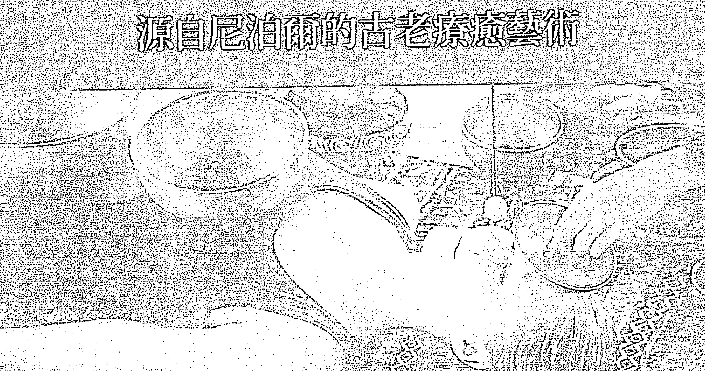

苏仁·夏尔萨

## 目录 CONTENTS

- 序言 …………002
- 导论：何谓声音与振动疗法？ …………008
- 颂钵的历史与制造方式 …………016
- 脉轮系统 …………019
  - 人体的七大脉轮 …………020
  - 吠陀与西藏的脉轮系统 …………021
- 五度音的法则 …………025
- 购买颂钵 …………029
  - 保养颂钵 …………036
- 使用颂钵 …………037

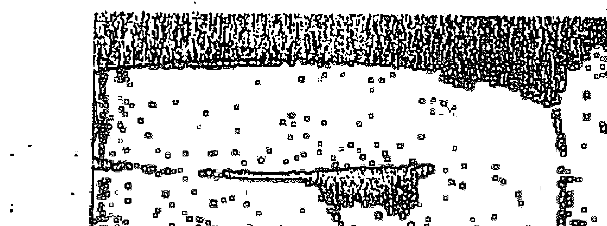

# 营造治疗环境 049

- 团体冥想 052
- 使用颂钵声音与振动治疗床 053
- 使用颂钵的安全守则 054
- 相信直觉 055

# 治疗自己 057

- 单钵治疗 058
- 选用咒语清理脉轮 059
- 治疗头部 062
- 治疗前半身 066
- 治疗双脚 066

# 治疗个案 069

- 疗程的开头与结尾 071

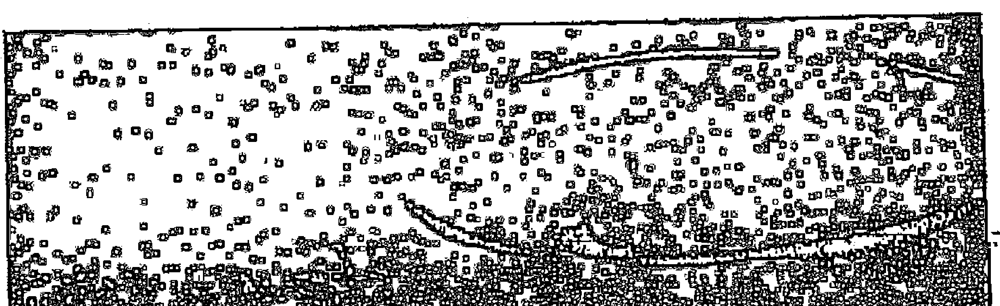

- 使用一至两只钵治疗……073
- 治疗前半身……083
- 治疗大腿和小腿……087
- 治疗后半身……088
- 治疗脚底和掌心……090
- 使用两只以上的钵治疗……099
- 放松疗法……099
- 敲击头钵……101
- 引导思绪平静的其他技巧……105
- 治愈祷念……106
- 治愈七大脉轮的咒语……111
- 脉轮平衡……115
- 温水疗法……122
- 清理脉轮……131
- 压力与抑郁疗法……136

- 缓和愤怒与暴躁情绪、舒缓关节炎和高血压的疗法……144
- 仰卧姿势……149
- 侧躺姿势（涅槃）……154
- 治疗头部、脊椎和双脚……159

# 使用碰铃治疗

- 耳朵疗法……167

# 颂钵疗法运用水晶进行

# 法供：带来丰盛的仪式

# 使用颂钵搭配其他疗法

# 谢辞

# 序言
Foreword

不久前，我很幸运地参加本书作者苏仁・什睿撒 (Suren Shrestha) 举办的周末颂钵实用课程。我的伴侣艾咪从我们两个的共同朋友中，得知此课程的资讯。我是一名小儿心脏科医师，专治儿童心脏方面的问题。小儿心脏科是医学领域当中十分专门的分支。我所受的训练以西方科学的左脑直线思考逻辑为基础，因此若在十年前，有人告诉我日后我将接纳辅助医学，甚至写出有关辅助医学的文章、为辅助医学背书，我一定会说他们疯了。但，此时的我就是在做这样的事。

我的转变大约是从十年前开始的。从业十八年后，我虽然体会到西方医学的优点，却也发现越来越多不足与缺陷。罹患先天性心脏病的病人，在动手术后，除了留在加护病房一阵子，也必须进行长期的治疗与追踪。结果，他们渐渐出现其他问题，而且正是患病和治病的过程所导致的。例如，经历过这些阶段的宝宝常会出现胃食道逆流的症状。吸吮与吞咽不协调这样的口腔防御情况也很常见。此外，年纪较大的病患还可能发生睡眠干扰、恐惧症或课堂上难以专注等状况。头痛、胸痛、心悸、晕眩等生理症状也很常见，但却找不到实际的心血管主因。部分病患则会焦虑或恐慌发作，出现换气过度及其他相关症状。近期，更有部分病患被诊断出创伤后压力症候群。上述这些问题通常很难准确描述，治疗起来也相当困难。

面对这些问题，心脏科医师会判断症状背后是否具有真正的、器质性的心血管主因，但是结果经常是否定的。如果是这样，病患就会被送回基层照护提供者手上，接着可能再转到胃肠科、胸腔科、神经科或精神科。病患常常无法获得适当的治疗，问题持续存在，虽然病患慢慢发展出越来越好的应对机制。亲眼看见越来越多类似的状况，却没有办法提供实质的帮助，令我非常无力。随着时间过去，我对这些副作用越来越不满。

十年前，我第一次接触颅荐椎疗法 (CranioSacral Therapy，CST）。这是一种温和、不具侵入性的手技疗法，使用非常温柔的碰触方式移除体内具有自我修复力的正常能量无法克服的障碍，是融合了物理、能量及直觉性的诊断与治疗方式。颅荐椎疗法接纳完整的个人，因此无可避免地将身、心、灵当作一个连续的光谱看待，同时接触到三者。大部分出现前述问题的病患，都能透过颅荐椎疗法消除症状。此疗法十分温和，不会有负面的副作用，且成本低廉，无须购买昂贵设备或长期服用药物。

接触颅荐椎疗法为我开启许多契机，而其中一个，就是让我对其他辅助疗法抱持开放的态度，包括声音与音乐疗法。颂钵可以放在分类底下。我不是声音疗法的专家，但是背后的一些理论确实感同身受。

万物皆能量。能量的行为模式以及我们给能量取的名称，取决于能量的振动速度及所在地点。振动是万物固有的特质，因此所有的能量都会发出振动。振动的能量可能很大、频率相对高，也有可能能量小、频率低。这个概念对大部分的读者而言应该不陌生。

“熵”这个名词指的是混乱的程度，用以指涉缺乏组织的能量。以全球的规模来看，世界是倾向混乱的；或者我们也可以说，整个宇宙倾向混乱，也就是熵的渐增。然而，以局部的规模来看，事物倾向维持能量平衡，也就是较高程度的秩序。我们会使用能量，因此造成局部的熵减，增加秩序。人体倾向秩序，而非混乱。我们可以把创伤或其他病变想成是局部增加的熵。要减少熵，让一切好起来，就需要依靠本质较为和谐的能量、程度较大的秩序。灵气、颅荐椎疗法、声音疗法等，可以想成是一个人在帮助另外一个人降低体内的混乱程度。这个过程之所以有帮助，是因为引入了和谐、具组织力的能量。声音就是能量。声音就是振动。颂钵发出的声音，是我所听过最和谐、美丽又有效的声音。

在苏仁的周末课程中，我得以使用颂钵治疗他人，并接受颂钵的治疗。我躺在软垫上，被不同音高的颂钵围绕着，感觉自己极为平静放松，陷入深沉的冥想状态，身心获得满足。我总是觉得颂钵疗程太快结束。当颂钵直接放在身上时，我可以感觉到声音直接穿透我的身体。紧绷、抗拒以及任何相关的疼痛和不适，就这样消失了。

我们在课堂上学到如何使用不同的方法来治疗病患的整体。我们也学会使用个别的颂钵，把焦点放在特定的身体部位。苏仁・什睿撒是个和善、有智慧、有灵性的人，具有教学天赋。

越来越多真实案例和学术研究显示，冥想和声音疗法对于可测得数据、可辨识的解剖与生理学具有正面影响。冥想时，声音确实可以提供强大的助力。我要在此声明，我绝不是第一个或唯一一个接纳这些想法的西方医学从业人员。拥有医学博士学位的米谢尔·盖诺（Mitchell Gaynor）医生便是个很好的例子，他是康乃尔大学威尔医学院的临床医学教授，同时也在纽约开设盖诺整合肿瘤诊所。此外，他著有《声音的疗愈能力：运用声音、人声与音乐治疗致命重症》（The Healing Power of Sound: Recovery from Life-Threatening Illness Using Sound, Voice, and Music）。盖诺医生告诉我们，自从他开始让病患在聆听颂钵声音的同时诵念咒语，治愈各种癌症的成功率便大幅提升。

刚开始实行颅荐椎疗法时，我只是把它当作一种辅助工具，但当我拥有越来越多实际经验和训练，却发现颅荐椎疗法越来越有用。现在，我偏好使用颅荐椎疗法来治疗许多病患的问题。当然，病患绝对可以自己选择。他们几乎都会选择没有副作用、不需要吃药的温和手技疗法。无论如何，使用颅荐椎疗法治疗这些病症都比其他方法有效多了。

我打算将颂钵应用在我的颅荐椎疗法中，先做为辅助工具使用。然而，苏仁和颂钵肯定会向我展现越来越多良好的效果。有一天，颂钵必将成为治疗我许多病患的主要工具。

我很高兴苏仁透过这本书跟我们分享他的知识。阅读此书时，别忘了你在学习一项非常重要、非常有用的工具，而且教导你的是一位大师。

——美国儿科学会会员、医学博士安卓・D・弗莱尔 (Andrew D. Fryer)

# 导论：何谓声音与振动疗法？
## Introduction

每一个人的健康状态，都可以从他的振动看出。你可以把这想成是发生在物理性身体以及心理、情感和细微躯体的反应所造成的自然结果。乐器用久了会走音，我们的身体长时间下来也有可能失去和谐振动，导致疾病。压力与负面情绪会使能量无法顺畅流动，一开始在我们周遭的气场形成低度的能量干扰，后来演变成物理性身体的疾病。

我们可以运用声音和振动使身体调回到健康状态，而西藏颂钵就是当中最强大的类型。颂钵持久不散的柔和声音会带来深沉的放松，影响身体的每一个细胞，打通能量流动，让我们恢复正常的振动形态，重拾健康。声音有助于将能量频率由低转高，移除恐惧、愤怒或愤恨等低频的情感。其实，当你沉浸在低频的情绪中，只要默念“Om”这个音，就能抬高能量音频。颂钵的声音使人平静，常被用来做为冥想辅助工具，唤起一种宁静感。

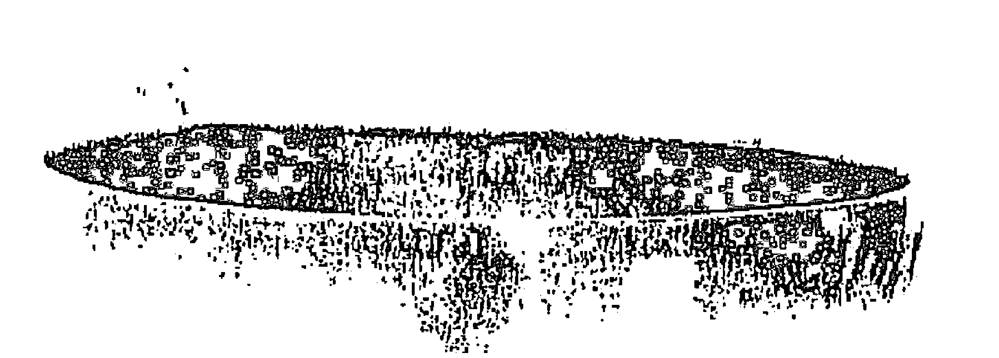
图二十吋的手工颂钵。

量子力学已经证实，一切万物都有振动，无论是桌子、椅子、人、星球或是宇宙。此外，只要有声音，就有振动产生。当我们将声音与善念（疗法最重要的层面）结合在一起，就能引导声音的振动，提高体内的振动频率。

负面能量会让我们生病或忧郁。每只颂钵都会发出抚慰的振动，把限制我们能力、使我们无法达到身心灵全面健康的负面能量震出。负面能量一旦藉由颂钵的振动震出体外后，你就可以跟七大创意行星的庞大能量和谐共处。

使用声音与振动进行治疗，可以降低压力、改善专注程度、降血压、刺激体内生命能量的流动、改善免疫系统、调和脉轮与气场、提升直觉与感知、协调左右脑、排除心理与情感的负面能量、激发创意。

最重要的是，压力是二十一世纪许多疾病的根源，唯有透过身心的放松，才能恢复平衡、健康与快乐。振动的颂钵产生的无形力量跟意念相结合，是这正面效应的来源。

人体有多达百分之七十的比率是由水分组成，因此在身体旁边敲打颂钵时，其振动会在体内制造出具有疗愈和放松效果的曼陀罗（图案）。

## 我是如何学会颂钵治疗的

在尼泊尔，使用颂钵治疗病症是一门逐渐消失的艺术。就我所知，只有加德满都和西藏边界的少数几人有在使用颂钵治疗。离我住的村庄坎德巴里（Khandbari）不远的杰恩布尔（Chainpur）和波吉布尔（Bhojpur）以及加德满都附近的区域，是合金颂钵和厨具的主要制造地点。

我个人的经验是，合金钵碗从我小时候就是拿来吃饭或烹饪的器具。寺庙里虽然常常会见到各种大小的钟，甚至还有大型吊钟，但尼泊尔人并不常在佛塔、寺庙或家中见到颂钵。由于我的父亲是一位深层灵性从业者，因此很多替代医学的治疗师，像是萨满祭司、僧侣、喇嘛，以及班智达、古鲁等灵性导师，都是我童年生活的一部分。

只有少数几位治疗师的家中会出现颂钵。吉玛唐卡 (Kimathanka) 的伟大老师多杰・廷戈 (Dorje Tingo) 是我所知会积极使用颂钵传统声音振动治疗方式的治疗师之一。还有一位是哲仁喇嘛 (Jeken Lama)，他就住在离我的村庄步行两天的地方。

僧侣、喇嘛、内瓦尔人、塔芒人等族群团体都会画唐卡，而颂钵同样也有许多人会制造。然而，很少有人会在制造颂钵时诵念神咒，将治愈善念注入钵中。

颂钵在很多国家都有人制造。日本的颂钵称作“磬”，有机器制造的，也有手工制作的，为金属合金，主要是禅宗僧侣打坐时使用。在亚洲，这些钵通常是具有仪式用途。

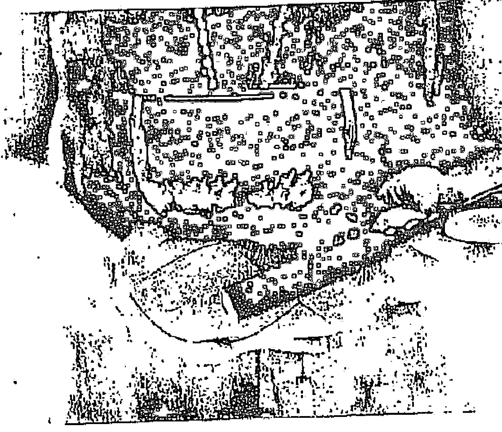
图 日本磬。

我想先说明“西藏颂钵”这个名词。颂钵虽然来自喜马拉雅地区，尤其是尼泊尔或印度，但这个词在西方世界却广为人知。1959 年，达赖喇嘛离开西藏，大批僧侣跟着逃到西方，有些人便带上自己的颂钵，互相分享使用。我之所以特别提起，是因为西藏颂钵指的通常是一种来自喜马拉雅地区的手工钵。

自 1994 年起，我便积极研究使用西藏颂钵治疗的传统方式，有时一年会前往尼泊尔两次，跟着老师学习。颂钵的摆放方式、搭配的咒语、治愈善念的重要性以及本书列出的疗法，都是我在尼泊尔学到的，其中有一些是源自吉玛唐卡这个位于尼泊尔北部边界、紧邻西藏的地区。使用西藏颂钵进行治疗的历史，就跟制造颂钵的历史一样悠久。相关知识是由相同的团体以口述方式代代相传。

这些知识集结了众多老师的做法。根据我的老师们所言，只要抱持着治愈善念，这些方法便能与任何疗法结合在一起。

## 我为何要教授颂钵疗法

在尼泊尔长大的我懂得阿育吠陀疗法，因为我成长的地方会实行这种疗法。那时，我们不太接触西方医学。在我居住的地方，大部分的村民都同时信奉佛教与印度教，因此你念哪一些咒语、信哪一些神祇、过哪一些宗教节庆并不重要。使用颂钵进行治疗时，祷念虽然很重要，但是你不需要信某一种宗教。无论你的信仰是什么，你都可以用它来汲取这门艺术的疗愈能力。

年轻时期，我来到美国，发现这里有很多人对古老的东方疗法充满兴趣。我回到尼泊尔后，开始研究这些技术，以便教授西方人。我亲眼看见许多人受到颂钵的帮助。西方世界对这些疗法很有兴趣，因此我希望一直到很久的将来，它们都能持续受到应用。我热切期盼能与生活在这时代的人分享我的知识，因为今日我所遇见的每一个人都需要被治愈。

# 这本书适合谁

无论你是专业的治疗师，还是你从来就没想过自己具有治愈能力，都可以使用颂钵帮助自己与他人。我在书中以“个案”一词代表接受治疗的人，但这并不表示你必须身为专业的治疗师，才能运用这些技巧。只要意念纯正、有心学习正确的颂钵使用方式，都能为自己、为他人带来治愈、放松的效果。

# 聆听录音档

你可以到以下的网址下载本书录音档：http://www.sentientpublications.com/singing-bowls-audio。网页包含三个档案：

1. 放松疗法
2. 脉轮平衡疗法
3. 声音冥想

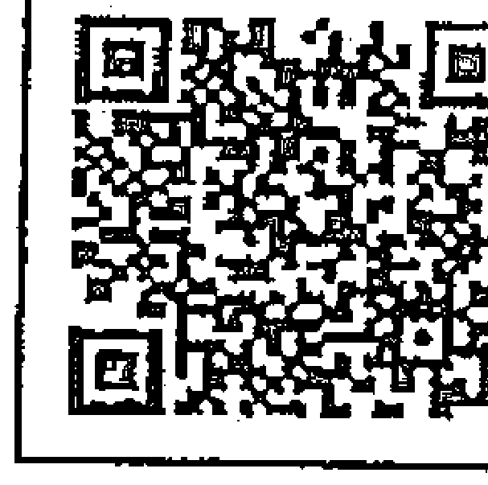

第一和第二个音档示范了书中提到的两个疗法。你可以跟着音档学习，聆听我的指示，然后敲击颂钵，接着练习在听见指示的同时敲击颂钵。第三个音档供冥想使用。

# 颂钵的历史与制造方式

传统颂钵的制造可以追溯到两千四百年前左右，大约与佛陀的时代差不多。从那时起，颂钵的制造方式便在印度、尼泊尔和西藏等地以口述方式在结构极为严谨的氏族或种姓制度之中代代相传。今天，加德满都谷地的匠人致力复兴制作颂钵的古老技术。释迦氏族至今仍会制造具有疗愈效果的颂钵，也就是在制作过程中诵念咒语。佛陀时代也是这样制造颂钵的。

口述历史告诉我们，颂钵由印度引入西藏的时间，跟佛教大师莲花生将佛教传到西藏的时间一致。因此，西藏颂钵的历史可追溯到西元八世纪。

传统上，颂钵由金、银、铁、汞、锡、铜、铅等七种神圣金属的合金制成，分别对应到太阳系的七大行星以及人体的七大脉轮。此外，每一只颂钵的音符都经过调校，可对个别的脉轮发生作用。

一开始，七种神圣金属熔化后混合在一起。接着，三到四人合力敲打大型颂钵，一个人使用铁匠的钳子夹住颂钵，另外两或三人轮流敲击念咒，让颂钵从制造的过程就开始被灌注善念。颂钵的大小从直径三吋到十四吋*都有，但是也有更小或更大的。

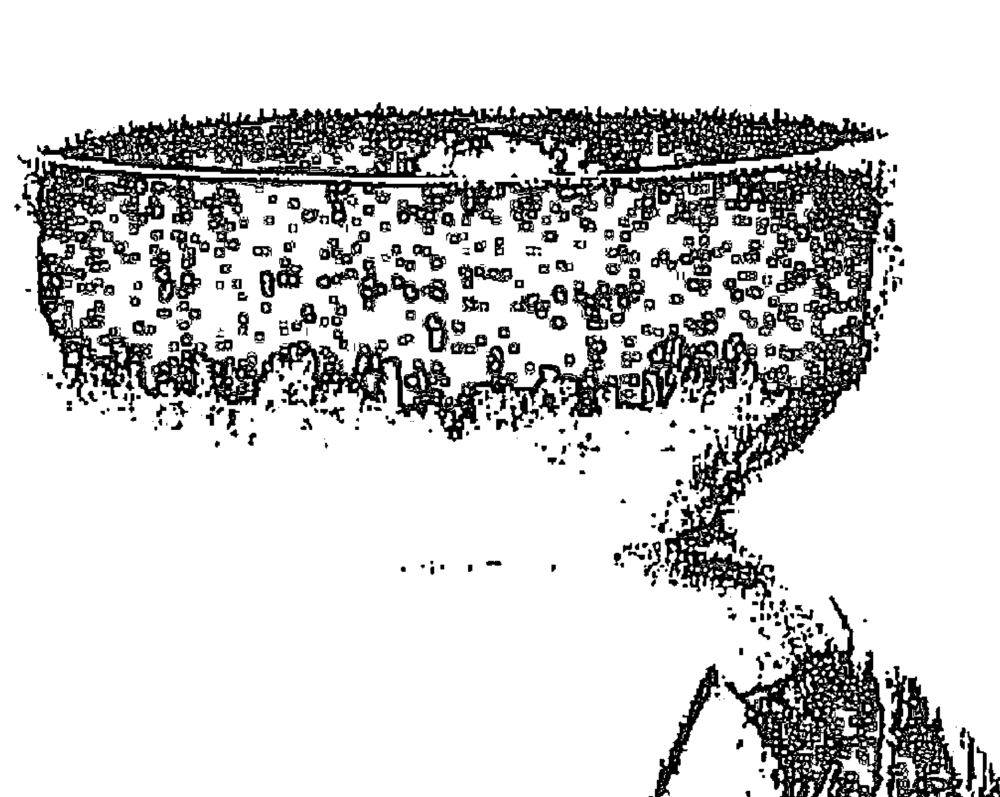
古老的打手工颂钵。

*一时=2.54公分

# 脉轮系统

颂钵可以打开我们的脉轮，但这需要时间。脉轮是人体的能量中心，对应到从脊椎向外延展的神经网络以及内分泌系统的腺体。能量中心若获得平衡，人的生活在生理、情感和心灵层次都将跟着平衡。每一个脉轮都有相对应的音符、颜色、咒语、部位和各种人类特质。

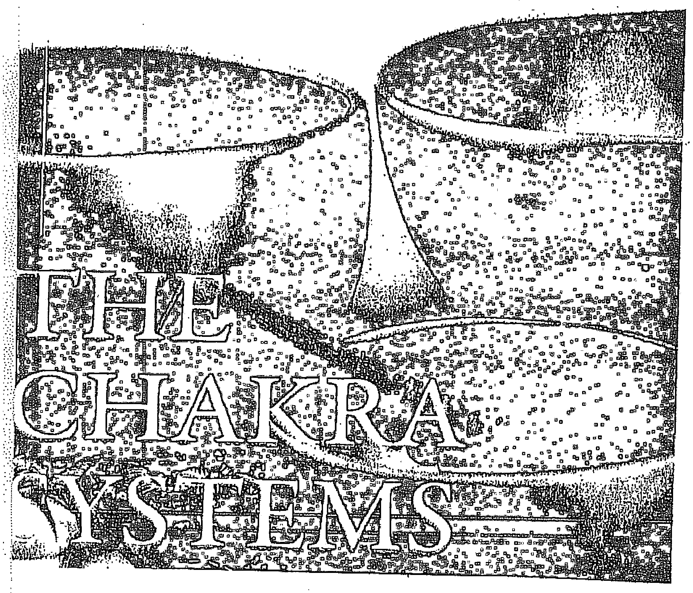

## 人体的七大脉轮

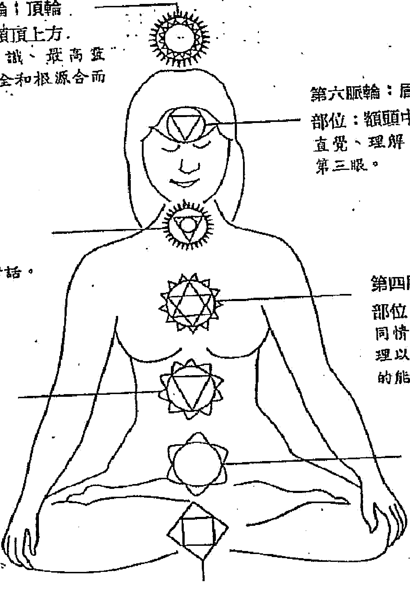

**第七脉轮：顶轮**
部位：头顶上方。
宇宙意识、最高灵性、完全和根源合而为一。

**第六脉轮：眉心轮**
部位：额头中心。
直觉、理解、想象和第三眼。

**第五脉轮：喉轮**
部位：喉咙。
沟通、表达、说实话。

**第四脉轮：心轮**
部位：胸腔中心。
同情、友情、同理以及施受大爱的能力。

**第三脉轮：太阳轮**
部位：胸骨与肚脐之间。
个人力量、生活的热情以及保护自己不受负面事物影响的能力。

**第二脉轮：脐轮**
部位：肚脐与阴部之间。
创造力、性欲、爱情和繁衍。

**第一脉轮：海底轮**
部位：脊椎根部。
生存、驱动力、企图以及能量的扎根等议题。

20

## 吠陀与西藏的脉轮系统

我在下页的图表比较了吠陀与西藏脉轮系统对应音符、行星和金属的差异。这两套系统是各自发展出来的，你可以自行选择想要使用的系统。或者，如果你真的很想以某种特殊方式来使用某个颂钵，你也可以不管这两套系统，遵循自己的直觉！比方说，如果你觉得 A 缽让你的心产生共鸣，那么你或许就应该使用这只钵来治疗自己的心。如果你只有一只钵，当然可以用在任何部位上。我学的是西藏系统，因此书中用的便是西藏系统。

# 吠陀系統

| 脈輪 | 吠陀音符 | 行星 | 金屬 |
| :--- | :---: | :---: | :---: |
| 第七脈輪——頂輪 | B | 木星 | 錫 |
| 第六脈輪——眉心輪 | A | 土星 | 鉛 |
| 第五脈輪——喉輪 | G | 水星 | 汞 |
| 第四脈輪——心輪 | F | 太陽 | 金 |
| 第三脈輪——太陽輪 | E | 火星 | 鐵 |
| 第二脈輪——臍輪 | D | 金星 | 銅 |
| 第一脈輪——海底輪 | C | 月亮 | 銀 |

## 西藏系統

| 脈輪 | 西藏音符 | 行星 | 金屬 |
|------|----------|------|------|
| 第七脈輪——頂輪 | B | 月亮 | 銀 |
| 第六脈輪——眉心輪 | E | 水星 | 汞 |
| 第五脈輪——喉輪 | A | 金星 | 銅 |
| 第四脈輪——心輪 | D | 太陽 | 金 |
| 第三脈輪——太陽輪 | G | 火星 | 鐵 |
| 第二脈輪——臍輪 | C | 木星 | 錫 |
| 第一脈輪——海底輪 | F | 土星 | 鉛 |

西藏系統的行星排列順序，是以從地球上觀察行星移動的速度而定的，月亮感覺最快、土星感覺最慢，而太陽居中。這是古時候的天文學家和鍊金術士使用的系統，因此當然沒有包含尚未被發現的行星：天王星、海王星與冥王星。

# 颂钵疗愈入門
HOW TO HEAL WITH SINGING BOWLS

## 五度音的法则

五度音的聲音聽起來令人放鬆，感覺回復到中心點。古代的西藏頌缽治療師會將頌缽排列成某種形式，讓他們能以五度音程敲打缽，因為他們覺得這樣的聲音聽起來很美。五度音的振動特別適合平衡心輪。

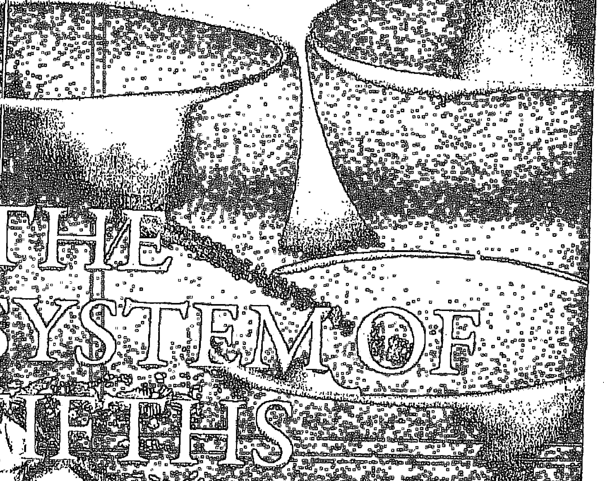

要以五度音的方式排列頌缽，只要從海底輪的F缽開始，每個脈輪往上五個音符即可。

| 音程 | 缽 | 脈輪 |
|------|----|------|
| | F | 海底輪 |
| FGABC | C | 臍輪 |
| CDEFG | G | 太陽輪 |
| GABCD | D | 心輪 |
| DEFGA | A | 喉輪 |
| ABCDE | E | 眉心輪 |
| EFGAB | B | 頂輪 |

西藏頌缽在現代的調音技術出現之前，就開始製造了。古老的西藏頌缽聽起來常常會給人神秘、多音律的感覺；近四十年來在尼泊爾製造的頌缽，則會使用電子調音器，比舊式的頌缽容易校正。

## 五度音的法則
THE SYSTEM OF FIFTHS

亞利桑那州鳳凰城之泛音科學學院的院長哈洛德·葛蘭德斯塔夫·摩西博士（Dr. Harold Grandstaff Moses）在有關泛音振動理論的文獻中提到五度音程：

> 我們針對音頻、泛音、和諧進行、拍子、顏色、光線和視覺成像做了無數次實驗，試圖了解情緒和感受被影響的方式，同時促進療癒、減少壓力、帶動靈性意識的提升。我們的研究顯示，完全五度（三比二的數學關係）產生的泛音對副交感神經能夠具有正面的影響，同時改變聽者的意識狀態。

我對以完全五度來影響脈輪系統的做法深感興趣。我鼓勵所有的聲音工作者實驗這套調音系統。關於應用泛音進行治癒的研究，出現了許多新發現，因此過去的理論絕對有重新評估的空間。

# 颂钵疗愈入门
HOW TO HEAL WITH SINGING BOWLS

## 轉質頻鉢

不同的缽會對應到不同的脈輪，並產生不同的音符。你可以根據你的目標來選擇適合的缽。比方說，如果想變得更有同情心，可以在冥想時使用 F 缽，開啟你的心輪。如果想治癒，就要使用 D 缽來影響心輪。

# 颂钵疗愈入门
HOW TO HEAL WITH SINGING BOWLS

选购颂钵时，最好多敲几个不同的钵，找到你觉得好的那一只。钵会跟你对话，让你知道你需要的是哪一只。钵会让你感到放松舒适的，就是你的钵。不要根据外观选择颂钵，而是要看它的声音带给你什么样的影响。摩擦和敲击会产生出不同的音调，所以两种方式都要试试看。购买之前，务必听听钵的声音。

市面上也买得到水晶颂钵，但是这种钵跟书中提到的传统颂钵不一样。

颂钵可能是以三种、四种、五种、七种、甚至九种金属制成。大部分的机器制颂钵是用七种以下的金属制成，主要用于冥想。选购治疗用的颂钵时，七种合金的钵比较适合。

## 钵的大小

大钵会产生强大深沉的振动，小钵会产生高频剧烈的振动。人体对于八度音范围内不同高低的声音有不同的反应；有些人偏好大钵的低音及其深沉的振动。

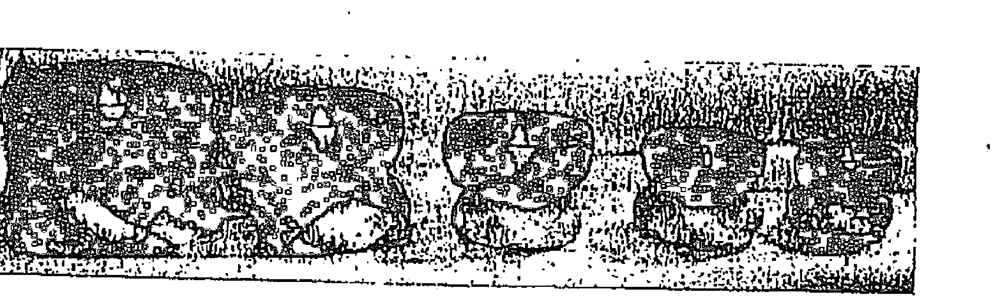

圖 四吋到十吋大小的頌缽。

## 第一只缽

你可能是為了個人治療而想要購買你的第一只缽。買個大一點的缽（八到十四吋左右），就足夠進行所有的自我療法。你也可以買一只小缽（三到七吋）來輔助冥想。如果想要更進階一點，可以考慮一開始就買四個缽。療癒缽一只至少花費兩到三百美元，古董頌缽一只更會要價兩千美元。一開始可以先買小一點、便宜的冥想缽，大約二十五美元就能買到，之後再慢慢添購其他的缽。

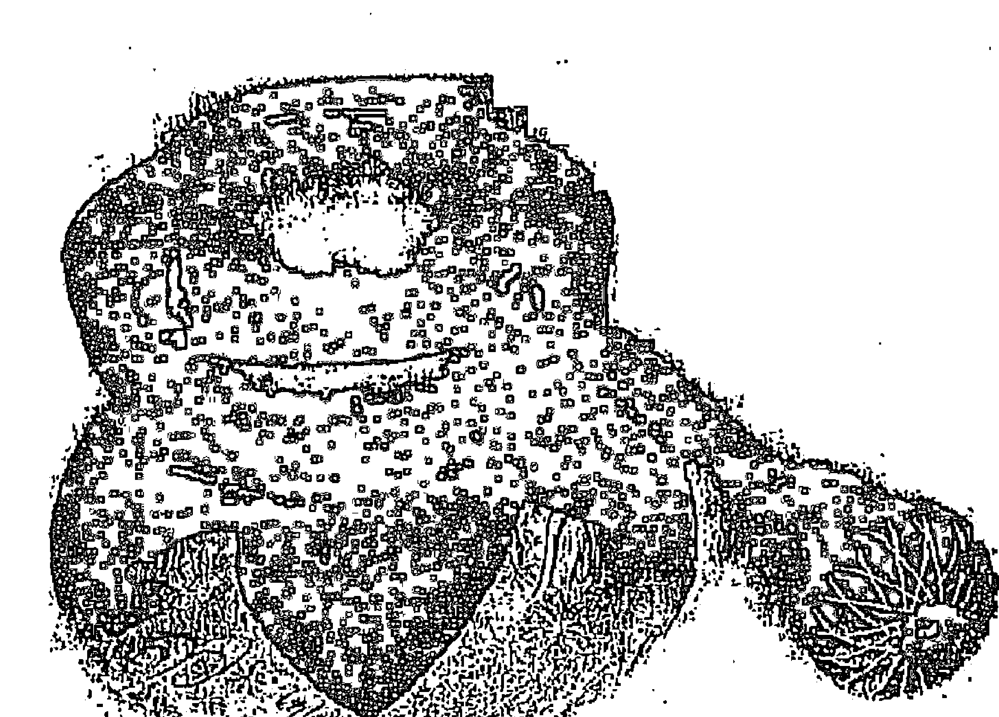

圖 七吋手工尼泊爾缽及絨布槌。

### 依聲音選購頌缽

在選購單一頌缽時，先以毛氈槌或皮槌敲擊之，聆聽振動與聲音的品質。接著，再次敲擊頌缽，將缽緣拿到離嘴巴兩到三吋的地方，開合你的嘴巴。應該會有「哇--哇」的聲音出現，那就對了。我在試鉢時，會用皮槌或木槌敲擊之，聽聽鉢側周圍的音調是否平滑穩定。如果是大鉢，我會把它放在頭上敲擊，感受聲音的品質。

確保只有一個主要音。如果一只鉢會發出一個以上的音，那就以最長的那個音做為主要音。使用電子調音器可以準確判定鉢的音。

如果鉢有裂痕，是很難看出來的，但是用聽的就能知道鉢體是否有破損。有時候，敲擊破裂的鉢不會發出回音，而是會發出類似金屬的沉悶咚咚聲。如果是肉眼難以看見的細縫，則會發出不悅耳的咯咯或嗡嗡聲。有時候，即使鉢出現裂痕或甚至破洞，還是會發出回音。然而，破損的鉢還是不應該用來治療，甚至連輔助冥想也不適合。把鉢退給店家，請他們送回去給廠商回收。

## 購買一組頌鉢

如果你想購置一組對應七大脈輪的頌鉢，應該一次選購，這樣才能聆聽整組頌鉢的聲音。如果你是以批發價訂購，可以請商家幫你組合。務必確定你買到的是手工頌缽。

最好的方法，就是坐下來，把多個缽放在你能同時聽到不同缽聲音的位置。如果你跟店家關係良好，他通常會讓你選其中幾個太大、太小或聲音聽久了不再喜歡的缽。

開始使用一只缽之後，你有可能改變對它的感受，因為當你每天聆聽整組頌缽的聲音，你對音調的領悟力會越來越敏感。很多人常常會因為音高、個別缽的大小或是整組缽的大小配置等原因交換頌缽。

購買一組頌缽時，如果一開始試的缽屬於升調，你可能會希望F、G、A、C、D缽全部都是升調。如果一開始試的缽屬於自然調，你也許會希望全部的缽都是自然調。

這不是硬性的規定，但是考慮到整體的和諧感很重要。

有些人說，用在演奏會上的頌缽聽起來應該要非常具有和諧感，但是針對治療用的缽，這一點不是那麼重要。

組合一組用於治療的頌缽時，最好能躺下來，把缽放在周圍，用這種方式聆聽並感受其振動。

有些人說，頌缽一旦組合好了，就不應該再動了。只要有好的能量，所有的缽就會一起唱歌。

# 購買頌缽
How to Buy a Singing Bowl

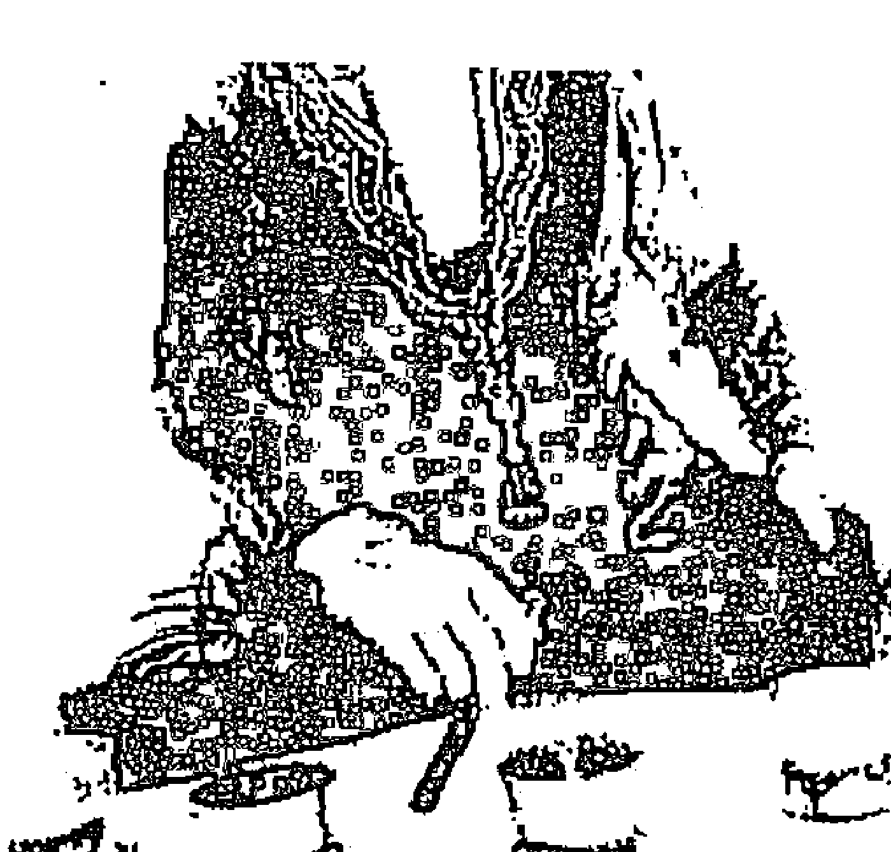

圖 七只小缽的組合。

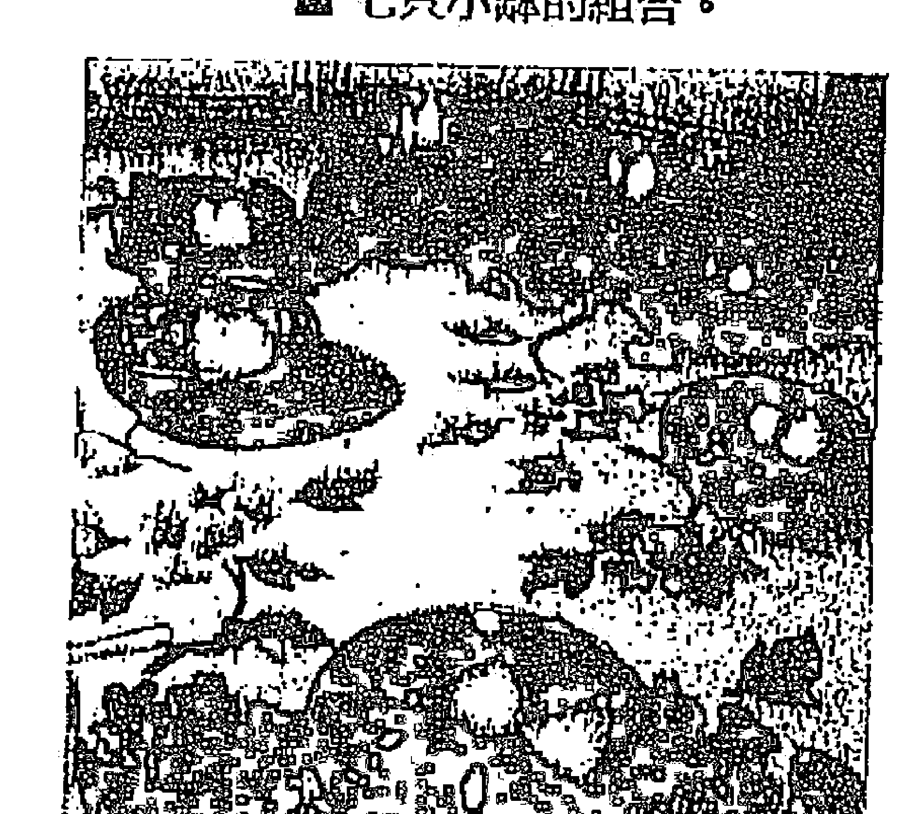

圖 七只大缽的組合。

## 保養頌缽

請使用半顆檸檬汁加溫水來清洗頌缽，絕對不要使用銅器清潔工具。每天都要敲擊頌缽，維護彼此的關係。如果要把缽放在身上，裡面應該放溫水，平衡五大元素（土、風、火、水、金）。

帶著頌缽出門時，請用報紙、布料或氣泡布包覆之，以免震動或撞擊。你可以把小的缽放在大的缽裡面，每一層都確實做好保護即可。你可以把它們放在行李箱或大帆布袋裡。

## 使用須知

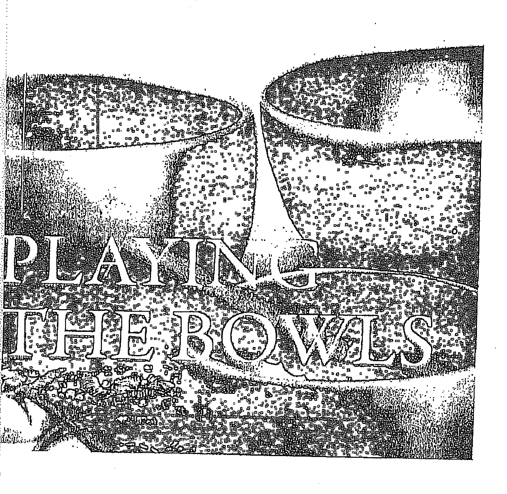

# 頌缽療癒入門
HOW TO HEAL WITH SINGING BOWLS

你可以用摩擦或敲擊的方式讓頌缽發出聲音。敲擊頌缽會產生清亮的聲音，摩擦頌缽則會產生較強的振動。坐在椅子或地板的坐墊上，挺直背部，採取放鬆的坐姿。眼睛放鬆，微微閉上。如果你是右撇子，請將缽放在左手掌心（左撇子則相反），拿到心臟的高度。捧缽的那隻手要打開攤平，不要彎曲手指握著缽，否則會改變缽的聲音。深呼吸，開始摩擦或敲擊，專注在自己的呼吸上。敲擊時，手勢往上。如果缽倒過來放（例如倒放在頭上時），則應往下敲。

### 摩擦頌缽

使用木槌或皮槌皆可，皮槌產生的聲音較柔和，木槌產生的聲音較尖銳。在學習階段，木槌是個很好的選擇，因為聲音比較容易出來。使用皮槌必須出比較多力，但是皮槌不會出現咯咯聲。

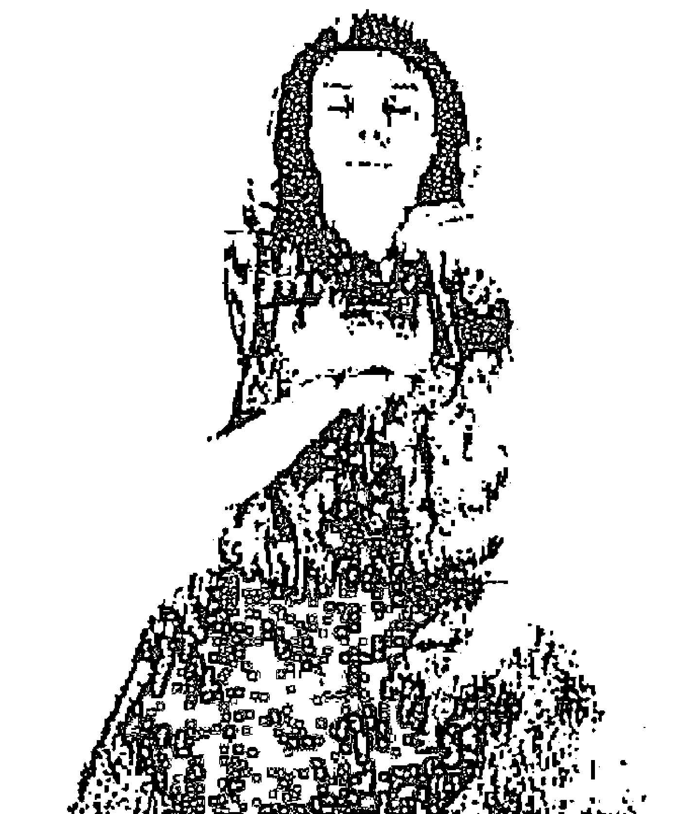

圖 坐著使用頌缽。

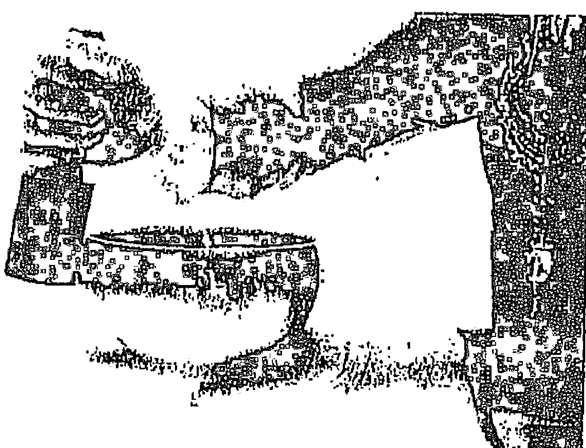

圖 摩擦頌缽，幫助冥想。

## 冥想用途

把缽放在打開的手掌上，以順時針方向緩緩移動槌子。如果缽太大或太重，沒辦法放在掌心，可以放在按摩床上或墊子上。傳統上，摩擦技法不會用在冥想上。摩擦時，不要動到手腕，而是應該運用手肘和肩膀的力量，讓槌子沿著缽的外緣移動，整個過程中，槌子持續接觸頌缽不離開。如果開始出現咯咯聲，速度要慢下來。

## 治療用途

三到十四吋的缽可以直接放在身上。你也可以把缽放在按摩床上或地上。將你的無名指、中指和食指放在缽的中心點，使用槌子摩擦時，缽才不會亂動。若想產生振動，可以輕輕敲擊頌缽，接著用槌子左右來回摩擦，創造出具有治療效果的振動感。

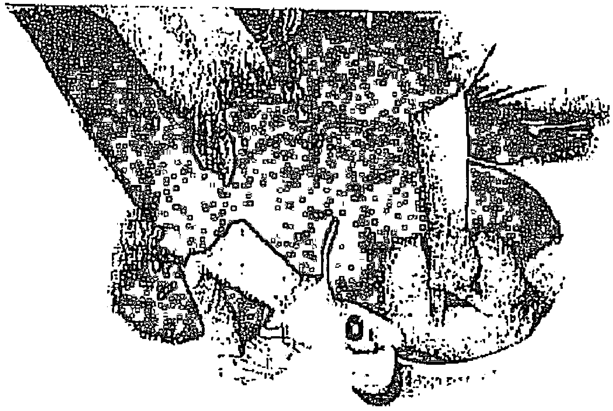

圖 摩擦頌缽，進行治療。

### 敲擊頌缽

敲擊頌缽時，手勢要朝上（除非另有指示）。剛開始學習敲擊頌缽的人最常犯的錯誤，就是只用槌子輕敲一下，而沒有採用由下往上順勢滑移的手法。

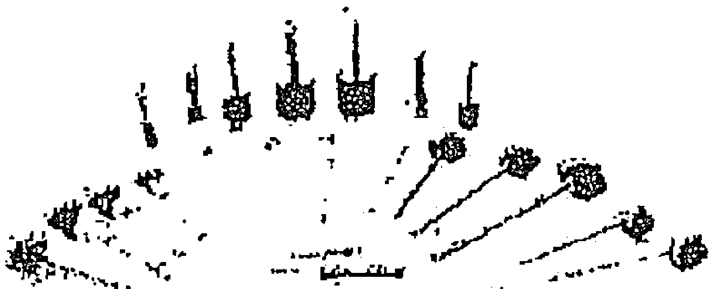

圖 摩擦與敲擊槌。

## 冥想用途

使用皮革、錦緞或毛氈包覆的槌子。把缽置於掌心、墊子、地板或供桌上。敲擊頌缽，槌子接觸缽體時順勢往上滑，這樣就能創造出猶如黃金般振動迴響的聲音。

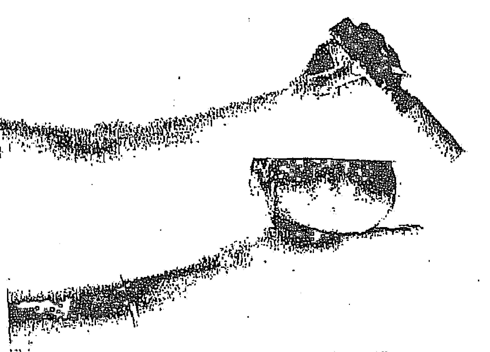

圖 敲擊頌缽，輔助冥想。

一邊吸氣，一邊聆聽敲擊一次所發出的微妙撫慰之音。隨著聲音漸漸消散，開始跟隨自己呼吸的聲音。你也可以敲擊頌缽三下，再開始冥想。恢復寂靜後，持續進行冥想。冥想結束後，再敲擊頌缽一下。

### 治療用途

使用錦緞或毛氈包覆的槌子。你可以把缽直接放在身上，或是放在地板或治療床上。

如果是把一只小缽放在身上，請將無名指、中指和食指放在缽的中心點，防止缽移動。

如果是放在地板或治療床上，請在缽的下方放一塊止滑墊，防止缽移動。你可以把用來舖在廚房抽屜和置物架的那種柔軟、無黏性材質製作成一塊止滑墊。

將槌子拿到距離頌缽三吋的地方，對準缽緣下方一吋左右的位置，敲擊之，接觸缽體的同時，將槌子往上帶，創造出渾圓的回音。你也可以敲擊頌缽內緣，碰觸到缽體時同樣往上滑。若想產生振動，可以輕輕敲擊頌缽，接著用槌子左右來回摩擦，創造出具有治癒效果的振動感。

# 頌缽療癒入門
HOW TO HEAL WITH SINGING BOWLS

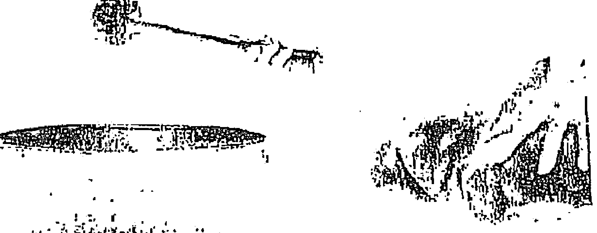

圖 進行頌缽療法時揮動槌子。

# 使用颂钵
Playing the Bowls

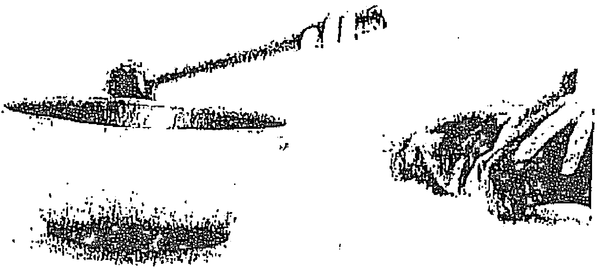

圖 進行頌缽療法時敲擊棒組。

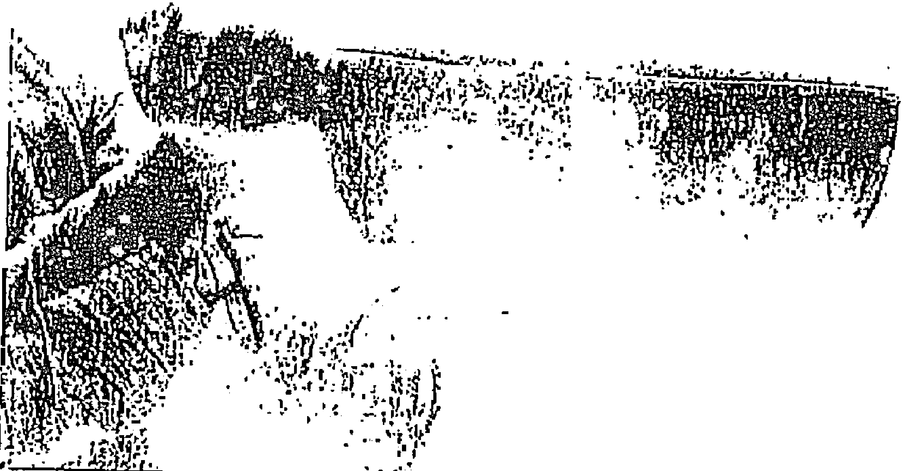

圖 使用拳頭敲擊頌缽。

## 使用拳頭敲擊頌缽

將頌缽置於非慣用手的掌心，另一隻手握拳，用小指頭那一側敲擊靠近缽緣的位置，發出溫和舒緩的聲音。當某些療法需要比較柔和的振動時，常會使用這個技巧。

## 西藏碰鈴（丁夏）

碰鈴是由兩片小銅鑼和一條連接銅鑼的皮繩所組成。敲擊碰鈴最好的方法，就是將皮繩收攏靠近銅鑼，一手持一片銅鑼，讓兩片銅鑼的邊緣彼此垂直，互相敲擊發出聲音。

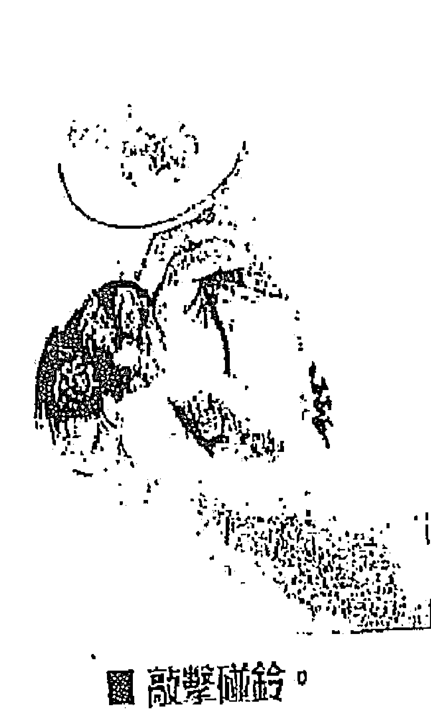

傳統上，碰鈴發出的樂音可以清除一個空間的負面能量，使心靈回到當下。它也被用來治療耳鳴。在靈性領域中，碰鈴被用來開啟第三眼，也可以在治療師和個案之間創造一條療癒連結，傳遞正能量。最後，碰鈴也可用來平衡脈輪。

## 鈴和杵

銅鈴是我在寺廟儀式中唯一看過被拿來演奏的樂器。演奏銅鈴的目的是為了喚醒一個人，讓他回到當下。我會在法供儀式和冥想過程中使用銅鈴，但不會拿它來治療。你可以用木槌敲擊銅鈴，或是直接搖出聲。

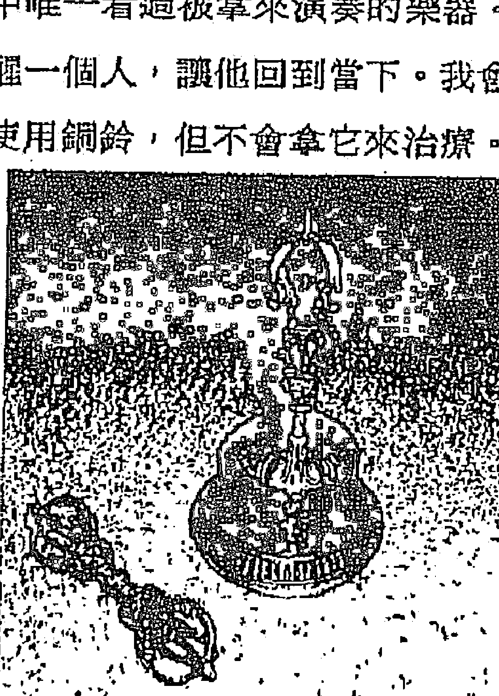

杵是由金屬或水晶製成，兩端呈卵形，中間有一顆小球，由一根柱狀體貫穿連接。杵（Dorje）在藏語中的意思是「雷電」。杵有時也會被形容成鑽石權杖，是智慧的神聖象徵。人們會在冥想時使用杵，以手印的手勢拿著。鈴拿在左手，杵拿在右手，兩者代表陰（鈴）和陽（杵）。

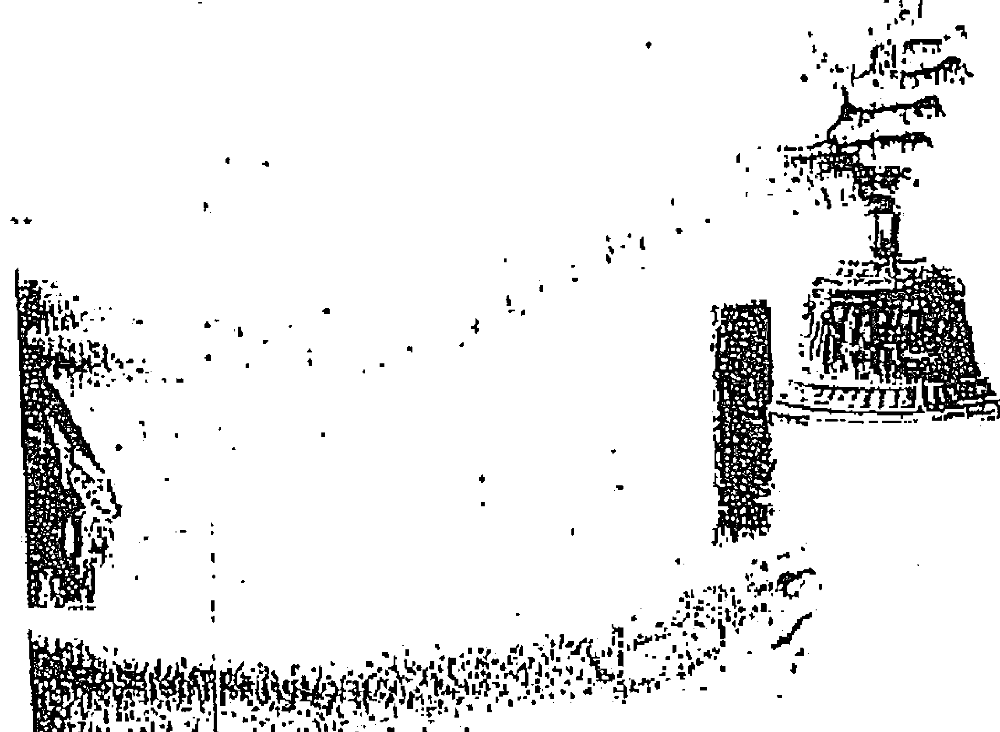

圖 敲擊銅鈴。

## 營造治療環境

你為自己或他人提供治療與冥想的環境，應該要是安靜、乾淨、整齊、有秩序、令人心情愉悅的空間。本章提供的所有資訊適用於自我治療及治療他人的情境。鋪有地毯的地面躺起來雖然舒服，但是頌缽要放在堅硬的材質上，才能發出振動回音，因此你如果選擇鋪有木板或磁磚的房間，可以讓個案（或你自己）躺在墊子上。木板特別適合做為傳遞振動的介質。

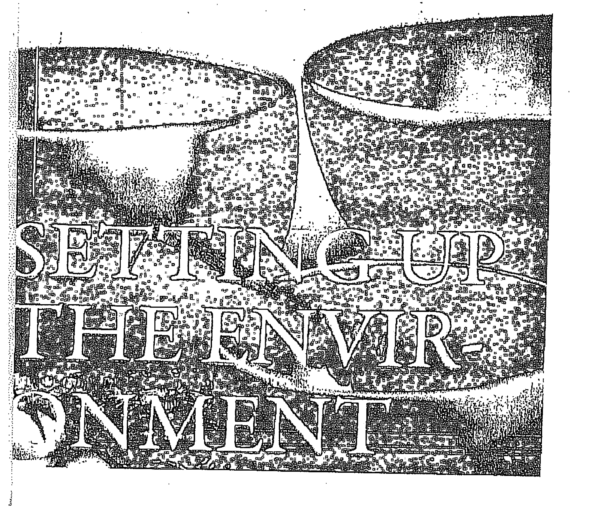

你需要一個小枕頭，用來放在個案的頭下。另外，很多人也喜歡仰躺時，在膝蓋下方墊幾個枕頭。使用眼罩或乾布蓋住個案的雙眼，可以使他較為放鬆。使用眼罩時，先在下方鋪一張乾淨的面紙，這樣比較衛生。同樣地，頭部和膝蓋的枕頭也要鋪上一張紙巾，這樣每一位個案都有乾淨的枕頭可以使用。枕頭應該要以天然材質製成。

光線昏暗是最理想的狀態，如果可以使用蠟燭點亮空間，更能創造愉悅的效果。

請確保房間是溫暖的，因為個案將會躺著不動一段時間，可能會著涼。必要時，可在個案身上覆蓋一條薄毯。

房間聞起來應該是宜人的，至少不可以有怪味！在療程開始前，你可以點燃香炷或香氛蠟燭。但是請記住，有些人對任何煙味或香味特別敏感，所以準備房間之前務必徵詢個案意見。

如果要在缽裡倒水，請使用非常暖和但不滾燙的水溫。缽置於個案身上時，千萬不可直接倒熱水進去。把缽放到個案身上之前，先用自己的皮膚測試溫度。如果太燙，就加點冷水。要將溫熱的頌缽放在眉心輪、手掌或赤裸的雙腳上時，必須格外注意。最好使用電熱水壺，讓水保持溫熱，同時在附近放冷水，需要時馬上可以使用。

個案應該穿著以天然纖維（棉質最好）製成的寬鬆長褲和上衣。如果房間裡有供桌、神像或聖人的照片，個案的頭應該朝向這些物件。

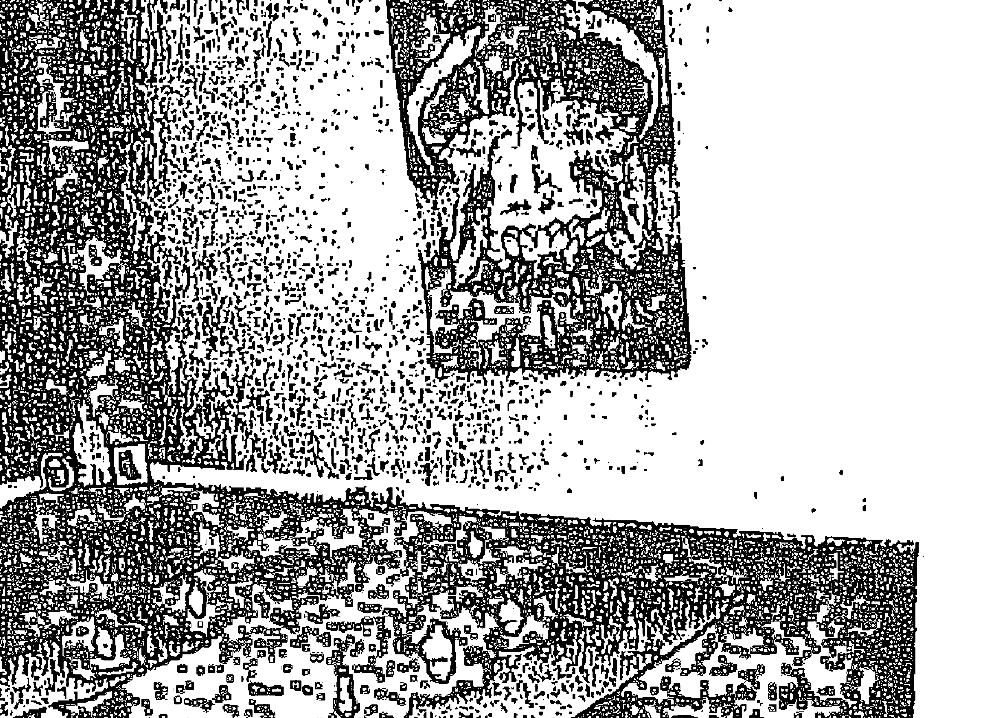

圖 治療環境。

# 頌缽療癒入門
HOW TO HEAL WITH SINGING BOWLS

## 團體冥想

有時，我會跟其他頌缽治療師一起進行團體冥想。冥想者會躺在地上，身上蓋著毯子、墊著枕頭，又或者坐在椅子或墊子上，而引導冥想的人會演奏頌缽、鈴鐺、銅鑼和碰鈴。這會營造出完美的放鬆氛圍，人們可以選擇自己喜愛的方式進行冥想。下面這張照片顯示了進行團體冥想時，頌缽應該如何擺放。

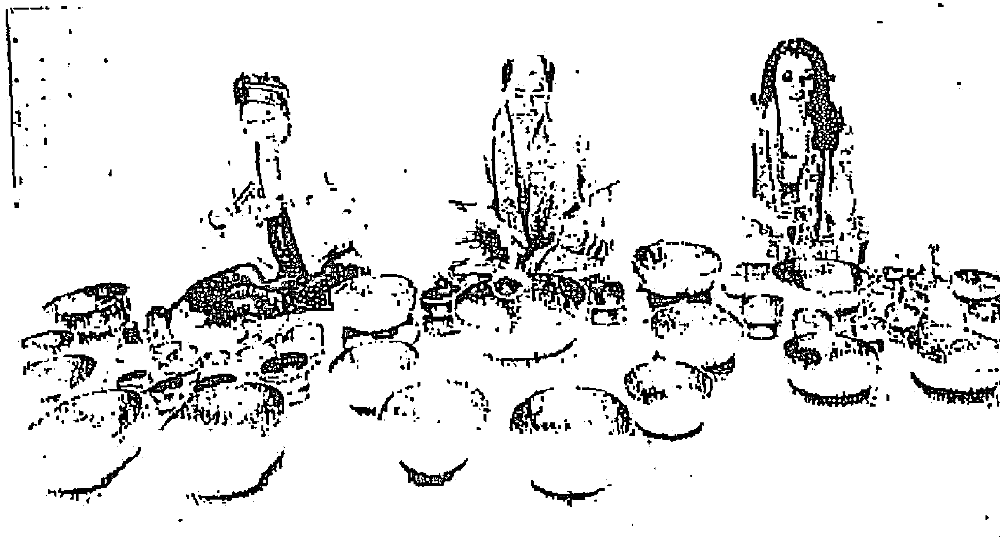

引導團體冥想。

如果冥想者是躺在地上，他們的頭應該朝向頌缽。

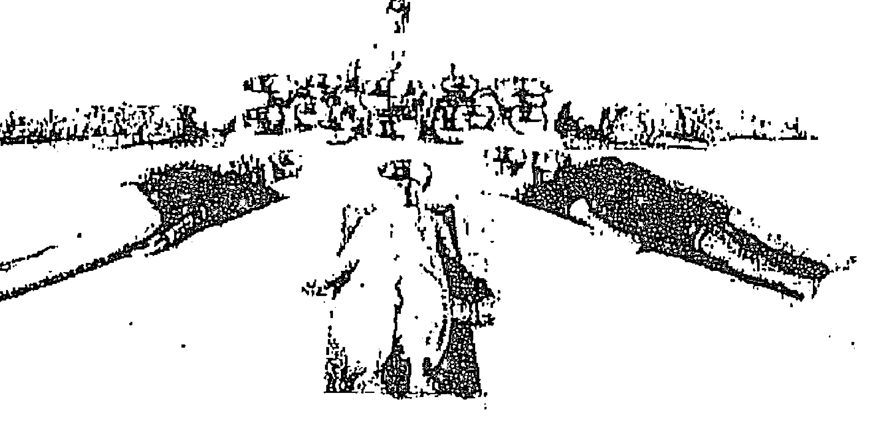

圖 冥想者的位置。

## 使用頌缽聲音與振動治療床

對西方人而言，個案躺在地上有時候會很難進行頌缽療法，因為這對治療師的膝蓋和背部不太好。你也可以使用按摩床，並將頌缽擺在凳子或沙發邊桌上。你可能需要在頌缽下方放個墊子，讓缽的高度跟床一樣高。

## 使用颂钵的安全守则

在尼泊尔，食物会放在金属器皿或甚至是真正的颂钵中，但是在今日的西方世界，颂钵不适合拿来盛装食物或饮品。

倘若个案患有注意力缺失症、注意力缺失过动症或其他容易造成兴奋躁动的病症，敲击颂钵时动作必须缓慢轻柔！并将颂钵摆在离人体较远的地方。

在孕妇的腹部上方或附近发出噪音是不恰当的做法。我不建议在孕妇的腹部上敲击颂钵，因为宝宝被液体所包围，而由于声音在水中传导的速度比在空气中还要快，这会造成振动速度加快。因此，如果要替孕妇进行颂钵疗法，请将颂钵放置在离身体数尺的地方，敲击时要轻柔。

## 相信直覺
Using Your Intuition

這是一本頌缽的操作指南，因此書中寫的是我自己平常治療個案的方式。然而，我其實很少會做兩次一模一樣的療法。通常，我會根據個案的特殊需求和自己的直覺來調整治療方式，所以我也鼓勵你這樣做！

我從很多老師身上學到許多不同的技巧，然後再去選擇我認為適合某種情況的療法。請自由修改你在書中學到的東西，滿足自己或個案的需求。

如果你能相信自己的直覺，充斥在你四周的無形治癒力量就能自然地被表達出來。真正的治癒能力就是這樣來的，絕不可能真的照本宣科。

# 頌缽療癒入門
HOW TO HEAL WITH SINGING BOWLS

### 治療自己

下面介紹的這些療法可以用在你自己或他人身上。頌缽放在身上時，是否倒入溫水都沒關係。

注意：我使用「她」或「他」來指稱個案，純粹是為了避免用詞不妥。所有的療法都適用於男性和女性。

#### 單缽治療

首先，選擇一個令你覺得舒緩、對你產生共鳴的脈輪缽，使用此缽治療身體的任何部位。別忘了，善念是頌缽療法的核心。你有能力治癒自己，所以請打開心胸，憑直覺選擇頌缽擺放的位置。這只缽可以用來治療心臟、腹部、太陽輪、大腿、膝蓋或小腿。如果你是使用單缽替他人進行治療的人，也可以用此缽治療個案的背部、肩膀、雙腿和雙腳。比較進階的做法是，你可以在缽中倒入四分之一滿的溫水，讓具有治癒效果的振動更深入體內。

#### 運用咒語清理脈輪

你可以用這個療法清除特定脈輪的負面能量與窒礙。要治療脈輪失衡問題，你必須在整個治療過程中處於一個安靜、私密、不會受到打擾的空間。如果你只有一只缽，就用這只缽清理所有的脈輪；如果你有一整套脈輪缽，就根據你想清理的脈輪來選擇對應的缽。

採取舒服的坐姿。你可以坐在椅子上，雙腳著地；或者坐在墊子上，盤腿或坐壓腳跟。背部挺直，胸口向外、向上挺起，肩膀放鬆、與地面平行，下巴收回一吋左右。你可以閉上雙眼，把眼球往上轉到第三眼的位置，或者眼睛睜開十分之一，凝視鼻尖。兩種做法都能刺激第三眼的天賦。

回到中心點，跟著呼吸走。吸氣時，把注意力集中在問題或特定的脈輪上，心中保持清除負面能量的意念。吐氣時，將所有無法賦予你最高層次需求的一切全部釋放，把負面能量向下傳送到腿部，從腳底送出去，直達地球核心，使之被分解成各大元素，日後重新組成新生命。

如果你是坐在椅子上，可以把頌缽捧在心臟前方，抑或是放在面前的桌上。如果你是盤腿坐在地上，請把頌缽置於打開的掌心中，舉到心臟的位置。現在，敲擊或摩擦頌缽。

專注在呼吸上，與情感產生連結。把注意力慢慢移到脈輪的部位，對該脈輪誦念相對應的咒語。想要誦念多久都沒關係，直到感覺負面能量已被釋放即可。感受所有情緒，不帶任何評斷，心念處於當下。

| 脈輪 | 吠陀音符 | 吠陀咒語 | 西藏音符 | 西藏咒語 |
| :--- | :--- | :--- | :--- | :--- |
| 第七脈輪——頂輪 | B | 沉默 | B | 沉默 |
| 第六脈輪——眉心輪 | A | Om | E | Aa |
| 第五脈輪——喉輪 | G | Ham | A | Om |
| 第四脈輪——心輪 | F | Yam | D | Hung |
| 第三脈輪——太陽輪 | E | Ram | G | Ram |
| 第二脈輪——臍輪 | D | Vam | C | Dza |
| 第一脈輪——海底輪 | C | Lam | F | 沉默 |

#### 治療頭部

約7分鐘

當你在辦公室辛苦了一整天，或者從事任何容易積累壓力的活動之後，這個療法可以有效解除壓力。我的其中一位老師多傑·廷戈教我使用這個方法治療失眠、偏頭痛和肌肉緊繃。

個案可以坐在墊子或椅子上。首先，在頭上放一條毛巾或一塊止滑墊，以免缽移動。接著，把一只大缽倒過來蓋在頭上。請確定缽是平衡的，沒有造成個案不適。接著，使用向下的手勢輕輕敲擊頌缽。等待二十秒，再重複一次。請事先練習把缽放在自己的頭上敲擊，確保你知道如何平衡頌缽。如果缽掉了，可能會傷到你自己或缽本身，因此要很小心。

你可以把兩只缽放在一起，形成一個振動室，創造出更深沉的放鬆與療癒效果。一只缽倒放在頭上，另一只缽捧在非慣用手的掌心，舉到心輪和太陽輪之間的位置。第二只缽的大小會決定敲擊後升高的高度。如果第二只缽的大小和頭上那一只差不多，敲擊後要舉到喉輪的高度；如果第二只缽是介於四到八吋之間，敲擊後舉到眉心輪的高度。無論是哪種情況，舉到指定的部位後，要停留一下，然后再重複一次動作。

如果有治療師在旁協助，請他幫你捧著第二只缽，舉到離喉輪兩到四吋的地方，手勢向上輕敲兩次，接著在缽振動時，以 Z 字形緩緩由喉輪往下移到臍輪的位置，再用更慢的速度從臍輪直直舉高到頂輪。這個步驟想要重複幾次都可以。

#### 治療前半身

躺在墊子或床上，將缽放在需要治療的部位。往上輕敲頌缽，讓振動漸漸消散十到十五秒。振動期間，深深吸氣，感受振動進入體內。吐氣時，清除所有疼痛。整個過程重複幾次皆可。

#### 治療雙腳

站立或坐在椅子上，將赤裸的雙腳放在一只大缽中央。如果缽不夠大，可以踮腳尖或腳跟。往上輕敲頌缽，讓振動漸漸消散十到十五秒。振動期間，深深吸氣，感受舒緩的感覺，經由反射點連接到身體的每個部位。整個過程重複幾次皆可。

要購買一只能放得下兩隻腳的缽（十八吋左右）得花不少錢，因為這樣的缽不但很大，也非常重。如果有成本考量，可以請治療師協助，把一只八到十四吋的缽放在腳底。把腳靠在治療師的膝蓋上，請她用上述的方式敲擊頌缽。

### 治療個案

下面介紹的這些療法必須由治療師替個案完成，不能自己做。

別忘了，善念是頌缽療法的核心。意圖、想法和信念是最重要的。也別忘了，你有能力運用直覺來引導自己，決定應該把頌缽放在什麼位置，才能達到放鬆與治療的目的。

每當你要將缽放在個案的身上，請先把手放在該部位數秒鐘。當然，要避開敏感部位。例如，心輪和海底輪靠近身體私處，所以請特別注意手放置的地方。藉由你的手，把善念集中在該處。迅速而輕柔地把手換成頌缽，使個案幾乎無法察覺兩者的替換。

身為治療師，你可以在六十分鐘的時間內安排單一療法，也可以從下列這份清單中組合多種療法，針對個案的需求進行客製：

- 使用一至兩只缽治療
- 放鬆療法
- 脈輪平衡
- 前半身溫水療法
- 治癒禱念
- 後半身溫水療法

在療程的一開始，治療師要定下具有療癒作用的善念。你可以使用任何源自你個人治療背景的文字或禱文。把你最真切的能量投注在最崇高的善，是很重要的關鍵。你可以經由兩個步驟做到這點：首先，專注在呼吸上，進入深沉的虛空狀態（空性）。接著，思緒淨空之後，專注在最崇高的善念上（正思惟），祈求個案康復。這有助療癒能量貫穿到個案體內。淨空的思緒可以調和身心。

當你進入空性，可能會感覺到許多念頭浮現，但請不要擔心，就把這些念頭當作冒出水面的泡泡，一個一個冒出，然後消失，讓你越來越接近純粹虛空的狀態。要達到這個境界需要時間，但是只要有耐心，就會有所回報。進入空性後，就能夠輕易將善念導到個案需要治療的部位，因為你已經清空對於外在的煩擾。

你也可以請個案表達自己的治療目標，說在心裡或說出口都可以。她若提到身體某部位或情感方面的某個問題需要治癒，那就全程將能量專注在該議題上。在一開始就告訴個案過程中會發生什麼事，療程結束後要怎麼收尾。例如，你可以跟她說，治療結束後，你會悄悄離開房間，她可以慢慢來。或者，你也可以明確告訴她休息時間是多久。

療程正式開始後，輕輕扶著個案的頭部，心中帶著善念，深呼吸，經由你的手傳遞能量。如果你有受過顱骶椎療法的訓練，這時候便可以按摩個案的頭部。扶著個案的頭部一至兩分鐘後，將手掌反轉向下，慢慢滑到頭部兩側，釋放個案的負面能量。

接著，來到個案的雙腳邊，右手輕觸她的左腳，左手輕觸她的右腳。你可以一邊按摩，一邊傳遞能量。觸個案的雙腳一至兩分鐘後，將手掌反轉向下，慢慢滑到腳的兩側，穩固個案的能量。療程結束後，給個案一杯溫水，提醒她一整天都要多多補充水分。

#### 使用一至兩只缽治療

一至兩只缽可以用來治療個案的任何身體部位。挑選讓你感覺舒緩、跟你有所共鳴的缽。如果只使用一只缽，可以用在個案的背部、肩膀、腿部、足部，或任何你的直覺引導你進行治療的部位。如果你使用兩只缽，可以從下面這些部位選擇兩處來放置：心輪、太陽輪、大腿、膝蓋或小腿。

#### 使用一至兩只缽的治療技巧

- 將一只直徑六吋左右的缽放在掌心或伸平的手指上，摩擦或敲擊之。
- 專注在你想治療的層面：生理、情感、心理或靈性。
- 小尺寸的缽特別適合用來治療心理層面。心控制身，而具有治癒效果的振動會從心靈的途徑傳到身體裡。大尺寸的缽則能將振動傳到體內深處。
- 你可以用一只大缽治療所有的脈輪；使用一至兩只缽，就能治療全身。
- 個案俯躺時，可以將一只缽（最好是比较小的那一只）放在頭部上方，另一只缽放在背部。
- 敲擊的間隔越長，效果越扎實。
- 把溫水倒入要放在個案身上的缽，治癒效果更佳，因為振動會更深入體內。水量不可超過缽的四分之一。溫水倒進去後，雙手捧著缽，祝福缽中的水。這個步驟很重要，可以定下治療的善念。
- 頌缽振動結合咒語可以增加正面的治癒能量。

#### 使用一只缽治療

在前兩個療法中，你將直接接觸個案的氣場。氣場是一種微小物質，圍繞在我們四周，瀰漫所有有形實體。在物理學的領域，氣場就是一種波動－粒子類型的能量，影響著生理與情感層面的一切。

##### 清理氣場 約3-5分鐘

個案可以站著、坐著或躺著。

##### 小缽——四到八吋

1. 單手持缽，使用皮槌輕柔地摩擦或敲擊之，發出柔和的振動。在離個案有點距離的地方敲擊頌缽，接著拿到離髮際五到六吋處，避免產生擾動。
2. 停留原地一下，接著以順時針方向慢慢繞著個案的頭部移動頌缽。
3. 繞完一圈後，再次停留髮際處，接著筆直往上移到頭頂上方一尺處。停頓，等待振動消散。
4. 重複步驟1到3兩次，總共三次。

##### 大缽——九到十四吋

使用小尺寸的缽就能清理氣場，如上所述。然而，大缽的振動更為深沉，因此效果更好。大缽比較重，你需要花較多力氣捧著它，請考量到這點。使用大缽時，利用拳頭或槌子敲擊；大缽不好摩擦振動。

##### 清理脈輪 約3-5分鐘

個案可以站著、坐著或躺著。讓直覺引導你，看是要從前面移到後面、左右兩側移動或是圍繞全身移動。

##### 小缽——四到八吋

1. 單手持缽，使用皮槌輕柔地摩擦或敲擊之，發出柔和的振動。
2. 在離個案有點距離的地方敲擊頌缽，接著拿近身體，避免產生擾動。把頌缽拿到靠近髮際處，稍作停留。
3. 慢慢往下移，經過眉心輪、喉輪、心輪、太陽輪、臍輪及海底輪。
4. 移到海底輪時，聲音應該已經漸漸消散。此時，再敲擊頌缽一次，慢慢往上移動，經過各個脈輪，回到髮際處，再次停頓。
5. 最後，筆直往上移到頭頂上方一尺處。停頓，等待振動消散。

##### 大缽——九到十四吋

使用小尺寸的缽就能清理脈輪，如上所述。然而，大缽的振動更為深沉，因此效果更好。大缽比較重，你需要花較多力氣捧著它，請考量到這點。使用大缽時，利用拳頭或槌子敲擊；大缽不好摩擦振動。

##### 失眠療法 約10分鐘

進行這項療法時，個案可採取睡姿，無論是側躺、將墊子夾在兩腿之間，或者是仰躺、將墊子放在膝下，抑或是其他姿勢，只要個案覺得舒服就可以。使用十吋或十吋以上的大缽非常有效，但是你也可以用四到六吋的小缽。缽越大，振動越深沉，放鬆程度越大。此外，跟著缽的聲音誦念咒語「Om」，也非常有效。

1. 單手持缽，在離個案數尺遠的地方使用拳頭側邊或槌子敲擊頌缽，發出深沉振動。如果缽很重，沒辦法拿著完成整個療程，你可以改變一下治療環境。如果對方是你的家庭成員，可以請他在床上往下挪一點，這樣你就可以把缽放在頌缽專用墊上，再放到頭部上方的床上。頌缽專用墊可防止缽的振動被削弱。如果個案是躺在按摩床上，可以請他把頭放在頭洞下方，這樣你就可以把缽放在頌缽專用墊上，再放到頭洞上。如果你使用的是小尺寸的缽，可以放在掌心或伸平的手指上，用槌子輕輕敲擊。
2. 接著，把缽拿到頂輪上方三到四吋處。停頓，等待振動完全消散。
3. 再安靜地等待三十秒，促進陷入深沉冥想狀態時會出現的θ腦波。這段完全沉靜的時間是整個療程有效與否的關鍵之一。
4. 重複先前的步驟之前，再次將缽拿到離個案頭部兩尺遠的地方，敲擊一下，把缽移回頂輪上方三到四吋處。停頓，等待振動消散。
5. 重複步驟1到4至少五次。

##### 治療肩膀、脖子或上背緊繃 約7-10分鐘

個案可以坐在椅子上或舒服地坐在地板的墊子上。然而，最有效的做法，是讓個案坐在傳統的按摩椅上，把臉靠在按摩椅的軟墊上，這樣肩膀、脖子和頭顱的角度才是最理想的。把缽置於顱薦椎部位，也就是頭顱和頸部交接的地方。

想要達到最好的治癒效果，應該使用十到十二吋的缽及直徑兩到三吋的摩擦皮槌。這個組合可以發出更加深沉的振動，貫穿全身細胞。

把缽放在個案的肩上，一隻手的手指放在缽內固定，往下壓著缽底，讓缽可以一邊振動一邊轉動，深沉按摩、貫穿體內組織。

持續摩擦頌缽，同時讓缽沿著脖子、上背移動，一直移到另一邊的肩膀。

#### 使用兩只缽治療

兩只缽的音符不限，只要不要一樣即可。

##### 整體放鬆與治癒療法 約 25-30 分鐘

這個療法建議使用的頌缽大小為：一只四到八吋的小缽和一只九到十二吋的大缽。小缽搭配直徑零點七五到一點五吋的皮槌，大缽搭配直徑一點五到三吋的摩擦皮槌或敲擊布槌。摩擦頌缽可產生較深沉的振動，但敲擊法也很好。

進行此療法的第一部分時，個案應仰躺在地板或按摩床上，雙手擺在兩側，雙腿收攏。

等你技巧更成熟時，可以試著將溫水倒入大缽中。然而，水量最好不要超過缽的四分之一滿，以免水濺到個案。

##### 治療前半身

1. 將大缽放在離頭頂三到四吋處。
2. 輕敲頌缽三次，每次間隔五秒。敲擊第三次後，等待二十秒左右，直到聲音幾乎完全消散。敲擊頌缽時要盡可能輕柔，以免擾亂個案的療癒狀態。
3. 把手放在個案的額頭（眉心輪）上，接著緩緩移開，換成小缽。輕輕敲擊頌缽三次，每次間隔五秒，接著等待二十秒左右，直到聲音幾乎完全消散。
4. 當你在靜謐的環境中達到深沉的虛空狀態（空性）時，再依照步驟 2 的方式敲擊大缽三次。
5. 接著，治療喉輪。把小缽放在胸腔偏上的位置，但不要碰觸到下巴。或者，直接把缽放在下巴上也可以。輕輕敲擊頌缽三次，每次間隔五秒，接著等待二十秒左右，直到聲音幾乎完全消散。重複這個步驟兩次。進入靜謐的空性狀態時，再依照步驟 2 的方式敲擊大缽三次。
6. 大缽的振動消散後，把大缽換成小缽。即，將小缽放在離頭頂三到四吋處。大缽先暫時放在旁邊。
7. 輕敲小缽三次，每次間隔五秒。最後一次敲擊所產生的振動消散後，將大缽放在心輪。
8. 輕敲大缽三次，每次間隔五秒。如果你的技巧成熟，可以緊接著使用皮槌摩擦大缽一至兩分鐘，創造更深沉的治癒振動。接下來每一個步驟將大缽放在身體各個部位時，你都可以這樣做。如果沒有使用摩擦法，則在敲擊第三次後，等待二十秒左右，直到聲音幾乎完全消散。
9. 重複步驟7，但是這次要在最後一次敲擊所產生的振動消散後，將大缽移到太陽輪的位置。
10. 輕敲大缽三次，每次間隔五秒。如果你要接著使用摩擦法，請注意腹部脂肪柔軟，比較難達到理想的振動成效。有時候，你可以稍微加快摩擦的速度，解決這個問題。如果沒有使用摩擦法，則在敲擊第三次後，等待二十秒左右，直到聲音幾乎完全消散。
11. 重複步驟7，但是這次要將大缽移到臍輪的位置。
12. 輕敲大缽三次，每次間隔五秒。敲擊第三次後，等待二十秒左右，直到聲音幾乎完全消散。
13. 重複步驟7，但是這次要將大缽移到海底輪的位置。最適當的放置點為恥骨頂端。
14. 重複步驟7，完成這個部分的療程。

##### 治療大腿和小腿

1. 治療腿部時，由於頭頂和腿部之間的距離較遠，交替敲擊小缽和大缽會比較困難，所以可以選擇不要敲擊小缽。但是，如果有另一個人協助你，可以請他繼續重複第一部分步驟7的指示，交替敲擊頭頂的小缽。
2. 把手放在個案的大腿上，接著緩緩移開，換成大缽。摩擦大缽一分鐘，或者敲擊三次，每次等待五秒，接著等待二十秒左右，直到聲音幾乎完全消散。另一條腿也重複同樣的動作。
3. 將大缽放在小腿上（脛骨旁），摩擦或敲擊三次，每次等待五秒，接著等待二十秒左右，直到聲音幾乎完全消散。另一條腿也重複同樣的動作。如果個案體型較大，改變順序，先完成同一條腿的大、小腿，再完成另一條腿，可能比較容易。
4. 比較進階的做法是，在這個部分完成後，可以一邊敲擊或摩擦大缽，一邊轉動之，讓頌缽滑過前半身。半身的每一個脈輪，一直到大腿和小腿的位置。從心輪開始，敲擊一次，等待五秒的同時將缽滑動到下一個脈輪，以此類推。

## 治療後半身

1.  請個案轉過身，改採俯臥姿勢。
2.  將小缽放在地板或按摩床上，離頂輪三到四吋。敲擊頌缽三次，每次間隔五秒。敲擊第三次後，等待二十秒左右，直到聲音幾乎完全消散。敲擊頌缽時要盡可能輕柔，以免擾亂個案的療癒狀態。
3.  這個步驟會從後腦勺使用大缽治療眉心輪。單手持缽，你可以將另一隻手握拳，用小指頭那一側敲擊頌缽，或使用毛氈槌敲擊之。將振動中的頌缽從頭顱左側移到右側，沿著枕骨（位於後腦勺、頭顱和脊椎的交界處）劃出弧形，始終與身體保持三到四吋的距離。重複此步驟三次。每次敲擊頌缽後，等待二十秒左右，直到聲音幾乎完全消散。
4.  當你在靜謐的環境中達到深沉的虛空狀態（空性）時，重複步驟 2。
5.  將大鉢放在喉輪後方，即脖子和上肩處。敲擊頌缽三次，每次間隔五秒，接著等待二十秒左右，直到聲音幾乎完全消散。重複步驟 2。
6.  將大鉢放在心輪，敲擊三次，每次間隔五秒，接著等待二十秒左右，直到聲音幾乎完全消散。重複步驟 2。
7.  依照前面的步驟，一一完成剩餘脈輪，每完成一個脈輪，都要重複步驟 2。你會依序完成太陽輪、臍輪和海底輪。治療下半身時，由於頭頂和腿部之間的距離較遠，交替敲擊小鉢和大鉢會比較困難，所以可以選擇不要這麼做。但是，如果有另一個人協助你，可以請他繼續重複步驟 2 的指示，交替敲擊頭頂的小鉢。
8.  將大鉢放在臀部，敲擊三次，每次間隔五秒，接著等待二十秒左右，直到聲音幾乎完全消散。重複步驟 2。另一邊臀部也重複同樣的動作。

# 頌缽療癒入門

# HOW TO HEAL WITH SINGING BOWLS

9.  將大缽放在大腿，敲擊三次，每次間隔五秒，接著等待二十秒左右，直到聲音幾乎完全消散。重複步驟 2。另一條腿也重複同樣的動作。
10. 將大缽放在膝蓋，敲擊三次，每次間隔五秒，接著等待二十秒左右，直到聲音幾乎完全消散。重複步驟 2。另一邊膝蓋也重複同樣的動作。
11. 將大缽放在小腿，敲擊三次，每次間隔五秒，接著等待二十秒左右，直到聲音幾乎完全消散。重複步驟 2。另一條腿也重複同樣的動作。如果個案體型較大，改變順序，先完成同一邊的臀部、大腿、膝蓋、小腿，再完成另一邊，可能比較容易。
12. 如果你的技巧成熟，敲擊每一個脈輪後，可以摩擦大缽一分鐘左右，依序完成這個療法的步驟。摩擦頌缽所產生的振動具有很大的功效。

## 治療腳底和掌心

1.  彎曲個案的腿，把腳放在你的大腿或墊子上。接著，將大缽放在腳底，敲擊三次，每次間隔五秒，接著等待二十秒左右，直到聲音幾乎完全消散。在這個步驟，治癒能量會沿著個案的腿往上传遞。另一隻腳也重複同樣的動作。技巧成熟的治療師可以在敲擊後，摩擦頌缽三十秒到一分鐘的時間，等待二十秒左右，讓振動消散，接著再完成這個步驟剩下的動作和下一個步驟。
2.  將大缽放在個案的掌心，敲擊三次，每次間隔五秒，接著等待二十秒左右，直到聲音幾乎完全消散。要讓頌缽保持平衡，可在底下墊一塊摺好的抹布。在這個步驟，治癒能量會沿著個案的手臂往上傳遞。另一隻手也重複同樣的動作。振動完全消散後，等待一到兩分鐘做為收尾。

## 深沉雙缽摩擦法——進階療法 約 15-20 分鐘

這個療法非常進階，你應該要從事頌缽治療一段時間，再嘗試此療法。你得同時摩擦兩只頌缽，因此需要良好的協調能力。通常，以同一個方向——順時針或逆時針——摩擦兩只缽，是最容易的方式。這個療法會將加熱過的藥草熱敷包直接放在個案身上，因此務必小心別讓藥草熱敷包加熱過度，以免燙傷個案。接著，頌缽會放在藥草熱敷包上，結合振動與溫熱，一同深入體內。

這個療法在按摩床上進行最容易，但也可以在地上進行。你可以使用此療法治療前半身或後半身，無論你選擇治療哪一面，以下的步驟都是一樣的。

## 請準備：

-   兩只九到十二吋、音符不一樣的頌缽。每一只缽下方都要放止滑墊，以免藥草熱敷包滑落。
-   兩根直徑1.5到兩吋的摩擦皮槌，每一根的總長度必須長達十到十一吋，皮槌的部分要長達五到六吋。
-   兩片直徑四到七吋、厚度四分之一吋的加熱藥草熱敷包。藥草熱敷包會直接放在身上，上面放置頌缽。薰衣草或其他具有放鬆效果的香草組合都很適合。

1.  把兩片藥草熱敷包放進微波爐加熱到理想溫度，確認保藥草熱敷包放在你自己的皮膚上感覺是舒服的。
2.  將其中一隻缽放在止滑墊上，離個案頭頂三到四吋。如果你是使用按摩床，請把頌缽放在專用墊上，再到頭洞上，防止缽的振動被頭洞的軟墊削弱。
3.  將另一隻缽和其中一片藥草熱敷包放在個案的心輪上。請注意，整個擺放方式是由數件物品層層堆疊所組成，從最貼近身體的那一層開始，依序是：
    - 加熱過的藥草熱敷包
    - 止滑墊（直徑和頌缽一樣）
    - 九到十二吋的缽
4.  一手拿一根皮槌，先摩擦頂輪上方的缽一到兩分鐘。
5.  接著，摩擦心輪上的缽一到兩分鐘，同時持續摩擦頂輪的缽。因此，頂輪缽總共應該會振動兩到四分鐘，而心輪缽則會振動一到兩分鐘。等待振動漸漸消散。
6.  將頂輪缽連同止滑墊一起移到臍輪上（下腹部）。物品的擺放方式就跟步驟3指示的一樣。然而，柔軟的腹部組織可能顫動比較難產生振動。若是如此，你可以把缽放在恥骨上方，比較容易振動。
7.  摩擦心輪缽一到兩分鐘。接著，摩擦臍輪上的缽一到兩分鐘，同時持續摩擦心輪的缽。因此，心輪缽總共應該會振動兩到四分鐘，而臍輪缽則會振動一到兩分鐘。等待振動漸漸消散。
8.  最後，將心輪缽連同止滑墊和藥草熱敷包一起移到雙腿之間、膝蓋上方（如果個案是仰臥的話）。如果個案採俯臥姿勢，則將缽放在膝蓋背面。
9.  摩擦臍輪缽一到兩分鐘。接著，摩擦膝蓋／大腿的缽一到兩分鐘，同時持續摩擦臍輪的缽。因此，臍輪缽總共應該會振動兩到四分鐘，而膝蓋／大腿的缽則會振動一到兩分鐘。等待振動漸漸消散，將兩只缽從個案身上輕輕移開。

## 嬰兒姿勢 約 10-15 分鐘

這個療法有助刺激氣場。讓個案的頭、胸、腹、臀呈一直線放置在兩塊互相堆疊的墊子上。她的頭部應轉向一邊，使臉頰舒服地靠著墊子；手肘放在地上，雙手稍微抱住墊子的前端；眼睛閉上。採取這個姿勢時，她的背部會滿平坦的；因此可以放置頌缽。這個療法可以使用一隻或兩隻缽。站或跪在個案身側。

### 請準備：

-   兩個墊子，長 31 吋、寬 14 吋、高九吋
-   按摩床（非必需）
-   一或兩隻八到十二吋的缽，任何音符皆可
-   一根大的敲擊布槌
-   一根直徑 1.5 到三吋的摩擦皮槌

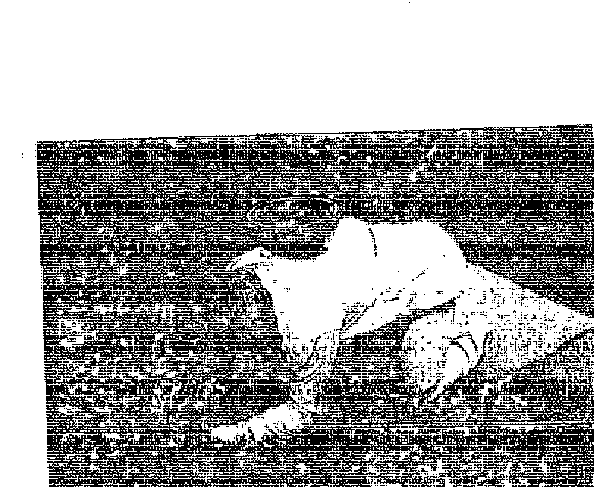

圖 嬰兒姿勢。

1.  輕輕地將一隻手放在個案背部腰間處。
2.  站著或跪著，打穩根基，感覺體重平均分布全身。放鬆下巴、臉頰與肩膀。深呼吸三次，讓自己回到中心點，將注意力轉到碰觸個案的手。與個案的體內律動建立連結。這個步驟大約會花費兩到三分鐘。
3.  把缽放在手原本的位置，連續快速敲擊三次。等待振動幾乎完全消散，接著摩擦頌缽一分鐘。讓振動和聲音漸漸消散。
4.  如果只有使用一隻缽，請將缽慢慢移到肩膀的位置。先輕輕把手放在雙肩之間，接著換成頌缽。連續快速敲擊三次。等待振動幾乎完全消散，接著摩擦頌缽一分鐘。讓振動和聲音漸漸消散。
5.  如果你是使用兩隻缽，第一隻缽就繼續放在腰間處。把手放在雙肩之間，接著換成第二隻缽。連續快速敲擊肩膀上的第二隻缽三次。等待振動幾乎完全消散，接著摩擦頌缽一分鐘。讓振動和聲音漸漸消散。請注意，在這個步驟中，不要敲擊腰間的缽。
6.  如果只有使用一隻缽，請重複步驟 1、3、4，總共三次。
7.  如果你是使用兩隻缽，請重複步驟 3 和 5，總共三次。注意，完成第一次後，兩隻缽此時已經放在腰間和雙肩的位置，因此只要進行步驟 3 和 5 的動作。
8.  把缽移走，請個案仰躺，維持瑜伽的大休息式至少兩分鐘，讓身體整合剛剛接收到的聲音與振動。同時，將你的手放在個案頭部兩側，手指框住耳朵。讓自己回到中心點，深呼吸三次，將注意力轉到碰觸個案的手。放鬆下巴、臉頰與肩膀。如果你是站著，請採取紮根姿勢，將雙腳穩穩踩在地面。如果你是坐著，請將體重平均分布在坐骨上。碰觸個案時，留意你是否有感覺到任何變化。感受個案組織狀態的變化，看看是否變得較為柔軟、有韌性。個案的呼吸也應該變得緩慢深沉。這些都表示身體對振動的力量出現了反應。

# 使用兩隻以上的缽治療

## 放鬆療法

約15分鐘

放鬆療法可平衡血液循環，達到放鬆效果。

### 個案的姿勢及頌缽的擺放方式

請個案仰躺在地上，雙腿打開。他的手可以放在身體兩側或肚子上。準備一些枕頭放在旁邊，個案需要時可墊在膝蓋下。坐在個案的臀部旁，右側或左側皆可。依照下圖所示擺放頌缽。
進行這個療法時，頌缽不可碰到身體。因此，在開始前，請檢查頌缽的擺放位置，確認它們全都距離身體兩到四吋，並沒有碰到個案的身體或其他東西，以免削弱缽的振動。每一隻缽都要跟相應的脈輪對齊。對應眉心輪的缽應該距離個案的頭部六吋以上。

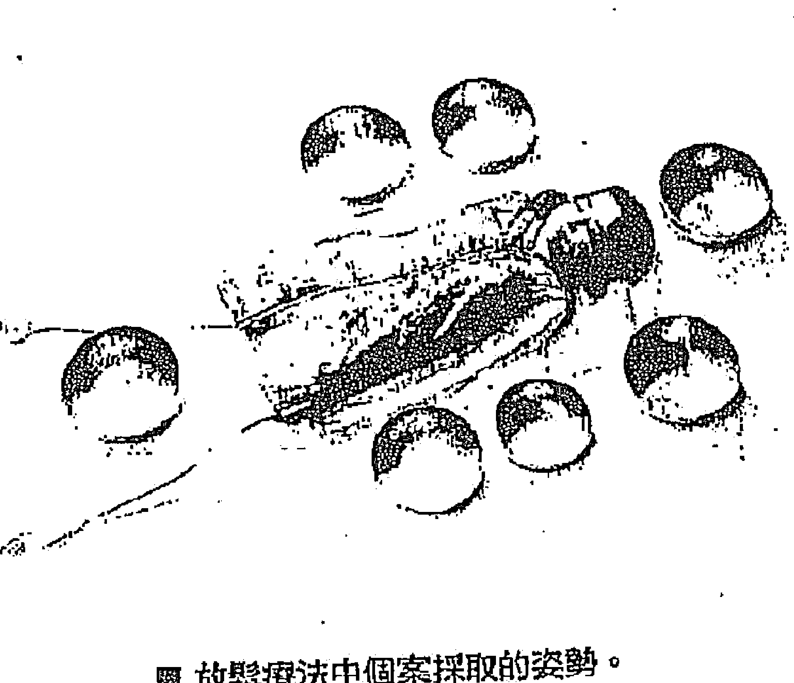

## 敲擊頌缽

敲擊同一序列的多隻頌缽時，每次敲擊都要停頓五秒。如果時間安排有點緊湊，可以縮短停頓的秒數，但是別忘了，頌缽振動的時間長短對療法的治癒成效有很大的影響。敲擊同一系列的最後一隻缽之後，停頓二十秒，再開始進行下一組序列。

### 第一部分：放鬆

| 頌缽數量 | 西藏音符 | 序列重複次數 | 序列停頓時間 |
| :--- | :--- | :--- | :--- |
| 4 | BFDG | 3 | 二十秒 |
| 5 | BFDGC | 1 | 二十秒 |
| 4 | BFDG | 3 | 二十秒 |
| 6 | BFDGCA | 1 | 二十秒 |
| 4 | BFDG | 3 | 二十秒 |
| 3 | CAE | 1 | 二十秒以上，直到聲音完全消散 |

### 第二部分：逐一敲擊

| 頌缽數量 | 西藏音符 | 序列重複次數 | 序列停頓時間 |
| :--- | :--- | :--- | :--- |
| 7 | BEADGCF | 1 | 二十秒以上，直到聲音完全消散 |

### 第三部分：反向敲擊

| 頌缽數量 | 西藏音符 | 序列重複次數 | 序列停頓時間 |
| :--- | :--- | :--- | :--- |
| 7 | FCGDAEB | 1 | 二十秒 |
| 2 | FB | 1 | 二十秒 |
| 2 | DG | 1 | 二十秒 |
| 3 | CAE | 1 | 二十秒以上，直到聲音完全消散 |

## 引導思緒平靜的其他技巧

在擺放放鬆療法所使用的頌缽時，你也可以如下圖所示，在個案頭部附近多放七個冥想小缽，可以讓思緒更寧靜。

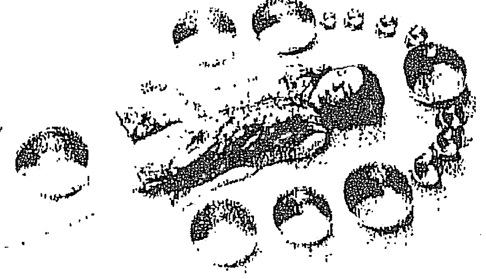

圖 引導思緒平靜的頌缽擺放方式。

完成放鬆療法的第二部分後，由大到小連續快速輕敲最小的三只缽。如果敲得太大力，是無法引導思緒平靜的！等到聲音漸漸消散時，再連續輕敲第二大、第三大和第四大的小缽。聲音消散後，敲擊最大、第二小與第四大的缽，中間各等待五秒。接著，繼續進行放鬆療法的第三部分，完成後再重複一遍小缽的敲擊序列。

## 治癒禱念

約7分鐘

在這個療法中，你將誦念咒語，搭配頌缽一起把能量引導到個案的身心出現問題的地方。這個療法可以移除阻礙，達到治癒效果。

### 個案的姿勢及頌缽的擺放方式

請個案仰躺在地上，雙腿打開。她的手可以放在身體兩側。準備一些枕頭放在旁邊，個案需要時可墊在膝蓋下。坐在個案的臀部旁，右側或左側皆可。依照右圖所示擺放頌缽。

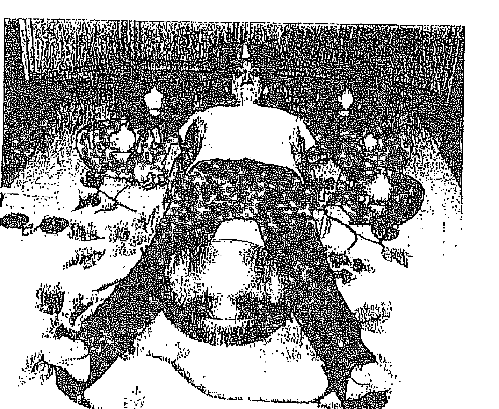

圖 治療概念療法中蠟燭的擺放方式。

### 第一部分：準備工作

將 C 餅放在臍輪上，開始依序敲擊頌缽。把 C 餅放在臍輪不是絕對必要的。運用你的直覺，判斷這麼做是否適合你的個案。如果你覺得不適合，就將 C 餅放在平常的位置。在以下這兩組序列中，餅與餅之間要停頓五秒。

| 頌缽數量 | 西藏音符 | 序列重複次數 | 序列停頓時間 |
| :--- | :--- | :--- | :--- |
| 7 | BFDGCAE | 1 | 二十秒 |
| 7 | FBDGCAE | 1 | 二十秒以上，直到聲音完全消散 |

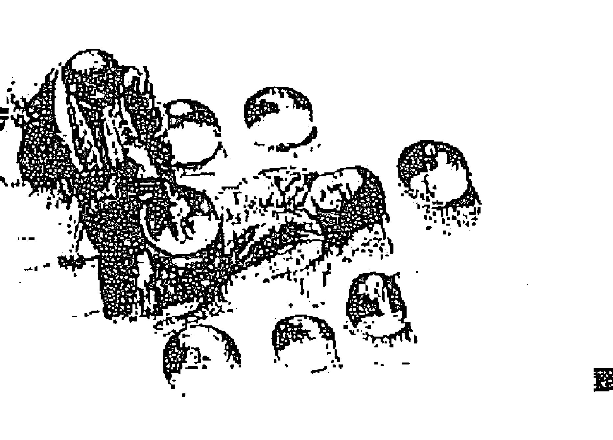

### 第二部分：治癒禱念

| 頌缽數量 | 西藏音符 | 序列重複次數 | 序列停頓時間 |
| :--- | :--- | :--- | :--- |
| 7 | FCGDAEB | 1 | 馬上敲擊或摩擦小缽 |

馬上在眉心輪上方兩到三吋處使用毛氈或皮革的槌子敲擊一個四到六吋的小缽，或者使用木槌或皮槌摩擦之。一邊以順時針的方向緩緩將缽往上移，一邊發自內心誦念治癒咒語。選擇一個適用於個案特殊狀況的咒語。你也可以選擇你自己的宗教信仰會使用的禱文，或者結合兩種文化，把吠陀咒語融合在這個西藏療法之中！

吠陀咒語如下：

-   海底輪的咒語是 LAM (跟英文的 mom 押同一韻腳)
-   臍輪的咒語是 VAM (跟英文的 mom 押同一韻腳)
-   太陽輪的咒語是 RAM (跟英文的 mom 押同一韻腳)
-   心輪的咒語是 YAM (跟英文的 mom 押同一韻腳)
-   喉輪的咒語是 Ham (跟英文的 mom 押同一韻腳)
-   眉心輪的咒語是 Om (跟英文的 home 押同一韻腳)
-   頂輪的咒語是靜默無聲的

無形的力量會在此時從你體內升起，因此你會感覺到有東西貫流全身。這時候，你要請求上師、引導者、祖先、神明的協助，讓這股治癒能量自頂輪注入，再從眉心輪灌出去，治療你的個案。把你所有的力量放在這無形能量的傳遞上，將它傳給個案，治癒他的生理、情感或靈性層次。

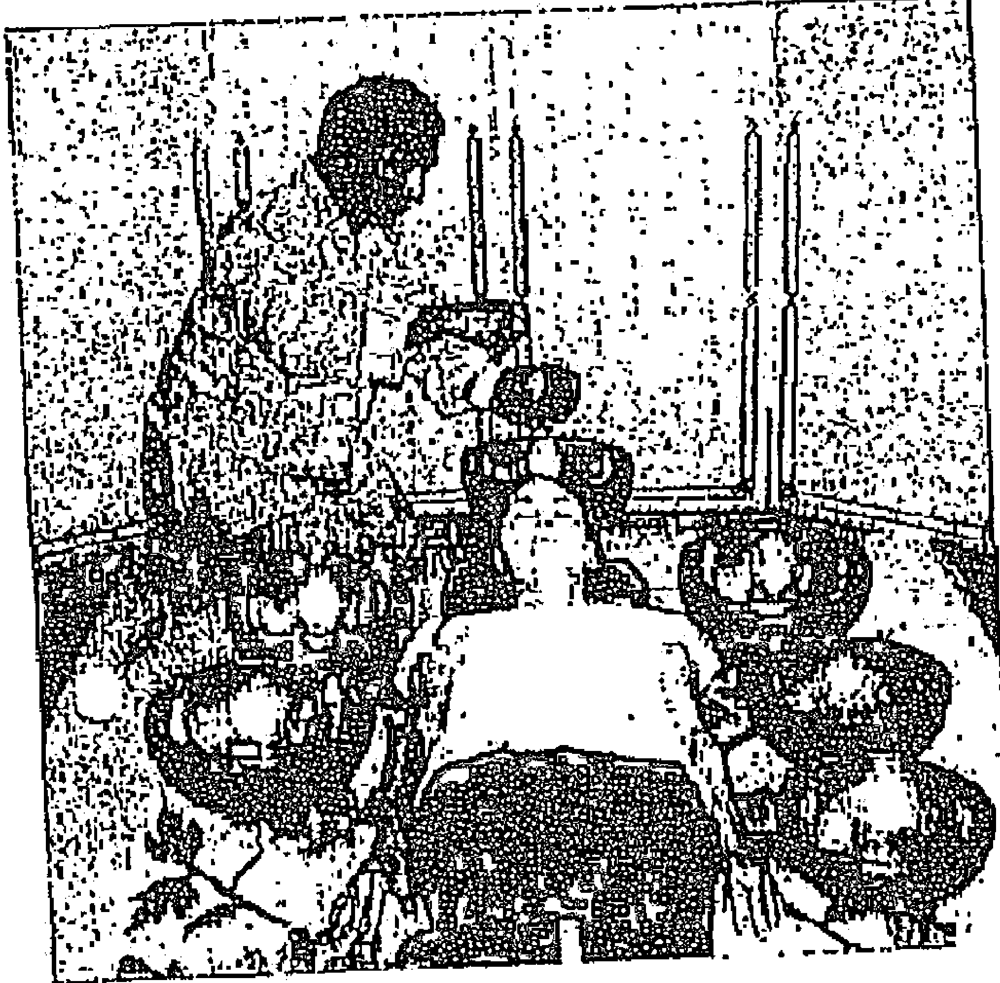

圖 敲擊眉心輪上方的小缽。

## 治癒七大脈輪的咒語

誦念咒語治療某一脈輪時，要在頭部和胸部振動咒語，使其深入體內。

#### Muladahara

-   第一脈輪：海底輪
-   議題：物質世界、安全感、經濟、家庭生活、扎根
-   生理部位：下背、腳、下部生殖器官、腎上腺
-   失衡時，會感到憤怒
-   可以振動咒語 LAM 來恢復此脈輪的平衡

#### Svadhisthana

-   第二脈輪：臍輪
-   議題：感受、情緒、性能量、創造力
-   生理部位：子宮、卵巢、大小腸、脾臟
-   失衡時，常會導致成癮行為、憂鬱、焦慮或無感
-   可以振動咒語 VAM 來恢復此脈輪的平衡

#### Manipura

-   第三脈輪：太陽輪
-   議題：意志、控制欲、自尊、自我價值
-   生理部位：胃、胰臟、肝臟、膽囊、脾臟、腎臟
-   失衡時，可能會有控制欲方面的問題、自尊心低落、喜歡批判他人
-   可以振動咒語 RAM 來恢復此脈輪的平衡

#### Anahata

-   第四脈輪：心輪
-   議題：表達愛、同情、仁慈、寬恕等美德
-   生理部位：心臟、肺臟、胸腺
-   失衡時，能量會轉移到下方脈輪。為了管理較高的脈輪所產生的較高能量，就必須打開你的心。心是與神聖力量溝通的中心。
-   可以振動咒語 YAM 來恢復此脈輪的平衡

#### Vishudda

-   第五脈輪：喉輪
-   議題：藉由口語表達釋放能量、與他人連結；透過禱念與神聖力量交流
-   生理部位：喉嚨、甲狀腺、副甲狀腺、耳朵、鼻竇
-   失衡時，其他脈輪便無法釋放能量
-   可以振動咒語 HAM 來恢復此脈輪的平衡

#### Ajna

-   第六脈輪：眉心輪
-   議題：千里眼、靈性中心、腦中影像、靈異感知、冥想
-   生理部位：腦下垂體、眼睛、自律神經系統
-   失衡時，能量會轉移到自我，無法治癒全體人類或地球
-   可以振動咒語 OM 與神聖力量和諧共處

#### Sahaspara

-   第七脈輪：頂輪
-   議題：萬物合一、和諧、平靜、關愛、不反應、不依附
-   生理部位：頭頂、松果體
-   失衡時，無法從此脈輪接收到神聖力量的指引，能量無法往下傳遞到其他脈輪
-   此脈輪的咒語是靜默的，沒有聲音

## 脈輪平衡

約 10-12 分鐘

這個療法可以開啟眉心輪的能量，增進內視能力。第三眼打開後，負面能量會漸漸消失，幫助你紮根穩固，遠離外在與內在的負面影響，進而使各脈輪獲得平衡。這個療法有助於減緩高血壓、憂鬱、壓力及失眠等症狀。

### 個案的姿勢及頌缽的擺放方式

請個案仰躺在地上，雙腿打開。她的手可以放在身體兩側或肚子上。準備一些枕頭放在旁邊，個案需要時可墊在膝蓋下。坐在個案的臀部旁，右側或左側皆可。

在這個療法中，頌缽同樣不可碰觸身體。把 C、E、A 钵移開，放到一旁。倘若個案需要更強力的脈輪治療，你可以將 B 钵和 F 钵的位置調換，重複第一到第三部分十分鐘。依照下圖所示擺放頌缽。

# 颂钵疗愈入门
HOW TO HEAL WITH SINGING BOWLS

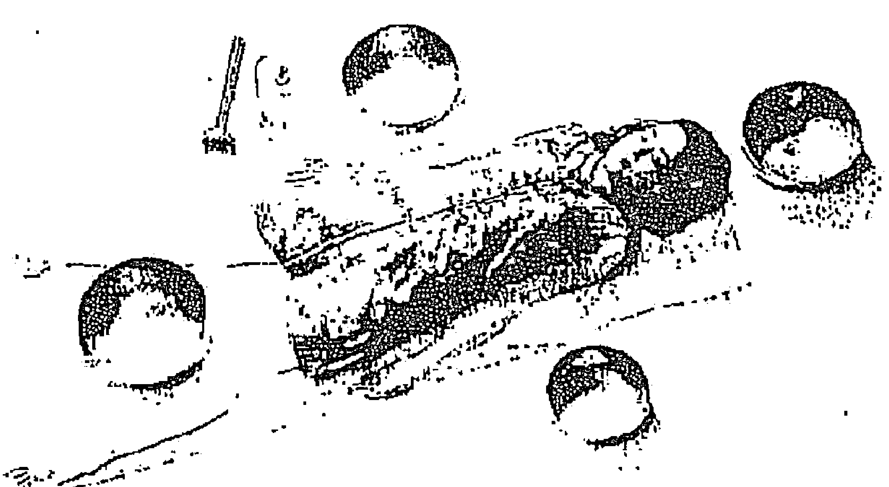

## 第一部分：心到心传递治愈能量

第一部分的目的是要在个案与治疗师之间创造治愈能量。

| 颂钵数量 | 西藏音符 | 序列重复次数 | 序列停顿时间 |
| :--- | :--- | :--- | :--- |
| 2 | BF 或 FB | 1 | 五秒 |
| 2 | DG | 快速的三次 | 一至两秒 |

在颂钵振动的同时，依照以下指示敲击碰铃。在距离你的心轮约一尺的地方敲击碰铃。在碰铃发出声响的同时，将碰铃的凹面转向你的心轮，移到距离你的心轮约四吋的地方。碰铃的声音持续，紧接着将它移到距离个案心轮二到四吋左右的地方。然后，按照以下方式移动碰铃：

- 移到个案的喉轮
- 移到个案的眉心轮
- 移到个案的脐轮
- 回到个案的喉轮
- 移到个案的眉心轮
- 最后，移到你的心轮

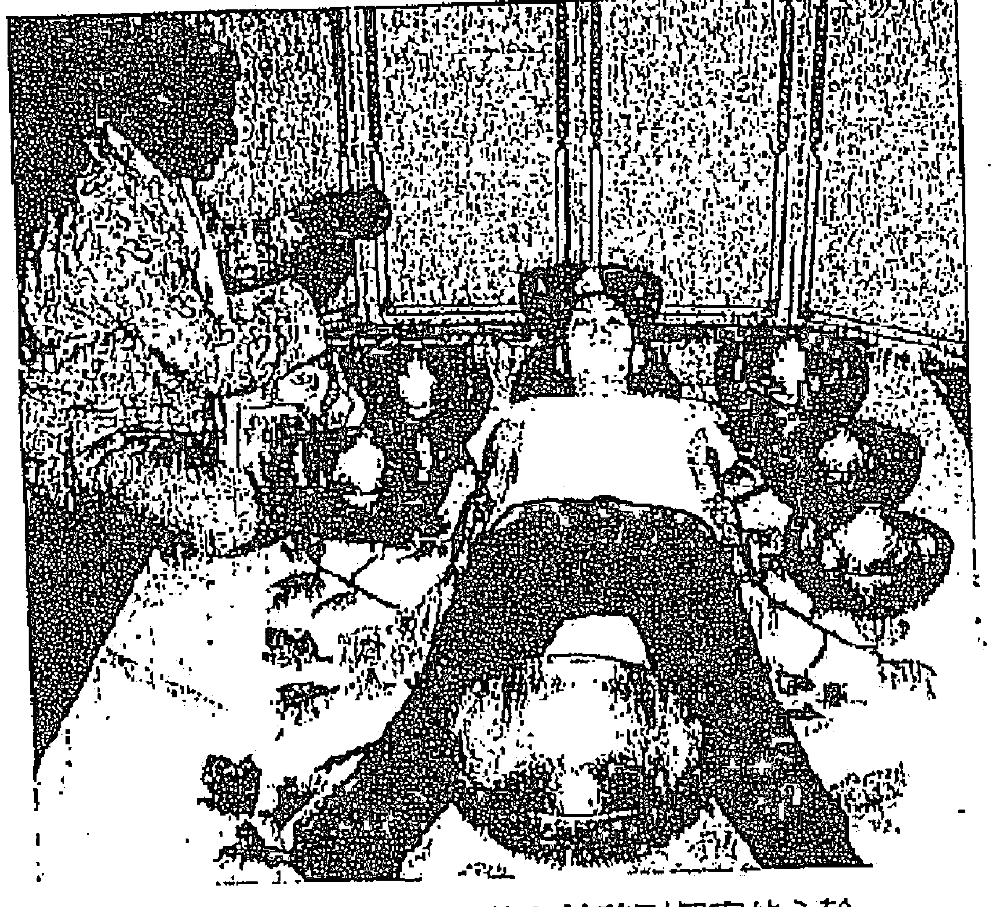

### 第二部分：开启眉心轮

第二部分的目的是要唤醒你的直觉。

| 颂钵数量 | 西藏音符 | 序列重复次数 | 序列停顿时间 |
| :--- | :--- | :--- | :--- |
| 2 | BF 或 FB | 1 | 十秒 |
| 2 | DG | 快速的三次 | 一至两秒 |

在颂钵振动的同时，敲击碰铃。从距离个案眉心轮上方 1.5 尺处快速移动到距离眉心轮一吋处。在颂钵持续发出声响的同时，将碰铃移到喉轮，接着移到脐轮。移回喉轮，再移回眉心轮。最后，慢慢将碰铃拿到离眉心轮 1.5 尺处，等待碰铃声音消散。

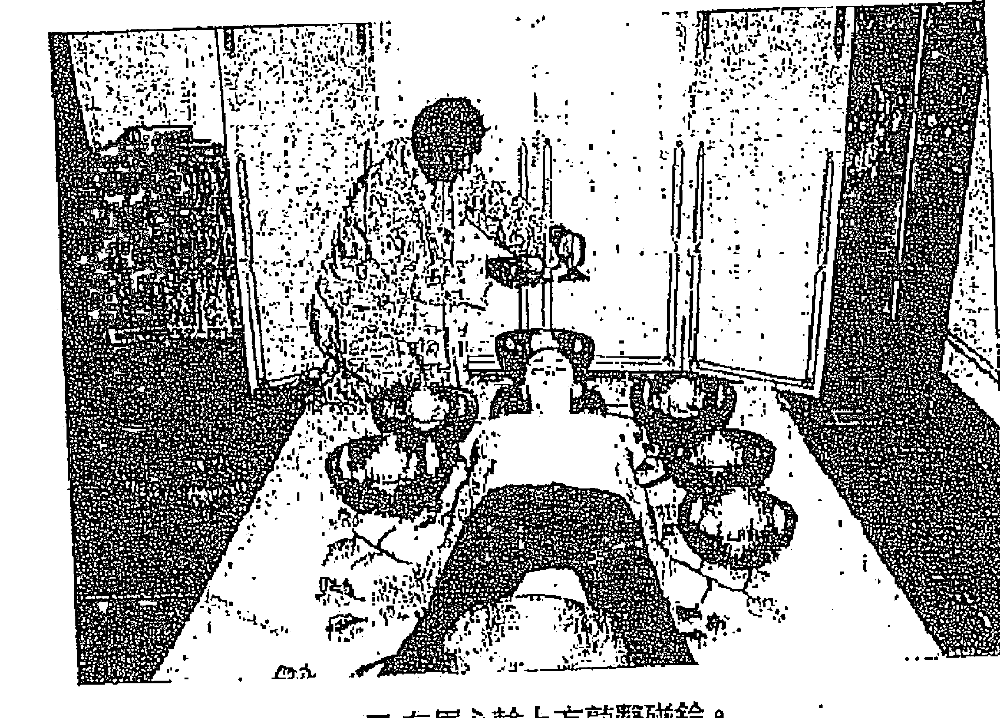

### 第三部分：平衡脉轮

第三部分的目的是要在脉轮中心之间创造平衡与和谐。

| 颂钵数量 | 西藏音符 | 序列重复次数 | 序列停顿时间 |
| :---: | :---: | :---: | :---: |
| 2 | BF 或 FB | 1 | 十秒 |
| 2 | DG | 快速的三次 | 一至两秒 |

在颂钵振动的同时，敲击碰铃。从距离个案脐轮上方 1.5 尺处快速移动到距离脐轮一吋处。在颂钵持续发出声响的同时，将碰铃移到喉轮，接着移到眉心轮。移回喉轮，再移回脐轮。最后，慢慢将碰铃拿到距离 1.5 尺处。

### 温水疗法

约 15 分钟

在钵中注入温水，有助于将颂钵的振动正能量传递到个案体内。别忘了，水温应该要非常温暖但不过烫。把钵放在个案身上之前，应该先放在你自己身上测试温度。必要时，可多加一点冷水。把装有温水的颂钵放在眉心轮、掌心或裸露的脚掌上时要格外小心。你可以使用电热水壶加热开水，并在旁边准备一些冷水。

#### 个案的姿势及颂钵的摆放方式

请个案仰躺地上，双腿打开。他的手可以放在身体两侧。准备一些枕头放在旁边，个案需要时可垫在膝盖下。坐在个案的臀部旁，右侧或左侧皆可。依照下图所示摆放颂钵。请检查颂钵的摆放位置，确认它们全都距离身体两到四吋，并未碰到个案的身体或其他东西，以免削弱钵的振动。每一钵都要跟相应的脉轮对齐。对应眉心轮的钵应该距离个案的头部六吋以上。

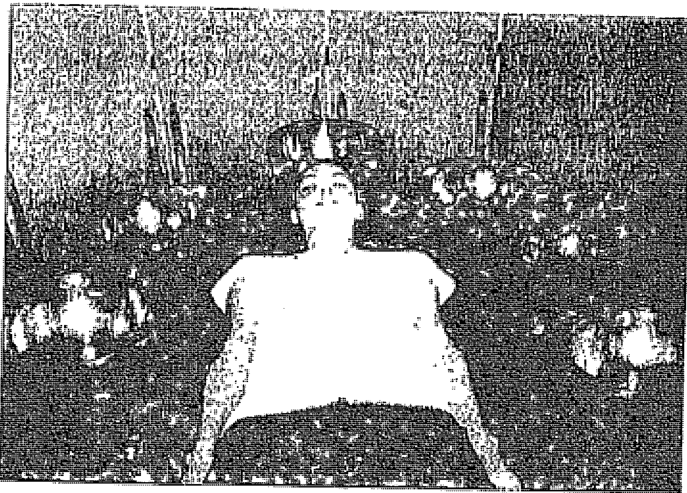

将一只八到十吋的钵注入四分之一满的温水。依个案状况挑选适当的音符。此钵在接下来的多音符序列中，会一直放在个案身上。要把装了水的钵稳稳放在身上，你可以打开五指，将指尖固定在钵底。你可能需要稍微倾斜颂钵，才能使钵保持平衡。

##### 第一部分：前半身温水疗法

###### 治疗第一条腿

| 颂钵数量 | 西藏音符 | 序列重复次数 | 序列停顿时间 |
| :---: | :---: | :---: | :---: |
| 7 | BEADGC | 轻敲三次 | 二十秒以上 |

完成上面这个序列之后，将装有温水的钵放在个案的胫骨下半部（左腿或右腿皆可），然后迅速敲三下。等待振动消散十到二十秒。接着，将颂钵往上移到胫骨的中心位置，避免直接碰触骨头，然后敲一次。接下来，将颂钵移到膝盖上，敲一次。最后，将颂钵移到大腿上半部，敲一次。

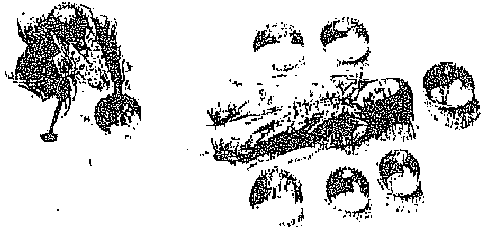

###### 治疗第二条腿

| 颂钵数量 | 西藏音符 | 序列重复次数 | 序列停顿时间 |
| :--- | :--- | :--- | :--- |
| 7 | BEADGC | 轻敲三次 | 二十秒以上 |

重复上面这个序列，接着将装有温水的钵放在另一条腿的胫骨上，根据上述方式慢慢往上敲。如果想要，可以多放几个不同的位置敲击。你也可以使用摩擦的技法取代敲击，创造更深沉的治疗。

##### 治疗五脉轮

| 颂钵数量 | 西藏音符 | 序列重复次数 | 序列停顿时间 |
| :--- | :--- | :--- | :--- |
| 7 | BEADGC | 轻敲三次 | 二十秒以上 |

将装有温水的钵逐一放在脐轮、太阳轮、心轮、喉轮下半部和眉心轮，轻敲三次，等待声音消散。

##### 第二部分：后半身温水疗法

开始前，拿走 F 钵，请个案转过身。她可能需要移开枕头。

###### 治疗第一条腿

| 颂钵数量 | 西藏音符 | 序列重复次数 | 序列停顿时间 |
| :--- | :--- | :--- | :--- |
| 6 | BEADGC | 轻敲一次 | 二十秒以上 |

完成上面这个多音符序列之后，把另一只装了水的钵放在第一只脚上（参见下图的摆放方式），迅速敲三下，接着让振动渐渐消散（十到二十秒）。接着，沿着腿部慢慢往上移动，在每个位置敲三下。

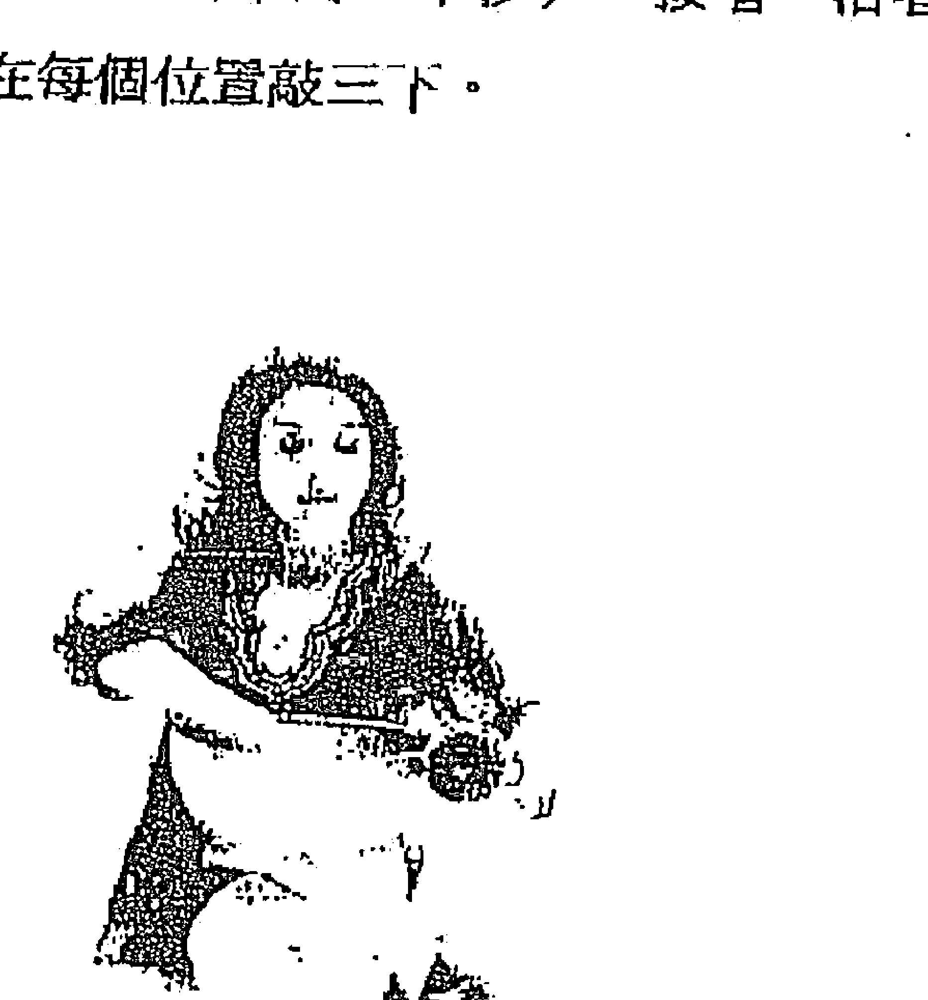

###### 治疗第二条腿

| 颂钵数量 | 西藏音符 | 序列重复次数 | 序列停顿时间 |
| :--- | :--- | :--- | :--- |
| 6 | BEADGC | 轻敲一次 | 二十秒以上 |

重复上面这个序列，接着将装了水的钵放在另一只脚上，根据上述方式慢慢往上敲。如果想要，可以多放几个不同的位置敲击。你也可以使用摩擦的技法取代敲击，创造更深沉的治疗。

###### 治疗脊椎和肩膀

| 颂钵数量 | 西藏音符 | 序列重复次数 | 序列停顿时间 |
| :--- | :--- | :--- | :--- |
| 6 | BEADGC | 轻敲一次 | 二十秒以上 |

根据上面这个多音符序列敲击颂钵，在敲第一个音符、也就是 B 颂钵时，把装有温水的钵放在尾骨上。这会形成温和的过渡阶段。

接着，迅速敲击装了水的钵三次，等待十到二十秒，让振动渐渐消散。每一次移到新的位置时，要沿着脊椎往上移动数吋，接着迅速敲三下，并让振动消散十到二十秒。你也可以使用摩擦的技法取代敲击，创造更深沉的治疗。

来到脊椎最上方的位置后，你可以再次敲击颂钵，接着一边转动颂钵，一边移动，先移到肩膀，再移到下背，如此按摩整个背部。这个做法可以使振动深入肌肉组织，贯穿体内，放松紧绷的身体。若有需要，可以使用这个技法按摩背部各个部位。接着，将装有温水的钵移回尾骨的位置，继续进行剩下的疗程。每当声音消散，就再敲击一次。

如果想要，可以在这部分的疗程中持续规律地重复上述的多音符序列BEADGC。

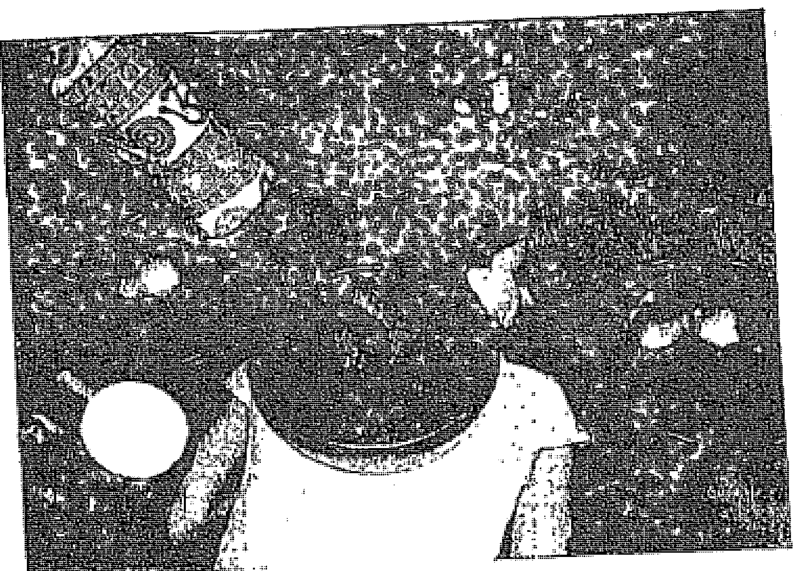

##### 疗程尾声

| 颂钵数量 | 西藏音符 | 序列重复次数 | 序列停顿时间 |
| :---: | :---: | :---: | :---: |
| 6 | BEADGC | 轻敲一次 | 二十秒以上 |

完成上面这个多音符序列之后，一边等待振动消散，一边诵念你惯用的咒语或祷文。接着，静静地收拾颂钵，等到个案准备起来了，便有空间可轻松起身。最后这部分在疗程一开始的时候便应告知个案，这样她就能随时起身离开。

##### 清理脉轮

###### 约30分钟

在这个疗法中，你将清理七个内在能量脉轮当中的五个：海底轮、脐轮、太阳轮、心轮和喉轮。你会在个案的背上放置五个颂钵，让颂钵之间的振动清理能量循环。

## 个案的姿势

请个案俯躺在地上，脸朝下，膝盖与双脚并拢。她的手可以放在身体两侧、枕在头下，或是其他令她觉得最舒适的地方。准备一些枕头放在旁边，个案需要时可垫在双脚、胸部或腹部下方。坐在个案的臀部旁，右侧或左侧皆可。

###### 颂钵的摆放方式

依照以下方式逐一将颂钵摆在指定位置时，请把疗愈的善念专注在碰触个案身体的那只手。

- F 钵放在膝盖
- B 钵放在头顶上方的地上（不需要进行疗愈碰触）
- C 钵放在脐轮处
- G 钵放在太阳轮处
- D 钵放在心轮处

将 A 钵和 E 钵放在疗程每一部分结束时你可以轻易拿取的地方。

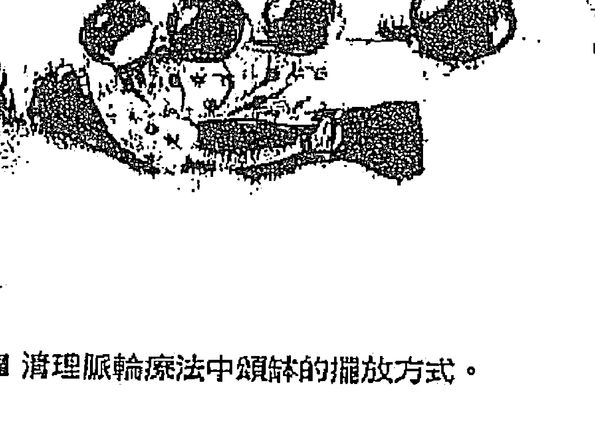

## 敲击颂钵

在这个疗法中，你会使用布槌和拳头敲击颂钵。在进行下面这些序列时，要轻敲颂钵，每敲击一次，要等待数秒。完成一组序列后，等待二十秒以上的时间让振动消散，再进行下一组序列。尽可能地缓慢进行这个疗法，让声音在整个疗程中绵延不断。

##### 清理内在能量点

1.  敲击位于膝盖的F钵六次，两次之间等待五到十秒。
2.  敲击F钵；等待三秒，接着敲击脐轮的C钵，等待五到十秒。这个序列总共完成六遍。等待二十秒以上。
3.  敲击F钵，等待三秒，接着敲击太阳轮的G钵，等待五到十秒。这个序列总共完成六遍。等待二十秒以上。
4.  敲击F钵，等待三秒，接着敲击心轮的D钵，等待五到十秒。这个序列总共完成六遍。等待二十秒以上。
5.  拿起A钵，敲击惯用手握拳，使用小指头那一侧敲击颂钵。A钵不会碰触到个案身体。来回移动颂钵，将振动引导到头颅基部，沿着颈部传递。声音消散后，敲击F钵。重复三遍。
6.  敲击F钵，等待三秒，接着敲击头部上方的B钵，等待五到十秒。这个序列总共完成六遍。等待二十秒以上。
7.  敲击头部上方的 B 钵六次。
8.  声音消散后，拿起 E 钵。E 钵不会碰到个案身体。使用拳头外侧敲击之。将振动引导到头颅基部，沿着颈部传递。声音消散后，敲击 F 钵。重复三遍。

##### 稳定内在能量点

在这个部分，每一个颂钵的声音消散后，便将它从个案身上拿走。刻意滚动钵的底部，将颂钵滚下个案身体，温和地移除颂钵的重量。

1.  敲击头部上方的 B 钵，等待三秒，接着敲击 D 钵，等待五到十秒。这个序列总共完成六遍。等待二十秒以上。移除 D 钵。
2.  敲击 B 钵，等待三秒，接着敲击太阳轮的 G 钵，等待五到十秒。这个序列总共完成六遍。等待二十秒以上。移除 G 钵。
3.  敲击 B 钵，等待三秒，接着敲击脐轮的 C 钵，等待五到十秒。这个序列总共完成六遍。等待二十秒以上。移除 C 钵。
4.  敲击 B 钵，等待三秒，接着敲击膝盖的 F 钵，等待五到十秒。这个序列总共完成六遍。等待二十秒以上。
5.  敲击 F 钵，等待三秒。这个步骤总共完成六遍。等待二十秒以上。移除 F 钵。

##### 压力与抑郁疗法

约 30-45 分钟

这个疗法可以解除压力、给予平静、减少忧郁，可做为单独完整的疗程。

## 个案的姿势

请个案俯躺在地上一块准备好的区域，例如：在一条干净的地毯上覆盖一件干净的天然纤维被单或毛毯。准备一些枕头放在旁边，个案需要时可垫在双脚、胸部或腹部下方。

请个案双脚并拢，互相碰触。双手舒服地摆在离身体六到十二吋的地方，掌心向上。每个掌心都会放置一只颂钵，因此个案的手腕如有无力、脆弱、僵硬等顾虑，可以放小块抹布来支撑颂钵的重量。你可以坐在个案的右侧或左侧，依你的惯用位置或房间的配置而定。

###### 颂钵的摆放方式

依照以下方式逐一将颂钵摆在指定位置时，请把疗愈的善念专注在碰触个案身体的那只手。首先，把一只手放在即将摆放颂钵的部位，在碰触敏感地带时特别注意让自己保持中立，并让个案感到舒适。这只手在短暂传递疗愈能量的同时，另一只手要迅速而轻柔地将颂钵的重量转移到摆放的位置。

- F 钵放在膝盖
- B 钵放在头顶上方的地上（不需要进行疗愈碰触）
- G 钵放在个案的右手掌心（倘若个案的手腕很敏感或僵硬，大尺寸的钵可能就不适合）
- D 钵放在个案的左手掌心

将 A 钵和 E 钵放在疗程每一部分结束时你可以轻易拿取的地方。手边也要有一组碰铃。

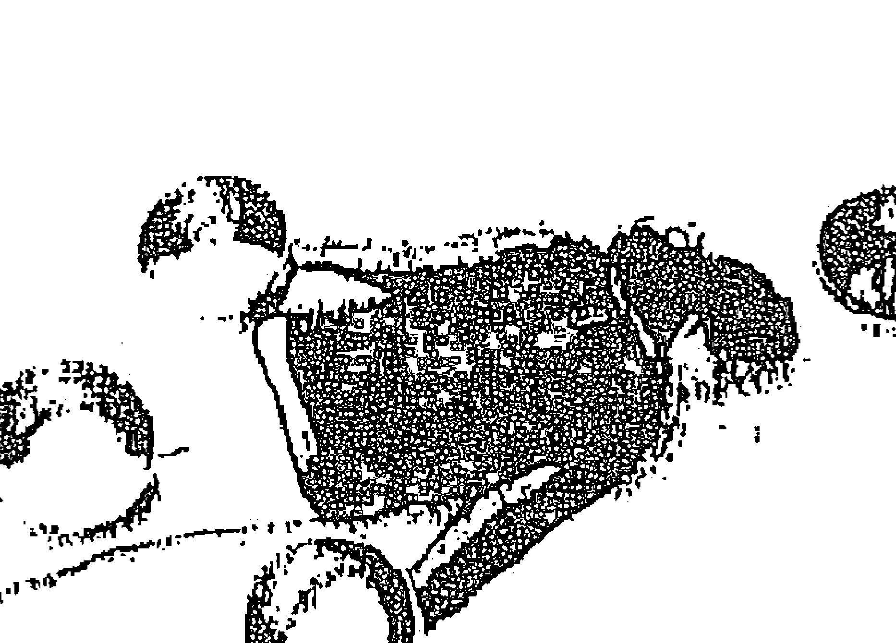

## 敲击颂钵

在这个疗法中，你会使用包覆布料或毡子的槌子以及拳头敲击颂钵。这个疗法有五个主要的部分，每个部分之间会有一个过渡步骤。尽可能地缓慢进行这个疗法，让声音在整个疗程中绵延不断。

第一部分：依照 FBGD 这样的顺序轻敲四个钵。你也可以采顺时针或逆时针的方向逐一敲击。每敲一个钵，就要等待五到十秒；每完成一组序列，让振动消散二十秒以上。重复 FBGD 这个序列四遍。等待二十秒以上。

完成上面的第一部分后，在个案颅荐椎的部位轻敲碰铃。沿着头背左右移动碰铃的同时，以划小圈的方式往内旋转碰铃，创造出脉搏跳动般的振动效果。持续旋转碰铃，同时在距离个案身体两到四吋处，将此带有疗愈效果的振动往下移到脊椎根部，接着再回到头背处。最后，将碰铃换到左手，直到声响停止。

第二部分：依照 FBGD 这样的顺序敲击四个钵。你也可以采顺时针或逆时针的方向逐一敲击。每敲一个钵，就要等待五到十秒；每完成一组序列，等待二十秒以上。重复 FBGD 这个序列四遍。等待二十秒以上。

完成上面的第二部分后，拿起 A 钵，使用拳头外侧敲击之，发出柔和的共鸣声。拿近个案的头颅基部，采弧状路径左右移动钵，包覆整个颅荐椎。

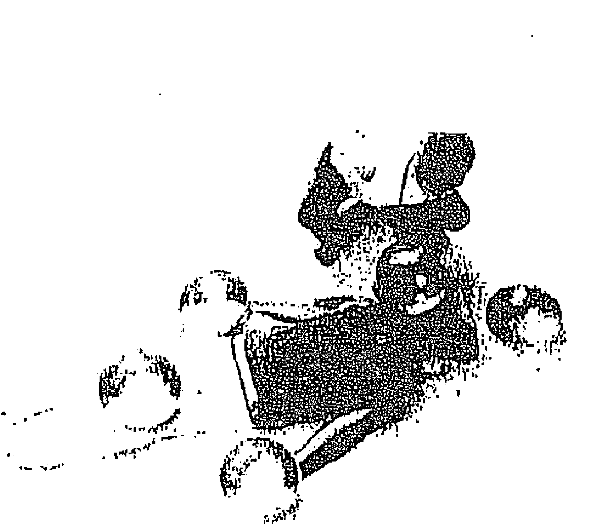

第三部分：依照 FBGD 这样的顺序轻敲四个钵。你也可以采顺时针或逆时针的方向逐一敲击。每敲一个钵，就要等待五到十秒；每完成一组序列，等待二十秒以上。重复 FBGD 这个序列四遍。等待二十秒以上。

完成上面的第三部分后，沿着个案的头背处轻敲碰铃，包覆整个颅荐椎。沿着头背左右移动碰铃的同时，以划小圈的方式往内旋转碰铃，创造出脉搏跳动般的振动效果。持续旋转碰铃，同时在距离个案身体两到四吋处，将此带有疗愈效果的振动往下移到脊椎根部，接着再回到头背处。最后，将碰铃换到左手，直到声响停止。

第四部分：依照FBGD这样的顺序轻敲四个钵。你也可以采顺时针或逆时针的方向逐一敲击。每敲一个钵，就要等待五到十秒；每完成一组序列，等待二十秒以上。重复FBGD这个序列四遍。等待二十秒以上。

完成上面的第四部分后，拿起E钵，使用拳头外侧敲击之，发出柔和的共鸣声。拿近个案的头颅基部，采弧状路径一边左右移动颂钵、一边划圈转动之，涵盖整个颅荐椎。在颂钵仍未停止共鸣时，将钵沿着脊椎移到尾骨下方，然后移回到个案的头部。整个步骤再重复两遍。

第五部分：依照FBGD这样的顺序轻敲四个钵。你也可以采顺时针或逆时针的方向逐一敲击。每敲一个钵，就要等待五到十秒；每完成一组序列，等待二十秒以上。重复FBGD这个序列四遍。等待二十秒以上。

振动消散后，轻敲B钵一次。声音消散后，移除掌心的G钵和D钵，刻意滚动钵的底部，用这个方式将颂钵滚下手掌，温和地移除颂钵的重量。持续敲击B钵数次，中间停顿至少五秒。移除膝盖上的F钵，放到下方的地上，但是不要碰到个案的脚。再敲数次B钵。

在疗程的尾声，你会移除个案左右两手的G钵和D钵，再移除膝盖的F钵，把它放到双脚之间，但是不要碰到双脚。

1.  敲击F钵，等待三秒。敲击头部上方的B钵，等待五到十秒。这个序列总共完成六遍。等待二十秒以上。
2.  敲击头部上方的B钵六次。
3.  拿起F钵，使用拳头外侧敲击之。振动渐渐消散的同时，在颅荐椎的两侧左右移动颂钵。在这期间，持续敲击F钵。

###### 移除颂钵

要将颂钵从个案的手中和膝上移除时，务必小心谨慎，动作不可过于突然。要缓缓地、倾斜地移除颂钵。

##### 缓和愤怒与暴躁情绪、舒缓关节炎和高血压的疗法

## 个案的姿势

个案应俯躺在铺有地毯的地板上。我建议准备一些枕头，需要时可放在身体下方，让个案舒服一些。个案的脸应该朝下，膝盖和双脚并拢，手臂不限定任何姿势，只要他觉得舒服即可。你会坐在个案左侧，靠近臀部的地方。事前跟个案安排此疗法时，记得请他穿着舒适的服装，不要有任何裸露在外的金属、拉链、皮带或饰品。

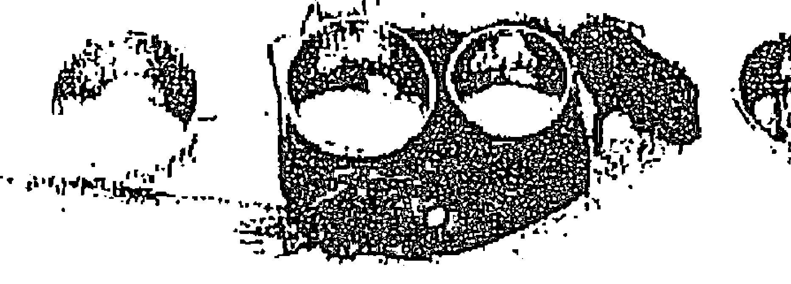

###### 颂钵的摆放方式

颂钵的摆放位置如下：

- F 钵放在膝盖
- B 钵放在头顶上方
- C 钵放在脐轮处
- G 钵放在左耳附近（轮替）
- D 钵放在心轮处

# 颂钵疗愈入门
# HOW TO HEAL WITH SINGING BOWLS

敲击脐轮的 C 钵及左耳附近的 G 钵后，要调换位置，改成敲击太阳轮的 G 钵及左耳附近的 C 钵。

## 敲击颂钵

这个平衡脉轮的疗法共有五个部分（以及四个过渡步骤）。

- 1. 敲击 FCDB 四遍。
拿起左耳附近的 G 钵，使用拳头敲击之，使它发出共鸣。绕着个案的头颅移动颂钵，然后沿着脊椎往下移，经过臀部后，再沿着脊椎往上移。

- 2. 敲击 BDCF 四遍。
拿起左耳附近的 G 钵，使用拳头敲击之，使它发出共鸣。绕着个案的头颅移动颂钵，然后沿着脊椎往下移，经过臀部后，再沿着脊椎往上移。
C 钵和 G 钵调换位置，把 G 钵放在太阳轮，C 钵放在个案左耳附近。

- 3. 敲击 FGDB 四遍。
拿起左耳附近的 C 钵，使用拳头敲击之，使它发出共鸣。绕着个案的头颅移动颂钵，然后沿着脊椎往下移，经过臀部后，再沿着脊椎往上移。

- 4. 敲击 BDGF 四遍。
拿起左耳附近的 C 钵，使用拳头敲击之，使它发出共鸣。绕着个案的头颅移动颂钵，然后沿着脊椎往下移，经过臀部后，再沿着脊椎往上移。

- 5. 敲击 BDGF 四遍。

- 6. 颂钵静止下来后，移除个案背上的 D 钵。等待五到十秒。

- 7. 移除个案背上的 G 钵。等待五到十秒。

- 8. 移除个案膝上的 F 钵，放在双脚下方六吋左右的地板上。

- 9. 缓缓敲击 F 钵数次。

## 仰躺姿势

约 20-30 分钟

在这个疗法中，个案将仰躺在地板或按摩床上，因此你可以治疗他的头顶和脑部，刺激第三眼和气场。

# 颂钵疗愈入门
# HOW TO HEAL WITH SINGING BOWLS

请准备：

- 一只八到十二吋、容易放在手上的钵
- 一根大的敲击布槌
- 一根大的摩擦皮槌
- 必要时，可准备颂钵用的垫子和黏着垫
- 一组七个颂钵

- 1. 将七只颂钵放在个案四周，对应个别的脉轮位置。
- 2. 依照B、F、D、G、C、A、E的顺序快速敲击颂钵，每一下间隔三秒。等待声音完全消散，在静谧的环境中达到深沉的空性状态时，将顶轮钵拿开，准备进行下一个步骤。
- 3. 如果你是使用按摩床，请采取扎根姿势，将双脚稳稳踩在地面，感觉体重平均分布在双脚上。放松下巴、脸颊与肩膀。将你的手放在个案头部的两侧，手指轻轻框住耳朵，如P153图所示。即，小指头和无名指放在耳下、中指和食指放在耳上。深呼吸三次，让自己回到中心点，将注意力转到碰触个案的手。与个案的体内律动建立连结。这个步骤大约会花费两到三分钟。
- 4. 将八到十二吋的钵放在掌心，使用布槌敲击之，拿到距离个案三到四吋处，从额头移到后脑勺，钵缘倾向个案的头部，让声音尽可能自边缘传出。这个步骤大约会花费二十到三十秒钟。重复两次，按着等待声音完全消散。
- 5. 再次敲击掌上的钵。拿到距离个案三到四吋处，通过头顶、在两耳之间来回移动，两只耳朵各经过三次，也就是总共会通过头顶六次。顶轮钵放回来，准备进行下一个步骤。
- 6. 依照F、B、D、G、C、A、E的顺序快速敲击个案周身的颂钵，每一下间隔三秒。等待声音完全消散的同时，重复步骤3。
- 7. 重复步骤4跟5。
- 8. 依照E、C、G、D、A、E、B的顺序快速敲击个案周身的颂钵，每一下间隔三秒。等待声音完全消散的同时，重复步骤3。将顶轮钵拿开，准备进行下一个步骤。
- 9. 重复步骤4跟5。
- 10. 重复步骤3，并在碰触个案的头部时，留意你是否有感觉到任何变化。感受个案组织状态的变化，看看是否变得较为柔软、有韧性。个案的呼吸也应该变得缓慢深沉。这些都表示身体对振动的力量出现了反应。
- 11. 依照步骤8的方式轻敲颅骨，结束这个疗程。

## 侧躺姿势（涅槃）

约 20-30 分钟

这个疗法可以刺激并调和所有的脉轮、活化气场、整合情感。个案将侧躺在地板或按摩床上，头下垫一个枕头。她的双腿应弯曲，中间夹一个垫子。在按摩床上进行这个疗法会比较容易，因为治疗师比较容易接近某些部位。站在个案的背后，这样便能接触到整个脊椎和双脚。如果个案是躺在地上，请跪坐在个案身后。要更容易敲击到颂钵，可将 A 钵和 G 钵跟其他钵一起放在个案背后，摆放顺序为：

- B、E、A、D、G、C、F。

## 请准备：

- 一只八到十二吋的钵，任何音符皆可
- 一根大的敲击布槌
- 一根直径 1.5 到三吋的摩擦皮槌
- 一个夹在双腿之间的垫子和一个垫在头下的枕头
- 一组颂钵。如果你只有一只八到十二吋的钵，还是可以进行这个疗法，省略步骤 2、8、10 即可。

- 1. 将七只颂钵放在个案四周，对应个别的脉轮位置。
- 2. 依照B、F、D、G、C、A、E的顺序快速敲击颂钵，每一下间隔三秒。等待声音完全消散，在静谧的环境中达到深沉的空性状态时，将顶轮钵拿开，准备进行下一个步骤。
- 3. 如果你是使用按摩床，请采取扎根姿势（马步），将双脚稳稳踩在地面，感觉体重平均分布在双脚上。放松下巴、脸颊与肩膀。一只手放在后脑勺，一只手放在后背腰间凹陷处，轻触即可。深呼吸三次，让自己回到中心点，将注意力转到碰触个案的手。与个案的体内律动建立连结。这个步骤大约会花费两到三分钟。
- 4. 将八到十二吋的钵放在掌心，在离个案头颅基部三到四吋处摩擦或敲击之。沿着脊椎慢慢移动颂钵，来到腰间时，停留五秒钟。
- 5. 将钵移到尾骨，让振动回荡在整个下半身。在尾骨的位置停留五秒钟。如果来到尾骨的位置时，振动已经消散许多，你可能需要再敲一次。
- 6. 将钵移到脚底，停留五秒钟。如果来到脚底的位置时，振动已经消散许多，你可能需要再敲一次。
- 7. 最后，慢慢移回到头颅基部。
- 8. 依照F、B、D、G、C、A、E的顺序快速敲击个案周身的颂钵，每一下间隔三秒，等待声音完全消散的同时，重复步骤3。将顶轮钵拿开，准备进行下一个步骤。
- 9. 重复步骤3到7。
- 10. 依照F、C、G、D、A、E、B的顺序快速敲击个案周身的颂钵，每一下间隔三秒。等待声音完全消散的同时，重复步骤3。将顶轮钵拿开，准备进行下一个步骤。
- 11. 重复步骤3到7。
- 12. 重复步骤3，并在碰触个案时，留意你是否有感觉到任何变化。感受个案组织状态的变化，看看是否变得较为柔软、有韧性。个案的呼吸也应该变得缓慢深沉。这些都表示身体对振动的力量出现了反应。
- 13. 依照步骤8的方式轻敲颂钵，结束这个疗程。

整个疗程可以多加二十到三十分钟，换边重复再做一次。

## 治疗头部、脊椎和双脚

约 10-15 分钟

这是一个非常进阶的疗法，可以有效释放脊椎、头部和双脚的压力与紧绷。这个疗法也有助于治疗失眠、偏头痛和肌肉紧绷。
你需要准备四只大钵和一张给个案坐的凳子。第一只钵会放在凳子上，第二只钵用来放置个案的双脚，第三只钵倒扣在个案头上，而第四只钵则由治疗师捧着，用来治疗前半身、后半身及头部两侧。
你要在十到十五分钟的时间内重复所有的步骤三遍。然而，你可以运用自己的直觉，决定是否需要延长时间。
多重复整组序列一次，或专注治疗某个部位。

请准备：

- 一只十四吋左右的钵，放在个案要坐的凳子上
- 一只十六吋以上的钵，放置个案的双脚
- 一根特大的敲击布槌，用来敲击凳子和双脚的钵
- 两只九到十二吋的钵，一只放在个案头上，一只用来在个案头部周围产生振动
- 一块四吋左右的圆垫或一块止滑垫，放在头顶钵下方
- 一根大的敲击布槌，用来敲击头上的钵和治疗师手中的钵
- 一张高度约十四到十六吋的圆凳，依个案体型而定。最理想的高度是，个案坐下来时，大腿会与地面平行，而非带有斜度。这是最符合人体工学的姿势，也能让个案的下背部保持置中
- 一或两块六吋左右的圆垫，必要时可用來垫高凳子钵

- 1. 在凳子上放置一或两块六吋圆垫，接着在垫子上放置倒扣的钵。将用来放置个案双脚的钵放在凳子前方。凳子钵的高度应该等于个案小腿的长度，这样个案坐下来时，大腿才能与地板平行。
- 2. 帮助个案顺利坐在凳子上，是疗法成功与否的关键之一。先请个案站着，将双脚放在地上那只钵的两边。协助她坐在凳子上，接着当个案的重量完全放在凳子上时，注意凳子钵的位置是否适当。检查凳子上的钵是否稳固，没有下陷或倾斜，否则颂钵的振动会被削弱。你可能会需要请她站起来，调整一下颂钵，再坐下来看看颂钵的位置是否得宜。将凳子钵调整到好，接着请她轻轻坐下，确认她是否感觉平衡、有力、稳当。接着，请她把一只脚放到地上的大钵里，再放入另一只脚。
- 3. 现在，请她坐直身子，挺胸，把双手放在大腿上。她的背部应与地面垂直。告知她，你即将在她的头上放置垫子和钵。先把四吋圆垫放在头上，接着将钵倒扣在垫子上。请确定这两样东西稳稳放在头上，并不会造成个案不适。请她闭上双眼，在整个疗程中深呼吸。
- 4. 站在她的左边或右边。最后一只九到十二吋的钵放在附近，之后需要时便能随时拿取。
- 5. 使用非惯用手，将一两根手指固定在个案头上倒扣的颂钵顶部。接着，使用大布槌轻敲头顶钵的侧边，手势要往下。停留二十秒，等待振动消散，接着在后脑勺的位置敲击颂钵。停留二十秒，等待振动消散，最后敲击头顶钵的另一侧。马上进行下一个步骤。
- 6. 现在，使用特大的布槌快速而有力地敲击凳子钵三次，带出深沉的振动。请敲击距离钵缘两吋以内的地方，小心不要敲到个案的脚！马上进行下一个步骤。
- 7. 继续使用特大的布槌，快速敲击放置双脚的钵三次。接着，等待所有颂钵的振动消散。
- 8. 重复步骤5。
- 9. 立刻拿起放在一旁的九到十二吋大钵，平放在非惯用手的掌心上。使用拳头或大槌敲击之，接着靠近喉轮。接下来，在振动尚未消散之前，慢慢往下移到心轮的位置。接着，慢慢往下移到脐轮的位置，再敲击一次。停顿数秒，改变移动方向，慢慢往上移到离头顶钵下方一吋的位置，使两钵的平行内部空间稍微重叠，形成一个音室，让两钵的振动产生互动，在个案的头部周围创造抚平身心的空间。小心不要让两个钵碰在一起，否则会发出极度干扰的噪音，令个案非常不舒服，破坏整个治疗效果。等待振动完全消散。将手中的钵放到一边。
- 10. 重复步骤5到7。
- 11. 立刻拿起一旁的钵，平放在非惯用手的掌心上。使用拳头或大槌敲击之，接着从背部的喉轮处移动到脊椎尾端的尾骨。来到尾骨时，再敲击一次，接着慢慢往上移到后脑勺头顶钵缘的正下方，跟步骤9一样，稍微重叠，但不碰在一起。停留两秒后，把钵移到左耳，接着移到右耳，如此来回移动直到声音消散。
- 12. 重复步骤5到7。等待所有振动消散，接着温和地移除头顶钵。接下来，请她把双脚从钵中拿出，放在钵的两侧。接着，协助她起身。

# 使用碰铃治疗

# 耳朵疗法

约3-5分钟

这个疗法可以治疗儿童或成人的听力问题。你可以使用碰铃或一只小钵。

## 个案的姿势

请个案坐在椅子上，或者盘腿坐在地板上，采取冥想姿势。

## 选择碰铃

直径三吋左右的碰铃是最适合用来治疗的。请挑选声调悦耳、回音较长的碰铃。

## 敲击碰铃

记住，耳朵是很脆弱的器官。请在距离个案头部二十四吋左右的位置敲击碰铃。敲击后，迅速地将碰铃拿到距离个案耳朵两到三吋处，停留五秒钟，再慢慢回到原本敲击的位置。重复这个步骤三到五分钟。

如果你是使用颂钵，做法是一样的。请使用皮槌或毛毡槌敲击。

# 运用水晶进行颂钵疗法

水晶的疗愈能量非常强大。你可以把一块水晶放在止滑垫上，再放入颂钵中。平常用在橱柜抽屉的那种具有弹性的塑胶网状止滑垫，就很适合了。使用大颗水晶比较恰当，这样敲击颂钵时水晶才不会翻倒（最好比 P170 的水晶还要大）。每一个脉轮都有对应的颜色和水晶。你可以参考下表，选择治疗某一脉轮时适合的水晶。

# 颂钵疗愈入门
# HOW TO HEAL WITH SINGING BOWLS

| 脉轮 | 颜色 | 水晶 |
|---|---|---|
| 第一脉轮 | 红 | 红宝石、石榴石、碧玉 |
| 第二脉轮 | 橘 | 血石髓、橘色方解石、红玉髓 |
| 第三脉轮 | 黄、黄绿 | 琥珀、黄水晶、孔雀石 |
| 第四脉轮 | 粉红、绿 | 玫瑰石英、玛瑙、祖母绿、玉、砂金石、绿铜矿 |
| 第五脉轮 | 蓝 | 月长石、海蓝宝石、蓝宝石、绿松石、蓝晶石 |
| 第六脉轮 | 深蓝 | 锆石、方钠石、青金岩、烟水晶、硬石膏 |
| 第七脉轮 | 紫 | 紫水晶、紫黄晶、鱼眼石、葡萄石 |

## 法供。
带来丰盛的仪式

法供可为许多层面带来好运，包括人际关系、财务、风水、移除负面能量、实现理想抱负等。法供也能用来为他人求福气，或是祈求事业或私生活的行动能有好的结果。你也可以透过法供来敬拜已经逝世的祖先或亲朋好友，请求上天令他们的灵魂得到安详。

# 颂钵疗愈入门
# HOW TO HEAL WITH SINGING BOWLS

法供要怎么做呢？首先，沐浴净身。穿着干净的服装，小心不要穿戴任何皮革制品，如皮带、皮鞋或钱包。这是为了避免生灵受苦所流传下来的传统。最理想的做法是打赤脚，但是穿袜子也可以。

法供会在你的佛堂进行，仪式中可能会用到许多物品、需要许多元素。水是最重要的物品。你会需要准备：

- 一小瓶水
- 放有先人、古鲁（上师）、神明、导师等照片或雕像的供桌
- 铃铛、锣或颂钵
- 香、放香的容器和火柴
- 鲜花与花瓶
- 小汤匙
- 水果供品

净身着衣之后，在瓶子里装满水，心中保持非常神圣的意念，愿水成为具有净化、圣化功效的圣水。将圣水带到佛堂，用汤匙舀几滴水倒在雕像上或照片相框底部，把澄净的水当作礼物，敬拜你的导师。

接下来，点香，以顺时针的方向移动持香的手，把烟雾献给导师。使用另一只手摇铃、敲锣或敲钵。铃锣的声音可以驱除家中的负面能量，让你的意识回到当下。在这个过程中，你可以诵念咒语，或是集中意念，实践灵魂的希望。接着，把香放在容器中。

圣水仪式非常重要，如果环境中存在着特别强大的负面能量，你可以让鲜花浸一下圣水，把鲜花上的圣水洒在房间四周。洒水的时候，无形的负面力量就会被驱逐。这样的居家净化仪式可以每个月、每三个月、每半年或每年进行一次。

圣水具有神圣功效，要继续放置在供桌上一天一夜。隔天早上，你可以将圣水拿来浇花，再盛装新的水。

一个家庭只需要有一个人进行法供，全家人便能因这带来丰盛的仪式受益。

## # 使用颂钵搭配其他疗法

有一些按摩治疗师会在按摩之前先替个案进行颂钵疗法，加速放松的过程；同样地，有一些针灸或整骨治疗师也会使用颂钵治疗，做为疗程的一部分，加强针灸或整骨的功效。

科罗拉多迷宫的葛瑞格·史多罗兹克 (Greg Storozuk) 也在他的迷宫体验中运用到颂钵：

为提升迷宫体验，我们在每一个弯处放置了与脉轮相对应的颂钵，让走迷宫的人可以在进入及离开个别的通道时敲击颂钵。另一个做法是，在迷宫的正上方和两侧安排敲击颂钵的人，敲击适当的脉轮音符，也就是 C、E、G 三钵，在行走迷宫的人周围创造出和悦的声音。

# 谢辞

我这一生遇到了许多灵性导师，有些只出现几个小时，有些是在好几天的静修期间认识的，有些则是每当我需要他们时，都会现身。我特别尊敬的，是那些维系声音与振动治疗这门艺术的大师，他们有的是使用颂钵治疗，有的是使用萨满鼓或磬。其中，颂钵疗法在尼泊尔是一门已经渐渐消亡的艺术。

在两个伟大的文化之中成长，对我来说是个很棒的优势。我出生在尼泊尔的一个小村庄——坎德巴里。在我的村落和步行可抵达的邻近村庄，佛教和印度教是最主要的两大文化。我想要谢谢所有的治疗师、喇嘛、僧侣、班智达、古鲁、萨满祭司和阿育吠陀药师。我也要特别感谢以下这些我一路上认识的伟大老师：

来自吉玛唐卡（与西藏比邻的遥远村落）的伟大老师多杰·廷戈，他是一位充满阿育吠陀智慧的药师，也是一名伟大的喇嘛以及传授善念力量的导师。他说，声音只是媒介，我们是透过善念创造正面的疗愈能量。

# 頌缽療癒入門

HOW TO HEAL WITH SINGING BOWLS

來自南崎（Namachhe，不是索盧坤布（Solu Khumbu）的南崎巴札（Namache Bazaar））的聲音與振動治療師哲仁喇嘛。他也是誦念咒語的大師。在治療儀式的過程中，他會誦念咒語、使用西藏鼠尾草香、晃動身體、對著需要治療的身體部位吹氣。

我也要謝謝我的朋友：來自羌姆塘（Chamtang）的烏曼格・波提亞（Umang Bhotia）的叔叔南・利塔喇嘛（Nang Ritar Lama）。他使用碰鈴進行治療。

我也要謝謝我的靈性導師 H・H・阿查里亞・什利・108・塔哈爾・基修・瑪哈拉傑（H.H. Acharya Shree 108 Tahal Kishor Maharaj），他教我分辨吠陀與西藏的脈輪系統。

此外，我也要謝謝我的哥哥納拉揚・什睿撒（Narayan Shrestha）和嫂嫂史麗賈娜・什睿撒（Shreejana Shrestha）帶我到美國。

我的聲音與振動治療同事與同仁，對我的生命產生了重大影響，我很感恩。

我要謝謝李・維爾（Lee Veal）和我的靈性姐妹辛西姬・坎寧安（Cynthia Cunningham）與 Donna Wong，在彙編本書材料時給予我莫大的幫助。

謝謝安卓・弗萊爾醫生為我撰寫序言。

謝謝康妮・蕭（Connie Shaw）編輯此書；吉娜・馬丁尼茲（Gina Martinez）擔任模特兒，並進行拍照與修圖的工作；Donna Wong、凱瑟琳・坎寧安（Cathryn Cunningham）、特里蘇爾（Trishul）、保羅・佛斯特（Paul Foerster）、瑞秋・希爾德布蘭（Rachel Hildebrandt）與南森・托馬謝夫斯基（Nathan Tomaszewski）參與攝影；查爾斯與黛比・印史特夫（Charles and Debbie Imstcpf）、溫蒂・西瑪（Wendy Cima）與凱蒂・沃克（Kati Walker）提供照片；以及戴維・華森（Dave Watson）協助修圖。

最後，我要感謝我的太太露比・什睿撒（Ruby Shrestha）和女兒莎莉娜・什睿撒（Sarina Shrestha）。不為什麼，只為她們出現在我生命中。

## How to Heal with Singing Bowls:

### Traditional Tibetan Healing Methods, Third Edition

by Suren Shrestha

Copyright © 2009, 2013, 2018 Suren Shrestha
All rights reserved.

First published in English by SENTIENT PUBLICATIONS, LLC
Chinese complex translation copyright © Maple Publishing Co., Ltd., 2020
Published by arrangement with MATRIX ASSOCIATES, LLC
through LEE's Literary Agency

# 頌缽療癒入門

-   出版／楓樹林出版事業有限公司
-   地址／新北市板橋區信義路163巷3號10樓
-   郵政劃撥／19907596 楓樹坊文化出版社
-   網址／www.maplebook.com.tw
-   電話／02-2957-6096
-   傳真／02-2957-6435
-   作者／蘇仁・什雷撒
-   審定／馬愷芳療師Fanna
-   翻譯／羅亞琪
-   企劃編輯／陳依蘋
-   校對／鄭秋燕
-   港澳總銷／泛華發行代理有限公司
-   定價／380元
-   初版日期／2020年10月

國家圖書館出版品預行編目資料

頌缽療癒入門 / 蘇仁・什雷撒作 ; 羅亞琪翻譯. -- 初版. -- 新北市 : 楓樹林, 2020.10 面 ; 公分
ISBN 978-957-9501-90-3 (平裝)
1. 心靈療法 2. 靜
418.98 109011195