## 黄金纪元

## ——黄金纪元的圆满之歌

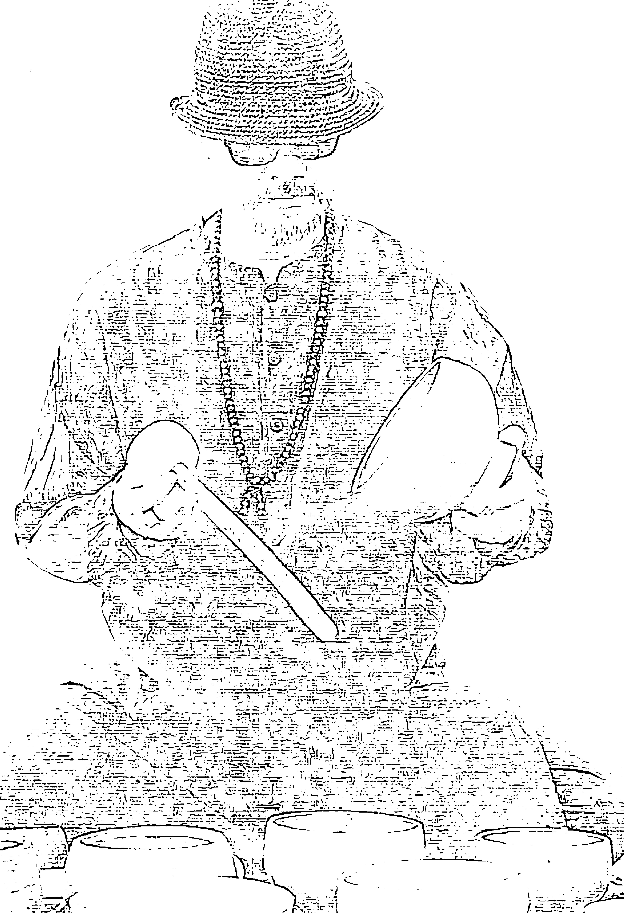

赵歌 · 著

# St. Royal College
天使神秘学院

- ※ 专业占卜预测机构
- ※ 神秘学培训机构
- ※ 水晶能量研究中心
- ※ 神秘学资料库
- ※ 官方微信：strcdts
- ※ 微信公众平台：strc2011
- ※ 读书交流QQ群：
    - 占星塔罗占卜师交流群：814594478（加入密码：PDF）
    - 神秘学其他综合群：659338717（加入密码：PDF）

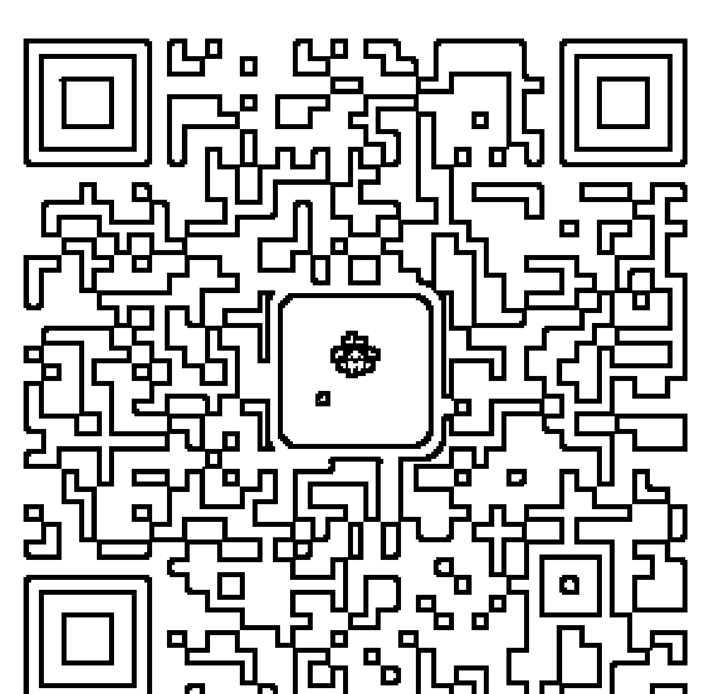

微信号：strcdts
天使神秘学院

天使神秘学院 院长QQ：715104687

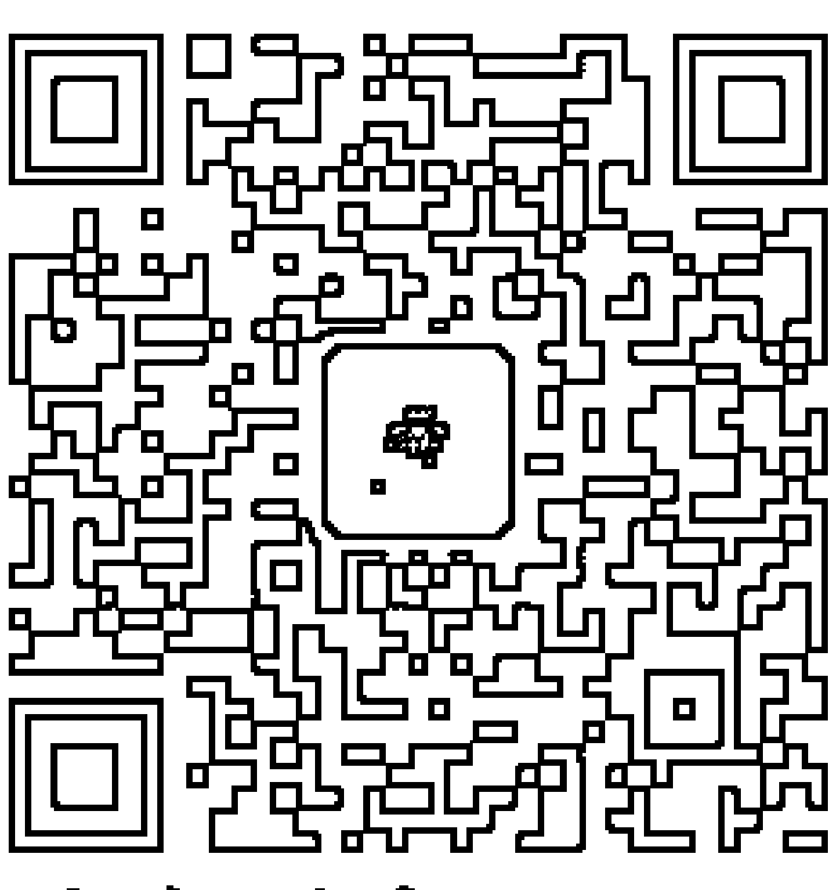

微信公众平台：strc2011

# 制作说明

本书由《天使神秘学院》出重金从台湾购入的原版书籍扫描制作完成。为达到最好阅读效果，特地把原版书全部切开后，再经由专业扫描设备高精度扫描完成，并经过一张张的PS后期处理最终成书，其间花费大量的人力、物力以及时间，只为能给大家提供经济并优质的神秘学学习资料而努力。

本学院强力谴责某些机构和个人，把本学院花心血制作完成的电子书籍，包装后直接放在自家淘宝网上低价倾销的行为，以谋取不劳而获的经济利益。如果长此以往最终将无人愿意再为大家花心思制作电子书，那以后可能大家再无新书可读。

为让大家以后能够读到更多的好书，也为了本学院的良性发展。本学院恳请大家尽量做到如下几点：

- 1. 尽量在本学院的网站购买电子书籍。
- 2. 请勿用技术手段把电子书内的水印及加密去掉。
- 3. 在收到电子书后小范围传阅即可，千万不要公开传播，更别挂到淘宝网上低价销售。

同时为答谢广大支持者，学院电子书将做如下调整：

- 1. 学院会把一些早已收回制作成本的电子书折价销售。
- 2. 最新制作的电子书籍会开放打印功能，大家购买后有条件的可自行打印成书。

## — 黄金纪元的圆满之歌

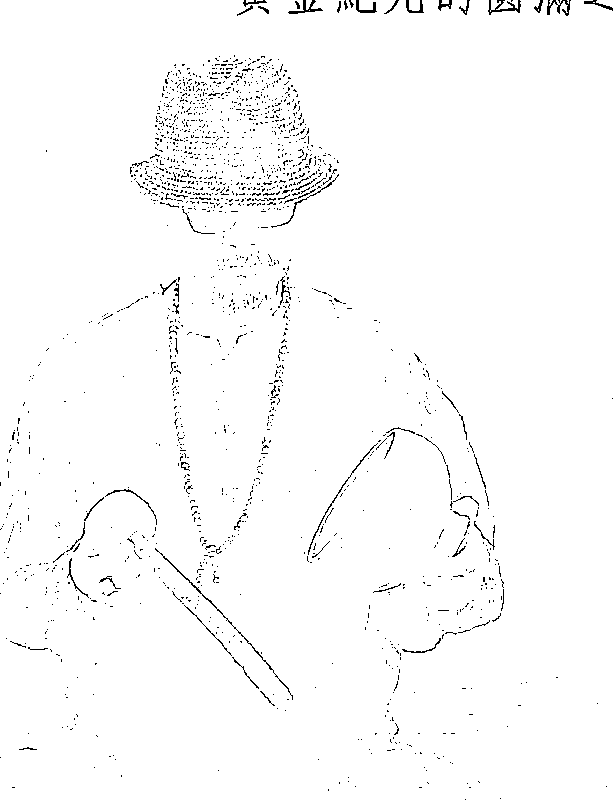

赵歌 · 著

# 目录

- 序幕——颂钵·黄金纪元的圆满之歌 ------- 04
- 神奇的疗愈力量 ------- 12
- 钵与棒的阴阳之道 ------- 15
- 老钵 来自佛国的天籁 ------- 20
- 颂钵技巧漫谈 ------- 32
- 颂钵演奏会 ------- 35
- 气场脉轮能量地图 ------- 40
- 经络穴道能量地图 ------- 44
- 水晶钵疗愈 = 水晶疗愈 ------- 46
- 颂钵催眠疗法 = 远距钵疗 .................................................... 50
- 完整的学习之道 ............................................................... 55
- 初阶课程剪影 ................................................................. 62
- 中阶课程剪影 ................................................................. 69
- 学员心得分享 ................................................................. 79
- 附录 ..................................................................... 159

## 颂钵·黄金纪元的圆满之歌

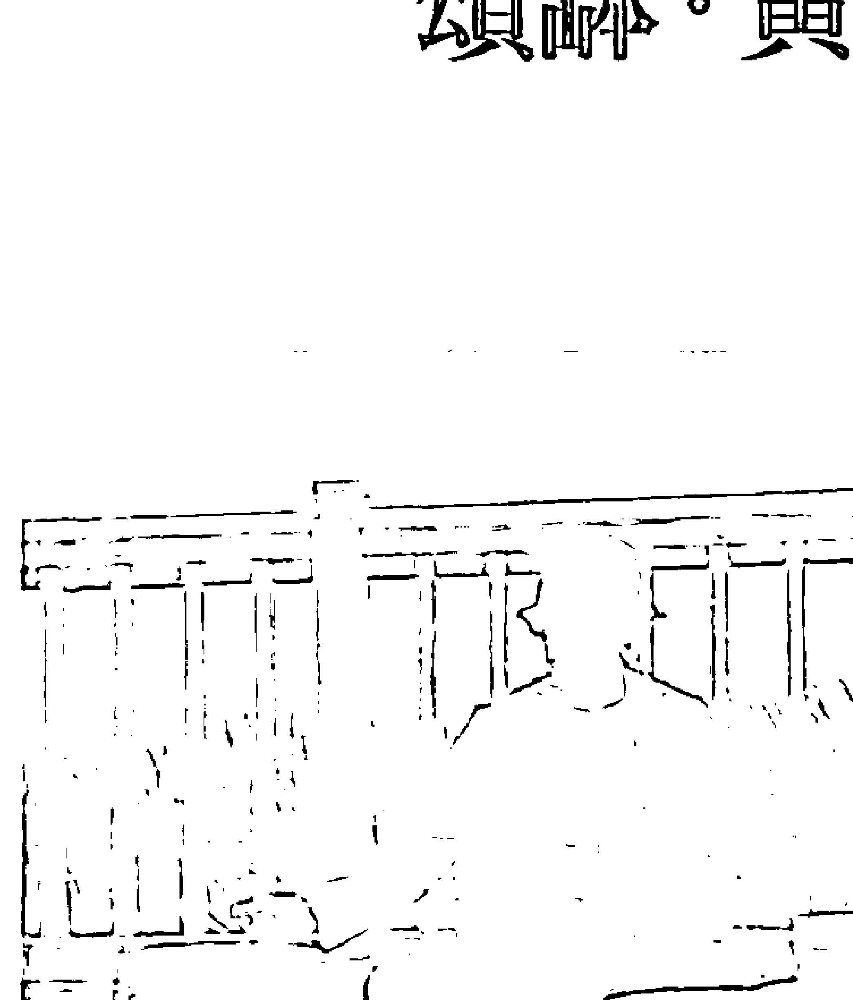

颂钵，尽管历史久远且传说纷纭，但在宝瓶世纪的今日，它早已跳脱了世人眼中盛装食物、贮藏粮谷、献供祭祀、做为仪式上神圣容器、法器或乐器的原始用途，当今这人类意识不断扩展扬升的黄金新纪元，我们恭逢其盛，在疗愈师及疗愈时空的相互启发和相互辉映之下，同时也不断为颂钵拓宽了、深化了无限的灵性意义，并创造出种种疗愈身心灵的可能性。

颂钵而今广泛被用作新时代音乐治疗、能量治疗、物理治疗……等等工具，在我多年的推广经验中，它为人们的整体健康与平衡，着实带来了难以置信且难以计数的疗愈奇迹。

纵使颂钵在新时代里发挥着高度的灵性用途，似乎从旧时代的容器、乐器…等工具性价值，摇身变为疗愈灵魂、平衡能量的法门，这些治疗奇迹看似一种创造，但又何尝不是一种忆起？在我收藏老钵的过程里，我发现许多古老的图腾和印记，对应着种种疗愈概念和神秘故事，那些从喜玛拉雅山区各村落寻觅采集而来的骨董老铜钵，透露着本土萨满和密宗修行者谜样的灵性锻炼和疗愈方式……于是我明白人类历史与头脑所知的，比起那浩瀚伟大的未知和不可知，着实渺小得可怜；但我也十分兴奋和期待，在推广颂钵疗愈的过程中，看见更多灵魂对疗愈的创造和忆起。

任何有人所处的地方就有问题，与其称之为问题，从跳脱善恶对立的批判来看，毋宁说是各种面向的力量质地的变化和消长。在一元之道化生为两仪、四象…

乃至大千万物的过程里，人们就像万花筒的菱镜一般，映造出多彩多姿的世界，这世界如此虚幻又真实的存在着，这股创造力正是人们心间不可思议的真实力量。然而，也正是在这「往下创造」的过程中，人们无可避免的开始与神分离。我们在轮回里流浪得愈久远，便愈遗忘了出发之地，灵魂总感到孤独、在好恶分明的二元世界里流转受苦… 于是，我们困在自己所创造出来的应有尽有的世界中，仍然无法感到真正的快乐和满足。这时候，吃尽各种苦头的灵魂，最终必需疗愈这些分离～这个最初始的分离以及其后所复制的一连串分离…… 灵魂必须超越这个根深蒂固的二元对立意识，循着来时路「往上回归」，从分裂到合一。这也正是所谓的「疗愈」！看见一切个体的本来面貌，允许如其所是，却也意识到这个个体与宇宙整体的连结，那么… 所有限隘狭隘的个体都会在这个瞬间认出自己，问题和痛苦自行松绑解脱，消融入无限的完整与空无。一旦意识得以扩展，回归整体的个体～那些连结到源头的灵魂，才终于能够带着源源不绝的力量行走于世间，优雅美丽的重新创造出平衡圆满的新生活、新世界。

颂钵所唱出的嗡音AUM，对每个灵魂来说，就像是一个唤醒，不管你知不知情，这个声音，仿佛来自源头母亲的呼唤，祂能够轻易地、深邃地碰触、抚慰你的心、激发起你的乡愁，只要聆听过的人都难以忘记，于是灵魂依循着这个声音、这条路径，展开了回归自我本心的追寻。

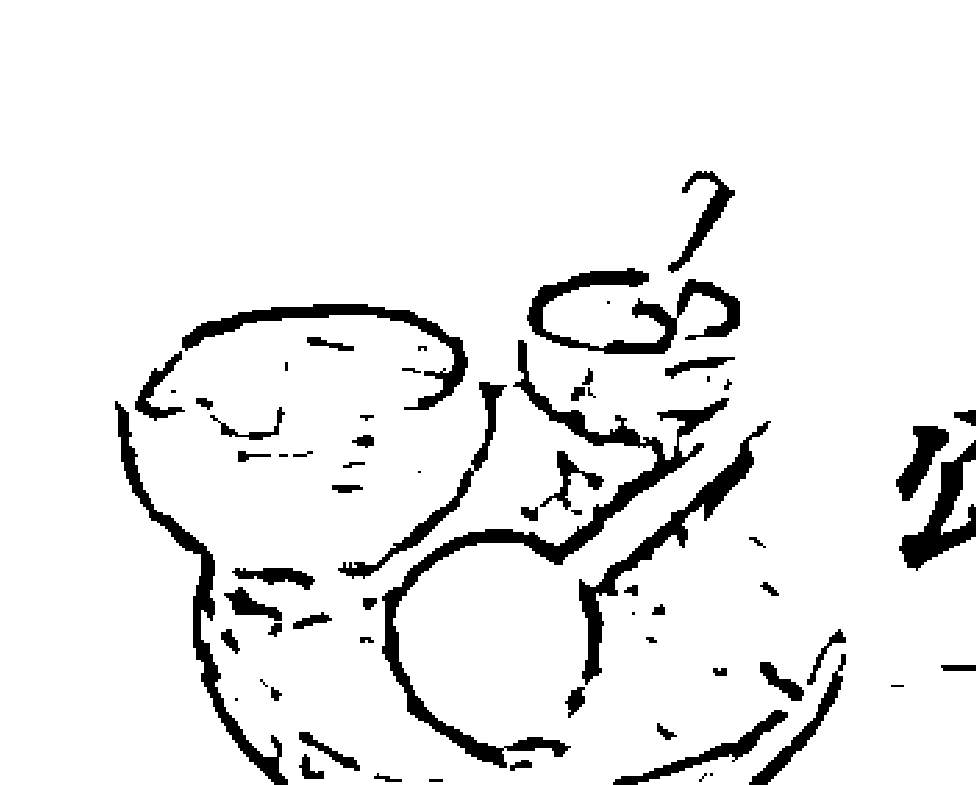

## 颂钵 黄金纪元的圆满之歌

在新时代里被称作「宇宙元音」、「生灭之声」的嗡Aum，堪称宇宙间最强而有力的伟大咒音。我们可以在各种系统的宗教与哲学里发现这个声音的力量。不论是印度教或佛教咒语和祈祷文，都以「嗡」为起始，佛学大师南怀瑾也曾说过：「……嗡字是宇宙原始生命能量的根本音，它含有无穷无尽的功能。就人体而言，它是头顶内部的音声，与人们掩盖耳朵时，自己所听到心脏与血脉流动的声音相近……」印度神秘学认为组成嗡AUM字的三个音Ah, Uh, Ma分别象征空、天、地三界，以及万物「创造」、「持续」与「毁灭」的进程。佛教密乘也视其为秘咒菁华，代表着法身。

> > 古印度哲学典籍《奥义书》里说：「遍宇宙皆是嗡…过去、现在及未来一切都是嗡，那超越时间、空间和因果作用的也是嗡Aum…… 无论它在此处、彼处和一切处，所见一切都是至上意识的示现，宇宙大我、自性就是至上意识、宇宙绝对本体……」

《奥义书》所描述的个体意识具有四种状态，这四个状态亦即清醒、做梦、深睡、超觉。「清醒」时是主客分明的二元意识，受时空、因果、我执所局限，人们只开展了非常狭小的局部潜能。在此时，我们利用感官向外体验并分析物质外境，然而在「做梦」状态时，我们的意识开始转而向内，深入潜意识、无意识的精细心灵世界。「深睡」则超越了清醒和做梦，无欲亦无梦，是一种更为精细的高意识状态，身体所有的神经系统和心灵意识，在此得到真正的休息，所有经验都消融于无二无别的整体当中，经验到一种空无。

而第四种状态～超觉，甚至超越了空无，《奥义书》说，意识在这个状态既不朝内亦不朝外，内外皆不转。它无分别，超越了知见与非知见，无法由感官体验、比较推理而知，它不可思议、超越想象、难以言诠。这是纯意识，是真正的大我，完全的寂静、完全的喜悦。它永恒不变并超越了因果范畴，它是意识真正的本质、至上的喜悦、绝对的本体。

嗡AUM的A、U、M三个字母、三个声音，正代表了清醒、作梦和深睡这三种状态，而第四种，那深不可知的超觉状态，超越了空无、也超越了三摩地，唯有在寂静中方能了悟。通过冥想嗡、忆起嗡、成为嗡… 我们最终就有可能透过这个历程，契入这超觉状态～无声之声，让内在的寂静响彻云霄。

在不计其数的教学回响与个案反馈中，我清楚看见了这些意识的转换历程。无需冗长的咨商分析或语言引导，那一声声的嗡AUM… 带着案主穿越了现实世界里的执着和对立，松脱了那些纠结的痛苦和烦恼，同时也消融了时间和空间的局限，转向心灵深处的无限……他们在不绝于耳的颂钵嗡音中深入了潜意识，释放着受困的陈年往事，甚至出其不意地回到了某些前世，疗愈着古老的创伤印记，开显了灵魂更大的潜能。他们在一声又一声流转的嗡AUM…之中，契进无限的宁静、自由和空无，所谓的业力，在那个永恒的当下已不复存在，这些疗愈的奇迹和恩典，不是我们努力敲钵或磨钵而创造出来的，纵使我在课堂上、在本书中分享各式各样的工具和手法，但我也始终请你记得这个真相：我们并非用力费心在治疗个案，我们只是以钵相伴，为他敞开一个回荡着嗡AUM… 的神圣空间，在这个空间中，颂钵的嗡音和你心中的嗡音相遇，而这个和唱吟颂的过程，让你记得你是谁，这一声声内外相和的嗡AUM… 也就能让案主的灵魂轻易地想起「祂」是谁。

通过颂钵，无论你能走得多远，你总在朝向这条回归源头、趋于圆满的道路前进。从分裂到整合、从分离到重聚、从二元到一元… 这是疗愈意识的精髓，也是每个灵魂深处的渴望。尤其在中国这片古老而浩瀚的土地上，世世代代承受着太多的分离，打从与神分离之初以来，每一个生命轮回过一次又一次的死亡和出生，灵魂必须面临与母亲分离的痛苦，才能跃入这个娑婆世界，接着在一生中继续体验无数大大小小的生离死别……然而，在中国人特有的历史里，有更多的灵魂却早在母亲的子宫里就被迫经历那种撕心裂肺的分离。这些灵魂的伤痛，已成了中国人集体的伤痛，不仅仅只是孩子们愤怒怨恨的灵魂需要抚慰，父母亲也需要疗愈这个分离所引发的悲伤和罪疚，而安全来到这世界上继续活着的孩子们，在成长过程中也得承担对那些逝去的手足们的莫名恐惧和内疚……这些情绪能量不曾消逝，它甚至一代接着一代传承给我们的子孙，在潜意识、无意识里深深地牵绊着我们的性格和命运。

每当我走在城市里，我听见人心的焦躁透过汽车喇叭狂野地呐喊着，无论是黎明的街道或深夜的十字路口，灵魂深处的求救声此起彼落地震碎了街头的宁静。这股急躁焦虑的情绪能量从人们心中蔓延开来，像滚雪球一般扩散、吸引并增强它的能量浓度，城市一角只是个缩影，这些情绪能量若得不到释放，只会像传染病一样，透过空气、振动频率…无远弗届地感染给每一个人，再透过每个人继续相互纠缠、相互创造的滚雪球过程，这压倒性的情绪怪物，最终将吞噬了我们的心，淹没了我们的光与爱。

越是在这样张力极大、身心疲乏至近乎麻木的社会，我愈是能看见颂钵在未来所扮演的重要角色。在飞快窜升的经济发展下，人们在粗钝的物质世界里挣扎拼搏，创造了华丽的海市蜃楼之后，灵魂却不会就此快乐满足。在竞争扩张的过程中，心灵的空虚、关系的疏离、普遍性的恐惧不安、憎恨愧疚、焦虑躁郁…引起身心的种种疑难杂症，于是医院人满为患，有限的医疗资源却引起更多的争端和恐慌……我们深知所有的生命都意图寻求圆满，灵魂在这个时刻不得不往内追寻、往源头回归。当我眼看着一届又一届结训的颂钵疗愈师，带着天真与信任回到了他们的城市里，带着他们的颂钵和无条件的爱成为一个引路人，引领着无数的个案从纷乱失衡的物质世界找到路回归内心的平静，我们深信这个疗愈法门将会像蝴蝶效应一般，让宁静、祥和、圆满的振动频率扩散到整片大地。

感谢每一篇收录在〈学员心得分享〉里的疗愈记录，也感谢更多更精彩绝伦却碍于篇幅无法逐一刊登的文字，谢谢那些充满爱与光的颂钵疗愈师，感谢你们与钵唱和出一声声的嗡AUM… 送入了这个世界，疗愈了这块古老的大地与你们的兄弟姊妹。

这本书里的个案报告是非常重要的部份，通过这些钵疗师、通过他们的体验，我们也一同创造了颂钵疗愈的可能性，我们一起拓展了这个疗愈空间、力量场域的深邃和宽广。在我的上一本书〈颂钵——响彻云霄的寂静〉中，我着墨了较多抽象原理原则，而这本书则像是一本教战手册，或者说是提供给我课堂上学员的补充教材。虽然锁定的对象是已经在的颂钵疗愈师，但无论你想学钵、敲钵、教钵… 相信你都能从中受到启发，并找到许多有用的资讯。然而，真正的关键是：一颗钵只不过是一个工具、一种钵疗法只不过是一项技巧…… 真正让你与众不同、出类拔萃的是你的心。这是一本丰富实用的工具书，深者见其深，我相信每一种程度的读者，都能从中获益，瞥见不同层次的领悟。如果本书能够启发你的思考与创造，那更是我最衷心所愿。

赵歌 写于台北

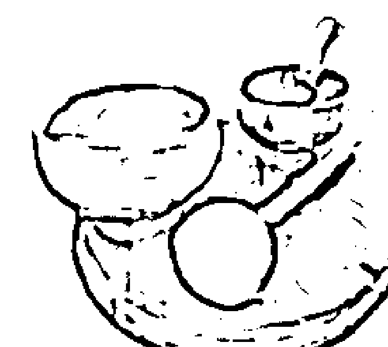

## 颂钵 黄金纪元的圆满之歌

## 神奇的疗愈力量

相较于种种虚无飘渺的灵修方法和能量疗愈技术而言，颂钵是很具体且容易上手的项目，无需等待漫长的修练和揣摩，只要经过恰当的关键性引导，初学者往往能在二、三天内就茅塞顿开，有能力和自信可以独当一面，完成一场又一场出色的疗愈个案。当然，颂钵工具有其普遍性的基本价值，但掌握了「钵疗心法」，你可以在师父领进门后，演绎出无穷无尽的疗愈力量，正是这股独立思考、自由挥洒的创造力，为疗愈师和案主彼此敞开了一个无限的空间，正是在这个神圣空间里，生命力得以流动，遍满了恩典与奇迹。

在我们仅仅数天的初阶训练课程里，见证了太多不可思议，对颂钵完全陌生的学员，初试身手就能惊艳于钵的迷人魅力，无需任何花俏的手法或繁复的工具，只要一颗钵、一颗心，就能够再短短十分钟内带给个案深度的放松和抚慰，而颂钵疗愈师获得个案立即且惊喜的感谢与尊敬，更是带给了钵疗师莫大的信心与满足，这神奇的疗愈效果，相较于所付出的时间与金钱而言，无疑是投资报酬率极高的培训课程。你将以微薄得不成比例的资源，换得难以置信的利益，以四两钵疗力量来拨动个案压抑的千斤重担。

〈颂钵〉一阶工作坊，短短几天已足够让一个门外汉摇身变得武功高强、身怀绝技。本书〈学员心得分享〉中，收录了颂钵疗愈个案的精采体验，其中很多都只是一阶结业的学员所写，我们见证了失眠多年、仰赖药物才能入睡的患者，几乎八成都能在钵疗床上酣声四起、香甜入梦，剩下二成则是睡着打呼而不自知，意识却异常的警醒明晰，我称之为「身睡心觉」的睡觉。我们也看见历经了种种咨商开导仍烦闷躁郁的心情，竟能在短短半小时内松脱挣开这无从得知的能量捆绑，一次又一次的钵疗，持续地松动、瓦解、释放、改变他的内在频率，最终能为个案累积出一种跳脱的速度，远远摆脱那些纠缠多时的能量漩涡。不仅仅是情绪能量，甚至日久年深的气脉纠结而引起的肌肉酸痛、气滞血淤，也能快速得到缓解和放松，乃至各种文明病、慢性病、癌症……种种身心疑难杂症、药石罔效的求助者，都有好转甚至奇迹似痊愈的可能。

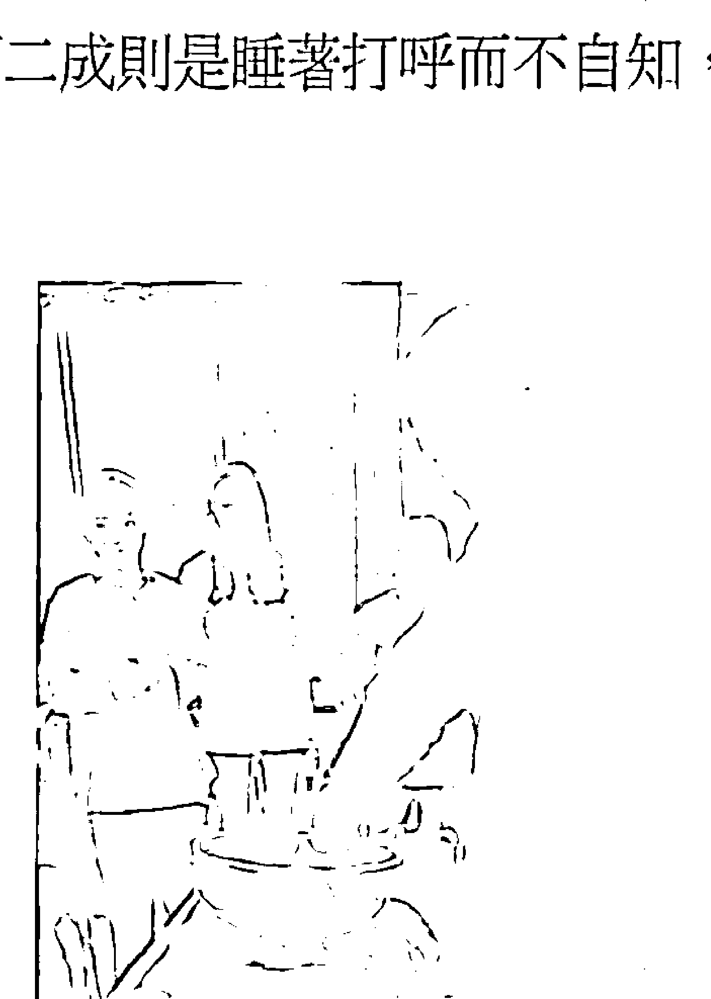

令人惊艳的疗愈力。

这些见证，虽然让颂钵疗师和个案瞠目结舌，而我却一点也不惊奇，这世界万物本质就是波动，我们的身体说穿了也不过是各种波动的聚合，每一个脉轮都有各自的色彩波长和音根，每一个器官腺体也都是一种振动形式…除了靠颂钵的振动和音频打散某些纠结阻塞之处，使其恢复原有畅通的波动功能之外，更重要的是我们心中的疗愈意图、以及内在的嗡音，这些更为精细的能量波动，凭借颂钵的嗡音为桥梁，显化来到了物质世界，这些疗愈之声直接在我们精微的能量身体上工作，同时也放大、传导、共振、调频着我们更精细的心灵意识以及更粗钝的肉体。更正确来说，我们不是在治疗个案，而是将个案带进一种平衡的振动里，这个能量的平衡以及意识的扩展，足以启动他的自我修复能力，疗愈的不只是损伤失衡的身体系统，还包括了扭曲变形的心灵。这种既放松又专注的自我疗愈状态，练功者叫它「气功态」、催眠师称之为「催眠态」、而灵修静坐者称它「禅定」状态…各式各样的法门和疗愈技术，都能够将你带进这种免疫力提升、细胞自动修复、身心轻安喜悦、打通任督甚至河车自转的境地。而恰当的钵疗手法，可以很迅速且自然而然地让你切换进入这种脑波状态，你甚至尚未察觉便毫不费力的扩展进入了无限。

如我先前在序里所言，这本书是为了给我的学员们更多参考资料，以丰富他们的个案或教学。无论是一个颂钵疗愈的初学者，或者已小有专业的钵疗师，在体验过钵疗的神奇效果之后，势必会想要持续深入钻研，渴望演绎各种钵疗方法，以创造更多的可能性。于是，我以多年操作颂钵的个案疗愈与教学经验，在此分享大家关于颂钵的应用方法，为人们身心灵的平衡、社会的和谐贡献一己棉薄之力。这是一本针对略有基础的钵疗者所提供的操作指南，因此不见得会有循序渐进的详尽基础解释，若非参加〈颂钵〉培训课程，将缺少完整的起承转合，仅供读者们参考，欢迎各取所需。

## 钵与棒的阴阳之道

在你有能力演绎一场颂钵疗愈艺术之前，就像所有的学徒一样，你得先花点时间熟练工具的使用，学习驾驭甚至超越工具本身，这些基础功夫就算再无趣也得练习，你总得要先有为才能无为，最后也才能无所不为。

先撇开后续种种疗愈创意应用不谈，最基本的颂钵工具，起码需要一颗钵、和一支钵棒。我曾在上一本书中写过：「钵的自身，是一个疗愈之轮，这个『圆』的意象，在古今中外各文化里，皆是天地间万事万物的律法和原型，是大宇宙和小宇宙的范本。圆，本身即是一座曼陀罗、一座至小无内、至大无外的坛城…… 这个圆形的钵，祂的物质面经过敲击或摩擦，发出了可听见的声响，而祂的圆形中央是空心的，象征着更大的空无，当你磨钵时，你很容易在你外在和内在同时敞开一个空间，因为有了这个虚无，得以让更多的可能性在其中流动和发生… 这个圆形空心的钵，就像是一个阴性的能量，代表着慈悲；而你的钵棒，象征着一股阳性的能量，是智慧；这一阴一阳谓之道，于是能歌颂着力量。相同的意象也出现在我们的嘴唇（圆形）和舌头（长形），于是我们能发声、能表达、能够宣告我们所体验的真理…」

阴阳，是宇宙万物的本质和真相，正是这相互依存又相互背反的两股力量，歌颂出不可思议的奇迹，钵和棒，缺一不可，在这一静一动的缝隙之间，我们瞥见了宁静与永恒。你当然可以用尽各种各样的钵，在一场疗愈中摆出惊人的浩大阵仗，然而，当你能在钵和棒的共舞中游刃有余，你会发现即使你手中只有一颗钵，你也能够通过这外在的声音进入精细的内在声音，甚至藉由观想的力量，这颗外在的钵能够和内在成千上万的钵一起唱和… 这足以创造奇迹的深度钵疗技巧，实际上是引领着你在世界与世界之间穿梭的心法，你开始学会从局限的物质世界，移动进入无限的心灵力量，直到某个片刻你会发现：就算外在的那颗钵停止了敲磨，内里的钵声竟不绝于耳… 一如参悟是谁在念佛？这也正是时候让你去聆## 聽～是誰在敲鉢？

話說回鉢的物質面，在療癒工作中，我使用的頌鉢材質分爲水晶鉢和銅鉢兩大類。水晶鉢是以高純度石英砂製成的機器鉢，音質純粹而響亮，比起銅鉢層次豐富的泛音、圓融沈穩的音調，水晶鉢則較爲尖銳強烈，它具有優異的能量淨化及傳導效果，我經常運用在人體氣場週遭及療癒空間中。

然而，更大量且細膩使用於身心療癒主題的，還是手工鍛造的銅鉢。相較於機器鑄模的鉢器，每一顆手工打造的銅鉢，都有著獨一無二的聲音品質，而且具有較佳的振動穿透力以及泛音共鳴。機器鉢多半是「黃銅鉢 Brass」（銅與鋅合金），材質較爲柔軟且延展性佳，熔點很低，適宜將熔化的黃銅灌入標準模器中鑄造成型，大量用於商業性的製造生產。

深入了解钵的制造过程。

黃銅是很普遍的常見金屬，黃銅鉢器相當便宜，在網路上、佛俱店、新時代商店或瑜珈館都很常見，它們因產量極大、成本極低，常被外行人聊備一格用做靜心冥想工具，雖然敲擊的聲音清脆響亮，但音調卻略嫌貧乏單一，也無法在人體上表現深度振動按摩的物理治療效果。

除了在頌鉢音療演奏場合中，我偶爾會運用到機器鉢之外，在人體的療癒工作中，我只選擇手工鍛造的銅鉢。任何的老鉢或古董鉢無疑都是手工鉢，在實地尋訪工廠、瞭解銅鉢的製造過程中，我們可以肯定手工鍛造的新製銅鉢，百分之九十九都以「青銅Bronze」為素材，也就是銅與錫兩種金屬的合金。其餘的百分之一，我保留給未知，或許人們有錢有閒堅持要訂製一顆熔合了金、銀、銅、鐵、錫、鉛、水銀的所謂「七種金屬銅鉢」，也並非不行，但可想而知材料和技術都所費不貲。

手工鍛造的鉢和機器鑄模的鉢相比，雖然貴上許多，但無論是黃銅或青銅，大體而言都算便宜素材，再怎麼優質的手工新製銅鉢，或許做工更嚴謹精細、造型更複雜講究，但材質仍舊只有銅與錫二種金屬，價格也算平價合理，你絕不可能在工廠的手工新鉢裡找到傳說中的「七種金屬」，更遑論網店上以及尼泊爾滿街藝品店裡標榜著「內含七種金屬」的機器鑄模銅鉢了。

既然新鉢內僅含兩種金屬，那麼骨董老鉢呢？在古老的神秘西藏煉金術傳說中，不乏以五種金屬或七種金屬打造的各類法器，那些金屬比例和究竟功能在外人眼中已然成謎，每一種金屬特性對應著外在大宇宙中的星象能量，也引動著內在小宇宙的元素力量，

### 頌缽 黃金紀元的圓滿之歌

甚至还有人标榜老钵中的铁成份来源于「天铁」… 这些古老的神秘教导，在时间长河的淘洗中，留下的除了传说之外，到底还剩几分真实与清晰？关于老钵的资讯以及古老疗愈用途的文字记载，实在少之又少，人们大半只能怀着对古老迷人传说的向往而各自演绎。

如果你的疗愈理论是奠基于铜钵的七种金属成份，那么无论你采用新制的机器钵或手工钵，都无法支持这个疗愈神话，至于传说中内含七种金属的古董老钵，更不是俯拾皆是、随处可得。

在我多年来鉴赏、流通和收藏上千颗优质老钵的经验中，我发现各种年代、形制、产地的老钵，其制作细节和成份比例都不尽相同，端看它当时打造的成本和用途，有些确实含有较为贵重且多样化的金属成份，但除非经过科学方法检测分析，否则谁也不敢断言其中的内含物为何，似乎也曾有人对老钵进行研究，实验证明钵内仅含铜与锡两种金属，然而，区区几颗研究的采样如何能放诸四海皆准？如何能代表所有时期制作的所有老钵？关于七种金属的西藏炼金术传奇，依然为老钵烘托起令人憧憬的神秘氛围。

我不认为市面上流通的老铜钵里含有七种金属，但我也不坚信你毫无可能遇到一颗由七种金属打造的传说中的西藏老钵。不过有一个现实可以提供我们思索，当今市面上所谓的「西藏颂钵」，百分之九十九与西藏无关，新制的铜钵大部分来自印度和尼泊尔，即便很多新钵喜欢雕刻一些仿古的饰纹或西藏佛像与经咒，凭添许多异国风情和商业噱头，却一点也非关西藏神秘文化或哲学。

而那些流通坊间的古董老钵也与西藏没有太大关联，它们被收旧货的行家，从印度、尼泊尔、不丹……等等喜马拉雅山区的各村庄寻觅蒐集而来，并非每颗老钵都来自寺庙、修行者、或用于神圣仪式、神秘用途，有很多的钵也用做凡俗的容器，例如：盛装、烹煮食物或贮藏粮谷。

钵，被运用在整个喜马拉雅文化里已有数个世纪之久，甚至是中国、越南、高丽、日本、泰国…这些国家，也都有他们自己的颂钵历史传统，可以追溯到数千年以前。

在现今的颂钵疗愈工作里，无论老钵或新钵，不同的金属成份比例、重量、造型… 这些因素都在在影响着钵的振动大小、音调高低和声音持久度；而同一颗钵，搭配了各种不同材质的钵棒，又将碰撞出全然不同的疗愈音声…… 我喜欢收集各式各样的钵与钵棒，然而，即便你只有一颗钵、一根钵棒，你每一次的敲击或磨奏仍然是独一无二的演出，你使用的力道、下手的位置、乃自你的心情… 都是无法重来、仅此一次的相遇; 都让每一个钵声、每一次的疗愈，成为了「当下」。

## 老钵——来自佛国的天籁

近二十年间，来自印度和尼泊尔的新制铜钵，大量出现在喜玛拉雅地区，随即席卷了全世界的铜钵市场，它们有着各式各样的尺寸、款式、雕刻饰纹... 有些新钵表面呈现精致的高度抛光处理，看起来明亮崭新；然而也有许多新钵运用仿古涂层或氧化做旧处理，有意无意的让消费者与老钵混淆、哄抬价格…… 其实新钵的金属成份比例和老钵不同，相较之下，同等体积的新钵普遍比老钵沉重，有经验者光从手感的直觉就能判断。

除了比重之外，各年代、各产地、各形制的老铜钵，都有其特征可供辨识，这对行家来说一点也不成问题，只不过大部份的老铜钵在市场上是以古董文物的目的被流通和收藏，许多年代久远的老钵生锈斑剥得几乎吹弹即破，钵体也明显扭曲变形，密切影响它的振动和声音品质… 这些古老文物即使具有昂贵的价值，却不适合做为颂钵疗愈工具。

一般古董商人不懂如何针对疗愈需求而精心挑选合适的老钵，就算是内行的钵疗师，还得够幸运才能遇到够多够好的老钵供其挑三拣四。不管是五十年、八十年的老钵或一、二百年的古董钵，它们由收钵人从喜玛拉雅山区的各村落一颗一颗寻觅而来，这些老钵经过大致的筛选分类后，卖给了流通老钵的大盘商，来自世界各地的买家想进入这些老钵仓库挖宝时，除了要有丰富的知识和经验之外，人脉和运气都同等重要。

当各地收来的老钵根据年代、稀有性、保存状况……种种条件分级之后，很多万中选一的「大师级老钵」，皮光温润美好、声音宛如天籁不绝于耳，再加上一些稀有的特征或神秘图腾及铭文，身价立刻三级跳，而且是以颗喊价、没有标准行情；其余通俗大量的老钵仍分成不同价位，以公斤批发。

只计较老钵一公斤多少钱的买家自以为内行，实则完全外行，只要是同一种类的新钵，每公斤价差不大，而老钵的价格却无法放诸四海皆准，不同保存条件的老钵，公斤价差有天壤之别…… 即便是在同一批价位等级的老钵堆中也不能保证相同的品质，你是第一个进仓看货的买家？抑或只是在很多人挑剩的货底中埋头苦寻沧海遗珠？太多变数以致于一颗内外兼具的优质疗愈老钵，实在得来不易。

> 在成千上萬顆老鉢倉庫中，眾裡尋它千百度。

以我自己拣选老钵的经验来说，很多外观美丽、保存状况极佳的老钵，可惜却无法敲磨出优异的音声；有些外型无懈可击、声音撼动人心的好钵，却在沧桑岁月中难免留下严重的伤痕或裂缝……为了钵疗工作而严选的老钵，几乎十颗里要淘汰掉九颗。

我给钵疗师衷心的建议是～与其购买劣质的老钵，还不如选用更平价的新钵。许多手工锻造的优质铜钵，拥有极佳的声音品质和共鸣，在疗愈工作上丝毫不逊色，只不过老钵就像个长者或老友，它的声音有一种难以言说的氛围和独特的个性，异常地圆融庄重和宁静祥和……在数十年、数百年的岁月中，这些钵被照料、被使用，甚至有些钵早在锻造之初就被灌注了神圣意图、聆听着神圣的祈祷文、或在日后的庆典仪式中沐浴于经咒的力量中，钵的分子结构在整个熟成的过程里慢慢地转化，也精炼提纯了声音，它就像是一杯好酒般，是光阴的故事把这种纯熟和甜美酿进了老钵的歌声中。

如何找到一颗适合自己的钵？除了深深地用你的心去聆听，别无他法，尤其选择老钵时更是如此。你得亲自把玩、抚摸，然后闭上你的眼睛，只专注聆听流进你耳里的声音，这样会让你听见更深邃的能量层次，因为这些钵是你要用来疗愈或静心的，祂一定要能触动你自己的心，当你和「你的」老钵相遇时，这是一种灵魂的相遇，你立刻就会知道，所以把选钵这件事留给你的直觉吧！

一开始收藏老钵，很多人都会先从价格考量，但影响老钵价格的因素非常多，包括年代、尺寸、造型、保存条件、声音品质、雕刻图腾或铭文……等等。大部份老钵的年纪，动辄五十年、一百年，使用的状况不尽相同，它们甚至被用于各种用途，有神圣的、凡俗的、抑或两者都有。

许多小钵被当作家用器皿，因此历经了无数次的使用和清洁过程，造就了钵缘和内部的光滑洁净。有些使用频繁的钵，甚至边缘都已磨损，偶有一些深刻的铭文或图腾符号、或最初锻造的明显锤痕也逐渐模糊。有些老钵因为岁月的沧桑而形成了晦暗的色泽或铜锈，而有些钵则依然光彩、历久弥新。

诸如「藏巴蒂」之类的大型老钵，经常用来贮藏粮谷的容器，大部份都保存得相当良好，巨型的藏巴蒂更是值钱。而老「灵根」和俗称象蹄的「玛尼钵」，以及优雅的「纳迦圣杯」，年代更加久远且稀有，而且专用于神圣仪式或庆典之中，可想而知这些特别稀有的老钵的珍贵价值，在一堆尘封的老旧古物里，它们很快会被眼尖识货的收藏家买走…… 这些老钵，其实很容易藉由它们特殊的外形特征辨认出来，例如象蹄形状的「玛尼钵」、高脚杯一般的「纳迦圣杯」、或者是中央尖锥状突起的「灵根钵」…… 但其它老钵则需要更多经验及细心的检视，例如常见沿着钵缘的典型割痕、或钵内底部二到三个同心圆；以及某些更老的古董钵独有的特征，例如很细微的沟槽纹或钵唇上的小圆点、或形成念珠般环绕着钵缘下方的饰纹，有时这些象征着太阳的圆点图腾或念珠造型，会在老钵外缘四等份处排列成一个倒三角形，标示出东南西北四方。

偶尔，我们也会在古老的「塔多巴帝」钵或「玛尼普丽」钵的外墙边缘下方，发现一些规律或随机的线条或半圆切口，看起来就像挥刀乱砍的粗糙刮痕和凿孔围绕着钵缘，这些都不是在一开始锻造时就凿刻上去的痕迹，而是后人在使用过程中，留下的神圣、仪式或魔法记号。

除了这些随机或抽象符号之外，有些老钵在外墙的下缘会铭刻一些文字，通常是这颗钵主人或打造者的名字，也可能是咒语和祈祷献词：在保存良好的顶级老钵上会发现铭文，各种类的老钵都有可能，但特别是塔多巴帝、藏巴帝和纳迦圣杯。娜迦圣杯的铭文很优美，在钵的外缘下方，以细微的针点状凿成，而且经常会像三明治一样夹在两个相同的图案之间，例如：莲花、鱼、孔雀或大象。

### 以下是老钵市场上常见的几种老钵形制，提供大家参考。

### 〈塔多巴帝〉

有着笔直高墙和宽阔平底的塔多巴帝，多数是大约三百公克到一公斤之间的中小型老钵，大型而沉重的品项是特别稀有的。它和「玛尼普丽」及「藏巴帝」三者，占了老钵收藏市场的绝大部份。很高比例的「塔多巴帝」呈现着许多刮痕和磨损的记号，透露出大量使用的痕迹，看起来特别老旧和沧桑，最古老甚至可追溯到十五世纪之远。这类老钵为数不少，也相对便宜，但品质好坏则差距颇大。

塔多巴帝的声音和它古旧朴拙的外形一样，展现着流金岁月里丰富的层次，它的主调音域很广，且交织着各种若隐若现的泛音，无论是高音或低音的塔多巴帝，都十分触动人心、撼动灵魂。

中小型的塔多巴帝，钵唇通常是朴素的，而且和薄墙的厚度相当，少见外墙沉重浑厚的塔多巴帝，则具有较宽大的钵唇，得以在其上装饰圆点般的念珠串或象征太阳的符号（圆圈内有一个小黑点）。有些钵内的底部，可以发现从中心辐射出一些同心圆图案，在钵外也可能看到一对平行的切割线环绕着下缘。在钵内底部、钵缘外侧都有可能看见念珠串或太阳饰带。外墙上经常会发现一排不规则的仪式性凹痕序列，有些老旧的塔多巴帝也刻有铭文或献词，为收藏者更添几分趣味和价值。

### 〈玛尼普丽〉

「玛尼普丽」是所有老钵之中最浅型的钵，无论是厚或薄、外表素朴或装饰繁复，这种老钵的外型都像一个浅碟盘，钵墙低矮、钵底小而圆，钵缘优雅的微微向外绽开。

在这种老钵的外缘经常装饰着几条切割线，彷佛一道衣领般，较薄的钵，钵唇平滑素朴；若是较厚实的「玛尼普丽」，钵唇和钵内底部、钵缘外侧，都可能带有繁复的装饰，除了念珠链或太阳符号之外，还有从钵底中央向外辐射的同心圆，以及一些星状的神圣几何图腾，和外墙上不规则的仪式性刀痕，也有一说是：这些随兴的切割线条，其实是在微调钵的音调⋯⋯若在玛尼普丽上找到铭文或献词，那是非常罕见的，大型与厚重扎实的品项也同样稀罕，因为多数的玛尼普丽都很小巧，绝少超过六吋，重量大部份落在三百克到一公斤以内。

玛尼普丽

小型的玛尼普丽最好平衡的摆在指尖上敲磨，否则圆弧形的底部容易让钵在钵棒施力时晃动旋转。这种老钵的声音层次非常丰富，即使是高音的小钵，也有一种令人惊喜的宽阔和穿透力。除了本身迷人的多重泛音之外，玛尼普丽特别适合用来盛水制造特殊音效，无论是高频的海豚音、夜晚森林中的幽微鸟鸣、或神秘的异次元音声… 这些有趣且令人惊奇的音效，特别适合用于静心状态中协助人们的意识转换。

古董玛尼普丽相当精致漂亮，相较于其它的老钵，它们似乎是以更柔软、更金黄的青铜合金所制成。仅仅只是把玩欣赏它细腻柔美的光泽，聆听它出人意料的奇幻音效，就已经是一件备受疗愈的事了。

### 〈藏巴帝〉

如果你偏好大型的、音调低沈的钵，你可以寻找「藏巴帝」或「乌塔巴帝」，这两种钵都是中、大型的老钵。「藏巴帝」约在八百克到二公斤以内，超过二公斤半以上的巨型藏巴帝，是非常稀有的收藏品项。

「藏巴帝」美丽且沧桑的声音，既浑厚却又轻盈、有一种直捣灵魂深处的穿透力和震撼力。柔和素朴的高墙，以一种优雅的曲线从窄小平坦的钵底往上延伸，讲究的「藏巴帝」老钵，在钵缘收尾处会往内翻卷，打造出一道厚实的钵唇，整体的造型为它创造了强大优异的共鸣效果。它的外型极为稳重庄严，光是摆在空间里当风水摆饰，都能提醒人心该沈潜下来…如果你预算有限，只能买一颗老钵收藏，最不能错过的就是「藏巴帝」。

**藏巴帝**

「藏巴帝」通常清晰可见手工锻造的锤痕，尤其在外部更为明显，高品质的老钵有时会有切割饰纹，铭刻咒语、名字或献词，但没有花俏繁复的装饰，大部份呈现一种极简的素朴之美。尽管简朴，一颗优质的「藏巴帝」老钵，仍需要耗费许多有价值的金属，以及三到四名技艺精湛的工匠来共同锻造，对于当时诞生出它的古老喜玛拉雅主人而言，绝对是一笔庞大沉重的开支。

大多数古董「藏巴帝」，被认为诞生于十七至十九世纪之间，以这样的年龄而言，我们发现大多数的「藏巴帝」都处于极佳的保存状态，因此人们认为这类老钵肯定得到了很好的照顾，或者被用于仪式庆典及音乐用途，较大型的「藏巴帝」也可能在当年被用来贮藏粮谷。有些特殊老钵形制，只能在某种特定的年代找到，例如「玛尼」钵，但有些老钵的造型经年累月都没有太大的变化，持续到今日仍在制造，「藏巴帝」就是一例。

因此你可以在市场上买到二、三百年的藏巴帝骨董钵，也可以买到近代打造的五、六十年藏巴帝老钵，而今日有许多新制的手工铜钵，亦仿照「藏巴帝」的优雅造型，也都能产生美妙的音调和杰出的共鸣效果，但少了岁月的淬炼，总是少了某种难以言说的韵味。

「藏巴帝」老钵同时散发着铿锵响亮的音调、以及奇幻迷人的低音共鸣，交织着非常复杂的泛音，并持续长时间绵延不断的振动。你可以用富有弹性的羊毛毡槌敲击，或者使用包覆了皮革或绒布的钵棒磨奏边缘，能够产出穿透力极佳的深邃音质，如果使用木质的硬棒磨奏，则会诱发出较高的音调。

中型的藏巴帝，可以托在手掌中进行呼吸静心、冥想调频，或在空间中、人体气场周遭移动以进行疗愈；而过于沉重的大型藏巴帝，则适合放在钵垫上或人体上敲磨。只要放一些水在钵里，沿着边缘缓慢磨钵，很容易看见水面的波动图案、以及壮观的喷泉效果，这种优异的振动，使得「藏巴帝」成为钵疗中最实用的老钵，它常用于脉轮平衡、铜钵沐浴……等，各种治疗手法。

### 〈乌塔巴帝〉

这种大型老钵和「藏巴帝」的疗愈用途近似，外观上却有显著的差异，「乌塔巴帝」钵缘的造型很特殊，微微向外翻开的钵唇就像玫瑰花瓣的边缘。这种老钵体积甚至比「藏巴帝」更大，普遍都在一公斤以上，甚至重达三、四公斤的巨型「乌塔巴帝」也能找到，它们的钵墙比「藏巴帝」更薄，就像是一口大锅一样，深广的容量孕育了迷人的低沈音色和悠长的共鸣，甚至远远离它有一段距离，都明显能隔空感觉到它迷人的振动。

老「乌塔巴帝」据说起源于东尼泊尔。它们的外墙通常可看到两种对比的表面处理，以一条切割线为分界，界线以上到钵唇约三到四公分的宽带，通常会是触感光滑明亮的天然青铜色，而界线以下的大部份面积则呈现粗糙的锤打纹理，有些钵甚至会涂黑，让上下、内外形成对比，相映成趣。某些「乌塔巴帝」钵的内部，也会被悉心抛光成精致的美丽金铜色。

### 〈纳迦圣杯〉

彷彿高脚酒杯一般，纳迦圣杯是一款气质优雅、外型曼妙的老钵，包含两个组成部份，一是半圆形的钵身，另一部份是圆环形的底座。钵的底部是浑圆的球面状，牢牢地固定在底座的铜圈上，若少了底座的支撑，钵身无法平稳的安置在桌面上。

「纳迦圣杯」普遍不大，约二百克到一公斤之间，它们呈现相当圆润精致的球形，中央最宽的边长（圆周）应大于钵缘。这种钵的外观通常是光滑素面，少有装饰，顶多是在钵缘外侧切割有数条精细的平行线，偶尔在某些钵的中心会发现一个小圆圈或几个同心圆。

纳迦圣杯

人们对于「纳迦圣杯」的年龄和起源所知甚少，从这些古老圣杯的独特造型以及良好保存状态看来，收藏者认为它们应该都得到过很好的照顾，而且为音乐、仪式等神圣目的而服务。人们推测「纳迦圣杯」是专用于献祭的老钵，因为有将近四分之一高比例的「纳迦圣杯」外墙上，铭刻了咒语或献文。这些铭文通常在外侧钵缘下，以细微的点状凿痕组成，有趣的是这些铭文的开始和结尾，都会有一个动物或植物图腾，例如：鱼、孔雀、莲花、大象、蝴蝶…等等。

「纳迦圣杯」非常敏感，无论是敲或磨，都会产生出乎意料的清亮音质，高频的泛音不绝于耳……我特别喜欢这款老钵，它和手持水晶钵有着异曲同工之妙，当我们握持它的基座时，可以游刃有余的在人体气场或脉轮上以各种角度清理、疗愈；在空间环境中也能够轻松的进行风水工作，更精确地净化、传送能量。

### 〈玛尼骨董钵〉

大部份的「纳迦圣杯」和「灵根钵」被公认用在神圣仪式中，而且年代都很久远，「玛尼钵」亦是。虽然有些老钵形制诸如「灵根钵」、「藏巴帝」…在近代或现代都持续有人制造，但「玛尼钵」却是收藏家眼中确信无疑的老骨董，这款钵在很久很久以前就不再被制造，研究者推测任何一颗骨董「玛尼钵」的打造年代约在十六至十八世纪间，每颗至少都有二百到四百年的历史，是非常纯正且珍稀的老钵。

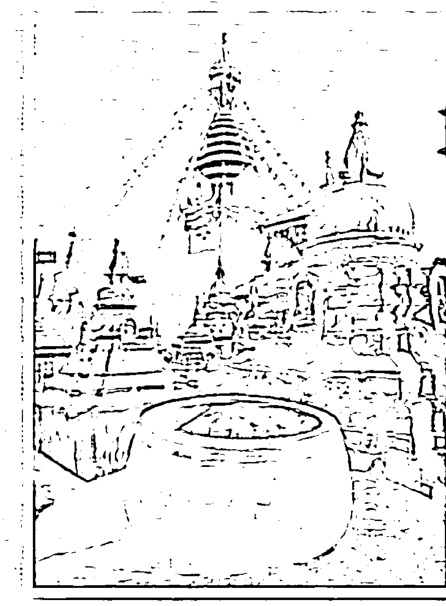

我们所能发现的「玛尼钵」，虽然偏向中、小型体积，质感却非常浑厚结实，它的底部平坦，而钵墙朝着钵口逐渐收束缩小，形成圆锥形状，圆弧形肚腹的圆周长通常大于底部或钵口边缘，钵唇特别宽厚且向内收摄。在钵唇上或外墙上常见平行的切割线装饰，钵内底部偶尔有同心圆图样。

玛尼骨董钵的声音高昂悠扬，非常强大且具穿透力。因为它的外形，也有人把这种老钵叫做「象蹄」。

## 〈灵根骨董钵〉

在所有喜马拉雅老钵类型中，造型相当特殊的「灵根钵」，无疑是最稀罕珍贵的。它们的年代相当古老，有些可以追溯到十六世纪之远。然而，市面上可见的「灵根钵」，只是徒有相似的外型，绝大部份却都是新制的铜钵。

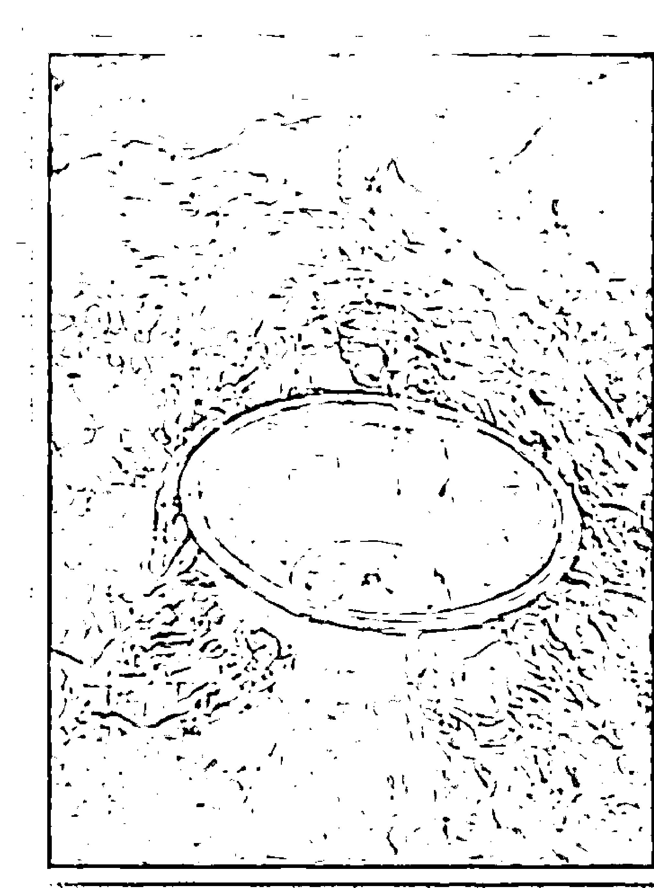

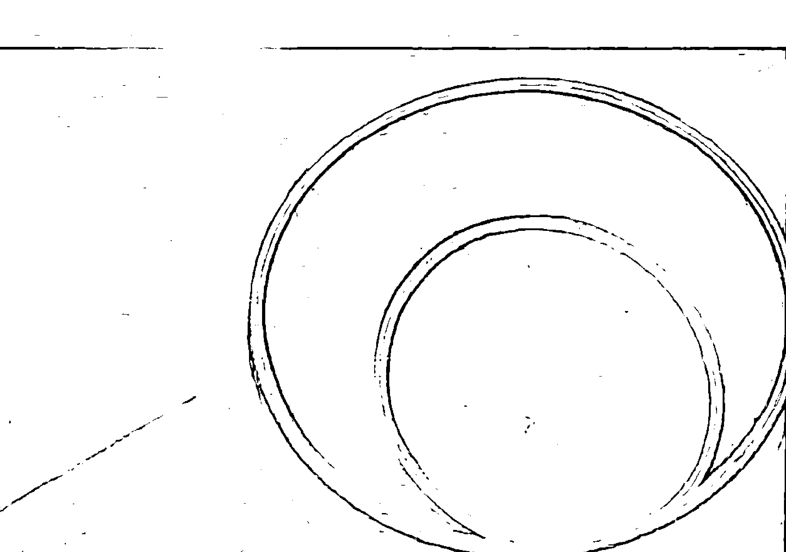

「灵根钵」的外型有不同的轮廓，有些类似「塔多巴帝」、有些则如「玛尼普丽」一般的浅盘状，但显著的特征是钵内底部中央有一根圆锥形的突起物（lingam），象征着湿婆神的生殖器、阳性力量的荣耀与连接，而相对应的钵底外侧，则形成肚脐眼一般的凹陷。

骨董「灵根钵」被用于神圣仪式，通常锻造精致、内外皆光滑细腻。声音既铿锵又甜美，而且振动共鸣非常持久。然而，人们能在市面上发现老「灵根钵」的机率微乎其微，因为眼尖的收藏家和从业者一旦发现这款钵，立刻便会纳为己有，舍不得出售。除非你出得起高价，能够说动收藏者愿意割爱，否则你很难买到古董「灵根钵」，你看到的不是新制的「灵根钵」，就是整形过的「灵根钵」，以「塔多巴帝」或「玛尼普丽」老钵为主体，在钵底加工装上了 lingam 状突起物，有经验的收藏家不难看出这些整形变造的痕迹。

除了上述常见的老钵种类之外，还有很多难以归类的老钵造型，有些骨董老钵甚至是上述好几种样式的综合体，非常有趣也极为独特罕见，不同的造型也为它们打造了不寻常的声音特性。

## 颂钵技巧漫谈

在你达致人钵合一、游刃有余、无为而无所不为的境界之前，除了蹲马步的基本功之外，磨奏颂钵尚有非常多细节需注意，我所能提醒的终究有限，更多的是你必须在自己的经验中体会和领悟，最伟大的老师永远是你的生命本身，在你每一次颂钵的经验中，你自己的心和你的个案所教会你的事物，永远持续不断在开展和成长，未曾有终点。

颂钵疗愈时，不管是什么样的姿势，始终记得～你的身体要放松、气息要柔软、心念要良善。所以在任何疗愈开始之前，先敲钵行禅、开启一个净化、校准的神圣空间；再坐下静心冥想、与钵呼吸调频……倘若能够专注而放松的确实做好上述几点，你已经完全准备好自己了，而处于这样一个充满疗愈品质的神圣空间里，不用任何的「造作」，疗愈早已自行展开。

当你静心冥想时，切忌正襟危坐，为了让气脉顺畅，你当然要挺直背脊，但沉肩坠肘。以掌托持中小型颂钵时，请张开五指，不要用力握住钵墙，遮阻了钵的声音振动。如果不是为了搭配特定脉轮呼吸，最好是将钵持在腹部前，手臂可适度靠在腿上，这会是最放松舒适的静心姿势。

不管你进行的是个人静心，或是疗愈个案，请记得一个要诀～让自己的能量由外而内、由粗而细。当你在敲磨外在物质形态的钵时，让这外在的钵声往内走，并与你内在的嗡音共鸣，如此将粗钝的声音能量逐渐导向精细的心灵。你也可以在心灵中观想一颗钵、二颗钵、十颗钵、百颗钵…围绕着你或个案，以这内在精微的能量和外在具体的颂钵共振……以这种心法敲钵磨钵，你最后会发现一个秘密：当你内在的嗡音响起，我所谓那「响彻云霄的寂静」就像涟漪般，将不断往外扩散进入这个世界。即便外在的钵静止了敲磨，你内在的嗡音仍然余音缭绕、不绝于耳；即便你只用一颗钵，你的心灵却能幻化出无量无边的钵，让内在与外在的共振和弦相互辉映。

一颗优质的钵固然磨奏起来特别顺畅，好的钵棒也可能加分不少，但是对很多初学者来说，通常都是技术性问题居多。磨钵时，必须让整个手臂都非常放松柔软的转动，而不能只是扭动腕关节。同时，将钵棒按压在钵缘呈45度，必须施加恰当的压力，在这种相互拮抗的力道下缓慢沉着地磨动。通常我们在买了一支新钵棒后，会花至少五分钟以上的时问持续磨钵，藉以驯化你的新钵棒，找到最顺畅的速度和力道。我尝试自制过各种材质的钵棒，每一种钵棒都为同一颗钵带来了令人惊喜的全新生命，碍于篇幅，我在此只区分二大类钵棒，一是较硬的木棒、另一类则是包覆了橡皮或皮革的皮棒，这两种钵棒的质地可以在同一颗钵上，磨奏出截然不同的音调和声音品质。以皮革棒磨奏出的边缘音调较为低沉；以木棒磨出的边缘音调则较为高昂清亮，并诱导出更丰富的泛音层次。边缘音调往往和主要的基调不尽然相同，它深受磨棒材质的影响。

相较于磨钵的技巧，敲击颂钵则显得毫无难度，随便你拿任何一种棒槌、任何一颗颂钵都会铿锵作响，甚至是用你的拳头在钵的外侧槌击，都能够听到一颗钵的基调。通常在选钵时，除了以木棒和皮棒磨奏钵缘看看顺畅与否？倾听各种边缘音调及泛音之外，我们也会以羊毛钵槌单纯的规律间歇敲击钵外侧，闭上眼睛去聆听钵的主要基調、音色和共鸣持久度。

除了常见的磨钵和敲钵之外，还有很多繁复的进阶技巧，可以运用在个案疗愈或颂钵演奏中。例如以「双簧」及「水之歌」的技巧，创造出各种有趣的音效。大部份的手工铜钵本身就具有若隐若现的「哇～哇～」的颤音，你可以先用钵棒在边缘磨出响音，然后移开钵棒，将仍然持续作响的钵移到嘴边，钵缘大约离你约一吋左右。这时候你心里想着「哇哇哇～」的声音，同时开阖你的嘴巴，你并不需要实际发出任何声音，就像唱双簧一样。你只是改变了嘴型，让钵声流动进入你的口腔后再反射而出，你便藉此而形塑了声音。除了「哇哇哇」的泛音之外，我还尝试过将钵声塑形成各种咒语，眼看着抽象能量从虚无飘渺形塑彰显成某种特定形状，这有趣的过程，也经常被用静心疗愈里。

另一种「水之歌」的技巧，我常用於催眠诱导，或在深度静心状态中协助个案转换意识。「玛尼普丽」老钵所唱出的「水之歌」，是所有钵款中最为杰出的。先加入少量的水在钵内，注意这过程中尽量不要弄湿钵的上缘，接着用钵棒沿着钵缘磨动，等钵开始持续发出响亮的声音时，将钵棒移开。这时候，你手持着钵缓缓地移动、倾斜，让钵内的水沿着内墙温柔的流动…… 如此，你可以创造出一种特别的音效，有些犹如欢乐的海豚在唱歌、有些宛若静夜森林里幽微的虫鸣叫声，这些声音能够带领人们的意识在异次元间转换和穿梭。

## 颂钵演奏会

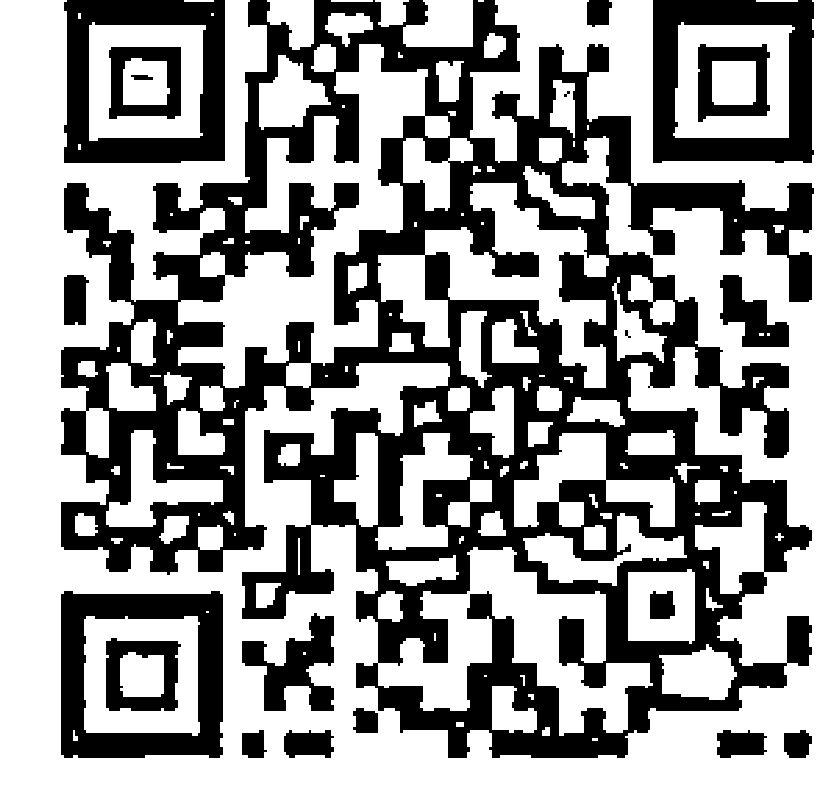

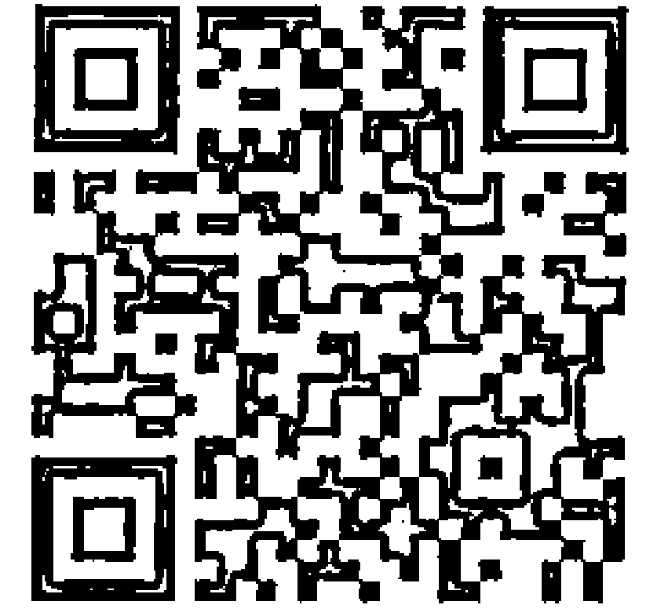

几乎没有人能断言源于西藏或喜玛拉雅的老钵，它们最初究竟是如何被使用或演奏，没有任何具体可证的文献存留下来，大多是经由口述辗转流传到了全世界。我们现今的知识，大部份是基於喜玛拉雅山区的萨满和佛法练习者、以及其它地区后人的颂钵经验而推测得知。

今日的颂钵在世界各地广为流传，成为人们净化、疗愈、静心的重要工具，也用于神圣的仪式、庆典、和音乐表演。许多专业的科学理论已支持了「声音」在人体身心灵各层面的疗效，这些铜合金制成的乐器创造了奇幻的声音，被喜马拉雅山的僧侣、萨满、灵性导师或治疗师用于神圣仪式、静坐冥想、风水净化、平衡脉轮、甚至驱邪或诱发岀神状态……也有些人或许就只是单纯的用它来作为乐器演奏，然而，这些音乐演奏背后的目的和效果可是一点都不单纯，甚至包含了上述所有的品质。

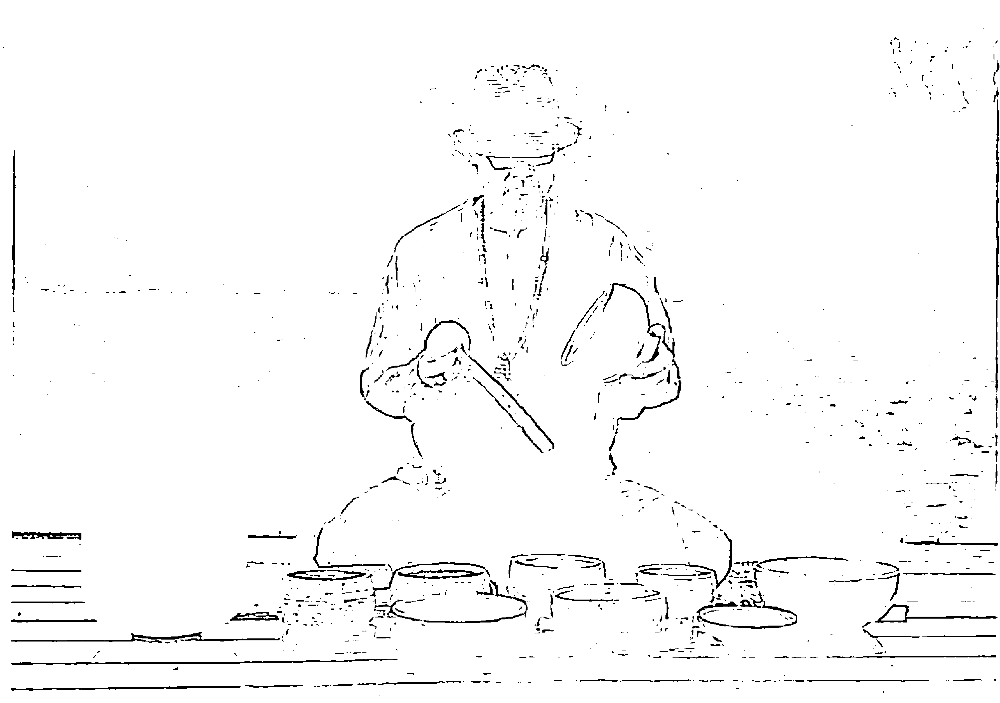

无念、无限的颂钵演奏。

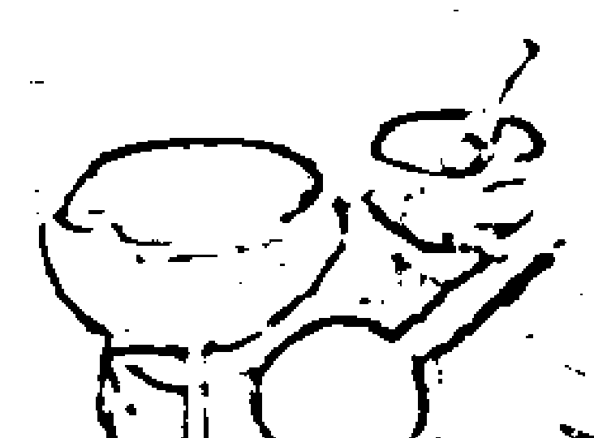

颂钵的聲音频率可以在细胞层次上恢复平衡与和谐，并增进免疫功能、降低心率以及血压。可以让人平静、缓解疼痛、减轻焦虑和压力，为大部份人们创造出一种幸福感。有些人就只是简单的用它来放松、或者增加冥想静心的专注程度，它们复杂的泛音和振动能量，也可以影响脑波模式和意识的转换，能够把我们带进一种和平的「α 波」或「θ 波」状态中，这种意识状态是一种强而有力的健康状态。

每一场「颂钵演奏会」都是独一无二、无法重来的「当下」。和其它乐器相较，颂钵并没有一个固定的明确音调，同一颗钵磨奏时的音调，会随着木棒或皮棒呈现截然不同的效果；敲奏时的基调，也会因为你的钵槌材质、敲击位置、力道和技巧……乃至你的心情，以及所有钵的排列位置、共鸣效果而变化多端。你其实无法复制、也无法预期每一次的演奏成效，正因为这种无法预期、难以掌控的未知，让演奏者和聆听者都放下了预期和掌控，而安住于当下。

这就是颂钵与一般乐器不同之处，也是「演奏会」与「音乐会」不同之处。除了各种尺寸、款式、材质的颂钵各有其声音特质之外，不同的钵棒和钵槌也为颂钵创造了更多重丰富的泛音，当我们在演奏时，各种音调的颂钵所排列的位置也深刻影响到彼此的共鸣，每一颗钵的音声以各种暂时的因缘交织在一起，甚至会诱发出不属于现场任何一颗钵所拥有的泛音。那些要求颂钵要具有寻常乐器般精准音调的人，或者坚持要以颂钵演奏某些歌曲和乐谱的人，其实忽略了颂钵本身最珍贵的特性。在钵疗中之所以达到超越极限、难以造作的疗愈效果的是「声音」，而不是「音乐」。音乐是一种逻辑，中国哲学里不管主张的是「声无哀乐」或是「声有哀乐」，音乐都能导引情绪、陶冶性情、甚至移风易俗。然而，音乐也把我们的感受带进了一种「套路」，就好像聆听军歌能激励士气、振奋人心；聆听悲伤情歌则心情低落、忧郁慵懒。听到熟悉的音乐时，头脑会忙着回忆并整合相关的情境和感受，纵使音乐具有疗效，也很难超越头脑。而声音则是更原初、更单纯的层面，不经头脑编辑、没有乐谱理论，它不会撩拨思维，只在最深邃的层面被经验……甚至不知不觉地将你带进了更宽广、更自由的无念和无限。

声音包括了「音调」、「频率」和「共鸣」等等品质。「音调」即所谓的八度音阶，大部份的疗愈系统都以此来对应不同脉轮，然而当我们敲磨颂钵时，因为复杂泛音的关系，手工铜钵不可能有单一且精准的音调。「频率」亦即所谓的「赫兹」，也就是颂钵每秒的振动次数，许多能量医学也诉求人体各脉轮和器官组织的赫兹，甚至对应着天体行星、色彩、音阶… 种种万事万物的频率。为颂钵选派一个频率是很多商家或疗愈者常做的，但手工铜钵的频率并不如此单纯，不同的钵棒、力道或敲击位置，甚至是环境的温度、麦克风的条件、摆放的位置…都是影响频率的因素。至于「共鸣」，则是不同振动频率之间的关系，这个特质在颂钵演奏里尤其重要，当我们将多颗颂钵摆放在一起敲磨，经常会创造出单颗颂钵所没有的音调，藏巴帝老钵的共鸣特别出色。共鸣的特质为颂钵演奏创造出更多出乎意料的惊喜，在一堆钵里，相似音调的钵会此起彼落的唱和，你只要敲磨其中一颗，另一颗就会缓缓作响……因此在一場演奏会中，同一群钵以不同的图形或位置排列，也微妙地影响着相互的共鸣效果。

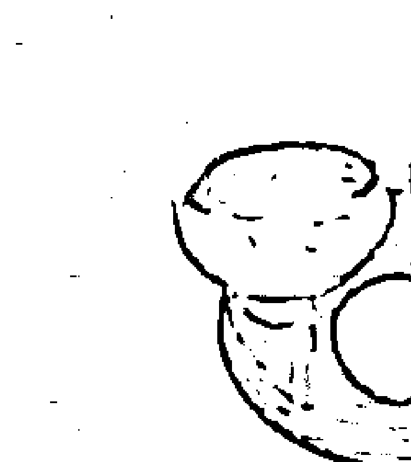

一场颂钵演奏疗愈，并不是一场音乐会，你无需要求精确的音准、不必精通复杂的乐理，你就只要放下所有的头脑，全然地「在」这个当下，像孩子般玩耍，让这些单纯且美好的声音，带领所有聆听者超越头脑的思考模式，让意识跃入无限，这也意味着引领聆听者跳脱原本的概念疆界，得以转移意识次元、开展无限潜能，经验自由和解脱的美好当下。

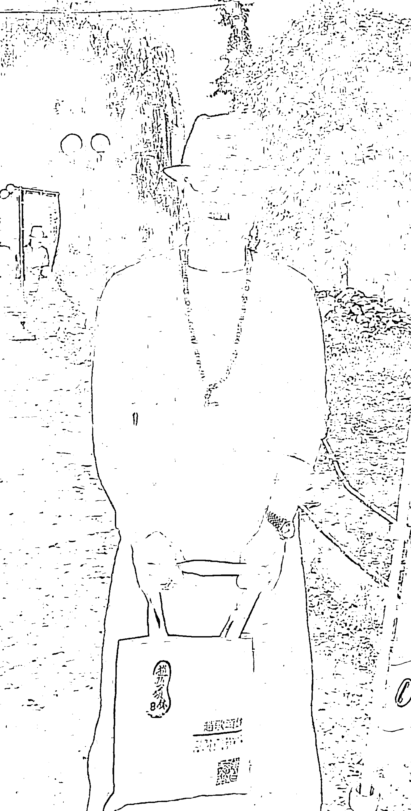

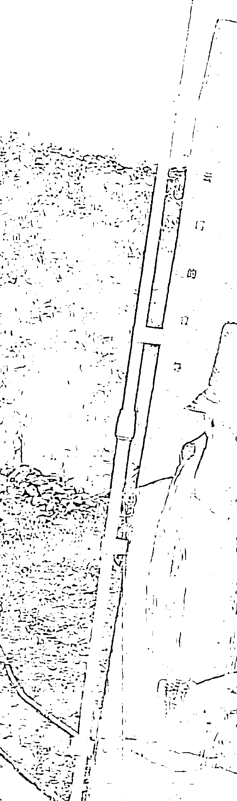

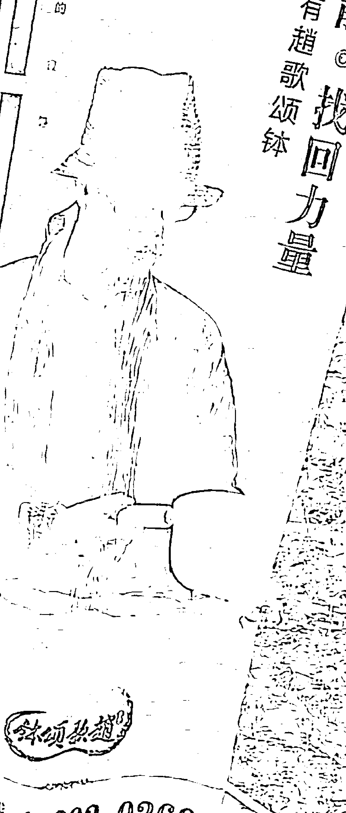

找回力量
唯有歌颂钵
咨询热线 0510/8202 0269
超歌颂钵

获取更多好书，请加微信号：atrcdts

店铺：http://strc.cn/gx

# 气场脉轮能量地图

颂钵治疗除了放松、治愈疼痛、恢复平静之外，最重要的终极目标是要使个案喜悦与快乐，这样的愉悦情绪，将增加我们的生命活力，增强免疫力，开展被压抑的能量……要成功达到更多针对性的细腻疗愈目标，就需要选择颂钵疗愈介面，例如，脉轮系统、经络脏腑系统、气场能量面向、肌肉骨骼面向、左右侧身体阴阳面向、原始点面向、潜意识面向、时间空间面向……等等。

新手敲钵最好的根据点，就是人体的七个脉轮。一至六脉轮是很容易施作颂钵的地方，也容易得到立即的效果。初学者只要有一点脉轮常识，就可以很成功地做好钵的身心放松疗愈，甚至得到个案奇迹式复原效果的激励。

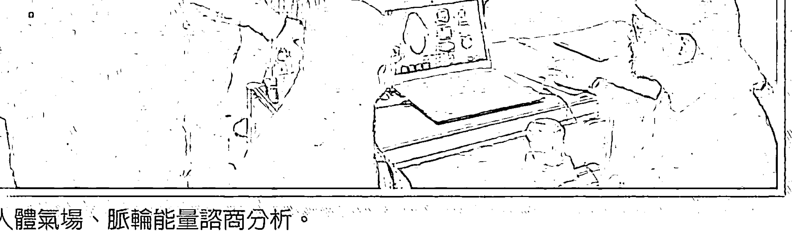

人体气场、脉轮能量咨商分析。

人的一生像是被困在一个不停旋转的漩涡里面，而这些漩涡就是脉轮的漩涡，要不就是纠缠在脐轮的关系里，要不就是困在心轮爱的课题里……失衡的脉轮可能会过度旋转放大、强力向外冲刺，也可能向内萎缩压抑、动力缓慢凝滞……这些征状在脉轮测量仪器上遍览无遗。当一个总是固执己见的人，凡事只允许自己的观点，只在意自己的利益，他的第三脉轮肯定异常饱满、甚至扩大涣散，而邻近的第四脉轮，则流失了爱和同理心的能量，呈现弱小、压抑、萎缩的能量状态。

第三脉轮是太阳轮，是自我力量消长的呈现，自我信心的超过与不足，会反映在人体脉轮能量上，在我以脉轮测量仪器判读的过程中，一个充满信心的人，所显现的太阳轮图形巨大而且明亮，而第五脉轮的喉轮图形也同样饱满，我们不难理解：有自信的表达会让人充满优越感，脉轮的图形大小、色彩明亮与黯淡，直接反映个案的信心和内在力量。

除了科学仪器，你可以用灵摆、肌力或 O 环测式、徒手能量扫描、问卷、咨商……各种方式来探测搜集个案的脉轮资讯，人体气场脉轮架构，已涵盖了一个人身、心、灵所有层面的课题，当你熟习脉轮知识后，光是和个案闲聊，你就可以凭着直觉触及案主的问题核心。当你能够协助个案清晰看见内在失衡的问题点，疗愈就已经开始了。这对于案主来说，是一个很好的契机，无形中也更能敞开自己接受治疗师所给予的疗愈，透过这个过程更加清楚个案的能量地图，针对重点脉轮疗愈，在地图上找出最恰当的途径与目的地。

第一脉轮到第四脉轮都是人们奋力挣扎的领域。下三个脉轮，与食物、金钱、权力、控制、性有关。奥修曾说过类似的譬喻：人生就像莲花的生长，需要根植污泥，这「污泥」就是处于无知与错觉的意识状态。然而你必需努力穿越水域，力爭上游突破重重限制，而这污泥之上的「水域」就是代表爱的第四脉轮。最终，当我们试图浮出水面、穿越喉轮抵达第六脉轮，那就是莲花的天空，阳光遍照、空气清新的天空，也就是觉醒开悟、遍满智慧的意识状态。

脉轮由肉体层面，连接乙太体及更多精微的能量层面，从生命之初始，即传承了祖先的各种程式。例如第一脉轮，有着动物性「生存」本能的程式，从胚胎到出生，从家庭到社会、一直都依循着海底轮的程式而发展，有人终其一生困在金钱与健康的议题中，所有关于生存的需求都与第一脉轮息息相关，远从蛮荒的渔猎时代，弱肉强食的丛林法则就已彰显出海底轮的强大动力。

体力、血液循环、骨骼、体重…等等问题，多半都与海底轮有关，心理层面的惊吓、恐惧和不安，也与海底轮的安全感密不可分。痔疮、便秘、生殖器官、性能力、坐骨神经、退化性关节炎、膝盖……种种生理问题，乃至根着大地、落实行动、活在当下……等等心灵活力与勇气，也都关联到第一脉轮。

也有人困在第二脉轮的程式中，难以圆满发展各种人际关系，尤其是亲密关系，终其一生不断的在各种关系里碰撞……。脐轮的橘色频率连接身体腹部、大小肠、卵巢；连接情绪体的喜悦、痛苦与所有关系所引发的情绪；也连接着灵性体对关系的执着的超越。太阳轮的黄色频率连接身体的肝脏、肾脏、消化系统；连接情绪体的享乐、智谋、个人力量、魅力…等等；在灵性体则彰显着个人的独特性。心轮的绿色与粉红色则连接身体的心、肺、呼吸系统；连接情绪体的信任、放松、平静与感恩；在灵性体则关联到真理与无条件的爱。喉轮的蓝色连接身体面的喉咙、甲状腺、颈部；连接情绪体的沟通、表达、转化等力量；在灵性体则代表自由与创造力。眉心轮的紫色对应身体面的眼睛；连接情绪体的洞见、直觉、第三眼；而在灵性体则主宰冥想静心和悟觉。顶轮白色连接身体的囟门；连接情绪体的整体、圆满；也代表灵性体的合一的品质。

| 脉轮 | 身体连接 | 情绪体连接 | 灵性体连接 |
| :--- | :--- | :--- | :--- |
| 第一脉轮（海底轮） | 体力、血液循环、骨骼、体重等 | 惊吓、恐惧、不安、安全感 | 生存本能、落实行动、活在当下的勇气 |
| 第二脉轮（脐轮） | 腹部、大小肠、卵巢 | 喜悦、痛苦、关系引发的情绪 | 对关系的执着的超越 |
| 第三脉轮（太阳轮） | 肝脏、肾脏、消化系统 | 享乐、智谋、个人力量、魅力 | 个人的独特性 |
| 第四脉轮（心轮） | 心、肺、呼吸系统 | 信任、放松、平静、感恩 | 真理与无条件的爱 |
| 第五脉轮（喉轮） | 喉咙、甲状腺、颈部 | 沟通、表达、转化 | 自由与创造力 |
| 第六脉轮（眉心轮） | 眼睛 | 洞见、直觉、第三眼 | 冥想静心和悟觉 |
| 第七脉轮（顶轮） | 囟门 | 整体、圆满 | 合一的品质 |

诸如上述的种种资讯，足以为你的钵疗带来更多指引，也引领你有迹可寻、更深入探索案主的内心。脉轮浅谈至此，毕竟这不是脉轮专书，有兴趣的朋友可以自行钻研。

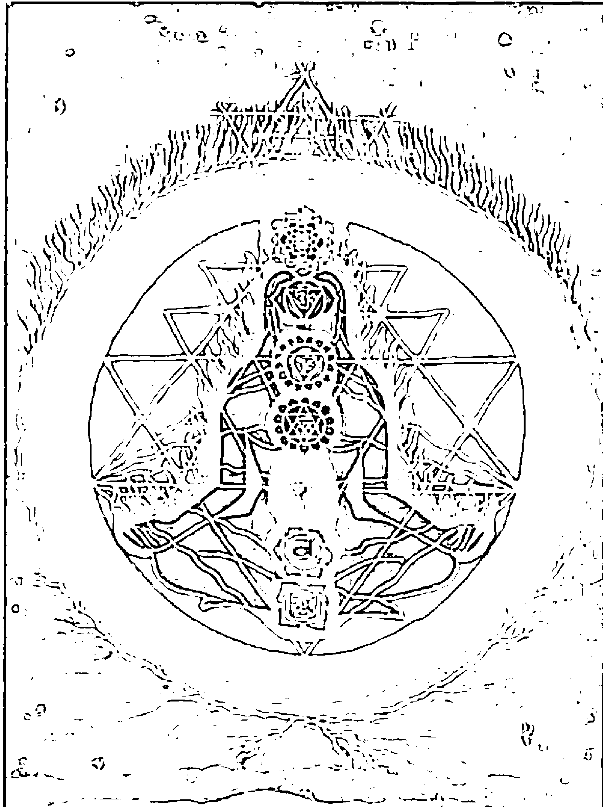

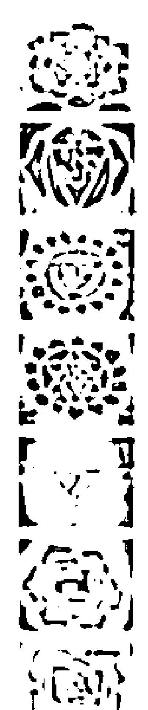

# 经络穴道能量地图

敲击和磨奏铜钵所产生的振动，除了带给个案深度按摩的放松感，钵体针对经络穴道处震荡、疏通，具有一种「音灸」疗效。

中国人对于针灸穴道、推拿按摩经络的医疗保健并不陌生，然而在现今西方国家的自然疗法里，基於经络穴道理论的新兴疗法也屡见不鲜，例如各种色彩光灸，在身体的穴位点照射不同颜色的光，让色彩的频率刺激穴点，进而疏通经络；又如音叉在穴位点的振动音灸，同时达到疏通和调频的功效。在我多年的研究实验下，发现只要用对方法，颂钵音声的穿透力丝毫不逊于前述两者。体积偏大的铜钵，如何在针头般或米粒般微小的穴位点上达到针灸效果？我拣选特定频率、形状和尺寸的疗愈水晶按压穴点，并将各种铜钵的震动送进水晶中，透过水晶传导、放大并聚焦的特性，颂钵本身的振动与晶石的色彩疗愈波动相辅相成，光灸和音灸如针刺般深入刺激穴位点，引进了截然不同的能量频率。体验过的学员和个案无不印象深刻，透过水晶传递的阵阵能量脉冲，直达穴点深处，甚至能够明显感觉到这股波动在经络中窜流……源源不绝的颂钵音声加上水晶振动，让气脉流动顺畅，让五脏六腑恢复原有机能与健康。

例如：让案主采取俯趴的姿势，在双脚掌心的涌泉穴，先以相应疗效的水晶矿石（黑碧玺、红石榴…等等），按压刺激涌泉穴，再将水晶固定在脚掌心。接着，放置一颗约直径30公分的铜钵，以规律节奏连续敲击，将这震动送进晶石中，启动晶石本身的疗愈能量波动，再经由涌泉穴脉冲进入肾经…… 肾经所反映的身体各种症状，都将因此得到立即的治疗效果。以经络穴道为介面的颂钵治疗，将钵疗推向了更细腻精确的中医治疗体系，有志者值得深入钻研。

# 傲視人類的中國古老智慧——經絡穴道系統。

# 水晶缽療癒 = 水晶療癒

水晶治療，是一門深邃浩瀚的知識，將這門神秘學應用於水晶缽的療癒上，將帶給不可思議的突破，不再只流於敲缽與磨缽的方法上打轉，各種水晶能量和水晶缽的光浪交織、振盪出一片海闊天空。

水晶缽的原料為石英砂，石英水晶在工業上已大量用於記憶、放大、傳導能量。我們可以將水晶缽視為一顆能夠產生振動、發出聲音的大水晶，當你開始磨奏水晶缽，這水晶波動彷彿一波波的光浪，它可以穿透各種形體，可以直接震動神經、細胞、血管…各種內在組織。它除了滲透、洗滌、調頻所有觸及的人事物與空間，對於置放在人體上或空間中的水晶礦石、甚至特殊的能量陣列而言，也具有一種啟動、推進和擴大的催化效果，對於一個資深的缽療師而言，巧妙融合水晶缽和水晶能量、搭配適合的引導方法，甚至能穿越時空，在更精細的意識維度療癒過去、現在和未來。你能夠把水晶缽療癒進行得多深多廣，端看你對於水晶療癒領悟多少。

水晶礦石的能量波動，能夠影響人體身、心、靈各層面的振動頻率，光只是簡單的在脈輪處各擺上一顆相應的水晶，就能夠和水晶缽共振出強大的效果，更何況進階水晶療癒所排列的各式各樣曼陀羅圖形，讓單一的水晶能量，跳脫點和線的平面，而躍昇為多維度的能量場域。水晶能量治療是我浸淫了十幾年的另一個專業，箇中三昧斷不是我用這小小篇幅能交待完全，在此僅舉例幾種晶石用途，讀者們應可舉一反三、觸類旁通。

具有強力「淨化」功效的水晶礦物中，取得容易且價格合宜的首推「透石膏」和「黑碧璽」、「黑曜石」。透石膏是光之管道，能將極高的頻率轉化成溫柔的光，它是一種迅速傳導白色淨光的媒介，引光進入所有黑暗的人事物及空間，重濁晦暗的能量將在這源源不絕的光中消融。同樣可以祛除黑暗、淨化沈重的負面能量，黑碧璽和黑曜石、透石膏的運作方式卻截然不同，黑碧璽帶有微量電流，它的能量強勁猛烈地由內往外炸開，驅散糾葛的負能量團塊。而相對於黑碧璽外放的陽性能量，黑曜石的作用則是向內吸收，當你將一顆潔淨過且啟動過的黑曜石放在沈重的心輪或太陽輪上，搭配頌缽的震動，黑曜石就像吸塵器一樣，會開始強力的從脈輪裡吸附、汲取悲傷或憤怒…等等負面能量，當能量飽和之後便降低了磁吸能力，因此，有效使用黑曜石的關鍵即是徹底的淨化。

以大量的粉晶頻率和水晶缽共振，能夠帶給案主前所未有的溫暖與安全感，對於在親密關係中遭受挫敗、深感愛的匱乏的案主，將為冰冷堅硬的心輪能量，帶來溫暖軟化的氛圍，柔軟了心輪自然也讓臉色柔和親切，因此和諧了人際關係。善用赤鐵礦與水晶缽共振，能夠迅速建立起一個銅牆鐵壁般的守護空間，案主會感受到一種厚實的能量密度，像防護罩似的環抱著自己。赤鐵礦也有助於拾回散落各時空的靈魂碎片，尤其在深度的缽療中，案主經常出神旅行，在遊歷時空的過程中，赤鐵礦不僅為個案鞏固身體與靈魂的連結，讓他能安全順利的返回現實世界，同時也協助案主在其它時空與失落的自己相遇，當案主收攝這些散落於外的能量碎片，回到日常生活時，他會感到更完整、踏實、充滿生命力與安全感，赤鐵礦也能協助個案將療癒中的精細能量完全整合到現實肉身之中。

我曾將恰當造型的白水晶小晶簇放在個案的喉輪處，當頌缽一啟動，壓抑久遠的案主開始滔滔不絕的說話，甚至淚流不止，我知道他的喉輪就只是被打開了一道閘門，累積已久的能量開始洩洪…我也曾經用東菱玉來填補心輪的千瘡百孔，它的能量就像溫潤的矽膠一般，會流滲並填補所有氣場脈輪的裂縫和孔隙……各種音頻的水晶缽還可與各種晶石能量搭配，療效更加千變萬化！相較於上述錯綜複雜的細膩用法，我在水晶缽課程中常以水晶曼陀羅入門，這個深入淺出的遊戲，很容易在不知不覺中就帶領大家跨進了浩瀚的水晶療癒殿堂。

水晶曼陀羅的建構過程本身就是一場療癒，當學員們像孩子般本能的玩耍，從觸摸水晶開始，指尖的能量和每一顆晶石交融，專注而放鬆的以直覺揀選、排列、取捨、釐清眼前的曼陀羅，同時灌注了自己的意圖和當下的生命力、創造力，在外如在內，這曼陀羅就像治療師的一面鏡子，透過曼陀羅的檢視和調整，缽療師歸於平衡和諧的中心，也將個案帶進了一個美麗的療癒空間，所有停滯阻塞的困境，都在這美麗的場域裡開始流動，和頌缽相互輝映地和諧交響，療癒師和案主彼此都在這股獨一無二的創造力中重生。

# 水晶與鉉療癒。

# 颂钵催眠疗法 = 远距颂钵疗法

放松身体并不难，运动、按摩、泡热水澡、深呼吸… 肌肉都能到得一定程度的放松，但是要真正放松心意却不容易。很多人自认放松，却夜夜难以成眠，念头一个接一个紧凑不断；有些人虽然放松身体、打鼾熟睡，但紧张的心却在梦中上演着一幕又一幕充满张力的剧情，在梦中继续无意识的创造业力…… 颂钵不但能够很迅速的放松案主的身体、气脉，还能将他的意识带到放松的 α 脑波静心频率。甚至更深的 θ 波潜意识状态，这些脑波状态在催眠治疗的观点看来，都是各种不同深浅的催眠态。在放松且专注的催眠潜意识里，所经历的种种情节也有别于平常昏睡时的梦境状态，催眠的内在旅程比较像是一场「清明梦」，意识处于能够知梦造梦、既放松又警醒的状态，疗愈师和案主能够在这样的意识畛域里合作各种伟大的工作。在催眠师的引导下，个案能够带着觉知去进行内在的清理、改变和创造，而这个潜意识的疗愈，就像蝴蝶效应般，牵一髮动全身，跨越了过去、现在和未来所有时空。

在《响彻云霄的寂静》一书中，我已提过催眠与颂钵的结合，这两者堪称相辅相成、水道渠成。催眠术是近代一种应用科学，从古老先祖们医治灵魂的种种仪式和方法中抽离而出的技术，一个催眠师必须用语言指今诱导个案进入催眠状态，并且视工作的情况不断下各种暗示、深化案主的催眠意识，对于那些下意识抗拒语言指今的案主而言，成功的机率并非百分之百。但在颂钵过程中，几乎百分之百的个案，无需任何语言暗示或引导，都能在短短几分钟内毫无抗拒的达到这种意识的转换。熟谙各种水晶能量的疗愈师，即使沈默不语也能够以水晶引路，带领个案一步一步融入意识的深处。例如：在案主週遭以拉长石结界，可以快速诱发出 α 波，甚至急转直下到达 θ 波；在个案手中握著某些特定水晶，也能协助案主进入深度冥想状态；在案主眉心轮摆放蓝铜矿、舒俱莱石、紫水晶、矽孔雀石、赫基蒙鑽…… 等等，能够协助个案开启第三眼，在催眠旅程中更有觉知的看见并创造。

以上这些方法，都让钵疗师完全不费吹灰之力的把案主领进了准备好「待催眠」、「待疗愈」的状态，小到单纯地植入正面语句指令，以矫正自己的身心灵旧模式；大到疗愈过往创伤甚至前世业力，与自己内在所有冲突的人事物和解……我们在催眠态里能为个案做的事无限之多。事实上，所有疗愈都必需要能够深入潜意识，改变思想和习气反应的模式，才能终极的改变你的外在行为和生活，钵疗和水晶疗愈都能够很出色的达到此种意识深度。

当一般人在昏沈的睡梦里做著业力之梦，正如俗话：「日有所思夜有所梦」，人们在梦里延续著白天的念头、情绪、创伤、制约…种种经验，由于人们无法觉知这梦境的虚妄不实，因此继续在梦里当真的挣扎搏斗，这就仿佛一场毫无觉知的自我催眠，所有的情绪业力一再强化加深，潜意识里的故事，在你梦醒后仍深刻地影响着白天的情绪和行为而不自觉。究竟来说，我们的一生也是一场长长的梦，人人随著业力在这如幻的梦里真实的轮迴著，能够在清明的梦中认出自己，就像在催眠中与自己的灵魂相遇一样，是难能可贵的美好，这也是一个机不可失的疗癒时刻。

我经常看见缽疗学员，只是简单的敲著敲著，就把个案敲进了前世的场景……不明究理的初阶学员见状经常束手无策、哑口无言，其实你只要揣摩案主的内在旅程，并适度的熟悉催眠引导，就能够把握这个已然水到渠成的疗癒时刻，引领个案穿越内在灵魂的困境和业力。在这里你也将会发现一个秘密～我所谓的「远距缽疗」，即是在这个跨越时空次元的催眠态里进行。你可以将个案的意识，引领到某段有着巨大创伤的童年时期，然后在个案身上进行缽疗，疗癒著那个受伤的小孩；你也可以将个案带回某个前世，并针对那一世他所遭遇的困境给予缽疗……最终你会领悟到：原来案主的每一个过去，形塑了他的现在，深不可知的影响著当下的身、心、灵状态。这是一种灵魂的疗癒、更源头的疗癒，某个时空里最需要疗癒的那个角色，会在案主身上浮现，而只要在这个角色身上敲缽，就能够帮助案主从这个轮迴故事里解脱。

催眠状态，让我们得以在时空座标上任意移动，除了纵向在自己生命的时间线上回溯或往前走，我们当然也可以横向地切换进入不同的生命能量。例如：让个案在静心状态中转换成某个他想疗癒的人，可能是母亲、孩子，或者是伴侣，以这种能量的连结继续进行缽疗，无论是案主或缽疗师都能够感受到场域里进入了不同的能量质地，这说穿了就是在疗癒个案的某些人际关系，也同时疗癒了案主和他内心中所想要祝福疗癒的人。另一种由缽疗师独自操作的远距疗癒法，有点类似佛法中的「自他交换」法，缽疗师在深度的静心中，将自己转化成想要疗癒的对象，这时候疗癒师会明显感受到对方的能量，甚至清楚知晓对方在身、心、灵各层面的痛苦所在，疗癒师就根据这些感受在自己身上敲缽……以上概略介绍的各种远距缽疗，涉及许多重要心法，虽然不可思议的强大有力，却需要更多亲身体验才能上手，我们会在这样的进阶疗癒中，真正体会到所谓的万物合一，无论你和我、我们都是一个无法割裂的命运的整体。

# 完整的學習之道

從學習者到分享者，自利而利他，無論是個案療癒或教學分享，都是一個教學相長的過程，也是完整的學習之道。

我始終建議學習者：不要依賴、不要盲從，不要把施教者的教導都視為真理，請用你的生命去體驗、去實踐，讓所有的教導去蕪存菁，成為你自己的真理。

教練只能給你技術和方法，剩下的部分，得靠選手自己的苦心練習，反覆地在任何一件事物上下功夫，肯定都將熟練生巧、成為專家。我建議習得了基本技術之後，把注意力放回自己與個案身上，個案才是你的終極老師，最關鍵的技巧就是不斷的練習再練習。多做個案除了能挑戰各式各樣的疑難雜症之外，還能夠熟練並深化技巧。在有限的肉身上施作缽療，同時也能夠影響無限的空間能量，觸及過去、現在、未來的場域……除了個案的身心反應將帶給你莫大的肯定之外，缽療師的潛能也將一再被開啟和強化。

一旦你摸索出自己的道路，驗證了自己的真理，積累了足夠的個案經驗和智慧，我非常鼓勵你將自身的學習分享給有緣人。學然後知不足、教然後知困，開始你的頌缽教學並非意味著你的學習已功德圓滿、不再往前，反而是另一種學習的開始。

本書最初的目的，是為〈頌缽〉學員帶來更多療癒應用，也為將來的師資們，提供更多教學靈感。下列的訓練大綱，僅供參考。

## 〈銅缽 + 水晶缽 初階課程〉 約二至四天

在一個針對初學者而開設的工作坊裡，要整合銅缽和水晶缽療癒技術於一身，而且讓學員能在短時間內融會貫通，這對於教師而言，著實是一項挑戰。我經常執行這樣的課程組合，視教學深度而定，約需二到四個工作天。

除了週、六日的固定假期之外，利用其它工作日來學習頌缽，對於時間寶貴的都會人頗感爲難，因應學生需求而訂定的二日工作坊，建議人數約以十人爲上限，若報名人數超過太多，而下列課程內容又不想被刪減省略，則需視進行速度而延長上課時數與天數。

頌缽課程進行中，非常重要的環節是學員之間的分享回饋，所有飄渺抽象的體驗，經過文字、口語的表達過程，將使得能量往外更具體且落實在現實世界，同時也往內更深入心靈。每一次的個案模擬練習也彌足珍貴，學員可以輪番從缽療師和個案的角色裡體驗整個過程，相互分享和建議過程中的細節，集思廣益、精盆求精，讓大家的課堂學習更深化且穩固。人數一旦過多，則必要的分享就會拖慢上課的節奏，即便每人每次分享僅三分鐘，以十二人的班級爲例，每一個分享段落就得耗費三十六分鐘，更何況許多學員在初試缽療體驗之後，總是熱切的急於分享自己的神奇經歷，根本顧不了時間限制。

我教授三十人的初階班級，原先的天數規劃爲三天，但每次逐一分享心得就耗時九十分鐘以上，而一天之內至少有四個段落必需分享討論，爲求教學能夠圓滿完整，我經常得徵求學員及主辦單位的同意，每晚加課到深夜。

頌缽教學課程中，除了頌缽、缽棒等相關教材之外，療癒床亦不可或缺，或許有些主辦單位不想花費成本添購療癒床，但個案得因陋就簡趴在餐桌上或地板上；療癒師也必須或蹲或跪、彎腰駝背的進行缽療，無論案主和療癒師都很難真正的舒適放鬆。一般按摩用的治療床〈80x180cm〉，可以讓個案舒適的趴睡或仰躺，然而一旦你的課程教材必備了按摩床，不僅增加了教學成本，床數也限制了學生人數及教室空間大小。通常我讓二人共用一張床，輪流體驗案主及治療師的角色，注重實作細節和親身體悟的頌鉢訓練課程，只得以床數決定上課空間及人數。

對於頌鉢學習者而言，銅鉢是較易上手且較有效率的工具，相較於水晶鉢精微的高頻率與脆弱易碎的材質，銅鉢具體而強烈的震動，對於重濁緊繃的身體，具有明顯且優異的淨化、疏通、化瘀…的深層按摩效果。大多數人們習慣將覺知聚焦在較粗鈍的物質層面，學習初期察覺不到精微的能量層面，縱使這些精細的能量已深入心靈。但這些人對銅鉢的有感震動卻反應強烈，在深具穿透力的震動按摩及低沈音頻中，因而極度放鬆酣睡的案例比比皆是。無論對於治療師和個案而言，銅鉢都是很好的入門工具。

在中國內地教學，往往因為學員來自大江南北，舟車勞頓、齊聚一堂實屬不易，因此課程設計通常綜合了銅鉢與水晶鉢的操作，其中銅鉢療癒仍佔了三分之二的內容，水晶鉢更著重於心靈面與形而上的能量層次。以上是我經常執行的課程設計版本，精要但詳盡的融合了銅鉢與水晶鉢的操作技巧與療癒內涵。

如果沒有任何時間、空間的限制，我傾向於將一個頌鉢學習過程，規劃設計為下列架構：完善的銅鉢技法和心法約分三個級次，每個級次可以執行三至五天。水晶鉢也粗分為三個級次，每個級次同樣是三至五天的進程。

## 〈銅鉢療癒師 初階課程〉

初階療癒師培訓課程，全程實作體驗，讓頌鉢初學者，具備信心及技術可以執行完整的深度療癒個案。

### 課程大綱
- 1. 調頻療癒師的內在頻率。
- 2. 銅鉢的自我療癒放鬆靜心法。
- 3. 銅鉢的療癒基本操作法。
- 4. 銅鉢的療癒節奏。
- 5. 銅鉢的斷除療法。
- 6. 完整的個案療癒。

### 療愈功法
- 1. 啟動拙火缽療法。
- 2. 氣場防護光泡療法。
- 3. 增強第三眼直覺療法。
- 4. 治療失眠速效缽療法。
- 5. 清空妄念煩惱缽療法。
- 6. 減壓放鬆深層修護缽療法。
- 7. 未來障礙排除缽療法。
- 8. 過去包袱卸除缽療法。
- 9. 治療偏頭痛療法。
- 10. 改善糾結關係缽療法。
- 11. 釋放胸悶缽療法。
- 12. 清肺潤喉缽療法。
- 13. 精氣神恢復缽療法。
- 14. 疏通抑鬱缽療法。
- 15. 緩解焦躁缽療法。
- 16. 松軟肩頸缽療法。
- 17. 健胃整腸缽療法。
- 18. 感情創傷修復缽療法。
- 19. 提升專注記憶力缽療法。
- 20. 強化信心缽療法。

## 《铜钵疗愈师 中阶课程》

紧凑的进阶课程中，应用了三十至四十种独家钵疗法，让学员在研习各种模组的過程中，领略頌缽療癒強而有力的創造力和可能性。每一位缽療師結業後，都能融會貫通甚至超越這些模組，行雲流水做出奇蹟式的缽療效果，這些案例在〈學員心得分享〉裡俯拾皆是。

### 療癒功法
- 1. 瘦小腹減肥缽療法
- 2. 脈輪刺針式療法
- 3. 內在力量整合療法
- 4. 消除腰酸背痛療法
- 5. 刮痧療法
- 6. 平衡陰陽療法
- 7. 太極融合療法
- 8. 安眠深度修護療法
- 9. 疏經活絡回春療法
- 10. 暗黑能量祛除療法
- 11. 醒腦聰明療法
- 12. 創造落實療法
- 13. 斷除執著療法
- 14. 清腸排毒療法
- 15. 喚醒高我療法
- 16. 接地式淨化法
- 17. 水滴石穿療法
- 18. 超級缽動療法
- 19. 穴位脈衝療法
- 20. 疼痛抽離療法
- 21. 聽說平衡療法
- 22. 多床陣列療法
- 23. 無條件愛的療法
- 24. 催眠回溯療法
- 25. 旋轉能量療法
- 26. 生命之樹療法
- 27. 胎臥式缽療法
- 28. 戒癮療法
- 29. 頌缽遠距療法
- 30. 丁夏纏繞療法

## 〈銅缽療癒師 高階課程〉

經絡脈衝缽療法、刮痧缽療法、精油按摩缽療法、水晶能量穴點共振缽療法……銅缽與經絡穴道結合的獨特教學技術，讓學員學會以頌缽療癒十二條經絡，並輕鬆應用頌缽刺激穴道經絡，達到通暢筋絡、保健治療的顯著療效。

## 颂钵 黄金纪元的圆满之歌

## 〈水晶钵疗愈师 初阶课程〉
- 1、水晶钵调频呼吸静心法。
- 2、水晶钵的净化、祝福、结界。
- 3、水晶钵的讯息扩大疗愈法。
- 4、「水晶钵」与「水晶」的能量共振疗愈。
- 5、水晶钵与宝石卡能量阵列。
- 6、水晶钵制作信息水。
- 7、水晶钵个案疗愈。

## 〈水晶钵疗愈师 中阶课程〉
- 1、水晶钵与水晶治疗。
- 2、气场净化与脉轮平衡疗法。
- 3、水晶钵转换意识催眠引导。
- 4、水晶钵阵列与曼陀罗晶阵疗法。
- 5、水晶钵的远距疗法。
- 6、完整的水晶钵个案疗愈演绎。
- 7、水晶钵能量花精制作。

## 〈水晶钵疗愈师 高阶课程〉

登峰造极的水晶钵疗愈，即是「水晶疗愈」。当水晶钵的音声像一波波纯净的水晶光浪般扩散开来，这个波动能够轻易放大、扩展并显化我们的疗愈意图。在水晶钵运用的初期，我们已运用这样的光芒波动、以及水晶曼陀罗做了很多工作，若学员们有兴趣钻研更深邃奥秘的水晶疗愈，藉由各种音频的水晶钵，与各种水晶矿物频率的能量特性交织振盪，你可以演绎出超乎想像、穿越时空的疗癒，这些心灵疗法难以侷限的深邃和宽广，举凡深度放松、呼吸调息、静心冥想……乃至解除潜意识制约、摆脱负面暗示、情感创伤、惊吓恐惧阴影、伤痛情绪、懊悔罪疚……结合水晶钵与水晶矿石波动的系列疗法，简直族繁不及备载。

于是，我们不难领悟，一门深入的学习，其实是一辈子的事。尽管我将培训课程分为上述阶段，区区几天已给出了庞大的讯息量，足以让学员消化品味大半年，然而这区区几天与浩瀚的生命相比，却渺小得微不足道。学无止尽，俗话说：「师父领进门，修行在个人」，后续仍有无限的级次，期待你们用各自的生命体验，来与我分享。

### 頌缽 黃金紀元的圓滿之歌

# 初階課程剪影

頌缽療癒過程中，即便在同一個空間裡，同一顆缽拿在不同療癒師的手掌中，這缽就有了截然不同的影響力。缽的聲音在治療師手中與其調頻共振，會形成一種獨一無二的嶄新頻率。因此，缽療師先反觀自心是有必要的，就像調音師校準鋼琴的琴弦，才不致於彈奏出荒腔走板的旋律。想要以頌缽療癒個案的身心能量，身為治療師的你，是否已調校好自己的音準呢？在學習頌缽音療之前，第一節課，我總是讓學員們先聽聽自己內在的頻率……

### 〈聆聽內在頻率〉

第一堂課，大家看到各式各樣的頌缽，就像個貪玩的孩子一樣，往往急著一哄而上敲個痛快。我習慣在簡單的示範之後，就讓每個學員魚貫而上，端坐在一堆缽與音療器具、各種敲擊棒之前，隨興發揮……一旦坐上了舞台，每個人的身心反應大不相同，有些如脫韁野馬般玩心大作、或者緊張慌忙得手足無措、也有人不疾不徐，出乎意料的穩若泰山…… 學員們有著各種各樣的表現。此時，台下觀看聆聽的學員，則擔任著評審角色，用自己的身心去感受上台者所演出的能量，去聆聽他對這世界展現自己的方式，並且在評量表上勾選出每個人的頻率，在這段遊戲般的過程中，我們可以很客觀的找出彼此的能量品質。

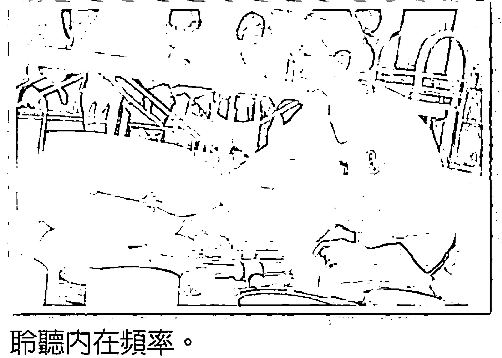

### 〈調校呼吸 歸於中心〉

當頌缽療癒師在習修缽療技法時，首先被影響的是療癒師自己的身心狀態，在熟練專注這些療法的同時，療癒師的內在就像一池被撩撥的水，開始有了各式各樣的波瀾，然後漸趨平衡和穩定……這個學習過程本身就是一場深度的療癒。有了穩定的身心，熟練的技法自然可以發揮神效。下列的頌鉢呼吸練習正是其中一個好方法，幫助鉢療師在每次個案之前，深度放鬆並迅速提升生命能量，歸於中央、平衡身心。人們就像一盞微弱的燭火，在每個專注的一呼一吸間，逐漸燃燒得更加熾熱、益發燦爛，這內在的火焰和暖熱的生命活力，將照亮自己也照亮了別人。

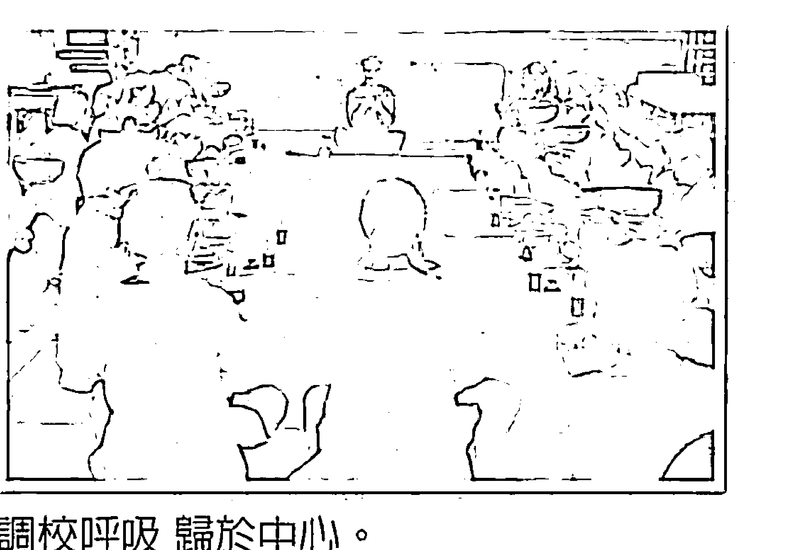

### 〈頌療的細節提醒〉

躺在療癒床上等待進行鉢療的案主，往往為了平衡混亂的身心狀態而來。在我的療癒經驗裡，無論案主外表看起來多麼成熟年長或健壯強大，內在總藏有一個充滿挫折與無力感的小孩，在療癒過程中，我們得帶著細心與耐心去呵護這個孩子。每一個細節都不能馬虎，讓案主能在一種被細心對待的尊重裡放鬆下來，從他所接觸的每一個介面，備感愛與呵護。在整個療癒過程中，他所看到、聞到、聽到、觸碰到、感覺到的所有層面，都必須悉心準備。諸如：療癒師溫暖熱忱的接待、療癒空間的舒適感、頌鉢的擺設、植物景觀、空氣氛圍、能量水晶擺飾、牆壁掛圖、療癒前的背景音樂、燈光柔和、乾淨芬芳的療癒床、枕頭、被單……等等。

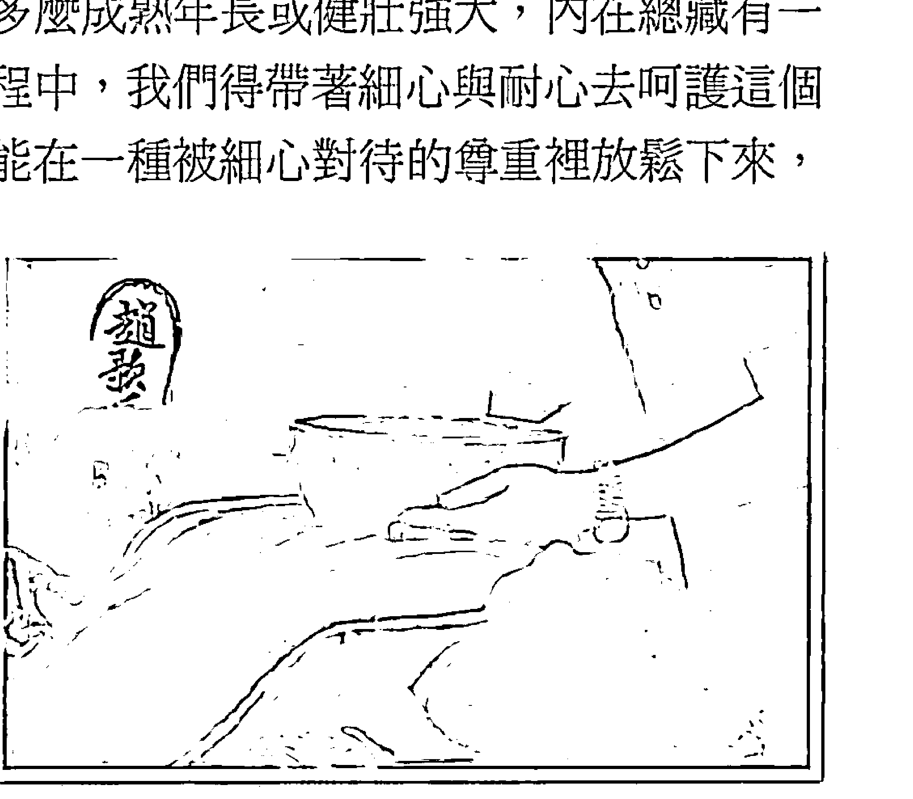

每個案主內在，除了有一個無助的小孩之外，也都有一尊神聖的佛，我們除了給予細心的呵護之外，還得帶著一份謙卑和尊敬。缽療師要如何準備好這樣的姿態？答案就是療癒前的自我靜心，一旦你身心平衡，就如同漣漪一樣，那份和諧的療癒品質會從你內心自然而然地散發到你所在之處、所接觸之人、事、物。

在缽療過程中，對案主的每一個觸碰，切記應輕柔有愛，而不是漫不經心或粗魯草率。尤其在案主身上放置頌缽時，要放鬆並專注，儘可能輕輕放、慢慢取。觀察個案的身體節奏，與個案同步呼吸並且聆聽個案的頻率，順著這個呼吸的起伏放缽、取缽，讓缽的移動過程順勢而為。去感受對方呼吸心跳的脈動起伏，你可以在個案吸足了氣、腹部隆起至頂點時敲缽…… 跟隨個案的呼吸節奏敲擊一段時間，與之共振同頻之後，你可以開始改變敲擊的速度，視情況可慢可快，目的是牽引案主的生命節奏跟隨敲擊的速度而轉化。你們就好比兩個親密相擁的社交舞伴，你隨著案主的腳步而動，等待兩人同步後，你開始引導著每一步，讓案主不知不覺跟隨著你的引領，終於能舞出他那老舊的繭，舞出翩翩彩蝶般的嶄新生命。

### 〈療癒順序～坐姿、俯臥、仰躺、喚醒〉

所謂「順序」並不是放諸四海皆準，但對於嘗試做一個完整收費個案的初學者而言，依循下列流程架構是很有幫助的。當案主來到，我們先從諮詢開始，你可以輕鬆的晤談方式瞭解個案的困難處境，並從中判斷後續缽療的重點課題（例如愛的創傷，療癒重點可放在心輪）。你也可以利用各種工具，諸如：能量檢測儀器、占卜牌卡……等等，療癒師以自己所擅長或方便的諮詢方式開始，諮詢過程中，一面設計規劃療癒的重點和順序。倘若時間充足，可以先採坐姿，接著俯臥療癒後背，最後再仰躺療癒前側。一次缽療若從諮詢晤談、坐姿、俯臥和仰躺漸次完成，約需費時九十分鐘以上。）

躺上療癒床之前，以坐姿先進行「頭缽」療癒，有助於清空腦袋裡喋喋不休的內在對話，這些周而復始的念頭，從早到晚甚至延續到夢中，分秒不停地糾纏著個案的心智，彷彿個案心中的一串念珠，不停叨念著相同的信念模式，就像各自心中另類的經文咒語。「頭缽」這個療癒手法，能夠在頃刻間讓這串負面的念珠鬆綁、散落…… 放空所有念頭，讓案主接下來可以放鬆、安然的接受缽療所帶來的種種療癒可能性。有很多人即便是端坐著頭頂銅缽，在療癒師短短幾分鐘的敲缽過程中竟然能入睡打鼾……就在那幾分鐘內，只是敲了頭缽，就足以為案主解除層層心防、也卸下了千斤壓頂的重擔，頓時感到前所未有的輕鬆。

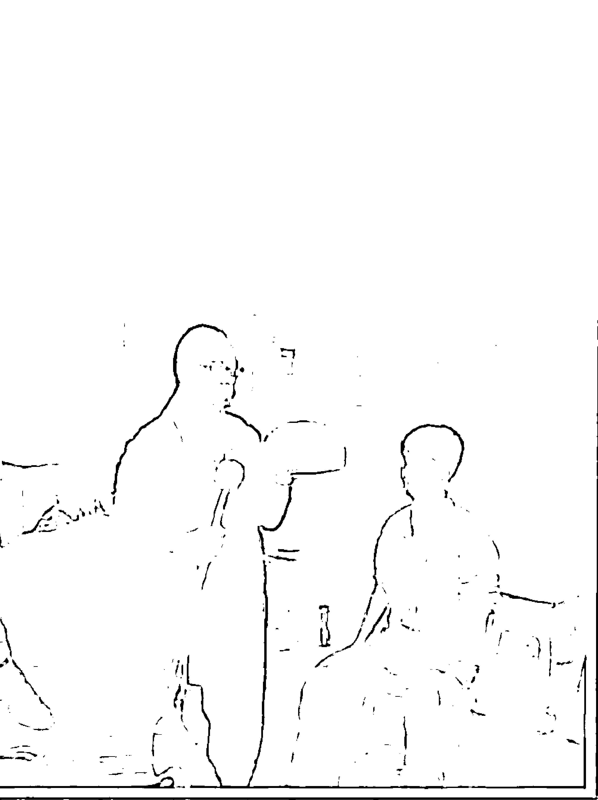

頭缽的要領。

為個案作完「頭缽」，淨化了混亂的念頭之後，可以請案主俯趴在按摩床上，接受背部缽療，除非案主懷孕或剛吃飽。先從背部著手是有道理可循的，背部代表案主一路走來的時間歷程，是他過去時空中的故事，先進行背部缽療，意味著先處理他過去的能量包袱。療癒師要帶著切斷連結的意圖，改變案主的舊有模式，讓案主糾結扭曲的頻率，重回秩序當中。背部比身體正面來的平坦，所有鉢療動作，都可以在背部施展，而且頌鉢可以直接觸碰震盪整條脊椎，鬆動脈輪根部所積累的淤塞能量。每一個姿勢的完整鉢療手法，又可分類為放鬆、淨化、療癒、強化這四步驟，主要施做背部的脈輪中心與肩頸、腰、背部位。除了斷除、淨化，我們還可以達到轉移能量、釋放壓力、交流左右能量、釋放關節阻塞之氣……甚至業力之解除。

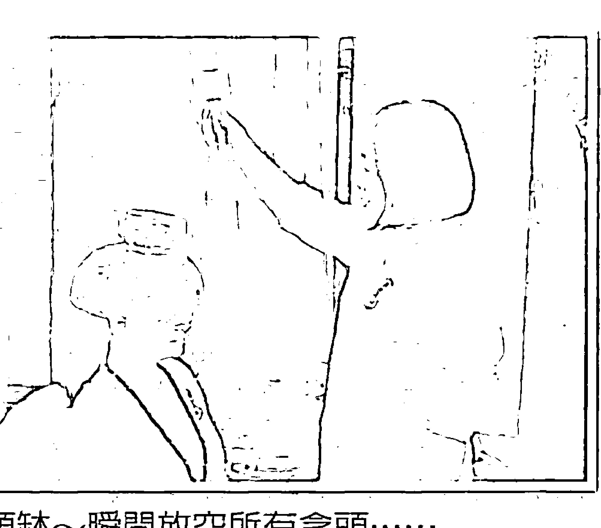

頭缽～瞬間放空所有念頭……

整理完個案背部陳舊的能量，倘若時間允許，繼續完成正面的鉢療也有其必要。我們以正面迎向即將到來生命中的能量，因而正面的鉢療有助於排除迎面的障礙、釐清未來的方向。當然，在進行背部鉢療時，身體正面的能量也同時在清理、鬆動和釋放，反之亦然。身體正面其實較後背更為敏感和脆弱，尤其喉輪和眉心輪這兩個脈輪，手法請盡可能輕柔。

「喚醒」是一個漸進式的過程而不只是一個突兀動作，這個步驟極其重要！一個深入的頌鉢療癒，很容易讓個案處於 α 腦波，甚至到達 θ 波類似禪定或深度催眠狀態。個案的意識從粗鈍的物質對境向內收攝，進入較精微的能量層面，乃至極為精細的心靈……當療程結束時，治療師若以粗魯的聲音或莽撞的動作直接將案主叫醒，意識很難從時空中的某一處完全返回現實。鉢療學員們經常在個案中遇到類似狀況：案主進入很深的沈睡，事後無論如何叫喚也難醒來… 或者治療師看見案主的靈魂從肉身中分離、或案主自己發現自己離開肉身而遊歷時空、回溯過去或前世…… 這些都是意識切換進入更精細維度的案例，在鉢療中經常發生。治療師必須知道個案目前狀態，冒然中斷案主的內在旅程，直接將他拉回現實，可能會造成個案久久無法回神，偶爾也可能損傷氣脈，整個療癒效果需要較長的時間與案主清醒後的世界整合落實。我建議使用丁夏或音叉，在個案能量場外圍輕輕地喚醒，然後引導個案的意識從精微的心靈世界轉向中介的能量層面，也就是「呼吸」，引導個案覺知自己的呼吸，觀察他的身體起伏，確認他可以隨著你的指令做幾次深呼吸之後，再引導他將覺知從呼吸的能量層面帶到物質肉體層面，這時候你可以用手輕觸他的肩膀、手肘、膝蓋或腳踝，靈氣學習者也可以順便施作靈氣……當案主的意識回到身體層面，你可以請他慢慢睜開眼，側臥並緩緩起身，讓個案喝點溫開水，同時交流療程中的心得，這樣就能讓案主內在旅程中的心靈力量完全落實顯化到物質現實世界，也讓高頻療癒能量與肉身的整合更和諧順暢。

### 〈總結與叮嚀〉

頌缽療癒操作順序，請記住以下的起承轉合～放鬆、淨化、療癒、強化。大到二、三個小時的全身療程，或小至十幾分鐘的局部體驗，都適用於這個完整的程序。

任何一種缽療手法，都不能省略「放鬆」這個前置作業，接著是「淨化」，好比在皮膚上治療或保養之前，必須先深層潔淨。很多時候，案主光是經過這兩個程序，長期緊繃的身心突然鬆解、淤塞糾結的沈重能量突然釋放，他的身心困境已然好轉了一大半。對於充斥了負面能量的案主而言，淨化是必要且強有效力的過程。除了清洗潔淨能量，更像是在對陳舊的傷疤或重大的創傷進行清創工作，當案主在淨化過程中，不再被濃稠的負面能量盤據糾葛，漸感清新自在、頭腦清明而內心平靜，我們再繼續深入下一步驟，往往能為個案帶來最佳成效。

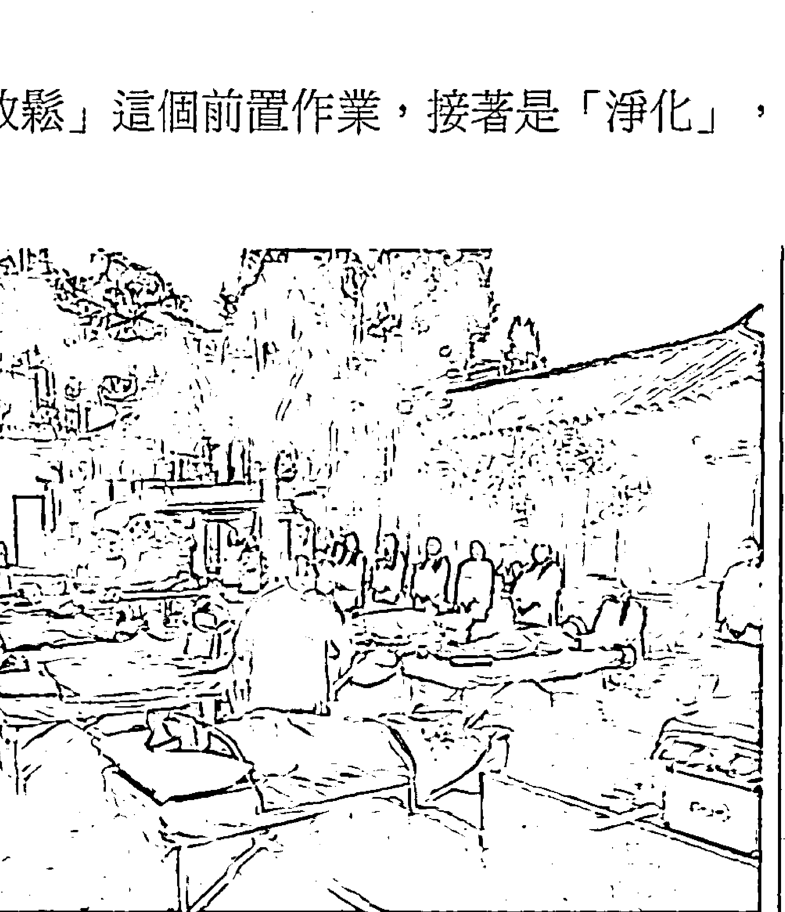

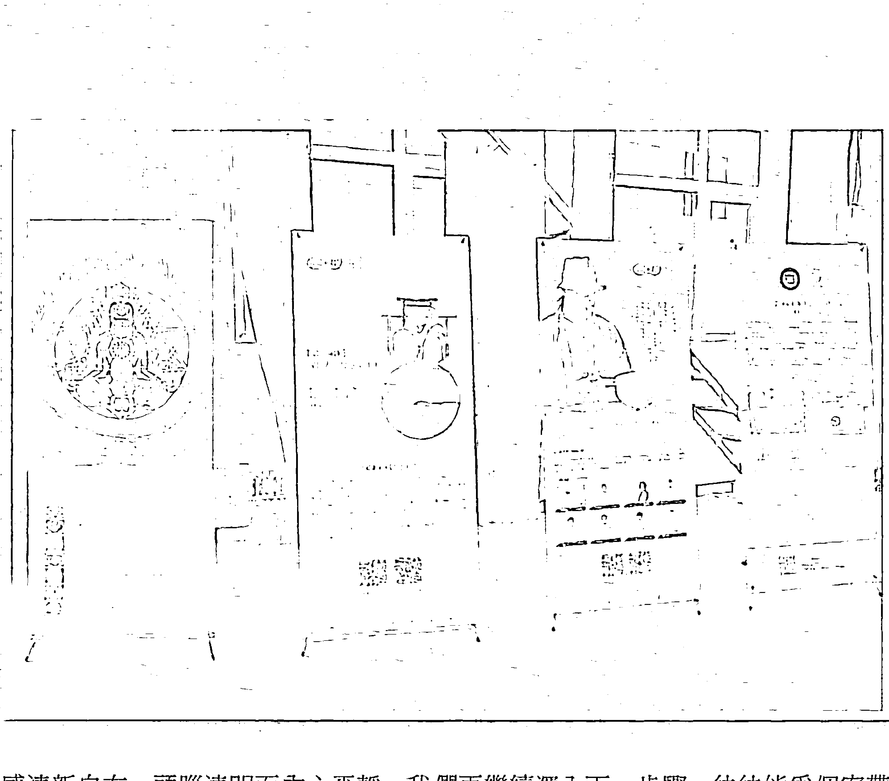

「療癒」的步驟在於改變個案的生命節奏，進而改變思想和行為模式。「強化」的步驟則是給予案主正面力量，催眠引導、水晶能量共振、頌缽節奏牽引、旋轉能量… 有無限多種手法可適用於這個概念。最後，我們用能量和光修護氣場、填補破洞，鞏固療癒的成果。

# 中階課程剪影

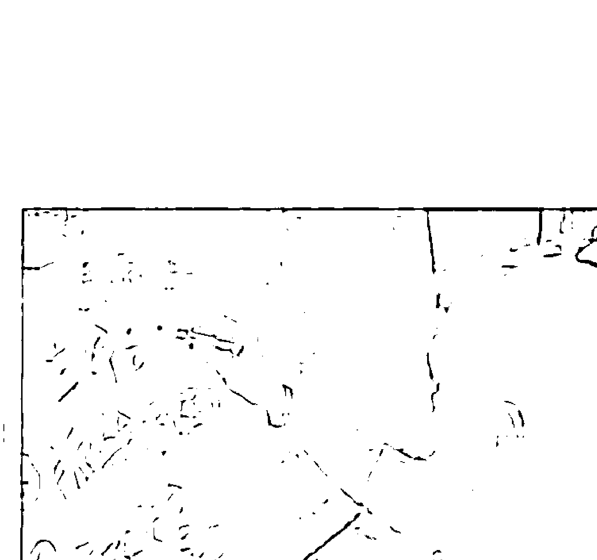

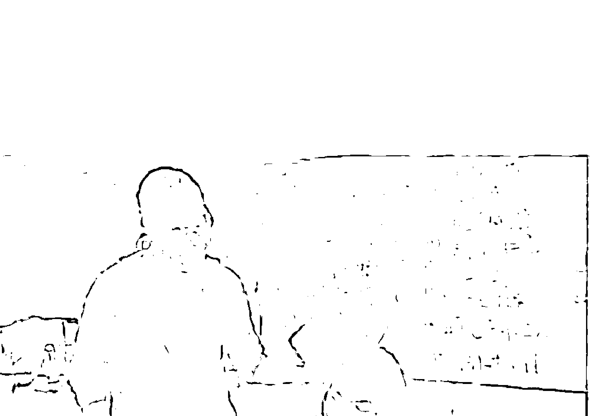

多種鉢療技法。

初階鉢療著重於身體面的療癒，在中階課程裡，我們將更深地觸及心靈層面。學員們將熟習順暢地交叉運用多種鉢療技法。

### 圓滿陣列鉢療法～

將兩張床合併，圍繞在床邊的圓型頌鉢陣列，除了形成一圈圈的能量迴旋之外，每一顆銅缽也由各自的中心向外輻射能量，如同漣漪般擴散，並與其它大大小小的漣漪和諧共振、交織成嶄新的幾何能量波形……

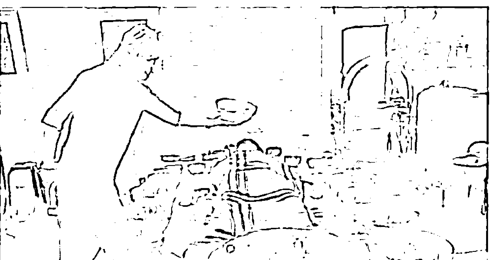

圓滿陣列鉢療法。

### 多床陣列療法～

釋放頭、腰、背、臀……等處的疼痛能量。合併多張療癒床以擴張頌缽的擺放面積，隨心所欲的施作各種需求缽療法。

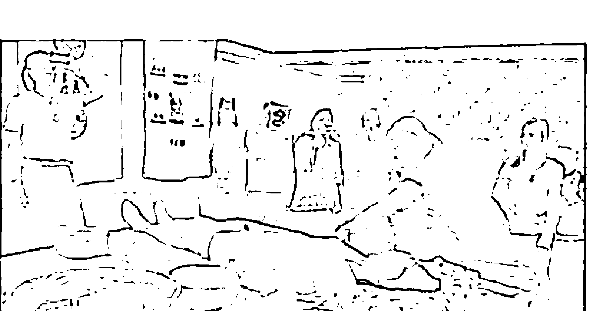

多床不規則組合療法。

### 左右側能量平衡療法～

平衡身體左右側能量會帶來很多不同層次的好處。左側為陰，右側為陽；左進右出，左側意味著即將進入你當下生命中的能量，亦即未來，而右側則代表即將離開你當前生命的能量，亦即過去；左側也可以象徵著接受，右側象徵給予；整個左側身體乃至左背，承載著母系七代之內的家族業力，右側尤其右背，承載著父親七代之內的能量糾結…… 無論如何，左右這陰陽兩極，都代表著兩種相互背反卻又相互依存的力量，是一體的兩面，左右能量的平衡療癒，能夠為生命中種種二元兩極的衝突和拉扯能量，帶來和諧。

### 小缽刮痧療法～

以小缽刮背部，有兩個層次，一是針對排毒的膀胱經刮痧，保健醫療的效果立即明顯可見；另一層面則屬氣場脈輪能量層面的祛除和疏理。

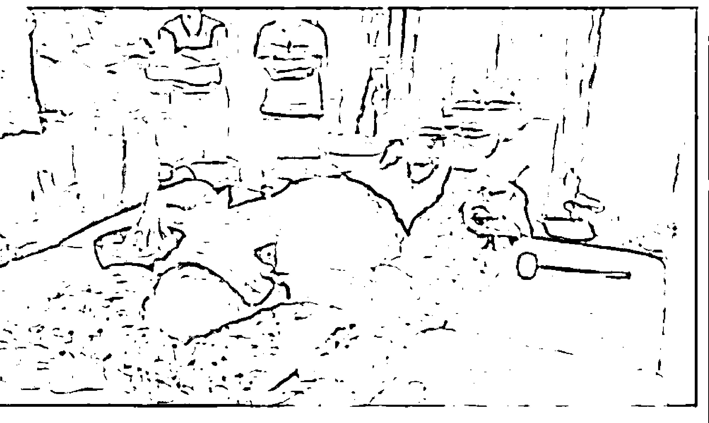

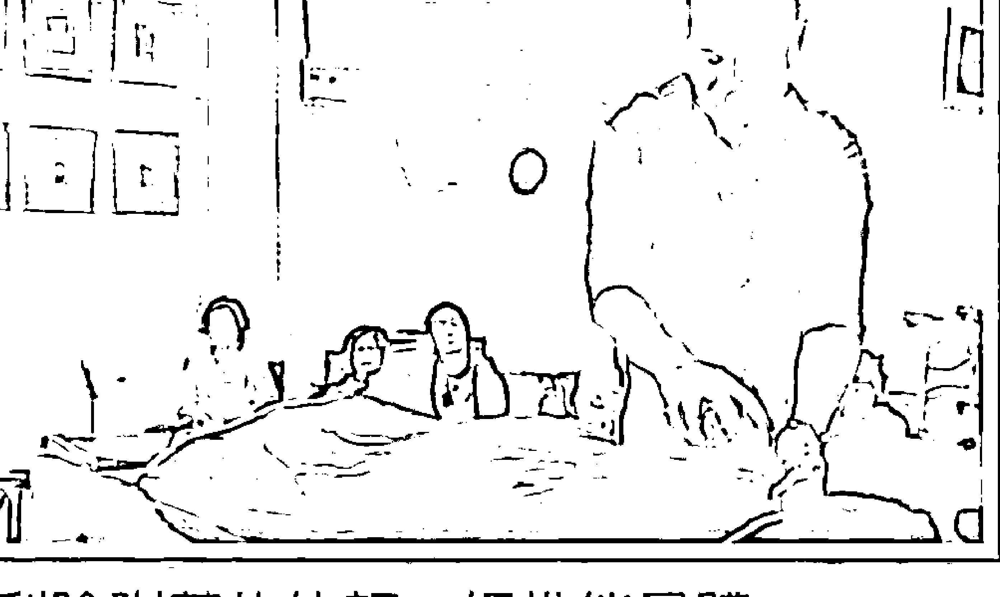

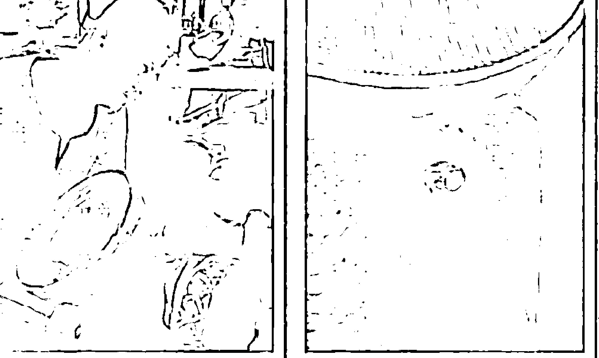

### 經絡脈衝療法～

以順行經絡強化能量、逆行經絡淨化能量的原則，從我多年的水晶治療心得，延伸出一種極為有效的按壓穴道、脈衝經絡的水晶能量療法，每每出手都讓案主驚豔。以各種水晶療癒的特性，搭配頌缽在穴道經絡的地圖裡探索，可以變化出成千上萬種療效，不僅達到促進血液循環、新陳代謝、強健筋骨，調和臟腑的功效，在能量和靈性層面更有著牽一髮動全身的影響力。

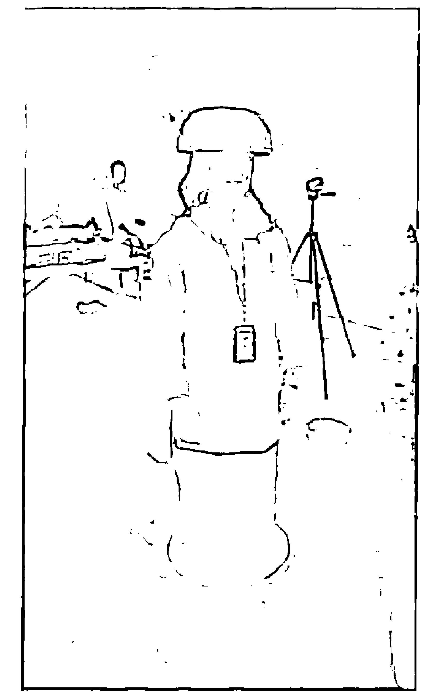

天地交會脈衝療法。

### 天地交會脈衝療法～

無論是頭重腳輕、光說不練、急需落實行動的人，或者是下身腫脹、貪執物慾、需要提昇心靈覺知的人，都適合這個療法。直接刺激腳底湧泉及頭頂百會，不僅達到按摩全身肌肉、疏通氣脈的效果，貫穿全身的能量上下沖刷，身心靈瞬間煥然一新。

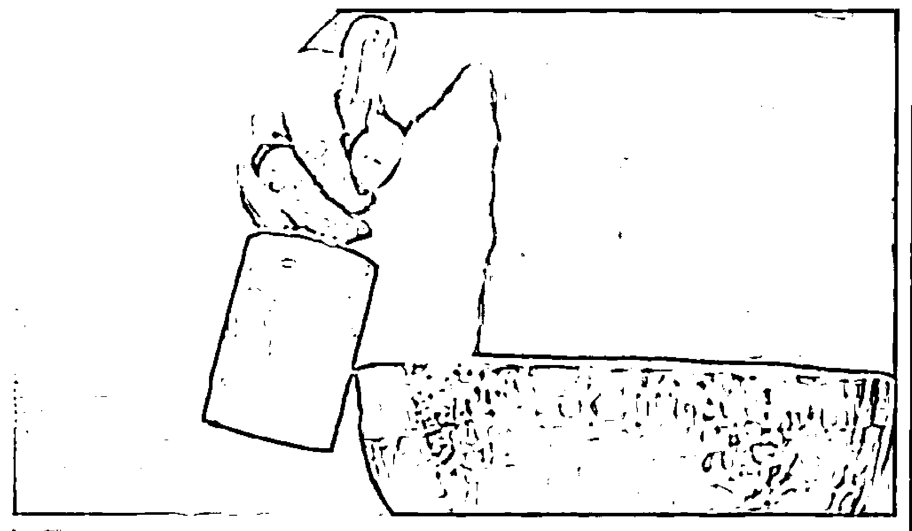

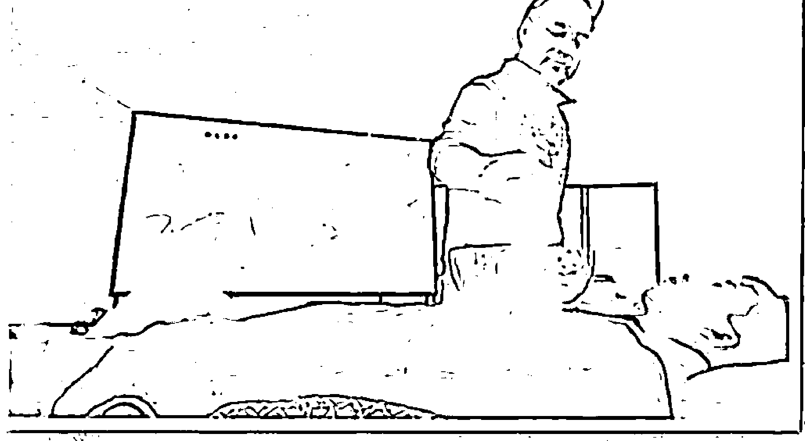

### 旋轉磨缽療法～

磨缽所產生的震動漣漪，能夠徹底鬆動、淘洗、釋放出沈積在脈輪底層的重濁能量，全面啟動細胞自癒能力。無論是向外擴散或向內收攝，更終極來說，這個療癒的漣漪其實是至大無外且至小無內的。

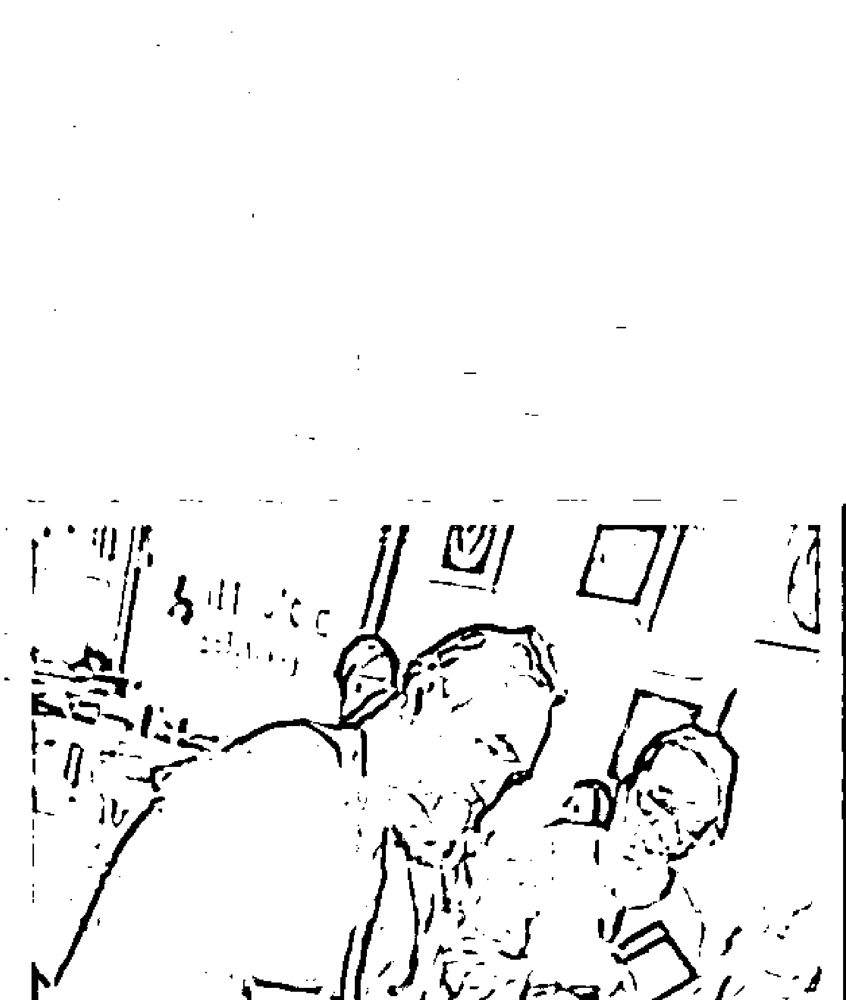

旋轉能量漩渦深入病灶進行全面淨化。

### 縮小腹減肥療法～

這個療法可以有效收縮下腹部，多數人在療癒後會產生立即的排便感，接著食慾逐漸變小，並開始加速身體新陳代謝，讓體重在不知不覺間下降。其實在能量層面而言，這樣的療癒是針對情緒、貪慾和癮頭進行處理。我們肉體的腸胃負責消化食物，而能量的腸胃則負責消化這些情緒，減肥不僅只是物質身體上的事，還攸關於能量層面的糾結不順。

健胃整腸療法。

### 大小衛星陣列～

以正、反兩個三角形缽陣，籠罩著療癒床和案主。正三角形代表上部脈輪、代表靈性、協助能量往上回歸神的意識；而倒三角形代表下部脈輪、代表物質，協助能量往下創造落實於紅塵俗世。大衛星療法有多重意義，可療癒整合七脈輪的身心靈所有層面，使能量恢復平衡飽滿。大衛星六個端點連成的結構，將可以撐起個案虛弱洩氣的內在，同時也具有極強大的結界防護能力。在頭與胸部的小衛星缽陣療癒，淨化負面念頭效果強大，統合心與腦的分歧混亂並促進表達能力。

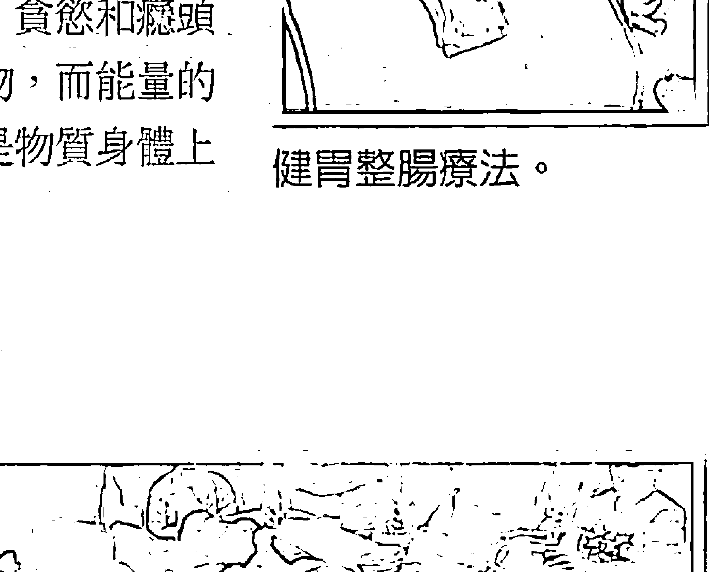

大小衛星陣列療法。

### 直線陣列療法～

直線連續敲缽，以刺針式療法～大→中→小順序，由大缽到小缽的排列方向引流能量、強化能量的力度和持續度，沖刷、突破堵塞的能量。

### 放下執著療法～

將小銅缽圍繞主要軀幹，涵蓋七脈輪範圍，以特選小缽的悠揚輕盈音調，潔淨人體氣場上所有沾附的重濁能量及情緒。在緊緊掌握抓取的雙掌間，也以特製的小銅缽放鬆執著不放的能量，讓個案感受到一種前所未有的放鬆和自由。

### 活絡氣血刺激腎經療法～

身體虛弱、氣血不足的人，在兩腳的湧泉穴各踩一顆特殊晶石，立即讓渾身發汗、精神大振。

### 輕揚音符療法～

利用各種小缽向上揚升的高音頻，用於胸腺、喉輪以上區域，可以減輕眼花耳聾並使頭腦清明。關鍵是不用任何缽棒，而用食指和中指尖的意念及光束，敲奏出別具神奇生命力的頌缽音質。

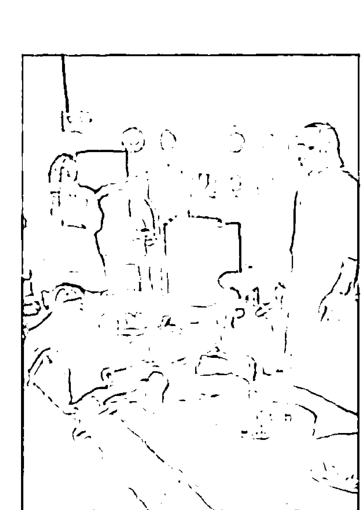

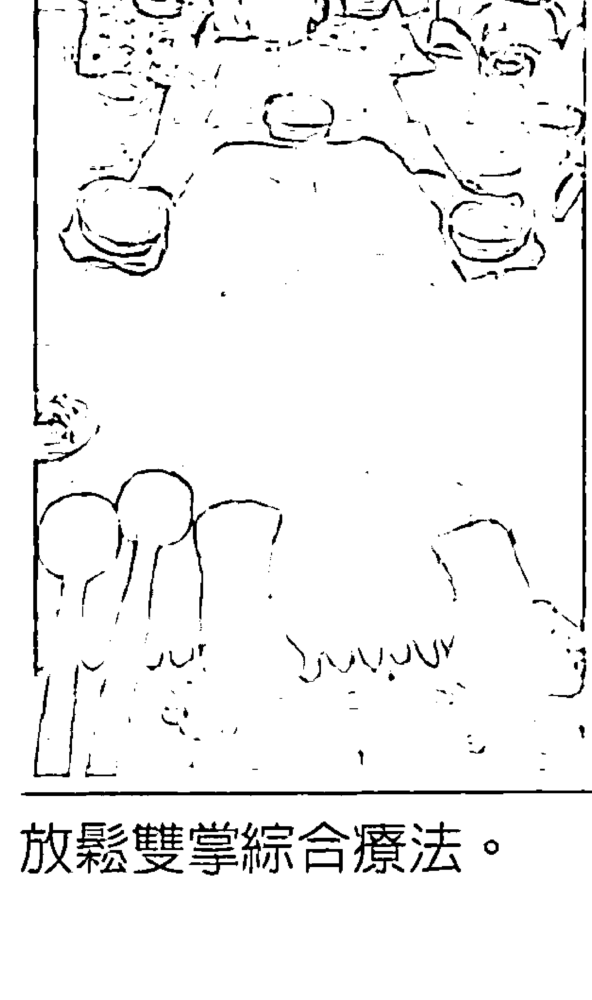

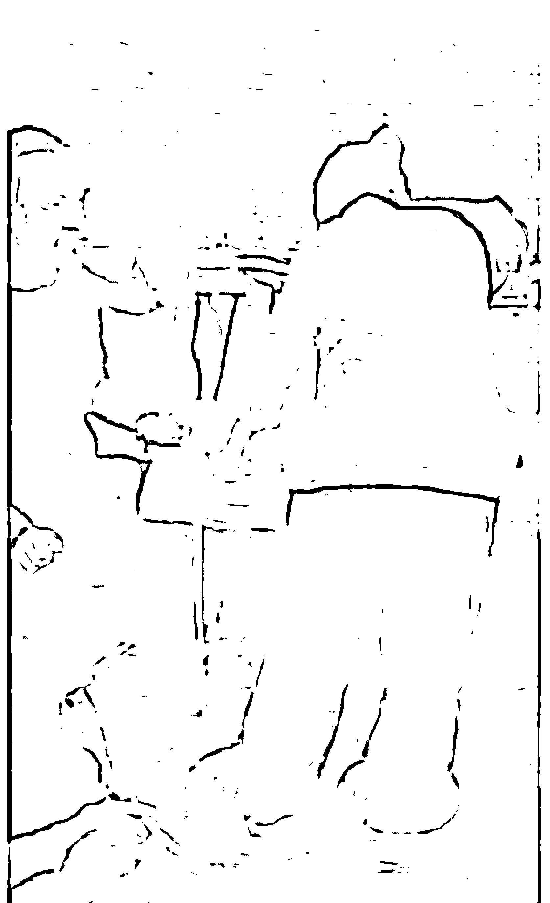

### 暢通全身脈絡療法。

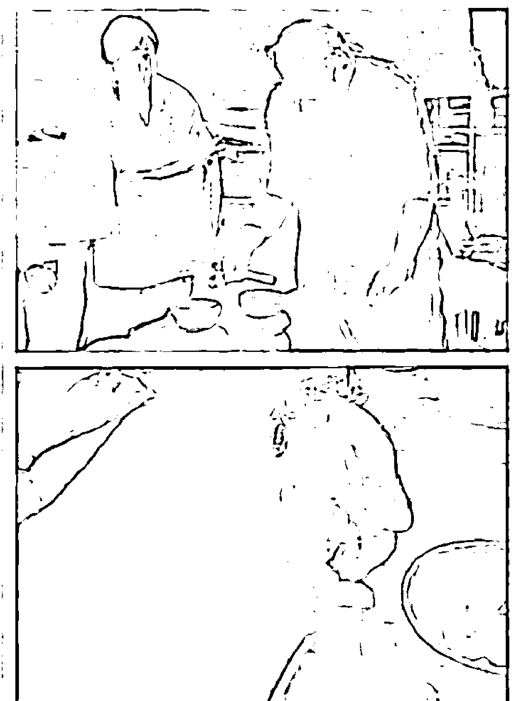

### 指尖光束敲擊療法。

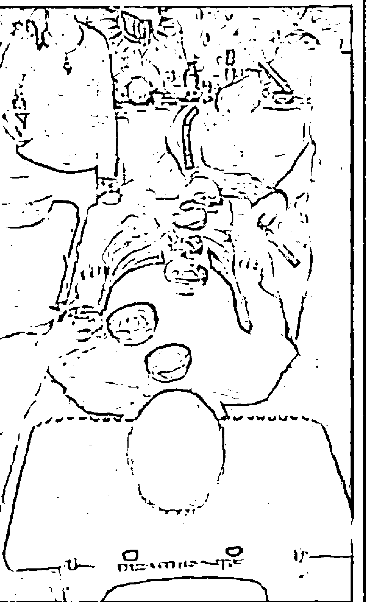

### 解除疼痛連線療法。

### 能量移動療法～

敲擊線條排列的各種缽型陣列，鬆軟糾結的肌肉硬塊，甚至達到將疼痛或負面情緒引出體外的效果。

### 胎臥式療法～

有別於趴姿與躺姿，這個宛如子宮裡胎兒的姿勢，搭配恰當的缽療手法，會帶給個案一種備受到保護的安全感。

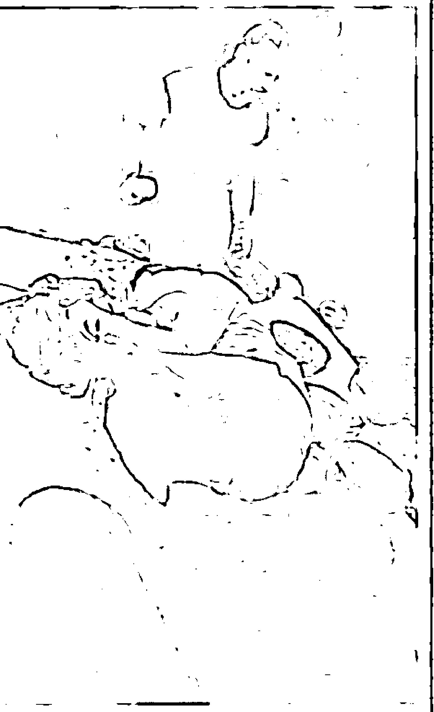

### 側臥安撫療法。

### 接地療法～

除了直接放置於身上脈輪或疼痛部位，還可將頌缽置於腳底，讓震動上竄直達頭頂。甚至將缽置於床上、或床腳，藉由床的間接振動影響身體與周遭空間，這個頌缽的間接放置法，通常用於脊椎受傷骨骼脆弱、不堪強烈震動的個案。

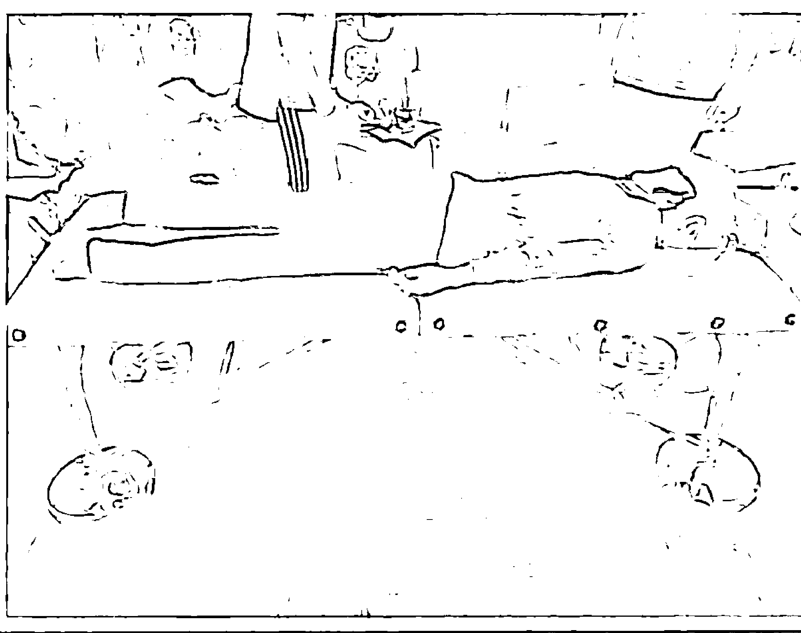

床接地療法。

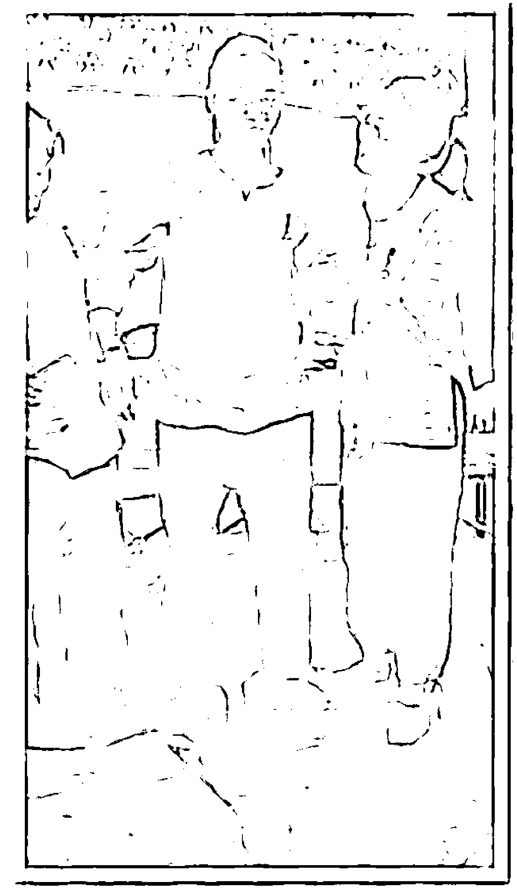

腳接地療法。

### 丁夏療法～

丁夏可以做出多種纏繞療法，例如牽絲拉線縫合療法、尖音鑽刺療法。

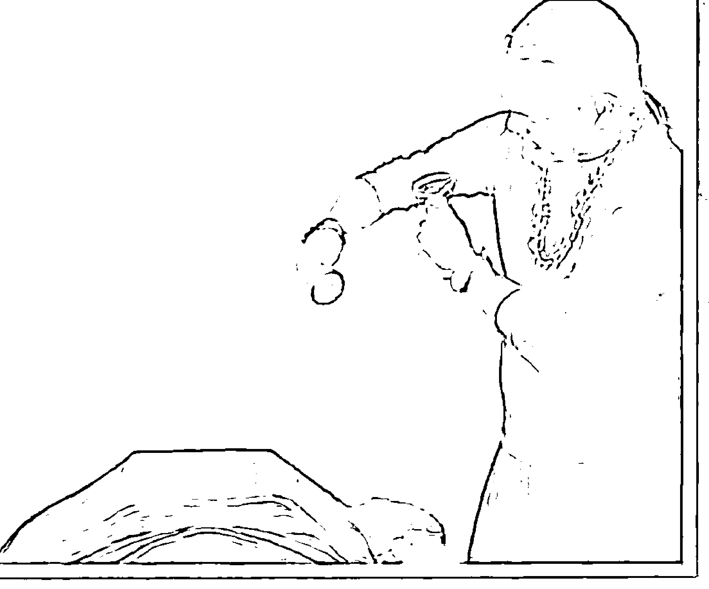

尖音療法。

### 頌缽 黃金紀元的圓滿之歌


## 水晶缽與晶陣曼陀羅療法～

以各種不同頻率的水晶缽，與千變萬化的水晶曼陀羅能量共頻激活，來改變人體或空間能量場。例如：以黃水晶顯化豐盛、以粉晶安撫心輪創傷。


解除腰背疼痛療法。


瞬間解除肩頸頭痛療法。


強大的震波療法。

# 學員心得分享

學習頌缽有一個成功的關鍵，學員必需以個案的角色去體驗頌缽，用自己的身、心、靈去感受節奏、韻律、波動⋯⋯才能清楚理解缽療過程中倒底發生了什麼。閉著雙眼躺在療癒床上的學習，和站在床邊揣摩如何在個案身上敲缽的過程同樣重要，而且相輔相成。我鼓勵學員們扮演案主，體驗缽療的種種細節在自己身心的影響，更鼓勵學員多做個案，畢竟人不是機器，每個案主的現狀都是由獨一無二的生命經歷積累而成，從各種不同的疑難雜症中，你將探索頌缽的真實力量，每一次個案都能讓你心領神會、更上層樓。

任何一次的個案回饋，都是彌足珍貴的訊息，都是我們偉大的老師。下列頌缽學員的個案回饋文章，我保留了每一個字句，完全不做任何刪改。即便只是靜心下來閱讀，也能進入缽療師當時的療癒空間中，希望你們藉由這相互輝映、相互共鳴的過程，也共享著彼此這份美好的療癒品質。


## 頌缽療癒師 邱靖玹

春天似花開心中
唯有缽療在花田
有愛引路來缽療
療癒心中花開
隨緣自在心中坐
盡在無言療癒中
引流慢入心田中
潛移默化在當下
唯有相信有奇蹟
真心真意自然行

# 淨敬光音之旅

生命的意義在創造宇宙繼起之生命
頌缽的意義在創造生命延續之使命

頌缽是良藥，而身體裡的血液及細胞中的水份更是不可或缺的藥引；療癒師的熱誠及正向能量更是帶領個案走上健康領域的重要推手。分佈在身體中的脈輪就好比湖泊一般，具有延續生命、儲存能量及囤積污濁的場域，透過頌缽將它淨化後，全身的血液、氣場及水份自然就漸趨乾淨。湖泊乾淨了，湖內萬物自然就生意盎然。同理可證，身體亦是如此。

我第一次開始接觸頌缽是 103 年在墨西哥馬雅的聖境之旅，同行的同學為我做的放鬆療癒，因為多日的徒步行走及攀爬多座金字塔，身體的疲倦在頌缽的療癒下一掃而空，第二天醒來，又是精神奕奕活力充滿。

104 年家父往生，他二個月的病程很短暫就離開，我心中有萬般的不捨，所以把自己孤立了起來，拒絕對外接觸而一直無法跳脫出悲傷，沉溺了近 3 個月，告訴自己得救自己上岸，不能再繼續消耗能量，所以選擇了頌缽的學習。上課的第一天幫我頭缽一敲，如當頭棒喝，我醒了，一股能量從頭到海底輪全通了，這神奇的效果，讓我開啟了頌缽療癒的旅程。

感謝內在神性的指引，感謝良師的無私教導，讓我活出了意義，幫助更多需要找回自己和健康的家人與朋友，開展了我自利利他的道路。

# 個案分享1

### 江先生 45 歲 (公務員)

#### 初體驗：

我是一位在 25 年前因車禍傷到頸椎神經癱瘓過的患者。在第一次的療癒中，雙腳完全沒有知覺、感受不到震波的力道，甚至不知何時開始與結束，但是在過程中的潛意識裡一道閃光驚嚇了我，同時間腦海中出現大海及日出的畫面，透過邱老師的解釋讓我原本抗拒的心理開始對頌缽有興趣，也開啟了對自己身體有機會康復的原動力。自此開始了頌缽的奇幻之旅！

由於身體受傷多年，所以各部位無法用正常的方式來做療癒。邱老師本著科學家實驗的精神，運用各式銅缽、水晶缽來對我做任何的嘗試，經過兩個月五次的療程後，發覺雙腳竟有感知能力。然而，家住花蓮舟車勞頓無法密集性的讓邱老師作療癒，邱老師主動建議可以帶一銅缽回家自行敲缽，以延續效果。果不其然，透過每天自行敲缽及每月兩次讓邱老師施作全程頌缽，身體有極明顯的變化。

#### 成效：

1.  站立頂缽敲打，其震波可貫穿全身自成波場，頭缽的震動聲如知了般的平衡頻率使人放鬆。多年的肩頸酸痛已消除了，思緒更為清晰，思想更為正向。只要頭痛自行敲頭部缽療，便可在短時間舒緩其疼痛感。
2.  藉由友人分享得知本身對於人、事、物的判斷有明顯精進，並且有自信的對外分享。頓時震驚的了解到頌缽的功效不單純在看得見的軀體，連藏在深處的個人意念都能導正並強化。
3.  我出生於單純的公務員家庭，平日與家人少有情緒起伏的對談，肩頸部位的療癒後，發覺自己的表達能力增進，也更願意分享內心想法，尤其對於家人更勇於口語的關愛。
4.  過去很多的不愉快及爭執都在心中的不情願及固執下發生的，頌缽後在某些異同的觀念竟願意放下我執，心情更容易放鬆，視野也寬廣了。
5.  因為身體的缺憾，消磨了自身原本存在的能力，久而久之對於週遭人、事、物多存疑慮。幾經缽療後，友人及邱老師提醒，發覺在信任這塊，也潛移默化的放下質疑並且轉化為信任。所謂：「心轉念就轉，念轉就放下。」這不正是活在當下的最佳寫照。
6.  「有夢最美、希望相隨。」透過邱老師及自身體察的頌缽療程，短短一年間加快了身體進步的速度，同時也讓我有了改變現狀的勇氣，顯現出突破現況的創造力。
7.  在做肚臍至大腿這段部分的頌缽過程中，感受特深，此場域連接著上半身及下半身，可謂人體的“轉運站”。它擔負著下肢是否穩固的重任，我因脊髓神經受損，下肢較為無力且無感知，頌缽後雙腿竟明顯長肉，而困擾我多年的排便問題（需用浣腸），自行排便的次數大大增加。從第一次缽療的無感知，到現在可以明顯感受振波往腳指尖竄出，那種感覺除了～妙，著實再也找不到其他字可形容了。
8.  結合第7項部位，向下延伸到膝蓋、腳踝，施以局部加強力道及連續敲打動作，會有電療般感受（肌肉抽動、末梢沸騰）。同時引起敲打部位反作用力，進而造成肌肉拉扯（破壞肌肉沾黏作用），製造細胞間隙，讓震波進入達到活化經絡細胞再生。

因為車禍導致排汗系統神經的受損，25年來無法正常排汗，缽療後讓我最大的驚豔是脖子到肩部與背部出現了排汗現象，毛細孔表面竟然出現了斑點，結痂剝開後就是正常的毛細孔，此現象～持續發生中。

#### 總結：

1.  頌缽的療場～音漩場域（水晶缽）+ 波漩場域（七脈輪銅缽）= 療癒場域（小宇宙）
2.  頌缽的療癒～身、心、靈
    猶如（點）身體＝健康、（線）心理＝自然且放下、（面）靈魂＝豁達。
3.  頌缽的療效～水、空氣乃萬物維繫生命之元素，存在於宇宙的「正向能量波」若能善加利用，將可找回健康、延年益壽。即所謂 "3D" 療效。

# 個案分享 2

### 孫小姐 23 歲 (早餐自營業者)

跟靖璇阿姨認識之前，我沒有聽過什麼是"頌缽",直到第一次親身體驗才發現這是一種多麼奇妙的經驗。

到目前為止，我已經體驗了快要十次的循環，但第一次的種種依舊歷歷在目。

我很喜歡說話，很喜歡用很多的方式來呈現及表達我自己，也用很多對人、事、物的期待，來壓迫我自己和周遭的人。可是我知道自己的空虛，那種不能滿足的黑洞，自從我決定要開始讓阿姨幫我做缽療時，很多不可思議的事情漸漸發生了。

改變，不是一朝一夕形成，而是循序漸進的茁壯。

在第一次體驗缽療之前，我時常感到疲憊和沉重，也很常做夢，所以睡眠品質很差。而在這次過程中，我才躺下就陷入深沉的睡眠，而我卻知道整個過程的始末，只是短短一小時的缽療過程，所得到睡眠品質卻遠勝於睡一整晚。結束後，我感到無比的輕鬆，身體彷彿卸下了無比沉重的盔甲，這種感覺，讓我有些惶恐，因為那是我有生以來未有過的感受。當晚回家後，也持續著如此高品質的睡眠，並得到很多意義的夢境，讓我感到驚奇。

證明了缽療會幫助身心靈的一同成長，而不是只有特定的部位的改變。

我開始體驗什麼是“和自己在一起”與“真心的接受自己”。我可以享受很多的獨處時間，而不用一味的把自己丟入人群，卻感到格格不入，也開始欣賞自己真正的價值，而不用透過一段又一段短暫的戀情，來找到我需要的愛和自我認同。缽更使我快速並正向的通過每一個我需要走過、跨過的門檻，讓我不用一再的繞在圈子裡。

因為阿姨，因為這個際遇，讓我和缽有著深深的相吸緣分，謝謝阿姨每一次的用心，除了缽療以外，你所付出的是讓缽療加倍的在我們身上顯現成效。

感謝每一次的經驗，更感謝自己能接受現在所發生的美好。

# 個案分享 3
許小姐 35 歲（護理師）

> 真心覺得「頌缽」是除了醫學以外，最深入且治療的一種療癒方式。

### 第一次缽療體驗

2016 年 8 月對我來說，是一個最接近死亡與重生的月份。

一直隱隱發作的氣喘，在八月份對我的生活展開大反撲。

我記得當時上班必須戴著氧氣瓶裝著鼻導管上班、常常跟我搭班的同仁們都覺得我隨時會掛掉。

我的主治醫師將類固醇及抗生素都調到最高劑量並隨時止喘針 STAND BY，但依舊只能控制並壓制。醫師找不到我反覆發作的因素，甚至建議我乾脆離職回家休養算了，因為我一點病識感也沒有。在某個因緣下想起靖琇好像有在做頌缽治療，苦無辦法的我，打了電話跟她約了兩天後見面。

第一次做頌缽治療的時候，其實是我活了這麼久，第一次這麼真心地跟我自己的身體接近，並願意去感受它的開始。專心的聽著缽的聲音，沒有睡著，一部分腦子還想分析這個東西，但又一直被缽帶進與自己身心相處的世界裡。我記得一開始做背部的時候，我一直很想咳嗽，靖琇叫我咳出來沒關係，後來翻正面時止不住的大咳，有一種想把肺裡的沉重都咳出來的感受。當缽走到心窩的時候，我感受到似乎是磨缽的聲音一陣一陣，我有些不明白，為什麼缽它不在我身上，卻感覺到有東西在鑽我的心，在心的時間似乎停得有點久，疼痛感卻越來越明顯且深入，一度我痛得很想大叫，只感覺靖琇越磨越久越用力。

後來我問她我可以哭嗎？她說可以之後，淚就止不住的一直流一直流。缽走到眉心時，我感覺到有一層黑黑的東西籠罩著我，磨缽聲一直在鑽它，鑽著鑽著似乎看到一點白，但又關上，但又被鑽開，像是在抗衡。結束後，靖琇花了一點時間跟我深談，我問她，我的心是不是死了？妳剛剛是不是在鑽我的心輪？

她問我，最近發生了什麼事？剛好我剛結束了一段談了八年的感情、也卸下了令我挫敗的護理長職位，身心整個在最軟弱的狀態，覺得對不起家人朋友，更沒有臉再去跟你們提起這段不堪的感情，所以我選擇壓抑，假裝過得很好。但身體其實是最誠實的，身體告訴我，我不想呼吸，我不想活，只是我倔強的不肯承認。我問靖琇為什麼在心窩的地方磨那麼久，是不是她覺得我的心關著？她點點頭後，我崩潰的大哭。我在她的缽療裡感受到很純粹的，就是要妳活過來的愛，那種拚了命也要把妳的心輪打開的愛。

回家後，因為長久的服用高劑量的抗生素類固醇，對食物早已失去味覺的我，終於開始有點感覺了，叮囑我要多喝水，排出累積在我身體的藥物及毒素。

做完頌缽後，才是身心療癒的開始…兩天後我跟一對夫妻與他們的孩子，去了一趟花蓮，在旅程途中，遇到了他們夫妻間的冷戰，記得那個晚上，我在民宿睡前，碰到一個小時候我父母半夜吵架打架的家暴恐懼，我很不舒服，深怕這件事情又會再來。隔天一早，我還未下去與他們夫妻碰面，就聽到太太對先生大吼（像極了我媽媽當時吵架的時候的模樣）回台北路上，我感受著當時還是孩子的我，自己的內心感受。做該做的事，讓他們自己相處，終於到台北前，他們和好了。我看著自己在這段旅程中與自己內在的恐懼相處，並透過他們夫妻的過程，去看到那個孩提時未癒合的傷口，還有自己遲遲不敢進入婚姻的原因。

### 第二次缽療體驗

第二次缽療體驗的時候：雙腳一直都敲不出聲音，花好長一段時間在腳的地方來回來回，後來發現左腳抽了一下，才換到別的地方。腹部一直都很脹，很明顯的聲音一直揚升不起來，很鈍，連海底輪的地方也是。磨缽的時候也很難有聲音，更有趣的是缽會跑來跑去。第一次缽療到第二次缽療的中間，上班的時候其實我走路很不穩，更無法踩實。一回到家，身體立刻用拉肚子來告訴你～你死抓著不放。其實從發病以來，我不敢回彰化老家去面對兩位老人家，連回家的路我都不敢踩出去，因為我好內疚，內疚自己沒有照顧好自己，讓父母如此的擔心。缽療完這次後，就真的完全進入心的層次比較多。

回到家的那個晚上，我夢見自己披了嫁紗，新郎我沒有看到，我只看到我前男友帶著他母親與那個介入我們的女人在旁邊觀禮，主婚人還告訴與會的親友們，那個傷害我的人～前男友也在現場…

過沒幾天，心窩的地方一直很刺痛，我會不自覺的一直壓住心窩，我猜想應該跟前幾天的那個夢有關，正當我在好好的想找出原因時，突然來了一個好消息是，有人想找我去大陸發展離開這裡。當我電話與想邀我去大陸的人聯繫上後，心窩立刻不痛了。很奇妙的是，這一切彷彿有一種看不到的力量在推著我，讓我無法用腦袋去思考，並且相信這一切的發生。然後開始每天做夢做夢做夢，片片段段的…我知道好像有些什麼，但又說不出個所以然來，就立馬再約了第三次鉢療。

### 馬勒卡颱風來襲時的第三次鉢療

這次的鉢療就刺激了，我要從主要的颱風襲擊地台北，出發去就很危險了，記得當天下午，靖珽再次跟我確認，但學過身心靈的我知道颱風就是破壞與重建的時刻，這次一定要去，絕對不能放棄。

很妙的是，我第一次頭鉢的體驗，哇賽！我整個人不自覺得跟著氣動，晃著晃著從頭頂到肚子就停了，然後做到頭部的時候大概是三個鉢吧！左耳的這個聲音很響，右耳的聲音好鈍，感覺她敲了好久，右邊才一樣響。然後頭會不自覺的跟著鉢的聲音氣動…鉢走到額頭的時候，不知為何鼻道有點燒灼感，感覺鼻血快噴出來。結束後，我們小聊一下，聊到為什麼海底輪卡住了？心輪又關起來？終於我願意讓自己好好的面對自己分手後的傷痛，在颱風天的晚上大哭。

沒想到這次鉢療，居然做了兩個多小時，回程的路上一直覺得下腹部不太舒服，一回到家就有分泌物（也太…敏感了），兩天後我回彰化老家去陪陪父母，覺得有些微的變化。我好像可以單純的愛我的父母，不管他們過去（家暴帶給我的傷痛）如何？第三天我問起那次鉢療額頭的過程，靖珽問我曾經有頭部受傷過嗎？還是鼻子過敏？

剛好我每次車禍都是頭部有受到撞擊，前年走路跌倒斷手也是頭部先撞擊到地面，所以一切都有了答案。

因為我想快速的轉化，所以我當天約了個案當天就去，做到後背與腰的時候，敲了很久，突然間感受到有一根刺從我的左腳底竄出（超痛的），做到肚子的時候還是磨好久。

回家後的隔天，終於醫生允許我開始運動了，第一天我就去健身房跑步加踩飛輪，流汗流的很開心，當天晚上約莫十點就睡了，凌晨一點多，頭痛起來喝水，結果乾嘔嘔不出東西，（夜裡我又夢見我前男友，他叫我去找他，我還正準備要去，結果鬧鐘就叫醒我了），一早醒來，就排黑黑的宿便。搭著大量的水，這幾天又剛好經期到，第一天就開始，排大量的血塊，（卸下護理長職位時，我的經期慢到第52天才來，中間吃了催經藥還是沒來，還打了催經針才來）寫稿的今天，是第二天血塊依舊很多，但很明顯的腹脹情形沒有了，肚子明顯消風了。

我期待著一次次缽療，帶給我身心靈的釋放與明白，重點是我在裹頭，看到一個身心靈工作者的純粹與愛。陪伴我理解自己療癒自己，甚至願意重新的活過。我不知道我的未來會變成怎麼樣，但是這教會我如何相信自己的神性，還有傾聽自己身體的聲音。

謝謝宇宙的安排、謝謝我內在的神性、謝謝靖珵的無私與愛。我回來了！20160924

# 頌缽療癒師 曹馨勻

現為缽療師、私人瑜珈教學、阿卡西記錄解讀者
Mail：anitatsao0917@gmail.com
Facebook：https://www.facebook.com/AnitaTsao0917

頌缽是我內心的曼陀羅。第一次接觸頌缽是在美好平和的懷孕期，我的瑜珈老師在我的脈輪及關節上放了大大小小的銅缽順序敲擊，我感覺缽的震動透過我的身體，傳達給我緊密相連的孩子，音頻則經過聽覺的接收，轉譯安撫了靈魂的疲憊，人體無疑就是個巨大的傳導體，於內於外，我都深深地與缽共振了。

在幾經尋覓並努力嘗試與缽的連結未果，其實生命在等候最適切的安排，感謝祂引領的頌缽學習之路，讓我遇見了老師，老師總是毫無藏私、謙卑也內斂的娓娓道來，他所交會過的每個生命與缽連結的故事，我理解了在缽的世界裡，有規則卻沒有標準答案，有工具、有技法，但重要的卻是療癒師的心念與療癒意圖，在療癒師或個案心裡、生命裡發酵醞釀的是屬於自己生命的領會。缽沒有言語只有頻率，透過每個波頻放大傳達的是，人與空間創造的能量曼陀羅，滋養穿透著你我的心與身。個案總是我最好的老師，感謝每位來到我生命裡的你們，謝謝你們用自己的生命故事，為我累積堆疊著缽的學習與領會。

## 個案紀錄1

### G小姐

G小姐長期在躁期與鬱期之間擺盪著，身體也因爲長期需倚賴藥物控制而失去平衡，進行缽療的時間，個案正在經歷所謂的躁期，承受著心理與情緒的浮動而無法成眠，已經連續幾日，每天累積睡眠的時間僅2~3個小時。我爲她施作完整的缽療，先以頭缽帶她離開頭腦活躍混亂的思緒，回到當下，頭缽中間她已經感到平靜並想睡了，而在療牀上的過程中，她全身感到痠、麻、癢，並且呻吟躁動，感覺是一股必須帶走離開的能量，找不到出口，我思忖後，決定以節奏較爲強烈的敲擊，並搭配水晶缽放大，意圖擊碎並引導長期鬱積的能量離開，很快的個案終於回到缽的寧靜之海，沉沉睡去。

療癒不見得會讓個案感覺舒服，但秉著愛的意念，我與個案還是一起做到了。身爲療癒師，我是觀察者，記錄著個案的生命片段，我是旁觀的、我只是管道，是個案願意走向光了啊！隔日早上，個案傳來的訊息，表示身體層面感覺到按摩完後的全身痠痛，最令我欣喜的是這個訊息：「睡了五小時，且是深度的，應是受缽療影響，很難得在躁期有如此品質的睡眠」，我深深感謝缽療爲你、爲我帶來的禮物，Namaste！

### 【G小姐的經驗心得回饋】

這是一個充滿療癒與祝福的時刻，短短兩小時的頌缽，過程中的感受一直變換著，如行之山林間，永遠不會知道前方的路況、景色、天候，雖途中偶有顛簸，然最後的感受是愉悅、快樂且舒爽的。

### 頌缽 黃金紀元的圓滿之歌

我好愛一開始的頭缽，馨勻姐先將缽置於我頭頂，待放置平衡後開始敲缽，一聲聲 OM，貫穿整個我，一次比一次強烈且深層，我彷彿是棵大樹，在美好的時間空間下，接引大自然宇宙萬物的滋養祝福，雙腳深深的向下扎根，往上則是由脊柱直衝腦門，快速藉由每次的 OM 聲，不斷地不斷地直衝天際，轉瞬間，平靜之心竟讓我頭頂著缽，睡著了。

接著是趴著從腳底板開始頌缽，我很詫異於從腳底竄流而上的那種感覺，雖舒服、放鬆，但也有著微微的酸癢刺麻，卻無傷大雅，漸漸的往上在身體背部敲缽，著實令我放鬆沉睡了一會兒。最後躺著頌缽，我原以為是最舒服，心裡暗自開心能好好睡大覺了，怎知一開始就渾身不對勁的感覺，怎麼樣都找不著最舒服的位置躺著，像是體內有什麼想要大量衝離我的身體，卻尋之無門，因此偶有胸悶頭脹之感，四肢一直刺癢麻而難耐，但竟也在此過程後，得到釋放而失去了短暫的意識…睡著了。

謝謝親愛的馨勻姐為我所做的缽療，短短兩小時的放鬆，補足了每晚的雜亂睡眠，每次敲缽的感受，都有細微的不同，相同的是每一次的 OM 聲中，我跟隨著聲音四處探訪我的身體；我也在此次缽療中，放下了意識層面的執拗，放下了這多年來的負面思維情緒，我無法知曉自己究竟從中獲得了什麼，但我知道從那些什麼想衝出來，卻尋之無門的過程中，確實有什麼，是被放下了。

我喜歡頌缽，這美好、充滿愛、祝福與能量的過程。

在躁期期間，通常我會如每天只睡三分鐘的蕭美人，不太需要睡眠（或只需睡 3 ~ 5 小時），第一天總是能直接略過夜晚，直 high 40 小時；頌缽翌日夜晚，我居然深沉的睡了五小時，雖睡眠時間一樣短，然而其睡眠品質是深沉而舒服的，讓我驚訝不已，猶如幼時沒煩惱的孩子，一碰到床就能安心放心的熟睡著。再次感謝親愛的、美麗的與充滿愛的馨予姐。

# 個案紀錄 2

### C 小姐

C小姐就如同你我身邊會遇見的上班族，在生活與夢想之間，試圖找到完美的平衡，個案來到我眼前時，我對她是一無所知的，只知道我們喜愛的事物間有著很高的共鳴。我嘗試以〈黃裳元吉〉出版的寶石卡作爲療癒的開場，在我的經驗裡，寶石卡總是能精準地對應並給予個案當下狀態或課題所需要的智慧，果然透過寶石卡的指引，個案與我都獲得了關於個案本身的、非常珍貴的訊息。

在內在的指引之下，我開始給予個案完整的療程。頭鉢的過程裡，個案表示她經驗了必須要靜坐很久才會體驗的氣動，我想是因爲她與鉢的頻率相當的融合呼應；磨鉢至第二脈輪時，發現個案的第二脈輪呈現凝滯沉著而無法啓動的狀況，我試圖找尋合適的工具或方式突破。鉢療之後，我們臨時決定開啓個案的阿卡西紀錄，在個案阿卡西紀錄的解讀裡，我得知個案經歷了各段情感的洗鍊，目前正在關係的議題裡感到疑惑，情緒與感受無法整理歸納也無法順暢流動。

在鉢療與阿卡西解讀之後，個案表示鉢療之前，其實對應脈輪的身體部位是不適的，生理期也延遲了一整一個月，鉢療隔日生理期就順暢報到了，也能與我侃侃而談，在關係上她得到了新的領悟。鉢療爲我們處理的不只是身體層面，而身體往往也反映著我們糾結難解的內在，我明白個案除了身體議題的緩解，也得到了屬於她的明晰與力量了。

【C小姐的体验心得回馈】

钵疗是温柔而强大的活动，当馨匀问我不要体验钵疗，我很快的答应，尝试新鲜事物对我来说不是困难事，而我在这之中体验一个难；一直以来，容易受到某些声音的吸引，例如：雨声、浪声、流水声以及钟声，这些声音总是能够让我平静并且享受其中，因此当馨匀贴出老钵的照片时，第一时间我就被吸引了，我想听听钵的声音，那应该像是钟声或者混着某种更沉静的音频，也许日常生活中我是听过的，钵疗却是第一次。

当第一个钵在我的顶轮上被敲击震动时，我能感受到身体能量的流动，而更直接的透过音波传入耳里，直进心中，身体适应而跟着频率微微晃动，脑袋千百个念头暂时回避了；这一切的新鲜感，让我期待着，「要觉知的感受一切」，我提醒自己，此外，我睡着了却以为自己没有睡着，直到听见自己的打呼声，我意识到我是睡着的，原来自以为清楚馨匀的每一个脚步动作，身体却自然地进入该有的状态，而不受到脑袋小声音的干预，那个小声音说着：要觉知的感受一切！钵的音频带着身体的每个细胞跳过我的思考，也许身体是这样需要休息，我却忽略了；过程中好几次，我感觉不到当时的室内空间感，反而像是在海洋，缓慢而舒服的浪中，被轻轻摇动着，也像是被呵护的摇篮中的婴孩儿，在大人世界中好一阵子的我，没有即时反应过来，却是有点惊吓那无重力感的晃，而当心智不过度回应，我便享受一波波浪潮的自在。

后来我又经验一个难，唱片坏轨的状态，钵的声音在身体的某个脉轮突然卡住，馨匀重新并重复的再来一次、再来一次，再再来一次，音律时而顺畅时而坏轨，最后的最后，终于顺利的让音律响起；你似乎能够感受到身体细胞的运作，细胞是活的，我是说你真的能够感受到身体内部在呼吸，就那么一个瞬间几秒钟的时间，是活的。间，好像关闭的引擎被重新启动，瞬间需要大量的动能，刚好就抓住那毫秒之间产生的能量流动；卡住时闪过脑中的想法是：怎么卡在这个脉轮？怎么可能！

难之后天晴，钵疗后几天，我与馨匀联系说明当时卡住的脉轮，身体已经释放掉多余的部分，馨匀也额外提供很有用的资讯，真的很感谢一张老钵照片牵引的机缘，不仅听见安抚人心的钵声音，更是直接经验了钵的频率在身体，并带往心中。

# 个案纪录3

### M小姐

M小姐是位年纪较长的长辈，为了生存与生活努力奔忙了大半辈子，晚年却遇到与自己的母亲无法和解的议题。我带着让她能够慢下来，好好休息的单纯意图为她工作着，非常幸运的，她与钵的交流非常顺畅融洽，过程里她时常进入熟睡放松的状态，睡眠即是启动内在自我修复的能力，因此往往沉睡就已经是最好的疗愈了。

钵疗之后，个案表示钵疗后的几天常常会有想吐的感觉，对于钵疗能启动的疗愈力感到不可思议，的确钵疗并不是透过言语也非侵入性的疗程，但无法否认能量的穿越与共振是真实发生也存在的。即使个案是没有太多语言上能多着墨形容的长辈，但透过身体真实诚实的感应与接收，她也开始思索如何通过钵帮助她身边的亲朋好友。

# 个案纪录4

### L小姐

L小姐是位心思敏感细腻的瑜珈老师，平时见她对自己的生命，总有深切的反省并且乐于分享学习，我并不知道身形匀称姣好、外表喜乐平和的她，有什么过不去的课题，就着她的讯息引导我们开始进行完整的钵疗，在她的第二、第三脉轮的工作的不顺畅，我是有一些觉察的，然而相较于他人，L小姐身体及内在的状态相对是良好的，因此我感觉工作完的状态是轻盈、轻松的，也谢谢他带给我这样的经验，然而L小姐却在看似轻松顺畅钵疗之后，得到了珍贵的讯息，她理解到她必须更为接纳自己，足够接纳自己直到得以容纳另一个生命！那是我不曾理解过的关于她的层面，那是他未曾揭露过的，关于自己不能原谅自己，无法为一个母亲的愤怒与批判，而这股能量未曾离开或转化，这默默跟随着她的、被隐藏压抑的能量状态被带到了表层，如今透过钵疗及生命中种种的巧合安排终被解开。

钵疗后L小姐也经历了身体的好转反应，有一到两天的轻微腹泻，然而她表示身体是轻盈轻松的。所谓的疗愈在每个人身上有不同的反应或解读，或许是身体层面的纾解，抑或是一个突然而来的顿悟或洞见，这种对生命的重新认识与看见，未尝不是另一种的深度清理与圆满呢！

# 个案纪录5

### D小姐

D小姐是位任职于基础教育环境的公职教师，在教师生涯看似单纯却也不单纯的环境里，细细体会人生的教导，平日自我修习佛法、静坐、灵气并接引水晶的能量，以感受宇宙天地的智慧与爱。

我知道她凡事鞠躬尽瘁，因此身体状态，总随着学校行事历的各项大小事件起起落落，想为她多加强第三脉轮、心轮及喉轮，祈愿为她注入更多的力量以面对学生、家长以及学校里繁琐的沟通及事务。颂钵与非常关注能量持护的D小姐是相当契合的，钵声落下后，她立即进入了宁静与能量感知的世界，我知道敏感如她，一定可以透过钵的振动及音频，能收到我疗愈意图与祝福，而这也是老师给我们的教诲，在为个案服务与工作的是疗愈师的意念，而钵是传达之器。

### 【D小姐的体验回馈】

钵疗前，磬匀铿锵有力的念着祷文，我原是睁大眼好奇的听着，后来发现其实很适合闭上眼睛当作冥想。

头钵的第一声敲击下去，瞬间把我拉到他的世界，莫名的感动让我眼眶湿了，钵的声音可以立即调整我们的频率。

当钵放在腿上敲击时，有一种能量在腿上流动，我猜测是能量接地了，腿脚在整个疗程中都有持续的温、麻感，十分放松，我也不知不觉睡着了。

钵位上移至海底轮，我不自觉的保持觉知观察它，有一短瞬的刺麻感，后来磨钵时，就像是很舒服的音波腹部按摩。

当钵放在太阳神经丛附近，我感受到钵的重量压迫着胃，因此必须以腹部的深呼吸与之抗衡。钵敲击的频率有如战鼓一般，我仿佛听到低吟的战歌，灵魂深处似乎回应道：「当我需要勇气面对人生的挑战时，我绝对会披起战甲勇敢迎战。」

终于挑战告一段落，钵来到了心轮，内心的感动迅速翻涌而上，随着钵音与呼吸的起伏，我祈请天使更加打开我的心轮，让我的每一次呼吸更加绽放出爱的花瓣。

后来喉轮附近和耳朵两旁出现了轻微的钵音，我瞬间无法集中意识继续观察它了，这是另一个次元，静谧而安适……我不想离开这个美妙的阶段，但我知道这是钵疗的尾声了。

钵疗结束了，我仍会记得曾经与高频连结的恩典。Namaste

## 颂钵 黄金纪元的圆满之歌


# 颂钵疗愈师 张恩宁


我是恩宁，是个每天归零、活在当下的人！玩钵、弄钵、舞钵，则是我现在的生活，不预期会发生什么事，但却让我感觉到一股神秘的力量，要我继续的前进。

感谢我的恩师，不藏私的指导，成就了我在颂钵的领域上，舞动着钵儿，行云流水般的收放自如。

### 【个案分享一】

我是郁雯，一位物理治疗师，平日工作的劳累，对我的身体累积了不少的伤害，小至感冒、大至淋巴堵塞，近几个月在筹备婚礼的压力下，通通一口气爆发，幸好遇到了张恩宁老师，让我从身体的微妙变化，感受到颂钵的神秘力量。

接触颂钵疗法是今年五月的事，换了新的公司以及筹备婚礼产生的焦虑，让我大约有两个月无法熟睡，气色极差，眼袋既大且深。为了六月底的婚纱拍摄，希望透过多次的颂钵课程，让自己的肌肤能够像玫瑰四物饮广告中的女主角一样白里透红。但没想到，收获出乎意料的丰富，诚如张恩宁老师的部落格名称，走了一趟奇幻旅程。

回溯首堂颂钵课程，张恩宁老师在上课前，带我认识她所收藏的水晶钵以及铜钵，我要把手放在钵的中心，去感受音波的不同振动与身体的共振，当下立即联想到高中物理课学习的波的干涉，原来透过颂钵能够让无形的波化为有体感的震动，觉得神奇之余，更有些兴奋跟期待，期望自己在一个好眠之外，还能赚到什么“副作用”。

原本以为钵声一响，我会马上晕过去，但是由于心里的陌生及不安，不知经过几次钵音才缓缓睡去，结束的铃声都没听见，恩宁老师竟然让我睡到自然醒，而所谓的深层睡眠其实仅仅70分钟，却像睡了两天一样的精神饱满！恩宁老师说我的气色好得不能再好了，请我仔细看看镜子中的自己，我抱着怀疑走到镜子前，然后像发现宝物般兴奋地跟恩宁老师分享，我的黑眼圈淡到几乎不见，而且眼袋完全消了，身体变得轻盈，肌肤充满水分的感觉真的让我重新爱上自己！

这样美好的副作用，让我迫不及待计划在拍摄婚纱之前把整套课程体验一回。除了找回精神饱满的感觉，肌肤也逐渐回复到稳定的状态，在课程中愈来愈能体会“身睡心觉”的寂静清明状态，帮助我在工作时能够更加专注、处理婚礼的繁琐事情时，情绪不容易有波动，这是一位准新娘求之不得的最佳状态！能够遇到张恩宁老师，认识颂钵、体验颂钵、爱上颂钵，真的是我人生中一大幸运！

### 【个案分享二】

一踏进这个空间，一如往常的舒适与放松，恩宁老师亲切的问候、温暖的笑容，如闲话家常的告诉我今天的课程有哪些安排。或许有或许会没有的感受经验，让人感到放心，总是替他人设想……没有压力……于是，在舒服的香氛沐浴后，开始了今天的“疗程”。

今天，来点不一样的，花彩～

趴在床上闻着薰衣草精油，一阵忽悠地乐声响起围绕，事后才知道这乐器叫钟铃（很疗愈的声音），伴随着轻柔的音乐，一滴一滴的花彩精油滴落，带来些许凉意，温和不需言语的一双手滑过皮肤却抚慰了心灵，开启脉轮的手势，想起了重要却压在深处的人与事，就像雨水洗尽了落尘，雨过天青！

恩宁老师轻柔地告知翻回正面继续“治疗”，就越来越多东西更加清楚……

遗忘的孤单寂寞在一次又一次触摸、一次又一次开启中，被抚慰了！

我懂你，被听懂了吗？是的，我听懂我自己。最后老师以钵疗结束这次课程。

之前曾试过老师的钵疗，十分有穿透力，令我念念不忘，回味无穷。这次钵疗的能量更强，比起以往经验更果断明快行走周身，恩宁老师像是感应似地，在我特别不舒服的地方加强钵疗震波，我没有跟老师提过，而且也不是以前不舒服的部位，我只能在内心呐喊：天啊！真是太神奇了！

钵在震，震得头皮发麻，震得俐落爽快，若说花彩像是荧光笔画出了现阶段的重点，钵疗大概就像强力除尘加打蜡。课程结束后，跟老师讨论分享，恩宁老师好像平静清澈无欲的水，倒入我们的身体容器，为我们注入了清新的能量，带走了繁杂琐碎的困扰，身体的疼痛容易被注意求治，那心灵所承受之重呢？不妨试试恩宁老师带来的极致呵护。

### 【个案分享三】

跟着恩宁老师走了一趟奇幻之旅…

前些日子看到张凯翔医师的分享，让我这个充满焦虑的准新人对颂钵课程产生了浓厚的兴趣，于是跟老师约了今晚作咨询。

恩宁老师的工作室隐身于民生社区宁静的巷弄中，也许是彼此陌生的关系，老师透过塔罗牌为我简单剖析了我的特质及健康状态，但自己仍未完全放宽心，直到恩宁老师带我认识各种钵的多样及声音，当老师磨钵时，音波的聚集与发散平抚了身心的紧绷。

沐浴后课程正式开始，净化的过程十分微妙，钵与身体透过音波震荡产生了连结，正当我被耳朵痒痒的感觉困扰时，不知不觉地进入深层睡眠？

当恩宁老师提醒我该翻身的时候，竟然迷迷糊糊地误以为结束了，然后又在钵音与身体的共振中沉沉睡去。直到恩宁老师轻声唤醒我，才发现自己睡到连提示铃声都忽略了，回神后才缓缓换回自己的服装，接着跟恩宁老师分享初次钵疗的感觉与转变。

今天最大的收获，除了黑眼圈淡化、喉咙发炎减缓、睡了足足两天其实只有60分钟之外，赞叹之余，原来身体（physical）的疗愈跟心灵（mental）的疗愈可以透过一种方法同时达成，我觉得如果跟过去学习的饮食与运动结合，必然有相辅相成之功效，只是自己是否愿意与过去的自己和解而已！

感谢张医师的分享，也藉此文催促同学快来体验，势必会打开自己的视野及更加爱护身体健康。

### 【个案分享四】

净沐于恩宁老师声波的祥宁旋律，感受身心灵调合的美妙感觉，启迪本我的能量，厚实身躯的乙太体，这是我体验 Melissa 身心灵奇幻之旅后的感受，尤其是环绕身体之乙太体保护层的增厚变大，更使我欢欣能有此机缘体会，并祈盼能持续的拥有此缘分。

每个人的身心灵，皆有专有的频率与波段，而形成生命的特质，在七情六欲的环拥得失间，导致身心灵的失衡，恩宁老师所颂的声波，能将听闻者的身心灵调和到最佳的状态，能得闻此声波，真是件幸福的事。

### 【个案分享五】

好友知我多年来一直为睡眠失常所苦，在他的怂恿及引荐之下，三月间的一个下午，我来到恩宁老师民生社区的工作室，接下来的三个小时让我惊艳不已、震慑、意外、佩服到不行，就如同他名片上的标题“恩宁奇幻之旅”，这样的体验不亲自经历，实在无法形容其奇幻。谨为文纪念当天感受纪实，非为惊世，实为激动不已，不吐不快。

工作室里有大小铜钵、水晶钵百余个，课程开始恩宁老师用蓝星卡的占卜术来跟我沟通，咨询我当下的心情状态，之后恩宁老师为我施作烟熏净化，在香烟缭绕中，我霎时尘想尽释，万念顿止，仪式大约进行约十分钟。

然后恩宁老师请我坐在椅上为我做头钵，这是将一个大铜钵置于头顶敲颂，我有三次清楚的知道身体是坐着的，神识却是睡着的状态。头钵后，开始正式颂钵课程，我俯卧在美容床上，耳际响起一阵高低起伏、忽远忽近的声音，十分愉悦丰富，忍不住凝神专注，迷离冥想，背面颂钵大约五十分钟，然后正面仰躺颂钵又进行大约五十分钟。恩宁老师有时候让你听音辨钵，有时将钵与身体接触，感觉钵音在体内震荡奔窜，无论何种手技或任何设计，那种飘渺及澎湃，完全超乎想象，面对这种神奇，区区意志力毫无招架之力，只能跟着空荡遨游，进入一种通体舒畅、深层睡眠的状态，直到叮咚的脆音响起，我才蓦然醒来起身静坐。恩宁老师告诉我刚刚已完成两小时课程，我却恍如一瞬间，真是妙不可言。

以上粗浅纪实，仅是我对一无所知的颂钵倾心赞叹，在喧扰的都市丛林里，竟有恩宁老师工作室有如绝世净土，恩宁老师更是隐身都市之绝技高人，奇哉！妙哉！快哉！

### 【个案分享六】 2017/12/07

去年的此时，我老弟请吃尾牙，侄儿宣布了好消息，他太太怀第三胎了，当初大家都为侄儿与侄媳妇一起庆贺，但是侄媳妇，在第一胎与第二胎怀孕的过程当中，因为有宫缩问题，所以到医院去安胎，此时，我的心里有些触动，或许第三胎我可以陪伴着她一起度过，所以当她在怀孕 11 周的时候 ，我就跟她一起来共度， 这个怀孕的过程，此时胎儿才 11 周（5公分大）而已，我小心翼翼的，其实心中也是有点忐忑不安，毕竟胎儿还这么小，但是我想～爱是最伟大的，我愿意陪伴守护，相信 一切都会是最美好的历程，初期的时候， 我先用灵性彩油涂抹在孕妇身上，让她在怀孕的过程，不舒服的状况能够降低，然后 我也加钟铃，水晶钵，铜钵，慢慢的，轻轻的，小声的， 跟孕妇 与胎儿做个连结，因为我希望，在怀孕过程当中，就能够听到，喜悦的声音 ，所以做完疗程以后，孕妇并没有觉得不舒服，我就放心了，往后每个礼拜，我都做些微调的课程，（当然一定有水晶钵，铜钵），让孕妇在疗程中，觉得舒服，今年的8月，孕妇生产了，非常，非常的顺利，比前两胎的过程，都更顺利，快速生产，值得庆幸的是，侄媳妇这次竟不用安胎，生个健康的男宝宝，上个月当婴儿3个月大的候，来到我这里，感觉他～觉得环境是如此熟悉，我一手抱着他，敲着水晶钵，敲着铜钵，小宝贝如此的享受，感觉这个氛围，他是如此的熟悉，他已经陶醉到不行，我仿佛没有抱着小孩，自得其乐一般，事后，侄媳妇告诉我，这个孩子是天使，是来报恩的，非常好带，而且比其他哥哥发育更快一些，此刻，我感动到眼泪都快掉下来，我 很开心我完成一件任务，也感受到，钵的声音真美妙！目前三个月大的婴儿，只 要听到美妙的声音，都会哼着歌呢！

# 颂钵疗愈师 何娇

在心灵成长的路上走了几年了，一直在这条路上探索着，2017年上半年一次偶然的机会和我一起同修的一位同学她让我足足体验到颂钵对我们身体，情绪和灵魂的疗愈，还记得当时在耳边敲响第一声时，整个人是空的，静的，那种宁静致远的感受一直扎根在身体的每个细胞里面，接着眼泪不停的流下来，心底最柔软的那部份被触动了，悲伤和压抑的能量随着颂钵的音频不停的在体内流动，情绪能量的流动，使整个身心是轻松，明亮的，从此以后就对颂钵留下了深刻的印象，后来跟那位同学一起有缘上了老师在广州的第一堂颂钵课，在心灵成长路上颂钵又让我在一次学会和领悟到与自己心灵相融的感受和找到了发展自己耐心平静的一种方式，一日为师百日恩，在此非常感恩于老师。

### 个案分享：

有时候只要用心做好一件事，奇迹一定会发生，颂钵是一种爱的流动和传递不仅能帮助自己同样也会滋养和疗愈到别人，个案才是最真实的经历和反馈，分享一下昨天敲钵的真实个案，昨天下午回到江西老家，看到我妈挂着拐杖寸步难行的出来，头发都白了很多，人也憔悴了很多，因为不久前左脚膝盖受伤不能走路，整个脚上的筋络有点萎缩了，去医院住了院也好了，这次疼痛发作，精神也焦虑，紧张，身心已经把自己崩到悬崖边上了，下午我就帮我妈用颂钵敲了很久，特别是受伤的脚，用百草搽，用颂钵帮她反复敲，磨，到晚上我妈整个状态非常轻松，而且她也感觉走路时能轻松一点了，焦虑的神经也稳定了，更神奇的是，在晚上帮我妈在次敲钵的时候没想到钵的音频声影响到我爸身上了，我爸一直在长长的叹气，到后来竟悲伤的哭了起来，哭了很久很久（从小到大除了奶奶去世时看到过爸爸这么伤心的哭泣）这次是我第二次这么近距离这么真实的看到我爸放开自己让自己的压抑，脆弱，伤心，眼泪，一一呈现在我面前，心疼，知道父母的不容易，知道每一个生命的不容易…

## [ 自我介绍 ]

我叫何娇，一直在广州从事服装贸易，颂钵像一盏心灯，照亮内心的光明，像自己的灵魂，宁静陪伴自己，它能让我们清理自己内心的焦虑，压抑，悲伤，愤怒的情绪，在身体上对失眠，身体堵塞，疼痛都有非常显著的疗效，颂钵的音频和振动能与我们身体内外合一，愿我们能将这么神奇颂钵分享给身边所有的朋友，让颂钵这种千年的文化一直传承下去。


# 颂钵疗愈师 颜丹

我以前叫颜丹，我现在叫颜舒然，为什么改名字，就是要和过去的自己诀别，重新开始“展眼舒眉，超然自得”的生活。2015年5月，我的妈妈被医院诊断为低分化胃癌晚期，当时的她只有49岁，当知道这样的结果时，我和我的父亲已然崩溃，而作为当事人的我的妈妈，却像无事人一样还来安慰我和我的父亲。是的，人故有一死，好像看起来也没有那么太糟糕！但是我们还是希望她能多陪伴我们一些时日，于是我们开始了漫长的寻医过程，只要有人告诉我们哪里医好过这样的病，我们就去哪里，只要有人告诉我吃什么对她好，我就给她买。

切胃手术后，妈妈看起来恢复得挺好的，人精神，情绪也满好，我和爸爸当时挺安慰，但是上天总会妒忌美好的人事物！到了该去复查的时候了，检查报告一出来，我们都蒙了，腹部淋巴转移、肝转移……怎么办？怎么会这样？我们都慌了，赶紧找医生，医生让我们接受化疗，没有选择，尽管我知道化疗也许会更快的摧毁妈妈的身体，可是在那个当下，我也没得选择，因为我不敢拿妈妈的生命去挑战医学理论。好的，妈妈开始了长达半年的化疗，每一次都痛苦无比，慢慢的头发没了，眉毛没了，身上的汗毛也没了……可是尽管已经遭受了这么多痛苦，老天依然不放过她～就在2016年12月的某一天晚上，我突然接到妈妈的电话，电话那头只有抽搐声，没有任何语言，我问了好半天，妈妈终于开口：“孩子，没希望了，骨转移了，我腰痛，很痛，我该怎么办？”当听到那些话时，我已泪流满面，因为我知道那意味着什么，我们又将要面临什么。怎么办？我得安慰她呀，不能让她放弃呀！我说：“妈妈，没事的，放开心，现在医学这么发达，总会有办法的！”她沉默了半天，说了一句：“好，你别担心，我会加油！”于是第二天我从北京回到她的身边，看到憔悴的妈妈，我心疼不已……

又开始了到处找医院，找好的医生的过程，幸好当时小姨妈给推荐了一位在这方面的一位比较权威的教授级医师，他的治疗方案也让我还颇为信赖！接下来的半年，我们又在九院下属医院开始接受治疗……

这半年苦不堪言，每一次的治疗都几乎要了妈妈的半条命，治疗的当下痛苦不堪，治疗过后的恢复期也苦不堪言……我们一直以为抓到了救命稻草，可是真的一切都是命中注定！在2017年的6月9日，又迎接来了一次复查，复查结果：肝转移、淋巴转移、骨转移、胰腺转移、脾转移……我问王医生：还有哪里是好的？还能活多久？王医生说：孩子，没办法了，多鼓励吧，多陪伴吧，最多还能有3个月了～听到这些话，我已经掉不下眼泪了……是的，我告诉自己，哪怕剩下一天，我也要开心的陪她过完！

接下来的两个月，是她面临最痛苦的两个月，也是我和我的父亲面临的最痛苦的两个月……她经常疼得让我们弄死她……她疼得哭，疼得在床上打滚……可是当她意识清醒的时候，她还会和我说：“闺女你放心吧，我会坚强的挺过来的，不然我都对不起你和你爸。”其实我们哪里需要她能对得起我们，我们只希望，她不要那么痛苦，她能开心舒服的多活些时日！就在2017年8月19日，她突然的失去了意识，人开始迷糊，开始恍惚，开始回忆过往人生……我到她面前时，她已不认识我！短短10天的时间，她离开了人世……看着她一口气上去，再也没有下来……看着她断气后，家里人清理她的东西，那些平时她视若为宝的东西，此时此刻变成了一堆垃圾……看着她被殡仪馆的车拉走，看着她被推进火化炉……亲手拾起她那已经被癌细胞腐蚀得发黑的骨头棒子，我已经说不出内心的感受了，没有眼泪了，只觉得解脱了……

是的，她不会再痛了，她不会再想死又要顾及我和我爸的感受了……她终于解脱了……我应该高兴才对。可是我没有妈妈了，我再也不能听到她的声音了……我开始晚上睡不了觉，其实很早前就已经开始睡不着觉，每天晚上都要把自己喝迷糊了才能睡得著，并且也只能睡到夜里两三点钟～我怀疑自己抑郁了，因为我不想出门，不想见人，我看到一个从高楼上跳下的人，我心里很激动，很爽……我身边的人都跟我说，你要控制自己，你要调节自己，不是废话吗？我都意识到自己有问题了，我能不想著控制，调节吗？可是我没有办法，我控制不了……我会经常开著车在六环高速上狂奔，没有目的地的狂奔，只为能寻找一块足够坚硬的地方，让我一个转向就可以车毁人我也想救我自己，我也觉察到了自己的问题……可是我要怎样救自己？我去了德胜门中医院的精神科，花了1000多块钱做检查，医生给我开了1000多块钱的药，出了诊室我就把药单扔进了垃圾桶，我太清楚我一旦吃上那些药会是一个什么结果了！于是我开始寻找另外的途径，突然想到了颂钵，我开始联系我之前就加上的蔡蔡老师的微信，我问她什么时候北京有课，我要上。3天的颂钵课程，第一天我的同桌伙伴给我做疗愈时，我昏睡过去，打鼾、流口水……结束後，我觉得我的牙都快掉了的感觉……

从疗愈床上下来，我整个人都轻飘飘的……太神奇的感觉……第二天的水晶曼陀罗疗愈，整个课室所有的伙伴都摆的是圆形的图案，或者没有规则的图案，唯独我，摆了一个房子、一颗树、几座山、几颗草……最後还觉得没有安全感，再拿一堆白色的水晶给做一个方框框起来……教练开始解读每个人的水晶画，我脑子里开始设想教练会怎样解读我的，一定会觉得我是一个顾家的人，重情谊的人……结果当教练看到我的水晶画时，说：这是一个很条框的人，总是把所有的委屈、所有的不好藏在自己心里，总是竭尽全力的把自己最好的一面展现给外面的人～她有很多梦想，却都被自己框起来了，不得已实现，她有很多情绪，却无人倾诉和发泄……

我当时就懵了～这是我，这是内心深处的我，教练的每一个字都直击我的内心深处……接下来，教练告诉我们正确的水晶曼陀罗要怎样摆，要是圆的，规则对称的，要带著美好愿望的……我坐在地上，无所适从，不知道该如何下手，美丽的蔡蔡老师过来安慰我，教我，给我看别人是怎样摆的，我依然不知道该怎么摆，最后决定抄一份别人，带著我对我自己的美好期望，照著别人的摆……过程中，我的内心是抗拒的，我心里情绪起伏非常大，好像就那一幅画就要改变我整个人一样，我把我自己从一个方变成了一个圆……可幸的是我做到了，我摆出了一个简单的圆的水晶曼陀罗画……

第三天的练习疗愈时，我再一次感受到了不一样的自己，我的大脑里出现了好多画面：我在高速上疾驰、我在医院陪著妈妈、妈妈在天空微笑著看著我似乎在告诉我她现在很好……是的，颂钵让我链接到了内心最真实最脆弱的自己，也让我接受了最真实最不堪的自己……我不再考虑别人如何看我，我不再考虑我做了什么别人会怎样认为！我只想活出灿烂的自己，我只想放肆的活著！爱每一个爱我的人，让身边的每一个人开心舒服……

### 【自我介绍】

我是颜舒然，现为颂钵推广者、颂钵音疗疗愈师、生命密码解读师。颂钵，给了我不一样的生命，让我的生命开出了灿烂的花朵！

# 颂钵疗愈师 张晓红

我叫张晓红，是一名心理咨询师，2016年10月在北京跟老师学习催眠，在朋友的强烈推荐下，学习了颂钵初级班。回去以后，就简单地置办了一套水晶钵和大中小三个铜钵，一开始没有合适的地方摆放，就放在家里的地毯上，给家里人做放松。我的母亲那个时候每个星期会来我们家住两天，她今年78岁了，在50岁左右的时候，由于压力太大的原因，忽然有一天得了面瘫，整个的一边脸的肌肉不由自主地抽动，由于当时我们当地的医疗条件有限，错过了最佳的治疗时间，后来在全国范围内遍访名医，最后也没有痊愈，只是起到了缓解的作用，肌肉依然不自主地抽动，时间久了，脸整个变得扭曲了，一边的眼睛睁不开，身体不适的时候就会抽动的更厉害，晚上睡觉的时候，只能在不抽动的一边睡觉，非常痛苦。

当时没有想到做颂钵能够治疗疾病，仅仅抱着放松的想法，母亲反映说非常舒服，于是每周坚持做两天，每次1小时，就这样做了两个月，由于我个人的原因没有时间了，于是就教给母亲一个方法，让她自己平躺，把F调的大铜钵，分别放在海底轮，太阳轮，心轮部位有节奏地敲击。就这样又过了两个月。忽然一天，母亲跟我说，最近这几天我发现我的眼睛没有跳了！哦，这么神奇呀。就这样到现在为止已经七个月过去了，我母亲的眼睛再也没有抽动，整个人身体状况和精神状况都好的不得了，脸也完全恢复了正常，尤其是睡眠，比年轻的时候还要好，在火车上都能一觉从晚上10:00睡到第二天早晨的7:00。

现在，母亲有自己的专属铜钵，已经习惯了每天晚上临睡的时候给自己敲40分钟到一个小时，平常觉得不舒服的时候也会用敲钵来调理自己。

我母亲的实际案例反映出颂钵真是一个好东西，在调理身心方面都有不凡的表现，真心希望更多的人能够认识到颂钵并把它作为日常调理身心的好帮手。

### 【自我介绍】

我是一名青少年心理咨询师，从业近十年了，自从结识颂钵後，我个人由于母亲的改变从对颂钵的半信半疑到现在确信它的作用。在家人的支持下我又参加了颂钵中级班的学习，目前致力于把颂钵跟心理咨询的工作结合在一起，用颂钵帮助中学生减压，静心，开发学习能力，希望颂钵能给更多的人带来帮助。

# 颂钵疗愈师 高建华

我是高建华，一名颂钵疗愈师，师从台湾老师。结缘颂钵，是源于《颂钵，响彻云霄的寂静》一书。这本书开启了我认知世界的另一扇门，一钵一棒，奏出内在和谐的韵律；一阴一阳，探求宇宙源头的真理。书中巨细靡遗地阐述了水晶钵和铜钵的敲击法、阵法、疗法、让我在平凡如常的生活中多了些许不同的期待与向往。就这样，我追随老师的颂钵课程，从初阶到中阶再到为【颂钵】品牌服务，一路走来，感慨颇多，下面就我自己的经验和大家做一些分享。

在以往的个案经验中，钵疗是一种快捷有效的放松方法，绝大部分人会在钵的作用下，放松紧张的肌肉，放空脑海中的杂念，继而进入到鼾声阵阵的深度熟睡中。均匀起伏的呼吸声像一首首安心入梦的催眠曲一样，带来释放後的轻松，带来心安时的稳定，带来空无中的智慧。随着钵疗疗程的推进，头重脚轻的失眠现象逐步得以缓解了，享受正常睡眠的福音常伴左右；翻江倒海的愤怒消散了，心如止水的心境抚平了过去的不平之事；深陷泥沼的忧郁被冲刷了，碧空万里的阳光常驻心中的每一处角落；漫无边际的恐惧释放了，千金不换的心安稳定了心神。响彻脑海中的天籁之声，荡涤内心深处的长河，让身心俱疲的你找到灵魂的渡口，放下一切的羁绊与荼蘼。

### 【个案 1】

我是*园，在小高老师这边进行了4次颂钵疗愈课程。

第一次颂钵疗愈，在2016年11月24日下午，我去小高老师的颂钵疗愈工作室找她，在咨询阶段，我解除了情绪上的防御，哭了很久，感觉在情绪上释放了很多。在做钵的整个过程中我都很平静，当钵放置到大腿的部分时，突然间开始全身冰冷，感到自己的意识从仰卧坐立起来，在疗愈床左侧有一位20多岁高高瘦瘦的男生，穿着灰色毛衣，头发很短，背对着我，我想伸手触碰他的背影，可是没有碰到...在被唤醒后，我感到莫名的恐惧和慌乱，虽然我并不知道我在担心什么，全身不由自主的发抖，小高老师让我别慌，安抚了我并建议我到佛堂里走一走，然后我就慢慢的平复了下来。

第二次颂钵疗愈，在2016年11月27日下午，在海底轮进行钵疗时，我开始控制不住的流泪，当时没有悲伤的事情，可眼泪就是不听话的流。一段时间后，感觉自己的意识快要坐起来了，可因为力量不够又重新躺回去了。

第三次颂钵疗愈，在2016年12月4日下午，因为我的画面感比较强烈，在做钵的过程中，脑海中出现了很多不熟悉的场景与画面，小高老师给我进行了催眠，在催眠中那些画面传递给我的感受和我在现实生活中的一些经历竟然结合在一起了，这解释了我所遭遇的一些事情的根源，让我不能释怀的部分得以释放，心情很平静，心态也平和了很多。

第四次颂钵疗愈，2016年2月26日下午，周日颂钵疗愈后整个人都很轻松，脑中也没什么杂念，到最后能感受到深睡呼吸，到疗愈结束，小高老师唤醒我，还是想再睡一会儿，唤醒后我的状态很释然，很开心，脸红扑扑的，全身会发热。这是我第一次在钵疗的过程中睡着，以往听到小高老师说别的个案进入深睡中，我总是好奇是什么感受？疗愈完这整个过程，真是精诚所至，金石为开，我觉得颂钵太神奇啦，让我认识了一个精神层面里真实的自己，谢谢小高老师带给我这么奇妙的世界，给我安康、快乐！

### 【自我介绍】

我是高建华，爱好颂钵、瑜伽、灵气、催眠等各种身心疗愈方法，结缘颂钵后，专职从事颂钵疗愈师工作。在和个案对接的过程中，合理运用同理心，设身处地地理解个案的立场从而感受个案的感受，探索疗愈的节点，还原事件的整体面貌，转移个案的注意焦点，改变个案对事件的感受和定义，从而达到精神层面的疗愈意义。在敲钵的过程中，将稳定的节奏、饱满的能量通过钵传达给个案，让个案在放松中深度入眠，在修复中元气满满。感恩在疗愈的路上遇到老师，感恩老师的教导！感恩颂钵！感恩所遇见的个案！

# 颂钵疗愈师 魏晨

十几年前在西藏旅行的时候，我第一次见到颂钵，当时便为它悠长宁静、涤荡心灵的声音而震撼和心动。作为一个音乐人，我如获至宝，接下来的数年间，便开始屡次尝试在自己的音乐中加入颂钵和水晶钵，而随着了解的深入，却逐渐发现这奇妙的宝物所拥有的法力绝不仅仅止于乐器。于是在一次机缘巧合中，在台湾结识了老师後，我的世界打开了一扇崭新的大门，而我也终于走上了梦寐以求的疗愈师之路。

从与老师相识至第一次上课、第一次独立做个案……直到现在有了不少固定的客户群，不知不觉已过去了一年多。在这一年多的时间里，我从初出茅庐、茫然不知所措的新生，成长为了一名处变不惊、收放自如的疗愈师。这些蜕变，无一例外是一次又一次的疗愈个案的反馈，为我积累起了经验与信心，让我对疗愈的过程与效果愈加胸有成竹。

在以往的反馈中，个案无一例外的都表示，在疗程结束後会觉得身体非常的放松和舒服。其中有90%左右的个案都可以在疗愈开始後5至10分钟左右睡着，20～30%的个案会在头一两次疗愈中出现「好转反应」并在接下来的疗程中逐渐出现真正的好转……坚持以固定频率（约7～10天一次）疗愈3～4次以上的个案，普遍反馈表示精神变好了，觉得浑身正能量满满。

用事实说话，颂钵疗愈的效果的确是十分的神奇。

### 个案反馈1

**女 37岁 金融行业主管**

第一次做疗愈的时候心里其实有一点紧张，从来没有体会过这种看起来很奇妙的疗愈，心里又好奇又有一点怕，但当躺下之后被盖住眼睛，听到耳边缓缓响起轻柔动听的天籁之音，很快便放松下来了。铜钵放在身上的时候，并没有想象中的那么重，敲响之后感觉特别奇妙，麻酥酥的有一种过电的感觉。过了一会，后背就开始有隐隐的发热，很舒服。

整个过程进行的不紧不慢，起初能感觉到魏老师的一举一动，动作很轻柔，给我一种从容不迫的感觉。不知道过了多久，我竟然在不知不觉中睡着了。这对于长期睡眠质量不好的我来说，简直是太不可思议了！当我醒来的时候，疗愈已经结束，只依稀记得过程中有一两次感觉到铜钵在胸口持续的震动。后来跟魏老师聊起来，她表示由于我平时工作压力过大，心中郁结了许多情绪，所以她着重在帮我处理心轮的堵塞。这一点真是说到我心里去了。魏老师的体贴入微和善解人意，让我觉得很舒心。

第一次疗愈完当晚，我睡的很深很沉，感觉很久都没有睡过这么完整的觉了，整个身体也非常的舒服和放松，之后的两三天都觉得精力充沛，心情也十分好。

我会考虑持续做下去。

感谢魏老师！

### 个案反馈2

**女 33岁 演艺经纪人**

我对于自然疗法一向都十分的喜欢，从中医到刮痧、推拿、拔罐，再到水晶疗愈、灵气疗愈，基本都尝试过，也亲眼看着这些自然疗法在自己身上产生良好的疗愈效果，所以当得知有朋友认识专业的声音疗愈师，就兴冲冲的跑来体验。

和魏老师交流後，她认为我对水晶的能量比较敏感，所以决定把水晶、水晶钵和铜钵结合起来一起给我做疗愈。我最大的体会是，与单独的水晶和灵气疗愈不同，颂钵疗愈不仅身体会有很明显的感觉，对于耳朵来说，也是一次极为美妙的旅程。大概是由于职业的关系，我对音乐很敏感，不知魏老师是不是因此有意选择了几个合起来能组成非常好听的旋律的钵。疗愈的过程中，光是听着这些如梦似幻的旋律，我已经心神荡漾，再加上由海底轮至脐轮再到心轮的震动一波一波的传上来，我已经飘飘欲仙了。

做疗愈的那天，来之前其实我身心很疲惫，而当疗愈结束的铃声响起後，我很明显的觉察到了身体经历的变化，有一种满血复活的感觉，从身体到心灵都仿佛经历了一次很彻底的冲刷与洗涤。结束後我躺在那里，回味着美奂绝伦的过程，竟有一种很感动的感觉。

感恩上天！谢谢魏老师！

### 【自我介绍】

我是魏晨，艺名林默，是一个崇尚自由与爱的音乐人，同时也是一个专业的声音疗愈师、灵气疗愈师、心理咨询师、美国NGH认证催眠师。自2013年在美国Sedona的一次特殊的经历後，我得知自己此生的使命便是疗愈师，而在做疗愈的过程中，我的内心也每每充满着宁静和喜悦，发自内心的热爱着这一切。

在成为颂钵疗愈师之後，我又因机缘巧合，结识了国内非常棒的做「自然音乐」的团体，并加入与其一起创作并进行了数次全国范围内的演出，致力于让宇宙自然天地万物的声音本身来疗愈身心。

至今我依然十分感恩上天的赐予与精心的安排。感恩在前行的路上遇见恩师老师！颂钵是上天赐予我们的极为美好的礼物，我们当深深感恩，并有义务和责任将这一份美好继续传承下去。

# 颂钵疗愈师 赵文

一次偶然的机会在北京的一家灵气店购得了一本《颂钵》的书籍，在拜读完老师的书籍之后就对颂钵疗愈产生了浓厚的兴趣，一直在寻找老师希望能更多的了解颂钵疗愈。可能是宇宙能量的安排，我于2016年十月份非常有幸的参加了老师的培训课程，从此就与颂钵结下了渊源。从接触了老师之后，我把老师所有的课程全部贯穿了一遍，并又跟随老师学习了水晶钵、水晶曼陀罗及催眠等课程。通过颂钵对自身进行了疗愈，并得到了很大的改变，不仅调理了自身的身心问题，还增加了我内心强大的自信心。

在这一年多的时间里我做了数百例个案，解决了很多慢性疾病、陈年顽疾，给病患减轻了很多的痛苦；通过颂钵疗愈还改变了很多家庭的不和睦，让夫妻、家人之间都处在了同一频率，使濒临破碎的家庭又恢复到了以往的幸福快乐。

### 个案反馈1

2017年二月初，有位病患不幸把膝盖韧带和肌腱摔断，在医院做了手术。手术下午一点钟结束，到晚上10点一直是疼痛难忍，打了两次止疼针仍不见缓解，因此患者家属联系了我为他做颂钵疗愈，希望能通过疗愈给他减轻疼痛。我到达之后见病患坐卧难安，左腿术后打了石膏，然后进行了十分钟的颂钵疗愈，这之后他的烦躁情绪明显得以缓和，左腿有了震动的麻木感。该病患的主治医生听到了颂钵疗愈的声音进到了病房进行询问，患者的家属告知主治医生因为术后一直持续的疼痛使得患者太过疼苦，所以请来颂钵疗愈师对患者进行疼痛缓解。主治医生听了非常质疑认为这是不可能的事情，后来经过我的介绍，使得这位主治医生对颂钵有了初步了解，并在这位主治医生身上亲自尝试性的做了十分钟，主治医生在进行了疗愈体验之后非常认可的说颂钵疗愈可以进行推广。这之后我又继续给病患做颂钵疗愈，没想到病患竟可以躺下并安心的睡着了，他的家人激动的说：“今天术后疼痛的就一直没躺下过，没想到做了颂钵疗愈可以让患者安静的睡着”。第二天我对患者电话咨询了一下，疼痛已经减轻很多，可以忍受的住。第三天又去医院给病患做颂钵疗愈，患者已经没有了疼痛感，只感觉麻麻的、痒痒的。当医生给患者拆线的时候因为病患自身还有糖尿病，担心伤口不能愈合的很好，可拆线之后没想到患者的伤口愈合的很好，甚至比一些正常的人伤口愈合的还要好，医生都感到不可思议，非常神奇。出院後该患者带着家人一起来到我的馆里表示感谢，谢谢我为他做的这一切，并又把他身边有病患的人介绍给了我，希望我能帮助其他人早日脱离疼痛。

### 个案反馈2

夫妻二人，男方之前有过一次婚史，俩人结婚已十七八年，孩子已经要准备考大学了。结婚多年以来两个人一直处在为家庭琐事（包括男方的前任的种种无理取闹与纠缠）不断争吵、打闹的状态。夫妻二人的孩子也因为家庭的不和睦，性格变得非常孤僻，在女方的脸上从来看不到笑容，因此和同龄人比较起来也显得要苍老许多。一个偶然的机会这位女士认识了赵文老师并跟随开始学习瑜伽，学习了一段时间之後虽然是身体和精神状态有些变化，但是仍然改变不了她家庭的现状。这之後又通过赵老师结缘了颂钵并开始了自身的身心的疗愈，在自己得到疗愈的同时也为丈夫和孩子进行了颂钵疗愈。通过一年时间的疗愈，全家人都得到了很大的改变；首先通过颂钵疗愈孩子的情绪得到了很大的改变不再那么孤僻、抑郁了，学习态度也变的很上进，并考进了杭州的外国语学院；丈夫也从开始严重的排斥和抵触情绪变得主动要求做颂钵疗愈，夫妻两人的关系也慢慢的发生变化，面对前妻再次无理纠缠的时候丈夫态度强硬的予以拒绝并断绝了一切的联系；妻子的精神面貌也是焕然一新，感觉年轻好多。现在一家三口生活的非常美满、幸福。

### 个案反馈3

夫妻二人两地生活，妻子是当地的大学老师，丈夫是外地银行的高管。因为聚少离多的生活状态，彼此不能很好的交流、沟通，工作压力又很大也得不到宣泄，有时候会为一点小事而大吵一架，家庭濒临破碎的边缘。

后来也是跟随赵文老师结缘了颂钵，并一发而不可收地喜欢上了颂钵疗愈。因为工作压力大，丈夫的睡眠质量一直不是很好，每天只睡两三个小时，整个人非常焦虑、暴躁易怒。在妻子给做了两次颂钵疗愈之后，丈夫的睡眠质量明显地提高了很多。后又经过妻子一段时间的颂钵疗愈，丈夫的脾气、秉性及意识有了改变，整个人变得温和了很多，工作效率也提高了很多，更多地体会到了家庭的重要性，并把妻子和孩子接到了自己的身边，夫妻两人也能心平气和地交流、沟通了。现在妻子又怀了二胎，一家人非常地幸福、和睦、开心。


# 颂钵疗愈师 张淘

本人张淘现在甘肃兰州灵钵禅舍从事颂钵疗愈，感恩老师！在2016年的9月份，我通过在西宁的马教授了解到了颂钵。当听到老师的颂钵的声音时，我的灵魂像找到了归宿一般，让我整个人都觉得宁静了，当时我就喜欢上了这种神奇的疗愈方式！我35岁的生涯中当过兵，打过工，当过老板，在这条路上我经历了太多太多，我一直在寻找自己内心中的那个灯塔，也就是我自己想要的自己。在遇到颂钵前，我学习中医理疗，学习国学经典，虽然能让我不断地改变，但是内心深处的那个灵魂却始终沉睡着。当我听到老师的钵音之后，我才觉得我内心深处的灵魂被唤醒了，所以到北京跟随老师学习了颂钵。

颂钵真的太神奇了。当踏进教室的那一刻，我被这种神秘的仪式所震撼。当老师的钵声响起时，我感觉我整个人都被清洗干净了。之后每个人都轮流进行了颂钵，当我自己去敲钵时，我自己也就沉浸在了钵声里，感觉忘记了一切！之后老师在授课时给我做过一次两个胳膊的疗愈，我就感觉随着老师的钵的震动，我的胳膊和肩颈上不通的地方全部都被打开了，而且一下就轻松了，感觉好极了。我是做中医养生的，知道经络的知识，当时我就感觉这比中医推拿按摩来的更快、更有效、更舒服！之后我也就更加努力认真地学习了颂钵。在学习时，每一次同学们之间的相互练习都让我觉得被清理了一次。更加神奇的是，在学习期间，我每天排出的尿液都是赤黄的！老师说那就是排出来的毒素垃圾！

颂钵真的太神奇了。在之后的实习中，在我去给别人做颂钵的过程中，不但疗愈了别人，也疗愈了我自己。每一次做的个案都能让我看到颂钵给我们带来的神奇效果。我是个不太喜欢夸张的人，但是颂钵的神奇效果真的无法言语，只有自己亲自体会一下才知道。在我做的个案中，大部分都是睡眠质量不好的，最直观的是颂钵能让他们安静地深睡。还有一些个案有一些亚健康的问题也通过颂钵调理好了，当然也有一些个案的心理问题也得到了一些疗愈。我也还在学习的路上，感恩老师，感恩所有的有缘的人！在甘肃，颂钵还是一个不为人知的疗愈方式，我会用我最大的努力去发扬颂钵，去帮助更多的人！

以下是我的一些个案写的感想，一并分享给大家。

### 李女士

颂钵音疗感想：初次接触颂钵场景，当它深沉悠远的频率音波进入人体时，会引起体内分子共振，心里感觉浮躁不适感很强，有种心被揪起来的感觉，口干，嗓子感觉有什么堵住了。过了一会感觉急躁感没了，心灵如重新净化了般。随着钵音，身体的能量舒缓流动，心里所有的纠结都没有了，可说是身体与心灵随着不同的颂音与我们的身心状态产生了呼应，很舒服！

体疗时，当钵靠近我们的人体时，体内最细小的原子也会随着唱钵的音波震动，让躁动不安的分子逐渐沉静稳定，堆积的压力与伤痛随之释放消散，抑郁的情绪得到安抚。当体内的能量能够和谐流动，脚部的疼痛感也渐渐消失。身体被音波的振动不断穿透，越来越沉，越来越放松。当头脑透过声音净化整理之后，让身心体会到一种无上清明之感。

### 毛女士

我是怀着一颗好奇新鲜的心来到张老师的灵钵禅舍的。踏进禅舍，跟张老师喝茶聊天，就感觉进入了山中小院一样。好像我们已经远离了纷扰的红尘，我的心自然而然地宁静下来。当我们开始进行颂钵疗愈时，我们在打坐中进行。钵声传入耳中，进入到心灵。好像自己去到了远古，又好像进入到了森林。第一次体会到声音传递到耳中，却带给身体震撼、悠扬、空灵、沉寂、美妙。真的是天籁之音。这种奇特的感觉，无法用语言来形容和表达的舒坦。慢慢的身体逐渐热了起来，自己能感到气血在身体里涌动和流淌。浑身上下，从头到脚，毛孔里，感觉得到的都是一种舒畅的感觉。

神奇的是，当张老师在敲钵的时候，竟然说出我平常头痛的位置，还有一些其他的亚健康的症状，真的好准。钵疗结束后，这些不舒适的症状突然一下就感觉好像卸了下来，减轻许多。回家之后连续两天，自己能够感觉到能进入到略深度的睡眠，让自己睡得香甜。白天工作精神满满，也不觉得疲累。真正感受到了钵疗的神奇和美妙，体验到了当下的放下、空无、寂静、舒适。感谢张老师。

### 王女士

第一次听到如此美妙的声音，第一次用身体感受到声音带来的震撼！感恩遇见张老师，有幸结缘颂钵音疗。当水晶钵发出的鸣响灌入耳中，确切的说是声音穿透了身体，整个人都热血沸腾了。你的每一个毛孔随着声音在扩张，你的血液随着声音在舞蹈，然后你的身体从上到下瞬间通畅。那种感觉就像武侠小说里描述的那样，气血顺畅，寒气随着能量的注入不断排出，然后你感觉整个人都热热的。繁杂的情绪没有了，满脸的忧愁不见了，你不得不感叹这声音的神奇！经过三次音疗，我的心情好了，身上也感觉热热的，晚上睡觉竟然能一觉睡到天亮，连晚上给儿子盖被子的事情都忘了！

今天下午的课程很简单，喝茶，打坐。今天喝了有史以来最好喝的茶，入口就笑，甘甜的感觉直到胃部。打坐，第一次体验到寒气一阵一阵地从身体里外逃，而且打坐二十分钟左右一点累的感觉没有，身体热热的，很舒服！打坐完以后，笑容满面，前所未有的轻松！我的寒气太重，差点让张老师内伤！感恩张老师！

### 贾先生

钵疗是一个很神奇的东西。首先如果对佛家有所参悟的人更能体会到它的神奇。看见铜制作的钵有一种深远厚重的感觉，看见用水晶制作的钵有一种能量和清晰空旷的感觉。

说说接受铜钵理疗的感知和感觉吧。当大钵放在头顶上时，其重量将人浮动不齐、造乱的心率控制得有点安静。当第一声钵声响起时，分散的尽力回归到一点。不断的钵声，感觉到声波从上到下像禅诗中悬挂的盘香，进入一种奇妙的境界，耳无杂音。燃烧的香味将你散杂的灵魂带入安静，归于一点。感觉自己好像在空旷的空间独自盘坐，呼吸开始慢慢地均匀。当坐姿结束后，趴下体验时，大小三个钵放在不同的部位，发出高中低音时，五脏六腑、还是神经、还是血液，不知不觉中醉了，浑然不知。有知觉时，理疗师说睡着了。后面几项理疗，不知由于什么原因暂时无法描述。最后当重复每个动作时，身体精神感觉又不一样了，声波没了，感觉钵体发出的震动从头顶慢慢传到整个脊椎深处。

感受就这样，由于心事繁多，好多感知意境细节不能描述，待慢慢体会！这个过程很享受！

### 常女士

从开始的好奇，慢慢的在你的引导下变得放松。中间过程热度在膝盖上胸部以下比较明显，放松状态也比较明显。做完整个过程，比较舒服，身体也变得轻快！

### 何女士

今天之感受，当第一声铜钵发出的声响，是种有规律的振动，所带来的长久振动，突然觉得好奇妙的。让我一瞬间体会到专注凝聚的力量。那种深入大脑皮层的声响，不断地给身体按摩，使我彻底地放松下来，整个身体轻飘飘的。一段时间感觉自己都没有意识了，耳边只有铜钵的声音和张总的声音，心无杂念。整个身体也会有规律地振动起来……顺着钵体转动，震动感一直环绕于整个身体。身体作为一种通道的时候，这种声音穿透我的身体，让身、心、器三者合一，体会到无比安宁喜乐……感谢张老师让我身体有如此美妙的感觉！身体到现在感觉也很愉悦！好神气呢！

### 金女士

今天第一次体验音疗，钵音震动每一个细胞，身体如同雨洗般的清澈，宇宙的声音～唤醒内在的自己！

张淘，颂钵疗愈师，美国NGH认证催眠师，高级中医康复理疗师，灵钵禅舍创始人。多年从事中医养生，是从师傅后开始从事颂钵疗愈和催眠疗愈。在给个案疗愈的过程中，不断学习颂钵和催眠的知识技能，同时结合中医推拿按摩，让个案得到更好的身心灵的疗愈。志在让更多的人通过颂钵疗愈而得到身心灵的健康！

再次感恩我的师傅老师！感恩马教授！感恩对我帮助过的人！感恩所有我遇见的人和事！感恩，感恩，感恩！


# 颂钵音疗师 陈东彬

大家好，我是陈东彬，大家都叫我海豚（以下皆为海豚）。我是一名颂钵音疗师，师从台湾的教练。跟教练的相遇可谓一场回家之旅，冥冥之中总有一天我们会遇到，只是上天非常爱我，让我在这么年轻的时候就遇到了教练。

我做颂钵音疗师是源于偶然之间得到的一只钵，它让我在这尘世中瞬间平静。好奇心使然，我查阅了很多的资料，后来知道有书，就直接购买了《颂钵，响彻云霄的寂静》，让我大开眼界，于是就搜到了［颂钵］的公众号，报名学习了课程。无论你是否学习颂钵，只要感兴趣就一定要去读教练的这本书，因为它详细地介绍了颂钵的起源与很多的疗愈手法，包括水晶钵的使用、个案的分享等等。这本书可以作为一个踏足灵性世界的启蒙教科书。

幸运的是，当我还在读大学的时候就已经学习了颂钵的一阶，它帮助我快速地成长，在同龄的学生群体里面，我比其他人要顺利了太多。当我带着我的钵开始去分享，去帮助到更多的人的时候，也打开了我走向社会的门。因为颂钵让更多的人体会到了那份平静、那份力量，所以也有更多的机会给到我。就这样，我用一个钵开启了我的个案之路。直到学完中阶课程，我才有了属于自己的一套专业的疗愈颂钵，开始更多的个案疗愈。在众多的个案里面，我很感恩莲花（化名），让我学习到了很多。因为我一直牢牢地记着，教练说：“个案是最好的老师！”

### 个案反馈：

我是莲花，在一次脉轮舞蹈的课程里与海豚老师相遇，有缘体验过颂钵音疗。

因为家里装修，我吸进了很多不好的物质，严重的咳嗽让我整夜的睡不着觉。经常就是咳嗽一整夜不能合眼，最近尤为严重。在海豚老师了解到这些以后，他说我用颂钵为你试着清理一下吧，然后就开始第一次的体验。由于在外地的原因，没有那么好的环境条件去做，我们就找了一个空房间，铺了几张垫子就开始了。当颂钵放到我的身上开始震动的那一瞬间，我整个人就放松了下来，慢慢地我就开始进入了沉睡状态。因为咳嗽已经让我很久不能安然入睡，所以那一刻好满足，好舒服地睡着了。我知道他在我的身上敲着钵，那个震动持续地进行着，我的肺部开始发热，嗓子有些痒，想要咳出什么东西一样。当那个震动停止以后，我知道结束了，但我却不愿意醒来，因为好久这么舒服地睡过了。

回去后当晚咳嗽就好多了，睡得没有那么辛苦了，非常感恩海豚老师的颂钵音疗。

因为课程结束的原因，不能持续地再多做几次，所以海豚老师为我推荐了一只钵，告诉我简单的敲击手法。我回家以后就按照他说的，放我的胸前和后背，自己敲或找家人帮忙磨钵。就这样，我的咳嗽渐渐地好了很多。颂钵不仅帮助我恢复健康，我还帮我的家人体验，他们也觉得非常神奇。非常感恩遇见海豚老师。

### 【自我介绍】

我是陈东彬，目前从事颂钵音疗、禅鼓音乐、心灵舞蹈、生命数字能量等身心灵艺术疗愈工作。在山东烟台成立了自己的［禅古音乐舞蹈疗愈工作室］。颂钵是我生活中不可或缺的一员，我走到哪里都会带着钵，它能给我力量，让我时刻保持平和的心态，同时也我希望用它能帮助到更多的人。在我接个案的过程中，我会用教练教导给我的那些知识和手法，去灵活地运用到个案身上，全身心地帮助他们恢复身心健康的状态。“个案是最好的老师。”非常感恩那些个案让我学习到了很多新的知识。颂钵这条路我会继续探索下去，因为我坚信：颂钵无所不能！我要用我的颂钵音疗去影响更多的人走向健康之路。

非常感恩能在众多颂钵的品牌导师中直接地选中教练，感恩这份珍贵的遇见让我少走了很多的弯路，感恩教练对我的支持与鼓励让我坚定地成长！更要感恩我已经遇见的和未来要遇见的个案老师们，是你们让我看到了我更多的疗愈奇迹。

E-mail: gbycc201314@126.com
微信: 1250219000 吉祥海豚


# 颂钵疗愈师 李璐

我叫李璐，从事于情绪减压工作。在2015年10月与颂钵结缘，在学习完老师的相关培训课程后，才逐渐领悟到颂钵并非简单的敲敲打打那么简单。每支颂钵，不仅是千年文明的载体，更是一个链接内外的工具，显示出你在时空中的状态，如一颗在寰宇中流动的种子，解读着自己的“故事”。它非形式，而是高于健康科学的智慧结晶。在颂钵面前，你无需多言，精致的震动频率便是被显化的过程。

在学习完课程后，第一时间把颂钵音疗融合到现有的服务项目中，深受大家一致好评。在一次沙龙分享会中，一位自闭症孩子的母亲找到我，问我是否可以尝试把颂钵疗愈带到自闭症这个群体。由于之前从未接触过这类群体，心里没有多少底气，在王蕾师姐的鼓励下，我大胆地迈出了这一步，这也就开启了后面的为一组组自闭症的家庭做颂钵的历程。一路走来，感触很深，下面我就其中一组家庭的疗愈故事与大家做一次分享。

### 【豆豆家的颂钵疗愈1】

2017年2月13日上午10点，这是颂钵音疗自闭症家庭专场第一组预约的家庭。豆豆7岁，在父母陪同下敲开了工作室的门。一进到陌生的环境中，豆豆显得局促不安，嘴里不断发出旁人听不懂的言语，眼睛横扫室内的环境。一进门不敢往前迈步，就躲在门后，手敲打自己的头部。他的父母告诉我，他这样的表现是到陌生地方没有安全感、紧张过度的表现。

由于第一次疗愈，我需要了解孩子的基本情况。豆豆在医学上确诊为孤独多动症、发育迟缓、癫痫，有狂躁倾向，偶尔会服用一定的镇静剂。他的父母告诉我，他特别排斥与陌生人接触和交流。鉴于此，在与他父母简单的交流过程后，我选择不在第一时间与豆豆有任何的言语和肢体上的交集。我便拿起水晶钵棒，磨响了摆放在屋子里的七颗水晶钵，整个房间被水晶钵音浪环绕着。

豆豆被这样的声音磁场所吸引，逐渐地放松了下来，停止了挥打头部的双手，头部不停地转动去找寻声音的来源。慢慢地从门后走到屋子中间，站在我身边观察着正在发出声波的水晶钵。经过一番观察下来，豆豆对于海底轮的水晶钵发出的声波很喜欢，对于相对应喉轮、心轮和太阳轮的水晶钵比较排斥，当眉心轮和顶轮的声波时他很不安。

我示意他的父母在疗愈床上躺下。我手持大铜钵，围绕着疗愈床慢慢地走动起来。豆豆靠着床边，眼睛却没有离开我手中的铜钵。就这样过了15分钟，豆豆的上下眼皮在打架，他的爸妈开始抱起豆豆躺在他们中间。刚到床上，豆豆很抗拒，手拍打着爸妈，跪在床上，嘴里又发出一些听不懂的言语。我示意他父母不要关注他。就这样过了5分钟，豆豆开始停止了拍打，慢慢躺在父母身边。就这样，一家人进入到鼾声阵起的睡眠状态。

60分钟后，听到唤醒铃声后，豆豆父母从熟睡中醒来。再看身边熟睡的豆豆，推了推他，结果这小家伙换个姿势继续美梦，甚是可爱。

他的父母起来后，热泪满眶，我有点不知所措，不知道发生了什么。他妈妈说：“李老师，真的很感谢你带给我们的这场疗愈。不瞒你说，自从知道孩子生病以来，全家人身心都没有放松过。我辞掉工作，全天陪着孩子穿梭在各个医院和康复训练中心，没有睡过一个踏实的觉。刚才我那放松的一觉，感觉好久违。今天带着豆豆过来都是提心吊胆的，因为我们原来也尝试过很多的方法，但每次进入教室后，豆豆满屋子乱跑，大喊大叫，根本待不住。今天居然能在家以外的地方放松下来，还能睡着，真的很让我们感到意外。我能介绍我们的朋友过来吗？”

就这样送走了豆豆一家。当天下午，我的手机被想要预约的家长都快打爆了，不由得我犹豫地把我推上了这条特别的疗愈之路。

### 【豆豆家的颂钵疗愈2】

过了一个礼拜，豆豆在爸爸的陪伴下第二次来到工作室。这一次进门豆豆不像第一次那么紧张。我像第一次一样没有与他交集，手里拿着水晶钵棒，磨着海底轮的水晶钵。他进屋后自己走到屋里的一个椅子上坐着，自己脱下鞋子换了我提前准备好的拖鞋，静静地站在爸爸身后。

接着，豆豆爸想带他躺在疗愈床上，他很抗拒，就在就近的一把椅子上坐下来。我示意爸爸不用强迫他。豆豆歪着小脑袋很认真地去找寻声波来源，盯着我手里的铜钵笑了。我与他对视，他居然给我回应了一个微笑。

整个疗愈过程是60分钟。豆豆在椅子上晃动着双脚，脸上一直保持着微笑。在临近结束的时候，他居然自己走上疗愈床，在床上做出了瑜伽的一个婴儿式的动作，趴在床上，双手叠加放在额头。豆豆爸爸告诉我，豆豆只要放松就会做瑜伽的婴儿式，这是他觉得安全的表现。

过了一会，豆豆被爸爸抱起，很安静。临走的时候还对我说了“谢谢，李老师”，然后在我的脸颊轻吻了一下。他爸爸说这是开心、喜欢的表现。

### 【豆豆的疗愈3】

豆豆第三次是在妈妈的陪伴下进屋的。进屋后先给我打招呼，然后在我额头上亲吻了一下。自己很熟练地换下了衣服和鞋子，自己走上疗愈床，拿毯子盖在身上。当妈妈去挨着他时，他突然就坐起来，把妈妈使劲往下推。然后自己独霸在床上，妈妈在旁边的椅子上坐下。

这一次我想尝试一下把铜钵放在豆豆身上。当我用吸盘把铜钵举起放在距离他头顶10多厘米的地方，然后敲击。一开始他很紧张，不停地晃动着头，但很快就适应了这样的声波，慢慢地闭上眼睛。接着我把铜钵在他的后背走着S型，他咯咯地笑出声来，不过没有反抗。后来我把铜钵摆在他的两腿之间，小家伙很安静地享受着颂钵带给他的舒适感。

疗愈结束后，豆豆妈妈说，将近这一个月，豆豆的情绪明显地好转，那种大喊大叫的频率少一些，而且敲打自己的头部的次数也在减少。她问我，自己是否可以学习颂钵，这样可以每天在家里给孩子做，也可以给自己做一些放松。

后来豆豆妈参与了咱们颂钵课程的学习，每天都在家给豆豆做。而豆豆逐渐地也喜欢上了铜钵这个他看起来很好玩的“玩具”。看见豆豆表现不错，豆豆妈还给豆豆添加了无忧鼓等等，我们也会定期在一起沟通交流疗愈中的一些事宜。

### 【自我介绍】

我是李璐，从事于情绪减压、塔罗牌占卜、颂钵疗愈的工作。我真的很感恩遇到颂钵，感恩老师的教导，让我能有机会把这份轻松愉悦的爱的声波传递给身边有需要的朋友们。感恩所有的个案，是你们的那一份信任，让我有信心继续走下去。现在我刚怀上自己的宝宝，每天我会让我家宝宝感受颂钵的胎教音乐。等宝宝出生后，我还会继续从事颂钵的疗愈之路，会把满满的能量通过手中的钵传递给个案。这条路任重道远，我将与个案一起共同去探索更多的生命之音，拥有健康快乐的生活节拍！


# 颂钵疗愈师 王蕾

十年前，颂钵（水晶钵和喜马拉雅铜钵）于我，只是我们工厂生产销售的一种商品，和其他产品并无分别。想要深入地了解颂钵，源于最初的客户需要每批验货，客户验货时敲击和旋磨的声音总会“强行”进入我的身体，经过差不多一年的时间，这些空灵悠远的声音，在不知不觉中改变着我，让我慢慢地变得柔软平和。感恩缘分让我有机会和老师系统地学习颂钵疗愈，有幸跟随老师在中国大陆的所有课程，从学生到助教到主办合作方，让我可以不断地追随这个老师深入学习和探索颂钵疗愈的技法和精髓。

### 疗愈分享：

每当有空余的时间，我会去一家养老院做义工，为那里的三位老人做颂钵疗愈。其中有一位 72 岁的胡阿姨，退休教师，半年前脑血栓后遗症，左腿无知觉，行动不便，情绪有点低落。考虑到老人多半因腿脚不便比较少活动、海底轮的生命能量和太阳轮消化系统都慢慢退化，我的疗愈时间又有限制，所以我只希望通过颂钵疗愈让胡阿姨放松身体、缓解情绪。仰卧（70 岁以上老人不适合长时间俯卧），先使用手持水晶钵做放松，针对胡阿姨的双腿、海底轮、脐轮、太阳轮做自由式敲钵，双腿走钵。

我每 1-2 周去一次，每次 30-40 分钟。或许她觉得我是义务服务，所以从不提要求，每次疗愈后的反馈，也只是说“很舒服很放松”，还都千恩万谢的。在第 6 次给胡阿姨颂钵的时候，胡阿姨特喜悦的说“丫头，你这次终于把铜钵放在我的左腿上了”！

其实我每次都是在胡阿姨左右两条腿上做铜钵敲击和走钵的，只是胡阿姨的左腿没有知觉，一直都以为我只是对她的右腿做了铜钵按摩，没有按摩左腿。听了胡阿姨这么说，我非常兴奋，这说明胡阿姨的左腿在颂钵的帮助下恢复了知觉，和右腿一样可以感受到钵的振动！那天我是非常激动的，因为事实证明颂钵疗愈对于脑血栓后遗症的肢体康复是有效果的，而且还很快速很明显！当然，我们还需要搜集大量的案例才能得到更科学的数据。希望其他的颂钵疗愈师及颂钵疗愈爱好者可以联系我，大家相互交流各自的疗愈心得。

### 自我介绍

-   王蕾：颂钵疗愈师及推广者
-   催眠师、灵气疗愈师
-   IAMM 国际音乐与医学协会会员
-   颂钵疗愈瑜伽创始人
-   无忧鼓疗愈瑜伽创始人
-   中国国际太极瑜伽大会签约授课教师

从事无忧鼓及水晶钵的研发、生产及各种身心灵产品的销售近十年。因为热爱，不断研习颂钵、灵气、能量等自然疗愈方法，希望将这近十年积累的经验、收获、体会、感动和方法，藉由各种形式的活动和互动，不论是工作坊、分享会、沙龙、雅集或个案等等，分享给更多有连接的人，让更多的人找回生命中的潜能、找到自我生命之源，转化累积的负面能量为正向助力，让快乐、慈悲、信赖、和平与爱，在我们的生命中无限拓展，让灵性路途上的一切所学，更能实在的显化在自身，乃至我们所爱之人的生命实相中，执行、落地！

# 颂钵疗愈师 孙嘉蔚

我是孙嘉蔚，是一名身心灵疗愈师，当我的内心期望去学习一门落地有形的疗愈法门时，一位台湾好友诚挚推荐了颂钵，这便是源起。正如老师所著《颂钵，响彻云霄的寂静》所言，颂钵——无所不能。

在追随老师多次学习初阶中阶课程之后，我将颂钵融入了许多疗愈个案中，而每一次的体验都带给个案与我无限的惊喜和深深的震撼。那种能量的流动，声音与震动所带来的转化力量，从身体渗入至灵魂深处的感动是任何语言似乎都能去描述的。颂钵是充满禅意又极具强大能量的疗愈法门，每一次有节奏的敲击、每一圈的磨钵，都蕴含了精深而又精微的灵魂共鸣在其中，也因此，在个案享受疗愈的过程中，好像只是躺著并没有做什么，但结束之时，却都有焕然新生的美妙感受。这种看似简单却一点也不简单的方法，也几乎适用于任何一个人，无论是疗愈他人还是自己，这的确是一门非常值得学习和运用的疗愈方法。下面分享一些我在实际个案中得到的感受与经验。

## 个案1

我是彤，是一名瑜伽教练，常常感到内心的孤独和与外界的疏离，希望通过颂钵疗愈来帮助我清理和补充脉轮，以助力于我更好的从事瑜伽的工作和个人生活。2017年10月，嘉蔚老师为我做了第一次颂钵疗愈。一开始老师做水晶钵，我脑中纷繁的思绪好像立刻就被强大的声音驱散，很快进入了空无的状态，全身也渐渐放松了下来。当铜钵来到心轮处，我的眼泪就不由自主地流下来，很多念头在脑海穿梭，也似乎出现了一些过往生活和记忆里碎片式的画面，我的情绪随着泪水一直在倾泻。好像每一次的钵声，都能触摸到内心那些不曾遇到的角落里，然后将那些沉积已久的灰尘扬起，再将它们吹散。当疗愈结束时，我的眼泪还在不停的流淌，之后和老师又进行了心理咨询的部分，将前世的一些创伤以及现在生活中所遇到的负面情绪做了释放，虽然在颂钵过程中心绪澎湃，但结束后感觉身心都轻松了许多，气色也变得红润了，身体一直在发热。

## 个案 2

刘先生，个案常年脾气暴躁，睡眠质量不佳，有晚睡失眠晨间难醒、入睡后过度深沉和打鼾的状况。第一次治疗，在颂钵放松阶段时大约不到5分钟，个案的呼吸就十分规律，很快就开始打呼。在钵疗中段过程中，个案不断从口中吐气，个案后来表述，他的意识非常清醒，知道疗愈师的每一个步骤，身体像是飘在空中，每次呼气后都觉得身体有渐渐上升的感觉。在磨钵的过程中，感觉到个案的腹部胃部积压了过多的身体垃圾，能量堵塞在心脏和胸腔的位置，因此呼吸十分不顺畅。在颂钵疗愈的尾声部分，鼾声减弱。

第二次和第三次治疗，全程进入睡眠状况比较快，全程在吐气，相比较第一次的鼾声，已经有适度减小，身体的反应也比较轻松一些。个案在回到家中之后一段时间反馈，失眠状况大大改善，尤其是可以比较轻松的醒来，通过家人观察打鼾的程度也减轻过半，颂钵放松和释放的效果十分明显。在白天活动和工作中，脾气也缓和很多，焦虑暴躁的状况越来越少。对颂钵疗愈的效果十分赞赏，并告知以后会定期来做放松和治疗的疗程。

### 自我介绍

孙嘉蔚，灵性疗愈师，心理咨询师，颂钵疗愈师，塔罗师，OH卡解读师，结合灵气、水晶、萨满及潜意识沟通等方法协助谘商个案进行疗愈。颂钵已经融入了我每一个个案当中，无论是用它来帮助对方放松，还是深度疗愈，都起到了化繁为简，四两拨千斤的作用。当疗愈师与个案形成一个共同的磁场，所有的意图都与颂钵融为一体，与个案融为一体，从身出发，经由心，达到灵的升华与转变。颂钵的能量在一呼一吸之间，在每一声“当”之间，为体验者带来满足与美好的疗愈之旅。感恩在身心灵这条学无止境的路上，与良师相遇，与益友同修精进，感恩因为颂钵结缘个案朋友们。

# 颂钵疗愈师 李庭娴

我是老师的学生。第一次接触颂钵的时间是在2016年的5月份，当听到老师敲起颂钵那一刻起我进入一个无比深邃与平静的状态，可谓身体和心灵都有如失重一般，所有的疼痛顷刻都感受不到了，思绪和精神仿佛飘离了我肉身到达了很深很远的洁净之地，整个人焕然一新。我当下就对颂钵的神奇感到震撼。

通过一段时间的学习，我对颂钵有了更深刻的认识与体会。我也带着一份责任感与迫切与众人分享的力量的心情，把钵疗带回我的家乡滨海小城威海，为我店内很多朋友带来了钵疗的神奇体验。很多个案都能够在颂钵独有的奇特音波下，情绪随着音波的震动而流动，达到心灵的平静与深层的放松，让生命能量得到净化与重启，感受来自宇宙源源不断的力量与智慧。他们在经过一些疗程的颂钵疗愈体验后，或缓解了多年的身体疼痛，或让淤积于心的陈年伤痛得到彻底释放，通过在短时间里达到极度放松和深度睡眠的状态，从根源上切断与释放焦虑、愤怒、悲伤、压抑和紧张的各种负面情绪，净化身心，打通阻塞的体内正能量，感受能量在身体内的流动。看到大家有这么多的收获，我也非常欣慰与满足。希望能够与大家继续不断分享来自颂钵的神奇。

## 个案 1

2016年12月，个案在看到我微信朋友圈分享的颂钵疗愈的治疗功效后，预约我来做个案，在与个案磋商后，了解到了个案在工作上的压力、家庭矛盾的困境、夫妻感情出现裂痕等困境，个案对生活充满很多无奈与无助的情绪。我开始用颂钵为她进行疗愈。随着水晶钵独特的低音频频率进入体内，个案随着钵音渐渐放松、静心，进入睡眠状态。但是个案的意识是清晰的，随着听钵、磨钵、敲钵的声音，个案重现自己的一些过去的行为模式于脑海中，那些内在的抗拒和自己的愤怒的情绪如电影片段一样一幕幕的回放。当个案回到当下的意识后，感觉时间好像过了很久，不愿醒来。个案感受到自己纷乱的思绪经过这一小时的颂钵疗愈后得到非常深度的释放，感觉体内重新充盈了很多纯净的能量，精神压力得到很大的卸载，感到一种久违的轻松。

我能旁观个案的这种深刻的体验，与负面能量的瞬时转换，非常欣慰与感慨钵疗的价值。随着个案在之后三个多月的钵疗疗愈后，每一次的情绪清理都更深层，释放出更多大脑深层的焦虑，与个案沟通她的生活与工作后，发现她能用更多正面能量去改善自己的处境。

## 个案2

在2017年8月，个案是我一位闺蜜，来时脸色暗沉、精神颓废，有很深的黑眼圈，带有严重的疲劳感和压力的一个状态。她是一位体验过钵疗的个案，所以这次和我预约是非常明确地希望我能给她敲钵，让她疲惫的身体和紧绷的精神能够得到有效放松。经过简单的咨询后，了解到个案近期身体非常不舒服，生理期已经延后了两周多，因为工作和个人的事情压力过大晚上很难拥有完整的睡眠。

我让她安静地躺到床上，用颂钵开始给她放松，让她能够随着水晶钵特殊的音频来帮助她恢复身体的自然频率。之后我又为个案做了心轮的安抚，为脐轮做了关系的处理，最后在海底轮做了有20多分钟的敲钵。期间增加了很多的意图后，个案进入深层睡眠。个案在久违的深度睡眠中，得到深层休息与清理。个案终于能够在持续多日失眠之后得到这样一个高质量的深度睡眠。走的时候我叮嘱她这几天要觉察一下自己的身体反应。

第二天个案就微信我说：庭娴你真的神了。我的月经竟然来了呀！拖了这么久的生理周期，让你这么一敲钵身体就产生了如此的变化，恢复正常了。言语之间充满喜悦与对我的感谢。颂钵的确会超越空间穿越你的大脑意识，突破人有限的想像空间，我也不得不对颂钵多了一份敬意！那个当下我更坚定地坚信：宇宙送给我了一份礼物——作为一名颂钵水晶钵疗愈师的使命。

## 个案3

颂钵神奇的减肥疗法。赵哥老师传授给我们更神奇的一套颂钵减肥疗法。我很好奇就先从自己开始调理，我是一个长期便秘，消化功能弱，先天脾胃不和，因此腹部和腰部比较粗壮很难瘦下去，那我就用大脚钵依它强大的震动频率给大肠，腹部做了一次内脏的按摩，颂钵的强大频率把内脏，特别是大肠壁上沉淀的宿便通过钵的敲打都随着排出，给胃里也做了清理，第二天我的食欲明显减少，而且在吃饭的时候饭量自然减小，好像把胃的结构调理到紧致的状态，里边的容量比原来的更有弹性。在一个星期后我的身体明显紧致轻松，体重也在减轻。之后，我又给我的顾客做了一个疗程，是男生，这位男生的身体就是肚子特别大，这样我就针对他的腹部用最大的脚钵做了技术上调理，在第二天，第三天我的个案都是在排黑色的宿便并且很粘稠状的东西，这些都是之前很多油炸性食品里的很多垃圾。经过用颂钵的调理，我的个案肚子开始是很硬的，过几天之后反馈给我的是肚子开始变得柔软了好多，我的个案觉得不可思议，因为单纯性针对肚子减肥是非常难得，但是颂钵做到了，给个案了很大的信心。那现在这位个案通过一个疗程减了5公斤的体重，最重要的是肚子小了很多，身体紧致，轻盈。

这是我的一个颂钵减肥个案的过程分享。

个案在一次次的神奇的旅程里，给了我更大力量。他们说：庭娴老师你太神了！还有的喊我：神仙姐姐！我想说：感恩每一个个案的遇见，让颂钵传送着它独有的魔力，带你邀游身心灵不同层面的世界。

### 自我介绍

我是李庭娴。来完成我还没有完成的使命。
-   颂钵水晶钵疗愈师、培训师
-   宝石疗愈卡，水晶疗愈师
-   生命智慧密码的创始人
-   英国企业家协会数字性格行为分析认证导师
-   57秒破解生命密码宣扬大使
-   感恩遇见赵哥老师，在我未来的路上继续探索未知的未来，感恩老师。

# 颂钵疗愈师 陆宁昆

接触颂钵已有一年半的时间，至今仍能不断给我新的体验与惊喜。由于我自身是学医又是一个男生，可能与许多别的疗愈师不同，比起灵性与心灵的层面体验，我更注重的是效果以及个案结束后的感受和身体层面的变化。在探索的过程中，有成功也有失败，从简单的敲击到复杂的阵法又回到最初的一钵一棒，从自己的体会中渐渐走出自己的路。放松与平静，其实是颂钵给个案最初也是最基础的感官体验，它能带来的远远不止这些。相比较一开始追求让个案舒适放松甚至睡著，或者释放、净化和灌输能量，现在的我会将意图放在让个案身上堵塞能量畅通，能量的引导，或是激发个案自身的潜能和力量去逐渐净化自己，也就是激发个体的自愈能力。而这时放松只不过是自愈过程的一个副产品罢了，这才是颂钵的魅力。从外界借来的力量很容易见底然后要再向外补充，只有自身生命的内在才能源源不断的提供能量，而颂钵正是开启自身能量的一把钥匙。

藉着这难得的机会为大家分享一个做过的长期个案。个案是一个60多岁的女性，身体状况并不是很好，有长期的颈椎和腰椎病，持续接受针灸治疗，但只能起到缓解的作用。据个案所述，她的脊椎比常人多出一节，长年慢性病的折磨，如今脊椎是弯曲的。年轻的时候受过伤，还有胸腔粘连。记得在我第一次给她做颂钵前刚扭伤腰，没有办法抱孩子。仅仅第一次的体验，就让她感受到了改变。原本她身体虚发冷，在颂钵的疗愈过程中能感到体内暖流流过，并且明显感觉到堵在左肩，盆骨等处。疗愈结束后告诉我感觉全身舒畅许多，并且比针灸，个案觉得颂钵的疗愈能达到更加深度的地方。应她本人的要求，每周为她做两次颂钵疗愈。随着疗愈次数的增加，个案的状况也逐渐好转，堵塞的地方从腰椎渐渐移到了膝盖，原本堵住的肩膀也通到了手腕。三周不到的时间，个案告诉我她能够下蹲，也能够抱孩子了。因为是多年的病灶，按照从前，没有两个多月是不可能恢复到这种程度。虽然没有能解决个案的根本问题，但达到这样的效果已经让个案喜出望外。除了身体上的变化，每次个案都用不一样的感受。第二次的疗愈后个案反馈：“在你敲水晶钵的时候，我好像听到了很大的水声，就好像外面在下大雨，又像是瀑布的声音，刚才我还特意看看外面，没有下雨”。第四次疗愈个案反馈：“这次我没有听到水声，但感觉右半边的床倾斜下去了，就好像塌了一样……就像失去了平衡”。第五次疗愈个案反馈：“以前听水晶钵的声音，一开始总会感觉脑袋涨涨的，要过一会儿才会好，今天就不同，但明显感到鼻梁的一根筋在跳动，钵声停了它也就不跳了”。每次的疗愈，个案除了放松舒畅外，都能给我这样的一些不同的反馈，然后更神奇的是，个案的有些反馈与我那一次疗愈时的状态或是我在疗愈中所加的意图不谋而合。

### 自我介绍

陆宁昆，曾在新西兰留学七年，学习护理与精神健康专业，目前在养老护理行业中发展。在生活中也是一个自由摄影师，擅长风光摄影。在地广人稀的新西兰，逐渐培养出了平静的性格，摄影让我学会了善于观察和发现，护理与心理又让我善于分析和思考。在如今的工作和生活中，颂钵成了我为自己和调整状态必不可少的工具，为身边和有缘人解决不少困难。今后我还会随着老师的脚步，让颂钵造福更多的人，为大家带来宁静与健康。

# 颂钵疗愈师 蔡蔡老师

我是蔡蔡，偶然间遇到钵，学习钵，操作钵，研究钵，中国有句古话 “无心插柳柳成荫”，对于我来说，看似一切的偶然，却让我不得不为颂钵带来的疗愈力量所折服。它的声音、它的振动解决了现代人很多失眠、忧郁、疼痛、压力等亚健康问题，让身心合一，让失衡调和、柔顺。

我愿意把自己在颂钵实践中的体悟分享给大家，和与颂钵有缘的你一起成长哦。

## 个案分享一

高考学生：妍桦

在繁忙的高考季，每个人都像陀螺一样拼命的旋转，生怕落后于人；为了自己未知的未来，父母的期待，内心的快乐感、幸福感渐渐流失，而面对各种压力、负面情绪、内心的忐忑、身体的各类不适却感到无能为力。

有幸在6月4日体验了有蔡蔡老师为我进行的“颂钵”活动，在此我把我的感受分享一下！

闭上双眼，钵声在我耳旁由远及近，由大及小，一点点、一丝丝浸润身心，不停地在大脑中回响，一切纷扰都在慢慢远去，只余那钵声在耳边、在心灵回荡；似乎是在清除杂念。身体也逐渐放松，心灵空前澄澈，感觉自己到达心灵深处；不知不觉中身体里不易察觉的紧张感、焦虑感也随着钵声慢慢散出体外，唯有前所未有的安宁充斥整个身心，我不再是那个彷徨、忧虑、不安的自己了，取而代之的是一个完全释放负能量以后静下心的自己！

在此，非常感谢蔡蔡老师对我的帮助：让我在人生的重要阶段放松自己，勇敢地面对自己，使自己更加自信的面对人生中的高考！

## 个案分享二

温软钵音 涤荡心灵

我明明是醒着的，为什么老师会说我睡着了呢？

我还很真切地感受到我的大脑里像有一股清流，随着水晶钵发出的嗡鸣声旋转，慢慢的又依次向下流动到鼻腔，到左耳到右耳，到咽部，到胸口……就像上午灵气共修活动中展现的那样神奇～

第一次看见水晶钵，如若不是蔡蔡老师盘坐持棒摩擦，我真的不会注意到会场里那两个白色磨砂钵，更不会觉得那样摩擦他会发出声音，起初不觉得那声音很好听，嗡嗡的声响听起来心里慌慌的，莫名的烦躁，想把注意力稍微转移下，反而又被它吸引，心里却沉静下来，凝视着那个水晶钵，目光不敢偏离，总觉得钵中会顿生莲花。跟着蔡蔡老师一起闭目冥想，不知道为什么，水晶钵的声音顿时变得很空灵，冥冥中，我置身于一片黑暗中，如临深渊，声音也让我觉得有些恐慌，不敢迈步向前；我还听见铜钵击鸣，左侧浑厚，右侧清亮，每一次敲击身体就会跟着打冷颤，后背发凉，当铜钵贴近我的脊柱被敲击时，像被轻微电流触碰，麻麻的感觉沿着脊柱直逼头顶，我眼前的漆黑好像慢慢的亮了起来，变成一片浓密的雾，四下里无法辨识，再去聆听水晶钵和铜钵的声音，像是一曲悠扬的禅乐，“一曲洞箫声起，鸣咽缠绵；几处古筝弦响，芳华绝世。万籁俱寂，只余乐音”。眼前的雾散了，我站在山顶，俯瞰山下片片村落，炊烟袅袅，但是眼泪却夺眶而出。钵音声渐止，但是心里还是一阵阵酸楚。

蔡蔡老师说这是释放，不用刻意阻止。也许是自己心里很多苦闷忧愁压抑得太久的缘故吧，被这样一种神奇的方式解读，产生共鸣。有幸这样的一种近似灰色的心情在下午被蔡蔡老师的灵气疗愈得以整理。平躺下来，一条绒毯，一个盖巾，好舒服，背部的寒凉不适也减轻了好多，眼睛轻闭，继续享受上午很微妙神奇的感受，只是不同的是，不仅有钵音，蔡蔡老师在我脚底、腿上、肚脐、胃部、胸部还依次放上钵，腿上、肚脐和胃上的钵轻击时能感觉体内有股电流向下到脚部，肚脐和脚感觉痒痒的、麻麻的。钵放在胸口，蔡蔡老师用棒在钵口旋转摩擦时，又是一种很心痛的感觉，眼泪也不自觉地滑落，头顶也随之而来一种莫名的炸痛，蔡蔡老师轻轻地将我头扶起，跟我说放松，说“有时候不用那么坚强，也要学着柔弱一点”，“我来帮你放一颗白水晶，会舒服一点”。我深深地呼吸，好像头也不那么痛了，听钵音也变得柔和了，脑袋里那湾清流继续和着钵音轻轻旋转，我好像看见阳台外面的向日葵开了，茉莉花也开了，我就那么静静地站着，一边看，一边想我要怎样布置阳台外的这片草地，哪里种太阳花，哪里种栀子，再来几株虞美人点缀其中，阳光下，好美……

我是真的睡着了吧，不然老师手机里还把我那轻微呼噜声也真实在录了。这一觉睡得好轻盈，醒来也不会觉得头昏昏沉沉嗜睡的感觉，身体也轻巧了很多，心里也不那么堵了，很舒服。蔡蔡老师指了指枕边倒扣的三个铜钵，说里面是从我这清除出来的业障，哈哈，来吧，燃一片鼠苇草 say bye bye！

看着鼠苇草叶片间的小火星，好像看到一线曙光，又好像如有神助般得到前行的力量，身心俱静，我该如何解读我今天遇到的神奇，如果说像是学瑜伽时初次接触脉轮概念，但是那种舒适只是一种体位的尝试，身体的拉伸；如果说像是沐手焚香时一心向佛，但那只是灵魂上的释然和虔诚；今天的灵气共修却是涤荡心灵的神奇，就像疗愈房里那些棱角分明的各色宝石，放在手里却通透圆润。

# 颂钵 黄金纪元的圆满之歌

我的心也在这里放空了。

虽然走出去一样要继续面对纷繁复杂的生活，但此刻我心静如水，那些纷扰好似恍如隔世了。

## [个案分享三]

今天我向大家分享一下，我被颂钵疗愈的感受：

上周我和蔡蔡老师约好，今天在无锡由她为我做疗愈的体验。

我今年47岁，平时在上海生活。是吉祥会馆的会员，也是老师的崇拜者。我参加了老师的催眠师培训，也拿到了证书。因为时间安排上的原因很遗憾的没有参加颂钵初级班的培训。我家有个铜钵，平时我按群里分享的经验，尝试着给我上初三的儿子，在他睡觉前，做一些疗愈，希望对他的睡眠和专注力有所帮助。

在今天蔡蔡老师给我做之前，她和我面对面做了交流，我告诉她，我是很理性的，我是个热心的，我是个操心的人。我身体不错，就是缺少睡眠，思维非常活跃，另外，最近几天喉咙因为抽烟疲劳的缘故，咳嗽，发痒。我的目的就是体验这个颂钵疗愈的过程，希望把颂钵疗愈发扬光大。

开始了，因为眼睛被毛巾盖着，我就意识里去聆听蔡蔡老师是怎么敲的哪个方向开始的，但我发现空调机发出的声音总是干扰着我，我想着，等结束了，我要告诉蔡蔡老师。但随着水晶钵的声音越来越强时，你的眼前浮现出二副画面，都是湖面的景象，但左面是湖面倒影着一颗小树林而右面是波涟的湖面，很漂亮。随后我能感觉到脚底，腿部，肚子，胸口的振动我很轻松的感觉，后来听到了铃声，后来听到蔡蔡老师说，醒来了吗？我把毛巾拿掉咯，我说恩。我就起来了。这时我在想这个疗愈的过程我都知道了，我还是很清醒的，当然，最感觉的是我喉咙那个地方舒服了，没有异样的感觉，身体非常的轻松。随后，蔡蔡老师说喝杯水吧。我说好的，然后她又说到你打呼噜的声音是我遇到的最厉害的，啊，我说我没睡着啊，你做的动作我都感受到了，这时边上一位老师问我，你知道还有人在这个房间吗？我说没有呀。她笑了，她说，刚开始她就进来了，看到我不一会儿就酣睡了。我只能张着嘴，去尽力回想，但我真的一丝的回想都没有。最后，我和蔡蔡老师又做了交流，蔡蔡老师也说，她给做的时候，她觉得非常的顺手和放松，我想这可能是之前的交流的效果和颂钵疗愈的共频所在。

分享完了。谢谢大家。

## [个案分享四]

一开始做铜钵的三下，第一下无感。第二下直接冲到头脑里，第三下比第二下还厉害。做结界的时候已经进入迷糊的状态。声音比较刺耳，声音停下来的时候比较舒服。做脐轮的时候突然闻到一股味道，很不和谐的味道。有画面感：一条白蛇缠住我，圆周的方式绕了一圈。腰部突然很重然后画面突然出现一双手立马被托住了，这时候整个腰部都放松了。最后做脐轮铜钵的时候感觉特别麻，振。呈现圈状往里进过程中感觉到腿很沉，像被人往下拖的感觉，有一瞬间觉得有点麻，做完以后现在的感觉人很精神，神清气爽，但是右腿膝盖那儿不舒服。

## [个案分享五]

今天是我第二次进行颂钵疗愈。和第一次有所不同，当疗愈师一开始在我海底轮敲响铜钵的时候我就感觉一阵阵的震动从脚底直达上去，头部每敲响一次都有一点疼。接着是做结界的时候，我感觉到我像被紧缚的感觉，身体周围有一个像一个金钟罩一样的东西。七彩的光一层层的包围着我，特别分明。就像一个金钟罩一样。然后就感觉疗愈师拿着钵在我身体周围走动，当在眉心轮和顶轮敲击的时候感觉到一股热流从上往下窜。当做到左边的钵（之后疗愈师告诉我是喉轮的位置）我感觉到体内似乎有一个什么样的东西斜着射出去，然后整个人比较轻松。

一开始蔡蔡老师帮我做海底轮启动的时候是铜钵一共敲击了三下，就感觉一股电流和震动从涌泉穴方向直冲手臂，然后开始做水晶钵敲击的时候我觉得是敲到哪儿哪儿就放松，后来我就睡着了，睡得很舒服。特别的放松，像躺在棉花上。不知道睡了多久，我醒了，正好疗愈师在磨钵。第一个钵磨的过程是太阳穴涨，鼓鼓的。特别涨，开始磨第二个钵的时候我看到一个个黑色的圆珠。这些圆珠随着音量逐渐变大，慢慢的变白，发光。这时候开始磨第三个钵特别舒服放松。

做完颂钵后我就回家了，当天回去后特别累，什么也不想干，就想睡觉。然后我很早就在沙发上睡着了，我妈把我叫起来后我又去床上接着睡，晚上睡得不是特别的踏实，半夜总觉得这疼，那疼，然后还做噩梦。梦到一只超级大蜜蜂蛰了我一下。然后我就突然感觉心轮那儿松了，像一块石头落地了。然后我又接着睡。接下来到了第二天早上我起床上卫生间的时候吐了，吐了很多白色的痰，还一直打喷嚏。喷嚏打了很久才好。

## 【个案分享六】

作为即将高考的高三学子，爸爸妈妈带我去体验颂钵，于此愿与大家分享这份感受。

闭上双眼，钵声如浪。每一下都荡漾进心灵，荡漾进灵魂深处，引领着我远离浮嚣。不同于信马由缰的飘零，而像是行走于云端，棉花般的云簇拥自己，如此心安仿佛伸手能触及到向往的彼岸。焦虑、旁徨、恐慌悉数消散钵声亦如夜的月光滋养身心。轻轻睁开眼，便觉灵魂如一杯清水般澄明。心底的宁静，自信，无畏以及一切美好的东西都在苏醒，对高考乃至人生都充满了无尽的希望与决心。“非宁静无以致远”的意义此刻了然于胸。心乱一切乱，心安一切安。

真心感谢蔡蔡老师给予我的这次体验，感谢您赠予我的正能量。也诚心祝愿所有即将高考的同学们金榜题名。

## [个案分享七]

昨天很幸运参加了颂钵的体验，在过程中身体腰部潜藏在骨头里侧那持久阵痛的地方得到了很好的缓解。感受到那脊梁骨阵痛错位的骨头在钵的敲打下开始变得有序，也开始有微微抚平那骨头旁边肌肉刺痛的感觉。印象特别深的就是，当蔡蔡老师敲打颂钵时，钵的震动频率很好的带动了我局部疼痛的地方。

- 当疼痛部位在外部钵停止震动的时候，会有一股能量聚集成一团在“疼痛”的周遭来回有频率的蹿动。那有频率的蹿动让疼痛的部位很是放松，似乎那蹿动的能量要从身体内部出来似的。
- 蔡蔡老师没有引导我用意识去扭动那一节一节的脊骨，而我竟然自主的感受到那一节一节的脊椎在敲击下来回的扭动着。要知道我们平时只有大肢体动作的时候才能感知到那扭动的感觉喔，今天竟然静卧着就无意识的感知到脊骨在那里“健身”了！

很幸运这两天在颂钵中有那么好的疗愈体验，分享给大家一下，也非常的感谢蔡蔡老师给我的体悟。

## [ 自我介绍 ]

我是蔡蔡，颂钵疗愈师，灵气疗愈师，国家二级心理咨询师，学前教育老师。接触颂钵，我感受到了不一样的路径，深深的喜爱这个能量场的爱和光，接纳自己的不完美、不平衡，让自己变得越来越好。眼耳鼻舌不能触及的东西也许真的说不清道不明，但是在使用颂钵疗愈自己、疗愈个案的过程中，我发现宇宙的爱和光无时无刻在笼罩着我们，滋养着我们…带着觉知行走，带着觉知成长，我们都会日益增长和平衡！从事教育工作十年之久，从孩子的眼睛里触碰到了灵魂深处的更广阔空间。“上天从未抛弃过每一个努力生长的灵魂，也不曾辜负过每一个擦肩而过的生命，所有不期而遇的温暖，都悄然改变着我们的人生”。跟随内在的指引，蔡蔡离开体制，全身心投入身心健康事业，追随老师，学习颂钵、研究颂钵、推广颂钵。

感恩颂钵对我的洗礼，感恩我的教练老师、感恩我的朋友们、感恩相信我的个案们！

# 颂钵疗愈师 道长

世间所有的相逢都是久别重逢，用这句话来形容我和钵疗之间的渊源最恰当不过了。

在我工作，生活压得我感觉快窒息的时候，结缘了师父（老师），结缘了颂钵，这响彻云霄的天籁之声仿佛在我乌云累积的世界开了另外一扇窗，透过这扇窗把积压不好的情绪得以释放，尤记得第一次当钵放在身上敲击、磨动的时候，脑海中各种杂念瞬间消失无影，心里瞬间平静下来，随着敲击的进行，眼前出现一团温暖的橘色的光，好像钵声引领着我，慢慢的走向它，整个人都温暖起来，那绵绵不绝的深长震动，仿佛能将整个身体穿透，阴郁繁杂之事都纷纷被震落。

睡了好久好久，等醒过来时，感觉到前所未有的轻松。

第一次接触颂钵，竟然有如此神奇的功效，让我惊叹不已！

后面跟随老师不断的深入学习，对颂钵的作用及功效越发感到由衷赞叹：

颂钵的声音空灵悠远，震动深长，聆听颂钵的声音，使得焦虑不安、思绪飘忽的都市人内心沉淀放松下来，回归心境的空湛澄明。

而把颂钵放在身上或敲击、或磨钵，它绵绵不绝的深长震动，穿透身体能量的淤塞可以达到疏通经络、调整气血、平衡脑波的作用，释放身体的紧张、压力，回归平和安详的满足里。获得一种全然新生的轻松舒畅。

这不正是我所追寻的：绿色健康没任何副作用的疗愈方法吗？

## 「个案反馈」

第一次颂钵疗愈是在北京的疗愈节上，大家排起长长的队 ，人声鼎沸，环境很嘈杂。清茶老师专业细心，他并没有因为人多或者免费而表现出丝毫的松懈。我抱着试一试的心态，老师只在我的头部和后背做了放松，我当时心情也比较急躁，但钵在我的头部时候那种空灵的声音就让我一下子静了下来，一种说不清的平静的力量注入到我的体内。这种力量打动了了我。我一直在寻找内心的平静，如果能通过外力得到这种温暖的力量，实在是太需要了。

## 第二次颂钵疗愈60分钟全案

我很幸运的得到了和清茶老师做颂钵疗愈60分钟全案的机会。繁忙高压的工作让我处于长期焦虑紧绷状态，全靠早上咖啡提神晚上喝酒放松来度过，心情压抑，怀疑自己。缺乏运动和睡眠让我身体处于长期疲劳，无力，月经不调，整个状态很差，就差没吃抗抑郁药了。

在清茶老师妙手回春的深厚功底下（后来我才看见他手法的精妙，当时闭眼看不见），全案开始我不到五分钟我就沉沉睡去（奇怪我躺下去的时候是非常清醒的），在钵体的频率和回声下，意识模糊，完全不受控制的陷入极度的沉睡，很沉，身体很重，我仿佛灵魂出窍了，意识很轻，漂走了。老师说我打呼噜很重，最后快结束的时候醒了，感觉睡了一个很深很深的觉，去了一个从没有去的地方。醒来觉得沉重的心情居然轻松了很多，莫名其妙的很开心，久违的开心和轻松。

## 第三次体验颂钵疗愈

这次清茶老师发功让我体验了一点点灵气，30分钟的颂钵。当灵气在我尾椎和颈椎渗透的时候，感觉非常温暖非常安慰，疼痛已久的腰椎和颈椎酥酥麻麻的，我的意识再一次模糊起来，我努力控制，还是又睡过去2次（老师告诉我的）。

醒来又是那种久违的快乐感，轻松愉悦非常佩服清茶老师，功底深厚，耐心并且极大的爱心，那种陪伴和鼓励，能通过颂钵的震动深入骨髓。

## [ 自我介绍 ]

我是张文卿，匿名：清茶，法号：道长；颂钵合作创始人，一个专业的颂钵疗愈师、灵气疗愈师、心理咨询师、美国NGH认证催眠师，亿德天下创始人，北京亿品科技CEO，智能零售创始人，软件高级工程师。

# 《附录》

## 黄裳元吉 · 疗愈文化

黄，代表土、地，也象征箭靶中心
意即「根着大地」、「归于中心」，是谓「当下」！
裳，为下、为坤、为地、为阴
象征「谦卑柔顺」、「承纳万物」，是谓「放下」！
觉知当下，随缘放下，无为而无所不为，一切吉祥！

「黄裳元吉」是易经坤卦的六五爻辞，意即～时时让自己归于中心、根着大地，保持谦虚卑下的柔顺美德，无为而为；放下自我的掌控、对一切的可能性敞开，信任生命之河的流动，一如大地顺从天道，滋养万物、承载万物……

黄裳元吉 · 疗愈文化，致力推广萨满哲学，我们所谓广义的「萨满」，泛指各种本土文化的疗愈者，他们敬天爱地，熟谙编织宇宙间不可见的能量，来医治万物灵魂和土地；他们明白如何编织这些力量，让自己朝向生命的较高目的飞舞……萨满知晓：如何找出你生命中美好的事物，并进入它们的能量精髓之中，成为它们的美丽。萨满们知晓：如何将能量从无形的精神世界、转移至具体的物质世界，透过他们的萨满之心，成为世界与世界之间的一道桥梁，让梦想显化成真。

我们出版优质丛书、CD，推广这样的宇宙观、人生观，我们将美洲原住民、印度瑜珈、西藏佛法、中国古老道家哲学中的和谐意识，带进这块土地、疗愈这个社会；我们也举办各类身、心、灵成长课程、讲座活动、疗愈个案，引领你走进自己内在的幽径，寻回自己的殿堂，找回力量去转化自己也疗愈他人。

我们也分享许多美丽的水晶宝石、强而有力的疗愈工具、能量用品……一切的水晶矿石、能量用具，和所有的学习课程、法门，无二无别。你不可能身处二元世界里，充满着种种偏限和无力而不自知，就以为自我等同于神。就像我们需要一位老师，带领我们突破自我的业力瓶颈一样，我们也需要这些工具、物件，阶段性的协助我们突破旧有振动模式和习气。与其说它们是身外之物，毋宁说这些外在的人、事、物都是一艘船，在你真正抵达彼岸之前，每一位老师、每一件工具、每一个善知识，都是你美好的倚靠和陪伴。

我们更准备了美好的方天地，一个遍满爱和光明的神圣空间，让你能在城市中，和山石草木的疗愈力量相遇；在书香、花香、咖啡香里，安顿身心。

## 欢迎您拜访我们的疗愈能量空间～天使花园·深心道场

台北市大安区仁爱路4段345巷4弄5号1楼 (02)  2778-2133

## 宝石疗愈卡～来自大地之母的珍贵教诲

内含指导手册 +80 张宝石能量疗愈卡 +80 分钟冥想 CD+ 精美收藏盒

这强而有力的心灵锻炼工具～八十张宝石能量卡、书、光能冥想疗愈 CD，这是一套融合了色彩心理学、脉轮治疗、水晶宝石治疗的功法。优质制作的卡片，数量高达八十张，涵括了所有常见的水晶宝石知识，美丽饱满的图像和优美的通灵文字讯息，可提供精准的占卜分析，同时也带来矿物王国无形的疗愈能量。随书附赠「光能冥想疗愈 CD」，亦携带着平衡身、心、灵的极高频光能。

在市面所有占卜牌卡产品中，这副「宝石疗愈卡」在物质层面的高水准优质制作，应堪称同类产品之冠，既扎实又细腻的触感，让每一张宝石卡更显尊贵华丽。而在能量层面，此疗愈卡片全程拍摄、书写、制作，皆在神圣的静心仪式中进行，携带着强大的疗愈意识波流。

八十张精美宝石卡，约市售占卜牌卡数量的二倍之多，搭配深度习修手册，以及专业录制的「光能疗愈冥想 CD」，这疗愈 CD 长达八十分钟，收录了「四段式清理净心呼吸」练习引导、「水晶光能上师冥想」的点化连结，以及「宝石曼陀罗静心」深层的脉轮清理和锻炼，这些冥想旁白引导，搭配着高频率的疗愈音乐，以及水晶音钵共振，全程在强大的能量场中收录。

## NGH 美国催眠学会国际证书
催眠治疗师训练 & 催眠讲师训练

人生无处不催眠，不管你是否从事疗愈工作，或者只想好好照顾自己，催眠原理和技巧，是一项令你突破生命瓶颈、疗愈功力大增的学习。一般人对于催眠的印象，多半停留在狭义的观点，但人生无处不催眠，催眠是一种契入潜意识中工作的方法，让你进入一种放松而专注的意识转换状态，从左脑转换到右脑、从有限转换到无限……

我们所认识的世界，只不过是我们为它贴了标签的意义世界，每个人贴的标签不同，因而每个人眼中的意义世界都不同，但大部份的人在这个世界的幻相中不自觉的生活着，还误以为这就是真相。

所以我们在一些传统萨满的古老锻炼里，忽而学习东方老鹰的高度、一会儿又要学习南方之蛇的视角、有时模仿着西方美洲豹的眼光…那正是在学着转移我们僵固的感知习惯，来看见不同于以往的世界模样！那些不同色彩的脉轮练习、光的课程每周不同的议题、甚至塔罗牌不同人物的原型……也无非只是想藉此转移、扩张你的觉察层面、突破你的感知死角，当你愿意挪移一下长久以来原地不动的位置，改变了角度、改变了观点，这个世界自然是“横看成岭侧成峰，远近高低各不同”了！感知变了、意识不同了，你的痛苦不会再是痛苦，你的追逐不见得值得再继续追逐。

话虽如此简单，但要一个人的习气模式改变，却实在困难，大半是要等到他所定义的世界失序了、失控了……他才会恍然明白他所以为的世界，原来竟不是永恒不变的真理！

因此，能够深深明白每个人生命所处的娑婆世间，其实是每个人心识所幻化出来的、独一无二的面貌，那么接下来……我们就来学习用我们的心、我们的意## 颂钵 黄金纪元的圆满之歌


识，梦想出一个我们真正想要的世界吧！佛经里说了：一切有为法，如梦幻泡影、如露亦如电……在进入涅槃之前，我们的灵魂、心识，在生生世世里流转，也不过都是一场场催眠。

当我请同学们进行简单的数字测试，数着1、2、3，跳过一个数字，直接数5、6、7，并忘掉省略的数字时，同学们竟无论如何也说不出那个“4”……我自己也有这样的经验，当我的心和催眠师达成了某种共识时，我的脑海中就算清楚知道“4”这个数字，但我的心，甚至身体都产生了奇特的生理现象，阻止我说出这个数字。

有几位同学，在逐步深化的指令引导下，竟能看见空无一物的墙上，出现了时钟，而且每个人描述的时钟颜色、形状都不同。这个深层催眠的深度，其实能让你看见任何高灵、天使……看见任何不存在于这个物理现象世界的东西。

另一种意识转换的状态是：“看不见存在的事物”！有人眼睁睁地……找不到他放在眼前的笔了，有人即使还能看见笔，但是他说那笔的形状变得怪怪的……好像被压扁了一样，这其实就是他内在的意识状态，其实已经受到某种程度的调整了，他对那枝笔的感知，已经开始在改变……那么，他对于创伤、对于某些负面记忆的感知，不也能轻易地被改变、被扭转？！

这就是语言带给我们的制约！你以为你的心能有多自由？你其实活在这些大大小小的制约之中而不自知，然后以为这就是你的世界、你的人生！殊不知这是在你生命历程中，一个接一个的催眠指令而形塑出来的你的世界，你所接受的指令是好是坏，塑造出你不同的信念，不同的生命风景。

多年前，当我刚体验到催眠的神奇效果时，我一度沮丧，因为它冲击了我的信仰，我心想……原来我们向外努力学习、追求的那些灵通课程，以及活灵活现的神秘经验、能量反应，一旦“泛催眠化”后，就显得平凡无奇、甚至虚妄不实……

但是最后你会明白：所有的神，其实都必须来自于你内里的神，那个外来的天使、高灵、菩萨……其实和你内在那个智慧的源头、法性，无二无别！说祂们都是虚妄幻相也对，然而在某种境界下，祂们也都会是究竟的真实……

催眠技术的运用，只是让你的内在与外在的界线消融了……让你有所局限的意识形态，转化成无限，藉由催眠技巧出神入化的练习，你可以改变自己的意识状态，而真正达到无所不能、心想事成。光用嘴巴祈祷、光是心里相信，这是绝对不够的！为什么不是每个人买本《秘密》来看，依样画葫芦启动吸引力法则就能够心想事成？原因在于我们只在冰山一角的意识上工作，而潜意识里，却存在着许多事与愿违的力量在抵抗。

这么多年下来，我终于明白，《信念》和《催眠》两者，原来是不相冲突的，活用催眠技术，反而可以训练你的“信念”，让它更坚实更茁壮，让这信念在现实生活里真正发挥出具体的力量！否则你不知道潜意识里有多少东西在扯你的后腿，你只能永远在相信又不信、肯定又否定的情绪中徘徊，你的信念表面上很坚定，潜意识里却摇摇欲坠，你的祈祷、你的愿望、你的信心喊话，永远只能左耳进、右耳出…… 它进不到内心的底层、进不了潜意识里作用，如何可能具体显化、心想事成？！

催眠技术，是一种在“意识心”下功夫的锻炼，矫正你扭曲的认知，改变你的信念模式，你所“观照”到的世界、你的生命风景将有巨幅的改变。

## 《宝石疗愈卡》四日深度工作坊

### 轻松认识、记忆、调频、链接80种疗愈力量

《深度水晶治疗师～系列课程》是相当专业的水晶疗愈技术，以此进行深度净化治疗、能量探测及灵魂回溯、人体、空间能量复原疗愈……这些工具，包括各式各样实体晶石矿物，甚至《宝石疗愈卡》本身，都会是极灵敏精确的占卜用具，更是强大有力的疗愈能量媒介。尤其是四天的《宝石疗愈卡～来自大地之母的珍贵教导》，是整个《深度水晶疗愈系列课程》的“重中之重”！

在《水晶结界～力量之门》以及《宝石曼陀罗》单元中，我们运用排列技术，跳脱对水晶矿石最粗浅的用法，让晶石的能量从单一的“点”、双向的“线”……跃升至全面360度的立体空间，你将会发现～再怎么细微碎小的便宜晶石，一经排列、启动链接，四通八达的能量网络开始流动串连，你所建构的整体能量氛围磁场，将形成一种前所未见的神圣疆域，如此真实不虚的具体力量，将强力扭转场内人、事、物的振动氛围，亦即“风水”。

虽以《宝石疗愈卡》做为教材主轴，但这并不是坊间的牌卡占卜解读课程，所谓“占卜”，只是祂非常小的用途之一，这四日的深度工作坊，其实是一场点化，你将踏上非比寻常的力量之旅。这八十张卡片是一条路径，带 you 深入探寻水晶矿石长老们的力量和教诲，探寻你自己内在的水晶殿堂。在这四天课程中，你会亲自触摸、把玩、链接这些宝石疗愈卡及水晶矿石，祂们是这种种不同疗愈能量的纯粹典范，除了亲自感受每一种宝石独特的疗愈质地，你也将学会每种水晶宝石特有的疗愈心法。市面上没有一堂水晶疗愈课程，能让你在四天里认识、看见、触摸并经验如此多种类的能量晶石，你不需要用头脑死背硬记祂的疗效功能……在玩耍的过程中，每一颗宝石的疗愈频率会深深的流进你，自然而然地用你的心、你的细胞、你的身体感知、你的灵魂……牢牢下载记住每一颗宝石的个性。

如果把这四天课，当做一场认识矿物知识的课程，祂可以让你轻轻松松内化这八十种水晶宝石的知识，让你有能力辨识各种矿物，并体验祂截然不同的疗愈能量。你将和每种晶石的灵性频率深刻链接，这是妳去看遍了市面上的水晶疗愈书也看不懂、记不住、甚至看不到的，这是我们多年来和石头兄弟们一同工作的默契和精华。

如果把这四天课，当做一场灵修课程，我相信不会有一堂水晶疗愈课能如此深邃，从能量、灵性层面而言，你将接受点化、调频、链接宇宙间极高频率的疗愈光能，并学习使用这些疗愈势能，来锻炼心念、平衡自己、疗愈别人、照亮这个世界……你将对这些神圣疗愈存有们的智慧和慈悲，感到难以置信。

如果把这四天课，当做一场能量疗愈，那八十种强而有力的水晶矿物，甚至只是召唤、使用这八十张卡片，都能带给你排山倒海而来的能量震撼。上完这四天课，你有能力比其它上过许多水晶课程的人，更懂得运用能量矿石的心法，游刃有余地演绎一场强而有力的水晶疗愈。回到这副牌卡本身，这卡片可以解读、占卜问题，也可以用来疗愈、静心，祂所传导的强大纯粹的力量，绝不会输给物质面的具体矿物。

一如所有的修习法门，从“自利”开始，进而“利他”，一旦你真正走进了水晶世界，你会自然而然走上一条助人的道途，渴望把水晶宝石的爱和光，带进你的生活、你的世界，也照亮你身边的每一个生命……别把水晶矿物当石头，祂是一股极高的、纯粹的智慧意识，是一个难以想象的古老灵魂，祂们来自地球之心的母亲，带着远古时期的爱和教诲……学着和水晶矿石相处，是在学习一个相互涵养、相互修炼的过程，你将会在这样一个双向的教导中，看见祂日益润泽的质地、日益焕发的光芒……就如同照见一面镜子，发现自己本是的爱与光明。

## 颂钵 黄金纪元的圆满之歌


自从多年前圆满了第一梯〈宝石疗愈卡〉工作坊以来，我开始惊讶这副卡的能量之大，祂所开启的直觉力、那排山倒海而来的庞大疗愈能量，令我久久难以置信…许多人在拆封这副卡片时，感到头晕、气旋、震颤… 甚至有些人在握着整叠牌卡时，感受到强烈的能量涌动，气动、打嗝的症状频频……再抽出卡片一看，一幕幕的讯息便快速窜进脑袋，当下牵引出情绪、痛楚、泪水……种种能量释放的反应，或者引发后续身体、事件上的净化、洞见和梦境。

如果你相信天使、相信神佛，你怎么可以不相信石头？！耶稣、佛陀、天使……这些集体意识大约二千多年，而石头，早在五、六千年前，就已有被人们用来疗愈的记载，祂久远深广的集体意识，和各传统文化的疗愈、占卜、祭祀、巫术、魔法……种种神秘力量有着深刻的链接，把自然万物拟人化的印加人，称之为 Stone people，他们认为石头是这世界上第一个出现的种族，在这个地球上，物换星移、沧海桑田… 石头所见证的、能记住的故事，远远比任何生物还要多。

如果你问我～宝石疗愈卡不过是一张纸，何来的力量？！你只要想想：一些佛教行者为了出外方便修行，为什么可以随身带着唐卡？！当你想祈福、避祸时，为什么可以随身携带小佛卡？！物质层面的宝石，就像供在桌上膜拜的雕刻佛像，而这八十张宝石疗愈卡，便等同于唐卡、佛卡，收摄了八十种疗愈石的振动能量……

其实，再更高阶的用法是～你可以连石头都不用了、宝石卡也不需要了！就只要用意念召唤，祂的疗愈频率就会随传随到，你所取用于疗愈的，事实上就是以太层面的宝石，是一种振动频率，这是能量疗愈的真相！

我们以科学仪器实验过，运用意念召唤以太的宝石，那能量依旧强而有力、真实不虚地影响着你的气场和脉轮， 但先决条件是～你先得和这些宝石能量、疗愈频率熟悉到天人合一、难分物我，才能从“有为”到“无为”而“无所不为”。

这一点也不稀奇，道理不过就像是你没有了佛像、没有佛卡……也仍旧能忆念、链接、呼唤菩萨一样，最后，你契入了那佛菩萨的品质，无二无别。

自古以来，宝石能量在各种文明里被敬重、被运用，强大的疗愈集体意识，比任何法门都更加久远悠长！诚挚邀请您来参加这个工作坊，深度链接八十种疗愈宝石的神奇力量、唤醒和大地母亲的记忆、找回与矿物精灵们的联系……这副美不胜收的宝石卡，祂可以占卜、可以静心、可以疗愈……可以珍藏。

你将在这个课程中学习到～每一种水晶宝石深度疗愈的使用要诀，以及运用这副卡片占卜、疗愈的强大势能……更究竟的说法是：这是一条链接创造源头的道路，那八十种宝石的疗愈品质，也正是你内在不同的神圣面向，这是一条带领着你回到内在、回到当下的旅程，回到你心中的水晶神殿，点亮你那本有俱足的光灿本质。

## Reiki 灵气 全级次点化

“灵气”无所不在，也无所不能……你会发现～ 原来你拥有不可思议的能力，能为自己和这个世界做太多的事。

人们总在万人朝拜的圣地或寂静空灵的大自然里 ，才偶尔捕捉得到黄金球的灵光乍现，在某些神圣仪式法会或特殊灵性教导的场合里，这些神圣的光之存有也特别容易聚集。

然而，你可以从这段影片中，看到监视器普通镜头所录下的动态画面……


当我们施放灵气随手祝福花园里的树、石头和土地……你可以亲眼看见抽象的意识如何显化成具体的能量光球，你可以看见力量如何从神灵的世界，通过你的心～这道彩虹桥移动进入物质世界。人们照片中的黄金光球奇迹，在我们的疗愈空间里，总像纷飞的雪花般稀松平常，只要你找到一条真实的路径，不需装模作样，就能把天堂带进地球，圣地，就在此时、此地、此心。

灵气点化，不是要你去学习某种头脑层面的知识概念，而是去经历一种确切的体验，最终获得一种快速提升自我频率的能力，那是一种放送出光和祝福的具体能力，而不是仅止于想象……

每个人都办得到这一点，你所需要的只是～找到这条路径！与“传承”相连，便是一条具体道路！仪式正是这条带你走进集体疗愈意识的路径，我们坚持在灵气课程中具足一阶4次、二阶2次、师父阶2次的一对一点化仪式，藉着一次又一次的点化，我们协助你的肉身调频契入这美好的高频疗愈振动里…我们循着亲自走过的熟悉路径，一步一步引领着你到达相同的力量疆域……

少了点化，就没有路径，你不会有真实的体验，更多的只是头脑的造作和幻想……纵使心念头脑的幻想力量无比强大，纵使虚空中遍布其它强有力的存在，然而你无法与灵气传承接轨，我们所到之处究竟是截然不同的。

我们的灵气传承，缘起于臼井瓮男祖师爷，但因为每个人的助缘力量不同，我们必须说：虽然同为臼井灵气传承，但每位灵气师父的品质总是独一无二！如果你选择了我们，希望你能持续在这里学习灵气一阶、二阶、甚或师父阶，以确保我们通往力量的路径是相同的……

与其说是邀请你来学习灵气，不如说是“成为灵气”。当你开始学着运用灵气，你会自然而然养成一颗祝福的心…你习惯了用你的手、你的眼神、你的念头给予万事万物灵气祝福。你油然生起的慈悲，是那样稀松平常、毫不费力造作……你也就开始学会和你自己、以及你周遭的一切人事物和平共处。

灵气，让你身心灵所有层面的存在，瞬间提升至一种极高的振动频率，当你启动灵气，你就创造了一波波能量涟漪，加速了周遭人事物的振动，远离疾病、痛苦、悲伤、愤怒、无明……种种凝滞重浊的频率，你会体验到前所未有的扩展、轻盈、光亮与平静，一切烦恼执着瞬间剥落……

灵气，是一种身、心、灵魂～你所有存在层面都无比自在和松坦的品质。当你能时时处于灵气的流动里，分分秒秒，你所在之处便播散着光明的种子。

## 萨满哲学 药轮之道

药轮之道一如禅，也像极了大圆满，那超越知识的光辉，只有在你以自身生命天真而信任地去契入、去经验，才得以瞥见、并豁然开朗光明。

生而为人，无论知不知情，你终其一生都在这条道路上旅行，你会在这个学习里看见：你该通往何处？又多么偏离你应走的道路？萨满的道途相对于种种虚无飘渺的灵修之道而言，是一条强而有力的显化之路！我们学会在路上以优雅美丽的步伐行走，踏出前所未有的生命力量，你会发现～那内心里泉涌而出的生命力、创造力，如此真实和丰沛……

出版了著名的药女～琳恩·安德鲁丝系列作品后，因缘际会结识了伟大巫师～荷耶梅约斯特·巨风。我们如同相识已久，亦师亦友，他将经典名著〈七支箭Seven Arrows〉中文版交由我们发行，这是他在1972年首度将部落里秘传的“药轮之道”，公诸于世的书，我们现今所熟悉的“药轮medicine wheel”这个字词，也是他所发明创造。药女琳恩和80岁的巨风祖父，以及太阳熊〈熊部落〉的瓦奔和熊欧迪西，皆陆续应邀前来东方，分享这药轮教导～古老的大地科学和灵性哲学。

感谢老师们的信任与教导，医药秘轮，是一条引领你走向“力量”的神圣之路，我们用自己的生命，走在其中，屡屡发现惊奇的风景和美丽的参悟。

这是唯一一条让你进入能量世界的通道，一旦你认知自己的渺小，开始对天地万物谦卑，你会发现～那些你过去从不曾留心倾听、察觉的“力量”，其实无时无刻环绕着你，而且如此强大和清晰……当你觉知到这些“力量”的存在，你就能进一步学习如何与这些“力量”和谐共存，如何编织、运用这些能量，朝向你生命更高的目标飞舞。

认真研究起药轮，就会发现～这世界上有多少种族，就有多少种药轮版本，各民族的原始文化中，几乎都有着自成一格的药轮哲学，例如：咱们中国老祖的易经，佛经中的五方佛坛城，西藏密宗的九宫八卦图、秘鲁的印加十字黄金圆盘，北美原住民各种多彩多姿的药轮系统……虽然各自独树一帜，然而，在其“独特性”中却又表达着一种“普遍性”～那是一种真理！ 这美好的宇宙观、时空观、人生观……是所有渴望和谐、平衡、有智慧、有力量地活着的人们，都应该踏上的旅程。

在这基础的四天课程里，我们会在静心仪式中，亲手制作四正方和四维方及中心点的九颗疗愈石，藉由曼陀罗的绘制，召唤引动每一颗疗愈石应有的质地…接下来我们就要用这九颗疗愈石来工作，可以静心、祈祷，可以问问题、收讯息，可以占卜、算命、可以改善风水磁场、疗愈空间……更重要的是～开始走进你的内在，展开一场强有力探索疗愈生命的旅程！

你将经由这个途径，自“现实世界”进入“真实世界”，强大的疗愈力量，将流动其中……你不再只能虚无飘渺的想象，你会惊讶自己竟对“力量”有如此确切而具体的感知……明确知道了什么叫“力量”，我们就能学习如何去掌握、运用、移动这个“力量”！

认识力量、运用力量的过程……这一切，只是为了让在游戏中，学会真正过一个平衡的人生……学习和大自然整个脉动一起和谐的舞蹈，进而臻至易经〈文言传〉所谓的：“与天地合其德，与日月合其明，与四时合其序，与鬼神合其吉凶。”这段有着数千年悠远历史的文字，很明显的……已经呈现出一个药轮的结构和思想精髓了！

诸如此类的萨满哲学，其实不限于南美或北美，尊天敬地、泛爱万物的心，是各民族原始的信仰，在东方文化里亦然，祖父祖母们教导我们许多与大自然相互依存、相互疗愈的信念，先民们的古老智慧，不是书本上的知识、课堂中的研讨，而是真真切切如是的活过。

你或许不想当什么巫师、疗愈者，但是每个人，都该如此平衡、和谐、完整的活着…邀请您来和我们一起玩耍，将这美丽诗意的生活哲学，实践在您的人生道途里。

确认你能够建构出一个扎实的医药秘轮后，在这个神圣空间里会有千百种疗愈方法……那是我们的头脑所始料未及的！在这个神圣空间中，会有各种千奇百怪的灵感，你可能会说出各种智慧的话语，做出各种奇怪的疗愈行为，有各种天外飞来的想法……

更确切的说法其实是～你什么都不需要做，就只要在药轮里聆听大灵的指引。

放下自我、放下掌控，放下“做”……即使在药轮里静静地坐着，疗愈能量都无比强大……


颂钵：黄金纪元的圆满之歌 / 赵歌著. — 台北市：黄裳元吉文化，2019.02
面： 公分
ISBN 978-986-94722-9-6(平装)
1. 心灵疗法
418.98 108002247

## 颂钵 黄金纪元的圆满之歌

- 作者 / 赵歌
- 封面设计 / 李尚铉
- 文字编辑 / 黄采茵
- 美术编辑 / 聚创设计 / ONE
- 出版发行 / 黄裳·元吉 文化事业
- 联络地址 / 台北市大安区仁爱路四段 345 巷 4 弄 5 号 1 楼
- 联络电话 / (02) 2778-2133
- 总经销 / 吴氏图书有限公司
- 电话 / (02) 3234-0036
- 印刷 / 承峰美术印刷
- 电话 / (02) 2225-7055
- 定价 / 新台币 380 元
- 初版 / 2018 年 3 月
- 再版 / 2019 年 2 月

版权所有 · 翻印必究
（本书如有缺页、破损、装订错误，请寄回本公司更换）

在当今人类意识不断扩展扬升的黄金新纪元，我们恭逢其盛，在疗愈师及疗愈时空的相互启发和相互辉映之下，不断为颂钵拓宽、深化着无限的灵性意义，并创造出种种疗愈身心灵的可能性。颂钵而今被广泛用于新时代音乐治疗、能量治疗、物理治疗…为人们的整体健康与平衡，带来了难以置信且无以计数的奇迹。

纵使颂钵在新时代里发挥着高度的灵性用途，似乎从旧时代的容器、乐器…等工具价值，摇身变为疗愈灵魂、平衡能量的法门，这些治疗奇迹看似一种创造，但又何尝不是一种忆起？颂钵所唱出的嗡音AUM，对每个灵魂来说，就像是一个唤醒，仿佛来自源头母亲的呼唤，祂能够轻易地、深远地碰触抚慰你的心，于是灵魂循着这个乡愁、这条路径，展开了往上回归自性本心、往下创造显化梦想的追寻。