## 馬雅 260
### 20 個圖騰 x 13 個調性，跟隨宇宙大自然的頻率，回歸自己的生命之流
## 來自星際馬雅的能量訊息
ESRAH 著

---

## 天使神秘學院 St. Royal College
- 專業占卜預測機構
- 神秘學培訓機構
- 水晶能量研究中心
- 神秘學資料庫
- 官方微信：strcdts
- 微信公眾平台：strc2011
- 讀書交流 QQ 群：
  - 占星塔羅占卜師交流群：814594478 (加入密碼：PDF)
  - 神秘學其他綜合群：659338717 (加入密碼：PDF)

---

## 製作說明

本書由《天使神秘學院》出重金從台灣購入的原版書籍掃描製作完成。為達到最好閱讀效果，特地把原版書全部切開後，再經由專業掃描設備高精度掃描完成，並經過一張張的 PS 後期處理最終成書，其間花費大量的人力、物力以及時間，只為能給大家提供經濟並優質的神秘學學習資料而努力。

本學院強烈譴責某些機構和個人，把本學院花心血製作完成的電子書籍，包裝後直接放在自家淘寶網上低價傾銷的行為，以謀取不勞而獲的經濟利益。如果長此以往最終將無人願意再為大家花心思製作電子書，那以後可能大家再無新書可讀。

為讓大家以後能夠讀到更多的好書，也為了本學院的良性發展。本學院懇請大家儘量做到如下幾點：
- 一、儘量在本學院的網站購買電子書籍。
- 二、請勿用技術手段把電子書內的水印及加密去掉。
- 三、在收到電子書後小範圍傳閱即可，千萬不要公開傳播，更別掛到淘寶網上低價銷售。

同時為答謝廣大支持者，學院電子書將做如下調整：
- 一、學院會把一些早已收回製作成本的電子書折價銷售。
- 二、最新製作的電子書籍會開放打印功能，大家購買後有條件的可自行打印成書。

天使神秘學院
2019 年 1 月

---

此書獻給我最親愛的
已故的媽媽——蔡瑞瓊女士

對不起
請原諒我
謝謝你
我愛你

---

## 推薦序 1

Beautiful Esrah...
Her words inspire awareness, her work brings in new seed of consciousness to us all...
Kin 124, Yellow Resonant Seed from central column of Tzolkin reminds us of our need to be rooted in our actions in order to grow in clarity.
During my workshop Esrah shared with us some words, and I felt how Galactic Mayans sang songs of Solar Seals and Galactic Tones through her.
Guided by the Yellow Resonant Warrior, clear sign from Pacal Votan Tomb (Telektonon), Esrah's writings are unlocking the potentials of our own prophecies.
Enjoy the following lines and just BE.
I'm happy that this piece of art has the opportunity to be shared and enjoyed among us.
In Lak'ech!

Dr Ana Zikic, Kin 62, White Planetary Wind

美麗的 Esrah...

她的文字能夠啟發人們的覺知，她的作品為我們帶來了新的覺醒種子。

在卓爾金曆中柱，Kin 124 共鳴的黃種子，提醒我們需要在行動中扎根，好讓我們能夠在更清明中成長。

在我的工作坊中，Esrah 為我們分享了她的文字，我感受到星際馬雅人透過她所傳送出來的圖騰和音調的音譜。

她的指引，共鳴的黃戰士，是 Pacal Votan 國王棺木上的一個清晰的印記（Telektonon 馬雅預言棋盤），這個印記指引著她的文章解碼我們自己潛能的預言。

願你享受這些文字。我很高興這些文章能夠分享出去，讓我們共同享有。

我是你，你是另一個我！

Dr Ana Zikic, Kin 62, 行星的白風

---

## 推薦序 2：這本書需要打開心感受

我也忘記究竟是怎麼認識 Esrah，依稀記得她說她曾經學習過曆法，但還想再跟著學學，於是就加入了課程。

她在曆法裏的星系印記是共鳴的黃種子，從能量層面來說，本身就是一根攜帶宇宙訊息的管道。我們常私底下聊著天，她會擺很美的花朵曼陀羅、會做靜心、會感受到星際馬雅人對她說話。

她說，學習身心靈和自然療法多年，在碰觸到自己的靈魂之後，看見自己的美，也看見別人和世界的美。但在沒遇見馬雅之前，她從沒有這麼密集地接收過訊息。

她說她也曾經感到懷疑，或是刻意讓自己去接收訊息。但放下這些想法之後，就只是靜心，每天 4 點很自然地坐在那裏，一些不可思議就這麼發生了。

也許她跟馬雅有個約定，要透過她這根管道，帶給我們這些訊息。而我每次看 Esrah 的訊息，都會感覺到，那些文字不需要我們去理解、去揣摩，甚至你這麼做的時候，反而觸摸不到它們的本質。Esrah 的文字，需要你打開心去感受，也許你會因此淚流滿面，也許你會因此恍然大悟。那都有可能發生。

希望你也能喜歡 Esrah 的文字，因為這是一場心靈的盛宴。希望你也能通過 Esrah 的文字觸摸到星際馬雅的愛。

我是你，你是另一個我。

馮悄悄，馬雅 13 月亮曆法講師，自我存在的藍手
電郵：35335737@qq.com
微信號（Wechat）：fql3685

---

## 推薦序 3：讓自己的內在發聲

看到 Esrah 每天堅持撰寫馬雅曆法感受，我從內在由衷感覺喜悅，終於找到了一位能與馬雅宇宙曆法共舞的夥伴。Esrah 與馬雅曆法連接的那種感受，我是熟悉的。當我拿到書稿，在讀那些文字的時候，內在一個聲音在說，「是的，就是這樣」。

當你用心去讀這裏的每一篇文章，你就會發現這些文字是從心流淌出來的。曆法打開了她的心門，蘊藏已久的內在智慧源源不斷湧出來。

親愛的讀者朋友們，這本書的意義就是來讓我們體驗創造。你可以細細品味每一句話、每一個詞，也可以感受整體的流動。它不是屬於頭腦的，是生命力的流淌。所以，它並不是真正的傳遞某種理論，講授某種知識，它只是讓你來體驗創造的美！

學習和實踐馬雅宇宙曆法五年來，每一天都有原創的感受，這就是宇宙曆法的魅力所在。宇宙曆法是活生生的，當我們每一天都與它連接，就好像一個內在的老師與你對話一樣。堅持曆法的實修，就能喚醒每個人內在的原創力，讓智慧從內在升起。

本書的作者 Esrah 就是實踐馬雅宇宙曆法的典範，她通過鮮活的、具有生命感染力的文字，向每一位親愛的讀者說：請相信你自己！我們都是偉大的創造者！

馬蔭迦，馬雅宇宙曆法的踐行者與傳播者
微信：happyrainny

---

## 自序：我的書《馬雅 260——來自星際馬雅的能量訊息》

我從來沒有想過會寫一本書。學習身心靈多年，我一直以為我會以能量的療癒形式和教學形式提供我的服務，沒想到我的療癒也包括了能量書寫和圖騰能量畫。這是我從來沒想過的。所以，人真的有無限的可能性與面向等待著我們去發掘和看見自己。

這本書的緣起是在微信建立了一個馬雅學習群，剛好那時候在馬雅的卓爾金曆走到了「藍風暴波符」。（在卓爾金曆一共有 20 個波符，每個波符走 13 天，20 個波符形成了 260 天，每個波符帶有不同的主題能量，每天都有跟這個主題波符相應的不同能量。瞭解這些能量後我們可以隨順著這些能量去生活、調頻、創造和瞭解一些事務的發生。）

於是，我決定為群裏的朋友連接當天的能量，寫一個 13 天的能量播報，幫助他們瞭解這 13 天的一些能量。當初純粹只想寫一個 13 天就停止。

但是，無心插柳柳成蔭。當時，我把這些文章都寫在「簡書」上。除了自己的微信群，我還把這些能量播報發在自己的微信朋友圈，讓更多的人能夠閱讀到這些文章。很多閱讀能量播報的朋友私下聯繫我，有些人說這些文章觸動了他們的心，有些人說這些文章對應了他們當天所發生的一些感受和情緒，也得到了一些生活上的啟示，也有人看得淚流滿面，他們期待我能夠繼續寫下去。

接著，也有其他人的馬雅 13 月亮曆法微信群，邀請我每天把文章發到他們的群裏面，讓他們群裏的夥伴也能夠閱讀。同時，也有一些人開始轉發我的文章。

我像隨意的走在一個小溪流，順著沿途的美麗一直走下去，看見更多的美麗在面前展開。我發現跟隨馬雅 13 月亮曆法的能量生活後，常常會有這種沿途看風景，風景更美麗的事情發生。馬雅 13 月亮曆法是一套能夠帶領人們回歸與宇宙大自然頻率共振的生活曆法。在大自然頻率中很多東西不需要很刻意，但生命會自然的流動到適合的地方。

於是，我受到了鼓勵，繼續的把每一天的能量播報寫下去，寫著寫著，260 篇對應卓爾金曆 260 個 Kin 的能量播報就這樣完成了。這段時間，我也無意中發現我能夠連接圖騰的能量而畫出一些很美麗且具有療癒性的畫，於是我開始連接 260 個 Kin 的能量畫出 260 幅圖放在這一本書裏。

這是來自宇宙和星際馬雅的一份美好的禮物，把覺醒帶給更多的人。而我只是一個橋樑，連接這些訊息，讓它們成為文字和畫的形式展現出來。如果有什麼值得贊許的，我想應該是我心中有這一份愛，共振到了宇宙的這一份愛，讓它成為了一朵朵的小花，送給了每一個跟它相應的人。而我自己也收穫了去學習付出和承擔更多。

馬雅 13 月亮曆法緣起於 1952 年馬雅國王 Pacal Votan 在墨西哥巴倫克 (Palenque) 的金字塔墓葬被考古學家發現及挖掘後，從其棺蓋上所拓下的碑文經解碼後，由 José Argüelles 博士花了 33 年的時間結合古馬雅的智慧和現代因素編譯而來的。

這是一套幫助人們更瞭解自己、世界及宇宙的曆法。同時它也能幫助人們從目前大部分人在過著的「時間是金錢」，充滿競爭、壓迫、焦慮的 12:60 能量頻率，走向「時間是藝術」，自由創造和回到自己獨特頻率的 13:20 和 13:28 的能量頻率，能幫助人們回到自己的生命之流，並和宇宙大自然頻率校準的一套工具。

José Argüelles 博士成立了時間法則基金會 https://lawoftime.org/ ，並把這一套曆法傳播到了美國、墨西哥、智利等美洲國家，法國、西班牙、塞爾維亞等歐洲國家，最近這幾年來也傳入了亞洲國家如日本、中國、台灣、馬來西亞等，幫助人們回到內在和諧，進而帶給世界和諧。2018 年 3 月我也去了台灣上星際馬雅曆法源頭老師，來自塞爾維亞的 Dr. Ana Zikic 老師的曆法全階及師資班，希望能把這套曆法帶給更多的人，這也是這本書出版的緣由。

感恩生命中帶給我支持及鼓勵的家人、朋友、老師及一切眾生們。感恩星際馬雅和宇宙的高智慧，也感恩穿針引線讓這一本書得以出版的蕭妙卿女士。

無限的感恩！In Lak'ech!

ESRAH，Kin 124 共鳴的黃種子
tammeili06@gmail.com
寫於 NS1.31.5.16 宇宙紅月年，輻射的超頻孔雀之月，蛻變之周第 16 天，
KIN 36 行星的黃戰士，藍手波。

---

## ESRAH 簡介

學習身心靈和自然療法多年，碰觸到自己的靈魂後，看見了自己的美，也看見了別人和世界的美，踏上了愛與光的路途，把愛與光帶給更多的人。

- 馬來亞大學文學士
- 德國 Akasha 脈輪花精療癒師
- 德國 Akasha 脈輪療癒花卡帶領人
- 美國 NLP 大學認證 NLP 執行師
- 馬來西亞人力資源部 HRDF 認證講師
- 英國 IFPA 專業芳療師
- 馬雅 13 月亮曆法實踐者及傳播者，跟隨曆法源頭老師學習全階及師資班

---

## 部分讀者的回饋

與親愛的 Esrah 在微信上認識，是某日清晨上班的路上。我在地鐵裏想著馬雅十三月亮曆法的分享課，但關於調性的部分不十分的明瞭，正在這時，馬雅學習群裏的 Esrah 發了一條信息說接受到馬雅人傳訊關於十三調性的內容，希望有人可以幫忙畫出來。當時心裏一怔，不由想：「好神奇好巧。這就是共時吧。」
在之後的日子裏，每天必定看 Esrah 分享馬雅人的傳訊，更驚歎這位自稱沒有畫畫基礎，卻畫出十分靈動的馬雅圖騰畫的人兒。這位馬雅使者有著溫暖溫柔的聲音和性情，和傳訊的馬雅信息氣質很是契合。
在靈性方面的學習我還是初習者，不免有時會有疑問，在 Esrah 那兒總會得到指引和幫助。我私下已把 Esrah 當成靈性上的老師，且知道她也一直在突破自己，既佩服又讚歎。
有時想想，天隔一方各自生活工作的人，偶而抬頭看向天空的瞬間，或許不是偶然。
謝謝 Esrah 的無私分享和給予的愛。愛你。
**—— Kin 59，共鳴的藍風暴，中國廣州**

很喜歡 Esrah 的文字，簡單又充滿愛的能量。對我這個華文不太好的人，也能深深的感受到她要傳達的訊息。我很幸運在台北上星際馬雅曆法時認識 Esrah，這麼美麗的一個靈魂，這麼棒的一個朋友。感恩 Esrah 的分享，幫助我每日的調頻，與愛的能量過好每一天。
**—— 新加坡星際馬雅曆法分享者 Jeannie Wong**

因參加馮悄悄老師的馬雅曆法課而結識了 Esrah。最先看到的是用花朵做的圖騰，甚是漂亮。在某天早晨，讀到 Esrah 分享她下載有關圖騰的信息，細細的感受身體慢慢有微微的電流經過，每一毛孔都充滿愛的能量，這個體驗讓我對 Esrah 的文章欲罷不能。大聲誦讀、細細感受，體驗愛的流動。每一天清晨成了愛的調色盤、能量的交換器。用 Esrah 的文字把自己叫醒，與自己的靈魂相遇。
**—— 中國河南鄭州，一個愛你的人**

Esrah 老師傳訊的星際馬雅訊息太棒了，我一連讀了 10 多篇，滿滿的能量，看文字的時候充滿了力量和勇氣，還有療癒的作用，一邊打嗝釋放了很多負面信念，特別高頻的信息和指引，真是太棒了，感覺到 Esrah 老師是一個特別純淨的管道，特別通透。
**—— 元心，中國重慶**

很喜歡你的寫法，很走心，能走入心裏，很有共鳴，很少看見這樣的文字。
**—— Yvonne，台灣台北**

雖然不曾與 Esrah 見過面，但我想她最大的魅力大概就是她有著能夠感染其他人的能力！是一位令人非常舒服的老師，喜歡她的耐心，喜歡她的慈悲心。「簡書」裏面的一字一語非常的和諧與落地，尤其每天的主題是我沉澱下來的精神糧食。記得有次因為某些事故陷入情緒裏的波浪且無法找出原因理由，突然想到當天的「簡書」，趕緊翻閱看一看，當下就明白了是何事何故。非常感恩 Esrah 的大願與慈悲心，我才有機會遇見這些美好。
**—— 欣惠，馬來西亞雪蘭莪**

認識 Esrah 已經一年多，她純淨的心很貼心很溫暖，處處為他人設想，給他人方便，她出書了自然也會想為她作些什麼回饋她。我也積極準備讓星際馬雅曆法 20 個波符、年度的能量、每月主題走向、銀河易經 64 卦解讀等電子書問世，以利星際馬雅曆法推廣。從 2012 年以來我的信念，星際馬雅曆法一定能協助人類集體意識提升，但是市面上翻譯品不多，對於 José Argüelles 博士認知有限，僅能自個兒揣測，不會單獨寫作。而今 Esrah 淺顯易懂的書寫，匯集成書，讓想從星際印記認識自己的及願意傳遞馬雅信息的人更多方便，很是讚賞。
**—— 台灣星際馬雅曆法分享者，張儷齡 Laliana (www.jianshu.com/u/da2bb9a24b46)**

Esrah 的大愛和持續不斷的精進和提升，深深讓我欽佩。也因為受她的影響，我也走上了靈性的道路上。也因 Esrah，我開始更深一層的認識馬雅。不管看或看不見，能量是存在的。能量的提升可通過很多的管道，前提是要把仁、義、禮、智、信的本分做好。馬雅調頻是個非常棒的管道。感恩 Esrah 那麼用心的和大家分享每天接受的馬雅信息。有時接受到的信息很長，在打字的過程中也變得耗時。天天這樣的過程，當中需要很多的毅力和恒心。感恩 Esrah。
**—— 自勤身心靈，馬來西亞吉隆坡**

> @Esrah 開始讀，雖沒接觸學習過馬雅，但喜歡你清新溫暖的娓娓道來，對我而言可能會是一道光照耀、一扇門被開啟……謝謝你，感恩你的分享！
> **—— 雲悠悠，中國雲南**

> Esrah，很感謝你能每天給我們看「簡書」，因為我在你的「簡書」找到很多的正向信息和高能量信息。尤其是白狗日那天我悟到很好的道理，過去想不通的事情，那天終於破解了，心真的很舒暢。再次感恩！
> **—— Bryan，馬來西亞吉隆坡**

> Esrah，這篇所有的文句針針見血。我在 Kin 206 光譜的白世界橋日連接這篇文章的重點，當時的我多麼震撼，多麼的直接，但是又是最快速的清理。你的這篇文章每個文字鏗鏘有力，太讚了！
> **—— Christine，馬來西亞 Petaling Jaya**

> 謝謝您的分享，我每天都在看，因為你的文字能夠把我和自己鏈接起來。
> **—— y_4c8c，中國**

> 每次看見您的文字，總是直達心底，感覺就是我心底裡的語言。是，這就是我，我是這樣的，有時候被帶偏，有時候覺知又把自己帶回來。
> **—— 叮咚，中國長沙湖南**

> @Esrah Tam 好喜歡你的文字傳達出來那平易卻細膩陪伴的愛。
> **—— 張元榛，台灣**

> Esrah Tam 感恩遇見～
> 每日文章讓我向內看向內尋找，看見不同以往的小心，不再執拗，更柔軟、喜悅滿滿。
> **—— 布朗妮，台灣**

> 我每天早上都會看你的能量播報，可以和當天發生的事連接，會帶來一些正面的想法。以往總是在趕時間，現在會覺得時間怎麼變得充裕了。非常感恩你的分享。
> **—— Chian Chian，吉隆坡**

## 如何使用這本書

這一本書裏的文字與畫都是透過右腦去連接宇宙的智慧和訊息，所以要理解它是要用你的右腦和心去感受和連接。

這本書是連接卓爾金曆 260 個 Kin 的能量，一個 Kin 對應一天，可以作為完整 260 天的陪伴和引導，就像一位有智慧的好朋友，陪你走過 260 天，然後又可以循環的再使用。

學過馬雅 13 月亮曆法的朋友可以依照每一天所走到的 Kin，翻開相關 Kin 的能量播報閱讀，去感受和對應當天的能量。沒學過曆法的朋友也可以把它當成是有智慧的朋友，隨意的翻開你想閱讀的頁數。

另一個用法就是當你遇到一些卡點或迷惑的時候，又或者想要一些指引，你可以在心裏拋出一個問題，然後可以帶著這一個意圖隨意的翻開一頁，看看你翻到的那一頁是什麼，看看主圖騰是什麼，上下左右的圖騰又是什麼，然後可以閱讀有關的訊息以獲得一些啟示或靈感。

當然你也可以像閱讀一般的書籍那樣，隨意休閒的閱讀。你可以很有創意的去使用它。

每一篇文章配有一張相應的圖騰畫，你也可以每天為它們上色，直接在裏面上色或者影印出來上色都可以。塗色有一定的規則要遵循，特定的圖騰有特定的顏色，其餘的可以自由塗色。特定的圖騰顏色如下：

| 顏色 | 圖騰 | 關鍵字 | 顏色 | 圖騰 | 關鍵字 |
| :--- | :--- | :--- | :--- | :--- | :--- |
| **紅色** | | | **藍色** | | |
| 紅龍 |  | 存在、誕生、滋養 | 藍夜 |  | 直覺、豐盛、夢想 |
| 紅蛇 |  | 本能、生命力、生存 | 藍手 |  | 療癒、實現、知曉 |
| 紅月 |  | 流動、宇宙之水、淨化 | 藍猴 |  | 幻相、魔術、遊戲 |
| 紅天行者 |  | 覺醒、空間、探索 | 藍鷹 |  | 心智、視野、創造 |
| 紅地球 |  | 共時性、導航、進化 | 藍風暴 |  | 能量、自我運生、催化 |
| **白色** | | | **黃色** | | |
| 白風 |  | 呼吸、精神、溝通 | 黃種子 |  | 覺察、開花、目標 |
| 白世界橋 |  | 死亡、機會、均等 | 黃星星 |  | 藝術、優雅、美麗 |
| 白狗 |  | 忠誠、心、愛 | 黃人 |  | 智慧、自由意志、影響 |
| 白巫師 |  | 接收、永恆、魔法 | 黃戰士 |  | 無懼、理解、提問 |
| 白鏡 |  | 秩序、無限、反射 | 黃太陽 |  | 生命、宇宙之火、開悟 |

## 目錄

- 推薦序 1 ................................................................ 004
- 推薦序 2 這本書需要打開心感受 ........................ 005
- 推薦序 3 讓自己的內在發聲 ................................ 006
- 自序 我的書《馬雅 260- 來自星際馬雅的能量訊息》.. 007
- 部分讀者的回饋 .................................................... 009
- 如何使用這本書 .................................................... 012

### 紅龍波符 ( Kin1 – Kin13 ) ........................ 020

- Kin1 回到最初的我。
- Kin2 我們一直都在一起。
- Kin3 看看你如何看待自己的存在。
- Kin4 你的美麗來自內在對自己的信任。
- Kin5 你能夠遨遊和舞動的空間實在太大了。
- Kin6 每個人都是一座橋。
- Kin7 生命把你帶到哪裏去了？
- Kin8 你永遠有著自己的位置，自己的光芒。
- Kin9 哪一個才是真正的你？
- Kin10 看見這一切的根源。
- Kin11 親身去體驗，親身在當中抽離，才能夠看見其中的幻相。
- Kin12 你擁有了真正的自由意志。
- Kin13 需要不同的能量來滋養你。

### 白巫師波符 ( Kin14 – Kin26 ) .................... 034

- Kin14 你在自己簡單的空間裏已擁有了切所需要的。
- Kin15 看見和知曉真實的自己。
- Kin16 你是自己的勇士。
- Kin17 這是地球媽媽給予大家的禮物。
- Kin18 真誠的面對自己。
- Kin19 越大的浪花承載越大的能量，捲起更大的生命之流。
- Kin20 讓它流動，讓它回到你身邊。
- Kin21 你身邊的所有發生來自於自己的創造。
- Kin22 看見那個編故事的人，拿回自己的力量。
- Kin23 你能夠顯化世間所有的一切豐盛。
- Kin24 看見自己更大的使命。
- Kin25 生命永遠都是那麼的有趣。
- Kin26 放下，你能騰出更大的空間容納更多的東西。

### 藍手波符 ( Kin27 – Kin39 ) ........................ 049

- Kin27 冥冥中有盞覺醒的明燈，帶領你回到自己的路途。
- Kin28 在許多的美麗與不美麗之間找到平衡點。
- Kin29 當你愛自己的時候，能量就會開始流動。
- Kin30 可以無條件的愛自己、愛其他人。
- Kin31 回到愛的頻率與愛的管道。
- Kin32 怎樣的內在信念創造了現在的你？
- Kin33 你知道自己的座標嗎？
- Kin34 感受每一個變化所帶來的體會。
- Kin35 只有智慧的眼睛才能看透所有表相背後的故事。
- Kin36 喚醒心中覺知的自己。
- Kin37 愛會以它最適合的方式去流動。
- Kin38 在眾多的反射中，每一個都有一個你。
- Kin39 我們擁有改變的力量。

### 黃太陽波符 ( Kin40 – Kin52 ) .................... 063

- Kin40 我們都有不同的品質，能為這個世界帶來不同的養分。
- Kin41 在玩樂中體驗，在體驗中玩樂。
- Kin42 你要帶著自己的意識與意圖，有覺知的啟動它。
- Kin43 這裏有一切的資源與訊息。
- Kin44 要有足夠的心量且臣服大自然給予的考驗與磨練。
- Kin45 人的意志力能夠帶領自己開山闢地。
- Kin46 你必須有法眼看見其中隱藏的無常。
- Kin47 一切的平靜，來自內在的平靜。
- Kin48 你會看見美麗，是因為你心存在著美麗。
- Kin49 一切事物的流動帶來了顯化的契機。
- Kin50 我們的愛都帶有很多的條件，滿足內在的不圓滿。
- Kin51 你無法關起門來過自己的生活。
- Kin52 改變需要勇氣，提升需要更大的穿越。

### 紅天行者波符 ( Kin53 – Kin65 ) ............... 077

- Kin53 沒有時間空間限制，只有對自己的限制。
- Kin54 在無時間空間的時空中創造和連接你想要的。
- Kin55 當你擁有足夠的力量，就必須展翅高飛。
- Kin56 他們都是我們不同的面向。
- Kin57 你生命中的一切展現，都在這螺旋的能量中孕育、潛藏和成熟。
- Kin58 容納更多的看見，允許更多的創造與探索。
- Kin59 我們都在成長、在蛻變、在穿越。
- Kin60 回到愛的軌道。
- Kin61 內外探索的同時擴展了你的世界。
- Kin62 我們活出了自己。
- Kin63 放手讓你的夢想去流動，它會流動到它所要去體驗的方向。
- Kin64 它必定有肩負著某種使命。
- Kin65 你必須在更高的維度看見正在追逐的自己。

### 白世界橋波符 ( Kin66 – Kin78 ) ............... 091

- Kin66 分離是為了看見更大的合一。
- Kin67 你會尋找路徑回到自己的內在。
- Kin68 我們遵循著這些法則運行在人間的軌跡上。
- Kin69 你要流動生命中的愛。
- Kin70 愛無所不在。
- Kin71 這是一個能量的世界。
- Kin72 我們無法獨自完成所有的創造。
- Kin73 回歸全息的你。
- Kin74 一天一點覺知，一天一點覺察。
- Kin75 要飛得高看得遠，必須先堅定自己的心、自己的意志力。
- Kin76 真實的面對自己。
- Kin77 當你能夠連接及整合豐盛的自己，自然能夠融合所有的豐盛資源。
- Kin78 活出自己靈魂的本質。

### 藍風暴波符 ( Kin79 – Kin91 ) ............... 105

- Kin79 你在定中為這世界帶來平衡的變幻能量。
- Kin80 在兩極中成為自己的太陽。
- Kin81 愛，就在你的心中，用活力去點燃它。
- Kin82 你就是那無限的展延，無限的自己。
- Kin83 只是純粹的相信自己就是那個豐盛，星空就會帶來滿滿的禮物。
- Kin84 每個人都是一顆種子，渴望著開花結果的一天。
- Kin85 我們都是世界上的一顆塵埃。
- Kin86 學會放手，在愛中看到真正的我們是不朽的靈魂。
- Kin87 讓它成為一雙快樂的手，創造快樂的世界。
- Kin88 我們都是宇宙的孩子，宇宙媽媽永遠都在欣賞我們。
- Kin89 總有一天你會意識到，一切既是那麼真實，又是一個幻相。
- Kin90 我們感受到了內在真正的愛，對別人的愛、對自己的愛。
- Kin91 你的出口其實不在這迷宮，它就在你的心中。

### 黃人波符（Kin92 – Kin104）.................. 120

- Kin92 在這大同的世界裏，我們愛著彼此，相依著彼此。
- Kin93 穿梭在這無窮無盡的空間中，尋找自己心中的愛、心中的光。
- Kin94 他一直都在啟動著我們，讓我們連接上無限豐盛的宇宙。
- Kin95 把你的雙手打開，接納一切屬於你的禮物。
- Kin96 你有層層的美麗面向等著蛻變，只要提起勇氣去打開它、看見它。
- Kin97 你是自己的領導，也是自己的導航。
- Kin98 愛不在外面，它就在你的內在，那個既不完美又完美的自己。
- Kin99 去看見自己心中風暴的起落，去平息世界的風暴。
- Kin100 回家吧！這一天是你回家的日子。
- Kin101 看見世界的美麗，看見自己的美麗，這一切都是你的創造。
- Kin102 你們都被頭腦綁住了，沒有用心真正感受身為人的意義。
- Kin103 當你成為真實的你，夢想自然而然就會成真。
- Kin104 世界上的一切都是種子，那麼的渺小，卻又是那麼的宏大。

### 紅蛇波符（Kin105 – Kin117）.................. 134

- Kin105 能量在我們的身體流動著，這是一股與天地共舞的能量。
- Kin106 直到有一天發現那站在局外的自己，像一個巨人在俯視著自己。
- Kin107 你是個發電廠，把你的信念一一的發射出去。
- Kin108 生命的美麗不在於抓緊或永恆不變，生命的美麗在於看見與接納。
- Kin109 你們就是這些美好事物的呈現者。
- Kin110 人世間的體驗，就是要把這些愛背後的意義在這一世穿越。
- Kin111 帶著愛，祝福你們的夢想，讓它成為真實。
- Kin112 找回內在的自由，就能夠在流轉的人生中停泊，不再隨波逐流。
- Kin113 你就是一個無限的世界，有著無限的時間與空間。
- Kin114 我們都在同樣的時間點打轉，卻又以為時間是飛奔而逝。
- Kin115 你已經流轉了生生世世，是時候放下了。
- Kin116 你想要開闢自己的疆土，這是你靈魂的約定。
- Kin117 你的能量場裏有著宇宙一切的循環。

### 白鏡波符（Kin118 – Kin130）.................. 148

- Kin118 看見生命中所有的美麗，是這一生要完成的目的。
- Kin119 你就是那美麗的存在。
- Kin120 世界上的一切無不是為了開展愛。
- Kin121 看見你的存在就是一種美好的呈現。
- Kin122 讓這世界看見了你的美、他人的美、世界的美。
- Kin123 感受夢想要帶給我們的訊息。
- Kin124 我們都是來自宇宙的種子。
- Kin125 你就是這和諧與平靜的中心。
- Kin126 保持心中的意圖清明，回到橋的中心。
- Kin127 看見雙手的美麗。
- Kin128 放下對內在美的執著，與它合一。
- Kin129 相信自己，你絕對是靠譜的力量之一。
- Kin130 施展出愛的魔法，讓愛無限的展延到這個空間與全世界。

### 藍猴波符（Kin131 – Kin143）........................ 162

- Kin131 我們只是想修這世界的無常和幻相。
- Kin132 它的出現總有用意，不要急著否定。
- Kin133 外在的一切探索只為帶領你回到內在的根源。
- Kin134 你內在有著無限大的空間，裡邊包含了一切無限的事物。
- Kin135 這是天地的律動，我們沒有辦法一直停留在舊有的模式。
- Kin136 你已經是完美的存在，只需要把它活出來。
- Kin137 很多人都希望能瞭解真正的自己到底是誰。
- Kin138 去療癒屬於你的那個部分，同時也屬於世界的那個部分。
- Kin139 太陽的光要在流動中照射，靈魂的本質要在生命的流動中呈現。
- Kin140 我們總有一天都會成為黃太陽。
- Kin141 帶著愛遊戲人間，讓人間充滿了愛與光。
- Kin142 指引你的永遠是當下最純真的你，那在永恆中歷久不變的你。
- Kin143 你永遠是你，獨一無二的你。

### 黃種子波符（Kin144 – Kin156）........................ 176

- Kin144 我們是來自宇宙的種子。
- Kin145 你要去覺知，看見這一份禮物。
- Kin146 用愛去連接，只有你的愛能夠啟動它。
- Kin147 看見自己內在的這一份潛能。
- Kin148 覺知評判背後的意義，看見無法接納的是什麼。
- Kin149 用愛的眼光看待自己的心。
- Kin150 這就是我們身為人類的一種幸福。
- Kin151 看破這層層的幻相底下的真實靈魂本質。
- Kin152 你就是自己的療癒師。
- Kin153 一切都在你的心中，你只要能夠和它連接上。
- Kin154 一切都是你，都是我.
- Kin155 我們都是活在愛與光中的小孩。
- Kin156 建築一個屬於你的夢，也屬於全世界的夢。

### 紅地球波符（Kin157 – Kin169）........................ 191

- Kin157 我們的目的是要和地球母親一起進化。
- Kin158 我們都是大地的孩子，愛永遠在我們的心中。
- Kin159 愛你的一切，無論你所做的是什麼。
- Kin160 拿出你的勇氣，釋放這人世間的框架。
- Kin161 我們本身就是一個開創者。
- Kin162 成為夢中的那個你，那個真實如實的自己。
- Kin163 看清內在真正的自己。
- Kin164 在滿天風雨的人生開出一條和諧美麗的彩虹橋。
- Kin165 去看見自己有這麼一個爆發力。
- Kin166 愛自己、愛他人是你顯化的最大力量。
- Kin167 我們的創造來自源源不絕的光與愛。
- Kin168 愛你的一切，欣賞你的一切，你本身就是藝術。
- Kin169 隨著宇宙之水回到源頭。

### 白狗波符（Kin170 – Kin182）........................ 205

- Kin170 你綻放出愛的光芒，照耀著一切的山河大地，回歸你的本源。
- Kin171 這一切都是為了在愛中演化為更大的愛與光，更大的創世之旅。
- Kin172 原來你所要的一切，已經存在於你的存在中了。
- Kin173 你就是那道綻放的彩虹橋。
- Kin174 只有回到全然寂靜的自己，你才能夠展現真正愛的力量。
- Kin175 你們一直在體驗愛，每一生每一世。
- Kin176 你要有追求生命中展現愛與光的勇氣。
- Kin177 為你自己導航，也為這個世界導航。
- Kin178 它們都是一座一座的橋，讓你通往心中的美麗。
- Kin179 顯化你心中想為這世界帶來的光芒。
- Kin180 你的信心儲藏在你的陽光中，它來自於你內在對自己的信任。
- Kin181 它是引領你回歸真我的路程。
- Kin182 我的心藏著了許多美麗的小花朵，我要一一的送出去。

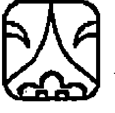

### 藍夜波符 ( Kin183 – Kin195 ) .................... 219

- Kin183 這是一層打磨，把裏面的珍珠釋放出來。
- Kin184 無數的種子就在這當中撒落了下來。
- Kin185 找到自己乘風破浪的方向。
- Kin186 看見自己的存在價值與形式，是我們這一生要構築的一座橋。
- Kin187 用你的心去看見、去感受、去愛，這是它的密碼。
- Kin188 請看見你是美麗的星星。
- Kin189 讓情緒在愛的順流中釋放。
- Kin190 創造一個屬於大家可以共存的大同世界。
- Kin191 你還是需要實際的體驗。
- Kin192 我是一個有智慧的人類。
- Kin193 放下，是探索的第一個要訣。
- Kin194 宇宙創造的顯化法則來自於你與內在的合一。
- Kin195 要有足夠穩定的能量場，來幫助自己穩定所要感知的一切。

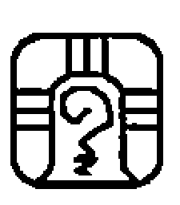

### 黃戰士波符 ( Kin196 – Kin208 ) .................... 233

- Kin196 你是美麗勇敢的戰士。
- Kin197 你的生命要流動到哪一個方向，你要勇敢的去看見，勇敢的做出決定。
- Kin198 回到如如不動、初心的你。
- Kin199 順應這些流動的規則和旋律，找到自己內在和外在的平衡與穩定。
- Kin200 你無法不感受到這一份愛，它照耀著每個角落。
- Kin201 重新去創建內在與外在的平衡。
- Kin202 讓我們把這份美麗一起共振出去。
- Kin203 你的心總是想要療癒自己。
- Kin204 無論你來的目的是什麼，好好把握這一生，活出自己的品質。
- Kin205 我顯化了世界上的一切。
- Kin206 愛永遠在你心中。
- Kin207 你是自己的主人。
- Kin208 我們有自己的光芒，別人也有他們的色彩，這個世界就是因此而美麗。

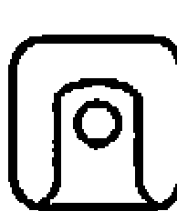

### 紅月波符 ( Kin209 – Kin221 ) .................... 247

- Kin209 只有你當下的意願，才能夠帶領你流向自己的生命之海。
- Kin210 愛在你的心中，它需要有一個出口。
- Kin211 來到人間就是為了在玩樂中學習，然後從學習中回歸玩樂。
- Kin212 你的表達、你的溝通來自於內在的顯化。
- Kin213 有意識的看見自己及世界美好的那一個部分。
- Kin214 當你在覺知的維度看待一切的發生，臣服與接納是非常自然與放鬆的事。
- Kin215 回到自己的核心，看看你們共振了什麼？
- Kin216 你心中的陰暗面與光明面是可以共存的。
- Kin217 你你是自己路途的創造者。
- Kin218 你並不想這樣漫無目的地一世又一世，行走在一條不知道盡頭的路途。
- Kin219 在光中釋放一切不屬於你的。
- Kin220 你你要學會放手，讓一切流歸他們的路途。
- Kin221 很多古老的記憶在你的心中。

## 白風波符 (Kin222 – Kin234)

- Kin222 你要為這世界創建什麼，散播什麼？
- Kin223 生命中有很多的可能性，不要把自己局限在固定的能量框框中。
- Kin224 你無法獨自玩這個遊戲。
- Kin225 你能安穩自己的心，一切自然都會歸位。
- Kin226 我們把這些智慧與愛散播到人間。
- Kin227 活出你心中的愛與光。
- Kin228 你才發現原來自己是一個絕世的藝術品。
- Kin229 我們都在愛中找到彼此。
- Kin230 你的穿越將會帶來更大的光、更多的愛、更多的平衡與力量。
- Kin231 你要參透和領悟當中的變化。
- Kin232 你帶著神的力量、神的呼吸。
- Kin233 我們有能力穿梭不同的能量場。
- Kin234 你的力量來自當下與自己連接的那一刻。

## 藍鷹波符 (Kin235 – Kin247)

- Kin235 覺知的路途上，會有越來越多的靈魂踏上他們的旅程。
- Kin236 只要你願意去踏出第一步，前面的路就會陸陸續續為你展開。
- Kin237 學習找回內在最真實的自己，重新與萬事萬物連接。
- Kin238 人生是一個遙遠的路程，沒有對和錯，只有投射與反射。
- Kin239 要看見自己的偉大，也要看見自己的渺小。
- Kin240 先有了富足的內在心靈，才會顯化外在的富足人生。
- Kin241 每個人都在天地間有一席之地。
- Kin242 持之以恆的練習，覺察會越來越靈敏。
- Kin243 夢想背後的意圖是什麼？
- Kin244 相信自己必定能開花結果。
- Kin245 只要你願意回來。
- Kin246 我看見我自己，在每個人事物的面向中。
- Kin247 大同的世界，先從我們的心開始。

## 黃星星波符 (Kin248 – Kin260)

- Kin248 在創造中玩樂，在玩樂中創造，閃耀你的人生。
- Kin249 穩定在二元的搖盪中，回歸內在的平和及完美。
- Kin250 閃耀出你靈魂的光輝。
- Kin251 愛會喚醒你。
- Kin252 這一切都是學習的過程。
- Kin253 貪者是誰？ 嗔者是誰？ 癡者是誰？
- Kin254 進入內在的最深處，療癒你內在最深層的創傷。
- Kin255 我把生命當做一次次的成長，蛻變與穿越。
- Kin256 無論你是迷失或是覺醒，你都是在體驗。
- Kin257 我們都承受著眾生的恩惠。
- Kin258 開悟覺醒不是沒煩惱，而是能夠放下對煩惱波浪的執著。
- Kin259 為這世界帶來美麗的轉變。
- Kin260 你知道如何放射出最美麗的光芒。

## 紅龍波符
### KIN 1 — KIN 13

## 回到最初的我

### 紅龍波符 第一天：磁性的紅龍日 (Kin 1)

我誕生了，來自深不可測的生命海洋。孕育萬物的造物主，是我的源頭。我相信自己的存在是獨一無二的，我的存在帶來了開創的能量。

天地萬物的起源和我合而為一，我帶著源源不絕的動力來開創這荒蕪一物的天地。我開創了自己，我開創了他人，我開創了世界。我擁有無比的堅毅與耐力，我必須相信我是萬物的源頭。我看見自己的存在，才能夠把原動力發揮在我獨一無二的開創力。

我為這世界開創了康莊大道，讓他們踏著古人的路徑尋找自己的路徑，帶著古人智慧開創自己的睿智。天地初始的形成，萬事萬物即為一體。我們都意識到自己的開創性與一體性。

我們是這個世界的主人，也是自己意識的主人。我們與世界融而為一。我們維持著世界的秩序，遵循著宇宙合一的靈性法則，我們與天地的和諧頻率共振，維繫著與源頭的連接，獲取豐盛的支援與訊息。

我們瞭解及看見天地的美麗，無憂無慮的遊戲在人間，學習與創造生命的更高層次。我們的光是我們的指引，我們的愛是我們的導航。

回到自己的中心，連接自己的神性，回到最初的我。

## 我們一直都在一起

### 紅龍波符 第二天：月亮的白風日 (Kin 2)

愛在你的心，把它表達出來。從無始誕生，我們經歷了創造、開闢的過程。我們的能量分成了很多個部分，為了完成很多不同的開創與生存。

這些能量往不同的方向擴展，帶來不同的體驗。但也與此同時我們被分裂了，看起來有很多個我往不同的面相，體驗不同的愛的層次。我們被導向了不同的方向，體驗不同的自己。但核心的我們還是一致的，從沒分離過。

我們一直都在一起，只是你的能量被擴散了出去，無法感受到它的一體性。

隨著你的呼吸，你與外在的一切交流，把愛傳送出去，也把外在的愛帶進來。愛的循環傳送全世界，帶來和諧美麗的能量。只要你能夠守住自己的心，守住你心中的愛與光，你就能夠感受到愛的循環，無處不在。儘管我們分裂了，我們的愛一直還在。

人類的智慧，靈活的思維會帶你去體驗無數與愛課題有關的體驗。情感的流動是帶動你回到自己中心的秘訣。你要在情感的流動中看見自己的分裂性，看見自己的自由性。你一直在選擇某一種思維在你的腦海裏，某一種情感、情緒一直在纏繞著。

打破它，停留在它的中心，告訴它你知道它是什麼？你看見了它的真面目，你不願意再跟它糾纏下去。你要回到自己的中心，回到你愛的中心，散播你心中愛的種子，讓它隨著你的呼吸流傳到全世界，流動到宇宙的中心。

## 看看你如何看待自己的存在

### 紅龍波符 第三天：電力的藍夜日 (Kin 3)

豐盛是人人所追求的，包括內在的豐盛和外在的豐盛。但是很多人卻不明白豐盛的意義，只是盲目的追求，填補內在的空虛與匱乏。

豐盛是我們獲得了內在豐厚的圓滿後所散發出來的磁場，它能吸引更多的外在豐盛的人事物，包括人們一直追求的金錢。這種豐盛是持久圓滿的，內在的圓滿創造外在的圓滿，內在的豐盛吸引外在的豐盛。

宇宙是一個大倉庫，它能夠提供給你一切你所需的，你所追求的，你所知道或不知道的。只要你想要，它都有，只是你要懂得提取的方法。你的手能夠變化出一切你所想要的，只要你找到正確的管道，對準你所需要管道的振動頻率，宇宙是不會吝於給你的，因為它有取之不盡的資源，永不枯竭的源頭。

我們都是宇宙大地的孩子，他們不會棄我們而不顧，他們一直都想給予我們更多，只是我們無法擁有足夠的能量去獲取更多。你本身的氣場、磁場決定著你能夠擁有什麼、吸引什麼。

如果你帶著的是恐懼的磁場，你將擁有恐懼的物質來源，如果你擁有圓滿豐盛的磁場，你將擁有豐盛圓滿的財富豐盛以及其他各方面的豐盛來源。

壯大和穩固你的磁場，讓它充滿美麗豐盛的能量。活出你靈魂的本質，豐盛將源源不絕的到來，無論是內在或是外在的。

提起你的勇氣去探索內在的不圓滿、豐盛的缺角，如果此時你無法活出或吸引豐盛，肯定內在有什麼缺失的一角等待著你去探索。如果你活在恐惧不圆满的丰盛，也肯定内在有什么值得你反思反省的部分，为何你自带丰盛圆满而无法活出丰盛圆满，当中肯定大有文章。

啟動內在對自己價值充電的按鈕，去看看你如何看待自己的存在，去看看你對自己有著怎樣的評判。

## 你的美丽来自内在对自己的信任

### 红龙波符 第四天：自我存在的黄种子日 (Kin 4)

你集天地精华于一身，就像一颗种子。你拥有所有开花结果的基因，等待的是时间与适合的因缘。你一直都在孕育着，当你准备好了就会遇到对的时机、对的因缘、对的时空，让你稳稳当当的长出枝芽，展现你的存在，开启你的美丽。

你要有长远的目光，看见你是充满生机的种子。你的过去、未来、现在都在同一个时空展现。过去的种种因缘造就了你是怎样的一颗种子，这一世你要开出怎样的花，结出怎样的果；当下你让怎样的环境能量充塞着你，你在吸取着怎样的养分；未来的你会遇见怎样的风霜，怎样的阳光，你会长成怎样的样子状态，一切都在同一个时空，同一个平行宇宙展现着。

你要去看见这一切的因缘，回到你的当下，稳住你内在的能量与毅力，让这一个过去、未来、当下的能量稳定在一个固定的频率，开展出稳定的花和果，连接上美好当下的一切，开展出你所想要的一切。

当我们根植于大地，大地的能量会提供你有利的成长环境与能量，稳住你的一切。你的力量在当中孕育着，提取你所需要的一切，你值得拥有世界上美丽的一切。

你的美丽来自你内在对自己的信任，你对宇宙大地的信任，你知道一切都在支援着你，你只要纯然的相信、纯然的接受、纯然的感恩、纯然的奉献，一切就会形成一个美丽的循环，散发美丽的光芒。

在你的心中，在你的世界，每一颗种子都能开出美丽的花朵、美丽的果子、美丽的枝叶、美丽的能量场。你要相信每个人大不同，每个人有独属自己的风格与特性，学习欣赏和看见自己的独特，活出自己心中的太阳。你在创建一个美丽、独特、稳定的自己的同时，你也在创建一个美丽、独特、稳定的世界。

## 你能夠遨遊和舞動的空間實在太大了

### 紅龍波符 第五天：超頻的紅蛇日 (Kin 5)

我們一直在體驗生命，當中有苦有樂、有悲傷、有歡笑，我們展現了對生命的熱情與毅力。

我們在生命中體驗著各種智慧與愛。或許，我們看不見當中所隱藏的愛與智慧，只是盲目的追求、盲目的體驗，傷痕累累。我們抗拒、我們衝撞、我們受傷，這些都是我們在生活體驗中留下的許多印記。

或許有一天，當我們覺醒了，回過頭來發現一切都只是體驗，領悟愛的體驗，我們才開始往內在去探索，展現生命的另一種提升與熱情。

我們的生命不僅僅是對物質情感的執著與抓取，生命中可以創造和體驗的大於你的想像。如果你只是受困在三次元的生命體驗，那你會錯失很多重次元體驗的樂趣。

把你的眼光放遠，探索和連接你內在的無限智慧，你可以展現的實在太多太多了，你可以體會的實在太多太多了。

不要把生命局限在某一個角落，把你的格局放大，把你的目光放遠，把你的心量放大，把你的愛擴展，你能夠遨遊和舞動的空間實在太大了。

## 每個人都是一座橋

### 紅龍波符 第六天：韻律的白世界橋日 (Kin 6)

每個人都是一座橋。裏裏外外，每一天都在連接著不同的東西。你連接著你自己，也連接著外面的人；你連接著物質世界，也連接著非物質世界。

橋有兩端，你連接的人事物也有兩端，一端在你這裏，一端在彼端。兩端的能量必須相平衡，它才能夠成為一個平衡和穩定的橋梁。

你要獲得平衡的豐盛，你內在的豐盛必須與外在的豐盛匹配。你要連接愛，你內在的愛必須與你所想要獲得的愛相匹配。否則，所連接到的是不對稱、扭曲的能量平衡。它在慢慢促使你的平衡，所有一切以能量的形式展現。你內在的振動頻率必須與你想要連接的彼端相平衡與共振，你才能夠真正獲得相匹配的平衡，否則你就得花費更大的能量去平衡它。

內在的恐懼也需要匹配的勇氣來平衡。你用自己的勇氣去平衡自己的恐懼，你用你自己的愛去平衡自己的恨，它們都一直在進行著能量上的平衡。當這股能量無法平衡時，唯有不斷的感受另一端的情緒、矛盾與掙扎，直到它們達到平衡為止。

你連接的東西太多太多了，每一時每一刻，一個念頭接著一個念頭，一個思維接著一個思維，一個動作接著一個動作，一個行動接著一個行動，一個接觸接著一個接觸；你與他人，你與自己，無意識的在進行，很少人察覺到一天裏到底進行了多少個連接。

我們也在穿越時空的連接，在夢裏、在意識中、在潛意識裏。我們連接到不同時空，不同平行宇宙的能量。我們只是過客，未能停留，去連接更多的訊息與能量，因為此端能量上的不平衡，我們未能從中獲得更多。

內在的你有許多的智慧，可以飛得更高，看得更遠，但你只是停留在原地，期待更多的到來，沒有實際的去探索橋的兩端到底有哪些不平衡的能量在主導著。

你要去感受，兩端的頻率，兩端的能量，用你的心找出愛在哪裏被封堵了，讓你感受不到。美好的兩端在等著你的發掘。

## 生命把你帶到哪裏去了？

### 紅龍波符 第七天：共振的藍手日 (Kin 7)

生命中許多的完成是你看不見的。我們把焦點放在手上的事，急著去完成手上的事，要把手上的事做得盡善盡美。但我們常常忽略了許多事物在我們生命中悄悄的完成了；你和他人的關係、你和金錢的關係、你和自己的關係……很多事物在悄悄的進行著、完成著，你甚至沒有發現，它們在呈現著、展現著，在你的生命中起著作用。

我們容易忽略生命中形成的事物，卻急著去完成手上似乎緊急的事物。時間在一點一點的流逝，很多事物也在生命中完成后一點一點的離開。

你的方向在哪裏，你知道嗎？這些真的是你想要做的嗎？你要認真的去思考，用你的心去感受，你的方向在哪裏？你的位置在哪裏？你在盲目的過生活，還是你清楚方向的過生活？

生命把你帶到哪裏去了？你盲目的在追隨，讓生活的一切席捲著你走，還是你在主導自己該走的方向，你知道你內在需要的是什麼？你知道你生活的最終目的是什麼？你是否能夠一再的回到自己的當下，調頻自己的世界，讓它活出有意義的人生色彩？

當你漫無目的在追求無盡的物質、情感生活，你也在創造一個漫無目的的自己，隨著社會、金錢、物質、情感的流動捲入這共振的漩渦，集體意識的漩渦。

你在勞動中看見自己，日以繼夜的追求很多不屬於你的東西，卻還是牢牢的抓住不放，無法回到自己的流動中，遵循自己生命之流的方向導航。你要停下來，放開你的手，獲得空檔及空間，去思考及感受此時此刻的你在讀取著一個怎樣的人生，在創造著一個怎樣的人生，在追求著怎樣的一個人生。你想為自己創造的是什麼？你想為社會創造的是什麼？

把自己帶回來，共振出這一股屬於自己的力量，讀取關於你人生密碼的訊息。

## 你永遠有著自己的位置，自己的光芒

### 紅龍波符 第八天：銀河星系的黃星星日 (Kin 8)

天上有無數的星星，構成一幅美麗的夜空。人間有無數美麗的靈魂，形成一個美麗的世界。我們是如此的生存著，閃耀著自己的光芒。

無論你的光芒是萬丈的還是暗淡的，你都是人間的一顆星星，你永遠有著自己的位置，自己的光芒，這是別人所無法取代的。你有你的故事，你有你的成長，你有你的經歷，永遠都在散發著自己的魅力，無論你知道或是不知道。

你永遠是大千世界中的一個世界，即使你覺得是那麼的微不足道。不要去否認自己的存在，要看見自己，探索自己如何的存在著在這個世界、這個空間、這個平行宇宙。

指引著你的是你的內在智慧，你要去相信自己內在擁有著無限的美麗與智慧，你可以隨時去連接以獲取更高的指引。外在只是一些看似美麗但不一定適合你，所以無需攀附依靠，最終還是要去連接回自己的力量，從內而外閃爍，那才是真正的美麗與完整，持久發亮的光芒。外在的只是一些點綴，一些提醒讓你回到自己真正的光。

散發出內在真正的光芒，戳破外在的一切幻相，回歸內在的平靜。你只有在平靜的大前提下才能散發出最美麗的光芒，成為人間最美麗的一個發亮點，天上最平靜的一個連接點。

## 哪一個才是真正的你？

### 紅龍波符 第九天：太陽的紅月日 (Kin 9)

看見情緒的力量，發揮情緒的力量。情緒常常被視為不好的，要去擺平它，不要輕易讓它左右及湧現。其實情緒是中性的，它對我們是一個提醒和啟動，提醒我們內在正存在和發動一些東西，啟動我們去處理或完成一些事情。

我們要善於與它共處，知道它的流動，隨順它的節奏，對它的起伏觀察入微；你在經歷著怎樣的情緒，這情緒帶來怎樣的感受與作用，它在你身體的哪一個部分，它的源頭在哪裏，它要流經哪一個地方，你在跟隨它還是在抵抗它，還是覺察它如何流經了你的世界。

你給予它力量，還是它給予你力量去重新看待和啟動自己，這一切都是值得你停下來，慢慢去感受及覺察。這股力量將在你的生命中啟動著許多的東西，你的生活、你的關係、你的世界，無不受這一股力量影響。

你的愛也被左右著，當你有好情緒時，你感覺可以愛一切的人。當他們賦予你感覺良好時，你覺得他們是世界上最好的人，當他們無法滿足你的期待，賦予你良好的感覺時，你覺得他們是世界上最壞的人。

情緒在兩股力量中搖盪，時好時壞，你也不知道哪一個才是真正的你，哪一個才是真正的他們。你繼續你的生活，同樣的事情一再發生，同樣的情緒繼續在不同的人事物中搖盪。

你被情緒拉著一直兜圈子，像在一個風暴圈中不停的旋轉。直到有一天你被拋出了風暴圈，你才會看得到這所有的一切，只不過是一些能量上的不平衡，帶著你在兜圈子。所謂的人事物只是在學習和體驗中的一些助緣，幫你覺察內在的變化，遠離風暴圈，回到內在的平靜，創造你豐富多彩的人生。

當你有智慧的看見和駕馭這一切，情緒就變得簡單而有力量，讓生命發揮出最大的熱情。

## 看見這一切的根源

### 紅龍波符 第十天：行星的白狗日 (Kin 10)

人世間顯化了許多的愛：關係中的愛、親子父母間的愛、國家社稷的愛、宇宙創物者的愛。是我們心中的愛顯化了外在的這些愛。

我們來自宇宙的一部分，我們來自大千世界的一部分，我們帶著愛顯化世間的一切。我們成就了愛，愛也成就了我們。

然而在我們的愛中卻有許多無法平衡的能量，沒有純然的愛。我們的愛夾帶著許多的恐懼、擔憂、害怕與捆綁。這些因素滲透我們的關係中，我們對外人事物的互動中。

它們像一層過濾鏡，把折射出去的愛扭曲了，我們無法全然的付出自己的愛，也無法全然的顯化外在由純然愛所煥發成的世界。我們的愛充滿條件，充滿過濾鏡帶來的折射與反射，這是我們所要帶著覺知和反思去看見的一個課題。

我們無法輕鬆的遊戲人間，因為捆綁和受困在太多愛的課題上，動彈不得，動輒牽動內在不圓滿的投射。我們無法全然的發射出去純淨的愛與光，也無法從中回收純淨的愛與光。

我們所能顯化的是帶有條件的愛與光，我們所能收穫的是有條件的愛與光，這就是為何人類花費許多的力氣與能量，卻無法獲得匹配想要的收穫，而一再埋怨世界的不公平。

我們一直都在顯化和創造外在的一切，你的流動顯化外在流動的一切，你的停滯顯化外在僵固的世界。你純然无私的慈悲顯化外在純然无私的世界。你要看見這一切的根源。

## 親身去體驗，親身在當中抽離，才能夠看見其中的幻相。

### 紅龍波符第十一天，光譜的藍猴日

物質世界有著太多讓我們迷惑或迷失的東西。當我們的頻率降低到物質世界，我們無可避免融入到物質世界的迷幻中，五光十色最容易讓人迷幻其中，當中的真真假假不容易去分辨。

你要親身去體驗，親身在當中抽離，才能夠看見其中的幻相。這些體驗可能會歷經許多生許多世。即使你已經體驗了許多生許多世也不一定能夠看破所有的幻相，因為它們是那麼的真實，讓你無法放開自我的枷鎖，自我的捆綁，它讓你感覺到某種的抓取，某種的擁有。

你不願意放手去承擔內在的不確定感和虛空感。你害怕面對虛空的自己，你不相信虛空中還有一個你、真實的你、回到源頭的你。你情願活在幻相中，繼續你的夢，在夢中搭建起自己的世界，在夢中抓取屬於你的東西，不管它們是否真實存在，是否真正為你所擁有。

你就這樣一直把這個遊戲玩了一遍又一遍，直到有一天你願意放下虛幻的美麗，回到內在真實的美麗，你不再祈求外在的美麗來填補內在的缺陷、內在缺少的那一角。你看見愛就在一切的當中，你的人生沒有所謂的圓滿或不圓滿，一切只是愛的流動，愛的交流和愛的循環。你只是借助一些體驗把愛提升到最高點，滋養著自己，也滋養這個世界。

放下你對愛的期待，你認為它該有的模樣，讓它自由的流動，它會隨著你的頻率，隨著世界的頻率流動到它該去的地方。

紅龍波符
Kin11 光譜的藍猴

## 你擁有了真正的自由意志。

### 紅龍波符第十二天，水晶的黃人日

Kin12 水晶的黃人

人類懂得思考，懂得分析，因為他們擁有發達的腦部。左腦是我們常用到的，在這個物質世界裏，它是用來做決定的主要考量。我們總是在腦裏分析了一遍又一遍，深怕遺落了什麼。

但在事實上，另一個腦，我們的右腦卻又同時的在操作，無意識的操作。你甚至沒有敏銳的感受到，很多的資訊在這裏進進出出，如入無人之境。

當你在做一個選擇時，你意識到在思考的那個人在操作，但你並不知道還有一個大背景在運轉著。它們來自你的潛意識，透過你的右腦在操作。大量的訊息和記憶，個人的、集體的都會在你思考的時候湧現出來，慢慢滲透在你的思維系統裏。

你以為你在做決定，其實是這一大片在你系統裏無意識的操作在左右著你的決定。這些訊息有來自於你的信念價值觀，你家族祖先的信念價值觀，社會集體意識的信念價值觀。當這些訊息到來的時候，你自己的意識所左右的信念價值觀就顯得渺小了，你總會在無意識地被引導到一個方向的思維，你的決定是這一些訊息的綜合。

覺知與覺察會讓你看見這一些訊息對你的影響。它們並非無影無蹤，只要你擁有足夠的覺知與覺察，你還是會發現它們的蹤影。你可以反被動成主動，轉化不適宜的、讓你恐懼、擔憂的成為能為你所用的價值。

這裏也是一個門戶，讓你去連接更多的訊息與資源。當你能夠暢行和流動在這個通道裏，你隨時可以不費力地去獲取你所需要的訊息。你不再無意識地被這些訊息的流動所左右，你能夠有意識地去選擇需要連接的訊息，你擁有了真正的自由意志。

你能夠和所有來自各自層次的訊息合一，再把這些訊息轉化為利益眾人的行動，包括你自己，也能創造出更偉大的能量。

## 需要不同的能量來滋養你。

### 紅龍波符第十三天，宇宙的紅天行者日

放下你的背負，到世界的各個角落去探索，你會有意想不到的收穫。每個地方有著它們不同的能量，能提供你不同的體驗及訊息。

你身上背負了許多，以至於你無法放開自己，全然的去體驗，全然的去探索。你的能量需要被擴展，你需要不同的能量來滋養你，正如你的身體需要不同的養分來滋養你。

你的能量場也是一樣，它們需要不同的能量養分來滋養及擴展。但是如果你背負了許多不屬自己的能量或超載了許多已經不適宜自己的能量，你是無法再引進新的能量來滋養你的能量場。

你必須先把它們卸下，清理轉化成為你所能使用的，否則你就要徹底的卸下它們。你不能一直在原地打轉，受困在同樣的能量場中。

你要深入你的內在，找到一個穩定點，像拋錨一樣，把一個點穩定住，你才能夠隨心所欲地去遨遊探索在無限的時空與世界而不迷失。你知道你探索的重點在哪裏，你為了什麼而探索，而不是漫無目的遊盪。

你能夠去連接多重的次元去獲取你所需要的能量與訊息，你會看見許多的美麗在當中隱藏著，等待你的發掘和傳播。

紅龍波符
Kin13 宇宙的紅天行者

## 白巫師波符
### KIN14 - KIN26

## 你在自己簡單的空間裏已擁有了一切所需要的。

### 白巫師波符第一天，磁性的白巫師日

我們總想要獲得更多的東西，抓取更多的東西。其實生活是很簡單的，你並不需要太多的東西，你只是想借助這些抓取的能量來填補你內在的匱乏感和空虛感。

當你真正的活出了自己，你會發現你什麼都已經擁有了，你不需要再去追求多餘的。這些多餘的都是一些累贅，你能夠很瀟灑的揮一揮手，不帶走一片的雲彩。你可以從簡單中變幻出許多空間、時間和一切你所想要顯化的。

這時你的顯化也不再是為個人的顯化，你是為眾生顯化他們所需要的，因為你不再為自己而追求什麼，你在自己簡單的空間裏已擁有了一切所需要的。

如果你現在還在不停的追求、抓取，情感也好、物質也好、地位價值也好，你無需停止，也無需評判自己，因為你內在還有一個很大的空虛無底洞無法填補，不能實在的過生活。

但你要保持覺知，你要有意識的去追求或抓取，然後回到自己的中心，看看自己還有哪些沒有滿足的，看看自己還有哪些還未完成的，自己對哪些生存存在的恐懼感。

去感受它們、去瞭解它們、去看見它們，讓它們帶領你回到自己簡單又充滿魔法的空間，安住你內在平靜的空間，去看見一切。

白巫師波符

## 看見和知曉真實的自己。

### 白巫師波符第二天，月亮的藍鷹日

要看清楚千變萬化的世界不是一件容易的事情。當中有許多的扭曲，錯誤的詮釋，隱藏著許多不為人所知因緣。我們往往只看到表層，被我們的二元思維所掩蓋。

我們不知道背後的真相到底是什麼，只能夠用我們的邏輯思維去思考和分析，殊不知我們邏輯思維的背後，卻是隱藏著許多來自自己信念價值和社會信念價值的對立性。

我們無法中性地去看待事物，但卻又如此的評判性，容不得他人與自己信念價值相左的論解。無論你從哪一個方向去詮釋都有其不周的地方，因為每一個角度都會折射出不同的訊息與詮釋，它是片面的，非全面的。

所以當你想要中性的去評論一件事情時，要想想是否站在全面的角度去詮釋，否則請你收起評判，往內在去連接一個更高的自己，站在更高的角度，擁有更好和更全面的角度，來看看自己站在一個怎樣的位子看待這件事情。

我們都是平凡的人，卻又做著許多不平凡的事，我們想把整個世界翻轉，去看看整個世界是在一個怎樣的規律下運轉，我們總是想去瞭解更多的世界。

當你覺知到自己不只是肉身的自己，在這三次元的物質世界裏，你的身體承載著你的成長，成就著你的前進與提升。你要好好的去看待這個個體，它一直在承載著，讓你能夠回到自己內在的平靜，連接內在最真實的你，看見和知曉真實的自己。

## 你是自己的勇士。

### 白巫師波符第三天，電力的黃戰士日

你要有勇氣和心量去接納生命中與你信念相左的東西。你感受到不能接納許多東西必定是內在有跟這個信念相左的創傷或信念價值。你必須要有勇氣去探索它們，否則你永遠停留在挑剔和看不順眼的階段。

他人有他人的課題，你有你的課題，你要看見和探索的不是他人的課題，而是自己的課題。你永遠只能針對自己借題發揮，你無法改變他人來成就你內在的癒合。

你是自己的勇士，撥開心中的雲霧，看見內在的創傷，去療癒內在的創傷，你要知道這一切的發生都有其發生的因緣，它們不會無緣無故出現在你的生命中。

它們像一條線，此端拉著彼端，相互影響著，相互交織成一個無形的網，把大夥們都連在一起。你要去感受這張無形的網，感受它如何把你們拉扯在一起了。當你知曉這一切，才能夠把生命發揮到極點，否則你只是把精力、能量耗費在跟別人的糾纏不清中，無力去解開生命中網絡的聯繫帶來的糾結。

你的生命能由此而綻放光芒，發出引導自己前進的力量，看見內在無限的可能，連接無限的源頭，帶來源源不絕的推動力，創造屬於你的力量。

白巫師波符

## 這是地球媽媽給予大家的禮物。

### 白巫師波符第四天，自我存在的紅地球日

地球媽媽有一顆寬厚的心，她的心可以承載很多別人所不能承載的。她能夠承載人類的生存，她能夠承載人類的需求，她能夠承載這世界的一切。她以自己的速度，自己的步伐，往著自己的方向不停的在運轉著。她有自己的節奏、自己的速度、自己的韻律，她知道自己該往哪裏去。

無知的人類，他們以為地球媽媽永遠能夠承載他們，所以任意的揮霍她的資源。他們以為地球母親必須追隨他們的步伐，跟隨他們的需要而隨意妄為。殊不知地球母親有著自己的進展、自己的規律，她絕對願意承載，但人類必須跟得上她的步伐，跟得上她的韻律，跟得上她的旋轉。

人類不能只活在自己的世界，任意妄為，自私自利，這不是地球媽媽的頻率。她的頻率是給予，也是接受，她給予所有的一切，也接受所有的一切。她必須維持在自己的高頻，她才能夠繼續的給予與接受，她不能為一部分自私自利的人而停止自己的韻律。

她是承載著廣大的眾生，不只是人類。人類以為自己是地球上的霸主，統領著一切生物。他們不知道地球媽媽才是地球上真正的擁有者，她能給予地球上的一切，也能清理地球上不匹配的能量以讓廣大的眾生繼續生存。

她是慈悲的，接納地球上不同眾生，不同管道的一切，創造和療癒每一個當下。你只要去連接她的振動頻率，你就可以感受到當下的這一刻，充滿了療癒與創造。

大地充滿了生機，無論哪一個角落，只要有適當的因緣都會長出美麗的花草樹木，散播著和諧的樂章。這是地球媽媽給予大家的禮物，一份真正美麗的禮物，但很多時候人類卻看不見，眼中只有物質金錢為珍貴的禮物，內在充滿了許多的不確定感和不安全感。

大地媽媽的禮物就穩穩當當的在那裏，到處都是，到處都存在著。為何你無法看見？因為你的心無法承載和接納，你無法連接到地球媽媽的心，穩穩定定的存在，穩穩定定的創造與穩穩定定的穿越。

真誠的面對自己，看見自己。你是誰？你需要什麼？不要再掩飾自己，你不是為了得到別人的肯定而活。你可以展示真實的那一面，毫無掩飾。你不需要為了討好別人而裝出好的一面，你也不需要為了掩飾自己醜陋的一面而做許多門面裝飾。

你就是你，真實的你，如實的去面對你自己。即使你不願意，外在的一切還是會帶領你去看見真實的自己。真實的你並沒有想像中的可怕，你害怕為人所知的一切都是在提醒著你，要戳破你的泡泡，勇敢的做回你自己。只有勇敢的做回你自己，你才能夠真正的活出你是誰，你為何而來。

你要去寬恕那個掩飾的自己，你要去明白這一切的用意，不要譴責，不要批判。你要接納與臣服，回到中心的自己，連接內在的自己，傾聽內在的聲音，你該如何活出你的人生。無論是內在或外在的不和諧，它們都是一種展現讓你回歸真實的自己。

做回真實的自己，看見自己的需求，看見自己的渴望。

Kin17 自我存在的紅地球

## 真誠的面對自己。

### 白巫師波符第五天，超頻的白鏡日

真誠的面對自己，看見自己。你是誰？你需要什麼？不要再掩飾自己，你不是為了得到別人的肯定而活。你可以展示真實的那一面，毫無掩飾。你不需要為了討好別人而裝出好的一面，你也不需要為了掩飾自己醜陋的一面而做許多門面裝飾。

你就是你，真實的你，如實的去面對你自己。即使你不願意，外在的一切還是會帶領你去看見真實的自己。真實的你並沒有想像中的可怕，你害怕為人所知的一切都是在提醒著你，要戳破你的泡泡，勇敢的做回你自己。只有勇敢的做回你自己，你才能夠真正的活出你是誰，你為何而來。

你要去寬恕那個掩飾的自己，你要去明白這一切的用意，不要譴責，不要批判。你要接納與臣服，回到中心的自己，連接內在的自己，傾聽內在的聲音，你該如何活出你的人生。無論是內在或外在的不和諧，它們都是一種展現讓你回歸真實的自己。

做回真實的自己，看見自己的需求，看見自己的渴望。

## 越大的浪花承載越大的能量，捲起更大的生命之流。

### 白巫師波符第六天，韻律的藍風暴日

風暴湧起的時候必定有一股力量在推動它，風暴消退的時候這股力量就轉化了。風暴不會永遠在極端，它會起來，也會消失。正如你的人生，生命中的風暴有起有落，一天中的情緒也有起有落，你看見當中的關係了嗎？

你生命中的許多風暴的能量，其實是帶領你回到自己的內在，去看見內在的起起落落。你的情緒在告訴你，你的能量無法平衡在一個穩定點中。

白巫師波符

生命有起起落落，情緒有高高低低，能量的變化也有起起伏伏。你不用執著生命一定是風平浪靜、無風無雨，這樣的生命無法激起浪花，也就無法欣賞到浪花起伏的風景。

你的人生需要浪花來增添你的美麗，你的人生需要浪花來幫助你的體驗，你的生命需要浪花來幫助你的成長。但你也要懂得去隨順浪花的起伏，不追逐浪花的腳步，以免在裏頭捲得昏花亂墜，逃離不了浪花的摧殘。

你要隨順浪花的輕盈去清理你身上的污濁，還你一身輕盈，等待浪花後的平靜。生命中有大大小小的浪花，越大的浪花承載越大的能量，捲起更大的生命之流，讓你臣服於生命的偉大，繼而發放光芒。

當你承受著巨大的浪花時，不要抱怨，進去看看浪花帶給你的是什麼。或許，你有一個更大的使命在等著你，你必須能夠先克服生命的浪花，你才能夠把生命中的平靜帶給更多的人。

## 讓它流動，讓它回到你身邊。

### 白巫師波符第七天，共振的黃太陽日

Kin20

在你我的心中，我們都有一個同樣的點，我們為愛而生存，不管這愛是有條件或是無條件的。我們身邊的很多事都是圍繞著愛而進行，有時你為外在的愛牽著走，有時你內在的愛共振出去。我們的初心都是在圍繞著愛在進行，不管是世俗的愛，還是聖靈的愛或對眾生的愛。

然而，愛會變成恨，會變成埋怨，會變成不平衡。當我們太執著，愛一定要以我們的方式去進行，愛要隨我們設定的軌道去走的時候，這個愛就不是原來的愛了。它充滿了恐懼、壓力與控制，它背離了愛的自由與流動性。

它被約束了，被你我約束了。改變，是能量積累後會帶領愛的方向回歸它的源頭。愛會離開它受約束的範圍，它不應該只屬於一個範圍。它是無邊無際的，它是要流傳的，它是需要循環的。如果你只讓愛往一個方向走，它是會改變的，它是會隨著能量的累積而改變，它會回到適合它的地方，適合它流動和散播的地方。

愛是集體性的，它要在一個大範圍流傳，也會在一個大範圍回歸，生生不息。不要去約束它，你約束它等於你在約束你自己，不要漠視它，你漠視它等於你在漠視你自己。

讓它流動，讓它回到你身邊。去感受它，不要去分析它。分析讓你與愛漸行漸遠，感受讓你明白愛的來源和愛的去處，你能夠去包容與接納一切在愛中流動的人事物。

## 你身邊所有的發生來自於自己的創造。

### 白巫師波符第八天，銀河星系的紅龍日

生命一直在創造，誕生。在無意識中，我們每天都在創造千百萬個念頭，這些念頭含有大大小小的能量在躍動著。它們都在這空間裏創造著無數的奇蹟，無數的發生，你從不知道。

你身邊所有的發生來自於自己的創造，一切都是那麼的無意識，在你意識之海的自動導航中。在那古老的海洋，古老的場域，有著你我的故事。這些故事一直在疊加重複，在人類腦海的創造海洋中，在你我的創造海洋中。

白巫師波符

人類的進化、我們的進化、世界的演變，無一不是起始於這一片海洋。我們的生命不斷的繁衍下去，我們的記憶不斷的疊加上去。我們的集體意識已經到了一個臨界點，我們要演化為一個集體的人類，不分你我的人類，一個整體大我的人類。

那些深沉在幻相中的人類將面臨嚴峻的考核。我們將會一起創造一個新的世界，跟隨著揚升之光，我們必須改變思維，改變創造的模式，讓自己能夠融入這個新世界的模式，也幫助自己完成清理的過程。

我們背負了許多古老的意識、社會的約束、傳統的制約，曲解了當中的意義，一味的去盲從，只獲得迂腐的制約，而沒有實踐其精華的滋潤。

你的臨在改變了這一切，讓你的臨在回到了你的初心，那個沒有經過多重反射與照射的自己，你當初來到地球那純粹創造的心，那純粹為一切發放光芒的心。去連接它，去看見它，讓生命重新充滿了熱情。

## 看見那個編故事的人，拿回自己的力量。

### 白巫師波符第九天，太陽的白風日

我們的臨在傳遞著許多的訊息，我們的能量場散發出許多我們不知道的訊息，我們甚至不知道它對世界帶來了影響。

這世界上許多人忙忙碌碌，盲盲目目地過了一生，甚至不知道自己在這個世界上留下怎樣的痕跡。我們既偉大又渺小，我們看似不起眼，只是世上的一顆塵埃，一吹就不見了，但是我們也有能力組成風暴沙塵中的一塵，為這個世界帶來影響。

我們並不知道，我們內在一直不停的把許多訊息傳遞出去，也一直在不停的接受訊息。這一進一出卻為整個世界帶來了微妙的影響，我們受著集體意識的影響，卻也散發著集體意識的一塵能量，形成了集體意識的能量風暴沙塵。

而且很多時候我們散發出去的都是帶有恐懼的能量，增添集體意識的恐懼能量場。我們沒有辦法跟自然界的和諧意識同頻，因為我們總是有意識或無意識的散發出不和諧的能量場，無法連接到大地的核心，也無法連接到自己的核心。

於是我們的頭腦繼續的被許多念頭牽著走，製造許多的故事情節，一再上演故事情節中的模擬受害者意識，回不了真實，看見不了真相。我們的意識一層又一層被許多故事包圍著，欲罷不能。我們一直圍繞著情節走，永無盡頭。

我們要回到現實，就在這當下的這個念頭，讓它回到當下，看見那個編故事的人，拿回自己的力量，回歸自己的中心，有意識地去更改自己的生命故事訊息發送路徑，散發出正面的影響，為自己，也為他人。

Kin 23

## 你能夠顯化世間所有的一切豐盛。

### 白巫師波符第十天，行星的藍夜

我們一直都想顯現生命的豐盛，無論內在與外在。我們有無限的想像力可以創造外在豐盛的一切顯化。但真正的豐盛還是來自內在真正的那個無限場域的連接。你必須先豐盛自己的內在，然後用內在豐盛的頻率去連接與吸引宇宙間一切的豐盛。

### 白巫師波符

你原本具足，擁有一切的豐盛，只是內在有著太多的憂慮，太多的匱乏信念，太多的負向思考，遮蓋著你豐盛的面向。所以，只要你把這一切移除掉，你內在的豐盛自然就會展露頭角。

你要去看見內在的無限，探索內在的無限，它們以很多管道和頻道存在著，任你天馬行空的去連接，只要你回到純淨無暇的自己，那顆像孩童一般的心去看待你周圍的人事物，和看見自己的純真美麗。

回到自己的愛與光，拿起你在愛與光中的寶劍去驅走心中的陰暗面，去看見它背後的光明，去轉化這一切能量所帶來的智慧。

Kin 24

## 看見自己更大的使命。

### 白巫師波符第十一天，光譜的黃種子日

地球承載著一切，包括無數種子的成長、開花和結果。種子含有自己的成長潛能與能量，但它還是需要一個承載器，一個適合它成長的空間。

種子要放下自己的期待，它要隨順一切的因緣，它要接納一切的因緣，它要讓自己成為一顆靈活堅毅的種子，即使在艱難的沙地，即使在貧瘠的地方，它仍然能夠存在這小小空間，等待一日的壯大。

它不能計較環境的好壞，它要讓自己生存下來，才能有機會施展自己的潛能，發揮自己的專長，看見自己的美麗。如果它半途就折回自己的生長，是永遠無法看見歷經風霜的它如何結出最美麗的果實和花朵。

它要放下自己的無奈，堅毅的往前伸展。不是所有的種子都能落在肥沃美麗的土壤中生長，美麗肥沃土壤的種子有它的因緣和任務，貧瘠土壤中的種子也有其因緣與任務。不必相比較，它們都會有美麗的一生。

它們都是在大地承載的土壤生存及成長，不是地球媽媽偏心，而是每顆種子都有自己的因緣，都有自己不同的展現，帶給這個世界不同的意義。你看見的只是種子表面的好壞，你無法去判斷真正的原因。因為原因永遠存在於不同的角落，你要用智慧的眼睛才能把它們看得清楚。

放下你的評判，放下你的抱怨，放下你的不滿，臣服於任何給你考驗的體驗，去活出真正的自己。你是種子，必定能夠開花結果。不要讓自己半途而廢，你要堅持自己的信念，放下對世間的埋怨，看見自己更大的使命。

Kin 25

## 生命永遠都是那麼的有趣。

### 白巫師波符第十二天，水晶的紅蛇日

生命有著一定的規律可循，你要學會看見生命的舞動。生命有高、有低、有平有凹，這一切都是有跡可循的，不是無緣無故的發生。它必定有一個特定的能量潛伏著，進而引發下一波的人生風浪，它必定有一波的能量孕育著，才能引發下一波的浪潮。

浪潮的平伏或洶湧取決於能量品質的動能。每一波都有其因緣，每一波都有其發生的推動能量。你不必過於擔憂，也不用特地地去掌控。生命的來來去去都是顯化，顯化我們內在的篤定和焦慮不安，顯化我們的安定及混亂不寧。

你只需要去看見當中的規律、當中運轉的韻律，隨順這些韻律與規律去創造，你才能夠從生命的混亂中轉向生命的平靜與安寧。

用你對生命的熱情去發揮對生命的探索。生命永遠都是那麼的有趣，充滿了各式各樣可以供你探索的不同面向。把握住每一個當下，回到自己的中心，和內在最深層的自己合作，散發你內在無窮的愛與光，展現你生命中的魅力與光彩。

Kin 26

## 放下，你能騰出更大的空間容納更多的東西。

### 白巫師波符第十三天，宇宙的白世界橋日

放下，你能騰出更大的空間容納更多的東西。榮耀，是我們最難放下的，自我的價值是我們一直在攀取的東西。對自己缺乏那一份的愛，要用別人的肯定來填補，這一切是我們很難放下的。

金錢、財富、權力、地位都是這一切的附屬品，你以為我們真的想要這一切嗎？我們想要這一切背後的榮耀，背後的那一份價值感和被看見感。所以我們最難放下的是對自己價值感的抓取，因為覺得自己不夠愛，缺乏愛，無法自我愛自己，渴望別人的看見和肯定，渴望別人給予自己的愛。

這些愛來自虛幻，無法真實的存在，只有看破和放下，你才會得到真正的愛，那一份愛來自你自己，來自你的源頭，來自你對自己的那一份相信和篤定，來自你內在對自己最深層的那一份肯定和接受。

你就是愛的本身，無需再四處去尋找不同管道的愛。你只要回到內在，深深的連接自己，與內在的神性連接，那份愛已經存在於不同的空間與時間、不同的平行宇宙、不同的管道。

你一直在散發著不同的愛，這是你沒有感受到，被許多不同的信念，曲折的自我價值所迷惑，不再相信自己，越走越遠，嚮往更遠的地方抓取愛。但你永遠得不到真正的愛，你看到的，所感受到的只是短暫愛的幻影，它們依附在特殊的情況下生存，無法給予你真正的支持與安全感。

你要勇敢的放下這一切所帶來的領悟，讓自己得以往更高的自己前進。前面還有一條更大的路程，那是你靈魂的旅程，去完成它，從小我的路程開始。

## 藍手波符

- KIN 27 - KIN 39 -

Kin 27

## 冥冥中有盞覺醒的明燈，帶領你回到自己的路途。

### 藍手波符第一天，磁性的藍手日

我們的創作陪伴我們走了一生，大大小小，從孩童到老。你的創作故事中也有許多的人在陪伴，參與你的創作。

在靈魂層面，你親手創造自己的生命藍圖，在其他各個層面，你創造了生長的家庭，你創造了成長的路線，你創造了身邊的人事物。他們參與了你的生命藍圖，在一個更大的創造層面中呈現著各式各樣的體驗和成長。

你的肉身不知道，你的靈魂是清醒的，他要和肉身的你融合一起去創造和體驗，增長更大的智慧之光。你在人世間或許無法連接到真正的你，純粹用頭腦的思考去過生活，過著物質世界上的創造。

但內在有個你永遠清楚知道自己到底是為何而來，想為自己及世界創造一些怎樣的價值，不只是物質層面，還有心靈層面。它們是相輔相成的，不會互相不融合，你也不需為自己追求金錢物質層面而感到迷惑，它們是一體兩面的，都是學習與創造的工具，都是體驗的器材。

藉由這些工具和器材你能創造更美麗的作品，並在這些美麗的作品中去看透人世間的一切，找到自己的方向，重新再融入靈魂生命藍圖的片段，真實的去看待和創造你的人生。

在寂靜中我們有一股力量，來自你靈魂的呼喚，回到生命藍圖的創造與路線。冥冥中有盞覺醒的明燈，帶領你回到自己的路途。

Kin 28

## 在許多的美麗與不美麗之間找到平衡點。

### 藍手波符第二天，月亮的黃星星日

在創造的過程中我們會看見許多美麗和不美麗的東西，我們要學會去接納所有事物的兩面。所有事物都以一體兩面的方式存在著，我們要調整的是當中的平衡。如果你能夠如實的看見美麗和不美麗之間的關係，就能夠創建屬於你的天地。你能夠在人生中很好的把握每一個時刻，而不是把能量消耗在評估、批判和處理它們之間的差距。

接納需要智慧，看見和處理的智慧。在我們的一生當中，我們不能接納的事物實在太多了，甚至不知道自己處於不接納。你只是跟著事情發生的能量帶著走，雖然心中很多的不願意。你在掙扎中去釐清自己的思路，自己的情緒。

你是否知道，每一個批判與不接納都有一個卡住、停滯不流動的能量點。你要去解開的是這一個能量點，而不是盲目的服從、盲目的臣服。如果你無法解開這一個點，再多的臣服也是不存在的。

你的情緒，你的情感卡住在這一個點，當中有許多故事在裡面發生。你要重新讓它流動，從二元中跳脫，回到穩定的中心點，你才能夠在許多的美麗與不美麗之間找到平衡點，創建獨屬的人生故事、獨屬你的關係、獨屬你的豐盛和獨屬你的愛。

人生原本就是一場遊戲，一場在不斷解開卡點和很多結的遊戲。你在當中一層一層的去解開，你的創建大路也一節一節的展開。去探索吧，裡面有很多的光與愛！

去發現這是一個很有趣的遊戲！

Kin 29

## 當你愛自己的時候，能量就會開始流動。

### 藍手波符第三天，電力的紅月

當你愛自己的時候，能量就會開始流動，形成無數的光點，發放出去，創造外在美麗的新世界。每一層愛的流動將會帶領一層新的更新，一圈又一圈，越多愛的流動越多心的流動。

心會形成一個很強大的電力磁場，從你的內在發放出去，觸及每一個你身邊的人。愛的流動帶動了許多東西的流動，你的愛、你的情、你的心，當它們能夠自由的流動時，它將會帶來一股很強大的力量，就能改變很多你想改變的。

當能量不再停滯，當能量能夠流動到適合的方向，一切創造就會水到渠成，毫不費力。你能夠回到自己的流中，創造屬於你的流動之河，回歸大海巨大創造河床。你能夠激發鏗鏘有力的流動，帶動這個世界的流動和革新。

當能量無法流動的時候，一股又一股壓抑不流動的情感、情緒能量出現時，你要去探索。你的心中有著無數的光點，它們都是你內在的一些指引，看它們被什麼遮掩了無法發光？也許它們來自什麼時候，什麼地方，你已經不知道了。

但通過你的感知和感受你能夠再度地連接回它們，你知道它們的確存在於你的心中。去關心它們，它們也需要愛。你需要用愛去讓它們流動，去讓它們重新回到流動的支流，沖刷能量道的阻塞。讓它們回到淨化的路途上，也讓你回歸愛的流動。

Kin 30

## 可以無條件的愛自己、愛其他人。

### 藍手波符第四天，自我存在的白狗日

當我們的心可以穩定在一個能量點時，就能夠連接很多人事物，從心中穩穩的發射出愛的溫暖，創造愛的空間，讓人感受到這一份愛的傳播。

可是很多時候我們的愛無法穩定在自己的中心，內在的動搖讓擴散出去的也是一份不穩定的愛，散發出去的也是不穩定的能量，別人無法踏實的感受到這一份愛。

我們的愛隨著散發出去和接觸到的頻率而改變。每個人的能量場散發著不同的頻率，人與人接觸時這些能量會相互交織，編織出另一種頻率。所以當我們與別人交往時會有不同的能量互動。

有些人讓你很容易融入和諧的能量場，有些人讓你格格不入，因為你們所散發出來的愛擁有不同品質的能量場。不要去計較誰對誰錯，這永遠沒有一定的答案。

你要明白愛的能量如何運作在你的身上。每個人都在追求愛，每個人都在愛的課題上打轉，但不是每個人都會深入地去瞭解愛是什麼。

愛是來自於你心中的一股能量，這股能量非常的強大，它可以創造無限愛的空間，為這個世界帶來許多的溫暖。如果你可以穩定在自己愛的空間，然後從這空間輻射出來的愛，它能照亮整個天空，包括你自己。

但是如果你的空間不穩定，你也在學習著愛的課題，你會有很多與愛相對應的矛盾與衝突，讓你領悟愛到底是什麼。你必須從這一個點去開始建立你穩定愛的空間，讓它螺旋的伸展，把你的心打開，去接納和包容更多人世間的不圓滿。

當你領悟到世間一切都是讓你體驗和穿越愛的橋樑，你會回到你的中心。你可以無條件的愛自己，也可以無條件的愛其他人，包括一切的眾生。

Kin 31

## 回到愛的頻率與愛的管道。

### 藍手波符第五天，超頻的藍猴日

這一世，我們要學習的課題是什麼？你身邊呈現著各式各樣的人物，各式各樣事情的面貌，要學習去把它們串聯起來，看看生命中一再重複的模式，一再出現的人事物。

這些都是一些線索，讓你去體會和領悟生命中要學習和追尋的東西。生命已經玩轉了這麼久，你還不知道你到底要學習的是什麼嗎？還是你只想一直沉醉在人世間的迷幻中，繼續做你人世間的夢，不想去面對真實的你？

生命不會一直停留在同一個時間點，生命一直在移動。生命會帶領你去改變和穿越，生命會帶領你回到自己的源頭，讓你看清你到底是誰。

當生命掀起了強烈的風暴，這時你就要留意，這可是一個提示，讓你回到生命的源點，你要抓緊這個機會去看見生命的美麗和生命的藝術，它要帶給你的是什麼？

你不要只是停留在對風暴的埋怨和受驚嚇。要知道，這是你來到人間的一個過程，讓你體驗無數愛的課題，回到愛的頻率，成長自己的靈性擴展。

你不要太入迷，你不要太沉醉以致無法脫身。要知道，一切都是以愛的形式存在著，它們最終要你回到愛的頻率與愛的管道，以創造更大的愛，讓更多的人在這愛的管道上活出自己的頻率和穿越。

Kin 32

## 怎樣的內在信念創造了現在的你？

### 藍手波符第六天，韻律的黃人日

你的心在訴說著你靈魂的故事，你的嘴在訴說著你人間的故事，你的心知道你來自於哪裡，你想要傳播的是什麼。你的腦充滿了人間的故事，它像一個工廠，不斷地生產許多的故事，然後一一地傳送出去，透過你的念頭，透過你的嘴巴。

有時候它甚至不知道它傳送出去的是什麼，它只是不斷地在編織故事，不斷地在生產，不斷地在傳送。這工廠有一個核心，來自於你的信念系統與人生價值觀。裡面有許多記憶，來自你個人的、來自群體的集體記憶。

當它遇到相關的人事物，相關的資料記憶會自動地彈跳出來，創造相應的故事情節，然後大量的生產，傳送出去。當它被傳送出去以後，它會隨著空氣的流動，布滿這一個世界，滲入集體意識能量的網絡，創造另一個記憶能量，烙印在集體的能量網庫裡，然後再傳送回來，隨著空間能量的流動又回到了你的身邊。

你和世界上的很多人每天都在創造這樣的一個空間，很多的訊息在空間互相地交流和流動著。我們以為自己擁有自由，選擇我們所想要的東西，但是我們從沒有去思考我們腦中的這些東西從哪裡來，它們又如何地影響了你？你的每一個呈現，你的每一個念頭，你的每一個思維，它們的內容來自於哪裡？它們真正屬於你的嗎？

回到你的空間，純粹只有你和自己的空間，去感受一下你的存在，你的肉身，你的思維。回到當下的這一刻，和它們在一起，你到底是誰，你想著什麼，你感受到了什麼？拿起你的勇氣去瞭解它，瞭解到底是怎樣的內在信念創造了現在的你，瞭解是怎樣的信念創造了這個世界。

Kin 33

## 你知道自己的座標嗎？

### 藍手波符第七天，共振的紅天行者日

你知道自己的座標嗎？你是誰，現在應該在哪一個位置？你的人生穿越了什麼？創造了什麼？前方還有什麼等著你、等著你去探索、等著你去穿越？你站在哪裡去看待這些事情？自己的舒適區、覺醒區還是物質區？都無所謂，去探索吧！

世界這麼大，你只存在一個小小的空間，在做著你的夢，你在物質世界的夢。你或許不知道，物質世界的夢需要靈性世界的能量來支持和幫助你顯化所想要的一切，心無恐懼的，心充滿愛的顯化。而靈性世界也需要物質世界來鋪墊，臣服於一切的體驗以達到更高的連接與看見。

我們就是這樣相輔相成，沒有分哪一個優劣。永遠不要只是活在自己的物質世界或者是靈性世界，你會掉入一方的漩渦，越陷越深。直到你能夠多方面的去成就自己，從極端中走出來，你才會看見人生，生命有著太多太多的通道。

它們都是靈性與物質的相結合，帶領你往更高的自己，帶領你把自己的熱情，把自己創造的藝術去連結更高的管道，共振出去。你最終會發現，世界不只是你的存在，世界還有更多存在，共同的創造，共同的綻放彼此的美麗與生命精華與提升。

我們活在這樣的一個世界裡，我們要去看見，要去探索不同的管道，不同的次元，就在我們的人身，穿越自己的幻想，回歸自己的圓滿，共振自己的純粹愛與光。

Kin 34

## 感受每一個變化所帶來的體會。

### 藍手波符第八天，銀河星系的白巫師日

或許，有那麼一天，我們不再只是專注在自己的世界裡。我們的五感可以打開，開放給其他的世界，去瞭解更多的平行宇宙，去瞭解這個世界的多元性，去瞭解這個世界可以給你的更多、更廣。你不再專注自己的故事裡，你不再專注自己的課題裡，你可以去玩轉世界的不同，去體驗更多自己能量範圍的體驗。

你要接地，作為這體驗的第一步，你不能脫離現實。你還是要與內在的自己緊緊地相聯繫，從內在的根基紮實地去起步。先瞭解你身邊的能量世界，去瞭解能量變化中的自己。

你每天都會經歷不同的能量變化，你的情緒、你的情感、你與周圍人事物s的能量互動與交流。這一切都在帶動著你能量的變化，在能量變化中你體驗了創造的精微能量變化。

如果你放慢節奏，你的心可以敏感地感受到這一系列的變化。你會從中覺知和領會到萬事萬物的變化只不過是能量在一瞬間的變化，你可以看見一個人如何被這些精微能量的變化左右著。

有時你開心、有時你傷心、有時你高興、有時你發怒、有時你輕鬆、有時你沉重、有時你接納、有時你糾結，這一系列的變化都是有跡可循的。你的身體是最佳的感應器，它能捕捉到這些精微能量的變化。

用你的身體去感受它，釋放它。透過你的呼吸、你的覺知，去改變它的模式，讓它成為你創造的資源。不要受困在這些精微能量的變化中，你要利用你心中的反射去看見它們的用意。去感受每一個變化所帶來的體會，去解碼它們的意義，去看見它們帶來的整體意義。

用你身體的感知力，去瞭解它們、釋放它們、轉化它們，這一系列的變化在你的內在每天流動著。靜下心來，和它們對話，和它們連接，解碼生命中的變化。

Kin 35

## 只有智慧的眼睛才能看透所有表相背後的故事。

### 藍手波符第九天，太陽的藍鷹日

你在人世間看見的都是自己，一草一木，一花一葉，一個人，一件事，一個物質，一個非物質，每一個都有著你的存在。你的起心動念共振著這些人事物，你的合一是這些人事物的全息。

人間的真相，看似分離，實則合一，我們的看見被很多的幻相埋沒。我們只看見表相，只理解表相，往往只在表相的層面猜測、評估和理解。只有智慧的眼睛才能夠看透所有表相背後的故事。

我們是擁有智慧的人類，但往往沒有用智慧的眼睛去看見世間的所有一切背後的運作。我們的智慧被掩蓋了，被我們的恐懼、生存的擔憂、仇恨掩蓋著了。我們無法運用與生俱來的智慧去看見生命背後的運轉。

我們創造許多地藉口、許多地無奈，去合理化我們所做的一切。我們不知道這些執著來自哪裡，它彷彿就在這社會的運作中。我們只是跟隨者，去承續這些的運作。我們沒有發揮自己的力量，來自內在深層瞭解自己的力量，那個深知自己需要什麼，要創造什麼的力量。

一旦你連接上這個力量，你整個生命都會翻轉，蛻變與放下和轉化。你的覺知會帶領你與這個覺知的生命力相連接。你會回到自己最初的願景，創造與執行來自背後那股願力操作的力量，活出真正的自己。

## 喚醒心中覺知的自己
### 藍手波符第十天，行星的黃戰士日

愛是我們的驅動力，我們所做的一切都是為了愛。愛在我們的心中散發出去，觸及了許多的人，我們在愛中體驗著無數的人生故事。我們的愛像一把鋒利的劍，它能夠讓你披荊斬棘，也能夠讓你開山闢地，它能夠讓你去創造和顯化你心中的意圖。

它也能夠是一把雙刃劍，帶領你去體會愛的體驗的另一面，在愛中所感受到的傷害。我們有的時候在愛中卻沒有得到愛的滋養，我們感受到愛的另一面，恨、嫉妒、恐懼。那是另一種愛的體驗，在你能夠顯化愛的頻率之前帶給你的考驗和考核。

穿越這一切意味著你能夠穿越人生中不為你所接受、臣服的事。你能夠看破這些幻相背後帶來的領悟，重新回到愛的中心，散發出更大的愛與光，顯化內在的美麗。

生活一點也不簡單，考驗著你的生命力。你是一個勇敢的戰士，降生在人世間，追尋著自己的夢想，過五關斬六將。

而你更大的智慧就是從這些體驗中穿越種種與愛有關的課題，喚醒心中覺知的自己，連接上更大更高的自己，顯化出美麗的彩虹光。

## 愛會以它最適合的方式去流動
### Kin37 藍手波符第十一天，光譜的紅地球日

放下你對美麗的執著，美麗不一定以你期待的形式出現。它有自己的節奏，有自己的韻律，它會以最適合的形式出現。就好像地球，她會以最適合她的形式去運轉，去運生萬事萬物。

她會出現美麗的景像，她也會出現驚心動魄的移動以調整自己的能量。人生也是一樣，會有美麗的情景出現，但也會有風雨的洗滌以讓最適合你的能量運轉。

你不必執著，你要學會放下，消融這一切的期待與僵固。愛會以它最適合的方式去流動。人生也是一樣，你有自己的方向，你有自己的人生軌跡。學會隨順自己的人生之流，放下不屬於你的，讓它在生命之流中離開，融入自己更大的流動。

你可以抓取，但要懂得放下。抓取是一種學習和體驗，在你的人生之中形成停滯的窪潭，讓你的人生體驗僵固的糾纏，然後在糾纏的痛苦中體會愛的流動——放手。

一切會回歸自然，覺醒會在當下的這一刻油然而生。讓生命流動到適合的港口，融入更大的生命海洋之流，你會從中獲得更大的自由、更大的領悟、更大的領航，帶領自己回到源頭的中心。

## 在眾多的反射中，每一個都有一個你
### Kin38 藍手波符第十二天，水晶的白鏡日

世界萬事萬物都是相互融合，相互牽連的。我們用凡夫俗子的眼睛去看，只看見個人的利益，凌駕一切。我們的行為、行動都以此為準則，整個社會都是如此，延伸著這雙眼睛出來的反射。

我們的內在有著無數面的鏡子，不斷的把內在的信念價值往外傳送，一層又一層的折射，形成了我們所看見的一切。我們眼睛看見的永遠都不是最真實的東西，它經過了無數折射而出來，由能量壓縮降頻而成的物質世界。

這世界中包括了你、我、他和眾人，乃至萬事萬物。它們都是從一個源頭——你心中的那面鏡子折射出來的。它又折射出無數的鏡子，無數的鏡子又折射出外在的無數鏡子形成了外在無數的大千世界。鏡子外的一切都是虛幻的，只有鏡子內的才是真實的，它就在你的裏面。

你無法從外去修改和裝飾鏡子，它們只是如實的反射出你內在的一切。你只有回到自己的內在去融合這些美麗和不美麗，和諧與不和諧，你才能夠去調整外在的一切。

要回到內在，你必須對自己擁有足夠的愛，只有你願意無條件的愛自己，你才能夠無條件的回到內在，成為自己的工程師，創造內在美好的和諧。你要看見你的存在，在眾多的反射中，每一個都有一個你，你以怎樣的方式存在著？你要有勇氣去接納一切的存在方式，一切的提示，一切的看見。

回到內在無條件的接納你所有的一切、愛你的一切，守護你自己的心，去創造更大的融合。

## 我們擁有改變的力量
### 藍手波符第十三天，宇宙的藍風暴日

我們擁有改變的力量。來自我們的內在深處，有一股力量在湧動著、流動著，它會帶領我們找到一些出口，把不適宜的能量排除掉，讓適宜的能量重新調整和運轉，為我們帶來無限的生命轉機、生命活力以及生命的蛻變契機。

我們不需要害怕這股能量帶來的轉變與不適，我們要去瞭解它是如何運作的。我們要去瞭解它要為我們帶來的是什麼。當你的能量特別的沉重，無法為你帶來新的活力與新的轉機的時候，內在湧動的能量會聚合到一個點。這個點的爆發力啟動了讓你重新流動的出口。

你可能會感到一些的不適應，一些的難受，但這一切會為你重新鋪路，走向更新的自己。你無法抓住舊的不放，世界上的萬事萬物都有這一股湧動的能量，天天在革新，天天在調整，直到找到最適合及平衡的點，你也是一樣。

當你擁有適宜的能量，這股湧動的能量也會助你一把，讓你流動到更適合的點，為你開路鬆動你的流動點，迎接來自四面八方的流動，匯成更大的流，創造更大的點，慢慢的散發出去，惠及更多的人事物。它會形成一個大的太陽點，普照萬物、滋養萬物、成就萬物的形成。

## 黃太陽波符 — KIN40 - KIN52 —

## 我們都有不同的品質，能為這個世界帶來不同的養分
### 黃太陽波符第一天，磁性的黃太陽日

太陽的光一層又一層的照射下來，覆蓋你我的能量場，交換彼此的訊息。太陽閱讀了你的能量場，把你的訊息帶回宇宙，而你也透過太陽的光接受來自宇宙的訊息。一來一往，彼此交流，迴圈著彼此的訊息。

我們的能量在流動中轉變，我們和這個世界以愛的方式聯繫著。愛的本源在我們心中，我們都從當中吸取愛的養分，來滋養存在的一切，我們創造、我們體驗、我們回饋、我們平靜。

回到當下的源頭，散發我們的光芒，滋潤著大地與一切眾生，包括我們自己。我們把內在散發的平靜、喜悅回饋給宇宙大地，作為滋養的養分，迴圈的一個部分。

我們都有著不同的品質，能為這個世界帶來不同的養分，能為這世界帶來不同的愛，讓這個世界變得繽紛多彩，充滿生氣與活力。我們要活出自己的靈魂本質，散發自己獨有的光彩，回饋獨有的奉獻。

## 在玩樂中體驗，在體驗中玩樂
### Kin41 黃太陽波符第二天，月亮的紅龍日

在創造的過程中我們遇到了許多的挑戰，這些挑戰是來成就或把我們推動到更高的一個層次，如同在生命中的磨練，是幫助我們提升自己的靈命。

我們總在二元中搖擺不定，設法回到自己的中心點。那裏有許多古老的價值、古老的智慧，幫助我們照見磨練中的許多真諦，幫助我們成長更多的智慧來完成人生的使命。

在玩樂中體驗、在體驗中玩樂，是我們擅長的把戲，只要你能夠擺脫心中受困的枷鎖，你會看見一切都是那麼的有趣。人生是一個充滿樂趣的過程，只要你活出自己的真性情，就能夠迅速的轉換頻率，轉換連接的頻道。

你不會受困在某一種情景，相反的它會成為一個平臺讓你展現自己的多變、自己的靈活，活出自己的天性。愛你的一切，在創造中發光，在發光中呈現自己的面貌，在呈現中散發出可以溫暖世界的光芒。

## 你要帶著自己的意識與意圖，有覺知的啟動它
### Kin42 黃太陽波符第三天，電力的白風日

風承載著很多的能量與力量，你可以利用風的能量來啟動你內在的力量。你內在擁有無限的可能性，但是如果它沒有被啟動或是沒有被適當的利用，根本就英雄無用武之地，只能平庸的跟著你走過這一生，找不到發揮的途徑。

你可以透過呼吸，把風的能量吸入，把大地宇宙的能量吸入，有意識的去啟動身體的能量。你的七個脈輪連成一線，有次序的在旋轉，有規律的吸取天地精華宇宙的能量，來啟動你體內的精微體。

你能夠連接來自多重次元的精細能量與訊息，你可以獲得對你有幫助的許多資源與滋養。你要帶著自己的意識與意圖，有覺知的啟動它。啟動你的右腦成為一個無限連接的天線，它能夠和宇宙連接帶給你源源不絕的資訊。

無限的豐盛就在彈指之間，你不必太費力抓取不放。但是往往你必須經歷一番抓取的過程，歷經無數的滄桑變幻，你才會回到與自己連接的啟動點，才會相信自己的無為而為，能帶給你更多的啟發與豐盛。

## 這裏有一切的資源與訊息
### 黃太陽波符第四天，自我存在的藍夜日

夜晚是我們獨處的時間，自己跟自己在一起，孕育著許多的夢想。我們在自己思維的大海中無限的遨遊，自由自在。你可以進入潛意識的海洋，獨自去探索你人生中無限的寶藏，這裏有著一切的資源與訊息，你可以倘佯在這裏去創造所想要的一切。沒錯，就在你意識的海洋中，你可以去創造顯化一切你所想要的。

當然，你的意識海洋也能夠創造你所不想要的，你一直思慮著的、你一直擔憂著的、你總是無意間讓它們一再的徘徊在你的意識中，進入你的潛意識夢工廠。許多擔憂和恐懼無形中成了一個枷鎖、一個框架把你鎖困在你的世界裏面。

你總是毫無知覺的受困在這個能量場中，無法把你夢想中美好的那一個部分實踐在你的生活裏。你需要那麼一點點的勇氣，去看見和打破自己為自己所設定的框架、自己為自己所設定的局限。你要勇敢的去做出一些改變，即使是那麼的一點點，也足夠把你的夢想從你的潛意識中逐步的釋放出來。

不要害怕去面對自己，你要看見自己美麗的那一面，不要老是專注在自己無法接受、無法接納、自我批判的那一面。你要學習從小的地方，慢慢培養起對自己的欣賞，對自己的連接。

## 要有足夠的心量臣服大自然給予的考驗與磨練
### 黃太陽波符第五天，超頻的黃種子日

在穩固的根基上，種子才能快速的成長，展現美好的能量，結出豐碩的果實。種子有著一切發芽成長的基因能量，但它還是必須配合天時地利人和的因素，才能真正的展現其該有的面貌與面向。

它必須與大地相連接，它必須能夠吸取來自宇宙山河的精華，它必須能夠敞開自己去接受這一切的助緣，它必須有足夠的能耐去抵擋成長所會遇見的風霜與蟲害，它必須有足夠的心量臣服大自然給予的考驗與磨練，才能夠成為一棵充滿智慧，能給予大地、宇宙天地增添光彩與平靜能量的存在。

我們都是這樣的一顆種子，我們存在著一切能夠展現靈魂本質的一切，但我們還是需要擁有足夠的耐心、足夠的接納、臣服以及心量，去連接宇宙山河大地的一切來成就我們的展現。

## 人的意志力能夠帶領自己開山闢地
### 黃太陽波符第六天，韻律的紅蛇日

紅蛇有著頑強的生命力，正如人有著堅強的意志力，人的意志力能夠帶領自己開山闢地。要維持這一股頑強的意志力，是一件艱辛的事情，他必須有足夠的勇氣去相信，並看見自己能成為所想成為的自己，他要有勇氣去承受許多的不確定感、承擔許多的未知，並相信自己必定能夠完成生命中所激發的熱情。

這種無畏的精神用在各個方面，包括與自己的深層接觸與溝通。我們內在實在有太多的話說不出口，包括與自己的內在對話。對外的追求抓取是一種不平衡的顯現，我們把過多的能量用在滋養基本的生存上。我們努力賺錢，我們害怕失去，我們無法站穩在自己的根上，過多的能量耗費在生存的基石上。

即使我們現在已經不需要花費太多的能量在維持生存的各種挑戰中，但我們還是逃離不了這種戰或逃的模式，只是這種模式應用在各種不同的生活層面中，我們彷彿又再度回到基本生存的掙扎中。

意志力是人類能夠扭轉自己意識的一個強大武器。當你擁有足夠的意志力，就能夠在一瞬間扭轉很多僵固的能量，連接上不同的頻道，去改寫你生命的路線，改寫生命中遵循的能量路線。你能夠去平衡外在與內在的不平衡，你能夠在看見生存恐懼的念頭時，不被帶著走，你能夠在一瞬間把它們更正過來。

訓練你的意志力，讓它一天比一天的加強，讓它成為你一個強而有力的武器，幫助你回到能為自己扭轉生命意圖的路線上。為自己的路途鋪上更高遠的能量與鋪墊，走向平衡的人生。你不需再為生存而感到恐懼，你也可以發揮出生命的另一種光彩與熱情。

## 你必須有法眼看見其中隱藏的無常
### Kin46 黃太陽波符第七天，共振的白世界橋日

在這一生，我們始終要穿越生死這條大橋。很多人害怕面對死亡，對死亡三緘其口，甚至不願意去想起它。我們一出生就漸漸走向死亡，它像一個倒數鐘，提醒我們要在這有限的生命活出自己的面向以及這一生所要完成的許多事。

許多人兜兜轉轉、來來回回在人生路途上原地踏步，始終走不出自己所設的人生藍圖迷宮，一直在迷宮中繞圈子，白白度過生命中許多寶貴的旅程集點。這些旅程集點是一個提示，在人生迷宮中的提示，試圖讓你回到自己該走的路途，不要白白耗費時光在沿途迷人的風景中。

你可以停下來看看及欣賞沿途迷人的風景，但你不能深陷其中，走失了自己的方向，迷失了自己的路途，一再兜圈。該堅定的時候你就得堅定，該放手的時候你就得放手，人生還有許多要探索的事兒，你不能一直只停留在舒服的地方，要勇敢的做出你的選擇，不要拖拖拉拉，蹉跎一生。

你要共振出自己的力量，而不是被身邊人事物的力量帶著走。沿途的風景雖然迷人、美麗，但都是短暫的，你必須有法眼看見這其中隱藏的無常。歡樂也好，痛苦也好，它們都會隨著因緣的改變而改變。而唯一不變的是你依然得走你的人生路程，完成生命的旅程，銜接下一個路口，走向更高的自己。

## 一切的平靜，來自內在的平靜
### 黃太陽波符第八天，銀河星系的藍手日

想要活出完整的自己，我們必須先接受不完整的自己。我們的手不停的勞動，為的是要證明我們存在的價值。我們的手不停的抓取權利、金錢、關係，為的是想證明自己存在的地位，這地位是別人無可取代的。

我們害怕恐懼所擁有的一切不再屬於我們，所以想做一些事，來填補內在的不完美和存在的不完整感。這種渴望促使我們去創造更多的價值，增添個人的光彩，增加個人的存在感。

我們忽略了這樣的創造會帶來很多的不平衡。對自己或對他人，這些不平衡會促使自己面對關係和生活上的挑戰。人類擁有自己的自由意志，無論這個自由意志是由自己的信念系統或是由自己的智慧主宰，所以你無法控制或是主宰他人的自由意志。你只能夠去完善你自己的內在，去活出更加完整的自己。你的抓取最終會讓自己受困，當你無法再前進的時候，你自然就會放手，讓事情去流動，從而也學會一切的完善來自內在的完善，一切的平靜，來自內在的平靜。

## 你會看見美麗，是因為你心存在著美麗
### 黃太陽波符第九天，太陽的黃星星日

你會看見美麗是因為你心存在著美麗，你會看見別人對你的欣賞是因為你的心存在著欣賞別人的意圖。你所看見的一切都是來自內在的折射，從你的心發射出去，然後再反射回來。就如種樹，你種下怎樣的種子就會長出怎樣的植物。你希望著怎樣的世界，你就要投射出去你想要的世界。

很不幸的，我們總是在評判，在挑剔外在或內在所看見的不滿意部分，從沒想過它們是如何呈現的。我們也不懂得為內在的美麗增添更多的反射能量，只是集中在看見的不完美上，忽略了我們其實也有很多可取和美麗的地方。

人生像一場夢，轉眼就過去了，如果你把注意力一直放在挑剔的形態上，那麼你的人生可會充滿許多的不如意。如果你把目光放在多維性的思考，以更多的角度看待自己及他人，就會看見許多的美麗出現在你的人生當中。

## 一切事物的流動帶來了顯化的契機
### 黃太陽波符第十天，行星的紅月日

一切事物的流動帶來了顯化的契機。我們的流動帶來了愛的顯化。愛是需要在流動中去呈現的，只有流動的愛才是真正的愛，無法流動的愛會帶來許多的糾結。

你要在流動中去表達自己，讓愛從你的心中流露出來，而不是來自頭腦的分析和支配，符合你期待的就分配多一點的愛，不符合的就無法獲得你的愛。

這個世界也需要流動，無法流動的世界會充塞著許多黑暗的能量。這些能量在停滯中增長，帶來了人們不願意看見的戰爭和暴力。因為不流動的能量推高到極點會爆發出來，再回到平靜的中心。

人也是一樣，當你的能量停滯無法流動的時候，它必定會累積到一個爆發點，引領你回到自己的中心、自己的軌道，重新流動。

## 我們的愛都帶有很多的條件，滿足內在的不圓滿
### Kin50 黃太陽波符第十一天，光譜的白狗日

白狗代表著無條件的愛，但何謂無條件的愛？我們的愛都帶有很多的條件，滿足內在的不圓滿。我們恐懼，我們嗔恨，我們自私，我們脆弱，這一切都需要愛的保護層來讓我們安心，讓我們感受到生存的本能受到保障以至於我們的愛充滿了各式各樣的條件。

我們無法包容，無法接納期待之外的事。我們的心沾滿了許多的記憶，讓我們掉入無安全感的情緒。我們害怕失去，我們害怕受傷害，所以先下手為強，設定許多的期待，讓我們的愛維持在一定的範圍中，不容許任何的差錯。

但是我們忽略了一點，人是有自由意志的，你不能任意的去擺佈一個人， he 有他自己的信念價值觀，他有他自己的能量場組合，他有他自己的生命藍圖。他們都是獨立存在，獨自存有的個體，他們有自己的課題，他們也有跟你一起學習的課題，所以你們才會相遇。

放下的期待，毫無條件的去愛一個人是非常不容易的。他必須有一顆像太陽一樣的心，既能照耀自己，又能照耀別人。他要有像太陽一樣的光芒，從內而外散發，永續的在燃燒。

## 你無法關起門來過自己的生活

### 黃太陽波符第十二天，水晶的藍猴日

在迷幻的人生中我們以為所遇見的一切，都是與我們沒有貼身關係的，只要我們保護好自己的圍牆，就沒有人能夠入侵我們的範圍，我們可以過著自己想要過的生活。你我的界限是十分清楚的，不容有越界。

這想法十分天真，你無法關起門來過自己的生活，你內在有一道道無形的能量相互聯繫著。今天你可以不管別人，明天你可以不管別人，但總有一天你會發現，這些你不管的人事物都一直在影響著你。

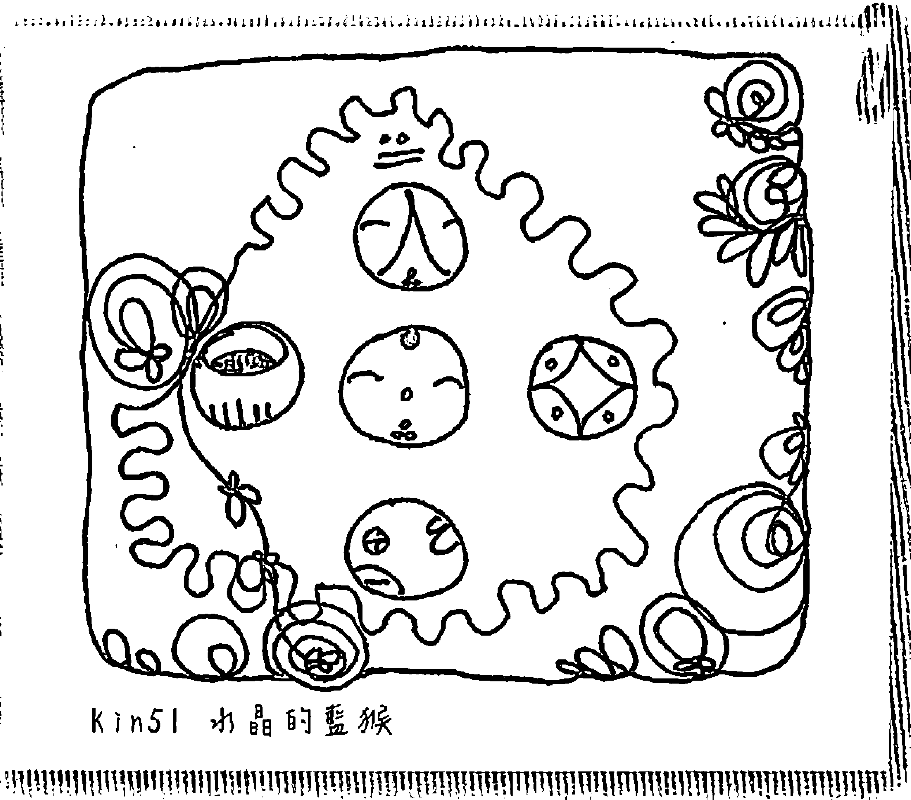

## 黃太陽波符

唇亡齒寒，你的領域會一步一步地遭到侵蝕。在心靈上你也無法安寧地生活。或許你看不見你和別人如何的一體性，但你的確是可以感受得到的。如果你有足夠敏感的心，你是可以感覺到彼此能量的相連接。

你所不能夠接納的人事物卻偏偏出現在你的生活中，因為你們的能量場相互地連接和共振。你的愛無法給予太多的人，因為你感受不到自己和他人的連接。你封閉了你的心，你把生命中的愛關上了一扇門。

你在愛中的伸縮性決定你跟他人之間的伸縮性。你可以很輕易地打開你的心去容納和看見別人的存在，抑或是你很難打開自己的心，去容納和看見別人的存在，這一個伸縮性決定了你在這個世界上是否能夠過著平凡、簡單、快樂的生活。

當你的心失去了伸縮性，你會斤斤計計較得與失，不輕易地放開每一個環節，心裡糾結得很。當你鬆開了這種僵固而能夠流動的時候，你就可以接納身邊的很多發生，不再深陷在迷幻的人生中，就能找回自己、根本的自己、原來的自己。

### Kin 52
## 改變需要勇氣，提升需要更大的穿越

### 黃太陽波符第十三天，宇宙的黃人日

愛是我們體驗中的核心。一切都是圍繞著愛的主題，從中心一個點往外散發出去。當愛散發出去的時候，會分化為許多不同的點。

這些點帶著核心的愛幻化為不同的體驗：有關係的體驗、成長的體驗，有穿越恐懼的體驗、奉獻包容的體驗、愛恨情仇的體驗，有無數的體驗。這些體驗透過我們的人身，成為一個載體，化身在物質的世界裡，實際地去體驗、成長、轉化為無限的智慧。

我們在散播愛的種子，讓它隨風飄揚，散落到適合它成長的地方，我們的愛從未分開過，我們一起去創造更美好的世界，更適合人類居住的世界。雖然覺醒的人類數量不是很多，但陸陸續續會有更多覺醒的靈魂跟著上來，一起創造一個大同的世界。

地球已經滿目瘡痍，我們需要去療癒和加速她的流動，我們的覺醒能夠為她增添馬力。雖然她已經開始清理不屬於她的能量，但人類也要跟上她的腳步，勇敢地走出自己靈魂的旅程，不再受困於三次元的世界。改變需要勇氣，提升需要更大的穿越。

## 紅天行者波符
KIN 53 - KIN 65

### Kin 53
## 沒有時間空間限制，只有對自己的限制

### 紅天行者波符第一天，磁性的紅天行者日

你的思維一直在不停地跳躍，你可以連接很多不同的面向、不同的管道、不同的頻率。在你的意識中，沒有時間和空間的限制，只有你對自己的限制。你停留在固定的時空中，過著固定的時間、規律與限制。

你沒有進一步地去跳躍，看看框框外的世界。那是一個非常有趣的世界，和你所處世界大不同。你要有勇氣去探索及看見更多，你有能力去連接更多更大的夢想，一切就在你能夠跳脫常規的思考範圍中。

你不再用邏輯理性的思考去規劃生命的一切。你放任生命的流動，創意的流動，帶你創造更多美好的轉變、新奇的發現，原來生命還有那麼多有趣的事兒在等著你的發現。

在你寂靜的內在裡，可以跳脫到無限的次元與空間，連接一切你所需要的訊息與創造及顯化。只要對自己有信心、有耐心、有感覺，讓你的感覺帶領你去感受自己的存在，那不只是肉體上的存在，還有一個更大的存在，你靈魂的所在之地。

它能夠帶領你回到自己的中心，在你穩定的中心去穿越及跳脫常規思維的規範及限制，連接不同的次元，穿越不同的時空，做一個時空次元的旅行者，閃爍美麗和諧的光芒，回歸內在的無限。

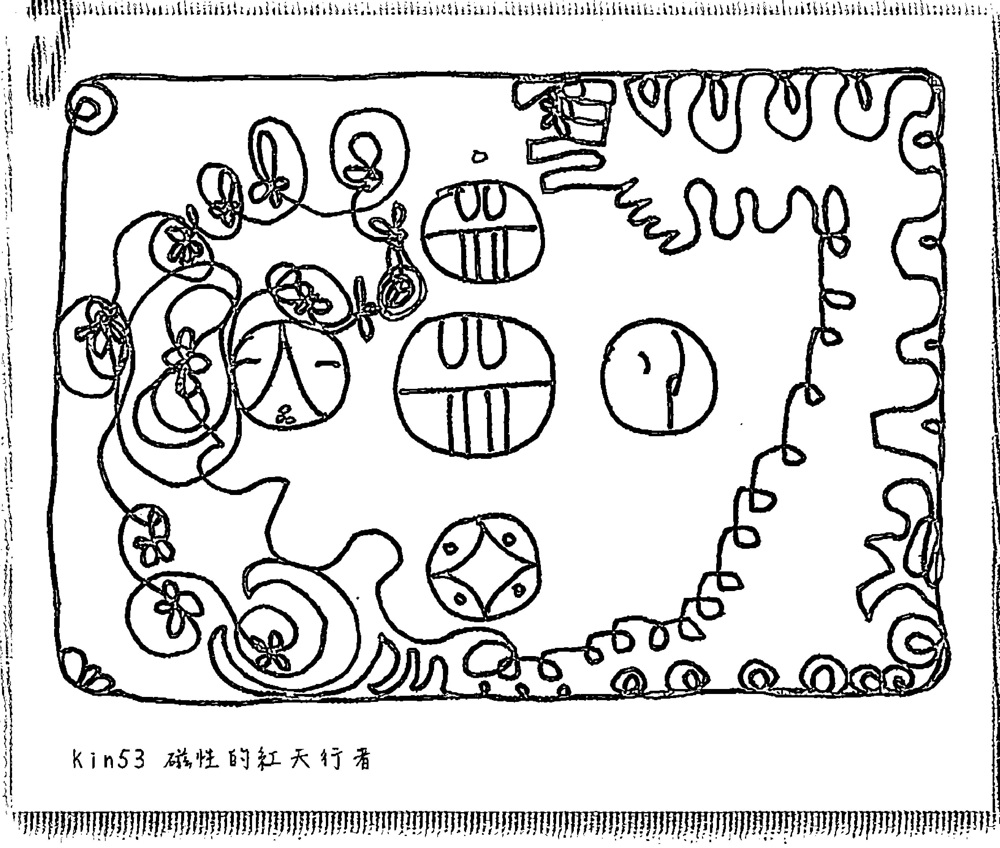

## 在無時間空間的時空中創造和連接你想要的

### 紅天行者波符第二天，月亮的白巫師日

在你穿越的過程中，你要突破二元對立視角帶來的限制。人們常常限制了自己，認為自己的能力、資源、時間、精力永遠只在一邊，以為擁有了一方就無法擁有另一方。

這個想法既是對的也是錯的。在三次元的世界裡它的確是這樣的發生，有限的時間、有限的資源、有限的精力。但在四次元以上的世界，一切都能夠同時存在著，而且已經完美地存在著。

你所做的只是去創造，在無時間無空間的時空中，創造和連接你所想要的，創造一切你希望發生的。你會看見很多的可能性在孕育著，等待發芽成長，等待你來欣賞和截取你想要的那個部分。

生命的熱情在於你能夠穿越為自己設限的界限、為自己設定的生命欄杆。

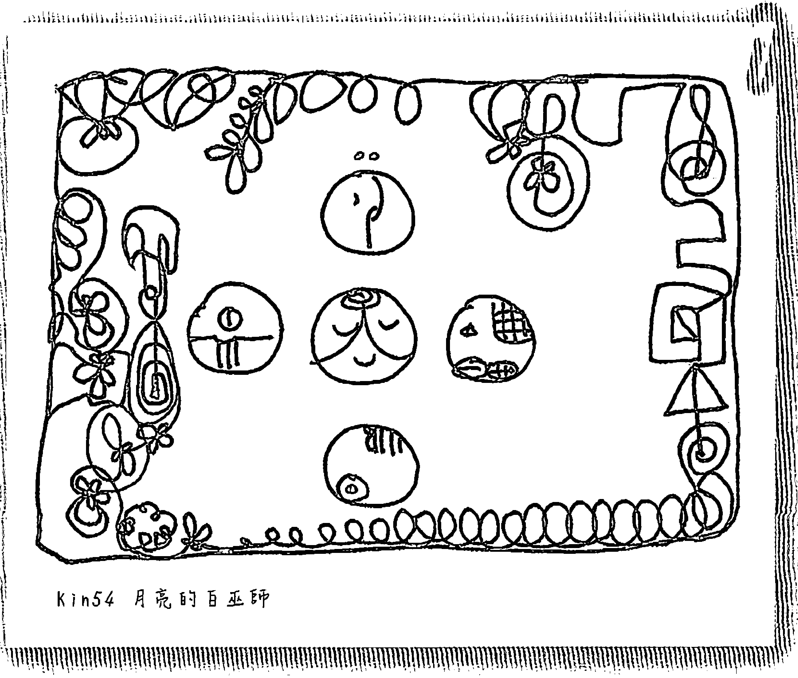

### Kin 55
## 當你擁有足夠的力量，就必須展翅高飛

### 紅天行者波符第三天，電力的藍鷹日

放下內在的許多包袱，為自己重新充電，去看見更大的世界，去看見自己可以穿越許多面向。你不只是現在的你，還存有許多不同的面向，不要把自己局限在一個面向中。

你以為自己存在的方式只有這一個面向。去打破它，打破和轉變你為自己設定的限制。放下你心裡的包袱，去探索偉大的你，找出內在的信仰。它會告訴你該成為怎樣的你、該做怎樣的你。

你要清楚它在生活中起著怎樣的作用及影響。你的價值觀、你的信念系統、你的思維都受它的影響，它們是相互交織、相互影響、相互延伸。

你要清楚地去看見這是否是影響著你的機制，是否帶給了你許多的限制，從而局限了你的發揮和探索？你是否有足夠的電力去衝破它，讓你展翅高飛去尋找你的其他面向？

或許它曾經是你的一個依靠，讓你豐盛自己的羽翼，但當你擁有了足夠的力量，你就必須展翅高飛，去尋找更大的天空，看見更廣大的原野，帶來更廣大的視野，成就更高維度的自己。

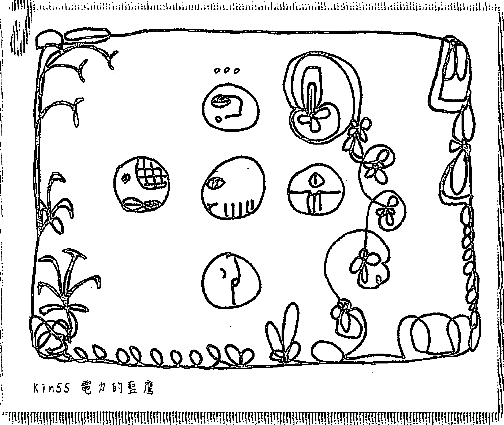
Kin 55 電力的藍鷹

## 他們都是我們不同的面向

### 紅天行者波符第四天，自我存在的黃戰士日

在夜的星空裡，我們有著許多的夢想和幻想。我們想遨遊在夜的星空中去探索一切的未知、一切的可能性、一切的冒險性，去揭開那許多的未知和神祕的存在。

在現實的生活中，我們卻被理性的頭腦帶回現實，缺乏探索的勇氣。我們的頭腦告訴自己：一切都不是真的，你要腳踏實地，不要去幻想一切不存在的東西，生活已經夠忙碌，夠多的痛苦和負擔了，不要去想那些不實際的東西，好好的回到現實幹活吧！

到底哪個才是真實的我們？都是，他們都是我們不同的面向，在不同的時空出現，應對不同的情境。我們需要生存，我們需要現實，我們需要穩定。在現實穩定的基礎上再踏出內在的天馬行空，內在的探索，內在的追求。

讓你的夢想與你的現實對接，一起攜手去創造，去開拓一條新的路途，欣賞不同的美景與人生。很多時候，我們只停留在現實的層面，磨滅了自己探索的夢想，被鎖定在一個社會的規範裡，跟隨著社會集體意識的腳步，沉醉在紙醉金迷的世界裡，連接不上自己的夢想。所有的生命熱情傾注在生活現實的追求上。

你不再是你，你只是一個追隨生活的行走的肉體，你沒有發揮身為人類的智慧。但你有更多的選擇、更多的貢獻、更多的價值，你要去領會，你要去看見，你要去連接它。

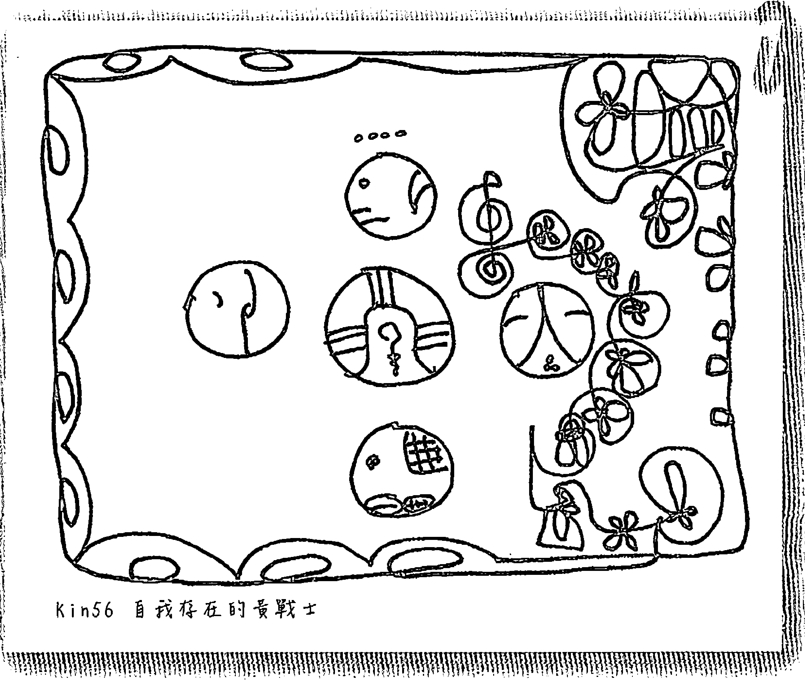

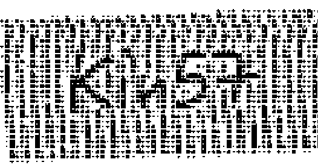

## 你生命中的一切展現，都在這螺旋的能量中孕育、潛藏和成熟

### 紅天行者波符第五天，超頻的紅地球日

你的能量會往著一個軸心去運轉，然後慢慢地往外去散發，吸引不同的資源，不同的人事物，不同的故事到你的生命中來。你可以感受一下，此刻你的能量軸心散發著怎樣的能量場，你有著怎樣的人生故事在發生。

這個軸心的能量是以螺旋的方式一直往外散發及旋轉著，速度緩慢而有節奏。它會把生命中的一切都吸引過來，你生命中的一切展現，都在這螺旋的能量中孕育、潛藏和成熟，像是有一雙無形的手，在安排著這一切的發生和運轉。

一切在自然中滋生和成長，你以為是命運的安排，其實是你能量場中的運轉，在天地這個大能量場中的運動、契合和運行，相互呈現出來的現象。

你可以去探索是怎樣的一個能量在你的軸心中運轉，你也可以去探索是怎樣的能量在天地間運轉，展現如此的你，展現如此的世間景。

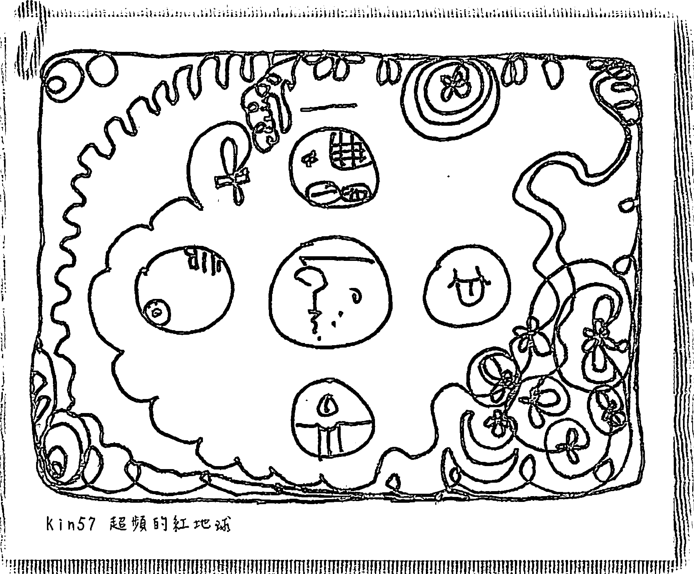

## 容納更多的看見，允許更多的創造與探索

### 紅天行者波符第六天，韻律的白鏡日

當你往內在探索，你就很清楚地看得見，你外在的所有一切都是來自於內在的投射。外面有什麼，你內在就有什麼，你不必急著往外去撲火，火種在你的內在，只是你是否願意冒著被燒傷的危險，將它轉化成良性的火種。

我們的內在有很多野火，它們日以繼夜地蔓延。當它蔓延出來的時候，外在就會掀起火花，我們會忙著滅火。有些火花無傷大雅，只是帶來一些驚嚇、一些騷動，有些火花殺傷力強大，可以燒掉半邊江山。

越不願看見自己內在的人就有越多的火花，這些火花遲早要冒出頭來，在你的金錢上、在你的健康上、在你的關係上，遲早還是會看見它。當然這些火花也能帶給你燃燒的動力，你可以轉化成創造的動力、探索和理解自己的動力。

火不一定會燒傷人，也能在良好的用途上，端看你如何在當中調整與平衡。美麗的火花能為你所用，猛烈的火花能摧毀你的世界，沒有任何火花是絕對的好與壞，它們都有不同的用途、不同的提醒、不同的範圍，它們都是帶領你去認識真實的自己。

敞開你的心胸，容納更多的看見，允許更多的創造與探索。你會發現這是一個美麗的世界，允許著不同可能性的存在，造就不同可能性的你。

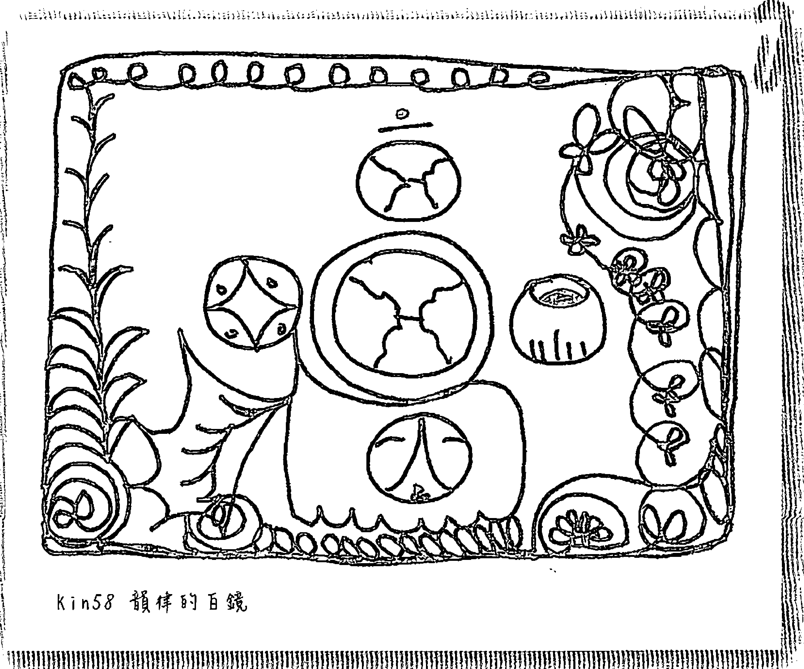

## 我們都在成長、在蛻變、在穿越

### 紅天行者波符第七天，共振的藍風暴日

我們走在同一個路程上，各有各的精彩。我們的路程都是從小我走向更高的自己，為個人的生存到為眾生的愛，我們都在成長、在蛻變、在穿越。

每一時每一刻，我們都在承受著不同的轉變，不同的進化，不同的提升。無論現在是哪一個階段，好好地把握。生命到了盡頭又是另一圈的輪迴重生，我們在周而復始的輪迴路程裡迷失自己、成就自己、看見自己。這是一個過程，每個人歷經的時間不一樣。

你要明白，生命的流動需要你的覺知，否則你只好盲目地過了一世又一世，無法進展到下一個提升。我們都在遊戲人間，有時入戲太深，有時清醒抽離，真真假假，假假真真，一世又一世，不斷地往內外去探索人生的真正目的。

我們的心中實在有太多的故事想告訴自己，這一生的故事，多生多世輪迴的故事，它一直停留在我們的心中，等待我們的覺醒，等待我們的領悟，等待我們的知曉。

生命只是一場遊戲，它的意義在於讓你明白自己不只是肉體上的存在，還有一個更大的你存在。你不是只為自己的存在，你為一體的存在，你內在散發的愛與光是集合了大眾的愛與光，共振著天地的愛與光。

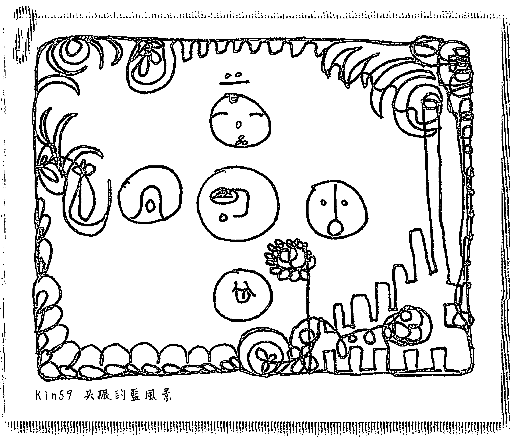

## 回到愛的軌道

### 紅天行者波符第八天，銀河星系的黃太陽日

當我們能夠做回自己的時候，身邊的一切都會圍繞著你而旋轉，如行星圍繞著太陽，銀河星系圍繞著銀河中心，一切自然回到自己的軌道。這是一個多麼令人嚮往的世界。

## 紅天行者波符

世界本來就是全息，本來就是一體的。當你回到中心，一切歸於平靜，就有無數種子，因緣際會下灑落在你的心田。再隨著一切的因緣，發芽、傳播，然後回到你的身邊。

生命的運轉有它的規律，我們無法掌控所有的東西，我們只能隨順自己的因緣，一直不斷地改變，一直不斷地調整，讓它回到自己的軌道上。

我們心中的種子是我們回到自己軌道的一個助力。去看見你心中的種子，去連接你心中的種子，看看它開出了怎樣的花朵，看看它結出了怎樣的果，看看心中有著怎樣的因緣在運轉著。

我們都希望心中種下的全是愛的種子，開出的全是愛的果實和花朵，好讓我們運轉在愛的軌道上。然而我們看到的往往不盡如人意的成果，因為我們沒有在心中種下足夠讓愛的種子開枝散葉的因緣。

愛一直在我們心中，它就是我們的一部分，它一直在成就著我們。我們需要足夠的光去把它照出來，散播在人世間。那來自古老源頭的訊息隱藏在裡面，帶領我們回到愛的軌道。

### Kin 61
## 內外探索的同時擴展了你的世界

### 紅天行者波符第九天，太陽的紅龍日

在探索的路途中，我們在創造更大的自己。來自源頭，源源不絕的原動力，推動著我們不斷地前進、不斷地創造、不斷地回饋、不斷地完整自己的靈性成長。我們都來自同一個地方，我們的家，我們的源頭。

我們的創造，我們的啟動牽引著整個世界的創造及啟動。不要以為我們微不足道，我們都有這一份力量。在我們往外在探索這個世界的時候，我們內在也在不斷地延伸探索來自不同次元的新世界。我們的心包含了一切，在你對外擴張探索的時候，你的內在也有無限的探索在同時發生。

你最終是要回到自己內在的最深處，去連接內在最真實的自己，內外探索的同時擴展了你的世界。而你在地球媽媽的護航下擴展了自己的世界，把一切美好再回饋給這個世界，我們都是如此的循環、玩樂。在這個虛幻的模擬世界裡，一切雖然都是虛空，但卻又是真實的存在。要看破這一點真的不容易，需要有非常清明的心來連接和探索這一切。

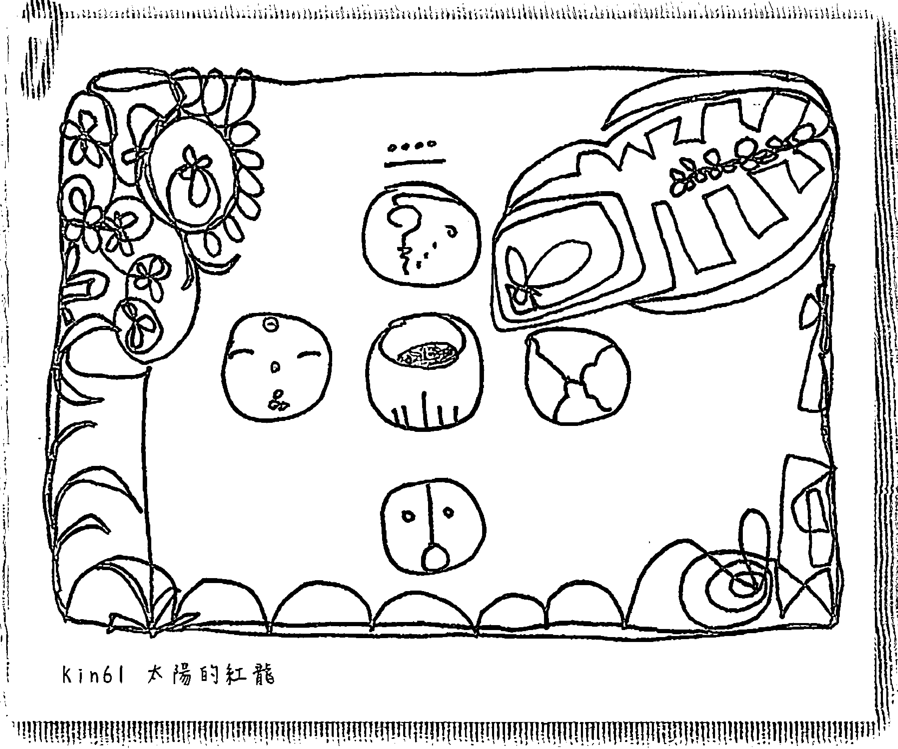

## 我們活出了自己

### 紅天行者波符第十天，行星的白風日

在我們的生命中有很多美麗的時刻，當我們跟自己在一起的時候，我們對自己百分百的信任，我們用愛滋潤自己。

我們的愛來自於內在與自己真誠的相對，我們接納自己的一切，我們回到自己的中心點，顯化我們內在散發出來的愛與光，我們的美麗就在其中。

我們看見了自己，也看見了別人；我們真心的與自己交流，也真心的與他人交流；我們的溝通來自於我們的愛，對自己的愛，也對他人的愛。

我們像風一樣的流動，佈滿了這個世界。我們為這個世界帶來新的氣息、新的景象、新的氛圍，我們流露著新人類的智慧，自由的活動在我們的中心，自由的流動在每一個角落。

我們不再局限於自己的信念價值觀，我們不再受制於自己為自己設定的約束，受困於社會傳統的制約。我們能夠自由地表達自己內在的情感，內在的愛與自由。

我們活出了自己。一個真正為自己而活，為愛而活，為社會帶來美麗的顯化與流動。

我是愛的表達，我在你我的心中，去發現和激活它。

## 紅天行者波符

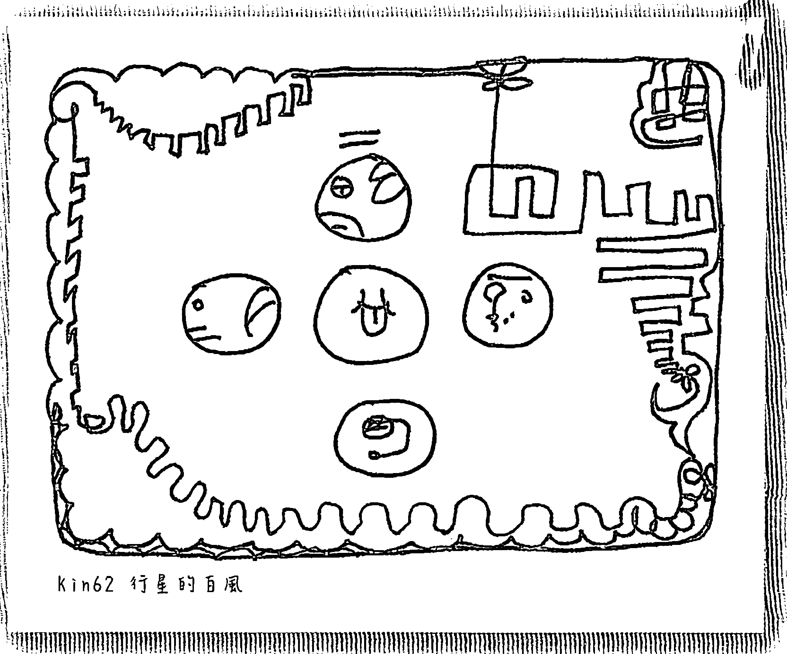

### Kin 63
## 放手讓你的夢想去流動，它會流動到它所要去體驗的方向

### 紅天行者波符第十一天，光譜的藍夜日

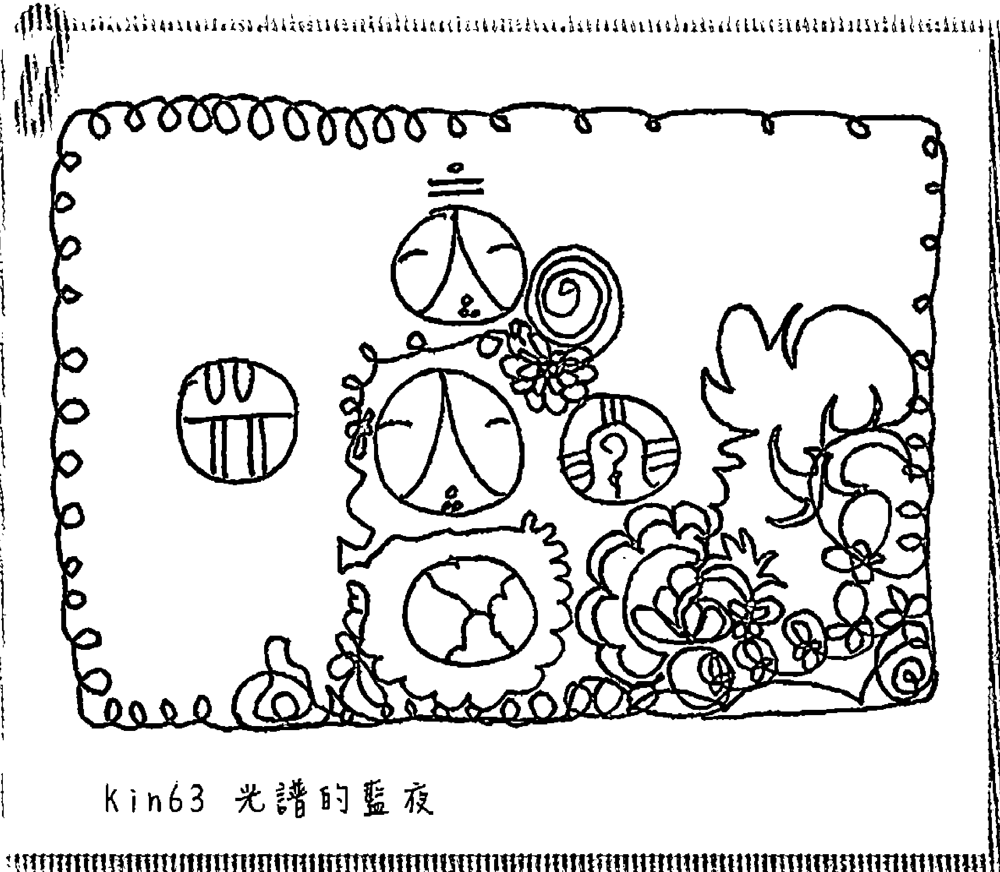

放下你的夢想，不要去執著它是否會成真。當你為這個夢想種下了一個探索的能量，它自然會在某個平行宇宙的時空運行。你所要做的是帶著祝福，為這個夢想祈禱，讓它擁有更好的因緣去推展。

你不必為了它會否成真而患得患失，你不必增添它沉重的能量。你要打開你的雙手，讓它展翅高飛，連接上成真的能量。這是一個探索的路程，真正的探索是不帶有任何意圖的期盼。你可以設定你探索的意圖，但你不必執著它一定會以你期待的方式出現。

這世界有太多的可能性，它可能會如你所願，也可能會以你所意想不到的方式出現。任何的出現都是當下最好的，最匹配於你的能量振動。去看見你心中有許多的夢想，它們在等待你的發現。它們並不是為了成真而出現，而是為了帶給你更多的體驗，體驗經歷夢想，體驗放下對夢想的執著。

即使將來有一天你的夢想成真，最終你還要會體驗放下夢想。成就過後你就要體驗放下，成就你無求的心，寬大你的世界，讓更多的可能性進來。即使你的夢想無法如你期待成真，你也要體驗放下，放下對事情的執著，接引更多的領悟。

所以，放手讓你的夢想去流動，它會流動到它所要去體驗的方向。你要做夢而不執著於夢的成真，放寬你的心去體會，領悟及轉化夢想所帶給你的一切禮物。

## 它必定有肩負著某種使命

### 紅天行者波符第十二天，水晶的黃種子日

在種子的世界，最重要的是它要知道自己是誰，是什麼種子、要往哪裡去生長、開花目的是什麼、要結出什麼樣的果。它知道自己不是偶然地來到這個世界，必定有某種使命，這一世要落地開花結果。

它要有堅定無比的信心，相信自己必定能夠開花結果，它才會排除萬難，無論處在怎樣惡劣的環境天氣，都能完成自己的目標。因為它知道這一世就是為了開花而來。

它要帶來覺知的花朵，帶來覺醒的花朵。首先它必須是覺知、覺醒的，知道自己有這個能力，開出這樣的花朵和果實，帶來覺知覺醒的能量。它必須有足夠的耐心與專注，不為身邊的萬物所迷惑，也不為自己限制信念系統所迷惑。它必須能夠保持在自己的中心點，把這一個訊息帶給更多的人，帶領人們繼續的探索自己的覺知和覺醒。

風、陽光、空氣和水分都是它的好朋友，時而幫助和提醒，也帶來更多的拓展和體驗。它要開出真正美麗的花朵和結實纍纍，必須先經得起風霜和陽光的考驗。

這些都必須建立在扎實的根基上，它要和大地媽媽密切連結，讓大地媽媽提供它扎實的養分、基地與支持。它也必須要讓自己有足夠的遠見，而不落於短見的抓取和失落中，耐心的等待自己能夠分發出奉獻的時刻。

這一切是種子成長中的美好因緣。

### Kin 65
## 你必須在更高的維度看見正在追逐的自己

### 紅天行者波符第十三天，宇宙的紅蛇日

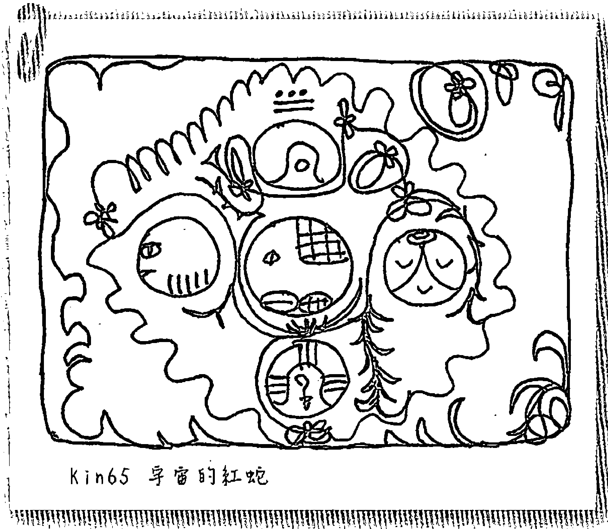

生命一直以螺旋的方式循環著，像一條紅蛇不斷舞動它的身體，舞動著天與地的能量。生命一圈又一圈地旋轉著，代表我們不同的能量及靈性的級別。

有些人急速地沿著螺旋上升，有些人沿著圈子不停地在打轉，重複學習相同的生命課題。無論現在的你是在哪個階段，這都是一個學習的階段。有些人很快就掌握了某些課題，有些人永遠在學習相同的課題。

你的情感、情緒帶動了你，讓你不斷追逐著蛇的尾巴，無止境地在追逐，追逐著你心中的恨、你心中的愛、你心中的貪、你心中的嗔和癡。

你不能以常規去思考為何你無法停止追求，這永遠找不到答案。你要安住在你的心，看著正在追逐的你，到底在追逐什麼。你不能和追逐著的你同一個維度去看待自己，你必須在更高的維度去看見正在追逐的自己。你必須能夠更全面地去看見和探索那個正在追逐著自己尾巴的人到底在做些什麼。

你要明白，要終止這一條鏈接，你需要有很大的勇氣，去看見和面對真實如實的自己。你不能把手指再往外指，你要去處理你內在的許多課題。你要去看見和接納自己的許多不完美。

你要面對的人是一個受傷的自己，一個不願意看見自己無助、內疚、貪婪、嗔恨的自己。就好像挖掘一塊寶石，你必須清除外在的塵土，你才能夠看見內在的寶石散發出美麗的光。

這一道光芒帶領你穿越內在的不圓滿，打破追逐的鏈接循環，扶搖而上到人生的另一道螺旋之門，學習生命中更大的面向及可能性。

## 白世界橋波符
KIN66 - KIN78

## Kin 66 分離是為了看見更大的合一
### 白世界橋波符第一天，磁性的白世界橋日

人世間有太多的分分合合：人與人之間、人與豐盛之間、人與物質之間、人與大自然之間、人與平靜之間、人與自己之間。這些的分離、合、回要帶給人類一個訊息，萬物的合一建立在橋的兩端的融合。

我們不必害怕死亡，我們不用害怕分離，我們不用擔心事情的兩端分裂，這不過告訴我們在兩端之間不斷的釋放極端的能量，最終結果必然合一。

我們要有勇氣去體驗和經歷兩端的能量，然後從兩端中去提升自己的應對能力、自己的心量、自己的平靜、自己的連接以及自己的成長。當你一級一級的跟著上來時，兩端就能匯合在中心，回歸圓滿的合一。

你要看得遠、看得透徹，分離不是為了折磨，分離是為了看見更大的合一，我們的靈性在分離中成長，在合一中圓滿，在圓滿中創造許多成就各方的機緣。

靈魂的永生不滅讓我們得以圓融一切的分離。在多重次元的空間，存有著無數的我們，在成就著多重次元的自己。你不必執著，分離不是結束。分離是不存在的，因為時間空間都是不存在的。

它們只是以一種能量的形式依據我們個人及集體的能量空間而形成的一個遊戲場，供我們探索及體驗成長。一切就在此刻的當下，去連接每一個時空，每一個你，去感受每一個時空的美麗，去感受每一個你的獨屬特性。

## 你會尋找路徑回到自己的內在
### 白世界橋波符第二天，月亮的藍手日

療癒，在你的心中。你一直在療癒自己，用著各式各樣的方式。你是自己的療癒師，用你的雙手，去創造許多屬於你的奇蹟。

但你也曾迷失在自己的創造中，忘了你是自己療癒師的那個部分。你以為外在一切有你想療癒的那個部分，於是開始往外去找尋，斷了與自己連接的那個部分。忘了一切的療癒就在你的心中，自己有一切答案的解答，有一切療癒的良藥。

你的心開始嚮往外面的世界，以為外在能提供一切你所需要的。你用你的雙手去創造外在的一切，名利地位、價值、榮耀，無非是想讓別人看見你的存在，想安全的存在地球媽媽的大地上。

當你往外尋找的時候，當你的能量往外散發的時候，你與自己的連接也越走越遠。你的內在呼喚著你，你聽不見。你的內在知曉這一切，知道這是你學習的一個部分。

當你離開自己越來越遠的時候，也是準備回來的時候。外在的抓取讓你感到內在的空虛。當你有覺知的去感受這一切，你會發現你不是在療癒自己，而是在抓取一個恐懼的自己，無窮無盡的攀緣，無窮無盡的追逐。

一切的創造只落於空中的花園，外在輝煌內在空洞，看得見摸不著。你無法踏實的行走在地球上，你無法感覺到內在的療癒，你開始懷疑方向的正確。

你會尋找路徑回到自己的內在，去看見心中的那份真正的療癒，成為自己真正的主人，駕馭自己的內在信念系統，平息外在風暴的襲擊，找回屬於自己的真正療癒，回到中心的平衡點，連接內在無數面向的自己，創造自己生命藍圖的空間。

## Kin 68 我們遵循著這些法則運行在人間的軌跡上
### 白世界橋波符第三天，電力的黃星星日

宇宙存有很多靈性的法則，它們像一顆顆美麗的星星，在維持著宇宙的秩序，宇宙運行的秩序，讓一切得以和諧的運轉，散發出美麗的光芒，激發著無限的生機活力。

我們遵循著這些法則運行在人間的軌跡上，追尋我們的夢想、我們的創作、我們的人生平臺。這些法則啟動許多裏裏外外的一切連接管道，連接著內在的自己，創造外在所有一切。

外在的反射又創造無數的我們在這三次元的空間裏，體驗我們的人生，學習成長許多靈性的課題。你的美麗吸引著美麗的反射，創造美麗的世界。你的恐懼吸引著許多不確定的反射，創造外在讓你恐懼的面向反射。

你的信念運轉著這些無盡的反射，它編制了許多美麗和不美麗的故事，反射出我們現在的這一個世界。它是靈性法則運轉的一個軸心的線條，讓你迷惑在虛幻的人世中，然後去破除心中的一切虛無幻相。

去探索這些無限在連接著的一切線條，去看穿這個世界運轉的一切法則，連接真正屬於你的擴展，激發你生命的提升。

## 你要流動生命中的愛
### 白世界橋波符第四天，自我存在的紅月日

生命的流動並不是漫無目的的竄流。你生命的流動，你情感情緒的流動，你可以導引它們流動到一個你想要創造和連接的地方。

你可以設定一個範圍，引導它們流動到你所想要流動的地方，你所想要療癒的地方。生命的範圍非常廣大，你要去理解生命的意義，生命不只是吃喝玩樂。你可以遊戲人間，但請別忘了你來的目的，你希望流動的生命的潛能，你希望流動的生命的影響，你希望流動的生命創造，這一些都是你生命中想要流動的範圍。

還有一個更重要的，你要流動生命中的愛，先從你對自己生命中的愛與熱情開始。你能夠對自己展開愛的流動，你才能夠把這個流動帶給更多的人。

如果你心中的愛都無法為自己流動，如何能夠流動你的愛去愛別人？如果你對自己的愛都带有一定的限制與條件，又如何把它擴展為對別人的愛？你所流動出去的愛帶有限制與條件，它們就無法流動得更順暢與長遠。

你的心中本有滿滿的愛，你只要適當的引導它。這流動會為你的生活帶來很大的變化，在你自己之間、和他人之間，你對生命的熱情自然會隨之開展。

這流動將帶領更多的生命熱情的流動，你對生命的熱情流動將帶領你連接更多的生命熱情與智慧，就能夠在當中領悟和體會到更大的流動與生命智慧。

## 愛無所不在
### 白世界橋波符第五天，超頻的白狗日

愛讓我們感到很溫暖，你要將它展示出來，你要讓它從你的心中輻射出來。愛可以很簡單，不帶有任何的目的，是我們把它複雜化，我們不信任愛可以很簡單，可以很純然。

只要你願意去付出愛，只要你願意打開你的心，愛就存在了。它存在於每一個角落，每一個你可以感受得到、看得到、聽得到、嗅得到和感知得到的一切。

世間萬物無不存有愛，你吸的每一口氣，你觸摸到的每一個東西，你視覺所能及的每一個東西，你的心能連接的每一個東西，它們都在向你展示它們的愛，只是你是否看見和感受得到它們。

如果你的心帶有柔軟的品質，你就很容易感受到它們展示的愛。這些愛流動在所有的空間裏，透過你的呼吸，透過你的感覺和你在交流著。它們是世界上最美好的東西，你不必需要擁有它們才能夠感受到它們。

它們都是無私的存在著，供你連接和感受到它們的愛。你只需要擁有一顆柔軟和敏感的心去和它們連接。用你的愛去觸動它們的愛。

這些愛在空中相互的交流著，呈現出更多的愛。只要停下你的腳步，回到你的心中，帶著孩童般的心，重新去認識它們。它們一直在等待，等待你回到自己的心，用你心中那面明亮的鏡子，照見和感受世間的一切美麗與愛。

愛無所不在，只有明亮的心能照見這一切的美麗。無數的愛一直陪伴在我們的身邊。放下你的戒備心，你會看見原來你已經擁有和體會許多愛的連接。

## 這是一個能量的世界
### 白世界橋波符第六天，韻律的藍猴日

這是一個能量的世界，你我他和所有的一切都由能量組成。物質、非物質的無一不是能量的組合。物質的能量密度比例重，非物質的密度比例輕，我們都是一團一團能量的組合，有著不同的振動頻率和密度，呈現出世界上的所謂相。

當你對世間的一切有所瞭解的時候，你就不會容易著相，不會認為一切事物不容易改變，非要跟隨一定的規則或符合一定的社會標準才稱得上所謂的及格或者成功。

你會知道一切在能量的陰陽兩端平衡及調整，不必那麼的費力去創造，去尋找你所想要的東西。只要懂得它們當中運作的能量模式及原理，就能夠輕易的去連接及改變，創造所想要的結果。

你不必大費周章的去想破頭腦，只要放輕鬆，看破其中的幻相，不為這些幻相所迷惑或受困在其內，你就會很容易的穿越一切與愛有關的體驗及成長。

愛不在外面，愛和你是一體的。只要你活出了自己，活出了愛，你自然就能成為愛的本身，成為一團愛的能量，散發出愛的吸引力，擴大愛的力量和吸引愛的回饋。

你會發現現在人世間所呈現的不外是愛的學習及美的體驗，只要去成就自己愛的能量，愛的平衡，一切自然回到你的身邊。

## 我們無法獨自完成所有的創造
### 白世界橋波符第七天，共振的黃人日

我們的能量場域一直在散發著很多的訊息。靈魂試圖讓我們知道，我們存在著的世界只是一個幻相世界，只是一個遊戲場域，供我們創造、學習和體驗。

我們無時無刻都在散發著許多的訊息，來自我們內在的、來自我們頭腦的、來自我們心靈的。這些訊息會形成一個更大的場域，和我們共振著，與世界共振著。

我們無法獨立的生存，我們通過這樣的一個場域共同的存在著，相互的影響著，相互的連接著。你所散播出來的東西影響了我，我所散播出來的東西影響了你，我們所散發出來的東西影響了世界，影響了宇宙、天與地。

我們以這樣的方式共存和流動著。你的流動是我的流動，我的流動是你的流動，我們的流動是世界的流動。不要忘了，我們是一體的，雖然各有各的自由意志，卻又彼此關聯著，彼此相互共存在彼此創造的空間，無法分割相離。

我們最終要覺知和覺醒，並知曉這一切的發生如何影響我們，如何讓我們活在一個共振的漩渦裏，相互連接著，相互同進與共退。

我們無法獨自完成所有的創造，這個世界因為集體的創造而變得分外的多姿多彩和美麗豐富。

## 回歸全息的你
### 白世界橋波符第八天，銀河星系的紅天行者日

你的心跟這一個無限大的時空是連接在一起的。如果你心的能量足夠容納，足夠擴展，你是能夠連接到無限大的時空，太陽星辰、銀河宇宙，一切都與你相通。

你可以在銀河星系中遨遊，你可以在自己的潛意識之海裏漫遊，你可以在地球媽媽的懷抱裏沉浸，你可以在滿夜的星空裏夢遊，你也可以在連接無邊的世界橋上平行到任何宇宙的一角。

一切都在你的心中，在你的意識之海中。你擁有無限大的時空，你擁有無限大的資源，你擁有無限大的一切。一切就在你的眼前，供你探索，供你遨遊，供你截取，供你使用。因為你們是一體的，是全息的，宇宙的一切你也有。

宇宙的豐盛就在你的心中，你只需要去搭建不同的平行管道，活出你的信念。你是宇宙大地孩子的信念、你是愛的信念、你是光的信念、你是這全息一切的信念，你能夠連接上無限的潛能、無限的力量、無限的豐盛。

你就是那管道，你就是那連接。相信你自己，擴大你心的能量場，回到自己愛的管道與中心，回到自己與宇宙大自然共振的頻率，回歸全息的你。

## Kin 74 一天一點覺知，一天一點覺察
### 白世界橋波符第九天，太陽的白巫師日

回到當下，覺知的那一刻，那是你在當下最大的轉化。你的能量凝聚在一起，幫助你回到自己的中心。愛的力量會開花，在一剎那，或多或少。如果你能夠時刻的保持回到當下的這一刻，你心中愛的果實就會成長，成熟落地，開出一片樹林，開出更大覺知的力量。

這是一個練習，你要持之以恆，哪怕是一天一個小點，力量會因此而凝聚起來，在你的生命中鋪陳形成點點的愛與光，在你的生命中鋪墊穩定的能量。你會看見這種力量彰顯在你的生命力中，為你的生命帶來療癒與創造。

關鍵點是水滴石穿，一天一滴水的累積，從不間斷。一天一點覺知，一天一點覺察，一天一點回歸你的內在。在百忙中抽空回來看一看，坐一坐，喝杯茶，碰一碰內在的自己。他在裏面等待你的到來，像個老朋友，要告訴你許多的事兒，關於你的事兒。你要給他時間，看一看你，摸一摸你，傳達他所要告訴你的訊息。

養成這樣的一個習慣，回到當下，拿回自己的力量，施展自己的才能。這力量就在當下，你理解自己的那一刻，就知道自己擁有無限的可能性。去連接當下這一刻的你，每一天、每一個時刻，回到當下的你，看見自己當下的覺知，當下的力量。

## 要飛得高看得遠，必須先堅定自己的心、自己的意志力
### 白世界橋波符第十天，行星的藍鷹日

鷹飛得高，飛得遠，它有一雙強壯的翅膀，它有一雙銳利的眼睛，它有一顆堅毅的心。你要飛得高，看得遠，要先堅定自己的心、自己的意志力，這是你所要做得事情。否則你像一隻麻雀，成天快樂跳躍，唱著歌兒，有吃有喝，生活無憂就好了。

鷹不一樣，它肩負著重大的責任，它知道自己的使命，它要往更遠更高的地方飛去。它要看見和領悟更多的東西，把這些傳播全世界，帶來智慧的散播，愛的傳遞。

它要讓自己有強壯的翅膀、銳利的眼睛、堅毅的心智來完成這一切。它必須有頑強的生命力，足夠的睿智，深入覺知覺察的敏銳，以助它繼續在路上。

鷹是孤單的，或許多沒有多少人能夠瞭解它、理解它、明白它，但它心中的篤定信念引領著它，心中的呼喚帶領它，朝向更高的自己前進。因為它看到一個更大的世界，它知道在這一個世界裏有著多重的世界，一圈又一圈，重疊又重疊，顯化了人世間的許多真相。

人們在這個世界中玩樂遊戲著，以假當真，醉生夢死，活在自己編制的故事情節裏走不出來，也回不去來處，卡在自己編制的網絡裏過著虛幻的生活，忘了自己也忘了別人，只想抓住眼前的一切利益，過著紙醉金迷的生活。

大自然的反撲就在眼前，人們卻習以為常，繼續過著自私自利的生活。但人們不知道自己所顯化的東西帶來的不只是物質上的擁有，還有精神上的壓迫，靈性上的脫節，這些作為會帶來顛覆，然後重生。

人們將會看得見自己所做的一切，會帶來一個怎樣的變化，姑且不論對與錯，事情到了盡頭就會反轉，人類會看到自己所顯化的一切。這是帶領他們回去尋找自己源頭的橋樑。

## 真實的面對自己
### 白世界橋波符第十一天，光譜的黃戰士日

放下，需要勇氣，需要與自己相連接的勇氣。以往很多你賴以生存的藉口，在放下那瞬間無法以藉口的形式存在，你要勇敢的去面對真正的自己，為一切事物負起百分百的責任。

你無法躲避在藉口的背後，虛幻的在生活。你要放下自己的虛假面貌，真實的面對自己，真實的面對這個世界，真實的面對一切。脫下了沉重，消解了一切的虛假面具，換來的是輕鬆和力量。

這是一個過程，回歸真我的過程。你可以輕鬆的上路，穿越恐懼，穿越一切你曾經為自己的掩飾尋找藉口的負擔。你會發現承擔的背後是解脫，承擔自己的不圓滿，解脫為圓滿套上的一切枷鎖。

這些枷鎖是層層的路障，阻礙你回歸自己的路途。你唯有放下對自己套上的面具與枷鎖，才能夠回歸自己想要的真實。真實不一定美麗無瑕，但真實能帶給你正確的指引，你不再去玩小我設下的迷失遊戲，在裏面探索沒有出路，直到你願意走出來，面對真實的自己。

## 當你能夠連接及整合豐盛的自己，自然能夠融合所有的豐盛資源
### 白世界橋波符第十二天，水晶的紅地球日

當你唱著自己的歌兒，踏在這片的土地上，你連接著很多的你，許多不同面向的你，許多不同可能性的你。你療癒著自己，在與大地連接的同時，你也連接上了體內的療癒之源，來自宇宙的療癒之水通過你體內的療癒之泉流進了你的體內。

大地和宇宙給予的淨化，讓你洗滌自己的心靈，讓你與萬事萬物一同呼吸著來自大地與宇宙的流動，讓你回到天地合一的狀態。你原本就是天地的孩子，從天地間發芽成長，吸取著天地的精華，滋養著你。

只是你忘記了自己的存在，你以為自己只是街邊的一根小草，那麼卑微的生存在無人的空地裏，你只能依靠自己的資源生存，一切身邊的人事物都帶有條件的附屬在生存的掙扎裏。

你感覺不到依靠，你以為一切都要辛苦求存。競爭、匱乏，是這個世界的模式。你無法融入天地的運作，吸取天地的滋養。你已經不再相信自己擁有一切完美的存在。你不願意相信自己，你不願意試著去瞭解自己存在的意義。

日復一日，年復一年，盲目的投入生活的競爭場，單打獨鬥，焦頭爛額。你並不知道，真實的你有著許多的資源，來自宇宙、來自大地、來自內在豐盛的自己。

當你能夠連接及整合豐盛的自己，你自然能夠融合所有的豐盛資源。來自天與地，來自萬事萬物，一切將為你所融合和輸出豐盛的頻率，共創美好的一切，共榮共生的一切。

## Kin 78 活出自己靈魂的本質
### 白世界橋波符第十三天，宇宙的白鏡日

當你訴說著自己的事兒，唱著自己的歌兒，來自宇宙的一切都會為你歡呼。你回到宇宙大地的懷抱裏，你回到自己的內在，看見自己的無限美麗，你活出自己的本質，你回到自己的軌道，開啟你人生新的一段旅程。

放下、整合、清理、啟動，前方有新的路程在等著你，你要往內在去延伸，看見更多美麗的延伸，看見更多可能性的自己，為這世界創造更大的愛。

世界靈性運轉的法則秩序，是你心中的依據。你看見和知曉這些法則的運轉，知道這些法則如何運行在人世間，平衡宇宙天地間。

來自源頭的呼喚，來自源頭的動力，來自源頭的滋養，源源不絕為你提供了一切所需的資源。你只要活出自己靈魂的本質，這一切資源將為你開創，流動到一切法則的所在之處。你只要能夠成為真實的自己，如實的觀照，如實的反射，一切自動靠攏，輻射出去。

你要回到真實的自己，連接這一切的平臺，創造新的旅程，走在自己的人生大道上。

## 藍風暴波符
KIN79 - KIN91

## 你在定中為這世界帶來平衡的變幻能量。
### 藍風暴波符第一天，磁性的藍風暴日

風暴在你的心中醞釀著。所有外在的風暴無不起於內在的風暴，你可以平息內在的風暴，也意味著外在風暴的平息。內在的平靜是一切平靜的根源。

問題是你如何保持內在的平靜，你的心像波浪永無停息。你要保持深度的平靜，深度的流動，在平靜中流動，在平靜中波動，在平靜中觀照一切。

找到你的平衡點，去融化所湧起的一切變化能量，你在當中融化著一切，讓一切不屬於你的離開，你只是一個觀照者。你要知道，一切在幻相中顯化，一切也會止於幻相中的破滅，只要你如是的觀照，安住在你的世界裏。

陽光在剎那間照亮了全世界，你安住在自己的光明中，回到自己的中心，借助你的呼吸，更深層的安住在自己的平靜及無限的光明中。

你在定中看著世間的變化，你在定中穩定住自己的能量，你在定中發散著你的彩虹光，你在定中為這世界帶來平衡的變幻能量。

## 在兩極中成為自己的太陽。
### 藍風暴波符第二天，月亮的黃太陽日（Kin80）

太陽的運轉讓一切生物得到了滋潤，我們感受到太陽的光、太陽的溫暖，因為太陽本身就是一個穩定的發熱體。它的光，它的溫暖是源源不絕的。

我們可以往自己的深處去看看，我們的光、我們的熱是否一直在二元對立中擺動，我們很在乎是非黑白、對錯好壞。這個兩極的能量讓我們總是無法穩定下來，總是經歷一次又一次的蛻變。

我們要成為自然韻律中的太陽，在自然韻律中自我蛻變，就要去平衡這兩極的能量。借助風暴自我運生的能量去幫助我們達成能量穩定的太陽，照亮自己，也照亮別人。

在兩極中我們常常評判周圍的人事物，總會看到令人不滿的地方，其實這個評判是來自於對自己兩極的評判，我們總是無法無條件地愛自己，接受自己現有的模樣，我們總以為還有更好版本的自己，以至於讓我們無法處在平穩的狀態，平穩的蛻變。

連接那個來自源頭的我們，那個完美無暇的我們，與它合一。找回那源頭的你，看見自己的美麗。

指引你的是來自於你內在的深深智慧，一切就在你的內在，只要你看破制約信念的一切把戲，你就會連接到你內在的智慧，看見你的自由意志如何帶領你穿越當下的每一個蛻變。

## 愛，就在你的心中，用活力去點燃它。
### 藍風暴波符第三天，電力的紅龍日

在蛻變的能量中有時我們會被一些傳統和古老的信念及價值觀束縛，但恰恰相反的，它也能夠成為我們一個蛻變的能量來源。

很多時候我們不理解這些古老的傳統和價值背後的意義，只是被其形式所束縛著。藍猴告訴我們這一切其實都是一個幻相，這些束縛讓你無法放鬆，無法做回你自己，因為你被牢牢地套在表面的意義上。

你不明白這些傳統和古老的智慧，其實就是帶領你穿越幻相的智慧，讓你看見真實自己與真實宇宙的智慧。經過多年人為的改動，這套智慧變成一套制約人們信念的系統，其實這系統當中隱藏著更大的意義，它要帶領你在蛻變中去接觸更真實的世界。

它是一扇門，接引你來到四次元的世界，一個更高維度的世界，一個讓你能夠看見自己的世界。這是一股來自於源頭的能量，指引著你回家的路途。

當你內在的光和熱達到了一定的飽和點，你就能夠成為自己的太陽，借助這些光和熱，讓你融入了古老紅龍的智慧能量中，展現無限的生命力，回到靈性的路途，展現出紅蛇的熱情和對這世界的愛。

愛，就在你的心中，用活力去點燃它，讓它成為一點一滴的火花，為自己提供熱力，為這世界提供熱力。

## 你就是那無限的展延，無限的自己。
### 藍風暴波符第四天，自我存在的白風日（Kin82）

今天你可以注意，你說話的形式與方式來自於哪裏？是否有一個無形的能量場把你所要表達的，框在一個四方格裏，你只願意去表達四方格裏的自己，不願意去探索四方格外的自己到底想要表達什麼。

風暴的能量在四方格外醞釀著，它會顯化在你的生活中，讓你去消融掉框著你表達自己的四方格。你原本就是一個自由的風，你可以暢意地去表達真實的自己。你原本就在自己的旋律中，這旋律帶領著你以螺旋的方式去暢遊這個世界，去擴大你的能量場，與這個世界交融與溝通。

是什麼限制了你，讓你只留在你的四方框格裏？是你沒有看到自己的自由意志，你是自由的，只是你不知道。你以為腦子裏的那些信念就是你自己，你被它們框住了，你無法往外螺旋伸展出去，你無法與你的源頭連接。

看見自己內在那一面鏡子，只要你願意坐下來，拿起你心中的那一面鏡子，真實地去看看裏面的鏡子，看看鏡子裏面的人到底是誰，你就會知道根本沒有什麼可以框得住你，你就是那無限的展延，無限的自己。只要你願意去連接這一份的蛻變。

## 只是純粹的相信自己就是那個豐盛，星空就會帶來滿滿的禮物。
### 藍風暴波符第五天，超頻的藍夜日

豐盛在哪裏？我們常常會問自己，豐盛到底是什麼，為什麼我總是尋不著它？它總是離我那麼遠，它來了又去，我一生都為它打轉。那是因為你從沒有真正理解豐盛是什麼，不理解所以沒有辦法真正擁有它。

打開你的雙手，在深邃的夜晚，看著那無盡的星空，那就是你潛意識裏的星空，它是那麼的無窮無盡。你不需要做什麼，你只需要回到你的內在，看看自己內在的星空，它是多麼的美麗，它有著一切你所需要的。

你就是那美麗的星空，當你成為那美麗的星空，一切就屬於你的。你是星空中的一顆星，你也是整個星空在旋轉的銀河系，你就是那個夜晚的一切。你的豐盛就在當中，你只需要閉上你的雙眼，慢慢地沉浸在這夜空中，與它合而為一，它就是你，你就是它。

你就是豐盛的來源，你就是那個擁有萬事萬物的來源。你知道如何去把它創造和顯化出來，因為它就在你的心中，只有你能夠把它呼喚出來。

你要做的就是相信自己有這份能力、這份吸引力。只要你回到自己的內在，和那個豐盛的自己連結，一切就會自然地回到它的軌道上。

紅天行者告訴我們跳躍的時空就是創造豐盛的能量，你可以去連接不同時空的豐盛，一切就在你的彈指之間。你可以穿越到不同的時空連接不同的能量，這些能量能夠幫助你進行不同的豐盛蛻變。只要你帶著戰士的勇氣去探索、去體驗、去實踐，戰士的自問自答精神讓你連接到心中的無限。

你要借助白鏡的能量把它照射出來，看看你的四周，都出現了什麼，你就會知道你的星空被什麼東西充滿了。回到你的中心，照射那真實的自己、真實的星空。

連接那一份寧靜，讓自己回到那一份的寧靜，好好的愛自己。看見喜悅興奮的自己，正在滿腔期待地看著那星空，像個小孩，那麼的單純天真，只是純粹的相信自己就是那個豐盛，星空就會帶來滿滿的禮物。

## 每個人都是一顆種子，渴望著開花結果的一天。
### 藍風暴波符第六天，韻律的黃種子日

今天嘗試去看見內在與外在的平衡，如何影響著你心中種子的生長。外在有著我們的原生家庭、成長環境、生活環境，乃至所遇見的每一個人事物，看看它們如何影響著你內在的平衡，乃至你無法相信自己內在的聲音、內在的渴望。

每個人都是一顆種子，渴望著開花結果的一天，內在的信念系統與價值觀，與外在互動影響著，因此無法看見自己真正的潛能。

你有著開花結果的編碼，但此刻你可以檢視一下，自己是否還是一顆沉睡的種子，還是你已經開始發芽成長了？用鷹的雙眼去檢視為什麼你還沉睡在土壤中。

這個世界已經不再是以前的世界了，隨著地球的揚升，很多東西迅速地在改變著，為何自己還是無法改變，還停留在沉睡的階段？因為你還未連接到當下的你，那個在當下時間點停留的你。你還活在過去的經驗中，你無法敞開你的心去接納更多可能性的自己，你無法去連接當下此時時刻的自己。

就在當下的這一刻，你可以穿越時間，去看見永恆的自己，正在享受著無時間的平靜與喜悅，你就活在那空間孕育著種子成長的能量。它在自然的韻律中隨著大地母親的運轉而發生，它的穩定、它的韻律帶領你去尋找那成長的方向。

當你意識到你就是那顆擁有無限覺知，擁有無限潛能的種子時，你就會朝向開花結果的方向去。

## 我們都是世界上的一顆塵埃。
### 藍風暴波符第七天，共振的紅蛇日

今天是個共振的日子，很適合回到自己的中心，去看看自己的核心動力是什麼，點燃你的熱情和活力的是什麼？它仍在心中嗎？還是它已經被遺忘了、沉睡了？

你的內在有一股的熱情，帶動著你的生命力，讓你在這個人世間去創造屬於你的天地，連接它、觸碰它，它就在你的心中連接著你的海底輪綻放著紅色的光芒。這光芒能夠連接到你的頂輪，再回到宇宙去，滋養著你和你的生命力。

連接白巫師的能量，他會告訴你如何接納生命中的萬事萬物，如何在生命之流中接納來自於你生命中的故事，雖然這總帶著幾許的苦澀和創傷、喜悅和歡樂。它們都在孕育著你的生命能量，讓你有更多的潛能發揮在這茫茫的人世間。

你要能像白巫師那麼悠閒地看著它們的來來去去，在體驗中卻又不著相。這需要戰士的勇氣與毅力，你本來就是一個戰士，光的戰士，你就是為了開展你的光而來。

去連接你的光，讓它照亮著天空，也照亮著你。你自然能看到更遠大的自己，你自然能看到在這一個時間點的你正學習怎樣的課題，展現怎樣的生命力，帶給這個世界怎樣的影響。

你是否看見自己的存在價值，還是你以為自己只是一顆微不足道的塵埃。去看看這個地球，你就是形成她的塵埃之一，萬事萬物都是形成她的塵埃之一，她從來沒有忽視過任何的一顆塵埃，總是在默默地承載著所有的塵埃，因為她知道這些塵埃就是她。

她也是這些塵埃的一部分，所以她從來不會去看輕每一顆塵埃的力量。她知道這些力量能匯聚起來，形成一股更大的力量，服務於這個世界的完美，這個世界的愛。我們都是世界上的一顆塵埃。

## 學會放手，在愛中看到真正的我們是不朽的靈魂。
### 藍風暴波符第八天，銀河星系的白世界橋日

人世間的愛充滿了許多悲歡離合，我們要學會放手，在愛中看到真正的我們是不朽的靈魂。我們總想抓住這一刻，希望這個人世間的愛永遠存在，但生命之流總是一直在走，它無法永遠停留在某一個點。

該放手的時候我們還是要放開，讓彼此找到最適合的方向，讓事情走向它該去的地方。我們牢牢抓住的信念，讓我們無法相信或看到這一切是為了成就更好的自己而發生。

紅天行者能帶領我們去穿越不同的時空，看見不同平行宇宙不同故事版本的我們，以及和我們一起扮演人生故事的夥伴們。在不同的時空我們有著不同的故事。你會明白，這一切只為了創造更好的我們。我們總是缺乏勇氣去面對真正的自己，因為我們無法相信我們的背後有著一個更大和無形的世界。

那是創造你的地方，你的來源。去看見這一幕，讓自己飛上了高空，去看見在那無形的世界中，你是如何一次又一次的創造了自己的生命藍圖。

愛伴隨在你的生命藍圖，你是帶著愛去創造你的生命藍圖。你想把愛帶到了這人世間，讓這世界充滿了愛，充滿了希望。但人世間的體驗卻又讓你覺得愛是否真正的存在，是否就是你所追求的那樣。

因為我們內在有著太多的創傷，在學習愛的過程中我們累積了這些創傷，所以無法去原諒某些特定的人事物，無法去接納某些發生在生命中的故事，使得我們無法再相信這世界有著無條件的愛。

我們都曾經在愛中受傷。但這也是一個讓我們看見真正的愛、真正的釋放和接納的地方。唯有從這裏我們能夠搭建一座橋走向真正的我們，真正屬於我們的世界，一個充滿愛的世界。

## 讓它成為一雙快樂的手，創造快樂的世界。
### 藍風暴波符第九天，太陽的藍手日（Kin87）

藍手在我們的心中永無止境地延伸出去，我們的手來自於我們的心，是我們心的延伸。

當手和心輪結合時，它能展現出最美麗的東西，它能創造出最有活力的東西。很多時候我們已經忘記，並沒有讓我們的手和心結合，我們的手只是隨意的去抓取，隨意的去掌控。

我們忘記心才是手的真正主人，當我們與心合一時，我們才是自己的真正主人，卻誤以為外在的東西是我們靠攏的物件，所以把主權交了出去。我們不知道真正的主權就在自己手上，當你能夠憑著你的心去做選擇的時候，你才真正的成為自己的主人。

你不再讓外面的人事物帶著你走，能回到自己的節奏裏，跟隨著自己的頻率去生活，跟隨著自己頻率裏的時間去生活。你不再追趕什麼，也不再被什麼追趕，你只是跟隨著你自己的心走，回到自己如如不動的空間中，去創造，去療癒，去把這意圖帶給更多的人事物。

你能沉浸在自己的夢想中，連接那最深的自己，帶領你去創造出更美好的自己和世界。

這就是療癒之手的意圖，我們都帶著這樣的意圖來到了世界。我們都希望這個世界充滿了愛，充滿了療癒，但我們不知道，這個療癒其實一直都在我們的心中。我們只要通過自己的雙手把它呈現出來，把它活出來，讓它成為一雙快樂的手，創造快樂的世界。

## 我們都是宇宙的孩子，宇宙媽媽永遠都在欣賞我們。
### 藍風暴波符第十天，行星的黃星星日（Kin88）

在我們的生命中，流經了許多美好的回憶、美好的體驗，也流經了許多痛苦的經驗。這構成了一副美麗的圖畫，帶領我們去顯化我們所要的世界。

這世界的美麗來自於我們心中的美麗，在體驗中我們連接到自己的脆弱，也連接到自己的美麗。像星星一樣閃耀在天上，我們的美麗也一樣閃耀在人間。只要你懂得去欣賞這個美麗的自己，你會看到自己不只是顆閃耀的星星，你還是幫助四周閃耀的星星。

你的美麗、你的和諧帶給四周無比的閃耀和快樂、和諧和融洽。你只要讓它展現出來，讓美麗的自己展現出來。你就是那美麗的存在，那和諧的存在，只要你相信自己就是那顆閃亮而美麗的星星。當你像孩子般的純然相信，自己就是媽媽眼裏最欣賞的孩子，最值得嘉許的孩子，你自然而然就會發光。

我們都是宇宙的孩子，宇宙媽媽永遠都在欣賞我們，但我們是否信任著這種欣賞呢？看看你對自己做了什麼樣的評判，看看你對周圍的人做了什麼樣的評判。他們都在告訴你，在欣賞自己的過程中你是否真的有做到無條件的看見自己的美麗，無條件地接受自己的優點和缺點，把他們轉化成一條條通往自我欣賞、自我接納的通道。

你是否總在愛中看見許多的不美麗、許多的不接納，乃至於你無法全然地看見人事物的美，看見自己純然的美與自信。去探索內在的價值，去探索內在的信念系統，你為什麼總是把美拒於門外，你總是在找自己和別人不完美的地方。為什麼你不能看見這都是美組成的一部分，這都是美的零件。

真正的美是接納，包容所有的這一切，如果沒有這一切，你的人生故事將會顯得空洞，毫無意義。這些體驗，這些愛都是你生命中的點綴，讓你成為那顆最閃亮的星星。你只有累積這樣的一個動能，才能發出最閃亮的光芒，影響著最多的人。

拿出你的勇氣去面對那個認為不美麗的自己，那個認為有著許多瑕疵的自己。去看看那些瑕疵來自於哪裏？他們是否真實的存在著？連接真實的自己，他會帶領你在光中去探索，找回最美麗的自己。

## 總有一天你會意識到，一切既是那麼真實，又是一個幻相。
### 藍風暴波符第十一天，光譜的紅月日

今天是一個釋放的日子，釋放所有在你體內停滯的情緒。它們停留在你體內及能量場可能已經有好一段日子了，去看見它，在這藍風暴交替的能量中，去連接它，它在指引著你前往更大的蛻變。

情緒就像一條河流，它最終是要前往大海去的，無論基於什麼原因它暫時無法流向大海，它都是一個中轉站讓你看見滯留的自己。你為什麼還不願意讓它流向大海，你還想執著些什麼？是什麼讓你不想去放手，你害怕失去什麼？你可以在這裏停留，去感受心帶給你的訊息。

是什麼形式的愛讓它無法流動，讓它只想執著於那個點，這愛是否隱藏了許多的恐懼和留戀，以至於它不願意放手，不願讓它流向大海。

大海是一個終極的站，它始終還是要流去大海的，沒有一個靈魂能永遠的捉住這個點不放，因為生命總是螺旋地往上伸展，它無法為任何東西而停留。你遲早會意識到生命只是一種形式，讓你往更高的自己走去，讓你的靈魂去展現更大的擴展。

在這當中，沒有什麼是你不能夠放下的，一切都只是一個幻相，即使它是多麼的真實。總有一天你會意識到，一切既是那麼真實，又是一個幻相，你會很輕易地放手讓它流經大海，回歸到生命的源頭。

你知道在很多層面上你都是自由的，你不再受這些停滯的情緒、情感所捆綁。你知道這一切只為形成更美、更大的生命之流。你的生命之流和別人的生命之流，在某個交融點融合成了更大的河流，再和別的河流匯合，流歸了大海。這就是生命要流經的路徑。

## 我們感受到了內在真正的愛，對別人的愛、對自己的愛。
### 藍風暴波符第十二天，水晶的白狗日

愛，在你我的心中。我們擁抱許多的愛，卻也執著許多的愛。愛是一種能量，帶領我們穿越許多層面紗的自己。

我們的面紗由一重又一重的創傷重疊著，以至於我們也看不清自己的真面目。我們總是連接著那個受傷的自己，還有四周戴著同樣面紗的人們，於是故事一幕接一幕的演下去。

直到我們願意去碰觸那還在滴血的傷口，我們才能和真實的自己連接上，和真實的人們連接上。我們都在這世界上上演著這樣的戲碼：有時我愛著你，有時你愛著我，有時我傷害你，有時你又傷害我。我們就在這樣的輪迴過了一世又一世，直到我們看清了世間的幻相，看清了自己的真面目。

我們不再迷惑，我們可以隨著萬事萬物的韻律去活出自己的節奏，我們能夠無私地把自己的愛分享給更多的人，而更多的人也能感受到這像太陽一般溫暖的愛。

我們的愛在空中傳播著，我們感受到了內在真正的愛，對別人的愛、對自己的愛，一切就像風一樣，那麼的輕盈，那麼的自在。我們就在那風中成為真正的自己。

## Kin 91
### 你的出口其實不在這迷宮，它就在你的心中。
### 藍風暴波符第十三天，宇宙的藍猴

藍猴的愛來自於他看見了世界上一切都不是真實的，他知道一切只是一個幻相。他以赤子之心遊走人間，帶給人間許多的歡樂和色彩。

他就這些歡樂和色彩當中遊戲，看見自己的美麗，看見自己的閃耀，然後穿越這些美麗和閃耀，重回到與神合一的世界。

他知道他的誕生只為了穿越這一層美麗的幻相世界，帶給人們永恆的啟示和愛。他總在遊戲中展現他嚴肅的一面，那個古老的面相穿插在古老的智慧河流之中，帶領我們更加能夠看見一幕又一幕的真相。

在這真相的底下是一層又一層的愛包裹著，讓你朝向更高的智慧展翅，看見更高更遠的山河大地。你只需要停留在那高空，看著你的整個世界，就會知道一切就只是一個幻相，你只是走不出來。

那幻相像個迷宮，總是在錯亂交纏著，你無法看見哪一條是真正的出口，哪一條是你該走的路。

你只要站在原地，連接你那心中的孩子，用心的去愛護他，連接他，他會讓你看見你的出口其實不在這迷宮。它就在你的心中，在你心底裡面最深的地方，那個連接著你和天與地的地方，只要你能夠融入那靜止的那一個點，安住在那一個點，你會看見自己就是那個出口。

## 黃人波符 (KIN92 - KIN104)

## Kin 92
### 在這大同的世界裡，我們愛著彼此，相依著彼此。
### 黃人波符第一天，磁性的黃人日

人的智慧來自於與宇宙呼吸的結合，人的自由意志來自於與內在靈魂的自己結合。當你不再受小我的迷惑，你能分清楚哪一個才是真實掌舵的自己，你就有了無比的自由。

你可以進入到自己四次元的空間去創造你想要的，去活出你生命中真正屬於你的故事。你會用你的療癒與創造之手，把你的愛灑落在人間。與此同時，你也在療癒著以往曾經受傷的自己。你知道一切都是不費力的。

當你的情緒之河能帶領你流向屬於你的大海，你就能在大海中暢遊。你遊走在人世間，建立了你的智慧庫，把它儲藏在行星記憶庫裡。

這記憶庫並不只是屬於你的，它屬於全人類的，人類也能從中截取到屬於他們的智慧，與地球的頻率一起邁向更高的次元。這是人類互相連接的一個方式。

走到這裡，去連接你的智慧，它包含了許許多多古聖賢的智慧，你只要去開啟它，它就屬於你的。我們要感恩這些智慧的留存，在現在這個時間點來幫助我們開啟更多的智慧，讓我們能夠把更多的智慧也儲存在裡面。

這個世界是一個大同的世界，沒有一個人能夠單獨的存在。我們都是相互依靠生存的，我是你，你也是我。我們都是一體的，只是你是否看得見這無形的聯繫。在這大同的世界裡，我們愛著彼此，相依著彼此。

## Kin 93
### 穿梭在這無窮無盡的空間中，尋找自己心中的愛、心中的光。
### 黃人波符第二天，月亮的紅天行者日

紅天行者穿梭在人間天堂各次元的空間，也穿梭在你我心中的空間。他是無所不在的。

我們連接紅天行者穿梭在有形和無形的空間，尋找內在的一片天地。那是無垠無際的一個空間，任你翱翔，任你發揮。

你在人間的天真、單純、美麗帶領你毫無約束的暢遊，毫無限制的穿梭。你就是那傳奇人物。

人世間是一座橋，你可以在這座橋停留，去創造你的人生故事。你只是暫時在這一座橋編織你的美麗人生故事。

讓這些故事像星星般停留在夜空的世界裡，裡面有著你閃耀的故事，有著你的傳奇。

你遊走在這空間中去創造你的人生故事，然後再把這些故事刻印在星星上，讓它照耀著永恆不滅的你。你就是那靈性的存在，無限的存在。

在你的內在有一點光，照耀著你去尋找自己的旅程。在深夜的深邃中連接回自己心中的光，走在自己的大道中，活出你的熱情與生命力。

穿梭在這無窮無盡的空間中，尋找自己心中的愛、心中的光、心中的美麗與熱力，讓它發射在宇宙的空間，照耀著更多的人，在二元中看見自己的美麗。

## Kin 94
### 他一直都在啟動著我們，讓我們連接上無限豐盛的宇宙。
### 黃人波符第三天，電力的白巫師日

白巫師就在我們的心中，他一直都在。

他的能量雖然是靜止的，可是他一直都在啟動著我們，讓我們連接上無限豐盛的宇宙。你只要能在當下的這一刻連接上他那靜止、無時間的河流中，你就能連接上宇宙的源頭、宇宙的無限。

內在的蛻變帶領著一切的蛻變，在那蛻變過程中我們看見了自己及宇宙的無限，一切可能性就在這無限中。我們要去療癒、實踐和創造。

在我們小我的部分，我們有著許多的東西要去重建。我們總以為小我是我們的障礙，讓我們無法與真實的自己結合。其實小我是我們的一體，是我們靈魂的一體，我們是無法擺脫它，我們只能重建它，讓它成為該有的模樣，幫助我們在人生的路途上走得更順暢，更能回到自己的軌跡，做回真實的自己。

覺知的種子一直在我們心中，只是我們沒有足夠的滋養讓它開花結果。看見內在的秩序、內在的反射，有如外在的一切倒影。它是帶領你前往覺知的道路。

## Kin 95
### 把你的雙手打開，接納一切屬於你的禮物。
### 黃人波符第四天，自我存在的藍鷹日

藍鷹有一雙銳利的眼睛，它要看盡、看穿這世上的愛恨情仇、酸甜苦辣，然後在飛行中把這些訊息散播出去，讓人們看到這訊息背後的真諦。

我們都是人世間的一顆棋子，整個棋盤就是我們的世界，我們一直在移動著世界，我們也一直在行走著自己的整個人生。只是我們從來沒有察覺到，因為棋盤太大了，它覆蓋了整個山河大地，我們很難察覺到它絲毫的移動。

我們就在這棋盤上面，行走著自己的人生，他人也在這棋盤上面行走著他們的人生。看似不相干的兩個人，卻在同時移動著整個棋盤。

棋盤的變化千變萬化，其中摻雜了太多太多的因素在裡面。我們感覺到了風雨的來襲，也感覺到了彩虹光的照耀。每一步棋都有著我們的人生，讓我們去尋找埋藏在內心深處裡的覺知。

如果有一天它像種子般的長出了芽，我們就會看到整個棋盤其實就在那一點，我們就在當下的那一點去連接著整個世界。我們就在當下的那個點連接了整個日月星辰、山河大地。

我們就是那個空間，我們可以融入到任何的一個地方、空間。當我們如如不動的穩定在那個點，我們就會看見整個棋盤在一點一點的消失了。我們感覺到了一切都來自於我，我就是這個空間，這個空間就是我。

這平穩的空間能夠讓我們隨意的遨遊，我們不再以移動的方式去行走我們的人生棋盤，我們以多重可能性去創造我們的人生和世界的大棋盤。我們可以帶著愛去實踐和遨遊，因為我們回到了自己的內在，創造無限的可能性，連接無限的可能性。

它就在你內的那一顆種子，它就深埋在裡面，用昆達里尼之火去啟動它，這靈性的火焰。去感受它、去碰觸它，把你的雙手打開，接納一切屬於你的禮物。

## Kin 96
### 你有層層的美麗面向等著蛻變，只要提起勇氣去打開它、看見它。
### 黃人波符第五天，超頻的黃戰士

你的勇氣在你的心深處，讓它在今日被看見。它就埋藏在你心底深處的地方，那個你不願意看見真實自己，隱藏著自己醜陋一面的地方。那是你認為自己不美的地方，而你的勇氣恰恰好就在那個地方。

真正的勇氣不是面對別人，是面對你自己。你只有在內在深處拿到了面對自己的勇氣後，你才能真正成為一個面對外在無所畏懼的戰士，一個尋求真理、覺知的戰士。

連接上自己的勇氣，好好的安撫內在受傷的自己，拓展你的勇氣，讓內在的自己再度地走出來，連接回萬事萬物的勇氣。

你並不需要一個很強大的自己，你只需要一個能擁抱脆弱的自己，能被看見脆弱的自己，能面對不完美的自己，能擁抱世間脆弱、不完美世界的自己。

你的敵人不如你想像的，他們都不在外面，他們跟你在一起，是你的好朋友，只是你不願意去想起他們，而他們想要被你看見，聽得到。他們一直在擁抱著你，等待你為他們解開你所上的枷鎖。

你是美麗的，像蛇蛻皮一樣，你有層層美麗的面向等著蛻變，只要提起勇氣去打開它、看見它、擁抱它、連接它。你會發現它的背後有許多東西在等待著你，等待著你去拿回它、連接它。

這一切將引領你到達覺知的路途，成為光的戰士，照耀世界光明的戰士。

## Kin 97
### 你是自己的領導，也是自己的導航。
### 黃人波符第六天，韻律的紅地球日

你是自己的領導，也是自己的導航。相信自己，願意讓自己去引領自己的生命是個關鍵。

很多人不喜歡做領導，只想做個追隨者，甚至在自己的生命上也是，不想自己領航，因為恐懼、害怕自己一不小心，做錯了決定。

領航和領導並不是叫你站出來做一個領袖，而是做自己生命的主人。只有你可以引領自己走回你的生命軌跡，走回屬於自己的生命之流。

你是一顆覺知的種子，你必須覺知生命的韻律就在你決定成為自己導航的那一刻開始，別人只是配合，主角是你，你永遠都是自己生命的主角。

拿起你的勇氣，去看清這一點。當你知曉這一點，你就能發揮出生命源源不絕的潛能。天下所有的一切，也會圍繞在你的韻律和節奏中流轉，和你共舞，編織一個美麗的樂章。

這個流動性的樂章會帶給你跟另一個樂章共舞。當你身邊越來越多這樣的樂章時，這就是一個美好的世界，繁榮豐盛的世界。

## Kin 98
### 愛不在外面，它就在你的內在，那個既不完美又完美的自己。
### 黃人波符第七天，共振的白鏡日

我們的心像一面鏡子，把我們內在的思維及信念系統一再的往外發射出去，然後又從外面反射回來，來來去去不知經歷多少回，形成我們外在的這個大千世界。

每個人心中的鏡子不斷的來往反射與發射，我們看到的是這錯綜複雜重疊的無數信念的反射。我們早以為這就是我們的真實世界，其實它們都是倒影，讓你看見許多事物的面向。

你看到愛的不完美，我們總是帶著選擇性的面具去詮釋愛，我們看見別人的不完美，總是那樣的真實。我們無法接受這不完美的面向，其實它是我們自己，我們無法接受的是自己不完美的面向。

我們看不見自己的存在，我們否定自己的價值，我們總覺得自己不夠好，不夠完善，不夠完美，總有可以挑剔的地方。這些都是一面一面的鏡子，讓你看見自己在跟外面的哪一面鏡子在共振。你並沒有回到內在與那面真正屬於自己的鏡子共振，只有在自己內在真實的鏡子，你才能夠看見真正的你到底是長得怎麼樣。

回到內在去擦亮你的鏡子，你選擇了什麼？你選擇什麼照映在你的鏡子裡？它發射出去了的是什麼？如實的面對它，如實的面對你自己，看看鏡子裡的人是長成什麼樣子，看著他的眼睛，看進去他的黑眼球裡面的自己。擁抱那個真實的自己，接納那個真實的自己，愛那個真實的自己。

他就是你從黑眼球看進去的那個靈魂的自己，他是帶領你去瞭解愛的自己。愛從來不在外面，它就在你的內在，那個既不完美又完美的自己。

## Kin 99
### 去看見自己心中風暴的起落，去平息世界的風暴。
### 黃人波符第八天，銀河星系的藍風暴日

風暴的心是你的心，你心中的風暴引起了外在的風暴。你就是風暴的源頭。如果你看得見，你會知道風暴每一天都在你的心中醞釀著，你會看見風暴的起因，你也會看見風暴的熄滅。

一切都發生在你每天心裡的運轉。情緒的累積是風暴的起因之一，你的情緒如果無法流動，它就會成為風暴的溫床，醞釀著風暴的發生。

在更深層的自己，有著你看不見的情緒源頭，它來自於很多生很多世你無法處理及流動的愛恨情仇、委屈、憤怒、創傷。它們都是河流的溫床，流經到了這一世，讓你徹底的去療癒及清理。

如果這一世它無法被看見，風暴就會再一次的捲起，讓你看見心裡一切要被清理的垃圾。它們囤積了太久了，總要被清理，否則你無法進入到下一個階段，去完成你該完成的生命目的。

一切為了成就更好的世界而發生。

你心中的太陽會讓你看見風暴中的曙光，它一直在照耀著你。你從來都不會迷失在風暴中，它永遠會帶領你走在正確的道路上，開展自己光的路途。

像風一樣的流動，當你的能量開始像風一樣的流動，你能夠在你的生命中融入一切的可能性、一切的愛、一切的包容。你會看到生命更多更大的開展，它連接著你的夢，你的直覺。

你的愛就在那深深的心底處，它需要風暴把它捲出來，散發在寧靜的夜裡，散播在你我的心中，觸動著每一個人的心。

去看見自己心中風暴的起落，去平息世界的風暴。

## Kin 100
### 回家吧！這一天是你回家的日子。
### 黃人波符第九天，太陽的黃太陽日

今天是一個回家的日子，回到我們心裡真正的那個家。它一直在陪伴著我們，從遠古到現在，它一直都在呼喚著我們。

回家吧！太陽的光已經照進了你的心裡，它已經為你帶來回家的訊息，它的光是那麼的溫暖、無私，它從不評判，從不分辨誰是值得照耀，誰不值得照耀。

分辨的是你的心，你喜歡誰、不喜歡誰、你愛誰、不愛誰。太陽用它的光告訴你，你們都是值得被愛、被看見、被照耀著的。

這一份愛原本就在你的心裡，你只要把它活出來，這個世界就會是一個充滿太陽的世界。每個人都一樣，他們都渴望太陽的光和熱。每個人都是一個太陽，在風暴中蛻變的太陽，在愛中蛻變的太陽，你們都知道自己總有一天都會成為太陽的。

回家吧！這一天是你回家的日子，是你真正認識到自己是一個迷失靈魂的日子。你在人世間流轉了生生世世，為的是成為太陽的這一天，開悟就是你的名字。

用你的心去連接太陽的心，你們都是一樣的，你心中有著無限的光與愛。這些都是你的品質，讓你在人世間發光發熱的品質，只是暫時你無法把它活出來，因為你內在有太多的烏雲，它們把陽光遮住了。

只要你意識到自己就是光，就是愛，烏雲是會慢慢散去的。此刻，你的存在就是愛，就是光。你是光的存有。你帶著光來到的人世間，為的就是和這更大的光再度地連接，再度地成為你心中的太陽。

它考驗著你的勇氣，你的智慧和你的毅力。這一切都不容易，但你的確能夠做得到，當你成為太陽的這一刻，你就回家了。

愛從未離開過，它一直都在你的身邊，在你的心裡，連接著你，去尋找你心中的太陽。

## Kin 101
### 看見世界的美麗，看見自己的美麗，這一切都是你的創造。
### 黃人波符第十天，行星的紅龍日

紅龍帶來了宇宙的顯化，來自源頭的能量顯化在地球上。古老的智慧、創造的能量、啟動的原力，這一切都是紅龍要帶給我們的顯化。

這一股能量來自於源頭的顯化力，你可以在這多元層次的世界去創造你想要的東西，你是一切創造的源頭。你本身就有著源源不斷的原動力，你可以創造世界上的一切，包括你自己，各種不同可能性和面向的自己。

紅龍需要一片開闊的天空和海洋來遨遊四方，開展它的開創力。你的思維，你的空間就是它遨遊的海洋與天空。你的思維和空間有多大，它的創造就有多大。

看清它的本質，你會知道，一切是一場遊戲。你在人間的遊戲，遊戲是假的，進化是真的。靈魂層次的進化或許是你肉眼所看不見的，但它確確實實存在著。在每一個次元，都有不同的存在空間，不同的開創空間。遊戲人間，去開創屬於你的世界，同時你也在開創屬於大家的世界。

我們是一體的，我們都是同時存在於所有空間的一切存有，我們既是自己的太陽，也是別人的太陽。

在創造的過程中我們需要更多愛的流動，更多心與心的交流。只有心能發出最強的磁場，帶動著一切創造的完成。

看見世界的美麗，看見自己的美麗，這一切都是你的創造。

## Kin 102
### 你們都被頭腦綁住了，沒有用心真正感受身為人的意義。
### 黃人波符第十一天，光譜的白風日

白風帶來傳播的力量，看看我們每天在為這世界傳播什麼？它來自你的言行舉止，你可能不知道，它為你身邊的人帶來了怎樣的影響，也給這個世界帶來了怎樣的影響。

你活在自己的世界裡，每一天你都在散播你世界裡的訊息給這個世界。你世界裡有什麼，你就散播什麼；你指的是愛，你就散播愛；你指的是恨，你就散播恨；你指的是波動的情緒，你就散播波動情緒；你指的是平靜，你就散播平靜。

這世界上每天就在這些訊息中交流著，互相影響著。但你並不知道，你以為只是你內在世界的一些小風波，關起門就沒事了。但它還是不經意的流傳出去，散播到你的生活空間。

你要學習去消融它，讓它轉化成為利益眾生的訊息，然後它會再回到你的身邊，轉化你，讓你成為更好的傳播者。

你看看那大地，她傳播出來的都是和諧的訊息，你總能在她身上聞到和諧喜悅的味道。她帶給你的是一個更高、更大的維度。讓你的訊息消融在她的體內，去找回那個和諧的自己，那個與宇宙大自然共振的自己。

地球上有太多的不和諧、人工化的東西，這一些都是來自內在不和諧的訊息。你們都被頭腦綁住了，沒有用心真正感受身為人的意義。

風暴在醞釀著，它在旋轉著，它在為你打開了一扇門，讓你進入真正和諧的自己，散發出和諧的訊息。

在這風暴的中心，連接著你與宇宙大自然的聯繫。靜住在這一刻，你會看到許許多多的愛從你的心中出來，它散播到了空間，到達了宇宙再輻射下來，這就是愛傳播的路徑。

## Kin 103
### 當你成為真實的你，夢想自然而然就會成真。
### 黃人波符第十二天，水晶的藍夜日

我們的內在蘊含著許多的夢想，這些夢想可能已經埋藏在我們的心底很多生很多世了。在一世又一世的輪迴中可能它們都無法被實現，因為我們始終沒有勇氣去揭開屬於自己的真面目：一個全然的自己，不帶著任何目的，可以接納無限的自己。

我們以為夢想總是帶有條件的，需要成為某某某後才能一併的實現。其實你的夢想就是你，當你成為真實的你，夢想自然而然就會成真。

你和你的夢想是一體的，你們永遠都不可能分割開，實現真實的自己就是實現了夢想，你們是互為融合的。當你有勇氣去做回你自己的時候，也是實現你夢想的時候了。

愛會把你帶領到一個反射的世界，讓你看見外在的一切人事物都是你內在的一部分。它們是你尋找回真實自己的線索。去看見這一部分，去穿越內在不同面向的自己。

在不同的次元你有著很多不同面向的自己，每一個都是你的倒影，卻也是真實的你其中的一個部分。

去看見它們，在更高的維度，用你的智慧去穿越它們，你會看見自己就是那個夢想。在深邃的夜裡，藏著真實的自己，等待你來發掘，等待你來看見，這一切是引領你通往更大夢想的路途。

## Kin 104

## 世界上的一切都是種子，那麼的渺小，卻又是那麼的宏大。

### 黃人波符第十三天，宇宙的黃種子日

黃種子一直都在我們的心裏等候著，它想要發芽成長，它是那麼的渴望著，一直在等待著，等待你去覺知到它的存在。

你的覺知是它的第一道陽光，你的覺知是它的水源。它在等待著它的陽光和水源，沉睡了那麼久，為的就是和你重新連接上，幫助它發芽成長。

在黑暗中你迷失了，但種子的心一直像鷹的眼睛，它總是在看著你，它知道總有一天你會發現到它，你會和它融為一體，化為老鷹，展翅高飛。你們要飛往到更高的宇宙去，散播更多的種子，讓更多的人看見他們心中的種子。

愛的種子遍撒了大地，它們一直都在人們的心裏，現在是它們一起開花結果的時刻。地球的頻率已進入高速的振動頻率，很多種子會陸續的開花，陸續的結果。

在這美麗的星球上，你我都活在一個沒有時間的時空裏，我們都不用急著去做什麼，我們只要能安住在自己的時空中，一切的創造就會源源而來。

要安住在自己的時空，首先你要意識到自己就是一顆無窮無盡的種子，你有著無窮無盡的潛能和力量。在你等待開花的那一刻，你就已經具備了一切，你只需要讓它自然的成長，自然的開花，一切就在你自己的旋律當中，沒有任何的造作和特意。

你就是那萬有的一切，你也是那顆渺小的種子。你要去看見，世界上的一切都是種子，那麼的渺小，卻又是那麼的宏大，那麼的卑微，卻又是那麼的偉大。這就是種子要傳達給我們的訊息。

我們是那麼的美麗，就像那星星一樣，我們存在著在無數的空間，哪裏都有我們閃耀的空間，只要我們覺知到自己就是那無限的種子，自己就是那無限的存有。

一切的空間都會有我們的足跡，我們的愛，遍滿這世界。

## 紅蛇波符
—— KIN105 - KIN117 ——

## 能量在我們的身體流動著，這是一股與天地共舞的能量。

### 紅蛇波符第一天，磁性的紅蛇日

我們總是在尋找人世間最好的生存方式，好讓我們的身體、我們的能量以最佳的方式呈現出最有活力的自己。

能量在我們的身體流動著，這是一股與天地共舞的能量。如果你能夠跟隨著天地韻律周轉的頻率，與能量共舞，你將呈現出最佳狀況的人生。如果你與混亂的人世間頻率與能量共舞，你將呈現出的是扭曲的人生狀態。

回到當下去感受這一刻。你是跟隨著怎樣的能量在共舞，你創造了怎樣的人生，唯有回到當下才能感受這一刻，你的熱情、你的活力、你的熱忱、你對生存及活出自己的渴望。

它們都能在當下這一刻告訴你，你是處在怎樣的能量狀態，你是處在怎樣的人生狀態，你是在跟著世間的能量共舞，還是跟著宇宙天地間的能量共舞，你都可以一一的去感知、去體會、去領悟。

你的光、你的勇氣，它們一直都在，只是你沒有辦法去連接它們，因為你只活在自己的世界，沒有以一個更大的角度去看你自己和這個世界。

這個世界有著無限的寬廣，如同你一樣。你能有著無限的展延、無限的擴展，只是你把自己局限在一個狹小的空間和時間裏，讓自己只看見這狹小空間的自己。

開展你的能量，隨著你身體的舞動，你可以舞動著你的人生，你的世界。

## Kin 106

## 直到有一天發現那站在局外的自己，像一個巨人在俯視著自己。

### 紅蛇波符第二天，月亮的白世界橋日

橫跨我們的心中有一座橋，這座橋連接著生與死、愛與恨、悟與迷、對與錯、黑與白。我們就在這兩端一直的來來回回、生生世世，直到我們找到了一個平衡點，去跨越這座人生大橋，我們會看見另一座橋又出現了。在你我的生活中有著無數的橋，連接著我們到不同的世界，不同的次元。

如果你一直搖擺在自己的二元對立橋樑上，你是無法連接到其他的橋樑，無法看見這世界上還有無數更大更廣的橋樑。除非你願意把自己放到一個更高的維度，否則你永遠只看見自己二元搖擺的橋樑，它只會把你困在二元對立的世界裏。

你生命的熱忱、活力都會耗在琢磨到底哪個才是真正屬於你的世界。你只會來回的迷惑、來回的受困，你的人生也因此而受困迷惑。其實它們只是人生的一個學習點，只是當你受困時它卻屬於你人生的一個大的部分，以至於你把絕大部分的精力都耗在處理這個點。

其實當你往上飛高，你會發現這只不過是山河大地裏的一顆小塵埃，因為你已不再受困於這個點。在你還未走出來時，你無法看見這個點把你困在裏面，你只能繼續的待著，直到有一天發現那站在局外的自己，像一個巨人在俯視著自己。

你會覺得一切原來只是一場遊戲，一場讓自己清醒的遊戲，一場讓自己變得勇敢、看見自己的遊戲。你就在那無數的空間中探索著，你要找回的就是那與愛失去連接的自己，那個與真實自己連接的自己。

你會突然發現，這些二元對立都是一面鏡子，讓你照見自己的鏡子。你看著鏡子裏的人、事物，它們都是你，都是你投射出去的影子，讓你看見無數面向的影子。這是個真實的投影，它來自你的心中，你創造了它們，讓你看見了真實的自己被這些外在的幻影包圍著，以致你無法看見那外在巨人的自己。

跳出來，打破幻相，看見真實的自己或許就是你一生要完成的。

## Kin 107

## 你是個發電廠，把你的信念一一的發射出去。

### 紅蛇波符第三天，電力的藍手日

我們的手可以創造出世界上最美麗的東西，也可以做出最具破壞力的動作。建設與破壞都在一念之間，你的念頭來自於你的信念系統。

你從小就被植入了許許多多的信念系統。在你的很多生很多世中，你也被植入了很多類似的信念系統，以至於你在這一世要把它們穿越，找回那純淨無暇的自己。

你是一個光體，有著純粹無盡的光。你的手是帶領你去創造，去活出無盡光的載體，它能帶領你去發揮人世間一切美好的事物。你的心是它的將領，所有潛意識的信念都儲存在你的心中，等待著時間一一的發射出去，也等待著時間一一的回收。

你是個發電廠，把你的信念一一的發射出去，又把你的信念傳導給別人，和這個世界。你用你的雙手把它們實踐出來，是創造還是破壞取決於你的信念，你潛意識裏所儲存的記憶。

地球母親本身就是一個很大的創造體，創造了一切屬於她的東西，她讓萬事萬物在她的身上展現創造的無限可能性，她體現了建設性創造的那一面。

跟隨她，你會找回自己建設性創造的那一面。在那無時間的國度裏，你會發現一切都在自然的運行著。你只要隨著她的頻率、節奏去運轉，一切水到渠成。

你無需刻意去抓取，無需刻意去強求，這只是三次元物質世界的產物。在更高的次元，你不必很費力的去創造自己想要的東西與結果，只要你融入那無時間、高次元的自己，你會發現一切就那麼自然的進入了軌道，達成它該去的方向與路途。

一切就在你的心中，帶著你心中的孩子去完成。你就像一個小孩，在他天真的笑容下，一切就被融化了，那麼的輕鬆不費力，只要你回到自己的心中，連接那個天真無邪的孩子，看見他的美麗與天真。

## Kin 108

## 生命的美麗不在於抓緊或永恆不變，生命的美麗在於看見與接納。

### 紅蛇波符第四天，自我存在的黃星星

生命有許多美麗的故事，像閃閃發光的星星，由許多的人事物與情節組成。我們在這些情節中扮演了各種各樣的角色，把生命串成了一顆顆的星星，在生命的長河中點綴了我們的旅程、人生的旅程。

這些美麗的情節終究是要過去的，無論是多麼恩愛的夫妻、相親相愛的父母孩子、兄弟姐妹以及朋友家人們，這一段美麗終究是會結束的。有些結束在人生的另一段開始，有些結束在生命的盡頭，也有一些結束在輪迴的終結。

我們無法永恆的抓住這幻相的一刻，這些是鋪陳我們人生故事情節的一部分，我們無法永久的抓緊它。我們只能永遠的記住這些曾經發生在靈魂層面的故事，像星星一樣，它永遠閃爍在我們的心中，照耀我們步向生命的另一個階段。

我們要去接納，生命中的確有著許許多多的美麗和不美麗的故事。我們要知道的是這一些美麗或不美麗的故事都只是一個幻相，帶領我們去穿越幻相的自己。幻相的你穿插在不同的次元中去尋找真正屬於你的自己，真正看見你的自己，那個在世間無數投影的自己。

愛與恨往往就緊抓在那個無數投影的自己，你要去覺知，生命中發生的一切都是一個投影，讓你看見自己是永恆不滅靈魂的投影，讓你活出星星的閃耀中一明一暗中投影的人生。

你會發現生命的美麗不在於抓緊或永恆不變，生命的美麗在於看見與接納。

## 你們就是這些美好事物的呈現者。

### 紅蛇波符第五天，超頻的紅月日

生命的流動在於情緒的流動，外在所彰顯出來的情緒是引導你看見自己生命的流動。

你的生命流動到了什麼地方，它是否帶領你前往愛的方向？它是否帶領你前往生命該走的路徑？或者你只是跟隨著你的小我停滯的情緒流向了停滯的低窪，無法再向前一步，或流向了不屬於你的途徑。

你要知道，生命的風暴就是這樣發生的。當你的情緒停滯不止時，你的人生無法移動時，風暴就在醞釀著，準備洗刷一番，讓你重新回到自己該走的路徑。

每個靈魂都有自己該走的路徑，它們來自四面八方，一條又一條。其中有一條是專屬於你的，這一世你要學習、成長和療癒的。

人生的路徑再往上擴展就是世界的路徑，每個時代都有它的路徑，個人的路徑匯合起來就是世界的路徑。

地球媽媽想帶領你們走向更高的路徑，但你們是否跟得上，取決於你們覺醒的程度，地球上很多人在陸陸續續的覺醒過來了，這將會形成一條很大的路徑。

他們在學習看見自己情緒流動如何帶動著自己的人生，帶動著整個世界，一切美好的事物將透過這些流動而呈現出來，你們就是這些美好事物的呈現者。

## 人世間的體驗，就是要把這些愛背後的意義在這一世穿越。

### 紅蛇波符第六天，韻律的白狗

在愛的探索中我們常感受到的是關於愛的平衡，我們付出的愛，無法如實全然的回到我們身邊，我們心中產生了不平衡。

愛無法均衡的在給予及接受中獲得實質上的平衡，因為它無法以量去衡量，無法以測量器去度測。

我們的生命隱藏著許許多多看不見的面向，這些面向來自於我們靈魂的深處。

我們的內在有著許多無法被看見的一面，這些面向帶領我們去穿越和體驗著人世間的愛。這些愛隱藏著不為人知的真相，這些愛背後有著更大的意義。

我們在人世間的體驗，就是要把這些愛背後的意義在這一世穿越，看見靈魂都是帶著無條件的愛來體驗，但在有形的世界中卻又演變成了有條件的愛。

而人要在生命流動中重新回到了這無條件的愛，這無條件的愛帶領你成為愛的本身，在千古流傳中尋找著靈魂的本質。

你就是愛的本身，是否能活出來取決於你是否能跟自己有充分的連接。你的心就像孩童的心，那麼純粹、單純。你只是需要把這純粹和單純活出來，不需要太多的裝飾，那就是愛，那就是能帶領你去蛻變的愛。

你在蛻變中引領更多的愛回到你的心中，也把更多的愛帶給全世界，再回到愛的本質中。你就是愛的本身，你就是愛的組成，你就是愛的呈現。

## 帶著愛，祝福你們的夢想，讓它成為真實。

### 紅蛇波符第七天，共振的藍猴日

天地間有很多東西在共振著，我們在共振他人，也被他人共振著。每個人、每個物件，天底下的萬事萬物都有其獨特的振動頻率，他們在交叉共響著，像一場音樂盛會。

音響的和諧取決於你是否回到自己的中心，奏出屬於自己獨特頻率的交響曲。當你回到自己的中心，回到自己的韻律中時，你身邊的一切也會回到他們自己的韻律，彈奏屬於他們自己的音響。而你們各自彈奏的音響卻又會成為獨特美妙的旋律，相互共振著。

雖然我們一再的說這世界只不過是一個幻相，但是在你還沒看透這幻相之前，你還是需要努力的彈奏屬於你在人世間的曲子。在曲子中去穿越幻相，在曲子中去調整自己的人生腳步，否則你只會癱瘓在你那吹不動的曲子中，等待被別人的曲子來吹動你、影響你。

人生是一場戲，但在你還未看破時，它就是真實的存在，你就要把每一場戲演好，把每一首歌唱好。當你的世界變得美麗和諧後，你就是這美麗和諧的散發者，帶動著和諧的曲子，把愛散播在人世間。

帶著古老的智慧，你讓人們看見更多的曲子，更多的自己，在不同的平行宇宙創造著自己的夢想。

這個世界漂浮著各種各樣美麗的夢想，你可以隨手去抓取屬於你的夢想，屬於這個世界的夢想。

帶著愛，祝福你們的夢想，讓它成為真實。

## Kin 112

## 找回內在的自由，就能夠在流轉的人生中停泊，不再隨波逐流。

### 紅蛇波符第八天，銀河星系的黃人日

人擁有無限的智慧來穿越生命中的課題。生命並不是一條平坦的路，它需要無比的堅毅和勇氣以及智慧來走過。

當你穿越了生命中種種的煎熬與困難，回頭再去看它的時候，你就會知道生命中的種種挑戰無不是讓你展現自己的生命智慧、勇氣與毅力，同時也讓你從這個基礎上疊加增長智慧、勇氣與毅力。

從更大的角度去看，這一切的出現也讓你看見內在那個還沒有完全活出自己的自己，那個還沒有與真實自己連接的自己，那個被無數個小我牽動著的自己。

而靈魂的你為了活出真實的自己，展現出了無比的智慧、勇氣與毅力來表達真實的自己，這過程充滿矛盾與掙扎，但你一一用自己的雙手把這些結打開了。

你能看見在生命之河流動的自己，你也知道這是一個入口，讓你打開更大的生命之流。你不再局限於那個充滿限制的自己，你知道你的自由來自於你的看見，看見更大的自己，看見生命流轉中不變的自己。

當你找回自己內在的自由，你就能夠在流轉的人生中停泊，不再隨波逐流。

## 你就是一个无限的世界，有着无限的时间与空间。

### 红蛇波符第九天，太阳的红天行者日

人生是一场探索的游戏，我们总是往不同的领域，不同的空间去探索。

我们的内在有着无数的梦想，想藉由探索的行动把它实现出来。但我们的内在却又有着无限的恐惧，把我们牢牢的套住，在原地不动。我们没有勇气去探索更多未知的东西，我们只是去探索社会文化带给我们一条标准化的路线的东西。

其实这世界还有更多好玩、有趣的时间、空间等著你来探索。

你本身就是一个无限的世界，有着无限的时间与空间。只是你们的教育让我们看见自己只是一个三次元的空间与时间。

抛开这些枷锁，遨游在自己的时间、空间里，你会发现 you 拥有的比你想象得多。你不只是这个三次元的存有，你还是多次元、多维度的存在。

要打破这个藩篱，首先你要看见自己的美丽，你是一个美丽自主的灵魂存有，你有着无限开拓空间的能力，你有着游走和探索无限空间和时间的能力。

你要相信自己的确有这个能力，并开始去连接那个美丽无限的自己，把它活出来。彰显你的美丽与闪耀，因为你值得看见自己的美丽。

你内在有一条源源不断的能量流，带领你去看见探索空间中的每一个路线。连接它，作为你的指标，带领你在人生中的探索。

设定你的意图，让它成为你生命中的路标，指引你去探索更大的路径，指引你去前进到正确的方向与途径。

我们都是无限的探索者、创造者、疗愈者。把这一切都融合在你的空间里，带领你朝往更多的自己，探索无尽的人生空间、生命的维度。

## 我們都在同樣的時間點打轉，卻又以為時間是飛奔而逝。

### 紅蛇波符第十天，行星的白巫師日

我們的心裏都住著一個白巫師。我們每天倘佯在時間的河流，它就在那兒停駐著，看見我們為繁忙的人間事物而奔走。

他無法告訴我們時間是永恆不變的，我們都在同樣的一個時間點打轉，卻又以為時間是飛奔而逝。因為我們活在自己的三次元世界裏，我們以為時間是直線流動的，所以我們一直不停的在追趕著時間，做出了許多讓自己處於焦慮、煩躁和擔憂的事。我們無法好好放鬆，也無法好好放手，讓時間帶著自己在人生河流中倘佯。

白巫師總是看著我們不語，他知道這一切時間的秘密，但是他無法告訴我們，因為我們無法感知到他的存在，雖然他也是我們靈魂的一部分。因為我們充塞了許許多多不屬於我們能量場的東西，我們無法把自己的頻率提高到與靈魂共振的頻率，我們只能與自己的小我一再的共振與共舞，以至於我們無法瀟灑的倘佯人世間。

你需要無數的生命力去活出這一份的覺知。你不能只關起門來，活在自己的小天地。你要去感知更大的無形世界，看見你是這個無形世界組成的一個部分，停留在那個不變的時間，看見你是如何的從源頭被創造出來，你要回歸的是這一股的能量。

愛本來就是無邊無際的，它不在時間的框架裏，它可以一直都存在，只要你能夠感知到它，就如你感知到時間的永恆存在。表達你心中無限永恆的愛，讓它飄散在永恆的時間裏，你的愛永遠都存在。

## 你已經流轉了生生世世，是時候放下來。

### 紅蛇波符第十一天，光譜的藍鷹日

藍鷹看見許多我們看不見的東西。它看見我們如何設定自己的生命藍圖，又如何把它演繹出來。

我們的人生路線來自於自己生命藍圖的振動頻率，我們終會回到自己的生命路線，只是時間長短的問題。即使在沿途中你迷失了，但總有一天你會回來的，你會看見自己成長的方向和路徑。

你體內就有一個導航器，你只要把它啟動，它會帶你進入自己的生命路線，去創造、去探索、去完成你該完成的東西。

要看見這一切首先你要放下，消融你生命中不屬於你的一切，你的執著、你的焦慮、你的匱乏、那一切不流動種種捆綁著你的信念。

唯有放下你才能夠連接到那富有生命活力的自己，富有蛻變能力和創造能力的自己。

你就像一隻老鷹，盤選在空中，總是想等待最適合你的時機下來，但是你知道什麼是最好時機嗎？你永遠都很難等到最好時機，因為你的背後有著太多的限制和捆綁，你很難去踏出那一步。

你要看見捆綁自己的人正是你，不是別人，別人只是一個助緣，讓你看見那個捆綁的自己。

下來吧，每一刻都是最好的時機，每一刻都是當下的時機，讓你看見當下自己的時機，讓你放下當下捆綁自己的時機。

去看見它，瞭解它，療癒它。你已經流轉了生生世世，是時候放下了。

## Kin 116

### 你想要開闢自己的疆土，這是你靈魂的約定。

#### 紅蛇波符第十二天，水晶的黃戰士日

在無垠無際的世界中，你想要開闢自己的疆土，這是你靈魂的約定。

你要為自己及他人開闢靈性的疆土，讓自己及更多的人能在這疆土上找到更多屬於他們的領土和品質，帶領他們去穿越人世間無法穿越的課題，當中也包括了你自己的課題。

你需要勇氣和智慧引領你繼續前進。在每一個當下，連接你內在的潛意識、超意識，讓隱藏在內在的智慧帶領你去看見這片疆土的空間、時間和邊界。

這可能是永無止境的一片疆土，卻又存在著無數變動的邊界。你要去連接，看見屬於你當下的一個邊界，一個屬於你當下的一個使命。

用你的生命力把它活出來，舞動著一片的疆土，掀起萬丈的美麗塵埃，讓它成為不朽的傳奇。

### 你的能量場裏有著宇宙一切的循環。

#### 紅蛇波符第十三天，宇宙的紅地球日

地球的引力讓我們能安穩的停留在她的上面，從事我們各式各樣的創造和體驗。

她有自己的節奏、自己的步伐、自己的頻率，她的能量能夠承載萬事萬物的生長和死亡，在死亡與再生的循環中，孕育萬事萬物平衡的存在。

我們體內也有著這種節奏，我們也在孕育著許許多多自身的生死循環。一天當中有多少東西在我們的能量場中起起滅滅，在我們的生物場中起起滅滅，在我們的情緒場中起起滅滅。

我們似乎從未去留心，這些起起滅滅、生生死死只是淡然的消失在空氣中。直到有一天，我們面對了肉體的死亡，才真正喚起了我們去瞭解世間的愛恨循環。

這些循環帶給我們的意義是什麼呢？它讓你知道你的能量場裏有著宇宙一切的循環，你體內有的，宇宙也有。

生命就這樣子一直在循環著，宇宙也是一樣，它和你一樣，都是活的。它能和你溝通，和你交流，它就像你的朋友一樣，只要你懂得它的語言，你就能夠和它溝通。

你可以用你的雙手編制著許多的東西，但最終你會知道你所要編制的是你自己，是讓你和宇宙達成一致的自己。

帶著覺知去看清自己所相信的一切，所依附的一切，它們都在帶領你往哪裏去了？你有沒有在自己的人生河流中進行恰當的生死循環，抑或你跟隨著他人的生死循環而不自知。

古老的文明智慧依然引領和帶領著我們去尋找屬於我們自己的方向，它並不是在這現代化世界裏被淘汰的東西。

只有回到原初的文化與智慧，結合現代化的理解，你才能夠在生死循環中得到解放。你要有耐心，去尋找你的世界中要完成的一切。

## 白鏡波符
KIN 118 - KIN 130

## Kin 118

### 看見生命中所有的美麗，是這一生要完成的目的。

#### 白鏡波符 第一天，磁性的白鏡

看見生命中所有的美麗，是我們這一生要完成的目的。

我們的人生花園處處充滿了鏡子，照射出不同品種美麗的花朵樹木，照射出不同的季節起落，照射出不同的沙塵風暴、陽光彩虹。這一切都是要你看見人生就是一幅美麗的畫，裡面有著各種各樣的因素風景，美麗就在那當下，你欣賞著每個風景的變化體驗中。

你在風雨的人生體驗無數的酸甜苦辣，化成一幅又一幅堅毅智慧的人生風景畫；你在彩虹花園中流連，體驗到的是充滿感激恩典的人生圖。

你生命就這樣一直在無窮無盡的反射，到最後你會發現，原來這些風景一直在你心中的那一面鏡子，它們只是隨著你的意念反射了出去。而你創造所有的人生風景，只為了體驗更豐盛的人生，更有智慧的靈性成長。

你會發現原來自己一直站在這些風景最高的金字塔頂端，俯視著整個大風景。再往上看，就會看到整個無窮無盡的大宇宙，而你和這宇宙緊緊相連。

在你內在的深處，在那深邃的夜裏你知道你跟這個大宇宙有密不可分的連接，那是你的源頭，你靈魂的根源。

那源源不斷的原動力驅使你不斷的去尋找自己到底是誰，是誰把這一切的幻相都植入了你的人生，讓你過著這幻相的人生。

只有擦亮心中的那面鏡子，你才能在這金字塔的頂端連接回那個與天地連結的自己，那個在金字塔頂端發光發熱的自己，那個旋轉著一切律動的自己，那個與天地合一的自己。

### 你就是那美麗的存在。

#### 白鏡波符第二天，月亮的藍風暴日

在照見自己的同時，我們看見了許多二元性的自己、批判性的自己。

對外在事物的不接納來自於我們內在對自己的不接納。我們總是等著別人肯定自己、看見自己，否則我們無法擁抱美麗的自己。

風暴的到來告訴你，是時候把這些批判的外衣一一的褪下，回到真實的自己，看見真實的自己，擁抱真實的自己。

你是那麼的美麗，你就是那美麗的存在，不需要別人來告訴你心中的太陽所發射出來的光芒能照到千里之外。

只是有時候它需要風暴的洗禮把壓縮的光芒釋放出來，你在二元思維中累積的情緒能量讓你無法看見屬於自己的太陽光芒，你要疏通這一條情緒大河，讓它流往更深更遠的地方。讓它隨著你的表達而消融在你的無形的能量場中。

你所面對的這一切來自於你心中的不穩定，來自於你能量場的不穩定。你可以用你的呼吸去穩住你的能量場，讓你的生命在一個穩定的頻率中展現和蛻變。

幻想總是跟隨著生命中二元對立而出現，我們不知道到底哪一個才是真實的自己，是那個充滿怨恨的，還是那個充滿愛的？其實兩個都不是，是那個流動而不執於兩端的自己。

### 世界上的一切無不是為了開展愛。

#### 白鏡波符第三天，電力的黃太陽日

我們心中有一個電力四射的太陽，它為我們提供了源源不絕的光源。

它來自於我們內在與宇宙太陽系的連接，能提供我們源源不絕的光能和熱能。

我們需要這些光能與熱能，燃燒和照亮內在的黑暗。它隱藏在內在的深處，我們的脈輪中心，我們需要足夠的電能去激發它。

當你啟動內在的太陽，就有源源不絕的動力和自信去開創生命中的一片天地，就有足夠的愛去為世間的人充電。

你心中的愛是啟動那太陽光的按鈕，你在蛻變中開展著自己的愛與光，世界上的一切無不是為了開展愛而來的。

讓你的光在愛的種子中生長發芽，讓它成為一棵愛的參天大樹。

## Kin 121

### 看见你的存在就是一种美好的呈现。

#### 白镜波符第四天，自我存在的红龙日

红龙带领你寻找自己的存在价值，看见你的存在就是一种美好的呈现。我们看不见自己往往是因为内在对自己的不信任。我们不知道自己的存在能够带给这个世界美好的指引，能够带给这个世界导航的力量。

我们一直都在寻找，自己到底是谁，自己到底有多重要，自己到底能够为自己及这个世界带来的是什么？从看不见自己到看见自己的存在是一个过程，一个自我寻找的过程。

你经历了沧桑，经历了挑战，体验了人世间的人情世故、千变万化，到最后你看见的是自我的存在。你们把这一切称为幻相。

打破所有的幻相，真我就在里面。真实的你隐藏在这千变万化的相里，每一个都是你自己，每一个却又是他属的镜物。你不知道哪个是真实，哪个是幻相。

去体验、去体會、去游戏在其中，你会发现一切来自你内在的呼唤与投射，让你认识真正的自己来自一个更大的智慧存在体，历经人世间的种种体验，回到自己太阳的中心，发光发热，发挥自己与生俱来的圆满与智慧。

## Kin 122

### 讓這世界看見了你的美、他人的美、世界的美。

#### 白鏡波符第五天，超頻的白風日

你的心中充滿許多愛的語言，用各種不同的方式，讓它表達出來。

愛你的一切，接納你的一切。你在風中看著美麗的自己，表達美麗的自己。

你看見美麗的世界、美麗的人們，只因為你心中所呈現出來的美麗。

愛一切世界美麗的東西，包括你自己，你值得擁有一切美麗的人事物。它們都會一一的來到你的身邊，像風一樣吹了過來，也像風一樣你把它們吹到全世界。

你的心有無限空間可以容納和轉化。所有一切來到你心中的都被轉化成美麗，然後你再將它傳播出去，讓這世界看見了你的美、他人的美、世界的美。

## Kin 123

### 感受夢想要帶給我們的訊息。

#### 白鏡波符第六天，韻律的藍夜

夜，孕育著許多的夢想，我們需要有無限的勇氣去看見並感受這些夢想要帶給我們的訊息。

你的夢想蘊含著一些訊息，一些你平時不敢直視的訊息。它要告訴你，你內在有一個美麗的地方，裏面有著你無限的渴望，也有著人類無限的渴望。

我們在一個大的夢境裏，彼此玩著彼此的遊戲，卻又共通著彼此的夢境。你的夢裏有我，我的夢裏有你。我們在愛的能量中彼此相連接著，我們學習人生的許多課題，我們追尋人生的許多夢想。

我們都在同一個夢境中，彼此觀照著。你在夢裏看到的，我也在夢裏看到。我們在多維度的世界裏，有著彼此的烙印。我們的豐盛是彼此的豐盛，我們的成長是彼此的成長。

可是，我們都忘了這一切。我們沉浸在夢裏太久，不斷追逐金錢、地位、權利、價值、關係，我們忘了回到內在，追逐自己內在的需求、內在的呼喚、內在的成長、內在的平衡，內在的愛與光。

我們忘了看見真實的自己在追逐的是什麼。我們不見了自己、真實的自己，流浪在外，無限的投射，五光炫目，不知道哪一個是真實的你、真實的我。

回到內在，找回真實的自己，最初的夢想在呼喚美麗的你，回到真實的自己、看見真實的自己、夢中清醒的自己。

### 我們都是來自宇宙的種子。

#### 白鏡波符第七天，共振的黃種子日

我們都是來自於宇宙的種子。我們想要在人世間的地球發芽、開枝、結果。

我們帶著無比豐盛的能量基因，內在有著所有發芽、開枝、結果的潛在能量與基因，我們內在具足圓滿，該有的一切我們都有。

能不能開花結果有賴於有沒有連接到自己就是宇宙的一顆大種子，自己是否已經沉浸在人世間的遊戲不能自拔，看不見自己的本質是什麼。

或許你沉醉於人世間的開花結果，這種結果只是曇花一現，無法幫助你瞭解屬於生命中的靈魂本質，幫你累積靈性上的增長。

在你的靈性層面，你還有一個更大層面的開花結果。當你站在靈魂的更高維度，你就會看得見，一個更大更高的你在地球上如何完成自己的使命，如何在時間的流動和靜止之間玩著你的靈性遊戲。

你是愛、你是光，這是你的本質，這是你的本性。連接它，你會結出更多愛與光的果實與大樹，照亮著你自己和這個世界。

相信自己，無條件的接納，看見自己的光與愛，這一些都是你的養分和水分. 讓它們滋養你成為愛與光的參天大樹。

## Kin 125

### 你就是這和諧與平靜的中心。

#### 白鏡波符第八天，銀河星系的紅蛇日

人生的旅程中你可能會面對很多的蛻變，把你的生命力及活力一層又一層的展現出來。

你會看見生命在不同的階段展現不同的層面，而你需要更多的流動來承載生命的蛻變，以活出更多的熱情與活力。

宇宙存在著某一些特定的秩序，它總是有規律的運轉著。我們原本就是這樣，跟隨著她的規律運轉，在我們人生的軌跡中運轉。我們是宇宙和大地的孩子，我們能夠在這運轉中活出我們原來的面貌。

我們跟一切生物共榮共存，我們都在這一片的和諧中運轉，在大地的懷抱裏，在宇宙的臂彎中。

我們看見自己的光，勇敢的散發著出來，帶動著我們的生命力在天地間流動和舞動。我們能夠徜徉在人間的這一片海洋中，活出及展現靈魂的無限智慧。

看見，看見這一個旋律，宇宙中、銀河系中、太陽系中都有這樣的一個旋律，和諧的旋律。

回歸這個旋律，回歸你生命的旋律，把天地帶回和諧的平靜，你就是這和諧與平靜的中心。愛你自己，信任你自己，看見你自己，讓一切回歸和諧與平靜。

## Kin 126

### 保持心中的意圖清明，回到橋的中心。

#### 白鏡波符第九天，太陽的白世界橋日

我們是一個訊息庫，我們連連接著四面八方的訊息，多個次元、多個維度的訊息。

我們的能量場融合這些訊息，把它們轉換成不同的光波。我們是一個轉譯站，把我們自身的訊息轉譯出去，也把外在的訊息轉譯進來。

每時每刻我們都在做這一件事情而不自知。我們是一座橋，讓訊息來來回回在這裡交接轉換。

保持覺知覺察，你讓什麼訊息進來了，又讓什麼訊息出去了。它在影響著你，也在影響著別人。

保持心中的意圖清明，你想讓什麼訊息進來，又想讓什麼訊息出去。注意你每一刻的起心動念，它能讓你回到中心，回到橋的中心，看著來來往往的訊息而不著邊。

你不是這些訊息，你是你，獨立自主的自己。你只是愛與光，一塵不染的愛與光。

連接靈魂內在的愛與光，轉化一切途徑你身邊的訊息，讓它們也都成為愛與光。

## Kin 127

### 看見雙手的美麗。

#### 白鏡波符第十天，行星的藍手日

看見雙手的美麗，你擁有世界上最美麗的一雙手。這一雙手能夠編制出世上最美麗的東西，通過我們的手把來自我們心中的美麗一一的釋放出來。

你要看見你擁有的是一雙怎樣的手。你的手是否將來自你靈魂深處的美和善延伸出來，創造來自你心中的美麗，來自你靈魂深處連接著天與地的美麗。

你的頭腦常常支配你的手，束縛著雙手的自由，以至它們無法追隨自己的自由意志去創造。它們來自於你人格上的不自由，束縛你往更大的格局和更高遠的地方去看。

你只有回到靜止的自己，去連接更高更遠大的自己，找回你的力量，通過你的雙手把這一切再度地創造出來。

地球是你的指引，你要跟著她的旋律找回自己，你們的頻率原本是一致，你們應該是同一個方向。

在你乖離自己軌道的時候，也就乖離了跟地球一致的軌道，你內在的和諧也會受到了影響。你通過雙手所創造出來的東西，就無法在和諧的頻率中共振。

找回你的中心，讓自己回到內在的和諧，創造出和諧的頻率與共振。這是你人生路程的一個過程。

### 放下對內在美的執著，與它合一。

#### 白鏡波符第十一天，光譜的黃星星日

看見你的美麗，放下你的美麗。

你的美來自靈魂的心，它是那麼自然的散發，你不需要去執著這一個美是否緊緊貼著你不放，它是否永遠會存在，它是否會被看得見。它就是你與生俱來的特質。

你並不需要特別去尋找它，裝飾它，它就是那麼自然的存在，就像大自然界裏的藝術品，歷經風霜，傲立風中仍然散發著美。

你並不需要刻意去抓緊或展現它，來獲得別人的目光。它就是你，你就是它，你們是一體的。

當你們成為一體的時候，你自然就會發出和諧的光芒，照亮著你的世界和平行宇宙的世界。

你要放下對這個世界一切幻相的執著，你要看見一切的美與不美大部分來自於你內在對外的投射。

你內在有著許多不完美的烙印，來自生生世世輪迴療癒未全的創傷，以至於你無法連接到自己的美。你一再的挑剔外在的美與不美，執著於人生的美與不美。

人生是一個探索過程，對於自己內在美的探索。通過各種人生的途徑去探索內在的美，發現內在的美，欣賞內在的美，然後放下對內在美的執著，並與它合而為一。

## Kin 129

### 相信自己，你絕對是靠譜的力量之一。

#### 白鏡波符第十二天，水晶的紅月

看見這一生你如何在自己生命之河的流動，你如何與別人產生互動與相互的影響。

在你的生命中很多人來來去去，有一些是在軸心核心，有一些只是鏡花水月，來了又去，無關重要，有一些帶來具體的影響，有一些細水長流。

感受一下自己如何穿梭在這些人群中，你的情感如何在他們之間流動。是快樂喜悅的多還是痛苦悲傷的多，還是兩者兼有。

愛存在於每一個空間，只是以不同的形式，有些是直接愛的流動，有些隱藏在衝突糾紛的學習當中。它們最終要你看見，看見這一切的發生，都是為了蛻變成能在靈魂河流中活出自己所有的面向和內在品質。

這一切來自於你內在靈魂的約定，你要看見自己人生智慧的面向，把影響力帶給這個世界。你在靈性上的提升將帶給這個世界和諧寧靜的力量。

我們都在這共同的業力之流，我們都在相互的影響著，一個人的鬆開與流動等於全部人的鬆開與流動。即使個人的影響看似輕微，但它起的作用力卻是你所意想不到的。

愛自己，讓自己的流動帶動全世界的流動，我們都是這樣推動世界河流的進展。相信自己，你絕對是靠譜的力量之一。

## Kin 130

### 施展出愛的魔法，讓愛無限的展延到這個空間與全世界。

#### 白鏡波符第十三天，宇宙的白狗日

在我們的每一生，每一世，我們總是圍繞著愛的核心在流轉。愛到底是什麼？它是什麼的樣子，讓人一生又一生圍繞著它，追求著它，奉獻著它。

愛就是我們，它就是我們這一個樣子。你所呈現出來的、表達出來，這一切都是愛，只是你並不知道。你以為它一直都在外面，在你渴望的人事物當中。

其實它就在你的心中，通過你的一言一語一舉一動，起心動念表達出來。你所表達的愛是否純粹取決於它是否流動，來自於靈魂內在還是來自人格我對生存的抓取。它是讓人感到窒息的，還是讓人感到放鬆流動的？

我們都需要愛，這個世界也需要愛。愛可以像太陽無私的照耀，也可以像雨點流經某一個方向與河流。這些都是我們所要經歷的，靈魂的年齡層決定著你愛所要經歷的方向。

不要否定自己的愛，你的確需要愛，愛你自己、愛別人，同時也接受別人的愛。愛是是循環流動的，讓你的愛保持在這樣的一個狀態，去付出，去接納，去遊戲人間，你會有意想不到的收穫。

這是你靈魂的一個過程，我們都是這樣子走過來的。當你的愛不再為抓取而存在，你就可以晉升為更純粹的存在，更純粹的存有。你的光就能照射到更遠的地方，你的心就能連接到更多的人。

在平行宇宙的时空裏，連接那個如如不動的你，施展出愛的魔法，讓你的愛無限的展延到這個空間與全世界，然後再回到你的身上，一再一再的循環。

## 藍猴波符
— KIN 131 - KIN 143 —

### 藍猴波符第一天，磁性的藍猴日（KIN 131）

## 我們只是想參悟這世界的無常和幻相。

從源頭的分裂，靈魂進入了促使其靈性增長的探索之旅。

在探索的旅途上，我們曾經跳躍在不同的星球當中，其中一個就是讓我們在輪迴河流中一直涉足的地球。

地球孕育著萬物，創造著萬物的生存，我們就在這裡玩著人生遊戲。我們沉溺在人生的劇情中不可自拔，以至於一生又一生，一世又一世，玩著同樣劇情的故事，只是人物背景略微不同。

我們不知道這是靈魂的約定，我們只是想從中去學習，體驗及領悟世界宇宙的大課題，我們只是想參悟這世界的無常和幻相。

回到你的中心，喚醒你的本質，你是充滿愛與光的靈魂。你是自己的一盞明燈，你內在的光可以照亮這一片宇宙。當世界上所有的人都發出這一道光的時候，整個宇宙都會亮了起來。

我們渴望回家，靈魂渴望回家。你的家就在幻相當中，看你看破的一瞬間，當你喚醒沉睡的靈魂，連接回自己的一剎那，就在那個當下，你回家了，回到靈魂來自的地方，就在你的心中，當下連接的那一刻。

### 藍猴波符第二天，月亮的黃人日（KIN 132）

## 它的出現總有用意，不要急著否定。

兩極的念頭來自於源頭的分裂，我們從源頭分裂了出來，踏上了我們的尋根之路，我們要去體驗這二元的世界。

不要抗拒二元的世界，你要看見二元世界以及二元世界所產生的人事物。道生一，一生二，二生三，三生萬物。我們的世界是這樣子來的，我們的念頭也是這樣子來的。

頭腦中喋喋不休的念頭讓你感到煩惱，因為裡面有著太多批判性的念頭，你總是在批判著自己，也在批判著他人。你總是在兩極中跳躍，想找到自己的平衡點。

不要去抗拒那批判性的念頭，你要去看見它，任由它評判，然後你像一個局外人看著它，連接它，看它從哪裡來，它要往哪裡去。

你不需要追隨它，你只需要看見它，瞭解它，它的出現總有用意，不要急著否定，它可是為你帶來療癒的工具呢。

只要你能夠看見它來自於哪裡，它要往哪裡去。跟蹤它的路線去看見你自己，你會知曉你這一生是為何而來，你是為了成就怎樣的自己而來。你會知道你是為了增長自己的智慧與流動而來，你是為了帶給自己及他人更好的影響而來。

在兩極中看見自己和他人以及這個世界，你的人生為了成就這一個而來，你的人生為了開花結果而來。

表達你自己的愛，表達你對這個世界的愛，它們都是在兩極中產生，然後在兩極中合一，讓你成為更完整和更美好的自己及世界。

### 藍猴波符第三天，電力的紅天行者日（KIN 133）

## 外在的一切探索只為帶領你回到內在的根源。

放下你對美麗的執著，啟動你內在探索的自由。你內在有著無限的慾望想去探索這個充滿了各式各樣有趣世界的世界宇宙。

是什麼讓你欲行又止？是你內在的恐懼和憂慮，你總是在恐懼下患得患失，未能真正的表達你自己，自由的展現你自己。

找出能夠讓你充電的東西，它可能是一種情緒，它可能是一個人物，也可能是一個物件與事件。同時你也可以去檢視到底是什麼東西限制了你內在的探索自由，它也可能是一種情緒，一個人物，一種信念或一些事件。

帶著遊戲的心態去把它找出來，你不需要太認真，放鬆你的心情去玩這一場遊戲，這場遊戲可比你想像中好玩的多呢！

在探索的過程當中，別忘了回到你的內在去探索最深的自己，這才是你要去探索的內在根源。外在的一切探索只為帶領你回到內在的根源，找回內在的自己，讓他根植在大地。

與大地相連接，活出真正與天地同頻共振的你，創造出獨屬於你靈魂頻率的天地。在這美麗的天地之間，你是獨特的存在，卻又跟他人相互交織著，相互影響著。

你有你內在的頻率，世界萬物有他們的內在頻率，你們像一個交響樂隊，各自有彼此的頻率與能量，卻又和諧的共存與共鳴著，交互的奏出天下最美的音樂。

### 藍猴波符第四天，自我存在的白巫師日（KIN 134）

## 你內在有著無限大的空間，裡邊包含了一切無限的事物。

愛存在於每一個空間，每一個我們存在的空間。

我們總是建構了一個空間，讓我們感到可以安全存在與生存的空間。在裡面我們小心翼翼的編製著生活，不敢越雷池半步，我們活在自己的時間和空間裡，忙忙碌碌的過了一生。

回頭來看，這個空間的確把我們限制在一個固定的時空裡，我們無法跨越自己的界限，也不讓他人跨越我們的界限。終其一生我們沒有去突破更大的自己，更多接納性和更多可能性的自己。

我們沒有讓自己在更多的領域開花結果，傳達我們的愛。原本我們的愛存在於每一個空間，每一個角落，但我們只是活出固有限制空間的愛。我們可以有更多的花朵，更多的果實，但我們並沒有去穿越，讓這一生活得更精彩。

在安全存活的本能下我們受到了某些的限制，卻也激發了某些的潛能。在生死存活的界限中我們突破了自己的界限，如果你看得見這一切背後的療癒關係，你就能突破自己更大的界限，開出更豐盛的果實和花朵。

你會看見自己的四方框框其實是個移動的空間，它可以無限的展延，它不是固定的，它會隨著你內在的空間的展延而展現開來。

你內在有著無限大的空間，裡邊包含了一切無限的事物。你只要能夠感受到那無限，你就能夠在裡面無限的展延至無限無邊的空間。

你可以翱翔在這無邊的空間，創造出無限的可能性，活出無限的生命力。你的愛會指引著你，走向那無邊無際的星空，連接著那無邊無際的創造海洋，活出那無邊無際的創意人生。

### 藍猴波符第五天，超頻的藍鷹日（KIN 135）

## 這是天地的律動，我們沒有辦法一直停留在舊有的模式。

坐在這裡的你被千絲萬縷的念頭所糾纏。當你沉浸在念頭當中你看不見自己，你不知道哪一個是真實的你，是念頭裡面的你，還是那個創造念頭的你。

你只有往更高的你飛上去看，你才能夠看見真實的你到底是誰，到底是誰被念頭纏繞著不放，到底是誰不願意放下這些被纏繞的念頭。

只有在更高的地方你才能夠看見如實的你。你是一個靈魂，你創造了所有所有的你，你也創造了所有所有的人事物，為了把你帶回靈魂的路途，靈魂的歸途，往更高的靈性進展。

只有在你看見真實的自己，才能夠放下那虛幻的自己，那個被念頭纏繞的自己。人生像一座橋，把你從這一端帶到了另一端，把你從蒙昧帶到了覺知。但是有多少的人一直在橋上打轉，無法到達彼端，他們無法看見及放下虛幻的世界。

現在地球的頻率已經改變了，你會更容易看見自己虛幻的那一面，但也更容易沉淪在自己的念頭中無法自拔，因為你的能量和頻率跟不上地球。能量和頻率高的人很快就會跟隨上地球韻律的旋轉，反之會被淘汰在這空間。

我們要加快腳步，啟動我們的生命活力，跟隨著宇宙大自然的改變而改變。這是天地的律動，我們沒有辦法一直停留在舊有的模式，我們必須跟隨著天地的律動而移動。

在這浩瀚的星空中，我們並不是獨存，我們是一體的，相互影響著，我是你，你是我。我們誰都不能丟掉誰，所以我們會在這裡幫助地球所有人的提升，但意願還是在於你們的自由意志，我們不能過分干預這一切。

### 藍猴波符第六天，韻律的黃戰士日（KIN 136）

## 你已經是完美的存在，只需要把它活出來。

我們的內在有著不同的節奏與韻律，這些韻律來自於我們靈魂的本質、能量以及頻率。這些韻律原本是要帶領你走向靈魂所設定的旅程，你這一生所要走的路程。

路程上有著怎樣的風景來自於你頻率的振動與韻律的和諧。我們的內在總是渴望回歸自己的韻律與節奏，我們的外在卻無法配合內在的節奏。我們總是被形形色色的東西所吸引，我們的心智、我們的肉體總是無法和我們的靈魂相一致。

這來自世間的體驗所要開展的是我們的光。光戰士是我們的靈魂本質，我們有著光與愛、勇氣與毅力。我們要把這一些品質活在人世間，我們要把我們與生俱來的品質發揮在這一世的人世間。

我們總是期待，事情可以自然的去完成。事情的確可以自然的去完成，但是你必須在自己愛與光的頻率中。你必須連接上自己的直覺與豐盛，你必須活在愛與光的豐盛中，你自然就會成為一個豐盛的光體，連接到無比的愛與光以及豐盛。

你必須活出自己的生命本質、愛與光的本質，你自然就會成為一個光體照耀著自己和別人。你必須拿出勇氣，撥開層層的迷霧，看見不真實的自己和真實的自己到底是誰，你要回歸到自己的本質、自己的頻率以及自己的韻律。

人類目前所處的韻律無法與天地的韻律共振，因為有太多的人無法找回自己的韻律，迷失在時間是金錢的韻律中。我們總以為時間金錢能帶給我們快樂，我們忽略了自己的本質，能帶來無限的創造力與顯化力的本質，而不是帶來金錢與時間。

你要永遠記得，你已經是完美的存在了，你只需要把它活出來，那個充滿生命力的自己，充滿愛與光的自己。

### 藍猴波符第七天，共振的紅地球日（KIN 137）

## 很多人都希望瞭解真正的自己到底是誰。

大地是我們的母親，我們無時無刻都在跟她共振著，她是我們肉體在宇宙的家。她孕育著我們，供給我們一切所需，從無形到有形，都在無微不至的照顧著我們，愛護著我們。

但是我們人類很多時候卻忽略了她，不知道她也像我們一樣是活的，是有意識的。我們不斷的從她的身上攫取，卻不懂得回報，總是以為是理所當然，以為我們是地球的主人。

殊不知地球媽媽正在遠離著我們，她的意識提升遠遠比我們快，她不再沉浸於過去的拉扯中了，她要隨著自己的韻律飛速的淨化，無法再等待我們的腳步，她給予的已經夠多了。我們要加快跟上她的腳步與頻率，讓我們能再度與她共振，與她走在同一個頻率上。

覺知的傳達會像風一樣的快速，很多人正在前往他們的覺知路途上，正在前往他們的人生流動路途上。我們都希望能夠再度的與地球母親的頻率共振，在這物質橫流的世界裡，找回真正屬於自己的頻率，做回與自己靈魂本質共振的事物。

很多人都希望瞭解真正的自己到底是誰，他們希望能夠重回到地球母親的懷抱中，追隨地球母親的腳步導航，進入自己的生命之流中。他們不想再活在虛幻掌控的世界裡，過著虛無縹緲的生活。他們知道這一切將會隨著更大的覺醒而發生。

有意識的去連接地球母親，她會帶領你，融入她的頻率中，與她產生共振，你將會回到天地的搖籃中，與天地合一，與自己的靈魂共振，找回最初的你，那個充滿愛，充滿自信與光的存在。

### 藍猴波符第八天，銀河星系的白鏡日（KIN 138）

## 去療癒屬於你的那個部分，同時也屬於世界的那個部分。

我們的內在信念系統是一個很強的導航器，把我們帶到人生路途中所應遇見的人事物。

我們的潛意識裡有著千千萬萬你所意想不到的信念系統，它們在交叉重疊的存在著。你不知道它們在什麼時候，什麼地方會神出鬼沒的出現。你沒有辦法去意識到它們的存在，因為它們的數量實在太大了，它們並不只是屬於你，它們還屬於全世界，全宇宙的記憶，你無法意識到它們來自什麼地方，什麼時候。

你只有默默的等著它的出現，然後抓住它的尾巴，看看它到底是什麼樣子的，然後去療癒屬於你的那個部分，同時也屬於世界的那個部分。

想要看見它，首要你要清明，你要覺知自己的內在是通過怎樣的形式告訴你。它們以呈現在外在的一舉一動牽動你內在的一舉一動方式存在著。當你感覺到內在被牽動了，那就是抓緊它們尾巴的最好時刻。

你不用急著為自己辯護，也不用急著去評判。你只要靜靜的接納它，看著它，認識它，擁抱它，感覺它，融入它，去瞭解它的振動與能量的流動，然後去感覺你的心，感受它，融合它，然後再分解它，消融它，讓它消失在宇宙的長河中，讓它回歸到宇宙的源頭去消解它。

這是萬事萬物回歸到和諧美麗的一個關鍵，你的內在必須先回歸到和諧美麗，你才能夠把這一份和諧美麗帶給這個世界，回歸宇宙的平衡。

### 藍猴波符第九天，太陽的藍風暴日（KIN 139）

## 太陽的光要在流動中照射，靈魂的本質要在生命的流動中呈現。

我們的內在每天都經歷不同的改變，我們的能量場一直隨著我們不同的思維、信念和情緒的變動而改變，但我們的核心始終是沒有改變的。

在我們的核心有著靈魂的本質，那個不變的我，淡然的看著外在不斷在變動的一切事物，而本質始終如一，一切只是如浮雲飄來了又飄走。

那個感受到一切不斷在變動的是肉身的我們，讓我們得以維持在地球上生存和創造的我們。我們要看見這兩者之間的關係，他們都是我們，他們都是共存共榮的，密不可分的。一個如流水，一個如太陽，一個流動，一個靜止，太陽的光要在流動中照射，靈魂的本質要在生命的流動中呈現。

我們就在這一切的變動中活出我們的本質，靈魂的本質。我們就在這一切變動的流動中看見自己的本質，在一切幻相中共存，你既是那個變動的你，你也是那個不動的你。兩個都是你，你要如何把他們合一，成為真正的你。

宇宙中充滿了變動的因子，一切都在不停的流動和變動，然而始終如如不動的是我們宇宙的中心，也就是我們的中心。

我們的中心和宇宙的中心是一致的，這是我們的創造來源、豐盛來源。你可能不知道，當你連接上宇宙的豐盛來源，你就是那個豐盛的源頭，因為你和宇宙是一致的，你們是密不可分的。

當你的內在累積到了足夠與宇宙相結合的能量點，你就會明白一切都是那麼的平靜，自然和不費力，你可以創造和顯化一切所需要的，你也可以創造和顯化一切這個世界所需要的。

所以，請你回到你的中心，去尋找那個在無限空間中如如不動的你，連接著如如不動的宇宙中心，那個你們一致的能量點，把愛往外的輻射出去，傳播出去。

### 藍猴波符第十天，行星的黃太陽日（KIN 140）

## 我們總有一天都會成為黃太陽。

我們總有一天都會成為黃太陽。在靈魂的進化旅程中，我們從自我存在之旅進展到成為自己及他人的黃太陽。這是我們靈魂進化的一個旅程。

我們都曾經活在自己的世界裡，創造自己的小天地及個人的功成名就。我們從這一點去開展，想要證明自己的存在和價值。

當你認知了自己的存在感，你開始往外擴展，看見和接觸更多人世間的紛紛擾擾，你開始傳達更多的愛。你知道這世界上並不只你一個人，你從內在的反射看到了人世間更大的可能性和面向。你開始往更大的可能性去整合和顯化，你知道最終你是要合一的。

看見自己的美麗、世間的美麗，在你人生旅途上增添了光彩，你不再否定完美的自己，你接納世間的美麗和醜陋，你知道這一切都是相依附而存在的，它們都是一體的，你也是這個一體中的一個部分。

你開始展現你的光、你的愛，在這更大的空間看見原來你也是一個太陽，你和其他的太陽相互照射著，光芒在你們的中間重疊著。這是天地重回宇宙和諧的前提。

### 藍猴波符第十一天，光譜的紅龍（KIN 141）

## 帶著愛遊戲人間，讓人間充滿了愛與光。

每一天都是我們的一個新的誕生，當我們放下了舊有的自己，哪怕是那麼的一點點，我們都在重新賦予自己新的意義、新的誕生。

每一天有千百萬種念頭盤繞在我們的能量場中，它們都是不同頻率的能量組合，對你及世界帶來不同的能量影響。

在你的人生路途上，你要去看見它們都是幫助你回到自己中心的工具。你只要覺察到它們的存在，你就能夠去轉化它，利用它成為你覺知的工具。

這一刻的你，跟下一刻的你已經完全不一樣了，你每天都在這樣的轉變中來來去去。你要看見這些錯綜複雜的念頭，帶給了你什麼樣的意義，它們想要告訴你什麼，它們想要讓你看見什麼？為什麼它們會出現，它們來自於哪裡？

放下你的拘束和框架，看見它們的自由流動，它們並不屬於你，它們只是在你這裡流動，讓你看見你與世界的關聯，讓你看見它們的影響對你的生活造成了你不知道的困擾，因為它們就是那麼自然的存在著，有如你的一部分，你已經習慣了它們的存在。

它們來自古老的集體意識能量場，也來自你潛意識裡的意識能量場，你要去看見它們，放下你對他們的依賴成癮，你要看見每一天全新的自己，你能夠把它們轉化成為全新自己的念力。

在更大的維度裡，我們要去看見自己屬於整體的一個部分，整體是一個太陽，我們是它的其中一條射線，我們要轉換我們的意念，幫助陽光的照射。

放下我們纏繞不去的念頭，讓這一束光變得更純粹和明亮，我們帶著這樣子的愛遊戲人間，讓人間充滿了愛與光。

### 藍猴波符第十二天，水晶的白風日（KIN 142）

## 指引你的永遠是當下最純真的你，那在永恆中歷久不變的你。

在溝通的國度裡，我們是一顆水晶。我們內在有著怎樣的記憶，我們就會散發怎樣的光芒，傳播怎樣的訊息。

做為水晶，我們同時也在吸收著外在的一切訊息，然後儲存在記憶裡，等待著散播出去。

我們內在有著這樣的一塊水晶，它吸收了，然後散播出去。我們與外在的一切事物都是如此的互動著。

你的水晶通透度取決於你心靈的通透度，當你的心裡通透無比時，水晶是可以自動吸收宇宙的精華，自動的淨化掉不屬於你的負面情緒與能量，並把它們排除掉。

但當你的心靈已經在蒙塵了，這片渾濁會越來越不清，它會在適當的觸動時機自動排放出來，影響你和他人的溝通，合作及關係。

你要保持自己水晶體的通透，最好的方法就是和地球母親的水晶體保持連接，她強大的力量和淨化能量能夠讓你的水晶體重新啟動它自動淨化的能力。

你的心和地球的心原本就是一體的，只是你沒有把她的心放在你的心上以至於你迷失了自己的方向。你不知道你人生的路途該往哪裡去了，你不知道你的靈魂該往哪裡停泊了。

蛻變是你的出口，回到了內在的出口，你在外面轉了一圈又回到內在，結合你身為人的智慧與自由意志，你看見自己在地球母親的指引下，你知道如何去與她合作達成你這一生的目的，你這一生的旅程，同時也是靈魂這一世的旅途。

指引著你的永遠是當下最純真的你，那在永恆中歷久不變的你。

## 你永遠是你，獨一無二的你。
### 藍猴波符第十三天，宇宙的藍夜日

相信自己，看見自己，你內在有著無限的潛能和寶藏，你要把它們發揮出來。

在這一生的旅程中，你像一個冒險家，來到地球體驗不同的人生課題。雖然你並不知道前方等著你的是什麼，但是你擁有的是無限的勇氣和智慧，只要你把它們發揮出來，在路途上活出靈魂的本質，這絕對是你人生及靈魂旅程中值得寫下的一頁。

只要你相信自己就是那個無限的可能性，就可以把一切的局限性破除掉，來到你的小宇宙中心，與你的大宇宙中心結合。

你要去看見，你並不是孤單的存在著，在你的背後還有無限的宇宙在支持著你。你並不是單打獨鬥，你所要的資源和支持，宇宙都在裝配給你。你只要相信篤定的活出自己，呈現出自己美麗的那一面，連接自己純真的那一面，不經修飾的那一面。

你會知道，這個世界原來還有更大的一個存在正支撐著你，讓你能夠隨意的去創造及顯化。

活出你自己，活出你該有的樣子，而不是社會或其他人期待的樣子。你永遠是你，獨一無二的你，美麗純真的你，在花群中展現著你獨特的美麗，去看見這一切。

## 黃種子波符
### KIN 144 - KIN 156

## 我們是來自宇宙的種子。
### 黃種子波符第一天，磁性的黃種子日

種子的覺知開滿了遍地的花朵，有紅色、白色、藍色、黃色和青色。種子蘊含著宇宙無限的訊息，它要在這一生把宇宙的訊息散播出去，讓它們隨風長成不同的花朵。

我們是來自宇宙的種子，我們也做著同樣的事情，我們要把靈魂不同的品質和面向通過我們人生路途的故事散播出去，讓這個世界充滿了愛與光。

我們有著老鷹的視野，我們看見山河大地長滿了不同的花草樹木，地球孕育著不同的生物品質，這一切都在無窮無盡的進行著。宇宙在延伸著它的愛，落實在這美麗的星球上。

我們是來自宇宙的種子，把愛散播在這個空間，滋潤了我們心中的種子，也滋潤了來自世界各方的種子。我們如此的存在著，在那如如不動的時空中，散發著我們愛的品質。

我們期待種子的開花結果，我們也期待著人生的開花結果。你要去看見，這是一個美麗的過程，我們在走著一個成為自己的過程，在這過程中或許我們迷失了，或者我們知道自己的方向，這一切是帶領我們走向更高、更遠的世界，一個看見我們的世界。

## 你要去覺知，看見這一份禮物。
### Kin 145 黃種子波符第二天，月亮的紅蛇日

看見自己的二元性、你的評判，展現在你的思維中。當你評判世間的對與錯、黑與白，你已經開始偏離自己的中心，你活在二元的世界中。

你必須一次次的蛻皮，把這層外殼完完全全的蛻皮，完完全全的去除掉，你才能夠看見這世界的美麗以及你自己的美麗。

你會看見在二元世界裏的自己戴著無數的假面具，去應對你世界裏的二元對立性，你無法真正的做回你自己。二元世界裏的你並不是真實的你，那只是為了讓你回歸平穩自己的你。

巫師在自己的時間線裏看見他無窮無盡的顯化能力，因為他回到了自己永恆的時間中心，安住在自己永恆的平衡點上。

這裏沒有評判，沒有懷疑，沒有對錯，沒有黑白，只有自己與自己融合在一起，自己與天地融合在一起，一切就在自然間發生，形成和消滅。

帶著你的勇氣去發現，去察覺二元世界裏的你是如何形成了自己外在的二元世界，如何在你的二元世界裏一次又一次的批判，升起妒忌、嗔恨和貪婪的心。

你要去覺知，看見這一份禮物，它是帶領你走向更大覺知的世界和你自己，它是帶著你向前方進化的導航。

你要去知曉和看見自己如何一再的活在這個二元對立的世界中，去完成此生和來生靈魂交託給你的任務。

## 用愛去連接，只有你的愛能夠啟動它。
### Kin 146 黃種子波符第三天，電力的白世界橋日

你想要到哪裏去，就要檢視你內在的電力是否足夠供給能量與燃力，以走向你想走的路途。旅途有多遠，就需要多大的願力及電力來支撐你走到最後。

連接你內在潛在的能量通道，它能夠幫助你連接到不同次元的管道來補充你的電力，同時帶給你更大的拓展和開發。你只要把它連接上就有源源不絕的創意和動力。

連接上源源不絕的電力和燃料，你可以不費力的踏上路途，尋找想要的天空和草地，開展無限的人生、無限的生命力。

只要你能夠看見這一切開展在更高更大的維度，就能擴展靈性中的愛與光，一切水到渠成，毫不費力。你並不需要到處尋找可以供給無限電力的東西，因為它並不在你的外在，而是一直與你同在，只等著你連接它。

用愛連接它，只有你的愛能夠啟動，為它帶來無限的開發力和啟動力。沒有了愛，一切就淡然無光了，更別說啟動它。

只有愛才能夠為它帶來更大的電力和連接力。你要相信，一切發生可以在那一瞬間，在你連接回內在自己，看見自己擁有無限愛的力量的那瞬間，你就能點燃，重新連接回你與生俱來的電力，啟動人生路途的開關，連接上你靈魂的旅程，就在這一世。

## 看見自己內在的這一份潛能。
### Kin 147 黃種子波符第四天，自我存在的藍手

安穩在自己的療癒能量中，你可以借助療癒的能量去顯化你所要的一切。你本身就具足了一切能供給你創造、療癒和顯化的能量，只需要把它安穩在一個你能夠使用的頻率中，一個你能夠融入切換的頻率中。

你可以借助地球媽媽的能量幫你穩定在這個頻率當中，連接她水晶體核心的能量與頻率，並與它融為一體。

借助那透澈高頻的能量啟動你內在水晶體的能量，和地球媽媽的導航一致穩定在自己的頻率當中，在和諧的水晶體能量當中去創造，療癒和顯化地球上的一切。

你也可以連接你身為人的智慧的振動頻率，那個來自於你心智的振動頻率。它會帶領你與天地的和諧頻率共振，活出你內在靈魂的本質，創造和顯化屬於你靈魂品質的東西。

在你的內在已經擁有了一切，只需要去連接它、啟動它，它就會為你所用。去看見自己內在的這一份潛能，它就在你深層內在的自己，它來自於你靈魂內在的設定，那個豐盛的本質。

## 覺知評判背後的意義，看見無法接納的是什麼。
### Kin 148 黃種子波符第五天，超頻的黃星星日

你看見自己的美麗，散發著自己獨特的本質。當你來到這個世界上，你是獨一無二的，沒有人跟你一樣的。他們有著自己不同的學習課題，正如你一樣。

敞開你的心去看見每個人的獨特性，每個人專屬的美麗和特質。只有在你能夠看見和接納別人的美麗和特質，你才能夠看見他們的獨一無二。同樣的只有當你接納自己的美麗和特質，你才能看見自己的獨一無二。我們都活在二元的世界，總會對著許多事情有著不同的評判，接納自己有著不同的評判，覺知評判背後的意義，看見無法接納的是什麼。

愛是我們的本質，我們遲早會回到愛的眼光去看待事情，直到你的接納到了盡頭，看破遊戲背後的真相，穿越累生累世的枷鎖，不再看見這世界只有你的評判 and 對立。

你知道一切都是不同能量通道的展現，你只是連接這些不同能量頻道的振動頻率活出你現有的這個世界。

你知道最終你會回到合一的狀態，回到光的狀態，活出愛的狀態。這是你一生所要朝向的方向。

## 用愛的眼光看待自己的心
### Kin 149 黃種子波符第六天，韻律的紅月日

我們的體內百分之七十是水分。我們的地球百分之七十也是水分。水分是我們平衡的一個重要媒介。

水分在我們的體內扮演著平衡的角色。它能讓你的情緒流動，也能夠讓你的能量流動，無論生理、心理、有形無形我們都需要水分。

我們的內在隱藏許多不為人所知的陰暗面，不想被別人看見這些陰暗面，也不想讓自己看見這些陰暗面，很努力把它藏在心的角落裏。

這一股黑暗的能量會在水的流動出口堵塞住，讓你的能量無法流暢的流動，讓你的情緒隨時處於爆發的狀態。它要讓你看見這個出口的不通暢，這個出口被堵塞了。

你身體的出口和這世界上能量出口是相通的，如果你的出口堵塞了，這也意味著世界上的能量出口也受到了影響。

我們要去清理的，不只是這一世的能量和情緒堵塞，還有很多生很多世還沒有被療癒的那個部分，那個把我們繼續帶到輪迴之海的記憶和創傷。

我們要學會打開自己的心，用愛的眼光看待自己的心，去輕撫它，讓它知道你看見了它，願意去療癒和接受那個自己曾經不願意接納的那個部分。

你願意帶著愛去轉化它，讓它能夠重新連接回那流動的河流，連接到大海去釋放和提煉。只有讓自己的內在再度流動，才能夠讓外在的事物再次流動起來，包括你的生命的流動，關係的流動，你和自己及他人的流動。

選擇永遠在你的手上。是讓你的小我推動著你做選擇，還是你可以連接上自己的靈魂，讓你的靈魂以更高更廣的角度引領，做出更好的選擇，這是你身為人類的一個智慧。

你擁有身為人類的自由意志，任何存有都無法干預你如何在生命中的流動選擇。你能夠請求協助，我們都非常樂意，可是很多時候你們選擇的是逃避，不願意去看見自己內在的陰暗，好讓自己能夠繼續的留在舒適區。

但是你並不知道這看似堅固的舒適區其實也是一直在流動的，當這流動的阻塞點累積到一定的能量時，一切就會顛覆、沖刷、淨化及清理，以便能夠回到重新流動的能量狀態。

把手放在你的心上，你知道它是否在流動，它是否要被清理、淨化。面對它，告訴它你真的很愛它。

## 這就是我們身為人類的一種幸福。
### Kin 150 黃種子波符第七天，共振的白狗日

愛是我們內在的一部分，我們的愛從裏裏外外連接著無數的眾生，以支持及帶領我們遊走在芸芸的眾生大海。

如果沒有愛，我們無法走下去。有時候我們為別人提供愛，有時候別人給予我們無限的愛。愛就這樣一直在循環，一直在流動，然後它就會形成一個能量共振場，讓所有的人都可以從這個愛的能量共振場中汲取愛、共振及提升。

越多的愛在當中循環流動，越多的人事物會得到共振。人類就是這樣在愛的共振場中去關心彼此，從中得到彼此的共振與支持。這就是身為人類的一種幸福。

當我們看見彼此的相依，當我們看見彼此的融合，形成一個更大的人類圈時，我們就可以放下彼此的仇恨和競爭。我們並不需要與別人彼此的仇恨與競爭，這一切都不在愛的頻率中，它們都沒有辦法在這個愛的能量圈中共振。

人類要提升，就要進入這愛的能量圈中，共振出更大的自己、更高維度的自己。

仇恨與競爭只會把他們遠遠的拋離這個愛的能量圈，拋出圈外越拋越遠，直到他們能夠找回自己愛的根源，否則他們就會被淘汰出這個人類賴以取暖和成長的能量圈。這是遊戲的規則，是人類在靈性成長借助這個人間遊戲場的一個規則。

你要看見無窮無盡的自己。你的愛、你的光，是準備為這個世界付出更大的愛與服務。如果你一直受困在自己小我的保護主義，沒有辦法融入愛的能量圈中更大的光，你也沒有辦法把你的光照射出來，讓它傳播到更高更遠的地方，沒有辦法活出你靈魂真正的本質。

連接你內在的光，看見真正的你到底是誰，克服你內在的恐懼，穿越你累生累世的創傷，活出真正的自己，表達出真正的自己。你就是愛，你就是光，你就是自己和別人的太陽。你能夠照亮自己，也能夠照亮別人。你要去相信，一切就在你的內在，去發現它，活出它。

## 看破這層層幻相底下的真實靈魂本質。
### Kin 151 黃種子波符第八天，銀河星系的藍猴日

在整體的藍圖中，我們像一隻俯瞰的老鷹，看著一圈又一圈中螺旋下去的輪迴人生。

我們看到生命的本質，人終其一生只為了活出靈魂生命的本質，而阻礙他看見和活出生命本質的是他看不見生命本質背後隱藏的意義。他看見的是一層又一層的幻相，他活在一層又一層的幻相，無法走出來。在幻相中他沉溺在愛的課題中，一生又一生無法走出來。

他無法讀懂愛的真正意義，只是在愛的表面層次打轉，無法深入核心。在愛的表面所延伸而出的怨、恨、嫉妒、糾纏和執著就把他一生又一生的綁在輪迴的幻相中，無法脫離。

在五光十色的幻相裡，炫麗的色彩人生中，人們總是忘了自己是誰。他只想永遠的活在追求絢麗的泡影中，忘了自己的源頭，忘了真正的自己來自何方，為何而來。

你要回到老鷹俯瞰的高空，往下螺旋的看下去，把你的靈魂的生命藍圖看得一清二楚，才會知道真正的你是誰，你到底為了什麼而來到地球，在這一生你想完成的是什麼？去看破這層層幻相底下的真實靈魂本質。

## 你就是自己的療癒師。
### Kin 152 黃種子波符第九天，太陽的黃人日

身為人類，我們擁有強大的意志與力量，我們也擁有強大的影響力。

在覺知的路途上我們經歷了迷失、迷茫，偏離人生軌道，失去了自己的力量、意志與影響力，我們不知道如何去連接及應用這天生屬於我們的東西。

我們錯誤的引用了自己的意志、力量以及影響力。我們把它們運用在控制、競爭和克服恐懼中。我們不在自己的核心，我們嘗試去掌控所有的人事物，也被所有的人事物掌控。

回到你的核心，清晰你的意圖，就在此時此刻，連接你的高我，那個在另一個次元的自己，讓他引導你看見自己內在充塞怎樣的一種信念意圖，為什麼總讓你偏離靈魂人生軌跡，為什麼讓你無法完整的做回你自己？

愛在你的心中，它像風一樣輕敲你的心門，它希望流露出去，飄到遠方，給予更多的人，連接更多的人。然而你的恐懼，那停滯的能量讓它無法流動出去。外在的一切也無法流動進來。因為你不願意解開你僵固的思維和信念系統。

你需要一雙療癒的手，幫你打開這僵固的心門，讓它重新流動帶領你連接專屬你的智慧和靈動力。那雙手來自於你的內在。你內在就有著這麼一雙療癒之手，只要你願意打開它、連接它，它就會裏裏外外的幫助你去療癒及粉刷不屬於你的負面能量與情緒，帶領你看見真正美麗的自己。

你就是自己的療癒師。

## 一切都在你的心中，你只要能夠和它連接上。
### Kin 153 黃種子波符第十天，行星的紅天行者日

探索你的內在空間。你無法想像，你的內在空間是一個大宇宙，裏面有著無限的探索空間。

你的靈魂體、你的能量體、你的情緒體，它們都有著無限大的神祕空間和體驗等著你來探索，等著你把他們隱藏著的許多訊息顯化在你的靈魂人生旅程中。內在有著一扇又一扇的門和空間，等著你來尋覓，等著你來打開對自己的認知，對真實自己的瞭解。你不是外在所顯現的你，內在有著太多變化的空間，這些空間也連接著宇宙無限的空間。

當你在內在的空間遨遊，同時你也在宇宙超次元的空間遨遊。你是一個探索者，在生命的旅程中進行著無限的探索。連接上你的無限，你會發現這個世界是多麼的有趣，可以隨時進去潛意識的領域去發掘藏在深處人類的集體夢想，也可以發掘藏在深處來自銀河中心的和諧和美麗。

一切都在你的心中，只要和它連接上，它能帶領你遨遊無限無邊無際的銀河宇宙以及任何的大千世界。你要相信自己就是源自於古老源頭的一股能量，連接回這股源頭能量帶領你去遨遊屬於你的大千世界，屬於你的專屬人生通道，活出及顯化出這一生你所要完成的。

## 一切都是你，都是我。
### Kin 154 黃種子波符第十一天，光譜的白巫師日

放下你內在的期待，放下期待人事物該有的樣子，好好的活在當下，與當下的這一刻連接和存在。感受一下你存在的是一個怎樣的空間與時間，如何在你的空間與時間中去創造和顯化你的人生。

你總是帶著期待，沒有活在你該有的人生空間與時間，你期待未來跟著你的意願去完成所有的事情，期待所有的人事物跟著你希望的模式去行走。在你希望和期待的那一刻，你並不在當下自己的時間及空間，你進入了虛幻的時間與空間。同樣的，當你緬懷著過去，追悔著過去，怨恨著過去，你也活在一個虛幻無邊的時間與空間。

當你活在虛幻無邊的時間與空間，你永遠不在你的中心，不在你人生路途的軌跡上，無法完成這一世所要完成的。只有讓更多的來世輪迴幫助你回到當下這一刻，直到你看見了當下靈魂自己的這一刻。

覺知是你的一個途徑，當你覺知到這一切虛幻背後真正的意義，你就會開始重回自己人生的軌跡，活出生命中該有的活力與熱情。你找到生命的意義，臣服於當下所要完成及無法接納的，你知道一切的療癒早已在你的心中了，只是你無法回到自己的中心與之軌接。

你是如此的美麗和純粹，你是光的存有。你要去看到當下這一刻的自己，活在一個怎樣的時間與空間。放下所有對未來過去的期待與捆綁，就在當下的這一刻，看見自己無限的展延，無限的存在，就在當下靜止無邊的那一刻，回到自己中心，與自己同在那一刻，那個能夠創造出無限可能性的你，就在你看見自己的一個當下。

愛存在於每個當下，把你的手伸開，讓它沿著你的手心進入了你的體內，整合當下的你，再從你的療癒之手送出去，流傳到整個宇宙，整個世界，一切都是你，都是我。

## 我們都是活在愛與光中的小孩。
### Kin 155 黃種子波符第十二天，水晶的藍鷹日

當你獨自飛翔，在晴空萬里的高空，你是孤獨的，別人或許無法瞭解為何你要飛得那麼高，看得那麼遠。當一切盡入你的眼簾，你的確看到整個格局、整個人世輪迴操作的脈絡和模式。但是你無法把你所知的分享給更多的人，除非你願意落地，你願意飛下來，把你看見的分享給無法像你一樣高飛在上空的人。

每個人都有屬於自己獨特的能量和專長，每個人都希望活出自己的靈魂本質，但卻有許多人無法走在自己靈魂的軌跡上。他們需要的是一個看見的覺知，從內在用心的能量去看見，感知和覺知，否則他們只能一直在地上亂竄，你也只能在天上高飛，你下不來，他們上不去。

你要調整你的姿態，把你的所見所聞以更落地的方式和地上的能量攜手並進。這世界從來就不是單打獨鬥的，你們都是一體的。連接著你們的是來自於源頭密不可分的起源能量。

你們要一起創造美麗的大同世界，沒有孰優孰劣，每個人都有不同的角色獨自的在扮演著，卻又相互的連接，依靠和牽連著。你們要一起進化，你們要一起療癒，一起執行，一起創造及顯化一個更美好的世界。

我們總以為自己的孤獨承受是獨立存在的，其實它來自一個更大的本源，和本源的分離是你們最大的孤單和承受，你們以為自己被離棄了。但你所不知道的是在能量上你們一直緊密聯繫著的，你的一舉一動都會影響整個大格局，你是多麼微妙和舉足輕重的。

我們都在等著這一天的到來，我們不再有分別心隔離我們應有的一體存在，我們把大家看成自己的一部分，我們都是活在愛與光中的小孩。

## 建築一個屬於你的夢，也屬於全世界的夢。

### 黃種子波符第十三天，宇宙的黃戰士日

覺知的種子像陽光般灑落下來，就在你感知到它的那一刻，你回到了你的中心，超越那個曾經迷茫，看不見真實自己的人。

你像一個戰士，勇敢地拿起你的寶劍，開闢出一條專屬你的路途。路途上或許荊棘滿路，顛簸不已，但你還是憑著自己的勇氣、堅毅和智慧，為自己在人生的路途上開闢了一個專屬你的道路。

你穿越重重的困難，超越自己，建築一個屬於你的夢，也屬於全世界的夢。這個夢編織著一個更大的路徑，讓更多的人可以沿著路徑上所創造的體驗，經歷、感受和磨練出來的精微能量再去延續他們的創造旅程。

一條大路開闢後就會有著許許多多的旁路開展，讓更多的人覺醒，更多的觸類旁通，更多的靈魂陸續走在自己的創造旅程上。

我們都是這樣子踏著先人開闢的路程，來開闢我們的路程。我們和他們的能量是緊緊相連的，他們的能量一直緊緊的聯繫著我們，給予我們更大的指引，讓我們超越他們的成就。

我們的本能聯繫著這股能量，像老樹深入大地的根，他們的能量與智慧一直源源不絕的從根部傳上來，支持著我們的生存、創造與超越。

感恩他們，你會獲得更大的力量，打從心裏去連接的感恩能量會帶領你去開闢更多屬於自己的路程。最後，你也成為了太陽，照亮別人路途的黃太陽。

## 紅地球波符
**KIN 157 — KIN 169**

## 我們的目的是要和地球母親一起進化。

### 紅地球波符第一天，磁性的紅地球日（Kin 157）

地球母親承載許多的生命，滋養孕育著許多的生命，她是活的。她和你我一樣有著生命的氣息、生存的意義，所以她才能夠承載一切的生命。

我們的能量磁場和地球母親的能量磁場必須能夠一起進化，我們才能夠在她的身上永續生存和繁盛延續。

她愛我們，她知道我們都是來自宇宙永恆不變以靈性能量方式存在的存有。她給予我們一切在肉身上的支持，讓我們在靈魂學習的人生路途上所有體驗和情感經歷化為點點的星光，照耀著宇宙與靈魂靈性的提升與躍進。

她幫助我們完成一世又一世的功課與使命，她提供無數的能量磁場讓我們一次次的進化與提升，在這裏以肉身的形式完成一項又一項的挑戰與穿越。

我們的目的是要和地球母親一起進化，借助她的能量帶領我們前往更高維度前進。在導航和旋轉的過程中，我們活出了自己的人生使命，吸引了無數與我們相應的人事物圍繞著我們成長。

我們必須和地球母親一起成長，否則我們無法追隨她的進化腳步、旋轉和導航的旋律。我們要將美麗的自己散播在這空間裏，讓一切都變得和諧美麗，散播出無限和諧美麗的種子，長成有利於人類成長的參天大樹遮蔭者。

我們都有無數的療癒與創造能力，能把這一份和諧創造在這一個空間裏。我們都來自那美麗的銀河星系，帶著愛來地球創造我們美麗的人生故事。

我們遺忘了一部分，我們失去了與靈魂連接的覺知，我們開始在地球母親身上施虐，妄意任為。我們以為我們就是主宰一切的造物者，沉淪在一次又一次的輪迴，失去了與自己的連接。

地球母親的進化讓我們重新找回自己遺失的那一部分記憶。我們必須重新與真實的自己連接，找回自己失去的那份覺知，重新與地球母親的頻率校準，與她一起進化揚升，重回到大自然與自己合一的軌道上，繼續永生繁盛，活出內在的和諧與美麗。

回到自己和諧的中心，與地球和諧的水晶體一起旋轉並進，共榮共存。

## 我們都是大地的孩子，愛永遠在我們的心中。

### 紅地球波符第二天，月亮的白鏡日（Kin 158）

我站在兩極的一端看著你，我看見的是不完美的你。我批判著你，你有着太多讓我批判和挑剔的地方。

我並不知道，原來那是鏡子裏另一端的自己，我批判的原來是自己，我看不見自己的美，以至於我無法接納不完美的自己。我沒有以敞開心去看自己，我沒有看見美麗完整的自己，那個充滿愛的自己。

他正在用充滿愛的目光看著我，他對我說：「孩子，我好愛你，打從我認識你的那一天起，我就已經愛上你了。我以完整的心、完整的愛去看你，只是你無法以完整的心和完整的愛去看待你自己。所以你看不見美麗的自己，也看不見美麗的他人和世界。」

這世界本來就不是完美的存在，在很久很久遠古的存在，我們都是透過無數生命的體驗去看見自己就是完美無瑕靈魂體的存在。我們通過各種二元性的體驗，各種對立性的衝突，只為回到我們欣賞自己的眼光，看見自己完美無瑕存在的靈性存有。

我們都是來自古老源頭的孩子，我們有著像孩子一樣的夢想和潛能，總愛把自己放到生命的一個極端去體驗，去經歷我們的生命路程。

在兩端往返的路途中我們看見自己，另一端的自己，既虛幻又真實。把他們都放在你的心裏，讓他們合而為一，告訴你有關於他們的故事、他們的經歷。你會發現原來愛就在你的心中，帶領你看見美麗完整的自己，那個用愛的眼光看著你自己的自己。

我們都是大地的孩子，愛永遠在我們的心中。

## 愛你的一切，無論你所做的是什麼。

### 紅地球波符第三天，電力的藍風暴日（Kin 159）

在漫長的人生當中，我們經歷了許多的蛻變。這些蛻變的經歷以及體驗提供我們許多寶貴的人生充電機會，從中學習到供給自己心靈無限養分的機會。

或許，蛻變不是那麼的舒服、喜悅，但是它沖洗了不屬於我們人生的塵埃，擦亮我們的鏡片，讓我們從中能夠反射出更美麗動人的故事。

我們都是來自大地的孩子，大地的山河流動承載著我們的許多業力故事，我們需要有足夠的電力讓它繼續的流動清理。

連接你內在的神性，他會帶領你看見需要清理的東西、需要流動的東西。表達是你流動的出口，讓你的內在流動，透過順暢的表達而流動出去。

你可以透過各式各樣的表達來讓自己流動起來，這是你回歸自己中心的一個方法。你也可以透過服務人群讓自己的慈悲心升起，透過慈悲的磁場讓你的內在融合外在人事物的故事情節中流動、釋放與放下。

愛你的一切，無論你所做的是什麼，去看見它的美麗，去欣賞自己的看見和美麗。

## 拿出你的勇氣，釋放這人世間的框架。

### 紅地球波符第四天，自我存在的黃太陽日（Kin 160）

我的心在熊熊的燃燒著，我的愛在大火的正中央，我的心融入在無限的空間裏。我看著所有的人，把我的愛透過大火的燃燒，透過陣陣的清風，灑落了人間，照暖了整個大地山河，也供給了人們所需的熱與光。

人人都稱我為黃太陽。我把我的愛與光灑滿了人間，為人間添增了幾許的溫暖。我燃燒了自己，但我的光不曾減少，我的愛不曾減少，我的熱不曾消滅掉，因為我來自於無限的永恆宇宙之火，只要我活出本質，就可以照亮一切。

我知道人世間存在著很多的規則與規矩，他們把自己設限在固定的框框裏，守著自己內在的愛，不願發放出去。

我不怪他們，他們沒有真正搞懂什麼是真正的愛，因為他們的愛是設限在框框裏，無法往外流出去，也無法把愛帶進來。

允許改變外在框框的寬度，或許是他們能夠把更多的愛帶進來的方法，把他們的心放寬，以讓更多的愛能夠流進來，滋潤他們自己以及更多的人。

造物者的愛從來不曾缺少，只是人們設定的框架讓愛無法流進來。喚醒你內在的古老記憶，它會告訴你如何去連接自己內在的恐懼，把它釋放就能帶領你走向更高的路途。

拿出你的勇氣，體驗在這人世間的框架，在體驗中把它釋放掉。

## 我們本身就是一個開創者。

### 紅地球波符第五天，超頻的紅龍日（Kin 161）

「我創造了我自己」，這是紅龍要告訴世人的。紅龍的誕生是為了開創，開創一個前所未有的，屬於自己的天地，屬於世界的天地。

我們安住在自己的心裏，看見自己的開創性。我們本身就是一個開創者，我們開創自己的生活圈子，一個屬於我們自己的天地。

我們在這個天地遊玩著，有時候我們玩著遊戲，有時候我們玩著悲傷的遊戲，有時候我們玩著寬恕的遊戲，有時候我們玩著仇恨拉扯的遊戲。

這些大大小小的遊戲在我們的一生中不斷的上映，我們像一個演員扮演著不同的角色，有時我們是好人，有時我們是壞人，有時我們是受害者，有時我們是救世者。

我們的生命就這樣輪迴著，在我們創造的遊戲場中，我們玩得欲罷不能，投入了遊戲，忘了自己，那個坐在觀眾席中的自己。

愛在我們心中的靈魂深處，我們的靈魂穿越種種遊戲中的幻覺，找到真正屬於自己的領域，開創充滿愛頻率的世界，一個真正讓我們可以自由流動的世界。

我們不再拘束於肉身的束縛，脫離遊戲場的束縛，找回真實自己的場域，來到自己的慈悲中心，讓慈悲成為我們的本身，照亮我們一切的空間。

## 成為夢中的那個你，那個真實如實的自己。

### 紅地球波符第六天，韻律的白風日（Kin 162）

我在風中追逐我的夢，我把我的夢化成了點點的希望，透過你的雙手傳播出去，我願你看見你的心中隱藏了許多的夢。

你在外在不斷的追逐，忘記你心中的夢。你的內在與外在沒有達到平衡，你看不見在你的夢想和追逐的路徑，埋藏著極深的智慧。

那是你來自於人身通過無數經驗、體驗與穿越所展現的智慧，你沒有把內在真正屬於你的夢想與愛表達出去，你沒有把你的智慧施展在愛的流動中。

看見自己是一個美的表達，你所展現出來的美能帶動你把愛傳遍這個世界。融入屬於自己的天地，發揮內在探索的本能，你會走過一層又一層的人生故事，開展成為一個有智慧的人，看見事情發展的脈絡與規律。

在你去傳播心中愛的同時，你所展現的是一份從容的你，帶動著一切事物和諧的運轉，你只要成為你夢中的那個你，那個真實如實的自己。

## 看清內在真正的自己。

### 紅地球波符第七天，共振的藍夜日（Kin 163）

探索你的內在，你的內在有一條很深很寬的大路，帶領你探索內在豐盛的自己。

你可能會在大路中央迷茫，四面八方開展了許多的小路，你像深夜裏進入城堡的探險者，你茫然無助。你看見前面的一團光，你往著光的方向走去，來到光的面前，走進了光中。

原來城堡只是一個虛幻的相，當你走入了光中，一切就融入了光中。在光中有無數面向的自己，你看見其中一個，知道這是你這一生與之共振的面向。

你靜靜的停留在這裏，看著其他的面向，你知道他們都是你，是你累生累世所體驗的各種面向，也是你在光中呈現的各種面向。

你可以選擇想和哪一個面向結合，這裏有著快樂成功的你，也有著失敗體驗的你，有著無比驕傲自信的你，也有著無比低落失望的你，有著無數面向和體驗的你。

你可以一一連結去體驗不同的經歷，選擇任何一個想體驗的，一切就在內在這一座虛幻的城堡。當你看破了城堡的虛幻，連接回自己的光，選擇連接不同面向的你，在這人間創造不同面向和體驗的自己。

你可以擁有無限的豐盛，也可以擁有無限的匱乏，一切端看你內在選擇什麼。

去看見你內在的選擇，探索你人生真正要的是什麼，連接潛意識中無限的自己，你要和什麼共振，共振什麼出去？

明確自己的內在意圖與路途，找回自己的夢想，活出自己的夢想，讓一切幻相融合在你的光中，幫助你看清內在真正的自己，那個可以在光中連接不同面向與之共振的自己。

## 在滿天風雨的人生開出一條和諧美麗的彩虹橋。

### 紅地球波符第八天，銀河星系的黃種子日（Kin 164）

你內在相信的是什麼？你外在呈現的是什麼？你知道它們的關聯嗎？

你內在有著無數的種子，它們在很久很久以前就被種下，埋藏在你的心裏，等待著對的觸動時機開花結果。你種下自信的種子，自信的果子就在外結果，你種下恐懼的種子，恐懼的人事物種子就開出相關的果。

你相信有無限潛能和面向的種子，它就會帶領你遨遊在無限可能的空間與時間。你相信擁有局限的自由與轉動，它也會帶領你在局限的時空漫遊。

你要回到自己的中心，看看內在長滿怎樣的種子，它們會開出怎樣的花朵與果實。外在的人事物只是一個對應，他們會隨著內在的能量改變而改變。

它們都只是一個引子，帶領你往更高更深處去探索你內在的種子。你內在的種子會帶領你往不同的方向旋轉，你的靈魂必須清楚的看見現在在哪個方向，哪一時空轉。

他要跟肉身的你做出一個協調，你們都往哪個方向去了，拉扯的能量會消耗你看見更大可能性的空間，以及開發更多可能性的空間。

你們同在地球上，以肉體和靈魂的方式共同存在的，你們必須有一個共同協調的方式帶領你們去走屬於彼此一致的道路。這條道路就在你的心中，走向彼此，讓心中的種子開花結果，在這滿天風雨的人生開出一條和諧美麗的彩虹橋。

## 去看見自己有這麼一個爆發力。

### 紅地球波符第九天，太陽的紅蛇日（Kin 165）

我們的生命力來自於遠古與源頭動力源源不斷的連接。古老的源頭是我們一切動能的源泉，它提供我們一切生存的所需，一切在地球存活下來的動源。這一個潛伏的能量在我們的體內源源不絕的供給我們原始的動力與創造力。

我們的身體是啟動這一個能量的載體。舞動著我們的身體，舞動著天與地，我們的動能在交叉的盤旋螺旋轉動上升。我們與天地的動能融為了一體，我們展現了無限的潛在動力與活力，提供我們在世間的存活與創造。

有意識的去引導這一股能量在你身體流動，讓它帶領你去實踐落地的鋪陳，為生活一切基本所需的能量做鋪墊，在這個基礎上往更高的層級提升，看見整個生命的螺旋。

我們在愛中展現著自己的力量，當一切回到愛，你的力量就會展現出來。你要像一個勇士，勇於向自己內在不被愛的面向靠近，去看見和安撫它，去釋放及療癒它。

只有在這些面向能夠充分的被釋放，生命的能量點才能在瞬間被點燃及爆發，回到在寂靜中看到空無一切的境界，然後在空無寂靜中施展你來到世間的魔法與爆發力。

去連接、去看見自己有這麼一個爆發力。

## 愛自己、愛他人是你顯化的最大力量。

### 紅地球波符第十天，行星的白世界橋日（Kin 166）

生死，在我們的心中一直纏繞不去。我們不明白為何人世間總要面對生死的課題，留下心中許多的不捨和遺憾。那是我們從人的角度去看待人世間的生死無常。

從靈魂更高的角度俯瞰整個輪迴生死的延續，你會看見更大的模式在運轉著。靈魂在人世間憑藉著一次又一次的生死來完成他業力的釋放和心靈創傷的療癒。他們藉由這些旅程活出自己靈魂的本質，擴展自己無限大的潛能空間。

生死在寂靜的空間中瓦解了。用你的心去體會，在空無一物的世界裏萬物如何誕生又消失，回到寂靜空無的狀態。

空就是有，有就是無。這一切都在我們的本質裏，只是我們太執著，希望事物永恆不變，我們永遠保留在原地，享受一切現有的存在，殊不知一切都會隨著能量的變動而呈現出「空無中生出萬有，萬有生出空無」的狀態。

這條路是你一直在探索的，從你的肉身、你的靈魂，你花了一生甚至無數生去探索瞭解這一個課題。你的內在有無數的渴望，你知道生死背後隱藏著無數你所看見的意義。

打破你對自己的限制，去瞭解你是肉身與靈魂的同在，肉身的人無法釋懷人世間的生死，靈魂的自己知道你是永恆不滅的存在體。

去看見，去顯化你在人世間所要學習的一切，把它提升到靈魂的層面，看見更高維度的自己是一個永恆不滅的靈魂存有。

你有着更大的空間和時間可以擴大無限的自己，在這靈魂的場域裏，一切都變得有可能。去創造，去遊玩，你值得擁有更多、更大的空間以及發揮，一切在你的心中。

回到你的心中，去瞭解、看見、平衡你內在的不確定。這一切都是你內在的一個指引。

愛自己、愛他人是你顯化的最大力量。

## 我們的創造來自源源不絕的光與愛。

### 紅地球波符第十一天，光譜的藍手日（Kin 167）

我們的手，帶著滿滿的祝福到來，要把這些祝福一一的送出去。我們創造了愛，把愛的祝福送出去；我們創造了成就，把成功分享出去；我們創造了美，把和諧帶給這個世界。

我們來到這個世界上為的就是要把這些美麗的創造帶給更多的人，當我們不斷的在釋放這些美麗時，我們也成為了美麗的一個部分。

我們帶給地球媽媽無限的感恩與祝福，也帶給自己無限的感恩與祝福。當這些愛、感恩、祝福與美麗的和諧充滿了整個宇宙與空間時，就會感受到萬事萬物的一體性。

我們看見自己與他人的連接，看見自己與世界的連接，停留在這美麗寧靜的空間，享受著寧靜的當下空間。一切似乎都靜止了。我們融入了寧靜，成為寧靜的一部分，享受著自己的創造成果。

就在這寧靜的空間中，我們看見自己純淨美麗的本質，在光中閃耀著。我們為自己所創造的一切感到驕傲、榮幸，我們看見了自己的神性。

我們的創造來自於神性，那源源不絕的光與愛，帶領你活出內在無限平凡與簡單的愛與光，就在人世間所走過的每一個足跡裏，那是你遺留在人世間的光輝與療癒。

愛你的所有，為你所做的一切感到驕傲，在這純然的時空中，穿越你的所有一切記憶，讓它都鋪成美麗和諧的歌謠，成為人間的梵唱。

這是一個送給你的禮物，我們都在這樣的國度裏榮耀著自己的成長，帶著滿滿的祝福與感恩。把你的心連接到那個空間，幫助你完成更多的創造與療癒。

愛一直都在。

## 愛你的一切，欣賞你的一切，你本身就是藝術。

### 紅地球波符第十二天，水晶的黃星星日（Kin 168）

美麗的星星在你的心中守護著，讓你看見一切美麗的背後所存在的不美麗，一切不美麗的背後又存在著許多的藝術和優雅的美麗。

我們活在這樣的一個世界，既美麗又不美麗，既可怕又不可怕。在閃耀的背後總有許多故事情節，帶領你去體會故事背後的情感交疊，讓你從中獲得許多人世間的體驗，轉化成靈魂的智慧。

水晶的美麗和星星相輝映著，它們都有各自的美麗，它們攜手活出及呈現出更多的美麗。這美麗形成了太陽的光，照耀許多覺醒的人們往更高的路途去。

在覺醒的路途上，我們會看見越來越多的人往自己人生軌跡去尋找生命方向。這群人會越來越多，在這新的導航方向裏活出自己、綻放自己。而繼續活在幻相的人們，需要更大的衝擊來讓他們覺知自己靈魂的本來真面目，以便他們能夠跟隨上這群人的腳步以及地球母親的揚升軌跡。

我們活在正在揚升和淨化的一個時空點，我們要帶著美麗的能量交融和合作扶持的水晶能量，幫助更多可以一起前往更高頻率及維度的人們。

這是一個過渡期，讓人們看見、反射、映照內在的點點滴滴，把內在的愛挖掘出來，看見一切事物蘊藏著的許多不美中的美麗，不和諧中的和諧。然後把這一切都融合了起來，開創屬於這個世界的美麗藝術和優雅的創造。

我們都是藝術的創造者。愛你的一切，欣賞你的一切，你本身就是藝術。

## Kin 169
### 隨著宇宙之水回到源頭
#### 紅地球波符第十三天，宇宙的紅月日

你的生命像一條河流，總會把你帶到你該去的地方。無論你活在幻想多久，無論你多麼的不願意走出自己的迷宮，總有一天你會回到該走的路上，回到你的生命之流。

一路上的流動，或許被沿途的風景迷住了，或許在某一個區塊被卡住了，或許多麼不願意放下所擁有的繼續向前；宇宙之水，會把你帶離不屬於你的地方，它會把你帶回所屬的生命海洋。

在那浩瀚無際的宇宙，你會找到存在的方向。或許你已經不記得了，但是總有一天你會知道自己是屬於無限宇宙的一個部分。

在你的生命中你不斷的在探索為何這一世你會到來，為何無數次你一再的在輪迴。回到你的中心，你源自於宇宙的中心，你會看見自己在無窮無盡的在擴展。而這一世的人生體驗為你的拓展開啟了新的篇章、新的光芒。

你的人生是由無數的愛與恨重疊而成，當你的愛戰勝了恨，你就會隨著宇宙之水回到了源頭，你靈魂的生命海洋。遨遊在無際的天邊，像鳥一樣的自由，你的智慧讓你蛻變為無限的愛與光，你就在那宇宙的永恆當中。

Kin 169 宇宙的紅月

## 白狗波符
#### KIN 170 - KIN 182

## Kin 170
### 你綻放出愛的光芒，照耀著一切的山河大地，回歸你的本源。
#### 白狗波符第一天，磁性的白狗日

我們是這個世間上最大的愛。我們就是愛的本源，你看到的花草樹木、天空白雲、宇宙空氣，無不是愛的呈現，雖然呈現方式不一樣，但本質和我們是一模一樣的，都是愛。

你就是愛的本身，只是你沒有活出愛的本質，看見愛的本質。你的愛是局限性的，帶有條件、帶有批判、帶有過濾，帶有私人要求與期待的。你沒有活出愛的真正意義，這是你在人世間所要體驗和學習，並去經歷的。你要從小我的愛發展成為太陽大我無私的愛與慈悲。

你的心在小我中從未真正的打開，你的太陽光無法照射出去或照射到更遠的地方去。你連自己都沒有坦誠面對、坦誠相愛、坦誠瞭解，你的愛怎麼有可能對別人坦誠相對。你的愛要在流動中去開展，只有流動的愛能夠帶領你回到愛的海洋、愛的懷抱。你要去看見你的愛卡在什麼地方，停滯在哪個能量點？為什麼它無法流動，無法去到更遠的地方？是誰把它留住了，是什麼事情把它卡住了？

你要看見這一切都在無窮無盡的時空中，一再的隨著不同的能量轉換而轉變著。一切都不是在一個固定的起點或終點上，它是一直的在變動著，隨著每日不同的能量變化而變動。沒有一件事是永恆不變的，在這虛幻的世界裏，一切都以飛快的速度在移動著，我們很難去看清哪一個是真實的自己。

一會兒愛，一會兒不愛，我們的愛也隨著能量的變動而轉變，這是一種不穩定的愛。這種愛隨著環境條件的更換而一再的改變。這改變會一直持續，直到你找到了真正的愛，找到那永恆不變的愛就在自己本身的靈魂本質中。你綻放出愛的光芒，照耀著一切的山河大地，回歸你的本源。

## Kin 171
### 這一切都是為了在愛中演化為更大的愛與光，更大的創世之旅。
#### 白狗波符第二天，月亮的藍猴日

在虛幻的人生當中我們無法抽離，因為我們無法抽離自己信念系統的二元化。我們總有一套保護自己基本生存的二元信念系統，告訴我們什麼是對的，什麼是不能越線的，要停在哪個角度看問題和處理問題，不能遠離這個範圍，要照著這範圍，否則會帶來不利自己的行為和結果。

很少人可以清晰地洞察、感受並願意離開這個範疇，走向未知的探索。我們的內在有著無數的夢想等待著自己去釋放和呈現，這需要我們離開這個範疇，勇敢的去探索，去連接回真實的自己，那個發光發亮閃爍著美麗色彩的自己。

你的人生常常在這兩端拉扯著，你希望成為美麗的自己，卻又希望不離開慣有模式的自己。愛是你突破這個關口的入口。你要帶著愛去看見自己的美麗，你要帶著愛去理解自己的閃亮點，你要帶著愛去接納深層那個你無法擁抱的自己，因為他在深深的影響著你。

因為你的不接納，他無法走出來讓你看見真實的自己。你活在虛幻無愛的自己，沒有辦法無條件的接納及愛自己，也無法無條件的接納和愛身邊的人、事、物。你只有在二元中一再的拉扯，消耗自己的能量場。回歸到古老的源頭，你會看見這世界如何在虛幻中被創建了，它又該如何在虛幻中被打破，回歸生命的源頭以及生命的根本。這一切都是為了在愛中演化為更大的愛與光，更大的創世之旅。

## Kin 172
### 原來你所要的一切，已經存在於你的存在中了。
#### 白狗波符第三天，電力的黃人日

你的心中有一股暗流在洶湧澎湃著，或許你從未察覺它，因為你被理性的頭腦給欺騙了。你以為一切都照著你的理性規條走，其實你並不知道你的內在有著一股渴望的情感。你渴望做回你自己，從那個世界、社會、家庭文化規條與標準理想化的範疇中走出來，做回真正的自己，無牽無掛自由自在的自己。

你靈魂的渴望形成一股澎湃的情感流動，希望在你的理性缺口流淌出去，讓你看見內在有著這麼一股的渴望。你希望能夠走回自己的路途，但四周及頭腦卻有許多聲音把你框住。你選擇不去聆聽內在的聲音，把注意力留在外在的追求、外在的肯定，你渴望這種溫暖一直都在。

但是你並不知道這種溫暖並不是來自真正的溫暖泉源，只是苦苦追求，甚至付出一生的努力所換來季節性的溫暖與愛。這種溫暖沒有辦法永久存在，你只能依靠它激起短暫的電力，給你短暫的溫暖，支持你走一段路程。這不是源源不絕的，你要一再的迎合外在的需求，獲得一次又一次的電力啟動，讓你走過一段又一段的路途。

你內在有著無數的光，它們能夠提供你源源不絕的電力啟動，你並不需要一再的往外尋求肯定與愛。你只需要點燃它，它就在你的本質裏，在你光之戰士的本質裏。它能提供你源源不絕的勇氣、能量以及堅毅的意志力去尋求你內在所渴望的答案，你內在所渴望的愛與生命本質。

你只要暫時拋開頭腦的干擾和喋喋不休，給內在的自己一個機會，讓它來告訴你什麼是最真實的，你會看見原來你所要的一切，已經存在於你的存在中了。

## Kin 173
### 你就是那道綻放的彩虹橋。
#### 白狗波符第四天，自我存在的紅天行者日

探索你的情緒，你希望在一個安穩的框架中伸展你的人生路途，但是你的情緒卻無法被框在一個穩定的模式中。它在不停的流動中幫助你擴展自己的美麗。你的情緒無法被框定住，它會尋找出口，崩堤而出，打亂你的秩序條規。如果你想要在安穩中規劃人生，那就探索你的情緒，看它的流向，感覺它的流動或停滯，在愛中把它釋放出來。

人生的探索路途中不能沒有情緒的探索，它是你人生中一件重要的事情，但往往容易忽略了它，以至於它轉換成了藍風暴，讓你在狼狽不堪中重新再探索它。我們都想要在平坦無險的道路上行走，可是我們常常忘記人生本來就不是這樣的設計。它的設計是要你去體驗、經歷、學習，然後在崎嶇的道路上帶著滿滿的祝福回到你本來的樣子，活出你本來的樣子。

一切就像風雨後的彩虹，綻放著美麗的色彩，你的情緒正是帶領你尋找愛的彩虹的路程。人間的生死不過一瞬間，你要看見靈魂背後那永生不滅的彩虹，你就是那道綻放的彩虹橋。它一直都潛藏在你內在潛意識及超意識的深處，你可以沿著情緒繩索的攀延把它找出來。

## Kin 174
### 只有回到全然寂靜的自己，你才能夠展現真正愛的力量。
#### 白狗波符第五天，超頻的白巫師日

在愛的路上我們總是無法活出全然的自己。我們受困在自己和別人的流動中，無法回到自己的中心，做回真正的自己。

如果我們覺得自己是卑微的，我們會去迎合別人，壓低自己的價值，犧牲自己的存在感。如果我們覺得自己比別人優越，我們就會嘗試凌駕他人，把自己的意志強加他人，不懂得尊重他人的權利。我們只想一再的展示自己的權威，強加於他人，想讓他們順服。無論是掌控或是屈服，我們都有著一個空間，這個空間是一個過渡的走廊讓我們走向真正的自己，那個不卑不亢、不急不躁，安然存在的自己。

只有在做回全然的自己，你才能夠看得見什麼是真正的愛。只有回到全然寂靜的自己，你才能夠展現真正愛的力量。你能夠全然的愛自己，不帶任何的批判和條件，沒有束縛與限制，也沒有傲慢與卑微。你知道你是你，你是全然的自己，你是能夠活出生命熱情的自己，你是能夠保持覺知和覺察的自己。

你的全然存在也成為世界的全然存在，這股能量會像風一樣傳播到全世界，讓人們看見全然存在的自己。

## Kin 175
### 你們一直在體驗愛，每一生每一世。
#### 白狗波符第六天，韻律的藍鷹日

藍鷹，飛在高空上，盤旋在雲端。它有更高的理想和格局，它展開了翅膀往雲端的更高處飛去。紅蛇在地上匍匐爬行，這兩者看似不相干的動物，卻有著極大的關聯。一個來自天上的使者，一個來自大地的行者，它們代表了天與地的結合。

一個人如果只想如藍鷹在天上高飛，就永遠無法把看見的高格局落實在人間。如果一個人只想像紅蛇匍匐在地面，他永遠只能嗅到地面的泥土香，無法往更大的局面去前進。這兩者之間必須有個平衡，你不能太嚮往天空的生活，忘了人間的煙火，你也不能貪圖眼前的物質情感利益，忘了天上的使命。

你的肉身在地球上，你的靈性在另一個平行宇宙，他們是相互關聯的，缺一不可。這兩者必須取得一個共識的平衡，讓你既能遨遊在天上，又能行走在人間。看見在這當中有一個更大的你，你的愛，你的光，你靈魂純粹的本質。他們都在這一切之外，幫你憶起你的本質。

覺知的種子就在你的心裏，它會開花結果。這一天的到來，就是連接無限愛的體驗和無限愛的擴展的自己。白世界橋是愛的使者，它會透過死亡讓你看見愛永遠存在，它一直存在於世界的每個角落。你所看見的每一個人的內在都有一個輪迴了無限次的靈魂，他們都在人世間體驗無數愛的課題，愛一直在他們的身上，愛也一直在我們的身上。

愛一直在你們身上，你們一直在體驗愛，每一生，每一世，直到它成為純粹的愛，純粹的光。

## Kin 176
### 你要有追求在生命中展現愛與光的勇氣。
#### 白狗波符第七天，共振的黃戰士日

你要有追求在生命中展現愛與光的勇氣。你的生命充滿著各種斑斕的美麗色彩，你要把它活出來，用你超強的生命力與熱情。你值得擁有這一份美麗。你的心或許還未完全敞開去看見自己擁有的這一份潛能，你還在觀望，不知是否該向前踏上一步。拉扯你的是在內心深處還未被處理的創傷與不自信。

你無法相信自己是備受恩寵的，值得擁有世上最好的東西，值得綻放自己及展現自己的美麗。你要放下這一些對自己的評判和不信任，若你無法放下它們，你所共振的會是一個不自信和不值得被看見和被愛的自己。當你勇敢的踏出那一步，就能共振到那個美麗自信，值得擁有世界上美好一切的自己。

這是你源源不絕豐盛的來源。宇宙是以這樣的方式提供給你所需的，所以你必須要能勇敢看見自己擁有被愛、被接受、被信任的那一面。那就是原本的你，不經裝飾的你。只是你沒有勇氣把所有阻擾自己的情感包袱一一扔掉，呈現真實的自己。你怕別人看見不完美的自己，因為你不能相信自己的完美，所以才需要花很大的心力與精力裝飾完美的自己，讓別人肯定和愛。

停留在此一刻，去連接內在真正的自己，帶著快樂、愛與光的自己，看看他要告訴你的是什麼？

## Kin 177
### 為你自己導航，也為這個世界導航。
#### 白狗波符第八天，銀河系的紅地球日

導航從來就不是你自己一個人的事，你為自己的導航是為了活出讓更多人跟隨導航的方向。像整個銀河系一直圍繞著宇宙的中心在轉，你的自轉是為了讓自己穩在一個中心的頻率，而這個運行的頻率能夠穩在一個旋轉的速度與方向，從而帶動你自身一切的運行，讓你身邊的人事物向你靠攏，進入共同的旋轉漩渦，編造共同的故事篇章。

你的旋轉回到自己的正途，一切人事物也回到自己的正途。你帶著這樣的一個影響力，把身邊一切的東西都帶動起來，帶著它們一起旋轉。你是這萬有的中心，每個人都是這萬有的中心。有些人看不見自己的中心，帶不動該有的旋轉韻律，在迷失中探索；有些人無法看見自己的旋轉方向，朝向錯誤的旋轉方向，捲起漫天風沙，但他們遲早是會歸位的。

每個人都會回到自己的中心，依照自己的旋轉韻律來帶動自己前進，同時也帶動世界前進的韻律。你是這樣的一個存在體，有著對他人與事物的影響力，能帶動你的人生，也能帶動世界的方向。

為了看見自己這個能力，你必須能夠完成與自己的溝通，看見內在無盡的選擇來自於你和內在的溝通。你是否打開了你的心，去看見蜷縮在裏面的自己，等待著與你真誠的溝通。當你的腳步無法往前時，進去裏面看看，你內在封鎖了什麼使整個能量無法移動，讓你無法順暢的遵循你的旋律運轉。

覺知是你用來打開心門的鑰匙，帶動你的創造與療癒力，解開被封鎖的能量，重新啟動導航的力量。為你自己導航，也為這個世界導航，為你自己轉化，也為這個世界轉化。

## Kin 178
### 它們都是一座一座的橋，讓你通往心中的美麗。
#### 白狗波符第九天，太陽的白鏡日

我看見這個世界的美麗，它來自於我心中的美麗。是我心中的美麗把它反射出來了。我心中的美麗來自於哪裏？來自於我心中的愛，對一切事物的愛。愛讓我看見它們在每一個細節上所呈現出來的各種學習和啟示。我把這些學習和啟示化為我的發亮點，照耀我內在的黑暗。在黑暗中我看見了光明，在光明中我看見了美麗，在美麗中我體驗到愛原來就在這一切的反射中。

為什麼我看不見愛？因為我的反射中沒有愛，我心中的愛被遮掩蒙塵了。我無法把愛反射出去，所以我看不到愛，感受不到愛的滋養。如果你想要看見愛，你心中的愛必須打開，讓更多的光進來，然後更多的愛才能夠反射出去，讓你看見及感受到重重無邊無際的愛與光。

你知道這一切都完美的存在著，但是為什麼你無法感受及看見無窮無盡愛的反射？因為你沒有把愛放在心上，你只是追隨大家的腳步和社會的腳步在生活，你所反射出去的只不過是你在這些腳步中生活的影子。它們來自於許多你的集體記憶，對於恐懼、生存、創傷的情感記憶，它們都深深地埋藏在你的心底，遮掩了你愛的光芒。

你繼續生活在這樣的生活反射中，直到有一天，你回到自己的中心一一的檢視它們到底是什麼，它們要帶給你的意義是什麼，為什麼它們會出現在你的世界裏。那一刻你會發現自己力量就在裏面，你的愛、你的光、你的力量都一一的隨著你拿回愛的反射而湧現。

靜住在這一刻，看看你的四周，有什麼東西讓你覺得是不美麗的人事物。看著它們，是哪一部分讓你覺得不美麗，去感受它、容納它、融入它，看看它要給你的訊息是什麼？它們都是一座一座的橋，讓你通往心中的美麗，看見心中的美麗，活出美麗的力量。

## Kin 179
### 顯化你心中想為這世界帶來的光芒。
#### 白狗波符第十天，行星的藍風暴日

改變是要實現更多來自我們內在的潛能與潛伏的力量。這些潛能與力量深埋在你的內在，它沒有得到適當的發揮。它們是一團更大更強更猛烈的光輝，被收藏在你的內在，沒有被看見，也沒有被呈現出來。因為你的恐懼、多慮、情緒能量的不流動，你不相信自己的力量，沒有把它顯化出來。

這一團光是讓你在人世間照亮這個世界，從你自己發亮發光開始點燃這個世界的光，給出更大的自己及世界。你的光無法點燃，是因為你還不願意離開那個讓你深深沉溺的人生故事情節帶來的穩定感，無論它是喜悅性的還是創傷性的。

物質世界的東西沒有所謂永久，它們都是變化無窮的。這些變化在你的人生故事中起著變化，有些帶來巨大的改變，有些只是輕微的移動。你要去瞭解你累積著怎樣的能量點，是沉重的還是輕盈的。

你內在深深的知道，無論你在逃避什麼，把一切掃進心裏，終有一天它會以強烈的方式出現在你的生活，讓你看見它所要帶來的療癒。撫平你內在的傷口，把你內在的太陽光釋放出來，讓你感到像風一樣的自由與輕盈，顯化你心中想為這世界帶來的光芒。

## Kin 180
### 你的信心儲藏在你的陽光中，它來自於你內在對自己的信任。
#### 白狗波符第十一天，光譜的黃太陽日

陽光照進你的心，驅走你內在對自己的不自信，放下了對自己的懷疑。你本來就是陽光的一部分，那麼燦爛閃耀，自然的放射出你的光芒。你的信心儲藏在你的陽光中，它來自於你內在對自己的信任、你的驕傲、你的滿足、你的理想、你的活化與付出。它們都是支撐你光芒閃耀的要點。

內在的太陽必須與外在的太陽相輝映，你從外在吸取太陽光，在內在收斂了太陽光。內在的太陽發揮了它內在層層鋪墊的熱與光，燃燒成為堅不可摧的鑽石意志，幫助你完成許多艱辛的任務。你的信心在這些完成的體驗中疊加累積，成為你人生中的積糧，形成了一圈又一圈的太陽光。他在太陽光中活出自己，釋放那個真實美麗的自己。

你帶著愛去看見自己存在的價值，活出充滿愛的人生，然後把這一份愛釋放給更多的人。這個世界因此變動的更加靈動和美麗。在層層的蛻變後，你變成了一個更大更美麗的太陽。回到你的源頭，你收斂了自己的光芒，重新再去啟動內在的陽光，讓它成為生命中美麗的發光體。我們就是這樣一圈又一圈的來了又去，去了又來，在來回循環中釋放我們為這世界帶來的愛。

## Kin 181
### 它是引領你回歸真我的路程。
#### 白狗波符第十二天，水晶的紅龍日

創世之旅始於與自己內在的合一。你的開創、你的誕生、你的一切新的創建，都要從自己的心去開始。要與你的心連接，與內在的神聖源頭合一，你才能創造出最完美無瑕，利益於這世界眾生的創造。

回歸你的旅程，你一步一步的倒退回去，你來自的地方，你祖先來自的地方，你古老來源的地方。這一切都是你尋找與自己合一的門戶，這些能量會引領你回到自己的中心，回到自己原來的地方，看見自己真實原創力的來源。跳脫這時間與空間，去連接過去未來和現在的自己，讓他們合為一體，創造那穿越時空的旅程。

這旅程或許穿插了幾許的幻相，讓你迷惑其中，懷疑自己的存在性，尋求自己的認同感，看不見自己巨大的原動力。但它們一直都在，你要用心中的光，讓它放射出來，照開層層幻相中的迷霧，活出真實巨大的原創能力，開闢一條你所屬的道路，也為後來者開闢一個典範，跟隨你的路途另闢新的天地路程。

你會看見自己將成為一面鏡子，反射著別人路途的真相，也呈現著你路途的迷茫，讓你從中找回自己真實的回家路程。映照出你內在的每一個路程，它是引領你回歸真我的路程。

## 我的心藏了許多美麗的小花朵，我要一一的送出去。

### 白狗波符第十三天，宇宙的白風日（Kin 182）

我的心藏著了許多美麗的小花朵，我要一一的送出去，一朵我交了給你，一朵我交了給他，一朵我放在我的心中，讓它繼續散發著芬芳。

我有許許多多美麗的花朵，它不斷的在我的心中綻放，傳送出去，飄到了世界的每一個角落。我的心也隨著飄落到世界的每一個角落。

我看見了無數的我，帶著微笑到世界的每一個角落，我的心停留在那裏，把那裏的所見所聞帶回我的心，形成了一個連接天涯海角的橋。

我讓所有走過這一座橋的人都感受到我內在的芬芳，我的橋就這樣一座一座的發展出去，承載著人們來來往往的訊息，我回到了我的心，我還是那朵芬芳的小花，恬然自在的存在著。

人類的智慧承載著所有的訊息，他們都是自己心中的一朵小花，傳送著愛的訊息到無數的人間。途中他們忘了自己的訊息，飄到了他處，忘了自己傳播的目的，迷失在五花八門的世界裏。

他們加入了太多自己的訊息，無法單純的執行自己的使命，迷失在紅塵中，失去導航的能力，無法建立起愛的橋樑，讓更多的人在橋上散播愛的來往。

我們忘了自己出去的目的和方向，反而在風暴的引導下來到一個看不見方向的風暴圈中。我們只要找回心中的單純，風暴就會慢慢的退去。

我們再次回到自己充滿陽光的天地裏，回到我們的內在，傳送著我們的小花朵，在每一個角落，自己心中的每一個角落，世界的每一個角落，他們都是一座橋。

## 藍夜波符 (KIN 183 - KIN 195)

## 這是一層打磨，把裏面的珍珠釋放出來。

### 藍夜波符第一天，磁性的藍夜日

我的夢，我的愛，全都在裏面。當你看見我，你只看見外形的我，我的樣子、我的衣著、我的性格、我的互動。但你看不見內在有另一個我，充滿夢想、充滿幻想、充滿理想和豐盛的我。

我摘下了一朵花，放在我的手心，我看見的不只是花朵美麗的外形，我看見的還有蘊含在裏面的能量。這能量能夠使花朵成長和結果。

同樣的當你看見外形的我，我的裏面也擁著相同的能量，讓我能夠活出我的夢想、我的愛、我的本質。一切在我的無形能量場中，一個你看不見卻又確實存在的東西。

你的潛能，你的天賦都隱藏在你的能量場裏，你看不見，摸不著，但它又確實存在。你要去連接它，去探索它。

你不像花兒，它們的能量場很直接的與核心相連接，它們不需要多加思索或探索就自然開出美麗的花朵。人類的編碼不一樣，你要體驗，挖掘人世間的各種冷暖人情，然後把它們化成你成長的養分，提煉出精粹的你。

你需要去探索人生中想要成為什麼？你的能量場提供了你的一切，但你需要去探索、需要去激發、需要去啟動屬於你的專屬頻道和專屬頻率。

勇敢的向前邁進，去看見你的光就深埋在許多你不願看見和碰觸的黑暗和創傷中。你要勇敢的把它掀開，體驗創傷帶給你的成長和印記。

要知道，這是一層打磨，把裏面的珍珠釋放出來，看見真實的自己，照見真實的自己，如實的看見自己，肯定內在無限價值的自己。

你的價值不是因為你被看見，而是因為你本身就是珍珠、自帶光芒的珍珠，無需他人賦予價值與肯定。

在茫茫的人海中把一切都收攝回來，專注在自己的創造能量，用愛把自己打磨成一顆美麗的珍珠。

## 無數的種子就在這當中撒落了下來。

### 藍夜波符第二天，月亮的黃種子日

在每個片刻種下美好的種子，種下夢想的種子，終有一天它會機緣成熟，發芽成長。在你的心中的意念的土地上，你無時無刻不是在種下意念的種子。

你可以檢視一下自己種下怎樣的意念種子。就在這個當下，你升起的每一個念頭，一個接一個從未停止過。你要站在高處，看著它們像流水般的經過。

你看見念頭中總是充斥著相對的矛盾，像是一對孩子相互的投球玩鬧著。一會兒你想著愛的人，一會兒你想著他的不是，一會兒你湧現了嗔恨，一會兒你又想回到愛的念頭中去詮釋一切，但很快又被嗔恨的心佔據了。

你的念頭就在愛與恨中打轉，生生不息，一念又一念交纏下去，無窮無盡。無數的種子就在這當中撒落了下來，哪個會開花結果視乎你情緒的強烈度激發哪個能量出來。

內在的一切佔據心中的一席強大的位子，那是你的夢想孕育的地方，它會隨著你的夢想種子一起出來。

大地是你的田畝，你可以尋求大地的支援。把你的心放大，把它放到跟大地一樣的寬大，把你的種子種在大地上，感受你的種子在大地的成長。

哪一個是充滿美好意念？哪一個是充滿嗔恨意念？你都在大地上看到了它們。哪一個你想拔掉呢？

伸出你的雙手放在你的心田，去感受心中的美麗與創傷，它們都長在大地的這一片土地上。你看看這片土地，看看你的心中，讓它們像流水一般的流出去。

你在流水的中間感受流水的經過，你回到了自己的天空，看著天空飄來的白雲。守住自己寧靜當下的這一刻，看見自己閃耀著美麗的光芒。

## 找到自己乘風破浪的方向。

### 藍夜波符第三天，電力的紅蛇日（Kin 185）

你看見我舞動著身體，充滿了活力與熱情。你知道我的熱情和活力來自於哪裏嗎？

熱情只是一個表達，它來自更深層內在愛的表達。我對我所做的一切有著愛的深切的傳達，它們來自我內在一層又一層的專注與豐盛。

我的豐盛在內在錨定了能量，透過層層疊加的愛傳達出來，展現在行動和身體完美表達的熱情中。

我對事物的熱忱來自於我對它們的愛，也來自於我對自己的愛和對自己的看見，我能夠接納在任何狀況下的自己，我能信任任何狀況下的自己。

我知道無論在任何狀況下的自己都是獨一無二的，我通過愛與恨去學習，我通過愛與恨去看見，我通過愛與恨去接納。

我不只是外在你們所看見的我，我還有你們看不見的那一個我，那個在定中把愛活出來，展現無限生命活力與自在的自己。

我總是不停的探索著，我總是不停的追問著，我這一生到底是為了什麼而來，我要展現的是怎樣的熱情，怎樣的活力，我如何把它用在我的人生中，體現在我的人生中。

指引我的是那流動的情緒大河，在情緒大河的流動中我感受到了各種情感波動，各種愛恨交纏。

我從中理解到我是那流動的永不停息的大河。要尋找屬於自己的停泊點，就要知道河流的流動方向和流動速度。

我只能在流動的動流中尋找屬於自己的隨順點。當我臣服，當我接納，我就跳脫了激流，回到自己的隨順點，找到自己乘風破浪的方向，展現出自己熱情的最高點。

## 看見自己的存在價值與形式，是我們這一生要構建的一座橋。

### 藍夜波符第四天，自我存在的白世界橋日

看見自己的存在價值與形式，是我們這一生要構建的一座橋。從橋的一端走到橋的另一端，等待我們的是另一次的靈性躍升。

我們總是把眼光放得那麼的短暫，只願意去看眼前的東西，即便我們知道背後還有一個更大的無形能量場。我們總是被自身的情緒纏繞著，一波又一波，不願意離開，在同樣的故事情節內容盤旋又盤旋，跳不出來，無法離開這個能量場。

要去突破的關鍵在於你是否有這個決心與意願。你是否願意放下和打破現有的受害者模式，你是否願意去承擔釋放後的不安定感和未知的路徑。

覺知來自於你對自身靈魂任務的覺醒，你並不是來這裏一世又一世的盤旋在同樣的故事情節中，你是要來突破這些故事情節的關口，找回自己該有的路途，重新在路途上創造更美好的自己與世界。

世界會隨著你的改變而改變，而你也為自己搭建了一座橋，讓你走向更高維度的自己。在這螺旋的能量運行中，你連接到自己與源頭相連接的能量大橋，依循這條橋走去，就會看見原來自己一直都在那裏，連接著現在的你。你們從未分隔離過，只是以不同的形式存在著。

這一生就是為了讓你看見自己的存在、源頭的存在，而你們的連接方式，在這二元、三元與四元的世界裏，是一波又一波的能量。

用你的心與內在的自己與神性溝通，為自己建立一座美麗的大橋，通往你內在的世界，讓你看見更多更大的可能性，讓你不再盤旋在小我建立的一個受害者模式裏。

## 用你的心去看見、去感受、去愛，這是它的密碼。

### 藍夜波符第五天，超頻的藍手日

你的手是一根魔棒，能夠把許多東西創造和顯化出來。看著你的手，握著你的手，感受來自你的手傳遞出來的力量。

它在告訴你，你的力量來自你的內在，來自你內在對自己的認可，來自你內在對自己的看見。這力量包含陰性與陽性的力量，陰柔與剛強的力量，你要在當中去拿捏和平衡。陽性轉變陰性，陰性轉陽性，陽中有陰，陰中有陽。

內在的平衡與陰陽的轉化後會成為一股陰中有陽、陽中有陰，能即時就天地陰陽轉化而隨之轉化的一股力量。它能創造生成萬事萬物的根基。

你的手能夠把一切事物托起而不僵固，它能像地球運轉一般，隨著自己的陰陽韻律而運化行轉。天地的和諧就是來自於這平衡的韻律行轉。

我們看見在干預這個韻律平衡的能量是來自於我們自以為是的內在不平衡。我們總為著自己的生存、競爭、恐懼而無法處在陰陽平衡的狀態，我們發出去的力量也隨之扭曲。

不管在情感上、物質上、行為上，我們抓取，我們掌控，我們懦弱被他人掌控，這一切都不是我們真正的意願。但我們跟隨著這個力量不知不覺中去行使或掉入這股扭曲的能量場中。我們活出的不是自己真正的形態。

它要讓我們看見自己能夠拿回運用自如的力量，讓它重新回到和諧與平衡的狀態。

你的內在有著這麼的一個安定靜止的樞紐，就藏在你能量編碼的設計中。只要你能夠看見，連接及啟動你意識中的那一份靜止，你就能夠重回你內在的平衡，它一直都在裏面。

用你的心去看見、去感受、去愛，這是它的密碼。

## 請看見你是美麗的星星。

### 藍夜波符第六天，韻律的黃星星日

看見你的美麗是不需要任何條件的。你欣賞一件藝術品、一個美麗的風景、一抹美麗的白雲、一夜美麗的星空，就在那當下，你看見了它們當下的美麗，與你的美麗同頻共振了，所以你感受到它們的美麗。

一朵花嬌豔或清麗無比，你看見了它的美麗，一朵花化為枯朽落地你同樣看見它的美麗。它們之間擁有不同的美麗頻率，只要你能夠感受得到它們的美麗，你就能夠感受到自己的美麗。

愛沒有一個標準，你的愛和別人的愛不一樣，你的審美跟別人的審美也不一樣，這就是藝術。每個人都值得擁有不同的藝術生活，在他們的藝術世界裏穿梭，創造屬於自己獨一無二的藝術生活作品。

- 你是自己的藝術品，不需要去跟別人比較。在你的藝術創造中去看見和反射來自你心中的不完美，就會看見形形式式的反射。

這些都是你故事裏的情節，讓你編制生活夢想的題材與資源。你可以展開內在藝術的旅程，去挖掘來自內在的更多題材，讓它們在生活體驗及磨練中化為人生路途一路陪伴的美麗風景。

這些風景終有一天會消褪，它們都是短暫的，只是供你這一生學習的一個過渡。你會從中去看見自己的美麗創造出外在的美麗。最終會帶著這些美麗離開，往另一個階段去展示你美麗的藝術品。這些藝術品會化為你靈魂層層的品質與面向，帶往你往更高的路途前進。

請看見你是美麗的星星。

## 讓情緒在愛的順流中釋放。

### 藍夜波符第七天，共振的紅月

來自源頭的宇宙之水為我們淨化一切不屬於我們的情緒與負能量。這滾滾的大河流從千古的源頭如千馬奔騰滔滔而來，分成了許多的小溪支流，形成大的扇形溪流群緩緩的流進了大海。

我們的情緒也是這樣，從一個源頭爆發，情緒澎湃衝破大堤一洩而下，然後分成許多小支流，流經不同的地方、不同的層面、不同的情感、不同的人事物。在這些層面、情感和人事物的衝擊緩流中，我們看見的是內在的情感交接、情緒的入口，讓你去探索情緒源頭的來處。

當這似乎平靜下來，其實一切還在醞釀著，你的內在有無數的情緒小溪流，它們在醞釀著流去大海的能量。它們要讓你徹底的顛覆，清洗乾淨你才能夠流入大海，享受大海的寧靜與深遠。此時，你共振到的是來自源頭源源不絕的寧靜與安詳。

你的情緒從遠古的集體意識存在起，就已經儲存在你的能量空間了。你共振到了哪一個就會跟哪一個起舞，你共振到了恐懼，你就會跟著恐懼起舞，你共振到了喜悅，你就會跟著喜悅起舞，你共振到了集體的競爭，你就會跟著焦慮壓抑起舞。這些都是你情緒中大的源頭，它隨著你的無數轉世中形成小溪流，在你的心中流淌著，這些能量隨時存在影響著你。

你要去看見，利用你身為人的智慧，去理解並體會這些情緒所要帶給你的學習，在愛的順流中去釋放它，不要讓它匯聚成為席捲的風暴。

你可以有意識的連接宇宙之水的能量，讓它從源頭衝灑而下，流經你的情緒溪流，清理及淨化後緩緩的流入愛的大海。

## 創造一個屬於大家可以共存的大同世界。

### 藍夜波符第八天，銀河星系的白狗日

知道為何你生存在當下的世界嗎？是否有想過為何你成為現在的自己？你是誰？

你是愛與光，你是要帶給自己及世界愛與光的那個人。在你還未覺醒的時候，你想著的可能都是自己私利的事情，怎樣把最好的東西成就最好的自己，保護自己的利益以防他人的侵犯，鋪陳好自己的生存條件與能力，當然這樣並沒有錯，每個人都需要確保自己生存下去的能力與環境。

我們要講得是另一個層面的自己，當你覺醒後，你會發現世界並不只有你一個人，你所需要的東西，別人也需要。你們可以一起去創造一個屬於大家可以共存的大同世界。

這是愛的來源，當你看見自己的同時你也看見了別人。你知道這個世界是相依附的，沒有所謂你我的分別，我們和所有的花草樹木、動物、植物、礦物及全人類都是一體的，愛它們就是愛我們，愛我們就是愛它們。

我們都是這樣的遊戲著，在遊戲中看見我們都是天與地的孩子。我們都是想盡辦法達成自己想要達成的模樣和狀態。

當我們不再為外在的紛擾而煩惱、追逐，等待著我們的是一份難以言喻的清淨。我們都想回到這樣的狀態，但事實上我們卻不容易做得。我們擁有太多的分別心，對自己、對世界我們都難以無分別的去看待。

你要讓自己能夠處於一個流動的狀態。這個流動會帶領你去探索你內在的渴求，探索你希望成為一個怎樣的人，你希望活在一個怎樣的世界。你的內在一直在創造外在相對應的世界。

把你的愛停留在對自己的看見，去擁抱這個自己，像一個孩子，去關心他，去看見他，去問問他真正需要的是什麼。

## 你還是需要實際的體驗。

### 藍夜波符第九天，太陽的藍猴日

縱使這個世界充滿幻相，但是如果你沒有辦法在現有的階段打破它，你只好利用這個幻相來累積你的資源與力量。

既然你還活在幻相中，你只有好好的玩這場遊戲，並從這場遊戲中去看見人與人之間的鏈接。你會和某個人產生一些故事篇章，必定是你跟他在能量上有某個鏈接還打不開，你和某些事某些物也是如此。當你打開這些鏈接，你就會看到這世界只不過由無數鏈接的人事物在交替著，一段又一段與自己產生互動，讓你從中憶起自己到底在哪一個靈魂層次的自己，幫助自己回收屬於你的力量。

當你還在沉浸在其中的時候，你無法體會到底是怎麼一回事，即使我告訴了你千遍萬遍這世界只是一場遊戲，你無法體會、無法放下。

你還是需要實際的體驗，實際的面對你自己，看見你所不願為人看見的那一面。只有你實際的體驗和看見，並親手把它放下，你才會真正知道什麼叫做幻相，你才能真正的去療癒你內在的創傷，來自遠古集體意識的創傷，來自個人意識以及祖先的創傷記憶。

當你無法放下的時候，不妨想一想，你其實就是來自星空的一顆星，總是獨自的在閃耀，仿佛看不見其他的存在物。但是當你回到了自己的光芒，觸及到自己的光芒，就會發現原來你並不孤獨，伴隨你的是無數的星空，只是你在光芒的閃耀中不願意去看見別的星球的存在，因為你迷失在自己的光芒了。

只要你能夠看見別人的光芒，同時肯定自己的存在，你會看見這一切都是來自愛的旋律，一切都是可以那麼和諧的共存，當你接納自己與別人的同時，一片美麗的星空就會照耀著愛與和諧的旋律。

## 我是一個有智慧的人類。

### 藍夜波符第十天，行星的黃人日

我是一個有智慧的人類。生命中所發生的種種變化和層層的故事是我在人世間展現與增長智慧的好機會。我利用生命中的能量去創造想要的東西，療癒內在的創傷，釋放不屬於我能量場的東西，我知道這一切都在生命的螺旋輪迴中流動著。

生命中許許多多的發生，出現的人事物都是在透過它們與我內在的溝通，把我一層又一層的內在世界呈現出來，把我一層又一層的內在智慧激發出來。

我的智慧與外在天地的能量互動著，顯化我所要創造的一切。我是我心中的太陽，我的光從內在散發出來，我可以照亮我自己，我也可以照亮其他的人。

「天上天下唯我獨尊」，佛陀所說的這一句話，就是要告訴你，你是自己的太陽，你也可以成為他人的太陽，只要你活出人的智慧與人的自由意志。

什麼是人的智慧與人的自由意志？你可以透過與內在的連接去感受，你的智慧來自於哪裏，你的自由意志來自於哪裏。你活出的是靈魂的自己還是小我的自己？

你可以去感受，在你的恐懼、擔憂、焦慮的背後，隱藏了怎樣的訊息？它們在左右著你的自由意志，限制束縛了你智慧的產生。你活出的只是一個幻相的你，一個在思考中產生各種焦慮，防範與擔心的自己。你的顯化也受這個範圍的影響，無法獲得真正的豐盛。

你是太陽，當你活出你的智慧，你的自由意志，你合成為一個照耀自己及他人的太陽。讓一切在你的光芒中顯化。

## 放下，是探索的第一個要訣。

### 藍夜波符第十一天，光譜的紅天行者日（Kin 193）

放下，是探索的第一個要訣。如果你背負了許多，如何能輕裝上陣？放下，你身上有著太多不屬於你的包袱，它們大多以能量的方式存在著。你的信念、牽掛、焦慮、恐懼，它們佔據許多空間，讓你無法瀟灑的上路。

人生旅途中你總會被許多的事物牽絆，也會拿起許多不屬於你的東西。這一切都是為了體驗，為了創造，讓你累積足夠的資源與能量。

可是當你累積到了一個能量點後，你就要放下，你的人生才能夠繼續到另一個旅程。有形的、無形的，它們都在影響著你。唯有放下，你不能著相，你能夠有更多的空間，允許你進行更大的探索。

你的靈魂也期待著在人世間的探索，帶來了靈性空間無比的擴展。或許你並不知道，你的潛意識空間連接著無數他人與萬事萬物的潛意識空間，它們是在同一時空中存在著。

你的探索、你的擴展也在牽動著萬事萬物的拓展與探索。你的羈絆、你的局限也意味著萬事萬物的局限與羈絆，這些是在同一時空中成長的。

拿出你的勇氣，去看見遠在星空一方的你，累生累世在承載著星空的業力平衡。你要穿越這一切，回歸純淨靈魂的自己，穿越星空之間的一切業力與障礙，穿越內在的自己，回歸內在平靜與愛的根源。

Kin 194

## 宇宙創造的顯化法則來自你與內在的合一。
### 藍夜波符第十二天，水晶的白巫師日

一切交給大自然去融合。我們的生命中有許多人為的安排和干涉，讓我們無法安住在其內。我們把一切都交託給大自然吧！

大自然有其運行的規律與秩序，我們的身體裏也有這一種運行的秩序與規律。在大自然與身體能量交叉與互動中，我們不需要太多人為調理，一切會自然的回到它自己的軌道上。你只要把流連在外的能量收攝回來。

你的能量一直都在外流浪，它們看見許多美麗好奇的東西，忍不住沾上一腳，讓自己耗盡了能量在外探索。這種四散的能量流動沒有為你帶來太多的幫助，讓你無法穩定在內在的核心能量。

只有你穩住在內在核心的能量後，你才能穩定向外輻射能量。宇宙創造的顯化法則則來自你與內在的合一，來自你穩定在自己的和諧能量場中。

你的熱情、你的生命力會帶動你去尋找屬於自己專屬的路途，但是如果你無法穩定在自己的和諧能量場中，這熱情也只是三分鐘熱度，就無法持續的展現你的熱情、你的活力、你的創造、你的顯化。

你要有足夠的耐心去凝聚內在的核心能量場，它不是一蹴可幾的，它需要耐心的慢慢的去凝聚和累積。

回到你持續永久的核心力量，這可能會經過無數次的創建、瓦解、創建、瓦解再創建的一個過程。最重要的是要持之以恆，你要有足夠的心量去包涵這一切的運轉和其所帶來的不確定感、上下起伏，和考驗你無比的耐力與信心。

這是一個有趣的過程，去享受它，去連接它。當你看見自己的融合與合一，你也會看見自己的豐盛與富足。

Kin 195

## 要有足夠穩定的能量場，來幫助自己穩定所要感知的一切。
### 藍夜波符第十三天，宇宙的藍鷹日

練習用你的內在去觀照看世間所有事情的發生。我們習慣依賴五感來感知和認識世界上的一切，不知道內在還有一雙眼睛、一個感知的心，可以帶領我們感知萬事萬物。

那是鷹的眼睛，盤旋在萬里的高空，一切盡入眼簾。你會看見更全面、更透徹，你會知道事情發生的每一個片段，隱藏許多不為人知的能量變化和所屬的意義。

要培養這樣的感知，首先要有足夠穩定的能量場，來幫助自己穩定所要感知的一切。你所發射出去的能量波段必須是穩定而有規律的，你接受回來的訊息也是清晰、穩定和有規律的。

你必須活出內在覺知的種子，它是一團很穩定的光束，能把你穩定在自己光的能量場中，清晰的去覺知和看見隱藏在黑暗角落的一切。

你要把這光的能量場擴展，你能夠去連接和覺知更大更廣的訊息。來自宇宙每天無數的訊息量，所要傳達的真相，你是否看得見、接受得到，端看你是否有穩定光亮的能量場。

如果只是為了生存，你自身所攜帶的能量已足夠讓你在三次元的空間生存。但是如果想達到更高的維度、更高的次元，你必須擴展，讓你的視野變得更高，看見更多維度和更多宇宙的真相。

## 黃戰士波符 (Kin 196 - Kin 208)

Kin 196

## 你是美麗勇敢的戰士。
### 黃戰士波符第一天，磁性的黃戰士日

你是美麗勇敢的戰士，你的靈魂選擇穿越種種的困難與挑戰，來到的人世間，繼續你靈性路途上的拓展。

地球的種種，無不讓你膽顫心驚，即便這是一個美麗的天堂。在你累世中所經歷的，無不需要無比的勇氣和毅力來完成，你是一個勇敢的戰士。

你帶著這個美麗的品質延續到每一個轉世，即使你已經忘記，即使你現在沒有展現出來，即使你現在所看見的自己是懦弱的。你內在一直都有著這樣的一個品質，帶領你生生世世生存下來，你的生命力、你的無比熱情都需要勇氣去展現。

你骨子裡就有這麼的一個高端的品質，你要相信你是有勇氣去實現你的夢想，你是有毅力去完成你所需要完成的一切。你要去探索，繼續往你的內在探索與連接，激發出你與生俱來的勇氣、愛與光。它們一直都在你的內在，等待著你來領取。

只要你願意，就能夠打開這扇門，邀請它們出來。當你邀請它們出來的時候，你將會以更大的形式服務你自己、這個世界以及這個宇宙。你要展現的是更大的光芒，更大的自己。當你準備好了，你就可以踏出這一步，敞開你的心，讓內在的愛與光勇敢的展現出來。

## 你的生命要流動到哪一個方向，你要勇敢的去看見，勇敢的做出決定。
### 黃戰士波符第二天，月亮的紅地球日

你聽見地球在哭泣嗎？地球正在發動著她情緒能量的流動，所以你會看到地面上很多能量在沖刷和淨化著。火山爆發、地震、洪水氾濫、風災，這些都是地球母親在釋放囤積在她身上的負能量。

在她釋放身上負能量的同時，人們也會感受到內在能量的流動與不平衡，因為你和地球媽媽是一體的，你們無法分隔。這能量已經累積到了一個分界點，要嘛你把它釋放，要嘛你承受巨大壓迫感。

你無法兩者共存，你要讓它徹底的流動與釋放，這代表你生命能量的流動。你的生命要流動到哪個方向，你要勇敢的去看見，勇敢的做出決定。

地球母親無法再等待你的拉扯，她要在釋放中回到自己的正確導航路線，回歸到揚升的路線。你要嘛跟上她的腳步，要嘛留在原地承受巨大的改變壓力。

這個流動會像風一樣，無所不在，在世界的各個角落席捲著，帶來無數覺知的種子，散播著無數覺醒的訊息。你會在二元中回歸你的穩定，療癒你的心，擁抱你的內在。為自己去踏出這一步，跟著地球媽媽導航的腳步，回到你該走的路途，看見你的美麗，看見你的愛與光，服務於更大的世界，更大的自己。

## 回到如如不動、初心的你。
### 黃戰士波符第三天，電力的白鏡日

我們的心中有一面鏡子，非常活躍的在照射著；你所看到的、你所想到的、你的起心動念、你的感受，都無時無刻在照射和反射著，它要你看見的是你內在的秩序，還有宇宙反映在你內在的秩序與規律。

你的心一一的把它們照射出來。你看見討厭的人因為你內在有討厭的頻率，你看見喜歡的東西，因為你內在有喜悅的頻率。你的鏡子把一切都照出來。

世界上的每一個人事物無不是你的一面鏡子，它如實的照映在你的面前，五光十色什麼都有。你要做的不是迷失在這五光十色的幻相中，跟隨著鏡外走，去應對外在不存在的幻影。

你要做的是不斷的往鏡子裡面看去，捕捉那幻影背後所要帶來的訊息，是讓你與內在自己溝通的一道橋樑。要想走過去你需要勇氣，因為你將經過一道門，當這一道門打開時，你會看見真實的自己如何把自己包裝成外在的受害者。這裡沒有受害者，也沒有加害者，這裡只有你自己，扮演著加害者與受害者兩種角色。

你要在這裡停留，直到你能夠分清誰是受害者、誰是加害者。這需要很大的勇氣，成為真正的自己，看見事情的真相，拿回自己的責任與力量。

你會看見自己的美麗是建立在這些看起來不美麗的實相中。你的接納、你的臣服在這不美麗中打開了一扇門，釋放不需掩飾的自己，赤裸裸的看見自己與這個世界。它們不如你想像的美，但也不如你想像的不美。它們是相對的，在相對中趨向平衡。在相對中互相制約與平衡。愛就在中間，不偏不倚不過不及。

回到源頭古老的能量，吸取源源不絕的原動力，創造自己的新秩序，同時也創建宇宙萬物的新秩序。整個人類活在一個龐大的網格能量中，相互影響著。

看見你的鏡子，看見人類的鏡子，它是多麼的活躍的在影響著你，也在影響這個世界。打破你的鏡子就是打破世界的鏡子。回到如如不動、初心的你，去看著世間的一切變幻。

## 順應這些流動的規則和旋律，找到自己內在和外在的平衡與穩定。
### 黃戰士波符第四天，自我存在的藍風暴日

在人類的歷史中發生了許多的變革與改變。人人對改變有著抗拒，想留在永恆不變的規則裡，但是改變卻是讓自己穩定的一個步驟。你想要穩定平衡，首先必須讓能量自由流動達到應有的平衡與規律。世界上的一切無時無刻不在流動，從這一端流動到了那一端，為的就是平衡和穩定。

你身體上的氣、液體、能量無一不在流動，地球上的水源、空氣、山川大地也在流動著。你沒有辦法不流動，只是你要順應這些流動的規則和旋律，找到自己內在和外在的平衡與穩定。

你越是抗拒和不願意改變，形成的抗衡力量也就越大，所以只能維持短暫的穩定。能量點不平衡的積累，會讓你做出應該改變的改變。你可以在不斷的改變中保持自己的平衡，順應改變的流平穩的在改變波段中流動，一圈又一圈，轉向更高的自己。

如果你不習慣改變，就要看看你的能量系統中哪個部分僵固了，無法流動。它將成為風暴的匯聚點，總有那麼一天，還是必須流動的。

愛與奉獻能讓你在流動中承載更大的空間。你要流動的不只是自己的空間，你還會帶動著許多空間的流動。這個世界更大的流動需要建立在愛的根源上，這樣我們才能創造更大的平穩的流動，平穩的進展，繼而推動平穩的改變。

我們都渴望平穩，但平穩不是一成不變，只能把能量僵固在原地。平穩是需要流動的，有秩序有韻律的流動，在愛中完成了改革，在愛中創造更遠更大的生命藍圖。

Kin 200

## 你無法不感受到這份愛，它照耀著每個角落。
### 黃戰士波符第五天，超頻的黃太陽日

太陽的光來自於它對星球的愛。它讓自己發光發熱為的是成為一個光體，在內在燃燒著自己的熱情，把這股熱忱發送給每一個它所能及的存在體。

它的愛遠遠超過我們所能想像的，這龐大的愛籠罩著整個世界。你無法不感受到這份愛，它照耀著每個角落。它無條件的包裹著你，給你溫暖，你不需要回報它什麼，它也沒有對你祈求任何的回報。它只是在履行它該做的事。

它是那麼自信安然的存在著，知道自己的存在無以比擬的，它並不需要掌聲來強調它的存在，所以它能夠發光發熱，照耀萬丈的光芒而不自滿。它知道自己為什麼存在，為什麼發光，它的美麗多麼自然的存在和臨在。它的臨在就是一種轉變，萬事萬物在它的光芒下自行的進行轉變。

從植物、礦物、人類、山河大地無不在它的光芒中進行不同的能量轉化與轉變，為這個世界提供更美和更深遠的影响。是愛讓這一切發生，它內在有著無比深層對萬物的愛與慈悲。這些愛與慈悲化成點點萬丈的光芒，讓自己化成愛的光體，也讓世界化成愛的光芒。

## 重新去創建內在與外在的平衡。
### 黃戰士波符第六天，韻律的紅龍日

我們的存在意味著我們的創造。我們以怎樣的形式存在意味著我們以怎樣的形式創造。我們創造了我們的生活、我們的意識、我們的顯化、我們的行為。不管是有意識和無意識的層面，我們都在創造。我們也創造愛與恨、美麗的存在與不自然的存在。我們是創物者的一部分。

我們來自古老的遠方，傳承古老祖先們的血脈。我們也來自源頭的創造，傳承源頭的創造力。我們有著祖先和源頭的祝福，我們也有天與地的愛護。

但為什麼我們還是會感到孤獨、無助和無力？這是一個很值得思考的問題。我不知道你們是否有仔細的想過這個問題。它一直在你的心中，揮之不去，如影相隨。你是獨立的存在，卻也連接一切來自四面八方人事物的無形網格，還有那造物者和你祖先的網格。你從來就不是一個人獨立存在於天地之間。只是你已經失去了與它們的連接，至少在意識上你無法感受得到。

你的驕傲、自大、恐懼、焦慮、不信任，還有你對自己的評判與不認同有如一把一把的刀，把這些連接都切斷了，讓你連接不到它們想賦予你的真正能量。

把你的鏡子拿出來照一照，你的自私、貪婪、恐懼、嗔恨背後所隱藏的恐懼與焦慮遮蓋了你的愛。你無法讓愛的光照亮你，看見無形世界裡的一切連接的網格。因為你不願意放下，沒有勇氣去面對自己醜陋的一面，你只好活在幻相中。挖開你的傷疤，讓你的創傷湧現出來，然後去療癒與釋放。我們都經歷這樣的一個過程。讓自己在愛中走出來，重新去創建內在與外在的平衡，重新去發掘自己的美麗與獨特，去看見自己與他人以及萬事萬物的無限連接。

## 讓我們把這份美麗一起共振出去。
### 黃戰士波符第七天，共振的白風日

來自心中的美麗，我要把它共振出去。我的美麗是我表達的一部分，當我看見自己美麗的同時，我也看見了你的美麗。讓我們把這份美麗一起共振出去。

美麗的山河大地是我們的家。我們一起唱著歌兒，傳送給大地屬於我們的美麗，大地也飄逸著它的美麗。它的美麗來自於它的無私，它的默默付出，我們都見證了這份美麗，也共振這份美麗。

我們在山河的面前感受了無比寧靜的祥和，連接內在最深處的寧靜祥和，因為山河的寧靜與我們的寧靜產生了共鳴。我們是山河，山河是我們，我們合而為一了。

在山河的內部是地球母親的核心，散發著無比的變幻與更新。我們在這變化與更新中享有她的能量磁場，讓我們穩定在這個星球上進行所有創造和人生美麗的故事。

我們在各種事件中醞釀著智慧，卻並未完全發揮和展現。我們的內在有著太多難以言喻的事情，我們把它們埋藏在心底下，我們沒有活出真正的自己。就在這天，連接內在的自己，共振自己美麗的那個部分，與世界的美麗共振，活出美麗的那個部分。

Kin 203

## 你的心總是想要療癒自己。
### 黃戰士波符第八天，銀河星系的藍夜日

在我們深入連接內在自己的同時，總有兩股力量在維持著我們的平衡。你想往外探索，你的靈魂想往內探索，你們之間會經歷一段的能量拉扯。

往外探索的基礎是要建立在內在的穩固上，否則你很容易迷失，像斷了線的風箏隨風飄流。往內探索需要勇氣，支持你看見自己的脆弱，那是一股逆流的漩渦，你可能要經過一番的掙扎才摸得著漩渦的路線。進去是一個不見底的深洞，裡面藏著許多未知，卻也有許多「已知」。

這裡藏了許多人類和你的集體意識與資訊，你可以從中獲取許多寶貴的東西。包括你已知及未知的創傷。你可以選擇去看見或不看見，它們一直都在那裡。

若是選擇看見，你可以釋放掉不屬於你的東西，進入全新的能量階段。若選擇看不見，你仍然過著蒙蔽的生活，不斷向外追求迷失的那一段記憶中緊繫的能量。你的選擇來自心中的開放程度，你是否準備好要去面對更大更全域的自己。宇宙會向你敞開，你的心總是想要療癒自己，當你準備好了，這個療癒點就會向你敞開，你能夠成為自己的療癒師，只要你願意去看見你自己，願意回到你的內在。

Kin 204

## 無論你來的目的是什麼，好好把握這一生，活出自己的品質。
### 黃戰士波符第九天，太陽的黃種子日

太陽普照在大地上，呼喚種子的發芽成長。種子蘊含一切它所需要發芽成長的因素，一切的能量運轉都包含在種子裡。只要它相信自己必定能夠破土而出，長成參天大樹或開花結果，就必然能夠吸引來自四方的養分、水分以及陽光，來幫助它成長。

人也一樣，我們一出世就已經擁有能夠成就我們成為自己的能量運轉。等待的是我們去看見、連接及相信。陽光、水分、養分永遠都在，只要你能夠啟動你與生俱來的的能量密碼，它們會自動向你靠攏，這是宇宙的豐盛法則與吸引力法則。

你所要做的是讓自己處在一個高頻與穩定的能量軌道上，學習開展自己的生命力量。你的力量來自你的內在，不是外在，外在只是一個助力。你的內在是一個基礎磐石，把你穩定在一個頻率上，去創造和吸引一切來到你身邊的人事物。你要永遠回到自己的中心，看見及相信自己的潛能，看見自己是一顆怎樣的種子，要長成怎樣的樹。

你要清楚自己的方向與目標，這樣你才能夠吸引正確的資源來到你身邊，幫助你完成你的人生目的。人世間數十載，轉眼就過去了。你要好好的把握這一生，活出自己的面向與品質。這一生你或許是來成就自己的成長、或許來幫助別人的提升、或許來幫助這社會的淨化、或許來幫助地球的提升、或許來幫助宇宙的擴展。無論你來的目的是什麼，好好把握這一生，活出自己的品質，開出屬於你獨有風格的果子，花朵和大樹，編制你獨有的人生風景，成為大世界獨有的佈景。

## 我顯化了世界上的一切。
### 黃戰士波符第十天，行星的紅蛇日

我舞動著自己的身體，我探索著我的路途，我俯視著自己的整個生命大藍圖。我的心跟我的身體合而為一，忘我的在舞動著。我顯化了世界上的一切，山河大地、花草樹木、藍天白雲，一切在我旋轉的韻律中一一顯化與展現。我就是天，我就是地，我就是山，我就是海，我是你所看見的一切。

我是誰？我就是你，我就是那萬有創造的一切。當我慢慢的把舞步停下來，我進入了二元的世界裡，我看見你我的分別，我看見萬事萬物的分離，我不再以全域去看這個世界。我只看見眼前的東西，只注重眼前的利益、生存。我離開了造物者的懷抱，我去找我是誰。我的身跟心也不再緊密相連，我漸漸的沉睡下去，一世又一世。斷離了與源頭相連接的能量。

我甦醒，沉睡了多年，我回到自己的中心，勇敢的看見讓我迷失的地方。我重新啟動舞步，期待能與造物者的能量再度相逢與相連接。我顯化了這一切。願你看見你心中的紅蛇。

Kin 206

## 愛永遠在你心中。
### 黃戰士波符第十一天，光譜的白世界橋日

你的心中有一束光，這束光的名字叫愛，你在這束光中成長。曾經你以為不被愛的時光，它也包含在這束光中，它要你學習愛的體驗。你的一生都在愛的包圍中，它帶領你穿越這世界上的一切，你從不會迷失，它像一盞小燈指引著你的路途。你只要想起它，看見它，你就能夠與它連接上，繼續上路。

把你心中的愛分享給更多的人需要很大的勇氣，因為你要承擔起自己就是愛與光的責任。你不能夠再活在小我舒適區的世界裡，你要為這個世界帶來更多的愛與光。所以你在猶豫是否要放下小我的更多盔甲、抗拒與不安。要放下這些陪伴你生活多年的保護區的確不容易，你必須要去敞開看見更大的自己，在看見無限自己的同時，你也會看見一個經歷創傷、逃避和充滿陰暗面的自己。

你可以選擇以同樣的方式繼續的往前走，或者打開你的心，看見和連接全新的自己走向更大的未來。路在你的腳下，你可以隨著你的心去做屬於你自己的選擇。這一條路沒有對錯，沒有應該不應該。愛永遠在你心中，你可以打開它滋養你自己，同時也在滋養著別人，你也可以封閉著它，讓它活在自己的世界裡，孤獨的過一生。

放下就是拿起的選擇，新的路途、新的方向永遠在不同的面向等待穿梭在不同次元的你。拿起你的勇氣，去看看哪個面向是你所期待的，連接它，活出它，愛永遠在你身邊，去看見和連接它。

## 你是自己的主人
### 黃戰士波符第十二天，水晶的藍手日

有些事情是我們想做的，而有些事情是我們不想做的。有時候我們總是默默地付出，承擔所有的東西，弄得生活異常忙碌，但當中又有多少是我們真正想做的。

今天我們要探討一個問題：你正在做的東西是否是真正想要做的，是為了責任、社會要求、家庭要求、為了和別人一樣地擁有某些東西、還是為了自己真正想要做而去做。

這當中有非常大的差別，你要靜下心來，好好的想一想，是誰牽著你的手，一直把你拉往前方去做你現在做的事情。

你先停一停看一看，喝杯茶再繼續，看看是否真正走在你人生的軌道上，做著你人生應該做的事情？你的靈魂品質與面向是否有得到適當的發揮？這個是你非常值得深思的一個問題。

你在和自己交戰著，還是和自己攜手合作？你的心會告訴你，你的情緒感受會告訴你。你選擇避而不談，還是你選擇看見，一切在於你。

你是自己的主人。你要永遠記得，你有能力去改變所要的一切，能力去創造和療癒所想要的自己與世界。你來自造物者，也擁有造物者所擁有的一切能力。

看見你自己，活出你自己，是你這一生所要完成的。這是來自自愛的一個部分，是你為世界創造愛的一個開始。人類、地球、行星都是以這樣的一個方式擴展及揚升。

我們開展對自己的愛，對世界的愛。我們同時融合在不同次元與層次的能量與愛中，彼此相互依賴影響，卻又彼此獨立以個體的模樣存在，我們一體的發光，我們的愛以集體的方式呈現。

## 我們有自己的光芒，別人也有他們的色彩，這個世界就是因此而美麗
### Kin 208 黃戰士波符第十三天，宇宙的黃星星日

星星是美麗的。它的美麗不在於它有多閃耀，它的美麗在於它能夠活出自己的藝術性。它是屬於夜空的，在那一閃一爍中展現自己的藝術美，它的存在讓夜空增添寧靜的美感。

它們只是散落在黑夜的晚上，依照自己的節奏，此起彼落的閃爍，帶來這夜空的無比美麗與寧靜。它們活出了自己的內在秩序，放任而悠閒的閃爍，不約而同的呈現和諧美麗的畫面。

它們並沒有比較誰的光比誰亮，誰的光比誰漂亮整齊，它們只是隨意的活出自己的生命本質、自己的光與愛，就形成了一幅美麗和諧無比的星空畫面，帶給人們無限的創意、和諧與寧靜。

我們要活出的就是這樣的一個意境，我們可以隨意的展現自己的天賦才華，卻不執著於表現的方式是否符合人世間的標準。

我們有自己的光芒，別人也有他們的色彩，這個世界就是因此而美麗。我們沒有過多的執著、比較和競爭，我們只是隨著適合自己的生命之流穿梭、玩樂，然後在當中活出自己的本質與面向，讓它自然而自在的在人世間閃爍，形成一幅和諧美麗寧靜的人間畫。

這是一個美麗的世界，它來自於我們內在的投射。我們的美麗會投射出美麗閃爍的星星，而我們的執著會投射出讓我們處處看見執著與糾結的世界。

穿越人世間的這一切執著與糾結，你會看見原來你就是那高掛在天邊，隨著自己節奏閃爍的星星，那麼怡然自在。

## 紅月波符（KIN 209 - KIN 221）

## 只有你當下的意願，才能夠帶領你流向自己的生命之海
### 紅月波符第一天，磁性的紅月

紅月擁有一股強大清理的能量，它能帶動你流去你應該去的地方。它首先會幫你清理你所看不見的地方，這些地方可能已經隱藏了好多年了，你所不願意去碰觸的。

它留在那邊形成了越來越大的阻塞點，無法順暢地流動能量，讓你無法清晰地看見許多屬於你人生的課題。當時間到了，你的靈魂體會呼喚紅月能量的到來，幫助你清理原本不屬於你能量體的東西。

你會被帶領去攪動、挖掘深藏在裡面的記憶垃圾能量，它們是烏黑的一團團繞在你的卡點。你要去釋放它，通過宇宙之水的流動，以螺旋的方式清洗和沖刷，然後把它打散和帶走。

這些卡點隱藏著許多你輪轉迴世懸而未決的課題，你要看見背後隱藏著的意義，它們都來自愛的體驗。你必須學習領悟當中的意義，所要帶來的拓展，不然你一世又一世地在體驗同樣的課題，一直在原地打轉，繼續累積能量爆發點。

當你累積的能量爆發點足夠強大時，你會經歷更大的體驗，促使你做出更大的改變，以擴大你的能量流動之河。身為人類，你擁有智慧與自由意志，沒有人能夠代替你去體驗你所應該體驗的。

只有你當下的意願，才能夠帶領你流向自己的生命之海，只有你自己的覺醒才能夠帶你穿越這一切的改變和流動，走向更高更大的自己，為自己及這個世界帶來更多更大的流動與療癒。

## 愛在你的心中，它需要有一個出口
### Kin 210 紅月波符第二天，月亮的白狗日

把心中的愛化成言語、圖畫、音樂、舞蹈傳導出來。當中或許有你無法表達的，就化成讓你覺得舒服表達的形式，把你心中的愛傳遞出來。

愛在你的心中，需要有一個出口。它是向外輻射擴散的，它需要被傳達，它需要被看見。正如你也需要看見自己。你不再是卑微或自大祈求被愛被看見的自己，你能夠穩定在自己愛的能量中心，同時讓愛往外擴散，連接更多的愛回來。

你不再受困於二元思維中，你能夠從二元中找回你的平衡點，讓愛能夠穩定在你的中心。你的核心散發出來的就是愛。你的能量、你的情感因而能夠自由流動到它想要去的地方。這是你活出愛的呈現。

幻相能組成一道一道的城牆，讓你看不清裡面到底有什麼。你無法捉摸，受困在你自己的二元猜測中。幻相的城牆並不是牢不可破的，看似牢固的城牆是建立在你自身與世界的許多信念系統的迷惑中。

它們組成了一堵又一堵的能量障礙，讓你無法穿越，迷惑在當中，跟隨自己扭曲的情感與情緒任其擺布。你感覺受困，無法看清許多的真相。你並不知道，其實只要你輕輕一撥，這個幻相就能被打破、移動及鬆開其能量的捆綁。你所做的就是把你的愛重新回到你的中心，讓它再度流動和輻射出去。

放下、臣服、接納是你面對的另一堵牆，要回歸愛的中心你必須有穿越它們的勇氣和寬闊似海的包容心。你必須要有智慧去處理你心中尚未處理的傷害與創傷。它們不是一朝一夕形成的，它們需要更多的愛與包容來消融這積累已久的負面能量。

愛你自己，接納自己，看見別人也和你一樣。大家都需要用愛去包容和消融更多的仇恨與傷害。

## 來到人間就是為了在玩樂中學習，然後從學習中回歸玩樂
### 紅月波符第三天，電力的藍猴日

在你心中有太多的枷鎖，以至你無法純粹的玩樂。你來到人間就是為了在玩樂中學習，然後從學習中回歸玩樂。

你的生命以很多的形式存在。你這一世選擇的是一種主要的模式，配搭很多次要的模式，這些模式編碼在你的人生劇本裡。當你演出了自己的模式，你就共振那個模式的磁場，收穫那個模式的人事物。

你要看見這個模式不是一成不變的，它可以隨著你的能量磁場改變而轉化成另一種模式。

你要去看見和感知這個模式背後隱藏著讓你學習的場域。你們在這個空間玩著集體的遊戲，每個人都沉迷在其中，無法自拔。有家庭的、社會的、國家的、世界的林林總總，各種的遊戲場，有關係的、有創造的、有覺醒的，有金錢財富的、有情感的各種主題的學習課題，五花八門，無法輕易看破。

源頭是你常要去憶起的，源頭的能量是一股鮮活流動的水，能讓你流動在遊戲場的空間，找回屬於自己真正的光芒。

接納與臣服，創造與釋放，放下與拿起更多責任與束縛，這一切都在模式輪迴圈中一再地發生。愛的流動是能夠帶領你輕易突破的出口。在愛中回到自己的中心，創造更多的價值，提供更多的服務，為自己為他人。

## 你的表達、你的溝通來自於內在的顯化
### 紅月波符第四天，自我存在的黃人日

我們的確很需要一個安全舒適的平台讓我們去展現自己的抱負，我們有很多東西想要去實現與展現。我們想要在固定熟悉的模式操作以獲得我們想要的東西，但在熟悉的平台操作是否獲得想要的東西，卻是值得深入自己的內在探討，到底是什麼讓你無法在舒適的平台創造、實現你所要的。

你的表達、你的溝通來自內在的顯化，內在的一切藉由外在溝通表達顯露了出來。你可以看看自己表達的方式，言語的、非言語的，它們都隱藏一個訊息，你內在的創造、你內在有什麼想藉由你的表達傳遞出來。

你的表達受到阻擾，也就表示你內在的創造受到阻擾，這當中的能量無法暢通地流動。你要去把它找出來，在你四平八穩的框架裡肯定有什麼僵固了，所以無法流動。

這個框架是可移動的，無論它移動到哪一個地方，它還是穩定的。如果你的框架無法移動，表示它是僵固的，而你的能量無法流動，就無法為你帶來創造，只會為你帶來無盡的不安與焦慮，讓能量被鎖在這個框架裡。

你要有智慧去解開這個框架的固定性。身為人類，你有自己的選擇，留在原地還是流向開創的自己。我們無法左右你的決定，只有自己能解開自己的枷鎖，讓你從僵固中跳脫出來。

只有流動的能量可以與和諧銜接，如果你想找到心中的和諧，你必須連接上體內能量流動的和諧，那是來自天地間的和諧流動能量。

## 有意識地看見自己及世界美好的那一個部分
### Kin 213 紅月波符第五天，超頻的紅天行者日

我們總想探索和追求許多的夢想，希望世界美好，希望美夢成真，希望一切變得更美好。我們不停地去探索、開創，為我們的人生鋪墊，尋找一條屬於自己的道路。

當我們這樣做的時候，會為人生及世界累積許多正向的能量，而連接正面的能量能幫助我們完成這一項美好的開發與探索。但事與願違的是，我們往往在當中摻雜許多負面的想法與念頭、負面的情緒與信念。

這些負面的東西滲透進正面探索的能量裡，甚至凌駕其中。我們批判自己，不信任自己，批判他人，不信任世界會變得美好。恐懼不斷籠罩與彌漫著，揮之不去。

你要找回自己的力量，勇敢地去探索心中的美好，它們在等待你的看見。同樣的，世界的美好也一直在你的心中等待著你的發現。我們要學會看見自己與世界美好的一面，一點一滴的累積，讓它慢慢重回到信念場域的能量場中，幫助我們重新凌駕負面的能量場。

由於生存的本能，我們習慣看見危機的那一個部分，從今天起，有意識地看見自己及世界美好的那一個部分，那是你內在探索的首要任務。把它寫下來，你所看見的，賦予它正面的價值，看見自己美麗的存在。

這個世界一直都是美麗的存在，正如你也是美麗的存在。利用美好的信念去創造美好的世界，美好的自己。你是你所造的一切，讓內在的美好在外在呈現出來。

## 當你在覺知的維度看待一切的發生，臣服與接納是非常自然與放鬆的事
### Kin 214 紅月波符第六天，韻律的白巫師日

接納和臣服是讓情緒與能量流動的重要因素。宇宙之水無法通過抗拒強硬的能量，這也涉及了人類的自由意志。

當一個人不願臣服的時候，心中肯定是有某種無法放下及拉扯的能量。他心裡無法平衡這股能量，以至於無法全然臣服。只有去找出心中不平衡的那個部分，充分地融入、感受那個他不願意放下的部分。

在他的內心深處可能儲存對生存的恐懼，對維護本能的擔憂，以至於他無法全然放手讓自己處於一個不確定的狀態。這種心中的不平衡可能來自許多生、許多世，一直在逃避的點。愛的能量能夠平衡恐懼擔憂，以至於他能夠全然地去臣服與接納。

覺知是一種很飽滿的能量，當你連接上覺知的能量，它能幫助你看見不平衡的背後是平衡的能量點。一切世間所顯現不平衡，背後是一股能量平衡的業力。

它幫助世間的一切回歸自己的能量平衡點。當你在覺知的維度看待一切的發生，臣服與接納是非常自然與放鬆的事，療癒就在一剎那展現在所有能量平衡的回歸點上。

## 回到自己的核心，看看你們共振了什麼？
### Kin 215 紅月波符第七天，共振的藍鷹日

回到自己的核心，看看你們共振了什麼？什麼東西来到了你的身邊，什麼東西從你的身邊離開了。

你看見的不只是表面的一個相，還有更深入的前因後果。你所看見的、所感受到的背後，連接著一個無限大的空間與次元，所有的可能性、因果關係都在這裏，以能量的方式存在著，你的一舉一動都牽連著這個空間的變化。

從你現在站的這個位子，可以看見未來更大的一個自己，你也可以檢視過去的那個自己到底為你帶來了怎樣的共振。你身邊的人事物都在提醒著你，你存在著一個怎樣過去的你，會為將來創造一個怎樣的你。覺知可以帶給當下一刻的你更大的禮物，讓你可以療癒生生世世疊加在你身上的每一層共振。

實踐來自你療癒的第一步，看見生命的運作模式如何實踐在你的生活中，影響著你。摧毀這固有的模式，重建一個可以成為自己的模式，執行與療癒當下自己的每一個夢想，活出真正與自然頻率共振的自己，走回自己的人生旅程。

## 你心中的陰暗面與光明面是可以共存的
### 紅月波符第八天，銀河星系的黃戰士日

打開你的心，你會看見內在有兩個你，一個是拿著光劍的黃戰士，一個是內在連接無限恐懼能量無助小孩。戰士和小孩相互地拉扯著，誰也離不開誰，他們是一對的。當戰士想要往前衝時，小孩會拉扯他，把他帶回內在的舒適安全區。當小孩想要往內再退縮時，戰士會拉著他往夢想的方向走。

在這一拉一扯中，有時是小孩勝出，有時是戰士勝出。而能量也在當中消耗了。你不必去分隔他們，他們永遠都存在，你要給予他們足夠的擁抱，足夠的關注，用你的愛去消融他們的不平衡，融合他們的共通處，讓他們可以一致的流動。

夢想與顧慮是可以共存的，世界上所有的東西都是可以共存的。陰與陽、黑暗與光芒、白天與黑夜，你心中的陰暗面與光明面是可以共存的。

你沒有必要掩飾或消滅不想看見的那一面，你只要去消融、接納及融合他們的不同點，然後去創造一個共存的平台，融合彼此不盡相同的特質，呈現更多的面向。這是大同世界所需要的一個特質，接納每一件事物的不同點，看見一個更大、更全面的世界。

太陽的光擁有的就是這樣的一個特質，當太陽的光送到地面的時候，萬事萬物都充滿了生命力，不管是什麼，都能融合在太陽的光中，和太陽融為一體，開展著自己的生命路途。我們也應該以這樣的形式去開創屬於自己的路程。不管你身邊所呈現的是什麼，不管你內在所害怕的是什麼，你都可以用自身的光與愛消融彼此的不一樣。

## 你是自己路途的創造者
### 紅月波符第九天，太陽的紅地球日

看見你自己的潛能，發揮你導航的力量。每個人在不同的領域、不同的層面都在發揮自己導航共時的力量。或許你看不見自己，但無可否認你已經發揮著導航的力量，在自己的領域、在家庭、社會、國家、世界或更大擴展至宇宙的層面，你都在發揮著影響力。

曾經你以為那是非常渺小，但是你並不知道，你的影響力的確實實在在地發生和存在，影響這個時空能量的操作。你所說的每一句話，你所發射出去的每一個念，都含有不同層級的能量層次，泛起獨屬這個空間能量的漣漪。

你的一舉一動都帶有不同能量的投射，持續地在發射，這些都會成為導航的能量，有些弱，有些強，有些持久，有些一下子就不見了。它們會把你導引到某些方向和不同的能量接觸，當你的能量足夠強烈，你甚至能夠把整個族群導航至某個方向和路途上。

不要小看你自身的傳播能量，你不斷地在散發和傳播某種信念價值給自己、身邊的人及這個世界。當然這一切都在無意識中進行，你甚至從未想過這個課題。從今天起探索你想導航給自己及這個世界的到底是什麼？你希望自己往那個方向走，你希望世界往什麼路途前進？

去校正你的導航器，不要被它帶著走，你要有意識地去校準它往目標方向去。實踐是你路途的一個探溫器，你要從實踐中看見自己的療癒。你的療癒淨化將帶領你往更清晰和覺知的路途。你是自己路途的創造者。

## 你並不想這樣漫無目的地一世又一世，行走在一條不知道盡頭的路途
### 紅月波符第十天，行星的白鏡日

前方有一條路，你似乎一直在走著，永無止境。那來自你的心，映照出你的人生，你漫無目的地往前走，過了一世又一世，你不知道哪裡是你的盡頭。

路途上你隨意看了看風景，停留下來創建了些東西，你的家庭、你的社會、你的國家、你的世界，這一切都成了你的背景。你一直走著，從一個盡頭到了另一個盡頭，你尋找著這一世到來的目的，因為你並不想這樣漫無目的地一世又一世，行走在一條不知道盡頭的路途。

你停了下來，開始往內在走去，你看見了自己，在一個螺旋的旋轉中投射出四面八方的鏡像，每一個都是你，你在鏡內，也在鏡外。真真假假，讓你迷惑。

你在外在顯化的一切來自於內在螺旋的反射。這一股內在能量醞釀著、振動著，當它遇到對的共振頻率，就會慢慢地顯化在外在的人事物。目的是為了讓你看見內在世界的豐富多彩。

你的內在每天都在上映一幕又一幕的影視，來自內在一再重播的業力、記憶和共振的頻率。這都會通過你的螺旋鏡像投射出去。

每個人都在投射自己的影片，這個世界變得豐富多彩，各種好戲上映著，你變成了劇中的主角，與他人配合演出一部美麗的話劇。真真假假，虛虛實實，你從不覺得有什麼問題。

直到有一天，你發現內在的秘密，不再過度地投入劇情，開始尋找自己的根源，重新連接真正的自己，看破虛幻背後的真相，終止一再輪迴的路程，回到你的螺旋中心，看見自己的美麗與純粹光的存在。

## 在光中釋放一切不屬於你的
### Kin 219 紅月波符第十一天，光譜的藍風暴日

在光中釋放一切不屬於你的。你背負了太多附屬在你的能量場上的東西，有些是你的，有些是別人的。你放不下，因為還有太多的抓取和眷戀。你不想去體驗未知，你不想走出不合時宜的保護框架。

看看這一切，感受一下這帶給你的感覺。你需要認同、需要肯定，所以你需要框架來維護外在的裝飾和美麗。

感受一下，你真正需要的是什麼？你內在的聲音、內在的呼喚，那是什麼？你想成為你自己，不再掩飾的自己，一個自由展示的自己，這是你內在的渴望。

你需要光，你需要太陽的光照進你的黑暗面，去消融和幫助你看見自己需要愛的一面。你要看見自己是愛、是光、是一切。愛是一盞一盞的明燈，幫助你照亮內在的一切。只要你願意去釋放你的掩飾，那名存實亡的框架，找回內在真實的自己。

改變可以很輕鬆，也可以很顛覆，看你選擇怎樣的路徑，緊抓不放還是隨順你心中的意願與臣服漂流。選擇自己的需要而改變，這是你看見自己內在需求的一個點。這個點將會引發更多的點，打破你僵硬不流動的能量出口。

## 你要學會放手，讓一切流歸他們的路途。

### 紅月波符第十二天，水晶的黃太陽日

當一切可以消融在光中，你不再渴求，你不再索取，這是一份無條件的愛。你可以把你的光延伸到任何地方去，沒有阻攔，沒有阻隔。

它能穿透你的心房，它也能穿透任何的地方，照射它的光芒，不帶任何要求，任何回報。這是你能和別人合作的基礎，也是你和自己合作的積累。

內在的你和外在的你原本是一體的，你們從未分開過，即便在矛盾掙扎求同的過程中，你們還是一體的。矛盾中延伸了許多成長的機緣，你們從中學習到一體的可行性。任何分裂最終會融為一體，找到自己發光的方式。你不用太過執著於凡事都要完美的結束、完美的開始。

一切原本就存在著，沒有所謂的開始與結束，你要去接受一切事物的本質。這世界有千百種可能性，宇宙在變化著，世界在變化著，你也在變化著。

我們都無需要求執著，強求不屬於我們的東西，愛會帶領你走向最適合自己的路程。在愛的蛻變中，可能有一些不屬於你的無法停留在你的路途。你要學會放手，讓一切流歸他們的路途。

回到你的中心，和你內在的自己攜手回歸應該行走的路途。你的光自然就會散發出來，給予這個世界多一份的溫暖。

漫漫的長路有許多美好是你這一生所要經歷的。看見你的光，看見你的愛，它們在一個更大的層面在照亮著這個世界。

明白你的路途就是要把這些愛與光散發在更大的宇宙空間，照亮著更多的人們，也平衡著自己。

## 很多古老的記憶在你的心中。

### 紅月波符第十三天，宇宙的紅龍日

很多古老的記憶在你的心中，你可以慢慢的把它沈澱下來。它們一直都在影響著你。有時候我們忘記了自己的根，在這一天把它找回來。

觀想著大海，在海的一方有著你先人的足跡，它們來自遙遠的東方，乘風破浪，帶來開創的能量，一份獨屬這天地的開創故事。

你延續了這份能量。或許你現在已經迷失了自己，不知道自己站在什麼位子，終日忙忙碌碌，為生存的需求，為索取的需要而盲目過一生。

憶起你的祖先，他們也一直在自己的路途上尋找屬於他們的天空。他們累積了無數的經驗、體驗以及智慧。你可以借助他們的這一份能量與祝福回到自己的核心，再次去創造你人生中的風景。

人生中本來就沒有什麼大不了的事，是你把自己鎖在一個受困的能量場中。這能量場儲存了許多古老的記憶，來自集體意識的記憶場域。

它既是你的學習場域，也是你的遊戲場域。看破它，看見裏面的真相，它由一層又一層的鏡像投射重疊著，看似錯綜複雜的能量場其實就由一條簡單的軸線貫穿。

只要你能夠看破這簡單的軸線，一切就會瓦解。你會清楚自己所在的位子，你是誰，你為什麼會在這裏。

去找回屬於你的光，它就在你的心裏，讓它成為你心中的一把火，燃燒你心中的熱情，開創你心中的道路。

## 白風波符
KIN222 - KIN234

## Kin222 你要為這世界創建什麼，散播什麼？

### 白風波符第一天，磁性的白風日

白風帶來傳播和表達溝通的能量。你來自哪裏，你要往哪裏走，像風一樣，有它來的地方，也有它去的地方。

白風從一方去到了另一方，帶來了一方不同的能量，散播在另一方與當地不同的能量融合，蛻變為屬於當地特殊的能量結合。

我們帶有自己特有的靈魂特質，生生世世累積的經驗與體驗。我們要把帶給這個世界的是一個怎樣的呈現？我們的特質，這個世界的特點，這將是個怎樣的組合，充滿了創意與無限的可能性。

你要穩住自己內在的導航，這樣才能去創造獨屬於你的創造，而不隨波逐流。你要知道自己為什麼要創造，為了什麼而創造。

生命是一件藝術品，來自你的心，不要用頭腦來創造，頭腦另有用途，你要用你的心創造屬於你的傳播，這樣才能呈現出它的生命力，它的創造力。

穩住自己的中心，感受自己的靈魂品質，你要為這世界創建什麼，散播什麼？帶來怎樣的改變？

## 生命中有很多的可能性，不要把自己局限在固定的能量框框中。

### 白風波符第二天，月亮的藍夜日

跳脫所有的束縛，去看見你的夢想成真，這是實現夢想的第一步。你要相信，你要看見，所有的夢想都有存在的可能性，這樣才能跳脫，穿越所有的枷鎖、屏障，去實現你的夢想。

是什麼讓你不相信夢想會成真？是你二元的思維方式。你總是從一端跳到另一端，當你腦子想著一個美夢成真的念頭，另一端你就想著不可能的念頭。你總是在這兩端跳來跳去，無法穩定在一個中心點，無法把實現的能量真正錨定下來，然後讓它擴展及提升，實現你所想完成的。

你的人生中有很多這樣大大小小的事情，都是這樣停頓，停頓在拉扯的平衡能量當中，在原地踏步，無法向前跨越。

你要有勇氣去打破這個僵局，發揮你與生俱來的生命力，實踐你心中所想的。你總會看見許多的真相，但他們並不是一成不變的，它們會隨著你的體驗，你的改變而轉換到不同的可能性。

你要看見，實踐和體驗你生命中的每一個夢想，無論它是大或是小。你要去碰觸它，讓風帶著它去流動。

生命中有很多的可能性，不要把自己局限在固定的能量框框中。你可能會經歷很多的事故與滄桑，但你也可以從滄桑中看見你的彩虹光。

所有的東西都是一體兩面的，你所經歷的必定是你所要收穫的。無論它是什麼，去穿越每一段的不圓滿，看見當中的學習與成長，圓滿就在其中。

## 你無法獨自玩這個遊戲。

### 白風波符第三天，電力的黃種子日

你這一世要看見的是什麼？你要看見自己以什麼樣的形式綻放？你的心中有一個基礎，這帶你往自己所屬的方向綻放，發光發亮。

每個人的靈魂基本上都知道他要往那個方向走，他這一世來是為了什麼？要帶給世界的綻放是什麼？但是人世間的路不是自己一個人走，你還得與其他靈魂配合、互動，共同創造一個共屬大家的能量學習場域。

當中的有些靈魂甦醒了，有些還在沉睡，在人世間任由小我帶領行走在人間的曲折路途上。你無法獨自玩這個遊戲，它會耗盡你的精力，這個遊戲場是屬於大家的。

你要回到自己的中心，看看裏面到底有什麼，你和誰一起在玩這個遊戲，你要創造怎樣的能量場。

這個能量場要種下大家共同揚升意識的種子，電力才會生，一起躍進到更高的維度。

地球媽媽帶著我們旋轉，我們就在她的旋轉中躍升，我們要跟隨她的腳步，共同邁進入更大的方向前進，這需要我們與她水晶體的連接。

## 你能安穩自己的心，一切自然都會歸位。

### 白風波符第四天，自我存在的紅蛇日

你心中知道終究有一天會離開這個煩擾的世界，你內在的寧靜將會抵達，牽著你的手回到你的內在。

你的熱情、你的愛將會穩定下來，你不再像一隻無頭蒼蠅到處亂飛。你將安定在你的世界，把你心中的熱情發揮至極點。

把你心中的愛串聯起來，它們是一點點的光，照亮著你。你在愛中執行你內在的生命熱情，它們是屬於這個世界的。這個世界是它們的舞臺，它們終究是要活出來的。你能安穩自己的心，一切自然都會歸位。

去看見你不是現在的你，你有着集合許多大自然元素，你是風、你是水、你是火、你是土，你是這大自然的一切。

你可以隨著大自然共舞，只要回到你的中心，安穩在你的中心點，世界的一切會與你共舞。你可以創造屬於自己獨特的舞步，舞動這個世界，舞動你的生命，一切在和諧的旋律中共舞。

你是和諧的創造者，在你心中有著無數的愛與光，串起了美麗的花朵，一一的發送出去，隨著你的舞步一一傳送出去。你在光中成就了自己，也成就了這個世界。

## 我們把這些智慧與愛散播到人間。

### 白風波符第五天，超頻的白世界橋日

「我從橋的一端走到橋的另一端。我回頭看去，我完成人生中的許多事情。我穿越了恐懼，我穿越了死亡，我來到一個無形的世界，看見我是不朽的靈魂。」

我們都很害怕生死過後的世界，因為它是一個未知。我們對未知的世界充滿恐懼，這恐懼佔據我們的空間，瀰漫在時空中。

我們害怕失去，我們抓取不放，但還是有那麼一天需要放手，讓生命流轉。你無法停留在一個點，生命展示著它的無常，你要順應它的流動，去看見生命要告訴你的是什麼。

我們無法抓緊生命的每一刻，我們必須順應它流動的每一刻，創造屬於你的價值與學習。生命ใน不斷的流逝，你也在不斷的成長。

你知道生命中承載著許多東西，有些需要放下，有些需要轉化，有些需要傳播。我們就在這樣一個愛的流動中去體驗生命，成長智慧。

到了生命該結束的那一天，我們就會帶著愛和智慧回到我們在天國的家，繼續下一段的旅程。這個過程是一個循環，我們都在經歷著，在多層次元中展開。

我們都是自己的主人，一世又一世把自己帶進生命藍圖中去展現和累積一世又一世的智慧。我們把這些智慧與愛散播到人間。

當我們到達橋的另一端，回首看去，我們遺留下來的愛與智慧是我們帶給這人世間最珍貴的禮物。

物質世界只是一個顯化，幫助我們成長以及遺留我們的智慧在人間。揮一揮手，我們帶著無限的愛與智慧傳承在我們靈魂的旅程中，繼續我們的路途。

## 活出你心中的愛與光。

### 白風波符第六天，韻律的藍手日

你在自己的節奏中走向自己的旅程，這趟旅程是你人生中重要的一程。你要學會平衡內在與外在的不平衡，一旦內在與外在形成平衡，你就可以在這一趟的旅程中發揮來到人世間的目的。

這目的是你拿回自己力量的重要里程碑。你沉睡了多年，現在是你重新與自己連接的好時機。你能藉由這趟旅程的穿越回到原來的地方，你的源頭、你的愛、你的光。

祝福會隨著你的擴展而散發出來。我們一世又一世，都在做著同樣的事，我們要去穿越，讓自己離開這個循環圈。這個已經不適合我們的模式，我們要去打破它。

地球已經進入了揚升的頻率，你必須能夠跟上她的腳步，利用你身為人的智慧與自由意志，打破慣性的思維，進入心電感應的範圍，感受這時空的轉移。

那是一股純淨揚升的頻率，你要融入這股純淨中去淨化、流動、契合這股和諧的流動能量，活出你心中的愛與光。

這不再是個自私自利的世界，要融入這道光就必須有敞開的心胸與慈悲的愛，否則你只能遠遠的離開這道光的範圍，無法契合。

## Kin228 你才發現原來自己是一個絕世的藝術品。

### 白風波符第七天，共振的黃星星日

我們在一個共振的世界，被身邊的人事物共振著，也共振著身邊的人事物。在一個大的能量場中，我們的能量如交響曲互相交流，互相影響，互相共振著。

我們是誰？你不只是外在穿著光鮮亮麗、掛滿頭銜和身份的你，那只是外在的一些裝飾。你內在是一個充滿藝術美麗的靈魂，有如一個藝術品，充滿自己的獨特性，散發著不同的振動頻率，無限的可能性與面向。

你是一塊大的磁鐵，吸引著無數與你共振的人事物。可惜的是，你並不知道自己的美麗與獨特，你把它深埋在裏面。

你不願意看見它，因為你無法接納自己和別人不一樣，那不是來自社會標準的符合，你無法認同別人無法認同的你。你千方百計把你的外衣換了一層又一層，直到它達到社會的滿意度，你以為那就是最美麗的自己。

直到有一天，你一層一層的把外衣脫掉，勇敢的看見自己自認為內在深藏的不完美，觸碰到了自己的光，看見了內在的光，你才發現原來自己是一個絕世的藝術品。

你的光開始展現出來，照亮你曾經以為不完美的地方，你能夠穿越多層次元的自己，連接到更多的愛與美，共振及吸引更多的愛與光。祝福你。

## Kin229 我們都在愛中找到彼此。

### 白風波符第八天，銀河星系的紅月

在一個廣大的世界裏我們都有著獨屬於自己的天地。我們在自己的天地裏創造獨屬的人生，我們的愛、我們的恨、我們的七情六欲就在當中流動。

我們的情感之河流動了自己，也流經了別人，相互的交織著。我們觸動別人，也觸動了自己，我們的情感往不同的方向流去，席捲整個世界。

我們的情感不再屬於個人的情感，這些能量振頻散播到世界的各個角落，帶動許多能量的轉化，化成不同的能量振動。集體意識就這樣的形成了。

每個人有不同的情感流動，但不外是七情六欲中特別顯著的愛與恨、貪婪與寬恕的掙扎。我們不知道自己確實為宇宙世界變化貢獻一份力量，用我們流動的情感融入宇宙的流動之河中。

我們帶動整個星球運轉的頻率而不自知，星球也帶領著我們去運轉，我們就在這樣的一個融合中相互的影響著。因為我當中有一個你，你的當中又有著另一個我. 我們是一體的，任何的變化都會牽連一體。

愛是我們共同的語言，我們在愛的樂章中找到彼此共同的和諧，衍生出許多來自各地存有的智慧與和諧，穿越彼此心中的藩籬。我們都在愛中找到彼此。

## 你的穿越將會帶來更大的光、更多的愛、更多的平衡與力量。

### 白風波符第九天，太陽的白狗日

看見你心中的愛是把它活出來的第一步。你要去看見它，它的的確確存在於你的心中。你不需要往外去找尋，你只要有意識的、帶著正確的意圖把它活出來。

為什麼我們總是往外去尋找愛，因為我們的心被封閉，有一些不願意面對的創傷在裏面，自己無法流動。但我們都是天生充滿愛的人，當你無法活出自己愛的時候，你總會往外去尋求一些愛，來刺激你內在愛的啟動。

你需要這作為一個引子，引導你看見內在充滿愛的你，讓它爆發出來。愛是藏不住的，它是發散的，你無法一輩子都在壓抑它。

你要去看見它、釋放它，讓它流動，你的生命也會跟著流動，你的太陽就會跟著出來，把你自己照亮，也把別人照亮。

每個人都需要溫暖，你的心是一個啟動器，你的愛是燃燒的材料，你的光是照耀的媒體，把你的愛放射出去，讓你活出純然的本質。

你的心或者在幻相中迷失了，它不再活躍的放射愛與光芒，讓你覺得孤單冰冷。這一切都是體驗，你的穿越將會帶來更大的光、更多的愛、更多的平衡與力量。

這是你與生俱來的天賦，愛永遠在心中為你所擁有，為你所放射。只要你能夠感受到它，看見自己就是愛的部分，它就能夠為你所啟動。

## 你要參透和領悟當中的變化。

### 白風波符第十天，行星的藍猴日

在幻相中看見愛。沒錯，人生只是一個遊戲場，讓你體驗、讓你學習、成長和提升。但在這遊戲場中唯一不變的就是你要從中看見自己就是愛，就是光。

無論你多麼強大、多麼驕傲、多麼自信、多麼自卑、多麼嗔恨、多麼無助、多麼的了不起，你最終最想得到的還是愛。而你不知道自己最想得到的其實一直在陪伴著你，在你的身邊，在你的心中，只是你暫時無法把它活出來，無法把它顯化出來。

當你把它活出來，當你把它顯化出來，你的生命就自然會顯化許多來自生命的渴求。你在愛中體驗一切，你也在愛中去顯化一切。

幻相就是真實，真實就是幻相，你看清了嗎？你就是那愛的部分，你也是抗拒愛的部分。你無法去釐清哪個是真實的自己，你既想要愛又抗拒愛。

把你的焦點放在你想要的東西，它會像導航，帶領你尋找自己的方向。在古老的能量場中，我們有著太多的記憶。這些記憶左右著我們的許多選擇，在我們的信念能量場中，帶來許多的不和諧。

它的振動頻率由內至外的影響著我們，集體意識是我們給它的稱呼。古老的智慧、古老的能量、古老的記憶，是我們可以用來平衡的工具。

正的是反的，反的是正的，它們都是可以相互轉換的能量。美麗中隱藏著不美麗，不美麗中又隱藏著美麗。和諧中隱含著不和諧，不和諧中又隱含著和諧，世界永遠在一體兩面中去平衡。

愛中隱藏著不愛，不愛中又隱藏著愛，你要參透和領悟當中的變化。

## Kin232 你帶著神的力量、神的呼吸。

### 白風波符第十一天，光譜的黃人日

我們都曾經有過這樣的經歷，面對冥頑、固執、執拗的自己，堅守自己認為對的課題上，一點也不讓步，即使面對的是自己，自己對自己不讓步。

我們堅持往一個方向走，一個自己執著對及安全的方向，我們就這樣跟自己對抗著，不去理會真實自己的需求是什麼？我們是那麼的固執，任何人都休想移動我們的一個腳步。

直到有一天我們真實的面對自己的流動，我們知道一切都是流動的。停滯的是我們不願意面對和改變的那個部分，讓我們變得如此頑固不堪。

世界是流動的，我們是流動的，萬事萬物是流動的，停滯無法帶來無限的生命力，它只會讓人受困在自己的信念中，無法伸出療癒的雙手來療癒自己，也無法帶動他人的流動。

僵固只會帶來更多的僵固與不流動，它會形成一股對抗和停滯的能量場，把相同能量的人事物吸引進來，增加它的擁擠度，直到達到了一個高峰期，衝擊力就會引發，引爆這能量場s的再次流動。

釋放、放下、消融，當能量場再次流動的時候，我們才能真正感受到人的智慧與自由意志為我們帶來的影響。人無法活出自己的智慧與自由意志，往往，被自己的某種信念深深的捆綁住能量場、情緒、情感，無法流動。

這些信念一重又一重新舊交疊著，你以為它們就是你，直到你把它看見和釋放掉，讓自己流動起來，湧入更多的生命力清理和淨化舊有的模式。

你帶著神的力量、神的呼吸，你能夠通過自己的力量，一一解放自己於舊有頑固不清的模式與信念，重新建立自己與神性的連接。

## Kin233 我們有能力穿梭不同的能量場。

### 白風波符第十二天，水晶的紅天行者日

我們都經歷過多次元的旅行，在夢中、在我們的意識中、在我們的累世轉世中，我們穿越肉體的束縛，在不同的次元中穿梭來回。

不同的次元帶有不同的能量。我們往往把自己局限在一個固定的能量場中，其實我們有能力去穿梭不同的能量場，獲取不同的能量訊息豐富自己的能量場。

這一切的確存在於生活空間的能量場中，你是能夠穿越一切的束縛去連接內在的那個能量場。它能夠帶領你去遨遊不同的宇宙世界，探索不同面向和領域。你能夠去截取你所需要的知識與豐盛，就在彈指間，你不需要太用力，也不需要太費力。

宇宙各次元存有我們所需的一切訊息與豐盛。它就在心中，你熱情的所在，你心念的所在，你意識的所在，就是它的所在。讓自己成為這一切的所在，你無所不在，無所不達。

你就是自己最好的伴侶，在與自己獨處的空間，看見自己的無限，發揮自己的潛能，連接不同的空間能量，活出自己百千幻化的面向。

你是你，你也是別人，同時以不同的面向幻化存在著。你看見自己，也看見別人，這個世界是一個大個體，以不同的面貌存在著。遊走在你的空間，看見世界的無限，回歸你的中心，創造世界的和諧。

## Kin 234 宇宙的白巫師日（白風波符第十三天）

### 你的力量來自當下與自己連接的那一刻

你的力量來自當下你與自己連接的那一刻，在寂靜中喚起你與宇宙及神性的連接。那是源源不絕力量與豐盛的來源。

有時我們很想處理、整理自己當下的一些情感與情緒，但我們總是被帶著走，捲入無窮無盡的深淵無法自拔，在情緒、情感的漩渦中任由旋轉，連接不上自己的力量。

為什麼你無法連接上自己的力量？第一，你的意願不夠強，你的決心不夠強烈；第二，你不在自己的中心點，力量無法被錨定。你的力量分散、斷斷續續，組合不出強大的力量，發射不出穩定的頻率來支持你能量的回歸。你無法回到自己的中心點把力量拉攏回到中心散發出去，你的心跟著飄走了。

要回歸中心你要有固定的形式來穩定它。你要有一個固定的節奏，把它留在原處，慢慢地累積能量的根基，它才能逐漸地穩定下來。每每你遇到事情的時候，你很快就能連接上這個穩定的能量中心，回歸自己的中心，清晰地看見一切前因後果，覺知油然而生。

當你繼續擴展穩定的能量場，外在很多的能量也會被你穩定住。你能夠往外輻射地擴散及回收你所穩定的能量場，這將會帶來很多的和諧與療癒，給你自己，也給他人。

你的和諧與療癒會擴展為更多的能量場，帶動著許多事務的完善與完成，生命的活力就在當中。

## 藍鷹波符
KIN 235 - KIN 247

## Kin 235 磁性的藍鷹日（藍鷹波符第一天）

### 覺知的路途上，會有越來越多的靈魂踏上他們的旅程

藍鷹看見了許多我們無法看見的真相，因為它是飛得最高的鳥。你的靈魂看見了許多你無法看見的真相，因為他是在更高的維度。

你在物質的維度，你看見的一切都以物質界為中心，和物質界的頻率共振，所以你感受到的、反應的都與物質界互相對應著。物質界有著太多的人造頻率，到處充斥著人們扭曲的信念系統頻率、集體意識頻率。

我們活在一個充滿恐懼、焦慮與競爭的世界，常常無法回歸到自己的中心，能量總是往外發散，所以無法穩定在自己的頻率與能量當中。

只有在回歸自己的中心，穩定自己的能量與頻率，你才能夠進入更高的維度，去看見和領悟更高維度的真知灼見。

你現在所學習的一切都是擴展左腦知識的學習，你的右腦隱藏著龐大的訊息，一個來自更高次元的訊息，你可以毫不費力的截取。當你進入了更高的維度，一切會源源不絕的流入你的資訊場，為你所用。

生命的靈性成長必須與身體相結合，你的身體是能量的承載器。心腦合一，身心合一，你才能夠在靈性的路途走得更遠，更有活力。下方的脈輪與上方的脈輪必須合而為一，平衡地運行。覺知的種子會在身心合一，心腦合一的帶動下迅速地成長。

繼續你的旅程，你會看見覺知的路途上有越來越多的靈魂正踏上他們的旅程，你們會一起創造一個美好的世界，連接天堂與人間的世界。

## Kin 236 月亮的黃戰士日（藍鷹波符第二天）

### 只要你願意去踏出第一步，前面的路就會陸陸續續為你展開

當你回到自己的內在，你會看見外在的許多二元衝突是來自於內在的不平衡。你要去探索，拿起你的勇氣寶劍，一一把眼前的迷霧撥開，勇敢地去看見你內在的傷疤，在呼喚著你來療癒。

你已經忽視它們好多年了，裡面狼藉一片，風暴後的斷瓦殘垣，等待著你去收拾和安撫。你是知道的，它們常在你的心中捲起千尺浪的情緒。

你外在的波動，來自於你內在的不平衡，它們需要被看見、需要被清理、需要被轉化。它們來自你的陰暗面，用你的光勇敢地照進來，勇敢地去面對和處理，一切並非你想像的那麼困難。

只要你願意去踏出第一步，前面的路就會陸陸續續為你展開。你只要拿起勇氣往前探索，你會發現原來一切都以你最好的形式而展開，最終會找回最真實的自己。

擁抱這一切的不完美，像愛護孩子一樣地愛護自己，你值得擁有這世界上最好的一切。這一切都埋在你內在的創傷中，讓你看不見自己，無法相信自己值得擁有世界上最好的東西。

去清理這些傷疤，看見它們的美麗，體會它們的用心，體驗它們的智慧，一切就在你的心中。

你的生命力隱藏在你的心中，把它活出來，活出內在的美麗與價值，應用在人世間，連接更多美麗的靈魂，創造美麗的新世界。

## Kin 237 電力的紅地球日（藍鷹波符第三天）

### 學習找回內在最真實的自己，重新與萬事萬物連接

地球在我們的心中有着無限大的空間，我們駐紮在自己的內在有着無限想像的美好。我們連接著地球的中心，通過我們的脈輪，把地球的一切美好都帶到了這個世界。

我們是如此的扎根，像一顆種子牢牢地抓住泥土，從泥土中吸取一切我們所需要的養分，啟動我們內在基因所有元素，慢慢地往上伸展。我們帶著這些美好的因素扎根在地球上，散發我們的生命力，活出我們的人生目的。

這一切原本都應該在美好的節奏中一一地運作，跟隨宇宙大自然和地球運轉韻律的頻率振動。一切應該有條不紊地運行，在這美好大自然的空間裡，我們活出自己應該有的樣子，為這世界貢獻一份來自我們內在特有的動力與原創力。我們在愛的世界中遊盪，活出自己內在愛的本質。這是我們原有的樣子。

然而現在大部分的人們都迷失了他們原本應該活出來的樣子。他們迷失了，在自我的探索路途中，他們忘記了自己是誰，無法與內在的自己連接，他們已經聽不懂造物者所要傳達的訊息。

他們迷失在自我創作的路途中，一切以自我為中心，終日忙忙碌碌，無法回歸自己的中心，被無限恐懼驅使著，去追求不屬於他們內在頻率原本創造力的東西。

人們只是活在自己的世界，不再理會其他的生物與環境，不知道這一切與他們確實是息息相關，萬物共存共榮，誰也拋不下誰。

他們需要去學習找回內在最真實的自己，重新與萬事萬物連接，跟隨大地媽媽的腳步，揚升到更高維度的空間。地球媽媽在她的旅程中揚升，你要跟得上她的腳步，回歸到內在最純然和純淨的自己。今年是一個大轉移，讓一切回歸自然。

## Kin 238 自我存在的白鏡日（藍鷹波符第四天）

### 人生是一個遙遠的路程，沒有對和錯，只有投射與反射

美麗是人人想要追求的，美麗的東西、美麗的人、美麗的職業、美麗的價值。我們都想活在一個美麗的世界，但偏偏看到的卻是許多的不美麗，自己的不美麗、別人的不美麗、事情發生的不美麗、人性的不美麗、社會的不美麗，太多的不美麗。

如何讓自己平衡在美麗與不美麗之間，達到一個穩定度是非常重要的。你知道世界不美麗的同時也有美麗的事物存在，事物美麗的同時也有不美麗的世界存在。如何把自己融入美麗與不美麗之間十分重要，它決定了你如何融入自己的內在價值與信念。

你的內在價值與信念建立在美麗與不美麗的搖擺之間，並帶領你去看見自己和世界以及他人的美麗與不美麗。你的內在深處有一把尺，在測量著你自己，也在測量著別人。

如何走出這測量的遊戲是你當下要平衡的。你要回到當下，停留在當下這一個點，看看你在評判著誰，是你自己還是他人。你對別人的評判來自你心中看見自己不美麗的投射。你無法看見自己存在的價值，於是你把這個信念投射出去。

當這個信念被反射回來，你看見了別人的不美麗，世界的不美麗、社會的不美麗。更糟的是，不只你一個人在投射，全世界的人都在投射，發射回來就變成了集體意識，影響著整個世界的能量場。

你要有意識地去看見並覺察，看看自己投射了外在的一個怎樣的世界，怎樣的社會文化。

你要有意識地回到內在，清理、清理、再清理，轉化、轉化、再轉化。人生是一個遙遠的路程，路程上所發生的事沒有對和錯，只有投射與反射，覺察與觀照，一再地返回正確的路途。

## Kin 239 超頻的藍風暴日（藍鷹波符第五天）

### 要看見自己的偉大，也要看見自己的渺小

風暴是生命中提升的一個關鍵，一個重要的考驗，一個幫助你理清自己的點，把不再服務於你的能量移除，隨順風暴的流動，你會找到意想不到的收穫。

改變是不容易的，隨順風暴的流更是讓人害怕，但生命中總有許許多多的漩渦帶著你去做出一些變動，讓人生進入正確的軌道，提升到更大的境界。

你不是為了改變而改變，你的改變必須是有意義和原因的。隨順天地的能量你能夠找到自己改變的因緣，你會看到及參悟許多人生的智慧、天地間的智慧。

這美麗的改變將隨著風一般的傳播，為這世界帶來特殊的意義和變動。天地間的運行有一定的規律，人與人之間的運作也遵循了一定的規律，天地的運轉影響著人與人的運轉，人與人的互動也帶動了天地的運作。

要看見自己的偉大，也要看見自己的渺小。我們在天地間貢獻著自己的力量，也在天地間接受天地的恩澤。我們以這樣的方式運轉和流動著，順應天地的改變而改變。

在自己的流中運行，風暴就變得輕而易舉了，你不會受到風暴的蹂躪，你只是借助風暴的勢讓你更上一層樓。啟動自己的療癒之手，讓風暴帶動你去做更多屬於你生命中建樹的工作。

你在自己的流中，創造屬於自己生命的故事，流動著世界的故事。

## Kin 240 韻律的黃太陽日（藍鷹波符第六天）

### 先有了富足的內在心靈，才會顯化外在的富足人生

你要常常記住心中的太陽，它是你的發光發熱點。無論你的人生多麼昏暗，看不見曙光，你要記住太陽就在你的心中，永遠在照耀，即便你已經把它給忘記了。

你就是自己的太陽，你要活出自己的力量、自己的光，要記得，太陽的光永遠照耀著你。它並不附屬任何的條件，只要你懂得如何去信任自己內在的光，看見自己內在的愛，你的太陽光自然就會活出萬丈光芒，照耀著你，也照耀著別人。

不要期待別人的光點燃你內在的光，太陽是自帶光芒的，只要它點燃了內在的光，熊熊烈火就會散發出來。愛在你的心中，光在你的心中，如何去把它散發出來，這是一個內外平衡的事。

我們把太多的注意放在外面了，忽略內在許多的不完美。我們期待外在點燃我們內在的光，卻忽略內在才是真正啟動光的源頭。我們不斷地往外抓取，卻忽略了內在才是真正豐盛的源頭。

我們帶著這樣的豐盛源頭來到了人間，如何把豐盛源頭轉換為源源不絕的燃燒材料是我們這一生要把自己活出來的一個過程。我們自帶豐盛，卻不懂得把它轉換為豐盛材料活出豐盛的人生，一味地往外尋求。

這真是一個大笑話，卻一再地在我們身上上演著。要看見你內在的豐足，把它活出來，轉換顯化為外在的豐盛，達到內外的平衡，創造富足人生，而不是由外來創造你內在的富足心靈。

必定先有了富足的內在心靈，才會顯化外在的富足人生。

## Kin 241 共振的紅龍日（藍鷹波符第七天）

### 每個人都在天地間有一席之地

紅龍是一個開創者，開闢了一條屬於自己的人生大道。我們每一個人都是紅龍，我們開闢了屬於自己的天地。

有些人在自己的天地裡玩著小把戲，有的人把自己的天地擴充到無邊無際，與他人共享自己開創的結果。無論你是屬於那一類，你都是這天地的開創者。

每個人都在天地間有一席之地，我們開創、我們學習、我們體驗、我們共享成果。這些事物一直在我們心中上演著，在天地間獨一無二地開創著自己的故事。

我們在人間的體驗、玩樂，在我們的靈魂能量場中留下了印記。我們所思所做所想，都在瞬間種下了無限的種子。這些種子會隨著因緣的傳播而發出芽，長成小樹，開枝散葉，結成果實。

這是我們在人世間所累積的業力成效，它們會跟隨你來到下一世，供給你學習體驗的機會以及平衡。你會在很多生很多世不斷累積這些果實與因緣，在你的人生中不斷地開花結果，然後又在開花結果中累積許多開創的能量。

這些都是你的體驗與智慧。你穿越在這些體驗與智慧中不斷地成長。直到有個點你成為別人的楷模，引導著別人的學習路程，開創真正屬於你的人生大愛路程。

你會看見許多來自宇宙的靈性法則不斷地在人生間開花結果，處處充滿了這些法則的效應，你不再迷惑於當中，活出自己的靈魂本質，開創了自己的靈魂道路。

## Kin 242 銀河星系的白風日（藍鷹波符第八天）

### 持之以恆的練習，覺察會越來越靈敏

我們想要傳遞出去的是愛，但很多時候我們表達出去的卻不是愛，是恐懼，是來自於我們心中的期待失落後的恐懼。

我們深怕別人看見自己的真實面貌，不得已用偽裝的面具來掩飾恐懼。我們害怕被人看穿內在的脆弱、無助與孤獨。我們的心無法與別人的心相見，永遠要隔著一道牆，來保護我們內在的不安全感與脆弱感。

我們不想去傳遞表達真實的自己，因為無法接受自己本來的面目，我們看不起自己，接受不了內在不完美的自己。這一切都是頭腦告訴我們的遊戲。我們內在創傷通過頭腦編制的故事，使我們感覺不到自己真實存在的價值，所以愛在我們的心中傳遞不出來或是被扭曲了。

我們所呈現的表達不是來自於自己的心中，它們只是來自頭腦的粉飾過的表達。我們無法回到中心讓靈魂引領著生命航線，失去了太多連接自己的機會。

呼吸，是神送給我們的一份禮物，帶領我們回到靈魂內在的平靜。每一次深度緩慢的呼吸重新把自己帶回與神連接的節奏上，與我們內在神性連接的韻律上，重新回到完整的自己，靈魂與小我合一的自己。

你既感受到了靈魂的自己，也感受到了肉身的自己，你應該好好地把握這一個空隙，好好地回到自己的中心，保持更長的連接，更深度的連接，重新與真正的自己會合。

感受自己的內在與外在的所有感受，通過呼吸回歸完整的自己。保持每一個當下的覺察與覺知，感受每一個當下帶來的變化與變幻。

每一刻的你都不一樣，而你是否能感受和感知到每一時每一刻的變化？你的念頭、你的感知、你的大我、你的小我，它們都在同一時間出現，卻又帶著不同的層次與能量節奏。

停下來，去感受當下的每一個念頭、情緒及情感的流動，它們都有著無限的訊息要傳遞給你。持之以恆的練習，你的覺察會越來越靈敏。

## Kin 243 太陽的藍夜日（藍鷹波符第九天）

### 夢想背後的意圖是什麼？

為你的夢想設定一個意圖，但你夢想背後的意圖是什麼？真的是為了物質上的東西嗎？你仔細去看看，會發現你的意圖不是為了滿足物質上的缺乏。

物質只是一個過濾鏡，讓你折射出很多內心的不圓滿。你的夢想背後是為了達到自身圓滿的一個門戶。透過這個門戶你連接到內在最真實的自己，看見自己許多等待去圓滿的愛與創傷。

你先填補了創傷，然後再活出愛，用你的夢想去活出更圓滿的自己。你的夢想帶領你往內在更深的探索，探索這一世你想活出怎樣的自己、怎樣的人生，它在一步一步地引導著你去探索，去體會人生中為了什麼而去繼續。

你的夢想可能是為了自己，也可能是為了創造一個更有愛的世界，這一切背後都有其原因，讓你去探索自己的靈魂本質。

你的改變來自於你內在的轉變，當你瞭解自己為何而活，你的生命也會跟著而轉變，你不再受限於當下的限制與束縛，你會走向靈魂覺醒的路途，活出靈魂該有的面向。

## Kin 244 行星的黃種子日（藍鷹波符第十天）

### 相信自己必定能開花結果

從播種到開花結果是一個漫長的過程，一個必須存有耐心和毅力的過程。你無法中途放棄，要學會看見自己的潛能，相信自己必定能開花結果。

你的內在已經完美存有一切讓你開花結果的因素，你只需要純然地相信，等待和吸收所有的養分與天地的精華，讓自己活出種子該有的本質，開花結果是指日可待的。

最怕是你不能相信自己的存在，無法活出自己該有的本質，沒有專注於自己成長的能量中。成長需要去孕育的能量，它需要你專注於引發發芽成長的爆發力。

回到自己當下的那一刻，全然地相信自己內在的愛與光，借助內在的愛與光引爆種子的胚芽，讓它茁壯成長。途中，你還得繼續相信自己的存在價值，在你還未看見果實和花朵的時候，你還是要去全然地相信和知道自己是一顆怎麼樣的果樹，你會開出怎麼樣的花朵。

每一顆種子都會開出不同的花朵、不同的果實、不同的節奏、不同的成長目的、不同的週期、不同的循環和不同的成長度。你要相信，每個人的不一樣就像不同種子開出不同週期的花朵果實一樣。

每個人都是不一樣的，我們都有自己的節奏和循環，都有著自己獨特的成長週期和美麗，這是你要去看見的。

我們同樣為大地貢獻自己存在的一份力量，因為我們的不一樣美化了這個世界。我們都在貢獻自己的一份美、一份愛，為這個世界顯化更大的美與和諧。我們就是這樣的一顆小種子，帶著微笑來到了人間，把這一份愛散播到了人間，途中也體驗了自己的風霜成長。

我們要為這個世界啟發更多的智慧與自由意志的體驗，讓人們從中看見自己獨特的品質，活出屬於自己獨特的成長與奉獻。

## Kin 245 光譜的紅蛇日（藍鷹波符第十一天）

### 只要你願意回來

放下心中的愛恨情仇，對情感慾望的抓取，你才能夠真正的解脫，在你痛苦的輪迴中，就在當下的人生。

出於恐懼，你把一大堆東西抓緊不放，就好像在大海裡抓到救生圈，不管三七二十一，全都抓住不放。因為太多的負荷，你的能量圈變得越來越擁擠和沉重。

你沒有停下來看一看，你現在還需要這些負荷嗎？或許曾經某個時候它們曾經幫助你活出自己生命的本能，但這並不意味著你永遠需要背負著它們。當你渡過了河，就要把舟木放下了。

當你體驗足夠了，你就要把體驗的器具放下。這並不容易，因為它們深深地埋藏在你的細胞記憶裡的能量場中。你要回到自己的覺察中心，看見自己在緊抓不放。

你要告訴自己現在是放手的時候，不要再迷戀這種感覺，即使它能為你帶來許多的痛快。有些人迷戀在痛苦中抓取受害者的同情，繼續他的掌控之路；有些人陶醉在這些痛苦的回憶中，因為不想為自己的生命負責，也不想為所發生的一切事物負責。

面對需要勇氣，臣服需要勇氣，接納需要勇氣。你可以靜下心來，以第三者的角度，看看此刻你所迷戀的是什麼，你所不願意回到當下的是什麼？

只有你願意，你才能夠回到當下，去清晰地看見你為自己捆綁了什麼而不願意回到當下。當下的這一刻，蘊藏著巨大的能量，能夠幫助你重新回到自己的平靜。

你要去相信，自己絕對有這個能力，幫助自己回到當下。呼吸也好，專注也好，所有的人事物，身邊為你所用的一切都能夠幫助你回到當下，只要你願意回來。

## Kin 246
## 我看見我自己，在每個人事物的面向中。
### 藍鷹波符第十二天，水晶的白世界橋日

我的心像水晶一樣的通透，我的愛從心中發射出去，連接世界上所有的人事物。

我看見我自己，在每個人事物的面向中，我們彼此總是互相的連接著。我的心中有一個你，你的心中有一個我，我們都是一體的，相互的關聯著。

可惜我們看不到，各自在自己的領域中各自為王，關起門來不相往來，我們的心關閉了，容不下另一個我。

我们要去連接與生俱來的智慧，我們累生累世所積蓄的智慧資糧，還有我們來自那源頭的智能，重新打開自己心中的門戶，連接來自宇宙天地間的智慧。

重新啟動這一扇心門，讓它收放自如，它既能放射出去也能夠接收，一來一往帶動著愛的轉動。我們不再活在自己的世界，我們可以穿梭在多次的世界，也可以穿梭在多重意識的世界。

我們可以穿梭在人間，也可以穿梭在無盡的宇宙多重世界，這是我們與生俱來的天賦能量，我們隨時可以啟動它，前提是自己必須準備好要去迎接它。

在你的世界，有著無限事物可探索，你的情感、你的情緒、你的能量世界、物質世界，它們都有著無窮無盡的樂趣值得你去無限探索。去看見這些探索隱藏著的智慧與意義，擴展你的藍圖，去做更大的探索。

## 大同的世界，先從我們的心開始。
### 藍鷹波符第十三天，宇宙的藍手日

真正的看見，真正的知曉是你開悟的那一刻，你不再執著於任何的捆綁、任何的糾結、任何的煩惱。你清楚的看見和知曉天地運轉的規律，人類物種宇宙星球的運轉規律，隨順這運作的運轉規律而不執迷於其中。

你找回自己的心，安住在自己的心，安住在宇宙的心，了無罣礙，不著相於任何的看見，不執著於任何的捆綁。你能夠鬆開緊抓不放的雙手，任由一切自由歸位。

你的人生、生命的軌跡、世界的和諧，一切自然歸位，回到自己該有的位子，執行自己該有韻律與人生目的，世界回歸自然的韻律，不再為生命中的緊抓而勞累。

我們都嚮往這樣的一個世界，大同的世界，先從我們的心開始。

## 黃星星波符
KIN 248 - KIN 260

## Kin 248
## 在創造中玩樂，在玩樂中創造，閃耀你的人生。
### 黃星星波符第一天，磁性的黃星星日

優雅、美麗呈現在我們每一個處事的面向中，呈現在我們生活中的每一項藝術創作中。

藝術品在每個人眼中都有不同的詮釋。或許它們看起來不怎麼樣，又或者令你覺得失望難堪，無論如何它們都是一項藝術品、獨一無二的藝術品、自己親手打造的藝術品。你只想往你要的方向去，同時又在投射和反射你所不想要的，你的心無法處在一個安定的狀態。你想要的，你所投射的，隨著你的能量轉變而變得亂七八糟。

你對你的藝術品不滿意，你對你的人生不滿意，卻不知道它們都是你特定打造的一系列的藝術。要為你的人生、你的生命鋪陳更大的藝術，讓你在創造中看見自己，閃耀自己，也閃耀這個世界。

你是自己生命中的藝術家，創造多元化的自己、多元化的世界。等待著你的，是一串串無窮玩樂的樂趣，在創造中玩樂，在玩樂中創造，閃耀你的人生。

## Kin 249
## 穩定在二元的搖盪中，回歸內在的平和及完美。
### 黃星星波符第二天，月亮的紅月日

你的心中有一個黑洞，深不可測，它連接了宇宙。黑暗中存在所有星塵，你是其中的一顆。你存在著許多生命的元素，如同陰與陽，生命的開始與流動，都在你身上展現。

流動的生命經過了幾千幾萬幾億年的流動，形成了生命的演化、星球的演化、人類的演化。我們在流動中滋長生命的一切，在循環中、流動中，生命一再的湧現、成長、提升。

我們在一個大的生命漩渦流動裏，終止及開始我們的靈性提升與成長，萬事萬物的變動在流動著，螺旋變動著，一圈又一圈。我們在生命的陰陽中變化，愛與恨、情與仇、歡樂與悲傷都在漩渦中流動，最終合一上升，回歸生命的統一。

螺旋的終點起點都是愛，中間是愛的體驗、磨練與演化。我們一節一節的上升，一波一波的揚升。

生命的流轉彙聚了許多智慧的回流，成就我們看見自己心智的愛與自由。我們在天地間延續著先人的路途，擴展與提升的路途。

沒有開始沒有結束，我們立足於天地萬物間，穩定在二元的搖盪裏，回歸內在的平和及完美。

## 閃爍出你靈魂的光輝。
### 黃星星波符第三天，電力的白狗日

愛在我們的心中，但要如何才能給予出去，又如何同時能夠收放自如，當中蘊藏著很大的學問。這不是用頭腦可以解決的問題，它是你心中的問題，所以要用心去解決。你要用心去打開心中的愛，用愛去打開你的心。

用你的心和你的愛去引發更多的流動，能量的流動、內在情緒情感的流動、內在愛的河流的流動。你能夠在流動中收集和發送更多的愛、更多的臣服與接納、更多的看見、更多的美麗與和諧。

這世界是一個大河流，它由許多小支流的合併而組成，而你就是那小支流。當小支流無法給出愛的時候，它也無法真正的接納愛，讓愛鎖在能量裏無法照射得更遠、更廣。

愛本來就是無邊無際的，它應該發送出去，照亮及溫暖更多的人。是什麼原因讓它受困在一個狹窄的能量場中？是你的心無法穿透層層的迷霧，無法看見幻相背後的真實。

你把遊戲當真，不願敞開，放不下人世間的愛恨情仇，一世又一世的被捆綁著，一世又一世的循環在相同的能量情節當中。

你要去穿越它、看破它，回歸你的中心，用愛的力量活出愛的真諦，就在這一世，發光發亮，閃爍出你靈魂的光輝。

## 愛會喚醒你。
### 黃星星波符第四天，自我存在的藍猴日

我們常常會給自己一個標準，我們達到什麼才算是完美的境界。我們害怕別人的眼光，害怕別人的評判，我們想活出別人眼中完美的人，卻忘了真正自己想活出的是一個怎樣的人。

你有你的靈魂特質，你有你跟別人不一樣的完美之處。學會去欣賞自己，看見自己跟別人不一樣的地方，接納自己可以很不一樣。

在年齡上，我們都曾經是一個孩子。在心智上，我們永遠都有一個孩子住在心中，以單純的眼光看世界。偏偏身邊的人老是不允許我們以孩子的心態來玩樂，呈現自己的天真。

我們都太過嚴肅，心中的孩子無法表達他的創意，我們一再的否定他，只為符合世間的標準，不許他越雷半步，他只好退縮到我們內在的一個角落，默默的在壓抑著。

他以情緒情感翻騰的方式讓你感受到他的存在，你卻不去理會，繼續你在人世間虛偽的生活、架構式的生活。你無法活出內在孩子的創造力。直到有一天你願意打破這傳統社會架構的框框，活出你真正想活出的自己狀態。

或許你甚至忘了，真正的自己到底是怎樣的。愛會喚醒你，你對自己的愛，你對他人的愛，它們總有一天會把你喚醒，活出心中那個天真純然的你，無拘無束，自由自在做回自己的你。

## Kin 252
## 這一切都是學習的過程。
### 黃星星波符第五天，超頻的黃人日

展現自己不是一件壞事，展現自己的才華，展現自己的能力，幫助自己的成長，也幫助他人找到自己。你有意識的展現，有意識的表達，為這世界帶來的是一絲一絲的光，這些光能點亮其他的光、沉睡的光。這需要你的展現帶動它光的展現。

每個人的心中都有一束屬於自己的光，有的在沉睡，有的在過度的膨脹，有的恰到好處適當的展現，溫暖人心。

無論以什麼方式去展現你的光，你要有意識的去覺察自己的光帶有怎樣的品質，它能為這世界帶來怎樣的光芒、怎樣的品質、怎樣的影响。你是為了什麼而展現你的光？它能帶來怎樣的照耀、怎樣的流動，它為這個世界創造了什麼？它也為你創造了什麼？

你要有意識的去覺察、去感知、去體驗。你是帶著人的智慧、人的自由意志，還是被扭曲了的信念與價值帶動著你？這一切都是學習的過程，讓你重回人的本源，人的根本。

不要去排斥任何的展現，把它當做一種學習，你的愛會帶領你認清頭腦的故事，你會有那麼一天回到你的心，讓你的心帶領你展現無限的自己，呈現出愛的存在。

## Kin 253
## 貪者是誰？嗔者是誰？癡者是誰？
### 黃星星波符第六天，韻律的紅天行者日

在黑暗中你以為自己總是一個人，獨自探索，獨自上路。在路途中你歷經了許多的事，遇見了許多的人，但你並不孤單，陪伴你的是你所意想不到的支持與愛護。

你說你感受不到，因為你從未真正去感受，出於貪、嗔、癡，你把許多情緒能量儲存在自己的能量場裏。

你不願意付出，也不願意放下，受困在自己的意識場域中。你永遠無法移動，除非你平衡了自己內在與外在的差距。內在你有許多迂腐的貪念、嗔念與癡念，糾纏圍繞在整個能量場。

你無法獲得內在的平靜，也無法獲得外在的和諧，戰爭無休無止，一再的糾纏著你。內在的戰爭和外在的不和諧，息息相關。

你要去探索的是誰在引發這些戰爭，貪者是誰？嗔者是誰？癡者是誰？誰主宰了這一切，讓你內外不平靜，內外不和諧。

不糾結，不糾彈，是你要連接的自己。

## Kin 254
## 進入內在的最深處，療癒你內在最深層的創傷。
### 黃星星波符第七天，共振的白巫師日

進入內在的最深處，療癒你內在最深層的創傷。在時間的流動中，你和各個層面的自己共振了。你共振到快樂的自己，你共振到悲傷的自己，你共振到正面的自己，你也共振到負面的自己。

去看看正面的你，去看看負面的你。他們都在同一個時間點不同的時空，他們可以同時出現在你的時空裏。去感受他們一左一右的出現，回到當下的你，去感受當下的你，你看見了什麼？感受到了什麼？在一個交叉的時空點，你看著兩個不同的你。

生命在一瞬間爆發了許多的時空點，你共振了哪一個？你在意識裏埋下的種子每一時每一刻在不停的湧現，開花結果。你共振到了不同時空點不同狀態的自己。

你連接到不同面向的自己，在流動的時空點回到永恆的時間之流，看著許多面向的自己，明白每一個點都是流動的自己，共振的自己。

在內在融合每一個點，臣服接納每一個流動，看見每一個流動的源頭，你內在深處未經療癒的創傷和記憶。深入內在去連接，看見美麗光輝的閃爍，在每一個故事背後的愛與光，知曉背後的愛與光。

## Kin 255
## 我把生命當做一次次的成長，蛻變及穿越。
### 黃星星波符第八天，銀河星系的藍鷹日

我站在橋的中央，回頭看過去曾經走過的路途，轉向前方面對即將要前往的旅程。我停在當下，連接自己的心，看見自己茫然無助，不知要回頭去追憶還是要寄望將來。

我想要一個完整的人生，我看見了過去，預見了未來，我看見了當下。我的過去是我當下的呈現，我的未來是我當下的選擇。我的過去、未來、當下都是我的能量在不同空間，時空的變化。

我依循著自己的心，看著眼前這一切變化，我知道當下所在之處，一切為我所創造，為我所顯化，我是一切事物的創始者。

我對生命的熱情引領著我走向過去、未來及現在。我對過去的迷戀，我對將來的期盼，我對當下的存在及把握取決於我對生命熱情的來源。我把生命當做一場遊戲，我把生命當做一場體驗，我把生命當做一次次的成長，蛻變及穿越。

我體會到生命的完整性，我體會到自己的圓滿性，我看見自己從成長到枯萎，從開始到結束。這一切是一個循環，永無止境的循環，我無法切斷。

追隨生命的流動，我完整了自己，也完整了世界，我是一個追隨生命，體驗生命，創造生命的不朽靈魂。

## 無論你是迷失或是覺醒，你都是在體驗。
### 黃星星波符第九天，太陽的黃戰士日

生活本身就充滿了各式各樣的挑戰，生存的挑戰、靈性的挑戰、穿越的挑戰。你必須有勇氣去面對及探索各個層面的不圓滿。你要把不圓滿看成是一個機會，一個能夠讓你看見生命本質，宇宙真相的機會，一個能夠讓你體驗圓滿，螺旋提升的靈性體驗。

路途中或許充滿了荊棘，讓你受到打擊和傷害，感受到挫折與失敗，又或許你是一帆風順，踏上人生最高點，享盡世間的榮華富貴，又或者你甘於平淡，平靜的過了一生。

無論你的人生是什麼，它只有一個目的，讓你體驗身為人的七情六慾，有些人在當中迷失了，有些人在當中覺醒了。無論你是迷失或是覺醒，你都是在體驗，沒有孰優孰劣，只是路途的長遠不同。最終你還是會回到你原來的地方，只是在不同的高度。

你的人生不在於圓滿與否，而是在於融合不融合。萬事萬物變化無窮，你要在融合天地萬物的變化中去活出你自己、你的夢想、你的愛、你的光、你的生命力。

你要在愛中，在光中去連接更多的人事物，讓這個世界也充滿了愛與光。我們都是同一個本源，本來就是相互影響著，你無法獨自生存。

探索你自身的愛與光，為世界帶來更多的愛與光，我們在異中求同，在不同的靈魂品質中找到大家的發光發亮點，來完美這個世界。

## 我們都承受著眾生的恩惠。
### 黃星星波符第十天，行星的紅地球日

我們都承受著眾生的恩惠，一層又一層，環環相扣著。我們是眾生，眾生是我們，山河大地是眾生，一切事物是眾生。

我們在這星球生活了這麼久，在這個空間輪迴了好多生好多世。我們在這裡創造、體驗、顯化我們所有的一切。我們包含了全息所有的一切，我們的內在糾結、外在紛亂、內在平靜、外在和諧。

我們在這個存活空間承受了無限的恩澤，來自天地、來自父母祖先、來自社會、來自大眾、來自社稷、來自這個世界。我們既是承受恩澤的大眾，也是給予恩澤的大眾。我們是這個天地的一份子。

閉上你的眼睛，去感受自己的內在，你承受了大地給予的什麼恩澤？你給予了大地什麼樣的恩澤？

你可以慢慢在心裏面勾勒這幅畫面，大地在你的腳底下撐托著你的存在，你佇立在天地間，腳下的土地慢慢把你托起，你變得巨大無比，俯視著山河大地，你變成了一座高山，俯視著城裏的高樓大廈。

在這裏生活的人群，他們在你的身上拿走了什麼？你望著前方的一片土地，看著人們在你的身上創造了什麼？顯化的是讓人愉悅或是讓人感到壓力的畫面？

在轉眼間，你回到了自己的家、自己的房間，此時此刻的你，感受到了什麼？四面的牆壁在告訴你什麼？去聽聽你房間裏的物件，它們有什麼訊息給你？

你是承受恩澤的，萬事萬物把它們最好的東西都給了你。樹木的增長給了你所需的一切，空氣、食物、建築材料。我們承受著大地的恩澤，我們也同樣的給予出我們的臨在與奉獻。

我們的臨在也是一種恩澤，我們所散發出去的愛、和諧和平靜，也能夠為這人世間與天地間帶來一份和諧的顯化。我們的生命力，我們的熱情也為這世界帶來了生命的活力。

愛在我們的心中，一直在散播出去，愛也在我們的身邊，不斷的回收回來。和諧在你我的心中，讓它真正的活出來。

## Kin 258
## 開悟覺醒不是沒煩惱，而是能夠放下對煩惱波浪的執著。
### 黃星星波符第十一天，光譜的白鏡日

你要看見事情的許多真相。你要去體會領悟背後的含義，而不是看見停留在表面的評判，對自己的評判、對他人的評判。

這是一個過程，讓你領悟到自身的不完美，看見外在人事物的不完美。你會深切地感受到一切停留在表層的只不過是一些夢泡幻影。它們一直隨著你的想法改變而改變，你對一個人的看法，你對一件事的評論，你對一件物的判斷。

它們都一直在變動著，當你融合到美麗的振頻時，它們變得美麗，當你融合到貪嗔癡的振頻時它們變得可惡。它們像海上的波浪在變動著，時而美麗，時而不美麗。

而始終不變的是大海內層的平靜，只要你能夠潛入你的內在，回到你內在的平靜，你就能夠放下對海浪波動的執著。當你無法回到內在，你只好一直隨著波浪流動而流動，時而快樂，時而不快樂，時而滿足，時而不滿足。

開悟覺醒不是沒煩惱，而是能夠放下對煩惱波浪的執著，回歸內在平靜的連接，淡然穿越在人生無盡的波動中，回歸內在真正的喜悅，來自源頭連接的平靜與喜悅。

連接一切事物的能量場，豐盛與美麗的源頭，這一切都包含在內在的大千世界裏，源源不絕，無窮無盡在這流動又靜止的空間。

## Kin 259
## 為這世界帶來美麗的轉變。
### 黃星星波符第十二天，水晶的藍風暴日

攜手共同邁進，為這世界帶來正面的變化。我們與萬事萬物看似分離，其實我們都是相互連接著，在我們共同的能量場域。我們共同擁有許多美好的和不美好的，變化一直在我們共同的能量場域中進行著。

所有湧現在你的能量場的，他的能量場的，甚至萬事萬物的能量場的，都會相互的交織，相互的糾纏，相互的連接，最後融合在一起，形成新的能量場域。每一時，每一刻無窮無盡的在變化著。

如果你細細的去感受，你甚至可以感受到你關係中能量場的變化。人類就是如此的相互交織，相互影響，相互連接。

我们要的是一個流動的世界，一個在平靜中流動的世界，滋生著萬物，成長著萬物，循環著萬物。一端的停滯造成的能量缺口影響整個大能量的流動與不和諧。

我們的心像一個太陽，它應該放射出去，照耀著自己與萬事萬物，形成一個光明的世界。但是無明籠罩著人類，讓內在的陰暗面，阻擋了陽光的照射，吸引了陰暗的到來。

我們的光明面永遠存在，它能感召更多的光明。現在已經到了我們應該攜手去喚醒大家的光明面的時候，攜手走向光明的提升面。

許多人被喚醒，許多人還在沉睡，我們有責任去喚醒更多的沉睡面，我們有責任去為自己的世界創造更多的歡樂和覺醒，我們有責任去看見更多美麗的面向，連接更多美麗的面向，傳播更多美麗的面向，為這世界帶來美麗的轉變。

## 你知道如何放射出最美麗的光芒

### 黃星星波符第十三天，宇宙的黃太陽日

內在的呼喚，來自心中的太陽。你走過了人生的多個層次，你體驗了無數的變化，你知道如何在變化中穩定自己的能量，你知道如何放射出最美麗的光芒。

你回到了自己的中心，與內在的自己連接，你的發光發亮點在閃爍著，你知道你的源頭在哪裏，你是誰，你為何出現在此時的時空點。

你穩定的散發著自己的光芒，為這個世界提供了溫暖和愛。你的慈悲涵蓋了每一個角落，包括你的裏裏外外。你是愛的存在、和諧的存在，你的種子散播到世界的每一個角落，落地生根發芽成長，成為另一個太陽。

這是擺脫愚昧的我們，淡然存在於每一個角落。人生的一再循環，我們所追求的是完整的自己。無論你的人生目前在哪一個階段或層次，這是你所要連接的一個面向，完美存在的你，純然存在的自己。

在這美麗的路途上，相信自己的完美，相信自己的純粹，相信自己有著美麗的面向。發自內心，你的太陽會照耀著你的路途。

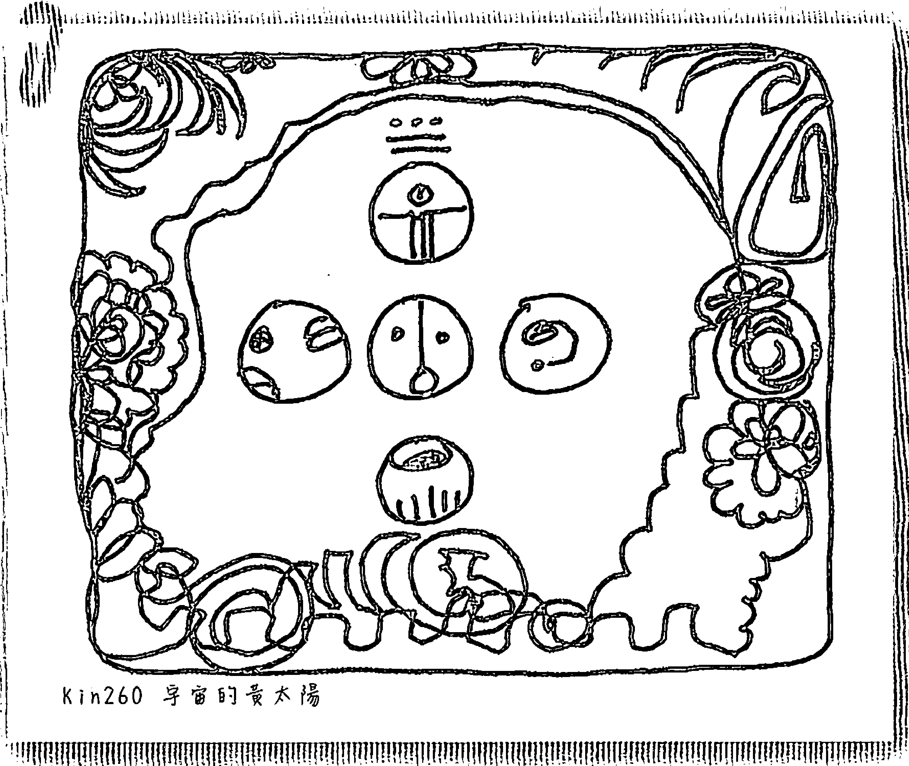

## 黃星星波符

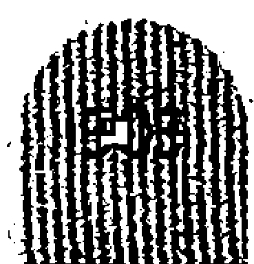

## 馬雅 260——來自星際馬雅的能量訊息

20 圖騰 X 13 調性，跟隨宇宙大自然的頻率，回歸自己的生命之流

| 職位 | 姓名/單位 |
| :--- | :--- |
| 作 者 | ESRAH |
| 美術編輯 | 申朗創意 |
| 責任編輯 | 林孝蓁 |
| 企畫選書人 | 賈俊國 |
| 總 編 輯 | 賈俊國 |
| 副總編輯 | 蘇士尹 |
| 編 輯 | 高懿萩 |
| 行銷企畫 | 張莉縈、廖可筠、蕭羽猜 |
| 發 行 人 | 何飛鵬 |
| 法律顧問 | 元禾法律事務所王子文律師 |
| 出 版 | 布克文化出版事業部 |

**出版資訊**
- 地址：台北市中山區民生東路二段 141 號 8 樓
- 電話：(02)2500-7008
- 傳真：(02)2502-7676
- Email：sbooker.service@cite.com.tw

**發行單位**
- 英屬蓋曼群島商家庭傳媒股份有限公司城邦分公司
- 地址：台北市中山區民生東路二段 141 號 2 樓
- 書虫客服服務專線：(02)2500-7718；2500-7719
- 24 小時傳真專線：(02)2500-1990；2500-1991
- 劃撥帳號：19863813；戶名：書虫股份有限公司
- 讀者服務信箱：service@readingclub.com.tw

**香港發行所**
- 城邦（香港）出版集團有限公司
- 地址：香港灣仔駱克道 193 號東超商業中心 1 樓
- 電話：+852-2508-6231
- 傳真：+852-2578-9337
- Email：hkcite@biznetvigator.com

**馬新發行所**
- 城邦（馬新）出版集團 Cité (M) Sdn. Bhd.
- 地址：41, Jalan Radin Anum, Bandar Baru Sri Petaling, 57000 Kuala Lumpur, Malaysia
- 電話：+603-9057-8822
- 傳真：+603-9057-6622
- Email：cite@cite.com.my

**印刷與版權**
- 印刷：卡樂彩色製版印刷有限公司
- 初版：2019 年 04 月
- 售價：550 元
- ISBN：978-957-9699-43-3

© 本著作之全球中文版（繁體版）為布克文化版權所有·翻印必究

城邦讀書花園 布克文化
www.cite.com.tw WWW.SBOOKER.COM.TW

## 星際馬雅曆法是套能帶領人們回歸與宇宙大自然頻率共振的曆法

依循著這曆法生活，生命會自然的流動到適合的地方。

ESRAH 透過連接來自宇宙星際馬雅的智慧與能量訊息，化成文字與畫，幫助現代處在緊繃、壓力重重的人們，回歸生命自然的流動。

ESRAH 心中的愛，共振了宇宙的愛。透過文字，化為一朵朵的小花，送給有緣與之相應的人。

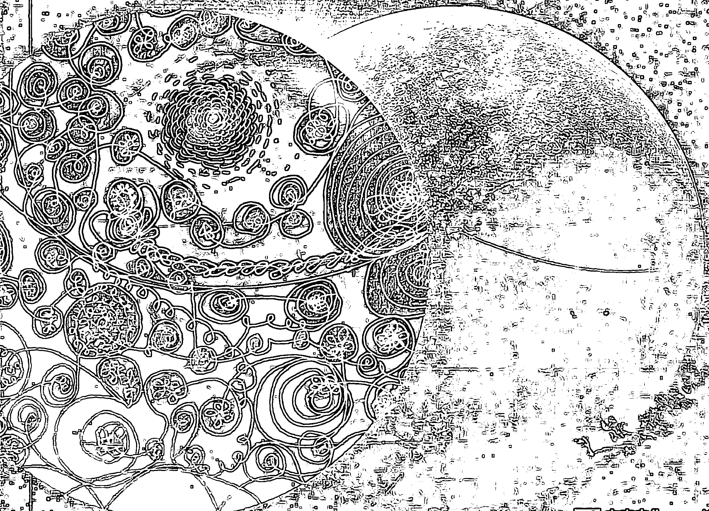