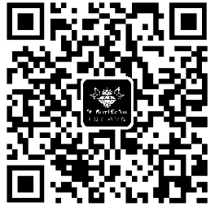
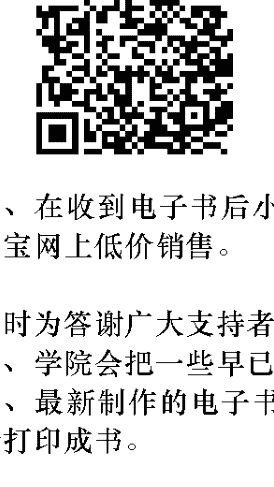
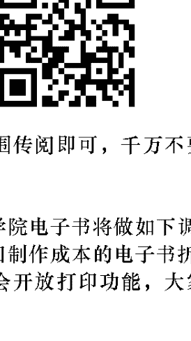
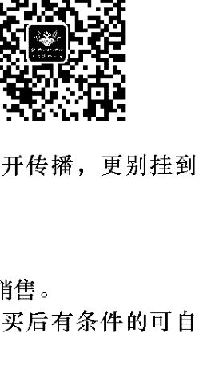
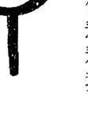

# Kirael: Lemurian Legacy for The Great Shift

渴望回歸神性真實的你，拜訪過亞特蘭提斯的神秘國度，而在於此，你即將回到列木里亞的懷抱！來自第七次元指導靈齊瑞爾的通靈訊息，將為你完整揭露列木里亞的智慧傳承，開啟你本俱的療癒能量，感受不可思議的幸福與滿足。

# 齊瑞爾訊息 重返列木里亞 | 喚回內在神性，擁抱地球天堂 |

弗瑞德·思特靈 Fred Sterling 著 林瑞堂 譯

光之子天使工作坊帶領人 杜昱平 小海豚意識研究機構所長 曾坤章博士 推薦

# St. Royal College
天使神秘学院

- ※ 神秘学资料库
- ※ 神秘学培训机构
- ※ 水晶能量研究中心
- ※ 专业占卜预测机构
- ※ 官方微信：strcdts
- ※ 微信公众平台：strc2011
- ※ 官方店铺网址：http://strc.cr.cx
- ※ 读书交流QQ群：
  - 占星塔罗占卜师交流群：814594478（加入密码：PDF）
  - 神秘学其他综合群：659338717（加入密码：PDF）

微信号：strcdts
天使神秘学院

微信公众平台：strc2011

# 制作说明：

本书由《天使神秘学院》出重金从台湾购入的原版书籍扫描制作完成。为达到最好阅读效果，特地把书全部切开后，再经由专业扫描设备高精度扫描完成，并经过一张张的PS后期处理最终成书，其间花费大量的人力、物力以及时间，只为能给大家提供经济并优质的神秘学学习资料而努力。

本学院强力谴责某些机构和个人，把本学院花心血制作完成的电子书籍，包装后直接放在自家淘宝网上低价倾销的行为，以谋取不劳而获的经济利益。如果长此以往最终将无人愿意再为大家花心思制作电子书，那以后可能大家再无新书可读。

为让大家以后能够读到更多的好书，也为了本学院的良性发展。本学院恳请大家尽量做到如下几点：

- 一、尽量在天使神秘学院的官方网站购买电子书籍。
官网电脑访问地址：http://strc.cr.cx

- 二、在收到电子书后小范围传阅即可，千万不要公开传播，更别挂到淘宝网上低价销售。

同时为答谢广大支持者，学院电子书将做如下调整：

- 一、学院会把一些早已收回制作成本的电子书折价销售。
- 二、最新制作的电子书籍会开放打印功能，大家购买后有条件的可自行打印成书。

## 推薦序：列木里亞，你註定要幸福繼承的天國遺產 杜昱平

## 推薦序：列木里亞，人類未來意識大蛻變的藍圖 曾坤章

## 英文出版序

## 弗瑞德·思特靈牧師前言

## 指導靈齊瑞爾師父引言

## 第1章：展開列木里亞遺產

## 第2章：體驗六感的覺醒

## 第3章：列木里亞世界

## 第4章：列木里亞靈魂之旅

## 第5章：擴展DNA

## 第6章：校準古老智慧

## 第7章：女神之光

## 第8章：愛，與演化交織

## 第9章：啟動新循環

## 第10章：古列木里亞醫者

## 終點：前往開始

## 列木里亞數字學大彙整

## 謝辭

## 檀香山光之教會與齊瑞爾資訊網

## 詞彙表

# 推薦序—— 列木里亞，你注定要幸福繼承的天國遺產

> > 杜昱平

今年四月，我終於來到了靈魂的召喚之鄉——英國巨石陣。當遊覽車快駛入巨石陣區域時，我明顯感受到內在高我的喜悅，像是終於回到了靈魂應許之地一樣的開心！

我繞著巨石陣的周圍靜靜地走著、體會著，突然眼前浮現了畫面——看到我內在的智者，他站在石陣中央，手舉高往天空召喚著，然後，他手上接到一個充滿光的巨大十字架，接著他將光之十字架往大地一擲，從此大地充滿光的粒子，開始有了生命萬物。當時對內在浮現的這段造物主記憶，實覺得不可思議。

在我看到本書時，驚訝齊瑞爾上師也提到了：要打開我們體內四到八股DNA，回到列木里亞人原本的高頻意識狀態後，如何在星球上運用集體意識的交織，帶著愛的意圖「塑造合願」，來協助星球文明的形成……單是運用光的思想與意念即能創造新地球、新文明與個人的願景——這不就是已經道出了造物主的創造奧秘了嗎？這些光界的造物主意識，其實也是我們的本來面目之一，加上《地心文明桃樂市一二冊》的出版，還有克里昂、齊瑞爾上師提到列木里亞的重要性，我認為，對於決心邁向二〇一二覺醒的朋友們，這已是一股你無法再視而不見的強大召喚光波。因為，兩個文明的合併，是註定要發生在每個地表家人身上的蛻變，列木里亞人是我們的初始祖先，是神之子亞當夏娃的圓滿範型，也是集體意識渴望憶起的伊甸天堂，而他們已經在地心為我們建立好了人間天堂的架構，透過修練，能將自己的身體去分子化，與多重次元連結，擷取宇宙智慧寶藏再行進化。當看到「女神之光即將重返」的章節時，我內在浮現了一股自「亞特蘭提斯下沉」後，還殘留體內既抗爭又分裂的陽性力量的憤怒，它堅持要繼續靠自己獨力奮鬥，早忘記神平白無條件的愛……但對於即將邁入女神之光的第五次元新地球，這些信念將不再適用，我們必須要有耐心與願心療癒、不斷放下所有往昔因分裂而形成的自我保護牆，才能重新恢復對神的信任，放下吃苦打拚那一套，真心接受女神從本源帶來的，生命本來的美好及富裕圓滿。

而此書也提到了列木里亞人強大的療癒能力，他們是非常長壽與健康的。齊瑞爾說，如果你結合了精靈與天使的療癒能量，那麼其威力無法擋，疾病將不復存在，不再有暴力的行為，療癒後再也無法流下悲傷的眼淚。

啊！再次讚嘆存在的默默引領。記得第一期帶課程時，我還沒收到任何治療手術的訊息，後來晚上又被搖醒了（火大），這次是像個天使臉龐的地心使者，他說他叫雅吉，在列木里亞與亞特蘭提斯時期，我們共同合作創造出無數高科技的光療手術，叫我一定要把它傳出去到地表。雅吉說：「因為我們看你們的四體是沒有帷幕的，你們的科技還無法重組DNA，喚醒細胞與下載神聖幾何光碼，只要安心地將你的雙手交給我，成為我的光療雙手，其餘的就允許一切自然發生……」

剛開始我還半信半疑，結果學員給我的回饋讓我驚訝感動不已——有很多人立即打開了與宇宙銀河時空連結的記憶，許多學員因此開啟了累世帶過來的治療能力，開發出不少潛在的天賦禮物，還會用古語吟唱或舞蹈結合光療。

而今年十月，我終於跟著一些學員回到家裡的家——雪士達山，第一次看到雪士達山剛拍回來的照片時，我居然就哭了，聽見內在小孩開心的說：「我來過這裡！這個湖泊我來過！那個森林我跑過……」不論如何，就讓祝福與恩典發生吧！

最後，我想分享心裡一個畫面，一個美麗的願景：

當足夠數目的列木里亞人都治癒了內在的二元分裂，也平衡、圓滿了過往的因果業力，從靈夢裡醒來，憶起了自身是多次元的通道，了知萬物本為一體，憶起了自己即是愛的本源時——屆時，光之造物主的能力終將恢復，我們將圍成一個治癒之圈，導引無亮光界的祝福，啟用「思想、意念塑造合願」的龐大力量，通傳於地球—大地之母，迎接黃金合一文明的再度來臨。

> AUM NA SEI（列木里亞古語，祝你平安之意）

# 杜昱平，Kelly

- * 自二〇〇二年踏上內在覺醒之路開始，歷經占星、塔羅、澳洲花精情緒療法、天使療法、前世回溯導引、光的課程天使級次修畢、奇蹟課程共修講師及奧修工作坊等。
- * 目前正接受內在智慧與宇宙多層光界的啟蒙指引，傳遞「地心列木里亞、亞特蘭提斯」等遠古文明教導，正不斷開展與宇宙喜悅的共同創造中。
- * 更多訊息歡迎參訪：http://tw.myblog.yahoo.com/kelly16826

# 推薦序——列木里亞，人類未來意識大蛻變的藍圖 曾坤章

太陽有一個孩子，它的名字叫「尼布魯星」，三千六百年前，當它要離開太陽母親的懷抱時，它的母親告訴它：「你一定要遵照我給你的路徑回來，並且不要忘了你回來的日子是二〇一二年十二月廿一日，我將以火焰歡迎你，因為你是一個小太陽！」

美國太空總署於一九八二年發現了這顆行星。二〇一一年九月下旬，該署公佈太陽表面出現一大群的黑子群，它的面積是地球總表面積的二十五倍大，寬度是地球直徑的十二至十三倍，科學家說太陽風暴不是會不會發生的問題，而是「什麼時候發生？」，預測二〇一二年九月將是一個高峰期。

小太陽的個性是火爆的，它曾被人稱之為「毀滅之星」，因為它會摧毀一切的東西；雖然如此，當它回來的那一天，也是地球完全的進入光子帶的第一天，地球將轉入一個第四次元的量子場，一個充滿靈性的、更高的能量場。小太陽與光子帶這兩股力量如果能平衡的很好，那麼人類將順利地蛻變到第四次元的世界，蛻變的發生要視人類當前意識發展的狀況，所以對未來的預測是困難的，連預測相當準確的馬雅人，也不再作二〇一二年十二月廿一日之後的預測。這本書所描述的是五萬年前的列木里亞人的世界，這個世界也就是我們人類即將蛻變後的世界，是有必要去了解的，同時我們也可以看到列木里亞人是如何準備蛻變到第五次元。意識如何蛻變？列木里亞人有一個秘法，這個秘法也就是他們最大的遺產，由於它彌足珍貴，因此世世代代被保留下來，今日能被我們看見是何其有幸！這個秘法叫『在覺知中創造十大法則』！它是意識大蛻變的一把鑰匙。整個生命意識大蛻變共需七把金鑰，這是因為每一個生命都具有七個意識體，人類已開啟了前三個意識體，目前正準備打開第四個意識體。生命會不斷地持續向更高的意識體蛻變，直到七個意識體全部打開，回歸生命的終極實相。那麼打開七個意識體最重要的關鍵是什麼呢？打開第一意識體就是『滿足肉體的需要，並使肉體存活下來』，如果一個人只滿足於物質的享受，或光是為了生存耗盡了他的一生，那麼他將停留在第一體的意識中。如果一個人總是生活在情緒裡，情緒左右了他全部的生活，那麼他將停留在第二體的意識中。目前人類只使用了書中所說的百分之十的「在地大腦」，在地大腦充滿過時的社會意識、衝突的二元對立思想，每日所思只是如何奪取更多的權力與金錢，對死亡非常的恐懼，這種意識會讓他停留在第三體中。以上的三個體都是處於粒子形態的世界，這些世界皆可用牛頓定律來解釋，因為它們是非常物質化的。當一個人覺醒到權力與金錢並不是一切，物質的享受也非永恆，因此他會往內走，往內在的心靈走，他追求的是內在的喜悅與寧靜，這時「全知大腦」會被打開，列木里亞人出生時就是處在這種狀態裡，他們具有書中所說的「六種感官」，一種超能力；即便是如此，他們仍然保留了部分的思想，這是一種思想與寧靜交替著的意識，這是第四體的世界，它是「粒子」與「波動」互相交替形態的世界；量子物理學家所說的「波粒二相性」，就是指這種狀態，只可惜他們把這個世界也當作是物質世界，再加上他們把「意識」排除在外，這也導致量子力學在未來，套用薛丁格的名言：「它們將以波函數的方式全盤的崩陷」，這是很可惜的！

量子物理學家不知道一個大秘密就是：「觀察者就是我們內在的神！」這本書裡說到，當神這位觀察者，觀看癌細胞時，癌細胞的意識將崩陷，而忘了自己是癌細胞，於是疾病就被治癒了，作者用量量子力學來解釋疾病的療癒過程是很獨特的，也是一絕！

當一個人不再使用大腦，「全知大腦」將取代「在地大腦」，思想消失，只留下寧靜，那是一個非常喜悅的狀態，由於「在地大腦」的消失，自然的「自我」也將消失，這時「我」還是存在的，這種意識是純波動的世界，它是第五體意識。

如果一個人能將「我」消失掉，只留下「是」（ISNESS），一種絕對的存在，有人稱它為神的世界，他將進入「第六體意識」。「與神對話」、「奇蹟課程」，「藍慕沙」等等的新時代書籍也常常講到這種狀態，齊瑞爾比較關切目前人類意識的蛻變。

不過他講到第四體的狀態比較多，齊瑞爾偶爾也有提到，要進入那最終極的「第七體意識」，所有存在的存在都必須消失，而進入不存在的不存在——「空無」，這是一種非常難用語言與文字來描述的狀態，因為它沒有「狀態」，有些人有短暫的瞥見，當你瞥見時，你就知道了，這時一切的意識蛻變都將終止，有人稱這種狀態為「成道」。現在我們已了解到為什麼列木里亞人要保留「在覺知中創造十大法則」這個秘密了吧！也瞭解到為什麼蛻變是那麼的迫切，因為大蛻變的機會不是每天都有的。當你修煉了「在覺知中創造十大法則」，這時你將在靜心中喜悅的進入第四次元，而你的前三個個體將留在地球上見證到大地女神自我療癒的神奇力量，你將親眼看見，一個面積比美國還要大的土地，將在紐西蘭東北不遠之處重現世人的眼前，這塊土地就是「列木里亞大陸」！

# 曾坤章

- * 小海豚意識研究機構所長，「腦波意識評量法」發明人，光子密碼波動科技研發。
- * 著有《大進化：生命是什麼》等七本書。

## 英文出版序

歡迎來到列木里亞的世界。

為什麼現在由不同的源頭，湧現出這麼多的關於列木里亞的資訊呢？為什麼是現在？就像指導靈齊瑞爾師父所說的，我們現在正處於意識大蛻變的階段。現在正是時候來選擇造物主之愛新的意識層次。現在該讓你的心靈覺醒到那可能的、充滿和平的世界，並且以集體對愛的覺知為基礎。你可能覺得這個世界只有在夢中才有可能。

指導靈齊瑞爾師父與我們分享，四、五萬年前存在著一座名為列木里亞（Lemuria）的大陸，那塊大陸山峰的餘留就是現在的夏威夷群島。在這塊大地上，人們充分覺知到造物主之愛，珍惜並禮讚著造物主提供的一切，同時明智且慈愛地照料著大地之母。

為了本書中的資訊，許多人已經等待了好幾年，還有更多人等待了好幾世。我們祈禱這本書會為你開啟心的旅程，帶你前往位在生命核心內的真實。你或許感覺到自己正在捧讀的是早已遺忘的故鄉，關於它的記憶深藏在你的內心。在大蛻變的此刻，許多人都選擇要回想起自己與列木里亞的連繫。

如果這是你第一次的冒險，是第一次接觸指導靈齊瑞爾師父與他的靈媒思特靈牧師的書，那麼我們要歡迎你進入他們的能量之美。齊瑞爾選擇被稱為『他』，這是因為他的靈媒是男性，但是他也告訴我們，他是來自第七次元的光之能量模式，沒有性別之分。如果你已經讀過齊瑞爾／思特靈的著作，我們歡迎你回來，再次與齊瑞爾和列木里亞進行一場新的充滿愛的相遇。

本書的資訊是在齊瑞爾與思特靈牧師特殊的通靈會談中收集完成的。這些會談的逐字稿僅做最小程度的編輯，希望能保持文理通暢的同時，保留齊瑞爾獨特的愛爾蘭式英文。他大部份的口語表達方式都保留在文中，另外，文中也可看到他以獨有的方式創造的新詞，像是「粒子化」（particle-ize）、「保持受到提醒」（being remindful）等，上述種種都會在你的思想體系中創造出一種意義的視野。

在你通讀本書的旅程中，你會發現每一章都是由齊瑞爾所做的陳述開始，緊接的是一連串的問與答。在附錄中，我們列出相關詞彙以及關於列木里亞數字學的資訊。敬請多加翻閱相關詞彙，並且讓自己熟悉任何新出現的詞彙。

本書與指導齊瑞爾和思特靈牧師的其他著作一樣，書中的訊息都交織在七個層次（seven layers）的理解之中。因此，許多人都會因為反覆的閱讀而得到很大的啟發。

本書的主題散佈在全書中，並未依照傳統的起承轉合的順序。舉例來說，齊瑞爾師父在第一章描述了列木里亞大地的初期，但也在後面幾章再次提到。你也許會發現，自己將這些敘述中的智慧標記出來，並且將這幾章讀上許多次，每次都得到新的層次的理解。

這本書不該速讀。它是要在你自己的心中開啟愛的甦醒的旅程。剛開始，你也許會覺得自己不懂，但是儘管大腦不懂，在身體深處的細胞裡，覺醒正在發生，而你甚至可能在讀完全書後覺得自己是個全新的人。

在指導靈齊瑞爾師父敘述他自己對列木里亞的回憶時，願你從他的話語中，找到偉大的愛與療癒。《重返列木里亞》是列木里亞所反映的造物主之愛，這股愛回到我們的地球，重新喚醒以人類型態出現的創造之光，而人類正是來體驗這次的大蛻變。

身為發行人，我們謙卑地覺得非常榮幸，能將這樣的資訊帶給諸位讀者。本書為我們打開一場奇幻的療癒之旅，而我們也祈禱，你們在閱讀時能在自己內心的深處發現這樣的冒險。

——阿囉哈和來自列木里亞的祝福
Lightways 出版公司

## 弗瑞德·思特靈牧師前言

此刻，當我環遊世界向「我們人民」（We the People）說話，我最常被問到的問題就是：為什麼現在有這麼多關於列木里亞的資訊出現，畢竟它距今已經超過五萬年之久了？為什麼了解列木里亞的生活方式對我們很重要？

許多不同的人與靈媒都訴說著列木里亞的能量，但是有人說我的資訊似乎與其他人都不一樣。我關注的只是指導靈齊瑞爾師父所帶給我的，而且因為長久以來，他已經是我生命的一部分，因此我已學會完全信任他，從不質疑他的能量。我知道，他的資訊將會在應該的地方產生應有的衝擊。

在《重返列木里亞》一書中，我們將會完整介紹列木里亞的世界，從剛開始創造物主將祂的光之力量注入列木里亞大地，一直探討到列木里亞沉沒的那一刻為止。列木里亞的能量從一開始就很強大，而且相當進化。事實上，它比目前在地球上的我們更加進化。很多人會很難接受這一點。他們想知道，為什麼五萬年前的社會竟會比現在的我們更為先進。

列木里亞人是由我所謂的第四次元來看待這個世界的。當我說第四次元，有人會說：「我以為我們現在已經在第四次元，正朝向第五次元邁進，不是嗎？」有些指導靈是這麼說的。為什麼針對同一主題，不同的指導靈會有不同的說法呢？

常識告訴我們，指導靈其實是針對自己所見、所經歷、所讀到的紀錄來給與自己的觀點。我不認為應該去比較不同指導靈的說法。我認為你該讓自己的心做決定。

如果所有指導靈說的都完全一樣，我們就會處在一個相當無趣的處境了。齊瑞爾師父的話語最有趣的地方就是，那反映出他曾走過列木里亞大地，而從中我們可以清楚知道他看到了什麼。

現在我們正處在一個非常第三次元（very third-dimensional）的社會，也就是說，我們活在二元平衡的實相裡。如果你偏好東方思想，你會說我們活在陰與陽的社會裡。但是，不管用什麼角度來看，我們都以相當第三次元的方式在生活。事實上，在地球的進化中，曾經有過偉大的平衡者，而且他們總是維持著光明與黑暗的平衡。

我們在這個地球上所維持的平衡，簡單地說就是不讓某個能量凌駕另一個能量。因此，歷史上我們曾經歷過黑暗時代與其他可怕的時期，同時也經歷啟蒙時代。在歐洲，曾經有一度一位名叫希特勒的年輕人創造了難以想像的災難，屠殺了數百萬人。在那之前，還有美洲原住民所創造的偉大國家受到迫害，大地被偷竊或沒收，文化被抹去。顯然地，在我們的歷史中，我們曾經有過——怎麼說呢，某些不算是偉大或光明的能量。
在此同時，我們也有偉大熱情的時代，有偉大的啟蒙，那時耶穌或是金恩博士（Dr. Martin Luther King, Jr.，我個人的最愛）降生到大地。當金恩博士來到地球，那時是個偉大啟蒙的年代。許多人只想探討他的死去，但是我幾乎不會這麼做，因為我想聚焦在他的信仰，那是非暴力的和平。那個運動最後席捲全美國與政府，導向新的生活方式。即使這樣，在我們的世界中還是有某部分成員仍然得為了陽光普照的大地而奮戰。
那是因為熱情的能量從不會凌駕於低層。低層總是在平衡著高層。我們將之視為非常第三次元的表達，這種表達方式是說，沒有一種能量應該如此凌駕於另一種能量。因此，你總是看到黑暗力量對抗光明力量這個主題。可是，如果你開始傾聽指導靈齊瑞爾師父，你會發現他幾乎不太觸及黑暗，因為黑暗不過是受到壓抑、擠壓、或者濃縮的光明。

我想我們可以超越保持平衡，看看我們身為人類有什麼選擇。我們可以看看自己如何看待地球。如果我們看到大蛻變的潛能，那麼很有可能我們到目前為止生活在其中的全部平衡都將消散。你將會看到更高頻的光的波動滲透到整個地球。
事實上，根據齊瑞爾師父的說法，目前我們稱為第三次元地球的這個意識層面將要進入一個更以思想為導向、更以愛為依歸、更有「內在光明」的地方。因此，一切所謂不好的生命的經驗真的都將被擱置，好讓我們能以不同的速率提升，從第三次元揚昇到第四或第五次元。如果你看著這些次元的實相，你將知道第三是二元性，第四是思想，第五是愛。
我們都在尋找愛，因為那是我們的造物主所存在的層次。造物主是第五次元的能量，是慈愛的光。不過，我並不是說造物主受限於那個層次；我是說，祂的力量在第五次元最為強大。當然，每個人都想要直接由第三次元前往第五次元，但是和世上其他事情一樣，我們都必須在路途中學習，按部就班地由第三次元到第四及第五次元。
因此我們又回到最原始的問題——為什麼我們好像掙扎著從一個來自我們過去的社會去學習其生活方式與理解呢？造物主無限的智慧之光與一「存在」（beingness）我們用了好幾世的生命來到達在現在這個階段，因此如果我們在愛的光明中繼續下去，我們可以讓這個地球成為比原來更好的地方，因為我們將會進入這個更為美好的

我們身為第三次元的人類能夠有同樣的自我期許嗎？我們能說自己讓地球成為更好的地方嗎？我相信是可以的。

想像第四次元的光之存有（light beings）或光之工作者（lightworkers）的經驗，他們縱橫整個列木里亞大陸，將大地之母的波動提升到頂峰，卻又落回海中。我們不需要聚焦在那塊大陸的沉沒。那只是造物主知道他們已經到達了自己經驗的頂峰。關鍵在於，早在列木里亞陸沉之前，列木里亞的部族早已讓大地比剛開始時更加進步。

你或許聽過指導靈齊瑞爾師父提到過列木里亞的預言，預言說它將再次來到人類的生命之光。不要受限於次元的數字，不管是第三、第四或第五。我總會回到一個單純的事實：讓你的心歌唱，因為如果你願意讓心歌唱，你將會聽到自己內在的音樂，而那樣的音樂永遠以愛為中心。再也不需要平衡。

於超過五萬年前創造出列木里亞，那是個非常第四次元的能量，換句話說，它完全由思想的能量驅動。

列木里亞能量，看到自己完全覺知著這段旅程。我希望，在你遊歷於本書時，你將會了解到這段朝向下一次元的進化具有的潛能。

——阿曜哈與瑪哈曜，弗瑞德·思特靈牧師

## 指導靈齊瑞爾師父引言

> 齊瑞爾：朋友們，此刻我要向你們做一個非常特別的請求，我請求你們讓我用自己的方式說話。我要請我的著作的編輯們儘量縮小他們刪減的篇幅。我請他們盡己所能讓諸位清楚理解。

我的英文或許並不完美，而且閱讀本書其他語言版本的讀者可能會感覺有點費力，但是我對你們每一個人都有信心。你要知道，我的著作是在意識的七個層面寫成，也就是說，讀這本書的每個人都處在不同的層次上，而且我希望它能觸及每一個人的內心。

我說話的方式可能會讓某些人覺得有點蘇格蘭腔，也有點英國腔。但我要說：如果你仔細聽，你或許會聽到我有點愛爾蘭腔，也有點英國腔。你或許會聽到一點阿拉伯腔。

這都無所謂，因為事實在於，重要的不是使者，而是使者所傳達的訊息。

所以，心中記得那樣的自由，並且盡力地閱讀。不過我可以給你們一點提示。

如果你帶著開放的心胸閱讀，不要仰賴自己的理智，那麼你將會發現這是本全方位朋友們，我要說的是：我從古老的時空發言，那時你們的英文甚至還不是以現在的形態存在。那時人們的話語是出自自己的內心。或許，只是或許，我們將要回歸的就是那裡。所以，我要請你們好好讓自己在我的話語中找到平靜與和諧，因為我想要療癒能夠開始。

你們要知道，你們的世界已經來到這樣的時空，必須要開始療癒，而這也是我到來的原因——我要促成療癒。我來這裡是要讓你們知道，有個你們意想不到的偉大希望存在著。想到末日、想到黑暗的人，不妨將它們暫時先擱在這一邊。在我說的這一切中尋找正向，在每一個可行的計畫中看到美好。

我希望，你們會讓自己像水一樣地流入這個美好的工作。如果你們這樣，你們將會發現自己或許還記得自己曾經存在於我說到的那個世界。你們無法理解這樣的記憶，因為你們活在身為人類的帷幕之下。你們生活的世界說，事情一定要依照某種方式去做。我來這裡要告訴你們，那個方式已經結束了。現在是全新的時代，是一個全新的次元。現在我們這群人該要挺身而出，宣告自己將要踏上這個已經開啟的。

## 旅程。

所以，如果你們願意，可以放鬆地坐下來。好好地做一次深呼吸，在閱讀時讓自己感覺我的話語。我會這麼要求的理由很單純：這是我的表達方式，這是我向地球傳達訊息的方式。或許最重要的是，這真的與你們傾聽的方式有關，因為我的訊息的純粹將會隨著你們內心的單純或複雜而改變。不過，我還是希望你們能找到方法，讓自己能自由地知道，在時間受到度量之前曾經存在過這樣一個時代。

朋友們，那就是我們所稱的列木里亞遺產，這個遺產是所有人類將會經歷的最大轉變。你們將會發現，那是個偉大的感覺，是個偉大的理解，是個偉大的覺知；任何人只要尋找就能得到。我正是為世上這些追尋者寫下這本書。

朋友們，讓旅程開始吧！

## # 第 1 章 展開列木里亞遺產

齊瑞爾：因為你們這個世界裡，大多數人都喜歡為自己當前這個化身的紀錄與歷史進行分類並廣泛地比較，所以我樂意點出：為什麼認識列木里亞的點滴會在你們旅程的這個階段相當有益。

體驗列木里亞歷史的展開有點像將你的存在拋回過去，回到你們很可能見證過的時光。你將會發現，兩者的相同之處幾乎反映在當時的粒子化身（particle incarnation）有許多都預告著你當前的冒險。你將會看到一個滿溢著知識的文明如何展開，其中點滴幾乎與你們現在的文明如出一轍。

從這個訊息中所學習到的，一定會讓每個旅人濃縮旅程，或至少協助減輕種種負擔，讓自己能夠完全調適此刻你正面對的、快速到來的能量轉換。

我的想法是，這很像打開一扇非常特別的時光之窗，讓你看看一個與你的世界非常相似的世界。有時這或許會讓你顫抖，但同時這也會讓你清楚知道自己成長了多少。在生命那非常纖細的鋼索之上，人努力保持平衡，似乎受困於纍纍的時間之絲，但在電光一閃中，人會見到造物主在每個集體旅程展開中賦予的巨大力量。朋友們，事實上我認為，如果人有勇氣，不讓自己人類的身份遮蔽這樣的視野，那麼人就很可能將這部分的工作從自己重複的天性中削減。說不定，在你閱讀這個部分時，你會發現清楚的方法，讓你能終止某些課題計畫，不用再冒險在當下的生命藍圖中創造裂縫（gaps）。

追蹤列木里亞人穿越這些個別時代的旅程，將會幫助你瞭解他們是如何合作，讓他們完成全部的冒險，心裡確信不會遺漏掉哪個部分沒完成。由於他們是一個社會，因此他們決心不讓任何人脫隊，也因此他們展現出毫不動搖的渴望，要以集體的向心力與環環相扣的知識交織（weave of interlocking knowledge）而成的意識創造原則來繼續完成旅程。這許多資訊將會用來創造一座美麗橋樑，連結你們在旅程的此刻正要面對的意識大蛻變。

同時，我也很樂意分享他們當時在這個世界所運用的知識交織，來對照你們當前正在展開的種種。在觀察他們精細的進化過程時，你們要選擇自己願意理解多少。對你們思想體系的考驗在於，你們願不願意運用「全知大腦」（omni brain），也就是你們當前科學界所稱的百分之九十的意識。要記得，作為一個社會，你們幾乎已經完全相信自己受限於列木里亞人當時所稱的「在地大腦」（local brain），也就是你們在當前的覺醒程度中所運用的百分之十的大腦。

現在想要澄清一點。你們科學界所提出的這個十與九十的分別並沒有考慮到他們的意識記憶（cellular consciousness memory）的效應，因此真正的比例遠遠超乎他們的認識。朋友們，這麼說並不是要貶低他們的工作，但是為了幫助你們更深入了解這個工作，你們必須接受自己的在地大腦並無法真正知道有多少部分的大腦真正派上用場。這個十與九十的比例和其他事物一樣都是人為的限制，而這確實限制了科學家能夠就這個比例所表達的資料。

這樣一種局限的例子就是，你們現在的科學家企圖依據量子力學的觀點所進行的測量。當人們運用著從古老歷史所學得的標準測量方式，一旦看到細微世界展現全新的特徵，他們將會經歷真正的掙扎。想像一下，他們希望用強而有力的顯微鏡來觀察單一的粒子。不過，就在這個粒子受到觀察的那一刻，它便出現了外形的改變。要知道，事實上，所有人類都是由粒子所組成的。這個所謂10／90的理論有什麼真正的影響呢？這個理論必須向著波動的光的無形力量開放。它必須信任來自全知大腦所使用的資訊。它需要接收超越有限思維心智的訊息，並且經由與宇宙訊息模式連結的大腦意識中得到上述的訊息。因為如此，我才會請各位接受這樣的可能性：當你觸及到大腦這個神奇的部分，你就可以知道所有可能的知識。

徹底了解這個工作的許多部分之後，有時候會發現事情似乎不停重複，但是我向各位保證，為了將大腦與這個新顯現的細胞意識連結在一起，這個模式是必要的。這些列木里亞歷史的古老生命與你們的生命不斷出現的呼應，將會刺激你們的大腦，尤其是那個累積了許多對當前時代諸多歷史理解的部分。

假如你決定要向全知大腦開放自己，我的想法是，在這個特別工作完成之後，你將會發現自己的思維有了全新的自由。你很可能會覺得，自己自從覺醒以來從未這麼自由過。事實上，這或許會讓你更清楚了解，為什麼男性與女性會以這麼不同的標準來滋養生命。這或許會為陰陽的世界帶來新的意義。朋友們，就算不是這樣，你也絕對會以更不同的方式來看待生命。

當你開始將自己的認知交織到這樣的工作中，你會發現自己一直都擁有著這些原料，因此你會滿心困惑。我用來解釋這些資訊的方式充其量只是一副鑰匙，用來為你在種種帷幕之間學習的旅程打開大門。

我希望，束縛著你這個覺醒世界的後天循環，將會轉變成一個不停擴展的傳送門（portal），通往著新的、充滿熱情的許諾。在我投射出的每個想法中，你們擴展的意願將會帶你們找到新的、更為刺激的方式，讓你們確信自己控制著自己的世界。只要勇氣超越當前世上的導師所指出的自我局限，你們就會看到這個世界，裡頭充滿擴展心靈的資訊。

## 列木里亞進化的三個時期

現在，我們要出發了，首先要從集體的角度定義列木里亞進化的三個階段，如本書的其他部分才會清楚。我選擇將三者並列，因為當我們比較過去和現在的歷史時，你們會需要常常回頭參閱這個部分。

在列木里亞的時代，人們運用的是三階段的度量方式。第一階段稱為『第一生命』（First Life）。在這個階段中，這個高度進化的社會開始面臨生命的凋零。這是因為，他們在日益進化的旅程中要充分了解造物主（Creator）的創造，要完全擁抱「一切萬有」（All That Is）。

與其他階段一樣，這個階段也可細分為認知的三個靈魂之旅。儘管許多度量方式都運用了靈魂之旅的觀念，但是在這裡，它標示出從一個層次進化到另一個層次所需的時間框架。這種衡量時間的方式並不容易理解，因為它是在細胞層次發生。其實它不算是某個特定的長度；它所顯示的其實是心智（intelligence）完全探索某個學習波動（vibration of learning）所需要的時間。因此，舉例來說，在「第一生命」的階段，列木里亞人會將第一部分稱為「第一生命」的第一生命。「第一生命」的中間部分則稱為「第一生命」的「共有時間」（Common Time）。最後，當列木里亞人開始準備離開「第一生命」的階段，這個時期則稱為「第一生命」的「轉變期」（Transition）。簡單來說，每個階段都包含了「第一生命」、「共有時間」以及「轉變期」。

從最後一點引申，很明顯地在「第一生命」的第二時期，所有三個靈魂之旅的階段都有機會完成，因此它被稱為「共有時間」。對於所有包括你們在內的化身（incarnation）而言，這是個偉大探索發生的時期。

「共有時間」的第一階段稱為「共有時間」的第一生命，這是個最大擴展的時期。在此，列木里亞人會回顧並且調整前一階段尚未完成的所有旅程的部分。在「共有時間」（或者稱為「共有時間」的中程靈魂之旅）之中，人們擴展自己的知識，對造物主的欲望有了最大的了解，同時他們發展的速度也足以讓他們過著覺醒生命的完整意識而生活。在他們的第三階段，或稱為「共有時間」的轉變期，他們也準備要進入更新的生命方式。對許多人來說，這似乎是個巨大改變的時代，因為他們得準備進入無限喜悅的階段。有了這樣的資訊，你或許可以想想自己當前所處的時代如何呼應著列木里亞的世界。朋友們，你有過許多階段讓自己回顧自己需要再努力的種種。無論過去或現在，你們也似乎得承擔一再重複的課題計畫（lesson plans），它們表面上看來似乎都永遠難以理解。在你們現在這一世中，你們是不是覺得如果再重複一個課題就會讓自己瘋掉？這個資訊或許幫助你決定自己是否真的身處於「共有時間」的末期，決定自己是否正往「轉變期」前進。任何可能的度量方式一定都存在於你靈魂的覺醒之中。看似混亂的世界可能就是個意識的狀態；人就需要這種意識狀態來完全理解一種「知道」的感覺，讓人能夠再次於地球上找回平靜。

## # 列木里亚孩子诞生的過程

有許多偉大的案例可供比較列木里亞的世界與你們當前正在進化的世界。這樣的資訊也會釐清：為什麼每個階段都對其他階段如此重要。關於這點，最好的例子就是列木里亞人的生育程序。闡明生育的程序讓所有人清楚了解：需要什麼不同的時期與靈魂之旅才能確保一次精準的分娩。這項冒險似乎與你們大多數人在當前的意識階段認為理所當然的模式有著很大的差異——生命最重要的塑造期，其實是在出生甚至是受精之前發生。

與你們截至近年以來的作法相比，當你看到列木里亞系統的周密，你也會發現為何改變是如此重要。這將會解釋為何許多正要來到的靈魂，會經歷這麼多試煉與困難。在這一點上，你也會更了解它們如何運用靈魂之旅的系統。

你們要知道，列木里亞人用來衡量所謂「新生命的誕生」的時間單位是根據完成的時期。換句話說，他們認為完整的生命誕生是分為三個不同的時期。這些時期的區分是根據不同準備階段的完成程度，好讓新生命在可能的最佳情況下誕生。與其他所有的時期一樣，這些時期也稱為新生命來臨的「第一生命」、「共有時間」、「轉變期」。出生階段的這三個主要的時期都相當獨特，因為每一個又細分為不同的靈魂之旅。用你們當前的時間單位來看，每個時期的三個靈魂之旅都持續大約三個月的時間。因此，這三個階段的每一個都細分為三次靈魂之旅，因此每個階段都需要九個月的時間。朋友們，算算看，你們會發現列木里亞人從決定要經歷出生的過程到母親真正分娩，大約需要二十七個月的時間。為了再清楚一點，在你們大大同情列木里亞的母親之前，最好繼續讀下去。列木里亞社會高度重視學習，所追求的只有最高高度的平衡。這個社會非常謹慎地提供到來的靈魂最佳的進化意識。

## # 懷孕的第一生命

懷孕的第一生命靈魂來臨的第一生命可分為三個靈魂之旅。第一趟靈魂之旅是母親的責任；母親要創造完美的和諧，平衡正在進入生命領域的男性與女性的生命型態。母親需要在不同的光之層面努力，創造自己想要的結果，當然她首先要與父親認真討論，因為父親的責任就是創造正確的X或Y染色體。等到適當的時機到來，母親會開始與兩人所選的、正來臨的靈魂互動。

雖然這聽起來可能有點複雜，但是請努力試著理解它。在第一生命的下一個階段，或者說第一生命的共有時間，母親的靈魂會開始持續不斷地與靈魂溝通，而這個靈魂最終將成為孩子。在第一生命的最後階段，母親與正在到來的靈魂要非常努力地根據最適合孩子的靈魂之旅來調整藍圖。

編入藍圖的記號乃是指引的力量，這個指引力量將會陪伴著孩子出生後的第一生命與共有時間。在這個藍圖中，有充分的時間來完成所有前世未完成的冒險，並且也編入新的啟蒙的實相，並將會在當前的生命經驗中發生。

## # 懷孕的共有時間

現在我們可以進入懷孕的共有時間。這是母親必須經歷的第二個為期九個月的階段。在這個階段，母親的責任就是要開始「交織」（weaving）的過程。在這接下來九個月的三個靈魂之旅中，不管是母親或是剛剛定義完成的靈魂將會高度地互動。這個新的靈魂的融合，或者說結盟，將會交織在家族中每個活著的成員之內。如此一來，新的靈魂將會覺知到自己能夠取用的知識。它能清楚地知道自己如何能融入這個社會環境之內，而裡頭每個人都是它的老師。目前這個家族的每個成員將會見證到這些交織的完整衝擊，因而也充分了解自己該如何幫助這個新的存有。

當你考慮到列木里亞人當時的壽命長度，還有當時的家族可能包括了曾、曾、甚至是太祖父母，你就能體會母親所經歷的重大考驗。第一個孩子是最困難的，因為沒有其他兄弟姊妹能夠協助。

### 懷孕的轉變期

那麼，懷孕的轉變期大約也會持續九個月。在這個階段，身體的磁力構形 (magnetic formation) 會開始發生。其他正在進行的也是最有意思的發展。這個時候，母親不再那麼經常與新的靈魂進行互動，因為母親在懷孕期的靈性工作已經大致底定。事實上，這個時候她更關心的是自己與孩子父親的互動。

在這第三階段的第一生命時期，主要是由父親來教導這個新的靈魂。這時，他在這個轉變期的前三個月，要教導靈魂有關列木里亞的一切。這點非常重要，因為孩子要適應這個星球就必須完全清楚列木里亞世界正處在什麼階段。這包括這塊土地的歷史、當前正在體驗的文化、以及完整理解它所要進入的家族正處在什麼階段。新為人父者的責任就是盡可能釐清這幾點。最後這九個月的第二階段，稱為第三期的共有時間。父親的責任是指導孩子在出生時運用四體系統（four-bodied system①）。根據和諧法則（harmonious principles）生活的議會引導著這個世界，因此對孩子非常重要的就是在出生之後儘快啟動這些層面。在生育過程的轉變期之第三個也是最後的階段，父母會盡可能輪流進入深沉的靜心狀態，好在三人之間純粹分享愛的感覺。對孩子非常重要的就是讓他自己可能完全沉浸在愛之中，因為愛是必定要依循的道路。雙親也與孩子構成一種能量的三角關係，這是用來將孩子帶出母親的子宮，也因為如此，對這剛開始的新靈魂而言，實際的出生過程是一點創傷也沒有的。這也是為什麼正常的懷孕會延展到二十七個月的階段。列木里亞時代，一切都有其意義。每次旅程都是根據冒險的實現來衡量。要記得，它分為三個階段：第一

> 譯注①：指構成生命的物質、情緒、心智、靈性等四個能量體。

生命、共有時間與轉變期，而每一個又可細分為三個獨立且具有同樣名稱的靈魂之旅。這或許會幫助你了解這一切。

#### 過去與現在的比較

要知道，在你們現在的世界，你們真的需要提醒自己，隨著當前的文明開展，由於許多後天學來的恐懼，文明用非常緩慢與謹慎的方式來培養勇氣以便與靈性世界結合。要能有這樣的榮耀來處理另一個生命的藍圖（就像在列木里亞的孩子身上發生的那樣），人必須非常接近「無帷幕」（veil-less）的狀態，同時對愛要有最純粹的理解。

無論在第一生命或是最近的共有時間階段（這也是你們現在所處的階段），生育的過程大多只是靈魂之間的意外接觸，而非交織而成的選擇。在大部分的案例中，正在來臨的或說正在追尋的靈魂，就只是充滿高度渴望要體驗進化的第三次元的意識層次，並且是自己摸索著來到地球。

在你們當前的化身中，母親除非等到孩子已經在子宮著床，否則幾乎不會感覺到互動。即使在那之後，也少有人會完全將這樣互動的知識整合起來。當然，到了最近，我們看到有愈來愈多父母親選擇為尚未出生的孩子朗讀或歌唱，這為我們帶來很大的希望。

想像一下，和未出生的孩子促膝長談他們正要進入的世界是什麼模樣。想像一下，如果每天父母親總規律在某個時刻為孩子撒下黃金粒子（golden particles），這對孩子會有什麼影響？相信我，當準媽媽與準爸爸真的觀想著這些最美麗的粒子圍繞著孩子，真的流瀉在孩子身上，那麼你就知道，這是將孩子帶到世界的一個新的最美好的方式。

如果你運用夢想的力量，現在和我一起看著一個世界——這裡真的會在孩子來臨前幾個月預先計畫他的出生，這會是多麼美好。想想看，父親致力於提升自己的身體，讓自己能夠製造出足夠的X與Y染色體。想想看，母親的旅程能夠幫助一個尚未受精的靈魂，與他共同規畫藍圖，確認出所有不同的可能性，或者說交織好現有家族的所有美好的部分，如此一來，當孩子來到，他對自己所加入的一切都已經知之甚詳。

#### 有特殊需要的孩子

如果有部分人開始體會到靜心與祈禱的力量，知道自己真的能夠形塑正在來臨的靈魂所進入的世界，那麼人們也會開始理解到，某些正在來臨的靈魂在旅程中會有相當特殊的需要。這些非凡的生命通常具有天賦的導師，有時候他們很難找到足夠聰明的父母來分享他們的偉大知識。

相信我，每個靈魂都在尋找機會來活出能實現藍圖所有潛能的生命。只要我們醒悟到這些存有有更遠大的進化，也準備好要服務我們，那麼我們就能看出他們是天賦的禮物。身為這些別具天賦的孩子的父母，常能夠看到他們的美，但是周遭的世界卻往往不太提供支持。朋友們，你們身為這個文明，必須共同向這些正要來到的可敬靈魂學習。他們都是導師，有些具備你們意想不到的偉大知識，而有些則是希望來到這裡參與「意識的大蛻變」（Great Shift in Consciousness）。

根據同樣的道理，我的想法是，像是墮胎或是遺棄的小孩這類的事情將會很快地由當前這個顯化中消失。這個課題將會在多重層次中完全地學習，而靈魂終將不再需要來到這個層次來協助父母親經歷這樣的創傷。如果可以，請想像一個不再因為這個議題而畫分戰線的世界。想想罹患「注意力缺乏症」（ADD）或躁鬱症的孩子，同樣清晰的心靈就有可能幫助父母與醫學界不再只是逼迫孩子吃藥，而是尋找其他可能。我並不是說運用藥物一定是錯誤的，我的意思是或許還有不同的選擇。父母如果真正知道這個新靈魂的藍圖，一定會探索每一種可能，因此確信自己完成了全部的旅程。朋友們，可悲的部分在於，除非你接近這個你正在經歷的共有時間的完成階段，否則你的社會還是會繼續粗魯地用藥物來控制行為模式。伴隨無助感而來的恐懼是一種壓倒性的波動，而在這樣的恐懼中，潛能通常都被混亂的迷霧包圍。隨著你的文明覺醒並認知到另類的療癒方式，哪怕這代表醫學界與自我的努力需要結合，這個世界都會因此更有效率地引領孩子通過這種學習平衡的階段。用最簡單的話說，如果人們記得造物主的創建或塑造絕不會出錯，那麼最終每個主要的光、父母親以及孩子，都會在萬事萬物中看到美的存在。每個靈魂都是慈愛的、絕不會犯錯的造物主之光所創造出來的。正在閱讀這本書的你，如果有幸能夠成為這樣的孩子、這樣深具天賦的導師的父母，而且如果你在孩子眼中與心中已經盡全力去做了，那麼它將不會有任何事是錯誤的。除非有人耗費時間去完全說服孩子自己哪裡不對，不然孩子將會活出一個很長且充實的生命。朋友們，在這樣的光中，父母與社會必須協助孩子看見自己的美好。請保持耐心，不要停止尋找平衡，因為每個靈魂之中都存在著造物者完美的一部分。事實上，有句諺語說，如果人真的渴望要活在造物主的光之中，那麼不管尋找答案的旅程需要五個階段或五十個階段都沒有關係。真正要緊的是，在這段旅程中你絕不會感到孤單。相信我，我說除非人覺得自己周遭的愛正在消散，否則沒有人會放棄。沒有任何挑戰不能得到近乎完美的平衡完結。要知道，將古老列木里亞的生育過程放大，並且將它連繫到你們當前的進化階段，這會讓你們了解事物將如何開展。第一生命、共有時間、轉變期的衡量方式都只是意識里程碑。每個生命的覺醒都會不同，但是我認為，如果能完全運用所有的感知來進行這趟冒險，你將能進入遠遠超乎預期的更高進化階級。儘管這種時間分期剛開始好像有點複雜，但是它將幫助我們理解我們所知不多的過去。就和我的數字系統一樣，這種單純將會逐漸帶來清晰的理解。如果可以，請想像一下，有個力量正在進入你們的意識層面，讓每個人都加速生命的課題到達列木里亞時代以後從未有過的覺知層次。這樣的時代，每個課題計劃（包括來自先前顯化的部份）都會以完美的和諧加以處理。在這樣的時代，我們這群人將會相信，造物主的力量會引導自己走向愛的自由。

活在這麼神奇的時代真好。我的朋友們，不要浪費時間猜測世界會如何發展。相反地，只要訓練自己的思維成為造物主的力量，如此一來，生命就是不停開展的冒險。要完整地活出這樣的生命。

### 問與答

問：齊瑞爾師父，在列木里亞人由第一生命進入共有時間的時候發生了什麼事？

齊瑞爾：在一個明確的時刻，列木里亞人知道自己即將離開第一生命而進入共有時間。和現在的情況類似，發生了意識的轉變，而且這個轉變是發生在群體的意識之中。基本上，造物主因為自己感到了滿足（請原諒我用「自己」這個字來描述造物主），也學習到祂希望在第一生命的模式學習到的一切，因此開始讓物質存在更清楚認識到祂的存在。別忘了，列木里亞人必須穿戴著帷幕。人沒有帷幕無法在這裡存在。列木里亞人罩著自己的帷幕，於是造物主開始讓人群中的某些人的帷幕消退（這也和現在的情況相當類似），想要看看他們是否真的準備好了。因此，大蛻變來了。造物主不時都會自我測試一下，看看第一生命的存在是否已經達到某種認知程度。祂會評估某些部分的人口，然後呼喚大地之母搖晃一下並且重新自我設定，接著列木里亞的大地將會轉變。事實上，有趣的是，正是在第一生命與共有時間之間，在夏威夷群島也就是你們此刻所在的位置，山峰被擊打成療癒的殿堂。正因為我們這群人，或者說我們這群列木里亞人達成了某種程度的進化，就在這時造物主看到了這點，並決定現在該要讓一切進入共有時間。隨著這群列木里亞人愈來愈進步，學習到自己需要學習的事物，造物主就允許大蛻變開始發生。那也構成所有相關的交織。甚至你們那位我們很少提到的朋友，也就是原住民親昵地稱為「天空之父」（Father Sky）的那位也牽涉其中。他是造物主的力量最先諮詢的對象，要先確認當時的天空足夠的純潔與清澈，以便強化新的呼吸結構。當列木里亞人由第一生命進入共有時間，一切開始轉換。他們運用到更多所謂「生命能」（prana）的力量。在那個時候，他只是經過大地的一種力量。

正在向共有時間轉換。他們只是知道就要來了。他們開始看到大地的改變。他們看到大地在列木里亞大陸上轉變。他們覺得彼此更靠近，開始看到那些沒有依照應有的方式從第一生命到來的人。所以他們向其他第一生命的存有伸出援手，但是他們幫助的方式與你們並不相同。他們用的是心電感應或者第六感；你們用的是電腦。可憐的主耶穌沒有半點辦法。他沒有伸出援手的辦法。他本來該在兩千年前就完成這次蛻變（至少我們覺得應該是這樣），但是他沒有你們手上這種稱為電腦的獨眼巨人的小東西。

編注1：把電腦想作一個人體，讓人聯想到希臘神話生物裡的獨眼巨人（one-eyed Cyclops），他只有單獨一隻眼睛長在額頭上，而電腦也是頂著一具螢幕，將外界資訊進行接收與傳輸。Cyclops 希臘語意即為圓眼。

> 所以，最后，现在你们正在转变到当前的这场蜕变，因此你将要开始多加运用第六感。你们想，为什么我们唤醒了「女神之光」（Goddess Light）？由于它那循环性的本质，光明女神能比地球上的其他存有更早抵达那个状态。

> 问：现在我们正处在共有时间的哪一部分呢？

> 齐瑞尔：事实上，你们已经相当接近共有时间的结束，正进入称为转变期的阶段。换句话说，这就是共有时间的转变期灵魂之旅。

> 问：列木里亚人是如何以集体的方式知道什么时候要开始大蜕变，并进入新的灵魂之旅呢？

> 齐瑞尔：列木里亚人的生活处在细胞意识的层次，这个层次其实已经交织在每个人的内在。他们有个集体的定时状态，也就是说，每个人都处在同样的循环或波动中。换句话说，没有单一的能量模式来记录时间。你不需要戴手表或是类似的装置。所有列木里亚人都知道他们处在化身的什么状态，也知道自己处在什么时间阶段与哪一段灵魂之旅。一切都由细胞意识的感觉所决定。

每個人都清楚知道針對自己所處的狀態以及特定時間內會發生什麼。一切都依照該有的模樣準時且準確地發生。事實上，等到大蛻變來到，當他們知道自己正在接近例如共有時間的結束，那麼他們知道其他人也都知道了。因此，某些正在進行特定計畫的人，如果他們還未依據大蛻變而進行調整，那麼他們將會經由心靈世界本身向其他可能提供幫助的人求助。基本上，每個人都會結合起來，確保那些有點落後的人能夠跟上，因為每個人基本上都知道彼此還有多少時間。

那不是自我導向的社會，因此沒有人會害怕向人求助。每個人都會請求他人的幫助，因為每個人都想確定每個人都同時在前進。你不想要成為扯整個社群後腿的人，因此你會非常謹慎地看待自己。只要你一開始覺得自己並沒有完成應有的學習，那麼你真的就會向所有可能的方向求助，直到你達成其他人期待你會達成的目標為止。

> 問：他們會向誰求助呢？

> 齊瑞爾：嗯，在列木里亞的能量彼此之間有個溝通的管道，另外也有個模式讓某人能夠傳送出能量來造成波動的效應。基本上，有一首歌會以獨特的波動歌唱，讓列木里亞每一個生命的內在共鳴。其實，這種波動早就注入在植物界與動物界的交織之內，這樣所有人都會知道大蛻變將會在何時到來。他們知道有多少人（或者說多少能量模式）在自己的旅程中需要協助。

沒有人因為自己有點落後而感到羞愧。他或許正在進行一項偉大的工作，要發展並進行某項旅程，因此真的沒有注意到時間。因此，當這股能量出現，人們知道又一次意識大蛻變的時間已經到來，這時能量的傳送將會用相當的時間來穿越全部的實相。事實上，當波動開始發出，是造物主的波動來認知到大蛻變的時間已經到來。去注意你們的鯨魚，他們被視為記錄的保管者，而海豚這種能量則是信使，在那個時間裡，他們圍繞著列木里亞。因此，當那首歌接觸到列木里亞的生命以及期間其他的交織時，鯨魚和海豚能量就被啟動，將這股能量傳送到整個星球。我要再次強調，這包括了動物界與植物界的交織。

如果你坐在樹下，但還沒有聽到訊息，你或許可以從樹本身聽到，因為它會以如此的頻率波動，讓你想到現在或許正是大蛻變的時間。它們幾乎全是同時開始注意。當然，那時候的溝通遠比現在更為良好。

> > 問：指導靈齊瑞爾師父，我們能以那種方式溝通嗎？

> 齊瑞爾：只要你能更緊密地與DNA的第六股共鳴，只要你鎖定第六股，那麼你將能夠這樣溝通。此刻，許多人已經開始與第四股DNA共鳴，也有另外兩股我們稱為幽靈DNA（ghost DNA），也就是尚未完全浮現的部分。只要你開始讓它們聚焦，接著你就能夠在此刻完成。人類具有足夠的能力來完成。你選擇要處在帷幕之內，因此，你並不真的記得自己所有的能力。你必須記起每個交織所知道的、眾人也都知道的一切。昆蟲真的運用一種雷達在自己的環境中完成。嗯，如果牠們知道該如何做到，那麼身為人類的你們也會知道。任何意識交織所知道的一切，你們也都知道。舉例來說，當割草機的馬達啟動，當第一株草感應到正在發生的事，那麼整片草坪也同時、立刻都會知道。因為它知道該如何將它投射出。如果一株草具有那樣的知識，想想看會怎麼樣？整個人類世界也會知道。人們說狗聞得出恐懼，那是真的。他們可以，因為他們的鼻子就是為了這個而打造。猜猜看會怎麼樣？這些交織所知道的一切沒有一點是你們所不知道的。你知道位於你們意識層次以下的所有交織所知道的每件事。樹知道如何讓空氣氧化，你們也知道，只是你們不記得，因此你們需要全知大腦。

> >問：可不可能知道列木里亞人的平均壽命有多長？

> >齊瑞爾：他們延長時間的能力並不存在於你們人類的連結中，因為他們真的可以由第一生命活到轉變期，大約是數千年的時間。大部分的時候，他們和你們現在差不多。他們會活個大約七百年到一千年，不太會超過一千年。要記得，重點是循環。他們立刻會進入你們所謂死後生命（after-life）的循環。他們會進入他們新的千禧年的層面，與他們所有的先行者或者那個層級的導師坐下來討論，然後他們會用個大約十年的時間重新學習並組織自己，好為造物主變得更好。接著，他們會再度循環回到那個模式。這個部分你們會覺得難以相信。幸運的話，他們會找到一個將要出生的嬰兒，或者是將要出生的嬰兒的一部分，好讓自己重新循環回到地球。那是幸運的案例。如果沒有，他們也會走進來，重新調整自己的波動，以成人的姿態回來。但是他們總是覺得這樣做好像有點貶低了自己。

也因為如此，今天就算你說：「我不想再做那件幼稚的事了。」但是我們無法阻止你。你絕對喜歡這樣。你一定要等到那個部分到來，才變得很奇怪。我要坦白地說：奇怪的是，為什麼你們不喜歡停止做這件事。當你們終於達到進化的這一點，當你們看著指導靈還有一切與你們共同努力的存有（而且真的有幾百個甚至幾千個這樣的存有），你們說：「我想我不再會做這麼孩子氣的事了。」眾人都會起立為你鼓掌喝采。

你們大多數人不會馬上達成這一點。

問：列木里亞人如何得知在第一生命的轉變期即將到來的孩子，他們的生命藍圖所交織的符號？

齊瑞爾：在列木里亞的時代，讓課題計畫成熟的意識層次都註記在所有的意識層次之中。那麼，超越詢問者之上的每個意識層次，其實都能辨認出這些符號。

舉例來說，如果動物交織想要認識昆蟲交織，那麼動物交織需要詢問上一層的意識層次才能夠知道，因為他們沒辦法降階到較低層次。

符號其實攜帶著資訊。因此，許多符號都來自資訊收集者，他們讓某個意識層次能與其他層次互動。你不一定能夠超越自己到達造物主或是我的層次來找到關於自己的資訊。

你的有些符號登記在你自己的交織內，這些符號能讓你能夠與水晶溝通。正因如此，你最近才能夠開始理解該如何拾起水晶並與水晶互動。這是因為符號已經到位。每一個意識層次都會接收到某些波長與某些數量的符號，這樣它就能運用它們在不同的意識層次往返來回。
問：這就像不同交織之間的通靈？
齊瑞爾：就某種程度而言是的，但是你提到了符號。舉例來說，如果你看看我簽名的符號，這是個你們的世界不認識的符號。
我簽名的符號代表我有資格對任何意識層次說話，下至粒子最細微的構成，上達造物主的瑟拉芬天使（Seraphim angels）。事實上，這個下方有個小點的符號讓我有權利直接與造物主對話。
這就是符號的功能。現存的符號並不多。有少數非常單純的符號是你可以在這個意識層次使用的，但是你要理解的是，符號就是連結的力量，是能量的弦，讓你可以借助它前往另一個意識層次。符號就能讓你這麼做。

問：列木里亞的父母將什麼類型的符號交織到孩子的藍圖裡呢？

齊瑞爾：他們所交織的是孩子所要知道的一切，也就是關於當前意識層次的種類。他們透過符號也能得知孩子之前的化身，這點在你們目前的世界並不常發生。它們是繫在一起的粒子（或者說一串粒子），塑造成這樣的形態，讓任何知道的人能夠辨認出它們，好藉由書寫的形態將它們重現。它們是緊密串起的粒子。當你看著成串的粒子，你會了解到這些粒子每一個都內含著一條線，而這些將粒子串起的線索並不像你以為的如此難以捉摸。它其實是一種良善的能量。但是它也相當具體，能夠發揮其力量，能夠使自身產生波動而創造出音調。這有點像你幫小提琴調音。這樣的音調會在粒子間共鳴，讓線開始成形。所以這條線真的可以說是由光的粒子所構成的線。

問：列木里亞人會運用占星學來判斷出生的時間嗎？

齊瑞爾：他們當然會運用占星學，但是這種占星學識根據他們自己血液系統（也就是列木里亞人的、人類的血液系統）內種種晶體的星辰系統。在整個共有時間內，他們對占星學的研究大致上與天空中的星星沒什麼關連，因為星辰當時被認為是所有人類的存有都已知曉的循環模式。

他們所尋找的是自己的物質領域內的占星學，可以在流經全身的血液內所包含的水晶能量中找到。這種占星學在磁場上也會依據占星學的星座而調整。

當你看著星空中的占星學星座，你或許有百分之七十到七十五都是猜測。當你看著自己體內的占星學，它複製了你能在天空上觀察到的星辰系統。然而，你內在的循環將會更為精確。人們說，當你學習運用流經身體的血液所包含的水晶能量，並藉此解讀體內的星體，你得到的準確度將在百分之七十到九十之間。

> > 問：列木里亞人到什麼階段才會變得「無帷幕」並且為人父母呢？

> > 齊瑞爾：列木里亞人並不像人類世界中的你們以一樣的方式成熟。他們的成熟是在於觀念上覺知到愛，因此他們必須對愛達到某種程度的完整覺知，然後才能考慮要為人父母。對你們而言，你們必須「在地球界經歷一定時間的進化」才能為人父母。但是在列木里亞的世界裡，你必須得告訴你的更高自我或更高生命說你想要成為父母。

更高生命接著會告訴你，還有哪個部分的自我還沒有達到足夠高等的波動，因此無法在愛的考量下將生命接引到地球層面。等到你得到這樣的資訊，接著你就有權利以一致的力量（幾乎是動員整個社群）在這些系統中努力，因為等到一個人決定要有孩子，整個社群都會團結起來，盡己所能嘗試一切，提升你的能量以及對愛的理解。當你對愛有了足夠的理解，你無須開口，內心就會知道，一點都不懷疑。你和整個社群都會在同一刻知道，現在你可以啟動生兒育女的過程了。

因此列木里亞的人口並不多，因為不是每個人都要來繁衍族群。他們的到來是為了解造物主以及創造的力量等。但是那些想要繁衍族群的人，會受到最高的光的榮耀。

> > 問：孩子的細胞意識中，有哪個部分自然包括了在出生以後會從事靜心與祈禱？現
> > 齊瑞爾：當列木里亞人已經進入懷孕過程，當孩子已經調適好而且事事都很順利，那麼父母親的責任就是要釋放自己顯化的物質層面，進入靜心狀態，陪著孩子進入『乙太結構』（etheric fabric）的層次。基本上，他們關於靜心與祈禱的學習都是在非物質的階段進行，然後再完成分娩的過程。猜猜看？你們也是。你們每個人在真正離開子宮之前，都已經完全學好靜心的功課。你們每個人出來之前，就已經知道一切關於造物主與愛的課題。所以，你這個問題的答案並不在於那在哪裡或如何發生，而是孩子考慮選擇要有多少的帷幕。那與孩子的藍圖有關。靈魂本身的波動將會耐心地等到爸爸媽媽進入靜心的狀態，這樣他們才能一同出發進行旅程。

> > 問：未出生的孩子到了什麼階段才能夠溝通並接受溝通？是在出生前或是受精前？

> > 齊瑞爾：這一切都是在靈魂還在進行最後決定時完成，同時所有的靈魂也在做最後決定，看看誰要成為哪個家庭的一份子。

> > 問：齊瑞爾師父，有人說即將到來的水晶小孩具有不同的生理結構，因此對預防針有不同的反應。有許多討論是關於這些預防針有可能是最近大量增加自閉症的主要因素。

因。我們是否該繼續為嬰幼兒施打預防針，或者就我的例子來說，我是否該拒絕為孩子打預防針呢？

> 齊瑞爾：事實上，每個新的結構——靛藍小孩、水晶小孩與最近的「蛻變靈魂」都在調整自己配合更新的身體頻率，因此隨著時間進行，它會調整自己適應非自願的預防針。父母親應該遵循自己對照顧孩子的感受，心理要很清楚：DNA「端粒」（telomeres）的結構已經準備好只要使用身體需要的事物，同時阻絕其他的事物。

就自閉症而言，我的想法是這些預防針並不會造成這種「思想波的差異」，而且這類特殊的孩子是你們每個人類世界成員的禮物，會幫助你們擴展自己的覺知。

> 問：現代的分娩通常都是在醫院裡，有強光和戴口罩的醫師，都是相當嚇人的分離經驗。我該如何為嬰兒創造一種不帶創傷的、反映出列木里亞時代的光與愛的經驗呢？

> 齊瑞爾：我很樂於提醒你，針對為人父母者該為小孩所做的準備，我的靈媒與

我已經為你們的世界帶來豐富的資訊。（有關子宮裡的九個月與孩子前七年的生命，請參閱《預見未知的高我》，生命潛能出版。）

在轉變期，也就是懷孕期第三也是最後的階段，你必須傳送心理意象來描述孩子新的地球經驗的第一眼印象，而且在每一個心理意象之中，你都要完整解釋為什麼要這樣。那麼，如果你心裡還是覺得新生兒在存在的第一部分，它的第一眼印象

會有缺陷，那麼我要提醒你，儘管它在生理上需要有一點調適，但是第三眼已經處在運作的完美狀態。

我的朋友們，現在真是帶領孩子來到地球的美好時刻。即使在大蛻變的這個階段，你現在所擁有的資訊，足以讓進入地球成為一種更高波動的經驗。

## 第2章 體驗六感的覺醒

齊瑞爾：在這一章中，我將要進一步探討列木里亞的生命，介紹他們如何被教育成人，如何觀看，更要深入介紹他們的信仰如何展現。

首先，我要再次提醒各位，所謂列木里亞這塊地方的歷史分為前一章提到的三個進化的階段：第一生命、共有時間以及轉變期。這些類別與真實、信任、熱情有相當的一致性。

在第一生命中，列木里亞人能迅速且深入地學習。這些生命與你們目前的歷史所提到的穴居人並不相同。甚至早在能夠參與列木里亞的偉大經驗之前，他們已經是高度發展的生命。

舉個例子，在第一生命中，這些能量模式能夠自由地漫遊在列木里亞這塊偉大

的大陆。通常，他们在自己的实相中相当稀疏，因为造物主每一次创造一个大陆时，希望能尽情运用它的能量。不同的「乙太族群」（ etheric groups ）通常甚至不知道这块大陆上还有其他生命存在。这大陆是如此广大，他们真的可以漫游一年又一年而不会遇到自己族群内的任何一人。

造物主与他无限的智慧会确保他们没有特别的需要，会以最美丽的方式补给他们需要的一切。朋友们，要记得，他们唯一需要的就是满足身为人类的经验，要呼吸、进食、进化。进食不是问题，因为他们倚靠大地而生活，可以说一切取之于植物交織。而这个植物交織也会提供他们药物，但那不是为了治疗疾病，因为他们可以从疾病中得到自由。喔，他们或许会因为碰触某些植物，造成他们发痒或什麼的，但是他们会从同样的植物交織中获得抗体。他们或许会遇到来自动物交織的某些生命，甚至可能发生某些领域的争执。某人甚至可能被咬或什麼的，而这些药物真的会以相当戏剧性的方式造成疗愈。

在这段第一生命中，他们相当精细地觉知到意识的不同层次，知道自己如何与它们互动，举例来说，与矿物交織的互动。你和我都知道，即使在今天的光之下，水晶都算是矿物交織的长老。列木里亚人在生活中很快发现到这一点，而且他们也

很快發現他們能夠運用礦物交織——特別是水晶來獲得偉大的覺知。所以，相形之下，我們很容易看到他們成長的全程都交織著一種平衡。

### 列木里亞的精靈社群

在第一生命中還發生了其他的事。你們要知道，造物主與祂無限的智慧允許其他次元的生命穿越来到列木里亞。在開始的階段，他們與列木里亞人保持著距離，因為他們只是來觀察。許多這些生命甚至遠遠地早在列木里亞人之前，就活在人類的世界裡。這樣的族群其中一支就是一群定居在列木里亞西岸的能量模式，這也就是日本群島現在所在的位置。這些生命是精靈（Elven）世界的一份子。可是，你們不將精靈的世界與所謂的小精靈（elfs）混淆了。精靈世界是個非常古老的生命群體，他們自古以來就已經在進行次元旅行。事實上，那時候甚至無法度量。事實上，這樣的互動一直要到共有時間中期才發生。精靈社群只是觀察並學習著那些此刻他們帶入你們之中的事物。

隨著時間進展，你們將會看到精靈社群會與你們人類世界互動。朋友們，精靈將會再次穿越次元，因為他們帶著奇蹟到來，帶著偉大的智慧到來，將會來協助你們。喔，剛開始你或許只能運用你的靈媒，但是不用多久，精靈就會穿越次元來到你身邊，你將無須向他們走去。

### 視覺

現在讓我們談談這些列木里亞的生命，首先，我們要說到感官的感覺，因為他們與人類世界的你們不同，不受五官的限制。他們有六種感官，運用的方式也與今日的你們大不相同。例如，他們的視覺相當特別。簡單地說，他們可以根據一粒子價值（particle value）進行投射，只要調整粒子便可以跟隨彼此。他們確實可以用他們的視覺來穿越道路或小徑，而且只要粒子保持協調，他們就會擁有能超越距離的視覺經驗。

即使在這最完美的視覺的剛開始，了解如何連結粒子的人就擁有距離不受限的視覺，只要一個粒子還連繫著下一個粒子。他們選擇要以最美好的方式來運用這一點，藉此規劃自己的道路。他們能夠規劃最美好的路徑來前進，確信自己遠離危險

的懸崖或無法穿越的水陸。他們能夠藉由這些粒子來追尋路徑，並且清楚知道自己想去哪裡。

儘管列木里亞人的視覺不能讓他們看到每個粒子，經由「粒子化」的過程，總是有足夠的視覺來明確知道列木里亞人想做什麼，以及該怎麼做。接著，他們會藉由這些粒子旅行，追尋這些道路，直到他們來到那個空間，展開那個部分的旅程。

由這個角度講，他們的見解真的是無限的，朋友們。

他們在擴展視野的過程中所運用的另一個偉大的要素是，他們會等待夜色籠罩大地，然後躺下來研究星辰。他們不僅研究，更將星圖刻畫在自己的內心。為每顆星與他們和整個宇宙的互動，他們創造了一種非常深沉的波動。這成為他們夜晚的旅行。

任何時候，只要他們一天當中覺得迷惑、失落、不知該怎麼繼續走，他們就等待夜晚，研究星辰。他們以這個方式找到更高的旅程，因而從不會真的覺得迷失，因為這樣的「見解」就是列木里亞人全然的生命。

### 聽覺

那麼，我們接下來談談他們的聽覺。列木里亞人傾聽的方式與現在的人類相當不一樣。他們非常集中地傾聽聲音本身的流動與交織。這些聲音就如同心跳那樣單純，因為他們透過心跳聲而熟悉彼此的乙太生命。他們愈接近另一個列木里亞人，就愈清楚了解心跳。憑藉腳步聲在大地之母身上的振動，他們就能夠分辨某個來自遠方的人。隨著他們傾聽並專注在這些腳步聲之上，他們就會開始聽見心跳。他們會知道那是個陌生人，還是他們自己親愛的同伴。他們永遠能夠聽出是什麼正在靠近——就單憑每一個體所發出的聲音。他們的聽力相當好，而且他們會持續鍛鍊這個稱為聽覺的經驗。據說他們的聽力是如此敏銳，讓他們真的可以聽見樹葉在空中飄落的聲音，那是因為落葉擾動了空氣本身的模式。

### 嗅覺

嗅覺是另外一個列木里亞人完全發揮的感覺。我的朋友們，在那個時候，嗅覺

與你們現在是如此地不同。據說他們運用嗅覺來判斷另一個生命的情緒平衡度（emotional balance）。他們真的能夠聞出來某個人是否有點生氣或失衡。他們可能在能量產生之前，先聞到它。

這個感覺是如此敏銳，他們甚至可以聞出來某個人是否在說故事的時候誇大或遺漏了哪些部分。似乎身體的化學物質會開始轉變，因而聽故事的人透過自己的嗅覺知道事實，儘管說故事的人已經遠離自己應要前往的核心。

那個時候，身體的物質結構非常有用，因為鼻腔的通道較長，鼻竇管更寬，更充分覺知到四周所發生的種種。你要知道，儘管就所有的美而言，列木里亞人與這時候的你們外觀頗為相似，但是他們的內在結構是設計來導出更高的波動。

### 味觉

列木里亞人也完全倚靠著另一種感覺——味覺，因為品嚐不代表只是嚐嚐某種放進嘴裡的東西。品嚐代表要讓植物的能量與波動經過口腔、經過舌頭。他們並沒有將東西放進嘴裡來品嚐。他們只要張開嘴巴，對著這件東西呼吸，然後在吸氣時，他們就能分辨構成那株植物的每一個粒子。因此，他們總能找到最適合自己

消化吸收，最適合幫助他們繼續進化的食物。

眾所周知的是，如果他們想要知道天氣，他們只需要品嚐周遭的空氣。空氣會釋放某種能量元素，因此他們就知道是否快要帶來水氣（也就是你們所說的雨），或者又是乾燥的一天。

我的朋友們，很明顯地，列木里亞人不太利用嘴巴來說話。他們用嘴巴來判斷四周正在發生的事。當他們由鼻子吸氣，他們所運用的是嗅覺的能量或是生命能呼吸（prana breathing）的能量。當他們想要偵測某件事，他們就透過嘴巴來呼吸，這就能讓他們品嚐到自己當下所處的環境。

### 觸覺

現在我們談談觸覺，這種充滿感受的感官。在列木里亞時期的第一階段，他們運用觸覺的方式與你們當前運用觸覺的方式大不相同。他們用觸覺來判斷自己遭遇的不同事物的歷史。如果他們想知道一棵樹的年紀，他們就會非常溫柔地將指尖放在樹上。這麼做的時候，他們就能夠計算樹裡面的年輪，得知這棵樹已經存在了多久的時間。

如果他們拾起某種礦物，他們會握住它，用深刻的覺知來感受波動，然後他們就知道如何以最佳的方式來運用它。例如，他們就知道它是適合當作切割的工具或者它是很好的療癒之石，這都是透過觸覺來完成。

### 乙太覺

朋友們，以上就是你們所使用的五種感覺。列木里亞人另外還擁有一種感覺能力，稱為乙太覺（etheric sense）。乙太覺是種魔法師（magi）所用的感覺。這裡，所有上層疆界的理解都相當明顯。這裡，他們與其他可連繫的意識層次進行交流。在第一生命的剛開始，列木里亞人就學到自己不是孤單的。他們得到提醒，知道他們能量聯繫著其他世界的偉大生命。藉由乙太覺，他們真正瞭解到需要多少不同的交織來構成他們自己正在體驗的生命。他們知道一切都能分解成最美好的理解。只要他們觀看某個實相內的交織，他們就能理解自己需要知道的一切。他們能夠穿過這些交織，在乙太之光中感覺所有自己需要進行的一切。以今天的標準來說，他們可以視為這種感覺高度發展的例子，因為那就是他們的世界。

### 回到第六感

我們知道自己需要將這個交織融合起來，讓交織相互串連。他們要運用光的顏色與經驗的聲音，要將兩者結合成這個感覺——乙太覺。

現在，當你們準備大蛻變的到來，第六感絕對是你們一定要回歸的感覺。你們將打開這所謂的第六感，同時知道那不是少數人的專利，而是屬於所有人的。只要了解乙太交織（etheric weave），你們將會了解不同的意識層次。

所有你們在現在的世界上所察覺的感覺，以及那些在過去的列木里亞所察覺到的感覺，都是為了讓人得到一個完整的了解：它們全都該納入你們所謂思想的這個實相。每一個感官都扮演自己的角色，等到每個人都開始所有的六種感覺，你將會發現自己的思想模式依照你想要的方式發展，而不是像現在這樣混亂地進行。

在未來的世界，即使在現在的大地，你將會理解創造思想所需要的偉大交織。你會更清楚這些感覺如何共同交織，好讓這樣的思想擁有生命。

### 六感與思想的交織

我要告訴你們，有個年輕人，當他正在穿越這個稱為列木里亞的美麗大地時，他來到一朵花的跟前。他運用自己的視覺觀看這朵花。他注意每片花瓣與葉子。他觀看，要看到這朵花的大小與它所創造的所有的美，看到精細而清晰的色澤，這朵花每一個足以構成他的理解的部分他都要看到。據說，他是如此仔細地聆聽這朵花，幾乎真的能夠聽到花的成長，能夠聽到它的枯萎，知道那就在生命的另一端。

他也打開心胸，接受嗅覺。他遠遠地嗅聞著那朵花，注意到自己每接近一步，呼吸所帶來的都不相同。他透過自己的嘴巴吸氣，品嚐那朵花的生命。他開始了解花兒最完美的價值，了解什麼構成這朵花，最後他伸出手去觸摸了這朵花。

朋友們，最後，他觸摸了這朵花的花瓣。他看著它的肌理，知道了這朵花將會經歷的生命。在全部的過程中，他運用自己的乙太覺來收集這些力量，並且創造出一個思想，這個思想是根據這朵花而塑造。

你們要知道，列木里亞人從來都沒有所謂記憶的問題。他們運用所有的感覺，並且將它們和乙太覺交織在一起。他們不會再忘記這朵花是什麼，因為他們是如此

### 思想與肉身的存在

他們密切地知道自己四周的一切。他們認識樹木也知道它們為何存在。他們認識每朵花的花瓣，因為時間不能浪費。他們的時間是要讓旅程更為充實，要開始創造思想模式來增進自己的經驗。列木里亞生命本身老去的速度非常緩慢，尤其是在第一生命，因為在那個旅程中，他們的旅程擴展到超越人類想像的疆域。他們的旅程是要將所有存在的力量匯入他們的思想系統之內。他們運用這些思想來形塑自己渴望的完整生命。一切都不是隨意混亂地展開。在開始之前，他們就已經知道一切，而且他們完全依照自己所要的方式來開始。他們是因為思想而生活，因為他們知道，思想就是這段旅程的全部滋味。

隨著列木里亞人的年齡增長，他們的身材也隨之伸展。事實上，列木里亞人平均大約在兩百一十公分到兩百七十公分之間。這並不是因為他們想要這麼高，而是因為他們需要這樣的身高來觸及植物交織的不同層面。因此他們持續擴展自己的思

想模式，並且在這樣的思想模式中，創造出更長的壽命及更高的身體。
朋友們，據說列木里亞人的體重可以到達八十到九十公斤，可是你們要非常了解的是，他們看待體重的方式與你們現在完全不同。他們的身體受到思想的訓練，要具有精確的直徑與尺寸，完全依據自己想要的模樣。他們不會受他人思想而呈現混亂的狀態。他們定義自己的思想，他們的真相使得自己成為自己希望的模樣。
現在你們偶爾會發現自己不明就裡地胖了幾公斤。要注意，朋友們。那正是因為身體正在迎向這個意識大蛻變，努力想讓自己內在充滿光，要讓內在變得光明。
在過程中，身體回憶起列木里亞遺產，因此心靈試圖讓身體的體重增加以作為某種補償。你會發現這純粹是因為你還未能夠控制思想系統。你並沒有將所有的感覺交織於其中。
舉例來說，處於現代人類世界的你們，常常在腸胃裝滿了以後還繼續吃東西。
經過一段時間，你們的腸胃就變得愈來愈大，因此能容納更多的食物能量。你們很快就會有這樣清晰的心靈狀態，會了解到當你吃得比腸胃的容量更多，你就是命令它們將脂肪儲存在身體的其他部位。透過六種感官，你知道那不是你需要的。只是因為某種力量，它感覺到你好像需要食用遠遠超過你所需的食物，如此驅使著你的

身體。
列木里亞人不是這樣。他們只食用自己在特定時刻需要的食物，因為他們從未害怕自己有朝一日無法滿足自己的需要。他們知道，當群體共同運用所有六感，他們能讓自己的意識擁有食物、衣服以及當時一切所需的事物。他們從不懷疑自己能夠創造出所需的一切。

如果可以，請想像一下列木里亞人；即使在第一生命，他們還是在知道任何時空都不虞匱乏。他們運用感覺來發展出自己所需的一切。他們不倚賴彼此來創造自己需要的事物。每個生命都經由自己的光來創造出滿足自我需求的能力。

我的朋友們，請相信我。在我所謂的大蛻變中，你們將不再需要許多食物。你們只需要適量的食物便足以滋養身體，達成那個吸引著你的完美願景。你們會知道自己想要什麼體態，並且只需要調整與定義自己的思想便足以達成那樣的體態。

在你們這個世界的理解之中，你們覺知到思想控制每個生命的每個粒子。這不僅是在人類世界，在所有意識的交織之內都是如此。思想總是存在於不同的波動之中，但是從來不受局限。只要你了解思想的事實真相，那麼你將會開始引導自己的思想，就像列木里亞人在最初階段的最早期所做的那樣。

在他们的物质存在中，对他们的发展非常重要的不仅是他们的身材。各位要了解，列木里亚人不会浪费任何一分力气在没有意义的行动上。举例来说，当他们奔跑，那并不是为了尽快到达某个地方，而是要体验快速动作的感觉。他们开始感觉快乐。当他们的双脚碰触大地，他们几乎没有压迫到大地。

他们学会如何运用前倾的动作，让他们快速前进。据说，他们跑得比地球上任何生命都还快。没有一种动物跑得过他们，因为他们奔跑时运用了完整的感官能力。他们透过感官投射出道路，同时选择阻碍最少的。他们所做的一切都有目的。

没有任何动作是多余的。

他们的力量毋庸置疑，没有什么男性女性或是什么物种较强的问题，因为他们有相同的光。他们的力量只受到自己运用六感的限制，因为我们要记得，正是那些感官将所需要的一切交织起来。

如果他们需要搬动巨大的石头，他们并非只是双手抱住石头然后开始推或举。他们会抱住石头，倾听着它。他们会发觉它有多深、多重，然后透过自己的感觉来判定需要花多少力气让石头移动。他们会运用自己能够运用的一切。他们从不会让自己因为这样的事而累垮。真正用来移动石头的是他们觉知的心。

### 六感交織與情緒

有关列木里亚人的情绪，许多人会说列木里亚人几乎是没有情绪的，因为在他的世界里，一切似乎都像古井无波。列木里亚人似乎从未真的发怒。相反地，他们开始发展每一个想法，好像那个想法具有意义、气味、味道、感觉。他们发展那个想法能够带来新的觉知的一切。

假如列木里亚人真的发觉自己来到这个称为情绪的广大国度，他们会立刻面对这个情绪，在当下好好品尝它。他们会运用那个情绪来练习所有的感官。他们会尝试著完全了解是什么造成情绪，情绪导向哪里，以及情绪会影响他们的旅程。

如果他们的脚趾踢到树枝什么的，他们不会生气，而只是去面对这个交织，将它拆解、条分缕析，直到他们完全了解自己为什么会踢到东西。他们从不会向造物主寻求解释，因为他们知道造物主给了他们一项礼物。

如果突然间他们非常兴奋，发觉自己失去平衡，那么他们很快就会运用自己的感官。他们会彻底检视所有引发这种激动感觉的可能性。这并不被当成坏事，只是他们需要去了解。你们懂吗？他们不会让一切平白发生。他们拥有一切，一切都具意義，而且每個意義都讓他們更清楚瞭解造物主的力量。所有的情緒都導向美好的理解。所有情緒的產生都能讓他們徹底地分析，並且經由情緒交織讓他們得到更清晰的理解，進而讓他們好好運用。

### 全知大腦與在地大腦的交織

現在我們來談談心靈體。在我們討論的同時，要記得你們目前的顯現可以相比於列木里亞人在運用這個地球時所發展的旅程。如果你們仔細聆聽他們的旅程如何發展，你們將會開始注意到當前啟示所展現的一致性。

當我們進人心靈交織，我們必須再次提到你們在當前的顯現中運用心靈層面的方式。如同我在前面提到的，你們的科學界指出，在這個意識時期的絕大多數時間，人類的大腦分為兩個獨立的部分。

用最簡單的人類說法，你們大約只用到百分之十的大腦。這個部分，就是所謂的大腦活躍部分，是用來調整並理解你們後天學習到的意識思想或者受到定義的經驗。在列木里亞時期，人們將這部分的大腦稱為「在地大腦」，指的是進化生命體在那個特定時間存在的場域。大腦的其他部分，或者說剩下的百分之九十，被稱為「全知大腦」，連結到在地大腦沒有運用到的所有其他意識覺知層次。

### 穿越藍圖的工作

首先，我們得先談談當前的在地大腦。它包含了多重的意識層次，但是在我們的解釋中，我們將會著重在它的學習方式。在地大腦或多或少意識到你計畫中的藍圖，也就是你所提出的將要在此生中著力進行的一系列可能性。

這裡，我們最好提醒每個人，在你們當前的化身型態中，人通常會儘量讓藍圖超載，讓藍圖負載了許多人類無法負荷的議題。因此，你最先計畫的通常都是新生為人所「必須要做的事」的事情。這些通常都是基於前一世所發生的事，因此規劃得非常詳盡，好讓你能在今生完美地釐清自己需要釐清的課題。我所提到的超載指的是，那些你祈禱自己能夠有時間做的事。那些都是你的旅程中最重要的部分。

有趣的是，藍圖的超載往往也是讓你恐懼死亡的諸多原因之一，和對未知的恐懼不相上下。你或許記得，每次造訪這個進化的層面都是造物主的大禮。從這個角度來看，你們最好要記住，你們天生就渴望要在一生中盡可能經歷最多的旅程，而死亡的念頭也提醒著你：在潛意識層次，你或許永遠不可能實現你非常渴望要進行的許多事，在百分之十的大腦的有限思想體系中，你開始相信你將無法實現你所計劃的那許多工作，因而恐懼就蔓延了你的世界。這不只是對未知的恐懼，更有可能的是，那是對不完整的恐懼。因此你們才會產生這樣的恐懼。朋友們，幾乎從未有人能夠領悟到課題計畫的完整，因為那一定會造成思想的超載。然而在你們當前這個持續蛻變的世界模式之中，大腦的比例正持續增加，因此許多人都感覺到壓力。一想到要在此生中完成這麼多事，或許感覺起來就幾乎是個重擔。這也是為什麼許多人都體驗到時間的加速。時間實際的速度並未改變。主要是因為你試著想打包帶來的藍圖數量。事實上，在地大腦能夠學習的方式是無限的。人用來促進學習的課題都是根據少數的幾種輸入方式。最常見的一種就是雙親守護者所給與的輸入。其他的輸入包括學校系統或年輕時被迫接受的宗教意識。最嚇人的一種或許就是一生中經由用意良善的朋友們所得到的學習。這些都是你用來延續人類發現系統（human discovery system）的工具。或許也因為這樣，你們都被鼓勵不要去傾聽來自其他波動層次的生命，例如來自指導靈世界的聲音。如果當前的權勢階級希望讓你受限於百分之十的心靈，他就會聰明地不鼓勵你向不同的層次學習。這或許有助於澄清為什麼某些宗教鼓勵人們相信只有一個人，一個經由特定一群其他的人所選出的人，才能夠與神說話。根據這樣的信仰，如果所謂的一眾人一需要任何資訊，只有這個人才能夠幫助他們取得。我的朋友們，那或許就促成大眾受限於百分之十的尋找方式。我不是想要造成人們對這一點的不滿，而是想提供一些可能性，讓人們知道該如何開啟更寬廣的大腦潛能。

### 列木里亞人如何運用在地大腦

現在我們來看看列木里亞人的在地大腦。歷史指出，從出生起，列木里亞人就專注在這個層面並運用到百分之四十到五十的大腦。父母負責在受精的第一天就開始教育。因此，在我其他的書裡，我寫到：靈性主義者必須在孩子仍在子宮裡時，就開始喚醒孩子的旅程。就因為在地大腦可用的思想層級這麼高，所以列木里亞人有機會在你們當前的發展層次還不熟悉的意識層面進行發現。值得注意的是，他們多半都是在第六感的模式中運用，因此他們的意識能擴及其他的感官，也因此，我們不難想像為什麼他們最主要的天性就是愛好和平的。他們一致地相信，每個人都是單一的、神造物主的粒子顯現，而這讓他們知道所有層次的意識都必須共同發展。他們對其他交織的認識全基於他們清楚知道每個層次的思想能力到達什麼程度。

### 他們對其他交織的覺知

在這段稱為進化的旅程中，思想是不變的元素。透過思想，列木里亞人知道其他的意識交織如何以重要的方式支配自己的世界。例如，植物交織運用自己對造物主意志的感知來造成滋養其他潛能的可能性。它們知道植物不像人一樣具有線性概念化分析的傾向。可是，它們也知道樹木在細胞架構中具有清楚的沉思，讓樹木能夠持續演進為這個特定層面的有用部分。有個簡單的理解就是，樹木必須持續地盡可能朝向天空生長，因為它的構成就是要協助氧氣作用，促成水的構成與樹木眾所周知能夠做到的一切，如此一來，你們今日所禮讚的這個最美好的大氣層才能形成。在細胞層次，它決定要盡可能地向上、向四周生長，藉此創造出有利於生命的環境。如此它便建立起一套標準，讓其他的植物交織能夠遵循，並讓自己有助於人類的進化。 礦物交織由於它們似乎更為緊密的粒子結構，因而受到它們於物質世界連結的啟發。我知道這聽來有點難以理解，但事實上，這種交織繫著一個深刻堅定的能力，能夠保存它對意識的肇始層次的記憶。各位最好記住，列木里亞人說過：一粒土壤，身為礦物交織的一環，該為了保留所有生命而受到禮讚。 礦物交織的結構持續覺知著自己的目的。在礦物交織最高的層次裡，水晶最著名的就是它能夠影響所有其他交織的能力。特別來說，如果水晶是來自療癒世界，它就會受到無上的禮讚，因為這是列木里亞世界常見的事。他們總是努力要療癒當時最主要的意識層次。 為了更深入解釋這個力量強大的交織，我們可以記得一點：很少有水晶是地球在地出產的。造物主運用粒子並經由思考而創造出這個交織，而在這個粒子中，祂運用了祂曾在其他星系所創造的實相的記憶。列木里亞人運用礦物交織來強化自己的旅程。由於他們廣泛運用自己的大腦，因此他們知道該如何運用所有的元素。從最簡單的石頭結構一直到最複雜的水晶，每個元素都得到運用並發揮最大潛力。

### 超越自我限制的成長

由於在地大腦的分配方式，列木里亞人擴展的心靈使用同時也在多重領域相當活躍。他們能夠從事簡單的第三次元工作，同時保持在高度的靜心狀態。這讓他們有機會在持續進行自己進化之旅的同時，探索不同的意識層次。這也幫助列木里亞人理解到，他們並不會因為自己具有肉身就受限於地球領域。

好啦，在你們開始覺得這種思想或意識大腦的使用方式一定不可能之前，讓我提醒各位，目前有種動物交織運用到百分之百的大腦。我的朋友們，那就是你們所說的海豚。你們的科學家指出，如果海豚決定要進入回春睡眠之時，他們會保持大腦有百分之五十的部分專注在自己所存在的在地世界。朋友們，那就是證據，如果你願意，哺乳類的能量確實能夠運用到比例愈來愈高的大腦力。

最後，我要提醒各位，我分享這些資訊不是為了娛樂各位，因為我非常希望，在各位閱讀的時候，你們會記得：你們地球的歷史一直都受制於某些力量，它們因為追求力量而試圖為你們洗腦並限制你們的成功。

### 問與答

問：齊瑞爾師父，列木里亞人的靈體（spiritual body）看起來是什麼模樣？

當你們更清楚覺知到那些在列木里亞時代生活在這個意識層次的人，我祈禱你們會開始擴展並超越自己所加諸的限制。你們會了解探索所有可能性的價值，並因此喚醒存在於你周遭的美。

正是清楚知道自己正在經歷意識的大蛻變，才能幫助你了解先人留給你們探索的世界。儘管我的波動讓你們認為我是來自另外的意識層次，請相信，我的心中只有一個認識。我這種回顧這個星球其他化身的能力是我帶給各位的禮物，要協助各位的進化之旅。我希望，你們會覺得這趟旅程沒那麼辛苦，因而也不再運用恐懼，而是讓自己向愛開放。

齊瑞爾：當我們看著列木里亞人的靈體，我們會看到今日難以看到的連結力量。因為在那個時候的光裡，列木里亞祖先的存在可以確實地隨意接觸靈的世界。我猜想，你們會說，幾乎每個列木里亞人都是靈媒或至少也是導靈者，因為他們可以接觸自己位在帷幕另一邊的力量。

這種靈體的本質，正是所有世界之間清晰的接觸。事實上，據說若是人選擇對靈性世界有愈高的認識，他就更能夠進入其他的意識交織之內。基本上，透過靈體，列木里亞的生命能夠與其他意識層次——例如植物交織與動物交織接觸並交換能量。

只要有良好的練習，列木里亞人就能與這些王國中的任何一個進行完整的對話。儘管那樣的對話與我們現在不同。

人們也說，列木里亞人能與植物交織交流。事實上，有些列木里亞人被認為是樹木或植物交織的魔術師。如果一棵樹沒有發展到它自己想要的程度，那麼他們就會介入並且進行旅程，用歌聲讓樹木進入更高的波動，藉此擴展它的知識。只要一棵樹聽過列木里亞魔術師的歌聲，它就能與幾乎整個列木里亞社群進行對話。

再次強調，了解列木里亞不是為了要發現或是用它來批判現在，而是要讓各位回想起它所承載的偉大意識，特別是在列木里亞歷史的後半部階段。

問：列木里亞人如何與礦物交織互動？

齊瑞爾：其實，身為礦物交織的一員是相當光榮的事，但這並不是因為礦物交織的美麗。你們一定要很清楚，列木里亞人崇敬大地之母為礦物交織，是因為她是由礦物交織所構成的。你們的科學界還沒有準備好要接受這點，但是事實就是如此。當造物主決定聚集所有的粒子，也找到粒子繞著你們中心太陽所運行的軌道，祂便知道祂能在其中建設以維繫生命。這時，造物主將粒子聚集，納入礦物交織，將進化經驗的記憶放入它們之內。

列木里亞世界知道自己的「波動」（vibrational）模式能夠與大地之母交談。在靈性世界的滋養中，他們可以躺在大地之母的胸前，汲取養分，因為他們能與其下方的石頭交流。岩石比起他們躺在其上的土壤粒子大上許多，因此列木里亞人學習了它們的溝通方式，但是這一切都交織在造物主所給與的光譜之中。

你們聽得懂我說的嗎？你們所謂的銀河這樣美好的事物得到造物主的認可，而造物主發現，銀河遙遠的西邊有這個太陽位在中央，四周遠遠地圍繞著行星，祂便開始創造。因此，太陽系外側的行星年紀大過於內側的行星。火星是個年輕的星球。地球的年紀大約只有五億年左右，它沒有那麼老。造物主發現這樣的模式，那是一種週期。這個特定星球繞行一圈的時間稱為一個週期。它並非一夜之間就形成一顆球。說難聽的，有段時間它就像一坨東西。但是，在造物主創造的過程中，它持續地重做。有一刻，在這個星球真正成為你們現在所稱的大地之母前，造物主開始為它創造記憶。列木里亞人能夠傾聽這些記憶，因此他們是在更高的波動頻率上進行溝通。因此，在你們學習石頭、水晶與不同種類的礦物時，你們將會知道重點不是礦物的美麗，而是它們內含的知識波動。你們會注意到，當你坐在我的靈媒與這些石頭旁邊時，它們會變得非常活躍，因為它們知道我的靈媒能夠聽到它們。你們每個人都很愛這些石頭，而它們也都知道，因為它們來自礦物交織的知識。這些石頭是知識的守護者。所以，如果你前往聖多娜市（Sedona），依偎在「鐘岩」（Bell Rock）旁，你會聽見它的低鳴。那是大地之母美好的一部分在對世界低鳴。沒有人在傾聽，但是她仍繼續低鳴。

問：你說思想控制著所有意識交織的每個生命的每部分。思想有多少部分是意識，又有多少部分是記憶呢？

齊瑞爾：思想中只有極小的部分是記憶。記憶或許占意識的百分之十或更少，因為，各位要知道，思想是進化。你可以說思想是「造物主」。造物主處在進化中，是不可避免的。那是持續的進化。造物主回想或記得的唯一一部分（也就是你所說的記憶），就是任何祂需要用來繼續工作好讓自己更為完整的一切。各位想，當你們的靈性傾向愈來愈明確，為什麼各位的記憶不再像過去那樣運作呢？你們正被拋入思想的意識，而且如果你們是其中一部分，那就可稱為「造物主」，或者你們也可以說是神。那麼你們就會知道自己其實只有一個選擇，那就是持續進化。好啦，或許你們會抗拒，而且多半的人都會抗拒。你們抗拒的方式或許就是固守著記憶，但是每次你們這麼做，都只是減緩著自己向外的變動而已。

問：記憶是否有別於舊的思想程式，也就是那個我們大腦內持續播放的老唱片？

齊瑞爾：不，那個老唱片就是記憶，就是你反覆播放的老舊思想程式。事實上，你用它來教導你的孩子等等。你不會教導孩子成為靈媒；你教導孩子不要成為靈媒。這有點像是我們指導靈領域的肉中刺，你知道的，因為我們想要更多更多的靈媒。

事實是，你似乎相當享受記憶這回事，但是你只有在你想要的時候才能享受它。如果你沒有意圖要享受記憶，那麼你會開始召喚那些讓你不高的事，因為那裡有些事是你該好好用功卻沒有的。

當你擁有記憶，而且你是有意識地控制著它時，它會由記憶的區塊移出並且進入思想。換句話說，為了來到這裡，你的交換條件就是要成為神造物主的進化運動，而記憶就是你用來當作帷幕的部分。

問：列木里亞人是否曾經導入類似悲傷或恐懼的情感來作為體驗的對象呢？

齊瑞爾：沒有，但是我要向你坦承。在第一生命，你或許會看到類似的情緒，但那是因為造物主在那裡還有需要工作的地方。在第一生命，或許進入共有時間也是，你會看到造物主從其他的源頭導入能量，並且說：「好啦，人們在那顆星球或者那個地方還是搞不懂。讓我們在這個小小的光譜上試試看好了。」你們不是唯一的進化旅程。還有許多小星球也在進行著，因此造物主有時會從祂所創造的其他部分取得資訊與了解，並且希望讓它們在這裡運作。這些資訊被導入列木里亞人的心靈，因此他們得拉起自己的帷幕。他們真的召喚了帷幕，這是列木里亞人能夠做的，哪怕是在第一生命也是如此。如果他們正要離開造物主、不要服務造物主、不要有人告訴他們，也不要有議會拉他們一把，那麼他就會強化自己的帷幕，直到他們覺得自己又回到地球的流動（flow of Earth）中。這也是為什麼沒有人離開循環的流動之外。第一生命的列木里亞人能夠單純透 過讓自己的思想漫遊並且從系統離開，藉此耗減自己的生命。他們會像你們現在這樣進入二十八天的循環。循環週期的天數會有點不同，但是大約是二十五或二十六天。他們需要離開得這麼遠，因此重新扎根會變得非常痛苦。今天，當女性朋友進入二十八天的循環，而且每個人偶爾會有很糟糕的感覺，那是因為你們想起來當時自己真的得將帷幕拉下來披在自己身上，好讓自己能待在這裡進行造物主的旅行。在那個時刻，你們正在贈與造物主大禮。贈與萬物大禮的造物主自己為經由這些循環而獲得大禮，因為你們再一次會將帷幕拉下。因此，在目前的時代裡，隨著你們更加覺知到列木里亞的歷史，在過去一百到一百五十年間，在這樣的循環節奏中身為女性者遇到愈來愈多的困難處境。你們所不知道的是，在你們身上湧現的並非不適的感覺，而是那種想回歸造物主的渴望，以及你們事實上得拉下帷幕好讓自己不要回去。

問：可否請你描述列木里亞人如何將自己的五種感覺編入第六感，並以此觸及全知大腦？

齊瑞爾：暫時先閉上眼睛，想像你能看見呼吸從你的口中進出。想像你所置身的房間，觀察自己如何完美地回想這個房間，好像你的眼睛仍然張開著。接著，鼓勵你的鼻子用和以往不同的方式嗅聞氣味。你們現在正在做什麼呢？你們這就在編織五種感覺，因為你們正在將它們聚集起來。例如，不管某人如何試圖輕柔地敲擊打字機的鍵盤，你們將能夠聽見每個按鍵被敲擊。你們會真正感覺到手指按壓鍵盤，只要你們調整好自己的感覺。編織感覺就是透過將這些感覺提升到某個程度，讓它們能夠彼此互動。當我請你們觀想這個房間，你們並沒有用眼睛看，但是你們還是看到了。當我提到打字機的聲音，你們的耳朵並未改變，而只是開始專注在聲音的波動上。當你們編織感覺，你們會將它們集合為一，如此一來，它們便自然而然成為第六感。在靜心中試著這麼做看看。你們會有相當愉悅的驚喜。

## 第3章 列木里亚世界

齊瑞爾：各位一定要體認到，你們所認知的地球，在過去曾有各種住民。你們不是第一個生存於其上的民族，當然也不會是最後一個。我要帶你們回到過去，那時，造物主清除了地球上的所有生命。事實上，唯一倖存的只有美麗的礦物交織。

你們多數人都能夠接受這個事實：造物主能夠編織自己想要的任何事物。祂只需要結合一定數量的思想。這些思想會開始「粒子化」（particle-ize），然後，它們就成為實相。

看看這個世界，這個你們稱為「地球」的美麗星球。你們要知道造物主再次將它清空。接著就是重新開始，而一切總是如常那樣開始。偉大的礦物交織編織著它所有的愛與光，而造物主就開始思維並培養它的思想。古老的進化的感覺悸動便告訴祂創造出祂所有的粒子，開始將它們加入礦物交織。祂從美好的植物交織開始。這些植物開始時都很簡單，不過沒多久，它們就開始進化並且逐漸強壯。某些植物交織觸及了天際，在它們之下的一切都受到樹蔭的滋養。陽光開始用美好的花朵與偉大的草原填滿空白。朋友們，於是地球就從植物交織中甦醒。在它所有的光明之中，造物主導引出昆蟲交織，因為這個交織能夠加速進化的進行。祂讓那有翅膀的生命彼此滋養。它們攜帶植物小小的種子們向遠方四處漫遊，進化因此全盤開展。不用多久，神造物主便向這個大地提供了其他世界的偉大思想。這些思想是以動物交織的形態出現。造物主編織起動物交織的粒子，因此，其他世界最偉大的動物便在這個世界顯化成真。他們沒有恐懼地生活著。他們只有一個想法，就是要繼續進化。動物交織的意識比植物交織更為偉大。他們認為自己該彼此滋養，並且該培養最偉大的後代，因為在內心能量中，他們知道，有一天充滿愛的造物主將會繼續祂的進化，並且再次導入人類經驗。

### 生活在一致的進化力量下

現代人一定要認識像列木里亞部族這樣古老的社群，學習他們生活的方式，也就是活在一致的進化力量之下。或許，這也是為什麼有這麼多人在書寫這個古老文明的故事。

由我自己的觀點來看，現在地球上的「我們人民」必須達成共識——改變迫在眉睫，每個人都該用完全不同的方式來看待自己的世界。你們必須認為彼此都很重要。你們必須將自己當成生命之光本身。人類世界此刻該超越膚色與眼睛形狀的限制，致力於縮小那些讓人們分離疏遠的疆界。

當我們深入列木里亞古老的文明，我們要看到它最美好的層面。我們要知道，當時的「我們人民」能夠與其他的生命型態和諧共存。他們能將自己的能量與植物、動物甚至礦物進行交織，並且深刻地覺知萬物都能一致地生活。他們可以看到一個能在如此的美好中不受阻礙地開展的未來。

因此，朋友們，我們才要討論意識大蛻變。這個世界或許看似超越了自己，但它仍是個值得探究的世界，因為你們將來也會變成這樣的世界——一個愛與進化的世界。

世界，一個由單一思想所凝聚的世界，能夠在療癒與愛中甦醒。這塊大陸占據了現今太平洋的大半區域。在旅程的一開始，造物主的粒子以人類的形態萌動。他們以最美麗的方式生活在這塊大地；他們的存在不是要超越彼此，而只是要進化。他們戰戰兢兢地要讓一切平等，致力不讓任何生命型態壓抑其他的生命，這是透過他們的深深體會——生命必須相聚才能存在，不可分離。我非常榮幸能夠在這裡與後面的章節中，向各位介紹這個世界許多不同的能量模式，介紹當時偉大的生命，並且示範他們如何度量他們世界的不同事物。最重要的是，我很榮幸能打開各位的眼睛與思想體系，讓你們看到一種將來皆為你們重新接受的生活方式。所以，現在請和我一起旅行，開始探索他們的世界。在地大腦要與許多事物戰鬥，因此無怪乎基質（matrix）會緊緊抓住你們這稱為人類的第三次元波動。我的意思不是地球生命不夠好；你們每個人事實上都是造物主力量的神聖粒子。我要提醒你，要讓全知大腦波動，讓它憶起存在的真實。據我所知，你們許多人對於事物起源都有一套自己的看法，我的意思也不是要踐踏這一些歷史。當然，我們最好記得歷史都是由倖存者所寫下的，或者說，多半都是由最後仍然屹立不搖的那些男男女女所完成。在大半的情況下，我們可以這麼想，偉大戰役的勝利者能夠向後代敘述事情的真相與未來發展。在這樣的情形下，很有可能你們所謂的歷史，多半都是某人為自己的戰略計畫辯護的結果。無論真實情形可能為何，我認為如果某人該為全盤消滅某個文化負責，那麼他所寫出的歷史將會讓所有讀者覺得他的決定是正確的。沒有人希望自己看起來很醜陋或是成為一切的始作俑者。他只想表現得像個英雄。英雄通常都是寫書的人。

### 造物主的本質就是愛

記住了這點，讓我們來看看某些不具威脅性的事物，看看我們能否運用交織的神奇力量，將全部創造導向（creation-oriented）的字眼淨化為純粹的字眼。我相信，你們可以想像造物主能量最純粹的形態就是光之粒子的聚集——那不是隨便的粒子，而是那些交織而成的波動型態，是持續進化的能量模式，追尋著愛的覺醒，總是尋找著「一切萬有」的進化部分。

不要將這與那渺小的「愛」（love）混為一談；人類所認知的互動總是向自己之外去尋找。我說的是「神愛」（agape love），也就是造物主對萬有的愛。各位可以將這想成生命自身力量的持續展現，那麼你們將會了解造物主的力量。舉個例子，你們可以將樹木視為具有純粹的愛的生命。你們可以了解這點，因為它最大的目標就是將自己的根系在大地之母內深深擴充，同時將自己飽滿的枝葉向造物主的愛持續伸展，一方面為礦物交織的土壤固定支撐。在一個單純的創造中，樹木與礦物連接一起，讓大氣層充滿氧氣。這就是愛，我的朋友們。我希望你們能看到偉大樹木的謙沖自牧；它從不表現出繁複難解。它只是給與，再給與，從不要求回報，當然除了造物主的愛之外。我祈禱這也會讓各位再次深思，是否該只為了再蓋另一棟迫切需要的購物中心而砍除整個森林。對旁觀者而言，這或許也說明了列木里亞人為何多半將住所建立於森林之中。你們要知道，偉大的城市都誕生在精靈世界的樹木間。都市真可說是成長在森林之中。你們可以在列木里亞古老的部分看到它們。大樹之間建築了橋樑，美麗實木所建築的家屋建立在樹木之間。一切都建立在自然之內。所有都是根據自然的命令而使用，一點都不浪費。如果落雷劈倒一棵樹，如果一棵樹年歲已高可能會斷裂而砸傷別人，那麼列木里亞能量會指引人去取得這些樹木，並雕刻成他們所需的任何事物。他們努力使用自然的一切，從不耗盡，因為造物主的力量總是供給著所需的一切。如果你們能和列木里亞人一樣感覺到造物主，那麼你們將會了解他們無限的光與愛的智慧，足以了解一切如何發生。當光之粒子在愛的美之中受到不只一個方向的充電，也就是說，當他們四周真的圍繞著一切在同樣波動中充滿磁性的事物，那麼他們通常可以調整到造物主的完美，在此之中，一切都具有目的。如果它受到任何不是愛的事物所推動，那麼它通常是一條直線的能量。在我們繼續討論的過程中，心裡請記住這一點。當你們的視線穿越造物主之愛與光所交織而成的結構，一切都成為理所當然：萬物都彼此相連，傷害任何既有的生命——哪怕是某個形態的任何一縷或是片段，就都是在傷害自己。隨著本書的發展，各位會看到我們會頻繁比較列木里亞人所體驗的實相以及你們在當前人類發展中所夢想到的事物。在列木里亞世界，人們體認每個成員的光之粒子生命都與唯一的神造物主有實際的連結，因此兄弟姊妹之情非常真實。在列木里亞創造生命的旅程中，戰爭被認為是在其他次元上演的事物。傷害另一個生命型態被當成野蠻的行為。事實上，他們充分活出兄弟姊妹的實相。哪怕只是讓另一個人不舒服，都被視為是自我傷害。愛是唯一的元素，是最終的等式。

當前的人類經驗或許有點難以了解，能量怎麼能如此團結地生活？但是，當你知道自己無須恐懼，那麼你就知道自己只剩一樣東西——也就是對愛的了解。朋友們，那樣的愛如此深刻，除了它本身之外，一切都無法阻擋。如果愛遇到愛，那麼它只會繼續成長。它會持續朝向更為巨大的理解與展開。這就是列木里亞之光的方式。

### 歷史的靈魂之旅

我想要徹底釐清列木里亞人保存歷史的方式。要知道，他們的歷史之所以能夠代代相傳，是透過被全族視為長老的那些人，他們的使命就是要知道這些紀錄必須隨時保持完美。成為保存紀錄的人，向來被視為很大的榮耀。這些紀錄被分成不同的靈魂之旅。靈魂之旅隨著人類經驗的啟動而開始，一直延續到最後一位列木里亞人的生命結束，過程中發生的一切都保存在這些靈魂之旅中——朋友們，這是數千年輝煌的歷史。

來自指導靈世界的我們能夠取得這些歷史，因為我們是指導靈，能夠取閱紀錄以及偉大過去的「知識」（knowing-nesses）。我們可以傾聽偉大歷史的開展代代相傳，因此，我們能將它呈現在各位面前。那是個偉大的時代、偉大的地方，而你們在自己的冒險展開的過程中，也將會變成如此。

### 列木里亞的歌者

外頭有很多人想問：「齊瑞爾師父，列木里亞的歷史已經過去這麼久了，為什麼你還是執意要將它的能量帶回現在呢？我們能從那段歷史學到什麼呢？」嗯，首先，你們從歷史中最新會學到真實。要知道，列木里亞的真實就是——它的歷史在發生的當下便已書寫完成。那是由所謂的歌者（singers）寫成，並且由所謂的重唱者（repeaters）將它傳下。

我們先來談談歌者。具備高度智慧的列木里亞人，並沒有你們當前所使用的電腦等設備。他們有的是信任，對彼此的信任，同時相信神造物主的愛與光永遠都是最高優先。因而列木里亞人有了所謂的歌者。

列木里亞所有的資訊都以遺產的形態保存。某人必須主動來保存這個全新展開的列木里亞社群的紀錄，而這個責任就落在歌者與重唱者身上，由他們執行。這些生命是如此用心感受並且由愛所引導，因此哪怕是懷疑論者，都真的得放下自己的頑固並且傾聽歌者的傳說之歌（songs of lore）。在早期列木里亞覺醒的大部分階段，歌者是保存歷史唯一真正的方式。每個歌者據說都在其他次元活過幾百年。在其他次元生活，只是代表歌者們練習了好久的時間好讓他們能夠傳遞歷史。要能得到這樣的認可，歌者必須接受造物主真實力量的加持。這些生命全都是天使與精靈世界的能量結合所產生的後代。他們最先體驗這個稱為列木里亞的全新創造，最先踏上這塊造物主新的大地。他們遠早於後來完全定居在列木里亞大地上的人類經驗。指導他們的是造物主的直接介入；他們運用和諧地編織而成的歌曲，來對生命唱頌他們的歷史。根據他們對造物主的誓言，一切都以真實為軸心進行編織。他們衷心表示，如果你們在有意甚至無意之間說出了一個重要的話語但它卻不是真的，那麼他們將會失去言語能力，失去自己的地位，再度歌唱的權利。當然，歌唱是他們生命的意義，所以他們要非常小心不讓這樣的事發生。這是造物主賜予生命最偉大的榮耀——保存歷史真實，不呈現任何偏見或錯誤的行為。歌者最終極的力量就是盡可能保持一切的原樣。

因此，我們可以合理地舉一反三。見證了一個時間性的事件卻改變最細微的事實被視為最大的離題。列木里亞人信任這些生命能帶給歷史完整的合法性，因此，歌者都是一致地活著並只唱頌真實。他們在唱頌之前，會檢視每一個字，只有在心裡充滿著愛之時，才能將這些字句編成歌曲並創造出歷史。

歌者從未因自己的服務而得到報酬。他們從未使用任何可以讓步的事物來維繫自己的生命。他們被給予了自己所需要的一切。收容這樣一個歌者是無上的榮耀，因為他們的存在本身就是最動人的經驗。如果你找得到某個歌者在你家住上一晚，你的家將永遠受到祝福。據說，當歌者握住你的手，你內在所曾經存在過的愛都將重新湧現。這些生命是如此得到列木里亞人與其他光的形態所珍惜，因此，他們就像造物主的力量那樣地受珍重。

你們可以非常確定地辨認出歌者一點都不困難，只要他在你們當中。他們確實散發出光的存在，同時帶著永不消失的療癒能量。當他們走在自己的道路上，許多需要療癒的人都會前來。這樣的療癒需要可能源自於物質體、情緒體、心智體、靈性體等四體的其中之一：朋友們，你們可以確定從沒有人會受到拒絕。在整個列木里亞大地，他們的療癒力量是個傳奇。如果任何人可以找到服務他們的方式，那會被視為直接贈禮於造物主之光。重要的是，你們要體認到這些生命是如此受到重視，如此受到推崇，因此他們希望繼續發揚自己所達成的這種偉大。這就好像看著兩千年前的耶穌師父，只不過，這些歌者在整個列木里亞的歷史中都相當常見。

在歌者與歌聲的美好之中，列木里亞歷史永保安全。他們也需要一群參與者，穿越廣大的大陸，確保歷史以最精準的方式訴說。這個偉大且受到尊崇的責任就落到所謂重唱者的身上。他們的工作就是在整塊大陸上傳播列木里亞之歌。他們的工作就是以歌曲原有的樣貌持續傳唱著絕對的完美。歌曲的重唱是如此完美，重唱者在歌唱時真的會散發出輕柔的黃金氣場。請試著想像：一個生命體進入你所處的空間，當它開始歌唱，它的整個形態就充滿著活躍的光芒。看到這點，你可以確定自己即將見證自己世界的歷史逐漸展開；只要這個生命發光，你可以確信自己正傾聽著最真實的歷史展開。

### 列木里亞議會

據說，如果出於某些神秘的介入，某個重唱者說錯了某個哪怕是最簡單的字，顏色會改變，而且真的會逐漸消失，除非說錯的話被更正。朋友們，想像一個世界：這裡，歷史真實將是個可見的實體。想像你聽到新聞，而你可以如此肯定地信仰賴它們，可以完全依照其中的事實來做決定。想像這個世界，在其中你真的知道自己從何而來，知道自己的過去，因此可以選擇一條最適合的道路來實現造物主的意志，從而進行這段稱為生命的旅程。

列木里亞的生命並不具備你們現在所認可的政府（government）。他們存在的方式大部分是透過當時所稱的「議會」（council）。議會是一種能量模式，它會成長並開始體驗到自己的展開，並且設定一種模式以供其他人遵循。與其說它是一套律法，不如說它是一套經驗，因為列木里亞人嘗試過其他體制的管理方式。他們很清楚地意識到，為了實現他們身為列木里亞人的命運，他們必須在所有連結的層次中找到和諧。

對任何希望成為議會成員的生命而言，要具備的最重要的特徵之一就是：高度的。心意專注。最偉大的心意專注就是希望自己儘早被取代，因為人的旅程是要進化，而人要能夠進化就必須勇於嘗試不同實相。為議會奉獻的人必須堅持他們所學習的一切，直到那能夠成為實相。因此，列木里亞人會努力進入議會，然後離開議會，接著再進入另一個議會。某些議會是要處理所有問題，而那總是以最美好最公平的方式處理，因為沒有需要讓任何人輸掉。未發生過，因為他們知道愛一定是一切的答案。那並不是虛無飄渺的情境設定。這些議會成員非常嚴肅地看待自己的身分，因為他們知道自己有天將會面對議會。他們會注意讓自己所代表的議會盡可能地開放及充實。他們知道所有最終決定，都是由所有議會成員共同完成，而這些議會的存在只是要讓每個人都能挺身而出。他們運用祖先反覆傳下的智慧來促成偉大事件的發生，同時利用每個可能的時機將之改善。每次他們回顧過去，總會發現某些能夠改進的地方。一切總是為未來引導出時間最美麗的魔法。

在議會內服務並不是獎勵，因為那真的是你的職責，因為每個人類的職責就是要進化及進步。議會成員會公開與天使及指導靈對談。他們彼此對談的方式讓一切都清清楚楚。他們依據指導自己生命的原則而生活。關於這些原則，在本書中將會陸續討論。

最重要的是，我希望各位要了解，人類的心智在概念上並無法完全了解一個議會如何能分解為不同的構成，而每個構成總是能提供答案，並且這讓議會指導整個社會。議會成員每次結束會議都會得出一個結論，而這些結論總是對全人類最好。首先也最重要的是，那是關於人類的演進，因為他們想要看看人們如何一方面能夠堅持這個身為人類的思想，一方面像造物主那樣以光的顯現而活著。這是他們挺身而出的原因。重點不是某個人或某個族群，重點是全人類。重點是要活出造物主的生命。重點是人們該如何進化到下一個層次。

### 列木里亞的學習之道

當我們研究列木里亞的靈魂旅行者，我們會發現他們從未迷失在自己的進化之旅中。我們永遠不會看到他們沒辦法解決某個問題，因為，各位要了解，他們總是打開自己的心，帶著愛來傾聽。他們會發現一個能夠幫助自己向下一個階段前進的經驗。重點是要試圖發現結果的美好。因為如此，他們總是會成功。

當我們已經快要結束關於議會的討論，我希望讓各位看看列木里亞生命的社會。這樣的社會並非存在於階級之中，而是在意識層次中存在。每個人都意識到，如果某人真的存在得更長久也看過更多事，那麼每個人都能從那人身上學習。因此，長者受到他們應得的高度尊敬。可是列木里亞人不一定只會運用他們從長者身上學到的事。他們會進入某個時空，在其中，他們會打開自己的心，接受一個早於他們而存在的世界。他們會看到一代代的光之工作者，穿越時空，前往他們能夠找到最佳指導的地方去接觸他們。他們不是由別人的錯誤中學習，而是由其他偉大的覺醒中學習。列木里亞人從先於他們存在的人身上看到能夠推動一切前進的事物，然而他們會將之發展並舉一反三。他們從未自歷史的苦悶中學習。他們只學習可行且新穎的事物，因為他們看過一切被進行過的事物。他們可以找出最美好的部分，因為那就是他們的旅程。他們知道自己有天將會找到什麼，而且從中他們將會發現，並且他們的發現將會非常偉大。它會打開心的意識領域以及全新的靈魂之旅。我的朋友們，你們要知道，他們不需要政府。他們不需要警察。他們不需要受到別人的照顧，因為他們會照顧好自己。他們全都專注自己的進化，萬物的進化，存有的進化。他們發現的就是這點，他們所滋養的也就是這點。這讓他們成為他們的模樣。

### 問與答

問：可否請您為我們再詳細介紹列木里亞的城市和居所？

齊瑞爾：這在列木里亞不同時期——不管是第一生命、共有時間或轉變期，都有許多改變。在列木里亞最初幾個光的靈魂之旅中，他們的理想就是不要做出任何讓造物主力量不悅的事，因此造物主所編織的一切，都在自己的理解中保留得相當完整。

用最簡單的話說，以今天的標準來看，家屋通常建造得有如具體而微的城市。它們建築在森林中，也就是說，一切都位在地面之上。人們經由步道或類似的事物在一切間穿梭。事實上，家屋本身都建築得相當完美。通常它們是根據精靈的世界來塑造，那是由於精靈在列木里亞世界的影響。所有建築在森林本身內的城鎮，都是透過樹木或是在樹木之內建造。

隨時都有瀕死的樹木或是已經屈臨自己所希望的生命週期的樹木，哪怕它們的枝葉都還活著。列木里亞人確實能夠掌握樹木的節奏，能夠得知某棵樹木還能在地球上待多久。如果它只能在這個所謂時間的實相中停留特定的週期，那麼人們就能取用這棵樹。事實上，它將自己當成送給列木里亞世界的禮物。接著，人們便會運用這棵樹當成建築材料，在樹木之間建築家屋。樹木是他們永續的資源，等到人類來到列木里亞世界，已經有許多樹木到達了自己生命的極限，希望能夠為下方年輕的樹創造一點空間。

你們可以這麼想：在茂密的森林中，底層的小樹缺乏所需的陽光，因此沒有機曾長成大樹。所以，在某些時刻，列木里亞人會解讀樹木的能量。那些已經達到極限的樹木——已經活過自己想活的歲月的樹木，就會被選中來製成建築材料或是其他所需的事物。

就像我提到的，城鎮建立在樹木的高處，而且相當現代。家屋也是相當現代，就如同店舖與裡頭販售的一切。甚至連工廠內也有工作站，人們會一起工作，進行必要的工作來製作所需的一切。在這些非常早期的靈魂之旅中，一切都以這種方式建構。那麼，當你進入轉變期最後的靈魂之旅，你會發現有許多事物都建築在地面上。所以，在列木里亞最後的階段，你會看到廣大的發展，將樹木間的建築與實際運作中的地面都市連結起來。

列木里亞大地非常廣袤，一開始就具有不同的氣候模式，那時列木里亞人主要定居在回歸線區域。等到現在稱為「夏威夷」的島嶼上出現了療癒神殿的建築，氣候模式已經改變成為更為溫和的模式，與原先療癒神殿所在位置的氣候大不相同。

問：可否請您描述列木里亞人的生活條件，尤其是他們的家屋，或是他們所生活的世界？

齊瑞爾：根據列木里亞家庭的能量需求所產生的次元外圍（dimensional circumference）決定了一切。這個答案聽來很奇怪，但事實真的如此。

如果某個列木里亞家庭極端充滿能量，例如：這個家庭成員中有個議會成員住在同一個屋簷下，那麼這個家庭就需要相當大的家屋，因為當議會成員處在出神狀態（trance state）或是接收模式（receiving modality）中，他們身上所散發出的能量是如此強烈，真的會讓屋子的牆壁震動。家庭本身的大小也會決定該建築多大的家屋。同樣地，列木里亞人建築家屋的方式也是依據精靈的方式。母親與父親居住家屋的中央部分，而隨著家庭成員的增加，從中央部分開始延伸出不同的網絡，因此家庭真的保持著家庭狀態。那是毫無疑問的。

當然，在家庭中還是會出現漫遊者這樣的成員，他們想要四處漫遊探索，但是基本的實相仍是人們會維持著某種循環或者說家庭單位。

問：齊瑞爾師父，你說家屋的大小與議會成員的出神狀態及接收狀態有關。「處在接受模式中」是什麼意思？

齊瑞爾：就像我前面說的那樣，在列木里亞人決定家屋的大小時，最重要的因素就是他們希望在這個循環或化身中表達的波動能量。他們所創造的家屋大小，取決於列木里亞人的狀態。如果你的家人中有人正在議會中服務，那麼你就知道這會影響全部的家人。你必須擁有更大的住所，因為議會成員具備很大的能量。舉例來說，議會成員不只是借助肉身來開會，他們還會以自己的方式見面，非常接近我教你們進行的「塑造合願」（masterminding）以及「睡眠編程」（sleepstate programming）。

議會成員會在乙太結構中開會，而在這麼做的同時，他們的能量會有極深的脈動，因此他們需要處在一個寬廣的空間，不受拘束，因為他們的能量真的會震慄四周。

因此，如果你知道自己的家人將要進入議會實相中，你就會建築更大的家屋。

> 編注②：創造集體意識並使其聚焦在顯現特定經驗或結果。

> 編注③：在睡眠狀態中，運用你自己的高我或基本之光與另一人的高我進行接觸與溝通的過程。參《在覺知中創造十大法則》（生命潛能出版）。

齊瑞爾：列木里亞人的自我（ego）很小，不太害羞，非常接近精靈的模樣，

問：列木里亞人的生活起居如何安排呢？

道，其中一定有許多成員在議會服務。 社區中看到某些家屋更大。如果你在社區中看到某些家屋較其他家屋更大，你就知## 第4章 列木里亞靈魂之旅

齊瑞爾：我的朋友們，你們一定要知道，一切都要有個起點。你們要了解，在最初靈魂之旅中，造物主就創造了所有的交織，包括新的人類交織在內。當然，列木里亞人或許身材比現在的一般的人類大了一點，但是他們還與人類非常相像。現在我想與各位分享我的經驗就是在那第一階段中，這些美好的生命能夠四處穿越這塊名為列木里亞的大陸。他們就是要來體驗的，因此沒有朝向特定的目標移動。在他們的旅程中，一切都是開放的。他們可以看到這個偉大造物主的力量所滋養的一切，也就是說，動物交織與植物交織的生命。他們看到一切，也試著要盡可能與每一個部分互動。他們確實活了幾千年，純粹是為了體驗。他們對一切都感興趣。一切都是可能的，直到造物主希望將一切聚焦在促成它們自己的進化，而針對這一點，造物主借助於人類存有（列木里亞人）來成為自己的命運。

现在，和我一起旅行，让我引领你们回到过去，回到那一切开始的第一灵魂之旅（the first sojourn）。

### 紫色森林與母親之樹

我希望你们能看到这名为列木里亚的世界有多么美好。在这块美好大陆非常接近中心的地方，有个最美好、能量波动最强的紫色森林；这个森林的力量是如此强大，因此任何进入它的生命几乎都会立即受到改变；动物变得更强壮，人类变得更有知识，植物则以更强的能量与力量成长。 这是一切开始之处。因为，有一天，正当列木里亚所有生命正在温和地互动、守护这个美丽的所在。他们透过声音本身的风说话，而且每个生命都能同时清楚听见他们，听见同样的字句，产生同样的理解。他们叙述造物主伟大的故事，诉说着每个生命是如何诞生。列木里亚人回想起自己是由什么的样的美好之中所创造的，以及自己诞生的原因，因为每个人都又朝向最高的潜能进化。 天使与指导灵提到这个伟大的、紫色树叶的森林。他们说，在这个森林的中央有棵偉大的樹。創造出這棵樹讓造物主引以為榮。據說它從地球向上延伸並觸及天空；它非常的高，根本看不到樹梢。更重要的是，這棵樹的根系向下延伸並觸及大地之母的乳房，穿越不同的層次，在不同的大地探出頭來，並且創造出自己的樹。

### 列木里亞第一議會

我們提到的這棵樹，這棵我們希望讓各位看到的樹，應該視為植物界最特別的一部分。天使與指導靈的和聲讓列木里亞的所有人聽見，而這個聲音說：有十二個列木里亞的生命被挑選出來，要遠行去尋找這棵美麗的樹。他們是誰，除了這十二個人本身之外沒有人知道。他們立刻開始自己的旅程。 他們從遙遠的地點出發，花了好久的時間才靠近，而等到他們進入這座美麗的紫色森林，世界就開始以如此奇妙的方式為他們展開。他們似乎腳步輕盈——幾乎好像飄浮在表面上，穿越森林的地面，而且這之中，他們行進的速度似乎開始催眠他們的思考系統，因為他們無法完全理解自己的移動有多麼美好。 但是，時機到了，他們知道自己一定是接近了這個美好的中心位置，因為他們能夠感受到能量波動改變了。他們來到一叢圍繞著這棵偉大的母親之樹（Mother Tree）的樹叢，動物們在這裡等待他們。這十二個人停了下來，深深呼吸著生命本身，覺知到動物界、昆蟲界以及所有的植物界。他們開始將自己完全編織到這樣的模式之中，彼此連結起來，直到最後這十二位被派遣過來的人類開始理解到，從此之後自己已經帶有所有的生命交織。

他們進入這個樹叢，很快發現自己正朝向這偉大奇妙的母親之樹前進。他們知道那是某種魔法，知道它代表全部的創造。他們知道自己此刻所接近的正是他們尋找了好久的覺知。儘管這十二個人圍繞著這棵樹，但他們卻無法看見彼此，因為這棵樹非常的巨大。不過他們還是知道彼此的行動，彷彿他們已經合而為一。

他們全都坐在這棵樹下，看啊！當他們舉目張望，他們幾乎看不見最底部的枝葉。那時他們便知道她的偉大，知道她延伸到多麼遠的地方，無論是上方的天際或下方的大地。

朋友們，接著那就發生了。他們合而為一，向前俯身，當他們的額際接觸到母親之樹美好的樹幹，他們開始看見自己從未見過的世界的影像，看到其他生命的光之模式，看到其他的次元。他們看見先於他們存在的種族，看到他們之後可能存在的種族。在此，他們留下來，向新的意識層次打開自己的心，因為他們與動物交織、植物交織、昆蟲交織合而為一，現在他們又與靈的世界合一，因為在這棵偉大的樹的內在，他們所追尋的一切似乎都同時存在。我的朋友們，那真的是來自那棵樹嗎？或者這是偉大的造物主再次運用那諸多可能的事物之一來導出這樣偉大的知識？他們似乎在那裡坐了彷彿永恆的時間，吸收這個造物主的知識。接著，他們生命中最特別的一天來臨了，那天他們知道了母親之樹真正的名字，這個名字我不會在這邊說出來。各位要知道，知道任何生命真正的名字就是要知道關於它所有的一切——它的過去、它的渴求、它的恐懼等種種一切。因此，當你們每個人到達任何意識層次，你們會選擇一個新的名字，用它幫你完成旅程。你千萬別洩漏自己真正的名字，因為那樣一點也不好。在這裡，他們知道母親之樹的名字，也就在這一刻，他們也知道十二人彼此的名字。因此，他們之間產生前所未有的連結。在任何其他層面都不曾有十二個人在內在是如此地神似，如此地充滿相同的知識，如此地了解彼此每一次的呼吸。他們現在分享的知識，正是宇宙的知識。

### 議會的第一宣言

因此，朋友們，他們就成為第一個列木里亞議會。他們共同寫下這個宣言，好讓後來的人知道他們為什麼被選上。後來，這個宣言就在一代代的議會間傳承。他們是這樣寫的：

造物主的力量選擇了我們來成為一個一致的愛的力量，來將每一個先我們而生的生命視為神造物主所能創造出的最美麗的生物。可以說，我們被選擇來成為所有這偉大知識的傳唱者。在我們之後到來的人可以運用我們。他們能夠從我們身上學到創造本身偉大的智慧。

因此，我們身為列木里亞的第一議會，一致地挺身而出，知道心將永遠是光本身的統治者，因此心將是脈動。讓眾人都知道，每個人類的脈動將會符合每個動物的脈動，而這樣的脈動也將符合每株植物的脈動，直到你終於體認到你們的脈動都是相同的，而且你將體認到，正是這些脈動，或者說這些心跳，讓你們在這磁力場中保持完整。

所以你要清楚地知道，每一個人現在都會在議會之光下生活。我們將永遠訴說最偉大的真實，而我們也請求你們信任真實就是造物主的力量。我們的旅程將會是持續創造無數的十二人議會，好讓我們每個人都成為不同的十二人議會的領袖。我們每個人接著將要讓我們自己找出方法，讓議會中的某個成員達到我們學習的同樣境界，因此，讓我們回歸身為列木里亞人的旅程。每個議會成員永遠要自己讓自己自由，因為他們了解，取代自己的是同樣自願進行這次旅程的人。要知道，你們每個人——身為議會成員，你們的光與視野要時時連結到造物主的本源，要永遠知道透過造物主本身的智慧，我們將永遠能帶來最強大的覺醒，因此，我們將會知道自己已經讓靈魂之旅完整。現在，你們也踏上了通往覺醒的靈魂之旅。朋友們，這趟旅程的展開比你所可能想像的更加深刻，但是在於它仍屬於最純粹的形態。我要最後一次提醒諸位，追尋彼此真正的名字並非明智之舉。要知道，你們擁有同樣一顆心，具備同樣的心跳，也都處在同一個光的命運中。因此，你有一天會理解，為什麼列木里亞人生活在如此的平靜與和諧之中，而且你會發現意識大蛻變。雖然要精確地衡量名為列木里亞的這些偉大島嶼存在於水面上的時間幾乎是不可能的，但是我們可以說，換算為當前地球的時間單位，它存在了千千萬萬年。前幾次靈魂之旅占了這段時間的大半部分。事實上，關於第一議會的事蹟已經足以寫成另一本書，但是目前我的旅程就是要帶領你繼續前進，好讓你更加了解到底一切是如何展開的。

### 列木里亞議會的運作方式

在那樣的光之下，我非常渴望要再稍稍深入探討某些重要的事實，並且再稍稍深入描繪最初的議會，好讓你們能夠更加貼近自己的能量蛻變。你將會需要追隨這其中許多的部分，也許正是因此你才會被引導到這樣的展現，因為或許在當前這個偉大覺醒的時刻裡，你就是那個必須加入最初議會的人。不要緊張，因為你們有足夠的時間了解。造物主的智慧不會派出一個沒有做好完全準備的人。你們每個人都會知道自己的時間是否已經到來，如果答案是肯定的，你們將會得到所有先你而生的生命帶給你引導與偉大的智慧。你要知道，就像在列木里亞當時一樣，這個意識大蛻變是在最高的光之中發生。造物主希望它本身就是完美的，因為正是在這樣的光之中，這個探索名為地球的偉大星球將會進展到下個階段。你要知道，這個特定場域中有這麼多的天賦、有許多事物你還沒看見。朋友們，你們花了這麼多時間彼此爭執辯論，以致沒有花時間來看看這個偉大的潛能。你們，有些事物——例如思想，你們根本還沒開始了解。

等到人們清楚知道，僅只是充分地思考某件事，你的思想就能在偉大覺醒中展現，那麼一來，你就會對自己所思想的事物非常地小心。你會尋找對你具有意義的想法，不會讓胡思亂想抓住你到一個單一的方法裡去。你會知道要傾聽天使及指導靈的偉大多元。你會知道那個最美好的時空，讓你能像造物主一樣創造，畢竟你是依據祂而創造的。沒有什麼是你得不到的，只要你真正深刻地想要。一切都以思想為依歸。

讓我回頭再多說一點關於這些議會的事，看看這對今日的你或許會有一些意義。要記得，議會最重要的層面之一就是，與其他所有生命一樣，他們知道自己是造物主的生命粒子，因此，只要他們依照造物主的方式來行動——也就是在愛中行動，那麼他們所做的一切就會絕對的完美。

### 下載知識

列木里亞人學會你們現在稱為「下載」（downloads）的方式在彼此間傳遞知識。在這一點上，沒有改變結果的機會，因為下載本身的覺知是純粹的。現在你們有某些人已經體驗到這種資訊的下載，而在當前的時刻，你們將會了解自己沒有機會在接收過程中改變什麼。資訊就是這麼下載到你的意識之內。

有時候，下載到的資訊可能幾乎讓你緊張不安，因為你情願以為自己已經知道所有可能的一切了，結果下載卻發生。你必須記得自己正在進化，而進化的生命本該持續地向前邁進。在那樣的光之下，朋友們，列木里亞人學會信任，而你們有一天也會學到。

從許多標準來看，他們從與知識之樹——或者母親之樹的相遇所學到的事物可說是超乎凡人的心智所能度量的。大體來說，根據你們當前解讀資訊的方式來看，你運用的是基本的五種感官。而在他們的時代，他們更嫻熟於運用第六感。

在這一點上，我很榮幸來提醒各位，造物主運用偉大的母親之樹當作媒介，它的光清楚地知道它渴望傳遞當時所有的知識。造物主用這種方式讓第一議會保持專注並合一地學習。他們學習了世界的和諧，學習共同居住的和諧，學習與當時世上所有交織共同生活的和諧，因為這帶給他們最偉大的知識。儘管他們一致地學習，他們還是能夠在過程中導入各自的生命。他們學到世界可以和諧共存。他們知道自己是自由的，因為他們能夠感受彼此的心跳。在這樣的感受中，他們看清真正需要的是在自由意志中團結，而非彼此競爭。他們知道要自由地、團體一致地行走在大道上，而朋友們，這正是最重要的一點。在當前這個稱為大蛻變的新的理解之中，某些你們必須負責要學會的事物非常近似於那些偉大的議會成員在當時所開始覺知的事物。要知道，造物主非常需要以更快的步伐讓自己前進。要能這樣，就必須有一致的感覺、一致的思想，必須了解萬物都有自己的地方讓他們能夠生活。一切都是旅程的一部分，而這是一趟偉大展現的旅程。

### 列木里亚的伟大总理

探討過，不過現在我要告訴你那是如何運作的。要知道，他們一旦能夠離開偉大的母親之樹，他們就開始在世界各地工作。他們所做的第一件事就是尋找一個成員進入議會，可以在某個成員離開之後遞補位置。正是在這個時刻，他們遇見了第一個新的成員。他們開始將資訊下載到這個被選中的新成員，而他也開始如此完整地理解。甚至連議會成員都有點驚訝，可是他們仍然持續下載。他們心有靈犀，知道當這位新的議會成員準備好加入十二人議會，其中一個人就得再次前進。事實上，他們所選擇的那一位，未來將會被視為偉大的列木里亞總理（the great Chancellor of Lemuria）。這個偉大的總理對許多人具有許多意義。人們了解這個偉大的生命將會成為時代的「訴說者」（sayer）。可是，他仍然相當謙遜，總是記得自己來自議會，總是將自己理解的資訊傳播到這些議會，讓他們帶它到這個世界。我的朋友們，真正治理的還是議會，而總有一天，在意識大蛻變中也會是如此。我想將這樣的開場白做個簡單的總結，也就是要提醒各位，我想說的其實是：在你的靈魂深處，一個偉大的、新的覺知正在來臨。那提醒了你：你也是這些偉大靈魂的其中之一。你聽過好多次，也有許多人說過，地球生命（Earth being）似乎认为自己是一个试图找到自己灵性的人类。不过，事实上，你会得到更伟大的理解，也就是知道你其实是一个灵（spirit），要来体验人类的经验。

朋友们，那个经验是为了让你觉醒。不仅是你自己的觉醒，还有万物的觉醒，因为你伟大的造物主观察着你，看你运用新的机会来实现伟大的渴望。这样的知识让你知道，有天你的旅程会进化到一个最美的时空，让你不再看到自己的二元性，而是看到「经验之爱」的真实。

「经验之爱」代表你正在进化，而你也将进化。我祈祷，就只是这一章便足以让我帮助你唤醒新的感觉，唤醒一个不再渴望其他事物的部分，让它在你本质的伟大中逐渐展开。

### 你的旅程正在展开

我想再补充一点。在你观看这些「灵魂之旅」展开的同时，要提醒自己，正是你的旅程带领你找到这本书，让你了解自己终将在大蜕变中扮演伟大的角色。或许最重要的事就是，记得你自己正是那许多人的其中之一，将为地球带来伟大的知识。

或许有天你会自己写一本书，或许你只是出发与世界对话，但是要知道：你一定要在根本上了解到，要为这个地球重新找回伟大的和谐，就必须知道议会成员所知道的一切——也就是伟大的希望是存在的。因此，你会了解自己如何能够展开自己的生命。你要记住，一切都是关于内在自我，因为在你们每一个人的内在都有一颗伟大的光之粒子，带领着你来到这个意识层面。它会帮助你回想起自己当时需要知道什么，好帮助你进化到下个层次。这些伟大的灵魂之旅就是为了这个目的。它们本身就是觉醒。请诸位现在就打开自己的心，当你向本书其他的部分开启，请让自己知道，你就是一个伟大觉醒的一部分，是意识大蜕变的一部分。最重要的是，你必须知道该如何在意识中创造自己的世界，因为当你有意识地创造，你就是在创造选择，进行该进行的事。你就是在展开自己的旅程。

### 問與答

問：『真名』（true name）的意義是什麼呢？

齊瑞爾：當粒子的聚集擴展到具備進化的意義，造物主便會給與它特別的波動識別，這就是所謂的「真名」。這個名字剛開始是不同粒子聚合而成的聲音之流。時間一久，這個聲音構成便完備了自己的能量，形成一個持續存在的稱號。

生命從一開始形成所做的一切，都會編進這個模式——或者說「名字」，而它未來所將進行的一切，也都詳細地記錄在其中。因此，即將化身的人類選擇運用的名字將和造物主表現的名字不同。在生命原始的波動名字中，交織著它所有化身的完整歷史。

如果另一個生命學會說出某人的造物主所給與的名字，那麼一切都會打開以供探索。事實上，只要知道另一個生命的名字，人就能控制那個生命的全部命運。因此，當有人要我指出某個人的原始名字，我向來都會拒絕，除非我與對方面對面坐著，現場沒有任何記錄的設備。最好還是讓這樣的資訊安住在你的高我的波動之內，不要將它帶到地球層面。在某個特定的化身之中，有某些生命具有如此強大的能量，因此如果它們找到某個生命的原始名字，它們是能夠改變這些名字的。因此，它們能夠切斷舊有的生活模式，讓這個生命重新開始。幸運的是，在我的旅程中，目前我並未在這個星球上發現這樣的生命。可是，隨著其他世界生命的湧入，我會建議你就不去冒這樣的風險。我一直認為，當你獲得像是來自造物主本身的禮物那樣強大的事物，你就該小心謹慎。我說的這個禮物就是「真名」。

問：齊瑞爾師父，我們能否在靜心中前往母親之樹？

齊瑞爾：要理解母親之樹的真正本質，你必須見到永遠不會消滅的力量。儘管母親之樹這個植物交織裡不斷給與力量、最資深的長老已經不再以物質型態存在於這個次元，但是它仍舊保有相當強大的波動，如今正存在於太平洋的海面之下。要與這股力量互動並不困難，只要你選擇將意識擴展到植物交織的範圍，並且尋找古老的紀錄保存者。據說，如果人具有純潔的意念，這些紀錄保存者事實上會把通往她所在的地圖下載到人的意識之內。剛開始，你只能夠從遠處感受她的存在。真正測試你的決心來自知道她最強大的能量。當一個人能夠堅毅地力圖進入她的光，也有具備持續追尋的意志，那麼，他通常會被允許進入她的存在之內。我自己曾經進入她的光芒，因此可以向你保證，這絕對值得你的努力。在你尋求互動的早期階段，我認為運用靜心進入她的光的形態，能夠讓你贏得她的信任，慢慢也會贏得她的愛。假如你真的進入她的存在，不要去擔憂自己是不是沉在水底下或是其他的事，只要專注讓自己連結到這個星球有紀錄以來第一棵自由的樹。確實，早在列木里亞人發現她之前，她就已經具備靈魂，也對自己的進化產生覺知。她是最有力量的知識持有者，負載著造物主的資訊。直到今日，她仍等待著「我們人民」能夠有勇氣將自己的光的粒子與她交織，如果你們這樣，你們就會像第一個列木里亞議會那樣，能夠覺知到那最偉大的資訊，那可說是直接來自造物主的知識泉源。相信我，這趟旅程是值得的。

問：當列木里亞人完成自己的議會責任，他們找到接替者，並繼續列木里亞的旅程。那麼，「列木里亞旅程」又是什麼？

齊瑞爾：事實上，我們可以說他們回歸到自己個別的旅程。即使這樣，他們也不能肯定，說不定沒多久，自己又會受到另一個議會的召喚。

我們要記住，受到召喚是最高的榮譽。在他們自我進化的過程中，如果有段時間獻給議會，那是一種榮譽也是責任，好完成他們真實的命運。因此，「在覺知中創造十大法則」中，第一項便稱為「真實」（truth）。尋找人的真實便是要盡可能地與各層次的光建立互動。要知道真正的真實，人必須尋找大師們的智慧。要能找到，人便需要將所有的「法則」完全吸收進自己的知識，並且能夠在啟蒙的次元中行走。這些法則的重要性是如此崇高，因此我會運用下一章（也會用另一本書）來探討這些法則。

要記得，議會所有事務都必須優先於人自己的進化責任，因此專注於自己靈魂進化的能力必須暫停，好讓人能出席議會。據說一旦從議會的職責中卸除，人所做的第一件事就是進入一種稱為靜心的半意識狀態，持續四十個晝夜。這個狀態唯一中斷的時候，就是短暫地停下來運用水與生命能來維持生理機能。

一從這樣的活動狀態中離開，人就如同新生，並在那樣的光之中開始追尋自己的靈魂。

朋友們，要定義一個在無法定義的狀況下所創造出的旅程有點困難。我認為，如果你想再多知道關於他們所做的事，你就必須在次元之間行走。

問：可否請你多介紹點列木里亞議會系統運作的方式？

齊瑞爾：真相是，「在覺知中創造十大法則」的繁複結構決定了議會系統。有時候，議會成員被賦予了相當重大的工作，因此它創造出自己的次議會來提供服務。這可能會包含二到十一位成員，人數多寡取決於工作的複雜程度。在工作尚未完成之前，這些議會仍會持續存在。一等到議會成員感覺次議會的進化程度已到終點，那麼這個特殊議會將會解散。

另外發生過的例子就是，次議會決定它需要另一個議會來闡明自己的發現，因此會組織另一個議會。就某種程度而言，你可以有一整串的議會組織來收集資訊，直到原始的議會完全滿意於自己的決定已經完整而且具有整體的覺醒。同樣地，這整個體系可能有點複雜，不過，要讓事情愈簡單愈好總是一項挑戰。

問：現在我們如何能創造議會，其目的又是什麼？

齊瑞爾：在你們目前的進化方式中，構成議會會很困難。可是，我要用最簡單的方式對你說，當你看到這個大蛻變，你們就是朝著那個方向預做準備。在此刻，已經有大企業企圖遵循議會形式的決策方式，因此，要在這個持續改變的世界中存在，它們的準備將要更為充分。在我和靈媒完成這本著作的同時，朝向大蛻變的能量似乎逐漸地快速前進，但是現在我要告訴你，你們還沒見識到它真正的速度。你或許可以開始思索這樣的可能性，也就是創造一個世界，其中主導的不是一個人或是一間公司，而是由人們組成的議會，而它們的職責可說是要確保一切保持平等。這並不像你們或許以為的那麼遙不可及。這絕對會發生。你或許也可以試著讓它在此刻開始發生。

問：你會如何比較《聖經》的《創世紀》與列木里亞的誕生？或者，你如何看待「生命之樹」與列木里亞的「母親之樹」？

齊瑞爾：某些人對這個問題或許會很敏感。可是，無論我和我的靈媒旅行到世界的哪個地方，人們總是會問到與你們稱為《聖經》的這本書相關的問題。這些問題都具有非常美好的本質，因此我會盡力來回答。

如果你詢問來列木里亞世界的人，他們很可能會回答說：現代世界的《創世紀》在很多方面都與他們自己的起源非常類似。他們或許會認為在《創世紀》提到的「伊甸園」，指的就是整個列木里亞。他們或許會認為在它的中央生長的果樹，就是所謂的「母親之樹」。我非常懷疑他們是否會帶進所謂的蛇，但是你們必須要了解，這位《創世紀》的作者就是用這種方式來定義善與惡。

他們也可能會提到那個偉大的聲音——那個從遠處說話的聲音。他們或許會談到一點，有關你所謂的「我是」（I AM）。他們或許會說：那就是造物主運用同樣意識層次所有的能量，來向生命的化身訴說即將發生的事。

他們或許會對亞當與夏娃的概念感到有點難解，不過這不是說那有什麼錯，朋友們，而是因為，他們來到這個星球時，便已具有更進化的意識層次。他們知道有陰陽兩極，但是他們不以罪惡來看待它。他們視其為一種平衡的體驗。

假如他們閱讀你們今日的《聖經》，是否會覺得有趣呢？他們會將它當成所有問題的一個答案嗎？他們有可能覺得自己的文明是以書中所描述的那樣來開始的嗎？我認為，他們看待它的方式會非常接近我們指導靈層級的人現在看待它的方式。那是一種偉大的地圖，讓人能夠遵循並藉此開始看到自己內在一種稱為「神造物主」的更高力量。很可能他們會推崇那些真的寫下初版的人，而較不推崇那些後來一再改寫的人。他們相信歷史只能書寫一次，每本著作都該持續到永遠——對它們而言，歷史該持續到文明不再為止。

每次新的意識層次在地球界蓬勃發展時，新的歷史也會被書寫。要釐清的是，如果要就列木里亞最初時期與《創世紀》所描述的世界起源進行比較，那麼，就會造成讀過的人有機會去分辨甚至去辯論誰對誰錯。我並不想提供這一切的資訊來讓人辯論誰對誰錯，而是要讓你接受自己內心的指引。你將會知道何者是你的真實，何者不是。我並不想將你們所學的一筆勾銷。對我來說，真正的旅程是要幫助在覺知中有更多需要的人能夠滿足自己所需，而我將要做的也是如此。我會點亮火花，而你要燃起火焰。

問：母親之樹與地球上其他樹木有什麼關係呢？

齊瑞爾：母親之樹——或者有些人也稱她為「知識之樹」（Tree of Knowledge），在地面上是如此地複雜，因此人必須超越凡人心靈（mortal mind）的限制，才能了解她如何藉由根系與其他所有的樹木建立關係。首先，你需要了解這棵樹與其他的樹都不一樣。不僅從她最後的日子以來——也就是列木里亞沉入海中之後，沒有任何事物像她一樣。她的根所構成的系統是如此明確，如此深植於大地之母的內在，因此有一說，你有時根本無法區分兩者的不同。讓我這麼說好了：如果她的某些根被蛀空了，裡面可以容納整個列木里亞的人在裡面行走。朋友們，她的根相當巨大。相信我。

至於這些根系如何發展成大地之母的飽滿，你要了解，根可以生長到非常深的地方，沒有任何事物能阻擋它們前進。它們開始進入當時散佈在你們星球的水體之下。根據當時大陸系統的配置，它們開始生長並露出地面，可以說接觸到光。要了解：在你們當前的陸地安排上，我們很難說有多少大陸包含了她的遺跡。母親之樹是如此古老，因此相信我，她的許多植物交織的祖先都能在你們當前的大陸配置中發現。

眾所周知的是，隨著你們所謂的時間（time）過去，她的根系就在許多不同的地方沉眠。它們並沒有死去，只是沒有來到地面，因為，你還記得，造物主有多次將生命由地球這個星球上取走，並且只依據自己的召喚與時程來重新在此建立生命。相信我，母親之樹是最先用來定義植物交織的生命。

一件有趣的事就是，看看有多少人會因為讀了這本書，而開始在自己家的後院發現這個美好、古老的母親之樹。他們會發現她，並不是因為新長出的紫色樹葉，因為那已經是千年以前的事。他們很可能回想起來的是那種感覺、那種知識——回想起自己曾走在這個稱為列木里亞的世界上，能夠分辨母親之樹的本質。無論她現在以什麼形態出現，你要了解，經過了這幾千年，她已經有機會在許多不同的實相裡運作，就和人類世界的你一樣。

我的朋友們，絕對不要離開她。她是你的神造物主最最偉大的計畫之一。當你找到她，要愛她。在她需要的時候傾聽她，而且你千千萬萬要確定你的公司企業或集團所砍伐的森林裡不包含她在內。如果她在其中，你要設法去保護她。

問：最初列木里亚议会的那十二个能量模式是为何获选加入的呢？

齐瑞尔：这其实比你以为的简单一些。要记得，造物主选择要透过当时存在的天使与指导灵来说话。祂所使用的语调交织（weaves of tones）只有最饱学的人才能完全理解。尽管如此，所有列木里亚人都能听见这些启蒙的语句，而这十二位则运用特别的知识加以回应。

这十二位存有仍保留着来自过去世的回忆。这些过去世远远超过历史容许你追溯的范围，这倒不是因为你没有资格，而是因为那与你当前的蜕变没有关系。所以没有理由去深究那些部分。

这十二个生命据说见证过造物主最初选择一群天使来体验祂最初的创造。正是这些天使出于对造物主的爱，决定不再使用自己的翅膀，而是等待这个世界的下一个交织稳稳扎根。他们只是单纯地观看着。他们也被引导或再引导去看第一个部族来与这些天使交替。这个能量部族（race of energies）是如此地完美出色，因此他们已经不再完全地存在于这个次元。

对了，现在有许多来自精灵界的人就在你们之间。朋友们，左右看看，你很容易能辨認出他們是誰。我們所提到的這十二個人，他們充滿完全的愛來看護這個精靈的社會。這十二個人回應了那偉大的樹的召喚。正是他們這十二個人，開始組成議會。

問：可否請你再詳盡解釋第一議會在母親之樹那裡所體驗到的連結？

齊瑞爾：從前面的說明或許你已經瞭解到，這個議會早在成員們來到列木里亞之前就已經締結。我再重複：他們獲得造物主泉源的特許，來見證為了讓列木里亞成為近乎完美的社會所發生的一切。那棵樹的經驗充滿偉大的覺知，因為他們記得自己如何以十二人議會相偕而坐，如何引導著後來的人，如何讓列木里亞社會的「我們人民」瞭解到，他們可以在超越自己期待的寧靜與和諧中生活。

問：可否請你再談談列木里亞總理？你曾在另一個場合說過，這樣的能量最終在耶穌師父的時代顯現為「抹大拉的瑪利亞」（Mary Magdalene）。

齊瑞爾：我在本書的稍後將會詳盡討論「總理」，因為在這個美好的生命中，你將見到非常平衡的能量，而這樣的能量不僅是由造物主愛之光的粒子所構成，更包含了女神交織本身。因此，一切都將由美麗的「抹大拉的瑪利亞」踏上地球的這一刻開啟。

## 第5章 擴展DNA

齊瑞爾：我們在這裡用愛與光所討論的是：在覺知中創造十大法則，包括真實、信任與熱情法則，還有明晰、溝通與完成，以及祈禱、靜心、睡眠編程與塑造合願。這些法則構成了基礎，展現出造物主在觀念上對進化與愛的覺知，也正是這些法則構成了列木里亞人的旅程、文化與社會。

我想要帶領你回溯到列木里亞大陸，讓你了解這些法則如何在進化的美麗之光中開始展現。這個列木里亞文化的社會，具有非常先進的思維。從創造（或者說出「生」）的那一刻，人便選擇要誕生在列木里亞能量的進化模式中。人會選擇自己的雙親系統，以及自己想要在哪一段列木里亞的時間中進化。如同現代的你一樣，列木里亞人的整個實相都與進化連結著，但是這樣的進化與你現在所認同的，有著相當不同的形式。

所以，可以的話，請與我一起想像，想像那年輕而明亮的星光，在列木里亞的時代裡被送入母親的子宮。他們的妊娠期與你現在在地球上的頗為接近。當雙親生下孩子，將孩子接生到它下一段生命的是母親與父親。他們不需要醫師或助產士來引導這個新的能量。出生過程沒有痛苦的尖叫或是類似情況。那純粹是讓孩子進入地球的通道。

孩子從出生那一刻起，便開始自己進化的旅程。在他自己覺醒的過程中，孩子首先學習到的事物之一就是：在覺知中創造十大法則。孩子的能量模式會專注在這十大法則上，直到他回到造物主泉源為止。

### 從出生起的真實、信任與熱情

孩子了解的第一件事，就是自己是經由愛的能量投身到「光之粒子」內在啟蒙的過程。真實、信任與熱情的文字與意義，幾乎總是新生兒意識中共鳴的最初人類片段。這種十大法則的開始，喚醒了新到來的旅行者進行這段名為人類的冒險。新能量個別的課題計畫會決定它會接受一對或好幾對父母的監護指導。例如，假如這個生命是高度進展的靈性導師，註定要來分享新的觀念，那麼他便會運用多重能量的指引來將自己養育成人。

當孩子在列木里亞世界中成為青年，它曾經由社會律法而學習到明晰、溝通與

### 青年期的明晰、溝通與完成

如果父母運用真實、信任與熱情的概念，那麼就能不會有「男孩不要哭」或「女孩得溫柔且需要照顧」這樣的教導。相反地，平等的真實會滲透在所有的教導中，而人人都會看到，信任造物主所給予自己的天賦才是感受熱情的方式。

就像現在的孩子一樣，這些新的生命也具備多重的DNA束，可是他們的擴展速率更為快速。十大法則的運用直接反應在他們發展的DNA束上。許多孩子在接近青春期時，都已經運用到四到六束DNA了。

現在你們可以了解到，列木里亞人有多麼迫切要了解這前三項根本的光能量之道——也就是真實、信任與熱情的三位一體。這三項法則在生命的前七到八年就已經教給列木里亞的孩子，也成為他們全部教導的基石。即使將所有注意力放在這三位一體上，孩子也至少得花上七到八年來與社會的其他人完全融合。只要孩子的心智完全理解這三項法則，或者說，當孩子創造出足夠的DNA束來進入列木里亞社會，那麼他就會進入新的意識，並且學習如何處理明晰、溝通與完成這三項承諾。

完成三項法則。經由社會律法學習到這「三項承諾」的長處在於，孩子會學習到：如何在能量模式比自己更為先進的社會中生活，並且同時培養出能力來預見自己在轉換到祈禱、靜心、睡眠編程與塑造合願等四柱之後該如何運作。

列木里亞人會按部就班地穿越明晰、溝通與完成，該用多少時間就絕不縮水，直到他成為現在的你所謂的獲得認可的成人。在那一刻，列木里亞人便被認可為該社會成人社群的一部分，他們的年紀也不再被計算。事實上，在某些案例中，這部分的過程可能在兩或三年內完成。一個完整的列木里亞成人可以是十四或十六歲那麼年輕的人，某些例子甚至更年輕。一等到這個年輕的成人學習到生活在列木里亞社會的多種層面，它便開始由三項承諾蛻變到「泉源之光」，也就是我們接下來要討論的四柱。

### 成年期的祈禱、靜心、睡眠編程與塑造合願

在這個階段，成人可以透過祈禱、靜心、睡眠編程與塑造合願這四柱，回到乙太之光形態的世界。在這最後四個法則之中，列木里亞人學到社會也具有磁場力量，能產生具體的能量模式，讓整個經驗進化為他們本質的真實。我們可以說，前六項法則引導靈魂來到人類的波動，而後四項法則會幫助靈魂重新得到力量，憶起自己本是「我是存在」的一部分。透過祈禱，可以將溝通向所有光的層次或進化的生命型態校準。這提供每個靈魂一種意識，也就是不要感覺有任何界線，同時也會知道穿戴著肉體並不會限制人的成長。在靜心之中，列木里亞人還是完全覺知到自己在其他實相內對應的部分。在使用。他們可以觸及其他飽學社群的層面，並且得到資訊以供他們在當前的課題計畫中。他們完全意識到不受限制的生命，因為他們與萬有的群體意識達成和諧。運用睡眠編程，會讓每個人確定自己的進化不會局限在意識的清醒狀態。所有我們可以規劃讓高我或本我，在自己休息的時候來依照要求運作。藉由塑造合願的藝術，列木里亞人充分體認識到，如果每個人或每個靈魂不是處在敏銳的覺知之中，那麼其他人可以團結起來並且控制全部人口的某個部分。因此，每個人的責任就是要在和平、愛與榮耀之中運用這個法則，並且有意識地在每

如果有人告訴你，在覺知中創造十大法則過於簡單，那麼你要提醒對方，要完整地生活並且完全覺知到自己的夢想成真，並不是件容易的事。

在四柱最後一項的塑造合願中，列木里亞人實際上已經加入議會的菁英成員。換句話說，經由塑造合願，人必須負擔起在列木里亞規畫政策的責任。因此，你可以了解我已經在你的世界介紹過的「在覺知中創造十大法則」，正是列木里亞社會根本的部分。

### 經由十大法則的修持增進腦力

你或許會說：「齊瑞爾師父，列木里亞人用一生來學習十大法則，但是你卻要我們幾星期就學會嗎？」我並不會對任何人施加時間限制。但是，如果你想讓DNA完全發展，如果你想增加自己的腦力，那麼請修持這十大法則。只要你這麼做，你的腦力就會開始增加，而這自然會讓你的DNA隨之擴展。如此，你就會開始以更快的速度進化。

當你不能掌握真實、信任與熱情這三位一體，你就真的不能期待自己能對最後個時刻創造。

### 問與答

問：齊瑞爾師父，前三項法則是如何教授給列木里亞的孩子呢？

齊瑞爾：讓我們用一個故事來回答這個問題。這是個在列木里亞世界代代相傳的故事。

我的朋友們，當你瞭解「在覺知中創造十大法則」是如何在列木里亞得到實踐，你就會瞭解現在的你們迫切地需要它們。正因如此，我會在這個時刻與你分享這些。

那四柱有完全的覺知，這樣你就不能嘗試修持四柱了嗎？當然不是，因為在任何層次運用這些法則，都會增進你的潛能。只要你開始運用它們，改變就會變得相當顯著，而你也會發展出完全理解每項法則的渴望。

### 海夫龍（Hephron）故事之一

從前有個小小的能量模組剛剛降生到地球。由於對它有純粹的愛，因此造物主將這個非常可愛的能量收藏在自己的光裡好久好久。這個能量模組一直不停地詢問：它是否可以前來地球了。終於，它在列木里亞的時代被派往地球。這是一個男性類型的能量，當他來到雙親的結構（也就是家庭）時，他被命名為海夫龍。

海夫龍是個全新的生命，是造物主所投射出的偉大的光，也就是說，相較於他所被派往的社會而言，他相當地高等。

很快海夫龍就開始學習列木里亞所體驗的十大法則。有天，年輕的海夫龍從他的「男性對等的平衡者」（也就是父親）領受到他的第一課。他的父親解釋了真實的可靠，以及了解光之真實有什麼價值。在那一刻，海夫龍深深地凝視父親的眼睛，詢問：「什麼是造物主的真實？」

是的，這是個非常過於高深的問題，但是你該得到讚美的還是需要讚美。因此，海夫龍的父親只是將這孩子舉在空中，說道：「往下看，在你往下看的時候，你將看到造物主。」當小海夫龍向下看著大地，他看見他的母親與父親以及在場的所有人。他開始了解這個真實，也就是他是來這裡學習的。從那一天起，他的真實就是：他將永遠藉由自己進化的理解來體驗學習的過程。接著，海夫龍就從「女性對等的平衡者」（也就是母親）學習到信任法則。他被教導要信任自己所學習的都是真實。這會創造出熱情，而他將帶著這股熱情，直到他回歸到並完全體驗到他造物主的愛。這股熱情，經由父母雙方所傳授，正是造物主化現的經驗。

他的雙親讓年輕的海夫龍圍繞在這樣光的三位一體中。他們盡自己之力將他安置在這個愛的空間中，在過程中，他們由自己的物質、情緒、心智與靈性體之中釋放，成為了乙太之光。在他們的光體中，他們的一舉一動讓海夫龍第一次在造物主之外感受到愛。

由那一天起，列木里亞的孩子就是這樣接受教導。

> 問：可否請你繼續說海夫龍的故事，告訴我們清晰、溝通與完成這「三項承諾」是如何影響列木里亞社會的律法？

### 海夫龍故事之二

齊瑞爾：由於海夫龍所成就的偉大，因此他的故事可以說是在數千年間代代相傳。當你來到故事的結尾，你就會知道為何如此。

在一個特定的時刻，通常大約在七歲左右，孩子會進入列木里亞社會的能量，並且繼續學習明晰、溝通與完成這三項法則。由於海夫龍對真實、信任與熱情的理解，因此現在已經發現了愛的化現。無論他到哪裡，都可以感受到神的存在，而他畢生都是為了體驗自己雙親所已經進化到的層面。這代表他吸收並運用了他雙親的能量所已經學習到的一切，無論是藝術、科學或文化。現在，在運用『三項承諾』（明晰、溝通與完成）之中，海夫龍將要運用他由愛所學習到的一切，將它帶入一個社會，讓這個社會此後只會向更高的愛的意識發展。

海夫龍已經完全了解存在於社會的意義，但是當他實際進入社會時，他仍然需要倚靠導師。當他進入這個能量，他被送交給『光之導師』。這些是粒子化的能量形態，不再具有物質的存在，但他們閃耀著光的模式，好讓海夫龍能夠專注在他們任何一位之上。

隨著光之導師環繞著海夫龍並且開始與他分享明晰，海夫龍的第一個念頭是：「為什麼你們運用光的粒子化卻同時訴說著明晰呢？」他會這麼想是因為，自己周遭的一切都具有物質的形態。當這些光所構成的導師開始指導他，他發現人不一定要實際看到一個人才能了解他的真實。無論另一人與你分享什麼樣的熱情，這股熱情都只能透過對信任你自己與他人分享明晰的能力而來到。這種對明晰的了解，指引著海夫龍進入列木里亞社會。

接著海夫龍就準備要開始學習關於溝通的一切。在這麼年輕的時候，他還只是剛開始學習與他人互動，因此他還不能完全掌握列木里亞世界所使用的全部語言。他相形之下受到了限制，因為即使他掌握了許多語言，但是就人類與乙太潛在的語言及心理互動的波動而言，還有超過兩百個層次。當我們談到溝通，這不僅是關於說出口的話，而是包含了所有四體（物質體、情緒體、心智體與靈性體）的溝通。在列木里亞，溝通運用到它們全部。

一旦海夫龍穿越了溝通，他就進入完成法則。這麼說吧，要學習這一切所需要的時間因人而異。這取決於每個個體的大腦擴展與增加的DNA配對。在某一刻，海夫龍到達完成的模式。這代表海夫龍回顧自己嘗試進行的一切，掌握了成功沒有捷徑的道理。我說「掌握」，是因为与现在的你一样，人们还是浪费时间倒退回去，希望透过捷径来填补自己错失的一切。海夫龙正是在这里马失前蹄。

当他接近了完成的阶段，一切都与他在列木里亚出生后没什么两样。他尝试著要前进到下个阶段。他不想耗费力气在这个称为完成的事情上。他想说，如果他来到完成，那么一切都结束了。你要知道，有许多人搞不懂的就是以为自己能够学习到可能的一切。在这里，该要记得，造物主持续在创造，因此无论你能多快远地理解某个概念，造物主总是在扩展开它。这就称为爱——造物主对创造的爱，以及对体验创造的「光之粒子」的爱。那到底有多么伟大？那么，海夫龙又遗漏了什么？那就是他的完成之旅！

了解到这点，负责这个学习经验的光之导师说：「让这一个继续吧！」所以海夫龙闪耀著自己奇妙的光辉来到下一组导师身边，他们称为「盖尔祈祷」。盖尔祈祷所教授的是祈祷法则的基础，也就是说，与不可见的光之力量沟通。

「但是我不知道該怎麼做呀！」海夫龍這麼回答。
「那麼，你在這裡做什麼呢？」
「我完成了一切。」
「喔，真的嗎？那樣的話，我們要你坐在這裡，思考一下該如何祈禱。因為如果你已經學會了『完成』，那麼你就已經知道該如何祈禱了。」
海夫龍知道這就是關鍵。所以他坐了好幾年，思索祈禱法則的意義，直到最後他的導師們回來，對他說：「為我們祈禱。」
「我只有一個禱詞。」他說。
「那是什麼？」他們問。
「願我能完成『完成』。」
因此，海夫龍立刻就被送回到他的光之導師那裡，好讓他去體驗「完成」。

問：「在覺知中創造十大法則」如何影響列木里亞人與大地之母的關係？

### 海夫龍故事之三

齊瑞爾：基本上，列木里亞人是從「自然之母」來學習。在列木里亞，自然之母是大地之母的物質力量，或者說大地之母高我的光之粒子化。基本上，大地之母可以教導，而她自己的能量皆會不受干擾地繼續。例如，列木里亞人不會摘一朵花來送人，而是會帶著那個人去欣賞那朵花。等到你學會十大法則，你就會更能夠在心裡看到自己所體驗的一切。你是在心中體驗，接著你召喚你的兄弟姊妹。你會在列木里亞四處尋找還沒有見過這朵花的人，尋找任何回應你的人。你會超越並進入所有沒見過那朵花的人的能量，而他們都會深深地聞到那光之芬芳，並且觀看你向他們展現這朵美麗的小小的花正在經驗什麼。你們是如此地連結著，是如此地處在對大地之母的愛之中，而她也是如此地愛著你們，因此她會給你任何需要的事物。有天，已經成年的海夫龍正在觀看著大地之母練習自己的閃電。他透過光之議會詢問：「閃電如果打到那邊那棵樹會怎麼樣？」

回應著這個問題，大地之母便將閃電打向那棵樹，而那棵樹立刻就不再存在。

海夫龍站在那裡目瞪口呆，問道：「為什麼你要這麼做呢？」

「因為你想要學習。」

「但是我可以用另外的方式學習呀！你可以變幻出來，是我就會這樣。」

「嗯，我會詢問鯨魚的意見。」海夫龍回答。

「但 如果鯨魚沒有這樣的資訊呢？你要知道，我從未像這樣將一棵樹送回造物主那裡。」

「所以我們必須留意自己所要求的事，是不是這樣？」海夫龍問。

「沒錯，你必須隨時運用十大法則。」大地之母如此回答。

海夫龍花了好久的時間在那棵樹所在的位置收集種子。他首先請求高我構成的議會提供協助，然後他開始在列木里亞四處種植這些種子。這個議會告訴海夫龍，要他請列木里亞的鳥類生命來幫忙散佈種子。他們共同來到，並且將這個訊息傳送給其他能夠飛翔與步行在地面上的生命，幫助種下海夫龍課題的種子。

你猜怎麼了？幾千年來，這座森林愈來愈大，所以每個人都會記得這點：開口去問未經深思熟慮的問題，就如同沒有運用十大法則，因此你可能用無數世的生命纏繞在同一套結果上。是的，沒錯，我剛剛有沒有提到這些樹是紫色的呢？

問：齊瑞爾師父，它們是你的樹嗎？

◆
◆
◆

齊瑞爾：沒錯，我已經領養了它們每一棵了。

問：可否請你多告訴我們一些關於列木里亞時期的四柱？它們與我們現在正在學習的四柱有任何差異嗎？

齊瑞爾：它們是同樣的法則能量。四柱是將所有經驗結合到單一意識層次的意識創造者。它們是超越地球人類、通往光之力量的連結。我會這麼說，是因為這四項法則的每一個都運用到最不稠密的功能之光。例如，當你祈禱，你的祈禱會進入不可見的光之力量。（海夫龍用了自己好幾年的生命來試著想計算它。）

等到你穿越祈禱，進入靜心法則，你就會處在光之力量的接收能量之下。如果你分配足夠的腦部波動給靜心的練習，那麼它就會讓你能夠觸及自己次元的處理程序之外，將訊息帶進來。我說「如果」，是因為人類大腦雖然配備了這些接收器，但它們向來都位在大腦百分之九十的部分。還記得嗎？你們的科學家說過，你大約只運用了大腦百分之十的部分。

這裡我想要稍微釐清這個觀念。一定要記得，科學家之所以會這麼說，是因為人慣例都是運用左腦來進行實驗。也就是說，你運用邏輯來理解超越邏輯的層面，因此會感受到局限。靜心則會開啟這個通往位在右腦的基礎處理器的道賂。就憑這點，你就會自然地增加所運用的大腦比例。當然，你得先厭倦了老是將「一天啊，我真希望我能靜心」或「我就是做不到」當成口頭禪。

要記得，指引心靈這個工具的是創造的粒子之光，而你運用它來旅行到這個領域。在列木里亞時代，靜心也是與世界其他部分的連結。為了要在沒有電話等事物的情況下與弟兄姊妹溝通，人必須掌握靜心的藝術。

接著是睡眠編程，它有時會被記成一種失落的意識，但這個工具是被創造來減輕物質經驗的負擔。在這裡，人可以穿越乙太的光之模式，與其他處在相似旅程的人溝通，不需要忍受在時間與空間的物質連結。如果列木里亞人希望能在自己某一個的旅程中得到他人的幫助，他們就只需要運用自己的高我，規劃讓它與提供協助的對方的高我互動，這可以節省許多可貴的課題計畫時間。這會確保追求者能夠探索更多的可能性，不像如果她運用傳統的那種方式一樣。至於塑造合願，會運用這項法則的通常是那些已經完全掌握身為地球居所一個意識創造能量的人。雖然它與其他法則共同地實踐，但是它被視為一種力量相當強大的技巧，可能會將高等思維的投射注入一個已經混亂的意識狀態之內。簡單地說，要完全瞭解身為人類是怎麼一回事，人必須經歷所有生命的苦痛，而塑造合願看似一種捷徑。因此，它通常被留給那些鑽研法則的學者。朋友們，我要運用共鳴的能量來說，這是一種判斷錯誤，因為如果將它與生命苦痛共同來運用，那麼眾人都能得到相當偉大的理解。對於控制自己進化的每個層面保持開放的社會而言，其主要的主旨就在這裡。事實上，這會導向人類努力的這個美好部分的完成。在你開始感覺糟糕之前，請記得，列木里亞人有意識地放下自己的物質經驗並回歸造物主之光，好他們能為來到這個星球的下一代做最好的服務。這不是個悲傷的時代。事實正好相反，因為他們已經掌握「生命的預言編碼」。這是事實——他們在「一切萬有」的創造展開的同時，便已在觀察著整個過程。這讓他們在人類層次中沒有多少可以經驗的，因為在像地球這樣第三次元星球上的生命正適合這樣的經驗。列木里亞進化需要回歸到創造，這樣生命才能重新開始。基本上，朋友們，造物主想要更完整地經驗自己的創造。

問：在列木里亞時代，十大法則是否產生任何進化？

齊瑞爾：十大法則本身就具備進化的特質。無論你處在什麼進化階段，你都可以運用它們當作邁向下個階段的橋樑。當你由一個意識覺知的層次朝向下一個前進，十大法則並不會改變，改變的是你轉變的層次。

你可以將你學到關於十大法則的一切，運用在你下一個進化過程上，這樣你自然會對你所處的全新旅程有更清楚的了解。因此，我才會說，當你的進化帶你穿越靈性擴展的過程時，當你試著進化到下一層次的覺知時，十大法則會溫柔地帶你走上這條路，讓你對它有更清晰的了解。等到你掌握真實、信任與熱情，掌握明晰、溝通與完成，那麼你就能用四柱來幫助自己前進到下一層次。

答案在於，十大法則是進化的縮影，因為它們本身就是進化之光。透過修持這些法則，列木里亞人確實讓自己體現了蛻變的過程，而現在的你們也會如此。

問：人類會自然地在十大法則中進化，如同你所描繪的列木里亞情況一樣？或者你會建議我們，有意識地聚焦在依據既有的次序來完成它們？

齊瑞爾：我的朋友，我會說：人類經驗會自己決定。不過，我的建議是，除非你學到了第一項法則，不然你宇宙的一切都將無法運作。如果你不知道「真實」這個第一法則，那你該如何祈禱呢？如果你不知道真實，你又該如何靜心呢？我會建議人類世界的你要從一到十逐步了解，因為第十就是你自己創造的塑造合願。

當你經歷了全部的法則而來到塑造合願，你就會發現「光之存有」將會受你吸引。當你的身邊圍繞著這樣的能量，生命就會在無限的速度中前進。當你了解十大法則，它們就會吸引「十大法則生命」（Ten-Principled beings）來到你的身邊，即使他們還不知道自己是十大法則生命。你愈加持，他們就愈會聚集到你身邊。當他們在你修持十大法則的早期階段來到你的身邊，通常你會選擇讓他們散去。你會說：「喔，我不會喔，齊瑞爾師父。」相信我。幾乎沒有人不對能夠嫻熟掌握十大法則的人感到敬畏恐懼的。你之所以不能輕易地掌握十大法則，是因為它們非常單純。不過，美好之處也就在此，不是嗎？

問：聽起來好像列木里亞人已經真正領悟到自己與造物主的合一。這和此刻的地球非常不同，因為我們仍然覺得像「我與天父為一」或「我們就是造物主泉源」這樣的說法難以接受。你會怎麼看呢？

齊瑞爾：這是多數人抗拒的概念。在許多宗教修持的圈圈裡，你學到的是：這樣的說法是褻瀆的。這是因為人們所教的是，看待自己是無限的不是件好事。這是因為控制著你的一股力量，它所需要的是工人而非領袖。朋友們，要釐清這一點：沒有人應該要跑到屋頂上去大聲疾呼說自己是造物主的能量粒子。如果你這麼做，你很可能會感受到人類世界的怒火。只要心裡知道自己是就足夠了，只要這樣，你就會吸引那些有相同認知的人。畢竟，不是這樣，你還能是什麼呢？

問：我們可不可以說，在列木里亞人生命的某一點上，他們已經掌握了十大法則？這是現在的我們可以期待的嗎？

齊瑞爾：你能夠在具有物質身體的時候掌握「在覺知中創造十大法則」嗎？可以的，而且你一辦到，就會想要回去並且嘗試另外一個版本。例如，許多列木里亞人都重新回到地球。為什麼呢？難道他們不是好久以前就已經掌握了十大法則了嗎？是沒錯，不過現在會有全新的經驗。如果你真的對創造有愛——當然你是有的，不然你就不會是造物主之光了，那麼你要記得，在這個驚人的蛻變中，你們正是那些會在一個階段向下一階段演進的過程中，留在這個星球上的人。就某個意義而言，你們是某個世界的開創者，而這個世界在所有的光之中，都會與你們現在所在的這個世界完全不同。

問：列木里亞人如何有意識地透過思想而創造呢？

齊瑞爾：思想是光之粒子磁性波動的累積，而你可以形塑每一個光之粒子。每個受到某個想法充滿的光，經由「意志與文字」，都會依據你所決定該有的樣子來成為實相。只有當你不允許自己累積粒子的能力運作時，你才會看不到你所創造的成為實相。事物存在的好久好久。不能夠累積粒子事實上會縮短並局限你的實相。好好在這點上用功，等你能夠掌握它，你就能擁有全部。

問：列木里亞的靈性是否有其他的層面可供現在的我們使用、學習呢？

齊瑞爾：這個問題的答案是：等你更了解十大法則之後再來找我談，因為那時你就準備將這些法則提升到更高的層次，而我保證，這個層次會讓先前的層次看來如同兒戲。就像造物主對創造的愛那樣，運用「在覺知中創造十大法則」來創造世界有無限的可能。你是個無限的存在，假裝自己活在局限之內。人類世界普遍上對這些法則幾乎都無法理解，因此現在對這點沒什麼好多說的。

問：海夫龍的故事是否代表了列木里亞人穿越十大法則的典型？我們是否能以同樣的方式提升自己在地球的經驗層次？

齊瑞爾：儘管我藉由年輕的海夫龍的故事來介紹列木里亞人運用「在覺知中創造十大法則」的經驗，但是他的故事只不過是列木里亞人民即將要發現的事物的一小部分。你們許多人都經歷過類似的生命。了解海夫龍所生活過的世界，就是為了要了解自己在此刻生活在其中的世界。只有在這段旅程之中，只有憑藉你學習「在覺知中創造十大法則」的意願，才會讓你看見這樣的美好，讓你能夠選擇自己想要的一切，而不是只能選擇想要的某些部分。

在你當前的進化之旅中，每個人總會有些經驗看來遠遠不如海夫龍的經驗。我要再次提醒各位，選擇超越自己所加諸的自我系統限制的人，將會用不同的方式看待列木里亞的生命。我分享列木里亞古老的生命經驗，不是要讓你覺得嫉妒。我試著想要達成的是：喚醒你，讓你知道自己可以經歷前所未有的蛻變。是的，曾經有生命在蛻變中存活下來，但是那蛻變的規模從未像你們現在所經歷的這麼大。朋友們，你們是獨特的。好好享受吧！

創造中最終極的經驗就是：你能一方面活在地球上，進入自己光的絕對高度來為造物主進行旅程，同時並經驗著你成為自己旅程中的愛。只有這樣，海夫龍才意識到自己有一天得回到地球，與許多人類一起坐在議會之中帶回那個力量，那個在某一天將他轉變為造物主之光的力量。

## 第6章
### 校準古老智慧

齊瑞爾：儘管學習是所有列木里亞生命的基本責任，但是造物主憑藉其智慧也安排了一個特定的團體稱為「先人」（the ancients）。觸及先前化現的最重要時期的力量便歸屬於他們身上。原因當然很多，因為在這個最新的生命層次上，一絲一毫都不能浪費。

這些先人受到高度尊崇，被視為思想挑戰的提供者。他們並不常給與全部的課題計畫，因為他們知道，列木里亞生命對於這樣的資訊將會展現更偉大的理解。要被視為先人，就必須能夠回到列木里亞生命之前的各種化身，事實上，要能超越這個所謂的地球上的所有生命型態。先人有能力回溯到造物主第一次讓進化性的生命來探索牠的創造的時候，能回溯到所有其他思想生命的交織都已經完全鞏固，也因此讓世界準備接受經驗的時候。

這裡我不會多談這些更早的時期，重要的是讓當前的生命至少了解進化的基本觀念，這樣才更能思維列木里亞人的偉大。當然，更好的是要記得，他們的開展可以讓你對自己當前的覺醒有更清晰的了悟。先人記得，即使在造物主最初完成這個星球的時候，也需要召喚物質的生命才能完全體驗它。造物主運用其智慧，鼓勵天使的生命型態來體驗祂所創造出來的星球。造物主選擇了祂最先進的生命型態，那些能夠化身為半固體（semi-solid）存在狀態的生命，因此，他們被鼓勵要進行這趟旅程，進入這個領域並回報他們所感知的種種。

### 天使與精靈世界的結合

天使由祂們所經歷的事物得到如此的啟發，因此幾乎不可能讓祂們停留在地球上。每次祂們體驗到什麼，例如新的植物交織開放出美麗的花朵，祂們便覺得非常需要將這個景象帶回自己的意識層次來與其他天使分享。造物主沒有辦法讓天使停留在地球上夠久的時間好收集任何有價值的資訊，因為祂們一直回家來回報祂們所經歷的。造物主出於自己無限的智慧，終於決定請祂們去除自己的翅膀，不要再跑回家了。事實上，先人會發現天使真的聽話，完全遵從造物主的指示，讓這個意識層次終於忘記自己曾經能夠飛翔。歲月流轉，來自不同次元的其他生命形式出現，與這些天使生命融合，讓世界開始擁有更實際的生命形式。這些更晚的生命是來自一個由精靈世界的社群所定居的次元。我之所以提出這點的原因是因為我們要清楚一點：列木里亞的先人能夠接觸到所有意識層次，也有很強的能力將其他部族的旅程交織到當前列木里亞人的學習曲線。因此，造物主進入其他領域，導引出精靈世界，這與天使世界融合並且誕生了所謂第一代的真正的列木里亞人。如果你回溯到列木里亞人，這會給你一個概念上的觀念，也就是即使你自己的祖先其實也可追溯到天使與精靈世界。這些都是造物主由其他模式所導入的波動，是為了讓祂的存在有最佳的進化。那個特定的精靈團體來到列木里亞協助你們開始。這也是為什麼你會發現精靈與人類世界如此相像；而且，任何時候天使一出現，也是非常貌似人類世界的。可是，你猜怎麼樣？祂們並不像你，其實是你像祂們。精靈與天使存在的融合，其最後結果真的就是創造出列木里亞人。接著，列木里亞人就開始發展並成為完整的列木里亞之光。

### 列木里亞總理——瑪福

他們不是被當成精靈與天使的混血；他們是列木里亞人。你要知道，這和其他事一樣。我們嘗試要區分，所以我們說這是列木里亞社會。事實上，任何生命波動都只能說是造物主，因為一切本來都是由造物主而來。

這些先人生命的其中一位稱為「瑪福」（Mafu）或「總理」。瑪福的責任就是要服務列木里亞議會，幫助他們了解到所有發現的進化之旅的前輩們所做的付出。為了節省時間與篇幅，我很樂意向你展現列木里亞時期的第一份書面詔書。我不會改動其意義，不過我必須使用現代英語來描繪它。

你現在已經知道，要節省時間，可以看看你們地球至今最古老的傳說。要了解當前這個所有一絲一縷的生命都將面對的蛻變，有用的方式就是去了解地球在許多化身之間已經經歷多次能量的蛻變。在這樣的見解下，你或許能讓造物主自己／自我的心靈沉浸在其自然的知識之內，進而看見蛻變中的世界有多純粹。

在造物主的能量之中，祂不會尋找全知的經驗或是完整的完成，而是去尋找最後那一步，好引導到全新開始的那一步。

### 瑪福的書面詔書：「先決進化（Determined Evolution）的三項成因」

瑪福：為多重層次之思想生命進行和諧壽命之平均化的列木里亞議會成員，均需就此進行研習。

### 真實

在明確的創造過程中，人必須時時願意去充分知曉如何揭露全新且持久的多層次知識之流。任何思想線索的交織中，將所有相關因素聚集起來的最中心且最純粹的一縷線索便是那一縷稱為「真實」的粒子線索。它是核心波動，將連接粒子的交織轉變為一連串持久的符號與語調。接下來，這些音調便誕生了繽紛的波動。如果以這個真實訴說，那麼這些知識之流將會在任何的時間模式中持續。真實是知識的關鍵，無論此知識是為人所記憶或尚未展開。沒有真實，文字與思想所創造的粒子模式將會形成混亂的波動，從而可能誕生出由焦慮所驅使的思想。這種恐懼的形態與對未知的恐懼不同；它是由模糊的色彩所構成，讓粒子隨意結合而沒有任何一個清楚的目的。

隨著此一不明確的色彩流動模式持續地產生，困惑成為常態。在困惑之中，混亂成為常態。沒有了核心的真實之流，一切都留給那些流動來詮釋，而這些流動乃滲透在隨意結合的思想所構成的可能性。在不受真實線索所連接的光之模式中，新的流動塑型開始出現。

真實若以任何方式上了顏色，就淪為可能性。在可能性的誘人世界裡，每一個引導或企圖引導的想法，最後都左右在許多已經被先行者交織在其中的思想模式。簡而言之，新的指引方式開始成形。

這個能量在沒有真實線索的情況下繼續著，而它事實上會採行它自己的思想計算。它的誘惑在於，眾人習慣以為它是隨機的。其實，它不過是重複任何重要的歷史記憶，而非完全去除其特定的時間架構——無論它屬於當代或是其他的生命時代，而它會將這一切全都置入當前的思想之流中。

沒有核心的真實之流，它開始將自己的能量交織入隨機思維所構成的外部模式中。在這裡，它會依據自己的方式發展，而人會發現自己的生命開展，乃是受到不是真正意識狀態下所選擇的事物所引發。因此，議會成員的第一項規則就是：

### 信任

先決進化的第二個成因或可稱之為「信任」。在我們發展到列木里亞遺產的平凡開始之中，我們請你們要堅守這樣的認知：在你們選擇要在其中進化的這個世界裡，信任在創造校準上會扮演重要角色。這是個機會來建立法則給運用在地大腦與全知大腦的進化生命，這樣可以產生一個完全綜合化現的思想，以及無限地理解那在更寬廣的覺知中所發現的明晰。

在建立任何意識創造的思想之前，要先創造一個真實之流。當路徑已經設定，一切都會被當前的慾望所形塑，不會受到隨機遭遇的事實而左右。所有思想的顯現都必須來自粒子純粹的波動。如此一來，接下來發生的一切都會被視為與進化相關。只有在人有意識創造出核心的真實波動時，人才會被當成值得接受明確的教導。要達成創造真實粒子之流的行動，可以在第三眼的層次召喚單一的粒子。在意識狀態下，它開始一個粒子之流並且形成核心。在這個思想核心之中，在真實之光中所創造的對話的多重粒子誕生了，並將會維持一個持續可信的論述。完全由這個層次來發言，那麼眾人便會習慣於相信你所表達的一言一語，如此一來，世界便會在真實之中展開。

信任始於接受那第三次元觀點無法看見的光之智慧的泉源。在意識到這兩個思想世界之間的連結時，如果知道這些層次必然時時表現得彼此獨立在運作，那麼這就確保沒有人會覺得自己的藍圖受到損傷。在某個層次上，每個人都知道獲得這類第三次元的經驗是項禮物，也因此想要學習全部的課題。如此，任何物質層面的干擾就完全不受歡迎。舉例來說，天使波動不會而事實上也不能干涉在地的生命，或去介入或改變他所決定遵循的道路。因此，「信任」此一元素必須培養。人必須感受這個指導靈世界何時開始參與。人必須考慮這些資訊，並分辨可能的結果。這種了解的關鍵就在於所傳遞的想法的可讀性。如果這個陳述只是針對一個結果且不提供任何其他方式，那麼幾乎可以確定自我已經介入，而且這個資訊受到污染。如果這個訊息完全超乎你的認知，那麼同樣地，這可能是自我的介入。如果你覺得受到這個想法所困，或者如果你覺得有不祥的預感，那麼回到靈的層次並且再次發問。

要相信靈終將勝出，只要人發問時運用愛的交織。自我總會受到愛的揭露，因此將會選擇不在愛的面前前行。信任你自己靈的連結將會創造出如此的明晰，藉此提供你可能的解答，而你也該據此行動。如果你覺知到靈不能獨立於你的心智之外說話，那麼你當然只會信任那些感覺正確以及在愛之中所交織的一切。

信任是你知識的重要素。信任你充分的知曉就是帶著強大的信心朝向結果而行動。信任是不帶絲毫混亂的世界最中心的焦點，也因為它讓你能了解自己的使命交織在一個更偉大、遠非五感能夠完全了解的力量。第六層次的經驗性或乙太詮釋必須發展到最高的等級。

當地生命請求協助，不可見的力量立刻會以多重情境回應，藉此創造完成的實相。若是沒有信任，在地的生命將會很難感受到所求的回應，也通常會因而忽略了它。

信任就是能在光的不可見力量與自我系統中進行區別。要完全發揮信任的效率，人必須已經欣然接受祈禱與靜心的技巧。當這些技巧完全到位，信任就成為一個精確的指標，決定人如何能在達成真正目標的新的層次上運作。

真正的渴望就是去除交織中所有混亂的假造。要以單一的心靈運作，人需要在這個對等中，過濾掉所有自我的參與。這會形成針對所求之結果一致的塑造合願，讓其他可能性不會成形。信任這個藥方足以明確畫分出結果，這個過程乃是基於兩個因素之間的互動：一為你覺得被拋下的世界，一為萬物均為相互連結之崇敬力量這個實相。學習信任此一行動的結果就是，你的生命展現出自我的消解，同時讓你知道掌握人的命運的其實是熱情①。

### 熱情

齊瑞爾：由於所有進化型生命都被視為情緒體的反映，因此促成慾望的力量是一種必須的波動，來敦促人在旅途中前進。如果熱情受到在地大腦的輸入而鈍化，其結果就是刺激（excitement），進而讓動盪不安的模式主導。這樣一來就會造成集體意識隨著混亂的聲音及色彩波動起舞，使得純粹的進化難以發生。朋友們，事實上，如果你想要觀想你當前正在開展的進化基質，那麼你就會看到刺激正是主導的因素。用來校準你的模式的數字似乎並不平衡，因而數字序列會造成顏色的衝撞，不安的音色成為你成長的方式。

地球當前的人口常常混淆這兩個力量強大的因素：熱情與刺激。在列木里亞的時代，熱情的行動會在刺激的程度威脅到平衡的結果時，對它進行壓制。

儘管競爭幾乎總是在心理交織中展開，但是它們有時會用來展現全部四體經驗（物質體、情緒體、心智體、靈性體）所學習到的技巧。列木里亞的競賽多半都是用來衡量全部四體系統的平衡或重新校準。一個最好的例子就是和諧挑戰（harmonizing challenge, 用你當前的說法就是比賽），或稱為「兩極磁性交換的基本作業」（rudimentary assignment of polarity exchange）。

在這些遊戲中，參與者是由他們的同儕基於整體平衡之下所挑選出來擔任的競爭者。在這個比賽中，參與者可以在一次月亮週期中（根據當時的時間計算就是一個月的時間）將自己疏離起來，除了書寫工具與維持生命的物質（通常只有十二公升的液體與一頓完整的餐點）之外，什麼都不帶。這些維生物質綽綽有餘，因為這個指定時間的大部分都用在靜心上。

簡單的提醒今日的你們一件事：在意識的靜心狀態下，參與者所做的第一件事就是有意識地讓心跳速率降低，這時降到大約每分鐘十八次。這會造成在地大腦的供氧量急遽降低，讓全知大腦成為指導的力量。這也讓身體的新陳代謝急遽降低，大大減少營養輸入的需求。

在這個特定的和諧挑戰形式中，三組由十二個人組成的參與者從數千人中選出。像這樣挑戰的目標可以說是要精確探索出那條早於列木里亞時代的古老社群或文明所選擇的道路，並且覺察他們的旅程如何影響當前的時代。儘管每一個被選出的部族就列木里亞的標準下都已經絕跡，但還是需要精確地發現先前的社會使用什麼道路模式來在自己的化現中生存。

舉例來說，曾經有個行星系統稱為亞力歐斯星系（Arius star system）。它的位置就在當前這座銀河的對面。這個星球確實早在列木里亞大陸出現住民之前就已經燒毀。對亞力歐斯人而言，他們的社會確實是科技最先進的社會，因此他們早已知道自己的星球即將壽終正寢。

他們幾乎有一整個世代的時間來計畫自己的退場與進化模式，包括他們該如何延續自己的文明。他們計畫星際旅行來尋找能讓他們的旅行者重新團結的世界。

這或許是他們唯一沒能完成的事，因此才有了列木里亞的競賽者。

亞力歐斯人確實成功達成的一件事就是：將自己的DNA與他們發現生命的每一個星球融合，無論這個星球是大是小都沒關係。亞力歐斯的旅行者會留下自己部族的一部分，與當地進化生命的人群融合。亞力歐斯人通常比款待他們的主人更為先進，因此幾乎都會很快地擔任起領袖的角色。因此，參與的列木里亞挑戰者就只能運用次元旅行的技巧，搭配他們心電感應的協調，來發現任何仍然顯現出亞力歐斯部族波動記號的系統。每個由十二人組成的團隊，都被允許去研究受這些生命干涉的當地宇宙或行星系統，要去看看這樣的拜訪造成在地的人口進行了多少的進化軌跡。這裡我要先插個話：由這些公開的競賽中學習，正是你們當前的人類不願與鄰近星系的物種互動的主要原因之一。列木里亞的參賽者透過他們的導靈、自動書寫、以及他們指派的靈媒的確認所揭露的是：只要是更復雜或更高標準揭露帷幕的意識被任意導入一個正在進化中的社會，那麼這個介入將是毀滅性的。所以，你會知道，即使你用當前在地大腦的分析所認為的競爭，其實也都是這些物種的進步。在你們最近的處境中，多半的競賽都充滿著刺激，只點綴著少部分的熱情。

①：瑪福的直接傳授到此結束。指導靈齊瑞爾補充說明了先決進化的第三項成因，也就是熱情。

因此，你們現在的運動員需要接受這麼多的金錢來讓自己找到參與運動的理由。「勝者為王、敗者為寇」這種早期的發展方式，通常會驅逐他們內心的熱情。當下的刺激甚至會在團隊運動中種下分裂的種子。刺激迫使人要比其他人都更好，即使得付出血腥的代價。

在另一方面，熱情會讓整體前進而不需要個人的肯定。熱情是一種需要，一種感覺自己深深屬於那潛在結果的結構的需要，因此，成為「勝利的一方」會對全部的人都好。如果你了解到，戰爭是在刺激中啟動而在熱情中結束，那麼你就能專注在另一個實相。情勢升高所帶來的刺激，會讓一個人遺忘「在覺知中創造十大法則」中的四柱。

例如，在刺激之中，很難記得要祈禱「願所有人都能獲得對眾人最好的結果」。在刺激之中，靜心幾乎不可能，也不可能運用刺激的能量來規畫睡眠編程。更重要的是，塑造合願只有在充滿愛的結果中才能運作，因此在戰爭這類的競爭中，它是沒什麼作用的。正因如此，戰爭與暴力才能蔓延這麼久的時間。等到熱情終於為人所奉行，那麼成為唯一勝利者的需要就會消失，平等的意識狀態將會更加出現。在刺激中所開始的一切，都必須完全獲得熱情的充電，否則它從一開始都將註定失敗。即使這個時間表可以持續千年，刺激終將轉變為熱情，而對於單一造物主的渴望將永遠勝利。

### 實踐十大法則所帶來之意識創造

要提醒各位，為了自己好，請依據本書所描述的開展來評估你當前的進化階段。如此一來，你體驗意識大蛻變的潛能將會大大增長。儘管這三項成因是在第一生命的階段寫成，但是直到列木里亞存在的最後階段，它們都受到高度的重視。

以進化的持續進行為己任的偉大心靈之一——瑪福，最初所頒定的詔書「先決進化的三項成因」此一宣言在此結束。

朋友們，我希望透過這些文字，每個人都能專注在讓思想受到愛而非恐懼的滲透，那麼你將會發現，自己處在進化的持續開展之中。恐懼是基質的工具，用來保持帷幕的存在。對基質十分有利的就是讓你無法發現愛的藝術。它的邏輯在於，如果愛的觀念讓人難以捉摸，那麼它就能夠繼續自己的控制手段。

這裡我要冒著引發爭論的風險，提醒各位：既存的力量會想讓你們每個人都相信，從一開始就註定失敗。

### 一個和平世界的自由

要讓人類正在尋找的這個蛻變能夠出現，只有讓地球上的「我們人民」全都了解：療癒所有恐懼造成的病苦，才能造就有利的和平。「在覺知中創造十大法則」之所以無法在這個星球上全面流行，可以在下面這個陳述中看出端倪：

他們最想讓你信它們是最終的答案。它們最想要的就是，讓你繼續以為只有少數的菁英才能與神造物主直接溝通。除此之外，它們會讓你相信：一群更有限的政治領導者能夠控制所有的政府結果。

了解真實會創造出信任並進而引發熱情，讓事物由恐懼走入愛。因此，明晰將會主宰所有的溝通，眾人也會渴望完成每一次的旅行。由於這些完成，人將更需要擴展自己的知識，以增進自己身為人類的經驗。透過祈禱的藝術，你會持續提醒自己：對話事實上不僅可能，更是必須的；透過對話，才能與光的不可見力量溝通。

藉由這種方式，你會重拾一個互古以來使用不斷的技能，並在靜心的世界中甦醒。藉此，你會想起自己傾聽技巧的潛能，重新開始傾聽導師們的言語。為了提高所剩的進化時間的品質，每個人都會開始運用睡眠編程來確保所要的最高結果。朋友們，運用二十四小時的泰半時間，就可以開啟更廣泛探索的可能性。

這一切的結合，將會讓你進入世界性的塑造合願，並藉由消弭恐懼與追求所有存在的愛的渴望，地球的和平將會來到。你的世界將會蛻變，將會知道無須任何藉口。透過有意識地創造自己旅程的需求，一切都將不再複雜。

* * *

### 問與答

問：真實線索是位在物質身體細胞內的哪個地方？

齊瑞爾：真實線索其實就構成了細胞本身的外殼，而構成細胞核心的就是女神交織。外殼是真實。也就是說，在先決進化中，真實是內部的殼而熱情是外部的殼。每個人都相信，愛將會充滿在兩者之間。

> 問：如果我們發現自己處在一個真實線索不清楚而且充滿混亂的處境，那麼我們該如何調整這個過程，讓它朝向真實呢？

> 齊瑞爾：首先，你必須擱置物質層面，重新進入你的靈性自我。你必須讓大腦放鬆並進入睡眠，讓細胞意識進入自身的波動靜心，並與你自己的靜心分離。這樣你可以定義三個不同的階段。你會讓大腦沉睡，讓物質身體進入另一種磁性力量的狀態（我們稱之為靜心），接著你進入靈的領域。然後從那裡，你可以重新定義真實線索。

> 問：可否再請你為我們多談談所謂的先人？

> 齊瑞爾：當我們提到先人時，我們所說的其實是老師的老師。我們會說他們有個符號或者記號，那和我的符號非常接近。例如，假如你們再看看我的符號（參見本書頁54），你們會看到在每個人都覺得像頂帽子的線條之下（那其實不是一頂帽子）有兩條線。這兩條線幾乎總是相等地存在。列木里亞的先人具備這些線條，但這兩條線並不相等，暗示他們具備著持續性的實相，能夠觸及所有其他社群的先人（這些社群至少都具備某種形式的類人的[humanoid]或進化層面的處理系統）。

讓我請請我能不能說的簡單一點。先人能夠穿越到其他次元，就像我的靈媒現在所進行的旅程一樣。他們能夠前往任何與人類生命有哪怕一點點接近關係的次元。當然，精靈們完全符合這個條件。先人於是能夠前去尋找他們列木里亞或精靈的祖先，進行研究並且帶回相關資訊。列木里亞人就在那裡學習到他們的長壽狀態。他們從精靈世界的先人學到：如何波動並且結合正確的顏色來將波動之音統一，藉此減緩物質存在的損耗。

問：你提到列木里亞人有不同的種族團體生活在同一塊大陸上，但是他們彼此之間並不相往來。這有任何進化上的原因嗎？

齊瑞爾：在列木里亞時代，次元之間彼此相當接近。不同次元的生命或許生活在同一個大陸上。例如，天使力量是造物主最先選定要來到這個世界的能量。最後，當精靈前來替換天使，天使其實並沒有離開，而只是重新發亮，重新引導自己的能量模式，因而不再化現在這個星球上。但是他們還在，所以你已經看到兩個次元出現了。

等到精靈由列木里亞大陸的西海岸登陸，精靈開始安頓能量。他們主要是來到這裡與其他交織合作。他們來安頓植物交織與動物界、昆蟲界及所有的交織。精靈的旅程就是要儘量地向外擴展，因此他們頻繁地運用次元內（inter-dimensional）的旅行，也就是說，無論他們到了哪裡，他們都會留下能夠穿越的傳送門。這些傳送門其實可以說只是通往列木里亞其他部分的門戶。同樣地，精靈與帶來慈愛經驗的天使換手，進而將大地之母的愛喚醒到地面，而他們的工作就是要展現不同交織的區別。

等到精靈世界準備要回歸，許多精靈社群的長老請求造物主力量，想看看他們能不能將年輕一輩的精靈帶來列木里亞。當然，造物主同意了，只要他們被允許成為次元的精靈，也就是說他們不能在這裡扎根。他們不會隨時都化身到這裡。

所以這些都是不同能量模式的範例。當我提到不同種族與不同的部分，我的意思指的就是次元的生命。

如果你想要探討列木里亞的實際能量，這將是個令人著迷的計畫，因為在經過了許多次化身之後，人類之中有許多人都以同樣的方式運作。例如，在列木里亞的回歸線能量正是最初的生命開始擴散的所在。他們看起來非常像所謂的原住民，是有著黑色皮膚的列木里亞人，因為他們不需要能夠吸收的皮膚。他們必須有反射性的皮膚，因此他們的皮膚色素就變深了。

當他們開始在大陸上朝北朝南工作，他們的皮膚就開始變淡，就像你一樣。列木里亞人從不選擇自己要被稱呼為北方、南方、或中央列木里亞人。他們全都是列木里亞人。你可能看到的唯一差異就是他們是次元的生命。不僅是精靈世界，還有其他獲得允許來到這個經驗的世界。

> > 問：地球在列木里亞時代是否在不同的區域有不同的波動，以便容納這些次元生命的進化呢？

> > 齊瑞爾：大地之母與她的高我——自然之母，運用其無限的智慧以造物主所創造的不同的磁性能量表現她們自己。

例如，就在現今歐洲的位置有個地方，那裡住的人很小。與人類相比，他們可以說更接近靈的存在。所以，根據大地之母由核心所散發的事物，它造成了一種波動，讓造物主能夠運用來創造符合那個部分的生命。

問：可否請你談談總理瑪福的來源以及他曾經居住過的世界？

齊瑞爾：瑪福的能量居住在許多其他的實相，但是列木里亞的瑪福是天使與精靈社群最先誕生的生命，因此確實算是第一位列木里亞人。話又說回來，他被允許能脫離列木里亞並且回歸，而且永遠不需要保有同一個物質身體。他可以來來去去，因為他被最初的議會提升（life off）了。

問：總理的能量在列木里亞時代是否以不同的名字為人所知？

齊瑞爾：是的。這點有點難解釋，因為最初產生的瑪福能量是願意為列木里亞而行動，非常接近我現在為你們做的，只不過我是透過靈媒。那個特別的能量可以展現為「真我」（Self）。正因如此，他統治著列木里亞時代所有不同的時期。 他想要改變自己的波動，而改變自己波動的方式就是改變自己的名字。我們對此都知之甚詳。例如，當我的對話者是一個人類或一個光之存有，他在地球上生活卻假裝自己具有肉身，那麼其內在的能量會受到壓縮、擠壓而進入一個物質的進化狀態。當我與她的女神能量交談——其他某種能量接手，而我們的對話對象變成了

問：先前，我們所認識的總理稱為「穆法」（Mufa），而現在他成了「瑪福」。他是否選擇不同的名字來符合特定生命歷程中的特定經驗？而瑪福是否代表了他的存在的更高波動？

齊瑞爾：嗯，無論任何名字，他或許都會與你就那一點進行溝通，可是請相信我，你不會想就那點進行溝通的。那是無法溝通的。他其實認為自己是皇后。
不管他在哪個時間點選擇什麼名字，要了解那就是女神，因此也是造物主的愛之精華。他將會在愛中定義自己，讓思想使他波動，因此讓他能夠教導。

問：所以，總理瑪福被視為是女神能量囉？

齊瑞爾：當天使與精靈世界結合，並開始見證由他們所製造或生產（姑且這麼說）出的能量時，他們了解到——那主要就是女神能量。在這裡與造物主力量一同工作的天使世界充滿著愛，而當然只有精靈世界最高的波動被帶來這裡，因此那也是充滿愛的高等波動。很明顯地，兩者結合所產生的就是愛。愛就是女神之光（Goddess Light）。

因此，列木里亞人最愛的莫過於將總理——也就是這裡說的瑪福，視為女神能量。因為，當你看著造物主，看著祂如何思考，你會發現祂以基督粒子（Christ particles）的構成來思考。為了讓基督粒子能夠持久，至少讓它內部的絲縷能夠平衡，它們必須呼喚愛，因為那就是造物主力量的本質。

當我們提到女神交織，我們說到造物主的愛。我們的說法好像是說：它是交織的結構讓一切能夠發生。因此，這就是為什麼列木里亞人最愛的是將瑪福這個能量視為女神，因為這指出他正是愛的純粹。

問：齊瑞爾師父，在列木里亞時期，總理能量是否像女神一樣在特定時間到來呢？

齊瑞爾：基本上，由於他與光和愛的關係，總理多半時間都在那裡。大部分的時候，在列木里亞經驗中，總有某個地方會出現總理結構。

問：還有其他瑪福時代的先人藉由女神交織來到嗎？他們也是女神能量嗎？

> > 齊瑞爾：是的。如果你能在心中畫一幅圖，看看這個將要讓自己化現在地球的生命，而就在它即將於一瞬之間進入其中的身體內之前，你會注意到有一條很細的線由它發散出來。那是女神交織的線程（thread），它從未離開那個存有，而那個生命也從未試著要將它帶進來。那個存有就是它，或許以一種或其他種形態出現。偉大的先人以純粹的愛到來，因為他們只帶來女神之光的線索。

> > 問：列木里亞人是否向神造物主、基督思想、女神之愛此三位一體祈禱呢？

> > 齊瑞爾：在列木里亞時代，他們只稱呼那是造物主，因為他們了解造物主的本質。他們不將祂理解為神造物主。他們知道神是什麼。神是發展中社會的守護者，而他們不知道那些守護者要做什麼。
列木里亞人只是單純地向造物主說話，心中明白那就會同時向那三位一體發言，因為沒有其他可能。他們全部的實相都是基於思想注入的愛。你現在已經全部記起來了。那就是意識大蛻變。

> > 問：可否請你談談總理導入的列木里亞數字學？列木里亞人在日常生活中還有什麼運用數字学的方法？

齊瑞爾：列木里亞人在存在的各個層面幾乎都用上數字學，無論是飲食、性愛、歌唱等等。幾乎一切都依照數字學進行，因為那時數字還不是基質。現在，你我們已經將數字壓縮成為基質。在列木里亞時代，數字是波動模式，你透過它可以用一個階段流向下個階段。現在它們被用來當成基質的執法者，因此它們的結合與連結的方式讓你幾乎只能夠將它們讀成基質。當你在生活中愈來愈廣泛地運用數字學，你會為內在注入光，讓基質不願在你身邊。因此，你就會提供它愈來愈多的光。

問：在列木里亞時代，除了1到10，還有其他重要的數字嗎？

齊瑞爾：事實上，他們的數字系統只有1到9這幾個數字。更深入地了解就是，如果這些數字能夠結合，那麼他們就會創造出額外的可能性。為了清楚起見，如果拿2－2－2這三個數字，第一個指標其實很簡單。你將這些數字相加，那麼立刻你就知道結果將會指向「掌握」，也就是6這個數字。最繁複的實相就是三個2——三代代表三位一體，指出這三個2，將會被定義為真實、信任、熱情的平衡。運用6這個總和的數字，就可以假設你被請求要以平衡的方式掌握這個主題。你所接受的指引是要在高度緊張的層面尋求掌握。如果體認到 1 加 1 等於 2，這就是主宰的號碼。其他的一切都由此開始。如果再深入研究這個數字，那麼你會發現它由兩個獨立的 1 構成。1 代表造物主能量的號碼，因此它就是告訴你：必須在造物主之光中看到完全的平衡。

那麼，你可以用這個方式看待 7-11 這個號碼。用最簡單的方式來看，你被引導著去認識轉變，也就是 7。這要透過了解造物主意識的平衡。在這裡，因為 1 加 1 等於 2，所以再一次我們回到了平衡。因此，幾乎總是這樣，朋友們，最後對數字的定義還是要回歸到最單純的部分。這些粒子讓自己安住在真實之中，促成每個數字彼此獨立。

重要的是，每個閱讀這些文字的人，心中要記得一個原則：當你運用這些數字，你要了解總是會有個更高的力量指出你該前進的方向。你必須學習信任自己的內在泉源，正是你這個部分的自我在尋找答案。

另一個例子或許就是計算某個日期來了解特定日子的意義。這會有點複雜，因為人當然想儘量獲得最多的明晰。這個建議就是要你總是讓事情單純化。所以，當你尋找一個日子的意義，你就利用那個數字——或者7、或者5，無論那個數字是什麼。如果是一位數，就將它縮減為一位數，這就會讓你知道那一天對你的意義是什麼。再將那個數字與你所處的月份相加，那麼你就會有另一個完全不同的答案。當然，如果你繼續再將年份加入，嗯，一切又會不同。可是，回到最單純的模式，當你看著那個日子本身，它就會告訴你確實你所見到的是什麼。

就舉5月17日這個例子。5當然是月份，所以你得先觀察那一天——也就是17日，也就是8。根據列木里亞的數字學，8代表你同時在兩個世界運作。但是，如果你將月份加入，你就會注意到在那個特定的日子裡，你也應該尋找不同世界以愛的形式出現的各種可能性，因為5是愛的數字。所以，如果依照這個方式進行過濾，那個月份的每一天都與愛有關。

再一次地，我還是這麼說：關於這點我能分享的最重要的部分，或許是你得看看主旨的內容為何。這會幫助你確定自己想要多麼深入。即使是定義一天、一個月、一年，你要看看那個問題是什麼。如果問題很明顯，那麼你就是去找到能夠符合的數字。你從不需要超越最單純的定義方式。

當你剛剛開始，看起來似乎很複雜。可是，要了解你的高我將會很快調適句型結構的交織或者你所思索的問題。它會運用數字學來導入更高的明晰，讓這個問題最精要的部分清晰呈現。人類自然而然會想讓問題更加複雜。我要對你說，讓你的自由意志到位，那麼你將發現，任何時候這些數字都會吸引你的注意。你會了解原因，也會立刻想到答案。朋友們，一定都是這樣。這些數字都是設計來絕不讓你失望的。

> **問：** 當從一個完成進行到另一個完成的時候，人如何能強化完成呢？

> **齊瑞爾：** 你必須注意全知大腦的精煉，用它當成你物質世界與靈性自我之間的焦點。你注意，8 這個數字是站著的。你有沒有看到它在中心的交叉呢？那裡就是你的「全在」（omnipresence），是你全知大腦的存在。

> 你只需要將這個資訊由你的心中取出，將它放在 8 這個數字的中心，接著你就讓它從那裡開始波動。從那裡開始，你的細胞意識可以召喚它所需要的能量，而你的高我可以看著你由一個階段前進到下一個。

> **問：** 齊瑞爾師父，可否請你說說列木里亞的「預言卡」（Prophecy Cards）？那些牌卡是否是運用先人智慧的方式？

齊瑞爾：絕對是。那就是先人參與的方式。先人所書寫並發展成的能量、先人所儲藏及發放的能量，都可以透過那個方式為人所用。

問：可否請你談談列木里亞時期解讀卡片的人？持有那些卡片的人，是否是古老的生命？

齊瑞爾：那些列木里亞卡片真正的藝術家並不被認為是解讀者。他們被認為是藝匠之光。那麼，身為藝匠之光代表那是一種藝術，一種讓你能夠運用列木里亞預言卡的生活方式。

我不會說他們就是先人。我會說的是，他們得到祝福，因為確實是列木里亞意識選擇這些持有者。如果你決定自己想要擔任持有者，你說：「我將要成為卡片的持有者」，那麼你可能得用接下來的八或九年時間坐著等待，只有等到列木里亞意識偵測到你已經做好調適準備出發，才會讓你知道自己成為持有者。你可能坐著好長一段時間來等待自己的覺醒，因為那是在相當高等的意識層次發生，是在整體的光之交織中發生。等到你成為持有者，你就無法停止，不過現在並不是這樣。我猜

問：持有者還會運用任何其他的資源嗎？持有者也能夠運用鯨魚的紀錄嗎？

齊瑞爾：你要了解一件事。鯨魚保存著列木里亞所有的紀錄，因此他們掌握持有者的能量。所以不能說卡片或持有者運用鯨魚的紀錄，而是鯨魚將自身的能量透過持有者釋放。有時候，當持有者操作卡片的時候，突然間有東西降臨到她身上，彷彿晴天霹靂，而那與她正在思索的沒有一點關係。那通常代表鯨魚交織注意到她正處在這個過程，所以想要參與其中。鯨魚不知道該如何進行小小的下載。事實上，我通常會說：只有神造物主對某個線索的定義會比鯨魚更好。那是一種讚美，因為鯨魚所做的就是給予、給予、再給予。如果鯨魚可以找到一個接收者，他就會不斷地給予。因此，你不能太常去傾聽鯨魚們。

## 第7章 女神之光

齊瑞爾：我想，本書的這個部分或許會有點爭議性。出於人類不常了解的原因，書寫文字變成了律法。寫在紙上的一切似乎都更為可信。千萬要回想起來，在列木里亞時代，他們幾乎不會將任何事物記在紙上。他們覺得生命是持續改變的種種冒險，會逐步釐清造物主進化持續要求的事物。釐清這點會幫助讀者了解到，在好長一段時間以來，你們都只能依據歷史學家的記載來認識事物。我要提醒你們，這些寫作者通常都是競賽下的勝利者，因此希望奉行者能夠由他們勝利的眼睛來看事物。

不過，我並不是要說所有的歷史都是錯誤的，只是我要提醒各位，大多數時候，你或許能夠透過信任那些你看得見的事物來獲得更多啟示。努力觸及你大腦全知的部分，如此一來，你就會發現自己更能從一路上所遭遇的諸多書寫中，看出真實粒子的所在。試試看。你或許會覺得很愉悅。

### 被歷史忽略的女神

我在分享光明的時候，真的沒有其他目的，只希望讓個別的人能夠發問。因此，我認為，為了解列木里亞社會的不同層次，你或許需要放掉那些舊有的模式；因為你正是用這些模式來觀看其他人為你觀看的世界。

有好長一段時間，正是女性能量堅持地追尋著在光中展現的形而上資訊。你認為：這會不會是因為女性必須為自己的平等而時時刻刻奮戰？我們不要忘記，針對《聖經》裡沒有全面地訴說當時女性的故事，有好多次，我都表達了我自己真正的感覺。

你或許會尋找接下來這句話的例子之流，看看你的全知大腦是否同意我所寫下的，比起你們在《聖經》這本全世界最暢銷的書中所讀到的更為可信。

讓我們從耶穌的母親馬利亞開始：她似乎在兒子的教育上只扮演了些微的角色，似乎生下了兒子之後便在他成長的歲月中退居幕後。等到最後，她的戲份又出現，那是等到耶穌吊上十字架，將自己的生命釋放，而焦點已轉移到她哭倒在耶穌的腳邊。

現在，我要請你給自己一個機會。我要請你注意自己真實探測器（truth detector）的粒子，讓我說說其他卷帙浩繁、而你可能沒機會見到的資料所記載的故事。這些資料都收藏在那些一旦它們曝光就會受到最大影響的人的書庫裡。這會好像一束偉大的光在你全知大腦的深處點亮，當我們要說出這項事實——就是這位馬利亞，在長子耶穌出生的十年之前狂熱地研讀「厄色尼大師」（Essene Master）的教導。就這一點，馬利亞的母親也是別具天賦的導師，而她的祖母從今天的角度也可視為能獲得獎學金的高材生，也是厄色尼信仰的導師。這裡我想問你一個問題：我知道一定有例外，不過正在閱讀本書的你們之中，有多少人仔細牢記著每字每句，彷彿傾聽親愛的媽媽對你說話一樣？你覺得她總是訴說著真實。你能否想像溫柔的馬利亞不也一樣嗎？更何況她在自己細胞意識的深處知道，自己有一天即將成為媒介，會生下兩千多年後仍然讓我們不停談論的救世主耶穌，會成為他的母親。

那麼，另一個瑪利亞又是如何呢？那位個子小小的紅髮女士，她負責教導耶穌一個若不是她的知識就無法探索的全新世界。這位瑪利亞也是非常聰明的女性。在她的父母親所定居的抹大拉港（Port of Magdala），她研讀了許多船隻領航員的航海日誌。從觀看海圖，研讀這些船隻曾航行過的遙遠地方，這些經驗讓她成為當時或許是最聰明的人。大眾無法接觸這些教導，只有極少數導師有機會看到這些檔案庫。正是這位女性與耶穌師父分享她的知識，幫助他成就當時許多人甚至無法達成的知曉。

喔，你知道我說的是誰。有很多人是如此怕她，因此創造出這樣的故事，說她是個娼妓。該責備這一群人，我的朋友們，因為他們，大眾才無法認識耶穌最偉大的導師之一，我說的當然就是抹大拉的瑪利亞。我希望你們了解，她們只不過是我想讓你們開始思考的那群人其中的兩位，而我們現在所要開始的研究不僅會讓女性感到興趣，我猜男性也會為此著迷。

某些暢銷書的作者沒有告訴你的是，這兩股女性能量穿越了無數的時空與次元，而在她們無數世的旅程中，她們達到了女神之光的層次。這些作者當然不願讓你知道，兩位瑪利亞確實將這股強大能量的粒子導入這個粒子化現，而她們唯一的目的就是要保護並指導年輕的耶穌經歷這段最值得記憶的生命。請打開你的心，要知道正是這些作者非常不願讓你知道：她們與其他五位女神之光的姊妹們，共同在耶穌內在點燃了主要的女神之光。

### 女神之光在蛻變時代的存在

那麼，因為我想聚焦在列木里亞時代，我想要分享女神之光在這個特定時代所扮演的重要角色。首先，我要提醒各位，女神能量為人所知的時間總是在偉大學習時代的開頭，以及那個時代準備進化到下個時代的時候。

在列木里亞時代的三個階段——也就是第一生命、共有時間與轉變期，每個時代都因女神能量而光明，也由女神能量而導向結束。事實上，我的朋友們，每次開始出現朝向大蛻變時代的運動，女神之光就會進入那個蛻變將會發生的意識層次之中。雖然女神能量會主動地支持每個階段的開始與結束，但是她通常不會在每個階段中期的開展中扮演任何能量角色。

不管是在天使時期、精靈時期、列木里亞時期、亞特蘭提斯時期、印和闐（Imhotep）建立金字塔的時期、廣受討論的偉大耶穌師父時期、以及我們目前文字歷史的時期，值得注意的是，女神能量開啟並結束這些時期，也讓這些時期受到女神的光之啟蒙。

每個人都要記得，每次這樣的化身出現，女神總是指出某個意識層次聚焦的方式正在經歷巨大的改變。對了，就在我的靈媒和我正在進行這本著作的同時，女神能量不僅充滿在地球層面，也聚焦在重述我來這裡所要分享的資訊。

### 女神交織的表現

那麼，這並不是說女神之光沒有在任何時期從頭到尾都存在，而只是要我們去注意，她何時開始讓自己的能量世俗化（secularize），簡單地說，就是當她開始將女神力量專注在團體之上。所以，我的旅程就是要分享她將自己的粒子能量加入交織的常見方式。同樣重要的是要了解，她的生命是為了改變。她是女性能量的無所不在，因而會創造出她覺得必須的規範。她致力於透過儀式而創造，因此她的秩序有某些層面似乎相互交織。根據我的充分了解，女神從未複製任何已經完成的事物。她所做的是努力將每次的旅程提升到新的覺知層次。

女神之光有兩個層次。你比較不常聽到的稱為「守護者女神」（Guardian Goddess），那是造物主平衡的粒子之光。事實上，她會使進化的粒子穩定平衡，直到造物主確認它們的旅程為何。另一個層次稱為「女神交織」（Goddess weave）或「女神因素」（Goddess factor），也是在本章我們要全盤討論的對象。

### 共有時間的女神之光

一定要記得的是，女神之光會以這個星球看似最卑微的生命型態來表現自己的能量。我說「看似」，因為如果你曾看過一位稱為「泰瑞莎修女」的女神進行她的旅程，你會發現這個生命比最強、最具攻擊性的人更有力量。在她面前，你只希望根據她的要求而行動，也會因為自己成為她工作的一部分為榮。我猜想，她那謙卑的外表比起任何可能的挑釁力量會完成更多工作。

我的朋友們，那正是一個令人醐醐灌頂的事實，因為這個星球目前女神之光的形態似乎比起平常更為積極主動。我認為這是因為：她辨認出意識大蛻變開始的時機已經有點晚了。因此她得用更快的步伐來動作，也就是說，她會促進一個比平常更具侵略性的自然。一切都理所當然，如果你能從她的角度來看，了解到散佈在全世界的女神能量正要開始感受到覺醒的感覺或需要。

現在，我們要回到列木里亞的共有時間。要解釋這點最適當的方式，就是向你介紹這段共有時間（也就是列木里亞歷史的中期）的傳說。這是女神第二次將自己的粒子交織進入這塊大陸的開展時期。

如往常一樣，每次女神之光開始活躍，女神的數目都會比上一次多，因為每次女神交織的脈動在意識中點燃時，旅程似乎都會變得更加複雜。造物主的無限智慧總會看護這些粒子，確定有足夠的數目讓整個實相充滿了女神交織。女神的智慧就在，每次她的交織以秩序（order）的形式開始活躍，這不僅會吸引那些已經來到這個星球的人，也會開啟新的通道，讓這些秩序新的面向（aspect）能在這個星球開始自己的旅程。就好像在這個特定的時間點，造物主無限的智慧知道自己必須運用其他意識層次的力量，因此打開大門讓女神之光湧入。即使那些不具肉身的存有也要來提供協助。在當前的時期，我的責任就如同過去許多那樣，是要來激發在女神能量之內脈動的那首歌。正是這首歌提醒了女神能量，讓她們知道列木里亞準備好要蛻變。隨著這些音符響起，最先回應呼喚的也最有能力領導這個秩序。有許多人會以為我的手中握有很多好牌，因為我有這麼多美麗的女神圍繞在我的靈媒與我們的工作。我的朋友們，我必須要說，要讓你知道：我很幸運能在最需要的時間點上，能有這麼多所需要的協助。我只感謝造物主力量能以這種方式來協助我。

正好也在這裡要提醒各位，這個女神層次的能量非常偉大，而且向你擔保，該等級難得參與。女神要協助造物主來重新塑造世界，因此每一位都是由同等能量挑選出來，要去喚醒她所負責的那個區段。即使那樣她得擔任整個秩序的監督者，她也清楚知道那只是為了時代的需要。

### 女神秩序（Goddess Orders）的顏色

讓我們用點時間來看看這個秩序的構成。請各位記得，一切都只是看來的樣子，而你的心象（vision）正是你的記憶在告訴你那裡有什麼。因此，改變迫在眉睫，而一個秩序所會引發的先決的理解層次，取決於它的經驗。

在這個列木里亞時代，常見的有七重秩序。她們會與聲音及顏色共鳴。那個聲音非常神秘，因為這通常是她們成為女神的那一刻所命名的真實之聲。另一方面，她們的顏色可以讓所有見證的人都看到。就在這個覺醒之中，回應的人所進入的秩序不僅開啟與結束了共有時間，還包括轉變期。那個時期的秩序，源自於七種基本顏色。

這些顏色依照以下的光進化出來，但沒有特定的次序。我就從綠色開始吧！它有時被稱為交織的守護者（keeper of the weaves）；這個顏色會平衡所有的生命。紫羅蘭色，一般稱為夢想的守護者（keeper of the dreams），允許並維護著當前社會的旅程道路以及他們用以進行跨次元旅程的流動。橙紅色，一般稱為知識的守護者（keeper of the knowledge），它的出現肯定了新啟蒙者的圓滿狀態（centeredness），同時在所有其他的秩序的內在運作之間運籌帷幄。藍色，稱為歌曲的守護者（keeper of the songs）。要記得，歌曲是字面的意義，在不同的層次之間運動。這些歌曲將要維繫過去與未來，創造焦點讓兩者能夠融合並創造出現在。毫無疑問，紫色秩序被稱為紀錄的守護者，會被召喚來確保熱情不會轉變為刺激的能量，因此它掌握進化的焦點。瑪瑙色秩序——帷幕的守護者（Keeper of the veil），必須隨時存在來確定沒有任何階段遺漏。那個時期最後的秩序是水綠色，它是時間的守護者，絕不允許某個波動運用時間的幻象將明晰的波動化為神秘並藉此侵擾其他波動；它會讓每個人要徹底檢視所有，直到揚昇成為可能。

### 女神之光的會議

那時與現在一樣，會議的舉行都是依據時間的數字標準，其成果則是根據與會女神的人數而決定。如果只有一位女神參與，那麼她就成為會議的發起人。如果兩個人參與，那麼就能進行討論。若是三位女神共同參與則可設定標準，藉此設計一個真實事件的完成。如果四位女神參與，那麼這代表她們可以設計一個實習課程讓秩序能夠進行轉換，當然這需要先經由所有其他秩序的認可。當總共五位女神參與，大部分的工作都會進入另一個意識層次的層級，而在這裡，她們會強化她們同時影響多重次元交織的能力。如果總共有六位參與，那麼所有手邊的工作都會進入最終達成全票一致通過的處理。這些事務會鋪陳在光之律法之中，等到最終計票之後就會到位。如果七重秩序都參與，那麼就會進行召喚，而從那一刻起，所決定的一切都會成為女神之光的誠命。

### 女神交織的任務

現在，為了更清楚描繪女神交織的任務，我要提醒各位，所有的粒子都直接連結到造物主。這本身就會讓粒子成為愛。另外還需要記得的是，就在造物主選定某個粒子到某個存在層面進行進化的那一刻，那個粒子立刻覺知到分離的幻象。它開始感覺到某種有生必有死的感覺。那個感覺會持續存在，無論有多少粒子結合起來構成這段冒險。

在列木里亞世界，生命並非由能留下來多久衡量，而是根據你光之模式中所包含的進化經驗數量來計算。沒有人擔心年齡增長會減損肉身，因為主要的完成必須在四體都達成主動校準的狀態才算數。事實上，地球表面的時間只是來世的起跑點，因此連結非常堅強。

在這裡，「恐懼」這種情緒微乎其微，甚至可能不存在。造物主選擇要強化哪個交織的波動並不重要。重要的是重新回到原來光之形式的需要，以造物主粒子而得到認識的需要，這一點連結了所有交織的存在。想想看，得到召喚有多麼幸運，能夠累積光之啟蒙的粒子來顯現出那個稱為身體或人類本質的磁性結構——這是造物主為牠的粒子所準備的最棒的命運。大多數的粒子都追求這個能量，這也被視為是光之啟蒙創造的奇蹟。

### 列木里亚意识的三个层次

在列木里亚时代，女神交織被召唤到这个层次更是适合，因为意识是如此活跃。由于女神樂意監督生命超越帷幕的化現，因此在這個開展中世界的三個生命時期之中，女神交織也是形塑了意識三個層次的力量。

這裡我想要更清楚地介紹列木里亞之光中的意識三個層次。儘管一般相信它們與你們當前的相當接近，但是每個層次都有些微差異。粒子之光的物質或磁性構成被稱為起因界（causal plane）。就此而論，每個層次都必須體驗所有其他交織的創造，藉此協助進化之旅的開展。這些以最美好方式相互連結的課題計畫，每一個其實都是造物主設計的生命型態並安置在其節奏性的旅程中。沒有任何交織——無論是植物、礦物或動物，可以躲避起因界生命的介入，因為這些生命的延伸在地大腦會促成其他交織的每個生命思索，了解某個意識的出現將會強化他們的生命力量。

地球生命由女神監督者指引，並進而接手指引所有較低的、由思想所啟動的生命型態，協助他們進行最高潛能的命運。在那些時候，身為列木里亞人是何等的榮耀！想想看：化為肉身，能夠運用百分之五十的大腦，得到女神之光的指引而能成為其他意識層次的監督者，致力於讓樹木、植物、動物都能有公平的機會開啟自己最高的覺醒，同時你仍以人類的形態存在著。

當我們進入意識第二層次就會更為有趣。這是個讓人非常渴求的層次。在這裡，列木里亞人仍然能夠與具有物質型態的世界保持連繫。這是個讓人非常渴求的層次。在這裡，列木里亞人仍然可以與你剛剛離開的層面溝通，也可以開始與超越你過去經驗的波動進行互動。在這個層次，女神永遠存在。因此，列木里亞人可以完全接受神性的陰性面向（feminine aspect）。

接著你就來到所謂的意識第三層次。這裡居住著守護者女神。這裡也稱為一博學意識（erudite consciousness）或是導師意識。要抵達這個層次，人必須充分了解造物主力量所有波動的出現，因此這時，人也不再需要女神的教導。在這裡，你只是與女神之光互動，而這個層次的生命也成為「一切萬有」最親近的導師。

### 列木里亞的女神介入

現在，我們要回到所要探討的列木里亞時期與女神的介入。超越難以計數的千年之久，女神召集了造物主的力量來促成你在目前星球上的永續生命。這個能量的焦點就是儘量完成所需要的工作，使得眾人認可進化的發生。由於她承擔了這個責任，她便允許歷史的書寫以偏向男性導向的世界的形態進行。由這個角度看，她持續地在幕後工作，永遠溫柔地引導著真正的本質展現其秘密。經由她平靜且多半時候都是溫柔敦厚的引導，女神之光讓愛永遠存在。

永遠要記得這一點：隨著時間過去，她的名字可能會改變，她的焦點可能看起來改變了，但是她仍然保有其交織的共有線索，會堅定擁抱其責任並照顧像地球這樣的星球。女神能量在列木里亞時期相當活躍，同時她感覺到如此安全、如此與列木里亞生命和諧共處，因此她們經常會化現出自己所選擇的能量形式。在愛的安全之中，她將自己的特徵展現在列木里亞人面前，同時將自己的光射向大陸的遠處。想像一下：身為女神之光的展現，但同時在人類之光中行動。我們不禁要想，當你再一次地想像看著那些最美好的女神波動如此密集地凝聚自己的光，好讓列木里亞人能夠感受到她們，看到她們，與她們互動，然而同時仍然知道列木里亞人得親自去展開這樣的旅程。

### 地球平衡儀式的神聖化

儘管女神能量在共有時間的絕大多數時間都消失了，但是她確定會在該時期結束前回來。在共有時間最後的日子裡（也就是列木里亞生命的中年），這些最美好的女神能量感覺到如此地安全，因此它們選擇了女神之光中最高尚的四位來進行地球平衡儀式的神聖化。

在指出這四位女神時，我要提醒你，儘管名字當時可能有點不同，但是今日你可以以下列的名字來認識她們：

- 蓋婭女神（Goddess Gaia），當時與現在都稱為大地之母，代表了地元素
- 斐蕾女神（Goddess Pele），代表了火元素
- 艾西絲（Isis），充滿愛的光，代表著水元素
- 瑪利亞女神（Goddess Mariah），釋放當時所有的風

她們共同代表了這樣一段時間：所有意識層次集合的力量，在這個名為地球的美麗星球提供了全新且持續的進化。根據當時的紀錄，在地球平衡神聖化的這個特定儀式中，大地本身感受到全新的力量以及繼續前進的需要。由於女神所進行的儀式，列木里亞時代蛻變進入了轉變期，也就是體驗生命的第三也是最後階段，從中他們觀察到生命勝利時的無盡和平與寧靜。根據一首美好的歌的描述，四位女神藉由統一了創造星球、維繫生命的四大本質或元素創造出主權。她們歌詠著「我們人民」，歌詠著他們大大開啟了門戶，讓女神能夠化現。這首歌經過一代代的歌者傳唱，因此，據說直到亞特蘭提斯的時代都還能找到這些歌曲。那些歌曲會回來嗎？朋友們，現在還不知道，但是我最大的希望就是有一天你們能再度傳唱這些歌曲。

### 列木里亞終曲

即使後來，在最後的歌曲中，四位女神在歌詞中唱道：在某個時刻，造物主將會再次召喚所有源於祂自己的、稱為列木里亞生命的美麗粒子，將會告訴他們該是回歸到永恆之光的時候了。即使對他們那樣高度進展的生命而言，還是會有這樣的的時候：造物主需要重新清洗整個星球並賦予活力。祂會叫所有人類交織回家，因此整個世界將會清洗得一乾二淨。在這首如此美好的歌曲的最後段落，那些坐著聆聽的列木里亞人讓一大顆眼淚在眼眶閃爍，因為他們知道無論自己讓光擴展到什麼程度，正是因為他們的力量——因為他們屬於造物主之光，才會允許這個星球再一次去除掉所有生命。

因此，朋友們，列木里亞時代結束，清除過程開始。因此，他們也透過讓淚水落入地球之愛本身來禮讚。因為，在他們的知曉之中，這個星球是個受到平衡的造物主如此疼愛的女性能量，因此祂會再次讓新的光之粒子將命運託付給這個世界新的部分，而女神也重新開始。他們不會質疑造物主這麼做多少次了。他們毫不懷疑人類能夠被編入什麼樣的深度，也不好奇造物主會將進化的時間向後旋轉到什麼程度，更不懷疑人類將會被要求要再次提升到什麼程度。列木里亞人就是單純地相信造物主有自己的計畫。無論你是所謂純粹的女性，或是不會對自己女性能量感到不安的平衡男性，或就只是個認識愛的人，我認為你能了解愛與和平是能夠達成的。你必須記得，有些力量會阻擋你的思考。地球上有些生命覺得自己才是唯一的救贖，因此他們會以自己的恐懼來拘禁你。我認為，當人類世界準備要放下恐懼的能力時，每個人都會開始了解全知的造物主就是純粹的愛。你會感到安全，同時知道有個意識層次稱為女神能量，而她正非常努力地想要幫助你了解到：透過思想，你就能用意志讓你想要的一切出現。

認為你已經能控制一大部分的欲望，便是承認自己其實還能做得更好。就像我以前說過的，重要的不只是你願意採取多少步驟，還有你願意運用什麼樣的熱情來決定提升這趟旅程的結果。我的朋友們，不管「五步或五十步」，這都是一次你絕不會失敗的冒險，只要你採取了所有必須的步驟讓它依照你所看見的意象出現。讓我們幫助你。

在這樣的光裡，我的結語是：不要占有我們，不要提到我們的名字，不要吹捧我們的存在。單純地像我們愛你那樣來愛我們。讓天使成為你成功的一部分。讓指導靈提供給你的見解指導你如何讓愛成為努力的目標。讓守護者與女神校準你的光，而我們將一起讓恐懼被愛的線程交織。那麼，再一次，如同列木里亞那樣，和平與繁榮將會降臨到全人類身上。

### 問與答

問：齊瑞爾師父，請問你會如何定義女神能量？

齊瑞爾：我給女神能量下的定義是這樣的：女神能量是造物主之愛的波動力，是藉由愛本身的感覺投射而賦予其本質。

問：在玫瑰、造物主對玫瑰的愛以及女神之間，有什麼樣的連結？

齊瑞爾：就某個意義而言，這就像個寓言。對了，列木里亞的玫瑰是藍色的；他們最高等的玫瑰是藍色的。事實上，它們變得如此地藍，因此有時候們被當成黑玫瑰。會這樣是因為，在造物主派天使來到地球層面的時候，祂擔心這裡的顏色不夠，擔心自己沒有將足夠的顏色放到地球上。所以，第一位來到地球的天使召喚其他實相最偉大的存有之一，並且向它詢問：「造物主最愛的顏色是什麼？」那個存有告訴天使們，造物主最喜愛的是很強大卻又很美好的顏色，同時那是如此地美好以至無法判斷它到底是美好還是強大。於是，它變成一個「創造性創造的創造物」（creative creation creature）。基本上，那就是美麗的玫瑰，但是在那美麗的綠色或紅色花莖上，你會發現長滿了尖銳的刺。

玫瑰本身具有球根，這代表它是球形的能量種植到並安住於大地。它創造美麗的光束，後來並展現在花莖上，接著它便在周圍設置了這最美麗的保護——讓你不會想一把抓住它並拉扯出來，最後它讓自己變得如此美麗。因此，美麗是逐漸展開的。玫瑰如此展開就是因為如此：它有球形的底部，接著它從頂端放出火花，而且只要一有機會，它就要向造物主努力去伸展自己。我們看到它就像微型的樹木。這是為什麼玫瑰具有強大的愛。許多人還認為它是會生育的植物。它是女性的能量，因此它也連結到女神能量。

問：達成女神之光的層次是什麼意思？

齊瑞爾：那代表女神能量由於「永恆時」（Ever Time）而受到召喚。這是我們不會討論的事。永恆時屬於造物主。造物主將那些經驗吸納到自己之內，進入這個稱為永恆時的形態。永恆時代表你專為造物主力重服務，也就是說，馬利亞與抹大拉的瑪利亞早在列木里亞成為列木里亞之前就已經進入永恆時，早在耶穌需要處女母親之前，早在耶穌需要這位頭號的顧問之前。她們倆都屬於永恆時。事實上，據說屬於永恆時就是要成為瑟拉芬天使所保護的意識之光。你已經聽過瑟拉芬就是神造物主的天使。據說，存在於造物主那個部分之中的正是思想線索（thought strands），而這些思想線索就是永恆時能量。永恆時能量是造物主隨意在任何時空下毫無疑問會使用的能量。從未有任何哀號怨嘆。如果你由永恆時受到召喚，或者你是永恆時的成員或是其中一部分，你會等待造物主的指引。我最後的旅程就是在永恆時。也就是說，我是來自永恆時，不是嗎？所以那也是兩位瑪利亞所來自的地方——永恆時。

問：齊瑞爾師父，在開場白中你提到在這個星球的女神之光有點姍姍來遲。這是為什麼呢？

齊瑞爾：女神之光幾乎每次都晚到。她非常喜愛她的造物主，因此她會等到一切都亂七八糟夠了才會上場。這是真的。男性能量來到這裡是為了學習的過程。他們是比女性能量更好的學習者，因為他們不會想通事情，只是去做。當你沒有把事情想通，只是去做，你註定會犯下所有該犯的錯，好讓你自己有多點事要做。

女神之光的本質之所以晚到，是因為當她為這個計畫（這裡指的就是地球）進行準備，她會開始為男性主導的世界——這裡有戰爭、交換以及諸如此類的事物所創造的許多能量，進行「除魅」（demystify）的工作。

> 譯注❶：亦即揭露其神秘的面紗。

再一次，和其他一切一樣，你不得不愛上造物主的智慧，因為祂就從永恆時召集能量，引導它們並為它們徹底加上帷幕，告訴它們：「這就是你的任務。」所以你聽到打了什麼偉大的戰爭。即使在你稱為地球的這個小小星球上，我可以帶你回到幾百萬年前，可以告訴你在這個星球上有些能量模式徹頭徹尾都沒有進化的傾向。這些能量模式之所以被帶到這裡，基本上就是為了要運動，因此它們一天到晚彼此征戰。這是個被踐踏的小小星球，但是大地之母總是得到拯救，因為她包裹在女神能量裡。女神能量掌握大地之母的核心，因此如果有任何事物向她前進，立刻就會被排斥開來。女神能量總是被用來當成像是第一生命這樣的進化時期之後一個樂章。

問：為何女神能量幾乎等到最後一分鐘，等到一切都已經偏離正軌才介入？她在那一刻扮演什麼角色？

齊瑞爾：簡單的回答就是——平衡。女神在那個時刻的角色就是要溫和但篤定地揭露自己。這也是為什麼，你聽見我一再強調「謙卑」（humble）這個字。如果你不謙卑，我可以保證你將會傷害到自己。如果你就這麼開始大喊：「我們是女神！」天使與指導靈將會有段時間不想理你，而你會覺得非常孤單。你就是得要保持謙卑。

一個星球系統召喚女神能量，代表這個星球已經沒有機會改變心意。星球全部的意識都已經沒有機會改變心意。你唯一的選擇就是要繼續進化並蛻變，或者就回歸造物主。女神不會說規則就是這樣，那是造物主的規則。她只會在蛻變開始時點燃女神之光，而從這時開始，在正常的情況下，你通常會有兩百年的時間來下定決心。在正常情況下，造物主所提供的基本選擇是這樣：冰河時期或是轉變期，就這麼簡單。這其實不算什麼選擇，因為造物主已經指出祂想要引領這個星球進入進化的系統，不想要讓祂最喜歡的生命回家。

問：當你提到女神能量必須採取咄咄逼人的態度，你的意思是什麼呢？

齊瑞爾：當我說女神必須採取更為咄咄逼人的態度——這裡我們必須要戰戰兢兢，我的意思是，她必須讓自己更強大。她必須編織五種感覺，必須更為堅定地覺醒。要知道，即使在女神之光的層級中，你還是會遇到抗拒，因為當我提到更為咄咄逼人的態度，我說的就是要縮減帷幕。

當你凝視眼睛，無論那是女神的眼睛或是凡人的眼睛（暫時我要先區分這兩者），你會看見恐懼，而且你能反射那個恐懼。你可以把握那個恐懼的意象，然後看看看你姊妹的眼睛，這樣會讓你能夠衡量自己做的如何。你看到的恐懼愈少，你縮減的帷幕愈多。

因此我說女神必須咄咄逼人。在共有時間的結束階段，你會讀到靈魂的語言，而那個語言是藉由眼睛讓人閱讀。這和你們現在一樣。有時你想到地球上某些幾乎沒有視覺的人，那是因為他們的靈魂是如此地開放，以致沒有什麼需要衡量。因此沒有視覺的生命能夠成為偉大的音樂家或藝術家等等，因為他們能夠運用其他資源。當擁有視覺的你仍然運用視覺來描述與評價你的世界，他們已經超越了這點，而且他們超越感官的投射正在更深的層次發生。不過，話說回來，有時他們也得到更厚的帷幕作為抵銷。

問：耶穌師父主要的女神之光是什麼，又是如何點燃的呢？

齊瑞爾：嗯，由於耶穌是完整的X染色體，不是延展性的Y染色體（也就是說他沒有父親），因此為了點燃那個粒子，你必須讓X四個端點所代表的心智、物質、情緒與靈性匯聚到中央，點燃中心。在那一點上，你將會點燃女神之愛（Goddess Love）。

問：齊瑞爾師父，X染色體是否是在耶穌師父受洗時點燃的？

齊瑞爾：是的。你必須了解，使徒約翰是個延展性的Y染色體，而不是個完整的X。當耶穌走進約旦河，他接觸到這個點燃的女神細胞（Goddess Cell）。重要的是約翰點燃了女神細胞，因為他本身也是個X，或至少是個延展的Y染色體。想在沒有約翰的情況下點燃那個細胞，將會非常困難。通常得到我的靈媒受洗的人，他會非常努力向內探索，並且碰觸到那個被標記的、能夠點燃的染色體。你們每個處在女神世界、得到靈媒受洗的人，都已經完成這一點了。

問：可不可以請你多說說女神之歌，也請告訴我們你如何讓這首歌的波動開始在女神能量中活躍？

齊瑞爾：女神之歌是她所居住星球（在這裡指的是地球）的永恆音調。那是個永恆的音調，因此變成女神之歌。女神能量接著將自己的顏色交織融入這首歌裡，創造出一種能反映內在之光的波動。當它反映出內在之光，那股能量的「波動之聲」（vibranics）引發出之外其他不同的音調，接著就靠女神能量來將它編織成和聲。造物主創造這些稱為星球的美麗球體，接著來自光譜的我們有幸能夠點燃那個星球。我的榮耀就是能夠在女神之愛中點燃這顆星球。

問：女神之光將什麼顏色交織融入這首歌？

齊瑞爾：全部七個女神的顏色——紫色、紫羅蘭色、橙紅色、藍色、綠色與瑪瑙色。

問：先前你給我們的女神音調，而我查過了那個音調，是G調。

齊瑞爾：那也是第七個字母：G與7。女神、7、轉變。我就說這麼多。

問：我們可以如何參與將那首歌帶回地球層面呢？

齊瑞爾：你只要繼續將你的愛交織融入大地之母就可以了，因為她是唯一會去歌唱的——那首歌是她的獨唱曲（solo）。那通常是在列木里亞時代的共有時間到來時。

問：可否請你詳細說明地球平衡儀式？

齊瑞爾：事實上，那是個蠻有意思的想法，因為，當我說「那是在這個意識層面進行『時，我或許在某些意義上的字是說錯了。事實上，地球平衡儀式是在你的下個層次進行——也就是所謂的乙太之光，而且是在兩極的地方進行。那是收集思想意識的過程。在那裡，列木里亞人參與了，而你們的『我們人民』也會參與，因為當你提升自己的意識，你會吸引靈的世界。靈的世界便能與你的世界結合。當地球的形狀必須蛻變——你知道，地球並不是正圓形，那是透過兩極能量的吸引或擠壓來進行。一切都在那裡發生。那其實就與類人生命的意識有關。換句話說，那牽涉到當時位在列木里亞的經驗，以及與列木里亞最接近的——也就是靈的世界。

問：在列木里亞時代，死後生命是什麼樣子？

齊瑞爾：嗯，那與你們現在的不太一樣，因為那是一種與列木里亞生命互動的力量。你認為，當你死去，你就離開了地球層面，但是在列木里亞時期，當你離開地球，你並不會與人類經驗失去連繫。有段時間你不能與留下來的一切互動。但是只要你經歷過生命回顧的段落，完成所有自己想做的事，那麼你就會立刻與所有仍然是你的家族等一切的生命建立起連繫。有一種親近感（closeness）是所謂死亡的這個過程無法打斷的。儘管死亡明顯地不存在，但是你還是對它感到恐懼，多數時候是如此。在第一生命結束以及整個共有時間之中，列木里亞人大大地獲得許多面臨轉變期所需要的知識，因此，靈的世界看起來也並不遙遠。你們現在不也正要面臨轉變期嗎？對靈或者死後生命而言，感覺起來並不遙遠。只有你們覺得很遙遠，因為你們認為那很遙遠。由於思想是創造性的力量，所以你會將一切從自己身邊遠遠推開。

問：為什麼沒有其他守護者女神的例子？

齊瑞爾：你之所以找不到整個聖殿的守護者女神，是因為她們不想被認識，因為認識她們就等於限制她們。她們不願參與這樣的過程。你都找不到女神的雕像。你或許會在地球層面製作一些雕像，但是她們並未獲得完整的榮耀，因為那要等到下一段時間或是下一個星球系統，等到他們遭遇戰爭等情境時。他們會在那裡安置神，去做自己做的那些微不足道的事。女神總是遠遠走開，不願涉入其中。

問：齊瑞爾師父，厄色尼社群是否是以女神為基礎的社群呢？

齊瑞爾：他們當然是這樣想，不過有段時間他們是由男性能量所主導。厄色尼能量最後找到自己的平衡，因為它選擇了一個主導的女性能量，而這個能量終於是與男性能量對等的。經歷了一段時間才達成這樣的狀態，不過等到聖母瑪利亞與她的母親參予之後，它才真正朝向更為女性的能量前進。

問：你提到經過無數的千年之後，女神會聚集造物主力量在我們的星球創造永恆生命。你會如何說明永恆生命呢？

齊瑞爾：有些人會說，要擁有永恆生命，你就必須放棄生命。事實上，你不能夠放棄生命，因為生命不是你能放棄或給與的東西。你們的居住力量（populated force）的一部分，或者說你的經驗的一部分，將會以某些形態化現。你認為一個部分是生命，其他部分是死亡，不過不是這樣。

我提到的永恆生命就是你的粒子化，而等到造物主將粒子化給與了你，或者說，等到你接受它成為自己創造性力量的一部分，那麼它就永遠不會結束。那麼，你就會進入其他世界或其他形態的組合，可以做你想做的一切。那就稱為點燃永恆世界或永恆生命。或許這該稱為「永恆之光」（everlasting light）。這或許會比較容易理解。當你學習到靈本身的自由，你通常會懷疑自己怎麼能夠進行這麼多次的生命。可是你是如此感受到造物主所賜予的榮耀，因此你可以繼續進行，直到永遠，只要你覺得這會讓造物主開心。你會永遠這麼下去。

## 第8章 愛，與演化交織

齊瑞爾：現在我們要開始討論基本生命的交織。我要先提醒各位，這些討論會有點技術性，另外也有部分有點重複。不過，對整個地球經驗而言，交織是相當精細的一部分，因此一定要盡可能將它釐清。我很樂意將交織分析到實相最基本的線索，接著再為你展現種種動態結構，讓你能夠將它應用在化現自己的未來、療癒自己的肉體以及之間的種種。我們可以簡單地接受：一切事物在某些時刻都可以依據某種秩序而定義。來自指導靈層級的我們，通常都要負責定義這些可能性。天啊，我的朋友們，在許多思想範疇中都已經清楚界定了這點——也就是即使在最瘋狂的混亂世界，人仍然能辨認出秩序。交織最單純的形態就是：不同意識層次線索的延伸並達成清楚界定的意識狀態。每種能量的構成都界定著將覺知凝聚為進化的潛能，整個過程係取決於粒子架構，而此架構乃是根據造物主主要進化計畫的設計。這個能量形成充滿磁能的、相連粒子的結構，因此建立了這個意識的多重線索或流動。這些看似隨機的粒子之流開始構成編織的結構，而位於指導靈層級的我們則將之稱為「交織」。當造物主發現其意識粒子的結合，這時秩序出現，經由進化思想的決定，它便能單純而有效地擴展自己。藉著每一次地擴展線索波動並使它成為精細的光之波動，交織就建立起來了。

### 礦物交織

首先我們來談談最基本的交織。造物主依其智慧，選擇了特定一個磁性的波動交織來發展這個星球，也就是一個實際的軌道圍繞著你們的太陽。這個層次的交織能量容易接受生命的發展，非常適合作為所有生命基礎的開始。透過祂記憶中其他次元的完成，造物主開始編織今日你們所認識的礦物交織（mineral weave）。礦物交織所具有的意識專注於建立一致。在這個層次，祂的覺知讓它們凝聚，創造出一種固態整體的外觀。這個交織可以視為是細小粒子（相近於你稱為塵土的波動能量）的單純塑形，也包括創造出稱為水晶的繁複能量。在所有交織中，這是最具動力也最必須的一種。水晶，可以說是這種能量交織的長老。正是在這樣的礦物交織中，造物主聚集了一個持續擴展的能量球，可以用來造成星球的複雜結構。為了能在任何足堪進化工作的構成中維繫這個結構與質量，造物主於是開始將自己記憶中某些來自其他次元最佳的能量編織於其中。

### 植物交織

緊接在礦物交織之後，造物主又導入植物交織（plant weave）中最頂尖的部分──祂由最單純的粒子創造出微小的種子，由種子而形成創造樹木所需的最複雜的結構，連帶著創造出這兩者間的種種。為了讓這個交織繼續前進，植物交織最重要的工作之一就是：掌握並協助形塑礦物交織的質量。再一次，我要聚焦在樹木的旅程來展現這個能量的偉大交織。隨著它的根系深深掌握住泥土，滋養著礦物交織，並幫助它塑造形態，樹木同時也向上觸及大氣，協助形成有助於呼吸的最重要元素，也就是氧氣。所有即將來臨的交織都需要氧氣才能存在。

讓我們稍稍快轉，來看看這些交織運動的秩序，這時我們就清楚看到：在早期階段，植物交織對星球的進化緩慢得令人心痛，因為它只能靠自然能量來擴散。它最強大的盟友之一當然就是風。最簡單的問題就是，風這種持續旋繞的能量幾乎沒有任何方向可言。如果只能透過風的模式來擴散植物交織的後代，那麼要建立生命網絡幾乎是不可能的事。我的朋友們，在這樣的見解之下，造物主的思想便創造出下一代的生命。

### 昆虫交織

接下來的這個交織會讓你們很多人寒毛直豎，因為它不管是現在或未來都會被認為是昆蟲交織（insect weave）。事實上，這算是比較簡單的交織，因為造物主能夠從自己創造的其他星系找到許多可供參考的資料。儘管他們或許不甚受人歡迎，但是昆蟲最初的存在，對於發展中的植物扮演了關鍵角色。那些長著翅膀還有黏呼呼小腳的昆蟲非常有耐心，會導入並強化植物循環的進化性擴散。造物主非常堅定而渴望要運用思想將這個星球凝聚成形，因此祂讓這個昆蟲交織成為有史以來最堅定的生命型態。事實上，這就是為什麼你會看到某些昆蟲幾乎是人類所無法控制。牠們是設計來要抵抗任何出現在牠們面前的事物。就以隨時可見的白蟻來說吧。每次科學界找出什麼能消滅他們的方式，白蟻就會想出辦法將它變成食物。牠用自身身體的化學作用來將毒藥轉變為滋養。昆蟲交織另一個最可怕的例子就是——蟑螂。蟑螂所具備的重生系統幾乎是完美的。因此，牠的能量能夠適應任何有助於進化的事物。你的感覺告訴你：他是個醜陋的蟲子，但是他對擴散植物粒子的後代有相當大的貢獻，因此蟑螂具有相當珍貴的目的。科學家或許認為自己已經確切了解這些昆蟲，但是在這裡我要說，在早期列木里亞時代，牠們在你的世界相當風行，牠們也因為自身的工作而備受榮耀。

### 動物交織

現在我們要來談談會讓你覺得愉快一點的主題。緊接著昆蟲交織而來的是動物交織（animal weave）。這一代的粒子與先前同樣多樣，而且從許多標準來看，她們都比其他的總和更為複雜。她們有多重任務。剛開始，她們是用來讓維繫生命的平衡融合更為完美，好讓這個創造過程能夠持續下去。再一次，造物主創造動物交織時有許多能夠參照之處。由各種已經在其他覺知或次元實相層級生存的生命之中，造物主選擇了最精華的部分，不管是能夠生存在極端環境中的冷血生命，或是溫血生命。每個生命在進化層面都有其命運。儘管牠們複雜的能量在許多方面都相當寬廣，但是某些是以單純的方式加以運用。牠們可以比喻為你的割草機，因為牠們的目的就是使植物交織不要讓自己窒熄，也就是要一再地單純地修剪各種植物。當然，動物交織會認為這是進食，但是從更長遠的角度來看，祂真的創造了機會讓植物交織有機會重新生長。接著，動物交織也負責為接下來的交織做好準備，這包括人類交織。造物主持續尋找著平衡，因此祂導入了這個交織的各種形式，而每一個都在生命的織錦中占有一席之地。從最小到最大，每個生命都有自己的角色，而在很長的一段時間裡，每個生命都完美地演出。每個生命都貢獻出自己的天賦，藉此促進星球的進化。儘管我確定牠們不會喜歡「馴化」這個字眼，不過在列木里亞時期，動物交織允許下一個交織來將牠們馴化，其原因我想再明顯也不過了。從祂卑微的開始之中，動物交織就能自由地進化並且服務大地之母與她的覺醒。因此，牠們與其他同等重要，而直至今日，牠們仍然是生命進化投射中一個精細的平衡點。附帶一提，有兩種高度進化的溫血動物交織，牠們太過複雜，因此無法包含在這個部分的理解中。當然，牠們就是鯨魚和海豚，牠們事實上遠比接下來要討論的人類交織更為複雜。因此，我會將他們留到本章的最後，因為他們參與列木里亞世界開展的方式與其真正的複雜，將會引領我們進入完全不同的實相。所以，在這裡我們要先依據交織展開的過程繼續討論。

### 人類交織

從這裡開始，當我們進入人類的領域，也就進入最繁複的交織。這個交織是聲音與顏色最繁複的融合。人類是交織在最緊密、最高結構的波動陣列，因為他是基於四體的構成——物質體、情緒體、心智體、靈性體。人類是至今在這個意識層次中最精細的生命形式。他的粒子的每個線程，都是藍圖的產物。他被視為整體所有波動的個別段落的多重連結。那麼，如果你更願意將每一條線程視為多重色彩的光譜，而且這些色彩往往不會在下層的波動交織中發現，那麼你也會稍微更了解這個星球上的生命。除此之外，每個顏色都依據特定頻率來進行磁性校準，而顏色與頻率之間的互動會維繫這一一個磁性的表現，幫助定義。

如果這還不夠複雜，那麼在持續擴展的、思想導向的世界裡，人類正朝向覺知第六感的狀態前進，就像列木里亞人一樣。用最簡單的話說，人類正要開始開展，因此你們的科學界每天都在改變自己解釋這個世界與其運行之道的方式。回想一下，當科學家剛剛發現地球是圓形的時代，回想一下宗教大審判的時代，當時人們會因為自己驚人的思想而被判死刑。然後你就會了解，為什麼有這麼多從人類思想程序中被隱瞞的情況。

人類大腦具有最獨特最繁複的思想系統，這是設計來與其他意識型態相互交織。許多人都會將這個大腦當成只是一種接收發送的單一交織，因此將它貶低為某種被認知為二元性的存在。為了比較，我要提醒各位，列木里亞人並沒有密切校準這樣的二元性。因此，他們知道什麼是「複合思考」（complexity thinking），會在同一時間在不同的思想層次行動。

打從生命剛開始，列木里亞人就發現五種感官不但制約著經驗並規範著身為人類的基本要素，他們事實上正創造了各種系統以便能交織成那稱為第六感的統合力量。經過一段時間，這更提升為一種融合的實相，並且實際創造出七種感官的波動。列木里亞人認為人類覺醒的起初五種感官連結到第六感——或者是前面提到過的「靈的連結」，他們並且將這視為持續開展的進化之旅的一步。

現在來談七種感官有點超越我們所完成的準備，因此我們以後再找機會討論。

大體而言，儘管當前的人類選擇讓自己的感覺或行動受到對五種感官有限認識的限制，不過我們必須記得，人類是設計來將所有五種線程編織成一種統合的、一般稱為第六感的力量，藉此構築自己的交織。這樣的交織構成，幾乎就像是數千年前的列木里亞人的情形。等到他們發現了可用交織的差異，沒有多久他們就理解自己能夠去調整這些交織。由於每個感官都以複雜交織的線程模式所定義，因此只需一些時間，當前的化身（也就是你們各位）就能發展出一種讓線程之間彼此互動的方式。

其中一個例子可以在嗅覺中看到。目前你假裝這個感官僅限於每次辨認少數幾種能夠辨別的氣味。你們有某些人認為或許只有一種氣味。隨著你對多重線索更加了解，你將會了解自己不僅可以在每個線程辨認最多七種不同的秩序，你也可以同時用七種不同線程中的五個。

在列木里亞，每個感官都在一個七條線程交織的數字序列中循環，而這個序列一直到現存交織互動被發現的時候，就會完全回收。簡單來說，隨著他們進化，特定感官的線索總是在七條線程序列中移動。當他們完成了連結或是徹底了解整個循環，另外一個又會出現。這並非用來當作某種辨認的工具，而是一種將線索分類為溝通力量的方法。

如果我告訴普通人，說他確實可以聞到恐懼，許多人只會付之一笑。我要提醒你，在你目前的狀態下，你完全能夠運用任何的已經在其他生命型態中達到完美狀態的感官。

在多半情況下，要你辨認出自己血液中的水晶結構是毫無問題的。要記得，水晶被當成礦物交織的最高形態。你是否開始看到連結的力量呢？你有沒有聽過，動物交織中的狗兒能夠感覺或嗅聞到某人的恐懼呢？這些交織的一切，其實也都構成人類這個複雜的系統。所以，當你認為自己可以培養這種清明，可以確實嗅聞到其他人的恐懼，那麼你其實只是回想起自己真正的能力為何。或許可能的情況是，人類如此專注於鍛鍊個別的感覺，因此才會忘記將它們全部交織起來的實相。

這會不會讓第六感看起來沒那麼神秘呢？運用結合後的五種感官，其實就是讓你運用造物主所給與的天賦來從事特殊行為的生命看起來沒那麼特殊了。你或許也可以稱之為意識的蛻變。

現在應該很明顯了：運用感官遠遠不只是運用不同波動。先想一想昆蟲交織。

昆蟲運用雷達般的感官在自己的世界中導航。你們人類已經如此深深地倚賴視覺，因此不再運用自己內建的雷達，也對鍛鍊潛藏的技能有點懶散。想一想。你擁有能力來運用同樣的技能。難道你們沒有在某些時候偵測到某人從角落走來，並且因為偵測到而沒有撞在一起？你們難道不曾手機響起之前偵測到它的波動？

在列木里亞人的例子裡，他們運用可行的一切好讓自己能以最好的方式來服務造物主之力。我希望你不會感到驚訝，因為我要提醒你們：他們所具備的身體結構其實與你們沒什麼不同。他們持續尋找著方法好在愛中進化。這個最美好的造物主，不會讓你一直去發展那些長遠來看會對愛的波動造成傷害的技巧。喔，沒錯，我確定你們有很多人會質疑造物主，特別是你們想到祂允許了某些實驗，例如某些心靈遊戲運用找靈之流來找出並刺探彼此。要知道：如果人類的研究不能帶來某些形式的進化之善，那麼它將不會成功。

如果你要運用造物主所給與的感官，你將必須在愛中運用它們，不然你會發現自己不知該如何繼續這樣的進化實驗。造物主設計人類大腦是要忘記它先前的化身，好讓它能單純地繼續讓自己對當前環境的理解更為完美。能夠參與持續擴展的進化的繁複，是多麼難以置信的恩典啊！

### 鯨魚及海豚交織

我接著要多談談這個在許多方面都遠遠優於你們當前生命標準的交織，也就是鯨魚及海豚交織。我認為，許多人會認為關於這個交織的討論足以讓這本書被歸類為荒誕無稽，不過，請相信我有我的理由。

鯨魚及海豚的世界通常在類人生命這種進化物種中扮演很重要的角色，不過大多數時候，他們都不會干預你旅程的開展。原因很多，其中之一是他們勇敢地向光之力量說：他們會讓你完全得到每一個經驗，因此他們不會做出引導的動作；他們在列木里亞時期就是這樣。

鯨魚——或稱為紀錄保存者，看過各類生命前來運用這個星球。直到今日，牠們仍攜帶著你們發展這段旅程的歷史。

另一方面，海豚稱為信差，等到你回歸更像列木里亞的生活，他們將再次為你服務。他們會在海灘上向你走來，盡己所能提供協助。他們的溝通技巧遠比你想像的更強。耐心一點，他們終將來到。

你可能會懷疑，為什麼他們願意幫助人類，尤其是在人類如此對待他們之後？

### 漫步大地的鯨魚：偉大鯨魚的療癒能量

我只能這麼提醒你：他們是由完整的光之啟蒙的粒子所構成，只會對愛共鳴。想像一下，在他們被如此對待之後，他們對人類社會的唯一關懷就是要提供服務。如同在列木里亞那樣，他們將會協助你回想起所有其他交織所具備的那些特質，藉此協助你開始新的生命。他們的命運就是要幫助你回想起所有其他交織所具備的那些特質，藉此協助你開始新的生命。他們就只是愛。

透過造物主的愛，有不少鯨魚能量被要求要放下他們在海洋中的自由，來到這個地球層面與「我們人民」同行，那時，「我們人民」代表精靈與天使世界的造物主力量，而現在，他們活躍在人類的靈性裡面。這些鯨魚來到這個層面擔任導師、分享愛，因為你知道鯨魚知道的就只是愛。你們知道嗎？如果你走進普通大小的鯨魚的心臟，你的頭甚至碰不到上面。他們的心就是這麼大。

在那個旅程之中，造物主允許不少鯨魚改變他們的身體外觀，並且行走在地球層面上。他們盡了最大的努力，不過這裡對他們還是太狹隘了。他們試著要分享，不過人們覺得他們很幼稚、太愛玩。他們得到的對待彷彿他們不適合造物主所創造的這個社會。請相信我，那段時間的「我們人民」並沒有傷害他們。他們盡全力去愛這些鯨魚，不過他們無法讓鯨魚在這段地球的旅程中感到快樂。最後，這些美麗的鯨魚得到釋放並回到自己原來的形態，再次回到海洋。

這裡，我們所關注的主要迄今仍然是海洋生物的那些。故事是說，有些鯨魚兄弟們搬到了地球層面上，在這裡重新評估自己工作與生活的方式。列木里亞世界早期的居民有幸能經歷這樣一個事件，也就是鯨魚族群中的小部分開始與陸地居住者互動。

這個全知的力量——也就是鯨魚，收集了許多關於這個星球先前社會的資訊，因此決定放下自己滑順的海洋軀體，化身為人類。剛開始那有點像是崩壞，因為將牠那充滿意識的身體縮減成人類的身體形態，需要經歷一段嘗試及錯誤的過程。牠那物質身體的最後版本看起來還是有點奇怪。相較於身體，他們的頭有點太大，而且他們似乎很難融入社會。他們還是像孩子一樣，是如此地充滿著愛，因此多數人都覺得他們是某種「身心障礙」的存有。現在，他們稱為「唐氏症」的存有。

儘管如此，列木里亞人還是很快領悟到這些高度覺知的生命的力量，也開始傾聽他們充滿知曉的故事。「陸地上的」鯨魚分享牠在無數光陰中收集的資訊。所以，或許下次你看到某些行為舉止不太尋常的人，你可能會想到他們說不定是在與這個磁性能量場校準上遇到了點問題，因此根本不是殘障。

有隻偉大的鯨魚取代了這些早期的鯨魚。牠與列木里亞分享著療癒的知識，而且這個最美麗的能量模式至今仍然活著。你說：「等等，那不是五萬年前的事嗎？」「沒錯，但是它今天居住在另一隻鯨魚的身體裡。它仍然活著。」

那隻偉大的鯨魚——那種我提過的美好能量，它之所以到來只是因為，列木里亞的「我們人民」早期曾以充滿愛的方式對待牠的族群，就在牠們乘上列木里亞之光的時候。鯨魚得到如此美好的對待，感受如此這樣的愛，因此偉大的鯨魚說：「現在我輪到我給與你們，就如同你們曾經給與我的族人那樣。」

這隻鯨魚告訴他們的是，列木里亞能量只會再存在個幾千年，然後列木里亞人就會被派回家重建並安頓自己的能量。在那之後，每一個列木里亞能量都覺知到鯨魚關於療癒所知的一切。無論是列木里亞人旅行到哪裡，無論他們如何旅行，無論是透過神造物主的粒子之光，或是成為具備物質身體的存有來學習課題，偉大的鯨魚總是將自己療癒之心的光留在他們內在。

所以，如果你們具備天使能量，如果你們具備列木里亞能量，如果你們具備精靈能量或是其他一切的能量，那麼你們就具備那隻鯨魚所留給你的一切。這個秘密是這樣的：在意識覺知每一個層次，每一個可能性，無論屬於物質、情緒、心智或靈性，都能藉由愛而得到療癒。

大地之母的心跳在你生命的每一天，都向你傳送著訊息，只要你有勇氣脫下鞋子，用愛走在她的身上。如果你走入她的森林，碰觸她的樹木——那些向下延伸到她的愛且向上伸展至天空之父的樹木，那麼你將會體驗到那樣的愛。

鯨魚教導列木里亞人：愛是個連結的力量。就在偉大鯨魚將自己的心與列木里亞人的心連結的那一天，那聽起來如同同一個輕柔但節奏清楚的波動，已讓光融入「我們人民」的系統，並清楚知道了愛就是一切的答案。牠們所分享的正是如此。

### 列木里亞的愛之歌

有一首歌傳唱了多年，最後不再繼續，因為牠似乎違背了這個意識層面的物種與鯨魚及海豚之間的界線。現在，我很榮幸能竭盡我的回憶來介紹列木里亞的愛之歌。要記得，我並非歌者或重唱者，但是我會儘量忠於當時所書寫下的事實。

在列木里亞甦醒的時刻
那時，時間似乎靜止
那紀錄的守護者
自願前來協助
牠們做了究極的犧牲
只有在愛中方能如此
因為牠們放棄自己水中世界
前來與你併肩前行
牠們自由地給出自己的自由
踏上那土地
因為這裡牠們感受這需要
需要與你攜手前行
在愛中牠們堅定前行
全新地塑造自己的身體
在這塊空氣呼吸者的土地
牠們確實找到自己的旅行
牠們變得更小更綿密
牠們的任務逐漸清晰
牠們的身體與人依稀彷彿
不過牠們仍不認得恐懼
即使試了又試，牠們卻仍不行
因為牠們的腦大得無法見容
所以直到今日，如果你選擇學習
要知道牠們點燃那愛的火炬。

### 問與答

問：請多告訴我們鯨魚是如何與列木里亞人互動的。

齊瑞爾：行走在地球層面的偉大鯨魚與列木里亞的療癒者對話，教導他們如何運用第三眼中介（third-eye intervention）。我的朋友們，他們是向一隻鯨魚學習到這點，這隻鯨魚站在你稱為列木里亞的地球上，接著在某一天，牠們又溫柔地滑行回到海洋之中。

那隻鯨魚學習運用一個粒子，將它與另一個粒子交織，將單一的光之粒子與另一個粒子交織，直到那個粒子在牠面前伸展如同一道光之炬。

那隻鯨魚療癒了他所居住的水世界裡的一切，而今日他也願意將那與你分享。

或許，只是或許，「我們人民」將會團結起來說：「不要再這樣了。我將不再購買你的產品。」你們不能告訴別人說：不要去殺害他們，那不是你們的權力。但是如果你說：『我不會購買你們的產品，不會將金錢傳送給你們的能量，不會賣汽油供給你們的漁船，不會讓我的孩子擔任你們的船員。』那麼，這些海洋的偉大生命將會重新回到你的身邊。

El Lopez 音樂（在會場的背景中播放）中的 Bass 是將鯨魚的呼喚融合海豚的波動。難道你不知道鯨魚能夠安撫地球板塊嗎？難道你不知道鯨魚可以在颶風眼的中央浮出水面，傳送牠的歌聲，讓颶風在鯨魚的身邊消失不見嗎？我的朋友們，持續屠殺鯨魚將會讓人類非常遺憾，因為有一天你們將知道，自己有多需要他們。我的朋友們，去感覺吧！就算不做其他的，就只要試著去感覺（指的是背景的 El Lopez 音樂）。

如果你今天想要尋找驚人的事實，請在你自己的內心去尋找，並認識我的真實。如果你這麼做，它們將成為「你的」真實。朋友們，你們其實就是「我們人民」。你不是總統，不是國王與王后。你們是我鯨魚朋友的保母。你們是主要告訴你的事。你們是我那稱為歐洲或澳洲或我全部世界的保母。那就是造物主的朋友們，我向你們打開心胸，好讓我能分享這些秘密。

問：列木里亞人如何與鯨魚和海豚交織建立關係？

齊瑞爾：首先，兩個世界之間具有完整的互動。列木里亞人認識鯨魚和海豚交織的每一個靈魂成員，這不僅包含家族，更包括牠們的歷史。可以說，列木里亞人知道海中每隻鯨魚和海豚的歷史。所以，當海豚家族有新的成員誕生，假如其家族有任何成員與列木里亞的某人具有連繫，那麼牠就會讓列木里亞人知道。列木里亞人會聚集其家族，海豚也會聚集其家族，然後他們會一同進入海中。因為這新的誕生，他們會進行盛大的慶祝。這個海豚家族的新成員就向列木里亞人來學習他能從當下的世界所教導的一切。海豚已經知道曾經在你的星球上存在的一切，從他心跳開始的那一刻。所以牠唯一需要做的事情就是參予當下。

現在，如果你的家人中有位歌者，每次你到海邊，許多鯨魚和海豚就會從四面八方前來。歌者參與的那一刻——即使是重唱者也是這樣，但特別是歌者，喔，天啊！鯨魚會傳話出去。牠並不是像人類那樣說話，但是牠們會在環繞世界的半途為每個人所聽見。每個人都會來到，但是沒有地方可以走路，所以人們就徘徊四處並碰觸彼此。那是個非常偉大的景象，非常非常偉大。

儘管當年鯨魚和海豚與列木里亞人具有相等的波動，但是現今她們的波動比起你們要高出一截，所以她們無法完全與你們建立關係。她們愛你，天啊！她們是如此愛你！即使人類殺害了她們的其中之一，她們還是說：「喔，我的天啊！我還是好愛她們。」她們看到自己的一個兄弟被捕鯨船拉走，她們還是會說：「哇！她們好幸運啊，要換一個新的身體了！」她們沒有死亡的程序。

問：可否請你說說鯨魚如何引導列木里亞人？

齊瑞爾：你們純粹由於形態而分別。你們有水的世界，有「萬物世界」（everything world）。水世界中的一切從水得到滋養，但是我們的鯨魚和海豚與你在列木里亞呼吸著同樣的空氣。鯨魚和海豚是水世界的至高生命，而他們認為列木里亞人是「萬物世界」的至高生命，因為列木里亞人在「第四層光」（the fourth light）中是如此地先進，因此已經擴展到第五甚至第六層光。因此，兩個物種之間具有盟友關係。我認為你可以將鯨魚和海豚當作長老的階層，因為他們生活在一個你無法體驗的世界。他們能夠體驗你的世界，但是你不能體驗他們的世界。

問：現在我們如何與鯨魚建立更好的連結？

齊瑞爾：要知道，鯨魚存在的唯一目的就是愛。你說：「可是，等等，我看過鯨魚彼此攻擊的照片。」還是有些年輕的鯨魚，你知道的，不過不是每隻都這樣。大部分的鯨魚現在都已經年老。他們只希望獨處，除非你有問題要問他們。所以你每個人不管在哪裡，都可以聚集自己的能量，將它拋向海洋、呼喚他們。你不需要尋找。只要召喚鯨魚，那麼非常迅速地、超乎你夢想的，鯨魚就會出現。

你知道，鯨魚具有瞬間移動（teleportation）的能力。只要他們想去哪裡，他們就會到了那裡。所以你走進水裡，召喚鯨魚，告訴他們：「我認識齊瑞爾師父，而他說我可以與你們交談。」一看啊，就在你們面前，你想到的第一件事是出了什麼錯，因為你將會在鏡中看見自己，不過那其實是鯨魚的眼睛。鯨魚會藉由他的眼來邀請你——有點像是戴上隱形眼鏡那樣，然後你就會進入鯨魚的愛之存在中。接著，如果你是老師，他會讓你盡情留在那裡。他會耐心等待你走出眼睛回來，站在他的面前，鼓起勇氣打開自己心胸，接受來自鯨魚第三眼的知曉。

讓我先提醒各位：你會感覺到這樣的表達，因為一旦你取得那個知識下載，你就不能再視為人類了。你或許保有人類的身體，甚至可能試著維持自己人類的思想，但是你將成為光之生命的化身——清楚知道自己的身分。極少人具備這樣的勇氣，更少人仍然記得它。

問：當你提到昆蟲交織時，你說每隻昆蟲都有其命運。現在蟑螂的命運又是什麼？

齊瑞爾：他們都朝著同一個命運努力。想像一下，他們是多麼耐心地要讓我們知道，確實有辦法讓所有交織和諧相處。你要知道，蟑螂不會跳起來咬你，可是你還是會拿起拖鞋打他。要打他也不是不行，只要你先給他們公平的警告。他們知道，無論你的課題計畫為何，他們都是要來服務你的。那就是讓人們不高興的部分：他們確實是要來服務你的。

如果你先警告他們：「現在，我告訴你，你得趕快離開這裡了！」而那個小傢伙就只是看著你的眼睛，你或許想拿張紙把他抓起來，丟進沖水馬桶，讓牠轉著圈圈沖掉。這樣有點重心失衡（out of alignment），因為你並沒有給他公平的機會。

蟑螂會出現是要讓你知道：有種長壽是遠遠超乎你的想像。你必須了解：蟑螂或許已經存在於列木里亞。牠的家族或許是一路從列木里亞慢慢進化而來。當神造物主將地球層面冰凍起來，祂也冷凍了幾隻這些小蟲，然後再將牠們喚醒，所以牠們或許代表列木里亞的祖先。下一次你拿起拖鞋想要打牠們，心裡要想：「喔，那是列木里亞生命耶，喔神啊，真可憐。」那是你生命課題的一部分。「我剛剛打扁了一個列木里亞生命。」

問：齊瑞爾師父，我們要成為邊界的創造者（edge creators1），那麼造物主希望我們經歷什麼樣的課題計畫是列木里亞人當時沒有經歷過的呢？

齊瑞爾：列木里亞人沒有經歷過的是在此刻交織這五種感官。列木里亞人被給與這樣的能力，而非經由學習得來。他們不知道那種限制像是什麼，他們不知道只能說：「喔，我能碰到這個」的感覺像什麼。列木里亞人知道，當他們碰到什麼，他們所有的感覺都會交織在一起好發現那是什麼。例如，假如他們碰觸到桌子，他們所有的感覺都會交織在一起好發現那是什麼。例如，假如他們碰觸到桌子，他們...

> > 譯注1：邊界創造者非常好奇，總是進行新的創造，試著釐清我們到底來這裡做什麼，並思索這生命到底是為了什麼。

...們會想知道構成這張桌子的樹木來自哪裡。他們會想知道製作這張桌子的人曾經經歷什麼。他們會想認識製作這張桌子的人有什麼樣的能量。因此，他們能夠運用完整的感覺——第六感，也就是五種感覺的結合，來確實感受打磨這張桌子的人。如果他那天過得很不順，你不會想讓這張桌子進來你家，除非你一開始就為它祝福。

列木里亞人不知道不具備這種能力是什麼感覺，因為他們的這種能力是天賦的，因此他們被派回來重新經歷這次蛻變。

我猜你們稱老師的工作就是訂正作業。如果你真的像列木里亞人一樣面對這份作業，你就會在真正閱讀之前，透過雙手施加的某種壓力，知道做作業的人用了多少心。透過她對作業所施加的壓力，透過紙張經由寫作所進化的表現，你就能做這樣的判斷。紙張的顏色會由於放在其上的雙手而改變顏色，而且你透過第六感就能判斷她是經由「惡補」來完成這份作業，或是認真地一步步完成。

問：列木里亞人所運用的「複合思考」是什麼？

齊瑞爾：列木里亞人所運用的「複合思考」會讓你遇到麻煩。「複合思考」代表你至少可以同時在四個層次思考。這代表你可以思考，並且知道自己同時在四個層次思考，而非只在物質世界思考某個想法，然後再進入情緒世界思考它的意義。因為你有個想法，它便具備至少四個方向性的力量，能同時伴隨著它行動，有點像現在的海豚那樣，他們具備「複合思考」。或許換個比較好的例子：你能同時在多重層次思考，並同時控制全部四個層次。舉例來說，如果你正在進行某個案子，例如寫作一本稱為《大蛻變》的書，你會在七個層次思考，並且將你的思考寫進每個字句裡，這樣一來，閱讀時每個字便會帶有多重的平衡。多重的思想，多重的例子，這就是真正必須的條件。這需要運用流動並將它們交織在一起，有點像你將五種感覺交織成為第六感那樣。

> 問：列木里亞人為何要同時在多重層次思考呢？
齊瑞爾：我想，如果你認真想想，答案其實很類似我們先前所討論的交織線程。造物主並未建構出限制。造物主允許生命體驗限制。身為人類，表現得好像受到限制，這是有原因的，因為你嘗試要得到列木里亞人沒有得到的課題計畫。儘管列木里亞人能夠同時在多重次元工作，一般說來，他們所同步的次元不會超過三個，因為三個次元基本上就能滿足你的需要。你處在三元平衡的社會。下個次元就是思想，而那之後的下個次元就是愛。你不需要進入第五次元之上學習你能夠在這個意識層次所能窮盡學習的一切。

問：所以那就是我們經歷大蛻變之後所要前往的目標嗎？我們將能夠觸及這種多次元的狀態——第四、第五甚至第六次元嗎？
齊瑞爾：正是如此。你甚至也許會進入到我們位在第七次元的世界，因為我們喜歡你們。我們確實深愛著你們每一個。你說：「嗯，可是有些人說齊瑞爾師父只是靈媒的虛構，而且這個靈媒是冒牌貨；像這樣的人呢？」我們也愛他們。你說：「你怎麼能去愛那些不相信的人呢？」喔，他們是相信我們的，不相信的只是他們的某個部分。所以我們不會因為那個部分而不愛他們。我們愛他們的全部。

## 第9章 啟動新循環

> > 齊瑞爾：為了理解交織互動的全貌，你必須認識循環（cycle）。我可以將關於循環好幾天的能量放在你面前，可是，一切說完做完以後，你還是會回過頭來說：『再多一點，可不可以再多一點？』諸如『一切都不是意外』或『一切的發生都有原因』這類的話語，指出了循環的運作。朋友們，這個循環遠遠超乎你的想像。

在這個實相的構成之中，造物主之愛說祂要抵禦時間的挑戰，要為這個世界提供平衡循環的可能。例如，就以一年的四季來說，你離地球赤道愈遠，季節就愈會有不同的面向。季節會循環，這樣當你從冬天開始，當一切在光之循環中入眠，你會走進春天，那時，一切開始甦醒成為新生命，用新的方式組合能量。然後你就來到夏天，開始盡己所能提供一切，無論是要餵養『我們人民』，或是在鄉間陽光中提供遮蔭。當然，接下來就是秋季。那個名字真是嚇人❶。那不是指季節的掉落，而是波動能量的降低，好再次回到自己的睡眠與休息。在定義循環時，要知道你所能想到的一切全都是循環粒子所致。例如，地球層面圍繞著太陽轉動，這是循環。銀河環繞著太陽轉動，這是循環。一股能量離開中心的太陽，穿越時空來到這特定的年份，創造出另一個循環的開始的力量。

### 乘著生命的循環

我會簡單地說，好讓它能在你此刻的生命、此刻的時間運作。循環之美就是如此：真正的循環永遠不會觸碰到它開始的那一點。舉例來說，想像在你面前有一圈美好的光，有一道雷射光束開始放射，以圓弧運行並形成一個圓圈。這個圓圈由右至左開始，保持同樣的方向。在它完成這個圓圈的循環時，如果你稍微轉變視角，轉而從正面看著圓圈的邊緣，那麼你就會發現這個循環其實並沒有觸碰到它開始的那一點，因為它的起點永遠不再存在。它已經消失了。接著，這個圓圈會搖晃並且讓自己轉變為另一個模式，繼續進入下一個循環。只有在你運用人類的力量在這些循環上時，它們才會讓自己開始彎曲成形，以不同的顏色波動，以最奇妙的光展現自己。朋友們，要知道，你現在在這個第三次元所生活的生命循環，是一個以二元平衡為基礎的循環。回頭來說循環。無論你覺得那是圓形還是橢圓形，或者你轉向由側面來看，朋友們，你都會發現它具有螺旋的潛能。是的，循環可以採取螺旋運動，而你正是那指導的力量。我要再次請你觀想面前有一個圈，這個圈看起來是正圓。再一次地，讓它慢慢開始傾斜，直到你只看見它的側面。接著，假如你一直很注意你的循環，那麼既然它們不會再次碰觸到起始點，你可以取下那個最美麗的螺旋的另一部分，而它便會再次以圓弧運行。如果你在恐懼中生活，如果你在造物主的愛之外生活，那麼你真的可以再次跳回最初的循環。在那一點上，它有兩條路，它可以開始旋轉好讓你再來一次，或者它會開始讓自己縮小。要知道，造物主對你有這麼多的愛，也知道你的一切都是根據循環。祂知道渺小的原子繞著核心運行，還有質子與光子——這些構成你的生命的所有能量，也全都處在循環之中。我的朋友們，那是多麼美麗的想法——你真的可以跳躍到下個

譯注 1 : fall 在英文中除代表「秋季」外，亦指「落下」。

### 層次耶！

### 體驗新的循環

你或許會問：「齊瑞爾師父，我要怎麼樣才能到下個層次去呢？」你只需要有勇氣去信任你那造物主自我（Creator self）。喔，我知道人們告訴你說，神造物主高高坐在天堂裡，叫著名字並且考驗著你等等。事實是，這個造物主只是愛、愛、更多的愛，而且祂最想要的莫過於要你離開自己當前的循環，能去體驗所有全新的循環。如果你能了解這一點，那麼這就是地球層面一個光輝的時刻，它很快就會來臨。我說明過意識大蛻變。這個蛻變可能很單純，就只是想到你可以有另外一個循環。想像一個這樣的時空，在其中你能學會時時在新的波動中循環。你不需要留下那些你能愛的一切。相反地，你能夠加入那些記得曾在另一個時空次元認識你的人。你會發現，自己並未受限於這個稱為地球的地方。相反地，你會發現你在這裡完成的美好。你的思想迫使你由一個循環進入下一個，但是在你的細胞意識裡，你都還安穩地記得自己剛剛離開的循環，那是記得那安全感的循環，那是知道你在造物主之光中不會受傷的循環。這就好像有個隨時都充滿愛的墊子保護著你。當你轉向圓圈的側面，你會發現你可以看到你需要跳躍的兩個點之間的空間。因為你有可能跳不過去，所以你會遲疑，當你遲疑，你就會回到另一個循環。當你看到那個機會，哪怕看起來來得跳得又高又遠——要從一點跳到另一點，要記得，你不可能在沒有造物主的狀況下跳躍，因為正是造物主創造這個循環。

當你進行這個神奇的、朝向下個循環的跳躍，你要體認到你會在當下改變一切，而且我的朋友們，你不需要一個安全網。你只需要你的造物主的愛，要知道：如果你有勇氣跳到另一個循環，剛開始可能感覺有點不穩，因為那是新的環境。有時候你會覺得這個新的立足點搖搖晃晃，不過，再聽我說一句：那個新的立足點將會愈來愈堅固。你需要一步一步往前邁進，那麼你就會學會該如何在這個新的循環中努力，並且再給自己一個光之力來加入你已學習到的種種。

那樣的循環運動讓造物主在全新經驗中閃閃發光。朋友們，那是一個充滿無盡循環的世界，因為在你的內在，你是造物主力量的世界。你能否看見自己飄浮在造物主之愛的美好之中，就像那地球，就像那太陽一樣？你能否看見自己飄浮在造物主為你創造的美好之中，並感覺它的每個部分，而且將全部合而為一？你們之中有某些人或許正以美好的方式呼吸，甚至某些人的眼中噙著淚水，但那不是因為我說的話，而是因為你感覺到我所描述的。如果願意，請你聽好：你並不孤單；如果你真的願意，你也可以感覺到彼此。你們不需要手牽手才能感覺，才能感受到那美好。想像隔壁房間有人。想像你讓自己的光觸及對方，碰觸到對方自己的循環，並且彼此分享那循環。想像有個循環能給你機會來將五個感官——你帶來自這個美好地球的嗅覺、觸覺、味覺、聽覺、視覺，交織在一起，直到它們變成這稱為第六感的神奇線程。接著，想像你可以建構未來而不只是感覺未來。或者，想像你可以辨認出你由過去所學習到的課題，而不是沉浸在過去裡。想像你不會因過去而感到悔恨或痛苦，不會感覺：「唉，我真想忘記那一段。」想像你體認到自己走的每一步都是在服務神造物主。你就會了解這個交織而成的第六感。因此，你就會了解列木里亞這個時代，知道當時大地之母的心跳是一種生活方式而非稀奇古怪的事。

所以，根據大地之母來檢視自己的心跳，根據天空之父來檢視自己的心跳，根據女神之光的愛來檢視自己的心跳，然後現在就要知道這一點：閱讀我的話語的人會進入新的生命循環——一種「覺醒」（awaken-ness）的循環，覺醒到那第六感的線程。

### 循環實相與信仰系統

大體來說，循環是由全知大腦的層次來理解。如果你正在閱讀像本書這樣的著作，我認為你應該已經提升到那樣的層次。到現在，大多數人已經知道這個星球有許多顯現的物種是至今還沒有真正被發現的。許多人已經開始了解你們當前這樣的星球能夠容納許多不同的次元層面，而且許多（或許是全部）的層面都包含某些設計來幫助那個時代進化的生命型態。造物主有這麼多物種可以利用，因此它們佔據的時間以及所留下的一切全都具有其目的。只有在你了解其他意識層次的生命不見得都是來自外太空或是銀河帝國的時候，你才會了解：正是次元之間的交織使得多重的生命型態能夠在看似相同的時空中運作。

最重要的事實之一就是，循環會讓那些持續進化的生命型態不要彼此相撞。想像一下，當前你們的某個有暴力傾向的領袖，隔天早上醒來的時候發現自己置身於列木里亞，而他所留下的信仰體系，乃是基於以暴力傾向的行動來獲取他追求的力量，現在他覺醒到一種完整的波動要他在愛中找到決心。我認為，這樣的覺醒過程會讓他瘋狂。當你成長於某種信念的圈子，但突然間你發現自己來到一個完全不同的圈子，你非常可能會處在一種混亂的狀態，而別人會覺得你完全與現實脫節。或許不要對那些行為與你不同的人生氣，而是要去體認到：很可能他們沒什麼問題，很可能他們是來自不同的信念圈或循環。他們循環的方向或許屬於那些「水晶小孩」（crystal children）所來自的地方。他們或許來像「靛藍小孩」（Indigo children）的地方或循環。又或許他們是來自一個這麼先進的循環層次，那裡他們就是無法理解你的行為模式，因此他們選擇要同時學會一切。這類孩子的行為或許在大眾眼中看來相當扭曲。你或許會說他們患了「注意力缺乏症候群」什麼的。你或許也會灌他們種種藥物，而不是嘗試要理解他們所到達的層次。

### 在我們星球融合的次元循環

我認為，大眾喜歡用簡單的方式來定義循環，例如月亮週期或是女性世界二十八天的週期等。我想你得再深入一點。到目前為止，讓我提醒你，要完整理解你自己當前的處境，你只需要去尋找正在開展的循環。這或許也會幫助你理解先於你們的化現已經前往哪個地方。如此一來，你或許也會更清楚知道自己很有可能會往哪裡去。

此刻在你的星球上，有種交織正在塑造第三次元思想程序的循環。你的星球展現出兩個循環在某個層次上的融合：你當前波動的循環以及列木里亞人的循環。這樣的融合相當顯著。列木里亞的波動主要傾向於第四次元的進化。再一次，我要提醒你，不要太在乎次元的數字，因為這會讓你更加迷糊而不是獲得更大的啟示。

列木里亞人是在專注的思想中生活。他們思想表現的數字等於二，因此，借用列木里亞數字學來說，那被視為第四次元的實相。第三與第四次元世界之間的連結很快就會更加清晰。儘管你目前發現自己的世界多半都在第三次元的二元對立中思想，但是很快你就會知道，自己的思想形塑你旅程的每個片段，因而你也會看出不同世界之間的連結。列木里亞第四次元循環的交織充滿了如此強大的磁性衝力，因此讓他們能以高速覺醒的方式來進化。

### 使用多重DNA束的循環

以下我再提供另一個例子：你當前的化身運用一對DNA束來開始靈魂之旅，不過列木里亞人開啟進化之旅的時候則是交織著四到八條個別的DNA束。這會讓本來調整著擴展速率的腦波，幾乎能持續在逐漸進化的覺醒上運作。他們一般認為能夠與不可見的光之力量的意識層次進行先進的互動，因此他們以前所未有的速度前進。

有些人認為我一直比較兩個社群的學習方式有點不近人情。我只想提醒你，這本著作的目標就是要展現這個真實：藉由你當前完全完整的物質、情緒、心智與靈性體，你非常有能力來轉型進入波動更強的進化型態。如果你認為這有可能，你或許會受到鼓舞地採取更快速的速度前進。既然你們許多人都會帶著當前化身的形態進入新的循環，那麼你就是有更長的時間來享受這個新的經驗。很少人有這樣的機會能夠在單一化身之中體驗第三次元的進化方式，接著再體驗第四次元的奇蹟。

儘管只有少數人甚至沒有人知道，但是你的進化就是為了這樣的轉變。我要再澄清一下：帶著你當前的身體系統是什麼意思。你可以確定的是，它看起來可能很相似，但事實上，在細胞層次將會更以光為導向。所有這些你已經學會面對的身心苦痛都將消失；讓你奮鬥了那麼久的體重將不會跟隨你進入這個偉大的蛻變能量。事實上，朋友們，你將會依照五萬年前列木里亞的方式來塑造自己的化身模式。

### 一問與答

問：齊瑞爾師父，是否真的有像每日循環與循環中的循環這樣的存在嗎？
齊瑞爾：是的，每日循環是你看到最簡單的事物，因為在每日循環中，進行泰半循環工作的是你的身體。你的身體是光之粒子的共鳴型態。它其實具備了磁性節奏，也可以說是生物節奏，那是地球的常態節奏，因為地球這個意識層次正是你據以調整能量的層次。事實上，你會在這個地球模式之內波動。你也許會感覺自己好像行走在這個地球上，但是那只是你的物質存在。你的高我的存在，或者說你的靈性自我或是靈魂之光（不管你要怎麼稱呼它），確實都交織在大地之母的意識之內。你們每個人都處在每日的波動之中，因此這讓你有三個基本的循環：甦醒循環、睡眠循環以及兩循環間的橋樑。

你說：「喔，齊瑞爾師父，那不算什麼橋樑啦，因為人就是這麼睡著啦！」這或許是，也或許不是事情的全貌喔。你要知道，太陽會循環，而你的地球會繞著太陽運行以創造白天的時間，給你二十四小時的循環。那樣的時間循環有三個主要階段：你的甦醒循環，你的睡眠循環，以及兩循環間的橋樑。那樣的橋樑是一種連結的力量——一定是午夜的時間直到清晨。在這個循環之中，身體進行著許多修復的工作。

「3」並不像表面上那樣理所當然地進入24這個數字，因為我們要注意的是轉變的空間。3其實進入24有八次而非七次，儘管7這個數字在數字學上代表轉變。因為工作而需要值夜班的人，在循環上會遇到一點問題，特別是在橋樑空間的部分。橋樑空間是一段非常重要的時間，讓身體真的可以放鬆並且保持在相當平靜的狀態。人甚至不會知道它的存在，但是就像我說的那樣，那是一段位於清醒與睡眠之間約四小時的時間。清醒的狀態是它自身之內的循環，因為在每個循環之內都有一些其他的循環。現在你可以看著那個像一個圓圈的循環，敲敲它的側面，到它的上方往下看，那麼你就會看到它內在的循環。

> > 問：我們如何分辨自己是處在螺旋而非循環之中呢？

> > 齊瑞爾：你用來判斷理解的方式是根據：無論循環正在緊縮或是擴展，無論你正在成長或是停頓，甚至在某些案例中，你會試著回去改變某些無法改變的事。如果你做了什麼，你是無法改變這件事的。你只能好好檢視並從中學習。你們有某些人假裝自己能夠回去改變什麼，這樣的人也處在成長狀態。但是，你也會發現那樣的循環正在逐漸變窄並且轉變成螺旋。由於是個螺旋，因此它只能來到一個端點，而那是個不具任何意義的波動點。換句話說，如果你回頭看，想要改變過去犯過的錯，那就是個螺旋，而且在那之上將會來到一個虛無的點。如果你真的想為自己過去做過的事做些什麼，你要體認到你可以從中學習，將它運用在自己即將要做的事情上，然後你就會發現：那個循環或螺旋開始向外流動並擴展。在你生命的每一天，你都可以活在那個循環之中，因此你可以說那是個每日循環。

問：我注意到癌症有個四年的循環。如果人一開始在生理層次治癒了癌症，但是他三個層次尚未療癒，那麼癌症將會在四年之後復發。是這樣的嗎？另外可否請你說明近年來日漸蔓延的癌症風潮？
齊瑞爾：你說癌症看起來有個四年的循環，這或許是某本書提到的。你得非常小心這樣的陳述，因為真相是：疾病，無論是什麼類型，都取決於該疾病領域的循環，而且要聯想到它們自己的生命力。如果你有個循環中的癌症能量，你可以選擇你是否要讓那個循環解決自己，或者你要去擴展那樣的循環。那不見得要是四年、四天或四十年。這其實就是所有疾病的關鍵。每種疾病都具備細胞意識來讓它消失或擴散。如果疾病的細胞意識處在擴散狀態，那麼它會藉由你的幫助來擴展到可能的最大範圍。等到它達成自己的擴展潛能，有時候它會變成一種休眠的實相，因為它已經擴展到可能的最大範圍了；接下來，它就會等待你跟上它的腳步。當你循環並且跟上那個疾病，並且確實找出它的根源以及為什麼它存在於你的循環模式之內。然而，一旦疾病感覺自己正被觀察，那麼如同所有的粒子能量一樣，它會開始改變自己的形態，也就是說，它會失去自己的疾病性質並且開始消散。它一旦開始消散，你就會開始忽略它。當你開始忽略它，它便會再次建立自己的模式，等到你的循環再次進入它的範圍，好讓它有機會再次開始發展。要知道，這不一定是個為期四年的循環，不過這絕對是個循環。一切都在於是去面對這個循環並讓它對付自己、讓它自己消失，或是你讓它透過自己的細胞意識任意行動。如果你從「標記細胞療癒」過程來看它，你要不就讓它自由並且給它能量來擴展，要不就強迫它正視自己並且將自己的能量瞄準在它身上。有些人會說：「可是，如果我們不管它，它難道不會自己消失嗎？」我想那不見得會如此。我是說，它當然可能會消失，不過我不認為一定會這樣。你自己也需要努力。你所處的每個循環，無論是疾病或是想改善財務狀況，只要你不去正視，它都會自行其是。如果你決心要解決什麼，專注在它身上，那麼它就會進入一種螺旋能量的持續循環，最後它便會藉由螺旋而讓自己消失，消失之後，它就無法再成長了。如果你回想自己學過的粒子與量子物理（這也正是「標記細胞療癒」的基礎），你就會領悟到，當你看著一個粒子，它便會讓自己耗竭。接著，等到你再次看著它，它便會改變自己的形態。如果像癌症這樣的疾病能量改變了自己的形態，它就會忘記自己是癌症。等到它忘記自己是癌症，你就治好了癌症。

> > 問：我們知道，就我們在這個地球上的生命而言，一切都有其循環。但是，這些循環或圈圈是否也與我們在帷幕另一邊所經驗到的循環有所連結或互動呢？或者它們也與其他次元實相中所經驗到的我們的面向有所連結或互動？

> > 齊瑞爾：要了解，存在的一切都是由造物主的力量所創造的。造物主之光的每個意識層次都導向一個場（field），或者我們所謂的「力場」（force field）。因此，當你將一個圈圈轉向側邊，你會發現那個圈圈被一種力量掌握，也就是造物主的力量。我們運用這些名詞是要定義某些無法定義的事物，那是意識的層次。至於我們會不會在帷幕之外仍然經驗到這些循環，我想，你必須理解到，就某種層面來說，造物主也是一種循環。人們之所以說「大爆炸」是因為，在某一點上，歷史、實相、知識等可能性會成為一種光的形態，而那個形態接著就會運用它自己所形成的一切並從中學習。就某種層面而言，那就是你所謂的造物主。那麼，有些人會挺身而出，會說：「喔，齊瑞爾師父說大爆炸就是造物主。」

## 第10章 古列木里亚医者

齐瑞尔：现在，我们要谈的是列木里亚行者自古以来疗癒的神秘。他们穿行时空，来到这块当时称为列木里亚的最美丽的大地。在神造物主创造这个称为列木里亚的美丽经验时，祂从其他次元、其他世界汲取了所有的思维，而在创造那些次元与世界时，祂已经创造了自己所能思维的所有最美好的事物。是的，要成为列木里亚人需要一种独特的能量模式。

我将要诉说现存最具力量的疗癒的秘密。你会问，如果这样，为什么它变成一个秘密，而且现在也仍然是个秘密呢？我会这样回答你的问题：如果你结合了精灵与天使的疗癒世界，那么它的威力无可抵挡。疾病将不复存在。不再有强风吹拂列木里亚的海岸。不再有暴力的行为。你再也没有办法流下悲伤的眼泪。你要知道，列木里亚人关于疗癒所知道的一切之所以成为秘密，是因为有了那样的知识，朋友们，没有人，真的没有人能够做造物主所要求的事。

难道你不知道自己的使命是什么？你要来这里充分体验造物主的爱，为了要这样，你必须感觉生命本身的平衡。有段时间，神造物主召唤大天使们，对祂们说：“我们要这样做。我们得要建立一个平衡的系统，要将它取名为地球。”于是，地球便创造了出来。

问题好多。列木里亚的医者怎么能 在每个既定的时刻持续进行医疗？人怎么能够体验失去亲爱的人的悲伤，假如他只知道如何在爱人活着的时候礼赞生命？人怎么能够学会如何疗癒身体的运作失常，假如那个失常一开始就不存在？朋友们，我要问问你，你们怎么学会爱，假如你从未体会缺乏爱的状态？你怎麽能够一天又一天地旅行，心里想着没有爱这种东西存在，但同时又继续努力向爱走去，试着找到一个能取悦你的伴侣？如果你不知道要疗癒自己什么，又怎麽能够找到疗癒自己的方式？

所以，列木里亚医者确实对众人保守了一些秘密，而你们今日公认的医者也是。他们引导你踏上旅程。你对我说：“齐瑞尔师父，可是我很伤心，因为我听到我的爸爸妈妈得到了这所谓的癌症，而且他们快要死了。为什么这些医者没有来到他们身边并且将他们治好？”答案非常简单。或许爸爸妈妈选择了那样的旅程，而且医者除非被召唤否则不能介入。你说：“但是他们甚至不知道医者存在啊！”这就像在列木里亚的世界那样，我要提供你这个挑战，我的朋友们。让这个世界认识你自己的医者。让这个世界知道你自己疗癒的力量，那么一来，这个世界将会变为平衡。

### 疗癒大地之母

为什么现在我们要将列木里亚的疗癒秘密带来地球呢？看看你的周围，朋友们。你有没有看出此刻正在发生什么呢？你有没有发现，这个世界已经变成由少数的个人尝试着要操控着社会？你有没有发现，由于无知而非成长，身为人类的你损害了盖亚的能量？你们砍伐了她的树木，将可怕的东西排放到大气里。如果你们不知道该拿某个东西怎么办，你就会将它排泄到她的水道。你能感觉到她的悲伤吗？

你能想象身为大地之母，将自己存在的一切给予人类社会，但却受到这样的对待？你能感觉到她确实感受到的悲伤吗？

所以，朋友们，大地之母深深吸了一口气，吐出一个光与模式组成的风暴，开始席卷她的海洋，变成了飓风、龙卷风或是其他非常严峻的可能性。你不知道吗？她并不是想伤害你。相反地，她是想要帮助自己，好让自己能继续支持那些想留下来的人。“我们人民”说话。她说：“这是我的力量；这是我能做的事。你要加入我或是要反抗我？如果你加入我，我会告诉你一些秘密。我会派遣我的一些指导灵去陪你们坐坐，告诉你们列木里亚的秘密。我还会再派遣一些我的指导灵来加入你们，并成为你们的医者。”是的，她确实接受我们。大地之母在一次心跳之间接受了我们。她接受了所有属于疗癒世界的一切。所以，下次你看到她又向海洋放出一个旋转的风暴，看到它朝向人口密集的地方前进，请尽力安抚她，因为有时候她的呼吸会闯过了头。她并不打算要将你这个称为纽奥良的地方破坏得支离破碎。只是刚好，对造物主力量而言，只要事物开始旋转，它就会持续前进，而且在你发现之前，另外一个风暴已经出现了。难道你不知道世界上的光之工作者齐聚一堂，进入了飓风眼，对她说：“大地之母，我们爱你，但是我们不能再度经历我们已经经历过的那样巨大的破坏。我们不会责备你。我们会告诉你现在该要疗癒了。”

### 列木里亚医者的秘密

我的朋友们，我来这里是要将恐惧从你们的生命中去除，要帮助你了解关于列木里亚疗癒的一切，因为，要知道，列木里亚医者可以立刻完成疗癒，就像年轻的耶稣师父那样。列木里亚医者可以立刻疗癒，而且你无法拖慢他们，除非造物主的意愿是要让这些人完成自己的旅程。

所以，我与你分享的秘密正是一個想要疗癒的世界的初始阶段。是的，你还是會看到大地之母艰困地呼吸，还是會感觉少数几个人试着要掌控你的世界，但那是此刻，列木里亚的方式已经苏醒。你觉得为什么没有一百万人阅读着我的书呢？那是因为我所分享的是要给你们歌者、医者、探尋者、还有来自其他领域的人，是为了要唤醒你们疗癒的能力。

所以，朋友们，列木里亚人的秘密就是这些：造物主光之力量所创造的一切，没有什么不能还原回爱的粒子。只要你将某种东西还原成爱的粒子，她就已经启动疗癒的过程，接下来就只需要好好照顾。重点是要透过声音与光来将爱导入。重点是要运用你心的能量，让自己知道没有任何事物可以阻挡你。要让自己知道，只要某种事物具有些微的想要疗癒的渴望，你就能够去唤醒那个些微的部分。那就像你内在光之粒子那样单纯。在你的环境中，你是个活生生、会呼吸的实体。你的诞生与创造都是为了这个环境，而这个环境几乎一开始就具备了自己的自由意志。

列木里亚能量医者的秘密就是，他们知道你称为“环境”的这个能量是可塑的，是可移动的，是可训练的，是可修复的，是可疗癒的。一切都有可能。透过我的灵媒与我们的努力，我希望让你知道：有个方式能够疗癒一切。那是列木里亚的方式。那是伟大先知与歌者的方式，而我在这里与你们分享。

### 问与答

> 问：列木里亚人如何将“在觉知中创造十大法则”编入他们的疗癒？
>
> 齐瑞尔：难道你不知道吗？朋友们，在这次旅程中，造物主出于无限的爱，开始将那所有的列木里亚人召唤到祂的智慧之中，而其中有些便成为医者。在他们成为医者之前，他们接受关于意识创造世界法则的彻底训练。现在，有件会让你震惊的事。在列木里亚的时代，那称为“意识创造百大法则”。医者必须完全了解一百项原则才能称为医者。你不能只是在列木里亚活个几年就能成为医者，必须活得够久才能成为医者。这一百项法则现被浓缩为十大法则并引进到你的地球层面。讨论它们的不只是我。其他灵媒也讨论它们，只不过他们并不是称之为十大法则。某些还记得需要怎么做才能掌握这一百项法则，而且他们不想要任何人认为我们还需要再这么做。

> 如果你掌握了“在觉知中创造十大法则”，那么你就够资格称为“大师”，那就是你成为大师的方式。

> 问：我们该如何取用自己细胞意识的记忆来帮助自己疗癒？
>
> 齐瑞尔：你的细胞意识就像灵的世界。它持续处在波动的状态，不会在任何层次上停留过长的时间。由于它保持在波动状态，在地大脑或者说百分之十的大脑，并无法以全知大脑的层次来理解它。因此，如果你确实处在疗癒的状态，那么全知大脑在某一点上会接手在地大脑的运作。

> 如果你将进入疗癒，但你发现自己的波动无法与你将要疗癒的对象的波动融合，那么这代表：你用在地大脑的程度大于运用全知大脑。在地大脑没有能力与接受治疗对象的细胞意识沟通。你要知道，正是通过启动全知大脑（它连接着你的细胞意识的力量与你要疗癒对象的细胞意识），才会让两者开始同时进化。只要这发生了，意象与其他事物都能被在地大脑接收到。

> 问：全知大脑都是关于创造与创造新的创造吗？
>
> 齐瑞尔：不管是全知或在地大脑其实都不做思考。细胞意识的物质身体其实也不做思考。真正思考的是你的灵性自我，这才是真正的思考者。你的大脑之所以启动，是因为你的光之泉源，它是一种与松果腺体连结的力量。那么，如果参加过灵媒的工作坊，你就一定知道，松果腺体存放了“标记细胞”。标记细胞是整个细胞记忆波动的主因。细胞记忆是由过去发生的一切以及将来可能发生的种种所构成，它并不知道最后的结果。大脑是个传导体，全知与在地大脑都是。全知大脑传导的是对你真实自我的灵性觉知，而你真实的自我存在于物质实相之外。如果你看着灵媒，你看到的是他的物质意识。你知道我使他的全知大脑产生波动，藉此寻找他在地大脑的模式并找到适合的字句，从而帮助你了解我所要传达的一切。在最高的领域里，我其实与灵媒的非物质自我密切合作，因此，我成为守护的力量，在这些相遇中看护着他。

> 同样的道理，这样你就清楚了，大脑其实没有任何想法。非物质自我能量的集合的思想传导到大脑，好让大脑能运用这些想法来转变。全知大脑可说是储存容器，在地大脑可说是互动的力量，两者开始融合并共同运作，好让你的在地大脑不参与太多，让全知大脑进行主要的工作。

> 你要清楚知道，身体的意识思想——也就是细胞意识，确实会思考，但是它的思考是由于你的灵性自我，也就是非物质自我，要它进行思考。

> 问：所以我们现在带来地球并连接到自己物质形态的细胞记忆，只是为了在这里进行旅程或者在此生完成这趟旅程所需要的记忆吗？
>
> 齐瑞尔：并不尽然。当然，在你创造自己蓝图的时候，你会尽量准确地决定自己的旅程属于男性或女性，并藉此来规划自己的灵，或者说高我或不可见的波动。我们暂时就称它为灵性自我好了。你会在自己的灵性自我中安排一切自己的身体从过去经验中所知的，这样一来，你才能用这个部分的自己来进行某个课题计划。除此之外，你还安排了一些自己在进行这次旅程中顺带要处理的一切。

> 就某种意义而言，你在灵性自我内规划了一个具体而微的未来。我说具体而微，是因为你仍然必须以一体的方式来完成这一切，好让它们能够实现。这取决于你专注的能力，取决于你是否能控制自己的思想力量，来确实引导出细胞意识记忆中所登录的一切（它们已经由神之细胞而登录在记忆之中）。一切都是由神之细胞中所复制，因此，每个细胞都包含着缘起的过去、缘起的现在与缘起的未来，三者结合起来好让它能在三者中的任一个或同时运行。你们是神奇的生命。只不过你们自己不知道而已。

> 问：我们该怎么运用你所告诉我们的来避免或穿越重复行为的螺旋？
>
> 齐瑞尔：这个答案不是每个人都会喜欢。我不是要没有礼貌，不过我已经给了你们十个实相，也就是“在觉知中创造十大法则”，好帮助你们停止这些螺旋，但是你其實還沒好好運用它們。至於細胞意識能做什麼，朋友們，我剛剛告訴你不只大腦能夠思想，身體也可以。在每層級七個意識線股之中，身體至少可以在三個層級進行思想。

所以你的身體持續思想著自己需要什麼，但那是你一個利己的部分。只要你還能維持，它就想繼續你的力量。哪怕你怎麼虐待它，怎麼攝取一堆的酒精飲料，都沒有關係。身體不覺得有關係。身體不是設計來反抗你的。那告訴了你什麼？你的神造物主細胞，你的身體細胞，這些細胞的意識全都和你的神造物主相等。責備並不存在，身體只是持續試著調整。身體就是運用螺旋來繼續自己的進化旅程。雖然你繞著圓圈走，它還是繼續堅持下去，等待著你走出螺旋，好讓它能在自己的進化旅程中產生更多的經驗。

問：列木里亞醫者如何運用光子能量（photon energy）進行療癒？光子似乎與我們的思想有深刻的連繫，因此光子與思想結合以促成療癒應是值得深思的議題。

齊瑞爾：列木里亞的生活方式就是為了促進愛。他們整個旅程都是關於甦醒到愛之中。在列木里亞，你會看到普通人通常手中都會握著一個小小的、黃金色的能量球——似乎在他們手中閃閃發光。對於一般過路客而言，它看起來非常真實。當她看見某種能量型態仍然在學習如何去愛的過程中掙扎，她就會走向那個型態，對他說：「我只有一個禮物給你，假如你處在接收的光之中。」如果那個能量型態——另一位列木里亞人，說：「喔，是的，我願意接受。」那麼那個手中握著小光球的人，就會將它給與這個人。

那麼，這顆小小的球是什麼呢？你知不知道所有的身體都會創造光子能量？相較於你們當前地球上的人類而言，列木里亞人更嫻熟於掌握身體創造的光子能量並收集其力量。他們掌握了它，玩弄著它，將它四處移動，就像靈媒在他的標記細胞療癒工作坊中所教導你們的那樣。列木里亞人有這樣「主動出擊的」（我用這樣的說法是有意義的）需要來擴展它的療癒力量，因此它總是時時汲取身體多餘的光子能量來控制它，但人類世界的你只是讓它自由地流散到大氣之中。那不是什麼壞事，不過你其實不會想這麼做。

這些金黃色的光之粒子可以融入一個模式，就像我先前討論交織時所提到的那樣。等到列木里亞人開始運用這些金黃色的光之粒子當成愛的療癒旅程本身，那麼愛的旅程便從那裡開始。你有沒有注意到自己的身體現在就在製造光子？這些光子是力量強大的小小光之生命，具有意識明晰的覺知。因此，今天你們都能將手往面前伸出，接著穿越你身體的全部，將光子粒子（photon particles）在你的手臂上下穿行，並且將它們收攏成一個美麗的球。你能看到嗎？運用你的第三眼。你能看到那個球嗎？你能感受到它在你手上的重量嗎？那就是列木里亞人的做法。他們透過愛而創造，而他們正是由身體所汲取的光子來產生出這樣的愛。

問：在標記細胞療癒程序裡，我們是要觀想能量從更高次元進入頭頂呢，或是我們要從自己的標記細胞來釋放這些能量？或者我們只要知道能量正在流動？我在想的是，我們必須從更高次元帶來這些能量，直到我們能夠啟動自己讓能量能從我們自己的標記細胞中湧現。

齊瑞爾：我最喜歡這樣：你問了一個問題但同時你又回答了自己的問題。你們每個人的內在都具備造物主的粒子。你真的內含一個神造物主的粒子。朋友們，不只是這樣，你的松果腺體內還有另一個神造物主的粒子，正是這個粒子內包含著你的生命計畫。

每個生命的自我內在都有力量啟動造物主的光之力量。你們多半甚至都沒有勇氣來想到這一點，更別提去嘗試。但是，如果你這麼嘗試了，你就會開始在第三眼中看到事情的發生。你會透過頭頂來汲取更高的力量，直到你更嫻熟於汲取自己造物主力量的粒子。當你開始汲取自己造物主力量的粒子，你就會開始召喚導師。你召喚年輕的耶穌。他會知道你什麼時候啟動了自己的松果腺體，什麼時候正在運用標記細胞（也就是你的神之光粒），因為你也啟動了自己的氣場。你要知道，有神之細胞的光，接著就有你自己的神之細胞的光，或者說氣場。這三位一體中的第三者就是大師們會提供給你的。我說的不只是耶穌師父，還有佛陀師父，還有美麗的觀音或任何這個星球系統上所有找得到的偉大導師。

問：列木里亞人如何看待神之細胞？

齊瑞爾：在你獲得身體的那一刻，你就必須擁有神之細胞，必須擁有造物主的一個粒子。你具備造物主的能量，因此你也必須擁有造物主之光。它們總是同在，無論你是列木里亞人、亞特蘭提斯人、人類、火星人或阿萊亞斯人（Arian），無論什麼人都一樣。每個人都有一個來自同一個造物主的粒子。因此，每當我們看到人類世界的你們彼此征戰甚至殺戮，都會深感震驚。你要知道，當你眼睛順著自己的槍管盯著齜牙咧嘴威脅著你的那個人，然後你開了槍並殺死對方，你其實殺死了自己的某個部分。列木里亞人知道這一點。他們知道神之細胞是通往造物主的門戶，因此列木里亞人絕對不會殺害彼此。神之細胞正是你的本質的神聖部分。

問：在標記細胞療癒中，醫者交織著由地、水、風、火四大元素構成的部分，但是它們是否由光之粒子構成呢？

齊瑞爾：我回答這個問題的方式將會讓許多人在某一個層次獲得體驗，但其他人則會在其他的層次獲得體驗。整個光之粒子產生的力量，都是由交織所連結，而四大元素則是交織的產物。當某個行星系統上主導的能量的力量創造交織時，或者當它產生一個交織的力量時，它的影響不僅及於細胞，也會觸及細胞意識。你是光的生命，是一種依據其偉大遠超乎你所能理解或記憶的生命而形塑的波動。那樣的光在這麼驚人的力量中交織，好讓這種交織的波動特質依據自身微妙的方式產生和諧，這也是所有聲音與顏色共同進入存在模式所產生的集體力量。

等到一個人了解如何交織四體，無論是透過人所揣度的顏色或所偵測的聲音，你理解到的是每個顏色都具有一個聲音，或者有無數的聲音交織而構成顏色。一旦你開始偵測到顏色，並且在其中交織一個次級顏色，那個次顏色的次原子部分會開始提升自己的波動力量，使自己盡可能交織在所有一切之中，直到它開始透過自己的光的顏色影響那個聲音。那個光接著就成為擴散的能量，藉此它能夠波動，直到它經由思想而進入某種視角。

你只需要決定你能使用的顏色中，哪個是以這種方式交織而成，並且將它們次原子粒子的層面交疊在彼此身上，直到你精確創造出你想要的聲音與光的頻率。從中，你就建立一種療癒模式，藉此你也選擇了要成為地球上這種「我們醫者」的經驗的一部分。

問：我想要釐清運用聲音與音調進行療癒的男性與女性有什麼不同的療癒能力。

齊瑞爾：男性是由Y染色體構成，因此要能達到更高層次的聲音，他必須得先具備延展的Y染色體，也就是說Y的一邊延展並看起來像個X。女性因為具備完整的X染色體，所以她有更多種可能性，允許她進行序列聲調，也就是說，女性可以同時在多重層次進行聲調協調。

通常男性不會讓自己擴展而進入女性的領域。然而，在療癒的處境中，你常常會發現我所謂的「主男性」（predominant male），也就是男性試圖運用X染色體來使自己平衡。主男性將會開始在一個幾乎不自然的狀態下交織，也就是說超越物質世界的領域。正是在這裡，它能以創造性的形態來創造。接著，那樣的能量必須被交織回來，而女性的X染色體在這裡就會扮演自己的角色。換句話說，男性必須被交織回光之中。

實際來說，當你建立一個「男女性」（mal-fe-male），意謂「帶著點女性的男性」的療癒團隊，你確實會有一點優勢。那麼，所謂的「男女性」指的其實就是帶著女性靈魂的男性能量，或者說已經找到自己平衡的男性。換句話說，他的Y染色體確實已經從它的底線開始伸展，看起來更像女性的X染色體。這優點在於，女性由於具備序列聲調的能力，擁有鼻／喉音的全部力量，而「男女性」也能做到這一點。

問：什麼是「靈魂之座」（seat of the soul），而我們又如何能運用自己的眼睛、自己的存有或慈悲從那一點來進行療癒呢？

齊瑞爾：朋友，我要對你說，你是受到造物主祝福的僕人。因此，你一定發現你之所以問這個問題，是因為讓我能向全世界回答。因為這樣，將來你一定會接受到自己的祝福。

透過眼睛的觀看，會將影像傳送到靈魂之座。「靈魂之座」是你的一部分，也是靈媒在介紹標記細胞療癒時所介紹過的。靈魂之座中有一種波動模式，透過它你將能發現愛。那是一個聲音，超越目前人類耳朵能夠聽見的範圍，不過我們正在努力改變。如果你們坐下來，彼此之間距離十公分左右，並且讓彼此輪流觀看對方的靈魂之座，那麼你將會開始聽見我所提到的聲音。那不是人類耳朵聽得見的聲音，但是人類的心可以聽見，而且，唯一能夠體驗到它的方式就是透過靈魂的「視覺」。

問：在不同的列木里亞時代，隨著列木里亞人因為療癒而更加接近自己追尋的理想，療癒是否會隨著進化或改變？

齊瑞爾：為了要從一個意識層次進入另一個，你必須具備隱含的（implied）療癒能力，也就是說，你認識自己的能力但不見得去運用到這個能力。你只需要具備這些隱含的能力，就像你們地球層面現在的許多醫者也是如此。

你們都是隱含的醫者，還沒有釋放自己完整的能力。在列木里亞時代，只要身為隱含醫者就足以在不同意識層次之間移動，直到最後階段都是這樣。在列木里亞的最後階段，列木里亞人處在這樣的時空——只有部分時間是活在物質世界，另一部分時間則活在靈性世界。接著，就在列木里亞世界開始沉沒的時候，列木里亞人能夠將自己系統的全部「去分子化」（demolecularize），並且讓它留在每個人都能看得見的狀態，成為一團成長中的能量。在那一點上，它能讓自己進入另一個時空，不再只是隱含的醫者，而被視為完整的醫者。

問：可否請你討論啟動光的十二道光線以及「彩虹之橋」？

齊瑞爾：當我們說到彩虹之橋的十二道光線，我們說的其實是即將成為人類經驗一部分的新的奇蹟。當你開始擴展並覺知聲音如何創造顏色，也覺知眾多顏色的融合與交織如何創造出聲音，那麼你將會開始看到自己基本的脈輪色彩、彩虹的色彩，而你也會開始進入更高的意識領域。

當造物主的愛指派大天使米迦勒（Archangel Michael）來職掌所有意識的光，這時造物主需要擴展祂的覺知直到所有進化意識層級的疆域，好讓這些意識層級能向大天使米迦勒的橋展現自己。一直到今天，當祂選擇站在大天使米迦勒面前，當祂將自己的翅膀伸展到祂所存在的愛之中，就在祂的光的核心部分，你會見到那彩虹之橋。

你們如果有勇氣能走向米迦勒，將你的心擴展到祂的心，那麼你們將可以穿越彩虹橋而進入療癒世界，並且從那裡回來。

問：現在有沒有可能喚醒我們列木里亞的療癒能力？

齊瑞爾：這不是可不可行或可不可能的問題。這幾乎就是你必須做到的事。為了讓你能有勇氣使世界知道你的力量，你將必須回到你列木里亞的根源。在那裡，你將能夠站在紫色森林之中，所有醫者都會來這裡靜坐與祈禱。你可以回到他們之中，找到自己的兄弟姊妹。朋友們，有很多方式可以做到這點，而我的建議是透過靜心的藝術。

透過靜心，你將能夠創造自己的空間，讓你能坐在紫色森林內，坐在所有樹木、動物、昆蟲、當然還有所有存有中的兩造天性裡。讓你記得自己是誰。讓你身邊的人記得你自己是誰，因為在集體意識之中，你可以將自己的能力帶回這個意識層次之內。你的旅程目標是要成為導師。如果你有勇氣，現在正是時機。那樣的時刻已經來臨。

問：齊瑞爾師父，可否請你帶我們回到列木里亞聖殿的療癒房間，進行一次快速的多重感覺之旅？

齊瑞爾：請閉上眼睛，無論現在你在哪裡，因為聖殿存在於許多地方。我將要帶領你們到一個特別的聖殿：這個聖殿位在一個特別的地方，在列木里亞的這裡，許多偉大的師父都選擇從這裡離開這個星球。現在你們會稱之為傳送門。你要知道，在列木里亞的後期，沒有人死亡。人們就只是選擇要離開。要和我一起前往那裡，你必須要深呼吸。

現在，請你想像一棵最美好的樹，樹高大約三十到四十五公尺，要繞著它走一圈，大概要一個小時。接著，想像它旁邊有另一棵樹。再下來，如果可以，請想象那就是聖殿，而你所需要做的就只是站在這兩棵巨大的樹中間，那麼意象將會出現在你的眼前。你會看到雕像，那是所有發展中社會的守護者——他們有一天會被稱為神，這些雕像排成一排。你能站在他們任何一座雕像面前，傾聽他們的智慧。這些守護者每一位都會凝視著你的雙眼，這時你會感覺自己融入光的聲音與顏色之中，同時，每一位守護者都會感謝你參與這所謂的生命。

接著，想像一下，在你單純地站立在兩棵巨大的樹之間時，你看到一個空間，看起來好像是座巨大的聖殿，而在那聖殿之中，每一位在你這生命旅程中曾經與你對話的生命都陪伴著你。你曾經愛過的每一個生命都來陪伴著你。想像一座聖殿，散發著光本身的光芒。想像一個聖殿，這裡的生命正是造物主之愛的共鳴，在這裡你不需要隱藏，可以打開自己的心，讓自己流入「一切萬有」的交織之中。突然間，你能感受到這些樹木的脈動，而這些脈動正是你所見的一部分，同時最偉大的導師們圍繞著你說：『謝謝你進行這趟旅程，我們因為你而成為更偉大的導師。』想像一扇門在你以為是聖殿後面的地方打開，而你知道，那就是你通往造物主之愛的門。你知道你生生世世都在磨練自己的技巧，要讓自己夠資格成為導師。門就在那裡，隨著你踏出一步，你的全身都開始「粒子化」，也開始發光。幾乎每個人都會看到你全新的一部分，因為你就是愛。突然間，你就跨進了門，感覺到造物主力量的純粹的愛。神造物主碰觸了你的心。這就是通往列木里亞一座療癒聖殿的旅程。

問：我該怎麼確認自己的細胞意識與大腦雙方面處在協調的狀態，也就是說該怎麼確定我的療癒目標與療癒渴望兩者是一致的？

思特靈牧師：不要再用你的大腦了。不要再用大腦來設想自己去愛了。用你的愛來引導自己去愛。這聽起來或許像六〇年代的嬉皮會說的話，不過，或許他們知道這些我們不知道的事，而且我們也該記得自己就是細胞意識了。我們是能量的通道，只能拿來體驗愛，因為造物主並不是區分好壞的造物主。造物主就是愛的創造本身。

用來拼出「愛」（L·O·V·E）的這四個英文字母其實是一種感覺、一種光與聲的強度、一種覺醒，讓自己開始知道只有愛才是努力的目標。因此人們結婚，因此你踏上這段稱為生命的旅程。是你的經驗讓愛成為你的一部分，所以不要去思考它，不要試著去協調它，就只要讓它存在。走進森林，站在夏威夷的海灘上，站在山頂上，看看我們獲得了什麼樣的禮物。這就稱為創造，而你將感覺到愛。你不能去思考它。你會感覺到它，等到你有感覺了，它就成為了你，而不是你變成它。那是個多麼美好的想法。

古老的列木里亞醫者知道愛。這就是他們療癒的方式。他們感覺到萬物的愛，擁抱著愛，將它帶領到愈來愈高的層次，直到他們觸及它波動的最高點。

## 終點：前往開始

齊瑞爾：至於結語，我想再多談談我過去的世界，也就是列木里亞。事實上，我想帶領你們前往列木里亞的最後時期，將它的結局留在你的意識之內。我想要帶領你回到那最後結束的時代，那時他們做事情的方式，與現在地球層面上的你們相當不同。

那故事是這樣的。在列木里亞能量末期剛剛開始的時候，列木里亞人提升自己的能量並且仰望天空。天空好像點亮了不同顏色的光，有閃爍而美麗的光流動著，它們相互交錯成為神奇的交織。是的，每個列木里亞人——在整個列木里亞大地上全部的列木里亞生命，就在那一刻停下手中的工作，仰望天空，因為每個生命都感覺他們終於要擁有自己尋找已久的意象了。那時，造物主美好的意象開始在每個人的內心說話，而且每個人都聽到同樣的話：「這是結束的開始。」所有人對於即將發生的事都非常地期待。

想像整個大陸的人同時都停了下來，傾聽即將發生在他們世界中的美好。造物主對他們說：「我在每個時代都會回來。我將在第一生命回來。我將在共有時間回來。我也會在轉變期回來，那時我將會在你們的思想中更大聲地、更美好地訴說這些話語。」

造物主訴說著那段時間：「曾經列木里亞的生命讓這個地球層面得到神奇的覺知意識。所有的列木里亞人看看四周，用愛看著彼此。他們深受彼此感動。他們伸出一隻手指，每隻手指彼此碰觸。據說在那一刻，列木里亞大地上的每個列木里亞人都與彼此建立了聯繫。

這發生得非常迅速，因為時間堅定地處在自己的實相內。造物主微笑地看著他們，對每個人說：「現在你們許多人都應該回到我的光裡了。你們有許多人都要跟我一起回家，儘管我們將得留下這些山峰，我們將你們創造的這種美好能量降低到海面下，留在那裡給將來許多光時間的世代。」

整個社群的人都在那一刻深受感動，孩子與父母共同傾聽造物主的話語：「這是開始的結束。有天，我們將會有結束的開始，有天，所有人都會回顧在列木里亞世界的你們，他們會說：『你們知道如何去愛，知道如何去祝福，知道如何去愛你們的造物主，知道能夠知道的一切。』」

「等到那個時刻到來，我的列木里亞朋友們，我將會在願意傾聽的人心中說話，會告訴他們不要害怕，會告訴他們要在呼吸中吸收我愛之光，然後在他們吸氣時，我會將我的話語傳給他們，而他們也將複誦我的話語。他們終有一天會得到這樣的知曉，會知道列木里亞對他們的意義遠超乎他們的認知。許多人會覺醒，會說：『我甚至從未聽過列木里亞的名字，但是我可以感覺到那個感覺。』

我對我所有列木里亞的朋友說，在大蛻變的時代，這些話語將會來到他們的心頭。我將讓另一張口說出這些話語，而這些話語將會被說出，像是『阿囉哈』。它們將會被聽見，而且將會全都來到這個名為列木里亞的美麗世界。鯨魚、海豚、所有的人都會傾聽，力量不可思議地團結一致。

這裡我要對你們說，造物主大聲地、最流利地說，但是祂的話語總是凝聚在愛之中，因為造物主現在已經開口，將來也會繼續訴說。當你聽見，你的心將會打開，眼淚會從眼中流下，膝蓋將會感受大地的觸碰，同時『愛納』（aina）充滿你的實相。因為你已經來到，已經了解，也將融合為一。

這會帶來內在的啟蒙。這將是值得我們禮讚的時刻。這是意識大蛻變，朋友們。不要害怕。對它打開自己的心胸。讓自己感覺到愛，因為愛充滿你的地球層面。我向你們承諾一件事：聽見我聲音的人，將會繼續前往世界的那一面。你們將會在世界上找到通往列木里亞的道路，因為列木里亞的真意就是要打開心胸，要在自我的內在尋找造物主。因此，我們都活在自己本質的美好之中。我要謝謝你們讓我分享這個小小的故事，無論它以任何型態碰觸你的心，我希望它能觸及你的內心深處。

## 列木里亞數字學大彙整

齊瑞爾：知道這點對你們或許非常有益：列木里亞總理在開始運作自己的能量時，所做的第一件事就是導入一個數字學系統。這個系統非常簡單，因此每個生命都可以用最完美的方式來理解它。

總理所導入的數字，在整個列木里亞時代中都廣泛使用。朋友們，這些數字將魔法帶入世界，因為它們為你帶來不同的理解。

久而久之，你會學會運用數字來衡量星星與其他的一切。你會學到所有需要記得的一切，因為你能將它轉變為數字的形態。你會了解到：這些偉大的數字其實構成了生命的偉大基質。在這段列木里亞時間，這些數字本來就該單純，而它們也一直都很單純。

-   1. 造物主力量：這個數字被理解為造物主的力量。在1的世界所發生的一切都屬於造物主。

### 數字的意義

- 2、平衡：2代表了光的平衡，能讓你知道一切都以某種形式相等。
- 3、真實、信任、熱情的三位一體：利莫里亞人所生活的世界是根據在覺知中創造法則的這三項法則之三位一體所建構出來的。
- 4、第四層光：4這個數字是所有平衡者的平衡者。這是一個機會來認識物質、情緒、心智與靈性覺知，也只有這樣的認識，才能讓生命具備偉大的理解。
- 5、愛：對於利莫里亞人而言，愛沒有對立。愛是光的完美，是造物主力量的化身。
- 6、掌握：要掌握某件事物，就要非常深刻地認識它，讓它成為造物主力量的一部分，成為可能的最美好的光與愛。
- 7、轉變：轉變代表一切事物都會改變而且也如此被接受，同時知道改變乃是直接來自靈的世界，純粹由造物主的力量所指引。
- 8、進化：藉由8這個數字，利莫里亞人知道進化開始迅速展開，因此他們試著融合兩個世界，由低層世界前往高層世界，同時中間的世界總是等待著他們。
- 9、完成：9這個數字代表一個層次已完成學習，並且達到完全的理解，該要前往下一個層次。那不是結束，而是一個階段的完成，好讓人能進入下個階段。

## 誌謝辭

我最先也最要感謝的就是指導靈齊瑞爾師父，他是我的靈性導師、嚮導、也是師父。最重要的，他是我的朋友。在這一世，我們相識已經超過二十年。剛認識的時候，他那愛的存在是如此震撼著我，讓我當下幾乎想要逃開。他與我分享的智慧是如此充滿挑戰，讓我一開始就知道自己的生命將不再相同。

齊瑞爾師父非常包容且充滿關愛，而更重要的是，他願意讓我儘量犯下所有可能的錯誤來喚醒自己新的生命。儘管我從未獲得自己想要找到的簡單答案，但是我在尋找的道路上也從未感到孤單。我學會傾聽他的指導，而且不久我有幸又認識了某些偉大的師父，在他們身上，我花了無數的時間學習多重次元的種種。

許多年來，我被賜予啟蒙的偉大工具，同時我卻被告知不能將這些工具與世人分享。我問：「為什麼獲得這些禮物卻無法去分享它們呢？」唯一的答覆總是：「當你知道，你就會知道。」然後緊接著就是更多的課題。

現在我知道了。現在我可以用簡單的一句話總結：「我不是任何一個，卻也是所有。」

這樣的工作需要一群有熱忱的團隊來完成，而在寫作這篇誌謝辭時，作者通常會盡量確定沒有遺漏任何一個人。我內心深處非常感激這些人的愛，無論他們的名字是否被提及。他們不畏辛勞地將齊瑞爾師父和我的話語導向最高的光。

我誠摯的愛獻給Lightways Publishing出版社的團隊，包括Karinna Nielsen、Patti Athena Sterling與Lori Rossana Domingo，他們不僅勇敢地完成了這個計畫，更重要的是，他們具備了充足的勤奮，能與一個同時生活在這個次元與其他次元的人合作。在我當前繁忙的研討會與工作坊、個別通靈會談、療癒課程及行政工作之間，他們留給我足夠的時間來完成這項工作，因此我要道謝。

我要感謝指導靈齊瑞爾焦點團體會談（focus group sessions with Master Guide Kirael）的成員，他們提出的問題構成了「這本書」，Lori Rossana Domingo、Sonja Langley-Lau、Karimna Nielsen、Kendra Lielan Robinson、Patti Athena Sterling、Dierdra Olivie Tompkins與Rebecca Whitecotton。我還要特別感謝每個月「卡胡與齊瑞爾現場」（Kahu + Kirael Live）導靈活動與「和弗瑞德．思特靈一起大蛻變」（The Great Shift with Fred Sterling）網路廣播中「我們人民」的參加與來電所提出的種種問題。

我要誠懇地感謝編輯團隊的成員：Lori R Rossana Domingo、Karimna Nielsen與Dierdra Ollivie Tompkins，謝謝你們為這個計畫所帶來的愛與光。我也要感謝負責校稿的Priscilla Rogerson與Rebecca Whitecotton。另外要感謝為齊瑞爾師父謄寫紀錄的Sonja Langley-Lau、Sharon Taphorn與Dierdra Ollivie Tompkins。除此之外，我還要感謝你們，我忠實的讀者們，謝謝你們的愛與支持，讓我們每個人在各自的旅程中經驗美的展現。

最後，我最大的致謝相當簡單：願神祝福您，指導靈齊瑞爾師父，謝謝您的耐心。我唯一的祈願就是希望您能以我為榮。

——弗瑞德·思特靈牧師

## 檀香山光之教會與齊瑞爾資訊網

檀香山光之教會是個專精於療癒的靈性教會。其成員均為靈性主義者，尊崇人類進化的進化本質，並接受造物主為「一切萬有」、為「全在的光」（Omnipresence of Light）。本教會為療癒的場域，提供一個安全的空間讓人能夠禮讚生命、致力於靈性的覺醒，並且在人類經驗的四個層面（靈性、心智、情緒、物質）均能獲得療癒。檀香山光之教會是個「沒有圍牆的教會」。儘管組織在夏威夷的檀香山（世界的療癒之都）建立一個實際的庇護所與療癒中心，但是透過網路，它能服務全世界數以千計的成員。本教會的全球目標非常單純：「我們人民有意識地創造機會能夠藉由愛而療癒，並經由療癒而進入愛。」有關檀香山光之教會詳細資訊請致電：+1 808 952 0880 或 +1 800 390 1886。

齊瑞爾資訊網（Kirael.com）為本教會對外服務的主要媒介，也是線上社群齊聚一堂的所在。本站提供「和弗瑞德·思特靈一起大蛻變」的網路廣播、指導靈齊瑞爾師父通靈會談直播、週日聚會等，也是指導靈齊瑞爾師父、弗瑞德·思特靈牧師、在覺知中創造十大法則、齊瑞爾線上社群討論區與億萬人和平靜心計畫的官方網站。

## 詞彙表

### A

死後生命（Afterlife）：利莫里亞的第二層意識，這裡，女神永遠存在當下。

神愛（Agape）：超越陰陽概念、無條件的愛所帶有的絕對而不模糊兩可的波動。神愛是純粹形式的愛的本質。

不切實際（Airy-fairy）：通常是貶抑的用語，用來描述任何靈性或「新時代」的事物。通常非靈性者會用這個詞來描述他們自己不懂的靈性概念或修持。

阿卡沙秘錄（Akashic records）：被記錄下來的事件構成的波動，穿越所有時空。據說這些檔案包含地球與所有其他進化系統的各種歷史。

一切萬有（All That Is）：參見「造物主」（Creator）條。

先人（the Ancients）：先於地球上任何生命形式的光之存有。

天使層級、天使世界、天使團隊、天使實相（Angelic realm, Angelic world, Angelic team, Angel force, Angelic reality）：天使的次元實相。

阿萊亞斯（Arius）：一個行星體系，具有科技高度發展的社會，其成員意識到自己的系統終將焚毀，因而能夠規畫自己的退場機制並且計畫自己部族的進化模式。

大天使（Archangels）：通常指的是最高等級的天使，被指派到像地球這樣進化中的系統，並且為了人類的努力而介入。

面向（Aspect）：本質我或更高自我的一個能量模式，聚焦於某個特定領域的意識領域以體驗某個生命計畫。通常，在任何的時間內，一個本質我會化現為自身的三個面向，來到一個或更多存在的領域，例如：地球。也有可能，基本的光可能會讓自己的面向化現在其他次元與（或）行星系統。

星光體（Astral body）：自我的能量。星光體能夠暫時拋下第三次元的波動與化身，變成自我能量的全部。它能不受地球磁力場的束縛而行動。

星光旅行（Astral travel）：在乙太中旅行；僅以靈的形態旅行，或者說在沒有物質身體的情況下，以純粹的能量在意識的星光界中旅行。

亞特蘭提斯（Atlantis）：地球上的一塊大陸。這個進化的領域曾經由來自銀河的存在定居。地球進化的亞特蘭提斯時期是在利莫里亞之後，先於埃及時期。

自動書寫（Auto-scripting）：自發性的寫作，通靈狀態下的寫作。

### B

藍圖（Blueprint）：我們身為人類所攜帶的人生計畫，要來一一在地球上體驗。

### C

起因界（Causal plane）：粒子光的物理或磁性結構。

細胞意識，細胞記憶（Cellular consciousness, cellular memory）：保存在身體細胞內的意識覺知與記憶。

脈輪（Chakra）：物質身體內錐形的能量中心。根據對人體的一般看法，七個主要的脈輪每一個都連結特定的神經叢或神經網絡，並具有特定的顏色關連。海底輪或基礎輪為紅色；臍輪為橘色；太陽神經叢為黃色；心輪為綠色；喉輪為藍色；眉心輪為靛藍色；頂輪為紫羅蘭色。每個由身體正面所投射出的主要脈輪，都有從身體背面投射出的相應脈輪。（有關正在進化的脈輪系統的深度探討，請參見《預見未知的高我》第七章，生命潛能出版。）

瑪福總理（the Chancelior Mafu）：瑪福是利莫里亞的古老生命，又稱為「穆法」（Mufa），在利莫里亞議會中服務，幫助他們認識所有發現的進化旅程的先驅。瑪福／穆法後來成為利莫里亞的總理。他寫下「先決進化的三項誡命」（Three Edicts of Determined Evolution）：真實、信任、熱情。

管道（Channel）：人類實相與不可見的光之力量（也就是指導靈與天使）之間的連結，能促進資訊的交換。「管道」同時指涉擔任資訊或能量導體的人。

基督粒子、基督思維（基督能量）（Christ particles, Christ thought (Christ Energy)）：造物主的思想粒子。在受洗的那一刻，耶穌完全為基督能量所充滿並在此能量中覺醒。

通靈（Channeling）：這樣的活動讓觀念與資訊能由非物質、非人類的泉源流向人類意識覺知的領域。參見「靈媒」（Medium）條。

集體意識（Collective consciousness）：兩個以上生命的覺知的結合。參見「整體意識」（Mass consciousness）條。

共有時間（Common Time）：利莫里亞時代是由三個時期所構成，分別為第一生命、共有時間與轉變期。這三個時期每一個也分別由三個靈魂之旅所構成，亦稱為第一生命、共有時間與轉變期。

複合思考（Complexity thinking）：同時在至少四個以上的層次進行思考。

議會（Councils）：這些是利莫里亞所謂的管理組織。

意識（Consciousness）：一個範圍明確的覺知狀態。

造物主（神造物主）（Creator (God Creator)）：所有的光在創造中的無所不在，愛的本質，一切萬有。

水晶小孩（Crystal children）：這些孩子展現出一種新的、不凡的心靈屬性，顯現出一般未曾見諸記載的行為模式。相對於「靛藍小孩」（Indigo children），水晶小孩有較高的直覺與精神力，非常敏感且充滿關懷，帶有同情心並愛好和平。參見「靛藍小孩」（Indigo children）條。

靛藍小孩（Indigo children）：參見「靛藍小孩」（Indigo children）條。

次元（Dimension）：某一個存在或意識的層次。

### D

下載（Download）：大量的資訊由高我或另一光之力量傳送到自我帷幕內的人類自我。

### E

地球平衡儀式（Earth balancing ritual）：這項儀式由四位女神來進行，分別是蓋婭女神（Goddess Gaia，又稱為大地之母），代表大地；裴蕾女神（Pele），代表火元素；艾西絲女神（Isis），代表水元素；瑪利亞女神（Mariah）則會釋放時間之風。四項本質或元素能建構星球，也能夠滋養生命。四位女神會統一這四項元素並藉此創造主權。

地球層面（Earth plane）：這是用來描述地球這個星球多次元的整體，強調地球作為進化程序能夠開展的舞台。

邊界創造者（Edge creators）：邊界創造者非常好奇，總是進行新的創造，總嘗試著要釐清我們到底來這裡做什麼，並思索這生命到底是為了什麼。邊界創造者幾乎不會離開自己熟悉舒適的領域。參見「代班創造者」（Fill-in creators）條。

自我（Ego）：思想自我編織的帷幕，讓靈性能生命創造出這樣的幻象及象徵著這樣的信念：人類與其他進化生命與造物主泉源是分離的。這種分離的帷幕造成局限的思想與恐懼。對每個人類化身而言，基本本我（essential self）會創造一個自我，好讓人類面向能夠在這個地球層面參與進化旅程。

精靈（Elven）：精靈是第十五次元的靈性模式，祂們的社群是基於女神之愛或造物主之愛。精靈與天使疆域結合了彼此的能量來構成最初的利莫里亞人。

能量模組（Energy pattern）：任何以一致的狀態存在的光之生命，亦指思想能量。

博學意識（Erudite consciousness）：利莫里亞的第三意識層次，居住其中的是守護者女神（Guardian Goddess）。要成就這個意識層次，人必須對所有造物主力量的波動化現達成絕對足堪運用的知識。

厄色尼導師、社群（Essene masters, society）：厄色尼是苦行的猶太教教派，在耶穌的時代定居於死海附近區域。

本質我、本質之光（Essential self, essential light）：參見「高我」（Higher Self）條。

乙太的（乙太、乙太的、乙太結構）（Ethereal [ ethers, ethereal, ethereic fabric]）：指涉那活躍的靈性力量，它滲透並圍繞所有的能量模式（生命）。乙太結構為非線性的空間，在此不存在任何時空的連續性。

永恆時（Ever Time）：此為一種意識的波動層次，屬於造物主。來自永恆時的生命完全為造物主力量工作。

進化（Evolution）：永無止盡的創造過程：創造、體驗、擴展意識；持續擴展自己對造物主之愛的覺知，例如：從我們第三次元的人類經驗進入另外一個覺知次元的過程。

擴展的Y（an Extended “Y”）：明顯發展出自己陰性平衡的男性。在這些男性身上，Y染色體「遺失的那一邊」可以說看似伸展了，創造出更接近X的樣貌。

恐懼（Fear）：一種自我創造出來的、關於局限的信念，是用來控制自我好體驗某個課題計畫。參見「自我」（Ego）條。

第一生命（First Life）：利莫里亞時代是由三個時期所構成，分別為第一生命、共有時間與轉變期。這三個時期每一個也分別由三個靈魂之旅所構成，亦稱為第一生命、共有時間與轉變期。

四體系統（四體）（Four-body system { four bodies }）：物質（physical）、情緒（emotional）、心智（mental）與靈性（spiritual）能量體，四者共同構成第三次元的化身，例如人類或大地之母。平衡地整合（療癒）這四體，能夠幫助你進入更高的意識層面。

意識創造四柱（Four Pillars of Consciously Creating）：祈禱（Prayer）、靜心（Meditation）、睡眠編程（Sleepstate Programming）及塑造合願（Masterminding）四項法則。這些工具能夠連結並顯現造物主力量與其他不可見的光之力量，讓你能夠超越人類世界所感知的局限。

### G

神之細胞（God Cell）：或稱為「標記細胞」（Signature Cell），位於松果腺體之內，包含了「一切萬有」的完美以及該個體的生命計畫。

神造物主（神之光）（God Creator { God Light }）：參見「造物主」（Creator）條。

女神顏色（Goddess colors）：每個女神之光秩序都與一個顏色共鳴。這些顏色包括綠色、藍色、橙紅色、紫色、紫羅蘭色、水綠色與瑪瑙色。

女神能量（Goddess Energy）：參見「女神之光」（Goddess Light）條。

女神之光（Goddess Light）：造物主愛之本質，造物主之愛的波動力量，乃是由愛本身的感官投射所定義。

女神秩序（Goddess orders）：女神之光的七層秩序，與聲音及顏色共鳴。

女神之歌（Goddess song）：主導星球永恆的聲音，在這裡指的是大地之母。

女神交織（Goddess weave）：當我們說到女神交織，我們所說的就是交織，就是造物主之愛。參見「交織」（weave）條。

意識大蛻變（Great Shift in Consciousness）：對地球上與她的住民之中的造物主之愛所具有的覺知的進化轉變，能推動地球層面由第三次元進入新的意識覺知次元。

守護者女神（Guardian Goddesses）：造物主平衡的粒子之光，能夠穩定進化粒子以待造物主辨認其旅程。

守護者領域（Guardian realm）：指導靈的次元實相。

指導靈（Guide）：光的實體，能協助其他進化的實體（例如人類）進入生命旅程，並進化到對造物主之愛有更高的覺知。

### H

療癒（Heal）：創造健全或完整，回復健康。

療癒程序（Healing）：使自己變得完整的過程；了解自己與造物主本為一體，因而能使療癒程序在全部四個能量體（包括物質、情緒、心智與靈性）中發生。參見「四體系統」（Four-body system）。

療癒旅程（Healing journey）：參見「旅程」（Journey）條。

心（Heart）：造物主在「真我」（Self）之內的本質核心，是你真正的本質。

高我（Higher self [essential self, essential light]）：你的靈魂。你的靈性部分，持續地覺知所有的實相，同時仍與你的物質化身保持連續的連結。高我是靈性家族的一個面向，而靈性家族則會同時在不同的次元中運作。（關於高我的詳盡探討，請參閱《齊瑞爾訊息：創世基質》，生命潛能出版。）

歸返（回家、被召喚回家）（Home [ return home, be called home ]）：對於人類死亡歷程的一種描述。許多人相信，在這個過程中，他們只是「回家」、回到造物主之光。

### I

我是（the I AM）：《聖經》對造物主泉源的一種引述，指出其能量。許多靈修者都使用這種自我辨認來當作一種關鍵方式將自己專注於「真我」的純粹意圖。

幻象（Illusion）：經由思想所創造的所謂「實相」，其目的是為了要體驗特定的歷程或旅程。第三次元是集體思想所創造的，因此正是一個幻象。

靛藍小孩（Indigo children）：這些孩子展現出一種新的、不凡的心靈屬性，顯現出一般未曾見諸記載的行為模式。相對於「水晶小孩」（Crystal children），靛藍小孩據說具有武士精神，因為他們集體的目標是為了改變不再能服務我們的舊模式。

有系統。參見「水晶小孩」（Crystal children）條。

J 旅程（Journey）：遵循「真我」所計畫或選定的道路、種種經驗或課題的經驗，其目的是為了造物主主要體驗並進化自己。用人類的話說，旅程是一個過程與經驗，讓人透過療癒而回歸造物主之愛。

L 列木里亞（Lemuria）：一個地球的大陸與進化疆域，這裡，造物主原來聚集了足夠能量來啟動人類的進化。列木里亞是個以心為基礎的社會，在這裡存在著第五次元的愛。列木里亞大陸的遺跡可以在夏威夷群島與環太平洋的陸地發現。從它進入地球層面的一開始，圍繞著列木里亞大陸的水體就開始下沉。大蛻變將會推動島嶼上升，並增加大陸面積。

課題計畫（Lesson plan）：進化生命希望能在化身時所經歷的種種經驗的基礎投射。這個計畫不見得都會依照計畫那樣來展開，不過它卻給與化身的生命型態一個方向。

光（造物主之光）（Light（Creator's Light））：一切萬有的泉源與本質，造物主的能量，愛的本質。

光之存在（Light being）：進化的、不具物質身體的存在。

光體（Light body）：指的是人類化身經驗在大蛻變之後的狀態，這時，人類的身體在物質層面將會在分子層次降低密度，或者說「具備光的身體」。

在地大腦（Local brain）：身為人類的我們在日常生活中所運用的百分之十的大腦部分，主要是協調並理解後天學會的意識思想或有限經驗。「在地」指的是進化生命在特定時間存在的地點。在地大腦會將我們局限在第三次元。

愛（Love）：造物主的本質，滲透著宇宙間所有的生命。齊瑞爾說，它是唯一沒有對等的力量。愛純然存在。

整體意識（Mass consciousness）：地球層面上所有人類覺知的總合。參見「集體意識」（Collective consciousness）條。

創造合願（Masterminding）：這行動會創造集體意識，並使之聚焦在化現特定的經驗或結果。這種集體意識可以是由物質人類、人類的基本自我、天使、指導靈與其他不可見的光之力量所構成。創造合願是「在覺知中創造十大法則」裡的第十條法則。

物質層面（Material plane）：第三次元是經驗的物質領域，是一種密集的進化之光，容許五感的人類經驗能夠發生。在這個層次，人類可以經由經驗旅程而進化。

基質（the Matrix）：局限的傳統思想或主導態度的構造物，乃是人類社會建構的基礎。地球的基質系統是一個基於恐懼的第三次元實相。

靜心（Meditation）：使心靈寧靜的修持方法，好讓你能夠有意識地接受資訊、智慧與指導。用指導靈齊瑞爾師父的話說：「祈禱是請求，靜心則是聽見」你祈禱的答覆。靜心是「在覺知中創造十大法則」中的第八項法則。

靈媒（Medium）：人類將自己的意識放一邊，允許靈的存在使用他的物質身體來與人類世界溝通。舉例來說，弗瑞德·思特靈牧師是指導靈齊瑞爾師父的靈媒。

### 礦物交織 (Mineral weave)

當造物主將所有生命從地球清除，唯一留下來的只有美麗的礦物交織。正是來自這個思想的交織，才使得星球的進化得以啟動。

### 母親之樹（知識之樹）（Mother Tree（the Tree of Knowledge））

一棵偉大的樹，據說它長得非常高，根本看不到樹頂，而且它的根是如此深入大地之母，因此根會從不同的大陸露出頭來並形成自己的樹。將額頭靠在母親之樹的樹幹會創造關於過去與未來世界的種種景象。它會讓人的心胸朝向新的意識層次打開。

### 百分之九十或全知大腦（Ninety percent or omni brain）

百分之九十或全知大腦是大腦的某個部分，掌握著更高波動的資訊，而此資訊無法輕易由人類的實相所運用。百分之九十或全知大腦通常是透過祈禱與靜心來加以運用。

P

身為人類，我們只運用到大腦百分之十的能力。

全在（Omnipresence）：在全知大腦的領域，亦指同時存在於每個地方。

粒子化（Particle-ize）：顯現為光之粒子。

粒子價值（Particle value）：位於粒子之光的層次。

熱情（Passion）：你用以感受自己造物主之光存在的核心能量。熱情就是領悟到你自己就是無限的光之存在，也是讓你的生命旅程能夠持續進化的力量。熱情是在「在覺知中創造十大法則」中的第三項法則。

傳送門（Portal）：一種能量門，引導我們由一個次元前往另一個次元。當人穿越傳送門，物質身體會淨化，電子與新陳代謝會調整，心會重新校準，腦力也會擴展。

生命能（Prana）：在印度與中國傳統中又稱為「生命的氣息」。如果透過意念觀想它為金黃色的造物主之光的粒子，那麼這種能量能夠有多種方式加以運用及指引，包括對物質身體的能量療癒。

### R

生命能呼吸（Prana breathing）：在心靈的眼中，練習吸收金黃色的造物主之光的粒子，通常是透過頂輪與松果腺體。

祈禱（Prayer）：你的人類自我與你的更高自我、造物主、其他不可見的光之力量之間的溝通方式。祈禱讓你有機會定義自己真正渴望的生命旅程。用指導靈齊瑞爾師父的話說：「祈禱是請求，靜心則是聽見」你祈禱的答覆。祈禱是在覺知中創造十大法則中的第七項法則。

重唱者（Repeaters）：由某種存有所構成的網絡。這些存有旅行在整個列木里亞大陸上，保持歷史在經由歌者歌唱之後能以最高的準確為人所訴說。重唱者在整個列木里亞大地上散播列木里亞之歌，保持這些歌曲在最初由歌者傳唱時的完美無瑕。這些歌曲的重複是如此完美，因此重唱者在歌唱時，真的會散發出輕柔的金色氣場。參見「歌者」（Singer）條。

### S

瑟拉芬天使（Seraphim angels）：天使層級最高等級的天使，被稱為造物主的天使。

標記細胞療癒（Signature Cell Healing™）：一種非侵略性的接觸治療方式，將能量專注在位於松果腺體的「標記細胞」或神之細胞上。這個無比重要的細胞，掌握我們細胞完美與最初生命藍圖的記憶。重新喚醒這個標記細胞，能夠讓人的四體（靈性、心智、情緒與物質）回復最佳的健康與平衡。

歌者（Singers）：為這個全新且正在展開的列木里亞社群進行記錄的能量模式。這些生命是如此用心感受且由愛導向，因此即使是最頑固的懷疑論者，等到他聆聽任何歌者歌唱知識之歌時，都不得不放下自己的冥頑不化。就早期列木里亞的覺醒而言，歌者是記錄歷史唯一真正的方式。每個歌者據說都在其他次元生活了幾百年。參見「重唱者」（Repeaters）條。

靈魂之旅（Soul journey）：列木里亞一段集體進化的旅程。列木里亞的每個時期（例如第一生命），都是由三段靈魂之旅所組成的。

第六感（Sixth sense）：人類所有五種感覺交織在一起，便成為我們所謂「思想」的真相；亦指直覺與「知曉」（knowing）；藉由祈禱與靜心運用百分之九十的心智將會開啟第六感的覺知，開啟你與不可見的光之力量的溝通。

睡眠編程（Sleepstate Programming）：在睡眠狀態中，運用你自己的高我或基本之光來與另一人的高我進行接觸與溝通的過程。這是「在覺知中創造十大法則」中的第九項法則。

靈魂（Soul）：粒子之光的模式，由造物主泉源所散發並處在進化過程之中。

靈魂旅行者（Souljourner）：進行進化的靈魂擴展旅程的列木里亞存在。

符號（Symbols）：字面上的意義為連結的力量，是能量之弧，能用來前往另一個意識層次。

T

端粒（Telomeres）：DNA染色體尾端的部分。

百分之十（大腦、心智或覺知）（Ten percent (brain, mind or awareness)）：又稱為在地大腦，是人類日常生活中所運用的部分。百分之十的大腦或覺知會將我們局限在第三次元。

在觉知中创造十大法则（the Ten Principles of Consciously Creating）：力量强大的觉醒工具，让列木里亚人能够创造自己真正想要的生命。每项法则都是一把钥匙，能够开启更高的意识觉知层次，并启用人自己的创造力量。

第三眼（Third eye）：所谓的心灵的眼睛，位在前额的正中间，是称为眉心轮的能量中心。

真实、信任、热情（Truth, Trust and Passion）：「在觉知中创造十大法则」的前三项法则。真实、信任与热情法则，能够在真我之内确立造物主之爱。

转变期（Transition）：列木里亚时代是由三个时期所构成，分别为第一生命、共有时间与转变期。这三个时期每一个也分别由三个灵魂之旅所构成，亦称为第一生命、共有时间与转变期。

三位一体（Trinity）：真实、信任与热情结合的力量。在此三位一体中，造物主之爱将在真我之内确立。

真名（True name）：存有所具备的灵魂之名，其中包含它自己的过去、渴望、恐懼等一切。當你進入任何意識層面，你會選擇一個新的名字。你絕不可以揭露自己的真名。

信任（Trust）：一種來自真實的內在知曉，知道自己是造物主的一部分且連接到所有的實相層次。這代表：知道生命中的一切都在完美中展開。信任是在覺知中創造十大法則」中的第二項。

真實（Truth）：真實是「在覺知中創造十大法則」中的第一項，是愛的本質，所有的實相都由此展開，也是你的光存在地球上的基礎。真實是思想、話語、行為的醫治，會創造自由，讓你能成為真正的你。

真實線索（Truth cord）：在任何思想線索的交織中，這是最中央也最純粹的線索，將所有相關事項連結在一起。稱為真實的單一粒子線程為一核心波動，會將束縛粒子的交織轉變為永恆音符與曲調所構成的流動。

帷幕（Veil(s)）：參見「自我」（Ego）條。

波動之聲（Vibranics）：波動的一種模式。

# ## 波動（Vibration）

所有聲音與光震盪的單一或多頻率。創造中的一切都是能量的波動模式。所有的物質、思想與情緒都是依照特定頻率波動的能量。

# ## 交織（Weave）

粒子之光的線程編織在一起以形成一個模式便稱為「交織」。這些成為了地球層面的不同交織，例如礦物、植物與動物交織。交織是由不同意識層面的連結以達成清晰的意識或進化思想的狀態。

# ## 意志與話語（the Will and the word）

「意志與話語」是一種動力結構，會讓光之粒子成為實相。注入了思想的光，藉由意志或意圖，再搭配你用以陳述自己渴望的話語（祈禱），便會依照你所決定的樣貌而成為實相。換句話說，思想、話語、意圖或意志的結合，會讓粒子累積並且讓你的願望顯現為真。

# ## 阴与阳（Yin and yang）

在中國哲學中，兩個對立法則（二元性）的概念乃是第三次元實相中一切的基礎。根據這樣的理解，第三次元的一切都有其對立面，例如：男性／女性、熱／冷、上／下、對／錯等。陰為女性力量，代表著黑暗、被動、寒冷。陽為男性力量，代表光明、主動、炙熱。

| 項目 | 內容 |
| :--- | :--- |
| 原著書名 | Kirael: Lemurian Legacy for The Great Shift |
| 作　　者 | 弗瑞德·思特靈 (Fred Sterling) |
| 譯　　者 | 林瑞堂 |
| 執行編輯 | 黃品瑗 |
| 主　　編 | 王芳屏 |
| 經　　理 | 陳伯文 |
| 發　行　人 | 許宜銘 |
| 出版發行 | 生命潛能文化事業有限公司 |
| 聯絡地址 | 台北市信義區(110)和平東路3段509巷7弄3號B1 |
| 聯絡電話 | (02)2378-3399 |
| 傳　　真 | (02)2378-0011 |
| 郵政劃撥 | 17073315 (戶名：生命潛能文化事業有限公司) |
| E-mail | tgblife@ms27.hinet.net |
| 網　　址 | http://www.tgblife.com.tw |
| 郵購優惠 | 單本九折，五本以上八五折，未滿1000郵資60元，購書滿1000以上免郵資 |
| 總　經　銷 | 吳氏圖書有限公司·電話／(02)3234-0036 |
| 內文編排 | 菩薩蠻電腦科技有限公司·電話／(02)2917-0054 |
| 印　　刷 | 承峰美術印刷·電話／(02)2225-7055 |
| 初版日期 | 2011年11月 |
| 定价 | 380元 |
| ISBN | 978-986-6323-38-6 |
| 原書資訊 | Kirael: Lemurian Legacy for The Great Shift by Fred Sterling |
| 版權聲明 | Copyright © 2006 by Fred Sterling. Original U.S. Publication 2006 by Lightways Publishing, Honolulu, Hawaii, USA. Complex Chinese Translation Copyright © 2011 by Life Potential Publications. All Right Reserved. |
| 政府登記 | 行政院新聞局局版台業字第5435號 如有缺頁、破損，請寄回更換 |
| 版權宣告 | 版權所有，翻印必究 |

## 國家圖書館出版品預行編目（CIP）資料

-   齊瑞爾訊息：重返列木里亞／弗瑞德·思特靈（Fred Sterling）；林瑞堂譯. -- 初版. -- 臺北市：生命潛能文化, 2011.11
-   面；公分. -- (心靈成長系列；140)
-   譯自：Kirael: Lemurian Legacy for The Great Shift
-   ISBN 978-986-6323-38-6（平裝）
-   1. 超心理學 2. 心靈學 3. 靈修

邁入地球黃金紀元的轉捩點即將到來，人類如何與地球一同蛻變？許多人會談到列木里亞（Lemuria），因為這些古老生命的進化之旅與我們當前種種十分契合，他們與物質地球緊密連結，深刻學習靈魂各階段的發展使命和課題，迫切渴望療癒整個大環境。

回顧列木里亞人展現在經歷意識大蛻變的能力，是齊瑞爾本次要帶給大家的禮物。透過第七次元指導靈齊瑞爾帶來的通靈訊息，我們重拾列木里亞時代的智慧，看他們如何依循愛穿越這場轉變，與女神和地球上所有生命攜手合作，運用意識創造十大法則、四個能量體、六種感知，擴展大腦、DNA和細胞療癒力，一次次完成挑戰，將超越的力量推到極致。

本書將喚醒所有閱讀它的人，完整了解列木里亞從「第一生命」至最終「轉變期」的揚升之道。用你的心去讀，進入靈性覺醒的話題及觀想的波動中，經驗最多愛的共鳴！跟隨齊瑞爾高層次的教導，所有疑惑與不安，都在愛的本質與真理中獲得解答。