## 龍之力量  
## Power of Dragon

療癒圖騰卡

## St. Royal College  
## 天使神秘學院

- 神秘學資料庫
- 神秘學培訓機構
- 水晶能量研究中心
- 專業占卜預測機構
- 官方微信：strcdts
- 微信公眾平台：strc2011
- 官方店鋪網址：http://strc.cr.cx
- 讀書交流QQ群：
  - 占星塔羅占卜師交流群：814594478（加入密碼：PDF）
  - 神秘學其他綜合群：659338717（加入密碼：PDF）

微信號：strcdts

## 天使神秘學院

微信公眾平台：strc2011

## 製作說明

本書由《天使神秘學院》出重金從台灣購入的原版書籍掃描製作完成。為達到最好閱讀效果，特地把書全部切開後，再經由專業掃描設備高精度掃描完成，並經過一張張的PS後期處理最終成書，其間花費大量的人力、物力以及時間，只為能給大家提供經濟並優質的神秘學學習資料而努力。

本學院強力譴責某些機構和個人，把本學院花心血製作完成的電子書籍，包裝後直接放在自家淘寶網上低價傾銷的行為，以謀取不勞而獲的經濟利益。如果長此以往，最終將無人願意再為大家花心思製作電子書，那以後可能大家再無新書可讀。

- 為讓大家以後能夠讀到更多的好書，也為了本學院的良性發展，本學院懇請大家盡量做到如下幾點：
- 一、盡量在天使神秘學院的官方網站購買電子書籍。
- 官網電腦訪問地址：http://strc.cr.cx

手機微信購買  
請掃以下二維碼

手機淘寶等購買  
請掃以下二維碼

加店長微信號  
請掃以下二維碼

- 二、在收到電子書後小範圍傳閱即可，千萬不要公開傳播，更別掛到淘寶網上低價銷售。

同時為答謝廣大支持者，學院電子書將做如下調整：

- 一、學院會把一些早已收回製作成本的電子書折價銷售。
- 二、最新製作的電子書籍會開放列印功能，大家購買後有條件的可自行列印成書。

## 目錄

- 緣起～喚醒心底的巨龍 ................................ 06
- 如何使用這副圖騰卡 .................................... 14

## 原型之龍

- 一、揚昇 .............................................. 16
- 二、內在核心 .......................................... 20
- 三、內在原力 .......................................... 24
- 四、元素 .............................................. 30
- 五、大自然 ............................................ 36
- 六、往內走 ............................................ 40
- 七、水 ................................................ 44
- 八、火的力量 .......................................... 50
- 九、天真無邪 .......................................... 54
- 十、保持醒覺 .......................................... 58
- 十一、大地 ............................................ 62
- 十二、創造架構 ........................................ 66

## 區域之龍

- 十三、堅持 …… 76
- 十四、蓋婭母親 …… 80
- 十五、星際傳承 …… 86
- 十六、實用的智慧 …… 92
- 十七、探索 …… 96
- 十八、生命目的 …… 100
- 十九、鍊金術點化 …… 104

## 大師之龍

- 二十、內在寂靜 …… 110
- 二十一、赤子之心 …… 112
- 二十二、重新連結 …… 114
- 二十三、流動 …… 116
- 二十四、光輝 …… 118

## 緣起～喚醒心底的巨龍

我生長在貧窮的印度家庭，對神總是充滿憤怒，我不斷地對神質問「為什麼？」印度有著非常傳統的宗教系統，他們認為倘若你身上發生了不幸之事，那是因為你的業力，所以你必須懇求神赦免你，好讓你擁有幸福的人生……我從不害怕接受事實，我也從不上寺廟膜拜，在我15歲那年，我逃離了印度，我想去尋找自己的真理，我知道我必須透過自身的體驗去找到我的神性。

有很多不同的工具或方法會來到你生命中，幫助你找到你的神性和真理，其中一個就是「龍」。我們都在各種傳說或童話故事裡聽說過龍，我開始問神：寫下這些故事的人，又是怎麼知道龍的呢？他們為這些龍取了各種名字，然後把祂寫在故事書裡，這到底有什麼目的呢？當我提出這個疑問時，我立刻就看到了一幅景象……這所有的龍原來都與揚昇大師有所連結，祂們被如是呈現，為了用一種我們能夠理解和接受的方式來到我們面前，所以祂們被寫進了故事裡。

2012年的某天，我人在埃及，偉大的上師梅林出現了。祂臉上蓋著濃濃的落腮鬍，手上持著一根權杖，在這根手杖的頂端有一顆很大的水晶……梅林對我說：「是時候了！人們已準備好去重新認識龍、知曉龍這個角色在人類整個歷史演進中的定位……」

我們為什麼對龍如此著迷呢？梅林說：「你看阿楚達電影中，人們召喚著龍、運用著龍……當好萊塢拍出這樣的電影時，將會被地球上成千上萬的人們看見，而當龍被看見時，在人們之內的這股力量就會被喚醒……」

接著，梅林告訴我關於最早來到地球上的12條龍的力量原型……這些教導，正是這副療癒圖騰卡所要傳達的……感謝你們，讓我有機會把龍的美麗帶回這塊土地上。

梅林大師要我對你們說：「請大家不要忘了你們自己土地上的龍！」

龍是怎麼來到我們這個星球的呢？我們的地球是一個實驗場，什麼叫做實驗？親愛的大家，當造物主創造星球時，萬事萬物都很美好，然而當一切都完美無瑕時，就不再有成長……你能想像你的一切生命都極端美好時，你還想改變什麼？

造物主於是去到了創造的議會，一個包含了九種議會能量的委員會。祂問：「我們該怎麼做呢？」宇宙的委員就提出了一個很棒的計畫，祂說：「我們會創造一個小小的星球，我會邀請所有的揚昇大師來到這個星球上，但是祂們不會存留著記憶，祂們會全然忘記自己是誰，當祂們遺忘了之後，就會開始犯錯，而當祂們犯了錯，就會開始成長，於是這個星球就會擴展……」

接下來該怎麼做呢？其中一個聖靈挺身而出：「好吧！我去成為那個讓天翻地覆的大師，我會到這個星球去創造出種種問題和不適，但這個實驗將會在2012年的12月12日結束……」那位專門製造問題的上師來到地球後，人們經驗到種種的不舒適、不和諧，便開始混亂起來，然後又創造出愈來愈多的問題……因此，我們現在就得清理和療癒這些創造。

但是在人類開始到來之前，這星球上需要非常多的前置作業，所以，其它星球有許許多多的存有自願來到這裡進行準備工作。你在這個星球上看到的很多事物，都是來自其它星球的賓客，狗、貓、所有的動物……很多事物都是。但第一個來到這個星球上的存有，是龍！祂們持有最高的智慧，同時擁有不可思議的力量以及工具，龍也將「水晶意識」帶來這個星球。

有三組地球網格，第一組網格磁力線在地表上，只要有地磁的存在，我們就忘了自己是誰……但現在這磁力已經愈來愈微弱，我們留意到很多機場已經在更改他們的跑道，因為地磁力已經改變了；我們也看見鯨魚在沙灘上擱淺死亡的消息，在過去，這些鯨魚是跟隨著磁力線而遷移的，如今磁力線的改變使牠們迷路了。

有很多所謂的新時代思想或新的靈性知識，都發源自舊金山一帶，因為那裡的磁力非常微弱，所以有很大的開放性允許這些事物發生。你可以反觀美國、維吉尼亞州、康乃迪克州、阿拉巴馬州……這些地方都有著比舊金山更強固的磁力，因此大部分人們還是維持著保守的心態。最高強度的磁力在中東地區，他們很難改變，中東在過去二千年來幾乎沒有太大的變化。

2012年，整個地球磁力發生了巨大的轉移，此刻正是我們所謂的「水晶意識」的甦醒！第一個來到地球的存有是龍族，最初的十二條龍，祂們把「水晶意識」定錨在地球上，區分成為十二個不同的區塊，然後祂們就離開了。但是在我們浩瀚無垠的宇宙當中，還有許許多多不同的星球，其中也有所謂的龍的星球，這些星球，不見得都和當初來到地球那十二條龍一樣擁有水晶意識，祂們基於地球上有著和祂們星球相仿的環境，所以也到來了，然而祂們當中有些提升了、有些滅亡了、有些就像我們在故事書或圖畫裡看到的顯相，祂們吐著火焰吞食著人類……呈現著尚未進化的狀態。而我們在這裡藉由圖騰與音頻所校準連結的，是那些持有高度智慧與水晶意識的龍。

人類身上的脈輪，完全和龍的脈輪相互連結……  
我們人類有144個脈輪，龍也有144個脈輪，所有的水晶王國、礦物王國，祂們掌管著這些龍。龍持守著一種力量，我們稱作「祖母綠光焰 Emerald Ray」，這道翠綠色的光明，正代表著宇宙的智慧！

龍當時在地球上定錨的第一個能量是什麼呢？這能量叫作「梅爾卡那 Merkana」！

你們聽過「梅爾卡巴 Merkaba」嗎？這個梅爾卡巴和古老的能量有關，只對應7個脈輪。而梅爾卡巴在2012年轉化為較高能量形式的「梅爾卡瓦 Merkawa」，最後，唯有當你內在完全啟動了這個「Merkanic」晶體能量，「梅爾卡瓦」就會轉化成「梅爾卡那」，你才能夠完全揚昇。

你們也聽過克達里尼拙火吧？許多人聚焦於拙火啟動，但是拙火能量有七個層級，唯有你全然地啟動並整合這七個層次的克達里尼，你才有辦法去鬆解業力能量，達到完全的揚昇。這第一個被龍定錨的能量是「梅爾卡那」，被安置在馬來西亞的黑風洞。

第二個能量定錨在人身當中的「松果體」。你的松果體其實就是人類靈魂中的一顆種子，它是你身體當中非常非常重要的一個器官。當我們出生時，你是透過一個細胞而創造出來的，我們稱它為你的「烙印細胞」，在你身體當中的這個烙印細胞，正是你的松果體！當你喚醒了你的松果體，光會進入你的大腦，你的右腦和左腦會重新連結起來，這個時候你的開悟就會發生。此外，你的渴望之所以實現，取決於你的信念，這股能量首先會來到你的松果體，透過松果腺這個烙印細胞，再把能量傳送到全身的所有細胞……所以你的松果體極為重要！現代人們幾乎不使用它，它已萎縮成原來尺寸的1/16，你一定要重新啟動、擴展你的松果體，它會綻放出光芒，像是一顆散發著白光的美麗燈泡……這就是第二條龍所定錨的能量，松果體的力量。

第三個被龍定錨的能量，是大地母親的元達里尼拙火力量，而且這股力量直接與人體的元達里尼拙火力量相連結。

我們所要做的，就是重新把這些意識喚醒並帶回自己的生活中。然而我們要如何契入這些能量呢？我們可以運用聲音頻率去連結，正如你們所知，我們每個人都有名字，龍，也有祂自己的靈性名字，所以當你吟唱著龍的名字時，你就能夠和這樣的能量連結。聲音的頻率可以連結到更高的實相，這些名字當中都飽含著秘密，請帶著覺知去善用這些力量。

你知道嗎？當你們出生時，每一個人其實都擁有著來自宇宙的支持能量，那校準著、支持著我們的第一股能量，就是龍的力量。第二股和我們校準的力量是一顆星辰！你想想人們為何對星星著迷？那些星座神秘學為何能支持著一大部分人們的靈性成長？又是誰掌控著這些星象？是龍！龍就是星象的大師……所以，我們校準著一條龍、一顆星星、一種動物、一棵樹、一個聲音、一個神聖幾何、一種氣味……去找到你自己的頻率，然後與祂們校準連結時，你就會感受到宇宙支持的力量。

這副圖騰卡所收錄的龍之力量，除了最初將水晶意識帶來地球定錨的12條原型之龍，還有許多地方性的龍，與當地能量密切相關，中國的龍、日本的龍、非洲的龍、雪士達山之龍……每一條地區性的龍都擁有特定的質地。此外，還有太陽之龍、月亮之龍、雨之龍……等等揚昇大師的龍。

親愛的大家，有許多已經開悟的龍，這樣的龍一直在支持著人類，我們想要與龍合作，可以召喚祂的名字或吟唱祂的音頻，你不一定要大聲呼喊，但要用心連結。我自己的方式很簡單，就是把手掌心打開，不到一分鐘，我就能感受那能量的來臨，我的信念是～我用雙手創造出一切！

～瑞・強德蘭

## 如何使用這副圖騰卡

- 1、你可以作為占卜使用，把意圖聚焦在你的問題上默禱，然後隨機抽出一張龍卡，去思索並領受卡片上的訊息所帶給你的啟示。
- 2、你可以在所有議題上尋求龍的支持，隨機抽出一張或多張龍卡，除了讀取卡片上的訊息指引之外，可以對著祂靜心，或當成護符隨身攜帶，或擺放在空間裡，連結龍之力量。
- 3、你可以選擇你想要連結的龍，凝視卡片上的圖騰，聚焦在相對應的脈輪或色彩頻率上，或召喚龍的名字，發出音頻與之連結。

## 原型之龍

### 一、揚昇 Ascension

信任所有過程  
你正在一條自我實現的解脫之道上

瓦 Dragon Vaa

信任所有過程  
你正走在一條自我實現的解脫之道上

～瓦 Dragon Vaa

- 顏色：綠色或金色
- 音頻：瓦吶 Vayooooooooooooo

第一條龍「瓦 Vaa」的能量就是「梅爾卡那」！祂在哪裡定錨這股能量呢？祂把祂放在馬來西亞，那裡有個地方叫黑風洞 Batu Caves，大概離市區約40分鐘的火車車程。黑風洞是一個非常巨大的洞穴，約兩公里深、三百公尺高，在洞穴裡有很多供奉印度神的廟宇。自古以來有智慧的人都知曉這地方的獨特，於是相繼在那裡留下了很多神廟……如果你現在去到那個洞穴裡，你也會看到那些神、那些廟，但你不需要特別留意祂們，只需要在洞穴裡的某一處靜心，你會在那裡連結到極高的能量。

這第一條龍，持護著地球上正在醒悟的新意識，祂們也連結著昴宿星系。祂對應的顏色是綠色或金色。當您閉上眼睛，把你的注意力聚焦在第三眼處，你可以透過全然的意圖發出音頻～瓦喲 Vayooooooooooooo，來連結祂的能量。

龍是非常強而有力的存有，所以當你做這樣的吟唱時，請用你的全心全意去唱，而不是漫不經心、若無其事地哼著。請用你單純的力量、專注的意圖唱誦，唱個十幾二十遍後，你可以歸於中心、放鬆地呼吸，你會覺察到在你內心當中，已創造了與這條龍的力量本質的連結。

你準備好開啟更高脈輪嗎？請跟這條龍合作，但你必須得要更加勇敢，你準備好一躍而飛……進入那個嶄新的層次，造物主會在那裡守護著你、承接住你。當然也會出現一些關於勇氣的靈性測試，為了打破你心智的測試，你的頭腦會變出各種花招讓你卡在原地，所以，準備好自己的勇氣！

### 二、內在核心 Inner Core

往內走，去發現你是誰

奇優 Dragon Kiyoo

往內走，去發現你是誰

～奇優 Dragon Kiyoo

- 顏色：淡粉紅色
- 音頻：基呦 Kiyooooooooooooooo

第二條是奇優 Dragon Kiyoo，祂們把能量定錨在喜馬拉雅群山之中，你們知道喜馬拉雅山真正的目的是什麼嗎？祂是在連結電力場，並將這電力場連結到我們人體中的電磁場。其實有非常多的靈魂不想留在這個地球，他們想要逃走……當我們出生時，我們去了喜馬拉雅山，然後這些喜馬拉雅群山會幫助連結你和這個地球；當你死亡時，你也會去到喜馬拉雅山，然後山會解除你與地球的連結。

在我們身體當中所有的電力都直接連結到喜馬拉雅山，直接連結到你的松果腺～我們之內的光！我們的松果體當中有一個水晶叫做「松果水晶」，這個水晶裡貯藏了所有記憶、資訊、能量！當我們跟這條龍～奇優一起合作時，這顆水晶就會被啟動！

閉上雙眼時，請將注意力持續專注在第三眼，顏色波動是粉紅色，唱誦祂的音頻～基唷 Kiyoooooooooooooo

### 三、內在原力 Inner Force

一步一步去喚醒你的爆發力

君主 瓦拉 Dragon Lord Vallar

一步一步去喚醒你的爆發力

～君主 瓦拉 Dragon Lord Vallar

- 顏色：深紫紅色
- 音頻：瓦拉喚 Valarruuuuuuuuuuuuuuuu

這一條龍，祂曾經是我們所說的十二原型之龍的君主，叫做瓦拉 Vallar。

祂持護著我們人類身體裡的元達里尼拙火力量。不只是我們有拙火力量，一切萬物都有！包括了這個星球、銀河系……所有原型的力量都有拙火，地球也有祂的元達里尼，一切動物也有祂們自己的拙火能量，這條龍祂持護著整個宇宙的元達里尼拙火。元達里尼也代表我們內在之蛇的力量。我們的身體由水所組成，當氧氣及氫氣這兩元素結合在一起會發生什麼呢？它自動產生了生命能量。看過星際大戰電影嗎？尤達大師說：「願你之內的原力甦醒！」我們在追尋的就是這股原力，這不可思議的力量～元達里尼拙火，蟄伏在我們的海底輪。

這條龍不只是幫助你喚醒你的元達里尼，祂也讓你去連結其它的元達里尼，好讓你能夠去感覺你和所有的創造物合為一體，而不再只有孤單的你自己。

祂的顏色是深紫紅色，這能量被定錨在南極洲，現在很多人去了南極洲回來，都能感覺到自己的能量似乎被提升許多，因為那裡是一個門戶。在南極洲有一面鏡子～伊斯卡利亞之鏡 Iskalia Mirror，這面鏡子做什應用呢？我們人類擁有的力量是有侷限的，當你能擁有更多力量，就可以在生命中完成更多事情。如果你的祈禱只有那麼一點點力量，你顯化出來的勢必也非常有限……

這個「伊斯卡利亞之鏡」會強化並放大所有被導向祂的力量。假設你為一個敘利亞的難民禱告，你先把這個禱告送往那面鏡子，這伊斯卡利亞之鏡會複製並強化這個祈禱能量一百萬倍！所以，若你希望在生命中顯化一些事物，就把你想要顯化的目標、把你最高的意圖先送到這個伊斯卡利亞鏡。不是關於你想結婚、找女朋友、中樂透之類的願望，我們在說的是更高的實相。若想要連結到我們所能獲取的最高版本的力量，這條龍正持護著這些力量。

瓦拉也直接與月亮有所連結，因為月亮掌管著我們的潛意識心智。月亮協助你在生命中去顯化那些你認為是真理的事物。月亮對我們而言舉足輕重，而這條龍正是支持祂的重要力量。

祂不只是幫助你喚醒昆達里尼拙火，也幫助你在日常生活中每天都過得更好，祂為你帶出更多你內在的智慧。智慧有兩種，一種叫做「線性」的智慧，所謂線性意指一次一步，它就像一條直線；但如果這條線性的智慧有一天從你生命中挪除了，你會忽然不知如何是好，然後你就迷失了……

另一種智慧是「輪形」的智慧，我可以從前面看見它、也可以從後方看見它，甚至從左方、右方、上面、下面觀看它……它如同蜘蛛網一般朝向我們四面八方展開，這代表我擁有了更多的選擇。當你能夠選擇，你也就會擁有你的平靜，所以你在尋找的是你更高的智慧、更高的平靜……這條龍擁有這所有的特質。

連結時，請把注意力帶到你的臀部尾骨之處。你不需要碰觸它，就只是去感覺它，把眼睛閉上，把意圖放在那裡，觀想著祂的顏色，並唱出祂的音頻～瓦拉嚕 Valarruuuuuuuuuuuuuuuuuu。

當你跟這條龍一起工作時，昆達里尼拙火會自然而然甦醒。你可以在手中握著兩個石頭，以幫助你在拙火飛昇時紮根於大地。

## 四、元素 Elements

連結元素吧，他們持守著你的秘密。  
～瓦優 Dragon Vyaau

- 顏色：白金色
- 音頻：瓦呀 VaaaaaaaOhoooo

往後我們會談到四條龍，牠們對應的是組成我們身體的四大元素。去平衡我們內在這些元素至關重要，我們是由元素所組成，而且我們也終將歸返為元素。

如果你內在有過多的土元素，你會過度僵化，不易採取行動，也不願意改變，你沒辦法原諒、無法遺忘……你可能會不斷向別人談起五十年前的往事。以日本為例，基於地震的發生，土元素在人們體內是非常強烈的，所以日本人不善於原諒，他們把所有事物都藏在心底，不願表達自己的感受……當你內在有太多土元素，你不願改變也不想行動。但若土元素太少，你又會飄忽不定、失去方向、完全難以落地紮根……現代很多的靈修追求者就是如此，你看他似乎很開心很快樂，但他完全不知道自己能做些什麼？他不想踏實地做些紅塵俗事，只等著親友們的支持。我們每個人來到地球上最基本的能力是～你必須能夠去顯化你的基本生活，你必須能夠餵養你自己，你不應該毫無目的成為別人的負擔！所以，土元素非常的重要。

如果你有過多的水元素，你下意識常常會扮演所謂的受害者，你也經常需要喝大量的水，你沒辦法為自己的生命負起責任，總是聚焦於外在的這樣那樣的問題……但是，若你的水元素過少，你不會有創造力的流動，你對環境人事物的適應力很差，你總是感到孤單寂寞，沒辦法投身人群。

若你體內有過多的火元素，你會很激進、愛爭吵、傲慢自負。通常那些太多火能量的人，成天都在大喊大叫……透過這樣的大聲叫罵去控制別人，但是這樣的人內在是非常脆弱的，因此他們運用恐懼來控制人們。火元素其實是非常非常強而有力的元素，即使連希特勒，都曾經在他的時期用非常高的靈性技術去試圖操控火元素，但他無法掌握和明瞭靈性層面的意義。如果你生命中沒有火元素，就不會有創造性的火花，不會有靈光乍現。你看起來好像是活著，但你不是真的活著，你並沒有全然地參與在你的生命當中，你沒有樂趣沒有笑聲……所以火元素非常重要！它是我們身體、我們的生命當中那道電光火石。

如果你有過多的風元素，你會喜好爭論辯駁，有著非常邏輯式的思維，固執地為自己的信念而戰。但是若缺乏風元素，則恰恰相反……所以元素和我們的生命息息相關。如果你去看日本、中國、亞洲許多非常美麗的庭園，你會感覺到美好，因為在那些庭園中，所有元素是非常豐盛且平衡的，那裡有石頭、有流水、有魚……當你置身這些花園時，你感覺非常和諧愉悅，所以當我們重新去思索連結元素時，我們也可以重新去平衡自己。這些地水火風，同時也是靈性的存有，這些存有，亦即存在於我們肉身當中的神性。

這條龍叫做瓦優 Vyaau，代表著風元素，祂和空氣有關。風元素非常重要，大部分的我們其實並沒有恰當地呼吸著。所有宗教古籍都談論著呼吸的重要性，呼吸是釋放自由的關鍵。這條龍會教你如何呼吸，不同的呼吸會改變你的思考方式。

為什麼呼吸這麼重要？因為當你在呼吸時，你不只是正在吸吐著空氣，你是在呼吸著神！這裡面有一個祕密～為什麼有些人總是無法顯化心中的渴望？因為他們沒有恰當地呼吸。假使你生命中有一些想要實現的事物，請你一定要保持著脊椎挺直的呼吸，並且吸氣把神帶到地面上來，這是大師們的祕密。接著你的顯化過程會變得更快更有效率，因為當你用兩個鼻孔在呼吸時，能量會被你帶進松果體，這是啟動的關鍵鑰匙。所以下回當你想要顯化些什麼，請你這樣垂直地呼吸，並把你想顯化的念頭抱持在心中，然後這些能量會被銘印在你的細胞中……當你想要這些事物在外界被顯化之前，請你先讓它顯化在你的肉身之內。

這條龍不但能教導你呼吸，你也可以在睡前和祂溝通，對祂說：「親愛的龍，請你顯示給我看見屬於我獨一無二的呼吸方式⋯」

連結時請閉上眼睛，觀想祂的顏色，白金色的振動頻率，把注意力放在你的頭頂上，發出音頻～瓦吼 VaaaaaaaaOhooooo。

## 五、大自然 Nature

大自然為你蘊藏著許多智慧。  
～阿騷亞亞 Dragon Asauyaya

- 顏色：紅色
- 音頻：哦喔 Vooooooooooooooo

這是一條陰性的龍，祂幫助我們敞開自己的心，直接連結著這個地球以及花的國度，祂也會協助我們氣味上、嗅覺上的記憶。這條龍是美麗的紅色，當你連結祂時，請將注意力放在你的海底輪，發出音頻～哦喔 Vooooooooooooooo，專注於海底輪，然後做幾個深呼吸，把這股能量吸入你體內。

氣味代表什麼意思呢？它會影響整個細胞記憶，幫助我們記起我們的源頭。有時候你經過一家很棒的烘焙店，他們用古法製作麵包，你在旁邊走著走著……聞到那散逸出來的烤麵包香，你頓時感到愉悅和幸福，你深深地被療癒……你有沒有過這種經驗？為什麼呢？因為這氣味會讓你連結到年幼時期關於母親愛的記憶，這個記憶有關於生命的陪伴和食物的滋養……因此，氣味可幫助你完全憶起你的源頭，所有的靈性練習就只是關於～記起你是誰！

## 六、往內走 Go Within

> 外境，是一幕內心的倒影

～梵尼 Dragon Vanni

- 顏色：淡白色
- 音頻：哇喔 Wooooooooooooooo

梵尼，祂是一條陰性能量的龍，把能量定錨在蘇格蘭的安布拉島……

祂能夠協助我們明瞭自身之內永存的水晶礦物能量，這條龍特別對應在我們的第8到14脈輪。顏色是淡白色，連結祂時，請把注意力放在第三眼，發出音頻～哇喔 Wooooooooooooooo。

這條龍同時也支持著你內在那最純真無邪的一面。每一個人內心深處都是天真無邪的，很多時候，我們自己才是批判自己最嚴厲的那個人，但是你仍舊知道：在很深的內裡，每一個人都是純淨的！所以，這條龍幫助我們記起～我們每一個人都是那個天真無邪的存在。當然有時候我們會採取某些行動做出某些事，但是回到心靈的最深處，我們每個人都如此完美無瑕。

## 七、水 Water

連結水，它正是生命的源頭。  
～西西里恩 Dragon SeacLeyn

- 顏色：藍色
- 音頻：沙咻 Saashiannnnnnn

這條龍西西里恩，協助我們了解體內的水，是水含納了我們的生命藍圖，它也包含著所謂業力的能量、以及生命課題的能量。我們來到這世界上帶有二種能量，「業力能量」包含了我、我的家人、以及其他人們，而「生命課題能量」則代表我以及我自己。總共約有十二個生命課題，通常一個人需要輪迴五十次生世的更迭才能完成一個生命課題。但是，現今的我們只需要十年就能完成一個課題。看似很簡單的課題，但卻非常難以精通……所以，宇宙盡可能給予你所需要的時間去好好學會它，一旦了解這個生命課題，您很快就能精通它。

其中一個重要的生命課題就是你的調適能力，為了學會它，你就會被放在一個逼迫你去調適和接納的處境，總是有人不斷壓你的按鈕、踩你的底線。另一個常見的生命課題，就是如何去劃分出你的界限，對女性尤其如是……你的靈魂會創造出一種情境，裡面的每一個人都試圖去壓倒你，也許是你的家長父母、學校老師或是任何事物……一直到你終於宣告：我不會再允許這樣的事了！

這一生你沒有學會你的生命課題，下輩子它的難度就變高了！很多人都有一個生命課題是關於「施與受的平衡」，它通常會用一個很難的方式教導你學會。如果它失衡的話，某個人在生命中會很依賴他人，例如你看到某些需要居家照顧換尿布的老人，失去了自己的生命力……如果一個孩子他沒有學會「接受」，下一世他也許就投生成為乞丐，透過這樣不斷領受別人的給予而學會「接受」……所有這一切故事都在我們的血液當中，你可以透過這條龍去跟你身體的血液溝通，宣告釋放所有你血液當中的這些銘印，因為你已經學會了你的生命課題，你不需要再用你的肉身去經驗這些。所謂業力，並不代表我們就必須經由肉身去實際體驗，而是去明白我們自身已經擁有這樣的智慧，不需要再次透過肉身去穿越這個課題，我們已經學會了。

所以，這條龍可以協助你去擁有這些智慧，而不需要親自肉搏才能學得。祂會為你移除你細胞裡的那些銘印。我們有兩種印記，一個是細胞的，另一個是靈魂的銘印。這條龍西西里恩，祂不會移除你的靈魂印記，但是可以幫助你移除你細胞的印記。因為那些靈魂的印記，都是由我們其他身世遺留下來的；而業力印記才是來自我們的細胞裡，諸如我們的疾病、癌症……這條龍可以幫助你移除這個部分。

祂是水的皇后，我們身體裡80％都是水，請你跟這條龍一起工作，跟祂溝通，請祂去支持你釋放你的細胞銘記。當你開始跟祂合作後，你會注意到你生命中的很多時刻變得較輕盈和放鬆……

祂的顏色是美麗的藍色。請把注意力放在你的太陽神經叢，發出音頻連結～沙咻 Saashiannnnnnn。你也可以用這樣的唱誦和冥想啟動水，給自己一個小小的儀式，對水立下意圖：「我準備釋放所有不再服務於我的印記！」然後慢慢地喝下它。

## 八、火的力量 Fire Power

> 喚醒內在真理的火焰，焚燒你的恐懼

～阿格尼拉坦 Dragon Agniratham

- 顏色：紫色
- 音頻：提嗡 TheeeeeeeeeOmmmmmmmmmm

對我個人而言，這條龍，是我感覺到最強烈的能量……

在印度，每二十五年會舉行一種儀式，印度人也知曉關於龍的力量。在古代，這六天儀式結束後通常會下雨，金色的龍會現身，而儀式中的祭司最後會被絞死………如果你看過印度的神話學，你會知道那兒曾經有一場核子戰爭。印度的古老史詩《摩訶婆羅多》，寫於五千年前，這古籍中曾經提過這場核武戰爭。一直到現在，科學家都還不理解為何在印度某些地方有著核子彈的能量，另有一種說法是～當時有一條龍把核子彈吞了下肚，否則這個世界早就毀滅…………廣島原子彈的後遺症，到如今還一直持續著，曾經也有人想要帶著這條龍的力量去那裡進行儀式，但是那地方被封鎖起來，不准人們進入。

請大家千萬不要把這張龍卡放在你的臥室裡，祂非常強大有力，以致於你根本無法安眠。就算入睡了，你內在也會有很多黑暗的畫面，讓你無法放鬆休息。但是有些極度憂鬱的人卻可以使用，對於退縮封閉的孩子也很適合……你可以把這卡片放在學生的書桌上，讓學生變得具有創造力、想像力，透過這樣的創造能量，孩子才會成長。你也可以用這張卡片為你帶來金錢能量，把名片放在圖騰中央，任何您想灌注能量的東西都可以放在中間，祂可以灌注事物強大的能量，但請明智地使用祂，以免帶來副作用。

這條龍是神的第十八道光焰，代表我們體內的火元素。在大自然當中，神的火元素就是電力，我們的能量其實也是電力程式。大部分人都能感覺祂的能量，但不要過度地連結祂或過度運用祂，因為這個過度能量會讓你變得太激進。有些人想要更多創造性能量，但除非你處在很平衡的狀態下，否則會帶來反效果。

當你們和元素一起工作時，自然而然昆達里尼能量會甦醒……這就是為什麼很多人無預警地喚醒拙火時，會發生很多問題，因為火元素能量並不太溫和，它會在你的普拉那能量管中燃燒你的業力，你常會感到很燥熱，有時熱得極度不舒服……所以，請您妥善運用這條龍，祂也是我們身體裡火的代碼。當你跟火元素能量一起工作時，通常你身體會感到溫暖，但假若你過熱，你會無法睡覺，所以請你跟祂一起溫和地工作。

請閉上你的雙眼，把注意力放於第三眼，觀想紫色的波動，藉由呼吸把能量收攝進來體內，連結祂的音頻是～提嗡 TheeeeeeeeeOmmmmmmmmmmm。

## 九、天真無邪 Innocence

你永遠天真和純淨。  
～女神 莫雷瑪亞 Dragon Lady Molemaeeya

- 顏色：淡綠色
- 音頻：莫雷瑪呀 Molemaayeeeeee

這條龍叫做莫雷瑪亞女神，她是所有龍裡形體最嬌小的，她將協助你增進對自己的信心。任何時候，當你覺得需要一點鼓舞激勵時，你都可以召喚這條龍。

她的顏色是柔和的綠色，並且連結著我們的心輪中央，連結她的音頻很簡單，也就是她的名字～莫雷瑪呀 Molemaayeeeee......唱誦的時候，請把注意力放在你心間淡綠色的光。

召喚這條龍最好的時機，是在你每天早上剛甦醒時。接下來的一整天，你身上都會攜帶著她所給你的愛.....隨時隨地與之同在。

## 十、保持醒覺 Stay Alert

敞開你自己，去接受來自宇宙的禮物。  
～瓦里夏克緹 Dragon Vallishakti

- 顏色：粉紅色和深紅色
- 音頻：瓦里耶 Vaalihoooooooooooooo

這條龍叫作瓦里夏克緹，非常強而有力的能量，直接與愛希斯女神連結，她是女神的原型，祂會在你之內喚醒你的神聖女性創造力。世上的所有事物，都是由女性的形式所創造出來的。

祂幫助我們了解自己體內那個女神的創造力。我們的身體有二股能量，左半邊是陰性的，右半邊是陽性。左邊是我們的神聖女性創造面向，這個力量能夠協助我們，讓新的神聖意識透過我們而誕生到這世界上。什麼是新的意識呢？一個新的觀點、一個新的視野、一種看待事物的新方式……當你能夠用新的角度看事物，你就能夠找到你生命當中的平靜。我們改變感知，就改變了心中的世界。

當你沈浸在愛裡面，你和心愛的人在滂沱大雨中共撐一把小雨傘，感覺特別美好和浪漫……然而某些時候，你獨自一人出門，突然下起了傾盆大雨，你就算撐著傘仍被淋濕成落湯雞，你的心情糟透到了極點……為什麼？因為你的觀點變了，你在一瞬間改變了看事物的方式，這場雨就變了，變得令你討厭且不舒服……所以，當你願意改變你的心念，你就忽然間可以看到其他觀點、其他實相，而平靜，可以在一瞬間就被帶進你的生命。

這條龍的能量可協助我們，幫我們在自身之內創造出新的思考模式，協助我們將更高能量帶進我們內在。當我們很疲累時，再小的芝麻綠豆事都會引起我們不悅……在擁擠的公車上，有人搖搖晃晃、不小心踢了你一腳，你可能會因此大為光火，因為你當時非常疲憊；但你也可能對他一點都不以為意，因為你心情愉悅……當你身心狀態不佳時，即使再小的事都可能惹惱你，然後你就做出了反應。我們所謂的「反應」來自於心智裡陳舊的過往模式，一旦我們有著更高的能量時，我們不會做出「反應 reaction」，我們只是「回應 response」。

瓦里夏克緹，將幫助我們在生命中看見每一件事情的更大樣貌……你不需要一直去和你的現實攪和，請後退一點，這條龍能幫助你，讓你在任何處境之下看見自己更高的版本。

柔和的粉紅色和深紫紅色是祂的波動，連結祂時，請將意念放在你頭頂上方的頂輪處，連結的音頻是～瓦里吼 Vaalihooooooooooooooo。我非常建議你在睡覺前召喚這條龍，祂會在潛意識中運作，你會產生許多很好的新想法，並且釋放你舊有的信念。當然，你也可以在任何時間運用這張牌卡，可以將這張卡放在家裡的任何地方，當頂輪開啟時，我們自然會擁有更高的智慧。

## 大地 Earth

連結大地母親，接受她的愛與賜福。  
基歐索 Dragon Kieosombh

## 十一、大地 Earth

連結大地母親，接受她的愛與賜福

～基歐索 Dragon Kieosomph

- 顏色：帶有金屬光澤的綠色和金色
- 音頻：基歐索 Kieosomphhhhhhhhhhh

這條龍基歐索 Kieosomph 在歐洲的山丘裡，祂能夠幫助一個人去記起自己與這個地球的連結。大地母親持護著我們身體的完美藍圖，一切在我們生命中所發生的事物，其實都來自於大地。在我們的腳心底下有一個脈輪，而這脈輪正連結著大地母親。很多現代人熱衷靈性事物的學習，但只把心力專注在較高的脈輪，努力去感覺神在我們上方存在，卻忽略了下方的三個脈輪。但關鍵就在這裡，如果你沒辦法精通明白這下三個脈輪，你無法再往上開展。

如果你問人們：「神在哪裡？」，大部分人會作何反應？他們會指著遙遠的上方……為什麼我們會下意識地認為祂在那裡呢？因為當你還是個嬰兒時，尤其在六個月大之前，你是躺著看世界的……你仰躺在床上，然後父母靠過來把你抱了起來，對你來說，你的父母親就是神，所有的愛與滋養都來自於父母，孩子的確是這樣看待父母的，所以在我們的信念系統中，總感覺神是來自於上方……其實，神無所不在！

親愛的大家！請你每天跟大地連結，這是我們真正能量所在之處，一切你生命當中所有的事物都來自大地母親。請閉上雙眼，專注在腳心底下金屬光澤的綠和金色，發出聲音～基歐索 Kieosomphhhhhhhhhhh，你與大地母親的連結、與日常生活的連結都將會被加強。

有很多人常強烈感覺這個地球不屬於他們，他們成天想逃走，在心裡面有著強烈的孤寂感，這樣的人很適合運用這張龍卡的能量。那些患有成癮症的人，也可以跟這條龍的能量好好連結，任何形式的成癮或癮頭，都可以透過這條龍的力量來獲得療癒和解除。因為祂所運作的是我們人類的心智和脈輪，什麼是心智呢？我們稱它為頭腦，但它不在我們的大腦裡，它環繞著我們的周遭氣場，它也在你的細胞之中……最高的心智能量存在你的氣場裡，它與氣場脈輪的一切有所關連。而脈輪也不只在你的肉身，它同時存在於你的氣場裡，基歐索這條龍，正與這些能量一起工作。

## 創造架構 Create Structures

帶回你所有的天賦，創造一個嶄新的實相

～夏思特拉 Dragon Shastrai

## 十二、創造架構 Create Structures

帶回你所有的天賦，創造一個嶄新的實相

～夏思特拉 Dragon Shastrai

- 顏色：柔和的紫色，或咖啡色混合金色
- 音頻：嘶 Tsssssshhhhhhhhhhhhhh

最後一條初始原型之龍，祂的力量是——喚醒你所有的天賦、匯聚所有的力量，好創造出一個較高的嶄新實相！祂可以聚集你所有的能量，讓你創造出基礎穩固的現實。當你的靈性開始甦醒過來，來自你過去生世當中的那些天賦和禮物，會全部再回到你身上。我們總是想做這個做那個……但是能量往往就在這樣分心中散逸了，如果你能把所有能量聚集起來做一件事，那麼能量會更快速完成並顯化這件事物。

這條龍也幫助人們在生活中創造架構，尤其是那些亂無章法、隨意行動卻又一事無成的人們。此外，祂同時也協助我們和頂輪以及腳底下的地球之星脈輪連結。這條龍還協助我們去激活在大地母親之內的編碼，因為我們自身的存在之內，就持守著大地母親的編碼，當這密碼被啟動時，我們的生命會趨於和諧，這也將支持我們去整合自己的靈性智慧和大地智慧，於是我們能夠去創造出某些事物……這樣的守護力量會持續很長一段時間，甚至在我們死後還依然存在。

這條龍也與所謂過去、現在、未來的時間線一同運作……你可以做個實驗：先把眼睛睜開，回想生命中你所有想探問的事物，也許是財富、健康、關係……任何事。比方說：「請問我在2020年的財富狀況如何？」然後你閉上眼，不帶任何頭腦的分析，現在從你的心輪送出一道有顏色的光，投射向這個問題……你在腦海中看到什麼顏色呢？如果你看見黑色，意味著若從此刻你的能量延伸到未來那個時間點，結局並不理想……若你看到黑色、深咖啡、橄欖綠……等色彩，都不會是最美好的未來。

然而你無需擔心，你該做什麼呢？你要繼續這個練習。你閉上雙眼，從心輪投射明亮的光送進黑暗，去改變這些色彩，等到你看見顏色轉化成了明亮，你就做三次深呼吸，深深地把這個光明吸入你之內……你知道你在做什麼嗎？你在連結你的未來，並透過呼吸把它帶到你的面前，帶進你現下的生活實相中……也許這個願景需要三、四年的進程，但你可以運用這個練習，讓它在六個月內就顯化成真！所以，你去觀想遠方那個畫面，然後用呼吸把這個光明的願景拉近到你面前、帶入你的現實之中。

這件事多麼美妙啊！你可以看見你自己的未來能量，並把它帶回來此時此地。你可以改變你的未來，因為所有的未來只是一股能量，當你的能量轉變，你的未來也就跟著改變。這些未來的顏色最好能自然流動成白色、金色、金屬色的黃光、金屬色的藍光……等等明亮的色彩。這條龍會為你帶來很多生命當中的樂趣，試著回去做這個練習，選擇一個主題，也許是財富、感情、健康或其它任何事……持續練習一個星期，如果你看見了不恰當的色彩，就試著去轉化它，也轉化你的實相。

這條龍就是和這樣的時間線一同運作的。你也可以回溯過往，然後去帶回一個你現在生命時刻所需要的力量。例如2010年時，我的兒子剛出生，但我的指導靈卻告訴我：「你該離職了！」我當時有一個非常好的工作，在那之前，我其實在日本度過一段非常艱苦的日子，所以當我聽到指導靈的訊息時，我根本沒有勇氣離職……我的太太當時也沒有正職工作，就算天使們斬釘截鐵要求我，我仍然非常恐懼。當時，我的指導靈建議我和這條龍工作，祂帶著我在冥想中漫步，忽然間我走回了二千七百年前的希臘……在一個小村莊裡，所有村人正在為打仗做準備，我看見自己也正在整理腰間皮帶上的刀劍……戰鼓鳴起，好多人接著引吭高歌跳著戰舞，那時候的我，心中毫無恐懼，而且整個人充滿了一種迎向戰場的能量！當我看到這一幕時，我的指導靈要求我把這樣的能量帶回來當前的生命中，祂們要我把能量拉回來，將兩手放在我的心輪上……我照著祂們的指示持續做了六天，然後我有勇氣了，我辭職了！

於是我經常會用這個技巧，請這條龍幫我回到未來或是過去，因此我們也稱這條龍是「時間的君王」。如果你在五百多年前曾是一個科學家，那麼這個天賦依然在你之中，你可以試著去連結那時候的你；或許你曾是亞特蘭提斯的祭司，你也可以嘗試去連結那個身世，把當時的能量帶回來現在，這條龍就可以協助你去運用這樣的時間線……

任何在你生命中所發生的事，即便是五千年前的故事，它仍然銘刻於你現下時間的DNA裡面，所以我鼓勵你們運用這個方法和這條龍工作，這會蠻有趣的，你的生命會變得更輕鬆。例如一個人曾是游泳高手，他對水元素有很好的理解；例如你是個秘魯薩滿，你這樣做時，就能把過往的那個你帶回現下的這個你……而這條龍會協助你在這時間線上的移動順利進行。舉莫札特為例，在他非常小的時候就會彈鋼琴，他就只是把過去生世的自己帶回來這個當下。麥可傑克森也說，我可以把另外一邊的能量帶回來這裡；約翰藍儂也說了一樣的事，鮑伯馬利也說：我只是把神的能量帶來這裡……所以，他們就只是去連結他們過往曾經所做的那些事情，然後把那樣的能量帶回來此時此地。

我們鼓勵你這麼做，這真的會為你的生命帶來力量並給你豐饒的生活。所有人都曾經是君王，我們也曾經是富有的人、窮困的人……所有的一切我們都曾是過。我們每個人平均至少都有七百三十個生世以上的經驗，而這條龍在我們當中看見了這些，祂可以幫助我們。你可以進入任何你曾經擁有過的天賦和禮物，你可以呼喚：「龍啊！請你示現讓我看到並知曉那是什麼，好讓我可以運用我過去曾經擁有的那些天賦，來創造我當前的身世，讓這一生變得更加偉大！」所以，這條龍不只讓你運用這世的天分，同時也帶回你過去世曾擁有的所有天賦，好讓你的生命創造變得更加廣大豐盈。

和祂連結有一個特定的方式，請你閉上雙眼，微微咬住舌頭，在內在發出一個「嘶 Tsssssshhhhhhh」的聲音……你可能會在前額和後腦感覺到一些壓力，請至少進行三分鐘以上。你可以觀想柔和的紫色，或混合著金色的咖啡色。

這條龍說，你們許多人都在尋找你們生命的目的，祂能支持你、幫助你去找到你今生的天賦。有許多人因著過去生世的契約而必須做某些事，現在，你就可以請這條龍把這個力量帶回來並實現。試想你究竟有多少生世？我們曾經都是一切的事物，所以無論你想要什麼，就請祂把那個天賦帶回來當下，你可以試著去連結上任何你想要的天賦。

### MEMO

## 區域之龍

## 堅持 Preserve

往內走，去尋找內在的力量

日本之龍 闊利亞 Dragon Japan

## 十三、堅持 Preserve

往內走，去尋找內在的力量

～日本之龍 闊利亞 Dragon Japan

- 顏色：古銅色，帶有金屬光澤的綠
- 音頻：闊利亞 Koliyaaaaaaa

地區性的龍，祂們個個都有著特定的力量質地，有許多早已開悟的龍，一直如此支持著人類。

這一條名叫闊利亞的龍，是日本龍。在日本有非常多地震和天災發生，事發之際有大量的能量被釋放出來。2011年大地震時，在這之前的一個月，紐西蘭也發生了地震，這地震的目的是為了要開啟一個出口……

你看看日本人民，無論經歷多少辛苦的時刻，他們無論如何都會重建、永不放棄。日本人的民族特性中帶著堅強的能量，這條龍也能幫助我們去喚醒我們內在這種堅毅不拔的力量。所以如果你需要勇氣、需要提振鼓舞的話，請和祂工作。祂的顏色是古銅色，帶有金屬光澤的綠色，請把注意力帶到你的太陽神經叢，讓這金屬綠和古銅紅的光芒，呈圓形環繞你的太陽神經叢，接著用你的肚臍發聲，唱出祂的音頻～闊利亞 Koliyaaaaaaaa。

唱誦結束後，請你深呼吸……把祂的能量吸進你之中。你有可能會感覺腹部裡有點不舒服，因為我們每個人的情緒都在這裡滋長，大部分時候，我們的恐懼都會困在這裡，當你和這條龍工作時，你會感覺這個區域受到影響。帶著你全然的感受去做，那麼，這個吟唱的連結一次就足夠了……一旦你連結上祂，彼此愈來愈熟悉，將來當你準備召喚祂時，你甚至只要呼吸就夠了，當你的身心靈完全融合為一，祂就來了。帶著意圖和全然的覺知去召喚祂的能量，闊利亞 Koliyaaaaaaa，練習到後來，你甚至只要發出一個字，就能夠與祂連結。

你也可以把龍的力量設置到你的水晶礦石中。對於這條闊利亞龍來說，最適合用來設定的礦石是琥珀。你把祂的能量灌注到礦物中，然後你可以隨身攜帶這顆水晶，以支持你需要祂力量的所有時刻。最適合為礦石設定和充電的時間是傍晚6、7點的暮光，特別是有著雷擊閃電之際。貯藏了這條龍的力量之石，能支持你去擁有勇氣，尤其在你生命中遭逢了挑戰時。

## 蓋婭母親 Mother Gaia

去碰觸大地之母，喚醒你內在的祈禱

印尼之龍 塔莉 Dragon Indonesia

## 十四、蓋婭母親 Mother Gaia

去碰觸大地之母，喚醒你內在的祈禱

～印尼之龍 塔莉 Dragon Indonesia

- 顏色：古銅色
- 音頻：塔莉 Tarejiiiiiiiiiii

印度尼西亞的龍，名叫塔莉。這條龍持護著什麼樣的力量呢？祂持守著一種透過許多儀式為大地母親帶來重新平衡的力量。北美原住民印地安人，他們做了非常多的儀式，例如：藥輪、鼓、舞蹈……他們究竟在做什麼？他們其實是在祈禱！他們在以一種平衡自身的方式，重新去校準大地母親的能量。這條龍的能量，將教導我們可以進行什麼樣的儀式，好去把平衡的力量重新帶回大地上。透過這些儀式，大自然元素能夠較為平穩，進而減少地震之類的災害發生。

你們相不相信自己能減少地震的損害？就算一個人也做得到，為什麼呢？因為大地母親始終聆聽著她的孩子……下次再遇到地震時，你可以這樣說：「大地之靈！我們知道妳有時候得動一動妳的身軀，但請妳不要太劇烈地翻身……妳可以多動幾次，但請妳每一次都輕柔地移動……」地球上偶爾會有一些海嘯或颶風發生，你可以和這些風的神靈說話，請祂轉向去到海上而不要襲擊土地……你辦得到的！你必須把這些古老的智慧帶回來。

你聽得到水嗎？你必須去聽見！水其實都被污染了，即使我們喝的瓶裝礦泉水都是加工過的，它經過很多的手、很多的念頭，它並不是真的那樣純淨……

大自然的水涵納了什麼？這裡面含有百分百純然的神的粒子！這條龍的力量，可以教我們如何和諧地透過這些儀式，去幫助大地母親回復平衡。

你可以去到大自然裡，四處看看那裡的石頭，先不要魯莽地動手掠奪它們。你也許可以為它拍張照，把它們記在心裡面……你花點時間去觀察這石頭的模樣，看看它是如何安歇在大地上……然後你問那顆吸引你的石頭：「親愛的石頭，你願意跟我走嗎？」如果你感受不妥，請不要撿起它；如果你感覺很好，也不要立即帶走它，請給它一點時間和它的家人告別。所有事物都是活生生的生命……就這樣憑感覺去找尋你的石頭夥伴，即使花上三天或三個月都無妨。用這種方式去撿回九顆石頭，當你榮耀這些石頭，它也會尊重你。你知道嗎？你可是在要求它改變它的生命能量來支持你！你邀請它來陪伴你、跟隨你……

回到家後，請用潔淨的生飲水來為它稍加清洗。接著，請你拿一個陶土製的容器裝水，把石頭放進去等待幾分鐘，這石頭會以它真正的生命力去改變這碗水。在俄羅斯有個核災區，一個小村莊車諾比，但沒有任何人搬出那個區域，也從沒有人真正因此而生病……連科學家都覺得驚訝。他們其實一直在喝井裡的水，那是充滿了生命原力的水！所以，當你去喝下這陶碗儀式裡的水，它正是這樣充滿生命原力……

水是如何擁有生命形式的？當它從地下湧泉流過石頭、經過樹根……它就充滿了生命能量，它非常神聖！你要如何喝這種水呢？如果你想要體驗這種百分之百的生命力，請用你的雙手去盛起它來喝……有很多病重之人失去了生命力，他只需要用他的雙手去盛起這樣的水喝下去。這是個儀式，這代表你和生命力結合在一起……地球上有多少河流？多少的水？我們可以用這樣的形式和塔莉這條龍合作，她會帶著我們古老的智慧來療癒這個環境。

為什麼我們會有颶風？因我們的思考模式有太多沉重黑暗的念頭，大地母親得想辦法把它驅離趕走。當我們在靈性上開始醒悟，我們同時也必須跟大地母親一起工作。我們有三件事要做：

- 第一，在自己身上下功夫；
- 第二，同時教導他人；
- 第三，我們要跟大地母親一起工作！

因為她是我們的母親，你不會為你的母親做些事嗎？那麼重要的事啊！我們要怎麼種麥呢？目前在地球上的大問題是我們種太多的作物，我們並沒有給大地時間去恢復更新，且我們在土地裡加了很多化學物質……你可帶來這條龍的力量，在土地上畫上這個圖騰，讓祂停留9天時間；你也可用石頭壓在這個符號上，讓這條龍的圖騰去觸碰土地，這土地就得著療癒了……

你知道你可以召喚光線嗎？假設天空佈滿了雲，陽光消失無蹤，連日陰鬱讓人們也變得憂鬱……而你在雲縫裡看到了一絲絲光線透出，這時候，你就停在那裡放鬆。讓身體完全放鬆，然後對著這道雲縫吹氣三次，這個雲會移動喔！太陽光的光束立刻就會展現……這條龍就是這樣幫助你跟大自然工作的！有時候當狂風非常強勁，強到你都沒辦法移動，雨水也下不來……這時候，你坐下來放鬆，你可以這樣祈禱：「我請求土的元素，如果這樣妥當的話，我請求你來協助我消融、釋放一些風的元素，好讓人們能減低這些影響，回到和諧當中……」這條龍，祂實在能教導你非常非常多療癒土地的工具。當你能夠這樣療癒土地時，你自己也被療癒了，因為你也是這土地的一部分。

祂的顏色是古銅色，請打開你的掌心，在掌心中觀想古銅色的光。你唱誦著～塔莉 Tareiiiiiiiiii，這隻龍塔莉，祂會將祂的掌放在你的手掌心脈輪當中，賜給你們這股療癒力量。祂請求你們做一件事：真的去找一幅台灣地圖，然後拿三顆水晶放在台灣的北中南，祂能為這塊土地帶來療癒。因這塊大地上有機會培育出一位非常獨特的靈性導師，祂能成為世界性的大師，而且祂也已誕生，因此，這塊土地需要更多的療癒和護持。

## 星際傳承 Star Heritage

憶起你的星星故鄉，憶起你真正的家人

非洲之龍 誰內 Dragon Africa

## 十五、星際傳承 Star Heritage

憶起你的星星故鄉，憶起你真正的家人

～非洲之龍 誰內 Dragon Africa

- 顏色：白色
- 音頻：誰內 Saeneeeeaaaaa

非洲之龍～誰內，當人類初來乍到地球時，祂就陪伴著我們、支持著我們在這個星球變遷的過渡期間，去適應能量的轉化。祂同時也幫助人們憶起星星的連結，以及他們所承襲的星際遺產。這點非常的重要！當一個人不只是在物質世界裡追本溯源，尚且能夠在靈魂層面去追溯自身的源頭，去連結他們的守護者、導師、以及其它星球的力量時，要喚醒他們不可思議的大智慧將變得非常容易。請召喚這條龍，祂可以幫助人們去憶起自己的古老過去生世。

這條龍守護著我們來自星際的連結，以及來自星星所傳承的遺產，祂們來到地球上支持人們的轉化和蛻變。如果你記起你所傳承的那一切、你所擁有的智慧，那將會發生什麼呢？這條龍幫助你再次想起你的星際連結。當你內在擁有這個知曉時，你面對生命的挑戰時會變得輕鬆一些，因為你記得自己不僅僅只是這地球上的人形軀體，你其實是來自星星的存有。

在我們的星星家鄉那裡，所謂的傳承是什麼呢？你觀察一下自己額頭髮際分線的地方，每個人的位置不太一樣，有一個代碼儲存於此，它貯藏著與星星的連結。人類的毛髮，不只是為了保護頭皮，它其實是我們的天線，所有的感知透過頭髮往外發送，也透過頭髮送回內在，因而成為我們所謂的業力能量。你知道你可以為自己的頭髮設定程式嗎？例如你想要在這個城市裡遇到一位心靈相通的人，你就把你的意念程式設定在你的頭髮裡，然後你的頭髮會開始傳送出這個能量，再把你想要的人帶到你面前……我們稱之為「阿肯能量」，這是你每天在日常生活都能運用的。

我們也可以運用髮際上這個脈輪，去把神的力量召喚到我們每天的生活當中。無論男女的髮際都有分線處，這位置點上有個DNA，形狀像V一樣……請你們用右手劍指朝向這個能量點，順時針轉圈，在一個非常放鬆的狀態下這樣做。當你啟動了這個部位，會發生什麼呢？你可以把神的經驗帶到你的生命中！這不是世俗的經驗，而是一個更高層次的經驗。你這麼做時，也能夠連結到你的星星傳承，你會開始記起這些傳承力量，你每天的生命經驗會因此提升得非常高，而非困在世俗的體驗中。

當你激活了這個區域並保持它的啟開時，你會透過這個天線把來自星星的遺產、以及更高的經驗不斷地帶回來當下。當你保持它的啟開，你就再也不是用你的頭髮、你的業力去吸引其它你想要的東西，而是用你的第三個大腦，去召喚吸引那些來自星星的更高層次智慧。

進到你的生命中。這條龍就在這個位置，我們與星星的連結就在這裡，這會讓你記起你的家人，你會在很高的頻率當中經驗這個美好。

很多時候，你會感到自己放空了，覺得自己和銀河、星系、整個宇宙合而為一……我們重新去憶起來自星際的傳承，並且與來自星星的智慧重新連結，這時候，很常見的反應會是頭部晃動、身體也跟著下意識擺動搖晃，這種情況非常普遍，無需害怕也不要抗拒。

是時候了，我們該停止一切的受苦！我們可以創造更高的實相，只是需要多一點練習，你們會知道生活可以有更好的方式！這就是和星星傳承連結合作的美妙，去把那些你所渴望的更高實相，帶進你現下的生活當中。

### MEMO

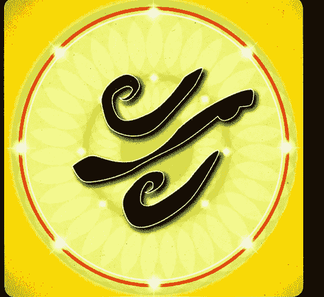

## 實用的智慧

Practical Wisdom

落實，意即做當下最需要做的事

雪士達山之龍 阿德洛 Dragon Mount Shasta

## 十六、實用的智慧 Star Heritage

落實，意即做當下最需要做的事

～雪士達山之龍 阿德洛 Dragon Mount Shasta

- 顏色：藍與白
- 音頻：阿德洛 Adeloooooooooo

這條龍是雪士達山之龍，有非常多人曾在雪士達山看見並感受到這條龍的能量。現今，很多靈性老師定居在雪士達山，因為那是一個入口門戶，通往雪士達山底下的一個地心城市～桃樂市。

這條龍守護著什麼力量呢？這世上有許多不同的智慧，但我們需要的是可以應用在地球上的智慧。很多來自宇宙的智慧並無法務實地運用在地球上，因為地球目前的處境仍是艱難的……試想，如果你的房子起火了，現在的你急需要一個哲學家還是一桶水？這條龍教導的正是我們在這一世的這個當下裡，最適合應用在你生活中的實際智慧，能夠幫助你去區辨什麼樣的事物對你此時此刻是最好的。我們生活中充斥著太多的訊息，什麼對你而言是最好的？你又如何知道呢？成千上萬本書，哪一本是你當前最需要讀的呢？這條龍，能幫助你明瞭此時此刻對你而言最好的那一個……

召喚這條龍一起工作時，你如何去分辨你最需要的事物呢？請相信你身體的智慧！你可伸出你的左手手指，像探測棒一樣尋找方向，這神聖女性智慧之手，會在三、四分鐘之內給你答案。你的身體從來不說謊，只活在當下意識之中，它會為你找到你的合適點。

這條龍也會協助我們去敞開我們的身體意識。你必須發展你的能力，用手指去找方向、找食物、找衣服……如果你想要一個答案，你可以坐下來問問你的身體，在一瞬間你的身體就會有反應。你需要擁有這些每天在生活當中可以實際運用的智慧。所謂薩滿，他們在村莊裡需要的正是這樣實際可用的力量，能夠在生活中協助所有族人。這些薩滿所做的，正是這條龍可以教導我們的實用智慧。

無論在生活中或工作、事業、感情裡……每當你在生命裡遇到挑戰，你可以請問這條龍：我在這樣的生活困境中，有什麼是實際立即可以做的？與祂連結時，請呼喚祂的名字～阿德洛 Adeloooooooooo，然後深深地呼吸著祂藍與白色的光，敞開身體去感受這股能量的滲透。

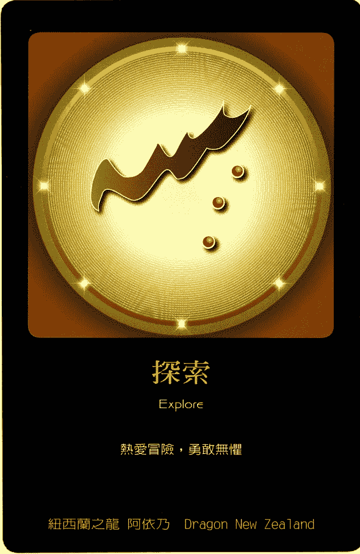

## 十七、探索 Explore

熱愛冒險，勇敢無懼

～紐西蘭之龍 阿依乃 Dragon New Zealand

- 顏色：淡金色、淡金黃色
- 音頻：阿依乃 Ainaaiiiiiiiiii

紐西蘭之龍～阿依乃，祂守護著一種能量，能為你的生活帶來更好的嶄新創意。也就是因著這股創造力，我們的生活才得以演變得更美好。這條龍把這股新的創意和點子播散在人們的腦海裡。如果當前的你覺得生命被困住了，請求這條龍在你生命中撒下一些新的靈感種子，當你採取行動時就會創造出新的實相顯化。

這條淡金黃色的龍，對應著你的喉輪和你的臍輪，這第二脈輪所在之處，帶著一種準備起身行動的力量。然而，這個起身行動的力量，究竟是出於求生求存，還是出於更高的意圖？你可以召喚這條龍來為你重新設置你的能量狀態。請在相對應的脈輪上觀想祂的光，並連結祂的名字～阿依乃 Ainaaiiiiiiiiii……

### MEMO

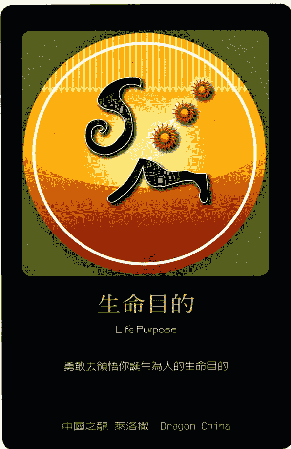

## 生命目的

Life Purpose

勇敢去領悟你誕生為人的生命目的

中國之龍 萊洛撒 Dragon China

## 十八、生命目的 Life Purpose

勇敢去領悟你誕生為人的生命目的

～中國之龍 萊洛撒 Dragon China

- 顏色：鉑金色，帶一點土耳其藍
- 音頻：萊洛撒 Railossaaaaaaa

這條龍～萊洛撒，祂教導人們記得要落實紮根於地。當人們初來乍到地球時，他們能夠維繫和自己星星故鄉的連結，這個連結也讓他們感覺到慰藉。然而，隨著時光流逝，這個連結也愈來愈薄弱……很多靈魂一來到這個星球就立刻想要轉身離開，這些令人措手不及的猝死症狀常在嬰兒期發作，找不出任何原因也無從治療，就彷彿這些靈魂想要從這個現實世界裡逃脫……這條龍，將會教導這樣的靈魂落實在地球，祂會提醒他們：有一份合約必須在他們誕生為人之後去履行，祂也會守護他們好好活在這個星球上。

召喚這條龍，可以協助人們落實自身的能量，並且幫助人們瞭解自己的生命目的。祂同時也協助人們理解一種負責任的承擔性創造！何謂負責任的承擔性創造呢？每一件事物都會帶來它的結果，你必須得去面對。所以，創造其實也伴隨著一個很大的責任，為什麼很多人害怕創造？因為他們對於這個責任感到恐懼……這條龍能幫助你有意識地去了解你的創造，以及它所帶來的結果。

萊洛撒最大的力量在於祂會推動你去採取行動！你的行動力是流暢的還是受阻的？這點非常重要，唯有你能採取行動，你才有辦法創造新的實相！這條龍讓你明白什麼是負責任的創造，讓你去了解你的創造以及它隨之帶來的結果。此外，這條龍也幫助你成為一個落實紮根、富有行動力的人，以一種負責任的態度去創造顯化實相。

這條龍的能量位在你的頭頂上，顏色是鉑金色帶有一點點的土耳其藍，召喚祂的名字～萊洛撒 Railossaaaaaaa

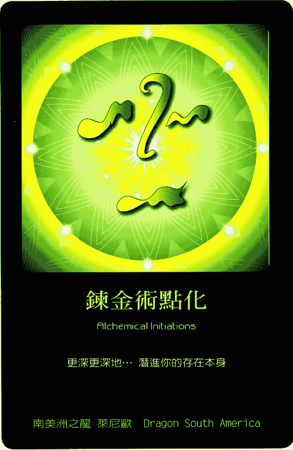

## 鍊金術點化

Alchemical Initiations

更深更深地……潛進你的存在本身

南美洲之龍 萊尼歐 Dragon South America

## 十九、鍊金術點化 Alchemical Initiations

更深更深地……潛進你的存在本身

～南美洲之龍 萊尼歐 Dragon South America

- 顏色：深古銅色
- 音頻：萊尼歐 Rainioueeeeeeeeeee

南美洲之龍，萊尼歐，祂代表著神秘學的秘密知識，這也正是為什麼在南美洲有著最高比例的薩滿和豐富的神秘學奧秘。這條龍的力量不是給那些心智脆弱的人所用，你必須要很勇敢強大，才能駕馭得了這股力量。

萊尼歐會幫助你理解鍊金術！大地是一個魔法所在之處，藥草植物的神靈、水的神靈、花的神靈、石頭的神靈……魔法只有在這些元素、這些能量存有的支持之下才得以發生，所以，對鍊金術的奧秘渴望了解的人，請跟這條龍工作。

有一個神秘的代碼在你的後頸椎，在你後腦勺下方，大約你整個頸椎的中央部位偏下方一點點，也就是你的頸椎根部往上一些……請用左手食指對準那個位置，順時針轉圈。它是一個極為敏感的能量點，非常多的智慧貯藏在這裡面，當你啟開這個地方，你會開啟一個非常不同以往的理解，你對這世界的知曉，會提升到太陽系的層次。

這就是我們身體內在的神秘學代碼、奧秘的代碼。被施作的人請保持閉上雙眼，不要睜開。而施作者請用左手食指持續進行二分鐘以上。一旦你開啟了這股能量，它不會隨時間而逝，它會一直與你同在，只要你再度專注去連結這個已啟動的能量，它就會開始擴展，你會逐漸想起在你身體之內的那個奧秘。

當我們開啟你身體當中的奧秘代碼，這個神秘代碼能量所貯存的地方，你很可能會在啟動時或啟動後的一段時間內，看見白色的獵豹、黑熊，或者是蛇、白水牛……這些都是奧秘的力量動物，這些動物會帶著你去到奧秘的領土。你很容易在這個啟動中看到和力量動物相關的畫面……這條龍以這樣的能量來支持你。

自己做這個啟動並不太容易，你可以找個信任的夥伴幫助你，請他用左手執行，那是我們的神聖女神之手，這也是最高的良善之手，你會用這隻手來創造許多最高最良善的事物！很棒的是～無論是施作者或被啟動者，都將會同時被這股強大的能量所開啟。

南美洲的龍，顏色是深古銅色，請觀想這個顏色在你的手掌中，召喚祂的名字～萊尼歐 Rainioueeeeeeee

### MEMO

## 大師之龍

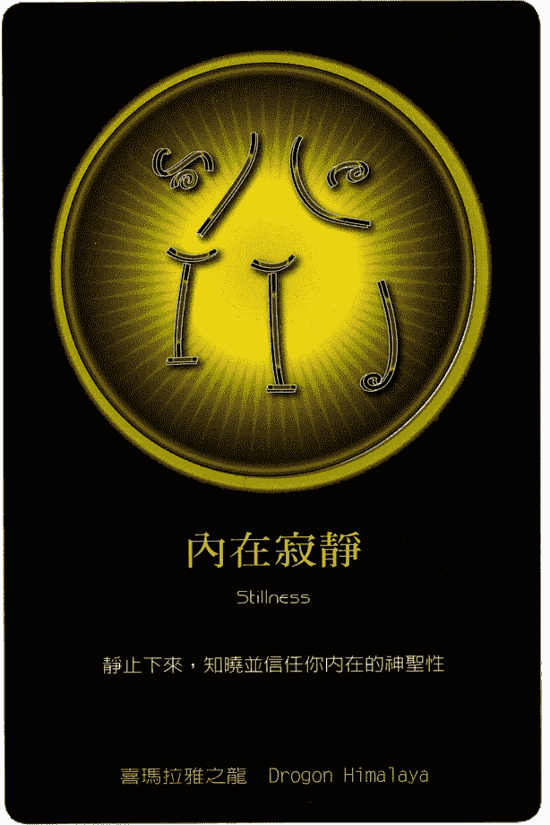

## 內在寂靜

Stillness

靜止下來，知曉並信任你內在的神聖性

喜瑪拉雅之龍 Dragon Himalaya

## 二十、內在寂靜 Stillness

靜止下來，知曉並信任你內在的神聖性

～喜瑪拉雅之龍 Dragon Himalaya

喜瑪拉雅之龍，祂是耶穌上師的龍。祂請求我們花一點時間在日常生活中保持寂靜，好讓自己得以聽見靈魂的輕聲低語……這條龍可以幫助我們進入內在世界，然後處於這樣的寂止之地。祂也被稱作「正念之龍」，將引領我們那不斷向外攀援的頭腦，開始往內走進自心。

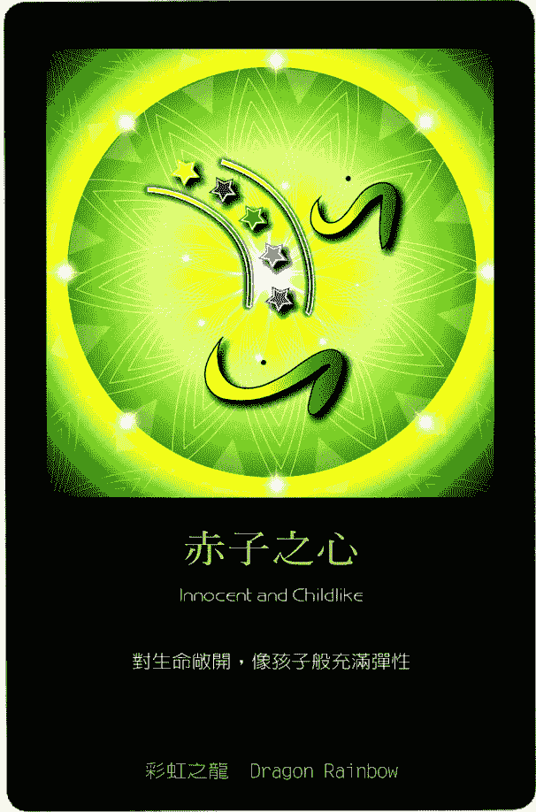

## 赤子之心

Innocent and Childlike

對生命敞開，像孩子般充滿彈性

彩虹之龍 Dragon Rainbow

## 二十一、赤子之心 Innocent and Childlike

對生命敞開，像孩子般充滿彈性

～彩虹之龍 Dragon Rainbow

彩虹之龍，連結著天使王國，尤其是大天使麥達昶。祂也連結著我們的第1到24脈輪。跟這條龍的能量一起工作，可以幫助人們更深刻地療癒脈輪，並且為脈輪帶來平衡。彩虹之龍也幫助人們去重新平衡在我們之內的幾何學、數學以及音樂聲調的神聖編碼。祂更協助人類去取得我們與自然王國之間的平衡。

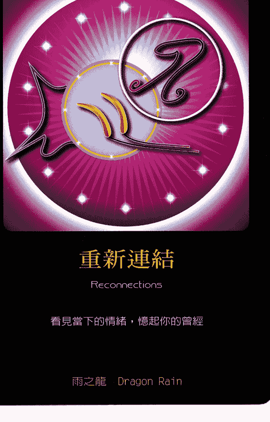

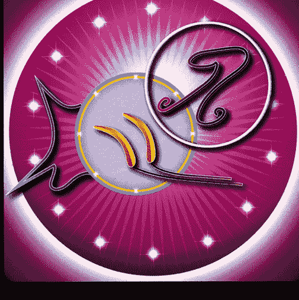

## 重新連結

Reconnections

看見當下的情緒，憶起你的曾經

雨之龍 Dragon Rain

## 二十二、重新連結 Reconnections

看見當下的情緒，憶起你的曾經

～雨之龍 Dragon Rain

雨之龍，是觀音女神的龍，也是聖母瑪麗亞的龍，祂代表著女性的智慧。有各式各樣的智慧，而這條龍將幫助人們去尋找的，是在我們之內的「水」的智慧，我們的血液也就是我們體內的水。這條龍也幫助人們去平衡「愛」的能量，愛有許多種形式：我們對自身的愛、對其他人的愛、對配偶的愛、對孩子的愛、對父母的愛、對同事和朋友的愛，以及對大自然和動物的愛……等等，這條龍可以平衡所有面向的愛。

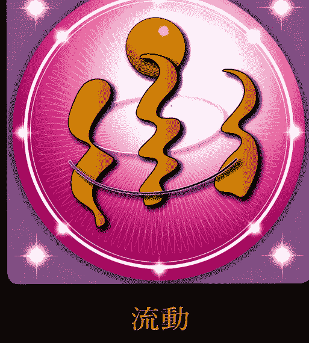

## 流動

Flow

敞開自己迎向改變，你是被支持的

季節之龍 Dragon Seasons

## 二十三、流動 Flow

敞開自己迎向改變，你是被支持的

～季節之龍 Dragon Seasons

季節之龍是佛陀上師的龍，祂能幫助人們去順隨生命之流而行。反抗生命只會受苦，祂幫助人們在面對「改變」時，能保持敞開和彈性，對生命中的轉變毫無畏懼。時時刻刻，我們都能順隨生命，適應生命中的任何轉折。

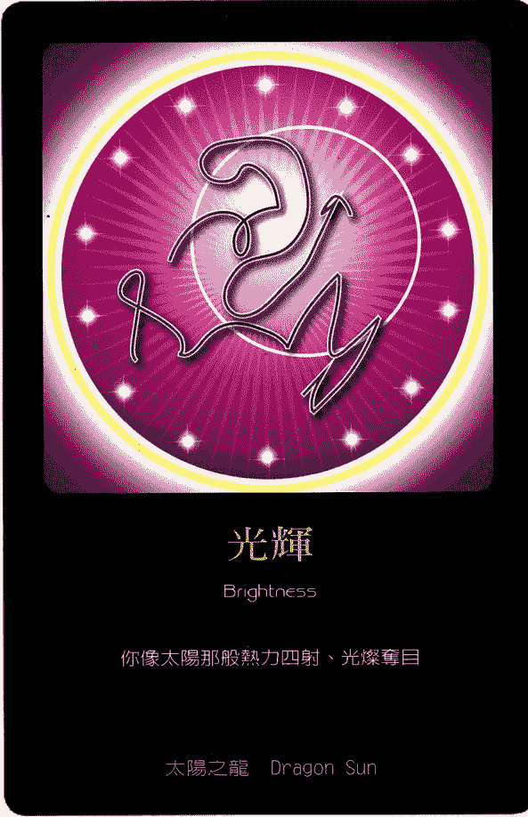

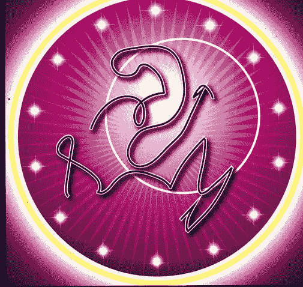

## 光輝

Brightness

你像太陽那般熱力四射、光燦奪目

太陽之龍 Dragon Sun

## 二十四、光輝 Brightness

你像太陽那般熱力四射、光燦奪目

～太陽之龍 Dragon Sun

太陽之龍，是默基瑟德上主的龍，這條龍可以幫助我們去平衡內在的太陽能量。所有的種子想長大成熟都需要陽光，我們也需要太陽的能量，好讓我們去綻放自身的所有潛能。太陽之龍會帶給我們歡樂和笑聲，讓我們的生命發光。這條龍也可以幫助人們去開啟亢達里尼能量，那是一股非常非常強而有力的能量，請和祂輕柔地合作。

龍之力量：療癒圖騰卡／瑞．強德蘭 傳訊；黃裳編著．— 初版．— 臺北市：募眾元吉文化事業，2017.04  
面；公分．—

ISBN 978-986-94722-1-0（平裝）

- 1. 靈修

## 龍之力量～療癒圖騰卡

| 項目 | 內容 |
|---|---|
| 傳訊 | 瑞．強德蘭 |
| 文字編輯 | 黃裳 |
| 美術編輯 | 聚創設計／ONE |
| 發行人 | 黃杰茵 |
| 出版發行 | 黃裳・元吉文化事業 |
| 聯絡地址 | 台北市仁愛路四段345巷4弄5號1樓 |
| 聯絡電話 | (02)2778-2133 |
| 網址 | http://www.yin-yang.com.tw |
| 信箱 | tao@yin-yang.com.tw |
| 總經銷 | 吳氏圖書有限公司 |
| 電話 | (02)3234-0036 |
| 印刷 | 承峰美術印刷 |
| 電話 | (02)2225-7055 |
| 整套定價 | 880元 |

2017年4月初版  
版權所有・翻印必究  
（本書如有缺頁、破損、裝訂錯誤，請寄回本公司更換）