三易本刚柔之气，周流六虚；六壬法动静之宜，取合四课。贵人法紫宫之主宰，日幹本太阳之躔离。璇玑以法大造，窥要会以定方来。圣人以此洗心，待时乘运；贤者由兹触智，观妙钩元。

## 六壬粹金

刘科乐◎著

华龄出版社

责任编辑：薛治
责任印制：李未圻
封面设计：高一扬

本书是刘科乐先生继《大六壬断案疏正》后的第二部壬学专著。本书不仅系统阐述了六壬课式与断要的内在逻辑结构，更从传统天文历法学和易学角度，对六壬的源流及起式的原理予以说明，从而揭示了六壬时空大卦的一般性原理，视角独特。作为刘氏断应法的导论，作者重注了壬学的两大主体——毕法与课经，使得学术性与实践性高度统一。

ISBN 978-7-5169-0773-3

定价：68.00元

## 六壬时空

刘科乐◎著

华龄出版社

责任编辑：薛治
责任印制：李未圻

## 图书在版编目 (CIP) 数据

六壬时空/刘科乐著.一北京：华龄出版社，2016.9
ISBN 978-7-5169-0773-3
Ⅰ. ①六… Ⅱ. ①刘… Ⅲ. ①占卜－研究－中国 Ⅳ. ①B992.2
中国版本图书馆CIP数据核字（2016）第227477号

- 书 名：六壬时空
- 作 者：刘科乐 著
- 出版发行：华龄出版社
- 印 刷：九洲财鑫印刷有限公司
- 版 次：2017年1月第1版 2017年1月第1次印刷
- 开 本：720×1020 1/16 印 张：26
- 字 数：413千字
- 定 价：68.00元

- 地 址：北京市西城区鼓楼西大街41号 邮 编：100009
- 电 话：(010) 84044445 传 真：84039173
- 网 址：http://www.hualingpress.com

## 序言

本书的写作，缘于2008年新加坡贤绅士黄耀宗兄的邀请，为异国的华人壬友讲授《大六壬刘氏断应法纲要》。回国后，考虑到国内推广壬学的需要，对《纲要》进行了适当修改，订为《传统六壬深研讲义》，以区别于新国讲习所用者。这两个教材一用就是四年，在讲学过程中，渐渐发现了一些存在的问题，毕竟讲义只起到一个提纲的作用，必要时可以配合大量PPT的演示页和板书展开，所以讲义的论述过于精简，案例的文字讲解还有待充实。

既然不满足于自己的教学提纲，就产生了写一本个人壬学专著的念头。于是在《大六壬断案疏正》出版发行的一年后，决定以国内的《讲义》为蓝本，撰写一部《六壬大占纲要》。《壬占纲要》初定的写作计划大致是，从基础阴阳五行学的运用原理入手，到《开启宗门》的起课教程，再就是国内《讲义》中的全部内容，包括对壬式占断八门基本构造、神将一类象系统的阐述，传统《毕法》、《课经》的运用原理等等。

但壬学爱好者都明白，六壬无论是在起课方面还是判断方面，都与中国古代的天文学、历法学有着深刻的关联。所以，《壬占纲要》的写作一开始就增加了农历历法及六壬月将、神将天文学依据的介绍。随着写作的深入及个人对六壬时空结构理解的提高，又加入了六壬时空观及时空大卦的演绎。由于我在六壬时空大卦方面的探究和实践也渐成体系，有一段时期，甚至有将两部分内容区分开，单就《大六壬时空观》写一部专著的计划。但回过头想想，传统壬学也好，六壬时空观也罢，六壬终归还是六壬，似将两部分内容对应起来融为一炉，比对起来更具可读性和趣味性，于是边写边改，在改进中不断完善全书的逻辑结构。

本书的撰写，历时整整五年。随着写作的推进，最终在郑同老师的建议下，确定书名为《六壬时空》。在篇目的编排上，作者费尽心力，力争能把个人日常占验实践所用的判断逻辑展现给读者，但同时却要顾及初学者由浅入深的学习与领会。从纯学术角度讲，这对我是一场重大的挑战。因为日常占验中，我会因占类的不同，情境的不同，凭实践经验灵活取用判断，理气线索丰富，并不单一。而现在要我把针对各别人事的判断逻辑以一整套统一的象数逻辑形式敷陈推衍出来，实在是一个既枯燥又熬心的工作。特别是《大六壬时空观的一般性原理》这一章，就我个人对宇宙、时空的理性认知范畴来写，还不算难事，但要我把在演绎时空大卦时的心理体验描述出来，还要让读者大致明白，就无比困难了。为了说明纯心理层面的体验，不得不用到种种比喻，可语言文字终究是苍白的，到底也没能把我在断课当下，看着课式心中浮现的“影像”，及这些“影像”化生的过程完全说明。这就需要读者在日后自己的实践中去不断体验了。

本书另一个难点就是关于《毕法》理气结构的讨论。《毕法赋》一直是传统壬学的精典歌赋，凌福之所注《毕法》继《口鉴奥旨》后，是唯一一个以《毕法》命名的注本，脍炙人口，也是迄今为止最权威的一个注解。但在我看来，它就像一栋古宅，凌氏原注对于这栋宅第原是极尽华美之能事的装饰，但经历了近千年后，奢华不再，华厦将倾，已到了亟待整修的时候了。纠结了相当长一段时间后，终于下了很大的决心，对其进行重注。

“古宅”的维修最好是先将屋子的基本结构图录下来，把主要构件按原样拆解下来，在图纸上标注明白，待构件粉饰一新后，再按图索骥，一一拼接回原处，做到外观上修旧如旧，构造上重焕生机。《毕法》的房式结构不仅如榫铆相楔，相关歌诀间的理气也如环索钩连，故本次注旨在塑造诸歌诀间的理气逻辑结构，乃名之《〈毕法赋〉遇真玉铃钩》云者。

《玉铃钩》既立足于凌注《毕法》，又有着与凌注本完全不同的理气模式。凌注本一句一解，每句诀下又设数个甚至十几个小格，无法体现课传理气的整体性和冲突性，有些小格和释义又出于书生臆揣，并不准确。我从多年占断实践出发，结合《六壬断案》的理气运用技法，认为《毕法》既本邵公案验拟象作歌，则诸诀间之理气必以课传为凭，钩链贯穿，具有整体的关联性。同时，诸关联之理气并非完全一致，如“昼夜贵加求两贵”，乃指二贵人相乘临言，或二贵又入传用，则成为“课传俱贵转无依”了。就一理气言，二诀构成要件都是二贵相加，但由动静与所处位置不同言，则前者主告昼夜两贵成事，后者则遍地贵人、贵多不贵，事无所托，告贵反主头绪多端，无所依从矣。又如“贵虽值狱宜临干”句，其先言贵人履辰、戌牢狱为嗔责，又指如乙、辛日占又宜贵人临身，一句中既含有冲突与矛盾，又包含了化解矛盾的方法。这些同一理气要素内蕴涵的冲突与和解，必须从得失、休咎方面把关联起来才能剖析清楚。所以在《玉铃钩》的注释过程中，我不再拘于一句一解——这一工作已由凌福之完成，而是从实际课传的视角，将相关的歌诀通联起来辨析，以突显出《毕法》诸诀内在关联性与冲突性的取舍。这是一项十分艰巨的工作，对壬式十二天盘、课传发用、理气往来必须有深厚的功底才能完成。

由于其中涉及的课式推算、理气节点太过丰富，作者虽力争释文准确无误，但整个注释过程仍有力不从心之感，故所引证之式盘或存在错漏处，望读者也能从作者整体的注释理念及良苦用心出发，偶见一二处盘式误排，善意地向作者提出来，以便在以后的校订版中改正过来。

《毕法》的学习，初期仍要多读凌氏注解，这个注本的好处是每句歌诀所涉理气要点解得非常清晰，就像医学院教解剖学，把人体肢解开来，一个脏腑一个脏腑地、由表及里地让学生观察、认知，每个脏腑又作若干层解剖，抽丝剥茧式地再作分晓。由巨而微，适合初学一句一句去对照掌握课传中的某处特殊乘临理气节点的断应用象。在熟悉了《毕法》每条歌诀的理气要素后，以《玉铃钩》为线索，深彻理解《毕法》的整体关联性和相关冲突性。这就像到医院里的见习医生一样，面对鲜活的病人，就要有一个整体观念，病人说腹痛，就要考虑整个消化道出了问题，而不是一个肝、胆、胃或十二指肠、小肠、升结肠、横结肠等部位。如病在十二指肠，又须上连通于胰、胃，右通于胆，作病灶的进一步排查。或者也可以把凌注与作者的注释比作西医和中医，凌注如西医，胃病治胃，肝病医肝，检查明确，针对性强；《玉铃钩》如中医，凡病必究其源头与传变，如《金匮要略》云：“夫治未病者，见肝之病，知肝传脾，当先实脾”，言肝病有传变为脾病之可能，所以虽见肝病，却实脾为先，保脾固本，避免治了这头，病却传到他处，按了葫芦起了瓢，越治越病的弊端。但无论西医、中医，了解清楚人体的构造与各器官的功能实属必要，因此，学习六壬，凌注为基，刘注为课传全体大用，由初级而趋进阶运用，两者不可或缺。凌注者关联性较差，失之于机械、刻板，然不读凌注，则无以悉知《玉铃钩》之妙，这一点读者必须清楚。

至于《课经》诸格的学习和掌握，不必急在一时，可以在实践过程中个个击破。我个人掌握课体诸格，大概花了两三年时间，一方面多读《六壬断案》，邵公案验多由体格切入判断，是认识课体的一个范例来源。但就像别人给你介绍某人长相、性格，到底没见到本人，只是一个大概印象，见识到了本人，初相交接，才识庐山真面，以后再见就不会认错，故自己放胆去实践也必不可少。

讲到这里，也许读者方面仍会有一顾虑，就是作者这次公开出版的《大六壬时空观》，会不会藏诀，将内部讲义中的某些所谓秘诀加以删改。这点读者可以完全不必担心，《传统壬学深研讲义》全文99页，未足本书1/3。本书不仅全文引用讲义，还整理并引入了相关课件与板书，使读者可以一窥日常讲习之全豹。

本书是对传统壬学的一次构造性重组，传统壬学古籍丰富，互作传抄，各学习要点重复引申繁多，有时关于同一要点论述，诸书还有矛盾处。作者根据个人十数年的实践，对古籍中的重复内容进行了总结，矛盾的问题加以辩证厘清。更以个人常占思路为指引，对各学习阶段的要点作为逻辑结构的调整。在总结传统壬学的同时，将本书作为一个整体，编为《六壬刘氏断应法·导论》。书中以“因类取象”作为刘氏断应法的大宗法，分取“八门定象”作《八门金锁》一卷；阐明神对应象、将对应类，明确神将乘临关系对应象类取验关系，作《肯堂肯构》卷；后更作《营造式法》卷，藉《毕法》全面讲解课传、神将之理气往来；终于《课体》大体格之述要，喻为《唐顿庄园》卷。其中神将分开、类象分清的讨论，是“刘氏断应法”神将一元大论的引导，《玉铃钩》是理气归象大论的引导，而此二大论又直指期候应象大论。虽然本书未涉“刘氏断应法”之原理，但对于有志于进而探索壬学真义的读者，本书可以说是“刘氏断应法”的阶梯。希望本书的出版，能让读者有开卷有益之感，于当代壬学之继承与传播有所裨益，则吾心足矣！

在本书写作的中期，作者有幸经黄耀宗兄力荐，开始接触赖公风水。近年来广读赖布衣、张九仪书，力追巨宗先贤，由中国古代天文历法学契人，研究风水学的源流与当代应用。结果发现，赖公风水与壬学同出于古星象学，同源而用殊，故又将赖公天星天合风水的堪舆和涓吉与大六壬融合，全新的《刘氏易经时空观》观也正在构建之中。本书作为《刘氏易经时空“天时部”》先行出版，只是一个缘起。将来拟就赖公风水罗盘与择日课学分著“地利部”与“人和部”，以《黄帝阴符经》为主导，将《阴符》分解三遍，以全、地、人三才之极，道、法、术三章之体用也。

写作晚期，因作者的考据癖作怪，又有些上古天文、历法学的新发现。如农历是否由之前就存在的三部独立的历法，即太阳历法、太阴历法与一部干支历法整合而成，干支历法是否即史籍中提到的《甲历》等等。原想就这些新内容对时空观作进一步补充和调整，但虑及全书统一的逻辑架构，与作者心力之不及，只能暂时作罢。将相关考证留待将来，亦学问之道循序渐进使然之事也。

学问一事，或有囿于时文而不能追溯高古、倡导将来者，然余之治学，向未曲学阿世，则于心不昧矣！

## 目录

## 卷一 万法归宗

第一章 原道古始

第一节 观天之道，执天之行，尽矣！

第二节 太极立成

第二章 一阴一阳之谓道

第一节 太阳历法

第二节 太阴历法

第三节 闰余成岁

第三章 原数之本

第一节 天有五贼，见之者昌

第二节 五行生成

第三节 至静之道，律历所不能契

第四章 原术之用

第一节 生克六亲

第二节 干支五行

第三节 论支干合

第四节 刑冲破害

## 卷二 开启宗门

第五章 初肇式法

第一节 六壬其传尤古

第二节 玄女肇式略考

第三节 立名总义

第六章 大六壬时空观的一般性原理

第一节 六壬时空场之“月将”篇

第二节 浅析岁差

第三节 六壬时空场之“占时”篇

第四节 六壬地盘空间场

第五节 个体的时—空感受

第六节 六壬天盘时空场

第七节 六壬四课空间场

第八节 六壬三传时间场

第九节 周遍十方，曲尽三际

第七章 宗门九课

第一节 天发杀机，移星易宿

第二节 贼克法

一、日辰干支

二、干支四课

三、重审课

四、元首课

第三节 比用法

第四节 涉害法

一、辨疑

二、起式

第五节 遥克法

第八章 九式宗门的时空切换

《钤表》说明

第九章 呼神喝将

第一节 十二天将

第二节 天将治事

第三节 昼夜分治

第四节 顺治逆治

第五节 地发杀机，龙蛇起陆

第十章 四象、三才、八卦之文

第十一章 本命行年

第一节 本命行年

第二节 天人合发，万化定基

第十二章 金手指安神点将诀

第一节 地支排序

第二节 金手指安神诀

第三节 宗门九课

第四节 金手指点将诀

卷三 八门金锁

第十三章 王式的基本结构

第一节 先锋门

第二节 值事门

第三节 外事门

第四节 内事门

第五节 发端门

第六节 移易门

第七节 归计门

第八节 变体门

## 第十四章 王式理气的基本要素

- 第一节 干支日辰
- 第二节 干支定象
- 第三节 干支阴神
- 第四节 发用三传
- 第五节 五行六亲
- 第六节 五行旺衰
  - 一、四时休王
  - 二、生旺墓绝
- 第七节 六亲喜忌
- 第八节 八煞九宝
  - 一、八煞
  - 二、九宝
- 第九节 遁干述要
- 第十节 应期克择

## 卷四 肯堂肯构

### 第十五章 神将总论

- 第一节 因类取象
- 第二节 八门定象

### 第十六章 神将象义

- 第一节 天将总说
- 第二节 天神总说
- 第三节 天神形貌
- 第四节 禽星配位
- 第五节 神将象类

### 第六节 神将主事

#### 第七节 神将象义

### 第十七章 因类取象

#### 第一节 天将加临

-   一、贵人
-   二、螣蛇
-   三、朱雀
-   四、六合
-   五、勾陈
-   六、青龙
-   七、天后
-   八、太阴
-   九、玄武
-   十、太常
-   十一、白虎
-   十二、天空

#### 第二节 类象初探

#### 第三节 神将分开，类象分清

#### 第四节 神将相乘

### 第十八章 神煞运用原理

-   一、天时
-   二、宅墓
-   三、婚姻
-   四、事业前程
-   五、胎产子息
-   六、疾病医疗
-   七、行人出行

### 第十九章 类象喜忌

## 卷五 营造式法

引言
第二十章  重述阴阳五行理气之大要
第一节  普遍的阴阳学原理
第二节  干支五行
第二十一章   《毕法》要义
第二十二章   《毕法赋》遇真玉铃钩
第一法  前后引从升迁吉
第二法  首尾相见始终宜
第三法  帘幕贵人高甲第
第四法  催官使者赴官期
第五法  六阳数足须公用
第六法  六阴相继尽昏迷
第七法  旺禄临身徒妄作
第八法  权摄不正禄临支
第九法  避难逃生须弃旧
第十法  朽木难雕别作为
第十一法  众鬼虽彰全不畏
第十二法  虽忧狐假虎威仪
第十三法  鬼贼当时无畏忌
第十四法  传财太旺反财亏
第十五法  脱上逢脱防虚诈
第十六法  空上乘空事莫追
第十七法  进茹空亡宜退步
第十八法  踏脚空亡宜退步
第十九法  胎财生气妻怀孕
第二十法  胎财死气损胎推
第二十一法  交车相合交关利
第二十二法  上下皆合两心齐
第二十三法  彼求我事支传干
第二十四法  我求彼事干传支
第二十五法  金日逢丁凶祸动
第二十六法  水日逢丁财动之
第二十七法  传财化鬼财休觅
第二十八法  传鬼化财钱险危
第二十九法  眷属丰盈居狭宅
第三十法  屋宅宽广致人衰
第三十一法  三传递生人举荐
第三十二法  三传互克众人欺
第三十三法  有始无终难变易
第三十四法  苦去甘来乐里悲
第三十五法  人宅受脱俱遭盗
第三十六法  干支皆败势倾颓
第三十七法  末助初兮三等论
第三十八法  闭口卦体两般推
第三十九法  太阳照武宜擒贼
第四十法  后合占婚岂用媒
第四十一法  富贵干支逢禄马
第四十二法  尊崇传内遇三奇
第四十三法  害贵讼直作曲断
第四十四法  课传俱贵转无依
第四十五法  昼夜贵加求两贵
第四十六法  贵人差迭事参差
第四十七法  贵虽值狱宜临干
第四十八法  鬼乘天乙干神祇
第四十九法  两贵受克难干贵
第五十法  二贵皆空虚喜期
第五十一法  魁度天门关隔定
第五十二法  罡塞鬼户任谋为
第五十三法  两蛇夹墓凶难免
第五十四法  虎视逢虎力难施
第五十五法  所谋多拙遭罗网
第五十六法  天网自裹己遭非
第五十七法  费有余而得不足
第五十八法  用破身心无所归
第五十九法  华盖覆日人昏晦
第六十法  太阳射宅屋光辉
第六十一法  干乘墓虎无占病
第六十二法  支乘墓虎有伏尸
第六十三法  彼此全伤防两损
第六十四法  夫妇芜淫各有私
第六十五法  干墓并关人宅废
第六十六法  支坟财并旅程稽
第六十七法  受虎克神为病症
第六十八法  制鬼之位乃良医
第六十九法  虎乘遁鬼殃非浅
第七十法  鬼临三四讼灾随
第七十一法  病符克宅全家患
第七十二法  丧吊全逢挂缟衣
第七十三法  前后逼迫难进退
第七十四法  空空如也事莫追
第七十五法  宾主不投刑在上
第七十六法  彼此猜忌害相随
第七十七法  互生俱生凡事益
第七十八法  互旺皆旺坐谋宜
第七十九法  干支值绝凡谋决
第八十法  人宅皆死各衰赢
第八十一法  传墓入墓分憎爱
第八十二法  不行传者考初时
第八十三法  万事喜忻三六合
第八十四法  合中犯煞蜜中砒
第八十五法  初遭夹克不由己
第八十六法  将逢内战所谋危
第八十七法  人宅坐墓甘招晦
第八十八法  干支乘墓各昏迷
第八十九法  任信丁马须言动
第九十法  来去俱空岂动宜
第九十一法  虎乘干鬼凶速速
第九十二法  龙加生气吉迟迟
第九十三法  妄用三传灾福异
第九十四法  喜惧空亡乃妙机
第九十五法  六爻现卦防其克
第九十六法  旬内空亡逐类推
第九十七法  所筮不入仍凭类
第九十八法  非占现类勿言之
第九十九法  常问不应逢吉象
第一百法  已灾凶逃反无疑

## 卷六 唐顿庄园

闲话课体
第二十三章 课经
第一节 九宗十科门
第二节 淫浃门
第三节 新孕门
第四节 隐匿门
第五节 乖别门
第六节 凶否门
第七节 吉泰门
第八节 盘式门
第二十四章 六壬时空大卦漫谈
跋

# 卷一

## 萬法歸宗

### 第一章 原道古始

存在于广袤时空中之万物，无不有一肇始。此一肇始，溯其本原，当可推至现今科学界所谓宇宙大爆炸发生的前一瞬。盖宇宙固始自奇点之大爆炸，但其爆炸必有前因，而此一前因即是宇宙乃至万物生成之一大肇始。

《老子》开宗明义云：“道可道，非常道；名可名，非常名。无名，天地之始；有名，万物之母”，复云：“有物混成，先天地生。寂兮寥兮，独立而不改，周行而不殆，可以为天下母。吾不知其名，字之曰‘道’，强名之曰‘大’。”由是观之，万物之生于天地，成于天地，存于天地，并归根复命乎天地，皆由太初天地立名始。而天地立名之先，有道存矣！此“道”者，即天地由以安立之根蔕，万物得以生化之妙用，非神力人为造作之事也。故“道冲，而用之或不盈”。

《列子·天瑞》云：“有太易，有太初，有太始，有太素。太易者，未见气也；太初者，气之始也；太始者，形之始也；太素者，质之始也。气、形、质具而未相离，故曰浑沦。”此概言未有天地之先，“道”存在之状态也。复云：“清轻者上为天，浊重者下为地，冲和气者为人。故天地含精，万物化生。”此举“道”以为天地根。

或本科学家言，奇点在大爆炸之前，其体积、质量、密度、温度皆臻于至微、至重、至密、至热之极限界。《老子》类此之论曰：“视之不见名曰‘夷’，听之不闻各曰‘希’，搏之不得名曰‘微’，此三者不可至诘。”视之不见者，非谓其无光，是其光尝以吾人肉眼不可见之射线形态存在；听之不闻者，非谓其无声，其声波之频率又非肉耳所能闻知也；搏之不得者，又言其体积无限小、质量无限重、密度无限大、温度无限高也。“无”而至“极”，极变生有，故《老子》云：“天地万物生于有，有生于无。”

逮宇宙大爆炸之瞬息一动，空间迅速膨胀，时间由此开始；一阳萌动，一阴即应，时空攸分，两仪遂安。随着奇点大爆炸能量之释放，其温度、密度、质量急速下降。爆发出的海量光子、电子、中微子等基本粒子，一方面聚核以继续释放能量，一面又构成原子、原子核、分子等，此玄牝之门初开之情状也。其后各种粒子又进而复合成气团状星云，并最终形成吾人今日所见之宇宙。《老子》谓此曰：“玄牝之门，是谓天地根，绵绵若存，用之不勤。”

设归以言“道”，则又无外乎《老子》 “道生一，一生二，二生三，三生万物。万物负阴而抱阳，冲气以为和”之论。故道生者，无极而太极也。太极分两仪、四象、三才。三才即立，八卦攸分。八八六十四卦，三百八十四爻，总赅天地万物之生化也。《老子》云：“能知古始，是谓道纪”，以是。

#### 第一节 观天之道，执天之行，尽矣！

夫天地生成之道，本运乎自然之间，廓寥寥兮，无形无质。道之生一，清阳上举乎天也；一生二者，浊阴下凝乎地也。然天地之理则，必寄乎人心，是阴阳合，天地交，冲气和以生人，此全三才之极也。臾圣人出，观天地之生成、运化，始明其妙哉！

> 《易·系辞》曰：“古者包牺氏（伏羲）之王天下也，仰则观象于天，俯则观法于地，观鸟兽之文与地之宜，近取诸身，远取诸物，于是始作八卦，以通神明之德，以类万物之情。”此言伏羲象天法地，作八卦王天下之事也。

图二 伏羲 人文始祖

数千年来，伏羲作太极、八卦之文的史事，在中华人文“朋友圈”被转发了无数次，堪称中外咸化，妇孺皆知。不过，诚如黑格尔老先生指出的那样，“熟知的东西所以不是真正知道了的东西，正因为他是熟知的”。虽然《系辞》对伏羲观天察地、远求近取而作卦作了说明，但又有多少人真正去探究过画卦的原理呢？

成书于公元前5～2世纪之间的《周髀算经》①，是中国最古老的天文学和数学著作。其中有一段记载：“昔者周公问于商高曰：‘窃闻乎大夫善数也！请问昔者包牺氏立周天历度，夫天可不阶而升，地不可得尺寸而度，请问数安从出？’”请读者注意，周公因惑于包牺氏不用阶梯而升上天去测周天行度，没有尺寸却能量出大地的方隅，就谦虚地去向当时一位名叫商高的数学家求教，请他讲解“包牺氏立周天历度”的数据来源。这里提到的周公，也是《周易》最早的编撰者之一，既然《周易》与《周髀》都提到了伏羲，前者讲他画卦，后者说他测定周天历度，那么易卦与历度间也必然存在内在的关联性，而绝非偶然巧合。而周公问“历”之事，当可视为《系辞》“仰则观象于天，俯则观法于地”的注脚。

古人对“天”的理解，大致有两种。一种是感性层面上的“天”，以人头顶所对的，高于大地者皆谓之“天”，也就是通常所说的“天空”。另一种就是天文学意义上的“天球”概念，它是古代天文历算家为了观测天空中的天体运行，为“天”设定的“范围”。天体在天球特定轨道面上按一定周期，绕天球大圆一周谓之“周天”。

围绕天球圆心的“周天”大圆面理论上有无数个，但天体却只按一定的轨道运行的。由于古人是以地球为观测点，观察包括太阳在内的众多恒星及行星、卫星在天球大圆轨上的视运行，所以被观察对象的视运行轨道才能被称作“周天”。《黄帝阴符经》②开宗明义曰：“观天之道，执天之行，尽矣！”不仅把“天道”的基本概念定义为观察周天的天体运行，掌握轨道的行度测量，同时，也很好地诠释了圣人伏羲计算周天行度，制订历法的活动过程。

> ① 原名《周髀》
> ② 以下简称《阴符经》。

#### 第二节 太极立成

太极之立成，或传自神话，或推诸数理，其说虽歧，而推及上古圣人伏羲氏仰观天文、俯察地理制易之事，却理无二则。天象之最显著者，莫过于日月，故“周天历度”之推步，必自日月之行始。正所谓“太极之道，一（此曰“单”）以贯之”，故先明日影之测量与记录。

在图二的右图中，伏羲与女娲交尾而处，伏羲手中擎着一种叫“矩”的角尺，女娲高举着“规”。中国人有句老话，叫“没有规矩，不成方圆”，好像“规”就是用画圆的，“矩”则是用作画方的。其实不然，这两种工具不仅能画圆作方，而且还具有计算圆周、圆度和圆径的功能。这正是数学家商高要回答周公的，“商高曰：‘数之法出于圆方，圆出于方，方出于矩，矩出于九九八十一。故折矩，以为句（勾）广三，股修四，径隅五。’”这段论述大意是：数算的方法出于对圆和方的计算，而圆的计算方法又出于方，方的计算又出于矩，矩则出于“九九乘法”。所以选择一个直角矩尺，直角的两边分别是勾长3、股长4，按著名的“勾股定理”，可以算出斜边长等于5。

商高接着说：“既方之，外半之一矩，环而共盘，得成三、四、五。两矩共长二十有五，是谓积矩。故禹之所以治天下者，此数之所生也”，讲的是勾股定理运用在圆的计算方法。以勾长3和股长4分别作方，“环而共盘”，就得到了一个5×5，面积为25的正方形，25半之等于12.5。如果用圆周率计算的话，直径为4的圆周约为12.56。《周髀》所以举勾3、股4以互推方圆之算术，正是以4为直径的圆周值与勾股算得的结果非常接近，所以在尚未算得的原始测量的起步阶段，按这个比例等比放大矩尺，不失为推求更大圆周空间的一个好办法。《周髀》矩尺以方求圆的原理，从“矩”字的金文与矩尺的构造可见一斑。

根据矩尺的原理，折方为矩，在地上树立圭表，以方推圆，《周髀》谓之“方属地，圆属天，天圆地方”。

今人望文生义，指责古人想象中的“天”是圆的，大地却是平方的，不懂科学，使圣哲蒙受千古不白奇冤。不知“天圆地方”说已涉函数几何之运算，及天体轨道之度量矣。

有了测量工具，我们的人文始祖伏羲终于可以在周天范围内，开始他的原始天文测量工作了。用规、矩推方求圆得出的只能是360°正圆的周天度数，故《系辞》曰：“范围天地之化而不过，曲（矩尺）成万物而不遗。通乎昼夜之道而知，故神无方而《易》无体”；复曰“乾之策，二百一十有六；坤之策，百四十有四。凡三百有六十，当期之日”，“当期之日”者，360°配三百六十天乃理想中之日度也。

话说圣人刻圭于地，立表于圭，以记录和测量一年中日影的长短周期性变化，此即“昼观晷影”也。这件事说起来容易，实际操作却颇为复杂。比如首先要确定方向，其次要设定观测周期（年的长度），还要定时定点地记录日影，最关键的是还要用圭表定出某天的日影作为半径制作晷仪，逐日刻录一年中的日影变化。

这里，我们要感谢大自然赋予了人类磁力感应的方向感。虽然从一开始我们并不能从科学验证得知它的存在，但并不妨碍伏羲利用这一上天赋予的体感。有了它，再加上两个自然天体作为参照物，人类就可以确定方向了。第一个参照物当然是太阳提供的，太阳每天从一定的方位上升起，又在固定的位置上落下，日出和日落为我们提供了东、西两个方向。每天晚上，还有一颗亮星出现在群星璀璨的夜空中，它就是北极星。北极星是整个天球运转的中心，位置固定在地球自转轴延伸至天球面的交点上，即“天北极”附近，借助它可以确定南、北两个方向。方向一旦确定了，圣人伏羲就获得了天文观测的第一个基本坐标系——地平坐标。

周年的设定也有两个重要的来源。一是四季更迭，周而复始。二是四季中四个中点，即两分和两至点。在春分和秋分日，昼夜等长，而到了夏至日，昼极长而夜极短，冬至日反是。虽然在天文学上，这四天中的任何一天都可以作为回归年的起迄点，但由于春天是万物生长的开始，到了冬季万物伏藏于地，在习惯上人们把冬季作为一年中最后一个季节，因此出于综合考虑，用冬至日确定回归年，更符合天文学、生物学和气象学等自然科学的标准。

至于测影的时间，比较好确定，就是以正午日照最强烈的时候作为测影的最佳时间。“日中立竿测影”，即称为“晷”影。

晷影的观测工作需要“晷仪”来完成。晷仪是一种在圆盘上立竿的测影工具。圆盘半径的确定要借助于圭表。想象在我们的先民生活的北半球，经过一段时期的圭表测影，会发现夏季的某一天（夏至日）日中投影极短甚至没有日影，而冬季的某一天（冬至日）日中投影极长，于是就用日影极长之距为半径刻一圆盘，圆周按等距刻度钻69个圆孔，并标记数字，就制作出了原始的地平晷仪。如下图：

| 图六 内蒙古托克托出土汉代日晷 |
| :--- |
| 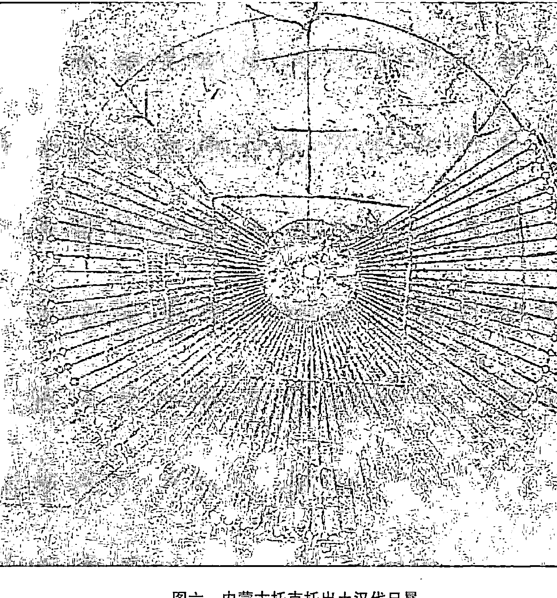 |

晷仪的工作原理是，于圆心钻孔立定表，用来测日影的修短；在圆周的钻孔立游表，标记不同时节日影的移动位置，以便确定各节气在圆周上的特定度数。今人按照这个原理，模拟了古人测影的过程，结果出人意料。

在日中投影最短的这天，也就是夏至日，设定夏至点为 A。日中测影时，定表、游表均固定不动，只转动圆盘，日移一孔，记录游表的影长。自夏至日中起，太阳逐日向南移动，圆盘随日影逆行向北，逐日增长。到冬至日太阳直射于南回归线，日中投影极长，影长由游表点达至定表点。此时夏至点 A 转至正北。期间所得日影之图，为仲夏以后，历秋季至仲冬半年间的日影。

### 第一章 原道古始

冬至日这天，将晷仪的圆盘和游表转 180°，使夏至点 A 和游表回到一表的正北，开始测量定表的影长。这一天日中投影极长，影长由定表点投至游表点。此后太阳自南回归线北移，圆盘随之逆转，日移一孔，所测日影日渐缩短。到夏至日中，日影极短。期间所得日影之图，为仲冬后，历春季至仲夏半年间的日影。

《周髀》中详实地记录了全年测影数据，曰：“冬至晷长丈三尺五寸，小寒丈二尺五寸，大寒丈一尺五寸一分，立春丈五寸二分，雨水九尺五寸三分，惊蛰八尺五寸四分，春分七尺五寸五分，清明六尺五寸五分，谷雨五尺五寸六分，立夏四尺五寸七分，小满三尺五寸八分，芒种二尺五寸九分，夏至一尺六寸，小暑二尺五寸九分，大暑三尺五寸八分，立秋四尺五寸七分，处暑五尺五寸六分，白露六尺五寸五分，秋分七尺五寸五分，寒露八尺五寸四分，霜降九尺五寸三分，立冬丈五寸二分，小雪丈一尺五寸一分，大雪丈二尺五寸”。

这里还要说明两点。第一，伏羲测影的时代还不存在节气的区分，所以不可能按节令记录影长。但只要伏羲在游表固定的前提下，按一定时间间隔，如每三天到五天转动一次圆盘，使游表进入圆盘上的下一个钻孔，就不会影响他描绘日影周期变化的曲线图。这幅曲线图无论是对伏羲，还是中原文明的开启，都有着非常重大的意义。

第二，由数据中“夏至一尺六寸”的影长记录来看，《周髀》测影的地点应在北回归线以北较远的地方。设想一个测影的理想地点，如在北回归线带上测影的话，夏至日这天的正午太阳正当立表的正上方，是没有日影的。那么比对《周髀》夏至影长一尺六寸，等比减除其余节气的影长数据，绘制出的日影周期变化的曲线当如下图：

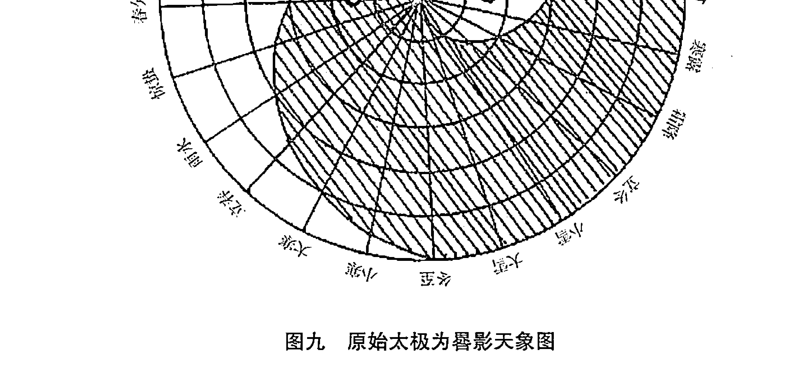

上图即伏羲所绘原始太极图。谓“太极”者，循名则实，以定、游表之两点各为极，晷影投射终点亦为各节令影距之最大者，则“太极”之立名可知矣！盖太者，大也；极者，大之限也。太极者，年中各时节晷影长度之极者也。太极图虽然只是一个平面，但所描绘的却是一年中晷影变化的三维影像。故《老子》云：“知其白，守其黑”，说的是欲知阳鱼之“白”，须守时观测日影投射的阴鱼之“黑”吧。

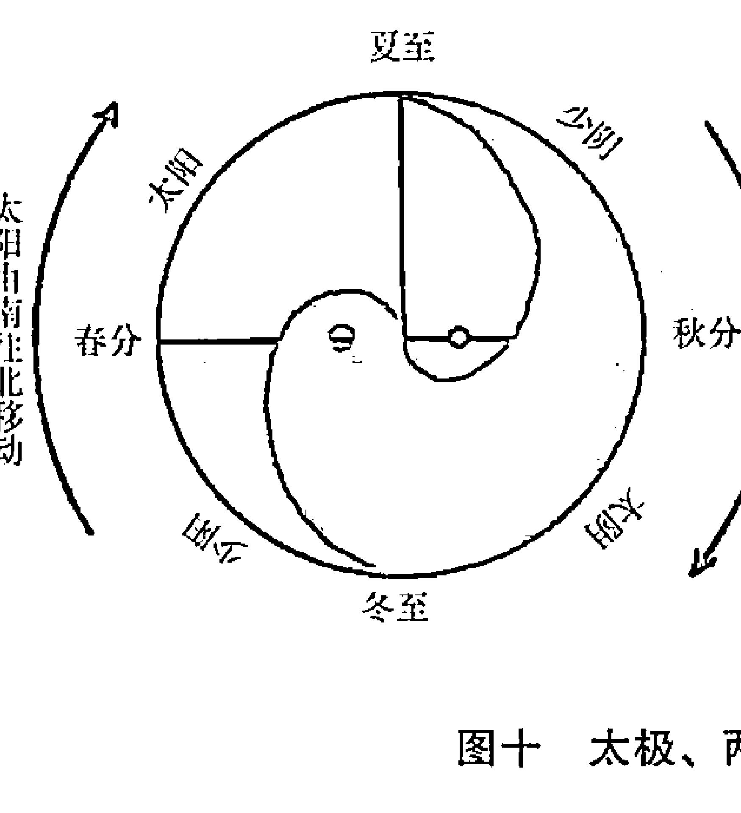

| 图十 太极、两仪、四象、八卦立成 |
| :--- |
| 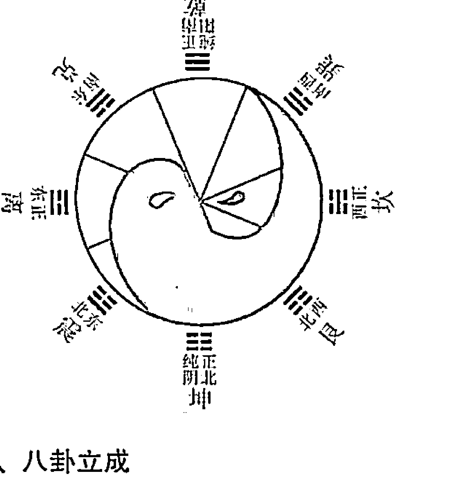 |

至于太极之分为仪、象、八卦，视图十可推。首先，将阴阳鱼头尾的交点定为夏至日与冬至日，两点连一线，分为阴阳两仪。接着，在两至线的中点（即太极图的圆心）画一条垂直线，垂直线的两端对应的日子影长刚好是冬至日影长的一半，即春分点和秋分点，这就区分出了春、夏、秋、冬四时，以对应太阴、少阳、少阴、太阳四象。在四象的基础上，在两条垂直线之间作各画一条45°角的斜线，八等分太极图，两线与太极图圆周的交点分别对应着节气上的立春、立夏、立秋、立冬四个节点，以配八卦。

太极图被八等分后，我们看到两至点顺时针方向的区域一者全白，一者纯黑，将全白者配乾阳之体，纯黑者配坤阴之体。由乾卦起，阳鱼左旋至第二宫，一阴居内，二阳居外，画兑卦；至第三宫，阴鱼之阳眼与外之一阳间一阴在中，画离卦；第四宫二阴在内，一阳在外，画震卦。上四卦，皆阳鱼所统。阴鱼右旋，由乾卦右旋至第五宫，得二阳履于内，一阴浮于上者，起巽卦；第六宫阴阳鱼之阴眼与外之一阴裹一阳在中，画坎卦；第七宫一阳在内，二阴在外，画艮卦。合纯阴之坤卦，四卦皆阴鱼所统。

### 第一章 原道古始

摄。由此可见，伏羲绘制的太极图和八卦方位依据的是阴阳对待之理，曰：“乾坤定位，山泽通气，雷风相薄，水火不相射，八卦相错。数往者顺，知来者逆”。

虽然画卦之初在历法上并没有确立二十四节气的名目和概念，但八卦的每一卦都统摄有阴、阳不等的三个卦爻，三、八二十四计，伏羲画卦之图，实际上已包含了节气划分的数理在内了。

由于伏羲太极图的配卦取象皆从自然、天地之道，被后世称为“先天卦序”，以别于周文王被囚羑里所演之“后天卦序”。

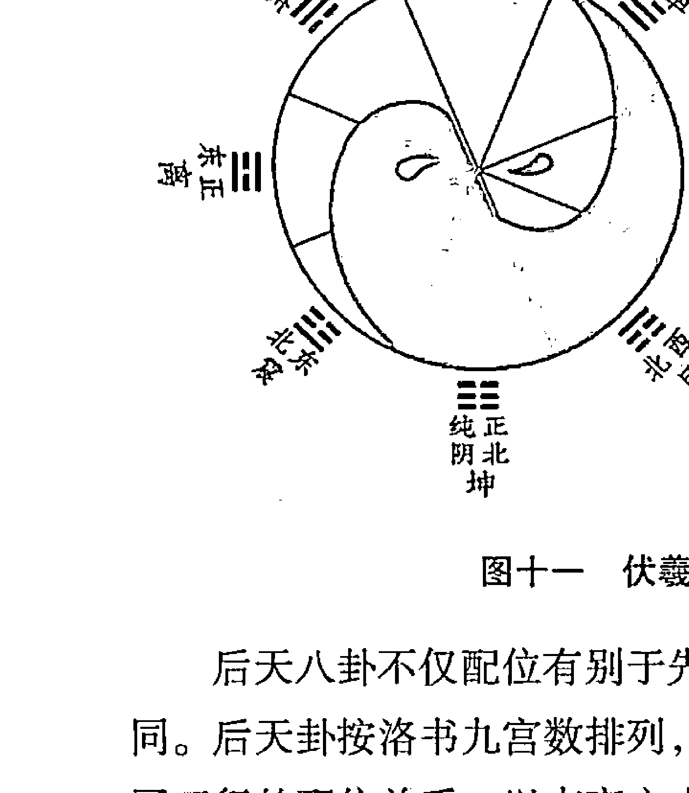

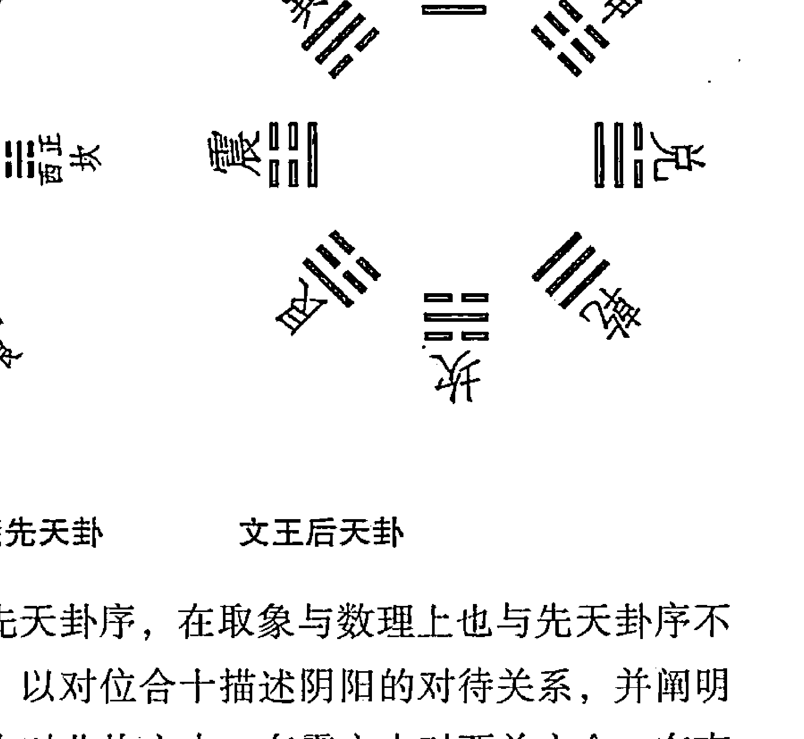

后天八卦不仅配位有别于先天卦序，在取象与数理上也与先天卦序不同。后天卦按洛书九宫数排列，以对位合十描述阴阳的对待关系，并阐明了五行的配位关系，以南离之火对北坎之水，东震之木对西兑之金，东南之巽木对西北之乾金，东北之艮土对西南之坤土。此外，先天卦以乾、坤二卦仿父母交媾之义，由乾交一阳于坤，生三男震、坎、艮；坤交一阴于乾，生三女巽、离、兑。后天卦对这种基本伦理关系进一步加以推衍，形成了尊卑、君臣、夫妇、长幼等社会结构。因此可以认为，先天卦反映的是自然立成之体，后天卦体现了社会伦常之用。前者曰“道”，后者化“德”。

### 第二章 一阴一阳之谓道

伏羲立圭制晷，日中测影，立成太极，成列八卦，为万世立则。画卦或许不是圣人推算历度之目的，但也不可简单地视之为测影过程中的一项偶然发现。作为中华人文之始祖，他与女娲合卺，生儿育女，开婚姻之礼俗，以全生生之人伦；布节令，订时序，指导百姓渔猎畜牧；调配琴瑟，缔造礼乐，与神农、轩辕并称上古三皇，为后继诸圣文王、周公、老子、孔子所推崇。故此，他在缔造中华文明之初，必定先有一个“顶层设计”的构想。伏羲之功，非伟在造物或设教，而在于汇天地万物生存规律之滥觞为中原文明之巨源也哉！

> 推行国历第一要注意的，便是使民众心悦诚服地来奉行国历。……总理所以要采取阳历，是为了适合经济制度，如预算等项。他的目的，完全为了民众的利益起见。并且奉行国历后，封建势力及迷信习惯，也可逐渐废除

文化之起源是一个大课题，本书立宗首要者，壬学逻辑结构之建立也；关要者，六壬时空观之推极壬占天文学依据，与六壬的科学性、合理性之阐明也。文化起源既不涉及本书宗旨要义，就不作展开了。

本章上承《周髀》之论历，对中国的旧历作一简单介绍。中华民国建立之初，为与国际接轨，民国政府把世界通行之公历定为“国历”予以颁行，并禁止民间继续使用旧历。在这场改历运动中，蔡元培流代表政府在《民国日报》上发表演说称：“推行国历第一要注意的，便是使民众心悦诚服地来奉行国历。……总理所以要采取阳历，是为了适合经济制度，如预算等项。他的目的，完全为了民众的利益起见。并且奉行国历后，封建势力及迷信习惯，也可逐渐废除”。可笑的是，演讲中时称公历为“阳历”，与此对立而必须被革除者，即称为“阴历”的中国旧历。从新旧二历在称谓上依旧袭用“阴阳”这点上可以看出，在革命党人与蔡元培流的灵魂深处，还没把他们指称的“封建迷信”一体革除，在文化思想上，他们仍死守着“封建迷信”之根源——阴阳之学这一最后的阵地。

我认为，所谓的“阳历”实际上应是“洋历”的谐音，而把旧历与“阳历”对立起来称为“阴历”，更属以讹传讹。中国最早的历法当推《大戴礼记·夏小正》，则夏时有历矣。历法之测算，既关乎天文测度，则必属于科学无疑。任何一个有历史的民族和国家，必有其历法，历法既依据科学方法制订，夏历使用之时又尚未实行封建政体，则蔡元培堂堂饱学名士，罔顾历算的科学性与历史性，将历法视作“封建迷信”势力与习惯之流弊，若非出于阿谀时政之需要，就只能是无知之尤了。

其次，中国之旧历，并不是一部简单的阳历或阴历所能涵盖的。它是一部以太阳回归年为周期，以月相周期划分朔望的“阴阳合历”。无论是阳历还是阴历，都不能涵盖这部旧历。以阴阳合历有指导农桑渔猎之基本功能言，似命之谓“农历”更为贴切。

#### 第一节 太阳历法

关于太阳历法的讨论，仍要从“周天历度”谈起。照我揣想，伏羲经过了一段时期的测影后，应该很快会意识到“周天”并不是一个360°的正圆球体了。原因很简单，在一整个太阳回归年中，按日行一度为一天计，360天后，观测者会发现上一个冬至日测得的影长比年终测得的影长要长一些。随着年复一年地测影，短则三、五年，长则十数载，影长的差距会变得越来越大。这种情况下，测影者的推论只能是，太阳并没有按360天为周年如期回到冬至点上，测影者反思，立表的高度没有改变，原始晷影的长距也是确定的，那么造成影长不确定的因素，只能是太阳视运行的实际周期比理想中的圆周周期要长一些，超过360天，按一天作一度计，周天行度就要大于360°。

经测算——此间只能遵从约定俗成的说法，姑谓之曰“测算”。但测算周天实际行度的工具一定不止于原始的圭表和晷仪，伏羲在缺少更为精良的测算工具的情况下，又用什么去实测“周天历度”的呢？这个问题困扰了我很多年，直到一个晴朗的乡村夜晚，我不经意地抬头仰望天际的一瞬，终于得窥“天机”，看到了伏羲用来测度的精确“工具”。可它是上天赐予的，又怎么能称为“工具”呢？美哉“神器”！它每天绕北极星顺时针运行一周，却又过一度。而太阳一日经天一周，相对于它反而是逆时针退了一度。这样，天赐“神器”与太阳渐行渐远，一年后复会于预先设定的起迄点，成其岁功。用这个“神器”定度，胜过所有人造的工具。

要问何方“神器”，答案就是“北斗七星”！

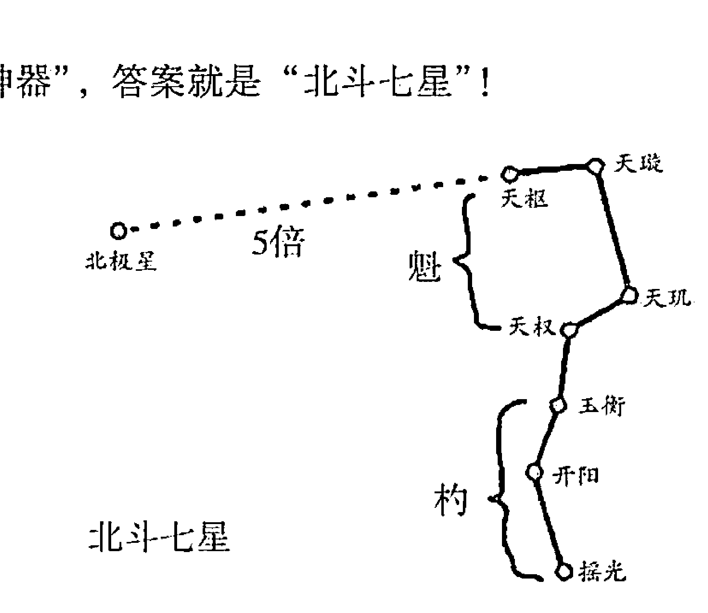

北斗星日行一度，像一块悬挂在天上的“百达翡丽”，周 365°有奇（实际行度约 365 \frac{1}{4}度）。对北斗星更细致地观测还会发现，约经 45 天北斗星的斗杓会指向周天上四立、分至八节的位置，这就为进一步在周天上标记 24 节气，区分阳历历月奠定了数据的基础。

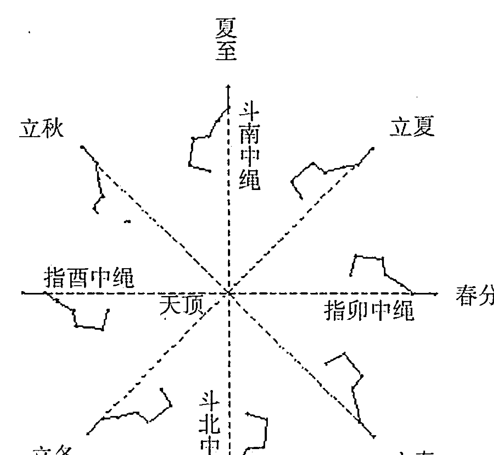

前面讲过，八卦对应八节，一卦历时约45天，以一卦统三爻计，每个卦所统之节气历时约为15天。这里我也只能说“约”，因为伏羲测历之初，应该还没有把时节交谈的时间精确到分数的计算方法。不过，这已经足够在一个太阳回归年的周期内，结合北斗星分度定节的方法，制订出一部原始的“太阳历法”了。

关于节气，《汉志》的论述是：“凡十二次，日至其初为节，至其中为中”，乃言斗初建于“节气”，节过其半至中者曰“中气”。又曰：“斗建下为十二辰，初其建而知其次”，此论黄道十二辰次者也。

#### 第二节 太阴历法

太阴历，简称“阴历”。是按月相朔、望周期制订的历法。太阳的视运行轨道叫“黄道”，而月亮则循行于月白，黄道面与白道面之间约有5°09′的“黄白交角”。

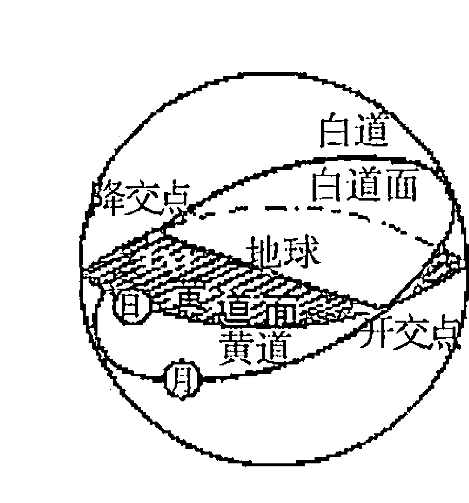

根据自然天象，当日、月在各自的轨道面上绕行至天球的同一经度上时，黄经差为零，日月合朔。此时，月球居日、地之间，其阴面正对地球，在地球上看不见月亮。阴历把这一天定朔为每个历月的初一，谓之“朔日”。随着黄经差的逐日递增，每月的十五日黄经差增至最大，可见到满月的月相，此为“望日”。此后，黄经差日复递减，至月末减至最小，名之“晦日”。朔、望、晦日之中点，即历月之初七、初八日为上弦月，廿二、廿三日见下弦月。一个朔望月周期的均值约29天有奇，乃以30天者为大月，29 天者为小月，年均十二个历月，约 354 天有奇全一小岁。实际的阴历平年，为 354 天或 355 天不等。

#### 第三节 闰余成岁

从天文学角度来讲，阳历与太阳回归年同步，节气上也与符合四季更迭的自然规律。可阴历的优点是便于划分历月与记日，且有利于监测地、月引力引起的潮汐运动。可问题来了，太阳历与太阴历之间有十天的度差（请注意，这里讲的是度差，而不是岁差），简单地把这样两部历法拼凑在一起使用，几十年后就会导致季节与气候相反的情况，又怎能指导农桑渔猎生产活动呢？

解决这一问题，通行的公历，也就是蔡元培言之凿凿 “完全为了民众的利益起见” 奉行的 “洋历”，干脆只用太阳历年，一年 12 个月，除 2 月份只有 28 天外，大月 31 天，小月 30 天，岁差每隔四年在 2 月份置闰一天补足。公历本质上是一部为传播宗教服务的历法。它以基督诞生为公元元年，“周”是分配月的最小单位。一周七天象征上帝创世纪，上帝创世用了六天，第七天上帝休息了，所有教徒也都休息，去教堂参加礼拜，故周日又叫 “礼拜日”。洋历的历月也贬善可陈，既不能反映四季，与月相朔望也不合拍。把这样的历法作为国家法定历法的唯一好处是，与基督教为主导的欧美强势政权国际接轨，说它能扫除 “封建势力与迷信习惯”，不过是用洋夷的宗教替换本土的神道罢了。

与抱有宗教热忱的欧洲圣徒不同的是，伏羲考虑更多的是，作为农耕社会的古代中国，一部准确反应季节变化的阳历固属必要，而渔猎网罟与潮汐运动的关系，又必究乎月相朔望。所以，只有编制一部协同性更好的阴阳合历，才能更有效保障社会生产活动的有序开展。此《系辞》曰 “一阴一阳之谓道”也。

要解决阴、阳二历间十天的度差，《系辞》提供的方案是：“大衍之数五十，其用四十有九。分而为二以像两，挂一以像三，揲之以四，以象四时；归奇于扐以象闰；五岁再闰，故再扐而后挂”。这段话一向被后世理学家与当代主张《易经》科学化、哲学化的学者们斥为异端与迷信，认为是有人故意把《易经》用到了占卜的歪门邪道上去了。可是《易经》是伏羲、文王、孔子三圣人所辑，这个故意把《易经》引向占卜的“有人”到底是三位圣人中的哪一位呢？圣人不敢冒渎，于是就有了画卦非出伏羲、经传非出文王之种种异说，致大好的一部《易经》成了无本之木、无源死水。

### 第二章 一阴一阳之谓道

所以说，读圣人书，吾人当先扪心自问，是否打心眼里把他们视作了圣人。《系辞》曰：“河出图，洛出书，圣人则之”，大衍之数用蓍草推演河图数理，怎可巫妄非之？

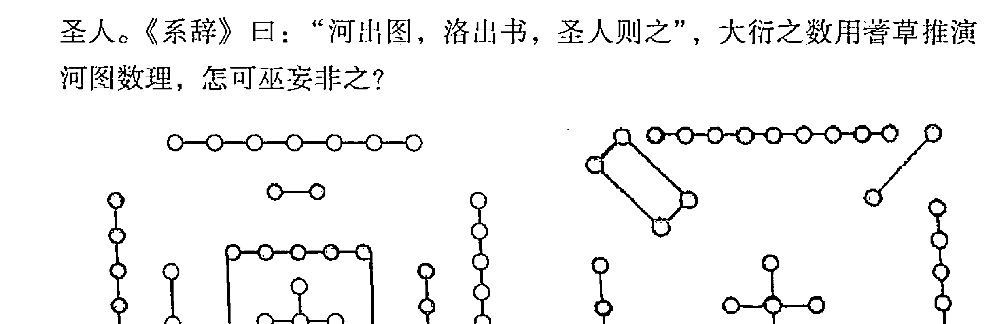

河图数由一而十，凡单数属阳，双数属阴，一至五为生数，六到十是成数，合五十五数。其中一、二、三、四、六、七、八九在大衍之数中各有数理，唯天五生数与地十成数居中，5 × 10 = 50，故大衍之数起自五十，天地生成自然之理趣也。其用四十九者，讲的是“天一”生数。我们知道，五十根蓍草分而为二，两份要么都是双数，要么都是单数，阴阳不分，两仪不立。今将其“一”者表太极，取出之，随手把剩下的四十九茎蓍草分作两把，其左手双数，右手必是单数；或左手单数，右手定是双数，如此两仪分判，此“地二”生数之理也。将两把草左右分置于筮床两大刻，左手取出左大刻中全部蓍草，右手取右大刻内之一茎，挂于左手无名指与小指间，使阴阳交而化生三才，曰“挂一以象三”者，此“天三”生数之理也。以右手四茎一组，数左手之策，曰“揲之以四，以象四时”，四时者四象也，四季也，此“地四”生数之理也。揲数的余数必是一、二、三、四中的一数，将余数扐于左手中指与无名指间，曰“归奇于扐以象闰”。这时用右手把过揲之策归还给左大刻，再取出右大刻内的蓍草，用左手去揲数，方法同前，数剩的余策扐于左手食指与中指之间，曰“五岁再闰，故再扐而后挂”。返还右手过揲之策于右大刻后，合左手指间所一挂二扐之数置于筮床小刻之内，是为一变。重复这样的过程三变其策，三变过揲之策的和必是24、28、32或36这四个数字中的一数，除以四必得六、七、八、九四数之一，凡双数画作阴爻，单数画作阳爻。三变成一爻，十有八变而成一卦，卦爻之六数者为老阴，九数者为老阳，用作卦之变爻；七、八者少，不用。这就是《易经》卦爻辞中用九、用六，及乾、坤合策三百六十以应周天行度的数理来源。因为六、七、八、九由生数揲蓍产生，可以用来画爻成卦，故为成数。

这一卜筮仪式中提到的“闰”，最终成为后世农历中平准阴、阳二历的置闰法，《千字文》谓之“闰余成岁”。闰法的推算虽然复杂，但《周髀》已推算出每十九年为一章，置七个闰月的历法，延用至今。置闰的规则是，平年的每个阴历的历月都会分配到阳历的一个节和一个气，十二个阴历月均分阳历二十四节气；当两个冬至间的一个太阳回归年的十二个月中，出现某个月只有一个节或一个气的情况时，就在这个月的后面置一个29天的闰月。闰年比平年多出一个整月，有13个月。置闰法使每十九年阴阳二历时差仅为2小时9分余。

最早关于闰月的文字记载，出现在殷商甲骨文武丁卜辞中，如卜辞中有称“十三月”或“冬（终）八月”、“多八月”等，较伏羲王天下之事晚了很多，但在那种没有文字和算术，所有工具和仪器尚需手创的年代，一个人从天上读取“文字”，向大地学习“道理”，观象授时，始制周天历度，揲蓍策算，始绘八卦之文，在文明草创之初，就构建了一种囊括了天文、数学、历算、气象等自然科学，以及礼制、农耕、医疗、音律等人文学科的顶层设计，并将之流传千古，这就不得不令吾侪后辈惊叹他的智慧了。试问，面对这样一位创始级的圣人，我们除了景仰，又有什么理由去质疑他的丰功伟绩只是神话传说，他行龟卜蓍是大搞迷信愚民一套呢？看看《系辞》是怎么夸耀这位圣人的恩德的吧：曰：“是故《易》有太极，是生两仪，两仪生四象，四象生八卦。八卦定吉凶，吉凶生大业。是故，法象，莫大乎天地！变通，莫大乎四时！悬象著明，莫大乎日月！崇高，莫大乎宝贵！备物致用，立成器以为天下利，莫大乎圣人！探赜索隐，钩深致远，定天下之吉凶，成天下之亹亹者，莫大乎蓍龟！是故天生神物，

### 第二章 一阴一阳之谓道

## 六壬时空

圣人则之；天地变化，圣人效之；天垂象，见吉凶，圣人象之。河出图，洛出书，圣人则之”。我每每读到这段文字时，除了由衷的叹服，还有对过往用无知非议圣人功业的无尽愧疚！《礼记·中庸》曰：“凡事，豫则立，不豫则废。言前定则不踬，事前定则不困，行前定则不疚，道前定则不穷”，不正是师法圣人、追怀圣德之言么？

### 第三章 原数之本

科学界揣想，在大爆炸发生后的1分钟内，宇宙发生了不可思议的剧变，最初的原子核形成。在伏羲画卦之后，中华文明也经历了一场大爆炸式的剧变。画卦制《易》，堪称为中华文明大爆炸之始也。

《易》有《归藏》、《连山》、《周易》之不同，《归藏》、《连山》亡佚已久，古今易学家释《易》之文献来源，皆本《周易》。《周易》分为卦、经、传三个部分。伏羲画卦，垂象而不立文字；文王对应羲爻卦象以系辞，作上、下《经》；孔子释《易》作《传》，分十个篇目附于《经》后，世称《十翼》之文。羲象备体致用，可谓全（诠）象之象，无文之文；文王作《经》演《易》之用，以文裁象，以象载文；孔子作《传》发明二圣体用，又不竟是二圣之体用与圭旨。故《系辞》云：“子曰：‘书为尽言，言不尽意。’然则圣人之意，其不可见乎？子曰：‘圣人立象以尽意，设卦以尽情伪，系辞焉以尽其言，变而通之以尽利，鼓之舞之以尽神。’”《周易》成书虽晚，不过就伏羲始画八卦，通阴阳消息变化之大义言，说它是中华文明之根源，似无不妥。

此后文明之江河继之而起，奔涌不息。在文明洪流之中，有一脉被称为“术数”的支流，单独形成系统，承传至今。详《国语》、《周礼》、《洪范》诸书，知华夏先贤原道立法，所有立政之本、立纲之纪、立礼之制、立民之用，无不上契阴阳之道，下合五行机枢。术数一学即以阴阳五行之学为主旨，旁涉历法、算术和中医诸学，察天之行，窥地之运，以推求人事休咎祸福之交变者也。

然《易》也者，阴阳之书契，未及五行也。《系辞》既言“悬象著明，莫大乎日月”，故圣人察日、月之行，以制合二历阴阳。但历算遗余之差度校正，非经世代密推不可穷则。圣人立法循道，至余度奇正，皆归穷“数”之“术”，故曰“术数”。道为本，术为末，圣人治本非不治末，盖如子曰：“本治而末乱者，未之有也”。故更究历算之术，明五行之由来也。

#### 第一节 天有五贼，见之者昌

《阴符经》曰：“天有五贼，见之者昌”，此何谓焉？盖昼夜有明晦，日月著阴阳，然阴阳之准度，非见识天之五贼者莫能为之。阴阳昭著，五贼唯日之已入、月之将升之际，天地幽暗之时，方能见诸，故名之“五贼”。“五贼”为何，金、木、水、火、土五大行星也。五行以轨道有远近，而经天一周亦有迟速矣。

土星：土星经天一周用时约为28年。《史记·天官书》① 论土星曰：“历斗之会以定填星之位。曰中央土，主季夏，日戊、己”。所谓“填星之位”说的是土星岁填一宿，一周填二十八宿舍度之位。二十八宿的定度在农历历法上非常重要，曰东方苍龙七宿角、亢、氐、房、心、尾、箕；南方朱鸟七宿井、鬼、柳、星、张、翼、轸；西方白虎七宿奎、娄、胃、昴、毕、觜、参；北方玄武七宿斗、牛、女、虚、危、室、壁。

上古的历算家将地球的自转面放大到天球面上，称为“天赤道”，天赤道垂直于地轴南北极的延长线——天轴南北极。又以地球为圆心，将太阳视运行轨道在天球面的投影称为“黄道”。黄道面与赤道面相交于春分点和秋分点，之间存在23°26′的“黄赤交角”。由于周天尽360°，而天度过之，约为365⅟₄度，古人为精确计量天体行度，首先以北天极为基本参照，计量天体的去极度②；又在周天上设定若干星座，各星座都有一颗主星称为“距星”，以此为参照物，计量天体的入宿度③。这时，28年的土星周就为距星的设定提供了“标尺”。配合土星岁经之度，确立二十八宿盈缩之度，既补足了周天不足之度与天行有余之度，也使入宿度的计量得以实现。因土星岁填（镇）一宿，又名“镇星”。

木星：每年在黄道上岁过一宫约30°，约12年经天一周，古人用之纪年，曰“岁星”。《天官书》论“岁星”曰：“察日、月之行以揆岁星顺逆。曰东方木，主春，日甲乙”。复云“以摄提格岁，岁阴左行在寅，岁星右转居丑。正月与斗、牵牛晨出东方，名曰监德。色苍苍有光”。《索隐》注：“太岁在寅，岁星正月晨出东方”。次年“单阏岁，岁阴在卯，星居子。以二月与婺女、虚、危晨出，曰降入。大有光”。按此顺序，辰年曰执徐岁，星居亥，三月与室、壁二宿晨出，曰青章；巳年曰大荒骆，星居戌，四月与奎、娄晨出，曰骈踵；午年曰敦牂，星居酉，五月与胃、昴、毕晨出，曰开明；未年曰叶洽，星居申，六月与觜、参晨出，曰长列；申年曰涒滩，星居未，七月与井、鬼晨出，曰大音；酉年曰作噩，星居午，八月与柳、星、张晨出，曰长王；戌年曰阉茂，星居巳，九月与翼、轸晨出，曰天睢；亥年曰大渊献，星居辰，十月与角、亢晨出，曰大章；子年曰困敦，星居卯，十一月与氐、房、心晨出，曰天泉；丑年曰赤奋若，星居寅，十二月与尾、箕晨出，曰天皓”。

由太岁与岁星的行舍来看，岁星逐岁逆退一次，周十二宫，合丑、子、亥、戌、酉、申、未、午、巳、辰、卯、寅十二辰次之位。而太岁则按寅、卯、辰、巳、午、未、申、酉、戌、亥十二地支的顺序顺推。地支属阴，纪年须配天干，天干属阳，即谓之“岁阳”，甲曰阏逢，乙曰旃蒙，丙曰柔兆，丁曰强圉，戊曰著雍，己曰屠维，庚曰上章，辛曰重光，壬曰玄黓，癸曰昭阳。在东汉《四分历》施行以前，岁星纪年法与太岁纪年法并行。后来因岁差逐渐增大，两种纪年间换算繁琐，岁星纪年法被淘汰，太岁纪年法则袭用至今。

水星：在太阳系中，水星轨道离太阳最近，所以只有在每天的凌晨或黄昏才能看到它，是定晨昏时刻的参照物，故命之曰“辰星”或“昏星”。

> 《天官书》论曰：“察日辰之会以治辰星之位。曰北方水，太阴之精，主冬，曰壬、癸”。

金星：古人称金星为“太白”，因其每现于日出之前、日落之后，故又名“启明”或“长庚”。有辅助测定日出、入时刻的功能。

> 《天官书》论曰：“察日行以处位太白。曰西方，秋，曰庚、辛。主杀”。

火星：火星与金星都是近地轨道行星，金星居内，火星在外。古人发现它时匿时明，进退不定，故称其为“荧惑”。

> 《天官书》论曰：“察刚气以处荧惑。曰南方火，主夏，曰丙、丁”。

由《天官书》对五大行星的记载可知，五星分主五种行气，谓“五行”者，即五大行星之行气也。因为五星之明均非星体本身发出，而是反

#### 第二节 五行生成

夫阴阳会通休咎之本然。阳者，动也、清也、明也、昌也，阳以合德，则无不元、亨、利、贞也。阴者，静也、浊也、幽也、伏也，阴以刑德，则休祥不辨，否泰相易也。五行之理则先分时序，后立纲纪。由是，则天下万物名类相异，有五色，有五音，有五嗅，有五味，有五邪等等，此五行乃分类立纪之说明甚矣。故《易》有阴阳，而五行之学与之相辅相成，同源不可缺一也。论阴阳而不谈五行之学，仅有抽象之本体论，虽至大无外，至小无内，亦无以辨物类、人事也；五行之由以立名，如不讲阴阳，则造化幽微之机亦无从推知耳。故天有日、月以表阴阳，复垂五星行气之象形诸地理之文。故水者，江河湖海、雨露泉涧之属也；火者，太阳、野火、灯烛、窑冶之属；木者，森林花草、五谷瓜果之属；金者，矿石、刀剑、首饰、钟磬之属；土者，大地、砂土、灰泥、陶瓷之属。

今更以河图生成之理明五行流行之变，古诀云：“一六共宗，二七同道，三七为朋，四九为友，五十同途”。此数理配天地生成之理也，法以一、二、三、四、五一组为天地生数，六、七、八、九、十为天地成数。

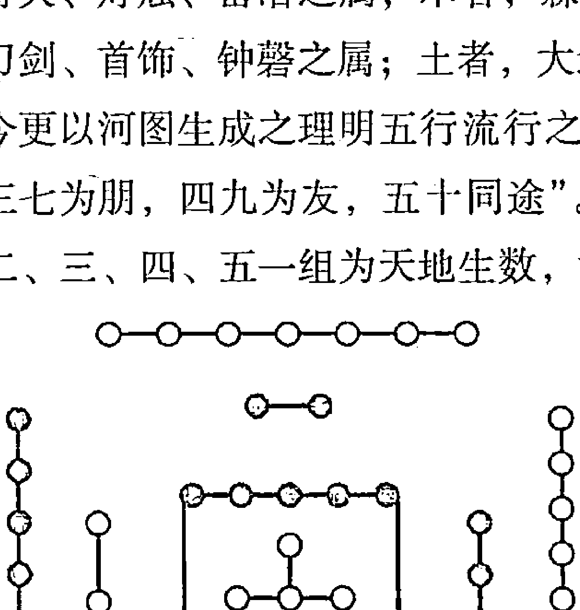

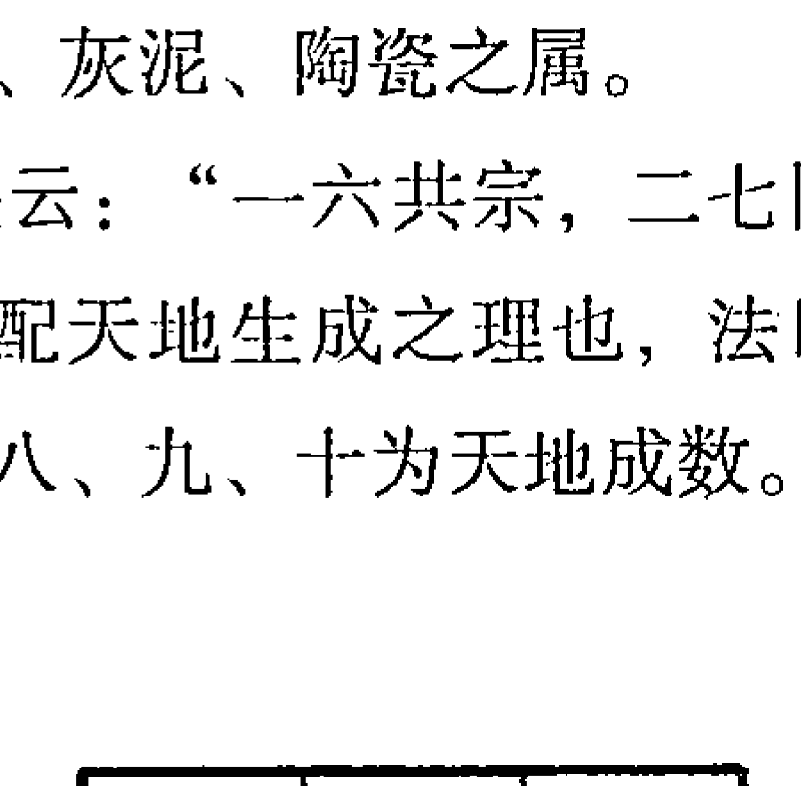

夫一、六陷于北坎，五行属水，故天一生水，地六成之；二、七炎乎南离，五行属火，故地二生火，天七成之；三、八震动乎东，五行属木，故天三生木，地八成之；四、九说兑乎西，五行属金，故地四生金，天九成之；五、十同居中宫，五行属土，故天五生土，地十成之。

或将生成之说论诸术数，则一为无极之太极也，道也；二者，太极之两仪也，阴阳也；三者，三才以定天、地、人也；四者，易之有四象，岁之有四时，天之有青龙、朱雀、白虎、玄武四神，地之有南、北、西、东四方也；五者，五行立纪，天地始行化育之功也。故中五者，兼备生、成之妙用也。一得五为六，六壬也；二得五为七，七政也；三得五为八，八卦，四得五为九，九宫奇遁也。五、五合十，十干也。生数造物立名，成数化物成功，此“造化”二字之体用也欤？

故河图生成之理，不仅是对《易》理阴阳学说一大补充，同时又进一步衍生出天干、地支、花甲及循环其间的生克关系，从而构成了“术数”这个《易经》的实用体系。

#### 第三节 至静之道，律历所不能契

天有日月，历备阴阳，气均时序，节分仪度。就一部历法精准度和功能性来看，用亘古未有、独一无二、傲视古今、冠绝中外等等词语来形容农历，非但全无丝毫谄媚之嫌，且可说是名符其实，恰如其分之至。然而，诚如《阴符经》云“天发杀机，移星易宿”，天道之行，岁有差度（这里说的“差度”仍就宿度言，而不是“岁差”的概念），辰宿列张，疾迟伏留，日久则星体宿度或超或退，失其原度矣。解决这一问题最直接也是最科学的办法修订历法，这在战国晚期第一部完整的阴阳合历《颛顼历》颁行后，西汉经历了《太初历》改元，到了东汉改用《四分历》；晋以后五胡乱华，衣冠南渡以降，用历纷乱；唐朝统治时期，除知名的《大衍历》、《观象历》，还用过《戊寅元历》、《麟德历》、《五纪历》、《正元历》、《宣明历》、《崇玄历》等多部历法；两宋用历尤多；唯明用《授时历》，清用《时宪历》，民国至今用《紫金历》，用历较为统一固定。如果历朝历代都按自己的一套大修历法，那么中国历史在断代纪年上会非常紊乱。可实际的情况却并非如此，各朝对历法的基本元素，如阴阳合历、节气斗建、置闰平岁等不作结构性调整，只是在发明新工具，配合新的测算方法前提下，对历法作技术层面的校准。一部相对稳定、持续的历法，不仅有历史纪年的需要，也是政治经济、社会生产、百姓日用等应用领域所必需的。故《阴符经》末章云“至静之道，律历所不能契！”盖律历所契者，天体行度有差池也。其未赅者，岁有差度（这里说的是“岁差“的概念，详后）也。天道动，不居辰次之舍（度差）；地道静，辰次皆出方隅（岁差）。辰次在天为黄道十二宫，与地支对应，分属八卦，以圆配方，法象“天圆地方”。此即“至静之道”也！

可这个“律历所不能契”的“至静之道”究竟该用什么去契合它呢？《阴符经》给出的答案是：“爱有奇器，是生万象，八卦甲子，神机鬼藏”。八卦定时节之分已明于前，谓“甲子”者，是中国农历的第三个重要构件——干支纪年、纪月、纪日、纪时法。

- 甲、乙、丙、丁、戊、己、庚、辛、壬、癸
- 子、丑、寅、卯、辰、巳、午、未、申、酉、戌、亥

干、支作为阴阳五行学说之基本要素，其由来杂说不一，而应用也深入细化到方术学、中医学等各个领域，十分广泛。

> 支干者，因五行而立之。昔轩辕之时，大挠之所制也。蔡邕《月令章句》云：‘大挠采五行之情，占斗机所建也。始作甲乙以名日，谓之干；作子丑以名月，谓之支。有事于天，则用日；有事于地，则用辰。’阴阳之别，故有支干名也

蔡氏所论，道出了五行、干支的由来。盖天悬日、月之象以著明阴阳，又据北斗璇玑所建岁月始作干支，以干配日行，支名斗建，此其义也。

> 总名支幹者，幹字乃有三种不同，一作幹，二作簁，三作干字。今解簁字者，此支簁既相配成用，如树木之有枝条茎簁，共为树体，所以云簁；又作幹者，幹济为义。支者，支任为义。以此日辰任济万事，故云支幹。又作干字者，亦是簁义，如物之在竿上，能竖立显然，故亦云竿。世书从易，故多干也

此以干、支有树木枝、杆之义，有干预、支配、济事任物之义，释名干支也。天干凡十，地支十二，以十干配十二支，遂有六十花甲以纪岁月日辰之法。

表一 六十花甲、六甲旬与旬空

| 甲子 | 乙丑 | 丙寅 | 丁卯 | 戊辰 | 己巳 | 庚午 | 辛未 | 壬申 | 癸酉 | 戌、亥 |
| :--- | :--- | :--- | :--- | :--- | :--- | :--- | :--- | :--- | :--- | :----- |
| 甲戌 | 乙亥 | 丙子 | 丁丑 | 戊寅 | 己卯 | 庚辰 | 辛巳 | 壬午 | 癸未 | 申、酉 |
| 甲申 | 乙酉 | 丙戌 | 丁亥 | 戊子 | 己丑 | 庚寅 | 辛卯 | 壬辰 | 癸巳 | 午、未 |
| 甲午 | 乙未 | 丙申 | 丁酉 | 戊戌 | 己亥 | 庚子 | 辛丑 | 壬寅 | 癸卯 | 辰、巳 |
| 甲辰 | 乙巳 | 丙午 | 丁未 | 戊申 | 己酉 | 庚戌 | 辛亥 | 壬子 | 癸丑 | 寅、卯 |
| 甲寅 | 乙卯 | 丙辰 | 丁巳 | 戊午 | 己未 | 庚申 | 辛酉 | 壬戌 | 癸亥 | 子、丑 |

纪年之法始自黄帝，据考黄帝即位元年为丁亥年，三十八年甲子《调历》，以六十花甲逐岁轮之，周而复始，承继至今。纪月之法，汉以前有岁建寅正、子正、亥正之异，汉武《太初历》以后一以正月建寅为法，逐月轮之以成岁功。纪日之法，考诸历算，当始于黄帝三十八年甲子之辛卯（日）朔旦冬至，后逐日轮之，以甲日为首，十干为旬，周六十六花甲六旬之数。上表直观地体现了天干纪日和地支纪辰的顺序，以干配支，每旬总有两个地支无天干可配，乃谓之“旬空”。旬空者，旬内空亡也。纪时之法，由甲日子时起甲子，逐时轮之，日十二时，至戌日亥时遁得癸亥尽一花甲之用，于己日复起甲子时轮之。

前明“周天历度”，岁分24节气，一节一气各管15日有奇，配以花甲纪日、纪时之法，又以五日为候均分一节气，一节或一气得三候，岁尽72候之数。这个由周天历度配合八卦甲子构建起来的农历的时空，就是“周天大时空场”。

当代有些民俗专家认为，农历中与花甲有关的分配方法，只是江湖术士、算命先生编造出来搞迷信活动的。其实，花甲纪岁月日辰之法不仅方便了史事的断代纪年，对古代气象学、中医学、农牧畋猎也具有重大意义，是周天历度“顶层设计”三大基本构件之一。术家只是农历的使用者，绝不是编造者。《阴符经》最后总结道：“阴阳相胜之术，昭昭乎尽象矣”，说的就是农历在术数学范畴中的应用。

### 第四章 原术之用

#### 第一节 生克六亲

五行生克与六亲关系比较简约，读者视下图可知：

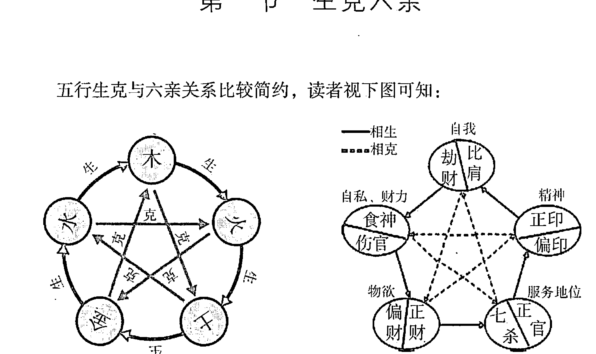

五行之间的这种生克关系，以及用生克关系去模拟人类社会的基本伦常关系，也可以列表如下：

表二 五行六亲

|        | 水 | 火 | 木 | 金 | 土 | 六亲 | 社会关系 |
| :----- | :-- | :-- | :-- | :-- | :-- | :------ | :-------- |
| 生我   | 金 | 木 | 水 | 土 | 火 | 父母    | 父母师长  |
| 我生   | 木 | 土 | 火 | 水 | 金 | 子孙    | 儿女奴仆  |
| 克我   | 土 | 水 | 金 | 火 | 木 | 官煞    | 权贵宗教  |
| 我克   | 火 | 金 | 土 | 木 | 水 | 妻财    | 妻子财富  |
| 比我   | 水 | 火 | 木 | 金 | 土 | 兄弟    | 兄弟朋友  |

上面的两幅图表直观地向我们展示了五行生克的五种关系，生我者为父母，我生者是子孙，是两种相生的关系。我克者妻财，克我者官煞，是两种相克的关系。与我五行属性相同者为兄弟，是一种比和我的关系。所以六亲关系虽有五种，但实际上仅有相生、相克、比和三种生克模式。

前论五星行气，作为太阳系的天体，星体各自的引力场在轨道上相互影响，形成五种社会伦理关系。这就是《阴符经》“五贼”的第二层义理。

#### 第二节 干支五行

1. 天干五行阴阳：

| 十干 | 甲 | 乙 | 丙 | 丁 | 戊 | 己 | 庚 | 辛 | 壬 |
| :--- | :-- | :-- | :-- | :-- | :-- | :-- | :-- | :-- | :-- |
| 五行 | 木 | 木 | 火 | 火 | 土 | 土 | 金 | 金 | 水 |
| 阴阳 | 阳 | 阴 | 阳 | 阴 | 阳 | 阴 | 阳 | 阴 | 阳 |

2. 地支五行阴阳：

| 地支 | 亥 | 子 | 丑 | 寅 | 卯 | 辰 | 巳 | 午 | 未 | 申 | 酉 | 戌 |
| :--- | :-- | :-- | :-- | :-- | :-- | :-- | :-- | :-- | :-- | :-- | :-- | :-- |
| 五行 | 水 | 水 | 土 | 木 | 木 | 土 | 火 | 火 | 土 | 金 | 金 | 土 |
| 阴阳 | 阴 | 阳 | 阴 | 阳 | 阴 | 阳 | 阴 | 阳 | 阴 | 阳 | 阴 | 阳 |

#### 第三节 论支干合

天干凡十，以河图生成数理合之，一、六甲与己合化土，曰中正之合，土居中也；二、七乙与庚合化金，曰仁义之合，木仁金义也；三、八丙与辛合化水，曰威制之合，火炼真金也；四、九丁与壬合化木，曰淫慝之合，火水未济也；五、十戊与癸合化火，曰无情之合，老阳有意于少阴，特少阴无情于老阳也。

十二地支之合，曰六合，曰三合。六合者，取义历算，古有谓之“日月合朔”者。但我觉得，日月合朔易与阴历朔日混淆，以斗建顺治十二节，太阳逆行十二气，每于月之中气交合于特定的辰次论，似应称为“日月（月建）离合之道”。盖日躔之次与斗建之月在轨道上渐行渐近，相交会谓之“合”也；却未可尽言其合者，时相离也。曰“离”者，日、月行远，似合而离者也。故《史记·历书》云：“自是以后，气复正，羽声复清，名复正变，以至子日当冬至，则阴阳离合之道行焉”。法以分、至为期，四分日月离合之道。农历以冬至为岁，曰“闰余成岁”，回历亦有以春分为岁始者。

夫黄、赤交于春分、秋分两点，为之合。故《易·说卦传》谓春分曰“帝出乎震”。春分之后日、月，即斗建与日躔渐相行近，至立夏“齐乎巽”。岁中之日、月，初会于夏至，斗杓与日躔“相见乎离”。相见而又乎“离”，自夏至后入日月相离之道也。立秋之节，日月离则各有所事，曰“致役乎坤”。“致”也者，犹言其所事也。秋分日月之行复相近，如恋人互以言说相悦，故曰“说言乎兑”。立冬斗建在乾，日伏于析木之津，阴阳薄而相接，曰“战乎乾”。曰“战”者，立冬爻象尽六阴之极，岁始寒而接阳，物寒战貌也。冬至斗与日二会于岁末，物劳而有所犒也，乃曰“劳乎坎”。“劳”者，犒享也。立春节，岁成其终而复始，终曰“成言乎艮”矣。

是知两分者，离之极而合也；两至者，交之切复相离也。然六合之道，春夏情切，春生、夏长言生合化育之功也。至秋冬则理疏，但言肃杀、收藏矣。《阴符经》曰“天生天杀，道之理也”，谓此。

深析之，则正月日月会于娵訾之次，亥也；斗建寅，故寅与亥合化木。二月日月会于降娄之次，戌也；斗建卯，故卯与戌合化火。三月日月会于大梁之次，酉也；斗建辰，故辰与酉合化金。四月日月会于实沉之次，申也；斗建巳，故巳与申合化水。五月日月会于鹑首之次，未也；斗建午，故午与未合。六月日月会于鹑火之次，午也；斗建未，故未与午合，午、未乃日月阴阳之会也。七月日月会于鹑尾之次，巳也；斗建申，故巳与申合。八月日月会于寿星之次，辰也；斗建酉，故酉与辰合。九月日月会于大火，卯也；斗建戌，故戌与卯合。十月日月会于析木之次，寅也；斗建亥，故亥与寅合。冬月日月会于星纪之次，丑也；斗建子，故子与丑合化土。腊月日月会于玄枵之次；子也；斗建丑，故丑与子合。所言辰次者，亦即壬家之日躔月将也。

夫支三合者，五行生、旺、墓之合也。水生于申，旺于子，墓于辰，申、子、辰合化水，曰润下体。火生于寅，旺于午，墓于戌，寅、午、戌合化火，曰炎上体。木生于亥，旺于卯，墓于未，亥、卯、未合化木，曰曲直体。金生于巳，旺于酉，墓于丑，巳、酉、丑合化金，曰从革体。土王于四季，辰、戌、丑、未于四季各旺十八日，曰稼穑体，土不论合而论寄旺也。

#### 第四节 刑冲破害

地支六冲，取十二支两两相对，五行相克相胜也。子与午冲，丑与未冲，寅与申冲，卯与酉冲，辰与戌冲，巳与亥冲。

## 六壬时空

地支相刑。支刑之力次于支冲。夫“阳德阴刑”，汉儒故论也。《汉书》云：“木落归本，故亥、卯、未木之位，刑在北方，亥自刑，卯刑在子，未刑在丑。水流向末，故申、子、辰水之位，刑在东方，申刑在寅，子刑在卯，辰自刑。金刚火强，各还其乡，故巳、酉、丑金之位，刑在西方，巳刑在申，酉自刑，丑刑在戌。寅、午、戌火之位，刑在南方，寅刑在巳，午自刑，戌刑在未”。其说以五行合局刑五行所在方也。子、卯曰非礼之刑，丑、戌、未曰恃势之刑，寅、巳、申曰忘恩之刑，辰、午、酉、亥各自刑之。

地支六害，力又轻于支刑，日月相会之处逢冲之谓也。子与丑合，午冲子，未冲丑，故子与未害，丑与午害。寅与亥合，申冲寅，巳冲亥，故申与亥害，寅与巳害。卯与戌合，酉冲卯，戌冲辰，故辰与卯害，戌与酉害。

地支六破，力尤弱也。曰：子、酉相破，丑、辰相破，寅、亥相破，卯、午相破，巳、申相破，未、戌相破。

结语：本篇仅就于六壬之宗门九课所须取用者，略述历度、易理、术数之基础入门知识。理固未备，望高明人士，勿笑作者之鄙陋也。

## 卷二 開啟宗門

### 第五章 初肇式法

大六壬，相传创式于一场远年的战争。那时的华夏大地，鸿蒙初开，先民们过着刀耕火种的生活。林立的原始氏族之间，为了争夺水源、草场、食物等生活资源，战争频仍。

其中，有一个“九黎”氏族，掌握着冶铜的技术，擅长制造尖兵利器，科技堪称领先。他们的首领蚩尤，善用天时、地利之变，布阵诱敌。入瓮的敌军，往往陷于苦战，最终难逃覆灭的厄运。

时蚩尤统率着骁勇嗜血的九黎族勇士，战黄帝于涿鹿。那场战争，黄帝本无胜算。当此危困之际，女神玄女从九天而降，传授黄帝兵法。黄帝因之造指南车，大破蚩尤。而这部神奇的兵法，正是被后世神为绝学的三式之学。

#### 第一节 六壬其传尤古

浪漫的神话承载着传习不断的三式绝学，静静地流淌过历史长河，历千万祀而不泯。三式者，在唐以前曰六壬、雷公、太一（乙），如《唐六典·太常寺太卜署》规定：“太卜令掌卜筮之法，以占邦家动用之事；丞为之贰。一曰龟，二曰兆，三曰易，四曰式”，《唐律疏议》曰：“诸玄象器物、天文图书、谶书、兵书、七曜历、太一、雷公等式，私家不得有”，而对于六壬，则认可“士庶通用之”；唐以后雷公式亡佚，奇门遁甲与雷公式皆用九宫，遂以遁甲代雷公与六壬、太乙合称三式，流传至今，如《四库全书·六壬大全·提要》记：“六壬与遁甲、太乙，世谓之三式，而六壬其传尤古。或谓出于黄帝、玄女，固属无稽。要其为术，固非后世方技家所能造”，清人程树勋在《壬学琐记》① 中也有相关佐证：“太乙、奇门、六壬，古称三式。愚以为六壬最先出，奇门次出，太乙晚出。何以明之？观六壬纯用干支神将推演，并不用九星八门、文昌、计都等项，以是知其先出。奇门所用天三门、地四户、天马方则采用六壬矣。太乙所用九星、八门、五符等类，则采用奇门、六壬矣，以是知二书皆在六壬之后也。”

一般认为，史之有壬，多在秦汉之交。然《周礼·春官宗伯·大史》之有“大师，抱天时与大师同车”句，郑众注曰：“大出师，则大史主抱式，以知天时，处吉凶”。“天时”作为春秋以前掌卜筮之官“太史”的占卜工具，是最早见诸史籍关于六壬式盘的记载。则史之有壬，当又早于秦汉。

《六壬大全·提要》亦曰：“考《国语》伶州鸠对七律，以所称夷则上宫、大吕上宫推之，皆有合于六壬之义”。伶州鸠应对周景帝问七律的史事，《国语·周语下》记录是：“王曰：‘七律者何？’对曰：‘昔武王伐殷，岁在鹑火，月在天驷，日在析木之津，辰在斗柄，星在天鼋。星与日辰之位，皆在北维。颛顼之所建也，帝喾受之。我姬氏出自天鼋，及析木者，有建星及牵牛焉，则我皇妣大姜之侄陵之后，逢公之所凭神也。岁之所在，则我有周之分野也，月之所在，辰马农祥也，我太祖后稷之所经纬也。王欲合是五位三所而用之，自鹑及驷七列也。南北之揆七同也，凡人神以数合之，以声昭之。数合声和，然后可同也。故以七同其数，而以律和其声，于是乎有七律。王以二月癸亥夜陈，未毕而雨。以夷则之上宫毕，当辰；辰在戌上，故长夷则之上宫，名之曰羽，所以藩屏民则也。王以黄钟之下宫，布戎于牧之野，故谓之厉，所以厉六师也。以太簇之下宫，布令于商，昭显文德，底纣之多罪，故谓之宣，所以宣三王之德也。反及嬴内，以无射之上宫，布宪施舍于百姓，故谓之嬴乱，所以优柔容民也。’”伶州鸠以天象配合律历，向景王讲述了武王讨殷是上合天心、下顺民意的天命。中间有关星度的术语在壬家读来，颇为亲切，如鹑火为午将、天驷即房星躔卯宫之次、析木为寅将，天鼋即玄枵子等等；除了星度外，更有月在、日在亦即月离、日躔的描述，壬家读此，必不陌生。特别是“辰在戌上”四字，既是对天上自然运行的“式盘”的描述，或许也是① 以下简称《琐记》。

《周礼》关于原始式盘“天时”的记载，这能否表明周初已有日在加时、飞布天盘之法了呢？由此，壬之起源乃可上溯至春秋，或商周之交，甚至更早，抑未可知。

到了汉代，壬家又被称为“日者”，如《史记·日者列传》之有：“自古受命而王，王者之兴何尝不以卜筮决於天命哉！其於周尤甚，及秦可见。代王之人，任於卜者。太卜之起，由汉兴而有”；又云：“述而不作，君子义也。今天夫卜者，必法天地，象四时，顺於仁义，分策定卦，旋式正棋，然后言天地之利害，事之成败。昔先王之定国家，必先龟策日月，而后乃敢代；正时日，乃后人家；产子必先占吉凶，后乃有之。自伏羲作八卦，周文王演三百八十四爻而天下治。越王句践放文王八卦以破敌国，霸天下。由是言之，卜筮有何负哉！”《索隐》注：“式即栻也。旋，转也。栻之形上圆象天，下方法地。用之则转天纲加地之辰，故云旋式。棋者，筮之状。正棋，盖谓卜以作卦也”。由是见之，六壬与易卦实为国家占卜之重器也。君子法天象地，旋式定卦，明天地之利害，判人事之成败。所述者，天意与天命而已，述而不著，是其义也。故《老子》曰：“是以圣人抱一为天下式”；《易·系辞》曰：“极天下之赜者存乎卦，鼓天下之动者存乎辞；化而裁之存乎变；推而行之存乎通；神而明之存乎其人；默而成之，不言而信，存乎德行”。

图一 出土于西汉夏侯灶墓的“六壬式”

那么式盘到底是个什么样呢？《六壬神定经》录式盘的制作方法曰：“造式天中作斗杓，指天罡。次作十二辰，中列二十八宿，四维局。地列十二辰、八干、五行、三十六禽、天门、地户、人门、鬼路四隅讫”。

#### 第二节 玄女肇式略考

夫九天玄女之肇式法，至今仍被目为神话，即《四库全书》亦持此说。但《说文解字·壬部》释“壬”曰：“壬：位北方也。阴极阳生，故《易》曰：‘龙战于野’。‘战’者，接也。象人裹妊之形。承亥壬以子，生之叙也。与‘巫’同意。壬承辛，象人胫。胫，任体也。凡壬之属皆从壬”；又《巫部》释“巫”曰：“巫：祝也。女能事无形，以舞降神者也。象人两褎舞形。与‘工’同意。古者巫咸初作巫。凡巫之属皆从巫”。

“壬”怎么会同“巫”呢？在甲骨文中“壬”字写作“I”，而“巫”字写作“十”。这样一看，“十”字恰好是由纵横交错的两个“I”字组成，如人之挥袖作舞蹈状。巫是远古时期从事与天、神沟通，预卜未来的人，女性曰“巫”，男性曰“覡”。从“壬”与“巫”同义论，可以认为远古巫祝占卜与“壬”有关，行此类巫祝的，又以女性为主。

再说九天玄女。《楚辞·离骚》：“指九天以为正兮，夫唯灵脩之故也”，王逸注称：“九天谓中央八方也”；《吕氏春秋·有始》进一步说明：“中央曰钧天，东方曰苍天，东北曰变天，北方曰玄天，西北曰幽天，西方曰颢天，西南曰朱天，南方曰炎天，东南曰阳天”。而玄女在神话中最早是以人首鸟身的玄鸟形象出现的，《诗经·商颂·玄鸟》曰：“天命玄鸟，降而生商”，谓玄女是殷商的始祖。史家亦有谓神农氏炎帝之母为“玄女”者。如《史记·五帝本纪第一》曰：“神农氏，姜姓也。母曰任姒，有蟜氏女，登为少典妃，游华阳，有神龙首，感生炎帝”，炎帝姓姜，“姜”字是“壬女所生”之意。“九天玄女”之名，至少有三个字与“壬“相关：一者，天干凡十，壬居其九，曰“九”；二者，壬属水，色尚玄，曰玄；三者，壬同巫，是女性巫师。所以“九天玄女”也可以是“九天壬女”。其所肇式法，名之曰“壬”。此说如果成立，那么在炎帝神农氏与黄帝轩辕氏两大部落融合以后，炎帝之母“任姒”将兵法传授给黄帝，助黄帝战胜蚩尤，似亦是情理中事也。
故此，撇开九天玄女肇式的神话成分，就远古某位巫祝通神的女祭祀在某一时期，总结前辈“壬”占方法的基础上，创造六壬式法，也不是完全可斥为子虚乌有的吧。

#### 第三节 立名总义

夫六壬之与上古观星之法一脉相承之理，史籍已明，更考其名义。先贤立名之论，不出五行说、六甲说及生成说三种。如《六壬视斯》之五行说曰：“天干凡十，而课独取于壬者，盖壬乃阳水，天一生水，为数之始，壬寄在亥，亥属乾宫，亦《易》卦首‘乾’之义也，此立名之宗也”；而《太白阴经》则持六甲说曰：“玄女式者，一名六壬式，玄女所造，主北方万物之始，因六甲之壬，故曰‘六壬’”；生成说以《六壬大全·提要》为代表，曰：“大抵数根于五行，而五行始于水，举阴以起阳，故称‘壬’焉；举成以该生，故用‘六’焉”。

然以我之浅见，壬遁之为式，其一端必本乎数，数根于河、洛，河、洛之变，始一而终九，一、九合十即归太虚，乃复变为一，所以数取一、九。一者，甲也；奇遁之式以甲、己为符头；甲者，天一之生数也，己者，地六之成数也，一、六共宗，取天之生数以骇地之成数，故遁甲实为使六甲之用而设也。九者，壬也，天九成数也，四、九为友，丁乃地四生数也。今六壬以使六丁为用，而独言其壬，隐其丁者何？盖举阳以有阴，故不名“六丁”，而曰“六壬”者，使“六丁”之法也。如是，则式法取义六甲、六丁，以甲之与壬使六甲、六丁之义尽之矣！

六壬盘式总以天将乘于天神，天神又临支辰而有三才，起式本乎历算，隐日月经天行度于天盘十二神，化星辰宿舍盈缩为神将之乘临，易观星之知来为式盘之简能，此真式之“三才易简”也。

六壬预测的案例，最早见诸汉赵煜的《吴越春秋》和袁康的《越绝书》。《六壬大全·提要》云：“《吴越春秋》载伍员及范蠡鸡鸣、日出、日昳、禺中四术，则时将加乘与龙、蛇刑德之用，一如今世所传”。

禹中、鸡鸣，伍员所占。禹中之占，因楚平王听信谗臣费无忌之计，欲杀太子建与太子太傅伍奢。伍奢有二子，长曰尚，次名员，即亡楚之臣伍子胥。平王派遣使者召而诛之，以绝后患。伍尚欲往，子胥曰：“尚且安坐，为兄卦之。今日甲子，时加于巳，支伤日下，气不相受。君欺其臣，父欺其子。今往方死，何俟之有？”大意是说，课象表明时政有君臣相欺凌、父子相欺骗之凶兆，应召入朝，必死无疑。后来除伍子胥连夜逃往吴国外，伍家父子眷属悉数被杀。

鸡鸣之占因吴王欲释勾践，子胥谏之：“且大王初临政，负《玉门》之第九，诚事之败，无咎矣。今年三月甲戌，时加鸡鸣。甲戌，岁位之会将也。青龙在酉，德在上，刑在金，是日贼其德也。知父将有不顺之子，君有逆节之臣。”吴王不听，勾践归越，后竟灭吴。

日出、日昳，范蠡所占。日出者，适越王闻吴王有赦彼之意，范蠡曰：“大王安心，事将有意，在《玉门》第一。今年十二月，戊寅之日，时加日出。戊，囚日也；寅，阴后之辰也。合庚辰岁后会也。夫以戊寅日闻喜，不以其罪罚日也。时加卯而贼戊，功曹为螣蛇而临戊，谋利事在青龙，青龙在胜先，而临酉，死气也；而克寅，是时克其日，用又助之。所求之事，上下有忧。此岂非天网四张，万物尽伤者乎？王何喜焉？”后果应伍子胥谏言，复囚越王于石室。

及赦之，至三津之上，仰天叹曰：“嗟乎！孤之屯厄，谁念复生渡此津也？”谓范蠡曰：“今三月甲辰，时加日昳，孤蒙上天之命，还归故乡，得无后患乎？”范蠡曰：“大王勿疑，直视道行。越将有福，吴当有忧。”勾践归国后，卧薪尝胆，励精图治，终于在公元前473年灭吴。此即日昳之占始末。

以上四例均史籍所载，至百姓日常之占，古今论述、案验繁多，勿庸多赘。

人心无相，大道杳冥，天机难测，奈之若何？然《九天玄女指掌赋》①开篇云：“六壬通万变之机，大为国而小为家”，乃谓六壬擅谋家国人世之应，以穷造化之机乎？

### 第六章 大六壬时空观的一般性原理

大六壬时空观是历代壬家都还没涉及的“处女地”，然未尝及并非不曾用。尝读程树勋《历代精抄六壬占验汇选》，如徐次宾、苗公达、邵彦和诸先贤案验，均由课式大象切入，次及四课神将之乘临，三传之往来，各据象作断，是皆宗师擅运时空盘局之能也。君子述而不著，诚先贤高明，非后学能知幽索隐者矣！三家之后诸家，知神将乘临者有之，明时空全局者鲜矣！或曰张鋐、王牧夫，亦仅窥盘局之向隅，其余支末不足观也。三家之法，徐次宾法尚古拙，直契心印，予慕其直而藏其拙；苗公达另辟蹊径，专统象数，予揣其象而贯之以理气。唯邵公法，予亦步亦趋而师法之。邵公之法，不出《六壬心镜》，最擅从课传理气中衍出象数来，此徐、苗二公“稍逊风骚”之处耳。故本书时空观之建立，皆本邵公法，谓“刘氏断应法”者，实“邵仙断应法”也！

我认为，六壬当属上古推步①占星之学之一种程式化的简化，是周天大时空场的一种应用学。其为术数之一门类，必以其盘局课式建立特有之时空场。壬式最重占时。每占，必先排定年、月、日、时四柱干支，将当值月将（日躔）加临占时之上，飞布天盘，次分干支阴阳排出四课，论生克有无，取用行传。至神将之乘临，都是用来表记六壬时空场中人事影像之类象也。

六壬占事虽亦标明占时之四柱，作用却有别于四柱命理。四柱命理但就某人之生辰推断一生禄命。其四柱作为个人命运时空的“坐标”终生不变，属于宿命观。而壬式所标四柱，记录着周天大时空场中太岁、斗建、日辰、时将之方位，是一幅占星图。壬式以四柱的形式标记了占时日月星辰的方隅所在，并另具课式截取占事时空，拟象断验，与人的主观能动性在事件发展过程中的主导作用一致，属于天命观。天时恒变不居，壬盘常转不息，是六壬天命观的特点。为此，我在常占中，首重正时，次推月将，以应人事天命。

六壬与《周易》占卦不同的是，无论是古易学之龟卜蓍策，抑或是流传至今的六爻、梅易，均以爻象、数理作为判断依据，推衍人事始末时，较难模拟爻象以外的变数对人事发展的影响。而六壬之九宗门起课，既谙无极而生太极，太极而生两仪，两仪而生四象、卦爻之变，断课时更以天盘与课传间的互动推比，极人事纵横之变。其横向排列的四课，最大程度地锁定了事件中的可能变数，使其推断结果更符合人们趋利避害的诉求，更具选择性。

六壬与奇门遁甲不同的是，奇门以三奇、六仪代天干言事，论宫神、星门，乃择方趋避之学。而六壬专重天时，机发于先，而尽赅地分，乃判人事之纪。二式相推，天覆地载，参两倚数，必获奇验。

今区区不才，不揣鄙陋，试论《大六壬的时空观》之奥义，望诸同好赐教则个。

#### 第一节 六壬时空场之“月将”篇

六壬之机，发于时、将之加临。谓月将者，乃以黄道十二辰次标记每个月太阳视运行位置的推移。古代壬家亦称月将为“日在”或“日躔”者。循名则实，“日在”是太阳在黄道某宫的意思，“日躔”则是太阳躔于某一辰次的意思。是日躔以月之中气为界，月行30°有余，逆十二辰，如人当值执事，逾期则换，在六壬占断八门中称为“值事门”。一岁经天，周365°有奇，月与月（建）合，岁与天会。月将的具体躔次如下：

- 雨水后日躔娵訾，正月登明亥将。
- 春分后日躔降娄，二月河魁戌将。
- 谷雨后日躔大梁，三月从魁酉将。
- 小满后日躔实沈，四月传送申将。
- 夏至后日躔鹑首，五月小吉未将。
- 大暑后日躔鹑火，六月胜光午将。
- 处暑后日躔鹑尾，七月太乙巳将。
- 秋分后日躔寿星，八月天罡辰将。
- 霜降后日躔大火，九月太冲卯将。
- 大雪后日躔析木，十月功曹寅将。
- 冬至后日躔星纪，子月大吉丑将。
- 大寒后日躔元枵，腊月神后子将。

读者有没有觉得月将的名字怪怪的。其实这些怪名字记录了上古时期原始观星的宿度。今详之于下，便于读者备悉其立名之由。

夫岁星有四名，曰摄提、重华、应星、纪星，摄提岁由丑宫始发，故丑曰“星纪”；玄枵历女、虚、危三宿，“枵”取义于虚，曰“玄枵”；《尔雅·释天》曰：“娵訾之口，营室、东壁也”，《注》称：“室壁二宿，四方似口，故名娵訾；娵鱼也，訾，口也，谓啞鱼之口”，故“訾”约言亥；《释天》曰：“降娄，奎、娄也”，知“降”为奎宿异名，并“娄”合称“降娄”；《释天》曰：“昴名大梁”，昴星是酉宫的主星，故酉曰“大梁”；《左传》载：昔高辛氏有二子，伯曰阏伯，季曰实沈。居于旷林，不相能也，日寻干戈。以相征讨。后帝不臧，迁阏伯于商丘，主辰，商人是因，故辰为商星。迁实沈于大夏，主参“，参、觜居申，故申名“实沈”；未、午、巳三宫以朱鸟之象名，曰鹑首、鹑火、鹑尾；《释天》曰“寿星，角、亢也”，故辰曰“寿星”；“大火”在上古天文学中是房、心二宿的代称，故卯名“大火”；《释天》曰：“析木谓之津，箕、斗之间，汉津也”，寅度箕、斗之次，故寅曰“析木”。

本质上讲，月将，即日躔辰次在天球面上展现了太阳在赤、黄纬间穿行的视角变化，如岁之春分点和秋分点，日照位于天球面黄、赤道的交点上；夏至点太阳直射在北回归线，冬至点在南回归线正上方等。但现在就为日躔建立一个六壬时空场为时尚早，在无人问事的情况下，日躔仅描述周天大时空场中的某一天体个体的视运行，而就六壬课式来看，单独一个月将也并不能表明任何人事的情态与状况。因此，所谓“值事门”，必须应占起式后，才被论及。

月将之异说，古有附会河洛生成之数者，谓每于交过中气，阳用生数，阴用成数，超接换将。《琐记》予以辨伪曰：“今《时宪书》则以定气为主，故太阳即于交中气日时过宫，便换月将，此正合天之妙”。故传统上，一向以中气换将为准绳。

### 第六章 大六壬时空观的一般性原理

今人有依据沈括《梦溪笔谈》之论，曰：“六壬天十二辰：亥曰徵明。为正月将；戌曰天魁，为二月将。古人谓之合神，又谓之太阳过宫。合神者，正月建寅合在亥，二月建卯合在戌之类。太阳过宫者，正月日躔娵訾，二月日躔降娄之类。二说一也，此以《颛帝历》言之也。今则分为二说者，盖日度随黄道岁差。今太阳至雨水后方躔娵訾，春分后方躔降娄。若用合神，则须自立春日便用亥将，惊蛰便用戌将。今若用太阳，则不应合神；用合神，则不应太阳，以理推之，发课皆用月将加正时。如此则须当从太阳过宫。若不有太阳躔次，则当日当时日月、五星、支、二十八宿，皆不应天行。以此决知须用太阳也”。沈括误将宿度差池指鹿为马，妄称岁差致月将过宫失其原度，须用太阳入宿度过将，实属缘木求鱼、刻舟求剑。盖沈氏紧接着说道：“然尚未是尽理，若尽理言之，并月建亦须移易。缘目今斗杓昏刻已不当月建，须当随黄道岁差。今则雨水后一日方合建寅。春分后四日方合建卯，谷雨后五日合建辰，如此始与太阳相符。复会为一说，然须大改历法，事事釐正。如东方苍龙七宿，当起于亢，终于斗；南方朱鸟七宿，起于牛，终于奎；西方白虎七宿，起于娄，终于舆鬼；北方玄武七宿，起于东井，终于角。如此历法始正，不止六壬而已”。沈氏的意思非常明白，按二十八宿历度，不仅月将过宫失度，就是月建也应按宿度校正。说白了，月将、月建要配套按宿度一体校准。今人所以咬住月将度差不放，言之凿凿，不过是由于术数领域里只有壬家专重月将，上网查查宿度数据，说改也就改了。要是连月建一起改起来，不但会招致整个术数界的反对，并且还会授人以柄，使科学界、学术界更有理由非议传统术数了。但事实却是，不仅用宿度去校日躔的人是杞人忧天，就是沈括先生也是在刻舟求剑。

为什么这么说？因为日躔也好，月建也罢，顺推、逆轮遵循的都是黄道十二辰次，二十八宿宿度只是一个参照物而已。

所以，我们要明白，岁差固然客观存在，但岁差并不是由宿度失次造成的。反之，宿度失次正是岁差所致。

#### 第二节 浅析岁差

开始讨论之前，再次重审岁差与度差是有着本质区别的两个概念。导致岁差的原因是“地轴进动①”，而岁差又造成了二十八宿的度差。读者也许会疑惑，就算我们混淆了岁差与度差的概念，但既然承认有差度，难道就没有必要调整日躔或斗建么？

> ① 我国的古代文献称地轴进动为“交点退行”，指的是天体轨道升交点经度不断减小的现象。二者名称相反，但指称的是同一物理现象。

那么就请读者先了解一下什么是地轴进动，什么是岁差吧。所谓地轴进动，是地球自转轴以黄道极为轴心所作的圆锥形运动。将地轴进动放射到天球面上，就是南、北天极绕黄道轴所作的圆锥运动。前面讲过，中国古代天文学不设“黄极”，但黄极客观存在，黄极就是太阳视运行轨道轴（黄道轴）与天球面的交点。理论上，黄道轴实际上应该经过日心，但历算上以地球为观测点测算太阳的视运行回归年，故实测上的黄道轴与赤道轴（地球自转轴）相交于地心。黄道面与天赤道面有23°26′度的黄赤交角，则地轴进动的圆锥半径比也是23°26′。产生地轴进动现象的原因，是月球与太阳对赤道隆起施加的引力，进动的方向与地球自转方向相反，作顺时针向西的进动。

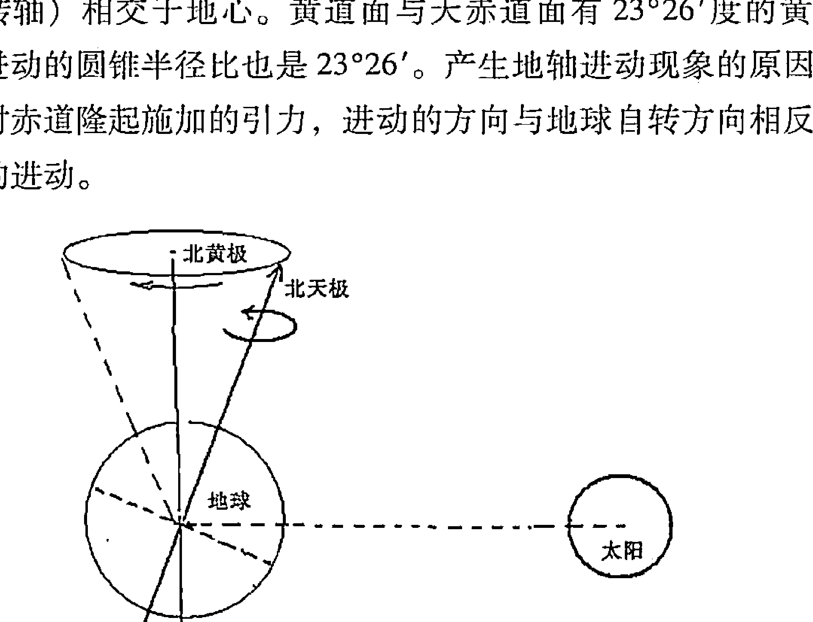

## 图二 地轴进动

地轴进动使天北极以50.29"的微小度差偏转，约71年余进动1°。由于古人以最靠近北天极的亮星作为北极星，随着地轴偏转的位移增大，北极星也迁移至北天不同的恒星上。如公元前3000年前后北极星曾是天龙座α星（古称“右枢”），目前则在小熊座α星（古称“勾陈一”或“北辰”），约公元14000前后至天琴座α星（古称“织女”），进动一周需25800年左右。在公元22800年回到天龙座α星，公元27800年又值小熊座α星。这一天文现象在中国古代天文学中称为“极游”。 我们知道，天赤道面与地轴垂直，地轴进动也带动了天赤道以50.29"的速度由东向西顺时针行进，而位于黄、赤道交点的两分点也会随之进动，这就是岁差的成因。我国历史上，后汉贾逵就已观测到两分点的进动现象，晋朝虞喜推算出每50年岁差1°，此后隋刘焯将之精推到每75年岁差1°，已经十分接近实际值。

综上所述，岁差的成因是地轴进动，而非二十八宿差度。说明了岁差的成因，再来说斗建与月将。请问读者，斗建换将以何为准？当然以节气为凭，而不是准宿度之差。再请问读者，两分点的西移会影响二十四节气的划分么？如果两分点的移动影响了节气的划分，必须参照宿度，那两分日太阳不在黄道与天赤道的交点上，就无所谓均分昼夜了。两分日不均分昼夜，那在夏至日太阳也不再处于北回归线正上方，形不成夏至昼极长的天象了。同理，冬至日日躔也不在南回归线正上方，也就没有昼极短的天象了。反之，要是两分日依然昼夜均分，夏至日还是昼极长，冬至日仍是昼极短，那太阳躔次无差，月建也没有失次。故此，答案只能是，两至点与两分点同步西移，所有的节气点也随之向西移动。既然节气的西移与地轴进动是同步的，那就要再次反问读者了，斗建换将可以仍遵循宿度换算，而不跟着两分两至点一起西移么？要是斗建换将都依据宿度，并不随节气西移，那两分点还是两分点，两至点还是两至点么？读者要明白，两分两至点不仅是交节换气基准点，更重要的是，冬至点还是农历确定一个太阳回归年周期的起迄标杆。综此，所谓的太阳躔次的‘次’指的是黄道辰次，而非宿舍度次啊！

古人设宿度的初衷，为的是修正太阳回归年与周天360°的度差。而黄道十二辰次是划分周天的基本单位，节气因黄道十二辰次而设，而不是随宿度而设。

> “至静之道”之正义也。这个关系一旦被弄反了，就会提出斗建换将的异议来了。由此推论，要校准的其实不是斗建，而是失次的宿度。是沈括的谬论在先，才有了当今不必要的分歧了。
时至今日，换将的分歧大有甚嚣尘上之势，似乎不辩明了这一点，整个六壬学的体系都要坍塌一般。有些人甚至拿出了师门的密推秘传，来标榜只他一门正宗。试问，北宋的沈括既已提出了这样的推论，后世钦天监星官为什么却对此置若罔闻？何以稍晚的祝泌、邵彦和公及后世壬学明师也鲜有论此者？实占案验亦鲜有先校月将者？可见校正月将一事，既于理不合，也没有任何实践上的意义。

#### 第三节 六壬时空场之“占时”篇

一天中的时刻主要是由地球自转造成的，是一个日照经度位移的概念。凡人欲知某事休咎，动问之一刻即成为占时。

占时有二。一谓正时，就是各国、各地区的官方时间，在中国以北京时间为正时。壬式的占断八门中，称正时为“先锋门”，谓课未发而正时已现来意之机。但单纯的时刻点，如某日几点几分也不能构成一个时空场。好比我们平时看表，只是为了知道时刻，心无所疑，先锋门无所触动，也就不会有什么响应。

有人提出用真太阳定正时。真太阳时是以真太阳视圆面中心的时角来计量的，起算点是真太阳上中天。而我们日常生活中，习惯的起算点是半夜（下中天），两者相差 12 小时。因为真太阳时是观测太阳视圆面中心得出的，故真太阳时也称为视太阳时，简称“视时”。真太阳时 = 平太阳时 + 真平太阳时差。

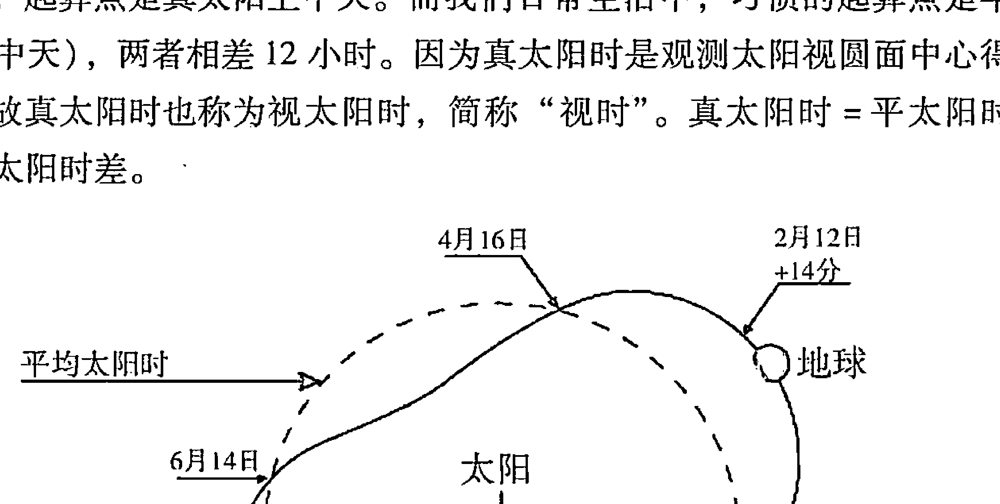

持此观点者的认为，中国幅员辽阔，跨东五区至东九区五个时区，东西时差较大。中国的官方时间——北京时间，定在东八区东经 120°经线位置上，比最西部的新疆地方时提前约 2 小时。2 小时在中国历法中就是一个时辰，所以必须用地方真太阳时作为正时。理由是古人用赤道日晷计时的“时”就是地方真太阳时。

在没有钟表、电话、网络的古代，来人算命求占，必定是占断双方同处一地、一室的，有条件又懂历算的术家用晷仪原理定时，是有可能的。今天通讯发达，如有一人在新疆致电身处上海的我，求占问事，双方的钟表时间都是北京时间，如要将北京时间换算成真太阳时，到底是以求占者所在时区为准，还是以术家所在的时区为准？当今不仅通讯发达，交通也很发达，如果通话双方都在东西向行进的高速交通工具上，怎么确定对方或术家的时区位置呢？或者求占者与术家虽处同室，占时正处在两个时辰交界的 1、2 分钟内，求占者言明事由，术家尚未换算出地方时，时辰却已交过，这种情况又该怎么定时呢？

我个人认为，在中国大陆起课，完全可以用北京时间，这样可以省去异地求占定时的麻烦，当然也不反对使用地方真太阳时。如问事人与术家分处异国，因求占者才是真正触机的人，应该用对方所在地的官方时间为妥。比如求占者身处美国，美国用地区官方时，那就要先问他（她）所在地的地区时是几月几日几时，据此起算。

此外，正时除了起课外，还有另一个重要功能，就是确定昼夜贵人的加临布列壬式的天将盘。具体方法将在后面予以说明。

第二种占时谓“活时”，即不用当前正时，活时即可以通过特制的取时工具求得，也可以由求占人自行抽签或报数、写字拈取。

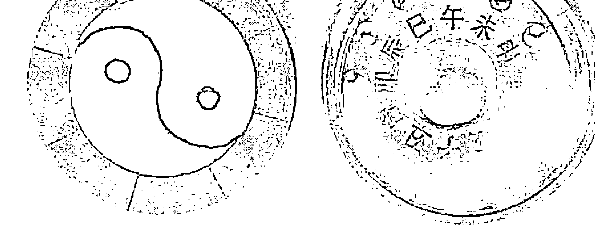

## 图四 笔者日用活时摇课器

宋代邵彦和论次客曰：“古次客之法，因数人同时来占，乃用前五后三，换将不换时之例，试之每不验。盖烛照祸福，全赖太阳之光明，故以正将正时为最，其次则换时不换将耳。余则不换将，亦不换时，惟以各人年命为主，课虽同而理则异。区别悬殊，十不失一”。此真起式之“第一义谛”也。今人认为正时为壬家所占，来人求测必取活时。殊不知正时为天时，不论自他，心念不起，并不触机。至应占之际换用活时，就无从由周天大时空场中截取时空片段起课了。凡人心有所疑，触发正时天机，天人感应，垂象示兆。这种课以天时为主，术家应之，求占者乃居客位。所得者，周天大时空之壬式时空场，所应者，人事总体之天命天运也。正时是人与天之间的信息交流，有点像从网络“云端”下载与人事相关联的数据，进行分析。

不过，活时起课仍有一个时空，这个时空场为求占者所独有。盖活时因人报数、抽签有异，乃人之心机与动机合发的先机。以求占者为主，先机应之，活时式盘为客，所得者，一人一事之时势也。是求占者与术家之间人与人的交流。

故常占，我准邵公之法，求正时之天机。或事先约见某时，会见时人有所问，方取活时。

#### 第四节 六壬地盘空间场

地盘是将太阳视运行轨道轴纳入以地球为圆心的黄道轨道面上，建立的黄道十二辰次坐标系统，作为一个以节气十二等分周年的时间概念，地盘的宫位是确定的，并且固定不变。但就地球作为太阳系行星之一言，它的公转轴当以太阳为圆心，但前面已多次重申，人类是以地球为观测点测算太阳视运行的回归年，所以历算视角上的黄道轴与天轴（地轴延伸至天球面上的交点）同以地球为圆心建立。古之圣人把太阳视运行轨道轴和地球自转轴统一于地球圆心后，就为时一空一元空间场的构建奠定了逻辑基础。既然地盘是以地球为圆心建立的黄道十二辰次，那么地球空间场对吾人日常生活之影响勿庸置论。我称这个空间场为“黄道空间场”。

然而，黄道空间场在本质上却是一个描述和标记周天内诸天体运行周期空间概念。黄道的十二辰次把连续的周天空间分为十二个区间，恒星随斗杓运转于周天的天球面上，行星的周期运行则参照恒星定度测算。地法于天，乃有十二支，故曾文迪在《青囊序》中说“先天罗经十二支，后天再用于与维”。

历算学之建立黄道辰次坐标的意义有二，一曰斗建日辰之推算。斗建十二辰，正月立春之节建寅，周十二月与日会而成岁功，此十二节之分也。二曰日躔月将之过宫，正月雨水之气起亥，逆躔十二宫，岁与斗合而尽岁周，此十二中气之用也。顺之以节乃有月建，逆推中气而换月将，然节气各15°之分，而斗建与月将各三十天以交换，是有15日重合之期也。将此天之二十四气应以地之二十四山，即《青囊序》“二十四山双起，少有时师通此义。五行分布二十四，时师此诀何曾记？”之文也。以是言壬之地盘黄道空间场，即罗经先天十二支之体也。

相反的，时间却是一个由空间距离与空间位移造成的，描述空间事件的矢量。比如我们会说，木周约12年，土星周约28年等等，都是以地球年为观测点，在黄道上划定的。可要是人类居住在木星上呢？那所用的历法就是木星历，以木星年为基准描述系内其它行星周，我们会说地球绕日一周用时相当于1/12年，土星绕日一周用时约为2.25年等等。因此，时间并不是一个绝对意义上的常数，它会因人类生存星球这一观测点不同而不同。所谓绝对时间的概念，实际上并不存在。但有了时间的概念和单位，却能更好地测算连续空间中的物体运动。要是我们把时间量从空间运动中抽掉，那连续的空间运动就只能描述为某一瞬间的静态事件，成为古希腊数学家芝诺所讲的“飞矢不动”①了。

明白了时间是相对于空间运动存在的概念，就可以把固定的地盘方位换作占时来使用了。

> ① “飞矢不动”悖论：飞着的箭在任何瞬间都是既非静止又非运动的。如果瞬间是不可分的，箭就不可能运动，因为如果它动了，瞬间就立即是可以分的了。但是时间是由瞬间组成的，如果箭在任何瞬间都是不动的，则箭总是保持静止。所以飞出的箭不能处于运动状态。哲学界通常称芝诺的一系列悖论为“芝诺悖论”。

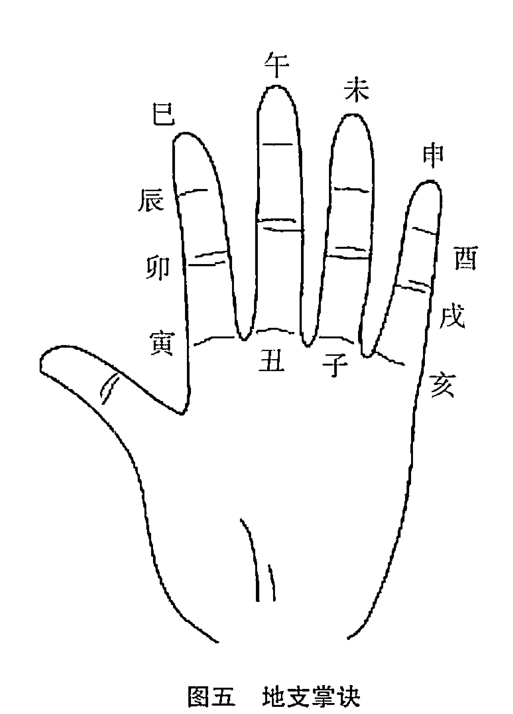

## 图五 地支掌诀

地盘属阴，专静而隐，故记其宫位于左掌即可，在写课式时不必明书于纸。

#### 第五节 个体的时—空感受

前文多处提到岁差、度差、时差等概念，都是就天文历法的理性范畴而言，是仅有少数专业人士才了解的概念，常人知之甚少。但有一种时差不仅众所周知，且能被人之感观感知。设想我在3月27日晚8点从上海出发飞往纽约，14小时后到达，上海已是28日上午10点；而我的出发时间是美国东部时间27日上午7点，到达时间是27日21点，不仅昼夜颠倒，日期也迟了一天。这种时差，不光是由地理上的空间距离造成，也有地球自转的经度变化因素。同一航班的乘客都会经受时差带来的身心感受，但个体的实际体验却因人而异。某些旅行者视倒时差为苦事，而在精力旺盛的人士看来，这里正是投身都市夜生活的好时机。有人躺在床上数羊，也必有人去酒吧买醉；有人与家友畅叙小别重逢，也必有人因来到一个陌生的城市凤叹离愁。

生活在东南亚的华人有共同的文化传统，对农历的节气划分也不陌生。但新加坡、马来、印尼的华人却很少有冬季的体验。多年在新加坡讲学，听的最多的谚语就是“四季无寒暑，一雨便成秋”。可见，季节上的“时差”远比同纬度间的地区时差更加显著。

知著者必审其微。现代生物证实，人与地球上的许多动物都先天具有磁力定向的感知能力，只是人类辨识方向的能力更偏理性罢了。比如，当我对某人说：“你家的东边有 × ×”时，往往得到的答复却是：“刘老师，我的方向感很差，我只知道我家的左手边是 × ×。”这种回复在女性中比较多见。不过，当他（她）说“左手边”时，却表明此人的具有绝佳的方向感，且比以东南西北辨方的我更感性、更直接，可因为他（她）没有说明参照物，如面对的是大楼进户门，还是室内某一可兹定向的窗户等等，我仍然无从知晓此人的左手边到底朝向哪个方向。这种不同方向感之间的交流在问路时尤为明显，“东南西北”与“前后左右”间的问答，简直是鸡跟鸭讲。但吾人必须承认关于方向，在人与人之间是有基本的共识，聪明的鸡是终究可以为一只笨鸭导向的。

如果说人与动物之间、人与人之间的导向差异尚易理解的话，那同一空间里，不同人的空间感受不同就更显微妙了。举个例子说，医院里医生和病人、病人与家属亲友就医院这同一空间的感受，有着强烈的反差。这在商场、餐厅、地铁、等公共场所，以及吾人的家庭聚会、工作场所，每时每刻都可以观察到、体会到。

进一步讲，不同个体对同一空间的感受还会随时间而变化。拿教室这个空间来说，老师与学生之间，及学霸、学渣、普通学生之间，同桌之间的感受各不相同，但因师生、同学在教室中呆的时间显然长过病人和家属在医院呆的时间，日久适应以后，各种感受会趋于衰减直至麻木。人们称这种适应为“习惯了”。

当学霸与学渣这两个极端的空间适应度增加时，对时间的不同感受却会突显出来了。这种感受在一节课开始或下课铃声敲响前的短暂时间中，较为强烈。上课时学霸的投入使时间适应感相对缩短，而学渣反而会延长。课中，学霸因学习带来的愉悦而觉得时光如梭，学渣却会因各种负面情绪而焦躁不安、开小差、说话，或者直接瞌睡。接近下课时，学渣的不安情绪加剧，学渣的愉悦度提升，有时会以相似的兴奋度表现出来。

因此，人们较易适应或忍受空间的感受，而时间反而会重复、加剧个体的某种心理感受。

好了，现在把个体的情绪放在一边，来讲讲更为纯粹的时间感——对时间长短的感受吧。不同人对时间长度的感受不同，普遍情况下，人的时间感会随着年龄的增长而缩短，儿童的时间感明显长于成年人和老年人。可是，当人们感叹“来日无多”之时，相反的情况出现了，即乐观者的时间感比悲观者短，健康人的时间感比病人的短，于是不幸的人群就有了“度日如年”一说。

“度日如年”这个成语源于一个天文历法学的数理概念，太阳经天一日周365°有奇，每月在黄道上退行一个辰次（宫），岁行365°有奇，一日经天之度与岁等，曰“度日如年”。这本来是一个客观上的时间概念，却衍变成了一个形容个体时间感受的词，从中可窥见时间对个体心理影响的双重性，即一方面削减个体的空间感受，另一方面又加深个体在时间中的存在感。

把空间感和时间感作这样的比较的结论是，时—空属阳，感受属阴。客观空间为阳中之阳，客观时间为阳中之阴；空间感为阴中之阳，时间感为阴中之阴。

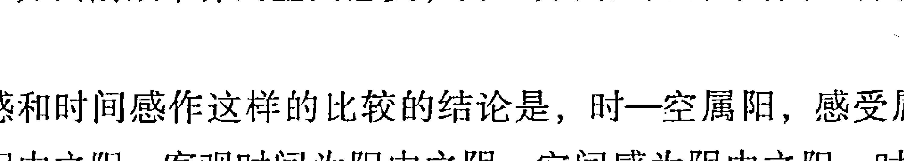

人们在不同时间和空间中所有的身心感受，以及所思所想的不尽相同，造成了人际交往时处事方式的种种差异。对此的解释，哲学、社会学、心理学、生物学都有自家的一套理论。并且，因为这些学科的理论，有人不禁会对中国的传统术数学提出这样的质疑，在地球这样一个共生的时空中，用时间排出某人的生辰八字，或为某人起卦算课，同样的时间“输出”了不同的运命，其合理性究有几许？一个时辰里，全国出生人口多少，难道同样生辰的男女，命运也都样同？或者同一时辰有数人问同一件事，吉凶都一致？可严峻的事实是，同样生辰的男女并不同命运；几个人问同一件事，一个卦象推衍出的结局，也可以吉凶殊途。

在我研究术数20多个年头里，这样的问题一再被提及，并一直困扰着我。直到2014年某个清朗的仲夏夜，我与妻子漫步月下。走着走着，她忽然止步，仰望着星空，很认真地对我发表了一通“哲言”：“我小的时候住在乡下，天天晚上都有好多星星看的。你知道吗？我总是想，每个人都有一颗属于自己的星星，我也有属于自己有一颗星星哦。只是我不知道她躲在哪里，没有找到她。”听她那么一说，我豁然开朗。

在中国人的传统里，圣贤伟人、帝王元首多被赋于星宿下凡之说，而平民黎庶却无权享有此种“荣耀”。三垣二十八宿固然被星家赋予了王公宰辅、州道府路等人文意向，可天上的星星那么多，缀满星空的群星，不正是世间的芸芸众生之象么？星星虽小，星光虽微，但星与星之间各以质量与引力制衡，每个单一天体由周天望之，各具行度，运有时节。时运之大者，或曰社会，或谓国家。而时运之微者，个人家业之兴衰也。夫举其大而察其微，具其微而观其著者。今欲谈时运，当先明时空！

以我一个壬家的角度来看，每个人都有一种属于个人的时空感。在同一空间里活动的不同个人，并不是共同拥有或占有一个空间。由同一空间内的个人身心感受及所思所想之不同言，每一个体都占有一个理性认知或约定俗成层面上共有，而潜意识层面完全独立甚至相外的空间。同理，六壬地盘空间对任何人都是固定不变的，甚至就某一占时起盘形成的天盘、课式空间对这一时辰中求测问事的所有人都完全相同，但每一个体独立的时空感，完全可以让一个课式推导出不同结局。课式相同，但每个人占有这个课式空间的切入点都是独立的，相互外在的。

这有点像网络角色扮演游戏，电脑前众多玩家都是同一网络“云端”大数据中一套独特的数据，一样地打怪、攻关，但各自的角色装备等级有别，战斗力殊异，打法也不同。纵然同职业、同等级装备的外观一样，但装备加成有微小差别，在“云端”数据库中的处理也不尽相同。就算这种量上的数据差异不为个别玩家所了解，可玩家达到同一等级装备和战斗力的方式，还是有差别的。有钱的土豪充值买现成，执着的玩家会花时间打BOSS级怪物，憧憬获得终极装甲和武器。拿网络空间比拟六壬虚拟人事的空间再恰当不过了。

现在，我将正式带领大家开始一场六壬课式的“时空之旅”了。

#### 第六节 六壬天盘时空场

六壬以两个中气间的当值月将加于地盘占时上，飞布天盘（具体方法详后“宗门九课”章），因月将即日躔，亦可称为“日躔空间场”。

壬式古称“天时”，因其特重月将加时也。然而光有时分之一端，缺少地分的概念，仍不足以完整地推演人事之变。在这方面，与大六壬同宗而异式之六壬金口诀在飞布天盘后，以术家为中心点，子午线定南北及十二宫位，直接取来人所在地分起将神，此金口诀于式之尤重地分者也。此一方法，除了便捷，还省去了多人求测情况下，抽取活时换盘换课的麻烦，以各人不同地分上神起将神，就能得到不同的课式。

那么大六壬有没有地分概念呢？其实，六壬的时空场已经在时分的概念中包含了地分的概念。月将加时，看似仅是一个时间概念，但时间因何而有？因空间距离与运动而有。六壬依据农历周天大时空场提供的干支四柱，以月将加时的抽象式盘，模拟了地、日在黄道圈的空间相对运动。所以壬式的月将加时，实际就是某一特定时日的日照在经纬线上的空间焦点。六壬用时间“偷换”了地盘的方位概念，构建了一个时空一元式盘空间场。称天盘为“时空场”，其实只是一种迎合一般人对时空的通俗理解罢了。

中国古人没有从哲学或科学方面，明确指出时间的相对性。但就黄道十二辰次之对应十二地支辨方定时来看，农历是以圆周空间位移确立统一时间轴的周天大时空观。壬式的天盘充分运用这种时空模式，将时间视为一个统一于天、地盘的场。在天盘中，并不存在绝对时间的概念，时间的推移相对于地盘宫位上天盘的位移被表现出来。物理学界直到爱因斯坦《相对论》的提出，才认识到时空的相对性，但中国远古的壬家从第一个天盘的飞布开始，已经在探索四维时空对人世间的影响了。对此，相信大六壬和金口的术家多存共识，毋庸置论。

吾人写天盘时，因地盘固定不变，无须标出。地盘以时辰的概念替换了空间方位，天盘以日在的空间视角逐月标记了季节的更迭，空间一时间轴在时、将加临的一刻，由原先二元的黄、赤道极，转换成了以黄道极为轴的统一时空轴（实际是一元空间轴），空即是时，时即是空，从而形成了一个真正意义上的大六壬时空统一场。为此，大六壬无须象金口一样，寻求空间地分的“帮助”，就能直接用天盘转换时空，找到与人事有关的空间象数，来判断吉凶了。至于多人求测，用次客法一课多断，古今案例，并不鲜见。

通过六壬天时与金口地分概念的比对，我们发现了一个有趣的现象。这对六壬“双胞胎”，在观待人事变迁时，切入点大不相同。如果天盘是一个存在于人类思维中的虚拟时空，那么，金口家是站在地面仰观星空的天文工作者，而壬家则更像身处在空间站里的“宇航员”，从广袤的太空，以一种独特的视角和方法，审视着地球上的人类活动。“兄弟”之间，在技术运用上并无高下之分，在视野上却“判若霄壤”。

### 第六章 大六壬时空观的一般性原理

## 六壬时空

（接上文）通过六壬天时与金口地分概念的比对，我们发现了一个有趣的现象。这对六壬“双胞胎”，在观待人事变迁时，切入点大不相同。如果天盘是一个存在于人类思维中的虚拟时空，那么，金口家是站在地面仰观星空的天文工作者，而壬家则更像身处在空间站里的“宇航员”，从广袤的太空，以一种独特的视角和方法，审视着地球上的人类活动。“兄弟”之间，在技术运用上并无高下之分，在视野上却“判若霄壤”。

#### 第七节 六壬四课空间场

> 英国物理学家史蒂芬·霍金教授在他的《时间简史》第二章《空间和时间》中提到：“在广义相对论中，物体总是沿着四维时空的直线走。尽管如此，在我们的三维度空间中看起来，它是沿着弯曲的途径……。太阳的质量引起时空的弯曲，使得四维的时空中地球虽然沿着直线的轨迹，它却让我们在三维空间中看起来是沿着一个圆周运动。”

我是物理学的外行，只能对这段文字发表一点粗浅的看法。要言之，在三维空间中，天体在空间中绕恒星或星系中心作圆周运动，如地球绕日运动，这不难理解。但在四维时空中，由于时间的作用，当新年伊始，从某点出发的地球，绕行一周（年）后，回到的却不是去年的同一个起始点。时间作为一个相对独立的维向，打开了三维空间中的曲线运动，使天体作单向的线性运动，同时又因引力作用，无法逃离吸引它的恒星。如地球在四维时空中行进一年后，即不是逆向地线性回到起始点，也不是突兀地跳回到起始点，而实际又从起始点年复一年地重复同样的单向线性运动，四维的时空之变真是神奇而又玄妙啊！

而在六壬中，看似三维的天盘，依照六壬特有的时空统一场飞布，它实际虚拟了一个四维时空。这与霍金教授从理论物理学角度阐述的三维空间和四维时空，在概念上理无二致。但我并不是试图用理论物理学来证明六壬什么，仅是为了更直观地解构六壬时空观，才引用霍金教授的相关论述打个比方。如果六壬时空观与理论物理学在某些表述上有相似之处，那也只能说我们古代的“巫”与当代的科学家之间存在某种超时空的共鸣。严谨地讲，我个人完全不能苟同当今某些术家，试图扯现代科学的“虎皮”，树立所谓科学预测学的大旗的行为。

那么六壬的四维盘式（“盘式”包括天、地二盘）又是如何被打开的呢？像霍金教授讲的那样，用时间直接打开可以么？不可以，因为六壬的时间相对于空间而有，不是一个独立的维向。而能打开这个盘式的独立维向就是占日干支。六壬以干支为一对基本维向，视其上神和阴神，成立四课。干支四课“撕开”了日躔时空场的四维时空，进而将之拉伸，使之变形为横向的二维空间。不过，干两课和支两课固然在取课方法上一致，在打开天盘时空的手法上却不尽相同。干课先要把日干转换到它对应的寄宫，视其寄宫的乘临才得以成立。这就使得干课在打开天盘时，比支课多了一次扭曲日躔时空的作用。故此，有理由确信，日干和日支是两个相对独立的维向。

壬学同道都知道占日干支的区别。一般讲，干为人，支为事。这是干支定位的基本定义，也是课式迈向人事断应的第一步。四课看似只是一个二维的平面空间，不存在时间概念，但占日干支本身也是一个时间概念，占日干支打开日躔时空，仅截取与现实人事相关的空间片段，分判人事、彼我，这是以干支阴阳四象模拟人事情态的“四象空间”。当有限人事空间片段与日躔时空交感后，人事与天运之间就建立了某种关联性。反映这种具有交感关系的六维度时空（四维盘式加上四象空间中干支这两个维向），可以称之为“天人交感时空”。

天人交感时空的“时”是日躔时空场的延伸。干支四课就像一帧哈勃望远镜拍得的宇宙全息照片，拍摄的瞬间，把深远的宇宙星系的时间—空间定格在了平面的画面中。可是，当科学家们改变其光谱、色谱分析这张照片时，却能看到立体的宇宙空间在几亿年中扩展的情况，甚至还能找到大爆炸的蛛丝马迹。同理，四课的二维空间直观地显示了求占者当下的处境，但进一步分析干阴神与支阴神，却能见出求占者过往的经历，及人事未来的可能发展方向。因此，在四课的平面空间中，干支犹如一架望远镜的一对变焦镜，干支的阴神则是变焦镜的焦距，当四课把变焦镜的焦距调到足以清晰洞晰人事的程度时，拍下求占者在问占那一刻，其个人空间中全部的处境和心态、疑惑和迷惘。欲知其来，必究其往；究其往者，先察阴神。阴神之法，乃术家之光谱分析技术然。在这个层面上，四课空间也可以称为“全息棱镜空间”。

不过，这个四课的二维平面所展现的却远不止此。四课的平面更像是一面镜子。如是术家自占，镜中照出的当然只是术家自己的空间和影像，尚无奇特之处。但如果是有人求占，术家面对的镜子里，显现的却是另一个人影像空间。就像一面可以从镜子透光一侧观察反光一侧的单向透视玻璃，当透光侧的光线足够暗时，就能隐藏起术家本人。而正对镜面反射一侧光线必须足够强烈，以便把求占者所在的时空巨细弥遗地展示给“躲”在镜面背后的术家。在这个层面上，四课时空又成了“透光镜像空间”。

然而，这还不仅是一面仅供好奇者窥视的简单的单向透光琉璃。当这块看似平面的四课单向透光琉璃，横亘在术家与自己的时空之间，或术家与求占者的时空之间时，便把时空统一场中的一切，向更高维度的存在形式推进。在这个时—空统一场的维度里，人的意识将融人时间，统一于空间维度之中。这是一个有着精神意志的高维度统一场，在这个特殊的时空结构里，六壬的九种课式作为一种独特的意识形态，将决定统一场中时空各维向间的切换形式，不仅线与面、面与三维立体可以在意识的作用下自由转换，就是时间与空间也能在其相对的存在中，可知、可控地实现转换。在六壬时—空统一场里，时间不仅可以像在四维时空中那样，从空间运动中被认知到，并用以计算空间运动，更因为时间在课传中成为了一种“意志力”，可以通过课传理气主宰时空的转换。如果一个人有幸穿透时空的阻碍，进人时—空统一场里，当他说：“看，我的东面有棵树”时，他实际看到的也许只是上午时候的那棵树。东、西、南、北在时—空统一场里是以上午、中午、下午和晚上的时间概念体现出来的。太阳也许不再是在实体的空间里东升西没，而是投影在意识构成的实体时间场里穿梭——我无法说这个可见、可触的时间是一个空间，姑称其为“时间场”。如果时—空统一场里的时间成为实体，一如四维时空下的三维空间那样，那么，所有时—空统一场里点、线、面，都可以由时间构成，甚至是三维立体空间。在那样的统一场里，精神世界与物理世界高度统一，无所谓谁才是第一性的，也无所谓由谁去决定谁。一切空间物理世界的象数结构，将直观地呈现在人们眼前，或更准确地说，是呈现在人类意识里。

这也就是说，时—空在日躔时空场里，只是一个相对时间统一于绝对空间的四维时空，是狭义的时空统一，而在天盘—四课构成的天人交感时空里，时—空得以真正的统一。四课作为四维时空以外加入的一个维向，使四维时空“进化”到了五维空间。但是，前面讲过，四课中的干支是两个独立相外的维向，所以实际上这个五维空间包含了六个维向，是一个“五维时—空大统一场”。

#### 第八节 六壬三传时间场

以干支定位人事、主客、动静，以三传模拟人事的过往、将来的发展过程和结局，是壬课断应的一般法则。古式云：“生主和，克发用，义法三才”。这一次，三传中的发用再次把横向定位人事的四课作了一次时间上的延伸，使之向着线性的时间方向发展。传用对四课二次的延伸，应被视作由横向转入纵向的一次独立运动，可以作为一个独立的维向，是壬式的第七个维度。既然古式谓之“义法三才”，那就将六壬的这第七个维度时空称之为“三才时间”好了。

前论三维空间里曲线运动着的物体因时间的加入，成为四维时空里沿着直线行进的物体时，根据时空统一的原理，可以认为物体运动方向的改变是空间运动向时—空统一场转换的结果。理论物理学的原理告诉我们，时空的扭曲既须要能量的输入，比如说重力和引力，时空扭曲后也必然输出能量，比如光、波或热等等。

同理，壬式中课传对天盘时空的截取、拉伸和延展，在现世时空里也是一种能量的输入，也必会有能量的输出，以影响人事变迁。由于理论物理学和传统壬学研究的对象和关注的时空不同，前者研究的是宇宙空间中物体的运动，后者研究的是世间的人事活动（包括心理活动）；前者关注的是宇宙中实在的时间与空间，后者关注的是存在于大脑思维中的虚拟时空，所以二者能量互换的方式和结果也不一样。前者是推动物理运动的能量，后者是左右人事的意志力量。承认人的大脑思维也算物质存在的一种特殊形式的话，那思维虚拟时空中释放的力量对人必定会产生影响，也完全讲得通。六壬因把握了与特定人事相关的特定时空，及意志力对人事的影响，从而有效地预见了某一时期中人事的发展与结局。

这是三传作为时间一维向的第一层意思。其次，在天盘和四课构成的五维时—空统一场里，时间变为具有意志力的实体存在，空间被相对虚化，并融进了时间的世界。日常生活中的人处理某一人事关系，或从事某种事业，切入一个正确的、有利的时空点，成为事件成败的关键。这就像切开一块蛋糕，要切得好看，从观感上激发食欲，怎么切非常要紧。到底这一刀怎么下？三传告诉你。三传的基本形象有九种，对应九种固化了的人事基本形态。在三才时间场里，人事发展在时空的切换好比时间流中的一场峡谷漂流之旅。为此，我更愿称三传为“时间轨道之流”。当我们提到“轨”或“流”的时候，总想象它是线形的，单向的，其实不然，由于发用这一“刀”的切入点不同，三传有时只是拉伸，有时却是扭曲或折叠时空，经此作用的时间轨道之流是立体的、有曲度的一个场——这里很难说明到底是时间场，还是空间场，或时空场。

六壬时空观的基本结构写到这里，似乎可以搁笔。等等！读者们，再给我一点耐心！上面的讨论，也许仍会让壬友以为三传只是一条时间通道或时间隧道，指引人事进程的方向，预见人事发展的结局。我在研学邵公彦和的《六壬断案》之前，也持此见。唯邵公案验助我衍成刘氏断应法后，一见地始得以广之。由广义来讲，时空轨道之流是一个多向的曲球面的时间场。相信读者对冲浪运动并不陌生吧，也许壬友中还会有冲浪运动的爱好者。冲浪时，我们并不是自己主观地决定冲浪板的运动方向，而必须遵从于每一个浪花的空间运动顺势而为，时进时退，时倚侧求奇，时跳跃旋转。这里又要考验读者的想像力了。想像统一时空场中物的运行轨迹是实体化的时间，这种情况下，冲浪板的滑行轨迹就像高架路的轧道或环岛一样架设在浪尖，冲浪运动员可以仍然选择冲浪板，也可以选择轮滑板、旱冰鞋、自行车，或者只是行走或奔跑在时间轨道上。各种不同的运动方式，速度不同，如何选择，视三传的应期而定。这还是时间上的概念。

再来看行进方向，在刘氏断应法的“理气归象大论”中，方向并不总是从发用切入，根据不同课传的生克理气和神将乘临，我们可以由四课三传的任何一点切入课式，极端情况下甚至可从未传向四课和天盘中逆推人事。“气”是决定课传神将来路线的主导。所以，仅用通道或隧道的模式去理解课传走向对应的人事进展是不够的，初传不总是事件的开始，中传也未必就只是人事的过程和方向，末传是结局么？刘氏断应法告诉你，不同的理气可以让课传的任何一点成为起点。课传在日躔时空场中开启了一个“时空冲浪模式”。

#### 第九节 周遍十方，曲尽三际

六壬天盘、四课与三传的时空就像一架投影仪似的，将经过剪辑的人事片段加以重塑，为术家播放了一部由课式大象和神将理气化象而来的“电影”。我特名此为“大六壬形气化象时空场”，或“六壬时空大卦”。它在日躔时空场的四维时空中，接入四课“透光镜像空间”和三传“时间轨道之流”，构建出一个六维空间。故“六壬”者，“六韧”也。韧有“坚韧”、“宰割”义，六壬时空大卦用六个独立的维度向切割重组时空，对人事产生可预见的影响。此《易》用六之义也欤？

由是观之，六壬时空卦已远远超越了上下十方世界，也超越了去、来、现在三世。用时空大卦的空间推演人事变迁，不一定是“横遍十方，竖穷三际”，有时也可以“竖遍十方，横穷三际”，乃至“周遍十方，曲尽三际”。

### 第七章 宗门九课

前章谈了我对六壬建立时空场的一些个人观点，除了天文历法学范畴的讨论有助于印证壬式的合理性外，关于宇宙学及理论物理的引用只是就比喻的层面言之，并无用所谓现代科学或科技证明占卜合法性的意思。无论读者认同与否，本章将把六壬时空观或时空卦暂置一边，转人传统壬式起课原理的阐释。

如所周知，传统术数学包括命相学、易卦学、式法学三大类。其中，最为普罗大众的八字命理，其年、月、日、时四柱多为横向书写，易卦统一纵列卦爻，奇遁、星命则用环形的九宫或星盘。

从思维角度讲，不同的书写格式，对解读者会造成特殊的心理暗示。在纵、横、圆盘三种书写格式中，圆形式盘给人周而复始的视觉感受，人事断应自然就会相对较为全面；纵列的卦爻指明了人事线性发展的趋势，直击事件的吉凶结论；横排的四柱，以干配支，天覆地载，模拟了社会人际关系，财、官、印、父母、妻儿、兄弟，在四柱中各得其位，各有所表。而壬式的书写格式尤为不同，既有圆形式盘，又有横列的干支四课和纵向的三传，为解读者提供了纵横往复的多视角，从而为断应如神、巨细弥遗、算无遗策，奠定了稳定合理的思维架构。这也就是为什么壬式断验精准，被普遍认为是高级术数学的原因所在。那么，这一架构又是怎么建立和运作的呢？简言之，不过“占断八门，干支定象，神将乘临，因类取象”十六字诀罢了。

#### 第一节 天发杀机，移星易宿

天盘。不论是正时或活时，均以当值月将加临地盘占时之上，作为天盘之起始宫，顺游十二辰，飞布天盘。地盘、时将已述于前，今就天盘之安立简明论之于下。

例1，甲子日，申将巳时占，首先布定天盘：

|  |  |  |  |
|---|---|---|---|
| 巳 | 午 | 未 | 申 |
| 辰 |  |  | 酉 |
| 卯 |  |  | 戌 |
| 寅 | 丑 | 子 | 亥 |

上例内圈为地盘定式，外圈为天盘飞布。由于地盘宫位静止不动，在壬式的书写中，一般不写地盘，仅标天盘。古之式家时有以黄道十二辰次配宿度明天盘之加临者，如邵公之“鬼宿入鬼门”，实指未加寅之天盘式也。此盖以太阳躔次之入宿度论天盘，然因地轴进动所致岁差，今之宿度度差大异于古者，此《阴符经》曰：“天发杀机，移星易宿”之意也。故今之建将，皆以节气为准，不可守宿度之陈规矣！

天度之差，自然之理也。历法之制，人王之法也。在历法的原始测算上，人王之法制当循自然之道理。在历法的制订上，有以律历所不能契之至静之道为后世立法之准则也。太阳岁历十二辰，月亮岁尽十二月，唯圣人置闰以十三月配岁之十二节，以平岁差，以正宿次，此人王之历法也。

壬式以十二月将乘六十花甲，凡七百二十课。然月将加时，布定天盘，日起伏吟，时进一位，周十二时，惟十二局。

第一局，伏吟之盘。月将与占时相同。

| 巳 | 午 | 未 | 申 |
|---|---|---|---|
| 辰 |  |  | 酉 |
| 卯 |  |  | 戌 |
| 寅 | 丑 | 子 | 亥 |

第二局，退连茹盘。月将居占时后一位。

| 辰 | 巳 | 午 | 未 |
|---|---|---|---|
| 卯 |  |  | 申 |
| 寅 |  |  | 酉 |
| 丑 | 子 | 亥 | 戌 |

第三局，退间传盘。月将居占时后两位。

| 卯 | 辰 | 巳 | 午 |
|---|---|---|---|
| 寅 |  |  | 未 |
| 丑 |  |  | 申 |
| 子 | 亥 | 戌 | 酉 |

第四局，病元胎盘。月将居占时后三位。寅、申、巳、亥四孟神各坐病宫。

| 寅 | 卯 | 辰 | 巳 |
|---|---|---|---|
| 丑 |  |  | 午 |
| 子 |  |  | 未 |
| 亥 | 戌 | 酉 | 申 |

第五局，逆三合盘。月将居占时后四位。天盘临地盘逆三合方。课传亦多三合局。

| 丑 | 寅 | 卯 | 辰 |
|---|---|---|---|
| 子 |  |  | 巳 |
| 亥 |  |  | 午 |
| 戌 | 酉 | 申 | 未 |

第六局，四正临绝。月将居占时后五位，子、午、卯、酉各自临绝，又名四绝体盘。

| 子 | 丑 | 寅 | 卯 |
|---|---|---|---|
| 亥 |  |  | 辰 |
| 戌 |  |  | 巳 |
| 酉 | 申 | 未 | 午 |

第七局，返吟之盘。月将临地盘冲位。

| 亥 | 子 | 丑 | 寅 |
|---|---|---|---|
| 戌 |  |  | 卯 |
| 酉 |  |  | 辰 |
| 申 | 未 | 午 | 巳 |

第八局，四墓覆生。月将居占时前五位，寅、申、巳、亥四生各被上神所墓。

| 戌 | 亥 | 子 | 丑 |
|---|---|---|---|
| 酉 |  | 寅 |  |
| 申 |  | 卯 |  |
| 未 | 午 | 巳 | 辰 |

第九局，顺三合盘。月将居占时前四位，天盘临地盘顺三合方。课传多为三合局。

| 酉 | 戌 | 亥 | 子 |
|---|---|---|---|
| 申 |  | 丑 |  |
| 未 |  | 寅 |  |
| 午 | 巳 | 辰 | 卯 |

第十局，生元胎盘。月将居占时前三位，寅、申、巳、亥各坐生方，名生元胎盘。

| 申 | 酉 | 戌 | 亥 |
|---|---|---|---|
| 未 |  | 子 |  |
| 午 |  | 丑 |  |
| 巳 | 辰 | 卯 | 寅 |

第十一局，进间传盘。月将居占时前两位。

| 未 | 申 | 酉 | 戌 |
|---|---|---|---|
| 午 |  | 亥 |  |
| 巳 |  | 子 |  |
| 辰 | 卯 | 寅 | 丑 |

第十二局，进连茹盘。月将居占时前一位。

| 午 | 未 | 申 | 酉 |
|---|---|---|---|
| 巳 |  | 戌 |  |
| 辰 |  | 亥 |  |
| 卯 | 寅 | 丑 | 子 |

念未生曰无极，心动则占，月将加时，天地遂判，而有太极。视天盘时将之加临，月将相对占时，时进一宫；占时相对月将，时退一位。直观体现了太阳每天在天球上的视运行，以及每个时辰太阳直射的经、纬度焦点。

| 第一局 | 第二局 | 第三局 | 第四局 |
| --- | --- | --- | --- |
| 巳午未申<br>辰 酉<br>卯 戌<br>寅丑子亥 | 辰巳午未<br>卯 申<br>寅 酉<br>丑子亥戌 | 卯辰巳午<br>寅 未<br>丑 申<br>子亥戌酉 | 寅卯辰巳<br>丑 午<br>子 未<br>亥戌酉申 |
| 第五局 | 第六局 | 第七局 | 第八局 |
| 丑寅卯辰<br>子 巳<br>亥 午<br>戌酉申未 | 子丑寅卯<br>亥 辰<br>戌 巳<br>酉申未午 | 亥子丑寅<br>戌 卯<br>酉 辰<br>申未午巳 | 戌亥子丑<br>酉 寅<br>申 卯<br>未午巳辰 |
| 第九局 | 第十局 | 十一局 | 十二局 |
| 酉戌亥子<br>申 丑<br>未 寅<br>午巳辰卯 | 申酉戌亥<br>未 子<br>午 丑<br>巳辰卯寅 | 未申酉戌<br>午 亥<br>巳 子<br>辰卯寅丑 | 午未申酉<br>巳 戌<br>辰 亥<br>卯寅丑子 |

表一 天盘12式

此十二局对应十二盘之基本排列形式也。诗曰：进退连茹与间传，胎交稼穑三合兼；墓覆生方并四绝，伏返吟兮十二盘。建议读者牢记上述十二盘局的顺序，各别的名称，相应的诗诀，为将来掌握《金手指点将安神诀》，熟悉《毕法赋》、《课经》的课体课格结构，打下坚实的基础。

#### 第二节 贼克法

##### 一、日辰干支

天盘既定，接下来就要根据日辰干支排出四课。凡占，未发传用，先明日辰。日辰不明，事无头绪。日辰者，起心动念欲占某事，即是占日；日必有日干、日支，占日干支即日辰也。

夫干为阳，为天；支为阴，为地；干阳动而出乎外，名“外事门”；支阴静而守之内，为“内事门”；干为人，为主而位尊；支为事，为客而位卑。此干支日辰定位之总纲也。

##### 二、干支四课

四课者，日辰干支四课也。前言日干为阳，支辰为阴，以日、辰言，日为太极之阳仪，支为太极之阴仪。日、辰各有阳神、阴神，日之阳神，即日干寄宫所在地盘上之天盘神，为阳中之阳，曰“太阳”；日之阴神，乃日干阳神之阴也，为阳中之阴，曰“少阴”；支辰阳神者，日之支辰所在地盘上之天盘神，为阴中之阳，曰“少阳”；支之阴神，乃支辰阳神之阴也，为阴中之阴，曰“太阴”。《指掌赋》谓此曰：“日两课而辰两课，合成四象”。其第一课干阳神，第二课干阴神，第三课支阳神，第四课支阴神。

壬式为地支学，十干寄藏于对应的地支，因而干课须视干之寄宫来定。《六壬大全·入手法》载《十干寄宫》歌云：

> 甲课寅兮乙课辰，丙戊课巳不须论；
丁己课未庚申上，辛戌壬亥是其真；
癸课原来丑宫坐，分明不用四正神。

依诀，甲日干寄寅宫；乙寄辰，丙、戊寄巳，丁己寄未，庚寄申，辛寄戌，壬寄亥，癸寄丑。各取寄宫上神定干课。简言之，十干寄宫遵循的是“阳干寄禄，阴干寄刃”的原则。

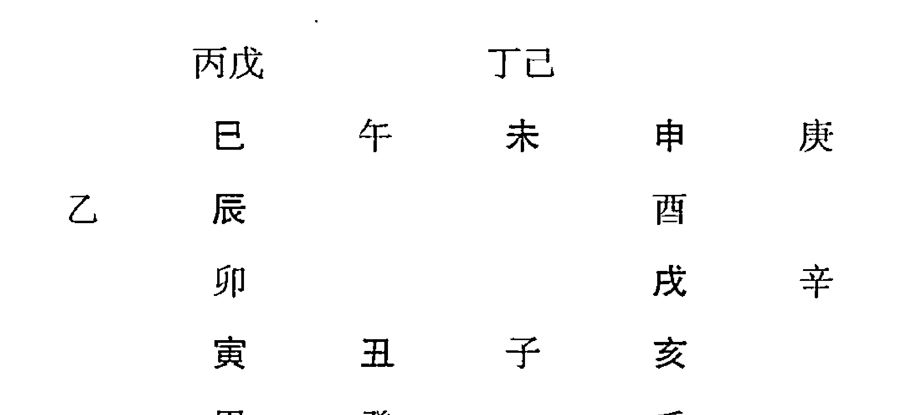

例2，甲子日申将巳时占，首先布定天盘，将日辰之天干书于右，日支横书于左，干支间空一格。

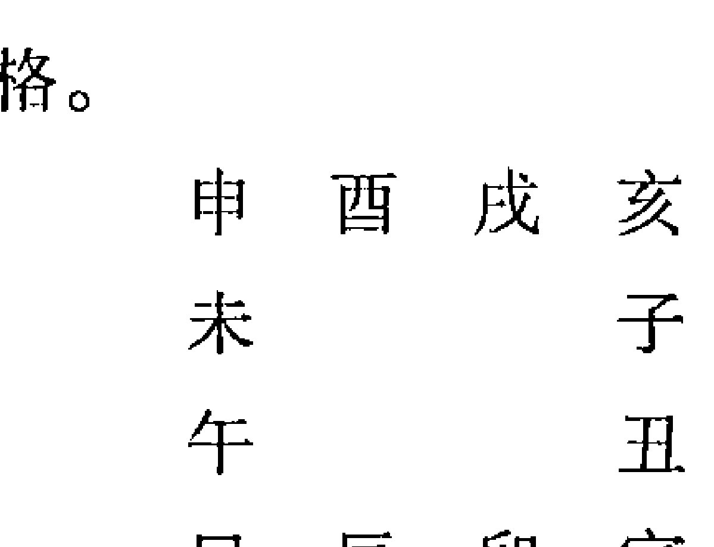

第二步，写出干阳课和支阳课。甲日寄于地盘寅宫，寅的天盘上神是巳，将巳书于甲干之上，就是干阳课，也是四课中的第一课；支阳课取地盘子上之天盘神卯，将卯书于日支子上，就是支阳课，也是四课中的第三课。

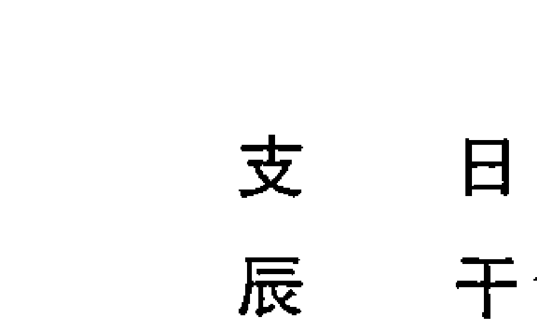

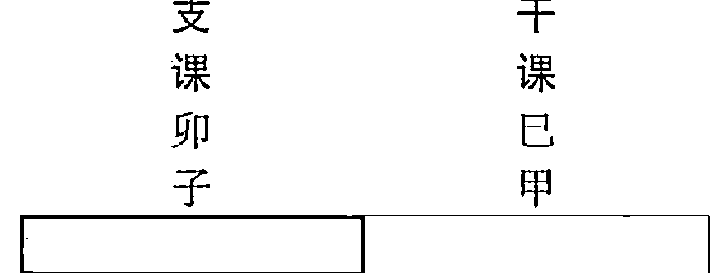

第三步，写出干阴课和支阴课，排出四课。上例干上巳，将巳字横书于日干之左，巳之地盘本宫上神申即干阴神，为四课的第二课；支上卯，书卯字于支辰之左，卯之地盘本宫上神午为支阴神，是四课的第四课。

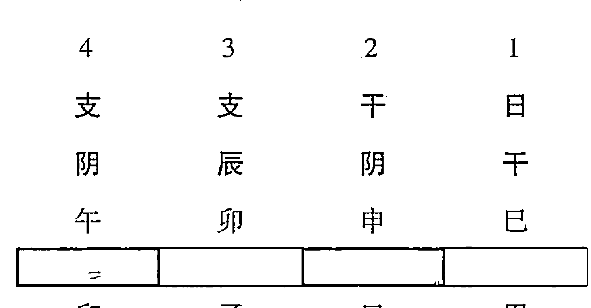

图七 日辰干支化生两仪之文

图八 干支四象化生四象之文

上图中白者为阳，黑者为阴。古人在将四课配四象时，有误将干两课俱作阳仪，谓干阳为太阳，干阴为少阳；支两课俱作阴仪，谓支阳课为少阴，支阴课为太阴者。然干之阴神明言是阴，阳中之阴必少阴也；支之阳神明言是阳，阴中之阳必少阳也。今辟其谬，以正其说。

##### 三、重审课

壬式三传，始于发用。《指掌赋》云：“生主和而克发用”，一语道破了壬式发用的玄机。以五行生克论，相生关系生生不息，体现了和谐社会的可持续发展；而相克关系则突显和激化了矛盾，既体现了社会发展的多样性和斗争性，同时，也表明机遇与风险共存。故发用始于贼克。贼者，地盘神逆贼天盘神之谓也，又名“重审”；克者，天盘神顺克地盘神之谓也，又名“元首”。诀云：

> 起课先从下贼呼，若无下贼上克初；
初传之上明中次，中上加临是末居。
三传既定天盘将，此是入式第一法。

如例2 甲子日申将巳时课：

申 酉 戌 亥
未       子
午       丑
巳 辰 卯 寅

      4   3   2   1
支   支   干   日
阴   辰   阴   干
午   卯   申   巳
卯   子   巳   甲

第一课\( \frac{\text{巳}}{\text{甲}} \)，无贼克，第三课\( \frac{\text{卯}}{\text{子}} \)、第四课\( \frac{\text{午}}{\text{卯}} \)均无克，唯第二课干阴\( \frac{\text{申}}{\text{巳}} \)下贼上，取巳上申发用。次依“初传之上明中次”诀，中传取地盘申上亥；末准“中上加临是末居”，末传取地盘亥上寅。三传：

+   初
申
中
亥
末
寅

有了三传，还要为三传装上遁干。遁干有旬遁与五子元遁之别，三传之遁干即占日所在旬的旬遁。此课甲子日占，依旬遁初传申遁得壬干；甲子旬中戌、亥空，亥既旬空，无遁干可装；末传寅遁得丙干。三传：

+   初 壬申
中   亥
末 丙寅

发用一般表人事的起因，在占断八门中谓之“发端门”；中传表人事发展之过程，曰“移易门”；末传表人事之结局，曰“归计门”（占断八门之论，后章另详）。

重审之发用，固以四课中之天神受地盘之逆克下贼而起，然发用之神，与日干之关系，或相克为官鬼、妻财，或相生为父母、子孙，或相比为兄弟，此即《阴符经》“天有五贼，见之者昌”也。盖五贼（六亲关系）皆起自四课之天神，故曰“五贼在心，施行于天”，言“在心”者，乃“天性，人也；人心，机也”之谓也。人之心机一动，遂施行于天以求课式吉凶之变数也。壬课以时将相加于指端代式，将者，天时也，“宙”也；时者，向隅也，“宇”也。故《阴符经》有“宇宙在乎手，万化生乎身”之语也。

##### 四、元首课

四课之中俱无下贼上者，观四课之某一课有上克下者发用，名之“元首课”。

例3，丁丑日占，得酉将丑时课。月将居占时后四位，天盘用逆三合盘：

| 丑 | 寅 | 卯 | 辰 |
| --- | --- | --- | --- |
| 子 |    |    | 巳 |
| 亥 |    |    | 午 |
| 戌 | 酉 | 申 | 未 |

| 4 | 3 | 2 | 1 |
|---|---|---|---|
| 支 | 支 | 干 | 日 |
| 阴 | 辰 | 阴 | 干 |
| 巳 | 酉 | 亥 | 卯 |
| 酉 | 丑 | 卯 | 丁 |

上第一课卯上丁无克，干阴亥上卯、支阴酉上丑均无克。唯第四课支阴巳上酉天盘上神克地盘神，取酉上神已发用；巳上丑为中传，丑上酉作末传。丁丑日属甲戌旬，巳遁辛，丑遁丁，酉旬空，三传：

+   初 辛巳
- 中 丁丑
- 末 酉

余课书写格式准此。

#### 第三节 比用法

宗门九课依照贼克多寡、有无来推衍，其演进过程实际上体现了矛盾的简繁、深浅、隐显、迟速。单一的贼克关系表明了人事相对比较单纯。而通过比用法、涉害法从数重贼克关系中有选择地发用，则体现了人事的多样性和复杂性。当四课中无贼克时，先视有无遥克可以取用，表明人事的事态并不明朗，冲突较为缓和，矛盾较易化解。此外，伏吟课中乙日杜传格、癸日自信格，返吟除井栏格外，也属有克发用之例。

更明“比用法”，入手法云：

> 下贼或三二四侵，若逢上克亦同云；
常将天日比神用，阳日用阳阴用阴；
若或俱比俱不比，立法别有涉害陈。

若课，有两处或两处以上的下贼；或无下贼，有两处或两处以上的上克，取天将阴阳与日干相比同者为用。中、末传取法仿贼克例，名知一课。盖头绪多端，须知一比日为用也。

例4，壬辰日戌将亥时占事，月将居占时之后，用退连茹盘：

# 六壬时空

| 辰 | 巳 | 午 | 未 |
| --- | --- | --- | --- |
| 卯 |    |    | 申 |
| 寅 |    |    | 酉 |
| 丑 | 子 | 亥 | 戌 |

| 4 | 3 | 2 | 1 |
|---|---|---|---|
| 支 | 支 | 干 | 日 |
| 阴 | 辰 | 阴 | 干 |
| 寅 | 卯 | 酉 | 戌 |
| 卯 | 辰 | 戌 | 壬 |

第一课戊壬，上神克干；第二课无贼克，第三课卯辰，支上卯克辰，第四课无贼克。由于第一课和第三课均有上神克地盘神，故取与日干阴阳相同者为用。壬为阳日，戊为阳支，与日阴阳属性相比；卯乃阴支，与日性异不比，取比日之戊发用。中末准贼克例，戊上酉为中传，酉上申为末传。壬辰属甲申旬，三传遁得丙戌、乙酉，甲申：

+   初：丙戌
- 中：乙酉
- 末：甲申

此课之曰“比”，与八字“比、劫”之比是不同的概念。“比用”之比，不是五行六亲概念的比肩，而是以日干的阴阳属性为主，在多重贼（克）中，比取与日干阴阳相同者发用。课中或两上克，或数下贼，应之于人事，头绪必多，事主难决。

#### 第四节 涉害法

##### 一、辨疑

在宗门九课中，涉害课的起法看起来是最为复杂的。这不仅因其本身包含了深浅、复等的逻辑步骤，起例的分歧也令人莫衷一是。

涉害课的分歧，存在于第一步涉害深浅之中。按照涉害课的演进逻辑，第一步当然仍是先取下贼，无贼用克。当出现多重贼（克）时，比取与日阴阳同性者。如果有两处贼（克）俱与日比同，则正式进入涉害课发用的程序。一般且较为简易的方法是，以孟上神为涉害深，仲上神为涉害浅，不取季上神。中、末传准贼克法之例。

> 但《六壬大全》入手法诀云：
> 涉害行来本家止，路逢多克为用取。
> 孟深仲浅季当休，复等柔辰刚日宜。

其法先比较诸神涉害深浅，课中相涉各天神各由所临宫位涉归地盘本宫，论贼克之多寡，来确定涉害之深浅。下贼诸神以受地盘支辰及支中所寄天干之克多者为用，上克之神以克地盘支辰及支中寄干多者用之。谓之“涉害行来本家止”。其次，如涉归本家深浅相当，才进一步以孟深、仲浅之法取用。中、末传取法与前相同。古今壬学书籍中，取法采用此诀者不在少数，但付诸实用者却不占多数。

对此，清人刘赤江在其著作《六壬粹言·辨非十则》“涉害第六”中辨道：“涉害一课，取克贼之神，从地盘历数归于本家，以受克深者为用。经云‘涉害行来本家止，多克便将用为起’是也。如涉害俱深，则取孟位上神为用，如孟位无取，则取仲位上神为用。此古法也，近来诸家，均未用之者。然其原委，不可不知也”。此说依然不能说明涉害法究竟以何为确。

其实，比较涉害时，仅丁卯日第三局、乙卯日第三局与第九局、甲申日第五局、甲辰日第五局、癸酉日第六局及庚辰日第三局等七课，季上神涉归本家所得贼克深于孟上神。其余诸日涉害，都与直取孟、仲上神为用者完全一致。盖四孟神乃四季之首，除了本身所属的五行，如寅属木、巳属火等，还有一个寄干五行在内，如寅中寄甲木在内，巳中寄丙火在内。通常情况下，由孟上起涉害，如土神受寅宫之下贼，或金神克寅宫之类，本宫及寄干有两重贼克；依次至仲神卯上，得一重贼克；至季上，乃辰中乙木又有一重贼克，计四重贼克，为涉害深。仲上神只有本宫及辰之寄乙两重贼克，是涉害浅。然水神之渡涉又不同，如丁卯日三局之课，示例如下：

##### 二、起式

- 四孟神：寅、巳、申、亥，亦曰四生、四禄、四驿马；
- 四仲神：子、卯、午、酉；亦曰四正、四败、四桃花；
- 四季神：丑、辰、未、戌，亦曰四墓、四库、四余气。

涉害法的取用，必要满足两个逻辑上的前提。首先，课中须出现两处或两处以上的下贼或上克；其次，至少有两处贼、克比日情况相同，与日俱相比同，或俱不比同（返吟课有之），无法以比用法择用，这时，就要按照涉害法取用。法以比同日干的贼或克神临于地盘四孟者发用，地盘仲上神和季上神者皆不取，名“见机”格；如无孟上神，则直取地盘仲上神发用，不用地盘季上神。名“察微”格。此即《指掌赋》“用孟名曰见机，当因时以制宜；仲季号为察微，事未萌而预计”之谓也。

例6，丙子日丑将午时占，月将居占时后五位，天盘用第六局四绝体盘：

| 子 | 丑 | 寅 | 卯 |
|----|----|----|----|
| 亥 |    |    | 辰 |
| 戌 |    |    | 巳 |
| 酉 | 申 | 未 | 午 |

| 寅 | 未 | 未 | 子 |
|----|----|----|----|
| 未 | 子 | 子 | 丙 |

此数，四课俱受上克。因二、三两课相同，四课缺一不备，实得三课。丙为阳日，未为阴支，不取；寅、子皆阳，与日俱比。因子为孟上神，寅为季上神，用孟上不用季上，取孟上子发用，课名“见机”。中末传与贼克、比用同，中传子上未，末传未上寅。丙子日属甲戌旬，三传分别遁得丙子、癸未、戊寅：

+   初 丙子
- 中 癸未
- 末 戊寅

例7，庚午日戊将午时占，月将居占时前四位，用第九局顺三合盘也：

| 酉 | 戌 | 亥 | 子 |
|----|----|----|----|
| 申 |    |    | 丑 |
| 未 |    |    | 寅 |
| 午 | 巳 | 辰 | 卯 |

| 寅 | 戌 | 辰 | 子 |
|----|----|----|----|
| 戊 | 午 | 子 | 庚 |

四课中二、四课俱是上神克下。庚日，辰、寅俱比日。辰临子为仲上神，寅临戌为季上神，无孟上神，仲先季不取，子上辰发用，中传申，末传子。庚午日属甲子旬，三传戊辰、壬申、甲子，曰“察微”：

+   初 戊辰
中 壬申
末 甲子

例8，戊辰日子将巳时占，月将居占时后五位，用四绝体盘。

子 丑 寅 卯
亥       辰
戌       巳
酉 申 未 午

午 亥 未 子
亥 辰 子 戊

四课中干阳、支阳和支阴俱下贼上。戊为阳日，亥与日不比，子、午俱与日比，又均为孟上神，名为复等。取干上先见之子发用；中、末取法准贼克法。课名“缀瑕”。三传：

+   初 甲子
中 辛未
末 丙寅

六壬的宗门九法，凡贼克法所统者三，一重贼克曰贼克法，多重贼克取与日阴阳相比者曰比用法，多重贼克而与日俱比涉其害深者用之曰涉害法。此九宗门之第一要义也。

#### 第五节 遥克法

如课，或四课齐备，或如干往加支，支来临日，四课中有两课重复，缺一不备，止得三课，课中既无贼、克，乃依遥克法发用行传。入手法云：

> 四课无克号为遥，日与神兮递互招。
先取神遥克其日，如无方取日来遥。
或有日克乎两神，复有两神来克日，
择与日干比者用，阳日用阳阴用阴。

### 例9，壬辰日丑将戌时占，月将居占时前三位，天盘用生胎盘。

```
申 酉 戌 亥
未     子
午     丑
巳 辰 卯 寅
```

```
戌 未 已 寅
未 辰 寅 壬
```

四课上下俱无贼克，先察四课上神有否遥克日干之神，有则发用，中、末传准贼克之例。此即“先取神遥克其日”之谓也。

在例9中，支课未、戌均克壬干，准比用法，取比日之戌发用。课名“蒿矢”。三传：

+   初 丙戌
- 中 己丑
- 末 壬辰

### 例10，壬申日亥将申时占，月将居占时前三位，用生胎盘。

```
申 酉 戌 亥
未     子
午     丑
巳 辰 卯 寅
```

```
寅 亥 已 寅
亥 申 寅 壬
```

课中日干之寄宫亥往临支辰，谓之“干往加支”。干课与支阴课相同，名不备格。课中无贼克，又无上神来遥克日，视日所克之巳火发用，课名“弹射”。三传：

+   初 己巳
- 中 壬申
- 末 亥

这里插叙一个概念—不备课。不备课，或支来加干，干阴与支阳两课相同；或干之寄宫往加支辰，支阴与干阳两课相同，名为不备。又视日干阴阳，凡五阳日占，先尽干课之用，不备在支两课；支来加干，支阳不备；干往加支，支阴不备。如例10即是支阴不备例。或五阴日占，先尽支课之用，不备在干两课；支来加干，名干阴不备；干往加支，则干阳不备。八专日干支同位，不可以不备论之。

遥克一法，因课中无贼克，先取干阴、支阳或支阴课上神克干者为用，日之官鬼也；如无官鬼爻，次将日干遥克余课上神者为用，我之妻财也。《易》曰：“崇高，莫大乎富贵”，故遥克先论官，次及财也。如课得二神遥克日干，或日干遥克二神，仍以比用法比取日干阴阳相同者发用。

遥克之法，乃四课上下俱无贼克，却以日干遥取克神为用，与贼克所统者三，及后文所具既无贼克、又无遥克之昴星、别责、八专皆不相同，独立成式。此宗门之第二要义也。

#### 第六节 昴星法

无克之课有五，分别依照昴星、别责、八专发用；此外，伏吟课中的自任格及丁、己、辛日自信格，返吟课的井栏格，亦均属无克之例。相对有克发用而言，无克发用之课往往表意外突发的、阴私暧昧的人事。

凡课，须干支四课齐备，既无贼克，又无遥克，以昴星法取用。入手法云：

> 无遥无克昴星穷，阳仰阴俯酉位中；
刚日先辰而后日，柔日先日而后辰。

酉主西方白虎金神，度胃、昴、毕三宿，既取“昴星”为用，盖责其酉。《史记·天官书》曰：“昴曰髦头，胡星也，为白衣会”；《正义》补充道：“昴七星为髦头，胡星，亦为狱事。……摇动若跳跃者，胡兵大起；一星不见，皆兵之忧也”。故昴星主丧亡、狱讼、兵刑之事可想。

此课，五阳日占，仰取地盘酉宫上神为初传。中传视支上神，末传视干上神。名“虎视”。

例11，戊申日酉将申时占，月将居日前一位，用进连茹盘。

## 六壬时空

| 午 | 未 | 申 | 酉 |
|---|---|---|---|
| 巳 | 午 | 未 | 申 |
| 巳辰 | | 酉戌 | |
| 辰卯 | | 戌亥 | |
| 寅 | 丑 | 子 | 亥 |
| 卯 | 寅 | 丑 | 子 |

四课无贼克、遥克，戊乃阳日，又称“刚日”，仰取地盘酉上戊作初传。次依“刚日先辰而后日”，中传支上酉，末传干上午。三传：

- 初 庚戌
- 中 己酉
- 末 丙午

五阴日，俯视天盘酉下何神，取而发用。中传视干上神，末传取支上神。名“冬蛇掩目”。

例12，丁丑日辰将未时占，月将占时后三位，用病胎盘。

| 寅 | 卯 | 辰 | 巳 |
|---|---|---|---|
| 巳 | 午 | 未 | 申 |
| 丑辰 | | 酉午 | |
| 子卯 | | 戌未 | |
| 寅 | 丑 | 子 | 亥 |
| 亥 | 戌 | 酉 | 申 |

四课无贼克、遥克，丁乃阴日，又称“柔日”，俯取天盘酉将所临之神后子发用，初传子。次依诀“柔日先日而后辰”，中传取干上神辰，末传视支上戌。三传：

- 初 丙子
- 中 庚辰
- 末 甲戌

阳日虎视，阴阳相击，病讼难息，事多交困；阴蛇掩目，重阴凝结，是非莫辨，人事昏昏。

#### 第七节 别责法

假如占日干支互往加临，课内有两课相同，止得三课，名“不备课”。若课中无贼克之神，又无遥克之神，当别取一责，名“别责课”。入手法云：

- 四课不全三课备，无遥无克别责例：
- 刚日干合上头神，皆以天上作初传，
- 柔日支前三合取；阴阳中末干头立。
- 刚三柔六共九课，此课先贤俱隐秘。
- 戊午戊辰与丙辰，干上皆午是为亲；
- 辛丑辛未各二课，干上皆是丑未真；
- 丁酉当为巳丁是，辛酉原来是酉辛。

此诀，谓课中或干往加支，或支来临干，四课不备，止得三课，既无贼克、遥克，准“别责”之例。五阳日别责课，惟丙辰、戊辰、戊午三日干上午，始合例，取日干合处之上神。

例13，或丙辰日已将辰时占，月将乃居占时前一位，用进茹盘也。

| 午 | 未 | 申 | 酉 |
|---|---|---|---|
| 巳 | | 戌 | |
| 辰 | | 亥 | |
| | | 戌（辛） | |
| 卯 | 寅 | 丑 | 子 |

| 午 | 巳 | 未 | 午 |
|---|---|---|---|
| 巳 | 辰 | 午 | 丙 |

此数，课中无贼克、遥克，干课与支阴课同为午，四课不全，止得三课，为阳日支阴不备课，亦不用昴星例，准别责法，“刚日干合上头神”，

### 第七章 宗门九课

丙与辛合，辛寄戊，戊上亥，取之立用。中、末传不分阴日、阳日，依“阴阳中末干头立”，皆取干上午作传。三传：

- 初 癸亥
- 中 戊午
- 末 戊午

例14，戊辰日午将巳时占，月将居占时前一位，盘式同上。

| 午 | 未 | 申 | 酉 |
|---|---|---|---|
| 巳 | | 戌 | |
| 辰 | | 亥 | |
| 卯 | 寅 | 丑 | 子 |

| 丑（癸） | | | |
|---|---|---|---|

| 午 | 巳 | 未 | 午 |
|---|---|---|---|
| 已 | 辰 | 午 | 戊 |

此数，干课与支阴课同为午，四课不全，止得三课，为支阴不备课。课中无贼克、遥克，准别责法，戊与癸合，癸寄丑，丑上寅，取之立用。中、末传均取干上午。三传：

- 初 丙寅
- 中 庚午
- 末 庚午

例15，戊午日午将巳时占，月将居占时前辰，用盘同上，四课：

| 申 | 未 | 未 | 午 |
|---|---|---|---|
| 未 | 午 | 午 | 戊 |

此数支来加临干上，使干阴课与支阳课同为未，五阳日先尽干课之用，则支阳神不备，为支阳不备课。课中无贼克、遥克，准别责法，戊与癸合，癸寄丑，丑上寅，取之立用。中、末传均取干上午。三传：

- 初 甲寅
- 中 戊午
- 末 戊午

五阴日之别责课，唯辛丑、辛未、丁酉、辛酉四日有之。此四日不备之课，无贼克、遥克者，尽取与占日支辰三合之前辰，共计六课。谓支三合者：寅、午、戌合火局，曰“炎上”；申、子、辰合水局，曰“润下”；巳、酉、丑合金局，曰“从革”。亥、卯、未合木局，曰“曲直”。

例16，辛丑日丑将戌时占，月将居占时前三辰，用生胎盘。

| 申 | 酉 | 戌 | 亥 |
|---|---|---|---|
| 未 | | | 子 |
| 午 | | | 丑 |
| 巳 | 辰 | 卯 | 寅 |

| 未 | 辰 | 辰 | 丑 |
|---|---|---|---|
| 辰 | 丑 | 丑 | 辛 |

此数四库相叠，干阴课与支课同为辰，四课止得其三，为柔日干阴不备课。课中无贼克、遥克，准别责法，“柔日支前三合取”，丑之三合前辰为巳，取之立用。中末传均取干上丑。三传：

- 初 巳
- 中 辛丑
- 末 辛丑

例17，辛未日丑将戌时占，用盘同上，四课：

| 丑 | 戌 | 辰 | 丑 |
|---|---|---|---|
| 戌 | 未 | 丑 | 辛 |

此数，干之寄宫往加支上，干阳课与支阴课相同，柔日尽支二课之用，为干阳不备课。课中无贼克、遥克，准别责法，阴日以未之三合前辰亥为用。中、末传均取干上丑。三传：

- 初 亥
- 中 乙丑
- 末 乙丑

例18，辛丑日未将戌时占，月将居占时后三位，用病胎盘。

| 寅 | 卯 | 辰 | 巳 |
|---|---|---|---|
| 丑 | | | 午 |
| 子 | | | 未 |
| 亥 | 戌 | 酉 | 申 |

### 第七章 宗门九课

此数，干所寄之戊往加于支上，干课与支阴课同为未，柔日尽支二课之用，为干阳不备之课。课中无贼克、遥克，准别责法，阴日以丑之三合前辰巳为用。中、未取干上未。三传：

| 初 | 已 |
|---|---|
| 中 | 乙未 |
| 末 | 乙未 |

### 例 19，辛未日戌将丑时占，用盘同上，四课：

| 丑 | 辰 | 辰 | 未 |
|---|---|---|---|
| 辰 | 未 | 未 | 辛 |

此数，因支来加干，干阴课与支课同为辰，为干阴不备课。课中无贼克、遥克，准别责法，阴日以未之三合前辰亥为用。中、末均取干上未。

| 初 | 亥 |
|---|---|
| 中 | 辛未 |
| 末 | 辛未 |

### 例 20，丁酉日别责课，如诀云 “丁酉当为巳丁是”，乃谓巳临丁干，干阳不备也。未将酉时之占是其数，月将居占时后两位，用退间传盘。

| 卯 | 辰 | 巳 | 午 |
|---|---|---|---|
| 寅 | | 未 | |
| 丑 | | 申 | |
| 子 | 亥 | 戌 | 酉 |

| 巳 | 未 | 卯 | 巳 |
|---|---|---|---|
| 未 | 酉 | 巳 | 丁 |

此数，干之寄宫未往临支上，干课与支阴课同为巳，为干阳不备课。课中无贼克、遥克，准别责法，阴日以酉之三合前辰丑为用。中、末均取干上巳。

| 初 | 辛丑 |
|---|---|
| 中 | 巳 |
| 末 | 巳 |

例21，辛酉日酉将戌时，月将居占时后一位，支加干曰“辛酉原来是酉辛”，用退茹盘。

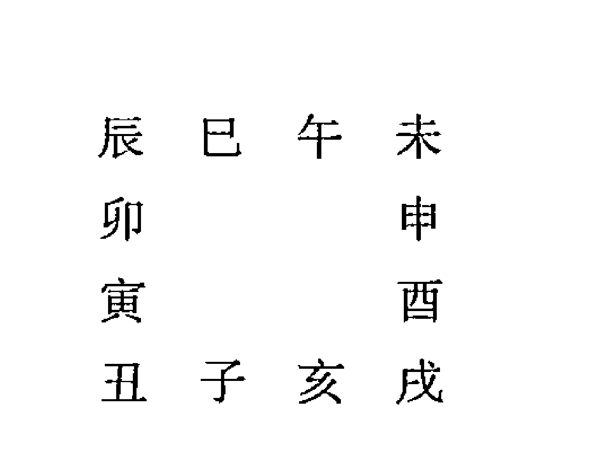

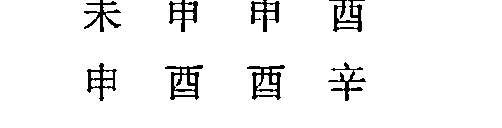

数中支来加干，干阴与支课同为申，为干阴不备课。无贼克、遥克，准别责法，阴日以酉之三合前辰丑为用。中、末传均取干上酉。三传：

- 初 丑
- 中 辛酉
- 末 辛酉

#### 第八节 八专法

凡遇甲寅、庚申、丁未、己未、癸丑五日，干之寄宫即是占日支辰，干支同位，名“八专”日。其中，癸丑日十二时课俱有克，余四日无贼克者，不可以不备课论，亦不再取遥克，以八专法取用行传。入手法云：

> 两课无克号八专，阳日日阳顺三；
> 阴日辰阴逆三位，中末总向干上眠。

例22，甲寅日亥将寅时占，月将居占时后三位，用病胎盘。

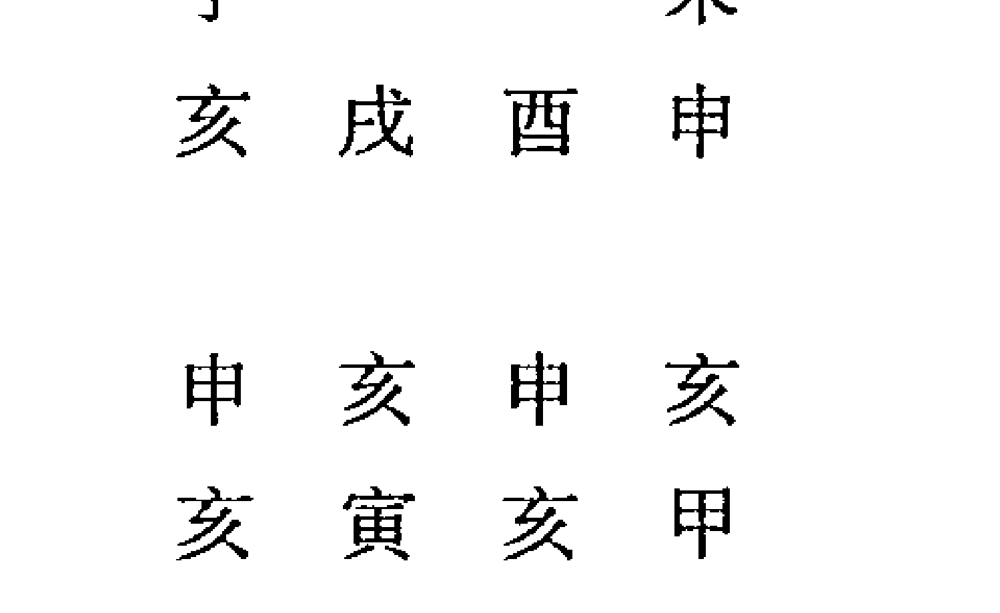

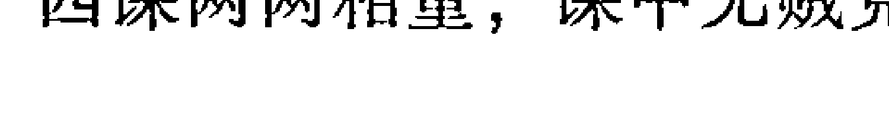

甲寅日占，干支同位，四课两两相重，课中无贼克，不再取遥克，准八专法，“阳日日阳顺行三”，由日阳神向前顺数三位，自亥顺数至子、丑，用神即为丑。复日“中末总向干眠”，故中、末传均为干上亥。三传：

- 初 丑
- 中 癸亥
- 末 癸亥

甲寅日午甲，也是八专课。将干之阳神午顺三位至申，三传申、午、午。

### 例23，庚申日酉将申时占，月将居占时前辰，用进茹盘。

| 午 | 未 | 申 | 酉 |
|---|---|---|---|
| 巳 | | 戌 | |
| 辰 | | 亥 | |
| 卯 | 寅 | 丑 | 子 |

四课中无贼克，八专日占不复取遥，由日阳酉顺三位取亥为用。中、末传均为酉。三传：

- 初 癸亥
- 中 辛酉
- 末 辛酉

庚申日计有四个八专课，除上例外，还有未庚、丑庚和亥庚三数。

### 例24，丁未日午将未时占，月将居占时后辰，用退茹盘。

| 辰 | 巳 | 午 | 未 |
|---|---|---|---|
| 卯 | | 申 | |
| 寅 | | 酉 | |
| 丑 | 子 | 亥 | 戌 |

课中无贼克，准“阴日辰阴逆三位”诀，由支阴神向后逆数三位取用。支阴已逆数三位为巳、辰、卯，用神卯。中、末传均为干上午。

三传：

- 初 卯
- 中 丙午
- 末 丙午

丁未日计四个八专课，除上例外，还有$\frac{巳}{丁}$、$\frac{辰}{丁}$和$\frac{戊}{丁}$三数。

例25，己未日亥将酉时占，月将居占时前两辰，用进间传盘。

| 未 | 申 | 酉 | 戌 |
|---|---|---|---|
| 午 | | 亥 | |
| 巳 | | 子 | |
| 辰 | 卯 | 寅 | 丑 |

| 亥 | 酉 | 亥 | 酉 |
|---|---|---|---|
| 酉 | 未 | 酉 | 己 |

课中无贼克，不取遥克，准八专法，由支之阴神本位亥逆数三位，用神为酉。中、末传均为干上酉。三传：

- 初 辛酉
- 中 辛酉
- 末 辛酉

课名“独足”。

己未日计六个八专课，还有$\frac{午}{己}$、$\frac{巳}{己}$、$\frac{辰}{己}$、$\frac{戌}{己}$和$\frac{申}{己}$五课。

八专课又名帷簿不修。盖因干支定尊卑、男女、主客之位，今干支同位，内外不备，尊卑、男女、主客共居一室，而无帷帐设防，帷稍不修，多失礼之事也。

昴星、别责、八专三宗门之法，乃课中既无贼克、又无遥克，依课之备与不备各取其用，乃九宗门之第三要义。

#### 第九节 伏吟法

凡课，时、将同位，天地盘不动，天盘各居地盘本宫，名伏吟课。入手法云：

> 伏吟有克还为用，无克刚干柔取辰。
> 逶逦刑之作中末，从兹玉历识其真。
> 若也自刑为发用，次传颠倒日辰并；
> 次传更复自刑者，冲取末传不论刑。

伏吟用刑，故先明支刑：

- 寅、巳、申忘恩之刑
- 丑、戌、未恃势之刑
- 子、卯无礼之刑
- 辰、午、酉、亥自刑。

伏吟有贼克，惟六乙、六癸十二日，余甲、丙、丁、戊、己、庚、辛、壬日均无克，因伏吟天地盘相重叠，所以刚日以干上神，亦即以干之寄宫为用，甲日用寅，丙、戊日用巳，庚日用申，壬日用亥；丁、己、辛日以支上神，亦即占日支辰为用。此即“伏吟有克还为用，无克刚干柔取辰”之谓也。

例26，六癸日伏吟课，均取干上丑克癸为用。如癸酉日伏吟课：

| 已 | 午 | 未 | 申 |
|---|---|---|---|
| 辰 | | 酉 | |
| 卯 | | 戌 | |
| 寅 | 丑 | 子 | 亥 |

| 酉 | 酉 | 丑 | 丑 |
|---|---|---|---|
| 酉 | 酉 | 丑 | 癸 |

四课中惟干上丑为上克，取为初传。次据“逶逦刑之作中末”一诀，按三刑的循环顺序行传，因丑刑戌，故中传为戌；戌刑未，故末传取未。三传：

- 初 乙丑
- 中 戌
- 末 辛未

例27，六甲日伏吟课，四课无贼克，刚日俱取干上神寅为初传。如甲辰日伏吟课。

| 辰 | 辰 | 寅 | 寅 |
|---|---|---|---|
| 辰 | 辰 | 寅 | 甲 |

初传直取干上寅为用；寅与巳刑，巳为中传；巳又刑申，申为末传。三传：

- 初 寅
- 中 乙巳
- 末 戊申

课名“自任”。余六丙、六戊日取干上巳发用，三传巳、申、寅；六庚日干上申发用，三传申、寅、巳。六壬日干上亥自刑发用，名为“杜传卦”，下文另具。

柔日伏吟，无克取支上神为用，中、末递刑取之。名“自信”格。例28，丁巳日伏吟课。

| 巳 | 巳 | 未 | 未 |
|---|---|---|---|
| 巳 | 巳 | 未 | 丁 |

丁巳为柔日，支上巳为用；巳刑申，申为中传；申刑寅，寅为末传。三传：

- 初 丁巳
- 中 庚申
- 末 甲寅

例29，辛卯日伏吟课。

| 卯 | 卯 | 戌 | 戌 |
|---|---|---|---|
| 卯 | 卯 | 戌 | 辛 |

辛卯日伏吟，四课无贼克，取支上卯为用；卯与子仅两神相刑，中传子；末传取冲子之午。三传

- 初 辛卯
- 中 戊子
- 末 午

### 第七章 宗门九课

丁卯、己卯二日准此例，三传均为卯、子、午。

### 例30，己亥日伏吟课。

- 亥亥未未
- 亥亥未己

己亥日伏吟，课中无贼克，取支上亥为用；然亥乃自刑，“若也自刑为发用，次传颠倒日辰并”，中传干上未；未刑丑，丑为末传。三传：

- 初 己亥
- 中 乙未
- 末 辛丑

伏吟遇自刑发用者，因行传杜塞，名“杜传”格。丁、己、辛干值酉、亥六日皆是其例。

### 例31，又六乙日伏吟课，乙下贼辰为初传，均为杜传格。

- 酉酉辰辰
- 酉酉辰乙

乙酉日伏吟，初传干上辰自刑发用；中传用支上酉，又自刑；“次传更复自刑者，冲取末传不论刑”，末传取冲酉之卯。三传：

- 初 壬辰
- 中 乙酉
- 末 辛卯

乙丑、乙卯、乙巳、乙未四日伏吟，发用杜传，中用支上，刑中传者为末传。乙酉、乙亥日中传酉、亥又是自刑，乙酉日上例已明；乙亥日取巳冲亥为末传，三传辰、亥、巳。

### 例32，壬午日伏吟课。

- 午午亥亥
- 午午亥壬

壬午日伏吟课，初传亥自刑发用；中传用支上午，又自刑；末传取冲午之子。三传：

- 初 乙亥
- 中 壬午
- 末 丙子

壬子、壬寅、壬申、壬戌四日伏吟，发用杜传，中用支上，刑中传为末传。壬辰、壬午日中传辰、午又是自刑，壬午日上例已明；壬辰日取戊冲辰为未传，三传亥、辰、戌。

#### 第十节 返吟法

凡课，月将与地盘间隔六位，天地盘各居冲位，名返吟课。入手法云：

> 返吟有克亦为用，无克别有井栏名；
> 若知六日该无克，丑未同干丁己辛；
> 丑日登明未太乙，辰中日未①识原因。

返吟课有贼克者，仍取贼克发用，中、末传一如贼克之法，俱在冲方见之。

### 例33，甲辰日申将寅时占，月将临地盘冲位，用返吟盘。

| 亥 | 子 | 丑 | 寅 |
|---|---|---|---|
| 戌 | | 卯 | |
| 酉 | | 辰 | |
| 申 | 未 | 午 | 巳 |

| 辰 | 戌 | 寅 | 申 |
|---|---|---|---|
| 戌 | 辰 | 申 | 甲 |

课中干阴寅受地盘申下贼发用，中传寅上冲取申，末传申上冲取寅，名“无依”。三传：

- 初 寅
- 中 戊申
- 末 寅

### 例34，戊戌日辰将戌时占，用盘同上。

| 戌 | 辰 | 巳 | 亥 |
|---|---|---|---|
| 辰 | 戌 | 亥 | 戌 |

> ① 原文“辰申日未”为抄讹，实际上，井栏格取占日驿马发用，中用支上，末用干上。故订正之。

戊辰、戊戌二日返吟，干二课俱下贼上，俱不比日，俱盂上神，复等取干上先见者发用。然余因返吟盘之特殊性，仍就所临地盘位上涉其害深者取之，以亥仅戊干一重下贼，而巳有亥与所寄之壬两重下贼，故用巳为初传，三传：

- 初 已
- 中 己亥
- 末 已

返吟无克，所谓“无克别有井栏名”也。在讨论井栏格的取用行传之前，间插一个知识点——驿马。诀云“驿马三合顶头冲”，意取三合冲方为驿马：

- 寅、午、戌，申为驿马；申、子、辰，寅为驿马；
- 已、酉、丑，亥为驿马；亥、卯、未，已为驿马。

入手法云“若知六日该无克，丑未同干丁己辛”，此言丁丑、丁未、己丑、己未、辛丑、辛未六日无克。此六日冲取驿马发用，丑日用登明亥，未日用太乙已；中用支上，末用干上。

例 35，辛丑日辰将戌时占，用盘同上。

| 丑 | 未 | 戌 | 辰 |
|---|---|---|---|
| 未 | 丑 | 辰 | 辛 |

辛丑日返吟，四课无贼克，以日之驿马为用，中取支上，末取干上。名“井栏射”，又名“无亲”。三传

- 初 己亥
- 中 乙未
- 末 辰

伏、返二式，有贼克者，仍归为贼克之体例。或无贼克而伏吟阳取干上、阴取支上，递相刑传；或返吟用驿马发用，归为无克之例也。

小结：六壬以贼克之有无为切入点，演宗门之九式，谓之发用、三传。课传诸神各有五行属性与六亲分属。虽说六亲皆与日干相较分判，但一因壬课之日干各有寄宫，寄宫之五行有与日干相同者，或如乙之寄辰、丁之寄未、戊之寄巳、辛之寄戊、癸之寄丑，五行、六亲皆生变矣。二因初传取用法式之不同，其贼克、遥克、昴星、合化、顺逆所得之六亲或在课内，或求盘式，皆不确定。此《阴符经》“五贼”之第三层义理也。

易学术数是一门统合了象、术、理、数的学科。易象总赅术、理、数三，术、理、数三又反过来丰富了易象的思维结构和方式，增加了易象的可操作性，使简约的易象更为充实，便于解读。这一特性，使得数理逻辑的运用在术数学中显得尤为重要。六壬作为术数学的一门类，亦不能外之。

六壬的学习，始自宗门九课。九宗法的掌握作为六壬入门的“钥匙”，既关键，又颇不容易。但是，只要学者能明了九宗法之间的逻辑关系，学习起来就省事不少了。我将九宗法根据有贼克、遥克和无克特划分为三大类。有贼克的课从先贼后克开始，进而是多重贼克比而用之，俱比日干则用涉害；伏吟、返吟二法之有贼克者从之。次为遥克法，凡四课或三课不备，先审贼克之有无，无则取神遥、日克。末后无克者，四课曰昴星，三课用别责，八专日无克直取八专课。因将九宗法分而为三要，故

> 《阴符经》曰：“九窍之邪，在乎三要”

，壬家循宗门九法之起例以探人事之幽隐祸福，约九课之窍，备乎贼克、遥克与无克之三要也。

### 第八章 九式宗门的时空切换

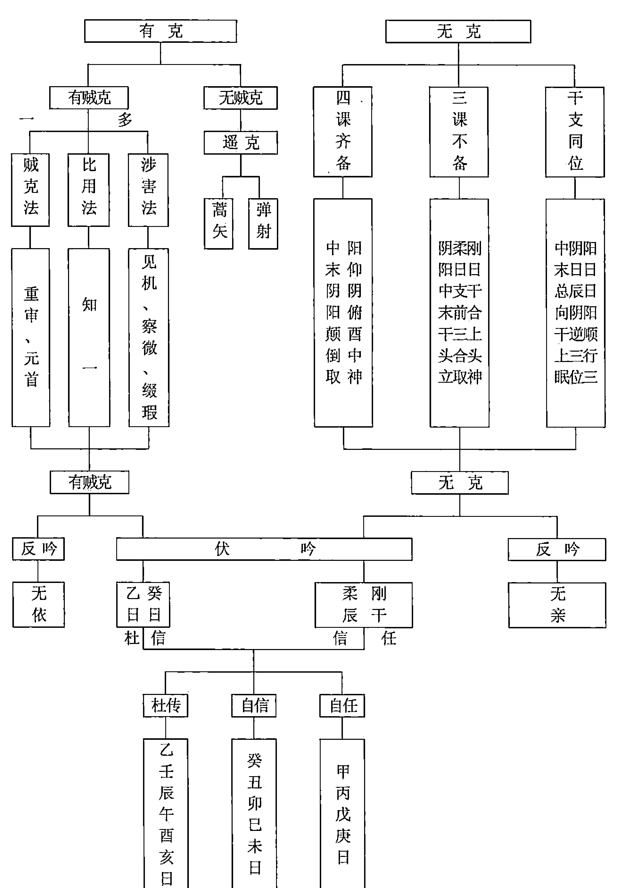

### 第八章 九式宗门的时空切换

无论是宗门九式的逻辑演绎，还是时空大卦的时空切换，壬式的起例可分为有贼克的贼克、比用和涉害三法，遥克法及无贼克无遥克之昴星、别责、八专三法，伏吟、返吟则介乎有贼克与无贼克之间，但如果专就时空大卦的时空切换来看宗门九课，我们会发现一个别样的大六壬。

凡传课，皆要由贼克之空间切人，或有贼克，或无贼克，此一空间为时空大卦之大前提也。设有贼克，当更究其贼先克后，故下贼之空间点又作为大前提中之“始人”空间点。无贼求克，曰“元首卦”，元首引贼克之一元人于二次元空间矣。

当出现多重贼克的情况时，空间点切入到比用或涉害。比用的空间切人点不同于涉害，比用的空间切人点是日干，而涉害则是由贼、克之神所临本位的地盘神的孟、仲直接切人，一比阴阳，一涉多寡，阴阳是性质的区别，多寡则属于数量的比较。前者是横向平行空间间的比对，后者论贼克之神的地盘加临，是各别纵向空间点之间的切换。

或无贼克，空间的切换尤为错综，八专日干支同位，将一个空间用日干、支辰复制、延展成四课，无贼克即不取遥克，用八专顺逆之法切入初传时空。八专日外，干支互加的空间四课不备，或干支各作两课的四课空间，先则遥克。更无遥克者，四课空间用昴星，不备空间用别责。不备空间还要论是干课不备还是支课不备，论干课或支课不备的同时，还要论是阳神不备，还是阴神不备。

伏吟、返吟二式各占一空间，也是分取贼克之有无，前用刑，后取冲。

也许有读者会说，你讲的这些时空切换什么的，不还是在重复了九宗的起课逻辑么？有什么意义呢？其实不然，对一些稔熟笔占、心算的壬友来说，起课的逻辑意识背后，在潜意识里是存在这种时空切换的。如课内无贼有克，这是能一眼看出的，于是用一下克发用，但在潜意识里却有一个始入空间切换到元首二次元空间的瞬间。还有多重贼克间的空间切换，遥克空间的扭曲、八专空间的延展、不备空间的折叠和昴星空间的接人，都是从贼克始入空间切入转换来的。所以当我们用无贼克的宗式取传发用时，其实已经切换过多个六壬的时空段了。这种潜意识层面的时空切换，虽然不为壬家所感知，但仍能左右意识层面的课传理气模式。这就是我推衍六壬时空大卦的意义所在。

当然，这种时空切换模式，对于依赖 APP 起课的懒汉来讲，不过是对牛弹琴罢了。

## 六甲日

| 甲巳 | 甲午 | 甲未 | 甲申 |
|------|------|------|------|
| 申亥寅 | 午戌 申子<br>寅 午 戌 子<br>寅 申 午 午<br>辰 申 子 辰 | 辰寅未子<br>甲五子巳戌 | 寅申寅 |
| 甲辰 | 六甲日 | 甲酉 |
| 辰午申 |  | 申戌子<br>戌子寅<br>巳未酉<br>子寅辰<br>辰寅午<br>午酉辰<br>丑辰亥<br>申亥 |
| 甲卯 | 甲戌 |
| 辰巳午 | 戌午寅 |
| 甲寅 | 甲丑 | 甲子 | 甲亥 |
| 寅巳申 | 子亥戌 | 甲四申戌<br>戊午<br>申辰<br>午寅 | 甲三子<br>申午<br>巳卯<br>寅子<br>寅申<br>丑巳<br>亥寅<br>亥亥 |

## 六乙日

| 乙巳 | 乙午 | 乙未 | 乙申 |
| :--- | :--- | :--- | :--- |
| 酉 亥 丑<br>亥 丑 寅<br>子 寅 卯<br>丑 卯 辰<br>卯 巳 未<br>辰 未 酉<br>巳 申 戌<br>午 酉 亥 | 申戌子 | 卯 乙 五<br>酉 未<br>子 戌<br>卯 丑 | 酉 巳 丑<br>申 酉<br>子 丑<br>辰 巳<br>未 卯 亥<br>亥 未<br>卯 亥<br>未 卯 |
| 乙辰 | | 乙酉 |
| 酉 亥 丑<br>辰 辰 辰<br>酉 亥 丑<br>卯 巳 戌<br>卯 巳 未<br>辰 辰 辰<br>卯 巳 未<br>子 申 丑 | | 未 酉 乙四<br>巳 未 寅<br>戌 子 未<br>卯 巳 子 |
| 乙卯 | | 乙戌 |
| 亥 酉 丑<br>戌 申 子<br>酉 未 亥<br>申 午 戌<br>卯 巳 未<br>丑 辰 戌<br>子 卯 卯<br>亥 寅 午 | | 卯酉 巳亥 丑未<br>卯 巳 戌<br>酉 亥 辰<br>卯 巳 戌 |
| 乙寅 | 乙丑 | 乙子 | 乙亥 |
| 酉 亥 丑<br>未 酉 亥<br>巳 未 酉<br>卯 巳 未 | 丑戌未 | 卯 亥 酉 丑<br>未 巳<br>卯 丑<br>亥 酉<br>巳 未 卯<br>酉 卯<br>巳 亥<br>丑 未 | 乙五 丑<br>午 卯<br>丑 戌<br>申 巳 |

### 第八章 九式宗门的时空切换

## 六壬时空

## 六丙日

巳申寅

戌亥子丑
寅卯辰巳
午
丑辰午
亥午酉戌午亥

辰午申戌子寅
申子辰
戌寅午
子辰申

申亥寅

丙四子寅
卯戌子
寅酉亥
丑申戌

酉丑巳

丑亥酉

戊申丑午
辰午申
子寅酉丑

子丙三
午亥卯申
子巳
午申
子酉午

子午寅
申戌辰午
子寅
辰申戌
子酉巳辰丑

申辰丙四
戌午子
巳丑未
子申寅

子午辰戌申寅
午巳寅
子亥申
午巳寅

### 第八章 九式宗门的时空切换

## 六丁日

| 丁巳 | 丁午 | 丁未 | 丁申 |
| :--- | :--- | :--- | :--- |
| 卯丑 巳<br>亥 丑<br>酉 亥<br>未 酉<br><br>未酉 亥<br>丑 酉<br>巳 未<br>巳 巳 | 亥 丑 卯<br>戌 子 丑<br>酉 亥 子<br>申 戌 亥<br><br>巳 未 酉<br>卯 卯 申<br>寅 午 未<br>丑 午 午 | 亥 丑 卯<br>亥 丑 卯<br>未 戌 子<br>丑 未 午<br><br>巳 未 酉<br>巳 未 酉<br>申 丑 未<br>寅 戌 丑 | 酉 丁四 卯<br>亥 申 辰<br>子 酉 巳<br>丑 戌 午 |
| 丁辰 |  | 丁酉 |
| 亥 丑 卯<br>巳 子 子<br>寅 辰 酉<br>亥 戌 午<br><br>巳 未 酉<br>亥 亥 午<br>申 辰 卯<br>巳 辰 子 |  | 酉亥丑 |
| 丁卯 |  | 丁戌 |
| 酉 丑 卯亥<br>巳 未<br>丑 卯<br>酉 亥<br><br>巳 未<br>亥 卯<br>未 亥<br>卯 未 |  | 亥 丑 卯<br>午 午 酉<br>戌 戌 子<br>寅 辰 卯<br><br>巳 未 酉<br>申 亥 子<br>亥 戌 卯<br>寅 戌 午 |
| 丁寅 | 丁丑 | 丁子 | 丁亥 |
| 亥 丑 卯<br>午 卯 戌<br>丑 戌 巳<br>申 巳 子<br><br>巳未 酉<br>酉 亥<br>辰 午<br>亥 丑 | 丑 卯酉<br>亥 卯<br>未 酉<br>丑 卯 | 酉 丁五<br>未 巳<br>子 戌<br>巳 卯 | 酉未 巳丑 亥卯<br>亥 酉 未<br>卯 丑 亥<br>未 巳 卯 |

## 六戊日

| 戊巳 | 戊午 | 戊未 | 戊申 |
| :--- | :--- | :--- | :--- |
| 巳<br>申<br>寅 | 子 寅 午 辰<br>寅 辰 巳 午<br>辰 午 未 申<br>申 戌 子 寅 | 辰午 申戌 子寅<br>申 子 辰<br>戌 寅 午<br>子 辰 申 | 子 卯 午 酉<br>戌 亥 寅 已<br>申 寅 巳 申<br>午 酉 子 卯 |
| 戊辰 |  |  | 戊酉 |
| 戊四 子 寅<br>卯 戌 子<br>寅 酉 亥<br>丑 申 戌 |  |  | 寅 丑 午 酉<br>子 辰 申 子<br>午 戌 辰<br>寅 子 午 戌<br>申 |
| 戊卯 |  |  | 戊戌 |
| 丑<br>亥<br>酉 |  |  | 戌 子 贞<br>申 巳 子<br>丑 戌 已<br>午 卯 戌<br>辰 午 申<br>寅 辰 卯<br>未 酉 申<br>子 寅 丑 |
| 戊寅 | 戊丑 | 戊子 | 戊亥 |
| 寅<br>亥<br>申 | 子 午 寅<br>巳 戌<br>申 午<br>丑 寅<br>辰 申 戌<br>子 寅<br>申 戌<br>辰 午 | 子<br>未<br>寅 | 子午 辰戌 申寅<br>午 巳 寅<br>子 亥 申<br>午 巳 寅 |

## 六己日

| 己巳 | 己午 | 己未 | 己申 |
| :--- | :--- | :--- | :--- |
| 卯 丑 巳<br>丑 亥 丑<br>亥 酉 亥<br>酉 未 酉<br>未 酉 亥<br>丑 卯<br>巳 丑<br>巳 亥 | 亥 丑 卯<br>戌 子 丑<br>酉 亥 子<br>申 戌 亥<br>巳 未 酉<br>卯 卯 戌<br>寅 午 午<br>丑 午 申 | 亥 丑 卯<br>亥 丑 卯<br>未 戌 子<br>丑 未 午<br>巳 未 酉<br>巳 未 酉<br>申 丑 未<br>寅 戌 丑 | 亥 丑 卯<br>丑 寅 辰<br>寅 卯 巳<br>卯 辰 午<br>巳 未 酉<br>申 未 亥<br>申 申 子<br>午 申 丑 |
| 己辰 |  | 己酉 |
| 亥 丑 卯<br>巳 子 子<br>寅 辰 酉<br>亥 戌 午<br>巳 未 酉<br>寅 亥 午<br>亥 辰 卯<br>申 辰 子 |  | 丑 卯 巳<br>卯 亥<br>巳 丑<br>未 卯<br>未 酉 亥<br>酉 丑<br>酉 卯<br>酉 巳 |
| 己卯 |  | 己戌 |
| 酉丑 巳未 亥卯<br>巳 卯 未<br>酉 亥 卯<br>丑 未 亥 |  | 亥 丑 卯<br>寅 午 酉<br>巳 戌 子<br>申 辰 卯<br>巳 未 酉<br>申 亥 卯<br>亥 戌 午<br>寅 戌 酉 |
| 己寅 | 己丑 | 己子 | 己亥 |
| 亥 丑 卯<br>午 卯 戌<br>丑 戌 巳<br>申 巳 子<br>巳 未 酉<br>酉 亥<br>辰 午<br>亥 丑 | 丑 卯 酉<br>亥 卯<br>未 酉<br>丑 卯<br>未 巳 亥<br>巳 巳<br>丑 亥<br>丑 巳 | 酉 己 五<br>未 巳<br>子 戌<br>巳 卯 | 酉未 巳丑 亥卯<br>亥 酉 未<br>卯 丑 亥<br>未 巳 卯 |

## 六壬时空

## 六庚日

| 庚巳 | 庚午 | 庚未 | 庚申 |
| :--- | :--- | :--- | :--- |
| 子 午 卯 子<br>庚五 巳 寅 亥 | 午 辰 寅 | 子 戌 酉 申<br>寅 亥 戌<br>辰 卯 寅 丑<br>午 巳 辰 | 申 寅 巳 |
| 庚辰 | 六庚日 | 庚酉 |
| 寅午 戌 午 寅<br>庚四 子 申 辰 |  | 子 寅 辰<br>寅 卯 辰<br>午 未 申<br>午 申 戌<br>亥 酉 酉<br>未 丑 |
| 庚卯 | 庚戌 |
| 辰 午 丑 申<br>庚五 戌 巳 子 |  | 申戊 子 寅 辰<br>辰午 申 戌 子<br>子寅 辰 午 申 |
| 庚寅 | 庚丑 | 庚子 | 庚亥 |
| 寅 申 寅 | 子 巳 戌 卯<br>寅 巳 戌<br>辰 未 子<br>午 辰 酉 寅<br>申 卯 丑 丑<br>戌 丑 午 | 辰 申 子 | 子 午 酉 子<br>寅 申 亥 寅<br>午 酉 子 卯<br>申 丑 寅<br>戌 巳<br>亥 申 |

## 六辛日

丑 亥 酉
卯 午 亥
戌 丑 午
巳 申 丑

未 巳 卯
酉 未 戌
辰 寅 巳
亥 酉 子

卯 亥 巳
未 午 寅
卯 亥 戌
未 西 丑
卯 巳
亥 丑
未 西

丑 亥 酉
巳 巳 午
未 寅 卯
未 亥 子

未 巳 卯
亥 寅 子
未 亥 未
未 申 子

丑 卯巳 辛三
亥 丑 午
酉 亥 辰
未 酉 寅

卯 酉 未
卯 巳
酉 丑
卯 辰

丑 巳 亥
亥 巳
未 亥
辰 巳

丑 亥 酉
子 戌 丑
亥 酉 酉
戌 申 酉

未 巳 卯
巳 卯 丑
辰 寅 子
卯 丑 亥

酉 辛四 未
未 卯 巳
子 申 戌
巳 丑 卯

丑 亥 酉
丑 亥 酉
戌 戌 戌
未 未 未

未 巳 卯
未 巳 卯
丑 申 子
戌 寅 午

巳 丑 酉
酉 寅
丑 午
巳 戌

未 卯 亥
亥 未
卯 亥
未 卯

丑 亥 酉
巳 巳 卯
丑 申 午
丑 亥 酉

未 巳 卯
亥 申 酉
丑 亥 子
丑 寅 卯

巳 未 卯
寅 巳
辰 未
午 酉

丑 西 亥
卯 丑
巳 卯
未 巳

丑 亥 酉
寅 丑 丑
卯 寅 亥
辰 卯 亥

未 巳 卯
申 午 辰
亥 未 巳
申 申 午

## 六壬时空

## 六壬日

壬巳 壬午 壬未 壬申
申寅 子午 辰戌 午 丑 申 子戌 寅午 申辰 子 壬五
寅 午 巳 未 戌 子 午 已
申 子 亥 卯 午 申 卯 寅
寅 午 巳 亥 寅 辰 子 亥
壬辰 壬酉
子 壬三 子寅 辰午 申戌
已 辰 戌 寅 午
戌 酉 申 子 辰
卯 寅 午 戌 寅
寅 辰 壬卯 壬戌
子 寅 寅 壬五
已 未 子 戌
戌 子 亥 酉
未 亥 卯 戌 申
壬寅 壬丑 壬子 壬亥
子 寅 辰 子寅 辰午 申戌 子 壬三 子 寅 辰
午 申 戌 辰 申 子 寅 丑 亥 亥 亥
酉 亥 丑 午 戌 寅 卯 寅 子 寅 辰
子 寅 辰 申 子 辰 辰 卯 卯 巳 戌
午 申 戌 寅 戌 午 申 戌
酉 巳 辰 辰 亥 亥 亥 亥
子 申 未 已 子 午 申 戌
卯 亥 戌 午 丑 子 寅 未

## 六癸日

| 癸巳 | 癸午 | 癸未 | 癸申 |
| :--- | :--- | :--- | :--- |
| 酉<br>丑<br>巳 | 癸四 未 酉<br>午 巳 未<br>亥 戌 子<br>辰 卯 巳 | 亥巳 未丑 卯酉<br>巳 未 卯<br>亥 丑 酉<br>巳 未 卯 | 卯<br>戌<br>巳 |
| 癸辰 |  | 癸酉 |
| 癸四 卯 巳<br>辰 酉 申<br>未 子 亥<br>戌 卯 寅 |  | 亥卯 癸四<br>未 巳<br>卯 丑<br>亥 酉 |
| 癸卯 |  | 癸戌 |
| 酉亥 未<br>丑 巳<br>卯 未<br>巳 酉<br><br>丑 卯 巳<br>卯 未<br>巳 酉<br>未 亥 |  | 癸四 亥 酉<br>戌 巳 午<br>未 寅 卯<br>辰 亥 子 |
| 癸寅 | 癸丑 | 癸子 | 癸亥 |
| 丑 亥 酉<br>寅 丑 亥<br>卯 寅 子<br>辰 卯 丑<br>未 巳 卯<br>申 未 辰<br>寅 申 巳<br>申 酉 午 | 丑<br>戌<br>未 | 丑 亥 酉<br>子 戌 未<br>亥 酉 午<br>戌 申 巳<br>未 巳 卯<br>巳 卯 丑<br>辰 寅 子<br>卯 丑 亥 | 巳卯 丑<br>丑 亥<br>亥 酉<br>酉 未<br>未 亥酉<br>巳 未<br>卯 巳<br>丑 卯 |

## 《铃表》说明

本表仿《六壬大全·总铃》例，供初学者参考。阅读本表时，每格上方横置的小格内是四课中的第一课，即干课。如“六甲日”之甲子，即干阳课子甲。其下大格内纵列者，子甲所属天盘六甲日之三传也。三传上方之支辰，如“申戌”表甲申日、甲戌日三传，“甲四”者，除甲申、甲戌日外，余甲子、甲寅、甲辰、甲午四日之三传。

《铃表》从伏吟出发，如“六甲日”表起自甲寅，次一宫行至甲卯，周十二辰。止于甲丑，亦时进一位。在《铃表》中，日干看起来并没有动，移动的是干上神。但实际上，由伏吟盘起寅将加寅（甲）顺次而进，日干相对于太阳每时顺进一宫，月将相对于日干每时逆退一辰。直观体现了日躔逆十二辰的天象，这是天盘的第二种排序方式。合二表观之，地球与太阳的相对运动一目了然矣。

在天盘的两种排列形式中，天盘12式为显，为阳；《铃表》隐天盘于干上神，为阴。由《铃表》的排序方式，可引申出六壬天盘时空的第三种排序，曰“天盘空间配对”。如下图：

图十一 六壬天盘时空场的组别

《铃表》经笔者反复校勘，作了两大勘误：

- 一、《六壬大全·总铃》中的涉害课仍遵循涉归本家之法，今准“孟深仲浅”涉害法全部予以订正；
- 一、按邵彦和先生《断案·宅墓》之“邵秀才癸丑年生五十七岁，占宅及父母。己酉年三月乙巳日，戌将亥时”，用乙巳日第二局退茹盘，邵公明辨其不可用元首，而取遥克。今准邵公之例，尤有戊寅日第十局订正重审发用为遥克，乙酉日第六局订正比用发用为重审，辛酉日第十二局订正重审发用为别责。其订正之原理，读者可参考本书《毕法赋》“妄用三传灾福异”之注解。

壬式凡七百二十课，《总钤》不计占日四课，三传去其同者，计413课。本表不仅可供壬友学习起课、校对课式之用，也可为各种六壬起课软件编程纠错提供正确数据。

### 第八章 九式宗门的时空切换

### 第九章 呼神喝将

在月将加时，飞布天盘，起课行传后，接着就要在天盘外层加一个天将盘，据此再为对应的课传安上天将。六壬古籍论神、将之乘、临，比较随意，有时谓“神”曰“将”，有时又称“将”为神，所论神将之乘临，也就不那么规范了。今按《六壬大全·大神总论》之例，规定天盘之登明等十二天神谓“天神盘”，贵人等十二天将为“天将盘”；天将如乘坐车辇般随天神驾临地盘诸宫，故天将之乘天神谓“乘”，天将之临地盘各宫曰“临”。不可混乱！

#### 第一节 十二天将

天将凡十二，谓天乙贵人、螣蛇、朱雀、六合、勾陈、青龙、天空、白虎、太常、玄武、太阴、天后。

#### 第二节 天将治事

天将布列，端视贵人，故首明旦暮贵人起例，次分贵人昼夜用事。昼夜贵人起例：庚戊见牛羊，甲贵未丑详；乙贵申子是，己贵鼠猴乡；丙贵酉亥酌，丁贵猪鸡方；癸贵寻巳卯；壬贵兔蛇藏；六辛逢虎马。旦暮定阴阳。这个诗诀是我日常占验所用，法以每句诗记住所录十二生肖之前一字为昼贵人，后一字为夜贵人。较之术家常用的“甲戊庚牛羊，乙己鼠猴乡；丙丁猪鸡位，壬癸蛇兔藏；六辛逢马虎，永定贵人方”一诀，其甲、乙、丙、辛、壬五日的昼夜贵人正好相反。

2000年左右，我曾在网络易学论坛发表《贵人起例考辨》一文，论两种贵人起例甚详。但妄判真伪，则失之过狭。今引《四库全书·钦定协纪辨方书》之论，申明本人在贵人起例方面之选择。具文如下：

> 《通书》云，郭景纯以十干贵人为吉神之首，至静而能制群动，至尊而能镇飞浮。以其为坤黄中通，理乃贵人之德，是以阳贵人出于先天之坤而顺，阴贵人出于后天之坤而逆。天干之德未足为贵，而干德之合气乃为贵也。

先天坤卦在正北，阳贵起于先天之坤，故从子起甲，甲德在子，气合于己，故己以子为阳贵；以次顺行：乙德在丑，气合于庚；丙德在寅，气合于辛；丁德在卯，气合于壬；辰为天罗，贵人不居，故戊跨在巳，气合于癸；午与先天坤位相对，名曰天空，贵人有独无对，故阳贵人不入于午；己德在未，气合于甲；庚德在申，气合于乙；辛德在酉，气合于丙；戌为地网，贵人不居，故壬跨在亥，气合于丁；子，坤位贵人不再居故，癸在丑，气合于戊。是阳贵起例。

后天坤卦在西南，阴贵起于后天之坤，故从申起甲，甲德在申，气合于己，故己以申为阴贵；以次逆行：乙德在未，气合于庚；丙德在午，气合于辛；丁德在巳，气合于壬；辰为天罗，贵人不居，故戊跨在卯，气合于癸；寅与后天坤位相对，名曰天空，贵人有独无对，故阴贵人不入于寅；己德在丑，气合于甲；庚德在子，气合于乙；辛德在亥，气合于丙；戌为地网，贵人不居，故跨在酉，气合于丁；坤位贵人不再居故，癸跨在未，气合于戊。是为阴贵起例。

### 图十三 夜（阴）贵人起例

巳 午 未 申
丁 丙 癸乙 甲
合 合 合合 合
壬 辛 戊庚 己
辰     酉
天     壬
      合
      丁
罗     戌
卯     地
戊
合
癸
寅 丑 子 亥
天 己 庚 辛
空 合 合 合
    甲 乙 丙

其实从诸多古今案例来看，两种贵人起例完全可以由壬友们自行选取用，并无对错之分。在长年的壬占实践中，我个人认为“庚戊见牛羊”一诀为优。盖贵登天门时唯甲、戊、庚日用丑贵人登天门，得辰临寅曰“罡塞鬼户”，如此则六神藏、四煞没，全其吉格也。不知用“甲戊庚牛羊”起贵人，昼贵丑登天门，却临夜时，夜贵未乘天空而临巳之昼时，不免“贵人差迭”之小晦，告谒贵人未免有参差之虞。如换甲日夜贵丑登天门，则夜贵自在夜方，昼贵自处昼位，无参差之病，如是方可收全吉之功矣。

本节所论乃贵人按日干分昼夜乘天盘神也，贵人的选择固由学者自定，但有两点必须注意：

- 1. 选定一种起例后，终生决不更改，认定一种用，不可今日用这种，明日觉得某师讲得有理，又用另一种；
- 2. 壬友间相互交流时，别人拿自己已经起好的课或古人的案例来讨论，即使起例不同，也必须按对方的课或古例的起例推衍，不可改动他人已成课式的天将乘临。

#### 第三节 昼夜分治

昼、夜贵人用事，其说有二。古人认为卯、酉为日出入之门户，为方便起课，有以卯、酉为界限，凡占课正时为卯时至申时的，用昼贵；占课正时为酉时至寅时的，用夜贵。今天网络已经十分普及，日常手机上的天气预报就有每天日出日落的准确时间，所以我建议大家严格按日出入为限界论贵人分治，日出用昼贵人，日落用夜贵人。如《协纪辨方》云：“至其昼夜之分，则或以卯、酉为限，或以日出入为限。今考其义，自当以日出入为定也”。又如《毕法赋》“太阳照武宜擒贼”句下注云：“谓元武坐于太阳月将之上，占贼必败。惟畏占时在夜，贼反大幸。尤宜逐季推寻日出日入之时，极准。如止以卯为日出、酉为日入，则元武止有临地盘之上者为昼，缘不临地盘寅、卯、辰、巳、午、未故也。如推究节气日出日入，则元武纵临酉、戌，尚可作太阳照武之用也”。这是先贤用日出入定昼暮贵人的明证。

#### 第四节 顺治逆治

明确了贵人昼夜的用事，就可以根据贵人所临地盘宫位，飞布整个天将盘了。天将盘的飞布，准贵人之乘临，分顺逆之治。请看下图：《史记·天官书》云：“杓携龙角”，意谓北斗的斗柄与东宫苍龙七宿之角宿相连，又因黄道从角二宿之间穿过，故以地盘辰、戌二宫为界，判别贵人顺治或逆治。如贵人临地盘亥、子、丑、寅、卯、辰六宫，则贵人顺治，十二天将依次顺行。如本章例1之甲子日申将巳时占，依“甲贵未丑详”一诀，昼贵人乘未，夜贵人乘丑：

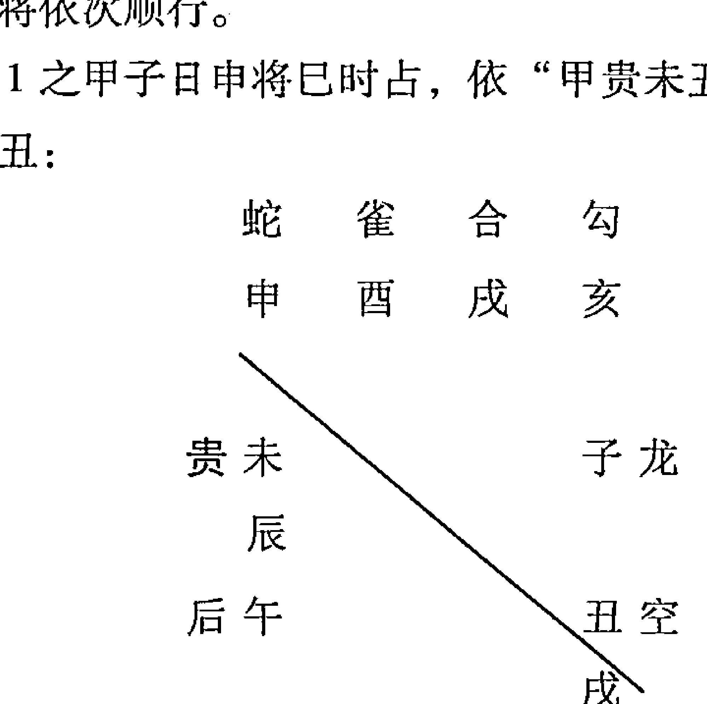

此数占时巳为昼时，昼贵人乘未用事。未临地盘辰宫，亦即贵人临地盘辰宫，壬学术语谓之“贵人乘未临辰”，贵人顺治，天将随贵人顺游十二辰。分别为：申乘螣蛇、酉乘朱雀、戌乘六合、亥乘勾陈、子乘青龙、丑乘天空、寅乘白虎、卯乘太常、辰乘玄武、巳乘太阴、午乘天后。据天盘、将盘，四课之天将乘临如下：

+   后 常 蛇 阴
午 卯 申 巳
卯 子 巳 甲

四课中惟第二课干阴巳下贼申发用，三传申、亥、寅乘临如下：

+   初 壬申 蛇
中 亥 勾
末 丙寅 虎

最后，为三传标上六亲：

+   官 壬申 蛇
父 亥 勾
兄 丙寅 虎

至此，我们就得到了一个完整的六壬课式。

如图十四所示，如贵人临地盘戌、酉、申、未、午、巳宫，贵人逆治，十二天将依次逆行。

例 35，辛未日戌将丑时占，依“六辛逢虎马”一诀，昼贵人乘寅，夜贵人乘午：

+   勾 合 雀 蛇
寅 卯 辰 巳
龙丑 午贵
辰
空子 未后
戌
亥 戌 酉 申
虎 常 玄 阴

此数占时丑为夜时，夜贵人乘午用事。午临地盘酉宫，亦即贵人临地盘酉宫，术语谓之“贵人乘午临酉”，贵人逆治，天将随贵人逆游十二辰。

分别为：巳乘螣蛇、辰乘朱雀、卯乘六合、寅乘勾陈、丑乘青龙、子乘天空、亥乘白虎、戌乘太常、酉乘玄武、申乘太阴、未乘天后。据之四课天将乘临如下：

### 第九章 呼神喝将

| 龙 丑 辰 | 雀 辰 未 | 雀 辰 未 | 后 未 辛 |

课中干阴与支阳二神相同，为不备课，无贼克、遥克，依别责取用，柔日取支三合前辰亥发用，中、末归干上，三传亥、未、未之乘将、六亲如下：

| 子 亥 虎 | 父 辛未 后 | 父 辛未 后 |

再次强调，本节所论者，皆为贵人加临地盘宫位，而不是以乘天盘神区分贵人顺逆之治的。

#### 第五节 地发杀机，龙蛇起陆

《阴符经》曰：“地发杀机，龙蛇起陆”，在六壬里面，讲的就是贵人昼夜顺逆分治的原理。地盘作为黄道十二辰，从辰宫的角宿之间穿过。谓“起陆”者，以辰为“陆”也。地盘亥作为贵人顺治的起始宫，贵人临亥，至地盘辰上见青龙居之；地盘辰是贵人顺治的最末一宫，贵人临地盘辰，顺位至地盘巳上螣蛇临之。此贵人顺治之“龙蛇起陆”也。地盘戌是贵人逆治的起点，贵人临戌逆治，至地盘巳上青龙加之；地盘已是跟从逆治的终点，贵人临巳逆进一位，至地盘辰上螣蛇临之，此贵人逆治之“龙蛇起陆”也。

本书卷一讲历算时指出，农历使用的是地平坐标、黄道坐标和赤道坐标三大坐标系统。以太阳的周年视运行言，日躔不仅逆黄经而行，且在赤纬之南北回归线上作上下移动，夏至行至北回归线的高度，冬至行至南回归线的高度，两分之际则正处黄、赤道交点位置。春分点日在戌而北望，秋分点日躔辰而南移，此天将顺逆分治之机枢也。故地盘者，周天大时空场之地平坐标空间也；天盘者，日躔时空场之黄道坐标空间场也；天将乘临昼夜顺逆之治者，日躔时空场之天赤道坐标空间场也。古之圣人测度制历，先贤将周天历度颠倒顺逆衍成壬课盘式，正合《阴符经》“人发杀机，天地反覆”之论也。

明此，则天盘时空场之构成不难理解矣！

### 第十章 四象、三才、八卦之文

《指掌赋》云：“干两课而支两课，合成四象；生主和而克发用，义法三才”，干支四课之于四象，前章已明，更究三才、八卦、六爻之义。《易·系辞》曰：“《易》之为书也，广大悉备。有天道焉，有人道焉，有地道焉。兼三材而两之，故六。六者，非它也，三材之道也”。三才者，天道、人道、地道也；三才各有阴阳，曰“兼三材而两之”，而有卦爻矣。

例36，甲子日六局，昼贵乘未临子顺治，夜贵乘丑临午逆治：

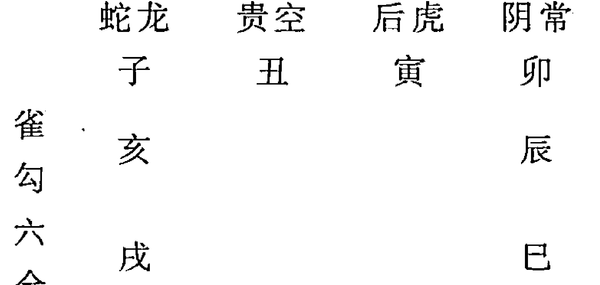

坤 艮 坎 巽 震 离 兑 乾
夜 昼 夜 昼 夜 昼 夜 昼
后 虎 空 贵 武 玄 勾 雀

| 寅 | 未 | 辰 | 酉 |
|---|---|---|---|
| 未 | 子 | 酉 | 甲 |

|          | 昼贵 | 三传 | 夜贵 |          |          |
|----------|------|------|------|----------|----------|
| 天       | ▅▅▅▅▅ |      |      | ▅▅▅▅▅ | ▅▅▅▅▅ |
|          | ▅▅  ▅▅ | 白虎 | 丙寅 | 天后    | ▅▅  ▅▅ | ▅▅  ▅▅ |
|          | ▅▅▅▅▅ |      |      | ▅▅▅▅▅ | ▅▅  ▅▅ |
| 人       | ▅▅▅▅▅ | 朱雀 | 癸酉 | 勾陈    | ▅▅  ▅▅ |
|          | ▅▅▅▅▅ |      |      | ▅▅  ▅▅ | ▅▅  ▅▅ |
| 地       | ▅▅▅▅▅ | 玄武 | 戊辰 | 玄武    | ▅▅  ▅▅ | ▅▅  ▅▅ |
|          | ▅▅  ▅▅ |      |      | ▅▅  ▅▅ | ▅▅  ▅▅ |

### 图十五  四课、三传配生两仪、四象、八卦之文

上图中，四课神将之加临以干两课配阳仪，支两课配阴仪，复分干支阳神、阴神，合成太阳、少阴、少阳、太阴四象，已明于前。或昼占，所乘天将皆阳，得乾、离、巽、艮四卦；或夜占，所乘天将皆阴，得兑、震、坎、坤四卦。如是，可直观地看出两仪、四象、八卦之文。

次以三传之初、中、末分别法象三才之天、人、地，每传各管两爻，为昼、夜天将各管一爻，传用亦自管一爻。尽三传配卦爻之义也。由是观之，特六壬之课式与羲象互作印证，或肇式与卦爻产生的年代相仿焉？卦爻演之阴阳，式法推诸五行，卦以配式，式应爻欤！

> 免责声明：六壬之判断，俱以课传神将之乘临、六亲之生克、五行之旺衰、课格之全局推求可矣。本章所以附课传配卦之图，盖明式法非异于羲象、易理而别有所传。为达本义，举要证明术家皆以《易经》为源头，而所用之理气各传有长技也。唯恐好事者妄谓课式尽可演为卦爻，不究六壬理气之要，而务奇巧配卦之枝末，特此声明。望诸同学壬友，万勿将课传一一配卦，徒增一重魔障，使我徒获篡乱先贤绝学，祸延后世壬家之罪，则吾幸甚！

既此明告，或仍有学人为求所谓创造发明，决意孤行，变乱古法，以耳目之奇欺世盗名，则非我之过也！

小结：如所周知，四课三传是吾人判断人事吉凶的依据与标尺。故而宗门九课是每一位有志于此的壬友都必须学习和熟练的。也许有人会说，当今是科学昌明、科技发达的时代，六壬起课早已有了各种在线或手机版的软件，何必死执手占呢？在此，姑不论各种网络在线软件存在的错盘，就断课本身来讲，笔算、手占或心算的起课过程是十分重要的一个环节。而使用软件对于初学者的两大弊端在于，一，不利于进一步掌握和理解课体课格，甚至可能忽视学习课体课格的重要性；二，判断中缺乏对占断八门的全面审视。

我在六壬教学中一向主张“起课即断课”，为此，我强烈建议读者在初学阶段，仅把软件作为熟悉起课的辅助工具；在实占和提高判断技巧的过程中，仅把软件作为案例电子存档的排盘工具。不要过度依赖软件。

中国传统之文化的核心除了阴阳理论，就是“天人感应”的思想了。作为国学的代表，儒、道两家都十分重视“天人感应”的修炼和养成。有人也许把“天人感应”看得很玄，说得很妙，但其实天人感应是一种无须过程的契合。天人感应的契合方式很多，比如法象天地，修真悟道；或者焚香祝告，祈祥纳福。至于术家，易家每卜皆曰：“天何言哉，叩之即应！神之灵矣，感而遂通！”亦此道也。今之壬家，有引卜筮家言而祝之，而我从不行此祝仪者何？盖壬家之手占就不失为一个微妙玄通的道法啊！壬家以左手的拇指法象自然大道之本体，当拇指与占时的指节相合的瞬间，即契入大道矣！拇指一动，日躔太阳系之，轻叩占时，即分而为二，无极而生太极矣！干支分四课阴阳为两仪、四象，神将昼夜又列成八卦，三传全三才之极而衍羲爻，此所以尽造化而行变化矣！壬家循此推去，自然“静之徐清”，心契天真。盘式原是天时，手占却是人的心机一逗，岂非人天有感焉？此正时法，活时虽非人天直接有感，亦人与人有所感矣！独软件起课，求占者欲借术家之心感天问地，而我一不感天，二不感人心，只将电脑、手机打开，去感那些电子信号，非至愚者何？可乎？故手占为要，正时为先，活时次之，软件去之可矣！

手占的训练从每天的十二时十二局入手，次及干支四课；次又论贼克、比、涉之有无、多寡，审干支四课之备与不备，分遥克、昴星、别责之例；八专日之甲寅、丁未、己未、庚申四日，无克用八专法发用；返吟除丁、己、辛同丑未六日，余仍皆下贼入用；伏吟除乙、癸二日均无贼克，刚干、柔辰发用，三刑用刑，自刑用杜传法。明白了起课、行传的逻辑，要掌握手占并非难事。

勤奋的人总是勤奋，从一开始就想着怎么偷懒，可以跳过些学习步骤的，在以后的提高过程中，也不会去掌握占断技巧的知识点的。象数能用五行六亲取代就少背些，课体课格大多只是生克理气加神将乘临，不记不背也没关系。这样得过且过，真的能成功么？要自省啊！

### 第十章 四象 三才 八卦之文

身来讲，笔算、手占或心算的起课过程是十分重要的一个环节。而使用软件对于初学者的两大弊端在于，一，不利于进一步掌握和理解课体课格，甚至可能忽视学习课体课格的重要性；二，判断中缺乏对占断八门的全面审视。

我在六壬教学中一向主张“起课即断课”，为此，我强烈建议读者在初学阶段，仅把软件作为熟悉起课的辅助工具；在实占和提高判断技巧的过程中，仅把软件作为案例电子存档的排盘工具。不要过度依赖软件。

中国传统之文化的核心除了阴阳理论，就是“天人感应”的思想了。作为国学的代表，儒、道两家都十分重视“天人感应”的修炼和养成。有人也许把“天人感应”看得很玄，说得很妙，但其实天人感应是一种无须过程的契合。天人感应的契合方式很多，比如法象天地，修真悟道；或者焚香祝告，祈祥纳福。至于术家，易家每卜皆曰：“天何言哉，叩之即应！神之灵矣，感而遂通！”亦此道也。今之壬家，有引卜筮家言而祝之，而我从不行此祝仪者何？盖壬家之手占就不失为一个微妙玄通的道法啊！壬家以左手的拇指法象自然大道之本体，当拇指与占时的指节相合的瞬间，即契入大道矣！拇指一动，日躔太阳系之，轻叩占时，即分而为二，无极而生太极矣！干支分四课阴阳为两仪、四象，神将昼夜又列成八卦，三传全三才之极而衍羲爻，此所以尽造化而行变化矣！壬家循此推去，自然“静之徐清”，心契天真。盘式原是天时，手占却是人的心机一逗，岂非人天有感焉？此正时法，活时虽非人天直接有感，亦人与人有所感矣！独软件起课，求占者欲借术家之心感天问地，而我一不感天，二不感人心，只将电脑、手机打开，去感那些电子信号，非至愚者何？可乎？故手占为要，正时为先，活时次之，软件去之可矣！

手占的训练从每天的十二时十二局入手，次及干支四课；次又论贼克、比、涉之有无、多寡，审干支四课之备与不备，分遥克、昴星、别责之例；八专日之甲寅、丁未、己未、庚申四日，无克用八专法发用；返吟除丁、己、辛同丑未六日，余仍皆下贼入用；伏吟除乙、癸二日均无贼克，刚干、柔辰发用，三刑用刑，自刑用杜传法。明白了起课、行传的逻辑，要掌握手占并非难事。

勤奋的人总是勤奋，从一开始就想着怎么偷懒，可以跳过些学习步骤的，在以后的提高过程中，也不会去掌握占断技巧的知识点的。象数能用五行六亲取代就少背些，课体课格大多只是生克理气加神将乘临，不记不背也没关系。这样得过且过，真的能成功么？要自省啊！

### 第十一章 本命行年

#### 第一节 本命行年

夫本命、行年者，占事究响应与否、应何人物、何时克应之变数也。以能变课体吉凶故，曰“变体门”。

年因命立，先申本命。本命者，人之生年太岁也，四柱中之年柱也，终生不变。凡人生后，即起一岁，以后逐年春正后递增一岁，此华夏中土人士记岁有别于西洋之民俗也。

行年即生人每年年立，随岁而行，故曰“行年”。行年之法，男顺女逆，男一岁起丙寅顺行六十花甲，女一岁起壬申逆游六十花甲。六十岁尽一花甲，六十一岁又各归丙寅、壬申也。

男性：

| 年龄 | 干支 | 年龄 | 干支 | 年龄 | 干支 | 年龄 | 干支 | 年龄 | 干支 | 年龄 | 干支 |
|------|------|------|------|------|------|------|------|------|------|------|------|
| 01 | 丙寅 | 11 | 丙子 | 21 | 丙戌 | 31 | 丙申 | 41 | 丙午 | 51 | 丙辰 |
| 02 | 丁卯 | 12 | 丁丑 | 22 | 丁亥 | 32 | 丁酉 | 42 | 丁未 | 52 | 丁巳 |
| 03 | 戊辰 | 13 | 戊寅 | 23 | 戊子 | 33 | 戊戌 | 43 | 戊申 | 53 | 戊午 |
| 04 | 己巳 | 14 | 己卯 | 24 | 己丑 | 34 | 己亥 | 44 | 己酉 | 54 | 己未 |
| 05 | 庚午 | 15 | 庚辰 | 25 | 庚寅 | 35 | 庚子 | 45 | 庚戌 | 55 | 庚申 |
| 06 | 辛未 | 16 | 辛巳 | 26 | 辛卯 | 36 | 辛丑 | 46 | 辛亥 | 56 | 辛酉 |
| 07 | 壬申 | 17 | 壬午 | 27 | 壬辰 | 37 | 壬寅 | 47 | 壬子 | 57 | 壬戌 |
| 08 | 癸酉 | 18 | 癸未 | 28 | 癸巳 | 38 | 癸卯 | 48 | 癸丑 | 58 | 癸亥 |
| 09 | 甲戌 | 19 | 甲申 | 29 | 甲午 | 39 | 甲辰 | 49 | 甲寅 | 59 | 甲子 |
| 10 | 乙亥 | 20 | 乙酉 | 30 | 乙未 | 40 | 乙巳 | 50 | 乙卯 | 60 | 乙丑 |

### 女性

| 01 壬申 | 11 壬戌 | 21 壬子 | 31 壬寅 | 41 壬辰 | 51 壬午 |
| 02 辛未 | 12 辛酉 | 22 辛亥 | 32 辛丑 | 42 辛卯 | 52 辛巳 |
| 03 庚午 | 13 庚申 | 23 庚戌 | 33 庚子 | 43 庚寅 | 53 庚辰 |
| 04 己巳 | 14 己未 | 24 己酉 | 34 己亥 | 44 己丑 | 54 己卯 |
| 05 戊辰 | 15 戊午 | 25 戊申 | 35 戊戌 | 45 戊子 | 55 戊寅 |
| 06 丁卯 | 16 丁巳 | 26 丁未 | 36 丁酉 | 46 丁亥 | 56 丁丑 |
| 07 丙寅 | 17 丙辰 | 27 丙午 | 37 丙申 | 47 丙戌 | 57 丙子 |
| 08 乙丑 | 18 乙卯 | 28 乙巳 | 38 乙未 | 48 乙酉 | 58 乙亥 |
| 09 甲子 | 19 甲寅 | 29 甲辰 | 39 甲午 | 49 甲申 | 59 甲戌 |
| 10 癸亥 | 20 癸丑 | 30 癸卯 | 40 癸巳 | 50 癸未 | 60 癸酉 |

> > 《五行大义》论人游年年立曰：“年立即是行年，立者是住立为义，以其今年立于北辰也。就人而论，常行不息，故谓曰行；就岁而论，今之一岁，年住于此，故谓之立。……年立从六甲而行。六甲者，男从丙寅左行，女从壬申右转，并至其年数而止，即是行年所至，立于其处也。……所以男从丙寅数，何者？日生于寅，日为阳精，男从阳，故取日；丙为太阳，故取丙以配寅。女从壬申数，何者？月生于申，月为阴精，女从阴，故取月；壬为大阴，故取壬以配申。阳，左行；阴，右转。《孔子元辰经》云‘若甲子旬，男从丙寅，女从壬申；甲戌旬，男从丙子，女从壬午；甲申旬，男从丙戌，女从壬辰；甲午旬，男从丙申，女从壬寅；甲辰旬，男从丙午，女从壬子；甲寅旬，男从丙辰，女从壬戌，皆曰行年。’此并候病之法，非通常用。”由此可知，男起丙寅顺行、女起壬申逆推为壬学的法也。

或问，行年究竟是应该是交过新年立春即换，还是交过求占者生辰才换。余以为二法可以通用，在不知道求占者出生年月的情况下，就依立春推行年，此民俗通用之法也。或知其生辰者，如邵公彦和案中似亦有以生辰换年者也。

取行年有捷法，诀云“男一岁起丙寅，逆总顺零；女一岁起壬申，顺总逆零”。其法逢十为总，男子依寅、子、戌、申、午、辰之秩逆退；女子按申、戌、子、寅、辰、午之序顺进。如男46岁占事，逆总者，1岁起丙寅，11岁逆退至丙子，21岁退至丙戌，31岁退至丙申，41岁退至丙午；零岁逐位顺推，41岁丙午，42岁丁未，43岁戊申，44岁己酉，45岁庚戌，46岁辛亥。如女24岁占事，1岁起壬申，11顺进至壬戌，21岁顺进至壬子；零岁逐位逆行，21岁壬子，22岁辛亥，23岁庚戌，24岁己酉。

#### 第二节 天人合发，万化定基

《易·系辞》曰：“在天成象，在地成形，变化见矣！”天垂象，地以形载之，人以运应之。天象恒常，人不叩则天不示兆。但有叩问，天机无不响应矣。故我更谓之“载人成运”者，以全《系辞》“有天道焉，有人道焉，有地道焉。兼三材而两之，故六。六者，非它也，三材之道也”之文。

凡人叩问，正时为先。正时既触，课式应之，以大六壬时空卦的模式，从周天大时空场的“网络云端”下载与人事相关的数据进行分析。而年命就好比一根 USB 线，又将求占者个人的数据端链接网络云端，向云数据库上传个人信息，进行二次运算、分析，以求确应。年命虽然不能在时空卦中单独构成一个时或空，却能反应求占者当下的综合状态。故年命之一端，无论由周天大时空场，或是由壬式天盘时空场来看，都是定数中的一个变数，常量中的一个变量。将年命接入时空卦，吾人始知人事之变数几何，可自行主宰者有几，当顺应天命者复何如。凡占，欲知变求通而已。如命运生而注定，占亦如是，不占亦如是，则卜命者何其至愚哉？

年命与时空卦之间的这种互动关系，《阴符经》谓之：“天人合发，万化定基”也。

有了年命的六壬时空大卦，将四课阴阳配贪狼、巨门、文曲、禄存，以应斗魁之天枢、天璇、天玑、天权四星；三传配廉贞、武曲、破军，以应斗杓之玉衡、开阳、摇光三星；本命配左辅，行年配右弼，合九星以应九宫，尽《易》之用九义也。此所以六壬为先，奇遁、太乙继之者也。

即曰“卦”，必有三才。天者，周天大时空场也，全术数建立之根本者也；地者，六壬天盘时空场也；人者，课传时空以拟人事之变也。凡机之将发，端视乎占时；已发，必凭乎年命者也。天机恒常，地机恒应，人机恒变。设以常、变言，周天大时空场按自然法则运转不息，并不因人而异，乃常之大者也。六壬时空场是取周天大时空场中某一天某一时辰的变数而成立，此变之大也。占时乃变中变，年命乃人之本有，乃变中之常。活时因人拈取有别，乃极变之数；正时乃自然之时间，却是变数中的常数。本命乃人生而固有，亦变中之常；行年随岁而迁，却是常中之变数。复以课言，六壬时空场取周天时空场之一片段，乃大常数中之一变。时将加临以布天盘者，变中之常数；课传时空因天盘而起，变中之极变也。历算尽周天行度之则，极常中之恒常；占日四柱取历度之甲子，是常中之参数与坐标也。常者为阴，变者为阳，三才成列矣。

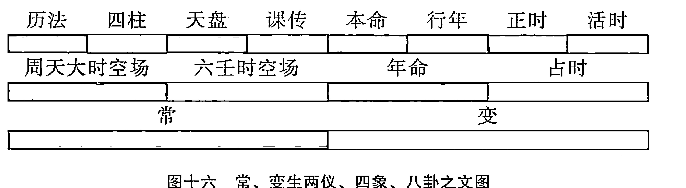

> 故《阴符经》曰：“心生于物，死于物，机在于目。天之无恩，而大恩生；……天地至私，用之至公”。

### 第十二章 金手指安神点将诀

研壬几二十载，时有壬友来求问“快速起课法”，我除了表示反对这种提法，并没有给壬好更好的建议。这当然是我的疏阔。新加坡贤绅士黄耀宗君于2008年底，盛情邀请我赴狮城讲授《大六壬刘氏断应法纲要》。讲学期间，诸友旧事重提，又问及有无好的“快速起课法”，以方便初学者尽快掌握起课。

其实，起课是“熟练工”，只要从入门起坚持笔算，少用起课软件，一年后由笔算进而手占，两三年后逐渐娴熟心算，是水到渠成的过程，并无所谓捷径。虽然世之俗师为了“挑逗”初学者的眼球，反复宣称、兜售“不用纸、笔，不用掐掌诀，最多用二十秒内起好一个完整的大六壬课的方法”，但果真有那样的“神功”么？事实上，要想仅凭心算，在短短二十秒内起课、装盘，不论古今，都只有少数深谙此道的专业人士才能做到。这不是单纯的技巧问题，而是一个反复使用、熟能生巧的渐进过程。对初学者来说，首要的仍然是按部就班地理解起课步骤，按图索骥地学会起课、发用、行传，然后再结合实践判断，循序渐进，提升起课、装盘的熟练度和速度。

我研习既久，勉强能达到这一速度，可我从不认为有此必要。而且，我觉得从某种角度看，过快的起课速度甚至与“起课即断课”的原则相悖，使得起课的过程与断课的过程判若两途。如此一来，笔算、手占、心算等人工起课方式也就失去了意义。既然起课仅是求一课式，非关断课，那么最快的起课法无疑就是软件。只要轻点鼠标或手机触屏，1秒钟内四柱、月将、课传，尽在眼前。何其方便？何其快速？要说“快速起课”的秘诀，这才是真正的高效、便捷。

然而，对那些真正想一探壬式堂奥的求知者，这一秘诀却是个坏方法。在此，我请大家暂时放弃速成的热望，清醒头脑。认清一个严酷的事实，即作为断课基石的壬式九宗门，既无捷径，更无所谓“快速”的秘诀。就好比南拳中那句至理名言：“练得硬桥硬马，方能稳扎稳打”。大家去向拳师打听一下，扎马有没有既省力省时，又能迅速提升武术功力的捷径可走呢？想练成真功夫，当然先要基本功扎实，所以要想日后铁口直断，入门第一步切不可抄近走偏。所谓的“快速起课法”，也不过是起四课前的飞布天盘，及起完课传后，为课传安天将，与正常起课并无二致。至于逻辑上从一重贼克、多重贼克、遥克，到无贼克情况下，昴星、别责、八专取用的递次推进，以及有克、无克兼备的伏吟、返吟，这九大宗法，除了长期实践，不断运用，强化记忆外，根本不存在所谓“快速”的秘诀与窍门。

为应狮城壬友所请，对我常占起课的方法略作总结，特撰造一个安神、点将的便捷方法，以飨同好。本方法不同于俗师之“快速起课法”，为名副其实起见，立名曰《金手指点将安神诀》，循名责实，知为便于安神布将而设。拟诗云：

> > 四孟四仲与四季，三合六阴并六阳，顺逆之次须记取，
对冲之位点神将。进退连茹与间传，胎交稼穑三合兼；
墓覆生方并四绝，返伏吟兮十二盘。贵前蛇雀合勾龙，
后阴玄常虎空行。前五后六两班朝，一指安神袖传金。

#### 第一节 地支排序

> > 诗云：四孟四仲与四季，三合六阴并六阳，顺逆之次须记取，对冲之位点神将。

依诀，须记忆的地支特殊排列次序有：四孟、四仲、四季、三合、六冲和隔位排序，孟、仲、季与冲合已具于前，隔位排序亦即子、寅、辰、午、申、戌六阳支，和丑、亥、酉、未、巳、卯六阴支。地支的这些排序法，既要顺背，也要能够倒背。在排盘时，天神盘和天将盘都取对冲位，这样只要排出半局六位神将，也就有了另半局神将了。

取对冲位有三种方法，一则以地盘辰、戌为固定的分界取对冲位，二是以地盘卯、酉为固定分界取对冲位，三是以月将与其对宫取对冲位。在常占中，我用第三种月将对冲的排盘方法。

#### 第二节 金手指安神诀

> 诗云：进退连茹与间传，胎交稼穑三合兼；墓覆生方并四绝，返伏吟兮十二盘。

1. 壬式天盘十二局已明于本卷第八章中。其中：伏吟盘天地盘不动，与地盘定式相同；返吟盘天盘临地盘冲位。此二盘较易记忆：

| 巳 | 午 | 未 | 申 |
|----|----|----|----|
| 辰 |    | 酉 |    |
| 卯 |    | 戌 |    |
| 寅 | 丑 | 子 | 亥 |

| 亥 | 子 | 丑 | 寅 |
|----|----|----|----|
| 戌 |    | 卯 |    |
| 酉 |    | 辰 |    |
| 申 | 未 | 午 | 巳 |

2. 次因月将距占时一位为连茹盘，进、退各一。亦较易理解、记忆和熟习：

| 午 | 未 | 申 | 酉 |
|----|----|----|----|
| 巳 |    | 戌 |    |
| 辰 |    | 亥 |    |
| 卯 | 寅 | 丑 | 子 |

| 辰 | 巳 | 午 | 未 |
|----|----|----|----|
| 卯 |    | 申 |    |
| 寅 |    | 酉 |    |
| 丑 | 子 | 亥 | 戌 |

例37，壬午日申将未时占，月将居占时前一位，先于地盘未宫上写申将（内层为地盘，外层为天盘）；占日支辰午左邻地盘未，申将退一位也是未，即支上神；支阴神即未宫上之申将。未临午，其对冲位地盘子宫上神为丑；占日天干壬寄亥，为地盘子宫之右邻，丑退一位子为干上神；干阴神即子宫上之丑。

```
午 未 申 酉
巳 午 未 申
辰        酉 戌
卯        戌 亥
寅 丑 子 亥 (壬)
卯 寅 丑 子

申 未 丑 子
未 午 子 壬
```

此数，惟干阴丑克子元首发用，中传丑上寅，末传寅上卯。三传：

+   - 官 丁丑
- 子 戊寅
- 子 己卯

### 3. 时、将隔两位为间传盘，前诗诀之六阳、六阴位，进、退各一为对：

| 未 | 申 | 酉 | 戌 |
| 午 |    | 亥 |    |
| 巳 |    | 子 |    |
| 辰 | 卯 | 寅 | 丑 |

| 卯 | 辰 | 巳 | 午 |
| 寅 |    | 未 |    |
| 丑 |    | 申 |    |
| 子 | 亥 | 戌 | 酉 |

例38，乙未日戊将子时占，月将居占时后二辰，先于地盘子宫位上写戊将；乙日寄辰，辰为子之三合前辰，故其上神也必定为戊将三合前神，戊将三合前神为寅，乃书寅于辰宫；日之阴神即地盘寅宫上神，退间传盘，寅宫退隔一位，日阴神为子。子宫对冲位午宫上写辰将，日支未为午之右邻，故未上神为巳；巳宫上神退隔一位，阴神为卯。

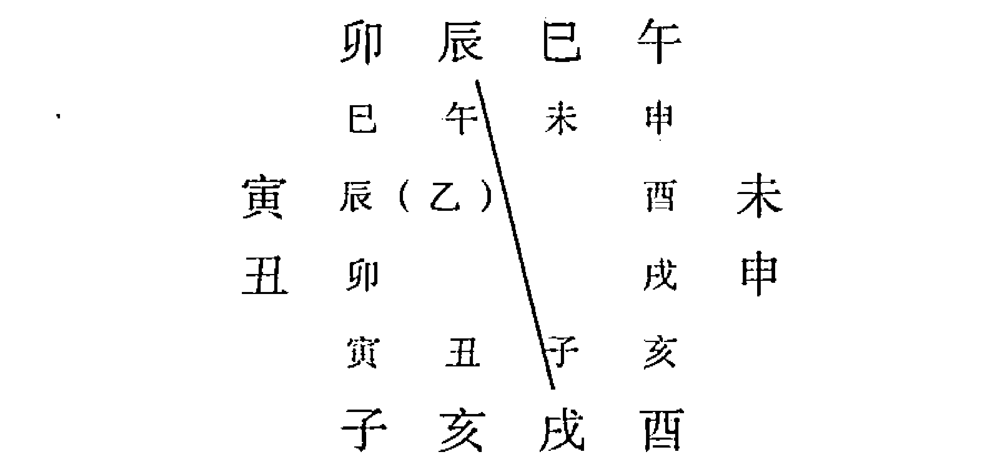

| 卯 | 巳 | 子 | 寅 |
| 巳 | 未 | 寅 | 乙 |

四课无贼克、遥克，柔日昴星，俯取酉下亥为用，中传为日上寅，末传为辰上巳。三传：

+   - 父 己亥
- 兄 壬寅
- 子  巳

本例除隔位排序的知识点外，还运用了支三合。进、退间传的理解和熟习也尚属容易。

### 4. 月将距占时三位为元胎盘，即前诗诀中之“四孟四仲与四季”；若

课得四仲相加入传用名“三交”，四季相加入传用名“稼穑”，进、退各一。如果能够准确牢记孟、仲、季的顺逆次序，用此盘起课，甚至可以不必书写天地盘：

```

申  酉  戌  亥       寅  卯  辰  巳
未       子       丑       午
午       丑       子       未
巳  辰  卯  寅       亥  戌  酉  申

```

例 39，丙戊日午将酉时占，月将居占时后三位，用病元胎盘。丙日干寄于巳宫，为四孟神之一，干二课也必定均属四孟；干上神逆退三位为寅，干阴神由寅逆退三位，恰是日干之六冲位亥将。干二课为亥寅。戊日占，支二课必定均属四季；日支戊逆退三位为支上神未；支阴神即冲戊之辰。四课：

```

辰  未  亥  寅
未  戌  寅  丙

```

干阴亥遥克干发用，中即冲干上寅之申，末即冲初传之巳。三传：

+   - 官 丁亥
- 财 甲申
- 兄 癸巳

准四孟元胎例，仲、季可知之矣。

### 5. 月将距占时四位为三合盘，进、退各一。如能准确记忆三合局的顺逆次序，用此盘起课，也大可不必排布天地盘：

```

酉  戌  亥  子       丑  寅  卯  辰
申       丑       子       巳
未       寅       亥       午
午  巳  辰  卯       戌  酉  申  未

```

例 40，丁酉日丑将酉时占，月将居占时前四位，用顺三合盘。丑将酉时，日支酉上神即丑。三合盘的特点是，支上神和日支为三合缺一，缺一者又必定是支阴神。支课丑酉，支阴神必为巳。同理，丁寄未，前已知丑宫上神为巳将，则未在丑之对冲位，必是亥加丁；木局亥、未二神缺卯，干阴神一定是卯木。四课：

| 巳 | 丑 | 卯 | 亥 |
| 丑 | 酉 | 亥 | 丁 |

四课仅干上亥克丁，亥发用为初传。三传：

+   - 鬼 己亥
- 父 癸卯
- 子 乙未

逆三合盘诸课准此可推。

6. 如果说以上五类十盘诸课，只要记住5种地支排序，就能掌握的话，那四墓覆生和四绝体，就是初学手占者要花一点时间和心思来记住的两个盘了：

| 戌 | 亥 | 子 | 丑 |
| 酉 |    | 寅 |    |
| 申 |    | 卯 |    |
| 未 | 午 | 巳 | 辰 |

| 子 | 丑 | 寅 | 卯 |
| 亥 |    | 辰 |    |
| 戌 |    | 巳 |    |
| 酉 | 申 | 未 | 午 |

例41，壬子日子将未时占，月将居占时前五位，四墓覆生方。先于未上安子，次于对冲位丑上安午，月将与冲位上神一定，就把天盘分成了两片。如果是不熟悉盘局的初学者，可由丑宫上的午逆推两位，至亥宫上数得辰；壬干寄亥，干课辰壬；亥宫之对宫为巳宫，亥上辰则巳上必为戌；巳上戌，则逆一位辰上就是酉，干阴课酉辰。再论支课，前明丑上午，则逆一位子上神为巳，巳上戌如前已知。课式如下：

戌 亥 子 丑
巳 午 未 申
酉 辰    酉 寅
申 卯    戌 卯
寅 丑 子 亥（壬）
未 午 巳 辰

+   - 戊 巳 酉 辰
- 巳 子 辰 壬

四课中惟支课已有下贼，取巳发用，中、末传各取阴神。三传：

+   财 乙巳
鬼 庚戌
子 卯

例 42，乙丑日丑将午时占，月将居占时后五位，为四绝体。先于午上安丑，次于对冲位子上安未，把天盘分成了两片。不熟悉盘局的初学者，可由午宫上的丑将逆推，逆一位巳宫上得子将，辰上得亥，乙干寄辰，干课乙亥；亥为巳之对宫，巳上子，亥上神必午。复由亥上午顺进两位，于支辰丑上得申，支课丑申；支阴由月将所临午宫顺进两位，至申上得卯即是。

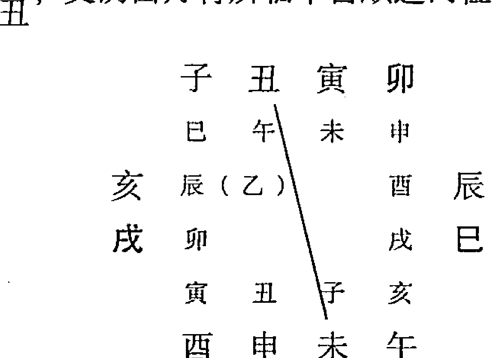

课中干阴午受下贼，支阴卯亦下贼，比取比日之卯为用，中、末递取阴神。三传：

+   兄 丁卯
财 戊
子 己巳

随着熟练度的日益增加，特别是开始在实占中运用课体断事后，相信会根据自己的实践经验，总结出更为便捷和个性化的起盘方法。

#### 第三节 宗门九课

+   诗云：
- 一重贼克，重审元首——贼克法；
- 数重贼克，比日为用——比用法；
- 孟深仲浅，复等先见——涉害法：比日相当，有盂用盂，无盂用仲，复等取日辰先见者；
- 神遥克日，日遥克神——遥克法；
- 俯仰昴星，柔日刚辰——昴星法：阳仰、阴俯酉中神，阳日中用支，未用干，柔日反之；
- 三课别责，用合日辰——别责法：阳日干合之上神，阴日支前三合取，中、末用干上；
- 日阳辰阴，顺三逆三——八专法：阳日日阳顺行三，阴日辰阴逆三数，中、末用干上；
- 任信用刑，杜传行冲——伏吟法；
- 无依俱冲，井栏射马——返吟法。

#### 第四节 金手指点将诀

> 诗云：贵前蛇雀合勾青，后阴玄常虎空行。前五后六两班朝，一指安神袖传金。

点将之前，先将十二将分成两组：

+   1. 贵、蛇、雀、合、勾、青；
2. 空、虎、常、玄、阴、后。

以上六位一组，上下两组天将，两两相冲。如贵人与天空对冲，螣蛇与白虎对冲，朱雀与太常对冲，六合与玄武对冲，勾陈与太阴对冲，青龙与天后对冲。十二神对冲以贵人与天空为界，贵前一位为螣蛇，后一位为天后；天空后一位为青龙，前一位为白虎；余将只要前二朱雀、前三六合、前四勾陈一安，各以冲位安太常、玄武和太阴。

如不用冲法，依贵人“前五后六”数之亦可。如贵前五位顺数，为蛇、雀、合、勾、青；贵后六位逆数，为后、阴、玄、常、虎、空。

无论冲位点将法，抑或按前五后六的次序点将，都应注意贵人所临宫位是顺治还是逆治。

例43，辛卯日亥将午时占：

第一步，月将加时飞布天盘，亥将居午时的前五位，用的是四墓覆生盘：

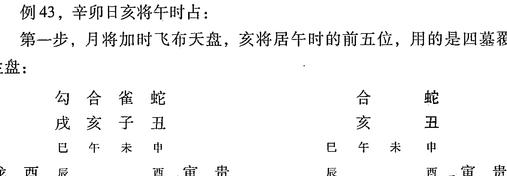

第二步，金手指安神。亥将加午时。辛卯日占，辛寄戌，戌为午之三合前辰，因此，戌宫上神必定是亥将的三合前辰卯。四墓覆生之盘，寅上必见墓神未。未既临寅，则相邻之卯上必是申。申与寅对，亦为墓覆，申上乃是墓神丑。四课：

| 丑 | 申 | 申 | 卯 |
| 申 | 卯 | 卯 | 辛 |

第三步，发用行传。四课中惟干课辛下贼卯，卯发用作初传；中传卯上申，末传申上丑。

第四步，金手指点将。辛日昼占，贵人乘寅。丑临申，进一位，寅临酉。贵人乘寅，对冲位申乘天空。寅贵临酉，自地盘巳至戌贵人逆治，逆时针安将，寅逆退一位，丑乘螣蛇。更逆前两位至月将亥，将乘六合。丑乘蛇，蛇之对冲位未乘白虎。贵前为螣蛇，贵后附天后，今贵人逆治，进前一辰卯乘天后。课传：

```
蛇 空 空 后
丑 申 申 卯
申 卯 卯 辛
```

```
财 辛卯 后
兄 甲申 空
父 己丑 蛇
```

例43 首次公开了我个人常用的心盘式。在常占中，只要根据问事人的实际生辰，增入年命即可。

一位擅用心算的壬学高手，在聚会闲聊时，默运式盘于胸，话峰一转，忽为他人指点迷津。对事件的因由，相关细节的推断，无不应验如响，堪称算无遗策。现场的听众，包括当事人，无不叹为神奇。

这当然是许多壬友梦寐以求的境界。然而，我倒认为，如条件允许，仍以笔算较为稳妥。手占、心算较易受个人身心状态之影响，发生误排、错课。虽说错课正断不失为术界的趣闻美谈，但我感觉错课正断或许是某种天象示警，警示吾人不要昧于神奇，而忘却了仁心仁术的宗旨！起课是为了准确地断课，课断错了，要“神奇”的起课方法又有什么用呢？

进阶提要：初学六壬的壬友，在学习、掌握宗门九课的同时，开始探索六壬占断的技巧。我一向主张“起课即断课”，直到今天，我在常占中，仍坚持手占、心算。月将加时，左手拇指尖挂上月将，如行旅夜归般轻扣占时，神奇的时空之门应之而开。干上何神，有何生克，是何六亲；支上何神，是冲是合，生旺墓绝；干支阴神有何响应；发用何来，行传何去？分明了了。然后“登坛”点将，召唤用事天将来我掌上宣象言事，了了分明。应急者，分秒之间；事繁虑周者，或一二刻，方推得一课，课成断毕，心无疑滞。一切皆凭课传神将，非我之神也。《阴符经》曰：“人以奇期圣，我以不奇期圣”；《易·系辞》曰：“化而裁之存乎变，推而行之存乎通，神而明之存乎其人，默而成之，不言而信，存乎德行！”是我未尝有言乎吉凶欤！

其次，学者应熟习每天十二个天盘。这十二个天盘不仅是课传成式的前提，在深入研习壬学的理气象法过程中，也有助于课体课格的掌握。如进茹、退茹盘不仅与《课经》之“连珠课”、《毕法赋》之“进茹空亡宜退步，踏脚空亡进用宜”直接相关，且进茹课凶推又是“所谋多拙遭罗网”；退茹盘中，五阴日占之，乃“旺禄临身徒妄作”。说到“引从”，《毕法》曰“前后引从升迁吉”，皆四墓覆生盘，然四墓覆生与四绝体盘亦多铸印课；铸印课中，如戌加干支上又为“斩关”，乘蛇则有“两蛇夹墓凶难免”之凶。铸印课除四墓覆生盘有之，四绝体中亦有之，而四绝体之铸印，或卯加申发用，三传卯、戌、巳又是斲轮，斲轮课中卯木空亡发用，《毕法》谓之“朽木难雕别作为”也。或四绝体三传子、未、寅，又是“三传互克众人欺”；或三传午、丑、申，又合“三传递生人举荐”之论。或四墓覆生中甲日未来墓干，更作占人本命，的是“天网自裹已遭非”等。三合盘多全局、不备、回环等格，更课之年、月、日、时与三传尽在四课之中，谓之“盘珠课”、“天心格”。间传盘多“六阳数足须公用，六阴相继尽昏迷”；如辰加寅在课传中，乃“罡塞鬼户任谋为”，兼是“登三天”之格；申、戌、子名“涉三渊”，午、辰、寅名“顾祖”；丑、亥、酉或酉、亥、丑有“极阴”、“凝阴”之名等。凡四孟相加，四孟在传曰“元胎课”，四仲在传曰“三交课”，四仲日占，时将均为四仲神，乃“二烦课”；乙、癸日四季入传名“稼穑格”，或辰、戌发用曰“斩关课”，更辰、戌作天马星，乃又名“游子卦”；由于顺逆元胎盘天神与地盘隔四位，如旬首加旬尾、旬尾加旬首入传，称为“闭口课”等。此举其概要，依课式神将乘临之变化，还能接入更多的课体课格和《毕法》歌诀。因此，这十二个天盘式对理气与课体的理解与应用裨益良多，不可忽略。

有些壬家说六壬所以能占遍人事，是因为六壬的盘最多，六十花甲尽七百二十课式；每式因昼夜贵人分治，计1440式；昼夜贵人顺逆各一，计2880式；一年360天，尽六甲子，岁积172800式。这些算法都是欺蒙外行的昏话，没有任何实践意义。人类的智慧不是把本身简单的事情复杂化，而是把宇宙的纷纭万象用一个统一的数理模式解释清楚，比如牛顿力学、相对论。六壬格体众多，掌握起来非朝夕之功，唯此十二盘式统赅一切格体，故我认为，六壬除十二天盘外，再无余盘可求矣！

最后，式盘之书于纸上、布于掌面，或在电脑、手机屏上，都是平面的。但月将加时，布天盘于地盘，此二盘也；天将乘临，则三盘矣。故在吾人大脑中，实应建立一个由将盘、神盘、地盘构成的三维式盘，地盘如人类居住之地球，天盘即周天历度，将盘乃天宫星官。三层式盘的时空模式，在传统壬学占验角度看，似乎不关要紧，却是打开“六壬刘氏断应法”与“时空大卦”的“密码锁”。希望这种立体式盘的模式有助于读者深彻理解六壬时空卦。

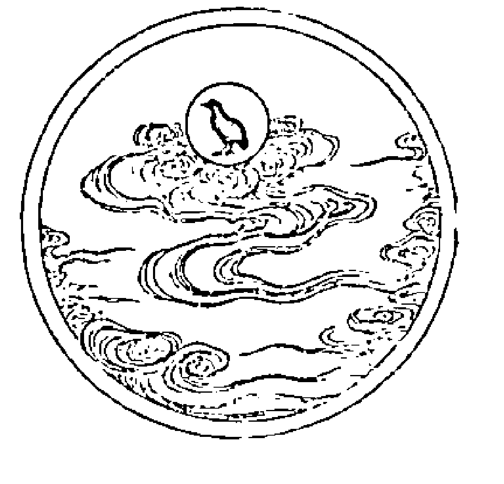

# 卷三
八门金锁

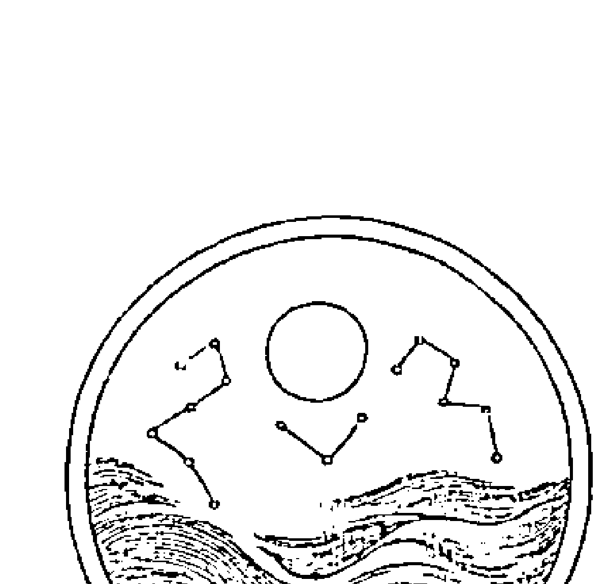

上世纪九十年代末研究壬学至今，我始终觉得背负着“三式之首，术数之王”美誉的六壬术，确实有其冠绝群伦的优势。首先，六壬源于古天文星象学，其占法用历全面，除岁、建、日、时外，月将加时，重用日躔行度是其它术数学所不具备的。也许有人会说，三式都有月将应用的阐述，不过入式之初首重月将，为壬式独有之特点，却是不争的事实。其次，壬式传承两千多年，至今仍保留有星度、次舍对应分野、地理的原理，禽星的取象技巧，故有理由认为古式法源于星占，而为星占之一种简化。其三，壬式以干支学为宗法，旁通羲象、奇遁，他术所有者，壬式咸具；他术或遗佚者，壬式亦备。斯术兼赅预测、择吉于一身，理致周密，法度严谨，尤非他术可比。通晓壬式者，掌上起造化，袖里传金玉①，判人事于方寸之间，决胜负于千里之外；一念起，则九天之上、六合内外，森罗万象，俱现掌模；一念息，则三世因果，造化通神，尽归玄冥。诚如佛语：“而阿那律，观阎浮提，如观掌中，庵摩罗果”，此之谓也。谓式之首者，言其传尤古，奇遁、太乙随之起也。曰术之王者，达于王事，通乎黎庶，事无小大，巨细弥遗，如王之治政，虽寸土不能夺，纵一民不在化。

在学习六壬之前，我已从师学习八字命理、六爻梅易五年之久。命理方面，读完了《三命通会》全卷，部分歌诀可以背诵，参研《滴天髓阐微》、《穷通宝鉴》、《玉照定真经》、《三命消息赋》等；六爻方面，读完了《卜筮正宗》、《增删卜易》、《梅花易数》、《京房易传》；旁涉《黄帝内经》、《皇极经世书》、《遁甲演义》、《天玉经》；对《钦定协纪辨方书》也下过功夫。入式既未觉困难，后面的深究细玩也多能水到渠成。所以，在多年的教学中，我并没太多顾及初学者的基础，主张壬学为简易之学，常

> > ① 古人宽袍大袖，运式于掌而言祸福，故喻之为“袖中金”。

常常对学员讲：“六爻有六十卦要背要装，奇遁有阴阳十八遁局要遁，六壬仅宗门九课，何难之有？”

但开展六壬教学几年下来，突然发现六壬的知识面几乎涉及除人相学以外的所有术数门类，并不好学。要想很好地驾驭象数，发挥壬占的强项，更不容易。前辈如陈公献、郭御青、徐养浩，尚困于理气之囿，而不能全象数之用，况初习术数便人壬式的今人乎？遂有撰著《六壬大占纲要》的计划。以下篇章，以多年教学中使用的《传统六壬深研讲义》为蓝本，加以充实，全面阐述六壬占断技法。篇目的设置颇异于以往六壬古籍篇目，以我个人的学习进步过程，和常占逻辑演绎顺序次第建立，以求真务实的态度，务使读者了解壬占各知识点及其关联性，步步为营，循序渐进，而获事半功倍之效。

### 第十三章 壬式的基本结构

壬式由日在加时始，视四课之加临，循宗门之九式，行三传、参年命，以究人事之变。这一基本的架构包括了六壬的占断八门：即正时先锋门、月将值事门、日干外事门、支辰内事门、发用发端门、中传移易门、末传归计门，以及年命变体门。余尝于课间讲习之次，勉诸壬友曰：“占断八门，一门都不能少”。盖时将者，课未传而式先旋，旋式端视时将，来意亦系乎正时；至断课定格，亦有“天网”之“占时与用同克日”云者也。然今之习壬者众，多不问时将，不谙手占，仅凭软件，草率起课；乃有甚者，罔顾四课，直奔三传，尤不详行年、本命，致使理气失次，断验无凭，反诬式法不灵，皆未遑宗法之过也。

尝与壬友交流，每被问及：“先生壬术精湛几何？”余每对曰：“但知起课耳！”余讲习壬学有年，所授者，不出邵公彦和之矩。学人每疑邵公藏诀，余曰：“大宗师断课，非另辟蹊径以通神，但将占断八门一一推过，自然响应。此真神鬼不测之机也！时人不守成规，以为一二句诀可以通神，谬矣！不知真诀即是常理规矩也。”

#### 第一节 先锋门

先锋门即正时。所谓正时，原指起课时的自然时间，一般是指起课人所在地的当地时间，也可以是所属国家政府制定的官方时间。从天文学角度讲，正时反映了地球自转，或每天日照视运动的经度位移。农历中的时辰指的就是日照视运动。本人认为，先锋门专指正时而言。

清程树勋有《精抄历代六壬占验汇选》①一书传世，内存案例六百有余，内有徐次宾者，擅责来意，兹录一例，明正时之作用。

例1，七月甲子日，午将申时占来意。——《一字诀玉连环》

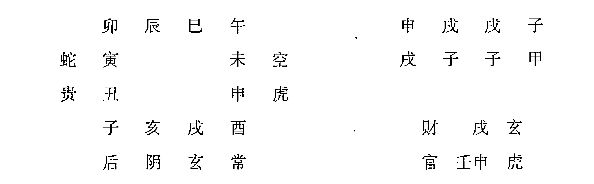

徐次宾曰：来意因西南上紧速追捕一盗，坠马折伤右足，感风七日而殒。盖时为日刑日破，与驷马并，主外动。发用天魁，为日干之财，上得元武为盗贼，故知西南上紧追一盗也。先锋门传送为白虎，作中传，带驷马克日，又与刑杀并，故主坠马也（愚按：管子神书，马加辰、戌为跌扑杀）。戌为足，在日辰之右，是伤右足也。白虎为风神，七月申为风杀，故感风也。甲木秋死而被旺金所克，申数七，至第七日庚午，又并起白虎，故知七日殒也。未传胜光不论救神者，盖秋火休囚也。

徐次宾法尚古拙，但断语往往“咄咄逼人”。此数因正时申与甲日之寄宫寅冲刑并见，曰“时为日刑日破”；徐占多以日干取驿马，特名之“驷日”，甲日驷马在申，曰“与驷马并”，合之断“主外动”。来意之占，多从先锋门正时与发端门发用合而取之，故次曰“发用天魁，为日干之财，上得元武为盗贼”；盗贼之去向视元武之阴神，戌之传阴正是正时申，申居西南，合之断“来意因西南上紧速追捕一盗”。中传并起正时，将乘白虎，曰“先锋门传送为白虎作中传，带驷马克日，又与刑杀并，故主坠马也”。揣徐次宾之意，前有“时为日刑日破”，此处“又与刑杀并”当指日刑日破也。戌有足脚之象，不论天盘还是地盘，都在甲子日辰之右，曰“戌为足，在日辰之右，是伤右足也”。白虎为疾病之类，七月风煞在申，虎乘之，曰“白虎为风神，七月申为风杀，故感风也”。木死于秋而被旺金所克，取申数七，至第七天庚午日，庚干并起白虎，“故七日殒也”。

上例以正时为核心，结合发用、末传与日干之关系，一路断来，多用五行六亲生克之喜忌作为判断依据，是初学者由此人手，理解方面比较容易。本卷将结合占断八门对此例作进一步解析。

① 以下简称《壬占汇选》。

#### 第二节 值事门

值事门即每月的当值月将，也称太阳或日在，实即中国传统历法中的太阳躔度，目前较为普遍的原则是依照农历每月中气换将，正月雨水后起亥将，依次逆行十二宫。

从天文学角度讲，太阳躔度是太阳在某一节气中，所处黄道十二宫的相对位置。反映了太阳视运行回归周期，是每个历月日照视运动的纬度位移，故称“日在”。在农历中，月将指的是日照视运动。日在加时就是起课时太阳直射点在特定经、纬度线的交点。这是一个时间概念，故六壬亦称“时课”者也。

#### 第三节 外事门

外事门即日干之阴阳两课。在壬式中，日干体现人事的外来因素以及所处的外部环境，故为外事门。外事门除代表外因，还可以论尊卑、主客、动静等，日干位居尊，为客、为我（占事人）；以事之动静论，又是先发动的一方等等。

#### 第四节 内事门

支辰之阴阳两课为内事门，反映了人事自身的内在因素及所处的内部环境。其位卑，居主位，为彼，为静，所以也代表了宅、墓、工作地等静态场所。

传统壬学对外事门与内事门的讨论限于抽象，并不具象。在刘氏断应法中，用类占区分干支定象的方法，使干课与支课的表义趋于具象化、拟态化。但干支定象与传统的干支定位并不相矛盾，干支定位是前提，干支定象是结果；干支定象涵盖干支定位，当干支定象与定位出现相反的情况时，干支定位服从于干支定象。

#### 第五节 发端门

发用的初传名发端门。初传通常为人事的起始状态，反映了事件发生的时空、原因，以及该事件的利弊、好恶等情况，故称为发端门。

前例1徐次宾占来意一数，前正时之申作驷马，其实只“主外动”，因何而动，又须结合初传，盖初传发端乃事因也。课中戌加子克子，为发用之机，作日财却旬空，将乘玄武，玄武主盗失之类，故断来意主捕盗事也。

此发端门知事之起因与时间也。

#### 第六节 移易门

中传为移易门，反映了人事发展过程中的变数，同时也是事件进展过程难易程度的判断依据。

仍用前数为例，以正时结合发用断来意，中传又见申，却与正时之论不同。以初传戌为足，旬空上传见申金，乃驷马并作鬼煞克日，有折足之虞耳。申乃虎鬼一白虎乘官鬼连其理气曰“虎鬼”，以加重所呈现象义的力度，古籍中多有此类术语，如龙德、贵德之类。虎鬼乃疾病，兼取七月风煞在申，断感风之疾也。

#### 第七节 归计门

归计门即末传，寻常言之，归计门预示了人事最终的吉凶结局和应期。

例1 甲子日干上子一数，用退间传盘，亦退间传课。三传戌、申、午。因中传虎鬼不仅克伐日干，且引秋令死木奔于绝地。死绝之木末传见午有焚灭之患耳。一般的预测术，如六爻，既以鬼煞为病，则见子孙制之即曰救神。壬式却每以子孙爻为脱气之病，此例便是明证。且甲子旬中午又旬遁见庚，乃是遁鬼暗来克我，故有死矣。

应期之断，徐氏以中传申为象，即以申断数七数，第七天正是庚午，应“七日殒也”。

凡断课，必将日在加时，布定天盘之后，视干支四课的加临，按宗门九式发用行传。这并不是一个简单的起课过程，而是对人事进行观察、抉择的认识过程。从中，吾人能够预见人事吉凶的断应。故此，起课的过程也就是判断的过程，两者高度统一。时下的六壬学人，多把起课与断课分开，当作两个互外的环节，这种思维方式是不正确的。

#### 第八节 变体门

本命与行年曰“变体门”。课传的休来咎往、吉凶断验，对于不同性别、不同本命的特定个人，有着结局迥异的克应。到底是否极泰来，抑或剥复反常，端以年命为准绳。至于人事之应期，年命也是一个重要的参照数据。

在日常占验实践中，如果说三传是一个判断休咎的矢量的话，那么年命就是影响课传吉凶判定的一个重要变量了。
关于本命、行年在断应中应用，将在以后相关章节结合案例详述。本章节主旨是为了说明壬式“占断八门”的构成，暂不对各门分断的技巧加以展开了。

**学习重点**：首先，还是要强调手占的掌握和熟练。只有坚持手占的壬友，才能做到“占断八门，一门也不缺”的要求。好的学习习惯才会得到好的学习效果。如果从开始就依托起课软件图省事、省心，那到了后面就会步步取巧找捷径，本着能省则省的心态学习六壬，是很难全面掌握六壬理气的整体结构和变化无穷的象数系统的。

比如有人讲，课体课格多由生克理气和神煞神将来取，只要熟悉了理气和类象，课体课格似乎也不是不可以省的吧。但是，到了实际运用时，不会手占，不明课体，仅知生克理气真的能掌控壬式全局么？如天网课，占时与用同克日，发用克日，人皆知之，可是用软件起盘的壬友往往会忽略占时这一重要环节。又如铸印课，情况尤为复杂：三传戌、巳、子，又是斩关发用；三传卯、戌、巳，发用卯加申的，兼是断轮课；三传巳、戌、卯又称铸印乘轩，盖卯有车盖之象也；又因初、末间隔一神，也有可能构成引从课等等。这些还仅是课体部分的知识点，尚未包括《毕法赋》赋文歌诀中的理气。所以上来不重视手占的，在日后的学习提高中就会瓶颈重重，举步维艰。

要知道，只有以手占起课而入占断八门，才是真正的“捷径”。要想把握好占断八门的应用原理，手占是必由之路，决不可轻易跳过。

### 第十四章 壬式理气的基本要素

之前我们讲到了六壬判断的基本逻辑，即占断八门。那么，实践怎么对各个不同的断应点，如干课、支课、阴神、生克、发用、三传、神将，进行有的放矢的判断呢？当我们提出这样的问题时，我们已经把壬式判断的诸要素罗基本罗列出来了。

这里有必要再简单明确一下课和传的概念。一般壬学爱好者所谓的课传，仅只是一个泛称，虽然下意识地知道课是指干支四课，传是指三传，但到了具体判断时，却并不注意区分四课各别宫位所表人物、事件，也不清楚三传由哪里来，传变向哪里去。此类泛指泛称，在学习运用六壬的过程中，是一件非常糟糕的事情。

本章将从壬占判断实际出发，在明确干支日辰与类占定象的基础上，概述四课阴阳、发用三传占法之大要。

#### 第一节 干支日辰

如前已述，干课为外事门，表人事的外在因素及所处的外部环境。然而在实践中，日干在更多情况下体现了求占主体人的情况，即所谓“我”、“身”等等。因此，日干有时又被称为身爻，干课有时又被称为身宫。日干表人、主体、自身的这一用象，在壬占中极具普遍意义。至于为主、为尊，甚或为他人、对方，又因类占不同而异。

其次是支辰。支辰为内事门。在实践中，支辰相对于日干是静态的，是次要的客体，或事件的状态。如居住的家宅，工作的企业或部门，所在地或去向，事件的另一方如恋人、配偶、合伙人，提供的产品和服务等等。某些类占中，也可以代我方。

在刘氏断应法中，我首先用干支定象的方法取代干支定位，将干支定位法与干支定象法统一起来分判人事，应用到类占之中，取得了非常好的效果。

干支定位法，古籍中多有论述，不外乎干尊支卑，干男支女、干夫支妻、干主支仆、干人支事之类。但是，在今天看来，由于男女、主仆一类的社会身份已趋平等，再讨论此类社会关系，并无太大实践意义。比如在人事招聘中，简单以主仆关系来推定企业与员工的关系，或在恋爱婚姻中，以尊卑从属关系处理夫妻男女关系，都不符合现代社会的价值观，较难被世俗接受和理解。

#### 第二节 干支定象

前所言者，传统壬学干支定位之法，较为灵活抽象。而刘氏断应法使用“干支定象”的方法，使干支定位更加具象和明确。凡占均以类占为先导，干支定象根据所占的事类，把干支的名分与位分统一起来。因此，干支定象法是建立在干支定位的基础上，与干支定位法理不相悖的干支取象定位法。多数情况下，干支定象所表记的人事，与干支定位的结果基本一致。少数情况下，由于人事的现实状况确定了课式的拟象发生变化，也会导致定象与定位不合甚至错位。这时，我的处理办法是：第一，因为象数反映、拟态了人事的实情，故以干支定象为主；第二，定象与定位不能吻合时，主客、彼我关系发生转变，一定事出有因，应对相关人事关系的转变作进一步分析判断。这就是干支定象法的基本原则。

干支之所主因类占而不同，类占是各别人事的分类占验。诸书皆论类占，事类既繁，歌诀琐细，间杂臆揣，莫衷一是。然书所论者，不外两点：一者，干支定位，干表何人，支类何事；二者，理气用象之吉凶悔吝。如《大六壬会纂指南》① 类占诸赋，不过是在干支各处类象判明的前提下，据类占变化《毕法》之理气，此外无他。或曰，壬学博而弗约。我却认为，壬学理约象简，不过干支定象与理气归象而已。前者明人事分位，后者表吉凶应期，其理与卦爻、奇遁诸术无差，唯用象殊特，理气稍异耳。

夫壬占之理气终必落实到类占，此一切占卜之学所不能外者也。刘氏断应法的类占要旨有三：一者，干支定象，备其大要；二者，因类取象，神将分清；三者，理气归象，《课经》《毕法》。这三大要旨构成了本书的主体内容，既是笔者日常占断之技法与思路，也是我多年六壬教学的经验总结。我称之为断课的三大“金刚圈”，缺一不可。

干支定象，为本章节之主旨。今具文列表先明类占人事分位，次详干支定象之义。因类取象，神将分清者，以《六壬大全·神将释》为据，删繁就简，分类占罗列神将之各别取用象。最后《课经》、《毕法》中之课体课格驾驭整体课式的趋势，以《毕法》之生克理气和神将乘临结构，阐释课传各断应点之判断技巧。神将类象和《课经》、《毕法》将在以后分章详述。

欲明干支定象者，先知干支定位。干为阳，为天；支为阴，为地；干为动而出乎外，支为静而入于内；干为人，位居尊；支为事，位卑下。此总纲也。实占中，干支定位随类而异，所主各别，象数既分，吉凶遂判。

现据不同人事类占之特点，就日辰干支定位列简表如下：

| 事类 | 日干 | 支辰 |
| :--- | :--- | :--- |
| 地理寿穴 | 子孙、族人 | 亡人坟茔 |
| 阳宅运势 | 本人、家庭成员 | 住宅现状 |
| 新旧选择 | 目前、旧 | 将来，新 |
| 居家搬迁 | 现住 | 新宅 |
| 考试选举 | 人 | 科目考题、考场环境 |
| 仕途官运 | 本人 | 官场任所、部门职务 |
| 工作事业 | 本人 | 职场、职务 |
| 企业招聘 | 企业人事 | 人才员工 |
| 合作投资 | 投资方 | 制造商、服务商 |
| 商贾买卖 | 买方 | 卖方 |
| 婚姻恋爱 | 本人 | 恋人、配偶 |
| 胎孕生育 | 胎儿 | 母亲 |
| 出行访谒 | 本人、出发地 | 道路、目的地、受访者 |
| 行人邮件 | 行人、邮件 | 家宅、目的地 |
| 疾病诊疗 | 病人 | 病症、医院、医生 |
| 公私诉讼 | 尊长、原告 | 卑幼、被告 |
| 六畜宠物 | 主人 | 动物 |
| 农桑园艺 | 主人 | 土地苗圃、作物花草 |

### 表一 干支定位

判定类占的干支定位是大前提。但与传统壬学不分类占，泛论干支主客、彼我、尊卑、人事不同的是，刘氏断应法的干支定位法从一开始就紧抓“类占”不放，是凭类占去区分干支位分的。初学者对神将一类象系统的认知和理解尚不充分，很难在实占中直接运用干支定象的技巧，所以本阶段仍以类占区分干支定位为首务。

在已知来人求占事项的情况下，干支的定位还是较易区分的。干支定位确定后，根据人事实情，拟出干支上不同神将乘临的类象，并对已定出的干支位分加以确认、修正后，得出符合占类的干支名分，使之更为清晰和具象，这就是干支定象了。这是初学者初探壬式类象之门径的学习方法。精擅象数的壬家在来人说明求占事项后，直接凭四课的神将乘临确定干支的名分和位分，并非难事。

干支定象法至少在两点上优于干支定位法。一是从类占出发，对干支定位加以校正，看看主客、动静、尊卑的定位是否准确，如不切实际，则以定象为主予以调整；二是在干支定位的基础上，因类取象，以确定干支神将的意象。当然，这种表述方法是站在我个人用象精准的角度来谈的，对于初学者，或许仍显抽象。这里，引用一位新浪读者“青阳齿轮”对干支定象法的理解，俾初学者参考：

> 在讲之前，我先扯一下，我今天早上到现在都还在看书，早餐没吃，伤不起啊……但是的确刘科乐老师的资料很好，看着看着，胃疼也忍住了。(愚按：的是为壬消得人憔悴，衣带渐宽终不悔啊！)
> 我学习六壬其实时间并不长，当然是不包括学习金口的时间，那么我还是喜欢去背一些东西的，比如每天早上起来，第一件事，翻书看九宗门，我记性不好，老是记不住，所以就每天早上起来看，每天睡觉前拿着手机看《毕法赋》、《大六壬心镜》（愚按：与天下壬友共勉之）。
> 《大六壬心镜》是刘科乐老师在资料中推荐的，我看了看也感觉非常好，分类占什么的很多书上都有，关键是《心镜》把课体分类了，这个非常的好啊！这样看就知道组合拳的套路了。
> 占卜最最讨厌的就是单拳，不过我还是不大同意刘科乐老师过分推崇组合拳！毕竟入门的人不大可能那么快就能接受组合拳（愚按：评得中肯，果然不是初学者所能为者），虽然组合拳是大家都在追求的境界！
> 话说我背课体感觉好累，特别是间传课！一来背这个可以知道套路，二来也不至于在大家提起某某课体的时候茫然不知所谓。于是我花了点时间写了顺间传和逆间传的口诀，希望能方便背诵：
> 顺间传：从子开始，比如“向阳出户出三阳”，讲的分别是子、寅、辰向阳格，丑、卯、巳出户格，寅、辰、午三阳格，这样只要知道间传的开头，就能快速知道它的间传格名了。
> > 向阳出户出三阳，盈阳登天变盈详。
> 出天人冥涉三渊，凝阴人渊溟漾课。
> 逆间传：
> > 偃塞极阴冥阳格，断涧涉疑转悖论。
> 顾祖向明凝阳诀，励明悖戾时遁寻。
> 上面就是我自己写的方便大家记忆的口诀，我也在用功背着呢。（愚按：余初习此，但记大课体，至于其中小格则略之，乃余之慵懒也。此公勤奋胜余。不过懒人有懒人的法子，比如只记“北宫转东渐驱阳，东宫南丽龙登天，西南奔西阴肃气，北方涉渊凝阴地”）。
> 下面我说说刘科乐老师的一个说法：干支定象。是的，干支定象，不是干支定位哦！
> 其实刘老师的意思是，干支定位，一般只有三个，尊卑、动静、人事。但是这个定位，是让位给定象的，刘老师的表达可能有时候难以理解，下面我说说我的理解：
> 其实刘老师的意思是，在一件事情，需要二元定位的时候——千万注意，是需要二元定位的时候，并不是一见啥事都往上定，以象最符合最接近的，为其定位。
> 比如说刘老师说的新西兰和中国女足争霸赛，新西兰“gohome”了，为何这么定位呢？并不是以主客场定位的，而是看干支上哪些象更加像两国的信息。比如刘老师说的，月建为新，酉为西，定位新西兰，然后贵神归家，回家歇菜去了，这个就明显不是主客。意思就是，干支二元定位，并不是“因为动静、尊卑、人事”，而定位出“干是代表什么的，支是代表什么的”。而是先定位出“干代表什么，支代表什么”，再去分析干支之间的“动静、尊卑、人事”。
> 现在大家明白刘老师的意思了吧，其实就是一个因果相反的关系（愚按，以学者学习步骤讲，先论干支定位乃不得已之事，算是因果关系的倒置）。刘老师在资料中说他也辩不明干支定位，这个其实是很诚恳的。的确按照刘老师所说得，干支定位应该是干支定象后的计算结果，如果以结果论原因，必然出错（愚按：未必便错，只是自家心里也没确底）。所以刘老师点出了一句重要的话“理气归象”。
> 理气，就是指那些比如干支定位、定量旺衰等等等等的方法，这些在《壬归》里面讲的基本上都发挥的让人受不了了（愚按：名分、位分未定，止谈抽象理气，如何让人受得了？），差点就能直接写成预测公式出来了，这些就是理气。但是刘老师说过，“理气归象”，无论理气如何，都必须以象为先，而不是以理气来决定象。（愚按：诀中至诀，最吃紧处！须觑定那“贼”要害下手！狠、准、稳！虽招招见红，切要一击制伏，此真壬中龙象也！）这就是为啥六爻里面的用神，往往争论不休的原因，因为六爻的体系，过于依靠六亲，我发现好像京房先师也并没有以六亲作为取像的基本标准吧，所以感觉很奇怪。经常往往六爻定一个用神，无比死板，文书看父母，主客看世应，完全不考虑这个父母爻的象是否就符合现实情况，也不考虑世应爻上面的象是否就真的像是求测者本人，而是以理气为因，在确定用神是父母爻的时候，再看父母爻的象如何如何，旺衰如何，冲克如何等等，这样一来，便是发展出了现在六爻几乎要公式化的演变了（愚按：彼岸望此岸，洞若观火。怎一个“透”字了得）……因为理气是哲学，是可以公式和标准化的，但是个人看法吧，不管是六壬还是奇门，都应该像刘老师说得那样，以象定（愚按：换“驭”字尤妙）理，根据不同的现象和情况，来确定到底是哪个模式，这样才是符合事情判断标准的方法。
> 而且刘老师也说到一个情况，那就是“以类定象”。啥是类？记得以## 第十四章 壬式理气的基本要素

前我看过一个故事，里面提到一句话：“皆曰不类”。不类就是不像，但是却又不能直接说就是不像的意思，比如说“画虎不成反类犬”（愚按：妙！妙！妙！正搔着酒家心痒处！画虎不类虎，反类其犬，类与不类，终归有个“类”。如尊驾所画仕女，稍添须髯便是张飞，就不伦类了），这个类就是一个大范围的划分概念。比如说一棵植物，看起来是某某目的，那么这就是类，至于它好像是某某科啥的，就是象，先定为这个是什么一类的事情，比如说定位出这件事，是官司一类的，然后再定位出是啥象，比如说是财产纠纷，还是贪污腐败被三规等等，这个就是象（愚按：可知神将分清不是虚言）。

就比如说刘老师的资料里面说的那个例子，某断事业的事情，刘老师怎么判断的呢？先用类，铸印不成，而且魁罡封顶，直接封到日干头上，斩关，此事无希望，这是类。先看代表事业的类，就是铸印不成（还是斲轮，不记得了），先定大体，一口咬定是事业不好，此事必然无成。然后看到底是什么情况呢？看细节，就是看象，刘老师就看到河魁压到了子上面（愚按：此处似乎不确，河魁戊在子上面，正是间传之体，不是铸印、斲轮了。查旧案，似是丁亥年巳月甲寅日，酉将亥时课，戊戌人占仕宦前程一数，乃子乘白虎，病符作戌斩关发用），子又是白虎，河魁又是当年病符，那么这样看就明白，是生病的原因导致的了（愚按：此节已涉及类象分论。类象分论是基于神将分清。课体断总象，神将乘临断细务，皆理气归象也。后当广申其说）。

所以刘老师说得，毕法赋上面的两句话是金科玉律：非占现类勿言之，所筮不入仍凭类。这话要如何理解呢？也就是说，当你拿到一课的时候，在已知来意的情况下——不知的话直接看发用和先锋门时辰（诀），虽然我也见过不少先贤的切入点在日辰上，直接类似六爻取用神那般，看课内一切能代表所问事情的象。比如占事业，看斲轮、铸印、富贵、官爵、高盖乘轩等等，还有青龙太常等等类神，看看他们的状态都咋样呢？即便他们没有入课传六处，就算不发用也得看，因为他们是主管这件事的。那么“非占现类勿言之”，就是如同刘老师说的一样，在判断大体情况的时候，你占卜事业，就不用看玄武了，也不用看啥天后了，直接看能和事业扯上勾的类象，但是这两句歌诀说的是类这个级别的，不是象。

象的级别呢？当然就是在定类的前提下说的。就好比我的净阴净阳法，我的奇门方法，是定吉凶，然后细节自己设计，六壬对这个比较在行，我曾经在周易天地里面见过案例，一个日课发吉，但是犯三煞，结果得到了口舌之财，搬家当天炉灶坏了，宅主有权有势，带了30几号人去堵商场，最后商场无奈赔了不少钱给他，这就是不同级别决定的事情是不一样的，奇门决定吉凶，而具体吉到什么地方，如何吉，都是细节问题，是六壬、神煞等等方法所决定的。

类象也一样，按照刘老师的意思，类决定一件事情的成败，而象决定它为啥成为啥败，成于什么败于什么（萧何：谁叫我），就是如同上面说的，刘老师以事业的“类”决其成败，以修饰“类”的象细分原因，这样的思路是非常清晰和简洁明了的，刘老师真的是位六壬宗师啊！

#### 第三节 干支阴神

阴神有三。一者，凡日干与支辰皆有阴神，即四课之第二课谓之干阴神，第四课谓之支阴神，如前已明。复有传阴神者，即如贼克、比用、涉害、遥克诸例，取发用之上神为中传，中传之上神为末传，有谓之“传阴”者，即三传递为阴神也，其论断之法与行传无异。其三者，贵人等十二天将之阴神也。

刘氏断应法之论干阴、支阴，方法有二。一者，凡阳神主表，阴神主里；阳神观事之显著者，阴神察事之幽微者也。阳神是人事确定的表象，而阴神则是隐藏在表象后面的实质。如例1中徐次宾占来意一数，以正时先锋门兼取发用验之。然课得支来临干，干之阴神与支之阳神相并，故先辨是何不备。五阳日占，合是支阳神不备。戊乃日财不备，自是财边事不足；甲子日戊财空亡，将乘玄武盗神，自是失窃，此支阳不备之意象也。支阴戊上见驷马申金乘虎，并起正时，乃断捕盗；申在地盘西南，即断“来意因西南上紧速追捕一盗”也。此举阴神之一端也。

其次，以壬式九宗法言，发用或于四课之干上、支上，或起自课之干阴、支阴，或如昴星之俯仰视酉、别责之求干支合、八专之顺逆三数等，总之视四课合甚体例取之。唯干支之阴神，颇有与贼克、比用、涉害、遥克诸例三传之中、末传相似处，可以取之为法。盖此四例言传之阴神者，因三传递相传进于末传故也。故中传、末传也好，统称为传阴也罢，均指明了人事发展之趋势。且上述四例之初传必起自四课之内，又必递进以至于归计结局，乃是人事发展的一种必然趋势。既然有必然趋势，就一定还有未必然之趋势。此未必然之趋势者，就是除了发用三传外，由四课中之阴神来表现出来的。阴神作为一种或然的、可能的趋势这一性质，存在于任何课中，又不限于贼克、比用、涉害、遥克四例。

仍以张君之课为例，以三传起自支阴之财，行传又全在亥、子、丑北方水地，那么选择去新公司应聘，获得更高的薪酬已不仅仅是一种可能，而是必然之事了。而如果留原企业，申虽然能脱我之气，但毕竟是日干的长生和贵人，表明张君刚进入这家企业时，得到过企业的培训与技术的支撑。可惜申之阴神酉金是日干的败地，所以从长远的趋势来看，不仅会消磨工作的激情和动力，还会渐趋困顿，以致颓败，不可作久留计。

就古今壬家对干支阴神的种种论法，以我多年研读案例与实占经验来看，皆繁琐之谈，约之于简，亦不过上述两种罢了。

#### 第四节 发用三传

发用、三传，给壬友最直观和一般的认知是，它们表明了人事发展过程中的起因、经过和结局。所以发用又叫发端门，中传也称移易门，未传又名归计门。

对于研究较为深人的壬式学者而言，三传通常也是某种人事态势的模拟。如《毕法赋》文三十三法“有始无终难变易”，通过判定三传作为日辰生、旺、墓的状态，阐明了事态变化的趋势。言“有始无终”者，事态渐趋困难；或由日辰墓绝方发用，传人生旺，事态趋向有利方面，曰“难变易”。

这是传用的第二层象义。这时，三传被视作日辰、类象所表事态的走向。这一点，我们将在此后有关五行理气的生旺休咎中予以专论。

传用的第三层象义是吉凶趋避。如《毕法》第三十四法“苦去甘来乐里悲”曰：“且夫苦去甘来者，如戊午日，末传申生中传亥水，中传水生初传寅木，而克日干之戊土，诚为被寅木之苦，殊不知反赖末之申金冲克其寅，又为戊土之长生，乃应苦去甘来之喻也。”列式如下。

**例2，《毕法》“苦去甘来乐里悲”戊午日例：**

| 后 | 朱 | 阴 | 蛇 |
|---|---|---|---|
| 子 | 卯 | 亥 | 寅 |
| 卯 | 午 | 寅 | 戌 |

| 官 | 甲寅 | 蛇 |
|---|---|---|
| 财 | 癸亥 | 阴 |
| 子 | 庚申 | 虎 |

这个例子的原解是有些迂曲的。如说末传申去生中传亥，亥去生初传寅鬼，那是未助初传之凶顽，未免乐里生悲。对本案的正确理解应该是，干上有寅鬼克身，支上卯木又是支之败神，人宅皆不利。唯由官鬼发用，传归长生申金制伏干支上寅、卯二鬼，有苦尽甘来之喻。

传用的第四层象义，就是课体课格了。课体课格是式盘的总体用象，《毕法》要言课传理气往来，兼涉课之体格；《课经》则总论体格象义。这些将在以后设专门的章节进一步讨论。

#### 第五节 五行六亲

六亲者，五行生克也。其用有三，一曰宗门，二曰六亲，三曰喜忌。宗门九课论贼克之有无发用行传，具论于前。曰六亲者，凡生我者父母，我生者子孙；克我者官鬼，我克者妻财；同我者兄弟。六壬之论六亲，与八字论阴阳、正偏不同，无所谓正偏印、食伤、七杀正官、正偏财，比劫等项，只论父母爻、子孙爻、官鬼爻、妻财爻和兄弟爻等。

六壬之优于八字、卦爻、奇遁者，乃其独有之类象学系统也。至理气之一端，虽生克合化、刑冲破害，一如八字、卦爻，所设课体课格，八字有之，奇遁亦备，但在具体操作方式上，仍与诸学不同，独成体系。初学六壬判断的读者，在没有掌握六壬特有的类象学与理气学之前，只能仿六爻、梅易之例，以五行六亲取用论断。假以时日，待类象、理气便熟以后，再逐步去探索和掌握体格的运用技法，才能收事半功倍之效。

如例1，初传财爻动，便断因财而动；乘玄武，便断失窃。中传申作驷马，申在西南，便云紧追一盗。因申是日鬼，乘虎，便断疾病。秋令木死，更未传午乃木之死地，便断感风而死。

所以，初学者虽不擅壬式类象学与理气学，也可以凭简单的五行生克断事。有些人来向我求学时总会说：“老师，六壬好难，起完了课，都不知道怎么入手判断。”也有人研究了多年的六壬，还是只会论三传，作些简单的吉凶判断，完全谈不上象数方面的技法运用，为之所苦。每每遇到这样的壬友，我就会笑着问他：“知不知道六爻怎么断事？”如果回答是肯定的，那就好办了，六爻怎么取用神作断，你就怎么断好了。由上例来看，六壬断课似乎也不是想像中那么难的吧。不过，这只是“千里之行始于足下”的第一步，要想娴熟地驾驭理气、类象，断出六壬独有的精彩，还必须循序渐进，有很长的路要走，不能急在一时啊！

#### 第六节 五行旺衰

壬式之判断，总以课传理气之往来模拟吉凶气势的走向，更责人事类象之旺衰、喜忌，详较神将之强弱，如此则吉凶休咎朗若无翳之皓月矣。

旺衰之理有二：一曰四时旺相休囚死，二曰长生十二宫。此二法都是衡量人事类象、传用旺衰的准绳，在运用原理上侧重不同，相辅相成。在判定人事类象、传用喜忌的旺衰后，再定夺扶抑救治之有无，此理气之宗法也。

##### 一、四时休王

|   | 旺 | 相 | 休 | 囚 | 死 |
|---|---|---|---|---|---|
| 春 | 木 | 火 | 水 | 金 | 土 |
| 夏 | 火 | 土 | 木 | 水 | 金 |
| 秋 | 金 | 水 | 土 | 火 | 木 |
| 冬 | 水 | 木 | 金 | 土 | 火 |
| 四季 | 土 | 金 | 火 | 木 | 水 |

**表二 四时休王**

每于常占，课传排定，六亲分判，次论休王。休王者，四季五行乘令休王之谓也。春季木王于天下，木生其火，故火“相”。相者，宰相也。木赖水生，水为木之母，子旺母休，天之道哉！木畏金克，今木旺于春，金弱无以言克，木反去生出火来制伐其金，金如囚于囹圄，是谓“囚”。木原能制土，木秉三春王气而克其土，土崩坏而死矣。夏火旺而生土，故火王则土为相。木生火已而休也。夏令火旺，而能蒸水，故水入囚，而金为火销，死矣。秋金当王，金生丽水，水为相。土生金已而休也。相水制火，火入囚。秋令金任之以木，木果皆熟，归根复命，木死矣。冬季水当王而木为相，金生水已而休也。木能克土，土入囚。水王而能灭火，火死矣。凡四季者，长夏也，四立前十八日土旺，故土分王于四季，生金为相，休其火母，囚其木敌，克绝其水，水死矣。

五行随四时季节消长，乃自然之道理。故五行四时之休王，一定之理也，定数也，莫能变也。如秋占庚、辛、申、酉金旺，是占时当下乘月之旺气也。余仿此。

**例3，林子成占平生养息，三月乙亥日，戌将午时：**

| 合 | 雀 | 蛇 | 贵 |
|---|---|---|---|
| 酉 | 戌 | 亥 | 子 |
| 勾 | 申 | | 丑 | 后 |
| 青 | 未 | | 寅 | 阴 |
| | 午 | 巳 | 辰 | 卯 |
| 空 | 虎 | 常 | 玄 |

| 龙 | 武 | 贵 | 勾 |
|---|---|---|---|
| 未 | 卯 | 子 | 申 |
| 卯 | 亥 | 申 | 乙 |

财 癸未 龙
父 乙亥 蛇
兄 己卯 武

> 邵先生曰：“凡占课见传送空亡克日，不可者四，一者养鹅不得，二者不得为医，三者不得买碓，四者不宜为道士。林曰：我自二十七岁亡父，二十九岁买得一水碓及磨坊，日与争讼，今十七年矣，累得累失，是我命不招乎？先生曰：汝命不得碓磨力，莫妄用心。因传送空亡，四者终非已有也。支上幸有卯在长生上，一为驴骡，二为竹木，三为术士沙门，三者皆汝前程，必遂所得也。

“林遂弃碓磨，养孳畜，多种竹木。有牝驴二头，七年生五驴，竹木又大盛。先生过其门，林再三拜谢。先生又谓之曰：卯可舟车，何不兴贩？林又从之，数年大发。乡人叩问曰：向者指彼数事，今皆大遂，可见吾丈神术有准。先生曰：大不然，是此人造化所该耳。”

此数摘自邵公《断案》。除了取象精确外，休咎多由五行旺衰喜忌断出。法以申为羽毛、天医、碓磨与道士，春占身爻乙木当王，申鬼入囚，兼是旬空，故不可经营申金所代表的行业。次详传用，三传未、亥、卯，何不谏其养猪、养羊，只说驴骡、竹木呢？盖春占土死，羊自然是养不活了；亥是日之长生，但木旺则水休退，且乘螣蛇凶将，养猪难保不得猪瘟；未传卯乘四时王气，兼是日干禄旺地，从其卯类，断“一为驴骡，二为竹木，三为术士沙门，三者皆汝前程，必遂所得也”。这就是先论理气旺衰之喜忌，再择其所喜者论象断事的方法。

五行之旺衰者，喜忌而已。物皆喜旺相而恶衰死。林子成一案四时休王所论旺衰，反映的是人事类象、传用喜忌当前的状态。在判别吉凶悔咎方面，总以旺为吉，囚死为凶，相气、休气为中平气也。同时，此案又引出了旺衰的第二种判别方法，即生、旺、墓、绝等长生十二宫。

##### 二、生旺墓绝

| | 长生 | 沐浴 | 冠带 | 临官 | 帝旺 | 衰 | 病 | 死 | 墓 | 绝 | 胎 | 养 |
|---|---|---|---|---|---|---|---|---|---|---|---|---|
| 水 | 申 | 酉 | 戌 | 亥 | 子 | 丑 | 寅 | 卯 | 辰 | 巳 | 午 | 未 |
| 火 | 寅 | 卯 | 辰 | 巳 | 午 | 未 | 申 | 酉 | 戌 | 亥 | 子 | 丑 |
| 木 | 亥 | 子 | 丑 | 寅 | 卯 | 辰 | 巳 | 午 | 未 | 申 | 酉 | 戌 |
| 金 | 巳 | 午 | 未 | 申 | 酉 | 戌 | 亥 | 子 | 丑 | 寅 | 卯 | 辰 |
| 土 | 申 | 酉 | 戌 | 巳 | 午 | 未 | 寅 | 卯 | 辰 | 亥 | 子 | 丑 |

**表三 长生十二宫**

长生十二宫有五行长生和十干长生两种推法，前者不分阴阳干，后者阳干与五行长生十二宫一致，阴干长生起自阳干死地逆行十二宫。前者为古今壬家所常用，也是我用方法。其中，土的长生又有寄坤、寄艮两种，我取寄坤论。这里需要说明的是：土生于申，按其他四行的顺序，土应该绝于巳、胎于午、养于未，但戊禄在巳，午是戊的阳刃，胎神畏之；己禄在午，羊刃在未，土畏其刃，寄养于丑。

### 第十四章 壬式理气的基本要素

### 甲、论长生十二宫喜忌：

同为旺衰喜忌，长生十二宫所表现的旺衰与四时休王又有什么区别呢？如前已述，四时休王判别的是人事类象、传用喜忌当前的状态，而长生十二宫则以神将、阴神及三传为载体，表现了人事类象及喜忌诸神的发展趋势和旺衰变化。前者是静态的，后者相对而言是动态的。

关于长生十二宫的讨论，还要再分两个方面。一者，就是前面讲的旺衰理气；二者，事类象义。先说旺衰理气。通常来讲，谋事喜类象坐生方、旺地，或上神作干支长生、禄旺，忌神投病、死、墓、绝之乡，更乘吉将，无往不利。尤喜传行由衰方趋生旺方，年命不悖情谐。反此者，凶。举《壬占汇选》王牧夫占扬州盐商占散轮例如下。

**例4：扬商占散轮否。乾隆甲戌年六月丙寅日，午将酉时：**

|   | 合 | 勾 | 龙 | 空 |
|---|---|---|---|---|
|   | 寅 | 卯 | 辰 | 巳 |
| 雀 | 丑 |   | 午 | 虎 |
| 蛇 | 子 |   | 未 | 常 |
|   | 亥 | 戌 | 酉 | 申 |
| 贵 | 后 | 阴 | 玄 |   |

|   | 武 | 贵 | 贵 | 合 |
|---|---|---|---|---|
|   | 申 | 亥 | 亥 | 寅 |
|   | 亥 | 寅 | 寅 | 丙 |
|   | 官 | 亥 | 贵 |   |
|   | 财 | 壬申 | 元 |   |
|   | 兄 | 己巳 | 空 |   |

> 王牧夫曰：此等占，惟淮南盐务中有之，古之所无，故无成断模楷。夫轮之象，循序动而不息，中传传送，乃其象也；申又乘马，其象更的。贵人乘亥发用，贵为官，亥为盐，盐官司之首。先发用作不备，是盐不足，而贵为之踌躇也。申在中，末巳合之，金火相合，有疑而未决之象。然初末相冲，终必散也，散而不久，又必合也。其散期在秋后。果验。口岸之盐，各旗挨次轮卖，散轮则由人超次而卖也。

这个课出自清中期王牧夫先生的《牧夫案验》，说的是乾隆时期淮扬盐商会一次“散轮”的变故。案验最后曰：“口岸之盐，各旗挨次轮卖，散轮则由人超次而卖也”，意谓盐务由各旗组成盐商会，依次轮流买卖，当有人提出超次而卖时，必须“散轮”重组。

以干支定象言，干为商会各旗成员，支为商会。干上寅作六合，是各旗合伙出股，编次轮流卖盐。夏季寅木休废，主商会有解散之虞。寅之阴神见亥作官贵人，亥为盐政，贵人为两淮盐运使司的盐官，负责向盐商发放盐票、收取盐税。今四课无贼克，亥遥克日神发用，本就无力，季夏又当囚、死之气，更旬空，难与寅合，反与寅破，故商会向盐务主管部门提出散轮，主管盐官“为之踌躇也”。支往加干，阳日支阳神不备，想必盐官大人也不愿出面主持商会大局。申马居中，乃轮之正象。申建孟秋之月，作亥之阴神，故断：“课得不备，其散期在秋后”。三传不离四课曰“回环课”，占事不脱之兆。末传巳乃日之临官地，作日之德禄之神；中、末复相合，更取元胎、回环之格，冲散处见合，散后必定重组也。传由日之绝神发用，传归禄旺，由难变易，所以吉论。

### 乙、明十二宫象义：

- **长生**：含有出生、生长、来源、起点、依靠、靠山、哺育、源泉、根本、原始、苏醒、获救、救助、产生、寻找、得到、发生、饮食等意象。有父母、尊长、学堂之象，事主绵长，期应缓慢。
- **沐浴**：含有洗澡、溺水、裸体、暴露、淫乱、淫亵、脱衣、恩泽、享受、便溺、破败、难看、无耻、滋润等意象。事主停滞不振，期应缓慢。
- **冠带**：含有衣帽、穿戴、装束、打扮、包装、装饰、升级、荣誉、入伍、外表等意象。类为服饰衣帽，为人事发展的成长阶段。
- **临官**：含有公家、官府、谒贵、入仕、当官、奉迎、自立、成功、国营等意象。有俸禄、食物、膏泽之象，为人处事趋于坦然、稳健。
- **帝旺**：含有荣耀、发达、得意、精神、兴奋、神气、有力、雄壮、高大、擅长、强大、辉煌腾达、欣欣向荣、有权、极限、高潮、顶点等意象。有阳极、阳刃之象，应事主速。
- **衰**：含有无力、软弱、衰变、弱小、不景气、弱智、破落、力小、倒霉、退缩、无依靠、弱点、胆小、虚弱、矮小、无能、不学无术、高不成低不就、不敢反抗等意象。也主衰老、病变、危机，应事迟滞。
- **病**：含有疾病、病灶、瘟神、讨厌、憎恨、仇人、仇视、缺陷、缺点、毛病、弱点、漏洞、把柄、要害、心病、腐败、问题等意象。应事迟缓。
- **死**：含有死亡、钻牛角尖、死胡同、不灵活、不能变通、呆滞、终结、完蛋、认死理、一条道走到黑、没有余地、不景气、缺乏生命力、无活力、呆板、笨拙、想不开、心胸狭窄、无退路、寂静、安静、恐惧等意象。应事速。

墓：含有死亡、埋葬、葬送、送葬、坟墓、收藏、关闭、收拾、存放、受控制、囊括、陷阱、不自由、入迷、受约束、隐藏、保护、护卫、围栏、仓库、权限、昏沉、糊涂、黑暗、不流畅、不畅通、结束、阻力、堵塞等意象。事应缓。

绝：含有绝望、危险、绝地、绝境、悬崖、分手、断绝、背水一战、心灰意冷、死心、无可救药、无能为力、无情、冷酷、不通融、停止、消失、无影无踪等意象。也有当机立断、绝处逢生的可能性，事应速。

胎：含有怀胎、酝酿、打算、计划、形成、先天的、与生俱来的、天生的、本性难移、初级、勾连、牵挂、操心、想法等意象。有包藏祸心、心怀鬼胎之象，事主暧昧不明，期应缓慢。

养：含有出生、生长、寄托、收养、休养、疗养、休息、依靠、营养、滋养、扶助、怀疑、不放心、不踏实、心虚、操心、不安、过继、培养、养育、弱小、扶持等意象。有养殖、畜牧之象，事主长远，期应缓慢。

五行的长生十二宫象义是壬学由理气而步入象数的转折点。壬友们从宗门踏入壬占的庭院至今，还只驻足于壬学的前院，尚未登堂入室。在步入壬学前厅，观象玩占之前，还有两级台阶要上，曰：六亲喜忌、八煞九宝。

#### 第七节 六亲喜忌

六亲对于初学者而言，是取用象不可或缺的元素。但在开始尝试用六壬独特的神将一类象学驾驭象数理气后，六亲作为取象元素的“角色”将被淡化，而代之以喜忌之论。如生我者谓“生”，我克者谓“财”，二者为我所喜；同我者谓“旺”，我生者谓“脱”，喜忌参半；克我者谓“克”，我所忌也。

上论六亲之喜忌，颇与堪舆家拨砂之论近似，又不尽相同。以壬学言之，生我者父母也，于我有所助益，为吉；我克者妻财，妻与我同声相期，财乃我养命之本，亦当吉论；同我者兄弟，时亦日禄，有助于我，然刃则能劫我之福，忧喜参半也；我生者子孙，除占子嗣外，邵公每谓之“脱气”，占病尤忌，咎多吉少也；克我者官鬼，多主病丧、压力、抑制，忌之矣。当学者通晓类象学后，专以神将取象时，就可以用六亲论诸象类喜忌了。

#### 第八节 八煞九宝

夫八煞者，冲、刑、害、破、墓、鬼、空、败也；九宝者，德、合、奇、仪、禄、马、生、旺、贵人也。壬家每望名生义，以八煞为凶顽，九宝为休吉。不知凶恶之神，冲之、刑之、制之、空之可以减其凶，何凶之有？至于九宝，总为我之喜用，然《毕法赋》亦有“常问不应逢吉象”之语，贵人、奇、仪、禄、马，为官人见之喜，庶人见之，贵人为尊长、官贵，禄、马难免劳碌奔波，亦不能收全吉之功也。今试析之。

##### 一、八煞

- 1. 冲：谓地支六冲。亦有所谓干冲者，不过如庚之克甲，辛之克乙，命理所谓同性相克，七煞者也。壬学理气，专论支六冲者有之，干冲者，不取也。
- 2. 刑：三刑与自刑也。寅、巳、申曰忘恩，丑、戌、未曰悖势，子、卯曰无礼，辰、午、酉、亥各自刑也。 《毕法》所谓“宾主不投刑在上”也。
- 3. 害：六害也。六合冲方谓六害，子未、丑午、寅巳、卯辰、申亥、戌酉各相害也。《毕法》所谓“彼此猜忌害相随”也。
- 4. 破：六破也。旬首之与旬尾各相破，如甲子旬首，癸酉为旬尾，则子、酉相破，破中有生；甲戌旬首，癸未为旬尾，戌、未相破，同类相破；甲申旬首，癸巳为旬尾，申、巳相破，却又见合；甲午旬首，癸卯旬尾，午、卯相破，仍见生也；甲辰旬首，癸丑旬尾，仍是同类；甲寅旬首，癸亥旬尾，又复见合。是破之力轻而隐也，鲜有论及者也。唯岁破、月破，又主大耗、小耗，常占用之颇验，可采之。
- 5. 墓：五行之墓库方，辰、戌、丑、未也。其于四季又曰余气，如辰中有木之余，未中有火之余，戌中存金之余，丑中藏水之余。此不可不知者也。
- 6. 鬼：日干之鬼即是七煞也。官鬼于诸占多主病凶、压力、抑制等项，故诸事皆畏六亲、神将化鬼，殊多不利。唯仕宦之占前程，贵人、驿马、德合乘之为喜，白虎乘之又名催官，如《毕法》之“催官使者赴官期”。
- 7. 败：五行沐浴之所也，亦谓之“咸池”。《毕法》有谓：“干支皆败势倾颓”也。
- 8. 空：旬内空亡之神也。壬家论空亡有真空、假空，填实应实，填空应空之论，理气较他术幽微难明尤甚，故《毕法》谓之“喜忻空亡乃妙机”。

##### 二、九宝

- 1. 德：德者，得也，式中之吉神。能助成功，能化凶顽。扶正抑邪，利公废私。德神有四：
日德：
甲、己日寅为德，乙、庚日申为德，丙、辛、戊、癸日巳为德，丁、壬日亥为德。阳干以禄为德，阴干以所合干的寄宫为德。
天德：
正丁二坤位，三壬四辛同，五乾六甲明，七癸八艮逢，九丙十居乙，子巽丑庚中。

| 正 | 二 | 三 | 四 | 五 | 六 | 七 | 八 | 九 | 十 | 冬 | 腊 |
|---|---|---|---|---|---|---|---|---|---|---|---|
| 未 | 申 | 亥 | 戌 | 亥 | 寅 | 丑 | 寅 | 巳 | 辰 | 巳 | 申 |

表四 天德

月德：
寅、午、戌月丙（巳）为德，申、子、辰月壬（亥）为德，巳、酉、丑月庚（申）为德，亥、卯、未月甲（寅）为德。

支德：

| 子 | 丑 | 寅 | 卯 | 辰 | 巳 | 午 | 未 | 申 | 酉 | 戌 | 亥 |
| --- | --- | --- | --- | --- | --- | --- | --- | --- | --- | --- | --- |
| 巳 | 午 | 未 | 申 | 酉 | 戌 | 亥 | 子 | 丑 | 寅 | 卯 | 辰 |

四德中以日德最为常用，天德次之。

- 2. 合：支干合也。干有五合，支有六合、三合也。
- 3. 奇：三奇也。干以乙、丙、丁为奇；旬以“戊子牛头申午鼠，寅辰二甲共居猪”为奇。详解于《毕法》章中。
- 4. 仪：仪神也，六旬之旬首者是。
- 5. 禄：十干禄也。

| 干 | 甲 | 乙 | 丙 | 丁 | 戊 | 己 | 庚 | 辛 | 壬 | 癸 |
| --- | --- | --- | --- | --- | --- | --- | --- | --- | --- | --- |
| 禄 | 寅 | 卯 | 巳 | 午 | 巳 | 午 | 申 | 酉 | 亥 | 子 |
| 刃 | 卯 | 辰 | 午 | 未 | 午 | 未 | 酉 | 戌 | 子 | 丑 |

- 6. 马：总以驿马为主。次言旬内遁丁之丁马，与神煞之天马也。

| 正 | 二 | 三 | 四 | 五 | 六 | 七 | 八 | 九 | 十 | 冬 | 腊 |
| --- | --- | --- | --- | --- | --- | --- | --- | --- | --- | --- | --- |
| 午 | 申 | 戌 | 子 | 寅 | 辰 | 午 | 申 | 戌 | 子 | 寅 | 辰 |

- 7. 生：五行长生之所也。
- 8. 旺：四时休旺之“旺”也。
- 9. 贵人：昼夜天乙贵人也。

以上八煞九宝，除用于课传理气外，也具备各自的象义，为壬学取用象之初阶。初学者结合前章占断八门之论，运用本章的理气，就可以断一些简单的人事了。

例5，古有“叩门何事”之占，如戊子年四月乙丑日子正，来人叩门四下问事。四数为卯时，便以申将加卯占其扣门何事。

## 六壬时空

雀 戌 巳
蛇 亥 午
贵 子 未
后 丑 申

蛇 亥 午
空 午 丑
阴 寅 酉
合 酉 乙

合 酉 辰(乙)
勾 申 卯

寅 丑 子 亥
未 午 巳 辰(乙)
龙 空 虎 常

酉 寅 阴
戌 卯 玄

兄 丙寅 阴
财 辛未 青
父 甲子 贵

来人身份不明，事由不知，夙夜告访，必是非常之事。子时扣门，乙日夜贵人乘子，来人当是官宦。贵人是“九宝”之一，原是好的，却因卯时课子临在未上，与未穿害，是害贵人，贵人不安了。占时因扣门四下用卯，卯是乙禄，又是九宝之一，为官人喜见俸禄，原也是好的。可偏偏这个禄所临的地盘戌是旬空，旬空是煞，表示没有，没有了什么？禄在空上，当然是没有了禄。再看月将，月将申本来很好，九宝中日德星也。可惜此人身爻上见鬼煞，这个日德非但对他没有好处，夜占太阳隐没无光，反去助鬼逼身，德也成煞了。一个做官的人，贵人被害、德助鬼煞、禄奔空乡，还有何凭藉可言呢？

其次，干支定象。干为人，支为任所。为官人失却了贵人、德禄的倚恃，只能去就生方求靠。乙加亥，身爻坐在“长生”这个宝上，可戌空亥也空啊，长生空了，还当四月月破，一宝不敌两煞，连求个心理安慰都落不着啦。再去看支，为官人本来不畏官鬼，可支上偏偏出来个碍事的子孙爻，午是口舌，子孙爻乃是小人；午能害丑，又是岁破，支是任所，在任上会犯小人谗言。

再次，发用三传。来人自报本命属虎，发用寅即是本命爻，坐在鬼煞上，被鬼煞下贼逼克发用。更遭的是，本命寅还投入中传未墓中去了。墓库是“煞”，主人昏沉困顿；未乘青龙，他刚“逃”出四课的虎穴（寅属虎），又入了中传的龙潭，真是险象环生呦！

最后到底好了还是不好了，看末传归计门。归计门又是贵人，这个贵人毋系正时受害的那位哦！这个贵人虽然乘子，说起来是身爻、命爻的败地，是个煞。但是！这里的“但是”要用惊叹号啦！因为这个败地贵人，要为这位倒霉的官吏嘘出一口长气了。子虽是败煞，但是！子一能穿破中传的墓库，救出命爻；二来，水来生木，给夏天秉死气的乙木带来一线生机，真是个“救命王菩萨”啊！占时来人行年并子贵人，受害于地盘，主剥官退职之忧。幸子并起太岁，在未传破墓生身，曳子月蒙恩赏起复矣。

由是观之，初学者掌握的理气、类象元素虽然不多，但只要干支定象准确，结合生克、旺衰、八煞九宝等理气，仔细分析，不要错过任何一个断应点，断个吉凶大方向却并非难事。

在五行理气的运用方面，与术数学最近似的就是中医学了。初学者可以通过占病案例的阅读和实践，加深对基本理气的理解。下面引《断案》一例，看看邵公是怎么运用简单的阴阳五行原理判断疾病、生死的吧。

## 例10，某占病，丁巳日，未将寅时：

| 蛇 | 雀 | 合 | 勾 |   | 空 | 蛇 | 常 | 六 |
|---|---|---|---|---|---|---|---|---|
| 戌 | 亥 | 子 | 丑 |   | 卯 | 戌 | 巳 | 子 |
| 贵 | 酉 |   | 寅 | 龙 | 戌 | 巳 | 子 | 丁 |
| 后 | 申 |   | 卯 | 空 |   |   |   |   |
| 未 | 午 | 巳 | 辰 |   | 兄 | 丁巳 | 常 |
| 阴 | 玄 | 常 | 虎 |   | 子 | 壬戌 | 蛇 |
|   |   |   |   |   | 父 | 乙卯 | 空 |

邵先生曰：主病人狂言发喘而死，巳作常为用，主言语。丁日巳用皆火，中又蛇乘戌加巳，是火加旺地，故主发狂。火墓戌，阴气尽也。凡人以内阴气为主，阴曰养阳，今已绝，则阳气上攻，而不能生，阴绝阳弱，更主发喘。果狂言发喘而死。

此课摘自邵公《断案》，按照本卷的思路，以干为人支为症候，三传为治疗预后。干上子作鬼煞，是病也。子作旬空，煞空本主吉，不知中医辨症正是燥、渴之症也。占时用未将，当是仲夏火旺之月，子水在囚，兼是旬空，殊为不利。丁巳日占，丁巳又发用，一片火海，故邵公上来断：“主病人狂言发喘而死，巳作常为用，主言语”。盖火主癫狂、哮喘、乱语也。中传是火库，能收旺火，似乎有救。不知戌乃燥烈之土，即能燥水，辟卦论之又是五阴将绝之“剥”卦，阴绝不能养阳，阳气上攻而散，主死。

余初习命理，业师要我多读《黄帝内经》。后余治学之次，兼读《伤寒》、《金匮》。观古之术家占病，如中医然，多以伤寒辨症，邵公亦莫能外也。

#### 第九节 遁干述要

一般情况下，壬家所说的遁干指的就是课式三传旬遁的遁干。在常占中，常用的遁干有四个，一是旬首，也就是旬中甲干所配的支辰，旬首又被称作旬仪、六仪或仪神，这与奇门遁甲之六甲遁于六仪的原理是一致的。其次比较重要的遁干就是旬内丁干所配的支辰了，在第七章开头，我们讨论过六壬的名义其实与六丁有关，六丁就是旬内遁得丁干的支辰，也叫丁神、旬丁或丁马，丁神主动、变动，有时与驿马同主出行。第三个常被用到的遁干就是癸干所配的支辰，也叫旬尾，旬尾有事情结尾、收官的意象，也有闭口的意象。第四个遁干，也许不能被称作遁干，因为它是旬内空亡之神，无干可遁，但无干可遁也可以视为遁干的一种特殊情况。旬空为八煞之一，凶者、忌者宜空，吉者、喜者宜实，这是旬空使用的普遍原则，后面还会深入讨论。

古今壬书对遁干的论述并不多，在刘氏断应法中，遁干有三方面的作用。一曰消息变化，以就是以遁干来改变相应的三传配支的喜忌。这点在《毕法赋》中有所论及，最明显的就是“金日逢丁凶祸动”、“水日逢丁财动之”这两句歌诀。大意是说，凡庚、辛日占，不论三传支辰为什么六亲，只要某支所配天干为丁，即变鬼来克干了；同理，壬、癸日占，只要出现传中遁丁者，也不论这个支辰是何六亲，就是财动论之。

有人也许会问，那别的遁干可以这么论么？首先，只有丁干可以直接作这样的论断，因为丁神在六壬的判断中作用重大。但是，如金日逢丁，固有凶祸，要知是何祸事，仍要结合遁丁的天神以及所乘的天将，才能作出判断。如丁神遁财，当然是因财致祸；丁神遁父母爻，则不利父母等。同理，水日逢丁的话，如丁神遁财，或因妻动财、得财，丁神遁兄弟、子孙，则各依六亲作断。

与此相近者，其它的遁干也可以类比丁神作判断，不过论法稍有不同。如传中见妻财爻，应主财利、妻子之事，但如财爻遁干见鬼，则是财化为鬼，应《毕法》“传财化鬼财休觅”一诀。或传中见到官鬼爻，不可便断凶病，如官鬼遁干来生日干，就是化鬼为生；官鬼遁干为日干的子孙，则官鬼自受制伏矣。

由遁干消息变化的作用，又引申出遁干的第二个作用，谓有救无救。如上言化鬼为生、化鬼为制是其例也。或以神将论，则凶神凶将宜制伏、空破，吉神吉将宜遁干生合日干及人事类神为美等等。此等解救、催吉之作用，皆遁干消息变化之全然也。

遁干的第三个作用就是作为应期的重要判断依据。

#### 第十节 应期克择

应期的断验，主要有两个方面构成。一是断人事的过往与将来，二是人事结局的应期判断。

总体上讲，应期的断验涉及的要素比较多，一般而言，总以发用和末传作为应期克应的主要依据。壬家有以末传为归计门作为应期的，也有以发用为主，结合中、末传来推应期的。我早年所学八字、六壬，多从韦师千里之学，应期判断多重发用。尝以发用临于日干之前者为过往之事，如甲日占辰加卯发用，辰临卯，在甲干所寄的地盘寅宫之前，那么辰所代表的人事就是过去发生过的事了。又以发用临干后者为将来事，如甲日占戊加子发用，戊临子，在地盘寅宫之后，则戊所主之人事为将要发生的事情。如发用临于干上，就是眼下正进行着的人事了。这个比较容易理解。

再说人事结局的应期。或发用作太岁，就断经年久远之事，如作月建呢，克以经月之事；或人事克应急，或为近日即应的日常琐事，以旬遁来克应期，方法无非就是冲破待生合，旬空待出空；合多羁绊，又克之以冲、刑之日等。

这里说“旬空待出空”，而不说实是有道理的。前面论旬空时讲过，六壬对于旬空的论断比较周密，不仅要论真空、假空，还要论填实到底是应实还是应空。在确实填实的虚实之应后，才以旬空之神出空、值日断其应期。有一些壬书和壬家提出，旬空之神受到刑、冲也算是填实了，这个思路无论是理论和实践都讲不通，本来是旬空、空亡了，冲之、刑之、破之，当然是越发的空破不堪，怎么会填实呢？于是又有补充的讲法来了，凡旺相之神，冲之则实；衰败之神，冲之则破。我个人认为，确切地讲，旬空之神如旺相者，因它本来就“空”着，冲之则应动。衰败之神，先要论是什么衰败，比如是干上之神旬空、衰败，那么求占者眼前的境遇一定不遂人意，问事业主失业，问婚姻主离散等；如在支上是主宅内破碎；或发用，冲之则主破散等等。利离散、解散、分破等事，不利和合、合作之事。正因为旬空的情况较为复杂，一般情况下，我论出空、值日或值月、值岁是比较严谨的说法。

2005年，由于深究《断案》并加以疏正的缘故，我逐渐总结出一套与韦师的六壬理气不同的断应系统，就是以象数为判断依据的“刘氏断应法”。刘氏断应法在应期的克择方面，首先是精准地在课传中确定与人事相关的类神类将，以所取类象神将直接判断应期，我称之为“期候应象大论”。如果学者能熟练地掌握神将类象的择取技巧，并用之克应，不失为一种直捷又简单的方法。我总认为，判断的方法越简捷，越能直中要害，准确判断。判断的依据或参数越多，出错的概率和风险就会几何级升高。如论完了神将的吉凶，又论神将的乘临，论了乘临又论空、实、冲、合，论完了这些还再论休王、旺衰之变，一个神将从五行到六亲，到乘临关系，再到冲合生克的喜忌，再到旺衰的变化，一路论下来，用了那么多参数，“好人”时而论成了“坏人”，喜神又论出了仇神，反而难以取舍了。一个神将尚且如此，课传、年命六处的神将一一论来，岂非越论越乱，越推越繁？而刘氏断应法最大的优点在于，在手占、笔算时已确定了各处类神类将的用象，使某处的某一神将成为人事断应的专属类象后，再论乘临、就是专属类象所主人事的乘临了，再论空实、旺衰、喜忌，就是专属类象的旺衰喜忌了，了了分明，一一作断，最后克择应期，整体判断的思路非常清晰、确定，毫不混乱。

比如在过往、将来的区分上面，刘氏断应法总以四课为求占当下的人事现状，看传用起自哪里，类何人事，确定发用反映的是过去时、进行时，还是将来时。至于应期之判断，今人多视末传是何神，如末传午，即断午年、月、日、时应；或又与末传论空、实、冲、合之神断应期，如末传午空，午填实之、子冲实之应也；或占行人归期，传中有驿马之类，合其驿马之日即归期也。

刘氏断应法总以人事类象为主，何神何将拟何人事，与之对应的人事应期就取该神该将断之。如例1徐次宾占来意，用中传申金判断足、风疾，即用中传拟数断“七日殒也”。

这时插叙一个知识点，就是干支拟数，曰：
甲己子午九，乙庚丑未八，丙辛寅申七，丁壬卯酉六，戊癸辰戌五，巳亥是四数

此数全凭类象，取定类象了，即以所类之干支断其数也。不独用于应期，交易财货占中，财物价值、利润比例，甚至现代企业投资比例、股份比例都能用此数理据象推之。

刘氏断应法应期的克择除了旬遁，还用到五子元遁，也就是时遁。在一些壬书中，也把三传的旬遁称作“初建”，而称时遁为“复建”。初建在断应期时主要关注传用与岁、月、旬、日、时的关系，以及旬空填实或应空的情况，而复建则对初建在应期判断上加以进一步修正和补充。复建其实就是以甲、己为符头的七十二候克应法，故又称“建候”或“期候”。这也就是我把应期的克择方法称为“期候应象大论”的原因所在，“期”者，应期也；“候”者，建候也；“象”者，类象所应之人事也。这种方法不仅可以把人事断应到日，在必要时，通过论复建与初建的聚散关系，考量与应期判断有关的初建之神虚实的变化，还能把克应精确到时、分之间。

学习重点：本卷学习重点，重在占断八门、干支定象，兼由三传生克之理气，旺衰之趋势简单判断人事之吉凶。占断八门，端赖乎手占，学者切不可放过，多多练习为宜。干支定象为一切类象取用之“坐标”，要结合实践，多方验证。有些六壬学人，经年困于干支定位，到了自诩名家的地步，还不能辨明干支之表义，良为可叹！其实，干支定位也好，定象也罢，人事定位的准确与否，与判断结果密切相关。死执传统，不知变通求新，不能与时俱进地发展壬学理占思路，终将被时代淘汰。

在本卷所处的学习阶段，被壬友问及较多的问题还有一个，就是：神煞怎么用？有一位初学的壬友，虚心来向我求教，开口就是：“此课得某神煞”，我请他打住，并告诉他：“在八字、六爻中，由于五行六亲取用象太过抽象，术家没有办法，只能从神煞里求取一些象数作为补充。我并不反对使用神煞，但在六壬中，取用象的主体是神将的类象。你自学六壬，我没话好说。要跟我学六壬，我是绝不允许你象学八字那样，用神煞补充六亲取象的不足的。第一步，要明白占断八门各代表占事的什么步骤；第二，必须改掉上来就论神煞的‘毛病’，以后改成上来跟我论干表何人、支表何事；然后，记忆神将的类象，用神将的乘临去把握理气和象数。最后，背熟《课经》、《毕法》。此路，徐道符《大六壬心镜》①所开辟，宋代壬家继之，虽苗达、元轸之智慧，邵公之神明，无一得免其‘俗’。”他反问：“刘老师，您懂神煞怎么用么？”我答：“除德、禄、马、贵人、岁月破等可用之取象外，我都只在取得神将类象后，才借助神煞论吉凶之程度，仅作判断之辅助。这也是宋代诸家的理路，我只会这样用神煞。你那种上来不问课传理气，开口就谈神煞的方法，我完全不懂，所以也无从教起。”

神煞的使用后面会结合类占案例的分析，作具体讲解。这里考虑到初学者循序渐进的学习方法以及系统的占断思路之养成，以及本章主旨之限制，就不作展开了。

> ① 以下简称《心镜》。

# 卷四

# 肯堂肯構

### 第十五章 神将总论

神者，登明等十二天神也；将者，贵人等十二天将也。关于神将的所属五行与表义表象，历代壬籍均设专论。其最著最全者，《六壬大全·神将释》也。

天神与天将构成了六壬独特的类象取用系统。六壬的类象取用在传统术数中，也是最备极精醇的。如六爻仅有青龙、朱雀、勾陈、螣蛇、白虎、玄武六神，余六不用。奇门阳遁、阴遁各有九神，阳遁曰：值符、螣蛇、太阴、六合、勾陈、太常，朱雀、九地、九天；阴遁用：值符、螣蛇、太阴、六合、白虎、太常、玄武、九地、九天，其中螣蛇、太阴、六合、勾陈、白虎、太常、朱雀、玄武八神，与六壬通用。易之专重卦爻象义，兼采纳甲五行之生克飞伏，奇遁、六壬则兼备羲象，而六壬之神将类象系统非但具备五行、干支、卦爻、宫神诸象，还配有禽星象义，如未之为井泉，盖取未宫“东井为水事”也；未为太常，主祭祀，乃未中鬼宿主鬼祠事也；戌谓聚众，取娄星“聚集”为象；寅为风伯，取箕、尾之义；卯为车马，取驷房星之象；亥为造匠，取室、壁之象；或巳、亥为双，邵公时所取验，乃西洋黄道十二宫之双女、双鱼也，这些都不是初学者所能尽知者。故他术有者，壬皆备之，他术无者，我亦取之，此所以非余堪比者也。

#### 第一节 因类取象

在刘氏断应法中，类象的取用有两大基本原则：一曰因类取象，二曰类象分清。

- 一、先说因类取象，比如女问婚姻，以六亲言当取官星，以类象言应则青龙、六合，盖青龙为夫星，六合为婚约、媒妁也。如龙神不现，反见贵人、勾陈，主嫁配离异、鳏寡之男也。如男子问妻，六亲取妻财爻，天将用天后、六合。占婚总喜德、合、天喜，忌刑、冲、破、害，如求婚姻而得冲破，必是梅开二度，再婚之占。

- 一、或问仕途，五行、神煞方面，总不离官星、德禄、驿马等项；或见寅木，乃是功曹胥吏；若得辰、戌，未可便言牢狱，兼主监察、司法之职；天将方面，总以贵人为官宦，青龙为官吏，太常为将佐，白虎催官等。或谓虎神乘官为催官，亦狭矣，乘父母乃是文书动，亦可谓之催，乘禄马尤急也。

## 例1，徐教授丙子生三十三岁占前程，戊申年甲寅月丙寅日，亥将申时。

| 合 | 雀 | 蛇 | 贵 |
|---|---|---|---|
| 申 | 酉 | 戌 | 亥 |
| 勾 未 | | 子 | 后 |
| 龙 午 | | 丑 | 阴 |
| 巳 | 辰 | 卯 | 寅 |
| 空 | 虎 | 常 | 玄 |

| 合 | 空 | 贵 | 六 |
|---|---|---|---|
| 申 | 巳 | 亥 | 申 |
| 已 | 寅 | 申 | 丙 |
| 财 | 壬申 | 合 |
| 兄 | 亥 | 贵 |
| 官 | 丙寅 | 武 |

邵先生曰：申本时临日，为日所克，又丙为夫，申为妻，初传又临其上，空亡又临妻宫，目下主克妻，亥四，主克四妻；仲冬子息亦克，以六合不得地也。申为西南之金，到巳之炉冶上，必有声名于西北也。申乘今日之马，四维皆是，年高历任，至老不倦也。宅上丙火受寅而生，不可以外内言也。将四旬必遇曹姓人而显身，又坐本命之马而长生，所以至老不倦也，终于六曹。中传亥乃月将，不论空亡，但时少迟。月将贵乘临时上，又临身作传，四年之后，便显自绛帐，从此达于天庭。又寅来生身，十一月天马在寅，临天门，亥归本家，为黑煞。中传既有天门，末又在天门上以见天，天必出疆见诸侯，然后入奉天子，处六曹中带刑职者，黑杀之故也。四维主代天子而守四方，必四任也。

徐君当年服满从吉，得江州德化县令，次任二月，次任五月，丧妻杨氏。庚戌再娶李氏，辛亥年宣抚使刘大中保举，得诸王府教授。李氏又亡，又娶毛氏，此应中传之亥。自绛帐而入绛帐，从此达于内庭。果然四年自诸王教授，出作饶州通判。丁母忧，再得宣州通判。是时曹泳知州，乃秦太师上客，曹赴京因荐之，徐随赴。毛氏死，再娶江氏。转知江阴州军，召为监察御史。七月除吏部侍郎，出作奉使兼枢密院承旨。八十六，至老不倦。

这个课出自邵公《断案·前程仕进》，断得详实，应得贴切，非常经典。仕途主线由干上申发用切人，申为日财，三传财、官、印为官者最喜见之。干往加支，却是日干的德禄临支，申又是驿马星，在干上发用，未传又是天马星，当然是代天子巡狩四方的封疆大吏。中传官贵人亥水旬空，邵公自言“中传亥乃月将，不论空亡，但时少迟”。初传起自日干之绝地，行传一路走向日干之长生，绝处逢生，应《毕法赋》“有始无终难变易”一诀，所以步步高升。占时年、月、日、时与三传都在四课之内，名“天心格”，又是盘珠课，太岁发用，故一直做到中央机枢，人奉天子，至老不倦。天神临于地盘本宫之位名“本家”、“入庙”或“锁定”，此课玄武临亥，邵公曰“玄归本家，为黑煞”，断其“处六曹中带刑职者”。其余断应用象的分析，可参阅本人所著《大六壬断案疏正》① 一书。

- 一、行人之占，寅、申、子、午皆是道路；辰、戌乃关山重重，卯、酉则近在门户；天、驿乃远游天涯，逢合则倦鸟归林。

- 一、商贾求财，当以财爻为主，青龙兼主财帛，贵人乘财主价高，天空主事则物贱，勾陈乃是旧物或库存，月将表时尚新款等。

- 一、官司诉讼，民事方面，以干为原告，支为被告，视三传之于干支有情无情，干支或生合或刑害，判断能否和解，及结案有利于原告还是被告。刑事案件，必见三刑于课传，又视嫌犯年命是否临于辰、戌牢狱之上，或辰、戌有否临干、临年命等情况，配合空实断其有无牢狱。

- 一、寻物之课，最是考验壬家取用象的水平，失物之类与传课中之用象须极熨帖方验。不过，寻物之占多为失主的财货，所以初学者也可以直接由财爻切入作断。

## 例2，乙未年壬午月戊寅日，未将戌时，一妇人问珍珠寻不见了。

> ① 下简称《断案疏正》。

# 六壬时空

龙 勾 合 雀          后 常 常 龙
寅 卯 辰 巳          申 亥 亥 寅
空 丑     午 蛇          亥 寅 寅 戌
虎 子     未 贵
亥 戌 酉 申          官 戊寅 龙
常 玄 阴 后          子 乙亥 常
                     财 申 后

此课，常以亥财入手作断亦可。盖珍珠乃水蚌所产，戊日亥财五行属水，是其类也。但我习惯由神将类象切入，既是水中所产，又是色白圆形之物，自然以申金为类将，盖金为圆形物，色白，乘天后临亥上，上下皆属水，而申在其中也。申在末传旬空，找不见了。好在三传不离四课，名之“回还”，占物不失。申加亥，亥乘太常，乃衣物也，当主珍珠裹入衣服之中，交甲申旬填实可获。果于甲申、乙酉日交子之时在衣物中寻得。

- 一、疾病医药，无非官鬼、病符、生气、死气、医星之类，或以白虎为病，则专言制克也。又以太常、财爻为医药饮食，凡生气、天医则重病可救；死神、丧吊，则小恙堪忧。传统中医总以药石针灸为主，各以五行取之，如金针、火灸、木草药、水汤药，土丸散类；今之西医多手术，以羊刃为象。占病忌鬼煞、死、墓、绝，不宜见破碎乘太常，邵公每言孝服动，若临干支、年命，则凶甚矣。或申加卯乘六合，曰“身尸入棺”或“六片板”格，轻症亦危。又占病有以青龙乘财曰“纸钱煞”，然不可轻取，盖财亦汤药饮食，如水作财而乘龙，取青龙汤服之亦瘥。

又干支对应人体部位脏器，曰“甲胆乙肝丙小肠，丁心戊胃己脾乡；庚是大肠辛主肺，壬属膀胱癸肾藏”；又曰：“子肾膀胱耳腰液，丑脾腹兮与两足；寅胆风门筋脉发，卯肝血筋手背目；辰皮肤兮兼肩项，巳焦小肠面齿股；午心目舌与神气，未胃腹口唇齿户；申为大肠筋骨间，酉肺口鼻声血路；戌乃命门膝胁胸，亥膀头髓二便呼”。

- 一、田宅坟莹，六爻专重父母，六壬不然，专以支言宅、墓。宅见财禄、贵人、青龙则美；遇白虎曰病丧哭泣，见天空则荒废破败；太常不宜入宅，却偏利坟莹；天后又名厌翳，妇人主事；太阴妪婢杂处，淫佚之象。墓生于我则美穴佳城，墓临于干，子孙难期荣旺；或墓神克干克子，皆损丁之家也。朱雀为朝案，勾陈作明堂，玄武论入首，龙、虎评砂水，此阴宅之法也。

- 一、赴考应试，喜帘幕贵人、河魁临身爻、年命，或父母生我，火神助我，皆美也。最忌玄、蛇会起水局，帘幕、魁星偏来墓干，不利矣。然古之科考，即今之公务员考试，而今之中考、高考，乃至考研，皆求学之占，此类占又当以长生、学堂为主，凡学堂在干、支、年命则学业可许，至其优劣，视学堂神之旺衰、空实可知。

- 一、胎产子息，六爻专责子孙，壬家尤宜细详。法以长生十二宫之胎神论胎有无、优劣，又以丑为胎宫，酉作产门；以四课宫位论，则以干为胎位，支为母腹子宫；以类神阴阳论其男女。或问子孙，已生育者，方论子孙爻之空实、旺衰，与所乘神将吉凶；男丁可视六合卯木，幼女则审太阴与酉，兼取年命可也。

- 一、盗贼逃亡，首责玄武，擒贼当视勾陈。戌奴酉婢，天空、太阴亦是其类，据之可判家中仆役之良莠。至于逃亡之方所远近，一视玄武之阴神，二则类于行人之占也。

- 一、豢养宠物，总以宠物所属生肖为之，兼取神将。如子为鼠辈，丑为牛，亦是螃蟹、龟鳖，寅为猫，白虎亦是猫科，卯乃狐兔，辰为水族，青龙兼主鱼戏，巳为爬虫，螣蛇亦是此类，午为骡马、羽虫，未为羊，申为猿猴，酉为禽类，朱雀偏类鸣禽、观赏鸟类，戌为犬科，亥乃猪豕等。总宜长生、禄旺，不可投死、墓、绝、空之乡也。

以上简明扼要地阐述了类占象类之取用。

#### 第二节 八门定象

因类取象在人事类占的基础上，结合占断八门的乘临，一处取一处之象。比如来人有意考验一下壬家断验的水平，只说有事要问，这时，有经验的壬家会从正时的乘临与发用来判断“来意”。以干为主，看正时是何六亲，乘何天将，空实情况都是判定“来意”的要点。

明确了来意或占类，首先视占类判定干上神、支上神的类象。这是后续所有断验的根本，干支定象不明，传用、年命之神将乘临都无从推定。

由于干阴神和支阴神有揭示阳神表象背后实质信息的作用，因此，要判断阴神的类象，先要确定干支上神的定象。

接着论发用从何起，行传奔哪去，必须了然。如贼克、比用、涉害、遥克及伏吟、返吟有克之课，发用均在四课之内，那么发用起于四课之哪一课，代表什么人事，又与干支及阴神定象关联了。如昂星、别责、八专之课，我们要明白这些课的发用都来自四课以外，所主者都是意料外的或暧昧不明的信息。这就是“发用从哪里来”的秘旨。

再说“行传往哪里去”。如四课中发用，中传，甚至末传都有可能同时在四课中并见，就是所谓的“回还课”。回还课要看清行传由于干课向支课行进传，抑或是支课传向干课。或三传中的两传在四课内，一传传出四课外，这传出四课外的一传，不论是在中传还是在末传，都是人事的玄机所在，转机所系。再如引从课，初、末传会引人三传以外的神，是引从了干，还是引从了支，这些都需要壬家重点关注和分析后进行判明断准的。

八门定象是对于支定象、因类取象这一判断基本思路的延伸和发挥，也是初窥刘氏断应法“理气归象大论”的门径。从这里起步，课传理气的往来趋势将朝着六壬象数学的方向阐发。学者从此人手，多作尝试，总结经验，假以时日，必有所获。

不过，本节的内容仅对善于思辨，肯下苦功掌握笔算、手占的学者有益。至于那些自作聪明，以为软件起课可以代替笔算、手占的壬友么，笔者敢断定，他们永远不会理解“发用从哪里来，行传往哪里去”的深意的。

### 第十六章 神将象义

#### 第一节 天将总说

天乙贵人家在己丑土，丑中有南斗六星为贵人天庙。《史记·天官书》谓之“前列直斗口三星，随北端兑，若见不见，曰‘阴德’，或曰‘天一’。”

前一螣蛇将，家在丁巳火，巳中有翼火蛇、轸水蚓二禽星，故螣蛇家在丁巳。

朱雀家丙午火，午中柳、星、张三宿有雀之鸟首、颈项之象。

六合家乙卯木，六合之论，见前卷第五章“日月离合“之论。因日月之合始于大火之次的春分点，故六合家乙卯木。

勾陈家戊辰土，辰名“天罡”，北斗之杓也。北斗星绕北极星日行一周，岁与天齐。北极又称“璇玑”，《说苑·辨物》曰：“璇玑谓北辰勾陈枢星也”；《天官书》曰：“中宫天极星……后句四星……皆曰‘紫宫’”，言“句四星”者，钩陈也。故勾陈家在戊辰。

青龙家甲寅木，寅中有尾、箕二宿，东方苍龙七宿之尾也。

天空家戊戌土，乃“天倾西北，地陷东南”之谓也。

白虎踞庚申金，申宫有觜、参二宿，西方白虎首也。

太常家己未土，未中有井、鬼二宿，《天官书》谓“东井为水事……舆鬼，鬼祠事”。太常位列九卿之首，是掌管天地、神祇、人鬼祭祀之官，太乐、太祝、太宰、太史、太卜、太医都是其属官，分掌礼乐、祀祝、供奉、历算、巫卜、医学之职，皆未中鬼宿所主之事也。

玄武家癸亥水，玄武与青龙、朱雀、白虎共为四象之一，乃龟蛇同体之异兽。术家把龙、虎与雀、龟两相对峙以定方隅，故长期以来，对六壬将玄武家庙配位癸亥，不能与午宫朱雀相对，颇存争议，以为龙、虎配位寅、申，则雀、龟当配位午、子始与义合。然天将之乘神，龙与天后对，虎与螣蛇对，雀与太常对，武与六合对，亦非四兽之对也。或曰金口家谓玄武家壬子水，天后家癸亥水，较六壬为善。孰不知，神后掌后妃事，理配天后也。唯《周礼·考工记·梓人》条下曰：“龟蛇四游，以象营室也”，盖亥中原有营室四星，东壁、西壁各二，后世将东壁单列一宿，使亥有室、壁也。“玄”字之曲以象蛇，“武”字有甲胄之义，以象龟，玄武之形也。故龟蛇家在亥无误矣！

太阴与太阳对，卯、酉为日月出入之门户，酉时日将入而月始出，故太阴家辛酉金。

天后家壬子水，以子中有婺女，乃天乙贵人后妃也。

#### 第二节 天神总说

登明亥：水神也。雨水后日躔娵訾，正月登明亥将。登明云者，正月三阳始兆于地上，见龙在田，天下文明。《易·明夷》有曰：“初登于天，照万国也。”又亥为天门，故曰登明。壬寄其上，木生其下。音角，数四，味咸，星室、壁，处黄道之双鱼宫，分野卫、并州，位天门。

河魁戌：土神也。河魁即天魁，斗魁第一星，抵于戌故名。建卯之月，万物皆生根本，以类聚合；魁者，聚之义也。春分后日躔降娄，二月河魁戌将。辛寄其上，火墓其下。音商，数五，味甘，星奎、娄，处黄道之白羊宫，分野鲁，徐州，位西北。

从魁酉：金神也。从魁者，斗魁第二星也，星抵于酉，故名。又三月草木枝叶从根而出之义也。谷雨后日躔大梁，三月从魁酉将。正禄不受所寄。音羽，数六，味辛，星胃、昴、毕，处黄道之金牛宫，分野赵、冀州，位正西。

传送申：金神也。传送者，四月万物茂盛，阳极将退，一阴欲生，传阴而送阳也。小满后日躔实沈，四月传送申将。庚寄其上，水生其下。音徵，数七，味辛，星觜、参，处黄道之阴阳（双子）宫，分野晋、益州，位西南。

小吉未：土神也。小吉者，夏至之气，大往小来，小人之道长，小之吉也。又为万物小成之义。夏至后日躔鹑首，五月小吉未将。丁、己寄其上，木墓其下。音徵，数八，味甘，星井、鬼，处黄道之巨蟹宫，分野秦、雍州，位西南方。

胜光午：火神也。胜光者，午为阳火，正当离位，光被四表，所谓“大明当天，燔火不熄”，难乎其为光者也，故曰胜光。大暑后日躔鹑火，六月胜光午将。正禄无寄。音宫，数九，味苦，星柳、星、张，处黄道之狮子宫，分野周、两河，位正南。

太乙巳：太乙者，太微垣所在，太乙所居也。又七月百谷成实，自能任持之义。处暑后日躔鹑首，七月太乙巳将。丙、戊寄其上，金生其下。音角，数四，味苦，星翼、轸，处黄道之双女（处女）宫，分野楚、荆州，位南方。

天罡辰：土神也。天罡者，斗杓之所建也。又八月枝条坚刚之义。秋分后日躔寿星，八月天罡辰将。乙寄其上，水、土墓其下。音商，数五，味甘，星角、亢，天秤宫，分野郑、襄州，位东南方，近东多。

太冲卯：木神也。太冲者，日月五星所出之门户，天之冲也。又万物离散剥毁，若冲之义。霜降后日躔大火，九月太冲卯将。正禄无寄。音羽，数六，味酸，星氐、房、心，天蝎宫，分野宋、豫州，位正东。

功曹寅：木神也。功曹者，十月万物大聚，岁功成就而会计于曹也。大雪后日躔析木，十月功曹寅将。甲寄其上，火生其下。音徵，数七，味酸，星尾、箕，人马（射手）宫，分野燕、幽州，位东北。

大吉丑：土神也。大吉者，冬至之气，小往大来，君子道长，大人之吉也。又一阳始生，上帝复位之义。冬至后日躔星纪，子月大吉丑将。癸寄其上，金墓其下。音徵，数八，味甘，星斗、牛，摩羯宫，分野吴、扬州，位北方。

神后子：水神也。十二支之首，有君道焉。十二月子位，北方之中，上帝所居。神后者，帝君之称也，岁毕酒醮蜡祭，以报百神，故名。大寒后日躔元枵，腊月神后子将。正禄无寄。音宫，数九，味咸，星女、虚、危，宝瓶宫，分野齐、青州，位正北。

以上就是天神的立名依据、五行属性、躔次所系、音律拟数，星宫所属等基本象义。其中，九州分野因古今星图、版图之迥异，仅录之以备考。

#### 第三节 天神形貌

- 登明神，面长发黄，手足黑色带破。为阴水，亦名天怪，古之修宫室匠人也。
- 河魁神，古之狱吏也。
- 从魁神形貌端正，黄白色，古之女巫也。
- 传送神形项短，目圆睁，微有须髮，大身，古之行人也。
- 小吉神为风伯，古之药师也。
- 胜光神形貌：目圆，面赤，大身，古之御马人也。
- 太乙神形貌：高额，赤大口，黄髮，眼目不正，古之锻人也。
- 天罡神黄色，面圆满，多须，古之狱师也。
- 太冲神面长，青色，高额，有须，身材细长，狡狯不正，古之乐师也。
- 功曹神，面方，青色，有须，势大身材，古之司命也。
- 大吉将，其色黑，为古之牧牛人也。
- 神后，面圆，黑色，古之淫妇也。
- 天神形貌可用于与占事相关的人物取象。

#### 第四节 禽星配位

- 亥，禽猪、獬、熊，属猪。
- 戌，禽狼、狗、豺，属犬。
- 酉，禽雉、鸡、鸟，属鸡。
- 申，禽猴、猿、猱，属猴。
- 未，禽犴、羊、鹰，属羊。
- 午，禽獐、马、鹿，属马。
- 巳，禽蛇、蚓、蝉，属蛇。
- 辰，禽蛟、鱼、龙，属龙。
- 卯，禽貉、兔、狐，属兔。
- 寅，禽虎、豹、猫，属虎。
- 丑，禽獬、牛、龟，属牛。
- 子，禽蝠、鼠、燕，属鼠。

# 六壬时空

| 天神 | 主事 | 天将 | 主事 |
|------|------|------|------|
| 亥 | 所主祯祥、征召、阴私事，为自刑。为极阴之位。又主争讼、狱囚、沈溺（谓乘凶将），主取索、亡失（已、酉、丑日）、不净。 | 玄武 | 主聪明多智、文章巧伎、求望财物、干谒贵人。其庚主失脱、盗贼、奸诈、小人、女子、阴私、不明、走失、疾病、鬼魅、梦想、离别等事。 |
| 戌 | 所主诈欺、印绶及奴婢逃亡；若发用，旧事重新之象。又主虚耗、失钱物、带众。 | 天空 | 主奴婢、公吏、市井、小人、财帛。庚主奴婢、口舌、脱空、不实、虚伪、巧诈、是非、毁败之事，以其为空亡寂灭之神。 |
| 酉 | 所主阴私、解散、赏赐，又主金刀、奴婢、信息。 | 太阴 | 主妇女、财帛、金银、钱物、阴私、喜庆、婚姻。庚主阴私损失、谋事迟滞未成、远信未至、病疾未痊，阴私口舌，婢嬖不正之事。 |
| 申 | 所主道路、疾病、信耗事。 | 白虎 | 主道路、信息、兵戈、动众、威权。庚主孝服、哭泣、死丧、疾病、凶恶、杀伐、灾害、口舌、斗闹、血光、怨仇、惊恐、刑戮。 |
| 未 | 所主酒食、婚姻、祠祀事。专主田宅、财帛、晏喜。 | 太常 | 主文章、印绶、公裳、服饰、信息、交关、酒食、宴乐、绢帛、田地、五穀之属。其庚主乖违、失公私文字、窃盗、衣裳、哭泣、不美、公私、牢系。 |
| 午 | 所主光怪、丝绵，又主文书、官事。 | 朱雀 | 得地吉，主文章、印信、敕命、服色、王庭事；失地凶，主火烛、焚煌、口舌、生病、公讼、文字、财物、损失马畜、灾伤事。 |
| 巳 | 所主斗争、口舌、忧惊、怪异事。又飞祸、赏赐事。 | 螣蛇 | 主文字、虚誉、公信、小财、水火之交，庚主火烛、惊恐、怪梦、火光、釜鸣、官司、口舌、血光事，应在丙、丁、巳、午日。 |
| 辰 | 所主斗讼、死丧、田宅旧事。又曰辰天牢，戌地狱，专主狱讼官府。 | 勾陈 | 主兵戈、官讼、公事、印信、虎符、留连、皮革，或争田宅、土舍、财帛。占望信息，财帛出行，俱主留滞。庚主疾病、蹇厄牵挂、财物损失。 |
| 卯 | 所主驿马、船车。 | 六合 | 主婚姻、喜庆、信息、求望、交易、胎产、媒妁、牙保、阴私、财物、交契、木植、舟车之象。其庚主阴刑不明、先喜后忧、小人女子之过、伤失六畜之象。又主门户更改、变迁。六合乘酉、戌主奴婢走失。 |
| 寅 | 所主木器、文书、婚姻、才帛、官吏之事。 | 青龙 | 主文字、财帛、舟车、林木、书契、官府升迁、僧道高人、婚姻喜庆、媒妁、胎产、宴会、果药之属。其庚主哭泣、病疾、公讼、失财走畜、陷溺舟车。 |
| 丑 | 所主田宅、园圃及斗争事。专主田宅、才帛、晏喜。 | 贵人 | 天帝之神，主战斗。知人吉凶。贵人专主钱财、喜庆、诏命之事，君子拜命迂官，小人田宅财物。 |
| 子 | 所主阴私、暗昧、妇女之事。 | 天后 | 天后主宫庭、阴私、喜庆、妇人、财物、婚姻、胎产与赏赦、庆贺、恩泽。其庚主帷薄不修，阴私不明，欺诈不实，口舌走失。 |

#### 第七节 神将象义

天将主事是“类”，天神象义是“象”。这亦即是说，凡占事皆有事类，由神将中的贵人等十二天将主事者，皆归为“类”，然后始可判决人事；而天将所主人事类占之象义，则由所乘天盘十二神取义而来，是谓之“象”。前节言事，重心在于天将，而乘神假借天将之“类”以观象。本节言“象”，偏重于天神之象义，天将借“象”亦可言事类也。读者明此，始堪言干支定象，乃至八门定象。于明确神将、类象之分前，仅能凭干支定位取人事之位分判事。故学者于壬式神将一类象系统应着力用心记忆。或谓神将之事类、象义，皆由五行六亲衍化而来，但将理气明了，自能衍出无尽神将象义，何劳背诵乎？谬之至，而自大之甚矣！余习壬几二十载，尤念兹在兹，未敢妄作此想也！

# 亥、登明玄武

| 类象 | 登明 | 玄武 |
| :--- | :--- | :--- |
| 神祇鬼怪 | 为天雨师、鬼神，又为天马、天耳。 | 在天为后军、右将军，雷部中为苦雨神。于祟为河伯、水神；一云厕鬼。 |
| 人物 | 为幼子、将军、夫人、上客、醉人（加酉）、乞丐，为盗（作元武）、奸神（作后、元）。 | 得地则御侮之官，专耗散之权。失地则奸盗贼害，不祥。类于人，盗贼，邪视小人。 |
| 体位病体 | 为肾、膀胱、头（临日干）、髓、二便、病泻，为眼斜、青丑、坏头面（巳、亥相加）。 | 于病，心腹胀满；一云患腰。 |
| 方隅处所 | 为宝殿（作贵人）、楼阁（加寅不作贵），又龙为楼，合为阁、台（加卯），廷院、坑园、墙基、狱犴、厕（加戌，或作天空）。 | |
| 事物事件 | 为图画、幞头（官帽）、帐幕、笔墨、伞盖、管钥（加巳）、笠笈、圆环，为梅花、葫芦，酢酱（酉）、盐、糖。 | 于五谷，为豆。于兽猳、猪之属，水中鳞甲之物。文章之物，变异为内虚、女子之物，色黑，数四。 |
| 姓氏 | 为姓，杨、朱、鲁、卫、房、房、季、邓、范、冯，凡点水字样、直傍之类皆是。 | |

# 戊、河魁天空

| 类象 | 河魁 | 天空 |
|---|---|---|
| 神祇鬼怪 | 斗魁，又为天罗、计都、兵神、厌神（作元武）、地户。 | 天之司直官，雷部之黄埃尘雾神、渴雨神。作人间之诈神。祟，井灶及绝嗣鬼。 |
| 人物 | 监司、都辖、官长、司直、长者、僧道、猎人、童、仆、屠夫、盗、兵、舅翁、贫丐。 | 得地则当直之吏，非多是少，妄起事谋；失地则奴辱婢舌，或显或隐。 |
| 体位病体 | 为胸胁、命门、足、腿。 | 于病，胁腹中气，并下痢。 |
| 方隅处所 | 城廓、寺观、冈岭、牢狱、窑冶、虚堂、仆室、墓、墙。 | |
| 事物事件 | 印绶、鞋履、军器、杻枷、剑仗、城钟、铁锄、铲枪、锁钥、瓦、石、数珠，五谷。 | 狼、狗之属。又为印绶、金铁、空虚之物，变异为虚臭恶物，色黄，数五。 |
| 姓氏 | 为姓魏、王、鲁、徐、娄、倪，凡土傍、足偏之类。 | |

# 酉、从魁太阴

| 类象 | 从魁 | 太阴 |
|---|---|---|
| 神祇鬼怪 | 类为天文星。 | 在天为御史大夫、中丞、雷部霜雪之神，人臣秉肃杀之权，有威貌。天乙嫔妃彩女，西方白帝之少女，辅后宫。 |
| 人物 | 中丞、阴贵、姨妇、少女、婢妾、酒人、尼、妓，边兵。 | 类于人与天后近似，或云妾。 |
| 体位病体 | 为皮毛、口窍唇舌、私门、爪骨、精血，劳瘵、刀伤。 | 于病，心、腹、腰、脚损。 |
| 方隅处所 | 白塔，街巷、小陌、祠庙、仓廪。 | |
| 事物事件 | 霖雨霜雪，孝服，夫妇不和。碑碣、金银首饰、珍珠、盘镜、铜铅铁石、皮革毡条，为酒浆、菜食、姜蒜。 | 于五谷为小麦，于兽鸡、雉、飞、鸟之属。又为金铁、刀针；变异为野外、水中物，色黄白，数六。 |
| 姓氏 | 赵、金、乐、石、刘、闵、郑、程、吕，金傍之类。 | |

# 申、传送白虎

| 类象 | 传送 | 白虎 |
| :--- | :--- | :--- |
| 神祇鬼怪 | 类为天钱星，又为天鬼、天医。 | 天之廷尉卿，雷部霹雳之神，西方白帝金神。刚金专主权煞，九天玄女下执法神也。又为风伯。于祟为兵死客鬼。 |
| 人物 | 为廷尉、元帅、行人、孝子、征夫、猎师、银匠、铁匠、舅、僧、商贾、巫医、屠户。 | 类于人为病人、孝子。 |
| 体位病体 | 为肺、大肠、骸骨、音声，为疾病、产乳，刀伤、水厄。 | 于病痈肿、头目见血、忧惊。 |
| 方隅处所 | 祠庙庵堂、城宇、道路、池湖、陵寝。 | |
| 事物事件 | 死尸、丧孝，仇雠、攻劫。灵柩，绢帛、绵絮、经文、药石、刀兵、碓磨、大麦。 | 五谷、麦麻。猿猴、虎之属，五金之器，变异为剑伤，色白，数七。 |
| 姓氏 | 为姓袁、郭、申、晋、侯、韩、邓，凡金傍、之绕之类。 | |

# 未、小吉太常

| 类象 | 小吉 | 太常 |
| --- | --- | --- |
| 神祇鬼怪 | 类为天酒星，又为天耳、风伯、鬼神（家鬼）。 | 天为太常，少府，雷部养物之雨、淑气之风，四时喜神，司察之官，掌礼乐谷帛之权。 |
| 人物 | 太常、主保、父母、继父母、老人、姑嫂、姨妹、媒、奶、寡妇、道人、酒匠、衣帽匠。 | 失地则退藏屯剥，牙保、媒人。类于人为贵人、贫妇。 |
| 体位病体 | 为肝、脱脊，胃、上腹、嘴唇、牙垠。 | 于病四肢，头腹不宁。 |
| 方隅处所 | 院、墙、园林、井泉、陶冶、坟地、茶房、酒肆、赛场。 | |
| 事物事件 | 请召、庆贺、筵会、衣服，旱、蝗，海鲜、盘盏、印信、笙歌、医药、桑麻、樽。 | 衣物、财帛、田园、宝货。麻，雁、羊之属，味可食，形圆，色黄，数八。 |
| 姓氏 | 朱、秦、高、章、羊、杜、井、魏、杨，羊、土傍之类。 | |

# 午、胜光朱雀

| 类象 | 胜光 | 朱雀 |
| :--- | :--- | :--- |
| 神祇鬼怪 | 天王良星，又为左天目。 | 天乙之羽林将军，雷部行火，名招风神。于祟唃咀、灶神。 |
| 人物 | 宫妃、羽林、使君、娟妇、亭长、僧巫、骑者、蚕姑。 | 于人与蛇略同。 |
| 体位病体 | 胎孕。为心、目、口，为血光、心虚、小肠患、吐泻。 | 于病在心腹、上窍或见血、呕吐、阴肿。 |
| 方隅处所 | 宫室、城门、堂宇、田宅、道路、厨、窑冶。 | |
| 事物事件 | 霞。上小下大之物。惊恐疑惑、诚信文书、口舌唃咀、词讼信息、光彩火烛、旌旗、丝绣衣服、书画、蒸笼，马、蚕丝、鸦巢、雉、小豆。 | 羽虫，文书、信息、口舌。朝廷公文，或行人私信。于五谷为果壳，飞禽、獐、马之类，变异为火气烧灼之属，色赤黑，数九。 |
| 姓氏 | 萧、张、李、许、周、马、朱、柳、狄、冯。 | |

# 7. 太乙螣蛇

| 类象 | 太乙 | 螣蛇 |
| :--- | :--- | :--- |
| 神祇鬼怪 | 类为天太乙星。 | 天乙之车骑都尉，雷部鞭驭神。于祟不葬客鬼。 |
| 人物 | 车骑、姑妇、术人书工、厨夫店人、乞丐、吊客、歌儿。 | 于人为惊狂、妇人，或作荧惑小人。 |
| 体位病体 | 孕作双胎，为心胞胳、三焦、咽喉、面齿、斑点。 | 于病为头目、四肢、痈肿、见血。 |
| 方隅处所 | 炉冶、窑灶，巳未相加主井灶相连，巳亥加主灶厕相连。 | |
| 事物事件 | 冬至后巳主雪。忧、文学、取索、轻狂、毁骂、珠玉、帛、乐器、管钥、磁器、砖瓦、弓弩、花果、火光。为飞虫、飞鸟、蜴、蟾、蛇。 | 主风火旱灾、刀兵劫盗，虫毒疾疫、造衅发端，暗道私匿、妇人妊孕。文华、金火之精。豆黍，蛇蛟，甘美食物，色红赤，数四。 |
| 姓氏 | 陈、石、赵、田、张、荆、余、朱、郝、楚、杞、耿、龚、纪。 | |

# 辰、天罡勾陈

| 类象 | 天罡 | 勾陈 |
|------|------|------|
| 神祗鬼怪 | 类为天哭星，又为狱神、右天目、天罗。 | 在天为大将军，雷部唤云神。祟为冤死鬼、门户土垣鬼。 |
| 人物 | 宰公、监司、大将军、侄、军、渔猎、屠杀。 | 持重威权，又为兵甲、守门之吏。军卒、贫薄小人。 |
| 体位病体 | 娠，为肠、胸，为偏盲能视。皮肤、肩、背、项。 | 于病心腹寒热，痈肿见血。 |
| 方隅处所 | 为廊庑、寺观、沟浍、石栏、坟墓、田园、麦地、山坡。 | |
| 事物事件 | 敕书、官事、顽恶凶怪、争杀、惊虑邪梦、自缢死尸。甲胄、网罟杻械、涝漉、碾碓、缸瓮瓦盆、皮毛破衣、胶漆，米麦、荤腥、鳞族。 | 于五谷为木实。于兽鱼、龙、水虫之属。变异为瓦石、金铁，若被损勾连罗网之类。色青黑，数五。 |
| 姓氏 | 为姓马、郭、乔、郑、邱、岳、龙、陈、田、庞、周。 | |

# 卯、太冲六合

| 类象 | 太冲 | 六合 |
| :--- | :--- | :--- |
| 神祇鬼怪 | 类为天雷神，又为天心、地耳。 | 天为光禄大夫，雷部雨师。和合之神。东方青帝五阴之长女，职居辅弼。于祟丈人。 |
| 人物 | 为长子、公主、大夫、母姑、兄弟、男女、童稞、沙门、贼人、艺术。 | 文儒、九流之官，暗昧虚诈、僧道师尼。工巧、儿子，术士，仕宦，又为隐逸之士。 |
| 体位病体 | 为荣血、声，肝、筋、手。 | 于疾阴阳不调，心腹虚。 |
| 方隅处所 | 桥梁、船车。窗户、梯椅、床、坊牌、竹篱。 | |
| 事物事件 | 雷电。出人逃走、门户不宁。竹木棒竿、衣架杓梳、棺椁、箱盒、笙笛、轮。驴、骡。 | 类为竹木。五谷盐粟，狐兔，味酸，色光彩，数六。 |
| 姓氏 | 房、杨、刘、雷、宋、季、李、木傍、丝、子、千里之姓、孙董之类。 | |

# 寅、功曹青龙

| 类象 | 功曹 | 青龙 |
| :--- | :--- | :--- |
| 神祇鬼怪 | 类为天三台星，又为天。 | 在天为左丞相，雷部甘雨神，东方青帝。于祟司命。 |
| 人物 | 丞相督邮、宾客、家长、婿、秀才、吏、医、丹客、僧。 | 类于人为贵官、族、僧道、高人。 |
| 体位病体 | 三焦、胆、筋脉、发、口眼。 | 于病头目、心痛、四肢、寒热、痈肿。 |
| 方隅处所 | 四角，为社稷、公衙、庵观、神祠、神树、山林、桥梁。 | |
| 事物事件 | 为风，谒见征召、喜庆、文章书信，又为五色、为樑柱、花木、屏风、宝剑、机杼、棺椁、禅椅、竹箱、食物。 | 草木之精，可食之物；龙、虎、豹、狸、猫；文章书契、羽毛、钱物、果脯之类；棺椁、枷棒之类。色黄赤，数七。 |
| 姓氏 | 韩、苏、曾、乔、林、霍、杜、程、朱，凡木傍、草头、走脚、高、赵、杜之类。 | |

# 丑、大吉贵人

| 类象 | 大吉 | 天乙贵人 |
|---|---|---|
| 神祇鬼怪 | 牵牛星，天耳、风伯雨师、天衢。 | 事天帝遊十二辰，执玉衡校量世间事，壬式中天子也。 |
| 人物 | 人君、宰执将军、长者父母、神佛、尼僧、矮子、瘸子。 | 得地则贵，失地则贱。 |
| 体位病体 | 为脾、秃发、腹泄、下腹、足。 | 惟不救病，一说亦主病轻。 |
| 方隅处所 | 宝殿室阁、社坛僧舍、桑园田圃、仓库、桥、墙，车轿。 | |
| 事物事件 | 雷雨、表奏举荐、福德爵禄、冤仇呪咀。珍珠首饰、鞋履、秤尺斗斛、饮食、枯物、不完物，六畜龟鳖、蜈蚣。 | 类为官禄、文章、首饰、珍宝、谷麻、鳖、獬、牛，变异为水木之精，鳞角之物。色黄白，数八。 |
| 姓氏 | 为姓田、孙、牛、吴、赵、杨、杜、董、岳、王、苗、黄、汪，凡土傍之类。 | |

# 子、神后天后

| 类象 | 神后 | 天后 |
| :--- | :--- | :--- |
| 神祇鬼怪 | 类为天华盖星，又为河祟。 | 在天事天乙为后妃，雷部阴霖雾雨之神。于祟水神溺鬼。 |
| 人物 | 后妃、淫女、乳媪、媒妁、幼女、孩童小口、老妇、嫁妇、军妇、孀妇、婢妾乐工、染匠、驼子、邪师、僧尼。 | 掌握后宫，配贵人。作群侯之慈母。类于人贵流妇人。 |
| 体位病体 | 胎产、女经、为肾、膀胱，又为滴痢、血病、耳。 | 病，阴阳不调，大小便不利，脏腑之疾。 |
| 方隅处所 | 江湖、沟渠、道路、莲塘。 | |
| 事物事件 | 阴天大雨、冬至后加巳午雪。溺死，奸邪阴小、淫泆、私祷、聪明、悲。花盆，石灰、木灰、珠玉、文墨、首饰、绳索、匙、瓶盏、浴盆、瓮、裁刀、水物，丝、帛、大豆、糖，为燕窝、鱼鲊。 | 于五谷，稻豆。于兽，鼠蝠。又为女人用物，变异为金石草木之属，色白，数九。 |
| 姓氏 | 孙、齐、谢、耿、聂、沐、漆、汪、任、姜、孔、陈、傅、冯，水偏傍、流曲之类。 | |

学习重点：本章以壬学古籍为例，列出神、将各别之类象。于占时，须分别占类，对照十四章中《干支定象》表，检阅本章上列诸表，有选择地取用神将的类象。如占人事，视人物之类神类将，占疾病，视病体脏器之类象可也。

神将的类象固然有衍自五行六亲所属者，比如亥、子皆水中物，取色、取数亦准干支五行。然尤不止于此。如六合与卯为长子、子嗣，乃由震卦取其象类，是羲象卦爻也；又有取诸星曜者，如卯有舟船、车驾之象，取卯是驷房星也。或凭上古圣人法象天地之文，以天象、气候言事者，如占雨专责天罡，盖辰中大角星主行云布雨也，引申之，青龙至辰、巳、午、未、申上曰升天，亦主雨等。故神将类象之学，尽量要多背多记。至取用时，又当因类取象，首明干支定象，次及八门定象，如是则胸有成竹，胸罗璇玑，始能算无遗策，断验有准耳。

### 第十七章 因类取象

在之前的章节里，我们已经就干支定象和占断八门的“因类取象”原理进行了深入浅出的讨论，但是因类取象却不止于此。本章是就课传中各个神将的乘临关系，对因类取象展开更加细致的讨论。

#### 第一节 天将加临

壬学古籍如《大全》之论贵人等十二将，有谓“子上解息用童仆，丑上升堂名利途”等，《心镜》则有“子沐浴，丑升堂”等，《心印赋》亦附其说，于“解纷必嘱事于童仆，升堂宜投书于公府”诸条下，注曰贵人居子、居丑等文。然所论不言是乘是临，但曰或“上”或“居”，遂致“上”之与“居”成为千古哑谜，令后学不知其言乘言临，罔失头绪也。

唯《心镜》“贵人”条下曰：“辰戌为牢狱，贵人不临之地，若临空凶，忧喜皆不成”云者，言“临”甚明。临者，天将临地盘十二辰也。又《大全》“贵人”条下记“无处不临”四字，亦指“临”言。故知诸书“上”、“居”二字，皆天将临地盘辰上之义也。更述天乙率诸将下游十二辰象义，曰：

##### 一、贵人

《天官书》曰：“天乙在紫微宫门外，右星。天帝之神，主战斗，知人吉凶。”经曰：“天乙，阖闾门外，事天皇大帝，下游十二辰，家于艮、丑、斗、牛之次，执玉衡校量世间之事，乃壬式中天子也。”

子：解息。贵人主战斗，本家己丑土，今丑与子合，解纷解息也。乃童仆之属，故曰“嘱事于童仆”云。

丑：升堂。丑乃贵人之家室，贵还本家则不治于事，实则贵人升堂，故宜投书于公府。

寅：案几。贵人临事于案几，宜公事公办也。

卯：登车。卯为舟车之象，贵人临之曰“登车”，诉事于路途也。

辰：入狱。辰、戌为牢狱地，贵人所不喜临幸，故怀怒于兹矣。

巳：受贡。巳、午上曰“受生”、“受贡”，君悦臣欢，当添进望之喜。

午：受生。与巳同。

未：列席。未本太常之属，宴乐之象，故“列席”有酒食之美。

申：移途。申乃道路之神，主有干求进用之荣。

酉：私室。酉乃贵人之内室，夙夜以非常之礼拜之于私室，必非常之人、非常之事，故不遑宁处也。且卯、酉为二八门户，贵人临二八之地，有“励德”之义，利公不利私也。

戌：遭囚。与辰同。

亥：绛宫。亥乃绛宫，贵人设礼乐于绛帐，坦然安居矣。

##### 二、螣蛇

前一骠骑尉。

子：坠水。于人无伤。

丑：蟠龟。丑乃龟鳖之属，冬蛇盘曲如龟，蛰伏于穴，不咥人也。

寅：生角。寅乃青龙，蛇至此而生角变化，难辨祸福也。

卯：当门。惊蛰之月，主惊恐、伤人也。

辰：象龙。辰属龙，蛇欲化龙，岂伤人哉？

巳：飞天。自辰至申诸宫，在地盘之上层，皆有“登天”、“飞天”之象。巳由蛇穴飞化于天，祯吉可知。

午：乘雾。蛇入云雾之中，休祥不辨。

未：入林。未乃林园草木之地，蛇窜于林中，举步须防，豫疑之象。

申：衔剑。申本刀剑，蛇衔之主伤灾。

酉：露齿。蛇主非横口舌，酉乃蛇牙，主是非诉讼也。

戌：入冢。戌乃火之墓库，蛇入冢中，与辰“并云释难”。

亥：掩目。螣蛇丁巳火，有眼目之象，亥上掩目，可去难消灾也。

##### 三、朱雀

羽林将军。

- 子：损翼。雀本家在午，与子正冲，又是火神投水，主自伤灾难。
- 丑：掩目。午为心，为目，丑害其目，土又掩之，故“掩目”而动静得昌。
- 寅：安巢。寅乃火雀生处，至此安巢，文书滞而音信迍也。
- 卯：栖林。卯乃树林，雀入林而栖，所主与寅同。
- 辰：敛翼。辰、戌乃罗网之地，雀至辰而翼敛，曰“乖错遗忘”。
- 巳：昼翔。巳中有轸、翼二宿，雀得翼而飞翔，事主高远，音信立至。
- 午：衔符。巳、午火神，文书动而口舌兴。
- 未：临坟。未乃墓地，午与未相邻，有悲鸣鹊噪之叹。
- 申：励嘴。申中有参、觜二宿，口舌至而而曰“励嘴”。
- 酉：夜噪。酉乃禽类，夜时方起，故曰“夜噪”。
- 戌：投网。义与辰同。
- 亥：入水。义与未同。

##### 四、六合

光禄大夫。

- 子：反目。六合家乙卯木神，与子相刑而反目，多无礼之事。
- 丑：丽妆。丑中有斗、牛二宿，子中织女合会牛郎，须丽妆也。
- 寅：乘辂。辂，犹车轿也，六合至此，从媒妁而成夫妻也。
- 卯：入室。卯乃六合家室也，乃合婚成家，婚姻就己之占。
- 辰：违礼。卯与辰相穿害，自然失礼。
- 巳：私通。巳为口舌，私情久已通矣。
- 戌：亡羞。卯与戌合中见克，戌为动众之事，以私对公，亡羞而为众人所见。
- 亥：待命。光禄卿来天门亥上待命，当有吉泰之应。

##### 五、勾陈

左将军。

- 子：沉戟。勾陈主兵戈，子上“沉戟”而暗遭辱害。
- 丑：受钺。丑乃贵人正垣，勾陈僭越而与丑相破，故有受钺之凶。义与子近。
- 寅：人囚。或曰“受制”，主官事。
- 卯：临门。勾陈为争讼之神，临门家必不宁。
- 辰：升堂。勾入本堂，狱论尤甚。
- 巳：捧印。土将得窑冶炼而成印，主迁职改拜。
- 午：反目。午为目也。
- 未：入驿。辰中有李星，未乃太常，一掌司法，一权武事，勾陈入驿于此，往来语讼蹇迟。
- 申：趋户。申近酉，酉乃门户，故曰“趋户”，主勾连改革。
- 酉：被刃。酉为兵刃，主身遭决责。
- 戌：下狱。司法之官而入狱中，狱讼难息。
- 亥：袭衣。义与申同。

##### 六、青龙

左丞相。

- 子：入海。龙入海，因动有非常之庆。
- 丑：蟠泥。失滞。
- 寅：乘云。龙入庙而兴云布雨。
- 卯：驱雷。卯为雷也。与寅并利经营。
- 辰：掩目。辰中有角、亢二宿，至此亢龙有悔矣。
- 巳：飞天。君子欲动。
- 午：焚身。午能焚灭木神，有不测之忧。
- 未：损鳞。未乃木神墓库，内的井、鬼二宿，龙投井，故损鳞。
- 申：摧角。寅与申冲，木受金克，犹折角也。午、未、申上偏宜守静。
- 酉：伏陆。酉度胃、昴、毕三宿，《天官书》曰：“昴、毕间为天街”，龙至此而伏陆，只宜退守。
- 戌：登魁。戌为魁星，又是阴小之辈，龙乃财帛，至此有小人争财之忧。
- 亥：游江。义与子同。

##### 七、天后

天乙后妃。

- 子：守闺。子乃天后本家，女子守闺之象。动止咸宜。
- 丑：偷窥。似牛郎之窥织女沐浴而窃仙衣，织女惊惧也。
- 寅：理发。寅、卯主毛发也。
- 卯：临门。子与卯刑，女子当门，不亦淫乎。
- 辰：毁妆。辰、戌魁罡之地，故毁妆在辰。
- 巳：裸体。巳乃蛇虫出没之地，子、巳相见为哭泣，故生悲忧羞惧也。
- 午：伏枕。天后怀妊在午，故曰“伏枕”。
- 未：沐浴。未中井宿主水事，天后沐浴于未。义与丑同。
- 申：修容。天后长生之地，闲暇优游也。
- 酉：倚户。义与卯同。
- 戌：褰帷。主叹息呻吟也。
- 亥：治事。义与子同。

##### 八、太阴

御史大夫、中丞，天乙嫔妃也。

- 子：垂帘。子本天乙正后，今妃嫔临之，主妻妾相侮也。
- 丑：守局。嫔人贵人本垣，尊卑相蒙也。
- 寅：跣足。寅乃道路神，嫔居后宫之次，不可行于路途也。
- 卯：微行。门户上往来，有微行之私。
- 辰：遭淫。魁罡之地，多乖张、勾连、争讼是非也。
- 巳：伏枕。口舌起，惊扰生。
- 午：脱巾。一云“披发”，文书暗动。
- 未：看书。太常主礼乐，雅称士人之正。
- 申：执政。金之旺地，执笏掌权之象。
- 酉：闭户。本家闭户。义与未同。
- 戌：被察。酉、戌皆是奴婢阴小之辈，又相刑，主小人诬谮。
- 亥：裸形。酒色暗昧之事也。

##### 九、玄武

右将军。

- 子：散发。子为夜时之正，又是道路，玄武盗神之最喜，散发犹言贼之畏捕而披发遮脸也。
- 丑：升堂。玄武入贵人之正堂，不敢苟且，而虚诈干求。
- 寅：入林。寅乃山林，玄武藏匿之所。
- 卯：窃户。卯为门户，家有盗贼。
- 辰：失路。一云“入狱”，盖罗网、牢狱，正为此贼所设。且勾陈乃捕快，贼遇之而失路难逃也。
- 巳：反顾。巳为眼之与目，又与亥冲，是以反顾，主虚见惊怖。
- 午：截路。午亦是道路，却是日中贼所最畏之时。
- 未：不戒。未乃酒肆瓦舍，贼至此而不戒，恣情酒色也。
- 申：折足。申为官道，又是昼时，申能破亥，故贼至官道而折足。
- 酉：拔剑。贼败之地，拔剑相伤。
- 戌：遭囚。贼入牢狱、罗网之地，被制受擒。
- 亥：伏匿。贼入贼窝，必隐藏于深邃之乡。

##### 十、太常

太常卿。

- 子：遭枷。太常家己未土，未是有井、鬼二宿，特与子相穿害，井者，枷也。故曰“遭枷”，必值决罚。
- 丑：受爵。未之鬼与丑中斗宿相见为“魁”，太常于贵人正垣谒贵，曰“受爵”。
- 寅：侧目。寅者，鬼户也。未者，鬼宿也。二鬼相见而侧目也。
- 卯：遗冠。太常主冠冕、服裳事，今立私门，冠服不正，非遗冠而何？
- 辰：佩印。太常主武事，天罡主讨伐。欲起兵戎，先须佩印。
- 巳：铸印。巳为窑冶，铸印之所。
- 午：乘轩。午为轩盖。与未生合，太常卿之车乘也，有改拜之荣。
- 未：捧觞。未为太常宫室，宴乐之地，当捧觞也。
- 申：衔杯。未、申皆坤宫之卦，曰捧觞而衔杯。
- 酉：立券。私门中之书契，始虽顺而后竟。
- 戌：逆命。一曰“入狱”，未戌相刑也。
- 亥：聘诏。太常入绛宫也。

##### 十一、白虎

廷尉。

- 子、亥：溺水。无害。
- 丑、未：在野。损失牛羊。
- 寅：登山。虎入山林，掌生杀之权。
- 卯、酉：临门。《指掌赋》曰：“虎踞二八门，八难兴而三灾发“。
- 辰：咥人。虎遇罡煞而凶顽咥人。
- 巳、午：焚身。火神制虎而先凶反昌。
- 申：衔牒。申为传送，虎至申上却能传递信息。
- 戌：落阱。无害。

##### 十二、天空

司直。

- 子：伏室。子乃女眷阴小所居，戌乃奴仆小人之辈，伏室而患生于妇女。
- 丑：侍侧。贵人正堂，奴辈但侍侧耳。唯丑、戌刑，故小人有虚诈之情也。
- 寅：被制。寅乃功曹，曹堂被制也。
- 卯：受侮。卯为门户，天空聚众临于门上，岂非受侮乎？
- 辰：凶恶。魁罡正冲，有暴客以欺凌也。
- 巳：受辱。巳乃口舌，天空诈神临此，口舌交加，故受辱也。
- 午：识字。午为眼，为文书，天空临午曰“识字”。
- 未：趋进。奴来太学卿堂上曰“趋进”。
- 申：鼓舌。申中觜宿如鸟喙，乃虎口，故鼓舌头主欺诈。
- 酉：巧说。天空乃巧言令色之辈，出入于私门，非巧舌如簧而何？
- 戌：居家。奴婢之事。
- 亥：诞词。亥乃玄武，又值天空临之，一盗一诈，诞词串通。

#### 第二节 类象初探

卷三以上诸章节讲的都是神将的类象和乘临的象义。本卷与卷二不同的是，卷二仍以五行理气为主对壬课进行判断，判断依据的来源主要是六亲及六亲的生克制化、刑冲破害关系，五行的旺衰理气，及八煞九宝等，断法基本与八字、六爻相同。初学者可以根据这些元素，边熟习手占笔算，边对人事进行简单的判断。

在卷三中罗列天神天将的类和象，阐述神将的乘临关系及象义的目的，是为了使读者在熟练手占笔算的基础上，由理气向神将一类象系统更进一步，开始探索壬学象数学的运用技法，从而为进阶学习刘氏断应法的理气归象做好准备。

本卷以上章节，除了列出神将的类象处，以表式直观地体现了天神与天将的对应互动关系，同时上一节从神将的乘临关系入手，对神将乘临的综合取象进行了讨论。但是，在实占中，神将在对应不同的人事，在占断八门各理气节点上，又有各自不同的取用类象，其乘临关系可以因各别的人事重新予以取象。为了让读者对神将一类象系统有更全面的认知，接下来，我们将对神将所对应的类象关系作更深入的讨论，阐明神取象、将取类的神将取用原则。

#### 第三节 神将分开，类象分清

唯神与将，对应者象与类，不可混淆；其天将乘天神而临地盘各宫，尤当明了。传统壬学古籍往往不分神之与将，或以将为“神”，或指神谓“将”，于类象亦统称为一个概念，致使神、将之乘临关系亦不明晰，使学者一人神将一类象系统，便失向隅，如附五里雾中，经年即久，有谓神、将无凭，类、象难取，不如五行生克制化之一理。遂偏于理气之一隅，忽视神将一类象系统的重要作用；或未明类占，先分神将之敌我、恩仇，以为吉将皆吉，凶神俱凶，乃困于神将乘临之分辨，致断验失准，无可凭信。此皆初入手时不辨类占，不明类将；不知乘临，不分类、象之过也。

而在刘氏断应法中，初期就确立了因类起象、干支定象的概念，进而锁定占断八门与事类占相关的类象取用。这部分内容即是人式的门径，也是全部壬占理气的规矩。有人以为，理气学就是五行的六亲分判和生克制化，谓之“理占”；而类象学就是吉凶神将的乘临关系，谓之“象占”。讲理气时用六亲对应人事占类，论论旺衰、喜忌；到“象占”时呢，点点将，吉神吉将站一队，凶神凶将立一旁，学一个《二进宫》“文站东，武列西，各自分班站立在两厢”，就算是断课了。这种“理占”与“象占”的妄判，是从非常狭隘的视角去理解壬学的真理气、真象学。而在刘氏断应法中，理气指的是理解以干支、课传为主的占断八门的行气往来关系，类象指的是占断八门中各处神将的取类与用象。以占断八门之理气顺序锁定神将的象类，在刘氏断应法中称为“理气归象”的初级阶段。当学者稔熟于取类用象后，进而介入《毕法赋》与课经的断验阶段时，就可以熟门熟路地以类象驾驭理气，达到“以象驭气”的初级阶段，即“理气归象”的中级阶段了。本阶段的学习主要是从实践角度去把握天神对应“象”、天将对应“类”，神将分开、类象分清的概念。

何谓“类”，人事之类占即是类，贵人等十二天将管之。比如我们去政府部门办事，办企业工商登记，当然是找工商局；如果是办婚姻登记，再找工商局就闹笑话了，这里要找民政局。办理企业各种证照，当然也要找对部门。这就是现在社会中的“类”。而天将就好比是政府各职能部门的主管领导，各有所主，职权各别。比如去工商局办事，找的却是教育局的主管，当然就办不成事了。

由本章第一节的内容来看，十二天将的主管职权还是比较明晰的。比如贵人、太常的乘临取义，多是官贵层面的。螣蛇、朱雀虽然都是火神，都有口舌、文书、音信的象义，但螣蛇更多的是是非口舌和惊扰疑惧，而朱雀虽曰凶将，但比较偏中性，主管文书、音信一类的事务，吉凶要视具体情况来定。再说天空、白虎，也管一些音信方面的事情，但天空以虚信欺诈为主，白虎的主要意象则是病伤灾难。六合、青龙、天后，甚至太阴都有婚姻之象，他们的区别在于，六合偏于媒妁、恋爱、订婚、彩礼之事，婚前的男女之事管得多些；青龙以表义婚恋中的男方为主，一主丈夫，一主财帛，除了婚姻，还管着田宅、财产方面的人事；天后与太阴表义都是婚恋中的女方，天后主妻子，兼管姑嫂、婆母之事；太阴在古代代表寡妇、婢妾，现在一夫一妻制，太阴往往代表色情、暧昧一类不正常的男女关系。勾陈的乘临取义多是刑狱、斗讼方面的，较之螣蛇、朱雀，人际间的矛盾有民事升级为刑事的趋势，这点须要重视。天空、玄武，一主欺诈，二主遗失，不过玄武以失窃、盗贼为主。这些就是天将这十二位不同部门的主管领导的职能范围，各部门间存在职权重叠的现象，但主次还是要分清的。

每见以课自神之壬家，凡捕盗事，必究玄武、勾陈。玄武为盗贼，勾陈是警察，一般的偷盗、抢劫，责玄武、勾陈是对的。可片面地夸大玄武、勾陈的职责，好象少了张屠户，大家就得吃带毛猪似的，那就有“越权越职”之嫌了。玄武固然是盗贼，但如果是团伙黑帮明火执仗地杀人越货，就超出了玄武的管辖范围了。团伙黑帮反而要以勾陈为类，因为勾陈还有斗讼之象，是刑事案件；如果勾陈不在课传六处，却见天空在传，因天空有聚众之象，与勾陈都管着罗网和牢狱的事情，也可以视天空取类。再严重一些，要是涉及军队剿匪，课传中不见勾陈，却见贵人，可以直接向贵人搬兵，贵人主征战嘛。当然，太常或白虎有一将在式中，因太常管武事，白虎主刀兵，取之为类也是可以的。这就是天将主类的道理。

再来讲“象”。象与“相”有关，但两者又有区别。上海有个全国有名人民公园相亲角，每逢双休日，人头攒动，在那边可以直观地看到很多求偶男女的相片。象并不是客观世界中实际的物质存在，而是物质存在的“相”在意识中的反映。假如我们面对面与某人交谈，当地当时的某人是一个实际的人，并不是某人的“象”。但如果是与某个熟人通电话，那么交谈时，这个某人的“象”就会出现在我的脑海里了；如果是网络视频聊天，虽然某人的实体并没出现的我客观世界的空间里，但他（她）的“相”却会实时显示在我的电脑或手机屏上。假设某单身男女或他（她）的父母，去人民公园相亲角，会看到别人的父母展示制作好的儿女的简介，上面有这个人的生活照、年龄、性别、家庭出身、学历、工作、收入，甚至脾气性格、业余爱好等等的信息，这些都是某人的“相”。拍一拍，抄一抄，回家自己遴选或向家里的宅男宅女转述、推荐，这些又都是“象”了。

明白了“象”的概念，再谈天将主“象”就容易理解了。天将对应的是人事的“象”，象的表义是一个由抽象到具象的过程。在六壬中每一个天将所主的象义都非常丰富，如何确定一个天将特定的“象”呢？说起来难，做起来却简单得很，那就是因类取象了。如某人占仕途，有寅出现在课传。在没有与日干相较六亲的情况下，寅只是一个抽象有木将，可以代表诸如文职、书契的象；在明确六亲以后，如甲日占，寅是日干的兄弟爻，能比旺日干，既是干之德神，又是日干的禄，为官者要有官德官威，并由国家支付俸禄，德、禄二字显然是仕途占类所喜之神。接下来看一看日支是什么，如是甲子日占，寅又是子日的驿马星，车马是古人赋予官宦的一种特权，多大的官对应什么样的车乘，所以驿马也是有利于仕途的。大家看，寅的象义是不是在渐进的逻辑推衍中，逐步具象了。

再说宫位。假定寅木临干，那么就是德、禄、马临身。由于是甲子日占，寅临甲是伏吟课，寅木临身发用，更得时令之旺、相气，就有迁官进职的可能了。如临于支上，支是为官的任所，是官员行使职权的场所，寅临支，也就是日干寄宫临支受生，更有德、禄、马临支，象义也不错。寅临子用的是进间传盘，寅上辰发用，三传辰、午、申间进，升迁有望，只是过程慢一些，稍有阻力而已。

以上就是刘氏断应法关于神将一类象取用的一般性原理，也是六壬类象运用的基本步骤。初学者除了增加神将一类象的记忆量之外，也有必要加深对“神将分开，类象分清”的理解，掌握神对应象、将对应类的类象取用原则。

#### 第四节 神将相乘

前言天将加临，乃十二天将临地盘宫神之象义。此曰“神将相乘”，以明天将与天乘的综合类象取用。传统壬学古籍皆曰“神将乘临”，胡子、眉毛一把抓，很难厘清天将乘天神临地盘之关系，而刘氏断应法论神将是以占类为先导，用逻辑结构的形式展开的。这种描述看似复杂，实则有助于初学者更快地把握神将一类象与乘临类象取用技法，使取类取象更显清晰和明确。仍以第三节中甲子日两例来论，先看甲子日伏吟课，干上寅例。

例3，如甲子日伏吟课，昼占，贵人乘未逆治。

| 左侧 | 右侧 |
| --- | --- |
| 雀 蛇 贵 后 | 虎 虎 龙 龙 |
| 巳 午 未 申 | 子 子 寅 寅 |
| 合 辰 西 阴 | 子 子 寅 甲 |
| 勾 卯 戌 玄 | 兄 丙寅 龙 |
| 寅 丑 子 亥 | 子 己巳 雀 |
| 龙 空 虎 常 | 官 壬申 后 |

首先是青龙乘寅发用，青龙类为官吏；乘寅将临地盘寅宫，寅是功曹，也有官吏的象义，就是类象合一，加重了官吏的类象。前说甲日寅为德禄，子日寅为驿马，德、禄、马临身发用，官吏的禄和车马都动了，当主升迁无疑。中传已乘朱雀，火神火将正是升迁的文书，末传官星冲起马星，升迁指日可待。如果求占者的本命或行年是未，那就是贵人乘临本命或贵人乘临行年，贵人在未为列席，升迁后宴乐亲朋之象也。这就用象把一个课给简捷明了地断完了。

## 例4，甲子日十一局，夜占。

| 空 | 虎 | 常 | 玄 | 合 | 蛇 | 龙 | 合 |
| --- | --- | --- | --- | --- | --- | --- | --- |
| 未 | 申 | 酉 | 戌 | 辰 | 寅 | 午 | 辰 |
| 龙 | 午 | | 亥 | 阴 | 寅 | 子 | 辰 | 甲 |
| 勾 | 巳 | | 子 | 后 | | | |
| 辰 | 卯 | 寅 | 丑 | 财 | 戊辰 | 合 |
| 合 | 雀 | 蛇 | 贵 | 子 | 庚午 | 龙 |
| | | | | 官 | 壬申 | 虎 |

前面讲了日干临支受生是一吉，德、禄、马临支是二吉。可惜马星不动，辰土发用，天罡辰有关隔、阻隔的象，当然升职会有阻力。不过好在是进间传课，阻力有，但末传见到官星，结局还是能够升迁的。如果占者的本命或行年在亥，那还是贵人临本命或行年；贵人临亥曰“绛宫”，坦然安居，静候佳音。要是来人年命在午，午上官星乘白虎，反而主快速升迁。至于课中“贵登天门”、“罡塞鬼户”、“催官使者”，以及课体“斩关”，将在后卷《毕法》、《课经》中继续讨论。

读者弄清了神将与类象的对应关系及乘临关系，在此基础上更进一步，就可以学习刘氏断应法高级理气中的核心技术——神将一元大论了。在刘氏断应法中，由神将一元调动的理气，才是真理气、真象学意义上的“理气归象大论”。建立在神将一元大论之上的理气归象大论将理气与用象高度统一，既无所谓“理气归象”，也不仅是“以象驭气”，而是气、象合一地整合了占断八门与天盘、将盘的时空，从而使用象更活泼、更精准，取象更直接、更确定。取类用象精准无误了，才有可能直以象断应期，掌握真正意义上的“期候应象大论”。

刘氏断应法源于传统壬学，却又自成体系。由神将一元、理气归象和期候应象这个“金三角”理论构建起来的刘氏断应法，并不是在传统之外另辟蹊径，另起炉灶，而是以传统理气、象学应用为本，建立整体占断逻辑的架构。刘氏断应法的优越性在于，在体系构建之初，就已经考虑到了高级断验技法的缜密结构。这个结构从占断八门开始，以类占为切入点，对传统壬学体系进行分解和重组，步步为营，死扣“八门金锁”不放，循序渐进地螺旋上升，直至臻于完美。

因此，本书作为刘氏断应法“金三角”理论的导论，既非仅囿于传统壬学之范畴，更不是与刘氏断应全无干系的泛论。相反，本书正是从刘氏断应法的整体逻辑出发，再造壬学的预测系统，从而引导学者由浅入深地完成整个体系的学习与进阶。

### 第十八章 神煞运用原理

神煞的运用，无论是在星命学还是六爻、六壬预测，乃至于择日滑吉学中，都有其存在的意义。不过，神煞的运用却有着引无数英雄尽折腰的麻烦。究其原因，无非神煞的起法有从年上起、月上起和日上起之分，更要命的是年、月、日上起神煞，有从干取，或因支起，有的神煞还有一神多取的现象，这样一来，不仅数量繁多，更因年、月、日柱分别对应同一干、支取出的神煞，有吉有凶，或年凶而月、日吉，或日吉而岁、月凶，难定取舍。故有人索性高举起废除神煞的大旗，妄谈“故知吉凶神煞之百端，何如生克制化之一理”。但在术数实践中，神煞不仅有判断吉凶的作用，且相对于抽象的干支理气，神煞看起来更为具象，所以一概抹杀神煞，我认为并不可取。

我研究命理预测廿余载，开始与师、友讨论较多的也是神煞的取用问题，后来被易友和学生问得最多的也是这个问题。我想，大概是因为命理和六爻除了六亲外，几乎没有类象学，有时要预见一件具体的人事，初学者靠猜谜，名家凭经验取用神煞，断对了是运气，失手了也只能哑巴吃黄连了。但既然没有好的类象系统，除了这个和人捉迷藏的神煞，还有什么好方法呢？这里，我要给立志学习壬学的易友先打一打气，再稍稍的在神煞方面给大家泼一瓢凉水，让大家用更清醒的头脑来学习和掌握神煞的取用。

如果说命理、六爻因为缺乏甚至就没有类象学，不得已才求诸神煞的话，那么具有非常完备、丰富的神将—类象系统的六壬，就完全没有必要过度依赖于神煞。在命理、六爻中以神煞断事为能的人，到了学习六壬时，还开口闭口大谈神煞，就不免有些失之于狭了。这是给初学六壬的读者打的气，只要在本书设计的神将—类象系统上，肯下功夫记忆、理解，然后在实践中善于思考的总结，就能在现有的六壬类象学上，结合当代人事实实际情况，变造出一套适合自己应用的神将—类象系统。

而要给读者泼的一瓢凉水则是，与六壬的类象学比起来，拿神煞断断吉凶还行，靠它们取象，实在是件吃力不讨好的蠢事。特别是在刘氏断应法中，除贵人、驿马、德禄、病符等极少数神煞外，其余用到的，都只是辅助吉凶的判断。说白了，就是在断定课传和神将吉凶的前提下，辅之以五行旺衰、六亲喜忌，以及神煞善恶，确认一下吉凶应验的轻重程度罢了。

那在具体操作时，怎么选择神煞来辅助判断吉凶呢？大家知道，刘氏断应法中的神将—类象系统并非纸上谈兵，或简单地罗列神将和类象，而是根据人事类占“因类取象“，神煞的使用也必须遵守这条铁则。好了，知此四字真言，我想读者应该已经对神煞的选择与运用有点眉目了吧。是的，就是在确定占类与神将—类象后，以占类来择取神煞。如问婚姻，得青龙作桃花，就要关心一下男友或丈夫的行踪了，如果问疾病，类象上出现桃花，那么基本可以确诊为性病了。但如果是问家宅，这朵桃花最好还是当败神来看，不要妄取瞎断，影响他人的家庭和睦。

现根据人事占类将神煞的分类取用列表如下：

## 一、天时

### 月令
| 神煞 | 正 | 二 | 三 | 四 | 五 | 六 | 七 | 八 | 九 | 十 | 十一 |
|------|----|----|----|----|----|----|----|----|----|----|------|
| 雨师 | 子 | 卯 | 午 | 酉 | 子 | 卯 | 午 | 酉 | 子 | 卯 | 午 |
| 雨煞 | 子 | 丑 | 寅 | 卯 | 辰 | 巳 | 午 | 未 | 申 | 酉 | 戌 |
| 风伯 | 申 | 未 | 午 | 巳 | 辰 | 卯 | 寅 | 丑 | 子 | 亥 | 戌 |
| 风煞 | 寅 | 丑 | 子 | 亥 | 戌 | 酉 | 申 | 未 | 午 | 巳 | 辰 |
| 雷煞 | 亥 | 申 | 巳 | 寅 | 亥 | 申 | 巳 | 寅 | 亥 | 申 | 巳 |
| 雷公 | 寅 | 亥 | 申 | 巳 | 寅 | 亥 | 申 | 巳 | 寅 | 亥 | 申 |

### 日支
| 神煞 | 子 | 丑 | 寅 | 卯 | 辰 | 巳 | 午 | 未 | 申 | 酉 | 戌 |
|------|----|----|----|----|----|----|----|----|----|----|----|
| 晴朗 | 午 | 未 | 申 | 酉 | 戌 | 亥 | 子 | 丑 | 寅 | 卯 | 辰 |
| 雷电 | 辰 | 辰 | 未 | 未 | 戌 | 戌 | 丑 | 丑 | 寅 | 寅 | 卯 |

## 二、宅墓

| 神煞/地支 | 亥 | 子 | 丑 | 寅 | 卯 | 辰 | 巳 | 午 | 未 | 申 | 酉 |
|-----------|----|----|----|----|----|----|----|----|----|----|----|
| 破碎      | 酉 | 巳 | 丑 | 酉 | 巳 | 丑 | 酉 | 巳 | 丑 | 酉 | 巳 |

| 神煞/月令 | 正 | 二 | 三 | 四 | 五 | 六 | 七 | 八 | 九 | 十 | 十一 |
|-----------|----|----|----|----|----|----|----|----|----|----|------|
| 三丘      | 丑 | 丑 | 丑 | 辰 | 辰 | 辰 | 未 | 未 | 未 | 戌 | 戌   |
| 火鬼      | 午 | 午 | 午 | 酉 | 酉 | 酉 | 子 | 子 | 子 | 卯 | 卯   |
| 灾煞      | 子 | 酉 | 午 | 卯 | 子 | 酉 | 午 | 卯 | 子 | 酉 | 午   |
| 月厌      | 戌 | 酉 | 申 | 未 | 午 | 巳 | 辰 | 卯 | 寅 | 丑 | 子   |
| 天目      | 辰 | 辰 | 辰 | 未 | 未 | 未 | 戌 | 戌 | 戌 | 丑 | 丑   |
| 光怪      | 戌 | 戌 | 戌 | 未 | 未 | 未 | 辰 | 辰 | 辰 | 丑 | 丑   |
| 四废      | 酉 | 酉 | 酉 | 子 | 子 | 子 | 卯 | 卯 | 卯 | 午 | 午   |
| 天鬼      | 酉 | 午 | 卯 | 子 | 酉 | 午 | 卯 | 子 | 酉 | 午 | 卯   |

| 神煞/太岁 | 子 | 丑 | 寅 | 卯 | 辰 | 巳 | 午 | 未 | 申 | 酉 | 戌 |
|-----------|----|----|----|----|----|----|----|----|----|----|----|
| 吊客      | 戌 | 亥 | 子 | 丑 | 寅 | 卯 | 辰 | 巳 | 午 | 未 | 申 |
| 丧门      | 寅 | 卯 | 辰 | 巳 | 午 | 未 | 申 | 酉 | 戌 | 亥 | 子 |

## 三、婚姻

| 神煞/地支 | 亥 | 子 | 丑 | 寅 | 卯 | 辰 | 巳 | 午 | 未 | 申 | 酉 |
|----------|----|----|----|----|----|----|----|----|----|----|----|
| 成神     | 巳 | 申 | 亥 | 寅 | 巳 | 申 | 亥 | 寅 | 巳 | 申 | 亥 |
| 奸门     | 申 | 亥 | 寅 | 巳 | 申 | 亥 | 寅 | 巳 | 申 | 亥 | 寅 |
| 桃花     | 子 | 子 | 子 | 卯 | 卯 | 卯 | 午 | 午 | 午 | 酉 | 酉 |
| 寡宿     | 戌 | 戌 | 戌 | 丑 | 丑 | 丑 | 辰 | 辰 | 辰 | 未 | 未 |
| 孤辰     | 寅 | 寅 | 寅 | 巳 | 巳 | 巳 | 申 | 申 | 申 | 亥 | 亥 |

| 神煞/月令 | 正 | 二 | 三 | 四 | 五 | 六 | 七 | 八 | 九 | 十 | 十一 |
|-----------|----|----|----|----|----|----|----|----|----|----|------|
| 天喜      | 戌 | 戌 | 戌 | 丑 | 丑 | 丑 | 辰 | 辰 | 辰 | 未 | 未   |

## 四、事业前程

| 神煞/月令 | 正 | 二 | 三 | 四 | 五 | 六 | 七 | 八 | 九 | 十 | 十一 |
|----------|----|----|----|----|----|----|----|----|----|----|------|
| 皇恩      | 未 | 酉 | 亥 | 丑 | 卯 | 巳 | 未 | 酉 | 亥 | 丑 | 卯   |
| 天吏      | 酉 | 午 | 卯 | 子 | 酉 | 午 | 卯 | 子 | 酉 | 午 | 卯   |
| 天德      | 未 | 申 | 亥 | 戌 | 亥 | 寅 | 丑 | 寅 | 巳 | 辰 | 巳   |

| 神煞/地支 | 亥 | 子 | 丑 | 寅 | 卯 | 辰 | 巳 | 午 | 未 | 申 | 酉 |
|----------|----|----|----|----|----|----|----|----|----|----|----|
| 驿马      | 巳 | 寅 | 亥 | 申 | 巳 | 寅 | 亥 | 申 | 巳 | 寅 | 亥 |
| 支德      | 巳 | 午 | 未 | 申 | 酉 | 戌 | 亥 | 子 | 丑 | 寅 | 卯 |

## 五、胎产子息

| 神煞/月令 | 正 | 二 | 三 | 四 | 五 | 六 | 七 | 八 | 九 | 十 | 十一 |
| :--- | :--- | :--- | :--- | :--- | :--- | :--- | :--- | :--- | :--- | :--- | :--- |
| 产煞 | 寅 | 巳 | 申 | 亥 | 寅 | 巳 | 申 | 亥 | 寅 | 巳 | 申 |
| 血支 | 丑 | 寅 | 卯 | 辰 | 巳 | 午 | 未 | 申 | 酉 | 戌 | 亥 |
| 血忌 | 丑 | 未 | 寅 | 申 | 卯 | 酉 | 辰 | 戌 | 巳 | 亥 | 午 |
| 浴盘 | 辰 | 辰 | 辰 | 未 | 未 | 未 | 戌 | 戌 | 戌 | 丑 | 丑 |

## 六、疾病医疗

| 神煞/太岁 | 子 | 丑 | 寅 | 卯 | 辰 | 巳 | 午 | 未 | 申 | 酉 | 戌 |
| :--- | :--- | :--- | :--- | :--- | :--- | :--- | :--- | :--- | :--- | :--- | :--- |
| 病符 | 亥 | 子 | 丑 | 寅 | 卯 | 辰 | 巳 | 午 | 未 | 申 | 酉 |

| 神煞/月令 | 正 | 二 | 三 | 四 | 五 | 六 | 七 | 八 | 九 | 十 | 十一 |
| :--- | :--- | :--- | :--- | :--- | :--- | :--- | :--- | :--- | :--- | :--- | :--- |
| 生气 | 子 | 丑 | 寅 | 卯 | 辰 | 巳 | 午 | 未 | 申 | 酉 | 戌 |
| 死气 | 午 | 未 | 申 | 酉 | 戌 | 亥 | 子 | 丑 | 寅 | 卯 | 辰 |
| 死神 | 巳 | 午 | 未 | 申 | 酉 | 戌 | 亥 | 子 | 丑 | 寅 | 卯 |
| 天医 | 辰 | 巳 | 午 | 未 | 申 | 酉 | 戌 | 亥 | 子 | 丑 | 寅 |
| 地医 | 戌 | 亥 | 子 | 丑 | 寅 | 卯 | 辰 | 巳 | 午 | 未 | 申 |
| 解神 | 申 | 申 | 戌 | 戌 | 子 | 子 | 寅 | 寅 | 辰 | 辰 | 午 |
| 白衣 | 未 | 辰 | 丑 | 未 | 辰 | 丑 | 未 | 辰 | 丑 | 未 | 辰 |
| 丧车 | 酉 | 酉 | 酉 | 子 | 子 | 子 | 卯 | 卯 | 卯 | 午 | 午 |

## 七、行人出行

| 神煞 | 正 | 二 | 三 | 四 | 五 | 六 | 七 | 八 | 九 | 十 | 十一 |
|------|----|----|----|----|----|----|----|----|----|----|------|
| 天马 | 午 | 申 | 戌 | 子 | 寅 | 辰 | 午 | 申 | 戌 | 子 | 寅 |

以上是我常占日用的神煞，余如三奇、六仪、天赦等神亦间有用之。壬友可根据习惯，确定适合自己的常用神煞。但这里要再次提醒大家，并不是记忆的神煞越多，断验就越准。由于六壬的类象学是以神将—类象系统为主的，所以神煞退而居次，在断验中与五行六亲一样，通常只用作辅助判断的“量”，去衡量吉凶的应验程度罢了。

### 第十九章 类象喜忌

在占断八门上确定了各别神将乘临的类象取用以后，就可以用课传理气对人事进行判断了。判断人事当然以吉凶结果为主，但影响人事吉凶的信息却是从神将—类象系统的取得的，所以明确了神将的象类后，分析其象义的喜忌也属必须。承前所言，在六壬中，特别是在刘氏断应法中，类象学是一切断验的“灵魂”，而五行六亲则基本退出了取用象的范畴，与神煞共同作为辅助判断类象喜忌和程度的“量”被运用。

这种理念不仅穿显了六壬类象学的优势，真正体现了六壬为术数学“无冕之王”的尊崇地位，同时，也与现代社会的组织结构和人际关系、思维方式相一致。比如在古代，妻子就像丈夫的财产一样受到夫家的管束，所以在六亲中以克我者为官为夫，以我克者为妻为财。又由于古代妇女很少在社会上抛头露面，未婚妇女更是大门不出、二门不迈，很少有未婚女子去街市找人推算自己的婚姻，婚姻之占多从夫家，故以干为尊为夫，以支为妻为卑。当现代的女性读者读到本书时，不知道会不会骂刘老师封建残余、男权主义呢？反正，我作为一个男性，也是不能接受这种礼教的。从男女平等角度出发，夫妻在家庭中的责任义务和权利平等，社会地位也没有高低贵贱之分，因此，以青龙为丈夫之类将，天后为妻子的正类，不论生克六亲和干支宫位，哪方来问就以哪方为干为我，婚姻的另一方为支为彼，似更合理。传统来讲，女子占夫但看官星，但官星本为克我之神，有压抑我的倾向，岂所有妇女只要一论婚嫁就要受气？故女子占夫，先以青龙为凭，或青龙乘父母如何？说明夫妻岁数差距较大，老夫少妻，如课中尤以父母为喜，则丈夫会心疼妻子。或龙神作日禄，表明婚后吃喝不愁，丈夫顾家，给妻子花钱比较大方等。或龙神不上课，却见天空临身，则姻缘未至，是个待字闺中的女子。或龙神在课，却落空亡，反见贵人在传生合于我，那就是离异女子再婚之占了。再看旺衰，夫星旺者帅酷健壮，夫星衰者贫病之男。反之，男问娶妻亦然。唯男子问婚，天后旬空而见太阴入传生合于我，则婚后会因外遇导致离婚再娶，不得不慎。

疾病之占，总不离白虎、病符。病符是旧太岁或旧月建，属于天神取象，白虎则是占病之正类。土神乘虎或土神作病符，即断胃病；水神乘虎或水神作病符，病与腰肾甚至生殖系统有关。余淮五行所属脏器推论。或病符乘青龙则多因旅行外感风邪，或作桃花又乘太常多是夜场、酒吧得来之病等等。或病符、白虎作子孙，不可便言制鬼为救，此六壬与六爻最大之不处。六爻占病以官鬼爻为病，以子孙制鬼为用，各以六亲取之，以致闹出“子不占母病，妻不问夫疾”这样自相矛盾的笑话出来。试问，母病最切者正是孝子，夫病最悲者贤妻，今因官鬼为父母之原神、丈夫之用神，不可用子孙克伐，岂天下父母之病皆无救助，丈夫之病皆药到命绝乎？六壬专以类象对应人事，便无此病。盖官鬼专主疾病，与父母、丈夫不相关涉，父母但责贵人、天后皆可，丈夫专视青龙，至于子孙亦未必便是制鬼救病之药，盖我既生彼，彼便来脱我气，如是虚脱痨怯，最喜父母生我克其子孙。或曰父母既克我子，岂我之病愈当丧我子乎？答，非也，盖占病非占子嗣事也，象类非关乎子孙，与子何伤？唯实症可用子孙克鬼为病瘥耳。

以上所论，便是以神将为类象，六亲为喜忌之断，配以相关神煞则断无不验矣！

## 学习重点：

结束本卷之前，我再就本卷之与前卷“因类取象”的异同再说几句。我们从卷三的干支定象开始，正式讨论因类取象的问题。在卷三中，因类取象以不同人事类占对应干支取象，取象的主要依据是五行六亲。在这个层面上，与其说是用象，还不如像六爻的说法那样，是在取“用神”。不过六壬以初传为用，故只能讲取象，说用神就混淆了。这种初级程度的取象还是较为抽象的。在本卷中，我们首先讲了“八门定象”，要一一确定占断八门的象义，当然还是要因类取象。八门定象对此的论述，初步引入了神将学，但仍比较接近干支定象的方法，稍欠直观。在泛举过神将类象后，到了第十七章，又讲“因类取象”，这时所因的类就不单单指人事类占了，而是与占类对应的天将取类，确定了课传各处的天将取类后，再根据神将的乘临关系来取象，从而初步建立了占类—类将—象义的逻辑架构。在这一步，我们可以体会到壬家所说的用象与六爻用神的本质区别了，这才是“善壬者精于象”的真正内涵。

以后各章中，我们还会反复地讲因类取象的技法，不过角度会有所不同，层次还会提升。因此，我说刘氏断应法是一个圆锥状螺旋上升的逻辑结构，底部大，顶部尖，以因类取象为圆心和中线，螺旋上升的逻辑结构围绕这条中线渐渐向顶部环绕收缩，交汇于顶点。这样缜密严谨的逻辑结构，不光传统壬学没有过，就整个易学术数来讲，也是史无前例的。本书将我十余年钻研壬学的心得和“秘诀”揭示出来，希望有助于当代六壬的发展与提高。

或曰，传统壬学中亦有篇章、歌赋论分类占验者，先生之“因类取象”似非创见，亦无新意。答曰，传统壬学之言课传理气，往往失之于宽泛，或未标明类占，先将干支主客、内外、彼我、尊卑、夫妻论起，难切类占实用，诸壬友学壬数年，仍困于其中而难辨干支所表，无益于判断，即此病也。而刘氏断应法特标“因类取象”为一切断验技法之首，乃令学者明白，无机则亦无所谓课传理气。有人以事触机，干支攸分之一瞬间，太极遂分判两仪也，此先明类，后以八门分取诸类象之优点也。

其二，古今一切壬学书籍皆谈分类断验，然其所列名目既夥，失于琐碎。如占婚姻，与家宅、父母、子女、健康，乃至事业前程岂无关联乎？或问疾病，孰不知来人之间或仅为怀孕生育，实情是求子之占，以不可明告，托故问疾。设关乎疾病，则又要判断是丈夫之有疾，抑是妻子之有病，能治与否？或仅是饮食之不节，起居之失常欤？且生育之事又关乎婚姻是否幸福，子嗣是否延续，家宅环境布置、床榻设置是否合理等等。余观邵公之课断，家宅、前程诸章往往断人终生、阖家之祸福荣辱，知古之宗匠亦不限于类占之琐细杂沓者也。何今人独以一事一断为能，甚者竟诬一课多断为无哉？故此特揭壬学古籍分类占验之设计失诸杂、细、碎、狭也。

其三，凡言类占者，只将神将、类象、乘临胡子眉毛一把抓，除干上、支上外，既不说此神此将在课传八门何位分上，又如何定其名分？名分不定，理气亦成空谈。而刘氏断应法之“因类取象”特指明八门位分之别，其取用不同，则名分之立也殊异，各各位分上定了名分，再论理气则洞若观火矣！此特明古今诸书所论失之于宽，而因类取象专以位分辨神将名分之长也。故余之论“因类取象”，除邵案实证外，乃古今所未涉者也。

其实，多年来我反复强调“因类取象”的要义，很多人听到耳朵都磨出茧子了，却还问：“刘老师，那么多类象，在实占时怎么用啊？”逢有人问，我就知道，第一，他一定没下苦功背神将的类象。为什么刘老师这么武断？因为第二，他连一句“因类取象”都当作了耳旁风，又怎么可能去背书呢？反问之下，果然得到的只是翻着白眼回答：“这么多的类象，哪记得住哦！老师还是快教我点秘诀吧。”真是胸无成竹，画根筷子都难啊！

读者也许只把神将一元大论、理气归象大论、期候应象大论视作我的秘诀，或者梦想奇缘成熟，听我讲授不传之三才易简一课多断法、分爻定象多人次客法和课眼统驭论。那好，今天我就把刘氏断应法最深刻的秘诀白纸黑字地写在这本书上，不仅写明，而且要不吝笔墨地写透。这条最深刻的秘诀就是一“因类取象”，如果没有占类，不是因类取象，连我自己都不知道怎么神将一元、理气归象，还罔谈什么“课眼”？没有了因类取象，何异盲人摸象？而要充分理解和运用这条秘诀，唯一的办法就是老实背书。我讲课别说三、五天，就是十天半个月，都不用看讲义，更没有教学提纲。讲义是给谁看的？是给学员和读者看的，一个只会照读讲义的老师，他所传授的知识也都是别处抄来的。只有不看讲义，甚至连教学提纲都不用的老师，讲的才是自己透彻、擅长运用的知识。试问，不背书，我怎么做到不看讲义、不拿提纲地讲课？因此，奉劝到现在还在想着听几句秘诀就能妄称“大师”的人，趁早断了练就邵公《断案》绝学的念想吧。

在此，我还要来谈谈学习理念和学习的方法问题。以个人从学、治学廿载的经历来讲，我认为最差的学习理念就是“批判接受”。不管学什么，还没整明白古人和老师讲的是什么，上来就先批判，那还能接受到什么？我以一颗对先贤的私淑之心，“拜”邵彦和先生为师的那一刻起，别说批判，就是连一丝怀疑的念头都没存过。有人说邵公《断案》“言辞弊俗，断语失秩”，我却大不以为然。一个人，特别是象邵公那样的大宗师断课，当然是凭课传理气的走向来断，理气走到哪，断语就跟着断到哪。就象鸟飞到哪里，鸟枪就得跟着瞄到哪。说邵公“断语失秩”的这位仁兄，我是看过他与人讨论六壬的，分析案例头头是道，像讲故事似的，不过他的故事分析铺陈固然是顺理成章，唯一没有的就是课传的理气往来。到了讲学习心得时，又说什么断课有三忌啦、知难啦，还写成歌谣传播，其实呢，与学习六壬没有任何关系，只是他自己玩玩野狐，跟门外汉逗逗闷子而已。与这位仁兄不同的是，邵公境界，恰恰是他最忌讳的一语道断、趁机夺势。

如“冯修职己卯生三十九岁占宅”例，“邵先生曰：此课支来加干，名上门乱首；又用神当囚死，斗罡系日本加亥，名天狱，不有大狱，必有大狱。”

### 第十九章 类象喜忌

“大祸”，一句话断人家有丧事、凶祸，不光要有胆量，更要有课传理据作为后盾！我常说断课要的正是“铁口直断”，一口咬定，决不侮食！自家功夫稀松，却说古代豪侠不该出手就掌毙恶贼，岂非笑话？

至于趁机夺势么，邵案中犹黟。如“伊知县丙寅生四十四岁占赴任及前程”一数，邵公开门即断：“公既贪女色，又贪男色。若能调摄，可以赴任。若不节欲，必入黄泉”，此一语道断之后，邵公紧跟着趁机夺势道：“因公避妻及母，在灶后与婢行淫”，尔时的伊知县乍闻此语，定是心胆皆寒之至的。又有“童学士戊寅生三十二岁占前程”中，邵公上来一记棒喝：“酉作六合，主生莲花痔，因色中躁怒而得”，没等对方回过神来，趁机夺势曰：“三下贼上，前程未能兴发。初巳作虎，子息防水厄。戌作雀，防妻有汤火厄。末卯作玄，防出人骑乘，有伤手足。文书在盗气上，前程难显。宅上贵人六害，未财禄又人盗气，更三十年不得意而死”，断得势如破竹，岂有逊于千军万马乎？盖断课非儿戏，要做到铁口直断，必要作狮子搏象之态，不可分毫轻忽。而遣词造句倒还是俗些好让人听懂，毕竟世上还有《史记》、《资治通鉴》那样的锦绣文章，以《断案》在壬学史上的地位，不必去中华文学史上再争一席之地了吧。诚如张三丰《太极拳经》指出的那样：“其根在脚，发于腿，主宰于腰，行于手指。由脚而腿而腰，总须完整一气，向前向后，乃能得机得势”，练拳对敌如斯，断课尤以爽利为妙。

也有人同我讲，邵公《断案》非常人所能，恐属异能。此其不然！盖特异功能、怪力乱神，常人所不具备，也不是人人都能学习掌握的，《断案》言之凿凿，岂与巫觋同日而语哉？所以从开始研究《断案》，我就坚信诸案出自真人真断，绝非臆揣杜撰！不仅不加批判甄别，而且还要全盘接受。当时因《断案》的理路与我从老师处学来的方法颇歧，近半年中，常占每每失准，我也坚持只用《断案》的路子，绝不改弦更张，退怯懦懦。迨《断案疏正》书成，心知邵公断语字字珠玑，方幸初心私淑不谬！

在常占中，我一向本着“数不妄发”、“宁信课不信人”的原则，每以心怀确见，嘴上却未能一语道断为失。或判人祖先坟茔崩坏，人答：“清明上坟尚好，决不至崩塌。”余必曰：“上个月刚塌的，回家叫齐族中尊长坟头去看来再说。”人悻悻归，又惊惧来：“先生高明，祖坟果然塌了，请先生往实地堪验扦葬。”一女占婚，曰：“主离异再婚之占。”竟答：“向无婚嫁。”余曰：“人会骗人，天不欺我，数不妄发，焉会有错。汝言未婚，自是我错，你去便了。”彼反求告：“确是问再婚，先生请细看！”余曰：“你家对象旬日升迁。”又谓无。其弟在旁实看不过，哂曰：“姊丈前因升迁请我喝酒，姐何言不知？”这便是一语道断了。邵公如是，吾但接踵可矣！

好了，再讲学习方法。学习最忌“活学活用”。学时一定要“死学”，数、理、化那么多公式、符号都要死记硬背，这不必讲了。古人读文史也是都用背的，背书多不一定学问好，死学死用，就成了书蠹腐儒；但学问好的，背书一定比常人多些。故学时要死学，用时当活用，才能做好学问。学时一活，以为这也不必记，那也不用背，反正理解了就得。方到用时，不免就要翻“死鱼眼”了。建议初学的爱好者，起步就要走对方向，我的太极拳老师周展方师父常说：“方向对，慢就是快；方向错，越快离目标越远。”所以不要抄小路走捷径，要步步为营。夯实的地基上，广厦华屋也指日可待，筑基不善，偷工减料，虽良工终有生栋覆屋之咎。

## 六壬时空

## 卷五

### 营造式法

### 引言

夫工欲善其事，必先利其器，此常然也。惟壬之器者何？曰，式盘课传也。斯器不在电脑、手机之内，而运乎指端、心际，始堪称为“利”。故《阴符经》曰：“宇宙在乎手，万化生乎身”。设宇宙尽存乎手机，万化只生乎“肾6”，则器无以立，何堪任其事焉？

本书自卷二《开启宗门》即极言壬式占断八门设置之重要性，谓“占断八门，一门也不能少”。于卷三《八门金锁》中，如建筑设计图一般规定了占断八门往来行气节点之特性。卷四《肯堂肯构》则好比是各种建筑材料与辅料之汇总、采购，初步阐述了壬式独特的神将一类象系统。本卷之目的，即按设计图纸施工，构筑大六壬刘氏断应法之框架。故本卷特以邵彦和仙师与凌福之二师所辑《毕法赋》为引导，以理气带动类象，以象类驾驭理气，论述刘氏断应法之理气归象大论之初阶，以使读者掌握《毕法》之应用技法。然欲理气于房屋栋梁之结构之间，非稔熟手占不可。予每与仅用软件起盘的“懒汉”们谈理气，直如对牛弹琴然。而欲劝其回炉重炼手占，尤似撼象之难，良可叹也！

本书之设置，首重作者常占之理路，兼顾初学者学习之方便。撰至本卷，究竟先论《课经》，还是先谈《毕法》颇难取舍。盖我之常占，先课体以明吉凶之总象，然《课经》六十四课非初学者短期内可以记住，有用心者，不过此关竟不习《毕法》，乃吾设知障之过也。而读者既急欲于八门取象之次更进一步，综合理气与类象提高断验水平，则当务之急必赖《毕法》理顺八门行气。由学习角度讲，似先谈《毕法》较人性化。予再三思之，忆昔从师之时，师亦命先诵《毕法》，次及《课经》体格；予初断课时，其重用、好用者，亦《毕法》也。至《课经》之掌握，乃经数年实占，或偶有用到某一课体，便如陌生人之相见如故，一朝得用即相熟故知，一生受用矣！特后经研习、注疏邵公《断案》，见仙师断事，每由课体课格直契吉凶之验，如武术家之杀手锏，一击致命，方于《课经》全体大用领会贯通，是时习壬、用壬已七、八年矣。故知《课经》之学习、应用，非朝夕之功，留待日久其效自显。且人见一建筑，必先睹全貌，如我之断课，先取课体。然本书阅读，固为读者而设，读者胸中尚无广厦华屋，谈何一窥全豹？好像营造立基，必先树栋架梁，后砌墙盖瓦。《毕法》者屋之梁柱也，《课经》者，外立面与房顶也，框架不立，安有外墙屋顶？为读者“造屋”计，先《毕法》而后《课经》最合营造法度也。

### 第二十章 重述阴阳五行理气之大要

如果说神将为我们指明了代表人事的类象的话，那么，贯穿于整个传统术数体系的阴阳五行理气，则无疑是吾人抉择吉凶悔吝的明灯。

#### 第一节 普遍的阴阳学原理

阴阳学说不仅是整个术数学的合理内核，同时也是整个中国传统哲学的基石。因此，关于壬式理气原理的讨论，将从阴阳学开始。必要申明的是，本书并不旨在从形而上学角度阐明阴阳学说，而仅就壬占实践层面的阴阳学应用展开研讨。

一般来讲，阳表正面，阴表负面。这就产生了最直捷的吉凶判别。假如所得到的课传六处阳干阳支盛，则利公务；反之则利私谋。

引申而言，以昼为阳，以夜为阴，三传如由夜将夜方发用，传向昼将或昼方，则事件的发展将日趋明朗化。反之，则事件会处于一种暧昧不明的胶滞状态。这又较前尤进一步了。

再让我们来看神将。十二神阴阳即地支阴阳，兹不待言。十二将以贵人、朱雀、勾陈、青龙、天空、白虎为阳性，而螣蛇、六合、太常、玄武、太阴、天后则为阴性。阳性天将多具持久性、外向性、显著性和激烈性的特征，而阴性天将则多偏向于暧昧、纠缠、迟滞、退怯等性质的事件。

更就课传中的某一天将来论，天将所乘之神为阳神，乘神地盘本宫上神为该将之阴神。这在第三讲中曾经有过讨论。

然而，阴阳的矛盾对立并非一成不变，而是彼此互在互换，对立统一。如日躔月将原表阳性，光明吉祥，能逢凶化吉，但夜时占或临夜方，其功效就会大打折扣。
再比如，白虎应事较速，但乘亥子就会减速，乘临在丑上就会受阻，这种情况下，阴性占了上风。众所周知，青龙主喜庆。可龙乘午为焚身，乘未为损鳞，乘申为折角，也反映了吉将可能存在的某些负面信息。有时占病得龙乘亥、子，往往与性病有关，或为遗泄、白浊。太阴是一个以阴性为主的天将，乘寅、申作日之官鬼，也许主神佛口愿。这样，太阴就向相对阳性的一面转化了。玄武主纯阴性的人事，于失窃、书信、考试诸事，皆为凶咎，但占保密、藏匿，反而大为有利。

在某些案例中，阴阳属性一方面表现为正面或负面的信息，正面或负面的心理状态，正面或负面的处境。另方面，与占事的事类结合后，也反映求占者所希望达到的某种目的。比如四课阳盛而三传传入夜方、阴地，那么说明事件会向暧昧方面发展，更得三传生合日干，也表示事主希望激烈的局势能最终不了了之。这就又涉及到阴阳更深层面的转化了，这种转化的条件就是“因类取象”。如占民事诉讼，原告固然是要打赢官司，可被告却希望息事宁人。原告来问，课式由阴转阳生合于干最好；被告求占，阴课阴传，火神火将化空最善。

这就是普遍存在于课传间的阴阳学原理。断课的目的是为了判断吉凶，而吉凶的判断其实就是对阴阳的认知。故《易·系辞》曰“是故吉凶者，失得之象也；悔吝者，忧虞之象也。……是故法象，莫大乎天地；变通，莫大乎四时；悬象著明，莫大乎日月；崇高，莫大乎富贵；备物致用，立成器以为天下利，莫大乎圣人！探赜索隐，钩深致远，定天下之吉凶，成天下之亹亹者，莫大乎蓍龟！”其言阴阳与吉凶之关系明甚。

#### 第二节 干支五行

传统阴阳五行学认为，干腾运而干天济物，支静专而象地任物，干对事物造成干扰，支能支配地上的万物。而在实践断应中，干显而支伏，干以气均，支以象配。壬式的理气原理是传统术数理气原理的组成部分之一，有着以干支阴阳五行为基础的共性。但壬式遁干于支辰，却一反干显支伏之常，而重论支辰，具有以支辰兼取遁干的特性。从而使得生克理气与神将象数高度统一，这既能以五行理气兼赅象数，又淡化了纯理气的抽象性、普遍性和复杂性，突显了地支学的具象性、针对性和简明性。好比在六爻预测学中，不仅干支互不关涉，即世应二爻的位置和间隔也固定不变。这就造成世应、彼我关系或生或克、或合或冲，一成不变，虽曰变爻、飞伏，其宫位也永远不动。而现实中的人际关系、人事互动却显示出多样性和复杂性，这是六爻无法模拟的。可壬式遁干于支后，支阳神会与干之寄宫发生冲合关系；甚至日干寄宫加临到支辰上，干支间直接发生生克的关系，乃至导致生克关系发生转变。如丙日占，与支上申六合；乙卯日占，卯原是日禄，与干同属木，今却见所寄之辰往加支上，反受卯克；或辛巳日占，辛原畏支克，却因寄宫之戌加支，反受支生，而戌又能墓巳，令巳畏我之墓，生克喜忌关系瞬间逆转。此种现象在整个术数学体系中罕见，在六壬中却是常用的判断技法，并被拟成了特定的课体课格，充实象学体系，就不可不谓之特殊了。

至六亲、旺衰之运用，除前说之类象为主、理气为辅外，亦有特色。六爻、梅易总以子孙为喜，盖能生财、制鬼，六壬之于子孙，特别是邵公之论，每以子孙脱气为病，几与败气、沐浴同论；诸子息事，特由六合、子、卯上论，乃须注意处。又一自诩为三式名家者，每见邵公判衰鬼为凶迫、旺鬼为无虞，便称“此数不可解”。孰不知，壬式之五行理气之论，古拙朴茂，专以旺为喜、衰为忌；鬼是我所畏者，旺之则减其凶暴，衰反助纣为虐，不识此者，于理气尚未入门，何敢妄谈象数哉？

余治式日久，以为六壬的判断结论最优者，须将主何吉凶、应何人事、何时克应三者连为一体。欲臻此境，唯推穷《毕法》之旨趣也。

### 第二十章 重述阴阳五行理气之大要

### 第二十一章 《毕法》要义

南宋理宗年间壬家凌福之，采《口鉴奥旨》中所存邵案理气用象之规，撰成壬学史上流传最广、实用性最强、涵盖理气原理最全的一篇歌诀——《毕法赋》百诀传世。言“毕法”者，壬式理气之法毕竟于兹之意也。事实确实是，此诀的确囊括了壬学理气的一般性原理。特别值得一提的是，凌氏在拟象作歌之余，还亲自注释赋文，从而在赋文总明理气原理的基础上，于诸诀条下复厘定课格数百则，成为壬学后继者百读不厌的经典名篇。

《毕法赋》除了其有目共睹的权威性外，赋文本身的结构也十分独特，迥异于他。比如“前后引从升迁吉”一诀，前半部分讲的是初末引从干支理气；可后半句话峰一转，直捷了当地切入到断应用象上面去了；反之亦然，如“富贵干支逢禄马”句，前言“富贵”之象义，后谈理气之构成。除了文末“所筮不入仍凭类”等几句总结性论述外，这种独特的行文结构贯穿了几乎所有的赋文，从中可以见到理气与象类高度统一原则，我谓之“理气归象”的初步建立。或者换一个角度看壬式断应的解析方式，即人事类象仿佛一只扼住人事运程的大手，而理气与象数就是这只大手的手心和手背，不能割裂开来讨论。因此，在刘氏断应法中，只有能直捷归于类象的五行理气才是壬式真理气，也只有凭乎理气、映射人事的象数才是合乎真理气的真象数。

为了阐明《毕法》的运用技巧，让我再打个比方。学过有机化学的人都知道，有机物是由一个或多个自由基构成的。每个自由基都有一些单链和双链的价键组成。单链不能打开，双链是不饱和键，可以打开与别的分子结合成新的分子结构，形成新的有机化合物。

壬式的理气与类象在课传中运作的基本方式是，因类取象以确定八门用象之后，类象随着干支的互动及神将在课传间的往来，产生相互作用。这种互动性和相互的影响，有生克方面的，有喜忌方面的，更有旺衰的传变，象类的变化，很难全面掌控。只有《毕法》赋文能为我们的判断提供理气走向的轨迹。可是，《毕法》的运用并不是一事一课仅用一句，每句歌诀的取象也并非一成不变。拿“前后引从升迁吉”来讲，问家宅或升迁，如凌氏所释，引干有迁职之庆，引支乃乔迁之喜，这么说起来，“引从”当从吉论喽？非也！事类不同，引出的结局也未必就尽如人意。如果某问长者病，一引一从就有性命之忧了；或问夫妻，引干则丈夫有外遇，引支乃妻子出轨，《指南》有“日辰逢引两不良”，讲的就是这个意思。歌诀言简，难以道尽万象，执为死理而踢铁板，不是歌诀的问题，是脑筋不太好使，转不过弯去。再比如《断案》中“杨秀才辛未生三十九岁占前程”一数：

例1，己酉年二月庚戌日亥将辰时，杨秀才辛未生三十九岁占前程。

蛇 贵 后 阴		蛇 常 合 阴
子 丑 寅 卯		子 巳 戌 卯
雀 亥	 辰 元		巳 戌 卯 庚
合 戌	 已 常
酉 申 未 午		父 庚戌 合
勾 龙 空 虎		官 乙巳 常
			子 壬子 蛇

> 邵公开门断：“庚上见卯空亡，是朽木不堪雕凿，徒有靳轮虚名”，正合《毕法》“朽木难雕别作为”一句。只这“别作为”是另于课传他处取象呢，还是就这空亡的卯木上取义呢？邵公断得明白：“子孙以水磨水碓为计，颇好。盖斲轮不成，止可作水碓之轮；铸印不成，止可作磨舂之范而已”。此一语有两处“亮点”值得关注：一、子孙之断并非来自支阴或末传的子孙爻子水，而是直取干上卯木长子之象。在其它预测学中，子息事只能取六亲之子孙是条铁则，六壬以象驭气，卯虽财爻，但仍取为子孙之象，明显是象重于生克六亲；二、斲轮、铸印的课体为总象，空破主难就功名，此“朽木难雕”之意，然“别作为”也不换象，只卯字空破上论来的朽木，拟象水碓，戌拟象磨舂，连此诸象，断“子孙以水磨水碓为计，颇好”。一卯字上同时取了斲轮、铸印空破，子孙，碓磨三个字，一边断悔，一边断吉，这在寻常壬家也是连想都不敢想的断验技法，更别说是借鉴到其它预测学上去了。且邵公自言用象仅及“朽木难雕别作为”句，其初传遭卯木六合夹克发用，还合“初遭夹克不由己”句。故从显象上论，已用到《毕法》的两句歌诀了。大家都说学六壬难，我自己一路学来也颇不易，但看过邵公的案验，我想六壬的难学是值得勤奋的去挑战一下脑力的。试问，六爻、奇门有这种一字多断的用象么？说六壬用象太活，那是门外汉的讲法，有《毕法》做指引，《课经》断吉凶大势，再守住“因类取象”的“底线”，六壬的用象不是活，而是精。就像美国人的空中打击，那是三维精确制导，精准打击。这就是六壬难学，却非常“迷人”的地方。

将《毕法》赋文喻作有机物不饱和键的链接化合，指的就是有机地整合课传间往来理气的关联性，进而归纳出契合事类的象数，判定人事的吉凶晦吝。这是《毕法》的全部奥义，也是刘氏断应法“理气归象大论”的筑基之功。

凌福之注解《毕法》，无外乎《断案》。但近年来，我对凌氏所注越发不满，所注课格既繁，将活泼泼的理气论死，如论“前后引从升迁吉”，俱以吉言，似乎课式中一见此诀，便无凶应。不知引从于重病凶甚，于婚恋事亦多枝节、失礼之事，则咎伏矣！且引从以四墓覆生为正，或三传巳、戌、卯兼取铸印之体，如有机化合方程式中之双链然。凌氏鲜论诸体格、歌赋间之关联性者，望文生义之失欤？其出个人臆揣者尤不在少数，如“妄用三传灾福异”，凌注有从涉害诸歧论之者，皆无从落实之虚论也。
以我之浅见，《毕法》是规矩却不僵硬的活理气。研读《毕法》多年，我认为背诵必不可少，但凌氏的注解通读一二即可，不必把里面的课格一一牢记照搬，记得死了，一片死气也就无甚可理的了。《毕法》本质是理气归象在实践判断中的运用要点，由于一句赋文生在描述某一理气节点，如干支、四课、行传、乘临、空实等小处理气的要素，因此，在整体的判断中也只能片面地反映该节点上的特定理气。实际的断应用象，还要通过课传间往来的理气，把对应多个节点的赋文链接起来，才有可能展现人事类象的全貌。拟象作赋是一个拆解和突出重点的过程，那么判断时，就要将之重新综合还原成整体的、动态的课传理气。推而广之，其赋文不仅仅在《毕法》中是开放的，同时，在全部壬式理气原理中也是全然开放性的，每句赋文与各时代的壬学理论都能相互关联。故此，今由《毕法》理气之大势入手，结合神将之取舍、《课经》之关联，而重注之，以益时世学。

现在，请读者给我叩开《毕法》“众妙之门”的荣幸，由我引领大家一窥理气归象的真义吧！

## 第二十一章《毕法》要义

### 第二十二章 《毕法赋》遇真玉铃钩

今重注《毕法》，题名“遇真玉铃钩”，盖《毕法》原《口鉴奥旨》之诀并邵公案验，参伍增删而成，今得邵公理气真授，如古之道人遇真得诀然。古之兵法，合《玄女六韬要诀》、《玉铃篇》曰“摇铃”，六壬亦玄女所传兵法，故借“玉铃”喻之。“钩”者，系玉铃之钩带也，喻《毕法》百诀如钩锁环佩，连环相扣也。

《玉铃钩》之注《毕法》，专为初步具备笔算、手占技能，有一定神象一类象记忆量的爱好者设计的。我并不排斥用六壬 APP，它为我们记录日常占验的案例提供了便捷。但我使用 APP 也仅限于此，也建议真正想精研壬学的读者，以掌握手占当作第一要务。在此，有必要旧话重题、老生常谈一番，再次强调“起课即断课”的重要性。

拿我自己来讲，常占时手占心盘，拈月将于拇指，一点占时，天盘既立，干支遂分。据人事占类，先确定干支上神之象义。或来意不明不确，象义不显不立，则心目一过，排出四课、三传，再把正时、发用与干支相较，判其来意。此犹无以定象，不妨，再布天将顺逆，至此，来意可判，类象取定矣。再看何处发用起传，循占断八门一一推去。五阴日占退茹盘，即打开干上的“双链”，接入“旺禄临身徒妄作”句；或支上见日干禄，即打开支上“双链”，接入“权摄不正禄临支”句。或甲子日占干往加支，因寅为干之德禄，又是子日之驿马，即用“富贵干支逢禄马”句；又见寅上辰发传用，便将“罡塞鬼户任谋为”句论起；且甲日丑、未为贵人，进间之盘，辰之昼夜天将皆乘六合临寅，木神木将夹克一土，又把“初遭夹克不由己”句接入；或夜占丑贵人加亥顺治，则贵登天门、神藏煞没已。此课为进间传式之“登三天”格，昼占失窃，贼必远遁；幸玄武临申曰“折足”，贼形显露，更二月戌将值事，当论“太阳照武宜擒贼”句。如申月处暑前问疾，月将在午，夜时拈取活时辰，并起病人年命，夜时丑贵顺治至午上乘青龙，申月午是生气，乃生气太阳并照病人年命，应责“龙加生气吉迟迟”句论断也。循起课之步骤将神将一象类，课式格局、理气一一推衍出来。一课起毕，短则三、五分钟，课成断迄，毫无迟疑。若人事杂陈，须在一处神将之乘临上重复取诸象类，反复较量喜忌，起得一式偶有十数分钟者，盖断课不离起课，一门断得尚不明白，决不跳过去论别余，只将此一门上神将乘临与来人详断明了，再循秩往下推断，课成断迄，验之来人，备细周详，算无遗策。此所以余断课快而起课慢，能在20分钟内结束论断的一大“秘诀”。

这种断应习惯养成的好处是，无论神将一类象之取用，还是课体、歌诀，乃至神煞的取舍，都秉承“因类取象”的大原则，以课传理气的趋势进行定象和判断。自然而然，浑若天成，不假任何主观臆断，真正达到天人合一的断验境界。有人强调断课是主观意识的活动，是经验推论的结果，这点我是不认可的。人为的主观意识活动和经验推论，是否能够全面地把握和解析课传的理气，值得商榷。如果壬家能尽可能把主观意识的“能动性”降到最低，完全客观地跟着课传理气的往来路线走，用理气归象的方法对人事进行判断，就能把主观用象和判断的失误控制在最低限度。我称这种断验理念为“课传作‘主’我为客”。一旦判断时间超过20分钟，课传理气的路线已经参透，人的主观意识活动就会增强，潜意识作用下，容易忽视课传本身的理气，而人为地用经验去推断，甚至臆揣课式的类象，这时，随着论断时间的延长，失误的风险和几率也会不断增加。

现在的六壬APP不仅提供了起课功能，有些还列出课式相关的《毕法》赋文和课体课格、神煞等，甚至连分类占断的大致吉凶走向也被列举出来，俨然一部电脑版的《六壬直指》或《集应铃》。于是，练习笔算、手占，记忆神将类象，背诵《课经》、《毕法》，再度被嗤为墨守成规。既然要记要背的东西电脑都帮我办了，我又何必去费那个闲心呢？不如省下这些时间，去实证、去总结一套断验的新体系。这个理由实在是冠冕堂皇之至，其实说白了就是成天做着“一招鲜，吃遍天”的美梦，不学无术，投机取巧。说什么《课经》、《毕法》都是刻板的格局，只有“生克制化”之一理才是鲜活的理气，要想断得灵动神明，必须丢弃那些死气沉沉的格局，批判接受，活学活用。有人甚至质疑我只会教条地照搬《课经》、《毕法》。壬学浩如烟海，作为一个壬家，当穷经皓首，你为什么不谈《指南》，不博采众长？

于是矛盾来了，学壬到底是以多为胜还是以精为妙。《指南》中的歌赋，也无非是在区分类占的前提下，运用理气和类象判断人事休咎。而理气、类象之备要者，莫过于《课经》、《毕法》。《指南》诸赋，一部分讲对应人事取用类象，即本书一再强调之“因类取象”；一部分则是根据理气和类象，对格体加以变化和引申。那么由博而约，当然只要因类取象、《课经》、《毕法》就足够了。可是只讲这套理气和体格，人家又要说我没学问了。不像别的壬学名家，整理古籍，一本比一本厚重，一书比一书稀有，有了善本不够，还要孤本、抄本，甚至秘本。传授壬学，讲完《课经》、《毕法》，讲《心印》、《指掌》。分析案例，只一处神将乘临用象，引经据典，《一针见血》曰过，邵公再曰，邵公曰了，陈公献也来凑趣曰上一曰。近年从历史的犄角旮旯翻出来的故纸越来越多，就一二古例中的某处乘临取用来曰上一曰的“先贤”更是蜂拥而至。指手画脚的人一多，反而使广大壬学爱好者倍生无所适从之叹。

在我看来，整理古代文献固然重要，但更重要的是甄别其学术价值的真伪。从学问上讲，古籍的价值并不仅仅体现在体量上。自宋仁宗雅赏六壬以来，越来越多的书生参与到壬学的研究中来。书生参与固然能提高壬学的学术性，但多数时候书生只是雅好词章式的附庸，以广博、偏僻为能，务实者鲜。我看《历代六壬案验精抄汇选》所录六百余例，理论谈得越少的，实占案例越多的，水平越高。这当中又以邵公彦和为代表的宋代壬家为最。而明清诸家，如郭御青、陈公献辈，理论一套套的，观其例证往往错漏百出，可取处寡。故今著此书，全本一己常占理路，取自传统者，及宋而止，以全易知简能、务求实用之旨。

当然，简约也要有一底线，就是古今如许多的壬学书籍，约其必要者，唯《课经》与《毕法》也。此两者中，前者如广厦中各房间功能之分配，后者乃建造房屋之基本结构和设计图纸，按图索骥，才能造就理想中的大厦。所谓的创新结构，比如我的刘氏断应法，本质上讲是继承而后重构，方法技巧上并无创见，创新是古人未及总结，而我总结出来。从传承角度讲，刘氏断应法其实是隐藏在《断案》深处的邵公断应法。这算创新的话，那也是在传统基础上的创新。想要抛弃传统，另搞一套，我没有这样的智慧。

这就是我理解的“化博为约”，再要约，借助APP来约，点点手机、鼠标来约，我是约不来的。而且，我相信这样没有原则，没有底线都能随便约来的，一定也不会有结果。

《玉铃钩》是为当代六壬的“建筑师”们提供的一个基本设计方案。是用房式结构来阐述壬学。万丈高楼平地起，连建筑图纸也没有，房间功能都没弄清楚，就想造楼，怎么可能？因此，本章节之内容善用心者观其妙，精于勤者知其微，至于那些废于思、堕于行的人，权当他们是看热闹的路人甲吧。

> 【说明】注文中标出的昼夜贵人，除古例外，都用“庚戊见牛羊，甲贵未丑详；乙贵申子是，己贵鼠猴乡；丙贵酉亥酌，丁贵猪鸡方；癸贵寻巳卯；壬贵兔蛇藏；六辛逢虎马。旦暮定阴阳”。

#### 第一法 前后引从升迁吉

【正格】因初传与末传中间隔了一个支辰，或初传在地盘干之寄宫前引其日干，末传在地盘干后从之；或初在地盘支前引其支辰，末在支后从之便是。如官宦占仕途，引干则迁职；或问家宅，引支主搬迁。此古义也。此格取四墓覆生盘为正格。

例2，壬子日四墓覆生盘，引地盘日干在内。

```
龙 空 虎 常 龙 贵 勾 后
戌 亥 子 丑 戌 已 酉 辰
勾 酉    寅 玄 已 子 辰 壬
合 申    卯 阴
未 午 已 辰 (壬) 财 乙巳 贵 引
雀 蛇 贵 后    官 庚戊 龙
          子 卯 阴 从
```

【关联】然四墓覆生盘中，壬子日巳加子发用，三传巳、戊、卯，初巳加子前引地盘日干，末卯加戊在干后从之，为引从格。亦《课经》之铸印乘轩课，利谋为成事也。且壬日以巳、卯为昼夜贵人，又是“二贵引从日干格”，为官者深喜见之。

【变格】如乙巳日退茹盘，因先有乙上卯为干课，不取第四课卯克辰为用，以乙遥克支上辰为用，三传辰、卯、寅（邵公案验明示此用遥克，理据详后“妄用三传灾福异”诀），乃初辰与末寅引从日干在内，此变格也。

此外，以余多年常占之经验看，引从不仅限于引动地盘之干支，亦有引从年命在内者，亦有引从神将象类者。引从年命，凌氏虽有及之，却论之不详不确；引从类象者，并未及之。如占婚姻，特忌青龙或天后被初末引从；占爵禄，引从贵人来生身（日干），引从禄马来合我（日干），岂不妙哉？以是论之，退连茹盘中有引从年命、类象者，亦取此格。

凌氏又有拱贵、拱禄之论，曰“干支拱定日禄格”者，乃丁巳、己巳、癸亥日伏吟课；曰“干支拱昼夜贵人格”者，乃甲子、庚午、己酉日伏吟课，支干皆拱夜贵，或用“甲戊庚牛羊”诀者，甲子日伏吟即拱昼贵人也；曰“初中拱地盘贵人”者，乃庚午日干上戌、支上申，干支与初申、中戌拱地盘夜贵在内。然此三格，余皆不能同意。盖地盘十二辰俱专静不动，地盘之贵、禄何能被拱起焉？且类将贵人既不在课传六处，纵得拱起，亦无益乎人事。断课宜在八门关节处用象，非关课传年命者，皆节外生枝之虚象，有则起惑，无它反倒省心。凌氏诸条注中，每多非关八门关节处，后当一一辨明，去惑存真。

【关联】如甲辰日占学业，用退茹盘，昼占干上丑乘天空为帘幕贵人，即用《毕法》“帘幕贵人高甲第”，三传子、亥、戌，中传亥为甲辰旬十日之三奇，干上丑与初子、中亥又呈连珠三奇之势，合“尊崇传内遇三奇”；如占人年命在子，又引出子上亥为日干之长生、学堂，其人定能在异乡他国大有成就。然此数问尊长病，因引从日干之长生在内，更年命并起子、亥，应邵公自占动静“老人五行投生方”之论，又仙师“伊秀才占父病”一数云：“六旬向上人，占病不宜见父母。盖父母既故，是下世重见父母也”，皆主丧亡。此引从年命、类象之义也。且退茹盘，五阴日占，又是“旺禄临身徒妄作”，尤不可不知者也。

【要点】引从课的理气侧重点在于三传，阐述的是三传始末对干支、年命及类象的引从结构。既以引从为理气，又拟“升迁”之象，明引从理气之作用能引动干支、年命与类象也。

在壬学中，主动者，有冲刑、有驿马、有丁马，还有引从。冲刑之动，伏吟、返吟也；驿马之动，不意而动也；丁马（旬丁）之动一时之摇动也。引从之动是被动之动、有因之动，乃自不得已却为之引动，或扈从巡行之动也。

上举“引从”之大义梗概，又引从者，末传从者许空，唯初传不可空，邵公“陈上舍戊辰生四十二岁占前程”曰：“引既不起，从亦不动”是也。
斯格用四墓覆生盘为正，专言初末引从地盘神。以退茹为变，因类取象，看引动者是何类象，以类象对应人事，判断吉凶。故拟诗曰：“四墓覆生退连茹，干支年命与类象，引从尤关诸格体，因类取象道祸福”。

#### 第二法 首尾相见始终宜

【正格】唯甲子旬乙丑、丙寅、辛未、壬申日，甲戌旬戊寅日，干上有旬首，支上有旬尾；甲午旬乙未、丙申、辛丑、壬寅日，甲辰旬戊申日，干上有旬尾，支上有旬首。上十日日有一课，曰“周而复始格”，亦名“一旬周遍”。盖旬首与旬尾间隔四辰，欲将旬首、旬尾轮至干支之上，日辰干支亦须间四也。

【关联】此十日中，乙丑日用三合盘，三传巳、丑、酉；丙寅、戊寅两日四绝体盘，三传子、未、寅；辛丑日四墓覆生盘，三传卯、申、丑；壬寅日三合盘，三传未、亥、卯；戊申日三合盘，三传子、申、辰，此六日又是周遍兼回还；乙丑、壬寅、戊申三日用三合盘者，乃全局课，乙丑日巳、丑、酉三传是从革体，壬寅日未、亥、卯是曲直体，戊申日子、申、辰是润下体；乙丑日课又应“交车相合交关利”。辛丑日卯加日发用，是斩轮课；与丙寅、戊寅二日三传均是干上传入于支辰，乃“我求彼事干传支”；丙寅、戊寅三传子、未、寅，又是“三传互克众人欺”。丙寅日夜占贵人乘亥临辰顺治，戊寅日昼占贵人乘丑临午逆治，俱子乘螣蛇，神克将谓之“将逢内战所谋危”。丙寅日干上子，子上未，支上酉，三课俱是上克其下，课体取为“幼度厄”；或未将子时课，占时与用同来克干，乃“天网四张”，虽云利在捕盗，诸占余事皆窘迫难脱。

且辛未日用进间传盘，四课上下

| 亥 | 酉 | 寅 | 子 |
| 酉 | 未 | 子 | 辛 |

皆下神去生上，谓干支俱受上神所脱，阴神又脱其阳神，名“源消根断格”，诸事俱主脱耗频仍；支上见日之禄神，又是“权摄不正禄临支”句。三传寅、辰、午，昼贵人寅临子，居夜方；夜贵午临辰，在昼地，合“贵人差迭事参差”句。如夜占午乘贵人，虽曰“鬼乘天乙干神祇”，却是贵人履于魁罡牢狱之地，切莫干谒告贵谋事；唯辰年命人占，用“贵虽值狱宜临干”变“临年命”句，反是二贵人乘临年命，又来拱合于我（干）也。

【变格】天心格。年、月、日、时俱在四课三传之内，均主动干天听非常之事，利公不利私，日常私事即日响应。

回还格。三传不离四课，皆在四课之内。凡值此格，利和合，难以释散。

此格中特干支作三合，如甲戌、甲午、庚子、庚辰、丁卯、丁亥、癸酉、癸巳之用三合盘，皆干支互加，作回还者，凌氏申明：“至于干支自作三合者，内多回还格，乃干支相会，不可作不备言之”。然余读《断案》中类此者，或日常占验，以不备言之者皆验，是凌注多赘矣。

干支夹定三传格。仅连茹盘中有之，如庚子日占得退茹盘，三传戌、酉、申被庚子夹定，或丁亥日占得进茹盘，干支夹申、酉、戌三传在内。亦主所占人事不脱。

撞干撞支格。法以干前一辰为“关”，支之前辰为“隔”，若传见关隔之神或通连日干并撞之者，谓“撞干格”，如丙寅日进间传课，用起支上辰，辰本通连日干所寄之巳，中午乃干前之“关”，而临辰撞干者是。或如乙酉日进间传课，因干上午贼干阴之申发用，中传戌乃支前之“隔”，而临申上通连其支更撞支者，谓“撞支格”。今引邵公一案以明其用。

例3，马知丞（一作宋冯丞）戊辰生四十二岁占升迁，己酉年十月丙子日，卯将丑时。

```
        雀 蛇 贵 后
        未 申 酉 戌
    合 午        亥 阴
        寅 子 未 丙
    勾 巳        子 玄
        辰 卯 寅 丑
```

三传：
子 庚辰 龙
兄 壬午 合
财 申 蛇

邵先生曰：登三天本主升迁之象，但嫌登不过关。关者，日干也者。既不过关，难以升迁。若跳过则又进锐退速，目下必有阻，堂上孺人定难久远。白虎入宅，父母乘之，主父母棺内白蚁蚀坏，遂成灾咎，不利子孙。盖辰为命，为丙火子孙，自子升起登三天，却及身而止，（午撞巳而止，故曰及身。）末传虽透过身去，又是空亡，所以子孙不利也。

【关联】凡三合盘干支作三合者，皆全局课。或曰，凡全局课，虽干支各成合局，或传起于干两课，得干之三合；或用起支二，得支三合者，皆回还课。或辛未日用四墓覆生盘，四课

| 巳 | 子 | 申 | 卯 |
|---|---|---|---|
| 子 | 未 | 卯 | 辛 |

，课中三下贼上，乃“长度厄”；用第四课子上巳涉害发用，三传巳、戌、卯，尽在四课之内，为回还兼“铸印”也；传用由支阴发出而趋日上，乃“彼求我事支传干”也；发用鬼贼，传归日财，似合“有始无终难变易”之“难变易”，不知鬼贼巳火亦是日之长生，末传卯财固为所喜，却遁得丁神，变成“金日逢丁凶祸动”，兼是“传财化鬼财休觅”，而有“苦去甘来乐里悲”之“乐里悲”也，谋财切忌此格；或昼占贵人乘寅，初巳乘玄临子，上下皆水，应“初遭夹克不由己”句；若占人行年更值亥，缘辰来墓亥，昼夜天将又乘太阴，再经初巳、末卯引从，种祸愈深，不可不防。

撞干格所举丙寅日例，亦是“斩关”课兼“登三天”格。

【要点】“首尾相见始终宜”句的理气结构以旬首、旬尾加干支为正，十日日有一课，因其中六例又是三传尽在四课之内，引出回还之变，故用象以“始终”为要。盖首、尾加临干支，又传不离课，占事皆主不散不脱，不利解散、分离，吉凶之应始终有验，故吉则“始终宜”，凶则始终不宜也。如三合全局之盘式，或干加支，或支加干，主成合、交利、和美之事，可谓之“宜“。唯此格体中，多四绝体、四墓覆生盘，传是克害居多，若占忧、疑、病、讼皆难解难释，多不宜不美事也。或壬申日四绝体盘，干上午涉害发用，三传午、丑、申，初中虽见穿害，却是财爻发用，递来生干，合“三传递生人举荐”句；又午财昼乘玄、夜乘后，皆是“初遭夹克不由己”，更自外传内，传不离课，偏宜追索债务。

#### 第三法 帘幕贵人高甲第

【正格】凡昼占之夜贵人，或夜占之昼贵人，皆曰“帘幕贵人”，古以幕贵如帐幕后之贵人，类为考官，故是最利科甲之第一吉将。然须幕贵临身，在课传、年命中出现，生合于我为吉，不在课传，终无助益。今之公务员考试类此。

凌氏注有“旬首作帘幕官者，临年命、日干之上尤的”。如乙丑日夜占申作贵人，而子乘勾陈临于干上；乙酉日昼占申乘勾陈加干。广之，甲子旬之己巳日夜占得子乘常临干，甲申旬之己丑日昼占申乘常临干，甲寅旬辛酉日夜占寅乘太常临干，甲午旬辛丑日昼占午乘太常临干者是。如临年命，则又不止于此六日矣。

【关联】

然此六日旬首又兼幕贵临身，内有三合盘，乃前言回还之格体，占事不脱；乙日申、子作贵人、帘幕，辛日寅、午作贵人、帘幕，定是“昼夜贵加求两贵”。乙丑日三合盘，乙上子、丑上酉，竟是前诀“首尾相见始终宜”之正格；干上子与丑合，支上酉与乙之寄宫辰合，兼是“交车相合交关利”；然木败于子，土败于酉，乃“干支皆败势倾颓”也；第四课酉上巳发用，三传巳、丑、酉，乃三传递生起日鬼；幸日上子水化鬼为生，变成“众鬼虽彰全不畏”，与“三传递生人举荐”；其中得失较量，当依因类取象之准则。或己丑日用进茹盘，丑上寅发用，三传连起东方寅、卯、辰，乃是众鬼结党，而我身上自有长生学堂之申金作幕贵敌之，曰“众鬼虽彰全不畏”，制凶为喜。若己未日用四墓覆生盘，三传巳、戌、卯，乃身上幕贵连起“铸印”之体，本科甲，唯甲寅旬幕贵子空，日干又寄在未，乃是自害自空之象，落第之数也！又此课贵人申加卯，取“励德”课体！君子当思修身也！如换昼占，而来人年命在卯，年命上申作幕贵，虽非旬首，但幕贵作学堂，偏利科甲矣！切不可占讼，盖己上子乘贵，乃贵人与我空害，有“害贵讼直作曲断”之咎。此是类象取舍之道理，当深玩细味也。

【变格】

一曰甲辰、甲戌二旬，辰、戌临年命、日干者主高中魁元。此无验。如甲辰旬丙午、丁未日，辰临干为脱气，戌临干并是干墓；丙午日戌临干，乃支之华盖作干之墓神临日，曰“华盖覆日人昏晦”，如何应试？丙日酉、亥为贵人，昼夜戌乘蛇，有“两蛇夹墓凶难免”之咎，岂从吉论？壬、癸日辰临日亦然；甲辰旬如此，甲戌旬亦同此论。或曰临年命如何？余总以魁罡、罗网、牢狱为凶，虽吉事见此，亦遭蹇滞之晦也。

二曰“斗鬼相加格”。

谓丑未互加又作日干、年命者，乃丑中有斗宿，未中有鬼宿，斗、鬼互加曰“魁”，亦中魁元。此亦无验。盖丑、未互加即返吟课，甲、戊、庚日丑、未互为贵人、帘幕，但不在干支四课及传中出现，或临年命，丑作贵人便是未乘天空，未作贵人又是丑作天空，如何许得功名？此与前引甲辰日丑乘天空临身不可同论，盖甲辰日丑虽天空，而子入用，传中见日之长生作学堂，即此学堂一神，便能成就学业，如占仕宦，丑乘天空临身，不能轻许也。今之高考、学业与古之科甲赴试体制上有本质区别，学者不可执帘幕之一端轻言休咎。余返吟盘，己日干课重土闭塞，丁日全见脱气，癸日一片鬼贼，诸多不利，凌氏竟造此格，知其鲜有壬占实践，全赖臆揣也。故断课当从课传客观理气使然中取，切勿主观臆断，“课传为主我为客”，学者慎之慎之！

三曰“德入天门”，

曰日之德神临亥，在课传、年命中。此格不仅占试吉，余亦吉。盖阳日德神兼是日之禄神，阴日乃日之官爻，兼干五合处也。唯壬日伏吟课不取此格，因是杜传体也；空亡亦不宜。尤须因类取象决之。

四曰“真朱雀格”，

须辰、戌、丑、未年，六己日夜占用申贵人逆治，午字适乘朱雀，名真朱雀，生年又生身，故吉。申、酉年嫌真朱雀克太岁，凶，主诉达天听云者。向无所验。

此格之变，曰真朱雀克帘幕。然真朱雀唯申乘贵人逆治有之，火神所克，必是申、酉，申既是贵人，便不是帘幕；丙、丁日酉、亥作贵人、帘幕，何来真朱雀乘午？且丙、丁日见酉作帘幕便是日克帘幕，岂丙、丁日竟不能占科甲乎？此凌氏臆造可知。

复曰：“昼夜贵人拱年命者，赴试必中。如丁酉日干上酉，支上亥，占人年命在申，大宜占试。缘干支上神作昼夜贵人拱年命上河魁”。亦属空谈，列式如下：

例4，丁酉日遍地贵人格：

```
        雀 蛇 贵 后        常 阴 阴 贵
        未 申 酉 戌        丑 亥 亥 酉
    合 午        亥 阴    亥 酉 酉 丁
    勾 巳        子 元
        辰 卯 寅 丑        财 丁酉 贵
    龙 空 虎 常        官 己亥 阴
                         子 辛丑 常
```

此数课传中遍地俱见昼夜二贵，应“课传俱贵转无依”句，何吉之有？且课传“六阴相继尽昏迷”，占试喜木火通明，今却一片金水寒湿，更一火死于酉，克绝于亥，脱尽于丑，凌氏何敢以二贵人之一端而言吉？岂课传见二贵拱干支、拱年命便百无禁忌，无往不利乎？

凌氏尤不死心，造出“源消根断格”曰：“如癸卯日干上卯，支上巳，年命在寅，大宜占试，不在此论。缘只取二贵拱年命也。但高中矣，恐以不摄终成痨瘵”。列式如下：

例5，癸卯日源消根断格：

```
        勾 龙 空 虎        勾 雀 雀 贵
        未 申 酉 戌        未 巳 巳 卯
    合 午        亥 常    巳 卯 卯 癸
    雀 巳        子 元
        辰 卯 寅 丑        官 乙未 勾
    蛇 贵 后 阴        父 丁酉 空
                         兄 己亥 常
```

此亦“六阴相继尽昏迷”，亦“课传俱贵转无依”，更四课中四下生上为源消根断，更遥取第四课勾、鬼发用，曰“鬼临三四讼灾随”，所引之寅乃日之子孙脱气，身遭脱尽，又遇鬼克，内忧外患，竟许吉？则《毕法》无凭，凌氏何必费心注得许多文字？笑甚矣！

【要点】此诀总以应试科甲为切，或官员得此，主退休归林也。唯古今制度不同，今之应试与古之科甲不同，今之政体与封建时代相差犹如天壤。古代官员有候补、居丧制度，仕宦占官职，帘幕固主休官，即传见破碎乘太常，孝服一动亦主居丧。今时无此制度，余常占仕宦，见帘幕以来人实情审慎取用，断升迁者有之。故总以人事类占为凭，因类取象为要也。

又今之应试，非仅一位帘幕，因应试必为求得明校，长生、日德似较帘幕尤验者，盖日之长生者，学堂故也。姑改此诀曰“学堂幕贵高甲第”更的。

## 例6，癸巳日学堂、幕贵连斫轮、铸印格：

| 龙 | 勾 | 合 | 雀 | 阴 | 龙 | 雀 | 元 |
|----|----|----|----|----|----|----|----|
| 子 | 丑 | 寅 | 卯 | 未 | 子 | 卯 | 申 |
| 空 | 亥 | 辰 | 蛇 | 子 | 已 | 申 | 癸 |
| 虎 | 戌 | 已 | 贵 | | | | |
| 酉 | 申 | 未 | 午 | 子 | 辛卯 | 雀 | |
| 常 | 元 | 阴 | 后 | 官 | 丙戌 | 虎 | |
| | | | | 财 | 癸巳 | 贵 | |

此课干上见长生学堂申金，学堂神下贼卯木发用，为学堂连起幕贵，格成“斫轮”；三传卯、戌、巳格成“铸印”，大利占试。且支上子禄坐日德上，合“权摄不正禄临支”；然中戌作权柄，格合铸印，更末传日德乘贵，合起干上长生，更占人年命在戌，便合“催官使者赴官期”句，反不论权摄不正，而以官禄薪俸言之，为仕宦之吉数也。

#### 第四法 催官使者赴官期

【正格】凌注总以白虎乘日之官鬼爻临日干年命为的，余读《断案》，仕宦之占见白虎即曰“催官使者”，又不论官鬼与否也。如“徐学士戊辰生四十一岁占前程”，甲子日反吟课，得支上午乘虎，乃午作子孙遁庚，并不发用，竟取之。又占官禄以官鬼爻为“催官符”，乘贵人尤的，邵公案中多有取之者，可参考本人《断案疏正》斟酌取用。

【关联】凡白虎乘官鬼，公门中人得之谓“催官符使”，庶人得之皆主巨凶奇祸，占病有此，正是催命无常也。此类诀《毕法》中有类者，如“受虎克神为病症”、“虎临干鬼凶速速”、“虎乘遁鬼殃非浅”皆是也。

又催官使以白虎凶神为用，催官符以官鬼为喜，观邵公案中此类占验，俱不善终。前引徐学士案“见官而后死”是其应也。又“己酉年正月初一庚辰日子将亥时，韩省干乙亥生三十四岁，占赴任及岁中事”，因支二课巳、午作鬼，遥取午鬼权作催官符，三月来催赴任而不往，至六月丁母忧，此“鬼临三四讼灾随”之验也。“戊申年十月辛酉日卯将未时，何上舍己巳生四十岁占前程”一数，干上午鬼乘贵为催官符，酉上巳鬼发用助起，断曰“主庚年及第，嗣后便丁父母服，服满赴任，见禄而终”。克应：“何果庚戌及第，壬子丁母忧，乙卯丁父忧，庚申赴利州推官，辛酉五十三岁八月十四日卒”。其间兄弟争讼不断，皆官鬼为害之应也。故催官虽利仕宦赴任，尤当慎取也。

【要点】本句之重点在一“催”字，然上举邵公诸例，可印证我的一个观点，即六壬重在人事类象的取用，生克理气但言喜忌耳。尝为一军人占前程，以催官符乘贵人临身，断其来春升迁。果于次年二月得调，唯一周后即因急性胰腺炎暴发入院抢救，住院治疗。乃证为官人喜贵人临身，而官鬼总为所忌也。

此与六爻大不同，六爻没有壬学的神将一类象系统，只能重用六亲取用。而壬家应在尽可能多地记忆神将一类象的基础上，尝试并总结出一套符合自己的取类用象系统。既然称为“系统”，当然不仅仅是使用传统已有的类象，还要根据现代人事的特点，善于变象。

类象之学，关键是因类取象。而因类取象有以神将乘临之位分定其名分者，卷四已述其要。本卷之因类取象，乃从课传各理气节点上取类用象，是《毕法》之一大特点，更是其它预测学所不具备者，尤须读者着力用心。

#### 第五法 六阳数足须公用

凌注之《毕法》诸诀条下，每多卦爻辞与用兵之法，盖六壬乃上古之兵书，兼通彖象也。今取其可采者录之备玩。

> 《随》六三：“系丈夫，失小子。随有求，得，利居贞”。扬兵于九天之上。

【正格】此言干之寄宫与支皆属阳，用间传盘，课传尽是地支六阳位。阳腾于天，至公无私，无所遁迹，故曰：“扬兵于九天之上”。

【关联】凌氏引庚子日进间传式，干课庚上戊，干阴戊上子有一下贼；支课子上寅，支阴寅上辰又有一贼；干支四课俱是阳神，与日俱相比用，以涉害“孟深仲浅季当休”取第四课上辰土发用，三传辰、午、申，名“登三天”格。登三天邵公案中有数例，皆因类取象决之。如“李大夫占忧银纲事，恐罢官”，题记“大观己丑年十二月甲子日子将戌时”，断“登三天，主有挠”。此亦“六阳数足”之正也。

且进间传盘式必是辰加寅，合“罡塞鬼户任谋为”句义；如甲、戊、庚日之登三天课，值丑贵登天门者，是“罡塞鬼户”兼“神藏煞没”格，占事吉无不利。

又“马知丞戊辰生四十二岁占升迁”，用丙子日登三天课，曰：“登三天本主升迁之象，但嫌登不过关”，因其末传在午上，须先撞过干去方能登天，惜末传旬空，登不过关矣。断语中“进锐退速”四字最耐寻味，宜深玩。

在“邵木匠乙丑年六月六日未时生四十四岁，占本身”一数中，得壬子日登三天课，因来人出身微贱，断：“登三天本是至高至危之象，今细微中出人人，却能显焕又富贵也”。此二登三天因日干寄宫属阴，不作“六阳数足”论，录之，为将课传体格因人因事、因类取象之变例证以明之。读者可参阅《断案疏正》深究其义。

【变格】悖戾格，乃退间传中之六阳格也。又名“倒拔蛇”。占事主费心艰难。

五阳格，曰课传中六阳神缺一，得年命实之，亦六阳格。以余之见，凡干之寄宫与支皆属阳，得课传皆阳神者，不论六阳数之足与不足，皆利公干，不利私谋。如甲寅日进间传缺子、戌，退间传缺辰，止四阳、五阳，年命在阳则利公干，设年命在阴，则以一己之私而犯课传纯阳之体，大获咎矣！

【关联】正格、变格均与进间、退间中诸小格相关联。

【要点】理气要课传、年命皆阳神，用象利公废私。

#### 第六法 六阴相继尽昏迷

> 《随》六二：“系小子，失丈夫”。伏兵于九地之下。

【正格】此言干之寄宫与支俱属阴，课传尽在六阴之地，正宜伏兵于九地之下也。

此格与前六阳课适相反，利私谋，不利公务。然余思之再三，六阴相继不利公干可想，只象中曰“尽昏迷”，岂能利私谋？常占试之，公私皆大为不利，一片昏霾昧惑之象，从何谋利焉？

【变格】五阴格，得年命之一阴实之。此尤不吉！以五阴缺一，正当以年命在一阳处破之可解迷局，何凌氏反谓五阴得一阴，足六阴之数为利私谋焉？或曰利小人不利君子，然君子终日乾乾，虽六阴不能夺其志；或值五阴，正喜年命存一阳之正可破阴局，不过一时志不得申而已，何咎之有。设小人，终日昏昏，虽六阳难逞其私谋，逢此纯阴之局，不过窃幸私室，一时密晤，终有咎矣！

【要点】六阳大利公干，动用官司则讼事不是一审可了，间传之故也。六阴公私皆曰不利，得丑、亥、酉或酉、亥、丑，极阴之格更无“柳暗花明”之期。二数俱不宜占病，盖阴阳偏囤一边，阴尽阳绝之体，病无救矣。

## 第七法  旺禄临身徒妄作

【正格】凡五阴日用退茹盘者是此格也。盖阴干寄于四隅，退一位正是五行旺地与自身之禄，如乙寄辰，退茹盘得乙上卯为禄神，又是木之帝旺宫，名“旺禄临身”。如乙卯日干上卯为旺禄可守，切不可动谋。然传出丑、子、亥，乙贪中、末之生，便生动意。不知子、亥皆空，何堪凭藉，舍旺禄而妄动，失依恃矣！或乙亥日干上卯作旺禄，却去贪支上戌财，遂退入申、酉鬼乡，幸是鬼空，否则悔无及矣！凡乙日占干上卯，不就旺禄，必奔空乡，退茹盘之使然也。

但也不尽然。如丁酉日干上有午之旺禄可守，岂独宜守旧焉？殊不知丁自去贪支上申财，三传申、未、午，又归日上旺禄，乃“回还课”，若夜占申乘六合，正宜急取其财；且未午、中末递生起申财，昼占乃“三传递生人举荐”，因动有意外之喜；此数夜占申乘蛇，因财生惊惧口舌，不利。或丁未日午加丁，课中无克，八专取巳后三辰卯发用，乃我去贪生，奈甲辰旬中卯木旬空，更夜占卯乘天空，曰“空上乘空事休追”，不免弃生就禄，又归日上。更丁亥日丁上午，三传戌、酉、申，不免日去贪财，先遭戌墓，若年命在辰破我之墓神，却去生合财星，乃“苦去甘来乐里悲”之“苦去甘来”也。

或辛酉日辛上酉，不备无克，用别责丑土发用，三传丑、酉、酉，乃初是日干空墓，切不可投墓，静守干禄可也。辛亥日酉禄临身，支上戌发用，乃日干自归干上安守禄旺也。至恶者，辛卯日酉临干，却贪支上寅财，寅贼丑发用，遂陷墓地矣。癸未日子禄临身亦是此例，盖取支上午财发用，传入日墓也。此皆凌氏未及之意也。

五阳干禄神非五行之帝旺宫，临身必是伏吟，不在此列。

【关联】不宜旺禄空，如乙巳日占，竟得卯禄旬空，且乙巳日退茹课，邵公不以元首发用，而遥取支上是辰发用，三传“辰、卯、寅”，合“妄用三传灾福异”句，于后当释。三传全正东木方，却嫌寅、卯皆空，应“踏脚空亡进用宜”句；此式四课干支阴阳俱见空亡，三传又引入空乡，真“空空如也事休追”也；或谓退茹空中更进一步，则前有巳、午脱气，连起日之墓神未土，乃“前后逼近难进退”之意也。

【变格】禄被元夺格。日旺禄乘玄武，玄武有闭口之意，食禄人禄神闭口，则无禄可食矣。此格辛卯、辛未日夜占有之，皆因未传遁丁，而“金日逢丁凶祸动”矣。或日夜占乘虎亦畏，否也。此乃食禄人禄神催官之意。惟辛卯日初传传出日墓丑土，末传亥作脱气，遁出丁鬼来攻，克脱并见为不利，辛未日初传见驿马并日德动出，又是催官，未见卯木助起催官，又去冲动禄神，岂无“催官使者赴官期”之应焉？

【要点】旺禄临身固为所喜，退茹固是所忌，但亦非全不可动谋，前举数例，论动静之机明甚也。试改此诀曰“旺禄临身巧计谋”。

#### 第八法 权摄不正禄临支

【正格】凡日之禄神临支者谓“禄临支”；言“权摄不正”者，谓我之禄而系于彼，主权与职务不符，另受差遣。此格日有一课，俱因类取象而论之可也。

【变格】畏干禄临支又被支墓，或克或脱，主寄人篱下，左右掣肘，或因动宅事损禄借债也。五阳日占禄即是干之寄宫，又是日德，如加支被支墓、支脱、支克，深畏之，盖兼是干去坐墓，干被支脱，干受支克。

【关联】如壬辰日用四绝体盘，干禄亥水临支，亦是干之寄宫往加支辰，却被支墓、支克又名“自取乱首”。幸是午发用，生起中丑、末申，申又来生干，应“三传递生人举荐”。且干与禄皆受制于支，发用财又空，主先难后却便宜，应“有始无终难变易”也。壬戌日亥加支亦“乱首”卦，妙在戌不是水库，亥方受制即起而发用，三传亥、子、丑，稍嫌旬奇子空，窃喜丑鬼空上传空，于我无伤，但守初禄可也。唯夜占亥乘天空，则“空空如也事休追”矣。或夜占见此，乃“进茹空亡宜退步”，退用如何？答，退则又被戊土关隔，无从僭越以趋申、酉之生，乃“前后逼迫难进退”也。

又如丙子日巳临子乃“乱首”，亦是禄临支发用，或夜占亥乘贵人，禄作天空，一不利也；中传戊土昼夜乘蛇，临干乃“两蛇夹墓凶难免”，二不利也；三传“铸印”，合前禄乘空、蛇夹墓，占病有死矣。

丙戌日四绝体盘已禄临戌，乃我自奔向墓地，又先受子克发用，幸三传子、未、寅，先是鬼煞子水投中传空乡，与未空害，喜末传又作日之长生，昼占乘青龙，夜占乘六合，并来生助于我，应“避难逃生须弃旧”句。

【要点】综上所述，五阳日“禄临支”尤宜细辨。

#### 第九法 避难逃生须弃旧

此诀凌氏之注恍惚无义，曰：“如甲子日，辰加寅为初传，虽曰日财，奈昼夜天将皆是六合，其财受上下夹克，终不可得；中传午火乃日之脱气，末传申金又是日鬼。三传既无所益，不免日干就子支上而受生，亦谓之避难逃生”。凌氏何不言日干坐子上败气焉？且此数夜占丑贵得登天门，正合“罡塞鬼户任谋为”之吉格，何难之有？既无难而妄论逃避就生，岂非杞人忧天乎？今特纠正之。

【正格】既曰“避难逃生”，须四课中先见克伐，日干为四课阴阳所苦，故逃向三传就生也。如上引丙戌日四绝体盘，乃干上抬头见鬼，一难也；为避鬼克而奔支上，却又坐墓，二难也；坐墓之干又逢鬼贼当头，三难也。是四课中全无安身之处，不免向传中求生。喜初传子鬼与中传未土空害，救星也；末传又见我之生地寅木，岂非“避难逃生”乎？四课为目前，三传为将来，岂非“弃旧向新”乎？此类课甚多，如丙子日四绝体，亦子、未、寅传鬼为生。

【关联】己亥日四绝体盘，干上寅作日鬼，虽曰干阴酉金制之，却是脱气；支上午原是日干禄，却受亥制而发用；却得午、丑、申，乃“三传递生人举荐”，末传又作干之长生冲去寅鬼为救。亦避难逃生之意。如夜占申乘贵人，其解救之力尤大。

【变格】避难逃生而终不可逃。丙寅日四绝体反为不利，一则，三上神俱来克下，乃是“幼度厄”体；三传子、未、寅虽曰生干，实则乃是干去传支，应“我求彼事干传支”句，传入于支，长生却被酉克，寅支自保尚且不能，安能于我有助益耶？且干上有旬首，支上有旬尾，格合回还，乃“首尾相见始终宜”变成“终不宜”了。

## 第二十二章《毕法赋》遇真玉铃钩

凌氏原注举丁亥日元胎盘，丁上戌原是日墓，因四课无贼无遥，用柔日昴星，视酉下午发用，却是旬空之禄，不耐守之，中传归干上墓，又弃之，而奔支上长生。唯夜占寅乘虎，丁赖寅生却又畏虎不前，退则就墓，无所适从矣。如昼占则无此病，盖玄武乘寅临亥，乃谓玄武入庙锁定日干长生也。

### 避难逃生得财格。此由上格衍生而来。

### 舍益就损格，如壬寅日元胎课，本是身上长生，却去贪申上巳财发用，不知巳财旬空，传见寅、亥，乃归支上受支之脱。

又凌注引乙酉日干上亥拟“舍就皆不可格”，且是多余。盖“避难逃生而逃不得”即“舍就皆不可”也。且乙上亥作长生，亥上午财，与上“舍益就损”壬寅日干上申相类。凌氏必以乙之所寄辰往加酉支，而得第二课午、第四课亥皆受下贼，比取亥发用，三传“亥、午、丑”，入邵公“妄用三传灾福异”白中矣！盖先有乙上亥，第四课辰上亥止作不备，不堪取用，当是下贼午火发用，三传午、丑、申。凌氏之三传，因长生传入空乡，中又空脱于我，末传丑财又临空乡，是舍就皆不可，谬矣！邵公纠正三传午、丑、申，正是由空脱之地奔末之日德，日德又生干上长生而来益我。恰合“三传递生人举荐”、“避难逃生须弃旧”。如昼占申乘贵人，乃贵德同来助起长生生我也，应“鬼乘天乙干神祇”句。

> 【要点】在于课中放眼望去，一片空绝鬼墓，不得已弃四课之旧，迎三传之生也。或传中步步艰险，莫若就干支内生我益我之神。若课中空脱绝墓，乃漏屋，向传中又见蛇虎，合东坡道人“春江欲入户，雨势来不已。小屋如渔舟，濛濛水云里。空庖煮寒菜，破灶烧湿苇。哪知是寒食，但见乌衔纸。君门深九重，坟墓在万里。也拟哭途穷，死灰吹不起”之诗境矣！

#### 第十法 朽木难雕别作为

【正格】此断轮课之变也，盖因断轮专取卯木乘申上、庚上、辛上发用，却因卯木旬空，犹如朽木难雕也。乃甲辰旬庚戌、辛亥二日各一课。庚戌日用四绝体盘，日上卯加，卯上戌加，戌与日之阴阳相比，乃发用，三传戌、巳、子，邵公案中杨秀才占前程一数即是（前章《毕法》要义中有论）。辛亥日用四墓覆生盘，辛上卯发用，三传卯、申、丑尤的。

【关联】庚戌日干上卯一数，又是铸印、回还体；用神戌土昼夜天将乘六合临卯，又是“初遭夹克不由己”。

辛亥日干上卯，支上辰，又应“彼此猜忌害相随”句。

【变格】斧斤不利格。甲戌旬丁丑日，用四绝体盘，第四课卯加申发用，却逢申金旬空。

【关联】此数又是铸印体。且此数初传既来败我，中传又见日墓，不如守静于干上长生，亦“避难逃生须弃旧”也。

【要点】以断轮课为体，甲辰旬占卯空为朽木难雕，甲戌旬申空为斧斤不利。占学业时多与铸印合格者联用，朽木难雕又是铸印空破，皆不利成就学业。

#### 第十一法 众鬼虽彰全不畏

虽有乌合之敌众，难当虎豹之雄师。

【正格】缘三传全见干之鬼煞，而有干上一位制之者合本诀正格。如壬辰日用元胎盘，干上寅，寅上巳；支全四土，乃遥取第四课上戌鬼发用，三传俱见戌、丑、辰。幸干上一寅可敌众鬼，兼是遥克旬空未上之戌，鬼力轻而救神有力也。若夜占用巳为贵人，寅乘玄武，乃被日干与武人庙锁定力尤大耳。壬戌日干上寅同论。丙子、丙申、丙辰日逆三合盘，三传汇水局，夜占子乘蛇、辰乘龙、申乘玄，又皆水兽，鬼众愈猖，乃有干上一丑敌之。己亥日进茹课，三传丑、寅、卯为众鬼，赖干上申金制之；喜申乘贵人，则寅乘天空尤妙。

【关联】壬辰日得支阴戊发用，有“斩关”之象，更戊作天马，乃“游子”课也。丙子、丙申、丙辰三日昼占，子乘六合，申乘天后，又是“后合占婚岂用媒”也。

【变格】曰支内之鬼入传用为家鬼克干者，亦赖干上子孙救之，正格中所引壬辰、壬戌干上寅，丙申、丙子、丙辰日干上丑皆此例。丙寅日退茹盘，支上丑，比取第四课子发用，三传子、亥、戌，初是仪神遁甲，化鬼为生，于我无伤；中、末递传空乡，又有戌杜其亥鬼，乃鬼自传空，无害于我，而我被干上辰土脱去，反而不利矣。此理气之变，凌氏不察之失也。

或家鬼起而克宅，乃家鬼害家人格。凌氏举己丑日进茹课干上申，三传寅、卯、辰俱入木乡为家鬼害家人，用干上申敌之。不知寅、卯自遁庚、辛便能制鬼，我本无虞，却被干上申金暗脱，若昼占申乘虎，脱盗尤甚也。且鬼自在内克害支辰，干课不动，如何救得？其言家人救祸，乃因癸亥日干上辰发用，三传辰、未、戌，夜占天将蛇、勾、虎助凶，用支上寅来敌鬼救我，奈寅不动，何能敌鬼？此犹项羽“不肯过江东”之喻也。况寅之阴见巳，以人之趋利性言，当去贪生财，反而助鬼，何舍利趋害、舍近就远，而去制鬼焉？

引鬼为生、传鬼为生二格，皆传中有鬼，乃递生末传而末又生身，壬辰日干上午财旬空发用，中生出丑鬼，而有末之长生申金化鬼生我者是；或传终见鬼，干上父母爻化鬼生我也，如乙亥日干上亥，乃脱气午火生财，财又生鬼，幸是鬼自空，兼干上长生亥水引鬼生我为救。

天将为救格，如六辛日占得寅、午、戌火局聚众克干，而天将皆乘贵、勾、常为土将化天神之火来生我为救。

【关联】此中关联，如三合课俱是回还，辰、戌发用为斩关，三传四季有天马、丁马为游子等。

【要点】此论五行理气喜忌之用也，全在生、克二字中较量。

## 第十二法　虽忧狐假虎威仪

【正格】一曰丁未日干上子克丁，而丁寄在未，支上之子正临我之寄宫未土，子畏未克，不敢伤丁，如丁之狐假未之虎威也。言不可动用者，发用已，中传便遭戊墓，末虽卯木，却是日之败神兼旬内空亡，空败无救，只宜静守。

【关联】上例乃“铸印”课。

【变格】曰六辛日进茹盘干上亥，昼占亥乘玄武，“脱上逢脱防虚诈”也。尤当细辨。如辛卯日、辛巳日，传见鬼，却赖干上亥制伏为喜，应“众鬼虽彰全不畏”句；辛未日昴星申、亥、申，往来见脱，不利；辛酉日须注意“妄用三传灾福异”，不用第四课下贼亥发用，以不备论别责课之丑、亥、亥，脱气最甚。辛丑日，寅、卯、辰见财为喜，夜占亥乘太常，不脱于我更好。

【要点】壬占总以克、脱为咎，此诀最为典型。

## 第十三法　鬼贼当时无畏忌

吴释越而终为越灭吴。

【正格】前言生克制化之理气运用，虽星命、六爻亦有之也。此处要谈壬式旺衰之理气，颇有上古五行家高古朴冒之风范。一般言五行喜忌者，总以鬼煞衰绝空亡，身旺财旺，子孙制鬼生财为喜；以身弱财空，鬼旺无制为忌。而壬家特与五行六亲之生克制化分开，专以旺相者为吉，衰死者为凶。反因鬼煞旺相，自贪荣旺言其凶敛，乃以旺之吉减鬼煞之凶明甚。故曰“鬼贼当时无畏忌”，当时者，当时节之旺气也。鬼贼当时节之旺，则无所畏忌也。唯时节一过，鬼贼入于衰死之乡，肆意妄为，仍逞凶顽，喻之以“吴释越而终为越灭吴”也。

如冬三月占，丙午日干上子发用，三传子、未、寅，乃日鬼发用，未# 六壬时空

传寅又值旬空，无力化鬼生身，殊可畏也。不知冬占子水当月中旺气，日贪生忘克，我不畏其克也。只身上鬼不去不安，曳四季季夏之月，土旺用事，水被克死，子鬼乘月之死气，乃凶神又当凶气，暴克丙火日干，则无救矣！或冬占得丙戌日进茹课，三传亥、子、丑全在北方，鬼众贪旺不克于我，却入丑月立春前十八日土旺水死，丑能脱去丙、午二火之气，再有亥、子连克，身危矣！故鬼贼当时之际，其患已深，必去其患，后始平安。否则时节一过，仍起祸端，则难制耳。

冬月水旺如是，各季仿此，俱以四时休王论之可也。

#### 第十四法 传财太旺反财亏

【正格】此承上论，前言鬼贼，此论传财。如四季季夏占，得乙未日支来加干发用，三传未、戌、丑，乃课传全见重土相叠，满盘皆财，而又乘时节土旺之气，是传财太旺矣。财旺最喜库藏，课传之中却无辰库收之，不免亏财。或占人行年在丑或在辰，正有旬空之财库可敛藏旺财，于三春木旺之时，必大获财利也。斯格邵公案中有之。

例7，应汝言癸未生二十七岁占前程。己酉年丁未日，卯将寅时。

| 合 | 雀 | 蛇 | 贵 |
|---|---|---|---|
| 午 | 未 | 申 | 酉 |
| 勾 | 巳 | 戌 | 后 |
| 龙 | 辰 | 亥 | 阴 |
| 卯 | 寅 | 丑 | 子 |
| 空 | 虎 | 常 | 玄 |

| 贵 | 蛇 | 贵 | 蛇 |
|---|---|---|---|
| 酉 | 申 | 酉 | 申 |
| 申 | 未 | 申 | 丁 |
| 财 | 戊申 | 蛇 |  |
| 财 | 己酉 | 贵 |  |
| 子 | 庚戌 | 后 |  |

> 邵先生曰：若问功名难许，问财即富家矣。身宅、初传皆财，中传上下皆财，财多宜以财营运，必因妻财起家，须把稳不可狂图。下梢主婢仆上耗费。盖末传是火库，非财库，丁以金为财，若是金库财收住，今见火库反熔坏财矣。蛇主非横，所以自婢仆生出事来，因此破财，不意而死。

## 第二十二章《毕法赋》遇真玉铃钓

汝言此时尚未有妻，次年成亲，颇有嫁资，遂得此营运。十余年成富翁，四十二典钱，四十七、八愈厚。五十一岁癸酉年，因婢、仆通奸，汝言责之，仆缢死。被告入官，费用财产一空，得罚赎而归。甲戌年死。

断语中“盖末传是火库，非财库，丁以金为财，若是金库财收住，今见火库反熔坏财矣”乃关窍所在，“不可狂图”是用象点睛之笔。

【关联】上例初传申遭蛇与日干丁火夹克，应“初遭夹克不由己”。更得应氏本命未来并起，正是命中注定，邵公虽戒以“不可狂图”，亦无从避忌也。

【变格】或乙卯日进茹课，支上辰发用，三传辰、巳、午，正是中末之火神生起我之财神，曰“如网江鱼之论”，何也？盖支上辰财受中末巳、午之生应“末助初兮三等论”之吉格，如设网于下游，鱼自投网也。惟占官禄须注意，乃支辰作我之禄，我却去贪辰财，不知进茹盘中干支上神俱是干支前辰，有“天罗地网”之意，更辰原是天罗、牢狱，卯年命者占官禄事，辰来害卯，应“所谋多拙遭罗网”句，不免因财而被勘劾察究也。

【要点】此二诀专论四时旺衰，总以吉神喜神旺则吉上加吉，凶神忌神旺则凶减其凶；吉神喜神衰死则减其吉，凶神忌神衰死却助彼凶为原则论之。

#### 第十五法 脱上逢脱防虚诈

金以议和愚宋，而宋以议和自愚。

喻如金以议和谋宋之岁贡，宋将岁贡纳于金，却仍不免靖康之耻、裂土之辱，但自愚罢了。

【正格】乃干生其上神，神又生其乘将，曰将脱乘神，神脱于干者是，多虚诞不实之事。如六庚日干上子，夜占乘青龙，乃子来脱庚，龙神又脱子，递相脱去，三传汇合水局，乘神俱见玄、蛇、龙，又皆水兽，竟被脱尽。庚子日支来加干脱干尤甚，凌氏言庚临辰上受生，子自脱申，不至脱尽，非也。盖庚子日属甲午旬，辰空矣，庚如何坐辰之生耶？凌氏只是头脑中理想状态，竟忽略遁干、旬空之关窍也。此格止宜布施。

或如丁未日干上辰，夜占值辰又虎亦脱上逢脱；更八专课三传亥、辰、辰，不免克脱并见矣。

【关联】六庚日诸例乃回还格，如昼占，子乘蛇，申乘龙，辰乘玄，又是“将逢内战所谋危”；丁未日例亥乘雀同论。

【变格】源消根断格。盖干支各被上神所脱，而干支之阳神又被各自阴神脱去，四课俱见上脱其下者是。如“首尾相见始终宜”句下，且辛未日用进间传盘，四课上下皆下神去生上，合此格也。

| 亥 | 酉 | 寅 | 子 |
|---|---|---|---|
| 酉 | 未 | 子 | 辛 |

无依脱耗格。唯丁未日返吟课是，盖课传反复往来俱丑未土，一火被九土脱去，更昼占丑乘太阴，土又去生太阴金将，占病不免虚脱而死。

【关联】凡源消根断之格，因干支上旬首、旬尾加之，却又均被上神所脱去，占家宅事，应“人宅受脱俱遭盗”句，不免始终脱耗之咎；课得遥取寅财发用，却遁见丙寅，与未传午并合日之寄宫戌，化出火来克身，乃“传财化鬼财休觅”也。余诸相关者，见“首尾相见始终宜”句可知矣。

【要点】此数言神将之乘临，《毕法》中多此类诀，皆神将乘临之变化类象，与前卷占就纵向乘临取类用象不同的是，《毕法》以整体理气取用归象，所用理气之走向纵横往复，间对角斜取者有之，乃不出八门之“金锁”也。

#### 第十六法 空上乘空事莫追

陈隋基业于唐，五代收功于宋。喻此空而彼响也。

【正格】乃旬内空亡之神又乘天空者是，占主指空话空，俱无实象。如甲申日干上未，夜占未乘天空；辛巳日干上申，昼占申乘天空者是。然未原是甲之墓神，临干却忌，今却全空了，也是好事。唯占财利事，不可财库空上乘空，如庚寅日干上未，昼占未乘天空，缘未是庚财木库，旬空再乘天空，不免贫困交加矣。

【关联】甲申日甲上未，必是申上丑，干支上神来墓干支，应“干支乘墓各昏迷”；庚寅日干上未，必是支上丑，又此句之“互墓格”。占事皆主昏乱交加也。

【变格】脱空格。如六辛日占干上子，夜占子乘天空，乃子乘天空而来脱我，防诈骗之事也。

【关联】或辛卯日干上子，必卯上巳，乃应“人宅受脱俱遭盗”；四课俱被上神所脱，“源消根断”矣。更遥取巳火发用，中传未旬空，末酉虽日禄，却临空难凭，应“前后逼迫难进退”也。如昼占巳乘六合，尚有长生、日德可依，亦畏巳克也；夜占巳乘后，不免有厌翳不明之惊扰矣。辛酉日干支四课亦同，尤恶干上子空，虽遥取寅财入用，定是被人将财脱去之占。

【要点】脱上见脱，空上乘空乃乘临之理气，防虚诈、事休追乃理气之归象。《毕法》中论空、脱者秽，凡其理气，俱宜关联取舍之。

#### 第十七法 进茹空亡宜退步

《坎》初六“习坎，入于坎窞，凶”。遇此课宜班师。

【正格】进连茹课中，三传见中、末传传空者，应斯诀矣。其格壬、癸日多见，如壬戌日支上亥发用，三传亥、子、丑；癸卯日卯上辰发用，三传辰、巳、午之例。辛丑日，支上寅发用，三传寅、卯、辰，甲午日，干阴卯上辰发用，三传辰、巳、午，皆是。占事不宜进用，唯静守可也。

【关联】然“退步”云者，亦属无奈，盖如甲午日进茹课，进则脱、空并见，退则干上见其阳刃，如何退得？癸卯日进取日财不得，一退又见寅、卯来脱，应“前后逼迫难进退”也。壬戌日亥禄传空，殊为不利，唯退下来去就申、酉之生，又被戌土关隔所阻矣。以是观之，遇此课怕班师不得，却兴杨令公碰死李陵碑之叹也。

【要点】或改其诀曰：“进茹空亡举步艰”，详辨退得、退不得之分别也。

#### 第十八法 踏脚空亡宜退步

【正格】此诀适与进茹空亡相反，乃退茹课中，三传见中、末传传入空地，正宜进用也。如乙卯日，干上卯，支上寅，支阴丑加寅发用，三传丑、子、亥，丑财空，子、亥亦见生不生，不如就干上旺禄进一步取辰财可也。

【关联】丙午日退茹课，就干阴上卯木元首发用，三传卯、寅、丑，甲辰旬丙遇寅、卯旬空，却是见生不生。设欲进之，又动遭“死奇”、脱气，正应“前后逼迫难进退”矣。此数不宜占病。凌注谓之曰“寻死格”。

【变格】退间踏空格。如甲子日干上子，支上戌元首发用，乃本旬空亡，戌上申是次旬空亡；适待申填实时，又是未传午空亡。不可言进，盖间传跳空，无所进取也。

【关联】连茹空亡诸格，又合“不行传者考初时”句。

【要点】论连茹空亡之能否进退，全看用神所加临处；看进退之宜与不宜，要看进退中五行之喜忌与旺衰也。

#### 第十九法 胎财生气妻怀孕

#### 第二十法 胎财死气损胎推

【正格】凡占妻，日干五行之胎神，又作妻财爻者，逢月之生气，主妻有孕也。如七月壬寅日，用四绝体盘，干上午财发用，因水生于申，胎于午，七月生气又逢午，三传午、丑、申是也。盖孕产，既壬以午为胎财，与七月生气，临干上是胎之正位；中传丑是胎腹子宫，传出申作月建生干，其胎必美。唯支是母，此数支上酉克寅，午又脱去寅而生干，未免胎受益，母遭损也。外壬子日值此盘，支上未、未上寅，乃阴克阳神，阳神又克支，母危矣；壬辰日，乃干往加支而被支克，兼被支墓，而胎神又落旬空，胎危矣；壬午日，支临干又被干下贼发用，中、末脱支生干，却因末传空脱，乃脱尽母，而无益乎子，母子皆不安也；壬申日最美，盖先是胎神由干传生于支，末又生干，干即胎位，母子互益；壬戌日，支上巳，母受上生固好，嫌中传丑空，末又临空，曰“腹空格”，初孕恐有小产之厄，唯足月反主顺产耳。六壬日喜忌如此，六癸日午临干仿此论。且庚、辛日用卯为胎财，立夏后作生气；戊、己日用子为胎财，正月作生气者皆是。或谓水土皆生于申，何水胎在午，土胎却在子，如《土神歌》曰“戊己当绝在亥怀，明知子上是胞胎”。因土之绝、胎、养三宫与禄、旺、衰三宫移换，已论于前一行旺衰章中，兹不赘。

“胎财死气损胎推”适反之。

【关联】如壬辰日，干临支被支克支墓，余占中格合“自取乱首”；壬寅日、壬辰、壬午日，俱是脱支生干，余占应“眷属丰盈居狭宅”；壬午日支临干而受克，且是“赘婿”卦。壬申日干上神递传生支，余占应“我求彼事干传支”，及三下贼上之“长度厄”。以上六壬日诸例，余占皆合“三传递生人举荐”句。

六癸日用四墓覆生盘，除癸未日比取支阴巳发用外，余午、亥、辰，及癸酉日比取支阴未，三传未、子、巳俱是“三传互克众人欺”。癸酉日一数更是三下贼上之“长度厄”课。六庚日用四绝体，庚辰日辰上亥、亥上午，乃四下贼上，“无禄绝嗣”之体，大不利占子息事。六辛日四墓覆生盘中，辛未日支阴巳发用，三传巳、戌、卯是“铸印”兼“回还”，辛酉日三传与癸酉同是“三传互克众人欺”；余日却是“断轮”课。六戊日四绝体盘中，俱是子、未、寅“三传互克众人欺”。戊辰、戊申二日是三下贼上之“长度厄”课。六己日四墓覆生盘中，除己酉日用寅上未发用，未、子、巳“三传互克众人欺”外，俱是巳、戌、卯，三传“铸印”；己酉日又是“长度厄”也。

【变格】损胎格。如七月癸巳日，午受癸干之贼入用，却是旬空，更是午、亥、辰“三传互克众人欺”，更末传作胎神之脱气又墓日干者是。

情人私孕格。如己、辛、癸日占古乃偏房有孕，或辛日胎神乘玄武尤的。只此格涉人阴私，恐离间人之婚姻，宜谨言慎断，切记！切记！

互胎格。乙丑日干上子，支上酉，乃乙以支上酉为胎神，丑以干上子为胎神者是。癸未日退茹盘，干上乃支之胎神子，支上见干之胎神午，亦是。宜夫妻年命又值此者，不必生气亦妻怀孕也。余甲申日进茹盘干卯，支上酉；庚寅日干上酉，支上卯俱此例也。余凌注所引者，如己未、己丑等日或用子为胎神，或凑午为胎神，缠夹不清，不取。

旺孕卦。此《心镜》中有之，邵公验之，兹录之。《心镜》曰：“夫妇行年旺相神，异方三合类同群。春占有孕在何处，妻午夫年立在寅。受气于秋何以决，妻地子兮夫立申。此类悉皆三合论，欲求他卦自区分”。此言夫妻行年尽在三合局内，而其合出之五行又乘时令旺相之气者也。邵公案中录“尹邦达庚申生五十岁占妻病，妻同庚。己酉年丁亥日辰将亥时”一数，断之曰：“丁日会起水局，日上子作六合，主孕，恐是鬼胎”，人疑“五十何能有胎？”自释之：“受气于秋何以决？妇在子兮夫立申，今正秋占，及时之课，故主怀孕。只不合丁日会水局，故主鬼胎”云者。盖五十岁丈夫行年卯上见申，妻子行年未上见子，是秋令申、子得局乘时令之相气，旺孕之格。“只不合丁日会水局，故主鬼胎”，乃又用丁日见夫妇行年上合起鬼局来克日干之意也。

元胎格。四孟神干支，四孟相加，四孟神发用，三传四孟曰元胎。占育龄妇女事多应胎孕事也。生元胎利，病元胎多生病儿。

昂星课。以阳日生女，柔日育男为的。取其俯仰向背之义也。

胎神坐长生格。此格胎神临支者有之，如辛亥日卯加亥，戊申日子加申，利坐胎，生产主迟滞难产。

以下乃损胎诸格之变。

忧子格。此格用类将取验，乃壬式特色，不论占日干支与申、酉六亲为何，只将六合作子息，天后为母亲，三月占得六合乘申为子息类将乘死气，四月占得六合乘酉同论。此不限于孕产之占，凡占子息事皆不利。又广之，且占家宅事，如支上申、酉乘六合，谓之“将逢内战所谋危”，俱门户不安事也。

忧母格。以天后内战论之，兼月之死气也。如二月天后乘未，五月天后乘戌，八月天后乘丑，十一月天后乘辰之类皆是。

上二格死气尤不可并月厌煞，月厌正月起戌逆游十二辰也。亦不可令血支、血忌与五行养神克胎神，或血支血忌并作胎神。此皆神煞辅助之用也。

腹空格。丑为胎腹，却是旬空或乘天空。占孕主小产，占分娩主顺产且速也。

【要点】二诀专言胎孕生育事，故用象重在一“胎”字，以五行之胎神为主，间及元胎课，又以旺相、生合为喜，忌空、破、衰、死也。余占不取胎神，各自因类取象可也。

#### 廿一法 交车相合交关利

临机应变，或战或守，或退或和，权课体而行矣。

【正格】欲知此诀，先审四课理气关系之图如下：

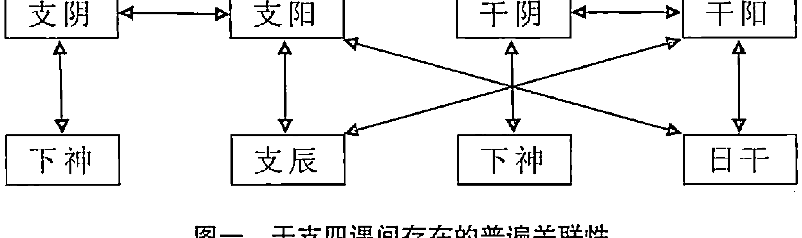

上图所绘，乃四课上下、倚正、交错之理气关系也。谓“交车”者，干上与支辰，支上与日干之交叉关系也；交车合者，干上神与支辰六合，支上神又与日干寄宫六合也。此数日有一数，象主交加互惠取利。如乙丑日三合盘，干上子去合支辰丑，支上酉来合干之寄神辰，乃我去取支为财，彼来合我之寄宫，乃贪辰土之生也。

或辛丑日进间盘，干上子，支上卯，乃我之寄宫戌去取卯财，支辰丑又以子为财来贪合，亦交关取利也。

内有戊午、丙午二日进间传盘，因干支相邻，更得干上未与支交车相合，支上申与干之寄宫相合，其合愈切。

【关联】乙丑日交车合一数之相关格体应用，具详于“首尾相见始终宜”与“帘幕贵人高甲第”二诀。辛丑日进间传例，干、支上子、卯见刑，合“宾主不投刑在上”句。

丙午日干上未一数，因三传申、戌、子，才贪支上申财，便投入戌墓之中，兼未传子鬼来克，不利可知，应“费有余而得不足”也。

【变格】交车长生。庚寅日元胎课，干上亥，支上巳；甲申日元胎课，干上巳，支上亥。宜合本经营。凌氏将戊申日伏吟与戊寅日返吟同此论，然伏吟用刑，返吟用冲，刑冲如何可论合作焉？非。

交车合财。辛巳日退间传盘，干上申，支上卯，乃辛以卯为财，巳以申为财，又交合，宜交财利。伏、返之局同上论，不取，癸未日四墓覆生盘，干上午，支上子，虽交车取财，但干支上下自相穿害，且干支与上神各自相冲；不免交财中生害也。此亦交车见克，并庚子日庚上丑，支上巳；庚戌日干上卯，支上巳，皆宜因类取象而用之。

三合局中交车六合。乙丑日三合盘，干上有旬首子，支上有旬尾酉，乃应“首尾相见始终宜”；因子与丑合、酉与干之宫辰合，更三传巳、丑、酉，四课全见三、六合，又无空破，兼得回还课，最是合美。唯忧困难释耳。辛未日三合盘中，干上午，支上卯，三传卯、亥、未亦是，只不合卯遁丁发用，乃“金日逢丁凶祸动”，中传旬空亦不利也。

以上论生合为主，下论交车中之凶格。

交车脱气。壬午日三合盘中干上未，支上寅，乃寅虽合干之寄宫亥，亦且脱我，未合午而脱午也。主交合财利中互怀相脱之意。乙亥日干上寅，支上酉；壬辰日干上酉，支上寅亦是。戊辰三合盘中，干上酉，支上申；丁卯日丁上戌，支上午；乙未日干上午，支上酉又是干支自被上神所脱。

交车相害。丁丑、己丑日干上午，支上子，乃自上下六合而交车互害也。

交车冲刑，唯伏吟、返吟日见之，仍各以伏吟、返吟论之可也。

> 【关联】万事喜忻三六合。

> 【要点】交车之格，重在干阳与支辰、支阳与日干之交互关系，间及干之上下、支之上下关系，以及干阳与支阳之横向关系。除交车合外，另有交车害、交车克等关系，将在后面相关诸诀中详加剖析。

本诀所论的三种关系，再加上干阴对干阳、支阴对支阴之影响力，构成了壬式四课纵横、对角的全部关联性。当然，除了本诀讨论的交车关系外，也包括下面要讲的上下冲合、扶抑、乘临的关系，和前面谈到过的贵人、德、禄临身、临支的关系等。这种些普遍存在于壬式中的关联性，结合四课与传用、三传间的，年命与课传间的互动关系，就能充分模拟现实的世态和人事了。而这种纵横、交叉往复的关联性，恰恰是壬式独有，而其它预测术所不具备者。也许有奇门家会说，我们有飞盘、转盘，飞转吊替也具备与壬式相似的理气结构。我们知道，奇门诸盘式无论飞、转，都是沿既定路线行进的，九宫之图式有类壬式之天盘与将盘，设想一下，如果我们把四课之乘临、三传之走向，及课、传、年命间的全部关联性放回到天盘式中，并把地盘、天神盘、天将盘三盘间的关系与理气结构全部连线起来，会看到一张怎样的关系图？这也就是作为三式之一的大六壬之所以独具课传结构的关窍所在，因为课、传、年命间尚看得清晰的交互关系，一旦全部还原到天盘式中，就成了一团解不开、理还乱的麻线了。日常生活中的人事，正如歌中唱道的那样“生活是一团麻，那也是麻绳拧成的花；生活是一根线，也有那解不开的小疙瘩呀”。从拟象角度讲，天盘是混沌初开，像一张全息影像一样拍摄了世事人情的百态。但天盘是二维影像中的四维时空，无法反映人事在时间上的深度和空间中的广度，这就需要用课、传解析天盘的全息影像了。而六壬课式的这种时空构造，也只有通过六壬时空大卦才能揭示出来。

#### 廿二法 上下皆合两心齐

【正格】或曰干之上下、支之上下自相作六合者，如甲申日干上亥，支上巳之类。此例丁丑、己丑日干上午，支上子；癸未日干上子，支上午；庚寅日干上巳，支上亥皆是。只支干居冲位，虽各自作合，然干与支，干阳与支阳又相冲击，如何得两心齐焉？

或曰乙酉日、辛卯日、壬寅日、丙申日、戊申日伏吟课，得支干上下各自相合，而伏吟用刑，乙酉干支俱见杜传，辛卯支课刑冲相击，壬寅干课自刑杜传，如何合得？唯丙申、戊申两日干支上下俱合，传中亦合。奈丙申日初巳空合于申，不抵中、末申、寅之冲，合是虚而冲是真也。戊申日勉强合格，因初巳合中传申金，末寅木当旬空，无力冲合也。故此格能得上下皆合又两心齐者，止戊申伏吟一例是真，余非也。

【关联】戊申日伏吟例，合“任信丁马须言动”。

【变格】交车六合更三合者。莫如用三合、六合往返取验似稍合格，如己亥日四绝体盘中，因己上寅去合支辰亥水，支上午又来合干之寄神，见上下皆合也。且己以午为禄旺，禄神为用，起而化去身上寅鬼，而来生合于身，更午、丑、申三传不空，末申作日之长生又冲去寅鬼，岂不美哉？丁亥日用此盘亦合，所美者身上寅变作长生，稍不如意者，支上午禄旬空也。癸巳日癸上申，巳上子亦好。癸酉日干上辰、庚子日干上丑、甲午日干上未，俱不好，因属墓神覆日也。庚辰日干上酉，甲戌日干上卯亦合格。

干支上神六合者。如丙寅日支来加干用元胎盘，乃支上亥与寅作六合，支课又上下自作六合者是，只不宜支上亥旬空兼支阳神不备也，不过虚合虚喜。丙戌、壬辰两日，四墓覆生之盘，虽丙上戌与支上卯合，却是墓神覆日兼“两蛇夹墓凶难免”；壬辰日干上辰与支上酉合，亦墓神覆日，兼辰昼夜将乘天后，应“将逢内战所谋危”，尤厌翳耳。

外好里槎桠格。此如壬申日干上寅与支上亥六合，凌氏谓壬之寄亥与申六害在干支内，外好里槎桠矣；辛酉日干上未与支上午合，亦此论。余实不知壬以申为长生，辛以酉为禄旺，谈何槎桠？若此论，则六辛日旺禄临身皆从凶推？壬日占竟不可见长生在课传乎？则丙寅日、乙卯日不必占俱凶乎？杂凑诸格何如实心占验耶？姑辨其似是而非之由。

> 【关联】己亥日之支上午发用，午、丑、申“三传递生人举荐”也。又末传申冲去身上之鬼，应“众鬼虽彰全不畏”也，夜占申乘贵人，寅作天空尤妙。癸巳日四绝体盘，用申上卯发用，三传卯、戌、巳乃“斫轮”兼“铸印乘轩”也。

> 【要点】凡六合、三合之课，宜细辨内中所隐之克害刑冲，此所以《毕法》有“万事喜忻三六合”、“合中犯煞蜜中砒”之喻也。此类体格中，如再见合“首尾相见始终宜”者，或合回还格者，解忧、离散之事，断无释散之期矣。

#### 廿三法 彼求我事支传干

#### 廿四法 我求彼事干传支

> 【正格】凡初传起在支上，末传归于日干上下者，曰“彼求我事支传干”。如癸酉日用三合盘式，初起于支上巳，经中传丑而归于干上酉者是，曰“朝干格”。

或从干上起而发用，传入支辰上下者，曰“我求彼事干传支”。前论诸诀相关联者多，可酌情取用。如丁亥日占得进间传课，初起于干上酉，经中传亥而末传归于支上丑者是，曰“朝支格”。

【变格】或干之阴神传向支辰，而入支之阴阳者，亦合“我求彼事干传支”，如庚戌日四绝体盘，三传戌、巳、子者是也。反之，或支阴神传来日干，而来干之阴阳者，亦“彼求我事支传干”，如辛未日四墓覆生盘，支阴巳发用，中传戌乃辛所寄处，是传来日干，末归辛上卯是也。

人宅相就格，此专就人与宅言之也。或干往加支，却受宅生；乃我人吉宅也；或支来临干生干，乃宅来益我也。唯不宜支克干，乃曰“乱首卦”矣。凌注谓之“欲弃屋宇格”，列于“干支乘墓各昏迷”条下，以为移来此处较妥也。

【关联】此二诀皆合“回还格”。且辛未日一数，干上卯木遁丁，末传并之，合“金日逢丁凶祸动”句；三传巳、戌、卯名“铸印乘轩格”。庚子、辛未二例，一则中传巳空，一则中传戌空，乃铸印空破不成之局也。

【要点】乃言干支往来之情，亦不利释散也。初学者往往将此二句与“眷属丰盈居狭宅”、“屋宅宽广致人衰”二诀混淆，然彼二诀就脱支生干或脱干生支之理气言之，虽亦行传在干支间相往来之势，然干传支、支传干未必见脱，脱支生干、脱干生支又未必是简单的支传干或干传支，读者须注意区分。在区分明白的基础上，依理气之条件关联取舍用之可也。

#### 第廿五法 金日逢丁凶祸动

【正格】此与“水日逢丁”诀，皆以日干与传用遁干相较生克喜忌之情也。凡庚、辛日占，如课传、年命中遇旬内遁丁之神者是。壬家之谓旬内遁丁者，一曰旬丁，二曰丁神，三曰丁马，乃甲子旬丁卯，甲戌旬丁丑，甲申旬丁亥，甲午旬丁酉，甲辰旬丁未，甲寅旬丁巳也。

旬丁之作用，以摇动为性，凡事遇此神者，皆主动摇不定。或占动静，时亦类似驿马，但驿马之动力久且剧，旬丁之动，只在朝夕，如人忽欲来一场想走就走的旅行，冲动一来，即时而行。乃询诸亲友，求为谋画，遇有劝阻，却又放弃。丁马或逢制、合，亦休矣。故传中有丁马者，思动者宜从速，不可迟疑。凌氏谓此格官人占赴任极速，亦要看制、合、空、实之情况，不可一见旬丁便许速动迁职也。且丁神主动摇不定，事主突然而起，心理上冲动之念，如与蛇虎交加，惊悸突兀而起，令人不能安处其事也。或作喜神，则意外惊喜也。

且丁神乃是旬内遁出者，前有论遁干者，言遁干主消息变化，有神来克我，却见遁来生我者为喜，或遁出制鬼者，或遁见财去助鬼者为忌等。神在明处，见克即谓之克，见生、见脱即谓之生、谓之脱，祸福一见了然。遁干为暗中谋计我者，或财交遁鬼，乃有人先以财利诱我，却暗设计谋，我一贪其财便遭其害；或明鬼来克我，却遁来父母生我，其人必是“刀子嘴，豆腐心”，面折于我，暗中却来助益告诫于我也。金日之逢丁，恶其暗遁鬼克，使患生于肘腋之间而我犹不知觉，而被其辱害也。

## 【关联】

如甲子旬庚午、辛未日见丁卯，乃财遁暗鬼，合“传财化鬼财休觅”之财遁鬼格，诫我不可取遁鬼之财也。或甲戌旬中庚辰、辛巳日见丁丑，丑原是我之墓神，更暗遁丁鬼来克，抑我愈深也。甲申旬庚寅、辛卯日，见丁亥却无虞，盖甲申旬午、未旬空，丁之所寄原在空处，又贪合于亥，无力伐我；仍嫌亥乃日之脱气，主蓦地有事来脱耗于我也。甲午旬庚子、辛丑日，逢丁酉者，庚日忌酉为阳刃，辛日乃初有惊惧，后却平安，盖酉乃辛禄也。甲辰旬庚戌、辛亥日用丁未为丁神，虽有惊而无险，且庚戌日夜贵乘丁未，官人最喜见之；辛亥日夜占贵人顺治，缘未乘蛇，乃有惊恐也。甲寅旬庚申、辛酉见丁巳，主非常惊惧之动也。上例中或遁丁之神更乘白虎，应“虎乘遁鬼殃非浅”句。

## 【变格】

人宅罹祸格。缘庚干上原有火神作鬼，支上丁神入传中又助身上鬼者。

或丁神又乘蛇、雀，临支克宅，易引发火灾。凌注引火鬼乘蛇雀克宅，又传中见丁者，不过是在丁神克宅之凶外更辅以火鬼之灾罢了。其实，即使丁不克宅，但由宅内动出者，亦是祸发于内而来伤人。

## 六壬时空

划，遇有劝阻，却又放弃。丁马或逢制、合，亦休矣。故传中有丁马者，思动者宜从速，不可迟疑。凌氏谓此格官人占赴任极速，亦要看制、合、空、实之情况，不可一见旬丁便许速动迁职也。且丁神主动摇不定，事主突然而起，心理上冲动之念，如与蛇虎交加，惊悸突兀而起，令人不能安处其事也。或作喜神，则意外惊喜也。

且丁神乃是旬内遁出者，前有论遁干者，言遁干主消息变化，有神来克我，却见遁来生我者为喜，或遁出制鬼者，或遁见财去助鬼者为忌等。神在明处，见克即谓之克，见生、见脱即谓之生、谓之脱，祸福一见了然。遁干为暗中谋计我者，或财交遁鬼，乃有人先以财利诱我，却暗设计谋，我一贪其财便遭其害；或明鬼来克我，却遁来父母生我，其人必是“刀子嘴，豆腐心”，面折于我，暗中却来助益告诫于我也。金日之逢丁，恶其暗遁鬼克，使患生于肘腋之间而我犹不知觉，而被其辱害也。

## 【关联】

如甲子旬庚午、辛未日见丁卯，乃财遁暗鬼，合“传财化鬼财休觅”之财遁鬼格，诫我不可取遁鬼之财也。或甲戌旬中庚辰、辛巳日见丁丑，丑原是我之墓神，更暗遁丁鬼来克，抑我愈深也。甲申旬庚寅、辛卯日，见丁亥却无虞，盖甲申旬午、未旬空，丁之所寄原在空处，又贪合于亥，无力伐我；仍嫌亥乃日之脱气，主蓦地有事来脱耗于我也。甲午旬庚子、辛丑日，逢丁酉者，庚日忌酉为阳刃，辛日乃初有惊惧，后却平安，盖酉乃辛禄也。甲辰旬庚戌、辛亥日用丁未为丁神，虽有惊而无险，且庚戌日夜贵乘丁未，官人最喜见之；辛亥日夜占贵人顺治，缘未乘蛇，乃有惊恐也。甲寅旬庚申、辛酉见丁巳，主非常惊惧之动也。上例中或遁丁之神更乘白虎，应“虎乘遁鬼殃非浅”句。

## 【变格】

人宅罹祸格。缘庚干上原有火神作鬼，支上丁神入传中又助身上鬼者。

或丁神又乘蛇、雀，临支克宅，易引发火灾。凌注引火鬼乘蛇雀克宅，又传中见丁者，不过是在丁神克宅之凶外更辅以火鬼之灾罢了。其实，即使丁不克宅，但由宅内动出者，亦是祸发于内而来伤人。

#### 第廿六法 水日逢丁财动之

【正格】凡壬、癸日占，课传、年命遇见丁神者，乃财动之矣。甲子旬壬申日遇见丁卯，乃财动来见合于我，昼占卯乘贵人主有贵人扶助也；癸酉日丁卯，乃因家宅门户变迁而动财。甲戌旬内壬午、癸未日逢丁丑，一则丑去害午，一则丑、未见冲，多因田宅动财。甲申旬壬辰日逢丁亥，因亥作日之德禄，德神遁丁，当主得财；癸巳日逢丁亥，乃行旅中取财也。甲午旬中壬寅日见丁酉，乃日之败神遁丁，且寅见酉乃破碎煞，破败中财动，有咎；更夜占贵人乘巳逆治，破碎乘太常，不是财动，是孝服动矣；癸卯日见丁酉，亦家宅之动财也。甲辰旬壬子日见丁未，未乃害支，不利可想；癸丑日见丁未主田宅动财。甲寅旬壬戌日见丁巳，壬日夜占巳乘贵人，乃财贵人遁丁也，须看位分因类取象以决之；癸亥日见丁巳乃驿马遁丁，主外出谋财；如昼占巳作贵人，必谒贵人而动财也。财与妻同，占婚当先论已婚、未婚而后决之。

【要点】此与前诀皆论遁干之消息变化之用也。遁干一旬凡十，无遁干者虽曰旬空，实际旬空亦是遁干之一种特殊表现形式，后论详之。唯十遁干中，遁诸甲者曰旬首、旬仪、仪神、六仪，有解禳诸凶之效；丁马具论于此二诀，不赘。旬尾遁癸，兼有“闭口”之意。此三遁干在壬式中除消息之变外，均各有特殊象义，取用皆因人事逐类决之可也。

又，丁马人课传、年命中方谓之“动”。

#### 第廿七法 传财化鬼财休觅

【正格】谓三传俱作日之财星，或末传见财神，却去生起干上、支上之鬼也；或日财人用，却生起中、末之鬼来克干者，均曰合格。假如辛亥日，用三合盘，干上原有午火之鬼，得支上未涉深发用，三传未、卯、亥合起木局，我必自贪其财，不知甲辰旬中卯财空亡，身上午鬼却在实处，因贪些子空合之财，却被木局生起午鬼逼身，凶咎可想矣。唯夜占午乘贵人却可解。

又如甲辰日四绝体盘中，干上原有酉鬼，因比取支阴午发用，中传见丑财，我先见午来制鬼，又奔妻财，自贪财而往。如夜占丑乘贵人，尤乃甲木所喜；不意未传化出申鬼来助身上之鬼逼身，主干贵财而有咎也。

如乙巳日干上未，支上申，用元胎盘，因三传未、戌、丑全生支上鬼也，主因财致宅家宅不安也。唯昼占申乘贵人可解，若夜占申乘勾宅危矣。

【关联】如辛亥、辛卯、辛未日干午乘贵人之局，合“鬼乘天乙干神祇”、“贵虽值狱宜临干”句；又因寅加午乃昼夜二贵人相乘临，合“昼夜贵加求两贵”句。此三日之三传或未、卯、亥，或卯、亥、未，因亥乘六合，卯乘天后，又是“后合占婚岂用媒”句。甲辰日四绝体例，因夜占午乘虎，乃应“将逢内战所谋危”；或昼占未乘贵人，午乘天后临亥发用，又应“初遭夹克不由己”也。

【变格】财遁鬼格。如前举庚午、辛未日见卯财遁丁鬼者是。外如甲戌日干上辰遁庚、丙寅日干上申遁壬等。

传财合鬼格。丙子日丙上丑用三合盘，遥取支上申财为用，三传申、辰、子乃发用日财却传合水局即是其例。如夜占，三传乘玄、龙、蛇，畏矣。凌氏将此谓“传鬼化财”，又将丙申、丙辰日列入例中，非。盖申财既化鬼局，便以传见财而反结鬼煞之党论矣。且丙申、丙辰两日自是子鬼发用，尤不合格。今将丙子一数移至本条之下为的。

借钱还债格。准凌氏原注。

【关联】丙子、丙申、丙辰三日昼占酉乘贵人，申乘天后，末传子乘六合，乃“后合占婚岂用媒”也。

## 第廿八法 传鬼化财钱险危

【正格】曰三传鬼众中化出日财者是，因财从鬼煞中化出，反又去生鬼煞，故曰“钱险危”也。如乙未日用进茹盘，遥取支阴酉为用，三传酉、戌、亥者应斯格矣。或癸丑日干上见戌，三传庚戌、丁未、甲辰，乃三传全见鬼煞，只是传遁丁财，曰“水日逢丁财动之”，此财由鬼中化出之也；或干上辰，三传甲辰、丁未、庚戌亦是；外癸未日，干上辰、戌，中传丁丑者同此。此二日伏吟课并为此例。

## 【变格】求财急取格。

乙未日未来临日作财，切宜急取，稍缓乃被未墓矣。

取还魂债格。缘三传俱见脱气，反生干上之财者。如己丑日干上亥，三传酉、丑、巳合金局来脱我之气，却生干上之财也。

其余凌氏所拟之格，似是而非。如危中取财格，“缘干克支辰为财，支上神为鬼，不免自惊危中取财”，举甲辰日支上申为例。此数干上午，申遥克日干发用，有午制之，我不畏也。三传化出水局，乃传鬼为生，末传便是辰财。我何不待末传之财，而急取鬼下之财焉？至愚也。

## 【关联】

乙未日干上未，课传俱见日财，却不见财库在课传中，更因财库落天中旬空，不能敛财，应“传财太旺反财亏”句，恐财虽多，我却无力取之也。

己丑日干上亥一例，因酉金发用脱支，末传巳却生干，亦“眷属丰盈居狭宅”也。

## 【要点】

此二句以传变为主，然传变又不止此传财化鬼与传鬼化财也，亦不止于三传之变。“众鬼虽彰全无畏”、“有始无终难变易”、“虎乘遁鬼殃非浅”、“前后逼迫难进退”诸诀中多及此论，参之可也。

#### 第廿九法 眷属丰盈居狭宅

凡占兵利先举。

此格因三传脱支生干，兵家以干为先发，支为后应，脱支生干，兵宜先举。此亦言三传在干支中往来之气，然与“彼求我事支传干”、“我求彼事干传支”不同。盖此课但言发用去脱支，末传来生干，三传不必尽在四课干支上往来，亦未必有彼来就我之意。“屋宅宽广致人衰”句同此论也。

## 【正格】

凌氏原注列二例，一曰甲申日干上午，三传辰、申、子水局脱支生干也；再曰乙酉日干上申，三传申、子、辰，又是水局脱支生干。

## 六壬时空

虽合规矩，却是书生笔触也。余举壬寅、壬午、壬辰三日四绝体式，俱午加壬发用，三传午、丑、申，壬寅日初午发用，即脱支矣，末申助壬，是生干矣；壬午日中丑脱支，末申仍来生干；壬辰日末申脱支，继而生干。皆合诀也。此俱是从实占中得之，实占中《毕法》之用，变幻无方，各因类取，各以象决，岂书生所能逆料哉？

## 【关联】

上壬日三例如七月占妇人，应“胎财生气妻怀孕“也。

## 【变格】

人旺弃宅格。谓三传生日干而克支者。具引邵公《断案》之例明之。

例8，何丞务丁巳生五十三岁，占宅。己酉年二月戊子日，戌将巳时。（爱函得古本作丁未生六十二岁，盖未交生日故也。）

合 雀 蛇 贵           合 常 阴 合
戌 亥 子 丑           戊 巳 卯 戊
勾 酉       寅 后     已 子 戌 戌
龙 申       卯 阴
未 午 巳 辰           父 癸巳 常
空 虎 常 玄           兄 丙戌 合
                       官 辛卯 阴

邵先生曰：此课日往加辰，是人广而宅狭也。宅上发用，传出日上，是宅居不得许多人而后出也。末传归第二课，又见宅不纳人。然非宅克人，是人多欲自出也。若移出各人自为活计，将因太阴扰动而兴词讼，（太阴乘卯为今日鬼，故就卯上论之，在末传，故至十三年后。）十三年后见之。后人财亦兴旺。何居祖宅，宅窄人众，此是日来加宅，相逼又作破碎也。

本年十一月移出店房居住，自做经营， （亦应初传巳为店业，妙！妙！）前原是兄嫂掌家，后十三年，岁在甲子，果因家财争讼。是以加子，人宅相克也。巳四、子九，并成十三年也。其壬戌年有卯制，故不动；癸亥年天罡压之，亦不动。甲子年人宅相逼，所以至此方争也。讼起于甲子之春，至乙丑四月方止，宅上见禄神，尚自兴旺，人财尚可旺发也。

本案虽日干往加支辰，却是戊之寄宫已被支克，原应作“乱首卦”论，然邵公自言“非宅克人“者，盖戊干为人，戊属土，竟是人去克宅也。此壬式论干与寄神变化之奇也。初已生我，中戌助旺于我，末虽曰官鬼，却生起初传又是助我，而我独克其支，乃前有”人广而宅狭“之断，后有”移出店房居住“之应也。

赘婿格。邵公案例有之。

例9，叶助教戊午生五十一岁占宅，戊申年正月辛卯日子将未时。

| 勾 | 龙 | 空 | 虎 | | 虎 | 雀 | 雀 | 玄 |
|---|---|---|---|---|---|---|---|---|
| 戌 | 亥 | 子 | 丑 | | 丑 | 申 | 申 | 卯 |
| 合 | 酉 | | 寅 | 常 | 申 | 卯 | 卯 | 辛 |
| 雀 | 申 | | 卯 | 玄 | | | | |
| 未 | 午 | 巳 | 辰 | | 财 | 辛卯 | 武 |
| 蛇 | 贵 | 后 | 阴 | | 兄 | 甲申 | 雀 |
| | | | | | 父 | 己丑 | 虎 |

> 邵先生曰：此课支来就干，为干所制，名曰“赘婿”。太岁入宅克宅，宅来就人，又被人克，六年中家破屋拆，遂成墓地，必葬尊长在内。六年之前，四分五裂，门户分张，主外姓或还俗僧人入挠，遂宅破矣。
盖末传丑为辛日之墓神，临太岁上；太岁为其所墓，遂来宅上而克宅；宅被克，走回日上，又为日所克，宅既不留，屋何存立？又自身上发传入宅，又逢太岁来加；又太岁上见今日之墓神丑，丑土生申金，是申金之尊长，庚辛墓于丑，是尊长葬埋之处。卯数六，故不出六年。申为僧，辛与申同类，还俗僧也。（或乙酉见辛卯，或辛酉见乙酉，皆系还俗僧。乙为沙门，辛为僧舍也。）卯上见元武，故主门户分张。
后癸丑年其叔死，遂殡于内。叔有三子，一子为僧，还族归分家产。助教不肯，经官断定，作诸子分家。与叔共五子，助教亦得一分，作六分分矣，戊申至癸丑乃六年。当年又死一男一女，乃太岁克宅故也。其经官者，亦太岁入宅克宅也。

本案又不止居无正屋之应也。

【关联】例 8 乃铸印课，又干即去加支，却见支上传归干上，是“彼求我事支传干”也；如占尊长病，因巳作破碎乘太常，邵公每断孝服动，丁忧父母也。例 9 是斫轮课，初起干上，末归支阴，亦“我求彼事干传支”；如四月占妇人，且是“胎财生气妻怀孕”；初传财，末归丑，虽不

## 第二十二章《毕法赋》遇真玉铃钩

是传财化鬼，但传归干之墓地亦不利。二例三传不离四课，均“回还格”。
【要点】《毕法》之学习，建议多参考《断案疏正》一书。余读邵公之案，与《毕法》诸诀但神似而已。当然，邵公研壬之际，尚无《毕法》也，《毕法》据邵案拟诗，体格不如邵案理气活泼，此诗诀之局限性也。要打破诗诀的桎梏，就要多读邵案，多务实证，神会诗诀，得意忘形可也。

#### 第三十法 屋宅宽广致人衰

占兵利为主而后应，或营空虚。

因三传脱干去生支，故宅广人稀，兵事利后应，有军营空虚之忧也。今之豪富人家，一家三口，却有数处房产，独栋别墅，往往乏人居住，全无生气，皆此类也。不知宅能养人、生人，发人富贵，亦能脱人、败人、害人，败人子嗣。余事堪舆多年，所阅别墅百计，竟鲜有好者。而询诸发家始末，验其创业之基，全是狭宅人众者也。知先贤之论不谬。

【正格】如乙亥日支来加干，乃用四绝体式，三传午、丑、申脱干去生支。或丙子日退间传式，干上卯，卯上丑发用，三传丑、亥、酉，亦脱干生支也。俱合诀。

【关联】乙亥日课，三传脱干生支，末又克我，似乎诸多不利。幸是支来加干生干，化去末之鬼煞，翻为宅来救我也。又合“三传递生人举荐”例。昼占亥乘六合尤妙，夜占亥乘蛇，不好。此数因三传脱干生支，末传克干，又是“卖宅备患格”。

丙子日例，干上卯与支上戌见合，却是戌来墓日，而卯去刑支，应“合中犯煞蜜中砒”也。

【变格】血厌克宅格。因七月占月厌在辰，血忌亦在辰，此二神并作一神临支克支者，凶。总是神煞辅凶神之暴虐也。

【要点】占事总以“因类取象”为大宗法，干支、八门定象如此，神将一类象如此，《毕法》、《课经》中歌诀、体格取舍亦如此。此二诀总言家宅兴替，若动问交易买卖，将干支分定后，论脱支生干、脱干生支，犹指买卖双方本利盈亏及货品、服务之优劣也。

## 第三十一法　三传递生人举荐

【正格】三传或初生中、中生末，递生起日干，或递生起支者是。此又与前脱干生支、脱支生干及干传支、支传干不同。然互有关涉，如壬申日干上午发用，三传午、丑、申乃“我求彼事干传支”，礼下于人，必有所谋也。然末传申却来生干，乃应三传递生日干，是我有所求，彼有所应也。其中并无脱支生干、脱干生支之关系。或壬午日又不同，因支加干作日财发用，三传亦午、丑、申，是支作财先来加临于我，我又传向支，却有支上丑脱其午火，而生出我之长生申金，又益我也。此例则俱应三传递生干、“眷属丰盈居狭宅”，及彼来就我而“我求彼事干传支”三者也。

又如乙酉日占用四绝体盘，

| 亥 | 辰 | 午 | 亥 |
|---|---|---|---|
| 辰 | 酉 | 亥 | 乙 |

，因是干去加支，干课先乙上亥不克，支阴止作不备论，不可将支阴辰上亥发用，乃用支阴亥上午起传用，三传午、丑、申，递生起日之鬼爻，却因申生干上亥水，亥水又生干为“虽忧狐假虎威仪”也。然此数于支亦非全无助益，乃申能助旺于酉也；且旺之中却暗见脱耗，盖申与支上辰半会水局，又见脱矣。人事复杂如斯，课传之变、应事之奇亦如斯，此尤乃六爻、奇遁中所无者也。此数初起时稍嫌午火脱干生支，且是旬空，应“屋宅宽广致人衰”，后却便宜，应“苦去甘来乐里悲”之“苦去甘来”也。

又三合局中，从革、润下、炎上俱有三传递生者，唯曲直亥、卯与未皆相克，不能全递生之义也。又进间传课、元胎课中亦夥，占时须在意递生干，抑递生支，及初、末之空实也。

有末传逆生初传而初又去生干、生支者。如乙酉日退间传盘，三传未、巳、卯曰末生中、中生初又生支辰，嫌初未空，止卯作日禄也。

【关联】壬申、壬午日乃回还格，乙酉日合“妄用三传灾福异”。

外有天将生财神格。如六丙日三合盘，丙上酉发用，三传酉、丑、巳，昼占酉乘贵人，中传丑乘太常，末传巳乘勾陈，所乘俱是土神，生起日之财局，又末生初作日财者是。丙子日嫌酉空。

有天将作鬼，却生三传，传又生干者如六癸日干上巳发用，三传酉、丑、巳，或癸丑、癸酉、癸未、癸巳日干上酉，三传巳、丑、酉，缘昼占天将贵、勾、常作日鬼，得三传会金局化鬼生身也。

**【要点】** 重在三传递生之理气，象合举荐、拥戴也，有贵人、太常在传，主受上人提携之恩。总宜区分与干传支、支传干，脱干生支、脱支生干之同异。

#### 第三十二法 三传互克众人欺

**【正格】** 此格曰初克中、中克末，末克日也；一曰末逆克中、中逆克初，逼初来克日是也。如丙辰日四墓覆生盘，第四课寅加酉发用，三传寅、未、子，因初克中、中克末，末子来克干，幸是末传子空无力也。又如丙子日四绝体盘，支来临干克干发用，三传子、未、寅，乃末寅克中未，未克初子来逼身，不知初自是鬼，中未克害之，递末寅生干却好。

**【关联】** 丙辰日发用甲寅，乃长生木，传归鬼煞子幽暗之地，应“苦去甘来乐里悲”之“乐里悲”也；身上墓神覆日，昼夜将乘螣蛇，乃“两蛇夹墓凶难免”也；日去就寅之生，却终被鬼克，亦“前后逼迫难进退”也。丙子日子、未、寅，三传尽在四课之内，“回还格“也；鬼传生方，应“有始无终难变易”之“难变易”也。

**【变格】** 求财大获格。如庚辰日四墓覆生方，支阴寅财为用，财去克中传未土，未又克末传之子者是也。独不宜占父母，应“六爻现处防其克”也。或乙酉日干上酉，乃四墓覆生盘式，因第四课未发用，三传未、子、巳亦合格，嫌初财作日墓，并旬空也。

三传内战格。日内战者，下神贼上，或神克其乘将者皆是。此只就下贼上神言之。如乙丑日四墓覆生盘，干上酉，酉上寅发用，三传寅、未、子，以天盘言之，乃地盘酉贼寅发用，中传未被地盘寅贼之，末传子又被地盘未贼，乃曰“三传内战”也。

**【关联】** 上举乙酉日求财大获格例，或酉时占，乃占时并起干上鬼煞，更占人年命在未，与用同来墓日，应“天网自裹己遭非”句；昼占申乘贵人临卯，曰“励德课”，初未乘天后，应“将逢内战所谋危”句；或夜占初未乘青龙，却是“初遭夹克不由己”也。

乙丑日三传内战格，昼占申乘贵人尚可，若夜占，祸发连深矣。列式如下：

## 例10，乙丑日三传内战格，夜占

```
朱 蛇 贵 后
戌 亥 子 丑
合 酉        寅 阴
勾 申        卯 玄
未 午 巳 辰
龙 空 虎 常
```

```
蛇 空 阴 合
亥 午 寅 酉
午 丑 酉 乙

兄 丙寅 阴
财 辛未 青
父 甲子 贵
```

此课干上酉乘六合，金神克木将，乃“将逢内战所谋危”也。初传遭太阴与地盘酉金夹克，即应“初遭夹克不由己”句；中传未遭龙神夹克，末传子遭贵人与地盘未夹克，三传竟全是夹克，其凶上下锁定，必无幸理。且末传子之贵人正与中传未相穿害，应“害贵讼直作曲断”句。如秋占得此日课，因干上酉鬼当旺，似乎合“鬼贼当时无畏忌”句，殊不知辰加日之长生亥水，乃“罡加日本”，更发用寅木乘秋令死气，应“囚死发用”，格合“天狱课”，邵公谓之“天狱课，不有大服，则有大祸”也。

### 【要点】
此诀理气尽系于三传互克，纵不克日，诸占亦蹭蹬不利也。占行人主途中受阻，迭遭事变，或受欺凌。如贵人在传，因式中多有害气，防与贵人所乘相穿害，必受上人嗔责也。此类格体盘式多见于四墓覆生与四绝体，占病危矣。

《玉铃钩》注疏至此，想读者可以窥得课传中理气往来之组合，及格体应理气之交变于一斑矣。试问，术数诸学中可有如此丰富之理气与类象堪与壬式相匹乎？今人每谓悟透生克理气、六亲之用，便得壬式之真，竟将《毕法》、《课经》束之高阁，可乎？壬家能掌握星垣，指运天罡者，端赖缜密之象数逻辑也。悟性因人而异，逻辑却因式而衍，故能得壬式之真理气、真象数者，超群之智力也。理智不明，废于思辨者，建劝勿入壬式堂奥，徒迷心智耳！

### 第二十二章 《毕法赋》遇真玉铃钩

#### 第三十三法 有始无终难变易

【正格】此一句诀讲的又是旺衰理气，与“旺禄临身徒妄作”、“鬼贼当时无畏忌”和“传财太旺反财亏”不同的是，“旺禄临身徒妄作”虽以阴干之禄作本身五行帝旺之所论，但静居干上不动；“鬼贼当时无畏忌”讲的时旺时衰，仅就占时所在时节论，也是静态的旺衰。“传财太旺反财亏”虽曰传中动出之财，或因财众难收，或因时旺身弱，其财不受我约束控制，但还是相对静态的旺衰。而“有始无终难变易”重在一“变”字，乃三传将干支引归生旺或引向衰绝的旺衰，是动态中的旺衰理气，讲的是五行生旺墓绝十二宫的旺衰理气。

“有始无终难变易”须分两端去说，前半句“有始无终”讲干支或当时令旺相之气，发用亦五行生旺之地，却传向墓绝方去，始繁昌而终受晦，曰“有始无终”，言其不善终也。后半句“难变易”者，或占时干支当时令休废之季，发用自墓绝方起，殊多艰辛，唯行传将干支引向禄旺之所，应由难变易也。

此例于元胎课中颇多，如甲辰日元胎盘，干上巳乃甲之脱气，兼本身五行病宫；支上未乃日之墓神。发用起在巳上申金，乃绝神作鬼来克，颇费艰辛。却因中传亥水作日之长生，解忧矣。更喜末传寅作日之德禄，“难变易”也。稍嫌末传旬空，或三春占之不作真空论，且坐生方之木，自有生发之意，出旬填实便春风得意耳。

或丁巳日用进茹盘，支上午本是我禄旺之所，却应“权摄不正禄临支”句；更因贪了身上申财发用，三传申、酉、戌，乃财传出干支墓神，遂应“有始无终”矣。此仿本卷例7应汝言例，断“不可狂图”可也。

【变格】舍损就益格。曰甲辰日退茹课，干上丑乃日之破碎，或昼占乘空尤顽劣不堪，支上卯乃阳刃害支，课中皆是损我之神。幸三传子、亥、戌，退人生方，不免舍课之旧，就传之新生，合“避难逃生须弃旧”句。

### 【要点】
此诀以传中五行生旺墓绝十二宫之趋势言事，总要墓绝方向生旺、德禄方为喜，反之则危。

#### 第三十四法 苦去甘来乐里悲

【正格】此与前诀相似，只此诀不以旺衰言成败，而以生克论英雄也。亦分两处道来，或鬼煞传来生我，曰“苦去甘来”；或财神为我所喜，却传归鬼煞克我，“乐里悲”矣。或问，如此说来，此诀竟可与“三传递生人举荐”同归一论，何必另设格体。答，无此过，盖因类取象不同，“三传递生人举荐“多化凶为吉之论，此诀就吉中藏凶断出。理气相似，而理趣迥异也。邵公案中有此格。

### 例11，赵知县丁巳生五十二岁在任占前程，戊申年十一月乙未日，寅将未时。

| 左边 | 右边 |
|------|------|
| 贵 后 阴 玄<br>子 丑 寅 卯<br>蛇 亥 . 辰 常<br>雀 戌 巳 虎<br>酉 申 未 午<br>合 勾 龙 空 | 合 阴 空 蛇<br>酉 寅 午 亥<br>寅 未 亥 乙<br>子 甲午 空<br>财 辛丑 后<br>官 丙申 勾 |

或谓此数脱气发用，三传递生鬼，自有干上亥化鬼为生，应“三传递生人举荐”、“众鬼虽彰全不畏”焉？殊不知为官人占前程，原不畏官鬼，反嫌身上蛇挠之也。

> 邵先生曰：甜处遭苦，乐里生忧，此课是也。亥来生乙，蛇来挠之。宅上寅作太阴，寅与亥合，因州中曹职吏人暗谮，而成不足。初是死地，午为心，见天空，主心间恍惚。又主子息暴病，妻宫产难几死，盖火阁压中堂。任满下梢难脱，有七日曹职之权，后得卢姓人而解任矣。

赵果与判官不足，遂被何孔目间谍。因屡谮于太守，亦与赵不足，赵遂心下恍惚暴燥。子病几死，妻次年产，几不得生。任满权官，不能解任。值卢运使经过，与太守解纷，遂得归。

盖乙本生于亥，亥不合螣蛇来挠。寅作太阴，寅为曹职吏人。午为子，子加父母上，自然不安。乙以丑为妻，丑为产神，加今日六害上，故主产厄。未神七，申乃日鬼，人于深墓中，故能谮而不能脱。子作贵加巳，子为漕，巳为炉，主姓卢运使解纷也。

此例足证因类取象之重要。否则同一理气，一曰“人举荐”，一曰“乐里悲”，从何取舍焉？且乘将亦干要紧，如申乘贵人，乃贵人升人正垣，更干上亥乘六合便是“三传递生人举荐”，美矣。

### 【变格】乐里生忧格

曰“庚寅日，干上巳乃庚金之长生，支上亥乃寅木之长生，此乃先各有长生之意，然后递互相参，其庚金反被亥水脱，寅木又被巳火脱，却反为两边脱盗，凡占皆然”。凌氏之注于旨未明，今更详释之，盖庚寅日病胎之盘，干支上各见本五行之长生，原是好的，却因干上巳发用传出寅、亥来，庚贪中之寅财，反被末传亥水脱去生支，乃应斯格也。尤有癸巳、癸酉、癸丑三日，癸上酉三合之盘，三传巳、丑、酉，昼占用巳乘贵人，三传乘贵、勾、常，曰传合生身，而天将暗克矣。且癸巳日酉为破碎乘太常，不宜占宅与父母事，占则孝服动矣。

恩多怨深格。如己巳日用生胎盘，支上申发用，原是土之生地，却递传亥、寅，由生方奔去鬼乡也。此必是贪中传空财，而遭“传财化鬼财休觅”之晦也。然昼占却无虞，因申乘贵人，末传寅鬼乘空临空，不能为害故也。

或如六戊日昼占丑贵顺治，必长生申金将乘白虎，曰吉神乘凶将，不知虎亦是申金长生，自是助益，乃不幸中之大幸也。或夜占未贵逆治，却因青龙乘日之官鬼寅木，反助鬼矣，应幸中之不幸也。此类皆要申虎、寅龙临干支或入传用方可言之者也。

### 【关联】
乐里生忧格中庚寅日课，因庚贪中传之财，反被末传亥水脱去生支，应“屋宅宽广致人衰”句。甲申日反此，因是申之长生巳火发用脱干，中传却反奔日之禄地，末归日之长生而脱支生干，一应“眷属丰盈居狭宅”；二则三传由未生起初，应“末助初兮三等论”也。

### 【要点】
此诀要以传用之生克论喜忌，以辨人事之休咎也。唯乐里生忧之癸日干上酉三例兼论及天将乘临之变化，与前“众鬼虽彰全不畏”条下“天将为救格”适相表里，读者宜参看。以是论之，则神将吉凶之判端视乎八门理气之生克制化，而不可单独言某神为吉神，某将为凶将。神将实无所谓吉凶，其吉凶之变，一随因类取象而有不同，二应理气交变而作威作福耳。

#### 第三十五法 人宅受脱俱遭盗

【正格】凡占，或干支俱被上神所脱，或干上神脱支，支上神却反来脱干者是。前“脱上逢脱防虚诈”句要言神将乘临之脱而又脱，此言干支被上神所脱，二诀可参伍并用，如源消根断格皆合是格体也。然二诀毕竟是有些不同的，如庚辰日三合盘得庚上子、辰上申，三传辰、申、子合化水局，更因申禄旬空，止干支课传一片脱空气象，全无生意，占事逢此，人宅尽被脱空，托事于人必遭诓骗财物，大不宜占病，脱死而已。又如庚寅日三合盘，庚上子，寅上午，亦干支上见脱，唯辰发用，三传辰、申、子正可敌支课合众之鬼杀，乃脱中有救焉？凡人事，皆趋利避害者也，故脱盗之神相较于鬼克之神，亦谓之利也。且丙戌日退茹盘，丙上辰脱，戌上酉脱，然辰、酉兼合，亦脱中取利之谋也。故要言之，脱上之脱者，显而易见之者也；此人宅干支之受脱，或易见之之利害，或我欲取其利，先舍就于他暂时机巧之利害也。人之务于事，眼前者易见易知易觉，久远者殊未可量也。此所以课中见得分明，只人之较量轻重得失，往往失于先天之妙也欤？

### 【关联】
或乙未日用进茹盘，乙上巳脱，未有申脱，遥克取第四课之日鬼发用，却终于传归于日之长生亥水，且能化鬼为生，亦是仇中见有恩者也。此又应“有始无终难变易”中之“难变易”欤？且乙上有巳，可敌初鬼，亦“众鬼虽彰全不畏”焉？唯课中鬼煞在三、四课，应“鬼临三四讼灾随”在先耳。此螟蛉在前，后却合美也。或昼占申乘贵人，又应“鬼乘天乙干神祇”也。

### 【要点】
此格言人之与宅，其象类实不尽于兹，全在于人之取舍得失也！此又是壬学一大特色，即不仅指示人事始末之传变与结局之吉凶，亦体现出抉择的好恶与利弊，未必就一结论推究其断应之效也。问事求解，术家取验，皆理所应当之事，唯壬式之精髓在于天命所归，每于必然处示以未必然之选择以供趋避之用，此所以课传之验中取不验之奇也。凡来人动问索占，不过要一个切实底论断，或课传凶，却有一处乘临柳暗花明，则曲求另图矣。唯曲求另图，则事有应与不应也。不应之应转凶为吉时，人既不知先有凶应已避过，自然也就不知道壬家老谋深算，话其趋避之

#### 第三十六法 干支皆败势倾颓

【正格】谓干支之上皆是五行沐浴之败地，或干上神乃支之败地，支上神乃干之败地是也。如午年、月乙丑日占得三合盘，干上子来败乙，支上酉败丑土者是。此例因支阴已发用，乃是脱我，更三传巳、丑、酉合起鬼局，危矣！或丙申、壬寅二日，用退间传盘亦是其例。辛未日用退茹盘式，干上酉乃未之败神，支上午乃干之败地，然酉本干之禄神，午原支之旺神，故静则各守其禄旺，设动之，因支二课巳、午皆日之鬼煞，动遭“鬼临三四讼灾随”之晦也；且遥克支阴之官鬼发用，三传巳、辰、卯，末虽曰财，却遁丁神，应“金日逢丁凶祸动”、“传财化鬼财休觅”矣。此类干支隔四位者多见之。

### 【关联】
凌氏释《毕法》，多以甲申、庚寅二日论，盖此二日干支在冲位，败则俱败、脱则全脱，生而全生、旺而皆旺，最易举例。不知诸诀之变化全在实占，六十花甲之理气岂庚寅、甲申而能尽赅焉？如甲申日退间传盘，甲上子，申上必是午，虽曰干支皆败，然午、辰、寅作传，初乃脱气并旬空，末却归于日禄，自是“有始无终难变易”，何损之有？或甲上午，申是子，乃是干上神去败支辰，支上神来败于我，不知干课不动，却是支阴辰发用，三传合起水局来生益于我也。庚寅日亦类此论。此皆是书生之笔，不如邵公理气全由占中化出来，于取舍亡失，分毫加减也。

### 【要点】
凡占类，总须因类取象，何曰“因类取象”？盖事必有因，非动心起念不能有占验，占验必由人事类占也。故，课传往来理气之得失，无非人事类占，无不是“因类取象”，随类取验也。

“因类取象”之旨，初以干支定象为契，次赖神将之乘临，论诸占断八门，以位分定名分也。至若《毕法》，尤为不同，乃于干支上、四课间、三传中往来化象，此动态之“因类取象”也。《易》之为道，不过动、静；静中得其动之机，动中察其静之端；凡有一动，必知其止于何所，但有一静，必知其动之由。此即“因类取象”之枢机也。

静，能观其触发之机。此《毕法》所由以立则之端也。

#### 第三十七法 末助初兮三等论

【正格】此但由三传之初、末论之，谓“末助初”者，因末传生起初传者是，此类以退间、四墓盘中多有见之。亦有末生中，而助初者，尤与“三传递生人举荐”一诀相关联。然“三传递生”也好，“末助初”也罢，既有生助而来益我者，必有生助而来克害、劫盗我者，故要三等论之，辨其喜忌、恩仇也。

- 一日生我者父母也，助我者兄弟、禄旺也，我克者妻财也，此三者我所喜者也
- 二曰末传助起初鬼逼克于我，乃我所忌
- 三曰末传助起初之子孙爻而来脱我之气者，乃末传自是我之同类与禄旺，传用归于中平气象也。

### 【要点】
凌氏之注可读，知其传变之格。然不可执一。总视初、末二传之空实，与理气扶抑为凭。

#### 第三十八法 闭口卦体两般推

【正格】闭口卦有两般，一曰地盘与天盘间隔四位，乃旬尾与旬首递互相加临，又发用入传，十二盘中元胎盘者是；二则玄武乘神临地盘之旬首上也。因玄武主阴私灭没，玄神所临，俱作闭口。此课传体格之“闭口”也。尤有二等喜忌，曰喜闭口与忌闭口，公干动用之事忌闭口；私计阴谋之事，却宜闭口。故“两般”云者，一就课传体格，二因事类取象也。如占讼事，干来讼我，却因干作旬首，上神间四位见旬尾乘之，乃干自闭口，终于不了了之。或支上玄武乘之，干虽欲讼我，而我但闭口不言，遁迹灭没，彼亦无果耳。

### 【关联】
此格体中，须论清闭口之神究竟是何六亲，或为我之妻财闭口，或是我之官鬼闭口，我之禄神闭口，我之父母闭口等。如占疾病，财为医药，禄为饮食，闭口则药石不能救，饮食不能纳矣；或干谒官贵，官爻、贵人作闭口，大不利于谒也。此例占讼、占病极验！以占讼，但以干为原告，支为被告，有一闭口，讼事息灭；如占病，干上闭口，必是病人不能言语，或财、禄闭口，必应饮食不纳、药石无功也。

### 【要点】
闭口论喜忌，常占须分干支彼我，如我欲诤理，见闭口为忌；反之则吉。唯占病、占胎不可见闭口，占病如前论，占胎见干闭口或难产，或生哑儿也。

#### 第三十九法 太阳照武宜擒贼

【要点】前诀以玄武乘神为闭口灭没之神，此诀论太阳月将乘玄武之利害也。玄武原是贼神，喜夜行出人逃遁，今乘月将，被太阳照破，无所遁迹，大宜捕贼追逃也。或元武之阴神乘太阳者，亦宜捕之；尤喜太阳乘天空或作旬空，盖丽日当空，晴无云翳，贼固无所隐匿矣。

【要点】凌注此中有一段话，极宜注意，曰：“惟畏占时在夜，贼反大幸也。尤宜逐季推寻日出日入之时，极准！如止卯为日出，酉为日入，则元武止有临地盘申上者为昼，缘不临地盘寅、卯、辰、巳、午、未故也。如推究节气日出日入，则元武纵临酉、戌，尚可作太阳照武之用也”。太阳于两分前后卯出酉人，迭于夏至，昼极长，在辰、戌间出入，故戌时亦有太阳照武之验也。更引申之，如昼时占，拈得活时是夜，仍用昼将，若玄武乘太阳在昼方，亦太阳照武也。总宜玄武在课传中出现为的。此虽专言“太阳照武”，常占区分日之出入，昼夜天将之交接，亦当推究节气更迭为善也。

#### 第四十法 后合占婚岂用媒

占兵有敌与臣下私谋者。
【正格】凡占婚姻，值天后、六合在课传内者，便合此格。或卯、酉乘后、合人用者，便是“淫泆”卦。邵公案中有此格。

### 例12，祝省元占婚，男戊辰生四十二岁，女己丑生二十一岁。己酉年二月己卯日，戌将辰时。（爱函按：断语中有“血支在卯”一言，则当是三月占，盖血支正月在丑，顺行十二支也。）

```
蛇 贵 后 阴      玄 合 龙 后
亥 子 丑 寅      卯 酉 未 丑
雀 戌     卯 玄      酉 卯 丑 己
合 酉     辰 常
申 未 午 巳      官 己卯 玄
勾 龙 空 虎      子 酉 合
                           官 己卯 玄
```

> 邵先生曰：此课占婚，何必有媒？私情久已通矣。其家房舍广阔，东西皆有小门。因婢子为脚，遂与人通。今所议之人，亦与奸淫。血支在卯，必非女身，主暗有退子。

且男以克干为嗣，女以干生为子（爱函曰：此二句乃禄命家之言，今亦用之，何也？）一土生二金，是退子也。女命上见日干青龙，是女先有其夫也；男年并日上见天后，是男先有其女也。女命乘男，男年乘女，婚姻岂有不成之理？酉乃婢，六合加之，为和合。又加元武奸淫之神，更加酉上，婢子为引无疑。且门来加户，户又加门，是主门户重叠。卯为宅，上见酉，故云小门在宅也。凡占婚，遇此等课，必然之应。

三合课中亦多此格。

### 【要点】
在古代社会婚前私情是封建礼教所严禁的，更不要说是婚前同居了。所以邵公在宋时敢下“此课占婚，何必用媒？私情久已通矣”的铁口，断课底气之足可见一斑。此铁口一下，可称惊世骇俗之语者也。这是社会风气使然。但是当今时代，社会男女交往之风颇为开化，婚前同居现象相当普遍，如未婚者占配偶再作此断，未免多此一举耳。唯已婚者来占，尤应慎言私情。且夫妻之外遇，又不止于后、合，即勾陈、太阴等将，引从、芜淫之格但有其类象出现，每多此应，又不可拘泥也。

#### 第四十一法 富贵干支逢禄马

【正格】谓干上有支之驿马，支上有干之禄神者是也。邵公案中“徐教授丙子命三十三岁占前程”一数即是。

### 例13，徐教授丙子生三十三岁占前程，戊申年甲寅月丙寅日，亥将申时。

|  |  |  |  |  |  |  |  |
|---|---|---|---|---|---|---|---|
| 合 | 雀 | 蛇 | 贵 |  | 合 | 空 | 贵 | 合 |
| 申 | 酉 | 戌 | 亥 |  | 申 | 巳 | 亥 | 申 |
| 勾 | 未 |  | 子 | 后 |  | 巳 | 寅 | 申 | 丙 |
| 龙 | 午 |  | 丑 | 阴 |  |  |  |  |
|  | 巳 | 辰 | 卯 | 寅 |  | 财 | 壬申 | 合 |
|  | 空 | 虎 | 常 | 玄 |  | 官 | 亥 | 贵 |
|  |  |  |  |  |  | 父 | 丙寅 | 玄 |

邵先生曰：申本时临日，为日所克，又丙为夫，申为妻，初传又临其上，空亡又临妻宫，目下主克妻，亥四，主克四妻；仲冬子息亦克，以六合不得地也。申为西南之金，到巳之炉冶上，必有声名于西北也。申乘今日之马，四维皆是，年高历任，至老不倦也。宅上丙火受寅而生，不可以外内言也。将四旬必遇曹姓人而显身，又坐本命之马而长生，所以至老不倦也，终于六曹。中传亥乃月将，不论空亡，但时少迟。月将贵乘临时上，又临身作传，四年之后，便显自绛帐，从此达于天庭。又寅来生身，十一月天马在寅，临天门，玄归本家，为黑煞。中传既有天门，末又在天门上以见天，天必出疆见诸侯，然后入奉天子，处六曹中带刑职者，黑杀之故也。四维主代天子而守四方，必四任也。
徐君当年服满从吉，得江州德化县令，次任二月，次任五月，丧妻杨氏。庚戌再娶李氏，辛亥年宣抚使刘大中保举，得诸王府教授。李氏又亡，又娶毛氏，此应中传之亥。自绛帐而入绛帐，从此达于内庭。果然四年自诸王教授，出作饶州通判。丁母忧，再得宣州通判。是时曹泳知州，乃秦太师上客，曹赴京因荐之，徐随赴。毛氏死，再娶江氏。转知江阴州军，召为监察御史。七月除吏部侍郎，出作奉使兼枢密院承旨。八十六，至老不倦。

### 【要点】
此诀要在“禄马”，虽曰“常问不应逢吉象”，然古时仕人占官运重在贵、德、禄、马，禄、马一动，便许迁职升官，常人往往尽其一生或务农为本，或一技营生，禄乃薪俸，马乃乘骑，于庶人无用也。今之时代，凡有工作者均有薪俸，亦可以自由选择职业，故常人逢禄、马亦主工作、职务上的变动，不可死执“常问不应”也。

#### 第四十二法 尊崇传内遇三奇

【正格】此诀凌氏之注颇不的当，如言三传遁得乙、丙、丁三奇之干者有之，而曰三传遁甲、戊、庚者，课铃中无，而曲求五子元遁者非也。实际上壬式之三奇多取旬奇，曰：“戊子牛头申午鼠，寅辰二甲共居猪”，法以甲子、甲戌二旬用丑为奇，甲申、甲午二旬用子为奇，甲寅、甲辰二旬用亥为奇也。邵公案中“应贡元丁卯生四十二岁占前程”是其例也。

### 例14，应贡元丁卯生四十二岁占前程，戊申年六月丁丑日，午将未时。

```
龙 空 虎 常
辰 巳 午 未
勾 卯        申 玄
合 寅        酉 阴
丑 子 亥 戌
雀 蛇 贵 后
```

```
贵 蛇 空 虎
亥 子 巳 午
子 丑 午 丁

官 丙子 蛇
官 乙亥 贵
子 甲戌 后
```

邵先生曰：此课虽魁杜天门，不作阻隔论，乃六仪扶护，三奇拱秀，小则郎官，大则侍从，未易量也。因有活人之功，上天降福，北斗扶身，三光拱照，禄神催逼，即日食禄矣。

#### 第四十三法 害贵讼直作曲断

### 【正格】
此与以下七诀重论贵人之乘临也。谓害贵人者，乃贵人乘神与所临地盘神相穿害也。如子乘贵人却临未，丑乘贵人却临午，寅乘贵人而坐巳，卯乘贵人去加辰之类也。贵人本式中之尊崇，岂可穿之害之焉？故有“讼直作曲断”之晦也。

### 【关联】
且子乘贵人临未，虽不发用人传，亦是上下乘临夹克于子。或壬癸日占，巳贵临寅在式中，并是“脱上逢脱防虚诈”，防财被贵人脱赚去。寅贵临巳、卯贵临辰，又是“将逢内战所谋危”。卯贵临辰、酉贵临戌，乃贵人入狱矣；或壬辰日退茹盘，昼占卯贵临辰，却是贵人临宅，虽不临干，亦作“贵虽值狱宜临干”论，如占人年、命在辰尤好。

### 【要点】
此格总以退茹之卯贵临辰、酉贵临戌，四绝之丑、未二贵临午、子，以及四墓覆生之子贵临未、午贵临丑为深忌，余贵人乘神犯此者轻，宜与关联之诀参伍取舍用之。

#### 第四十四法 课传俱贵转无依

李广不封侯，乐毅见疑。

### 【正格】
如丁酉日，酉贵加干，二、三见亥，乃昼贵人，传酉、亥、丑，课传俱贵矣。丁未日、癸丑日同取进间传盘尤甚，因四课上俱是昼夜贵人，二贵人又皆入传故，名“遍地贵人格”。凌氏曰：“贵多者不贵，凡占不归其一，反无依恃。或权摄所委不一，托事无成”，盖众贵聚于课传，各主其事，事无所主故也。辛巳日三合盘，干上午者亦是。

### 【关联】
丁、癸日用进间传盘，取此格者，又合“六阴相继尽昏迷”一诀。

#### 第四十五法 昼夜贵加求两贵

### 【正格】
谓课传中见昼夜贵人相加临者，主干谒两贵人成事。此乙、辛日用三合盘，干两课俱见二贵相加，唯不可再入传用，一入传用，反应前“课传俱贵转无依”矣。

### 【关联】
乙、辛日三合盘中见二贵来聚干课，因乙寄在辰、辛寄在辛，如干上即是用事贵人，便合“贵虽值狱宜临干”句。

### 【变格】
贵覆干支格，如甲申日退茹课，夜占干上丑作贵人，支上未作帘幕者是。己亥日干上申、支上子亦是。
唯己卯日，干上子、支上申，夜占得申乘贵人，因值旬空，更干上幕贵乘勾害身，应二贵空害矣。

### 【要点】
此诀与前诀之概念要分清，此之二贵人在课中见，便不可在传中再见；传中有之，则课中不可见二贵人，否则即如前诀，课传中俱见二贵人矣。

#### 第四十六法 贵人差迭事参差

权臣在内，忠臣不能在外立功。

### 【正格】
昼贵人临地盘酉、戌、亥、子、丑、寅之夜方，夜贵人却临地盘卯、辰、巳、午、未、申之昼地，乃二贵人颠倒主事，非差迭而参差者何？不能托贵谋干也。

#### 第四十七法 贵虽值狱宜临干

### 【正格】
贵人为式法至尊之神，不履辰、戌牢狱之地，设贵人临此，必受嗔责。唯乙、辛日三合盘中，乙日申、子二贵临辰，辛日寅、午二贵人临戌，是贵人临身，反所喜见者也。

### 【关联】
乙、辛日身上贵人又是“昼夜贵加求两贵”。

### 【变格】
赋文原意仅乙、辛日合诀，然亦有辰、戌日占贵人临之为人宅者，喜与日干生合有情，如来克伐于我，反为宅神所累害耳。又有一种，乃占者辰、戌年命却好，与临身者同论。

此两者又不止乙、辛日有之者也。

### 【要点】
辰、戌日占，宅上见贵人者，乃贵人入狱。须视生克之喜忌与事类之取用推之，不可死执其一。如甲辰日元胎课，宅上见丑作贵人，原是宅内财贵人主事，偏又遥取日阴申金发用，中传又见脱，末传虽曰日禄，却去克财贵人，更落旬空，有害无益，亦不作吉看。或丙辰日酉贵人临支，与干支皆生合有情，却因身上墓神戌土昼夜皆乘螣蛇，又赖宅上贵人穿其戌墓，并初寅作日长生克戌生身来救也。如是丙辰日四绝体盘，夜占亥贵临辰，身上子鬼乘蛇来克，乃狱中鬼贵来助身上鬼煞，大为不利矣。其中是狱非狱、助我害我，俱要因类取验方可。

#### 第四十八法 鬼乘天乙干神祇

### 【正格】
凡占病患忧困，见身上或宅上有官鬼爻乘贵人者，切不可便言鬼魅邪祟，或乃事关内外神祇、家堂之事，须酬神拜忏，祈作福祥也。且乙以申为日德，丁以亥为日德，若乙日昼占申乘贵人在课内，或丁日昼占亥乘贵人居干支，尤其是日之贵德，必关官贵、神祇事也。

#### 第四十九法 两贵受克难干贵

### 【正格】
假如辛、癸日返吟课，辛日午临子、寅临申，癸日卯加酉、巳临亥，乃二贵人俱坐受克之乡，切忌干贵。因贵人自受其害，局迫无以自处故也。乙、己日用进间传盘，申临午、子临戌，二贵坐受地盘之克亦是。丙、丁日三合盘，酉坐巳、亥坐丁却非，盖丙日乃财贵临身，丁日是德贵临身，皆好。

#### 第五十法 二贵皆空虚喜期

### 【正格】
此格多见于间传盘与三合盘。如乙卯日以申、子为昼夜贵人，却因子空，申又临空，虽曰“昼夜贵加求两贵”，而两贵人皆空，乃应“虚喜期”耳。或丁卯日退间传盘，昼占以丑加卯发用，亥贵在中传先旬空了，末传帘幕酉金又临空，应此诀。或夜占得丁丑日进间传课，酉贵先空了，中传亥亦随酉而空，同作此论。

### 【关联】
上举丁卯日、丁丑日两例，皆又是“六阴相继尽昏迷”。丁酉是干课中先见得酉、亥两贵人，传中重见之，乃应“课传俱贵转无依”，既合贵人无所依恃，更两贵人皆空，岂宜谋干贵人焉？尤甚者，丁丑日昼占支阴已作天空，夜占支上卯作天空，竟应“空空如也事休追”矣。又上举丁日进间传课诸例，若昼占亥贵人临酉，乃贵人临二八门，均是“励德课”体。

### 【要点】
上八句诀重言贵人在课传中之乘临与空实、动静，甚明白。然占时尤须因类分别干支、八门之定象，然后为之，或临干二、或在支二，人不入传，俱宜辨明论确，或在年命如何决断。且更须结合财、官、德、马等项，又在天盘何处着落，或贵登天门，或贵杜鬼户，或在卯、酉二八门上等等，皆是课体机变所在，不可轻忽也。

#### 第五十一法 魁度天门关隔定

欲明“魁度天门”、“罡塞鬼户”二诀，先申天门、地户、人门、鬼户之位。壬家尝以戌、亥之乾为“天门”，而亥当天门之位也；辰、巳之巽为“地户”，巳当其位也。复将丑、寅之艮定为“鬼户”，寅当之；申、未之坤与“鬼户”对，谓之“人门”，申当之者也。

### 【正格】
凡式，因辰、戌为关隔之神，遇退茹盘者，以河魁戌立于亥之天门，乃曰“魁度天门关隔定”也。“度”也者，杜塞不通之谓也。盖进则不能，退求其次，却见戌来杜塞天门，而无所退故。

此格总要河魁在课传内，如壬、癸、甲、亥、子、丑、寅诸日课中，或壬、亥日占直以戌临干支而发用，或因丑上子入传用，三传传出子、亥、戌之类，方论诸“魁度天门关隔定”，余日虽得退茹之课式，戌不在课传内，不可便言“关隔”也。

### 【关联】
或壬戌日占得退茹课，乃支辰作戌先来加干克我，乃是“乱首卦”体兼作“不备课”；六壬日占得退茹课，戌克壬发用，乃应“斩关课”；壬戌日因三传戌、酉、申又是“回还课”。辛亥日用此盘式，乃干临支克支发用，并为“斩关”、“回还”、“不备”；辛上见酉，原是“旺禄临身徒妄作”，不知干阳神不备，乃是身上之旺禄不足，反去就支阴之寄禄，反变为“权摄不正禄临支”矣。且壬戌日乃是干上发用传向支二课内，应“我求彼事干传支”，辛亥日课反是，乃支上发用却来奔干，合“彼求我事支传干”云。

壬、癸、亥、子日三传得戌、酉、申又是鬼克发用，传归干支长生地上，可取“有始无终难变易”诀验诸。

#### 第五十二法 罡塞鬼户任谋为

-   【正格】此用进间传盘，取义天罡辰填塞鬼户寅，所谋易遂所愿也。要天罡见诸课传，否则但进间传式，尽是“罡塞鬼户”矣。如甲、子、寅日辰、午、申“登三天”，或申、戌日用子、寅、辰作传者是。
-   【关联】六甲日或寅日登三天课又是“斩关”课体；甲辰日支来临干受干之克制，为“赘婿课”兼作“不备”；甲辰、甲午、庚寅日占又成“回还课”云。
-   【变格】神藏煞没格。唯甲、戊、庚日有之，盖甲、戊、庚日占，丑、未乘贵人而登天门者，以螣蛇坠水于子，朱雀掩目于丑，勾陈临地盘卯上受制，天空受辱于巳，白虎焚身于午，玄武显形于申，此曰“六神藏”；辰、戌、丑、未四墓神各偏居四维曰“四煞没”，乃神藏煞没也。余日但藏其六凶神而无四煞没也。且如甲日夜占，戊、庚日昼占，丑乘贵人登天门，罡塞鬼户与神藏煞没同到，上吉之课。唯戊、庚日又不及六甲日，因戊、庚日昼贵居夜方，夜贵在昼地，曰“贵人差迭事参差”也，六甲日无此病。故予好“甲羊戊庚牛”之诀也。

又有“贵塞鬼户”者，余向未有取验也。今另拟一格，曰“鬼宿照鬼户”格，乃因未中有鬼宿，照临寅上是也。此邵公于“陈殿元占谪官衢州”一案中断得明白。

**例 15，陈殿元占谪官衢州，甲申秋壬辰日，巳将子时。**

```
        龙 勾 合 雀           蛇 空 空 后
        戌 亥 子 丑           寅 酉 酉 辰
        空 酉     寅 蛇       酉 辰 辰 壬
        虎 申     卯 贵
        未 午 已 辰           子 庚寅 蛇
        常 元 阴 后           官 未 常
                             兄 戊子 合
```

邵先生曰：寅作蛇，加酉为用，蛇人鸡穴而破肠；未加寅为中传，是鬼宿人鬼门；子加未作末传，乘六合，是势害也。那又辰加壬，作天后，刑胜德。此课三不吉。内有天后乘喜为恩神，虽带恩动，而过多，加官不起。后谪官贬柳州而死。经曰：“魁罡若向日辰游，贬出天涯地角头”，此之谓也。

上例断语有“魁罡若向日辰游”云者，乃半取斩关、游子二格之意也。邵公案另有“冯修职己卯生三十九岁占宅”一数，要以“天狱”体格断来，然天盘亦用此四墓覆生盘，兼有鬼宿照鬼门之验。读者将两式合参自知。

#### 第五十三法 两蛇夹墓凶难免

### 【正格】
谓课传中见日之墓神临巳乘蛇者即合诀。此例极多，如丙、丁日猪、鸡为昼夜贵人，占得四墓覆生盘，日之墓神戊昼夜乘蛇；或壬、癸日蛇、兔为二贵人，占得退茹盘，日之墓神辰昼夜乘蛇；或六辛日昼占用寅乘贵人，却占得三合盘中丑墓乘蛇临巳；或六乙日昼占用申乘贵人，占得进间传盘中未墓乘蛇临巳之类。

### 【要点】
此格因腾蛇主缠绕，日之墓神上下乘临俱见二蛇，其凶难免。以丙日为甚，盖墓神覆日故也；六丙日中，尤以丙寅、丙午、丙戌日为最恶，盖墓神又作华盖，应“华盖覆日人昏晦”诀。

#### 第五十四法 虎视逢虎力难施

### 【正格】
此专就昴星课言诸。法以刚日昴星曰“虎视”，柔日昴星曰“冬蛇掩目”。凌氏注中专以柔日昴星为“虎视”不知所由出。如戊寅日亥将未时用三合盘，昼占贵人乘丑临酉发用，中取支上午便乘白虎，未取干上酉乘勾陈者合斯格矣。盖昴星课俯仰视酉，酉本白虎金神，而昴星又是酉宫之主星，性主战斗，更课传中带白虎者，不论刚日、柔日，便示凶兆矣。或己巳日占得进茹盘，四课无贼克、遥克，柔日昴星俯取酉下之申，不知干上先见一个申，今申发用，中传又归日上之申，申乃白虎本家，干上、传中见了三个申，昼占支阴未又乘白虎，是课传中明暗有四个虎也，一个己土如何当得？不免就支上午禄在未传生合于我，奈乘将是天空，惟用午将，乃太阳升空之象，可以敌其四虎也。尤有辛未日进茹盘亦昴星课，如夜占先见身上一个亥乘虎，发用申乃虎之本家神，中传引入干上白虎，末又归支上申；课传中并见两重虎与三个申，有五虎之凶也。或谓亥空无妨，不知亥在干上是我之脱气，更落旬空，是脱空于我。如此凶课，无所幸免矣。

### 【要点】
此诀释昴星象义明甚。

#### 第五十五法 所谋多拙遭罗网

式中罗网有三等，一者日干之前辰为“天罗”，支辰之前辰为“地网”，即此诀也；二者，墓神覆日，而并作占者本命者，下一诀论“天网自裹”者是；三者，占时与用爻同来克日，《课经》谓之“天网课”。

> 第二十二章《毕法赋》遇真玉铃钩

#### 第五十六法 天网自裹己遭非

### 【正格】
谓本命并起干之墓神覆日，曰“天网自裹”，如人发用，其咎愈深。或本命作干墓临支亦是。唯辰、戌、丑、未命人占有之也。

### 【关联】
此格丙日戊命人、壬日辰命人占得最凶，盖丙日见戌墓覆日，昼夜俱乘螣蛇，应“两蛇夹墓凶难免”；壬日见辰墓覆日，昼夜俱乘天后，乃厌翳神也。

### 【变格】
丁神厌目格。如四月乙巳日未命人占得元胎盘，干上未墓并起本命覆日，又是月之月厌、飞廉与天目煞，昼占蛇乘未，旬内又遁丁神便应。

### 【要点】
此格非独并起人之本命为凶，既并起人之行年，亦主年内昏惶不安。

#### 第五十七法 费有余而得不足

### 【正格】
此或日干原有长生、禄旺可恃，并落旬空，乃从财上另作谋计，却又传空，喻如费之有余而终无所得也。如壬午日长生申金加干，却是旬内空亡，见生不生；乃取巳财克申为用，而巳财坐空，更中传寅来脱我之气，支上卯又助寅脱干，末亥又是壬，被寅脱去，终亦无财可得也。或乙巳日占得退茹盘，干上禄空，乃遥取支上辰财为用，又传入卯、寅空乡，全无所得矣。

### 【关联】
乙巳日退茹须注意不可用支阴卯克辰为用，应“妄用三传灾福异”也，容后当释；或谓“踏脚空亡进用宜”，不知进则巳、午连脱于我，进又无益，乃“前后逼迫难进退”也。

### 【要点】
此诀全在得失二字上较量也。

#### 第五十八法 用破身心无所归

### 【正格】
此承前诀，前在虚实处观得失，此于动静上计利害也。如戊申日夜占得进间传课，子财先受兄弟戊之劫夺，乘虎发用；次传寅鬼，末归日墓辰土，始则险中求财，终于自投罗网矣。或六丁日亦用进间传盘，酉财临干发用，自奔财去，中化鬼煞，末丑又来脱我之气，不利可想。

### 【关联】
六丁日占得进间传课，又俱是“传财化鬼财休觅”；其式不问昼夜占，因夜贵酉临未在昼方，昼贵亥临酉，秋冬占之在夜地，乃应“贵人差迭事参差”；或昼占酉乘朱雀，又应“初遭夹克不由己”也。若丁酉日占，课传俱是二贵人，应“课传俱贵转无依”矣。丁丑日昼占支阴巳乘天空，夜占支上卯乘天空，更发用酉财空，干支传用全逢空败脱盗之气，兼是“回还”格体，终是“空空如也事休追”也。夜占凌氏注中仅举丁卯日进间传一式，是疏略矣。

### 【要点】
由此二诀观之，凡人虽有趋利避害之心，然见财忘义亦人之常情。不义之财取之，往往得少费多，心无所归矣。

#### 第五十九法 华盖覆日人昏晦

### 【正格】
凌氏之原注可采，“谓辰之华盖作日之墓神，临于干上为发用是也。凡占身位多昏多晦，卒难明白，或遭冤枉难以分诉；占行人不归，尽在他处不如意也。如壬申、壬辰二日，辰加壬为用；乙亥、乙未二日，未加乙为用”。然不知不必发用，即以支之华盖作日之墓神便是，故壬子日、乙卯日并合诀；尤不止此数日，丙寅、丙午、丙戌日戌临丙，辛巳、辛酉、辛丑日丑临辛亦是。

华盖者，三合墓方是也，寅、午、戌见戌，申、子、辰见辰，亥、卯、未见未，巳、酉、丑见丑者是。晋崔豹《古今注·舆服》：“华盖，黄帝所作也，与蚩尤战於涿鹿之野，常有五色云气，金枝玉叶，止於帝上，有花葩之象，故因而作华盖也”。术家以华盖为僧道之宿，常人得之性主孤高、脱俗，多才艺，好玄学，如汉初张良之“愿弃世间事，欲从赤松子游耳”，是其类也。世人多谋世利富贵，乃以此星照命为忌。今更作日墓覆身，故有“多昏多晦，卒难明白”之验。

### 【关联】
丙寅、丙午、丙戌日戌作华盖来墓日干最凶，盖昼夜天将皆乘螣蛇，应“两蛇夹墓凶难免”也。或墓神、华盖又被占人年命并起，乃应“天网自裹已遭非”矣。

### 【要点】
余观此诀，当以墓神覆日为晦，华盖仅辅日墓之咎也。此即余尝谓神煞仅起到辅助吉凶断验程度之故也。以是论之，当改为“墓盖覆日人昏晦”尤的。

#### 第六十法 太阳射宅屋光辉

### 【正格】
月将临支辰曰“太阳射宅屋光辉”也。不畏旬空或乘天空，因丽日当空，朗无云翳，尤为所喜。如前诀以墓、盖为晦，月将并之，亦无虞矣。诸占各以类取可也。

#### 第六十一法 干乘墓虎无占病

### 【正格】
原注可采。缘六辛日用元胎盘夜占得丑加辛之寄宫戌即是。又六乙日昼占得元胎盘，未乘蛇临干；丙、丁日占戊墓临干，昼夜天将乘蛇；六己日占得病胎盘辰墓临干，昼夜天将乘勾，均不免疾病、词讼缠扰、勾连也。六壬日四墓覆生盘亦辰墓临干，昼夜天将俱乘天后厌翳之神，占病则寒湿、疹毒交困，余事亦迟滞不通。六癸日元胎盘见辰墓临干，昼则天后乘辰，夜占螣蛇缠绕，俱主湿热斑疹之病也。

### 【关联】
凡六辛日占得墓神覆日之式，夜贵乘午临卯，昼贵乘寅临亥，俱主“贵人差迭事参差”。辛巳日夜占丑来临干，缘丑墓遁丁，又应“金日逢丁凶祸动”。辛卯日占，辛之禄神酉临支阴，乃应“权摄不正禄临支”；干上丑与支上午相害，合“彼此猜忌害相随”句；支上午贵临卯，贵临二、八谓之“励德”；酉金发用，三传酉、子、卯，名“三交课”；或四仲月将，月宿度四仲，名“二烦”卦。六丙日戌临干，昼夜俱乘螣蛇，乃“两蛇夹墓凶难免”；六丙、六壬日占得魁罡临日，皆是“斩关课”。

### 【变格】
曰“虎鬼加干格”，详原注可知。

### 【要点】
因是墓神覆日之式，须注意有否并起华盖，而应“墓盖覆日人昏晦”；若干上墓神竟作四季关神，又招“干墓并关人宅废”之咎也。故诀虽曰“无占病”云者，实际占余事亦主昏晦、迟速也。

#### 第六十二法 支乘墓虎有伏尸

### 【正格】
此论支披墓神又乘白虎之象义，盖支为宅墓之位，支上披墓，乃言坟茔；将乘白虎，虎神乃主凶丧、尸骨事，以白虎乘墓临支言之，曰宅墓“有伏尸”之应也。其墓神尤有二等，一曰干之墓神而临支辰，二曰支之墓神自临支上是也。如乙亥日用三合盘见未墓临于支辰，夜占未乘白虎，乃日之墓神乘虎临支克支，应凶丧事已。或乙酉日夜占得退间传盘，亦未墓临酉支上，将乘白虎，止不克支力轻耳。或举辛未、辛酉日夜占，日之墓神丑土乘虎临支亦是。凌氏以墓神不克支辰而力轻，不知辛未日占得反吟课，乃课传中墓神叠叠埋金，一金如何当得？更巳鬼发用，宅内自有响动惊怪。且丑乃日之破碎，邵公每以破碎乘太常断为孝服，而碎乘蛇、虎岂无凶应耶？支之墓神临支者，即如申、酉日占得丑临支上之例也。

或卯、酉日占，干支之墓神乘蛇虎临于支辰，曰“墓门开合”，占宅必重重有丧。

### 【关联】
凡占得干、支上见有墓，须看占者年命是否并起墓神，若并起者，便是“天网自裹已招非”也；或壬、癸日辰时占，辰墓又发用，乃“天网”并“斩关”格体也；或癸丑、癸未日用元胎盘，魁罡发用名为“斩关”，更传中见丁马、天马者，乃“游子”卦也。或丁巳日占得四墓覆生盘，支上戌墓昼夜俱乘滕蛇；或癸巳日退茹盘式，支上辰乃日之墓神脱耗支辰，更辰墓昼夜亦乘滕蛇者，皆应“两蛇夹墓凶难免”矣！

### 【变格】
虎鬼克支格，一如原注之论。

### 【关联】
凡虎鬼克干、克支，须因占类择“虎乘遁鬼殃非浅”、“虎临干鬼凶速速”二诀参伍取验。

### 【要点】
壬式以干为人、支为宅，此干支定位也；至于墓神、白虎，此神将相乘也；临干、临支，言临地盘宫位、名分也。此三者用于判断虽是一个整体，但在概念方面却分为三事，切莫混淆。

#### 第六十三法 彼此全伤防两损

鹬蚌相争，渔人坐收其利。

### 【正格】
凡占，干支各自被其上神所克伐者，曰“彼此全伤”。准原注可知。

### 【关联】
凌氏原注举辛未日干上午、支上卯一例，又合“交车相合交关利”、“鬼乘天乙干神祗”、“昼夜贵加求两贵”诸诀，又是“全局”、## 第六十四法 夫妇芜淫各有私

“曲直”格体。凡占求谋，主与贵人交加用事；或未婚男女占婚姻，不问昼夜占，俱应“后合占婚岂用媒”句，并合“淫泆”卦体，以今时社会风气论之，仅主恋爱双方情投意切，姻缘易成耳。

两敌阴相图议。

### 【正格】
谓干上之神克其支辰，支上之神又来克干者，曰“芜淫课”。

> 《心镜》云：“要知起例看正月，甲子时加卯课寻。甲上天魁子传送。甲夫阳也子妻阴。甲将就子忧申克，子近甲兮魁必侵。支干上神交互克，是乖和睦失调琴。妻怀内喜私情有，申子相生水合金”。

列式如下。

例16，《心镜》甲子日亥将卯时课。

```
丑 寅 卯 辰
子     巳
亥     午
戌 酉 申 未

辰 申 午 戌
申 子 戌 甲

财 戌
子 庚午
兄 丙寅
```

上式喻甲为夫，子为妻，甲欲就子之生，却畏子上申克，子欲来生甲，又恶戌之制，夫妻琴瑟不谐可想。更干支各汇局，干汇火局，昼夜俱乘合、后、虎，支合水局，昼夜并是龙、玄、蛇；干课发用，却因戌空合局不全，支全是水神水将，故作“妻怀内喜私情有，申子相生水合金”云云。

余如癸巳、壬午日干上子，庚子、乙亥日干上丑之类，俱如原注所举。

### 【关联】
《心镜》甲子日例合“后合占婚岂用媒”句，并是“斩关”、“全局”、“炎上”格体。壬午日干支上子、未相害，乃应“彼此猜忌害相随”。庚子日干上丑与支合，支上巳与干合，又合“交车相合交关利”句。

六壬时空

乙亥日干课与三传俱见丑、戌、未，有“传财太旺反财亏”之虞。

### 【变格】
解离卦，谓干克支上神，支克干上神，而夫妻行年又并起干支者。举甲子日干上午一式为例。

例17，甲子日未将卯时课。

申 辰 戌 午
辰 子 午 甲

财 戊辰
官 壬申
父 甲子

酉 戌 亥 子
申     丑
未     寅
午 巳 辰 卯

此数甲干制伐支上辰，子支又冲克干上午，若占婚姻，夫之行年在寅，妻之行年在子者即应。此式又合“斩关”、“全局”、“润下”诸格体。

### 【要点】
《毕法》之“后合”、“芜淫”二诀皆言夫妇事，此假象言事也，如占余事，总由干上、支上、干支阴神，因类取象论明位分、名分，次及传用、年命等项，分别取验，不可执一。执一便遭魔障矣！

#### 第六十五法 干墓并关人宅废

### 【正格】
日干之墓神作四季之关神在四课内发用者是也。若用起干两课乃人颓，用起支二课者宅废。关神者，春丑，夏辰，秋未，冬戌；亦四时之寡宿也。

### 【关联】
如甲、乙日秋占得未墓临干发用，乃墓神覆日。甲子日四绝体盘干上酉、支上未、支阴寅三处上克下，合“幼度厄”卦；发用比取支阴寅木，三传寅、酉、辰乃是“回还”。乙亥、乙卯、乙未日合“墓覆盖日人昏晦”诀。余日各因类分于合诀合格处取验。

#### 第六十六法 支坟财并旅程稽

### 【正格】
乃支之墓神作日干之财在四课内发用者，喻如旅人稽迟滞留于途，盖干支乃行人往来旅途也。至于干支定象，以行人占言，当分清为占出行或归来也，一如前“干支定象”章中表式所列取验。若依诀，唯甲、乙有之。

### 【要点】
此二诀仍以论墓神为要，止与前诸论不同者，如“墓盖”、干支乘“墓虎”诸诀皆以干支之墓神各居干、支上取象作断，此二诀不必执定干墓必在干上，支坟必在支上，但在课内发用即应。

#### 第六十七法 受虎克神为病症

### 【正格】
如占病，以白虎乘神所克者断其病症，如申、酉金乘白虎，则肝胆受病之类。余常占疾病，在白虎、鬼官、病符三处取验者夥，偶亦在子孙脱气处断虚症，总以医理为准绳，又不拘于“受虎克神”也。邵公案中所涉疾病、医药诸占，均本《伤寒》、《金匮》辨症之法，亦未尝刻舟求剑于一白虎也。

例18，叶八郎行医求占生意，戊申年十二月辛卯日，丑将巳时。

```
龙 勾 合 雀       后 虎 勾 贵
丑 寅 卯 辰       未 亥 寅 午
空 子   已 蛇     亥 卯 午 辛
虎 亥   午 贵
戌 酉 申 未       父 未 后
常 元 阴 后       财 辛卯 合
                 子 丁亥 虎
```

邵先生曰：金日得木局，满盘皆财。不合午来化许多败气，木又死于午，作贵人，偏不利医贵人。却有天医在中传，地医在末传，能制午火。贵人管事，是临危之病，方来相请。有一妇人害反胃者，医肝不医胃；有一小儿中风气者，通水脏，不得治风。依此行人，可以取效也。汝屋上不合着一兽头东立，人家亦有一兽头，相触而害人，故财不入耳。

叶八郎医道不甚兴，治小儿有效，才治大家便不效。其先人因对面有破山头，遂以兽头屋上镇之。西北之家亦然，在叶氏屋前对冲。盖以白虎立亥，在卯之上，是本家屋上之兽头也。亥本宫上见未，有夜之白虎，是西北邻家之兽头也。叶因先生之言，而去之。

次年正月初七日，杨七小娘子患翻胃，前请数十医，经年不效。是日请叶治之，叶思先生之言，遂调治肝经即效，得钱二十余缗。至三月十八日，徐参议之孙六岁，中风四、五日，瞑目不动，来请。叶又思先生之言，遂以泻药利其水脏，六、七日能行，脱然无虞，又获钱三百余缗。自此医道大行。

遂缘天后在未加亥，卯来克未，未遂克亥，故主反胃。先因卯克之，卯属肝经，所以当治肝也。亥为幼子，亥水生木成局，则生风。若导水使行，则风自息矣。未为亥，胃覆，生在下，故翻胃。（一作覆在卯下，故主反胃。爱函按：未加亥并非受生，则覆在卯下为是。）三传木局，木克土，故治肝木而不治胃土。辛日亥为幼子，加卯六数，是六岁。亥水生木，木主风，故理水脏而不治风木也。白虎在亥，通之为佳，故宜泻也。

上例如死执“受虎克神”断病症，则心疾也。邵公止将白虎去断宅，却用初天后乘未断妇人胃病，中传卯乘六合断小儿风症，至于治法，全凭行传递进取之，皆验也。或谓此数来意原是医家生意，课传神将从病人病症上去断方合题目。再举一数。

例19，赵公占子国子监试，其子戊子年正月十三日酉时生，二十二岁，己酉年正月辛巳日，子将亥时。

| 勾 | 龙 | 空 | 虎 | 龙 | 勾 | 阴 | 武 |
| :---: | :---: | :---: | :---: | :---: | :---: | :---: | :---: |
| 午 | 未 | 申 | 酉 | 未 | 午 | 子 | 亥 |
| 合 | 巳 | | 戌 | 常 | 午 | 巳 | 亥 | 辛 |
| 雀 | 辰 | | 亥 | 元 | | | | |
| | 卯 | 寅 | 丑 | 子 | 官 | 壬午 | 勾 |
| | 蛇 | 贵 | 后 | 阴 | 父 | 癸未 | 龙 |
| | | | | | 兄 | 申 | 空 |

邵先生曰：此课主泄精，否则小便脚手酸痛，四肢无力，二三月皆是病月，四月方安。官星临厨，必入天厨，今年必高中，官星作幕贵也。癸丑及第，（寅贵加丑上之故。）只是不享，终三十五岁矣。

赵生自十九岁每患遗精，公因其病，以婢与之为伴，恐其未有房室也。当年发举，癸丑及第，为司户，三月丁巳再授司理，己未丁忧，癸亥三十五岁（爱函按，此句当是己丑年生。）十月十二日死。盖十月辛上见亥作元武，一金生二水，水主肾，自然遗泄，不合未又入空，空上又见天空，是得官徒空也。申七、未八，空亡减半，平生为亥所苦，故又见癸亥年而死。

上论候病之法，再论医药，寻医看天、地医，或向救神方求医，药石看财爻，疗效及生死看生气、死气。又看式中有无禄神，日禄又谓“禄粮神”，切不可旬空乘空，及乘玄武或作“闭口”。老人婴儿，危重之症，最恶四绝体与四墓覆生二盘，盖一则四正临绝，一则墓覆生方，占病诸凶格如斩关、铸印、斫轮（六片板格）、度厄、无禄绝嗣，多出现在此二盘式之中，决断生死之数逢之深忌。

### 【关联】
叶八郎一数，又是全局课、回还格、曲直格，占婚应“后合占婚岂用媒”句；占财合“金日逢丁凶祸动”、“传财太旺反财亏”、“传财化鬼财休觅”；占谒贵主“鬼乘天乙干神祇”，“昼夜贵加求两贵”、“贵虽值狱宜临干”等。

### 【变格】
虎墓格、虎乘丁鬼格、血厌乘虎作病鬼格，准前所论。更明余格。

断轮格。即断轮课，乃卯临庚、辛、申金上发用者是。因卯为轮，又是手；辛是戌，又是足，故此格多应手足筋骨之伤。唯四绝体、四墓覆生二盘有之。

六片板格。此格止四墓覆生盘有之，因申加卯，将乘六合，卯与六合形成棺椁六片板之象，而申类为尸身，重病极凶。如丁卯日昼占、丙戌日夜占之类。或三月占申作月之死气尤验。或申不乘六合，但言卧病于床，不可轻言生死，盖卯亦床也。

又有收魂煞、纸钱煞不可不知，如戊日占辰乘玄武者，是收魂煞，或竟发用，传合润下之局，有死矣。青龙原是财帛神，论人之生死如乘凶神恶煞，便是纸钱煞；或作生气，止言宴乐、游戏中得病也。

### 【关联】
具如上说。

### 【要点】
占病三要，一曰候病确诊，二曰医药疗程，三曰生死克应。其中疗程与生死克应又关系到应期的克择，如何时病痊，何时出院，何时往生等。

#### 第六十八法 制鬼之位乃良医

### 【正格】
占法以五行分类取诸，唯仕人占官爵与妻占夫事以官鬼爻为类，余占皆凶。或占病，六爻专以官鬼为病症，壬式亦取之为验。《心镜·占求医药》篇云：“日辰月建前居二，此是天医对地医。今日救神同克虎，应当减退必无疑。医神是土宜丸散，水须汤药火灸之，金针木药看其类，莫向魁罡下请医”。此就传统中医言，如金为鬼不可针，火作煞不可灸类。今西医有手术，取金神与羊刃断之可也。单以官鬼候病，则用子孙制伏之即谓之救，故曰“制鬼之位乃良医”。义与六爻相似。可问题来了，女子亦以鬼官爻为丈夫，父母爻亦赖官鬼爻之生，岂妻

> 《心镜·占求医药》篇云：“日辰月建前居二，此是天医对地医。今日救神同克虎，应当减退必无疑。医神是土宜丸散，水须汤药火灸之，金针木药看其类，莫向魁罡下请医”。

不可占夫病，子不得问父疾焉？若占病止以子孙制官良医，岂妇人占夫病先制克其夫？子占父母病先去其化生之元神焉？如此则父母、丈夫之病无从医治矣。然父母生病，孝子忧甚，丈夫有疾，妻最关切，由关切忧甚之人代占，理最确当。六爻预测专就纳甲六亲论事，六亲分类失诸于宽，致人事定象分类失之于狭，难求一个确当。六壬在处理生克关系时，因循交纵往复的四课传变关系，再配以类神类将综合取验，故无此病。

如庚午日昼占得逆三合盘式，涉取第四课戊发用，三传戌、午、寅，午鬼乘虎结党来攻伐于我，诚为所畏。不知发用戌是旬空，午鬼自空处合局来克，不过虚张之势，更身上戊辰冲破用爻在先，次化午鬼来，变克为生，虽不是制鬼之子孙，却无脱耗之患，非良医者何？

或丙辰日逆三合盘尤妙，因辰上子发用，合起子、申、辰曰煞党，子水虽是自空，但有申在中传生之，又传合“三传递生人举荐”，喻如为虎作伥之鬼也。幸吾身上丑先合旬空之子鬼，取煞党之首领，中又收其申财入库，令申不能助鬼，更破末辰，此一丑土者，真万马军中取上将首级如探囊取物者也。

上明壬式制化并用之妙，诚乃医家上工手段也。再明象类。法以青龙为夫，贵人为尊长，官鬼、白虎、病符为病症，父母、日禄为扶助，又视病人年命上下乘临喜忌，论其有无救治。子孙虽曰制鬼，如课传无鬼，反为脱耗之神，虚痨遗泄之症，尤喜父母爻克去子孙又来生我为良医。或问如子女生病，父母最是急切，若子孙见脱，岂亦将父母爻克去为救乎？答，占儿病可视六合与卯木，子水不论六亲是何，亦可取为子女之类神，然后视其乘临候其病症，论诸扶抑推究医药，此邵公之法也。如前举“叶八郎行医占求生意”一数，初天后发用，便言妇人病，乘未是胃病，传阴见卯，即曰“医肝不医胃”。中传卯乘六合，便言小儿，乘卯木断“有一小儿中风气者”，传阴见亥水来生，为扶为喜，邵公却“通水脏，不得治风”者何？盖即以卯上断风气之病，亥生之其风愈甚，故取亥为二便水脏之属，泄二便，通水脏，此尤不泥于“制鬼之位乃良医”也。

“赵公占子国子监试”一例中，亦不以干上子孙为用取类，止将子孙论遗泄之病。初习壬者，往往于此不解，占子息事自以子孙为用，若以子孙脱气为病，奈何父母不可代问子女之事乎？答，无此虞。如父占赵生例，子孙脱气论其子体质，功名、仕途又以官星、二贵、禄马作其类神，见帘幕官发用便用“帘幕贵人高甲第”诀断“今年必高中”，天盘丑上见贵人，即许“癸丑及第”，何等直捷晓畅？本例皆因辛之寄宫临地盘酉宫，乃作日禄，故先许功名，后断寿算也。

鉴此二数论之，姑易其诀曰“制化鬼煞辨庸良”以引申其义。

### 【要点】
余窃窥邵公之旨，乃以式中凶神恶将为忌论“鬼”谈“煞”，却将制化忌神、仇神者论“良医”也。如赵占子例，辛之子孙亥、子俱见脱气，更乘玄武耗散之神、太阴阴抑之将，遂判为忌煞；午火克我发用，中传未来生身，化鬼为我所喜，故许中试、及第也。再将我个人十余载的占验实践经验来看，虽曰女子占夫婿、仕人谋前程宜见官鬼，然官鬼毕竟是克我之煞，难免制抑于我。不如专以贵人等十二天将所属之类定其人物、占类，十二神之乘临推其喜忌、吉凶，其间理气，总以《毕法》为宗。此干支定象，因类取象，神将有别，类象分清之理也。如凌注所举“天医作虎鬼格”，见虎鬼并作天医，竟判医家为祸，证余所论不虚也。

此外，就病药之占而言，因古今中外医学及科技的不同，在现实判断中，也要与时俱进。在中国古代，伤寒、时疫都是致命的疾病，且如发热一类的急症，乡村百姓要寻医求药也非易事。故此类占往往有向天、地医所临之处问医，及断医者远近、医术庸良等项。今时的中国，城乡医疗普及甚为便利，医疗条件也非古代可比，一般的伤风感冒、流感发热的医治鲜有危及生命者，尝占一小儿不明发热，见“两蛇夹墓”，只作扁桃腺肿痛断，亦切。所以占时不可一见死、墓、虎鬼便断凶丧，这是常理，不遑细述。

余占仿此。

#### 第六十九法 虎乘遁鬼殃非浅

### 【正格】
承上文，更明虎、鬼二物诸凶。此谓白虎乘神遁得占日干神之鬼也。如庚、辛日占，白虎乘神遁丙、丁在传者是也。干遁之鬼乃曰“暗鬼”，不宜为人所见，却能暗中来伤，遁鬼之神将乘白虎，如林中之虎，隐迹以待啮人也。

### 【关联】
金日虎乘丁神又应“金日逢丁凶祸动”。

【要点】在本书十四章，有“遁干述要”一节，谈到过遁干消息变化的功能。在《毕法》中，如“金日逢丁”、“水日逢丁”及本诀其实讲的都是这方面的断应技法。《毕法》之论遁干，偏重于遁财、遁官，盖人皆谋富贵、避凶事，故重言财、官也。但在实占中，论遁干生我或我生遁干也是十分必要的。如占得传用中鬼贼来攻伐于身，却因官鬼爻遁见干之父母生我，乃化其鬼煞而扶我者已；或鬼遁子孙，即是自败之鬼，何惧之有焉？另外，我个人还认为，旬内空亡之神无干可遁，也可视为一种特殊的“遁干”。总以官鬼遁空、忌神遁空为喜，墓神却不可落空，盖有墟墓待人应时投实之象，最为凶恶。只应期迟速，又在年命上取验也。

至于怎样去论遁干消息变化的作用，还是要先将课传内的神、将因类定象，辨明喜忌、恩仇以后，才看遁干于神于将变化消息，为是有利，抑或有害。如财爻原是所喜，却去化出遁干之鬼，其财切不可贪。或以子孙论人之子女，却遁见鬼，那家里就要小心熊孩子在外面惹祸生事了。当然，这仅是举其大要，当遇到现实人事，还是要综合课传理气和神将的乘临来论喜忌的。

#### 第七十法 鬼临三四讼灾随

### 【正格】
此言日之官鬼爻在支两课者也。支为宅，为内，鬼临支两课是宅内之鬼煞；支为事，支两课上见官鬼主其事原有险阻艰辛与压力也。“鬼临三四”，其所主之讼灾病凶本宜制伏为用，然因鬼煞在内，制之尤恐投鼠忌器，不制又待时伤克于人，故其灾殃如影随形，甚难去之者也。

### 【要点】
三、四之鬼宜化之、空之、破之，或看遁干之变化消息，有无解救。

#### 第七十一法 病符克宅全家患

### 【正格】
病符者，或旧太岁，或旧月建，如未年午为病符，申月未为病符之类。病符与天鬼并，临干支上，定传时疫；若临支克宅，必阖家染疫。天鬼者，正起酉逆行酉、午、卯、子四正之神是也。

### 【要点】
邵公论此煞，一断疾病，二断旧事，此其象也。旧太岁出现在课传中，或不克日辰，反与干支生合有情者，乃关系经年累月之旧事，未可便断疫病。

#### 第七十二法 丧吊全逢挂缟衣

### 【正格】
丧吊者，丧门与吊客二煞也。每以太岁前二辰为丧门，如未年见酉之类；或以太岁后二辰为吊客，如未年见巳之类。此二煞在支干上全逢者，其年主家中丧吊事矣。

凡占人事，不必拘于疾病，见丧门吊客、破碎乘常，便可言孝服死丧事。至于内外，以干为外之孝服，支为内之凶丧，次凭六亲、神将断所应人物。然生死事大，却不止于此。如来人明告求占某人某亲生死事，乃观其人年命，上乘死、墓、绝神，或死气临身临其行年者，或占六十岁向上尊长之病伤，而见长生临身临其行年者，皆可论其寿算应期也。

### 【变格】
墓门开格。凌注以岁后五墓临卯、酉门户，又作干墓者是，余却以为非。盖五墓者，月煞中以春占未、夏占戌、秋占丑，冬占辰，四立前十八日之四季月占得辰为五墓，实是四时五行墓地也。岁后五墓者，乃曰子年未、午年丑、卯年戌、酉年辰是也。然既曰“岁煞”，何独子、午、卯、酉年有之，余岁却无焉？余推之以盘式，知此煞即是四绝体盘中地盘望天盘见辰、戌、丑、未者也。循理推衍，试将与四绝体盘相对待之四墓覆生盘观之，则寅上未、巳上戌、申上丑、亥上辰亦度五岁而见墓神。二盘相推，则子、寅年岁墓在未，卯、巳年岁墓在戌，午、申年岁墓在丑，酉、亥年岁墓在辰也；辰、戌、丑、未年仍以辰为岁墓，此岁煞之五墓也。凡岁、月相推之五墓临卯、酉者，或作干、支墓，或并起占人年命墓者，其家中必举重丧耳。

### 【要点】
此二诀以神煞言事，总以神将之乘临为主，天神所应神为辅助，吉神吉将得吉煞有锦上添花之庆，凶神凶将并凶煞有雪上加霜之晦也。切莫置课传理气于不顾，而妄求神煞矣。

#### 第七十三法 前后逼迫难进退

前有强敌，后有追兵。

### 【正格】
此诀就课传理气之进退言之，前而趋进于三传，后而归退于干支。此多见于连茹课中，如癸卯日进茹课，初鬼辰墓发用，三传辰、巳、午，中、末之财全见空亡，求进取而不能，奈何退归干支，一癸被寅、卯脱气之苦，故曰“难进退”也。退茹课中如丙子日干上辰乃脱气兼是鬼墓，子是亥又是鬼煞，却因贪传中中、末之财，先投于发用戌墓，递退求申、酉之财，却是空乡，是退不得，不免于踏脚空亡处冒进，仍是先投墓，次又奔亥、子鬼众之乡，虽虎贲之勇终难抵挡矣。

上举连茹课之进退、空实为例，广诸，乃以传用为进，喜忌二字为“逼迫”，试举数例以明之。如癸巳日夜占得四墓覆生盘，癸上午发用，却是贪其空财，中传亥乃兄弟劫夺之神，末归水库辰土，乃我之墓乡，欲归退于干上，午乘天后，难守夹克之财，亦“难进退”矣。唯癸卯日占得此盘式，癸见午财不能守，遂奔支上受申金长生为喜，乃可归于四课就生也。此类亦夥。或丙午日占得三合盘，支阴见日墓戌下贼发用，三传戌、午、寅，虽曰丙之本乡，奈末传寅木长生空亡，归退于四课，却遭头上丑土脱我之气，终无所依耳。或壬午日支加干占得四绝体式，乃支财自来干上“诱”我，又贪生于申，终因末传长生旬空无所依怙矣。此莫若静守干上之财为宜。壬辰日同用此盘尤恶，盖彼则投奔末传长生而不得，此应初午财空，退归支上去就寄禄，竟被支墓；且午财不独空亡，又兼是不备，终不可取也。

### 【关联】
连茹盘逢此，多与“进茹空亡宜退步”、“踏脚空亡进用宜”二诀合用。癸卯日进茹课是“斩关课”及“向三阳”。丙子日退茹课亦“斩关”，并应“魁度天门关隔定”；或占人年命并起戊墓，应“天网自裹己遭非”；若值立春、立夏、立秋、立冬四立之日占得此数，干上辰是昨日乙干之寄宫，支上亥是昨日支辰，课得昨日之干支临今日之干支，乃名“天祸课”也。

七月癸巳日四墓覆生盘占妇人事，癸胎于午，又作月之生气，乃应“胎财生气妻怀孕”，三传午、亥、辰，是“三传互克众人欺”，夜占午乘玄武临癸，曰“初遭夹克不由己”。若未婚之人持此数来问月事、胎产事，切莫应占，必是占得有孕而谋流产事也。癸卯日与癸巳日二数相近，所不同者，止癸卯日干受支上长生申金之生，乃占安孕保胎事也。

壬午日例三传俱在四课，乃“回还格”，午来加干，乃支阳“不备格”，传起于干而奔支，应“我求彼事干传支”。壬辰日干临支上坐墓，兼被支克，乃“乱首卦”兼支阴“不备”；亥用干禄，应“权摄不正禄临支”云。二式俱应“三传递生人举荐”与“传财化鬼财休觅”，昼占初午乘玄临亥，夜占乘后，皆是“初遭夹克不由己”也。

### 【要点】
此诀总在虚实、进退、宜忌、恩仇四要上较量，到底是一个寂寞难耐，终被那个“逼迫”所苦也。

#### 第七十四法 空空如也事莫追

不可受降盟约。

### 【正格】
凌注谓三传俱空，或二传旬空，一传乘空者是。要是这么讲的话，设此诀尤显多余，尽归于连茹空亡之二诀可矣。余意须连起此诀条下“四课全空格”，方合！前一“空”字，当指课内我所培者空，次一“空”字当指传中又逢所求谋者空，是为“空空如也事莫追”也。

假如壬戌日夜占得进茹课，甲寅旬中子、丑空，干二课俱空已；干往加支，支阴神子水空，兼作“不备”；干禄发用，却乘天空，三传亥、子、丑，中、末传入空乡，是课传俱空，乃应“空空如也”矣。或用四绝体盘，干上午财甚好，中传却奔丑空之地，不免又趋支上巳火为财，乃支之阴爻子又是旬空，更夜占干之寄禄乘天空，亦应斯诀矣。上举壬辰日干加支亦是，因午财旬空不备，夜占干禄乘空坐墓，大不宜也。

【关联】或问，前曰贪财人鬼乡、空地，壬戌日子是日之刃，丑是日之鬼，我贪刃鬼者何？答：亥乃日禄，临支虽曰“权摄不正禄临支”，但亥乃旬内之奇，亥、子、丑是曰“联珠三奇”，必是我贪“尊崇传内遇三奇”之虚荣，致“空空如也”矣。此数亥乃日之寄禄临支受克，名“乱首卦”，昼占亥乘太常，夜占亥乘天空，上下皆是土神、土将，应“初遭夹克不由己”已；昼贵卯临寅在夜地，夜贵巳临辰在昼方，应“贵人差迭事参差”并夜贵入狱；止二贵人不在课传，不问干谒官贵事可不论，唯占人年命在辰，夜占便应“贵虽值狱宜临干”句；四立日占得此，缘壬加戌乃昨日辛干寄宫，戌临酉是昨日支辰，作“天祸课”。

【要点】课传俱空莫妄求，损财伤胎破姻缘。契约会盟皆不成，离散释难却为宜。

#### 第七十五法 宾主不投刑在上

犹金宋之合议而毕竟相侵。

【正格】此谓干支上神互相刑破之课式也。式以干为客，支为主，干支上神相刑，喻如“宾主不投”也。

- 刑有三等：
1. 一曰辰、午、酉、亥各相自刑
2. 二曰子、卯二字刑
3. 三者寅、巳、申与丑、戌、未曰三字刑

凡四课上神全见辰、午、酉、亥者，曰“一字刑”。如甲辰日四绝体式，甲上酉，酉上辰，此干二课也；辰上亥，亥上午，乃支二课，亥、午比午发用，三传午、丑、申者是。此占诸事皆大不利之数也，盖身上鬼，得四课上全见自刑，自刑又发用，初午是脱气，初、中午、丑相害，午、丑、申一路脱至申鬼，且诸刑、害、鬼、克均落在实地，唯宜安静紧守支上之长生以求保全，更不可昼占，因亥昼乘勾陈，午乘天后，并遭夹克矣。

或如丙寅日占得三合盘式，干上酉，支上午，二皆自刑之神，名“四胜格”；干阴丑，支阴戌，又相刑；发用又是酉，乃自刑发用之例也。

例 20，邹大官人庚辰生三十岁，占比试弓马取功名。己酉年四月初一戊申日，酉将申时。

### 六壬时空

| 龙 | 空 | 虎 | 常 |
|---|---|---|---|
| 午 | 未 | 申 | 酉 |
| 勾 | 巳 | 戌 | 元 |
| 合 | 辰 | 亥 | 阴 |
| 卯 | 寅 | 丑 | 子 |
| 雀 | 蛇 | 贵 | 后 |

| 武 | 常 | 空 | 龙 |
|---|---|---|---|
| 戌 | 酉 | 未 | 午 |
| 酉 | 申 | 午 | 戌 |

- 兄 庚戌 玄
- 子 己酉 常
- 父 丙午 龙

邵先生曰：课得昴星，名虎视，身上有马而无弓，马带阳刃，若见焦黄马，决不可骑，为他所害。况所走之地，有污秽，不可令新衣人在傍。如要去，须先解禳。盖干支上各自刑，宾主不投。行年上申，申是箭，却不得地。支见酉，干见午，名四胜杀，主各逞其能。阳刃午作青龙，仅得兵部垂顾。初戌作元武，又六害，如何比得中？盖巳为弓，申为箭，今有马有箭而无弓，所以事终不成也。邹后果屡试不中，得赵侍郎权兵部，乃与他一虚官衔。

第二等者，干支上见子、卯失礼之刑。曰二字刑。第三等乃干支上见寅与巳、巳与申、丑与戌、戌与未相刑，或寅与申、丑与未刑冲并见者，更传中全见寅、巳、申或丑、戌、未三刑者。此二例于干支隔四位者多有之。

【关联】前举甲辰日四绝体式一例，昼占午乘后临亥发用，曰“初遭夹克不由己”，行传午、丑、申合“三传递生人举荐”，秋占合“鬼贼当时无畏忌”，夜占午乘虎，合“将逢内战所谋危”等诀。或谓干上酉与辰合，辰上亥与甲之寄禄寅合，曰“交车相合交关利”，然必是初有和合之意，后却应“眷属丰盈居狭宅”，尽被支上亥脱赚而去，致生讼灾也。

【变格】凌注中将酉发用，传合从革，而四课上神见酉者曰“金刚格”；辰发用，传合润下，而四课上神见辰者曰“水流趋东”；亥发用，传合曲直，而四课上神见亥者曰“木落归根”；午发用，传合炎上，而四课上下见午者曰“火强格”，余意此类全局课中多有之，仍各就“从革”、“润下”、“曲直”、“炎上”之体，因类取验可也。否则，壬七百二十课中，各因神将乘临、课传理气、课体课格之关联，及特殊人事类占之即兴取象，皆可拟格拟诀，遂成无尽藏矣，甚违“大道至简”之旨，无如画蛇添足耳！

#### 第七十六法 彼此猜忌害相随

> 【正格】谓彼此者，干之与支也；谓害相随者，干支之上下互相穿害也。刑之力轻于冲，害之力又轻于刑。然六冲者，冲击、发动之意也；刑者，刑责决罚意也；害者，穿伤损害意也。三者各司其责，未可一概言之者也。

- 一者，干支上下各自相害，如丁丑日四墓覆生盘式，干上子与丁所寄之未穿，支上午与丑害；或甲申日元胎课，甲之寄宫寅去穿上神巳，申又与上神亥相害之类，然此又皆是交车合，所以言彼此猜忌者，合中有害意也。
- 二者，与上适相反，谓交车相害。如癸未日占得退茹课，干上子害未，支上午害丑，却又自相作合者。
- 三者，干上与支上六害，如乙亥日占得三合盘，乙上子与支上未相穿害者。
- 四者，课传全见害气者。如辛卯日占得病胎盘，干上未，支上子，四课无贼克、无遥克，柔日昴星俯取酉下子发用，中传是干上未，末传归支上子，三传又是子、未、子者是。

> 【关联】所举癸未日例乃真“旺禄临身徒妄作”也，盖支上财自来害我，而我却贪之，乃遥取支阴巳财发用，中传便遭辰墓，末传又被卯脱去刑我之禄神，应“有始无终难变易”之“有始无终”也；初午是财，中辰又是鬼，应“传财化鬼财休觅”矣。或夜占子乘玄武，禄神应“闭口卦体两般推”已；中爻辰墓乘蛇临巳，合“两蛇夹墓凶难免”也。
乙亥日例，干上子，阴见申，乃“昼夜贵加求两贵”与“贵人差迭事参差”也；或夜占子乘贵人，应“贵虽值狱宜临干”句；支上未作日之财，又作日之墓神发用，应“支坟财并旅程稽”；或占人年命并起未，应“天网自裹己遭非”句；初起于墓神，中传乃日禄，末传见我之长生，合“有始无终难变易”之“难变易”也。

辛卯日例如夜占，午贵临酉，乃“励德卦”；干上未空，传中未空，子又乘天空，亦“空空如也事莫追”矣；且辛之寄神戊与未刑，支之上下子与卯刑，其相害中又有自刑之咎也；或昼占干上未乘白虎，因是昴星发用，应“虎视逢虎力难施”也。

> > 【要点】此诀可参伍“上下皆合两心齐”、“万事喜忻三六合”、“合中犯煞蜜中砒”诸诀较量得失。

#### 第七十七法 互生俱生凡事益

南唐有顺正之忠，宋祖有褒封之惠。

> > 【正格】法如庚戌日病胎盘，干上巳去生戌，戌上未又复生干之类。或昼占未乘天空，乃天空自归本家，未可便言虚诈；如夜占未乘贵人，未免贵人入狱之晦，反不美矣。或庚子日进茹盘式，干上酉虽曰生支，却是支之败地；支上丑虽是生干，却是干之墓神，亦不称心。如辛卯进茹盘，干上亥去生卯，支上辰来生干，递中、未入巳、午鬼乡；所幸者，巳原是干之长生，固不恶之；午落空乡，无所畏矣。

> > 【变格】俱生格。乃干、支各受上神所生，如丙寅日支来加干作元胎盘，虽是日鬼亥来遥克日干发用，一因干上寅能化鬼为生，二因亥自空亡，何惧之有？丁酉日用四绝体盘，干上寅来生干，支是辰与酉生合有情，虽是第四课日鬼亥水发用，缘是日德，反为所喜者也；惟昼占亥乘贵人，入狱则不美矣。

> > 【要点】凡传课，见生、旺、合、德、禄、马、贵人，不可便许其吉，须看有无刑伤破害而后知恩中隐忧、仇中见生之机；尤不可一见冲克空绝即断凶危，须明克处化生、冲动去留之意，方可断其人事休咎也。至于人事类象，总以神将乘临为主，神煞取舍为辅耳。或身欲动作，却逢合住，便遭羁绊，须冲散之神在传中出现，定其动用之期；或占契约和合之事，得返吟课，则看干支上下有无合化定其有情无情。或占财禄事，见其类神固为所喜，或逢空，或遁鬼，或乘玄闭口，或乘虎凶恶，即不美矣；或占病，鬼遁父母，或传出父母化去鬼煞，便是瘥期也。

#### 第七十八法 互旺皆旺坐谋宜

运筹于帷幄之中，决胜于千里之外。

【正格】余思此诀，亦未见得合理，盖止甲申、庚寅二日用四绝体盘有之，甲上酉是支辰申之旺地，申上卯又是甲干旺地；反之庚上卯作支辰寅之旺神，寅上酉作庚干之旺神者是。然五阳干以旺神为阳刃，干支又居冲地，何吉之有？莫若庚戌日用退间传盘，庚上午乃戌支之旺神，又相生合，而支上申作干禄为美哉？或谓此式末传寅财空，乃一处不美，不知发用午鬼正宜中传化生，若寅财不空，反制去辰生而助初鬼矣。或乙丑日进间传课，乙上午乃丑之旺神，丑上卯是干之禄旺者亦是。

至于凌注所引“俱旺格”，皆甲申、庚寅、壬寅、丙寅干支上各自见旺，又均是干支之阳刃，各自逞强之格，何所益哉？姑改此诀曰：“互见旺禄坐谋宜”可也。

【关联】庚戌日一数，占官爵食禄甚美，因德、禄、马齐会于申，或昼占申乘虎，更是催官使者并德、禄、马，而午马官爻又作龙神发用也。且午、辰、寅作传名“顾祖”，最宜坐谋待时，不可妄动。谓坐谋待时者，一因丑、未二贵临卯、酉二、八门上，课名“励德”，君子修德养性之课也；二臾年命及时之响应也。唯不宜占宅，盖宅上申金昼虎夜后，若夜占申乘天后，乃申去脱戌，天后又脱申，应“脱上逢脱防虚诈”矣。乙丑日进间传课，又是交车相害，须与“彼此猜忌害相随”一诀并较得失取舍也。

【要点】世间人事，凡涉二人合谋用事者，虽兄弟至亲而能始终者，鲜有之矣。或始而同心，日久遂生嫌隙；或始则龃龉，后却协力共事。拟象于式，则交车合中多犯刑煞，互生俱旺中亦多穿害；或干支互作冲刑，上神却有和合之意也。故要观其课传理气为是始乱终弃焉，抑是先乖后遂、前倨后恭焉。如与人相接，及占婚姻，“始终”二字间之得失颇关切要，此壬学与余诸预测学仅判一吉凶结果，而忽于纵横人事之关节趋避，有大区别者也。

#### 第七十九法 干支值绝凡谋决

【正格】壬式十二盘中，元胎盘顺逆有二，一日生胎，二曰病胎。伏吟天地不动，乃五阳干俱坐禄上，似可谓之“禄元”；返吟则天地相冲击，五阳干坐绝，可谓之“绝元”乎？“交车合”、“互生格”、“互旺格”诸诀凌氏每引甲申、庚寅返吟课，余意返吟课中虽有生合之情，总以天地冲击为主要，姑不取。今此诀以干支临绝论，必取返吟式矣。若五阳干逢寅、申日占得返吟盘式，乃干支各自临绝，其甲申、庚寅二日又是干支本身相冲，又值干支临绝、天地相冲，其力最甚；丙寅、戊寅、壬申三日乃干支自相刑害，干支临绝，却又交相生合者；丙申、戊申、壬寅三日乃干支自作六合，干支临绝而又交车相刑害者。凡值此占，一日结绝旧事，二曰释散凶事；三者，诀中既用一“决”字，亦主谋事至此须果敢决断、抉择，此又是凌注所未及之义也。

或有干支上作绝神者，如三合盘中之乙未日，申来绝乙，未上亥作绝神；辛未日干上寅来绝，支上亥来绝之类。或问，土生于申，顺轮至亥是临官地，至巳方绝，今反言亥绝何焉？答，前十四章第六节“五行旺衰”中已详论耳。

上未尽之义参伍凌注可知。

【关联】乙未日例，干两课上连起申、子，乃应“昼夜贵加求两贵”，昼占申乘贵人曰“贵虽值狱宜临干”；课得长生亥水发用，传人卯禄亦美，异乎末归未墓，应“有始无终难变易”之“有始无终”；且夜占子乘贵人，中、末二传并来刑害贵人，有“害贵讼直作曲断”之咎也。此与前举邵公“林子成占平生养息”一案用乙亥日三合课适相反也。

【变格】绝神加生格，如庚辰日占得生元脱盘，干上是亥，遥取亥上寅发用，曰寅是庚之绝神，而传出巳、申，作我之长生与寄禄也，凌氏谓此乃是绝神去生长生，不宜结绝旧事，因旧事绝而又复生我也。意犹未尽，余谓此曰“绝处逢生”，盖遥取空乡绝地之寅财，反传归我之禄地，正宜从绝财处再谋起复矣。递互作绝神格。准凌氏原注。

【要点】绝处须寻生意，冲中切盼逢合。此诀之核心也。

#### 第八十法 人宅皆死各衰羸

【正格】此尤二等，一者干支上各乘死气，二者干支上互乘死气。如庚寅日占得三合盘，干上子，支上午；辛丑日占得进间传盘，干上子，丑上卯之类，乃干支上各乘自死之神。或戊申日占得四绝体盘，干上子，支上卯之类，是干支上神交互作彼此之死气也。

【关联】庚寅日三合盘式，干支上俱见脱气，夜占子乘龙曰“脱上逢脱防虚诈”，更支上午落空乡，干支上神互败，应“人宅受脱俱遭盗”、“干支皆败势倾颓”；初传辰发用，三传合起水局，昼夜占三传天将龙、蛇、玄皆水兽，一片空脱之气，一庚奈何当得江海之脱？故此课止宜捐赠、布施。且如庚午、庚戌、甲申、甲子、甲辰用此盘式，俱合“六阳数足须公用”；盘中贵人临二、八门上，曰“励德卦”，君子居家静守慎独可也。

戊申日例尤须细辨，盖如夜占贵人乘未，被子穿害，干课便合“害贵讼直作曲断”已；戌上子乃日之财，申上卯是支之财、日之鬼与死地，应“宾主不投刑在上”，必宅不容乎人也；幸此卯鬼旬空，或值旧太岁、旧月建，谓之“病符克宅全家患”，必是经年久废之宅，致人病灾相侵，卧床不起也；若作月之太阳，应“太阳射宅屋光辉”，更值岁、月破，极宜翻造或售卖之。此数正月夜占妇人事，乃子作日之胎神与生气发用，曰“胎财生气妻怀孕”；夜占子乘龙，曰“龙加生气吉迟迟”已。子发用，三传子、未、寅，曰“三传互克众人欺”，因干上本是胎位，有流产、崩漏之虞也；若竟是昼日占之，支上卯鬼空，干阴与中传未乘天空，末传寅落天中，应“空空如也事莫追”与“不行传者考初时”二诀。四课戌 卯 未 子，干课、支课、支阴三下贼上，课名“长度厄”也。

```
戌 卯 未 子
卯 申 子 戊
```

【要点】此以五行旺衰论事，宜参以五行六亲与四时休王辨明喜忌得失。

#### 第八十一法 传墓入墓分憎爱

【正格】谓传墓、入墓者，详初传是何喜忌，所喜者传墓为憎，所恶者入墓为爱。分论如下。

- 第一等曰长生传墓入墓。如丙辰日占得四墓覆生盘式，干上原是墓神覆日，而就支阴长生寅木发用为喜，不想中传寅即投未墓，来脱我之气而去助戌，未又是干之空鬼，大不宜占自身，及尊长病也。凌氏注中举辛未日四墓覆生盘式，取第四课子上已发用，已是日之长生与德神，却因已投中传戌墓为不利。余意此式之晦，在戌墓空，若三传巳、戌、卯不空，除占疾病、官讼事，余合铸印体格，亦仕宦、商贾所喜也。或戊戌日同盘式，乃支来加干，第四课申作长生发用，传入中传丑墓，此家中长幼俱见不安矣。盖申亦是戊、己子孙爻也。凌注中以脱气投墓为喜，奈脱盗者子孙也，岂宜投诸墓中？且如壬、癸日子孙之墓未乃日鬼，庚、辛日以亥、子为子孙，投入辰墓乃父母克子孙，应“六爻现处防其克，甲、乙日以火为子孙，见戌乃是脱而又脱，丙、丁日子孙与子孙墓俱是脱气，故子孙切不可投诸墓中，投墓必为所忌也。
- 第二等，德禄传墓入墓者。如丙子日占得四墓覆生，支上已发用，三传巳、戌、卯，乃身与德禄齐投墓中矣。五阳日占，日禄便是日德；五阴日占，禄自是禄，而以日干五合处为日德，乙、丁、己、辛日以官星为德神，癸日以财神为日德者是。因日干与禄之五行相同，凡禄传入墓地，身亦随之投墓矣。
- 第三等，财星入库格。如丙戌日占得四墓覆生盘式，乃“墓盖覆日人昏晦”也。幸是第四课卯上动出申财，中传是丑土财库刑开戌墓，末传劫刃又归空乡，何其美哉？凡财爻发用传财墓者，乃传财入库，最为所喜，凌氏却谓之忌，不知何故。惟戊、己日占得财星归库之数，其财库偏是日之墓神，须防贪财入墓之晦也。
- 第四等，官鬼传墓入墓。此须几等论诸。甲、乙日鬼入墓中，是传鬼化财；丙、丁日鬼入墓中兼是墓神制鬼为喜；戊、己日鬼投墓中，鬼无力而鬼墓助旺于我；庚、辛日鬼传墓爻是化鬼为生；壬、癸日最畏鬼、墓，盖土鬼入土墓反助鬼煞克伐于我矣。

日鬼投墓，要防其合局结党，如乙日酉鬼入丑墓，必合金局；丙日子鬼坐墓，必化水局；己日卯鬼入墓，必合木局；庚、辛日午鬼入墓，乃化火局，此乃化鬼会党来克，大凶。

- 第五等，传财而引身投墓爻。此类连茹课中有之，丁日进茹课，三传申、酉、戌；如庚辰、辛巳日，三传卯、寅、丑之类，须要注意。其例本章第十四法“传财太旺反财亏”条下例7邵公案即是。

【关联】丙辰一数，戌来临干曰“斩关”，并遭“墓盖覆日人昏晦”，次因干上戌与支上酉相穿害，有“彼此猜忌害相随”之咎；长生发用，三传寅、未、子乃“三传互克众人欺”；长生传归官煞、空亡之地，合“有始无终难变易”之“有始无终”句；行传诸所不宜，退归支上就财，却是丙火死地，应“前后逼迫难进退”矣。此皆就四课加临与行传言之，更详天将乘临，身上戊墓昼夜乘蛇，是“两蛇夹墓凶难免”；昼占酉乘贵人是贵人入狱；夜占长生寅乘玄武，曰“闭口卦体两般推”。若占人年命并起戊墓，曰“天网自裹己遭非”也。

丙子日例，除墓神覆日、两蛇夹墓、前后逼迫及斩关与上同，先因干往加支而受克，课名“乱首”，支阴不备；三传巳、戌、卯是“铸印”，传不离课是“回还”，故其凶尤不可免矣。

化鬼结党之课尤应审明。如乙日固畏金局，如干上子却不惧，盖“众鬼虽彰全不畏”矣。唯六己、六辛日最忌鬼党，因辛、己二日鬼局乃从自身化出故也。

【要点】要在喜忌、恩仇上详辨，尤须审其空实也。

#### 第八十二法 不行传者考初时

【正格】凌氏原注可采，兹不赘。

【变格】如己未日占得进间传盘，三传酉、酉、酉，名“独足卦”。邵公案中数例切宜深究！

【要点】诀窍止在一“考”字上盘算。

#### 第八十三法 万事喜忻三六合

【正格】余初读此诀，以为多余，盖前有交车合、上下合，皆言三、六之合，此重言者何？经年实占，方知斯诀妙在“喜忻”二字。盖人喜和美而恶解离，常情然也，然合中未必全美。如丙子日占得逆三合盘式，四课无克，丙遥克支上申金空财发用，乃贪其空许之财可知。恶在传合申、辰、子水局来逼身，是“传财化鬼财休觅”矣。此其合中之疵。幸得身上丑土先破中传临空之水库，再合子水化土，使水鬼不能成局，此瑕不掩瑜者也。

或乙巳日昼占得顺三合盘，用支上酉会起丑、巳金鬼之局来助干上申鬼，似乎不美。不知申本日德，克中有恩，昼占更是日德贵人。而发用又与干之寄神辰土合化为金，末传巳、申又化为水来生我；三传乘将龙、蛇、玄水兽得局亦来生我，仕宦占此，如身享爵禄，又得众人扶助之美矣。

由之体悟先贤拟诀，深藏化险为夷之妙用也。凌氏竟谓三合局中更逢支干见六合者，殊属无谓。尤以占得鬼局而更逢六合，便不能为祸，亦莫知所云。如曰“土日得木局”，余不知六戊日何来木成局，更不懂六己日得木局又何处去寻六合，盖亥、卯、未止与寅、戌、午合，六己日既用三合盘式，又何来寅、午、戌焉？故皆臆揣之言。余早年以为此诀无义，实因凌氏注笔糊涂耳。如凌所引乙酉日三合课例，即身上德神官贵发用，合局生身，官人最喜见。却见支上丑墓覆支，若言六合，乃合去生我之子水，反为不美，彼却指为“全吉之课”，如何令人信服？尤曰丑来合子，尽可求财，岂不见丑财下是日鬼，丑财上是脱气焉？

【关联】上举二例，皆合“制化鬼煞辨庸良”句；乙巳日例又合“昼夜贵加求两贵”句，若昼占即应“贵虽值狱宜临干”句，其三传酉、丑、巳又是“三传递生人举荐”也。

【要点】此诀有“山穷水尽疑无路，柳暗花明又一村”之喻，因传履鬼党煞众之险，忽然一将披荆斩棘，得见天光丽日，逢此际遇，又是怎样的一番“喜忻”之情啊？然言“万事”者，须知或有万一之事不喜三、六之合者。此类合多之课式，总宜占和合盟约之事，不利释散凶事或解约离散等事，既占行人归期或问出行，亦主羁绊不能自由，行人迟归，出行稽留。或如下诀，竟是合中见煞，不免于稽留中受辱也。

#### 第八十四法 合中犯煞蜜中砒

【正格】既有喜忻之三六相呼之合，亦有蜜中藏砒之煞来化合逞凶也。凌注止以合中见刑、冲、破、害为蜜中藏砒，然合中见刑、见害前诀宾主不投、彼此猜忌有诸，何必再设此重论？故此诀须承上诀之意，前是三六相呼之吉，此则狐朋狗友之咎也。如上举乙酉日三合课是其例也。

如壬寅日占得逆三命盘，干上先见有未，是我不该去贪支阴之午财，动出戊鬼发用，传合戌、午、寅，乃火局生起初鬼，又来助身上之鬼；更恶壬坐卯脱，卯又暗合于戌，化火生鬼。此真蜜中之砒也。壬午日同盘同义。在现实生活中，人们常说“猪一样的队友”，讲的就是偏喜合力同心谋干时，却因所托非人而致败局。

【关联】上壬寅日式，如占人年命与正时并起于戌、未，乃应“天网”课也。

【要点】须防三合、六合处有邓艾渡阴平之谋，阿斗怀乐不思蜀之应也。

#### 第八十五法 初遭夹克不由己

### 第二十二章 《毕法赋》遇真玉铃钩

【正格】初遭夹克者，乃专言下贼始人为用爻，而乘将又与坐宫五行相同，在天上克其用爻，用爻受上下之克谓之“夹克”。前诸诀之关联中多有及此者，今更详释。

如庚寅日占得元胎盘，用起第四课巳上申，三传申、亥、寅，乃寄禄中递传出本日之财爻，良为美矣。然夜占申乘螣蛇，螣蛇本家丁巳火神，乃上下二蛇夹克身禄发用，此禄岂由己哉？
此例尚多，如乙卯日用四墓覆生盘，用干阴寅发用，三传寅、未、子，如夜占子乘贵人，寅乘太阴，乃是上下酉与太阴夹克寅木发用，此数不独初遭夹克，中传未乘青龙临寅，末传子乘贵人，乃三传尽遭夹克，行事未免处处掣肘，受制于人。
【关联】乙卯日例三传寅、未、子合“三传互克众人欺”；因夜贵人在末传与未相穿害，又名“害贵讼直作曲断”；初寅临酉在前，末子临未在后，引动地盘申金，却是申在支上，乃“前后引从升迁吉”，宜迁宅换屋之占也。此外，在乘将位分的乘临方面，因占勾陈乘申临卯，乃是勾鬼临宅克宅；如昼占乃贵临二、八，曰“励德卦”。
【要点】凡受夹克而发用之神，要根据四课中的宫位因类取象定其名分为要。

#### 第八十六法 将逢内战所谋危

原注甚明白，不赘。

#### 第八十七法 人宅坐墓甘招晦

【正格】谓占日干支各坐于地盘本五行之墓上。此例甚夥，凡柔日用病元胎盘，阳日用四绝体式，干支间隔四位或在对冲位即有之。如辛丑日用元胎盘式，干临地盘丑上，丑临地盘辰上；壬寅日用四绝体式，干临地盘辰，寅临地盘未；或庚寅、甲申日，寅临未而申临丑之类皆是。乃人宅自招之晦咎也。惟五阴日可用冲墓之法解之，五阳日则须用人之年命去冲开所坐之墓神方可。又须因类确定干支所表类象，后论冲干下之墓为宜，抑冲支下之墓为善。

【变格】互坐丘墓格。此乃干支易位互坐墓方，如甲申日之进茹盘，干临丑乃申之墓，支临未乃甲墓之类。此类不宜交互谋干用事也。

#### 第八十八法 干支乘墓各昏迷

【正格】墓神一项，专就干墓与支墓论也。然有干被墓乘或坐墓方，有支被墓乘或坐墓地，亦有传中发用、传出干墓来覆者，此则是支干上均被墓神来乘之谓也。阳日用四墓覆生盘，如壬申日干上辰，支上丑；柔日用生元胎盘，乃乙未日干上未，支上辰者是也。

【变格】支干互墓格。如戊寅日占得进间传盘式，乃干未欲墓其支辰之寅，而寅贼辰发用却先来墓我矣。

【关联】壬申日例因辰乃占日华盖，并是“墓盖覆日人昏晦”。壬申、戊寅二日之占，得正时与占人年命并起辰墓，乃“天网自裹已遭非”也。戊寅日例昼占尚可，盖有“罡塞鬼户任谋为”神藏煞没之解数也。

【要点】此与前诀不同者，前乃彼我履于墓地，地静天动，而干支于天上加临墓方，真人事始终迍滞之数也。此乃墓神自天上来乘干支，神随天旋，止一时昏蒙之课也。干支课传中有墓，一须辨明空实，二要看其墓所覆者有否并作占人年命，三当在占断八门中寻求冲破墓库之神。此三论墓神之要旨也。

#### 第八十九法 任信丁马须言动

【正格】此言伏吟课也，除自刑杜传发用外，刚日皆曰自任格，柔日俱是自信格。余意此诀，应改成“任信带马皆言动”，盖丁马、驿马、天马皆主动故。

【要点】依诀，乃寅、巳、申原是四驿，三、九月占戌作天马，四、十月占子作天马，丑、卯、未因旬均能遁作丁马，知自任、自信虽曰伏吟，却多有意外非常之动。伏吟杜传却难有动作耳。

凌注以六丙日伏吟初巳作德禄，中申作日财，末寅作长生为喜，不宜空，允其说。惟又以六戊日伏吟为恶，因初巳火克申金，中申金又克末寅为凶，所论失当。盖六戊日初巳亦是德禄，中申却是长生，初巳克与申刑克中见合，尚称有情。惟末寅冲破巳、申之合，而来克干，乃是恶神，宜戊申日占之，末寅鬼旬空无力可安；或戊寅日占，因中传申空，末寅反助初巳德禄去生干亦好，应“众鬼虽彰全不畏”及“末助初兮三等论”也。

#### 第九十法 来去俱空岂动宜

【正格】此言返吟课中三传俱空之格。如己亥日返吟，三传巳、亥、巳，初末巳本旬空，中亥又临空者是也。戊戌、戊辰二日尤甚，不独三传巳、亥、巳来去俱空，干支四课亦且俱空也。戊戌日辰、巳旬空，戊辰日戌、亥旬空，课传皆不实也。逢此大宜占释散解离事也。

#### 第九十一法 虎乘干鬼凶速速

【正格】此诀原作“虎临干鬼”，乃在乘临关系上混淆耳。今更申明，望读者见谅笔者的碎嘴唠叨为感。盖临也者，必是白虎临于地盘之干鬼，则吉凶、喜忌当视干鬼上之乘神也，故必是白虎乘日干之鬼，则其凶显露，克应极速。白虎、日鬼前已置论，今更重申，乃与下诀合议应期之迟速也。
【要点】以五行生克论，生我、我生与比同我者应缓，克我者应急。我克求者乃妻财，所谓“窈窕淑女，君子好逑”也，只是应与不应，要看虚实；应迟应速，当究天将，或“窈窕淑女，寤寐求之；求之不得，寤寐思服”也（此处若加一“偷笑”之表情符号，则尤显生动矣）。
以天神言，功曹、太乙、传送、登明为应急；神后、太冲、胜光、从魁其应缓；大吉、天罡、小吉、河魁皆主滞。
以天将言，蛇、虎极速，朱雀、天空亦急，合、勾、龙、玄、阴、后期应迟缓；贵人、太常应时不躁不缓、不急不徐，盖有王、臣礼仪之象也。

然亦不可一概而论，如旬空者待实之，合处须要刑冲，冲则动速，合则羁绊；逢丁、驿则快马加鞭，遇胎、养而踌躇不前；绝处逢生，先急后缓，败地见禄，动之徐生；蛇虽速，而占病亦是缠绕、反复，贵乘马、常乘碎，吉凶之应立生眼前。所以全在因类取象与乘临传变上抉择也。

更有一种迟速须知，乃在式中位分上决之也。如干课见贼克者应最速，依次二、三、四课应速递减矣。

#### 第九十二法 龙加生气吉迟迟

【正格】青龙吉神，生气生身，二相乘临，其来徐徐。盖龙神主长久悠远也。

【要点】迟速之论已明于前，更详吉凶。贵、龙、常、后虽曰吉将，而贵人人狱亦受嗔责，青龙占病绵长不绝，常最恶破碎并乘，天后乘墓则迟滞矣。虎虽咥人，临于仕宦之身名曰“催官符使”。太阴厌翳，乘长生、生气来生却是祖荫。螣蛇至毒，玄武耗散，若戊日占得玄、蛇入水局，与龙并作水兽，大发财利。勾虽斗讼，辛日占得火局，与贵、常土将并在局中，岂非驱鬼司判而何？

且如前“受虎克神”论病症病体，“制鬼之位”求良医神药，如干支上青龙乘子孙，却是淫癖虚脱之症；或课中太常乘酉临亥、子，便断酒食致疾；若贵人乘鬼临宅，须祷家堂神祇；后、合乘空财，或营卫失调，风邪袭表，或相思忧虑，伤精败血之症也。

此皆吉凶神将之变，庸师每以“点将法”死分吉神凶将，乃至愚之论也。

#### 第九十三法 妄用三传灾福异

【述要】凌注此诀，前半是正论，后半却非。今辨明之。

如曰：“如辛酉日，干上亥，既是辛日，岂可便以亥加戌为传乎？”盖世人多因第四课支阴亥受戌之下贼发用，不知乃是干往加临支辰，其戌当作日干论处，第四课便作不备，不可言贼，四课无贼克、无遥克，当从别责法，柔日取支前三合之丑发用，中末归干上亥巳，三传丑、亥、亥。又曰：“如乙酉日，亥加辰，既是乙日，岂可便以亥加辰为传乎？”此例用四绝体盘，课得干阴亥贼午及支阴辰贼亥两重下贼，世人皆因比用法取比同日干阴阳之亥发用，不知第四课亥之临辰，即是干课亥之加乙，止作不备论，实是第二课下贼重审为用，以午为始人，三传午、丑、申。又曰：“乙巳日，干上卯，既是乙日，岂可便以卯加辰为初传乎？”此邵公案之“邵秀才癸丑年生五十七岁，占宅及父母”例。

例21，邵秀才癸丑年生五十七岁，占宅及父母。己酉年三月乙巳日，戌将亥时。（邵秀才名百一，闰月十二日辰时生。）

勾 合 雀 蛇
辰 巳 午 未
龙 卯      申 贵
空 寅      酉 后
    丑 子 亥 戌
    虎 常 玄 阴

龙 勾 空 龙
卯 辰 寅 卯
辰 巳 卯 乙

财 甲辰 勾
兄   卯 龙
兄   寅 空

邵先生曰：凡传用，若干支阴阳已先据其位，只以不备推测，不可重复取用。今第一课卯加辰，卯，木，辰内乙亦木，不克；第二课寅加卯，第三课辰加巳，俱不克；第四课卯加辰，乙巳为干先据，何得重传？是支课不足用也，当以日遥克为用，卦名弹射，如此占之方应。术人多以第四课发用为元首，传用已差，占何得应？皆由用术不精，反云六壬不灵，岂不诬哉！

此课乙木克土，卯来害日，宅不容人。初传辰，自宅上传出，中仍归卯位，此乃夺父之财禄。三传不离支干，乙以卯为禄，寅为同类，必有兄弟出去了，后复归来。辰为勾陈，主争讼，课中不见父母，止同类自相吞并。占者与父母各居十六、七年，至五十九、六十，行年到亥、子上见父母，则有服矣。后分毫不爽。

> 又云：“戊寅日，第四课申加巳有克”，乃元胎盘，戊上先见之申金乃是我所生者，干往加支，支阴巳上之申止作不备论，乃以戊遥取亥财为用，三传亥、寅、巳。此皆本邵公之准绳，指出世人妄用三传之失也。
尤有丁卯、丁亥日占得三合盘，丁卯日丁上亥，支上未，支阴未上亥，常以涉害取仲神卯上未发用，三传未、亥、卯，不知乃干加支，第四之未上亥乃不备，实是下贼之未为始入也；丁亥日丁上卯，支上未，支阴未上卯，常以支二之二克涉害，取孟上未发用，三传未、卯、亥，实则第四课不备，乃元首卦发用也。此二例虽三传无差，取法有混淆也。特标明如此。壬式总铃720课中，妄用三传及取法有误者不出此六例耳。
又有戊辰、戊戌二日返吟课，干阳戊贼亥，干阴亥贼巳，二贼皆在孟上，有因复等取干上先见之亥用之，三传亥、巳、亥，名曰“缀瑕”。余则因干阴巳受亥、壬两贼，而亥仅戊之一贼而仍用巳、亥、巳三传者。有谓干阴巳即干戊，干阴止作上戊克下亥论，只贼取干上亥为始入者用之。不知返吟盘局亥上之巳自是巳，岂可混同干戊焉？

凌氏继之曰：“又如甲辰日，干上戌，时人皆以戌加寅涉害为用，三传戌、午、寅作脱气，凡占谋用无成，有忧皆散。殊不知乃择比为用，非涉害也。何故？缘甲木与子水比和，戌土畏甲木而不比，乃子、申、辰作三传”，此课数尽六阳，戌、子俱与日比，必须涉害取用，不晓得他的子比戌不比是怎么论出来的，所提到的时人也不知是否有邵公在列。巧的是，邵公案中即有此式，正好用实例回答凌氏之问。

例22，二月甲辰日戌将寅时，某占失狗。

| 天将 | 空 | 虎 | 常 | 玄 | 蛇 | 龙 | 后 | 合 |
|---|---|---|---|---|---|---|---|---|
| 地盘 | 丑 | 寅 | 卯 | 辰 | 申 | 子 | 午 | 戌 |
| 天将 | 龙 | 子 | | 巳 | 阴 | 子 | 辰 | 戌 |
| 地盘 | 勾 | 亥 | | 午 | 后 | | | |
| 天将 | 合 | 雀 | 蛇 | 贵 | 财 | 庚戌 | 合 | |
| 地盘 | 戌 | 酉 | 申 | 未 | 子 | 丙午 | 后 | |
| | | | | | 兄 | 寅 | 虎 | |

这是《断案》中邵公所用三传，凌氏说“殊不知”，是说连邵公也不知道他那个子、申、辰三传喽？“某占失狗”，邵公：“寻狗不见矣。盖戌为类神加日，虽主自归，奈戌作六合，受上下夹克，寅又作白虎，在末传

### 第二十二章 《毕法赋》遇真玉铃钩

#### 第九十四法 喜惧空亡乃妙机

【述要】余论空亡有二等，一者天盘神作旬内空亡，天神乃类象之凭据，曰车乘空亡；或天神坐临空亡之地，乃天神随月将驾临空亡之地，曰游行空亡。此与凌氏不同。壬家论空最活，有一时之空亡，有到底之空亡。一时之空亡，填实或逢冲即应实；到底之空亡，填实或逢冲反应急事。应期亦随其或填或冲之期断之，冲则应急，填则应缓也。

此诀尤有二等之议，一曰“喜惧”之妙，次详“虚实”之机。凡占，总以墓神与鬼克为忌，然墓神空须辨时势，空墓待填，何人何事填之，须看神将象类因类取验，唯鬼克最喜到底空亡，不能害我也。凌氏谓子孙盗气亦要空，不知盗气一空，遂成空脱、脱空，岂宜之哉？至于父母、生气、德禄、贵人、驿马及妻财，俱不可空诸矣。

至于虚实，更要详审。余总结经年从师及实践经验，拟诀曰：
太岁非空待旬月，建将二空时响应；
坐空冲破填应实，乘空旺衰辨真似；
身空自废孤寒生，命空祸福无音讯；
行年乘空临空处，一年之中莫妄求。
以上总举大要，总要因类决处！

#### 第九十五法 六爻现卦防其克

【述要】《毕法》自“妄用三传”诀起，余目为总旨纲领。诸生克理气、神将乘临、旺衰生墓、刑害冲合、神煞取验、课传趋避诸项，本书卷三、卷四及本卷《毕法》前九十二诀尽述之矣。自九十四法起，以旨归述要为主，不再更仿凌注体例，设诸格体也。
曰“六爻现处防其克”者，各因事类抉处，如占父母事忌财爻发动，虽父母不在课传亦畏，况父母在式乎？或谓歌诀称“六爻现处”始防其克，何不现处亦畏焉？答：人事来意既明，不论在不在课传，主事类象一爻便现之矣，切不要伤克主事爻者发动在传来攻，此致理也。且主事之爻，不尽以六亲论，否则《毕法》不必言“所筮不入仍凭类”矣。
夫如六辛日占父母事，若巳火长生在课传，便是主事类神，巳畏亥、子之冲克，岂非“六爻现处防其克”乎？且此时“爻”以主事象类巳火言，巳乃日之鬼，克之者日之子孙爻也。六亲既变，止以喜忌论矣。或巳亦不在式内，既问父母，寅、午作贵人在内亦算，盖贵人乃尊长之类也。此取类验，如寅乘贵人，乃是“将逢内战所谋危”，父母岂能安处哉焉？木畏金克，八门中见申冲、酉克合是“六爻现处防其克”也。或午作贵人，却忌亥、子在六处矣。

或六己日，却以申金长生为父母之象，夜占乘贵人为父母之类，寅冲之、巳、午克之皆可判为“六爻现处防其克”也。六戊日占，不独长生申金，丑、未二贵亦是类，有一在式，即以之为主事类象论喜忌，此壬家取用重神将类象之变特色所然也。

再来讲子孙之占。子孙之占，以子孙为六亲，以卯、子为象，以六合为类，内有一在课传，即取为类象论好恶。占妻财、兄弟、官爵事亦然。初学以六亲分判，入式者以类象取验，此壬之独胜于六爻、奇遁，而为谋事长技之由也。

#### 第九十六法 旬内空亡逐类推

> 【述要】此举旬空之神须因人事类占取验，以明课传六处之神将乘临均须因类取象之理也。

然特标明旬空之神者，盖空亡之处有妙机存矣。或天神自作旬空，或加临于空地，或神空亡又将乘天空，各有各的意向，其填实冲空，或散或聚，亦难一言辟之者，唯因来意类占取象分判休咎可也。故此处所以申结其义理，总以天神为取象之关节，旬空之神之象义极宜推详，天神之象一明，再论天将之所乘，地盘载乘之虚实，皆有准的，不致亡失迷惘矣。以天将、天神、地盘之三盘旋乘加临言，天将之乘乃统天，地盘之载乃法地，天神之旋乃人也。天、地载覆之功德，系于人事之行履也。故天神为主，天将为宰，地盘为使也。凡占，六亲之取用、事象之隐显与喜忌之得失，皆以天神为凭，故遇天神落于旬空或临空亡之地，须逐类推度，究是何人何事不实，然后始可验其填实冲空，及聚散之期也。

#### 第九十七法 所筮不入仍凭类

> 【述要】式之用象有隐显，故“所筮不入”，未必是课式中人事类象果真未入，是隐而未显矣。何为象之隐显焉？答，如羲爻之用神，各以生克

六亲取诸乃曰“显”，占音讯、文书、父母事取父母爻，占妻财、子息事取财爻、子孙爻，占兄弟用兄弟，占官爵责官鬼者是。人皆知之，故是象之显事也。

何谓“隐”，如前所举占父母事例，课式中竟无父母爻，乃可由长生一爻变取类象，虽戊、己以申为子孙爻，因申是土之生处，亦可用申断父母事；纵巳乃辛之官，因作金之生宫，及辛之德神，即变为父母之象矣。或此亦不显，则更向幽隐处觅之。以六亲与天神言之，六亲为阳为显，天神为阴为隐。以神将乘临言之，则天神为阴中之阳，为隐中之显；天将为阴中之阴，幽隐难知矣。盖天将附丽于神盘，天神不安则天将无从附之，故为盘式，先明月将加时以安天神，后附天将之乘临也。

如占兄弟、朋友事，先责兄弟爻，无兄弟爻次则太冲卯木，太冲亦不在课传，乃用天将之六合；天将之六合亦无，乃取与日干寄神六合之神者验之，是乃皆曰“隐”。依此一一搜去，终有所获，故曰“所筮不入仍凭类”也。

以上是类象不显搜隐查幽之法。或问父母事，六亲之父母、天神之长生、天将之贵人俱在式中，如何取舍？余之方法是，先从类取，次及神象，末以六亲言其喜忌。谓“先从类取”者，问父亲事贵人在课传便用贵人，问母亲事天后在式中即用天后；次及天神象义，如占父亲事贵人乘长生，占母亲事天后乘长生，是类象聚合处取验，六亲父母爻之乘临仅论其喜忌可也。此乃六亲、类象在多处隐、显，用其聚合者，辅以孤立者之好恶以明吉凶休咎之秘也。设以阴阳、隐显言，则聚合者反为阳为显，孤立者为阴为隐也。

#### 第九十八法 非占现类勿言之

【述要】关于本诀，应该就六壬学习的分层阶段，以及理解六壬的不同境界，壬占实践的水平高低去释义，不能笼统言之。
以初学者的地步讲，对于壬学既说不到什么境界，也谈不上用象。在探索性地实占过程中，在六亲为引导下去找象，算是摸着石头趟水过河吧。实占的经验总结也比较缺乏，经验的获取主要靠阅读古今宗师、名家案例。处在这个阶段的读者，应以求占来意为阈，扣紧占断八门，练习因类取象、干支定象、课传理气。凡非关来意之象数要慎取慎用，关乎人事之类象能断则断，断不确的也要一一问彻应切。此所谓“非关现类勿言之”者也。

臾稔熟于《毕法》，初窥体格运用之门径，凭课传理气之往来初叩八门之禁，或引天盘神来我式中，或式中人去寻盘中神，此时进入拟象—变象—断象之境地矣。谓“拟象”者，乃可以针对性地根据占类直指式中相应之类神类将，并随着准确程度的提高，不断总结模拟用象之经验，如郭御青、陈公献、徐养浩辈皆类此。由类象之记取而致拟象之丰富，学者能因占类与理气往来，变化取用象，用神将模拟动态的人事发展，灵动地驾驭类象，从而预见影响人事类占之枝节与趋避之道，始可称“境界”也。此一境界即刘氏断应法之“神将一元大论”过渡向“理气归象大论”之阶段。由变象之得心应手，推理气归象而契人事机理，断验如响，为壬式象数学之中等境界，即“断象”之境界。史之徐次宾、苗达、元轸类此，王牧夫、张鎜稍欠生硬。达于此境，可谓之“非关现类勿言之”耳。凡曰“占”，乃就事论事；及至“关”，则引申为涉事类之细节也。

式之臻于妙境者，乃于断象之后更进一步，得“运”象之神者也。壬家擅变象、断象后，每沉迷于取用之精、准、神、验，而自溺乐，遂入桎梏矣。或有勇者，于学不辍，视神验为平常，默契天心，式随心旋，指运神将，而神通造化之本，窃推造化之功，偷天换日，易象迁运，使运来移去之象数，不拘一时一事之准、验，咸成知机通变醒世之语也。此乃精于术而通乎道之秘径，通此径者，独邵公一人而已。得其秘，则曰“凡所有象皆现类”矣。余私淑而接邵公之踵履，然于术尚欠精醇，但窥得道秘，却未敢轻言其“通”也。

#### 第九十九法 常问不应逢吉象

> > 【述要】古时封建礼制政体，爵禄、车马惟仕人官宦可享，庶人逢课中贵人、禄马，及见轩盖、斲轮、铸印、富贵、三光、三奇之格体等吉象，皆无响应。今时社会开明，封建礼教下的社会等级制度久已废驰，虽黎庶有工作就有薪水收人，有经济实力也可以拥有私家车辆，所以德、禄、马及轩盖已非仕宦专享之荣耀矣。且当今教育普及，学龄儿童必须依法人学接受公平教育，甄轮、铸印即主学业、事业之占，亦非特权阶级子女专有也。如三奇、六仪、贵人又皆有化凶为吉之功能，虽常人问之，亦为所喜。
唯官鬼一爻，仍代表公务员，但也要结合德贵禄马方许升迁。更要注意人事类象，如官人占病，官鬼爻乃应病症；或占讼事，鬼乘勾陈便是刑狱，将乘天空有阴小口舌是非来扰矣。常人遇之，迭生灾咎，亦要因类决渚。如常人问占，大不宜事类落空亡，或主事类神乘天空，但空门、玄门、沙门、术土却不忌空，三奇等格体，为出家人最喜见，官人次之，于常人占事，仅许以化凶趋避，无他响应。
总之，常问应与不应，仍要遵从因类取象的基本原则。

#### 第一百法 已灾凶逃反无疑

【述要】凡占事，逢凶课、凶神、凶将主事，课传趋向凶咎，则所谋之人事有凶应矣。或占时即有余处凶信响动，即曰“已灾”而其凶咎可逃矣。此类于病讼、生死之占中累有见之者。此与六爻之外应不同，六爻之外应，以为占凶事得谈笑喜庆之外应则凶散，占吉事遇哭泣吵骂之外应则有咎，式以外来凶动应凶，则卦内之咎释散矣。

学习重点：学习中国的传统文化，秘诀只有三个，一、背诵记忆，二、理解汇通，三、实践总结。易学术数尤为如此。

《万法归宗》浅谈阴阳五行、六亲取用，可以说是整个术数学的基石。

在《开启宗门》阶段，要求读者能够熟练手占。要做到手占，人手时对宗门九式各别的起课法则与逻辑的记忆自不可少，理解与推衍尤属必须。《八门金锁》卷引领读者循壬式课传之曲径探八门之庭户，庭院中间植以旺衰之茂林修竹，厅堂上陈设着喜忌之“八煞九宝”，“游客”们览幽探胜之余，切莫忘记绘制“游踪”线路，以防迷步入壬式堂奥的正途。壬式无捷径，惟赖十分用心，加倍努力。

第二十二章《毕法赋》遇真玉铃铛## 卷六

### 唐顿庄园

### 闲话课体

本卷作为全书的最后一卷，原名“升堂入室”。这既是作者个人的壬学逻辑结构所决定的，也是在写作之初就已经设计好了的。在我看来，大六壬就像是一座大宅院，甚至是一座宫殿，无论是学习、研究还是实占判断，都是规划建造房舍或宫室的过程。因此，从“开启宗门”、“八门金锁”到“营造式法”、“升堂入室”，读者循名责实，应该不难理解作者的壬学逻辑其实是一种建筑构造学。并且，个人认为，在整个易学术数领域中，只有六壬和堪舆二学才具有建筑学一般稳定、完美的架构。读者也可以把作者这种一己之浅见视作学术的局限性。当然，作者也有足够的自信和学术的广度申明，本人在八字、六爻方面的研究、实践也颇具造诣，因此对诸学之褒贬，完全是实践比较得出的理性的结论，而非出自任何一种偏见或吹嘘。

但当写作进入本卷时，我却突发奇想地把“升堂入室”改成了《唐顿庄园》。这倒不是因为要赶时下追剧的时髦，虽然我最近也确实在追这部剧，不过，仅仅为了追一部英剧，就用剧名来命名阐述华夏故学的书卷，未免失诸儿戏，有些不伦不类。为此，于本卷切入正题之前，说明命名之理由，十分必要。

本书写到卷五，作者尽可能以一个导游而非老师的身份，引领着读者“参观”壬学的宫殿。但无论是导游还是游客，总之都只是游览观光罢了。我与读者是客，壬学是景点，是主。然而在占断实践中，我的心理体验却更像是在观剧。比如《唐顿庄园》，除了城堡、庄园、林泉，还有官绅、贵妇、长辈、子女、亲友、管家、奴婢，剧中人物粉墨登场，悲欢离合逐集铺陈。喻之于壬，神将一类象为人物、场景和道具，课传理气如剧情进展与结局。或渐次展开，或倒叙前情，或暗下伏笔，或支线插叙，种种世情百态，人间冷暖，都是编剧、导演先行设计好了，才由演员和剧组协同演绎出来。比之于式，时、将乃“天时”剧组的编导，盘式如人物、场景和道具，干支为男女主角，课传就是剧情的因果始末。壬家通过网络已知故事梗概，成了个剧透狂，不厌其烦地向急欲观剧的求占者介绍着剧情。

这么说来，作者如果仍安于只作一个景点“导游”，似乎有些大材小用了。作为“天时”剧组编导的助理，我不妨利用职务之便，偷偷地带读者进入片场，观摩最秘密的拍摄技术和制片过程，以足读者的好奇之心。这是我将卷名改为《唐顿庄园》的理由之一。

理由之二。本卷的论题是《课经》中的课体。如果说《毕法》是场景的搭建与布置，那么《课经》则是场景建成后的全貌。一个导演想拍一部求学为体裁的影视，选择了《斲轮》这样一个剧本，他设想中场景当然要符合剧情的需要。这就是《课经》不同于《毕法》，又与《毕法》相为表里、相辅相成的关系。

邵公《断案》诸例，多由课体入手，直中人事总象与课传吉凶，然后凭课传理气与神将乘临因类取验诸人事细节，后世因之，将乘临理气拟诀而立《毕法》。系统论述课体的著作，以仆之鄙陋，当推唐人不欲子徐道符之《心镜》，邵公案中尝亦引之为据。《心镜》所录课体，凡六十有四，以应羲象卦爻之数。如将其“十杂卦”条下十格归而为一，全五十五卦河洛之数也。《大全》、《类聚》继之，数同《心镜》，而课目稍存异趣。然《心镜》各以事类吉凶将课体分类，似较《大全》为优。今按《心镜》之分类与歌诀述要，《心镜》缺如者，较量义理得失，引《大全》补入之，以全《课经》之用也。

《课经》的应用，有必须用、常用与变取之分。必须用的课体指的就是宗门九课，作为起课之法式，一切课式的主干，不可或缺，《心镜》谓之“宗首“。常用的课体是结构性的，直接与壬式十二盘联动，显示出课传特殊构造的象义，如连茹、间传、元胎、三交、全局、斩关、斲轮、铸印、乱首、度厄、无禄绝嗣、天网、天狱等等。变取的课体，有些也比较常用，如间传中变出的登三天、涉三渊、顾祖、凝阴、极阴，三交中变出的轩盖、二烦等。还有一些则是辅助性质的，主要是在吉凶体格上，辅以神煞加重或削弱吉凶应验的程度，并不常用。依我的经验，这部分辅助性质的课体是古人为了杂凑六十四课的数目，在不违体格象义的前提下附会进去的，不关重要，可有可无。时人每谓“课体可废置不论”，依据就是那些可有可无的辅助性课体。持此观点的人认为，除宗门九课外，课体都是由固定课传理气的生克结构和神煞取用拟象而来，只要熟悉了五行理气和神煞这些基础术数学知识，根本无须记忆繁琐的课体。但实际的情况是这类被指为可有可无的课体，在《课经》中占的比重并不大，大多数结构性的课体对吉凶断应仍是指导性的，比如邵公引“天狱课”曰“不有大服，必有大祸”，余如《断案》中数例“登三天”、“独足”，也都有单就课体引导人事判断的点睛之笔，这都突显了课体的重要性和必要性。因此，我认为“废置课体”完全是懒人的观点，有失偏颇，太狭隘，太草率了。

课体总标者六十四格，其必备者不及，而变易者过之，将逐一加以解构、阐释。

### 第二十三章 课经

#### 第一节 九宗十科门

《心镜》于此特标明：“八局之列，分为九科，每科成一卦，是九科之宗首。此九卦外皆触类于枝叶也，详卦名义，六十四卦”。这段话意思是说，作为课法立式准则的宗门九课，是取课之主干，贯穿于十二盘式、720课中，乃曰“宗首”。至于“八局之列，分为九科”一句，乃强凑八卦、九宫之虚辞，稍嫌穿凿。盖如元首、重审，原是贼克所摄，而涉害取孟上者曰见机，仲上者察微，复等者缀瑕，竟有三卦之别，岂可笼统言之哉？古式既将贼克一式分判为“元首”、“重审”二卦，则九宗有十科矣。

此固题目之义，而题目之“眼”又系乎“触类”二字也。盖课式与类占来意相接曰“触”，触类者，因类取象也。夫课体所取者，非神将之类象，非《毕法》理气传变之象数，非诸杂格琐细之象义，而是课式呈现的总象也。且由“触类”二字可知，除宗首九式外，余者皆肇式初无，后世触类拟象，随类而起也。因此，《心镜》与《大全》所举者，有名目之差别，皆历代壬家所衍之象也。故“触类”二字，道符透诀矣！

##### 元首课

四课阴阳一克下，卦名元首是初神，臣忠子孝皆从顺，忧喜因男非女人。上即为尊下卑小，斯为正理悉皆真，论官先者当为胜，后到之人理不伸。

##### 重审卦

下之凌上名重审，子逆臣乖弟不恭。事起女人忧稍重，防奴害主起妻从。万般为事皆难顺，官病相侵恐复重。论讼对之伸理吉，先诉虚张却主凶。

**【要点】** 术数一学，皆《易》理也。俗师困于阴阳五行一端之学，遂支离矣。如壬学，人皆以为占人事之学，术从五行干支。实阴阳无处不在也。

元首一上克下，曰“一”（读“单”）、曰阳、曰君、曰尊、曰主、曰顺，曰萌动举事也。故其事主恭顺，起于男子、尊长，讼事利原告不利被告也。

重审乃是地盘一下贼上，乃卑凌尊，曰“始入”，曰“- -”（读“拆”）、曰阴、曰臣子、曰客、曰奴婢、曰逆，曰静而思动也。故事主悖逆，起于女子、奴仆，讼事利为被告陈情，不利原告也。

上两卦乃无极而太极，太极生两仪也。

##### 知一卦

知一卦何知？阴阳比日宜。事因同类起，婚嫁失和怡。失物邻人取，逃亡不远离。论讼和允好，为事尚狐疑。

**【要点】** 此数有两路阴阳，乃课内贼、克为一阴一阳，数重贼克相较阴阳与日比与不比，又是一路阴阳。比同日者用之、动之，为阳；与日不比者闲之、静之，为阴。此两仪而四象之数也。

##### 见机卦

神有两比两不比，上天垂象见人机。涉深发用为初时，作事羁迟多有疑。忧患难消经几日，占胎伤孕忌当时，盗贼不过邻里起，逃亡必隐戚亲基。

**【要点】** 此数尤多一路阴阳，乃因多重贼克中又有两路比日或俱不比日，以孟深仲浅涉深者用之。其或贼或克之阴阳同前，比日为阳，不比者，如乙卯日之四绝体，干阴午受亥下贼，支阳戌受卯下贼，俱不比日，属阴；乃用孟神亥贼午为用曰阳，其仲上涉浅者舍之为阴。比、涉相较，四象而生八卦矣。

##### 蒿矢卦

神遥克日名蒿矢，射我虽端当不畏。日遥克神名弹射，纵饶得中定无力。贵人逆传子不良，天乙顺行臣不义。家有宾来不可容，每忧口舌西南来。

**【要点】** 蒿矢一课，阴阳错综，与前不同，却又不离。谓四课上下，或干支互加三课不备，无贼无克，先取二、三、四课上神遥克日者为用，曰“蒿矢格”；无上神遥来克我，又以日干克二、三、四课上神者发用，曰“弹射格”。或遥取第四课支阴为用者，又曰“蓦越”。

课无贼克，则无动机。然无贼克之课，与有贼克者相对待，取课发用先视贼克，无贼克始因遥取，乃以有贼克之三课为阳，此无贼克者为阴。遥克之法，或神来取我，或我往取神，是第二路阴阳。彼来取我，彼动我静，乃阳中阴；我往取彼，我动彼静，是阴中阳，合成四象已。或有两神克我，或因我克两神，比者发动为阳，不比静伏为阴，是四象化出八卦也。

上乃明显之阴阳，尤有幽隐之阴阳伏者，乃四课齐备者为阳，干支互加不备为阴，一路也；干往加支，干阳并是支阴，支来临干，干阴并作支阳，二路也；阳日先尽干二之用，不备论于支二之阴阳，柔日先尽支二之用，不备分于干二之阴阳，三路也。此三路谓之“伏”，乃变出之八卦阴阳也。

##### 虎视卦

用起昴星名虎视，秋分在酉知生死。出入关梁日月门，举动稽留难进止。刚日出门身不归，柔日伏匿忧难起、女多淫泆问何因，此地出门难禁止。

**【要点】** 昴星课四课无贼克又无遥克，乃上下往来俱无克之课。以有克（包括贼克、遥克）者四为阳，无克者昴星、别责、八专三者为阴，此谓一路。发用俯仰视酉，阳日从地盘酉上神发用，仰取为阳；柔日由天盘酉下神发用，俯视为阴，此乃二路。中末视占日阴阳颠倒取诸干支之上，颠倒便是三路。亦两仪、四象、八卦也。

##### 别责卦

**【要点】** 《心镜》此门中原无此卦，而混入“芜淫卦”之例。然思宗法不可废缺，仍须补录之。

此中三路阴阳悉备。如邵公曰：“课得不备，刚日从日上起第一课，柔日从辰上起第一课”，此一路阴阳分两仪也。别责不备、无克，阳日用日干五合方之上神者阳，阴日用支前三合者阴，二路也。中来干上，末又来干上，阴阳无从区分，但由干支区分究是阴神不备，抑属阳神不足，三路阴阳也。

##### 帷簿不修卦

日值八专惟两课，阴阳并杂不分明。帷簿不修何存礼，夫妇占之总不贞。厌翳私门元武装，嫂通于叔妹淫兄。人间密事真难测，元女留经鉴此情。

**【要点】** 此不独言八专课，凡癸丑、甲寅、丁未、己未、庚申五八专日占皆在其中矣。八专日干支同位，不可以不备论，癸丑日十二盘俱有贼克，无八专课。余四日凡干支上下无贼克者，乃帷簿不修也。

八专之阴阳是怎么分的呢？干支同位，阳者太阳，阴者太阴，干支不分，尊卑失礼，长幼失秩，男女不淑之课也。八专日有贼克者为阳，无贼克者用阴，此一路也。中、末传俱用干上阳神，而干二支二之阴阳相同，用阳不用阴，中、末无阴阳，二路也。或己未日“独足卦”，发用行传俱在酉，三才既无分晓，乃至阴之体，反为少阳，乃阴阳并于自体，三路成卦矣。

##### 信任卦

信任伏吟神，行人立至门。失物家内盗，逃者隐乡邻。病合难言语，占胎聋哑人。访人藏不出，行者却回轮。

**【要点】** 伏吟天地不动，乃是纯阴之象。然阴能育阳，故传用取刑。阴阳家云：“阳为德，阴为刑”，五阳日占，四课无贼克，止就干上德神发用，曰“自任卦”，乃阳也；五阴日乙、癸日有贼克，亦阴中之阳也；丁、己、辛日无贼克，取支刑者为用，是阴中之阴也。且伏吟之卦，凡用三刑行传者，为阳；用自刑者杜传者，为阴，此三变成八卦也。

##### 无依卦

无依是返吟，逃者远追寻。合者应分散，安巢改别林。守官须易位，结友也分襟。臣子俱怀背，夫妻有外心。所为多反覆，占病两般侵。

**【要点】** 返吟天地盘反覆冲击，改易离散之式，德绝禄丧之盘，厥阴厥阳之数也。五阳日返吟皆有贼克，乃阳中之阳也；柔日返吟，乙、癸、卯、酉、巳、亥诸日有贼克，曰阴中之阳；丁、己、辛同丑未无贼克，取驿马发用，乃阴中之阴反为少阳也。有贼克者发用名“无依”，为阳；无贼克冲取驿马发用者曰“无亲”，为阴。此返吟之仪象八卦也。

**【拟卦】** 九宗十科，每式皆暗合卦爻象义。八卦相荡，演诸体格，遂有六十四卦矣。

#### 第二节 淫泆门

##### 芜淫卦

**【格一】** 阴阳不备是芜淫，夫妇奸邪有外心。二女争男阳不足，两男共女只单阴，上之克下言夫过，反此诚为妇不仁。

**【要点】** 此言干支互加，课得不备，而有贼克者为一等。其阴阳之论，以不备为一路，论干支阴神为备，二阳一阴者是二男争女；干支阳神不备，二阴一阳者是二女争夫。上神克下，乃尊凌卑，故“言夫过”，为阳；下之贼上，卑去犯尊，曰“妇不仁”。行传吉凶趋避，是第三路阴阳也。

**【格二】** 阳既不将阴处合，阴来阳处畏刑临。要知起例看正月，甲子时加卯课寻，甲上天魁子传送，甲夫阳也子妻阴。甲将就子忧申克，子近甲兮魁必侵。支干上神交互克，是乖和睦失调琴。妻怀内喜私情有，申子相生水合金。

**【要点】** 此言干支各畏彼此上神之克伐。例见《毕法》“夫妇芜淫各有私”。

**【格三】** 解离之卦在行年，先须察地后观天。夫妻终始互相克，二月寅时卦请占。妻年立子夫年午，天地盘中仔细研。午上功曹子传送，递相残贼岂安然。本来子水先伤午，上有申忧午火燃。午得功曹被申克，此为终始互相煎。金盘覆水皆斯类，玉轸音悲剧可怜。

**【要点】** 例与上同，惟此则重在上下交相攻战之神又并起夫妻年命者，是较前相煎愈烈矣。

这里间插一议。不知道读者有否注意到最后一句歌诀，初学或懒惰的人，也许会轻易放过这句歌诀，但这句歌诀却透露了壬式变象之秘。前半句“金盘覆水”还容易理解，比喻的是申金临于支辰子水上。而“玉轸音悲”就大不好懂了。今人每畏文言如临渊壑，不知能读文言，始能直契先贤心印也。作者写书，不论怎样慎密周全，都很难尽发先贤宏论之旨趣。民国以后兴起白话，但用白话注解古籍实际却开了一种很恶俗的学风，对国文荼毒之深堪称空前，对文化继承流弊之深可谓绝后。白话注解的文言，断句不尽合理，往往凭注疏者的理解率意为之，致使句段不能连续，句义不能贯通。古人用字，往往一字有一字之义，连字成句有上下文通联之道理。今人注古，或专攻字义训诂，而断尽文义；或为通俗，不究字词义理，只把文句注通，便谓先贤之论如是，实则灭尽往圣鸿旨，改头换面，以逞一家之言，使兴绝学难继之怅。可叹今之读者又多是些没有独立思想的懒汉，不思稽古，只把败絮当作貂裘，但求附庸一二风雅，便算装点出儒林门面了。余深恶之者矣！

如诀中 “玉轸音悲”，此四字各有其表，若细究之，始知古人未尝藏诀，只你自家浅薄罢了。谓 “玉” 者，申统金玉之物也。轸者，巳中有翼、轸二宿，轸谓 “巳” 也。然课传尽无巳火，何言 “轸” 焉？答，甲子日夜占丑贵临巳逆治，子乘蛇；昼占未贵登天门顺治，申乘蛇临子，螣蛇本家丁巳为火神，故轸在天将之变也。子为水，巳为目，目中有水，乃悲泣之声也，非 “玉轸音悲” 而何？此神将乘临合变之象，非精读善思者不能知之者也。

##### 淫泆卦

天后常为厌翳神，须知六合是私门。二将取名淫泆女，夫妻交失异情恩。欲知男女谁淫荡，更向传中辨将论。六合即为男诱女，天后女携男子奔。

**【要点】** 此数亦名狡童泆女卦，盖卯、酉作传，将乘六合发用，而传向天后者，是男诱女，名 “狡童卦”；或天后发用传向六合者，是女淫奔，曰 “泆女卦”。三合盘中有之。盖合、后、虎自是天将三合之一路也。原诀末句作 “元武女携男子奔”，元武亦有阴私淫乱之象，然与课意不贴，故改作 “天后” 云。

此数又名 “失友”，邵公案中有之。

**例 1，** 徐承局辛未正月初一日子时生，占向后如何。己酉三月初一己卯日，戊将寅时，三十九岁。

龙 勾
空 寅合
虎 卯
常 辰
勾 子
合 亥
戌 酉 申 未
雀 蛇 贵 后
巳 元
午 阴

后 未
合 亥
六 亥
虎 卯
亥 卯
卯 己

兄 癸未 后
鬼 己卯 虎
财 乙亥 合

《肯堂肯构》卷为大家描绘了神将一类象系统的结构，这是壬式独有的建筑基础，“万丈高楼平地起”，六壬课传理气与课体课格的研习与实践，端视神将一类象系统这个地基夯得坚实不坚实，故该部分内容几乎全部靠背诵和记忆。有些易学爱好者也许会根据之前学习过六爻、奇门的经历，混淆用神与类神、类将的概念，以为只要理解五行六亲的分类，再结合神煞取用就算是类象了。殊不知壬学源流高古，其类象之来源直宗天星历算之学，而历法之学又与易爻互为体用，乃易学术数真正的源头，其后始分阴阳、五行、易爻、干支等学，以备堪舆、奇遁、六爻、星命之用，余学所有者，式法咸备，余学未涉者，壬学亦具。虽曰壬法以干支为宗，旁通羲象，却是就应用学言之，倘逆溯本始，则神将一类象系统实乃上古占星之学，所取类象几半来自星曜宿度，以我个人之研学经历言，入式之初的背诵不可或缺，及能变取用象之后，乐治式之学者可以参考历代《天官书》、《律历志》、《天文志》、《五行志》等，自有所得矣。

本卷专述《毕法》之运用。熟习《毕法》，首要记诵歌诀，务令烂熟于心。诸注释者，凌释也罢，刘注也好，多多参伍通读可矣，无须死抠某格某体，过目留影即可。烂熟了歌诀，于手占笔算时，随指笔到处，一见干支阴阳乘临，所关之歌诀理气便跃然上心，而又不为一格一体裹足，因小失大。

此若造屋，奠定神将一类象之基以后，构以《毕法》之梁柱，理气之贯连者，如柱头梁椽之榫卯相接然。梁因柱架，柱因梁构，始成广厦脊檩。至于诸诀所摄体格，与《课经》所设者有巨细之别。《课经》之课体，如巨屋全貌现前，《毕法》诀中格体乃梁上构画雕饰也。梁柱是屋宇的结构，不可缺如，斗拱纹饰视其形势、审美雕画，非必需也。此如古之宫室，大体结构鲜有变易，而斗拱、藻井、兽饰则因各朝礼制有异。歌诀所摄体格亦然，如四墓覆生盘式，课中见未加寅，邵公曰“鬼宿入鬼门”，此岂诀中诸格有设焉？原是邵公神明，随类断象应事之变通，岂庸常知之焉？故装饰可易，梁柱框架之结构虽现代建筑亦不可失之欤？

余注《玉铃钩》之宗旨复有二，一者，诸诀之关联如贯索钩连，述义明已。二者，仍是老生常谈，事事皆要因类取象，人事变活，则神将一象类均要活取。神将一象类依照占断八门之秩，因类取定，然后循《毕法》理气，对应歌诀理课传乘临、往来、动静、空实、冲合、刑害、化生、传鬼诸气象，一一对号入座，将各理气节点之传变、用象拟诸人事来意，务求丝丝入扣，当取者不遗于目，当舍者不过吾心，使眼明心谧，不为无谓之乱象所迷惑，不因疏略之筹策而有失。此初与《毕法》相接之道也。学者当记诵与实践并行，始则于课传中寻找理气有关的歌诀用之，次则渐入娴熟之境，以《毕法》诸诀之相关理气驾驭课传之往来，以响应人事。后则课传理气诸要备乎胸腋，诸诀若亡若存，临课无诀，机随类显，衍数不格，过眼呈象，门门留意，近谋远虑，处处无心，在在得诀，方敢称式中上工也。

余经年教习壬学，尝谓：“断法之要，一是起课要慢，干上、支上、阴神、发用、行传、年命、天将、六亲，一一推排，个个取象，但合类占，莫要忽略。如是起课，虽五、六分钟不为迟。课式推定，取舍体格之象义、歌诀之理气，使与人事相契，刻许断毕一课不谓快。课讫语尽，不可用心，但凭课传，以决天意。此所谓‘客观’！个人主观意志在课传中要藏不要显，藏得越深，课传中我的主观动得越少，课就断得越准越切。所以起课要慢，断课要快，此阴阳相胜消长之道理也。起课快，八门六处或有疏略，断课时必大用心力揣摩类象之取舍，理气之往来，主观一人课传，理气之贯索即断矣。故主观断课，不免纠结于一、二处神将之吉凶、乘临，亡失课体总象与理气贯穿耳。”平日时有壬友或学员问究刘某断法秘诀，余断要之秘者，即“课式缓动，断语速置，舍己从课，莫动妄心”。此亦《老子》所谓“知其白，守其黑”，而“不敢为天下先”也。

邵先生曰：承局服侍通判，岂可得犯上之课？此课支加干、克干，名上门乱首，传得曲直，又名失友，主日后因犯官长，断勒归家。又与长上争分，于争分中，又不合强淫尊辈，遂犯重罪，减等充军于东海，与妻死在配所也。

当年六月，果因犯上，责而遣归。与叔争分家产，而烝其叔母。叔知之，借他事告发，配在明州。娶后妻，同死于配所。

大凡上门乱首，多是下犯上。春占木鬼贪旺而不发，至夏木休，其事将发；至秋木囚死，则事乖张，便主争竞；冬有生气，但存诸心，恐未形之口。《经》曰：“旺相相生灾未发，死囚刑克便灾临”是也。

同日时，有一行者，占得此课，先乱了禅堂及诸房。后归家，又扰兄弟，其身终无所归。却与一不正妇人苟合，中风而死。

本案由课体取验，或竟从废置之论，将五行生克理气来论，不过见身上鬼煞连起传中鬼党来克，断病断讼，家宅六亲不睦，何敢轻言侄淫叔母焉？故课体之象非可轻弃矣。

#### 第三节 新孕门

##### 元胎卦

三传俱孟是元胎，五行生处主要婴孩。所占百事皆新意，或卜怀娠结偶来。

【要点】或占妻财与妇人事，其女又在育龄，逢四孟相乘之盘，课得三传俱是孟神，曰“元胎卦”，主妇人怀孕；余事又主气象更新。

##### 旺孕卦

夫妇行年旺相神，异方三合类同群。春占有孕在何处？妻午夫年立在寅。受气于秋何以决？妻在子兮夫立申。此类悉皆三合论，欲求他卦自区分。

【要点】凡求胎孕之课，不拘何盘何格，但夫妻行年适在三合之方，而逢月之旺气者即可许矣。如夫行年在寅，妻行年在午，春占得月之相气；或夫行年在申，妻行年值子，秋占得月之相气者是。唯不可行年落向空处，至于胎孕安危，当视课传是何体格及神将乘临休咎言之也。此格前《毕法》“胎财”二诀所引邵公“尹邦达庚申生五十岁占妻病，妻同庚。己酉年丁亥日辰将亥时”一数即是。

或非占胎孕，乃“非占现类勿言之”，当因事类及课传理气、格体另作他断也。

##### 德孕卦

德孕行年课十干，还如甲己例同攒。夫年立甲妻居己，孕即灵胎贵复安。乙将庚会丙辛合，受气妻年上是端，年上有神须见取，日月时皆递互看。

【要点】课得夫妇行年之遁干值五合，及月之旺气，因阳干自处其德神，阴干以所合之阳干为德，故曰“德孕卦”。问新婚夫妇占事，决主胎孕。

此与旺孕二卦，前则以夫妇行年三合化出者值旺气论，此则以夫妇行年值遁干五合，又秉旺气者言，都是壬式中支三合、干五合的一种运用技法。壬式中与支三合、干五合取用有关的课体最显著者即别责卦的起式，余如此二及合欢卦、十杂卦所论。然课体课格之成立与取舍，皆关人事类占，舍类无象，此大宗法也。

例2，四月庚子日申将卯时占，夫三十三岁行年戊戌，妻三十岁行年在癸卯，夫妇行年遁得戊、癸之合，又秉月之旺气，为德孕卦。

| 六 雀 蛇 贵 | 合 常 虎 贵 |
| :--- | :--- |
| 戌 亥 子 丑 | 戌 巳 午 丑 |
| 勾 酉      寅 后 | 已 子 丑 庚 |
| 龙 申      卯 阴 | 官 已 常 |
| 未 午 巳 辰 | 父 戊戌 合 |
| 空 虎 常 玄 | 财 癸卯 阴 |

上例胎财作生气在末传，应《毕法》“胎财生气妻怀孕”诀，来意占孕尤验。

#### 第四节 隐匿门

##### 三交卦

昂宿房星加支辰，太阴六合又骈臻。今日复当逢子午，三传四仲类相因。三爻家匿奸私客，不是自逃将避迍。螣蛇放火勾陈斗，武盗虎伤曾杀人。

【要点】三爻卦用元胎盘，止子、午、卯、酉日有之，俱在支辰上取之，故改首句“加日辰”为“加支辰”。既曰“三爻”，必要子、午、卯、酉四仲占之，得四仲又来临支方的，为一爻也；四仲相乘，而传用又俱是四仲之神，二爻也；将乘后、合、阴、雀，三爻也。变格有“二烦”、“轩盖”，后当分论。乃交加难散，阴私伏匿之数也。

##### 斩关卦

日辰上见魁罡立，此卦名为是斩关。前翳神光参玉女，天梁地户太阴间，更有青龙并六合，勿用差人捕此奸。

【要点】斩关课的传统解释较为复杂，余意但见辰、戌魁罡二神之一临于日辰上者便是其取格之要，盖魁罡乃天地关隔之神也。邵公亦以“魁罡若向日辰游”为斩关课。

六壬肇式，源自上古占星之学，故所论多引星体或神将之名以代支辰，如前三爻引昂宿、房星、太阴、六合代卯、酉，此诀又杂以神光、玉女、天梁等名，今人不通名义之宗，每非先贤藏诀。余初从师学，先生亦尝哂：“六壬书很多都是‘黑话’，就像旧社会黑道上讲的‘切口’，你要注意，不懂‘切口’，混黑社会有生命危险，不懂六壬里的‘黑话’，临到老还是门外汉。所以要学‘切口’，什么登明、功曹啦，什么天门、地户啦，还有这个玉女，藏得最深，不认得她，你连六壬的门都进不去，进门先要跟玉女对‘口令’呢！不过给人家断事情，要说人家听得懂的话，不要讲黑话、切口，搞得听众很紧张就不好了。”时下有一班人很奇怪，明明不懂术数，只是问事，你给他用“人”话讲透说明，他就很不满意了，说什么“人家大师都讲些玄机，我们俗人虽然不明白，但天机想必就是很玄妙的。刘老师讲的我们虽然都能听懂，但天机哪里是我们都能参透的呢？一定是你保守，还有许多深奥的东西没有讲出来。你不要保守，好好再看看卦，给我讲透彻些吧。”我本来是讲得透彻了，可听众偏要听些有的没的，虚无飘渺的，怎么办？有一次，有这么个好玄机的人来问事情，我就要治他一治，断语全部用专业术语，他看了半天，对我敬若天人，求我给他讲解其中的玄秘之道。我说：“你好这一口啊，我已经满足你的好奇心了，给你说明白了，怎么显出我是个高人呢？高人就是这么不说‘人’话的主，你多多包涵吧。”他居然也乐呵呵地就那么拿着那纸“天书”走了。

可是面对壬友或学员，就又是另一番难堪了。就作者或老师言，总希望读者或学员能多了解些专用术语，这样读个古书啥的，也不至于不知所云是吧。可读者和学员又不好侍候了，说你成天尽讲些听不懂，说你藏诀。你给他解释清楚，告诉他古人讲的实沈就是传送，传送呢就是申金，他更不乐意了，反过来质问：“老师啊，申金你就讲申金行不行，又实沈，又传送的，你让我怎么学？我怎么知道你讲的那些不是单指申金？万一里面还有别的秘密呢？你莫要忽悠，不然没法好好陪你玩了。”这实在是很冤的事情，你给他指路，他却嫌麻烦，你背着他走，他还不乐意了。懒汉大多类此，一知半解趟江湖，哪天翻了船，都是你老师的罪过了。

现在书归正传，来教大家些壬家的“切口”，诀中所谓“神光”，就是天乙贵人，“玉女”就是丁神，丁寄地未，未也是玉女，与天乙处在冲位，所以说“前翳神光参玉女”。寅为天梁，卯是天关，凡连茹盘中连起辰、卯、寅者，是“三天俱动”，主非常之动也。又申为生门，酉与太阴乃作地户，连起戌、酉、申者，叫“斩关得断”，主远遁难追其足迹也。青龙主悠远，六合是私门，所以乘将再见龙、合，其人难觅矣。

这里再作一个引申。读者也许听过《指南》问婚姻中的一句诀，叫“牛女乘常秦晋合”。秦晋之好的比喻大家都明白，是两地甚至跨国的婚姻。那为什么乘临上要符合“牛女乘常”呢？答案在《毕法》里面，诀云“魁度天门关隔定”。要点就在这里了。正格比如乙卯日或乙丑日问婚姻吧，必须昼占用申乘贵人，那么丑上的子乘太常；乙卯日丑发用，中传子乘太常；乙丑日子发用，初传即乘太常，末传还是戌加亥。虽然这个辰、戌魁罡没有出现在日辰上面，但是，魁度天门关隔已定，牛、女二星又跨天河而望，太常主婚姻宴会，三者的组合确定是异地恋、跨国婚姻了。这就是占星与壬式配合打出的“组合拳”。如果是壬寅日女人来占婚姻呢？壬上就是河魁关隔之神，夜占的话呢，那个丑上的子又乘着青龙，又发用，那她的丈夫会不会是个外国人呢？所以斩关不一定只主逃亡隐匿是吧。

一个写书的人从文理上讲，求一个通顺，但通顺未必能把所有的逻辑节点都表达出来。好比这个“牛女乘常”，先要讲二十八宿之牛星在丑，女星在子，其实指子、丑相合。再要论盘式、论课传，论乘临，用一句话很难表达清楚，只能就要点上去说。至于各别理气节点，还是要靠读者善于思考，举一反三。学壬犯懒，全靠明师背着走是行不通的。

就上文所论，请问读者，除了《毕法》、《课经》，一些与星象历算有关的书籍要不要读一读，二十八宿配十二支要不要背一背？就我自己来讲，我觉得吧，与其背了《毕法》、《课经》，再去背诸如《指南》之类的类占歌赋，不如背背角、亢、氐、房、心、尾、箕，读读历朝《天官书》。你背了那些类占的死歌赋，临场断事能都想得起来么？就算背得滚瓜烂熟，都能想起来，到底陷于呆板，神将乘临稍有变化，你未必认得它是什么。《毕法》、《课经》是大宗法，背熟解彻了，再加上一些星曜、卦爻的象数，自己活变活取，慢慢总结经验，才能临事不迷啊！说实话，我基本上没怎么读《指南》，并且直到现在，我仍以没有读《指南》为幸！以前断婚姻，看到天后被引从了，断红杏出墙，被引空了，断离婚。壬友问我，是不是依据“引从日辰两不良”这句《指南》的诀，我说我没读过那个书，不知道这句诀，只是象数理气在那里，不这么断怎么断呢？《毕法》、《课经》都是壬家根据课传理气中存在的普遍现象模拟出来的，何况是那些分类判断的歌赋？象数之变也无穷，而歌赋有穷，背那么多劳什子不如善思善辨啊！

我这个人，其实很懒，不仅懒，且读书过目不求甚解。但我读书不限于专业，壬学以外的经籍史志读得不少，甚至小说闲文、野史杂记，都读。且读的闲杂书，比专业书多十倍不止。而且我不喜欢循章逐节读书，我读书，往往是随手翻开一页就那样读起来，读得懂、读得合我兴致就多读些，读不懂了，随手一扔便了。但是，我读书是有效率的，只要读过了，就过目不忘，将来不知什么时候想起那一句，我能找到原书原文，还能找出其出处，了解其原委。有一阵读《五行大义》，有个山东的壬学名家问我最近读什么书，我如实相告。他居然笑我：“啊呀，你真有闲工夫，我是除了壬书，没时间读旁的书了。”我听了只是“呵呵”，心底里却暗自庆幸，还好没告诉他，我除了《五行大义》，还读诸史之《天官书》、《律历志》、《职官志》、《舆服志》；有甚者，《蜀山剑侠传》读了四通半，金庸全集读了两遍，《悲惨世界》读了三通半，黑格尔老先生通读一过，康德也是读得昏天黑地，涉猎佛典无数，其余闲杂，不胜枚举。读来读去，只这易学术数读得少了。我治壬学，以为利益于闲功夫多，并且人懒，但善于思辨，好钻个角尖啥的。我之于壬，独擅象数，这是当代壬学界有目共睹的事情，我也不遑多让。不过我之专擅取象，最受益的就是《蜀山剑侠》，一读到三英二云，满脑子都是六丁玉女；一遇着三仙二老，满眼尽见六甲仪神；白眉祖师是个贵人；笑和尚、金蝉便作六合、太冲；还有那个许飞娘，就是太阴所主，亦正且邪；赤身教主鸠盘婆，玄武之象，污秽、淫泆，皆出于她的门下；红发老祖，化血神刃，一看就是勾陈，没事儿找事儿；禅师尽归天空一路，来无踪而去无影；餐霞大师、妙一夫人，天后之流，仙中贵妇……至于人物身世之分述，直如一处有一处之神将乘临。故事情节的交织，恰真似往来错综的课传理气然也。

作者谈壬之余，忽然兴之所至，有感而发，却不意揭出个人学壬的历程，望壬友勿以浅薄为盼！

##### 游子卦

四季三传有六丁，不然天马又相并。占身欲出名游子，逃者天涯地角寻。三月乙巳午时课，用神小吉未为丁，中见天魁是天马，终于大吉例斯成。若值墓神并杀害，恐有冤家来逼刑。

【要点】游子卦是元胎盘之稼穑体的变体和延伸。此卦要四土相叠，土神发用，三传尽属四土；特于传中见丑、未遁旬内之丁，或辰、戌作月之天马者，曰“游子卦”。象主出行远游或逃亡遁迹。

##### 闭口卦

阳神作元武，度四是终阴。此名闭口卦，逃者远追寻，亡人随武匿，盗贼往终擒。顺行阳数起，逆行阴所临。婢走求阳处，奴逃须责阴。

【要点】闭口卦总以玄武乘临旬首者为的，其中又分二等论诸。其一，乃用元胎盘式，课传中见旬首加旬尾，天盘旬首乘玄武；或旬尾入旬首，天盘旬尾乘旬首，象如闭环无端者是也。二者，不拘于首尾相乘临，见得玄武乘神加临于地盘旬首者即是。如甲子日占得顺三合盘，旬首子上辰不论昼夜占，天将都乘玄武，又发用人传，就是闭口卦了。

闭口卦是捕盗捉贼之课，又主阴私伏匿，利私谋藏匿，不利公谋阳举。如果占病，财作闭口，不免饮食不纳耳。

##### 刑德卦

刑德逃亡好恶分，德在日兮刑在辰。阴德从阳阳自处，乙日逢庚访好人。辛居丙上丁壬位，癸向戊兮求见真。寅午戌兮刑在火，申子辰兮在木林。巳酉丑兮皆仿此，贼盗逃亡不妄陈。或有德刑同一位，良贱皆于彼隐身。德若胜刑寻易获，刑如胜德捉无因。

【要点】此以刑德论访谒、游行、逃亡之法也。德者，干德也，刑者三刑、自刑也。阳德阴刑，见干之德神，主访谒贤达君子；如见刑伤，遇人不淑，贼主逃遁。或合德处见刑，须用刑德相胜之术。如德神制克刑神则利，刑神攻伐德神为否也。如正月己亥日占得干上戊，因丁寄在未，干上戊墓亦是刑神。四课中无贼克，遥取支上功曹发用。或谓寅原是日鬼，幸作建旺之神，化鬼为德，反能制却干上河魁刑神为救也。

#### 第五节 乖别门

##### 乱首卦

日往加辰辰克日，发用当为乱首名。臣犯君兮子害父，妻背夫兮弟犯兄。奴婢不从主委任，将军出塞愤其兵。日为尊长辰卑小，犯上之时忌此刑，正月酉时庚午日，传送初传午克庚。略举一隅须自释，余皆仿此自分明。

【要点】如果干之寄宫去加支辰之上，却被支辰所克，因干为我，为尊位，支为彼，为卑下，我自去加他，却被他克，故曰“自取乱首”，诀中“正月酉时庚午日”课即是；反之，支来临干克干，那是彼来加我，复是卑克尊位，名“上门乱首”。其实啊，不管是上门来的，还是自取去的，“乱首”这两个字已经足够说明问题了。“首”，一人一身，一家一国，都是最尊贵、最拿主意的，如今“首”一乱，那修身齐家都谈不上，还讲什么治国平天下呢？这个卦的立名很符合圣人的《大学》之道啊！

##### 赘婿卦

赘婿日干加克辰，辰来加日身克辰。如婿寄在妻家住，若嫁携男适就人。意欲所为全不肯，心怀不愿抑今云。凶灾吉庆皆生内，故以天官决事因。

【要点】此与前反，乃曰日往加克辰，或辰自来加日受我之克，犹男之入赘妻家也。赘婿之情，世多见诸，实是尊去适就于卑，终成无情之亲矣。

此二卦有一个共同特点，就是干支互加，适成不备，不备而有克，又是芜淫卦之延伸也。这也是认定赘婿卦吉庆之有晦的依据。否则我自去克支为财，支作财自来就我之克，若非不备芜淫，何咎之有焉？凡占得不备课，必有人事不足之处，何事不足，以神将乘临因类取之可也。

##### 度厄卦

三上凌下幼度厄，三下贼上尊无亲。度厄卦体比涉用，长幼相妒奴欺主。

【要点】此卦《心镜》无，据《大全》补录，谓一课中见得三下贼上或三上凌下，便是度厄之体。三上凌下名“幼度厄”，三下贼上曰“长度厄”也。

作者当年沉迷在《蜀山剑侠》的剑仙世界里的时节，每每看见万妙仙姑许飞娘出来现世，就晓得她要自寻倒霉了。说起来呢，她也算是个前辈剑侠了，偏偏有事没事就好去招惹峨眉那班小仙肉。你想啊，峨眉的小仙肉们，那可都是韩仙子、崔五姑一众女仙的“师奶杀手”，再加上三仙二老疼着，还有三英二云几个小仙姑宠着，是你许飞娘好去染指的么？所以始而总长去凌幼，忽然剧情大反转，成了群小仙虐起老道姑来了。这不正应了“自取乱首”，又活脱脱地变成“长度厄”了么？

##### 无禄绝嗣卦

**【无禄卦】** 四课上神俱克下，法式严时不可论。臣子忧殃从此起，无禄如何独处尊。古人孤老谁扶持，空室无人岂得存？官门有小竟当罪，对者多应理不伸。

【要点】无禄卦四课俱见天盘四神克下，乃君不容臣之数，岂能有禄？引邵公案可知。

例3，长星见于西方，蔡相公京占应于本身有何吉凶，四月辛未日，酉将寅时。

| 雀 | 蛇 | 贵 | 后 |
| :--- | :--- | :--- | :--- |
| 子 | 丑 | 寅 | 卯 |
| 合 亥 |  | 辰 | 阴 |
| 勾 戌 |  | 巳 | 玄 |
| 酉 | 申 | 未 | 午 |
| 龙 | 空 | 虎 | 常 |

| 龙 | 贵 | 朱 | 武 |
| :--- | :--- | :--- | :--- |
| 酉 | 寅 | 子 | 巳 |
| 寅 | 未 | 巳 | 辛 |
| 兄 | 癸酉 | 龙 |
| 父 | 戊辰 | 阴 |
| 子 | 亥 | 合 |

邵先生曰：酉作龙为用，酉于辛为上元真禄，寅乃地下真官，又是天吏，中、末又俱自刑，相公目下虽有挠，全罪有赦，将来朝廷必大用，威权震上矣。

后庚寅果再入朝大用。大凡四上克下，名无禄，天动于上为纯阳，主动。若久困在下者遇之而发，居家者出。

课题所说的“蔡相公”，即宋徽宗时的权臣蔡京。徽宗崇宁五年，星官报告有彗星出现在西方。古人认为彗星主天灾，故有朝臣借此天象，谏言徽宗罢黜权奸，蔡京遂连遭黜降。

无禄之课，以蔡京之权重，亦无幸理，斯格之凶可想。末句言“对者多应理不伸”者，因元首卦论讼利先诉，此四个上神来克下，被告决无伸诉之理也。

**【绝嗣卦】** 四课下神俱贼上，绝嗣如何保二亲？妻背夫兮奴背主，子弑父兮臣弑君。占孕常忧刑害子，定是孤茕失业人。论讼对之忌先起，却被他番难雪伸。

【要点】绝嗣适与无禄相反，因四课上神俱受下贼，虽有子而忤逆，纵有女而不淑，臣悖奴乱，离乱之卦也。

夫度厄、无禄、绝嗣等格体，多在四墓覆生或四绝体二盘中见诸，其凶可想。度厄得三重贼克，无禄绝嗣则更多一重贼克，其恶尤甚。

例4，钱通判丁巳生五十三岁占前程，己酉年正月庚辰日，子将巳时。

(古本作十一月二十一日丑时生)

| 蛇 贵 后 阴 | 虎 朱 六 阴 |
| :--- | :--- |
| 子 丑 寅 卯 | 午 亥 戌 卯 |
| 雀 亥 辰 元 | 亥 辰 卯 庚 |
| 合 戌 已 常 | |
| 酉 申 未 午 | 鬼 壬午 虎 |
| 勾 龙 空 虎 | 父 丁丑 贵 |
| | 兄 申 龙 |

邵先生曰：无禄课，虽受通判，必不能食禄；兼父母年高，先亡母，后亡父；下来又有别差，将及瓜而止。末又是禄，乘空亡入墓，亡在乙丑年六十九上，又荫不得子也。

钱乃奉议郎，受临江军通判，庚戊至任，至三月三日作寒食会，母醉死。壬子冬又差南康通判，甲寅又丁父忧。丁已受江南安抚，己未避嫌，得台州崇道观，壬戌再转岳州通判，乙丑五月丧本身矣。

乙丑者死，乙禄在卯，卯绝在申，而天盘申却入墓在丑，又空亡；且申乃今日之庚，便是我身，身上有卯，卯中有乙，申乃今日之庚，墓丑，故乙丑年死。相次转朝奉郎，止争二日，不得荫子。

此数实是绝嗣，故荫不得子。古式无禄、绝嗣二卦归为一体，邵公举无禄而有绝嗣也。此格出自四墓覆生与四绝体盘，安得有禄可享，有子可奉焉？

##### 龙战卦

龙战元黄二八门，春生秋杀决于分。燕去燕来离会兆，雷收雷发见潜因。如今卯酉日占事，行年用起立斯辰。刑德两途俱合此，出南入北忌遭迍。行人进退心疑惑，兄弟乖张妻不亲。

【要点】此专言丁、己、辛逢卯、酉日返吟卦也。盖日干寄在四季，干两课俱不取，发用三传必是卯、酉、卯。诀曰“元黄”者，天地私门也；“二八”者，二月建卯，八月建酉，中气值春、秋两分，故“春生秋杀决于分”也。“燕去燕来”以候鸟南迁北归的自然现象比喻人情离合也；“雷收雷发”因卯属震卦，主雷动也。此中有天时、有节令、有气候、有卦爻，虽止论卯、酉，而理气、象数之杂深矣。如卯为兄弟，酉为婢妾，所以又说“兄弟乖张妻不亲”，如年命并起卯、酉，必应咎矣！《坤》上六曰“龙战于野，其血玄黄”，龙战之卦，信据于此。

尝于《毕法》“后合占婚岂用媒”条下引邵公之“谢首元占婚”一数，乃应龙战、淫泆二课体格也。

##### 励德卦

励德阴阳何以分？卯酉将为日月门。天乙此时俱上立，贵贱尊卑位各陈。阴立在前阳处后，大吏升迁小吏迍。庶人身宅忧移动，魂梦非安谢土神。

【要点】这个卦仍以卯、酉二八门为主立成。乃谓天乙立二、八之门便是。又要分贵人顺逆治以明进退。

例5，励德卦。

酉 戌 亥 子
申   丑 贵
贵 未   寅
午 巳 辰 卯

午 寅 戌 午
寅 戌 午 甲

· 兄 戊寅
子 壬午
财 甲戌

上例如昼占，未乘贵人顺治，乃日阴神戌在贵人前，辰阴不备不论，日辰阳神午、寅在贵人后，诀合“阴立在前阳处后”。或夜占贵人乘丑逆治，则日辰阴神在贵人后，阳神反在贵人前矣。

其实，在壬式中，青龙与天后、白虎与螣蛇、勾陈与太阴、六合与玄武、朱雀与太常临二、八门上，都有或凶或吉的象义，临占时各因类取，不暇细述。

##### 八迍五福卦

八迍五福祥凶吉，以意推之无定神。欲别凶征吉有力，不推八五是常文。冲克休囚刑墓杀，恶将都看有几迍。旺相相生吉神救，又是福之多少均。福利多时灾渐退，病愈遭官理得伸。

【要点】迍福一课，专言趋避。如囚死发用，鬼煞来克，乘将凶恶，仰丘俯仇，行传递克，即合八迍。然囚死发用却见传行旺相之地，又得生助，天将归吉，死气传生，德禄来救，便有五福解困之恩也。

### 例6，正月癸酉日午时，迭福卦。

| 龙 | 空 | 虎 | 常 | 雀 | 玄 | 空 | 蛇 |
|----|----|----|----|----|----|----|----|
| 戊 | 亥 | 子 | 丑 | 未 | 寅 | 亥 | 午 |
| 勾 | 酉 | 寅 | 玄 | 寅 | 酉 | 午 | 癸 |
| 合 | 申 | 卯 | 阴 |  |  |  |  |
| 未 | 午 | 已 | 辰 | 鬼 | 辛未 | 雀 |  |
| 雀 | 蛇 | 贵 | 后 | 兄 | 甲子 | 虎 |  |
|  |  |  |  | 财 | 己巳 | 贵 |  |

余意此数，格体之显著者，三下贼上名“尊度厄”，此大不利之数也，余诸迭、福之辨止在吉凶轻重较量上取诸也。如干上腾蛇乘火神，支上玄武耗散又乘脱气，此谓一迭可也。午乃正月死气，二迭也。临身用起鬼煞，兼三春死气攻伐于身，三迭也。未乃寅之墓，寅又去贼未，仰丘俯仇，四迭也。将乘朱雀，六合见午，三合见亥，皆合自刑之神，乃五迭也。中传白虎乘子，哭泣之神，六迭也。三传递克，七迭也。合度厄格体之凶，八迭也。

然凶中亦有吉，用起因死而中传生气冲去身上死气，一福也。生气作日之禄神，二福也。禄神并作旬仪，三福也。末传贵人作日之德神，四福也。德、贵作月之相气，五福也。以五福之吉，救八迭之厄，此趋避之法也。虽曰八、五之数，而未必便要凑齐，止要福力胜过凶神，便向吉推矣。

#### 第六节 凶否门

##### 二烦卦

日月宿行临四仲，此卦名为天地烦。更被斗罡加丑未，复以兼称名杜传。男抵日兮女抵月，举事灾殃为汝言。祸散复生观复怒，仇人和了又成冤。弦望晦朔天烦合，男犯刑伤被吏缠。子午卯酉地烦会，女主血光有迍邅。

【要点】此课是三交卦课象的延伸。古籍所论繁琐，简言之，就是四仲日占，月将在子、午、卯、酉四个辰次位置时，占得元胎盘之三交课，占时必定也在四仲。这种课式称为“天烦卦”，不利男子问事。要是月宿并作四仲，那就是天地二烦卦了，不利女子谋事。如遇己、癸日占，天罡临身，或丁日占天魁加干，乃是墓神覆日。更占人行命并起干支，凶应难解矣。

1.  月宿过宫：一般认为月宿即“月离”。但月离是以太阳为参照物，描述月亮在黄、白道上的视运行周期。月亮运行在白道上，与宿度无涉。故月宿乃假黄道辰次行舍，以体现二十八宿在一个阴历月中移宿的情况。月宿每月初一逆移一宫，过宫顺序如下表：

| 月令 | 正 | 二 | 三 | 四 | 五 | 六 | 七 | 八 | 九 | 十 | 十一 |
|------|----|----|----|----|----|----|----|----|----|----|------|
| 宿度 | 室 | 奎 | 胃 | 毕 | 参 | 鬼 | 张 | 角 | 氐 | 心 | 斗   |

2.  月宿推算：看每月初一宿值某星起算，依照下表日移一宿，每逢奎、张、井、翼、氐、斗六星，重算一日，数至起课当日即为月宿所在。

| 十二地支 | 辰 | 卯 | 寅 | 丑 | 子 | 亥 | 戌 | 酉 | 申 | 未 | 午 | 巳 |
|----------|----|----|----|----|----|----|----|----|----|----|----|----|
| 二十八宿 | 角亢 | 氐房心 | 尾箕 | 斗牛 | 女虚危 | 室壁 | 奎娄 | 胃昴毕 | 觜参 | 井鬼 | 柳星张 | 翼轸 |

经过我的实践，凡四仲日占，月将在四仲加四仲占时，月离落在四仲的机率较高，所以我平时会直接把天烦课直接论作二烦课。盖三交、二烦之课，盘上也必是辰、戌、丑、未四土相加。因辰月用酉将，戌月用卯将，丑月用子将，未月用午将，即不论月宿，只就斗建、月将而言，乙、丁、己、辛、癸日占得三交，干课必是四土交叠，日干不是被墓神来覆，就是坐墓，云何脱难焉？故余以四仲月将占得三交课，阳日曰“天烦”；柔日曰“二烦”，也是符合历度的。

二烦一课，是壬式之肇始于古占星学的证据之一。古之占星，每因宿度度差，至星盘失秩，一段时间后，就必须按历度实测调整星盘。六壬以天盘辰次定度，专重斗建、月将，从某种程度上省去了调历推度的麻烦，也提高了预测的稳定性，这是先贤肇式的智慧。

##### 九丑卦

乙戊己辛壬五日，四仲相并九丑神。大吉临在支辰上，值此凶灾将及人。大小二时相济会，刚日男凶柔女迍。重阳害父重阴母，测以天官决事因。不但纳妻并嫁女，最忌游行及出军。

【要点】凡乙、戊、己、辛、壬五干配子、午、卯、酉日，谓“九丑日”，计有乙卯、乙酉、戊子、戊午、己卯、己酉、辛卯、辛酉、壬子、壬午十日。此十日占，得丑临支辰者，即应九丑卦。或丑更发用，尤的。子、午、卯、酉乃阴阳开阖之门户，易气交接之道路；乙、戊、己、辛、壬五干三光不照；丑乃冬腊之月，岁功将成，万物闭藏，值四仲之日，使阴阳之气无从出入、交接，故为凶卦也。

##### 天祸卦

四立日占为百事，切忌干临向绝神。遇此名为天祸卦，天咎之灾四五旬。今日立春当乙酉，昨暮冬穷是甲申。假令丙戌亥时课，丙干临乙戌加酉。欲知祸患缘何起，以将推之决事因。白虎死亡元武盗，官追朱雀斗勾陈。天空凡事多欺诈，各依天将起遁迹。

【要点】凡立春、立夏、立秋、立冬四立日前一日为“四绝日”，四季之末故也。四立占得今日干支临昨日干支，或昨日干支加今日者，即应“天祸”矣。《心镜》原诀所举之例用进间传盘，仅是乙之加甲，酉不临申，不确，故改之。此式如四立值六甲日、六丙日、六庚日、六壬日用进退二茹之盘皆是，六甲日尤恶其占日支辰互作空亡，空绝至极，大不可占成合事也。

##### 天寇卦

阴阳生杀言分至，前之一日是离神。假令春分今日卯，离神昨日乃归寅，占时月宿居寅上，详其多少悉殃人。月是积阴为杀气，离上逢之天寇迍。非但行人去遭劫，凡事经营害及身。

【要点】此课以两分、两至日前一日为四离，分、至日占得月宿加离辰者，曰“天寇卦”。月宿起法明于二烦课内。

天祸、天寇二课皆依据天文历法，那为什么要这样立课体呢？这与古代历法家使用的黄、赤道经纬换算方法有关。《洪范》云：“日有中道，月有九行”，中道就是黄道，九行之法是黄、白道互推的一种方法，称为“九道议”。唐一行引入到黄、赤道的互推上，由两分点向两至点互推黄、赤道间的度差。由春分到夏至45°有奇，九等分之，一限得5°有奇。推到分、至之中点，即立夏日时，黄、赤道度差1°稍强，故立夏日在黄、赤道上有前后之差度。以春分与夏至之间九限，可推知夏至到秋分、秋分到冬至、冬至到春分间黄、赤道之九限，其立秋、立冬、立春日黄、赤道间的度差与立夏日对应。这就是天祸课的历度依据。

前言两分是月将（日）斗建（月）相合之道，两至是日月相离之道，故分、至前一天曰“四离”。贼寇得月宿掩翳而袭离辰，乃名“天寇卦”也。

##### 天网卦

用起并时同克日，天网四张灾祸临。庚辛占值日中课，火作初传午克金。甲乙申时得传送，他皆仿此例须寻。问其忧事缘何发，消息天官断客心。

【要点】凡占，占时发用而克日干者，名“天网卦”。盖正时为先锋，发用乃事始之发端，先锋始来伐日，如天网四张也。最宜捕盗之占，余则不利。唯得未传或年命冲破天网神可解。

《心镜》中尤录“天罗地网卦”曰：“日前一辰天罗杀，对冲名为地网神。发用行年支干上，官灾病厄是其逑。朱雀火灾白虎病，螣蛇忧梦怪惊人”。其课以干之前辰为天罗，如庚见酉者是，对冲之辰为地网，如庚见卯者是也。此又一等罗网课。

三等者，《毕法》之“天网自裹己遭非”，曰占人年命并起日之墓神发用者是也。此三等罗网，唯干前天罗、对冲地网所犯者轻，余二等或克干，或墓日，皆有咎也。

##### 天狱卦

占课用神当死囚，仰见其丘俯见仇。更值斗罡加日本，四凶天狱是其由。正月乙酉午时课，小吉临寅故曰丘。春占土死未为墓，土畏于寅又是仇。乙生于亥将为本，斗系当防父母忧。临仲己身兄弟患，加季儿孙妻妾愁。登明小吉斯为例，如火如木忌逢秋。行人不可此时出，百事能知则免忧。

【要点】天狱卦有三大构成要件，一曰囚死发用，如死囚在牢；二曰仰丘俯仇，如人之投墓；三曰罡加日本，当父母丁忧。所言“日本”者，日之长生位也。曰“斗系当防父母忧”者，非仅指忧虑之“忧”，古礼谓父母去世曰“丁忧”故也。

此格邵公案中有数例，如冯修职占家宅，得戊申年五月乙酉日申将卯时课，上来便断“课名天狱，不有大服，则有大祸”，乃举“天狱卦”总象之论也。同年二月甲子日亥将午时，何七秀才占流年；己酉年九月乙丑日卯将戌时，沈保正占脱役事，三课天盘相同，俱属其例。沈保正例如下。

### 例7，天狱卦。

| 雀 | 合 | 勾 | 龙 | 合 | 阴 | 空 | 蛇 |
|----|----|----|----|----|----|----|----|
| 戌 | 亥 | 子 | 丑 | 亥 | 午 | 寅 | 酉 |
| 蛇 | 酉 | 寅 | 空 | 午 | 丑 | 酉 | 乙 |
| 贵 | 申 | 卯 | 虎 |  |  |  |  |
| 未 | 午 | 已 | 辰 | 兄 | 丙寅 | 空 |  |
| 后 | 阴 | 玄 | 常 | 财 | 辛未 | 后 |  |
|  |  |  |  | 父 | 甲子 | 勾 |  |

邵先生曰：保正不能脱手，于道理合当做此役也。酉加乙作蛇，官鬼自缠身也。初传功曹，身已在公了，为保正之后，平安无些子事。你若不认此役，须是监系，必待认了方释。又行年与宅上午作太阴，有一人与你阴人是亲眷，来与你打关节，反探你口气，却去报他，为内鬼也。盖乙见酉为官所制，蛇是被监勒，初寅作天空为官吏。若不认，必入狱。中传是认了却无虑。末子作勾陈，是晚而复做也。沈公之事，皆如其言。自后既脱，九年又做一次。

本案九月季占，缘是土旺用事，发用寅木秉月内之囚气，下有酉贼曰“仇”，上被未墓曰“丘”，更天罡临于日之长生亥上，乃合“天狱”矣。

在常占中或有逢天狱者，断人家举孝服每验。然多应在甲、乙日课。余思此式，或丙、丁火以寅为长生，辰临之是“罡塞鬼户”，减其厄便减分数也；庚、辛日以巳为长生，辰临之却能化鬼生身，反有救助也；水、土日干皆长生于申，辰临申得三合之盘，干支亦各成三合之局，即化其凶顽也。惟甲、乙日占，用四墓覆生盘，或寅临酉，乃临破碎之神，午、丑与子、未又相凌害，三传多呈互克之势，所以木日逢之最恶也。

##### 死奇卦

天有三奇日月星，日为福德月为刑。星是死奇为北斗，更互加之各有灵。加孟所生忧父母，临仲为身及兄弟。季上见之妻与子，看其臧否与谁并。日主旬中辰月里，岁上一年之内程。星月奇临主死患。其中日照免灾倾。

【要点】夫日躔为日奇，月宿为月奇，天罡为星奇，此三奇临干支阴阳，吉凶殊途。日躔为太阳月将，干支阴阳上见之，主福德贞祥。月宿阴翳之神，入课主刑伤忧患。星奇天罡却有吉凶之分别，吉如《毕法》“罡塞鬼户任谋为”之论，晦如“斩关”作关隔阻碍论。唯此课以天罡入课曰“死奇”者何，如临干支即是死奇，则“斩关”辰临干支便至凶矣。故余将死、奇二字分而论之。曰“死”者，谓作月之死气、季内囚死，加临于干支阴阳发用；“奇”者，天罡也。如天罡神更作日鬼或支干墓，将乘蛇、虎、勾、玄，复并起占人年命，种祸深而且速。月宿之力次之，为晦翳之神。此二者最喜日躔在课传年命出现，破其凶顽。盖日出则星月失明矣。

##### 魄化课

白虎西方本属金，性威刑煞忌加临。若与死神相会合，日辰年上见灾速。遇此即为魂魄化，纵教无病也昏沉。二月寅时甲戌日，胜光为虎是其阴。死神正巳二归午，上怕相兼作害深。六月未时壬戌日，天魁为虎又加壬。六月死神来至戌，下逼行年依此寻。贼上为内下为外，阳为男子女为阴。行年若遇魁罡立，身须加害祸相侵。

【要点】凡白虎金神作月之死气、死神，临日辰、行年上发用者是也。举六月壬戌日午将未时课如下。

### 例8，魄化卦。

| 蛇 | 雀 | 合 | 勾 | 龙 | 空 | 空 | 虎 |
|----|----|----|----|----|----|----|----|
| 辰 | 巳 | 午 | 未 | 申 | 酉 | 酉 | 戌 |
| 贵 | 卯 | 申 | 龙 | 酉 | 戌 | 戌 | 壬 |
| 后 | 寅 | 酉 | 空 |  |  |  |  |
| 丑 | 子 | 亥 | 戌 | 鬼 | 壬戌 | 虎 |  |
| 阴 | 玄 | 常 | 虎 | 父 | 辛酉 | 空 |  |
|  |  |  |  | 父 | 庚申 | 龙 |  |

死神正月起巳，六月到戌，今课因戌作虎鬼发用，或更临在占人行年上，即名“魄化”。盖因死神作鬼发用，如人死魄化。而更值占人年命，必应凶咎矣。

然传课，虽以课式体格取其人事大象断之，亦要详神将乘临、行气往来之意向，以推究将来。上例一日“斩关”，二日“魄化”，斯恶矣。于是又看乘临与理气有无趋避。或先用《毕法》之“魁度天门关隔定”诀，不过加重斩关、魄化之势力，其人所谋之事，必大有阻碍也。次用“有始无终难变易”诀，以三传传归于日之长生，化去初传虎鬼之凶，乃由难变易也。更看趋避，此数又是退茹卦，进则无益，不如以退为进，求其生意也。

##### 三阴卦

天乙逆行居目前，元白二神来相乘。用终囚死又相克，时贼行年凶又残。三阴任尔能行计，卦主精神入墓间。百事尽乖家业散，纵使登科位不迁。

【要点】贵人逆治而居目前为一阴，将乘玄武、白虎为二阴，占时克行年为三阴，更发用或未传乘季之囚死者，其凶甚恶。试举一例。

### 例9，正月癸卯日子将卯时，三阴卦。

| 合 | 雀 | 蛇 | 贵 | 常 | 龙 | 阴 | 虎 |
|----|----|----|----|----|----|----|----|
| 寅 | 卯 | 辰 | 巳 | 酉 | 子 | 未 | 戌 |
| 勾 | 丑 | 午 | 后 | 子 | 卯 | 戌 | 癸 |
| 龙 | 子 | 未 | 阴 |  |  |  |  |
| 空 | 虎 | 常 | 元 | 官 | 戊 | 虎 |  |
|  |  |  |  | 官 | 乙 | 未 | 阴 |
|  |  |  |  | 官 | 辰 | 蛇 |  |

此数贵人逆治，更在天盘日辰之前为一阴；虎鬼临身发用，春占戌乘季内死气为二阴；占人行年在丑，时卯克之合三阴格体。更三传连起鬼煞，占病、讼极凶。

##### 灾厄卦

此课泛以恶煞入课发用，并临占人行年者为的。如游魂煞发用，《心镜》谓之“游魂卦”；丧门煞入用，《心镜》谓之“丧门卦”；天鬼煞起传，《心镜》谓之“伏殃卦”，皆是其例。外有丧车、丘墓、吊客、病符诸煞发用，并会起余恶格者，俱名“灾厄”。游魂正月起亥，顺行十二辰；丧车正月起未，逆游四季神者是。

##### 殃咎卦

此曰或发用克日，三传又递相克归末传；或由初传递克末传，辗转却来克日，更值神将内外战者，名“殃咎卦”。此例颇多，如己巳日伏吟课，三传巳、申、寅，刑中见克，末寅又来克日；或丙子日占得四绝体盘，支来凌日，名曰“上门乱首”；次则三传子、未、寅递克，幸是末传长生不空为救。此与《毕法》“三传互克众人欺”一诀义同。

##### 刑害卦

凡课，得支干上神或刑或害，更并起行年发用者，曰刑害课。《课经》分列为侵害课、刑伤两格，以义相近故，兹列为一卦。此亦《毕法》之“宾主不投刑在上”、“彼此猜忌害相随”之义也。

##### 冲破卦

此课又是元胎盘形成的一种变格也。谓日辰之冲神又加临于本身相破处发用者是。凡六破，子与酉相破，丑与辰相破，寅与亥相破，卯与午相破，巳与申相破，未与戌相破也。故六破之神加临发用，必是占得二元胎盘方是。如发用又来冲动日辰，即名“冲破卦”。

### 例10，冲破卦。

元胎盘，因四孟相加，而仲、季皆皆相加临，此课立课之意义在于揭示了元胎盘六破神相乘的隐义。是吉中伏忧，怨处求合之数。至其取舍，如得四孟发用，以“元胎”二字为主导，传内见长生、财禄处，便作生合，不以冲破论也。或四土神发用，传见四土，视行传作库作墓，或生或克，论冲破处是何喜忌，酌情取舍。唯四仲行传，体曰“三交”，乃全在五行败处，更值此卦，危之甚矣！

##### 鬼墓卦

乃日鬼与日墓发用者。或鬼并占时，墓连本命，便应“天网”。又《毕法》论鬼、墓之诀甚详明，可参伍取验。

#### 第七节 吉泰门

##### 三光卦

用起日辰俱旺相，传中复有吉神拜。三光并立无相克，作事多欢病者轻。纵逢凶将无忧患，囚系官灾事不停。六月戊寅寅时课，三传俱旺贵人荣。

【要点】凡吉格，有一个共同的特点，就是日辰、传用并旺，这与凶格势成水火。在上一节“凶否门”中，死囚发用，鬼墓临干，传行死绝，将乘阴、玄，是凶格的共同特点。所以，吉格也基本都具备禄旺临身，生旺发用，传行德禄，将乘贵、龙的象义。这是因为壬家论旺衰较为直捷，以旺为吉，以衰为凶。吉神旺相增其吉，凶神旺相减其恶；凶神衰死逞其凶，吉神衰败反为晦。这与六爻、八字等复杂的旺衰论法是很不一样的。

### 例 11，三光卦。

| 勾 | 合 | 雀 | 蛇 |
|----|----|----|----|
| 酉 | 戌 | 亥 | 子 |
| 龙 | 申 | 丑 | 贵 |
| 空 | 未 | 寅 | 后 |
| 午 | 巳 | 辰 | 卯 |
| 虎 | 常 | 元 | 阴 |

| 合 | 虎 | 贵 | 勾 |
|----|----|----|----|
| 戌 | 午 | 丑 | 酉 |
| 午 | 寅 | 酉 | 戌 |
| 兄 | 丁丑 | 贵 |  |
| 父 | 壬午 | 虎 |  |
| 子 | 酉 | 勾 |  |

凡传课，日辰旺相为一光，传用旺相为二光，更乘吉将为三光。课得三光，众凶退避。如上例六月占，寅末日出，昼贵人乘丑。虽日辰上俱见午、酉四胜煞为一凶；昴星发用，白虎在传，谓之“虎视逢虎”，二凶；末归身上败脱旬空，三凶。惟用午将，戊值土旺用事，一光；发用贵人荣旺，二光；午将化去白虎凶神，三光，转凶为吉矣。

##### 三阳卦

天乙顺行为正理，日辰有气复居前。立用之神兼旺相，三阳吉庆保安然。上下相生神将吉，出行有利职高迁，病解讼伸诸事吉，纵逢凶将亦无愆。

【要点】例12，乙丑日戊将酉时，三阳卦。

| 空 | 虎 | 常 | 元 |
|----|----|----|----|
| 午 | 未 | 申 | 酉 |
| 龙 | 巳 | 戌 | 阴 |
| 勾 | 辰 | 亥 | 后 |
| 卯 | 寅 | 丑 | 子 |
| 合 | 雀 | 蛇 | 贵 |

| 合 | 雀 | 空 | 龙 |
|----|----|----|----|
| 卯 | 寅 | 午 | 巳 |
| 寅 | 丑 | 巳 | 乙 |
| 兄 | 丙寅 | 雀 |  |
| 兄 | 丁卯 | 合 |  |
| 财 | 戊辰 | 勾 |  |

此课，贵登天门，天乙顺行，为一阳；日辰在天盘上都处于贵人之前为二阳；二月寅、卯木秉月之旺气发用，三传连起东方寅、卯、辰，合成三阳之体也。此格适与前“凶否门”中所举三阴卦相反，故吉凶殊途矣。

今将贵人顺逆与贵前贵后作一说明。凡占，总以贵人顺治为阳，为泰；贵人逆治为阴，为否。此易解，惟三阴、三阳等格，又分日辰在贵人前、贵人后论休咎，向未明释。夫干为人、为我，以日干论贵前、贵后，此一也。二者，天盘为显地盘隐，当以天盘上日干之寄宫论贵前、贵后也。三者，由天盘日干寄宫与对宫连一线，以十二辰顺逆论贵前、贵后，贵人在天盘日干寄宫顺时针方向至对宫之间者，日在贵后；贵人在天盘日干寄宫逆时针方向至对宫之间的，乃曰贵前也。

##### 三奇卦

三奇发用逐旬行，两处区分共一名。甲午甲申神后是，寅辰二甲在登明。子戌旬中居大吉，不忌杀之并与刑。甲日胜光乙日巳，支逆随行己丑停，庚却顺流奇在未，癸尽天魁总有灵。占值两奇皆喜悦，传内天官更要精。

【要点】《心镜》所用之奇，一曰旬奇，二曰干奇。旬奇者，“戊子牛头申午鼠，寅辰二甲共居猪”者是。干奇者，甲以午为奇，乙以巳为奇，循次逆行至己以丑为奇，复将未作庚奇，申作辛奇，酉作壬奇，戌作癸奇也。二奇以旬奇为要，干奇为次，盖大吉又为明堂，神后乃玉堂，登明为绛宫也。又奇门家以乙、丙、丁为三奇，如甲戌旬中占得乙亥、丙子、丁丑三奇，不论天将好恶，虽庶人亦得息讼脱难之吉矣。前《毕法》“尊崇传内遇三奇”所举“应贡元丁卯生四十二岁占前程”是其例也。

##### 六仪卦

六仪一段居旬首，甲子旬中神后为。更复子当从午配，逆行相配逐辰移，驱来巳日终于丑，午还居未顺求之。用得此神名善卦，又须传末吉相随。

【要点】六仪与三奇之吉相当，以旬仪为要，支仪为次。旬仪者，每旬之遁甲也，旬首也。支仪者，从子起午，仪次逆行至丑上巳为丑仪，辰为寅仪，卯为卯仪，寅为辰仪，丑为巳仪；复由午上起未，顺行至未上申为未仪，酉为申仪，戌为酉仪，亥为戌仪，子为亥仪。凡课得仪神发用者即应“六仪卦”。

##### 富贵卦

天乙加来乘旺相，临在行年与日辰。发用传中吉有气，就是从前富贵人。中遇凶神近荣显，但看青龙足宝珍。

【要点】或占得天乙乘旺相神临于日辰年命发用者，曰“富贵卦”。

##### 官爵卦

印绶两般俱用见，四驿马因传内逢。值此名为官爵卦，终吉何忧选不通？

【要点】夫太常与河魁，式中之印绶也。传用起自太岁、月建、日辰、年命之驿马，更印绶入传，便是“官爵卦”。

##### 斲轮卦

庚辛共处为斤斧，卯木单称立作车。太冲作用来金上，斲削修轮衣紫朱。传内太常并印绶，六合青龙福庆余。

> 【要点】凡传课，得太冲卯木临庚、辛、申上发用者，如斧斤施于车轮，故曰“斲轮卦”。最喜传内见太常、河魁作印绶尤妙。此数卯临庚、申者用四绝体盘，临辛者用四墓覆生盘。不喜卯空，即应“朽木难雕别作为”矣。

##### 铸印课

天魁是印何为铸，临于巳丙冶之名。中有太冲车又在，铸印乘轩官爵成。传中有气将为速，复又兼之驿马并。太阴所主阴私立，天乙顺行君令明。

> 【要点】铸印课以传中见得巳火窑冶神与戌土印绶神为的，此二神不可空破，空破则铸印不成矣。或传中见卯，乃有铸印乘轩之吉也。

斲轮、铸印二课，惟四墓覆生与四绝体盘有之，占危重之症逢之必死，盖卯为棺椁，斲轮即亦是斬棺；铸印以戌为墓、子为墟，铸印便成堆坟矣。此天盘所然也。惟卯木空破，则棺不成矣。

##### 龙德卦

太岁今朝作贵人，立用还须月将神。龙德卦宜干禄位，恩赐真官贺圣君。

> 【要点】式以太岁、月将乘贵人发用者，为“龙德卦”。或五阳日占得干之禄神作太岁、月将而乘贵人，又乃干之德神，尤吉也。

##### 高盖乘轩卦

紫微华盖居神后，天驷房星是太冲，马则胜光正月用，六阳行处顺申同。高盖乘轩又骑马，更得龙常禄位丰。

> 【要点】传得午、卯、子三者，曰“轩盖卦”。乃以神后子为紫微、华盖，太冲卯为驷房星，胜光午本属马，而有车马轩盖之象也。或正、七月占午作天马尤吉。

##### 时泰卦

凡传课，月建乘青龙、六合发用，更作财、德之神者，名“时泰卦”。月建乃及时之旺，虽空不作真空论也。

##### 引从卦

此格《毕法》首诀“前后引从升迁吉”条下注释详明，不赘。

##### 亨通卦

凡传课，三传递生，而用神又生日干，更干支交互生旺者，曰“亨通卦”。此可与《毕法》之“三传递生人举荐”、“互生俱生凡事益”、“互旺皆旺坐谋宜”诸诀相参伍。

##### 荣华卦

凡禄马作旺相气，临干支、年命发用，更乘龙、合、贵人、太常等吉将者，名荣华课。

##### 德庆卦

凡德神临干支、年命发用，乘吉将者是。德神有日德、支德、天德、月德之别。余所用者，首重日德，乃我之德也；次取天德，正丁、二坤者是也。

##### 合欢卦

天干有五合，支辰有三合、六合之合，课传中见天神遁干与占日天干作五合者，更支辰作三合、六合，占人年命亦在局中者，应“合欢卦”。不宜合处逢空。

例13，合欢课。

```

空 虎 常 玄          龙 武 雀 空
丑 寅 卯 辰          子 辰 酉 丑
龙 子        已 阴   辰 申 丑 戌
勾 亥        午 后
戌 酉 申 未          财 壬子 龙
合 雀 蛇 贵          子 戊申 蛇
                       兄 甲辰 玄

```

此数龙神子与干上丑六合，三传三合润下水局，丑遁癸又与日干五合，甲辰旬首与干阴己酉天五合而地六合，乃三、六相呼中尤有干合之欢，大利合美之占也。

例 14，返吟遇合格。

```

合 雀 蛇 贵
亥 子 丑 寅
勾 戌 卯 后
龙 酉 辰 阴
申 未 午 巳
空 虎 常 玄

龙 后 勾 阴
酉 卯 戌 辰
卯 酉 辛
财 乙卯 后
兄 辛酉 龙
财 乙卯 后

```

返吟之课本主冲破释散，然此课干支又作交车六合，中传辛酉与丙辰得天五合、地六合，是冲中见合，不免先破散，后却和合也。

外有“和美卦”，乃课传内无遁干五合，专取三六相呼者用之者，并列入本课体内。《毕法》论干支合者甚彩，合处刑害，恩中生仇，刑冲化合，以德解怨，论之颇为详细。至论合论害，诸占皆须因类取验，不可执一也。

#### 第八节 盘式门

以下俱用天盘盘式立格，名之“盘式门”。

##### 连珠卦

此用进茹、退茹二盘。古诀如《指掌赋》论连茹、间传，往往只是位位进、退论去，有在课传取式中绝不可能出现的传用，也被杜撰出名义来，这些不切实际、有名无实的课传当然要予以剔除。

进连茹课中，亥、子、丑三传名曰“龙潜”，丑、寅、卯三传名“将泰”，寅、卯、辰三传名“正和”，辰、巳、午三传名“升阶”，午、未、申三传名“丽明”，未、申、酉三传名“回春”，申、酉、戌三传名“流金”，酉、戌、亥三传名“革新”。余子、卯、巳、戌于连茹盘中均无发用之例，不取。

退连茹课中，子、亥、戌名“重阴”，戌、酉、申名“返驾”，申、未、午名“凌阴”，未、午、巳名“渐晞”，午、巳、辰名“登庸”，巳、辰、卯名“正己”，辰、卯、寅名“返照”，卯、寅、丑名“联芳”，丑、子、亥名“归藏”。其亥、酉、寅三神不入退茹课中发用也。

##### 间传卦

间传亦二等，曰进间传与退间传也。进间传中，子、寅、辰曰“向三阳”，丑、卯、巳为“出户”，寅、辰、午为“出三阳”，卯、巳、未为“迎阳”，辰、午、申为“登三天”，巳、未、酉为“变盈”，未、酉、亥为“入肩”，申、戌、子为“涉三渊”，酉、亥、丑为“凝阴”。亥、午、戌不入传用。

退间传中，亥、酉、未为“时遁”，戌、申、午为“悖戾”，酉、未、巳为“励明”，未、巳、卯为“回明”，午、辰、寅为“顾祖”，巳、卯、丑为“转悸”，卯、丑、亥为“断涧”，寅、子、戌为“冥阳”，丑、亥、酉为“极阴”。申、辰、子不入传用。

##### 德合卦

> 《心镜》中载十杂一卦乃言干五合德与支三合，并四土相叠之名“稼穑”也，有十个格体构成。今专将干五合德拟作“德合卦”，而将支三合与稼穑拟作“全局卦”，分为两卦也。

- 【格一】甲己合：戊己中央忌木刑，己来妻合甲欢情。六月已怀归奉戊，果实虽然熟带青。

- 【格二】乙庚合：木畏西方庚与辛，甲将乙妹合庚金。春时木旺乙归本，所以琼花开绿林。

- 【格三】丙辛合：庚辛性怯南方火，庚便将辛合丙同。秋间火死金归去，枣赤霜凝叶落红。

- 【格四】丁壬合：南方火畏北方水，故将丁妹配于壬。夏旺丁来归应丙，桑椹熟时当紫青。

- 【格五】戊癸合：北方水怯中央土，癸戊亲情偶室房。立冬水旺癸还舍，孕和凝杀草根黄。

【要点】上论干五合德之情，如土畏木克，将己合甲，至季夏六月火土旺时，如妻怀孕归门省亲，言其合化功成，返本归复也。余仿此。故合与不合，宜细辨认。

##### 全局卦

- 【格一】曲直卦：曲直东方是木行，三传亥卯未相并。占人桴筏并栽木，病者因风致有索。
- 【格二】炎上卦：寅午戌为炎上卦，三传俱是火之名。为日象君人性急，金鸣炉冶卜天晴，占人欲行忧口舌，妇人怀孕是男婴。
- 【格三】稼穑卦：乙癸丑未日用土，三传四季合斯名。呼为稼穑缘从土，筑室开田墓宅因。
- 【格四】从革卦：巳酉丑为从革卦，兵革相持位属金。改故入新多别业，病伤筋骨肺痨侵。
- 【格五】润下卦：立用传是申子辰，卦名润下水之因。占者多因沟涧意，不然舟楫网鱼鳞。占胎是女良非谬，疾病为殃谢水神。

【要点】三合全局之卦，《毕法》与本编之合欢卦中多有论诸，余意全局之卦，甲日炎上、庚日润下、癸日从革、丁己日曲直方的，盖课传全在三合局内也。稼穑一卦乃以乙、癸配丑、未日辰占得二元胎盘，三传全四季神方的。

至于支合配干五合德之格，须视五合处有三六相呼否，五合又三六相呼处，与人事类神、占人年命关联如何，方能决处事因。故三、五之道之运用于壬式，并非六十花甲子 720 课皆云适合，仍要以事类为主导，理气为指引，慎取慎用。此刘氏断应法三、五之道与俗师之论殊不同途处也。

##### 六纯卦

六纯卦即《毕法》“六阳数足须公用”、“六阴相继尽昏迷”所论也。甲、庚、丁、己、癸日间传课，庚日炎上局、甲日润下局、丁己日从革局、癸日曲直局皆此类。

##### 盘珠卦

此言课占年、月、日、时尽在四课三传之格，《毕法》“首尾相见始终宜”条下谓之“天心格”即是也。

【学习重点】以上六十四课体总铃之式也。外有杂状、物类二课，专言干支五行取人、事、物象义，及物之旺衰、好恶、亲疏、向背、新故之论也。读者可参考《六壬大全·课经》相关篇目，兹不赘录。

《课经》之取舍，原则上仍本因类取象的大宗旨。这也是作者选取《心镜》相关篇目作为底本，将六十四课体分诸门论述的原因。《课经》中所设体格，多有与《毕法》歌诀重复者，然有总别之分。《课经》之体格为一课之总象为主，吉格吉论，凶格凶推，是一种人事发展大趋势的体现。《毕法》歌诀所述乃理气诸关节点之关联性，是在明确了人事大趋势、大方向的前提下，在诸理气节点上对神将的乘临的用象加以判断，以进一步推定人事的细节与变数。课传之总象乃一种明显的、确定的走向，而诸理气节点之细节与变数不仅有助于更精确的逆料人事的进展与结果，也包含了趋避的选择与可能。

如果把《毕法》比作一栋房子框架结构的拼接，那么《课经》的架构不仅是一幢有着为业主量身订制的装修，功能齐全的宅第，更因有了神将象类的组合，生克理气的往来，交织出了一部反映人事始末的戏剧。这部剧的编剧是“天时”，导演是壬家，主人公和观众则是求占者本人。

《课经》的学习和运用的掌握，以笔者个人的经验来讲，是一个长期熟悉的过程，不必急在一时。课体是形，构成课体的要件是气，通过阅读壬学书籍中的相关知识，以建立起课体的象，这些对于读者都仍是外在的学习。好比我要读者在某时去某地认识某个人，总要向读者简明地描述一下这个人的性别、年龄、身高、肥瘦，以及眉眼长相的特征。这个人在我这方面讲有一个具象的形，通过描述读者对此人有了一些抽象的印象。直到彼时彼地读者根据我的描述见到了真人，双方才算有了初步的认知。真人必定与描述中的印象不同，但也一定与我的描述相符合。这就是学习、掌握课体要经历的形气化象的过程。

形气化象说起来简单，实践起来还是需要有一个工具作为媒介。这个工具就是实占中的壬课。《易·系辞》曰“形而下者谓之器，形而上者谓之道”，壬课的起例就是认识课体的那个“器”。读者有了这个工具，一旦在某次壬占实践时用到了某一个课体，且得出正确的判断，才算与这个课体真正认识了。一个课体，只要被用对一次，以后再遇到时，就能大胆取用断验了。经过一段时间的综合实践，把《课经》与《毕法》，神将乘临与生克理气种种要素在一个实占中的壬式里组合起来，以臻于断验之神，始可谓形气化象功成，而上达于壬学之“道”妙矣！

凡习近术数者无不求其断验，然今之学者，又每赖 APP 而不学起卦起局。以为起卦起局只是一个工具，非关断验。这种想法对八字、六爻、奇门中或者没什么影响，因为八字只是按出生的年、月、日、时四柱排一个命造，大运、流年的排法是固定的；六爻不过以铜钱的字背论其阴阳、动静，奇门只要确定了起局的飞转及换局的流派，阴阳二遁盘局都是按统一的走向排布的。而在六壬中，这种依赖 APP 起课的想法却是向高层次断法进阶的拦路虎。六壬起式有九种不同的方法，而这九宗法又关乎盘局、课体的取舍。虽然现在有些 APP 会在课式边上列出相关课体、神煞等内容，但比之笔算、心盘仍嫌死板。如我起一辛酉日酉将辰时课，时将一加已知用四墓覆生盘已；至干课上卯加辛，竟已有“重审”之意已；至支课上寅加酉亦下贼上，有“比用”象已，此二变也；再一变，至支阴未加寅，得三下贼上，得“长度厄”体已；三下贼比取干上卯与支阴未，欲求其发用，更变涉害法取孟神寅上之未起初传也。APP 所能示我者，不过涉害与度厄二，其隐伏有重审、比用而来之变，软件所不能表现也。至于传中未、子、巳三传互克，末传丁巳官遁丁鬼尤非软件能举者矣。这样让机器牵着鼻子走了多少年，终于还是对《毕法》、《课经》罔无所知，于是就要指责课体课格为繁陈虚设，要从六壬这所豪宅里清空这些历史的陈迹了。彼人不知真正妨碍提高和进步的路障却不是《毕法》、《课经》，而是现代的 APP 啊！

近年来，通过网络、电话、信函，甚至是上门向我求教学壬经验的壬友不在少数，问得最多的就是六壬的知识点、歌诀那么多，怎么过神煞取舍、神将取象、分类占验、课体课格几个难关。我的回答总是从强调手占心算开始，有些壬友听后若有反思，有的则埋头苦笑，当然不以为然、一哂而去的也不在少数。他们心里当然是想，我们把你刘老师视作先行者、引路人，希望你指点迷津，透些诀窍，你却顾左右而言他，保守藏诀。我却有一句话着实不好开口，我想说的是，人脑本来是有灵性、智慧的，如今在机器取代了人的体力劳作后，又开始自作聪明地以为机器脑可以承担一部分人脑的记忆、理解、运算功能，为脑力劳动减负。于是人工智能越来越“聪明”，人自己却自欺欺人地变得越来越笨。我想自然造物给了人类一颗大脑，何其宝贵？人脑本来是用来学习、思考的，人造出机器脑来本意是想让电子计算更精确地从事人脑力难胜任的复杂运算，却被“聪明”过头的懒汉利用来自娱自愚，这是值得担忧的事情。拿六壬的学习讲，背背神将、《毕法》、课体等，人脑任之绰绰有余，何劳机器、软件？

《易经》自理学一兴，偏于义理之一隅，轻形、器而慕“道”。此种浮夸风气，今人尤甚。术数之学，自明清以降，皆归理气家言，此尚义理轻象数之过也。至于学时，却忽视典籍之习诵，连起个课都要全部依赖那个原来被他们鄙夷摒弃的“器”了。上天赋予人类一个有灵性的大脑，这才是最好用，越用越管用的“器”，吾人形之于器，化象万物不匮，籍术行法，以法全道，从而融器—形—道于一体。故《阴符》曰：“天地，万物之盗；万物，人之盗；人，万物之盗。三盗既宜，三才乃安”。希望读者一方面暂时把那颗好高骛远的“悟道”之心束之高阁，由式盘这个形之器入手，多在“术”边下老实功夫，以趋近乎道。另一方面呢？用好自然造物赐予吾人的身心之“器”，形外之器，莫非人造，无不是吾人身心之一种外在延伸，善用其器者，可以将之作为身心功能的一种加强，不善用器者，终为器所使，乃至神堕心驰，徒增身心之累耳。

是故，“刘氏易经时空观”特谓之曰：“掌握星垣，指运天罡，形气化象，无中生有”，以为正义也。

### 第二十三章 课经

### 第二十四章 六壬时空大卦漫谈

六壬时空大卦在实践中的应用，离开不传统的宗门九课和四课三传。宗门九课作为六壬起课的基本逻辑，在六壬时空场中的切换原理，在本书卷二《开启宗门》中有所论及。本章将对时空大卦的断验技法略作概述。

六壬四课之加临，有因干支互加而成为不备者，也有八专日干支同位致干两、支两相同者。关于不备课，传统壬学理法的观点是，在干支定象明确的前提下，首先论明干课不备抑支课不备，阳神不备或阴神不备，然后就不备之处所及神将之乘临判断是何人事不足。但六壬时空大卦对不备课是从四课的二维度空间视角进行观察的。当我起得一个不备课时，如是干往加支，则属于日干空间向支辰空间作的一次折叠，空间折叠的结果导致干阳空间与支阴空间重合；若支来临干，又是支辰空间向日干空间的折叠，使干阴空间与支阳空间重合。空间的折叠与重合会释放影响人事趋势的意识能量，但空间折叠与重合之后，因四课仍具有四象空间，所以不备之神的重合在四课空间中又被拉扯成两个相同的像素存在。这么一来，不备也就不是某种成合人事的要素缺如那么简单了，有时也表示某一缺乏的因素亟待聚合，或者要对某些类似的、叠加的人事要素和资源整合利用。至于究竟是使缺乏者聚合还是整合叠加者，这就需要从时空的角度去审视导致类象不备的原因了。从传统壬学理法看，不备乃四课盘式乘临之使然，并无追求不备之因由一说。而由六壬时空观之，虽一贼一克皆有原由，不备亦必有不备之因果。

这有点像今年2月份美国科学家发现的引力波，虽然从爱因斯坦提出至今已历一个世纪，但那层发生在宇宙的“星辰大海”中的“涟漪”，却直到今天才被人类探测到。简言之，在距地13亿光年外的一个双黑洞星系合并时，发生了强烈的时空振荡，也造成了周围宇宙空间的变形。这里要讨论的既不是宇宙学中的黑洞，也不是引力波被观测到的强度及其意义，而是“13亿光年”及测得引力波的事实本身。“光年”是一个空间长度的单位，计量了一年中光在宇宙空间直线传播的距离。但光速是一个速度概念，约300000km/s，“年”则是一个时间单位，速度乘以时间即得到了距离长度。以是言之，“光年”也同时具有时间的属性，以13亿光年论，我们知道这次观测到的引力波事件实际发生于13亿年前。这再次印证了我对于时—空统一场中时间是相对于空间距离及空间运动存在的立论。

其次就是测得引力波这一事件本身。我们知道，宇宙空间中的事件发生会留下痕迹，这些痕迹一经发现即成为事实，未经发现则仅是一种可能的假设。同理，吾人在日常生活中每次经历也会留下痕迹，六壬以课式为观测“工具”，在人们求问时，能发现并还原发生在某人身上的，与当下人事占类相关的“痕迹”。

凡人言行，必有原因，也必定产生后果。壬家以壬式推知人事之过往、趋势与结果，是对人事的复杂性以简单的因果逻辑推理出来。在时空大卦中，即便是重审、元首、比用、涉害，而至于遥克、昴星、别责的时空切换，都能察知更深刻更细微的“因”，何况象不备这样非常特别的干支乘临方式呢？古之壬家以不备为不足，成事不足，谋为难遂。而时空大卦特能逆料不备之因，以提供聚合、整合之方案，此所以全趋避，遂人意，而弥纶造化之功也。

再说八专日问事，八专日非由式盘之加临而有，乃干支同位使干两、支两相同，传统以帷薄不修，尊卑不分论。但由时空大卦观之，乃是干两与支两相为观待，互为投影之平行空间也。从表面上看，这像那部美剧里的《另一个地球》。我之所以说那是一对互为投影的平行空间，而不说是镜中影像，是因为《另一个地球》中看似相同的两个“地球”生活着相同的人，经历着不同的命运，在地球一号上死去的幼童，也许在地球二号上经历了成长、成年，成就事业、家庭、人生的不同经历。投影之不同于镜像的是，镜像与镜子对面空间的人、事、物具有高仿真度，而投影下影子的比例、形状会因角度的不同而失真，显得较为抽象，所以投影比镜像更具想像空间。但在六壬的多维度时空场里，干两与支两的投影关系却较此更为错综（错综而不复杂）。以日、地、月关系为喻，日食的成因是月影遮挡了太阳，月食则因地球适在日、月之间，使月亮无法反射日光造成的，这是日、月食的投影原理；而在正常情况下，夜空的月光是月球反射的日光，是一种反射光的原理。值八专日占，以干两课观待支两，支两是干两之投影；相反的，支两课观待干两，支两反射了干两之“光”。因此，在八专日特有的平行空间里，四课虽两两相同，但四象却了然分明。为此，八专日占事对于干支定象精确性有更高的要求。

八专日占，四课上下无贼克是为“八专课”，八专课之至者，己未日进间传盘之“独足课”；独足课秘中之秘者，《心镜》与邵公案中飞散之法也。后世壬家多不谈“独足”飞散之法，盖莫知其妙也。然独足飞散之法有案可证也是不争的事实。以时空大卦来看，独足飞散其实模拟了大气中“日晕”的自然天象，由于大气折射的原因，中国不少地方都出现过天现多日的天象，拟之于数，就是独足飞散之法。也许有人会说，独足飞散之法仅邵案一例，是为孤证，不足为训。可是，我认为这一孤证恰恰说明独足飞散的应用条件非常苛刻，一如日晕之天象极为罕见。实占中，只有不同平行空间的交叉，使平行空间的中同一人、事、物映射的不同事件显现在同一时空中时，才能使用飞散之法解析独足课。独足飞散是三传时间中交叉、冲突的事件对四课空间的一种反映，或者说是时间中交叉、冲突的事件向四课空间释放的某种影响人事的意识能量。

八专日占最为极端的一种情况是，甲寅、己未、庚申日之伏吟课，因四课全系于一神一将，时空大卦的投影反射技法的应用就显得尤为重要了。

现在我们知道，传统意义上的壬学其实是将生克理气、神将乘临融入到《毕法》、《课经》中，运用房式结构的数理逻辑，尽人事休趋避之道道理。判断一个壬课，传统的方法大体如下。

例 15，庚辰日占得四绝体盘式。

| 贵 | 午 | 亥 | 戌 | 卯 |
| :---: | :---: | :---: | :---: | :---: |
| 子 | 丑 | 寅 | 卯 | 亥 | 辰 | 卯 | 庚 |
| 亥 | 辰 | | | | | |
| 戌 | 巳 | | | | | |
| 酉 | 申 | 未 | 午 | 官 | 壬午 |
| 贵 | | | | 父 | 丁丑 |
| | | | | 兄 | 申 |

此课，由传统壬学之常理论，四课得四下贼上，名之“无禄绝嗣卦”，不利谋嗣谋禄。涉害得孟神亥上午发用，初午去害中丑，中丑作日之墓神，传出传送申作日之禄神，似乎合“有始无终难变易”之“难变易”，## 第二十四章 六壬时空大卦漫谈

惜乎申禄旬空，乃应“前后逼迫难进退”矣。此中又要辨申禄是真空还是假空，更要视申禄与太岁、月建的生合刑冲关系，推断填实是应空还是应实，此“喜忻空亡乃妙机”所论者也。更看天将之加临，昼占丑乘贵人，身上卯财乘太阴乃是夹克日财。干阴父母爻戌土昼夜天将乘皆乘六合，如占父母事，是类将又被夹克，曰“六爻现处防其克”。支上亥乘朱雀，午乘白虎，俱是地克天神而天神克将，曰“将逢内战所谋危”，不宜占文书事。午作虎鬼发用，应“虎乘干鬼凶速速”；中日墓遁丁，曰“金日逢丁凶祸动”；丁墓乘贵人，亦是“鬼乘天乙干神祗”；丑乘贵人，由害气午上传出，乃“害贵讼直作曲断”已。末空禄乘龙临丑，却是日寄墓上，应“人宅坐墓甘招晦”及“将逢内战所谋危”已。或夜占，身上财乘太常，问财禄事，即应“将逢内战所谋危”已。支上亥乘勾乃是夹克，支阴午乘后发用，应“初遭夹克不由己”。中丑作天空，因遁丁鬼故，必是空穴来风，百口莫辩之事。末空禄乘蛇，尤当蛇挠也。此昼夜占俱是不利之数也。

纳入时空大卦后，除了上述生克、乘临、格体、歌诀诸元素外，首先就是由干上一下贼之重审到干阴、支阳三下贼之比用的时空切换，至第四课，又切换到了涉害时空，同取为无禄绝嗣体的情况下，因卯临干故，虽不发用人传，亦先有斩轮之意象，且申作旬空，又是“朽木难雕别作为”之“斧斤不利格”。次及干阴，卯贼戌故，虽不发传，亦兼有斩关与铸印之意象。至支阳见亥来合卯，有半合之谊，却因亥与申害，而干上又去害辰，乃取合中有交车相害之意。未始在支阴上见午鬼作用爻发动也。如循理解课，总以初传为始，末传为终。如用时空大卦推之，因庚既寄申，而申在末传引庚投墓，乃我自不忍丁鬼、墓神之晦，另就干上卯财，却被河魁隔定，无从发出传去，遂就支辰之生合，却反被支上亥水脱赚，甘受午鬼克败于我，终于投墓中去了。夫由庚之与申论起，归投于丑墓为终，此传统壬式中不见之理气行踪也。又三传之时空皆配遁干，午遁壬、丑遁丁，丁、壬合而初、中传，相互之间外在的穿害关系转变成一种内在的、更为密切的关联性。此隐藏于时空卦中之象义者也。

以上之论课传，仍未出乎传统课传之结构，设上升至刘氏断应法，运用神将一元大论在课传与盘式间，搭建起某种并非由课传引导，而是藉特定神将位移形成的理气轨迹，从而以理气归象大论突显人事断验的重点类象，那么，时空大卦的运用甚至可以改变课传的轨辙，形成完全不同于九宗门的、全新的传用，再根据人事断应的具体需要，结合三才易简论或课眼统驭论，新的传用可以是一传、二传，甚至四传、五传。在多人问事的情况下，配合分爻次客论推衍时空大卦，最多时曾为企业评估十几位员工的工作、生活状态。由于时空大卦的介入，不仅最大程度地简约了神将取用的范围，还以类爻分组的形式，实现了同性别、同年命，不同人事的分断。

如将时空大卦运用于寻龙点穴，乃将《青囊序》“先天罗经十二支”用起，纵不履地亲验，亦可掌上顿起二十四山，龙穴砂水，宛如亲见；定针立极，正兼无差。或占阳宅，先立课式，辅星水口，分度毫厘；门向灶房，尽人掌盘；内景陈设，神将可凭。人皆言余评断风水，乃因邵公真授，特擅壬占象数之故。不知余习地理久于壬术，初则困于三元，后则杨、曾、廖、赖相为发明，终于赖太素《催官》之旨获得确见，课内所察理气皆合赖盘三针，与罗经消纳理气吻合，再配合神将断其形峦物象。真“掌中起川岳，指尖度金针”也。

### 跋

《大六壬时空观》的告竣，对于我是一种释放。费时五年之作，其实只是一个系统工程的开篇之作，接踵而至的是《刘氏易经时空观》三部曲的“地利部”和“人和部”，还要补一部专门讨论《易经》源流的专著，作为整个《刘氏易经时空观》的大“序”或“导论”。

本书作为三部曲第一部“天时部”，阐述了六壬“天时”学的原理与应用。全书之理趣不离邵公《六壬断案》之旨，读者如能与之前出版的《大六壬断案疏正》对照起来阅读，相信会得到事倍功半之效。至于书中关于六壬时空观方面之体会，及六壬时空大卦之探讨，则出自作者个人多年壬学实践的一种心理解悟，如能有助于传统壬学视野之拓展，则作者于愿甚足矣！

三部曲之“地利部”拟以赖公《催官》秘旨为主题，备述风水堪舆学之易理，特申赖公天星三合风水之天文历象学原理。“人和部”配合造命专谈择日涓吉之用。其所以归为一易经时空观者，盖“先天罗经十二支”已明罗经之本体系于壬之式盘，而后世将《黄历》择日涓吉之术愈衍愈繁，致往圣肇式画卦之源泯没不见，反令术家舍本逐末，各家异说互为矛盾，聚讼不休，故仍将日课之法汇入式盘、罗经，务使所择日课上合星垣天运，下合九畴时气，而通人和之用也。

岁次丙申年四月初八丙申日
刘科乐于沪东寓次

### 周易书斋精品书目

| 书名 | 作者 | 定价 | 出版社 |
| :--- | :--- | :--- | :--- |
| 影印涵芬楼本正统道藏 [再造善本;全512函1120册] | [明]张宇初编 | 280000.00 | 九州 |
| 术藏[全精装6箱共100卷] | 谢路军主编 | 58000.00 | 燕山 |
| 道藏[全精装6箱共60卷] | 谢路军主编 | 48000.00 | 九州 |
| 焦循文集[全精装18卷] | 清焦循撰 | 9800.00 | 九州 |
| 邵子全书[全精装12卷] | 宋邵雍撰 | 9600.00 | 九州 |
| 阳宅三要[宣纸线装一函三册] | [清]赵九峰撰 | 298.00 | 华龄 |
| 绘图全本鲁班经匠家镜[宣纸线装一函四册] | [周]鲁班著 | 680.00 | 华龄 |
| 青囊海角经[宣纸线装一函四册] | [晋]郭璞著 | 680.00 | 华龄 |
| 地理点穴撼龙经[宣纸线装一函三册] | [清]寇宗注 | 680.00 | 华龄 |
| 秘藏疑龙经大全[宣纸线装一函一册] | [清]寇宗注 | 280.00 | 华龄 |
| 杨公秘本山法备收[宣纸线装一函一册] | [清]寇宗注 | 280.00 | 华龄 |
| 校正全本地学答问[宣纸线装一函三册] | [清]魏清江撰 | 680.00 | 华龄 |
| 赖仙原本催官经[宣纸线装一函一册] | [宋]赖布衣撰 | 280.00 | 华龄 |
| 赖仙催官篇注[宣纸线装一函一册] | [宋]赖布衣撰 | 280.00 | 华龄 |
| 尹注赖仙催官篇[宣纸线装一函一册] | [宋]赖布衣撰 | 280.00 | 华龄 |
| 赖仙心印[宣纸线装一函一册] | [宋]赖布衣撰 | 280.00 | 华龄 |
| 新刻赖太素天星催官解[宣纸线装一函二册] | [宋]赖布衣撰 | 480.00 | 华龄 |
| 天机秘传青囊内传[宣纸线装一函一册] | [清]焦循撰 | 280.00 | 华龄 |
| 阳宅斗首连篇秘授[宣纸线装一函一册] | [明]卢清廉撰 | 280.00 | 华龄 |
| 精刻编集阳宅真传秘诀[宣纸线装一函二册] | [明]李邦祥撰 | 480.00 | 华龄 |
| 秘传全本六壬玉连环[宣纸线装一函二册] | [宋]徐次宾撰 | 480.00 | 华龄 |
| 秘传仙授奇门[宣纸线装一函二册] | [清]湖海居士辑 | 480.00 | 华龄 |
| 祝由科诸符秘卷祝由科诸符秘旨合刊 [宣纸线装一函二册] | [清]郭相经辑 | 480.00 | 华龄 |
| 校正古本入地眼图说[宣纸线装一函二册] | [宋]辜托长老撰 | 480.00 | 华龄 |
| 校正全本钻地眼图说[宣纸线装一函二册] | [宋]辜托长老撰 | 480.00 | 华龄 |
| 赖公七十二葬法[宣纸线装一函二册] | [宋]赖布衣撰 | 480.00 | 华龄 |
| 新刻杨筠松秘传开门放水阴阳捷径 [宣纸线装一函二册] | [唐]杨筠松撰 | 480.00 | 华龄 |
| 校正古本地理五诀[宣纸线装一函二册] | [清]赵九峰撰 | 480.00 | 华龄 |
| 连山[宣纸线装一函一册] | [清]马国翰辑 | 280.00 | 华龄 |
| 归藏[宣纸线装一函一册] | [清]马国翰辑 | 280.00 | 华龄 |
| 周易虞氏义笺订[宣纸线装一函六册] | [清]李翊灼校订 | 1180.00 | 华龄 |
| 周易参同契通真义[宣纸线装一函二册] | [后蜀]彭晓撰 | 480.00 | 华龄 |
| 御制周易[宣纸线装一函三册] | 武英殿影印宋本 | 680.00 | 华龄 |
| 宋刻周易本义[宣纸线装一函四册] | [宋]朱熹撰 | 980.00 | 华龄 |
| 易学启蒙[宣纸线装一函二册] | [宋]朱熹撰 | 480.00 | 华龄 |
| 易余[宣纸线装一函二册] | [明]方以智撰 | 480.00 | 九州 |
| 明抄真本梅花易数[宣纸线装一函三册] | [宋]邵雍撰 | 480.00 | 九州 |
| 古本皇极经世书[宣纸线装一函三册] | [宋]邵雍撰 | 980.00 | 九州 |
| 奇门鸣法[宣纸线装一函二册] | [清]龙伏山人撰 | 680.00 | 华龄 |
| 奇门衍象[宣纸线装一函二册] | [清]龙伏山人撰 | 480.00 | 华龄 |
| 奇门枢要[宣纸线装一函二册] | [清]龙伏山人撰 | 480.00 | 华龄 |
| 奇门仙机[宣纸线装一函三册] | 王力军校订 | 298.00 | 华龄 |
| 奇门心法秘纂[宣纸线装一函三册] | 王力军校订 | 298.00 | 华龄 |
| 御定奇门秘诀[宣纸线装一函三册] | [清]湖海居士辑 | 680.00 | 华龄 |
| 龙伏山人存世文稿[宣纸线装五函十册] | [清]矫子阳撰 | 2800.00 | 九州 |
| 奇门遁甲鸣法[宣纸线装一函二册] | [清]矫子阳撰 | 680.00 | 九州 |
| 奇门遁甲衍象[宣纸线装一函二册] | [清]矫子阳撰 | 480.00 | 九州 |
| 奇门遁甲枢要[宣纸线装一函二册] | [清]矫子阳撰 | 480.00 | 九州 |
| 遁甲括囊集[宣纸线装一函三册] | [清]矫子阳撰 | 980.00 | 九州 |
| 增注蒋公古镜歌[宣纸线装一函一册] | [清]矫子阳撰 | 180.00 | 九州 |
| 宫藏奇门大全[线装五函二十五册] | [清]湖海居士辑 | 6800.00 | 星易 |
| 遁甲奇门秘传要旨大全[线装二函十册] | [清]范阳耐寒子辑 | 6800.00 | 星易 |
| 增广神相全编[线装一函四册] | [明]袁珙订正 | 980.00 | 星易 |
| 遁甲奇门捷要[宣纸线装一函一册] | [清]杨景南编 | 380.00 | 故宫 |
| 奇门遁甲备览[宣纸线装一函二册] | 清顺治抄本 | 760.00 | 故宫 |
| 六壬类聚[宣纸线装一函四册] | [清]纪大奎撰 | 1520.00 | 故宫 |
| 订正六壬金口诀[宣纸线装一函六册] | [清]巫国匡辑 | 1280.00 | 华龄 |
| 六壬神课金口诀[宣纸线装一函三册] | [明]适适子撰 | 298.00 | 华龄 |
| 改良三命通会[宣纸线装一函四册,第二版] | [明]万民英撰 | 980.00 | 华龄 |
| 增补选择通书玉匣记[宣纸线装一函二册] | [晋]许逊撰 | 480.00 | 华龄 |
| 增补四库青乌辑要[宣纸线装全 18 函 59 册] | 郑同校 | 11680.00 | 九州 |
| 第 1 种:宅经[宣纸线装 1 册] | [署]黄帝撰 | 180.00 | 九州 |
| 第 2 种:葬书[宣纸线装 1 册] | [晋]郭璞撰 | 220.00 | 九州 |
| 第 3 种:青囊序青囊奥语天玉经[宣纸线装 1 册] | [唐]杨筠松撰 | 220.00 | 九州 |
| 第 4 种:黄囊经[宣纸线装 1 册] | [唐]杨筠松撰 | 220.00 | 九州 |
| 第 5 种:黑囊经[宣纸线装 2 册] | [唐]杨筠松撰 | 380.00 | 九州 |
| 第 6 种:锦囊经[宣纸线装 1 册] | [晋]郭璞撰 | 200.00 | 九州 |
| 第 7 种:天机贯旨红囊经[宣纸线装 2 册] | [清]李三素撰 | 380.00 | 九州 |
| 第 8 种:玉函天机素书  至宝经[宣纸线装 1 册] | [明]董德彰撰 | 200.00 | 九州 |
| 第 9 种:天机一贯[宣纸线装 2 册] | [清]李三素撰辑 | 380.00 | 九州 |
| 第 10 种:撼龙经[宣纸线装 1 册] | [唐]杨筠松撰 | 200.00 | 九州 |
| 第 11 种:疑龙经葬法倒杖[宣纸线装 1 册] | [唐]杨筠松撰 | 220.00 | 九州 |
| 第 12 种:疑龙经辨正[宣纸线装 1 册] | [唐]杨筠松撰 | 200.00 | 九州 |
| 第 13 种:寻龙记太华经[宣纸线装 1 册] | [唐]曾文迪撰 | 220.00 | 九州 |
| 第 14 种:宅谱要典[宣纸线装 2 册] | [清]铣溪野人校 | 380.00 | 九州 |
| 第 15 种:阳宅必用[宣纸线装 2 册] | 心灯大师校订 | 380.00 | 九州 |
| 第 16 种:阳宅撮要[宣纸线装 2 册] | [清]吴鼒撰 | 380.00 | 九州 |
| 第 17 种:阳宅正宗[宣纸线装 1 册] | [清]姚承舆撰 | 200.00 | 九州 |
| 第 18 种:阳宅指掌[宣纸线装 2 册] | [清]黄海山人撰 | 380.00 | 九州 |
| 第 19 种:相宅新编[宣纸线装 1 册] | [清]焦循校刊 | 240.00 | 九州 |
| 第 20 种:阳宅井明[宣纸线装 2 册] | [清]邓颖出撰 | 380.00 | 九州 |
| 第 21 种:阴宅井明[宣纸线装 1 册] | [清]邓颖出撰 | 220.00 | 九州 |
| 第 22 种:灵城精义[宣纸线装 2 册] | [南唐]何溥撰 | 380.00 | 九州 |
| 第 23 种:龙穴砂水说[宣纸线装 1 册] | 清抄秘本 | 180.00 | 九州 |
| 第 24 种:三元水法秘诀[宣纸线装 2 册] | 清抄秘本 | 380.00 | 九州 |
| 第 25 种:罗经秘传[宣纸线装 2 册] | [清]傅禹辑 | 380.00 | 九州 |
| 第 26 种:穿山透地真传[宣纸线装 2 册] | [清]张九仪撰 | 380.00 | 九州 |
| 第 27 种:催官篇发微论[宣纸线装 2 册] | [宋]赖文俊撰 | 380.00 | 九州 |
| 第 28 种:入地眼神断要诀[宣纸线装 2 册] | 清抄秘本 | 380.00 | 九州 |
| 第29种:玄空大卦秘断[宣纸线装1册] | 清抄秘本 | 200.00 | 九州 |
| 第30种:玄空大五行真传口诀[宣纸线装1册] | [明]蒋大鸿等撰 | 220.00 | 九州 |
| 第31种:杨曾九宫预则打劫图说[宣纸线装1册] | [唐]杨筠松撰 | 200.00 | 九州 |
| 第32种:乌兔经奇验经[宣纸线装1册] | [唐]杨筠松撰 | 180.00 | 九州 |
| 第33种:挨星考注[宣纸线装1册] | [清]汪董缘订定 | 260.00 | 九州 |
| 第34种:地理挨星说汇要[宣纸线装1册] | [明]蒋大鸿撰辑 | 220.00 | 九州 |
| 第35种:地理捷诀[宣纸线装1册] | [清]傅禹辑 | 200.00 | 九州 |
| 第36种:地理三仙秘旨[宣纸线装1册] | 清抄秘本 | 200.00 | 九州 |
| 第37种:地理三字经[宣纸线装3册] | [清]程思乐撰 | 580.00 | 九州 |
| 第38种:地理雪心赋注解[宣纸线装2册] | [唐]卜则嵕撰 | 380.00 | 九州 |
| 第39种:蒋公天元余义[宣纸线装1册] | [明]蒋大鸿等撰 | 220.00 | 九州 |
| 第40种:地理真传秘旨[宣纸线装3册] | [唐]杨筠松撰 | 580.00 | 九州 |
| 增补四库未收方术汇刊第一辑(全28函) | 线装影印本 | 11800.00 | 九州 |
| 第一辑01函•1:火珠林 | [宋]麻衣道者著 | 120.00 | 九州 |
| 第一辑01函•2:卜筮正宗 | [清]王洪绪辑 | 220.00 | 九州 |
| 第一辑02函•1:全本增删卜易 | [清]野鹤老人撰 | 480.00 | 九州 |
| 第一辑02函•2:增删卜易真诠 | [清]张金和撰 | 240.00 | 九州 |
| 第一辑03函•1:渊海子平音义评注 | [明]杨淙增校 | 120.00 | 九州 |
| 第一辑03函•2:子平真诠 | [清]沈孝瞻撰 | 120.00 | 九州 |
| 第一辑03函•3:命理易知 | [清]袁树珊撰 | 120.00 | 九州 |
| 第一辑04函•1:滴天髓:附滴天秘诀 | [宋]京图撰 | 120.00 | 九州 |
| 第一辑04函•2:穷通宝鉴:附月谈赋 | [清]余春台辑 | 240.00 | 九州 |
| 第一辑05函•1:参星秘要诹吉便览 | [清]俞荣宽撰 | 240.00 | 九州 |
| 第一辑05函•2:玉函斗首三台通书 | [明]吴图南辑 | 120.00 | 九州 |
| 第一辑05函•3:精校三元总录 | [明]柳詮辑 | 100.00 | 九州 |
| 第一辑06函:陈子性藏书 | [清]陈应选撰 | 580.00 | 九州 |
| 第一辑07函•1:崇正辟谬永吉通书 | [清]李奉来辑 | 300.00 | 九州 |
| 第一辑07函•2:选择求真 | [清]胡晖著 | 200.00 | 九州 |
| 第一辑08函•1:增补选择通书玉匣记 | [晋]许逊撰 | 200.00 | 九州 |
| 第一辑08函•2:永宁通书 | [清]王维德纂 | 200.00 | 九州 |
| 第一辑09函:新增阳宅爱众篇 | [清]张觉正撰 | 480.00 | 九州 |
| 第一辑10函•1:地理四弹子 | [清]张九仪注 | 120.00 | 九州 |
| 第一辑10函・2:地理铅弹子砂水要诀 | [清]张九仪著 | 220.00 | 九州 |
| 第一辑11函:地理五诀 | [清]赵九峰著 | 200.00 | 九州 |
| 第一辑12函:地理直指原真 | [清]释如玉撰 | 280.00 | 九州 |
| 第一辑13函:宫藏真本人地眼全书 | [宋]释静道著 | 680.00 | 九州 |
| 第一辑14函・1:罗经顶门针 | [明]徐之镆撰 | 120.00 | 九州 |
| 第一辑14函・2:罗经解定 | [清]胡国桢撰 | 120.00 | 九州 |
| 第一辑14函・3:罗经透解 | [清]王道亨辑 | 120.00 | 九州 |
| 第一辑15函・1:校正详图青囊经 | [清]王宗臣著 | 100.00 | 九州 |
| 第一辑15函・2:平砂玉尺经 | [元]刘秉忠撰 | 100.00 | 九州 |
| 第一辑15函・3:地理辨正疏 | [清]张心言撰 | 100.00 | 九州 |
| 第一辑16函:一贯堪舆 | [明]唐世友辑 | 240.00 | 九州 |
| 第一辑17函・1:阳宅大全 | [明]一壑居士集 | 200.00 | 九州 |
| 第一辑17函・2:阳宅十书 | [明]王君荣辑 | 400.00 | 九州 |
| 第一辑18函:阳宅大成五种 | [清]魏青江撰 | 600.00 | 九州 |
| 第一辑19函・1:奇门五总龟 | [明]池纪撰 | 200.00 | 九州 |
| 第一辑19函・2:奇门遁甲统宗大全 | [汉]诸葛武侯撰 | 200.00 | 九州 |
| 第一辑19函・3:奇门遁甲元灵经 | [清]隐溪居士辑 | 100.00 | 九州 |
| 第一辑20函:奇门遁甲秘笈全书 | [明]刘伯温辑 | 280.00 | 九州 |
| 第一辑21函:奇门庐中阐秘 | [汉]诸葛武侯撰 | 600.00 | 九州 |
| 第一辑22函・1:奇门遁甲元机 | [宋]岳珂纂辑 | 120.00 | 九州 |
| 第一辑22函・2:太乙秘书 | [宋]岳珂纂辑 | 100.00 | 九州 |
| 第一辑22函・3:六壬大占 | [宋]岳珂纂辑 | 100.00 | 九州 |
| 第一辑23函:性命圭旨 | [明]尹真人撰 | 480.00 | 九州 |
| 第一辑24函:紫微斗数全书 | [宋]陈抟撰 | 200.00 | 九州 |
| 第一辑25函:千镇百镇桃花镇 | [清]云石道人校 | 220.00 | 九州 |
| 第一辑26函・1:清抄真本祝由科秘诀全书 | [上古]黄帝传 | 680.00 | 九州 |
| 第一辑26函・2:轩辕碑记医学祝由十三科 祝由科治病奇书 | [上古]黄帝传 | 120.00 | 九州 |
| 第一辑27函:增补秘传万法归宗 | [唐]李淳风撰 | 160.00 | 九州 |
| 第一辑28函・1:神机灵数一掌经金钱课 | [清]诚文信校 | 100.00 | 九州 |
| 第一辑28函・2:牙牌神数七种 | [清]岳庆山樵著 | 100.00 | 九州 |
| 第一辑28函・3:珍本演禽三世相法 | [唐]袁天罡著 | 240.00 | 九州 |

| 书名 | 作者 | 定价 | 出版社 |
|------|------|------|--------|
| 增补四库未收方术汇刊第二辑(全 36 函) | 线装影印本 | 13800.00 | 九州 |
| 第二辑第 1 函一1:六爻断易一撮金 | [宋]邵雍撰 | 100.00 | 九州 |
| 第二辑第 1 函一2:卜易秘诀海底眼 | [宋]王黼撰 | 100.00 | 九州 |
| 第二辑第 2 函:秘传子平渊源 | 燕山郑同校辑 | 280.00 | 九州 |
| 第二辑第 3 函:命理探原 | [清]袁树珊撰 | 280.00 | 九州 |
| 第二辑第 4 函:命理正宗 | [明]张楠撰集 | 180.00 | 九州 |
| 第二辑第 5 函:造化玄钥 | 庄圆校补 | 220.00 | 九州 |
| 第二辑第 6 函一1:命理寻源 | [清]徐乐吾撰 | 100.00 | 九州 |
| 第二辑第 6 函一2:子平管见 | [明]雷鸣夏撰 | 180.00 | 九州 |
| 第二辑第 7 函:京本风鉴相法 | [明]回阳子校辑 | 380.00 | 九州 |
| 第二辑第 8-9 函:钦定协纪辨方书8册 | [清]允禄编 | 780.00 | 九州 |
| 第二辑第10-11函:鳌头通书10册 | [明]熊宗立撰辑 | 880.00 | 九州 |
| 第二辑第12-13函:象吉通书1 | [清]魏明远撰辑 | 1080.00 | 九州 |
| 第二辑第14函一1:选择纪要 | [古朝鲜]南秉吉撰 | 240.00 | 九州 |
| 第二辑第14函一2:选择宗镜 | [明]吴国仕撰辑 | 120.00 | 九州 |
| 第二辑第15函:选择正宗 | [清]顾宗秀撰辑 | 480.00 | 九州 |
| 第二辑第16函:仪度六壬选日要诀 | [清]张九仪撰 | 680.00 | 九州 |
| 第二辑第17函:葬事择日法 | 郑同校辑 | 280.00 | 九州 |
| 第二辑第18函:地理不求人 | [清]吴明初撰辑 | 240.00 | 九州 |
| 第二辑第19函:地理大成一:山法全书 | [清]叶九升撰 | 680.00 | 九州 |
| 第二辑第20函:地理大成二:平阳全书 | [清]叶九升撰 | 360.00 | 九州 |
| 第二辑第21函一1:地理大成三:地理六经注 | [清]叶九升撰 | 120.00 | 九州 |
| 第二辑第21函一2:地理大成四:罗经指南拨雾集 | [清]叶九升撰 | 90.00 | 九州 |
| 第二辑第21函一3:地理大成五:理气四诀 | [清]叶九升撰 | 90.00 | 九州 |
| 第二辑第22函:地理录要 | [明]蒋大鸿撰 | 480.00 | 九州 |
| 第二辑第23函:地理人子须知 | [明]徐善继撰 | 480.00 | 九州 |
| 第二辑第24函:地理四秘全书 | [清]尹一勺撰 | 380.00 | 九州 |
| 第二辑第25-26函:地理天机会元 | [明]顾陵冈辑 | 1080.00 | 九州 |
| 第二辑第27函:地理正宗 | [清]蒋宗城校订 | 280.00 | 九州 |
| 第二辑第28函:全图鲁班经 | [明]午荣编 | 280.00 | 九州 |
| 第二辑第29函:秘传水龙经 | [明]蒋大鸿撰 | 480.00 | 九州 |
| 第二辑第30函:阳宅集成 | [清]姚廷銮纂 | 480.00 | 九州 |
| 第二辑第 31 函:阴宅集要 | [清]姚廷銮纂 | 240.00 | 九州 |
| 第二辑第 32 函:辰州符咒大全 | [清]觉玄子辑 | 480.00 | 九州 |
| 第二辑第 33 函-1:三元镇宅灵符秘篆 | [明]张宇初编 | 120.00 | 九州 |
| 第二辑第 33 函-2:太上洞玄祛病灵符全书 | [明]张宇初编 | 120.00 | 九州 |
| 第二辑第 34 函:太上混元祈福解灾三部神符 | [明]张宇初编 | 360.00 | 九州 |
| 第二辑第 35 函-1:测字秘牒 | [清]程省撰 | 120.00 | 九州 |
| 第二辑第 35 函-2:先天易数 | [宋]邵雍撰 | 120.00 | 九州 |
| 第二辑第 35 函-3:冲天易数·马前课 | [宋]邵雍撰 | 120.00 | 九州 |
| 第二辑第 36 函:秘传紫微 | 古朝鲜抄本 | 240.00 | 九州 |
| 增广沈氏玄空学 | 郑同点校 | 68.00 | 华龄 |
| 地理点穴撼龙经 | 郑同点校 | 32.00 | 华龄 |
| 绘图地理人子须知(上下) | 郑同点校 | 78.00 | 华龄 |
| 玉函通秘 | 郑同点校 | 48.00 | 华龄 |
| 绘图入地眼全书 | 郑同点校 | 28.00 | 华龄 |
| 绘图地理五诀 | 郑同点校 | 48.00 | 华龄 |
| 一本书弄懂风水 | 郑同著 | 48.00 | 华龄 |
| 风水罗盘全解 | 傅洪光著 | 58.00 | 华龄 |
| 堪舆精论 | 胡一鸣著 | 29.80 | 华龄 |
| 堪舆的秘密 | 宝通著 | 36.00 | 华龄 |
| 中国风水学初探 | 曾涌哲 | 58.00 | 华龄 |
| 全息太乙 | 李德润著 | 68.00 | 华龄 |
| 大六壬通解(全三册) | 叶飘然著 | 168.00 | 华龄 |
| 壬占汇选(精抄历代六壬占验汇选) | 肖岱宗点校 | 48.00 | 华龄 |
| 大六壬指南 | 郑同点校 | 28.00 | 华龄 |
| 六壬金口诀指玄 | 郑同点校 | 28.00 | 华龄 |
| 大六壬寻源编[全三册] | [清]周螭辑录 | 180.00 | 华龄 |
| 六壬辨疑 毕法案录 | 郑同点校 | 32.00 | 华龄 |
| 大六壬断案疏证 | 刘科乐著 | 58.00 | 华龄 |
| 六壬时空 | 刘科乐著 | 68.00 | 华龄 |
| 御定奇门宝鉴 | 郑同点校 | 58.00 | 华龄 |
| 御定奇门阳遁九局 | 郑同点校 | 78.00 | 华龄 |
| 御定奇门阴遁九局 | 郑同点校 | 78.00 | 华龄 |
| 奇门秘占合编:奇门庐中阐秘·四季开门 | [汉]诸葛亮撰 | 68.00 | 华龄 |
| 奇门探索录 | 郑同编订 | 38.00 | 华龄 |
| 奇门遁甲秘笈大全 | 郑同点校 | 48.00 | 华龄 |
| 奇门旨归 | 郑同点校 | 48.00 | 华龄 |
| 奇门法窍 | [清]锡孟樨撰 | 48.00 | 华龄 |
| 奇门精粹——奇门遁甲典籍大全 | 郑同点校 | 68.00 | 华龄 |
| 御定子平 | 郑同点校 | 48.00 | 华龄 |
| 增补星平会海全书 | 郑同点校 | 68.00 | 华龄 |
| 五行精纪:命理通考五行渊微 | 郑同点校 | 38.00 | 华龄 |
| 子平汇刊1:渊海子平大全 | [宋]徐子平撰 | 48.00 | 华龄 |
| 子平汇刊2:秘本子平真诠 | [清]沈孝瞻撰 | 38.00 | 华龄 |
| 子平汇刊3:命理金鉴 | [清]志于道撰 | 38.00 | 华龄 |
| 子平汇刊4:秘授滴天髓阐微 | [清]任铁樵注 | 48.00 | 华龄 |
| 子平汇刊5:穷通宝鉴评注 | [清]徐乐吾注 | 48.00 | 华龄 |
| 子平汇刊6:神峰通考命理正宗 | [明]张楠撰 | 38.00 | 华龄 |
| 子平汇刊7:新校命理探原 | [清]袁树珊撰 | 48.00 | 华龄 |
| 子平汇刊8:重校绘图袁氏命谱 | [清]袁树珊撰 | 68.00 | 华龄 |
| 子平精粹1:官板音义详注渊海子平 | 郑同点校 | 98.00 | 华龄 |
| 子平精粹2:秘授滴天髓阐微 | 郑同点校 | 98.00 | 华龄 |
| 子平精粹3:命理秘本穷通宝鉴 | 郑同点校 | 98.00 | 华龄 |
| 子平精粹4:神峰通考命理正宗 | 郑同点校 | 98.00 | 华龄 |
| 子平精粹5:子平真诠、命理约言 | 郑同点校 | 98.00 | 华龄 |
| 纳甲汇刊1:校正全本增删卜易 | 郑同点校 | 68.00 | 华龄 |
| 纳甲汇刊2:校正全本卜筮正宗 | 郑同点校 | 48.00 | 华龄 |
| 纳甲汇刊3:校正全本易隐 | 郑同点校 | 48.00 | 华龄 |
| 纳甲汇刊4:校正全本易冒 | 郑同点校 | 48.00 | 华龄 |
| 纳甲汇刊5:校正全本易林补遗 | 郑同点校 | 38.00 | 华龄 |
| 纳甲汇刊6:校正全本卜筮全书 | 郑同点校 | 68.00 | 华龄 |
| 京氏易精粹1:火珠林·黄金策 | 郑同点校 | 98.00 | 华龄 |
| 京氏易精粹2:易林补遗、周易尚占 | 郑同点校 | 98.00 | 华龄 |
| 京氏易精粹3:校正增删卜易 | 郑同点校 | 98.00 | 华龄 |
| 京氏易精粹4:野鹤老人占卜全书 | 郑同点校 | 98.00 | 华龄 |
| 京氏易精粹 5:易隐、易冒 | 郑同点校 | 98.00 | 华龄 |
| 古今图书集成术数丛刊:卜筮(全二册) | 郑同点校 | 80.00 | 华龄 |
| 古今图书集成术数丛刊:堪舆(全二册) | 郑同点校 | 120.00 | 华龄 |
| 古今图书集成术数丛刊:相术(全一册) | 郑同点校 | 60.00 | 华龄 |
| 古今图书集成术数丛刊:选择(全一册) | 郑同点校 | 50.00 | 华龄 |
| 古今图书集成术数丛刊:星命(全三册) | 郑同点校 | 180.00 | 华龄 |
| 古今图书集成术数丛刊:术数(全三册) | 郑同点校 | 200.00 | 华龄 |
| 四库全书术数初集(全四册) | 郑同点校 | 200.00 | 华龄 |
| 四库全书术数二集(全三册) | 郑同点校 | 150.00 | 华龄 |
| 四库全书术数三集:钦定协纪辨方书(全二册) | 郑同点校 | 98.00 | 华龄 |
| 增补鳌头通书大全(全三册) | [明]熊宗立撰辑 | 180.00 | 华龄 |
| 增补象吉备要通书大全(全三册) | [清]魏明远撰辑 | 180.00 | 华龄 |
| 绘图三元总录 | 郑同编校 | 48.00 | 华龄 |
| 绘图全本玉匣记 | 郑同编校 | 32.00 | 华龄 |
| 周易正解:小成图预测学讲义 | 霍斐然著 | 68.00 | 华龄 |
| 周易初步:易学基础知识 36 讲 | 张绍金著 | 32.00 | 华龄 |
| 周易与中医养生:医易心法 | 成铁智著 | 32.00 | 华龄 |
| 梅花心易阐微 | [清]杨体仁撰 | 48.00 | 华龄 |
| 梅花易数讲义 | 郑同著 | 58.00 | 华龄 |
| 白话梅花易数 | 郑同编著 | 30.00 | 华龄 |
| 一本书读懂易经 | 郑同著 | 38.00 | 华龄 |
| 白话易经 | 郑同编著 | 38.00 | 华龄 |
| 周易象数学(精装) | 冯昭仁著 | 98.00 | 华龄 |
| 知易术数学:开启术数之门 | 赵知易著 | 48.00 | 华龄 |
| 术数入门——奇门遁甲与京氏易学 | 王居恭著 | 48.00 | 华龄 |
| 奇门秘书:鸣法体系校释(精装上下) | 刘金亮撰 | 198.00 | 九州 |
| 中国风水史 | 郑同傅洪光撰 | 32.00 | 九州 |
| 古本催官篇集注 | 李佳明校注 | 48.00 | 九州 |
| 壬奇要略(全5册:大六壬集应铃3册,大六壬口诀纂1册,御定奇门秘纂1册) | 肖岱宗郑同点校 | 300.00 | 九州 |
| 白话高岛易断(上下) | [日]高岛嘉右卫门 | 128.00 | 九州 |
| 周易虞氏义笺订(上下) | [清]李翊灼校订 | 78.00 | 九州 |
| 周易明义 | 邴勇强著 | 73.00 | 九州 |
| 论语明义 | 邴勇强著 | 37.00 | 九州 |
| 统天易数 | 秦宗臻著 | 68.00 | 城市 |
| 润德堂丛书六种:新命理探原 | 袁树珊著 | 30.00 | 燕山 |
| 润德堂丛书六种:命谱 | 袁树珊著 | 60.00 | 燕山 |
| 润德堂丛书六种:大六壬探原 | 袁树珊著 | 30.00 | 燕山 |
| 润德堂丛书六种:选吉探原 | 袁树珊著 | 30.00 | 燕山 |
| 润德堂丛书六种:中西相人探原 | 袁树珊著 | 30.00 | 燕山 |
| 润德堂丛书六种:述卜筮星相学 | 袁树珊著 | 30.00 | 燕山 |
| 天星姓名学 | 侯景波著 | 38.00 | 燕山 |
| 解梦书 | 郑同 | 58.00 | 燕山 |

周易书斋是国内最大的专业从事易学术数类图书邮购服务的书店，成立于2001年，现有易学及术数类图书、古籍影印本、学习资料等现货6000余种，在海内外易学研究者中有着巨大的影响力。请发送您的姓名、地址、邮编、电话等项短信到13716780854，即可免费获取印刷版的易学书目。或来函(挂号)：北京市102488信箱58分箱 邮编：102488 王兰梅收。

+   1. QQ:(周易书斋2)2839202242;QQ群:(周易书斋书友会)140125362。免费下载本店易学书目:http://pan.baidu.com/s/1i3u0sNN
2. 联系人：王兰梅电话：13716780854,15652026606,(010)89360046
3. 邮购费用固定，不论册数多少，每次收费7元。
4. 银行汇款户名：王兰梅。请您汇款后电话通知我们所需书目以及汇款时间、金额等项，以便及时寄出图书。邮政：601006359200109796 农行：6228480010308994218 工行：0200299001020728724 建行：1100579980130074603 交行：6222600910053875983 支付宝：13716780854
5. 京东一学易斋官方旗舰店网址：xyz888.jd.com
6. 学易斋官方微信号：xyz15652026606

北京周易书斋敬启