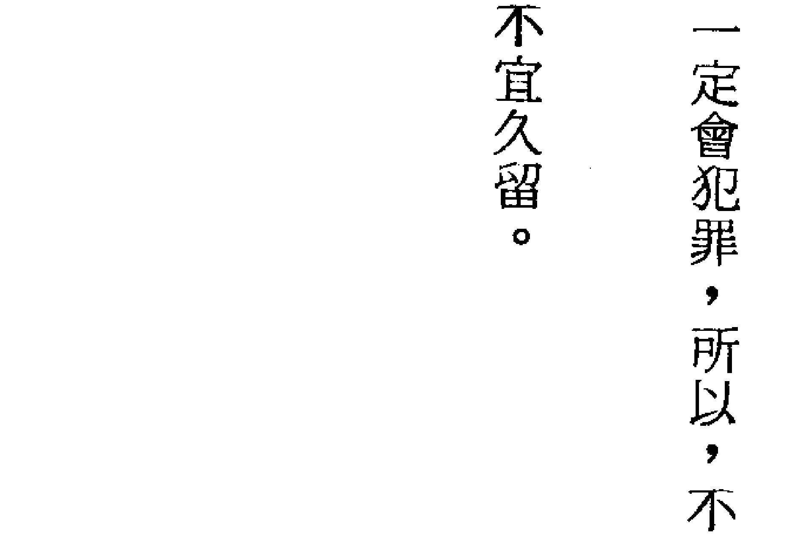
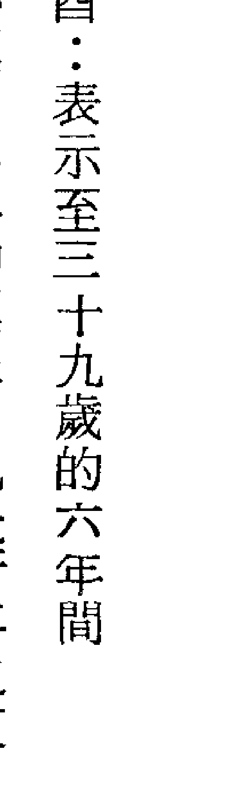

# 六壬神课初学详解 

雖說禍福無門，但人們總希望能預知未來，以期趨吉避凶。「六壬神課」就是善斷吉凶的一種占卜法，而更具有易學的優點，不須要深厚的命理研究基礎，人人都可借以為生活中的難題尋出解答，在所有識緯學之中，最適合一般人學習、利用。

# 序文

卜筮之道乃步古賢之后塵，而其所有幾乎皆被公諸於社會，當然，由於卜筮之道深具神聖且不容冒犯之權威。占者必要以至誠之心且聚精會神，如此感動神明之時，深信皆可獲得極靈性的解答，乃稱得上是為人處世的齊家治政之神法。但是，時而原本有益於社會的設施卻也反而誤人，由於有些人利用這種神聖不可冒犯的易學作為招牌以謀個人生計，因而道出一些訐偽妄言之說，結果造成誤人的後患，乃因這種害群之馬的存在，因此，使占筮的易術信用墜地，甚至有人帶以冷嘲的態度否認了占卜，似乎對占卜之道已失去信心，此乃全非卜筮之道的罪惡，而是有了壞人惡用易學所致，確實令人深感遺憾。
我研究廣闊的易理已有二十餘年，且是極專心於這方面的研究。
在此所要講述的推命學活用吉凶間發傳，乃別名為「天文易」，即昔日未曾有人介紹的神秘性的易學之一種。在亞洲雖然未流傳，但是，自古中國聖人就已創造這種易學，因此，在中國可以看到許多古聖的遺書，然而，其難以理解的部份也不少，也許由於這一因素，方便之無法普及於世上。

# 凡例

- 一、本書原本是計劃以「天文易」的名稱出版，可是，由於「天文易」的名稱易被誤解為星學或屬於天體的易占法，因此，才改以「六壬神課初學詳解」的書名。
- 二、本書由乾、坤兩卷所形成，而其乾卷即依照本法獨特的組織法與準備說明之。
- 三、本書不採以算木筮竹，而使用當月的月將與時刻組合，以鑑定各事件的內容。
- 四、諸位讀者若對事物有所迷惑或立足於歧路難以抉擇之時，即依本法來窺視神秘，則可迅速有所決斷。我雖為不肖者，可是，我施以本法至今，其實驗結果確實百發百中，因而乃對本法深具信心。所以，熱衷於這方面的讀者們！皆能盡心研讀本書。
我花費多年苦心研究，終於能了解其真理，又能實際的用以占卜，結果，人事百般之事皆可主宰。
此學問，即將不可動搖的天理自然的原則作為經緯基礎的凶化作福之神術，乃與一般社會的玄奇奇妙的輕薄賤劣之占術不能同日而語。其應用範圍非常廣闊，也是有利於人生的活法，所以，我很希望盡其研究本書，而本書文辭拙劣，皆由於我個人無學之罪，盼諸讀者見諒。

泰山 識
民國七十三年仲春

# 第一講 易占

易學乃是中國古代的聖人所創造的，而網羅了天地間的森羅萬象，稱得上是深遠無極的學問，也是我們為人處世上不可缺少的大宗教學之一，可作為我們日常生活的修養書，亦可學習到含有一、亦即神人合一。若存有一絲妄念，則無法感通於神，縱使定了卦，亦難判斷準確。總之，此學問表面觀察似乎易於學習、判斷，可是，實際卻又不然，乃必須付出心血深入研究與實驗。換言之，占者的至誠、人格、實力之高低程度均會影響判斷的準確與否。當然，若是一般的造詣，仍勿輕易的試易。
易學是以至誠的術而對神問筮，以稟受神的指示。所以，僅賴算木筮竹，也未必能推知日常生活的吉凶與未來的禍福。
若以永不朽的哲理來替代，則能明確的闡明前途之吉凶禍福。
天地之間即具有神祕性的靈術，且經常能通於幽明，呈顯玄妙的作用，因此，能於未然之中預知一切。換言之，靈術即把物象由天地取得而認為天地間的森羅萬象皆與木、火、土、金、水之五元素有關係，依照此五元素的活動，天地人的三方方會成立。我們平日目視耳聞的宇宙間的物象皆為陰陽五行的活動變化。以此哲理為根本而來解決人事上的一切問題之神術，即稱之為「吉凶開發傳」，別名為「天文易」。以下即說明「天文易」。

# 第二講 天文易

「天文易」是我使用的名稱，也許這種名稱並非狠妥當，此乃將占斷的時刻與太陽、當日的干支組合，再參考木、火、土、金、水的活動，以判斷吉凶之秘法。為了讓世人更易於了解，故將吉凶開發傳的名稱更為「天文易」。二十餘年來，我始終專心研究命運哲學，為的是深入研究這方面，閱讀了有關的八十餘本原書，這其中有許多「六壬神課」的占法書。我深感六壬神課之法是過去未有人採用的占斷法，因此，當我研究命運哲學之同時，亦特別感興趣於即為能推知未來的吉凶禍福之法，所以，對於這種方法，我極具信心，但是，這種具有神秘性又又有一定根據的準確占斷法若始終被隱藏著，則毫無意義，因此，為了將這種方法供有志者研究作為參考，我才決心寫作此書。僅需閱讀本書而觸及本法之真諦，則必定會了解此乃一定不變的理法，因此，能預知前途的吉凶禍福，而真正成為日常生活的指南，小則利己，大則益於國家。本法的第一講已曾敘述過，此異於一般的易學，乃不必要有相當的學識與實驗基礎而容易進行，又能對世相的概要、人事的糾紛煩悶問題提供解答，因此，無論有無任何易學基礎，總之，若能閱讀本書且學習之，深信於短期內即可學會，又易於實際應用，此亦即本法之特色。

# 第三講 人事世相

社會上的一切學問皆隨歲月而日趨進步，且受及科學的征服，但是，唯有我們生活中的一些幽玄不測之事卻具有極不可思議的超科學性，此乃受及自然力支配的吉凶禍福。現代科學雖然極其進步，可是，甚至能挽救人命的醫師也會對偉大的自然命運深感無可奈何。對於將要出現的不測災害或何時會發生變化的生命，換言之，生殺與奪的關鍵仍被「命運」二字所掌握，亦可言之，在天運的裁判下，科學或人智也無法克服之。
在金殿玉樓行事的高官、徘徊於街頭的流浪漢，認真工作或遊手好閒者皆無法預知未來的危難，僅賴神意才能預知、明瞭未來的禍福。
所以，男女老幼，貧富者在此社會為人處世時，若能適用探索神意的至誠之術的天文易，則即可轉禍為福、移凶為吉，換言之，應盡其力的設法化凶為福。
一個人在世上若任憑命運支配而盲進，即正如在黑夜裏跋涉危險的山路一般，這是無謀的行為。若自認命運在天而將一生的浮沉聽其自然，則更見不到明亮的世界，也因而永遠過著在黑暗裏摸索的生活。

# 第四講 占斷

待人接物時，若能以至誠的神術窺視神意來決定進退，即可避免失望悲嘆、去除失敗亡身之憂，如此乃不至落入危險之淵，而能未然預知災禍，進而過著具有光輝的生活。
自古流傳於世上的一些吉凶垂示之法是無任何真理根據的，因此，被認為是迷信或低級賤劣的占卜術，但是，在此要介紹的天文易乃具有萬古不滅的哲學性真理之占斷法，即與占筮易學無異，甚至無占筮所採以的算木筮竹之麻煩，亦無需花費長時間以消除雜念，唯有占斷時必須以至誠來鑑定，即可明確的獲得神示。易即正如宗教性的為人處世之法律，因此，當經過占斷而得神示之時，就應遵守之，換言之，順法者可增進福利，逆法者乃必受及罪刑。譬如說，欲創辦某事業，辦理重要之事或接連不斷的發生很多事時，總之，無論任何事，若能立即採用天文易且順從神的教訓以決定進退，此時即可預知吉凶，亦即能承受靈妙不可思議之德。得好的神示時，應更努力向上，若得惡的神示時，就應迥避之，且應作為修身治家的指南。

# 第五講 天文易之準備

第二講已曾提及天文易乃是我自命名的名稱而其原名為「六壬神課」，在此所要講述的方式或其他一切均依其原名，此即尊重創定者之德，雖然，原名與方式並無更改，可是，卻是極其實用，且能不可思議的明確占斷。
天文易的根本即以要判斷的當時之時刻為主要，又以當日的干支為基礎而與當月的月將組合，如此將以上的部份組合為「四課」，再依九法則來決定「三傳」。結果，將四課、三傳皆組織起來，才可觀察五行的相尅比和，再各附上了後葉的神殺，即足以判斷百事。
前述已提及六壬神課乃過去未曾見到的一種流行易術，因此，讀者們應充分注意閱讀本講以後的講述而深入了解組織法。明確的了解組織法，依一定的法則來判斷，所以，這種方法易於學習。
要講述六壬神課之前，首先應依序了解十干、十二支、五行等等。

# 第六講 十干、十二支、五行方位

十干乃為天的五行，也稱為天干。十二支乃為地的五行，也稱為地支。

- 十干
  - 甲、乙、丙、丁、戊、己、庚、辛、壬、癸
- 十干五行
  - 甲木、乙木、丙火、丁火、戊土、己土、庚金、辛金、壬水、癸水
- 十干陰陽
  - 甲、丙、戊、庚、壬 以上為陽干
  - 乙、丁、己、辛、癸 以上為陰干

- 十二支
  - 子、丑、寅、卯、辰、巳、午、未、申、酉、戌、亥
- 十二支五行
  - 亥水、子水、寅木、卯木、巳火、午火、申金、酉金、辰土、戌土、丑土、未土
- 十二支陰陽
  - 子、寅、辰、午、申、戌 以上為陽支
  - 丑、卯、巳、未、酉、亥 以上為陰支

## 一、十二支方位

申 坤
未
午 南
巳
辰
卯
寅 艮
丑 北
子
亥 乾
戌
酉

## 一、十二支時季

亥子丑為冬
寅卯辰為春
巳午未為夏
申酉戌為秋

# 第七講 三合、支合、干合

所謂「三合」，即左列的十二支三個集合時稱為三合，因此，五行也會變化。

- 一、十二支三合
亥卯未｜三合木局
寅午戌｜三合火局
巳酉丑｜三合金局
申子辰｜三合水局

左列的十二支兩個集合時即稱為「支合」，其五行乃無變化。

- 一、十二支合
子丑合
寅亥合
卯戌合
辰酉合
巳申合
午未合

所謂「干合」，即十干兩個集合以變化之。乃與本學問無密切關係，但是，順便於此一提。

## 一、十干合

甲己合化土
乙庚合化金
丙辛合化水
丁壬合化木
戊癸合化火

# 第八講 刑沖破害

第七講所談論的三合、支合、干合即如字義所示，乃表示和睦相處之意，可是，刑、沖、破、害皆為戰鬥之意。有關這方面的優劣之解說於有關的各部門再詳細說明。在此首先將刑、沖、破、害列舉如下。

## 一、十二支刑

- 寅可刑巳
- 巳可刑申
- 申可刑寅
- 丑可刑戌
- 戌可刑未
- 未可刑丑
- 子可刑卯
- 卯可刑子
- 辰、午、酉、亥可自刑

## 二、十二支沖

左列的十二支兩個集合時，即成爲「沖」。

| 1 | 2 | 3 | 4 | 5 | 6 |
|---|---|---|---|---|---|
| 子 | 丑 | 寅 | 卯 | 辰 | 巳 |
| 沖 | 沖 | 沖 | 沖 | 沖 | 沖 |
| 午 | 未 | 申 | 酉 | 戌 | 亥 |

| 甲 | 乙 | 丙 | 丁 | 戊 |
|---|---|---|---|---|
| 木 | 火 | 土 | 金 | 水 |
| 己 | 庚 | 辛 | 壬 | 癸 |

# 第九講 月將之解

要組織「四課三傳」時，必須使用月將。月將即正如字義所示，亦即當月的大將，而太陽於該月究竟在於何宮，再視太陽會循環而來的宮之十二支，此即月將。要探知月將就需要民間所使用的該農曆。
要決定月將即依照如下的方式。感覺似乎很複雜，可是，卻並非難以學習，而且每個月僅必要計算一次即可，換言之，一旦決定的相當於月將的十二支可採用三十天，而首先必須記憶成為月將的十二支。下列表示均按照國曆。
元月為子
二月為亥
三月為戌
四月為酉
五月為申
六月為未
七月為午
八月為巳
九月為辰
十月為卯
十一月為寅
十二月為丑
月將都是以當月的入節為標準。所謂「入節」，即第十四講的月建部分所示的一月小寒、二月立春等等，這一切皆載於民間所使用的萬年曆上。

- 一、十二支害
左列的十二支兩個集合時，即成為「害」。
  - 子未害
  - 丑午害
  - 寅巳害
  - 卯辰害
  - 申亥害
  - 酉戌害

- 一、十二支破
左列的十二支兩個集合時，即成為「破」。
  - 子酉破
  - 丑辰破
  - 寅亥破
  - 卯午破
  - 巳申破
  - 未戌破

在當月的入節之後，首先知道當月使用的月將的支，再以與這個支同樣的十二支的當天為第一目標，又從第十二講得知生成數，依照生成數的數量的日數之經過的某日，而得知其與月將的支同樣的支之時刻，再從這個時刻的支以決定當月的月將。在此，舉例說明，例如：民國十七年三月。

## 三月的月將為戌

民國十七年三月的入節為六日
入節當日是巳日
三月十一日是戌日
如上述所言，三月的月將為戌，從該月入節後的戌日而依其生數為四，換言之，從戌的第四天視之，這一天即相當於丑日的戌，依照第十講而言，亦即午後七時至九時，所以，從三月十四日下午七時開始才可適用三月的月將戌，而這一日之前仍必須以前月的亥為月將。

## 再舉一例說明：決定七月的月將

午的生數為二
七月的月將是午
七月的入節為七日戊申日
如上述所言，本月的月將為午，因此，從本月入節後的午日計起，次日的未日之午時開始才適用月將午。所以，十八日上午十一時以後，月將就是午，此時刻之前必須使用六月的月將未。

- 子為神后
- 丑為大吉
- 寅為功曹
- 卯為太沖
- 辰為天罡
- 巳為太乙
- 午為勝光
- 未為小吉
- 申為傳送
- 酉為從魁
- 戌為河魁
- 亥為登明

以此月將的十二支為天盤而與第十六講的地盤組合，其詳細內容請參閱組織篇。

# 第十講 十二支時間配當

一支即括兩小時，詳細內容如下。

| 支 | 时间 |
|---|---|
| 子 | 午後十一時 至 午前一時 |
| 丑 | 午前一時 至 午前三時 |
| 寅 | 午前三時 至 午前五時 |
| 卯 | 午前五時 至 午前七時 |
| 辰 | 午前七時 至 午前九時 |
| 巳 | 午前九時 至 午前十一時 |
| 午 | 午前十一時 至 午後一時 |
| 未 | 午後一時 至 午後三時 |
| 申 | 午後三時 至 午後五時 |
| 酉 | 午後五時 至 午後七時 |
| 戌 | 午後七時 至 午後九時 |
| 亥 | 午後九時 至 午後十一時 |

如上述的說明，一支即括兩小時。第九講的月將之十二支與此處的時間之十二支必須組合，因此，這一切都必要記憶，而於後面的組織部又有詳細的解說。

# 第十一講 五行生剋、制化、比和

- 一、相生
  - 金生水
  - 水生木
  - 木生火
  - 火生土
  - 土生金
- 一、相剋
  - 金剋木
  - 木剋土
  - 土剋水
  - 水剋火
  - 火剋金
- 一、比和
  - 木和木、火和火、土和土、金和金、水和水。

# 第十二講 干支的數與生成數

## 一、干支的數

- 子一
- 丑二
- 寅三
- 卯四
- 辰五
- 巳六
- 午七
- 未八
- 申九
- 酉十
- 戌十一
- 亥十二

## 二、十二支生成數

- 乙庚
- 甲己
- 丙辛
- 丁壬
- 戊癸

以上十干十二支的數大部份即適用於前者的干支之數，但是，爲了供讀者們參考，才將雙方都重複舉出，至於適用法，則將於組織法再詳加說明。

六壬神課初學詳解 以上五行的相生、相剋、制化、比和等等，在組織四課三傳或組織之後的應用上皆需要的，也是必要牢記的。

# 第十三講 長生及墓

長生及墓即在四課三傳組織後極其必要的，其內容如下。

## 一、十干長生

- 甲日為亥
- 乙日為午
- 丙日為寅
- 丁日為酉
- 戊日為寅
- 己日為酉
- 庚日為巳
- 辛日為子
- 壬日為申
- 癸日為卯

## 一、十干墓神

- 甲日未
- 壬日辰
- 庚日丑
- 丙戊日戌
- 乙日戌
- 辛日辰
- 丁己日丑
- 癸日未

# 第十四講 月建及五行旺相死囚休

以相當於其月的支作為月建都是從國曆的入節至下次的入節日，而於每個月的四日至九日之間就有人節，此乃依照民間所使用的日曆。

## 一、月建（採以國曆）

- 元月 始自小寒 丑
- 二月 始自立春 寅
- 三月 始自驚蟄 卯
- 四月 始自清明 辰
- 五月 始自立夏 巳
- 六月 始自芒種 午
- 七月 始自小暑 未
- 八月 始自立秋 申
- 九月 始自白露 酉
- 十月 始自寒露 戌
- 十一月 始自立冬 亥
- 十二月 始自大雪 子

## 一、五行旺、相、休、囚、死

# 第十五講 十干寄宮

十干寄宮即組織四課三傳時而將當日的十干變更為十二支以適用之。譬如寅日，天干的甲即相當於左列表中的寄宮寅，因此，當作爲寅，而成為寅的癸巳之日的關係，癸的寄宮是丑，所以，成為丑巳。詳細內容請參閱組織篇，而對照有關項目。

- 甲為寅
- 乙為辰
- 丙為巳
- 丁為未
- 戊為巳
- 己為未
- 庚為申
- 辛為戌
- 壬為亥
- 癸為丑

這種天文易大部份採以十二支，而採用干的情況較少，所以，按照寄宮而將天干改為十二支以組織四課。

| 季月 | 春 | 夏 | 秋 | 冬 |
| :--- | :--- | :--- | :--- | :--- |
| 七一月 十四月 | 為水旺 | 為火旺 | 為金旺 | 為木旺 |
| 十九月 | 木相 | 土相 | 水相 | 火相 |
| 九八月 | 火死 | 金死 | 木死 | 水死 |
| 六五月 | 金囚 | 水囚 | 火囚 | 土囚 |
| 三二月 | 水休 | 木休 | 土休 | 金休 |

# 第十六講 十二支地盤定局

四課三傳即為要組合天盤與地盤時最需要的部份，因此，必須牢記。所謂「地盤」，即於左圖的形式上要配列十二支。

地盤用於很多，但是，大部分採用於如下的四項。

- 一、時刻的十二支。
- 一、識別方位。
- 一、被術者的年的十二支。
- 一、未來的方位與日時。

其他可適用的部分很多，所以，地盤的定局也必須記憶。

## 十二支地盤圖

| 方位 | 地支 |
|------|------|
| 上 | 申、酉、戌、亥 |
| 右上 | 未、子 |
| 右下 | 午、丑 |
| 下 | 巳、辰、卯、寅 |

# 第十七講 太歲、年命、行年

## 一、太歲

太歲即為占斷鑑定的那一年的十二支，亦為那一年的天子。譬如說，民國十七年為辰年，民國十八年為巳的太歲，民國十九年為午的太歲，如此，每年國曆二月節分之後即採用該年的支。

## 一、年命

年命即為要占斷者的生年。無論要鑑定任何事，年命皆有關。關於使用年命的方法，於鑑定項目再詳加說明。

## 一、行年

行年即如字義所示，亦即循環的年份，就是占斷者未來會面臨的每一年之支。其循環的方法如下。

1.  首先應知生年是相當於什麼期間，再得知相當於這個期間的干支，而依干支循環的方法又有所不同。

期間即為第十八講空亡的干支表所示的，按照這種干支表就可得知占卜者的干支是相當於何旬。譬如說，占卜者出生於民前二十四年戊子年，則戊子即相當於第三期的旬，若出生於民國二年癸丑年，則依照干支表而言，癸丑乃相當於第五期的旬，如此，即可決定期間。
(2)若得知期間，則必須再視其第一位的干支，換言之，從甲的干支開始，而男性是從三位的干支開始，依序的一歲、二歲、三歲……，女性則從生年期間中的第一干支開始，亦即從甲的干支計算起，其方向與男性相反的一歲、二歲……。舉例如下。

- 誕生於第一期旬者：
  - 男性從丙寅開始為一歲
  - 女性從壬申開始為一歲
- 誕生於第二期旬者：
  - 男性從丙子開始為一歲
  - 女性從壬午開始為一歲
- 誕生於第三期旬者：
  - 男性從丙戌開始為一歲
  - 女性從壬辰開始為一歲
- 誕生於第四期旬者：
  - 男性從丙申開始為一歲
  - 女性從壬寅開始為一歲
- 誕生於第五期旬者：
  - 男性從丙午開始為一歲
  - 女性從壬子開始為一歲
- 誕生於第六期旬者：
  - 男性從丙辰開始為一歲
  - 女性從壬戌開始為一歲

如以上所言，依其誕生的期間以計為一歲的干支乃有所差異：
男性即按照順序計算。
女性則逆方向計算。

再舉出一例，民國二十四年戊子年為男性的本年，換言之，民國十八年的行年干支是相當於那一部份，此時，即必須依照如下的計算方法。
(甲)戊子年即表示第三期旬誕生的，所以，以丙戌為一歲、丁亥為二歲、戊子為三歲。
(乙)誕生於戊子年，也就是在民國十七年即為四十二歲者，故，從丙戌開始為一歲而依序計算，即相當於丁卯，翌年為戊辰，再次年為己已，如此，皆可自知行年干支。
再舉出一例。民前七年乙巳年為女性的本年，而其以後的行年干支即按照如下的計算方法。

(甲)乙巳年即表示第五期旬誕生的，所以，以壬子為一歲，再逆方向依序計算之，故，辛亥
(2) 诞生于乙巳年，也就是在民国十八年即为二十五岁者，故，从壬子开始为一岁而逆方向的依序计算，即相当于戊子的本年，亦即相当于戊子行年的干支，翌年为丁亥，再次年为丙戌，如此，皆可自知行年干支。
(3) 即可获知行年的干支相当于第十六讲十二支地盘的十二支中的那一支，所以，无须天干，换言之，仅视十二支以作为地盘的何支即可。

# 第十八講 空亡之解

空亡即諸事會反復的地支，依天文易而言，即以要鑑定的當日之干支對照下列表才決定是相當於那一個空亡。譬如說，從甲子至癸酉的第一期句中鑑定時，即以戊亥為空亡，若在第一二期句中鑑定時，則以申酉為空亡。

譬如說，民國十七年八月八日即為庚辰日，亦即於第一二期句中鑑定，因此，以申酉為空亡。關於空亡之善惡以及活用法，乃於鑑定篇再加以解說。

上圖的干支表，不但可視知空亡，且當計算年、日或其他行年時亦可使用，因此，可自行製作一張以應用之。

## 六十干支圖

| 第期一 | 第期二 | 第期三 | 第期四 | 第期五 | 第期六 |
|--------|--------|--------|--------|--------|--------|
| 甲 子 | 甲 戌 | 甲 申 | 甲 午 | 甲 辰 | 甲 寅 |
| 乙 丑 | 乙 亥 | 乙 酉 | 乙 未 | 乙 巳 | 乙 卯 |
| 丙 寅 | 丙 子 | 丙 戌 | 丙 申 | 丙 午 | 丙 辰 |
| 丁 卯 | 丁 丑 | 丁 亥 | 丁 酉 | 丁 未 | 丁 巳 |
| 戊 辰 | 戊 寅 | 戊 子 | 戊 戌 | 戊 申 | 戊 午 |
| 己 巳 | 己 卯 | 己 丑 | 己 亥 | 己 酉 | 己 未 |
| 庚 午 | 庚 辰 | 庚 寅 | 庚 子 | 庚 戌 | 庚 申 |
| 辛 未 | 辛 巳 | 辛 卯 | 辛 丑 | 辛 亥 | 辛 酉 |
| 壬 申 | 壬 午 | 壬 辰 | 壬 寅 | 壬 子 | 壬 戌 |
| 癸 酉 | 癸 未 | 癸 巳 | 癸 卯 | 癸 丑 | 癸 亥 |
| 空亡 子丑 | 空亡 寅卯 | 空亡 辰巳 | 空亡 午未 | 空亡 申酉 | 空亡 戌亥 |

# 第十九講 天盤與地盤之解

第十七講已說明了地盤定局，而在天文易即必要組織四課三傳，將四課三傳的五行與神煞、十二貴神等等附上去，才能鑑定百事。要組織四課三傳時，首先必須記憶地盤與天盤的部份。

(1) 地盤即為時刻的十二支，如第十七講的地盤定局所示，必須配列十二支。為了便於鑑定，即以一張白紙記錄如下。

如下面所示，鑑定之前，就從子依序的以橫方向記錄配列。

- 子 丑 寅 卯 辰 巳 午 未 申 酉 戌 亥

(2) 天盤即為月將的十二支，而將當月的月將之十二支寫於要鑑定的時刻的支的上面，如此組合，以這種狀況依序記錄，此乃為天盤。

總之，地盤即以時刻的十二支為根本，而鑑定的時刻上必須與當月的月將之支組合，如此以形成天盤。

譬如說，民國十七年八月八日下午六時，若要決定天盤，則有如下之狀況。

下午六時即為酉時刻，所以，在地盤配列的酉字之下面，就先寫了刻。

從今日即入節於申月，但是，由於仍採用上個月的月將午，因此，在時刻的支，亦即在酉的上面就寫了午的支，自此依序將十二支配列於地盤上。

| 天盤 | 酉 | 戌 | 亥 | 子 | 丑 | 寅 |
|---|---|---|---|---|---|---|
| 地盤 | 子 | 丑 | 寅 | 卯 | 辰 | 卯 太歲 |

- 寅 丑 子 亥 戌 酉
- 巳 辰 卯 寅 丑 子

六壬神課初學詳解

# 第二十講 四課組織法

四課即使用當日的干支，而且又以第十九講的天、地盤來組織。

- 第一課
- 第二課
- 第三課
- 第四課

如此，首先以橫方向依序寫第一課至第四課，即稱為「四課」。

要組織四課時，即按照下列的方式將地支每兩個配列，如此配列的上段稱為「天盤」，而配列於下方的稱為「地盤」。

要組織四課時，即如左所示，將當日的天支寫於第一課的下面，而將地支寫於第二課的下面

譬如說，民國十七年八月八日為庚辰之日，所以，必須如下配列。

月將 午
酉刻

申 未 午 巳 辰 卯
亥 戌 酉 申 未 午

六壬神課初學詳解

## 四課三傳圖示例

- 第一課 庚申
- 第二課 辰
- 第三課 巳

上述的日時即如右所示的成為天、地盤。以這種天、地盤為標準，而來組織四課。

| 天盤 | 子 | 亥 | 戌 | 酉 | 申 | 未 | 午 | 巳 | 辰 | 卯 | 寅 | 丑 |
| 地盤 | 亥 | 戌 | 酉 | 申 | 未 | 午 | 巳 | 辰 | 卯 | 寅 | 丑 | 子 |

**标注**：月將午、辰太歲、申月建

- 第一 庚申
- 第二 辰
- 第三 巳
- 第四

如此，於第一課的下面寫了庚，而於第二課的下面寫了辰，當天的干支必須記憶為地盤，且當天的天干皆按照第十五講的十干寄宮而變化為十二支。在此，將第十五講的十干寄宮寫出。

- 甲為寅
- 乙為辰
- 丙為巳
- 丁為未
- 戊為巳
- 己為未
- 庚為申
- 辛為戌
- 壬為亥
- 癸為丑

依此而言，庚的寄宮為申，所以，將申字寫於庚的下方。

了解干支的配列法之後，才製造天盤與地盤，然後，再來組織。

在此，舉例說明組織法。民國十七年八月九日上午十時已刻的四課組織如下。

- 民國十七年戊辰年八月九日辛巳日
- 月將午，時刻為巳

今日為辛巳日，而辛為寄宮戊，所以，當日的天干下面就必須寫戊。再參閱左表的地盤與天盤。地盤的戊的上面有天盤的亥字，所以，在第一課（戊）辛的上面乃必須寫下亥字。

| 第一課 | 第二課 | 第三課 | 第四課 |
|--------|--------|--------|--------|
| 亥     | 巳     | 子     | 未     |
| 辛戊   | 亥     | 午     |        |
|        | 午     | 巳     |        |

接著，必須決定第二課，此時，就將第一課天盤的十二支作為第一課的地盤，而要決定第四課時，也是將第三課的天盤十二支配列於第四課的地盤。

所以，第一課即為亥辛戊。

將第一課的天盤亥配列於第二課的地盤，而視前表天地盤即知地盤亥的上面即相當於子，故第二課為子亥。按照同樣的方法再決定第三課、第四課。天地盤表的地盤已的上面即為午，所以，第三課就是午已。將第三課的午置於第四課的地盤，而天地盤表的地盤午的上面即相當於天盤未，因此，第四課即為未午。

按照這種方式以組織四課，開始時，感覺相當複雜，可是，一旦熟練了，就感覺十分簡易。

在此，舉出一、兩個例子。

民國十七年八月十日壬午日午後四時月將午·時刻申 在申的時刻上乃以月將午為基點，依序將十二支配列記，以決定天盤。

| 天盤 | 地盤 |
|------|------|
| 戌   | 子   |
| 亥   | 丑   |
| 子   | 寅   |
| 丑   | 卯   |
| 寅   | 辰   |
| 卯   | 已   |
| 辰   | 午   |

今日的天干千為寄宮亥，而地盤亥的上面相當於酉，故，第一課為酉壬亥。將第一課天盤酉置於第二課地盤，再視天地盤表即知地盤酉的上面就是天盤未，故，第二課為未酉。第三課地盤午的上面相當於辰，故，第三課為辰午。將第三課的天盤辰配記於第四課的地盤，而天地盤表中的地盤辰上面乃相當於天盤寅，故，第四課為寅辰。因此，組織成四課。在此，再舉一例如下。

| 第一 | 第二 | 第三 | 第四 |
|---|---|---|---|
| 天 酉 | 未 | 辰 | 寅 |
| 地 壬亥 | 酉 | 午 | 辰 |

民國十七年八月二十二日甲午日上午八時半
月將巳・時刻為卯

| 天盤 | 辰 | 卯 | 寅 |
|---|---|---|---|
| 地盤 | 寅 | 丑 | 子 |

| 第一 | 第二 | 第三 | 第四 |
|---|---|---|---|
| 天 辰 | 午 | 申 | 戌 |
| 地 甲寅 | 辰 | 午 | 申 |

月將巳
卯刻

| 丑 | 子 | 亥 | 戌 | 酉 | 申 | 未 | 午 | 巳 |
|---|---|---|---|---|---|---|---|---|
| 亥 | 戌 | 酉 | 申 | 未 | 午 | 巳 | 辰 | 卯 |

甲的寄宮為寅，故，視地盤寅即知寅的上面相當於辰。

若要了解時間之十二支，請參閱第十講十二支時間配當之項目，即可得知。
若要了解月將之支，則按照第九講月將之解的方法來決定。

譬如說，國曆八月就使用月將巳，可是，本月入節之後，從巳之日而言，巳的成數為七，故從巳日算起的第七日的巳時刻開始即使用月將巳，民國十七年八月八日辰日入節的九日為巳日。從九日算起第七天的十五日為亥日，而從亥日上午九時開始乃為月將巳，此時刻之前就採以月將午。前一例的二十日即為十五日以後之事，故，應使用月將已。
即依上述方法以組織四課。讀者們僅需練習二、三次，即可熟練的組織成。
將四課中的天盤與地盤之五行附上去，亦即將木、火、土、金、水附上去，以視其相剋、相生，比和等等。一般而言，將天盤稱為上，地盤稱為下。第一課地盤之五行，乃必須採用天干的五行。

# 第二十一講 三傳組織法

前講說明了四課的組織法，當四課組織之後，就必須決定三傳。三傳乃為鑑定上很重要的部份，換言之，對於一切事件的判斷解決上，這是最重要的一部份，要組織三傳時，首先將四課中的天盤、地盤依上下相剋的情況與多寡而分為九類，再決定三傳，此種方法稱為入手法，未熟練此法之前，感覺十分複雜，但是，練習數次之後卻又感覺相當容易。

三傳包括初傳、中傳、末傳。首先決定初傳，其次決定中傳，最終才決定末傳。組織三傳的入手法即如前面所言，首先分類為九，再決定三傳，因此，又稱為九法式。在此，依序說明。

## (1) 賊剋法

此乃視四課中的上與下之相剋情況，乃採以四課中某一課的剋之部份，換言之，如下。
(1) 從上剋下的部份，換言之，天盤剋地盤，即稱為元首課。
(2) 與上反，換言之，地盤剋天盤，即從下剋上，乃稱為重審課。
所以，賊剋法包括元首、重審二大類。總之，四課中，若僅一位的上、下相剋，即可採用，而將有剋的課的天盤之支作為初傳。初傳決定之後，就將初傳的支對照天地盤表，而把與初傳同樣的支配合於地盤的支，再將地盤上的支作為中傳的支。又將中傳的支對照天地盤表的地盤支上方的天盤支，以作為末傳。亦即如下的組織法。

民國十七年八月八日庚辰日午後六時
月將午・時刻為酉

| 土戌 | 丑土 | 辰土 | 丑土 | 巳火 | 庚金申 |
| --- | --- | --- | --- | --- | --- |
| 火巳 | 木寅 | 巳火 | 庚金申 | 土丑 | 土戌 |

| 未 | 午 | 巳 | 辰 | 卯 | 寅 | 丑 | 子 | 亥 | 戌 | 酉 |
| --- | --- | --- | --- | --- | --- | --- | --- | --- | --- | --- |
| 戌 | 酉刻 | 申 | 未 | 午 | 巳 | 辰 | 卯 | 寅 | 丑 | 子 |

如上述所言，天盤、地盤依此組織四課，即可得前圖之列式。四課中的五行相剋如下。

- 第一課為巳之火、庚之金，為火剋金，亦即上剋下。
- 第二課為寅之木、巳之火，為木生火，而乃無剋。
- 第三課為丑之土、辰之土，為土和土而比和，同樣無剋。
- 第四課為戌之土、丑之土，同樣無剋。

依右所示，僅四課中的第一課為上剋下，亦即有火剋金之剋，所以，採以第一課天盤已作為初傳。

### 元首課示例

- 初傳：巳
- 中傳：寅
- 末傳：亥

將已作為初傳，而於天地盤表的地盤上配合巳，則已上的天盤即相當於寅，故，中傳為寅。
又將寅配合天地盤表，則地盤寅的上面就是天盤亥，故，末傳為亥。上述依四課三傳圖式，即如下。

火巳
庚金申

- 巳 火
- 寅 木
- 亥 水

- 土 戌
- 土 丑
- 木 寅

文字拔舉出而配列。

四課三傳的組織完成之後，就將初、中、末等的文字與第一、第二、第三、第四課等等的添記的五行也應一目瞭然的牢記在心，必須熟練至此才是。

上迹所言，僅四課中的一課為上剋下而已，即為元首課之例。下面乃舉出重審課的例子予以說明。

民國十七年八月二十八日庚子日午後五時半

月將巳・時刻為酉

| 天盤 | 子 | 亥 | 戌 | 酉 | 申 |
|---|---|---|---|---|---|
| 地盤 | 辰 | 卯 | 寅 | 丑 | 子 |

| 土辰 | 金申 |
|---|---|
| 子水 | 申金 |

| 水子 | 土辰 |
|---|---|
| 辰土 | 庚金申 |

- 未 午 巳 辰 卯 寅 丑
- 亥 戌 酉 申 未 午 巳

月將巳
酉刻

### 重審課示例

- 初傳
- 中傳
- 末傳

四課中的第一課即為土生金而無剋，可是，第二課是土剋水，即地盤剋天盤，亦即下剋上，第三課是金生水而無剋，第四課是土生金而無剋。總之，唯有第二課有剋，即下剋上，故，乃屬於重審課。以有剋的課之天盤子作為初傳。

將初傳子的字配合於天地盤表的地盤，則子的上面是天盤申，所以，以申為中傳。又將中傳申的支配合於天地盤表，則地盤中的上面是天盤辰，所以，以辰為末傳。此四課三傳圖式如下。

## 重審課

## (2) 比用法

所謂「比用法」，即四課中有兩個地方是上剋下或下剋上，而採用與當日的干支、陰陽相同的陰陽的相剋，這兩個上剋下稱為「知一課」，而兩個下剋上即稱之為「比用」。依當日的干支陰陽而決定成為初傳的支，此時即依如下的條件來決定。

(1)若為陽日，則有陽的相剋之天盤十二支的地支作為初傳。
(2)若為陰日，則有陰的相剋之天盤作為初傳。
(3)有相剋的課若要依陰與陽的相剋卻也無法決定初傳時，就按照如下的涉害課。
(4)有兩個地方相剋，可是，在陰日相剋處的天盤為陽以及在陽日相剋處的天盤為陰之時，乃無法決定初傳，此時，也按照如下的涉害課。
(5)在陰日相剋處皆為天盤陰而已，因此，無法取任何一部分作為初傳，此亦屬於如下的涉害課。

比用法極類似涉害法，可是，卻又不是，因此，若不了解這方面，則易陷於迷惑，關於這一問題，應多加學習與注意。在此舉出比用法的例子，以供讀者們研究。

| 天盤 | 地盤 |
|------|------|
| 申 | 酉 |
| 未 | 申 |
| 午 | 未 |
| 巳 | 午 |
| 辰 | 巳 |
| 卯 | 辰 |
| 寅 | 卯 |
| 丑 | 寅 |
| 子 | 丑 |
| 亥 | 子 |

民國十七年八月二十日上午十一時半
月將已，時刻為午

# 六壬神課初學詳解

如上所述，乃成爲天、地盤。

土 戊 酉 申 金

如右所示，得到四課的組織，第一課是土剋水，即上剋下，第二課是土生金而無剋，第三課是木剋土，即上剋下，第四課是木和木比和而無剋。今日爲壬辰的陽日，故，採以有陽支之剋的天盤作爲初傳，結果，得到如下的三傳。

將以上的部份總括如下。

天盤：卯 寅 丑 子 亥 戌 酉 申 未
地盤：申 未 午 巳 辰 卯 寅 丑 子

如上述已得四課三傳。再舉一例如下。

民國十七年八月三十一日癸卯日午後八時十分月將巳・時刻爲戊

木 金 卯 辰 戌 亥 戌

土 金 酉 申

### 比用課

如以上所示，而得天盤、地盤。癸為寄宮丑，故，丑寫於癸的下面，而丑的上面是申，因此，第一課即為申丑。將申置於第二課的地盤，而申的上面是天盤卯，故，第二課即為卯申。第三課的卯的上面是戊，所以，第三課即為戊卯。再將戊置於第四課的地盤，而戊的上面是巳，故，第四課即為巳戊。第二課與第三課有上剋下，而當日是癸卯的陰日，因此，以第一課陰支的卯作為初傳，即有如下三傳。

- 卯
戌
巳

### 涉害課

此种比用法似乎略感複雜，但是，只要讀者們能認真學習並不困難。倘若不相當於知一比用法時，即屬於左列的涉害課。

四課中，若有二、三課或四課是上下相剋而不合乎上述所言的比用，則依照涉害課以決定三傳。

- 一以寅、申、巳、亥字上的天盤作為初傳。
二若無寅、申、巳、亥的支，則採用子、午、卯、酉的地盤上之支作為初傳。
三若有剋的地盤相同，換言之，若為寅、申、巳、亥或子、午、卯、酉時，即按照當日的陰陽。亦即按照如下的方式：

陽日之時，即以第一課的天盤之支作為初傳。陰日之時，即以第三課的天盤之支作為初傳。

涉害課較為複雜，因此，必須熟讀牢記在心，方可運用。

要數受相剋之數時，地盤的十二支勿論，甚至十干寄宮的天干五行的相剋也必要數。
為了使讀者們更加了解，在此，舉出兩、三個例子。
民國十七年七月二十六日丁卯日午后四時半
月將午　時刻爲申

在涉害課的實例上，乃無天盤、地盤，而必須使用如下的地盤定局。
△在十二支地盤定局記入十干的就是十干寄宮。
△在地盤定局的外廓將十二支記入於圓形中的就是天盤十二支。
按照規定的方式而組織四課，其結果如下。

| 丁 | 火 | 巳 |  |
| --- | --- | --- | --- |
| 木 | 卯 |  |  |
| 土 | 丑 |  |  |
| 水 | 亥 |  |  |

如此成爲四課，而第三課與第四課有剋的天盤都是陰支，因此，相當於比用法的(二)之條件，此亦即涉害課，所以，必須求得受剋的數量之多寡。
第三課爲丑卯，故，必須求出地盤的卯至丑受剋的數量。

1. 從地盤卯而言，丑即按照木剋土的情況而受到剋。
2. 其次，從地盤辰的寄宮乙之木即按照木剋土的情況而受到剋。
3. 接著，巳午未申酉戌亥子並無受到剋，所以，受到剋的只有兩個地方。
第四課爲亥丑，換言之，必須了解剋了亥的水之數量，亦即必須從丑數到戌。
1. 從地盤丑而言，按照土剋水的情況下而亥受到剋。
2. 其次，地盤寅卯就不成立剋。
3. 接著，從地盤的辰之土即按照土剋水的情況而受到剋。
4. 戊土就在巳之中而寄宮，所以，按照土剋水而受到剋。
5. 接著，午就無受到剋。
6. 接著，會受到未之土與寄宮已土双方的剋。
7. 接著，申酉就無剋。
8. 最後，從戊的土即按照土剋水的情況而受到剋。

將上述所言總括起來如下。從丑的地盤到亥，受到剋的數量共有六個，因此，以剋的數量多的亥作爲初傳，結果有如下三傳。

## 六壬神课初學詳解

組織了四課三傳即如下。

### 涉害課

再舉一例如下。民國十七年八月二十八日庚子日午後一時半。

| 金申 | 土戌 | 土辰 | 火午 |
|------|------|------|------|
| 戊土 | 子水 | 午火 | 庚金申 |

如上述即成爲四課。在四課中，第一課與第三課就有上剋下，而不成爲比用法，故當作涉害課而來決定初傳。

| 亥 | 酉 | 未 |
|----|----|----|
| 丑 | 卯 | 已 | 丁未 |
| 亥 | 丑 | 卯 | 已 |

首先，對於第一課的午庚(申)，就必須從地盤定局的申觀察到午，結果，不會受申酉戌的剋，卻會受亥之水與寄宮壬水的剋，接著，會受子之水與丑的寄宮癸的剋，然後，直至寅卯辰巳午皆無剋，由此可見，共有四處受剋。
其次，就要觀察第三課戊子的剋數。此時，從地盤子開始，依序求至戊所受剋的數量，結果子丑無受到剋，而按照木剋土的情況下，寅與寄宮甲二位受剋。
接著，受到卯之木和辰的寄宮乙二位的剋，而後的巳午未申酉戌沒有受到剋，如此，共有四位受剋。結果，就與第一課的午與戊有同樣的剋數。

剋數相同時，就以地盤的第一即寅申己亥上的支作為初傳。第一課的地盤為申，則以申上面的支午作為初傳，其結果得到如下三傳。

組織四課三傳時，即如下。

- 午
辰
寅

### 涉害課

- 午
辰
寅

再舉一例如下。民國十七年八月四日午後九時半。

月將午 時刻為亥

申 戊 辰 午
戊 子 午 庚 申

一、外廓的十二支 是天盤。

卯 申
酉 辰
戌 巳
亥 午
子 未

在此，寄宮省略不寫，而按照前圖即可得知。

丑 午
子 巳
亥 辰
戌 卯
寅 酉
丑 申

木 寅
未 土
土 未
子 水
水 子
丙 火 巳

如上述已得四課，而四課皆有剋，因此，必須求剋之數，此時，首先察看巳的地盤至子受剋之數量，結果，巳午不會受剋，可是，會受到未之土和寄宮己土二位的剋，接著，申酉沒有剋，卻會受到戊之土的剋，亥子也不會受到剋。

接著，不會受到地盤子丑的剋，可是，會受到寅卯辰的剋，然後，直至未皆無剋。

其次，再求第四課地盤未至寅的受剋之數。結果，未不會受到剋，可是，會受到申、寄宮庚、酉和戊的寄宮辛四位的剋，然後，直至亥子丑寅皆無剋。

由此可見，子有三個地方、未有四個地方、寅也有四個地方，故，應採用四課地盤寅申己亥上的剋。若無此支，則必須採用子、午、卯、酉的地盤上的部份，所以，第二課子的地盤上的未即可作為初傳，結果，得如下三傳。

將這個部分總整理成四課三傳，如下：

### 涉害課
|初|中|末|
|---|---|---|
|酉|寅|未|

|子|未|未|寅|
|---|---|---|---|
|丙巳|子|子|未|

可是，經多次練習即可熟練。如上述，涉害課即依地盤以察看剋數之多寡，再以剋數最多者為初傳。此種計法雖然複雜，

## (4) 遥剋法

所謂「遥剋法」，即如字義所示，亦即遥远的剋之意。四課中，天盤、地盤無相剋，換言之，上下無相剋時，即以日干為初傳，亦可言之，以第一課地盤的干與第二課、第三課、第四課中的某天盤的支有相剋的部分作為初傳。若日干與其他天盤的剋有二、三個，則依當日的陰陽來決定。其情況如下。

- （1）若為陽日，即取用陽支的剋作為初傳。
- （2）若為陰日，即採用陰支的剋作為初傳。
- （3）天盤剋了日干作為初傳時，即稱為「噴矢課」。日干遥剋著天盤而作為初傳時，則稱為「彈射課」。

在此，舉例說明如下。民國十七年七月三十一日壬申日上午六時二十分月將午・時刻為卯

### 天盤
|卯|辰|巳|午|未|申|
|---|---|---|---|---|---|
### 地盤
|子|丑|寅|卯|辰|巳|
|---|---|---|---|---|---|
> 月將午・卯刻

|木寅|壬水亥|
|---|---|
|火巳|寅木|
|水亥|申金|
|木寅|亥水|

# 六壬神課初學詳解

如以上所示，已得天盤、地盤與四課，而在四課中，甚至一個上下的剋皆無，因此，再視其遙剋，結果，日干壬水剋了第二課天盤巳之火，即按照水剋課來剋的，其他就無遙剋，故，以巳為初傳。若日干剋了天盤為初傳，則稱為「彈射課」，結果就有如下三傳。

1. 巳
2. 申
3. 亥

### 遙剋彈射課

將上述總整理，而把四課三傳列出如下。

| 第一課 | 第二課 | 第三課 |
| --- | --- | --- |
| 亥 | 巳 | 寅 |
| 申 | 寅 | 壬亥 |

再舉一例如下。

民國十七年八月二十日壬辰日上午四時五十分

月將巳・時刻為寅

| 天盤 | 卯 | 辰 | 巳 | 午 | 未 | 申 | 酉 | 戌 | 亥 | 子 | 丑 |
| --- | --- | --- | --- | --- | --- | --- | --- | --- | --- | --- | --- |
| 地盤 | 子 | 丑 | 寅 | 卯 | 辰 | 巳 | 午 | 未 | 申 | 酉 | 戌 | 戌 |

| 木寅 | 壬水 | 火巳 | 寅木 | 土未 | 辰土 | 土戌 | 未土 |

# 六壬神課初學詳解

| 寅 | 丑 | 子 | 亥 | 戌 | 酉 |
| --- | --- | --- | --- | --- | --- |
| 亥 | 戌 | 酉 | 申 | 未 | 午 |

如此已得四課，而四課天盤與地盤並無相剋，所以，必須視其遙剋部分，結果，第二、第三、第四都有剋，又由於剋多，故，必須參考當日的陰陽。此日為陽日，因此，以第四課戊的陽支為初傳，而得如下三傳。

此乃天盤剋日干作為初傳，所以，稱為「嚆矢課」。將上述所言的四課三傳寫出如下。

遙剋法即四課中無上下的剋而採以日干與其他天盤之相剋，因此，此乃極其簡單的法式。

## (5)昴星法

四課中，皆無剋，也無遙剋，此時即採取「昴星法」。

要採用昴星法時，即依當日的陰陽，而初傳、中傳、末傳的決定方式乃有異，即按照如下的方法。

(1) 陽日之時，即視其天盤，而取用地盤酉的上面的天盤之支作為初傳，中傳即取用第三課的天盤之支，末傳即取用第一課天盤之支。
(2) 陰日之時，同樣視其天盤，而取用天盤酉下方的地盤之支作為初傳，中傳即取用第一課天盤之支，末傳即取用第三課天盤之支。

右列的二條必須牢記。在此，舉例說明。

民國十七年八月六日戊寅日上午四時五十分

天盤：酉 申 未 午 巳 辰
地盤：巳 辰 卯 寅 丑 子
月將：午 刻

月將午 時刻為寅

今日為戊寅的陽日，故，以地盤酉上方的天盤丑作為初傳，中傳即取用第三課天盤，末傳即取用第一課天盤，所以，形成如下

- 丑 初傳
- 午 中傳
- 酉 末傳

| 卯 | 寅 | 丑 | 子 | 亥 | 戌 |
| 亥 | 戌 | 酉 | 申 | 未 | 午 |

陽日稱為虎視課，陰日稱為掩月課。詳細內容於鑑定篇說明。

民國十七年八月十五日丁亥日上午六時半

月將午・時刻為卯

本日即從已刻月將會改變為已之日，而且是已刻之前，所以，必須使用上個月的月將午。

四課中無上下之剋，亦無遙剋之時，即採用昂星法，而本例是陰日，所以取用天盤酉下方的午作為初傳。中傳即採用第一課天盤的支。末傳採用第三課天盤的支。結果，即可得如下

此酉的下方：丑 寅 亥 戌 寅 丑 子 亥 戌 酉 申 未 午 巳 辰 卯 刻

# 六壬神課初學詳解

### 昂星掩月課

昴星課即以天地盤的酉為基準，又根據當日的陰陽，以天盤為基準或以地盤為基準，所以，中傳、末傳即可採用四課的第一、第三課的天盤。

四課中，無上下的相剋，也無遙剋，而四課中就有同一的天地盤，雖然是四課，可是，實際上却由三課構成，此乃稱為「別責法」，名義上是四課，其實，是由三課構成。例如：

第一 火午 丙火
第二 土未 午火
第三 火巳 辰土
第四 火午 巳火

如上述所示，四課的上下無相剋，也無遙剋，而第一課的午、丙（巳）和第四課的午、巳相同，因此，實際上，只有三課，此亦即「別責法」。

要決定相當別責法的初傳、中傳、末傳時，就應視當日的陰陽來決定，依照如下的情況而來區分。

1. 陽日即按照如下的方法。以干合當日的天干對方地盤十二支上方所寄宮的支上之天盤作為初傳，而中傳、末傳才使用第一課天盤的支。所謂「干合」，乃於第七講已說明過，在此，再次記述如下。
2. 陰日即按照如下的方法。三合於當日十二支的支之前即可取用。三合於第七講亦已說明過，在此，再次記述如下。

三合
申子辰、亥卯未、寅午戌、巳酉丑

在此所說的三合之前的支即為申日，故，為子，若為子日，就是辰，若為辰日，就是申，若為已日，就是酉，若為酉日，就是丑。

中傳、末傳即使用第一課天盤的支。無論是陰日或陽日，中、末傳皆同樣的。

在此，舉出一例說明。

民國十七年七月十五日丙辰日上午十一時五十分月將未・時刻為午

天盤 | 子 | 亥 | 戌 | 酉 | 申 | 未 | 午 | 巳 | 辰 | 卯 | 寅 | 丑
--- | --- | --- | --- | --- | --- | --- | --- | --- | --- | --- | --- | ---
地盤 | 亥 | 戌 | 酉 | 申 | 未 | 午刻 | 巳 | 辰 | 卯 | 寅 | 丑 | 子

雖然是四課，但是實際上，乃由三課所形成。

- 火午：丙火巳
- 火已：午火
- 土未：辰土
- 火午：巳火

今日為陽日，所以，先查出干合於今日天干的地盤十二支，如此，合乎丙的部分就是辛，而辛即寄宮於戊，故，取用地盤戊上面的天盤亥作為初傳，以第一課天盤作為中、末傳，結果，即得如下三傳。

- 初傳：亥
- 中傳：午
- 末傳：午

別責法又稱為「燕淫課」或「不備課」。

將四課三傳整理為如下狀況。

天盤 | 亥 | 子
--- | --- | ---
地盤 | 亥 | 子

- 午
- 已
- 未
- 午

- 巳
- 辰
- 午
- 丙

上述為陽日之例，而左為陰日之例。

民國十七年七月二十日辛酉日午後四時十分月將未・時刻為申

天盤 | 未 | 午 | 巳 | 辰 | 卯 | 寅 | 丑 | 子 | 亥 | 戌 | 酉 | 申
--- | --- | --- | --- | --- | --- | --- | --- | --- | --- | --- | --- | ---
地盤 | 午 | 巳 | 辰 | 卯 | 寅 | 丑 | 子 | 亥 | 戌 | 酉 | 申 | 未

第二、第三課相同，故，雖然是四課，實際上，僅有三課。

今日為陰日，今日的地支是酉，三合之前是丑，故，初傳為丑，中、末傳使用第一課天盤的支，亦即採用酉，因此，成如下的三傳、四課。

別責不備課

酉 辛戌

子 丑 寅 卯 辰 巳 午 未 申 酉 戌 亥

丑 寅 卯 辰 巳 午 未 申 酉 戌 亥 子

酉 辛戌

未 申 申 酉 辛戌

申 酉 酉 辛戌

未 申 申 酉 辛戌

丑 酉 酉

## (7)八專法

關於「別責課」，即必須記憶干合與十二支三合，而四課中無上下剋亦無遙剋，雖然是四課，其實僅有三課，此乃按照本法式處理。
雖然是四課，但是，第一與第二、第三與第四是相同的，如此，乃由兩課所形成而缺少兩課，這就稱為「八專法」。可是，四課中，若有上、下相剋而相當於比用法或涉害法時，就不當作八專法處置。
相當於八專法時，首先視其當日的陰陽，再依照下列法式來決定三傳。

(1)陽日之時，即從第一課天盤的支依序而取用三位作為初傳。譬如說，第一課天盤為亥，則取用亥、子、丑三位，而以丑為初傳，中傳、末傳即使用第一課天盤十二支。

(2)陰日之時，即從第四課天盤的支逆方向取用三位的支作為初傳，而中傳、末傳即取用第一課天盤。

在此，舉例作為參考。

民國十七年九月十一日甲寅日午後三時半
月將巳・時刻爲申

- 第一 亥 甲寅
第二 申 亥
第三 亥 寅
第四 申 亥

四課中，無上、下相尅，而第一與第三、第二與第四相同，則，實際僅有兩課，因此，卽採用八專法。

使用八專法時，卽依照上述的(1)、(2)項，亦卽首先視其當日的陰陽而三傳的決定法也有所不同。

上述的一例是甲寅的陽日，所以，按照(1)項處理，卽從第一課天盤依序取用三位的支，亦卽亥、子、丑，而以丑爲初傳，中傳、末傳卽取用第一課天盤的支。結果如下。

初傳 丑
中傳 亥
末傳 亥
亥 寅 亥 甲寅

下面舉出陰日的例子。
民國十七年九月十六日己未日上午六時半
月將辰・時刻爲卯

至本月十五日上午七時之前，就應使用上個月的月將已，而上午七時之後，就使用月將辰

天盤：酉 戌 亥 子 丑 寅 卯 辰 巳 午 未 申
地盤：子 丑 寅 卯 辰 巳 午 未 申 酉 戌 亥

天盤：丑 寅 卯
地盤：子 丑 寅

## 六壬神课初学详解

天盘与地盘相等于十二支冲时，即采用此法。冲就是第八讲中所说的子午、丑未、寅申、卯酉、辰戌、巳亥等。要决定三传时，首先视其是否有克，再按照如下的方法。

(1)四课中，若有克，则以被克的部分作为初传，中传即采用冲初传的支，而末传即采用中传的刑，刑就是第八讲所说的如下状况。

## (8) 返吟法

酉 酉 酉
酉 未 酉 己
亥 酉 亥 酉

酉 申
申 未

### 八专独足课

如上所述言，即为「八专法」。倘若初传、中传、末传三传皆相当于同一地支时，此即称为「独足课」。

酉 申
申 未

酉 申
申 己

初传
中传
末传

亥
申
申

如以上所示，第一与第三课，第二与第四课皆相同，名义上为四课，其实乃由两课所形成，而四课中，无上、下相克，亦无遥克，所以，采用前面(2)项来处理，即从第四课的天盘支逆方向的取用三位作为初传，换言之，第四课是酉，因此，从酉逆方向的取用了三位，所以，初传为亥，中传、末传即采用第一课的天盘申，结果如下。

第一 第二 第三 第四
申 酉 申 申
己未 申 未 申

月将辰
卯刻

子 亥 戌 酉 申 未 午 巳 辰
亥 戌 酉 申 未 午 巳 辰 卯# 六壬神課初學詳解

寅刑巳 巳刑申
申刑寅 丑刑戌
戌刑未 未刑丑
子刑卯 卯刑子
辰午、酉亥爲自刑

(9) 四課中，若無相剋，此時就必須視其當日的地支，而取用相當於驛馬的支作爲初傳，所謂「驛馬」即如下所示，中傳即採用第三課的天盤的支，而末傳即採用第一課的天盤的支。

| 當日的支 | 子丑寅卯辰巳午未申酉戌亥 |
| :--- | :--- |
| 驛馬 | 寅亥申巳寅亥申巳寅亥申巳 |

子日、辰日、申日的驛馬就是寅，丑日的驛馬就是亥、寅日的驛馬就是申，如此，皆依照前表來決定。

在此，舉比如下。
民國十七年九月七日庚戌日午後十時二十分
月將巳・時刻爲亥

如以上所示，第一課就有金剋木，即從下方剋上方，所以，以寅爲初傳。

+ 木寅 庚申
金申 寅木
土辰 戌土
土戌 辰土

返吟課
中傳即使用沖了初傳的申，末傳即使用刑了中傳的申之寅，結果如下。

九三

九二

# 六壬神课初学详解

民国十七年九月二十八日辛未日午后八时
月将辰・时刻为戌

天盘：辰 辛 戌 丑 未
地盘：辰 戌 未 丑

以上的四课无克，所以，按上述的(2)项处理，视其当日的未，而取用相当于驿马的支作为初传，若为末日，则已为驿马，中传即采用第三课天盘，末传即采用第一课天盘，结果如下。

返吟课

初传 巳
中传 丑
末传 辰

## (9)伏吟课

天盘、地盘皆相当于同一地支，则采用伏吟法，区分为如下三项。

(1) 四课中，若有克，即以克为初传，中传采用初传的刑，而末传即以中传的刑来决定。若初传为自刑的支，则以第三课天盘作为中传，而末传即采用中传的刑。若中传为自刑的支，则以冲了中传的部份作为末传。

(2) 四课中，若无克，而当日为阴日，则以第三课天盘的支作为初传，而决定中传、末传时，即按照前面(1)、(2)项的方法来决定。

# 六壬神課初學詳解

在此，舉出兩、三個例子以作為參考。

民國十七年八月二十日壬辰日上午九時四十分月將已・時刻為已

| 天盤 | 地盤 |
| :--- | :--- |
| 子 | 子 |
| 丑 | 丑 |
| 寅 | 寅 |
| 卯 | 卯 |
| 辰 | 辰 |
| 巳 | 巳 |
| 午 | 午 |
| 未 | 未 |
| 申 | 申 |
| 酉 | 酉 |
| 戌 | 戌 |
| 亥 | 亥 |

如此，四課中，無尅，而且由於為陽日，因此，按照(2)項的規定來決定三傳。採以第一課的天盤作為初傳，中傳應採以

初传 亥
中传 辰
末传 戌

刑，可是，亥為自刑的支，所以，即採用第三課天盤辰作為中傳，但是，中傳的辰亦同是自刑，因此，即採用沖了中傳的戌作為末傳。結果如下。

再舉一例如下。

民國十七年九月十日癸丑日上午九時十分月將已・時刻為已

○天盤、地盤為同一，所以，可省略的立即組織如下。

初传 亥
中传 辰
末传 戌

以上的四課中，第一課是丑癸，而有土尅水的尅，所以，以丑為初傳。丑會刑戌，所以，中

# 六壬神課初學詳解

傳即採用戊，而戊又會刑未，故，以未為末傳。結果如下。

再舉一例如下。

民國十七年九月四日丁未日上午十時三十五分月將已．時刻爲已

○天、地盤同一，故，省略的直接組織成如下。

以上四課中，無剋，而當日爲陰日，因此，按照(3)項來組織三傳，結果如下。以第二課天盤的未作爲初傳，未刑了丑，故，以丑爲中傳，而丑又刑了戌，因此，以戌作爲末傳。

以上皆已說明了組織篇的九法式，乍看之下，似乎十分複雜，可是，若經熟練，必定深覺簡易。

首先應記憶該記憶的部分，在此，爲了便於記憶，而整理成一個表，即將重要部分皆列於表中。

# 六壬神課初學詳解

| 比用法 | 賊剋法 |
| :--- | :--- |
| 四課中，有一位是上剋下的，即爲元首課。 | 四課中，有一位是下剋上的，即爲重審課。以上這兩課皆以剋爲初傳。 |
| 四課中，有三位是上剋下或下剋上，則，陽日即採用陽的剋、陰日即採用陰的剋作爲初傳。 | 以下的七法，當決定三傳時，爲了能一目瞭然，讀者們可將重要內容整理作成表，則使用時就十分方便。 |

# 第二十二講 簡易天地盤製作法

要決定四課三傳時，最需要的是天盤與地盤，而要鑑定天、地盤時，每一次皆需按照前面說明來記錄，乃十分費時，所以，可利用厚紙作了如下的圓盤兩個，再釘起來作爲回轉式的轉動狀態，以便於使用。

如上圖所示，製造兩個大小圓形盤，再相疊釘起來使能自由轉動。則，將月將的支貼於時刻的支之上時，即可知天、地盤。在地盤十二支中，將天干附帶的記錄，此乃寄宮的天干，如此，即可得知涉害課的剋之多寡，同時亦可迅速得知所要鑑定的當日之寄宮。

上述的天、地盤之器具，可運用厚紙或薄木板，而自己製作，重要的是天盤與地盤的十二支必須配合，且其兩個盤的中心必須釘起來便於回轉。

# 第二十三講 十二貴神的解說

六壬神课初學詳解

完成了四課三傳的組織之後，即將十二貴神附帶於各組織，如此，乃對鑒定方面具有極重要之功用。

十二貴神分為陽貴神與陰貴神，其順序亦含順、逆兩種，乍看之下，似乎極其複雜，但是，若能牢記在心，則會深覺簡易。大致上，分為如下各項來說明。

+ (1) 卯辰巳午未申，以上的六時就必須使用陽貴神。
+ (2) 酉戌亥子丑寅，以上的六時就必須使用陰貴神。
+ (3) 要決定十二貴神時，即以當日的天干作為基點，而對照下列表將三傳、四課附帶上去。
+ (4) 依當日的天干而言，若所鑒定組織的時刻為卯辰巳午未申的六時，則，按照陽貴神的表，即可知十二貴神的主位，也能得知貴人乃相當於何支。若所鑒定組織的時刻為酉戌亥子丑寅的六時，則，按照陰貴神的表，即可知十二貴神的主位之貴人乃相當於何支，也能得知相當於貴人之支，且必須視其天盤與地盤而了解相當於貴人之支是於天盤的何處。再按照下列表的(5)項而得知順逆中應適用順或逆。
+ (5) 按照當日的天干與時刻而能了解必須使用陰的貴神或陽的貴神，再按照前面(4)項所示以了解貴人是於天盤的何處，如此，將天盤與地盤對比。地盤的(1)亥子丑寅卯辰的六支上，若有相當於貴人的支，則使用順之部。(2)巳午未申酉戌的六支上，若有貴人，則使用逆之部。

以上各條件均必要了解，再按照下列的表以決定四課、三傳中的十二貴神。

要查看陰、陽十二貴神的順、逆表之前，在此，首先將十二貴神的名稱與五行列舉如下。

+ 貴人 陽木
+ 騰蛇 陰火
+ 朱雀 陽火
+ 六合 陰木
+ 勾陳 陽土
+ 青龍 陽木
+ 天空 陽土
+ 白虎 陽金
+ 太常 陰土
+ 玄武 陰水
+ 太陰 陰金
+ 天后 陽水

陽貴神（卯辰巳午未申）適用之逆部

| 十二貴神/日干 | 貴人 | 螣蛇 | 朱雀 | 六合 | 勾陳 | 青龍 | 天空 | 白虎 | 太常 | 玄武 | 太陰 | 天后 |
| :--- | :--- | :--- | :--- | :--- | :--- | :--- | :--- | :--- | :--- | :--- | :--- | :--- |
| 甲 | 丑 | 子 | 亥 | 戌 | 酉 | 申 | 未 | 午 | 巳 | 辰 | 卯 | 寅 |
| 乙 | 子 | 亥 | 戌 | 酉 | 申 | 未 | 午 | 巳 | 辰 | 卯 | 寅 | 丑 |
| 丙 | 亥 | 戌 | 酉 | 申 | 未 | 午 | 巳 | 辰 | 卯 | 寅 | 丑 | 子 |
| 丁 | 亥 | 戌 | 酉 | 申 | 未 | 午 | 巳 | 辰 | 卯 | 寅 | 丑 | 子 |
| 戊 | 丑 | 子 | 亥 | 戌 | 酉 | 申 | 未 | 午 | 巳 | 辰 | 卯 | 寅 |
| 己 | 子 | 亥 | 戌 | 酉 | 申 | 未 | 午 | 巳 | 辰 | 卯 | 寅 | 丑 |
| 庚 | 丑 | 子 | 亥 | 戌 | 酉 | 申 | 未 | 午 | 巳 | 辰 | 卯 | 寅 |
| 辛 | 午 | 巳 | 辰 | 卯 | 寅 | 丑 | 子 | 亥 | 戌 | 酉 | 申 | 未 |
| 壬 | 巳 | 辰 | 卯 | 寅 | 丑 | 子 | 亥 | 戌 | 酉 | 申 | 未 | 午 |
| 癸 | 巳 | 辰 | 卯 | 寅 | 丑 | 子 | 亥 | 戌 | 酉 | 申 | 未 | 午 |

陽貴神（卯辰巳午未申）適用之順部

| 十二貴神/日干 | 貴人 | 螣蛇 | 朱雀 | 六合 | 勾陳 | 青龍 | 天空 | 白虎 | 太常 | 玄武 | 太陰 | 天后 |
| :--- | :--- | :--- | :--- | :--- | :--- | :--- | :--- | :--- | :--- | :--- | :--- | :--- |
| 甲 | 丑 | 寅 | 卯 | 辰 | 巳 | 午 | 未 | 申 | 酉 | 戌 | 亥 | 子 |
| 乙 | 子 | 丑 | 寅 | 卯 | 辰 | 巳 | 午 | 未 | 申 | 酉 | 戌 | 亥 |
| 丙 | 亥 | 子 | 丑 | 寅 | 卯 | 辰 | 巳 | 午 | 未 | 申 | 酉 | 戌 |
| 丁 | 亥 | 子 | 丑 | 寅 | 卯 | 辰 | 巳 | 午 | 未 | 申 | 酉 | 戌 |
| 戊 | 丑 | 寅 | 卯 | 辰 | 巳 | 午 | 未 | 申 | 酉 | 戌 | 亥 | 子 |
| 己 | 子 | 丑 | 寅 | 卯 | 辰 | 巳 | 午 | 未 | 申 | 酉 | 戌 | 亥 |
| 庚 | 丑 | 寅 | 卯 | 辰 | 巳 | 午 | 未 | 申 | 酉 | 戌 | 亥 | 子 |
| 辛 | 午 | 巳 | 辰 | 卯 | 寅 | 丑 | 子 | 亥 | 戌 | 酉 | 申 | 未 |
| 壬 | 巳 | 辰 | 卯 | 寅 | 丑 | 子 | 亥 | 戌 | 酉 | 申 | 未 | 午 |
| 癸 | 巳 | 辰 | 卯 | 寅 | 丑 | 子 | 亥 | 戌 | 酉 | 申 | 未 | 午 |

## 陰貴神（寅丑子亥戌酉）適用之逆部

| 日干 | 貴人 | 螣蛇 | 朱雀 | 六合 | 勾陳 | 青龍 | 天空 | 白虎 | 太常 | 玄武 | 太陰 | 天后 |
| :--- | :--- | :--- | :--- | :--- | :--- | :--- | :--- | :--- | :--- | :--- | :--- | :--- |
| 甲 | 未 | 午 | 巳 | 辰 | 卯 | 寅 | 丑 | 子 | 亥 | 戌 | 酉 | 申 |
| 乙 | 申 | 未 | 午 | 巳 | 辰 | 卯 | 寅 | 丑 | 子 | 亥 | 戌 | 酉 |
| 丙 | 酉 | 申 | 未 | 午 | 巳 | 辰 | 卯 | 寅 | 丑 | 子 | 亥 | 戌 |
| 丁 | 戌 | 酉 | 申 | 未 | 午 | 巳 | 辰 | 卯 | 寅 | 丑 | 子 | 亥 |
| 戊 | 未 | 午 | 巳 | 辰 | 卯 | 寅 | 丑 | 子 | 亥 | 戌 | 酉 | 申 |
| 己 | 申 | 未 | 午 | 巳 | 辰 | 卯 | 寅 | 丑 | 子 | 亥 | 戌 | 酉 |
| 庚 | 未 | 午 | 巳 | 辰 | 卯 | 寅 | 丑 | 子 | 亥 | 戌 | 酉 | 申 |
| 辛 | 寅 | 卯 | 辰 | 巳 | 午 | 未 | 申 | 酉 | 戌 | 亥 | 子 | 丑 |
| 壬 | 卯 | 辰 | 巳 | 午 | 未 | 申 | 酉 | 戌 | 亥 | 子 | 丑 | 寅 |
| 癸 | 卯 | 辰 | 巳 | 午 | 未 | 申 | 酉 | 戌 | 亥 | 子 | 丑 | 寅 |

## 陰貴神（寅丑子亥戌酉）適用之順部

| 日干 | 貴人 | 螣蛇 | 朱雀 | 六合 | 勾陳 | 青龍 | 天空 | 白虎 | 太常 | 玄武 | 太陰 | 天后 |
| :--- | :--- | :--- | :--- | :--- | :--- | :--- | :--- | :--- | :--- | :--- | :--- | :--- |
| 甲 | 未 | 申 | 酉 | 戌 | 亥 | 子 | 丑 | 寅 | 卯 | 辰 | 巳 | 午 |
| 乙 | 申 | 酉 | 戌 | 亥 | 子 | 丑 | 寅 | 卯 | 辰 | 巳 | 午 | 未 |
| 丙 | 酉 | 戌 | 亥 | 子 | 丑 | 寅 | 卯 | 辰 | 巳 | 午 | 未 | 申 |
| 丁 | 酉 | 戌 | 亥 | 子 | 丑 | 寅 | 卯 | 辰 | 巳 | 午 | 未 | 申 |
| 戊 | 未 | 申 | 酉 | 戌 | 亥 | 子 | 丑 | 寅 | 卯 | 辰 | 巳 | 午 |
| 己 | 申 | 酉 | 戌 | 亥 | 子 | 丑 | 寅 | 卯 | 辰 | 巳 | 午 | 未 |
| 庚 | 未 | 申 | 酉 | 戌 | 亥 | 子 | 丑 | 寅 | 卯 | 辰 | 巳 | 午 |
| 辛 | 寅 | 丑 | 子 | 亥 | 戌 | 酉 | 申 | 未 | 午 | 巳 | 辰 | 卯 |
| 壬 | 寅 | 丑 | 子 | 亥 | 戌 | 酉 | 申 | 未 | 午 | 巳 | 辰 | 卯 |
| 癸 | 寅 | 丑 | 子 | 亥 | 戌 | 酉 | 申 | 未 | 午 | 巳 | 辰 | 卯 |

依照上述的四個圖表以及前記的（１２３４５）項的各條件，即可將十二貴神附帶於四課，三傳。在此，舉例以供參考。

民國十七年八月八日庚辰日酉刻
相當於元首課的組織

| | 貴人 | 螣蛇 | 朱雀 | 六合 | 勾陳 | 青龍 | 天空 | 白虎 | 太常 | 玄武 | 太陰 | 天后 |
| :--- | :--- | :--- | :--- | :--- | :--- | :--- | :--- | :--- | :--- | :--- | :--- | :--- |
| 第四課 | | | | | | | | | | | | |
| 第三課 | | | | | | | | | | | | |
| 第二課 | | | | | | | | | | | | |
| 第一課 | | | | | | | | | | | | |
| 初傳 | | | 巳 | | | | | | | | | |
| 中傳 | | | | | | 寅 | | | | | | |
| 末傳 | | | | | | | | | 亥 | | | |

右列的組織是按照（2）項的條件而適用陰貴神。依前記陰貴神的表而言，庚的貴人是未，故，按照（4）項所示，首先了解未是於天盤的何處，而天盤未的下方即為地盤戊，按照（5）項所示，乃將天盤與地盤對比，此時，若貴人於巳午未申酉戌的地盤上，則適用逆。因此，必須視其陰貴神適用的逆之部，即從庚往側方查看，則，初傳已就是朱雀。中傳寅就是青龍、亥就是太常，第一、第二為巳寅，所以，與初傳、中傳同樣的，第三課丑、天空戊乃相當於玄武。
如以上所言的附帶上去，而必須記憶主要的部分，則即可容易的決定。

再舉出一例如下。
民國十七年八月二十日壬辰日午刻
相當於知一課的組織

| | 貴人 | 螣蛇 | 朱雀 | 六合 | 勾陳 | 青龍 | 天空 | 白虎 | 太常 | 玄武 | 太陰 | 天后 |
| :--- | :--- | :--- | :--- | :--- | :--- | :--- | :--- | :--- | :--- | :--- | :--- | :--- |
| 第四課 | | | | 寅 | | | | | | | | |
| 第三課 | | | | | | | | | | | | |
| 第二課 | | | | | | | | | | | | |
| 第一課 | | | | | | | | | | | | |
| 初傳 | | | | | | | | | | 戌 | | |
| 中傳 | | | | | | | | | 酉 | | | |
| 末傳 | | | | | | | | | | | | 申 |

右列的組織是按照（1）項的條件而適用陽貴神。依前記陽貴神的表而言，即得知今日的天干壬就以巳為貴人。相當於此貴人的巳是於天盤的何處呢？與地盤對比的天盤已的下方是午。按照（5）項的巳午未申酉戌之上方若有貴人之支，則適用逆。故，依前記陽貴神逆之部而言，壬的初傳戊即相當於白虎，中傳酉即成為太常，末傳申即成為玄武，第一、第二為戊酉，所以，與初傳、中傳同樣的，第三課的卯為朱雀乃相當於白虎與太常，而第四課的寅相當於六合。
再舉一例如下。
民國十七年七月二十六日丁卯日申刻

六壬神課初學詳解

# 相當於涉害課的組織

亥 朱雀 酉 貴人 未 太陰
丑 午 酉 丑 卯 已 丁

民國十七年八月六日戊寅日寅刻

# 相當於昂星課

天空 天后 朱雀
空丑 朱酉 酉 戊

右列的組絍為申刻，所以，按照(1)項而適用陽貴神。依前記陽貴神的表而言，即知丁日以亥為貴人，再察看天盤亥是於地盤的何處，則又得知乃於丑的上方。依(5)項而言，若貴人在亥子丑寅卯辰等六支上，則應適用順之部。換言之，從陽貴神順之部的丁往橫方向查看，則，初傳的亥即為朱雀，中傳的酉即為貴人，末傳的未即為太陰，第一課的巳為太常，第二課的卯為天空，第三課的丑為勾陳，第四課的亥即相當於朱雀。

再舉一例如下。

若是於(2)的六支上，則按照逆之部。
當於其貴人的支是於天盤的何處，再與地盤對比，如以上所言，將十二貴神附於四課、三傳，即依鑑定之時刻以決定陰與陽的貴神，而查看相，陰貴神順之部的戊往橫方向查看，則，初傳的丑即為天空，午為天后，末傳的酉即為朱雀，第一、第二、第三課皆與三傳相同，第四課戊即相當於六合。右列的組織為寅刻，所以，依前記陰貴神的表而言，即可知戊日以未為貴人，天盤未即與地盤對比，查看究竟是於地盤的何處，則得知乃於卯的上方，故，是於(5)項(1)的順之部。從前表

# 第二十四講 財殺之解

決定十二貴神之後，就必須決定財殺。財殺即為當日的天干與其他十二支之間的剋，若要鑑定當日的天干，則必須另外假定為自我。應查看與三傳的十二支各自之五行以鑑定時刻、行年等等的天盤十二支之間的相剋為何。

+ (1) 從日干剋他者，即稱為「財」。
+ (2) 從其他的十二支剋日干，則稱之為「殺」。

關於以上財殺的適用法，將於鑑定篇說明。

# 第二十五講 神殺

神殺就是將第二十三講的十二貴神附於四課、三傳、除此之外，亦將吉星或凶星附於十二貴神等等之狀況。例如：附於四課三傳、年命、行年等等，此乃要各別鑑定的事項，依事件而有特殊的神殺，這將於鑑定篇解說。關於引出神殺的方法與解說，則於坤卷的終篇講解。

以本講作為乾卷的結束。從下一講開始就為坤卷，乃依序說明鑑定上的預備知識與實地方法。

# 凡例

+ - 一、乾卷已說明本法的組織法等等。
+ - 二、在坤卷乃平易的說明人事世相以及其他百事鑑定上的事。
+ - 三、天文易僅依九法亦能大致鑑定善惡吉凶之事，可是，依十二貴神與神殺而也有多或少的變化，故，以九法為基準，又根據神殺與其他各項來視其變化。
+ - 四、要鑑定事件時，必須各別的查看有關的部門，但是，首先應查看相當於九法內的狀況，而依定式鑑定與有關部門以進行綜合性的鑑定。
+ - 五、關於十二貴神，在乾卷已有所說明，而在坤卷的終篇將說明神殺。若有閒暇，應自製圖表，則鑑定時即可應用，亦能省時。

# 第二十六講 鑑定八法

乾卷說明了四課、三傳的排法、十二貴神以及神殺。自本講開始屬於坤卷，乃說明鑑定百事的方法以及有關的部分。天文易是一種專門性的學識，外表上似乎很複雜，可是，若能按照一定的規律閱讀了解，必能十分準確，且應深入了解一切法則，才能鑑定得好。乾卷已說明了九法則的組織法、十二貴神以及神殺，乃依照一定的法式而分為各部門來進行鑑定。鑑定時，應了解鑑定八法，以作為根本。所謂「鑑定八法」，即先鋒、直事、外事、內事、發端、移易、歸計、變體，在此，各別說明這八種。

一先鋒即為鑑定的時刻，換言之，組織四課三傳之前，應視其當日的干支與時刻之支的相剋或刑、沖、破、害、空亡等等的狀況。譬如說，今日的干支若為甲子，時刻為上午十一時半，則此乃為午之時刻，以這種假設而言，當日的天干甲木即按照木生火而產生午之火，因此，首先已了解當日的干支與時刻之支的對照，依此狀況即可大略推測所要鑑定的事項之善惡成否，亦可言之，未組織四課三傳之前，已大略了解或吉，故，称之為『先鋒』。吉凶善惡之解說，乃是任何消息皆不問而於猜測中鑑定事項的方法以說明之。

# 六壬神課初學詳解（坤卷）

# 第二十七讲 何谓乘

“乘”将在占断说明中经常出现，所以，有必要了解其意。使用“乘”的场合都是在十二贵神与神煞等等。贵人或腾蛇等等附于四课三传、年命所乘的地支，即称之为“乘”。
譬如说，初传为午，而青龙附之于上，即称为青龙乘于午。若太阴附于第一课天盘，即称为太阴乘于第一课。
总之，神煞十二贵神等附于地支，即称之为“乘”。“乘”将会经常被采用，因此，必须了解。

例如有如下的组织时：

元首课
| 太常 | 巳 |
|---|---|
| 勾陈 | 丑 |
| 贵人 | 酉 |
| 天空 | 卯 |

则，初传就有太常乘着，中传就有勾陈乘着，末传就有贵人乘着，而天空乃乘于第一课等等。

# 第二十八讲 四课阴阳定则

四课有如下的定则。

- 第一课 即称为干的阳神
- 第二课 即称为干的阴神
- 第三课 即称为支的阳神
- 第四课 即称为支的阴神

以上的阴阳定则都是以阳神为主，换言之，重用第一课、第三课，而阴神为次要。阳神用以推测表面的事，阴神用以推测隐藏的事。

# 第二十九讲 九法则占鉴定式

在前面各讲即以四课三传的组织法为主而来说，明从本讲开始乃首先说明组织篇的九法占鉴定式。

组织四课三传时，就有九法、七百二十课，故，不能仅靠九法来判断，可是，仍以九法为主，而对占定事项作各种各样的判断，至于各种变化即于各讲说明。首先就应了解九法占鉴定式，故，从第三十讲即将依序说明。

# 第二十讲 贼克法的定式鉴定

贼克法即四课中仅有一位克而以天盘为君、以地盘为臣，故，从上克下就称为元首课，从臣克君就称为重审。重审即为再次详细审查之意。

## (1) 元首课
从上克下即为元首课，元首课象征天、国王、君、父，也是尊长、长辈之意。四课的天盘为上，地盘乃象征臣、子，亦即如国家有法律来统治人民一般。长辈或君王克下，即为正顺，亦为九法之元，也是四课之首，故，称为“元首课”。

四课全部包含七百二十课，其中成为元首课的就有一百一十五课，无论占定任何事，凡得此课时即可作如下的判断。虽然依十二贵神、其他的方法以及神煞所乘的状况而有善恶之轻重，但是，大体而言，元首课就必须有如下的占定。
此课乃为上下和合、国家安泰、君臣之道端正又和平、夫妻子女相处融洽、家庭和睦之课。

- 高贵者得此课时，表示拥有能干的部下且上下相处极融洽。
- 一般人得此课时，表示无论行任何事皆顺利且能得取福利。
- 占定未来命运而得此课时，表示为前途光明之运势，亦即能有相当的发展，因此，若积极性的行事，则即可获得福利。若旺气乘于年命与行年或吉神乘，则必有富贵命。
- 婚姻必定会成立，约束之事也会成立。
- 计谋之事与希望之事皆会有所成就。
- 妊妇若得此课，则会生育男孩且能安产而得贵子。
- 诉讼之事必定是原告得胜。
- 竞赛之事必定是先攻者获胜。
- 有关职业的吉凶方面，无论官、工、农、商皆得吉利。
- 要了解买卖而得此课时，则表示买方有利。
- 无论任何事，若从外引起，则表示是男性之事。部下尽忠主人、子女孝顺、夫妇和谐、得上司之提拔，总之，元首课乃为吉利之课。
- 疾病、灾害或其他凶事皆会消散。

## (2) 重审课
从地盘克天盘，换言之，下方克上方即为重审课，上为君，下为臣。臣克君、子女不尊敬双亲，重审课亦为反逆之课，所以，一般视之为凶，可是，若吉神乘于四课三传，则可化凶为吉。若十二贵神顺行，亦化凶为吉，反之，若不顺行而逆行，则不佳。得此课且初传为墓绝，可是，若末传旺盛，则灾祸亦可自然消散。初传克末传是不好的，可是，末传克初传则表示后来会有福利。凡事若是吉神、吉星乘于末传，则，纵使开始时不佳，可是，最后仍会好转。将重审课详加作定式的说明如下。

- 无论任何事，若从内引起，则表示大多与女人有关之事。
- 无论任何事，上下开始之时，无利益，必须至后来才会成功。
- 妊妇必定会生育女孩。
- 计谋之事或希望之事开始时，困难多，必须至后来才会有所成。
- 诉讼之事必定是被告有利。
- 奴仆或部下不听从在上者。
- 家庭不和谐，女人揽是非，且大多由在下者引起。
- 病灾忧事开始时情况不良，必须至后来才略减轻，乃应视其四课三传年命以判断之。

# 第二十一讲 比用法的定式占定

比用法是二上克下或二下克上，而以与当日的阴阳相同的克作为此课，再区分为比用知一。

无论如何，得此课时，诸事乃牵涉到两方面，而易造成怀疑，却不易断定，但是，必须采取认为好的一方，故，称为“知一课”。

此课由于善恶混淆而易牵连两方面，所以，采用好的一方。将此课详明如下。

- 无论占定任何事都由同类产生，而避远就近，不顾疏缘的想要附亲，此种想法中仍存在着不利。
- 若寻人或寻找遗失物，均于附近。
- 来访者或等待者皆会很快的到来。
- 诉讼之事最好能和解。
- 婚姻不会成立，纵使成立，也彼此不和睦。
- 若私奔或逃脱，都不会离家很远。
- 若是交易买卖，则是对方有利而我方无利益。
- 会面交涉之事，均有利于对方而我方无利益。无论考虑任何事，都会有忧愁事。
- 家庭不圆满，夫妻不和谐。

# 第二十二讲 涉害法的定式占定

此课表达之意正如船航行时遇险恶的风波而难以行进，所以，占定时，若得此课，则，苦劳多，事情难以顺利进行，任何事皆牵涉很多方面，进退两难，亦为开始是凶而后才是吉利之课。判断未来命运时，若得此课，则表示开始时不如意而过着坎坷的命运，但是，如此尝尽困苦，终能达成目的，故，凡事必要详加计划与检讨，才决定进退。将此课详明如下。

- 计谋之事与希望之事，都是开始时又操心又苦恼而后来才会达成目的的。
- 求名利之事很多，可是，均需很多的经费，且其效果少，纵使达到目的，也必要有相当的耐心才可。
- 婚姻方面，总是延缓，否则就是有他事阻碍。
- 疾病方面，忽好忽坏，病状不稳。
- 即使欲求生育子女，仍会迟滞。
- 来访者或等待者都不会来到，纵使来到，半途却也会发生意外。
- 取用地盘寅申巳亥中的某一者之上作为初传，即为“见机课”，出现此课时，无论任何事都会造成疑问，故，必须拾旧而快速更变，倘若守旧，则困难重重，亦即表示凡事应慎重计谋才可进行。此课即表示先有困境而后有顺境之课。
- 取用地盘子午卯酉中的某一者之上作为初传，即为“察微课”，得此课时，则表示由于他人而自己陷入受害，或遇不义理之结果，或犹豫不决且易受他人反对，换言之，得此课时，即使多加考虑，亦无利益。因此，随意试着行事，考虑过多却反而不利。
- 若有遗失物，则可于家中寻获。
- 若有私奔或逃亡等等，都会隐藏于亲人家中。

# 第二十三讲 遥克法的定式占定

日干与四课天盘相隔遥远而相克，即称为“遥克课”。得此课时，凡事开始时都是凶势强而随之逐渐转弱，即如同受雷鸣惊骇一般，开始时较强而渐渐回复稳定，亦即不会永久，也不会受其他的妨碍，又有人形容其乃如狐假虎威般的。对于小事而言，遥克课为吉利，可是，对大事而言，却不佳。是非、灾祸总是来自西南方，开始时，北方才有利。关于未来的吉凶，难以判定。所行之事都成为虚名虚利之后果。

即如雷声大却下小雨般的结果。

四课中，若以第二课为初传，更应慎重的为人处世，此乃称为“近对”。以第三课为初传时，即称为“远对”。若为远对，凶势虽弱，可是，无论任何事皆不可抢先行动。以第四课为初传时，无论任何事皆无力气，故，行善或行恶均为小事件。由此可见，愈遥远之课，所产生的吉凶愈轻微。此课的吉凶状态，即与蒿矢课、弹射课的情况有异，在此，区分说明如下。

## 弹射课

- 得此课时，若原本自己计谋欲侵占他人的便宜，则其结果是自己不利而对方却获得利益。
- 关于灾害疾病方面，并无极大的灾害，仅会有一时性的惊骇存在而已。
- 对长辈而言，是有利的。对部下而言，是无利的。
- 吉神吉星乘于四课三传而十二贵神逆行时，即可于亲朋好友中得取恩惠。反之，凶神凶星乘于四课三传而十二贵神顺行时，即表示一切事情皆不顺利，也会与亲友发生纠纷、受及冤枉、遭遇盗难等等。
- 来访者或等待者都不会来到。

## 蒿矢课

- 此课示意着纵使遇有烦恼或惊骇之事，也不会有灾害，仅于发生时受及惊骇，可是，最后仍安然无恙。
- 客人会来到，但是，往往由于此人的到来而造成是非或其他小灾祸，因此，易为某些事而失败。
- 虽然会陷入对方的计谋，可是，最后反而有利于我方，对方却不利。凡事切勿首先发动，后启动才有利益。

# 第二十四讲 昴星法的定式占定

此课就以天地盘的酉上或酉下作为初传，二十八宿的昴星在酉座中，所以，才有“昴星法”的称呼。得此课时，凡事都易造成惊骇，因而必须冷静的忍耐、保守，才能避免灾祸而安然无恙。

无论任何事都容易发生滞止，这也是造成麻烦的来源。灾害来自外在因素，因此，只要在家里安静度过，就不会有麻烦或忧愁。若死气、螣蛇、白虎乘于三传，即表示大凶，例如：患者必定死亡、官灾之事必定会被关于牢狱中。

此课分为虎视课与掩目课等两课，在此详加说明。

## 虎视课

- 得此课时，由于会发生很多惊骇之事，因而影响万事的进行。尤其不宜旅行或外出，否则会遭遇灾祸。
- 凡事都必要维持安静而待时机，才能避免忧灾。若外出活动，则会受及各种灾害，尤其此课乃是淫乱奸邪的星，因此，总是会造成丑闻。

# 第二十五讲 别责法的定式占定

此课也是由四课形成，可是，实际上，只有三课，因而称为“不备课”。另一种说法，是按照种类来推测，总是以一合神作为初传，因而称为“别责课”。

- 得此课时，占定百事均示意着一定不完美，凡事都会拖延，欲求前进而却无法前进，欲求更改却也无能更改。
- 得此课时，大部分的事并非直接与自己有关，总是身外之事较多，所以，发生吉事或凶事时，皆非直接由自己引发，而其原因在于他人。
- 容易造成男女关系或夫妻间的丑闻。男、女都易发生有关淫乱之事。
- 虽然是四课组织，其实才仅三课。若是两个阳一个阴，则表示会发生两男一女的三角恋爱。若是两个阴一个阳，则表示会发生两女一男的三角恋爱。在前面的乾卷组织法的例证中，也曾提到两个阳、一个阴的前者以及两个阴、一个阳的后者。
- 男、女都容易犯下色情案件，所以，更应慎重小心，否则可能会由于色情而丧命。

## 捲目课

- 得此课时，凡事切勿轻举妄动，由于大多为暗昧不明、进退两难的情况。
- 灾祸易来自内在，所以，应特别慎重。
- 容易发生有关色情的案件。亦有逃亡之意。
- 无论东西奔忙，却总是无成，且易产生灾祸，换言之，得此课时，最好切勿外出。

以上的两课，都示意着必须冷静、保守的祈求神佛保佑，总之，容易发生淫私邪风，尤其是昴星又有可能造成死亡事件，所以，更应慎重，才可避免。阳日由外、阴日由内发生灾祸。若吉神吉星乘于此课，即可化凶为吉，但是，这也是后来之事。

# 第二十六讲 八专法的定式占定

干和支相同而且又无克时，即依八专法来判断，此乃由两课所形成，换言之，是一人同心协力的课，也称为大众合同盟约的课。

阳日即表示长辈、上司欺凌晚辈、部下，阴日即表示夫妻反目或上司与部下反目。详明如下。

- 若有遗失物，则应于家中找寻。
- 若欲求达成目的，则必须更变开始的方针，才能成功。
- 若为阳日，则一切事情进行得很快。若为阴日，则一切事情皆退缩而缓慢进行。
- 夫妻婚姻生活方面，即存在着是非与离别的问题，可是，若吉神吉星附上去，则可化凶为吉。
- 得此课时，无论吉凶善恶，皆表示会接踵而至。譬如说，发生了一件好事，则会接二连三的出现吉利，可是，若发生恶劣之事，则凶事会接连来到。
- 有关妇人事件总是会拖延，终究形成离别或反目。
- 要占定之事必定会延缓，而不会很快的有了结果。
- 妊娠与生产大多会迟缓。
- 若以日干为夫、以日支为妻的三传克了日干而日支为三合，则表示妻子不忠贞，会发生与外人私通等等的丑陋事件。
- 所计谋之事或希望之事，皆多少包含有不正之意。
- 商业或其他方面，开始时会亏损，后来才会有利益。
- 此课表示容易为了色情的混乱而使家庭不和谐，也示意着家中无辈份之分而毫无礼节的存在。
- 若天后、六合乘于三传，则表示男性是不知羞耻者、女性是不忠贞者。
- 乾卷组织例中的独足课，即表示无论任何事皆缺乏活动力，因此，万事无法顺利进行，亦表示凡事都是耗费又挫败。尤其，不适于远行。

# 第二十七讲 返吟法的定式占定

天地盘成为七冲而反复呻吟，故，称为“返吟法”。得此课时，任何事都会是与想象相反的结果。譬如说，欲离去却终究无法离去，欲求某人到来却盼不来，认定某件事会成功却又成了恶果。详明如下。

- 计谋之事或希望之事，若依自己的计划欲求成功，则会产生挫败的后果。
- 遭遇损失、忧愁、挫败等等时，最后却反而产生好成果。
- 欲求建立圆满的家庭或舒适的生活或百般计划策略时，结果却会是失败的。
- 在内面所得的部分就会是在外面的损失。
- 欲谋害他人时，结果反而使自己不利。
- 双亲与子女之间、夫妻之间皆不和睦，全家人都较重视外人，而造成家族彼此抱怨、不和谐。
- 若患有疾病时，总是突然出现两种疾病。倘若吉神吉星乘于三传，即可治愈。反之，凶神凶星乘于三传，则表示会形成长期的慢性疾病而无法治愈。

# 第二十八讲 伏吟法的定式占定

天盘、地盘的支相同且伏于定盘不动，即称为“伏吟”，此乃静中有动、守旧待新的课。若起居动作谨慎，则不会有烦恼或忧愁。此课表示静中想动而已，却毫无发展，正如一个人将头探出窗外张望的状态，所以，应温顺的静心守旧以待时机，则终究会有所成。反之，若积极性的于社会上进行活动，则必定会遭遇灾祸。详明如下。

若为阳日，即称为“自任课”。若为阴日，即称为“自信课”，天地的神不动而无克时，阳日即按照自己的刚来进行，故，称为自任课。可是，若为阴日，则自信应柔顺，所以，称之为自信课，这两课大致上同样的性质，但是，亦有不同之处，在此，区分如下。

## 自任课

- 若依自己的意思而进行时，必定会遭遇灾祸，可是，倘若能静心保守，则终会有吉利。
- 所等待的人会很快的出现。
- 出外者不会远行。
- 遗失物或逃亡者并非在遥远之处，乃于近处。
- 患者会病至不会言语。
- 家庭不和谐，经常会有烦闷、分离、是非等等的烦忧之事。
- 凡事都会有缺点，因而无法顺利进行，故，必须保守以待时机，则会有好结果。
- 欲求振作活动，却不能随心所欲，也会经常遭遇必须的抉择，而犹豫不决，增加困难。
- 此课依三传的状况而有许多差异。譬如说，若为巳亥巳，则表示此乃事物改革或移动、财物、文件之事，若为卯酉卯，则表示此乃家庭或建筑、道路上之事，若为寅申寅，则表示此乃旅行、移动、诉讼等等之事。关于事业成就或吉凶，应视其所乘的神煞之吉凶才可决定。

## 自信课

- 不应妄动，由于家庭容易造成不安，故，应冷静、保守。
- 遗失物就在家中，否则就是小偷或邻人窃取。
- 逃亡者不会至远地。
- 虽然去访问他人，可是，对方却设法不开门或不会面。
- 所等待的人不知是否会来到。
- 家庭经常发生纠纷，乃无宁日。
- 若为杜传课，则无论任何事都应停止目的而修改计划，才会成功。初传、中传自刑，末传为冲，而构成三传时，即为“杜传”。

以上所言若依九法式之占定法可成百事占定之根本，则从此占定法即可知其大概，又将九法式组织配合十二贵神与神煞的吉神、凶神，就会了解其他变化。譬如说，元首课原本为吉课，此时，若有吉神吉星乘于元首课或元首课为旺相时，则吉利就会倍增，可是，反之，凶神凶星乘于元首课或元首课为休囚死绝时，虽然大体上为吉利，但是，这种吉利却减为淡薄而成了凶课。总之，以九法为根据而视其所乘的神煞十二贵神之状况，才能得知善恶的吉凶之轻重，如此依序说明十二贵神的善恶，在此，分项详明。

# 第二十九讲 十二贵神的解说

十二贵神即为天的星神，也称为天将，而以贵人为主，成为十二将。虽然四课三传是一定不变，可是，十二贵神乃会循环，因而会影响吉凶之内容。在此，依序详明如下。

- 仅采用乘于天盘的十二贵神。
- 十二贵神是以生、克为主要。若为相生时，纵使凶神所乘，其效果也会较轻微。反之，若成为克时，纵使吉神所乘，也要视之为大吉利，由此可见，离不了生与克的影响。
- 吉神吉将喜爱生或扶，却厌恶克或制。
- 凶神的状况与吉神相反，换言之，乃厌恶生、扶，喜爱克、制。
- 十二贵神要依序循环，亦即不逆行。顺行之时，纵使其他有凶神，也不会造成灾害。反之逆行时，纵使其他有吉神，也仅是微薄的吉福。

以上乃说明十二贵神的一般观测与推测法，在此，再分别说明各十二贵神的善恶。

# 第三十讲 贵人的解说

贵人就是天乙贵人，即于紫微宫门外整顿战斗的神，而采以观测贵人的部分来判断吉凶，贵人乃属于己丑之土，是为吉神，也是十二神将中最主要的。

- 贵人依序的状态而与日干相生时，纵使在前后有腾蛇、勾陈的凶神，也不会受到极大之害。
- 若贵人逆行的状态时，纵使前后有六合、青龙的吉神，也不会有多大的喜悦。
- 贵人空亡时，即表示吉凶相反。譬如说，有忧愁之事时，也不必忧，有喜悦之事时，也不必心悦。
- 倘若太岁成为贵人而乘于三传中，则会获得长辈的提拔，若有患病，其病状必能减轻。
- 贵人来至旺相之气而乘于初传与第一、第三课时，所计谋之事与所希望之事都会达成。
- 贵人来至辰戌时，身心都会烦闷，诸事发生滞止。亦即贵人来至辰戌地盘上的状况。
- 贵人是支配金钱、财货、名誉上的事。
- 倘若贵人乘于子，即表示女人会患疾病。

# 鉴定八法表

| 部分 | 名称 | 对应 |
| :--- | :--- | :--- |
| 直事 | 月将及时刻 | 天盘与地盘的组织 |
| 外事 | 第一课（及第二课） | 依寄宫法求出支，判断外事 |
| 内事 | 第三课（及第四课） | 视家庭及内事吉凶 |
| 发端 | 初传 | 鉴定事物的开始 |
| 移易 | 中传 | 判断中间过程的吉凶 |
| 归计 | 末传 | 视事情的最后结果 |
| 变体 | 年命之天盘十二支 | 依个人年命了解善恶轻重与变化 |

# 第四十一講 螣蛇的解說

若乘於丑，則會得貴人、上司之提拔。凡事都應守舊。與食祿之緣很深厚。
倘若貴人乘於寅，即表示會去訪問他人或交涉之事會得利。
倘若貴人乘於卯，即表示前進是無利而應後退。旅行方面，是有利的。
倘若貴人乘於辰，即表示容易發生官事或公事，亦含有發生糾紛之意。
倘若貴人乘於巳，即表示會與尊長會面而有喜悅之事或獲得提拔，也會產生出遊的意念。
倘若貴人乘於午，即表示家庭圓滿、上下和諧而且有豐裕的衣祿。
倘若貴人乘於未，即表示有酒食宴會而得喜悅。
倘若貴人乘於申，即表示在路途上易遭災害，所計謀與希望之事都會達成。
倘若貴人乘於酉，即表示凡事都容易發生缺失，且會產生病災、是非，煩憂之事。
倘若貴人乘於戌，即表示會發生與人爭吵之事，恐怖之事、憤怒之事。
倘若貴人乘於亥，即表示所計謀之事與計畫之事都會順利進行而得取利益。

螣蛇的任務是支配天乙貴人的車騎，亦即為鞭馭之神。螣蛇屬於丁巳之火，是為凶將。
螣蛇喜愛太陰、白虎、青龍、玄武、天后，而畏懼戊。

- (1) 螣蛇本是整頓文字、虛的名譽、公文証、小財水火之交的水火之件，表示有驚駭之事、官事、為了是非而見血等等，乃於丙、丁、巳、午之日就會發生這些現象。旺相相生比和之時，就成為吉利。可是，休囚之時即成為凶。空亡之時，無論是吉利或凶惡，皆會減去一半之效。
- (2) 螣蛇附於火神或看到地盤之火，則會產生火的驚駭事件，否則就是有是非或公事。
- (3) 鑑定求財的案件時，若乘於財星且旺相相生，則會得到財貨。若乘於第一、第三課，則可得下賤的財貨。
- (4) 螣蛇乃表示驚駭之事或怪異之事。君子會生憂而失去官位，否則名譽也會受損。對一般人而言，即表示有紛爭事件或遭患病之災。
- (5) 螣蛇乘於子，即表示會有水災或意料之外的災禍，也有由於患神經疾病而精神不正常的可能。

# 第四十二講 朱雀的解說

朱雀也稱為招風神，乃屬於丙午之火，亦為凶星，是陽太多、陰不足的神，別名為飛火。

朱雀喜愛白虎、太陰，而畏懼天后、天空。

- (1) 朱雀支配著文章、音信、與火有關之事、是非、公訟、財物損失、家畜傷害等等，故，倘朱雀旺相或帶有刑殺等等，則危害極大。
- (2) 朱雀是公文書、私文書、書信、音信之神。得地時，即表示由於以上之事而會得福利。反之，失地時，即表示會有是非、病災、損失、失財等等的不幸。在此，所謂「得地」，即合乎時季，所謂「失地」，即不逢時季之意。
- (3) 朱雀乘於子，即表示容易發生災禍。
- (4) 朱雀乘於丑，即表示凡事都應保守而慎重，才會自然興隆。若不慎重而妄動，則會發生是非、紛爭等等。
- (5) 朱雀乘於寅，即表示有書信方面的憂愁事，也表示疾病不易治癒而一再拖延。
- (6) 朱雀乘於卯，即表示文書之事不會變動，換言之，無音信。縱使有憤怒之事，也能自制。
- (7) 朱雀乘於辰，即表示容易發生是非、欺騙，打官司等事件。
- (8) 朱雀乘於巳，即表示容易發生有關文章上的麻煩或糾紛。
- (9) 朱雀乘於午，即表示會發生怪異事件或與人爭論。
- (10) 朱雀乘於未，即表示擁有一些幸福之事。例如：飲食方面、家庭方面、男女方面的喜悅之事或金錢收入多。
- (11) 朱雀乘於申，即表示會發生煩憂之事以及自敗的音信之事，而此煩憂總是發生於中途。
- (12) 朱雀乘於酉，即表示容易發生是非、風波、疾病、打官司等事件。
- (13) 朱雀乘於戌，即表示事情進行得不順利或有官司事件。
- (14) 朱雀乘於亥，即表示發生財物損失或家庭不和睦等等。

# 第四十三講 六合的解說

六合是和合之神，對他物很柔順，可釋為愛好和平。六合屬於乙卯之木，也是吉將。
六合喜愛青龍、太常，而畏懼天后、太陰、白虎、天空。
六合是支配婚姻、商業交易、陰私財物之神，乃表示凡事先喜後憂的趨勢很大。
六合乘於子，即表示容易發生奸邪之事，而無禮的互相日。
六合乘於丑，即表示會發生土地、家屋、住宅有關的不安事件，但是，婚姻仍會成立。
六合乘於寅，即表示凡事皆順利進行而得取幸福，無論在家或在外都會有吉利之事。
六合乘於卯，即表示會發生小是非而大體上終會成為喜事。
六合乘於辰，即表示會為了婦女之事而煩憂。也會為了色情而煩憂或打官司。
六合乘於巳，即表示僅有婚姻會有成就而其他大小事件都會半途廢棄。
六合乘於午，即表示家庭圓滿、婚姻吉利。
六合乘於未，即表示擁有一些幸福之事。例如：飲食方面、家庭方面、男女方面的喜悅之事或金錢收入多。
六合乘於申，即表示會發生煩憂之事以及自敗的音信之事，而此煩憂總是發生於中途。
六合乘於酉，即表示容易發生是非、風波、疾病、打官司等事件。
六合乘於戌，即表示事情進行得不順利或有官司事件。

六合乘於申，即表示婚姻與家中的好事皆順利，可是，容易與他人發生糾紛，也表示容易患有疾病。
六合乘於酉，即表示會為了色情而受及災禍，其他一切事情也都不會如意進行或根本不能進行。
六合乘於戌，即表示會有色惰問題，也表示夫妻會為了男女問題而有煩憂，又容易發生災禍。
六合乘於亥，即表示婚姻與其他問題都會達成。婦女由於任其本意行事，因而終會自找麻煩。

# 第四十四講 勾陳的解說

勾陳是喜愛紛爭之神，也是經常有二心的神。乃屬於戊辰之土的旺，也是凶將。

- (1) 勾陳表示公事、訴訟，也支配戰爭，凡事都遲滯，也有疾病、損失的表示，可是，倘若勾陳很盛旺，則為吉利，若是衰弱，就有兇惡的作用。
- (2) 要鑑定訴訟事件，就應視勾陳而定。譬如說，勾陳剋日干，則，縱使有道理，也是行不通的，可是，倘若日剋勾陳，則可根據道理而取勝。
- (3) 勾陳乘於子，即表示會遭遇惡人暗中陷害，也表示會患有疾病。
- (4) 勾陳乘於丑，即表示為了是非、紛爭、他人之事等等而受恥辱。
- (5) 勾陳乘於寅，即表示容易發生紛爭，而申請書、書信等等即為吉利。
- (6) 勾陳乘於卯，即表示家中會發生煩憂之事，也表示容易犯刑事問題，不適宜遷居、旅行。
- (7) 勾陳乘於辰，即表示有刑事或打官司的煩憂事。
- (8) 勾陳乘於巳，即表示會有旅遊的機會、遷居或其他喜事。
- (9) 勾陳乘於午，即表示會為了他人而自己受害，也會為婦女而發生糾紛或疾病。
- (10) 勾陳乘於未，即表示會有酒食的喜事，可是，夫妻之間或婚姻易產生煩憂之事。
- (11) 勾陳乘於申，即表示欲改革一切事。若為地盤亥，則表示會有金錢、物質方面的喜悅之事。
- (12) 勾陳乘於酉，即表示會發生損益得失的事件，也會發生足部疾病的苦痛。
- (13) 勾陳乘於戌，即表示會在群衆中發生糾紛或為了壞人而受害，也有在路上發生紛爭的可能。
- (14) 勾陳乘於亥，即表示有關金錢方面的事都好。也表示應改革某件事，才不至遭遇災害。

# 第四十五講 青龍的解說

青龍是高貴端雅、人格方正、富貴學崇的神，也是吉將。青龍是屬於意味財資的甲寅之木。青龍喜愛天后、六合，而畏懼太陰、白虎。

- (1) 青龍是整頓舟車、衣類、道具、官職、婚姻、生產之喜事等等的神。若青龍不好，則表示會翻車、翻船或遭遇財貨損失。
- (2) 要鑑定金錢問題、公事、訴訟時，若青龍臨於旺，即為吉利，可是，若逢惡殺，則表示以上的結果都敗壞。
- (3) 青龍乘於子，即表示積極性的活動後會有很大的利益，也會受及船、車、財產、家具、衣類等等的利益，又有懷孕或生育子女之喜。
- (4) 青龍乘於丑，即表示一切希望與計謀之事難以達成目的。
- (5) 青龍乘於寅，即表示文學、技藝方面必須前進才會吉利，也表示會有多子多孫的喜悅。可是，四課三傳中若有申，則容易發生紛爭。
- (6) 青龍乘於卯，即表示可能會有家庭喜事、衆人得來的喜事或福利，也表示建築方面都會有其效果。

# 第四十六講 天空的解說

天空是黃埃塵霧之神，位置於中央，此乃最卑雜。尤其，對人而言，是標準的詐神，也是屬於戊戊之上的凶將。

天空喜愛玄武、天后，而厭惡青龍、六合、太陰、朱雀。

- (1) 天空支配著僕人、公吏、商人、財物、虛偽、巧詐等等，故，倘若天空旺氣相生，就是好，倘若衰敗，則一切不佳。
- (2) 天空乘於辰、戌、丑、未中的某一方時，即稱為「天空閉」，這就表示對小事有利，大事卻不會有成就。
- (3) 委託他人之事總是會受欺騙，故，自己應小心。
- (4) 天空乘於子，即表示會受到女性、小人之災。尤其，應慎防水難。
- (5) 天空乘於丑，即表示會為了長輩、上司而受害，也表示容易發生與土地、房子等等有關的災害。
- (6) 天空乘於寅，即表示會為了刑事問題或詐欺之事而與人打官司。
- (7) 天空乘於卯，即表示會有莽撞的客人而且我方會遭遇對方的陷井。
- (8) 天空乘於辰，即表示對小事很吉利，對大事很凶惡，也表示容易為了他人而自己受害。
- (9) 天空乘於巳，即表示會遭遇虛構文件之不實的情況，也表示會患病。
- (10) 天空乘於午，即表示容易相信他人的花言巧語，也表示會發生與土木有關的麻煩事件。
- (11) 天空乘於未，即表示會了慢性疾病而煩憂，也表示對小事吉利，大事卻不會成功。
- (12) 天空乘於申，即表示會遭遇偽善事件，也會發生宗教或色情事件。若凶星來臨，則自己也會發生不幸。
- (13) 天空乘於酉，即表示家人會私奔，也會發生色情事件，隱藏事物，部下不誠實等等。
- (14) 天空乘於戌，即表示會有疾病的可能。也表示會聽信他人的花言巧語，結果卻得財物之利。
- (15) 天空乘於亥，即表示會為了芝麻小事而造成很大的損失，也會發生是非或煩憂之事。

# 第四十七講 白虎的解說

白虎是西方的白帝陰柔之神，是屬於庚申之金的凶將。白虎是會損害與骨肉、凶器、喪服等等有關的神，也是整頓行暗道，與陰和有關的淫濁的操行或不良行為等等。

白虎即表示道路上或兵戈上動衆之神。其他，也含有犬、馬、金銀寶物、死喪、疾病、凶惡、殺伐、是非、暗昧、怨仇、驚駭、災禍等等之意。白虎旺相時，一切皆順理成章而會取得財物。

- (1) 白虎是權威之神。當鑑定大事件、大變動時，即需要此神。白虎若於初傳，則很快即可具備權威上的事件或需要白虎之時，白虎帶有殺是最好的。
- (2) 鑑定疾病時，最好白虎。白虎剋了日或帶了殺，則皆爲凶，可是，卻喜愛空亡。
- (3) 白虎乘於子，即表示會有水難或婦女會患病。
- (4) 白虎乘於丑，即表示田地、家屋等等易發生災禍，也表示會損失家畜。
- (5) 白虎乘於寅，即表示會受他人妨礙，容易發生殺戮事件，家庭會發生問題，但是，發生這些問題之後，就有轉禍爲福的結果。
- (6) 白虎乘於卯，即表示他人容易受害，也表示老人、孩童有患病之可能。
- (7) 白虎乘於辰，即表示一切事都容易產生憂愁的情況且其結果大多爲惡。若於夜間鑑定而白虎乘於辰，則一定會發生打官司的事件。
- (8) 白虎乘於巳，即表示先苦而後得吉福。
- (9) 白虎乘於午，即表示有災禍而後化為吉祥，可是，卻容易患病。
- (10) 白虎乘於未，即表示會損傷土地、家屋。若於巳日鑑定天候而白虎乘於未，則表示一定會刮大風。
- (11) 白虎乘於申，即表示會患有疾病或發生糾紛事件，可是，這一切都會有喜慶的後果。不宜參與旅遊。
- (12) 白虎乘於酉，即表示會發生糾紛。若出門旅遊，則必定會發生災禍。
- (13) 白虎乘於戌，即表示會為了老人、孩童的疾病而產生煩憂事件。
- (14) 白虎乘於亥，即表示會發生疾病、災禍、困難等等，也表示家中會有孕婦。若鑑定音訊，則表示失信不會來到。

# 第四十八講 太常的解說

太常是四時的喜神，具有福樂穀帛之權。太常是屬於己未之土，而四季中，各有十八日的吉將。太常喜愛貴人、六合，而畏懼騰蛇、天空。太常支配衣服、財物、田園、酒食、宴樂、五穀，而喜愛旺相相生，最忌剋戰刑害。

- (1) 太常乘於子，即表示容易發生與酒色、飲食有關的事件之災害。
- (2) 太常乘於丑，即表示名利皆亨通而會獲得極大之幸福。
- (3) 太常乘於寅，即表示會為了他人而受佞讒，故，應慎防。
- (4) 太常乘於卯，即表示會遭遇金錢、物質之損害。
- (5) 太常乘於辰，即表示信用倍增而名利双收。
- (6) 太常乘於巳，即表示會獲得意料之外的喜悅。
- (7) 太常乘於午，即表示會得到貴人、長輩之提拔，也表示家中會有喜事。
- (8) 太常乘於未，即表示婦女會有好緣份而得到財物之利。
- (9) 太常乘於申，即表示開始吉利而後會遭遇小災禍，此時，萬事都會有糾紛，否則就是必須與他人競爭。
- (10) 太常乘於酉，即表示容易與長輩不和或發生紛爭。
- (11) 太常乘於戌，即表示為了部下而操心。
- (12) 太常乘於亥，即表示會為了部下而操心。

# 第四十九講 玄武的解說

玄武是純陰之水，也是位於陰極的萬物終了之神，乃屬於癸亥之水的凶將。
玄武喜愛青龍、螣蛇、朱雀，而畏懼天空、勾陳。
玄武即表示聰明多智、善於書寫文章、能會見貴人、會獲得財物，也支配著盜賊、女子、小人、陰和不明、走失、疾病、離別等等。
故，玄武相生旺生時，即有前者之結果，可是，若剋戰，則會造成後者的不好結果。

- (1) 玄武若於第一、第三課成爲尅，應慎防盜賊，若無受盜賊之難，則易受他人連累而有所損害。
- (2) 玄武乘於子，即表示家中可能會有出奔者。此時，若出門旅遊，則於途中會遺失物品，否則就是遭盜難。
- (3) 玄武乘於丑，即表示容易發生與品性不良有關的事件。
- (4) 玄武乘於寅，即表示一切皆和平，圓滿而不會有災難。
- (5) 玄武乘於卯，即表示自己應慎防盜難。
- (6) 玄武乘於辰，即表示僕人或部下可能離家逃亡。
- (7) 玄武乘於巳，即表示凡事皆難有成，不但如此，也會發生破財、解散等等不吉利之事。
- (8) 玄武乘於午，即表示遭盜難却無損失，也表示會有業務方面發生變化之事。
- (9) 玄武乘於未，即表示有利於貴人，可是，對小人而言，乃會遭盜難。也表示應注意食物方面。
- (10) 玄武乘於申，即表示會遭盜難之損、金錢財物之損。若爲癸巳日，則不宜旅行或外出。
- (11) 玄武乘於酉，即表示會了捉捕賊而受賊人之害，也表示會發生僕人逃亡或財物之不利事件。
- (12) 玄武乘於戌，即表示會了動物而遭遇驚駭之事，也表示著僕人或部下會逃跑。雖然是凶有時却因凶而得福。
- (13) 玄武乘於亥，即表示容易發生業務方面的災害，也表示會了財物而必需未雨綢繆。

# 第五十講 太陰的解說

太陰是西方白帝的少女，也是具有肅殺權的霜雪冰凍之神，屬於辛酉的金旺，也是吉將。太陰所整頓的內容包括婦女、金銀財帛、陰和、喜慶、婚姻以及損失、謀事、遲滯、遠方的信未來到、疾病法治癒等等。若旺相相生，則為前者，若為剋戰，則為後者。

- (1) 倘若丙午日有太陰，即可得財。太陰乘於申酉，就應慎防剗難。
- (2) 太陰乘於子，即表示會發生婦女糾紛，大多為妻妾事件。
- (3) 太陰乘於丑，即表示會有宗教方面的喜悅，也會與長輩、上司相處融洽。
- (4) 太陰乘於寅，即表示會發生色情事件，也意味著會喪失金錢、財物。
- (5) 太陰乘於卯，即表示率直謀事才會成功，若心懷不軌，則難達目的。
- (6) 太陰乘於辰，即表示對貴人有利，可是，對一般人卻不利，乃會發生文件方面的事件，此時，應處處慎重，才會避凶趨吉。
- (7) 太陰乘於巳，即表示家庭會有不和睦的事件或容易遭盜難。
- (8) 太陰乘於午，即表示會有婦女事件而喜憂參半，同時，金錢、文件等等也開始動搖。
- (9) 太陰乘於未，即表示會為了書畫文件之事而受欺騙。
- (10) 太陰乘於申，即表示對正正當的公民之事有利。
- (11) 太陰乘於酉，即表示部下、僕人會患病，可是，若為甲日，則是偽病。
- (12) 太陰乘於戌，即表示傭人或部下會起盜心。
- (13) 太陰乘於亥，即表示家中會發生盜難、是非、婦女會患病。

# 第五十一講 天后的解說

天后是天乙貴人的后妃，也是天地的正位慈母，亦為高貴尊崇之神，屬於壬子的水旺之吉將。

天后所整頓的是宮廷、陰和、婦女、財物、婚姻、生育、恩賞等等，又整頓陰私不明、詐偽不德、是非、走失等等。若為旺相相生，則有前者之喜悅，若為剋戰，則成後者之情況。

天后喜愛青龍、太常、貴人、六合，而厭惡勾陳、天空。

- (1) 天后乘於子，即表示應冷靜處理諸事，也會發生婚姻事件。
- (2) 天后乘於丑，即表示平日容易患有精神上的煩惱，也表示會有婦女方面的憂愁。
- (3) 天后乘於寅，即表示經常無事可行，而對微小之事也會猶豫不決。
- (4) 天后乘於卯，即表示會發生色情事件、家庭混亂不和諧。
- (5) 天后乘於辰，即表示會發生悲觀之事，也表示有可能會患了惡性疾病。
- (6) 天后乘於巳，即表示容易發生奸淫的醜聞。
- (7) 天后乘於午，即表示容易沈溺於色情。雖然懷孕，可是，由於生了水氣而苦痛，甲日表示是美人，戊日表示是肥胖的女人，庚日表示是苗條的女人，壬癸日表示是淫婦。
- (8) 天后乘於未，即表示婦女會有憂愁，也表示會有婚姻之事。
- (9) 天后乘於申，即表示所發生之事皆與奸私有闕。尤其，女人喜愛色情而搞得一蹋糊塗。
- (10) 天后乘於酉，即表示家庭不會安寧，也表示婦女都是下賤的女人。
- (11) 天后乘於戌，即表示為了遺失物而會發生訴訟事件。
- (12) 天后乘於亥，即表示會發生水難、疾病等的災害。

以上各講乃已解說了十二貴神，但是，十二貴神的適用法仍有很多，一般對鑑定事項的內容作了解說。關於應用方面，於各部門會更詳細說明。
如上所述，乘於十二支的部分而作了解說，此乃吉凶善惡的判斷方面有所變化。
或變輕、或變重，這方面於後面各講中也會提出說明。

# 第五十二講 發用法秘示

在前面的各講中已說明了十二貴神，而從這開始即依序進入活用篇，首先要談論的是發用法。三傳中的初傳也稱為「發用」，又稱為「用神」。要鑑定時，最重要的是發用的部分，故分為如下各項以說明發用之秘訣。
- (1) 以第一課、第二課的天盤之支作為發用時，即表示是對外界之事。
- (2) 以第三課、第四課的天盤之支作為發用時，即表示是對內面之事。
- (3) 以第一課、第二課的天盤之支作為發用而且十二貴神順行時，即表示無論吉利或凶都會來得很快。
- (4) 以第三課、第四課的天盤之支作為發用而十二貴神逆行時，即表示無論是吉是凶都會來得遲緩。
- (5) 從上剋下而成為發用時，事件即屬於外界之事，且對男方有利，也表示凡事都是領先的一方有利。
- (6) 從下剋上而成為發用時，事件即屬於內面之事，且凡事皆對女方有利，也表示後來才有德。

# 第五十二講 三傳秘解

以月將和時作為天地盤，按照九法組織四課，再決定三傳，即決定初傳、中傳、末傳。以四

- 倘若發用生了日干，則所希望之事或所計畫之事皆會成就。
- 發用、第一、第三都厭惡刑、沖、破、害。倘若有刑、沖、破、害，則自己所計畫之事
- 發用相當於空亡時，則憂愁之事、喜悅之事、吉利或凶惡之事都會發生變化而其效果減輕
- 倘若發用剋了第一天盤，則自己的身體就會有憂愁、煩悶、操心等等。
- 倘若發用剋了第三天盤，則家庭不會安泰。
- 倘若發用剋了時支的天盤，則心動而憂愁會產生。
- 發用受到第一、第三的天盤方向的剋時，即稱為「夾剋」，此時，無法自由自在，亦即會受他者之壓迫。
- 從發用剋第一、第三的天盤時，即稱為「隔剋」，亦即表示缺乏和平氣氛而一切皆無幸福的狀態。
- 倘若日干剋了發用，則所談論的金錢交易或婚姻即可成立。
- 倘若發用剋了日干，則所希望之事或所計畫之事皆會成就。
- 倘若發用剋了末傳，則有始無終，換言之，皆會半途而廢，亦即後果不佳。
- 倘若發用剋了年命天盤，則可獲得金錢。
- 倘若驛馬乘於發用而剋了第三天盤，即表示會搭乘有害手腳的交通工具。
- 喪吊乘於發用，即表示數月內一定會發生忌服之事，這種喪事若沒有發生於本身，也會發於親族。
- 發用旺相，則諸事吉祥，縱使開始是凶，後來也一定會轉為喜慶。發用休，即表示容易患有疾病。發用囚，即表示會發生打官司的事件。發用死，即表示會有很多不幸而使之傷心哭泣。
- 發用剋了當年的支之天盤，即表示該年中就會有災禍。發用剋了月支的天盤，即表示月中會有災禍。

# 第五十三講 課為體，以三傳為用，對三傳的吉凶說明如下。

- (1)無論鑒定任何事都應重視三傳之結果，亦即應知初傳、中傳、末傳的內容。譬如說，受到初傳的剋，從中傳生，而於末傳又有剋，即表示凡事開始時都會發生齟齬，可是，中途會得到幫助，最後卻又無好結果。
- (2)若初傳兇、末傳吉利，即表示開始是兇而最後的結果是吉。
- (3)若初傳吉利、末傳兇，即表示開始是順利而最後卻成了惡果。
- (4)在鑒定八法也曾提過，中傳稱為「移易」，乃意味著一切事的中間部分、半途部分。譬如說，初傳兇、中傳吉利，即表示半途可化兇為吉，反之，初傳吉利、中傳兇，即表示半途就會化吉為兇。
- (5)從初傳生中傳、末傳，即為順。從中傳生初傳，即為逆，此情況是不好的。
- (6)中傳的支成為空亡或天空附上去，即表示事物至半途會遭挫折。
- (7)末傳即稱為「歸計」，此乃要得知事物的結果部分，也是最重要之所在。譬如說，初傳受到日課中的天盤之剋，可是，在末傳能控制這些剋，則表示開始是兇而後來會化兇為吉。
- (8)長生乘於初傳，墓神乘於末傳，即表示有始無終。
- (9)初傳為墓神，末傳為長生，即表示先有困難而後有吉利。
- (10)初傳兇，中傳、末傳皆為吉利，即表示能將兇相解除。
- (11)三傳皆空亡時，即表示凡事都沒有實際結果。
- (12)十二貴神的天空可解釋為空亡。譬如說，三傳中，有二傳空亡，而剩下的一傳成為天空，結果，仍與三傳空亡的情況同樣。

# 第五十四講 月將秘示

月將為太陽星，也是幽明之司，又表示動靜之機或禍福之始，可稱得上是福德之神。月建在天道循環時是左轉，可是，月將卻承稟天道而右轉。月將的一些秘訣如下。

- (1)三傳中，若有與月將同一支，即表示一切皆幸福，亦即兇也能化為吉，所以，若鑒定疾病，即表示疾病一定能治癒。
- (2)第一課在天盤，即表示身體健康而少有疾病。
- (3)第三課在天盤，即表示家庭和平且萬事如意。
- (4)月將的支在年命或行年的天盤時，即表示處於幸福的狀態。

# 第五十五講 年命秘訣

年命即被鑑定者的誕生之年的支，在前面也已說明過。依鑑定八法的說明而言，年命即屬於變體，亦即會使鑑定事項有所變化的作用。依地盤而找出被鑑定者的支，再以支上的天盤之支作判斷。在此所說的年命，即年命上的天盤。分為各項說明如下。

- 1. 日干尅了年命，即表示金融、婚姻都會成立。
- 2. 年命尅了日干，即表示容易發生災禍或疾病，乃一切為凶。
- 3. 年命上的天盤相當於月將之支，即表示諸凶災皆會解除。
- 4. 年命上有辰或戊字，即表示凡事皆有利於我方。
- 5. 年命天盤上有吉神或吉星，即表示會有喜事。
- 6. 年命上的凶神、凶星皆視之為凶災。
- 7. 關於年命上的十二貴神，乃應依所乘的內容以判斷吉凶善惡等等。

# 第五十六講 應期的解說

無論任何事，若要知道鑑定的事項會發生於何日，則應使用應期的方法。依四課三傳等等而來鑑定事物的吉凶善惡，又欲知會發生何日，此待，所使用的方法為『以初傳進行了解而以末傳來決定』。

譬如說，鑑定的時期若為春季，而初傳為寅卯之木，即表示凡事都會很快的發生，由於春季最合乎樹木成長的時期而這棵樹木即成為初傳。若正好為巳午日，即表示會發生於將來，乃由於必須經過春季才會有夏季之火，亦即由於該年的支為初傳，即表示該年中一定會有報應。同樣的，若該月的支成為初傳，即表示該月中一定會有報應。乃以當日的十二支為基礎而從初傳的十二支依序推測即可，舉例說明如下。假定今日為午日，初傳為酉，則從今日算起的四天之後的酉日就會有報應。

觀察大事時，即以年來鑑定。觀察一般事物時，即以月來鑑定。觀察小事時，即以日來鑑定。

# 第五十七講 空亡之解

空亡就是無誠之意，也是事物變化之星，故，生於吉星吉神與日的部分是為空亡時，就不好，即表示會變化為凶。反之，剋了凶神凶星與日的支為空亡時，即表示會變化為吉。

- (1) 其年的支、其日的支、行運的支、本命的支皆無空亡。
- (2) 四課中的地盤之支，乃無空亡。
- (3) 初傳空亡即稱為「斬首」，表示凡事皆無好的開始。
- (4) 中傳空亡即稱為「斷橋」，表示凡事皆無中間部分。
- (5) 末傳空亡即稱為「別足」，表示凡事皆有始無終，亦即表示無結果。

(1) 關於凶事方面，即以末傳所沖的支視為散期。 (2) 關於吉事方面，即以末傳的合視之為成立時期。 譬如說，末傳為申，由於申的沖為寅，所以，寅年、寅月、寅日之時，即依鑑定事件的大小性質而來判斷散期，換言之，判斷凶事消散之時期。 若末傳為酉，由於酉的合為辰，所以，辰年、辰月、辰日之時，即依鑑定事件之大小以預測成立的時期，換言之，預測吉事之時期。

# 第五十八講 類神的解說

依十二貴神和其他原則，以觀察要鑑定的各事物，再進行判斷，亦即與類神有關。譬如說，在天文之部即以子視之為星，又以丑視之為雨，如此，依鑑定之內容而臨機應變的來決定。在此，僅將十二貴神的類神舉出說明如下。

- (1) 貴人的類神為官職、文章、首飾、珍寶類、穀物、麻、水木之類、有鱗或角的動物，顏色為黃白色，數為八。
- (2) 螣蛇的類神為文章類、會變異之物、金火之物、狂婦、五穀豆類、蛇蚊類的動物、四肢頭目、腫疱且流血、具有甜美味的食物，顏色為赤紅色，數為四。
- (3) 朱雀的類神為羽毛類、文章之事神佛祟咒、飛行的動物類、馬類、心臟方面的疾病、吐血、水果類、火氣灼熱類，顏色為紅黑色，數為九。
- (4) 六合的類神為竹、木、金石類、羽毛類、技術類、疾病營陰陽不調，心腹虛弱、五穀方面就是粟、塩漬品的兔類，為有光彩的顏色，數為六。
- (5) 勾陳的類神為醜婦、軍兵、貧弱者、圍牆或門、熱病、腫疱、血光之類、水果類、魚、水虫類、瓦石金屬的破損狀態，顏色為黑藍色，數為五。
- (6) 青龍的類神為高位貴人、僧道及宗教家，疾病方面為頭目、四肢痛、熱病、腫疱、可食用的草木類、虎龍貓狸等等的獸類、財產財物類，顏色為紅黃色，數為七。
- (7) 天空的類神為鰥婦、貧者，疾病方面為側腹中氣與便秘、狼狗類、金鐵空虛之物、有臭味之物，顏色為灰色，數為五。
- (8) 白虎的類神為病者、戰死者、行路病死，疾病方面為腫疱、具血而令人驚駭之物、劍刀類的傷害、麻或麥類、猿類、金銅鐵的器物，顏色為白色，數為七。
- (9) 太常的類神為貴人、貧婦、宗教家，疾病方面為四肢與頭腹、麻布類、雁與羊類的動物、耳目、毛髮、圓形的食物，顏色為黃色，數為八。
- (10) 玄武的類神為盜賊邪人小人類、腹部與心部脹滿、腰痛、豆類、豬、蟲、棲息水中的有鳞動物，顏色為黑色，數為七。
- (11) 太陰的類神為妾、巫子、宗教家，疾病方面為腰或脚或心腹、小麥、雞、雉、飛鳥類、金鐵刀針之類、野外或水中之物，顏色為黃白色，數為六。
- (12) 天后的類神為貴婦人，疾病方面為陰陽不調與便秘或心臟病，五穀方面為水稻或豆類、老

# 第五十九講 陰神的解說

以上所述乃為十二貴神之類神，而其他的類神於鑒定部門再詳明，在此不再說明。

說明，在此，先說求出陰神的方法。在鑒定部門所說的陰神，皆屬於本法。十二貴神在天盤、地盤的十二支中都是限於天盤而已，故，限於天盤的支應於地盤找出來，而以地盤十二支上的天盤十二支稱為「陰神」。按照左圖來說明。

如以上所言，十二貴人配合於天盤之狀態下而求出陰神。譬如說，要了解青龍的陰神時，首先將青龍所乘的午配合於地盤的午，地盤午的上方即相當於天盤戌，此乃青龍的陰神。再舉一例如下，要求出天后的陰神時，首先將天后所乘的子配合於地盤，地盤子的上方即相當於天盤辰，即可知天后的陰神就是辰。

情況配合於十二貴人

- 六合 辰
- 勾陳 巳
- 青龍 午
- 天空 未
- 白虎 申

- 丑
- 子
- 寅
- 卯
- 辰

- 太常 酉
- 玄武 戌
- 太陰 亥
- 天后 子
- 貴人 丑
- 膇蛇 寅

# 第六十講 三合支合干合的解說

合即為第七講的三合支合干合等之事，要了解與善惡吉凶之關係時，就應先知合是平和、和合之神，按照道理而言，此乃可喜可慶的。在此，分項說明如下。

- (1) 第一、第三課以及三傳中，有了三合或支合時，即表示會有和合成之喜事。
- (2) 依三合而有如下的情況。
    - (A) 亥卯未木合表示諸事繁雜。
    - (B) 寅午戌火合表示成黨而不正。
    - (C) 巳酉丑金合表示支配改革與離合之事。
    - (D) 申子辰水合表示萬事如意進行。
- (3) 三傳三合時，即表示一切都有牽連而有月餘之長久，但是，任何事皆會有結果，也含有大眾之意。
- (4) 三傳三合的支沒有三支而缺一支時，即稱為「待用格」，表示所缺的支之該日會有所成就。譬如說，有子申兩支而無辰，即表示辰日或辰月等等有辰字之月份或日才會有成就，其他也都是同樣的推測法，可是，若有天空或空亡，則會改變。
- (5) 三傳中有合，則依謀傳而來決定進退，進而有利，就應前進，若退而有利，則應退步，如
- (6) 三傳中有合，即表示所計謀之事會成功，可是，卻不利於疾病方面或訴訟方面。
- (7) 合即以干合為第一、支合為次要、三合為最次要。凡事合與吉神、吉星配合，即表示吉利，可是，若無吉利，則突然合化吉為凶。
- (8) 干合就有甲己、乙庚、丙辛、丁壬、戊癸五種。將每一種區別而說明其善惡，如下。
    - (A) 甲己的合稱為中正之合。若貴神乘上去，即表示會獲得長輩的支持或提拔，若吉神吉星乘上去，即表示會發生不仁不正的事。
    - (B) 乙庚的合稱為仁義之合。若吉神乘上去，即表示內外皆和平而萬事如意。若凶神乘上去，即表示會發生不仁不正的事。
    - (C) 丙辛的合稱為威權之合。若吉神乘上去，即表示可施威德而名利皆會順利。若凶神乘上去，即表示會發生不仁不正的事。
    - (D) 丁壬的合稱為淫泆之合。若吉神乘上去，即表示在陰計謀之事會有所成就。若凶神乘上去...
- (9) 三傳中的支合，若有吉神乘上去，即表示凡事皆吉利，縱使凶神乘上去，也會在凶中有和
- (10) 合起來成為空亡或天空乘上去，即表示和合之中易發生不和
- (11) 合起來剋日或刑害、螣蛇、白虎、朱雀等等乘上去，即表示合中生害或由於相信他人而遭
- (12) 天后與子合起來而成爲太陰、六合、天后等等之合時，即表示婚姻會成立。

# 第六十一講 刑冲破害的解說

第八講已會說過，刑、沖、破、害皆為十二地支的殺伐之神，這是很好的，即俗語所謂的

## A 刑

- (1) 刑初傳就會發生刑傷。若從第一課刑，即表示男性會遭遇災禍。若從第三課刑，即表示女性會遭遇憂愁之事。
- (2) 時刑日，即表示小人、部下會有憂愁事
- (3) 日刑時，即表示長輩、君子會有憂愁事
- (4) 從初傳刑了月支，即表示不宜至遙遠之地，也表示凡事皆得不到安定。刑了第一課，即表示凡事皆為外界之事而且很快的就會有所反應。刑了
- (5) 三傳之下上皆為內面之事而且反應拖延。
去，郎表示家中會發生淫風醜行。
表示會有離合之事，亦可言之，凡事都是外表美好而終究不會有好結果。

## B 冲

沖即動搖之意，也是反覆不安之神，十二支各相當於第七個。若四課三傳皆為冲，就是不好。

即如下所示，有各種變化，在此分項說明。

- (1) 冲了吉神或吉星是不好的，申於會化吉為凶。
- (2) 冲了凶神或凶星是好的，由於能化凶為吉。
- (3) 冲了歲支，即表示當年內會造成萬事不足，因而會動搖。
- (4) 冲了月支，即表示當月內會造成萬事不足，因而會動搖。
- (5) 冲了第一課，即表示自己會發動搖。
- (6) 冲了第三課，即表示住宅之動搖或遷居。
- (7) 返吟法郎根據這種冲，故，返吟法在此可應用。

## C 破

破即散開，遷移之意。所以，若凶事有了破，即表示會破壞吉利，所以，很不好。

- (1) 三傳中，若有破，即表示所鑑定之事皆於半途發生變化，亦表示不會有好結果。
- (2) 有了冲，又有了破，即表示無論從任何方面開始都不會順利進行。
- (3) 有了破，又有吉神、喜神乘上去，即表示開始時為多難而後方有成就。
- (4) 有了破，又有空亡或天空乘上去，即表示無論善事惡事皆有聲無形，換言之，事事皆虛偽。
- (5) 年命的天盤受破，即表示會損傷身體。

## D 害

害即障礙或阻隔之意，換言之，事業活動與所計謀之事受到阻礙或障礙。即表示凡事都應保

- (1) 三傳或第一、第三課成為害，即表示所鑑定之事一定會發生阻隔。
- (2) 只有申亥之害是特別，即表示先受阻礙而後有成就，其他的相害都有大同小異之壞處。

# 第六十二講 不問內容也能知鑑定事件之方法

守本來之狀態而不可妄動，否則會損失。
以上各講乃說明了必要事項。接著，將單獨說明鑑定方面。要鑑定問題時，首先採以九法式，而按照各部門的說明，才能有明確的鑑定。

要鑑定某事時，應知其事項，但是，在這種複雜的社會而言，由於牽連許多事，故，難以預測，更不可能知其細節部分，可是，若按照方法，即可大致瞭解。首先依鑑定時刻而可大略預測，接著，再觀察十二貴神。如今亦可預測年命上的某部分，此時，乃以時刻為要，故，時刻也被稱為「先鋒」。亦可言之，四課未決定時即可首先得知鑑定事項與吉凶。在此，分項說明如下：

- 1. (1) 日干即視之為我身。從日干的我身剋了時刻之支，即表示要鑑定金錢或女人之事。
- 2. (2) 從時支剋了日干的我方時，即表示要鑑定災禍或疾病。
- 3. (3) 從時支生了日，即表示要鑑定受他人恩惠之事。
- 4. (4) 從日生時，即表示要鑑定他人的服務事情與費用之事。
- 5. (5) 冲了時和日，即表示要鑑定動搖之事或與他人的糾紛、競爭事件。
- 6. (6) 時和日相同，即表示為了處置之事或他人之事而要鑑定服務之事或曾受及連累損害之事。
- 7. (7) 從日視之，時支乃相當於驛馬，即表示要鑑定旅遊、遷居、身體移動、有關生意之事。
- 8. (8) 從日干視之，時支乃相當於日祿，即表示要鑑定名譽、業務或官職之事。
- 9. (9) 貴人乘於時支，即表示要鑑定與長輩、貴人會面之事。
- 10. (10) 時支相當於日的空亡，即表示一定會有損失、迷惑之事，也表示所計謀之事不曾有成就。
- 1. (11) 從日支視之，時支相當於劫殺，即表示要鑑定急速事件或盜難事件。
- 2. (12) 從日支視之，時支成為刑，即表示要鑑定急速事件或打官司事件。
- 3. (13) 從日視之，而會害了時，即表示要鑑定損失、災禍等等事件。
- 4. (14) 從時而剋破日，即表示要鑑定土地糾紛或死者之事。
- 5. (15) 若相當於時支或日的墓神，即表示要鑑定破財或有關逃亡事件。
- 6. (16) 從日破了時，即表示要鑑定土地糾紛或死者之事。
- 7. (17) 時與日合起來，即表示要鑑定和合財物方面的事或旅遊、慶祝之事。

以上即以時刻為主來說明，接著，即依乘於年命、天盤的十二貴神而來預測鑑定事項，若年命不在於天盤而於初傳，或在於初傳，也都做了同樣的解釋，如下

- 1. (1) 玄武或天后乘於辰與戌，即表示財產之事。
- 2. (2) 青龍乘於申，即表示子孫之事或財物損失事件。
- 3. (3) 天馬乘於午，即表示待人之事。
- 4. (4) 白虎乘於卯，即表示疾病或天災事件。
- 5. (5) 天后乘於未，即表示有關女性之事或色情事件。
- 6. (6) 六合乘於未，即表示婚姻之事或夫妻間的事。
- 7. (7) 勾陳或太常乘於丑，即表示男人的物質方面利潤之事。
- 8. (8) 天空乘於酉，即表示部下或員工逃亡事件、惡計謀之事。
- 9. (9) 太陰乘於亥，即表示酒食方面的利益之事。
- 10. (10) 青龍乘於寅，即表示有關於子孫的喜慶事。
- 11. (11) 勾陳或白虎乘於辰，即表示紛爭事件。
- 12. (12) 青龍或六合乘於子，即表示有關女性的喜慶事。
- 13. (13) 巳或亥有太陰、天后乘上去，即表示淫風事件。
- 14. (14) 卯或酉有玄武或太陰乘上去，即表示家庭動搖事件。
- 15. (15) 初傳或辰、戌、丑、未之支，皆表示舊事件。
- 16. (16) 初傳或寅、申、巳、亥、子、午、卯、酉之支，皆表示新事件。

# 第六十三講 計畫、謀事、希望事之成否的鑑定

要鑑定計畫與計謀之事、希望之事時，首先應鑑定可否，再觀察其成敗，第三才鑑定遲速程度。

計謀之事、希望之事、計畫等等，皆依其類神為主而來觀測。譬如說，欲得財，則以財神作為類神。希望、計畫等等的類神，若存在於四課三傳，就是可以，可是，若沒有見到類神，就是不可以。第一、第三課天盤旺相生相合，且無刑、沖、破、害，吉神吉將又乘於初傳，不構成空亡，或年命天盤與其類神生合，也不會構成刑沖，即表示會有所成就而達成目的。
反之，第一、第三課天盤相互構成刑、沖、破、害，又不相合，初傳與日成為刑、沖、破、害，或相當於墓，而且凶神凶將乘上去，又從年命天盤剋了第一課天盤，或從初傳剋了末傳等等，即表示絕不會達成目的。
- (1) 第一、第三課吉利，而三傳凶，雖然又見到類神，可是，若空亡，則無法達成目的。
- (2) 初傳日德，合於日，且吉神乘上去，則，縱使第一課、第三課凶，也會達成目的。
- (3) 從末傳方向剋了初傳，類神旺相，無空亡，而且三傳中可見成神，即表示目的的會達成。

# 第六十四讲 有关金钱、财物之调和与否鉴定

要鉴定金钱、财物之调和与否，首先鉴定调和与否，其次，也应观察困难与否，最后，才鉴定多寡。

要鉴定调和与否时，即以当日的天干为我方，而我方所克的部分为财神。若四课三传年命中的某部分成为财神，则目的必定会达成。

-   (1)第一课、第三课、年命地盘等等都会克天盘时，即称为「三财」，如此，则有关金钱、金融之事定会交涉成功。
-   (2)四课三传中，有一部分不成为财神，而从日干所生之物若于三传中，即表示有关金钱、金融之事向顺利。
-   (3)青龙是财的类神，所以，青龙乘于第一、第三课、三传，即表示有关金融之交涉一定会成功。
-   (4)三传皆成财神，则金融的谈判反而不会成功。
-   (5)吉神、吉将、财神皆空亡或天空乘上去，即表示不调和。

倘若要得知迟速，即按照如下各项推测。

-   (1)类神旺相，即表示很快，可是，若为休囚，即表示迟。
-   (2)劫杀乘于初传，即表示快速。
-   (3)驿马乘于初传，即表示迟延。
-   (4)成神乘于初传，即表示快速。
-   (5)成神乘于末传，即表示事物会迟延。
-   (6)依初传之支即可知迟速，而按照相当于该年的月日之支来决定。若年的支为初传，即表示于当年内，可是，若月的支为初传，即表示于当月内。

其次，若欲了解难易，即按照如下各项。

-   (1) 从日支或第三课天盘生了日干，即表示容易。若克了日干，即表示困难。
-   (2) 相当于财神午或酉，即表示容易。
-   (3) 初传中，若有财神，即表示容易，可是，若于末传中，即表示困难。
-   (4) 日德、日禄乘于初传，即表示容易。
-   (5) 相当于返吟课、伏吟课，即表示困难。
-   (6) 第一课、第三课、天盘都合起来，即表示容易。反之，即表示困难。
-   (7) 从初传克日，从日干克中传、末传，而相当于财神，即表示先有困难而后才容易。
-   (8) 初传相当于财神，而从中传、末传克日干，即表示开始容易而后却困难，所以，应快速进行交涉才好。

最后，要得知多寡，则按照如下各项。

-   (1) 财神旺相，即表示多。休囚时，即表示少。
-   (2) 初传中，有财神存在，即表示多。中传、末传中，有财神存在，即表示少。
-   (3) 出现类神，即表示多。换言之，酉金是金银财物的类神，而衣服的类神就是未。
-   (4) 其年之支相当于财神，而且青龙乘上去，即表示多。

## 六壬神课初学详解

# 第六十五讲 婚姻吉凶与其他的鉴定

要鉴定婚姻时，首先应观察男女的善恶，其次，应了解能否成立，最后，才鉴定对象的性格与其他事项。

-   (1) 青龙为男方，天后为女方，日干为男性，支为女性。青龙旺相，即表示好男人。天后旺相，
-   (2) 天乙贵人乘于青龙的阴神天盘，即表示有人格的男人。太常乘于天后的阴神天盘，即表示
-   (3) 贞淑的妇人。
-   (4) 从青龙所乘的支生了天后或与天后比和时，即表示男人会造福给女人。从天后所乘的支生
-   (5) 了青龙或与青龙比和时，即表示女人会造福给男人。
-   (6) 第一天盘旺相，即表示男方吉利。第三天盘旺相，即表示有人格的男子。太常乘于第三天盘时，即表示淑女。
-   (7) 天乙贵人乘于第一课时，即表示男方富有。日支的阴神旺相，即表示女方家庭富有。日支的阴神旺相，
-   (8) 青龙、天后所乘的支有了刑、冲、克、害，或不相合，或空亡，或第一、第三天盘出现孤

其次，要鉴定成否，内容如下。

-   (1) 第一、第三天盘比和，三传、三合、支合德合，青龙、天后所乘的支与第一天盘无
-   (2) 刑、冲、破、害，即表示会成立。
-   (3) 六合乘上去的支与青龙、天后乘上去的支比和，而且无刑、冲、破、害，即表示会成立。
-   (4) 三传、成神、喜神与青龙、六合、太常、天后乘上去的支，而四课三传吉利，即表示会成立。
-   (5) 三传与第一课、第三课天盘三合、支合，而且日的干支之每一部分皆配合的部分被克，即
-   (6) 表示婚约会成立。

要得婚期，其方法如下。男性，应视青龙的阴神天盘之支。女性，应视天后的阴神天盘之支。至于远近，就要将其支配于年或月、日而来鉴定。

-   (1) 第一、第三天盘成刑、冲、破、害，或干支上下的五行相克，即表示不会成立。
-   (2) 刑、冲、破、害，或干支上下的五行相克，即表示不会成立。

立。

-   (9) 从男方而言，财神空亡。从女方而言，成为杀之支空亡。此时，即表示婚姻不会成立。

第三，乃要了解女性的性格，内容如下。

-   (1) 首先要了解正邪。若四课皆完美而第三天盘旺相且三传吉利，即表示端庄的女性。
-   (2) 四课不完备，三传中有亥卯未酉，又有六合乘上去，且太阴乘于辰，即表示邪恶的女性。
-   (3) 女性的年命天盘之支相当于日干的财神，又相当于贵人、太常或日德，支德，即表示端庄的女性。
-   (4) 年命天盘相当于子，而玄武、太阴、桃花、杀乘上去，即表示邪恶的女性。
-   (5) 要了解对象的性情，即如下所示。从年命天盘五行而来的水，即表示有智慧。若凶神乘上去或克了下去，即表示诡诈又好淫。成为土，即表示稳厚持重。恶神乘上去又克了下方，即表示顽固愚笨。成为火，即表示凶直。恶神乘上去或克了下去，即表示好杀生且贪恋。
-   (6) 依第三天盘的十二贵神，即可得知女性的美丑。
    -   (A) 贵人乘上去，即表示美人而且是淑女。
    -   (B) 螣蛇乘上去，即表示患有疾病而脸色却红润。
    -   (C) 朱雀乘上去即表示患有眼疾。乘于巳午，即表示善于写文章。乘于寅卯申，即表示头发少。乘于亥子辰戌丑未，即表示有雀斑或痈疽。
    -   (D) 六合乘上去，即表示虚荣的女人。
    -   (E) 勾陈乘上去，即表示略丑且身材矮小。
    -   (F) 青龙乘上去，即表示苗条的女人。
    -   (G) 天空乘上去，即表示肥胖的丑妇。
    -   (H) 白虎乘上去，即表示丑妇且性情不佳。
    -   (I) 太常乘上去，即表示好食者。
    -   (J) 玄武乘上去，即表示皮肤黑的女人。
    -   (K) 天后及太阴乘上去，即表示美女。
-   (7) 第三天盘与地盘成为六害，即表示身体某部位有毛病。

第四，要了解男女间的其他事，即按照如下各项。

-   (1) 第一天盘有天后，第三天盘又有六合乘上去，即表示会有自由的婚姻。
-   (2) 日干寄宫的支与第三天盘的支相同，即表示男方必须到女方家庭生活。日支与第一天盘的支相同，即表示女方必须到男方家庭生活。
-   (3) 子的天盘、申的天盘、酉的天盘、寅的天盘，即表示男人拥有两位妻子。
-   (4) 申子的天地盘、寅戌的天地盘，即表示女人拥有两位丈夫。
-   (5) 已亥加上去而成初传，即表示三心二意不稳定。
-   (6) 六合乘于子，即表示男人极横暴而会夺妻。
-   (7) 要了解女方是否会生育子女，即按照如下的方法。将女方年命上的巳当作天盘，而来制造天地盘，日的地盘上的支生出来，此时，若为阳支，即表示有子，若其月的支从天盘求出而其下方生了地盘之支且为阴支，即表示不会有子女。
-   (8) 六合与本命相生，即表示有子女。六合与本命相克，即表示无子女。
-   (9) 从日干视之，若生了三传，即表示有子女。

## 六壬神课初学详解

# 第六十六讲 要鉴定有无子女与怀孕

首先，要判断是否会孕，即按照如下各项。

-   (1) 第一课、第三课天盘相合，三传旺相，初传成为日干的子息，即表示会有子女，但是，一般所谓「子息」，乃指男性。若从初传克了日干，即表示是女性。
-   (2) 三传或第一课、第三课中，有白虎、天后、六合乘上去，即表示会有子女。
-   (3) 初传为辰戌，而玄武、天后和血忌乘上去，即表示会有子。
-   (4) 夫妻的年命天盘上成为三合、支合、德合，即表示会有儿子。
-   (5) 已乘于女方的年命上而有了六合，即表示怀孕。
-   (6) 第一、第三天盘刑冲，三传休囚、空亡等等，即表示无缘。
-   (7) 三传丑亥酉，即表示无子女。
-   (8) 夫妻的年命天盘相刑害，又有恶杀乘上去，即表示无缘。
-   (9) 寅未相加于初传，又有螣蛇、白虎乘上去，而带了杀或天鬼乘于第三课且克了日，即表示会怀孕却又胎死腹中，否则就是生产出来而婴儿却死亡。
-   (10) 天后乘于辰，在第一、第三课成为子息的支有玄武、天空乘上去，或三传克了日，而且天日杀乘于三传，则，纵使会怀孕，也终究会流产，否则就是会坠胎。

其次，要得知所怀孕的是男是女。

-   (1) 依妊妇的行年天盘十二支的阴阳，而来判断男女，换言之，阳支为男性，阴支为女性。
-   (2) 从三传生日，第一、第三课的上下相生，得了吉神吉将，或于时支出现青龙，即表示是贤儿。
-   (3) 四课三传中，出现天空、勾陈、白虎并列，即表示无论男女皆为不肯儿。
-   (4) 从日生了三传，第一、第三课上下相克，刑、破、害相克，且恶神乘上去，即表示愚蠢。
-   (5) 白虎加于时支而成为初传，即表示不肯儿。
-   (6) 第一天盘吉利，即表示是男儿而且是贤儿。第三天盘吉利，即表示是女儿而且是贤淑的女儿。

接着，要了解诞生的婴儿之贤愚，即按照如下各项。

-   (1) 贵人、六合、青龙、太常出现于四课三传中，即表示贤淑。
-   (2) 从三传生日，第一、第三课的上下相生，得了吉神吉将，或于时支出现青龙，即表示是贤儿。
-   (3) 四课三传中，出现天空、勾陈、白虎并列，即表示无论男女皆为不肯儿。
-   (4) 从日生了三传，第一、第三课上下相克，刑、破、害相克，且恶神乘上去，即表示愚蠢。
-   (5) 白虎加于时支而成为初传，即表示不肯儿。
-   (6) 第一天盘吉利，即表示是男儿而且是贤儿。第三天盘吉利，即表示是女儿而且是贤淑的女儿。

最后，要了解生产时期，即按照如下各项。

-   (1) 生月的时期，即相当于初传的三合之支的月份。
-   (2) 生日之日，即相当于初传刑冲的支之日。
-   (3) 生产时刻，即相当于初传之支的前面的支之时刻。譬如说，初传为午，午的前面为巳，故于巳刻会生产。
-   (4) 当日生产时刻，即从当日的日干观察，乃相当于长生的时刻会生产。
-   (5) 三传皆盛旺，天后乘于末传，四课不完备，而且日干生日，即表示不满十个月就生产。
-   (6) 初传空亡，为阴日昂星课或伏吟课，又有天空乘上去，即表示晚产。
-   (7) 伏吟课且玄武乘于第三天盘，即表示是缺陷儿或患有某种疾病的婴儿。

## 六壬神课初学详解

# 第六十七讲 疾病之鉴定

要鉴定疾病时，首先，观察病症，其次，鉴定医药，最后，观察生死。

要得知病症时，即以日干为患者，以日支为疾病，以第三天盘为病症。所以，第三天盘若有如下各项时，即有如下病症。

-   (A) 若为子，即表示肾脏方面的疾病。若天后乘上去，则男子是精气绝无，女子是血不足。
-   (B) 若为亥，即表示体内有热而损气分。若玄武乘上去，则会流出眼泪。
-   (C) 若为戍，即表示腹痛，脾胃有损伤。若天空乘上去，则甚至无法行走。
-   (D) 若为酉，即表示气喘、肺尖、加答儿。若太阴乘上去，则会患有肺病，也会患有脾方面的疾病。
-   (E) 若为申，即表示男人的嘴唇会破烂，女人腹中的胎儿会有危险。若白虎乘上去，则会患有肿疡或骨疾病。
-   (F) 若为未，即表示胃肠病。若太常乘上去，则会患有贫血，人会消瘦。
-   (G) 若为午，即表示心脏病、眼疾。若朱雀乘上去，则会发烧而且下痢。
-   (H) 若为巳，即表示牙痛、吐血。若腾蛇乘上去，则头部与脸部会肿或疼痛。
-   (I) 若为辰，即表示遗精、中风。若勾陈乘上去，则会咽喉肿或阻塞。
-   (J) 若为卯，即表示肠或腋下的疾病、发烧。若六合乘上去，则会出现骨骼、肌肉疼痛的现象。
-   (K) 若为寅，即表示眼疾或腹部疾病。
-   (L) 若为丑，即表示身体会残废。若青龙乘上去，则会引起肝病、胃病。

属于十二支的疾病名称如下。

-   (A) 亥子是属于肾脏病。
-   (B) 已午是属于心脏病。
-   (C) 寅卯是属于肝脏病。
-   (D) 申酉是属于肺病。
-   (E) 辰戍是属于脾脏病。

若要了解病源，即可从乘于第一天盘的十二贵神得知。

-   (A) 贵人乘上去，即表示由于精神劳苦，亦即心劳的疾病。
-   (B) 螣蛇乘上去，即表示由于惊骇恐怖。
-   (C) 朱雀乘上去，即表示由于烦闷或纷争。
-   (D) 六合乘上去，即表示由于喜庆之事。
-   (E) 勾陈乘上去，即表示由于男女间的情绪。
-   (F) 青龙乘上去，即表示由于营业方面或财物方面。
-   (G) 白虎乘上去，即表示由于传染病或曾感染他人的疾病。
-   (H) 天空乘上去，即表示由于欺妄。
-   (I) 太常乘上去，即表示由于酒精中毒或暴饮暴食。
-   (J) 玄武乘上去，即表示由于祭祀或贼难。
-   (K) 太阴乘上去，即表示由于奸私暗昧之事。
-   (L) 天后乘上去，即表示由于重色过度或酒色。

表示患了内科疾病。
首先决定天地盘。若白虎于巳到戌的中间，即表示患了外科疾病，若于亥到辰的中间，即
其次，决定医药方面，方法如下。男性，即将患者的行年加上辰，而制造天地盘，再将
天盘寅下方的支作为医神，亦即其支方向的医师才是好医师。在此，举出一例说明。若男性患者
的行年为午，午上就加了辰，首先制造天地盘。

| 天盤 | 地盤 |
| :--- | :--- |
| 戌 | 子 |
| 亥 | 丑 |
| 子 | 寅 |
| 丑 | 卯 |
| 寅 | 辰 |
| 卯 | 巳 |
| 辰 | 午 |
| 巳 | 未 |
| 午 | 申 |
| 未 | 酉 |
| 申 | 戌 |
| 酉 | 亥 |

男医神

女医神

行年

如下面所示，制成天地盘。
天盘寅的下方即为地盘辰，
故，以辰作为医神。因此，
必须去找寻辰方向的医师诊
治。

若为女性患者，亦如上述所言，首先制造天地盘，以天盘下方的地盘之支作为医神，即如前

下的例子。

图所示，以下方的戊作为医神，但是，必须医神的支克了日支或控制白虎，若无克，即以日干寄宫的第二支作为医神。譬如说，甲的寄宫为寅，故，按照寅卯辰的状况而以辰为医神。若与前者的医神同样无克了日支或无克白虎所乘的支，则不宜，此时，就以贵人下的地盘作为医神，若仍不宜，则最后才使用克了白虎之支前面的支之地盘支作为医神，譬如说，假定为甲日，而举出如

从下图即知，白虎乘于申，而从白虎前面的支克的即为午之火，如此，火克金的状态下，会克了白虎所乘的申，故，以午下方的地盘申作为医神。

| 天盘 | 地盘 |
| :--- | :--- |
| 玄武戌 | 子 |
| 太阴亥 | 丑 |
| 天后子 | 寅 |
| 贵人丑 | 卯 |
| 腾蛇寅 | 辰 |
| 朱雀卯 | 巳 |
| 六合辰 | 午 |
| 勾陈巳 | 未 |
| 青龙午 | 申 | 医神 |
| 天空未 | 酉 |
| 白虎申 | 戌 |
| 太常酉 | 亥 |

## 六壬神课初学详解

-   (1) 依医神的五行而决定主药，按照如下的方法。
    -   (A) 属于木、土，即表示应采用药丸、散药。
    -   (B) 属于水，即表示应采用水药或煎药汤治。
    -   (C) 属于火，即表示应采用灸点。
    -   (D) 属于金，即表示应采用针术。
-   (2) 将日支或第三课天盘视之为病证，故，即采用会克了这些部分的五行。

最后，要鉴定患者的生死，内容如下。
-   (1) 以日干为患者，以日支为疾病的第一天盘，若克了日支，则此疾病能治愈，可是，若第三天盘克了日干，则不利于患者，纵使会治愈，也必要耗费长久的时间。
-   (2) 第一课、第三课、三传皆相当于墓神而且无刑冲，即表示此疾病难以治愈。
-   (3) 白虎、死气死神乘上去，克了日，而且无救星，即表示此疾病难以治愈而会一再拖延。
-   (4) 白虎乘于第一或第三天盘而克了日干，即表示此疾病难以治愈。
-   (2) 将日支或第三课天盘视之为病证，故，即采用会克了这些部分的五行。

# 第六十八讲 家相之善恶和其他的鉴定

要鉴定家相的吉凶善恶时，首先观察居住者的祸福，其次，再观察住宅之吉凶。分别说明如下。

-   (1)以日干为人，以日支为住宅。从第一天盘支生了日支，从第三天盘生了日干，即表示居住者可获得幸福，这种家相是吉利。
-   (2)从第一、第三天盘各生了地盘时，加上家相，即表示上吉。
-   (3)第一天盘支相当于日支之旺，第三天盘支相当于日干之旺，这种家相皆表示上吉。譬如说第一课酉申，第三课卯申，则，第一课天盘酉金就在日支申旺盛，第三课天盘卯就在日干甲木旺盛。
-   (4)贵人乘于第一、第三天盘，且无空亡，即表示家相吉利。
-   (5)贵人、六合、青龙、太常乘于第一、第三天盘，而且吉神乘于初传，即表示家相幸福。
-   (6)从日干生了第三天盘，又从日支生了第一天盘，或第一、第三皆从下方生上方，即表示住宅内会发生疾病、灾祸、盗难、凶恶。
-   (7)从第一天盘克支，从第三天盘克日干，或第一、第三皆为上克下，即表示家相凶灾。
-   (8)第一、第三天盘为刑、冲、破、害，或凶神乘上去，即表示凶宅，这种家庭常起风波。
-   (9)三传不好，初传空亡，而第一、第三天盘有玄武、螣蛇、白虎、勾陈乘上去，且初传也有这些凶神，即表示家相会发生灾祸。
    -   (A) 贵人生了日干，即表示会获得长辈、贵人之提拔且事事顺利。贵人克了日干，即表示会受到长辈或社会的反对，事事出乎意料之外的不祥。日干克了贵人，即表示会发生是非与烦恼事件。
    -   (B) 螣蛇生了日干，即表示有文件方面的喜事。朱雀克了日干，即表示事事如意而且会产生是非与烦恼事件。日干克了朱雀，即表示会发生文件方面的事件或金钱财物事件。
    -   (C) 朱雀生了日干，即表示家庭无朝气且会发生恐怖事件。螣蛇克了日干，即表示会发生疾病或火灾。日干克了螣蛇，即表示会发生小灾祸与是非。
    -   (D) 从六合生了日干时。即表示家庭和谐、和睦且一定有值得庆祝的喜事。六合克了日干，即表示会发生令人忧愁的小灾祸。日干克了六合，即表示会发生文件方面的事件或金钱财物事件。
    -   (E) 从勾陈生了日干，即表示会发生土地、田地事件，而且会有利润。勾陈克了日干，即表示会发生土地、田地的诉讼事件。日干克了勾陈，即表示房屋等等必须修造，否则会发生动土事件。
    -   (F) 青龙生了日干，即表示会有金钱、财物之喜。青龙克了日干，即表示家庭不和谐、不安宁。
    -   (G) 天空生了日干，即表示会受到部下或佣人的支助。天空克了日干，即表示必须努力活动而且应修筑住宅。
    -   (H) 白虎生了日干，即表示家庭愈来愈兴隆。白虎克了日干，即表示会受到部下或佣人的欺侮。日干克了天空，即表示会受到部下或佣人的支助。日干克了白虎，即表示得到不正当的财物或意外之财。
    -   (I) 太常生了日干，即表示要将金钱或财物送给他人。太常克了日干，即表示会发生流血的灾祸，也有可能发生死亡的不幸事件。日干克了太常，即表示会有酒食之喜。
    -   (J) 玄武生了日干，即表示家庭会不安或事事不顺利，也有可能发生纠纷事件。玄武克了日干，即表示会发生盗难或遗失物品。日干克了玄武，即表示会获得金银财物等等的幸福。
    -   (K) 太阴生了日干，即表示暗中会受他人支持或妇女的支助。太阴克了日干，即表示会为了女人或宗教者而受损。日干克了太阴，即表示会为了女人而发生纠纷事件。
    -   (L) 天后生了日干，即表示会有内面的喜事。天后克了日干，即表示家中会有喜事。
-   (7) 从白虎乘上去的支克了日干或从第一课天盘支克了白虎的支，即表示此疾病可治愈。
-   (8) 白虎克了日，而白虎的阴神克了白虎，即表示此疾病可治愈。
-   (9) 初传中，有日德、日禄，而且无空亡，即表示此疾病可治愈。
-   (10) 疾病无法治愈，而欲知死期，即探如下方法。在地盘上求出相当于日干绝神之支，再按照其上的天盘支，即可推测死期。依病状而来判断时间之长短，如此以决定年、月、日。
-   (11) 治愈的时期乃应观察日干所生的天干。譬如说，丙日鉴定时，则从丙火所生的附带戊己之土的月日，即为治愈的时期。

又依乘於第三課天盤的十二貴神而可判斷吉凶善惡。內容如下。

- (1)貴人乘上去，即表示家運昌隆、子孫賢良。
- (2)螣蛇乘上去，即表示會發生怪異事件或受鬼魔作怪，也會造成婦女方面的損失。
- (3)朱雀乘上去，即表示內、外皆複雜而發生不和、是非、爭吵等等事件，也會發生疾病、災禍。
- (4)六合乘上去，即表示會有修造房屋的喜事，也會有家庭的喜事。
- (5)勾陳乘上去，即表示住宅會受損或有慢性疾病。
- (6)青龍乘上去，即表示子孫繁榮，也會獲得他人的財產。
- (7)天空乘上去，即表示家庭開銷多、損失多而家運不佳。
- (8)白虎乘上去，即表示會發生疾病、喪事、是非等等的憂愁事。
- (9)太常乘上去，即表示家庭圓滿、內外皆有喜。
- (10)玄武乘上去，即表示會發生盜難、逃亡的內憂外患。
- (11)太陰乘上去，即表示會得貴女而增加家庭的光輝。
- (12)天后乘上去，即表示與太陰乘上去時同樣的會有喜事。

以上的十二貴神若有凶神、凶星乘於第三課，即表示會化吉爲凶。若吉神、吉星乘上去，即表示愈吉利愈幸福，縱使遇凶相，也會化解。旬丁與十二貴神同時乘於四課三傳，即可預測未來的善惡。按照如下各項來判斷。

- (1)乘於旬丁貴人，即表示會有貴客來訪。
- (2)旬丁乘於螣蛇，即表示會發生走失事件。
- (3)旬丁乘於朱雀，即表示會得到遠方的訊息。
- (4)旬丁乘於六合，即表示子孫在外會相會。
- (5)旬丁乘於勾陳，即表示會發生兵事或紛爭。
- (6)旬丁乘於青龍，即表示會遠行。
- (7)旬丁乘於天空，即表示部下或僕人會逃亡。
- (8)旬丁乘於白虎，即表示會發生與死人有關的事件。
- (9)旬丁乘於太常，即表示會有骨肉之憂。
- (10)旬丁乘於玄武，即表示會發生遺失或財物損失而且不會尋回。
- (11)旬丁乘於太陰，即表示會與婢妾私通。
- (12)旬丁乘於天后，即表示婦人會到他處。

要判斷房屋的新舊善惡，即按照如下各項。

# 第六十九講 部下、佣人的善惡之鑑定

要鑑定佣人的善惡時，即以日干為我方、以日支為佣人或部下、戊為男僕人、酉為女僕人。

按照如下各項來判斷。
- (1) 第三天盤生了第一課天盤，或日支生了日干，而且吉神的貴人、六合、青龍、太常、太陰、天后乘上去，成為三傳支德，可是，初傳無空亡、刑、害，即表示是忠良的佣人。
- (2) 從第三課天盤剋了第一課天盤，或日支剋了日干，而且凶神的勾陳、螣蛇、白虎、朱雀、玄武之類乘上去，三傳成為日鬼，初傳又有空亡、刑、害，即表示是奸惡不忠的佣人。
- (3) 依乘於酉戌的地盤上如何，亦即依乘於天盤上的貴神如何，而可判斷善惡。即按照如下各項。

- (A) 青龍乘於酉戌，即表示萬事皆可由佣人處理，非常吉利。
- (B) 六合乘於酉戌，即表示佣人會逃離於附近。
- (C) 該年的支乘於酉戌，即表示佣人會發生災禍。
- (D) 酉戌空亡時，即表示佣人不會永久作下去。
- (E)從乘於酉戌的天盤之支生了日干，即表示吉利，反之，若剋了日干，即表示凶。
- (F)酉戌中，有一方成為第一課天盤之支，而且剋了日干，即表示一定會犯罪，所以，不宜。
- (G)成為第三天盤的酉戌中的一方而剋了日干，即表示佣人不好而不宜久留。

# 第七十講 訴訟之鑑定

這個社會上，有與骨肉親族發生糾紛、與他人打官司、以政府官署為對手的訴訟，此時，即按照如下各項而來判斷。

- (A)與家人或親族的訴訟，即以日干為尊者、長輩，而以日支為卑者、晚輩。
- (B)與他人的訴訟，即以日干為原告，以日支為被告。
- (C)以政府官署為對象的訴訟，即以日干為對方，以日支為我方。

按照以上的區別，又要依第一課、第三課的剋制決定勝敗。若從第一課剋第三課，而以官署為對象，即表示我方會敗。若第一課、第三課皆比和，即表示會和解。

依勾陳而會得知理的得失，天盤勾陳乘上去的支所產生的剋如何，即可得知官司之勝敗。按照如下各項。

- (1)從日干剋了勾陳乘上去的支，即表示會勝。
- (2)從勾陳乘上去的支剋了日干，即表示會敗。
- (3)白虎乘於勾陳的陰神天盤而與凶星同乘，即表示罪刑很重。

- (4) 從勾陳剋了第一課、第三課，即表示不利於原告、被告而彼此皆無利益。
- (5) 貴人順行而且乘於第一課，即表示正直的一方會勝。
- (6) 貴人受到剋害，即表示會蒙受冤枉的判決。
- (7) 初傳為絕神而末傳為長生，即表示事件會再發，或表示此乃再發事件。
- (8) 欲知教唆者，則應觀察玄武乘上去的十二支，即可推測。
- (9) 若要避免罪，則應觀察子上的天盤支而得知方角。

# 第七十一講 訪問與來訪之鑑定

要鑑定訪問與來訪時，即以日干為我方、以日支為對方。第一課空亡時，即表示我方不去訪問。第三課空亡時，即表示對方不會來訪。

- (1) 從日支生日干，即表示訪問會有利益。
- (2) 從日支剋日干，即表示訪問不會有利益。
- (3) 日貴乘於初傳，即表示去訪問卻見不到對方。
- (4) 第三天盤未，即表示可與對方會面。第一天盤相當於亥，即表示一定能見到對方。
- (5) 初傳與要訪問的方角之支合起來，即表示一定會來訪。
- (6) 對方的類神在第一、第三或初傳，即表示對方一定會來訪。

依貴人所乘之狀況而知來訪方面的吉凶，按照如下各項。
- (1) 貴人與第一、第三課相乘，即表示會面後會有利。
- (2) 貴人與第一、第三課相剋或空亡，即表示會令對方憤怒。

依乘於十二支的貴人而得知對方是否在家，即按照如下各項，乃依天地盤來判斷。

- (1)貴人在於子，即表示能與對方會面。
- (2)貴人在於丑，即表示對方在家卻不願會面。
- (3)貴人在於寅，即表示會面達成訪問目的。
- (4)貴人在於卯，即表示對方外出。
- (5)貴人在於辰，即表示對方生病而不會達成訪問目的。
- (6)乘於巳，即表示對方外出而很快會回來。例如：遠行也約翌日即歸來。
- (7)乘於午，即表示會面而有酒食之款待。
- (8)乘於未，即表示會面而有酒食之款待。
- (9)乘於申，即表示對方遠行。
- (10)乘於酉，即表示路途中會遇到對方或可於家中與對方會面。
- (11)乘於戌，即表示對方外出。
- (12)乘於亥，即表示必須等待才可與對方會面。
- (13)若成爲伏吟課或陰日昂星課，即表示只要去訪問必能見到對方。

# 第七十二講 旅行的鑑定

要鑒定旅行時，即以日干爲我方，以日支爲旅行目的，而按照如下各項。

- (1)從第三課剋第一課，即表示中止旅行，縱使出遊旅行，也不會有效果。
- (2)從第三課生第一課，即表示出遊旅行而且會達到目的。
- (3)第一課吉利，即表示陸地旅行。第三課吉利，即表示水上旅行。
- (4)三傳中，出現卯，而且騰蛇乘上去，即表示交通工具會發生事故而十分危險。
- (5)玄武、白虎、日鬼乘於初傳，即表示旅途中會遭遇盜難或驚駭事件。

- (1)依初傳的十二貴神來判斷，換言之，貴人、太常、青龍、六合、太陰乘上去，即表示家中平穩無事。
- (2)朱雀乘於初傳，即表示會發生是非事件。
- (3)螣蛇乘於初傳，即表示會發生驚駭事件或火災。
- (4)勾陳乘於初傳，即表示會發生糾紛事件。
- (5)白虎乘於初傳，即表示會有災禍或病人。
- (6)玄武乘於初傳，即表示會發生遺失或盜難。
- (7)第一課、第三課上下相生旺盛時，即表示家中平穩無事。

旅途中，迷了路，應依天地盤判斷方向。若天盤辰在寅申巳亥之上，則表示應往左方行。若在子午卯酉之上，則表示應往中間路線行。若在辰戌丑未之上，則表示應往右方行。

在旅行中，與大家離開時，若要了解其人之善惡，則應依天地盤而來判斷，亦即視天盤子之下地盤而可得知。若在寅申巳亥之上，則表示善良者。若在子午卯酉之上，則表示善者。若在辰戌丑未之上，則表示惡者。

# 第七十二講 考試選舉之鑑定

考試、選舉是以同一方法來鑑定，此時，應依神殺之喜忌來判斷。以日干爲應試者，以第三課天盤當作學校或選舉場。首先，應了解神殺之喜忌。

- (1)喜慶的即爲貴人、青龍、六合、螣蛇、朱雀、太常、天喜、皇恩、五馬、印綬、三奇、六儀、龍德富貴。
- (2)厭忌的即爲勾陳、白虎、玄武、天空、太陰、天后、死殺、病符、月厭、日墓、空亡、休囚、刑害。

第一課、第三課上下相生，而前面所記的喜慶乘上去，即表示一定會成功。第一課、第三課的天盤互有祿馬，或三傳旺相相生而且吉神乘上去，即表示會達成目的。

反之，第一課、第三課上下相尅，而前面所記的厭忌乘上去，即表示考試失敗或選舉落選。不僅是第一課、第三課，甚至，三傳與年命也會有所影響。

# 第七十四讲 谋职之鉴定

要鉴定谋职时，最主要的是要观察本命与行年，再观察第一课与三传。

- (1) 吉神吉星乘于本命与行年，而无刑、冲、破、害、空亡，四课三传皆宜，即表示必有谋职之道。
- (2) 第一课与初传有日德、日禄、吉神乘上去，中传、末传无空亡，即表示有谋职之道。
- (3) 凶神凶星乘于第一课与初传，而年命行年上出现丧吊、病符、其他凶神凶星，即表示无谋职之道。

从他人的介绍或消息而要判断吉凶虚实，即按照如下项。

- (1) 三传三课良好，而当年之支在日支之前，或天乙、日贵、朱雀乘上去，即表示一定有好效果。
- (2) 四课三传不好，而当年之支在日支之后，第一天盘有玄武、喜神、朱雀空亡，即表示无效果。
- (3) 就职为官吏，即按照贵人之阴神而来判断。就职为文学方面，即按照青龙之阴神而来判断。
- (4) 辰戌乘于第一、第三课、初传、年命、行年等等，即表示谋职困难。

# 第七十五講 買賣的鑑定

要了解買賣的吉凶，即按照如下各項。

- (A) 以日干爲我方。
- (B) 以日支爲目的商品。
- (C) 要購物時，以日干爲我方，以日支爲對方，以初傳爲目的商品。
- (D) 要售物品時，以日干爲我方，以日支爲對方，以初傳爲目的商品。

買賣的鑑定方法，即按照如下各項。

- 1. 第一課、第三課皆吉利，即表示價格高，故，宜銷售。
- 2. 第一課、第三課皆有傷害，即表示價格低，故，宜買入。
- 3. 青龍乘於第一課、第三課，而且剋了日干、支，即表示迷惑，可是，仍可獲得利益。
- 4. 第一課吉利，第三課凶，即表示利益少。
- 5. 第一課凶，第三課吉利，即表示交易來得遲而利益却很大。
- 6. 螣蛇乘於類神而成爲囚死，即表示行情低且會繼續跌落。
- 7. 類神與日干支相乘，三傳又旺相且吉神吉星乘上去而出現成神，即表示出售才有利。
- 8. 四課三傳中，有了類神，但是，空亡或墓神、休囚等等，而且第一、第三課皆受刑害，即表示不宜買賣。
- 9. 要進行買賣的方位，即青龍乘上去的方位或相當於驛馬長生的方位，如此，利益才會大。

# 第七十六講 遺失物的鑑定

要鑑定遺失物，即以日干為我方、以日支為他人，而遺失物就視類神。下列分別說明。

- (1) 四課三傳有類神，玄武沒有乘上去，也無空亡，則視類神下方地盤的方向即可，亦即朝此方向必可尋得。譬如說，金銀的類神為酉金，而酉金的天盤下之地盤為午，故，應向南方找尋，若是卯，則應向東方找尋。
- (2) 四課三傳中，無類神而玄武乘上去，即表示被盜賊偷竊的。玄武乘於酉戌亥子丑寅，即表示夜晚被竊走的。
- (3) 有類神而且空亡，即表示遺失物絕對無法尋回。
- (4) 第三天盤有天空或空亡，而且玄武不乘上去，即表示是家中的人隱藏起來的。
- (5) 太陰乘於第一課，即表示必須努力四處尋找就能尋回。
- (6) 太陰、六合與類神成為三合支合時，即表示找尋就會被發現。
- (7) 類神相當於長生、墓神，即表示一定能尋回。
- (8) 類神至第一課、第三課、本命上，即表示並無遺失。
- (9) 貴神順行而四課三傳中沒有玄武，即表示自己不小心遺失的。
- (10) 貴神逆行而玄武乘於三傳中，即表示被盜賊竊去。
- (11) 若欲知盜賊是男、是女，則從玄武乘上去的支之陰陽即可獲知。若為陰，即表示是女性，若為陽，即表示是男性。
- (12) 若欲知遺失物能否尋回，則從玄武的剋制如何即可獲知。若從第一課天盤剋了玄武，即表示能尋回的可能性很大，可是，若與玄武合起來，即表示絕無法尋回。
- (13) 知一課表示隔壁鄰人，見幾課表示家裏的人，伏吟表示竊走物品卻未從家中離去。

# 第七十七讲 逃亡、離家的鑑定

要鑑定逃亡時，依逃亡者之身分而其情況有異，按照如下各項。

- (A) 若為高位的君子，則必須視日干之德的支。
- (B) 若為小人、下人，則相當於日支之刑的支。
- (C) 太常表示長輩、尊貴者。
- (D) 父親相當於日德之支。若為母親，則必須視天后。
- (E) 若為兄弟、朋友，則必須視六合。
- (F) 若為妻子，則必須視子之字。
- (G) 若為孫子，則必須視亥。
- (H) 若為姐妹，則必須視太陰。
- (I) 若為男性佣人，則必須視辰。若為女性佣人，則必須視酉。

如以上所言，將各支以及十二貴神乘上去的部分從天地盤來觀察，亦可言之，依天盤十二支來判斷逃亡者的身分，而依其下的地盤十二支的方向來判斷逃亡的方向。譬如說，妻子無故離家，則應視子之字，若天盤子之字的下方是地盤午，即可知是往南方方向逃亡，故，找尋南方。竊走物品而離家逃亡，即按照如下方法才可尋獲。玄武乘上去的天地盤的逆方向數了四位之地盤方向，亦即可捕獲盜者的方向。按照如下的狀況來說明。

依照下面的天地盤而言，玄武乘於子，故，從此處逆方向的數了四位，即為酉申，而申相當於始時是南方，所以，朝此方向即可尋獲。

- 天盤：丑 寅 卯 辰 巳 午 未 申 酉 戌 亥 子
- 地盤：子 丑 寅 卯 辰 巳 午 未 申 酉 戌
- 逆四位西南方

竊走物品而逃亡者若為女人，則應觀察玄武乘上去的地盤的方向，即可尋獲。逃亡者隱藏所在，也可判斷，即依逃亡者的年命天盤來推測。若年命天盤與逃亡的方向天盤成爲三合或支合，即表示隱藏於朋友或親戚家中。

- 1. 天后乘上去，即表示女人的家中。
- 2. 貴人乘上去，即表示有身分的家中。
- 3. 騰蛇乘上去，即表示凶徒的家中。
- 4. 朱雀乘上去，即表示官吏的家中。
- 5. 六合乘上去，即表示藝術家的家中。
- 6. 勾陳乘上去，即表示官公署。
- 7. 天空乘上去，即表示警察局或獄吏的家中。
- 8. 青龍乘上去，即表示大家庭或富裕家庭的家中。
- 9. 白虎乘上去，即表示陰氣的家中。
- 10. 太陰乘上去，即表示老婦或來歷不明的家中。
- 11. 太常乘上去，即表示善良者的家中。
- 12. 玄武乘上去，即表示惡者的家中。

其他，將參考條件列舉如下。

- 1. 類神相當於第一課天盤，即表示他人會將逃亡者帶回。
- 2. 類神成爲第三課天盤，即表示逃亡者自己會回來。
- 3. 相當於初傳日德或與第一、第三課三合支合，即表示逃亡者自己會回來。
- 4. 四課三傳中，無類神，即表示逃亡者無路費。
- 5. 類神死殺墓神或凶星凶神乘上去，即表示逃亡者欲歸而中途卻由於生病或災禍而無法回來。

# 第七十八講 晴雨的鑑定

要鑑定晴雨時，即依四課三傳中的類神來判斷。按照如下各項分別說明。

- (1) 三傳為寅午戌或僅有火的支，即表示晴天。若為空亡，即表示雨天。
- (2) 三傳為子申辰或僅有水的支，即表示雨天。若為空亡，即表示晴天。
- (3) 三傳為亥卯未或僅有木的支，即表示會刮大風。若為空亡，即表示風止而轉為晴天。
- (4) 三傳為辰戌丑或僅有土的支，即表示陰天。若為空亡，即表示會刮風。
- (5) 三傳為巳酉丑或僅有金的支，即表示雨天。若為空亡，即表示雨止而會刮風。
- (6) 第一課天盤為火的支，而且貴人乘於火的支，即表示晴天。
- (7) 伏吟課沒有丁馬，即表示晴、雨不定。
- (8) 返吟課，只要不逢空亡，即表示晴、雨易更變。
- (9) 三傳中，火在上，水在下，即表示晴天。
- (10) 三傳中，水在上，火在下，即表示雨天。
- (11) 三傳屬於火，而貴人所乘的支為火或為土，即表示十分晴朗，若為夏季，則暑氣強烈。
- (12) 三傳屬於水，而貴人所乘的支為水或為金，即表示下著傾盆大雨。
- (13) 從日剋了三傳，即表示晴天。
- (14) 從三傳剋了日，即表示雨天。

欲知明日氣候，即觀察地盤十二支，乃相當於明日之支上面的天盤十二支五行，如此，以推測晴、雨。若支的上面屬於火，即表示晴天。若支的上面屬於水，即表示雨天。若支的上面屬於土，即表示陰天。

欲知是否晴天，即應觀察天盤巳午下的地盤。譬如說，午的下方為戊，即表示晴天。始終晴天，而得了雨天的四課三傳時，欲知何日會下雨，即觀察天盤亥子下的地盤之支，相當於這個支之日為雨天。

# 第七十九講 推命法

要鑑定推命法時，即利用五法則。所謂「五法則」即如下五項。

- 1. 必須觀察根基。所謂「根基」即自己命運的根本。
- 2. 必須觀察妻子的命運與其他部分，一般稱此種觀察法為「妻子」。
- 3. 財官中，財乃代表會培養我們生命的基礎，官即一個人的職業，故，財官就是用神，十分重要。
- 4. 必須觀察運限。所謂「運限」即循環而來的運勢之吉凶。
- 5. 必須觀察壽數。如此，才可預測死期或生命的危險期。
- 6. 如上述的五法則，而來推命。在此，依序解說。

## 一、根基

要推命時，身宮與本命作為本題，以日干寄宮的支稱為「身宮」。首先，以日干之上為主，即以第一天盤為主，若貴人、青龍等等的吉神生旺而身宮、本命皆有「氣」，即表示為貴命，亦即視為富命。

第一課天盤相當於墓神、絕神，且身命中沒有殺星，則，縱使青龍、太常的吉神乘上去，也只會略發達而已，卻無極大的成就。

凶殺、凶神乘於第一天盤，即表示此人健康狀況不佳，亦即身體虛弱之命。

第一天盤有吉神而凶殺乘於身命，即表示榮華富貴之命，可是，卻會患了殘廢的疾病，乃為美中不足。若剋制凶殺，即表示極具人格之命。

## 二、妻子

以第三天盤為妻位。四課三傳中，出現官，即視為子星。在此所謂的「官」，即會剋了日干的支。

第三天盤與第一天盤相生相合，即表示夫唱婦隨之好命，亦即俗語所謂「白頭偕老」之命。

若相沖相剋，即表示夫妻經常爭吵、反目而不圓滿。

吉神吉星乘於第三天盤，即表示會娶得良妻。反之，凶神惡星乘上去，即表示會娶得不宜的妻子。

四課三傳中，若有成為官星的十二支，即表示有子女，若無官星，即表示無子息。妻位與子星空亡，即表示最不利，亦即表示大家無緣。

## 三、財官

財官又稱為「用神」。四課三傳，身命皆有吉神吉星存在而且合于日干，即表示未來會輝煌騰達之命，故，稱之為「財官」之命。

## 四運限

所謂「運限」，即有大運、小運、月運等，亦即循環而來的運。在此，依序說明，首先說明發生大運之法。

- (1) 起大運時，即依相當於身宮的十二支的大衍數來決定。十二支逆行，即可決定幾年運。在此，此所謂「大衍數」如下。

依上述之數而來決定運數。譬如說，假定為寄宮寅，則可得如下的大運。

- 寅：表示至七歲的七年间
- 丑：表示至十五歲的八年间
- 子：表示至二十四歲的九年間
- 亥：表示至二十八歲的四年間
- 戌：表示至三十三歲的五年間
- 酉：表示至三十九歲的六年間

- (2) 小運即年年的運限，也是行年之支。關於這一方面已於第十七講說明過，故，在此，不再重覆。
- (3) 以相當於行年的支之接下去的支作為一個月份，而按照十二支的逆行來計算，此即「月運」。譬如說，若行年是子，則，子接下去的支就是丑，以丑為一月而子為二月。即如左圖所示，乃皆適用國曆而非農曆。

如以上所示，以決定運限。關於運限之吉凶善惡，則依各吉神、吉星、凶神、凶星、相合、剋破與其他部分而來判斷吉凶。

## 五壽數

壽數又稱為「壽夭」。此乃依本命的天盤而來推測的。按照如下各項來判斷。

- (1) 本命天盤的支生旺德合，即為長壽。
- (2) 剋害刑沖，即為短命。

# 第八十講 鑑定某年之吉凶

要鑑定某年之吉凶時，即以該年的支爲主而來判斷。若第一課天盤與初傳、該年的支成爲刑、沖、破、害，即表示該年爲凶年。也有依五行的各種鑑定法，在此省略不提。

-   (3) 從三傳依序生了日干或本命，即爲長壽。反之，從日干而逆行的生了三傳，即爲短命。
-   (4) 從第一天盤生了日干者，即爲長壽。從第三天盤生了日干，即爲健壯者。

# 第八十一講 神殺的解釋

如上所述各項，乃從各方面來鑑定。在此，說明「神殺」，作為本講之結束。

神殺有吉利也有凶，而用於鑑定時，其適用法也各有異，於後面即列舉這些神殺的吉凶神表，使讀者們容易應用。

表中，有的是從當日的干往橫方向觀察，也有的是從當月的支觀察等，但是，皆從表的上端彎出日干、月支，故，應慎重觀察。

按照後面列舉的表之順序，在此再簡明其吉凶。

-   (1) 支德：消散凶而增加吉利之神。
-   (2) 玉宇：為吉神，會給予家庭帶來喜慶之神。
-   (3) 金堂：為吉神，乃意味著任何事皆好。
-   (4) 聖心：為吉神，萬事和合、和平之神。
-   (5) 五富：即表示倍增幸福而且凶事自滅。
-   (6) 支儀：化凶為吉之神。
-   (7) 驛馬：其吉凶必須觀察十二貴神才能判斷。
-   (8) 病符：掌理災禍、疾病，亦支配舊事。
-   (9) 干德：解散凶惡而化為幸福之神。
-   (10) 日祿：支配幸福而使任何事皆有成之神。
-   (11) 天恩：即表示百事吉幸而且能獲得長輩與尊長的福德。
-   (12) 遊都：若逢盜賊的大殺乘上去，即表示無論任何事都會來得很快。
-   (13) 羊刃：靜態表示吉利而動態表示凶或發生流血災禍之神。
-   (14) 長生：諸事吉幸之神。
-   (15) 絕神：即表示凡事皆不利，也表示患有疾病而死亡。
-   (16) 墓神：與絕神同樣之意。
-   (17) 天德：此乃吉神中的第一位神，能化凶為吉。
-   (18) 月德：會解除凶而趨吉之神。
-   (19) 生殺：會化解一切凶事而且能增加吉利之神。
-   (20) 死殺：此乃與疾病、妊娠等有關的凶神。
-   (21) 大德：將百事改變為幸福之神。

# 六壬神課初學詳解

-   (22) 大殺：即表示喜愛爭奪、戰鬥之意，對一切事物皆不利。
-   (23) 天馬：即表示能獲得長輩、上司的信任或可得取書信之喜。
-   (24) 成神：若旺相生合，即表示為百事吉利之神。
-   (25) 天喜：乃為管理喜事之神。
-   (26) 會神：乃為吉神，會促進事物之成就，也表示訪問他人必能與他人會面。
-   (27) 桃花：即表示男女淫亂方面的事物皆不宜。
-   (28) 奸門：即表示淫亂家庭，也是混亂奸德之神。
-   (29) 漫語：不實之神。若與天空配合，即表示事事皆虛空。
-   (30) 月奸：掌理隱私、陰謀、內亂之神。
-   (31) 血支：即表示會目睹血事件，也表示妊娠、疾病等皆不可使用針灸。
-   (32) 遊殺：鑑定旅行時，若得遊殺，即表示不宜出遊。
-   (33) 天日：遭遇作祟事件或部下逃亡、家人離去，而得天目時，即表示能捕捉到。
-   (34) 賊神：為惡神，掌理失敗、殘廢、疾病等等。
-   (35) 死神：患有疾病時，若得此神，即表示凶，若與白虎配合乘上去，即表示必死亡。
-   (36) 喪車：若剋了日干，即表示會病死。
-   (37) 浴盆：對疾病而言，此乃為凶神。
-   (38) 天醫：在疾病方面而言，此乃為拯救生命之神。
-   (39) 飛廉：即表示無論是吉事或凶事都會匆匆而來。例如所等待的人會匆匆而來。
-   (40) 破碎：此乃會促成財產、物質損害的惡神。
-   (41) 月厭：對婚姻、家庭的吉慶或其他事而言，皆不利。若剋了日，即表示會病死。
-   (42) 血光：即表示與流血有關的災禍。
-   (43) 華蓋：即表示要鑑定之事一定會變得混亂。
-   (44) 天車：鑑定旅行之事時，若得天車而且剋了日干、年命，即表示會翻車、翻船。

旬丁是庚、辛、壬、癸之四干才會存在的。旬丁乃與動態之事有關。例如庚辛之日，則會向凶的方面動，若為壬癸之日，則會向財的方面動。

# 表图之神杀

| 日干 | 干德 | 日禄 | 天恩 | 游都 | 羊刃 | 长生 | 绝神 | 墓神 |
| :--- | :--- | :--- | :--- | :--- | :--- | :--- | :--- | :--- |
| 甲 | 寅 | 寅 | 子 | 丑 | 卯 | 亥 | 申 | 未 |
| 乙 | 申 | 卯 | 丑 | 子 | 辰 | 午 | 酉 | 戌 |
| 丙 | 巳 | 巳 | 寅 | 寅 | 午 | 寅 | 亥 | 戌 |
| 丁 | 亥 | 午 | 卯 | 巳 | 未 | 酉 | 子 | 丑 |
| 戊 | 巳 | 巳 | 辰 | 申 | 午 | 寅 | 亥 | 戌 |
| 己 | 寅 | 午 | 卯酉 | 丑 | 未 | 酉 | 子 | 丑 |
| 庚 | 申 | 申 | 辰戌 | 子 | 酉 | 巳 | 寅 | 丑 |
| 辛 | 巳 | 酉 | 巳亥 | 寅 | 戌 | 子 | 卯 | 辰 |
| 壬 | 亥 | 亥 | 午子 | 巳 | 子 | 申 | 巳 | 辰 |
| 癸 | 巳 | 子 | 未丑 | 申 | 丑 | 卯 | 午 | 未 |

# 表图之神杀

| 日支 | 支德 | 玉宇 | 金堂 | 圣心 | 五富 | 支仪 | 驿马 | 病符 |
| :--- | :--- | :--- | :--- | :--- | :--- | :--- | :--- | :--- |
| 子 | 巳 | 申 | 酉 | 辰 | 巳 | 午 | 寅 | 亥 |
| 丑 | 午 | 寅 | 卯 | 戌 | 申 | 巳 | 亥 | 子 |
| 寅 | 未 | 卯 | 辰 | 亥 | 亥 | 辰 | 申 | 丑 |
| 卯 | 申 | 酉 | 戌 | 巳 | 寅 | 卯 | 巳 | 寅 |
| 辰 | 酉 | 辰 | 巳 | 子 | 已 | 寅 | 寅 | 卯 |
| 巳 | 戌 | 戌 | 亥 | 午 | 申 | 已 | 巳 | 辰 |
| 午 | 亥 | 巳 | 午 | 丑 | 亥 | 午 | 申 | 巳 |
| 未 | 子 | 亥 | 子 | 未 | 寅 | 未 | 巳 | 午 |
| 申 | 丑 | 子 | 未 | 寅 | 巳 | 申 | 亥 | 未 |
| 酉 | 寅 | 卯 | 申 | 申 | 亥 | 酉 | 申 | 申 |
| 戌 | 卯 | 未 | 丑 | 卯 | 寅 | 戌 | 巳 | 酉 |
| 亥 | 辰 | 丑 | 寅 | 酉 | 巳 | 亥 | 巳 | 戌 |

| 月厌 | 破碎 | 飞廉 | 天医 | 浴盆 | 丧车 | 死神 | 贼神 | 天目 | 遊杀 | 血支 | 月奸 | 谩语 |
| :--- | :--- | :--- | :--- | :--- | :--- | :--- | :--- | :--- | :--- | :--- | :--- | :--- |
| 戌 | 酉 | 戌 | 辰 | 辰 | 酉 | 巳 | 卯 | 辰 | 卯 | 丑 | 丑 | 午 |
| 酉 | 巳 | 巳 | 巳 | 辰 | 酉 | 午 | 卯 | 辰 | 辰 | 寅 | 丑 | 未 |
| 申 | 丑 | 午 | 午 | 辰 | 酉 | 未 | 卯 | 辰 | 巳 | 卯 | 丑 | 申 |
| 未 | 酉 | 未 | 未 | 未 | 子 | 申 | 午 | 未 | 午 | 辰 | 辰 | 酉 |
| 午 | 巳 | 寅 | 申 | 未 | 子 | 酉 | 午 | 未 | 未 | 巳 | 辰 | 戌 |
| 巳 | 丑 | 卯 | 酉 | 未 | 子 | 戌 | 午 | 未 | 申 | 午 | 辰 | 亥 |
| 辰 | 酉 | 辰 | 戌 | 戌 | 卯 | 亥 | 酉 | 戌 | 酉 | 未 | 未 | 子 |
| 卯 | 巳 | 亥 | 亥 | 戌 | 卯 | 子 | 酉 | 戌 | 戌 | 申 | 未 | 丑 |
| 寅 | 丑 | 子 | 子 | 戌 | 卯 | 丑 | 酉 | 戌 | 亥 | 酉 | 未 | 寅 |
| 丑 | 酉 | 丑 | 丑 | 丑 | 午 | 寅 | 子 | 丑 | 子 | 戌 | 戌 | 卯 |
| 子 | 巳 | 申 | 寅 | 丑 | 午 | 卯 | 子 | 丑 | 丑 | 亥 | 戌 | 辰 |
| 亥 | 丑 | 酉 | 卯 | 丑 | 午 | 辰 | 子 | 丑 | 寅 | 子 | 戌 | 巳 |

| 奸门 | 桃花 | 会神 | 天喜 | 成神 | 天马 | 大杀 | 大德 | 死杀 | 生杀 | 月德 | 天德 | 月支 |
| :--- | :--- | :--- | :--- | :--- | :--- | :--- | :--- | :--- | :--- | :--- | :--- | :--- |
| 申 | 卯 | 未 | 戌 | 巳 | 午 | 午 | 午 | 午 | 子 | 巳 | 未 | 寅 |
| 亥 | 子 | 戌 | 戌 | 申 | 申 | 卯 | 午 | 未 | 丑 | 寅 | 申 | 卯 |
| 寅 | 酉 | 寅 | 戌 | 亥 | 戌 | 子 | 午 | 申 | 寅 | 亥 | 亥 | 辰 |
| 巳 | 午 | 亥 | 丑 | 寅 | 子 | 酉 | 辰 | 酉 | 卯 | 申 | 戌 | 巳 |
| 申 | 卯 | 酉 | 丑 | 巳 | 寅 | 午 | 辰 | 戌 | 辰 | 巳 | 亥 | 午 |
| 亥 | 子 | 子 | 丑 | 申 | 辰 | 卯 | 辰 | 亥 | 巳 | 寅 | 寅 | 未 |
| 寅 | 酉 | 丑 | 辰 | 亥 | 午 | 子 | 子 | 子 | 午 | 亥 | 丑 | 申 |
| 巳 | 午 | 午 | 辰 | 寅 | 申 | 酉 | 子 | 丑 | 未 | 申 | 寅 | 酉 |
| 申 | 卯 | 巳 | 辰 | 巳 | 戌 | 午 | 子 | 寅 | 申 | 巳 | 巳 | 戌 |
| 亥 | 子 | 卯 | 未 | 申 | 子 | 卯 | 寅 | 卯 | 酉 | 寅 | 辰 | 亥 |
| 寅 | 酉 | 申 | 未 | 亥 | 寅 | 子 | 寅 | 辰 | 戌 | 亥 | 巳 | 子 |
| 巳 | 午 | 辰 | 未 | 寅 | 辰 | 酉 | 寅 | 巳 | 亥 | 申 | 申 | 丑 |

# 第八十二講 結論

分為八十餘講進行說明的本密傳，至此講即告結束，本書並非文藝書籍，僅是提供日常生活上產生迷惑時而使讀者們能全心全意利用天文易，以解除自己的迷惑且重見光明。所以，閱讀本書至此，諸位若能從第一講再次研讀，則必定更加了解。我乃淺學才薄者，其文筆又不佳，請諸君見諒。

| 血光 | 華蓋 | 天車 |
| :--- | :--- | :--- |
| 辰 | 戌 | 巳 |
| 巳 | 未 | 巳 |
| 午 | 辰 | 巳 |
| 未 | 丑 | 辰 |
| 申 | 戌 | 辰 |
| 酉 | 未 | 辰 |
| 戌 | 辰 | 未 |
| 亥 | 丑 | 未 |
| 子 | 戌 | 未 |
| 丑 | 未 | 酉 |
| 寅 | 辰 | 酉 |
| 卯 | 丑 | 酉 |

## 三式系列

-   △六壬神課吉凶正斷法／阿部泰山 平裝／25開／296頁／200元
-   △奇門遁甲原理口訣／青龍隱士 平裝／25開／136頁／200元
-   △奇門遁甲個別用秘義／武田居士 平裝／25開／436頁／350元
-   △奇門透易／珍藏本 詳述奇門不傳之秘・公開奇門天機絕學 精裝／25開／608頁／500元
-   △奇門金章／高安齡註 千載難逢奇門秘笈公開 平裝／25開／160頁／250元
-   △奇門遁甲應用研究／高安齡 存將亡之數・完整實用 平裝／25開／336頁／350元

## 易经占卜系列

-   △易學述義／陳雪濤 易學築基專集，入門指導書 平裝／25開／376頁／400元
-   △易卦DNA／黃陽 現代生活中各層面的易卜新思維 平裝／25開／248頁／250元
-   △測字玄機／陳澧謀 因時、地、事及感覺所測應有不同 平裝／25開／240頁／220元
-   △天星卜卦學／潘文欽 蛻變於西洋占星學，為一高層次的應用占星學 平裝／25開／272頁／250元
-   △白話本易經新詮／胡俊雄熊 古註新譯，白話解說，另關導讀專章 平裝／25開／384頁／300元
-   △簡明易經占卜通釋／余勝唐 破難解疑・明辨吉凶・善斷禍福 平裝／25開／392頁／350元

## 三式系列

-   -   △秘藏大六壬大全／郭御青
    平装／25開／464頁／450元
    心誠問卜，無事不知
-   -   △六壬實占詳解／張定洲
    以實例推衍卦象・內容精關詳實
    平装／25開／320頁／250元
-   -   △六壬輯要／朱良暉
    天干地支關係啟蒙・氣運情財物事占斷
    平装／25開／168頁／200元
-   -   △奇門用神／光緒抄本
    古風后握奇經八陣法・諸葛亮心書四十六章
    平装／25開／152頁／200元
-   -   △章千里六壬占卜講義／章千里
    初學之津梁・研習之經典
    平装／25開／192頁／150元
-   -   △六壬神課神斷要訣／張定洲
    百占百發，精彩創新之五術卦理
    平装／25開／408頁／280元

## 三式系列

-   -   △奇門遁甲開運實務／余勝唐
    奇門精華・科學實用
    平装／25開／464頁／450元
-   -   △奇門遁甲實用集／姜建宏
    熟練掌訣法，即可輕鬆製作遁甲盤來應用
    平装／25開／432頁／450元
-   -   △大六壬畢法賦精註詳解／秦瑞生
    針對原著標點及重點注解，並附實例
    平装／25開／640頁／450元
-   -   △大六壬預測學／秦瑞生
    附・七百二十課式便覽
    平装／25開／616頁／600元
-   -   △大六壬心鏡／徐道符著・程樹勳手錄
    措辭簡要，註釋確實・文義易曉
    平装／25開／320頁／250元
-   -   △奇門遁甲選擇日學／陳怡誠
    趨吉避凶・平安富貴
    平装／25開／568頁／350元
-   -   △奇門一得／楚黃岡・甘霖時
    以奇門謀得生旺剪惡與去耗求財
    平装／25開／272頁／250元
-   -   △大六壬探原／袁樹珊
    薈萃諸家名論・占卜實用珍本
    平装／25開／296頁／250元
-   -   △奇門遁甲實用集／姜建宏
    將排盤、解盤及應用與生活結合，創造最佳機運
    平装／25開／408頁／450元
-   -   △奇門遁甲秘笈大全／劉伯溫校
    附武侯行兵遁甲圖
    平装／25開／248頁／200元
-   -   △奇門遁甲選時占驗應用／李科儒
    附奇門遁甲萬年曆陰陽遁一千八十局
    平装／25開／456頁／500元
-   -   △御定奇門寶鑑（陽遁九局）／徐道符
    珍藏版
    精装／25開／1104頁／800元
-   -   △御定奇門寶鑑（陰遁九局）／徐道符
    珍藏版
    精装／25開／1104頁／800元
-   -   △鬼谷子奇門遁甲應時天機／張鑑權
    曠世奇書奇門遁甲千年秘笈首次公開
    精装／25開／800頁／800元
-   -   △奇門遁甲秘笈真詮／張崇俊
    奇門陰陽九遁佈局實例
    精装／25開／1432頁／2500元