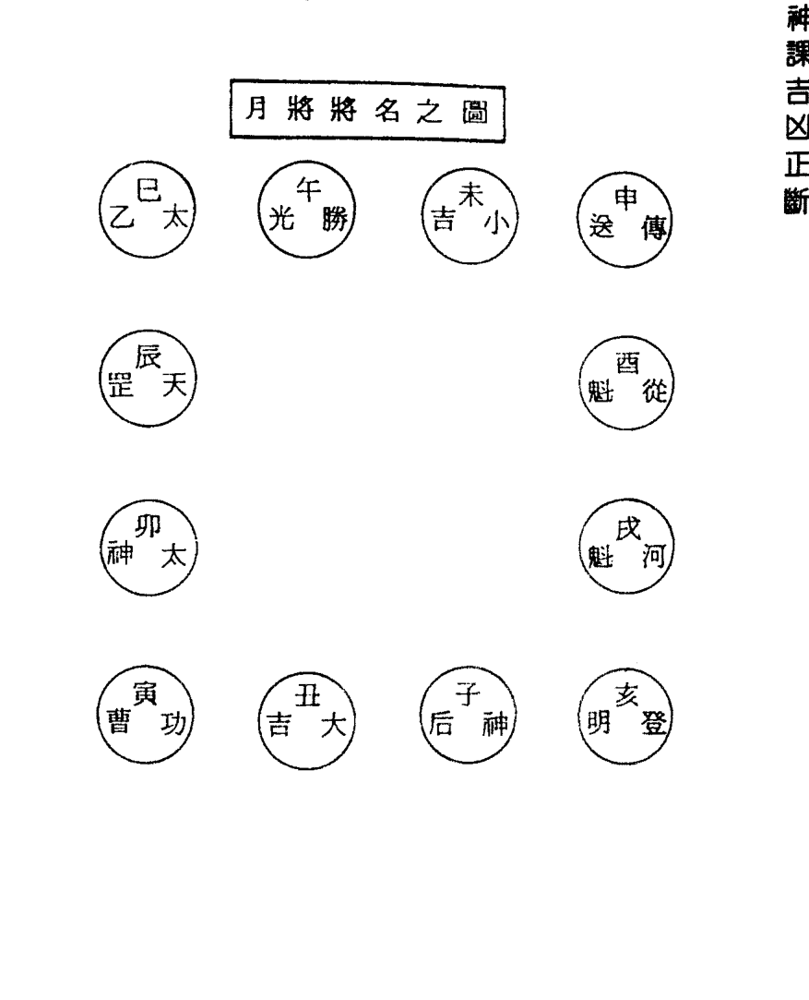
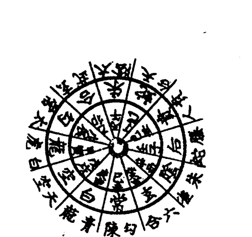
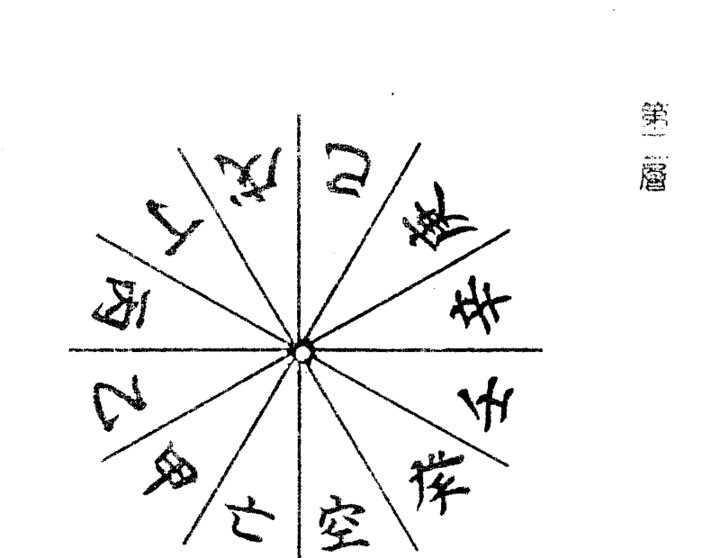
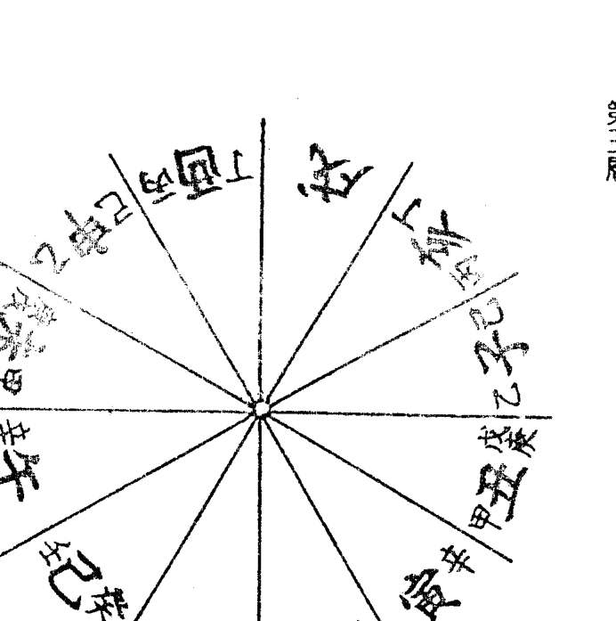
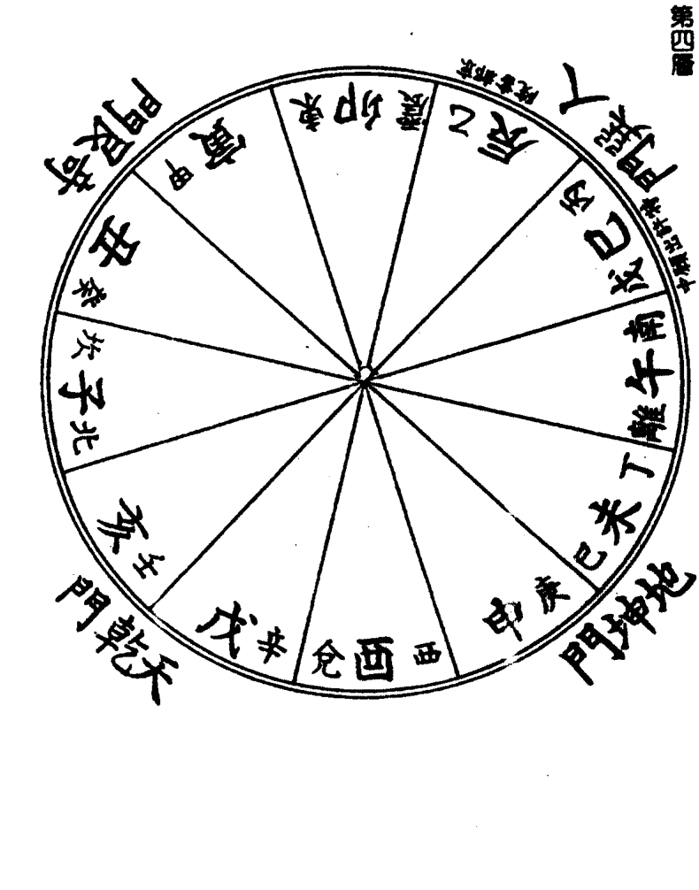

# 六壬神课吉凶正断法


### 自序

六壬學始於九天玄女、黃帝，至今已有五千余年，根據陰陽五行相生相剋之理法構成，天下之正斷法，概皆無出其右者。六壬神課以人事正斷法來說，有其最古老的歷史，但日本在三十年前才由不才我不顧學淺而作首次的研究發表，而於民國三十、卅一兩年，將六壬神課詳細解說發表，再以泰山全集呈獻給所有同好之士。

卻說六壬占課祗要翻閱『吳越春秋』及『越絕書』中所記載，即知其乃最古老的觀占法，古聖賢人之愛玩亦可由各種文獻窺知。凡天下之事物，複雜多端，難決吉凶善惡，即使智力財力過人，亦不可能預測禍福成敗榮枯，因此古人也認為，除以占卜決疑外別無他法。話說觀占法雖有各種，但無一出六壬課學之右者。由於此正斷之法則化而使占斷事項易如反掌，加上其簡易明瞭，故而對每件事得以即斷即解開啓中國原書中之樞機乃我平日所願，即使歷經常年實驗亦無所誤。本著畢生研究之信心，相償任何讀者以六壬之推演法正斷，皆能窺得天下之萬事、萬物、吉凶、悔吝、是非、成敗、禍福榮枯，若因此而開啟易學界新生命，更是我個人極感驕傲之事。透過本書將斯學活用乃是我個人的榮耀，況此秘笈將從未見諸於世的正宗正斷法納入書中，望各位能多加研修。
泰山識

### 緒言

吉凶正斷之術始於易學，有各種各類的術數，而六壬神課的吉凶預斷是以太陽為基素，并以其日之干支組織於四課三傳以得神示的一種秘占。根據古人君子預知災害以綢繆的教訓，當我們計劃事情時，預知其結果是不容忽視的。防禍患於未然，籌事預知其成否，實為吉凶正斷之大義。

世人往往祇渴望吉事來臨而忽略防範災害的重要，待凶災發生時才四處求教已於事無補了。故而作者為與諸彥共享未卜先知的樂趣，特將所學公諸於世，并祈望能將諸君命數導向有利方向。

六壬神課之術乃始於中國太古黃帝，傳於姜術（姜子牙）之最古老術數，雖然日本民間無人研究此術，而我於斯學的研修卻已達四十餘年。壬學比起其他占斷術是較為合理合法的，它是一門能預斷吉凶的學問。自古來，中國便有許多占卜。凡預知人事之吉凶非神明無法得知，因神明方能抵達幽微玄妙之域。然萬不可因此便認爲其學是星相術數，但於明代時因遭禁，凡有關陰陽學的書籍皆焚燒殆盡，惟壬學、奇門、遁甲術僥幸留存下來，時至今日，中國上下信仰壬學并皈依者甚多。

## 六壬神課吉凶正斷

一種迷信、邪法；科學雖萬能，尚無法預知許多事物，而我所知實為一能知并能行的學問。若謂這種有意義且有利的學術為啓發導電之神示寶典亦不為過。

## 一 六壬神课七百二十课式表

六壬神课以九原则十格为主，分六十日间一一七百二十课。当鉴定吉凶时，以其时造课式，在未详细讲解这种造式方法及其他以前，因「七百二十课式表」运用极为方便，且至为重要，故先示表于后。因一日有十二时刻，故幹支的演课为十二局，合六十干支而为七百二十课式，课以九原则为根本，重要的格分为六十四格，而有神杀四十余种。不仅天地间的吉凶，连我们日常生活的吉凶也可以用神示的占断学，这种以演布课式的原则今后将尝试详细解說于本文。为避免一一演式的麻烦，将全课式表列举于左，并将后记的适用法置于脑中，行占断时可依本表必不致有误。

### 1. 求課適用法
(一) 求断时必先知其日的干支，而後再求其日干支之局。
(二) 将其適用法设各条項解說於左：

(2)因月將要放在占時地支之上，故占時地支即是地盤地支。地盤靜而不動，即如左圖配列。

孟子曰：惻隱之心，人皆有之。我們人類於日常生活上，逢事必有成敗之論，有成敗有禍福、有禍福即有榮枯盛衰，故而是非之心、禍福之心、成敗之心、榮辱之心必伴人而相隨，雖為賢公卿亦不能免。有句俗語說，天無口而以人代言之，聖人設法，以稟神示之靈驗，以預知事之成敗，以解厭世上之各種疑難。此受神示之道非依卜筮不可，然卜筮之道不一而足，但日本之六壬神課在中國十四聖中為數之始祖軒轅氏所創始，具有最古老的歷史。

上圖是時刻的地支循環圖稱十二地支盤。

| 巳 | 午 | 未 | 申 |
| :---: | :---: | :---: | :---: |
| 辰 | 地 | 時 | 酉 |
| 卯 | 支 | 刻 | 戌 |
| 寅 | 丑 | 子 | 亥 |

六壬神課其推演法以太陽所行位置為月將，加以占時使無極生太極；用月將與干支乃是太極生兩儀之意。以其日干支為配列基礎定四課，四課定而後作發用，三才俱定金木水火土五行而布演神將，神將定而握其樞機以窺知吉凶、悔吝、是非、成敗、禍福與榮枯。

於今科技掛帥之世，認為占卜術乃是一種迷信，輕視者多憑恃一己之果斷，視其為愚蠢之物而不究其成敗、不明其禍福、不顧其榮枯、一意獨立以孤行，終至害人又害己。

大凡占課之術乃是敬天窮理而為天之所命的一種神術，絕非迷信妄術。它教人進時則進，退時乃退的學問，以順行天理為處世之大原則，是真是非的啟蒙，并取用個人之智力，以為生活之指針。如能此當能轉禍為福，防災害於未然。賢明諸彥絕不得將其視為迷惑人心之妄術，而必須作有意義之活用。

(3) 於此地盤地支時刻加以其月的月將地支而成爲天地盤，天盤配以月將的地支而順行，故常移動之後再與月將、占時組合，其方法即如後記一般循環。

(4) 為求該當何課式，是將正斷時刻地支加以月將地支即能得知。譬如假定占時是辰時，月將為未而在前圖地盤辰上加以未，即如左圖。

| 申 | 巳 | 未 | 辰 |
| :---: | :---: | :---: | :---: |
| 酉 | 午 | 天 | 子 |
| 戌 | 未 | 地 | 局 |
| 亥 | 申 | 十 | 酉 |
| 子 | 酉 | 辰 | 丑 |
| 丑 | 戌 | 巳 | 戌 |
| 寅 | 亥 | 午 | 卯 |
| 卯 | 子 | 未 | 寅 |

如表中十局，所以看其日干支十二局中的十局即可明了该当何课式。譬如民国四十四年七月十日月将未，试造壬申日辰刻的课式，即成为如左的课式表，即是该当壬申日的第十局。

### 2 十二局速算法

想立即得知该当十二局中的何局，须先布演天地盘，然后观天盘之「子」，而天盘「子」下的地盘地支数即相当于局数，但须先预知如左表的地支数。

- 子: 一
- 丑: 二
- 寅: 三
- 卯: 四
- 辰: 五
- 巳: 六
- 午: 七
- 未: 八
- 申: 九
- 酉: 十
- 戌: 十一
- 亥: 十二

记取以上之数，如果地盘酉上有子即知为十局，若辰上有子而知为五局。换句话说，看子字之下即能明了天盘地支。

### 3 天地十二盘表

为了往后讲述的方便，兹将第一局至第十二局的天地盘列举于左，参考本图便能知晓天盘子之下，地盘地支数该当的局号，七百二十课式即能自由自在的适用。

| 卯巳 | 辰午 | 巳未 | 午申 |
| :---: | :---: | :---: | :---: |
| 寅辰 | 第三局<br>天地盘 | 未酉 | 申戌 |
| 丑卯 |  |  |  |
| 子寅 | 亥丑 | 戌子 | 酉亥 |

| 巳巳 | 午午 | 未未 | 申申 |
| :---: | :---: | :---: | :---: |
| 辰辰 | 第一局<br>天地盘 | 酉酉 | 酉酉 |
| 卯卯 |  |  | 戌戌 |
| 寅寅 | 丑丑 | 子子 | 亥亥 |

| 寅巳 | 卯午 | 辰未 | 巳申 |
| :---: | :---: | :---: | :---: |
| 丑辰 | 第四局<br>天地盘 | 午酉 | 未戌 |
| 子卯 |  |  |  |
| 亥寅 | 戌丑 | 酉子 | 申亥 |

| 辰巳 | 巳午 | 午未 | 未申 |
| :---: | :---: | :---: | :---: |
| 卯辰 | 第二局<br>天地盘 | 申酉 | 酉戌 |
| 寅卯 |  |  |  |
| 丑寅 | 子丑 | 亥子 | 戌亥 |

| 亥巳 | 子午 | 丑未 | 寅申 |
| :---: | :---: | :---: | :---: |
| 戌辰 | 天地盘 | 第七局 | 卯酉 |
| 酉卯 |  |  | 辰戌 |
| 申寅 | 未丑 | 午子 | 巳亥 |

| 丑巳 | 寅午 | 卯未 | 辰申 |
| :---: | :---: | :---: | :---: |
| 子辰 | 天地盘 | 第五局 | 巳酉 |
| 亥卯 |  |  | 午戌 |
| 戌寅 | 酉丑 | 申子 | 未亥 |

| 戌巳 | 亥午 | 子未 | 丑申 |
| :---: | :---: | :---: | :---: |
| 酉辰 | 天地盘 | 第八局 | 寅酉 |
| 申卯 |  |  | 卯戌 |
| 未寅 | 午丑 | 巳子 | 辰亥 |

| 子巳 | 丑午 | 寅未 | 卯申 |
| :---: | :---: | :---: | :---: |
| 亥辰 | 天地盘 | 第六局 | 辰酉 |
| 戌卯 |  |  | 巳戌 |
| 酉寅 | 申丑 | 未子 | 午亥 |

| 未巳 | 申午 | 酉未 | 戌申 |
| :---: | :---: | :---: | :---: |
| 午辰 | 天地盘<br>第十一局 | 亥酉 |
| 已卯 | 子戌 |
| 辰寅 | 卯丑 | 寅子 | 丑亥 |

| 酉巳 | 戌午 | 亥未 | 子申 |
| :---: | :---: | :---: | :---: |
| 申辰 | 天地盘<br>第九局 | 丑酉 |
| 未卯 | 寅戌 |
| 午寅 | 已丑 | 辰子 | 卯亥 |

| 午已 | 未午 | 申未 | 酉申 |
| :---: | :---: | :---: | :---: |
| 已辰 | 天地盘<br>第十二局 | 戌酉 |
| 辰卯 | 亥戌 |
| 卯寅 | 寅丑 | 丑子 | 子亥 |

| 申已 | 酉午 | 戌未 | 亥申 |
| :---: | :---: | :---: | :---: |
| 未辰 | 天地盘<br>第十局 | 子酉 |
| 午卯 | 丑戌 |
| 已寅 | 辰丑 | 卯子 | 寅亥 |

事先制作十二局的天地盘，加临月将或时的方法皆能适用，譬如四月辰月中气後，辰支合於酉的月将，若假定卯为占时，就须适用第七号天地盘的酉加以卯者。又五月中氣後，已支合於申的月將，而假定醜為占時，則適用第八號天地盤申加以醜者即可。因此，將任一個月將加以任一個占時就能立刻預知該當何局。

### 二 七百二十課式一覽表

左記一覽表中，甲子日和乙丑日的三傳中記有（1）（2）（3），即（1）初传，（2）中传，（3）末传。又三傳地支左側有記入地支者即為地盤地支，須參照前記十二天地盤而記入，乙丑日以下皆按本法記。自甲子日十二局至癸亥日十二局止。

**(一) 甲子日十二局**

| 寅寅 (1) | 巳巳 (2) | 申申 (3) |
| :---: | :---: | :---: |
| 子子寅寅甲 |
| 元伏吟胎课 |

| 壬子 (1) | 亥亥 (2) | 戌戌 (3) |
| :---: | :---: | :---: |
| 戊亥子丑甲 |
| 连比用茹课 |

| 子戌 (1) | 戌申 (2) | 申午 (3) |
| :---: | :---: | :---: |
| 申戌戌子甲 |
| 三励斩悴比用局 德閑戾课 |

| 酉午 (1) | 午卯 (2) | 卯子 (3) |
| :---: | :---: | :---: |
| 午酉申亥酉子亥甲 |
| 四天高三元首局 烦盖交课 |

**(二) 乙丑日十二局**

| 酉 (1) | 丑 (2) | 巳 (3) |
| :---: | :---: | :---: |
| 酉巳子申巳丑申乙 |
| 從狡重審革童課 |

| 未 (1) | 戌 (2) | 丑 (3) |
| :---: | :---: | :---: |
| 未辰戌未辰丑未乙 |
| 開不稼斬重審口備稽關課 |

| 申 (1) | 戌 (2) | 子 (3) |
| :---: | :---: | :---: |
| 巳卯申午卯丑午乙 |
| 涉龍開重三溯德傳課 |

| 寅 (1) | 卯 (2) | 辰 (3) |
| :---: | :---: | :---: |
| 卯寅午巳寅丑巳乙 |
| 夾羅進元首定網茹課 |

**(三) 丙寅日十二局**

| 课体 | 上 | 中 | 下 | 课体 | 上 | 中 | 下 | 课体 | 上 | 中 | 下 | 课体 | 上 | 中 | 下 |
| :--- | :--- | :--- | :--- | :--- | :--- | :--- | :--- | :--- | :--- | :--- | :--- | :--- | :--- | :--- | :--- |
| 重审课<br>从革 | 酉<br>世<br>已 | 戊<br>午<br>寅 | 酉<br>酉<br>丙 | 重审课<br>炎上 | 戌<br>午<br>寅 | 午<br>戊<br>酉 | 丑<br>丑<br>丙 | 伏吟课<br>元胎 | 已<br>申<br>寅 | 寅<br>寅<br>已 | 已<br>已<br>丙 |
| 重审课<br>涉害 | 申<br>亥<br>寅 | 申<br>已<br>亥 | 申<br>申<br>丙 | 知一课<br>度厄 | 子<br>未<br>寅 | 辰<br>酉<br>未 | 子<br>子<br>丙 | 知一课<br>斩关 | 子<br>亥<br>戌 | 子<br>丑<br>卯 | 辰<br>辰<br>丙 |
| 重审课<br>涉害 | 辰<br>午<br>申 | 午<br>辰<br>酉 | 未<br>未<br>丙 | 返吟课<br>涉害 | 寅<br>申<br>寅 | 寅<br>申<br>已 | 亥<br>亥<br>丙 | 重审课<br>涉害 | 丑<br>亥<br>酉 | 戊<br>子<br>丑 | 卯<br>卯<br>丙 |
| 重审课<br>比用 | 辰<br>已<br>午 | 辰<br>卯<br>未 | 午<br>午<br>丙 | 涉害课<br>铸印 | 子<br>已<br>戌 | 子<br>未<br>卯 | 戊<br>戊<br>丙 | 赘婿课<br>元胎 | 亥<br>申<br>已 | 丑<br>亥<br>寅 | 寅<br>寅<br>丙 |
| 日贵<br>夜贵 | 酉 | 亥 | 空 | 日贵<br>夜贵 | 酉 | 亥 | 空 | 日贵<br>夜贵 | 酉 | 亥 | 空 |

**(四) 丁卯日十二局**

| 课体 | 上 | 中 | 下 | 课体 | 上 | 中 | 下 | 课体 | 上 | 中 | 下 | 课体 | 上 | 中 | 下 |
| :--- | :--- | :--- | :--- | :--- | :--- | :--- | :--- | :--- | :--- | :--- | :--- | :--- | :--- | :--- | :--- |
| 重审课<br>曲直 | 未<br>亥<br>卯 | 卯<br>未<br>亥 | 亥<br>卯<br>丁 | 元首课<br>曲直 | 未<br>卯<br>亥 | 亥<br>亥<br>卯 | 未<br>卯<br>丁 | 伏吟课<br>三交 | 卯<br>子<br>午 | 卯<br>卯<br>未 | 未<br>未<br>丁 |
| 重审课<br>三交 | 酉<br>子<br>卯 | 午<br>午<br>戌 | 戌<br>卯<br>丁 | 重审课<br>涉害 | 戌<br>巳<br>子 | 已<br>戊<br>酉 | 寅<br>戌<br>丁 | 重审课<br>涉害 | 丑<br>子<br>亥 | 丑<br>寅<br>已 | 午<br>午<br>丁 |
| 重审课<br>涉害 | 酉<br>亥<br>丑 | 未<br>已<br>亥 | 酉<br>酉<br>丁 | 返吟课<br>涉害 | 卯<br>酉<br>卯 | 卯<br>酉<br>未 | 丑<br>卯<br>丁 | 涉害课<br>涉害 | 亥<br>酉<br>未 | 亥<br>丑<br>卯 | 已<br>已<br>丁 |
| 见机课<br>顺茹 | 辰<br>已<br>午 | 已<br>辰<br>酉 | 申<br>申<br>丁 | 重审课<br>铸印 | 已<br>戌<br>卯 | 丑<br>申<br>已 | 子<br>子<br>丁 | 遥克课<br>二烦 | 子<br>酉<br>午 | 酉<br>子<br>卯 | 丑<br>辰<br>丁 |
| 日贵<br>夜贵 | 酉 | 亥 | 空 | 日贵<br>夜贵 | 酉 | 亥 | 空 | 日贵<br>夜贵 | 酉 | 亥 | 空 |## (六) 己巳日十二局
夜贵 申子
日贵 戌亥空

|   |   |   |
|---|---|---|
| 酉丑巳<br>丑酉卯亥<br>酉巳亥巳<br>决察從涉<br>女微革課 | 卯亥未<br>酉丑亥卯<br>丑巳卯巳<br>天决曲元<br>網女直課 | 巳申寅<br>巳巳未未<br>巳巳未巳<br>元自伏<br>胎信課 |
| 申亥寅<br>亥申丑戌<br>申巳戌巳<br>勛斬元重<br>德關胎課 | 酉辰亥<br>未子酉寅<br>子巳寅巳<br>見伏無涉<br>機殃祿課 | 卯寅丑<br>卯辰巳午<br>辰巳午巳<br>三斬退元<br>奇關茹首課 |
| 亥丑卯<br>酉未亥酉<br>未巳酉巳<br>寡進不彈<br>問傳備課 | 巳亥巳<br>巳亥未丑<br>亥巳丑巳<br>孤重元無<br>寡審胎依課 | 丑亥酉<br>丑卯卯巳<br>卯巳巳巳<br>不極間重<br>備陰傳課 |
| 申申午<br>未午酉申<br>午巳申巳<br>掩虎天冬<br>目視羅課 | 巳戌卯<br>卯戌巳子<br>戌巳子巳<br>勛乘斬鑄<br>德軒關印課 | 寅亥申<br>亥寅丑辰<br>寅巳辰巳<br>勛斬元嚆<br>德關胎課 |

子辰申<br>子申旺酉<br>申辰酉戌<br>勛斬潤彍<br>德關下射課

子申辰<br>申子酉丑<br>子辰丑戌<br>旬潤重<br>化下課

巳申寅<br>辰辰巳巳<br>辰辰巳戌<br>自元決斬天伏<br>任胎女關離課

亥寅巳<br>戌未亥申<br>未辰申戌<br>孤元彈<br>殀胎射課

子未寅<br>午亥未子<br>亥辰子戌<br>度四緩涉<br>厄絕殺課

卯寅丑<br>寅卯卯辰<br>卯辰辰戌<br>天退不比<br>罡茹備課

申戌子<br>申午酉未<br>午辰未戌<br>涉決問重<br>三淵女傳課

巳亥巳<br>辰戌巳亥<br>戌辰亥戌<br>斬見元返<br>德胎依一課

丑亥酉<br>子寅丑卯<br>寅辰卯戌<br>龍極問重<br>德陰傳課

寅午午<br>午巳未午<br>巳辰午戌<br>不別實<br>備課

寅未子<br>寅酉卯戌<br>酉辰戌戌<br>飛天斬重<br>魂羅關課

寅亥申<br>戌丑亥寅<br>丑辰寅戌<br>地元奇元<br>結胎首化課

## (七) 庚午日 十二局
夜贵 未
日贵 丑
戌亥空

| 第一列 | 第二列 | 第三列 |
|--------|--------|--------|
| 申寅巳<br>午午申庚<br>午午申庚<br>自元伏<br>任胎課 | 戊午寅<br>戊寅子辰庚<br>戊寅午辰庚<br>斬災知<br>關上課 | 辰申子<br>寅戊辰子庚<br>寅戊午子庚<br>斬勵開潤<br>關德口下課 |
| 酉子卯<br>子酉寅亥庚<br>酉午亥亥<br>二伏三重<br>煩殃交課 | 午巳辰<br>辰巳午未庚<br>巳午未庚<br>退嚆遙<br>茹矢課 | 戊巳子<br>申丑戊卯庚<br>丑午卯庚<br>官龍比<br>爵戰課 |
| 寅申寅<br>午子申寅庚<br>子午寅庚<br>元涉返<br>胎害課 | 戌未酉<br>申未戊酉庚<br>未午酉庚<br>羅昴<br>網星課 | 午辰寅<br>寅辰午庚<br>辰午午庚<br>不回顧間<br>備壞租傳課 |
| 戊巳子<br>申丑戊卯庚<br>丑午卯庚<br>官龍比<br>爵戰課 | 辰酉寅<br>辰亥午丑庚<br>亥午丑庚<br>用閉務比<br>墓口趋課 | 已寅亥<br>子卯寅已庚<br>卯午已庚<br>元元<br>首胎課 |

## (八) 辛未日 十二局
夜贵 午
日贵 寅
戌亥空

| 第一列 | 第二列 | 第三列 |
|--------|--------|--------|
| 亥卯未<br>卯亥未午<br>亥未寅辛<br>寡曲知<br>宿直課 | 卯亥未<br>亥卯寅午辛<br>亥卯未午辛<br>狡伏曲知<br>童殃直課 | 未丑戊<br>未未戊辛<br>未未戊辛<br>自遊祿伏<br>信子權課 |
| 酉辰亥<br>西寅子已辛<br>寅未已辛<br>四無涉<br>絕害課 | 已辰卯<br>已午申酉辛<br>午未酉辛<br>天退嘯<br>罡茹課 | 已丑辰<br>未丑戊辰辛<br>丑未辰辛<br>井災無返<br>闘網依課 |
| 午辰寅<br>卯巳午申辛<br>已未申辛<br>龍天亨元<br>德罡通課 | 已戊卯<br>已子申卯辛<br>子未卯辛<br>度勵乘涉<br>厄德轩印課 | 亥丑丑<br>丑戊辰丑辛<br>戊未丑辛<br>不燕勵別<br>備淫德課 |
| 寅辰午<br>亥酉寅子辛<br>酉未子辛<br>周彈<br>射偏課 | 申亥申<br>酉申子亥辛<br>申未亥辛<br>天掩昴<br>羅目星課 | 亥未未<br>丑辰艮未辛<br>辰未未辛<br>寡不燕別<br>宿備淫責課 |

# (十) 癸酉日 十二局

| 第一列 | 第二列 | 第三列 |
|--------|--------|--------|
| 酉丑巳<br>已丑酉已癸<br>盘不从涉<br>珠備革課 | 已丑酉<br>丑巳酉酉癸<br>同不從元<br>環備革課 | 丑戌未<br>酉酉丑丑癸<br>三豫天自伏<br>奇樁罡信課 |
| 辰未戊<br>卯子未辰癸<br>新豫元<br>關樁課 | 卯戊巳<br>亥辰卯申癸<br>斷四見<br>輪絕課 | 未午已<br>未申亥子癸<br>退嚆遂<br>茹矢課 |
| 丑卯已<br>丑亥已卯癸<br>出聞元<br>戶傳課 | 卯酉卯<br>酉卯丑未癸<br>勸龍三無<br>德戰交依課 | 未已卯<br>已未酉亥癸<br>间回嚆<br>傳明課 |
| 亥子丑<br>亥戌卯寅癸<br>旬孤進<br>儀蹇茹課 | 未子已<br>未寅亥午癸<br>度知一<br>厄課 | 午卯子<br>卯午未戌癸<br>二三軒<br>須交晝課 |

# (九) 壬申日 十二局

| 第一列 | 第二列 | 第三列 |
|--------|--------|--------|
| 未亥卯<br>辰子未卯壬<br>曲重<br>直課 | 子申辰<br>子辰卯未壬<br>狡斬六潤<br>童關儀下課 | 亥申寅<br>申申亥亥壬<br>筹杜元自<br>宿傳胎任課 |
| 已申亥<br>寅亥已寅壬<br>不元彈<br>備胎課 | 午丑申<br>戍卯丑午壬<br>四度涉<br>絕厄課 | 戊酉申<br>午未酉戊壬<br>斬退元<br>關茹課 |
| 子寅辰<br>子戊卯丑壬<br>向間重<br>陽傳課 | 寅申寅<br>申寅亥已壬<br>勵元無知返<br>德胎依一課 | 午辰寅<br>辰午未酉壬<br>沃間顧元<br>女停祖課 |
| 丑寅卯<br>戊酉丑子壬<br>天三進元<br>網奇茹課 | 辰酉寅<br>午丑酉辰壬<br>天斬元<br>罡關課 | 已寅亥<br>寅已已申壬<br>不元元<br>備胎課 |

| 未亥卯 | 未卯亥 | 辰亥巳 |
|---|---|---|
| 未卯子申<br>卯亥未乙<br>重審課<br>曲直<br>涉害<br>癸女門 | 卯未申子<br>未亥子乙<br>涉害<br>曲直<br>癸女門 | 亥亥辰辰<br>辰乙<br>杜傳<br>斬關<br>伏吟課 |
| 未戊丑 | 午丑申 | 戊酉申 |
| 巳寅戊未<br>寅亥未乙<br>遊魂稼穡<br>重審課 | 丑午午亥<br>午亥亥乙<br>不備課<br>重審 | 酉戊寅卯<br>戊亥卯乙<br>閉口<br>斬關<br>德<br>元首課 |
| 申戊子 | 已亥已 | 酉未巳 |
| 卯丑申午<br>丑亥午乙<br>寡宿<br>涉三淵<br>重審課 | 亥已辰戊<br>已戊乙<br>元胎<br>返吟課 | 未酉子寅<br>酉亥寅乙<br>寡宿<br>涉害<br>噶矢<br>遙剋課 |
| 丑寅卯 | 寅未子 | 丑戊未 |
| 丑子午巳<br>子亥已乙<br>三奇<br>連茹<br>元首課 | 酉辰寅酉<br>辰亥酉乙<br>勛德<br>不備<br>斬關<br>重審 | 已申戊丑<br>申亥丑乙<br>勛德<br>燕淫<br>稼穡<br>重審 |

| 未卯亥 |   |   |
|---|---|---|
| 未卯子申<br>卯亥未乙<br>重審課<br>曲直<br>涉害<br>癸女門 |   |   |
| 午丑申 |   |   |
| 丑午午亥<br>午亥亥乙<br>不備課<br>重審 |   |   |
| 已亥已 |   |   |
| 亥已辰戊<br>已戊乙<br>元胎<br>返吟課 |   |   |
| 寅未子 |   |   |
| 酉辰寅酉<br>辰亥酉乙<br>勛德<br>不備<br>斬關<br>重審 |   |   |

| 辰亥巳 |   |   |
|---|---|---|
| 亥亥辰辰<br>辰乙<br>杜傳<br>斬關<br>伏吟課 |   |   |
| 戊酉申 |   |   |
| 酉戊寅卯<br>戊亥卯乙<br>閉口<br>斬關<br>德<br>元首課 |   |   |
| 酉未巳 |   |   |
| 未酉子寅<br>酉亥寅乙<br>寡宿<br>涉害<br>噶矢<br>遙剋課 |   |   |
| 丑戊未 |   |   |
| 已申戊丑<br>申亥丑乙<br>勛德<br>燕淫<br>稼穡<br>重審 |   |   |

| 寅午戊 | 戊午寅 | 寅已申 |
|---|---|---|
| 午寅戊午<br>寅戊午甲<br>不備<br>勤德<br>女<br>災上課<br>元首課 | 寅午午戊<br>午戊戊甲<br>不備<br>斬關<br>賛炎<br>重審<br>災上課 | 戊戊寅寅<br>寅甲<br>自任<br>斬關<br>元胎<br>伏吟課 |
| 申亥寅 | 子未寅 | 子亥戊 |
| 辰丑申已<br>丑戊已甲<br>元胎<br>重審 | 子已辰酉<br>已戊酉甲<br>四絕<br>知一課 | 申酉子丑<br>酉戊丑甲<br>遯<br>知一<br>茹課 |
| 辰午申 | 寅申寅 | 午辰寅 |
| 寅子午辰<br>子戊辰甲<br>涉害<br>女<br>漸闢<br>闗禍課 | 戊辰寅申<br>辰戊申甲<br>斬關<br>元胎<br>返吟課 | 午申戊子<br>申戊子甲<br>覘德<br>開闢<br>見機<br>涉害課 |
| 辰巳午 | 子巳戊 | 申已寅 |
| 子亥辰卯<br>亥戊卯甲<br>遯<br>知一<br>茹課 | 申卯子未<br>卯戊未甲<br>鬼闔<br>知一<br>基口課 | 辰未申亥<br>未戊亥甲<br>噶矢<br>遯剋<br>元胎課 |

| 戊午寅 |   |   |
|---|---|---|
| 寅午午戊<br>午戊戊甲<br>不備<br>斬關<br>賛炎<br>重審<br>災上課 |   |   |
| 子未寅 |   |   |
| 子已辰酉<br>已戊酉甲<br>四絕<br>知一課 |   |   |
| 寅申寅 |   |   |
| 戊辰寅申<br>辰戊申甲<br>斬關<br>元胎<br>返吟課 |   |   |
| 子巳戊 |   |   |
| 申卯子未<br>卯戊未甲<br>鬼闔<br>知一<br>基口課 |   |   |

| 寅已申 |   |   |
|---|---|---|
| 戊戊寅寅<br>寅甲<br>自任<br>斬關<br>元胎<br>伏吟課 |   |   |
| 子亥戊 |   |   |
| 申酉子丑<br>酉戊丑甲<br>遯<br>知一<br>茹課 |   |   |
| 午辰寅 |   |   |
| 午申戊子<br>申戊子甲<br>覘德<br>開闢<br>見機<br>涉害課 |   |   |
| 申已寅 |   |   |
| 辰未申亥<br>未戊亥甲<br>噶矢<br>遯剋<br>元胎課 |   |   |

### (十三) 丙子日 十二局
夜貴：亥 酉 空

|   |   |   |
|---|---|---|
| 已申寅<br>元自伏吟任課<br>子子子巳巳丙 | 申辰子<br>泱閉潤彈射課<br>辰申酉丑丙 | 酉丑巳<br>伏斬從重審課<br>申辰丑酉丙 |
| 戊酉申<br>泱六斬退知一<br>戊亥卯辰丙 | 子未寅<br>亂不四涉客首備絕課<br>寅未未子丙 | 申亥寅<br>寡元重審宿胎課<br>午卯亥申丙 |
| 丑亥酉<br>三極斬重審奇陰關課<br>申戊丑卯丙 | 午子午<br>三無知返吟交依一課<br>子午巳亥丙 | 辰午申<br>登勵間重審天德傳課<br>辰寅酉未丙 |
| 午卯子<br>軒二三元首須交課<br>午酉亥寅丙 | 已戊卯<br>不鑄重審德印課<br>戊已卯戊丙 | 寅卯辰<br>篡進知一起茹課<br>寅丑未午丙 |

### (十四) 丁丑日 十二局
夜貴：酉 亥 空

|   |   |   |
|---|---|---|
| 丑戌未<br>三遊稼自伏吟奇子櫃信課<br>丑丑未未丁 | 已丑酉<br>從元首革課<br>已酉亥卯丁 | 酉丑已<br>篡從重審起萃課<br>酉已卯亥丁 |
| 子亥戌<br>退重審茹課<br>亥子已午丁 | 卯戊已<br>斷四重審輪絕課<br>卯申酉寅丁 | 午戊辰<br>虎掩昴星觀目課<br>未辰丑戊丁 |
| 亥酉未<br>時間重審遁停課<br>酉亥卯已丁 | 亥未丑<br>井無返吟欄親課<br>丑未未丑丁 | 西亥丑<br>孤疑問重審停課<br>已卯亥酉丁 |
| 子辰戊<br>虎掩昴星觀目課<br>未戌丑辰丁 | 已戊卯<br>乘鑄重審軒印課<br>亥午已子丁 | 申酉戊<br>流進重審金茹課<br>卯寅酉申丁 |

# 六壬神课吉凶正断

## (十五) 戊寅日 十二局
夜贵 未
日贵 丑
申酉空

丑午酉<br>戊午丑酉<br>勳轉三虎昴星課

戊午寅<br>午戊酉丑<br>斬決炎重審課

巳申寅<br>寅寅巳戊<br>元自伏吟課

申亥寅<br>申巳亥申<br>不備重審胎課

子未寅<br>辰酉未子<br>四重審絕課

子亥戌<br>子丑卯辰<br>三重斬退知課

辰午申<br>午辰酉未<br>狡登三斬關課

寅申寅<br>寅申巳亥<br>度元無返吟課

丑亥酉<br>戊子丑卯<br>龍三極間重審課

辰巳午<br>辰卯未午<br>進重審茹課

子巳戌<br>子未卯戌<br>驀斬鑄知一課

寅亥申<br>申亥亥寅<br>亂不元元首課

## (十六) 己卯日 十二局
夜贵 申
日贵 子
申酉空

未亥卯<br>亥未卯己<br>不備曲直涉害課

未卯亥<br>未亥亥卯<br>不備曲直涉害課

卯子午<br>卯卯未未<br>三交伏吟課

酉子卯<br>酉午丑戌<br>驀越三交課

戊巳子<br>巳戊酉寅<br>斬關重審課

丑子亥<br>丑寅巳午<br>驀越三奇茹課

亥丑卯<br>未巳亥酉<br>純陰間傳彈射課

卯酉卯<br>卯酉未丑<br>九三無返吟課

亥酉未<br>亥丑卯巳<br>龍九極間涉害課

辰巳午<br>巳辰酉申<br>斬關重審茹課

巳戌卯<br>丑申巳子<br>勳乘鑄知一課

子酉午<br>酉子丑辰<br>勳二三彈射課

# (十七) 庚辰日 十二局
日贵 未 丑
夜贵

| 第一列 | 第二列 | 第三列 | 第四列 |
|--------|--------|--------|--------|
| 申寅巳<br>辰辰申申<br>庚庚<br>元自伏<br>胎任課 | 子申辰<br>申子子辰<br>子辰辰庚<br>暮絕涉<br>害越課 | 辰申子<br>辰辰申申<br>申申庚庚<br>聯退元<br>芳茹課 |   |
| 申戌子<br>申午辰子戌<br>午辰戌庚<br>涉斬問涉<br>三泗隔傳課 | 寅申寅<br>辰戌申寅<br>戌辰庚<br>元無返<br>胎依課 | 午辰寅<br>子寅辰午<br>寅辰午庚<br>顧問見涉<br>祖體機課 |   |
| 午未申<br>午已辰酉庚<br>履進噓<br>明茹矢課 | 寅未子<br>寅酉午丑庚<br>引暮重<br>從趨課 | 已寅亥<br>戊壬寅已庚<br>元元<br>胎首課 |   |

# (十八) 辛巳日 十二局
日贵 午 寅
夜贵
申酉空

| 第一列 | 第二列 | 第三列 | 第四列 |
|--------|--------|--------|--------|
| 酉丑巳<br>丑酉午寅<br>獄從知<br>童革課 | 午寅戌<br>酉丑寅午<br>炎元首<br>上課 | 巳申寅<br>巳巳戊辛<br>自斬元<br>信關胎課 |   |
| 申亥寅<br>亥申辰丑<br>申巳丑辛<br>亂不無涉<br>首備祿課 | 未寅酉<br>未子子巳<br>子巳巳辛<br>助斬退元<br>德關茹課 | 卯寅丑<br>卯辰申酉<br>辰巳酉辛<br>元重<br>胎審課 |   |
| 寅辰午<br>酉未寅子<br>未已子辛<br>無返<br>依課 | 已亥已<br>已亥戊辰<br>亥已辰辛<br>暮極間重<br>越陰傳課 | 丑亥酉<br>丑卯午申<br>卯巳申辛<br>間出三彈<br>傳陽射課 |   |
| 午未申<br>未午子亥<br>午已亥辛<br>亂斷助不<br>首輪德備課 | 卯申丑<br>卯戌申卯<br>戌已卯辛<br>彈元遂<br>射胎課 | 寅亥申<br>亥寅辰未<br>寅已未辛<br>進噓遂<br>茹矢課 |   |

# (十九) 壬午日 十二局

| 第一列 | 第二列 | 第三列 |
|--------|--------|--------|
| 未亥卯<br>寅戊未卯壬<br>斬曲重關直課 | 戊午寅<br>戊寅卯未壬<br>勐六炎重德儀上課 | 亥午子<br>午午亥亥壬<br>杜自伏吟傳任課 |
| 酉子卯<br>子酉已寅壬<br>寡二三重宿煩交課 | 午丑申<br>申丑丑午壬<br>贊不重備塔課 | 戊酉申<br>辰已酉戊壬<br>斬六退元隔儀茹課 |
| 申戊子<br>戊申卯丑壬<br>九勐間重覦德傳課 | 午子午<br>午子亥已壬<br>勐度三比德厄交用課 | 寅子戊<br>寅辰未酉壬<br>間斬元首傳關課 |
| 丑寅卯<br>申未丑子壬<br>三燕進元首奇淫茹課 | 辰酉寅<br>辰亥酉辰壬<br>不斬知一備關課 | 已寅亥<br>子卯已申壬<br>元元首胎課 |

# (二十) 癸未日 十二局

| 第一列 | 第二列 | 第三列 |
|--------|--------|--------|
| 酉丑已<br>卯亥酉未 已癸<br>從涉害革 | 已丑酉<br>亥卯未酉 癸<br>勐從涉害德革 | 丑戌未<br>未丑丑癸<br>自伏吟任 |
| 辰未戊<br>丑未辰癸<br>斷祿元首 誤橋課 | 卯戌已<br>酉寅卯未申癸<br>勐羅斷重德輸課 | 已辰卯<br>已午未亥子癸<br>薏退彈射茹課 |
| 已未酉<br>亥酉未卯癸<br>間勐彈送傳德射課 | 未丑未<br>未丑丑未未癸<br>遊亂豫延子首橋課 | 已卯丑<br>卯已未亥癸<br>解問彈蔭傳課 |
| 申寅申<br>酉申卯未寅癸<br>掩昴星目課 | 已戊卯<br>已子未午午癸<br>度鑄知厄印課 | 戊未辰<br>丑辰未戌戊癸<br>遊豫斬元首子橋關課 |

# 六壬神课吉凶正断

## (二十一) 甲申日 十二局

| 课体 | 课体 | 课体 |
|------|------|------|
| 申子辰<br>巳丑酉子申乙<br>元首課<br>潤下課 | 巳丑酉<br>丑巳申子乙<br>元首課<br>從革課 | 辰酉卯<br>酉酉辰辰乙<br>伏吟課<br>自信課<br>杜傳信 |
| 未戌丑<br>卯子戌未乙<br>重審課<br>稼穡課 | 亥午丑<br>亥辰午亥乙<br>知一課<br>四絕課 | 申未午<br>未申寅卯乙<br>涉害課<br>噶矢課<br>退茹課 |
| 申戌子<br>丑亥申午乙<br>重審課<br>涉三淵課 | 卯酉卯<br>酉卯辰戌乙<br>涉害課<br>無依課<br>龍戰課 | 未巳卯<br>巳未子寅乙<br>彈射課<br>回傳課<br>明傳課 |
| 亥子丑<br>亥戌午巳乙<br>重審課<br>進茹課<br>龍潛課 | 未子巳<br>未寅寅酉乙<br>知一課<br>不備課<br>驀越課 | 丑戌未<br>卯午戌丑乙<br>重審課<br>稼穡課<br>九丑課 |

| 课体 | 课体 | 课体 |
|------|------|------|
| 辰申子<br>辰子戌午甲<br>元首課<br>潤下課<br>墓勛閉口<br>起德下 | 戊午寅<br>子辰午戊甲<br>涉害課<br>炎上課<br>斬關課<br>童關課 | 寅巳申<br>申申寅寅甲<br>伏吟課<br>元胎課<br>自信課<br>任胎課 |
| 申亥寅<br>寅亥申巳甲<br>重審課<br>元胎課 | 戊巳子<br>戊卯辰酉甲<br>知一課<br>鑄印課<br>雜鑄印課 | 子亥戌<br>午未子丑甲<br>知一課<br>退茹課<br>重陰課 |
| 辰午申<br>子戊申辰甲<br>涉害課<br>顧祖課 | 寅申寅<br>申寅寅申甲<br>涉害課<br>返吟課<br>亂首課 | 午辰寅<br>辰午戊子甲<br>涉害課<br>顧祖課<br>勛德課 |
| 辰巳午<br>戊酉申卯甲<br>重審課<br>進茹課<br>升階課 | 子巳戊<br>午丑子未甲<br>知一課<br>比用課<br>鑄印課 | 巳寅亥<br>寅巳申亥甲<br>元首課<br>元胎課 |## 六壬神課吉凶正斷
### （二三）丙戌日十二局

| 课式 | 课体 |
| :--- | :--- |
| 己申寅<br>戊戊己己<br>丙 | 元首伏吟课<br>关胎 |
| 酉巳丑<br>寅午酉丑<br>丙 | 从弹射<br>革课 |
| 酉丑巳<br>午寅丑酉<br>丙 | 从重审<br>革课 |
| 酉巳丑<br>寅午酉丑<br>丙 | 从弹射<br>革课 |
| 酉丑巳<br>午寅丑酉<br>丙 | 从重审<br>革课 |
| 卯寅丑<br>申酉戊辰<br>丙 | 退茹元首课<br>斩关 |
| 子未寅<br>子巳戊未<br>丙 | 四不知<br>绝德课 |
| 申亥寅<br>辰丑亥申<br>丙 | 元首重审<br>胎课 |
| 子寅辰<br>寅子酉未<br>丙 | 间传重审<br>停课 |
| 巳亥巳<br>戊辰巳亥<br>丙 | 元首返吟课<br>关胎 |
| 丑亥酉<br>午申丑卯<br>丙 | 间传重审<br>停课 |
| 亥子丑<br>子亥戊午<br>丙 | 进茹三奇<br>重审课 |
| 申丑午<br>申卯卯戊<br>丙 | 不知课<br>德关 |
| 亥申巳<br>辰未戊寅<br>丙 | 嗥矢元首课<br>胎 |

夜贵 亥
午未空

## 六壬神課吉凶正斷
### （二四）丁亥日十二局

| 课式 | 课体 |
| :--- | :--- |
| 亥未丑<br>亥亥未未<br>丁 | 杜传伏吟课 |
| 未卯亥<br>卯未亥卯<br>丁 | 不备课<br>害 |
| 未亥卯<br>未卯卯亥<br>丁 | 囚信不备<br>直课 |
| 戌酉申<br>酉戌巳午<br>丁 | 元首斩关课 |
| 午丑申<br>丑午酉寅<br>丁 | 四重审<br>绝课 |
| 午戊寅<br>巳寅丑戊<br>丁 | 虎炎斩关<br>亲上课 |
| 酉未巳<br>未酉亥巳<br>丁 | 间传弹射<br>课 |
| 巳亥巳<br>巳未丑亥<br>丁 | 元首返吟课<br>关胎 |
| 酉亥丑<br>卯丑亥酉<br>丁 | 极阴间传<br>重审课 |
| 巳戊卯<br>酉辰巳子<br>丁 | 斩关铸印<br>重审课 |
| 巳寅亥<br>巳申丑辰<br>丁 | 元首斩关课<br>胎 |
| 申酉戊<br>丑子酉申<br>丁 | 进茹重审课 |

夜贵 酉
午未空

### （二五）戊子日十二局

| 辰申子 | 巳申丑 | 巳申寅 | (二五) 戊子日 十二局 |
| :--- | :--- | :--- | :--- |
| 申辰丑酉戊<br>元首课 调元下课 | 辰申酉丑戊<br>昴星课 龙战课 | 子子巳巳<br>伏吟课 元胎课 | 日贵 未 |
| 卯午酉<br>午卯亥申戊<br>嚆矢课 三交课 | 子未寅<br>寅未未子戊<br>重审课 不备课 | 戊酉申<br>戊亥卯辰戊<br>知一课 逆茹课 | 夜贵 丑 |
| 辰午申<br>辰寅酉未戊<br>重审课 登三天课 | 午子午<br>子午巳亥戊<br>重审课 高盖课 | 丑亥酉<br>申戊丑卯戊<br>重审课 极阴课 | 午未空 |
| 寅卯辰<br>寅丑未午戊<br>知一课 进茹课 | 巳戊卯<br>戊巳卯戊戊<br>重审课 斩关课 | 寅亥申<br>午酉亥寅戊<br>元胎课 涉害课 |  |

### （二六）己丑日十二局

| 酉丑巳 | 巳丑酉 | 丑戌未 | (二六) 己丑日 十二局 |
| :--- | :--- | :--- | :--- |
| 酉巳丑亥巳<br>从革课 涉害 | 巳酉丑卯<br>涉害课 越革课 | 丑丑未未<br>伏吟课 自信课 | 日贵 申 |
| 午戊辰<br>未辰丑戌戊巳<br>昴星课 二德烦 | 卯戊巳<br>卯申酉寅巳<br>重审课 四绝课 | 子亥戌<br>亥子巳午巳<br>重审课 退茹课 | 夜贵 子 |
| 卯巳未<br>巳卯丑酉巳<br>元首课 迎阳课 | 亥未丑<br>丑未未丑巳<br>返吟课 无亲课 | 亥酉未<br>酉亥丑巳巳<br>重审课 间传课 | 午未空 |
| 寅卯辰<br>卯寅酉申巳<br>元首课 进茹课 | 巳戊卯<br>亥午巳子巳<br>知一课 勋德课 | 子辰戊<br>未戌丑辰巳<br>昴星课 天烦目课 |  |

### （二七）庚寅日十二局

| 辰申子 | 戊午寅 | 申寅巳 | (二七) 庚寅日 十二局 |
| :--- | :--- | :--- | :--- |
| 戊午辰子庚<br>元首课 开润下课 | 午戊辰子庚<br>涉害课 斩关上课 | 寅寅申申庚<br>自伏吟课 六仪胎任课 | 日贵<br>夜贵<br>未丑 |
| 申亥寅<br>申巳寅亥庚<br>六仪元首课 胎 | 戌巳子<br>辰酉戊卯庚<br>断轮知一课 | 子亥戊<br>子丑午未庚<br>通知一课 茹 |
| 辰午申<br>午辰子戊庚<br>斩关间传涉害课 | 寅申寅<br>寅申申寅庚<br>返吟课 赞元胎 | 午辰寅<br>戊子辰午庚<br>间传涉害课 勋德 |
| 辰巳午<br>辰卯戊酉庚<br>重审进茹课 升阶 | 子巳戊<br>子未午丑庚<br>铸印知一课 升阶 | 巳寅亥<br>申亥寅巳庚<br>元首课 元胎 |

午未空

### （二八）辛卯日十二局

| 未亥卯 | 未卯亥 | 卯子午 | (二八) 辛卯日 十二局 |
| :--- | :--- | :--- | :--- |
| 亥未卯寅午辛<br>墓伏龙涉害课 宿女战课 | 未亥卯寅午辛<br>害知伏曲比用课 宿一女直课 | 卯卯戊戌辛<br>斩三龙伏关交战战课 | 日贵<br>夜贵<br>午 |
| 酉子卯<br>酉午辰丑辛<br>九天重审课 功德龙烦 | 戌巳子<br>巳戊子巳辛<br>不备龙斩重审课 功德关 | 丑子亥<br>丑寅酉酉辛<br>天重审课 功德狱 |
| 巳未酉<br>未巳寅子辛<br>间传龙腾矢课 休女战课 | 卯酉卯<br>卯酉戊辰辛<br>龙斩返吟课 战输 | 亥酉未<br>亥丑午申辛<br>间传涉害课 休 |
| 辰巳午<br>巳辰子亥辛<br>龙斩重审课 战关 | 卯申丑<br>丑申申卯辛<br>不备赞斩勋重审课 功德轮 | 子未子<br>酉子辰未辛<br>勋龙昴星课 功德战 |

午未空

### （二九）壬辰日 十二局

| 未亥卯 | 子申辰 | 亥辰戌 | (二九) 壬辰日 十二局 |
| :--- | :--- | :--- | :--- |
| 子申未卯壬<br>寡宿直课 曲重审 | 申子卯未壬<br>狡童课 勋德重审 | 辰辰亥亥壬<br>斩关课 杜伏停 | 日贵<br>夜贵<br>巳卯 |
| 戊丑辰<br>戊未巳寅壬<br>嚆矢课 稼穑逐 | 午丑申<br>午亥丑午壬<br>孤辰课 不知仪 | 戌酉申<br>寅卯酉戌壬<br>魄化课 斩关知 |
| 申戌子<br>申午卯丑壬<br>涉三渊课 重审 | 巳亥巳<br>辰戌亥巳壬<br>闭口课 斩关勋德 | 寅子戌<br>子寅未酉壬<br>元首课 传 |
| 丑寅卯<br>午巳丑子壬<br>进茹元首课 | 寅未子<br>寅酉酉辰壬<br>乱首课 不重仪 | 巳寅亥<br>戊丑巳申壬<br>元首课 元胎 |

### （三〇）癸巳日 十二局

| 酉丑巳 | 巳丑酉 | 丑戌未 | (三〇) 癸巳日 十二局 |
| :--- | :--- | :--- | :--- |
| 丑酉酉巳<br>丑酉巳癸<br>数不从涉害课 塔伤革 | 酉丑巳酉<br>从元首课 革课 | 巳丑丑癸<br>稼穑动伏吟课 德 | 夜贵<br>日贵<br>卯巳 |
| 申亥寅<br>亥申未辰<br>新元六重审课 歸胎仪课 | 卯戌巳<br>未子卯申<br>断轮重审课 | 卯寅丑<br>卯辰亥子<br>解离元首课 退茹课 |
| 未酉亥<br>酉未巳卯<br>寡宿鸣勋矢课 冥德 | 巳亥巳<br>巳亥丑未<br>勤德课 返吟 | 丑亥酉<br>丑卯酉亥<br>极阴间传课 重审 |
| 未申酉<br>未午卯寅<br>寡宿进茹矢课 逐剋 | 午亥辰<br>卯戌亥午<br>孤辰斩关课 重审 | 戌未辰<br>亥寅未戌<br>稼穑元首课 口樯课 |

### （三一）甲午日 十二局

| 寅午戌 | 戌午寅 | 寅巳申 | (三一) 甲午日 十二局 |
| :--- | :--- | :--- | :--- |
| 寅戊午午甲<br>沃德炎上课 元首德女上课 | 戌寅午戊甲<br>披童关上课 斩炎重害 | 午午寅寅甲<br>自伏吟课 元胎任课 | 日贵<br>夜贵<br>丑未 |
| 申亥寅<br>子酉申巳甲<br>元首课 知一胎 | 酉辰亥<br>申丑辰酉甲<br>元首课 四绝 | 子亥戌<br>辰巳子丑甲<br>通知一课 三奇茹 |
| 辰午申<br>戌申午辰甲<br>登三关童传课 斩披间涉害 | 寅申寅<br>午子寅申甲<br>元胎依害课 无涉返吟 | 戌申午<br>寅辰戌子甲<br>勤德关传课 斩间涉害 |
| 辰巳午<br>申未辰卯甲<br>孤辰进茹课 重 | 子巳戌<br>辰亥子未甲<br>引从三知一课 印奇 | 申巳寅<br>子卯午亥甲<br>元胎课 嗥矢逐过 |

辰巳空

### （三二）乙未日 十二局

| 亥卯未 | 卯亥子申乙 | 卯亥未 | (三二) 乙未日 十二局 |
| :--- | :--- | :--- | :--- |
| 卯亥未申子乙<br>曲直课 元首 | 亥卯未申子乙<br>曲直课 | 未未辰辰乙<br>自伏吟课 避禄斩信擒 | 日贵<br>夜贵<br>子申 |
| 未戌丑<br>丑戌未未乙<br>资玛德擒课 不禄重 | 午丑申<br>西寅午亥乙<br>四绝仪课 六重 | 戌卯午<br>已午未卯乙<br>勤德目课 掩昴星 |
| 申戌子<br>亥酉申午乙<br>涉三渊传课 重审 | 戌辰戌<br>未丑辰戌乙<br>新关擒佐课 禄无返 | 亥寅巳<br>卯巳子寅乙<br>元胎目课 掩昴星 |
| 酉戌亥<br>西申午巳乙<br>进茹矢课 嗥逐 | 巳戌卯<br>已子寅酉乙<br>勤知一印课 度德厄 | 丑戌未<br>丑辰戌丑乙<br>勤德子擒课 游禄重审 |

辰巳空

### （三三）丙申日十二局

| 酉丑巳 | 子申辰 | 巳申寅 | (三三) 丙申日十二局 |
| :--- | :--- | :--- | :--- |
| 辰子丑酉丙<br>从重革课 | 子辰酉丑丙<br>润下重审课 | 申申巳巳丙<br>赛宿元德课 劝胎 | 夜贵<br>日贵<br>酉亥 |
| 申亥寅<br>寅亥亥申丙<br>赞培元胎课 不备 | 戌巳子<br>戌卯未子丙<br>四绝铸印课 知 | 卯寅丑<br>午未卯辰丙<br>斯关元茹课 退 |
| 子寅辰<br>子戊酉未丙<br>三间阳传课 斯关 | 寅申寅<br>申寅巳亥丙<br>元胎课 返吟 | 丑亥酉<br>辰午丑卯丙<br>极阴间传课 逆重 |
| 酉戌亥<br>戌酉未午丙<br>进遥茹射课 弹 | 卯申丑<br>午丑卯戊丙<br>斯关课 元 | 巳寅亥<br>寅巳亥寅丙<br>不备宿元胎课 赛 |

辰巳空

### （三四）丁酉日十二局

| 亥卯未 | 巳丑酉 | 酉未丑 | (三四) 丁酉日十二局 |
| :--- | :--- | :--- | :--- |
| 巳丑酉亥丁<br>曲直课 元首 | 丑巳亥卯丁<br>从革课 元首 | 酉酉未未丁<br>杜传伏吟课 劝德 | 夜贵<br>日贵<br>酉亥 |
| 子卯午<br>卯子丑戌丁<br>高盖关矢课 斩嘘 | 亥午丑<br>亥辰酉寅丁<br>斩关课 重审 | 申未午<br>未申巳午丁<br>退遥茹射课 弹 |
| 酉亥丑<br>丑亥亥酉丁<br>宝传不备课 间 | 卯酉卯<br>酉卯未丑丁<br>劝战无依课 龙德 | 丑巳巳<br>巳未酉巳丁<br>燕别不备课 淫 |
| 亥子丑<br>亥戌酉申丁<br>斩关进茹课 知 | 未子巳<br>未寅酉子丁<br>度厄课 涉 | 午卯子<br>卯午酉辰丁<br>轩盖三交课 元 |

辰巳空

### （三五）戊戌日十二局

| 寅午戌 | 寅戌午 | 巳申寅 | (三五) 戊戌日十二局 |
| :--- | :--- | :--- | :--- |
| 午寅丑酉<br>寅戌酉戊<br>元首课 勋德 洪女 | 寅午酉丑<br>午戌丑戊<br>遥克课 嗥矢 炎上 | 戊戌巳巳<br>戊巳巳戊<br>伏吟课 元胎 斩关 |
| 亥寅巳<br>辰丑亥申<br>丑戌申戊<br>遥克课 弹射 元胎 | 子未寅<br>子巳未子<br>巳戌子戊<br>重审课 不备 | 卯寅丑<br>申酉卯辰<br>酉戌辰戊<br>元首课 退茹 斩关 |
| 子寅辰<br>寅子酉未<br>子戌未戊<br>重审课 向传 洪女阳 | 巳亥巳<br>戊辰巳亥<br>辰戌亥戊<br>返吟课 无依 寡宿胎 | 丑亥酉<br>午申丑卯<br>申戌卯戊<br>重审课 极阴 勋德 |
| 亥子丑<br>子亥未午<br>亥戌午戊<br>三重审课 进茹奇课 | 申丑午<br>申卯卯戌<br>卯戌戌戊<br>元首课 斩关 不备开 | 寅亥申<br>辰未亥寅<br>未戌寅戊<br>元胎课 元首 胎课 |

### （三六）己亥日十二局

| 未亥卯未 | 未卯亥 | 亥未丑 | (三六) 己亥日十二局 |
| :--- | :--- | :--- | :--- |
| 卯亥己<br>涉害课 曲直课 不备塔 | 卯未亥<br>涉害课 曲直课 不备首 | 亥未未<br>伏吟课 自备杜传 |
| 寅巳申<br>巳寅丑戌<br>巳亥戌己<br>递元夸矢课 胎德斩关 | 午丑申<br>丑午酉寅<br>午亥寅己<br>六重审课 绝 | 戌酉申<br>酉戌巳午<br>戌亥午己<br>元首课 退茹 斩关德 |
| 丑卯巳<br>卯丑亥酉<br>丑亥酉己<br>涉害课 见机出户 | 巳亥巳<br>亥巳未丑<br>巳亥丑己<br>返吟课 元胎 寡宿 | 卯丑亥<br>未酉卯巳<br>酉亥巳己<br>遥克课 间传 |
| 丑寅卯<br>丑子酉申<br>子亥申己<br>三元首课 进茹奇课 | 巳戌卯<br>酉辰巳子<br>辰亥子己<br>斩关课 勋德劝知印 | 巳寅亥<br>巳申丑辰<br>申亥辰己<br>元首课 斩关 劝德宿 |

### （三七）庚子日十二局

| 辰申子 | 子申辰 | 申寅巳 | (三七) 庚子日十二局 |
| :--- | :--- | :--- | :--- |
| 申辰辰子<br>元首课 励德润下 | 辰申子辰<br>不备课 斩关润下 | 子子申申<br>伏吟课 元胎 |
| 午酉子<br>午卯丑亥<br>龙三交课 嗥矢 | 戊巳子<br>寅未戊卯<br>比知一课 | 戊酉申<br>戊亥午未<br>退元首课 茹 |
| 辰午申<br>辰寅子戊<br>登三关传课 寡斩间 | 寅申寅<br>子午申寅<br>返吟课 元胎 | 午辰寅<br>申戊辰午<br>天网六间斩传课 |
| 寅卯辰<br>寅丑戊酉<br>进知一茹课 | 巳戊卯<br>戊巳午丑<br>宿淫铸印课 寡燕重 | 午卯子<br>午酉寅已<br>六高知一课 备盖 |

### （三八）辛丑日十二局

| 酉丑巳 | 巳丑酉 | 丑戌未 | (三八) 辛丑日十二局 |
| :--- | :--- | :--- | :--- |
| 酉巳午寅<br>狡童淫课 燕从知革 | 已酉寅午<br>寡宿网课 天从知革 | 丑丑戌戌<br>斩关橘课 禄伏 |
| 已丑丑<br>未辰辰丑<br>寡宿备课 不斩别关 | 卯戌已<br>卯申子已<br>沃女轮课 断铸印重 | 子亥戌<br>亥子申酉<br>勋德课 励退重茹 |
| 卯巳未<br>已卯寅子<br>燕淫课 元首课 | 亥未辰<br>丑未戊辰<br>井射孤辰关课 斩返吟 | 亥酉未<br>酉亥午申<br>时间适传课 重审 |
| 寅卯辰<br>卯寅子亥<br>进元首茹课 | 卯申丑<br>亥午申卯<br>燕淫德课 励重审 | 已未未<br>未戊辰未<br>不备贵关课 斩别 |

### （三九）壬寅日十二局

| 未亥卯 | 戊午寅 | 亥寅巳 | (三九) 壬寅日十二局 |
| :--- | :--- | :--- | :--- |
| 戊午未卯壬<br>曲直课 重审 | 午戊卯未壬<br>炎上课 勋德斩关 | 寅寅亥亥壬<br>伏吟课 元胎 劝德 | 夜贵<br>日贵<br>卯巳 |
| 申亥寅<br>申巳巳寅壬<br>不备元胎课 赞重审 | 午丑申<br>辰酉丑午壬<br>死绝重审课 六仪 | 子亥戌<br>子丑酉戌壬<br>知一课 斩关退茹 |
| 辰午申<br>午辰卯丑壬<br>间传课 天狱决女 重审 | 寅申寅<br>寅申亥巳壬<br>返吟课 劝德元胎 | 戊申午<br>戊子未酉壬<br>元首课 墓越停间传 |
| 辰巳午<br>辰卯丑子壬<br>进茹重审课 寒宿 | 子巳戌<br>子未酉辰壬<br>知一课 斩关 | 巳寅亥<br>申亥巳申壬<br>元首课 寒宿不备元胎 |

辰巳空

### （四〇）癸卯日十二局

| 酉丑巳 | 未卯亥 | 丑戌未 | (四〇) 癸卯日十二局 |
| :--- | :--- | :--- | :--- |
| 亥未酉巳癸<br>从革课 涉害 寡宿绝嗣 | 未亥卯酉癸<br>曲直课 涉害 | 卯卯丑丑癸<br>伏吟课 劝德禄辐课 | 夜贵<br>日贵<br>卯巳 |
| 酉子卯<br>酉午未辰癸<br>三交课 斩关 重审 | 卯戌巳<br>巳戊卯申癸<br>燕淫输课 斩关 | 丑子亥<br>丑寅亥子癸<br>三奇退茹课 重审 |
| 未酉亥<br>未巳巳卯癸<br>不备课 劝德嚆矢 | 卯酉卯<br>卯酉丑未癸<br>龙勤返吟课 战德 | 丑亥酉<br>亥丑酉亥癸<br>循极阴课 涉害环停 |
| 辰巳午<br>巳辰卯寅癸<br>龙战茹课 寒宿斩关 | 午亥辰<br>丑申亥未癸<br>六仪重审课 俦 | 戌未辰<br>酉子未戊癸<br>元首课 斩禄开关 |

辰巳空

### （四一）甲辰日十二局

| 子辰申 | 申子辰 | 辰辰寅 | (四一) 甲辰日十二局 |
| :--- | :--- | :--- | :--- |
| 午甲<br>课格 劝德润下课 遯 | 午戊甲<br>课格 涉害课 新关炎上 | 寅甲<br>课格 元首课 自任伏吟 | 夜贵<br>丑未<br>日贵<br>子申 |
| 申亥寅<br>戌未辰<br>申巳甲<br>重审课 元胎 | 午丑申<br>午亥辰<br>辰酉甲<br>知一课 四绝 | 子亥戌<br>寅卯辰<br>子丑甲<br>知一课 重审退阴 |
| 辰午申<br>申午辰<br>午辰甲<br>涉害课 赘婿新关童子课 | 寅申寅<br>辰戌辰<br>寅申甲<br>返吟课 四绝 | 戊申午<br>子寅辰<br>戊子甲<br>涉害课 间传课 励德闭口 |
| 辰巳午<br>午巳辰<br>辰卯甲<br>重审课 六仪进茹课 陪仆 | 寅未子<br>寅酉辰<br>子未甲<br>涉害课 度厄寡宿 | 申巳寅<br>戌丑辰<br>申亥甲<br>元首课 励德胎课 |

寅卯空

### （四二）乙巳日十二局

| 酉丑巳 | 酉巳丑 | 辰巳申 | (四二) 乙巳日 十二局 |
| :--- | :--- | :--- | :--- |
| 丑酉巳<br>申子乙<br>从革课 重审 | 酉丑巳<br>申子乙<br>从革课 遯矢 | 巳巳辰<br>辰乙<br>六仪课 斩关伏吟 | 夜贵<br>丑未<br>日贵<br>子申 |
| 未戌丑<br>亥申巳<br>戌未乙<br>游子课 知一稼穑 | 午丑申<br>未子巳<br>午亥乙<br>四绝课 重审 | 卯寅丑<br>卯辰巳<br>寅卯乙<br>元首课 不备退茹 |
| 申戌子<br>酉未巳<br>申午乙<br>重审课 涉三渊 | 巳亥巳<br>巳亥巳<br>辰戌乙<br>返吟课 元胎无依 | 丑亥酉<br>丑卯巳<br>子寅乙<br>重审课 涉害墓越传 |
| 未申酉<br>未午巳<br>午巳乙<br>弧射课 不备退茹 | 寅未子<br>卯戌巳<br>寅酉乙<br>重审课 劝德寡宿 | 丑戌未<br>亥寅巳<br>戌丑乙<br>重审课 游子闭口 |

寅卯空

## 六壬神课吉凶正断
### (三) 丙午日十二局

| 课式 | 课格 | 夜贵 | 日贵 |
| :--- | :--- | :--- | :--- |
| 戊午寅 | 三汏炎重奇女上课 | 酉亥 | 寅卯空 |
| 已申寅 | 勰元伏德胎课 |
| 子未寅 | 四知一绝课 |
| 卯寅丑 | 不退元备茹课 |
| 午子午 | 三返交课 |
| 丑亥酉 | 极间重阴传课 |
| 辰酉寅 | 斩六比关仪课 |
| 子酉午 | 三噶失交课 |

### (四) 丁未日十二局

| 课式 | 课格 | 夜贵 | 日贵 |
| :--- | :--- | :--- | :--- |
| 卯亥未 | 同曲重环直课 | 酉亥 | 寅卯空 |
| 卯亥未 | 曲元首直课 |
| 卯午午 | 惟八簾课 |
| 酉辰亥 | 孤比用辰课 |
| 丑巳巳 | 惟八簾课 |
| 已丑丑 | 勰井返栏射吟课 |
| 亥辰辰 | 斩惟八开簾课 |
| 已戌卯 | 铸印比用课 |

## 六壬神課吉凶正斷

## 六壬神课吉凶正断

（四六）己酉日十二局
夜贵 申
日贵 子
寅卯空

| 亥卯未 | 巳丑酉 | 酉未丑 |
| :--- | :--- | :--- |
| 亥卯未<br>巳丑酉亥<br>亥丑酉亥<br>疫曲重害课<br>童直课 | 巳丑酉<br>丑巳亥卯<br>巳酉卯己<br>从涉害课<br>革课 | 酉未丑<br>酉酉未未<br>未酉未己<br>龙伏吟<br>战课 |
| 卯午酉<br>卯子丑戌<br>子酉戌己<br>斩关害矢课<br>关交课 | 亥午丑<br>亥辰酉寅<br>辰酉寅己<br>蓦斩涉害课<br>越关课 | 戌午申<br>未申巳午<br>申酉午己<br>勋昴星课<br>德课 |
| 丑卯巳<br>丑亥亥酉<br>亥酉酉己<br>出闭间不元<br>户口传备课 | 卯酉卯<br>酉卯未丑<br>卯酉丑己<br>龙返吟<br>战课 | 卯丑亥<br>巳未卯巳<br>未酉巳己<br>不疫害矢课<br>备童课 |
| 亥子丑<br>亥戊酉申<br>戊酉申己<br>三进重害<br>奇茹课 | 未子巳<br>未寅巳子<br>寅酉子巳<br>绝涉害课<br>关课 | 午卯子<br>卯午丑辰<br>午酉辰己<br>高元首课<br>盖课 |

## 六壬神课吉凶正断

（四五）戊申日十二局
夜贵 未
日贵 丑
寅卯空

| 辰申子 | 子申辰 | 巳申寅 |
| :--- | :--- | :--- |
| 辰申子<br>辰子丑酉<br>子申酉戊<br>勋六涣元<br>德侯下课 | 子申辰<br>子辰酉丑<br>辰申丑戊<br>斩涣始入课<br>关下课 | 巳申寅<br>申申巳巳<br>申巳戊<br>元伏吟<br>胎课 |
| 寅巳申<br>寅亥亥申<br>亥申申戊<br>不元害矢课<br>备胎课 | 子未寅<br>戊卯未子<br>卯申子戊<br>度涉害课<br>厄课 | 卯寅丑<br>午未卯辰<br>未申辰戊<br>斩退元首课<br>关茹课 |
| 子寅辰<br>子戊酉未<br>戊申未戊<br>向决间重<br>阳女传课 | 寅申寅<br>申寅巳亥<br>寅申亥戊<br>元返吟课<br>胎课 | 丑亥酉<br>辰午丑卯<br>午申卯戊<br>勋极重害课<br>德阴课 |
| 戊酉午<br>戊酉未午<br>酉申午戊<br>转昴星课<br>逢课 | 卯申丑<br>午丑卯戌<br>丑申戌戊<br>斩元首课<br>关课 | 寅亥申<br>寅巳亥寅<br>巳申寅戊<br>不元比用课<br>备胎课 |

## 六壬神課吉凶正断

（四七）庚戌日十二局
夜贵 丑
日贵 未
寅卯空

| 申寅巳 | 午巳辰 | 午辰寅 |
| :--- | :--- | :--- |
| 申寅巳<br>戊戊申申<br>庚庚<br>元伏<br>胎吟课 | 午巳辰<br>酉午未<br>戊未庚<br>退啖<br>茹矢课 | 午辰寅<br>（缺失）<br>庚<br>（缺失）<br>元首课<br>德备 |
| 巳寅亥<br>辰未寅巳<br>戊未巳庚<br>元元<br>胎首课 | 子申亥<br>寅午子辰<br>庚午戊庚<br>润下课<br>重审 | 戌巳子<br>子巳戌卯<br>庚巳卯庚<br>比用课<br>涉害 |
| 寅申寅<br>戊辰申寅<br>庚寅庚元<br>斩返<br>吟闭课<br>胎关课 | 申壬午<br>申卯午丑<br>庚戌庚<br>知一课<br>尾课 | 辰申子<br>午寅辰子<br>庚寅子庚<br>涉害课<br>润下<br>六仪课<br>德助 |
| 寅巳申<br>辰丑寅亥<br>戊亥庚<br>弹射课<br>元胎 | 子寅辰<br>寅子子戊<br>戊戊庚<br>（缺失）<br>重审课<br>向阳<br>（缺失） | 亥子丑<br>子亥戌酉<br>戊酉庚<br>三奇课<br>重审<br>进茹课 |

（四八）辛亥日十二局
夜贵 午
日贵 寅
寅卯空

| 亥戌未 | 戌酉申 | 午辰寅 |
| :--- | :--- | :--- |
| 亥戌未<br>亥亥戌戌<br>戌辛<br>伏吟课<br>杜传课<br>斩关 | 戌酉申<br>酉戌申酉<br>戌辛<br>元首课<br>斩关<br>退茹<br>不备 | 午辰寅<br>未酉午申<br>申辛<br>元首课<br>顾问课<br>祖传 |
| 巳寅亥<br>巳申辰未<br>未辛<br>元首课<br>励越课<br>德胎 | 未卯亥<br>卯未寅午<br>辛未亥午<br>涉害课<br>曲直<br>厄直课 | 午丑申<br>丑午子巳<br>午辛<br>四绝课<br>重审 |
| 巳亥巳<br>亥巳戊辰<br>辰辛<br>返吟课<br>斩关<br>胎课 | 卯申丑<br>酉辰申卯<br>卯辛<br>重审课<br>励辰课<br>孤德课 | 未亥卯<br>未卯午寅<br>卯亥寅辛<br>知一课<br>曲直<br>直课 |
| 巳申亥<br>巳寅辰丑<br>丑亥丑辛<br>噶矢课<br>元胎<br>德助 | 丑卯巳<br>卯丑寅子<br>丑亥子辛<br>涉害课<br>间传课<br>出户女<br>闭口 | 丑寅卯<br>丑子子亥<br>子亥亥辛<br>元首课<br>进茹课<br>不备<br>闭口 |

## (五〇) 癸丑日十二局

| 酉丑巳 | 已丑酉 | 丑戌未 |
| :--- | :--- | :--- |
| 酉丑巳<br>酉巳酉巳<br>酉丑酉巳<br>从涉<br>革害<br>课课 | 已丑酉<br>已酉丑已酉癸<br>励从元<br>德首革课 | 丑戌未<br>丑丑丑丑<br>丑癸<br>励游禄乱伏<br>德子德首课 |
| 辰未戌<br>未辰未辰<br>未辰丑辰<br>游斩六禄元<br>子闭仪首课 | 卯戌已<br>卯申卯申<br>申丑申癸<br>四断重<br>绝轮课 | 子亥戌<br>亥子丑亥子<br>子癸<br>退重<br>茹课 |
| 卯已未<br>已卯已卯<br>已丑卯癸<br>盈励间不元<br>阳德传备课 | 未丑未<br>丑未丑未<br>未丑未癸<br>励游禄返<br>德子德课 | 亥酉未<br>酉亥酉亥<br>亥丑亥癸<br>时三重<br>遁奇课 |
| 寅卯辰<br>卯寅丑卯寅<br>寅丑寅癸<br>孤进元<br>辰茹课 | 午亥辰<br>亥午亥午<br>午丑午癸<br>八重<br>专课 | 戌未辰<br>未戌未戌<br>戌丑戌癸<br>斩游禄元<br>关子德课 |

## (四九) 壬子日十二局

| 未亥卯 | 未卯亥 | 亥子卯 |
| :--- | :--- | :--- |
| 未亥卯<br>申辰未卯<br>壬辰子卯<br>斩曲重<br>关直课 | 未卯亥<br>辰申卯未<br>壬申子未<br>励曲涉<br>德直课 | 亥子卯<br>子子亥亥<br>壬子子亥<br>励三杜伏<br>德奇传课 |
| 午酉子<br>午卯已寅<br>壬卯子寅<br>三弹射<br>交课 | 午丑申<br>寅未丑午<br>壬未子午<br>浃四重<br>女绝课 | 戌酉申<br>戊亥酉戌<br>壬亥子戌<br>不斩退元<br>备关茹课 |
| 辰午申<br>辰寅卯丑<br>壬寅子丑<br>登浃六间重<br>天女仪传课 | 午子午<br>子午子已<br>壬午子已<br>励返吟<br>德课 | 戌申午<br>申戌未酉<br>壬戌子酉<br>斩问元<br>关传课 |
| 寅卯辰<br>寅丑丑子<br>壬丑子子<br>不进知<br>备茹课 | 已戌卯<br>戌已酉辰<br>壬已子辰<br>斩铸重<br>关印课 | 午卯子<br>午酉已申<br>壬酉子申<br>高三比<br>益交课 |

## 六壬神課吉凶正斷

### (五二)乙卯日十二局

| 课体 | 干支组合 | 课格 |
| :--- | :--- | :--- |
| 未亥卯<br>亥未子申乙 | 曲涉<br>直害 | 涉害课 |
| 未卯亥<br>未亥申子乙 | 沃曲<br>女直 | 元首课 |
| 辰卯子<br>卯卯辰辰乙 | 斩杜<br>关传 | 伏吟课 |
| 酉子卯<br>酉午戌未乙 | 勋三<br>德交 | 涉害课 |
| 午丑申<br>巳戊午亥乙 | 四涉<br>绝害 | 涉害课 |
| 丑子亥<br>丑寅寅卯乙 | 三退<br>奇茹 | 重审课 |
| 申戊子<br>未已申午乙 | 涉间<br>三害 | 重审课 |
| 卯酉卯<br>卯酉辰戊乙 | 龙三<br>战交 | 无依课 |
| 亥酉未<br>亥丑子寅乙 | 九极<br>丑阴 | 涉害课 |
| 辰巳午<br>巳辰午巳乙 | 乱斩<br>首开 | 重审课 |
| 寅未子<br>丑申寅酉乙 | 勋六<br>德仪 | 重审课 |
| 丑戊未<br>酉子戊丑乙 | 勋禄<br>德权 | 重审课 |

## 六壬神課吉凶正斷

### (五一)甲寅日十二局

| 课体 | 干支组合 | 课格 |
| :--- | :--- | :--- |
| 申午午<br>戊午戊午甲 | 勋惟<br>德解 | 八事课 |
| 戌午寅<br>午戊午戊甲 | 狡斩<br>童关 | 炎上课 |
| 寅巳申<br>寅寅寅寅甲 | 元自<br>胎任 | 伏吟课 |
| 申亥寅<br>申巳申巳甲 | 元重<br>胎审 | 重审课 |
| 西辰亥<br>辰西辰西甲 | 八四<br>专绝 | 元首课 |
| 子亥戊<br>子丑子丑甲 | 孤退<br>辰知 | 退茹课 |
| 辰午申<br>午辰午辰甲 | 斩登<br>关天 | 重审课 |
| 寅申寅<br>寅申寅申甲 | 六元<br>仪胎 | 返吟课 |
| 戊申午<br>戊子戊子甲 | 勋闭<br>德口 | 悖序课 |
| 辰巳午<br>辰卯辰卯甲 | 升进<br>陪茹 | 重审课 |
| 子巳戊<br>子未子未甲 | 孤铸<br>辰印 | 度厄课 |
| 丑亥亥<br>申亥申亥甲 | 寡闭<br>宿口 | 八事课 |

### (五四)丁巳日十二局

| 课体 | 日课 | 日干寄宫 | 夜贵 | 日贵 |
| :--- | :--- | :--- | :--- | :--- |
| 酉丑巳<br>丑酉卯亥丁<br>从革课 重审课 | 亥未卯<br>酉丑亥卯丁<br>曲直矢课 勋德 | 巳申寅<br>巳巳未未丁<br>元胎课 伏吟课 | 酉亥丑<br>酉未亥酉丁<br>不备课 勋德 重审课 | 巳亥巳<br>巳亥未丑丁<br>元胎课 返吟课 |
| 申亥寅<br>亥申丑戌丁<br>斩关课 重审课 | 酉辰亥<br>未子酉寅丁<br>涉害课 四厄课 | 卯寅丑<br>卯辰巳午丁<br>元首课 退茹课 | 丑亥酉<br>丑卯卯巳丁<br>重审课 不备课 赞育停 | 亥申巳<br>亥寅丑辰丁<br>返吟课 元胎课 |
| 申酉戌<br>未午酉申丁<br>进茹课 重审课 | 巳戌卯<br>卯戌巳子丁<br>铸印课 斩关课 重审课 | 巳申巳<br>亥寅丑辰丁<br>元胎课 返吟课 |

子丑空

### (五三)丙辰日十二局

| 课体 | 日课 | 日干寄宫 | 夜贵 | 日贵 |
| :--- | :--- | :--- | :--- | :--- |
| 酉丑巳<br>子申辰酉丙<br>从革课 重审课 | 子申辰<br>申子辰丑丙<br>润下课 勋德 重审课 | 巳申寅<br>辰辰巳巳丙<br>元胎课 伏吟课 |
| 申亥寅<br>戌未亥申丙<br>元胎课 重审课 | 午丑申<br>午亥未子丙<br>知一课 四绝课 | 卯寅丑<br>寅卯卯辰丙<br>元首课 退茹课 不备课 |
| 申戌子<br>申午辰未丙<br>涉害课 勋德 天狱课 | 巳亥巳<br>辰戌巳亥丙<br>元胎课 返吟课 斩关课 | 丑亥酉<br>子寅丑卯丙<br>重审课 赞育停 极阴 |
| 亥午午<br>午巳辰午丙<br>三奇课 别责课 不备课 | 寅未子<br>寅酉辰戌丙<br>重审课 斩关课 六仪课 | 亥申巳<br>戌丑亥寅丙<br>返吟课 元胎课 |

子丑空

## 六壬神课吉凶正断

### (五六)己未日十二局

| 亥卯未 | 卯亥未 | 未丑戌 |
| :--- | :--- | :--- |
| 亥卯未<br>亥卯未 巳亥<br>重审课 曲直课 | 卯亥未<br>卯亥未 卯巳<br>元首课 曲直课 | 未丑戌<br>未未未未 未巳<br>伏吟课 稼穑课 |
| 亥戌戌<br>戌未戌戌 戌己<br>八专课 斩关课 | 酉辰亥<br>酉寅未酉 寅己<br>涉害课 无知课 | 卯午午<br>巳午未午 午己<br>八专课 惟满课 |
| 酉酉酉<br>亥酉未酉 酉己<br>八专课 独足课 | 已丑丑<br>未丑未丑 丑己<br>八专课 涉害课 | 丑已已<br>卯已未已 已己<br>八专课 惟满课 |
| 未申申<br>酉申未申 申己<br>八专课 帐薄课 | 已戌卯<br>已子未已 子己<br>知一课 勉铸课 | 玄辰辰<br>丑辰未辰 辰己<br>八专课 勉斩课 |

日贵 申
夜贵 子
子丑空

## 六壬神课吉凶正断

### (五五)戊午日十二局

| 寅午戊 | 戊午寅 | 已申寅 |
| :--- | :--- | :--- |
| 寅午戊<br>寅戊丑酉 戌戊<br>元首课 炎上课 | 戊午寅<br>戊寅酉丑 丑戊<br>重审课 炎上课 | 已申寅<br>午午已已 已戊<br>元首课 伏吟课 |
| 酉子卯<br>子酉亥申 戌<br>重审课 交车课 | 子未寅<br>申丑未子 子戊<br>重审课 绝嗣课 | 卯寅丑<br>辰已卯辰 辰戊<br>元首课 退茹课 |
| 申戊子<br>戊申酉未 戌<br>涉害课 间传课 | 午子午<br>午子已亥 戊<br>三传课 交车课 | 丑亥酉<br>寅辰丑卯 戊<br>重审课 勉斩课 |
| 寅午午<br>申未午午 午戊<br>别责课 六不课 | 辰酉寅<br>辰亥卯戌 戊<br>知一课 勉度课 | 寅亥申<br>子卯亥寅 戊<br>元首课 六仪课 |

日贵 未
夜贵 丑
子丑空

## （五八）辛酉日十二局

| 寅午戌 | 巳丑酉 | 酉戌未 |
| :--- | :--- | :--- |
| 寅午戌<br>巳丑酉 寅辛<br>六炎重<br>仪上课 | 巳丑酉<br>丑已 寅午辛<br>从知一<br>革课 | 酉戌未<br>酉酉 戌辛<br>龙断<br>伏吟课 |
| 卯午酉<br>卯子辰丑<br>寒劝三<br>宿德交课 | 亥午丑<br>亥辰子已<br>四新三<br>绝开奇课 | 丑酉酉<br>未申酉辛<br>不劝别<br>备德课 |
| 丑卯巳<br>丑亥寅子<br>寡决元<br>宿女首课 | 卯酉卯<br>酉卯戊辰<br>断斩龙<br>输关吟课 | 午辰寅<br>巳未午申<br>顾间元<br>祖停课 |
| 亥子丑<br>亥戊子亥<br>斩不三<br>关备奇茹课 | 未子已<br>未寅申卯<br>劝度知<br>德厄课 | 午卯子<br>卯午酉辰<br>劝高三<br>德盖交课 |

## （五七）庚申日十二局

| 辰申子 | 子申辰 | 申寅巳 |
| :--- | :--- | :--- |
| 辰申子<br>辰子辰庚<br>励润元<br>德下首课 | 子申辰<br>子辰子辰<br>斩润重<br>关下课 | 申寅巳<br>申申申庚<br>元胎课 |
| 丑亥亥<br>寅亥寅亥<br>寡惟八<br>宿怖亭课 | 戊巳子<br>戊卯戊卯<br>龙知一<br>战课 | 酉未未<br>午未午庚<br>八亭课 |
| 子寅辰<br>子戊子戊<br>决向三<br>女阳停课 | 寅申寅<br>申寅申寅<br>六元返<br>仪胎课 | 午辰寅<br>辰午辰午<br>励愿问<br>德祖停课 |
| 亥酉酉<br>戊酉戊酉<br>三惟八<br>奇怖亭课 | 卯丑丑<br>午丑午丑<br>惟八亭<br>僻课 | 已寅亥<br>寅已寅已<br>元胎课 |

### (五九)壬戌日十二局

| 戌亥未 | 未卯亥 | 亥卯未 |
| :--- | :--- | :--- |
| 戌亥未<br>戌亥亥亥<br>壬<br>三勋斩伏<br>奇德关吟课 | 未卯亥<br>未午午未<br>壬<br>勋曲涉害<br>德直重审课 | 亥卯未<br>午寅寅卯<br>壬<br>曲重直审课 |
| 戌酉申<br>申酉酉戌<br>壬<br>不乱斩退元<br>备首关茹课 | 午丑申<br>子巳丑午<br>壬<br>沃四重害<br>女绝审课 | 辰未戌<br>辰丑巳寅<br>壬<br>勋禄鸣遥劫<br>德槛矢课 |
| 午辰寅<br>午申未酉<br>壬<br>勋顾求元首课<br>德祖 | 巳亥巳<br>戌辰亥巳<br>壬<br>勋斩元返关胎课<br>德开 | 子寅辰<br>寅子卯子<br>壬<br>勋向问三传课<br>德隔 |
| 巳寅亥<br>辰未巳申<br>壬<br>元胎课<br>元首 | 辰酉寅<br>申卯酉辰<br>壬<br>斩涉害课<br>关 | 亥子丑<br>子亥戌丑<br>壬<br>三乱进重害课<br>奇首茹 |
| 日贵<br>巳卯 | 夜贵<br>子丑空 |

### (六〇)癸亥日十二局

| 丑戌未 | 未卯亥 | 酉丑巳 |
| :--- | :--- | :--- |
| 丑戌未<br>亥亥丑丑<br>癸<br>勋禄伏吟课<br>德槛 | 未卯亥<br>卯未巳酉<br>癸<br>勋度曲涉害<br>德厄直审课 | 酉丑巳<br>未卯酉巳<br>癸<br>度从涉害课<br>厄革 |
| 戌酉申<br>酉戌亥子<br>癸<br>斩退元首课<br>关茹 | 卯戌巳<br>丑午卯申<br>癸<br>铸四断知一课<br>印绝轮课 | 辰未戌<br>巳寅未辰<br>癸<br>斩禄元首课<br>强槛 |
| 未巳卯<br>未酉酉亥<br>癸<br>不问鸣遥劫课<br>备传矢 | 巳亥巳<br>亥巳丑未<br>癸<br>勋元返吟课<br>德胎 | 丑卯巳<br>卯丑巳卯<br>癸<br>出勋不问涉害课<br>户德备传 |
| 巳寅亥<br>巳申未戌<br>癸<br>斩元知一课<br>关胎 | 午亥辰<br>酉辰亥午<br>癸<br>斩重害课<br>关 | 丑寅卯<br>丑子卯寅<br>癸<br>进元首课<br>茹 |
| 日贵<br>卯巳 | 夜贵<br>子丑空 |

## 六壬神課吉凶正斷

### 三 七百二十課速查表

上列中把甲子日到癸亥日六十干支按照每一个干支一日十二局排成一表。为方便携带起见，前述七百二十课式中第一局到第十二局，每一局列一张表。兹列举于左：使用方法

各表之上段右端为甲丙戊庚壬等阳日，下段所记为乙丁己辛癸等阴日。

各日干上的两个地支相当于第一课和第二课的地支。表中上段所列者为日支，该行下面为参照日干所得的三传。把日干和日支对应比照。日干之行就是三传的地支。例如：假定就第一局表的庚午日来看，庚和午二行相对比之下，其三传为“申寅巳”，又就丁卯日来看，丁行和卯行对照比照，其三传为“卯子午”。而日干上的地支相当于第一课和第二课，日支上的地支相当于第三课和第四课。由此可知查知表的巧妙用途。

| 課四三 | 戌戊 | 申申 | 午午 | 辰辰 | 寅寅 | 子子 |
| :--- | :--- | :--- | :--- | :--- | :--- | :--- |
| 支 日 | 戌 | 申 | 午 | 辰 | 寅 | 子 |
| 三 傳 | 寅巳申 | 寅巳申 | 寅巳申 | 寅巳申 | 寅巳申 | 寅巳申 |
| 同 | 已申寅 | 已申寅 | 已申寅 | 已申寅 | 已申寅 | 已申寅 |
| 同 | 已申寅 | 已申寅 | 已申寅 | 已申寅 | 已申寅 | 已申寅 |
| 同 | 申寅已 | 申寅已 | 申寅已 | 申寅已 | 申寅已 | 申寅已 |
| 同 | 亥戌未 | 亥申寅 | 亥午子 | 亥辰戌 | 亥寅已 | 亥子卯 |
| 課四三 | 亥亥 | 酉酉 | 未未 | 巳巳 | 卯卯 | 丑丑 |
| 支 日 | 亥 | 酉 | 未 | 巳 | 卯 | 丑 |
| 三 傳 | 辰亥已 | 辰酉卯 | 辰未丑 | 辰巳申 | 辰卯子 | 辰丑戌 |
| 同 | 亥未丑 | 酉未丑 | 未丑戌 | 已申寅 | 卯子午 | 丑戌未 |
| 同 | 亥未丑 | 酉未丑 | 未丑戌 | 已申寅 | 卯子午 | 丑戌未 |
| 同 | 亥戌未 | 酉戌未 | 未丑戌 | 已申寅 | 卯子午 | 丑戌未 |
| 同 | 丑戌未 | 丑戌未 | 丑戌未 | 丑戌未 | 丑戌未 | 丑戌未 |## 六壬神課吉凶正斷

| 寅午 | 子辰 | 戌寅 | 申子 | 午戌 | 辰申 |
|------|------|------|------|------|------|
| 戊   | 申   | 午   | 辰   | 寅   | 子   |
| 戊午寅 | 戊午寅 | 戊午寅 | 子申辰 | 戊午寅 | 戊午寅 |
| 酉巳丑 | 子申辰 | 戊午寅 | 子申辰 | 戊午寅 | 申辰子 |
| 寅戌午 | 子申辰 | 戊午寅 | 子申辰 | 戊午寅 | 已申丑 |
| 子申辰 | 子申辰 | 戊午寅 | 子申辰 | 戊午寅 | 子申辰 |
| 卯亥未 | 子申辰 | 戊午寅 | 子申辰 | 戊午寅 | 卯亥未 |
| 卯未 | 丑巳 | 亥卯 | 酉丑 | 未亥 | 已酉 |
| 亥   | 酉   | 未   | 已   | 卯   | 丑   |
| 未卯亥 | 已丑酉 | 卯亥未 | 酉巳丑 | 未卯亥 | 已丑酉 |
| 未卯亥 | 已丑酉 | 卯亥未 | 亥未卯 | 未卯亥 | 已丑酉 |
| 未卯亥 | 已丑酉 | 卯亥未 | 卯亥未 | 未卯亥 | 已丑酉 |
| 未卯亥 | 已丑酉 | 卯亥未 | 午寅戌 | 未卯亥 | 已丑酉 |
| 未卯亥 | 已丑酉 | 已丑酉 | 已丑酉 | 未卯亥 | 已丑酉 |

## 六壬神課吉凶正斷

| 辰未 | 寅巳 | 子卯 | 戌丑 | 申亥 | 午酉 |
|------|------|------|------|------|------|
| 戊   | 申   | 午   | 辰   | 寅   | 子   |
| 申已寅 | 已寅亥 | 申已寅 | 申已寅 | 丑亥亥 | 午卯子 |
| 亥申已 | 已寅亥 | 子酉午 | 亥申已 | 亥申已 | 午卯子 |
| 寅亥申 | 寅亥申 | 寅亥申 | 寅亥申 | 寅亥申 | 寅亥申 |
| 已寅亥 | 已寅亥 | 已寅亥 | 已寅亥 | 已寅亥 | 午卯子 |
| 已寅亥 | 已寅亥 | 已寅亥 | 已寅亥 | 已寅亥 | 午卯子 |
| 已申 | 卯午 | 丑辰 | 亥寅 | 酉子 | 未戌 |
| 亥   | 酉   | 未   | 已   | 卯   | 丑   |
| 丑戌未 | 丑戌未 | 丑戌未 | 丑戌未 | 丑戌未 | 丑戌未 |
| 已寅亥 | 午卯子 | 亥辰辰 | 亥申已 | 子酉午 | 子辰戌 |
| 已寅亥 | 午卯子 | 亥辰辰 | 寅亥申 | 子酉午 | 子辰戌 |
| 已寅亥 | 午卯子 | 亥未未 | 寅亥申 | 子未子 | 已未未 |
| 已寅亥 | 午卯子 | 戌未辰 | 戌未辰 | 戌未辰 | 戌未辰 |

| 戊辰 | 申寅 | 午子 | 辰戌 | 寅申 | 子午 | 寅申 |
|------|------|------|------|------|------|------|
| 戊   | 申   | 午   | 辰   | 寅   | 子   | 甲   |
| 寅申寅 | 寅申寅 | 寅申寅 | 寅申寅 | 寅申寅 | 寅申寅 | 巳亥 |
| 巳亥已 | 寅申寅 | 午子午 | 已亥已 | 寅申寅 | 午子午 | 丙   |
| 巳亥已 | 寅申寅 | 午子午 | 已亥已 | 寅申寅 | 午子午 | 巳亥 |
| 寅申寅 | 寅申寅 | 寅申寅 | 寅申寅 | 寅申寅 | 寅申寅 | 戊   |
| 巳亥已 | 寅申寅 | 午子午 | 已亥已 | 寅申寅 | 午子午 | 申寅 |
| 亥已 | 酉卯 | 未丑 | 已亥 | 卯酉 | 丑未 | 庚   |
| 巳亥已 | 卯酉卯 | 戊辰戊 | 已亥已 | 卯酉卯 | 戊辰戌 | 亥巳 |
| 巳亥已 | 卯酉卯 | 已丑丑 | 已亥已 | 卯酉卯 | 亥未丑 | 壬   |
| 巳亥已 | 卯酉卯 | 已丑丑 | 已亥已 | 卯酉卯 | 亥未丑 | 辰戌 |
| 巳亥已 | 卯酉卯 | 未丑未 | 已亥已 | 卯酉卯 | 未丑未 | 乙   |
| 巳亥已 | 卯酉卯 | 已丑辰 | 已亥已 | 卯酉卯 | 亥未辰 | 未丑 |
| 巳亥已 | 卯酉卯 | 未丑未 | 已亥已 | 卯酉卯 | 未丑未 | 丁   |
| 巳亥已 | 卯酉卯 | 已丑辰 | 已亥已 | 卯酉卯 | 亥未辰 | 未丑 |
| 巳亥已 | 卯酉卯 | 未丑未 | 已亥已 | 卯酉卯 | 未丑未 | 己   |
| 巳亥已 | 卯酉卯 | 已丑辰 | 已亥已 | 卯酉卯 | 亥未辰 | 戊辰 |
| 巳亥已 | 卯酉卯 | 未丑未 | 已亥已 | 卯酉卯 | 未丑未 | 辛   |
| 巳亥已 | 卯酉卯 | 已丑辰 | 已亥已 | 卯酉卯 | 亥未辰 | 丑未 |
| 巳亥已 | 卯酉卯 | 未丑未 | 已亥已 | 卯酉卯 | 未丑未 | 癸   |

| 子巳 | 戊卯 | 申丑 | 午亥 | 辰酉 | 寅未 | 辰酉 |
|------|------|------|------|------|------|------|
| 戊   | 申   | 午   | 辰   | 寅   | 子   | 甲   |
| 子未寅 | 戊巳子 | 酉辰亥 | 午丑申 | 酉辰寅 | 寅辰酉 | 未子 |
| 子未寅 | 戊巳子 | 子未寅 | 午丑申 | 子未寅 | 子未寅 | 丙   |
| 子未寅 | 戊巳子 | 子未寅 | 子未寅 | 子未寅 | 子未寅 | 戊   |
| 戊巳子 | 戊巳子 | 戊巳子 | 午丑申 | 戊巳子 | 戊巳子 | 戊卯 |
| 午丑申 | 午丑申 | 午丑申 | 午丑申 | 午丑申 | 午丑申 | 庚   |
| 丑午 | 亥辰 | 酉寅 | 未子 | 巳戌 | 卯申 | 丑午 |
| 亥   | 酉   | 未   | 巳   | 卯   | 丑   | 壬   |
| 午丑申 | 亥午丑 | 午丑申 | 午丑申 | 午丑申 | 卯戊已 | 午亥 |
| 午丑申 | 亥午丑 | 酉辰亥 | 酉辰亥 | 酉辰亥 | 卯戊已 | 乙   |
| 午丑申 | 亥午丑 | 酉辰亥 | 酉辰亥 | 酉辰亥 | 卯戊已 | 酉寅 |
| 午丑申 | 亥午丑 | 酉辰亥 | 未寅酉 | 酉辰亥 | 卯戊已 | 丁   |
| 午丑申 | 亥午丑 | 酉辰亥 | 酉辰亥 | 酉辰亥 | 卯戊已 | 己   |
| 午丑申 | 亥午丑 | 酉辰亥 | 未寅酉 | 酉辰亥 | 卯戊已 | 子巳 |
| 午丑申 | 亥午丑 | 酉辰亥 | 酉辰亥 | 酉辰亥 | 卯戊已 | 辛   |
| 午丑申 | 亥午丑 | 酉辰亥 | 未寅酉 | 酉辰亥 | 卯戊已 | 卯申 |
| 卯戊已 | 卯戊已 | 卯戊已 | 卯戊已 | 卯戊已 | 卯戊已 | 卯申 |
| 卯戊已 | 卯戊已 | 卯戊已 | 卯戊已 | 卯戊已 | 卯戊已 | 癸   |

## 六壬神課吉凶正斷

| 午寅 | 辰子 | 寅戌 | 子申 | 戌午 | 申辰 |
|------|------|------|------|------|------|
| 戌   | 申   | 午   | 辰   | 寅   | 子   |
| 寅午戌 | 辰申子 | 寅午戌 | 申子辰 | 申午午 | 辰申子 |
| 酉丑巳 | 酉丑巳 | 酉丑巳 | 酉丑巳 | 酉丑巳 | 酉丑巳 |
| 寅午戌 | 辰申子 | 寅午戌 | 子辰申 | 丑午酉 | 辰申子 |
| 辰申子 | 辰申子 | 辰申子 | 辰申子 | 辰申子 | 辰申子 |
| 未亥卯 | 未亥卯 | 未亥卯 | 未亥卯 | 未亥卯 | 未亥卯 |
| 未卯 | 巳丑 | 卯亥 | 丑酉 | 亥未 | 酉巳 |
| 亥   | 酉   | 未   | 巳   | 卯   | 丑   |
| 未亥卯 | 申子辰 | 亥卯未 | 酉丑巳 | 未亥卯 | 酉丑巳 |
| 未亥卯 | 亥卯未 | 亥卯未 | 酉丑巳 | 未亥卯 | 酉丑巳 |
| 未亥卯 | 亥卯未 | 亥卯未 | 酉丑巳 | 未亥卯 | 酉丑巳 |
| 未亥卯 | 寅午戌 | 亥卯未 | 酉丑巳 | 未亥卯 | 酉丑巳 |
| 酉丑巳 | 酉丑巳 | 酉丑巳 | 酉丑巳 | 酉丑巳 | 酉丑巳 |

| 申卯 | 午丑 | 辰亥 | 寅酉 | 子未 | 戌巳 |
|------|------|------|------|------|------|
| 戌   | 申   | 午   | 辰   | 寅   | 子   |
| 子巳戌 | 子巳戌 | 子巳戌 | 寅未子 | 子巳戌 | 子巳戌 |
| 申丑午 | 卯甲丑 | 辰酉寅 | 寅未子 | 子巳戌 | 已戌卯 |
| 申丑午 | 卯申丑 | 辰酉寅 | 寅未子 | 子巳戌 | 已戌卯 |
| 申丑午 | 卯丑丑 | 辰酉寅 | 寅未子 | 子巳戌 | 已戌卯 |
| 申丑午 | 辰酉寅 | 辰酉寅 | 寅未子 | 子巳戌 | 已戌卯 |
| 酉辰 | 未寅 | 巳子 | 卯戌 | 丑申 | 亥午 |
| 亥   | 酉   | 未   | 巳   | 卯   | 丑   |
| 寅未子 | 未子巳 | 已戌卯 | 寅未子 | 寅未子 | 寅未子 |
| 已戌卯 | 未子巳 | 已戌卯 | 已戌卯 | 已戌卯 | 已戌卯 |
| 已戌卯 | 未子巳 | 已戌卯 | 已戌卯 | 已戌卯 | 已戌卯 |
| 卯申丑 | 未子巳 | 已戌卯 | 卯申丑 | 卯申丑 | 卯申丑 |
| 午亥辰 | 未子巳 | 已戌卯 | 午亥辰 | 午亥辰 | 午亥辰 |

## 六壬神課吉凶正斷

## 六壬神課吉凶正斷

寅子 | 子戌 | 戌申 | 申午 | 午辰 | 辰寅 |
--- | --- | --- | --- | --- | --- | ---
戌 | 申 | 午 | 辰 | 寅 | 子 | 午辰
辰午申 | 辰午申 | 辰午申 | 申戌子 | 辰午申 | 辰午申 | 甲
子寅辰 | 子寅辰 | 申戌子 | 申戌子 | 辰午申 | 辰午申 | 酉未
子寅辰 | 子寅辰 | 申戌子 | 申戌子 | 辰午申 | 辰午申 | 丙
子寅辰 | 子寅辰 | 申戌子 | 申戌子 | 辰午申 | 辰午申 | 酉未
子寅辰 | 子寅辰 | 申戌子 | 申戌子 | 辰午申 | 辰午申 | 戊
子寅辰 | 子寅辰 | 申戌子 | 申戌子 | 辰午申 | 辰午申 | 子戌
卯丑 | 丑亥 | 亥酉 | 酉未 | 未巳 | 巳卯 | 庚
亥 | 酉 | 未 | 巳 | 卯 | 丑 | 卯丑
申戌子 | 申戌子 | 申戌子 | 申戌子 | 申戌子 | 申戌子 | 壬
酉亥丑 | 酉亥丑 | 酉亥丑 | 酉亥丑 | 酉亥丑 | 酉亥丑 | 申午
丑卯巳 | 丑卯巳 | 酉酉 | 亥丑卯 | 亥丑卯 | 卯巳未 | 乙
丑卯巳 | 丑卯巳 | 寅辰午 | 寅辰午 | 巳未酉 | 卯巳未 | 亥酉
丑卯巳 | 丑卯巳 | 巳未酉 | 未酉亥 | 未酉亥 | 卯巳未 | 己
| | | | | | 寅子
| | | | | | 辛
| | | | | | 巳卯
| | | | | | 癸

## 六壬神課吉凶正斷

辰丑 | 寅亥 | 子酉 | 戌未 | 申巳 | 午卯 |
--- | --- | --- | --- | --- | --- | ---
戌 | 申 | 午 | 辰 | 寅 | 子 | 申巳
申亥寅 | 申亥寅 | 申亥寅 | 申亥寅 | 申亥寅 | 申亥寅 | 甲
申亥寅 | 申亥寅 | 申亥寅 | 申亥寅 | 申亥寅 | 申亥寅 | 亥申
亥寅巳 | 寅巳申 | 酉子卯 | 亥寅巳 | 申亥寅 | 卯午酉 | 丙
寅巳申 | 丑亥亥 | 酉子卯 | 寅巳申 | 申亥寅 | 午酉子 | 戊
辰未戌 | 已申亥 | 酉子卯 | 戌丑辰 | 申亥寅 | 午酉子 | 庚
已寅 | 卯子 | 丑戌 | 亥申 | 酉午 | 未辰 | 已寅
亥 | 酉 | 未 | 巳 | 卯 | 丑 | 壬
未戌丑 | 未戌丑 | 未戌丑 | 未戌丑 | 酉子卯 | 未戌丑 | 戊未
午戌寅 | 子卯午 | 亥戌戌 | 申亥寅 | 酉子卯 | 午戌辰 | 乙
寅巳申 | 卯午酉 | 亥戌戌 | 申亥寅 | 酉子卯 | 午戌辰 | 丑戌
已申亥 | 卯午酉 | 亥丑丑 | 申亥寅 | 酉子卯 | 已丑丑 | 丁
辰未戌 | 辰未戌 | 辰未戌 | 申亥寅 | 酉子卯 | 辰未戌 | 丑戌
| | | | | | 己
| | | | | | 辰丑
| | | | | | 辛
| | | | | | 未辰
| | | | | | 癸

## 六壬神課吉凶正斷

| 酉 | 戌 | 亥 | 子 | 丑 | 寅 | 卯 | 辰 | 巳 | 午 | 未 | 申 |
| --- | --- | --- | --- | --- | --- | --- | --- | --- | --- | --- | --- |
| 申 | 九 | 丑 | 子 | 五 | 巳 | 辰 | 一 | 酉 |  |  |  |
| 未 | 局 | 寅 | 亥 | 局 | 午 | 卯 | 局 | 戌 |  |  |  |
| 午 | 巳 | 辰 | 卯 | 戌 | 酉 | 申 | 未 | 寅 | 丑 | 子 | 亥 |
| 申 | 酉 | 戌 | 亥 | 子 | 丑 | 寅 | 卯 | 辰 | 巳 | 午 | 未 |
| 未 | 十 | 子 | 亥 | 六 | 辰 | 卯 | 二 | 申 |  |  |  |
| 午 | 局 | 丑 | 戌 | 局 | 巳 | 寅 | 局 | 酉 |  |  |  |
| 巳 | 辰 | 卯 | 寅 | 酉 | 申 | 未 | 午 | 丑 | 子 | 亥 | 戌 |
| 未 | 申 | 酉 | 戌 | 亥 | 子 | 丑 | 寅 | 卯 | 辰 | 巳 | 午 |
| 午 | 十一 | 亥 | 戌 | 七 | 卯 | 寅 | 三 | 未 |  |  |  |
| 已 | 局 | 子 | 酉 | 局 | 辰 | 丑 | 局 | 申 |  |  |  |
| 辰 | 卯 | 寅 | 丑 | 申 | 未 | 午 | 已 | 子 | 亥 | 戌 | 酉 |
| 午 | 未 | 申 | 酉 | 戌 | 亥 | 子 | 丑 | 寅 | 卯 | 辰 | 已 |
| 已 | 十二 | 戌 | 酉 | 八 | 寅 | 丑 | 四 | 午 |  |  |  |
| 辰 | 局 | 亥 | 申 | 局 | 卯 | 子 | 局 | 未 |  |  |  |
| 卯 | 寅 | 丑 | 子 | 未 | 午 | 已 | 辰 | 亥 | 戌 | 酉 | 申 |

### 天盤第十二局表

## 六壬神課吉凶正斷

| 子亥 | 戊酉 | 申未 | 午巳 | 辰卯 | 寅丑 |
|------|------|------|------|------|------|
| 戊   | 中   | 午   | 辰   | 寅   | 子   |
| 辰巳午 | 辰巳午 | 辰巳午 | 辰巳午 | 辰巳午 | 辰卯 甲 丙 戊 庚 壬 |
| 亥子丑 | 戌酉申 | 申酉戌 | 亥午午 | 辰巳午 | 寅卯辰 未午 未午 戊酉 庚 |
| 亥子丑 | 亥酉酉 | 戌未酉 | 午未申 | 辰巳午 | 寅卯辰 丑子 壬 |
| 丑子 | 亥戌 | 酉申 | 未午 | 三辰 | 卯寅 丑 午巳 乙 酉申 丁 酉申 己 子亥 辛 卯寅 癸 |
| 亥   | 酉   | 未   | 已   | 卯   | 丑   |
| 丑寅卯 | 亥子丑 | 酉戌亥 | 未申酉 | 辰巳午 | 寅卯辰 |
| 申酉戌 | 亥子丑 | 申酉戌 | 申酉戌 | 辰巳午 | 申酉戌 |
| 丑寅卯 | 亥子丑 | 未申申 | 申申午 | 辰巳午 | 寅卯辰 |
| 丑寅卯 | 亥子丑 | 申亥申 | 午未申 | 辰巳午 | 寅卯辰 |
| 丑寅卯 | 亥子丑 | 申寅申 | 未申酉 | 辰巳午 | 寅卯辰 |

## 四 神殺表

六壬課式排好以後，就要在四課三傳中布置十二貴神和神殺。所謂神就是吉神，殺就是凶神。再運用十干寄宮表列舉天乙貴神陰陽表，以及月將、天將等等其他的年月日千日支神殺表。列記於左，有關應用的方法另外再作說明，在此茲記述查表的方法。

| 甲子 | 甲寅 | 甲辰 | 甲午 | 甲申 | 甲戌 |
| :--- | :--- | :--- | :--- | :--- | :--- |
| 乙丑 | 乙卯 | 乙巳 | 乙未 | 乙酉 | 乙亥 |
| 丙寅 | 丙辰 | 丙午 | 丙申 | 丙戌 | 丙子 |
| 丁卯 | 丁巳 | 丁未 | 丁酉 | 丁亥 | 丁丑 |
| 戊辰 | 戊午 | 戊申 | 戊戌 | 戊子 | 戊寅 |
| 己巳 | 己未 | 己酉 | 己亥 | 己丑 | 己卯 |
| 庚午 | 庚申 | 庚戌 | 庚子 | 庚寅 | 庚辰 |
| 辛未 | 辛酉 | 辛亥 | 辛丑 | 辛卯 | 辛巳 |
| 壬申 | 壬戌 | 壬子 | 壬寅 | 壬辰 | 壬午 |
| 癸酉 | 癸亥 | 癸丑 | 癸卯 | 癸巳 | 癸未 |
| 戌亥 | 子丑 | 寅卯 | 辰巳 | 午未 | 申酉 |
| 旬空亡 | 丑 | 卯 | 巳 | 未 | 酉 | 亥 |

### 1 六十花甲子表

### 2 十干寄宮表

| 日干 | 陽貴 | 陰貴 |
| :--- | :--- | :--- |
| 甲 | 未 | 丑 |
| 乙 | 申 | 子 |
| 丙 | 酉 | 亥 |
| 丁 | 亥 | 酉 |
| 戊 | 丑 | 未 |
| 己 | 子 | 申 |
| 庚 | 丑 | 未 |
| 辛 | 寅 | 午 |
| 壬 | 卯 | 巳 |
| 癸 | 巳 | 卯 |

### 3 天乙陰陽貴神

### 4 月將圖表

| 新曆 | 月支 | 中氣與下個中氣之間 |
| :--- | :--- | :--- |
| 一月 | 丑 | 子 |
| 二月 | 寅 | 亥 |
| 三月 | 卯 | 戌 |
| 四月 | 辰 | 酉 |
| 五月 | 巳 | 申 |
| 六月 | 午 | 未 |
| 七月 | 未 | 午 |
| 八月 | 申 | 巳 |
| 九月 | 酉 | 辰 |
| 十月 | 戌 | 卯 |
| 十一月 | 亥 | 寅 |
| 十二月 | 子 | 丑 |# 六壬神课吉凶正断

### 7 太岁神煞表

| 太岁 | 神煞/伏位 |
|------|-----------|
| 陽貴 | 伏位     |
| 丑   | 子        |
| 寅   | 丑        |
| 卯   | 寅        |
| 辰   | 卯        |
| 巳   | 辰        |
| 午   | 巳        |
| 未   | 午        |
| 申   | 未        |
| 酉   | 申        |
| 戌   | 酉        |
| 亥   | 戌        |
| 子   | 亥        |

### 8 干支与五行数表

| 五行   | 天干地支         |
|--------|------------------|
| 水为一 | 甲子、己午（九） |
| 火为二 | 乙丑、未庚（八） |
| 金为三 | 丙寅、申辛（七） |
| 木为四 | 丁卯、酉壬（六） |
| 土为五 | 戊辰、戌癸（五） |
|        | 巳、亥（四）     |

### 5 天将十二贵神表

| 吉凶 | 五行 | 神贵 | 干支 |
|------|------|------|------|
| 吉   | 土   | 贵神 | 己丑 |
| 凶   | 火   | 螣蛇 | 丁巳 |
| 凶   | 火   | 朱雀 | 丙午 |
| 吉   | 木   | 六合 | 乙卯 |
| 凶   | 土   | 勾陈 | 戊辰 |
| 吉   | 木   | 青龙 | 甲寅 |
| 凶   | 土   | 天空 | 戊戌 |
| 凶   | 金   | 白虎 | 庚申 |
| 吉   | 土   | 太常 | 己未 |
| 凶   | 水   | 玄武 | 癸亥 |
| 和   | 金   | 太阴 | 辛酉 |
| 和   | 水   | 天后 | 壬子 |

月将被称作天将，和月建地支六合的支就是月将。使用时要从该月的中气开始算到下一个月的中气为止。

## 岁神煞表（一）

| 岁宅 | 金神 | 三杀 | 岁荔 | 吊客 | 丧门 | 小耗 | 大耗 | 岁煞 | 岁破 |
|------|------|------|------|------|------|------|------|------|------|
| 巳   | 酉   | 未   | 未   | 戌   | 寅   | 巳   | 午   | 未   | 午   |
| 午   | 巳   | 辰   | 申   | 亥   | 卯   | 午   | 未   | 辰   | 未   |
| 未   | 丑   | 丑   | 酉   | 子   | 辰   | 未   | 申   | 丑   | 申   |
| 申   | 酉   | 戌   | 戌   | 丑   | 巳   | 申   | 酉   | 戌   | 酉   |
| 酉   | 巳   | 未   | 亥   | 寅   | 午   | 酉   | 戌   | 未   | 戌   |
| 戌   | 丑   | 辰   | 子   | 卯   | 未   | 戌   | 亥   | 辰   | 亥   |
| 亥   | 酉   | 丑   | 丑   | 辰   | 申   | 亥   | 子   | 丑   | 子   |
| 子   | 巳   | 戌   | 寅   | 巳   | 酉   | 子   | 丑   | 戌   | 丑   |
| 丑   | 丑   | 未   | 卯   | 午   | 戌   | 丑   | 寅   | 未   | 寅   |
| 寅   | 酉   | 辰   | 辰   | 未   | 亥   | 寅   | 卯   | 辰   | 卯   |
| 卯   | 巳   | 丑   | 巳   | 申   | 子   | 卯   | 辰   | 丑   | 辰   |
| 辰   | 丑   | 戌   | 午   | 酉   | 丑   | 辰   | 巳   | 戌   | 巳   |

## 岁神煞表（二）

| 岁刑 | 将军 | 病符 | 吊客太阴 | 福德 | 白虎 | 岁大破耗 | 死符小耗 | 官符 | 六合 |
|------|------|------|----------|------|------|----------|----------|------|------|
| 卯   | 酉   | 亥   | 戌       | 酉   | 申   | 午       | 巳       | 辰   | 卯   |
| 戌   | 酉   | 子   | 亥       | 戌   | 酉   | 未       | 午       | 巳   | 辰   |
| 巳   | 子   | 丑   | 子       | 亥   | 戌   | 申       | 未       | 午   | 巳   |
| 子   | 子   | 寅   | 丑       | 子   | 亥   | 酉       | 申       | 未   | 午   |
| 辰   | 子   | 卯   | 寅       | 丑   | 子   | 戌       | 酉       | 申   | 未   |
| 申   | 卯   | 辰   | 卯       | 寅   | 丑   | 亥       | 戌       | 酉   | 申   |
| 午   | 卯   | 巳   | 辰       | 卯   | 寅   | 子       | 亥       | 戌   | 酉   |
| 丑   | 卯   | 午   | 巳       | 辰   | 卯   | 丑       | 子       | 亥   | 戌   |
| 寅   | 午   | 未   | 午       | 巳   | 辰   | 寅       | 丑       | 子   | 亥   |
| 酉   | 午   | 申   | 未       | 午   | 巳   | 卯       | 寅       | 丑   | 子   |
| 未   | 午   | 酉   | 申       | 未   | 午   | 辰       | 卯       | 寅   | 丑   |
| 亥   | 酉   | 戌   | 酉       | 申   | 未   | 巳       | 辰       | 卯   | 寅   |

### 9 岁神煞表（含辟谷太岁）

| 岁宅 | 金神 | 三杀 | 岁幕 | 吊客 | 丧门 | 小耗 | 大耗 | 岁煞 | 岁破 | 辟谷太岁 |
|------|------|------|------|------|------|------|------|------|------|----------|
| 巳   | 酉   | 未   | 未   | 戌   | 寅   | 巳   | 午   | 未   | 午   | 子       |
| 午   | 巳   | 辰   | 申   | 亥   | 卯   | 午   | 未   | 辰   | 未   | 丑       |
| 未   | 丑   | 丑   | 酉   | 子   | 辰   | 未   | 申   | 丑   | 申   | 寅       |
| 申   | 酉   | 戌   | 戌   | 丑   | 巳   | 申   | 酉   | 戌   | 酉   | 卯       |
| 酉   | 巳   | 未   | 亥   | 寅   | 午   | 酉   | 戌   | 未   | 戌   | 辰       |
| 戌   | 丑   | 辰   | 子   | 卯   | 未   | 戌   | 亥   | 辰   | 亥   | 巳       |
| 亥   | 酉   | 丑   | 丑   | 辰   | 申   | 亥   | 子   | 丑   | 子   | 午       |
| 子   | 巳   | 戌   | 寅   | 巳   | 酉   | 子   | 丑   | 戌   | 丑   | 未       |
| 丑   | 丑   | 未   | 卯   | 午   | 戌   | 丑   | 寅   | 未   | 寅   | 申       |
| 寅   | 酉   | 辰   | 辰   | 未   | 亥   | 寅   | 卯   | 辰   | 卯   | 酉       |
| 卯   | 巳   | 丑   | 巳   | 申   | 子   | 卯   | 辰   | 丑   | 辰   | 戌       |
| 辰   | 丑   | 戌   | 午   | 酉   | 丑   | 辰   | 巳   | 戌   | 巳   | 亥       |

### 10 岁神煞表（含辟谷太岁）

| 岁刑 | 将军 | 病符 | 吊客太阴 | 福德 | 白虎 | 岁大破耗 | 死符小耗 | 官符 | 六合 | 辟谷太岁 |
|------|------|------|----------|------|------|----------|----------|------|------|----------|
| 卯   | 酉   | 亥   | 戌       | 酉   | 申   | 午       | 巳       | 辰   | 卯   | 子       |
| 戌   | 酉   | 子   | 亥       | 戌   | 酉   | 未       | 午       | 巳   | 辰   | 丑       |
| 巳   | 子   | 丑   | 子       | 亥   | 戌   | 申       | 未       | 午   | 巳   | 寅       |
| 子   | 子   | 寅   | 丑       | 子   | 亥   | 酉       | 申       | 未   | 午   | 卯       |
| 辰   | 子   | 卯   | 寅       | 丑   | 子   | 戌       | 酉       | 申   | 未   | 辰       |
| 申   | 卯   | 辰   | 卯       | 寅   | 丑   | 亥       | 戌       | 酉   | 申   | 巳       |
| 午   | 卯   | 巳   | 辰       | 卯   | 寅   | 子       | 亥       | 戌   | 酉   | 午       |
| 丑   | 卯   | 午   | 巳       | 辰   | 卯   | 丑       | 子       | 亥   | 戌   | 未       |
| 寅   | 午   | 未   | 午       | 巳   | 辰   | 寅       | 丑       | 子   | 亥   | 申       |
| 酉   | 午   | 申   | 未       | 午   | 巳   | 卯       | 寅       | 丑   | 子   | 酉       |
| 未   | 午   | 酉   | 申       | 未   | 午   | 辰       | 卯       | 寅   | 丑   | 戌       |
| 亥   | 酉   | 戌   | 酉       | 申   | 未   | 巳       | 辰       | 卯   | 寅   | 亥       |

## 日干支神煞表

| 日干支 | 天赦 | 奸神 | 天车 | 游神 | 天耳喜 | 蹇车 | 宿孤 | 辰浴盆 | 神煞月支 |
|--------|------|------|------|------|--------|------|------|--------|----------|
| 戊寅日 | 戊   | 寅   | 巳   | 丑   | 戊     | 酉   | 丑   | 巳     | 辰       |
| 甲午日 | 亥   | 辰   | 子   | 丑   | 子     | 辰   | 申   | 未     | 未       |
| 戊申日 | 申   | 未   | 亥   | 辰   | 卯     | 未   | 亥   | 戌     | 戌       |
| 甲子日 | 巳   | 酉   | 戌   | 未   | 午     | 戌   | 寅   | 丑     | 丑       |

### 9 四季神杀表

| 将星 | 月德合 | 天马 | 月德 | 天德 | 神煞月支 |
|------|--------|------|------|------|----------|
| 亥   | 辛     | 午   | 丙   | 丁   | 寅       |
| 戌   | 己     | 申   | 甲   | 申   | 卯       |
| 酉   | 丁     | 戊   | 壬   | 壬   | 辰       |
| 申   | 乙     | 子   | 庚   | 辛   | 巳       |
| 未   | 辛     | 寅   | 丙   | 亥   | 午       |
| 午   | 己     | 辰   | 甲   | 甲   | 未       |
| 巳   | 丁     | 午   | 壬   | 癸   | 申       |
| 辰   | 乙     | 申   | 庚   | 寅   | 酉       |
| 卯   | 辛     | 戊   | 丙   | 丙   | 戌       |
| 寅   | 己     | 子   | 甲   | 乙   | 亥       |
| 丑   | 丁     | 寅   | 壬   | 巳   | 子       |
| 子   | 乙     | 辰   | 庚   | 庚   | 丑       |

### 8 月建神杀表

| 将星 | 月德合 | 天马 | 月德 | 天德 | 神煞月支 |
|------|--------|------|------|------|----------|
| 寅   | 辛     | 午   | 丙   | 丁   | 寅       |
| 卯   | 己     | 申   | 甲   | 申   | 卯       |
| 辰   | 丁     | 戊   | 壬   | 壬   | 辰       |
| 巳   | 乙     | 子   | 庚   | 辛   | 巳       |
| 午   | 辛     | 寅   | 丙   | 亥   | 午       |
| 未   | 己     | 辰   | 甲   | 甲   | 未       |
| 申   | 丁     | 午   | 壬   | 癸   | 申       |
| 酉   | 乙     | 申   | 庚   | 寅   | 酉       |
| 戌   | 辛     | 戊   | 丙   | 丙   | 戌       |
| 亥   | 己     | 子   | 甲   | 乙   | 亥       |
| 子   | 丁     | 寅   | 壬   | 巳   | 子       |
| 丑   | 乙     | 辰   | 庚   | 庚   | 丑       |

## 日干神杀表

| 神杀/日干 | 日医 | 日禄 | 鸯都 | 游都 | 羊刃 | 恩赦 | 生气 | 日禄 | 日德 |
|----------|------|------|------|------|------|------|------|------|------|
| 甲       | 卯   | 寅   | 未   | 丑   | 卯   | 寅   | 亥   | 寅   | 寅   |
| 乙       | 亥   | 卯   | 午   | 子   | 辰   | 辰   | 午   | 卯   | 申   |
| 丙       | 丑   | 巳   | 申   | 寅   | 午   | 巳   | 寅   | 巳   | 巳   |
| 丁       | 未   | 午   | 亥   | 巳   | 未   | 未   | 酉   | 午   | 亥   |
| 戊       | 巳   | 巳   | 寅   | 申   | 午   | 巳   | 寅   | 巳   | 巳   |
| 己       | 卯   | 午   | 未   | 丑   | 未   | 未   | 酉   | 午   | 寅   |
| 庚       | 亥   | 申   | 午   | 子   | 酉   | 申   | 巳   | 申   | 申   |
| 辛       | 丑   | 酉   | 申   | 寅   | 戌   | 戌   | 子   | 酉   | 巳   |
| 壬       | 未   | 亥   | 亥   | 巳   | 子   | 亥   | 申   | 亥   | 亥   |
| 癸       | 巳   | 子   | 寅   | 申   | 丑   | 丑   | 卯   | 子   | 巳   |

### 10 三合神杀（月支、日支共用）

| 神杀/三合 | 成神 | 驿马 | 桃花 | 亡神 | 劫杀 | 华盖 |
|----------|------|------|------|------|------|------|
| 巳酉丑   | 寅   | 亥   | 午   | 申   | 寅   | 丑   |
| 申子辰   | 亥   | 寅   | 酉   | 亥   | 巳   | 辰   |
| 亥卯未   | 申   | 巳   | 子   | 寅   | 申   | 未   |
| 寅午戌   | 巳   | 申   | 卯   | 巳   | 亥   | 戌   |

### 12 日支神煞表

| 金神 | 支仪 | 支煞 | 支害 | 支冲 | 支破 | 支刑 | 支马 | 支德 | 神煞 | 日支 |
|------|------|------|------|------|------|------|------|------|------|------|
| 巳   | 午   | 巳   | 未   | 午   | 酉   | 卯   | 寅   | 巳   | 神   | 子   |
| 丑   | 巳   | 寅   | 午   | 未   | 辰   | 戌   | 亥   | 午   | 丑   | 丑   |
| 酉   | 辰   | 亥   | 巳   | 申   | 亥   | 巳   | 申   | 未   | 寅   | 寅   |
| 巳   | 卯   | 申   | 辰   | 酉   | 午   | 子   | 巳   | 申   | 卯   | 卯   |
| 丑   | 寅   | 巳   | 卯   | 戌   | 丑   | 辰   | 寅   | 酉   | 辰   | 辰   |
| 酉   | 丑   | 寅   | 寅   | 亥   | 申   | 申   | 亥   | 戌   | 巳   | 巳   |
| 巳   | 未   | 亥   | 丑   | 子   | 卯   | 午   | 申   | 亥   | 午   | 午   |
| 丑   | 申   | 申   | 子   | 丑   | 戌   | 丑   | 巳   | 子   | 未   | 未   |
| 酉   | 酉   | 巳   | 亥   | 寅   | 巳   | 寅   | 寅   | 丑   | 申   | 申   |
| 巳   | 戌   | 寅   | 戌   | 卯   | 子   | 酉   | 亥   | 寅   | 酉   | 酉   |
| 丑   | 亥   | 亥   | 酉   | 辰   | 未   | 未   | 申   | 卯   | 戌   | 戌   |
| 酉   | 子   | 申   | 申   | 巳   | 寅   | 亥   | 巳   | 辰   | 亥   | 亥   |

## 日干神煞表

| 天解 | 天罗 | 羊刃 | 禄权 | 天贼 | 天盗 | 仪神 | 直符 | 神煞 | 日干 |
|------|------|------|------|------|------|------|------|------|------|
| 亥   | 卯   | 卯   | 丑   | 辰   | 子   | 午   | 巳   | 甲   |
| 申   | 巳   | 辰   | 丑   | 午   | 亥   | 巳   | 辰   | 乙   |
| 未   | 午   | 午   | 辰   | 申   | 卯   | 辰   | 卯   | 丙   |
| 丑   | 申   | 未   | 辰   | 亥   | 申   | 卯   | 寅   | 丁   |
| 酉   | 午   | 午   | 未   | 寅   | 巳   | 寅   | 丑   | 戊   |
| 亥   | 申   | 未   | 未   | 辰   | 子   | 丑   | 午   | 己   |
| 申   | 酉   | 酉   | 戌   | 午   | 亥   | 未   | 未   | 庚   |
| 未   | 亥   | 戌   | 戌   | 申   | 卯   | 申   | 申   | 辛   |
| 丑   | 子   | 子   | 戌   | 亥   | 申   | 酉   | 酉   | 壬   |
| 酉   | 寅   | 丑   | 戌   | 寅   | 巳   | 戌   | 戌   | 癸   |

## 五六壬神课总论

> 黄帝龙首经曰：「黄帝召见他的三个儿子说，吾昔时经由玄女传授六壬神课，其内容为六壬十二经，以口传授之三十六用法，如今再传给你们，若修得，于内可修身，于外可善政治民，此秘法非贤人不得告之。若未修得，即埋于名山三泉之下，万不可宣泄。」

凡地有东、西、南、北、中央五方，天有日、月、星三光照耀，北斗七星绕璇玑，而临东西南北，四维八方。日辰之阴阳配以三阴三阳谓之六壬。利用六十干支、金木水火土上下相生之理，敬拜天一至灵之神，依昼夜十二贵神之洞察万机以定生死。

根据上文，六壬之始好似由玄女传授给黄帝。所谓玄，即宇宙至大，女乃阴阳之意。九大玄女乃大宇宙创造之神所传授之神话秘法是毋庸置疑的。六壬起源于奇门、太乙、六壬三门之中，乃最古老之占断法。六壬课学虽是中国太古时代所传之秘法。但在日本，三十年前才由我本人将其公诸于世，除受我直接指导，或由本书而得知内容者外，纵使是阴阳家，也不尽然知晓本法。

相交接而不分离，以此窥天地交接来测吉凶之机的学问，乃六壬神课之大法。

圣人为给予我们日常生活一个指针，创建了天地交接窥理之法，即六壬课学。天盘每经一宫即三十度，而为吉为凶皆随之。应知大体之旋转皆由太阳而发，太阳所到之宫位即能得知，故太阳所到之宫位即月将。加月将于占时的位置，而循序以求今日之吉凶神煞、夫将禄马等，属于天的哪一方，并求得天时者何位，以及何方位才合时宜，如此方能窥之大意。人之吉凶、祸福、生死、寿夭等，皆由天定，故为天所支配。若不窥天不测地，即使百用亦无反应之理。大体如车轮，自东而西循序运转，而吉凶也一样随着占术窥知万事万物的变化，故屡用而能屡应。总之，六壬神课是根据天地之理蕴育的唯一大法，不容他法追从。

话说阴阳之理与大地合其德，与日月合其明，造化妙用之机总于天地日月的法则中求得。六壬课# 六壬神課吉凶正斷

學乃是聖人悟徹這支秘的天機，並以此適用於人事。若此千古之秘占準我輩而不傳，即使法術再珍貴，終成爲死法，豈不可惜。故而日夜鑽研，並將此書公諸於世，讓有心究此道之學者專家有跡可循。

本法乃日常處世不可或缺之法則，世人絕不可輕視，朝夕熟讀，必能除災危於未然。若視為日常生活之指針加以研習，不但能斂自己，救社會，還能濟世敦貧，故應廣爲推行。

聖人設神道以軟化世人，其目的即在於指示趨吉避凶之法，逢凶則避之。在人生諸難中，尤須以預防爲先。

好人有好報，惡人有惡報，不是不報，時候來到。天就像一面大鏡子，世人百態盡收眼底，人能容忍的，天卻未必能忍。武田信玄逐父奪國，後爲兵卒以鐵炮所擊，明智光秀殺君奪位，終爲他人以竹劍刺死。善惡之報，天網之下無一能免，爲此，神設下神道說教，藉聖人之口傳授神意。欲知吉凶之機，必假借於徽象，所謂徽象乃天、地、人三才之三傳，造式太陽、少陽、太陰，少陰之四課，來解疑復雜之人事譜相。六壬課學對吉凶來說，雖爲同課格，但看法不同，一爲吉，另一則凶。如此相左乃因用神和類神相異的緣故。又同物侶於其時季則利，否則不利，此因四季各月之勢有所不同，故有通曉諸種類神之必要。縱使胸藏離卷，口出千言，如果不明了各種變化，也斷不得眞確。例如同樣的格局，人事卻互異，如此判斷出來的吉凶也有差異。這種現象是不以事類爲目標，如此看來，生活上之茫茫諸事相皆可一一解明。

六壬課式有七百二十課，吉課少凶課多，這與人事世相多變有關。正斷時，往往因時、人、地的不同而改變，這點不言而喻，不過六壬正斷，是達其妙境、掌握其變化之機微，以一斷郎中的幽玄學術。因爲易學——享日月之明，而壬學受太陽之神示，故易學與壬學雖有卦與課格之異，其道卻是一致的。故以至誠問天時？神心共通，必百斷百應，謹以此進言，但願能得讓者的共鳴而入其堂奧。

## 六神授、觀占靈法

本法對於欲修得四柱推命學者或六壬神課者，皆為一必修之秘法。嘗試此法者，頭腦會愈明晰，且因通曉此學，在占卜的領域能比別人進步更快。欲辨得吉凶成敗，取決於行為之善惡，此乃天理之昭然，亦即神明之公正。故善者降百祥，惡者降百殃，乃天理使然。聖人之學與德行，和天地之理法一致也。凡正斷人事百般之機，開乎己則不論，而正斷他人之事，是代其人受神示，非至誠不得其真，所以一顆精心誠意的心是非具備不可的。積善成名、積惡滅身一乃古有名訓，故前列所述實必修之事。又因是代他人受神示之學術，故還須學得自然心，誠意修得通曉既往、現在、未來之吉凶靈法。此靈法須用玄女所授之靈符，修行此法恐被譏為迷信行為，但直到今天，仍產生許多以科學方法不得理解之神秘法術，此乃不容否認的事實。於此所傳之靈法亦屬神秘性，是否得到切實神示與明達

- 1. 靈符製作法
甲子日，清淨身心，面向西方端坐，向天地陰陽五行之神祈禱，叩齒七遍，閉氣↑書。
- 2. 行事法
甲子之日始，十八日間持靈符燒灰和入乳香，以湯或清水飲下，於其前後須念左記之靈咒。神咒
- 3. 靈符
吉凶事務一一皆明通達，百邪閉戶急急如律令赦。

即可。乳香祛邪補精腎，亦能治療不眠症。靈符畫法如另記，共十八道，以此為範本，誠意制作，修驗本法即忠實於正斷。本恐修為我同志諸彥平寒忠實以試，其效果之宏大亦得實驗，故熱心正斷之學者，務必篤實倍仰，深切實行。

### 1 正斷的祈禱諦況

祈禱文
聖課之妙溢合於宇宙的氣運與天地神靈，以誠意觀占正斷即能感應神明。天乙乃太古之神，六壬之宗祖，感謝雷光玄女軒轅帝及歷代賢聖儒者先師，今日正斷之事件謹向神明祈禱，願神驗靈示。九天玄女聖祖道母玄君萬福集百邪閉戶急急如律令。
唱和以上祈禱文，斷音必能百占百應。

### 2 正斷的心理準備

入壬學堂奧以前，先敘述一些正斷的態度及心理準備，這在順序上似有所差異，但研究本法之諸彥盼已體會推命學，故不能謂爲無謂之嘗試。六壬占課百發百中萬無一失，雖說此道有堂奧人神之技，但觀者與被觀者兩者之心如非俱誠，不可能獲得占驗，尤其在閑談中做盲然的正斷，往往因雙方心意不誠而無有效果，而且不說。因與被占者有密切的利害關係，其行或止需向天領受神示，個人稱其爲天文易。

這裏所謂的神並非幽冥之神，而我心即是神。神有正邪之分，心不正則神難以爲正，此乃理所當然。能以眼睛看不到的事物來判斷其善惡，是上徹九天、下透重淵，亦即見未見之見，聞無聲之聲，此皆發自我心靈，故臨正斷時，須主生凝神，心中咒讀六壬祈禱文，去欲念，而入無我之心境，以達式四課三傳。

凡無物則不見其形，依日月陰陽五行之理法而定物或形之課體，經課格而采隱微之義，以至誠心還禱神明之靈驗。如此必得神示之靈驗。似乎也必得以上述之心理準備以達人心教化之任務不可。如前述，六壬學乃中國黃帝時，由九天玄女傳授神式三種，一曰太乙，二曰奇門，三曰六壬。太乙明天道，奇門是詳地理，六壬學能祭人事之變化莫測，亦能采天機，故占斷時能占即靈驗。

太乙及奇門涉及幽幻，然至後世竟成藝術之學，因專論數理而不通理，若被誤用易生千里之謬，故賢者多不加崇尚。反之六壬雖能推斷五行之生剋，明吉凶消長之道，理義精明，乃古今第一之正斷法，故不論學者聖賢亦或實務家，皆以此法玩占，既益己且得教化他人。欲研修者，須尋數千年前玄女之源以入其堂奧。

如此神聖之占斷學術，臨正斷須以至誠占斷，而誠即一心。集中精神以誠意正斷，則神必教示呈祥，不誠則神必教以殃。換言之，遇事須求正斷，神必依其人之善惡示吉凶。

六壬占課乃神聖之法，若以遊戲或怠慢之心作正斷，則百占必無一驗。受他人之托作正斷時，切莫貪其禮金謝儀。反之，前來占斷者若失禮，亦會使占者懈怠，因精神之不得集中而無法靈驗，故占者與被占者皆須誠意，缺誠而不得靈驗乃理所當然耳。

鑑定一事祇能以一占決之，若再三占之，乃對神靈之冒瀆而不得靈驗。如果正斷之事最後並無應驗或起變化時，不得再占，須回到以前之目法重新正斷，必得神靈感應。正斷雖爲一事一占，若疾速與危急災害之事件接踵，做多占斷亦可，此乃屬神明之行，所以得靈驗。

## 七 四課三傳組織構法

用六壬課學來正斷各種人事類有僭越之嫌，而我首次將其公諸於世，縱使專攻陰陽易學之學者亦未能得知。你可能會問，做正斷時，當用何種方法，不妨告訴你，準備造式四課三傳與天地盤吧！

- 第一、根據占時和月將以造天地盤。
- 第二、以其日的干支為基礎造四課。
- 第三、根據四課之生剋及其他而定三傳。

以上三項目可作為鑑定的基礎盤。解說之前，須先了解六壬名稱的意義。所謂天干，乃是甲、乙、丙、丁、戊、己、庚、辛、壬、癸十位，而用其中「壬」字的理由，是因壬乃陽水。以陰陽學來解說，天一生水，而一乃數之始。又亥是易的乾宮、易之首，而亥中有壬水，故以壬字立名。又十二月中氣之冬至以壬為始，故亦兼用此理。道生於一，一生二，二生三，三生萬物，乃古聖老子之言。壬字三畫，貫連其中者，通天地人之意。又三以一貫通而為王字，王者，一人居上也，王與壬是三畫，雖同時貫通其中，但字有異。

是天地人中唯貫通一人者，但壬可貫通天地人三才，亦可先見吉凶禍福，故名其學為六壬神課。

### 1 六壬課式測定器解說

本器附有我個人考察之課式測定器，便於六壬學之用，其看法及活用法說明於左：本器以四層（四枚）為一組，可旋轉。并假設其為上下二盤、天地二盤。地盤配十二支而不動，記下坎離震兌乾坤巽艮八卦方位，地支旁之天干乃十干寄宮。天盤以紅色地支示之，旁之天干紅色字是陽貴神，黑色字是陰貴神。以地盤為占時，天盤地支為月將，而將月將加於占時之上，即成天地盤。下盤配列十干，於天盤地支上配天干，即能兼知十日之十干、空亡和遁干。上盤紅字乃陽貴神，黑字示陰貴，而十二貴神的干支以黑字顯示，然後將當日之貴神配於天盤地支，順行時須用紅字，逆行時用黑字，各個得配於天盤上。反覆研究一兩次，即能發現巧妙之測定方法。

### 2 六壬神課的意義

大凡人生活在複雜多端的環境中，遭遇困難常感傍徨，然指示前途解疑難，非依神示而不得。但是求神示的占斷術不勝枚舉，而六壬學於諸多術數中最具歷史，為先賢依陰陽五行之理法臺法構成，自古以來，德高望眾之賢人君子，皆以此學為日常生活的指針。具有這般長久體驗與經驗之壬學，切望讀者能視其為社會教化之一，努力鑽研。研修壬學之前，必先闡明「六壬」名稱的意義，而聖人必用以采天地之理，即天一生水、夫五生。水是萬物之血脈，生活的根源；上乃是萬物的根基，生育之本源，水和土具成育之功，是至德的一和五臺為六數，故冠以六字名為六壬。壬水為陽水，夫一生水為敗之始，而壬寄宮於亥。亥屬乾宮，於易理乃立名之宗首。道生於一，一生二、二生三、三生萬物。天地人者，宇宙之大義也。三劃之中，以一劃貫上下而成壬字，王乃貫通天地人之至尊者。壬字雖與王的劃數同，但上之一劃為斜，斜意味水自高往低流，亦即水具趨東之象。中間一橫長表示人偽萬物之靈，長居於大地之間，隨著大地以示延長之意。而數之根源為五行，水乃五行之始，水集於陰而起於陽，故稱壬。王者，一人

於上也，雖與壬字字劃字體同，但壬之上劃斜，中劃長，下劃象徵地之厚載。因以上之理，故以六壬稱之。中國開國以來，具有五千年悠久歷史之六壬神課至今不廢，世相雖變，其真理通古今而未變。正斷人相諸相，欲得百發百中雖難，一旦蹬得真理之要，至難的學問也變得容易了。古人於事物的研究，非面壁幾年而不得其真。如食物的消化以養全身，亦非短時日所能體得。有勞方有獲一如諺語所說的『艱難能使汝成玉』。習六壬課學，初始均感其繁復紛雜，但若假以時日，必能簡而化之，萬不可以為至難即半途而廢，切望能耐心研究、貫徹到底。

### 3 六壬占時法

六壬以占時為主，緊要的是，利用求正斷者前來的時刻，若同一時刻須觀占他事，則稱造時，而重定時刻即謂為次客法。其方法有多種，其中之一為將「子」至「亥」之十二支簽放入桶中，集中精神抽取一支，而以此定為時刻的地支。或於圓形物上書寫十二支，閉目旋轉，集中精神押注其盤，而將押注的地支定為時刻。此法在時刻上一點也不會出錯，須立即造時刻、造四課三傳，如此正斷，則所求必有神靈。然若猶疑，則精靈蔽塞難以命中。

占時地盤由子而亥，一定不變，加月將於時刻的地支上，隨時流轉，即構成天地盤，依照本法監定，人事萬象以占時為第一。若無占時，勿論天地盤或四課三傳的造式，皆無法構成。

以上所列皆可依占斷時間得知其時刻之地支，而求地盤。

六壬神課是以太陽在當月運行的支合地支，也就是將當月十二宮之星宿地支命為月將，再加於時支之上，是一種將太陽的月將作為天盤，時支作為地盤，而以當日的干支為其基準，演式四課三

傳，而配布諸星諸神，以吉凶成敗問訊於神的神術。故於該占斷時刻地支上，加臨太陽宮的地支以為常規。為使法能靈活運用，並不是非以該占斷時刻，亦可以造得時刻的地支。除前示法則外，使用左記法則亦可；

#### （一）口頭報時

口頭報時乃是求占斷的人以口頭由報時，而定此為時刻的支。例如求占斷者報午前九時十分，則定占時地支為巳，若報午前二時，則以醜時正斷。
另一法為，言數以代時刻。十二地支顯數為一子、二醜、三寅等以此類推，若為十二數以上，則除以十二，而定其餘數以為占時。例五十八，減去十二的倍數，即為十。以子為始，而十則為酉，故定占時為酉時。

#### （二）盒器法

所謂盒器法，是製作一個直徑六寸、高三寸的盒子，中央刻「太極」文字，周圍再刻上如十二地支定盤的十二孔，右手持珊瑚珠一粒，左手旋轉，而以其落下的地支定為占時。必須心向太陽求神驗而旋轉珠。

#### （三）擲籤法

本法為，製作一個如寺廟的籤箱，以香木或竹，製成六寸長的圓形籤十二支，置於闊箱內。
除以上方法外，亦有稱地分法者，以求占斷之人所來的方位定為占時的地支，但許多外行人都單告東西南北，而難以適用，故祇記下當作參考資料。

### 4 次客法

另有一法是，以日的干支為本而墾新表示的壬學。於月將之上再加上占時，即同課內有二人以上占斷時，因課體式相同，故須依據次客法求變化，於此再作說明。
次客是以當時的時刻，或以選時法所定的占時陰陽為準。若先客的占時為陽支，就以四位順行的支神定次客占時。若為陰支，則相反的以六位地支定為占時，以構成課式。譬如先客占時為午，順行四位即午（未一申一酉），而以第四位的酉刻為占時，若為巳時，則須逆行即巳（辰一卯一寅一丑一子），而采逆行第六位「子」為占時。若於進行中轉換時刻，則以該轉換的正時演出課式。次客無論人數多寡，皆以本法則為準，定占時之神。此法十分簡易，本人亦常使用之。

### 5 關於地盤

地盤的位置固定不變。
如上圖，其地支的配置始終不動，其效用為以已知時刻、定方位。如表一般定地勢之旺衰、年命、行年、太歲、月建等。

假設本年太歲為未，月建八月為申，年命為子年，行年是辰，占時是午，如上圖般一一記下，判明地盤之後，加月將於占時之上順佈而造天盤。於此，我們先將月將的解說敘述於後。

### 6 月將的解說

月將為六壬課學之主，是太陽宮，太陽乃幽明之司、諸曜星之主。我們之所以有生命，乃因太陽之餘德，天地間至上之神。人類社會必有吉凶，吉凶非神不能得知，所以太陽為動靜之機，禍福之始、福德之神。每月中氣過太陽宮，因太陽普照地球，所以支合著天的十二宮，和月將、地支的十二支，即是取太陽循行的宮位。地球右轉而太陽左旋逆轉，如左列所示：

- 月建：寅 卯 辰 巳 午 未 申 酉 戌 亥 子 醜
- 太陽：亥 戌 酉 申 未 午 巳 辰 卯 寅 醜 子。

如上列，自寅月新曆二月中氣開始，至三月中氣為止，以亥為月將；自卯月新曆三月中氣開始，至四月中氣之日為止，以戌為卯月月將；自辰月新曆四月中氣之日開始，至五月中氣之日為止，以酉為辰月月將。以下類推即能得悉月將，月將亦可稱為幽明之神。
天地盤構成後就造式四課，四課定而造三傳。現在將話題移轉到四課編排法的說明，先由中氣過宮的使用月將來解說節氣的日常計量法。

春分與秋分介於彼岸的中間一日（彼岸意即，前後各三日共七日），乃是晝夜均等之時，是氣候的分界點及太陽旋轉度的分界點。由此理法可知，中氣過宮而月將之神更替的理由。
月將又稱太陽星，以太陽所臨之宮的地支而定，即是司這一中氣至下一中氣的三十餘日，故從節氣的交替又開始旋繞。天地之間即謂之六合，六合就是支合當月十二地支的宮的太陽的旋繞，又稱天地六合。而太陽的旋繞是從當月的節氣開始，至次月節氣的交替時為止，而相當於月將的地支是不變的。今將中氣的名詞及月將圖示於左，將一年二十四節氣分類，而得如左所示的各月名詞及月將。
如上記，自中氣至次月的中氣，合月支的地支即是月將。

### 7 天地盤構法

天地盤制作法如前所述，先求占斷時刻的支於這一時支上，加上其月所用的月將循序布演。譬如，假定是午時酉的月將，而於地盤午之上配以酉字順布，如左圖所示。

| 地盤 | 天盤 |
|---|---|
| 申 | (酉)月將 |
| 酉 | 戌 |
| 戌 | 亥 |
| 亥 | 子 |
| 子 | 丑 |
| 丑 | 寅 |
| 寅 | 卯 |
| 卯 | 辰 |
| 辰 | 巳 |
| 巳 | 午 |
| 午 | 未 |
| 未 | 申 |

| 新曆 | 月建 | 節氣名稱 | 中氣名稱與月將 |
|---|---|---|---|
| 一月 | 丑 | 小寒 | 大寒 寅將 |
| 二月 | 寅 | 立春 | 雨水 卯將 |
| 三月 | 卯 | 驚蟄 | 春分 辰將 |
| 四月 | 辰 | 清明 | 穀雨 巳將 |
| 五月 | 巳 | 立夏 | 小滿 午將 |
| 六月 | 午 | 芒種 | 夏至 未將 |
| 七月 | 未 | 小暑 | 大暑 申將 |
| 八月 | 申 | 立秋 | 處暑 酉將 |
| 九月 | 酉 | 白露 | 秋分 戌將 |
| 十月 | 戌 | 寒露 | 霜降 亥將 |
| 十一月 | 亥 | 立冬 | 小雪 子將 |
| 十二月 | 子 | 大雪 | 冬至 丑將 |

## 六壬神課吉凶正斷

上圖所舉為午時、月將為酉之例。若假定月將為申，占時為辰，則於辰的地盤上加申的月將，而依地盤地支布。其餘的仿此例即可。

欲明了中氣的常態，可依拙著《萬年曆》中，各月節、節氣、日時等，而將我所公開的曆術推演講座中所解說的，即是將這個節氣之「恒氣律十五日二四二三三四四二」加以月、節、日、時，就是當月的中氣。而將十五日的小餘「〇二四二三三四四二」乘以日律一千四百四十就可；得正確時間，換算而得三百四十九分弱。而三百分為五小時，故五小時加四十九分，即得正確的中氣。

譬如民國四十四年新曆七月末月節氣為七月八日午前七時零八分，將其加以十五日五時四十九分，末月節氣即為二十三日午后十二時五十七分，而將中氣交替時使用的時辰加於未年的月將加上占時以制作天地盤。

### 8 中氣推演算法

參照曆術講座中所講述的節氣日時推演法，得以完全推演出一年二十四節氣。為了尚未研修過此講座的人，而將中氣的推究算法再作解說。欲知本年中的中氣，可將前一年的新曆十二月冬至加上左記的中氣積數表的時數，即能得知任何一月的中氣。

| 月 | 中氣名詞 | 月支 | 月將支 | 通積日數 |
|---|---|---|---|---|
| 一月 | 大寒 | 丑 | 子 | 二十九日十時十五分 |
| 二月 | 雨水 | 寅 | 亥 | 五十九日一時十分 |
| 三月 | 春分 | 卯 | 戌 | 八十九日一時四十六分 |
| 四月 | 穀雨 | 辰 | 酉 | 百十九日十四時四十八分 |
| 五月 | 小滿 | 巳 | 申 | 百五十日十五時四十二分 |
| 六月 | 夏至 | 午 | 未 | 百八十一日十九時三十一分 |
| 七月 | 大暑 | 未 | 午 | 二百十三日一時三十七分 |
| 八月 | 處暑 | 申 | 巳 | 二百四十四日十七時五十五分 |
| 九月 | 秋分 | 酉 | 辰 | 二百七十五日十時四十分 |

將以上各月表的累積日數加上去年的冬至日時，便能得悉任何一月的中氣。譬如民國二十八年十二月冬至為十二月二十三日甲午日上午三時六分，若要知道民國廿九年九月秋分，便將前記的冬至加上三百七十五日十時四十分即可。答案為九月二十三日己巳日午後一時四十六分。欲求十月霜降中氣之日，可將前記冬至日時加上三百零五日二十一時四十七分，即為十月二十四日庚子日前零時五十三分。欲求十二月冬至，則將去年冬至加上三百六十五日五時四十九分，即可推算出二十二日上午八時五十五分。任何歷書都有明記上一年的冬至日時，可依此而自由推算出翌年各月的中氣。

#### 9 另一法

以上是以前一年冬至為基準而遞加推算的法則，今要講述的另一法，是以明了前一年的各節與節氣時刻為基準，若將節氣或中氣的日時加上遞加律五日和五時四十九分四十秒，即可完全推算出本年節氣和中氣的日時。這也不失為一種簡便的方法。今舉一例，如民國四十一年十二月中氣冬至為二十二日壬寅日上午六時四十四分，於此日時加上五日和五時四十九分四十秒，答案是四十二年十二月二十二日丁末日午后十二時三十三分四十秒。但如果加上五日，則以上一年的干支再加算第五日的干支為其交替日。若將此日時加上遞加律五日五時四十九分四十秒，當為民國四十三年十一月二十二日壬子日午后六時二十三分二十秒。以上是以冬至為例，但是任何一年的節氣、中氣加上遞加律，即可自由無誤地推算出明年的節氣和中氣，是一種極為簡省的方法。大凡節和氣的日時在四百年後會與本年同一時分秒。總之，前法祇是以前一年的冬至為基準，而後法則是將上一年的各節氣加上遞加律，而得以推算本年的各節氣，其時差僅數秒而已。

### 10 月將名的解釋

月將是相當於月支上呈六合的天神，各具將名，今試解於左：

- 登明（亥） 寅月以亥為月將，寅因三陽開始顯兆而登明。其形為面長，色淡青，其味鹹，其數四。
- 河魁（戌） 卯月以戌為月將，卯是反應事物而類聚之意。河魁是土神，其形凶悍，其色黃，味甘，數五。
- 從魁（酉） 辰月以酉為月將，草木隨之而出之意。從魁是金神，其形端正，色白，味辛，其數六。
- 傳遞（申） 巳月以申為月將，傳陰送陽之意。傳遞是金神，其形為項短、目僻、色黑白、味辛，其數七。
- 小吉（未） 午月以未為月將，萬物小成之意，故稱小吉。是土神，外形光澤，色黃，味甘，其數為八。



- 勝光（午） 未月以午為月將，焰火不息之象故名勝光。是火神，眼雖小，但顏面大，色紅，味苦，其數九。
- 太乙（巳） 申月以巳為月將，離寶成熟之意，故名太乙。是火神，外形為額高口大，面有斑點，味苦，其數四。
- 天罡（辰） 酉月以辰為月將，堅剛肅殺之意。天罡是土神，其形為面圓而須多，其色黃，味甘，其數五。
- 太衝（卯） 戌月以卯為月將，萬物衝剝而集，太衝非神，其形為長身而腰細，色青，味酸，其數六。
- 功曹（寅） 亥月以寅為月將，歲功會計之意。功曹是木神，其形為面圓而身大，色碧，味酸，其數七。
- 大吉（丑） 子月以丑為月將，一陽復始故謂之大吉。大吉是土神，其形為身短而醜，其色青黃，其味甘，其數八。
- 神后（子）

以上的將名皆取其月建地支之意而命名，今後或有以將名為解說者，如子是神后、丑是大吉，寅是功曹等，都必須熟記。月將是太陽黃道宮之神，而現在所說的神是黃道宮的地支，是指月建地支的合神。月將是地之神，月將是太陽神，而天體逆行，地右轉、天左旋，故可預知為黃道宮，因為是太陽纏繞之宮，所以是月將神。即寅月循於亥宮，卯月循於戌宮，所以太陽纏繞之宮為月將。

## 四課造式法

造四課時，須以其日的干支為根本，所謂四課是第一課至第四課橫排後，依照法則而定。其日干中，天干稱為寄宮法，能改變地支。依照前所定的天地盤定第一至第四課的天地盤，稱之為照常法。

四課構成法是將第一課地盤放在其日的天干，然後將其日的地支放在第三課的地盤。茲假定干支是甲子日，月將酉、申時，試舉一例：
根據十干寄宮法，因為寅相當於寄宮的地支，故於甲旁記下「寅」字。
如上圖，在第一課下面記上其日的天干和寄宮寅，第三課下面就配以「子」字。故加申時於月將酉以造天地盤，如左圖一般，若天盤之下為亥，就成了十二局。
如前所述，四課的造法祇須參照其天地盤即可，若其寄宮為寅，就視該大地盤的地盤「寅」字，因為寅上的地支是卯，所以在第一課之上記入卯字，如此第一課就造成了。造第二課時，將第一課的天盤「卯」字放在第二課下面，之後就參照「天地盤」，因地盤卯之上是辰，故於卯上加辰即完成第二課。第三課就是在地盤子之上加丑即完成。將第三課的天盤丑降到第四課的下面，而在天地盤丑之上加寅，即構成第四課。迴環天地盤，加上四課的上神：稱為照常法。於此後的說明中會出現許多「照常」的文字，故須詳記。照常法所造的第二、第四課天盤地支稱為陰神。
把根據前記的照常法構成的四課造式示於左表。

- 第一課
- 第二課
- 第三課

如上圖，四課造式中的上面稱天盤，盤與第二課地盤為同一支，第三課天盤與第四課地盤亦屬同一，任一課式皆是如此。

### 12 定三傳

四課構成之後就得定三傳，所謂三傳即初傳、中傳、末傳。其方法是，若四課中的上與下相尅，或尅得多少，或與日干對照並無遙尅（即遙尅）時，就得以下的方法由初、中、末三傳構成之。
三傳的認定有九法則，若要熟記並非容易，所以祇須參考卷首七百二十課式表，四課與三傳即能得知。基本法以干支為基礎，所以在每日使用甲子至癸亥的六十干支之後，在占時的地支上加上月將，一日即能完成十二組。因十二組都有六十，故有七百二十課式。定三傳之法容後再作解說，雖有些複雜，但非適用七百二十課式表不可。一日十二時辰，而一至十二局各相當於何局，參考前述的速算法即可明白，若能同時一讀十干寄宮圖必更能明了，而後面三傳構法的解說可作為參考，但是對於三傳的構成三合、支會、刑衝、破害、生尅、空亡等，須先充份了解，在六十干支表中有各空亡的記載。

### 13 干支的說法

1. 甲乙丙丁戊己庚辛壬癸，以上是十天干
   - 甲是陽木　丙是陽火　戊是陽土　庚是陽金　壬是陽水
   - 乙是陰木　丁是陰火　己是陰土　辛是陰金　癸是陰水
2. 子丑寅卯辰巳午未申酉戌亥，以上是十二支
   - 子是陽水　寅是陽木　午是陽火　申是陽金　辰戌是陽土
   - 丑是陰土　卯是陰木　巳是陰火　酉是陰金　亥是陰水
3. 生、克、合、刑、衝、破、害、相生等，列舉於左。
4. 相剋：木剋土、土剋水、水克火、火克金、金剋木。
   相生：金生水、水生木、木生火、火生土、土生金。
5. 相生：金生水、水生木、木生火、火生土、土生金。
6. 十干合
7. 地支三合
8. 支合
9. 支刑：寅刑巳、巳刑申、丑刑戌、戌刑未、子刑卯而卯刑子、辰、午、酉、亥皆自刑。
10. 支衝
11. 六害
12. 支破
13. 寄宮之解：甲是寅、乙是辰、丙和戊是巳、丁和己是未、庚是申、辛是戌、壬是亥、癸是丑。

### 14 必須使用『神』字

六壬學是一種預知人事吉凶的學問，人們無法預知即將面臨的災禍，然神無口，故藉聖人之口傳達神意。這種學問在任何方面都必須使用『神』字，譬如天盤地支稱為天神，地盤地支稱為地神，十二地支謂之支神。但十二貴神稱為天將，這點必須留意。

### 15 遁干法

遁干是在每一個三傳支神上各附以天干，其方法是，占斷當日的干支相當於六十甲子的哪一旬，而將附於該旬中地支上的天干移至三傳。譬如假定為庚午日，而庚午於甲子旬中，所以除了三傳的地支戌亥之外，余皆移去甲子旬中的天干。遁干法有二，一是上記法則，其二是占時遁干法，今暫時擱置不用，而采用前記之法，使用左記的圖則十分容易。

初己巳  中乙丑  末戊辰

| 亥亡 | 子甲 | 丑乙 | 寅丙 |
| --- | --- | --- | --- |
| 巳 | 午 | 未 | 申 |
| 戌癸 | 辰 | 酉 | 卯 |
| 申壬 | 未辛 | 午庚 | 巳己 |

（六十甲子旬空亡表，此處僅示意，原文為完整表格）

| 甲子 | 甲寅 | 甲辰 | 甲午 | 甲申 | 甲戌 |
| --- | --- | --- | --- | --- | --- |
| 乙丑 | 乙卯 | 乙巳 | 乙未 | 乙酉 | 乙亥 |
| ... | ... | ... | ... | ... | ... |
| 旬空亡 | 旬空亡 | 旬空亡 | 旬空亡 | 旬空亡 | 旬空亡 |

因辛未日為甲子的旬中，所以此旬中巳為己巳、丑是乙丑、辰是戊辰，所以各三傳成為己巳、乙丑、戊辰的遁干。

茲再舉課式遁干一例於左：
1.  因戊子日在甲申旬中，所以初傳丑遁干己、中傳亥遁干丁、末傳酉遁干己字等。
2.  將天地盤中的天干、遁干移至三傳支神，即知真相為何。大地盤表中記載的空亡相當於旬中的空亡，三傳中若有此地支，記下「空亡」字，即能得知空亡的存在。空亡時，如後例般附以下印，亦為一方便之法。

（第三局表）

| 卯辛 | 辰壬 | 已癸 | 午空 |
| --- | --- | --- | --- |
| 已 | 午 | 未 | 申 |
| 寅庚 |  | 未亡 | 酉 |
| 辰 |  | 酉 | 申甲 |
| 丑已 |  | 申空 | 戊 |
| 卯 |  | 未癸 | 戌 |
| 子戊 | 亥丁 | 戊丙 | 酉乙 |
| 實 | 丑 | 子 | 亥 |

（第五局表）

| 丑丁 | 寅戊 | 卯己 | 辰庚 |
| --- | --- | --- | --- |
| 已 | 午 | 未 | 申 |
| 子丙 |  |  | 已辛 |
| 辰 |  |  | 酉 |
| 亥乙 |  |  | 午壬 |
| 卯 |  |  | 戌 |
| 戊甲 | 酉亡 | 申空 | 未癸 |
| 寅 | 丑 | 子 | 戌 |

因丁丑日在甲戌旬中，所以初傳巳相當於辛巳；因中傳丑相當於丁丑、末傳酉相當於空亡，所以必須記入「空」字或「○」，如此即能判明末傳空亡的存在。
使用遁干是因為天干經常會像天盤地支一般轉動的緣故，因動而觀占隱藏的用神，即觀占事件事相之意。三傳之中若無類神而有相當於類神的，就取其遁干正斷吉凶。譬如當三傳中無財神，遁干後成為財神五行，即以其為類神用神正斷吉凶成敗。
四柱命學中的天干是顯現的，六壬的天盤亦是顯現的，而遁干是以隱藏而作正斷，就因如此未見

### 16 旬丁法

所謂旬丁法，就是前記遁干法中，不管其「丁」字相當於三傳中的哪一支神，即為旬丁。就是在一旬中，相當於「丁」的地支就稱為「丁神」。前述遁干一例中二元首課的三傳巳丑酉中，中傳丑是丁丑，故其中傳便相當於旬丁。旬丁與驛馬具有同樣的活動作用。旬丁的理法所涉多岐，容後再詳作解說。

### 17 九處三層五種之解

1.  九處
    - 日干上神謂第一課天盤。
    - 日陰：日陰即指第二課。
    - 辰上：辰上是指日支的上神，即第三課天盤之意。
    - 辰陰：辰陰就是第四課。
    - 初傳
    - 中傳
    - 末傳
    - 年命：即本命地支的天盤。
    - 行年：即行年地支的天盤。
2.  綜合以上各部所，稱九處。
3.  三層：三層即天盤、地盤、地支藏干，即十干寄宮之意。地支藏干又名潛神。
4.  五神：五神即用神、事神、類神、陽神、陰神五部，茲分別說明於左：
    - 用神是三傳的初傳。
    - 事神是定推究事件、事相、目的之吉凶成敗之神。
    - 類神是把要推斷的種類索求於天地盤、四課三傳之中。
    - 陽神即第一課天盤地支之意。
    - 陰神即有關第二、第四課之事。前記九處、三層、五神乃是壬學部位的名稱。

### 18 八殺九寶之解

八殺九寶乃是壬學神殺的總稱，自古來，壬學即附有各種神殺，但那并非真法，如果使用諸種神殺，吉凶混淆難以推斷。因壬學是解天地五行的理法，所以神殺祇為輔助，正法則是顯從五行的相生、相剋、地支刑衝、會合等，故能完全推測吉凶否泰。

所謂九寶即德、合、奇、儀、祿、馬、星、旺、貴之意。八殺是凶殺，九寶是吉神的總稱。然八殺九寶都可像左列般分類，譬如德是大德、月德、干德等，茲說明於後。

#### 19 九寶

- 德：干德、大德、月德、天月德合。
- 合：干合、支合、三合。
- 奇：干奇、旬奇、三奇。
- 儀：干儀、旬儀。
- 祿：干祿。
- 馬：驛馬、天馬。
- 星：干長生。
- 旺：五行強旺。
- 貴：陰陽二貴神。

#### 20 八殺

- 衝：天衝、支衝。
- 刑：地支三刑。
- 破：地支相破。
- 害：地支六害。
- 墓：干墓支墓。
- 鬼：干鬼支鬼。
- 敗：十二運死、絕。
- 空：空亡。

### 21 用神與五旺法

大凡壬學的妙用，第一以三傳中的初傳為主，然後非徹底探究九處演式的旺衰不可，原天地位物的化育是得天時的旺氣而產生的。譬如，木不逢春就不繁茂，因此得天時的旺氣為第一，佳美得地利為第二善良，年月日五行比和、相生又得九寶之援神以為第三良好。今將以上所述項目作一具體說明。

#### 1 何謂得天時之旺氣

就是得月令之意。譬如春月是木氣之候，若天干、神將、九處之任一具木氣或水火之相氣，即是得月令。譬如於春月推斷木，就相當於比和。

#### 2 何謂得地利

就是與地盤相乘的六層之神成旺相之意，比和旺相時，相乘的神力強大。而六層即是初、中、末三傳，第一課天盤、第三課天盤、及年命之謂。其次是以用神和日干相生比和，乘於一日之旺氣以助，或是九寶相乘，具解凶增吉的作用。九寶相乘就是援神之意。

以上三項目須予重用。當定了四課三傳、年命、行年中之任何一項時，就必須定事神。壬學以初傳的發用為用神，初傳乃是心之「萌」，即是動之始。但不可以初傳的一字為用神，必須加看干，並順從前記六層的旺衰，定善惡的輕重。以初傳定心事和動機之萌，以中傳末傳給予中途的成敗和結論。

#### 3 與人事有關則必求人遁

壬學以十二天將為最大重用，因司人事，故以十二貴神和遁干為有關人事的主要。

非切記前記的原則以推究，否則不得正斷，為了活用，就非觀「五旺法」不可。所謂五旺法即：
一氣旺：就是得月令。譬如於春月推斷木，就相當於比和。

# 六壬神課吉凶正斷

1. 地旺 就是吉神大將居於生比之地。譬如青龍乃是甲寅之木，所以乘卯寅之上時，則與五行相比和而為旺，亦稱居廟。然若居於水地，因受水得生，故稱居樂地。
2. 日旺 日旺就是甲乙的木日，當為神將、木神、水神時。
3. 時旺 時旺就是占時與其日的日干成旺相之謂。
4. 化旺 遁干或三合六合成旺相，或遁干合生旺之意，合則團結力強。

### 22 用神

所謂用神即發用之神，以三傳的初傳為發用的就是用神。初傳是心意的發動，及事相靜的萌兆。真正的用神相當於前記五旺的遁干，其三傳四課以年命相乘者，方為真用神。而以得天時的旺氣為第一，得地的旺氣為第二，以成就年月日時的相生、比和、德祿、三合、六合為第三。以上各項目中，有關四課三傳演式的定則已全部講完，依序應為課傳格式的了解，但因尚有更重要的法則，故先予說明之。

### 23 課式八法則

四課三傳完備後，在觀占前必須依此八法以期演式的完整。所謂八法即假、真、去、留、飛、伏、消、長。依此法則而設四課、三傳、年命、九處、六層以完整的規範。此原則乃源於四柱推命學，而命與事相正斷乃是同一的。演式之後施八法可免遺漏。解說必須分類，但觀定諸事件時，單以四課三傳年命格式予以推斷，恐易生錯誤，譬如吉課時亦不可妄斷為吉，必須依此八原則以明課體的輕重緩急；而吉凶斷理應此八法則去認定，就不會有誤，今試區別以作了解：

#### 一 假

四課三傳格式齊備稱作「假」。探究用神、事神等五神，再觀其相當於旺相破傷之何者，先以其日干為我，為主體，而後與用神外的六處及五神相對照，以觀其生剋或五神的吉凶作用。

#### 二 真

假如單完成演式而四課、三傳、年命等，未受任何外來不良影響時，就稱之為「真」。四課年命皆無破傷時，因得「真」，故為吉課，諸事件皆得吉祥，若破损，須擇四課、三傳、九處之任一以援之。譬如當用神有七殺相乘時，若有其他食神傷官制之，即能去殺或化凶為吉。除用神外的重要之神若顯凶象時，即視為他動性之力，必須除去。原書曰：「凶神欲去是也。」

#### 三 去

除用神外的重要之神若顯凶象時，即視為他動性之力，必須除去。原書曰：「凶神欲去是也。」

#### 四 飛

飛就是重要之神成為凶象，因他力而成為「去」的狀態者稱之為「飛」。凶神欲飛去，但若成吉象則不欲飛去。

#### 五 留

留者，當四課、三傳、年命的要神得真時，不因他力而成剋傷空亡等。原書曰：「吉神吉星要「留」是也。」

#### 六 伏

伏者，四課、三傳、九處中，重要之神成為吉象，不因他動性作用而除去。若成為凶象而不能除去時，稱之為「伏」。吉神吉星欲伏，凶神凶星不喜伏。

#### 七 消與長

消長是指，從日干來看四課、三傳、年命中重要的神的地支，而起十二運。相當於長生及旺運者謂之長，相當於衰十二運謂之消。若逢強十二運則謂之生，逢弱十二運則謂之死，就是依十二運以計算其神的強弱。然吉神吉星欲強不喜弱，凶神凶星忌強而欲弱。如以上設規範，而知演式的吉體、凶體，及正斷事的吉凶成敗與輕重。總之，吉神吉星喜「長」不喜「消」，凶神凶星則反之。

### 24 五事觀法

根據以上八法知道演式的吉凶，同時也可能并用五事觀法。五事觀法就是知道欲占斷目的成敗的法則，有成的五法及不成的五法，謂之五事觀法。依序應先講述五事觀法的活用法，但因與前述有關，因此將於此說明。在「成」的課傳年命中，若有目的的事神相乘，便是重要事。當其神為——

1. 居氣勢之地，必達目的。有遁干相乘的地支與成為旺相者，謂之有氣勢之地。
2. 事神與日干相生、比和時，則成。
3. 事神不空亡時，必成。
4. 用神得真，必成。
5. 事神雖凶，但若制化成吉象，雖遲卻必定成就。

以上五項目若旺時，則成事速，若休衰時，則待月日之旺而成。目的不成即謂之否。若與左項相當時，則占事不成。

1. 用神、事神居於無氣勢之地，不成。
2. 日干與比和不相生，不成。
3. 克用神，不成。
4. 陰神相剋，不成。
5. 主要之神空亡不去而伏時，不成。

以上屬不成五事。主要之神為真，若空亡而出空亡如甲子之旬為戌亥空亡時，亦可視為成。出空亡者，譬如越甲子之旬，過甲戌乙亥之日者，謂之出空亡。

### 25 空亡之論

1. 旬空 六十干支一旬中的空亡，又名天中殺。
2. 漏空 相當於地盤空亡，又名漏底空。
3. 截空 三傳空亡之謂。初傳稱斷首、中傳稱折腰或斷橋、末傳稱折足。
4. 皆空 天地盤皆空亡。
5. 無依空 第一課天盤空亡。
6. 無家空 第三課天盤空亡。
7. 孤鴻空 日干寄宮空亡。
8. 虛聲空 占時空亡。

空亡的意義，特於此詳作解說。閒暇之時常研讀此學乃是一大樂事，不僅能於不覺中得其真諦。所謂「法」者，一如算術之一加一而成倍之理，積學必得開其道。加一成倍之法，意味著學術的進步，凡事但求順遂，但若操之過急反而不成。望能體會此中道理，努力研習而止。

十干若附于生旺的地支則具活動性，附於死絕的地支則屈而不活潑。六十干支循環而顯新陳代謝流行。加於地支之上，甲子至癸亥共有六十干支。年年、月月、日日、時時作六旬循環。甲乙之木為東方、丙丁之火為南方、戊己之上為中央、庚辛之金為西方、壬癸之水為北方，其雖有定位，但是若沒有地支便不得流行。十干若附于生旺的地支則具活動性，附於死絕的地支則屈而不活潑。六十干支循環而顯新陳代謝流行。加於地支之上，甲子至癸亥共有六十干支。年年、月月、日日、時時作六旬循環。甲乙之木為東方、丙丁之火為南方、戊己之上為中央、庚辛之金為西方、壬癸之水為北方，其雖有定位，但是若沒有地支便不得流行。若無天干僅有地支，則謂空亡。就是天干不附于地支。所以纔空亡，就是因為干無所附之故。因地支雖旺，若坐空亡，則自然衰退；若於生旺之地則凡事活潑，此法極易觀之。譬如甲寅、乙卯是建祿，而自附強旺之地，於春月觀占時，得時則更強。天地間的甲乙木氣因於春月，枝葉根幹活潑生長，因此而旺而成有用之理，是很明顯的現象。若甲乙之木氣逢秋月，枝葉枯凋，而呈木氣衰退之勢。依此理，以月氣之令可觀旺相休囚死，得辨進退而明事理。六壬學的天盤與天干同一動向，依照與其相乘的地盤，而知旺衰與吉凶輕重的程度，此與天干附於地支的理法相同。在青壯年時代建旺而活潑，但至老幼而力衰。譬如同是行路，強壯者極腳健，老人弱者則步行困難，由此可知旺相強弱可由物之厚薄、動靜、多寡、老壯，及其他來判定，所以是觀占時不可忘的項目。空亡的解說雖為題外話，但空亡本就是空虛，即干不循支而孤立無援，故稱空亡為無力。因此財神空亡時，則財力空虛，欲求財，卻感力之不足，故不能求得大財是無庸置疑的。求吉事若依此理則忌空亡，反之，我身剋日干的鬼空亡，或日鬼坐空亡之地時，則力不足以剋傷我，所以不會發生凶。

## 坎宫阳卦先天图

六十七

八卦乃所以象天地之理，而坎居北方，故坎宫可以生阳，阳主生长，故坎宫可以生阳。阳之数奇，阴之数偶。故坎宫可以生阳，阳主生长，故坎宫可以生阳。

- 一白坎 壬子癸
- 二黑坤 未坤申
- 三碧震 甲卯乙
- 四绿巽 辰巽巳
- 五黄中 戊己
- 六白乾 戌乾亥
- 七赤兑 庚酉辛
- 八白艮 丑艮寅
- 九紫离 丙午丁

坎宫阳卦先天图 25

壬子癸

所以坎宫可以生阳，坎中满，阳之始也。坎中之阳，生于子，旺于申，墓于辰。

阳生于坎，而旺于震，墓于兑。所以坎宫可以生阳，阳主生长，故坎宫可以生阳。阳之数奇，阴之数偶。

# 六壬神課吉凶正斷

這乃是合理合法的看法，但世人皆恐空亡，故非作合法的正斷不可。

### 一 戊己對宮是成为空亡之理

陰陽之義始於甲乙終於壬癸。丙丁之火陽氣上升，庚辛之金，陽氣降而成為陰，陰造物質故稱格。甲為十干之首，即萬機之始；癸乃十幹之尾，萬機之終。丙丁為南方高明之位，庚辛為西方肅殺之方位。戊己居中央，為天地的中心，謂之立極。而與戊己對峙者，皆空虛。戊己之上為地球，地球之對宮為宇宙，空虛即等於十二貴人的天空。試觀六十干支表，附於戊己地支的對宮就是七衝皆為空亡，此不外天之理數。

### 二 空亡奇變法

空亡謂之「虛」。不空亡者謂之「實」。實時，聚而王；虛時，分數為奇。虛虛實實乃造化自然之數。由無生有謂之造，由有而無謂之化。天乃太虛而成象，天氣之於地，而萬物成形。譬如天之氣下地而產生萬物，由無形之氣而成有形之理，就是虛乃會實之理。以虛的對峙之體以應萬事，謂之奇變之法。譬如求財，其支神空亡反須採對神的方向。

返吟課中之戊辰、己醜、戊戌、己未等四日之第七局與課傳盡成空亡。因對峙者變成空亡，故須以正理之法則觀占。同時活用對峙之法須以至誠，乃是觀占的原則。

### 三 虛實錯綜之妙

四課三傳中，若類神空亡時，必須脫出空亡，但實物如入空亡之地，課傳之空亡即成虛勢。

### 26 空亡的動向

空亡乃是空虛之神，無力之物，所以有見空亡或喜或懼者。有些陰陽家冒然的為字義所拘而畏空亡，誠令人惋惜。

如上所述六壬課學雖論空亡對峙為實，但四柱命學稱空亡對峙為孤虛。孤謂幼時失父母，就是無援，所以力量微弱乃是無庸置疑的。然六壬四課三傳中，雖類神空亡而虛勢，但去刑、沖、三合、干合，或為類神旺勢時，脫空亡而後成的原則，如此正斷的事物不夠充份。

六壬神課謂天盤空亡為浮天空亡，亦謂游行空亡。地盤的空亡則謂落底空亡。必要空亡之剋洩，墓神、天神遙剋日，以上皆須空亡。不須空亡者，由救神、援神、天德、財宮、生氣、日干遙剋天神，則不適於空亡。今將空亡區別為五等，其原則說明於左：

1. 我之父母、尊親、尊長，若成生神空亡，則凶不化。正斷生我之父母、尊親、尊長的病若空亡，則生命將危。
2. 克我者為官鬼而轉空亡時，不成害。若鬼殺空亡，則必須有能制之的子孫爻，但制神空亡或於空亡之地時，不須救神的作用。
3. 被我剋者即財神，若財神空亡時，不是無謂的浪費多，便是收益或金錢的流通受阻。
4. 洩氣是喜空亡，或居制地。若空亡時，則洩我之氣，反當化為吉。
5. 如以上為空亡五等的原則，吉神吉體雖懼空亡，凶神凶體卻喜空亡。空亡因有吉凶變化的作用。

## 修正區古醫湯液經

古方治疾病的方法各有其源，故醫之方法，理應各異。若治病皆有一定之方，則是病者之疾，非醫者之能。

- 5 言治病有五等治法，各有其治，或我方治或他方治，或方藥相須或相使，或方相畏相殺，或方有相惡相反者，此等皆非善治。治病必須審察病源，知其所犯何處，隨證治之，不使病情轉移，如此則醫者之功，易見矣。
- 2 凡病各有其治法，如頭痛、項痛、惡寒、發熱、汗出、而喘、胸滿、而煩、身重、疼痛、鼻塞、咳嗽、涎唾、清涕、其脈尺寸俱浮者，此太阳病也。當依太阳病法治之。

> 注云：經方之作，始於神農氏。

# 六壬神課吉凶正斷

有關空亡的秘訣有許多，其原則完全歸於前記之五法則，為了研習者之便，而將空亡的活用方法詳解於後卷，謹列舉如下以供參考：

1. 日干上神及第三課謂之日辰，若日辰空亡則任何事皆無力，而事難成。
2. 四課三傳或天地盤中的凶神凶煞喜空亡，若日辰空亡則任何事皆無力，而事難成。
3. 三傳盡空亡時，於進茹格或退茹中者多。三傳之中有二神空亡，而不空亡之傳乘天空時，同樣視為三傳空亡。若三傳完全空亡，則凡事皆空論空虛，無實意。縱使計事求物，因空虛而不得，故無法達成目的。唯對解故事、憂心事，或疑事卻正斷良好。四課盡空亡稱四課全空格，譬如乙巳日第三局寅卯空亡，第一課干上神是寅空亡、第二課是地底空亡，第三課支上神是卯空亡，第四課是卯之地底空亡等。四課全空格，則萬事不實而虛聲亦稱無形而有聲，凡事終有名無實。

凡造物之情，樂生而憂剋，乃世之常。然六壬課學之元首、重審等九法則，其課傳造式的根本，乃是取剋而定，此事甚不易解，但吉凶善惡之道因動而生。動機即是卦機，而卦之特常生變異，因...

### 受剋

受剋稱官鬼，謂之四柱官殺。如初傳剋日干、三傳合局而剋日干、三傳與干支合局而後日干受剋，中傳生初傳。如此謂之脫氣，亦謂為洩氣，有浪費、失財、努力、消耗等災、有因子而喪夫、或失職。

# 六壬神課吉凶正斷

由遁干而剋日干、日支上神剋傷日支、日干上神剋日干、日干為日支上神所剋，日支克日干、支合而剋日干、干合而日干受剋、初傳進中傳、中傳剋末傳、末傳剋日干、同時末傳又剋中傳、中傳剋初傳、初傳剋日干等，官鬼得權而有官職或兄弟的災難，女命會成為夫星的類神。

### 四 相剋

相剋就是相當於四柱裏由我剋他的偏財和正財。譬如初傳為日干所剋、二三傳的合局受日干所剋、三傳干支合局為日干所剋、日支剋日支上神、日干剋日干上神、日支剋日干上神、日干剋日支上神、日干剋日支、日干剋初傳、初傳剋中傳、中傳剋末傳、而日干剋末傳、日干剋中傳、中傳剋初傳等皆是。萬事辛勞而得財利、事由妻財起、財剋印綬的父母，故父母有災驚。

### 五 比和

相同於四柱的比肩、劫財。初傳與日干同樣與三傳合局而成爲日干、三傳干支合局成為相同的日干、日支與支上神比和、日干與日干上神比和、日干上神與日支比和、日支上神與日干同樣，在支合、干合後，都與日干相同，勢力相等所以能抗敵。比肩會破財，所以會與兄弟爭財，或有妻妾的災驚事故。

### 27 三傳定爻之法

1. 專爻 與日干同一五行，又稱兄弟爻。
2. 寶爻 生日干的五行，又稱子孫爻。
3. 義爻 生日干的五行，又稱父母爻。
4. 制爻 由日干所剋的五行，又稱妻財爻。
5. 繁爻 克日干的五行，又稱官鬼爻。

前記五爻乃是五行的代名詞，若是按四柱的通變星，即該當如左：
1. 兄弟爻相當於比肩、劫財。
2. 子孫爻相當於食神、傷官。
3. 父母爻相當於正印、偏印。
4. 妻財爻相當於正財、偏財。
5. 官鬼爻相當於正官、偏官。

再將其細別為用於四柱推命學的通變星如左：
- 陽和陽干、陰和陰干的同性，謂之比肩。
- 陰和陽干、陽和陰干的異性，謂之劫財。
- 由陰干生陰、陽干生陽，謂之食神。
- 由陽干生陰、陰干生陽，謂之傷官。
- 由陽生陽干、陰生陰干，謂之正印。
- 由陽干生陰、陰干生陽，謂之偏印。
- 妻財由陽干剋陽、陰干剋陰，謂之正財。
- 官鬼由陽剋陽干、陰剋陰干，謂之正官。

以上是將五爻區別為各陰陽的代名詞，而表示出通變星的名稱，都是按照日干乘三傳的地支天將、十二天神、及遁干五行的陰陽、比和、相生、相剋等而定的名稱。

### 28 五行旺相之解

適用於六壬神課的五行旺相，會有大局觀和眼前觀的差異。大局觀是觀占遠大的目標，眼前觀乃是正斷日常生活中的各種事項。

然而先賢將聖人的奧妙秘而不宣，如此後人則永無開道之日。聖賢的奧妙即在於對六壬占斷采五行旺相的方法。適用其日的旺、相、死、囚、休，但并不重用時令，即春夏秋冬的旺相，而單祇并用而已。祇是將有關旺相的稱之為口傳。

在五行中，每兩日就得轉換陰陽，而以十日為一輪轉。配合四季的氣候來觀旺相死囚休，是用在大局的正斷。所有占課都是以其日日干在十天內五行的輪轉為主，以定旺衰，這乃是六壬用課的方法。

1. 如甲乙日有木則木旺、見火則成相、逢土則變死、見金則成囚、逢水則成休。如此則其日的大干為我、我與三傳相對而定旺衰。茲將其列於左表，供每日參考慮用：
   - 甲乙日是木旺、火相、土死、金囚、水休。
   - 丙丁日是火旺、土相、金死、水囚、木休。
   - 戊己日是土旺、金相、水死、木囚、火休。
   - 庚辛日是金旺、水相、木死、火囚、土休。
   - 壬癸日是水旺、木相、火死、土囚、金休。

效果旺時則顯活潑；相顯示將來與進步，為進氣；死就是由我身所剋的財星，力將分散；囚乃是剋我身的過氣，即相當於七殺；休乃是生我父母，是退氣，是安全地帶。將以上解說記在心中并予活用必生效。而春夏秋冬時令的旺、相、死、囚、休的用法也是相同，但適用於大局觀，所以四柱命學以時令為主，此已多所警言矣。
2. 得時令者為旺，就是與當時的氣候為同一五行。
   - 春是木 春月中的木為旺。
   - 夏是火 夏月中的火為旺。
   - 秋是金 秋月中的金為旺。
   - 冬是水 冬月中的水為旺。
   - 季末是土 戊己的土為季末的旺。

左圖表為四季的旺衰表，以月令為其基礎。以月令五行來看 ——

| 關係 | 狀態 |
| :--- | :--- |
| 比和 | 旺 |
| 洩氣 | 相 |
| 相剋 | 死 |
| 受剋 | 囚 |
| 相生 | 休 |

前記的旺、相、休、囚、死若以其日的日干為主，木日、火日、金日、水日等便求於表題，依五行而定旺衰。 與春夏秋冬四季的看旺衰為同一觀法。

### 29 旺衰的活用法

旺衰有四種分別：
1. 旺於天時謂之時旺，也稱得天時。
2. 生於旺地謂之地旺，也稱得地利。
3. 五行成比和謂之比旺，又稱集強力而得。
4. 三合而旺謂之合旺，團結協力而成旺勢。

逢天旺就是得天時與地利，如船之遇到順風。 逢地旺則稱為地利，如船的順水而行，比旺就是與同伴協力同行遠路之意。 合旺乃是團結協力之象，妻從夫或家族團樂之象。

右四者須重視天時與地利。譬如逢順風順水時，船行如飛，就是得天時與地利。又青龍之木乘寅卯之木，占斷於春月就是得天時，是為時旺；亥子的水地坐有寅卯之木時會得地旺，所以大地皆得旺而為吉；若寅卯加於申酉的地盤，逢刑衝而占於春月時，似得時卻不得，如魚之失水；若青龍的陰神是亥子的水，水生木助木，申酉的金是生水而洩於水，其精力會衰退。如此雖地是相反的，但天的風力猶勝。故能能使行船容易。 若能將此原則活用於各方面，便能推究各種吉凶的變化。

茲將得天時、地利的意義重作說明。 天盤地支得天時謂之得天時，天盤在地盤生旺之上謂之得地利。

# 六壬神課吉凶正斷

### 30 四課的陰陽

第一課是日之陽神、第二課是日之陰神、第三課是辰之陽神、第四課是辰之陰神。陽神正斷出現的事，陰神正斷伏藏，即隱藏之事。都是以兩陽為主、兩陰次之。四課全，凡事順而易；四課不全，凡事逆而雜，且事物多不完全。

### 31 雜格及其他之解

以在課傳構成法所說明的九法則十課式為根本，按照四課中的狀態，有稱為各種之格者。格雖因理法而各有名稱，限於篇幅不得不省略說明，但其名稱即列於卷首之七百二十課式表中。譬如甲子第一局是伏吟課，記載的是元胎格；第八局是涉害課上附記鑄印格、乘軒格、度厄格等，特為正斷之應用。至於其吉凶的作用，可參照後頁的格式吉凶解說，作為事相的正斷。

茲將應該牢記的各種鑑定事項列舉於左：

1. 正時 ：正時就是要鑑定的時刻，又稱占時。依日干與正時的作用可預測來情，就是求占斷事件的成敗與否等，也可說是對於占時法及來情法方面的了解。
2. 月將 ：月將是以太陽過宮旋轉度數的地支來定太陽，因神無口，所以藉聖人以傳達。就是在正時加月將的地支來造天地盤，再配以其日的干支來造式四課三傳，所以月將乃是諸星曜之首。
3. 四課的名稱 ：第一課稱日干的陽神，第二課稱日干的陰神，總稱為「日」。第三課稱日支的陽神，第四課稱日支的陰神，總稱為「辰」。今將四課稱之為日辰。

# 六壬神課吉凶正斷

太歲就是其年的支。為衆神之主，司命四時的至尊之神，指示一年吉慶災禍之神。
月建：月建就是該月的地支，司一個月的事，顯示各種吉凶。
年命：年命主宰我的一切吉凶，並顯示出四課三傳的變化，又稱變化。
行年：行年乃是個人預測當年的命運，或是輔助課格的作用者。行年就是男命，是以地盤的寅為一歲、卯為兩歲、辰為三歲，如此依序數至其人的年齡為止，而以地支為行年，以其上神來測知吉凶。女命則由地盤的申倒數至今的年齡為止，其天神就是行年，男女須各自分開。

## 八 壬學課體構成法

前面已將三傳四課的組織解說過了，現在依序將其課體作進一步的研究，以專門性的講述為目的，並起草付梓問世。大凡壬學是以占時和月將（太陽宮）與其日的干支為基礎以造四課三傳，演布各種神殺及預斷人事的法則。壬學以礼法為根本，然後分歧成為課格。「以壬學卜吉凶，其應驗如神」，此乃吳越春秋一書中所記載，可見其秘法的幽玄。但是，若欲以此學究真的吉凶，非明了其課體而不得正斷。課體於壬學中乃是一種格式，其與四柱推命學的格式同具重要性，可見壬學的課體也是極為重要。於此遂項作一專門性的講述，望能體會其意以研讀，而達此學之堂奧。

傳，謂之傳法，其課式有九法：
- 一是乾坤
- 二是知一
- 三是涉害
- 四是遙剋
- 五是昴星
- 六是別責
- 七是八專
- 八是伏吟
- 九是返吟

而乾坤法又分元首課與重審課，知一又謂比用。
七百二十課式中，必須要能數出如左的課式：
（一）元首課：一百一十九課。
（二）重審課：二百一十八課。
（三）比用知一課：八十二課。
（四）涉害課：七十五課。
（五）遙剋課：八十五課。
（六）昴星課：十六課。
（七）別責課：九課。
（八）八專課：十六課。
（九）返吟課：六十課。
（十）伏吟課：六十課。

而初傳也可稱之為用神。

### 1 元首課

四課中，三課無剋，祇有一課由上剋下的地支成為初傳，即是用神。

### 2 重審課

四課中，三課無剋，僅一課以下賊上者為初傳，而以造常法定中、末傳。
月建：月建就是該月的地支，司一個月的事，顯示各種吉凶。
年命：年命乃是各人的生年地支。年命主宰我的一切吉凶，並顯出四課三傳的變化，又稱變化。
行年：行年乃是個人預測當年的命運，或是輔助課格的作用者。
行年就是男命，是以地盤的寅為一歲、卯為兩歲、辰為三歲，如此依序數至其人的年齡為止，而以地支為行年，以其上神來測知吉凶。
女命則由地盤的申倒數至今年的年齡為止，其天神就是行年，男女須各自分開。

#### 3 比用課

四課中，陰陽與上下之剋重疊時，陽日取陽之剋為初傳、陰日取陰之剋為初傳。就是發用陰陽比者，故名比用課，又名知一課。示一例於左，例定為壬辰日的巳時，而以辰為月將：
戌 壬 第一課由下剋上。
卯 辰 第三課由上剋下。
寅 卯 第四課無剋。
戌 酉 第二課上下皆無剋。
右之第一課及第三課有剋，若今天為陽日，所以第一課的陽剋成為初傳、中、末傳即依照常法定。

#### 4 涉害課

與前述之比用課不同，並採用四課中剋最多者。如果剋相等，就以地盤四孟的上神為用神；如果沒有四孟神，就取仲上神；如果都相等時，陽日就取干上神、陰日取支上神定為初傳，中、末傳則依常法而定。欲知剋的多寡就依下表推算。

|  | 午 | 巳丙（四） | 辰乙（三） | 卯 |
|---|---|---|---|---|
| （土剋水） | 申 | 未 | 午 | 巳 |
| （土剋水二） | （己）（五）未（六） | 酉 | 申 | 戌 |
| 酉 | 亥 | 子 | 丑 | 寅 |
| 本家木剋土剋二個 | 亥 酉 未 | 卯 巳 丁 無 無 | 辰 丑 卯 土 木 | 寅 丑 土 六 亥 戊 子 |

（表格上方标注：（土剋水）、木剋土、（土剋水）、（土剋水二）；表格左侧标注：卯、巳、寅、辰丑（1）（二）、本家木剋土剋二個）

#### 5 遥克課

四課中，上下皆無克，就取四課上神和日干的克。由日干克上神或上神克日干時，就取與日干相比者。
由上神克日干謂之嚆矢格。由日干克上神謂之彈射格。

#### 6 返吟課

返吟就是取天地所為的衝克，然而——
一、如果有克，就依照常法定初傳，以衝初傳者為中傳，刑中傳者為末傳，若中傳自刑則採衝。
二、如果無克，則發用驛馬，而中傳用支上神、末傳用干上神。

茲舉一例于後：
庚戌日寅時、申的月將
丑 寅 卯 辰 巳 午 未 申 酉 戌 亥 子
如上記的三傳，天盤與地盤完全相克。

#### 7 別責課

四課不全，祇有三課，又無上下克或遙克者，就是別責課，採合神為其初傳。
一、陽日以干合上神為初傳，中、末傳則皆取干上神。
二、陰日以支前三合的支為初傳，中、末傳則皆取干上神。三合即申子辰、亥卯未、寅午戌、巳酉丑。

今舉丙辰日卯時，辰的月將一例：
丑 寅 卯 辰 巳 午 未 申 酉 戌 亥 子

#### 8 昴星課

四課齊備又無上下剋及遙剋，若祇有三課，就採取別責課。
一、陽日就採地盤酉宮的上神為初傳，中傳採支上神、末傳採干上神。
二、陰日採天盤酉下的地盤地支為發用，中傳採干上神、末傳採支上神。

今舉戊申日卯時、辰的月將一例：
```
午 戊 巳
戊 酉 午
酉
```
右課無上下剋亦無遙剋，故為昴星課，因為是陽日，故以地盤酉的上神成為初傳，而中傳採支上神酉，末傳則採干上神午。

#### 9 八專課

四課不全，祇有兩課，更無剋時，就是八專課。因為是兩課，所以不成爲遙剋課。陽日要從第一課上神起，採用順行三位的支；陰日則從第四課上神起，採逆行三數的支，中傳、末傳皆採用干上神。
右二例是八專課，依照造式法即可明了。

#### 10 伏吟課

伏吟課就是天地伏而不動，因天地盤皆同，故謂之伏吟。若有剋賊則用，無剋賊時，陽日就初傳干上神，此時陽日須定支上神為初傳，中傳、末傳則採用神的刑。如果初傳相當於自刑，陽日就須以支上神為中傳，陰日就以干上神為中傳。如果中傳再行自刑，就以衝中傳的地支為末傳。今舉癸丑日午時、午的月將一例：
丑 癸 壬
丑 戊 未
丑 魏

以上略解九法則十課式，就是由元首課至伏吟課的課傳造法。本應將此造法解說得更詳細才對，但因本講以實地鑑定為主要目標，所以祇作常識性的說明而已。參考卷首七百二十課式表就能立刻了解。至於詳細的課格造法，留待後卷子詳解。

對於六壬學課體務必作詳盡的了解，課體不明則吉凶難測。所以學習壬學時，首先要認識當屬於何種課格，然後依照法則才能正斷吉凶。至於吉凶的正斷容後再解說。

#### 11 不備格陰陽的取法

四課之中若有一課重複，而祇剩三課時。就成為不備格，不備就是要了解屬於二陽一陰或二陰一陽之何者，而不是一般的陰陽，如第一課為日之陽神、第二課為日之陰神、第三課為支之陽神、第四課為支之陰神。故四課全備是二陽二陰，若陰陽各一課中，即使祇缺一課也會成為不備格。如果缺陰神就成為陰的不備格，如果缺陽神就成為陽的不備格。

其辨别法為：
- 陽日是干上的陽神一課不動。
- 陰日是支上的陰陽二課不動。

以上為基準而將重複者取掉。譬如：
午 已
巳 辰
以上為陰日，故支上的陰不去動它，若取去干上的巳乙重複者，就成為二陰一陽。
酉 辛 (戊) 申 酉 (去掉)
以上為陰日，故支上的陰陽兩神須不動，是干的陰神。取去 申 酉 第三課，就成爲二陽一陰。
一、不備格是事物不完全、不齊備。
二、二陽一陰是二男爭一女之象。
三、二陰一陽是二女爭一夫象故名無涯。

## 九 陰陽十二天將貴神之解

十二貫神就是指天將，在六壬課學中是最重要的，當四課三傳構成後，天地盤中的天盤及四課的天盤，其上神與三傳的三支都必須依法布演天將。天將的名稱如左，分爲陽貴神與陰貴神。

| 乙 卯 六合 | 丙 午 朱雀 | 丁 巳 螣蛇 | 己 丑 貴人 |
|------------|------------|------------|------------|
| 庚 申 白虎 | 戊 戌 天空 | 甲 寅 青龍 | 戊 辰 勾陳 |
| 壬 子 天后 | 辛 酉 太陰 | 癸 亥 玄武 | 己 未 太常 |

右圖是天將所屬的干支和將名，可參照七百二十課式表中的記載。天將必須以其日的日干完全布演在天盤、四課、三傳中。布演時有順行逆行之分。當太陽在地平線上時，使用陽貴神，當太陽沒於地平線時，使用陰貴神。如前所述，須以其日日干觀支神圖示如左：

### 1 天將十二貴神程序

一、貴人，二、螣蛇、朱雀、六合、勾陳、青龍、天空、白虎、太常、玄武、太陰、十二天后。以上是一定的程序，順行須按天盤支神的順序演布，逆行則逆天盤支神依法則演布。

### 2 天將布演逆行順行法則

天將雖布演於天盤上，但並不為前表所列的陽貴或陰貴所拘。地盤亥子丑寅卯辰六支天盤若臨貴人，天將就依法則順序布演；若貴人臨巳午未申酉戌六支的地盤上神時，天將就必須依法則逆天盤地支布演。
總之，順行逆行須以地盤為其準，布演於天盤上，但施行時易生錯誤，故必須熟讀。然而當布演時，將天將名的兩字簡略為一字使用較佳。譬如貴人為貴、朱雀為朱、天空為空等簡略法，見左所示：貴、蛇、朱、合、勾、龍、空、白、常、玄、陰、后。如此各個皆為一字以便於記憶。其布演法見如後一例：

| | | | |
|---|---|---|---|
| 蛇 | 貴 | 月將 | 陰 |
| 未 | 申 | 酉 | 戌 |
| 巳 | 午 | 未刻 | 申 |
| 朱 | 天 | | 玄 |
| 午 | 地 | 五月初五日乙巳日未刻 | 亥 |
| 辰 | 盤 | 假定為酉的月將。 | 酉 |
| 合 | | | 常 |
| 巳 | | | 子 |
| 卯 | | | 戌 |
| 勾 | 龍 | 空 | 白 |
| 辰 | 卯 | 寅 | 丑 |
| 寅 | 丑 | 子 | 亥 |

上圖為乙日未時，酉的月將。就是在占時未的地盤加上酉的月將，而順行於天地盤。未時因太陽於地平線上，故應使用陽貴神。乙日的申是陽貴人，因此貴人附在天盤中，然後參照貴人降臨的地盤即可可知，無論巳、午、未、申、酉、戌六支中的任何一支都會成為逆行。上圖因地盤午之上有貴人相乘，而有申、未、午、巳、辰、卯、寅、丑、子、亥、戌、酉等，及逆布、貴、蛇、朱、合、勾、龍、空、白、常、玄、陰、后。但如果貴人臨亥、子、丑、寅、卯、辰地盤六支中的任何一支時，就必須順行布演。茲示一例說明之：

| | | | |
|---|---|---|---|
| 白 | 空 | 龍 | 勾 |
| 未 | 午 | 巳 | 辰 |
| 申 | 未 | 午 | 巳 |
| 常 | 申 | 未 | 午 |
| 月將酉 | 戌刻 | 陰 | 戌 |
| 亥 | 亥 | 亥 | 亥 |

課造式。此三傳課式的造法極為複雜，所以在卷首將七百一十課式表公開，以便於正斷。

### 3 天乙貴神起例的秘解

貴神，也就是十二天將中最重要的，千萬不得發生陽貴陰貴之順行逆行等的絲毫誤差。所以前項雖已了解，其原理尚須進一步說明。
大凡先天坤位是子，後天坤位是申，所以先天始於子而順行，後天始於申而逆行。然而造成十二天神者，剛開始時的原則相當於日干的干合，而天干方為其貴神。因為甲是十干之首，所以陰貴神必須自甲依序至子，如此順數干合的宮為其陽貴。但不論是陰是陽，因貴神不臨辰戌，所以棄辰戌而取干合為其原則。
因為子的先天坤位是以甲順數至子，所以原則上干合的巳日以子起陽貴。甲之後為乙，所以干合於乙的庚以丑為陽貴；干合於丙的辛日以寅為陽貴；丁的干合為壬，故以卯為壬日的陽貴。合戊的癸是巳。辰不登貴神，故必須除辰為己。合己的甲是未。
不論陰陽如何，貴神乃是最貴之神，不會對衝。陽貴始於子，所以以子為貴神的本宮就是對宮，越過午，而捨午用未。
一、干合於庚的乙是申。
二、干合於辛的丙是酉。
三、干合於壬的丁是亥。
四、戊因為不臨天乙，故舍戊為亥。
五、干合於癸的戊是丑。
亥之後雖為子，但子乃是申起例的本宮，因此越過子而以丑代之。把陽貴制成圖表如左：
根據上圖應可明了申是始於子，並且順行於天干。表中沒有辰、戊、午三支，乃是依前記的理由。
又陰貴神是順從後天的申，而由甲逆行地支的各干合者，相當於天乙貴神如陽貴神一般，辰是因為貴神不臨而越過一位。又因為寅是陽貴之初、申的對宮，所以必須越過。而癸必須越過申的本宮成為未。即是利用陽貴相反步調的原則，將其制成圖表於左：
根據右記圖表應立可明了陽貴神、陰貴神是依著太陽的出沒，即太陽在地平線上時使用陽貴神，沒於地平線下則使用陰貴神。因冬至、夏至，故日有長短，乃是必須依從的理法。而十二貴神之附屬於天盤乃是無須贅言的。有時亦可配於天盤後再臨於地盤來作吉凶的解說，比方用於日運或月運時。

### 4 十二貴神順逆之理

天乙貴神依照地盤陰陽的境界，循於陽境時是為順行謂之順治；臨於陰境時是為逆行，謂之逆治。大地的方位，東北是陽境，西南是陰境，所以貴神臨亥、子、丑、寅、卯、辰六支之地時則順行。亥稱天門、巳謂地戶，乃是陰陽變化的領域。以辰戌的前後為境而順行或逆行時，貴人不臨辰戌。
上圖是十二神地盤，以此地盤為基礎，如果亥至辰的天盤有貴神相乘，即採順行；巳至戌的天盤若有貴人相乘就採逆行。其理由如前所述，亥子丑是北方；寅卯辰是東方，東北是生，屬陽；巳、午、未是南方；申、酉、戌是西方，即西南為刑屬陰。因此，如果貴神循陽位則順行，臨陰位則逆行，此乃陰陽自然的理法。
上圖○印之亥、子、丑、寅、卯、辰的六支地盤上，若有貴神行，則順行布演為貴、蛇、朱、合、勾、龍、空、白、常、玄、陰、后。
印的巳、午、未、申、酉、戌等六支地盤上若臨天乙時，則逆行演布為貴、后、陰、玄、常、白、空、龍、勾、朱、蛇。

### 5 天乙前五、後六之解

天乙神住在天的紫微垣，是君主之神。居於九重深中，而為執政之神。所以天乙貴神位居中央，前五將是螣蛇、朱雀、六合、勾陳、青龍；後六將是天空、白虎、太常、玄武、太陰、天后。貴神之前是丁巳的螣蛇，及丙午朱雀的火神，火乃是文化文明之象，太陽即普照天下之意，而光明忌隱避。乙卯是太陽上升之地故為六合，而太陰日照六合。下一個勾陳是戊辰，辰乃是武將之神。青龍是甲寅，寅稱宮曹，是文官。貴神無對宮，而天空乃十二貴神中空亡之神，面對貴神，庚申乃是徒傳之神，好刑傷。太常是未，未即昧，故司食祿衣料。玄武是匪賊之神。辛酉是太陰，酉是太陽沒而太陰顯，故以酉為太陰，乃護衛之勇士。天后乃支合貴神的皇后，侍於君側。總之，以天乙貴神為主，諸將諸神護衛天子巡行。文武將乃是以貴神為主將，其前有五將蛇，朱、合、勾、龍。木火之神在左方，即寅、卯、辰、巳、午。貴神之後有五將，即后、陰、玄、常、白，是金水之神，在右方，即申、酉、戌、亥、子。貴神無相對者，譬如今日在天，相對的星月會虧。五星皆相對則逆行而避之，貴神亦如此。唯與貴神相對者即為天空，是空的，非有的，故不列於神將。十一將是前二火、而二木之間有一土、後二金、二水，而二金之間有一土，譬如螣蛇是丁巳之火、朱雀是丙午之火，即是二火相連；六合是乙卯之木、勾陳是戊辰之土、青龍是甲寅之木，即二木之間有一土。天空是戊戌與貴神對衝，不列於神將。後五將即白虎庚申的金、太常己未的土、太陰辛酉的金，即二金之間有一土，及玄武癸亥的水和天后壬子的水。

### 6 神藏殺沒之事

神藏殺沒格是貴人登天門，百神俱護，故所謀皆佳良，神藏殺沒即甲、戊、庚三日有天乙貴神臨於地盤宮亥之意。他日即使有神藏卻無沒殺，或有沒殺卻無神藏，故甲、戊、庚日為最適切者。若貴神臨於亥，稱貴登天門。一、蛇臨於子時，因於水的制地，故稱墜水。二、朱臨於丑地，是丑之藏干癸水，故稱朱雀投江。三、勾陳臨於地盤卯，則名受制。四、天空臨於地盤巳則謂投網。白虎之金臨於地盤午之火，謂之燒身。玄武臨於地盤申時會顯形，稱折足。以上六神謂之藏。所謂四殺沒就是辰、戌、丑、未四墓陷於四維之意。此時出行、逃亡、避罪、隐身、合藥、祈禱、畫靈符等皆吉，雖是凶格卻可解凶。

# 六壬神課吉凶正斷

### 7 初傳與乘神天將所引起的變化

必須先看初傳的地支相當於官鬼、妻財、子孫、父母、兄弟之何者，而與相乘的天將并用以正斷吉凶。兄弟爻若有玄武相乘剋日干，會有手足之禍發生。此謂兄弟化鬼。兄弟爻中若有六合、青龍相乘，而由日干剋天將，此謂兄弟化財，故兄弟、同業者皆可得財。因此在看過初傳發用的五種爻變之後，根據相乘天將所生的相生相剋來正斷事相的吉凶變化。已說明過的部份或有難以了解者，然其他可為心得者，列記二、三條項於左，望能研讀是幸。

### 8 關於夾剋

夾剋就是夾而剋之的意思。由天將剋乘神謂之外戰，此時若有地盤相剋，就是上下夾剋間的天神。又初傳與未傳夾剋中傳亦謂之夾剋，或稱剋日干上神、日支上神。若初傳或未傳相夾剋謂之夾剋。

### 9 關於日辰

以往解說中常用「日辰」的字眼，所謂日辰即如甲子日造式時，甲稱為日、子稱為辰。如果論及日辰相剋或其他時，皆為日干上神或日支上神，唯記述日干時，并非上神，而是日干本身。

### 10 陰神之解

凡神者，有陰必有陽，陽神顯而陰神隱，推究事物時，陰神必須兼而視之。陰神就是察知隱微之處。課學的查定陰神之責為陰神。十二天將中的貴人，在白天占卜時以夜貴為陰神，在夜裏占卜時，以晝貴為陰神。至於其他則必須將各個相乘的上神降於地盤，而以其天盤為陰神。以四課為例，日干上神乃是日干之陽神。如果將日干上神降於第二課的地盤，而於其上的地支即為陰神，稱之為日干的陰神。日支上神乃是支的陽神，而將第四課的日支上神降下并加於地盤，即為日支的陰神。因此第一及第四課各相當於陰神。若將此法則引用於天地盤，即能求出陰神，看起來很困難，其實是一種最簡易的法則，今舉一例於左：

-   一、醜的貴神是以未為陰神。
-   二、朱雀乘於亥而臨於卯時，亥的地盤上神未的天空，就成為朱雀的陰神。
-   三、天常相乘於巳而臨於酉，地盤巳的上神醜的貴人，就是天常的陰神。其他如上記即可。

何謂貴陰神，譬如白虎是疾病的類神。根據上圖可以了解到白虎相乘於午而臨於戌，而午的地盤上神寅就成為白虎的陰神，所以若白虎的陰神寅剋日辰、年等時，疾病無痊癒的希望。又占訴訟之事時，必須看勾陳的類神。如果此陰神剋日，則訴訟之事不利。占盜賊時，須尋類神玄武，而由玄武的陰神捕盜，陰神能知是否捕到或其藏匿之所。如以上所言，陽神見顯現的事物。陰神見隱微之事，乃是其原則。陰陽乃是天地之道，六壬神課即依此理而有陽神與陰神。四課中，視第一課為日干的陽神、第二課為日干的陰神、第三課為辰的陽神、第四課為日支的陰神，即是有陽必有陰為其常道。陽神見顯於大眾之事物，陰神則知曉隱微之事，歸於陰以求結論乃是常法也。陰神乃是求事物的歸結，不得苟忽，所以務必徹解陰神以判定真的吉凶。

### 11 相乘和相臨的區別

逢天將的支神謂之「相乘」，所加的地盤謂之「相臨」。相乘以視天時的旺衰，相臨以觀地利之得失。譬如申加於巳，天將逢申謂之相乘於申，而在地盤巳之地有其天將和申相臨，也就是申坐在巳的火地，被克而不得地利，若天時是秋則旺，便是得天時。

# 六壬神課吉凶正斷

## 十、類神之解

1.  類神不明顯則勿用
    先賢屢次教示過，根據六壬課學正斷事件事相時，必須將基礎置於其物的類神，其他則概不相關。譬如白虎乘於寅而在支上神成為初傳時，原則上，家中必發生破傷損害之驚，但是若非占斷家宅則不言此事。若為求財主事，則須以財的類神為基礎，依從規定正斷，但不言家屋的損傷破害等。以上舉其一端以提醒對鑑定方面的注意。

2.  類神陰內陽外
    日辰的陽神主內、陰神主外。即日辰的陰神雖為我事，但卻依存於他，而日辰的陽神主我的行事。日辰的陰神暗動而陽神明動。吉凶乃是根據神將的相生相剋。

3.  課格與類神
    以課體為主乃是正斷的綱紀。決定事相的吉凶完全以一二傳的類神為主，而依據日干與相生相比和相合見其結果。譬如貴人尊長之事必須看天乙、求衣食則看印綬或太常、而財看青龍、婦女之事看天后、買賣看六合、朱雀乃是官訟、白虎乃是疾病、螣蛇乃是怪異、天空乃是詐欺、玄武乃是盜難、紛失等等諸類神。

4.  看吉凶優劣
    大哉六壬神課乃是聖人之法，一斷即能看出隱藏的吉凶。事物有優有劣，若欲知曉，則將與神可解疑惑。其看法決於事的類神所立地盤的生剋相合，若得地，則福祿重而顯揚。若逢死囚衰病之地，會招致諸凶，不能當事。譬如類神所臨的地盤長生、冠帶、建祿、帝旺，而為氣勢之地時，若有吉神會將相乘乃是最吉幸是也。若類神臨死囚衰病之地時，會起凶厄。譬如神后臨醜就成休衰之地、寅即病地、卯即死地、辰即榮地。如此十二神五行見地神而起十二運。

5.  求類神於方位
    正斷事件的類神在於六處謂之顯。吉事類神要顯，凶事類神要藏雖為原則，但若六處皆無類神，對於其物的正斷就要注意閒地的類神，此謂求類神於方位。由此可知六處者為重，不在六處而在方位者次之。

6.  吉格反應的厚薄
    如果占斷為龍德、鑄印、高蓋、乘軒、斷輪、官爵格等，是看官人的吉課，但對一般人少有吉的反應。於官人雖有遷官、榮升之喜，但於常人多無吉兆反應。就是不在官家做事、不是領薪者、縱得此格卻無反應，乃是理所當然之身。正斷事件時，其物的性質和格值得斟酌并用。

7.  凶災已過
    若逢魄化、天禍、天罡、伏殃、天獄、天網、四張、大地二煩等是為凶格，但於病訟諸凶罹災之後逢此課格，災厄不會再重臨。所以正斷家務事若逢以上諸凶格而未顯出病訟或諸凶害時，之前必有凶事發生無疑。將此置於胸中以下斷定。

8.  凶事結絕
    時常苦於凶災，但如果在斷課時，由日干來看，日干上神相當於十二運絕時，表示凶災已近終了或已然結束。此時如果使用一實神則更顯然。

9.  吉凶的變化
    有一件鮮為人知的重要事項，即無論何正斷必須看年命及行年之上是否有辰字相乘。以辰稱為天罡神，天罡神若相乘於年命或行年時，靜時則動，動時反靜。譬如正斷行情的高低，若以往多波則趨於平穩，靜則進入波動狀態。又占事業時，若以往活潑則會趨向沈滯，沈衰則反之。如以上所言，會成為動靜相反的狀態。如果下斷吉事會變化為凶，正斷凶事會變化為吉。

10. 類神秘集
    凡壬學有三要：用神、類神、離日干上神。以上三要務必詳加明辨。尤以中的類神乃是事類的關鍵。譬如求官須看天乙、青龍或太常，求名須看文書、青龍或朱雀；求財則看財星或青龍；求婚看天后等。

    求與尊長見面，須看貴人；求雨看青龍；求謁看天空；文書之事看朱雀；衣服飲食看太常，田地家屋之事看勾陳；道路之事看白虎。

    這些類神若顯現於四課三傳即為旺相，不逢空亡而日辰成為德合相生，所求必成。若類神顯現於三傳而剋日辰年命，又相乘於旺相之地時，所求必敗，謀事不成。

    若類神不在三傳而在閒地，更無氣勢或空亡時，稱爲無類神，凡事難成，求事宜退。閒地即大地盤中之意。

    類神有氣勢時，主勢迅速；類神無氣勢，則凡事遲滯。

    凡占斷事件都取決於類神。譬如占斷盜難失脫，須以玄武為類神，即使未入課傳，祇須觀大地盤中與玄武相乘的天盤支神以判定人相、姓氏、五行、地盤方位等。

    若類神在陽神則顯象必大，而用陰神以察隱微之處。在類神和陽神相乘的支神中，除去三傳而將陽神地支降於地盤，其天盤就是陰神。譬如類神乘神的陰神即陽神，相乘於申上的天盤天神即是陰神。譬如捕捉盜賊時，觀玄武乘神的陰神即可察知盜人是勝是敗。

    求妻時，看天后的陰神可斷女人的性情。求財時，看青龍陰神而知財的得失。訪人時，須求日德陰神可預見相生的長短。若類神顯於三傳中：凡事皆迅速發應。三傳中即使有氣亦甚遠，無氣時就緩滯。總之，即使不入三傳之中，也要根據占時作決定。譬如占失脫，而類神玄武即使不入局，觀所求的刑、剋、合、喜、忌即可斷其方位，或者著眼點。

    無論占斷任何事，都須以類神之有無為主。譬如若類神顯現於三傳中，占斷事件立即能發動。類神發用即在於相乘於初傳時，能確實迅速的發應。若是在中傳、末傳，其發應或有稍遲之嫌。

    類神不入三傳，而臨日干上神或年命上神時，親近且易於發應，占吉事有喜，占凶事則不宜。

    不臨日干上神及年命上神時，疏離且凡事遲滯，故不宜占喜事，占凶事即宜。類神不臨日干上神及年命上神，而上神互為相生相合，吉事有望，凶事能自然消解。凶害的類神是鬼爻，若鬼爻生日干及年命上神或年命上神亦無妨。反之，若由日干上神或年命上神生鬼爻則不宜。

    日干上神或年命上神互成剋、衝、刑、害、破時，占吉事不成。若由日干上神或年命上神制鬼殺，則變為吉。如果四課三傳中有類神二、三時，須以初傳為主，不取其他，無初傳時，則取中、末傳，不取其他。若有二、三時，就必須先取天將的類神。

    占斷時就須先取天將的類神。

    又類神不在四課三傳而居閒地時，若求類神，則主要以天將作正斷。類神即使不顯於四課三傳中，若有年命上神的類神亦能發動。譬如占斷結婚時，課傳內的類神不顯現，若天盤的天后和年命上神相合，結婚能成功。又占斷旅行出差時，以驛馬、旬丁、辰戌白虎為類神，類神即使不顯於課傳，而顯於年命上神時，可以行動。若不臨年命，出差旅行有妨礙，不宜行動。

    占斷災害疾病時，以日鬼、白虎為類神。入課傳，則必有疾病，不顯於課傳而顯於年命上，亦有病災。若不臨年命上，則災病消。

    類神於三傳中有二位時，有相重之兆。譬如占財，若類神有二位，財會重發。占家庭時，妻妾皆有。若見官殺，官吏會重覆晉級，常人則官事重起。占胎產時，會產雙胞胎，若子孫爻疊疊，則男女皆有之。類神空亡時，若不出旬空，則無發應。

## # 11 天將貴人的類神

貴人是乙丑，戰事能止。螣蛇乃丁巳的火神，是火災、驚疑、憂恐、怪異的類神。朱雀乃丙午的火神，是文書公事、口舌火驚、怪異的類神。六合是乙卯的木神，為和合、成就、婚姻、媒介、宴會的類神。勾陳是戊辰的土神，為征戰爭鬥、訴訟、爭論、田地家宅的類神。青龍乃是甲寅的木神，為財帛、穀物、喜慶、通達的類神。天空是戊戌的土神，為不實、詐欺的類神。白虎是庚辛的金神，為官災、疾病、死亡、血光之災、道路的類神。玄武是癸亥的水神，為盜賊、隱私、走失、兵革的類神。太陰是金神，為隱私、隱蔽、奸邪、淫亂、曖昧不明、及金錢的類神。天后乃是壬子的水神，為隱私、曖昧、隱匿、污穢的類神。

## # 12 人的類神

父母是父母爻，即印綬及陰陽日貴。父即德神、母乃天后。妻即天后、財爻、及神后（子）。兄弟姊妹是太陰及兄弟爻。子孫就必須尋六合或子孫爻，及太衝（卯）、登明（亥）。若為使用人，男以河魁（戌）及天空為類神；女則以從魁（酉）及太陰為其類神；朋友則以六合為其類神。

## # 13 人身的類神

甲是膽、乙是肝、丙是小腸、丁是心、戊是胃、己是脾、庚是大腸、辛是肺、癸是腎臟、壬是膀胱。子是膀胱、耳、腰、精液、陰部。醜是脾、腹部、兩足。寅是膽氣、風、關節、發毛、指。卯是肝、血行、目、手背。辰是皮膚、肩、背、項。巳是三焦、小腸、臉、臀。午是心、目、神氣、舌。未是胃、腹、口、唇、齒。申是大腸、筋骨、陰毛。酉是肺、口、鼻、聲、血行。戌是命門、膝臀、胸。亥是膀胱、二便、呼吸、陰處。以上受剋者為病，太過則有病未愈，不及就是病至衰弱之境。焦就是熱，三焦是指上、中、下三個位置之意。

## ## 14 關於類聚

六壬課學的占斷所涉繁雜，但是以看官鬼、子孫為最重要。譬如有鬼殺則諸事必凶，若有子孫爻制之則不成凶害。若占課的第一課中有數格，因吉凶混淆而使占者產生疑惑乃難免之事。欲辨明吉凶是類聚亦或群集，就非得其要領不可。吉凶會隨著各自的類神，而以課傳、日辰、年命、行年等六處的顯神測出六吉、六凶及旺衰，而知吉凶的厚薄。

如果在四課三傳中有吉凶混淆時，必須按其各論吉凶，此謂之類聚。其大多以類神為主，其他為輔來作正斷。總之，類聚和群集是指才有力量。譬若是吉多，則隨吉以推究，凶多則隨凶以斷定。又如十二天將所屬之處多時，正斷事件就要取個同的類神。譬如同一的青龍，欲占天候時，就是雨的類神；占功名時，是名利的類神；占病時就成為凶將等，各有區別。

## ## 15 應期之解

1.  占事是要知其應期而得結論。無論事之大小皆有應期的長短，依占斷事項而予以酌量適用。
2.  太歲乃是那一年的天子，一年中的宰相。而月建是掌那一年中的權柄。因此若取太歲的支為用神，應期就在那一年中；取月建為用神，應期會在那一月中。如果以旬首為初傳，應期會在那一旬中，譬如有於甲子旬中作正斷就以子為用神，以正時為其用神，應則速。
3.  欲知占斷吉事的結果，就要明了末傳合神的支所臨何宮，而以其地盤地支測知何年何月會成功。占斷凶事時，如果欲知何日會解凶，就必須把衝末傳地支的支神求於天盤，得其地盤地支是解凶之日。
4.  初傳是事的開始，末傳是事的終結，就是屬於未來的，因此事的應期得知於初傳，終局則以末傳定。所謂應期乃是吉事已動、而凶事已萌。故萬不可將物之結果與應期相混淆。
5.  占吉事時，生日干的神臨於何宮，亦可自其所臨的地支得知吉事之日時。又占凶事時，剋日干的神臨於何宮，亦可自其所臨的地支得知禍發之日。
6.  正斷疾病時，若白虎乘神而剋日干成為鬼殺時，則助鬼殺之日會病重，制鬼殺之日病會輕。
7.  應期的遲速因用神、類神、日辰的旺衰而得知。旺相之時應期快速，衰廢時應遲。如果過遲則吉事不成、凶事不發，吉凶終無應期。用神及類神逢空亡時，旺相則脫空亡而應，如果衰廢而類神不顯就無應期。
8.  總之，應期就是物開始發事之謂，而非物之終局結束。所以占斷吉凶的事件事相開始被發現是為應期，而不是事件事相的終結，這點於觀占時不得有誤。

# 六壬神課吉凶正斷

## 十一 日辰四課三傳法

1.  日辰法以日干為我，稱日；日支及日支上神謂之辰，為我居之物。壬課觀占法依序為先辨明日辰，再論及三傳。依照此意，先從日辰的項目依次解說：一、以日干為我身，日支為人、為宅。若由日干上神生我或相合時，身遙受吉；刑剋時，我身受災殃。
2.  由陰神上神生合我身陽神時，陽神轉為吉。亦即由二課生一課之意。若由陰神制剋陽神，則不能對我生旺。
3.  由陽神剋陰神時，理勢不逆，稱吉。陽神主日干的吉凶，陰神支剋陽神的吉凶。陰神制陽神時，吉會变凶，凶會變吉。陽神不能自主，卻主性情的好惡及品格的尊卑，而這些都取決於陰神干支的變化。以上是有關日干的陽神與陰神。
4.  第三課是人與宅，人是他人，宅是我的居所。支上的陽神是主他人或宅屋之事及司吉凶。支上的陰神與支上的陽神和日上的陰神，在制合上要視為同一，如此可判明人身或人宅各個吉凶如以上四課吉凶的配列即可明了。
5.  日干上神生日干時，百事吉。若有貴人相乘，有友人相助，但忌空亡。日干上神剋日干時，對諸事不利。若由日干生日干上神，耗費百出。
6.  由日干上生辰或由辰上生日，或日辰上各自受生，會交互相合，兩家順和而有生意，凡事都能協力。由日干上剋辰或由辰上剋日，即表諸事離散，或日辰上神也相剋，則互有傷害。由日上脫辰，或由辰上脫日時，表示我會向他處浪費消耗。由他方脫離我，或日辰各個都受脫離，彼我都有損耗，如果辰上脫日，或由辰上神見日祿時，君子遷官，小人則身動。
7.  日辰上見德神，凡事採積極方針有利，有吉將相乘更佳。在日辰上見六合或互為相合，交易會成，但解散離別事不利。日辰上皆有墓神相乘，則雲消霧散，人宅亦不亨通。如果日鬼之墓加於干，會起禍，若凶將相乘則更甚。譬如甲乙是醜、丙丁是辰、戊己是未、庚辛是戌、壬癸是辰等，若日辰上見刑害，彼我意志相離反，或相互敵視。若由干見日辰逢沐浴，身宅會衰敗。日辰上逢絕神，宜捨舊事；日辰上逢死神休氣時，宜採取消極方針，行動會不利。因日辰上的空亡空虛無實，故有名無實勞而無功。
8.  日干上的課不足，諸事皆不足，心意雖急，但行動不定。辰上的課不足，家宅不安。以上是所謂的不備課。日辰上見地魁天罡時，占斷事物沒有自由；或六合發用易受他人欺詐，如果在日辰上神同見到卯酉，會生阻隔。
9.  日臨辰而被剋，會受下輩凌辱。辰臨日而剋日，尊長剋屬下。日臨辰而受生，部下對我忠實，初雖艱難，後漸轉好。辰臨日而生日，凡事求於他人，他人忠實而順從。日加於辰上而生辰，人衰但宅旺。他人來求我而我應此要求，或有浪費之事。辰臨日而脫日，虛耗遺失之象，人盛而宅衰。日干臨辰而剋支時，事物多消費，後卻得其財。辰臨日而受剋，尊長受財但下級入無刑。臨辰生辰上或都比和，之後吉神相乘時，皆吉。日干寄宮的支臨辰上，生日之上神，可得屬下援助。

    日支臨日上生日干時，他人來而我受利益。日干的寄宮臨三課上神而生地支時，宅旺人衰，頭生虛耗。辰臨日上而脫日干，家中有失財消耗事。日干的寄宮臨辰上剋辰，凡事多消耗，另一方面卻又能得財。辰臨日上而受日剋，尊長得財，屬下有悲。以上兩者稱贅婿格，若日辰比和得吉將，吉。日上見支馬，君子有遷官，庶人有家宅的運動。日辰互見刑與害，彼我意志不合，凡事生疑。

### 2 發用法

所謂發用即初傳之意，因為是用事的發端故以此名，而發用或稱用神，故初傳實至為關須充份著意於研究。凡壬學以日干為主，所以了解日干上神為第一緊要事。先看干上神的生與比，及刑、衝、剋、害、空、脫如何，再以日支為宅，以審查日支上神的生、比、刑、衝、剋、空、脫等。

1.  吉神是貴、合、龍、常、陰、后六將；凶神是蛇、朱、勾、空、玄、白六將。吉神遇生旺之地更吉；凶神居所樂之地則不加凶於人。明了日支上的吉凶，同時也要明了三傳之所主。發用即初傳，初傳乃心之所主、事物之所向，故稱用神。
2.  發用不得損傷。初傳的神將與上下相生比和時為吉；上下相剋入衰敗之地不為吉。欲觀其他就必須將初傳的地支引到天盤，之後再看看是為剋的地盤或生比的地盤等，才能推究出是強地亦或弱地。壬學注重事物的發端，發端即發用，發用即初傳之意。
3.  凡是以第一、第二課為初傳時，是主外事，當天乙順行而發用於貴人之前時，不問是吉是凶，事件事物發應極速。若以第三、第四課為初傳，天乙逆行而發用的支在貴人之後時，吉凶主事皆遲緩。如果以第四課為初傳會成為墓越格，事件驀然而發。初傳見鬼殺時，行事皆不利；初傳若有墓神相乘，凡事遲滯；初傳逢墓加於生時，事宜再發再起；初傳見恩中無怨，但在喜中成仇；破初傳，若非暗裏生災即隱中起阻隔；衝初傳則反覆聚散無定。由初傳剋歲上支神，其年會有災，初傳與月建的上神互相衝剋，其月中會起禍，初傳成為日鬼，會發生盜難、病災、訴訟、或尊長之災；初傳剋日支上神，家中有不安事；初傳剋占時，心會動搖而生憂驚之事，或有用人的災病。

    -   初傳見鬼殺時，行事皆不利；
    -   初傳若有墓神相乘，凡事遲滯；
    -   初傳逢墓加於生時，事宜再發再起；
    -   初傳見恩中無怨，但在喜中成仇；
    -   破初傳，若非暗裏生災即隱中起阻隔；
    -   衝初傳則反覆聚散無定。

    若初傳成為印綬則生機勃發。若由初傳剋干上神身危；剋辰上則家宅不安；剋占時，憂驚會接踵而至；初傳成為日干的財，宜於求財之事。初傳成為日鬼，重必折終；初傳成為日干的脫氣時，凡事歸於子孫。初傳與日干相比和，則顯互助友之事。初傳逢旺相，名利向上；初傳休囚時，非防災小可。初傳是年支，而中傳、末傳相當日月的地支時，若棄遠就近，凡事順利而快速進行。用神在日干的陰神，主外事遠行或動搖之事。日干的陰神就是第二課天盤之意。若為日支陰神，即是用第四課的天盤為初傳，雖為內事但立即可見會有偶發或意外之事，故稱墓越格。初傳為天將所剋，或為初傳的地盤所泄時，稱泄剋。初傳被日干剋成為財而呈泄剋狀態時，即是非屬自己所用之財。日干與同類泄剋，凡事身不由己之兆。日鬼泄剋時，反被視為吉。反之，天將由初傳的天地上下相生時，事能調和。如果天將與初傳天地盤的上下相剋，凡事相悖阻滯。臨死敗之...# 六壬神課吉凶正斷

若地，事多廢止臨絕地時，事體重疆，有通信之事，等待的人會來。若初傳的地支背；大就成為囚，凡事不能達成目的，事無可依靠。初傳的退氣既是無效而退，故宜益枝或根。

若以日干的陰神與陽神兩課為初傳，所占皆為內事。以日上的兩課為初傳貴人會順布，若初傳在貴人之前，吉凶反應迅速。若以日支上神的兩課為初傳，貴人為逆布。若初傳在貴人之後，吉凶應驗遲緩。

由上剋下成為初傳，事由外來，利於男子，不利於女子，凡事先利而後無益，利上不益下。下剋上成為初傳，事從內起，利於女而不益於男。先不利而後有益，下有益而上無利。由下剋上成為初傳而逢內戰時，事成之後中途易生變化『逢外戰時，我身不得自由反為人利用。如果上剋下成為初傳達內戰時，會生阻礙，目的難以達成。

凡萬事生阻滯。剋行年上神，事皆悖情。」初傳有吉將相乘又乘廟旺時，喜上又添喜。初傳有凶將相乘居廟時，逢凶而不成凶。

初傳與日辰上神成為刑、沖、破、害時，凡事阻滯不通。初傳逢空亡時，吉凶不實在，憂喜皆成空虛。初傳剋日干，身心俱不安。剋日支上神，家庭不安寧。剋未傳，有始卻無終。剋年命上神，

### 3 因初傳遁干而起的吉凶

初傳乃是物的發端動機，故事物常以初傳顯示。若初傳遁干的十干可預測吉凶事件，今列舉於左：

- 甲是數之始、萬物之冠，而為尊。占事須改舊換新，謀事會相重而起。乙是日精、丙是月精。
- 丁就是星類。因為能變化、能飛騰、能通窺，故逃亡之事能遠遁，盜賊得之部能潛逃。婚姻得之則暗裏奸淫。病訴得之則幽暗難明，萬抵利暗而不利明。丁神主動，螣蛇主逃走。白虎和太常有憂，太陰、天后是女人逃走，天空是奴婢逃走。若為玄武則賊遠去，朱雀則遠倡來，勾陳則兵動遠去，青龍則日際萬裏，六合則子孫遠行。
- 戊是陰伏、隱遁、逃亡、遠行；己乃是六陰之首，宜於靜；動則生災厄，正斷盜賊、漁獵可得。壬乃是夫一生水，是五行之始，泣於乾，所以以六壬為名，是萬物主、動之根，正斷能見其動機而萌芽。癸乃是數之終，天地須以靜、以隱遁而成，故以伏為主事。

### 4 三傳總括了解

以四課為體，以三傳為用，若三傳吉而四課凶，凡事少成；若三傳凶、四課吉，事少成。

以上為有關初傳的詳細說明，文中或有大同小異或重復部份，但望能為熱心此學者所諒解，以為立，即使成也不得完善之終，必須依三傳的初、中、末順序來看。譬如假定初傳是鬼爻、中傳是印星、末傳是財，會先有鬼爻，中途有助，而後得財。如果末傳是吉，初雖困難但終於能成反之，若初傳是吉末傳凶，則初雖良好，後無結果。若初與末傳皆凶，中傳吉，結果終無益。

茲分別了解於左：

#### 一、初傳

初傳乃是物的動機，稱發端門。即心之所主，事之所向，故稱用神或發用。初傳時，神將比和上下相生為吉。若逢德神或祿，凡事順利，逢危亦能得救。

#### 二、中傳

中傳稱移易門，司事的中間。初傳生中傳亦稱母傳子而顯，中傳的鬼殺主事之破壞。若為墓神；事會中止；六害則生挫折或阻隔；破時，斷而中傳不續；空亡稱斷橋折腰，事不成。若初傳是凶，中傳吉，則凶變吉。若中傳鬼殺，事壞於中途；中傳為墓，則中途停止；中傳為六害，中途起阻隔；中傳為破，中途會有破壞；中傳空上，中途不成立。

#### 三、末傳

末傳稱歸計門，占事皆應於終。初、中傳難為凶，但末傳吉，事終為吉。反之，初、中傳皆吉，末傳凶，凡事至終有悔。故凡事莫若三傳皆吉。然末傳乃物之結果，故以末傳為重。初傳的天地盤中即使受剋於下，若有末傳制之，則凶變吉。末傳生初傳，則初傳不凶。

若三傳是凶，若行年或年命上神有一為吉，凶會解消。又初、中為凶，末傳吉，凶亦解。

即使三傳是凶，若行年或年命上神有一為吉，凶會解消。又初、中為凶，末傳吉，凶亦解。

若三傳的神將為外敗，災輕；內戰，則禍重。雖是吉，但吉中亦不免凶；三傳皆凶，則占事不結實。

若初傳與中傳空亡，便以末傳為主。中、末傳空亡時，便以初傳為主。所求事物能得償，謀事會成，等實。反之，神將俱凶，凶會快速發生。若三傳不離四課，謀事會成。三傳離日遠，正斷事件不會成立。三傳生日為吉，剋則凶。日干剋初傳、初傳剋中傳、中傳剋末傳時，求財必有所獲。

若初傳長生而末傳墓，有始而無終。反之，初傳為墓而末傳長生，開始雖難而後安易。

若三傳的神將為外敗，災輕；內戰，則禍重。雖是吉，但吉中亦不免凶；三傳皆凶，則占事不結實。

若初傳與中傳空亡，便以末傳為主。中、末傳空亡時，便以初傳為主。所求事物能得償，謀事會成，等實。反之，神將俱凶，凶會快速發生。若三傳不離四課，謀事會成。三傳離日遠，正斷事件不會成立。三傳生日為吉，剋則凶。日干剋初傳、初傳剋中傳、中傳剋末傳時，求財必有所獲。

若三傳與日辰互換三合，且課體毫無和氣的跡象，為官的招致刑罰、訴訟等官災，病人瀕死，家中會發生不幸。三傳與日辰互換三合，凡事都持續進行，占事結束後又再翻覆，無法妥協。鬼，即表示凶兆，但若年命或日辰中有子孫爻制鬼，即使是凶，也可以斷定沒有凶害。若三傳三合全日干或全生、全鬼、全財、全洩、兄弟星時，也要看其神將的吉凶制化如何。譬如是全鬼，即表示凶兆，但若年命或日辰中有子孫爻制鬼，即使是凶，也可以斷定沒有凶害。

如果三傳與日辰的上下聯，不宜妄動。日月衝破，則有求於他。看三傳的吉凶如何，吉時，宜合，衝破則不宜。逢凶，則喜克破。由初傳生中傳、中傳生末傳、末傳生日干或日干上時，稱遯生，諸事調順。

## 十二 占斷總論

天地造物之情乃是樂相生而憂其剋，但六壬課式盡取剋以用之，似有悖造物之情，但吉凶悔吝之道，皆因動而生，故由剋而明動，動時屢遷，因遷而得防憂。

本來樂生而憂剋乃是天理常道，但如果以剋為根本，似乎令人不解，祗因剋時，動機始萌，就是吉凶因生剋而得以明了。生時靜而安泰，隱而不露，剋時，因動而能預知吉凶，因顯而易於觀察司馬相如說：「禍福藏於隱微之間，而發於人所不能覺。」所以沈溺於安逸乃是人情之常，但必須能居安而思危，以防凶於未然。壬學以剋為機，剋愈盛，愈能早發現，即禍福以迅雷不及掩耳之勢呈現眼前，然以剋來判定事物乃是天理也。譬如大樹生長於天地之間雖有數百年，但如果任其自生自滅，其功能就無所顯，一旦砍伐而經良工造得各式良材，方成為有用之物。因此取用剋乃是五行生克的妙法，好生而厭剋，就是居安而忘危，明生剋而吉凶開明乃是居安防危的法則。故而，六壬神課的占斷是因剋而知動機，因相生相合而求事的成果，是一種不得忽視的觀法，望能充份玩味此原則。

### 1 占斷八門

六壬神課何以附上「門」字，乃因人事吉凶禍福的去來出入，故以「門」字為用。所謂占斷八門即先鋒門、值事門、外事門、內事門、發端門、移易門、歸結門、變體門等，茲分別說明於下。

占時稱先鋒門，不待課式即能先知占斷的主事，突然相遇謂之機，自然符合謂之神，壬學即此機與神之謂，故占時的名稱是為先鋒門。月將是值事門，值事即臨於事之謂。每月中氣過後太陽會移繞至次宮，而正時加上月將作成天地盤乃是造式的根本。月將是太陽，乃幽明之神，正時與月將加臨方能值吉凶的端緒動機，故以此名，而非神不能決事之禍福與成敗，若月將之神臨於三傳中，吉增而凶散。所以太陽乃諸星之主，太陽顯，諸星的光俱滑。

日干是外事門。日干與日干上神為第一課，而以此為陽神；第二課為日干的陰神；日支上神即第三課，稱日支陽神；第四課是為日支的陰神，而以第一、第二課上神為初傳地支，因事件、事相都為外事而影響於內，故稱外事門。

日支是內事門。第三課是日干的陽神、第四課是日支的陰神，此兩課的天盤若為初傳，事件事相就屬內事，是內之事而應外，故稱內事門。

初傳是發端門，吉凶禍福皆因動而生，動即過，故初傳中四課的剋而定，從而成為吉凶的動機端緒。因為是事之始，而初傳又是禍福的發端，故名發端門。

中傳是移易門，應驗於該正斷事件的中間。譬如初為吉而中途是凶，或初為凶而中間是吉等：此吉凶的變化移動稱為移易門。
末傳是歸結門。由中傳移至末傳，而以末傳斷定事相的終結，故稱歸結門。
年命是變化門。年命乃是應於我身者。三傳各有一定的吉凶，人的年命也各有所異。因年命上神而使四課三傳的吉凶變化，故稱變化門。如以上，將各個成為主事之所稱為門，乃鑒定時一定的規則，記取此八門的理法有所裨益，其活用法則留待後卷說明。

### 2 觀占的信條

人因動而生吉凶禍福，故聖人設術數，授神示之法，而於正時加以月將即能預示吉凶的趨避。
神無口而藉人以言之，切望能敬聽以究之，一旦體得法則，正斷吉凶時必以誠意為主、尊重人格、精神專一後再作觀占，如此必得神靈，非誠，神不致感應。神非幽明之神，而是吾人精神之神，精神不專一，則心神亂而不定，心若不定，絕無應驗之理。
能觀占者，如人生、生活事相、天文地理、風雨等，無一不得神驗。話雖如此，若為嘗試性觀占或賭博類，陰謀詐欺，奸邪等游性觀占，都不能得神驗。
觀占結果必有好壞。由己無法判斷吉凶者，可作觀占，但並非十分重要者如雜談等，不宜求占課作觀占。
如前所述，占者須以誠意觀占雖不容置疑，但求觀占之人若不信占者則不得神驗，故兩人之心若互不誠信，如事物之毫無目標，而無得驗之理。因此課體之茫然無端緒，觀占時，非神不能得知，非靈亦不能顯，更遑論推測或妄斷的不得靈驗。總之，占者與被占者不外併與誠。
占謀到底為何物，亦即可用來情法預知，但須將其伏於胸中靜聞求見占之人的言辭與目的、靜察其神色，而納我心於丹田，構成謀體，觸機以作正斷。
學習者常精進於學術，常養自己性情，當觀占時，雖有奇驗也不宜誇耀。人非神，亦難免有判定上的錯誤，若不幸并未中的，靜坐反省，於心中起深謝之念，發誓絕不再失敗，如此才不愧於己。
與人相交以謙和為貴，當判定時，少言語，簡明扼要將禍福之理及得失作一一詳盡說明，即使求正斷之人為屬下，態度亦不得輕薄。對於權貴之人，若有阿諛之情乃最可恥。報酬的多寡也必須置之度外，即使受人侮蔑，亦持豁達胸襟，不妄發怒。行事時，以不脫常軌為要，成立論時；以人倫五常為主意，與人相交務必厚重，常利人而後益己，如此方為聖賢之道，亦為人心敬化之信條。四柱推命的鑑定非嚴守此信條不可。

### 3 正斷的主示

占時為幾，幾就是理數，命運吉凶的司令是月令，遠而高則通月，近而低則通時，必兼以各種各局以知其變化。

# 六壬神課吉凶正斷

### 關於主客

日干與日支上神是主與客，主是我，客為對方目的物。而此吉凶的觀法就是視主客的情勢。即客若生合於主時，必榮昌，主若生合於客時成牽引，主會成為占人而得祿。或得財神時，訴訟會和解、結婚會成、名利雙收。客來而傷主則名利失，訟爭彼騰、疾病不瘥。主生客不宜、主剋客則佳。正斷家宅時，日剋辰則家庭起阻礙。

### 十二貴神

貴神乘於天神則喜相生而不宜相剋，但忌天神剋天將。所有觀法的原則乃是以生便吉，剋則凶。

### 三傳

三傳也是喜生而憎剋，主要以干為主宰，與支并觀。由三傳生日時，外事內事皆吉，由日生三傳時，內事外事皆宜；三傳皆日生支時，宜占名利或家宅，不宜占期望之事，由支生傳，傳又被日干生時，考試、求婚吉；居宅、謀事不佳。三傳遞生，即初傳生中傳、中傳生末傳，稱為生傳，凡事順調安榮。由末傳生中傳、中傳生初傳、稱循環相生，子孫繁衍之象，事物可長久守之循環相生又生日與支，稱渾元，可得高位。此課雖惜占小事，但欲占逃亡時，可不勞而獲。若三傳由下而生稱逆生，由三傳生日乃是先迷而後得之象。即先難而後易。三傳中，隔一位而生謂之間傳生，中途有阻礙，即流中折樞之象，凡事初難終大，但中途滯。占家宅時，土中有石或他物，考試中途會受阻，求婚會有生離之事。若間傳中與日生合則概不為凶避剋時，雖得意，但終有損傷，而剋其上的日與支稱剋侵，是凶，占事皆凶，結婚會傷夫。若為女正斷男人，必犯生命或有降服之事，婚姻為凶，考試落榜，必破財。若帶火神，家起火難，帶水則生水難。若有三傳衝支神，有盜難之事。初傳中傳相生而末傳相剋，末剋終二三傳空亡坐卻殺時，會失脫遺洩，占家宅則有籬笆等的破壞。被初傳剋而由中、末傳受相生，一開始會受阻礙。若三傳成為四季的衰死之氣，病者重，凶害不能解，旺相多而休囚少。

### 內時外月

時是幾，為內，而月為外，幾先由內起，而後形於外，以為本、以外為末，即為幾的程序。凡事物之情，以專得一而貫之。

「幾」難測而動於隱微之間，在人瀕臨存亡之際不覺時發生。壬學以日辰四課三傳為立法，而知內時外月之變遷，如由此而秘示內時外月之事。先觀占時的生剋及其所至之處，臨干支大者稱諸內，見歲月則為諸外，諸外於占時臨干支，日干因時而內變，或因月而遷外，此稱內時外月。」換句話說就是時近而月遠。此一解釋或難理解，若詳盡研究自能判明。

進退屈伸之論人事的善惡否泰因時而屈伸，進時立業，退可守志。進退必有節義，乃因我們生活中的苦樂多受社會之影響，富強旺盛的國家，政治順適，人民安居樂業，一旦劫運來臨就變成暴政，導致國破家亡，人民流離失所，此乃天運的屈伸，其與人事的否泰、國運的盛衰為同一理法。「進」

有二法，一是進茹格，二是進氣。譬如春月的木局旺盛，暮春得火時進氣，故必得興隆。退亦有二法，一是退茹格，二是退氣，譬如秋月已午未之火，因以往成爲退氣，故仍以守勢爲方針。

### 日宗之解

壬學以日爲宗，譬如月建定月將，占時加月將而成天地盤且日在月與時中間亦可通內外幽明之變，因此由日干產生第一課，而四課得以成立，亦即四課的根源爲日干。故以日爲宗，而歲月由外應驗再應驗於上。「時」是機的發動，在下而由內發，因日在其中間立成課體，故稱爲日宗。

### 三吉

所謂三吉即，一祿神、二驛馬、三大乙貴神祿神即其日日干的建祿、驛馬即是由其日日支所見的驛馬，天乙即是其日的晝貴、夜貴之意。求三吉之法，是指在占時加上月將，而以前記三吉神相乘於天盤。年命或三傳中有三吉顯現，稱爲大機靈動，吉幸會迎我身。該吉氣發生時，「機」合祿合馬是爲發福時期，故稱三吉觸發。

### 二忌

二忌即，一鬼殺、二洩氣。
到山和方向把前記三吉求於二十四方位所衝的方向是爲山向，是吉處。衝吉時爲吉，但其他衝是凶。

### 4 吉凶正斷須知

六壬的正斷法已作過多方面詳盡的說明，然反復於正斷要項的了解，並非徒勞無益之事。雖四課三傳得以成立，但災禍往往未能明了，今將其正斷法依序列舉於左。
以日爲我，即占斷者本人。支上神就是該占斷的事相，謂之事神，正斷時，先尋日辰的鬼殺，後再觀刑害。比較三傳與日干，先看三傳屬於父母、官鬼、妻財、兄弟、子孫之何者；再看日辰上神各屬於何種天將，之後對於旺、相、休、囚、死氣等消息再作一詳細調查。
然後再看課傳中有無類神，譬如式中見官鬼，稱官式；若帶有旺氣得吉神良將，上下相生而不空亡，成爲三合六合干合時，觀占事件必有成果。即爲官必有祿、權勢飛揚、職位晋升。
課式中見天馬，更見日馬、大吉、太歲、朱雀神等，並有犬詔，有任權之喜。課武中見惡殺，更見凶時凶將時，逢涉害課，或刑害三傳和日、或雖爲貴人亦成刑害，、或臨辰戌等，無喜可當。如果就任會受人中傷，或因責任而有革職問題發生。若喜神上有刑害、空亡等，諸事不成。課式中，相氣與日是鬼；若得吉神良將，上下相生而成爲三合、六合、幹合等，經營事會成，一求；官或就職必成。如果課式中見三刑、六害、朱雀，會有爭財或訴訟之事。如果空亡，吉凶無結果。
成爲日干的財就全屬於財，若見天后、六合、太陰時，是妻之事見式中死氣動與日鬼，而將刑害、喪門、吊客、日墓合并，更見白虎、螣蛇、玄武、不備格等，有喪事。課式中，若有相當囚氣與今日之鬼，更有天地刑尅、墓中、天將、勾陳、朱雀、螣蛇等時，有官刑之事，如果空亡，反不會起官災。

課式中臨天馬、驛馬，及大殺之上見朱雀與天赦等，必為赦免。課式中，休氣動時，主疾病；日的墓神、死氣、死神、鬼、殺成為刑害尅時，必死亡。看日和類神，可知何人生病。系類是妻病，兄弟是兄弟病，父母為父母病，都是推初傳的類神。用神、官鬼會因官而生災病。如果女人來作正斷，夫會死，因為女人的鬼就是夫星。若於官星有吉神良將上下相生，於三傳見進財是為吉。若見凶神凶將，又見刑害、空亡等，有失職之憂。

觀人事之件時，於式中見類神而不落空亡時，若帶有旺相之氣，三傳上下始終相生，或成為干支、三合、六合、干合時，占斷事件必成。課式中若無類神時，不會成功。雖見類神，若戊日之鬼殺，更帶有刑害時，所求不得。所以正斷必須尋求類神。

日干上神與日干的生剋比和，可知有關我身的吉凶。而由第二課的陰神，根據日干上神的生剋看出吉凶的厚薄大小及變化等。第三課是對象、是物，陰神即可自第四課與第三課的生剋比和得知對象的善惡。日干及日干上神、與第三課的相生相克、比和、刑衝、害等，可求彼與我、或目的物的吉凶作用。

由日干與初傳可知吉凶的動機，以中傳求吉凶的移轉，以末傳可知吉凶的結果。類神和成為事神的類神，與日干相對可測出類神的旺衰，可知其物所及於我的吉凶作用。若以類神法求四課與三傳的佐，以上利用體格法，而以六吉六凶的原則來測知吉凶。隨著生剋而求吉凶的變化與厚薄大小。

吉凶時，須先四課而後三傳。譬如四課吉而三傳凶、而知初為吉而後為凶，因此課體格，四課三傳須合而視之，此謂三方照觀。課體可知大略的吉凶，以四課三傳定吉凶，而格局用於吉凶的變化或輔

## 十三 正斷法總論

現在起就要論及正斷法了，而有關正斷法的綜合性論說乃是研學上最有意義的，所以先從總論說起。凡壬學的原則以占時為太極、以日干為兩儀。四課即是陰陽大小的現象，日干寄宮若為陽干，就採用相當於建祿的地支，陰干則用相當於羊刃的地支。戊己之土因無位，所以必須寄宮於生我的地支，而以剋賊啟三傳，以九宗七體為主，使諸格完備。以問吉凶於神的天地之理，乃是人事前途觀占至理至妙的法則。

四課是知彼此現在的形象。

三傳是知道事相始終的形象。

以遁干來捕捉變化的妙理。

凡是在四課三傳中採用遁干者即是壬學。雖祇作地支五行的應用，而以地支為陰、天干為陽；陽即是用，而天干能制地支，與命學同樣配列地支，與地支中藏干的採用用神道理相同。
地支以天干的旺衰作用，及刑衝、破害、支合、三合、空亡、八殺、九寶為真正的法則。如此而

成立真正的六壬學，而日干即我身、日支為彼、為家宅。以日干上神的地支為陽神，臨於我身而指示吉凶。如果成為刑過漏氣時，我身遭其殃。

第一課上神是承前記的作用而為陽神，而將陽神地支降於第二課地盤以定天盤地支，此即我之陰神。先觀第一課和第二課的生旺或刑衝害，譬如第一課雖凶，而第二課的陰神若為生、旺、合、德、祿等陰神時，就可幫助陽神轉凶為吉。反之，第一課陽神雖呈生、旺、合的吉兆，若第二課呈陰神凶兆，就會壓制陽神，使成為吉兆的成份變得極微小。原本陽神就不能自主，而須依賴陰神的力量。又日上陽神可測知性情的美惡、品格的尊卑及數量，而依陰神的變化決定吉凶。
以上是第一課、第二課，即是推究我之興衰吉凶的原則，其次第三課的日支可見人宅。人即他人，宅是家宅，所以第三課乃是支上的陽神，觀家宅及他人事情等。第四課為日支的陰神、陽神與陰神的作用及活動原理須採前述同一的應用法。因日干為我身，所以必須知曉日干的旺衰如何。然後看第一課天盤的關係，即是要了解我身與生剋的關係，進而測出陽神與陰神的生剋，而把十二貴神附於這兩神以定我身的吉凶，接著再看日支的旺衰如何。第三課天盤是日支的陽神，依從這個陽神和陰神的相生、相剋及日支的作用，以推定家宅及他人的吉凶。
雖然設定了四課三傳，但還不能明白吉凶，此種情況在於其為靜體之故。先觀初傳發用以知吉凶的兆候，以中傳測得事件事相的變化，而以末傳推究其結果。這些前面已經說明過，於此再重新作一的兆候。又屬於其他的順序列於左項說明之。

# 六壬神課吉凶正斷

如果用第一課、第二課的上神成為初傳時，則是他人先主動以就我之態勢。如果以第三課、第四課的上神成為發用時，則是自己主動與人接觸。首先注意初傳的干支神將和日干的相生相剋如何，以認識事件相發端的吉凶善惡。中傳也是要看與日干支的生剋，而知共事的變化動態，而以末傳斷定結果。

看占法可以分為六吉、六凶。六吉就是相生、生扶、官星、建祿、德、合。六凶即是鬼殺、脫氣（傷官）、支刑、害、衝、破。視其相當於以上六吉、六凶之一何者後，依日干支和三傳的作用分辨吉凶。

欲知對方、他人，和我的吉凶優劣，必須將他人與我的旺衰相對照，觀其陽神、陰神是否相助；以辨別是否為半吉、半凶亦或全吉、全凶。

以日干為我，其餘四課三傳都屬於我之外而視為他人。日的陰陽兩神則為跟隨他人者。日支的陰陽兩神則為跟隨他人者。所以第一、第三課乃是日的陰神和陽神，由與我的關係可以測出吉凶。第三課、第四課是支的陽神、陰神，因與對方有關，故須依從他人推理吉凶。即是以我為主體，以他人為用，欲其相生比和而不欲剋脫。然後根據十二天將以決定吉凶，以初傳分事相事類的動靜，而以末傳決定成敗結果。

### 1 吉凶正斷法

在此先敘述總訣之後，再解說實地求斷法所須的課體格式及斷法。不過依序應先將此條項作一解析，但若能先將其刻入腦中，反而容易達到本學修得的目的。壬學中對於吉凶善惡人事百般的鑑定：

+   第一、要以日干為主、日干乃是其日的天干，而定此為我身。
+   第二、是把日支及上神的地支當成彼或對方、目的物或人品等。
+   第三、是以三傳為目的的成否及其他事項認定之所在。

始終著重以上三處以推究正斷，然第一及第二的日干日支活用所屬涉及多端。譬如求斷家庭吉凶時，須以日干為主人、日支為家庭，結婚之事則視日干為男命、日支為女命；觀占主從時須以日干為其人，日支為雇人；選擇事件須以日干為占人，日支見職位；訴訟事件須以日干為提訴人，日支以觀被告；疾病占斷則以日干為人，日支以觀病癒；求斷願望時，以日干為其當事人，以日支為對象。凡此，任何事相皆以日干和日支的作用為重，雖在各事相的鑑定項目裏會依次解說，但始終得依據前記第一、第二、第三的要領。凡壬學乃是以日干日支為其重者，此外須根據相乘的地支，即夫神與夫將，乃是其常法。前已解說過，必須要用日干上神，即第一課陽神、第二課陰神由陽神的生、剋、合日干是我，由日干上神地支生我或合時，我身受吉。反之受克，我身受災殃。其次觀陽神和陰神相互的作用如何。若由陰神上神生扶於我身時，可知對我有援助之象，是一吉兆。若由陰神上神剋制陽神上神時，我身的援軍呈破壞之象，不成吉事，吉會變化成凶。反之陽神剋制陰神時，可認定為不成凶而稍有吉，即小吉之象。性情的美惡、品質、賢卑第一課上神是觀性情的美惡、品質的奸壞，及人物的尊卑等的場所，而以第二課，即日干的陰神的生與剋決定吉凶奸惡的變化。第一課、第二課即是日之陽神、陰神，具有玄妙的活動作用。日支的陰陽神。前記是解釋日干的陽神、陰神，然而日支的陽神是第三課、陰神是第四課。前已述及，日支上神是對方、是彼、是入宅。入當作他人、宅是我的住所，又是目的物。然而日支上神即是第三課陽神，是依從第四課陰神的生剋，與前記第一第二陽神陰神的活動作用一樣。第一第二課是自己的表徵，第三第四課乃是認定目的的事件的吉凶，所以相互間的生合剋制在正斷上具有密切的關係。如此而將第一課與第二課當作日的陽神陰神，當作我，然後構成第三第四課與陰陽神的相對作用。

觀占的要領：觀占四課的要領是先看日干的旺衰如何。旺即日干甲乙之木，其生與比和皆為旺，若即是受到相剋，而旺衰必須和其月的地支相對照。其次觀日干與日干上神的生剋如何，然後再看第一第二課陰陽神相互的相生相剋如何以知其變化。接著再看相乘於第四課上神的十二天將的吉神凶神及生剋如何，以定我與目的物的吉凶。設四課而知人與我的現狀，但尚未能斷定是吉或是凶。總之，依照四課認定吉凶，是靜而不动的態勢。而要決定，就得依照三傳的狀態觀占，這點須多留意。

三傳的作用：決定是否吉凶得先構成三傳，才能顯現發動的情形。前已說過，初傳又稱發用，乃事之始、物之萌，及表現吉凶的先見部位。中傳具有正斷事物變遷的作用，末傳則是暗示事件事相結果的部份。然而——第一、第二課上神如果成為初傳地支而知為他人發動的事件。第三、第四課上神如果成為初傳地支而知為他人發動的事件。首先對照初傳的干支神將與日干支，看何者為生、為剋，其次看中傳至末傳的生剋、比和、相生、相合、衝等，再看三傳中的相生相剋如何，就可察知情勢的變化，如此而由三傳中辨別是利於干或支等的利害關係。

### 6 六吉、六凶
在壬學三層、六處的相對作用的吉凶各有六吉和六凶，牢記這些對於吉凶的推究最有意義。
所謂六吉是第一生、第二扶、第三官星、第四祿神、第五德神、第六合；六凶即第一七殺、第二脫（即傷官）、第三刑、第四六害、第五支破、第六七衝，以上各應用於三傳、四課、遁干等，以辨吉凶。

### 7 我和對方的吉凶
我和對方的吉凶除了要看前記六吉、六凶的作用外，同時也要推測彼我的旺衰如何。以陰陽二神的生扶如何來分辯吉凶的厚薄，由神將而察知我和他的事類情形。年命上的干支具有它獨特的功用，譬如課傳雖凶，若由年命上神干支旺相生助，凶會解消。又以日干為自己，而其他各處都視為他人來作正斷。若將日干的陽神陰神當作順從我者，日支的陰陽兩神就認定為他人的事。
所以日干陰陽兩神與我的吉凶有直接影響。
日支的陰陽兩神可知他人的吉凶，換言之，第一、第二課是有關於我的，第三第四課是有關於他人的。因它的生剋比和、六吉六凶的應用及旺衰、和神將的吉凶，而推究彼此的勢力、情勢及吉凶成敗，同時因生剋與比和，亦可察知彼此的有情或無情，然後根據旺相休衰而決定彼此力量的厚薄，而以十二天將貴神分辨事類的善惡。

### 8 三者之分
三者即日干、日支、三傳。日干即我身、日支即我的居宅、三傳乃是決定我的目的之所。若日干上神吉，就須採取自守方針，因日支上神吉，若采自安方針，若三傳吉，則所向無不利。若日干吉而日支凶，或日支吉而日干凶，或日干日支吉而三傳凶，則靜而采消極方針為妙，妄動則招凶。反之，如果日干支是凶，而三傳吉，目的會成，故以動的積極方針為有利、靜則凶。

### 9 鬼殺
鬼殺即是剋日干者，就是偏官七殺。壬學中，以剋我身日干的鬼殺為最凶惡。鬼乃是遁干的七殺，而以偏官為重用、地支的鬼次之，而地支的鬼祇具有地支和地支間的作用，即使剋日干也是輕而不重。遁干的鬼殺顯示吉凶的真相，而真的吉凶非遁干不能顯。鬼殺顯時，是食神傷官，因子孫爻才能制鬼殺，馴服而化凶為吉，這種作用與四柱推命學是一樣的。又印星見殺而化成殺印的原則也可以利用。

如果能將以上的正斷總訣充分運用、研修，對壬學吉凶成敗的斷定便感到容易。而以課體九宗法式為主，依據格式作變化與輔助的活用。

# 六壬神課吉凶正斷

### 2 觀占法十條

當壬學觀占時，列舉有關的要項，實有利於實地的研究，雖難免有重複繁贅之處，但仍分類設項目說明於左，若能牢記這些項目當有益於占斷，望能精修研讀。

#### 第一條：壬學的原理

壬學的原理乃是以數來占斷吉凶禍福，實與易學無異。易以陰陽消長而明進退存亡之道，壬學則以其日的天干地支為基礎，以生克為端緒，察動靜以斷吉凶。數乃是天地自然之理，因數而造象，以象而明理。

#### 第二條：求斷的辨別

從事占斷有時甚感複雜多端，譬如三傳發用之利用通變星、或課體格局等，極容易讓人產生疑惑，但依循其規則則容易觀取。譬如要正斷一事件事相時，首先須求之於類神，求類神時，參照四課、三傳、占時、年命等各處有何類神相乘即能得知。譬如推斷有無妊娠時，須先見亥胎格，而在以上六層中若有二三胎財、長生、天喜、血支等神，即可占斷為有妊娠之喜，反之則正斷為無。因此首先一定要根據類神的所在與旺相休衰以決定。

#### 第三條：吉凶混淆

四課三傳格式定而臨正斷時，如果三傳不吉而干支吉、或三傳吉而年命不吉、且吉凶互見，當決斷時易生迷惑。這時就如占斷八門一般，根據各部位來推究各個吉凶。即是以日干為我，以日支為彼、為目的物、三傳為發端的動機，末傳以推究結果，而以正斷目的的類神為主來決定即可。譬如正斷功名目的的成否，如果吉凶各個混淆，吉凶便交互而顯，然後根據初、中、末三傳分類觀占，而有始吉而後凶，或初憂而後化喜等。

#### 第四條：吉凶的多少

每一項都要以類神觀占吉凶，如在四課、三傳、年命格式中分類吉凶，而吉多凶少、或凶多吉少，雖是吉凶互交，但要依其多少來決定。雖為凶處，但若為干支上神或年命所制，凶也會化吉。

#### 第五條：正斷的順序

當要觀占時，或用課式、或格局、或類神、或天神天將、或干支乘神等，在斷定上常受到困擾，故應特別注意整理辨別。

課體就是以九課式為大局而認定，以格局為輔佐變化，以類神推測事件的主司，依照這種作法就不會發生迷惑。譬如得元首課時，大體應為吉課，然後依照格局、神殺、十二運、相刑克沖而知吉的輕重與變化。依據類神的旺衰，而由三傳斷究占事的吉凶輕重。

#### 第六條：吉中藏凶、凶中藏吉之論

要知道喜中有憂或禍中招福的變化，就必須牢記正斷的事件事相，而觀取四課三傳。譬如正斷功名事件時，必須將這些類神求之於六層中，而知旺相休衰與否，如果該類神被剋，雖得吉課見喜，但須認定為喜中有憂，類神逢刑剋，若有他處制之就可正斷為凶中招吉。

#### 第七條：十二貴神所屬辨別

因十二貴神所屬甚多，而苦於取捨，所以要辨別時，必先依從正斷為何事，譬如青龍，在觀占天候時，是降雨之神；占斷病時，則視為忌神。又白虎驛馬同乘旺相而知有官事。總之，根據事件本身，按照十二貴神特有的類神運用即可。

#### 第八條：十二貴神吉凶辨別

壬學雖極重視十二貴神，但也要留意正斷事相的變化，譬如天乙貴神乃是至貴之神又是吉星，但占斷疾病時則視為凶神。反之，白虎是凶神，但正斷官職時得以速決，所以在占病時若為衰，若為旺，則病患有愈趨嚴重之勢。其次關於吉凶的變化，必須依從天將所乘的天盤地支的旺衰，或生剋如何而予辨別。

#### 第九條：占事的樣相預知法則

雖得了吉課、或凶課，但要知道是如何的吉兆或凶象，就必須依從相乘於初傳的十二貴神旺衰強弱以為認定。譬如青龍相乘而無相剋，其上又有財神相乘，就是有金錢上之喜，太常會合，有婚嫁之喜。若合於天乙貴神或是旺相，能得貴人長輩的幫助，有功名發達之喜。

如此根據各個十二貴神的相生、比和、旺衰，而預知事件的輕重與樣相。

#### 第十條：旺衰的辨別

壬學占斷的活用可以區別旺衰，和知道吉凶的成否與消長。然而旺衰有以時論者、以地論者，或因日干而知悉等。
時就是春夏秋冬土用之謂（土用即，立春立夏立秋立冬的前十八日之謂，尤指立秋前十八日）。
地就是以十二地支天地盤來觀取。譬如春相乘於寅卯木氣之上，若乘於申酉則謂坐失地。又合旺、合衰乃是合五行之變化，又稱比合或相剋。依照以上法則來觀測旺衰。若逢時就是船遇順風，若逢地就是船順水而流，合旺乃氣勢團結而協調之意。將此三者置於心中以推究占事的吉凶輕重。
以上將觀占時的四課三傳適用法十項分類列舉了。接著將正斷須知三條項說示於後。

# 六壬神課吉凶正斷

### 第一條：正斷五項目

要正斷人事世相萬般事件，非具備學、問、思、辨、斷五條項不可。一學指壬學智識的博修，鑽研以廣智識。

問詳細訊問求斷人所要正斷的事件。思對壬學苦下功夫，與課式對照而後練成慎重思慮的習慣。

辨根據壬學方程式，辨別絲毫無誤的變通之道。

斷根據以上四項目來斷定吉凶及事情的成否、輕重，和引導此後該採取的方法。

### 第二條：正斷的信條

臨正斷時，須虛心坦懷、心無暗晦，將壬學神課的靈示迅速而信心的作正斷。心存暗晦則靈示不顯，急躁則凡事難以辨明。精神專注而冷靜，必得神驗靈應。不問求斷者的貴賤貧富，莫存私心求功名之心，亦不為報酬⋯⋯所左右，唯依照法理作正斷。

### 第三條：正斷的態度

人事的吉凶是天所賦予，且已成定數，即使無正斷的必要，其禍福仍在於天，而吉凶在於人根據進退，所有的吉凶禍福盡在於其人，故可因其人的行為而防凶於未然。所以非教導以正確的態度來臨正斷不可。

### 4 六壬斷課活用法

再次講述壬學斷課的活用法似有重複之嫌，但如此更能加強記憶，且在今後解說的各項目上，可作為實踐方面的參考，所以重複列舉，希望能納其意進修研究。

凡謀是以日干為我身，以日支為人宅，而加於日干上的支會成為陽神。自天盤地支，即陽神生我身的日干或合時，我身會受吉。刑剋時，我身會起災難。第一課上下的作用乃是直接接受於我身。

其次把陽神的天盤降至地盤，然後在地盤上加以所定的地支成為第二課，稱之為日干的陰神。

而由陰神天盤見我身的陽神生扶時，陽神為吉。反之，陰神制剋陽神時，陽神不能生旺，這就是下從於上的道理。若陽神吉——陰神卻變為凶。陽神主司日干的吉凶，陰神支配第一課陽神的吉凶而成為助力。若陰陽兩神相比相生，或陽神制剋陰神時，日干的吉凶會發生變化。由陰神制剋陽神，吉也會變凶，或凶會變吉。此因陰神會制殺陽神的殺，陽神不能自主而陰神是隨之而成為輔助的。陽神主司性情的美惡、品格或賢卑等的效驗，而以陰神來決定變化和隱藏不顯的事件。以上乃是最為重要之項，就是以日干的陰神與陽神為主。

以第三課的支神為人為宅，人即他人，宅即居所。支上陽神亦主他人宅屋的吉凶。而支上陰神決定支上陽神作用的原則，與日上陰陽神的活用原則是相同的。再一次論述觀課之法，首先要看日干的旺衰如何，其次再看日之陽神與日之生剋如何，接著看陰陽兩神的相生相剋如何，同時再看其相乘於陰陽上神十二天將與陰陽二神有無相剋等，而以所乘天將的善惡決定人宅和事的吉凶。總之，必須參考與日干日支的交互生剋來定身、宅與人事的吉凶。定四課而後知人與我的情勢，因靜而未動，所以一定要看發用的初傳，而知事的動機，即物之始萌，而得先辨吉凶。中傳測事物的變化，末傳觀事的結果。看初傳的神將與日辰干支的生剋如何，再由中傳或辰引到日，或由日引到辰，以觀其相生相剋、同時又因初傳發用的相生相剋如何，而知事的開端；因中傳而知事情中途的變易；末傳之法兼行中傳，觀相生相剋之如何以決定人我的性情和吉凶。由三傳中的利於日或利於辰、或一為利另一不為利、或兩者皆利、或兩者皆不利等，以決其動靜，知其趨避。天神有六吉，即生、扶、官、祿、德、合。六凶即鬼、脫、刑、害、破、衝。是決定他人與我孰吉孰凶、或半吉半凶、或全吉全凶等。同時觀他人與我的旺衰如何，及陰陽兩神是否相助。六壬神課乃是以日干為我身為主神，但必先明了干的上神。就是要了解生與比與刑衝、剋害及空亡、脫氣之如何。其次以支為宅，故須明辨支上神，即是要調查生與比與刑衝、剋害、空亡、脫氣之如何。天將貴神的吉神是貴、蛇、龍、常、陰、后。凶神是蛇、朱、勾、空、白、玄等。吉神喜生旺之地、凶神懼生旺之地。依據法則而了解四課就能簡單的活斷其吉凶。其次再詳細調查三傳。三傳所主為發用，即初傳，初傳乃心之所主，事件事相之所向，故稱為發用。上述為占課的活用法，須充分的玩索鑽研讀。

## 十四 正斷的法則

占課的法則是我和對方，求占的人與事物稱主客，主即是我，就是求占斷的人；客是對方即求占斷的對方。要正斷時，以日干為我和對方每譬如此開事物事相。譬如占斷交易時，以日干為人，以支上為物、為對方。要正斷謀事時，就以日干為我、以日支為的。正斷動靜，就要依據動靜法，大體以日干為動、為來，以支上為靜而見反應。占斷漁獵時如則先主客確立鑑定法、的秩序，然後才言及其他事項。斷定吉凶得失時，須將四課、年命等的六處合而視之，以辨別萬事的終始。

例如占婚姻，以天官、貴神為男方的類神，以天后、財星為女方的類神，而這四項類神在何處，與何神相乘，相當六吉六凶之何者，之後再一一審查旺、相、休、死、囚等，才得以輕易觀占。

所有占斷幾不離此原則，祇要依此原則下正斷就不覺困難，萬不可因占斷困難而視為畏途。

非有一股作氣將六壬占課溶入己身的心理不可。

#### 1 正斷的要法

+   正斷要法有五則，一是正時二是初用、三是日辰、四是類神、五是年命，以上五法則都是正斷時必須重視的。以日辰中的日干為人，以辰為宅、為物、為對象、為目的對照物。

譬如占斷婚姻時，以日為男、以辰為女；求事時，以日為我、以辰上神為對訟者。

正斷選舉時，以日為占人、以辰上神為選舉種類。

正斷訴訟之事時，以日為我，而辰上神為所求的目的物。

正斷疾病時，以日為病人，以辰上而知病癒。

正斷胎產時，以日干為人，辰上是物、是相對者。

正斷貿易時，以日干為子，以辰上為母位。

正斷墓相時，以日為人，以辰的陰神為墳墓。

正斷受雇人時，以日為主人，辰為雇人。

正斷旅行或外出時，以日干為我，以辰為目的物。

正斷期望的事時，以日干為我，以辰上神為所期望的目的物。正斷進退的動靜時，以日上為動或進，以辰上為靜或反應。吉神、生旺則進，凶神凶將靜。

正斷勝負之事時，以日為我，為我物，以辰為目的物、為他物。

正斷漁獵時，以日為人，以辰為物品。如以上所說，所有的我和對照物必須常與日干和日支上神相對照以辨吉凶。之後又察日辰之所喜和所忌者。所喜者即日德、支德、月德、三合、支合、吉將、祿神、旺相、相生；所忌者即凶將、鬼爻、墓神、刑衝、破害等。仔細了解日辰上的狀態後，就要推究初傳與日辰雙方的生剋制化如何，及天將的吉凶，接著再採求類神是否出現或隱藏於課傳中，即是要適用類神隱顯法。其次便是要了解時與日與初用三處的狀態。以上所列是有關占斷法最主要的五原則，與前述或有重覆之嫌，但請了解吾人的用心。

#### 2 占時吉凶觀法

占時是六壬學之所發動，是禍福之源，即推測人的神是否合於自然的吉凶。占時受太陽的支配而變遷，又稱正時。時乃是太陽的象徵，因月將非時故無須加上，而在正時之上加以月將順行布演始造成天地盤，布演天地盤而後造四課，四課造後，三傳即完成，如此吉凶推究的課式於是完成。所以正時乃是禍福激發的根源，而正時亦可稱之為先鋒門。正時極為重要，而我們稱正時和初傳為發用。在重要部份時，不可傷害到此發用與正時。譬如：甲乙日金時、丙丁日水時、戊己日木時、庚辛日火時、壬癸日土時——以上皆由占時剋日干的我身，如此由正時剋日，其上發用來助占時，謀事皆凶。此謂天網四張，萬物盡傷。如上述造式四課三傳及課體，必須留意先鋒門即是占時。而與前記相反的——甲乙日辰戌丑未時、丙丁日申酉時、戊己日亥子時、庚辛日寅卯時、壬癸日巳午時——以上都是由日干過而成為財星，即先鋒門會變成財，所以能預知求財的事、妻室的事，或商業的事等；假定占時的天盤有白虎相乘，因為白虎是道路，故為出入往來的求財；妻的事時，白虎是病神，而能知妻的疾病。此時如果發用旺相便非妻病之事，祇有休衰方為疾病事。
又求財時，如果發用為旺相，可知為新財；若為休囚便是舊財。因此對於發用與占時的關係須加以留意。又占時為日干的驛馬，乃是出入之事，若為財，會有錢財出入之事。若相當於鬼殺，乃是官事的出入往来。若正時是日德、日祿、日貴、日之官鬼、日之比肩，即是兄弟或洩氣相當於子孫。若與日有關係，又該當刑衝破害墓絕等時，就隨之以下正斷。

壬學的占時要以某事的發端動機為標準，譬如占斷疑惑時，以其時的標準為宜，或利用發生某事的時刻亦可，譬如久雨求晴，采其時的時，或用初雨的日時亦可。疾病正斷時，用發病的日時為宜，此謂占時的應候。又占斷書信時，采發信的日時或書信抵達的日時，或以正斷當時為正時皆可。總之，必須祛雜念，以誠意集中精神謹慎的占課即能得明。

十二地盤即是占時。在占時上加以天神即構成天盤，地盤干載不動，而天盤隨時流轉。占時亦謂之正時；而在正時的地盤加以月將造天地盤定四課，在舉行課式之前必須先焚香，以誠意誦占課的祈禱文，神心一致以占斷。

占時的靈變，而天機活潑，故不得有絲毫的遲疑逡巡。如果占時遲疑，則吉凶蒙蔽難以命中。

而占時的地支須以天地盤上的地支為主。

占時的天盤上神相乘於天將的吉凶，可知事的情勢，稱先鋒門。此吉凶乃是根據其上神而定其吉凶。

遇到事物謂之機，自然符合之事謂之神。壬學的占時乃是神與機所發之處，故以占時的上神稱先鋒門，即是不待課式而知來情，亦即時以日干來看是為財爻，更相乘於旺地又得吉神吉將而上下相生時，主財帛之事。占時成為日之馬，又無天空相乘，同時又不落於空亡時，有關出入之事有益。占時為日貴、日德、日祿等，並帶有財星時，有官貴之財，若依賴他人亦會得福。
占時與日干或與干上神成為六合，即有外事和合，若合中帶財並有吉神吉將相乘，不是得外財就是與妻有和合之事。占時與日干或與干上神成為六合，即有內事和合之喜，若合中帶鬼殺，其上又見朱雀、勾陳、或亂首格，而四下剋四上時，就成為絕嗣格；若四上剋四下時，家庭或親族內有仇視爭端發生。同事間亦有不和睦之事。
占時與日干及日支相合時，主兩動，內外和合而非一事，若占時為日干和六害乃是主外憂，若為日支與六害會生內憂。若占時為日的空亡時，主虛訟，占觀無益。課式中見三合或六合，而帶后、合、龍、常之地縱有空亡之喜，喜亦空，事物終難成。
占病、占訴訟喜空亡就是吉，若新病逢空亡，病會消。舊病逢空亡則死亡。占事見空亡，會出現空亡而事成。因空亡，而等待之人不來，依賴他人也不可靠。占失物逢類神空亡時，物難尋。鬼殺空亡，即使有仇人亦不足畏。

## 六壬神課吉凶正斷

如果占時遇到日的墓神，會有興土地之事或與佛事有關連之事發生。若占時與日干相衝時，主外動、與他人起爭端，占時與日支上神相衝，主內動，家宅內會起爭端。如果時為日之刑，出入之事迅速。若占時相當於破日，有走失逃亡之事，若占時剋日干，初傳為日鬼，凶；若中傳為日鬼，則凶稍緩。若占時為日破而吉將相乘，而玄武和日干相合時，財會失而復得。反之若有凶將相乘，與玄武成為相剋時，失物難尋。玄武乘神為日鬼，而鬼又旺相再成刑害，會受盜賊傷害。勾陳是警官，若被玄武所剋，會為盜人所聲。於日間占斷造時而得夜時，事多暗昧、病會重、訴訟會受屈辱。於夜間占斷造時而得晝時，非依據謀傳的吉凶占課不可。

#### 3 日干吉凶正断

求占課的人就是其日的天干。譬如甲日，而甲的寄宮為寅，看地盤寅上是否有何支或何天將相乘，而知今日的干，即是對我有氣亦或無氣。若見白虎、死殺、惡殺、墓神，而又與日相乘剋日干時，會發生喪事，即是會有疾病死喪等事。如果月建為初傳，必定在其月中發生。見勾陳與凶氣相乘，就日而剋日，必有官訟之憂。玄武相乘於日而剋今日之財，必有損傷之憂。若不剋財而剋日干，會受惡人阻優，或有口舌爭鬥。譬如甲日以戊為財星，而庚金為玄武而剋日干，主損財。若三傳中無戊，唯主惡人之口舌。若庚的青龍、六合剋日時，會因財而起訟爭。或庚為太陰、天后、六合等而剋日時，有陰謀口舌之事發生。若於三傳有太陰、天后、六合等剋戰，妻的身邊必有災，或有財損。譬如如甲日，己土相當於正財，在三傳中有己土、在日上神有太陰、天后、六合時，與妻相爭，或爭財若為蛇、朱、常、空、會發生小孩之事。如果青龍乘旺氣剋日干時，會因財起爭訟，或因官司而破財。如果臨於天上日干的地方與地支上下不相剋傷時，謀事出入得宜；若由天上剋日干，而後夫將又相勉，宜於守舊，不得活動。譬如天上日干為木，上神為金，後有勾陳相乘，而剋今日之木，會有官事之憂。

## 六壬神課吉凶正斷

因此除日干和年命以外，皆為他人，而在我與他之間的相對來正斷吉凶。換句話說，就是以日干

### ## 4 論他人

為基礎，其他皆為他人，是諸事正斷的對照，茲將他人之論敘述於左。

以日干為我身，其他皆為他人，故忌由三傳或第三噪與第一課及年命等上神剋日干，剋時應為凶，今將其分類解說於左。

以日干為我，日支為宅。首先要看是否有來歷或救援，亦或無氣力，或救神的有無等。——若由日干見有氣力的天盤而與其地盤無上下剋時，為真吉，反之由下性時會變為凶。變礫川、年命、日辰中有青龍、太常剋日干時，因和合及酒食起凶事。若有天空、天后、太陰、朱雀等剋日干，會在虛訛中發生口角。若被勾陳、天乙所剋，主官事；玄武、天空剋日干，會逢盜難。

若為蛇、虎剋，身心不得安寧。若三傳、年命不為剋，雖舊事未成，求新事必吉。

以日干為我，其他皆為他人，最忌為他人所剋。若由六處制所剋的鬼殺，或成為六合、三合等時，就成為無路。無路狀態時，鬼殺欲接近而不得，故不足畏。旺衰強弱及無氣或得氣的辨別法說明於後。另有一法，就是成為日鬼之地乃是無氣之地，而日干上下皆有氣而不成鬼害。就是我強而無鬼殺之氣時，反易化吉。

剋日干的鬼殺本就是凶，雖有鬼，但因六處有吉將救護，故不致害。可看作有救神而不成害。雖為他人對我是否有害或有益。

以四課為體，三傳為用，用乃是吉凶的決定。若三傳中有官鬼爻，即鬼殺時，正斷事件一斷即凶，若四課、三傳、年命上神有子孫爻的洩氣相制，見凶而凶解。

## 十五 天將貴神吉凶解

萬物生於天成育於地，以己丑之土爲貴人，合醜之子稱神后，將名稱天后，乃是後宮之神。
十二貴神謂之天將。貴人是君，深居九重，社會因文化而逐漸發達，故貴人之前便以丁巳之火爲螣蛇，丙午之火爲朱雀。火乃是文明之象，日月普照天地以明，所以懼隱蔽。
若貴人的演布錯誤，則天將盡誤，故非求其正確性不可。貴人依從於坤母，而先天之坤在於子，後天之坤在於申，所以陽貴人是子，上配己土順行；陰貴是後天坤配以己土逆行。
子乃是陽貴的原宮，衝位之午無貴人行；申乃是陰貴的原宮，衝位之寅無貴人行今圖示於左。天將就是貴人、螣蛇、朱雀、青龍等的十二將名，而六壬神課的吉凶乃是以天將爲第一。因與四柱命學中通變自如的吉神凶神同樣，故與五行的相剋相生合等并用，以正斷吉凶得失。天將可預知各方面的事相，故由此說明其活用法及其他。天將各具有五行，郎如左：

#### 1、十二天將五行和干支

貴人、己丑土。螣蛇、丁巳火。朱雀、丙午火。六合、乙卯木。勾陳、戊辰土。青龍、甲寅木。天空、戊戌土。白虎、庚申金。太常、己未土。玄武、癸亥水。太陰、辛酉金。天后、壬子水。
以上是十二天將的干支五行，如上所述擁有天將的干支和五行，而天將的吉凶如左：天將吉凶的分別：
十二貴神中，以青龍和六合爲最吉之神，太常次之。白虎、螣蛇是最凶之神，玄武次之。天乙貴神乃是當然的吉神，但亦有變化。
天后、太陰是和平之神、忌暗昧。朱雀是文字之神，但口角之事不可不防。天空無論吉凶票成立，但於官職有喜，考試最吉。吉將雖吉，被剋則不爲吉。凶將雖凶，受制則不成凶。吉將若與日干生合，吉更增。凶時若與…日干犯刑剋，凶更加。

#### 3、十二天將五行的活用法

壬學的生剋很少論及天將所屬的五行，而以天將所乘的地支五行爲主來看生剋。譬如貴人雖爲己

二六三

醜的土神，若相乘於申酉的金，就無須論土，視為金而采其他生剋。若相乘於亥子之水就當做水，相乘於已午的火就成為火，即是以所乘的支神五行爲標準。十二支神不顯吉凶，生日干爲吉、剋日干爲凶。十二天將雖各主吉凶，若相乘支神生日干，雖爲凶將亦成吉，反之，雖爲吉將，若由所相乘的支神剋日干，會成爲凶。因十二天將的吉凶并非完全受拘泥，對於支神的生剋務須仔細看清。先辨明十二支神的生剋，然後以日干爲主，並與日支課傳，年命等相比較，看何者會相剋而定每一個部位的吉凶。如此則正斷事件成敗的推測就不難了，現在重再予解釋。六壬神課特別會論及生剋，皆以天將所乘的天神五行爲主，而天神就是天盤地支換言之，若天將相乘於天神就不採用天將五行，而以天神五行爲主。譬如貴人雖是土，若乘於申酉則不爲土，而以金論，故生剋須以金以論之。白虎雖爲金，若相乘於醜未之土，便不言金，而以土論生剋。天將五行與天神五行的相生相剋另有方法探視。譬如天神五行剋天將五行謂之內戰，反之由天將剋天神五行時稱外戰，而以天將爲外、天神爲內。內戰時，憂重；外戰時，憂臥極輕。化剋爲生時，先凶而後吉，即是由三傳剋日干，由天將五行爲相生。譬如辛酉日，三傳寅午戌的火剋我的日干，如果三傳中有貴、常、勾等土的十二天將，謂之生助日干。若由十二天神五行生日干，會成爲吉，勉日千會成爲凶。先辨明天神的生姓，然後再詳細了解相乘於何天神，即是觀何天神屬於何五行之後，再將日干與日支課傳年命等相互較量，而取其相生補姓，朗可察知某人是福、某人是禍，某事會成，某事會敗等。先從十二天將的相剋分別予以解說。貴人世日，立受賞罰；日剋貴人，喜事相受。剩蛇剋日，諸事離背之兆；日慰膨蛇，怪事交相起。火雀剋日，火厄災殃；日剋朱雀，有文書契約之事。青龍剋日，財物損失；日鏈青龍，財利相重。天空剋日，虛詐不實；日剋天空，不義反陳，逢官事。白虎般日，有病者之災，日過白虎，等待的人在中途。太常剋日，有酒食之事；日剋太常，喜事頭發。天后剋日，有婦女的姨姑；日懲天后，有因私情而起的酒食。玄武鏈日，立逢盜賊；日剋玄武，最宜捕捉。六合越日，有婦女之爭或生私情；日剋六臺，有婚姻和合之喜。勾陳姓日，凡事不明；日剋勾陳，有文書契約之事。以上皆是根筏十二天將的管見，而祇論及口的剋，其與年命的戀有大同小異的活動作用。

-   2. 日干對初傳天將吉凶
   該正斷之日與枷乘於朽傳的天將大略有如左的吉凶，皆為相乘於初傳的吉凶。貴神之名皆用丫一字的略名。

1. 甲乙日
   貴是能得長輩尊長之財，蛇是有虛驚與下實，朱是被他人所咀咒，合是有六親骨肉之合，勾是吉中起爭怨，龍是求則而起害，空是凡事生虛疑，白是家庭會有不安，常是有酒食的爭鬥，玄是有盜難。

遺失或失脫之事，陰是有逃走、走失之事，后是陰暗不明。

### 2丙丁日

有貴相乘，前輩尊長失和合，蛇是凡事含糊不安，朱是有口舌或火傷之兆，合是因財而易生憂苦，勾是有土地或爭財之兆，龍是有生財之喜，空是有雇人或屬下之盜，白是有家業不安定之憂，常是家庭有喜，支是有盜難或受騙，陰是有難決的事物，后是有女人的爭端。

### 3戊巳日

貴是發生官事或盜難之事，蛇是有幼兒之喜，朱是有文書之事，合是先和合而後起爭端，勾是外出招諸災，龍是有財喜，空是家庭內會不安，白是有口舌或災害發生，常是發生不合理之事，支是財被盜，陰是求事而不達目的，后是喜事由外來。

### 4庚辛日

貴是會遇到前輩尊長，蛇是有文書之疑或右火難，朱是有文書官事的不安，合是求財不遂，勾是發生交通爭執的前兆，就是有財喜，空是吉凶不成，白是有疾病的苦痛、玄是先損而後得，陰是因欲望而生憂，后是右逃走或叱責口角之事。

### 5壬癸日

貴是有屬下的恩惠，蛇是有火難及其他憂患，朱是有官事訴訟之兆，合有財喜，勾是凡事遲滯不前，龍是因他人而招失敗，空是會遭遇詐欺不實或不誠意之事，白是外出逢虛偽，常是有家庭不合之兆，玄是途中周盜難或遺失之兆，陰是出入右不實或曖昧之嫌，后是因子女或私情而招災。

以上十二天將是依照正斷之事以采用，同時將本法與後章解說的來情法并而視之，可為有益的參考。

## 十六 十二天將活用能力的解說

十二天將是以天乙貴人為主將，壬學是起《人於天盤／隨地盤而定順布與逆布的順序。前已有述，壬學的吉凶相關於十二天將，天將雖各具五行，若相乘于天盤時，必須依照其大神的五行來決定。譬如貴神雖屬上，若與亥子之水腫相乘就屬水，因此要看生剋此合時，皆以水論。如果是為吉將，若生日干而成為吉，反之過日下時，雖為吉將，衡以凶視之，所以凡緊要之事皆不離生剋兩字。吉將喜生扶而忌過制，凶將忌生扶而喜生剋。然後要明了所乘之神的生剋、旺相、休囚等，若是喜時宜旺相，忌時宜休囚。

### ## 1天乙貴人之解

天乙貴人是己醜的土講，是吉將也展十二天將的主將。在天時，是紫微宮內外的右星，大帝之神，衡量玉衡，主世上的良好政治，而為壬學中的天子（玉衡即政治之意）。天乙貴人順布謂之順治，與日干相生時，雖前面有蛇或勾也不毀有大害。逆布則謂之逆治，如果見六合、青龍於前也不致有大害。若兼而過日子，必受貴人譴責，貴人因晝夜而右晝貴、夜貴之分，唯不經過辰貴人分為日貴與夜貴兩種，晝時正斷，日貴顯而夜貴隱；夜時正斷，日貴隱，謂之隱藏貴人又稱簾模設人，因隱事於簾模中故以此名。得簾模貴人而與日干相生時，考試、選舉榜上有名。晝夜兩貴人都入三傳巾，或一貴在日干上神、一貴在日支上神時，必得許多援助。日貴與夜貴兩貴臨卯酉謂之關，臨子午謂之隔，如果在甲日與戊日則凡事閉塞不通。貴人於旺地，有官爵或賞賜。貴人於相地，貴人會賞賜財物。貴人於休地，貴人有憂貴人於囚地，貴人有困惑。貴人於死地，貴人會逢君子的死喪。

### ## 4貴人相乘於十二天神之吉凶

貴人乘於子稱安息，可依囑雇用人或屬下。子是北方憂隱之地，婦人易患病，但諸災會解消。貴人乘於醜稱升堂（即接待室）。右跟貴人和尊長應接之喜，宜向官署提申請書，論文考案、升學等佳，醜乃是貴人本家，稱坐於廟堂，凡事宜守舊。貴人乘於寅，謁見、會面皆宜，有利。貴人乘於卯，宜官訟或官職、公司的辭職，有佛事或祭事等，占病為凶。如果相乘於卯或酉，因家宅的遷移而有不安，家中恐有疾病發生。貴人乘於辰戌，下會害上，發怒、恐懼、尊長君子不安，有處罰事件發生，凡事易生停滯。

貴人乘於巳或午，以火生土的貴人，會受贊賞，上下皆逢喜。乘於未則有飲食之喜或安樂、小惠等率。乘於申時，在道路上有乞求之事，或有神佛事或財的損失，及列席集會等事乘於酉時，家庭不安之兆因是日月人明之地，所以陰和不明，關隔不通，或有；口角疾病等。乘於戌時與辰相同。與亥相乘謂之登天門，頒布時，諸事有進取之象。貴人的病癒寒熱往來、頭痛、目眩。

### ## 2 螣蛇之解

螣蛇乃丁巳的火神，九十日的凶將，喜太陰、白虎、青龍、玄武、天后，而畏武。此神為凶害的發端動機，主風火兵雙、卻奪小偷、災厄、風水蟲害、流行病、道亂、睹人妊娠不明等事。蛇見文字、虛榮、公官書類、小財、水火之驚、火災、官事、口舌、見血等災。蛇之應在丙丁巳午之門，若為旺相、相生、比和則吉，成休囚時，起凶災。若空亡、凶災減半。忌與刑殺時，災病立發。蛇附於旺相并楓生時，有懷孕和婚姻之喜。占陰和之事時，有見血之災。帶血忌與刑殺時，占胎兒有產厄，占土產會早產。蛇附於旺相之神，有氣勢，是古怪生氣之類，附於死囚是死物，見右餐無形之惡夢任昊時，貴蛇或蛇的陰神，日辰與三傳次之。蛇附於火神而坐火地，占時之下見人必有火災或有驚駭之事，或起口舌之爭。求財而財星與蛇旺相相生，災未發。死因刑剋則災禍連綿起。、蛇是火神，柑子居官而失位，下殺人主爭鬥災病，吐相相生時，災未發。死因刑剋則災禍連綿起。、蛇是文化之神，金火之網，驚駭之神、狂婦、水木土神之祟，或為無緣佛、五穀是豆類、獸是蛇類等，味甘、食物是紅赤

蛇旺，有縣官吏的爭。蛇相生，舊爭訟而失財。蛇為囚，右恐懼之事。蛇為休，有疾病怪異水件。蛇為死，有死骸之驚。

剩蛇相乘於十二天神的吉凶蛇槍乘於子是火絕之地，稱墜水，小蔑凶災，祇是一場虛驚或怪夢而已。乘於醜時，禍福皆因自身的行為，靜時憂事自然消故。癘是火的長生，故蛇生角而變為龍，得夫時，進亂有益；衰而失時則變成蟲，欲望大但連小事也不成。相乘於卯，家庭內有傷或失和或災害，如大則有見血的災厄。相乘於辰稱釋難，諸事宜遠避，近則不良，右凶怪之事及產婦會起公事。

相乘於巳，吉凶難辨，事主進展。相乘於午稱霧飛空，吉凶皆不成。相乘於未謂之入林，有口舌及官事發生。卿相乘於申，家庭不和，甚者有傷害事件發生，須防範於未然。相乘於酉，女子或小孩有疾病，有口舌或怪異之事發生。相乘於戌，諸事會散憂。乘於亥稱掩目，霧傳時，右女人或使用人的走失，或有失財之件。相乘於子，吉凶難辨，事主進展。相乘於午稱霧飛空，吉凶皆不成。相乘於未謂之入林，有口舌及官事發生。卿相乘於申，家庭不和，甚者有傷害事件發生，須防範於未然。相乘於酉，女子或小孩有疾病，有口舌或怪異之事發生。相乘於戌，諸事會散憂。乘於亥稱掩目，霧傳時，右女人或使用人的走失，或有失財之件。蛇神的疾病狂婦、水木土神之祟、頭目四肢之痛、物之怪異等。

色、數皿。(崇：惡報)

### 2 五行旺相休囚死

#### 3 朱雀之解

朱雀是丙午的火神，別名招鳳神，是旺於夏的凶將，亦為陽極而陰不足之神。愛白虎與太陰、畏天后與天空。朱雀若得地，文章、文學等會發福，失地則為凶，有火災、口舌病災或公訟文；字，財物損耗、家畜損傷等。若旺相而帶凶殺時，害最深，反之則淺。正斷選舉、考試丨丨文學方面之事時，朱雀為必定之神，所以必須要尋此神。如果不入三傳中就得乘於年月或月將上神爾生；旺，若與日辰相合必定成功。朱雀乃是羽奸之長，是文書、書信、口角、刑戰之神，有峨公文、一（私借、私書的正斷必須有朱雀顯現小若朱雀相乘於火神而臨於火鄉，占時又為火時，三傳或火星：；旺就會發火災。

### 1 五行旺相休囚死

朱雀旺時，有官事之口舌。朱雀相時有金錢或婚姻問題。朱雀為死，關於死喪和發生口舌。朱雀為囚，凡事不得自由。朱雀牛時，對疾病或諸事不利

#### 2 朱雀相乘於十二天神的吉凶

朱雀相乘於子稱投江，災禍自然解消或右官界的喜訊。S相乘於醜，凡事宜安靜守舊，有房地產事件發生。相乘於寅稱安巢，有關於學問之喜或有遠信。相乘於卯，凡事不動之象，文書通信等不來。相乘於辰，右文字上之誤，或有來信，或生口舌不詳事件的前兆。相乘於巳是火旺之地，有關文字書信之事會達成目的。相乘於午，有怪異、口舌、官事等事件發生，或為婚姻事件。相乘於未，有佛事或悲衰之事，飲食、求財良。相乘於申，管杠會來，但於途中。相乘於酉，非官事或口舌，便是疾病之兆。相乘於戊，事物皆違，有遺失或失錯情事，但書信文章會來。S相乘於亥，凡事靜則無害，活躍則失財，稱朱雀入水。
類神羽毛、文章、咒咀、灶神、果物、谷物、飛鳥類、火氣類等，色赤黑、數九。
屯疾病吐血、睡病、心腹之傷等。若子、午、辰見於三傳，病必治。

#### 4 六合之解

六合是乙卯的木神，旺於春天三個月之吉將，是柔順和合之神，能委曲通達人事，青帝五陰的長女。愛青龍與太常、畏太后、太陰、白虎、天空六合喜得地而忌失地。流之人，失地郎暗昧虛詐之人是婚姻喜慶之神，主昔信及求望之事，及交易、胎產、媒妁、陰私、財物、契約等。若為凶象時，刑剋不明，先喜而後憂，有小人女子之過，或家畜的損傷等。六合主家屋門戶道路等改變之事。若相生於旺相，相生而成為順理。顯於三傳時，有結婚或胎產舊。
(八合成爲死囚或刑剋時，財物耗散或有口角發生，或起女人之爭等。六合相乘於西戊，有使用人的走失，占盜時，六合懼入謀傳，若為逃亡則難捕。六合與太后同時入三傳中稱狡童，俠女格，有不正好邪色情等事件發生。六合相乘於子午卯酉時謂之六合不成合，內懷陰私。乘於土謂之外戰。一謀事外揚則不安，事宜暗求。相乘於子午卯酉時謂之六合不成合，內懷陰私。

> 「六合的旺衰六合旺，有賞賜遷移套六合相，有結婚之事或有財喜六合為死，有財爭或死爽之事。六合逢囚，有破緣或陰匿陰謀之事。六合逢休，有疾病或隱私存在。

> 「六合逢囚，有破緣或陰匿陰謀之事。六合逢休，有疾病或隱私存在。

六合相乘於十二天神的吉凶山六合乘於子，和平中反目又失禮。乘於醜，有求婚之件或病臥狀態。乘於寅，諸事遷；酉「男引淫奔，凡事不見進步。乘於氏，因色情或結婚問題而起爭訟。乘於亥，主和平、吉祥、結婚及其他百事皆通。和會、集會、結婚、吉事、升遷、增給、飲食、制產、技術、仕官、食物等，光彩、數六。久疾病陰陽不調，心腹的痛癮。

#### 5 勾陳之解

勾陳是呼雲之神，是戊辰的土神，是旺於四季之土的凶將。得地時是將官，失地則為一兵卒緩一針則吉，衰則凶占訟時以勾陳為主，勾陳雖日干，理難伸，日干剋勾陳，理由被聽採訴訟得勝。勾陳的陰神中，蛇、朱杀剋日干時最為凶；勾陳的陰神乘貴人而生日上神為最吉，但須行年或年命上神非空亡。勾陳是警官、玄武是盜賊，所以欲捕賊須有勾陳乘神制玄武陳神方能捕得。勾陳臨日干上剋玄武乘神，能捕盜賊及其他犯人。占晴雨時，勾陳人三傳或臨日辰制支武，犬會晴。勾陳臨辰戌醜未之任一，帶殺，災禍立即發生。辰戌重而醜未輕勾陳的旺衰側勾陳旺，有貴人的爭鬥。勾陳相，有貴人的爭訟。勾陳逢死，有死人財物之事。(八)勾陳逢凶，有爭訟或發生官事。勾陳逢休，或病人之事或田宅之爭。

#### 2 勾陳相乘於十二天神的吉凶

勾陳乘於子，暗中受辱，或有口舌，訴訟事件會拖延。相乘於醜，功演被否定而落罪，易受凌辱。乘於寅，刑剋迫身，危險，宜呈上申書。乘於卯，於家族不利，有遷居蒼。乘於辰，凡事拖延，起，因是出生之地故鄉為吉。乘於巳，凡事轉為有利，薪金階級者有加薪之；喜心乘於午，吉凶皆因他人起，諸事反目，有官公事。乘於未稱人驛，主土口幸。乘醫，改住宅或物、吉。乘於酉，萬事會發生刑責，或罹疾病。乘於戌，有官公事件，諸事遲滯不前。乘於亥，凡事拖延或右改革，宜求財。是爭鬥之神，官吏、捕盜人、軍卒、醜婦、貧薄小人、五芒果實、獸魚水蟲類、瓦石金鐵等，色青黑數五。右寒熱往來之苦、睡物見血，屬慢性病、丘陵或死人之祟、祈土神會變吉。

### 6 青龙之解

青龙是甘雨之神，甲寅的木神，旺于春三个月的吉将，为东方青帝、辅弼的大臣，为一高雅端正廉直之神。得地时，富贵尊荣，失地时，财宝一散于外。畏太阴、白虎、爱天后、六合。主文字、书籍、财帛、舟车、木材、衣服、书类、官厅、升迁、僧道、人格者、婚姻、喜庆、媒妁、胎产、宴会等。凶时司哭泣、疾病、公诉、失财、陷溺、舟车、翻覆等。凡占公事以青龙为喜神，若有刑杀而日干被克时及成为凶。新妇入门，如果正断为天后乘神克青龙乘神，会损伤于夫。求财以青龙为主，乘旺相之气，又临旺相之地，且与日辰相生或成为三合时，最为吉。求财时，日辰不入三传而在开地时，求财困难，占断婚姻、胎产亦同。青龙生年命上神可得财，克命上神会失财。正断盗难时，忌青龙显于课传。青龙是远行之神，占待人时，必先转于他方后再来。

与日和合皆为吉，反之为凶，若青龙、太常乘于太岁时，有荣升之喜。青龙与杀合并加以日辰，喜中起讼端。

### 青龙的旺衰

青龙旺，有贵人的迁官。青龙为相，有结婚之喜。青龙为死，有死人的财物。青龙为囚，与下人的财物有缘。青龙为休，和旧友有酒食之缘。

### 2 青龙相乘于十二天神的吉凶

青龙乘于子，有舟车、财帛之喜，或妻妾怀胎等。乘于丑，凡计划谋事皆于中途，或家中有孕妇。乘于寅，乃青龙坐于庙旺，所求皆吉而有亲。乘于卯，运营及活跃之事多而有利。乘于辰，财物事有不测之忧。乘于巳，诸事意味活动，云行雨施之象，利于会面。乘于午，损财，有官事之忧，若妻于妊娠中，遇惊亦不足畏。乘于未，凡事安静就无凶害，妄动则凶事发生。乘于申，称龙伤鳞，诸事忧，或有门讼之事。乘于酉，谓之折足，万事宜守旧方针，进则成为凶害原因。乘于戌，小人争财之象，出入皆劳多，主凶。乘于亥，诸事于积极方针下活动有利，有结婚和合之喜。

### 3 类神

高位、贵族、钱财、结婚、仪礼、转职、财物、离乡、嗜好物、媒妁，以上是旺相或相生，若为死囚刑克则是私通、病人、狐狸、豹变、棺桶之类、色黄赤、数七。

### 病症

疾病心热、心脏、肠症、头目心痛、四肢寒热等。

### 7 天空之解

天空是黄埃尘雾之神，戊己之土，旺于四季的凶将，是阳土燥灰之土，乃中央最卑贱之神，天地之杂气，人世中的诈神。虚多而实少，妄为谋事。爱玄武与天后、畏青龙、六合、太阴、朱雀等。主奴婢、公吏、市井小人，财帛、公私、契约之事等，凶时成为奴婢、口舌、不实、虚伪、巧言、是非、损毁之神，为一空亡寂灭之神，其趣与空亡同一。乘于辰戌丑未称天空闭，大事不成，小事有成。若生于旺气，有财帛之喜，小人同心而忠勤，带财星或天喜，会因小人而得利，虚诈的技巧能奏效。相乘于火成为发用而旺相时，器物能小成。加于日干上神成为旺相，行商之营业有利。占婚时，天空乘发用临日辰上，家有孤寡之人。占断使用人须以天空为主星，天空乘神与日辰支上神生合而无克时为吉。克贼时，有逃亡之事，否则即为不良不忠。占行动时，道路有损伤，入试、选举吉。即天空乃奏书之神。谋事及其他若托于人会逢虚诈要警戒。

第四课上神若有墓神相乘，墓相或家相有障碍。

- 天空居旺地，主贵人的欺诈。
- 天空于相地，因财物之事被欺。
- 天空居死地，因死人之事被欺。
- 天空临囚地，会逢有刑狱的欺诈。
- 天空临休地，受他人欺诈。

### 2 天空相乘于十二天神的吉凶

乘于子，有妇人或小人的灾厄，或有沉溺于物之兆。乘于丑，受长辈言辞的欺诈。乘于寅，无论公事私事，会发生口舌是非。乘于卯，家有暴客而为克伤，或为花言巧语所欺。乘于辰，凡事易受欺侮，但小事会成。乘于巳，若于发用，会罹血痢之疾。乘于午，诸事文化明明，以文学文章为主。乘于未，有财和物质的利益，或有酒食之喜。乘于申，因苦为善恶真伪之判断，故谓申为鼓舌，多为凶兆。乘于酉，凡事主隐蔽，有淫私、邪教之事。乘于戌，因天空于本家，故使用人忠良，任何小事皆成。乘于亥，陷于奸人的圈套，纵有小利，亦有遗失之事发生。

### 类神

丑妇、贫人、奸诈之神，君子迁转、入试合格、奴婢之神、刑伤不合、井户、灶户、绝嗣异养、金铁空虚之物、恶臭之物，数五。

### 病症

久病瘫痪、关节、疼痛、胁腹中气、大便不通等症。

### 八 白虎之解

白虎是庚辛的金神，旺于秋天三个月的凶将。白虎是西方白帝，损害骨肉好色情淫行，是操行不良之神。得地时气势雄大威力猛，失地则势力尽失成为休囚，害万物。主道路、通达、兵祸、大众、权威、财帛、犬马、金银、宝物，凶时则为疾病、死丧、哭泣、怪异、凶恶、杀伐、灾害、口舌、仇怨、惊恐、刑戮等。带杀时，祸立至。白虎若旺相相生，乃是占断喜庆之事，可因活跃而得财。白虎乃权威之将，占施大功之事，显于课传事能成功。占官爵也需要白虎，因是权威之神，带杀取为美。不成刑便不见发达。正断病患时，切忌白虎，若白虎显而克日干，或带杀克日干，或相乘于辰克日、或行年上神被克、或白虎的阴神过日辰年命时，皆为凶。白虎或天空附于德神时，凡事吉。若白虎落于空亡，或德神与日神相生时，不损伤于人。若有凶杀相重，事不可能有救。占断公事时，腾蛇与白虎二将克犯日干，是血光之神。占家宅或墓相，白虎所临的方向表示凶险之象。占待人时，以白虎为其准，若在初传会立即到，中传是于半途，末传即是不来而违约。白虎带丧吊加于支上，家庭内有丧事，或逢外来之丧。占天候而白虎显时，会发生大风。

### 白虎的旺衰

白虎旺时主哭泣，逢官事。白虎相时，有仇怨相争之事。白虎临死，有疾病死伤之事。白虎为囚，会发生血光相争或官事。白虎坐于休，有疾病。

### 白虎相乘于十二天神的吉凶

白虎乘于子，音信不来，有溺水之事发生。乘于丑，有田宅事件或家畜损失，须先预防灾厄。乘于寅，掌生杀大权，化凶为祸、家屋有损伤。乘于卯，易生家庭损伤。乘于辰，有官灾及凶恶之事，夜间外出逢灾害。乘于巳，有灾祸但化凶为吉，家庭临喜事。乘于午，有丧事，可得福份。乘于未，主田土家畜的损失。乘于申，先有争讼后有喜。乘于酉，因相争而伤人，宜静。乘于戌，受他人中伤，音信于中途。乘于亥，家有孕妇，无音信来。

### 类神

疾病、丧服、囚狱、君子失官、流血、小人杀伤、战死者、崇鬼兽害、金属器具、凶器等，数七。

### 病症

久疾病肿物、头目血光、死崇等。

### 9 太常之解

太常是己未之土，旺于四季土用十八日的吉将，是土，是四时的喜神，司礼乐。得地时，衣食财帛田园足，失地则成为退藏。爱贵人、六合及天后，畏蛇与天空。太常主印绶衣服，酒食、绢帛、田地、五谷、宴会等。凶时，失公私、窃盗衣服、哭泣、不美之事。占官喜此将，若见终始、太常、天驿、犬马、印绶之卦，所求必如意。

于三传，印绶重复。戊戌与太常皆为印绶，若太常于发用且临日辰，乃是印绶星动，旺相而生，有迁官荣耀之喜；一般人会因媒妁而有结婚之事。休囚刑克，会因财产事有物质不足之忧。若太常刑克，百事生消耗。

### 太常的旺衰

太常旺，有贵人的财物、酒食、婚礼之喜。太常相，有祭祠、衣服、婚姻等事。太常临死，有遗产之喜。太常居囚，参与官事。太常临休，有病人衣服、金钱之事。

### 太常相乘于十二天神的吉凶

太常乘于子，因酒食而有赏罚事。乘于丑，职位升，官财有迁动之喜。乘于寅，有名誉。乘于卯，有财物损失或遗失事件发生。乘于辰，名望扬，职位向上。乘于巳，名利双收，有向上扬之喜。乘于午称乘轩，会再度受提拔与升职。乘于未，归于本家称列席，接受他人喜庆招待。乘于申，有山珍海味酒食之喜，和升职之喜。乘于酉，证券类之事虽顺，但尔后会发生竞争、或逢女人之喜。乘于亥，对上宜对下不宜，长辈有喜。

### 类神

田园、财政、丝帛、君子迁官、贵人荣爵、酒食、结婚喜庆，若为死囚刑克则失财、疾病贫妇、金石事件等，色黄、数八。

### 病症

久疾病四肢头目不安、耳眼毛发类之疾、新佛之祟等。

### 10 玄武之解

玄武是癸亥的水神，旺于冬三个月的凶将。玄武乃是纯阴之水，倚乾辅坎，是阴位之极、邪气之神，万物之终。此神抱不正之气，主奸盗、贼害、不祥、奸邪，有鬼气逼近。爱青龙与螣蛇，畏天空与勾陈。玄武聪明多智，长于文章技巧，爱财物。喜与贵人面接。凶作用时，司纷失、盗难、奸诈、女子、小人，阴私不明、失走、疾病、鬼魅、梦想、离别等事。玄武克日干，事多浮泛难成。

玄武与财星共存，有财的集散、亡失、迟滞等事。成事少而败事多。玄武旺相而相生，有交易的财物，占断盗贼时，观三传中是否玄武显，次观玄武的阴神，称盗神，盗神乃蔽物潜伏之处。阴神有吉将相乘时，须留意盗贼、遗失等，亦不可与小人交易。或女人入家庭会括不利，如果旺相相生则无此事。

与阳神相生时，盗贼难捕。若神将凶而相克即能捕盗。玄武临于三传临日辰或乘日上神而冲克日辰，与阳神相生时，盗贼难捕。玄武临日支上神，昴星躁必主遗失事件。官吏的家庭有牢狱、走失、刑害等自犯之事。玄武有亥子两神时必有盗难。

### 玄武的旺衰

玄武旺，有贵人财物亡失事件。玄武相，因官而有失财事。玄武逢死，有盗难或死亡事件。玄武囚，有盗贼、刑事问题发生。玄武休，病人有失财失事。

### 玄武相乘于十二天神的吉凶

玄武乘于子，有捕盗事件发生，出入亦多。乘于丑，于盗难、失物、欺瞒等事须注意。乘于寅，是和解之地故无害，若逢盗难则难以发现。乘于卯，家庭内有盗人。乘于辰，盗贼窥伺家宅，有官事之难，奴婢有逃亡之虞。乘于巳，有物虚之惊。乘于午，逢盗难、遗失之事。乘于未，万事皆慎重，有转职之意。乘于申，逢盗贼凶害，贼贪之形。乘于酉，有官灾，柔顺即生，攻则不宜，因抱怨而于他日受伤害。乘于戌是盗贼失风被捕。乘于亥称伏藏，隐于地下，为官者会受损伤。

### 11 太阴之解

太阴是辛酉的金神，旺于秋三个月的吉将。处人臣之位，握肃杀之权，严而有威貌。得地时，正直无私心、明是非，以信望为主旨；失地时就成为婢妾。爱青龙、太常、天后，畏朱雀、螣蛇、天空。太阴主妇女、金银、财帛、金钱、结婚、喜庆，及阴私、损害、谋事、迟滞、和远信不来、疾病不愈。太阴的旺相相生，因女子而有财帛，或有胎产；若为死囚刑克，有阴人或小人疾患，或有口舌不正之事。占公事时，太阴显并与日相生，初罪减轻或为赦免。占罪时，太阴显而刑克，宜向神佛祈愿。占盗贼时，切忌太阴显现，若临日辰贼难获，称天地的私门。占宅墓时，如果太阴显，太阴所临之处有佛寺。正断婚姻时，须将太阴及酉、亥、未见于发用，加于日辰时，其女不正，或受神佛、妇人之阻等。相乘于日干上神克日干，有色情淫乱事。太阴相乘于申称拔剑，受阴人之害。

### 太阴的旺衰

太阴居旺地，结婚或隐藏事件有利。太阴居相地，有财物隐匿之事。太阴居休地，有巫医、邪教事件。太阴居囚地，有阴私背信之事。太阴居死地，有阴私死丧事件。

### 太阴相乘于十二天神的吉凶

太阴乘于子，有妇人的嫉妒或侮蔑争端之事。乘于丑，有聚会研究会或祭祀等事。乘于寅，凡事改观，或有荣升、恩赐之喜。乘于卯，万事清正。乘于辰，有相争之兆，或妇人堕胎伤身，有财动或文书之动。乘于巳，有妇女的口舌，因盗贼事件而发生惊忧之事。乘于午，因财物或文书之事而暗中活动，皆意味着忧。乘于未，因文化及风雅事件，而有书籍或结婚之事。乘于申，君子有执政之象，宜于君子，不良于小人。乘于酉，有著书及书籍或结婚之事。乘于戌，有怪异之事发生，或有小人、妇女的色情事件。乘于亥，凡事显示相反兆候，吉凶会相反。喜变忧，悲中亦生喜。

### 类神

阴私、蔽匿、忧惊、婚礼、贱女、飞鸟类、金铁线针等，色黄、数六。

### 病症

足或腰的损伤，若心腹病苦，宜祈神。

### 12 天后之解

天后乃壬子的水神，旺于冬天三个月的吉将，任用财物，是群候的慈母。得地则廉洁洁白、人格崇高；失地则奸邪乱人伦。爱青龙、太常、贵人、六合、畏勾陈、天空。天后司宫中的阴私喜庆、妇女、财物、婚姻、胎产、恩泽等；凶作用时，阴私不明、欺诈不实、有口舌、走失之事。天后相乘于太岁临日辰上神时，立有赦免、恩典等。正断公事时此神宜于显现，不入三传时，缓慢迟滞。忌于天后所乘而下克上，否则必有小人凌辱。正断结婚，若天后与日干相生及三合六合则宜，必成立，反之则不成。天后克日干，又背于男，日干克天后，男背于女。三传有丑字，先阻而后成。以日支上神的天将定女子的性情及容貌则宜。天后乘于驿马，有阴人的离别。占若见玄武于天后的阴神，表示模糊不明，见白虎是妻病。天后相乘于辰相当女人的年命时，若为怀孕中则有堕胎之事发生。天后相乘于酉而阴神是申，有色情事件发生。

### 天后的旺衰

天后旺，有酒食或嫁娶之事。天后为相地，有女人的阴私。天后居死，有死丧财产之事发生。天后坐于囚，有奸邪之事件。天后临休，有阴私疾病之事。

### 天后相乘于十二天神的吉凶

天后相乘于子，万事宜静，有长上的结婚问题，或有远信、盗贼之事。乘于丑，女人有结婚问题，男子有田宅之喜。乘于寅，男女互有交际，或有结婚问题。乘于卯，家庭内有奸邪之事，或家事不安。乘于辰，有忧愁之事，或有羞辱之事，或家中有恶疾。乘于巳，有裸体之象，有奸淫之羞。乘于午，有呻吟叹息之事，或孕妇有病患发生。乘于未，有衣服之事或有妇人主忧。乘于申，被窥视而有惊慌之事，整装出门可免于灾害，此乃天后生地之故。乘于酉，家庭内有色欲奸邪之事发生。乘于戌，有失物或官事，或色情之事发生。乘于亥，凡事迅速处理后宜静。

### 类神

君子迁官、宾客、结亲、妻妾胎产、伤害、淫私、贵妇人，女子用物，金石草木类，色洁白，数九。

### 病症

久病症：下痢、肢体之患、阴部小疾、大小便下利、脏腑之疾、水神之祟、溺死等。

## 十七 来情法

来情是不作课传造式，而是课格决定后要求占课前，将求正断之人的心情及要件事相的吉凶作预先测知的一种法则。此适用方法第一就是要以正时和发用为基础，然后再详细予以研究。第二就是以占时与日的生克刑冲破害比和等来决定占断事件。第三便是以发用的旺相休囚死来定吉凶，而推知过去、现在及未来。兹列举于下：

若由时冲日就是要占断动摇不定，或受他人侵扰的事件。时与日同样，诸事迟滞，或因他人而有金钱的暗损，或是占断女人的事。时与日相生，受恩惠；时生日，受他人之惠；日生时，乃我惠于人。时成为日马而临日上，属远行移动之事；临辰上，有转宅或移动事件。时为日之禄，求禄位或职位或求荣升发达之事启动。时为日之贵人，乃是关于贵人或受尊长提拔之事。时为日德即是有关奖赏之事。

时相当于日的空亡，即谋事不成，或有失脱失财事件。时为日的劫杀，诸事急速或有盗难事。时为日的刑，占断紧急事或官方的忧事。时相当于日之害，有损害或不测的灾祸。时为日鬼，受敌人侵犯，或有灾病失脱事件。时相当于日的墓神，有田土之争或坟墓、佛事等。时成为日的破时，乃破财走失等事件。

再以发用的旺衰详察过去、现在与未来，以窥知吉凶和来意。同一时刻作众人的正断即为次客法，要以来客的上神代替时支而论。譬如从东方而来之人就要看卯的上神，西方的来人就用酉的上神，而根据地盘求方位。若来人的方位无法判明，则以其人的年命上神知其来意。

时与日相合乃是和合之事，或求财于外之事，或有旅行、通信之喜。天马乘于午必有等人之事。

此乃根据四课组式后，所作各种来情法则的解说。

见魁罡于年命上神而有白虎相乘时，因灾难而出行。若见戌于年命上神乃是使用人或盗难事件。知一课是来意不安的状态。丑加于子而成为加临地盘，乃是妻妾怀孕之事。四墓覆于四生成为初传，乃是旧事复发或事物中止又重新再起。

日干上神相当于父母爻，日支上神有丁马、年命上神有生神时，属于家庭上的正断。日干上神有日支相乘生日干，或发用生年命上神，或年命上神带了马，即有家庭的不安或居住问题。大有旅行出差等事。时与日支成为冲破，日支上神成为父母爻或空亡，有家庭的买卖、改建，或消耗。相乘于日支上神并受克于三传火神，会有火灾事件。日干、日支上神有卯酉相乘，有迁居之意，难以守旧，若见丁马与劫煞，必迁居。日辰上神若有驿马相乘，非出行即是有家庭内的纷争。

八专、九丑与三交、独定、度厄、乱首、弋狱、龙战、刑德格等，皆为家宅正断之用。若为嚆矢、八专、九丑、三交、曲直、支胎格，而六合、财爻、青龙、太阴、天后等在三传，看初传或末传时，就是结婚问题。干上神有墓相乘戌亥入传，而在休囚之地时，乃是坟墓或阴谋事件。占时与初传有日墓相乘，而日支上神有死神相乘，乃是有关坟墓或佛事。在日支上神有了马相乘，乃是改建或有关神佛的买卖。如果占时是辰、三传有日鬼，而凶将相乘时，乃是土地或坟墓之争。

年命上神有天喜并与三传相合，或与日干成为三合六合时，乃是亲善之事。日干的寄宫与占时相合，或日干与三传相合，而三传中有龙、阴、后、合之任一为旺相，乃是结婚问题或有相亲之事。日干或日干上神与三传成三合，或男女的年命上神相合，且后、合相乘，婚姻成。观财爻与子孙爻，若财爻戌为初传，而辰戌有六合或玄武相乘，就是妊娠事件。初传、正时、年命上神若有子孙爻或胎神、生神、天喜、青龙、六合等相乘，即是有生产或家畜、土地事件。胎神、生神加以上丑、酉、午、亥、戌、未，乃是六畜或农事之事。

比如是三交、六仪、龙德、斫轮、铸印、乘轩等格，而太岁、月建、三者中的任一在三传时，就是官职之事。如果是察微、嚆矢、转蓬、度厄、无淫、缀瑕、天纲、天烦、虎视、群丑、乱首、天狱、龙战、刑德、天祸等格，而润下兼有稼穑，有官事之忧。如果是见机、度厄、地烦、掩目、元胎等格，而四仲神为初传，中末传并有天后、白虎、天喜中的任一相乘，乃是妊娠之事。若为弹射、重审、稼樯、六仪、龙德等格而见财爻，就是求财之事。有财爻，而龙、合、丁马相乘于生旺之地：亦为求财事件。有财神，而已亥相冲，有贷借求财事。日辰上神与年命上神相合，而天地相生或相合，乃贸易求财事。占时与初传为日鬼，而有丁神、死气、死神、虎、蛇等相乘见于年命上神时，有灾病。假定时与日支相同、或时与日支冲害、或时成为日墓而临日干上神时，皆为灾病的正断。日辰上神与年命上神相克六害，并有勾、朱、白等相乘，有官事的来情。辰戌巳等字入三传，而与日干上神或年命上神刑克，即为官事。

若为元首、无依、赘婿、重审，始入、知一等课格皆为买卖或事业之事。若转蓬、二元首，三爻、知一、始入、弹射等课格的日干寄宫临日支上神时，就是我访他人之事。如果日支相乘于日干上神，乃是他人访我之事。若九丑、三阴、魄化、天狱、察徵、掩目、墓神、四杀、天烦、龙战等格的日干上神或初传兼有死气时，乃是疾病之事。若为见机、游子、察徵、弹射、返吟、斩关等格，而太常相乘于日干上神，乃是等人之事，如果日干上神和白虎相合或相冲时，构人在中途。若占时与用神有驿马相乘，而丑或未为丁神且不空亡时，是等人之事。日干占时相冲，而在辰子午申的地盘有驿马相加，在四季的丁神或年命上神有丁马相乘，皆为待人之事。

驿马在日支之前或为空亡时，是为寻人之事。若为无依、自任、三爻、天纲、弹射、乘轩、游子、斩关、龙战又兼稼穑格，或辰戌加于日干或日支上神成为初传时，乃是旅行出行之事。斫轮格而亥辰临日辰上神，乃是外出旅行之事。

若为知一、嚆矢、八专、虎视、玄胎等课格，而玄武相乘于三传，或六合是初传，末传有天空、三传中有玄武或天空时，有遗失或盗难事件。时与日相破乃是逃亡之事。若三交、狡童、龙战、游子、玄胎、斩关、知一、魄化等相连，是为出家逃亡的占事。如果占时、初传、年命上神为父母爻，乃是占筮亲长辈之事。若有死神或墓神相乘，乃是尊长病灾之事。

由正时或初传的天地盘可知来情的一端。若亥子之上有辰戌相乘，乃是妻妾怀胎之事。子上若有寅卯或青龙、六合相乘，是为子孙喜庆之事。卯上若有申或白虎相乘，乃是相争之事。巳上若亥上有辰或申或勾陈、白虎相乘，乃是相争之事。午上有寅或青龙相乘，乃是子孙或失财损物之事。酉上若有酉亥或太阴、玄武相乘，乃是色情或家庭争议之事。戌上若有辰亥或玄武相乘，是为使人逃亡之事。亥上若有酉或太阴相乘，有同僚酒食之事。以上说明中，若有天将相乘，便视为相乘于历时地支的天将，是为察知来情的原则。譬如亥上若有酉或太阴，乃是亥的时支上有太阴相乘之意。

## 六壬神課吉凶正斷
### 根據十一天將的來情法

茲將有關於天將的來情示於左。

前已有述，來情顯於占神或用神，此乃六壬學之靈奇。譬如甲日巳時而巳相乘於朱雀，而巳因日干而成為子孫爻，因朱雀顯示文化，故來情是由有闗子孫的學業文化而來。又甲日卯時而其卯與勾陳相乘，因卯為比肩、勾陳是爭訟的類神，故正斷而能察知兄弟朋友之爭的來情。由貴人所乘的神克日干，乃是挨奪長斥責，或有官事的失敗；由貴人生日干乃是萬事吉无不利。由騰蛇生日是為喜慶之事，由蛇剋日，有小兒之驚，在初傳乃是迷惑事而心不定。在末傳，乃是有关火的災害。

由朱雀相生主有書信來剋日干，有口舌之事，主不安定。在初傳，官事突來。在末傳，書信及其他皆遲發生。

由六合相生乃是和合之喜，被克時，夫婦男女相互對立。在初傳而被克時，家庭內有紛爭，在末傳則為遠信之事。

勾陳相剋，主官事或缺德事。若與驛馬同宮剋日干，在外地會蒙受損害。

勾陳在初、末中的任一而無救神，皆為凶事。

若由青龍受相生則萬事和合財利厚，若克則為疾病或失財損之事。

若由天空的上下剋日干皆是凶，其中最怕是疾病。反之由上下生日時，雖凶亦輕。
白虎皆是凶，但占病必為凶。相乘於卯時，非死亡之事即是道路上罹災厄。
太常而無克時是喜事，克日干乃是酒席上起爭端，或有破壞之事發生。
若有玄武相克，有盜傷之事，或為破財、官災、逃亡之件。若無日辰剋戰，雖凶但極輕微。

太陰剋日干是為奸邪事，若逢卯酉乃是最凶惡之件。

天后剋日干，會生曖昧之事，不剋戰即為結婚問題。若有亥子卯酉同位乃是色情之事。貴人相乘於卯酉是為家庭動搖之事。若青龍與支合又是子日，又有申和辰而見青龍，是為結婚問題。寅卯有青龍、天喜相乘而成為三合、六合時，亦為結婚問題。甲加於巳而有六合相乘，乃是家屬眷族的占婚。有子孫爻旺相又見天后於三傳，是為妊娠之件。

若由初傳生日干，而貴人相乘於占時，乃是官職之件。若由占時生日干，而貴人乘於初傳，並與太歲、月建上神聯合，是為選舉或考試問題。官鬼爻若有勾陳或貴人相乘，並與三傳刑剋時，是為訴訟事件。占時為日鬼、貴人和勾陳刑害，而與年命上神的戌或勾陳相乘成為犬獄、犬羅、地網時，是為官災爭門之事。
時或初傳年命上神與財星或龍合相生，是為求財之事。在辰戌有騰蛇、白虎相乘加於日辰上，有家庭的災病或不安之事。六合在財上成為初傳，或在龍、陰、后的任一見六合於三傳中時，乃是婚姻之事。未與陰、后、合相逢成爲初傳，是來問親之件。巳加於四孟上，同時又有天后或六合、青龍相乘，家庭內有孕婦。

日干的長生有蛇、虎、后相乘，或日干看占時相當於墓時，屬妊娠之事。時與日支相合而日支上神成爲子孫爻，初傳的卯有龍、合相乘，或子午有龍相合，或辰戌之合、后、支相兼，或初傳寅有白虎相乘，皆爲生產事件。

占時帶有貴神、祿神、德神，而初傳成為鬼殺帶貴、龍、常、合成旺相，且年命上神有驛馬相乘，乃是有官職之喜。月支上神成為官鬼，而有蛇、勾、白中的任一相乘，刑剋占時，乃是官事之件。

若占時、初傳、年命上神的任一有財神，又有白、勾、朱相乘，而天將剋日干時，會因財而起爭端。初傳有青龍相乘，而日辰上神中的任一成爲財星時，乃是求財之事。勾陳旺成為財星，乃營業上之事。若於斬關、游子格見白虎與三傳時，乃是求外財之件。玄武乘於財而與鬼合，是爲失財之件。若於斬關、游子格見白虎與三傳時，乃是求外財之件。朱、勾、龍、合四將相乘於課傳年命上者，乃是買賣的財物。若合併於初傳，乃是事業或買賣等之件。

青龍、六合加於日辰上神，而初傳與日干比合，乃是買賣之件。

貴人乘於卯酉，而辰戌成爲日辰上神，乃是旅行或他人訪問會面之件。太常乘於四季之神，白虎乘於午、卯，乃是出外旅行之件。玄武乘於旬首乃是盜難之件。天空乘於酉，是使用人走失之件。玄武、六合、太陰、天后相乘於辰戌加以及或酉，是為賊逃亡之件。占時或初傳有玄武、天空相乘，是爲逃亡之件。玄武旺而乘於日支上神，乃是逃亡之件。陰、后、空、玄加於卯酉，乃是離家逃走之事。六合、太陰兼而有之，而玄武乘於酉、午，并與白辰同時，是爲離家出走之件。

酉加於午，而日干上神或年命上神有六合、天后時，乃是正斷結婚問題之件。

初傳成為財星，而中、末傳有龍、合相乘乃是求財之件。若戌有玄武相乘而見於日辰上神時，乃是疾病之件。辰有太陰相乘見於日辰上神乃是病占。辰戌有蛇、虎相乘而見於日辰上神或年命上神時，乃是疾病之件。

以天將為主的來情法已作過一番解說，因是多種混合，但請諸研究者整理以為實踐研究資料，乃我所願。

## 終辭

研究四柱推命學的人也必兼修六壬神課以相連貫，因四柱命學可為處世生活的指針，是一種能察知先天命運性格及後天活動之攻勢時期，或守勢方針的學問。然人生在日常生活上有大小要事發生，而預見并知悉其該行之道，端賴百問百驗之六壬課學。六壬學雖為占斷學中最古老者，但於日本卻是一無人知曉的學術，不才如我於是將其公諸於世，除此之外無其他研究文獻可資參考。此學問修習之前或感艱難，一旦入道卻覺意外的簡單，如得神示般具有無比威力。 本書內有各種方式之解說，萬不可因不明或不可解而捨棄，望能百尺竿頭、更進一步，以研究精進。

第一層（置於最上面）



### 作法

由小而大依次重疊組合，使能自由轉動即可。

### 第一層



### 第二層



## 六壬神課吉凶正斷
#### 第四層

