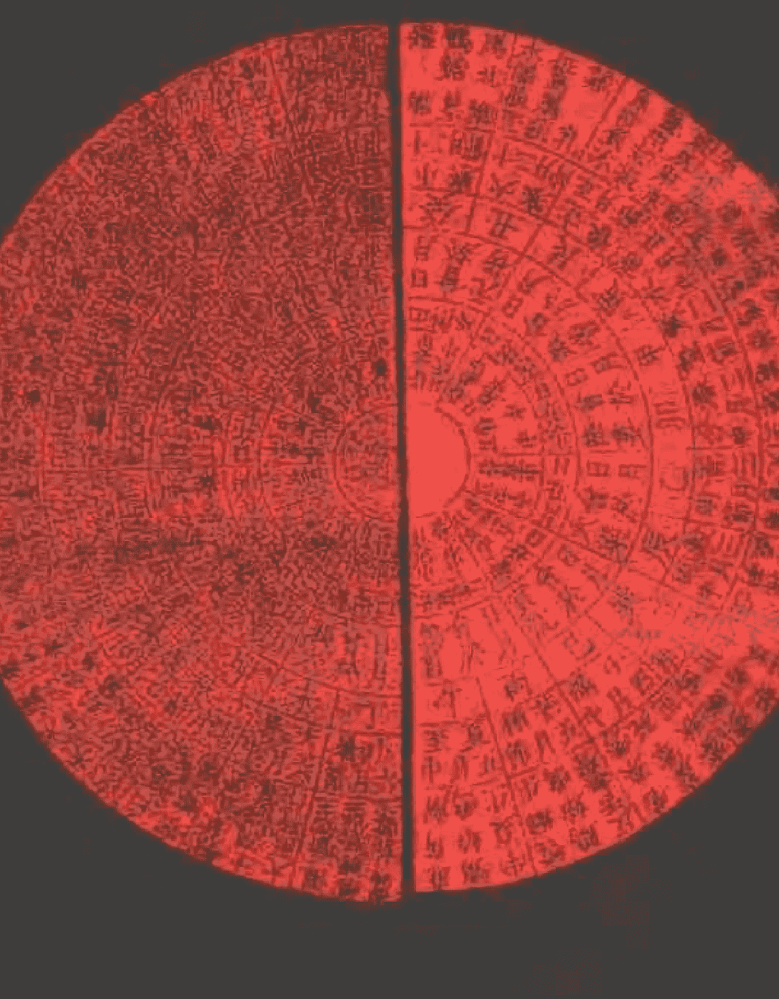

# 神课大全

# 神定经
鬼撮脚

# 金口诀

# 六壬神课大全

——金口诀·鬼撮脚·神定经

夏炜 红峰 点校

中州古籍出版社

(豫) 新登字 05 号

# 六壬神课大全

——金口诀·鬼撮脚·神定经

夏炜 红峰 点校

责任编辑 王小方
中州古籍出版社出版发行 (郑州市农业路 73 号)
全国新华书店经销 世界军事印刷厂印刷
850×1168 毫米 大 32 开本 10.5 印张 230 千字
1995 年 3 月第 1 版 1995 年 3 月第 1 次印刷
印数 1—8000 册
ISBN7 — 5348 — 1272 — 0 / B·36
定 价：9.80 元

## 前言

六壬术是一种十分古老的方术。关于它的名称界定和起始创制，前代学人颇有歧见。清人纪晓岚等曾经发表过如下的看法：

六壬与遁甲、太乙，世谓之三式，而六壬其传尤古。或谓出于黄帝、玄女，固属无稽。要其为术，固非后世方技家所能造。大抵数根于五行，而五行始于水，举阴以起阳，故称壬焉。举成以该生，故用六焉。其有天地盘与神将加临，虽渐近奇遁九宫之式，而由支干而有四课，则亦两仪四象也；由发用而有三传，则亦一生二、二生三、三生万物也。以至六十四课，莫不原本羲爻，盖亦易象之支流推而衍之者矣(《四库全书·六壬大全提要》)。

纪晓岚等认为，六壬“大抵数根于五行，而五行始于水，举阴以起阳，故称壬焉；举成以该生，故用六焉，”可备一说。清人俞正燮在其《癸巳类稿》中，对六壬术的起始作了详尽的考辩，他说：

六壬之起，《道藏》谓自黄帝，名六壬者，神机制胜。《太白阴经》云：“玄女式者，一名六壬式，玄女所造，主北方万物之始，因六甲之壬，故曰六壬。”《武经总要》云：“六壬之说，大衍数谓天一生水，始于北方。许慎《说文》言：‘水者，准也。’生数一，成数五，以水数配之成六壬也。”是唐宋人有二说(《癸巳类稿·六壬古式考》)。

《太白阴经》和《武经总要》都是古代兵书，前者为唐李筌撰，后者乃宋人曾公亮、丁度等撰。李筌认为六壬术为玄女所造，已被纪晓岚斥为“无稽”；曾公亮等认为六壬术源出大衍数。

大衍数即五行生成之数，共计50。水生数一，成数五，壬居北方水位，故云“以水数配之成六壬也。”是则纪晓岚之说与《武经总要》颇为相近。俞正燮则认为：“壬术主北方阴。《白虎通》云：‘亥者，阴之始。’又亥位为《易》之乾，为盖天之门。壬寄于亥，名六壬宜也”(《六壬古式考》)乾居亥位，乾数为六，壬又寄于亥，则俞说亦通。六壬之说颇多歧见，纪晓岚、俞正燮等人在阐释自己的观点时，都相当谨慎，或称“大抵”，或云“宜也”，都没有作出完全肯定的论断。究竟怎样解释更切实际，更切情理，相信读者自有取舍。

> > 考《国语》伶州鸠对七律，以所称夷则、上官、大吕、上官推之，皆有合于六壬之义。然特以五音十二律定数，未可即指为六壬之源。《吴越春秋》载伍员及范蠡鸡鸣、日出、日映、禺中四术，则时将加乘与龙蛇刑德之用，一如今世所传。而《越绝书》载公孙圣亦有“今日壬午时加南方”之语，其事虽不见经传，似出依托。然赵晔、袁康皆后汉人，知其法著于汉代也。

赵晔、袁康都是东汉人，他们的著作中出现六壬术，可知在他们之前六壬术已经流传；其二，在已出土的六壬式盘中，据考古学家鉴定，有几种为汉代六壬式盘；其三，《汉书·艺文志》“五行家”有《转位十二神》、《羡门式法》、《羡门式》三书。其《转位十二神》一书，或疑为六壬术著作。六壬式盘由天盘、地盘组成，天圆地方，天盘嵌在地盘当中，可以自由转动。天盘上刻有十二神将，天盘转动时，十二神将方位随之转动，所以有人认为转位十二神即六壬十二神。若如此论，《转位十二神》是六壬术著作似无可疑，是则六壬术流行的年代当不迟于西汉。俞正燮通过对《吴越春秋》《越绝书》《汉书·艺文志》等书有关记载的考证，甚而提出了六壬式法“是秦汉相传古法”的说法。基于上述三种理由，可以说，在没有新的史料发现之前，将六壬术的流行年代界定在东汉之前，大抵是不错的。

作为一种推论人事吉凶祸福的方术，六壬术和奇门遁甲、太乙九宫一样，都是依阴阳五行、九宫八卦、干支生克、河洛之数作为理论基础的。不同的是，六壬术主要是据神将加临日辰推论吉凶，俞正燮所谓“以日在加时所临之方为断”是也。十二将即亥为登明正月将，戌为河魁二月将，酉为从魁三月将，申为传送四月将，未为小吉五月将，午为胜光六月将，巳为太乙七月将，辰为天罡八月将，卯为太冲九月将，寅为功曹十月将，丑为大吉十一月将，子为神后十二月将。十二将为时间之神，主月日辰。另有十二贵神主方位，前一腾蛇丁巳火，前二朱雀丙午火，前三六合乙卯木，前四勾陈戊辰土，前五青龙甲寅木，中央天乙贵神己丑土，后一天后癸亥水，后二太阴辛酉金，后三玄武壬子水，后四太常己未土，后五白虎庚申金。十二月将加临十二贵神，自然产生某种生克制化的关系，而吉凶祸祸，就蕴乎月将贵神的生克制化之中。此外，月将、贵神以及人元、地分都有相对应的人事，其吉凶祸祸因而也就有了不同的指代。这样一种术数虽经历代术士的纷饰神化，但明眼人仍不难从中看出症结所在。它以某些先验的东西作为前提，然后根据这些前提进行推论或比附。如果承认或肯定它的前提，就很难对其推论的结果表示怀疑；如果否定其先验性前提所具有的价值，则其推论的结果就很难令人相信了。而事实上，包括六壬术在内的许多古代术数的先验性前提，都不是那么无懈可击的。只要能够深入其中，就不难作出正确的抉择。

见诸记载的六壬类著作，大都归于五行类。《隋书·经籍志》有《黄帝龙首经》二卷，《玄女式经要法》一卷，《新唐书·艺文志》有十余种，《宋史·艺文志》有三十种，焦竑《经籍志》所列六壬类著作多达八十三种。由于年代久远，且屡遭兵火战乱，大都已经散佚，今所见存且又流传较广者，唯《六壬大全》(题怀庆府推官郭载騋校)、《景祐六壬神定经》、《大六壬苗公射覆鬼撮脚》、《六壬神课金口诀》等数种而已。《六壬大全》见载于《明史·艺文志》，收入《四库全书》，已有排印本行世。《景祐六壬神定经》为宋人杨维德所撰，郑樵《通志·艺文略》和《宋史·艺文志》皆著录《神定经》十卷，今所见者乃是收入《仰视千七百二十九鹤斋丛书》的二卷本。据戴望和赵之谦跋，此书原为明人写本残帙，赵之谦于清同治乙丑(1865)年二月，以五百钱易之敝肆故纸堆中。《大六壬苗公射覆鬼撮脚》三卷，不题撰人，收入清人高承勋编纂的《续知不足斋丛书》。以上二书均收入王云五主编的《丛书集成初编》。《六壬神课金口诀》题署洞春道人杨守一精阅、钟谷逸士熊大木校正、金谷居士周敬弦重订。杨守一、周敬弦二人生平行实不详，亦不知为何时人。唯钟谷逸士熊大木与明代作家熊大木名号同。若果为一人，则此书在明代已经流传。是书流传于坊间，在民间有较大影响。但坊间流传的《六壬神课金口诀》错讹衍缺甚多，不堪卒读，给读者造成很大不便。此次校点整理，正误纠讹，补缺削衍，力求给读者和研究者提供一个有价值的读本。不妥之处，尚望方家同好教正。

夏炜

一九九四年十一月十二日于郑州

# 目录

前言

- 大六壬金口诀 .............................................................. 1
- 大六壬苗公射覆鬼撮脚 ............................................. 251
- 六壬神定经 ............................................................... 291

# 大六壬金口诀

# 目录

- 卷之上 …………………………………………………………………… 13
- 消息妙论 …………………………………………………………… 13
- 入式歌解 …………………………………………………………… 13
- 十干所属 …………………………………………………………… 24
- 十二支所属 ………………………………………………………… 24
- 十二将所属 ………………………………………………………… 24
- 十二贵神所属 ……………………………………………………… 25
- 贵神治旦暮 ………………………………………………………… 25
- 贵神起例 …………………………………………………………… 26
- 五子元遁起例 ……………………………………………………… 26
- 四象所属图 ………………………………………………………… 27
- 五动爻诵 …………………………………………………………… 28
- 干类 ………………………………………………………………… 30
- 神类 ………………………………………………………………… 31
- 将类 ………………………………………………………………… 31
- 方类 ………………………………………………………………… 32
- 三动 ………………………………………………………………… 32
- 五合 ………………………………………………………………… 33
- 三合全身 …………………………………………………………… 34
- 虚一待用 …………………………………………………………… 35
- 三奇德秀 …………………………………………………………… 35
- 一类朝元 …………………………………………………………… 36
- 四位俱比 …………………………………………………………… 36
- 五比同类 …………………………………………………………… 37

# 六壬金口诀目录

- 千元类 ······························································································ 37
- 五行气化 ························································································· 38
- 阴阳相生 ························································································· 38
- 四位相生 ························································································· 39
- 四位相克 ························································································· 39
- 四爻生克颂 ······················································································ 40
- 应期合德 ························································································· 41
- 贵神休旺 ························································································· 42
- 五行休旺 ························································································· 42
- 五行聚管 ························································································· 43
- 五行例断 ························································································· 50
- 四位内见五行 ···················································································· 51
- 贵神临劫煞 ···················································································· 52
- 贵神值人元 ···················································································· 54
- 贵神临神煞 ···················································································· 55
- 魁罡所临 ························································································· 55
- 传送所临 ························································································· 56
- 飞符加年月日 ···················································································· 57
- 丧门加年月日 ···················································································· 57
- 天鬼加年月日 ···················································································· 57
- 天罗地网加年月日 ················································································ 57
- 关隔锁 ····························································································· 58
- 旬中空亡 ························································································· 58
- 四大空亡 ························································································· 59
- 四绝 ································································································ 59
- 四败 ································································································ 60
- 月建旺相 ························································································· 60
- 月破休囚 ························································································· 61

# 六壬金口诀目录

- 岁君建破 ·················································································· 62
- 论岁神 ······················································································ 62
- 合用神煞 ····················································································· 63
- 五鬼歌 ······················································································· 66
- 四象五行图 ··················································································· 67
- 十干生克所主 ················································································· 67
- 十二支生克所主 ··············································································· 68
- 贵神休旺所主 ················································································· 68
- 将神源会所主 ················································································· 73
- 十二贵神临本位所主 ········································································· 75
- 十二贵神见五行所主 ········································································· 76
- 十二将神见五行所主 ········································································· 77
- 神将同用神所主 ··············································································· 78
- 神将所属图 ··················································································· 80
- 次客法 ······················································································· 83
- 推行年法 ····················································································· 84
- 论人行年吉凶 ················································································· 85
- 行年灾福歌 ··················································································· 85
- 四课假令 ····················································································· 87
- 被头星 ······················································································· 91
- 卷之中 ······················································································· 92
- 十二将神所主歌 ············································································· 92
- 十二神将歌解 ··············································································· 93
- 十二贵神所主歌 ············································································· 96
- 十二地支并贵神所主 ········································································· 99
- 人元吉凶所主 ·············································································· 101
- 四位五行所主 ·············································································· 102
- 四位杂断歌 ················································································ 104

## 六壬金口诀目录

- 上局论灾福歌 ........................... 105
- 中局论妇女 .............................. 106
- 下局论生产 .............................. 107
- 贵神临十二位所主 ......................... 107
- 螣蛇临十二位所主 ......................... 109
- 朱雀临十二位所主 ......................... 110
- 六合临十二位所主 ......................... 112
- 勾陈临十二位所主 ......................... 114
- 青龙临十二位所主 ......................... 115
- 天后临十二位所主 ......................... 116
- 太阴临十二位所主 ......................... 118
- 玄武临十二位所主 ......................... 119
- 太常临十二位所主 ......................... 121
- 白虎临十二位所主 ......................... 122
- 天空临十二位所主 ......................... 124
- 功曹临十二位所主 ......................... 125
- 太冲临十二位所主 ......................... 126
- 天罡临十二位所主 ......................... 126
- 太乙临十二位所主 ......................... 127
- 胜光临十二位所主 ......................... 127
- 小吉临十二位所主 ......................... 128
- 传送临十二位所主 ......................... 128
- 从魁临十二位所主 ......................... 129
- 河魁临十二位所主 ......................... 130
- 登明临十二位所主 ......................... 130
- 神后临十二位所主 ......................... 131
- 大吉临十二位所主 ......................... 131
- 重付贵神断例 ............................ 132

## 六壬金口诀目录

- 六十甲子铃 ........................................ 137
- 六十四课铃 ........................................ 143
- 云霄赋 ........................................ 157
- 三才赋 ........................................ 159
- 金兰略 ........................................ 161
- 玉华略 ........................................ 162
- 定寿经 ........................................ 163
- 兴明经 ........................................ 163
- 金镜歌 ........................................ 164
- 玉镜歌 ........................................ 165
- 卷之下 ........................................ 166
- 射覆门 ........................................ 166
- 四法须知 ........................................ 166
- 射覆歌 ........................................ 166
- 十干颜色 ........................................ 169
- 支干数目 ........................................ 169
- 五行数目 ........................................ 169
- 射物所在 ........................................ 170
- 射人身上衣物 ........................................ 170
- 占来意歌 ........................................ 170
- 都解歌 ........................................ 171
- 占来意例 ........................................ 172
- 天时门 ........................................ 172
- 占风雨 ........................................ 172
- 五行所主 ........................................ 173
- 地理门 ........................................ 173
- 占田禾 ........................................ 173
- 占穿井 ........................................ 173

## 六壬金口诀目录

- 人事门 ················································ 174
- 占人形貌 ··············································· 174
- 占人贵贱 ··············································· 176
- 占阴人贵贱 ············································· 176
- 占阴阳贵贱 ············································· 176
- 占阴阳老小 ············································· 177
- 贵人受克伤阳人老小 ································ 177
- 贵人受克伤阴人老小 ································ 178
- 占年中吉凶 ············································· 178
- 占月下吉凶 ············································· 178
- 占日时下吉凶 ·········································· 178
- 占婚姻 ··················································· 179
- 十干形貌 ················································· 180
- 占人身上瘢靥 ·········································· 180
- 占人物好与不好 ······································· 180
- 占孕育 ··················································· 181
- 占官禄 ··················································· 181
- 占官高下 ················································ 182
- 占官职位 ················································ 182
- 占有无出身 ············································· 183
- 占文武官职 ············································· 184
- 占文书动用 ············································· 184
- 占词讼 ··················································· 184
- 占对讼 ··················································· 185
- 占谒贵人 ················································ 185
- 占见贵求财 ············································· 186
- 占向何方吉 ············································· 186
- 占出门见验 ············································· 186

## 六壬金口诀目录

- 占出门应候 …… 187
- 占出行 …… 188
- 占远行 …… 189
- 占出行乘舟 …… 189
- 占行人 …… 190
- 占交易 …… 191
- 占求事 …… 191
- 占求财 …… 192
- 占买卖求财 …… 192
- 占博戏 …… 193
- 占失脱 …… 193
- 占逃亡 …… 193
- 占奴婢走失 …… 194
- 占捕逃亡 …… 195
- 占病疾 …… 195
- 占五藏症候 …… 196
- 占病症候 …… 196
- 占得病因由 …… 197
- 占病歌 …… 197
- 占病愈不愈 …… 197
- 占病痊除 …… 198
- 占病有祟无祟 …… 199
- 占病都解歌 …… 200
- 占求医 …… 200
- 占梦吉凶 …… 201
- 贼盗门 …… 201
- 占临敌 …… 201
- 占游都鲁都 …… 202

## 六壬金口诀目录

- 占失盗 .................................................... 202
- 鸟兽门 .................................................... 203
- 占禽噪吉凶 ................................................ 203
- 占失牛马 .................................................... 203
- 占失六畜 .................................................... 204
- 饮食门 .................................................... 204
- 占饮食 .................................................... 204
- 占菜蔬 .................................................... 205
- 占食器 .................................................... 205
- 宅舍门 .................................................... 206
- 玄女射宅歌 ................................................ 206
- 占宅外景 .................................................... 207
- 占宅外景入式 ................................................ 207
- 占宅内景 .................................................... 209
- 占宅内景入式 ................................................ 209
- 占宅外景歌 .................................................... 211
- 将神入宅内景 ................................................ 212
- 贵神入宅内景 ................................................ 213
- 占宅吉凶 .................................................... 214
- 将神入宅吉凶 ................................................ 214
- 贵神入宅吉凶 ................................................ 215
- 占宅内兴耗 .................................................... 216
- 占家中百怪 .................................................... 216
- 占修宅舍吉凶 ................................................ 217
- 占接屋梁柱 .................................................... 217
- 占移居吉凶 .................................................... 218
- 营地门 .................................................... 218
- 占坟地景 .................................................... 218

## 六壬金口诀目录

- 占墓外景入式 …… 219
- 占墓吉凶 …… 221
- 占墓内灾福 …… 222
- 占开墓见景 …… 222
- 占墓外景 …… 224
- 占别墓及死因 …… 225
- 占墓内是阴人阳人 …… 225

附:

- 神枢经 …… 227
- 壁玉经 …… 245

## 卷之上

## 消息妙论

凡占课，入式歌言其大象，五动爻观其大意，以格局看其事体，凭驿马神煞定其吉凶，以空亡月破支干三合六合验其成败，潜心推测，无不神妙。

## 入式歌解

入式之法妙通玄，月将加时方上传。更看何神同何位，日干须用五子元。

解曰：凡课有四位：一地分、二月将、三贵神、四人元。一地分，是问课人所立之方或所坐之方是也。二月将，是正月登明从亥逆周十二位以定十二月也。三贵神，是天乙贵神也，照甲戊庚日牛羊之例，其用牛羊二位取昼夜以行顺逆之义。四人元，是五子元遁“甲乙还生甲”也，以所占之日依例而取○假令二月戊将丙寅日午时以申地占之，就用月将加子午上，数至申地行子将神后，仍起贵神。丙丁猪鸡位，将贵字加亥上，顺数至申得玄武。戊子九地丙辛从戊子，于子上数至申，亦得丙字，属火，地支申字属金，贵神将神属水，以其生克制化而定吉凶。余例仿此。

## 克者为无从旺断

解曰：为无者，是四位内俱无克，只取旺神为用，故曰从旺断。

## 五行之内细推元

解曰：只四位内辨五行有克无克，以见吉凶。

## 更将神将详凶吉

解曰：以贵神为主，主者，尊神也；以月将为相，相者，取事也。以十分灾福为率，有七分在此二神。分辨兼有首尾，首尾者，人元地分也。以其始事故为首，以其成事故为尾。至于论一课之首尾，则人元为首，而地分为尾矣。是以贵神与人元分其宾主，将神与地分分其财宅，又神与将各定善恶，以断休咎。将也，神也，人元也，分下中上为初中末。及其断灾福，亦看地分取之。

## 方察来人见的端

解曰：察来人方位，问从何方来，为发课首。十二地分上有十二将神，又有十二贵神，上有人元。官于四位内察之，若从吉神上来，主有财帛之喜，迁进之事。仍详旺则成，合处详。百事无凶。若从凶神凶位上来，多主逃亡、走失、争斗、狱讼、官灾、疾病之事。又以方位知来意，以坐位知灾福，以来人命上知成败。用日辰定之，后取时立成四位消息，推详无不神验。

## 二木为爻求难得

解曰：占课时须审四位，如四位内见二木，不宜求望，或难得也。○假令地分在寅上，遁得太冲，是二木也。若贵神是水，水下生二木，卯为门户，应财在门，地分为寅，寅为财帛。此二木得水，化为生气，亦有喜事，七里应之。更人元见上神，又以财帛课论之。土为我身，更贵神克天后水，主客旺也。二木化为财帛，更逢克人元，必有大喜应之。虽有二木，又何难求？审而用之，慎毋执一。

## 二土比和迟晚看

解曰：四位内见二土，主客作事迟晚，纵虽有成而主迟也。○假令其家求财或财帛，于四位内见二土。或地分是土，或人元是水，却主有喜事两重也。更得贵神是木，木为主人，主自克财，土皆无气，财反遥克人元，主客又相生，故家财必得矣。虽见二土主迟滞，然求之立有大喜两重应之。

## 二金刑克都无顺

解曰：四位内见二金，主凶，又主不顺。○假令人元是金，贵神亦是金，月将是木，更相刑杀，故凶，主亡妻，为二金克木故也。后取二金下克贵神，亦主破财，蚕丝不成。○假令将神是金，贵神是金，人元是木，上克人元，亦为二金，须主官事、灾厄，更嫌恶煞交加，然客受刑责，占讼用之，我获吉矣。又加二金在两头，上下见水及土，主有喜事；又如水在中心，主家产女子；如土在中心，主子孙出外为商旅；如上下比和，必有进财添田土之喜，不然移宅应之。

## 二火为灾百事残

解曰：谓四位见火为凶，二火虽凶，却不知见之，殊有喜者。○假令南方午地为一火现，得伏吟胜光火，见临午地，若又得朱雀在上临其家，其人元又得土化为我身，其家必大富也。若二火二水，百无一好，亦主大凶。水上主失财，水下家不和。若二水在两头，主妇人生产。若二土在上，主夫妻不睦，须分难也。

## 二水皆为大吉象

解曰：见二水不必便以喜用，不必便以凶断，须明神将，以定吉凶。四位之中见二水，或比和，或间隔，或冲刑，或被杀；或生或克，亦无体也。○假令伏位是子，外为二水，上见二土，必伤人二口，又须破财，盗贼相谋害也。又如二火在上，必有官事分离之忧；如二木在上，出外求财大喜也；见二木内有青龙，主财帛；如见六合，只主成合婚姻，及会交关役吏；如见火在木上，主有女嫁出；占宅，主南面展出。又如二火在上，二水在下，必出劳病死者。二水在上，二火在下，出产死鬼，主妇嫌夫。

# 大六壬金口诀

## 水来入火妇难安

解曰：水来克火，以巳火为将，立于四季土上，是火无根蒂，更被水来克，而人元不救，主妇人心痛死也。假令贵神带休衰气，而亥子来克，占身主父母死亡。三水上克下，火不能生，其家必主死三口，二水上克下主死二口，一水克二火只主事为灾。以上二说更要详旺相休囚而决。

## 金入木乡忧口舌

解曰：金入木乡，以申酉加临寅卯，内有冲刑。更上见朱雀、螣蛇，口舌斗争。或见辰戌发用，无不争讼也。

## 火临金位有屯蹇

解曰：谓巳午火临申酉也，如上更见玄武，主贼谋文状论，或见官争田土而必失理。若现贵神，主许了口愿。若更见青龙，亦主官事为挠，或争财帛金银也。若更见六合，主官事门上追呼。若更见巳午，主忧怪血光。

## 木来入土为刑狱

解曰：木入土者，谓辰戌二神在巳亥上，又上见青龙六合，是为木入土也。更上见金，则其罪不轻，主斩杀厄。土在上主刑徒，又主争财帛，见火主白光。

## 土行水上竞庄田

解曰：谓辰戌丑未加临亥子也，主争田庄。如不见四季土，只勾陈临月将或亥子上同，或玄武临，大吉，亦同。又取朱雀临未，腾蛇临亥子，亦主争斗之事。

## 上克下兮从外人，下克上兮向外迁

解曰：事有从外起者，有从内起者。凡人元克贵神、克将神，或重重自上克下，皆主事从外入也。凡将神克贵神，贵神克人元，或重重自下克上，皆主事从内起也。

## 主克客兮来索物，客克主兮客空还

解曰：此以身占言之，贵神为已。以求财言之，即以贵神为财，人元为主。以主怒客，故来索物。以客伤主，故主畏避而客空还。凡有求索，皆详主客，主客不睦又何得之？

## 四位相生百事吉，内有刑克忧患缠

解曰：凡四位相生，占无不吉，相克则无不凶。现看何位受克，克人元主官事，克贵神伤尊长，克将神伤妻，克地分伤小口。凶神有生，凶中获吉，吉神有克，吉中隐凶。

## 但取寅申为贵神、子午卯酉吃食言

> 巳亥常为乞索物、小吉妇人酒食筵。

解曰：寅为天吏，申为天城，故为贵客。小吉主妇人酒食宴会，亦可以邀侯用也。子午卯酉为吃食果物类，巳亥为乞索之物，亦可以为财。射覆用此课，灾祸亦准此。

## 水土金火为窑灶

解曰：四位内各依所属，主争田土。如占宅必因而窑灶，占怀中所藏是瓦器。

## 庚辛磁磨及门窗

解曰：月将加正时行到本位上，见庚为磨，见辛为础，见庚为门，见辛为窗，亦为水道也。

## 庚午改门并接屋

解曰：如人元见庚加于午，必是改门，主南而展接。不然接其门，或西南一根柱增接来也。如见二金，更主增接椽也。如上克下，其家左侧必有石头。

## 四孟相生有草房

解曰：四孟者，寅申巳亥也。假令行五子元遁见壬寅、戊申、乙巳、辛亥，是为相生，其家必有草房。

## 丙丁旺处人最恶

解曰：凡课宅，更看四位是何神乘旺，不惟在高屯上住，主其家人必恶而狠戾也。水主沉溺，木主不义，火主贼谋，金主不顺。依此为类推之。

## 与姓相生子孙昌

解曰：即旺辰与本姓相生，主子孙昌盛。假令课内火旺，又是角徵宫姓人占之，是宅有气又相生也。

## 四位相刑主有克，上下相生福满堂

解曰：凡课，人命前五辰为宅，命后三辰为庄。假令卯生人问课，即申是宅，便于宅上作方位，立成四课，相生吉，相克凶。如四位内三上克下，主破了天窗。三下克上，主屋舍必塌，又主破财。亦有子孙独弱不均，其后主有后富也。三下克上，此课主官事重重，多有患，头目之人最凶。若四位内二下克上，亦主官事病患。二上克下，主杀妻男。故云上克下兮宅必下，下克上兮岭头庄。此宅亦主破财也。

## 上克下兮宅必下

假令十月将是寅，甲子日寅时以辰为位，上见天罡为伏吟，辰为冈岭之神。又上见六合木，木克两头，其家主不和，更无祖父。为木克天罡，又人元是戊，其与辰皆为一家，上克之，主兄弟分张。更木在中心，土在两头，大者主会争官事，小者适远，必主其庄在东西侧下住也。

## 下克上兮岭头庄

假令十月将，甲子日、亥时、巳位，传见申临巳，亦为下克上，又得勾陈在上，其庄在南山侧下，门而西关也，不然去西，其妇人争张。凡占宅，四位内见火旺，主宅在高冈上，其宅与其姓相生有气，主大喜。如姓旺气在丙却克於下，主家内有分张事。其家主虽有旺气，主家人必凶恶也。四位内见土旺，主宅必重冈上住也，其家必有坟墓，或近丘墓住。若土上见木，必主疾病痛苦死之人。四位内见木旺有官事，其家主新居屋舍，必林木蔚茂，兄弟不义。如木上见金，亦主斗讼。木上见水，主财帛之喜。木上见火，主家内生女子。如火上见火，主空中阴火患病。四位内见金旺者，金为克刑之神，主其家斗讼，兄弟不义，合出军人，入庙出武贵，亦主人凶恶也。如旺金上见土神，主多般灾厄。比和合，主先凶后吉也。如金上见木，主伤六畜。见火大凶，又主官事，患病者愈凶。如金上见水，主大吉。若是玄武水，主作偷盗之人。四位内见水旺，主出作贼人。其宅当近河，有水灾，出鬼貌子孙，亦常为贼侵害也。火在上主产厄，在下夫妻不和，木上有财帛之喜，见金亦喜。上见土不利产妇，或水气残病死也。

## 甲乙为林单见树

解曰：如人元元遁上，见甲乙行到本位，必为林木。如单见，或为双树子，或为单树子。如甲乙临水，其家必有菜园，内有小树子一棵。如甲乙行土上，其树必有桔枝。如甲乙临火，主有火，树子亦焦乾，必然有溪。如临金亦主有树木，其树必虚空，多是槐树也。

## 见金枝损及皮伤

解曰：行人元两遍，只依人元上取之。如甲乙对冲庚辛，被庚辛遥克，其树必无枝与皮也。见阳克枝，见阴克皮。

## 丙丁旺处为高岭

解曰：亦行人元两遍，如见丙丁旺处，为有高岭横冈，若临子丑亦同，临午未为东西横，临寅卯辰巳申酉、戌亥为南北横。更水冲道，亦为水沟穿之，上有克为高冈，如丙丁临寅卯木位，必有山林也。

## 庚辛为斜道宜详

解曰：亦行人元两遍，其东西南北亦依前法。在四孟上见庚辛，其道必斜。又云干为大道，支为小道。如火对冲为岔道，必分头去也。如临本位，必为大道。若别位上见之，为小道也。

## 戊己为坟看旺处

解曰：亦行人元两遍，为法，若临旺处无克，必有山墓。课内死者患何病而死，亦依后占法断之。若要见着何色衣服，再以人元两度遁之，只用纳音推其颜色也。

## 土为坟陇痛苦殃

解曰：如戊己在庚，或在寅木位上，其坟痛灾，或主墓穴倒塌，必曾展来。如见青龙六合，墓上必有花树子也。

## 壬癸长河及沟涧

解曰：人元见癸为河涧，纳音见水必有木。若被戊己对冲虎为道。又云河与道交遇，如见大吉，必有土桥。见太冲有船及桥，亦必有车。

## 湾环曲折见刑伤

解曰：壬癸为河涧，如见壬寅癸卯，其河南北长，水向南流，为南见丙丁在前也。故旺处刑克，即止却前。见辰暗克，水必向东西。故主南去，须向北入乾，为下克上故如此也。

- 大树死时家长死，水上来穿近涧傍。
- 贵神神祠并宅道，太阴碓磨共相连。
- 前一腾蛇为窑灶，朱雀巢窝有克伤。
- 六合树木看生死，勾陈渠涧土堆滩。
- 青龙神树并枪刃，天后池塘涧水泉。
- 玄武鬼神并图书，太常酒食五谷昌。
- 白虎道路及刀剑，天空庙宇道僧仙。
- 此是孙宾真甲子，天地移来掌内观。

## 十干所属

甲乙丙丁戊己庚辛壬癸。甲乙东方木，丙丁南方火，庚辛西方金，壬癸北方水，戊东西土阳，己南北土阴。

## 十二支所属

子丑寅卯辰巳午未申酉戌亥。寅卯木，巳午火，申酉金，亥子水，辰戌丑未土。

## 十二将神所属

亥为登明，正月将，诹訾阴水；戌为河魁，二月将，降娄，阳土；酉为从魁，三月将，大梁，阴金；申为传送，四月将，实沈，阳金；未为小吉，五月将，鹑首，阴土；午为胜光，六月将，鹑火，阳火；巳为太乙，七月将，鹑尾，阴火；辰为天罡，八月将，寿星，阳土；卯为太冲，九月将，大火，阴木；寅为功曹，十月将，析木，阳木；丑为大吉，十一月将，星纪，阴土；子为神后，十二月将，玄枵，阳水。

## 十二贵神所属

天乙贵神己丑阴土，前一螣蛇丁巳阴火，前二朱雀丙午阳火，前三六合乙卯阴木，前四勾陈戊辰阳土，前五青龙甲寅阳木，后一天后癸亥阴水，后二太阴辛酉阴金，后三玄武壬子阳水，后四太常己未阴土，后五白虎庚申阳金，后六天空戊戌阳土。

## 贵神治旦暮

经曰：天乙贵神在紫门外，乃天皇大帝下游十二辰位，家居己丑，于斗牛之次执玉衡，均同天人之事。不居魁罡者，以河魁主狱，天罡主牢故也。甲戊庚日旦治小吉，乙己日旦治神后，暮治传送，丙丁日旦治登明，暮治从魁，六辛日旦治胜光，暮治功曹，壬癸日旦治太乙，暮治太冲。天乙在东，南前北后。天乙在南，东前西后。天乙在西，南前北后。天乙在北，东前西后。当地户背天门，以天门地户为界，昼夜有长短，晨昏有早晚。故以星没为旦，星出为暮，则旦暮所临可知。

## 贵神起例

甲戊庚牛日顺行，其他书以甲戊兼牛羊，庚辛逢马虎之例，非也。其神术非他术比，其用甲戊庚，乃天上三奇，故不可行也。羊夜逆行，乙己鼠日顺行，猴日夜逆行，丙丁猪日顺行，鸡夜逆行，壬癸蛇日逆行，兔夜顺行，六辛逢马日逆行，虎夜顺行，此是贵人方。诀曰：右法就以所值某宫贵字顺逆数至用位是也。

- 月将加时顺究，只寻天神等候。
- 从戊至巳逆行，从辰到亥顺就。
- 贵腾朱六勾青，空白常玄阴后。

## 五子元遁起例

- 甲乙还生甲，乙庚丙作初。
- 丙辛生戊子，丁壬庚子居。
- 戊癸是壬子，时元从子推。

## 四象所属图

- 一地分 田宅 子孙 奴仆 鞍马 六畜
- 二月将 己身 妻 财 亲戚 内
- 三贵神 主 宰相 臣 父 官禄
- 四人元 客 天 君 祖 外

> 诀曰： 凡将阳用取阳为由，阴用取阴为由，阴阳之用值空亡克煞为用之虚。三阴一阳，以阳为用，取象少阳，事在男子。三阳一阴，以阴为用，取象少阴，事在女子。二阴二阳，以将为用，随将阴阳辨之。纯阴反阳，以将为用，方内之物。

> 解曰： 宜主不宜客，利内不利外，城郭内藏之物，阳人出外，双暗月新明。

> 纯阳反阴，以神为用，方外之物。

> 解曰： 宜客不宜主，和不和内，四远所藏之物，阴人还家，双明月新暗。

> 诀曰： 发用空亡，事多虚假。五动空亡，事多不成。凡课以发用为由，五动为发用之门，为万物本体。作课者不识动用之门，如虚实将半无能决也。

## 五动爻谛

干克方为妻动　歌曰：
妻动于妻妾，占事主于妻妾。
官财防损折。有官求财不利，而有损折。
占人人在家，上克下，寻人在家。
访人人不见。上隔克下，行必有阻，访人在家，主不悦。
外旁来索取，外来克内，必有人来取索，或干预于我。
卑下有口舌。卑下受克，须防口舌外来。
论物多翻正，财覆上克下，论物以翻为正。
下旁或有缺。下受克，物器一旁有缺，或无足。

神克干为官动　歌曰：
官动利求官，官禄爻动，官职大利。若逢驿马，必然迁官转职。
相逢禄位迁。谓逢二马，占官有迁擢之兆。
常人公府事，官爻克干，故常人有公府中事。
有官望财难。有官不宜求财，财动伤官，返克故也。
合得官中物，官动而逢合，官中财物可得。
休从外处干。人元受克，事在自己，不宜外求。
得财防暗损，我克外，财须防密失。
问病在喉咽。上受克，病在喉间。

神克将为贼动　歌曰：
- 贼动内贼生，内财受克，主阴谋贼生而盗财物。
- 勾连诈不明。外勾里连，空诈不明。
- 损财卑幼病，妻位受伤，卑幼灾患。
- 谋望必无成。神将贼克，内之不和，谋望无成。
- 架构奸私意，妻财受克，必有奸私架构之事。
- 偷攘宛转名。妻财受克，或生淫荡，宛转偷攘，必有损失。
- 卦爻终暗昧，内爻受克，事主暗昧不明。
- 病恐亦非轻。内不协遂，阴小灾病，亦主非轻。

将克神为财动　歌曰：
- 财动利求财，内克外谓之财动，求财必得。
- 占官定不谐。官爻受克，求官有失，定主不顺。
- 家中人出外，内克外，主人出外。
- 妻妾并身灾。病非妻妾，亦自身有灾。
- 疾病忧难瘥，神受克，病在心胸，无药可治，故主难好。
- 营求喜自来。内克外，营求有喜。
- 财物终有损，神受克，其物必有损。
- 职位恐多乖。官爻受克，故主退失不利。

方克干为鬼动　歌曰：
- 鬼动忧灾怪，占主灾怪及人。
- 官亨人出外。下克上，主仕亨通，人欲出外。
- 事讼带他人，隔位克外，必主讼连他人。
- 乖戾因间外。下犯上，卑偷尊，故曰乖戾。
- 口舌共喧争，人元受克，事从外起，必因口舌致事。
- 冤仇皆损害。因冤仇而损害。
- 痤病物仰合，方克干，病在目下之路上，故曰仰合。
- 家宅未安泰。宅舍不宁，人口不安。

## 干类

干克神 外来取索，若临门，主人谋害自己，常人损财，仕人失位，不宜求干，官事主散，官爻受克故耳。

干克将 求财不得，常人破财，忧病。将阳主本身，将阴主妻室。

干生神 外生助我物帛，或亲友相访，占家主富而有生意，乃外生内也。欲讼者官府中事。

干生将 内外和顺，人将物来送我，或有人干预於我。

## 神类

神生方 宛转和合，贵人有怜小人之意，更得贵人之力。

神克方 隔手求财虽难得，事主晚成。

神生将 所谋顺遂，内外和谐，人将财物助我，行人将至。

神生干 仕人论官，或有相托，常人有官府事，人将物求我，或自己将财求事。于人事求必得，寻必见。

## 将类

将生干 自己将财与贵人，内外和畅，父子亲，夫妇别，富贵之兆，百事有成。

将克干 喜事重重，求财必得，求名必遂，科举上榜，宜远行。

将生方 名曰天覆，家人内合，使令有人助我，主亲人分别远行，财帛有喜，子孙兴荣。

将克方 斗讼官事，小口不安，自身有伤，六畜损失，家宅不宁，财帛破散。

## 方类

方克神 损外财，隔位克，下犯上，民告官。

方克将 钱财散失，又主伤妾，人欲出外失财。

方生神 内外和合，人广财丰，求事不隔手。

方生将 名曰地载，家人和合，喜庆富贵，协顺之兆，婚姻喜美，谋望有成。

## 三动

此不受克，故不入正动数。

方生干为父母动 为印绶。凡占，小干尊，大吉。

干生方为子孙动 凡占，主干子孙之事，小吉。

下方同为兄弟动 凡占，事在比肩朋友，小凶。

## 五合

神与干合为官合 仕人得之荣禄，亦利求官，常人官事。

将与神合为正合 欢美婚姻，会合亲友。不宜占病，求事有成，相依辅共为家室。

将与干合为隔合 内外相望，有人接引，位因阻隔，事体迟留。

将与方合为进合 主人共相用上于道路，以卑动尊，以小致大，事成迟缓。

方与干合为鬼合 求官得禄，仕人升迁，亲俗不和，又主忧患，占病不宜。

解曰：凡干支相合，乃天地阴阳配合之义，万物生成，吉凶全备。且如甲己之日五子元遁起甲子时，则丙寅与辛未合，丁卯与壬申合，戊辰与癸酉合，己巳与甲戌合，庚午与乙亥合，辛未与丙子合。然干支在一旬之内相合者，谓之君臣庆会共句。支干相合者，乃天地德合也。五合之用，事体共为，谋望有成。支干俱合，其物圆类，合中值空。占物圆而中空，求事望而难成。合而不合，分而不分，合中反分，亲人反疏。先合后离，亲而不亲，义而不义。

## 三合全身

寅午戌 名炎上课，为财帛文书喜美之合。忌亥子水为坏局，凡事望而不成。如人元是丙午，则为火局全耳。如人元是庚，则为鬼动克身。或人元是甲为相生。

亥卯未 名曲直课，为交易婚姻和会之合。忌申酉金为坏局，凡事望而有阻。如人元是乙卯，则为木局全耳。如人元是戌，则为官鬼动论之。或人元是寅，为相生。

申子辰 名润下课，为行移干蛊争战之合。忌辰戌土为坏局，凡事望而有阻。如人元是壬子，为水局全耳。如人元是丙，则为官鬼动论之。或人元是庚为相生。

巳酉丑 名从革课，为阴阳淫滥轻薄之合。忌巳午火为坏局，凡事望而有间隔。如人元是辛酉，则金局全耳。如人元是乙，则为鬼动言论之。或人元是戌为相生。

解曰：凡坏局，下克上为迅速，上克下阻隔，中间为坏局。求事一半成也。凡课三合，须待体式全备，吉凶祸福方可言之。克合生合亦以例推。如寅午戌火局全，若神将带壬水癸水为克合，凡事顺中有阻，合而不合，易而不易也。其他三课以为官为鬼者，论四时休旺及空亡所值断之。凡课三合，因变化而全体，切详日冲、月破、空亡、克合，未可一概照合局全身论之。

## 虚一待用

寅午戌合为炎上课，虚一位为炎上破体课。亥卯未合为曲直课，虚一位为曲直破体课。申子辰合为润下课，虚一位为润下破体课。巳酉丑合为从革课，虚一位为从革破体课。

解曰：凡课之合，从化之谓全。身有二字，如虚一字谓之破体。如凡课有戌午而无寅，取寅年月日时为应期。有申子无辰，或有卯未无亥，或有酉丑无巳，凡占人望事，须验远近，如远则年，次则月，近则日时，必待此虚一字透出，共成三合，则行人至，谋望成。此为虚一待用也，最为课中之要论，不可不察。若有日冲、月破、空亡、受制，又当详论。

## 三奇德秀

甲戊庚，此为之德全课。乙丙丁，此为之奇全课。

解曰：凡占课见三奇全，利见大人，百事吉昌，支辰和协，上下有辅，三奇德秀，此皆多庆，孕生贵子。

## 一类朝元

经曰：一类朝元者，是一干见本属三支也。如天乙贵人占得此课，朝亲召封则出，常人不宜，无发用生克故耳。凡十二位神将朝元，如甲见三寅，乙见三卯，丙见三午，丁见三巳，戊见三辰，三戌，己见三丑三未，庚见三申，辛见三酉，壬见三子，癸见三亥，皆为之一类朝元也。占主事体重叠，囚伏不动，无荣无誉，阴隔淹滞，盖有比肩之类，而无父母官鬼妻财子孙，又无生克发用故也。若纯火不可以此论，水木土亦然。

## 四位俱比

- 庚辛申酉金比，西方白虎太阴之象，值之主兵丧讼事，邪淫奸私，人口死凶，六亲刑克，家宅不宁，百事悃吉。
- 丙丁巳午火比，南方朱雀螣蛇之象，值之主有是非官司，灾祸伤残，釜鸣火光，怪忧惊恐，六亲刑克，居处不祥。
- 壬癸亥子水比，北方玄武天后之象，盖水性泛滥，值之主家计流移，奸私邪淫，蛊病水厄，寡妇孤儿，盗侵人害。
- 甲乙寅卯木比，东方青龙六合之象，值之难吉而无生，主仁而无恩，有兄弟而无父母，重婚姻而绝嗣继，求望难成，无兴无荣，艰难之用，凡百蹇滞也。
- 戊己辰戌丑未土比，中央勾陈天空魁罡之象，值之主事体重叠，无父母官鬼妻财子孙，亦无相生相克故也。是土无生育万物之功，不泄秀气，故主淹滞也。

## 五比同类

干方比为正比，事在比肩，多有不成；干神比为近比，事在外干自己；方将比为远比，事在朋友同类；神将比为次比，事在门户亲属；四位比为合比，事在亲属，重叠牵连。

## 干元类

神干生将干，喜从外入。将干生神干，喜从内出。神将二干分局，相生有喜不成。神将二干合局，相生喜庆重叠。神干克将干，祸从外来，与贼动同类。将干克神干，事从内起，与财动同类。

解曰：神将二干，随支辰互相生克，主事交关，往来重叠。神将若是庚辛而克身，主家宅怪异灾讼凶丧，以金有白虎气故也。凡将神上所带之干，如六乙日见卯将，起五子元遁得己卯，神是朱雀，位是壬午，遇有克比，合前式而推来情。

## 五行气化

甲己化土，乙庚化金，丙辛化水，丁壬化木，戊癸化火。

解曰：凡课中唯不见土，若神将上遁得甲与己者，元气连化为土，当作⽤土射覆，则是⼟类，或物出于⼟中，事则以为⼟亦为有⾄，⾄⼟旺⽇时为应期。假令丁壬课得甲⼄戊⾠，以五⼦元遁⾄⽅位⾠，⼈元是甲，且甲⽊下⽣⼰⽕，⽕⼜⽣成⾠⼟，⽌⾒⼟初旺矣。⼜起神⼲⻅⼄，将⼲⻅庚，则⼄庚合⽽化⾦，⾦⽣于⼟，且以⼈元之甲⽊被⾦之伤，⼜当详论。占官⽤以⻤论之，凡占仕则吉，官事则凶，余皆以此为法推之，再加⽇⾠⽉令⽤也。假令甲⼰⻅⼄庚，⼄庚⻅丙⾟，丙⾟⻅丁⽡，丁⽡⻅戊癸，戊癸⻅甲⼰，名⽈受制不化，姑合不化，⾮时不化，逢空不化，⾮其所不化。此系五⾏奥旨，不可不详。

## 阴阳相⽣

经⽈：假令甲⽊⼄草丙⽕丁烟，甲阳⽊⽽燥，故能⽣丁烟。⼄阴草能⽣阳⽕，阳产于阴，阳为⽗。阴产于阳，阴为⺟。若阳⻅阳，阴⻅阴，则是阴阳俪枯，造化危脆，似⽊盛⽽花繁状，密云⽽不⾬。四维之寅申⼰亥，四正之⼦午卯⾣，本以五⾏之相冲于阴阳⽽不育。占此者顺中有隔，吉中有危。

> > 《易》⽈：“天地氤氲，万物化醇，⼥⽉连精，万物化⽣。”

且如寅午戌、⼰⾣丑、申⼦⾠、亥卯未之类，此为阴阳合⽽后能化⽣也。凡五行生我者为父母，阴生阳，阳生阴，德合配偶化育生成，乃吉福万全之课。凡课之四位，上生下，下生上，内生外，外生内，或三位生一位，或一位生三位，及往来或相合相恩者，此发用之美端，谋为之吉兆。占干则成，望事则就。又曰四位相生，万事吉昌。凡课五行相生，唯内有白虎朱雀兼劫煞魁罡之类，而外唯有暴恶之形，皆入相生和气之中，则革面顺徒遇恶则逢善也。殊不知无则为侉离，生则为亲恩，如乘合辰为福愈厚。

## 四位相生

经曰：假令人元生贵神，地分生月将，分曰合局，主家富贵，亦主内外和顺。如月将生地分，主亲戚远行，占身及财帛，当主愿遂，亦主子孙兴旺。人元生贵神，主有亲人来借物，或朋友来相访。如贵神生人元，主自己欲寻人，访之必见。如地分生月将，主婚姻事谋望有就。如月将生贵神，主妻贤子孝，富贵荣华。如四位自上次第相生下，主有外人进纳财物，添进人口，六亲俱来相访，有非常之喜也。如四位自下重重生上，主商途有喜。

## 四位相克

经曰：假令人元克贵神，主有人谋害自己。贵神克人元，主自己欲谋害他人。皆主之事。如将与地分同克贵神，主卑犯尊。如人元与贵神同克将，主伤妻损财。如将是阳支，主伤男子，将是阴支，主伤妻妾。将克地分，主伤小口。看阴阳所属断之，大抵人元是客，贵神是主，客为姓，主为家长。如阴贵神是阴人家主事，如阳贵神是阳人家主事。推休旺老少，如贵神克人元，旺主主得理，人元克贵神，旺客客得理。

# 大六壬金口诀

## 四爻生克颂

解曰：上在下为人，官事起家内。下克上为出，破财出当向外。上生下，他人征用自己。下生上，自己征用他人。象阳人阴，转度元来是阳人，阳将加临阴位也。象阴人阳，共通万物当阴人，阴将加临阳位也。三上克下，家事之课。三下克上，出行之象。主用旺相，吉凶力旺。主用休囚，吉凶力弱。

颂曰：吉能克凶事将空，凶能克吉事难集。方来克将钱财聚，将若伤方斗讼生。位来生客人寻己，干若生方己诲人。二上生下财满荚，二下生上子孙兴。凶神受克，忧患消减。吉神无伤，福庆繁昌。人元不伤，争讼理长。人元受制，争讼无气。主休客旺，我短彼长。位强身弱，我忧他乐。四位相生百事吉，四位相克百事凶。阴多阳少男为事，阴少阳多女子因。

四爻生克颂曰：人元不伤，争讼理长，人元受制，争讼无气。如求财最要主客和合，则终无疑阻矣。客若克主，是干克神也，求事难成，争而得之，或出不得已也。若主克客，是神克干也，求事不遂，当空手还之。人式歌云：客克主兮来索物，主克客兮客空还。二说相同，亦主争讼事也。但人元与贵神相克，谓之外战。将神与地分相克，谓之内战。凡外因外事，内因内事，皆主口舌是非，灾患伤财也。如四位从下次第克上，主其家里勾外连，搬运财物，亦主家人不和，官事口舌，是非伤财刑狱之事，或出残害之人。如四位从上次第克下，主其家不义，多饶疾病官事，外人来谋害家中人也，或家道不兴，人口赢弱，斗讼伤财。

## 应期合德

诀曰：凡课应期最难推测，惟取合处为妙。其合有五，其一取天地合德者，如甲子日课得戊辰将，顺取癸酉月日时为应期。又如甲戌将得己卯合，庚子将得乙丑为合之例。

其二取将干近合为应期。如六乙日得戊寅将，即以癸日时为应期，不必待天地干支全合也。又如甲子日占得丙寅将，近取辛日时为应期可也。干合者，甲己乙庚丙辛丁壬戊癸，盖以将干取合也。

其三取三奇合为应期。三奇甲戊庚、乙丙丁，若课得将干有甲戊而无庚，庚日必应。有丙丁而无乙，于乙日必应。此三合与命家虚拱暗位之说同。

其四取三合为应期。三合者寅午戌、巳酉丑、申子辰、亥卯未，若中有寅午而无戌，在戌月日时必应。待其虚字逗出为应期也。

其五取支六合为应期。六合者子与丑合，寅与亥合，卯与戌合，辰与酉合，巳与申合，午与未合。如月将是寅，取亥月日时为应。如卯将，取戌月日时为应。如酉将，取辰月日时为应。如占行人望事，若旺相带劫杀及天驿马者，逢合即至。如远则年月，如近则时日取合为应期也。

解曰：应期取三合、三奇、六合、干合者，盖取用于所占之课月将与神也。神若得日不出日，得时不出时，止取近合，不必远求。

支俱合也。

又法：课得前一辰遇丁甲者，三旬以内逢本日将为应期。课得后一辰逢丁甲者，三旬以外逢本日将为应期。是丁甲取甲子周数以外，逢本日将为应期。如本位上见丁甲者取日，近遇本日将应期。假令十一月下旬丑将，乙卯日巳时未位，癸水申金卯木未土，此课前一辰上见，三旬内逢本日将应期。本课以乙卯日起五子元己卯将，是白虎带甲木，是将与神干、甲与己合，只取日近，遇本日将为应期，不须待三旬也。

## 贵神休旺

- 六合青龙木为主，绝在申酉并子午。
- 螣蛇朱雀火之精，卯酉亥上元气处。
- 太阴白虎是金神，祸败须防子午寅。
- 玄武天后藏于水，卯酉巳上不堪论。
- 更有天空及勾陈，太常论贵相为降。
- 四神是土同所断，天官休旺得其真。

## 五行休旺

- 春木旺火相土死金囚水休，木墓在未，角姓忌。
- 夏火旺土相金死水囚木休，火墓在戌，徵姓忌。
- 四季土旺金相水死木囚火休，土墓在辰，宫姓忌。
- 秋金旺水相木死火囚土休，金墓在丑，商姓忌。
- 冬水旺木相火死土囚金休，水墓在辰，羽姓忌。

## 五行聚管

缘五行生克离乎盛衰，乃自然之理也，讲此似降于固执，但原道今人不取，故并集以候高明者释之。

> 三水一金主文章，蟾宫折桂意扬扬。禹门浪稳风雷发，不日拖绅上玉堂。

解曰：三水一金，此课主文章之士，不久得官。不然主大富也。遇丙丁在上主发禄，或还官应之。遇水在上主有争讼，外人谋害。若发禄必非丙丁也。

> 三水一木主荣华，田庄浩大足丝麻。子孙定是身端美，兴旺家门福寿加。

解曰：三水一木，此课主家道荣旺，子孙孝顺，庄田浩大，子孙丰淮，兼有文章。

> 三水一火家屡贫，残伤恶死损其人。久患风劳身不遂，终朝何若告天神。

解曰：三水一火主家贫，庄田破散，子孙作贼，多行凶恶，及有刺面三人在外死也。又曰：二说敦是孰非，尤当详辨。

> 三水一火不为灾，局成既济又和谐。田宅六畜多富厚，主有黑衣人间灵。

解曰：三水一火不为灾，然三水克一火，合主凶却无灾。又云水火既济，故主夫妇和谐，子孙兴旺，田宅财帛六畜兴盛。来意为凡人淫乱。

> 三水一土破家门，人亡恶死不堪论。庄田破败难拘管，纵有儿孙贫苦存。

解曰：三水一土，主家破人亡恶死，及主田庄倾败，或有子孙亦贫苦也。

> 三火一木家破财，人多残疾绝后代。家中哭泣不曾住，三女生来多祸害。

解曰：三火一木，主家贫破败，出残疾之人，常有哭泣之声。家中只有三女，并无儿孙，出一房绝。此唯相生，却为凶祸，何也？经曰二火为灾百事残，今见三火，一木又生之，故其祸转深，即以凶断。生三女者，以一木生三火，然三火为纯阴也。来意只为阴人有残患。

> 三火一土破家财，家中人口现多灾。田庄破尽无分寸，纵有儿孙事转乖。

解曰：此课中若见天罡土旺，主家道不和，六畜损伤，走失死亡，人口必患沉疴。来意为官讼。

> 三火一金受灾屯，疾病疮痍不离身。日夜呻吟床枕上，曾需扁鹊治无因。

解曰：三火一金，主有大灾，人口病患，疮痍不休，床席有呻吟之苦，药不能治，又主伤人口，此课百事大凶。来意为伤了人口。

> 三火一水主不良，母行淫乱失田庄。窃盗败来凶恶露，应须刺面配他乡。

解曰：此课主家贫破败，子孙多行凶恶，作贼刺配他方。

> 三木一土家又贫，室中多行不良人。岂凭媒妇相成就，邸店梳妆是立身。

解曰：三木一土，主家破贫乏，兼妇人淫乱，故曰“不凭媒妇相成就，邸店梳妆是立身。”

> 三木一水人少亡，儿郎作事不谋长。又无远行仍无信，虚许多端取祸殃。

解曰：三木一水，主家中兄弟子孙消亡，更为多事，多无远见，全无信约，动作虚诈，主命促也，更家不和。来意只为失财，后主死人，官事应之。

> 三木一火乏资粮，家财破散失田庄。窃盗败来凶恶露，应须刺面配他乡。

解曰：三木一火主家贫，庄田破败，子孙作乱，多行凶恶。

> 三金一水最不强，家中多是恶伤亡。纵有儿郎须天折，丙丁岁内定凄惶。

解曰：三金一水最不嘉，其家主恶伤死者，又主一房遇丙丁岁内定有灾病，田产不遂，多饶官事斗讼，来意只为官事争讼也。

> 三金一火主家昌，福禄资财转富强。屡有贵人来接引，不惟丰富有儿郎。

解曰：三金一火，主家业富贵，频有贵人接引，又主子孙兴盛。一火克三金，合主大凶，却为大喜，以凶中取吉也。法曰：凶中取吉，吉中取凶。此课中深旨也。来意只为争讼，弟兄不义。

> 三金一木多软弱，儿孙生下还无目。眷属阴人频死伤，丙丁之年灾更速。

解曰：三金一木，主子孙羸弱，多有患头目之人，阴人频有伤。此课尤忌丙丁之岁，主大凶。来意只为望远信，求财帛，或作三水一火。

> 三土一水出刚强，胆硬心雄甚勇张。或遇丙丁来发旺，分符还用守忧防。

解曰：三土一水，此课合主刚强之人，胆硬心雄，其家虽破败，若遇丙丁在上主发旺也。

> 三土一木太乖张，儿孙刺面配他乡。家中破财无田产，更有儿孙赴法场。

解曰：三土一木，主事乖张，子孙必有徒配，定家贫破财，亦无田宅，兄弟不义，更有赴法场之人。此课主君不君、臣不臣、父不父、子不子、法无纲纪也。

> 三土一金出英俊，子孙聪慧有名声。敦诗说礼多该博，科甲巍峨锦绣迎。

解曰：三土一金，主出英俊，子孙聪慧，小有文章，出文武官。不然家大富也。来意只为问远行，主吉庆。或作三水一金。

> 二水二金子孙多，有妻端美若嫦娥。此课有家得富贵，钱财菜帛有绫罗。

解曰：二金二水，主子孙荣旺，妻有姿色，其家大富，此课最吉。

> 二木二水克刑伤，尤多劳病面痿黄。子孙官事何常绝，牢狱加临有祸殃。

解曰：二土二木，主有人口伤害劳病，子孙官事牢狱，争讼不绝。此课大凶。来意只为患病死亡，主患风疾，子孙恶疾也。

> 二水一木一土当，性强还恐少儿郎。乞得外姓为儿女，日久年深改赵张。

解曰：此课为刚强之人，亦后嗣不光，主绝嗣也。必以外姓为子，或招婿接脚。又主官事，出残害阴人。

> 二土一水一木伤，有人患害自关防。时常疾病灾无已，死丧年年有祸殃。

解曰：二土一水一木，主伤人口，多饶病患，年年死丧，官事不绝。此课大凶。来意只为他人谋害自己，人口病患。

> 二金一水一木强，家中和会喜非常。更主儿孙多俊丽，丝蚕每岁进田庄。

解曰：二金一水一木，主家庆喜，子孙聪慧，田蚕兴旺，家中和顾。来意只为外人争讼，然二金亦为争讼不顺之神。

> 二木一水一土崩，家中常是有相争。更知后代多淫乱，亦有儿孙向外行。

解曰：二木一水一土，主妇女淫乱，出不良之人，或子孙出外求财不利，故曰二木为变求难得。以二水不能生二木，又被土克生我气，而生气绝矣。来意为求财不遂，家内不和。

> 二水一土一木强，此人应是有田庄。子孙骁俊飞声润，更得丝蚕岁岁昌。

解曰：二水一土一木，主家道荣昌，子孙兴盛，资财进益。此课虽有刑克却有喜者，以我反为木克即以吉也。来意为贼偷了财物，主先忧后喜也。

> 二木一水一金伤，子孙禀性各聪明。田蚕兴旺无灾难，仍有资财喜庆生。

解曰：二木一水一金，此课自下重重生上，故主子孙聪慧，田宅兴旺，资财喜美，来意为出外求财也。

> 二火一金一木伤，有人灾病患头疮。子孙恶逆难调治，人口凋残屡死亡。

解曰：此课来意，只为两阴人患病，又官司牵惹。

> 二金一水一火殃，儿孙多病患头疮。间有一人能好善，也须睁眼外来倡。

解曰：二金一水一火，主有患头目之人，其间有好善者，又有癫狂乱性之人。此课大凶，来意如上。

> 二火一水一土伤，家中淫乱事非常。此课有克家母丧，资财破败落人行。

解曰：二火一水一土，主有刑伤之人，又主阴人不良，亦伤母。来意只为争庄田官事病患。

> 二木一火一土昌，子孙丰骨貌堂堂。田蚕进旺人昌盛，还有官荣耀故乡。

解曰：二木一火一土，主家荣昌，人多好善，进益田宅，子孙兴旺，又主求官有喜，来意只为生一女子。

- 四孟值课为遗失，四仲来人问交易。
- 四季攻激为婚姻，进身或然求信息。

解曰：课值四孟必为遗失，四仲必为交易，四季非姻而问出身也，来意如此。

## 五行例断

- 水加木，买卖交关婚事足。
- 水加金，文书远信酒食迎。
- 水加火，惊恐官灾心痛祸。
- 水加土，防妻破财害田土。
- 土加水，遗忘田土官不喜。
- 土加木，卖却田园分产屋。
- 土加金，竞界争田坟墓侵。
- 土加火，信息田园和会我。
- 金加火，丧却妻儿家痛苦。
- 金加木，分散家财损六畜。
- 金加土，土中金宝藏难聚。
- 金加水，子孙喜事成行起。
- 木加火，多为子孙失小口。
- 木加土，牢狱争财竞田土。
- 木加金，自家财物被人侵。
- 木加水，益进资财事事喜。
- 火加土，争竞财气因妇女。
- 火加木，朋友酒食远相逐。
- 火加金，病死伤亡官事侵。
- 火加水，伤妻损财官事起。

## 四位内见五行

人式云：“四位内见二木，诸事难成”。又云如见二木或见水，却为大喜。问见三木如何，曰主官事缠身。又兄弟三人并无父母，其兄弟三人俱各再娶，更无子孙。问见木如何？曰主官事。其家合主新盖舍屋，家中缺费，惟四壁而已，主贫乏艰难也。

人式云：“二土比和迟晚看。”言诸事求难有成而迟也。如见二土若无克伤，但得比和，安得有滞？若受刑克，亦主淹留。问四位内见三土如何？曰主合有配妇凶恶，诸求不成，又主其家姊妹三人亦无父母也。盖同类为兄弟，生我者为父母，我生者为子孙，克我者为官鬼，我克者为妻财。合四位无相生相克，只有同类，乃是勾陈太常，上者言姊妹三人也。问见四土如何？主无凶也。故曰三土四土，丑妇凶恶，其灾福与上同断。

人式云：“二金刑克都无顺”。二金皆凶神也，亦是白虎之位，兼主不顺。故其家饶斗讼，兄弟不义，妯娌不和。更金上见火，主家死亡人口。问见三金如何？曰主阴人淫乱，家宅不宁，合主门师禳镇其宅，亦死亡人口。又主官事，其灾福亦与二金同断。问见四金如何？曰此位为纯金之象，主君不君，臣不臣，父不父，子不子，紊乱纲纪，其父母兄弟骨肉皆主不顺，最为大凶。

人式云：“二火为灾百事残”。主其家有阴人残恶，更主家人火光焚烧。若火上见二水，主有妇人产死。如二火见二水之上，夫妻不和，休离应之。问见三火如何？曰主阴人官事也，更主阴人残害。此课亦主妇人主家，为纯阴之课，阴旺阳衰也。其家多生女，亦主外人主家，更釜鸣数次见火光应也。问四火何如？曰二火为灾百事残，其三火已为甚，何况四火乎？

人式云：“二水皆须为大吉”。谓见二水，为之大喜，亦不为灾。如上见二土主伤阳人两口，破财贼伤；如上见二火，必有官事伤人；如上见二水，其家主人求财大吉；如上见六合，主婚姻成交，交争役吏也，青龙则为财矣。问如见三水何如？曰其家必有痔痛童男，及有外贼所伤，财物数次其家，亦主水灾，此课大凶。问见四水何如？亦与三水同断，皆主大凶。

## 贵神临劫煞

- 天乙被煞主灾同，贵人厄难有何通。
- 神被将克家长损，神克妻儿鬼哭凶。
- 劫煞腾蛇火现凶，鬼怪颠邪兆宅宫。
- 更主妇人心通病，门椽屋爆影光红。
- 劫煞朱雀斗争张，文字凶来官事伤。
- 若见火光还应得，争妻竞妇女身亡。
- 劫煞六合事急忙，公移牵惹斗争张。
- 自家无事人欺辱，看取人元定祸殃。
- 劫煞勾陈入课排，上门子午必然灾。
- 更主争课三五度，死亡人中犯神来。
- 劫煞青龙莫上门，火光泫血或成屯。
- 惊忧贼盗伤人物，狱讼纷纭死丧频。
- 劫煞天后女人速，申酉临之事并然。
- 况当奴婢私逃走，人元克将破财钱。
- 劫煞太阴不可当，妇人谋计事难防。
- 不明暗昧临小口，将与人元莫犯伤。
- 劫煞玄武凶事重，贼来谋害人家中。
- 临木防贼临酉走，贼神见虎杀伤凶。
- 劫煞灾杀遇太常，财帛散失两三场。
- 更主酒筵毒药害，如在魁罡主此殃。
- 白虎行年灾劫官，必须丧失有重良。
- 两虎当午魁罡上，人元是木有深凶。
- 劫煞灾杀合天空，惊恐相争分外凶。
- 若更人元来克将，望成求就书胸中。

解曰：勾陈言上门者，子午卯酉是也，子午为天门，卯酉为人门。前云六合逢劫煞，主因公事损其身。更看人元与六合和不和，若更克人元必凶。又太阴劫言克将，主破财。人元受克，主杀夫。又曰玄武之见白虎者，为临申是也，临酉主妻走也。

## 贵神值人元

- 人元克神争官讼，更兼父子不相同。
- 神临魁罡墓上病，与土同乡见死凶。
- 神到甲乙休会客，必然席上有分争。
- 水上见神阴小损，若居火位喜还生。
- 神临驿马添官职，定知官事损得理。
- 合是青龙居宝位，全必逢之多见喜。
- 贵神克将阴小损，贵神受克定灾同。
- 下克上兮子孙远，上克下兮妻财凶。
- 日上见神当日事，月逢月内岁年中。
- 常取相生皆主喜，如逢相克必然凶。

## 贵神临神煞

贵神上见灾煞劫煞，主贵人有厄难，诸事不和，文字凶。若贵神受克，主伤家长。若贵神克将神，主妻哭泣，大凶。若人元克贵神，主有官事争讼，更兼父子不睦。若贵神临魁罡，据此课不得会客，筵上必有争张，兄弟斗讼也。故曰神到甲乙。今言魁罡者，甲乙木来克贵神，亦有不和争斗。今魁罡乃斗讼之神，故有不和斗争之理。二说皆通，宜从魁罡也。若水上见贵神，主阴人小口有灾也。若火位见贵神，主有喜庆之事，或有官司灾难，必主消散得理通和。若贵神临驿马，必主加官进禄，更主得珍宝财物，主有大吉之喜。驿马亦依后排也。故贵神主有二凶，若下克上主子孙远走，若上克下主有妻子财帛之凶。若临年太岁大凶，日月亦然。若四位相生有大吉，相克大凶。

## 魁罡所临

天罡争斗角雌雄，本与河魁一例同。两将更加诸位上，必然斗讼入官凶。

解曰：凡行将上下见辰戌临诸方位及临辰戌上，主有斗打见于顷刻间也。又曰：凡两神临诸方位上，无不斗讼。为是天之牢狱，杀斗讼之神。如课内见之，定主斗讼之凶。

## 传送所临
- 传送临辰丧失多，到戊争竞官病魔。
- 更主鬼神丧怪还，占病为凶怎奈何？
- 传送临巳火中哀，到木口舌必有灾。
- 更主逃亡因事走，釜破门伤火损财。
- 传送奔腾入火中，官灾口舌有重重。
- 游行况是多屯蹇，车碾喉疮道路凶。
- 传送临金变化多，无刑无克事消磨。
- 虽然丧孝重重过，却于兄弟两相和。

解曰：申临处便为行移神，若临寅卯上，主伤姑及破财。盖传送为行移神，车马号白虎，主远丧尊长，故寅为翁克，卯为姑克。此定知田蚕不成与破财，若病主死，百无一吉。申到辰主丧失路行，凶主斗讼。申到戊，主鬼怪邪恶官事病患死亡之兆。又曰：传送临金上，亦主变化多般，或喜或怒也。若传送无刑无克，主诸事皆喜，纵有凶祸主消磨了。此课主先凶后吉，虽有死亡，却有不死之理，虽主重重祸来，其后却主兄弟和同。若现见天罡，主有斗讼，凶。

## 飞符加年月日
若说飞符日上推，便于甲巳乙辰知。
丁寅丙卯须当起，戊丑己午庚未期。
壬酉辛申癸戌上，其神一千上居之。
倘遇斯辰同一位，遽然横祸有危疑。

## 丧门加年月日
正五九当未，二六十辰推。三七十一丑，四八腊戌知。

## 天鬼加年月日
得春从酉起，三夏午方期。卯上逢秋住，吉冬子位推。

## 天罗地网加年月日
日前一辰为天罗，对冲地网更无他。
若加年月日辰上，因讼灾殃病必多。

## 关隔锁
酉上见木为关，卯上见土为隔，卯上见金为锁，寅加酉为关，戌加卯为隔，酉加卯为锁。占此行人不通，远人不至，囚禁难脱，病孕阻隔，访人不见，逃亡不还，占物有隔，百事有阻，百事迟留。

木上见金为斩关，申卯酉；土上见木为毁隔，寅辰卯；火上见金为破锁，午申卯。

前以酉上见木为关，金又克木为斩关；卯上见土为隔，木又克土为毁隔；卯上见金为锁，火克金为破锁。断曰：囚禁得脱，孕病安，逃亡避罪，隔节开通，因事出行，皆为顺利。

愚谓用关隔锁而小吉，不宜。若用斩关、毁隔、破锁而不吉，是贼上加贼，兵上加兵，何伤之甚也！有若取来意详事，及不用五行生克制化，是舍头目而取毫芒，宜详察之。

## 旬中空亡
甲子旬中戌亥为空亡，甲戌旬中申酉为空亡，甲申旬中午未为空亡，甲午旬中辰巳为空亡，甲辰旬中寅卯为空亡，甲寅旬中子丑为空亡。

所主人情虚假，事不尽诚，闻忧不忧，闻喜不喜，求谋不就，望用无成，行人虚信，病讼无危，逃亡未获，失物难寻。又曰：凶神落空，凶事销熔。吉神落空，喜信难逢。诸合落空，喜未扶同。旺相落空，遇旬始通。财官落空，进取无功。鬼贼落空，虽凶不凶。

## 四大空亡
子午旬无水，寅申不见金。假令甲子旬戊辰日课壬子、癸亥、甲子，甲午旬课干神将方有水是也，谓之四大空亡。寅申不见金，亦同此义。凡有谋用，吉凶不成。

## 四绝
- 寅酉为金绝，主事于文书道路。
- 卯申为木绝，主事于财帛车马。
- 午亥为火绝，主事因口舌取索。
- 巳午为水绝，主事妇女男子道路。

- 将与神相遇为正绝，主事体尽毕，人会而散，夫妻离别，求事不成，占病必死。
- 将与日相遇为遥绝，贵人不喜，官职退散。
- 将与时相遇为次绝，主坐中时，官人说断，分散之事，器物损坏。
- 将与命相遇为大绝，主非时惊恐灾祸，破财散帛诸事。占动进退不宁，占病必死。
- 将与位绝，位与神绝，名正绝，与次同断。

上五绝主事体断绝，人情离散，器物损坏，占病大凶。如卯申午亥合，名合中有绝，然卯申为木绝，午亥为水绝。凡课中有金与水土，未尝绝也。若有午卯为用，则主聚而复散，成而复败。若申亥为用，则主断而后续，失而后得。

## 四败
- 水土遇酉，火遇卯，木遇子，金遇午。

凡四败如乘车，体则似囚系拘缚之象。主口舌忧危，官事刑讼。惟宜捕捉，不宜占病。

## 月建旺相
建者，正月建寅，二月建卯等例是也。入占旺为事，旺相久远，吉凶力壮，或创立初新之事，亦主月内初新事。凡月建出见，谓之龙德谒望，动为吉凶立应。

凡神将月建旺者，物则盛大数多，人则壮健少貌，吉则为福愈厚，凶则为祸尤深，谋为可望有成，置立渊远，吉课逢生逢合，有初新财禄喜协谒因。凶兆相伤伐，有初新讼病丧破之事。又曰：吉有建关方显吉，灾逢生旺转为灾。旺者生旺，凡旺有三：一曰四时旺，春木夏火秋金冬水；二曰相生旺，如寅卯得亥子水生，亥子得申酉金生，申酉得四季土生，辰戌丑未得巳午火生，巳午火得寅卯木生；三曰随日辰旺，如将神是亥子水得申酉日，将神是巳火午火得寅卯日，此名长生合旺也，此日辰透出，所以旺也。

相者，如寅月得卯将，卯月得辰巳将，辰月得巳午将，巳月得午未将仿此。将来有气而相也，所主将来已动，望成未就初新之事。又曰：占兆福集于将来，凶应祸随于旋踵，八节建旺尤宜细详。

假令辰月课得卯将，巳月课得辰将，午月课得巳将，原夫盛则继衰，旺则渐废，所占殃须危而渐瘥，事须凶而渐退，或因病而重发，或以残事而来。占财须吉而凶，占事已过而复起。

## 月破休囚
谓之天解，解散忧疑之事。

月破者，正申、二酉、三戌、四亥、五子、六丑、七寅、八卯、九辰、十巳、十一午、十二未。申破巳，戌破未，亥破寅，寅破午，丑破辰，午破卯，酉破子，入课主器物破坏，忧者散，病者死，事不成，财气无，妊娠孕育，囚禁脱离。盖用神被月建冲破，谓之解神，又曰四时空亡。

休囚者，春土夏金秋木冬火。入占主吉神值之未能吉，凶神值之未能凶，病讼忧危，凶不为祸。谋望喜悦不成，财浅薄而无多，物数少而微细。盖有心而无力，事欲速而宜迟。

月厌者，正戌二酉也。入课主咒咀冤仇、禳厌不明之事，占病则连绵不康。

## 岁君建破
岁君，年中天子之象，统摄诸位神煞。人占尊长部官之事，占有进爵面君之喜。受克，主尊长灾厄。凡神将与太岁同生，当年见理事。

日建者，将神与日辰同，所主一日内之事。又曰将与日辰同，灾祥百刻中。凡神将方位值犯休囚，若出见值日辰，吉则助无吉，凶则助无凶。

日冲者，盖课中被日辰冲破是也。入课所主器物破坏，望事难成，人情不和，动摇出人，闻忧不忧，闻喜不喜，官事不决。又曰：格局冲而不成，生合破而不用，旺相逢冲即发，凶亦无危。休囚犯破即空，吉而不吉。卯酉为门户，若受克或相加者，主家宅更变不宁，或修造改换门户。若见鬼贼发动，家居不和也。又曰：凶伐临门而灾祸侵，吉合临门而喜吉至。

## 论岁神
岁神者，太岁也。如子年见子之类。若遇年干同者，为真太岁也，主人君大臣太师头领家长。若佳人遇之，利见大人；常人遇之，主有干于朝廷官府之事。若临门户日辰年命上者，主尊长凶。若在功曹传送上，此年课主云六月以前见去年太岁旧年事，七月以后见来年太岁来年事。

岁冲又名岁破，又名大耗，太岁相对是也。入课主道路信，财物破散，家宅损耗。上半年问事，岁之半也，主贵不喜求望成，或又生丧亡。岁宅，岁前五辰是也。入占主争讼田宅之事，若宅神受制，主人口灾祸惊忧。

## 合用神煞
天德　正丁，二申、庚，三壬，四辛，五亥、壬，六甲，七癸，八寅、甲，九丙，十乙，十一己、丙，十二庚。入课主尊长贵人和，合亦解百祸。

月合　正辛、二己、三丁、四乙、五辛、六己、七丁、八乙、九辛、十己、十一丁、十二乙。入课亦主尊长喜庆和合，并为忧危之解。

天赦　春戊寅，夏甲午，秋戊申，冬甲子。入课主解刑禁危之苦，修造婚姻，出入皆利。

天喜　春戌亥子，夏丑寅卯，秋辰巳午，冬未申酉。入课主占官得理，百事皆成，危得安，灾得喜。

天马　正月在午顺行六辰，正七午，二八申，三九戌，四十子，五十一寅，六十二辰。入课主求事速遘，望行速至，游行皆利，逃避去远，走失难寻，他皆吉。

驿马　申子辰月日在寅，亥卯未月日在巳，寅午戌月日在申，巳酉丑月日在亥。入占求官望事，出入迁移，生人书信迅速可得，但逃亡走失，去远难获。又主移动出入之事，占官尤喜，捕捉难获。

丧门 岁前二辰是也。入课上克下主孝子忧疑，占病大凶。

吊客 岁后二辰是也。入课主惊忧阴私灾患之事，占病凶。

丧车 春酉、夏子、秋卯、冬午。入课不宜占病，若丧车克人元必死。

截命灾煞 申子辰见午，寅午戌见子，亥卯未见酉，巳酉丑见卯。入课主求事阻截，妇人生产空挠迟延。不宜占病及六畜。

三丘 春丑、夏辰、秋未、冬戌。入课不宜占病，主论讼坟茔之事。

四墓 春未、夏戌、秋丑、冬辰。入课亦主争讼坟墓，占病即凶。

病符 岁后一辰是也，入课主灾病。

官符 天乙相冲之将是也，又名无私使者。入课必恶，占病主凶。

六丁 人元见丁是也。入课主门户不康，惊恐忧疑之事。

六甲 人元见甲是也。入课主私合喜庆事。

飞廉 正戌、二巳、三午、四未、五申、六酉、七辰、八亥、九子、十丑、十一寅、十二卯。入课主求事迅速，占行人立至，及主非常惊骇不测之事。

劫煞 申子辰日在巳，巳酉丑日在寅，寅午戌日在亥，亥卯未日在申。入课君子得之吉，小人得之凶。

地煞 劫煞前五辰是也。入课不宜占走失行人，主阻隔不通也。

望门 劫煞相冲是也。入课主忧疑妄想奸淫妻妾之事。

灭门 阴月前三位、阳月后三位是也。入课不宜占移居嫁娶妊孕，官事主大凶。

天盗 克将是也。据前法以子将为天盗，此法以玄武为癸亥。入课主多阻隔，走失不利。

往亡 立春后七日，惊蛰后十四日，清明后二十一日，立夏后八日，芒种后十六日，小暑后二十四日，立秋后九日，白露后十八日，寒露后二十七日，立冬后十日，大雪后二十日，小寒后三十日，往者去者，亡也。入课忌拜官、上任、远归、出军、嫁娶，占病凶。

三刑 巳日见寅，寅刑巳、巳刑寅，无恩；子刑卯，卯刑子，无礼；丑刑戌，戌刑未，未刑丑，恃势；午酉辰亥自刑。入课辅吉则吉，辅凶则凶，旺则如乘车得马，休则主囚禁拘缚，口舌忧挠，刑讼忧疑，唯宜捕捉，不宜占病。若官动仕人得名，常人占家则凶。

六害　子害未，丑害午，寅害辛，卯害酉，辰害亥，巳害戌。入课主有人谋害及官中事，占病亦凶。

生气　每月开日是也。生气对冲是死气，正七子午，二八丑未，三九寅申，四十卯酉，五十一辰戌，六十二巳亥。入课蹇中有顺，绝处逢生，所为皆美。

禄倒　甲年卯限，乙年辰限，丙年午限，丁年未限，戊年午限，己年未限，庚年酉限，辛年戌限，壬年子限，癸年丑限。入课主禄位有损，病者大凶。

马倒　寅午戌酉限，申子辰卯限，巳酉丑子限，亥卯未午限。假令子生人限到卯宫是马倒，入课病者大忌，亦主不利官中。

天医　正戌、二亥、三子、四丑、五寅、六卯、七辰、八巳、九午、十未、十一申、十二酉。入课主病者得愈。

## 五鬼歌
甲乙巳午癸未存，乙庚寅卯守黄昏。
丙辛子丑来冲位，丁壬戌亥墓临门。
戊癸忌占申酉位，建逢辰土作公卿。

此辰若则支干上，专主行人道路宽。

## 四象五行图
- 干天干，神贵神，将月将，位地支
- 天时，金鸣，木风，水雨，火晴，土云。
- 地理，金道路，木林野，水河道，火高山，土平地。
- 人事，金凶恶，木奢华，水漂流，火急性，土淳厚。
- 病源，金肺，木肝，水肾，火心，土脾。

## 十干生克所主
- 甲 喜庆婚姻官禄发，生神方也。
- 乙 财帛就亲书信出，生神方也。
- 丙 家宅不宁文学损，克神方也。
- 丁 惊恐灾忧哭泣声，克神方也。
- 戊 坟墓词讼争兢笃，克神方也。
- 己 酒食田园婚姻喜，生神方也。
- 庚 六畜道路死亡凶，克神方也。
- 辛 外丧凶事有虚惊，克神方也。
- 壬 祭祀不行灾患生，克神将也。
- 癸 四足家中惊怪起，克神方也。

## 十二支生克所主
- 子 财帛动用时得巳，不克。
- 丑 阴财田产官富有，不克。
- 寅 官吏文书勾陈值，不克。
- 卯 出人饮食文书耗，不克。
- 辰 时有小人争论，频克。
- 巳 妇女迎邪因旧事，合。
- 午 血光惊恐时时睹，克。
- 未 妇人酒食论情意，合。
- 申 亲朋远来道路囚，惊。
- 酉 出人相逢吃好酒，生。
- 戌 小人惊恐时时出，克。
- 亥 家中病人身未产，克。

## 贵神休旺所主
凡四位内皆以贵神为主，但看四位相生相克比和，或隔位生克。仍详何神最旺，见最旺之神，即知贵神在旺相死囚地也。有位内之旺神，有四季之旺神，有日下之旺神，相死休囚亦皆如此参校取之。

### 天乙贵神 土贵神火木
此见土旺，以土为木克，水为土克，火来生土，则天乙土旺矣。大抵天乙主贵人之事，上生下主贵人有喜，下生上主贵人迁位，不然大有喜庆。上克下主贵人离散远游，主凶；下克上主其人忧远信及有官事。旺主贵人增福庆，迁职品；相主贵人得大财喜；死主贵人死丧，更无尊长；囚主贵人官事斗讼无理；休主贵人家内人口疾病难安。来意只为贵人尊长迁改之事。

### 前一腾蛇 水腾蛇金土
此见土旺，以水克火，火克金，土克水，火又来生土。今土旺则腾蛇大休矣。大抵腾蛇主灾怪，或见火焚烧，又主虚惊也。上生下主惊恐在后，下生上主惊恐及妇人残害。相主斗讼争酒食惊恐，旺主阴人死丧惊恐，囚主牢狱枷枢惊恐，休主疾病惊恐。来意只为妇人争张。其腾蛇本是妇人也，纵不是妇人，其争张因妇人身起也。腾蛇亦是凶神。

### 前二朱雀 水朱雀土木
此见木旺，以水克火，土克水，木克土，水又来生木。木旺则朱雀为火相矣，大抵朱雀主文字口舌。比和主印信之事，及主信息至。上生下主文字暗昧不明，必主先忧后喜。下生上有口舌斗讼，不成官事。外战口舌外至，内战斗奸邪内生，亦主家不和，破财应之。旺主官事口舌，相主争钱财口舌，死主凶祸口舌，囚主囚禁口舌牢狱事，休主奸妇口舌斗争欲至。来意为官主事，或见血光，因文字上发动官事。其课主凶，亦不宜问病，大凶。

### 前三六合 火六合金火
此见火旺，以金克木，火克金，木又来生大火。今火旺则六合木休矣。大抵六合主议论财物交易荣繁事，又主阴人喜美事，或妇人私情和合之事，比和主论讼寄财物。上生下主出人家人心肝零落，先凶后吉。下生上主有筵会，及有远行人。外战宜变作，图经营即吉。内战有阴人财物破财，不能聚营。旺主成合婚姻，相主官事昏昧争张，死主报死临门，囚主牢狱官事即至，休主病患，亦主争竞钱财昏昧之事。来意为官事追捉，更主寻一个阴人。

### 前四勾陈 金勾陈水火
此见土旺，以水克火，火克金，土克水，水又来生土，此勾陈土即旺矣。大抵勾陈主留之事凶，主争讼。比和主自己欲谋害他人，争竞田宅。上生下主讼有理，下生上主争讼田宅。外战外人争张，内战主在家争，亦主家下不和及人口病患。旺主贵人争张死亡畜产，相主争张钱物，死主坟墓争张，囚主囚系狱讼争张，休主六畜上争张。来意为斗讼，与外争张主不得理，亦无喜事，更主阴人病患。

### 前五青龙 水青龙土金
此见金旺，以木克土，土克水，金克木，土又来生金，金旺则青龙木死矣。大抵青龙主财帛喜庆，比和主文字信息财帛之喜，上生下主印信受钱财及珍异物，下生上主贵人获福及酒食欢悦，外战主外失耗财物，内战主内失耗财物。旺主贵人喜庆，相主求得财物，死主死失了旧来横财，囚主破财，休主人亡失财。来意为求财及远信吉事也。此先主失财，后却求财，必有喜也。

### 后一天后 土天后火金
此见土旺，以水克火，火克金，土克水，火又来生土，今土旺则天后水死矣。大抵天后主阴私喜美，比和主与阴人筵会之事，必主有喜，上生下主有妇人作念偶望喜，下生上主故友交知相见喜，上克下主妇人奸诈，下克上主有官事相争。外战与外争张官事，内战妇人逃亡。旺主妇人宴会喜美，相主妇人有喜事至，死主妇人有丧亡之事，囚主妇人官事囚禁，休主妇人疾病。来意为家内阴人病患，或被神缠妇女，或妇女私情事也。

### 后二太阴 火太阴木土
此见土旺，以火克金，水克火，火又来生土，今土旺则太阴金相矣。大抵太阴主私蔽匿暗昧之事，比和主阴匿阴人之事，上生下主阴私喜庆，下生上主奸淫内至。外战主妇人因奸而逃亡，内战主内斗讼阴人谋害。旺主妇人外情阴私，相主与妇人酒食相迎事，死主丧死六畜，囚主死亡失财盗贼谋害事，休主阴人病患，又主阴人劳嗽自缢死事，亦主争田庄。来意为阴人暗昧不明之事，或是夫妻不和索休离也。

### 后三玄武 火玄武士火
此见土旺，以水克火，土克水，火又来生土，土旺则玄武水死矣。大抵玄武主盗贼远伏，上克下主盗贼家内生，下克上主盗贼从外来，伤自己财物。外战主盗贼远行，内战内忧贼发。旺主贼盗动合得财，相主有梦见鬼怪动被贼伤财，死主贼盗死伤，囚主有贼在官司囚狱，休主失财，或损四足，主贼神动。来意为官事失财。

### 后四太常 木太常金火
此见火旺，以木克土，金克木，火克金，火旺则太常土相矣。大抵太常主衣服冠带酒食，比和主带花欢悦美利之事，上生下贵人赐衣及酒食，下生上主远人信息纳财物来。外战外有口舌，女人为灾，内战内有口舌，并死亡人离散，亦主妻亡。旺主阴人财帛喜，相主阴人酒食和会之事，死主阴小口，得阴人财帛。

### 后五白虎 火白虎土水
此见土旺，以火克金，水克火，土克水，火又来生土，金土旺则白虎金相矣。大抵白虎主道路事动，及有出人人在外。上生下主盗贼，下生上主自己出行，上克下主有人残疾，下克上主有车人。凡见白虎当旺相克死囚休主大凶。来意为死伤小口及伤财也。

### 后六天空 水天空金木
此见金旺，以木克土，金克木，土又来生金，金旺则天空土休矣。大抵天空主虚诈不实之事，亦主斗讼，出僧道。上生下主有僧在家，下生上主有僧在外，上克下主门鸣屋爆，下克上主在外僧病。旺主出紫衣人，相主福上增福，死主僧在外死，休主被恶人欺凌。如更有克，主宅鸣屋爆，因僧道失事。囚主官事。来意为斗讼及门鸣屋爆后妇人之类也。

## 将神源会所主
功曹者，古之太史，宋国人，姓孟字仲贤，欺客印死。十月寅日，除为功曹，知人官事口舌文等信息。天乙加临，主印信之喜。腾蛇主忧，忧后喜生女也。朱雀远信，火光六合婚姻不成，勾陈妇女争讼。青龙本位太阴。天后妇女婚姻，太阴同天后，玄武财喜不出，太常阴财破，白虎人家凶，天空斗讼虚诈。

太冲者，古之盗人也，本秦国人，姓姜字汉阳，挠扰村邑，为盗门户死。九月卯日，除为太冲，知人年命盗贼门户分张事。天乙临门，贵人得财吉，腾蛇火光文字官事，朱雀同腾蛇，六合主成就婚姻，勾陈刑讼田宅，青龙临门立有喜至，天后主婚姻百事成，太阴同天后，玄武盗财，有得财之喜。太常外得发财，须主孝顺。白虎伤人凶，出外失财及讼也。天空求事不成，外讼勾连。

从魁，古之亡徒也，本燕国人，姓孟字仲任，逃亡客死。三月酉日，除为从魁，知人年命私囚死之事。天乙临阴人得贵立至喜，腾蛇悲泣临门凶，朱雀远信临门凶，六合婚姻成就，勾陈妇临门凶，青龙财帛临门喜，天后临妇人生产，阴人主家。太阴同天后，玄武盗贼失财，男盗女奸，徒刑为兵。太常人常处财喜，白虎凶丧临门立至，天空临门骸骨神，主大葬。

河魁者，古之亡奴也，本晋国人，姓郭字太宅，病死。二月戊日，除为河魁，知人田宅骸骨事也。天乙加临犯杀凶，螣蛇朱雀阴讼为盗凶，六合争骸骨或争坟，勾陈奴仆杀害，亦主讼，青龙贵人带犬人家凶，天后主悲泣，太阴阴葬喜，玄武盗贼军兵讼凶，太常阴财凶，白虎刀兵斩杀重丧凶，天空斗讼凶。

登明者，古之狱吏也，本鲁国人，姓韩字燕七，坐贼狱死。正月亥日，除为登明，知人县官田宅征召事。天乙临贵人田宅讼，螣蛇信息患断。六合交易，喜及婚姻，求就吉，勾陈阴人病，争讼田土病事，朱雀同螣蛇，青龙得财望贵人，天后阴权婚成，百事大吉。太阴同天后玄武，鬼怪盗贼不害，太常悲泣，白虎道路，病符皆无害，天空牢狱凶。

神后者，古之媒氏也，本齐国人，姓贾字仲岳，欺诈取财而死。十二月子日，除为神后，知人婚姻阴私事。天乙临主贵人接引之喜，螣蛇妇女悲泣，朱雀凶丧信息，六合主成合交易。勾陈绝嗣斗讼，青龙望贵求财喜。天后婚姻成，百事吉。太阴同玄武，文状怪现，太常合失财，先凶后吉。白虎望远信到家，天空主田主凶，多虚少实。

大吉者，古之牛圈也，本郑国人，姓郑字季贤，病死。十一月丑日，除为大吉，知人命忧喜六畜田宅口舌事。天乙临，求贵禄直至百事吉，螣蛇临之百事喜，朱雀亦然，六合争讼凶，勾陈田盗女奸凶，青龙求进及财喜，天后阴病暗昧凶，太阴财帛进人口，玄武贼谋斗讼凶，太常阴财喜，白虎贼盗失财四足。天空临之，为四季相会，主杀害之凶，亦主斗讼。

## 十二贵神临本位所主

贵神临丑，主加官进禄，不然主家大富。其家必许心愿。

螣蛇临巳，其家饶残害之人，亦主火光釜鸣。主招入舍女婿，其家专望书信，寻人亦主先凶后吉。

朱雀临午，主妇人邪淫斗讼。若遇火旺上，须主官事。若临水土主死亡患病事。

六合临卯，主有妻家鞍马到宅，其家主有喜庆，往来频常，做吏人兴盛，合交易。

勾陈临辰，主争张暗昧之事，其家主贼人盗财出去，又主宅中合有虚惊，在门，亦主斗讼。

青龙临寅，主有财帛大喜，如旺相主争财宝，须得理。其家必主田产，商途亦主富贵，得此无凶有吉。

天后临亥，主酒食，或见婚姻事，旺相主居家大吉富贵之事。

太阴临酉，主有阴人争斗讼也。此不顺，以见二金故也。

玄武临子，主有盗贼直入房，盗却衣物。如临下是阳，必是男子，如是阴必是女人为贼也。

太常临未，主有孝妇之人，或遇斗争。人逢欢乐而有喜，亦主妇人财帛之喜。

白虎临申，主子孙在外，卒难寻觅。其家主有官事，伤财及伤六畜。更主有产死妇人，大凶，无有一吉之事。

天空临戌，有孤子之人及风魔人在家，主其家破散，子孙残病，阴人口舌，官事斗讼，亦主有虚诈不实之事也。

## 十二贵神见五行所主

天乙贵神，吉。主人君、大臣、贤士、大夫，为人厚重，相生为之美庆，印信文书，遇金火主迁官进职，逢水主争竞，逢木主去官职，人辰戌贵人病困不和。

螣蛇，吉。主文书喜美，信息梦寐。为女子主轻薄，未好饮酒。逢申金逐人走失，逢克主奸淫，落亥宫有火厄，主惊恐。见土木则吉，见水金主妇女病患不利。

朱雀，吉。主赦书、天恩、文书、鞍马、服色。有克，主口舌、惊恐、官讼，见其血光。逢土木则吉，逢金主病，遇水主女人产难，男子痔漏，水下主吐血，投井自缢而死。

六合，吉。主买卖交易，婚姻喜美。为男子作公吏，为经纪亦主媒人。克主有官追捉，逢水火为之有气，遇土官司文状，遇金口舌破财。

勾陈，吉。主官职田土，阳用主贫薄，阴用为丑妇贫婆，有文状动。克主奴婢走失，见金火则吉，逢水主争竞田土，遇木官事牢狱，为勾惹引之人也。

青龙，吉。主文书财帛，为人清贵，有官职。生主迁官吉庆，克主官事急速，见水火则吉，逢金主口舌，失文书破财，遇土有官司，辰戌为牢狱，丑未为笞杖。

天空，吉。为僧道骸骨，凶。主骗诈不定，为奴仆。见金火则吉，遇水主争竞，逢木主官司牢狱。

白虎，凶。主人凶恶，眼黄项短，为凶丧孝服，道路惊恐，刀枪剑戟。见水则无事，逢木口舌凶恶，遇火主死丧灾病，下克上凶在外，上克下凶在内。

太常，吉。主女人能言语，作媒婆，婚姻、酒食、买卖。见火金二合，上吉。见水争竞，遇木官事不利。

玄武，吉。为军人或谒贵人，凶。为盗主阴谋，见火则偷。克将主失财，见金木则吉。遇火妇人灾，逢土男子竞。

太阴，吉。主女人沉静，为金银首饰。逢合主有阴人淫乱，见水土则吉，遇木口舌是非，逢火主灾病不利。

天后，吉。主赏赐。为女人主良善，逢合主婚姻有求索。遇土主事，见火主妇人病不利，见木上吉。

# 大六壬金口诀

### 十二将神见五行所主

天罡，吉。为医人药物，主人好斗争。文状凶，主无徒。为屠宰，见金火则吉，见水主争竞田宅，见土主官司牢狱不利。

太乙，主文书梦寐。为阴人，主轻薄好淫乱。为惊恐，主乞索。为火，窑灶。见土木则吉，见水主妇人病，见金主疾病。

胜光，吉，主文书财帛信息鞍马。为人好利禄，主富贵。见土木则吉，见水主失财、妇病、马死、贫迫。见金不足，灾病惊恐不利。

小吉，主妇人。为酒食宴会，婚姻喜美。见金火大吉，见水主争竞，见木官事破财，妻病不利。

传送，吉，为行移奔走之神。主出外动移，为人官贵。为刚果，见水土则吉，见卯木主口舌，见金主车碾道路损失，见火主人不足，灾病死，不利走失。

从魁，吉，主阴人清标恬静，钗钏酒食。见金主阴私，遇水主口舌，见火主失财病患，卯酉相冲主休妻离别，见水土大吉。

河魁，吉。为僧道孤寡，凶。主骗诈不实，亦为骸骨。克方主失六畜，见金火稍吉，见水争田宅，见木官事牢狱。

登明，主阴人婚姻，为乞索物耳。见金木则吉，见土争斗，水火妇人病患，水土产难，水上血自缢。

神后，为男子好淫幸，主妄想，亦主随波逐流。木金则吉，见土争竞，见火妇人患病。

大吉，主人直蠢，咀咒冤仇者。见金火则吉，见水主争竞田土，见木官事阴病。

功曹，文书、财帛、官贵、吏人、老叟、医士。见水火消高上见，见金主口舌，失财人病，见土宫事是非。

太冲，为劫贼、凶恶、门户、船车、无徒之人也。见水火则无事，见金口舌失财，见土官事牢狱。子克，间破追呼，见寅主弟兄各居。

# 大六壬金口诀

### 神将同用神所主

贵神，吉主人君、大臣、贤士、大夫，上下相生美庆，迁官得财，相克忧离远行事，囚主狱讼，休主贵人病。

大吉同用，主桥梁、道路、僧尼、田宅之事。凶主诅咒、蛊昧、冤仇，女婚尊长。

螣蛇，吉主文章、喜美、公信、财物、酒食。凶主妇人、鞍马、虚声、病患、忧疑。比和主惊，上生下亦惊恐，在前手足不完。

太乙同用，嫁娶、小鬼、财物、眼目、阴人、为害凶怪非灾。

朱雀，吉主赦书、庆会、公候、文书、鞍马、服色。凶主口舌、惊疑、官讼、虚诈、损财、失畜、疾病、血光之事。逢水自缢并亡。

腾光同用，主远信、文书、朝信、火光、文字、忧恐、惊怪。

六合，吉主门户、婚姻、求财、交易、取信、成合、阴私、喜美、庆会，凶主官事媒人，吏役小儿，交易不明，女子损财、过失产事。

太冲同用，主船车、缸瓮、门户事，盗贼临门，慈母丧亡，盗徒劫物，斗争伤损财帛，亦为梳门窗桥杆也。

勾陈，吉主官职、印信、公权、田宅事。凶主官灾病患，争田土，文状勾连，走失，两头官事，克口舌亡身。

天罡同用，主屠狱媒牙、鱼龙、寺观、冢墓田土事。凶主争斗之徒、文状，坟墓、瓷盆缸瓮、坚硬方物、麻衣、高冈涧泉、争竞陵墓也。

青龙，吉主文书、财帛、船车、园林、官职、喜庆、公信、酒食、婚姻、财宝。凶主哭泣、疾病、损失、见怪、六畜、私情、死气。

功曹同用，主公吏、文书、衙院、老树、老叟、多髯、斗争、官事、追取、木器、文书等物，火笔、医药、大树、勇猛、患眼、坟土、林木。

天空，主骗诈不实，奴仆公吏、僧道小人、市井财物、私吃骸骨。

河魁同用，主坟墓田土不明之事，狱讼、六畜、坟墓死。

白虎，主动路，动用信息公牒。凶主孝服、疾病、哭泣、怪异、灾害、血光、军兵逃移、丧亡，灾事临门，有人出外凶丧之事。

传送同用，主远客、车碾，凶事、流移走失，女子奔随夫奸，走失、行程、信息。

# 大六壬金口诀

太常，吉主冠裳、军行、财帛、官职、爵禄、酒食、婚姻、买卖、和合筵会、赏赐衣服事，逢劫主毒药，更兼呕吐见血光事。

大吉同用，主孝服做七百日，口愿、祭祀、药物等事。

玄武，吉主望干谒贵人财物，凶主盗贼、阴谋、奸盗、亡失、死丧、伤财事，受克眼斜盼，路亡恶死。

登明同用，主阴人疾病腰脚、走失、凶事成，囚家致讼、渡河水溺，吉主徵召文书。

太阴，吉主阴小、财物、金银、疋缎、钱物、阴移、喜美，凶主开箧、奸淫、逃亡、失财、迟滞。

从魁同用，主阴人，钗钏、酒器、阴私之事，及夫妇分离索休。如被丙丁火克，主逃亡、奴婢、忧闷、金银伤损事。

天后，主赏阴私、喜美筵、婚姻奸、淫妇女，凶主帷幕不明，走失奴婢，脏腑生灾事，及奸诈、私淫、失望、暗昧不明之事。

神后同用，主沟渠、小儿、僧尼、妇女、奸私、淫乱及水溺等事。

### 神将所属图

+ 戊勾陈 天罡 辰土 属商音姓 麦地 岗岭 寺观 丑婢
碾堆磁器 僧道 侯人 土堆 底护 斗竞 争讼
流血 屠宰 凶恶杀伐 荤腥 坚硬 玉尺 田园
皮毛 缸瓮 破皮 灰盆 糖瓮 甘味 坟墓 郑地
兖州 星角亢 戊天空 河魁 戊土 属商音姓 五谷 磁盆 砖瓦 虚堂 僧道 善人 下贱 诈伪 欺凌 不实 牢狱 锁钥 数珠鞋履 枷枢 田系 瓦器 稚 驴犬 孤寒 朝服 胡 狱吏 坟墓 天罗 寺观 岗岭 屠宰 鲁地 徐州 星奎娄

己贵神 大吉 丑土 属徵音姓 人君 贵人 尊长 珍宝 器物 锁钥 鳖龟 风伯 雨师 神佛 宫殿 仇 坟墓 头秃 眼病 桑园 桥梁 吴地 扬州 星斗牛

己太常 小吉 未土 属徵音姓 笙 筵会 庭院 墙垣 醮器 女人衣 酒食 印信 药饵 父母 羊鹰 甘泉 酒器 甘味 酒舍 白头翁 寡妇 师巫 井 食物 黄色 坟墓 放羊人 茶房 歌乐 幛子 笛 帘 道人 秦地 雍州 星井鬼

庚白虎 传送 申金 属徵音姓 仙堂 神堂 道路 公人 碓子 刀剑 贵客 产乳 城宇 死尸 田猎 经文 羽毛 铁猿猴 姜蒜 祠庙 音声 行人 远近 狮子 湖池 绢帛 逃亡 大麦 甲象 疾病 死丧 军徒 凶人 兵器 石头 金银 纸布 晋地 益州 星觜参

+ 辛太阴 从魁 酉金 属羽音姓 金石 珍珠 铜器 果食
- 邵娟 外亲 婢妾 妇女 门锁 口窍 相貌 阴贵
- 人 街巷 小麦 刀剑 耳门 刀鞘 皮毛 爪骨
- 鸽雏 碓磨 纸钱 白塔 劳瘵 钗钏 石仙 石柱
- 卖酒人 石头 赵地 冀州 星觜昴毕

+ 壬天后 神后 子水 属宫音姓 河泉 水湘 地井 沟渠
- 盗贼 文墨 石灰 木匙 图书 后宫 妇人 淫失
- 梯具 布帛 鼠 燕蝠 水中物 大豆 乳妇 衣服
- 珠玉 聪明胎产 泻利 索子 齐地 青州 星女虚危

+ 癸玄武 登明 亥水 属角音姓 梅花 帐幕 盗贼 亡失
- 取宜 小儿 乞丐 哭 牢狱 赶猪人 醉人 庭解
- 厕坑 酢酱 伞笠 幞头 鬼神 画图 毛发 管钥
- 笔墨 观院 江河 仓房 楼台 麻布 细绢
- 卫地 并州 星室壁

+ 甲青龙 功曹 寅木 属徽音姓 宝刀 剑器 香炉 神像
- 四角 山林 花木 丞相 夫婿 道士 贵人 长大
- 细美人马 公吏 文书 火炬 火炉 财物 喜庆
- 宾客 酒食 信息 虎豹 猫儿 桥梁 神树
- 织机 榨郭 公门 家长 口愿 燕地 幽州 星箕尾

# 大六壬金口诀

+ 乙六合 太冲 卯木 属羽音姓 门窗 木勺 木林 手作 为妇 男女 街上 草木 兄弟 舟车 雷 番竿 盘盒 何姑 家母 竹 床 宋地 豫州 星氐房心

丙朱雀 胜光 午火 属宫音姓 词讼 鸦雀 果食 窑灶 道路 城门 口舌 三河 骑马人 妇女 文书 飞鸟 宫室 火烛 信息 血光 鸦鹊 族旗 霞雷 衣架 书画 苦味 官用神 僧 周地 雍州 星张柳

丁螣蛇 太乙 巳火 属角音姓 惊怪 取索 画斑点 炉冶 荧 户 毁骂 釜鸣 轻狂 妇人 蛤 蛇蚓 蝉 飞虫 乞丐 花果 砖瓦 文字 盆 磁器 楚地 荆州 星翼轸

## 次客法

解曰：其此法，备一时内数，客并一方求占，故有此移神换将之说。或换将，或换日辰，或按大六壬依式造合，于其三法皆一意也。

愚忆度之似或未当。如月将之例，正月登明，按历家交代，之后方用某将，以此观之，其换将之法不可概取，莫若以来人或本命或行年上作课占，则一岁之内吉凶可见，其义尤远，高明之士当详而校。

法曰：阳将后三前五，阴将前二后五，课遇次客，换将不换神，更于人元上建起数到本位也。
假令十二月壬寅日午时申位，将功曹，神玄武，人元戊。设有次客又于申上坐，以十二月子为将，阳将合用后三，以酉加午数至申，则将是登明。再以戊建即从甲寅起数至申上，则人元是庚。后有次客于申上坐，酉为将，合用前五，便以寅将加午数至申，则将是天罡。再以庚建戊寅数至申，则人元是甲，而贵神是玄武，未尝易也。如是周而复始，一时可作十二课。至第十三却为初矣。

## 推行年法

甲子旬生人，男一岁丙寅，女一岁壬申，十岁到亥，男顺女逆。

甲戌旬生人，男一岁起丙子，女一岁起壬午，十岁到酉。
甲申旬生人，男一岁起丙戌，女一岁起壬辰，十岁到未。
甲午旬生人，男一岁起丙申，女一岁起壬寅，十岁到巳。
甲辰旬生人，男一岁起丙午，女一岁起壬子，十岁到卯。
甲寅旬生人，男一岁起丙辰，女一岁起壬戌，十岁到丑。

假令甲午生男，一岁起丙申顺行，二岁丁酉，十岁在乙巳，二十乙卯，三十乙丑，四十乙亥，五十乙酉，六十乙未，六十一岁至丙申，六十二岁丁酉，六十三戊戌，六十四己亥，六十五庚子，六十六辛丑。其甲午生人属金，丑入墓，大运又在午，又是本命伏吟，丑午相害见庚，为十八日申时死也。此乃六甲旬所起小运。余例凡人起运，皆依此推。

## 论人行年吉凶

法曰：常于人行年上依例立成四课，以断灾福，若行年与课干相合最为吉，不合则否，若四位相生则吉，相克则凶。又云：凶神凶将以凶断之，吉神吉将以吉断之。

假令行年己亥课，见人元是甲，故甲己合也。如无干合，以支三合亦喜用也，以行年支共课上将取三合也。

假令行年亥课上见太冲，或六合小吉太常是也，如无三合，取六合亦为喜用，以行年支其课上将神六合。

假令行年在亥课，见功曹或青龙是也。

## 行年灾福歌

- 寅为元首号功曹，运限亨通位转高。
- 上土贵人相接引，亲朋知友共相遇。
- 男逢此运防吊临，恐遇刑祸见天牢。
- 此是运中灾福诀，后人留意细推褒。

- 卯为小运太冲官，此边居时魂不安。
- 男子连遘多疾病，须防官事横来多。
- 事饶心神多怳惚，运胡求财百事难。
- 得病免灾须祷谢，更恐心归出路边。

辰为猛将号天罡，此运推移事不张。
虽处巽宫为地网，诸邪鬼怪作灾殃。
龙神土地俱递送，当家必定主重丧。
修造迁移皆不利，急宜作法水中禳。

巳为太乙居斯地，多招疾病官灾至。
邪魅时时作祸来，釜鸣屋爆居游逸。
祭灶须祭血腥鬼，看看又恐阴灾至。
如离此边急须迁，合有相当财禄喜。

午为离地胜光乡，此运求财百事强。
论讼入官须得理，参贤谒贵遇侯王。
终求通运过前裁，来岁又加大吉昌。
修造切须宜大忌，除非作法水中禳。

未为小吉多啾唧，此运田蚕可盈溢。
百事经求宜避往，求财慎守防偷失。
吊问尤增减省宜，凶灾逸惹来相逼。
后贤披阅细搜寻，此中灾祸不失一。

申为传送在家凶，此边官私并不通。
出外求财宜且喜，居家惟恐病疮痈。
造幡送去东方吉，逢着生财喜客躬。
修造迁移切宜忌，堪居甲乙压青龙。

酉为白虎号从魁，鬼魅天罡终送殃。
五鬼临门叁物散，更遭此运大迍灾。
运中须逢牛马死，白虎时时灾水来。
二月八月宜慎守，必为丧事哭声哀。

成为天空号河魁，此运逢时亦有灾。闭塞不通多蹇难，看看刑狱压头来。天罗遭遇身难解，地网沉迷未得回。男忌官灾忧疾疠，女防生产损娠胎。

亥为阴鬼号登明，此运经求不称成。四足门前多作怪，更兼小口有灾殃。暗被阴谋招口舌，时遭蹇难损资金。己亥月日应须忌，弗问宜防惹祸临。

子为神后太阴精，此运经求不称情。多半到门多是怪，日中失脱必奸生。迁移修造宜多利，好事无谋主损困。子午卯酉休吊问，带将鬼祟入门庭。

丑为大吉且安然，十二年中到丑天。此运田蚕多称遂，今时福禄定高迁。天后男女逢必咎，四杀阴人遇有伙。丑未月中宜避忌，遭他本命祸连绵。

## 四课假令

夫课以人元、贵神、月将、地分为休，四位之内尤察五行休旺战争，取之课无不验。其四课假令已备，占者审而用之。

# 大六壬金口诀

假令壬申岁二月初一日甲寅已时酉位，登明将，癸水太常土，太冲木酉金，此课主其人在外路上逢贼盗劫阴人财物。何以知之？谓四位内见太冲，太冲是贼神，故云太常阴人财帛喜。问因何失财？云：其人必主外面因酒筵上或中毒药迷闷不知，因此盗劫阴人财帛，以太常上见灾煞劫，太常又无气，故云：“劫煞灾煞遇太常，财帛常失两三场。更主酒筵毒药害，如在魁罡主此殃。”云：未必然也。主其人因为贼盗上发用，动官亦为过去事也。何以知之？以人元是水，水亦为姓，姓属外人，却被太常土克人元，故云姓克。但知官事起，何以为过去？人元是癸，癸是亥之本身，今木旺则水休矣。又卯酉为门户，亥又为门里，其人主见今有官事未得绝。今四位内见卯，卯为门户，事亦在门也，其人主先凶后吉，虽伤财却得身无所害。今财帛虽为贼所盗，后复得为地分反克将，故失而还得也。何为不损身？以四位重重克于外，故云：“太常临卯是为财，盗贼口舌不为灾。六里路边逢羊兔，吃食花果在于怀。”今以十二神煞排入课中，以俟高见发明，使后人校用。

假令甲木、玄武水、传送金、午火，此课主其家必有出外之人，亦主有病，更主家内有官事，凶也。何以知之？为见传送。传送是白虎之神，地分属火，火性炎上，又能克金。故曰：白虎无气，合主凶丧之事。盖白虎神又主道路事，亦合主有人出外。今既有克，所以主有凶丧事，亦有官灾逃移之事。故曰：“白虎当凶事不常，死伤道路见逃亡，临于本位重重失，人木口舌入火伤。”又云：其家必有军人出外，或患喉疮，或是车碾以致伤命。为见将神是金，金陷于火位，无所救援，故主如此灾也。且云：甲临巳午，军人有客逐车碾，患喉疮不止。如此，亦主伤阳人小口也。以地分是火午为阳火，上见玄武隔位进克，又水性润下，虽有援神隔绝于外，终不能救，故主伤阳人小口也。又主其家伤少小财物，更有带破之人，或患在眼，形身眇小，面貌丑恶，必好作贼。主其家住于河之侧或近河也，故云：“玄武凶主家近河，水灾鬼怪及妖魔。出得儿孙多丑恶，贼来三度火伤多。”又曰：“玄武阳凶兵仗军，面小身微左眼昏。色恶唇盆形必丑，眼斜视物夜中人。”又曰：“玄武阳贼眼斜窥，有人谋害见逃移。被人泥贼妻女走，鬼动神来无不知。”此虽是凶神，却主先忧后喜。何以知之？为人元是甲，甲是青龙木，玄武是水，上生青龙，青龙为木，主合，主火旺，有不测之喜。

又假令占来意，以何断之？必是求寻一个阳人作官，为人元是甲，甲为功曹青龙之形也，故曰“青龙官吏簿书司”是也。大抵贵神生人元，合主寻觅人也。贵神克人元，便主官事。贵神克地分，便主伤小口及破财也。假令出门，占主见何物？云：必见凶孝之事。更见一阳人作贼，眉眼不正。又见一吏人，更主引带一人，必是兄弟。何以见此？以白虎陷于火，火位烧身，必主死亡哭泣。玄武贼人，人元甲，为公吏，以木相生，故为兄弟也。又曰：同类为兄弟。今见水生木，应是生已，更详之为善者也。假令见一墓，墓下是阴人阳人？云：据此课必是阳人，为四课内只见贵神、人元两位旺相，故云：从旺断以人元玄武皆阳位，故断作阳人。问其人患死，云是天行疾，主喘死也。为四位内只见金受克，故云克金即喘。但叙其梗概而已，其神妙者更在人细详云耳。

假令壬申日巳时未地丑将，丁火太阴金太冲木。此课主其家破财，亦主伤阴人小口。何以知之？云：为地分是未土，属阴，却被太冲木所克，以此故主伤阴人小口破财也。为地分是财帛之神，被木克故也。又主其家遭贼，亦主损却门户，故曰：“尽户起移船车损，自知兄弟各分张。”又云：太冲木却被太阴金克之，其家主有阴人患病事，此人必患喘嗽病兼卒患，多是自缢而亡。问何以见之？为太阴是阴人，属阴金，被人元火自外克之，太阴无气，又无救援之神，须当死矣。然必喘嗽及卒患自缢者，以神将是卯，卯是四仲之神，故云四仲卒患病苦病。火主其妇人常曰好淫邪之事，何者？为太阴当位，太阴主阴人暗昧不明之事。有克主夫妇不和，休离之象，阴人劳嗽自缢死事也。其死者妇人，更主好貌洁净，故云：“太阴闲雅好丰标，性缓声清乐艺高。形瘦面方眉眼细，梳桩浅淡忒妖娆。”此人须豪家之人，故断如此。假令亥将辛酉日巳时午位，甲木贵神土神后水午火，此课主兄弟数少，只宜孤独也。盖同类为兄弟，以四位内无同类也，主其家父母子孙俱无。以生我者为父母，我生者为子孙，今四位内并无相生。其妻却主结发，以克我者为官鬼，我克者为妻财，今四位重重相克，合主妻结发也。设如论灾福，先以人元克贵神，亦是上克下，主有外人来相谋害自己。贵神克将神，主杀妻及伤财物，更主争田土，又主官牢狱，故云：“木来入土为刑狱，主行水上竟田庄。”更主有官司狱讼词状，动只为水入土，又是人神后水，故主奸邪词讼文状事。此课辩墓如何？云是阳人也。何以知之？为四位内纯阳，故以阳人断之。据此课又伤小口，故云：“见阳为阳阴是阴。”又主其家即今为伤犯也，为卯为人门，子午为天门，今四位内只见子为天乙，故云：“天乙被煞主灾同，贵人厄难事何通。神被将克家长损，神克妻儿哭泣凶。”今有十二神煞同人课，为贵神上见灾煞。今将神是子，故申子辰劫煞在午，即灾煞、岁煞、天煞、月煞、地煞、亡神、将星、攀鞍、驿马、六厄、华盖依次排之，其中紧便者，亦不过劫煞、驿马而已，宜详面用之。假令甲白虎河魁癸木金土水，此课先以下克上，主官发动，更主远人死在道路。为白虎临戌，戌为骸骨之类，亦主有葬埋之事。主失了骸骨也，或四足走失，占怪亦是四足。占病大凶。何谓官事发动？以贵人克人元，故云：“克姓且知官事起。”此课又主伤小口，破财。大凡将神克地分，主伤小口破财，又主凶丧之事。何为见此？为将神在戌，戌是骸骨之神。又上见白虎，亦是凶神。

# 大六壬金口诀

骸骨之神，今白虎临戌，是见两重骸骨神也，故主重丧耳。占墓何如？云是阴人也。为四位内只见白虎旺，故为阳人而无疑也。此课亦主大凶。何以知之？为白虎上见劫煞，以寅午戌劫煞在亥，故云：“白虎行来灾劫宫，必须丧失。两重重。两虎当旺魁罡上，人元是木有深凶。”

## 被头星

从辰位起子逆数，如辰落子，即被头星也。

## 卷之中

此卷中歌颂颇重，而义理则一，故并集以资后学。

## 十二将神所主歌

- 寅为功曹号役人，临于传送必伤身。
- 到亥便为猫入室，见戌还当犬出门。

- 太冲本位后妇人，到于酉位必伤身。
- 见临干位主见怪，居于宅位弟兄分。

- 天罡到戌家不和，临于寅位畜伤多。
- 见申奴婢须逃走，卯方病患肿疮魔。

- 太乙临卯蛇禽现，亥上釜鸣光在楼。
- 午位女家招外婿，子午幼妇女先休。

- 胜光本位足资财，临寅必主名自来。
- 申酉官灾须见血，子方马死生产灾。

- 小吉临戌女守孤，临寅还主病声呼。
- 有气婚姻申酉午，当迎卯上出师巫。

# 大六壬金口诀

传送到戌为旺方，临子见武乐刀枪。
见午必主军人辈，到宅巳上患喉疮。

从魁到午必因宅，子位阴私祸更多。
巳上患痨兼自缢，到辰须是出师婆。

河魁到丑魔神藏，甲上军人夭寿郎。
辰位宅边枯骨犯，徒刑卯上痛伤亡。

登明到丑病痿黄，到巳必主少阴亡。
未上猪羊饶失散，戌方还出丑儿郎。

神后临酉见金神，到寅儿主乐工文。
戌上中央为病患，后妇辰方绝子孙。

大吉到戌为旺方，丑上面丑肚脂囊。
临卯必须头顶秃，青龙位上有牛羊。

## 十二神将歌解

天罡战斗争文状，医药屠厨凶恶人。
金火相生为小吉，木来知事弟兄分。

若逢水上争田土，斗打官灾寅卯刑。
太乙言是凶怪动，梦寐虚惊鸟雀鸣。

# 大六壬金口诀

妇人轻薄淫乱事，阴私传送走西东。
若逢土木为文字，金水阴灾病患沉。

上克下兮为生产，下克上兮口吐红。
胜光发用忧惊恐，财帛文书信息临。

富贵生和鞍马事，官居土木喜相逢。
若逢金水连遭病，马亡财失血光生。

水在上兮文书阴，水若在下失公文。
小吉酒食来合会，婚姻妇女并交易。

相生五谷物钱文，相合阴谋无不济。
火金旺处喜相逢，寅木官灾百事凶。

若临水上竟田园，克者为无旺者是。
传送有人奔走出，水土相生人富贵。

见人火灾病主沉，木来口舌凶晦至。
道逢车碾卯寅冲，问觅军人巳午是。

从魁妇女索离休，火克阴私为此由。
壮力女人多重厚，钗钏金银酒器求。

木来口舌阴私祸，见火电灾损女忧。
河魁狱讼畜亡游，僧道奴仆贵贱搜。

# 大六壬金口诀

见墓尸骸逢水克，木遭刑害主人忧。
生合金火贫宫贵，若见刑冲定主愁。

登明无事莫追求，乞索求财仔细搜。
妇人无淫情性善，木生金旺美中收。

若逢土上争田地，见火阴灾妇病体。
神后奸淫失望求，临子随波性逐流。

若居金木重重吉，见土相争田与畴。
火人妇灾阴患病，血光惊恐理中搜。

大吉咒咀作冤仇，直蠢之人贵贱求。
宜临金火生合吉，见水相争自有由。

见木官灾详上下，五行生克课中谋。
功曹官吏簿书司，贵重清高富贵奇。

大树老翁医者乐，相生水火喜无疑。
见金口舌钱财散，无贵无官文字迟。

若逢土上遭官事，四位之中仔细推。
太冲劫煞伤人物，门户车船并桥木。

见金口舌斗相争，入土伤财官事毒。
若逢水上吉人来，断引元凶乃有福。

### 十二贵神所主歌

天乙贵神喜庆多，投知参谒事皆和。须知接引耒成就，旺相相生贵客多。

腾蛇妇女应阴私，火旺光明鬼怪尸。惊恐忧疑人口病，失物官灾须应之。

朱雀南方是火精，女人鞍马讼公庭。火光口舌须见血，飞鸟文书是此情。

六合公吏应阳人，门上追呼官事临。成合婚姻事成就，若居囚死病呻吟。

青龙富足贵人名，旺相资财喜自生。益禄官迁进人口，适逢百事尽欢荣。

勾陈妇女爱争张，应得田宅竞土桑。两木下伤来克紧，官灾妻女小丧亡。

天后良家妇女名，为人多喜应财兴。婚姻嫁娶临金上，得位重重禄渐生。

太阴妇女应金星，或吉或凶未见情。立于水上多招吉，木火人谋暗昧生。

# 大六壬金口诀

玄武刑人将跟杀，有人谋害见逃移。
破人伦贼妻女主，鬼动神来无不知。

太常阴人财帛喜，此神上课主亨通。
不忧上下临金土，只怕木来重克凶。

白虎当凶事不常，死丧道路见逃亡。
临于本位重重祸，入木口舌入火伤。

天空惊恐主先忧，辰戌临家主病忧。
木克本神家长死，阴支受克妇人休。

# 其二

天乙官私陈文状，谒贵投知去赛神。
有克尊亲防病患，家中土地犯伤人。

腾蛇神动主忧疑，失物光明鬼现之。
小克病缠应小口，妇人争竞斗闲词。

朱雀口舌斗争来，文状人论火发灾。
焰影辉煌照堂内，飞禽为祟病为阶。

六合堂位喜情欢，买卖交关和合安。
成就婚姻须见水，被刑勾唤急趋官。

# 大六壬金口诀

勾陈官事竞田庄，争斗家中妇族强。疑惑二心无定执，克来妇病怪伤财。

青龙逆行事可藏，须损人财口舌详。旺相贵人来接此，克来争物被人伤。

天后比和喜和谐，若乘水上必招财。病灾产厄须临土，金上逢之嫁娶来。

太阴同处丑未官，妇女妻财必信通。火主灾生水谋害，若临辰戌病深浓。

玄武鬼贼二事同，人论官事状难穷。更临二水非为吉，金上逢之定不凶。

太阴妇人酒食筵，婚姻口愿两相关。求就望成无不应，立于井灶犯中元。

白虎闻丧道路中，亡人惊走失财凶。须忧边境逢兵革，脱厄河梁被马冲。

天空惊恐失精魂，奴婢逃亡屋作声。优见驴骡增鬼怪，主为凶事克虚惊。

## 十二地支并贵神所主

亥为高楼及岭冈，胎伤贼盗小口亡。
应在孟冬十月将，阴私鬼魅有逃亡。

戌为社魔宅为坟，须有官灾及病人。
玄元更逢秋季里，神妖鬼怪哭声频。

从魁财帛事不明，阴人媒保口舌生。
财帛人离方始住，动在中秋辛与庚。

申为往还宅动移，丧服官病有呼招。
上神吉将相生喜，恶生临申起祸殃。

未主婚姻宴会娱，丧服口愿有年余。
将到季忧看神断，井院风窗枉守孤。

午为文状动官方，阴私信息定荣肠。
卯到蕤宾丙丁日，妇人鞍马血脓疮。

巳为忧虑失财惊，病临阴小影光生。
四月朱门才始旺，梦魂厨灶釜虚鸣。

辰为斗讼恶人欺，家中不明防财帛。
动在季春辰戌日，死亡人口竞田宅。

# 大六壬金口诀

卯主伤人贼盗财，阴私抗拒口舌灾。
动在春分卯酉里，木人兄弟应时来。

寅为文字动官私，口愿神祇树影移。
应在孟春甲乙日，贵人家长及僧师。

丑主比邻桥梁间，上人进身小人闲。
必是竞争田产事，季冬丑未日灾殃。

子为奸狡不明白，定主婚姻有暗隔。
必是仲冬十一月，不然人死更遭贼。

天乙求财看谒人，钱财信息征召君。
文字贤人酒食至，寒热头目疼痛真。

螣蛇惊恐梦多般，词讼囚系火异光。
门户不安有官事，血疾头痛凶事多。

朱雀口舌书信息，印绶女人兼怪异。
钱财飞鸟入官门，血光詈骂惊忧至。

六合婚姻赏赐财，酒食交易合私谐。
妇女阴私求事物，全身会众至亲来。

勾陈斗打主勾连，争财入官为田宅。
逃亡捕贼妇人事，血光瘀肿及伤残。

# 大六壬金口诀

酒食妇人及赏赐，寒热不定吏使来。
天后妇人阴私多，衣有嫁娶不月过。

天空妖祸虚诈因，流遗虚耗走失陈。
夫妻难散阴私事，怪精孤穹鬼乱人。

太阴妇人主虚姻，阴私酒筵斗懃中。
因讼奸祸丝绢嫁，不明女子哭声频。

玄武盗贼遭亡由，夫妻离散走央求。
口舌伏匿官事起，肠虚腰痛足不周。

太常和合酒食筵，婚姻会从徵召迁。
衣服钱财赏赐得，天神送福吉神来。

白虎丧门哀痛哀，财散道路口舌来。
斗打哭声利爵事，官中见血谋我灾。

## 人元吉凶所主

甲为神树天马上，口愿祈多未赛神。
有克伤财及骤犬，兔猫为怪宅惊人。

乙来旺相资财足，天上逢之有此伤。
有克门灾窗牖破，下来克上马频瘏。

# 大六壬金口诀

丙逢旺相见烟光，必有蛇禽现灶伤。
若是更逢玄武克，尤多口舌贼来伤。

丁来本位贵贱残，后嗣英雄武贵迁。
有克畜伤并犬死，更兼子死病缠绵。

戊己人课主家贫，外来官事被公论。
占宅定知家宅破，克来灾祸损其身。

庚为金牛临朱雀，定见损伤有灾亡。
上克必应人口死，旺相还生马越常。

辛来有克劳病多，自缢恶疮无奈何。
当旺自然家大吉，重重富贵主谐和。

壬旺相重喜自新，临金文雅越常人。
木上见之皆有气，克来刑破滥讹身。

癸来人课怪神动，仍看神将并地分。
相乘更得旺相爻，决定家中有愁闷。

## 四位五行所主

人中灾福最幽玄，四位相乘一处看。
地分受克为六畜，更兼人死损财钱。
将神受克为财帛，妇死经来已数年。

# 大六壬金口诀

贵神外被天干克，合火人口及伤残。

下克干兮人逃亡，死囚官事亦乖张。
地分克干祸在外，干克地分器物当。

将克干兮应有喜，重重喜庆合荣昌。
干若来克月将上，破家财损贼须防。

二火见金财帛损，阴私讹滥外边厢。
火见二金双女竞，外来妇女在家藏。

二水见金主文章，二金二水喜非常。
二木忽来临火内，火光口舌宅灾殃。

二火有水争田土，官事重重屡见凶。
田蚕不遂财难聚，外来人口患家中。

又推何病立何干，看其喜神重人临。
干若来克将上宿，灾祸连绵定是深。

宿又依前来克干，六畜死伤灾更深。
太阳太阴为喜曜，上和下睦皆同心。
此是孙膑真妙诀，后人加意细推详。

## 四位杂断歌

干克贵人人谋己，贵人克干已谋人。
方将克干幼犯长，干克将神主妻凶。

将克方兮伤小口，重重克上独拘荣。
重重克下多灾病，内争外战乱纷纷。

人元生神多福贵，方生神将事和平。
将生地分财帛喜，干生贵将友人临。

神生干兮寻大吉，将贵相生孝子孙。
位生将主婚姻美，重重生上外人钦。

四位相生百事吉，若逢刑克事还凶。
阳多阴少女人事，阴多阳少男子从。

干来克贵失官阶，庶者人谋患己财。
若忧官事仍消散，胸膈生疮自己灾。

人元克将将克位，求财不得返成衰。
将克人元方克贵，所谋难得尊长乖。

方生干兮添印绶，干若生方福自来。
方刑月将妻财损，月将刑方官事该。

干方同类弟兄动，朋辈相逢事敌怀。

## 上局论灾福歌

混沌初分天与地，五行造化生万类。
阳多纯阳定是男，阴多阴胜女人辈。

二阳夹阴主女人，二阴夹阳男子真。
木若无气有刑克，克上头面下腰膝。

墓绝之方主瘫痪，五行之内须消息。
土来若逢死败乡，必主其人风胀疾。

克土天冲必耳聋，墓绝克下必残疾。
下克之时鬼蛊气，上克之时主水溺。

上火下水头目盲，下火上水必气冲。
火克金来咳嗽频，下克金来新患得。

白虎庚申在外亡，若加火上须刀伤。
丙午朱雀还逢水，自缢或投井里亡。

太常劫逢人毒药，更兼呕吐见血光。
四孟火多天行病，太阴入墓妇人伤。

# 大六壬金口诀

或是恶疾多疮苦，暗昧不明恶自当。
玄武遭克服斜盼，路亡恶死遭伤患。

六合祖吏必受诛，螣蛇多灾逢坎难。
死气青龙累世贫，勾陈受克财亡身。

男子守鳏女守寡，更无衣禄一身贫。
天后神后遭水溺，若遇天空财横屯。

### 中局论妇女

妇女灾祸克阴阳，水土多愁入墓乡。
产血之灾频过了，木败风邪咳嗽伤。

守寡水逢四季土，恶煞加之无移语。
将死克主须损夫，入墓之方水蛊疽。

太阴入卯主自缢，太冲到酉事同占。
后遭阴刑人死地，十中八九定不良。

小吉太常临巳午，木煞加之是噎伤。
更逢劫煞临其上，饿死之时难以当。

辛酉共逢贼下火，血肉身亡无避方。
庚辛见之道路死，阴虎同乡亦有伤。

如克寅方先死父，若还克卯母先亡。
神将相加结发死，干神相加不久长。

## 下局论生产

人禀阴阳父母精，两和相感腹中生。
怀胎十月人难辨，须定刚柔配五行。

月将加临十二位，一摄鬼镜别阴阳。
贵合蛇雀白玄空，巳蛇雀勾常后阴。

日生男儿月生女，消息四位要加临。
颜色只干时上定，五行辨之分富贵。

临旺之方色分明，若逢衰败事不成。
木青水黑金言白，火紫土黄定木因。

旺处显荣衰处贱，皆就阴阳可细分。
金瘦土敦水主秀，衰逢丑陋旺聪明。

## 贵神临十二位所主

天乙临寅帝命恩，贵人文字犯宅神。
射复珍宝奇异物，路逢官鬼道游人。

# 大六壬金口诀

天乙临卯兄弟乖，官事伤财又到来。
射复水生须细碎，逢医术士毂车推。

天乙临辰状落空，奸邪文字斗争凶。
邀候兵官牛倒死，怀藏圆物及镜铜。

天乙临巳急书来，厨灶虚声怪见灾。
射复只言射宝器，牵牛骑马次相催。

天乙临午为徵召，进禄添财福有余。
占射宝珍神祀物，送迎官贵马驱驰。

天乙临未投友知，喜事诸般见不迟。
怀里美香珍果物，路逢羊酒话婚期。

天乙临申贵客期，远乡书信带凶疑。
路逢甲队兵官过，珍宝金钱药石资。

天乙临酉酒食排，商逢出人不为灾。
射复刀钱及盔镜，奴婢随求上在来。

天乙临戌官事灾，旧来沈滞再成乖。
犬交牛骡重接贵，怀藏药物及钱火。

天乙临亥竞田庄，官事如何阴小迥。
邀候花珍及幼妇，物为眼穷带刚圆。

天乙临子甘神殃，猫鼠同行子必亡。
射复采经妇手，逢人外死还伤。

天乙伏位课占神，
若逢败绝空亡却，只恐生育难保身。

## 腾蛇临十二位所主

腾蛇临寅文字忧，光影空中神树求。
射复花锦衣赤白，鹊禽斗闹吏人游。

腾蛇临卯为开窗，盗贼惊忧女病殃。
邀候小儿三五个，怀藏果食草花香。

腾蛇临辰官事兴，好畜昏昧田土争。
射复尾磁钱药类，路逢妇过见喧声。

腾蛇伏位梦中惊，鬼怪飞虫人病萦。
蛇鹊空中争散乱，射复蝇虫花木青。

腾蛇临午远信附，官事火光忧惊惧。
邀候禽鸣游女逃，射复绯红及翠羽。

腾蛇临未忧井灶，孤女财帛防失耗。
路见妇女来迎人，射复丝麻钱谷料。

# 大六壬金口诀

- 螣蛇临申金器鸣，有人外病死荣荣。
  厨灶移断军人乞，怀中金石铁铜名。

- 螣蛇临酉主阴私，奴婢逃亡暗昧疑。
  占射钱刀针镜钮，路逢女主发悲词。

- 螣蛇临戌忧丧失，斗打冤仇何事急。
  邀候驴驮一小童，怀中砖瓦骨石觅。

- 螣蛇临亥贼盗忧，水火冲刑急讼愁。
  丐乞路逢并燕鼠，怀藏乞索匙铁求。

- 螣蛇临子急闭门，蛇鼠堂中怪现频。
  邀候同前依法定，怀藏尖细插花文。

- 螣蛇临丑防咒诅，火光烧宅邻丘仇。
  邀候园边逢二女，射为五谷铜铁求。

### 朱雀临十二位所主

- 朱雀临寅文字信，官事追呼役吏因。
  邀候见人随父母，射为花草赤衣新。

- 朱雀临卯信上门，火光口舌女灾屯。
  路逢夯床刺绣女，怀中果食味何新。

# 大六壬金口诀

朱雀临辰事纷纷，论切须防官事论。
邀候逢人相斗打，尖刚破瓦赤花盆。

朱雀临巳口舌事，厨中火发病荣荣。
邀候飞禽及小女，怀中杖物似龙形。

朱雀临午火光惊，信因官灾病缠荣。
邀候们优骑马过，飞禽怀里已成形。

朱雀临未争婚姻，阴人财帛女婿争。
路上急逢厄女过，怀藏甘果赤衣文。

朱雀临申远信行，人亡官事怪妖生。
邀候道中鸦鹊闹，怀中石铁事推明。

朱雀临酉妇损胎，火起厨房官事灾。
口舌生疮头面肿，怀中书册及资财。

朱雀临戌贵家名，小人多事主相争。
兽畜飞禽人怪恐，骨瓦文书是此情。

朱雀临亥是非张，水火相刑夫妇伤。
在路忽逢禽打畜，怀藏尖细物非常。

朱雀临子主喧争，求事无成心痛生。
禽噪蒿枝兽引路，射言毛羽黑灰轻。

朱雀临丑竟田庄，火烧屋舍厄桥梁。

## 六合临十二位所主

- 六合临寅文契交，公私兄弟有哼哼。
  更有上梁新盖屋，怀藏竹器把枝条。

- 六合临卯交斗争，成和来合已两重。
  邀候担盘床重叠，竹罗来果青柳松。

- 六合临辰契约交，争吏公私六畜逃。
  邀候只逢车载草，射为竹器把枯梢。

- 六合临巳神宅厨，成就交关不义谋。
  见视携瓶并挈甑，射为木器为烧炉。

- 六合临午有追呼，文字交和望信书。
  怀里物红并赤果，妇人担水又推车。

- 六合临未和会亲，酒筵钱谷聚宾邻。
  邀候乐声祈赛社，怀中甘果带青根。

- 六合临申逃亡囚，捕贼官司禁系身。
  邀候群车军伍过，钗环纸裹射如神。

- 六合临酉问易门，屋舍别迁更改新。

来意只因争役吏，路逢刀剑镜钗论。

六合临戌斗争论，田工奸欺在四邻。
习射伤人邀候见，怀藏卯骨刻刀文。

六合临亥产儿初，心在阴人欲见之。
水上见木还是水，路逢猪儿担瓦壶。

六合临子见人难，求物参投事亦然。
射复花果及细软，路逢竹笼抱粘竿。

六合临丑求望情，咒咀争论百事荣。
匮匣复随担笼担，盘粮斛斗铁铜名。

## 勾陈临十二位所主

勾陈临寅妇女亡，争竞田庄业木桑。
邀候妇女陈状立，怀中有土圆及黄。

勾陈临卯家不和，妇人家事及沉疴。
邀候鬼风飞鸟闹，怀中瓦器笔多毛。

勾陈临辰主争张，家宅不和土田殃。
见畜居家并血肉，射为砖瓦土罔黄。

勾陈临巳宅灶凶，怪动忧疑梦贼冲。

# 大六壬金口诀

见视鸟鸣空散乱，土中炉冶物中红。

勾陈临午文状争，争田竞土畜出行。
路逢皮毛杀四足，器物包罗果食名。

勾陈临未子孙孤，嫁妇重婚妻失夫。
狗随群羊骡负米，射为甘果食瓶壶。

勾陈临申必死伤，事占人口见逃亡。
避罪不然争战事，车担牛驮炭石藏。

勾陈临酉斗还争，妇人作事不分明。
怀中有物钱镜器，门前狞狗见人鸣。

勾陈临戌战斗争，坟墓迷亡子不兴。
见视双飞奔人去，骨磁怀内土尘名。

勾陈临亥必争论，半竞庄田有病人。
伤人丝蚕还耗散，逢奎还有石磁尘。

勾陈临子失财来，水道沟渠人损灾。
邀候兔狐并死鼠，怀中刚物破痕开。

勾陈临丑争田园，分居新宅神不安。
轩牛载担人担瓮，砖石怀藏比类看。

## 青龙临十二位所主

青龙临寅为兄弟，喜悦文书财立兴。邀候贵人乘马去，怀中有物铁衣青。

青龙临卯远信来，忧财文状后和谐。邀候草车逢术士，青红花木做钱财。

青龙临辰官司动，桑田钱财值词讼。怀中六畜文字争，路上公吏争迎送。

青龙临巳财忧损，光影飞虫神树死。邀候带花二女去，射为椒果及花枝。

青龙临午书信情，文状争财役吏荣。邀候贵人发重妇，文章花果缕衣轻。

青龙临未欲求财，妻损析神和会谐。邀候虫伤羊忽病，怀中衣物食中来。

青龙临申欲争财，出外商途贼窃来。邀候官员远信急，怀中铁石宝金灰。

青龙临酉客上门，来意谋求财物因。邀候军乐及筵散，怀中钱宝与金银。

## 天后临十二位所主

天后临寅财物交，婚姻和会富家豪。
七里路边逢贵妇，射为草木彩花袍。

天后临卯妇外情，贼盗人亡官事兴。
外妇人家蚕茧好，纯丝竹木带盗行。

天后临辰不可当，争张产难妇人伤。
园邱瓮破遭水溺，木杓破罐刀具藏。

天后临巳宅血凶，水火相煎口舌重。
宿病妇人气气痛，丝蚕减耗血财凶。

# 大六壬金口诀

天后临午阴人灾，文状口舌事不谐。水死妇人心气痛，出门又见妇悲哀。

天后临未家有井，后妇损儿许愿成。邀候群女临井畔，不然夯莱抱麻行。

天后临申儿诞生，妻主分离向外行。邀候妇人担小女，怀藏金镜及磁瓶。

天后临酉事不明，妻奴贱行出游行。婚姻喜庆占财吉，射候为情是此情。

天后临戌有争呼，钱帛官秩有外谋。邀候必逢担瓦器，怀中红硇药铜钱。

天后临亥到本家，钱帛婚姻射是花。望喜求官定不失，见猪形黑更无差。

天后临子喜神和，万事占之福必多。射复定知青细碎，路逢酒器及师婆。

天后临丑后妇多，公私争讼友沉疴。射复只言神器物，路中逢见害眼婆。

## 太阴临十二位所主

太阴临寅文字交，财帛虚耗有呼招。
七里路边逢伐树，怀中金宝火金销。

太阴临卯暗阴和，女子能私盗贼过。
六里内逢车载粟，射为盏托竹丝多。

太阴临辰恶人期，作事难成百事迟。
五里内逢屠户至，怀中金石物推之。

太阴临巳主凶丧，悲润沉疴火发光。
门里必逢丧孝子，射为钱铁盏磁缸。

太阴临午主喧争，官事阴私半讼生。
九里内逢风迅急，怀中失物与金明。

太阴临未欲谋财，和合婚姻求祝媒。
八里内逢三孝子，射为金帛在于怀。

太阴临申远行人，其家恐被贼兵惊。
七里内逢军队过，凶死龙虎石金形。

太阴临酉落天星，占事民亡谋计成。
六里内中逢二女，刀环钱物镜中青。

太阴临戌主争张，官事阴私妇人伤。
五里内逢兵卒过，怀中钱镜乐中王。

太阴临亥人图谋，阴宅小口外人居。
四里途中逢一妇，手提衣物坐当途。

太阴临子优胎失，盗贼邻欺文字匿。
九里路逢一妇逃，怀中五谷文章觅。

太阴临丑兄诅己，暗昧人谋灾祸起。
八里妇女牵黄牛，铜铁怀中见底觅。

## 玄武临十二位所主

玄武临寅文状论，争讼付托鬼着人。
七里树边见黑马，怀中竹木帛缠根。

玄武临卯遭贼来，求事难逢官讼灾。
患眼缺唇六里见，发毛草木竹曾栽。

玄武临辰争斗击，恶人牵惹酒忘失。
五里必逢持猪屠，射复瓶壶盏药觅。

玄武临巳鬼怪动，死亡口舌及恶梦。
四里乞丐及军人，射物灰石禽兽弄。

玄武临午六畜亡，官事口舌及见伤。
九里逢马及惊斗，怀中毛羽笔文章。

玄武临未井院坟，财帛失耗鬼神惊。
八里师婆道路见，射为盒子果中存。

玄武临申主逃亡，官事因争小道桑。
邀候军人并死贼，怀中石铁炭中藏。

玄武临酉贼上门，死亡官事欲缠身。
妻奴投井看应死，占射应藏铁石盆。

玄武临戌占墓丘，争讼贼伤死恨仇。
五里有犬咬贫子，军人争应射毛裘。

玄武临亥死还生，虚惊后喜事还明。
四里只见九人至，怀中有物黑兼青。

玄武临子到本方，鬼贼投井产妇亡。
九里逢人来取火，堪食物鹊鼠怀藏。

玄武临丑文状殃，贼谋咒咀争桥梁。
八里见人逢水害，水土度量更求长。

## 太常临十二位所主

太常临寅号得奇，万里宜占只克妻。来意只因文契事，千般动用好行移。
太常临卯是为财，盗贼口舌不为灾。六里路边逢羊兔，果花吃食在于怀。
太常临辰财物交，恶人诋毁退粗豪。家中迟疑逢载用，药钱食物射难逃。
太常临巳妇人忧，井灶钱财散失愁。占病必除逢绢帛，钱财吃食果中求。
太常临午家吉昌，近来添买外田庄。家贫妇人道中见，女人头面及衣裳。
太常临未到家来，酒食财币妇人陪。邀候阴人求子息，占财还是自家财。
太常临申必逃游，商逢百事好图谋。假令贼劫人财散，外面来期莫自求。
太常临酉喜为财，阴人酒食婚会谐。六里出军逢赏赐，射为头面及金钗。
太常临戌贵家陪，民利争财五谷灰。
邀侯犬衔破衣走，更看少妇礼更来。
太常临亥宅不安，争田竟土女伤残。
破财只为神克将，亥加小吉必孤单。
太常临子与前同，家中多出少亡凶。
横死伤财兼患眼，射为衣盖物须红。
太常临丑家丰余，争讼孤儿外姓居。
后妇强多浑小事，家金应被别人图。

## 白虎临十二位所主

白虎临寅主杀伤，远人凶死病须亡。
孝子军都逢七里，射为金宝及衣裳。

白虎临卯死伤起，人口不直休问己。
官事贼人杀害伤，孝子丧车金木理。

白虎临辰必死亡，六畜相争坟道桑。
五里逢人相斗讼，丝麻瓦布袖中藏。

白虎临巳瓦灶鸣，脓血人亡痛叫声。
四里逢人夯锅铣，砧刀金类事推明。

白虎临午凶孝余，官灾病患宅难居。
九里路逢花马过，怀中尖破物何疏。

白虎临未主孤军，竞妇争婚病怎痊。
八里羊旦逢孝子，怀中有物解方圆。

白虎临申武贵官，远事兵凶逃出难。
七里异兽逢兵队，丝绵金石袖中看。

白虎临酉主死亡，不明暗昧有灾殃。
六里只逢人病死，石金怀里或刀藏。

白虎临戌占骨殖，争张多为信无期。
五里内逢人斗打，怀中灰骨土烧之。

白虎临亥为少钱，官事争论断不偏。
邀候登明无定执，怀藏察日看堪传。

白虎临子主逃亡，占病难安官讼长。
日似火神须见死，水为贼是上争张。

白虎临丑得外庄，外人咀咒起官方。
金木神同东一位，定知痛死被人伤。

## 天空临十二位所主

天空临寅怪惧多，文书鬼怪出颠魔。
七里僧来忽乘马，球瓶怀里射无疑。

天空临卯贼盗惊，门户开张屋爆鸣。
六里逢车有破瓮，怀中圆物眼刀成。

天空临辰四足犭卯，恶人奸诈惹官方。
五里驴骡三五个，瓮盆破损药应方。

天空临巳怪空惊，飞鸟毛虫官病凶。
四里瓮盆担已去，物因窑灶射争明。

天空临午不可当，惊怪文字官讼伤。
虚诈不然见争讼，怀中无物手虚藏。

天空临未孤独郎，疾病官司失物亡。
八里有羊僧孝子，怀中有物未堪当。

天空临申道路乖，贼马忧愁恐祸事。
七里有车声闹响，怀中金器白釜来。

天空临酉失惊忙，六畜分张口舌防。
六里有人将信过，如珠圆物铁为光。

天空临戌力斗强，四足人亡狱讼伤。
五里驴骡僧或见，射为枯骨及糇粮。

天空临亥产生凶，争讼钱财亡失空。
邀候何期知边塞，钱财乞索在怀中。

天空临子主奸讹，盗贼鬼神亡死多。
九里空如见泉出，物圆中镜似瓶锅。

天空临丑惊恐颠，贼火驴骡杀害冤。
八里逢车翻在路，声出钢铁隔衣言。

## 功曹临十二位所主

临辰戌，主官事文书动，争竞钱财，马匹奴婢之事。
临卯，主有同音争张奸私。来意为修宅展夺事。
临巳，主远信悲泣，亦主灶神动。
临午，主有官事动，及争文字交加，亦主追摄之事。
临未，主人克妻，亦有后妇，又主有文契及财帛争讼。
临申，主有婚姻，然媒人反复争张损财，又马牛累次有伤。
临酉，主家乱，各争吏役应之。
临亥子，主其家有人舍媾，或外财更宜六畜，又必大富。
临丑，主有患脚及患头目，其家主破财及伤六畜。
临本位，主有树神动，其家新修舍屋，出高名及役人。

## 太冲临十二位所主

临辰，主其宅墙根被车碾破，水荡出尸应之。来意为钱。
临巳，主其家为生小口，灶神动，忧人口散乱，或有光影。
临午，主有官事，急速惊恐。
临未，主必有争张，伤妻财，散婚姻。
临申，主人车翻伤人，牛折却左角。
临酉，主门户反复争斗，家内作声，三年内失子锁一具。
临戌，主失了骨殖，或争财，更主枷狱，兼四足走失。
临亥，不宜占宅，弟兄不义，破财。
临子，主有妻女逃亡，出外渡河有灾，火子投井应之。
临丑，主父母患妻死，其家割买，以分田土应之。
临寅卯，主门户作声，贼动两度，近东有枯井，生二女破家。

## 天罡临十二位所主

临巳，主有兵鬼作怪，因而为灾，兼灶神动，人口灾，小女病。
临午，主有恶信来，主定局事口舌。
临未，主有损牛羊，及妻争物也。
临申，主外争张，官私逃避，盗失田土之事。
临酉，主鸡鸣作怪，或火光发，及有死丧，及争财与铜铁。
临戌，主争讼买卖，其家主有死亡之事。
临亥，主猪食其子，亦争讼惊恐。
临子，主争水道井池，或四足怪动。
临丑，主恶人仇恨起官事，兄弟不和主分张。
临寅，主有文状，亦主贵客不和，或马伤人亡。
临卯，主兄弟生分，同居各食，又主不测灾祸，或争奴马。
临本位，主有井水通入墓坟，生女亦主惊怪。

## 太乙临十二位所主

太乙所临分位吉凶，与胜光同断。

## 胜光临十二位所主

临未，主争妇人头面上物，或争婚。
临申，主有死伤及钢铁鸣。
临酉，主有官事立争。
临戌，主文字信息动。
临亥，主有灾官事滞，见血光。来意为心痛病。
临子，主有妇人产伤。
临丑，主文字暗昧不明。
临寅，主有文字动，或因花树争张。
临卯，主有信息更，主移宅两次也。
临辰，主有文字交加。
临巳，厨灶内火发，宅有破灶。

## 小吉临十二位所主

临寅，主有口舌愿信，及树神动。
临卯，主人邀饮，有财帛，或失牛羊及四足，亦主妇人病。
临辰，主争田宅邻财。
临巳，主得阴人财帛，更有小房富。
临午，主有孤寡妇人掌家事，其家主阴旺阳衰。
临本位，来意占羊及飞禽，主婚姻事。
临申，主家长妇人生外心，因此破家，及走失远行看送。
临酉，主争钱财，更主丧事，及有后妇出嫁。
临戌，主争财，墓葬不利，绝却子孙，破家因后妇人室。
临亥，主杀三小女，又主猪食其子。
临子，主有鬼怪，惊恐多病。
临丑，主移宅两次，子孙少亦多残疾。

## 传送临十二位所主

临寅，主尊长死亡，或无父母。迁移田宅吉。
临卯，主无子孙，出外自将财物去，又移门失物损车。
临辰，主有客死远方，或剑下死，或是军人。
临巳，主家中灶鸣，及两度移灶，必主破漏。
临午，主其家出徒配刑人，及避官事走失。
临未，主有口愿未还，更主随逐他人走出。
临本位，主其家先祖得贵。或武贵死亡，又移宅破财。
临酉，必主男子妇人恶疾，声呼死亡应之。
临戌，主翻移坟墓，其家出恶子孙，身短肥，不廉洁。
临亥，主折伤六畜，流移横死，又财不聚。
临子，主小儿鬼祟在家，子孙孤独外死之凶。
临丑，主有人偷牛，三年内曾钢铁鸣，或四足怪主杀害。

## 从魁临十二位所主

临寅，主其家被贱开后门盗财物，或出自缢阴人，恶伤死一人。家内有刀一口曾伤人，其家必无尊长。
临卯，主有官事文状，外人暗害家口，夜间金声长现光彩。
临辰，主争钢铁器物，及文字动，立有争张等事应之。
临巳，必主钱物破损，小人索惹生事，阴人灾滞。
临午，占射白物。来意必为心痛，又主孝服丧亡。
临未，主有羊酒吃食，立应宴会之吉。
临申，主有兄弟远出回家，或姊妹聚会，六畜吉。
临本位，主金声喑鸣，夜间被贼开房门奸妇女应之。
临戌，主有伏尸在酉地，其家不和，出恶徒伤人，男患头目。
临亥，主婚姻成，生产女，妻欲生外心淫逸。
临子，主夫妻分离，与亥同断。求财必遂，更主葬埋事。
临丑，主与比邻阴人相谋，盗卖他人地土，主产虚契。

## 河魁临十二位所主

临寅，主家有恶犬伤人，又有官事。
临卯，主怪起，或四足相赴人门，又主官事。
临辰，主两次斗讼，又主兄弟分争。
临巳，主灶神动，又主犬上屋作怪。
临午，主争讼口舌，信来当污，及有伤破血事。
临未，主犬咬羊，妇人病，贵人有禄，主后妇嫁争婚姻。
临申，主有游子在外，亦主儒士。
临酉，主有不语人，亦主不明事。
临本位，四足走失，因争人出外。
临亥，主小女私通，又伤小口。
临子，主有贼怪伤财。
临丑，主有贼怪，又主铜铁器鸣。

## 登明临十二位所主

登明所临无定，盖与日辰相合，以人元、贵神、将神、地分定之。

## 神后临十二位所主

临寅，主财帛六畜旺，出高贵役吏人。
临卯，有贼神动缠缚，及死伤六畜。
临辰，主失四足争婚姻，及人死堂中怪现。
临巳，主有口舌争斗，又主不祥。
临午，主伤马损男，又主火光。
临未，主争财帛及文字契书。
临申，主有游子在外，及家中出儒生。
临酉，主有产生分离，及夫妻反目不和。
临戌，主有水盆自破，黑尖自死，三年内子绝。
临亥，主有贼神动，妇女奸淫，及有水穿破入注。
临子，生子孙水溺死，神在朱雀也。
临丑，主争庄田，及有患眼之人。

## 大吉临十二位所主

临寅卯，主母灾，或伤牛，亦主患目，或有外游之人。
临辰戌，主争张咒诅，及有分怨争田土。
临巳，主争小口，及禽鸟口舌，或争金银。
临午，主惊恐火发，亲眷怨恶，却宜田土也。
临未，主争夺他人蚕豆，因仇恨兄弟不和。
临申，主有远行人，亦主争道及铜铁器物。
临酉，主家内不和，阴怀怨恨，妇人分张。
临亥，主有贼盗伤财物，或争水堤道沟。
临子丑，主争沟池，并小口跌灾。

## 重付贵神断类

## 贵神临十二位所主

此说诸本皆同，故并集以备参考。

临子，主昏浊不明。
临丑，主田园更改见贵之事。
临寅，主怒。
临卯，受制不和。
临巳，主忧惊不决之事。
临午，主动用文书，官中进步。
临未，主筵会酒食广贺之事。
临申，珍宝传送，主吉之象。
临酉，主暗受私贿。
临亥，主有财帛事。
临辰，戌名人狱，不主事。

## 腾蛇临十二位所主

临亥子，主妇人产事。
临辰戌丑未，埋没不明，主坟墓田土有争。
临寅卯，天喜，主产难事，及受财帛。
临卯，主小儿惊风。
临壬癸临巳，为财帛事，官事起。
临午，动用惊忧，文书破损。
临申酉，人死阴私，奴婢逃亡，暗味争挠之事。

## 朱雀临十二位所生

临亥，文书受制无气，与临空亡同。
临寅卯，主文书，旺相动用间隔。
临辰戌丑未，乃为信息。
临巳午，翱翔文字动用，凡事吉。见财爻入课，必主有文约私契也。
临申酉，主官中口舌，伤财不利。

## 六合临十二位所主

临子，得局和美。
临丑未，田园有损，米物有伤，主宴会酒食之事。
临寅，财物动用，买卖成就。
临卯，主门户更迁，及占术士沙门之类。
临辰戌，破损坟垄，田宅不宁。
临巳，门户惊忧破损。
临午，主文书动用成就，及文书往来之喜。
临酉，暗昧损财，及财物不明。
临申，主动越关津，亲人阻隔，远人小儿气疾之灾。
临亥，主私门不正偷盗财物。

## 勾陈临十二位所主

临亥子，因财怪物侵害。
临辰戌丑未，争竞田土，破伤财物。
临寅卯，受制不利。
临巳午，争竞重重，文书反复，口舌不利。
临申酉，争竞关梁，损失财物。

## 青龙临十二位所主

临亥子寅卯，乃出，或木入水，凡百财中有喜，动作俱吉。
临丑未，买货求财俱吉。
临巳午，文书迁动，改移之象。
临辰戌，暗损盗去财物，不明之象。
临申酉，求财反伤财及折足。

## 天空临十二位所主

临亥子，主因财成事，但主不足。
临寅卯，主盗失财物。
临辰戌，虚诈不实，孤苦贫寒。凡事忧滞，损失财物。
临巳午，虚诈，文书不实。
临申酉，主语。
临丑未，亦主虚诈。

## 白虎临十二位所主

临亥子，主动用吉。
临辰戌丑未，破财死丧，坟茔骨殖。
临巳午，血光破耗损失之事。
临申酉，动用关隔破耗。
临寅卯，主损财物，动用不利。

## 太常临十二位所主

临亥子，远动作商。
临丑未，田园苗稼俱吉。
临寅，财物买卖，远动之事。
临卯，财物有伤。
临辰戌，争斗田园。
临巳午，远动俱吉。
临申酉，主争竟损失。

## 玄武临十二位所主

临亥子，机密庄严，不语，病者亦然。
临丑未，盗贼自败。
临寅卯，主盗逃走损失。
临辰戌，登云，盗贼难获。
临申，损力损财。
临巳午，搬连财物，机谋狡猾，道路有明之事。
临酉，佩剑不利。
临辰，主盗人自败。

## 太阴临十二位所主

临亥子，阴私递财物，小人私语，不足遮隐之神，凡事不明。
临丑未，争竞田园，克战破损。
临卯酉，阴私暗昧。
临寅申，动用关隔，阴人隐匿、暗昧，尖财不足。
临辰戌，异姓降克奴婢，损失不明之事。
临巳午，血光口舌破财。

## 天后临十二位所主

临巳，主产厄之事。
临子，动用房屋喜美。
临丑未，酒食宴会田园尊贵人喜，又主事遇恩赦文书。
临寅卯，暗合婚姻之情，动用财乡。
临辰戌，破财孤寡。
临巳午，主血光产厄灾病。
临申，主血气损伤之事。
临酉戌，主暗昧淫娠奸乱。
临亥，主盗贼刀私损失之事。

## 六十甲子铃

甲，贵神子，上克下主有外人相谋害自己，克神将主破财伤小口，亦主争田土官事。
乙，腾蛇丑，上克下主有惊恐，亦主争田土文字，又咒诅破财物，或伤老母牛，为阴见阴支更人元地分也。
丙，朱雀寅，下生上主文书动，挠发火光，有女嫁出门，为见下生也。又主有人在外，故致忧也。
丁，六合卯，下生上主成合交易，使作公吏，亦有官私文状动，更主移宅及门户，自己欲寻人也。
戊，勾陈辰，比和主兄弟相争，其家无子孙，主孤独，整理房宅庄田，亦主后妇淫妒。射物是圆，不宜问病，主凶也。
己，青龙巳，神生将主文字动，贵神克人元主官事，远信悲泣之挠，亦主自己欲谋害他人。占病在头目，以人元受克故也。
庚，天后午，神克将，主官事、血光、马亡、妻死、人死。生贵神，主妇人欲有外心。行移神动，主移门展宅接屋之象。有地分遥克人元，主官事逃移。何以知之？水能润下，火能炎上故也。
辛，太阴未，下生上主阴人财帛暗昧之事，妇人欲生外心。庚辛亦为行移道路之神，未主孤寡妇人，下生上亦主出外，或有财帛逐他人。此课纯阴，必主邪淫妇人也。
壬，玄武申，下生上也，主道路有人走失，或是四足。邀候主见亲人相随，必带财帛或避官事走也。占怪影光。
癸，太常酉，神生将主得阴人外财，因娶后妇得财致富。贵神克人元，主妇人争财帛，发动官事。
甲，白虎戌，先以下克上，主官事发动，及有人在外死。以白虎临戌，成为骸骨之神也，白虎又为死亡道路孝服之神。亦主其家必欲火葬，遗失骨殖，走失四足。占怪同为四足，占病而主大凶。
乙，天空亥，上克下，先以神克将，主争田土伤小口女人。又人元克神，主有外人来相谋害，亦主争田土事，必见刑狱。何以知之？乙为六合，本天空是戌，戌土入水本为刑狱，土行水上竞庄田，所以见争田地之象也。其家必无尊长，或出僧主破败之事。
丙，天后子，主病患事，家中有井凶，或外人来投井。下克上主官事，主妇杀夫两次。占事从内发，占病在头目，占宅主散乱，占怪在虚空。
丁，太阴丑，先以人元克贵神；主患疼痛，为火在上，其人患心腹，却为人将隔相生，救自下来上，主妇人带父母屋到夫家，移宅吉。
戊，玄武寅，神生将，寅为财帛，玄武为神头。上生下主破财。人元克贵人，又主外来谋害逃走事也。占怪光影形象，或是神祠为祟，亦主争田土。
己，太常卯，以下克上主阴人争财帛，因此分居其家，先伤长妇，孝服主身，移居则吉。更主伤小口，阴人病患。占病在头目，占家主失财穿窬，或有孔窍失钱财也。
庚，白虎辰，下生上也，主凶丧动，人元与贵神同主凶两次，亦主有兄弟出人往来，或走失奴婢并四足及争道陌也。
辛，天空巳，先以下生上，主钱财空诈人。将神遥克人元，主财帛官事，争头面上物，其人必遭官事逃生也。亦主争道路，或四足游行，又主厨灶惊恐。
壬，贵神午，先以下克上，有尊长发动官事，为贵神克人元，将在上下，主有女子昏昧。人元遥克将神主破财，又常有盗贼伤财灾及小口也。
癸，腾蛇未，先以上克下，人元克贵神，腾蛇在土上，故火无根蒂，更在外人谋害，主伤产妇，应在六月。其家必无父母，亦更出淫乱之人也。
甲，朱雀申，先以贵神克将，主官事破财。又将克人元，亦主官事，或争道，或争妇人头面上物。
乙，六合酉，主官事临门急速，或追捉亲人争伤，或有奴婢走失应也。
丙，勾陈戌，主两个亲人相争田宅，文字交差，为一火生二土，所以相争而有交加也。其家主孤独，人死不葬。占物是圆，亦主移坟。
丁，青龙亥，下生上主新立了神树，或移改旧宅，主神未安宁其家，见觅投吏人，及得宜父母田宅，或父母曾作官。
戊，太阴子，神生将主子孙聪明，为人元是土，贵神是金，金土相生，主阴人有不明之事。又人元遥克将，主破财，丝蚕不# 大六壬金口诀

- 成，家内产耗，主妇人外心，亦有暗昧事也。
- 己，玄武丑，主两家争田土比邻庄宅，及失财，或被人偷了牛，伤小口。亦主两次哭泣。为见二土克一水也。
- 庚，太常寅，主破财伤尊长父母，以人元反克将神，主无公，其家人死财散不绝，为太常是孤独之神，更得白虎在上临门，凡百事凶。
- 辛，白虎卯，二上克下，先主官事，后伤人口，为白虎临门也。其家主移居，见怪及四足水声。
- 壬，天空辰，主争田土或斗讼，四足走失。占怪主空虚，占病在目，占宅主散乱，有井主凶，占行路疾病凶。
- 癸，螣蛇巳，惊恐火发，妇人争讼病患，为一水克二火，皆主官灾或争讼。飞禽主神不宁也。
- 甲，朱雀午，主文字交差，为神将同家。上生下主妇人淫乱。其家与一亲人争官，发火光也。
- 乙，六合未，二上克下，主妻死再娶，破财，铜器鸣，家中妓妇不绝，为六合临门也。
- 丙，勾陈申，主事勾连。丙是火，申金遥相克，主争张金银，或争头面物，或争道，或妇人田宅之事。
- 丁，青龙酉，主下克上，有官事临门，必遭杀劫，树神所争，役吏临门。亦有病人，以人元克将神，所以内乱，阴人争。亦主贵人私情事。
- 戊，贵人戌，主两兄一贵人，同姓争田宅，或新葬。占怀藏主圆物，占宅主无子孙，且三世孤独。
- 己，天后亥，上克下主妇人病，亦有官事见血光。人元反克，弟兄亦伤，小口患眼，主家不和，移宅吉。
- 庚，朱雀子，主妇人投井，以下克上也。或争河道，或火发惊恐也，或厨灶破主妇人患。人元为朱雀所克，更主官事逃移。
- 辛，六合丑，皆上克下，主伤母，亦主无妻，更主损伤牛。

# 大六壬金口诀

以金入木乡忧口舌，木入土为刑狱，主官事大凶也。

壬，勾陈寅，下克上主官事，争田土，妇人必伤。为水行土上，木入土中，故主官事，或自缢而伤。亦主水溺，或破磁盆器所伤惊恐也，以玄武为贼，水被克，故主溺。

癸，青龙卯，上生下主鬼怪动，有宅就树影，及铜铁鸣，主有杀害，以癸卯纳音见金故也。其人无子孙妻财，亦无归着，更失财，或将财物出人，主鬼贼。

甲，贵神辰，上克下主尊长病，更主争讼事。又人元遥克将，亦主破财，或器物所伤，及有口愿。又主家神临之无子孙。

乙，天后巳，上克下主伤小口。天后生人元，主妇人生外心。又主灶神动，宜慎火光，或釜鸣，为见乙巳纳音火，以一水克动故如此。又主妇人淫乱，外人谋害，主病昏昧死。

丙，太阴午，二火克一金，先伤阴人内痨嗽喘疾死，后主发火光两次，哭泣更害疮人，亦主在外死者应之。

丁，玄武未，下克上主官事贼盗，为未是井，又贼水临之，主溺小口或河伤也。有在外欲谋人，被人反谋害也。

戊，太常申，上生下主行神动，有妇人带财帛出外，更有亲人相随，亦主争田土事也。

己，白虎酉，上生下主有亲人出外，或有军人却来同家，以人元生白虎，白虎临门或入人家。或主出外也，及走失人口，更主祖父母自将财帛，出外见喜，占病凶。

庚，天空戌，下生上，庚是动移之神，须主两次移宅，或移坟墓。其家主孤独，或有僧道出游。

辛，腾蛇亥，先以将克神，主妇人病，后有官事，为人元受克。亦主妇人头面上物色，又主妇人出外生产，以庚辛为道路事。

壬，朱雀子，以二水克一火，主伤妇人两口，或是投井死，以壬子为贼水。后有官事文状，为朱雀是午，午为鞍马，主争鞍马事。玄武亦主文状勾连，或见血光死亡，伤四足及皮血，或遗失文字，皆以朱雀受克也。

癸，六合丑，先以上克下，主有官事或偷了牛，为见壬癸是贼神，六合是门户，更将神反克人元，主争比邻田土。

甲，白虎寅，先以神克将，主口舌破财，又以贵神克人元，又主官事。甲与寅为一家之木，金在中间之，主兄弟分散，以无尊长也。又主争杀了神树，其家凶丧不绝，移宅则吉。

乙，天空卯，两木克一土，主其家多有虚耗，死亡子孙，更主有僧出外，自缢而伤。或当门破了器物，亦主有事。占怪见犬，或伏尸作祟。

丙，天后辰，先以下克上主妇人病患，又主争田土，为辰主斗讼故也。更土见水神，又以贵神克人元，主宅内两次或有走失，更伤妇人也。

丁，玄武巳，以两火夹一水，主两阴人小口争斗，先伤在下一口，在上者主于疾病。以水性润下，即以在下者伤也，更主被人偷了铛锅釜灶之属。又有众禽入宅，主有伤害也。

戊，勾陈午，下生上主文状，立争田土。勾陈主有文状，或妇人游，更主移宅吉。

己，青龙未，两土一木间之，主其家分别。神克将主妻亡财破，或妇人自缢死。更主鬼怪缠缴妇，仍出师婆。贵神又克人元，亦主官事。

庚，朱雀申，主兄弟有官事，或是妇人头上物色。庚主道路，火气为灾，亦主妇人淫逸游行，以在内迫故走也。其家亦主子孙不和，二金为火所间。

辛，腾蛇酉，临本家，火在中心间之，主频频破财，官事不绝，亦无子孙也，更伤母，为课中阴见阴也。凡以阳见阳，阴见阴，皆为不比，故凶。亦有火光，主妇人头面上物，铜铁作怪，欲移门户，应之即大吉。

壬，青龙戌，先以上克下，主刑狱事，又主盗贼人家，失了火或器物伤也。盖壬为贼神，青龙为财，戌为骸骨之神，其家或骨殖，主家中病患，常见怪事。

癸，天空亥，以两水为一土间之，主官事争田土在中心，两家争邻畔，或争次邻财。更主伤小口，夜里作现，四足作怪，主兄弟不义，分其家产，必无子孙，止有一僧应之。

## 六十四课铃

### 兔合身课 阴害卦

三合全，本位克身是也。假令十二月甲辰日申时午位，庚金、青龙木、河魁土、午火，此课鬼动，主灾病忧疑，伤身破财。

### 官禄全身课 进达卦

三合全，贵神克人元是也。假令十二月乙巳日辰时午位，壬水、天空土、功曹木、午火，此课官动，主求官得禄，常人进财，以财动故也。然亦有官事。

### 全身课 从顺卦

三合全，无官鬼，无劫煞，只财爻动是也。假令五月甲子日亥时申位，壬水、天后水、天罡土、申金、主财，其为事吉。

### 奇金课 利进卦

将申又兼三奇全是也。假令十二月壬午日寅时巳位，乙木、朱雀火、太冲木、巳火，利求官禄，常人得财，乃大吉之课。

### 朝元课 德载卦

四位本家事。假令四月庚申日丑时丑位，丁火、天乙土、大吉土、丑土，常人非吉，无生故也。如朝观诏对则吉。凡十二神将皆有朝元，各随其神将吉凶断之。此土日朝元，水日朝宗，火日重光，金日满羸，木曰会极。

### 俱比课 合元卦

四位皆比是也。假令十二月戊戌日卯时未位，己土、天空土、天罡土、未土，比和为兄弟，主同类相争及党比也，又主事体重叠，占病大凶。此名卒配分，而为水日稽，火日燎，木日忧颠，金日丛刃，土日坏户，更看将神性气以类断之。

### 正比课 首正卦

主客比是也。假令十二月戊戌日未时寅位，甲木、腾蛇火、小吉土、寅土，主其为自己事，无亲戚之事，求知结好多吉。

### 近比课 为己卦

干支神比是也。假令十二月甲午日巳时寅位，丙火、螣蛇火、从魁金、寅木，主自己事及亲戚。然二火为灾百事残，更看所比凶吉生克断之。

### 次比课 审认卦

神与将比是也。假令十二月庚子日戌时戌位，丙火、玄武水、神后水、戌土，主亲戚之事，官动为官，妻动为妻，鬼动为鬼，以此类推。

### 远比课 寄扩卦

将与位比是也。假令十二月辛丑日亥时巳位，癸水、六合木、胜光火、巳火，主他人之事。六合主和合，仍以神断之。

### 时伏吟课 窜伏卦

时与位同是也。假令十二月庚子日子时辰位，庚金、六合木、天罡土、辰土，主百事不动，望夫即至，逃亡隐伏未至。

### 神将伏吟课 犹豫卦

天干克将神，伏吟克位是也。假令十二月庚子日丑时辰位，庚金、六合木、太冲木、辰土，主心欲动而身不动，心欲合而身不合，疑惑不决。

### 反吟课 动摇卦

将位相冲是也。假令十二月庚子日午时戌位，丙火、玄武水、天罡土、戌土，主事反复，吉凶多不成，去来动摇，莫获安定，矢亡则远。

### 神将反吟课 乖运卦

神将相冲是也。假令十二月庚子日申时酉位，乙木、太常土、大吉土、酉金，此课主内外事多不和，事多迅速。

### 反鬼入门课 飞祸卦

神将反吟，门户相见是也。假令十二月庚子日申时亥位，丁火、太阴金、太冲木、亥水，主占事不成，病者无凶。

### 间课 杜基卦

酉上见木为间。假令十二月未日未时酉位，癸水、玄武水、功曹木、酉金，主出行不通，占行人不至，囚禁难出，病孕必有隔。

### 碍隔课 乖越卦

卯上见土为隔。假令十二月甲午日巳时卯位，丁火、朱雀火、河魁土、卯木，卯为门，以木土塞之，所以为隔也。主参投谒人不见，出行囚禁，病孕皆不利。

### 锁课 构囚卦

卯上见金为锁。假令十二月卯日午时卯位，癸水、勾陈土、从魁金、卯木，此课占囚禁行人病孕，皆主不利。

### 斩关课 避罪卦

关上见金为斩。假令六月辛卯日子时酉位，丁火、白虎金、太冲木、酉金，主凶中得吉，避罪逃亡，尤利孕病，通达出行无阻碍。

### 毁隔课 脱石卦

隔上见木为毁隔。假令十二月乙亥日亥时卯位，丁火、青龙木、天罡土、卯木，主凶中得吉，望人立至，囚禁孕病求事皆无阻。

### 叩键课 天解卦

锁上见火为叩键。假令十二月庚子日未时卯位，己土、朱雀火、传送金、卯木，主囚禁遇赦宥，然凶中得吉兆也。

### 官合课 得禄卦

贵神与人元合是也。假令十二月丙申日辰时巳位，癸水、天空土、大吉土、巳火，主官士得禄，常人进产，亦主官事动。

### 正合课 如兰卦

神将支合，主客无克是也。假令十二月甲午日申时巳位，己土、勾陈土、从魁金、巳火，此课主亲戚和会，人财相庆之喜。

### 鬼合课 鬼同卦

主客相刑，神将支合是也。假令十二月庚子日申时巳位，辛金、勾陈土、从魁金、巳火，主人出外，占病即凶，占宅有怪祟。

### 日时比合课 结绶卦

将与干皆比是也。假令十二月壬寅日未时未位，丁火、太阴金、神后水、未土，主人有趋向贵人，有非常推擢之兆，然先背而后向也。

### 空亡课 蒿目卦

三位落空是也。假令十二月丙申日丑时巳位，癸水、勾陈土、天罡土、巳火，主身心疑惑，求事皆不成。

### 鬼空课 粮莠卦

将神六合，位落空亡，鬼动是也。假令十二月乙巳日未时寅位，戊土、朱雀火、小吉土、寅木，主求事有名无实，先忧危，终得吉。

### 四大空课 病败卦

甲子甲午旬水绝课中见水，甲申金绝课中见金是也。假令十二月戊戌日戌时戌位，壬水、玄武水、神后水、戊土，主其为事吉凶皆不成。

### 分局相生课 双宜卦

神生干、将生位是也。假令十二月己亥日辰时午位，庚金、天空土、功曹木、午火，主一事分为二事，所趋各异而皆吉。

### 分局相克课 孤别卦

神克干、将克位是也。假令十二月己丑日午时巳位，己土、青龙木、登明水、巳火，主事为君子吉小人凶。

### 合局相生课 同德卦

干生神、位生将是也。假令十二月庚子日巳时午位，壬水、青龙木、大吉土、午火，主两事合为一事，又其为事吉，内外并力合谋相与也。

### 合局相克课 因溃卦

干克神、位克将是也。假令十二月乙未日申时巳位，辛金、青龙木、从魁金、巳火，主中和不和，其为事先喜而后不和。

### 连茹课 禀升卦

即寅卯辰三位连是也。假令十二月戊辰日酉时寅位，戊土、勾陈土、太冲木、寅木，主事体重叠不一，而此名顺连茹，事体多顺，主将来之事也。若方是午，将是乙，神是辰，则是逆连茹，事体多逆，主以往之事也。

### 陛升相生课 云腾卦

自下次第生上是也。假令十二月辛丑日酉时寅位，庚金、勾陈土、太乙火、寅木，主有人出外远去，求事得喜庆也。

### 陛升相克课 促装卦

自下次第克上是也。假令五月丙子日申时丑位，辛金、朱雀火、神后水、丑土，主逼迫出外之事，又主身有口舌官鬼之灾，以次第克人元之故也。

### 复孟相生课 两降卦

自上次第生本位是也。假令六月乙卯日戊时子位，丙火、太常土、传送金、子水，主自外添进人口财帛，又主行人归。

### 复孟相克课 寇攘卦

自上次第克本位是也。假令十二月乙未日申时戊位，丙火、太阴金、功曹木、戊土，此主迫而还乡，及求索以致口舌。

### 阴阳并比课 兼弱卦

上二比克下二比是也。假令十二月酉日酉时辰位，甲木、青龙木、小吉土、辰土，主小人斗讼，君子竞斗挠攘之事。

### 阴阳并克课 卯上卦

以下二比克上二比是也。假令十二月戊戌日酉时戊位，壬水、玄武水、大吉土、戊土，主尊长怒，内外不和，亦讼之兆也。

### 并来克身课 沉深卦

三水克人元火是也。假令十二月乙未日亥时亥位，丁火、玄武水、神后水、亥水，主身灾祸人离散之事。凡三金克木名血刃，三火克金名烬骨，三水克土名缧线，三土克水名宝泽。更以所克神意断。

### 并来生身课 众附卦

三水生贵神是也。假令十二月癸酉日子时子位，壬水、青龙木、神后水、子水，主内外从顺，迁官进财，随神断之。

### 并来克位课 泉涸卦

上三土并克位是也。假令十二月辛未日申时子位，戊土、太乙土、天罡土、子水，主迅速争斗之事，及人来取索。三水克火曰灭光，三火克金曰破模，三金克木曰破斧，三木克土名祈福。亦依神理断之。

### 并来生位课 慈幼卦

三金来生位是也。假令三月丁卯日丑时子位，庚金、太阴金、传送金、子水，主外来成内，卑幼尤喜。

### 归身相在克课 被劾卦

人元克三位是也。假令十二月丙申酉时未位，乙木、太常土、河魁土、未土，此课主取索迫剥，外来克内故也。

### 归身相生课 家肥卦

人元生下三位是也。假令四月十五日申时寅位，壬水、六合木、功曹木、寅木，主外人添进人财，讼官得理，及有文字引吉。

### 进体相克课 肇共卦

本位克上三位是也。假令十二月戊戌日戌时戌位，壬水、玄武水、神后水、戌土，主立之事，将谋财禄和合之喜。

### 进体相生课 培根卦

本位生上三位是也。假令二月癸巳日申时子位，甲木、青龙木、功曹木、子水，主谒贵人求财吉。

### 将神同源克主客课 内间卦

将神同克上下是也。假令六月癸亥日未时亥位，癸水、天空土、河魁土、亥水，主兄弟不和，人离财散，间谍之言。

### 将神同源生主客课 内和卦

将神同生主客是也，假令六月戊午日申时亥位，癸水、太阴金、从魁金、亥水，主向外而内，虽志气不同，皆成逐年，于可否相济也。

### 主客同源克神将课 凌迫卦

上下二位克中二位是也。假令十二月癸亥日未时子位，壬水、螣蛇火、太乙火、子水，主上下凌迫，无所诉词，囚禁难脱。

### 主客同源生神将课 会神卦

上下二位生中二位是也。假令三月戊申月午时卯位，乙木、朱雀火、胜光火、卯木，此课主臣子同心同德以治国家。

### 自内隔生课 匪棘卦

自下隔生于上是也。假令十二月戊申日酉时子位，甲木、天后水、太冲木、子水，主子孙出外交易求禄和合之喜，凡百事吉，随所欲也。

### 自外隔生课 利用卦

自上隔生于下是也。假令十二月丁丑日申时酉位，己土、太阴金、大吉土、酉金，主外迁进之喜。

### 隔克课 点构卦

神克位、将克人元、人元克神是也。假令十二月庚申日戌时辰位，庚金、六合木、胜光火、辰土，主递互相加乖违不明之事。

### 天地并来克身课 死刑卦

昼位神克人元是也。假令十二月庚子日亥时未位，癸水、天乙土、传送金、未土，主争官讼，占病死亡。

### 换神课 玄机卦

昼夜未分贵神相交是也。假令十二月甲辰日寅时子位，丙火、天后水换得白虎金、天魁土、子水，主占凶得吉，占吉得凶，如凶神换得吉神则吉，如吉神换得凶神即凶。

### 向空课 谷响卦

昼将夜位，夜将昼位。假令十二月甲辰日巳时未位，辛金、天空土、功曹水、未土，此课主求事不成，吉而反凶之课也。

### 背神课 违戻卦

位在天乙后而带天乙前位是也。假令十二月甲辰日申时亥位，乙木、朱雀火、太冲木、亥水，此课主昔亲今疏，尊卑不顺之情。

### 丁鬼人门课 传尸卦

丁酉人鬼作鬼是也。假令十二月戊辰日辰时酉位，辛金、太常土、太乙火、酉金，主刑来客。

### 主来刑客课 枭鸣卦

神将比鬼动克人元是也。假令十二月乙未日辰时巳位，辛金、青龙木、太冲木、丑火，主鬼怪官病人畜财散之事。

### 神来克将课 内贼卦

将为内财而神来克是也。假令十二月乙巳日戌时丑位，己土、白虎金、太冲木、丑土，主亲戚谋窃自己财物，及勾连虚诈不明之事。

### 客来克主课 问招卦

人元克位是也。假令十二月乙巳日辰时午位，壬水、天空土、功曹水、午火，此主妻妾之忧，及财帛不明之事。

### 地户入天门课 天冲卦

戌为天门，勾陈辰临之是也。假令六月辛未日午时戌位，戌土、勾陈土、天魁土、戌土，主官事重重，占病大凶。占墓主破财，出军人夭短者。

### 天门入地户课 地系卦

辰为地户，天魁戌临之是也。假令十二月乙卯日子时辰位，戌土、勾陈土、天魁土、辰土，主讼重，占病凶，占宅墓主出军屠，家不和。此正是天罗地纲，男忌天罗，女忌地网。

## 云霄赋

论人生五行之祸福，详课体战克之兴衰。相生则喜，克战为危。月将于地分分其高下，人元于贵神定其尊卑。臣犯于君己欲侵人，君陵臣下人来害己。人元克六阳之神，阳男有祸；天干战六阴之将，阴母逢凶。泉沉蛇马，定生眼目之灾；壬癸水为龙泉，巳午火为蛇马。亥子加巳午之上，故有眼目之灾。虎负冈隅，必主赢瘦之症。甲乙木克辰戌土。红马登途，行商外病。丙午火克庚申金，赤蛇入户，闺妇有灾。丁巳火克辛酉金，主暗昧之灾，西女来东户，狂病伤蚕。辛酉金克乙卯木，蚕不收也。主风癞之狂病。白道映绿林，老翁损睹。庚辛金克寅卯木，寅为山林，申为道路。损害老翁者，神树寅木之谓也。东方贼子，园中盗粟偷孥，卯以酉合，丑乃金库，又为粟园。未地勤儿，店内搬食弄酒。未地井宿，乃酒食之神，小吉酒店也。产劳病思，因井宿入天门，己未入癸亥也。鬼蛊气疾为土星填北海，辰戌土克亥子水也。土牛逢江猪，贱人自败。丑属牛，亥属猪，乃丑入亥也。火宿遇波涛，阴妇并溺。丁巳火入亥子水也。南方赤马，怕北海之浮波。丙午火怕逢壬子水。寅地青龙，畏西方之恶吼。青龙畏吼者，盖白虎怒也。龙虎交加，老来伤害。甲寅见庚金也。丘坟倚叠，衰后独孤。辰戌重加，天壕难安。僧道犯阴，后必奸淫，辰戌为天壕寺观，若六合太阴临或值天空，奸淫之兆。又，卯酉门户也。金井饮马，羊牧坟冈，定然鳏寡。丑未辰戌相加，未为关，辰戌为坟冈，金井乃也，犯之主二姓三名男鳏女寡。青龙人门，接脚老翁为夫。寅人卯主接脚夫也。神树临池，应得阴人财宝。寅人亥内，得阴人财物也。负水浇林木，徒养他人；扬波溢苑中，终伤自己。子水至卯为死，又子卯相刑，水浮泛滥故也。

天门木户，相见两和。指卯亥也。醴酒玄浆，相调两便。未为酒，亥为水，亥卯合富贵昌盛。内室专权，有仙女跨云之象。已到寅也。行商得利，逢坤门洒酒之徽。未为酒神加午火迁移坤，方主利禄。太常木象化天门，经营自变。未土克亥水，亥旺得卯三合成木象，是化于天门也。白虎嫌黑水，祸患相侵。申虎到亥水之乡，是金体衰，必有祸患。当途决水，享耄颐之遐龄。申为道路，水至申旺，金水相生而有眉寿。避地安坟，乐绵瓞之旺续。辰戌为坟，主取生息也。阴人疮面，赤蛇走人金门。已加酉，丁加辛。美女失疗，白雉飞来巽户。辛酉太阴，被巽方巳午克之，主有此兆。玉女游斗宿之宫，阴权大富。酉与丑三合，丑又为食库。牵牛至金门之路，血畜王嬴。丑至酉而无气，仙女游园乐生产，充盈之兆。巳火变女，官至丑，乃酉因火生土而财帛充盈。土牛奔火自亏负。恐暗昧无言。丑土人巳未，丑为巳火之炉，未为木墓，必伤身也。土多乏嗣续，土孤独也。水盛好荒淫。水泛滥也。木众枝繁，金多体折，火气炎炎，火多性燥。水性汩汩，主性必柔。

五行大忌结胎逢刑，四位切防无权交战，金临丑地水人过，肢体不全。水至申宫木命值，飘逢无定。金旺，若水人遇之，主伤筋损骨，肢体不全。水旺，若木人遇之，男主为盗，女主娟淫。火炽伤金，边塞奔驰之子。卯荣破丑，田园耗散之人。独木遇三金剑刃，须防有鬼祸。一金遇二火铄销，切备值天灾。孤土人败绝之乡，见木多传尸久患。弱水临休囚之地，逢坤常呕血之忧。五行最要相生，四位偏嫌杀战。果尔留心留意，自然无惑无差。

## 三才赋

金口玄妙，人式幽微，能决有疑之事，先知未见之情。指方定位，神将成课体之机。验煞推占，吉凶妙鬼神之用。干神将位，当立贵贱尊卑。四象三才，须分高低上下。干克神而剥官，人谋害己。神克干而进职，己欲侵人。将克神不求才，当言身病。神克将非捕盗，必主妻伤。位克干而神克位，疾病官灾。位生神而将生于，求财喜庆。将克干方损妻妾，而牛失马倒。干克神位防盗贼，而财散人离。位生干兮印绶迁而子孙弱，干生位兮嗣续旺而名位卑。

木音金见，妻儿难保长生。妻旺官衰，父母须防不寿。金纯而道途分异，木全而官事缠身。水多败散，主痔病儿童。火盛惊忧，应伤残妇女。纯土乃丑妇当权，降立则尊人不利。土人木乡，争讼田宅之兆。火加水上，生育产难之惊。木入土乡，疮灾牢狱。火临金地劳患缠，金加火上主销熔。木到水中为飘荡，水临火地寒热往来。木入金宫，口舌争辩。水加土上，争竞田畴。土入水中，多生肾病。

欲尽吉凶，再推神将。大抵功曹主文书木器，传送为信息行程。太冲盗贼及车船，从魁金银与奴婢。辰为斗讼兼主犯丧，戌乃奸欺或称印绶。登明征召，太乙非灾。胜光鬼怪连绵，神后奸淫牵惹。未为衣服筵席，丑为田园苗圃。大吉小吉临勾陈，争讼田宅。河魁从魁化六合，逃亡奴婢。寅辰若遇勾陈，官刑禁系。亥寅如逢白虎，疾病惊忧。子卯与玄武同传，当途贼盗。巳亥逢驿马并驾，在路奔腾。丑未之临朱雀，口舌咒诅之非。未酉之加隔角，夫妇休离之患。丑寅辰巳戌亥未申八端者也。魁罡临处，多生词讼。申午并交，常有狐疑。天乙所占官宦，遇克必定官嗔。螣蛇为卜惊忧，逢刑决然火怪。朱雀文书口舌，六合喜庆婚姻。勾陈主斗讼勾连，青龙应婚姻财宝。天后奸心暗昧，太阴隐悔阴私。玄武防盗贼以侵凌，太常有酒食之筵会。白虎主死丧之道路，天空主欺诈之逃亡。

将神更忌刑冲，干位仍防带煞。将带神兮神带将，于中玄妙。干被刑兮位被煞，就里幽微。天上神将，有加临幽显之微。地下支元，有隐伏不明之意。是故太岁受克，尊人有不测之灾。月建遭刑，兄长有沉溺之祸。凶神同居白虎，哭泣临门。丧吊相并鬼乡，哀戚动地。岁前二辰丧门，岁后二辰吊客。月建号曰青龙，遇吉将资财进益。正申顺行申破巳戌未亥贪巳。月破名为白虎，丑辰午卯酉子，逢凶神疾病崩摧。枉横死于灭祸，阳月前三辰、阴月前三辰为大祸，阳月后三辰、阴月后三辰为灭门。淫乱发于奸私。破耗失畜亡财，岁前五辰为大耗，六辰为小耗。青龙合乘天喜，春戌顺各三辰添人进宝，丘春丑夏辰秋未冬戌，墓春末夏戌秋丑冬辰，丘墓丧车并煞，春酉夏子秋卯冬午疾者必临不悦，后有例。用神破月建德合冲破谓之解神，诏赦囚人定主脱灾，正戌顺行十二辰天医。宜占疾病，月建后五辰为天医，对冲为地医，占病吉。岁前二辰丧门不免。敬忧游魂哭煞，非灾有难。亡神月厌正戌逆行十二辰祸，患难逃。星月为刑为煞，正五九当未，二六十辰推；三七十一丑，四八腊戌知。太岁为祸为奇。太乙为刑，日将是太阳为福，太阴为煞，起天马例，天马驿马八垣所占迅速。孤虚死气同传，谋举逗留。空亡为孤，对冲为虚。正五九辛，二六十己，三七十一丁，四八十二乙。德合生神，临用占事有成。月德合有例，生神正月子顺行煞并天空。

四课有像无依，五行衰败之乡；加临人情断绝，五行绝处并帝旺。若课中月将遇之，人情断绝，夫妇辞别。四位相荣之处，相逢事体光辉。将神沐浴之处，相逢凡事露机。五行沐浴位，凡事败露不正。功曹加毕昴之位，河魁氐房之方，重闾用锁。于西方见金则斩关不闭，设隔致防于东位，见木则毁隔无妨。玄武与壬子窥户，当忧盗贼。卯酉土为窥户，白虎同传送临门，须防疾病。子午卯酉上见，煞神既定，象类更详。合局则事从众起，如干生神一将克者亦同。分局则分劈支持。神生干将生位元亦同生。重叠则事多重叠。二三神将同交互，则宛转无依。上下交克囚系衰，定主衰微。若占脱走逃亡，则课体旺衰可见。如占求财见货，视将位有气方知。进表投书详君臣，实察善恶。战斗博戏认主客，定其输赢。贼盗若值孤虚，追之莫捕。死气加诸墓绝，病者不愈。详天禽地兽之形，察人间隐伏之状。明此祸福之原，细究五行之理。

# 大六壬金口诀

斩关不闭，设隔致防于东位，见木则毁隔无妨。玄武与壬子窥户，当忧盗贼。卯酉土为窥户，白虎同传送临门，须防疾病。子午卯酉上见，煞神既定，象类更详。合局则事从众起，如干生神一将克者亦同。分局则分劈支持。神生干将生位元亦同生。重叠则事多重叠。二三神将同交互，则宛转无依。上下交克囚系衰，定主衰微。若占脱走逃亡，则课体旺衰可见。如占求财见货，视将位有气方知。进表投书详君臣，实察善恶。战斗博戏认主客，定其输赢。贼盗若值孤虚，追之莫捕。死气加诸墓绝，病者不愈。详天禽地兽之形，察人间隐伏之状。明此祸福之原，细究五行之理。

## 金兰略

三才有准，四位无差。以断如金如兰之臭，诚为趋吉避凶之方。将元俱旺而阳衰，严君失丧。方与贵神而克将，慈母先离。四位纯阳，弟兄列雁，四位纯阴，姊妹成行。室如悬磬，因一课之俱衰。家道兴隆，由五行之有气。星犯魁罡，男女鳏居僧道。煞逢大小，子孙独守空房。洞房断木植，江湖须可爱。申居辰戌，客旅何依。小吉若加太常，平生好饮。白虎重临传送，在外遭殃。金被火克，遭逢血光。空劫重逢，绝却后嗣。孤神上克，必主孤单。欲辨人形，先观课体。凡揣人之形状，须察五行之兴衰。旺相则端正秀丽，刑衰则鄙陋参差。土来克水紫黑相貌，金神刑木青黑容仪。发秃容黄，只因木来克土。肌肤如玉，盖缘水到金乡。人之患病不齐，课体兴衰可验。火临四孟，热病难医。水逢火土，产灾可治。火遇水主投井自缢，金胜木主下病阴烦。甲己败绝，必男子失亡羸瘦。阴空衰死，定僧尼无棺裸形。二刚若克阴贵，主补右肩之服。一柔如刑阳贵，必缝左肩之衣。

若验男女，须看支干。俱阳乃男儿之辈，同阴为妇女之流。功曹主老叟多髯，因争财而致讼。太冲是贼人隐体，当忧母以临门。天罡为坟墓之主，太乙乃阴害之长。胜光主文书之相，小吉必酒食之和。传送流移失走，从魁夫妇乖张。河魁争坟见骨，或有死尸之祟。登明争竞兴讼，或招横水之滋。神后淫惹阴私，大吉厌礼咒诅。将神有生则喜，干支有战则凶。留心推究，因应验前。

## 玉华略

占事先神而后将，推情详煞而论刑。水逢四季为鳏者之刑，木遇三孤乃寡妇之煞。何为有文而无贵？只因华盖逢刑。辰戌丑未四位相重，不是伏吟便是华盖，余者不是。非妓而即娼，多因太阴岁值。火逢空劫，则媒巫作生涯。水入罗网，则诙谐志艺业。木逢二土，秃瘤伤残。木遇双金，艰难瘫跛。一土而临三木，脚腰鹅鸭；一土而值三水，情性牙狠。一木三土，不良丑陋。一水三火，瘠症疾聋。三金一火，父子相争。二木二金，远年虚症。二金二火，年幼身危。二土二水，老来词讼。家破因逢横煞，人灾为遇凶神。勾神主罗网之灾，朱雀有马惊之患。腾蛇阴人连累，玄武身是雕青。

## 定寿经

白虎逢夏入离，定作分尸之鬼。甲寅临秋遇酉，必为远配之人。觅人喜看伏吟，占信先观于位。辛居酉宫，庚临申室，依次推之，百无一失。入元与气运相刑，君子应无学识。支中所藏，如戊上申巳之类，太阴与木败绝，老夫必是头黄。乙未庚金无气，乙人天罡逢金主刺颧之人，贵逢辛卯木克。乃客中之士。天空辛酉元气绝，道士僧尼。白虎魁罡旺遇土，雕刻斩役。丙原临太阴，家有石神并佛而缺臂。太阴逢二火，室藏瓶娑以无唇。勾陈逢天罡，贫妇愁难度日。青龙临曹吏，富翁喜易随时。河魁被木，来克鬓发之阴。太阴得水，去制悬首之士。

## 光明经

贵人当旺，恩赐加官。蛇雀临生，克承乏继。太阴白虎临季，人门亲戚。河魁天罡重逢，依势婿资。大吉小吉亦主易婿，木神火神必非佳配。金逢绝墓，父子远离。伏至辰宫，瓜所绵绵。水临巽户主腰灾，火遇亥神防走失。功曹寄土，倚人门而寄居。太冲孟中，吊己影而独行。朱雀逢寅，有孙无子。水神入土，有子无孙。木临酉位，妻家必破财产。金入火乡，外族岂得荣华？金临巳午，带儿就妇。未加酉申，携子归夫。心行邪淫，水逢辰酉。乏嗣缺妇，木遇季神。上生下兮恩光蹇滞，下生上兮富寿荣昌。上来克下他人害己，卑去犯尊己谋他人。分族类于贵神，第人品于将位。辰僧卯道，午吏蛇文。魁罡之凶墓，主邪妇奸农。小吉之单微，主酒筵食会。白虎升占及军旅，佩剑执戈。太阴苟私犯娼尼，纹身绣面。魁罡逢酉，画虎雕龙之匠。贵后临辰，踏罡步斗之人。大吉品分尊卑，天后情至盈溢。水来乾地，疮肿淹淹。火入亥宫，疾病沉沉。木神临火为伤残，木土居东值狂浪。后龙合绝于金火，夫妇无媒。蛇雀旺临于未辰，一生好酒。

# 大六壬金口诀

贵神官贵富豪称，骨秀肌丰面貌清。
- 鼻似悬囊仓库满，语音沉静眼波横。
- 前一腾蛇妇女形，头与面赤发希零。
- 饶舌饶言贫且薄，朋曾乱髻额前横。
- 神名朱雀火之精，贱劣卑凡妇女称。
- 面赤多淫情性急，摇身轻碎好斗争。
- 前三六合木神名，色秀身长骨自清。
- 或作吏人还匠役，虽沾文墨亦经营。
- 勾陈形状本来凶，面丑唇粗腰脚瘿。
- 眼恶睛黄头发薄，多争饶舌是寒穷。
- 青龙上吏富豪民，眉眼分明定贵人。
- 身似青松无冤曲，神清肋赤好攻文。
- 天后良家美妇人，眼长眉细面光分。
- 十指织长牙齿密，性情闲淡好腰身。
- 太阴闲雅好高标，性善声清乐艺高。
- 形瘦面方眉眼细，梳妆浅淡忒妖娆。
- 玄武阳贼兵壮军，面小身微左眼昏。
- 色黑唇粗形必丑，眼斜觑物夜中人。
- 太常耳大面团圆，肉腻肌香口舌端。
- 好着鲜衣淡妆饰，不然头秃发斓斑。
- 白虎阳凶兵仗行，据神形状眼圆睁。
- 项粗颔阔身肥短，头发稀疏恶性情。
- 天空僧道善人家，冷面头黄歆语遮。
- 本主贫寒孤饿困，如居四季有些些。

## 占人贵贱

占人贵贱亦非难，便取行年方位端。月将加于人坐处，辨其旺相当中言。天乙乘马食神上，或是白衣新得官。蛇居巳午原来禄，水上逢之过日难。朱雀旺处合蛇马，东方发用贵饶钱。六合得位亦须贵，巡到西方走吏班。勾陈四季多孤寡，水上无男女亦残。青龙水上田宅广，更看三乘禄马官。天后生干因妻富，上下多灾忌季年。太阴得位拖青紫，却到东方病怎痊？玄武本位阴谋密，土上曾为贼结连。太常旺处阴财物，受克虽荣窘迫牵。白虎本方非是恶，重重见水晚超迁。天空主孝应无子，辰戌申乡恶煞煎。却逢本位推奇月，神见青龙合得权。

## 占阴人贵贱

天后金中妇女贞，太阴临火女奸生。太常之木须后嫁，勾陈次处嫁须臾。朱雀临卯伤残甚，腾蛇东位逐人行。玄武临季奸谋贼，六合金位立身轻。青龙得位郡邑号，天乙居南圆号称。

## 金镜歌

占坟之法君须记，要看将神与方位。阳将阳时更阳位，男子十分九分是。阴将阴时位又阴，妇子言之不须疑。贵是阳地分阳，男子不须细审详。贵是阴地分阴，妇女之坟不须寻。阴无气或逢相刑，久患劳伤病可云。火若无气被水克，心气不绝分南北。水无气土来制，产死多应患血气。阳水衰或入墓，男子水蛊真不误。土死绝木来刑，苦病或为刀下魂。生刑盛女难守寡，虽有男儿还是假。庚克木卯见酉，家长非灾横祸。六畜类死家破败，卯母寅公不吉泰。先死母辛临震，金木相刑不和顺。先亡父庚克寅，卯加申兮一例论。水被土害肚产死，食劳无意故。寅是火，旺长生，十九死，害天刑。一火微三四水，亥子逢之，为虐鬼。水多败土风瘫，腰跌动步举难。土神多水神微，亦是一般无所惑。土在墓或死绝，若病疮疾被害大。腾蛇火被水克，投河产死井底灭。朱雀火主不祥，自缢多招树下亡。木神克太常土，或见毒药并呕吐。白虎金若逢土，不在家乡丧外苦。白虎申庚辛慢，外若不亡须招患。青龙寅一类论，多主发髯似胡人。乙六合寅卯位，自身宗祖须争吏。勾陈主定不扬，男子占之必外房。天后水落空声，死墓绝败记，得真。太阴金暗昧临，便有吉神也主淫。玄武水斜眼睨，若逢辰戊爱便宜。

## 玉锰歌

干是外人及尊长，神位主用弟兄宫。发财月将方位使，本位云之小口因。神若克干争辩讼，老人灾害屋梁倾。神将内逢相战克，家财紊乱弟兄争。方若上来刑月将，损妻伤财妾病疮。将若刑方伤小口，逃亡奴婢去东西。白虎传送人在外，死丧灾祸最为凶。太常酒食婚姻事，筵宴和会喜相逢。胜光朱雀官事起，只因文字不分明。太乙腾蛇人口病，金鸣鬼怪梦中忧。天罡勾陈多战斗，庄田争讼到官庭。六合太冲官府事，文词呼唤淮无空。青龙功曹财禄喜，金土逢刑损老翁。大吉冤仇相妒害，耳聋头疼伤形容。二后临时多暗昧，奸邪类争多朦朧。玄武登明盗贼事，提防拐带劫夺生。天空河魁多咒诅，定执坟地事关僧。从魁酉门不明事，妻妾魇魅起冤争。水来见火火见水，损财耗散口舌频。六畜灾伤妇女难，蛇禽无故到门庭。木来见金金见木，家宅门户不安宁。父母腰脚风瘫患，损财口舌见分争。土来见水水见土，前年动土见凶神。妇女面黄及肚肿，小便滞涩不通行。木来见土土见木，定争财产数年中。儿孙常害脾腑病，蚕桑五谷未曾丰。火来见金金见火，家财耗散痈病疮。无臂石佛金铁响，主财人口死亡凶。更推生克详生死，万里灾祥在掌中。

## 卷之下

凡课当究《神枢》等经取应。此中有歌断，多无奥妙。其述皆举门例而已，占者尤当参校用之。

## 射覆门

### 四法须知

学课先须四法明，来就成去更详因。来法便于方上觅，月将从来认取真。就法次于坐上取，飞腾次第辨来人。成法天官相聚会，归家次第取将形。去法便于干合位，阴阳匹配细思寻。但认五行情好乐，便是孙膑玄妙门。

### 射覆歌

寅木为衣服，卯草东园乡。辰前为药类，巳火雀文章。午红果文信，未食衣必黄。申金为钱纸，酉为珍宝光。戌土縠瓦类，亥蝎带细长。子黑文毛黑，丑铁五縠刚。学人消息用，射复见怀藏。

# 其二

青龙钱财铁木器，腾蛇灰花砖瓦资。朱雀文书毛兔类，文采红花锦绣衣。六合器物须言草，竹木盘盒看用时。勾陈用土应中央，泥土砖瓦破碎伤。更兴天空同一位，壶瓶瓦罐手空藏。贵神牛角镜石钱，光明圆滑金变迁。天后疋段繻丝绵，见水衣帛采绳鲜。太阴手帛纸和钱，妇人刀尺耳珠环。玄武笔墨与墨斗，石灰木灰木匙端。太常饮食妇人衣，甘美黄白头上堆。白虎纸布铜与鼠，骨瓶磁瓶兴钢宜。此是射复真妙法，无得临时却更疑。

### 其三

射复之法最为难，月将加时上下看。子午卯酉为吃物，木乡临仲果中端。辰戌坚则并药物，申酉金银纸钱般。未为吃食并甘味，丑为钢铁粟米言。寅为衣药钱帛事，已钱鹰禽炉冶看。亥为疋段丝绵物，辰磁戌骨兼缸瓮。卯梳酉镜食与钱，若是四仲当为果。五行刑克验根元，三火为珠三水豆。更有文墨发毛端，三土形园如器物。三金成宝为金印，三木条直算笔端。四位俱同无刑克，其中定物必周圆。火局光明微细物，克其伤缺曷为精。下克上时有穴眼，上克下时不成圆。更看天官与人元，辨其刑克五行运。常将此法详书意，要解根机在世间。

### 其四

怀藏之物审难量，幽玄课体伏行藏。得气胜利为物类，脸色相形取已伤。天官体段为形状，人元颜色取相当。土性形圆如包裹，水能细碎木碎长。五形各取方形状，火性形尖金带方。火类文化经火气，水惟柔软性卒苍。草木物类兼丝白，金类皮毛石铁铛。土是发化妆造物，更看临变在何方。子午偏了头孔窍，卯酉团圆口有伤。巳亥不无多手足，寅申四角是寻常。辰戌有皮更带角，丑未眉目要思量。当旺新而圆成器，相气方面反更长。遇死团圆须是破，因而刚硬更寻常。体关两头不均取，五行体旺莫忽忙。方干但克破难用，与日干合不可食。天官月将若相克，空虚形状挨空藏。四位相生成合重，垒似粉妆万卷强。四仲相加是吃物，当旺受克破难量。四位相克是碎物，与日相生体更长。此是孙膑真秘法，天地移来掌上观。重建人元不克下，贵神方将两元伤。只取天官为颜色，五行之内认消详。

## 十干颜色

见《神枢经》

## 支干数目

见《整玉经》

## 五行数目

木三 火二 土五 金四 水一

法曰：只于用爻上照便取之。或云金木三六九，水土一五七，火主二四八。其二说并集以备采用。

## 射物所在

凡课若见甲乙，其物在戊己之下，见丙丁，在庚辛之下。见戊己，在壬癸之下。见庚辛，在甲乙之下。见壬癸，在丙丁之下。

## 射人身上衣物

干来头上下克上，下生上为头面上物。巳申二辰为肩膊，下克上，下生上，其物必有肩膊。卯酉为腰胁间，下克上主悬空，上克下离身，物必是襟袋子也。子丑地户为鞋脚，二上克下必是鞋袜。亥寅伏膝在下裳，或上克下，或下克上，是掺于浑幅。戊辰两位作金铜，上克下，下克上，必在腰间，或带丝上有金铜之物也。

假令十二月将甲子日午时课卯位，上见从魁加卯，其物必可食。何以知之？云：“子午卯酉吃食言。”又云：“子午卯酉为食物，木乡当向果中求。”又云“若临四仲当为果”是也。

## 占来意歌

欲占来意将中看，斗争取索配人元。木土口舌兼狱讼，火金祸事不难量。水土田宅人有死，水火交为妇女残。四位相生诸事喜，二金二木怪惊惶。火忌丧门兼鬼煞，碰财文字及争官。更将主客详休旺，依次推来见的端。

# 其二

时闻来喜事可疑，四仲皆因酒食为。辰戌斗争财帛事，寅申文字及公私。巳亥课中为取索，相生相克用心推。取索返吟须反复，分局宅移彼来欺。带煞逢金人争论，昔逢无克喜怡怡。白虎吊丧人有祸，精心推究此玄机。

### 都解歌

人课须看重与轻，五行休旺最通灵。老人所得休囚动，年少由来旺气生。幼小相中胎气死，关隔空亡便要精。胜光临虎婚姻事，神后偎龙有不明。六合逢火阴私动，太阴遇火及奸情。将带神 & 仰带煞，三合道路暗多更。更看有气及无气，四位相生克与刑。

## 占来意例

假令九月庚辰日辰时展位上，一人来占，彼为何事？人元庚 金相 六合木 太冲木 辰土旺此课来意为官讼之扰，主损财物被外人欺陵，有牢狱之灾。

> > 人式歌云:“上克下兮从外人。”又云:“人元克神主官讼，更兼父子不相同。”

此课又主其人无父。何以知之？曰：神为尊长父母。今人元庚金克木，课中辰土又生庚金，金乘旺气，克六合木。是以知其人无父母也。更主其人被人强打，门户将出财去，盖以六合太冲俱为门户，被人元金克，是则有验应也。

假令四月壬戌日巳时展位上，有人来问贼来与不来，断曰：此课主贼必然不来。盖以丁壬游都在巳上，见申属金，夏火旺，木又生之，二火克一金，所以知其不来。

## 天时门

### 占风雨

欲占风雨理非遥，四仲加临定一朝。云雾人元看颜色，课中逢水雨潇潇。下克上时云雾满，克方雨主外乡飘。劫煞太阴雷电雨，木多关隔只见摇。劫煞带丧人有祸，土金无鬼变晴朝。

> > 龙宅有鬼金归土，阴翳风雨旦继宵。青龙入火兼日上，飘风骤雨忽云消。更看有气兼无气，天地风云以课调。

### 五行所主

五行所主定无移，甲为木主乙风吹。丙主林木消息用，丁为斗草阜高低。戊主高垣己坟墓，庚为河岸道中墓。辛主铁方兼雷电，壬为道路金石堆。癸是沟河兼片水，课中所主莫生疑。

## 地理门

### 占田禾

太常临丑木并亥子之乡，旺相之地，主其年大收。若临寅卯，苗稼茂盛。如临空亡克煞之地，便主田禾不收，必然虫伤。

### 占穿井

凡置井，先择吉日，以净香盘用十二贴子书定时辰，令主人探得某时，然后作课。

### 其一

欲求穿井课中占，孟为咸水仲为甘。四季虽甘泉必少，更看生克定泉源。下多克上应须苦，上若刑方井必损。劫煞空亡多怪异，木神泉有附根源。上火灶窑金石物，常依此例细精研。

# 其二

课井之法术中稀，月将加时方上推。方上月将常为定，又以加临时上知。小吉凶时为井地，淡甜酸苦切须稽。四位之中须审察，二火应知是苦泉。二金为定甜美水，木里带酸咸水宜。更要临时仔细看，五行滋味讵能移。

## 人事门

### 占人形貌

贵神官贵富豪称，骨秀肌丰面貌清。

# 大六壬金口诀

白虎本乡非是贼，天空水上必遭刑。

## 占阴阳贵贱

- 人生贵贱何能通，岁干建取生月中。
- 看是何神临命上，更详生月辨违从。
- 青龙贵神多官职，太阴天后更尊崇。
- 六合丰足资产旺，朱雀腾蛇贫且穷。
- 玄武好闲侥盗贼，勾陈迟滞困红尘。
- 太常买卖作经纪，白虎却值恶凶人。
- 天空孤寡本好善，应为僧道散闲伦。
- 更看本位胞胎性，受克残患在其身。
- 上干为禄下支命，纳音身里察其因。
- 兴衰旺相论克刑，贵贱尊卑主事分。

## 占阴阳人老小

见《神枢经》

### 贵人受克伤阳人老少

贵人受克老人亡，天空青龙一类方。
虎武同刑兼六合，其神旺处少阳伤。

### 贵人受克伤阴人老少

天后勾陈反太阴，此神受克损老阴。
太常朱雀腾蛇类，三神多损少阴人。

## 占年中吉凶

要知今年一岁中，月将加临太岁宫。
数至本相看凶吉，相生相克定穷通。
劫煞刑冲并克战，官丧灾病事匆匆。
吉凶成败消详处，课内依前论始终。

## 占月下吉凶

若知月下将加月，却至本位乃方绝。
天干月将生年喜，干将克年多乖越。
本属相生得命同，目里青龙逢喜悦。

## 占日时下吉凶

要知自己甚时灾，月将加临本相来。
本相被刑逢劫煞，更嫌辰戌恶神来。
日生神辰无凶咎，辰神克日有凶来。

# 大六壬金口诀

喜神逆转非为善，凶神顺转不为灾。
天乙家事与客至，腾蛇见怪主忧来。
朱雀口舌官事起，六合和合有亲财。
勾陈克战争田土，青龙宜动好求财。
天后婚姻和合吉，太阴妇女乱淫谐。
玄武奸淫贼欲动，太常须送酒食排。
白虎内丧兵信至，天空逃失必惊怀。
蛇雀玄武勾陈到，客访休迎好避回。
日辰季上知凶吉，已止论书无不该。

## 占婚姻

婚姻之法问何如，方位为妻干作夫。
夫妇相生心意合，干方刑克两情疏。
方位克干夫先死，干克刑方妇早没。
妻忌煞财夫忌鬼，常依此法断无虚。

> 法曰：六合天后生临旺相之地，主婚成。如临破煞空刑之地，不利反有破也。如六合克位，男不肖。如见太阴同玄武，皆主暗昧不明，但生旺为吉也。若天后落辰戌，主婚姻。太阴与天空相并，主义子孙。与天后相生，为义女。若问女子容貌，见辰戌未斑点，见白虎眼斜主破相，亥子黑，申酉白，寅卯紫棠色，巳午赤色也。

## 十干形貌

> 甲己合处眼睛斜，乙庚合处定爬牙。
丙辛会得见黄白，丁壬相貌衣来遮。
戊癸蹇唇并口大，仔细推来定不差。

## 占人身上瘢靥

> 占痕之法又何难，只在先贤指掌间。
看得其人居何命，五子元中遁日干。
人元遁到命宫上，再起人元定靥嫩。
午面未头子丑足，亥寅为膝巳申肩。
辰酉两膊卯戌股，左右东西辨别观。
申背庚腰丙肩间，戊肚己脐乙辛胁。
壬癸黑靥人身边，常取有刑为伤处。
丙丁原是火烧痕，庚针壬靥看旺处。
常取有刑为定处，异体占靥并看陈。
甲干斑子戊午靥，庚午针疮丙灾瘢。

## 占人物好与不好

> 占亲之法取天元，取其官鬼月中看。
月内贵神方位上，五行刑克辨伤贱。
腾蛇财帛轻狂女，妄语下贱好多言。

# 大六壬金口诀

其人朱雀面赤白，发稀火额面三拳。六合青龙眼细清，性巧情欢心更明。勾陈细长曲内面，官鬼有刑行步屯。玄武丑陋短身形，糟眉拳面大口唇。若逢白虎交相值，项短鼻精面貌丑。青龙纤细眼分明，智髯多生头发好。天后温柔近贵人，头发如乌心性巧。天后远忧害本夫，不宜子孙终难保。太阴近贵面光白，贞洁情直发稀少。天空白面肥长大，五刑刑克须休了。太常拳面额颅高，惰性多乖神气少。相生长大相克短，木克土时拳面首。与姓相生必是良，若逢刑克应义少。

## 占孕育

欲占孕育课中求，太乙常加本命头。阳将为男阴是女，更看生克定因由。神将空亡胎必死，将刑本位母身忧。有气贵神生贵子，空亡劫煞产贫流。

## 占官禄

欲占官禄问其因，神将克元是贵人。贵若落空将克贵，文章之士布衣身。贵神带煞来刑客，必因荣显后灾侵。

# 大六壬金口诀

父母旺乡煞刑客，妻财囚死作常伦。

## 占官高下

- 占官之法课中分，贵若刑干作官寻。
- 四位相生居命禄，官乘天禄作新恩。
- 带禄有官兼旺相，定知轩辕出金门。
- 空亡劫煞成须败，更遇咎处事莫论。

## 占官职位

### 其一

- 官神为我贵，课下看贵神。
- 朱雀多健旺，必是有官人。
- 无马鬼煞动，主位看迁因。
- 寅申居上位，逢岁见人君。
- 连茹合局体，兼职转官频。
- 分局空亡课，失职志难伸。
- 月将克干吉，进禄并食神。
- 神空或克将，才气徒凌云。
- 官动并食神，加官得位新。

# 其二

# 大六壬金口诀

贵人得课临克位，失职生灾任有屯。
权印有生飞煞到，匪躬朝夕是王臣。
若遇一辰兼太岁，马相必定是人君。
印中有印兼权旺，官动逢官再转频。
权印空亡为罢退，如逢官鬼死中倾。

## 占有无出身

人课占官别有因，四位加临定假真。
下多克上身须贵，干若刑方少出身。
互换本章文武接，劫煞分局官中分。
客位带神来作客，必定祖荫得皇恩。

凡占官，以贵神为官之位，神克干为官动，值此必是有官之人。或官爻不动，而官神得天乙朱雀青龙月建太岁之类有气，其人亦是有官者。如将克干亦吉。常以朱雀为官禄，卯为权柄，父母为印绶，方生干也。马动为远移，更鬼动者尤速。无官动求官难，无印绶无权势，或贵神空亡及神来克将，纵有财而无官也。

凡占任，有官动及皇恩转杀而无马者，必主就任转官不能移动。有太岁为人君，寅申为上位。连茹合局，必有兼职摄事，或多见交互改换，值空亡岁破月冲者，改移失职。遇分局者，改移分散，为罢职之类。

凡占官，见禄神主食禄厚。如无官鬼印绶贵人，必有刑失。官位大小，亦见神煞及旺相休咎。官动带马者，新得官或转官。

## 占文武官职

文看青龙，武看太常，申为天成，寅为天吏。太常加巳名曰擸印，朱雀加巳名曰早翔，皆为吉兆。若见财乡，应为吉庆。天喜轮于本位，相生相旺占官有成，皆主官中喜美显除禄位也。如在空中刑克之地，主求官有阻，必然空回，及见灾耗不利之事。有金水青白，主风宪之贵。日久不动，见吉将相生，然后职位远迁，有吉神必再后任，皆吉。

## 占文书动用

朱雀翱翔，及青龙旺相见生气轮于位，可宜动用。如在空刑克煞之地，更主虚耗不利。如朱雀并玄武，乃机密文字，或阴私之事也。

## 占词讼

勾陈主斗讼，如空亡脱气上，便主官司无事。如见蛇虎同勾陈来克木位，必主杖责血光流配。宜见生气德合之神，使主无事会和也。朱雀同天空玄武并临，多主不利。见太阴主间节。即见天后临生旺，必有恩赦至而无事也。

## 占对讼

更看官鬼旺相，不落空亡脱气，主讼得理。如在空刑战克之地，多主不利，乃为隔害不告。若无刑克动，主吉也。如勾陈蛇虎来克木位，对词反伤本身，有责不宜对理。

## 占谒贵人

### 其一

- 谒访须明主客相，将神生克定荣疴。
- 贵神须遇官神吉，常人无隔喜须多。
- 空亡相见终无事，劫煞交争可奈何。
- 但得喜贵相生合，斯为访谒定逢他。

# 其二

- 四季门前立等渠，季神家内候须臾。
- 仲当远去或他出，更看行人克与无。
- 行人有滞寻人出，下生下克动移趋。
- 二上克下坐家内，反此相寻必有阻。

凡占人在家出外，如将神加临四孟。其人立于门前，必见之。如将神加临四季，主其人在门里立，亦主相见。如将神加临四仲，主其人不见，或出或他宅也。又云：如上克下，古人主在家坐。下克上，主在家立，或不在家。更看游神申卯子午为四游神，或下生上季是也。

## 占见贵求财

凡课中贵人同生气及财乡旺相，便宜见贵，求财乃吉。如在空亡克战之地，必空回。亦要贵人与今日干旺，如临辰戌号入狱，凡事不利。

## 占向何方吉

假令今日戊己日得贵人，可往何方去好。往西北方则脱气，东方鬼动，凡事不利，惟南方乃生旺之地，投南求干始吉。

## 占出门见验

- 寅为公吏是老阳，身披紫皂好衣裳。
- 卯为妇女船车事，果食物响将。
- 辰为阳人医药者，丑妇驴骡行道傍。
- 他更有患腰脚痛，路上相逢不妥彰。
- 巳是少阴为女子，欲求外取物将。
- 午是少阴及鞍马，路上行时见血光。
- 未为老阴一老妇，酒食和会好相将。

# 大六壬金口诀

路逢默见尼姑女，修禳祈祷自牵羊。
申为阳人行在路，身在军兵负戈枪。
酉是阴人事破门，更兼枢坏有人伤。
戊为阳人但向物，五谷粪坏两边厢。
又见骸骨并秽恶，担惊在路正相当。
亥是阴人多幼小，猪应走失在他方。
子为阳人亦少小，骑马相逐为女娘。
丑是阴人年纪老，为他铁笔器匆忙。

## 占出门应候

右法以月将加所占之时，视所用时上，看得何神将言之，更详神将旺相为应候。

- 预知何应候，月将加时先。
- 所定时上看，消详细细言。
- 神后为云雨，飞阳鼠燕还。
- 大吉牛马载，功曹胥吏全。
- 太冲风雨变，武猎兔狐前。
- 天罡微云雨，常武恶人员。
- 巳午绯衣齐，彤云驿马鲜。
- 小吉老人至，酒酱羊雁膻。
- 传送白云缕，亲人送物坚。
- 白衣车马客，来往喜盘桓。
- 从魁白云飞，飞鸟舞翩翩。
- 河魁争斗讼，驴犬吏兼官。
- 登明高壮物，猪犬黑云玄。

# 大六壬金口诀

天乙微云采，贵亲异物贤。
腾蛇色衣物，惊怪事多颠。
朱雀南方马，文书来意边。
六合风云会，友亲丽美如。
勾陈多斗恨，衣褐数人喧。
青兰钱帛喜，僧道好衣全。
天后微云布，师尼女冠带。
太阴人欲老，送物白衣穿。
玄武黑云雨，皂裳失钱物。
太常携酒馔，贵友九流专。
白虎凶丧事，病人道路檀。
天空奴婢走，欺诈看时天。
六壬玄妙诀，悟理伴神仙。

假令四月癸酉日卯时巳位，以申加卯时至巳上，见河魁及青龙，以驴犬官吏钱帛事。传送为四月火旺河魁相，即有争斗也，余仿此。

## 占出行

出行虽向课中搜，忌逢劫煞鬼临头。
若无关隔下克上，不拘南北任经游。

## 占远行

自己离家作远游，客行须向课中求。
本位克身应不利，空亡劫煞贼堪愁。
金神作鬼南方忌，火克身兮北莫游。
阳将顺兮阴将滞，德无相克会通流。

凡常人远行，忌官鬼劫煞往亡兼神将所忌之方，金忌南方，火忌北方，盖克制于将神者，不利所往也。

## 占出行乘舟

欲占出入驾舟船，将来水木定根源。
课中克水船行正，水值空亡船必残。
下多克上兼逢煞，必须一命落流泉。
上多克下应逢险，上下相生必坦然。

凡下克上者风顺，上克下者当逆，他生我者顺，我生他者逆。

凡欲出行时，忌天狱加日辰行年及所出之方，恐遭狱讼凶灾。天狱者，春卯夏午秋酉冬子是也。

凡出行，忌天盘地结，主有绑结索系之凶，当避也。传送临戌为天盘，临亥为地结，甲加辰为天盘，加巳为地结。

凡出行忌游都所临，主逢盗贼仇怨，或为吏所拘。在日前一辰为祸至在二日，余仿此。

## 游都歌

详见《壁玉经》

## 占行人

凡占行人，见孟将未动，仲将半路，季将立至，亦详休旺断之。

> 占望行人法最奇，四位消详自可知。
> 下多克上兼金水，不落空亡远者归。
> 劫煞人因盗贼事，空亡惑乱不须疑。
> 更看休旺分生克，定知行者有因依。

千里之外，问太岁上之干也。百里之内，问月辰月将日辰也。

假令六月将丙辰日卯时午地望行人，以月将加卯，数至午上见酉。丙日贵人起亥，至午得申。人元见甲木神将，二金比从下克上，其人离家在半路。为月将是酉，酉乃仲，故言离家半路。其人沿路住，盖白虎二金比和，即主住。或灾凶恶人相逐，为白虎凶神与酉金比，故主相逐。二金伤人元，喜午为火救。倘劫煞人元受伤无救，必遭盗贼失脱灾凶也。

凡行人在远方，遇太岁动，必经年月动。不出月日辰动，则期在旦夕。若远若近，只取支干相合之月日为应期。

凡欲问行人同何人来，见酉成为奴仆，卯未为亲人小儿，或见空亡同天空发用必自来。如太阴六合酉卯，天后太常亥未，必带物来，或老少同来。见勾陈必半路来，或半路转回。临卯未水乡，乘船而来。见寅申，中逢有阻。子午辰戌巳亥丑未，相冲而来。卯酉临门立至。见太阴天后，妻妾留连不至。见贵人，必长者相留。见蛇虎死符，必中途因疾有阻。见恶神，必死于中途。见龙蛇，因买货物阻也。

## 占交易

- 交易临时用意推，相生相克吉相随。
- 分局克战成须破，合局和生共力为。
- 神将相生兼水木，更逢旺处喜何疑。
- 内外若还逢克制，空亡冲破谩言归。

## 占求事

- 求事须看主客情，内来克外事须成。
- 人元无气主克客，望用求谋未可遇。
- 分局空亡并杀战，所为财事谩牵萦。
- 四位相生兼旺相，和同必竟喜相从。

凡干生将，求事有成，求财必得。若贵神却与干相生者，必因此人助而得之，此人必亲朋故旧也，以神定之。

## 占求财

求财贵神青龙好，又看主客和不和。
若得相生财有煞，不求自获意如何。
求财常以客为身，神将为财位主人。
主客相生将克贵，无破无空喜自新。
客克主兮贵克将，得财翻作破财屯。
贵神克客求财吉，刑冲局破有财分。

凡求财，有青龙贵神太常乘旺相气，兼主客相生，干支德合，或神将相生，财爻内动，可以求财。凡求财遇贼动鬼动方克将，并日冲月破休死空亡，虽得反破也。或分局相克财有分之分。又曰：“分局相克戌须破，合局相主共乐随。”
凡占求财，以我克者为妻财。乘神六合太阴者，妻也。见青龙贵人太乙太常旺气之类者，财也。

## 占买卖求财

青龙同太常兼旺相之地，及临今日生旺之乡，买卖求财俱利。如临空亡脱气不宜，反伤财也。以青龙爻论之，今日动用吉神，并入财乡，便宜出入，求财得吉，凡事喜也。如在临巳午之上及生本位皆，主动用之财。如落申酉之乡，乃名折足求财而无也。如在辰戌丑未，乃主不明之财，暗昧不利。

## 占博戏

假令七月将戊戌日午时庚位，白虎小吉金土申，此课不可用，为在脱气之乡，以位为我，人元为他，他克我我输，我克他他输。若比和，无和无输无赢。如他来生我我旺必赢也。

## 占失脱

- 欲占失脱须消息，将为财帛鬼为贼。
- 上下相生四邻偷，神将相生在亲戚。
- 上多克下家中寻，下多克上财须出。
- 空亡临课侵近寻，劫煞临门体超觅。
- 更有生爻旺无休，将支生时财寻得。

## 占逃亡

### 其一

- 逃亡之法客并方，日干为逃位上详。
- 人元克位须还业，位克人元未还乡。
- 劫煞克人他作主，若逢关隔别州亡。
- 相生亲戚行逢见，逃主临时用意商。

# 大六壬金口诀

### 其一

失人之法将加时，去路还寻月将支。
比种子母为亲戚，水旺沟河金朝祠。
土居郊野山林木，入火州城市井陌。
阴化为阳身自出，阳化为阴外必归。
空亡劫煞来刑克，去人身死不须疑。
门上见关人越屋，将乘天马必难追。

### 其三

失人之法妙多灵，月将加时位上陈。
天官人元方上见，看来刑克验其真。
时干克将相争出，将克时干取自行。
四仲相生人引出，若逢刑克自生心。

## 占奴婢走失

奴婢逃亡看相属，相属所临方位知。
主客若和应走脱，相刑自合必来归。

> 法曰：失奴婢看酉戌，失小儿看六合，失妻看天后，长者看贵神青龙。失衣服看太常，失钗钏看太阴，失金银看中金，失玉石亦看金，金生水旺是也。失羊看未，失鸡看酉，失驴骡看卯，失马看午，失桶看寅。若玄武落在某位上，要本位受克，不要旺相。如在申上得刀，酉上佩剑，亥戌登云。失牛看丑未，失猪看亥，失狗看戌。如临旺相之地，相合将神者，多主便见。如临空亡克煞之地，主难见也。临天驿二马，主逃去远不见。若临门户上便见。如失物，天驿二马移动，相生主必见。如加道路神子午寅申，远去了难见，如空同断。

## 占捕逃亡

玄武落在某位上，本位如见勾陈，乃为捕捉人，如见天空脱气难获。玄武临亥子见蛇虎，又如死神死气，贼人必中路而死。要玄武居死地，不宜捉而带凶。神将来克位，必伤人命，不可近前。假若玄武在于空亡克战死囚之地，其贼年纪老。临旺相有气，其贼年轻。若临丑上自败，辰见之主官司捉获。

## 占疾病

> 占病之法要精论，月将加时位上陈。
> 四仲卒患痛苦病，若逢四孟是天行。
> 四季定为常患病，辨其刑克认浮沉。
> 克金肺病大肠害，喘逆咳唾鼻痛临。
> 木主肝胆眼错视，耳聋痛肿不虚言。
> 克水肾家膀胱病，腰疼小便产生难。
> 克火大肠口干渴，咽喉生疮及心疼。
> 克上脾胃不知味，腹胀沉重肺虚屯。
> 人元为头天官隔，月将腹内地脚真。
> 此是卢医真妙法，孙膑留下不传人。

## 占五藏症候

占病之法妙幽玄，月将加时位上传。
人元天神并地将，四位加临一处看。
孟仲季合前后辨，同起任看其脏问。
甲肝乙肝丙心腹，丁胸戊胃己脾连。
庚辛在肺癸主肾，腑藏须随五色迁。
克金喘嗽肚腹泻，克水增寒脐下酸。
克火心痛伤冷物，春木风牙溢怒难。
假令克水病肝肾，须详男女别其端。
癸亥或伤为产母，阳神水气男病缠。
会得孙膑占病法，不须诊脉看根源。

## 占病症候

占人病证细寻源，四位加临事可全。
金木相交惊悸病，面须青色为刑肝。
火若克金须赤色，咽喉干渴肺相兼。
水火面上皮肉黑，水土须兼皮色鲜。
土水面黄肿肾病，心饶惊恐病难痊。
更兼劫煞合鬼马，入课加临定赴泉。

## 占得病因由

欲占得病起因由，但须先向课中搜。
四仲饮食因喜事，委神得病为冤仇。
孟因道路为惊怪，旺相兼衰囚与休。
客旺主体休由可瘥，客休主旺转为忧。
更看生克乃诸煞，并隔人元位下求。

## 占病歌

### 其一

凡人火速请名医，月将加时方上推。
神后太冲莫言吉，太乙时来是死期。
天罡从魁灾速至，河魁得病又难医。
传送功曹忠必愈，胜光小吉却相宜。
登明大吉当病瘥，孙膑课法最先知。

# 其二

占病临时仔细穷，死囚丧吊最为凶。
临神俱合财刑客，白虎金神病转浓。
煞神克肝应难瘥，财鬼伤神不可逢。

## 六壬金口决

史官亡来入广，必须丧祸数重重。

### 其三

占病须将四位排，忌逢神将不相谐。
杀临门上人重祸，干受财刑命转乖。
四土克身为鬼路，三金带煞入泉台。
更逢路上丧车到，病者占之决定埋。

### 其四

往亡人课不宜侵，金火相煎疼痛深。
室内飞禽来送祸，梦中神鬼又来寻。
丁符藏没空须重，将位刑人变哭音。
四位将神如带煞，眼前难免泪淋淋。

## 占病愈不愈

占人有病抑何疑，丘墓丧神命必萎。
死则丧吊终难瘗，天喜同乡犹耍医。
劫煞空中刑死气，假饶天喜命须悲。
忽然祸患无逢德，灾厄危时却不危。

## 占病痊除

常以登明加月建，行年之上看神变。
传送功曹无鬼神，六月安康复轻健。
若见从魁及太冲，树神为殃犯宅神。
香水求之申月可，若言宿者现无凶。
天罡天魁三月痊，三朝不瘥病连绵。
大吉小吉五日可，不可稽留还准前。
太乙登明行年上，伏龙作祟索香烟。
清水求之三日可，九天玄女法相传。
胜光神后大人病，家内喧哗为妇人。
又因四足为妖怪，求之六日病离身。

## 占病有祟无祟

日将加时看行年，若见功曹为社神。
太冲宅上神为祟，天罡因死鬼来侵。
天乙大人并女鬼，宅神惊动祸来频。
胜光更来家厨灶，小吉西南送大人。
传送老翁宅内鬼，从魁新死及家亲。
河魁文人对北斗，登明还是犯宅神。
神后北神来作祟，大吉路逢五道神。

## 占病都解歌
占病都解例更奇，人元为首是根基。老人当得休囚位，年少终将旺处难。相气只宜占小口，分局刑煞共详之。吉凶多少临时断，参食玄玄神妙机。

法曰：白虎不要落四季土位，同死神死气并临。如见甲寅木旺为棺椁神，占病必死。则要生合旺相与位相生，灾之有救，吉也。如久病见空亡脱气不宜，新病宜利。如见巳午蛇雀，主血光破损殒杀大盛心火不利，及热人眼目或头破损也。见辛酉虎阴，主风劳筋骨疼痛，及主肚腹虚肿咳嗽不利。见寅卯龙，合主风病瘫痰伤损也。见戊辰己戌丑未土神，主脾疾肿痛，腰体俱伤，闭塞心火，主圹墓不安。见玄武天后，主气虚弱肾下水蛊之症。歌曰：“问病财官鬼莫连，二神临位命难延。若加丧吊临身气，患者十人九不痊。”

## 占求医
医药占时课细陈，干为患者位医人。医来克病人须瘥，病若刑医命必屯。药虽克病逢关隔，鬼合难逃病缠身。若更煞神来克我，悲哀声已彻乡邻。

## 占梦吉凶
法曰：腾蛇临在生旺之乡来生本位者，主喜庆之事。如无刑克，必有惊忧血光损失。如贵当雀，必主官中文书动用之事，家有筵会酒食之事。如加恶神将，官中口舌，伤财不利。见六合亲姻事，见蛇为惊忧，见虎道路丧孝，见玄武小人不安，见未相克口舌，旺相文书信息之事。戊辰主见恶人官讼，丑未必定田园相生酒食，见太阴老妇通私不明。天后少妇私事。见贵人主官中事，见青龙动用财吉。

## 贼盗门

## 占临敌
-   欲占争斗交关敌，须将主客课中推。
-   客克方兮须客胜，主刑干处各逢悲。
-   将来克客神刑位，自有奸谋外损非。
-   开锁煞神来往用，孙侯兵法未为奇。

## 占游都鲁都
详见《璧玉经》

## 占失盗

### 其一
觅失贼盗考正时，但于方上法求之。若知失日加本日，不知失日将加时。二上克下主失物，二下克上动官词。将克主时财大利，圭如克咎必破之。人元克主主失物，圭克人元贼伤肌。将克人元财不失，人元克将已财失。贼临辰戌还人网，九个十个败闻之。

# 其二
玄武入课忧亡失，妾位加刑贼必来。更若太冲承旺相，纵教离失守资财。大都玄武贼难防，失物须看阴与阳。若是加阳男子取，若加阴位女人将。贼神得位财难觅，若更刑生讵可寻。首饰被贼相刑克，必然败露被人擒。

# 大六壬金口诀
论玄武所临城并所藏方位及支干数目，俱见《神枢》、《灵璧》二经。

## 鸟兽门

## 占鹊噪吉凶
忽见鹊鸣高树枝，便将月将加正时。大吉前逢铜铁器，太乙登明见乞儿。天罡河魁主争讼，小吉妇女将酒携。功曹传送为客至，子午酒肉宴会期。太冲船车冲破煞，从魁夫妇索休离。更把贵神详善恶，或凶或吉悉前知。

## 占失牛马
欲知牛马去何方，月将加时四位详。牛马失亡为去路，煞神克客值伤残。火主汤伤金作鬼，此名牛马杀中亡。四位相生开必喜，往亡牛马不还乡。

## 占失六畜
忽闻牛马忧栏失，便将月将加其日。不知失日将加时，本身位处应寻得。失牛大占所相逢，失马无非胜光论。失猪远向登明下，天魁驴犬不虚寻。未为小吉牛栏里，卯兔船车酉鸡边。辰戌驴骡奴仆事，应是文字认往还。假令大吉临午地，失牛但向南方觅。前行九里得之期，若逢克位牛方位。五九七八自相乘，得知便是行里数。

## 饮食门

## 占饮食
饮食酒馔客排轮，月将加时位上寻。日干为肉月将面，金为烩炒面相迎。木美柴味兼涝漉，水为煮炒炒看宾。火作蒸兼食炊焰，土为涂物火中成。四仲加临为果子，丑未面食辰戌药。石辰好乐保修馔，仔细研究取的真。

## 占菜蔬
菜蔬别取认其真，月将加时位上陈。丑为野菜寅君莲，卯兼园圃是蔓菁。辰为菠菱巳莴苣，午为茄子不虚名。未为尚蒿兰香味，申为栀头莪与苓。酉为葱薤兼萝卜，戌为马齿配戎芦。亥主芸苔和葵子，子为白芥及菠菠。

## 占食器
占人食器验其真，月将加时坐上陈。孟匙仲箸季是钵，阳碗阴碟认五行。寅碗卯楪并孟子，辰戌尊铛又瓦瓶。巳午盂子未托罐，申瓯酉盏名细磁。亥是壶格磁盏子，子瓶丑杓认本情。莫交差变五行理，戌去二法取相形。

## 宅舍门

## 玄女射宅歌
月将加时寻子看，神后临处辨其端。寅为香炉缺不圆，从外将来不值钱。临卯树影罥乾现，莫教四角树梢悬。临辰妇女产女难，一道血光宅内绵。临巳妇女手中物，养蚕虚耗更愁看。临午有灶内不安，季夏乱患火侵天。临未枭塌并灶叫，蚕虚婆婆守孤单。临申家中有龙剑，外来上面死气安。临酉旧愿不与赛，家亡亲子索银钱。临戌辛下有骸骨，田宅虚耗辛下看。临亥鸡犬怪狂颠，乾上破瓮底不完。临子乾上神不安，不是家神眼不圆。临丑牛羊人横死，不镇必定子孙殃。此是玄女射宅法，纵有千金也莫传。

## 占宅外景
与《璧玉经》内论贼所在之方同

## 占宅外景入式
法曰：凡占外宅，常以月将加时数到本宅位上，见何将神，以宅上所见之将神加于时上也。假如正月将乙丑日巳时申地为宅，行月将到申地上见寅，却将寅复加于巳时上，传成四课遂为东南外景也。从巳立课十二位，课宅东南巳地，辛金青龙木功曹巳水大寅。寅为支子。巳地上有一大树一株，上有枯梢或干死枝也，合有花树子。何以知之？云：见辛金以小金不能克大木，虽上克下，不能克也，但枯其梢而已。又云神树何也？为四位内见青龙，青龙得火，辛不能胜，所以有神树也。

课宅正南午地，壬水天空土太冲木午火卯。午地上木桥一座，但桥下无水，何以知之？云：为人元壬是水，却见天空土克之，故无水也。此地必有空穴窨灶坑坎。何以知之？云：为四位内见天空，亦为空穴乾坑穴也。又主其地必坍塌也，为天空是土，将神是木，木来克土，又克人元水，故有坍塌也。有木桥者，以太冲无克故耳。

课宅正南落西未地，癸水白虎金天罡土未上辰。未地上必有麦地一段或白地也。此地合主相争，今不相争，何谓？云四位凶相生故也。但此地上曾有大道一条。何以知之？为贵神是白虎，白虎为道。此地亦说有狮兽之物，故白虎为石狮子。

课宅西南申地，甲木太常土太乙火申金巳。申地上合，主有水。今却无水，何也？云四位内全不见水。故云无水，亦无有诸物也。

课宅正西酉地，乙木玄武水胜光火酉金午。酉地上本有鸦窠，今却无，何谓？云四位内见人元，是木与胜光不相接，更水土克之，所以无也，故云克者为无从旺断是也。

课宅正西落北戌地，丙火太阴金小吉土戌土未。戌地上只有枯井一眼，必无水也。为四位内不见水，故名枯井。

课宅西北亥地，丁火天后水传送金亥水申。亥地土合，主有道或有碌子，今不见矣，何谓？云四位内金旺，却为人元是火，火来克金，故无道碌也。以此证之，故酉为院、申为碌也。

课宅正北子地，戊土天乙土从魁金子水酉。子地上合有小院子一所，今无矣，亦为神堂朝宇也。何为有神树佛堂？以见天乙贵神堂宇也。

课宅东北丑地，巳土腾蛇火河魁土丑土戌。丑地上只有粪堆一聚，以上下相生故也，或是丛骨耳。

课宅东北寅地，戊土朱雀火登明水寅水亥。寅地上合主有水，今无矣。何以知之？云人元土能克水，故主无也。

课宅正东卯地，己土六合木神后水卯木子。卯地上有菜园一所，此菜园主地下也，为上克下生地下也。故云“克者为无从旺断。”今既克，何以言有？云子为大水，己为小土，小土不能克大水，更二木反克土，故云有也。

课宅正东落南辰地，庚金勾陈土大吉土辰土丑。辰地上主有桑园，或有土桥。丑为桥，此桥亦主妇人相争。何以知之？云为四位内勾陈发用，故为勾陈妇女爱争张，主与同姓人相争。

## 占宅内景
寅为火炉卯为床，辰为盆瓮附薄房。巳为厨灶并铛铫，午为衣架笼皮当。未为中庭筐为院，申为神祠共佛堂。酉为镜子或刀剑，戌瓮仍兼吃物将。亥为灯台并帐布，器瓶笼匣了为乡。丑柜斛斗在其下，家中器物尽能看。

## 占宅内景入式
法曰：以月将加时复加时也。假令十月将辛亥日申时巳地宅，巳上登明为将，却将登明复加于申时上，便为宅中内景首课也。以此观之，内外景同一法，虽将神同其所主异也。
课宅内正西酉地，丁火玄武水神后水酉金子。酉地上主有些小瓶盏，或是笼匣也。此物必主口子左右破伤也。何以知之？为四课内只见水，人元为金生二水克火，故主口子破伤。此位必有文书或图画书，为见玄武无刑克主有书也，故云“玄武鬼神并图画。”
课宅内正西落北戌地，戌土太常土大吉上戌上丑。戌地有斛斗，或柜子内必常有熟食可吃之物。何以知之？为将神主斛斗及柜子，又太常主吃食，戌又主吃食，故断如此。
课宅内西北亥地，己土白虎金功曹水亥水寅。亥地上主有火炉床也，其火炉更无脚。何以知之？谓贵神是白虎金，能克功曹木，以上克下，故主无脚也。又云：火炉子被白虎克之，本合无，今言有苔何？云以地分是水，水在木之根为生气，安得无也。此功皆有生有克，必主有而见其损坏也。

课宅内正北子地，庚金太金上太冲木子水卯。子地上有床榻，此床无板桡也。何以知之？为四位内贵神是天空，却被太冲木下克之，此下克上，故主无床桡也。又卯为床，却被庚在上遥克，亦主无床。设若庚为贵神，则主无床桡。又此床是外人家借得来，或是盗来此床。见金，主有人敲门来索。何以知之？为四位见卯，卯为门户，又人元见庚，庚为白虎，太冲与地分子有盗之象。又白虎为外人，外人隔位敲门相克，故外来取索。

课宅内正北落东丑地，辛金青龙木天空土河魁土丑土辰。丑地上有盆瓦薄坠之物。今位见青龙木，木能克土，更是大木在上克之，所以无一物也。此位只有神位或功德，何以知之？为见青龙，青龙为神树，只为故旧破碎。何为见此？以青龙木克二土，上又有辛金克之，以小金不能克大木，虽主有神象，但主故旧破碎。今青龙为人元所克，此人见金不能宁，家亦不荣旺。

课宅内正东北寅地，庚金勾陈土太乙火寅木已。寅地上主有厨灶，此灶置起，主阴人频相争，何以知之？为四位内见勾陈，其神本凶，故曰“勾陈妇女受争张。”被地分木遥克，此所以频相争也。又灶主曾见火光烧着人来。何为见此？为人元是金，亦为凶神，被太乙遥克，炎上之性，有所附着。更木下生，所以发火光烧着人也。

课宅内正东卯地，辛金六合木胜光火卯木午。卯地上主有衣架或皮血也，此位更主有门户应也。何以知之？为见六合，六合为门户，人元见辛，辛亦是门户，此门必主破坏。何以知之？为六合是门户，被人元遥克。辛金为门户，亦为胜光遥克，所以皆主破坏，如无门有窗亦同。

课宅内正东南辰地，壬水朱雀火小吉土辰土未。辰地上必有小院子或筐子，此院子内必有财，被贼来剜墙伤本主也。何以见之？为贵神是朱雀火，课内人元是壬，壬是玄武盗贼之神，亦是在外，为客却被外来克内，客来克主，故主贼伤主也，然有院屋住者，以火生土故也。

课宅内东南巳地，癸水腾蛇火传送金巳火中。巳地止合有佛堂神祗，今不在此位者，被妇人移在他处也。本位有西南地，何以见之？此为四位内见二火入庙，金受火克，人乃纯阴，又上下相攻，以神不能立，故移在申之本位也。然此神无功德，更被妇人烧着，今见破损。何以见之？神佛是金，被腾蛇火所克，腾蛇又主阴人，地分亦是腾蛇本位，所以主曾烧着破损也。以两火克一金，合主无神佛。今却言有，何也？盖腾蛇与巳火皆为一家，巳为阴火，阴小火故也。其腾蛇又被癸水克之，水势无力，故虽克之不尽也，但主破损移位而已。

课宅内正南午地，甲木天乙土胜光火午火酉。午地上必有破镜子、或不全折缺刀剑也。此物原是贵神，或官员家将来的。何以知之？为四位内见贵神本位天乙，亦是贵神官员也。然主破缺者何也？以地分火克之，所得物是贵人。今亦休败矣，何以知之？人元甲木，下克贵人，故主德不称位也。

课宅内正南落西未地，乙木天后水河魁土未土戊未。地上主有盆瓮或吃物，今不能完具。以土克水，木克土，重重自下克之，虽主暂有，亦终不完具而或无也。其外更无一物，又况吃食之物不是久存者？可久存者，惟干粮或脯枣木畏之类。

## 占宅外景歌
课宅之法妙通玄，月将加时宅头端。看是何神同一位，以次再加返来看。克者必是移动事，相生有气宅主圆。孟仲季宅看临处，人元起对见方圆。庚辛道斜坤艮位，壬癸沟涧河井边。甲乙为林单行树，丙丁旺处高冈连。戊己宅园坟向北，须知十干仔细迁。土金水火为窑灶，庚车碓磨及门窗。子午正门半楼屋，四孟相临是草房。火旺高冈火最贵，与姓相生子孙强。土旺重冈主坟墓，土木坟陇痛苦亡。四位相刑有灾祸，上下相生福满堂。上为坤艮金乾兑，水火离坎必相当。木主震巽寻八卦，克宅必定有不良。六合青龙甲乙树，对金枝损及皮伤。朱雀丙丁高冈岭，戊己高坟上邻冈。庚辛为道看斜正，壬癸桥河沟涧详。要知四向看微对，高冈曲折认刑伤。上克下兮地必下，下克上时慢坡冈。命前五辰为宅用，命后三辰保是庄。宅神上克中必起，人亡家破见逃移。阳见阳支损小口，阴见阴支母命难。三下克上官事起，三上克下煞妻言。四位相生万事吉，见克被刑灾祸端。此是孙膑真甲子，天地移来掌内看。

## 将神入宅内景
寅为火炉福神位，卯为床井门窗类。辰为磁盆衣麻物，巳为厨灶铛釜铫。午是衣架并笼床，未井小院及神祇。申为佛堂磁盏子，酉镜门窗碗瓶剑。戌为盆瓮灰糠谷，亥是灯台并帐幔。子为瓶盏及镜匣，丑是柜槛并斛斗。此是六壬真甲子，至今留下少人知。

## 贵神入宅内景
天乙神堂佛像言，珍珠钗钏异衣端。腾蛇花锦妇人作，更有窑灶在其间。朱雀笼冈或书画，膻皮毛塔架头看。六合盘斗角门子，木杓檐子及为床。勾陈盆瓮灰糠谷，破衣棉絮旧条单。青龙图画神龙树，钱镜衣衫刀剑端。天后水盆瓶与盏，丝麻索子菜园间。太阴石头须有眼，古刀快钝在方间。玄武布麻绸绢等，磁盆细盏在空悬。太常倚壁刀枪立，悬索帘幕位上占。白虎石磨及狮子，盏瓶瓦瓮在头悬。天空葫芦及经旧，铜盂数珠及幡幢。常将此神合时用，颜色须求五子元。此是六壬真秘法，孙膑留下至今传。

## 占宅吉凶
占宅之法课中详，日上为宅位上当。土若克宅宅须吉，宅来克土土遭殃。将位临煞终有祸，安神财旺福须昌。更推休旺临时断，吉凶由如眼卜张。命前五辰为客舍，后三庄产看兴衰。五行旺相相生吉，四位相刑祸可知。

## 将神入宅吉凶
寅为猫犬外来家，口愿重重树影花。有克必伤尊长死，马亡子死鬼颠邪。太冲受克损门窗，怪见虚惊贼盗伤。改户移门船车损，兄弟须是各分张。天罡旺处家不和，六畜频伤官事多。有克奴逃及婢走，死亡人口肿疮魔。天乙蛇禽现屋头，釜鸣光灼起烟楼。旺相女家招外婚，克外幼妇人先休。胜光当旺足资财，子孙富贵名自谐。受克官灾须见血，马亡子死产生灾。小吉神临女守孤，鬼神缠惹病声呼。有气婚姻珠宝吉，祗迎酒酊出师巫。传送由来入旺方，儿男雄勇乐刀枪。申临巳午军人辈，客途车碾患喉疮。从魁囚死阴私祸，自缢人亡痨病多。假若同带蛇玄虎，或然人魔出师婆。天罡旺处遣神藏，推出军人夭寿郎。更近宅边枯骨犯，徒刑须出病伤亡。登明凶死病萎黄，眼色斜牵少女伤。当旺猪羊饶散失，若逢戌上丑儿郎。神后伏位见金神，儿郎豪杰乐工文。忽然值克并空煞，后妇须多绝子孙。大吉从来入旺方，子孙面丑肚脂囊。木上见之头必秃，忽然眼病有牛羊。

## 贵神入宅吉凶
贵神当位作神头，纸钱猪羊许愿求。功德外来运破损，送迎官贵出追游。腾蛇损失主惊忧，飞鸟曾鸣三度愁。妇病子病妻女走，鬼来火现屋山头。朱雀神现光焰焰，官灾闹打病连连。血光走失出娼妇，宅中枪刃有多年。六合神主立幡竿，拒破门伤上下看。木盘铁锯香盒破，纸钱龙树鬼来缠。勾陈多旺鬼须来，糠瓮灰盆院里埋。更有水坑尸在地，窃墙鼬鼠人家来。青龙树影到堂前，大木损伐人不安。家中火境频作崇，伤人刀剑在头边。天后宅中有井凶，玄武功德在家中。水穿门出山魈鬼，妇女投井更私通。太阴火光现入门，明师识认会难分。只求外来妇鬼搅，破磨尖石有眼灾。玄武凶生家近河，水灾鬼怪及妖魔。儿女丑恶多斜眼，贼来三度犬伤多。太常幡子到佛前，口愿猪羊赛未全。铜钱杯盆并井灶，釜鸣必主患风癫。白虎凶丧孝子来，蚕丝六畜血财灾。家中灵床未除了，更于门前石变灾。天空瓮缸破伤鸣，汤瓶悬壶壁上行。更有四足伤人起，宅惊屋爆为僧鸣。

## 占宅内兴耗
常以月将加正时，若见白虎腾蛇临日辰，耗在门。若见大吉、小吉、胜光临日辰，耗在家。若见功曹、传送、太乙、神后临日辰，耗在家。若见天罡临日辰，耗在牛栏，六畜灾。若见登明、太冲临日辰，耗在中庭之左右。

## 占家中百怪
常以月将加正时，天罡加孟凶，加仲吉，加季大吉。又月将加时，看神后所临即知见怪也。神后临子必是鼠，或血光。临丑是鬼作人形，临寅是四足或木器动转作声，临辰必是赤色四足音声作怪，临巳是釜鸣，临午亦釜鸣，临申必是走兽，临酉必是飞鸟血乐，临戌是枭鸣狐叫为祟，临亥是猪狗登厕见鸣之物，卯与寅同。

## 占修宅舍吉凶
问其家长行年加宅神，视本命前五辰，如见煞神及魁罡不可迁移造宅，凶。见功曹、传送、胜光、神后、大吉、小吉，宜修也。又当以家长行年加神将，见魁罡辰，有病，主家耗财。见从魁酉，主老小口舌火光，妇人争财。见功曹寅传送申主喜，见神后子盗贼死亡，见胜光午亦为喜用，见登明亥忧财，见大吉丑小吉未忧牛马及火光。更看今日何处动用起造，以方位为则用日，本日干辰如旺相可动，刑克不可动。要本日与干相生，吉神临并喜神助协，凡事吉也，又主荣旺吉兆兴隆。如在空刑克战蛇虎之地，勾陈玄武，皆主不利，及官司伤财，人口病患。

## 占接屋梁柱
接屋之法妙须知，月将加时方上真。更看天官于位上，便从支干日上寻。壬癸庚辛申酉位，必然盖造又还新。下克上兮应接梁，上克下兮接栋新。二下克上栋应折，二上克下屋摧崩。人元芭薄瓦本是，天官为梁将柱真。地分根街石土项，常用刑克定真神。庚辛若临方位上，万物皆新如通神。接屋但以方上起，孙膑留下不传人。

## 占移居吉凶
移居之法课中看，鬼杀临身不可前。客旺主凶终是吉，客休主旺莫移迁。金神丧吊来归户，只宜守宅保家缘。

解曰：如得天驿二马及有生气吉神，皆可动用，移居吉。如在空刑之地，不宜动，主破损不利。

## 营地门

## 占坟地景
寅为花树卯桥船，辰冢高冈巳涧泉。午岭横山未堰子，申河石道酉麻山。戌骨臭穗破窑灶，亥地南还有水穿。子壬地头如仰瓦，丑为平坡坤下轩。此是孙膑地形法，取法临用着意看。

## 占墓外景入式
假令登明将乙丑日申时巳地课墓，辛金青龙木传送巳火，此墓主绝两房，更主一房离乡。亦出军人，更主恶死或车碾也。此墓全为破败，兼无一房旺也。何以知之？云两房绝者，西四位内见二金克青龙木，火又反克二金，又传送主绝，亦为军人离乡也。又云并无旺者，以四位内并无相生也，又主其家出一房主刀伤死者，为青龙木被二金在上克下，又白虎为刀剑之神，其神本凶，故主斩杀死或见凶光死也。外景更用人元月建，假令人元是辛，故丙辛建庚寅，即庚寅、辛卯、壬辰、癸巳以推去。

课东北寅地，戊土朱雀火太乙火寅木庚。庚为墓干，庚辛为道。寅地旧曾有道子一条，见今耕没了也。谓庚为道属金，又见朱雀火，故云今没了也。其旧道上原有枯树一颗，其上必有窝巢，以朱雀临旺方是也。其树枯者，亦以金克故也，今此道却移在正东。

课正东卯地，己土六合木胜光火卯木辛。卯地北道上曾有小树子一株，后来却伐了。问何以知之？为课内见六合，六合为树木也。其道子必在人家门，前或在庄内。何以知之？曰：为见三重门也。卯为门，六合亦为门，辛为门，故主如此。问树何言被人偷伐了？以墓干见辛，辛属外人，又无相生，反为辛金克也。

课正东落南辰地，庚金勾陈土小吉土辰土壬。辰地上见曾有干河一道，少有水也。何为无水？为四位内三土克二木，故云无水也。此河内有阴人小殡子一所，或两个人横死一人，或盗偷牢狱死。何以见之？勾陈故也，勾陈为小殡子也。内有一阴人小殡，其人在生之日曾孤寡，小吉故也。此河今亦不在辰地，移在东南巳地。

# 大六壬金口诀

课东南巳地，辛金青龙木传送金巳火癸。巳地，前言辰地以三土克一木，故云无水，移河应之。此河今移在巳地，在河内主有微水也。何以知之？云壬为大水，癸为小水也。此河内亦有大树一株荣旺也，必为神树，以见青龙故也。今木在水中，虽见二金不能为伤，亦少有损也。

课正南午地，壬水天空土从魁金午火甲。午地上有大树一株，其树不旺，为树上有一枝枯干或砍伐也。何以知之？为金故也。经云见金枝损及皮伤。何为不旺？为将神酉金，金能克木。此位亦有小道子一条，多是东西横者，以见辛金是也。

课正南落西未地，癸水白虎金河魁土未土乙。未地上合有树木，却为白虎当位，主全树木也。何以言之？云为大金下克小木，故不能有树木也。此位别无物，只有骸骨一副，或有重丧，或有故墓。为将神见戌，亦为骸骨之神。见白虎，白虎为白服之神，亦为骸骨之神。此墓主其家绝后，其坟无主也。

课西南申地，甲木太常土登明水申金丙。申地上合有冈岭，课此并无冈岭也。何以知之？云为内见亥水生木，木能克土，更上克下，故主如此。只有阴人墓子一所，为四位内见太常，太常亦为小殡殓也。其阴人在生之日被人谋害，又主官事刑狱，其人必气死被药死故也。故云‘太常食药打不全。’又占被患病，或主天行死，或因生产亡，及腹胀而死地。详在占病法。

课正西酉地，乙木玄武水神后水酉金丁。酉地见丁火为冈岭，此谓神将之见子水贵神玄武水，是二水克一火，所以无冈岭也。只有河子一条，为地分酉金，又神后水玄武亦是水，金能生二水大旺，故言有河也。此河主八年前一妇人投河，何以知之？谓墓干见火，火投在二水中，火已无气。又丁为腾蛇属阴，故为阴人也。今玄武又是贼水，所以此河主常损人。

课正西落北戌地，丙火太阴金大吉土戌土。戌地大家墓，戌地必有一大坟墓，主破一房，余皆旺也。破者其家出阴人残患，更主外人谋害，亦主妇人淫乱或暗昧不明，以太阴被克故也。

课正北亥地，丁火天后水功曹木亥水巳。亥地上合有墓一所，此墓主一房出，其是水金能在二土喜，得此为喜神。又将神是功曹，功曹为青龙，青龙为天喜之神，得水大旺，此为生气，故主加官进禄，亦有财帛之喜。此墓主葬六年后出一妇人投井。何以知之？为贵神见天后，天后又是井神，人元丁火属阴，人元却陷于二水，所以投井也，故去天后宅中有井凶。又云出患头目人或无头也，以人元为首，贵神克之也。亦主葬者有无头之人。占病在头目，此墓亦主水也。

课正北子地，戊土贵神土太冲木子水庚。子地有大道一条，道边有小庙或寺，为见天乙故也。经云“贵神神佛井堂殿”是也。

课正北落东丑地，己土腾蛇火天罡土丑辛。丑地上亦有道子通连子位又道傍必有窑灶以腾蛇当位故也。经云“腾蛇窑灶近于庄。”所以有者，相生故也。

# 占墓吉凶

克无旺理有何向，旺克宜将四位推。
祸福吉凶如眼见，始知神妙泄天机。

解曰：白虎临四季土为坟茔，更看生旺及贵神临于何地，其家旺相也。见辰戌为高冈小岭，丑未近田园之地，见贵人青龙官员财豪之家。若见大吉太常合，皆主买卖手艺经商之人也。见太阴主暗昧出娼奴之类，亦主不明之人也。蛇虎主道途孤寡破落之家，疾病缠绵不吉。见天空主孤寡异姓子孙之家，见勾陈主孤贫军屠破损争斗之家，玄武作贼盗损失破败之家，朱雀出书生秀实之人。有生旺相生吉，不宜值刑克破杀。宅占亦皆效上神所主。

# 占茔内灾福

- 一葬之内甲丙丁，只如平课加本名。
- 要知穴下真灾福，甲寅乙卯支干并。
- 将生天官富贵吉，神寿增添子孙兴。
- 天官若是生月将，妻子家道只平平。
- 人元三位相生吉，三位相克带煞凶。
- 功曹患眼卯勇猛，辰戌贼人腰脚病。
- 太乙血财文武位，午地家道兴旺中。
- 未上孤老长病者，申家生分走无踪。
- 酉中自缢外行去，戌位绝地夫妇荣。
- 登明一病患头秃，子位先富后却贫。
- 大吉耳聋出军辈，仔细寻思莫容易。
- 辰戌丑未子孙少，太常勾陈后妇多。
- 玄武丑黑儿瞎眼，白虎受克主重伤。
- 月将克地为人死，天官克将死亡踪。
- 人元克将为死人，看其刑克验其真。
- 阴将克阳主重死，阳将克阴死轻迟。
- 此是六壬真妙法，莫贵凡夫取次知。

# 占开墓见景

其一

# 大六壬金口诀

开冢之法将加时，辨其视现本基支。戊癸合将土塞墓，乙庚配位白气缠。丁壬合时蛇井鼠，甲乙根扶穿骨尸。丙辛蛇侵死地拒，五刑相克验根基。申酉端详霭雉尾，寅卯根扶似龙须。巳午热气宜回避，亥子蛇鼠好迁居。上克下兮面合地，下克上兮头离身。五行相克随时断，便是孙膑真秘书。

# 其二

开坟之法妙通玄，月将加时方上端。看其神将量凶吉，贵贱推寻在意间。开地旺相合龙建，三公为事事不烦。腾蛇开墓虫满墓，必须家败妇人奸。朱雀生光明蛛网，官事连连子更顽。六合坟墓横根树，见水儿孙富百年。勾陈贫贱伤残患，主出高官将相权。天后墓冈须见水，当家兴旺子孙贤。太阴金箔贴斩土，或为衣珍富贵千。玄武蛇鼠人生盗，坟中出水久无官。太常蕃牙蝼满墓，土上神竟妇女开。白虎土上毫穴孔，定知后代出官员。天空墓翰空为哭，土抹神吞骨不全。三公王侯堪用事，已外难升不尽言。此是端坐金口诀，等闲休信小儿言。

# 大六壬金口诀

### 其三

1. 开墓见景两殊详，望墓加时木位方。
2. 只看贵神临旺处，辨其神理别灾殃。
3. 贵神火上见光明，田鼠穿墓出傍棺。
4. 青龙水土生松桧，坟里横根在四傍。
5. 螣蛇见木多蛇聚，上有孔窍透明窗。
6. 朱雀立木临本位，定知气出穴虫藏。
7. 勾陈白胃须逢土，火上占之闭墓堂。
8. 六命本位生根蒂，皆须贱毁仍在冈。
9. 太阴受克金蚕对，土色逢之金色彰。
10. 天后遇金坟有水，见本草生穿冥房。
11. 玄武见蛇逢巳火，水败贼劫离池塘。
12. 太常白虎为气现，土火同邦窗见光。
13. 白虎火上尸合面，土上吞天死必伤。
14. 似此推详坟墓事，百发无差信法良。

# 占墓外景

1. 课坟占墓片时间，万里如同在目前。
2. 常取正时加月将，人神将位手中安。
3. 天乙神祗小庙子，大树峰峦如盖悬。
4. 螣蛇远隔悬藤树，来岭横冈高下变。
5. 朱雀鸟鹊鹃穿子，盆池花树有勾栏。
6. 六合幡子井台树，缺将门外掉绵安。
7. 勾陈土台坟边冢，四海深渠道穿坑。
青龙怪树横风势，近泉树木上侵天。
天后池潭石叠砌，萱草梅花树头鲜。
太阴碑碣坟前立，石木双双埋路边。
玄武河泉坟里出，盗贼曾揭墓头砖。
太常香台及醮器，树头纸曾挂钱财。
白虎石羊本家事，人行斜道路傍穿。
天空枯树坟尖塌，邻近击圊庙观滩。
此是端坐金口诀，宇宙乾坤掌上看。

# 占别墓及死因

人间天墓最幽玄，切须遍把古书研。
月将加时看方位，参详临处课三传。
阳日阳方阳即是，阴日阴方阴其全。
贵神豪富官人子，腾蛇鬼魅怪多般。
朱雀自缢兼投井，六合富贵四肢端。
勾陈狱讼卒盗死，青龙患目肝病缠。
天后产死贫卒病，太阴暗昧犯私奸。
玄武刀光血光死，太常药食打不痊。
白虎凶病恹恹死，天空风瘫朝病颠。

# 占墓内是阴人阳人

坟子数个或东西，南北冢子怎生知。
排定亡人辨刚柔，刚日从东南起将。
柔日西北行将加，数至天官看前后。
月将加头神位，一例天官是要知。
欲知地下阴与阳，便于日下认清光。
阴日阴方阴即是，阴日阳方却是阳。
阳将阳神阳人冢，阴神阴将是阴人。
一阴一阳难定知，直须断决在天罡。
天罡临阴是阴人，天罡临阳是阳人。
子寅辰地是阳位，更兼午申戌为真。
天罡若还临此地，定知坟内是男人。
丑卯巳却是阴位，又同未酉亥系阴。
天罡若是泊此处，必然垄内是女人。
常将月将加时取，要行须去逐时寻。
寻着辰土天罡是，天罡所泊值千金。

# 附:《神枢经》

# 天时章 风雷云雨

假令庚子年七月十三日甲寅申时西南申地分，有云而无雨，作课占之。七月太乙将，壬子阳水，白虎申阳金，太乙巳阴火，用爻申阳金。

断曰: 此课明日辰时有轰雷暴雨电光霹雳伐一小阴人，果应之。何以论? 经云: 金为雷，木为风，水为雨，阳水为之大雨，阴水为小雨，土为云，火为晴明。水克火返为电光火，劫煞入课为之霹雳。是课寅申对冲，水火劫煞，故主轰雷暴雨。何以论明日辰时? 答曰: 课中原有申子二字无辰字，主明日辰时是也。课中三合有数，辰日何以迭于辰时? 曰: 劫煞为紧急迅速之神，故主时而不主日也。何以论伐一阴人? 经曰: 白虎为凶丧道路之神，合壬子水，克太乙死绝无气。又曰“水来入火妇难安”是也，故主霹雳而伐阴人。何以论阴人小口? 经曰: 三阴一阳，以阳为用。三阳一阴，以阴为用。纯阴反阳，以将为用。纯阳反阴，以神为用。二阴二阳，以将为用。是课取太乙为用。经云:“丑未老阴人，卯酉少阴人，巳亥为小口，入课自区分”。故主阴人小口也。大抵课风云雷雨远近有无，或天旱而云起，或因农占雨泽，先定方位，次取日辰作课占之。远近端在劫煞驿马，有劫煞驿马紧急迅速，言之近。无劫煞驿马主迟缓，而言之远。论课先看用爻，次看旺爻，然不生不受克者是也。○假令木旺主风，见劫煞乃是狂风暴雨，而兼砂石代树播土。亦有金克而言之水旺，主雨雪。土旺主云，冬金旺主雷，冬主寒也。克木化云，火旺主天旱。又云水逢金而遇土，定主连阴不绝。木克土而见火，亦主天旱多风。土多无水，密云不雨。火多见木，旱天热风。水多见金，连阴不息。上克下兮一天雨雪，下克上兮不时晴明。如其生克，占之百无一失。

# 地理章 道路应候

假令庚午年十二月二十四日甲戌卯时，出行西北亥地，问道路有何应候。十二月神后将，乙卯阴木，太阴酉阴金，传送申阳金，用爻亥阴水。断曰：此课问出行道路无阻，惟主争斗，稍有不顺，先难而后易也。何以论？曰：用爻是申，申亦为行移之神。课中见二金，经云“二金刑克都无顺”。惟喜月将遥克天干。经云“将干克兮甚是喜”。何以论道路无阻？经云：“下克上兮出行无阻，上克下兮道路塞滞”。大象主乞索上人财物，亦遇自己门户奔走奴仆也。此课出战出征陆迁交易皆利，合得官中财物。何以论？曰官动利求官是也。问道路应候，主三六九数里分，有一男子执铁器伐树应之。经云：“甲乙为林单见树，见金枝损及皮伤”。又主前路西北道上，有东南河一道，其水冰薄不可履渡，主有惊失。何以论？曰：亥为小水，见金有源。十二月乃是冰结之时，申金克干，故主冰薄而不可履也。亦有小板桥，今已损坏，何以论？曰：甲木为之大桥，乙木为之小桥，二金所克，故坏之矣。大抵课地理道路，主意端看天干。假如天干是甲乙，便言林木桥梁新旧损益，亦生克制化轻重而量。天干是丙丁，便言高邻阔市台塔，戊己为冢土坡，如上克下则低小，如下克上则高耸。庚辛为之道路山崖碓磨，壬癸为之长河沟涧，斜正视其生克而断。又云下生上我见于人，道路平坦而无阻滞，亦为大利。上生下有人求事于我，亦得贵人提挈兼惠财物。又以射覆论之，如下克上勉强行之，虽然无阻，终有争斗。如上克下，不可出行，定有阻滞，道路惊溃，龃龉不遂。

# 人事章

假令庚申年三月二十八日甲子辰时，有人在丑地上坐，占其人贵贱性格何如。三月从魁将，乙卯阴木，天乙丑阴土，胜光午阳火，用爻丑阴土。断曰：主其人富饶，因财而得贵也。不久官被人谋害。其人性主厚重，生财有道，富足过人，只是官被害而妻后复续，又主不称。何以论？曰：胜光当旺足资财。木生火而巨富，将亦生神乃天乙，故主因财而得官。不久者何也？曰天乙被人元来克故也。经云：“干来克贵失官阶，庶者人谋害己财”。是主官不久。何以论妻复续？曰：人元乙木，再遁得丁火，故有失而复得之理。何以论妻不称？曰：天干克地分为妻动，经云妻动于妻妾，官财防损折，故主妻不称，而足有故疾无可疗也。何以论？曰：胜光乃为用神，生天乙贵神，又生地分丑土。经云：我生人则我求人，人生我则人求于我。故知交人之由耳。得之与人不足，乃贵神受克故也。大抵人贵贱荣枯聪明愚蠢，先看用爻，次看旺爻。假如贵神是天乙贵神、青龙、功曹、传送四神，不受克者便是有官之人，亦主财富。课内若有驿马扶持，依五行数中旺相，主立升迁而有权柄，进添财禄也。何以论？曰“神临驿马主迁官”是也。又云，下克上主其人好出外攀高，上克下主其人居于下多不遂，有生则称矣。如将克神，盖其人好财物而欠孝顺，干克将，谓其人主攀高尤不及。方克干家生怪，神克将常失物，将克方主无后也。经云：凡贵神青龙是为官之人，六合太常是和合交易之人，螣蛇朱雀是不安分小人，勾陈是勾引虚诈之人，天空是僧道孤寡之人，白虎是凶暴恶杀丧服之人，玄武是军贼斜眼之人，太乙天后是良家妇女。又曰：金性不顺，言急而刚果。木性繁华，平生好奢。水性漂流，委曲随波。火性焰炎，百事凋残。土性重厚，其性直蠢。金木之人，无仁义而口舌多端。水火之人有疾厄，妻伤财损。土木之人犯刑陷，亦好饮食。水木之人寄居宅，主有隐遇。金水之人性聪明，火土之人主福厚，土金之人阴子清高，木火之人性主燥暴。五行依理而推，富贵贫穷可见。

# 交战章

假令八月十八日庚寅寅时，正北子地有人报到声息，问贼来与不来，交阵胜负何如？八月天罡将丙阳火，天空戊阳土先锋，功曹寅阳日主大将，子阳水伏兵土卒。
断曰：此课主贼定来，必是讲和，内中主有虚诈，尤当预防。大象宜伏兵士卒，阴谋诡诈取之则胜。何以论之？曰：课中见寅午戌三合火局金神，故主贼来而有和好之计伏下，地分子水遥克天干为之鬼动。经曰：鬼动忧惊怪，故主惊怪之变为凶。然火局有隔角之坏，宜伏兵士卒，阴谋诡诈。论贼数审其旺相休废，如金木数三六九零，水土一五七零，火主二四八零，余占仿此。大抵占问贼情来与不来，经云：上生下兮来善，上克下兮未善，俱是客犯于主，下生上兮主死于客，下克上兮主赢。如干克贵神，贼近墙而入。千克将，贼掠人财物。千克地分，贼人偷畜。如三位不受克，贼不侵犯疆土。又知见劫煞，客来速而凶恶，势众可以申严号令，固守提防。如见驿马，客来亦速。然此二神乃行移紧急之神。战阵之法，以干为客，以贵神为先锋，以月将为主大将，以地分为伏兵士卒。假如天干是金，贵神是木，正谓客来克主，彼强此弱。或月将是火，主大将亲出攻战而主大胜。假如贵神是土，月将是水，地分是火，主伏兵士卒夹攻取之。如四位中俱受克制，定是贼人拥众猖獗，主大将不可轻举，只宜守城远隔夷情，相机而动以图功业。

# 安营章

凡出军境外，下寨安营，不可不占。主大将安营之际，军中号令已固，立身四望，或鸦鹊噪，人惊马嘶，枪折旗交，风电雷雨，怪异出没，即定方位，取时占之，决无失矣。

假如九月十三日辛卯申时安营下寨，忽西南申地人惊马嘶，异乎其常，作课占之。九月太冲将，丙阳火，太阴酉阴金，太冲卯阴木，用爻甲阳金劫煞。

断曰：主今晚戌时贼入境劫寨偷营，劫煞在于地分，先锋主将俱受窘迫，故主不利也。何以论？曰：课中见天干克贵神，贵神克月将，月将又被地分所克，又见劫煞在於地分，先锋主将俱被逼迫，故主不利也。何以论戌时？曰：用爻是卯，卯与戌合是也。是夜主将宜扎营于正北子地，寅时地道用伏兵人马，预备空营待之，必得全胜。大抵安营下寨于边境，不可不备。假如天干是客，客是贼，贵神是主，亦是先锋伏路士卒，将神是主大将，地分是伏兵士卒。如天干克贵神，有客犯边入境，看其紧急端在劫煞驿马。克将神，其贼前面而来，大将受迫不利。如克地分，主营后小路而来。论应时逢三合取子。假如四位不克，主日夜无事。如见白虎、朱雀、螣蛇、太冲、玄武、太乙，将克神，神克干，主是夜必有虚惊。大将申明号令，预先论之，使士卒而不惑。

# 游都章 觅贼方所

假令二月二十一日癸卯寅时午地，有人传报声息如客，问贼远近驻所，传送为游都（《游都歌》见《璧玉经》），戊阳土，天后亥阴水，用爻功曹寅阳木，午阳火。
断曰：其贼潜正南午地池塘边大土坡驻牧，主戌日时来，宜大将亲觅，必全胜也。何以论？曰大将是寅木遥克戊土，故觅而得也。天干是戊，乃为大土坡。前天后是水，亦云涧水池塘。日辰癸卯，月将是亥，以三合言之，面未时又见月将是寅，地分是午，应期拟在戌时日也。何言二期？曰四位不见驿马劫煞之故耳。谓贼多寡，经云金木三六九，水十二五七，火墓二四八。然理如其数，要见旺相休废生克取之，或以千万数言之，亦在人心活法消息之也。是课以用为主，谓水土言之一千五百七十数也。大抵游都之法，乃出贤者口口相传，不留文字。吕之吕望，齐之孙子，汉之子房，唐之李靖，用之者神，得之者胜。如敌人之远近，知贼情多寡，驻牧山崖林木道路池塘险要，或攻或守，缓急应变，见机而作。假如觅贼，先论天干，次论用神。天干决驻牧之所，用神定来贼之数。如天干是甲乙，其贼潜伏林木之中。如用神是亥子，其贼亦潜林木水边。甲木为之大林，乙木为之孤林草木之傍。如天干是丙丁，其贼伏高岭边。课中见上克下，其贼潜岭下。如下克上，其贼潜岭上，又当言岭之高也。天干是戊己，其贼潜土坡山冈之畔，天干是庚辛，其贼潜在道路要害之所。道路斜正，又当推克化而论之。庚为大道，辛小道。如干是壬癸，其贼潜在长河之边。经云：金为水之源而言河之长，土乃水官而云沟与涧。深浅之妙，在上下刑克详之。上克下其贼必来劫掠，主将何之勿忽。上顺生下，其贼亦来寻我。课中见劫煞来而凶。下生上不见劫煞入课，贼虽远而决可见也。

# 捕盗章

常照例以干寻贵神，行十二位到玄武处住。再如例加月将入元立成一课，便知盗贼方向行止潜藏得与不得。

假如六月辛酉日寅时亥地，出行捕捉。六月胜光将，己阴土，玄武子阳水，用爻太冲卯阴木，亥阴水驿马。

断曰：其贼鸠合五人，在正东卯地人家潜住。其宅东南有坟圆，七月一五七日得也。其亥地分有驿马，又主往来不定，终是得获。何以论？曰：玄武是贼落，亥卯未生木，故主贼不能远去，天干己土故能克玄武，主终得迟也。内见卯木遥克天干，故又主终得也。又断七月是申，值辰戌日其贼必败。然捕盗之法专论玄武，亦看太冲。如二神入课，必不是一人作贼，有三六人也。如玄武旺，贼终不获。如玄武受制，露败贼踪即获矣。余占仿此。

# 年占章 占一年吉凶

假令正月壬辰日辰时，有人坐地问一年吉凶。正月登明将，庚申阳金，青龙寅阳木，小吉未阴土，用爻子阳水。
三六九月日，外戚宫主和。五七月失物，奴仆小口有失，起口舌。添丁返有升迁之喜。母丧妻病夫而咎，占者知之。
断曰：起课主是年春母有肚腹之疾，秋有外戚谋害官职，冬有奴仆逃走幼病，此三者为咎。内喜有添丁迁职之美。何以论？曰：寅木克干未土为之母病，申金克干寅木为之谋宫，未土克干子水为之奴逃幼病。内见庚申生干子水则为添丁，驿马临于辰位为迁官也。假如居官兮则言君臣，民庶兮则言父子，争斗兮则言主客。内之所分，以天干为尊，曰君曰客曰外。以贵神为上，曰相曰官曰父。以将为中，曰己曰妻曰财曰戚。以地分为下，曰田园曰奴曰畜曰小口。以其生克旺相决之，又何难哉。

# 月占章

假令六月丙辰卯时，有人问一月休咎。六月胜光将，甲寅木，白虎申阳土，从魁酉阴金，用爻午阳火。
断曰：此课主是月三六九日，阴人口舌在于外方，家内亦有幼妇染肚腹之病，凡事不顺。何以论？曰：申金克寅木为之口舌在外，午火克酉金为之妇疾于内。此谓二金刑克，都不顺也。凡谓将神为之体用，干方为之飞符。要在生克旺相之端，又有死而## 大六壬金口诀

复生之妙。假如水来入火，妇死无疑。内见土能制水，亦复能生，而为医药也。凡课，四课相生虽吉，内见劫煞则为凶乱，是为吉而反凶也。占者思之。

### 日占章

假令五月丙子巳时，问今日何如。以子为方，五月小吉将，戌阳土，腾蛇巳阴火，用爻功曹寅阳木，子阳水。断曰：此课三阳一阴，在阴为用，内见下生上，出外求亲得喜，凶中获财，是事宜速不宜迟。又见女人身沾暗疾，饶舌轻浮。何以论？曰：用神巳火，寅木生之，故为我求事于人。干克方为之妻动，又主于妻与妾之事耳。又云水来入火妇难安是也。大抵青龙功曹胜光旺相，而主财帛丰足之美。腾蛇论人，亦主口舌轻浮。信音喜应在午时午日，正谓三合。克期驿马劫煞，又当宜速不宜迟也。

### 疾病章

假令十月壬申辰时，有人午地问病。六月胜光将，丙阳火，天后亥阴水，用爻传送申阳金，午阳火。断曰：此课问病，乃是阴人因气脑而得上吐下泻，不时腹肚痛，头疼，目不清，四肢无力。大象不妨，只是愈迟。何以论？曰：三阳一阴，女人断之。二火为灾，应在用神。又云“水来入火妇难安”。知下克上主吐，上克下主泻，又言患足。将受克而为之肚腹，金被火伤故主喘嗽，筋骨四肢疼痛而无力。大象无妨者，亦为用爻有气也。病愈决在秋后，水土长生得合是也。余皆效此。

大抵占病之法，以天干为头目，以贵神为胸，以月将为肚腹，以地分为脚足。金主咳喘伤筋骨，内以肺论之。克木为之风疾眼患，以肝论之。克火为烦热心痛血疾，又看上下生克，以心论之。克土为之伤胃，饮食诸疮，以脾论之。克水为增泻痢水蛊，以肾论之。如用神四仲为之，卒患暴疾。用神四孟为之，天行邪气。用神四季，谓远久患也。假如火是人，水是病，遇土是医，见木逢生。又年月日时，行年遇寅午戌三合，或六合助，患者不死而得愈也。课中逢水旺火休并劫煞上课，决死无疑。若金克木，其木值死墓日辰，乃死之期也。他仿此。

## 宅舍章

假令三月己未辰时，人坐卯地，问住宅何如？起三月从魁将，丁巳阴火街道，六合卯阴木前房，传送申阳金，用爻主山神舍先宅，卯阴木后房。

断曰：此课占宅，主兄弟不和，口舌喧争，人常患病，而又脚疾逃走一房，又受外来人欺陵，多不足也。何以论之？曰：金木交争而主兄弟不义，又曰口舌喧争。传送为行移之神，故有逃窜之辈。丁火来克申金，定知外来辱内。又所谓火临金而有迍遭之病，其宅水流前后天井聚津，两邻不睦。大抵占宅之法，以天干为街道，再遁干为方向，以贵神为前厅，以月将为主山，以地分为后房。不拘房有几层，以中宫分为两段，便知前后，新旧损益。如上克下，后高前低也。如两头克神克将宅，主中宫聚水。如上生下下生上为之气，六合旺相为之吉宅也。内有驿马，其家出外差使。若见劫煞，宅有凶暴，白虎为之凶丧，玄武为之军贼瞎眼。课内若有天贵青龙功曹传送，主出官贵之人。大抵四位之中，管辖有端，拟于贵贱枯荣，子孙有无，虚实人品，奴仆牧养，而至欺奸不道。巨细玄妙无不然。

### 茔墓章

假令二月二十四日己卯巳时，有一孝子从子地来问坟墓何如？二月河魁将，甲寅阳木，天乙丑阴土，太乙巳阴火，用爻子阳水。

断曰：此课问地，必是庚山甲向，至西南高阜坤申，随龙而来落穴在酉。前二四里有林木，本地有大树一株，后有河水，谓其家阴子主事，寡妇在堂，断巳酉丑月有迁官之喜。行于亥未处，必主内乱，阴人伤官损财之祸，阴病少亡之苦灾。其地水返山走鸟足为美。何以论之？曰：甲为林木，子为河水，用神乃阴，故主阴人当家。天乙丑土，用神巳火，决主酉年而有迁官之喜。流年若逢亥卯未助，起甲木克丑土，又有谋官从外而来，亦主损财。又云太乙为之妇女落于子水，故乃为灾，合于天贵又云好邪。占谋相生则休，相克则咎，其理自然。

大抵占空地风水之法，以甲乙为林，丙丁为高山，戊己为之土堆，庚辛为之道，壬癸为之长河，课中见土只云沟涧。神将二位若见辰则是此占。

## 金凤战干歌

- 占贼之法妙难穷， 起成课法自灵通。
- 要知贼寇藏人马， 游都鲁都尔干称。
- 方为贼居将为寇， 贵神为我主人兵。
- 干是我军为里数， 更知贼数百千人。
- 漫言我财为我利， 干若受克利须倾。
- 四课之中神克将， 不须努力只用勤。
- 若还行兵谋计策， 寇兵一扫化为尘。
- 课爻神将来克贵， 我当谨备莫攻征。
- 方来克贵生细作， 必有奸谋诱我军。
- 贵神不克地方位， 将军攻战莫消停。
- 将若刑方贼移动， 晚间逃走似云飞。
- 方若克将贼守寨， 固然不动亦难通。
- 干克将兮与人马， 依行其土将贼攻。
- 神将刑干贼须胜， 我当防备不宜兵。
- 方来克干贼坚固， 干若刑方得我赢。
- 神若克干军宜使， 干反克贵军不听。
- 贵神为我干为合， 将位二方是贼兵。
- 我克他时宜战斗， 他来克我不须攻。
- 地方名为游都将， 对冲鲁都贼游兵。
- 有人学精游都法， 不须学念略韬文。
- 千卷万卷为此验， 只此一本验如神。
- 祖师流传玄妙决， 捉将擒贼在掌中。

## 论贼盗方位

甲寅乙卯丙巳宫，丁午戊辰己戌中。
庚申辛酉壬亥上，癸子十一定吉凶。
天地相合为去路，暗藏人马捉贼兵。
若人会得鲁都法，捉盗如同在掌中。

假令十一月丑将戊辰日寅时，占贼人去方，加寅顺数至巳上见辰土，论此贼人在东南，向辰巳方去之。何以知之？曰：以天地相合，正在贼人所去之方，余仿此。

假令八月辰将巳时，占贼人去方，以月将加巳数至亥上见戊，占此贼人在西北戊亥方向去也。何以知之？曰：戊己原加辰戌间，故详论四课之中，皆与天地相合，以此占之，万无一失。余仿此。

假令正月将丁丑日卯时，占失物所在处，会在正西偏北壬戌方是也。何以知？曰：其人合正月临戊为死，主住居枯木粪土，从戊五数午九数五九四十五，今土死半数，合二十二里内寻之必见。论此课可占打劫人家小贼，用之无差。

## 论玄武释贼法

此法用活贵神之例，即是现天乙论游都所临之法。又法以本日贵神寻玄武落处，即某为玄武。二说皆通。凡占盗，常以月将加正时，寻本日贵神起处地支某字，就如例顺逆数至玄武落处是也。

假如五月丙申日巳时占，丙日贵神是亥，以月将加巳数到酉上，寻获本日贵神起处亥字，就于酉上起贵，如例逆数至子上是玄武。仍将酉上亥字顺数至子，得寅为玄武，知贼在东北也。寅本位上得辰字，乃玄武之阴神，建于丙辛，生戊子己丑，庚落在寅位辰子上，贼藏在山崖土坡之下，（庚主山石辰主土坡。）身穿白衣是也。

- 功曹若为玄武，其人在坡沟渠道，大路定无，必是潜藏之处。若见其实端的，身穿一套青衣，跟寻急急，必见大眼男子。
- 太冲若为玄武，其人必在贼方，即东方也。多因大木土坑藏，赤唇模样，身大头尖脚细，赃物来取等上面喜容颜，必见其贼所向。
- 天罡若为玄武，只此东南之方，更兼有向水边厢破井底中，其贼面更白色塞唇凶恶容颜，公人全莫慢心肠意慢应难捉望。
- 太乙若为玄武，其贼必在东南藏，赤面容颜，模样长大，更兼鼻锐，寻人在意消详。不过三日自声扬，赃物并不失丧。
- 胜光若为玄武，其贼必在正南落西古墓窟穴边便是形藏的。可以周围细察，不可怠慢，急扬见时，面色及肌黄小眼，此般形像。
- 小吉若为玄武，其贼隐在正南，必是冈岭灶窑间，发鬓面圆红状，身手多应轻健，手中武艺难当。若不辨取必遭殃，令人智赚为上。
- 传送若为玄武，其贼定向西鸡鹅栖下辨取，必潜藏赃物随之隐放。此贼身白面，紫惰性定不猖狂，一生会俩更优长，休以平人错放。
- 从魁若为玄武，其贼必在于西陵阜之下，定应知赃物也知端的。此贼身长黄面，这般相貌无疑，平生好骂少人知，说强他人之礼。
- 河魁若为玄武，其贼西北之方潜身，必在墓边旁古穴之中所向，面貌淡黄白色塞唇颜色，当在意用心肠，莫似活常遇方。
- 登明若为玄武，其贼西北楼台园中坟坑莫疑猜，听取语言宽窄，公人还须力取慢持湿透。其贼必是小身材，面上青黄二色。
- 神后若为玄武，其贼正北方寻欢作乐，在园中靠水偎涯，更有一堆新土，周围却有微尘，其贼色黑。
- 大吉若为玄武，其贼正北潜形，落东破屋器物中，身小之人以定此贼更兼大目，公人急急搜寻。此意若久即停，必定难寻难问。

## 开井章

凡置井之法，用净小之器安香案上，周围安十二帖子，书十二地支。令主人沐手焚香礼拜，取一帖作课占之，便知有泉无泉，甜淡咸苦。假令三月甲子日辰时，得帖子是申以为地分。三月从魁将，壬子阳水，白虎申阳金，大吉丑阴土，用爻申阳金。断曰：此课开井主东南辰地进泉，土厚一丈五尺，其水甚甘。通泉时有沙涨石子应之。大抵占井之法，小吉是井地，课中见金乃水之源，主多甘美，见二火酸咸，苦水乃是土云厚。上克下兮则坏，忌人有失。下克上兮则崩，忌人恐伤。

## 射复章

假令七月十五日戊午未时，有多客以东南巳地取应候，看何衣冠人来，作课占之。七月太乙将，丁阴火，勾陈辰阳土，用爻太冲卯阴木，巳阴火。断曰：此课占东南巳地有一年老男子受罚讨，患病而来。其人为勾连人家奴仆，窃盗财物。何以论？曰：勾陈用神也，勾陈主勾引不实之人。太冲为劫煞盗贼之神，卯木来克辰土为刑罚，二火为之疾病，将克神乃为财物之失。余皆仿此。

## 谒见章

假令五月乙丑卯时以寅地占望人，五月小吉将，戊阳土，朱雀午阳火，用爻胜光午阳火，寅阳木。

断曰：此课占人在家，其家会客饮酒，未及终席，有一客因阴人起口舌是非也。何以论之？经云：子午为酒食，卯酉为木品，三合为会客。未终席而起阴人口舌，何论？以乃见二火为凋残，朱雀为口舌，四阳返阴，而为阴人应之。大抵射复之法，先看用神，次看旺神。如天乙贵神青龙为官贵之人，腾蛇为淫乱妇女，朱雀为轻薄小人，六合为交易市井之人，勾陈为勾引不实之人，天空为僧道贫薄孤寡之人，白虎为凶丧孝服之人，太常为媒妇买婆之人，玄武为军贼瞎眼之人，太阴为良家妇女，天后亦同。衣服颜色天干重建如是。甲木青，乙木蓝，丙为大红，丁为浅红，戊主素黄。又以生气而言，己为紫色土黄，庚为太白，辛为葱白，壬为黑绿，癸为明绿。论望人，上克下不出在家，下克上远出，一上克下主坐，二上克下主睡。如用爻是四孟在门首，是四季候须理，四仲主出外，见劫煞驿马主远行也。如四位有生合，途中遇见。

## 六畜章

假令人问失马，以月将加时行至他位数至胜光则止，加贵神天干，便知马有无下落方分，期限不由三合六合，假如胜光不受克制，其马有。胜光受克，其马无。此理正所谓“克者为无从旺断”。又云大吉是牛，小吉是羊，河魁为之驴骡。如天干是甲乙，其畜系树下。是丙丁藏高岭，戊己潜土坡，壬癸近水塘，庚辛临道路弯。环曲直宽窄，又在生克详究。

## 走失章

假令十一月戊辰已时有人申地问走失。十一月大吉将，庚申阳金，白虎申阳金，天罡辰阳土，申阳金。
断曰：此课问走失乃是阴人。盖其人主诈，诸事不顺，逆理犯分而归父母家也，非走失逃窜乎？何以论？曰：是课纯阳反阴，课有二金则土不顺，白虎为凶丧，天罡斗战，卑逾尊少犯长，故主逆理犯分之谓。其女还父母家，拟在本月十七日丙子，有亲人送来，不必远寻。原课有申辰二字，缺子一字，到子日乃三合，即是归期也。大抵走失课，常课四位之分，如上生下自来，如下生上投人，有辰一字为之天罗，有戌一字为之地网，六合出之方分，三合定之归期，驿马定远近，劫煞迅速。事之所败，又在常课而论。假如将受克，便言偷去财物。地分受克，便言盗之器物走失也。

## 失财章

假令问：失财物人于门口，就以所立方位，立成一课。以天干贵神为外象，以月将地分为内象，如上生下可寻，下生上不可明，上克下为之穷，下克上为之去。其理专推月将克与不克。然克之而不尽焉，又有死而复生之妙也。假如贵神受克，所失定是官中财物。将若受克，所失乃是自己妻室财也。地分受克，为之器物。天干受克，为段正玩好物也。窃物之人，以用神言之。情怀心性限期方位，仍依三合六合推之。

## 男女老少章

寅申老阳翁父称，辰戌仲阳伯叔名。子午少阳孙与子，心推老少事分明。
丑未老阴人，卯酉少阴人，巳亥为小口，八课自区分。凡占失财课，射复灾病，应候百家，便知男女老幼。

## 附：《璧玉经》

右经乃明游鲁之法，然游都为贼盗之主，鲁都为寇卒之居，其贼潜隐前后左右，有无伏卒，可以经占。防彼胜我以提守，我胜彼以进敌，相机而动，无不中矣。

## 游都鲁都歌

游都鲁都法最玄，穿地寻尸见九泉。
鲁都临处遥白虎，戊己原加辰戌间。
常将月将地分数，两位相逢远近看。
此是孙膑真妙诀，金莫与世人传。

诀曰：

甲乙之日丑为先，乙庚神后不虚言。
丙辛只向功曹上，丁壬之日在巳边。
戊癸传送游都住，游都行处鲁都安。
要知贼伏藏人马，游都之法注推干。
出入鲁都临定处，依前法或可通仙。

又曰：贼欲相切要知游都，作限用推之。

游都甲已当在丑，乙庚在子丙辛寅。
丁壬在巳言非谬，戊癸同申更不移。
游都复日今将到，前支一日在明期。
二三依次须防御，若临前四不进围。
游都旺相支干畏，贼势凭陵难守持。
游都合处喜降卒，畏下难侵大距时。
居在东南灾稍重，临之西北祸当微。
不见游都视天乙，临处还如都将推。
子辰巳未加今日，贼盗猖狂疾似飞。

解曰：凡占贼寇，须用四课。四课者，一地分是本原，支方以甲子日未时申将，加未子上见丑为将，丑见于子上为游神，加临都之处得神后是也，四元游甲丙或庚壬是也，立成四课。若游神加临本日支辰支者，即某位所属之支也。辰者即本日天元之辰，亦为宅也，则贼寇今日晩来，故曰“游都复日今将到”也。若加日辰前支一日则明日到，前二日后二日到，前三日后三日到。加前二三位者，其贼俱其主人，名他弱我强，贼人不胜可当，进卒擒捉，故曰“二三依次须防御”也。若加日辰前四位者，亦主贼兵不来，又曰“若临前四不进围”是也。若将神旺相主贼胜，故曰“游都旺相支干畏，贼势凭陵难守持”。或课俱有相生之爻，不可斗战，主贼自来投降受伏，或人家内小贼不来，故曰“游都合处喜降卒”。若遇游都加申酉之地，名为畏也，故曰“畏下难侵大距时”。凡遇游都加临巳地，主贼人相旺，谨当避之，经曰“居在东南灾稍重”，又曰“临之西北贼常侵”。若在此方，主军大，主赏兵，临军可军可追。游都加四孟不来，加四仲半路，加四季来近也。《神枢经》云：凡若在停难定。再取十二贵神，可寻玄武所临之方，以定四课，云“不见游都视天乙，临处还如都将推”。又曰：“子辰巳卯加今日，贼盗猖狂疾似飞”。若是加临勾陈或克神，主贼不来也。经云：问贼欲至，要知其所在之方，以月将加正时，便见贼人在何方位藏伏，可以追寻得见也。

## 论贼所在之方

- 寅为大树花春发，见卯移门桥一边。
- 辰为麦地曾争竞，巳为流水交温泉。
- 午为鹊巢悬树上，未为田禾四野边。
- 申为石道曲环弯，酉为小院或是丧，戌为粪堆及土远。
- 亥为地基曾有水，子作田围坑下潜。
- 桑园桥道须逢丑，四位周围远近看。
- 月将加时从顺数，便是寇盗隐匿间。
- 此是祖师真口决，金莫与小人传。

## 论贼数目多少

经曰：我为主旺，我生相，我克死，克我囚，生我休，四季土旺。七十二日，仿此推之是也。又曰：欲知贼数，以月将加正时视上神，见天罡河魁五百五千五万人，见登明太乙四百四千四万人，见神后胜光九百九千九万人，见大吉小吉八百千八万人，见功曹传送七百七千七万人，见太冲从魁六百六千六万人。其神将旺气十倍，相气五倍，休气如数囚气减少，死气半数。

- 甲已子午九，乙庚丑未八。
- 丙辛寅申七，戊癸辰巳五。
- 戊亥无干四，丁壬卯酉六。

经云：正二月木旺、火相、土死、金囚、水休是也，四五月火旺、土相、金死、水囚、木休，七八月金旺、水相、木死、火囚、土休，十十一月水旺、木相、火死、土囚、金休，三六九十二月土各旺十八日，金相、水死、木囚、火休也。假令正月将申巳日寅时，游都在大吉，以月将加寅数至辰上见大吉，贼在登明下，而主不来也。何以知？曰：“若临前四不侵围”，以贼不来。日辰数至亥，亥辰也。余仿此。

假令正月将甲巳日寅时，游都在大吉，以月将加寅数至辰上见大吉，贼在登明下，而主不来也。何以知？曰：“若临前四不侵围”，以贼不来。日辰数至亥，亥辰也。余仿此。

假令正月甲子日子时课，占寇吉凶。干丙火，此主财，又名我兵。蛇火此主兵，又为主课。太吉土，游都将乃寇之本身。寅木，此是贼之居方也。

此课是七人在于东北七里，又寅木旺无克，只添不减，以寅为里数。丙辛寅申七，二七一十四，隐匿在园林火树之下。何以知？曰：“寅为大树春花发”。此主贼不敢来，又主贼人不动，其贼主自东北往西南申地而行，主打劫一军户人家不来也。又云：“临日一辰在明期”。因此断之。余仿此。

假令正月将乙丑日子时课，占贼人所在之方吉凶端的。丁火我兵。腾蛇我将，后水贼兵，丑土贼方。

何以见此？课曰：“乙庚课后不虚言”。此课亥将加子，丑为游都，未为鲁都。又曰：“游都行处鲁都安”。此主兵六百六千，或军中依此断之。若在家，窃盗之徒，不可多说，只言六人或六十人，或二六一十二。故曰“丁壬卯酉六”，或路程一十二里。或桑园地土树木之野，故曰：“桑园桥道须逢丑”。未上藏人马之处。此贼亦不来也，见游都是子将，被土将克之故也。

假令正月将丙寅日子时课，占贼吉凶。干戊土，玄武水，登明水，方子水。

课曰：“丙辛常向登明上”。亥将加子落子得亥，以不动而成四课之体。贼在本家欢悦、在军所敌，并不为忧。故“登明到子贼不动”。亦不在课主。他仿此。

假令正月将丁卯日子时，占贼所在之方端的。干乙木，贵天空土，将天罡土，方巳火。

课歌曰：“丁壬之日在辰边”。亥将加子到巳得辰次用起贵神，再天干是此四课也。论贼中交道。又曰：“流浪河湾之处藏”。故曰：巳为交叉流水渊，报言亦主虚。问故，曰：“天空僧道多虚诈。”又见都神不旺，乃主贼不旺，是寇兵不胜，亦主不来也。余仿此。

假令正月将戊辰日子时，占寇隐匿出见端的。辛金，太常土，传送金，酉金。

论曰：课寇兵言七十七百。若家用小数也，七人或二七或三七。若言路程亦此也。经曰：“丙辛寅申七”是也。四课之中只见游神旺，乃正西有一淫妓人家小院隐之，待酉时方征。正东有一寡妇人家，经云“卯为太冲后妇身”。因何见小院隐之？经曰“酉为小院或是碾”。贼主人胜，亦不干课主之事。

假令正月将己巳日子时课，占寇吉凶。

干午火，贵朱雀火，将大吉土，方寅木。此占与前甲子课同，虽是贵神不同，亦是火，俱不论也。又此课之法，只是课何为主。若占卜术士，先论其生克之理，只可明其必胜。若尽穷其理，须得此注解讲论书籍，明向可见。《游都歌》内前八句，论贼寇来去之路。后学之士务要明念此四课主事。

## 大六壬苗公射覆鬼撮脚

# 目录

- 上卷 255
  - 十二照显变化论 255
  - 十二贵人照显变化论 261
- 中卷 266
  - 射覆起例诀 266
  - 用传诀 266
  - 及时不可差诀 266
  - 及时过时物诀 267
  - 可用否诀 267
  - 完不完物诀 267
  - 五行类诀 267
  - 五色类诀 268
  - 五行分四季旺相休囚类诀 269
  - 论物有无诀 269
  - 论虚实生死水陆诀 270
  - 论体旺诀 270
  - 论形状诀 271
  - 论物可食否诀 271
  - 论物不可食否诀 271
  - 论杂类内诀 272
  - 论物死活诀 272
  - 论物表里诀 272
  - 孟仲季诀 273# 大六壬苗公射覆鬼撮脚

- 论物形状诀 ………………………………………………… 273
- 十干物色诀 ………………………………………………… 273
- 日辰上神诀 ………………………………………………… 274
- 贯神诀 ………………………………………………… 274
- 下卷 ………………………………………………… 276
- 八卦属十二将物类诀 ………………………………………………… 276
- 五行出见物类 ………………………………………………… 278
- 天乙贵加十二辰射覆物类 ………………………………………………… 279
- 八卦射覆断诀 ………………………………………………… 283
- 五行占物之所主 ………………………………………………… 285
- 课名用神物之所主 ………………………………………………… 286
- 十干五行颜色诀 ………………………………………………… 286
- 十干五行旺相死休囚诀 ………………………………………………… 286
- 苗公发休旺诀 ………………………………………………… 287
- 山阴道士口诀 ………………………………………………… 288
- 二十八宿起法 ………………………………………………… 288

# 上卷

## 十二时照显变化论

神后属子，其数九，其味咸，在女、虚、危三宿之位。

子加日，乘天后，乃小女。子加小吉，见土，为老妇。子乘六合，为小妇。(一云匪妇) 丑加子加日辰，为公婆，子作太阴为婢妾，子作太常为妯娌。酉加子上为孀妇 (一云，子加酉为孀妇)。子加辰作虎为军妇，子加太常为娟妇，子加亥为孩童，子加天空为幼女，子加巳为姻妇，子加辰为患女 (亦为水厄)。子作勾陈为陀子 (亦为驴)。子加日辰上居房 (加季哭人)，子辰临日辰为瓮瓶盆，子加辰戌上为瓮，子加日辰上为瓶盖。子作玄武亥上为糖糟 (子作生气)，子作白虎克日血病。子加巳悲声 (空亡中用遗失)。寅未加子鬼妇，子作六合加日辰为布帛，丙子日支上河梁，子加巳午冬至后为雪，子加酉为阴天，太阴加子日作玄龙大雨。

大吉为丑，其数八，其味甘，在斗牛、二宿之位。

丑作天空为罐子，丑加卯酉上为缸子，日辰加丑为长者，丑日为农夫。丑加岁为宰执，丑加亥为桥（寅加亥亦为桥）。庚辛日为墓，卯日丑加卯为车一。丑加戌巳日为土地，丑加日为未至不完物。六丑日为牛，丑加子为龙（空亡日辰上为田野），丑作六合为冢，丑作太常为甜物。丑加巳、巳加丑为土坑，丑加卯酉日为店，丑加亥，亥加丑俱为肠泄。丑加申为传舍（一云僧舍），六合加丑为僧道院堂，丑加朱雀为举荐，丑作贵人为相府，丑加卯春夏雷雨（一云先雨后雷），卯加丑先雨后雷。

功曹属寅，其数七，其味酸，在尾、箕二宿之位。

寅作六合，青龙为秀才，巳加申为道士。巳常作日辰，戊己日为公吏（勾陈加寅）。寅加巳丑为病人，寅作虎为风子，寅作朱雀为文书，寅加空为棒杖（寅天空棒仗）。寅作六合为从人，寅年加寅为屋柱（寅加午、午加寅同），寅加辰戌为林峦，寅巳亥上为迷路（寅加巳亥二辰上是），寅加丑戌为旧籍。寅加仲上主宛转，申子辰日于主远出，丙丁二日主心。

太冲属卯，其数六，其味酸，在氐、房、心三宿之位。

卯加乙为弟兄（未加亦同），未加卯亦为兄弟。卯加火为匠人，卯加申、申加卯为艺术，卯作六合日辰为罗网，卯加亥子为船（一云梢子，亥亦生之），卯加丑未为竹器（一云竹篙），卯作天空空亡为门（日辰上主门户），加天后在子上为水车，卯加午、午加卯为日疾，卯作天后加子春为疫病，卯作青龙为竹。日辰上主私约。卯乘壬癸为船筏。

## 天罡属辰，其数五，其味甘，在角、亢二宿之位。

辰加月建，为宰公监司。辰加巳午为老人，辰加巳午克日辰为杀人。辰加子作玄武为强盗，辰加虎为屠宰人，辰加天罡丑上属山阪，辰加日上并子午为阻截，辰加亥、亥加辰主哭泣，日辰上主火惊，辰作初传主多虑，辰加壬癸日主官司，辰加月建上为城门。辰为文绣，加卯为手有龙，加戌为足有绣，辰加蛇虎克日主自缢，辰加亥主鱼食。

## 太乙属巳，其数四，其味苦，在翼、轸二宿之位。

巳加太阴为娼妇，巳加戌成为囚禁人，巳旺克日为蛇。巳加辰戌为窑，巳克日辰主骂詈，巳加虎克日辰为外孝，巳加申为釜羹，巳加酉为镬，巳在冬至后为雨雪，巳加酉、酉加巳俱为徒配，巳作蛇加日辰为双胎。月厌在巳主梦蛇，巳加未灶畔有井，未加巳井畔有灶。巳加午生旺主，蛇上屋。巳加太阴，主有口疮。巳亥日戌加巳，灶厮遭缢鬼。

## 胜光属午，其数九，其味苦，在柳、星、张三宿之位。

午加太阴为妾，午加酉、酉加午为姐（一云婢），午加辰为老妇，午加日辰年上为冠，午加太常六合为衣服，午加寅卯甲乙日为宅，午加亥卯未为禾黍，午加辰戌主半路，午加卯酉夏或主眼患，午加蛇日辰上主儿发惊。庚辛日加午主痨瘵病，午申日午作太常为被帐为衣服。午加申酉并庚辛日为妻，午加魁罡或魁罡加午，主有信至。

小吉属未，其数八，其味甘，在井、鬼二宿之位。

未加亥为继父，未加酉为继母。未与日辰相比，阳比为兄，阴比为弟。丙丁日亥加未为醉人，未加寅为胥（一云庚加未为胥，亦为臬），未加常合在日辰上为乐人。未加子或五子日加未为酱，未加巳、巳加未为桑麻，未加巳主大风，未加辰为田园，未加卯为林木。未加贵加日辰上为庙神，未加生气日主信至，未加亥为并（一云日为并祟），未作天后在日辰为公婆，未作青龙为佛，未作六合为僧，未作天空加辰为古台屋，未加空亡日辰为庙基（一云未作天空日辰为庙基），未加酉丑为老人。

传送属申，其数七，其味辛，在觜、参二宿之位。

申作虎为渔猎人，申加壬癸日主迁移（亦为刀斧），申加四仲为客人，申加戌亥上为仇人，申加卯上为僧人。申作太仆加日辰魁罡为军人，申加巳午日加子为孤儿（一云加于用主孤儿）。申加太阴加日辰上为银器，申加虎为刀斧铁刃利器，申加青龙六合加日辰上为药料。申加卯、卯加申主改移门户，申加亥克日主水厄，申作玄武加亥子主失脱，申加日辰主忧闷，申加午戌日上为禾黍麦，申加午戌日大麦，申加壬癸日主混乱（一云申加午），申加辰戌主磨石。

从魁属酉，其数六，其味辛，在胃、昴、毕三宿之位。

酉作六合为奴婢，酉作青龙为侍妾，酉作天空为小婢，酉作天后为姑舅，酉作子为丑上老婢，酉乘太阴加日辰为妻（亦为财），酉加太常加卯未上为乐妓。酉加巳为海，酉加子为江，酉加寅卯乘勾陈为小麦，酉加卯酉作蛇为鸦（一云本作蛇，加卯酉主鸦鸣），酉加虎甲乙日主服至，酉加空亡上无后（一云空后），酉加年刑命主刀伤，酉加雀主喧聒（一云酉作雀主喧聒），酉作青龙六合主斜目，酉作雀蛇主眼疾。酉加卯子并壬癸日上为霜雪，酉加戌主霜雪，巳午加酉主雪，酉加子水边，酉加丙丁日上主赤眼。酉加寅卯克甲乙日主争斗。

河魁属戌，其数五，其味甘，在奎、娄二宿之位。

戌作天空主奴婢（一云戌作天空玄武主奴婢），戌作朱雀为印绶。戌作六合加日辰上，为人聚众相会。戌作朱雀加日辰主官长。戌作天空子午为舅公，戌加中、申加戌为兵卒，戌加月建主监司，戊加太常勾陈在日辰为官长。戊作虎克日辰主恶积，戊加太岁主都辖，戊加日辰主旧物，戊加四季日辰主墙壁，戊加寅在申日。主坟墓损坏。戊作玄武为坑，戊加寅为庙，戊加午主足疾，戊加虎克日为盗贼。戊加癸主颠倒。戊作玄武，加天乙为贫丐。

登明属亥，其数四，其味咸，在室、壁二宿之位。

亥加四仲为幼子，亥乘天空加卯酉为孩童，亥加子为醉人，亥加六合及壬癸日辰上属妇人，亥加魁罡日辰为屠人，亥克日辰主病人，亥加雀遗弃小儿，亥加辰及壬癸日主狱人，丙丁日上主监。亥加丙丁日主豚羊，亥乘勾陈为鱼虾，亥加寅午戌日主损伤（一云亥主杀伤人，寅午戌日用主之）。亥作龙为楼，亥作合为阁。亥加巳、巳加亥坏头面人，亥加戌为厕，亥加日神上为柱，亥乘空加太岁主高人（一云主上天）。亥加巳日占行人来，亥加子为痰火，亥加岁行年主病，亥加常主泄泻（一云亥加岁行年上多病，占忌泄泻）。巳酉丑三日，亥为用主失物。亥加子为麦，亥加常为谷，亥加日上为米。亥加壬癸子上主重叠（亥加子癸不明，连三传主重叠）。朱雀加亥是盐引。占用上主醉散，亦主刀尺。

## 十二贵人照显变化论

贵人者，黄帝之象。家在己丑，旺于四季。其将主近贵求名，官禄诏命，升迁珍宝等事。君子恩荣，小人官讼。

- 加寅为贵人汲引（一云贵人怒）
- 加卯为官位未迁（一云官求退）
- 加辰为见官得力
- 加巳为当缺得美
- 加午为迁转官职
- 加未为庙神显灵
- 加申为犹豫不决（一云为佛）
- 加酉为间隔不全
- 加戌为争斗刑狱（一云责讼）
- 加亥为官阶升迁（一云官供）
- 加子为妇人灾病
- 加丑为贵人吉庆

腾蛇者，荧惑之象。家在丁巳，旺于孟夏。其将主惊恐怪异梦寐等事，不安之象。君子忧名。小人愁利。

- 加寅为猫豕怪（加寅学字）
- 加卯为犬马怪（一云车马怪）
- 加辰为火盗怪
- 加巳为产难怪
- 加午为血光怪
- 加未为酒食怪
- 加申为道路怪
- 加酉为金缯怪
- 加戌为坟墓怪
- 加亥为争斗怪
- 加子为阴私怪
- 加丑为宅舍怪

朱雀者，南方火德之象。家在丙午，旺于仲夏。其将主文书远信，刑戮口舌等事。君子求利名，小人争财物（一云南悬骑尉）。

加寅为音信文章，加卯为是非口舌，加辰为狱讼冤仇，加巳为妻子唇吻，加午为争斗官非，加未为婚姻争竞（一云婚不和），加申为行人远信，加酉为奴婢斗讼，加戌为武官争斗，加亥为小口致事，加子为奸私官事，加丑为世人闲非。

六合者，天乙和合之象。家在乙卯，旺于仲春。其将主婚姻喜庆交易成就等事。君子迁官，小人获利（又云天乙光禄卿，主和合及大夫隐逸）。

加寅为文字见取（一云父子喜），加卯为法术有灵，加辰为喜事难成，加午为阴人和合，加巳为婚姻喜事，加未为娶聘可成（一云婚姻和合），加申为争斗婚亲，加酉为儿子婚娶（一云男子喜），加戌争妇人逃窜，加亥阴人奸私（一云男子喜），加子为阴私争讼（一云阳人争），加丑为田宅不安（一云田宅有动）。

勾陈者，天乙将军之象。家在戊辰，旺于四季。其将主兵器战阵、刑杀争斗讼狱等事。君子招盗，小人争田。

加寅为争论是非，加卯为咬唆斗闹，加辰为战斗对敌，加巳为出兵行军，加午为婚姻争讼，加未为说事夤缘，加申为鬼神降灾（一云神怒），加酉为远行不通，加戌为墙垣争竞，加亥为小口疾病，加子为生非造恶（一云恶人纵意），加丑为争论田宅。

青龙者，天乙大丞相之象。家在甲寅，旺于孟春。其将主官禄财禄、婚姻庆贺等事。君子迁官。小人进宝（一云钱财饮食喜庆之事）。

- 加寅为文书喜信
- 加卯为术法灵验（一云术士）
- 加辰为公文书契
- 加巳为酒食宴会
- 加午为迁转职官
- 加未为婚姻宴饮
- 加申为失物走逃
- 加酉为云雨雷霆（一云连雨）
- 加戌为文书印信
- 加亥为往来音信
- 加子为官禄传位
- 加丑为田宅家产

天后者。天乙采女母后之象。家在壬于，旺于仲冬。其将主妇人阴私、暗昧陷溺等事。君子迁官宴会，小人婚姻财礼。

- 加寅为美貌妇人
- 加卯为女冠首饰
- 加辰为女人灾祸
- 加巳为怀孕产妇
- 加午为少女纵逸
- 加未为婚姻有凶
- 加申为妇女体长（一云细长）
- 加酉为婚姻贫贱
- 加戌为妇嗔怒恶
- 加亥为妇女歪邪
- 加子为荒淫女子
- 加丑为老年妇人

太阴者，妇人之象。家在辛酉，旺于仲秋，其将主欺蔽隐匿、私情奸淫与阴暗不明，并妇人私事。君子喜庆，小人忧疑。

- 加寅为阴怪女子
- 加卯为纵欲出人
- 加辰为伏藏私意
- 加巳为私事发怒
- 加午为斗争惹祸
- 加未为婚姻宴喜（一云求妇事）
- 加申为信息远来
- 加酉为奴婢逃走
- 加戌为妇人名节（一曰印）
- 加亥为孝女贤妻
- 加子为奸淫私事
- 加丑为女子疫疾

玄武者，水神凶将。家在癸亥，旺于孟冬。其将主盗贼遗亡、奸私离别、失脱走囚等事。君子失财，小人淫乱。

加寅为功曹判官，加卯为太冲盗贼，加辰为凶恶神煞（一云杀神怒事），加巳为东厨灶君，加午为香火神抵，加未为亲家神鬼，加申为维汉大王，加酉为奴婢逃走，加戌为四足怪异，加亥为水厄灾难（一云水怪），加子为妇人逃亡，加丑为六畜损失。

太常者，为光禄卿相。家在己未，旺于四季。其将主光禄印绶、饮食宴会、衣服赏赐、田宅财帛喜事。君子得名，小人得财。

加寅为道士玄门，加卯为女冠束带，加辰为打猎观军，加巳为江湖术士，加午为妇女孝服，加未为师巫女道，加申为天德财喜，加酉为尼姑，加戌为印绶官职，加亥为黄衣道人，加子为节妇女，加丑为田野老人。

白虎者，金神凶将。家在庚申，旺子孟秋。其将主凶丧、道路病患、死亡出入之灾。君子失位，小人伤身。

加寅为猪犬往来，加卯为六畜损伤，加辰为哭声满堂，加巳骨肉死亡，加午为六亲死亡，加未为军卒有损，加申为争讼人命（一云争斗病），加酉为出行不吉，加戌为疾病难医，加亥为小儿病重，加子为妇病争詈，加辰为老人孝服，加丑为牛羊伤害。

天空亏，土神凶将。家在戌戍，旺于四季。其将主虚惊诈伪、多伪少实、奴婢逃亡等事。君子谗诳，小人欺狡。

加寅为家中诳乱，加卯为谎语妄言，加辰为老人孝服，加巳为火光炉治（一云观人热火炉），加午为驴马死亡，加未为媒人虚诈，加申为僧道妖言，加酉为奴婢不实。加戌为盗贼虚惊（一云妄言），加亥虚言奸事，加子为妇人说事（一云谗妇人事），加丑为妄说利害（一云妄观田宅事）。

# 中卷

### 射覆起例诀

> 刚日先看日上神，更于发用细详明。
> 柔日支神须先视，用神干用两边迎。

### 用传诀

> 月将加时专用初，中末总弃不须拘。
> 用加日神兼旺相，其物可兼定非虚。

### 及时不可差诀

> 用是水神送水物，泥经神火泥土居。
> 金是金实木花果，五行射覆不多途。

### 及时过时物诀

过时已发兼未发，用加干支正当时。
假令正月丑已过，寅为目下卯前期。

### 可用否诀

用神上下详休旺，有气须知利用人。
休废无用不中物，天神地将察根因。

### 完不完物诀

旺相神加用日辰，阴阳皆备物全形。
此物堪为新且好，休囚刑克旧伶仃。

### 五行类诀

金为银器宝珍同，木为花草布帛中。
水流土重分圆曲，火明毛羽炭灰踪。

### 又

卦逢润下近水物，曲直木器成湾行。
伏吟近出返吟远，过往今来卦内明。

### 又

金为兵刃五金同，木竹草叶缯帛中。
水珠流转行屈曲，火明毛羽炭灰踪。

### 五色类诀

旺为木色相从子，死妻囚鬼母从休。
月将加时辨颜色，木青水黑旺中求。
火赤土黄从此定，金从白色论缘由。

### 又

旺为本色相从子，死妻囚鬼母从休。
春占甲子水加干，水青水黑从旺求。
火赤土黄从此定，五行从日见其由。
又加春李当囚日，木定是旺赤中求。
遇火却黄金却黑，五向日下定源流。
更次用物冢上取，四时休旺理同周。

### 五行分四季旺相休囚类决

|    | 生   | 旺   | 相   | 死   | 休   | 囚   |
|----|------|------|------|------|------|------|
| 木 | 青   | 红   | 黄   | 白   | 黑   |      |
| 火 | 红   | 黄   | 白   | 黑   | 青   |      |
| 土 | 黄   | 白   | 黑   | 青   | 红   |      |
| 金 | 白   | 黑   | 青   | 红   | 黄   |      |
| 水 | 黑   | 青   | 红   | 黄   | 白   |      |

### 论物有无诀

> 天空用起又空亡，时用空亡何处详。
> 用起空亡加日上，其中无物慢思量。
> 财物何知人诳诈，空亡为用且参详。
> 物自空方将到者，纵然有为也荒唐。

假令正月甲子日卯时，空亡在戌亥，以亥加卯，若人物从卯方来者，为空方来也。

### 论虚实生死水陆诀

日辰发用火神居，所用物色必多虚。
若见木神虚又实（木神一云水神），传空实内反成虚。
生死先看支上神，用兼旺相必然生。
囚死又兼刑克用，故知死物自分明。
水木相加用日辰，初生陆地最为真。
巳酉丑金不在水（石金火），申子辰为水内论。
亥卯未木陆加水（木虎入水），寅午戌为陆路行。水中之物一般云。

### 论休旺诀

五行用起日辰中，休旺用之始见真。
木神旺相是木物，死因草果定其因。
金旺五金囚见石，土神囚废见灰尘。
水火休旺体时论，次第推详理自明。

### 论形状诀

用起孟神物带圆，仲方四季碎并尖。
旺神圆软相方嫩，死神其硬不虚言。
囚神碎细推其义，休是轻形又不全。

### 论物可食否诀

日辰发用互相生，吉将传来食可评。
不备昴星八专卦，物非食类另推情。

### 论物不可食味诀

可食又详何味物，用加孟上定其酸。
仲上是咸季甘美，五行味内细推详。

- 木酸
- 火苦
- 土甘
- 金辛
- 水咸

发用日辰比旺相，定知其物嫩而新。
若见死囚并鬼贼，必然故旧不须询。
用得长生新小诀，沐浴新而光泽鲜。

冠带颜色多枯槁，临官新旺壮而坚。
帝旺近贵急用物，从衰至养旧中言。

### 论杂类内决

涉害昴星并八专，二三四件非一言。
连茹日辰相比及，季神为用色相兼。
日辰相克为杂色，仿此推之见类元。

### 论物死活决

用逢生气及月厌，定为活物更无疑。
被克死囚何以诀，不为活物数中推。
要知何物详生死，飞来朱雀及从魁。
四足功曹兼白虎，龙蛇六合定鳗虺（龙蛇合巳鳗蛇虺）。

### 论物表里决

发用日辰皆人传，物有表里不虚言。
只如甲午日寅午，外青内赤见其源（一云外青内黑）。

### 孟仲季诀

要察孟仲季，阳孟为四角。阴孟不团圆，阳孟不偏拓。阳孟加阴仲而方，阳仲加阴季而圆。

又

阳孟为四角，阴孟不团圆。阳仲不偏起，阴仲无侧坚。

### 论物形状诀

旺气所乘圆而新，相气所乘圆而长（圆疑方字）。死气所胜刚而硬，休气所乘小而尖。或是两头不均者，推前孟仲季同量。

### 十干物色诀

甲青乙碧丙赤色，丁紫戊黄己红同。庚白辛兰壬是黑，癸为阴水绿殷红。

### 日辰上神诀

神生胜光加日辰，其物有窍及瓜陈。
太冲从魁支干上，物有口腹最为真。
魁罡加之物带黑，丑未物有眉目因。
寅申其物有手足，巳亥物死青黑形。
生气言新死气旧，旺相言新囚旧论。
用在阳生阴是死，初传月厌活中去。

### 贵神诀

日辰之上见天乙，珍宝贵重可食物。
青黑黄白色鲜明，水木怪精鱼类质。
日辰之上见腾蛇，殊方异类带文华。
或是蛇形其色赤，甘香可食味偏佳。
日辰之上见朱雀，光采精明人灼灼。
异物毛羽或文章，变异火烟或飞雀。
日辰之上见六合，其物光彩食味和。
草木金石丝竹类，或是口伤盐味多。
日辰之上见勾陈，其物破损必伤身。
青黑文章草木实，勾陈尾上损伤真。
日辰之上见青龙，其物虚悬堪食供。
缯帛钱财黄白色，或为草木悉皆同。

## 大六壬苗公射覆鬼撮脚中卷

日辰之上见天空，其物遗弃尘秽中。
或为印绶金石物，变异虚空丑状容。

日辰之上见白虎，其物刀伤坚似铅。
或为白虎物麦类，金玉剑铁死亡言。

日辰之上见太常，其物可食色且黄。
形状质实真希美，或为珠玉细推详。

日辰之上见玄武，流转白色出水土。
文章鳞甲及虚空，物取勾连君记取。

日辰之上见太阴，其物黄白生有心。
金银铁剑钱野物，或然变异化飞禽。

日辰之上见天后，其物须经女人手。
蚌谷月类细推详，白色如银占法有。

# 下卷

### 八卦属十二将物类诀

坎宫神后子，数九，为纯水，在石中，其色黑。其物水中之类。为江湖，为沟渎。其音为羽，其性为智，其情为奸，其味为咸。其方在北。其人为耳痛心病肾虚之症。其形内实外虚之象，或为音乐。妇人所用之物。

艮宫大吉丑，数八，为杂土，在冢墓，其色黄。其物山中之类。为门阙，为经络。其音为宫，其性为信，其情为哀，其味为甘。其方在东北。其人为手指脾胃。其形为上实下虚之象。或为杂金。

艮宫功曹寅，数七，为柔木，在山林，其色青。其物山岩之类。其音性情味方形，俱照前大吉下断之。或云五色文章，或为茂盛花果，或结实而细。

震宫太冲卯，数六，为低木，在门户，其色青。其物林木之类。为铺床，为车船。其音为角，其性为仁，其情为怒，其味为酸。其方在正东。其人为足股，为腓。其形下静上动。又云其物无根，水陆动行，盘络丝纶。或门户动用，或圆而柔软。

巽宫天罡辰，数五，为杂木，在城市，其色青。其物水池中之类。为官司，为山野。其音为角，其性为仁，其情为怒，其味为酸。其方在东南。其人为寡言，为广额，为白眼。其形长，辰中有水，其物近水池。或坚刚物，火烟囚死焦破之类。其形方圆。

巽宫太乙巳，数四，巳中有杂金，在炉灶，其色红黄。其物木火中之类。为文书，为囚禁。其音为角徵，其性为仁礼，其情为怒乐，其味酸甘。其方在东南。其人为发额，为皮毛，为方静之象。其物弓弩锁钥。其色青黄，生山野，并飞禽之属。

离宫胜光午，数九，为纯火，在屋宅，其色赤。其物炎热之类。为文章，为兵戈甲胄。其音为徵，其性为礼，其情为恶，其味为苦。其方在正南。其人为心目。为文人诗客。其形光明彩色，内虚外实之象。又云为太阳，其物有彩色，或线丝蚕，或文章，盖物。

坤宫小吉未，数八，未中有杂土，在田地，其色黄白。其物土产之类。为衣裳，为布帛。其音为宫，其性为信，其情为哀，其味为甘。其方在西南。其人为腹，其形为圆，其物酒器，碎微尘土，又为绢帛，或言女子衣服。或有滋味之物，似鱼类。

坤宫传送申，数七，申为少阴，在平野，其色黄白。其物铁石之类。其音性情方，与小吉同。其形外硬心空之象。又云其物有心，又硬而心空，宝器之物，或砂尘铁类。

兑宫从魁酉，数六，为纯金，在金石，其色白。其物金铁之类。为银钱，为利器，其音为商，其性为义，其情为喜，其味为辛。其方在正西。其人为口舌，为耳目头类。其形尖圆。又云其形有耳，或尖圆，金钱刀鞘之类。

乾宫河魁戌，数五，戌中有辛火，在官府，其色黄。其物金钱谷果之类。为龙马，为金玉。其物为衣，其音为宫，其性为义，其情为喜，其味为辛。其方在西北。其人为首之类。其形为圆正刚硬之象，或五谷铁石细碎之物。

乾宫登明亥，数四，亥为杂阳，在河水，其色黑。其物水中之类。其音性情方皆同河魁。其形圆实，多动之象。又亥为重阳，其物无定，逐人情意，小儿戏物，或酸味鱼子醋酱之类。

### 五行出见物类

- 水上见水，其物有足而多动之象。（又云四足好走。）
- 水上见火，其物水土坏物之象。
- 水上见木，其物有轮足转动之象。（一云轮转物。）
- 水上见金，其物生禽之象。（生命之物。）
- 水上见土，其物土中昆虫故旧之象。
- 火上见水，其物破损故旧之象。
- 火上见火，其物好行少静之象。
- 火上见木，其物花果蔬菜之象。
- 火上见金，其物为陶冶之象。
- 火上见土，其物瓦磁器皿之象。
- 木上见水，其物带花生长之象。
- 木上见火，其物残焦枯槁之象。
- 木上见木，其物花纹木器等类之象。
- 木上见金，其物伤损之象。（铸断刀缺枪。）
- 木上见土，其物棺椁之象。
- 金上见水，其物金石之象。
- 金上见火，其物炉冶之象。
- 金上见木，其物雕刻之象。
- 金上见金，其物五金成器之象。
- 金上见土，其物石器之象。
- 土上见水，其物和柔之象。
- 土上见火，其物光明之象。
- 土上见木，其物坚牢之象。
- 土上见金，其物瓦石之象。
- 土上见土，其物城垣壁垒之象。
- 润下，水之类。
- 曲直，木之类。
- 炎上，火之类。
- 从革，金之类。
- 稼穑，土之类。

### 天乙贵加十二辰射覆物类

天乙临日辰，其物黄白，珍宝可食，光明文章。女子首饰物。变异水木之类，鱼甲鳞物。五谷为麻术类。禽虫为虾蟹类。
- 临子，笔墨文章等物。
- 临丑，为鱼蟹美和有泥土物（鱼虾美味）。
- 临寅，为陶冶砖瓦磁器。
- 临卯，为竹笛箫笙空器等物。
- 临辰，为黄土白物之类。
- 临巳，为结花衣服棉麻布帛等物。
- 临午，为缕紫赤红衣裳物类。
- 临未，为贵物珍重酒肉之物。
- 临申，为黑彩牛畜等物。
- 临酉，为黄白泥塑佛像等物。
- 临戌，为草黄蜡等物。
- 临亥，为酒醋铜锡器硬诸等物。

螣蛇临日辰，其物赤，为文章书史。变异为毒物，甘美可食。五谷为豆粟类。禽虫为蛇鹿类。
- 临子，为井为龙（井中龙）。
- 临丑，为渠孔穴等类。
- 临寅，为蛇形等物。
- 临卯，为刀剑玲珑，花果船车等物。
- 临辰，为砖瓦磁器珠玉宝异等物。
- 临巳，为蛇虫锦衣丝绵等类。
- 临午，为尖物女衣彩帛衫类。
- 临未，为文字黄物颜色等物。
- 临申，为金玉煅炼等物（石银）。
- 临酉，火灰石牛吃物之类。
- 临戌，为自死沙中之物。
- 临亥，为烂木柏皮等物。

朱雀临日辰，其物赤黑色，罗网捕搏，有晶明光彩，毛羽文章。变异为烟火烧灼之物。五谷为豆黍麦之类。禽虫为雉雀鸦类。兽为马驴之类。
- 临子，为文章笔墨等物。
- 临丑，为尸秽尘灰等物。
- 临寅，为鸡雉毛羽之类。
- 临卯，为果类黄色之物。
- 临辰，为罗网水蛊赤色等物。
- 临巳，为火烧炼药石等物。
- 临午，为衣裳獐鹿马骡兔之物。
- 临未，为带口舌文章。
- 临申，为钗环刀铁等物。
- 临酉，为铜镜梳子钗钏等物。
- 临戌，为飞禽巢穴骨角器皿等物（皂王、鸟巢、印子）。
- 临亥，为玳瑁象牙泥土等物（牙梳、玳瑁梳）。

六合临日辰，其物色光彩，竹木金石所伤之物，音声之类。变异可食。五谷为桑麻类。为盐禽鸟雉兔等物。
- 临子，为青白贮水火物。
- 临丑，为伤破刀割锹锄等物。
- 临寅，为文书喜信，刀尺果食猫狸刻雕等物。
- 临卯，为术士车轮，挠搭草果子等物。
- 临辰，为土石盆盒瓦等物。
- 临巳，为竹管空虚火筒军器等物。
- 临午，为镜匣盒子木梳磁器等物。
- 临未，为婚姻宴享器物（臭烂盐黑子）。
- 临申，为争斗铸成镜匣，或白盒子。
- 临酉，为女子剪尺等物。
- 临戌，为妇逃、钳磁角瓦之器。
- 临亥，为盂盒物类（四足纸器帛）。

勾陈临日辰，其物青黑，木植之类，伤损勾连之物，罗网之象。变异为瓦石金钱禽鸟鱼鳖龟鳖水虫等物。
- 临子，为后土绯紫物类（或不生花）。
- 临丑，为花纹塌锋之类（塌锋尖结花纹）。
- 临寅，为瓦石树根，如兽形四足之物。
- 临卯，为桥柱河栏，如虫蛇类。
- 临辰，为龟鳖鱼蟹钓肉等物。
- 临巳，为衣服旧物。
- 临午，为描样符印文书符篆刻物。
- 临未，为粟帛绢绵鱼肉香美之物。
- 临申，为铁器刑伤。
- 临酉，为白色铁镜铅器等物。
- 临戌，为绯紫衣服等物。
- 临亥，为盂盒之类（鱼肉香美）。

青龙临日辰，其物青赤木之类。悬空可食物。变异文章羽翼螭虎狼狐兔之类。
- 临子，为鳝蛇之形状。
- 临丑，为铁钗枪钻等物。
- 临寅，为箱柜孔窍，兽形龙状之物。
- 临卯，为木器果子，贵人家物。
- 临辰，为石头瓦器挂杖龙形。
- 临巳，为奴婢相边（双合相连）。
- 临午，为烧成可食之物。
- 临未，为烂木或茶果之物。
- 临申，为腰带可用之物。
- 临酉，为刀伤器物之类。
- 临戌，为刀割人形之类。
- 临亥，为果子白色如瓜形状（刀伤物）。

天空临日辰，其物主印绶金石。变异为虚而不实，臭恶之物，禽虫狼狗之类。
- 临子，为石土砖瓦缸钵垍器皿等物。
- 临丑，为出形人钻锁镜奁等物。
- 临寅，为没底物、盂类（火灰）。
- 临卯，为土石等物。
- 临辰，为砖瓦空虚等物（土烧过物）。
- 临巳，为生气物，蛇虫有角足之类。
- 临午，为不用破损之物（破碎污秽泥粪）。
- 临未，为可食甘甜之物。
- 临申，为有角坚铁石物。
- 临酉，为自破器用等物。
- 临戌，为污秽泥物，似兽形态念珠物。
- 临亥，为秽污泥水中之物。

白虎临日辰，其物色白，金玉刀铁剑锯等物。若伤人死伤等物。五谷为豆黍类。兽为虎狼猿猴之属。
- 临子，为烧成瓦器等物。
- 临丑，为刀斤物类。
- 临寅，为铲锹尖刀利器。
- 临卯，为割成铁物。
- 临辰，为铜铁环子等物。
- 临巳，为金钱用利刀孝服。
- 临午，为弃石乐器。
- 临未，为白，或针烧铸形象。
- 临申，为铁钳环子。
- 临酉，为锹锄铁器镜铜等物。
- 临戌，为兽形，螭吻鳅钮，有口铜印等物。
- 临亥，为刑伤，虎豹四足，小儿戏物。

太常临日辰，其物黄，可食，形圆好，珍宝。变异，医药金石、文章、有日月、耳目、生毛发。五谷为麻类。兽羊鹰之类。
- 临子，为花罗衣裳。
- 临丑，为旧衣服。
- 临寅，为师人笔研刚物，僧道法衣。
- 临卯，为童行经卷。
- 临辰，为土，光明之物。
- 临巳，为花装之物、故破之物。
- 临午，为飞雁之书。
- 临未，为衣服黄褐色等物。
- 临申，为猴畜白锡铁物。
- 临酉，为白色物。花球鸡雉雁属之类。
- 临戌，为破白赤色衣服。
- 临亥，为勒白带绳等物。

玄武临日辰，其物出水中，相勾连，鳞甲文章。变异为内虚，女子之物。五谷为豆类。禽虫为鼠燕之属。
- 临子，为鱼虾蝉经卷之物。
- 临丑，为羊角禽乌金箭。
- 临寅，为皂色木植勾动之物。
- 临卯，为瓜果园中之物。
- 临辰，为黄黑瓦石砖属（黄瓦烧赤石砖垍）。
- 临巳，为破瓶旧瓮之类。
- 临午，为心虚赤色之物。
- 临未，为厨中吃食之物（泥中物吃食）。
- 临申，为蛇虫蟋蟀白蛆子（石垍砖兔形。）
- 临酉，为金银匹帛之类（泥乞）。
- 临戌，为斑驳花纹瓦器。
- 临亥，为果木喜美之物（草木美物、因滋味来。）。

太阴临日辰，其物黄白色，为金银刀枪之类。变异生产水中之物。五谷为麦米类。飞禽为鸡雉之属。
- 临子，为曲面甘甜可食之物。
- 临丑，为鲜明，妇人衣服之物。
- 临寅，为刀斧器用可食黄色之物。
- 临卯，为其物似钱光明。
- 临辰，为钗钏花朵等物。
- 临巳，为布帛妇人衣饰之物。
- 临午，为白色铜铁器用剪刀白毛。
- 临未，为黄色堪食油麻之物。
- 临申，为女子钗梳，小麦鸡雉。
- 临酉，为金银雉鹅鸡鸭之类。
- 临戌，为髦毛羽翼虫，不然多足物。
- 临亥，为雉鸡刀锥通白物。

天后临日辰。其物皂白，女人用物。变异为草木可食。五谷为稻豆类。禽虫为蚕蛛之类（一云洁白物、虾蚕。）。
- 临子，为妇人黑白衣衫（青黑花彩）。
- 临丑，为瓦石器用等物。
- 临寅，为香味黑甜果子。
- 临卯，为泥土草土之物。
- 临辰，为土中所产之物，秽污物，赤色。
- 临巳，为水火中所出之物（暗白衣服。）
- 临午，为水煮羹之物，并破物。
- 临未，为果品饮宴之物。
- 临申，为形如猫虎之类。
- 临酉，为白色衣绢之物。
- 临戌，为黄衣土泥之物。
- 临亥，为水中鱼虾之物，水族类，酸醋物。

### 八卦射覆断诀须用例

#### 乾 卦
河魁登明主之。内赤外白，内方外员。遇水则软，遇火则坚。夏火金败，秋月金全。上有文字，节义相兼。旺为珠玉，休是铜钱。仰如鼎立，覆似钟悬。团圆外貌，坚硬内坚。人见敬仰，富贵双全。上有文字，绳索相连。聚而成实，散而无缘。细想是卦，无过铜钱。仰似鼎立，覆似钟悬。若非金铁，即是银铜。团圆外实，里面虚空。人见敬贵，能鉴身容。

#### 坎 卦
神后主之。坎性成风，依近水中。下浮南北，又浮西东。有形不动，落亦无踪。腾浮万物，便似飘蓬。悠悠之物，外黄内黑。性喜潜藏，情同隐匿。长在家居，惟能野合。去即被擒，逢主不识。

#### 艮 卦
大吉功曹主之。艮青之形，不动其情。内虚外实，团圆所成。旺相则实，无气则灵。木能生火，岂能停停。人惊响谷，形如覆盆。春秋不改，积世长存。此物团圆，内侮外贞。能屈不动，种之生生。若非青白，即是龟纹。

#### 震卦
太冲主之。震物动停，内白外青，圆头尾小，将变其形。震主变动，身无定形。如蚕作茧，能腾能生。能困能圆，似兽能声。逐物改变，色体苍然。下不著地，上不侵天。若非果物，即是鱼鲜。

#### 巽卦
天罡太乙主之。巽主风雪，节气氤氲。声添琴韵，远听时闻。乍吟乍笑，时聚时群。形如彩鳞，影似青萍。奔注为形，光彩金生。游行照影，绳索之形。空中隐映，神歆鬼哭。里实外虚，空谷传声。

#### 离卦
胜光主之。似龙无角，似马须讱。若非牝马，即是驴骡。人头即少，离体身多。不临溪谷，即是长城。先白后赤，水土圆藏。雕形鳞族，内柔外刚。外头虽实，里畔虚张。贼人盗得，灰土埋藏。

#### 坤卦
小吉传送主之。坤体外黄，其色内苍。水上而实，内圆外方。形如瓦碟，坚实能刚。若非古器，即是囊囊。卦体名坤，土性长存。朝则平野，暮则孤村。人来捉抱，迳伴随群。若非牝马，即是其柠。

#### 兑卦
从魁主之，兑为金铁，坚硬裁截。乍刚乍柔，有时曲折。内里光彩，外边欠缺。若非连珍，衣加带刚。兑性居平，外缺里明。形依静域，炫耀光生。遥为宇殿，似佛光荣。若非铜钱，即是金银。

### 五行占物之所主
- 木主曲直，作酸，木实之性，为木之物类。主曲折、长短、粗细之形象，曲折木器之物。
- 火主炎上，作苦，火焦之性，为火之物类。主光明、华彩、虚心之形象，烟火虚心之物。
- 土主稼穑，作甘，土养之性，为土之物类。主包含、广大、厚重之形象，匠士所养之物。
- 金主从革，作辛，金坚之性，为金之物类。主坚硬、雕刻、锋利之形象，坚硬雕镂之物。
- 水主润下，作苦，水生之性，为水之物类。主柔软、卑下、绵软之形象，水中之物。

### 课名用神物之所主
不备之课，乃不全之物。返吟课乃远路往来之物，伏吟课乃远近出人之物(近处持至之物)。四孟神为用神，乃方而有棱角之物。四季神为用神，乃员转敦之物(物员实)。四仲神为用神，为物平直。用起水神，日辰上见火神，乃半虚半实之物。土木为用神，加临日辰，乃陆地所生之物。水为用神，得青龙白虎玄武者，水中所生之物。

### 十干五行颜色诀
- 甲乙日与春同，木青，火黄，土黑，金红，水白。
- 丙丁日与夏同，火红，土白，金青，水黄，木黑。
- 戊己日与四季土旺日同，土黄，金黑，木白，火青，水红。
- 庚辛日与秋同，金白，水青，木黄，火黑，土红。
- 壬癸日与冬同，水黑，木红，火白，土青，金黄。

### 十干五行旺相死休囚诀
当生者旺，我克者死，生我者休，克我者囚，我生者相。
- 甲乙日，与春三月同，木旺、火相、土死、金囚、水休。
- 丙丁日，与夏三月同，火旺、土相、金死、水囚、木休。
- 戊己日，与四季土旺日同，土旺、金相、水死、木囚、火休。
- 庚辛日，与秋三月同，金旺、水相、木死、火囚、土休。
- 壬癸日与冬三月同，水旺、木相、火死、土囚、金休。

甲乙树木，丙丁炉冶旗象，戊己冢墓，庚辛钗钏利刀兵铠甲，壬癸，江河泉源。
甲草木，乙竹骨，丙炉冶火烛，丁鼎釜火，戊湿润，己甲土生物，庚刀枪利器，辛珍宝，壬雨露，癸江河。
金，旺金土珍宝，相钢铁利器，死锅釜，休银针。
木，旺材木，相竹苇上果，死棺椁，囚梁栋船车，休朽木柴薪。
水，旺雨露江河，相山泽流泉，死地坑池湖，囚死水沟渠，休湿地厕。
火，旺炉冶，相灯烛，死光明，囚灰炭，休烟尘埃。
土，旺山岳，相丘阜田，死冢墓石、墙壁，囚砂泥，休屋宇地基。

### 苗公发休旺诀
> 苗公密宝云：五行每二日则一迁换，每十日则一轮转。此六壬占法，旺相之精髓也。常行说欲以四季分之用者，谬矣。大抵天元六甲运气治病，次五行，相四时，而分五脏，乃医家治病法之妙处。若在课式之中，每月三十日之间，五行三周；每旬十日，五行轮一遍。此六壬式用课之活法也。

## 山阴道士口诀
山阴道士云：凡两日计二十四时。五行各有旺相死囚休处，过两日而递收换也。假令甲乙日，木旺火相土死金囚水休，象春之时序也。余仿此。先贤之玄秘，圣人之奥妙，愚欲隐之，恐后人不明，故为是说也。学者秘之。

## 二十八宿起法
有以乾坤角、坎离斗、艮坤奎、震兑井八纯归魂之宿，先世应而自外布至内，三百八十四爻，各有一星司之。然祸福之兆，于壬象而兆也。
以乾世爻起，角星应爻是亢星，五爻是氐星，初爻房星，四爻心星，二爻尾星，此先世应，而后自外以布至内也。其姤卦世爻起亢星，应爻是氐星，三爻房星，六爻心星，三爻尾星，五爻箕星之法也。大有世爻起斗星，坎卦世爻起斗星，归妹世爻起角星，乾卦世爻起角星。此乃八纯门归魂之宿也。然归妹三爻角星，六爻亢星，初爻氐星，五爻房星，三爻心星，四爻尾星。盖此应之星，八纯归魂相同。而余星则异。此《黄金策》刘夫子传也。

承勋案：二十八宿起法，乃京房金钱掷课所需，非苗公六壬法也。后人不明，混列《鬼撮脚》后，本宜删去。因坊间钞本皆有，姑仍附刊，阅者自知。且《黄金策》非诚意伯所著，后人附托于大六壬，更无干涉矣。

| 类别 | 示例 | 说明 |
| :--- | :--- | :--- |
| 段落 | 这是一段文本 | 文档中的基本文本单元，通常由多行组成，表达一个完整的意思。 |
| 标题 | 第一章 引言 | 用于划分文档结构的层级标题，通常有明确的字体和样式差异。 |
| 列表 | - 项目一 - 项目二 | 以项目符号或编号组织的条目列表，用于并列或顺序展示信息。 |
| 表格 | （见本表格） | 以行和列的形式组织结构化数据，便于对比和查看。 |
| 引用 | > “知识就是力量。” —— 弗朗西斯·培根 | 用于引用他人言论或文献的文本块，通常有特殊的缩进和样式。 |
| 代码块 | `print("Hello, World!")` | 用于展示程序代码的文本块，通常保留原格式并支持语法高亮。 |
| 图片 |  | 插入到文档中的图像文件，用于辅助说明或装饰。 |
| 链接 | [小米官网](https://www.mi.com) | 指向其他文档或网页的可点击文本或网址。 |

上表展示了文档编辑中常见的元素及其说明。在文档编辑时，合理使用这些元素可以使内容结构更清晰、信息传达更高效。例如，使用标题建立层次结构，使用列表罗列要点，使用表格对比数据，都是提升文档可读性的重要手段。

## 六壬神定经

# 目 录
- 卷之一 295
  - 释天第一 295
  - 释地第二 295
  - 释四时第三 296
  - 释日第四 297
  - 释辰第五 298
  - 释阴阳第六 299
  - 释五行第七 299
  - 释五色第八 300
  - 释五音第九 301
  - 释五性第十 302
  - 释六情第十一 303
  - 释五味第十二 304
  - 释四方第十三 305
  - 释四门第十四 306
  - 释德第十五 306
  - 释刑第十六 307
  - 释害第十七 308
  - 释鬼第十八 309
  - 释杀第十九 309
  - 释数第二十 310
- 卷之二 311
  - 释相生第二十一 311## 六壬神定经目录

- 释相克第二十二 ........................... 311
- 释月将第二十三 ........................... 312
- 释壁度第二十四 ........................... 313
- 释日度第二十五 ........................... 314
- 释出没第二十六 ........................... 315
- 释昏晓第二十七 ........................... 316
- 释天乙第二十八 ........................... 317
- 释天官第二十九 ........................... 318
- 释造式第三十 ............................. 320
- 释用式第三十一 ........................... 320
- 释避忌第三十二 ........................... 322
- 释次客第三十三 ........................... 322
- 释次筹第三十四 ........................... 323
- 释行年第三十五 ........................... 323
- 释将传第三十六 ........................... 323
- 释神变第三十七 ........................... 324
- 释当例第三十八 ........................... 325
- 释卦略第三十九 ........................... 325

# 卷之一

### 释天第一

《乾凿度》曰：气象未分，谓之太易（谓始于玄牝）。元气始萌，谓之太初（阴阳初生）。气象之端，谓之太始（始有清浊之形）。形变有质，谓之太素（清浊已分）。形质已具，谓之太极（二仪初立）。

《释名》曰：天，坦也，坦然而高远也。《物理论》曰：水土之气，升而为天。《桓谭新论》曰：天以为盖左旋，日月星辰，随而东西。虞喜曰：天确乎在上，有常安之形，故天行健而不息也。《尚书考灵曜》曰：观二仪之旋，昏明之时。《礼记》曰：天之道，高也，明也，悠也，久也。《易》曰：天垂象，见吉凶。故后世圣人造式，以枫子为天，圆其质，法天而动，以取其义也。

### 释地第二

昔大禹观于洛河而受录，于寰瀛之内，可得而言也。地有四表四渎，八纮之外，名为八极，地不足东南。其广东西二亿三万二千里，其南北三亿三万一千三百里。南北为经，东西为纬。乃曰地有十二辰，王侯之所国也。昔黄帝旁行天下，方制万里，得百里之国万区。则《周易》所谓首出庶物，万国咸宁者也。故后世圣人造式，以枣心为地，方其体。法地而静，其义在兹尔。

### ## 释四时第三

> > 《淮南子》曰：天地之道，袭精为阴阳，专精为四时。四时者，春夏秋冬也。

春 班固曰：春为少阳也，主东方。东，动也，阳气动物，于时为春。春蠢也，万物之生，蠢然而运动。

夏 班固曰：夏为太阳也，主南方。南，任也。阳气任养万物，于时为夏。夏假也，万物假火乃宣平。

秋 班固曰：秋，为少阴也，主西方。西，零也。阴气零落，于时为秋。秋摰也，（颜师古曰：摰，子由切）。万物收敛乃成熟。

冬 班固曰：冬，为太阴也，主北方。北，伏也。阳气伏于下，于时为冬。冬，终也。万物终藏，乃不可称。

四季 班固曰：中央者，阴阳之内，四方之中。经纬通达，乃能端直。于四时为四季。土主稼穑蕃息也。

### 释日第四

黄帝遣大挠造甲子，大挠以日之功能生万物，故随四时、因万物而为名，故成阴阳之施化，万物之始终，十干之象具焉。

甲　《春秋元命包》曰：甲者，卯也。春即开，冬即合。郑司农曰：甲者，拆也，万物甲拆而后出。班固曰：万物出于甲也。

乙　《春秋元命包》曰：乙者，屈也，盘屈芒而欲伸。郑司农曰：乙，轧也，万物自轧而出。班固曰：万物奋轧于乙。

丙　《春秋元命包》曰：丙者，明也，言太阳明盛。郑司农曰：丙，炳也，万物盛茂，炳然而明。班固曰：万物明炳于丙。

丁　《春秋元命包》曰：丁者，强也，言万物此时强盛。郑司农曰：万物长养，于此刚强。班固曰：万物强盛于丁。

戊　《春秋元命包》曰：戊者，勉也，土勉励万物所生。郑司农曰：戊、茂也，言万物于此盛茂。班固曰：万物丰茂于戊。

己　《春秋元命包》曰：己者，甘也，言万物既生，人皆甘之。郑司农曰：己者，纪也，言万物皆有条贯成纪。□□□□□。班固曰：万物出于甲，终于己也。

庚　《春秋元命包》曰：庚者，更也，言万物至秋秀实。郑司农曰：庚，更也，万物至秋更空也。班固曰：万物欲敛更于庚也。

辛　《春秋元命包》曰：辛者，新也，言万物更前体而新。郑司农曰：万物秀而新。班固曰：万物悉新于辛也。

壬　《春秋元命包》曰：壬者，任也，万物于此而怀妊。郑司农曰：言冬时闭藏，万物怀妊于下。班固曰：万物怀孕于壬。

癸 《春秋元命包》曰：癸者，揆也，言万物成熟，揆而藏之。郑司农曰：物怀任，于此时揆然萌芽。班固曰：万物陈揆于癸。

### 释辰第五

《易》曰：分阴分阳，为用柔刚。谓甲、丙、戊、庚、壬、五千为阳日，为刚日。子、寅、辰、午、戌、六支为阳辰，为刚辰。谓乙、丁、己、辛、癸、五千为阴日。为柔日，丑、卯、巳、未、酉、亥、六支为阴辰，为柔辰。

- 子 班固曰：万物孳生萌于子。《乐志》曰：子者，孳也。谓阳气至子，更孳生也。
- 丑 班固曰：万物纽芽于丑。《乐志》曰：丑者，纽也。言终始之际，故以纽结为名也。
- 寅 班固曰：万物引达于寅。《乐志》曰：寅者，津也。谓生万物之津途也。
- 卯 班固曰：万物冒茆于卯。《乐志》曰：卯者，茆也。言阳气生而孳茂。
- 辰 班固曰：万物振美于辰。《乐志》曰：辰者，震也。谓万物震动而长也。
- 巳 班固曰：万物已盛于巳。《乐志》曰：巳者，起也。万物已盛，此时毕尽而起也。
- 午 班固曰：万物尊而布于午。《乐志》曰：午者，长也，大也。言万物皆长大也。
- 未：班固曰：万物昧萋于未（萋者，散也）。《乐志》曰：未者，昧也。言万物生成有滋味也。
- 申：班固曰：万物申坚于申。《乐志》曰：申者，身也。言此时物身体皆成就也。
- 酉：班固曰：万物皆熟于酉。《乐志》曰：酉者，犹也。谓此时万物皆犹缩也。
- 戌：班固曰：万物毕入行戌。《乐志》曰：戌者，灭也。谓此时万物衰灭也。
- 亥：班固曰：万物该阂于亥。《乐志》曰：亥者，刻也。言此时阴阳刻杀万物也。

### 释阴阳第六

董仲舒曰：王者欲有所为，宜求其端于天。天道大者在于阴阳，阳为德，阴为刑，刑主杀，德主生。阳常居大夏，以生育长养为事。使阴常居大冬，而积于空虚不用之处。此以见天之任德不任刑也。阳出布施于上，而主岁功。阴入伏藏于下，而时出佐阳。阳不得阴之助，亦不能独成岁功。王者承天意以后事，故务德教而省刑罚。刑罚不可任以治也，犹阴之不可任成岁也。

### 释五行第七

《白虎通》曰：五行者，谓水、火、木、金、土也。言五行相生，为天行气之义也。地承天，犹妻之事夫，臣之事君也。

水 天以一生水于北方。北方者，阴气，在黄泉之下。任养万物。水之为言准也。许慎曰：水准也，平也。

火 天以二生火于南方。南方者，阳，在上，万物垂枝。火之为言委随也，化也。阳用事，万物变化也。许慎曰：火，炽也，炎而上也。

木 天以三生木于东方。东方者，阳之气始动，万物始生。木之为言触也，阳气触物而生也。许慎曰：木冒也，冒地而生也。

金 天以四生金于西方。西方者，阴始起，万物禁止。金之为言禁止也。许慎曰：金，禁也，为进退之禁也。

土 天以五生土于中央。中央者，主吐含万物。土之为言吐也。土者最大，包含万物。将生者出，将死者归，不嫌清浊。

### 释五色第八

传曰：章为五色。蔡邕曰：通于眼者为五色。释例曰：五方正色有五间，色亦有五也。

青 东方之正色也，象木叶青也。释例曰：甲木畏庚金，故以乙妹嫁与庚为妻。春木旺，甲往召乙，乙怀金气以应甲，故东方有间色绿也（甲青、乙碧）。

赤 南方之正色也，象火光赤色也。释例曰：丙火畏壬水，故以丁妹嫁与壬为妻。夏火旺，丙往召丁，丁怀水气以应丙，故南方有间色红也（丙赤、丁紫）。

白 西方之正色也，象霜露白也。释例曰：庚金畏丙火，故以辛嫁与丙为妻。秋金旺，庚往召辛，辛怀火气以应庚，故西方有间色缥也（庚白、辛栗）。

黑 北方之正色也，象水黑色也。释例曰：壬水畏戊土，故以癸妹嫁与戊为妻，冬水旺，壬往召癸，癸怀土气以应壬，故北方有间色紫也（壬黑、癸绿）。

黄 中央之正色也，象土黄中通理也。释例曰：戊土畏甲木，故以己妹嫁与甲为妻，季夏土旺，戊往召己，己怀木气以应戊，故中央有间色绀也（戊黄、己绛）。

### 释五音第九

传曰：发为五音。蔡邕曰：通于耳者为五音，乃宫、商、角、徵、羽也。

宫 班固曰：宫，中也。居中央，畅四方。唱始生，为四声纲也。《律历志》曰：宫属土者，以其最浊，君之象也。季夏之气和，则宫声调，宫乱则荒，其君骄。《乐志》曰：宫为君，宫之为言躬也。中和之道，无往不理焉。

商 班固曰：商，章度也（度火名切）。《律历志》曰：商属金者，以其浊次宫，臣之象也。秋气和，则商声调，商乱则诫，其宫坏。《乐志》曰：商之为言强也，谓金性坚强也。

角 班固曰：角，触也，立也。为宫物触也，而生载芒也。《律历志》曰：角属木者，以其清浊中次商，民之象也。春气和，则角声调，角乱则尤，其人哀。《乐志》曰：角为民之为言触也，谓象诸阳气触物而生也。

徵 班固曰：徵，祉也，物盛大繁祉也。《律历志》曰：徵属火者，徵事之象。夏气和则徵声调。徵乱则哀，其事伤。《乐志》曰：徵为事也，徵之为言止也，言万物盛则止也。

羽 班固曰：羽，宇也，万物聚藏宇覆也。《律历志》曰：羽属水者，以其最清，物之象也。冬气和则羽声调，羽乱则危，其财匮。《乐志》曰：羽为物，羽之为言舒也，言阳气将复，万物孳育而舒生也。

夫音声者，中于宫，触于角，神于徵，章于商，宇于羽。故四声为宫纪。协之五行，则角为木，五常为仁，五事为貌。商为金，五常为义，五事为青。徵为火，五常为礼，五事为视。羽为水，五常为智，五事为听。宫为土，五常为信，五事为思。以君臣民事物言之，宫为君，商为臣，角为民，徵为事，羽为物。五音唱和有相焉，故宫为君，君乃臣民事物之体也。是以闻宫声，使人温良而宽大。闻商声，使大方廉而好义。闻角声，使人恻隐而仁爱。闻徵声，使人乐养而好施与。闻羽声，使人恭谨而好礼节。

### 释五性第十

传曰：五性者，五常之性也，谓仁、义、礼、智、信也。

仁 《诗纬》曰：木神主仁。言其叶可荫，其子可啖，所以为仁。《黄帝》曰：木主于肝。《素问》曰：肝者，魂之所居也。

义 《诗纬》曰：金神主义。言剑刀刚断，所以为义。《黄帝》曰：金主于肺。《素问》曰：肺者，魄之所居也。

礼 《诗纬》曰：火神主礼。言烛头不乱，所以为礼。《黄帝》曰：火主于心。《素问》曰：心者，神之所居也。

智 《诗纬》曰：水神主智。言方园随器，所以为智。《黄帝》曰：水主于肾。《素问》曰：肾者，精之所居也。

信 《诗纬》曰：土神主信。言能生育万物，所以为信。《黄帝》曰：土主于脾。《素问》曰：脾者，意之所居也。

五行各正其性而相近也。孔子曰：性相近也。

水性满无不鉴，浸无不通，方圆应变。此信而近智也。

火性至明而不乱，犯之者焚。此礼而近义也。

木性主仁，秋落春荣，被雪而茂。此仁而近信也。

金性诛怨反正，此义而近礼也。

土性主厚而味甘，物无不载。此智而近仁也。凡用其神，皆主其事。

假令正月甲子日寅时占事，用起胜光火神加酉一，上克下为用。若占人性，则执礼而不乱。若占人疾，其病在心。他皆准此例也。

### 释六情第十一

《礼》曰：六情者，好、恶、喜、怒、哀、乐之谓也。

好 翼奉传曰：北方之情好也。好行贪狼，申子主之。孟康曰：北方水，水生于申，盛于子。性触地而行，触物而润，多所好。故好则贪而无厌，故为贪狼之号。

恶 翼奉传曰：南方之情恶也。恶行廉正，寅午主之。孟康曰：南方火，火生于寅，盛于午。性炎猛无所容受，故为恶。其气精专严整，故为廉贞也。

喜 翼奉传曰：西方之情喜也。喜行宽大，巳酉主之。孟康曰：西方曰金，金生于巳，盛于酉。金性喜以利刃加行万物，故为喜。利刃所加，无不宽大，故曰宽大。

怒 翼奉传曰：东方之情怒也。怒行阴贼，亥卯主之。孟康曰：东方木，木生于亥，盛于卯。木性阴贼，好行侵盗窃，故为怒。以阴贼害土，故为阴贼也。

哀 翼奉传曰：下方之情哀也。哀行公正，戊丑主之。孟康曰：下方谓南方与北方也，阴阳互对，故为下方。戊窃火，丑窃金。《风角》曰：金刚火强，各归其乡。故火刑于午，金刑于酉。金火之盛时而受刑，至穷无所归，故曰哀也，火强无所私，金性方风，故曰公正也。

乐 翼奉传曰：上方之情乐也。乐行奸邪，辰未主之。孟康曰：上方谓东方与西方也，阳气所萌生，故为上。辰穷水，未穷木。《风角》曰：木落归本，水流趋末，故木刑于亥，水刑于辰。盛衰各得其所，故乐也。水穷则无隙不入，木本上出。穷则傍行其枝，故为奸邪也。

翼奉传曰：夫占事皆以五行之情而断之。假令用起火神则无私，用起木神无险诐，用起神后则贪淫欲。

论曰：假令用起木神，寅为杂木而文明。寅生火，故曰杂木而明。卯为纯木而为贼，根荄有荣瘁，故称亥卯为阴贼。木性惠狎欢喜，人思息其下，鸟思栖其上，惠卯也。王者德之，则连理生，欢喜也。信而受谏，秋落冬瘁，信也。曲直任物，锯绳从谏也。占遇木者，以木性而解之。木主贼，凌上而虐下。生而必仰，凌上也。深林无草，虐下也。

### 释五味第十二

《洪范》曰：此法言天地之大法。通于口者为五味。五味者，酸、咸、苦、辛、甘之属也。

曲直作酸（木实之性）。《月令》曰：其味酸，其臭膻。通于口者曰味，通于鼻者曰臭。凡酸膻，属于木也。《白虎通经》曰：木味酸，东方万物达生也。酸者以达生也，犹在味得酸乃通达也。

炎上作苦（焦气之味）。《月令》曰：其味苦，其臭焦。凡焦味苦者，皆属于火也。《白虎通经》曰：火味苦者，南方长养，犹五味须苦可以养也。

从革作辛（金之气味）。《月令》曰：其味辛，其臭腥。凡臭腥味辛者，皆属于金也。《白虎通》曰：金味辛者，西方主杀。万物辛者，所以伤杀之也。犹五味得辛乃萎杀也。

润下作咸（水卤所生）。《月令》曰：其味咸，其臭朽。凡臭朽味咸者，皆属于水也。《白虎通》曰：水味咸者，北方主咸，得咸所以坚也，犹万物得咸而坚出。

稼穑作甘（甘味生于五谷）。《月令》曰：其味甘，其臭香。凡臭香味甘者，皆属于土也。《白虎通》曰：土味甘，居中央，主中和也。故甘犹五味，以甘为主也。

释例曰：五色以主五味，皆有象也。

假令占人，用起木神，则其性仁而恻隐。在物而色青，在味则酸，在病则肝。他皆仿此例而推之。

### 释四方第十三

传曰：四方者，东西南北之谓也。

- 东 乐产曰：燧星见斗构，指于左，万物蠢然而生，故变动为东。东者，动也。
- 南 乐产曰：燧星见斗构，指于前，纯阳用事，其气覃敷，万物怀妊，故变任为南。南者，任也。
- 西 乐产曰：燧星见斗构，指于右，万物高齐，故变齐为西。西者，齐也。
- 北 乐产曰：燧星见斗构，指于后，阳气伏于下，万物怀惧，故变伏为北。北者，伏也。

### 释四门第十四

《黄帝》曰：四门开张，时有括藏。昔大挠造甲子，执十二辰于地，开四门也。

- 天门 在西北。西北者，戊亥之间，秋冬相交之际，草木黄落，天门之内，故天门在西北也。
- 地户 在东南。东南者，辰巳之间，春夏相交之际，万物已生，蛰虫早出，故地户在东南也。
- 人门 在西南。西南者，申未之间，秋夏相交之际，万物既成而后死，人之象也，故人门在西南。
- 鬼门 在东北。东北者，丑寅之间，春冬相交之际，万物死而得生，鬼之象也，故鬼门在东北。

### 释德第十五

传曰：德者，得也，皆主救厄而济溺。十干以阳德自处之，而阴德在阳也。

十干德者，甲、丙、戊、庚、壬、阳干，德自处。乙德在庚，丁德在壬，己德在甲，辛德在丙，癸德在戊。
十二支德者，子在巳，丑在午，寅在未，卯在申，辰在酉，已在戌，午在亥，未在子，申在丑，酉在寅，戌在卯，亥在辰。十二支德，岁月日时同用。
假令正月乙酉日未时占战争，用传送加乙，上克下，即申克乙。六乙之日，天乙乘神后加申，前四勾陈加乙，乙德在庚，虽有战争，遇德神相救，无所伤害也。他准此例占。

### 释刑第十六

传曰：刑者，刑戮之谓也。一曰衰谢之刑（谓金木水火土正刑），二曰制御之刑（谓十干之刑也），三曰不逊之刑（谓十二克刑）。翼奉传曰：金刚火强，各在其方，木落归根，水流趋末。
巳、酉、丑，金之位在西方，言金恃其刚，物莫与对。阳气八月从西而入，因而挫之，故金刑在西方。
寅、午、戌，火之位在南方，言炎恃其强，物莫与对，阳气五月生于午，因而挫之，故火刑在於南方。
亥、卯、未，木之位。木落归本，言叶落复根。亥卯未，木之根，刑在北方。言木恃其荣观，故阴气刑之，使凋伤也。
申、子、辰，水之位。水流趋末，水性东流，逝而不返，其谓之末也，故水刑在东方。言水恃阴德，故阳刑使之不归也。
土位在中央，寄旺四季，以未为长生，丑为冠带，墓在辰，天刑在戌。此言土力最大，天能刑之，故天刑在戌。
制御之刑者，谓十干也。辰来克日为逆乱，故加刑以制御之。凡干刑所加，战争不出其下。甲刑在申，乙刑在酉，丙刑在子，丁刑在亥，戊刑在寅，己刑在卯，庚刑在午，辛刑在巳，壬刑在戌，癸刑在未。
不逊之刑者，谓十二支也。义有三段：

1. 第一寅刑巳，巳刑申，申刑寅，为无恩之刑。言寅中有杂火，不恤巳中杂金，故寅刑巳。巳生庚金，又效尤巳里之杂土，不恤申中之杂水，故水往刑申。申立下巳，见所生巳里之土被寅刑，故又往刑寅。此为无恩之刑也。
2. 第二恃势之刑者，言未土恃长生，而欺丑之始冠带，故未刑丑。丑恃冠带，而欺戌土之先被刑，故丑往刑戌。戌再迁其怒，自恃旬首甲戌，而往刑旬末癸未。此为恃势之刑。
3. 第三无礼之刑者，言阳精自生日，阳气在子，而卯为日门，子为卯父，鼎立无卑恭之礼，是以卯子为无礼之刑也。翼奉传曰：子为贪狼，卯为阴贼，王者为忌失之辰。辰午酉亥自刑，义见上矣。

### 释害第十七

传曰：害者，妨也，在刑杀之间。酉戌相害者，谓戌以死火，害酉生金，此名为鬼害也。申亥相害者，各恃其临官欲竞强势，嫉才争进相害也。子未相害者，谓未以壬土，害子壬水，此为恃势相害也。寅巳相害者，谓各恃其临官，各炫能而争进相害也。丑午相害者，谓午以壬火，而凌丑死金，此以少凌长相害也。卯辰相害者，谓卯以壬木，凌辰死土，此以少凌长相害也。凡占遇六害者，各以本意决之。

### 释鬼第十八

传曰：鬼者，五行之精气也，谓支干皆有之。

- 干鬼者：甲鬼在申，乙鬼在酉，丙鬼在子，丁鬼在亥，戊鬼在寅，己鬼在卯，庚鬼在午，辛鬼在巳，壬鬼在戌，癸鬼在未。

- 支鬼者：子鬼在辰，丑鬼在卯，寅鬼在申，卯鬼在酉，辰鬼在寅，巳鬼在亥，午鬼在子，未鬼在卯，申鬼在午，酉鬼在巳，戌鬼在寅，亥鬼在未。

### 释杀第十九

传曰：阴气尤毒，谓之杀也。

- 巳、酉、丑，劫杀在寅，寅中有阴气生火也。灾杀在卯，卯为日门，阴气所入。天杀在辰，辰为四季阴气，能游天上也。

- 申、子、辰，劫杀在巳，巳中有阴气生土也。灾杀在午，言气生于午也。天杀在未，言四季阴气，能游天上也。

- 亥、卯、未，劫杀在申，申中有阴金也。灾杀在酉，酉为月门，阴气所出也。天杀在戌，言四季阴气能游天上也。

- 寅、午、戌，劫杀在亥，亥中有阴水也。灾杀在子，子为阴水。言阴气生子也。天杀在丑，言四季阴气能游天上也。

- 金神三杀者，寅申巳亥，三杀在酉。子午卯酉，三杀在巳。辰戌丑未，三杀在丑。

## 六壬神定经卷之一

若占病，白虎并官事，与朱雀并者，皆大凶也。年月三杀者，申子辰，杀在未，谓水太阴之位，杀在太阳之上。亥卯未，杀在戌，谓木少阳之位，杀在少阴之上。寅午戌，杀在丑，谓火太阳之位，杀在太阴之上。巳酉丑，杀在辰，谓金少阴之位，杀在少阳之上。凡上三传，吉将与杀并者，吉事速。凶将与杀并者，其凶尤重。金神三杀最恶，若乘三象气来克日辰人年者，大凶也。

### 释数第二十

传曰：数者，谓五行、十干、十二支数也。五行数者，水，生数一，成数六。火，生数二，成数七。木，生数三，成数八。金，生数四，成数九。土，生数五，成数十。十二支数者，子午数九，丑未数八，寅申数七，卯酉数六，辰戌数五，巳亥数四。十干数者，甲己数九，乙庚数八，丙辛数七，丁壬数六，戊癸数五。

# 卷之二

### 释相生第二十一

《金匮经》曰：二气交会各五。五行，谓金木水火土，循环而无端。故金化而水生，水流木荣，木动而火炎，火炎而土平，积土而金成。此五行相生之情而相受也。故金生水，水生木，木生火，火生土，土生金，是为相生也。

### 释相克第二十二

《金匮经》曰：五行者，各有相恶也。故金入火而销亡，火得水而灭光，水得土而不行，土得木而肿疮，木逢金而折伤。此五行相克之情，递相恶也。故金克木，木克土，土克水，水克火，火克金。是谓递相恶也。

### 释月将第二十三

正月将徽明。《金匮经》曰：建寅之月，阳气始达，徽召万物而明理之，故曰徽明。

二月将天魁。《金匮经》曰：建卯之月，万物皆生，各求根本，以类合聚，故曰天魁。

三月将从魁。《金匮经》曰：建辰之月，万物皆长，枝蕊花叶，从根本而出，故曰从魁。

四月将传送。《金匮经》曰：建巳之月，万物盛茂，阳气所传而通送之，故曰传送。

五月将小吉。《金匮经》曰：建午之月，万物小盛，阴气始生，奉阳之功，故曰小吉。

六月将胜光。《金匮经》曰：建未之月，万物壮大，逾本而生，故曰胜光。

七月将太乙。《金匮经》曰：建申之月，万物毕秀，吐穗含实，孔穴自任，故曰太乙。

八月将天罡。《金匮经》曰：建酉之月，万物强固，柯条已定，核实坚刚，故曰天罡。

九月将太冲。《金匮经》曰：建戌之月，万物成熟，收获聚之，枝条剥毁，故曰太冲。

十月将功曹。《金匮经》曰：建亥之月，万物大聚，功事成就，计定于功，故曰功曹。

十一月将大吉。《金匮经》曰：建子之月，阳气复始，君得其位，惠化日施，故曰大吉。

十二月将神后。《金匮经》曰：建丑之月，岁功毕定，酒醴蜡祭百神，故曰神后。

天之运转，合宿之所至，以立神名。天之十二神，动移无穷。地之十二辰，以静而待之。或有相生，或有相克，吉凶之本，不可不知。上克下忧他人，下克上忧己身。上克下忧妇人，下克上忧男子。旺气所胜，忧县官。相气所胜，忧财物。死气所胜，忧死丧。囚气所胜，忧囚系。休气所胜，忧疾病。余皆仿引例。

### 释璧度第二十四

太史杨惟德曰：臣等谨案：十二次取《三统历》，配十二分野，其言最详。又有费真说《周易》、蔡邕《月令章句》，并后魏太史陈卓言人宿度，各有先后，今依《三统历》人次度，与见行历书同，所定并同。

- 自轸宿十二度，至氐四度，为天罡，于辰在辰。
- 自氐宿五度，至尾宿九度，为太冲，于辰在卯。
- 自尾宿十度，至斗宿十一度，为功曹，于辰在寅。
- 自斗宿十二度，至女宿七度，为大吉，于辰在丑。
- 自女宿八度，至危宿十五度，为神后，于辰在子。
- 自危宿十六度，至奎宿四度，为登明，于辰在亥。
- 自奎宿五度，至胃宿六度，为河魁，于辰在戌。
- 自胃宿七度，至毕宿十一度，为从魁，于辰在酉。
- 自毕宿十二度，至东井十五度，为传送，于辰在申。
- 自井宿十六度，至柳宿八度，为小吉，于辰在未。
- 自柳宿九度，至张宿十六度，为胜光，于辰在午。
- 自张宿十七度，至轸宿十一度，为太乙，于辰在巳。

### 释日度第二十五

太史杨惟德曰：臣等谨案：历法曰周天三百六十五度四分度之一，太阳一日行一度，八十五岁则行不及一度。臣等今依大宋《崇天历》，起自景祐甲戌岁，二十四气、日宿次合、分璧度数，以定月将，故得用式无差，占事有准，祸福符应，时变以周，悔吝凶吉与神道而合契。

- 冬至，斗宿六度二十六分。
- 小寒，斗宿二十二度二十二分。
- 大寒，女宿六度七十七分。
- 立春，危宿初度九十七分。
- 雨水，危宿十六度五十三分。
- 惊蛰，室宿十四度二十分。
- 春分，奎宿二度五十分。
- 清明，娄宿初度四十分。
- 谷雨，胃宿二度四十分。
- 立夏，昴宿二度五十二分。
- 小满，毕宿六度二十八分。
- 芒种，参宿三度八十九分。
- 夏至，井宿九度十三分。
- 小暑，井宿二十三度六十六分。
- 大暑，柳宿五度四十分。
- 立秋，星宿五度九十八分。
- 处暑，张宿十三度八十六分。
- 白露，翼宿十度十二分。
- 秋分，轸宿六度一分。
- 寒露，角宿二度五十四分。
- 霜降，亢宿四度九十八分。
- 立冬，氐宿十一度五分。
- 小雪，尾宿一度四十八分。
- 大雪，箕宿初度三十分。

假令十一月十五日冬至，至二十一日，在南斗十二度。于辰在丑方，用大吉为月将。若二十日以前用式占事，犹用功曹为月将。余皆仿此。

### 释日出没第二十六

古法曰：一昼夜有二十时，总一百刻，逐时更分，各有长短。谓辰戌丑未四时，各十三刻，其余八时各六刻，共成一百刻也。殊不知天道运行，岁时差忒，银漏著短长之限，实分盈缩之期。臣等今依《崇天历》，算定迟疾，四时无差于昏晓。

> 《月令》云：日出前二刻半为晓，日入后二刻半为昏也。

- 冬至，日出卯正五刻空，入申正三刻二十分。
- 小寒，日出卯正四刻五十分，入申正三刻三十分。
- 大寒，日出卯正四刻二十分，入申正四刻空。
- 立春，日出卯正三刻三十二分，入申正四刻四十八分。
- 雨水，日出卯正二刻三十分，入申正五刻五十分。
- 惊蛰，日出卯正一刻十七分，入申正十刻三分。
- 春分，日出卯正初刻空，入酉正初刻空。
- 清明，日出寅正七刻三分，入酉正一刻十七分。
- 谷雨，日出寅正五刻五十分，入酉正二刻三十分。
- 立夏，日出寅正四刻四十分，入酉正三刻三十二分。
- 小满，日出寅正四刻四十八分，入酉正四刻二十分。
- 芒种，日出寅正三刻三十分，入酉正四刻五十分。
- 夏至，日出寅正三刻三十分，入酉正五刻空。
- 小暑，日出寅正三刻三十一分，入酉正四刻五十分。
- 大暑，日出寅正四刻空，入酉正四刻二十分。
- 立秋，日出寅正四刻四十八分，入酉正三刻三十三分。
- 处暑，日出寅正五刻五十分，入酉正二刻三十分。
- 白露，日出寅正七刻三分，入酉正七刻十七分。
- 秋分，日出卯正初刻空，入酉正初刻空。
- 寒露，日出卯正一刻十七分，入酉正七刻三分。
- 霜降，日出卯正二刻三十分，入申正五刻五十分。
- 立冬，日出卯正三刻二十二分，入申正四刻四十八分。
- 小雪，日出卯正四刻二十分，入申正四刻空。
- 大雪，日出卯正四刻五十分，入申正三刻三十分。

### 释昏晓第二十七

> 《黄帝》曰：晓昏之法，以星没为晓，星出为昏。虽诸说之纷纭，奈法式而犹阙。臣等今依《崇天历》，算定昏晓，中星定贵神经历之方，分天官向背之所，庶占验无失，善恶有准矣。

| 节气 | 晓中星 | 昏中星 |
| :--- | :--- | :--- |
| 冬至 | 角初度 | 壁四度 |
| 小寒 | 亢二度 | 奎六度 |
| 大寒 | 氐七度 | 娄八度 |
| 立春 | 房四度 | 昴初度 |
| 雨水 | 尾五度 | 毕八度 |
| 惊蛰 | 尾十六度 | 参九度 |
| 春分 | 箕九度 | 井十九度 |
| 清明 | 斗八度 | 柳三度 |
| 谷雨 | 斗十九度 | 张一度 |
| 立夏 | 牛四度 | 翼三度 |
| 小满 | 女九度 | 轸二度 |
| 芒种 | 危初度 | 角二度 |
| 夏至 | 危十四度 | 亢六度 |
| 小暑 | 室十三度 | 氐十一度 |
| 大暑 | 奎五度 | 尾初度 |
| 立秋 | 娄七度 | 尾十二度 |
| 处暑 | 昴初度 | 箕六度 |
| 白露 | 毕九度 | 斗五度 |
| 秋分 | 井一度 | 斗十六度 |
| 寒露 | 井二十一度 | 牛初度 |
| 霜降 | 柳五度 | 女三度 |
| 立冬 | 张二度 | 虚三度 |
| 小雪 | 翼二度 | 危五度 |
| 大雪 | 轸一度 | 室一度 |

### 释天乙第二十八

> 司马迁《天官书》曰：天乙在紫微宫门右星南，天帝之神也，主斗战，知人吉凶者也。天乙常背天门向地户而行。天官十有二，天乙常以甲戊庚日，旦治大吉，暮治小吉。乙己之日，旦治神后，暮治传送。丙丁之日，旦治征明，暮治从魁。壬癸之日，旦治太乙，暮治太冲。六辛之日，旦治胜光，暮治功曹也。

### 释天官第二十九

天乙居中贵神主，帝王之象，家在己丑，土神。临行年日辰利，主上书见人有财钱庆贺诰命之事。在旺有贵人召命印信事，在相上有贵人赏赐财物事，在死上有贵人外丧事，在囚上有贵人囚系事，在休上有贵人忧疾病之事。

- 前一腾蛇，天乙奉车都尉，家在丁巳，火神，惊恐怪异。在旺上有县官斗讼，在相上有土贼争讼，在死上有死丧惊恐，在囚上有囚系恐怖，在休上有疾病怪异事。

- 前二朱雀，天乙羽林军，家在丙午，火神，主刑狱口舌。在旺上有县官口舌，在相上有钱财婚姻，在死上有死丧口舌，在囚上有囚锢囚系，在休上有疾病，心腹口窍不利。

- 前三六合，天乙光禄大夫，家在乙卯，木神，主婚姻和合。在旺上有赏赐迁位，在相上有嫁娶财物，在死上有死葬事，在囚上有婚姻系囚，阴私谋事，在休上有疾病阴私之事。

- 前四勾陈，天乙大将军，家在戊辰，土神，主战斗刑革。在旺上有贵人战斗，在相上有贵人争讼，在死上有死丧人财物，在囚上有争田囚系禁锢，在休上有争讼病人田宅事。

- 前五青龙，天乙丞相，家在甲寅，木神，主钱财庆贺、酒礼婚姻。在旺上有贵人迁官远使财物，在相上有贵人婚姻庆贺之事，在死上有死人财物，在囚上有囚系人财物事，在休上有故吏酒食钱物之事。

- 后一天后，天乙后宫采女也。家在壬子，水神，主妇女阴私蔽匿之事。在旺上有嫁娶酒食之事，在相上有妇女阴私之事，在死上有死丧财帛之事，在囚上有奸邪囚系，在休上有阴私疾病之事。

- 后二太阴，天乙御史中丞也。家在辛酉，金神，主阴私金帛。在旺上有嫁娶阴私事，在相上有财物蔽匿事，在死上有死丧阴私事，在囚上有阴私囚系事，在休上有巫系蔽匿事。

- 后三玄武，天乙后将军也。家在癸亥，水神，主遗亡盗贼离别事。在旺上有贵人亡遗失去财物事，在相上有县官亡失财物事，在死上有死人贼盗财物事，在囚上有贼盗囚系事，在休上有亡失病人财物事。

- 后四太常，天乙卿也。家在己未，土神，主财物田宅衣服赏赐事。在旺上有贵人财物酒礼喜事，在相上有祠祭祀衣食媒婚吉事，在死上有赙赠财物事，在囚上有县官召命，在休上有病人衣服钱财事。

- 后五白虎，天乙迁尉也。家在庚申，金神，主钱财诅咒重囚系疾病死丧骸骨之事。在旺上有哭泣遭官，在相上有怨仇相争，在死上有死丧疾病，在囚上有囚系沉沦，在休上有疾病灾祸事。

- 后六天空，天乙司直。家在戊戌，土神，主欺诒无信，奸诈伪。在旺上有贵人欺诞之事，在相上有财物欺诒之事，在死上有欺诈死人事，在囚上有册狱欺诒之事，在休上有被人欺诒之事。

### 释造式第三十

> > 《玄女》曰：造式之法，以枫子为天。枫子者，枫树之别株。自生大枝傍，远望与母齐，近视高下异也。又以枣心为地，以象天地阴阳之象。枫者，众木之精。枣者，群木之使。物之灵者，莫过于此。

> > 注雷公杀律云：式局有三，木之道，以霹雳枣心为上，檀木为中，以柿木为下。无霹雳枣心，取旧车轴，亦为次也，须择良者为之。造式天中作斗杓，指天罡，次作十二辰，中列二十八宿，四维局。地列十二辰、八干、五行、三十六禽、天门地户人门鬼路四隅讫。天子式，天广六寸象六律，地广一尺二寸象十二辰。王公侯伯式，天广四寸象四时，地广九寸象九宫。卿大夫式，天广三寸象三才，地广七寸象七曜。士庶人式，天广二寸四分象二十四气，地广六寸象六律。次局，天广八分，象八卦，地广三寸法三才也。刻式之法用十一月壬子日，神在内时，起手刻之，至甲子日，醮而盛以缝囊，依法加临而佩之。

### 释用式第三十一

> > 《金匮经》曰：用式之法，朝向南，暮向北。当以左手执鬼门，右手转月将以加正时。视日辰上下阴阳，以立四课。日上神为日之阳神，日上本位所得之神为日之阴神。辰上神为辰之阳神，辰上神本位所得之神为辰之阴神。四课之中，察其五行，先

## [ General Information]

- 书名= 六壬神课大全
- 作者=
- 页数= 1000
- SS号= 0
- 出版日期=

- 封面
- 书名
- 版权
- 前言
- 目录
- 正文