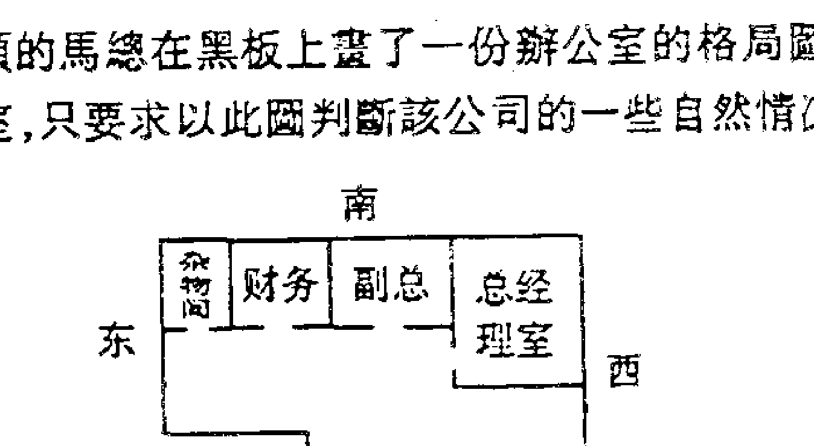
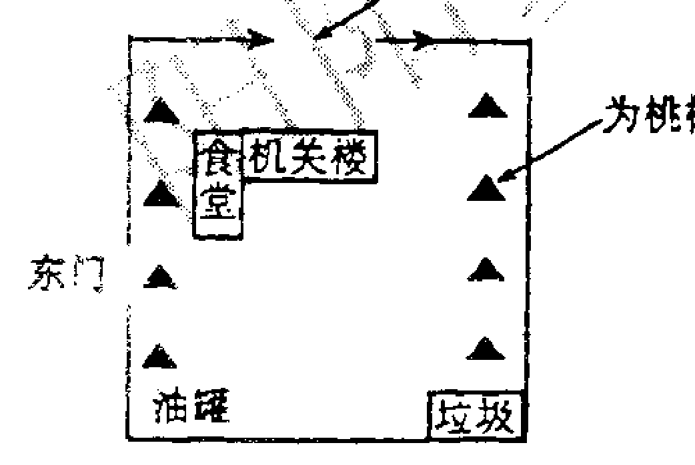
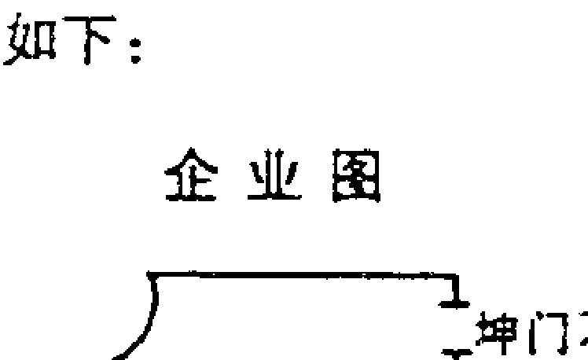
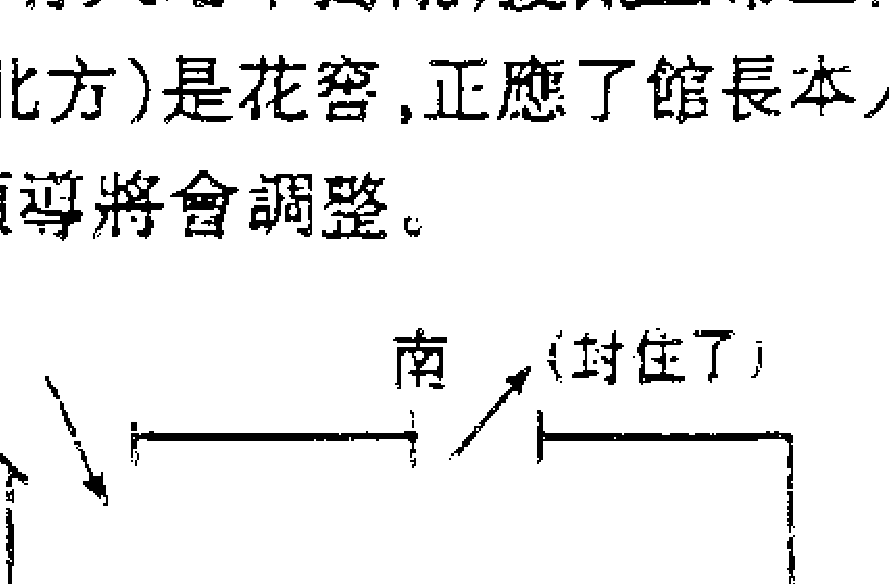
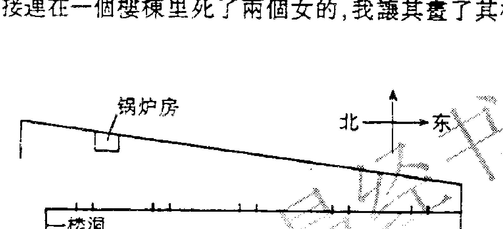
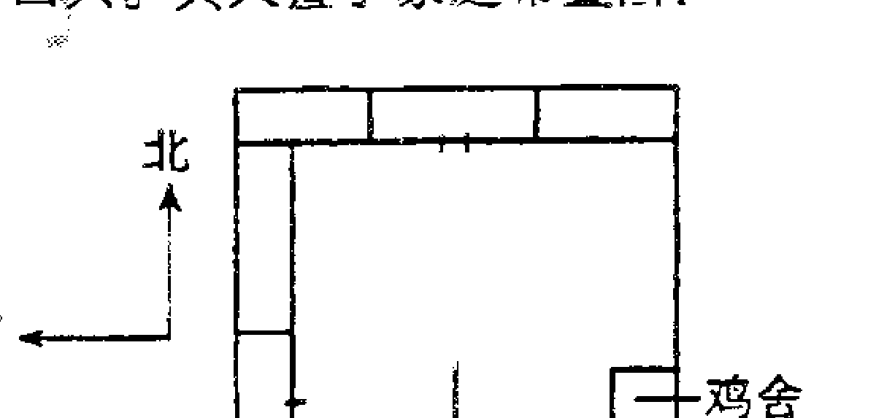

# 六壬神课金口诀现代实例精解

米鸿宾著

内部资料 请勿外传

## 目录

序

## 第一章 中国应用预测学

- 1 中国预测学分类及其途径
- 2 《六壬神课金口诀》概论（附原书序）
- 3 六壬神课金口诀应用精彩课例

## 第二章 金口诀起课方法

## 第三章 金口诀常用断课歌诀

- 1 五动交诵
- 2 三动交诵
- 3 干、神、将、方生克取事
- 4 其它的四位关系
- 5 金口诀分类预测

## 第四章 金口诀分类预测

- 第一节 分类预测
- 1 求财
- 2 求官（求学）
- 3 疾病
- 4 出行
- 5 婚姻
- 6 风水
- 7 杂占
- 8 预测股市
- 第二节 来信赏析

## 第五章 乾坤屹立一柱砥中流

## 第六章 承前启后，继往开来

- 1 米师在第三极论坛演讲内容
- 2 心驰安阳
- 3 第二届易学高峰论坛感想汇编
- 4 金口诀5·1北京面授学员感想汇编

## 真易

金口铄光华，
吾今现真霞。
寄语诸君共真易，
千年古苑飞新花；
任重天地远，
学人莫畏难。
上下拱扶成大业，
中华易学创新篇！

米鸿宾
一九九八年十一月于鞍山

## 序

鬼谷授我指玄篇
神术惊天承来古

物质世界与众生世界之形成是以时间称为世，以空间称为界，由是知以时空定世界。故又以时空来定事体之成、住、毁、灭之理，作为易学研用之遍行无疑之法门。而金口诀亦为效行此理而传诸于世之易学神术之一。

金口诀始传于军事家孙膑，融太乙、奇门、六壬三式之精华，揭示天时、地理、人事，内容博大精深。其在阴阳辩证、逻辑推理和五行生克方面都达到了前所未有的高度。其应用方法灵活简洁准确异常，断疑处事惊鬼泣神，自古视为天地间之秘术。古言其：上可补天地造化之不足、下可助君王料事之不及；撼动天下生灵，左右人间阴阳，为神机鬼藏阴阳相胜之术。世传有“学会奇门遁来人不用问，学会金口诀来人不用说。”、“晓半部诀中奥秘，即可遍行天下”之预测绝学之美誉，由此可见其在易学领域中之重要独特地位。

受家学之承传，历年来一直实践于其中，古为今用，每每应验，叹为神奇！笔者将所授学生择徒以分类，形成金融、证券、期货、案件、疾病等几个主流专业研究方向，至今为止，处处开花！以其意想不到之行之有效的方法指导各个领域的发展，效果十分可喜，更叹古人之不虚，今人之有幸！今将本人及学生的一些占验实例，客观公正地汇之成集，备以六壬神课金口诀的传扬，更利研习者于其中觅得方端。

十天干十二地支共二十二个字，通天达地中观人事，字字具有无量义，为它字所不能及，妙不可言！仁心与仁术并存，我肯定我现时为易学和传承所做的一切都不会令传承蒙羞。

每件事的成功都须仰仗诸缘的和合，此书亦不例外；最后，真诚地感谢使本书得以面世的助缘者，并随喜他们功德无量！普愿所有的读者心开意解、契入法性！

米鸿宾
2004年2月 于北京

## 作者简介：

米鸿宾，又名米多识（法号：东宁多吉），金融学研究生，1972年生于辽宁鞍山，现居北京，系应用易学六壬神课金口诀流派当代代表人物。幼受承传，精研象数易学、风水学及六壬神课金口诀。承继往圣绝学，出而用世，23岁始开讲学之风，传授易理及其应用，理数并重，因材施教；并客座海内外多所大学讲授易学与中国古代哲学课程。其部分著作已由中国国家图书馆和首都博物馆馆藏，成为两馆首次共同收藏的易学近代著作。

## 米鸿宾先生大事记

- 1993年夏，首次公开传授象数易学；
- 1998年秋，首次公开传授六壬神课金口诀；
- 1999年春，出访新加坡；
- 2002年9月，邀聘为湖南经济界领军人物欧阳雪初私人顾问；
- 2004年4月，任职为北京瀚东方广告制作公司监事长（该司广告片代表作：民生银行、恒基伟业、金软件文曲星等等）；
- 2004年8月，接受日本最大玄学研究机构《不思议研究所》来京专访；
- 2004年12月，校注《六壬神课金口诀心髓指要》，北京古籍出版社出版。一月后，该书由中国国家图书馆和首都博物馆收藏；
- 2005年3月，现身著名“第三极论坛”，演讲《易学现代应用之道》。国内知名网站均作后续报道；
- 2005年4月，北京邮电大学，首次讲授古代音学——以音识人；
- 2005年5月，出任北京同道影视节目制作公司总顾问（该司代表作：雍正王朝走向共和、军人机密、正德演义，等等）；
- 2005年6月，接受英国贵族杂志 Tatler（近三百年历史）专访，关于财富风水；
- 2005年6月，首次公开网络讲授“仁者的心香——《易传》通解”；揭开了十二年之后再次讲授“象数易学”的序幕；
- 2005年7月，邀聘为摩根基金中国区及总裁私人顾问；
- 待续中……

## 米鸿宾先生风水案例略举：

- 1、个人
  - 著名制片人刘文武先生私宅（北京同道影视节目制作有限公司董事长）
  - 著名歌唱家宋祖英女士私宅
  - 友邦华泰基金董事长齐亮先生私宅
  - 鸿运担保有限公司总裁陈君玲女士私宅
  - ……
- 2、企业
  - 北京商务书院俱乐部（中国顶级俱乐部，2006年开业）
  - 北京邦普制版印刷有限公司（国内最大珂罗版公司）
  - 北京大宅门酒店
  - ……
- 3、标识
  - 海南精鹰高尔夫俱乐部的标识
  - 鸿运君诚（北京）担保有限公司标识

注：有些个人和诸多政府机关不便向外界透露，故略去。(相关精彩图片与照片详见六壬神课金口诀论坛)

E-mail: mhbjkj@sina.com    amtfamtf@sina.com
六壬神课金口诀论坛: http://www.mhbjkj.com
金口绝学论坛: http://www.longyin.net

## 易海浣纱人

米鸿宾先生（法号东宁多吉），修守梵行一易者。1972年生于辽宁鞍山。幼承庭训，诵四书五经、阅诸子百家；少继家学，习六壬神课、研象易风水；稍长，受国民教育之余，历名山大川，访高僧奇士。

23岁出而用世，穿梭于学府与市井，开讲学之风。载易于哲，涉天文、历法与国史。谈吐间，引诗举史，皆信口道出，而所阐之理，其思维力度之大，令人叹服！

车马喧中，著述《六壬神课金口诀心髓指要》、《六壬神课金口诀务质研究》、《六壬神课金口诀现代实例精解》、《六壬神课金口诀期彩指南》、《大易心旨》和《大易识阶》等，而《六壬神课金口诀心髓指要》为《六壬神课金口诀》近代唯一注释书籍，已由中国国家图书馆和首都博物馆馆藏，并成为两馆首次共同收藏的易学近代著作。此乃我等之大幸，亦古文化一大幸！

为传承，先生授徒责其严律身、细治学、湛思而通识。高慢者抑之，自卑者扶之，扶抑间，应机施教，或技或理或香或法。学者立世，义理为用，气质为根。

先生淡然之朴素、谦和之矜然、浑融于对国学之悲怆中。散千金，广赈济，致力推广教育文化宗教事业，为众生种福祉、植智慧。并待机缘合和时，与志同者设私塾，兴国学，普及传统文化，一如杨仁山居士建祗洹精舍之苦心。国兴学术为存亡，当文化衰微，为此文化所化之人，必感痛苦。心量越宏，苦痛弥深。

先生感今之国学易术，欲鞠躬尽己力，创易学基金，弘扬民族传统文化，诀醒世界，玄润群生，不负如来义！来自《中国术数网》

## 诀醒世界 玄润群生

米鸿宾老师，为新一代最具风格及名气之易学学者之一。

其讲课方式深入浅出，透过种种生活现象，以实际行动寓易理易技于其中，将易学及技法渗入人心。其作风果断而大胆，将一些易学的名相与概念，以崭新的理念加以诠释。其为人：坦率、真诚、谦卑、敢言而无畏——言人所不敢言，将一些传统之易学概念、应用过患，甚至自身尊严加以击破，胸襟宽大、观念正确！

他反复强调：和老师建立联系之前，必须毫不犹豫地检查老师的德行与水准，千万不要把敬意和信任放在老师身上，或放在名誉上，这可能会为你带来许多麻烦。

他也常说：希望大家不要对我有过高的期望，长久以来虽一直在传播易学，并且很多时候可以说法无碍，但我太爱我自己，自然是不够资格做别人的师父，所以在我身边从未见有弟子跟随。

他喜欢以说法的形式令众生之智萌芽，再引导他们进一步研习。其作风稳健而踏实，不喜言夸。虽然很多时候可以说法无碍，但也不会为多收钱财而随便讲课。因而建立了一种既清新、爽洁而又带刚强之气之独特形象，为新一代易学传播者树立了典范。

为培训人才、利益传承，米师从每个人适应之发展方向进行锤炼，造就了许多有学问和成就的人才，更加广泛的弘扬了易学。其四处走访，花了无数的精神、金钱与时间，以完成其“诠醒世界、玄润群生”之悲愿，此举又凸现他的毅力与无尽的愿心。

所有当面聆教之人都知道：易学之神奇之处，在米师身上随处泛显！所有易学之神奇之处，可以当作一种魔术表演，甚至一笑置之。研易欲更上一层楼，必破此一执！他说。

由于其书能舒解众生之短暂饥渴，故仍有待米师努力，为再进一步弘扬易学做出更大贡献。除了祈望他能够接触更多信众，举办更多易学讲座之外，对他更大之祈愿，是希望他能够推出更多有系统、有层次之易学著作，以其独特而精辟之演绎风格，带领后学进入智慧之易学大海。由于他曾周游四方，对大多数人学易之弊端甚为了解，其著作将可适当地纠正歪风。若能如此，实乃易学之福，如甘露飘降。

谨以此心文，献给尊敬的米师，并祝他鸿愿广成。

来自《中国术数网》

## 面授随笔

柴谷子

喇嘛面孔，威严而平易近人；易者风范，睿智而不露锋芒；这些真与善在米师日常言谈躬行中随处泛显，雁过无痕。国庆期间有幸在京聆听米师讲座，得其教化指点，实乃我之福分。

现将所得甘露，化为文字，愿大家同沾法喜。

上课途中，米师字字珠玑，大家唯恐错漏，在纸上埋头苦耕不缀。说着说着，米师沉默一阵，眺远凝神问大家为何学易，大大的讲堂，静寂无声，唯有窗外鹊噪，可谓静里有乾坤啊。

其实，无论研习，还是谋事，动机为心。心正则法正，心邪则法邪。心有正邪，也有大小。经文具有无量义，视所读之人的心量大小而变。可见，动机决定我们的“用”，影响着我们在易学上的成就。在这里，跟大家聊聊我为什么要学易。我自认业识茫茫 20 余载，七颠八倒闹哄哄，经常貌合神离心中忧。米师开示：这是火形人的特性，人先了解自己，再对症调和自己的五行。五行标示着人的种种习气（米师，这样理解妥否），遮掩了我们的自性。当降伏所有习气，证得自性之光后，五行才会消失，所以有“跳出三界外，不在五行中”之说。人因爱欲、取舍而对将来心生恐怖，难得自在。学易不仅剖清自己，而且能对周遭人与事洞察秋毫，知晓天与人的密切关系，心中生明，循天道而行。这样，才能心无所挂碍，乃至放下。易虽为小术，但任何小术，若能一门深入，不但能登其堂奥，还将成就空空大道。所以米师常训导：精乃入神，纯一而精；杂乱则疏，疏而不入。看来“行行出状元”寓意为“行行出神仙”啊。一笑。至于为何选择金口诀，一则机缘所至（由衷感谢道中债老师）；二则金口诀能自己袖中定乾坤，不动声色，大有“谈笑间，灰飞烟灭”的谋士豪迈，何等的气定神闲啊！

金口诀四象犹如一个人的独角戏，与上级、祖辈、父母、妻子、孩子种种枝蔓关系；加天干，形成他人生的大舞台。与他相关的悲欢离合，人情冷暖，生老病死都惟妙惟肖地显示出来。我们常说“社会性”是人的本性，但无论你朋友多少、财富多少，最终与你不离不弃的，只有天与地。君不见，玉环飞燕皆尘土。因头上三尺有神灵，故君子要慎独。一念善，吉神照；一念恶，厉鬼随。得道多助，失道寡助，在课里清晰可见。断课，如同魔法师看着一个水晶球，课里人好，大家同乐；不好，同忧却无力。断得准确与否，知晓干支微义火候至为关键。要想与天干地支心有灵犀，须自己下一番有为的功夫，米师所强调的一日吉凶预测即为云梯。所有无上大法，心通神明的境界，如同冬之腊梅，不经一番寒彻骨，呐来暗香浮动。同时，对神、对古人要心存敬畏，这种敬畏是弟子对师父尊敬的虔诚之畏，是对天地厚德的感恩之畏，这样，我们才能得到传承血脉的无上加持！

本来还想从医易同源、良莠不齐、定数变数上，谈谈杨振宁先生最近所言“易学误国”这一观点，无奈我生性愚劣，还是就此搁笔。

强调再强调：关于杨振宁先生“易学误国”这一观点，我们应该听听米师的精彩之论。急盼中……

来自《中国术数网》

## 我所认识的米师

若水之流，若船之浮，守自然之道，行毋穷之令
——是为米师

尊严而悍，耆艾而信，知微而谕，诵说而不犯
——是为米师

> “道法自然，继往开来，扬名非我意，但愿文化兴。”此乃米师在今年面授课堂上一吐心声之辞，闻者莫不动容。

子曰：“不义而贵且富，于我如浮云”此语太经典，也系米师为人为师为学之真实写照。米师年轻有为、睿智大度、谦逊亲和，如此诸般笔者在今年面授过程中均深有体会。在授课过程中，米师循循善诱、毫不保守、不遗余力，倾其所知，尽其“传道、授业、解惑”之职责，以一知识分子之良心讲学。他诲人不倦，而且毫无保留。元好问《论诗》曰：“鸳鸯绣了从教看，莫把金针度与人。”过去不少名家大师对弟子总留一手、不愿把全部本领尤其最紧要处最关键处即俗语所言“看家本领”“最后一手”传授下来。米师则对学生无所隐瞒，因而赢得了学生对他的无限尊敬和景仰。针对不同学员的不同情况，他因材施教，诲人不倦，令不少学员日进千里。而其语言诙谐幽默、形象生动，极富亲和力，更是拉近了师生之间距离——所谓“良师益友”是也。

待人如此，治学亦然。米师坦言自己生而为传播国粹易学而活，殚精竭虑，鞠躬尽瘁，只为中华优秀传统文化之传承和弘扬。如孔丘一般，米师抛弃一己之利，出而用世，上下求索，碌碌风尘十余载，至今仍勤耕不辍。他一改易坛“老朽”之气，鼓励培养年轻人和高学历人才，为易学界输入新鲜血液，使之朝气蓬勃、面目一新。在面授课堂上，米师讲到张载其人时十分动情，或许是那“为天地立心，为生民立命，为往圣继绝学，为万世开太平”的壮志豪情和使命感引起了米师的共鸣，他无限感叹：“唯师与我志趣相当，千年万里不隔毫芒！”为易学之传承而讲学的米师不爱财不图名，有位参加面授学习的李姓学员曾对笔者说：“我上过很多易学老师的班。在众多的老师中，米老师是最不爱财最不落俗套的。”简短朴实的一句话道出了学员们的共同心声。米师平日亦常云：“所贵于天下之士者，为人排患、解难、解纷挠而无所取也；即有所取者，是商贾之人也。”如果说之前还有人持保留看法，至此则无人不被米师之坚贞追求和高尚情操所折服。

概而述之，云者甚众。细微之处，涉及者少。笔者不才，据所观所察，于此补述一二：

众所周知，米师为人谦逊，言行谨慎，举止有度。他常言：人之言行，决定身份；细枝末节，事关乎大；平日不拘小节，命运成败则怨不得人。真实之米师于工作生活、待人接物间散发出来的含蓄内敛、张驰有度之谦谦君子风着实令人心向往之。在此只取一例佐之：米师受邀著名“第三极论坛”演讲时，当时在场有名听众提了个不太专业、不着边际的问题，米师丝毫未流露出不屑之意，他只是温文尔雅地点点头请提问者坐下，并以宽厚谦虚的笑容礼貌地回答说：“对不起，这个问题我没研究过，不能给你满意回答，抱歉。”此举不仅避免了提问者之尴尬又展现了米师独特风范，不可谓不妙！无怪乎《诗》曰：“温温恭人，维德之基。”

君子之道，或出或处，或默或语。除却“低首”之时，米师也不乏“激昂”之际。大凡听过米师课三次以上（三为众嘛）者均会察觉米师之课实为“芝麻开花节节高”——点解？实乃与时俱进，大胆探索，推陈出新。今年面授时，众人对此皆有同感。一曰“初始力”，一曰“能量级”。二者崭新概念之提出已是闻所未闻，令人应接不暇；再加上易学实用流派之天干地支划分法的横空出世，更是开易学研究之先河，早已是让我并叹为观止。超前意识，大胆创新，锐意进取是其治学之突出特点。他对待学问那般大刀阔斧、开天辟地、气吞山河之豪迈气概与平日张弛有度、保守稳健、谦虚谨慎之含蓄内敛形成了鲜明对比——这正相应了“君子动静有常”之理。

“君子之度己则以绳，接人则用樁。度己以绳，故足以为天下法则矣；接人用樁，故能宽容；因求以成天下之大事矣。”每思及荀子此语，余不禁感叹：此言米师矣。严于律己，宽以待人——说来简单，真正做到者有几？米师即是如此，其责己也重以周，其待人也轻以约；重以周，故不怠；轻以约，故人乐为善。他高上尊贵不以骄人，聪明圣知不以穷人。齐给速通不争先人，刚毅勇敢不以伤人。米师时时笑言他善于摧毁自己的尊严，可见其律己之功。关于律己，笔者感受最深莫过于米师内省之勇气。所谓“小人之过也必文”；文者，掩饰也。暂且不論其身系一代名师鸿儒，桃李满天下，纵为一普通白丁，谁亦敢真正自内心深处直面自己的瑕疵或缺点呢？他在与朋友或学生聚会交谈时大多时均低首不语，静听他人语，听到“闪光点“时，总是很谦虚很兴奋地说：“说得好！我又学到知识了，今日闻道了！”那神态那样子如孩子一般真诚可爱。

荀子云：“不知则问，不能则学，虽能必让，然后为德。”米师心腹中华，志在光大易学，愿为此奉献毕生精力。怀此胸襟者，当会做到德之所至，无不爱也，无不敬也，无与人争也，恢然如天地之包万物。他与人为善，待人真诚宽容，能求同存异，海纳百川；尊重不同意见和观点，与此同时也赢得了众人的尊重和良好的口碑。于是贤者贵之，不肖者亲之。正如他自己所言：

己所言：一个有慈心之人才有磁性，才能作为磁场的中心以强大的力量不断地吸引身边周围的人，譬如北辰居其所而众星拱之——我想拥有如此强大吸引力的人必定仁者无敌，必定大事可成。

在当今易坛，提及金口诀就不得不提及米师，正如提及米师不得不提及金口诀一样。易学中有句流传语：“学会大六壬，来人不用说。”米师幼承庭训，诵四书五经、阅诸子百家；少继家学，习六壬神课、研象易风水；稍长，受国民教育之余，历名山大川，访高僧奇士。十几年的勤学苦练打造其一身“铁”功。米师的易技之高，众人有目可睹。曾有日本学者慕名专程来京采访米师，当场领略米师法力后，其人大呼：不可思议！神功盖世！作为米师学员，深承师训，为免去“自诩”之嫌，笔者在此不再多言米师之技法水平。只是米师身怀绝技却从不夸口的德行很是难得，不能不提。虽然几乎每次均能做到说法无碍，但他总强调：“易学（当然包括金口诀）是门学问，既然称为学问当然就有学习钻研探索的过程，所以准是相对的，不准是绝对的。”此言既出，不知令多少人暗自汗颜。

《诗》三百，一言以蔽之，曰：“思无邪”。米师研易多年，其著述简洁超然，内容精深，或许正是得了这“思无邪”之启发。十年磨一剑：《六壬神课金口诀心髓指要》、《大易识阶》、《六壬神课金口诀现代实例精解》、《六壬神课金口诀期彩指南》、《六壬神课金口诀务实研究》都系米师多年心血所化，是研究爱好者不可逾越的书籍。

知我者谓我心忧，不知我者谓我何求。米师淡然之朴素、谦和之矜然，浑融于对国学之悲怆中。散千金，广赈济，致力推广教育文化宗教事业，为众生种福祉、植智慧。国与学术为存亡，当文化衰微，为此文化所化之人，必感痛苦。心量越宏，苦痛弥深。子曰：“德之不修，学之不讲，闻义不能徙，不善不能改，是吾忧也。”米师感今国学易术之现状，欲鞠躬尽己力，弘扬民族传统文化。——此谓“唤醒世界，玄润群生，不负如来义”。

曾国藩说：“人有三志——人生之志，为学之志。修身之志。”若以此标准，余想米师应名“有志之士”而不虚。书不能悉意，略陈固陋。行笔至此，已近尾声。窗外细雨绵绵，树上的广玉兰争相怒放，湿润的空气中飘来阵阵清香——想起米师那句：“如甘露飘降，如伴圣贤”，我笑了。于是放下笔，走出门去——这个夏季太宜人。
——桃之于二零零五年五月二十日

本书由弟子纪建彬整理。
愿本书的每一位读者都证得易学的基础地。
若本书有任何不正确之处，祈请仁慈的读者们设法宽恕。

## 第一章 中国应用预测学

### 中国应用预测学分类及其途径

有钱难买先知道——是对预测学最好的注释。中国预测学一直未见有进行过系统分类，今据自己二十几年研易心得，将中国预测学作系统分类，以对后学者起到明鉴作用，避免盲目性学习，枉费大好时光。因中国研易之人大抵都在混沌之中，故今将此系统分类写出来，对提高易学界的整體水平會起到促进作用。

- 系统分类——两大系统：①五行系统；②干支、五行系统。
- 一、五行系统：以象数易学为代表，在汉代以前常用。其预测机理是以象测藏，其预测均以八卦五行为基础，不含干支。五行系统中代表最高层次的是象数易学中的“梅花易数”。
- 附图：

| 象数易学 |
| :--- |
| 河图 |
| 洛书 |
| 梅花易数 |
| 面相 |
| 手相 |
| 拆字 |
| 风水 |
| 姓名学 |

- 二、干支、五行系统：以天干地支和五行为基本预测元素，采用不同的方式进行预测。
- 附图：

| 干支、五行系统 |
| :--- |
| 金口诀 |
| 奇门 |
| 太乙 |
| 六壬 |
| 四柱 |
| 六爻 |
| 紫微 |
| 铁板 |
| 风水 |
| 卜筮正宗 |
| 增删卜易 |## 中国预测学方法概论

- **A. 金口诀：** 融奇门、太乙、六壬三式之精华，有“断言既出，无以改易”之美誉。相传为鬼谷子所传。它是干支、五行系统中的最高水平预测学，可以转换时空、转败为胜。
- **B. 奇门遁甲：** 其基础是洛书，可占四千三百二十条。原名为《遁甲天书》，其上卷为“天遁”，能通太虚；中卷为“地遁”，能穿山；下卷“人遁”，能藏形游四海，相传为黄帝所创。
- **C. 六壬：** 注重河洛五行，以水为首。壬为阳水，癸为阴水，故壬水有含阴取阳之意。相传为九天玄女所传。六壬和遁甲盛行于南北朝以后。
- **D. 四柱：** 原先为三柱、六字、无时辰。后来宋朝徐子平加入了时辰，变成了四柱，使预测更为精细。四柱的经典著作为《渊海子平》，要想学好四柱，须烂读、熟记此书，除此别无捷径。相传为鬼谷子所传。
- **E. 六爻：** 汉代京房将六十四卦中加入卦气，七十二候图一说，并由此创纳甲筮法。京房在“火珠林占法”中正式用了“掷钱法”，至今沿用。六爻是当今最为普及的预测学之一。
- **F. 紫微斗数：** 是六朝时期兴起的，主要是应用二十八宿。
- **G. 风水：** 在宋代最为盛行。风水为避风藏水之意，当以形法为主，以免误入歧途。
- **H.** 另外民间还有一些民间预测方式即抽签等杂占，因其缺少理论和系统性，故不入其流。

大家注意：两大系统中有一种共同的预测方式—风水。由此可知，风水是两大系统的交汇之处，要想学好风水，既要明卦义又要明干支理论。

综上所述，笔者以为：中国预测学，只要学好三种预测方法就可以了，即象数易学，金口诀，四柱。（四柱是用来判定人生全面运程的。风水是含在两大系统之内的预测方法，在学习中触类旁通即可掌握）。此言切切，希后学者明鉴！

## 为什么学易

易学是研究天地变化规律的学问，世间一切事物都涵盖在易学的范畴内，包括政治、军事、经济、文化、地理等等。

- 政治家学易——可以安邦立派
- 军事家学易——可以出奇制胜
- 医学家学易——可以八纲辩证
- 文学家学易——可以文章焕发
- 商人学易——可以巧夺商机
- 农民学易——可以五谷丰登

由此可知，学好易学是一件利国利民的善举。

## 如何学好易学：

搞学业，单线直入，透出厚；触类旁通，才能透出广。广而不厚，显得浮；厚而不广，显得窄。这里贵在“活”字。希望大家学易切不可死板，要博学多闻，举一反三。若能从高就低，鸟瞰人生，然后集其大成，自然能出高手！

## 预测学之我见

一、预测学的科学认识：预测可得一时一事之机，而人生大势要在与命运抗争中主动把握。从善如流，从恶如崩。至于为什么有时候测不准？这与对方心诚与否没有关系。其原因在于：

1. 本人水平高低问题。
2. 本人状态如何（与每日干支有密切关系）。

二、预测学的一个总结。

1. 相术最为直观，但需长期观察总结。
2. 象数随机可用，但必须注意把握时机，只要时机抓得好，百试百验，若能与四柱相结合，则更为精确，但学到这一步...
3. 六爻、增删卜易、卜筮正宗（只有筮法无卜法）等方法来预测，则比较精确，对近事近运百发百中，不过此法比较繁琐，无较高学术基础或高人指点难以精通。
4. 奇门和星相属高级预测方法，无高人指点和几十年的刻苦钻研是很难有神奇之效的。
5. 邵子神数和蠢子神数等神数是高级电子游戏，学了难以致用。
6. 阴阳地理，易学难精，无丰富经验，难以准确应用。其应用当以形法为主，以免事倍功半。
7. 金口诀，破三才之道，无所不包。其入式法简单，一用就灵，若遇明师倾囊相授，则会很快进入出神入化的高层次。
8. 预测学在达到较高预测水平时，必须要取外应，在未进行预测时，如先遇有外应，则以外应断之，决无差错。

## 《六壬神课金口诀》概论

《六壬神课金口诀》，又称《大六壬金口诀》，简称金口诀，是六壬古籍中的经典版本。该书题署明代洞春道人真阳子辑；清代杨守一精阅，钟谷逸士熊大木校正，周敬弦重订。杨守一，周敬弦二人生平行实不详。原书作者不详，原序中说：“命谓述自孙膑…”，并且书中又有十余处提到孙膑，故有人认定为孙膑所作。余以为不然，其由有二：1、该书古籍善本中均未提及式占和式盘，说明该书是在舍式而用符号之后成书的，而这个时期是在秦汉之后。2、该书创作方式与孙膑时期述事行文的语法风格及与孙膑代表著作《孙膑兵法》的文风是截然不同的。由此可知该书作者非为孙膑，系后人托名或后人总结其思想言行等汇集成书。当然，也不排除圣贤多有述而不作情形。由宋代祝秘撰、清代隠山房藏版光绪癸未春刊《六壬大占》收录之六壬兵机三十二占法中的游鲁都法、金凤干歌、论贼盗方位等章节与《六壬神课金口诀》中所列相关章节相同，可见其同源。由此说明，此书内容在宋代就已经流传，或其时大抵已成书。

原书分上中下三卷。上卷首列入式歌解，及贵神、将神、合用神煞、应期合德、次客法、推行年法等章目；中卷为十二神将歌解、四位杂断歌、六十四课铃等章目，并将云霄赋、三才赋、光明经等诸篇穿插其中；下卷收射覆歌、游都鲁都歌、占捕逃亡、占临敌、交战章、论贼盗方位、论贼数目多少等章目；采辑颇为详备。

该书上卷专讲六壬神课金口诀的基本格式与法则。中卷、下卷专讲以课体各要件为主，分门别类阐明其法则的特性及变化的要领。其文多用诗、诀、歌、赋的形式表达，合辙押韵，便于记诵，利于临占应用。下卷所收颇多，天时、地理、人事无所不包。其中所收的《六十四课铃》，共六十四课，每课举例解说课体占断的方法与依据。将这些课体的见解汇集在一起，互相参照，对于课象的理解颇有帮助。六壬课表面虽不用周易象数体系，实际上却与易象相通。其天盘、地盘仿两仪，四课如四象，六十四种课体（各含本课卦名）则与《易经》的六十四卦相辉映，有异曲同工之妙，为他术所不及。

物质世界与众生世界之形成是以时间称为世，以空间称为界，由是知以时空定世界。故又以时空来定事体之成、住、毁、灭之理，以此作为易学研用之通行之法。时间与空间的界定，使事物的发展规律相对确定。六壬神课金口诀是取立课时的年月日时来确定时间，再取地分确定空间，时间与空间确定完之后，再依法推断事理；这就是六壬神课金口诀所运用的时空定位法则，也是应用易学的最高法则。六壬神课金口诀的课体运用格式为：取地分，排十二将神、贵神，遁人元及神将干，立成一课。地分、将神、贵神、人元都有相对应的三才类事，依据其推衍方法来论断事体。六壬神课金口诀与其它壬派运用上的一个重要区别就是它的月将的换取是以节气换将，而非中气换将，这一点是需要特别注意的。三才之理者，人元代表天、地分代表地、神与将代表人。十二将，即亥为登明正月将，戌为河魁二月将，酉为从魁三月将，申为传送四月将，未为小吉五月将，午为胜光六月将，巳为太乙七月将，辰为天罡八月将，卯为太冲九月将，寅为功曹十月将，丑为大吉十一月将，子为神后十二月将。十二月将为时间之神，主月日辰。另有十二贵神主方位，前一螣蛇丁巳火，前二朱雀丙午火，前三六合乙卯木，前四勾陈戊辰土、前五青龙甲寅木，中央天乙贵神己丑土，后一天后癸亥水，后二太阴辛酉金，后三玄武壬子水，后四太常己未土，后五白虎庚申金，后六天空戊戌土。其应用方法中，除有常规课法外，还有次客法、遜、阴、传、变、三千再遯等特殊课法。本章介绍了次客法及其功用，以利研习者于其中觅得方端。其它特殊法式在此不表。

六壬神课金口诀所包含的内容非常广泛，涉及传统文化可谓博大精深。其中涉及到阴阳五行的有“五行聚管”、“五行例断”、“四位内见五行”等；涉及到天文学的有“十二神”、“十二将”等；涉及到医学的有“占病疾”、“占五脏病候”等。

在文学方面，它使用了多种文学修辞方式。例如：1、对照——“二上克下主失物，二下克上动官词”《占失盗》；“我克他时宜战斗，他克我时不须攻”《金风战干歌》。这种词语之间前后接、相互映显的修辞方式，很富有表情达意、深化思想的作用。2、层递——“金口玄妙，入式幽微；能决有疑之事，先知未见之情。指方定位，神将成课体之机；验煞推元，吉凶妙鬼神之用。干神将位，当立贱贱尊卑；四象三才，须分高低上下”《三才赋》。这种逐层推进的修辞方式，把应用方法逐层深入地揭示出来，不但语言精炼，而且给人留下了深刻的印象。3、排比——“四位纯阳，弟兄列雁；四位纯阴，姊妹成行”《金兰略》。在全书中，使用频率最高的修辞方式是排比，不下二十余例。由于大量而巧妙的运用排比，从而使《六壬神课金口诀》语言节奏明快，和谐流畅，条理清晰，气势贯通。全书在文学创作上挥歌、断、诗、赋、颂之精粹，堪称我国劳动人民的思想文化精华。总之，《六壬神课金口诀》在文学史上应当占有一定的历史地位，它在语言文学上的造诣和成就，对于后世无疑产生了积极的影响。

尤其需要强调的是，它对中国传统军事理论的贡献。它遵循战国时期著名阴阳家董仲舒“凡事，豫则立不豫则废”的原则，采用“抽象法”，从战略角度来论述军事问题。其在“游都鲁都歌”、“占捕逃亡”、“占临敌”、“交战章”、“论贼盗方位”、“论贼数目多少”等歌诀中，从出军时间、道路的选择，到应敌突变、实用地点、侦察敌情、选将防禁、攻城拔邑、士心向背等多个方面，作了详细的论述，这在一定程度上说，是总结了我国历史上作战的经验，很有参考价值，是我国古代军事历史上的珍贵资料。它在军事上的意义，在今天仍然有着宝贵的借鉴作用和指导意义。值得欣慰的是，国家有关军事课题研究部门，早在上个世纪九十年代就已经将六壬神课金口诀列为一个军事科研方向，用于在兵机作战方面的研究。这也是六壬神课金口诀作为应用易学在当代军事方面的一大贡献！而作为一种术数文化，它也因此得以名播海内外。该书军事思想理论框架若果于春秋时期产生，则它比色诺芬（前403——前355或355）的号称古希腊第一部军事理论专著《长征记》、罗马军事理论家弗龙廷（约35——约103）之《谋略例说》、章格蒂乌斯之《军事简述》的成书时间还要早，并且有其独特新颖的体系。它在军事理论上的运用方式，是与它在哲学思想上充满着朴素的唯物论和辩证法密切联系的。在哲学领域内，它并没有自己完整的哲学体系，它的学术理论和运用基础是依取易学的理论框架。它在易学天地人三才之道、阴阳五行生克制化原理的基础上，型化了三才，并把干支理论又向前推进了一步！这是中国古代朴素哲学的具体运用体现。

《六壬神课金口诀》是六壬学中的一个经典版本，有“三式之精华”之美誉，揭示天时、地理、人事，内容博大精深。其在阴阳辨证、逻辑推理和五行生克方面都达到了前所未有的高度，足见其在易学领域中之重要独特地位。它虽来自于术数，但对中国文化的发展与传播有着巨大的作用，故而对它的研究与重视有着极其重要的意义。它为易学象数研究领域开辟了一个崭新的研究方向，尤其是在易学对军事学的指导意义方面更为突出，有着不可估量的作用。

## 附原书序

### 校正京本六壬神课金口诀大全序

粤自河图洛书出，先圣则之为经，以开物成务，而前民用，诚万世道术之鼻祖也。古设大卜筮人之观掌其事，而今亡矣，惜哉！世传神课金口诀，命谓述自孙氏膑，膑始清大六壬，尤歉其博而弗约，遂择其简粹神妙之最，辑为此书，传行于世，占无不应。后之好事者，引伸触类散其底蕴，使观占者率多病其涣漫、无所措手。予时借员内书局供职之暇，悉指诸说之同，共参互官本，于凡歌诀断例诗词赋颂之类巨细毕举，一一重订校正。间附已意，补其阙晦而直解之，捐俸鋟梓以缀厥。传其为神课者，以三传四用生克之占于天时地理人事之浩。靡不奇验。非天下之至神，其孰能与于此？其为金口诀者，如令出人之口无所回互改易之谓也，前人取名意或如此，若其中幽深玄远者多不能尽晓，姑阙以俟高明之士鉴之，庶不失前人微意云。

楚 黄陶中 补撰 上元 王云魁 校

## 米鸿宾先生著述目录：

- **《大易识阶》**
- **《六壬神课金口诀心髓指要》**
- **《六壬神课金口诀务实研究》**
- **《六壬神课金口诀期彩指南》**
- **《六壬神课金口诀风水通论》**
- **《六壬神课金口诀现代实例精解》**

## 六壬神课金口诀应用精彩课例

金口诀融奇门、太乙、六壬三式之精华，根据天体运行规律，模拟宇宙自然运动法则，利用五行间生克制化关系，破天时、地理、人事三才之奥秘，内容博大精深，占断无不奇验，所以一直被誉为“神算绝学，天下奇书。”金口诀凭它入式手法的简洁，判断的精确，解断的细腻而让人惊叹不已，以为神遇。故有“学会金口诀敢把万事说”，“断言既出，无有改易”之美誉。以下是笔者实例选摘。

### 实例一、神捕

九六年正月初七晚上，好友聚餐。饭后，其中一友突然发现放在身后的手提包不见了，内有现金一万元、信用卡、身份证和手机，价值共四万余元，其中三万元是用来置办婚姻的。聚会之乐刹然全无，众友皆观于我——希望都寄托在我身上了。我们回忆了一下：酒店内用餐者只有三桌客人，一桌是两位女士，离我们较远，还有一桌是几个青年人，其中有一个穿白色西服的尤其引人注目，只有他在打电话时靠近过我们两次，但此时他们已结账离开了。酒店内只剩我们和另外一桌女客人。因为没有外人来，故案犯只能是就餐的客人，而第三桌客人中身着白西装者（打电话者）嫌疑最大。当时即以服务员所提供的第三桌就餐者所用七套餐具之七数为地分立课。

```
丙子 庚寅 壬辰 庚戌
丙 火相
癸卯 木旺
丁未 土死。
午 火相
```

### 解断：

1. 课中用爻为丁未，代表受害人（受害人问课之故）；贵神卯木，卯木太冲为贼人，代表案犯。
2. 卯木克未土为贼动，主丢失，偷窃之事。但财爻未土虽处死地，却逢空亡，即此课贼动落空，主不失财。
3. 用爻丁未处死地，逢空亡，主见凶不为凶，为虚惊一场。
4. 癸水中藏亥，亥卯未合木局，主团伙作案。
5. 用爻丁未处死地，课中又合木局，未为木库，处死地则为墓，即卯木入墓，主贼必被捉。
6. 课中丙丁为半奇，癸水本应绝丙火，但其贪合卯木而忘绝丙火，故课中丙丁半三奇成立。断必意外捕获罪犯！
7. 卯戌合、戌刑未，故断贼在戌时作案。
8. 课中四位贵神卯木旺而生丙火，为自焚之象，由此更可断定：贼必被捕！
9. 亥时，卯木被合住而入墓，故断亥时案犯被捕。
10. 贼入墓，墓死忌冲，丑冲未，故断贼必在东北方丑位捕获。

综上所断：此财不失，进入亥时，人可意外捕获，当往东北方向捕贼。

言毕，受害人和另一友（为警察）及店主马上驱车前往东北方向巡捕。我们余下几人在酒店静候回音，时间已接近九点了。……二十分钟后，电话铃声突然响起，传来受害人惊喜的声音：人已捕获！正往回返。众人惊喜至极！

案犯共二人。在东北方一工地附近，正招手打车时，恰好被我们车上的警察所认出，并确定其中穿白西装的即是吃饭的客人之一。于是马上开车过去，别住出租车，瓮中捉鳖。随车即审，案犯当时就供认：手提包藏在工地的搅拌机中！押人，起赃，分文未失。……。

我们的警察朋友因此而立了二等功。

值得一笑的是：案犯直到现在还以为是我们故意设下的圈套而引其上钩呢！

如此实例已不胜枚举，不足为奇。阅者当研其断法，觅其灵魂，并加以总结提高，使自己早日步入高层次预测领域，造福于社会。如此，才是应用易学真正的价值所在！

### 实例二、诀封股

2002年9月的一天，在湖南长沙，一人问我其所持的股票能否处理完？若能，时间在何时？我当时依课象说：能抛出，时间在2004年农历4月起至8月止。当时说完，他认为时间太长了，亏损严重，可能性不大。前些天听说，在今年的五一之后该人就陆陆续续抛售，在今年的9.15行情中，该人在一周左右的时间里全部抛出了手中的股票。其本来在9月11日已对股市失去信心，没想到会天降行情。今年六月，该人继续追问自己这只股票的处理情况会如何？我说你在农历八月必有改天换地之象，移星换斗之功！后来，在其处理完股票之后，总结说：是因为天子换了（正值中国共产党第十六届中央委员会第四次全体会议决定胡锦涛同志任国家军委主席），所以股票才有了行情，从而导致我在股票上有了移星换斗之功……。其在业界大名鼎鼎，有“妖股”、“妖庄”、“神秘欧阳氏”之称，现已成为境外人士。

```
壬午 戊申 己巳 癸酉
乙 木休
己巳 火旺
癸酉 金死。
丑 土相
```

### 解断：

此课最重要的是用爻得时；其次，时间上的应期采用的是用爻得月返推年法。

### 实例三、访谈录

昨晚，日本最大的玄学和易学研究机构“不思议研究所”的所长森田健先生来北京采访了我。该所在日本有自己广泛网络和自己的强势媒体，对各国的神秘学进行研究、追踪、采访，然后在日本全面推广。目前其会员在日本就有数万人。他们对中国的易学非常感兴趣，他本人对易学的很多流派都有所知，并且会应用六爻和八字。他每年来中国一次，专门来寻访他的目标者。这次我成了目标。

我们的访谈是通过翻译进行的。他问了我许多天文、历法及易学方面的比较尖锐的问题，我一一作答，他对我的回答非常满意，并且在翻译的过程中，不断的伸出大拇指指向我用汉语说：对！对！！其中有一个问题他问道：宇宙的存在方式你是如何看待的？我说：宇宙的存在方式就像八字一样。我们今天某人的八字，在历史上一定有一个人的八字是与其相同的，是相对应的；这两人相同的八字只能会形成两者相似的命运轨迹，而不会出现完全相同的生活实境。这就是相似形原理，就是《易经》中的“其大无外，其小无内”的指导纲领，它如环无端，符合中国的“一阴一阳之谓道”的哲学思想，这就是中国传统文化中的“道”的体现！翻译说完之后，他表情很兴奋的看着我，一边说着：对！对！，一边在纸上划着一个类似放倒的弹簧弓子的图形，用日语不断的在说着什么。翻译说：他在不断的重复讲着“道”、“循环”、“没有边际”，通过以上的访谈，他说你是他这些年来，在中国所见到的第一个让他解开心中困惑的中国人，并且解答非常简洁、明白、准确，他很感激你！说话过程中，神田健先生不时地双手合十向我表示谢意。

后来他说他听说我在中国易学的金口诀、风水等方面都是一个走在最前端的年轻人，他申请我能否为他用由我自定的方式演示一下，他想问问财运。他是1951年生，我就用他的属相立课推衍了一下。

课如下：

```
甲申 壬申 癸未 癸亥
乙
癸丑
辛酉 空
卯
```

### 解断：

1. 自己做不了公职（官爻为截路）。
2. 自己做不了实业，做实业必须有兄朋之类者相助方可（兄弟动和纯阴课之故）。
3. 自己做的是传播性事业，在外有非常名声（用爻金空则鸣，卯木冲酉金，如同以木撞钟）。
4. 本人喜爱神秘性事物（乙卯之故）。
5. 在2002年有丰财进项。
6. 明年事业上一个新台阶（用爻会太岁）。
7. 婚不顺，为人性格独特，内心在感情方面孤独（辛酉空亡又逢冲，且见纯阴课）。

还说了很多很细的层面，不再累述。翻译在不断的说，他不时地看我并伸大拇指重复地说：对！对！最后他突然站起来问翻译能不能与我合影，我说可以。他坐到我的身边、他的助理给我们拍了照，并将我右手背上自小出生就有的太极图案也一并拍下来了，非常清晰，他不断的跟翻译感叹说：不可思议！不可思议！！手上的这个太极图是由手背上的筋脉自然形成的，只要知道太极图形的人，就都能认出来。我想这个图形可能就是天之昭显的我这世的传承易学的责任吧。

后来，森田健所长说：他们已将我列在他们明年的计划中了，明年在日本广泛推介，然后再正式推出。（后在2004年10月已开始做广泛宣传。）

## 第二章 六壬神课金口诀起课方法

### 课内论点

金口诀立课取事，先观四位的阴阳所属定取用爻，再取四位的五行生克知其旺相休囚死，定出人与事的吉凶成败。以地分、将神、贵神、人元的所属知其万事万物的始终。

### 六壬神课金口诀起课步骤

金口诀起课很简单，分六步进行：

排四柱，取地分，起将神，起贵神，配人元，配天干。

- **一、排四柱**
查万年历，排出起课当时的完整四柱，写在最上面。

- **二、取地分**
起课必先定地分，这是最重要的一步，写在最下面。地分可以灵活起之。如以笔划数起地分则先求出笔划总数，再除十二，取余数为地分。
常用方法为：取数法、指方定位法、取方定位法、本命法、外应法。另外还有取颜色法、翻书等方法，不一而足。

    - **1、取数法：** 数理法是以所测之事或问课之人的名称、字号、名字变成数理数，合起笔划总数被十二除，取其余数，以子为1、丑为2、寅为3、卯为4、辰为5、巳为6、午为7、未为8、申为9、酉为10、戌为11、亥为12，取地分立课。

    - **2、指方定位法：** 由问课人任意指定方位，或随意拨动物体，物体静止时所指方位，转化为地分；即以此立课。

    - **3、取方定位法：** 以用术者为中心，以每30度为一个位置，按顺序分别排出十二地支方位。以用术者后面为子，前面为午，左边为卯，右边为酉；以来人或站或坐等，与用术者的相对位置确定地分立课。

置来取之。如来人在前面，则取午为地分；前面偏左，可取巳为地分；前面偏右可取未为地分。总之，以问事者相对方向取地分立课。

4、本命法：本命法是以来人的属相为地分立课，不拘方位。

5、外应法：外应法为灵活占取不拘形式之妙法，在金口诀中应用最多，不像其它预测法把其看的很高很深，盖因金口诀立课取地分最强调神意兼备，神形一致，故取课者深明其理，参悟不彻即可出神入化。

欲知来意当以所坐站方位立课，若人问富贵，可取其属相而论；若人论成败，可由其随意写字、报数而知晓；若论出行，可視其车牌号、问课时间而断、或以其穿衣的颜色、出行的方向、住家的门牌号等随意而取，灵活运用。

## 三、起将神

### 1、起课次取将神
凡取将神，必须先知当月月将，月将是月建的六合处。如正月建寅合于亥为正月的月将。亥为正月登明将阴水，戌为二月河魁将阳土、酉为三月从魁将阴金，申为四月传送将阳金，未为五月小吉将阴土，午为六月胜光将阳火，巳为七月太乙将阴火，辰为八月天罡将阳土，卯为九月太冲将阴木，寅为十月功曹将阳木，丑为十一月大吉将阴土，子为十二月神后将阳水。月建、月将列表如下：

| 月份 | 月建 | 月将 |
|---|---|---|
| 正月 | 寅 | 亥 登明 |
| 二月 | 卯 | 戌 河魁 |
| 三月 | 辰 | 酉 从魁 |
| 四月 | 巳 | 申 传送 |
| 五月 | 午 | 未 小吉 |
| 六月 | 未 | 午 胜光 |
| 七月 | 申 | 巳 太乙 |
| 八月 | 酉 | 辰 天罡 |
| 九月 | 戌 | 卯 太冲 |
| 十月 | 亥 | 寅 功曹 |
| 十一月 | 子 | 丑 大吉 |
| 十二月 | 丑 | 子 神后 |

注意：六壬神课金口诀中月将的更换是以交节为界，即交节即换月将。

### 2、将神取用释例
以来人的时间（即年、月、日、时排成四柱），用月将加时寻地分方位之法找出将神。例：癸未年、甲子月、丁丑日、丙午时、问事。酉为地分。把子月月将丑加在时辰午上，顺数至酉，得酉上为辰，辰即为将神，写在地分上面（详见第七小节[起课释例]例一）。

## 四、起贵神
起贵神则先起贵人，再按贵神顺序数至地分即是贵神。

贵神共有十二个，其排列顺序依次为：天乙贵人丑土，腾蛇巳火，朱雀午火，六合卯木，勾陈辰土，青龙寅木，天空戌土，白虎申金，太常未土，玄武子水，太阴酉金，天后亥水。其简化后的记诵口诀为：贵、腾、朱、六、勾、青、空、白、常、玄、阴、后。

贵神歌：甲戊庚牛羊，乙己鼠猴乡，丙丁猪鸡位，壬癸蛇兔藏，六辛逢马虎，阳顺阴逆行。

在歌诀中，前一个是日贵（又称阳贵），后一个是夜贵（又称阴贵）。

## 这里需要注意的是：

关于贵神的顺逆，以立课时的日干来定。凡壬、癸、辛日起课，贵神是白天逆转，夜间顺转；其它各日都是白天顺转，夜间逆转。关于白天夜间的分界，应以星出为夜，星落为白天。若在白天不见太阳（即阴天）时，则贵神需按夜晚起例。此点切记！

- 如甲戊庚日白天从丑（牛）起顺转，夜间从未（羊）起逆转。
- 乙己日白天从子（鼠）起顺转，夜间从申（猴）起逆转。
- 丙丁日白天从亥（猪）起顺转，夜间从酉（鸡）起逆转。
- 六辛日白天从午（马）起逆行，夜间从卯（兔）起顺行。

接上例，日干为丁，地分为酉。按“甲戊庚牛羊”歌诀，白日顺取，按贵神顺序，依序在亥上取天乙贵人丑土，顺数至酉为太阴酉金，则酉为所求贵神。贵神写在将神上面（详见第七小节 [起课释例] 例一）。

## 附：金口诀贵神与大六壬贵神的不同

- A、六壬使用起课时的天地盘来定贵神顺逆，如果贵人落在地盘的亥到辰宫，则顺行；如果在巳到戌宫，则逆行；但金口诀在起课时，却不用起课时的天地盘，而是直接根据贵神的起点来划定，贵神起点在亥子丑寅卯辰位置则顺行，在巳午未申酉戌位置则逆行；也就是说以辰戌为阴阳界限。
- B、金口诀在贵神排序方面与六壬亦有不同之处。在六壬里面，设定玄武在亥，天后在子；而在金口诀里面则设定玄武在子，天后在亥。这是二者的不同之处，希望学者留意。

## 五、配人元
人元以当日日干用五子元遁法（即日上起时法），遁到地分上所得之天干，即是所求人元。

> 五子元遁口诀：甲己还加甲，乙庚丙作初，丙辛从戊起，丁壬庚子居，戊癸何方发？壬子是真途。

按上例，如丁日，酉地分。丁、壬日起庚子，顺数至地分酉，得天干为己，即己为所求人元。人元写在贵神上面（详见第七小节 [起课释例] 例一）。

## 六、配天干
用五子元遁法在将神与贵神前面配上天干，即将干与神干。配法与日上起时法及人元配法相同。

按上例，如丁日，酉地分。丁、壬日起庚子，顺数至将支辰与神支酉，分别得天干为甲与己，即甲为所求将干，己为所求神干。配上了将干和神干，至此则一课全矣（详见第七小节 [起课释例] 例一）。

## 七、起课释例

例一、2003年12月31日，午时，月将为丑。用翻书取地分，22页，除以12余数为10，10为酉，即地分为酉，起课。
```
癸未  甲子  丁丑  丙午
人元：  己
贵神：己酉
将神：甲辰
地分：  酉
```

例二、2004年6月30日，辰时，月将为未。一人问事结果，字数为五个字。以五数做为地分起课。
```
甲申  庚午  庚辰  庚辰
庚
己卯
癸未
辰
```

例三、2004年11月11日，申时，月将为寅。以来人方位（寅位）立课。
- 甲申 乙亥 甲午 壬申
- 丙
- 己巳
- 壬申
- 寅

例四、2004年12月12日，辰时（雨天），月将为丑。属猴之人问事，以属相立课。
- 甲申 丙子 乙丑 庚辰
- 甲
- 丁丑
- 辛巳
- 申

注：此课中，因为是雨天，不见太阳，所以贵神的起法按照夜贵来推。

## 第三章 金口诀常用断课歌诀

由起课可知，金口诀分四位，即人元、神、将、地分四位（人元又称干，地分又称方）。四位之间的生克制化玄奥之理，决定着人与事的成败、吉凶、祸福。因此，四位之间的生克关系及所主之事必须牢记在心，灵活应用，如此才能掌握这门预测绝技，步入人天定数之大门。

课内四位之间的关系，首先要确定五动、三动，然后再看干、神、将、方四位之间的生克关系，以及四位与神煞相配合，具体的解断。

## 一、五动爻诵

“五动爻观其大意”，从五动上来决定一件事的大概，“五动为发用之门，不识五动不知发用之门”。五动可决定一件事情的性质，因此五动歌诀必须牢记。

### 1、干克方为妻动
歌曰：
- 妻动于妻妾，占事主于妻妾，问婚姻主有不成之象，男方有意见，既使有成，婚后必有外遇。
- 官财防折损。有官求财不利，必有折损。问求财不成，因地分是副财爻，故有失田宅，失财物之说等。
- 占人入在家，上克下，寻人在家。
- 访人人不悦。上隔克下，行必有阻，访人在家，但主人却不愉快或不愿接待来人。
- 外旁来索取，外来克内，必有人来取索，或干预于我，或有外人来骗财、争物等。
- 卑下有口舌。卑下受克，须防口舌外来。
- 论物多翻正，射覆上克下，论物以翻为正。
- 下旁或有缺。下受克，物器旁有缺，或无足。

### 2、神克干官动
歌曰：
官动利求官，官禄爻动，官职大利。若逢驿马，必然还官转职。凡官动逢太岁、月建、日建、时建、贵神、青龙、朱雀、白虎、鬼动宜速升，方生干主父母动，又主印绶，有职权及官职，如官动逢冲，主帮助别人打官司或虚假官职。

相逢禄位迁。谓逢二马（天马、驿马），占官有迁移之喜。课内贵神旺相，主高官厚禄及高官；休囚死，不动。

常人官府事，官爻克干，故常人有官府中事。

有官望财难。有官不宜求财，财动伤官；返克，将克神故也。

合得官中物，官动而逢合，官中财物可得。

休从外处求。人元受克，事在自己，不宜外求。

得财防暗损，我克外，财须防密失。

问病在头部。上受克，病在头部。因天干是头部，主头痛，头晕，头部有伤及疤痕等亦主喉间，如见酉为气管，未为食道有病。

### 3、神克将为贼动
歌曰：
贼动内贼生，内财受克，主阴谋贼生而盗财物。财爻为将，主家内财物及妻子，财产被盗窃贼偷窃，又主家内搬运财物，里勾外连，将财物盗去，或家中有后妇人，妇人有伤，有疾病伤灾之事。此物被盗为有内线。

勾连诈不明。外勾里连，空诈不明。主相识之人盗去妇人财物及家内财物，内爻受克主肚腹有病灾，妇科、腰、肾疾患等。

损财卑幼病，妻位受伤，卑幼灾患。

谋望必无成。神将直克，内外不和，谋望无成。神将相合者求谋可成，相生万事如意，冲克刑破主六亲不和，斗打官司临门，外欺自己，左右邻居不和及斗讼事。

架谍奸私意，妻财受克必有奸私架谍之事。因将是妻妾，受克主在外有奸私，外人勾引及暗昧不明事。

偷谗宛转名。妻财受克，或生淫荡，宛转偷谗，必有损失。偷抢转移，将受克主财产有损失及抢砸，妻妾生淫欲之心，家有不明之财及家中有暗昧不明之事，主妇女不能持家。

内爻终暗昧，内爻受克，事主暗昧不明。

病恐亦非轻。内不协遂，阴小灾病，亦主非轻。

### 4、将克神为财动
歌曰：
财动利求财，内克外谓之财动，求财必得。又主想求财必自己动手，并有出外求财的想法。

占官定不谐。官爻受克，求官有失，定主不顺，或因财损失职权。因将是妻妾，主妻美丽及因妻发家。又主外情有动或好女持家。

家中人出外，内克外，主人出外。在外发大财，出行顺中有阻。

身灾非妻妾。自身有灾病，而非妻妾。神受克，亦主家长有病或天灾人祸等。

疾病忧难瘥，神受克，病在心胸，无药可治，故主难好。亦主忧愁在身。

营求喜自来。内克外，营求有喜，需自求。

财物终有损，神受克，其物必有损，或动本求财。或主事物已变更地点。

职位恐多乖。官爻受克，故主退失不利，即与女人纠缠，损伤官职，变动职权等。

### 5、方克干为鬼动
歌曰：
鬼动忧灾怪，占事有灾怪及人有异举。亦主本人志高，欲外求谋，在外亨通，在家不顺。

官亨人出外。下克上，主仕亨通，人欲出外。

争讼带他人，隔位克外，必主讼连他人。主牵连他人、朋友、亲属等。

乖戾囚问外。下犯上，卑僭尊，故曰乖戾。主民告官及仕骗官，或内骗外。

口舌共喧争，人元受克，事从内起，必因口舌致事。事由家内引起，暗昧不明，争斗后又牵连他人，或因小口斗打起官司在外。又主自身有损官职，谋害他人等。

冤仇皆损害。因冤仇而相互损害。

痊病物仰合，方克干，病在目下颔上，故曰仰合。

家宅未安泰。家宅不宁，人口不安，家有分张。

## 二、三动爻诵
方生干为父母动：为印绶。小尊大，大吉。求文书、书信、职称等可得。

干生方为子孙动：主子孙之事，小吉。主添人进口、外来、财物。

干方同为兄弟动：事在比肩，多有不成，小凶。事在兄、朋之间，多为争执不和之相。

## 三、干、神、将、方生克取事

### 1、干类
干克神为外克内，常人损财仕失位。
干克神为客克主，是外来谋害自己，一般人要损钱财，有官职的人要防丢官罢职，官职被人谋害；问官司他胜我败，无力战胜于外。

干克将破财钱，阳男阴女忧病缠。
干克将主求财不得，常人损财忧病，将阳主男子，将阴主妻子、妇女。又主外人入家中盗物，伤财损妻。

干生神为外助我，家有生意亲友来。
干生神外助我物帛，亲友相访，家中富贵有生意，并有在官府中人。

干生将主内外顺，外来干预送物临。
干生将内外和顺，人将物来求我，及有人干预我，外人求我相助，外来亲戚相求我，外人将物送给我。

### 2、神类
神生方内外和，贵人相助心里可。
更得贵人之力，办事有官职之人相助。

神克方主事成缓，隔手求财定成晚。
神克方隔手求财，虽可以得到，但主晚成，办事有阻隔，谋望不顺利。

神生将主内外合，人将财物来助我。
神生将所谋顺遂，内外和合，人将财物助我，外人将至夫妻和合，其妻结发，门户亲属和睦。

神生干仕论官职，求人办事寻必见。
神生干仕人论官职，有相托之人，有人在官府中干事别人将物给我，自己将财求助于他人。求必得寻必见，内生外我求外，或出外寻人可得。

### 3、将类
将生干主百事喜。
将生干，自己将财物送给贵人，内外和合，父子亲，夫妻和睦。家中富贵，人财兴旺之兆，百事有成，内生外，求事求财皆顺利。

将克干主喜重重，科举上榜宜远行。
将克干有喜事两件，在外求财必得，求事必遂，考试中榜，宜出外远行，家中人财两旺。

将生方主外助我，子孙兴荣财喜多。
将生方家内和合，我助他人，及亲人分别远行，求财有大喜，田宅丰厚，子孙兴隆，后代有荣华富贵，并有官禄之人。

将克方斗讼事，伤小口损六畜失田宅。
将克方斗讼官事，伤小口损六畜，损失田宅，家产破散或因小口伤残灾破，伤腿脚折伤四肢。

### 4、方类
方克神主损外财，下克上民告官。
方克神，损失外财，下克上，隔位相克，为犯上，民告官，或小孩不听家长的指挥。

方克将令妻财伤，先失后得忧变喜。
方克将家中钱财失散，伤妻，出外损财先失后得，先忧后喜。

方生神内外和，人庆才丰事通顺。
方生神内外和合，人庆财丰，求财不隔手，家中子孝孙贤。

方生将婚姻美。
方生将幼尊母，家内和合，婚姻喜美，谋生有成，谈恋爱，寻找地分的六合处为对象的方位。

## 四、其它的四位关系

### 一类朝元
一类朝元是一干见本属三支也，如甲见三寅，乙见三卯，丙见三午，丁见三巳，戊见三辰三戌，己见三未三丑，庚见三申、辛见三酉，壬见三子，癸见三亥，都为一类朝元。如天乙贵神占得此课主朝见诏封，常人不宜。无生克合，占事主重叠，囚伏不动，无荣无誉，阻隔淹滞，因为有同类比肩而不动，无父母、官鬼、妻财、子孙动、如纯金、纯火，不可以此而论。

### 四位俱比
庚辛酉金比，西方白虎太阴之象，主兵丧讼事，邪淫奸私，人口死亡，六亲刑克，家宅不宁，万事不吉利。
丙丁巳午火比，南方朱雀，螣蛇之象，主是非官司，灾祸伤残，釜鸣，火光，六亲刑克，居处不详。
壬癸亥子水比，北方玄武，天后之象，盖水性泛滥，主家计流移，奸私邪淫，蛊病，水厄，寡妇孤儿，盗侵人害。
甲乙寅卯木比，东方青龙、六合之象，主虽吉而无生，仁而无恩，有兄弟，而无父母，重婚姻而绝嗣续，谋望无成，无誉无荣，艰难之用，百事蹇滞也。
戊己辰戌丑未土比，中央勾陈、天空、大吉（月将名）之象，事体重叠又登延滞，望用难成，牵连不一。

### 五比同类
干方比为正比，事在朋友，比肩多有不成，六亲朋友斗讼小凶。
干神比为近比，占求事在外，关系到自己，或外来谋害自己，及外来骗取钱财。
方将比为远比，主事在朋友同类，或出外受排挤。
神将比为次比，事在门户，亲属朋友斗讼，亲属不和。
四位俱比为合比，事在门户重叠，牵连闭伏不动。

### 五绝：
将与神相遇为正绝，主事体尽毕，人聚而散，夫妻离别，求事不成，占病必死。

将与日相遇为遥绝，贵人不喜，官职退散。

将与时相遇为次绝，主坐着时，官人说断、分散之事，器物损坏等。

将与命相遇为大绝，主非常之惊恐、灾祸，破散财帛，旧事占动，进退不宁，占病必死。

将与位绝、位与神绝，名正绝，与次绝同断。

五绝主事体断绝，人情离散，器物损坏，占病大凶。如卯申午亥合，名合中有绝，然卯申为木绝，午亥为水绝。凡课中有金与水土未尝绝也，若有午卯为用，则主聚而复散，成而复败。若申亥为用，则主断而复续，失而复得。

将位论绝是从日、时与四位彼此之间的关系论述的，仍是以五行相绝为基础。但其主事与五行相绝不同，使用时注意分辨。另，歌诀中所言之命即属相。

## 干元类
神干生将干，喜从外来，或夫妻和谐，门户和睦及婚姻喜美。

将干生神干，喜从内生，求望可得，望事能成。

神将二干分局，相克主不成。

将神二干合局，相合喜气重重（如神干甲与将干己是合局）；相生（神干与将干水是相生）行事有喜，万事可成。

神干克将干，祸从外来，与贼动同断。

将干克神干，祸从内出，与财动同断。

四位内神将二干，随支辰相互生克，主体往来。

神将二干见庚辛克身，主家宅怪异凶变灾讼，因金有白虎气，能克神将木。

凡神将上所带干，如六乙日见卯将，贵神是朱雀，取日干乙，起五子遁而得，丙子，丁丑，戊寅，己卯将，到朱雀是壬午，遇此有生有克也，以前诀推来情。取卯将生神午火，又以神干壬被将干己土克之，有生有克主体往来难成，支生而干克，主体往来反复。

## 五合
- 神与干合为官合：仕人得之荣禄，亦利求官，常人官事。
- 将与神合为正合：欢美婚姻，会合亲友。不宜占病，求事有成，互相依辅，共为家室。
- 将与干合为隔合：内外相望，有人接引，但因阻隔，事体迟留。
- 将与方合为进合：主人共同上于道路，以卑动尊，以小致大，事成迟缓。
- 方与干合为鬼合：求官得禄，仕人升迁，亲属不和；亦主忧患，占病不宜。

解曰：凡干支相合，乃天地阴阳配合之意，万物生成，吉凶全备。且如甲己之日，五子元遁起时，则丙寅与辛未合，丁卯与壬申合，戊辰与癸酉合，己巳与甲戌合，庚午与乙亥合，辛未与丙子合等。

然干支在一旬之内相合者，谓之君臣庆会共欢。异旬支干相合者，乃天地德合也。

五合之用，主体共焉，谋望有成。支干俱合，其物圆类；合中值空亡，占物圆而中空，求事望而难成；亦主合而不合，分而不分，合中反分，亲人相疏，先合后离，亲而不亲，义而不义。

释曰：官合：干神合为官合。

鬼合：凡相合，除干与干、支与支之间相合之外，干纳支与支相合亦同论。即方克干并克中带合是也，亦即地分与人元所纳地支克合是也。例如：人元为辛，地分为巳，辛纳支为酉，巳酉半合，巳克辛为鬼动，此即为鬼合。鬼合有两种：一为鬼合课，一为鬼合全身课。详见《六壬神课金口诀心髓指要》之《六十四课钤》第一和第二十四课。

《易》曰：神无方而易无体。从易学角度而言，对于干支而论，天干较之于地支，天干就是阳，地支就是阴。这也是为什么干支可以组合在一起的原因。

## 三合全身
寅午戌：名炎上课，为财帛文书喜美之合。忌亥子水为坏局，见之凡事望而难成。如人元是丙，则为火局全耳；如人元是庚，则为鬼动克身；或人元是甲，为相生。

亥卯未：名曲直课，为交易婚姻和会之合。忌申酉金为坏局，见之凡事望而有阻。如人元是乙，则为木局全耳；如人元是己，则为官鬼动论之；或人元是癸，为相生。

申子辰：名润下课，为行移干盏争战之合。忌辰戌土为坏局，见之凡事望而有变。如人元是壬，则为水局全耳；如人元是丙，以官鬼动论之；或人元是庚，为相生。

巳酉丑：名从革课，为阴阳淫滥轻薄之合。忌巳午火为坏局，见之凡事望而有间隔。如人元是辛，则为金局全耳；如人元是乙，则为官鬼动论之；或人元是己，为相生。

解曰：凡坏局，下克上为迅速，上克下为阻隔，中间为之坏局，求事一半成也。凡课三合，须待体式全备，吉凶祸福方可言之。克合、生合亦以例推。如寅午戌火局全，若神将干带壬癸水为妒合，论事顺中有阻，合而不合，易而不易也。其它三课以为官、为鬼者，论四时休旺及空亡所值断之。凡课三合，因变化而全体，切详日冲、月破、空亡、克合，未可一概照合局全身论之。

释曰：坏局者，局身受克也。例：寅午戌合局，寅为局之上，戌为局之下，午为局之身。局上受克为迅速，局下受克为阻隔，中间局身受克为坏局，求事一半成也。余仿此。

## 虚一待用
寅午戌合为炎上课，虚一位为炎上破体课。亥卯未为曲直课，虚一位为曲直破体课。申子辰为润下课，虚一位为润下破体课。巳酉丑为从革课，虚一位为从革破体课。

解曰：凡课之合，从化谓之全身。有二字，如虚一位谓之破体。如凡课有戊午而无寅，取寅年、月、日、时为应期。或有申、子而无辰，或有卯、未无亥，或有酉、丑无巳。凡占人望事，须验远近；如远则年，次则月，近则日、时，必待此虚一字透出，共成三合，则行人至，谋望成；此为虚一待用也，最为课中之要论，不可不察。若有日冲、月破、空亡、受制又当详论。

释曰：炎上者情急，曲直者孤高，润下者圆滑，从革者精算，稼穑者愚钝（四土相见）；这些五行之理说的都是事物的本性。貌取视听，音思其用，雨畅寒燠，风音其应。所以没有五行，天地不成变化，人体不成形骸。天地间的阳舒阴惨，犹如人心之喜怒哀乐，皆为五行。

## 三奇德秀
甲戊庚，此为德全课。乙丙丁，此为奇全课。壬癸辛，此为秀全课。

解曰：凡占课见三奇全，利见大人，百事吉昌，支辰合协，上下有辅，三奇德秀，此皆多庆，孕生贵子。

释曰：课逢三奇主逢凶化吉，遇难呈祥，多奇遇巧合，求谋顺利。三奇课，有甲戊庚正三合、戊庚甲逆三合二种，正合顺利吉庆，逆合顺中有阻。余仿此。

三奇为天地人三奇，原书中没有秀全课人三奇，但“解曰”中又有所言及，当为古人传抄误失。

## 五行气化
甲己化土，乙庚化金，丙辛化水，丁壬化木，戊癸化火。

解曰：凡课中虽不见土，若神将上遁得甲与己者，元气运化为土，当作土用；射覆则是土类，或物出于土中；事则以为土亦为有气，至土旺日时为应期。

假令丁壬课，得人元甲干，贵神腾蛇巳火，将神河魁戌土，地分辰土。甲木下生腾蛇巳火，火又生辰戌土，则见土初旺矣。又遁得神干乙、将干庚，见乙与庚合化成金，土生于金；且以人元甲木被金所伤，又当详论。

占官用以鬼论之，凡占仕则吉，官事则凶。余皆以此为法推之，再加日辰月令用也。

假令甲己见乙庚，乙庚见丙辛，丙辛见丁壬，丁壬见戊癸，戊癸见甲己，名曰受制不化，妒合不化，时冲不化，逢空不化，非其所不化。此系五行奥旨，不可不详。

释曰：上述课例如下
```
甲
乙巳（腾蛇）
庚戌（河魁）
辰
```

若此課中，年月日時之干出現己土，則甲己不能合化爲土，蓋因甲被金傷，甲己見乙庚而受制不化也。其它仿此。

## 陰陽相生

經曰：假令甲木、乙草、丙火、丁烟，甲陽木而燥，能生丁烟。乙陰草能生陽火，陽產于陰，陰爲母。陰產于陽，陽爲父。若陽見陽、陰見陰，則是陰陽偏枯，造化危脆，似木勝而花繁狀，密雲而不雨。四維之寅申巳亥，四正之子午卯酉，于五行之相冲，于陰陽之不育。占此者順中有隔，吉中有危。

> 《易》曰：“天地氤氲，萬物化醇，男女媾精，萬物化生”。

且如寅午戌、巳酉丑、申子辰、亥卯未之類，此爲陰陽合而后能化生也。凡五行生我者爲父母，陰生陽，陽生陰，德合配偶，化育生成，乃吉福萬全之課。凡課之四位，上生下，下生上，内生外，外生内，或三位生一位，或一位生三位，及往來或相合相恩者，此發用之美端，謀之吉兆。占干則成，望事則就。

又曰：四位相生，萬事吉昌。

凡課五行相生，雖内有白虎、朱雀兼劫煞、魁罡之類，而外雖有暴惡之形，皆入相生和氣之中，則革面順從，阻隔逢通，遇惡逢善也。殊不知克則爲仇敵，生則爲親恩，如乘合辰，則福愈厚。

釋曰：此節所論強調，一課之體中，五行最喜陰陽均衡。五行相生、相合，爲課體之喜，克戰爲課體之忌。干，爲幹事之意。乘合辰，遇到相合的干支。

## 五、口訣分類預測

（黑龍江學生沙德順整理）

## 求 財

財爻旺相財可求。財坐空地空手謀。
財動求財動本得，財旺身弱勞神憂。
財空只宜雙牽綫，財旺身弱官非愁。
財休年月日時生，合助宜速急可求。

課旺歲月日時絕，刑冲克害空緩求。
待財受歲日時生，合之合后財到手。
財臨歲月日時上，數大三六合作謀。
合資求財干神外，對我有利合資謀。
外克内來内生外，對他有利不易求。
索償必看主和客，貴克人元外空謀。
干神方分旺生將，將若克神外財求。
陰克陽爲正財損，陽克陰爲偏財破。
干神方同克刑財，損財三次官害謀。
干神方同生財爻，三次進財省力求。
人元生將外財多，方生財主房地收。
干生神來又克將，兩次破財衆賊偷。

## 婚 姻

用爲六常天后青，旺相順行婚易成。
陰武婚外桃花戀，未婚成敗方將應。
相生合好相克壞，夫妻看神和將星。
神將相生感情好：冲克不合分道應。
干夫方妻生合美，干方冲克起怨聲。
干克方或方生干，妻子多病别夫兄。
方克干或干生方，丈夫先死急病應。
四空旬空婚虛假，用空離合事難定。
空在别爻他心假，猶豫不决腹中空。
妻鬼賤財動不順，難以到頭兩傷情。
二木二金多不顧，課見二土婚晚成。
用喜旺相忌妻動，天羅地網連茹空。
婚前男問男爲將，若是女問女地分。
婚后用爻是問人，另一神將對方定。
課中相冲半路走，二乙一庚二人争。
天喜互克兩退争，財動問婚姻妻賢美。

## 官司

用爻旺相有理当，主弱克客难胜强。
用旺逢空平安事，二土比合事久方。
人元为客神主方，干克贵神你遭殃。
贵神克干他败理，课中旺相有理方。
干神相生又相合，私了和解好商量。
勾朱天空白玄武，劫煞三刑讼事当。
官动贼动不求职，必人口舌官司乡。
主客同属一五行，在外生事牵家帮。
对方同事或兄弟，天赦二德贵人帮。
干生神为他求解，神生干定你主张。
地分空亡钱财耗，三刑空亡惊一场。
神地刑害空伤身，空朱玄武多不利。
勾白蛇克地血光，年月日合德法助。
妻动必因女人缘，干克神来又克将。
外人欺负上门当，神将相经是亲友。
玄武为用有冤情，二马或冲有飞廉。
三六奇合结案期。

## 疾病

干为患者方医术，干若克方难治病。
方若克干病好治，五行缺者为病处。
五行旺衰宜平衡，用旺有制平安病。
方若生干越治重。干生方来方克干，
病重亦可得新生。巳亥相冲昏晕症，
干癸见巳血压低。干丁见亥血压高。
人元为头眼神胸，将是肚腹方腿鼻。
甲肝乙胆丙心脏，戊胃己脾大肠庚。
辛肺壬癸水主肾，午头未面细推应。

## 出行

用处死地行不远，临月日建保平安。
用爻喜望忌刑冲，五鬼飞符纲贼动。
劫煞截路必不顺，刑冲克害不宜行。
干外方内在课中，干神为外方将通。
内若克外被迫走，内若生外自顾行。
外来克内行必阻，在外不安有灾凶。
外来生内约自己，酉寅卯戊关难成。
卯上申金必是锁，关隔锁课走难行。
斩关毁隔破锁走，出行莫遇有贼动。
飞廉克害天地结，刑冲玄武遇灾星。
行忌神将受克方，火北金南土忌东。
外若生内人回走，外若克内想归程。
内若生外不想返，内若克外不回程。
用是四孟人未动，用为四仲半路行。
用为四季马上到，二马人课必速行。
上若克下人必来，下若克上行必阻。
内若生外人不来，外若克内只想来。
用爻逢冲改计划，用爻逢合帮伴行。

## 失物

用爻逢空物不失，刑冲克害必损伤。
罗网一般能找到，用上下生在邻里。
神将相生在亲属，贼动地纲有内绥。
天马驿马路途间，上若克下远在外。
下若克上不远寻，辰丑相破物改装。
用遇地纲未出手，干干相比熟人案。
用财均死用逢冲，财又逢冲物难回。
贼动落空物不丢，用处死地失不利。
旺生不死失可得，三刑会煞有官非。
课见天罗物可找，卯辰已茹可追回。
三合阴局有私密，劫煞临门休去寻。
贼动必有贼人盗，天罗上挂物不失。
合局有破包物破。

## 五动主事

-   1、干克方妻动
妻动占事在妻妾，婚姻不成男有异；
既有成婚后外遇，求财不利失田宅。
寻人在家访不悦，有人索取外骗财。
口舌外来物翻正，器物有损无足缺。

-   2、神克干官动
逢岁月日时临建，利官逢马转职迁。
贵青朱白劫助升，官动逢冲助人讼。
官职虚假少有权，同逢二马迁移喜。
贵旺高官厚禄人，常人必有官府事。
逢合得官府财物，谋事在已防财损。

-   3、神克将贼动
被盗有人做内绥，家有后妇并有伤。
肚腹生病妇科肾，内外不合谋事难。
婚逆暗昧讼临门，偷讼转移妻外心。

-   4、将克神财动
求财有得自我谋，欲出求财官不顾。
因财损职妻贤美，娶后发家有外遇。
好女持家出外发，出行顺中必有阻。
自身有病父母疾，如若有病心胸上。
动本求财物有损，女人纠察变动权。

## 5、方克干鬼动
本人志高想外谋，在外亨通在家逆。
争讼必然牵他人，事因口舌家内起。
或因小儿斗讼争，自身空职算讲人。
因仇两败俱有伤，家宅不安有分张。

## 三动主事
方生干为父母谋，任信为耆职种得。
干生方为添人财，干方同为兄弟动，
事在兄朋之间争。

## 干克神
干事克神不称意，防官降职损钱财。
临门外人算自己，官讼他胜我要败。

## 干克将
将阳为男将阴女，外人偷盗财损妻。

## 四位分生
干生神为外助我，外来亲友生意火。
送物求我府有人，干生将为内外顺。
神生方谋有官助，神生方来事成晚。
隔手求财可成晚，神生将为内外合。
人将财物要送我，神生干求人必见。
家有官府工作人，自将送财求他人，
出外找人寻必见。

## 将 类
将若生干物送人，夫妻合睦父子亲。
人財兩旺內外順，將去克干喜事重。
科舉上榜宜遠行，將若生方財喜多。
田宅豐厚官祿人，將克方爲子女憂。
雞養六畜失田宅，損傷腿腳家破產。

## 方 類
方克神必損外財，子孫忤逆亦且頑。
方克將來妻財傷，出外先失后得財。
方生神人慶財登，辦事求謀事事通。
方生將婚成前美，方生干來孝子孫。

## 五比同類
干方正比事朋友，比肩多有事不成，
親朋爭斗有小凶。干神近比外謀己，
騙己錢財要當心。方將遠比在朋友，
出外辦事受排擠。神將次比在門戶。
親朋斗訟口舌灾，四位俱比門戶靜。
將干生神干內喜，干生神干喜外來。
神干將干合喜重，神干克將干賊同。
將干克神干財同，神干官合利求官。
將神正合美姻緣，將干隔合內外望，
將方進合事成緩，方干鬼合人升遷。

## 風 水
陽命順數五辰分，陰命逆排五后臨。
戌狗順數必是卯，酉雞倒看位是辰。
金住路旁土坡崗，水近河流木樹林。
火旺坡高樓山嶺，土旺宅高近坡墳。
木旺四周有林樹，兄弟失和訟纏身。
新蓋房屋貧目病，火旺盜失女孩親。
因火招灾損失大，家中必出暴燥人。
金旺家有爭斗事，公檢法官出家人。
水旺近河出盜鬼，盜失賊害丑子孫。
火旺門南水向北，土旺坤艮木東門。
金旺西向無別處，地分合處也是門。

水旺近河出盜鬼，盜失賊害丑子孫。
火旺門南水向北，土旺坤艮木東門。
金旺西向無別處，地分合處也是門。

## 灾 禍
用爻旺相無禍殃，囚死官動不可當。
干若克將外財損，不然子妻有病傷。
干若克神外索借，神臨四仲頂門槍。
申子辰戌雀凶事，用受歲月日時傷，
刑沖克害官司有。車禍損財有病傷，
玄武太沖或賊動。定有盜失損財傷，
辰戌羅網來人課。必犯口舌官司當，
劫煞灾煞五鬼入。意外之禍有血光，
喪吊馬倒凶喪事。君子不信也要防。

## 射 覆
金方木長土旺圓，水細碎物火主尖。
人元受克上孔損，神將沖克破中間。
地分受克底傷破，課見合局物歸圓。
合中值空圓而空，用金磁金玻璃言。
用木皮革木器類，用火文化家用電。
用水細碎紙雜物，用土人口塑料含。
用爻合處尋物位，三六合奇干合玄。
將若克神傷變位，干來克方反不全。
方若克干物上移。

## 第四章 分類預測

### 第一節 分類預測

注：以下課例未署名者皆為米鴻賓先生所斷。

### 第一 求財

一、經協岩土公司李總問其最近一單生意如何？

```
乙亥 丙戌 乙巳 辛巳
壬 水死
丙戌 土旺。
庚辰 土旺
午 火休
```

解斷：

-   1、用爻成土旺，主爭訟。
-   2、辰土旺相也主爭訟。
-   3、丙克庚為賊動，損財；壬克丙為外謀內。
-   4、戌用爻見亥為天羅；辰財爻見巳為地網，課中天羅地網全，主其求財必產生官司。
-   5、辰財爻沖戌用爻，主因求財而發生爭訟、斗打、口舌、官司。
-   6、官動，主有官司。
-   7、至亥月必有官司、爭訟之信息。
-   8、戌用爻旺，逢旺爻辰沖，必驚動警察。

反饋：半月后，此人共被騙兩百多萬工程保證金。已報案，警方正在追捕中。希望再求測。

二、內蒙李某問丈夫酒廠生意如何？

```
戊寅 庚申 庚子 壬午
壬 水旺
戊寅 木相
辛巳 火死。空
午 火死
```

解斷：

-   1、用爻空亡又處死地，無財可求。
-   2、日支子絕已火，幸虧已火空亡，否則生意必斷。
-   3、寅巳申三刑，財爻、官爻受刑，求財不得，官位也憂。
-   4、官爻生用爻，主其人是經營事業之人。
-   5、官爻與太歲同，主其為政府官員，該企業為官辦性質；又主其是廠長之類的第一正職。
-   6、用爻死怕沖，故斷乙亥年（95年）生意最慘。
-   7、用爻巳與子絕，斷丙子（96年）生意基本已斷。因用爻空亡，主斷斷續續生產。
-   8、今年此月三刑俱全，恐有人討債，官位有損。幸太歲護佑，官不至于被撤。
-   9、用爻巳為日上劫煞，主其人無心繼續經營。

反饋：其丈夫為一政府官員，離崗承包一酒廠。94年經營尚可，95下半年酒廠第一次處于半停產狀態，96年廠里工人放假，留少數人維持機器運轉。今年工人上訪、債主討債，諸多不順，其夫意欲甩手不干。

三、汕頭的馬總問生意賺否？

特意從汕頭趕來聽課的馬總在課堂上求測一事，問一項生意有錢賺否？過程如何？時間起止？但生意還在洽談中，未實質性經營，唯有憑所學斷之。

```
己卯 戊辰 甲寅 甲戌
辛 金死
乙丑 土相
庚午 火旺。
未 土相
```

解断：

-   1. 課中用爻旺于課内，五行中唯水火過旺無制必有灾。因旺相主其生意有利可圖，但最后必樂極生悲。
-   2. 寅（日）午（財爻）戌（時）合局、主財最后入了外邊的庫，即外人得財。
-   3. 將克干喜事重重，但辛金空亡，喜事落空。甲寅旬金空亡，丑土空亡。
-   4. 時戌舆地分未相刑，主起步難，并主自己本身有些不利的因素。
-   5. 用爻庚午中庚爲申支，午支的驛馬爲庚（申），故斷此事需親力親爲。
-   6. 丑未課内相冲，主事情多反復，出爾反爾，亦主對方條件不符自己心意。
-   7. 丑未戌三刑主此事日后必有麻煩。
-   8. 乙庚合爲對方來找你合作。但庚金空亡主雙方空合，表示在合作中是通過電話或信函的方式進行聯系。
-   9. 二土主遲，主此事拖拉遲延，亦主積壓。
-   10. 用爻午火旺，但生二土，爲休旺，故最終無財。
-   11. 此生意當在 98 年初始至 99 年九月止。
-   12. 虧損額應在六十萬左右。
-   13. 課内外辰戌丑未四庫全，主此事勞而無功……

反饋：

97 年陰歷 12 月，與法國薩基姆手機生產廠家談定在中國的總經銷事宜。中間斷斷續續幾個來回的談判，本來應該盈利的生意，因法方在中國的售后服務無法跟進而虧損。現正與法方談退貨事宜。預計虧損在 40 - 70 萬之間，尚未清算。大概今年九、十月結束。

四、一海鮮酒店不景氣，主人求問轉向經營方向。

```
辛巳 癸巳 丙戌 甲午
戊 土旺
己亥 水死。
戊子 水死
戌 土旺
```

解断：

人元，神干，将干，地分四土将亥子水围成一个半圆形，形成锅状，内有水（水不空），其形类于搪瓷锅内有汤，故言其開一煲仔店。其人照辦，月余后生意出奇火爆发！

五、一學員問索債情況如何？

```
辛巳 乙未 己亥 己巳
己 土死
丁卯 木旺
庚午 火相。
巳 火相
```

解断：

-   1. 用爻庚午火旺，庚午財爻見截路，課内逢二火，二火為灾百事殘，斷這筆債很難追回。巳火空主家財已空。
-   2. 課中見賊動，主失錢財，因賄賂花錢；見父母動，牽扯到長輩或官方領導。
-   3. 貴神丁卯，丁丁卯卯吃虧別勁不老少，討債不好要。卯午相刑，官來刑財。
-   4. 從格局上看，官爻爲木。木見火自焚，木土相交主口舌，又二火爲灾，主做事無進展。
-   5. 地分巳爲日上驛馬，逢空。驛馬落空，瞎撞，徒勞無功。
-   6. 巳午未連茹，巳多，牽頭人多，瞎摻和，有真有假。
-   7. 丙子年（96 年）發生此事，子巳絕，子卯午將財刑住，子午冲把錢冲出來，丙火又克庚金，子水克午火，天地同克，96年亥月财路绝断。
-   8、己为月德合处，己巳为副财爻，得时，能少要回点。

反馈：96年底，一企业找此人借了三万多元，并又借此人单位一笔钱。借了不还，多次索要，追回了点个人欠款。后来该企业更换领导，欠款无从索要了。

六、温某问朋友投资之事。

温某问其朋友投资如何？见用爻空亡不知如何入手，即报出课例：

```
己卯 戊辰 己丑 甲戌
壬 水死
癸酉 金相
癸酉 金相。
戌 土旺
```

解断：

-   1、用爻空亡，无财可求。
-   2、酉戌相害，防人坑害。
-   3、丑戌相刑，主伤财。
-   4、辰戌冲，戌为地分，主动本求财。
-   5、鬼动人出外，主出外求财。
-   6、辰酉合，主有人找他合作，或介绍生意等。
-   7、丁卯月冲用爻癸酉，故主其二月极矛盾犹豫。
-   8、地分戌临时，主看起来有财赚，实则无财。

综合占断：投资不行！

课外总结：

-   1、用爻空亡主不成。得时则有成。
-   2、用爻地支逢空，不必取神煞。空亡不受神煞限制。
-   3、空亡若做买空卖空，中介等生意为可行。
-   4、空生或空克均主说说而已，未往心里去，或未付诸行动，或主以电话或信函方式。
-   5、空亡逢旺相主人有名望，名誉在外等等。

七、问现做钢材生意能否盈利？还想招个业务员可否？

```
甲申 辛未 甲辰 乙亥
癸 水死
癸酉 金相
戌辰。土旺
酉 金相
```

解断：

-   1、课见两个癸酉为劫路主不顺。
-   2、癸酉，主打败仗之象（落汤鸡）。
-   3、辰与酉合为暗合，辰财爻被金泄，主不聚财。
-   4、戊与癸合，看起来是财动，但不够辉煌的，神将干癸比为鬼混。癸在外为在外鬼混。
-   5、辰酉亥为自刑，戊辰主斗讼，辰酉合财被泄，主会因财引起斗讼之事。
-   6、经营情形：核算为盈利，但钱在外，无钱入帐。
-   7、戊癸合奸滑懒散。人心宽，有事能扛；太倔强，一意孤行。
-   8、明年乙酉年见戊辰，自刑严重，乙木克戊土贼动，不利求财。

综合断：不盈利。既然不盈利，无需招业务员。

反馈：做钢材生意，有人帮忙买空卖空。经营状况的确入不敷出。父母己力不从心，想雇一个业务员。

> 米师提示：因明年乙酉入课自刑严重，故明年增加贸易对象时就栽进去。

八、一同学从北京来电问与某公司合作生意，能否成？（山东·李洪滨）

以方位亥为地分。

```
辛巳 庚子 戊辰 庚申
癸 水死
辛酉 金相
丙辰 土旺。
亥 水死
```

解断：

-   1、用爻辰旺于课内，临辰主争张不睦。
-   2、辰酉合，丙辛合，说明私下达成协议。
-   3、亥水空，说明原料不足或产品不货真价实。
-   4、课中辰见太岁巳，资金被套住，一时不能付款。
-   5、辰酉亥为自刑，自刑不悦在自己，非常烦恼、急躁。
-   6、丙辛合水入了辰库，明年生意有起色。

反馈：

她自己的资金全投在这单生意中，非常担心着急。为了价格的问题与对方争执不下，因对方把价格压得太低，她打算在原材料方面，以次充好。

过了几天，又来电询问，我以她属相为地分起课：

```
辛巳 庚子 甲戌 乙亥
己 土相
庚午 火旺。
辛未 土相
巳 火旺
```

课中午未合为明合，事情明朗化了；庚辛相比，为价格的事还有争议；课中甲庚缺戊，我对她说，戊寅日有可能谈成。

两天后，她心急如火，再次来电问到底能成否，我又为此起了一课：

```
辛巳 庚子 丙子 戊戌
辛 金死
戊戌 土相
甲午 火旺。
卯 木休
```

课内甲戊庚三奇全，午戌合局，必成之象。这时我听到电话那头有小孩跑动的声音，问她谁家小孩，她说是她孩子；继而问属什么，她说：属虎。我突然灵感一动，断寅日必成！结果到寅日午时合同全部谈妥完成。

课外总结：

一件事，先起课而问，隔数日再起课，信息是否一致？应该一致。通过以上三课同测一事，课中反映的信息基本相同。

九、一人问能否借到钱？（山东学员王世龙问占课，用爻逢空亡本应求事不成，却为何事成了？即报出课例。）

```
己卯 戊辰 庚寅 乙酉
乙 木死
癸未 土休 空
乙酉 金旺。空
酉 金旺 空
```

解断：

-   (1)用爻空亡，谋事不成。
-   (2)用爻旺相逢空，谋事一半成。
-   (3)用爻得时，主事必成。得时者为上上。
-   (4)用爻乙干合日干庚，主他去求人。用爻酉金绝日支衰木寅，故综合占断此事可成。

十、美容美发店生意能好吗？

朋友在房山新接手了一个美容美发店，生意不好，看坚持能有好转吗？

```
甲申 乙亥 辛亥 丙申
丁 火死
戊子 水旺。
辛卯 木相
酉 金休
```

-   -   1、財爻旺而逢空，臨截路，看似得財，却總也得不到；
-   -   2、妻動損財；
-   -   3、財爻自身沖克，內心茫然不知所措；
-   -   4、將方卯酉沖，門戶之間不和；神將子卯刑、人元見丁，家內紛爭不寧，意見不統一；
-   -   5、戊子用爻，人糊塗，沒有明確經營方向和策略；
-   -   6、課外月日看似與財爻半合木局，助財，但兩酉沖卯，局身破，不成局；
-   -   7、猪鼠無良牛與羊，所遇為無良之輩。
-   -   8、神干相絕，亦是經營不力，顧客稀少；
-   -   9、課中乙丙丁，是巧遇機會把店給盤過來了；

綜看：早轉讓出去為宜。

### 第二 占官

一、一警長問求官如何？

```
戊寅 甲子 甲辰 甲戌
己 土相 辛 金死
庚午 火旺 壬午 火旺
壬申 金死。甲申 金死。
巳 火旺 巳 火旺
（1） （2）天干順遁
```

解斷：

-   -   1、用爻申金死，火旺空。有求官之心而無成事之力。
-   -   2、巳地分見日辰為地綱，主在下邊有人暗中搗鬼或與下屬有爭訟不和之事。
-   -   3、巳、申與年上的寅支，形成三刑，無恩之刑不報恩。申金又處死地，故主有人暗中坑害。
-   -   4、貴神午火生己土，主自己已與別人溝通談妥，打點了方方面面的關係。
-   -   5、火克金為賊動，賊動失錢財，必因此次求官而失財。
-   -   6、火加金，病死傷亡官司侵。故必有口舌是非或官司。
-   -   7、由（2）天干順遁可見，官動主求官，亦主有官司。因處死地，故主官司口舌。
-   -   8、第二天是乙巳日，乙木生巳火，火旺傷金，金又受刑、必見有應。
-   -   9、日上辰沖時戌，亦主小人沖謀，斗打爭訟事。
-   -   10、寅年支沖用爻申金，斷其今年受沖害，身有閃失。

反饋：第二天此人被分局記大過處分。因他以前幫人辦案而受牽連，下屬揪住此事，使其升官不成反受處分。打點關係的錢財也白費了，應了賊動。此課人元再遁后，出現了官動，但用爻處死地，故不是官動而是有官司纏身。此即遁法看前景的應用課例，希后學者用式之時，加以靈活變通，以提高自己預測的準確率。

二、李总求测其兄蒋某某能否升官（副省长）一事。

```
乙亥 己丑 辛酉 丙申
乙 木旺
己亥 水休
己亥 水休。
未 土死
```

解斷：

-   -   1、用爻亥水休囚，但得日、時生、得年太歲幫扶。
-   -   2、用爻亥為日上驛馬，故占官必動。
-   -   3、乙木天德解百禍，故求官可成。
-   -   4、亥卯未成木局，說明此事已經定下來了。
-   -   5、乙亥為太歲，己亥為老三，故能當三把手。
-   -   6、時申害用爻亥，有人做手腳。（已證）
-   -   7、用爻驛馬臨月、日，主此月、日即可成。
-   -   8、至后年丁丑年，用爻也臨驛馬，主又有變動。

## 三、一女教師問其丈夫能否升官？

以其正南站立午爲地分。

己卯 戊辰 戊子 丁巳
戊 土死
甲寅 木旺。
壬戌 土死
午 火相

### 解斷：

- 1、用爻甲寅旺于課中。
- 2、地分午火逢空。
- 3、課中出現官動，賊動，父母動。官動主求官有力。賊動主爲求官而破財。父母動主文書有喜，但地分空屬空動。
- 4、課中用爻臨月日驛馬，官動逢驛馬主升官立就，將神天干臨天月二德，主有貴人相助，升官順利。
- 5、此課出現寅午戌三合局中的隔合，午又逢空，可斷目前還未能實現，但午火在課中處旺地，過旬后可成寅午戌三合局（旺相逢空，過旬始通）。
- 6、日建子水雖沖火局，但與太歲相刑，春天又處休囚之地雖有沖意，卻無沖力，主大局已定。
- 7、申子辰馬在寅，用爻爲月日驛馬，應期可定在本月（3月19日之前）。

證：已驗。

## 四、某大厦的徐總問其夫的出路。

以問話字數取地分爲戊。

己卯 戊辰 乙卯 丙戌
丙 火

乙酉 金空
乙酉 金空。
戊 土

### 解斷：(首先判定的是出了哪方面的事)

- 1、用爻空亡，主并非自己遭受的事。
- 2、卯沖財爻和官爻酉，酉戌又相害，主其出事必與經濟上有關，而且是單位中的經濟問題。
- 3、因課中有乙丙半三奇之局，故主此事來得意外。
- 4、因二月爲丁卯月，卯酉沖、乙丙丁三奇成立，故言此事在陰歷二月發生，此月嚴重。何言此月嚴重？蓋辰沖地分戌之根基也。
- 5、用爻與官爻皆爲空亡，主此事是因别事引起而牵扯到自己，主其人冤屈。(言到此對方連連稱是，并說我們就因此找上級機關)。
- 6、因丙戌（千支）得時，故斷其人臨時有人幫助而減輕事責。
- 7、丙火克酉金財爻爲事從外入，由外引起。
- 8、丙火克酉金官爻爲斬官，主其人必因此而官職受損。酉空主損榮譽不損實職。
- 9、乙酉自身相沖，主其人爲此事特别矛盾，心里不平衡。
- 10、因酉金用爻空亡且死于課内，須丁酉年出生之人幫扶方可救助（徐總忙說，就是我幫他的，我就是丁酉年出生的）。
- 11、因用爻空亡逢冲，主虚驚一場。
- 12、用卯太歲冲課中神將二支，故斷其人今年運氣最差。
- 13、課中火旺克金爲斬官，主其人官運至此爲止，高升的可能性不大了。
- 14、因酉戌相害、酉戌亥連茹，故斷其在94年及95年立冬后已各有一次類似事情。
- 15、問今后的出路在哪里？

A: 因神将二神空亡，主其人已無心再在原單位工作。

B: 辰戌冲、辰酉合，故主其人明年庚辰年（乙庚合）將離開本土另尋他業。

反饋：徐總說她丈夫是銀行一把手（注：酉金主工作在金融部門），信托公司將從其銀行貸款的錢全部用于炒股票，被牢牢套住，至今不能收回款項。中央清察小組在查工商行的時候連帶發現此事，遂將此事立案。她丈夫特屈，貸款未沾對方一點好處，還反受牽連。就在省行宣布對她愛人免職和開除黨籍的處理文件宣布前一小時，徐總找到了素未謀面的省行行長，將此事向行長詳細說明，才得以處分暫緩公布。這種事已發生了兩次了，這是第三次。她愛人心里煩躁，無心再干。……

## 五、問孩子學習有前途否？

辛巳 乙未 戊戌 庚申
丁 火
丙辰 土。
乙卯 木
巳 火

### 解斷：

乙丙丁有前途。另外，跛腳連茹斷其行動不便。

反饋：確實行動不便，小孩腳趾缺兩個。

## 六、A、一人問能去企業工作嗎？

壬午 己酉 庚寅 丁亥
乙 木死
乙酉 金旺空
戊寅 木死。
酉 金旺空

### 解斷：

- 1、分局克一分爲二，兩個選擇。
- 2、官鬼動，空動。出空則成，宜遷。
- 3、寅酉絕于文道，文書道途中止。
- 4、午破酉，上面領導不太贊同。
- 5、戊庚少甲，甲申年。
- 6、木加金空加。（此人欲棄秘書之職，去做官）

## B、其人言：去水、電系統哪個好？

壬午 己酉 庚寅 丁亥
丁 火旺
丙戌 土相
壬午 火旺。
丑 土相

### 解斷：

- 1、分局生一分爲二，兩種選擇。
- 2、火旺而有庫，宜電！
- 3、上下爭訟。（在新單位）

## C、其人又問將來可做官多大？

壬午 己酉 庚寅 丁亥。
甲 木死
丁亥 水相
丁丑 土休。
申 金旺

### 解斷：

- 1、鬼動人出外，异地升遷。
- 2、甲爲君，寅亥合。
- 3、取人元合處爲官，爲正部級。
- 4、扎根東北，神將干合。（以深圳計方向）

另附其手機號之卦斷：
大壯恆：不久也。益（旁通）。

- 1、初爻動，上有五爻，或言還有五級可升，恰好也是正部級。即仕途初起，以前隐而不現。
- 2、恒：不久也。在哪工作都不久。最多五年，(雷风比，风为五) 其言现在恰好工作五年了，欲动。
- 3、初动爻与五爻阴爻互应，得阴人动，恰好其现在领导为女。旁通为益——为官使民受益。
- 4、为九、十月之交；官变化为九、十月之间内定！

## 七、金口訣射官。

某日，一人问一属牛人的官阶？答曰：正部级，副职！其人言：确切！某局任职。
课例如下：
癸未 庚申 己巳 乙亥
乙 木
辛未 土
辛未 土。
丑 土

### 解断：

官从副科级数至正部级共十个级别。课内以地分丑为阶，数到官爻未共七级，课内外共有三个未(未为太岁)，所以再加三级，共十级，故为部级。因辛未不是真太岁(癸未)，故言偏官。

## 八、友問：我的朋友某社记者陈某欲外出经商，最终结局如何？

先有外应：陈到对面坐下，旋即又返回原座位。
故言：出外转一圈又回到原单位，干本行。

壬午 己酉 丁未 庚子
辛 金死
丁未 土相
乙巳 火旺。
丑 土相

### 解断：

- 1、巳火旺，乙木生巳火为文书之人。
- 2、丁火克金为官动，欲外求。
- 3、丑未冲，内心有动，但举棋不定。又主出尔反尔。
- 4、巳酉(辛)丑入地分，巳为月上自己的驿马合酉入丑，为落叶归根之象。二酉，主二次。
- 5、巳午未连茹，言第一次为南去，第二次向北，子、丑，见于课内外也。

反馈：陈某第一次去海南经商，不成功返回原单位，现在又想再次外出经商，看看如何？答曰：结果一样，巳和两个酉入丑，为两次，皆为败归。

## 九、官職是否被免？

99年6月27日，北京授课，一学员问其丈夫今年的官是否会被免。以其夫的属相辰为地分立课得：
己卯 庚午 庚戌 癸未
庚 金旺
己卯 木死。空
庚辰 土休
辰 土休

### 解断：

- 1、用爻官爻死于课内且逢空亡，主其官已空。
- 2、庚金入元克贵神官爻卯木为斩官，说明其官位已遭损，但用爻空亡，只是空拿而已，并未彻底无职。己卯用爻临太岁，占年不出年，故官职今年被免。
- 3、用爻卯木夫爻克害将神妻爻辰土，主其夫妻不和，相互间有嫉恨心理。
- 4、卯木克辰土为贼动，主男方在外有外心、私情。因卯木空亡，主情已空。
- 5、用爻卯木与日支戌土相合化为火，主其人在外必有暗昧不明之情。且戌日见用爻卯木为桃花，主其人在品行上无节制。
- 6、甲己合，卯戌合，断其人有男女私情当在 94 年（甲戌）。
- 7、戌日支冲辰将支和地分，主其人已不在家。怯其妻与其斗殴。
- 8、人元见庚，主其人喜爱运动或军警出身。
- 9、因卯与戌合，又与时癸未形成亥卯未三合局主其在外有多个相好，且合局入库主已有家室。

反馈：该学员说其丈夫的官职已被免，但来人不愿就任，故此官还暂由其爱人代管。其丈夫在 94 年有私情，且已有子女。目前夫妻在打冷战，男方在外不归，女方也不让其回家（因将神女方为辰支，辰为天罡，故主女方不好惹）。

## 十、能否考上研究生？

沈阳学员朱某今年六月份曾自起一课寄来编辑部求问。

己卯 庚午 丙寅 甲午
癸 水旺
庚寅 木相
甲午 火死。
巳 火死

### 解断：

- 1、因课内水旺木相火休，且用爻甲午恰为休囚，主自己心中无太大把握。
- 2、因官爻旺相，主功名可就。
- 3、甲午用爻与时辰甲午相同，此为得时者为上上；且得日干支丙寅（丙寅为甲午之倒象），亦可言其得日。故断其必能考上。应期为得日得时者。

反馈：9 月 14 日，朱某发来电子邮件告知在癸酉月丙寅日甲午时收到录取通知书。

## 十一、求官者的心态。

某市一家大型企业的总经理离任，主管局的两副局长均想兼任该企业的总经理，并各有其“疏通”的办法。一日，两人在同一时辰均求问此能否兼任？一个在电话里问，另一个则是面求。遂各立一课占断：

己卯 己巳 戊子 庚申
癸 水旺 癸 水死
辛酉 金休空 癸丑 土旺
癸亥 水旺。 癸丑 土旺。
亥 水旺 丑 土旺
（一） （二）

### 解断（一）

- 1、用爻亥水旺。亥主隐私，主其人在私下里活动。亥又主女人。
- 2、人元癸与用爻亥为通根，故找女人帮忙。
- 3、官爻酉金空亡，且又休囚。生水只是空生，空生表示当官的只是口头应承而已，并未真给办事。
- 4、亥为地煞、主有隔阻。
- 5、官空，主求官不成，空有凌云志。
- 6、用爻干与日干戊癸合、子亥通气，主其只是沟通而已。

反馈：此人只是找了省委书记的姐姐跟市长说了说，自己也找局长谈了一次话，并未送礼。因为他觉得无论从工作能力还是个人水平，自己是最佳人选。米师总结为心高气傲、直钩调鱼。

### 解断（二）：

- 1、用爻癸丑为截命，主求官不顺。
- 2、丑土旺，日与用爻天地相合，主关系融洽。
- 3、癸丑工共有三个，主其共有三次机会求官均未成。
- 4、丑为天喜，求谋有喜。
- 5、神克干官动，主升迁。
- 6、方克干鬼动，亦主升迁。
- 7、三土相拱，主其人求官之心迫切，且三土克一水主其人下了很大的投资和功夫。
- 8、卯木克丑土，主当官的不满于他。
- 9、综论：求官可成。

验证：此人水平能力资格有限，但上下活动，各方面关系照顾得好，必然升官。果于八月中旬如愿赴任。

## 十二、市长秘书问其出国留学一事能成否？去了好不好？

戊寅 壬戌 壬辰 庚戌
辛 金相 己 土旺
丁未 土旺 乙未 土旺
甲辰 土旺。壬辰 土旺。
亥 水死 亥 水死
(1) (2) 天干再遁

### 解断：

- 1、用爻甲辰旺相，且辰爻主争张，说明自己特别想去。
- 2、神将比，格格不入。主有亲属阻拦，自己犹豫迟疑等。(确实如此。)
- 3、课中用爻旺相又临日，此事必有帮扶，若去定能去成。(对方回答：是！那你看去好还是不去好呢？)
- 4、时戌冲用爻，主现在正矛盾着。
- 5、问去了好不好，看天干再遁 (2)。
- 6、人元变成己土，则此课变成三土克下，做事求谋难遂心意。
- 7、二土主迟，三土更甚，为迟滞而无功。由此可断不去为好。(对方说市长也是这样劝他。)

## 十三、何年能考上研究生？

甲申 辛未 乙巳 壬午
己 土死
巳卯 木旺空
巳卯。木旺空
卯 木旺空

### 解断：

- 1、明年能考上。土多压运，乙木克己土，乙酉冲卯木，明年木旺逢冲必动，酉金克卯木，成材。
- 2、己土为一波三折，己为贫、困难。
- 3、鬼动，官动，必升迁。木多主不顺，纠缠。多次考试不成，目前卯木空亡，有心无力。
- 4、2003年考试失败，因合木局，木多纠缠 (全验)。

验：求问者果然于2005年 (乙酉年) 庚辰月接到分数通知，以绝对优势考上研究生。

课外讨论：
天地不配，活着受罪。鼻子大，但两腮没肉，托不住。音干者无财，音低者无学识无水平。金形人走水运，永不见光辉，水没金沉。推荐大家看《冰鉴》关于骨相的内容。

## 十四、抚顺学友测今后工作如何？

甲申 辛未 甲辰 壬申
戊 土死
丁卯。木空旺
丙寅 木空旺
辰 土死

### 解断：

- 1、神将全空，不能投资；神将为炉中火，得憋闷一阵。
- 2、空不论连茹，受冲，还得晃荡一年。
- 3、二木为爻求难得，卯克午官动，空动，工作难成，去了也无事做。
- 4、独立性，丁卯为吃独食之人，吃亏憨勁兒，立冬有眉目，適合做文書教育、通訊（丙丁火旺之故）土類水類金類都不能做。
- 5、卯見戌，官動，逢空為虛職。卯見申，因公事損其身。
- 6、全空謀適合做通訊類職業。
- 7、分局克，空謀有心無力，里外兩攤兒，一分爲二之象。
- 8、空亡，今年無正事可做，考慮不確定的事情，白忙。

反饋：其人有一定關係背景，在求謀工作上，莫名其妙不順，別人已答應幫忙，在今年立冬后去一單位挂個虛職。

## 十五、刘某问女儿将来事业发展如何？

甲申 辛未 甲辰 壬申
己 土死
戊辰。土死
丁卯 木空旺
巳 火相

### 解斷：

- 1、太岁和己土中正之合，主走正路。
- 2、甲辰見戊辰，主醫巫卜相，土太多，壓運，又主沒有名氣，德行厚重——貴而不富。
- 3、連茹帶害，主事業發展辛苦，合作做事。
- 4、辰見辰沒有根，卯辰相害主辛苦。
- 5、酉年找屬豬、鼠的人一起工作。
- 6、戊辰代表神農氏，所以也主懸壺濟世（醫）之人

實際：其女正在學中醫，最近開始上進，有一番濟世利民的抱負。

## 十六、王某问其儿子高考成绩如何？

甲申 辛未 乙巳 壬午
甲 木休
己丑 土相
辛巳 火旺。
申 金死

### 解斷：

- 1、用爻辛巳為真太歲，為歲中天子可入國綫。
- 2、課中天乙貴人為相，用旺，辛巳丑金局旺相本應 690 分。
- 3、巳受日支亥破，丑受人元甲克，分數有所打折。
- 4、火為用，數為 248，旺取 480，加辛先天數 7，故分數在 480 - 550分之間。
- 5、甲已申三刑，可見其子考績不遂志，報志願願與心違。
- 6、鬼動主家屬不寧之象。干克神，將克方，有兩方事情導致家宅不安。
- 7、巳申合中見刑，巳為信息，申為傳遞，主求望信息阻隔。
- 8、地分申金落空。又受巳克，申為傳遞為石器，老家申培外應有一已損的石磨，此磨對其兒考學有影響。（王某驚訝不已，7 月 12 日晚對我說，確有此石磨，下唇已缺，現已搬走。自你昨晚點破此事，兒子高考幾天來昨夜睡得最香！）
- 9、用生天乙，求神之象，甲為神樹為天馬。“甲為神樹天馬上，口願祈多來賽神”，必欠口願不疑。（王某之子在高考前往廟許願，王某已還而祀之。）
- 10、日支亥水沖用爻巳火，害地分申金。地分為宅爻，巳亥為氣索之物，造成鬼動，因申空，主宅之亥位（外方）有空亡之氣在迫迫，或申位土地是人家的。（王某說這是老問題，多次請道士處理）
- 11、根據遁法，壬日可知消息。（確在 7 月 28 日壬辰日知兒子考分為 543 分，加上班干部贈 10 分，共 553 分。）
- 12、王某兒子志高，想報名校：潛艇學院，長沙電力學校……，我按用爻。巳爲火辛巳丑金局斷言：長沙電力錄取的可能性大。又是壬子日（8月17日巳時）（適干）得知，兒子已被長沙電力大學錄取。

## 十七、一人問孩子明年能考上高中嗎？(遼寧·紀建彬)

壬午 壬子 辛亥 癸巳
壬 水死
甲午 火休。
戊子 水死
辰 土旺

### 解斷：

- 1、用爻午火休，無實力。子午沖，看書就鬧心。
- 2、鬼動，家宅不寧，都爲孩子的學習操心。
- 3、課內外沖的厲害，主周圍環境對他干擾很大。
- 4、辰見巳爲地綱，停滯不前。
- 5、午爲太歲。上有人幫。
- 6、明年癸未年，午未合，子未害，害在財爻，故得花錢。

反饋：孩子貪玩，學習不用功，全家操心。

## 十八、問何日能上崗？(海南·許開大)

朋友的女兒原是海南鳳凰機場職工，同兩位同事去北京進修三年。那兩人一回來都被安置了工作崗位，唯獨她至今未接到安排通知，心急如焚。坐午位爲地分。

己卯 辛未 辛卯 己亥
甲 木旺
甲午 火相
己丑 土死。
午 火相

### 解斷：

- 1、單位即地分。午爲朱雀，空亡。與鳳凰機場吻合。
- 2、用爻己丑、自上生下，官爻旺用爻相，事可成。
- 3、丑爲地煞，午丑相害。不順，火加土，事在女人，有一女官（午）作難。
- 4、子孫動，有利；甲主喜慶，二甲合一己，要找總經理和午官。
- 5、甲午欠戌，待戌日可定，人元適爲庚，庚子日可安排上崗。
- 6、送見面禮，因甲己合中損財，午丑相害故。

驗證：戊戌日找到老總，老總讓其找一女處長，庚子日上崗。

課外討論：

答疑：月日時木局于課怎麼看？月日時合木局與太歲卯木相比，有人排擠之象；又主先合太歲又合當值日辰，合兩處（找兩人）方可化解此事。

## 十九、秦女士問其丈夫欲去一新單位可成否？(寶雞·溫華)

己卯 戊辰 甲辰 辛未
丙 火相
己巳 火相。
戊辰 土死
寅 木旺空

### 解斷：

- 1、貴神己巳爲用爻課內旺相，主此事爲實事。
- 2、地分寅木空亡課內旺相，主其丈夫不在本地且平安。
- 3、用爻爲日上劫煞，旺相逢劫則止，主這件事已定了下來。
- 4、用爻與日月及財爻爲天羅，說明爲此事擔心，托人辦事遇到阻力等。
- 5、課內連茹主親戚朋友的事。
- 6、課內二火旺相，火性炎上又主快捷，主此事很快就定下來。
- 7、此事可成，因己巳爲下月月建，故應在巳月。

驗證：果于巳月初上新單位并派出學習。

## 二十、99年3月25日，某企業李先生問欲調往公安系統可否？(寶鷄·溫華)

己卯 丁卯 丙子 丙申
乙 木死
丁未 土休
丁酉 金旺。空
未 土死

### 解斷：

- 1. 用爻丁酉旺相逢空，謀事一半成。旺空自己有理由，酉金旺主暗昧、陰私，悄悄地進行。
- 2. 課内只有妻動，主求謀不遂，訪人人不悅。
- 3. 占工作看官爻，貴神丁未休囚不吉；人元乙木爲上級領導，課内處死地，說明此單位領導不願見他。
- 4. 用爻歲破、月破、日破、時來扶之，說明自己想花錢辦此事。用爻自身相克，表示內心極爲矛盾。
- 5. 課内見二土，主此事逐緩、拖延。
- 6. 神干、將干與日構成跛脚三奇，表示辦工作過程中碰見奇巧事。
- 7. 官爻未土受人元、神干二木夾擊，此項調動工作必不成！

驗證：3月26日即去找領導，人不在；4月初再找領導，領導口頭許諾。但4月底第三次去找時，該單位領導告知他，中組部有文件規定企業單位不得調往政府機關。調往公安系统之事到此爲止。

## 二十一、一人問其妻調動工作能成否？(山東·王世龍)

其妻鄉下教學，想調來縣城工作，他們爲此事活動了許久。現在別人的調令都已下發，心中十分着急，求測今年到底還有無希望？其報數42爲地分已立課。

己卯 壬申 丙午 戊戌
癸 水死
壬辰 土旺
戊子 水死。
巳 火休

### 解斷：

- 1. 用爻戊子死于課内。逢月生有救，主此事先難后易。
- 2. 課内外合申子辰水局，合在月，主此事已在這個月决定了。
- 3. 地分巳火爲原單位，受子水絕，主其妻早就不想在原單位了。
- 4. 官爻辰見地分巳爲地網，主原單位阻攔或扣發了調令。(驗：后来知道，確實是原單位扣發了調令。)
- 5. 水局受日冲，主暫時還發不了調令。
- 6. 取辛亥沖破地網，又構成壬癸辛三奇，主辛亥日能成。取申子辰馬在寅，寅刑已，地網被刑破，至多到甲寅日能得到。

驗證：辛亥日沒來調令，甲寅日申時來通知讓去取調令。

### 第三 疾病

## 一、北京一車行老總問其病如何？

戊寅 己未 戊寅 庚申
戊 土相
丁巳 火旺。
丙辰 土相
午 火旺

### 解斷：

- 1. 課中用爻巳火旺，課中無水制，主其心臟有病。
- 2. 課中土相亦主無制，主其病必爲惡性腫瘤一類。
- 3、寅巳申三刑，主此時病正嚴重。
- 4、丙丁為半三奇，為吉星入課，主有救。
- 5、課中火旺不受制，主病情正在嚴重，也主發燒。
- 6、二土主遲，主病由來已久。辰見巳為地網，主病折磨人。
- 7、課中缺水、金、木，主其腎肺肝膽均有病。五行所缺為有病之處。
- 8、方為醫，干為病人。方生干，病有救。

反饋：其人有先天性心臟病，膽有結石，因其近期經常發燒引起肺部感染；剛剛查出的惡性淋巴癌已擴散到腎。因逢三奇有救，故囑其吃中藥治療。現已控制了病情，正在逐步好轉。

## 二、廣州徐某問其侄兒病况？

| 戊寅 | 己未 | 甲戌 | 癸酉 |
|---|---|---|---|
| 戊 | 土死 | | |
| 丁卯 | 木旺 | | |
| 乙丑 | 土死 | | |
| 辰 | 土死 | | |

### 解斷：

- 1、課中用爻卯木旺相，逢時沖為突然發病。
- 2、用爻卯木不能克三土，故主頭、腹無大病。
- 3、課中辰、丑見月支未、日支戌為四季會煞，主有瘋魔人(或神經有毛病)。
- 4、用爻卯木主神經，并見四季會煞，故斷其病為神經方面的疾病。
- 5、卯木旺相，課中不受制，也主病在神經。

驗證：小孩抽羊角風（癲癇），突然發作。

## 三、朋友之母問身體如何？

丙子 辛丑 辛酉 丁酉

| 癸 | 水死 | |
|---|---|---|
| 戊戌 | 土旺 | |
| 丙申 | 金相 | 空 |
| 巳 | 火休 | |

### 解斷：

- 1、課中用爻申金相于課內，但空亡，主無大病，空折騰。
- 2、方克干鬼動主憂，故身上病多。
- 3、巳亥（癸）沖，主其頭疼頭暈，睡眠不好，低血壓。
- 4、丙申用爻空亡，申將神為腰，空亡受火克。主其有腰脫。
- 5、酉日支害貴神戌，貴神為心臟部位，故主其心臟不好。
- 6、戊癸合，戌土克癸水，官動；相合主頭、胸連接處，受克主頸椎有病。
- 7、巳申相刑逢空，主其經常不舒服，無大病。

驗證：其人低血壓、腦供血不足、腰脫、頸椎病、心臟也總不舒服，發悶。

## 四、香港楊先生問其母病情如何？（其母病重，家人催其返港）

| 辛巳 | 乙未 | 己亥 | 甲戌 |
|---|---|---|---|
| 癸 | 水旺 | 空 | |
| 乙亥 | 水旺 | 空 | |
| 己巳 | 火死 | 空 | |
| 酉 | 金休 | | |

### 解斷：

- 1、己巳用爻空亡，兩亥空沖巳火，己巳得太歲辛巳救助，又己為天德合處，主今年有救。
- 2、時上戌見神亥為天羅，主一時病重。戌見亥又主病糾纏不清，由來已久。
- 3、久病逢空即死，但有天德合化解（德星照命）。
- 4、課見賊動，病在腹部。亥水旺而泛濫，并逢干方癸酉截。

## 五、求測一女病況。

|     |     |     |     |
|-----|-----|-----|-----|
| 辛巳 | 乙未 | 己亥 | 辛未 |
|     | 己   | 土死 |     |
|     | 丁卯 | 木旺 |     |
|     | 戊辰 | 土死。 |     |
|     | 巳   | 火相 |     |

### 解斷：

- 1、課中用爻辰土處死地，辰巳爲空亡，卯木太沖旺相，無制必主神經疾病。
- 2、課中貴神丁卯爲受折磨。
- 3、卯木克辰土，辰土空亡，故不以癌、瘡病症論。
- 4、卯辰巳連茹，卯年見重了。
- 5、93（癸酉）年與丁卯天克地沖，主此年留下的病根。
- 6、94（甲戌）年，辰戌丑未四季會煞全，家中必有病魔人。（主此人）
- 7、辰土用爻空亡，土加木格局不成立。
- 8、巳亥冲，巳爲地分，家里都爲此人病情而煩惱憂愁，但卻沒有辦法（空亡之故）。
- 9、課見天醫，主此病有醫治好的可能。
- 10、卯木是病根，也是天醫，不會太重，也不會好得徹底。
- 11、醫治方法：在丙午日戊時找一東方道觀，在觀內擇一大樹下竊土些許，周圍不許見人。取回后在患者枕頭里面，用紅、黃色布包着，讓患者睡眠時枕用。

驗：以上均驗。患者家屬按法作后，病漸愈（能做家務了），運氣也開始好轉。

## 六、丹東黃某在課堂問其母身體如何？

|     |     |     |     |
|-----|-----|-----|-----|
| 辛巳 | 乙未 | 戊戌 | 庚申 |
|     | 庚   | 金死 |     |
|     | 庚申 | 金死。 |     |
|     | 戊午 | 火旺 |     |
|     | 申   | 金死 |     |

### 解斷：

- 1、用爻庚申死于課內，不利問事。金在神上，在心胸，火來克金，主心胸有病無藥可治（財動，同時也主花錢多）。
- 2、財動、兄弟動，兄弟動有小凶，主病醫打架，大夫治不了她的病。
- 3、甲寅（74）年與用爻天克地沖，主 74 年留下的病根。
- 4、辛巳年巳申相刑，病很痛苦。
- 5、缺水，水主腎骨。申爲傳送之神，主腿脚骨上有疾，不利行走。
- 6、火臨金位遇艱難，課中又無天醫，病只有維持。
- 7、午火克庚金，人元受克在頭上，頭上爲傳送的只有眼睛，受克，有眼疾。

八、壬午年金生水泄氣，午火克申金，比現在重；且這幾年巳午未連成一片火，病情每況愈下。

驗證：其人言其母手腿骨質增生，74 年得病，最近吃藥無效，只能勉強維持，眼睛有白內障。

## 七、一朋友問其嫂子（已昏迷五天）病情會如何？

```
辛巳 辛丑 己丑 甲戌
癸 水
乙亥 水
乙亥 水。
酉 金
```

### 解斷：

- 1、用爻見戌爲天羅，主昏迷不醒。
- 2、用爻與太歲天克地沖、歲運并臨，主無救。
- 3、課中用爻見自刑、連茹及截路（癸酉），主患者不能行動。
- 4、巳亥沖爲頭出血梗塞的一種特征。

### 實際：

病爲腦梗塞（由糖尿病引起），已昏迷五天，后在癸卯日未時過世。

## 八、在網上一人問女兒病。

```
辛巳 庚子 乙未 乙酉
癸 水死
乙亥 水死
乙丑 土旺。
酉 金相
```

### 解斷：

- 1、木多主神經疾病。（其言：抽搐症）
- 2、乙木受辛金太歲沖，今年重。（其言：是）
- 3、癸酉爲截路，治得不順。（其言：是）

## 九、一位長輩昨日病危，問能生還否？

```
辛巳 庚子 己未 己巳
庚 金
甲戌 土。
丙寅 木
午 火
```

五動：鬼動，財動。

三合：寅午戌合火局。

三刑：寅巳申相刑。

合用神煞：月上驛馬（寅），天德合（甲），天馬（寅）、飛廉（寅），四丘（戌），喪車（午）。

當時時間緊，沒細看，只看到了課的方克干，用爻課内旺相，寅爲地醫，又有三奇合，不是病危無效之課。然后第二天看望了一下，晚上回來后，仔細看這課，越想越不對，午爲醫生，逢月破，庚爲病人，在旬空，肯定是醫生無力，事實上她的家人把醫生請到了家里，醫生說過不了幾小時，病人現在還沒啥事，我現在就是不懂地醫在課内有沒有起作用？您看這個病人能生還嗎？

米師答：必亡于最近土之日時。

后來反饋：病人于庚申日辰時（差一分就出了辰時）病故。

### 米師解析：

- 1、地醫起作用，但此課中地醫寅木見周圍火已呈自焚之象，無力起作用。
- 2、喪車克人元必死，庚金空亡見庚寅日金出空爲應期。
- 3、課中己土納作丑土用，戌、未、丑俱全只差辰土，故必在辰時入墓。
- 4、課中有寅巳申，小康問我（屬亥）爲寅申巳亥四游星全，游魂在外不歸疆，亦主此人必亡。

## 十、一學友問老人生死。

辛巳 乙未 己亥 己巳
丙 火休
丁丑 土旺
丁丑 土旺。
子 水死

### 解断：

- 1、問事的時支與日支已亥冲，即可斷其人已死。
- 2、老年人要休，課中土旺，不吉。
- 3、丙辛子丑來冲位，丙見子、辛見丑為五鬼截路，代表人生已到盡頭。雖有乙丙丁三奇，子水克丙火為壞局。
- 4、看格局——土多、土旺，水空火休。土埋半截之像。
- 5、辛巳年，已酉丑金局入丑庫，主人必死。

## 十一、大連一學友問其母親患何病及現况。

己卯 甲戌 乙卯 丁亥
庚 金相 空
庚辰 土旺。空
甲申 金相
辰 土旺

### 解断：

- 1、用爻庚辰旺于課内。辰主争訟，土旺主痞、瘤、恶病。
- 2、父母動，與父母長輩有關。賊動，花錢多治不好。
- 3、分局生，病在兩處，或同一種病兩種治療方案。
- 4、用爻辰受年日害、月冲，難治，難以痊愈。
- 5、寅申冲，對治療方案有争議。
- 6、庚金克甲木，應做手術，但金空難以克木，做不成。
- 7、二土比合遲晚看，主病由來以久。土來生金，土多主痞瘤。申金為傳送之神，金旺空，主病已經擴散。
- 8、缺火，心功能不全。缺水，肾功能衰竭。
- 9、月支戌冲地分辰，冲到腿脚，逢冲則動，年歲大之人，病往壞發展，根基動摇。
- 10、庚金空亡，在頭主昏迷，啥也不想了。庚辰為地罡，病在椎骨，椎骨僵硬。
- 11、甲戌年，與地支天克地冲，斷其94年發病。

反饋：其老母已96歲，94年發現患肝癌，現在為晚期，昏迷在床。治療方案確實有争議。此例是米師面授時，一大連易友在課堂上提出的。其母親的保健醫也在身邊，聽了米師的當場占斷佩服不已。

## 十二、林某問夫病如何?

壬午 癸卯 戊戌 丁巳
庚 金旺
庚申 金旺
癸丑 土旺。
申 金旺

### 解断：

- 1、庚申受丁巳刑。
- 2、卯申絶。
- 3、論病胸腹部，丑爲胃。
- 4、課内金旺的不是時候，春天木旺，金木相交，必有一傷。
- 5、火金相見主血光之灾。
- 6、太歲午火，時辰已火不算太旺；戊與癸合化火、卯戌合化火，整個課外形成一片火，火來斬金；丑土本就受太歲害，又遇火金相見、受刑主動手術。
- 7、手術當在甲辰月，甲戊庚是天三奇。
- 8、癸丑爲截路，爲無路可走。
- 9、明年未年冲丑，境况更差。

另一断法：通過問客人的衣服颜色断，棕褐色，艮卦，人的運氣受阻滞，問病在脾胃。土壓運，做事遲滞而無功。我着装上绿下黑，為解卦，故答疑解惑。

反饋：嚴重胃病，已準備動手術。

解法：將病人床下的金屬、瓷器都挪走。

## 十三、一男子問母病如何？

甲申 庚午 乙丑 丙午
 辛 金死
 戊寅 木休
 壬午。火旺
 巳 火旺

### 解斷：

- 1. 子午冲且旺，多反復，昏迷不醒。子午冲為糊塗。
- 2. 鬼動，病來得急。
- 3. 鬼合課占病主凶，突然；寅酉絕，絕在道路上。火旺克金主頭部有病，土旺金相，戌把酉害了。酉是頭部的右側（卯左酉右）
- 4. 巳、午為血液，壬午主血液，頭部供血有障礙。
- 5. 老要休囚少要旺，旺而無制主凶。此課壬水空，若不空人早就過世了，因子午卯酉全了。
- 6. 贊動主胸腹部有病，寅為劫煞，膝蓋上方有傷。
- 7. 申見午為吊客。
- 8. 火旺而無制。午火見辛金有血光之疾（手術），丑午相伴厄難通。
- 9. 蓄病，辛巳、壬午是 01、02 年的太歲，為舊病引發所致。
- 10. 本月辛未月，午與未合，病情還能控制住，會蘇醒。
- 11. 甲戌月加重，甲辛絕，入火庫更旺而泛濫，故有此斷。
- 12. 三刑入課，地分受刑，不能動。甲戊庚為意外發現病人，不致延誤。
- 13. 金克木，表示此人可以蘇醒過來，因為金克木到死能說話。

反饋：其母親右腦珠網膜血管破裂，趴在床上嘔吐，被人意外發現，現昏迷不醒。

## 十四、一學友問其母親病情如何？

甲申 辛未 甲辰 壬申
 乙 木旺
 乙丑 土死
 乙亥。水休
 丑 土死

### 解斷：

- 1. 人元乙木有深凶。
- 2. 土多主病由來已久，木旺木多為肝膽病（驗：為肝腫大）。
- 3. 明年乙酉年巳月一定注意，因巳亥沖，乙木四個打劫來。亥水用爻為驛馬，久病怕沖，明年巳月與辰形成地網，主凶。

該學友又問能否做手術？
答：現在不能，秋天可以。最好不動手術。

## 十五、測老人壽（男）

甲申 辛未 甲辰 壬申
 壬 水旺
 壬申。金休
 庚午 火死
 申 金休

### 解斷：

- 1. 庚午主手術（火克金），金旺得時，吉。午見申主手術，馬頭帶劍動手術。
- 2. 財動：病在心胸，無藥可救。
- 3. 午見午為手術，02 年壬午年動過手術。（驗）
- 4、申多只能是维持，申入库，行动不便。(验)
- 5、问寿禄? 06年是关节，丙戌年要注意，申见丙戌，客旅何依，丙火冲掉壬水，壬水不制火，用爻身为驿马合火局，火旺克金。
- 6、明年9月丙戌月也是小关卡。

## 十六、问老人（女）病情会好吗？

```
甲申 辛未 甲辰 乙亥
壬 水相
乙亥 水相
丁卯。木死
申 金旺 以字数定地分
```

解断：

- 1、暂时会好，但不久会复发。卯见申断而复续。
- 2、天医入课，目前空，无事。出空难过。
- 3、金克木主痛苦。
- 4、甲能吃丙，乙能吃丁；病怕冲也怕合，今年最怕见甲戌烈火。

反馈：肾衰竭，60%坏死，住院做血液透析。

## 十七、一男求测其干爹的病情。

```
甲申 乙亥 己亥 壬申
丙 火旺
庚午。火旺
壬申 金死
寅 木休
```

断：

- 1、寅申相冲主老翁，也主老人得病，课见寅申相冲也主旧病复发。
- 2、另课内丙午相见主血症，课内火旺无制，老人占病不宜。另有诀曰：丙午相鄰主克父。
- 3、火见金主手术，断已经动过手术。
- 4、课见相冲，午申为逃移，米师建议速转院手术，否则危及生命。

反馈：其干爹脑瘤病，说已作过透血，是舊病引发，目前已做过一次手术，可能还要再动手术，目前已转入广州医院。最新反馈消息：病人在广州医院未能手术，已于昨日病故。

## 十八、岳丈病如何？（海南·许开大）

99年3月12日酉时，心想“岳丈病如何”共33笔，申为地分

```
己卯 丁卯 癸亥 辛酉
庚 金旺
己卯 木死
辛酉 金旺。
申 金旺
```

- 1、课中卯木处死地，木为肝，课象极符。
- 2、用爻辛酉旺，但落入空亡，久病不利，且课见二金更不利于肝部。
- 3、酉为丧车、天鬼有不测之灾，酉又为官符，问病凶。
- 4、卯为太岁入课处死地，亦主家长凶灾。“太岁入课逢死地，家长必死。”
- 5、神将卯酉冲主亲属长辈出事。
- 6、庚申绝卯，申为传送。分离之象！
- 7、千方比四位与课内皆无救应……

后故于卯月十四日（壬午日）

许某问：

- 1、二月庚申为天德入课，亥日为天医，何起不了作用？
- 2、如果往南方找属马的医生能医愈否？

米师解答：

- 1、天德等吉神在用爻之干上才有效。
- 2、此課中衰木見火自焚，故找屬馬的或往南，病不能愈。

## 十九、问病人病情和结果如何？(遼陽·劉小光)

```
癸未 辛酉 甲申 辛未
. 庚 金 死 空
丙寅 木 休
丁卯 木 休。
午 火 旺 空
```

### 解断：直肠癌。肛门脱出。

- 1、丁卯為用爻，别扭。卯主神經，在身體上為屁股。丁里含已，也主肛門有病。（驗：未發現癌症以前經常便血，有痔瘡）丁卯為截路，庚主大腸，斷大腸肛門見截路為阻或堵，應是腫物、癌症。
- 2、鬼動逢空，人有异举，怪病。出門治病也難好。
- 3、課内木局木多，神將比。格格不入，問病糾纏不清。見火為自焚，地分空元氣虚，人起不了床。
- 4、課内見寅已申三刑，疾病折磨。庚申月最厲害。
- 5、課内寅為天德，庚為月德，逢丙丁半三奇，有救，為意外治好。
- 6、寅午缺戌，卯見戌化合，所以應在醫巫卜相中找屬狗之人去治。

驗證：確實為直腸癌、肛門脱出。曾出遠門到吉林四平去做伽瑪刀，未見效。人只能在床上躺着。斷完此課后，于十月份請到一位属狗的民間异人施秘術當場出奇效，又遵异人之囑到沈陽配中藥口服，現在基本治愈。

## 二十、問病：一人問病情如何？(鞍山·王桂珍)

```
癸未 己未 甲午 甲戌
己 土相
庚午 火旺。
乙丑 土相
巳 火旺 空
```

### 解断：

- 1、課中用爻午火旺而無制，主有病灾。火主心臟、血管，庚午為截路，斷心腦血管有病。
- 2、丑未戌三刑，連着年、月，主今年此月重，病人受折磨。
- 3、二火為灾百事殘，二土比合遲晚看，說明此病由來已久。好好壞壞總犯。
- 4、寅午戌合火局，將用爻合走。所以有昏晕現象，也是病危現象。

驗證：此人心腦血管病很重，已發病危通知。

## 二十一、問孩子的病還能不能治好？(山東·王世龍)

```
己卯 丙子 己未 庚辰
壬 水死 空
庚辰 土旺 (天空)。
丙戌 土旺 (天空) 空
午 火休
```

### 解断：

- 1、課内土旺極無制，為實病，為不治之症。
- 2、課中午戌合火局，主心臟血液有病。（驗：為敗血症。）
- 3、課見二土，為慢性病。午戌缺寅，為戊寅年98年得病。（驗）
- 4、庚雖為天醫，受火克無力化解。
- 5、取丙火克庚金為腰腿部疼痛。（驗）
- 6、戌土克壬水，頭部也有輕微疼痛。（驗）
- 7、干克方為病可醫，此病難治。
- 8、丙戌為慢性病、久病，受將神天克地冲主性命難保。將空，現在暫時無危險。
- 9、午为丧车，戊为四丘入课旺相，占病大凶，主死丧，庚辰为明年太岁，主孩子明年必然夭折。

验证：孩子夭折于2000年8月。

### 第四 出行

## 一、山西一学员问其弟出行何时有归信。

```
戊寅 甲子 壬寅 庚戍
    辛  金旺
    丁未  土休
    壬寅  木死。
    亥  水相  空
```

### 解断：

- 1. 用爻寅木处死地，主其出行不远；临日，主平安。
- 2. 财动，为求财而出行，寅木临截命灾煞不顺。
- 3. 丁壬合、寅亥合，必是与人结伴出走。
- 4. 用爻寅木受将干壬水相生，主身边有人帮扶。
- 5. 用爻寅为四孟，主其在外没有动身，不想回来。
- 6. 地分空亡，旺相逢劫煞，又见时上戊见亥为天玄地结，主其走不远也无凶。
- 7. 因地分空亡与戊相见为天罗地网，主其曾经有过官司牢狱事。
- 8. 问其人何时回，因用爻临日，故寻最近之地支为驿马寅者，故知后天甲辰日是也。

验证：其弟刚出狱不久，又不辞而别，与一逃犯离家。家中甚急，不知其在外平安否。后其弟在甲辰日申时返家。

### 课外讨论：

凡占出行皆以用爻为主，旺相主平安，忌三刑、休囚死等。占之逢生扶尚可，否则凶之立见也。至于课中应期断法乃金口诀达高层次后断课之自然流露，其法弥真。

## 二、湖南学员吴某问出行？（来时起课，贵神为错课正断）

```
辛巳 乙未 丁酉 甲辰
    戊  土休
    壬寅  木死。
    庚戍  土休
    申  金旺
```

### 解断：

- 1. 用爻壬寅在神上，代表自己。寅为隔角，问出行主不顺。
- 2. 用爻壬水为空亡，空则为假，挡不住（壬寅为截路，故有此断），空亡代表能阻截一时。
- 3. 课内有官动、贼动、子孙动。死木克土官动，贼动不成立，子孙动成立。
- 4. 用爻壬寅为截路，寅为日上劫煞主不顺。
- 5. 壬水生寅木，代表本人欲出行。
- 6. 寅巳申三刑，主其出行被三刑套住，在机场很难受。
- 7. 甲戊庚为天三奇，路上见军警，不起作用。
- 8. 酉日来害财爻戍，多消耗。
- 9. 用爻寅与日支酉金绝，绝在道路，代表其行程有抱怨。
- 10. 寅申冲，呼唤往来，更改计划。（此人课如此，应来不了，为何又来了呢？解曰：寅巳申三刑，见亥为四孟，可解。课中无亥，而米师属相为亥（猪），加之寅为东北（湖南往辽宁来），东北寅木帮扶用爻，故能来。）
- 11. 申酉戍为连茹，甲辰时动身，辰酉合；己酉时上飞机（天地相合为去路）。
- 12. 吴问：学习三天后几号能走？米师言，丁酉日来，用爻为寅，辛丑日走不成，壬寅日方可。

反馈：吴姓学员于丁酉日甲辰时起身，计划乘飞机到大连再转汽车到鞍山。因天降大雨，飞机延误至己酉时才起飞。半夜到大连已無汽車，只能改乘火車。與米師通話數次，行程抱怨。另在飛機上與軍警同行。其人確于壬寅日返程。

## 三、今日未時一人求問其子下落并何時有音信？

甲申 丁卯 甲午 辛未
丙 火旺
己巳 火旺
己巳 火旺
寅 木休

斷：

- 1、用爻及神己已爲五鬼，地分寅爲用爻已劫煞，已爲月德合，故人走不遠并平安。
- 2、巳午未爲連茹，至未止，且巳見未爲驛馬，故斷未時歸。

驗證：我言其當日未時歸。果如此。

### 第五 婚姻

## 一、一同事問婚姻（成事實婚姻，以已婚占斷）

戊寅 甲子 癸卯 丁巳
戊 土死
癸亥 水休。空
甲寅 木旺
午 火相

解斷：

- 1、用爻水休囚且逢空亡，又與時沖，主男子心中猶豫不定。
- 2、用爻爲陰爻，逢人元戊土陽爻克，故主其母不同意。
- 3、寅木合亥水，女追男；水生木，男方也樂意。
- 4、亥又合日支卯木，主其男心中另有所求。
- 5、卯爲寅妹，故另一人比現在的女朋友年齡小。
- 6、女方寅占月上驛馬，主其此月着急成婚。何謂成婚？乃謂午火相主文書婚姻也。
- 7、女方寅木見太歲，主其工作好；旺相，長得也漂亮，但就是脾氣直，因木直也。
- 8、問婚能成否？往來相生，可成。

驗證：二人于當月結婚。其母確實不同意，與女方脾氣不合，蓋因寅木克戌土之故也。

## 二、問婚姻如何？

戊寅 辛酉 戊子 庚申
乙 木旺
戊戌 土死。
辛卯 木旺
未 土死

解斷：

- 1、用爻戊土處死地，主婚姻不如意。
- 2、女方卯未半合局，主心中已有人選。
- 3、用爻受女方卯支克，主女方排斥他。
- 4、酉戌相害，卯酉相冲主此月雙方關係最差。
- 5、卯戌合化火，主暗昧淫合，主已有事實。
- 6、分局相克，諭事一分爲二，有分手之象。
- 7、用爻受二木相克又無救，主婚姻失敗。

反饋：兩人同居過兩次，分而又合。這次女方去意已决，且已有心儀對象。

## 三、陝西一學員問一夫妻不和會離婚否？

己卯 己巳 辛巳 戊戌
庚 金旺
己丑 土休。
戊子 水相## 象數、干支風水案例

宅主長子喜運動，當在軍警部門工作。
樓上二樓人家必出車禍，恐有重災。

幾句話一出，衆人皆連連稱奇！覺天地玄機不可思議！宅主(另一股東)遂急急相求解法。看其人比較厚道，乃告知：①改門
②放一顆長勢茂盛的盆景于東南方的主牆柱旁。(如圖)


上個月，朋友知我從國外回來前來拜訪，喜形于色的說：原先欠帳的節后去索債，大部分都出奇的還了……生意日見興隆！
解斷：1、氣口門的方位在東南方，氣口位爲生意經營的往來帳目，氣口前有主牆柱，壓財氣，故斷上(1)。

2、巽位有塔柱，巽納辰巳，巽位死，怕沖。94年戊沖辰，故有上斷(2)。且門口正對一棵大樹爲“閑”字，亦主生意清淡也。
3、巽納辰巳，94年(甲戌)冬月(亥月)，天羅地網戌亥辰巳全見，主必有官司。其人證實，當年冬月突發性的官司打了一年多，耗費了好多精力，亦導致效益下滑。
4、巽位空，巽爲長女，故有上斷(4)。宅主證實：大女兒已下崗一年多了。
5、東方大樹(震卦)對門口，震爲長子，震爲雷，故有上斷(5)。宅主長子原省體校運動員，畢業后招入交警支隊工作至今。
6、因東方大樹爲震卦，卦旺，而二樓住戶將陽臺探出一截，巽旺木形成對峙正沖，震爲車，二者互爲東西向，乃卯酉沖也，故主車禍。二樓住的中年夫婦96年在北京出車禍一死一殞！很惋惜。
7、何以斷樓上二樓人家出車禍而一樓無？蓋因一樓內縮而二樓凸也。風水亦如太極拳一樣，以柔化剛，請求平衡。
8、何以化解時在牆柱邊放植物？蓋塔柱爲地罡煞，若不能遷走，則必須要有有生氣者撐扶化解也。(最好是遷走地罡煞)

（后来得知，此户宅主早先已請過王光明看過。案例在易數之友上已登）

象數干支風水的發展是在商代以前先人沒有羅盤時看風水的方法，即是以形法加以象數干支參斷。象數干支風水的神奇就在于她是中国风水学的根基，一如象数易学是中国易学的根基一样。今人舍本逐末，玄空八宅等搞得自己茫然不知對錯，却又偏偏認爲復雜的就是好的，大謬！大易至簡，象數于支風水的神奇就在于她是以繁入簡，直取機要！今欲將此弘傳于世，是還風水學之本來面目也。筆者十分贊同湖南蔣新軍先生的觀點：在一般情況下，房子對主人不會產生什么不良的現象，真正對主人有危害的是房外的事！

> 希天下學易之人深銘記之。
> 喟象數干支風水之神奇，念古人之悠悠。

同是汕头的馬總在黑板上畫了一份辦公室的格局圖，未言明是誰的辦公室，只要求以此圖判斷該公司的一些自然情況。



解斷：①因總經理室在坤位上，而大門入口在坎位，坤土克坎水，我克者爲財，故言其公司老總恰好坐在了財位上，并主其出外求財。
②公司老總辦公室的門在其辦公室的艮位上，艮土克坎水大門，爲跋山潑水之象，主其人經常出國遠走。
③整體東北艮位有缺，主其公司的業務在東北未開展起來。
一片空白。亦主老總本人無子。
④因其財務間與雜物間均在巽位上，以坤取申、坎取子、巽取辰，故其老總辦公室，公司大門，雜物及財務間三者爲申子辰合水局，辰爲水庫，庫中有雜物，故主其公司經營產品當中有積壓。
⑤從大形上看，其大門正對副總的辦公室，故斷其公司中副總最爲操勞辛苦，最忙。
⑥因良位有缺，良納丑寅，故斷其 97、98 兩年運氣較差。所缺爲不足也。
⑦大門在坎，故在 95、96 兩年生意場上最爲得意，財運最佳。

自述：公司是他自己的，業務都是由他本人親自出外去洽談，簽了合同后剩下的事就全都由副總去運作了，故可以說副總是最累的。他本人經常出國是不争的事實，這次來參加完學習以後就要去美國讀書去了。生意上確實在東北未開辟，本人也未婚，自然就無兒子一說。至于說積壓的產品就是總經銷的手機。正是從 97 年談手機的經銷事宜之後，就陷入了與法方的糾纏不清當中，97、98 年運勢自然就降了下來……

## 象數、干支風水(連載五)



瀋陽易友辛文勝來訪，言談間畫出其廠簡圖求證風水預測。看過之後，下了幾點斷語：

(99.5-6)

- (1)領導無水平，爲官亦不廉
- (2)工廠外有扶助。
- (3)廠內作風不良現象嚴重。
- (4)領導決策不力，無開拓精神。
- (5)廠內資金周轉不靈。
- (6)單位女人多。
- (7)單位今年有變革之舉。
- (以上全驗)。

解斷：
(1)乾位乃垃圾場之故。
(2)機關樓下是食堂之故。其言總廠給他們廠撥款。
(3)廠內有桃樹之故。其言一特殊現象：四十來歲的女的多找年輕小伙。蓋離門(中女)尋東北油地之故也。東北(艮卦)方有油罐箱，乃爲少男。
(4)機關樓在巽位之故，巽爲遲疑不決。
(5)正門爲氣口，有門衛亭爲地罡煞壓制，故有此斷。
(6)東門爲震，南方爲離，木生火，火旺故女人多。
(7)今年爲卯年，太歲行運到東方，正好東門有門，門爲出入之象，有改革之義。其言今年裁員下崗分流，企業脫鉤獨立自負盈虧。其人也正爲下崗裁員一事困擾。

(此例選自《象數干支風水》教材)

(99.7-8)

## 象數、干支風水(連載六)

米老師：您好！

寄來的《真易》收到，用幾個晚上的時間突擊看完。您的象數干支風水論斷讓人叫絕，讓人對干支的相沖、相克、相絕、相刑、相害有質的領悟。風水的干支活用，如果引申進四柱，將會使命理死板的論斷有新的突破，與幾位學命理易友談及此論，他們同樣感到老師論斷新奇入化。己卯年6月15日戌時，易友書一張企業簡圖,讓我驗證,竟出奇的準確,可見米老師象數干支風水的神奇。下圖爲易友所在的企業簡圖:

我根據此圖簡斷如下:



1、辦公樓在乾位，與乾門比和，受艮門、坤門相生吉，又辦公樓處乾位，故領導決策有力，有開拓精神，企業發展很快(易友說對，一年一個臺階)。
2、94年以前走乾門，94年開艮門(易友介紹)根據這兩個門而斷：乾門旺在申酉戌亥，即92、93、94、95年，96年子年應泄氣。但幸好94年開艮門爲主門，故95、96年進財，因艮土克水爲財，艮門納丑寅，故97、98年是企業的巔峰時期。(易友說很對。98年效益最好創歷史記錄)(84年子年時，一把手下位，乾門泄氣)。
3、乾門雖不是主門，但處乾位主官，主錢。乾納戌亥。2000年爲辰年，陰歷4月爲巳月，將構成戌亥辰巳全，2001年爲巳年，陰歷3月爲辰月也構成戌亥辰巳全。天羅地網，主官司及不利之事件(88年辰年曾有領導換位)。
4、艮門納丑寅，今年受太歲卯木克制，故企業難以伸展，形勢欠佳。但有乾門克制卯木太歲，能過得去(易友說今年形勢不樂觀)。
5、艮納丑寅，丑未沖，寅申沖，故未申年不吉，滑坡應在2003年、2004年。2002年太歲爲午火，當有大發展，故2003年以後再以乾門爲主，可化解艮門的不利。
6、從圖上看巽位缺，兑位凹進，故東南方市場和正西方市場欠缺(易友說對，主要市場在東北方、西南方、西北方)。
7、巽位缺，巽納辰巳。2000年2001年經濟效益欠圓滿，應將巽位所缺地帶補上。
8、兑位凹進，主酉年投入大(易友說近幾年都有投入，此條不驗)米注：酉年暗虧多。

以上是我根據老師的占斷例子的觀點占斷的，絕大部分都對。

(256100,齊軍,山東沂源藥用玻璃股份公司)

## 象數、干支風水(連載七)

適逢大連建市百年,與南方的朋友一同去了這座著名的海濱城市。在金石灘國家級風景區,我們參觀了大連蠟像館,后應葛館長之邀就其館環境優劣贈言幾句。

其格局如下:

言：
①蠟像館的效益在97.98兩年最好,99年下滑。
②單位內部下屬有人暗中搗亂,擾亂正常工作。
③因主樓身后(北方)是花窖,正應了館長本人是女性。
④2000年單位領導將會調整。



言畢,館長連連證實稱是:單位97、98兩年是效益最佳的兩年,今年因爲體制改革員工工作無動力,效益大幅下滑。現在最煩心的就是下屬一個員工經常搗亂以至于工作很不好開展。因其有后背景而無法對其進行治理。

解析：
A、鋼爐為供暖之具，且在東北艮位、艮納丑寅，故言上①。
B、副樓在主樓的兩方略靠后，占地在主樓的酉戌位，酉戌相害，故言上②。
C、身后為主人，樓后為花窖，花為離卦，離為中女，故言上③。
D、氣口（門）為出入之所，在巽位，故言上④。

## 象數、干支風水（連載八）

### ·學員實踐案例·

例一：前一段時間，有人來玩，說起某一單位96年蓋起的一棟樓房，接連在一個樓棟里死了兩個女的，我讓其畫了其樓平面圖：



來人畫出圖來后，我第一印象樓后的通道象口棺材，而鋼爐烟囱象一柱香。來人說死的這兩個人均是第一個樓棟的，我利用老師的象數干支風水解斷：

1、鋼爐在第一個棟的東北方，則應在97、98年。來人說對。97年有一婦女喝藥死了，98年有一婦女車禍而亡。（米老師書中例子艮方有鋼爐，說97、98年效益好，是因為鋼爐為火生艮土。而艮土又是單位的財方。而這一形勢象棺材，鋼爐高登象一柱香，香火在艮方，旺在97、98寅年，故97、98年死人）。
2、兩個婦女均為三十歲左右的人。來人說對，因棺材之象在樓之坎方，蓋樓之時間為96丙子年，坎納子屬水，水克火，離為火為中女為三十歲，故斷為三十歲左右的婦女。
3、其樓上之人很多人有病。來人說，因為此樓為96年蓋的新樓，大多是年青人，沒有老年人住，可患病的卻很多。因為大象凶，加之此樓五、六個樓棟，后面的通道過長而納陰性信息。而且西邊進口處半截墻一擋，只進不出，如何得化？

化解之法：
- 1、將樓后通道墻東西拉平，不要留下一頭大一頭小的格局。
- 2、將鍋爐房拆除。
- 3、將西邊半截墻拆掉。

例二：去縣周易學會會長家玩，一人來問事，說其家養的十一只雞被人偷去了四只。其人畫了家庭布置圖：



雞舍在東南入口處，西北主房租賃出去了。自己住在東北一間。會長拿給我看，因為會長已用八宅、玄空說此房的大體情況，而我不好多說一些，只是利用米老師的象數干支風水方法簡說如下：

1、此房大門在東南，利長女，但入口處養雞為不利。雞為酉為金而克巽門，故家庭成員氣管不好、胸悶、坐骨神經痛。來人說非常對，長女不在家住，他本人時感胸悶、氣管不暢，且秋天時坐骨神經痛。
2、西北主房租賃出去，說明這幾年官、財運不佳，被人利用，而自己得不到大利。自己住東北之房，東北為艮，被流年卯木克，
未 土旺

解断：
- 1、甲申为用，申为传送，迟疑犹豫，路途有阻隔，有计划未成行。未见申为隔角，车在直路走，拐弯减速，有耽搁、阻滞之象。
- 2、人元癸水主愁闷。
- 3、寅申巳亥全主从事教育，宣教之人或房地产，推销，管理者。此处见甲申，为管理者。
- 4、今年申见申为断，截路断了打破僵局，入秋后戊月可好。因为申见了驿马，可以动。戊为甲戌月，把甲透出，重现光辉。
- 5、问婚姻，未见申论婚主吉。比，两个观点对立，甲见甲，女人发脾气不好惹。木旺属仁义之人。
- 6、问：何时找到对象。双庚双甲对象难觅，申酉戌都见时成。丙戌年丁酉月，甲木见丙火通明之象。
- 7、甲申见甲申主两次婚姻（丙丁坐在午上主脾气大的人，凶暴。为猫头鹰，不仁之鸟，不避礼法之徒。）

## 十六、一女问婚姻、工作。

甲申 辛未 丁未 乙巳
乙 木旺
甲辰 土死
丙午。火相
巳 火相

解断：
- 1、木旺火相土死，用爻丙午见甲申，人元地分乙巳得时，一时能做些事情。
- 2、甲乙木比和，心不静，总有外来的事情干扰。火旺也主心不静。
- 3、辰巳午未连茹，从辰年开始到申年一直在做同一类事情。
- 4、巳午未会火局，见太岁申为驿马，主心不在焉，心不在工作与所交往的人身上，有向外发展的想法。
- 5、乙丙丁三奇机缘好，有人帮。
- 6、甲辰处死地，事业不旺，自身受限制。辰土主医巫卜相靠这类人相扶持。神到甲乙休会客，必然席上有纷争。主脾气烈。
- 7、巳火旺主健谈，连茹太多做事情主裙带关系多。
- 8、婚姻午见申主逃移，想逃脱躲避事。
- 9、甲木见丙火，主长辈人帮助，木火通明之象。做事很聪明。
- 10、巳午旺，婚姻不能长久，巳午无人到白头。
- 11、明年乙酉，辰酉合，乙木旺，财运好。辰酉合凑合一些事情。
- 12、甲乙木克辰土，能力有限，巳午未向外发展，想法多。

反馈：2000年到目前为止一直从事一件事情。对现在的朋友不满意，想分手。人缘好，帮扶的人多。（丙午与壬子之人干支相同，主凤凰池，有领导才能）

## 十七、一女已怀孕，刚结婚两个月，辗转求问婚姻可否长久？

（此课有推断怀孕的技法）

甲申 己巳 戊子 丁巳
甲 木
甲寅 木
丁巳。火
寅 木

解断：
- 1、丁巳得时，又逢群木所生，且巳火为胎神，有怀孕之象，但又不能断定为一定是怀孕。但当课中有见丁甲护披之神出现后，则可断怀孕无疑。
- 2、三刑又逢绝，情上必處两難之中；
- 3、甲木外生火，男有外情。
- 4、甲寅爲公文，主男方正在求學，其言正讀法律（進修）。
- 5、用爻爲劫煞，旺相逢劫則止，一段婚姻到此結束。

實際：刚结婚兩個月，女方怀孕也兩個月，男方现已多次提出打胎并离婚。

## 十八、一女子書其姓氏“李”問婚姻。(湖北·黄迎飛)

辛巳 乙未 丁亥 乙巳
乙 木旺
庚戌 土死 空
丙午 火相。空
巳 火相

解斷：
- 1、丙午爲用爻，旬空，主心里不踏實。午生成爲空生空合，夫妻不是一條心。
- 2、將干丙克神干庚，女排斥丈夫；將干與干及月時成三奇合，主此女在外有情夫。：
- 3、午卯爲用爻，主成而復散。神干支均與天干合，表明其夫亦有外遇，又“二火爲灾百事殲”，主家庭必然破散。
- 4、其女回答自己有外遇，不知如何取舍，說其夫是正派人，絕無其他女人（我認爲戊天空爲虚假之神，夫有隱情，有外遇，或以后會有外遇）。

米師：其夫有外遇，應在戊寅年。

## 十九、一人問女兒婚姻。(遼寧·紀建彬)

壬午 壬子 庚戌 辛巳
乙 木休
癸未 土相
辛巳 火旺。
酉 金死

解斷：
- 1、用爻旺于課内，辛巳得時，主正熱戀。
- 2、去年辛巳年，壬癸辛三奇，是去年開始談的，一見鐘情。
- 3、干神亥卯未木局，將方半金局，金木相交主口舌，必有一傷。也主長輩不同意現在交往的朋友。
- 4、乙庚合，她追人家。
- 5、亥卯未見巳爲驛馬，在車上巧遇。
- 6、卯酉冲，辛巳爲截路，主婚姻不順。
- 7、巳爲火，亥卯未爲木，不能強勸，木生火，越勸越不聽。
- 8、鬼動，家宅不寧，女兒決心往遠處嫁。

反饋：此人之女在外地念書，去年在火車上與某男（同校學生）相遇而一見鐘情，開始談戀愛。父母極爲反對，爲此兩代人出現難以調和的矛盾。

## 二十、財政局葛女士求測兒子的婚姻何時能成？(山東·王世龍)

庚辰 戊寅 癸卯 庚申
丙 火旺
丁巳 火旺 空
己未 土相。
辰 土相 空

解斷：
- 1、課內只有子孫動，爲子孫事。用爻處相地，小吉主酒食婚姻，故此課問婚姻。
- 2、貴神爲外生土，主外來追内，女追男。空，主女方反復不定。地分空主兒子不在本地。
（驗：兒子在外地上大學，談了個女朋友。女方雖然較主動，但始終定不下來，兒子春節放假，此女還來過幾次電話。）
- 3、見二火，主其子談的對象很多，就是不成。二土主緩慢，其子晚婚。
- 4、談對象看將方，都是土，主所談的對象爲同學、同事。
(驗：最後成的是同學。)
- 5、問：到底何時能成婚？取課內外寅卯巳午未連茹，主戊寅年98年開始談對象，2003年癸未年才能結婚。
反饋：其子與同學2002年訂婚，于2003年癸未年5月1日結婚。

## 二十一、一人問戀愛能成否？(山東·王世龍)

己卯 乙亥 癸酉 丙辰
丁 火相
癸丑 土死 (貴神)
乙卯 木旺 (太沖)。
巳 火相

解斷：
- 1、用爻乙卯旺逢太歲，月建水生，主正處在戀愛階段，且自身條件很好。
- 2、月建亥與用爻卯相合，主其戀愛開始于本月。
- 3、課內外見乙丙丁三奇主浪漫。丙爲中間人落在時辰上，是目前有人給介紹的。將干生神干，主介紹人是親屬關係。乙爲天德戀愛有人相助。
- 4、卯木生巳火爲自己追對方，開始很順利。
- 5、巳火爲用爻卯木驛馬，主男方到女方那里去。(驗：確實如此。)
- 6、取地分與日建酉、貴神丑構成巳酉丑金局沖用爻卯木，主目前遇到了一點麻煩，又主過去女方曾經有一個戀愛對象，受卯太歲木沖金局主散。
- 7、用爻受日建、時冲害，主目前不太順利，又主外面有設置障礙的。(其人答：就是爲現在不順來求測的。)
- 8、取課內卯與月建亥合，主戀愛開始于今年陰歷的8月。(后反饋確實。)
- 9、取卯辰已連茹，主其戀愛時間長，拖拖拉拉，己卯年開始，到辛巳年才能成，庚辰年不順，有斗打或外界干預，因辰來害卯。
- 10、總斷：將方相生，婚姻能成于2001年。
反饋：其人于2001年結婚，本人參加了他的婚禮，其過程與結果都與預測的完全相符。

## 二十二、一男子問婚姻如何？(山東·王世龍)

庚辰 癸未 乙亥 甲申
壬 水死
丙戌 土旺 (天空)。
庚辰 土旺 (天罡)
午 火休

解斷：
- 1、用爻丙戌爲真火庫，自身相生火燥土；又受地分相生，主堅强而固執。
- 2、將神庚辰臨太歲爲女强人；辰爲爭訟斗打之神，辰戌沖主斗打，爲天生不怕事。
- 3、課中妻動，婚姻不順，男方對女方不滿意。官動爲官司口舌，又見子午相沖必主斗打。
- 4、課內神將天克地沖，夫妻互不相讓，經常斗打，無和好希望，必定分離或長期分居。但課內戌見亥爲天羅，所以過去一直沒有離婚。
- 5、課內庚辰臨太歲沖用爻丙戌爲沖破羅網，主今年必定離婚。
- 6、來人說：你說的對，我們是今年（庚辰年）三月離的婚，你再看看，是官方判決還是協議離婚？
我答：課中官動旺相，必定是官方判決，是你先起訴？對不對？來人連連說對。
- 7、來人問：你看我什麼時候能結婚？取課內用爻丙戌爲今年九月的真月建，又旺相、自身相生，今年九月必有婚姻信息。
（驗：其人今年九月定婚，十月結婚。）

### 第六 風水

一、一女近期精神有异常，并造成高考失誤，家長問緣由。

甲申 壬申 己卯 庚午
    戊
  戊辰
  丁卯。
    辰

解斷：身體無實際病狀，其祖墳東南方有樹帶刺，除之即可。

反饋：本人學習很好，清明去掃墓，回來后月余即發現精神出現异常，后照辦即愈。

二、課論此房如何？

甲申. 辛未 丁亥 己酉
   .己
  辛丑
  己酉。
   酉

斷其宅：
- 1、現住女人。
- 2、此人精神壓抑，孤僻，與人不容，運氣阻滯。
- 3、此宅有瘋癲者。
- 4、此宅若住老人則必有自相刑殺之事。

反饋：此宅中，老翁多年前自殺而亡；老婦現在癱瘓在床；其女兒離婚后與其共同生活，在單位與領導、同事均不睦，受大家抵制。并且本人的打扮也是不人不鬼，令周圍人反感，職務多年不得升遷，情緒經常波動。

解析：此課中，雙己見重酉并亥必瘋；己酉重疊入課，主事爲其它幾條斷語。

三、一友問公司能否繼續開下去，是否有好轉的機會？

甲申 乙亥 戊申 戊午
         乙  木旺
       丙辰。土死
       癸亥  水休
         卯  木旺

解斷：找出課中三動、五動及干支關係、神煞、相應口訣等。
- 1、用爻爲官爻，在課中處死地，且課外無生助，死氣沉沉之象。
- 2、課中賊動與財動并存，因賊動在內，故言其求財不得反失財。
- 3、千方比爲兄弟動，事應爲兄弟同類之間事。課內乙卯爲鳳凰池，故在兄弟之間而非朋輩。
- 4、課內外甲乙并見，論事主相持不下。
- 5、丙癸相見，主事爲男女之爭，并多費口舌。
- 6、辰亥自刑，戊與癸合化爲火，反絕財爻亥水，財死而無救。
- 7、訣曰：人元是木有深凶。前景不佳。
- 8、干克神爲斬官，經營不力，且經營思想過于簡單而美好，想法浪漫。
- 9、用爻干丙火見人元乙木，爲木見火燒，一團亂糟，引指經營不善。
- 10、太歲與日主均爲申金，用爻爲辰土，“申居辰戌，客旅何依？”當事人迷茫無定。
- 11、由此課來看，其公司場所選址亦有不足之處。人元乙木蔭卯木爲門，門朝東開，卯辰相害，公司場所進門處即犯忌諱，不利經營。且房間過暗，事業阻滯不明。有福之人不落無緣之地。

福之地，选择了不吉之处的经营场所，必定要为此付出惨痛代价。

综上判断，在丙子月，申子辰合水局，但逢丙火冲破，其现状必朝不利方向改变。只能脱手。

## 四、求测该地做墓地如何？

```
甲申 丁卯 庚寅 辛巳
   丙 丁亥 (天后)
辛巳 (太乙)。
   子
```

米师解断：

- 1. 丙与辛合贵人来，顾言此地旁边有贵人；丙火为文章、书画之士。
- 2. 在原地不宜，建议偏向西南申位9米左右。
- 3. 此地不发文昌，发离乡之男子

反馈：感谢米多识老师的指点，西南方9米左右正是我原来同朋友另选的一处正好不在开过的矿场内。

### 第七 杂占

## 一、吉林杨女士问官司一事（此为北戴河讲座讲课时课堂实例）

```
戊寅 庚申 庚子 甲午
  辛 金相
庚辰 土旺 空
庚辰 土旺。空
  巳 火休 空
```

解断：

- 1. 课中用爻旺相又逢空亡，主平安。
- 2. 用爻为财爻又逢库，必为金融有关工作（注：会计）。
- 3. 寅巳申三刑，巳也空亡，主虚惊一场，不伤自己。
- 4. 辰巳地纲空亡也主别人。
- 5. 二土主迟，此事已久。二金为不顺，事情解决不顺利。

反馈：其所在企业领导94年贪污公款案发，栽赃到其身上，检察院调查她，正欲批捕。后来幸出纳找到了当时厂长的签字，她才躲过一劫。正应了空亡，虚惊一场。

## 二、一人问其沈阳的官司。

```
乙亥 甲申 壬戌 己酉
   戌 土旺
甲辰 土旺。
甲辰 土旺
   申 金相
```

解断：

- 1. 用爻辰土发用，必主争讼、斗打。
- 2. 地分空亡，说明钱财已尽，家中无钱了。
- 3. 用爻与日支相冲为争讼斗打到一位。
- 4. 三土生一金，主其必三方争财。三土主迟，时间久了。
- 5. 辰天喜为假喜，故主空欢喜一场。
- 6. 三土生一金，金空，皆主空求财，求财不得。
- 7. 辰酉合化金，主其暗地里使用武力可求回财。
- 8. 年月日时中间见酉戌亥三者连茹，主对方必是一群骗子。我方受骗。
- 9. 三土、土见土为官府。最后必打官司，因三土相争无胜无负，故最后谁也占不到便宜。
- 10. 辰见辰为自刑，自己很恼火。
- 11. 三土生一金，最后财不是一次回来的而是三次。

反馈：其人在受骗后，采用武力手段威胁对方又重签了协议，然后将其告上法庭，法院判对方分二次偿还款项，最终分三次偿还。此事拖了两年多，仅索回了本钱，一分钱未赚到。

## 三、推占案情的发展情况。

我未调入市政府当警察的时候，一次值夜班，见另一专案组的人在找领导汇报工作情况。其同组的另一人过来问我事情最后会发展到何地步？我询问什么事？这人说他们把犯人的胳膊给打断了，家属已经知道，欲上告。于是我起课得：

- 乙亥 戊子 己亥 甲子
- 丁 火相
- 丙寅 木旺。
- 戊辰 土死
- 卯 木旺

解断：

- 1. 课中用爻取错，采用错课正断之法。
- 2. 用爻寅木旺，又见人元丁为月德合处，解百祸，故断其平安。
- 3. 课中土木相见主口舌是非，必有一番争讼。
- 4. 乙丙丁为奇局，主此事最后巧妙化解。
- 5. 用爻与日支年支亥相合，故主领导帮忙。
- 6. 用爻寅木生神干丙火，丙火又生将神戊辰土，故主此事必须由当官的出面调停。
- 7. 课中卯辰相害，故主自己内部生气。
- 8. 以将神戊辰为犯人，戊辰空亡，故其主虚惊一场。若不落空，二木夹一土，必主牢狱。

反馈：此事最后在丙寅时，由对方亲属将人犯领走，私了了之。人犯本身为吸毒人员，专案组为了扩大战果，不慎打断其胳膊（此行为可定为刑讯逼供罪，主审人员均会被开除），后由支队长出面，与其家属交涉，双方互不追究行为，私了此事。人犯用爻落空亡，逃过了牢狱之灾。

## 四、平安无事

在无锡，某市学生毛某说家里刚刚打来电话，一朋友（经理）被某市纪委找去谈话，并被扣下。问此人平安否，何时能出来？

- 己卯 戊辰 己酉 乙亥
- 甲 木死
- 甲子 水相。
- 壬申 金旺
- 戌 土休

解断：

- 1. 课中用爻旺相主平安。
- 2. 申酉戊亥子连茹，至少牵连四人。
- 3. 课中财爻金旺受时害，主因财而起争端。
- 4. 戌地分见亥为争讼（天罗），主下边人捣的鬼。
- 5. 人元与神干甲木相比，主官与官不和而促发此事。
- 6. 因日支酉害地分成，主有人欲谋其位置。
- 7. 其人一周之内必出来。

验证：五·一在常州讲课之前毛某告知（五天后）此人被释放。

## 五、一人求问一朋友挪用公款 1 亿多（已还上），被批捕，结果会如何？

- 辛巳 辛丑 甲午 甲戌
- 丙 火相
- 丙寅 木旺。
- 戊辰 土死
- 寅 木旺

解断：

- 1. 课中贼动损财。
- 2. 寅用爻在官爻，且寅支本身又主公事。
- 3. 辰戌冲财上有争讼。
- 4. 木加土失财，牢狱争财竞田土。
- 5. 二个丙火相比为劫财，木见火又主自焚。
- 6. 巳刑寅，主文书、股票、证券等。
- 7. 问：能否有救？答：无希望。

## 六、求问其子平安否？

某县法院院长之子被绑架，绑匪通知他们准备1万元钱，后来没音信了，已十天了，不知死活。

```
辛巳 丁酉 丁丑 己酉
甲 木旺
壬寅 木旺
辛亥 水休。
辰 土死
```

解断：

- 1. 寅为劫煞，寅亥合；主绑匪跟小孩母亲联络。妻动，亦主此应。
- 2. 二木为交求难得。
- 3. 辛巳冲辛亥，太岁相冲且逢年月日合成金局克绝寅木，无救。

反馈：戊辰日申时遭绑架，戊时电话索财后至今无音信。

## 七、局长夫人问局长前途？

```
壬午 己巳 己亥 庚午
乙 木旺
己巳 火相 空
乙亥 水休。空
丑 土死
```

解断：

- 1. 水为阴私暗昧不明，休囚，财上暗昧。
- 2. 财损折，亥日及用爻冲巳官爻；妻动，巳亥冲有气。
- 3. 人元乙木为深凶，斩官；己巳为截路。
- 4. 木加土为毒药，如饮毒药。
- 5. 亥水得日空亡，己巳为空截。
- 6. 丑土为冤仇诅咒，午亥为绝为断，为口舌。
- 7. 巳火为气，乙木为车，因车而害。
- 8. 亥、丑卯连茹，因不明暗昧之事受人牵连。
- 9. 纯阴返阳男子事，受男子牵连。
- 10. 官爻为日上驿马又逢空，官动逢空，受斩。

反馈：其夫已被免职，因一副局长（男，已免）受贿分赃而被牵连，索贿赃车一台价50万。被害人家属上告，而案犯行贿后逍遥法外，后又犯案。此人受牵连，自己觉得郁闷、冤屈。

## 八、河南侯先生求测一课生男生女。

```
戊寅 癸亥 戊子 丁巳
辛 金
己未 土
戊午 火。
酉 金
```

解断：

课中将神为阳，故断其生女儿。

验证：时隔半月，其来信告知确实生了女儿。

## 九、占产，生男女？

```
甲申 辛未 甲辰 乙亥
己 土旺
庚午 火休
甲子。水死
巳 火休
```

解断：

- 1. 甲见庚金又遇己主流产或夭荡，乙见辛又见己主流产。
- 2. 课内外双甲见双乙主双胞胎。课内见双天干也主双胞胎。
- 3. 生女，因为阳故，将阴为男。

## 十、预测天气。

笔者在北京，几个学生来访，无意中谈及天气情况。雨持续了两天仍在下，天气预报还将有中雨，学生问试占天气情况。

```
丁丑 庚戌 甲申 戊辰
乙 木死 丁 火休
癸酉 金旺 乙酉 金相
甲戌 土休。丙戌 土旺。
亥 水相 亥 水死
(1) (2) 天干顺遁
```

解断：

- 1. 课中用爻为甲戌，戌土休囚，以用爻休囚断：雨不大。
- 2. 课中申、酉、戌、亥四支连茹，主雨连绵不绝。
- 3. 亥水旺主雨水旺。
- 4. 人元乙木主风，受克处死地，但受癸水沐浴，主有小风，亦主风雨交加。
- 5. 天干顺遁（人元），得人元为丁，丁为火，主晴朗，故断天气在中午必定晴朗，出阳光。时间当为12点左右。
- 6. 出阳光时，天亦应该下雨。

验：几句话一出，前面四条已全部验证，只有后两条待证。时间近午时，天空见亮，云层渐薄，但谁也没料到能见太阳。阳光是在十一点五十分透出的，只露了半个太阳，约10分钟左右，天空中雨也一直未停。大家啧啧称奇，足见遁法神妙。

## 十一、北京洪先生来电话问其轿车丢失可否找回来？

```
戊寅 乙未 丁丑 寅戌
乙 木旺
甲辰 土死。
辛丑 土死
巳 火相
```

解断：

- 1. 用爻辰土处死地，又逢时冲，主问事不利。
- 2. 取巳为地网，主失物不远，仍未出手。
- 3. 辰丑相破，主车已被改装。
- 4. 甲、乙二干相比，必为熟人作案。
- 5. 用爻、财爻均处死地，且用爻逢时冲，财爻逢月冲，主财必丢失，失物不可回。

反馈：车一直未找到，案子未破，怀疑一个熟人作案，但未找到证据。

## 十二、大连许先生问所丢一批货可找回否？

```
戊寅 癸亥 己卯 辛未
庚 金死
甲戌 土相。
乙丑 土相
午 火旺
```

解断：

- 1. 用爻戌土旺相，主口舌。
- 2. 戌土见亥水主有争讼。
- 3. 用爻有日支合主与人相帮。
- 4. 戌丑未三刑主物必有损。
- 5. 财爻受日克，用爻也受日克，主有损失。
- 6. 丑午相害必生气。
- 7. 课中有天三奇，失物必可寻回。

反馈：许先生在沈大高速公路往沈阳送货（彩电）时，途中掉下了两台，后面一货车将其拣走。待许先生发现时已晚，遂报案。后来吉林四平收费站工作人员提供了车号，才得以找到该车车主，但对方一口咬定说拣到了一旧一新（车主以旧换新）。许先生只好自认倒霉。此事《辽沈晚报》已有报导。

## 十三、学员马某问半月前丢一手机的情况。

其人属相为牛，丑为地分。

```
辛巳 乙未 庚子 辛巳 丁 火相 丁丑 土死 戊寅 木旺。 丑 土死
```

解断：

- 1. 课中用爻旺相，木克土，主口舌、口怨、抱怨。
- 2. 日支与时支绝，失物不可寻。
- 3. 寅为日上驿马，是在行走的途中遗失或在行移之物上遗失。
- 4. 木被三土围住，可能不是被窃。
- 5. 丑未冲，见月不出月，当月的事。
- 6. 人元见丁，宅不宁，丁与寅相刑，怎么想也想不明白。
- 7. 木旺，金木三六九，受绝、受刑取三数，也主牵连三人。
- 8. 用用爻干合遁法遁出是往东北方向去的时候丢失。

反馈：当时连司机共三人，去东北方向一家酒店。吃完饭想打电话时才发现手机不见。虽怀疑某人但无证据，特别恼火。

## 十四、有一男子离家出走至今未归，问此人还在不在？何时归来？

```
甲申 辛未 甲辰 乙亥 甲 木旺 甲子 水休 己巳 火相 戊 土死
```

解断：

- 1. 二甲主在外混，二德打扮，分局生，因两件事而出走。
- 2. 巳为用爻，妻动，主因女人生气而出走。
- 3. 巳与申，水反绝巳火。
- 4. 己巳为截路，劫煞、飞符入课。
- 5. 神将相绝为正绝（子巳绝），飞符、五鬼入课，人不在了。

反馈：为女子，90年生气离家出走。身体很弱，家人担心人不在了。

## 十五、张某问其兄“预测大师张＊＊”被骗一案结果如何？（警方刚去抓捕案犯）

```
戊寅 丁巳 己未 壬申 辛 金相 壬申 金相。 辛未 土旺 未 土旺
```

解断：

- 1. 用爻壬申旺相处空亡，占事主一半成。
- 2. 二土主迟，二金为不顺。
- 3. 辛为天德可解祸，断此案能破。
- 4. 用爻逢日及财爻生，主其钱可追回。
- 5. 用爻壬申临时不出时，主此时有分晓。
- 6. 癸酉时，壬癸辛三奇全，主有人帮忙。
- 7. 申为军警，落空亡主官不大。申为劫煞，主有执法人员帮忙。
- 8. 课中未申酉（辛）顺连茹，主到时事可成，又主牵连人较多。
- 9. 课中未土旺，必因酒食一类而引发事端。
- 10. 用爻见三刑，必主其有损失。

反馈：张先生想在广州经营一饭店。对方将只剩下一天租期的饭店兑给了他，交了几万元钱。第二天经营时，房产前来收房租，张某才发觉上当，但事已晚矣。赶紧报案，并托了天河洗村派出所的关系，刚刚去抓捕。在晚上酉时方将全部人员抓获（共四人），钱已挥霍，最后张某自认倒霉，损失了三万多元。

## 十六、河南沁阳土地局的易友侯某来电话，说自己起了一课断一案件，不知如何解断？随即报出了本课。

```
戊寅 辛酉 戊子 戊午
    戊  土死
    甲寅 木旺。
    丙辰 土死
    午 火相
```

解断：

- 1. 课中用爻为甲寅，代表受害人，因用爻自身旺相。主平安，占事事成一半。
- 2. 用爻木旺，木主车船、交易、房屋等，因其恰逢日上驿马，由此可定为行移之物，为车。
- 3. 贵神克人元为官动，贵神克将神为贼动，故断其必因财务受损发生官司，惊动官府。由此可知其必因车被盗而引发官司。
- 4. 辰土财爻处死地，受其日前两辰丙戌（8月7日）冲，故断贼在8月7日做案。
- 5. 因四位之中，寅辰午和日支形成连茹，故断定此案必为熟人所为。且8月7日为丙戌日，冲财爻丙辰，丙丙相比，事在比肩为亲朋、兄弟也可判定为熟人作案。
- 6. 辰丑相破，寅木克辰土为贼动，故主其贼在丑至寅时作案。
- 7. 地分空亡，主其不是在家丢失或所丢失的财物不是本人的。
- 8. 甲寅为天德，解百祸，见凶不为凶，主平安，此课中主不失财。
- 9. 用爻逢驿马，占事必快，断此案侦破必快。因其逢日上驿马，故占日不出日，断定今日即可破获！
- 10. 金口诀解断之技：得时者为上上！因千成戊午临时，（戊午时）占时不出时，故断此案定破，不超过这个时辰！
- 11. 另用金口诀之秘中秘“三千再遁”法，可知其人做案后先往北去，而后定在西南方向被捉。

综上所述，此案为盗车之案，必为熟人所为，今日不超过午时，案必破。案犯在发案地西南方向捕获！

反馈：对方连连称是，表示确实如此！他说受害人借了一辆摩托车，在7日早上发现车子不见了，遂报了案。警方通过侦查，先发现了丢失的摩托车，后来架网蹲坑，在今日上午抓住了案犯。令受害者万分气愤的是：案犯竟是他的熟人！据案犯交代：其是在7日凌晨二点半左右做的案，作案后向北方逃窜，将车隐匿，后来因怕隐匿处不安全，又将车移至案发地的西南方向处一民宅内。就在那人赃俱获。此案刚刚破获时，时间是已时末近午时，以已、午火生财爻辰土可应之。

## 十七、大案侦破实例：(内容详见：六壬神课金口诀应用精彩课例)

## 十八、奥运会问中美女足决赛谁胜。

```
丙子 乙未 戊辰 庚申
    癸 水死空   乙 木旺
    癸丑 土旺   戊午 火相。
    癸亥 水死。   癸丑 土死
    丑 土旺     卯 木旺
    (中国)     (美国)
```

解断：

- 1. 中方用爻亥水处死地又逢空，主发挥欠佳或实力不济。
- 2. 美方用爻午火旺相，绝中方用爻亥水，美方可以胜。
- 3. 中方，官动落空，空争一场。
- 4. 美方，木土相交为口舌争执，主进球有争议。

验证：美以2:1胜中国。美第二个进球有争议，属裁判失误。

## 十九、世界杯法国、巴西之战预测。

```
戊寅 戊午 庚申 辛巳
癸 水死 乙 木死
庚辰 土旺。癸未 土休
乙酉 金相 丁亥 水相。
未 土旺 酉 金旺
(法国) (巴西)
```

解断：

- 1. 法用爻辰土旺于课内，且辰主争张有势在必夺之心。又逢官动，求名有名。
- 2. 巴用爻亥水旺于课内。但丁亥自身相冲，主发挥不佳，又用爻受日害，受时冲，多有不顺。
- 3. 双方用爻辰土克亥水，故断法国必胜。

验证：最后法国以3:0胜巴西。

## 二十、九八足协杯上海与辽宁二队决赛胜负。

```
戊寅 壬戌 丁未 丁未
辛 金死 辛 金相
丙午 火旺。辛丑 土旺
己酉 金死 丁未 土旺。
丑 土相 亥 水死
(天润) (申花)
```

解断：

- 1. 天润、申花两队用爻均旺相，场面必然好看。
- 2. 天润用爻午火生合申花用爻丁未土，成全了对方。
- 3. 断课中以得日、得时者为上上。说明申花占尽天时、地利，必胜。

验证：最后申花4:2胜辽宁天润。

## 二十一、争夺奥运会入场券99.10.3日中国国奥队客场战韩国国奥队，自占胜负如何？分别立课：

```
己卯 癸酉 戊子 申时
壬 水旺 己 土死
癸亥 水旺。壬戌 土死。
庚申 金休 乙卯 木旺
子 水旺 未 土死
A 中 B 韩
```

解断：

- 1. A中用爻亥水旺、B中壬戌用爻处死地，但不为真死，因土多反侮木且卯木入未库而忘克合戌土也。
- 2. 比赛在晚上酉时进行戌时结束。酉时A中亥为驿马主旺相，主中国队士气旺跑动欢。入戌时后B中壬戌为得时，得时者为上上；故断B队（韩国）为必胜。
- 3. 戌见亥为天罗，主比赛中有争议、争讼之事发生。
- 4. 戌土死取1，可断B胜出A1球。

验证：在戊时（下半场），B队入一球并将比分保持到最后。A队就此入球在赛后围攻边裁，应了天罗之意。

## 二十二、一警察朋友问甲子日出去办案发生什么事？

```
乙亥 己丑 丁卯 庚戌
辛 金相
己酉 金相
辛丑 土旺。
亥 水死
```

解断：

- 1. 课中用爻旺相主人平安，无大碍。
- 2. 丑酉合金局主暗昧、不明之事。
- 3. 丑土受日支卯木克，主损财失财，有麻烦事。用爻与时支相刑也主有麻烦事，损财等。
- 4. 金局受日支卯冲，主出车祸、凶伤、争斗事。
- 5. 课中二金主不顺利。
- 6. 地分亥见时戊为天玄地结，必有争讼，口舌事非。
- 7. 因亥为用爻的驿马，又在地分上，主其在回来的路上发生的事情。因事而损财。
- 8. 因甲子日发生的事，冬见甲子为天赦也，故无太大麻烦。

反馈：其办案回来，因开车与人争路，将一老人撞至沟中，后来送老人去医院，无大碍，给了人家一千元了事，确实是在回来的路上发生的事。何也？盖因马头朝内也。

## 二十三、杭州易学高士张三六先生问最近如何？

```
戊寅 癸亥 壬申 庚戌
甲 木休
乙巳 火旺。
戊申 金死
辰 土相
```

解断：

- 1. 课中用爻巳火旺相，主文字、信息、协议等。
- 2. 课中有贼动必损财。
- 3. 课中申为天喜，但亥月见之为假天喜，不起作用。
- 4. 人元用爻、财爻为三刑，主遇到纠纷、麻烦。
- 5. 课中辰土相，主有争议之事发生。
- 6. 因寅申巳亥四孟相见主房子，故断其因房子问题与政府（甲人元为太岁）发生纠纷，最后损财。
- 7. 辰地分被时戊冲，主根基被冲，必主自家宅院。

验证：说完以后，对方表示正确。他因房地基与村政府发生争执，最后各做让步，他交了2300元，签了协议（张先生看到金口诀能够这么神奇地测出来意，连连表示要在有生之年跟我好好学习金口诀这门绝学）。

## 二十四、一朋友问一件事结果如何？

```
戊寅 甲子 甲辰 戊辰
戊 土死
丁卯 木旺
乙丑 土死。
辰 土死
```

解断：

- 1. 课中用爻卯木旺于课内，逢空亡，主事情不是自己的事。
- 2. 丑寅卯辰连茹，主事情是自己亲属的事。
- 3. 课中有官动和贼动。官动又逢木土相见，故主口舌，断其不是升迁、升官之事，而是官司。贼动损财。
- 4. 辰丑相破，二者皆为库，库破则必伤财损利。
- 5. 辰见辰为自刑，主烦恼。
- 6. 日支辰及时支辰重重害卯，主车、船、交易之谋害。问事则与车、船、交易有关。
- 7. 问结果，旺相逢空亡还算满意。

反馈：其亲属开车肇事，致对方重伤，现正在治疗当中。保险全额赔偿，其家甚慰。

## 二十五、友问一人如何？

```
辛巳 辛丑 乙未 丁亥
戊 土死
丙戌 土死
己卯 木旺。
寅 木旺
```

解断：

- 1. 用爻为卯木，主离婚。应在戊辰年，辰戊冲、卯辰害。
- 2. 卯戊合化火，此女助夫，爱家敬业。

The request was rejected because it was considered high risk## 四十六、友问一事儿是还能否成功？

甲申 辛未 甲辰 乙亥
丙 火旺
丙寅 木休空
癸酉。金死
寅 木休空

### 解断：

- 1、神将正绝，事体尽闭，用爻处死地，不成。
- 2、木加金，自身财物被人侵。
- 3、寅空，竹篮打水一场空。
- 4、丙丙比，事在外，外人介绍引起。
- 5、辰酉合。主私下有约定，丙寅主大富，但空亡，看着好其实不好。

反馈：此人是一离职局长，去胜利油田联系一件事。

米师：看起来丰厚，丙寅主富，但空为竹篮打水，白费口舌。

## 四十七、问某素食公司生产的素食是否掺假？

甲申 辛未 乙巳 辛巳
壬 水死
丙戌。土旺
癸未 土旺
午 火休

### 解断：

- 1、神将刑，未主酒食，食品，癸未为截路，相刑为不清洁之象，不是特意掺。
- 2、癸水与午火相绝，有争议纷争。丙癸相绝费文章，有不符合标准、法规、政策的地方。

## 四十八、一妇问自己的儿子近运如何？可否有牢狱之灾？（辽宁鞍山·纪建彬）

癸未 癸亥 辛丑 乙未
辛 金旺
辛卯 木死
戊戌 土休。
卯 木死

### 解断：

- 1、用爻戊戌休于课内，被太岁和时辰二未刑，见丑未戌三刑，运气不佳。
- 2、从上重重克下，外谋内，前途没门。
- 3、戌见亥为天罗，木克土主口舌抱怨。主有官讼是非之事缠身。
- 4、卯戌合化火，自焚之像，主损财。
- 5、二木夹土，牢狱争财竞田土。
- 6、戌当辰用，用爻自身冲，已六神无主。
- 7、课内辛多，孩子让人操心。
- 8、卯酉冲，盗贼入室或找上门闹事。
- 9、去年壬午年，子午卯酉全，为败家。应是从去年开始的。
- 10、外应：此女坐在我的辰位上，两手夹在两腿当中，断为你儿为此事已走投无路。

此妇人说，她儿子一直老实听话，自从前年结婚独立成家，无人管束，竟参与赌球，输了10万块钱，还了一半，到现在人家还在追要呢……

此妇人又问，你看他婚姻如何？

- 1、课内卯戌合、辰酉合。当是先同居后结婚，自己谈的对象。其母点头称是。
- 2、按金口诀断：神、将都自身冲，代表夫妻各有各的小算盘；加之辛多为“经常娶媳妇”，当为婚姻不顺。但看此女为儿子的事操心上火，便没说。只是劝她儿孙自有儿孙福，您莫为儿孙做马牛。

## 四十九、占一日吉凶。

昨日已定好去玉都岫岩（鞍山所管辖的一个县）购玉器。

```

丙子 庚子 庚子 己卯
丁 火死
乙酉 金休
甲申 金休。
亥 水旺

```

### 解析：

- 1. 用爻申金休囚，主今日办事不利。且课内二金又主不顺利。
- 2. 申用爻与时卯相绝，主道路出行不通。（原定卯时走，未走成。）
- 3. 申与地分亥相害，主自己今日不舒服。
- 4. 申子辰合局，有相聚合合之意。（故在辰时车才来接我们。）
- 5. 鬼动人出外，故今日出行。鬼动又主虚惊、惊恐事。
- 6. 千方丁亥为巳亥冲，相冲主生气。（因吃饭，店主宰客而生气）
- 7. 已申合，已时有人找，因已为日上旬中空亡，故只是电话或别人说说而已。（一朋友打进手机找我办事情。）
- 8. 甲申用爻自身冲，寅申相冲为更改计划、道路等等。（去与回来走的不是一条道。）
- 9. 乙酉自身冲。（当时没断出来应在何事，后来始知应在：回来看见有卖野兔的，买了一只，晚上回来拿兔子时吓了一跳。）
- 10. 干克神将主外谋内。（应在吃饭店家宰客一事。）
- 11. 甲申为截路，主路途更改方向，及路上不顺。（已应。）
- 12. 地分亥为贵神酉的驿马，主自己为长辈或当官的的而动（出行）。（为朋友之父去购玉观音。）
- 13. 乙丙丁三奇全，主解百祸，化危为安；并且路上巧遇某人（事）等。（路上意外地碰见卖野兔的。）

## 五十、占一日吉凶。

```

丙子 庚寅 辛卯 壬辰
丁 火旺
甲午 火旺空
壬辰 土相。
酉 金死空

```

### 解析：

- 1. 用爻辰土旺，辰为妻爻，辰又主哭泣，因辰用爻得时，得时不出时，哭泣在辰时。（女友因其舅病中而哭泣。）
- 2. 千克方妻动，论事在妻子。因方空，故不是妻子是女朋友。
- 3. 卯日害用爻辰土，克害妻财爻，主妻受克并自己破费钱财。（租车花了70元。）
- 4. 课中用爻辰见官爻午为丧门，官爻为长辈，因为空亡主不是自己长辈，且日支卯见人元丁（巳）亦为丧门，人元丁为长辈。（在巳时末午时初，女友的舅舅去世。）
- 5. 卯日支冲地分酉，因地分为田宅，主有外人来家找我。因酉空，故未找到。（酉时卫生局一朋友来找我，恰好又是属兔的。）
- 6. 因课内外有丙丁而无乙，故断乙未时必巧遇某人或某事。（巧遇市长的秘书。）
- 7. 课内外有子辰而无申，故断在申时有聚会相合之事。（申时看见两个朋友，在一起又聊了一会儿。）
- 8. 课中火生土，外人助我财帛，物品。且用爻得时不出时。（辰时，一亲属送来自己家做的吃物。）
- 9. 神到甲乙休会客。主不要会客或会客客不在。（原定今日去拜访朋友因事而耽搁了。此又是辰巳（丁）地纲之应。）
- 10. 课中丁壬合，主女人来找。已为女人。（应在卫生局的朋友［女］来找。）

## 五十一、访谈录（内容详见：六壬神课金口诀应用精彩课例）

## 五十二、一层牛人：请米老师随便说说我的现况。

乙酉 戊寅 庚午 甲申

丁 丙戌 庚辰。

### 丑解断：

- 1、神将天冲地克，夫妻必半路分家，首妻非死即伤。
- 2、庚辰魁罡煞，煞气重；且用在将神，故必有病妻。
- 3、辰见巳（丁）为地纲，且在将神上（女怕地纲），亦主有病妻。
- 4、土多，库多，主多婚。
- 5、辰丑相破又相比，主女儿与父不睦，不受管教约束。
- 6、人元见丁，家宅不宁，神将相冲，内有心忧。主为子女，妻室而忧。
- 7、用爻庚辰旺，穷家富路，白手起家。
- 8、课得乙丙丁三奇，机遇好，又主性格爆烈。
- 9、用爻与太岁天地相合，主在外仁义，为人清贵，刚直不阿。
- 10、罗网见于课中，辰戌丑，土土进官府，庚辰又自带煞气，主其在执法部门工作。
- 11、官爻空，又辰酉暗合，为官是一偏官。
- 12、为何是女儿：
    (1) 用爻魁罡阳。
    (2) 辰酉暗合实际：该人系一常务检察长，分管反贪、政绩十分突出，但其言从来未当过一把手。结发妻子已于几年前病逝，现任妻子亦体弱多病，身下女儿两个根本不听其管教，这也正是他烦心的地方。以上全验。

## 五十三、来意占。某电视台领导求问。

乙未日戌时，丑地分。

甲申 丁卯 乙未 丙戌

丁

甲申（白虎）。

丁丑（大吉）

丑

### 断：

- 1、甲见丁烧，一团乱糟。甲在官爻，主工作上乱。
- 2、人元及将干见丁，主官宅不宁。甲申为五鬼，官上愁。
- 3、未申为隔角并为劫煞，及神到甲乙休会客，必然席上有争张。且乙为甲之弟，此处代表副职。故断副职与其有争。
- 4、丑未戌三刑，主有小人刑害。丑为冤仇诬咒，下属生怨。
- 5、子孙动，下属谋害。
- 6、丁烧甲，此事通天，一把手必知情。
- 7、丁火克金，丁起于内，主文书相害，有人告他。
- 8、用爻同太岁，主本人得一把手器重。
- 9、申见申必断，所有愁闷，至秋乃化。
- 10、戊辰月，四季会煞全，必反客为主，矛盾明朗化；己巳月，甲己合，巳申合，所有的矛盾开始化合。自己行生杀大权。
- 11、甲见甲，主自己行事锋芒太露。
- 12、人元丁火克申金，主官上有官。
- 13、申见申为坤卦，坤六断，论事必散。用爻与太岁二申相见是也。

实际情况：单位副职带领属下员工联名到一把手处诽谤当事人，领导批评了这些人的做法，并把情况告知了当事人。

## 五十四、占问一女公职人员如何？

甲申 丙子 丁卯 己酉 庚 庚子。 甲辰 子

### 解断：

- 1、课中子午卯酉全，出身贫寒。
- 2、子见辰，为人贪婪。
- 3、庚金旺，主人心险恶。见两个庚金，主夫售出。
- 4、用爻为天盗入课，主为人多贼谋。
- 5、课中水局全，主水性杨花。
- 6、课内合局多，主生活作风淫乱。
- 7、用爻空亡，主本人业务能力差。
- 8、其在壬午年午月（子午卯酉全，走败地），险些因工作失职而去职。

验：该人为某执法机关处级干部，对待下属穷凶极恶。2004年午月，因为工作失误造成下属被抢劫犯重伤致盲，险被罢官。丈夫因其水性杨花怒而离婚，本人因与多位领导关系暧昧而得高升。其工作能力与人品均为同事所不齿。

## 五十五、论乞丐

甲申 己巳 丙申 乙未 辛 旺 壬辰 休空 壬辰。休空 卯 死

### 断：此课，论乞丐之诀为：

- 1、辛在壬辰旺宅中，孤苦伶仃度光阴；
- 2、身居辰戌，客旅何依？
- 3、夏见申子辰，存身立世难为人。

## 五十六、在网上认识一网友，在国外留学。知我爱好金口诀，便请我给她推演。(辽宁·纪建彬)

癸未 丁巳 己亥 戊辰 庚 金死 庚午 火旺。 甲戌 土相 午 火旺

### 解断：

- 1、课内用爻处于旺地，说明你很能干，有才华，火代表文凭，课内二火入库，应是两个文凭。
- 2、课内纯阳反阴。说明你是外刚内柔，假小子，男孩性格，泼辣、胆大，敢想敢干。
- 3、课内鬼动，鬼动人出外。求事业、求学在外顺利，在家不顺。最好常年在外，否则克父（就是容易影响他的身体）
- 4、课内见寅申巳亥，应是搞教育、房地产、医生类的职业。
- 5、官动见驿马，寅午戌入财爻库，午未合，家境好，较富裕。应是有地、有钱、有官。
- 6、甲戊庚天三奇，佛道缘深，有奇遇，机会赶得巧。
- 7、庚午是金钗桃花，代表仪容端庄、秀美、落落大方，情缘较早，追求你的人很多。
- 8、课内双庚，感情不顺利，克夫，对象难找。说一不二，有做派，倔强，不听人劝。
- 9、用爻是午火旺，敢于抗上，逢善不欺、逢恶不怕，愿意当排头兵。

### 反馈：

- 1、其人在国外攻读医学硕士，已有两个文凭。
- 2、确实跟父亲不亲。
- 3、在国内时是英语教师。
- 4、感情不顺利，现在独身自好。

## 五十七、问运（辽宁·纪建彬）

癸未 癸亥 戊申 戊午
己 土死
癸丑 土死
乙卯 木旺空。
未 土死

此课例是老年易友王某用自己的属相给自己起的，看看自己一生的灾难，可是课起出来，除了验证是孤身一人（一木三土，男孤女寡）晚年有福，自己有增生（土多），有风湿（用爻是卯木），其它没看出什么来。于是我们共同研讨。

- 1、我：可以先看用爻，用爻旺相，得月建生，并合成亥卯未木局克三次土，应该是有三次大的灾难。
  王：对，这是很对，我至少有三次，好象不止三次。
- 2、我：地分、将神为人生之初，扎根木克土，小时候就有灾。
  王：对，小时候第一次骑自行车就和弟弟比赛，结果把肩胛骨摔折了。
- 3、我：将神、贵神看人生中年，中年又木克土，必然又是灾。丑卯相见，自找混乱，主你中年运动荡，加之戊癸合，被人制用，才华不得发挥。见癸，生气。木局向上克土，敢于抗上，好抱怨。
  王：是这样，单位领导离不开我，却压制我……77年3月我47岁时，出工伤，碰后脑。（请教米老师：我想，77年为丁巳年，是丁癸冲之故吗？怎么不是天克地冲的丁未年呢？）米老师：A、丁癸冲；B、卯木见巳火为火烧，必然乱糟。
- 4、我：晚年看贵神和人元，己土也当丑用，丑未（太岁）冲，故晚年也有灾。再者，癸丑见未，瞅谁谁不对，癸丑见未，比谁都累。
  王：是，那个月真是……我2000年，是九月吧，让车把我撞伤，住院10多天……（后排出当时时间：2000年9月15日酉时，庚辰、丙戌、丙子、丁酉。请教米老师，为什么不是木旺之年如99己卯年？）
  米老师：是乙庚合，庚克乙木、卯辰害、辰丑破之故。
- 5、我：人元见己，家贫。用爻旺，先贫后富。一生坎坷波折。用爻合木局，婚姻、事业不顺。地分处合成木局，加之午未合，小时候家底殷实。得外助。但丑卯相见，与父母不乐啊。
  王：对，我家解放后被划为富农，我能读到高中多亏我的叔父。……这金口诀真的很有意思，看来我还得好好钻研啊。

## 五十八、这并非凑巧，乃金口见玉。（海南·许开大）

2000年2月15日午时，回家院中，同事热情邀我到办公室来，不知何事？及至王某办公室时，见一中年妇女，该妇女伸出双手，说手痒请看看。以“手”4划为地分立课。

庚辰 戊寅 癸卯 戊午
遁干（己）
乙 木相
戊午 火死。
癸亥 水旺
卯 木相

### 解断：

- 1、用爻戊午死，但得乙卯生，寅戊午火局生助，故反旺。
- 2、乙卯人元，二木不顺，“卯主十指内肝方”，卯为手足，木旺摇摆不定，故手痒，吻合来意。
- 3、课中亥来绝午，亥空亡，主暗昧暗疾，于宅在厕，我说你住宅卫生间在西北位。对方回答：正是。
- 4、午亥绝，亥为午之劫煞，病根在厕所，亥休空可救。
- 5、二木见寅月卯日，旺而成林，木旺主事体纠缠，故手痒多年了。说是89年（己巳年）整12个年头了！应了遁干（己）年。
- 6、为追寻课象，我说你爱人常在外，其妇惊而首肯，又字“博”字给王**，王即问：你爱人是否好赌？其妇说：有一赌！（取亥主气索，暗昧，财爻，为劫煞之意。）
- 7、又说：你孩子不听话（亥克用），然。
- 8、王求于我，與她化解。
- 9、迫于无奈只好應着头皮，但再三强调，我的建议仅供参考。

化解办法：以五色布于厕所门内侧下方，且找个玩具羊悬于布脚下。意在午用旺以主土泄之，羊为未为木库，以其收厕所之气，不使散发，且亥卯欠未，以羊代之，生午用，生用则吉也。

- 10、凑巧吗？似是又非。2000年2月22日申时，王贴耳告之，宋小姐手痒好转了，停药了，定在5点半吃酒。
- 11、酒席上，宋小姐表以感谢。我却信心不足告诉宋小姐，好转归好转，要根治恐还要承上孝祖。盖人元遁及己便鬼动，主家不安，己主坟墓，克亥，亥为丈夫，我说你爱人不重视清明祭祀。她说，十几年来从未回过老家。
- 12、己为巳半，巳为四散，你爱人家四代婆坟要祭一下，令其爱人今年清明寄钱回老家，诚诚心事，其欣然照办。
- 13、你爱人有两父（太赡大），但确是随父生活。盖亥为丈夫落空亡，主不是亲生父。及至后来，回解课理，还找不出为什么亥是父？!!（米师注：克我者为官鬼，为父。）
- 14、卯为手足，为什么是皮肤痒？课中缺金，酉为皮肤，受乙卯冲，主皮肤阻隔不定，故皮肤痒，对吗？（米师注：卯午生刑故瘳。）

## 五十九、朋友王某问建房顺否？以坐山为地分。（海南·许开大）

己卯 壬申 戊午 庚申
癸 水相
辛酉 金旺
庚申 金旺。
亥 水相

### 解断：

- 1、用爻庚申主更新，午日见庚申主改换门户。合题意。
- 2、二金二木，吉。二金虽主不顺，但空亡无妨。
- 3、癸酉刑、申亥害。癸为天德，亥为劫煞，分局相生，生中见刑害，主官府索取。
- 4、午日见课中申马，主已定好了的（即城建规定），人元癸亥临天德，可通过官中熟人疏通。
- 5、亥为劫煞，旺相逢劫即止，故止于亥日。（亥日恰为其动之三日）。

验证：城建找了两人，走了两趟，从1300元减至1000元；环卫费同样找了两人，走了两趟，从1000元减至400，二项共1400元，应了庚7+申7=14。

## 六十、99年5月21日上午辰时，一邻居问丈夫早晨出外何时归来？

（此人做生意每天都在6时左右回家），以外出之人属相为地分，但在立课时在门市柜台上有一人买商品，价已谈好。该顾客说马上用车子来运货。我立即跟问事之人讲：人已回来。已验。（江苏·孙吉平）

己卯 己巳 癸酉 丙辰
甲 木相
癸亥 水旺。
戊午 火死
寅 木相

### 解断：

1、用爻旺相空亡主谋事成一半。

2、神克将贼动，癸亥为乞索之神，主为作生意之间的收费款项，但神空不克将，主事情不大。干方同弟兄比，事在朋友干自己，神生干生方，神干合，主有朋友帮助解决。

3、此为分局课，干合支绝，主事情结束反复纠缠。

4、寅午为合半局，但有水坏局，亥为女人，主同一女管理人员发生争吵（注：是男人不是女人，断错）。干为车马，受克主车子出了毛病（我断此车没有油，该邻居回来后讲是内胎没有气），财爻受克主无货或货不多。米师注：亥为气，亥空亡，可断轮胎没气。

5、用爻被时支辰克，又克时干，地分寅与日支相绝主有口舌之争、损财，又辰日辰时问事必有争讼事。（已验。问邻居有没有破财，邻居讲被诈50元。）

6、人元逢甲有不测之喜，主今日的生意总体上还可以。

## 六十一、某局局长问自己一生官运如何？（山东·王世龙）

庚辰 戊寅 己亥 辛未
庚 金死
甲戌 土相。（天空）
甲戌 土相 （河魁）
午 火旺

### 解断：

1、官爻甲戌为用爻旺相，定为有官之人，甲为首，为官贵，应为单位一把手。（验：为某矿物局局长）

2、戌旺相又为天喜，主一生有贵人扶持，官运亨通。（天喜逢喜庆，婚姻进财交朋友，酒食宴会添人口，升学参军官亨通）。因只测官运，所以只断官运亨通。

3、重重生上，一生受人尊敬，得下级和职工的拥护、支持。遇鬼动，在外地做官。（验）

4、课内寅午戌自成火局，火旺文书旺，学历高，应为大学毕业。（验：自称是60年代毕业的大学生）

5、课内火局旺，戌为火库，主其从事的事业必定与火或文字有关。（验：煤炭）

6、取地分午火旺于春天，主房子住得高，孩子的学历高。（验：住四楼，两个儿子都是大学生，且都是名牌大学。）

7、官爻财爻均为戊土，受午火生，主财运官运一起来，又主此地适合其发展。

8、课内神将比，主单位内部和家庭都有争执不和之事。（验）

9、以格局看其事体，取课中寅午戌年、木局亥卯未年财运官运一起来，木局能生助火局，金局巳酉丑年受火局克，是行使权利，发号施令的几年，申子辰年冲克课内火局，主这几年变革或者不顺。特别是子年，必然变动、不顺。（完全验证）

10、天三奇甲庚缺戊，主其人转运必在戊年。68年戊申年工作起步，78年戊午年成为领导干部，88年戊辰年升任局长（旺相逢冲必发）。

11、用爻甲戌受今年太岁天克地冲，主现在已经无官。（验：现在已经退居二线。）

12、其人问：你看我何时退居二线？课内寅午戌火局，必受水冲才动，庚辰见子合水局故说：你退官应在子年，即应在96年丙子年退居二线！（应验：96年10月。）

13、戌主医巫卜相，可断其对气功、数术有浓厚的兴趣爱好。（验：其人即研究气功又研究学习四柱，目前开始学习金口诀。）

## 六十二、一男子求测财运如何？（山东·王世龙）

癸未 乙丑 甲申 辛未
壬 水死
壬申 金相（白虎）空

乙丑 土旺（大吉）。

申 金相 空

### 解断：

- 1、地分空，主出外，在外地求财，所住的房子不是自己的。由于贵神空，主没有固定工作或原来有正式工作现在不干了。（验）
- 2、乙丑临月建旺，主你有能力有本事，克人元，主求财大。
- 3、今年太岁冲用爻，今年财难得，必在6月末月破财。（验）
- 4、去年 2002 年壬午年，丑午害，必受谋害，求财不顺，也有破财之事发生。
- 5、取辛巳与用爻合为金库，主 2001 年辛巳年，尤其是 8月得了不少财。（验）
- 6、取乙丑为 85 年太岁，主 85 年开始起家得财的。（验：其人 85 年结婚，也是那年起家的。）
- 7、取课中两次见壬申，壬申为 92 年太岁，两壬申入库，主你 92 年得两次大财，从此发迹。（完全正确。）
- 8、巳酉丑金局年和申子辰水局年必定得财，97 年又得不少财。（验）
- 9、课内三阳一阴，主女人持家，即你妻子在家主事。
- 10、课内见两申金，主你在谈对象时，有两个同等情况的人都对你有意。两申金旺相空，主你有两个孩子，孩子很漂亮健壮，但学习不用功，学业反复。（符合实际情况。）
- 11、取课内两申金为日建于用爻生，断你现在有两个合作求财项目，逢空，都没有顶下来，并且都在正西偏南方向。（其人点头，并伸出大拇指：太对了！）
- 12、到明年为甲申年，太岁提前入课，主你明年大财必得，望你抓住机遇，创造辉煌。

## 六十三、风波何时息？（山东·李洪滨）

某市某报社记者，因写了一篇稿子，触及个人利益引起纠纷，询问何时平息此事？

辛巳 辛丑 辛巳 癸巳

甲 木旺

壬辰 土死

己丑 土死。

午 火相

### 解断：

- 1、课中辰见巳为地网，可见麻烦很多，纠纷不少，丑午相害，甲木克将神，因外不顺，辰丑相比与同事的意见格格不入，什么时候能解决？答：戌日。
- 2、辰、丑、未缺戌，戌日平息（果验！）

## 六十四、一属猪女子问生男生女？分娩顺利与否？（鞍山·王桂珍）

庚辰 己卯 辛卯 己丑

己 土旺

戊子 水死。

癸巳 火休

亥 水死

### 解断：

- 1、将神为阴，生男孩。
- 2、用爻死，逢斩官、截路胎儿有危险。
- 3、巳亥冲，突然发生的惊恐事件。
- 4、月、日二卯刑子，不吉之兆。
- 5、亥为天医，巳为地医，入课主有救。

验证：剖腹产一男婴。产后胎儿危险，经抢救后转危为安。

## 六十五、一女电话求测所丢摩托车能否找回？（王光明课例）

## 六十六、一女问松花江面包车丢失能否找回？(王光明)

以摩托车号码作地分立课得：

戊寅 己未 丁丑 庚戌

乙卯 木旺

甲辰 土死。

辛丑 土死

巳 火相

解断：

- 1、用爻处死地，不利问事。
- 2、财爻丑土虽死，幸有地分巳火生之，死而复生，主财失而复得。
- 3、丑未戌三刑，且被用爻辰冲为三刑逢冲和四季会煞，此主官司口舌。所以我让她赶紧报警，此事必须经过警方才有可能把车找回。
- 4、辰见巳为天罗，课内天罗旺相主此物跑不远，并且可以找回。
- 5、甲乙相比，必是熟人作案；丑辰相破，主此车已被改装或面目全非了。
- 6、卯（乙）辰巳连茹合到地分巳上，故此车可在巳位被追回。
- 7、巳酉丑三合金局为阴私局，主此事有一定的不可告人的秘密。

验证：此车在庚申月被武成县公安局追回，庚申与乙巳为天地合，故此月追回。车子确实为熟人所盗，并被改装。她本打算上告讨回公道，但遭到当地黑社会的恫吓，只得认了这辆面目全非的摩托车。

## 六十七、一女问松花江面包车丢失能否找回？(王光明)

以牌照号码立课占断。

戊寅 己未 丁丑 庚戌

壬 水相

戊申 金旺。空

庚戌 土休

寅 木死

解断：

- 1、用爻旬空，吉凶不定。
- 2、财爻休囚得时而有助，财爻之驿马为用爻，驿马旺相又落空亡是无缰之马，不受制之马，也主此车不可回也，地分寅木又在野马屁股上抽了一鞭子，此车便冲出家门了。
- 3、戊申、己酉大驿土，可以体现此车的性质，必是出租用的。
- 4、申金出空后生壬水，壬水在外旺相不受制，故此车现在应该是被藏在你家的西南方，出旬后将被卖往外地，此车抓紧时间找，一旦出旬就永远找不到了。

反馈：此车是个出租车，被盗后有人曾在西南方向看到过，但后来她们全家出动也一直未找到。

## 六十八、单位贺主任问其女儿去医院何事？(山东·王世龙)

此例为我从鞍山参加提高班面授返家后第二天的课例。

己卯 壬申 丁未 戊申

庚 金休

乙巳 火死

己酉 金休。

子 水旺

解断：

- 1、课中水旺，用爻己酉处休囚之地，但逢月日时的帮扶，仍以旺论。
- 2、课中出现贼动和子孙动，但贼动休囚，主破财很少。根据“克者为无从旺断”之理且子孙动处旺地，子孙动为添人进口，若去医院定是生孩子，我立即说：你女儿当有添子之喜。（贺主任只是笑，并未做肯定）
- 3、他问我：“若生孩子，你看她生的是男孩还是女孩？”看用爻将神酉金为阴支，我当即答道：此为男孩。（验：其女儿所生确为男孩）
- 4、他又问：“你看哪一天生的孩子？”我看课中用爻为酉，取六合为辰，又课中申子缺辰，可断定为辰日酉时生孩子。（贺主任说：完全正确。你的断课水平这次学习回来有了很大进步！）

## 六十九、一同事说这几天老是做恶梦，不知何预兆？（山东临沂·李洪滨）

辛已 己亥 甲辰 已已
丁 火死
庚午 火死
甲子 水旺。
卯 木相

### 解断：

- 1. 子水为用旺于课内，子巳相绝主口舌。
- 2. 课中子午相冲身不安。
- 3. 人元见丁，家宅不宁。
- 4. 子卯相刑，地分被刑主家中财物有损（卯主门户、车辆），摩托车的油表损坏，子水为油。
- 5. 丁卯（干方），吃舖拐劫不顺当。课见贼动、财动，吃喜宴花费很多。
- 6. 课中子午卯缺酉，酉日应验。

反馈：几天后一戊申晚，两口子争吵了一夜（丈夫从她口袋发现一茶座月票，生疑，吵闹了一夜）；己酉日受惊（我单位一同事38岁，戊申夜突然死亡）；今年钱财损了很多。

## 七十、一人来问一事如何？来人不说是什麽事。（辽阳·刘小光）

癸未 癸亥 壬子 癸巳
丙 火相

癸卯 木旺 空
癸卯 木旺 空。
午 火相

### 解断：

- 1. 癸卯旺，卯为交通工具，亥为时辰的驿马，当为车的事。（来人无表情）
- 2. 卯为车，午为丧车，又有子卯午三刑，当为车出事而引起。当为立冬后出的事。（来人立即点头，还是不说话）
- 3. 子午冲，身不安，断他为2002年买的车，买车当天不顺，财爻空，还不剩钱。那天是阴天。（来人按耐不住了，激动的一拍手，惊奇的的说：对啊！）为何断阴天？取外应，他来问课时天是阴的。
- 4. 千方比、神将比，代表事在门户平辈中，子卯午是无理之刑，当为亲戚反目为仇。
- 5. 亥卯未木局口舌难缠，癸为时辰的驿马，应为路上出事。（来人说：你说的对，是我家的车由亲戚开着，翻到沟里了，却来挑我们的理，真气人）
- 6. 课内分局生，当为两件事，木生火，火主文书。（来人说，是牌照的事没解决，你看能解决吗？）
- 7. 课内神生干，求人办事寻必见，有官府中人相助。能解决。断阴历12月16乙酉日了结。
- 8. 因卯为井，断他停车的前面有一口很大的井，车头对井自投之像。最好换个地方停车。（来人称是）

反馈：来人十分惊奇，他说他找了好几个有名的“大仙”，没有一个能说准我出了啥事，可你用易学就能把事情测得这么准，真能耐！

## 七十一、一人打电话求测目前运气如何？（山东·王世龙）

报数6017，转为地支辰立课。

己卯 戊辰 癸巳 丙辰

丙 火旺
丁巳 火旺
辛酉 金死。空
辰 土相

### 解斷：

- 1、用爻辛酉死于課內，受太歲沖，日建克，主目前運氣較差。
- 2、用爻空亡，主事情虛假不實、反復難定，由此而斷：所測之事不是自己的事。
- 3、課中出現子孫動又臨月建，主所測事與孩子有關。
- 4、5分鐘后，那人又在電話中問：你看我目前運氣如何啊？我答：你真正想問的不是你目前的運氣，而是你問孩子的事對嗎？對方說：對！我是想讓你給孩子測一下身體，孩子有病。
- 5、課內卯酉相沖，逢沖必動，病才能被發現，斷：孩子的病是前天辛卯日發現的。(驗：是前天上午10點鐘發現的。)
- 6、課內用爻被兩火克，又受歲沖日克，其病在肚腹。對方回答：完全正確。是這樣的，我本來找你就是想測一下孩子的身體，我工作家庭都沒有什麼事，為實驗一下你的能力，才故意為難你一下，結果讓你全部測中，看來你研究的這門學問很有價值，我現在是真的相信了。前天晚上孩子在床上玩耍，我無意中發現孩子的腰部高出一塊，一摸是個大硬塊。問孩子疼不疼，孩子說不疼。今天想到油田醫院檢查一下，你看孩子的腫塊到底嚴重不嚴重？
- 7、用爻辛酉雖受二火克，處死地，但逢四大空亡，主虛假之事。剛發現，為新病逢空即愈，課內見丙丁半三奇，可斷孩子無大病，虛驚一場。
- 8、辛酉逢太歲沖，主今年動手術。
- 9、我告訴對方：此硬塊無事，但手術要做，因逢空亡，到油田醫院檢查不出結果。驗：后来油田醫院確實沒有檢查出結果，故決定去外地就醫。
- 10、問去北京吉利否？我答：北京為天醫方位，吉利。可能遇到一位很高明的醫生。驗：結果就醫一所兒童醫院，給動手術的是亞洲兒科第一名醫。去北京動手術第四天才驗出結果，硬塊是良性、一切平安。我深深驚嘆金口訣這一預測絕學的神奇魅力。

## 七十二、一日吉凶：(易友王桂珍，73歲，老工程師。學習金口訣后，自感大腦記憶力增強，業余生活充實。)

癸未 辛酉 丙午 壬辰
壬 水休
庚寅 木旺。空
庚寅 木旺 空
辰 土死

### 解斷：

- 1、用爻寅木空旺于課內，主文字信息。
- 2、鬼動人出外。申子辰合局合到外，也合到子孫上，為子孫之事出行。
- 3、寅申（庚）沖，呼喚往來，更改計劃。
- 4、得時，得時不出時。
- 5、二金刑克都無順。

驗證：原定女兒全家來我這過節，辰時來電話，計劃更改，讓我去。事情突然，心情有些不安。后打電話讓兒子買明天的火車票。

## 七十三、自測一日吉凶：(遼寧•王桂珍)

癸未 辛酉 癸卯 丙辰
甲 木旺
癸亥 水休空
乙卯 木旺。
寅 木旺

### 解断：

- 1、用爻卯木，得日不出日。
- 2、二木为爻求难得。
- 3、卯辰相害，外来妨害。
- 4、甲为天德，人元见甲，主有不测之喜。
- 5、乙为月德合处，得癸水生。
- 6、乙丙半三奇，缺丁。到了已时三奇全，当有奇巧事。
- 7、亥卯未合局。

### 验证：

昨天定好今天早晨上山折榆树枝，因下雨不得不推到明天了（二木求难得、卯辰害之故）。巳时去老干处开工资，没想到每人发了一件绒衣不说，还发了工会津贴（年初已经公布说这月没有），应了乙丙丁的奇局。

## 七十四、一曰吉凶。(江蘇·孫吉平)

99年5月5日，上午9时10分，自测今日如何？
己卯 戊辰 丁巳 戊申
庚 金 (人元应为戊，此例错课正断)
庚子 水。
庚子 水
申 金

### 解断：

- 1、此课四位俱空亡。
- 2、课中用爻庚子旺相逢空，论事主成一半。
- 3、干生神又生将为外生内，因空生，主有属猴之人打电话找我有事。（已验）
- 4、二金为不顺，干方同兄弟比，子为门户，又为吃食。因地分空，主不在家里，而是在弟兄家。用爻与日、时相绝，主口舌之事。（已验。中午我在我弟弟家吃饭时，有一朋友讲，他有一部分钱存在张店供销社，因供销社目前无法偿还此款，该人讲了许多恶语，我不服气，就与其争执了几句。）
- 5、庚金为传送之神，但空亡，故断今日没有什么大的事情。（下午有一单位负责人找我传达上级新的指示。没有断到。）米师注：巳（丁）申（庚）合之应。
- 6、用爻子与日支已相绝，且子水空亡，主今日一事无成。
- 7、自己想找人办事，但内心矛盾；庚为警察，子为四游星，又为天盗。（已验。下午找派出所一警察办转户口，没有找到，但在派出所看见警察捉住一个贼人，是聋哑人。）
- 8、金空则鸣。下午5时左右，天空响雷，但没有下雨。（没有占到）米师注：金空则鸣，水空亡故无雨。

## 七十五、99年4月20日，自占当日运气任何？(寶鷄·温華)

己卯 戊辰 壬寅 甲辰

庚 金休
庚子 水旺 空
乙巳 火死。空
子 水旺 空

### 解断：

- 1、课见三阳一阴，以阴为用，问事主妇女。
- 2、用爻、地分、贵神均空亡，主不是自己的事。
- 3、课内见子孙动，主孩子的事。贼动，主暗昧不明之事。
- 4、课内用爻、人元、日支构成寅巳申三刑，必为麻烦闹心事。
- 5、用爻已火处死地，火主虚惊、惊恐、口舌之事，受二水夹之，说明是为非常痛苦、不安之事来。
- 6、用爻空亡，主别人有事而自己无。

### 反馈：

中午12点多我吃完午饭正欲休息，忽来一农村妇女声称为找我母亲，恰逢母亲不在，我便接待了她，问其有何事需要帮忙。此妇女欲言又止，满面愁容，默默流泪，我劝慰她一翻鼓励她大胆说别害怕！她终于道出自己独生女儿在县城上高中，不争气，被坏人引诱以致怀孕4月余，今天她是没办法，只好带着女儿来，欲在医院手术做掉孩子……。

## 七十六、一日吉凶。（山东·姜国胜）

99年阳历九月五日，今日我去武汉开会，早晨早起预测。（因我要到济南坐飞机，中午12：00起飞，早起先赶到济南办其它事情，从东管到济南是两个小时路程）。

己卯 壬申 庚申 戊寅
戊 土死
戊寅 木旺
辛巳 火相。
寅 木旺

### 解断：

- 1、课内用爻辛巳旺相。（出行大胆去办事）
- 2、官动（去开官会）
- 3、鬼动（外出去武汉）
- 4、课内寅巳申三刑，主有生气之事。（1. 司机来接我，车没停好车。我生气了。2. 中午到了机场上飞机，一看是一架小飞机，又很生气。3. 坐到机舱里有憋气又闷还是生气。）
- 5、用爻为日上劫煞。
- 6、官爻为日上驿马。（主行动快，一上午象快马加鞭似的办事）
- 7、课内有三奇甲戊庚，主是高官或军警（当时自己一进机场大厅就遇到4个军人上飞机又坐到一块）。
- 8、神生将（顺遂）。
- 9、方生将（谋望有成）。
- 10、将生干（一切皆顺）。一天上午办事顺，飞行也顺，但就是上飞机至下飞机迟缓、拖拉。

## 七十七、在武汉测一日吉凶。（山东·姜国胜）

己卯 壬申 壬戌 甲辰
丙 火休
辛亥 水死
丁未 土旺。
午 火休

### 解断：

- 1、用爻丁未旺，主一天没什么危险之事。
- 2、课内官动、财动主今日一天财有暗失。（已验）
- 3、方干比为兄弟比（当时会议结束后弟兄们之间各走各的了，谁也不管谁）
- 4、课内亥卯未之合（当时我们三合会议后一块到了黄鹤楼，一块吃午饭，又一块到了机场）。
- 5、课内连茹午未申（课内有午未两个地支，外面有一个申地支，虽然连茹主迟滞拖拉，但本应我们俩人是下午3：10时从武汉——宁波飞机，另一位是武汉至北京飞机，下午4：50时。可我们三人到了飞机10分钟后，通知。武汉至宁波飞机晚1个小时4：20起飞，另一位去北京的正赶上有一趟3：20的，他却先走了（是否申为传送去外面快，我们俩人午未在课内主晚，连茹主飞机晚点。
- 6、课内还有丙丁，缺乙。在上午我们逛黄鹤楼时，乙巳时我的手机突然响起，打开一听是美国朋友来的，感到很突然，事情也很突然。
- 7、课内有天德癸亥和月德壬，总起来这一天还是顺利的。

### 第八、预测股市

## 一、测今日深市0829号股票情况，以报数6得地分立课。

戊寅 壬戌 丁未 丙午
乙 木旺

庚戌 土死。
辛丑 土死
巳 火相

### 解断：

- 1、乙（卯）戌合化火生用爻，用爻死而复生。
- 2、寅午戌火局又生用爻，用爻处有利地位。
- 3、财爻丑土受巳火生处有助。
- 4、由以上可断此股将以调整为主，升跌幅度不大，丑未戌三刑全，此股恐有人为操控之嫌。

验证：此股丙午日收于13、01，今日收于13、00。

## 二、测深市 0620 号股票如何？

戊寅 壬戌 丙辰 乙未
己 土旺
己未 土旺
戊午 火休。
未 土旺

### 解断：

- 1、课内土旺火休，财爻休主此股今日恐要下跌。一火生三土，火无力太弱，故跌幅比较大。

验证：昨日收6、44，今日收6、30，跌0、14元。

## 三、深市 0620 号股今日如何？

戊寅 壬戌 丁巳 甲辰
丁 火旺
丁未 土相
己巳 火旺。
未 土旺

### 解断：

- 1、财爻休旺临日而旺，未为带木之土，所以巳火火还是偏旺，所以此股今日可有反弹行情反弹不会太大。

验证：昨收6、30，今收6、50，涨0、20元。

（三篇课例为黑龙江谢贵章供稿）

## 四、诀封股——长袖善“股”（见六壬神课金口诀应用精彩课例）

### 正觉测金口诀测期货实例

## 一、2004年1月12日

癸未 乙丑 庚寅 辛巳

### 测本日天然橡胶（NR07）行情

#### （A）辛 - 相

庚辰 + 旺
丙子 + 死。
巳 - 休

贼动而化水局，用爻死地欲下跌而力弱。开盘即往下，下跌力度不强。

#### （B）丙 + 休

丁亥 + 死
癸未 - 旺。
子 + 死

财动，空动，见卯而上行，故9：30以后价格开始向上爬升，但幅度不大（逢空）；下午未时填实下跌。

综合：全天以跌为主，逢子而跌逢卯而上，但力度均不大，下午跌势相对明显。

## 二、2004年01月15日9时 测NR07

癸未年 乙丑月 癸巳日 丁巳时

月破：未 旬空：（甲申旬）午，未金空

人元：癸 水 - 死
贵神：丙辰 土 + 旺
将神：庚申 金 + 相（空）
地分：丑 土 - 旺
五动：怪动 官动 贼动
合局：乙丙丁（地上三奇）

课多下克上，土金旺相多爲漲，水局缺局根爲空方羣龍無首，跌不下去。金空賊動落空，也爲跌不下之象。綜合看全課上漲之象。

補充一點，因用爻逢空，旺相逢空空一半，故漲也只漲一半。

## 三、2004年01月29日9時 開盤: 15810 測 NR07

癸未年 乙丑月 丁未日 乙巳時
月破: 未 旬空: (甲辰旬) 寅, 卯

人元: 壬 水
貴神: 癸卯 (六合) 木
將神: 己酉 (從魁) + 金
地分: 寅 木

電腦系統分析:
五動: 財動
合局: 巳酉丑合金局

丁未日見寅爲飛符，但因休囚逢空，開盤即下跌但幅度不會太大，隨后因財動之力而拉起，用爻己酉旺相酉主6，7，2；故收盤應在200，或100（7-6=1）。

驗: 15：00 收盤價15995，[15995（收）- 15810（開）= 185] 誤差15點。

## 四、硬麥 WT409，于2003年11月20日9時 WT409（開）：1660 及2004年02月05日9時 WT409（開）：1927分別測第二日開盤情況及行情：

#### （1）2003年11月20日9時 WT409（開）：1660

癸未年 癸亥月 丁酉日 乙巳時
月破: 巳 旬空: (甲午旬) 辰, 巳水空

人元: 癸 水
貴神: 甲辰 (勾陳) 土
將神: 庚子 (神后)。水
地分: 卯 木

電腦系統分析:
五動: 官動 賊動 財動
合局: 亥卯未合木局
三刑: 子卯相刑

人元再遁得:
人元: 乙木 - 旺
貴神: 丙辰土 + 死（沙中土）
將神: 壬子水 + 休（桑拓木）
地分: 卯木 - 旺

斷:
- 1、將、神休死且空于課內，故參看用爻桑拓木上克沙中土，知價位欲上漲；
- 2、將、神均空只余木旺而無制，木旺主漲；
綜合看全天主漲。

驗: 當日1632點收盤，次日于1646點開盤，相對于當日高開14點，開盤后即強勁上漲，當日收盤1680點，相對于開盤上漲34點。

#### （2）2004年02月05日9時 WT409（開）：1927

甲申年 丙寅月 甲寅日 己巳時
月破: 申 旬空: (甲寅旬) 子，丑金空

人元: 庚 金
貴神: 丙寅（青龍）。木
將神: 甲子（神后） 水
地分: 午 火

電腦系統分析:
五動: 鬼動 官動
三刑: 寅巳申相刑

人元再遁得:
人元: 壬 水 + 旺
貴神: 戊寅 木+相（城头土）
将神: 丙子 水+旺（涧下水）
地分: 午 火+死

斷：
- 1、次日开盘乙卯日辛巳时，为四败俱全，主跌；
- 2、官动与妻动中戊土受寅木克已自身难保为休囚之土难克旺水，而旺水能克死火，故妻动力强，下跌力强于上涨力，主跌；
- 3、用爻城头土下克涧下水亦主跌。

综合看全天主跌，用爻虽旺值城头土，为温和下跌。

驗：当日收盘1890点，次日开盘1876点，相对于当日低开14点，低开后缓慢盘跌。
（具体方法及思路详见《六壬神课金口诀期彩指南》）

### 第二節 來信賞析

（1）、山西省晋中市榆次区乡镇局的李喜文来信。

> 米老师：
我是一名《金口诀》爱好者，近两年来虽然利用业余时间认真钻研了《金口诀》方面的书籍，在具体应用中也有近百例得到验证是基本正确，但总觉所学不够具体、全面，今去信，主要有几方面的请求和请教，望老师能够满足学生的要求和愿望。

- 1、希望能得到一份《真易》杂志。
- 2、我在实际预测中摸索出预测钱的数量和方法，具体说就是测出某人身上带多少钱。（老师放心，本人没有觊觎别人钱财的想法，也不会拿此法去妨害别人，只是想验证金口诀的应用领域而已。）

推断方法：
A、以课内用爻为主，观其旺相休囚死，以旺相取大数，死取小数，休囚取中数。
B、用爻以地支为主，天干为辅。地支按金木三、六、九，水土一、五、七，火主二、四、八取。天干按甲己九、乙庚八、丙辛七、丁壬六、戊癸五取数。如用爻为庚辰，主数取五，辅数取八。
C、观用爻受年月日时的刑、冲、绝、害相减（不论合），地支论天干不论。

现举两例：

例一、壬午年癸卯月癸酉日辛酉时（阴天），某友让我测其今天装多少钱？

丙
丁巳
丁巳
辰

断：应是86元。用爻丁巳火课内旺，年月日时无刑冲绝害，所以取数八，天干丁取六，课内件三伙数不会大，故断为86元。
实际：其人为85、5元。（少算0、5元是不是丁火生辰土，请老师指正。）

例二、壬午年癸卯月乙亥日壬午时，冯某报5数，让测其身上装钱数。（在骑车行进中。）

庚
庚辰
甲申
辰

断：庚辰为用爻，课中旺相。辰土取一、五、七，课内有二金泄，所以取5数，又受月卯日亥（半木局）克损1数，所以大数取4，骑车行进中取4000元；庚为8数，故断总数应为4800元。

實際：現金 4390 元，存折 502 元（是否是地分與用爻比，地分是副財爻爲存折呢？請指教。）

另外還有數例也很準確。

3、關于射物斷物體是否可以按納音斷，我有一例雖然答案對但不知斷課之理是否正確。壬午年壬寅月甲子日癸酉時，問出來的路上停車一下發生何事？地分按其站位戊位取。

甲
甲子
甲子
戊

斷：甲子玄武水爲用爻，水空臨日得時生。玄武爲失盗，丢失財物，但數額不大。甲木旺克戊土也是破財之象。子水生甲木，内生外主自己放到一個地方忘了，或自己丢了東西。

> 對方回答：對，是丢了東西。你看丢了什么？

課中三甲木爲同類。甲子爲海中金，爲金屬類。子水爲黑色活帶黑色。水生木，同時水受克應爲扁形之物，據此，我斷爲是摩托車鑰匙，而且是兩個。

> 對方答：對。

以上課例不知是否正確，因初學，心里不踏實，請老師批示。

另外，本人的生辰八字是癸卯年壬戌月戊申日壬子時。

小時身體不好爲脾胃虛，但没有什麼大病。身高 1.65 米。

83 年考入大學，工科專業，87 年畢業分配到縣級鄉鎮局工作，88 年提局副科長，93 年提局辦公室主任，98 年提副局長。89 年結婚，婚后生一女兒。

97 年 8 月開始學易、涉略手相、姓名學陰陽宅、八字及奇門。自 99 年接觸金口訣后，主要鑽研金口訣，不知是否符合金口訣提高班的學習資格？望告知。

## (2)、吉林磐石黨校劉柏林來信：

米鴻賓先生您好：

自二 000 年二月二十一日購了您的《金口訣務實研究》一書之后，我也應該算是您的學員了。您的這本書實在叫我受益非淺。自讀此書之后，我對金口訣的學習可以說是突飛猛進，現在拿來一課基本能斷得差不多，有時應期斷得一天都不差。事后令問事人驚嘆不已。不僅如此，在此基础上，我已經把金口訣六十四課格局進行了解析，將《雲霄賦》等十四篇古文譯成了現代漢語，下一步將對分類占斷進行細致研討，還想對斷課的思維方式及其規律進行研究。但手頭資料不多，研究工作尚存不少困難。現知老師之處早已成立專門的研究小組，想必應有若干研究成果，本學員願意繼續購讀。不知可否？本人今年五十有六，自去年預退以來，有大量的時間研究易學。先生年紀三十有一歲，因承外祖父之傳，自幼習易，又加上年輕，記憶力好，有大學本科功底，自然學之天成，易理必精。本人習之門下實屬三生有幸，還望先生多多賜教。

先生在《務實》書中首頁有真易小詩一首，喻意頗深。今步原韻和之，以爲謝先生之書所受之益：

## 真易

> 遠古易，今世天下行；
滄海波濤君穩舵，風雨無忌，
樂在學人醒。
腹中花，誰人堪共鳴？
老夫躍馬出征晚，揮戈追馳，何須賢評！

### (3) 神術

米老師：

您好！近來很忙吧！一年過去了，新的一年又開始了，當您看到這封信時，可能已經想起去年我請您預測我們當地的生姜行情的情況，下面就去年的情況匯報如下：

月份后逐漸下降，以后穩定在 6.8 角錢，進入 6 月份后，漲到 1 元，到 7 月份又降到 7.8 角錢，陰歷的 10 月下旬，接近 11 月份，突漲到 1.10 元，但漲幅時間不長，后来一直下降至今！

- 4、年底望將信息反饋。

綜上情況，米老師的預測基本正確，我種植的生姜，參考您的預測和我們當地的信息，沒有能夠賣上最高價格，只賣了個中等價！

另外，隨信寄去郵資，郵定一份 2000 年的《真易》。米老師，說實話，我一直想函授您的金口訣務實研修班，可是作為一個面向黃土背朝天的農村易友來說，經濟來源始終是困難的，只好以后等機會了。（附：我刊已贈送其函授資料。）

最后，米老師，您在百忙之中，如有時間的話，不知能否愿意再為我預測一下 2000 年的生姜行情！謝謝！

祝您
春節愉快，新的一年工作順利！事業發達！
家中老人平安、長壽！
易安！

農村易友：陳永建
（266713山東平度市大澤山鎮旋口村）

附：米鴻賓老師預測原文：

| 己卯 | 丙寅 | 丙申 | 己亥 |
| :--- | :--- | :--- | :--- |
| 乙 | 木旺 | | |
| 甲午 | 火相 | | |
| 乙未 | 土死 | | |
| 未 | 土死 | | |

解斷：

- 1、用爻甲午旺，行情好。
- 2、自外重重生下，可見利。
- 3、價格在 99 年的陰歷 2 月、5 月、6 月看漲，入冬后下跌；
陰歷 11 月突漲，但漲幅時間不長。供參考。

## 第五章 乾坤屹立一柱砥中流

### 師徒之道

自古人間，凡聖同居，賢愚臧否，龍蛇混雜，而其興衰隆替，則在于主事者。利益衆生，傳道之要，在于得人；而知人之難，聖人所病。孔子亦有失之子羽、宰予之嘆也！師擇徒，聽其言而保其行，求其行而恐遺其才；自古良材難覓，非一朝一夕之所能。既得材之后，仍需歷練品琢，不傳于淺根薄德之人。徒之材，若見與師齊，滅師半德；若見過于師，方堪傳授。師與徒，如同一器水，傳于一器，宜無欠無余；惟有此徒，方能克紹大法宏規，擔當傳承法業。不然，則濫竽充數矣。道法之傳承，豈容花言巧語、察言觀色、便佞偏僻、諂屈媚悦之徒得受重用呢？况如今之輩，往往不經實證，未從師教，但稱法子，欺名盜世，沽名飾貌，又聚衆收徒，妄傳痴狂之歪法，實可嘆也！棟梁之材，嚴峻錘制，必可成器；不成之材，强加粉飾，益增其丑矣。徒擇師，必具參學之眼；如其不然，己眼不明，又遇瞎師，終將淹殺于醬缸之中，一蟹不如一蟹，永無出期，可不慎哉？!

師與徒、恩與德，二者兼行，如鳥之雙翼，缺一不可。師嚴然后道尊，道尊然后人知敬學。不有霹靂手段，焉能造就非常人才？！是故孟子曰：天降將大任于斯人也，必先苦其心志，勞其筋骨，餓其體膚，空乏其身，行弗亂其所為。徒承法脈，須從師錘煉有年，方堪出世；如此方可出類拔萃，源遠流長。

### 百戰歸來再讀書

學習總是這樣：學而時習之，再學，再習。在懂得掌握了一定的方法之后，一定要學會思維運用。生活當中處處都是易旨，只要知道怎樣運用，各種現象和事情在當下都是我們易學證量成長的階梯。要知道知識不等于學問，沒有付諸實踐的知識永遠不會成爲學問。君子不治天下則治術，我教過的很多東西，尤其是起日課，你不肯練習，這不是我的過錯！一切都是靠實踐而來，絕非口頭上講講就可以辦得到的。就像樂器方面的知識你都懂，如不肯練習，是無論如何也彈不出樂曲的。知識只是一些資料，只有靠練習纔會有直接的體驗。光有知識是徒勞無益的，它免除不了我們在歧途上繼續流浪。在學習上，不但要有內在的覺醒、外在的敏銳，更要在心靈的擴展上盡心精勤！學習一定要學會辨別，不要盲從。人們都不喜歡檢討自己盲目的信仰，這種情形我以前也碰到過，它讓我們體知痛苦。所以，我要求自己要有超越爭辯之心，經常與自己進行良心上的溝通，不斷的修改自己的不正，否則，一切畢來的知識盡將付諸流水！畢竟，道德良心是達到真理之境的最好的行為指引。

我們對于古人的學術，一定要有敬畏和尊重之心！不要輕易的開山立派，這樣會凸現出自身許多的無知！在有這樣的想法之前，一定要先檢查自己的德行能否承載得了這樣的后果，要有自知，要能自明!

對于古人的傳承，沒有敬畏，則談不上熱愛；沒有熱愛，則談不上開悟。缺少了敬畏與尊重，這也是現時傳統文化漸湮的重要原因。

作為老師的效用，就是在學習的道路上，啟發已有準備的人和指引尚未完全準備好的人。真正的高師與徒弟之間的關系，是一切關系中最高最純真的，也是非筆墨所能形容的。因為他的指引會讓你感到非常震懾有力并且光明燦爛。他在拓展心田方面對你的指引，對你來說是你最無量的收獲！因為，所有傳承的種子的成長都取決于人的心田。只有在有了豐沃的心田之后，究易時纔會有中流砥柱的宏願存身！

> > 心為萬法之門，心開則意解！若能如此，則如伴聖賢。

## 第六章 承前啟后，繼往開來

### 米鴻賓在第三極論壇演講：易學現代應用之道

http: //cul. sina. com. cn2005/03/2115: 23 新浪文化

曾經有本書專門寫過北大的講座，那些專家、學者、教授，以豐富和專業的知識，為學子們帶來一場場精神的盛宴。現在，每個星期六下午，在海澱圖書城昊海樓 9 層的第三極展示大廳，第三極論壇以充滿創意和人文精神的講座同樣吸引了中關村地區的眾多觀衆。

第三極論壇是由中關村文化發展股份公司聯手中國文化書院和北大文化產業研究所共同發起的，出發點在于發展中關村地區的創意產業，發現文化的價值，以產品和服務凝聚文化，以消費的形式傳播文化。

第三極論壇有多種形式：人文講堂，傳播有創意的生活方式和生存狀態，同時也請教授學者講述他們的前沿思想和著作；高峰論壇，為學術研究的論壇，也稱為“文化與創意產業論壇”，邀請各方專家學者，探討文化與創意產業的關係。

3 月 19 日，易學演講家米鴻賓為我們帶來了關于“易學現代應用之道”的演講，他從博大精深的易學中擷取淺顯簡單的道理，為我們的現代生活作出指導。

米鴻賓，又名米多識，金融學研究生，1972 年出生于遼寧鞍山，系應用易學六壬神課金口訣流派當代代表人物。客座海內外多所大學講授易學與中國古代哲學課程。其部分著作已由中國國家圖書館和首都博物館收藏，成為兩館首次共同收藏的易學近代著作。其主要著作：《六壬神課金口訣心髓指要》，《大易識階》等。

(編輯：獨孤)

### 第三极论坛——《易》学现代应用之道

- * 时间：2005年3月19日下午两点半
- * 地点：海淀图书城昊海楼9层
- * 主题：《易》学现代应用之道
- * 主讲人：米鸿宾（易学研究专家）

主持人：大家好，今天我们请来的是著名的易学研究专家米鸿宾先生，他演讲的题目是“探索《易》学现代应用之道”。我们今天还是讲一个半小时，之后有半小时的一个互动交流时间。下面我们欢迎米先生为我们讲课。

米鸿宾：大家下午好。今天我在这里给大家所演讲的题目叫“易学现代应用之道”，我今天来谈这个题目要从四个角度来谈。

今天要谈的第一点是对易学的基本认知。首先在研究易学之前要给易学下一个定义，那么我对易学本身的理解是什么呢？易学是研究天地间万物之间规律的一门学问。在这门学问的内涵里面有很多的方法，也就是说分了很多的流派。易学本身它是隐学，因为在社会本身来说，有隐学和显学之分，那么易学本身是隐学。
我们平时很多人知道《易经》，我们在这里谈一点是什么呢？《易经》在我观念里来讲，《易经》不代表易学，是易学主要构成部分之一，是主体部分之一。
我们研究易学的目的是什么？就是为了觉知和操纵一切现象，这就是目的。我们这里可以提到一点，在香港《凤凰卫视》，在那里有一个著名的节目主持人叫阮次山，他主持是时事新闻评论节目，每次在开头都要讲一句话，他讲的就是“通过现象看本质！一切看起来毫不相干的事情，其实内在之间都是有联系的。”而易学就是专门研究现象内涵之间的内在规律的。
在古代来讲，易学最主要体现在，尤其到现在我们所知道的都是他在哲学方面的价值和意义，在易学的应用方面，在现代来讲，我们从社会的角度来说，还不完全是支持它的。
今天要探索易学方面的应用问题，我们必须来探讨一下易学的分类流派都有什么样的。简单说易学它在应用方面来讲，是通过干支和五行来确定流派的，也可以基本上用符号学来定义它。干支学说它有一些流派，五行也是有一定的流派的。那么我们平时知道的《易经》它讲的每个卦每个爻都是以阴阳来谈的。我们平时知道奇门遁甲和六爻，像平时推八字，这些是和干支和五行合流范围之内的。
那么谈到这一点之后，我们就可以来说明一个问题，就是说我们平时所研究的《易经》，大家所知道的《易经》，它是属于五行这个应用易学流派的主体部分，它就不涉及到干支、五行这方面的流派之内了。在干支五行两个主题之间，有一个合流之间的东西，就是我们平时所说的风水。
讲到风水，我可以给大家讲历史上一个典故。我们都知道在山东有一个曲阜，在曲阜有孔庙、孔林等等。孔子在当年他去世之后，他葬的地方是谁来选的呢？孔子这个坟墓是子贡来选的！子贡是我国历史上最早期的经济学家。排在第一位的是姜太公、第二位是范蠡、第三位就是子贡。子贡在当年去选地的时候，首先先选到一块地，当然这块地是由其他人提供给他的，看了之后，他就说了：他说这块地非常好，但是这块地只适合去葬帝王，不合适葬我的老师。后来他把这块地保留了，随后又找一个地方，最终所找到的这个地方就是我们现在曲阜这个地方，他选到这块地的时候就说了，这块地非常适合葬我的老师，他的后代一代好一些，一代又差一些，一代又好一些，一代又差一些，它只主贵，既不富也不发官（这个是我表述的，古代是古文）。一直到现在孔子的后代，都符合这个规律。子贡先前所选的地方最后葬的是谁呢？就是汉高祖刘邦，就是陕西咸阳这个位置。

我们今天所谈的是讲易学流派的，其中就它的应用范围来讲，这里就涉及到它的建筑方面了。

讲到易学，在现代来讲，易学的发展远远不如古代，这其中有一个最主要的原因是什么呢？就是人的原因，自身的原因。为什么是人的原因呢？我们回过头看一看，古代所有研究易学有成就的人，他们本身的学问和学识是非常丰厚的，他们是非常博学的人，不像现代，绝大多数研究易学的群体主流，基本上都是文化知识水平比较低一些的。我们可以从历史上来数一下，我们可以提到的第一个人就是孔子，孔子是述而不作，他所作的是易传，在易学的角度不单单讲易传，在易学流派里还有一个研究流派是研究风水，子贡所学的看风水的方法是跟谁学的呢？就是跟孔子学的。在历史上在古代上去看风水，讲宅，在古代的时候讲宅经，我国历史上传下来的宅经一共有三本。第一本书是我们所知道的写《黄帝内经》的黄帝写下来的，黄帝一共留世传承下来有三书：一本是《黄帝内经》，一本是《黄帝外经》，还有一本就是《黄帝宅经》。第二个写宅经的人是谁呢？就是孔子。书名就叫做《孔子宅经》。第三本是淮南子写的，这个书名就叫做《淮南子宅经》。在历史上一共写宅经的书只有这三书，其中《黄帝宅经》和《黄帝外经》已经失传了，《孔子宅经》和《淮南子宅经》现在在图书馆还可以查阅到。

孔子是 50 岁开始读《易经》的，三年没有走出家门，53 岁他走出家门的第一句话所说的是什么？就是“君子不与命争”！在他读易这三年之间还有我们知道的成语，就是“韦编三绝”，“韦编三绝”所说的意思就是孔子在读《易经》这本书的时候，因为他经常要翻书，然后每一页之间有个连接的绳子，时间久了，就把韦编的绳子磨断了三次，这说明了他读书是很用功的。那么 53 岁走出家门的第一句话就是“君子不与命争”。

以上我们谈到的是孔子，从孔子呢再往下谈，我们就要谈到谁呢？晋代的郭璞！在我国历史上都知道有十三经，十三经里边的《尔雅注》就是郭璞写的。在文学方面的著作还有《仙游诗》，后来启发了我国古代的两大文豪一个是李白，一个是陶渊明。郭璞因为他在文学史上的成就是非常高的，所以我们在看书的时候，所能了解到的就是他是一个文学家。

从易学角度来讲，我们谈到风水的时候，你要研究某一个流派，在讲到风水的时候，在中国历史上第一个撰述风水学，第一个宗师就是郭璞，他所留世的一本书就是《葬经》。

从郭璞之后，我们还可以再谈到其他的一些人。我们在历史上所了解到的朱熹，他是理学的大家，还有王安石，范文正公、文天祥，他们不但在文学上有成就，而且在易学上都有著作流传下来，包括我国伟大的数学家祖冲之，他除了在数学上有非常的成就之外，在哲学的著作有两本是不可不提的，一个是《易义》一个是《老子注》。

我们从以上来看，从古代来讲，真正研究易学的人，他们都是学与识兼收并蓄，并且具备其他方面的文化底蕴，都具备了一定的基础的。从这个角度来谈，我认为在近代，尤其在明末以后，因为种种原因吧，整个易学为什么没有更深、更好的发展，具体的原因就在这儿，因为古人曾经说过，老子讲道是不变的，道不虚传只在人，之所以能体现出来道，全看人。你并不能说一个人没有把你的病治好，你把医学给否定了，实际上不是这样的。

孔子在《易经》的易传里有这么一句话：“一阴一阳之谓道，继之者善也，成之者性也。仁者见之谓之仁，知者见之谓之知，百姓日用而不知，故君子之道鲜矣。”我们每天都是在运用，每天都在使用的。

我们今天要谈的题目是探讨现代的应用。那么在探讨之前，我们先要谈到易学的基本元素，在讲到基本元素的时候，我可以再简单的去做一会儿介绍。本身作为我来讲呢，我主要研究领域有三个：第一个是研究的在汉代之前的象数易学，第二我研究的是郭璞的风水学，第三，我所研究的和所继承的易学流派是六壬神课金口诀。我们可能有一些人都知道奇门遁甲，都知道诸葛亮用奇门遁甲。在古代，在应用易学的分类里边，它把奇门遁甲、大六壬、太乙数式这三个流派统称为三式。有一种说法是这样来定义的，就是三式之精华为金口诀，就是我提到的六壬神课金口诀学。

在去年，我刚刚出了一本书，名字叫《六壬神课金口诀心髓指要》，已被中国国家图书馆收藏，因为在它的馆藏品里，上一个版本是 1912 年的，有史以来注释这个方面的相关书籍，我的书是有史以来第一本。六壬神课金口诀也是应用易学重要流派之一。

简单的介绍这个流派之后，我们现在要谈到的是易学的基本元素。我们今天所谈的首先从五行的角度来谈。五行，其实我们只要稍微有一点接触到易学基础的人都知道，五行它讲的是金木水火土，这当然是非常基础的东西，今天我们要谈一谈是怎么用的，也是我今天重点要讲的方面。谈到应用，就易学角度我们有很多方面可以去涉猎，可以去探讨，我们可以讲建筑、可以讲医学，可以讲军事等等，但是今天我们是从人才这个角度来谈的，从人力资源这个角度来谈。

我们谈到五行的时候，说金木水火土，我们所说的金木水火土的排序，实际上在历史上有很多种排序。我们所谈到的金木水火土排序，金下来是木，木下来是水，水下来是火，火下来是土，这个排序怎么来的呢？是战国晚期跟孟子同一时期的邹衍，是邹衍所定义的，在战国时期，阴阳和五行并没有合流，你回去可以查阅一下，你所看的《易经》中只讲阴阳没有一处提到五行，因为在这之前阴阳和五行是分流的。

在战国晚期由邹衍提出来阴阳五行，重点是五行，到后来把阴阳五行合流了，最终合流的人是汉代的董仲舒。因为我们谈到董仲舒的时候，要知道他还有一处对易学的最大贡献是什么，就是天人合一！这就是由他提出来的，自从阴阳五行的合流，就建立起了哲学体系，那么董仲舒本身是儒家、儒门解易的第一人。

易学里面很多的经典著作都是在汉代时期集中汇集成书的，所以在我国古代，汉代是中华文化的一个集大成的一个时期。

阴阳五行最主要的作用是作为比拟附象。五行我们知道金木水火土，拿一年四季来讲，春天是属木的，所以春天草木发芽，夏天属火的，夏天就炎热，秋天主寒凉，五行就属于金，冬天主冷，就是属水的，那么土属哪里呢？就是在每个季度的最后一个季度。土的德行是德合无疆，是没有边界的，就是说包容性是非常大的。我们知道清华大学有校训，说的是天行健，君子以自强不息，地势坤，君子以厚德载物。

我们为什么在刚才要谈到春夏秋冬呢？因为我们要谈五行。在秋天，我们并没有看到金去克木，没有人去拿斧子砍木，那么树怎么就凋零了呢？这里面重点谈一下气，就是运气的气，就是五行里的金气，就把木给肃杀了。

五行无处不在。平时在生活当中，日常所使用的东西，我们每天做饭的时候，要用到五行当中的火，你在切菜的时候，你用木制品，还有家具椅子等等，土就是住的楼房，我们喝水的杯子等等，铁器则随处可见。金木水火土随处可见，我们平时吃的东西也是如此，因为人没有跳出三界之外的，我们吃的东西也和五行息息相关的。那么你吃的东西有很多种五行的元素，你的心肝脾肺肾也是按照五行来分类的……。谈到脏器的时候，就要谈谈中医。我国古代在中医里边有一个人，是非常伟大的，他就是医圣孙思邈，我们所知道的“不研易不足以为太医”的这句话就是他说的。一个医生，不研究易经，你就不会达到给皇帝看病的水平的。

在历史上关于孙思邈还有一个典故，他谈到的就是说在一个王子 28 岁的时候，在这之前这个人还是他的朋友，在他 28 岁的时候，他就说你有病，你一定要治病，不然在十年之后你会死去。然后这个人满不在乎他说我的身体非常好，在这个人38岁那一年就突然来了一场病，然后这人就去世了。我们古代的医生呢，并不简简单单说，像现在，中医的望闻问切只停留在表面上。首先第一个是望，他望的是什么？就是气，就是五行之气。五行之气，在一个人面上的气一定要综合，要调整。如果没有达到这种程度的话，你的身体就会出现几种相应的病症出来。

在这里头我们谈到人，因为你平时吃的东西，也是跟五行息息相关的东西，平时我们人本身也是受五行规律制约的。我们可能平时所理解到的研究易学是什么。我去找某一个人去推算某些事情，但是实际上来讲，这个严格定义来讲，是属于易学的一个附属的东西，并不是主流。真正主流是什么？就是孔子所说的“不占而已矣”，在后来的时候，荀子就把这句话总结成：善易者不占！这句话是孔子首先表述出来，最终由荀子总结的。这句话的本意就是说：你只要明白易学的道理，遇到事情是不用去推占的，因为它是规律性的东西。

还有我们谈到文化，我们谈到“知音”一词。知音的本意都讲的是什么呢？从字面的了解就是我对他的了解和他对我了解，而实际上，在古代对知音的了解不是这样的，在古代是非常讲究一个人的发音的，我们每个人所说话的音是什么样的，你每天说出来的音也是按照五行来分类的。我们比如来说，有一个人，他说话的声音是非常粗，非常浑厚的，他就是土音；有的人，他说话的音、他的嗓子所发出来的音是非常尖细的，他的音就是火音。我们研究五行，在实践中观察就会发现：火苗的下面是一个圆形的，上面是一个尖形的，我们从这个形状来看一个人，就可以用五行来定义他。我们经常可以见到一个人，他的两个腮是突出的，上颚是比较尖的，这种人就是典型的火形人。火形人是什么性格呢？就是性格比较急躁一点，这是通性。

还有一点，就是我们说话的声音。谈到音的时候，我们都知道你进到寺庙里的时候，你敲那个磬，有的人说话只有音而没有韵。一个人笑的时候是最明显的，一个人最开始笑的时候是直的，而不是抖动式的，没有波动的效果，笑到最后的时候就有颤抖的地方，就是韵出来了，这种人在五行当中就是属金的，这种音是金音。

木形人，我们知道木是直着往上长的，参天大木，好，我们谈到一个人的时候，我们可以想象，我们经常可以面对，看见很多人他的脸形，两腮的两侧是直的，这种人从五行来讲，他就是一个典型的木形人，这就有了区分了。

土形人是什么样？就是像我们所说的，我们现在的国家的吴仪副总理，她是典型的土形人。天圆地方，地是属土的。所以我们要留心注意观察，这些人都在我们身边处处都有。

金木水火土中水形人又是什么样的？水形人是长得很胖的人，在他的面部是看不出的明确骨骼来的，因为他的骨骼都被肉覆盖了。在古人，古人这么讲这句话：金清木瘦水主肥，土行敦厚背如龟！当然每一个人不完全说只具备一种五行。

我所要谈到这些问题，最终把话要谈到一点是什么？要把他用到人才上。因为我们所做的每件事情，你比如我们做钢材、做文化，做地产，如果做钢材来讲，他的五行是属金的，做文化是属火的，做地产是属土的，行业有一个分类，如果你是一个五行跟他相吻合的人，你在这个行业做起事情来，你们俩是相辅相成的，对你本身就能起到帮扶和推动的作用。同时来讲，平时在一个企业里选人用人的时候，也是这样。

其实我可以来讲一个最简单的道理，如果单纯一个男人来讲，这个男人是非常优秀的人，如果拿一个女人来讲，这个女人也是非常优秀的人，但是如果把他们两个放在一起，去组建一个家庭，就不见得是一个好婚姻。这种情形在我们的生活当中比比皆是。

这里，我们为什么谈到易学是隐学，是不是显现的学问呢？因为它不是像我们平时读会计，不是去读数学等等这些，所以，在学问来讲，它就是隐学。我们来谈谈人力资源，从这个角度来谈问题，我觉得在现代社会来讲，易学最大的效应就是用在人上，我们可能很多人都看过《天下无贼》这个片子，大家还记得那里面有一句台词是怎么说的吗？是这么说的“二十一世纪什么最重要？是人才！”。对，是人才。所以说，一个好的人，一个读了很多书的人，一个看起来有文化有水平有内涵的人，不见得在某一个方向发展上一定会体现出他的价值来。为什么会这么说呢？我们来说说，比如说有一个人是金形人，偏偏去做了火类的行业，他朝这个方向去发展。那么在古人，他讲一句话是怎么来定义的呢？有很多人在历史上也是这样，我们知道有很多人包括文学家，包括画家等等吧，在他生前并没有发达，甚至有些人是穷困潦倒，那很可能他去世了很多年之后才能够有名气。那么为什么会这样呢？就在他那一段时期，他跟他的这种行业历史是不吻合的。话又回过头来说，金形人去做火类的行业，古人有一句话叫“火克金，枉费心！”
当然了，我们还有一种社会现象，是什么呢？是我们所处的方位，就是东南西北、四面八方。那么有的人他的企业是怎么发展的？他在当地没有太大的发展，你比如，有的南方人到北方发展，他就恰恰发展起来了，他就赚到钱了，成功了。还有的是很多北方人到了南方后，他就得到了一些成就。相反地，他可能在当地做了很长时间，也没有做起来。为什么会有这样的现象存在呢？因为每块地，从方位来讲，还有它的五行，我们通常所讲的五行，是无时无刻不在的，是跟每个人息息相关的。我们所了解到的具体体现出来它表现在哪儿？体现出来知道最多的地方就是在中医，有的人说你的心火太旺就需要来泻一泻，在中医里边体现得最明显了。
我们在里边谈到五行是通过现象来讲的，我们看看所有发生在我们身边所有的现象，看看发生在各个领域的现象，来研究五行的应用，而不是当时说社会的层面是什么样，历史的环境怎么样，以及包括当时那种经济因素等等。其实抛却了这种表象之外，内在的都是有关联的，都是有规律的。
我们再讲一个话题。我在前几年的时候，特别留意一件事情，就是中国加入世贸这件事情。当时经贸部长是吴仪，吴仪跟美国经贸团的负责人叫巴尔舍夫斯基谈判，因为当时中国加入世贸组织最难过的就是美国这一关。我们知道吴仪在当经贸部部长的这一段时期，中国加入世贸这个条约没有签下来，后来，我们的经贸部的部长换了石广生之后，才签了下来。我们不考虑其他的因素，我们看五行。吴仪本身从五行角度来看是土相，而巴尔舍夫斯基是属木的，本身就是木来克土，吴仪部长本身就是受制的。后来在石部长跟美国代表团团长谈的时候，很快就谈下来了。在这里，美国的这个女的，她长得个子非常高，而且长得非常细，她是典型的木形人。金把木克住了，木把土克住了。所以说，抛却了很多的外在因素之外，一物总是能降一物的！比如我们谈话的时候，好比说突然间来了一个人，有的人对他感觉产生一种心理行为是什么呢？可能是我根本不在乎，但是有的人，从心里来讲，就不由自主地产生了一种畏惧感，这都是我们平时经常能遇到的现象。
在02年的时候，换成了石广生之后，我们可以想象石部长的形象，他的前额是非常圆的，有点像谁呢？有点像前任的财政部部长项怀诚，他俩有点像。研究易学的人都知道，头部是用易经来的乾卦来表示的。头部长得非常圆的人就是金形人，金能克木，只谈了几次，就在那一年前前后后没用几个月，我们就把加入世贸的条约签订了。这是从五行角度来看的。
当然我们在平时用人的时候也跟五行有关联。比如说，你是做人力资源部门的负责人，那么在选人的时候，你们所做的这个行业，你要知道它五行的归属是什么样的。如果说五行的归属是属木的，可能今天应聘人的五行是属土的，那么这种行业，这种领域对他来讲，对他本身来讲，是受制的，用我们通俗的话来讲，他再有水平也好，也很難完整地去发挥。我们古人说人尽其才、物尽其用，我们的话这么说，但是真正用起来却非常难！为什么非常难？我们要从方方面面，从本质上去操作现象，从本质上去了解它，去认知它，这就很难！

我们讲，在现代，人是主要的，在二十一世纪人才是最主要的，你有了好的决策、好的思想之后怎么样来实施，就一定要找到一个合适的人。只有用对的人去做对的事才能成功。我们平时遇到很多种现象，这种现象是什么呢？我们有一个想法，有一个设想，或者说我们有一个计划有一个目标，这种想法都是非常好的，很多人都赞同，但是你的行为可能是错误的，行为是错误的，给人家一种反感，你说好心去办坏事这种情形不太多了吗？结果自然就不言而喻。当你有了思想之后，行为一定要正确，这种行为就包括实施行为，而主要的也就是实施行为。有的自己来实施，有的就靠他人实施，这时候，选好人就是非常重要的事情了。

所以说，我们今天谈到的从人才、人力资源的角度来谈五行。当然我谈的只是易学的一个最基础的方面，并没有从它的一些其他领域去深入地探讨，去广泛的交流。从易学的角度来说，在历史上，有很多典故并不是它平时所阐述出来的现象，并不是它内在的真实的结果。话为什么这么说呢？我们在刚才就谈到了诸葛亮的草船借箭，借东风，你就知道了，并不是他去搭一个台去披肩散发就把这个风给借来了，其实根本不是这样的。

我们还谈到一点，就是我们都知道孙膑斗智，在最后的时候，孙膑在射杀庞涓的时候，他所运用的就是六壬学。你可以查一历史，就在第十五棵树的树干上，说庞涓死在此树下。历史有很多书可以去查，而不是说从学校里，读到一些人的话，就认为是学问了，其实它们离学问还差得太远了！

孔子说的好：“温故而知新，可以为师矣”，你就可以去当人家的老师了，这个“故”是旧的东西，那我们一定要多研究探讨，去钻研古代所留下的文化。

我们知道往前追述的历史渊源，根深叶茂，你的根越深叶会越茂盛，而不是像现在，很多学问到了一定的程度，路子越走越窄了。谈到这个路子越走越窄，还可以再谈一个话题，这都是我们所经历的，每个人都经历的社会现象，这个就是天人合一。天人合一讲天地人的内在关系，易经讲一句话：在天成象，在地成形！还可以讲一句话在人就成运了。所以通过这句话，我们就可以知道，穷山恶水为什么会出刁民了。

我们再谈一句话，天增岁月人增寿，我们都知道这句话。在宋朝的时候，苏东坡说“人到七十古来稀”，那时候六十多岁，七十就比较少见了。为什么天增岁月人增寿，我们看我们当代社会是什么？当代社会人的寿命增长了好几十年了，现在七十岁、八十岁、过百岁的人很多。如果我们学过逻辑的话，你可以顺推也可以逆推，我们在逆推来讲，人增长了寿命了，这个天一定是增长了岁月了。从理论上来讲一定是这样的。

我就专门就着这一个问题，也是在这么多年来一直在思考它，后来终于找到了结论，找到了答案。从哪儿找到呢？从99年以后，每年的新闻联播，每年的临近元旦的新闻联播里找到了答案。它怎么说呢？它说：今年元旦的钟声比去年又延长了几秒钟。就这句话就非常重要了，就说明问题了。说明什么问题？就是天的岁月是增长了，它跟人增寿就遥相呼应上了，我们在座的各位可以去查一下，有条件可以去查，最近几年，在每年元旦的时候，新闻联播里面都有这样一句话，非常有意思，就是很多的东西都需要在生活当中留心体验的，都是真实不虚的，真是古人说的：道不虚传啊！

就这个问题同时又衍生一个话题，衍生出来这个话题我们谈什么？说这个时空变了，每天每年的岁月又增长了，那我们现在看易学研究的方法，理论是没有变，从方法上来讲也是没有变化。我们现在每个人研究某一个流派的时候，你所用的方法用的都是古人的方法，你还拿古人的那套方法一成不变啊，把它一成不变的用在我们现代社会就会有出入了。为什么会有出入？因为环境变了嘛，并不仅仅是说自然环境，而是时空环境变了。所以说，谈到易学就是要有基本观点，是需要我们真正要探讨清楚的！刻不容缓啊！

我们还讲，古人有一句话叫“富不过三代”。为什么他说三代呢？而不说四代、两代，等等。你像这些东西并不是简单说说就可以了，我们本身要把它全弄清楚，这里面蕴涵着易学的道理，你知道很多的大易学家一定是一个天文学家，我们知道的司马迁，就是非常有名的天文学家，我们知道《天官书》就是他写下来的。从天文角度来讲，每年每个朝代都讲天元运，天地是相应的，一块地也是这样的。我们讲三元是九运，一个元运就是180年。我们谈到180年的时候是每隔二十年是一个小元运，每隔二十年这个小元运是用五行来表征的。从2004年开始就进入到八运了，在1984年的时候到2003年这二十年我们在七运里边。不要很简单地说这个运是专门来研究易学的，这跟社会的发展是吻合的，在七运里边，这个七所代表的易学里的兑卦，这个兑卦，主的是少女，主的是年轻的女子，在方位上主的西方。你看我们在1984年，在84年以后出现了很多年轻的女强人、女学者、女的领导人，包括一些社会上还有一些负面的东西，服务员等等，都是从1984年以后风起云涌一下子起来的，包括现在社会上很多的二奶、情人等等都是从这个时期出来的。从我们国家来讲，从97年制定了西部大开发的战略，我想，决策者不一定能明白元运这个道理，但是很多东西都是这么变化发展的，都是隐而不显但又不期而至的！

从2004年的时候就走到八运了，八运在易学里边所体现出来的，这个方位所代表的是艮方旺气。它主代的方位就是东北，我们国家2004年其实严格意义上来讲，从2003年的时候，有一个交界的过程就已经开始制定这个国策了，就是振兴东北！你像有很多这种社会现象你都要去想。当然你就是在易学来讲，但很多东西流传到现在并不属于跟易学有关的这种，所谓有些有关的现象其实并不属于易学本身。就像我们说，拿我们每个人的家庭里边，从装修的角度来讲，一进门的那个位置，我们从这个角度来讲，这个位置叫玄关，实际上我们是受到了港台一些人的误导，一直错误流传到现在。真正从易学的角度来讲，从现在住宅的方面来谈的话，这个玄关并不是他所说的一进门的这个位置，我去摆一个小台子放点小花瓶一类东西的这个位置叫玄关，这是错误的，这个错误是很严重的！为什么这么说呢？真正我们看一个房子的时候，一定要看玄关通不通，古人讲一句话：玄关者，众妙之门也！如果你是一个做生意的人，玄关一开，财气自然来！为什么我们去看经营一些店铺做餐饮，明明是一个很破的地方，卫生条件也不是很好的地方，但是他的生意却非常好，非常火爆。相反的，一些地方装修非常豪华，投资又特别大，又请了很多有能力的人来管理，但是它的效益跟它本身的投入是远远不成比例的，是达不到预期的目标的。所以我们一定要讲天人一定要合一。古人讲“有福之人不落无福之地”。所以你在看一个住宅的时候，在看一个建筑的时候，你首先要判定，看它的玄关是不是通畅！

玄关是什么意思呢？本意就是：玄关者，就是生死之户，众妙之门，它是一个非常奥妙的地方，用一个不是比喻的比喻来讲，拿我们自身来讲，人本身的玄关在哪儿？本身的玄关就在你的口和鼻。当然我这是在打一个比方，就相当于你的口鼻，我为了使我们大家能明白这个我所讲的这个玄关，就用口和鼻打比喻。我们知道一个房子，把门开在哪个位置，那个门起到什么作用？起到了人进出的作用，起到空气流通的作用，跟窗的作用是一样的。对人来讲，能进能出的地方是哪儿呢，那只有鼻和口，一个人有几个鼻子几个口，那么只有一个，鼻子一个嘴一个。

一个房子也是这样，不管那个房子是大是小，是高是矮，是什么建材所建成的，它的玄关只有两个，这两个玄关就是我刚才比喻的，一个房子根据自身条件的不同，它玄关的位置也是不一样的。如果拿一个人来讲，比如说，我们把你的鼻子给塞住了，我们还可以用嘴来呼吸，还可以保证你的生命，还可以保证你正常的生存；那么把嘴挡住了，留住鼻还可以生存；那如果把鼻子和嘴都封住的话，你就惨了，都堵住了就连生存都难以维持了。房子就是这样的。为什么有的房子说一进去使用，本来是雄心勃勃，想做成一件事情，想做好这件生意，但是进去没多久就倒闭了，就亏钱了，那么就是说它本来应该是玄关的地方，它实际上是什么呢？实际上是墙，是一面墙，即使不是墙的话，也是一个不通透的地方，就相当于把鼻和嘴巴给你堵住了是一样的。

如果我们能够在每一间房里面，都找到这个位置才是真正的玄关，而不是说现在从建筑领域里谈到的进门就是玄关。这就是今天我在这里跟大家纠正的一个地方，跟我们所谈这个话题稍微有点扯远了。

我们平时在研究易学的时候，有的人只是说我是学某一个流派，某一个技法，当然不跟社会相结合，不跟种种现代现象相思考结合的话，你永远不会进步。还是那句话，我刚才谈到了，在现代这个社会为什么要谈到与时俱进这个词呢，我们不单单在思想，在学术上要这样，在易学里也要与时俱进呢！在古代来讲，按照他所说的方式来运用的话，它的效果是非常神奇的，那么在现代社会来讲可能起不到这种作用了，它会出现一些莫名其妙的误差，出现这些误差最主要的一点，还是在这之前所谈到的人的问题，人本身的问题，可能没有得到真正的传承。

还有一点是时空变了。在古代我们说速度非常快，出行去旅游速度非常快，可是不管怎么快，他最快的就是骑马，坐马车；而我们现在是坐什么呢？坐轿车、轮船、飞机，这个速度都变了吗?! 我们现在说，我们所通讯的工具，以前都是靠人，靠信使，我们现在靠什么？都是靠邮政工具、EMAIL、手机，靠现代科技的产品。那么在探讨易学的时候，我们不能说单纯来研究就人谈人了，我们就整个的一个行业来谈行业，就社会的现象来谈现象，一定要这么对待易学！

回头我们还说一句话，我们刚才谈到音，在谈到音的时候，每个人说话的声音，古人说听话听音，并不是听这个弦外之音来的。就像说知音，知音来源于伯牙与子期，就是高山流水的典故。这个知音真正的意思就是，你只要知道对方的音，五行的音是什么样的，就可以判定人的基本的本质了。

我们现在所了解到的古代的文化，古代的这些理论、道理，从哪儿所来的？都是靠文字，文字将几千年来记载的文化，运载到现在，然后再运送到将来。这就是文以载道！

我们再谈一个词语就是容易。我们平时都讲做某某事情比较容易，我们理解的容易的意思是很泛化的，是从字面上理解的，我们所谈到的容易，就是简单的意思。古人谈到的容易，就是你的思想里能够容得下易学的思想，易学的指导原则，你再做任何事情，都是非常清楚、简洁、有效的。这才是古人对它的真正理解。

我们知道探索五行的时候，就谈到音，还谈到每一个人的行相是什么样的。金木水火土我们每天都说这些话，都会写这些字，我们要知道怎么来运用它，比如说你是一个做管理的人，在领导搭配团队的时候，如果把一个金形人和木形人搭配在一起的时候，你知道这种结果是非常非常糟糕的。首先会存在几种情形：

第一就是这个团队之间是不和睦的。

第二种会出现的情景是什么？他们会在决策上，在方向上，在投资上会出现重大的纰漏。

第三点可能会出现的情形，就是其中的某一方可能会有突发性的事件产生。比如意外事情、疾病等等一些事件产生。

在这里我亲身经历的一件事情是什么？如果大家有留心的话应该知道，在几年前，在2002年的时候，这个人已经去世了，就是前任的沈阳市的市长，他本人就是这样，他是一个典型的木形人，木行中存在一点金相。因为你平时五行中的饮食你都要吸纳，包括气也是讲金气火气水气木气土气等等。他在当沈阳市市长的时候，跟他配领导班子的书记就是典型的土形人，最后两个人都没有获得好的结果，最后他判的是死缓，另外一个调任湖北省当领导的时候被判了12年的徒刑。通过这些现象我们可以来思考它的内涵。

讲到这些，我们还可以去谈一个话题，从人才的角度来谈，其实我们有很多的人才是浪费的，没有人尽其才，举一个最简单的例子，我们学医的人，你在毕业的时候，在分配的方向上，我们知道一个医院里有很多的科室，这些科室有专门治心脏血管的，有专门治肝胆疾病的，还有耳鼻喉科，我们知道五行里边，我们是一个金行的人，在毕业分配的时候，把你分到医院里专门治心脑血管科室的话，这个科室是属火的，你就金形人进入了火乡，你这个人就不能人尽其才，你就达不到一个人生追求的效果。

还有再往前，如果你是一个家长的话，可以主动冷静地去思考去帮助孩子，去看看将来他所选择的方向。为什么这么说呢？因为从五行的角度来讲，你比他明白。

我们谈到这个问题的时候，就是说一个人他只有信心，只有雄心，而没有能力去鉴别的话，人生的成功率还少了一半。也就是说，即使你再有思想，思想跟行为也一定要合拍才可以。

一定要吻合才可以。

我们在这以前所谈到在易学的五行方面基本应用，来评定每个方面、每个领域的人，来研究易学所能达到的效用是什么样的。

## 政治家学易，可以安邦立派；军事家学易，可以出奇制胜；医学家学易，可以八纲辨证；文学家学易，可以文章撰发；商人学易，可以巧夺商机；农民学易，可以五谷丰登。

因为易学都是祖先流传下来的非常有价值的东西，就是在某一年会旱，某一年会涝，某一年会炎热等等，都在易学的领域之内。关于这些方面的介绍，书籍里一些好的内容的介绍，给大家提供一本书来读，这本书就是毛主席在世的时候，临终前还在读的那本书——《容斋随笔》。里边记载了很多易学方面的典故，非常有意思，有的包括走到哪一个年会出现什么样的状况，可以从那里边看一看，非常有意思。

我们今天多谈五行方面只是从人才方面谈，当然对人在五行方面的划分，有一个事先领悟的过程，有一个领悟的时间，需要在实践当中不断地运用思索。包括每个人的性格都是这样，你从五行里边来讲，一个人的性格，都是可以用五行找出来一个主体的五行，从而来确定你的行相，行是五行的行，相是相貌的相。

我曾经跟中央音乐学院的一些老师教授交流过这个问题，真正的五音宫商角徵羽，很少有人知道它的作用了。我们听别人说话的时候，那一个人的宫音有问题，那一定这个人的脾胃不好，宫音属土嘛。一个人说话的音，也是跟他自身的发展规律是相吻合的。我给讲大家一个现象，大家可以去思考：有的人说话的声音是带沙哑的，我们北方人讲是叫公鸭嗓，我们从现代来讲，从一些名人的角度来讲，如果大家听过评书的话，都知道单田芳，听过歌曲《霸王别姬》的人也都知道演唱者屠洪刚，他俩有一个共性，单田芳讲到激动的时候，他的声音是沙哑的，你听屠洪刚唱歌的时候，唱到最高的时候，最投入的时候，他的音也是沙哑的。那他俩在这一点上，有一个共性：都是经历了很多的官司，版权问题等等。可以去查一下这两个人的新闻的条目，虽然说我们看起来是一个很简单的很微不足道的一个现象，但里边是有内涵的，它不是无缘无故的，为什么你说话是这个音，我说话是那个音，它们是不一样的。如果大家都一样的话，有一个最终的结果是什么？比如说成家，我们娶的是同一个妻子！但是实际上来讲，根本不可能。所以我在以上所谈的，都是一些基础的现象，作为给大家平时研究易学的一个点，能够思悟的一个切入点。

还有，今天我最后要提到的一点是什么呢？就是无论我们在学习什么，在研究什么，在做哪一个领域方面的研究，你都要有一个中流砥柱的气概，只有这样，我们才可以谈到将来的文化有传承，否则的话，一个人连基础的气概都没有的话，是谈不上传承的。我们看看现在，出了这么多的书，有哪些书在你的家里能够摆上几年、几十年？很多书都是随便翻了翻就甩掉了，这就是文化得不到传承！人的传承本身就下降了。此话从哪儿来讲呢？从师资来讲就是这样，从老师来讲就是这样。我们都知道，如果你家里有自己的小孩你就知道，你正常去读书去上课，老师给你讲什么，很多东西他不给你讲，然后他要求你补课，这本来都是他应该做的，但是他偏偏要你去补课，都是以利益为主了。

我们还是讲这句话，就是从我们现在自身的这种角度来讲，你真正想把事情做成，做好，做通透，一定要学孟子的思想，存仁去利，保存仁义。齐桓公对孟子讲：“你来对我有什么利益？”孟子说了一句话：“大王千万不要这样想，你如果都去想利益的话，你下面的臣子都会去想利益，这样的话，就像一棵树，根和树叶都烂了，它不会生长。”齐桓公说：“我应该怎么做呢？”孟子说：“你应该存仁去利。你这样做，下面的人都会效仿你。”齐桓公听了孟子的话之后，三年时间，就成了春秋五霸之一。所以我所要讲这些话你一定要有气概，你要有传承的东西，要在你心里扎根。

还有一句话是“君子不治术则治天下”或者“君子不治天下则治术”，可能我们治不了天下，那么我们就治自己，就好好治学！

今天就讲到这里，非常感谢第三极论坛给我提供这次机会，能够跟大家在一起交流、学习，那么，希望下次有机会能够在易学的人才之外的其它领域与角度，跟大家一起探讨，谢谢大家，谢谢第三极论坛！

主持人：非常感谢米老师！我们现在还有半个小时时间，如果哪位朋友有兴趣可以跟米老师交流一下，可以提出来。

提问：你能探讨一下风水吗？

米鸿宾：从哪个角度？

提问：选择风水？

米鸿宾：这个问题是这样的，首先，作为任何一件事情都有标准的，就像考学一样，都有标准，这种标准判定方式，从你所谓的角度来谈。

首先第一点要看地运，每一块地有每块地的运气，我谈到这句话的时候，我给大家讲一个例子就清楚了。很多人都去过湖南的韶山，去过毛主席的故居。我们可以试想一下，主席当年出生在那里成了一代帝王，在现代社会，即使把再多的年轻夫妇送到那里去怀孕生小孩，也不会出现帝王了。因为这块地的运气已经过去了，时间一去不复再来了，地也是一样，所以首先我们要选择地运。

第二点要选的是什么？是它的立向！每个房子有不同的方向，那么立向确定了之后，才是我们进一步讲的玄关，这里面格局怎么设置从这个角度来讲。

你谈到这一点。我再给大家讲一个我思考的小方面，我们讲到人了，一个人的这种行相是按照五行来分的，北京因为我住在东面，在北京东面离得不太远的地方有两个五星级酒店，一个是昆仑饭店，一个是兆龙饭店，昆仑饭店顶端那个建筑设计的是圆形，圆形是属于乾卦，它开的门是坐南朝北方向的西北门，它这个门开的非常好，一个房子你只要玄关通了，首先就能够保证一点，你能够生存下去了！如果经营的话，就是说呢，最基本的保障是你能够不亏钱，那么赚多赚少是另外的事情了。

昆仑饭店南边的那个兆龙饭店，建筑外观顶端是尖形，虽然都是坐南朝北方向，但兆龙饭店就是“火克金，枉费心”的规律，它和昆仑饭店的经营业绩差距是很明显的，我每天从那里经过，从经营的角度去印证一下，我印证到一个结果。

再有一点就是说，我们现在很多人来谈到风水的时候，在家里去摆一个什么东西，一把剑或者一个镜子等等这些东西，严格来讲，这些都是不属于真正意义上的风水，或者说没有真正去了解什么是风水，它应该怎么来运用。因为那些东西，就相当于头疼医头，脚痛医脚；有很多时候还起不到这个作用。

提問：我想问一下，现在在农村还是有很多看风水的，在城市里就不太讲究，在农村我家里的宅子就是前檐后靠中间冒泡……，这自从离开了以后，是不是人离开以前的老宅子以后，这个宅子就不产生作用了，如果说门和窗户首先要开得好的话 ……

米鸿宾：先谈第一个问题，一个人走了之后，它还会起作用吗？如果这个房子还是属于你的话，那么它还会起作用，只不过这种作用不是太明显而已。再有一点就是说，很多年来的确起到一定的变化，刚才提到一句话，这个话没有继续解释。古人说为什么富不过三代，我刚才谈到元运了，说六十年一个元运，180年三元，然后每60年一变，然后这个地运一变的话，整个地面上的风水的建筑物的运气也随之而变。为什么富不过三代？你选择再好的地方，在古代来讲，他生儿育女的时间，他十五六岁之前就可以了，在60岁的时候就有三代人出来了。如果你是在元运里面最开始的第一年或者最初的第一年建筑的地方，那么这块建筑可以有接近60年的运气，可以保证三代人，如果在中间或者再后一些时间才有这个建筑的话，连三代都划不到，这就是古人讲的为什么富不过三代的原因。古人的每一句话不是空穴来风的，他比我们现代人诚实多了！

提問：今天通过您这一番演讲，我深深感觉到，您的头脑非常通透，是通过一种天人的感应，虽然我比较年轻，我接触像您这样研究易学的，像您这年纪的，您还是第一个。因为现在整个世界都说国际化，传承一体化的社会，我如果把中国看作一座楼，或者一座宅地的话，你可以说一下天人地这种感悟，是不是从西方向东方转移，您给讲解一下，通过易学这个工具，这个体现传承的工具给讲一下？

米鸿宾：是这样，探索任何一门学问都是有它所要禁忌的一方面，本身涉及到政治方面的问题我是回避的。在以前的东西我是透过一些案件，就是很快就破掉了。然后在后来的时候，我们在底下私下交流可以，在公开的场合不讨论政治的、国家的问题，只能说一句话，中国会越来越好的，我对国家是非常有感情的。

提問：您刚才提到的书是什么书？

米鸿宾：你刚才提到天人合一，其实一个人的思维一定要开放，你不像我们现在谈的，现在在大学里边所学的专业和学科，都是越来越窄的，就像我们来谈一点，天人合一，大家都在说，那么在现代社会，为什么有这么多假冒伪劣产品？假的东西为什么这么多？从天象上你怎么判定它？都是有据可查的。现代社会，机器人就是假的人，每天做诈骗的，坑蒙、坑骗他人的事情太多了，包括演员也有替身，从天相上是可以判定的，在天成象，在地成形，在人成运，在古人来讲，没有一句话是虚话，都是真实有效的。

我给你讲我一个自身的现象，等一会儿我们结束的时候，你们可以看一下，在我这个右手的手背上就有这个筋脉，我的筋脉是自然形成的一个天然的太极图，是非常清晰的一个图。在去年9月份，日本媒体来采访我的时候，就把我这个手拍了下来，然后日本人回去做了很多报道，后来就有很多人再回过头来通过EMAIL找到我，非常感兴趣，这是一个现象。

我们要学习易学，要通过一个现象来看本质，不要通过现象看现象，一定要通过现象看本质，这才是我们学习有进步的一个方向，所以我今天演讲最开始的时候，一上来最开始的前面一句话，就说，研究易学的目的就是为了觉知和操纵一切现象！这才是目的。而不是说我去给你推算些什么事情，那不是真正的易学，那已经沦为江湖觅食之术了。

提問：我想问一下，对于一个初学易学的人来讲，接触的不太多，推荐我一本书？

米鸿宾：研究易学方面的书有很多，但是基本的知识都是相同的，你想学，想研究想去探索的话，找准一个角度和方向。就是因为易学里有很多流派，要看你对哪一个方向感兴趣，话说回来，并不是学哪个流派都可以的。我们都知道，研究四柱，它的五行是属土的，如果你的行相属金，那么你用再多的功夫，再多的努力也达不到非常好的效果，这个就是我今天所谈的五行的作用，是非常有价值的，而不是说我们在嘴上谈谈就可以的，如果五行就只是口头上说说生克制化，要是这么说的话，我今天没有必要谈这些话了。你看易学方面的书，在网上可以随便搜索，易学类的网站非常多，易学基础知识非常多，不用单纯去看哪些书，就看一些基本理论、基本元素这方面的内容，如果你有机会也可以去我的网站看一下。

提問：我想问一下，您的额头为什么那么亮呢？如何确定一个人的五行行相…

米鸿宾：这个五行属性就是…，最怕的就是什么呢，就是查不准。一个人谈到你的八字谈不准的时候，再往下断的时候就是差之毫厘、失之千里了。其实有一个最好的办法就是你看这个人长得什么样子，他是这个时候生的他就长成这个样。他骨骼不会变，如果一个人骨骼能变的话，那么一定是他的内心变了，我们讲一句话：相由心生。这句话是谁说的呢？是孟子先讲的，然后荀子总结出来的。你的相是由心生的，在一般人来讲，一般人是不会变的，他的骨骼是不会变的，我这个相，眉棱骨是高的，五行里边透出来的金比较旺，这个额头，你看男人有这种额头透出来比较高的额头，他五行当中都有金。所以我开始研究的就是这个六壬神课金口诀吗，就是研究这个学问。

另外一个问题你谈到玄关，玄关的问题不是一句话两句话能讲清的，它来自于先天、后天八卦，我们讲先天、讲后天，那些东西不是没有价值的，相反的都是无价之宝！所以在看易学的时候，一定要非常认真，一定要带着尊重和敬畏的心理去研究他，而不要像现在的人，对待学问缺少了热爱，缺少了敬畏。文化就是这样衰落的，非常可惜！

提問：黄历…，第二有没有易学大家的研究成果？如何把易学用在工作生活中？

米鸿宾：我们通常讲的黄历就是我们讲的农历，农历是应用易学里边是必不可少的基础用具，它来自于夏代，历史上的夏朝。在东西方文化里面，只有我们中国才有农历，只有我们中国才有自成体系的易学。它是我们易学研究里面必不可少的东西。你问最近易学界有没有比较有价值的东西？有，是什么呢？在80年代之后，在、我们国家有一个人，叫翁文波。我们有的人听到过他，他是专门研究地震的，他测地震是非常非常的准，这个人已经不在了。现在，在这方面又出来一个姓刘的先生，他是一个上海人，今年年龄比较大了，88年89年的时候，就在国家刊物上发表了厄尔尼诺现象会发生的时间，它对中国的影响，包括中国最近几年的旱、涝包括自然灾害，他把近十年的天象灾害都体现出来了，在文字上都发表出来了，当时就遭到了100余位的专家一致反对。前两天我从网上又看到这个消息了，是姓刘，名字我记不住了，你可以点击（厄尔尼诺）查询。

你第三个，就是我刚才讲话的主要内容，对人对事要有分类，等你在一段时间内，经过认真细致的时间与检验，你就会发现有很多东西是非常有意义的，对你是有很大帮助的。

提問：我学工商管理的，也是对人力资源比较感兴趣，你说听话听音…，我们听到一个声音，我去辨别这个人是宫音还是徵音？究竟有什么特点？根据每个人属于五行当中哪一个，根据长相还是声音，究竟是哪一个？

米鸿宾：你想了解金音的话，你可以买一个小罄，你每天去听那个敲罄音就是金音，如果是木音就是敲木鱼。土音我说话的这种音，我说话的音就是土音里含有金音了，我的身材是比较魁梧的，是一个土形人，我的相是金行相。火音第一，说话必须急；第二，他说话特别尖，这是火行音；水音最好判别了，我们多找几个广东人听他们说话的音来辨别就知道了。

提問：有没有混合音？

米鸿宾：有，但是不管怎么样都有一个主音，就跟人一样都有一个主五行。还有一种情形是什么呢？你比如说一个人，他长得是火行的面，但是他讲的音是一个水音，就是两腮的下面是宽一下，下面是窄一点，他讲的音就是广东话，他的舌是软的，他像水流一样，火形人讲水音，水火不相容，我们讲天地不配，活着受罪，就是这样的，这是古人总结出来的。为什么有的人说，就比如说我们去看舞台上去选美，她长得挺漂亮，另一个也挺漂亮，为什么都漂亮，为什么有人评上奖，有的人拿不到这个奖，这就是行相不一样。我讲都是指导性的，至于详细理解，都是要在生活当中一丝一毫去体会的。所以，你看看。像中国的这种文化是非常伟大的，只不过我们现在对它没有太深刻的认识，或者说一上来就是一个否定，其实这样非常不好，无知者无畏，因为他不知道，他无知，所以他什么都敢说！

提問：我有一个同学，她就是比较聪明一点…

米鸿宾：她说她有一个同学，从小就生病，身体一直不好，但是最后考上了北大，然后她怀疑是不是名字起不好，还是怎么得，我们来谈一下。还有一个观点就是易学发展到现在，这个错误太多了，他所说这个人是什么什么命，并不是说这个人是什么行。在古人讲，一坟二房三八字四积阴德五读书。八字的五行当中缺水，纳音是水就说是水命，其实这个纳音是不足以作为自身的命来谈的，这个概念就混淆了，他不是自身的命，这是一个非常错误的认识，就因为这一点错误，有的人说，我是火命，他是水命，我们就不能谈恋爱了，我觉得这是特别荒唐！

第二个问题，谈到名字的问题，名字对人来讲并不是非常重要的问题，是易学范围之内衍生出来的一门学问，真正来说，名字所出现的时候，应用的时候，就是刚才所讲的按照音来分的，古人在起名字的时候，就是用音来分的，一个人出生之后，他的五行可能不全，金木水火土可能不全，有的人可能出生的年月日时里面只有一种五行，那就不全，那古人就靠名字来补，就靠音来补，音是五行的体现，是经常说出来的，有气脉通畅的效用。对于古人，我们可以品一品他的名字，譬如说，姓赵名云字子龙，他有姓，有名，还有字，有的还有一个号，每一个起的作用都不一样的，其实在古代的时候，人口数量是非常少的，他们重名的机会非常少，不像你叫李鹏，有很多人也叫李鹏，不是这样的。在古代，如果五行里缺水，在名字里补一个水，同时还缺一个金，那么我在字里边再补一个金，如此等等。都是从这个角度来探讨的，这种最根本的方法，到现在来讲已经没落了。没有人知道它真正的作用了，然后又觉得名声好像对人很重要，拿一句话说“名不正则言不顺”的话来作为牵强附会。现在名字对人来讲，作用是有一点的，但不是对它的期望非常高，倒是自己的行相非常重要，其实同样一颗草，长在山上和长在山下是不一样的。

我给大家再讲一个小故事啊。

你回去可以查一下陈州，就是河南淮阳，县志里记载了一个典故，非常有意思。在商丘这地方有一个人，从小的时候两个眼睛就失明了，然后他母亲为了维持生计，就给他去找一个人，就去学批八字，学了几年之后就学成了。出徒后，他给自己批的时候，就是一个帝王星，这就是皇帝命，他在二十岁那年就可以显现，然后平时就依照这种方式来谋生，那么在二十岁的时候，这一年是非常平淡地过去了，但是他的批八字的名气却越来越大，然后他重新推了一下，他在二十三岁的时候，还可以，又等了几年还没有动静，就觉得自己的运气马上就没了，怎么还没来呢？因为找他来批八字的人非常多，然后他听说陈州有一个盲师叫马步云，就去找他了，拄着拐走好长时间才走到陈州，然后找到这个马步云的时候，他把出生时间一报，那人就说“你的命真好啊，是一个帝王星！”他说“是啊，怎么没应验呢？”这马步云说，我送你三句话：“你这个人，若生南方，一代帝王；若生北方，占山为强；若生中方，与我同行！”他们两个人确实是同行。所以说，看一个人不是单一的，一定是一个综合因素，大家回去再看一下，宋代有一个著名的丞相，他讲得是得时，他在没有当宰相的时候，命运是非常的悲苦，当上宰相以后真是…，人生真是波澜壮阔，你若想研究易学的话有很多书，像这些书是不能逾越的，今天就先讲到这里，下次有时间再进行交流。

提問：你说水火不相容，按现在的说……

米鸿宾：我先回答你最后一个问题，就是说应该怎么说呢，一滴水里含三千大千世界，还可以说什么呢？叫一叶知秋。我们可以判断出整个事物的发展结果，你说用易学怎么解释那么多的西方医学提出来概念？首先来讲，我们并不是说氢氧…，你要看本性属什么？不是说两个合在一起，一个是火，一个水，我们应该看字，原则是上由字分的，为什么把他定为氢原子、氧原子，这两个字拆开来看一下，单看氢原子不见得是属水和火的，如果推在一个层面的话，一定要分开来看，而不是用一个统一的模式来看的。

提問：用现在的科学…是宇宙观吗？
米鸿宾：因为古人有一些预言，有些方便说，有些不方便说。还是给大家再讲一个故事，这个故事是什么呢？就是孔子去教徒弟的时候，他是三千弟子，七十二门人，有人就说师父你真了不起，你就是一个圣人，这时候孔子就说一句话“我不是圣人，真正的圣人是在我们的西方，那边才有一个真正的圣人”。其实他所说的是谁呢？他所说的就是佛祖释迦牟尼，他们在同一个时期，但是从来也没见过面，也不认识。这就是人跟人的思维见地是不同的，有些东西是超越思想，超越现象本身的，用我们现在的人的自身智慧不足以理解。对我来讲，没有专门经历过严谨的科技方面的探索，所以我没有在这些方面深入的思考，在此还不能非常完全真正有效地回答你的问题。

......

主持人：非常感谢米鸿宾老师今天这么精彩的演讲，令人耳目一新……，谢谢米老师！(完)

## 心驰安阳

自认为自己是个性情之人，欲来安阳之心早已存之，甲骨文、羑里城、殷墟古城遗址等等都是我心神欲往之处。非到因缘成熟，不至于水到渠成。而这一天，却轻悄悄波澜不惊般的来临了。

2005年5月23日，应河南安阳市有关领导之邀，我作为北京同道影视节目制作公司的投资顾问与制片人刘文武先生（同道代表作：《雍正王朝》、《走向共和》、《军人机密》、《正德演义》等。详情请网上搜索）共访了殷商之地——安阳。

政府对我们的到来非常重视，相关领导全部出席了接待，隆重而热烈；并安排了由文化局局长全程陪同我们观游殷墟、中科院安阳考古工作站、羑里城等地。由于接待细腻而周全，宾至如归的感觉在我们的身上体现得十分享受。

有些精神内容是不得不说的，我也不例外。在观游中对所见事物的了解以及由此而衍生出来的一些情愫微澜，汨汨流于精神之外。

在殷墟博物苑里，我们看到了大量发掘出土的殷商时期物品，其中最让我感兴趣的是闻名中外的甲骨文。在出土的甲骨文残片中，已考证识别出来的文字有1400个字左右，而令人尤为兴奋的是，在第五期出土的甲骨残片中，由天干地支组合而成的六十甲子文字完备无缺，并且是依次按序排列的！这是史以来最早关于干支文字的记载，也是易学一大幸事。因古代几乎是凡事必卜，所以在所有的甲骨文残片中，有很多详细的关于卜筮的记录，这充分体现了当时丰富的易学应用实践经验。那时的卜辞文字全部是用干支記事来占验结果的，没有一处是用到八卦。甲骨文中类似于“乙巳卜，尹贞，王宾大乙彡，亡尤，才十二月”、“乙巳卜，今日不雨”等文字内容是非常普遍的。殷商时期，武丁王在位59年，其妻妇好是中国第一位见诸记载的女将军，最多时作战带兵一万余人。在已出土的甲骨文中，关于妇好的卜筮记录是最详细的，共有26处之多。比如，占卜妇好出兵的卜筮记载说：癸丑日卜筮丁巳日出兵，得癸亥日可胜；后果如此……。通过对这些情况的了解，值得我们注意的是，在殷商时期，用干支占卜記事的现象非常寻常的，其实践应用率远远胜于《易经》中的卦的使用。甚至可以说，在没有新的历史资料发现之前，确定卦的大量实践使用是在干支之后，也是可以的。这仅仅是我的初步思考。还有一点需要我们思考的就是，当时的卜筮具体方法是什么，以及如何确定的应期时间，等等……此惑待解。

由于殷墟博物苑中的贵重陈列品大多是复制品，所以我们又来到了中科院安阳考古工作站。在它严密的藏品室中，我们看到了大量非常珍贵的出土文物，包括甲骨文片、卜甲、卜骨、刻辞卜骨、司母戊鼎等等，大饱眼福。同时，也明白了古人为什么用龟甲来作为卜筮的首选工具——《礼记》云：“麟凤龟龙，谓之四灵。”龟千岁而灵，以其长久，故能辨吉凶。盖其余三者不可得，故用龟甲骨卜筮行文。

大凡研究易学者，都知道《易经》是周文王所演创的。西汉司马迁说：“西伯拘羑里演《周易》。”这里所说的羑里城，就在安阳的汤阴县；它是我国上古时期的国家监狱。史书记载：“夏曰夏台，殷曰羑里，周曰囹圄，皆圜土。”圜土，就是用土筑成的圆形的专门囚禁罪犯的建筑物。羑里是目前为止我国历史最悠久的一座国家监狱。文王庙是明代嘉靖年间汤阴知县所建。内有演易坊、乾隆御笔所赞碑文等。周文王名为姬昌，西伯是其官职封号，文王之名是由其子周武王追封的，生前并无此名号。周文王在其82岁时，因叹殷纣王之残虐而遭囚羑里。在被关押的七年中，其将伏羲八卦进一步推演为64卦，并系以卦爻辞，以成六经之首的《易经》。在其89岁出狱之后，于92岁得遇姜子牙，文王父子同尊子牙为军师，遂灭殷而成周朝，得殷都灵气而君临天下，社稷八方。文王“生而重乳”，及至成年“龙颜虎肩，身长七尺”，后于97岁病故于老家陕西岐山。文王长了四个乳头，不可不谓之天赋异象，以至于创《易经》。

##

### 2005第二屆易學高峰論壇見聞與感悟

### 道中情

于世：想想自己手上天生的太極圖案，不免神思雲天，不知天賦之貴為何，是否有授記之處？或許存疑過早，唯留與日后存驗。

走遍殷墟，閱盡羑里城，感慨良多；心中情愫不發不足以憑慰先賢，遂作小文曰：

> 經天緯地，究易思聖學，千秋文彰盤鴻蒙；
> 發微闡幽，來復見天心，一卷經成萬古功！

行程中很多別有韻味的微妙細節值得深思長憶：

- 其一，我們去看3000多年前的司母戊鼎（僅出土兩個）時，事先并不知參觀內容，當時我所穿衣服顏色搭配正好是《易經》中的鼎卦（上紅下深藍），鼎鼎相應；
- 其二，羑里城講周文王和周武王，一陰一陽，文武之道，而此次來安陽又恰恰有劉文武先生同行；
- 其三，有人所送的貴重禮物——真品甲骨文片，在我的那一片上面的文字是十天干中的辛、壬（甲骨文）二字，劉文武先生的字是月和一，只有我這一片和易學有關，而贈送人又是無意而為之舉，頗為蹊蹺；
- 其四，文王殿的所懸匾額是由當代書法名家米南陽所書。因其與我同姓，且當代米姓書法名家僅此一人，想來羑里此處亦與米、與我皆有緣，

想著想著，不覺心中竊喜，在在處處天人相應啊……

此行收獲頗豐。除此之外，還知道了“問鼎中原”成語的來歷，知道了沐浴的詳細解釋——沐就是洗頭，浴是洗身。還有……言不盡意。

夜深了，想想來到這里所發生過的一切，不知道是天有玄機，還是自作多情，惟有隨性一笑，管它呢，結果最重要。

此時此刻，精神遙遠而又貼近——我想我的一生可能就是一次易學的延續之旅，祈願這個過程清晰而深厚，并時時刻刻有良知、道義和社會責任感相伴且潤澤。

不敢再讓自己的思緒漫天飛舞，一個人要能夠做到精神自律。遂止筆。

夢里心馳安陽……

米卜兒（米鴻賓）
2005、5、24夜，于安陽

##

四月的北京，涼爽宜人。雖然經歷了一夜的火車顛簸，并沒有打消我的熱情。在北京郵電大學的科學會堂里，與眾多易學愛好者聆聽了三位老師的演講，收獲頗多，喜不自禁。

下午1點鐘，米鴻賓老師對今天進行演講的老師做了介紹，拉開了易學高峰論壇的序幕。

首先在掌聲中上臺的是王開宇老師。王開宇：《母嬰世界》雜志總經理、《NBA特刊》運營總經理，精通四柱、六爻，易理多有超人之見地。

### 演講題目：象數四柱經典賞析

王老師所講的象數四柱屬于盲師派。首先講了八字的源流和經典著作點評。

老師給大家提供了學習的思路，很受啟發。

學習易學，除了興趣、刻苦之外還要有辨別是非的眼睛。不斷的實踐和總結。實驗有正推和反推。

易理是生命的道理也是自然的道理。易理從自然而來。

八字不但揭示了規律上的理、方向，而且在很多地方驚人的細致準確。

比如：八字如何推斷出一個人有蟲牙的？

蟲牙——就是嘴里的骨骼有洞。隔行不隔理。食神、伤官都代表嘴；金代表骨骼；洞是空的。合起来金带空亡就是蟲牙！
……

學習八字從兩方面切入：1、制用 2、賓主

所謂制用就是生、克與瀉。賓主——年月為他人，日時為自己；日時來論，日為自己；日來論，干為自己。

分析八字——首先要找到最強、最弱的！

贊嘆：非常好的思路！！！！

王老師講課很有意思，神采飛揚中運用最強最弱思路，通過制用、賓主理論將大家引入神奇的八字殿堂。岳飛為什麼是將帥又為什麼被殺？從朱元璋命理分析四庫全的人真能當皇帝嗎？文人的八字分析出他的文風、超級富翁命理——白手起家也能干大事……一個個八字在人眼中頓時鮮活起來。

雷向陽：《現代防御技術》雜志社首席編輯，道家龍門派正統傳人，客座于北京中醫學院，講授丹道學，并精通天文、奇門、相術，為當代青年易學學者之大家。首次論壇講座受到極大歡迎。

### 演講題目：術數之我見

雷老師的演講幽默中耐人尋味，句句經典卻來自生活，不是簡單的引經據典，而是直指源頭——百姓日用而不自知啊。讓本來對古文經典頭痛的我很快品到了歷久生香的古韻。一個個易學為什麼在雷老師那里都能找到透徹的解答。讓人振奮、給人啟迪、不由得不去深入的思考。下面是雷老師關于《道德經》相關的論述。

……《道德經》并不像現在一般人想像的那樣，說自然，其實是在說人，因為人是天地真種，人是性命雙全之生靈，人是三極之一極。《道德經》并不應該只是說說而已，而是需要大家去證悟，去體驗。邵子曾經說過：“《老子》得《易》之用，《孟子》得《易》之體。”因此說，《老子（道德經）》、《孟子》與《周易》所說都是一個東西，都是聖人之道。若流于口頭之說，則如同禪宗后期流于口頭禪一樣，都會對以后發展造成不必要的障礙。

每一位道學愛好者，首先應該為自己負責，為先祖負責，為子孫后代負責，不要信口開河。為了弘揚先祖道學，我們當然應該不遺余力，但首先你自己要真正了解和懂得大道，不要一知半解就亂說。大道至高無上，若非棟梁之才，亦恐難堪其任。要想真正成為人才，你必須能夠放下愛財之心，你還必須向木材學習。十年方才能木，百年方可樹人，哪有幾天工夫就能培養出棟梁之才？修行還須有修行的樣子，首先，不要給先祖臉上抹黑，不要欺師蔑祖。應作中流砥柱，不要隨波逐流。要想理解經典，首先你應該熟悉經典。如果連《易經》、《道德經》都不讀，指望白話解釋，自欺欺人，我想這不應該是真心修行者的做法。具體再以《道德經》而言，可以說，今人解釋《道德經》，多是狗尾續貂，不堪入目。為什么？因為境界不到，立論全錯。須知古人用字，尤其是聖人所作之經典，往往一語雙關甚至多關，其音、其形、其意是密不可分的，音可以通其真境，形亦可以通其真境，意更可通其勝境。古人經典，一如汪洋大海，深不可測，其中淺者可見到魚蝦，深者可見巨鰲，更深者可入龍宮，神會者可見扶桑下枝九個太陽，現在哪部白話能有此勝境？因此，常讀《道德經》原文，文化于內，可以逐漸使人開竅，因為讀原文是直接與聖人溝通，而讀白話，則轉了一道手，多數已經把原經污染，把勝境污染殆盡，只會對自己有害。所以說，讀書應該讀經典原文，書讀百遍，其意自見，應該相信先祖的經驗。一部《道德經》九九八十一章，正應造化之數；全經五千四十字，正應黃道之數，一藏之數，亦應自然之理。試看德字，十四一心雙立人，十四正應二七之數，一年三百六十天，十四年不也正是五千零四十？況道有首而無身，德有心而無身，亦大有機關。其實，經典之中每一字，都應反復琢磨，豈是白話能夠比擬的？
弘揚先祖大道，振興華夏傳統文化，必須首先要完完全全、原原本本繼承大道，因此需要有相當數量的棟梁之才，不繼承，怎么發展？發展什么？又能弘揚什么？先扎根，再破土發芽，再長主干，后長枝葉。根深才能葉茂，無根則成墻上草，一陣風雨就傾倒，談何弘揚？十年樹木，百年樹人，只有現在在逆境中團結和培養一些有志之士，日后大道才能更好弘揚和發展。昔日曾寫過一首詩，詩曰：“流濁龍隱魚蝦泛，水急砥柱中流堅。正本清源道情在、歷盡風雨月更圓。”這正是目前現狀和我的態度。……

米鴻賓老師終於“閃亮”登場了。米鴻賓：當代易學金口訣流派代表人物，第三極論壇嘉賓，精通風水、象數易學，其部分著作已由中國國家圖書館和首都博物館收藏，成爲兩館首次共同收藏的易學近代著作。其主要著作：《六壬神課金口訣心髓指要》，《大易識階》等。

### 演講題目：以音識人——如何理解與運用五音

我們在論壇上倡導的是學問，通過學問來認知自己的本性，由此覺知和操縱一切現象。不是某些人認爲的只是在傳授一種知識、一種技能。
研易，音是不可回避的。
聲音：修五行之造化、辨六腑之根苗、發五臟之駐所，匯諸靈而成音。人有形的是長相、無形是音。

> 陳搏老祖曰：上士聽音、中士望氣、下士看相。

- 米老師分四個部分來闘述：
1. 古書對音的記載和論述；
2. 古人中有那些人物運用了音；
3. 聲音辨别的方法；
4. 聲音具體的效應及以音識人的實例；
5. 將上述方法與大家實踐一下。

演講過程氣氛熱烈，尤其是具體實踐開始時達到高潮。由一人說話，其他人用老師的方法來聽，并發表意見，米老師加以糾正、引導和總結。米老師的總結精辟、準確，在場者噴噴稱奇，第一次來參加論壇的某先生在米老師聽音總結其家庭、心態、事業后當場表示準確、佩服。

……

我在少年時代經常聽劉蘭芳老師講評書，曾聽到《三打祝家莊》的祝老三聽扈三娘的笑聲的一段論述，知道高人聽人說話或笑聲就知道其人的諸多情況，當時對此心馳神往。

如今30多歲了，那段夢還在心里。甚至以爲那只是夢吧。

當知道米老師的演講內容后，我知道圓夢的時刻來到了。雖只是幾個小時的演講，但我清楚，真傳可能就是幾句話！尤其是面對面的溝通，心靈與眼神的碰撞是媒體、書籍無法取代的。于是在妻子的支持中登上了火車。米老師贊許了我的虔誠，我却對三位老師的傳授感激不已。

我心里明白，每個人都活在陰陽中。本人過去是有錢沒時間也沒遇到易學明師，如今窮酸一個當然有的是時間，幸遇明師，不能再等有錢時了，否則有錢很難保證有時間，何況與高師的緣分更要珍惜呢。我就如白天辦事夜晚休眠般的順應自然吧。

讓我們一同祈禱：高師長駐人間——訣醒世界、玄潤群生！！！

##

### 問渠哪得清如許
——獻給2005年第二屆易學高峰論壇

桃之

2005年4月16日，一個春暖花開的午後。一朵思想奇葩悄然綻放——第二屆易學高峰論壇以她自然平和的姿態召開了。
在這里我有幸得以目睹當代易學界三大神奇人物之風采：學者風範的雷向陽先生，高大威猛的王開宇先生，當然還有玉樹臨風、氣宇軒昂的米鴻賓先生。整個活動平靜而熱烈，內斂而深邃。與會者大多為年輕人，無論是相識抑或不相識都似是相識多年的老朋友，沒有喧鬧沒有張揚，低聲交流着學易心得，平淡、真誠、默契和諧。

或許以前見過太多徒有虛名的所謂大家開展太多驚濤駭浪的時尚講座之緣故，所以這次論壇中三位大師扎實深厚的易學功底、求真務實的治易態度以及由此開創的一股新穎獨到、不拘一格的講易之風，令我耳目一新、嘆為觀止。

王開宇先生主講課題為《象數四柱經典賞析》，他以岳飛、朱元璋等重大歷史人物的命例為分析對象，抓住關鍵，突破要害，化解難點，迅猛快捷，一針見血，道破天機。其風格簡明，觀點新穎，實戰性強，讓人過耳難忘。

雷向陽先生所講之《易道阐真》則從易學基本概念出發，精確闡述易理之道，天羅萬象，無所不包，體現了極高的理論水平；他還以風趣的語言諷刺、針砭了時下社會某些忽視傳統文化、數典忘祖的不良現象。演講過程中其學者風範，淋漓盡顯。他那以傳承中華優秀文化為己任的可貴精神、異常嚴謹的治學態度和高度抽象的思維方式給人留下了深刻印象。

米鴻賓先生《以音識人——如何理解與運用五音》的課題在活動之前就引起了不少人的好奇和注意。米老師果然不負眾望，頻頻傳授聽音絕招，招招見功夫，招招有乾坤。他在仔細阐發辨別和運用五音的知識和技巧後，還在講壇現場進行了“實戰演習”，當場對幾名學員進行聽音識人訓練，將活動氣氛推到了最高潮。其語言詼諧幽默，其見識高屋建瓴——此乃無招勝有招！

事後細思量之，老師們的風格很有意思：聽米老師講，如春季聞香，醉在其中；聽王老師講，如夏季吃冰，一爽了之；聽雷老師講，如秋季飲茶，清淡醇厚；而听完三位之講，則如冬季烤火，暖在心底。

雖先賢告之：心須平常。但活動結束後我依然久久不能平靜。我知道我的世界從此不同了。從前的我有過彷徨有過迷惑：何為宇宙？何為人生？何為我？何為使命？我問過柏拉圖，問過尼采，問過哈貝馬斯，他們都沒能幫助我。忽忽多年疑惑多年痛苦多年的心靈問題，今天似乎有了明確的答案。乾坤成列，易立其中。我已尋得真知，我已尋得我自己的乾坤。

> 孔子云：朝聞道夕可死。
> 原始反終。樂天知命故不憂。

我從此擁有力量。

謹以此文祝賀2005年第二屆易學高峰論壇圓滿成功。

##

### 金口诀 5·1 北京面授学员感想汇编

##

### 繼往開來 但願文化興

面授随笔 张慕易

2005 年五一長假，一個人生中值得銘記的時刻，我有幸在京聆聽米師講座，得其教化指點，深感慶幸。“米師淡然之模素，謙和之矜然，渾融于對傳統文化之悲愴中，散千金，廣販濟，致力于推廣文化宗教事業，為眾生種福祉，植智能，肩擔山河，利潤群生。”可以毫無誇張的講，這段文字是對米師的真實寫照。米師感今之國學易術，欲躬盡己力，創易學基金，弘揚民族傳統文化。他不斷地自勉自進，呵護鼓勵學生，希望能更好的承前啟後，繼往開來！文興我榮，文衰我辱，與祖國之傳統文化相依相惜。

善知識不但能獨善其身，而且要教化天下。得之于人類文明之傳承則理應反哺。這是米師做人的原則，同時也在爲振興祖國的傳統文化努力着。米師在面授課堂上講出了他心底的最強音：“道法自然，繼往開來；揚名非我意，但願文化興”！當時全場學員都很受感動，多有泪眼朦朧者……。這是多麼偉大的思想啊！！

米師強調，學易不要嘩衆取寵。米師講，君子不治天下則治術！我們治不了天下，那麼我們就治自己，就好好治學！他的教學思想是：“求新、務實、精進、通透”。因爲只有端正了學習態度，明確了學習目的，掌握了學習方法，纔會有所進步。他常說：“善知識難遇”，只有不斷地提高自己的審辨鑑別能力，才能分清真與僞、好與壞。明師難求，在拜師求學之前，一定要先考察一下老師的德行和水準。既稱明師，就必須要在學問和德行上有所建樹，缺一不足以爲明師。

前輩凋謝，后生無聞。作爲一個易學研究者，要能夠“爲天地立心，爲生民立命”。在這方面，米鴻賓老師爲當代研易者樹立了典範。作爲應用易學流派的傳承者，要爭取做到“爲往聖繼絕學，爲萬世開太平”，而米師，則時時刻刻都在朝着這個目標邁進，寧願瘦一身而肥天下！

尤爲突出的是，米師在易學領域的研究中首先提出了三大新論點：

- 1. 干支五行劃分流派；2. 初始力；3. 能量級。

其中初始力的提出，解開了“同命异運”的疑問。談到改運，米師說命運是可以改變的，關鍵是轉心。《楞嚴經》有雲：“心能轉物，則同如來！”孟子說：“相由心生，心變則運變，故心轉則運轉。”其中最有效的方法是修持佛法，因爲超越易學的只有佛學，看破，放下，自在！在這裡只是告訴大家方法，因爲修佛也得看緣份。自身的行爲決定了自己的地位即命運。研究易學之人一定要知命，造命，救命，惜命，以積極的態度來把握生命，而不能認命。丈夫自有沖天志，不與衆生扯皮。不要降低自己的身份，做意義不大的事情，無謂的消耗自己的生命。真正讓人體會到了聽君一席話，勝讀十年書的境界！

當講到預測的準確度時，米師開示：人生存于有情世界，所以一切皆有定數。定數之根源是情，因有情而心生萬念。準是相對的，不準是絕對的，萬物由來自不齊。任何一種技術都沒有完全的適應性，再高級的技術都有人駕馭不了的時候，因爲人的智能是有限的。學技術講究的是天人合一和天人相應。天人合一：在天成象，在地成形，在人成運，其大無外，其小無內，無外之謂大，無內之謂小。師徒之間，天人相應；千年萬里，不隔毫芒。不相應則爲執迷不悟，相應不及則爲漸悟，相應過之則爲頓悟。有道是：再美的鮮花在牛的眼里也只是一顆草，即謂之不相應也。米師所言，字字傳心！

術數窮天地，造化天地泄未然。學易須以術證道，而後再以道駁術。米師在教學中，細治學、湛思而通識。高慢者抑之，自卑者扶之，扶抑間，應機施教，或技或理或哲或法，熟讀古籍，博覽羣書。米師于課上課下之所有現場斷占，精細入神，令人超乎想象，易學的神奇之處，在米師身上隨處泛顯……。而其言其行，却謙遜有加，似雁過無痕，令人受益匪淺！

乾坤屹立，一柱砥中流。源頭水自清，江湖泥沙渾。爲傳承，米師擇徒甚嚴，曾曰：徒之材，若見與師齊，減師半德；若見過余師，方堪傳授。師與徒，如同一器水，傳于一器，宜無欠無余。米師說：對于古人的傳承，沒有敬畏，則談不上熱愛；沒有熱愛，則談不上開悟。缺少了敬畏與尊重，這也是現時傳統文化漸湮的重要原因。無論我們在學習什么，在研究什麼，在做哪一個領域方面的研究，你都要有一個中流砥柱的氣概，只有這樣，我們纔可以談到將來的文化有傳承，否則的話，一個人連基礎的氣概都沒有的話，是談不上傳承的。

> 蕩蕩天門萬古開，幾人歸去幾人來；世間多少迷途者，只在我心深處埋”（米師作）。這是何等的氣定神閒啊！

學習六壬神課金口訣，米師常教導大家，枝葉再茂盛的樹，也要根深蒂固。能夠做到動之以情、曉之以理，則干支也會與人相應。害莫大于膚淺，精而熟之，鬼神告之。雜亂則疏，疏而不化，純一而精，精乃入神。要知規矩而后守規矩，守規矩而后脫規矩。如果脫不了規矩，那么只能墨守成規，也必然達不到出神入化之境。

神農嘗百草，學而時習之，當下多有不嘗百草而言醫者，誤人子弟矣。這里意在借喻。許多人“不知道風雲雨雪雹和霜，瞪着兩眼說陰陽”。名實不符，混亂皆由此而來，以至于妄解玄學，埋沒祖師心！易之隱者，緘口防禍；而如今，世風日下，道風不振，以至于口無遮攔，泥沙俱下，不蹶不起。竟至有衆多旁觀者，大笑之，不笑不足以聞道!! 垃圾食品吃多了，思想中的垃圾也多。衛星上天，人間假道之盛行，此乃天人合一之理，同出一轍。米師所言令人醍醐灌頂。

以前學習金口訣，太注重實戰操作，從而忽略了博覽古籍史書。學習易學必須從基礎理論下手，不是僅憑技術就能學好的。拋弃了這些如同冰上建樓，同時這也是現代人學易的通病。現代易學的發展遠遠不如古代，原因在于古代所有研究易學有成就的人，他們的學問和學識是非常豐厚的，博學多才。而現代，絕大多數研易者，文化水平較低。大家了解一下古人，就知道了。比如孔子，既是文學家又是易學家，述而不作而成《易傳》。子貢的風水就是跟孔子學的，所以有子貢爲孔子選墓…等等。研究易學必須具備各種淵博的知識，這樣才能擔當法業之傳承。所以米師強調：“百戰歸來再讀書”。

不可不提的是，五一長假期間，北京的天氣一直是風和日麗，唯獨5月5日特訓班那天下起了雨。雨主靈，古體字的“靈”字就是雨字頭，高師講課連老天都給降雨，同時也讓特訓班的學員共沾靈氣，師生同樂！其實在此之前，米師每次舉辦全國性的教學時都下雨，這次也不例外，此情此景，神奇并且令人震撼！

書不盡言，言不盡意。在這里，代表支持米師的易友和學生，衷心祝願米師能夠實現“訣醒世界，玄潤群生。繼往開來，但願文化興”之宏願！！……

窺開物理，照破人情。希望有緣者以后都能聰于米師堂下，共探真易，再現易華！如此，則爲人間一幸矣！

最后，以自己所作的一首詩來作爲結尾：

> 莘莘學子來遠方，春風化雨樂未央；行健不息須自强，厚德載物文化昌。

張慕易 于廣東
2005年5月10日

##

### 北京學易有感

今天是到家的第二天了，心情依然不能完全平靜。手捧經書，望着窗外飄過的白雲，思緒又回到北鄰的課堂……

道法自然，繼往開來，揚名非我意，但願文化興！——米師心願

米師此次學習班是歷屆學習內容最全，層次最高的一屆。年齡最大的64歲，最小的23歲。30——40歲的學友居多，年輕、高學歷是這次學習班的特色。其中博士生數人。

南到廣東、廣西；北到遼寧撫順；西到西安；東到山東可謂四面八方。《母嬰世界》雜志總經理王開宇老師發着高燒也前來聽講。來自河北黃驊的王大姐是下肢不能行走的殘疾人，歷盡辛苦來到課堂，其毅力和決心叫在場者汗顏。

我們知道傳統的佛學博大精深，可以用三個字概括——信、願、行。信是一切的基礎，是成就一切的功德之母。沒有信，什么也談不上；有了信，相信佛學能解決實際問題，就有願望去把握它。信心堅定加上把握它的意願，剩下的是怎么達到這個願望的具體操作和實踐。——這就是行。
三者缺一不可。這三個字也適合世間其它學問，當然也包括易學。

米師通過大量的課堂實戰，當堂請學生提問，當堂占斷，甚至多次使用隔山打牛之法（讓提問學生隨意找一個不認識的同學，這個人再找一個不認識的，以第三人隨意報數或其屬相爲地分立課），其準確程度讓大家忍不住拍手叫好，其言其行使衆多愛好者產生了對易學的信心。只有大願才能培植高成就！

米師引導大家以先賢爲榜樣——發大誓願：

1. 爲天地立心，
2. 爲生民立命，
3. 爲往聖繼絕學，
4. 爲萬世開太平！

知命、造命、惜命、救命，以積極的心態來把握生命，而不能認命！！

米老師講課分九大部分：

1. 君子不治天下則治術；
2. 經天緯地、必做于細；
3. 酬唱往來、激揚古道；
4. 窺開物理、照破人情；
5. 古式生新、別出鋒芒；
6. 倚天獨步、無出其右；
7. 大象無形、道隱無名；
8. 乾坤屹立、一柱砥中流；
9. 承前啓后、繼往開來。

新穎的授課布局立刻吸引衆學子的注意力。不知不覺中，大家在更深層次掌握了深入易學的精要，糾正了以往錯誤的思維方式，一個個往日迷惑今天開始變的通透；理中寓法——一個個易學訣竅就此展開——玄關的實質、四柱、六爻的活用……不由讚嘆：好一場春雨！

米師在此次教學中首次在易學領域提出了——1、能量級理論；2、初始力（同命异運的奧妙）3、應用易學流派的劃分。讓大家茅塞頓開，相見恨晚。——儘管第一天還沒有涉及到金口訣的內容，但大家按捺不住激動的心情暢談感想、感受。

北大中文系研究生陶芝暢談感想，自己是專攻音韻的，米老師所講的音韻能以音識人將她一下提升幾個層次……化學博士生子勤更加感慨：通過米師教學，自己終于找到了“形而上”與“形而下”的紐帶……

作爲老學員的我恭恭敬敬的給在座的學友鞠了個躬——米老師的班我參加不少，如今天這樣教學是第一次，解決了我很多疑惑和徘徊不前的尷尬。說如若不是在座的諸位，米老師不會這麼講！謝謝你們了！！！（後來米師提到，這些內容準備很長時間了，無奈下坐者大多爲易技而來，也就作罷了）

教學中的斷課，米師着重在斷課思路上啓發大家，並佈置了大家回家后的作業。回去后別輕易接受人家給予的名號、讚譽——名、實不符必導致混亂！思維的混亂必導致行爲的混亂！行爲又決定了命運！不可不查啊。經天緯地，細緻、慈悲的古風感染着每個學子。

> 米老師經常引用老子的話說：上士聞道，勤而行之；中士聞道，若存若亡；下士聞道，大笑之。不笑，不足以聞道。

> 隨米師有感
> 音聲入耳知休咎，
> 信手拈來倍有靈。
> 直指聞道大笑者，
> 道不虛傳只在人。

最後，再次感謝米老師！感謝觀雲者（北郊老師，默默的奉獻者）！感謝清陽同道！感謝我是我！感謝大家！祝福大家！
學子：道中情 於鞍山

## 桃李不言，下自成蹊
### ——五一北京面授随感

五一期间，推開了會親聚友，放弃了逛術游園，懷著對易學的向往和對米師的崇敬，我踏進了北京郵電大學的教學主樓。

許多人都可以運用術數達到神奇的預測效果，然而如果沒有理論上的積累和升華，只憑預測技術，是難以精通的。米師博學廣聞，授課時駕輕就熟，引經據典，娓娓道來，真可謂言比金石，字字賽珠璣。跟隨這樣的明師學易，實是我等殊勝之因緣所致！

欲學易者從而習之，即使暫不能登上泰山之巔，也足以能在短期內達到“小魯”的境界。

條條大路通羅馬。未得大道者，須精研小術。易與天地準，精于易者，可推天道以明人事，進而對宇宙萬物了然于心。在課堂上，隨時都可看出米師易理精通，易技嫻熟，來自各地的學員莫不為之折服！然而米師的眼光卻不局限于此。

1992年夏，我在北京看到一段話：“為天地立心，為生民立命，為往聖繼絕學，為萬世開太平”，當時深為感動。13年過去了，同樣是在北京，這段話出自米師之口，帶給我的卻是震憾！在道德淪喪、文化衰微的今天，更需要一批有良知的知識分子作為中流砥柱巍然屹立，“橫渠四句”的核心價值便顯得尤為突出，故米師要求我們背誦，以期刻骨銘心。與時俱進，將易學與現代社會相結合，使其廣泛應用于各領域，為人類造福，讓古老的文化煥發出新的光彩，是我們每個學易者的責任。

心為萬法之門。只有許下宏願，才能與米師心心相印，獲得巨大的傳承力。願更多的有識有志之士匯聚于米師身邊，共同繼承發揚中華民族的優秀文化！

> “雄關漫道真如鐵，而今邁步從頭越。”面授結束時，我忽然記起了這兩句詩……

南京 芮詩茗

## 米鴻賓著述目錄及簡介

-   - 《大易識階》
- 《六壬神課金口訣心髓指要》
- 《六壬神課金口訣務實研究》
- 《六壬神課金口訣期彩指南》
- 《六壬神課金口訣風水通論》
- 《六壬神課金口訣現代實例精解》

## 《六壬神課金口訣心髓指要》

內容簡介：應用易學流派中的《六壬神課金口訣》又名《大六壬金口訣》，融太乙、奇門、六壬三式之精華，借子丑寅卯十二地支、甲乙丙丁十天干，貫穿術數的哲學思想和數理邏輯法則，演繹時空、陰陽、五行等天地人三才之變化趨勢。它由鬼谷子授孫臏，輾轉流傳至今，幾經禁研，浮浮沉沉，從民間坊本到萬歷藏書。因歷史久遠，語義深奧，內容大多隱而不彰，一百多年來該古本被束之于高閣，至今尚未見近代注釋書籍刊行。此乃研易者一大憾事，應用易學發展史上一障礙。一九九七年，年僅二十六歲的作者，托所學傳承，匯日常所積，結合歷代的解與點校，耗時六年，全新注釋該書，以成《六壬神課金口訣心髓指要》（北京古籍出版社出版）。

著作特征：

1. 該書已由中國國家圖書館和首都博物館作爲館藏書籍，系首本由以上兩館共同收藏的易學現代著作。
2. 該書是中國國家圖書館繼1912年之最后館藏金口訣版本后，近百年來之首本相關書籍。也是六壬神課金口訣有史以來的首本校注書籍。
3. 有史以來，首次考證給出了六壬神課金口訣的成書年代及其與大六壬的淵源與异同。
4. 有史以來，首次對金口訣的應用價值作出了客觀公正的全面論定。
5. 該書在當代出版史上，是首次納入學術圖書出版體系的應用易學流派近代著作。
6. 該書由北京大學古文獻中心審定，是北京古籍出版社有史以來首次出版的易學書籍。

## 真易

米鴻賓

寫在《六壬神課金口訣心髓指要》出版之際

> 承古彰今，
> 身志勵；
> 隨易生明，
> 一朝金口絢爛，
> 三十三年驚四海。

> 一擄山河，
> 英雄立；
> 四方德來，
> 神課天下人知，
> 甲申歲末綻异彩！

## 《大易識階》簡介

易學之人本位

鄧惠 2004、12、13

我們常謂，一陰一陽成就生生不息，天道本體蘊含其中；‘繼善成性’，將天道束于德性義理；在此本體下，易學概念交匯形而上學思維，‘易有太極，是生兩儀，兩儀生四象’，參象識天地萬物，成爲易學的思考方式。漢代京房通過卦氣說，建立起以陰陽五行爲世界框架的哲學體系。將八卦和六十四卦視爲人類社會之縮影。雖后有宋邵雍倡性命心性之學，由天人合一，過渡到人本位。但研易之人過多關注自然之理，忽視人之能動性。

《大易識階》系米鴻賓先生繼《六壬神課金口訣心髓指要》、《六壬神課金口訣務實研究》等書之后的又一心水之作。若將《六壬神課金口訣心髓指要》等書定位爲象數研究，則《大易識階》偏重于義理的描述，應納爲象數之人文。但終是‘體用一源，顯微無間’。本書圍繞‘在天成象，在地成形，在人成運’這一觀點，以天道論五常倫理，借陰陽五行評人事吉凶，人本位之解易觀點躍然紙上。并重新詮釋‘天人合一’，即道家之宇宙哲學、佛家之真善美與儒家之出而用世的水乳之融。該書對平常百姓的生活之陰陽五行有着諸多慧解，這都與作者的長期研究和體證息息相關。作者對陰陽五行之人本位，易學之日常生活應用的關注，開拓了易學思考的新視眼，對今后進一步地正確評價易學提供了積極出世的觀點。

## 《六壬神課金口訣期彩指南》

今年面世。本書向讀者首次提供了六壬神課金口訣在現代投資領域的具體運用方法，主要以期貨、股票的行情預測與分析爲主。在大量實際研究的基礎上，獨創“金口訣鏡像法”這一概念，以此區别于目前其他易術以預測時間起課（卦、局）的方法，并對兩者之應用利弊做了分析比較。在書中，運用方法輔之大量預測課例及解斷，理論與實際相結合，適于日常務實操作。鑒于部分讀者有可能初次接觸預測學，而且該書中不少解斷思路、方法和技巧均來源于六壬神課金口訣的常規解斷方法之中，所以特意增加了易學基礎部分。另作爲金口訣期、彩、股投資預測的入門部分，本書還摘錄課題中測彩研究方向和初級測彩技法，以期研習者少走彎路，早日證得易學的基礎地，智慧福德共享。

公告及《真易》内刊通知。
通聯：遼寧鞍山市鐵東區榮譽街37—20，郵編：114005，
聯系人：紀建彬
電話：1360422161
函授及相關郵購地址同此。
Email: jjbjkj@163.com

## 金口訣基金會

金口訣基金由米鴻賓老師發起創立，其宗旨是爲了致力推廣教育文化宗教事業，爲衆生種福祉、植智慧，肩擔山河，利潤群生。

基金用途：1、藏傳佛教覺囊派寺廟建設。2、金口訣傳播經費。

籌集方式：1、社會募捐。2、易友捐贈。3、網站講座等活動之取費。4，其他。

## 教學公告

函授：發《六壬神課金口訣務實研究》和相關跟進教學輔導資料，學期一年。學費：五百元。金口訣的常規起課方法、解斷方法、非常規的“解斷獨步”盡在其中；是當今學習金口訣者的最佳選擇。一朝入門，登堂入室；學貴有擇，終生受益！