# 六壬应用研究与股市实战解秘

◎ 张海斌 著

民主与建设出版社

本书由上编六壬应用研究与中编六壬与股市预测原理和下编股市实战解秘组成，是一部学壬研壬用壬的理法兼备，不可多得的实战教材。本书不仅有精彩独到的六壬研究案例，而且破天荒有系统的首开证券市场预测之先河，是第一部以古典大六壬预测理论来研究证券市场走势理论与实践相结合的著作。

全书以全息周期理论为依据，以大六壬结合西方经典预测理论为核心，中西结合，古为今用，重在阐发和实践二者间相通相合的本质联系，探究其殊途同归的内在精华，体现易学在证券市场的应用价值。

本书具有较强的实操性，望有缘得之者，勤加演练，用之得法，日进斗金！

ISBN 978-7-80112-953-6

定价：36.00元

## 六壬应用研究与股市实战解秘

张海斌 著

民主与建设出版社

## 图书在版编目(CIP)数据

六壬应用研究与股市实战解秘/张海斌著. –北京:民主与建设出版社,2009.12

ISBN 978-7-80112-953-6

Ⅰ.①六… Ⅱ.①张… Ⅲ.①周易-应用-股票-资本市场-市场预测-研究-中国 Ⅳ.F832.51

中国版本图书馆CIP数据核字(2009)第217260号

©民主与建设出版社,2009

| 责任编辑 | 高志敏 |
| 封面设计 | 五星设计 |
| 出版发行 | 民主与建设出版社 |
| 电 话 | (010)85698040 85698062 |
| 社 址 | 北京市朝外大街吉祥里208号 |
| 邮 编 | 100020 |
| 印 刷 | 北京金吉士印刷有限责任公司 |
| 成品尺寸 | 165mm×240mm |
| 印 张 | 23.75 |
| 字 数 | 200千字 |
| 版 次 | 2009年12月第1版 2009年12月第1次印刷 |
| 书 号 | ISBN 978-7-80112-953-6/F.407 |
| 定 价 | 36.00元 |

注：如有印装质量问题，请与出版社联系。

## 序言

我自幼喜好佛道气功修炼及神秘易术，幸得上天垂爱，赐予秉赋，常自观诸书而能无师自通。加之天性好学，稍长，便能自学自修气功，其间虽多学少成，却也有不少感悟，至今受益良多。从军后，师从班长学得浑元一气功速成之法，并军中多次汇演。因其属硬气功，快节奏的现代生活已不具备练习此硬气功的条件，遂于上军校时不得已放弃。适时以邵伟华之《周易预测学》为代表的易术风行于社会，恰投吾缘，吾遂进入易学之殿堂，开始探究经世致用浩瀚玄奥的预测之学。

壬学为三式之精粹，古有六壬通人事，遁甲晓地理之说，可知六壬长于人事，遁甲精于地理。现代社会，人事博杂，最难应付，世人多耗费精力于人事之周旋。是以壬学源源流长，多为历代上层社会士大夫阶层所玩味，如明末之陈公献，常奔走测占于朝中王公大臣之间，并著《六壬指南》流传于后，对后世学者多有启悟。吾曾深入研习奇门遁甲之学，后来方知，诸事运筹莫先应于占算测验为要。故壬术者，学易之人，必要精通方能知未来过去，而与运筹之道始能运用无差也！

壬学自古典籍甚丰，学例较多，如宋之《断案》明之《指南》等范例颇多，使后学易于模仿，轻以入手。吾于壬学之入门，常观《直指》《指南》等书，而能效仿应用，实乃壬学范例之功也！

今人徐伟刚、伍建宏、刘科乐、北海闲人等人于六壬之学多有建树，其中徐伟刚著《袖里乾坤》、《智者乐水》，伍剑宏著《大六壬精义》、《太极宇宙论》、《大六壬思维罗辑》，于六壬之普及传播多有贡献。以此为壬学爱好者之大幸，我与其中多有受益，常与奇门之学互相对照，求同存异，感悟良多。奇门六壬虽为古易，但随时代之发展，多应用于商贾谋略攻防之中。如今社会投资盛行，尤其以金融证券市场之博弈最为热门。惜考证股市博弈之法，常以西方理论为主导，而我之古典数术于此而百无一用，吾有感于此，常常暗自发奋，于股市之中将奇门六壬之术屡屡加以试验，初虽每有谬误，但屡有小获，不几年，我之研究趋于成熟稳定，能实战运用于股市而有所收益，便于诸友中预测尝试，多有应验，又与网上讨论研究，为绝大多数网友所认可，遂将所创预测股市之理论整理成册，以期流传于世，广为交流，多方验证，以抛砖引玉，笃全其术，造福后学，不失为我之一番辛苦也！

全书由上编“六壬应用研究”与中编“六壬与股市预测原理”和下编“六壬与股市实战解秘”组成。上编突出介绍了六壬的基础研究应用，重点研判了航天方面的案例；中编阐发了六壬与股市预测的根本原理；下编介绍了六壬与股市预测的具体方法与操作技巧策略。运用较多的案例着重解析了具有代表性典型性的六壬与股市预测实战操作案例，使学者学有范例，用有所得。学者可由理论到实践，由掌握六壬预测知识至股市运用，依书按部就班，便可无师自通，达到登堂入室的地步。

本书以古典大六壬预测与西方证券市场经典预测理论的内在联系为理论依据，以全息周期理论为本质核心架构，中西结合，古为今用，理论联系实际，重在阐发和实践西方证券市场经典预测理论与古典六壬预测理论相通相合的内在本质联系，探究其殊途同归的内在精华，体现易学在证券市场的研究实践应用价值。

本书以传统起贵人法确定课盘，重视节气历法在预测中的应用，间以西方证券市场四大经典预测理论等全息互补研究验证，学贯东西，理法并重，以使学者收到开拓视野，启发思维之收效。

本书是迄今为止，第一次系统性的以古典大六壬预测理论来研究证券市场走势理论与实践相结合的著作，是被誉为古代三式之一的古典大六壬预测理论上，一次新的拓展和飞跃，是本人多年来心血的结晶和写照，是新时期易学发展的新成果，望有缘得之者，藏之若珍，研之若经，用之得法，以使之更加完备并发扬光大。

此书为我在自学的基础上创编而成，因当今市面上流行的壬学著作，多出自李峰先生注解的《御定六壬直指》，徐伟刚先生所著的《袖里乾坤》、《智者乐水》和伍建宏先生所著的《大六壬精义》等壬学著作，为方便学者入门，更好的融会贯通掌握壬学基础知识，为六壬分析判断打好基础，故本书壬学基础知识部分内容，多选录自李峰先生注解的《御定六壬直指》、徐伟刚先生的《袖里乾坤》、《智者乐水》与伍建宏先生的《大六壬精义》等著作，在此对李峰、徐伟刚、伍建宏等先生表示衷心感谢！

本书是基于研究探索实践应用的目的来撰写和公开传播的，书中所载均为真实事例。为保证研究与探索需要，预测结果与事实略有出入的事例，均原样载入，不做夸大与修改。为使读者将主要精力置于判断分析与研究实践之用，书中实例所述发生经过均简略叙述。为使本书便于学者研究普及实践使用，书中只公开了较易理解的普及版内容，更深入的实践操作内容，请有志于此的学者及证券市场操作人员向本人咨询研讨，来信请寄：北京市朝阳区百子湾家园二零五号楼壹二零肆号，作者收，联系电话：13466325799。壬学向来博大精深，难以精通，故本人以自学者更是学识有限，常自感觉学业浅薄，在诸位壬友中不过一小学徒而已！拙著只是本人几年来在金融证券市场上的一点体会，愿于诸位有缘的易友交流提高，书中谬误之处在所难免，望有缘得此书的易友学者，多提宝贵意见，使此书更加完善，以致造福易学，慧及投资，善莫大焉！

## 六壬应用研究与股市实战解秘

张海斌

2009年10月1日于北京

## 目录

## 上编 六壬应用研究

- 第一章 六壬概述
- 第二章 六壬预测的基础知识
  - 一、六壬课盘操作的一般程序
    - （一）地盘（地支盘）
    - （二）天盘（月将盘）
    - （三）四课
    - （四）三传
    - （五）天将
    - （六）定六亲、寻年命、排遁干
  - 二、九宗门——排三传的九种方法
    - （一）贼克法
    - （二）比用法
    - （三）涉害法
    - （四）遥克法
    - （五）昴星法
    - （六）别责法
    - （七）八专法
    - （八）伏吟法
    - （九）反吟法
  - 三、月将概述
  - 四、天将概述
  - 五、神煞概述
  - 六、课体概说
    - （一）64课课体解说
    - （二）课体简释
  - 七、六壬占断中常见的格式学说
  - 八、六亲概述
  - 九、日辰与课传简论
- 第三章 六壬的分析判断
  - 一、大六壬判断的基本思路
  - 二、六壬判断的要点
  - 三、六壬占断的应期
- 第四章 六壬分类预测实例
  - （一）疾病生死灾害预测
  - （二）出行航天预测
  - （三）体育比赛预测
  - （四）工作求职预测
  - （五）婚姻预测
  - （六）胎产预测
  - （七）各类考试预测
  - （八）竞争官职预测
  - （九）官司诉讼预测
  - （十）交易预测
  - （十一）谋望预测
  - （十二）经营求财预测
  - （十三）家宅风水预测
  - （十四）公司单位个人创业发展及财运预测
  - （十五）射覆

## 中编 六壬与股市预测原理

### 第五章 六壬数理模型的全息周期性
- 一、宇宙全息统一论
- 二、信息互感论
- 三、六壬数理模型的全息周期性

### 第六章 六壬与证券市场预测原理
- 一、六壬与国外证券市场预测理论
  - （一）螺旋历法与周易六壬的阴阳周期理论
  - （二）道氏理论与周易八卦六壬的联系
  - （三）艾略特波浪理论与周易六壬的联系
- 二、六壬历法与江恩理论
  - （一）六壬的节气干支历法
  - （二）江恩理论与六壬节气干支历

## 下编 六壬与股市实战解秘

### 第七章 六壬与股市预测的基本法则
- 一、六壬与股市预测的切入点
  - （一）灵活机变是六壬预测的切入点
  - （二）六壬与股市的切入点预测
- 二、六壬对证券投资者自身状况的判断
  - （一）六壬对证券投资者自身状况判断的法则
  - （二）六壬对证券投资者自身状况判断的示例
- 三、六壬在股票（上市公司）选择上的判断法则
  - （一）六壬对上市公司的判断法则
  - （二）六壬对上市公司判断的例释

### 第八章 六壬与股市预测的实战法则
- 一、六壬与股市预测的基本用神
- 二、用神及其相互关系在股市中的体现
  - （一）强势市场（牛市）及个股的特征
  - （二）弱势市场（熊市）及个股的特征
  - （三）主要用神之间的重要关系在股市中的体现
- 三、课体课格神煞
  - （一）课体课格
  - （二）神煞
- 四、三传生旺墓绝天将月将与股市走势
  - （一）三传
  - （二）生旺墓绝
  - （三）天将
  - （四）月将
- 五、行业及板块运用法则
  - （一）行业及板块用神
  - （二）板块应用法则
  - （三）热点行业板块的操作方法
- 六、当日大盘分时走势预测技巧

### 第九章 六壬与股市实战的技巧策略
- 一、六壬预测与股市中技术指标的结合使用技巧
  - （一）KDJ与六壬预测的强势弱势、买卖点
  - （二）MACD与六壬预测的波段趋势
  - （三）BOLL线与六壬预测的支撑压力位
  - （四）筹码分析与六壬预测中的跟庄技术
  - （五）移动平均线与六壬预测中的涨跌趋势
  - （六）成交量与六壬预测中的虚涨虚跌
- 二、六壬预测的操作策略与实战技法
  - （一）六壬对不同投资者预测的操作策略
  - （二）六壬预测与实战技法
  - （三）操作策略及仓位控制

### 第十章 六壬与股市实战例释
- 第一部分：六壬对大盘指数的预测
- 第二部分：六壬对单个股票权证的预测
- 第三部分：六壬对期货的预测
- 第四部分：对外汇的预测
- 第五部分：综合预测

### 第十一章 最后的预测
- 一、要投资还是要赌博？——价值投资是根本
- 二、准确掌握价值时间空间三个投资周期才是金融证券市场上的致胜法宝
- 附录（转载）：易学在华尔街的应用——3175.9%

## 上编 六壬应用研究

### 第一章 六壬概述

六壬是我国古典数术之一，与遁甲、太乙合称三式，相传为九天玄女授之轩辕黄帝，以灭蚩尤，至今已有五千余年。五行以水为首，十天干中，壬、癸分别为阳水、阴水，舍阴取阳，六十甲子中壬有六个（壬申、壬午、壬辰、壬寅、壬子、壬戌），称为六壬。六壬有七百二十课，其法以月将加占时，立四课，排三传，观阴阳，辩生克，以决吉凶成败。

六壬术起源很早，汉代《吴越春秋》、《越绝书》已有记载，《隋书·经籍志》载有《六壬式经杂占》、《六壬释兆》。唐王建诗《贫居》云：“近来身不健，时就六壬占。”说明在唐代时已经很流行六壬术。

《四库未收书提要》载录了宋代祝泌的《六壬大占》，并介绍云：“是编《宋志》不著录，郑樵《通志略》所列六壬，多至八十二家。焦竑《经籍志》凡八十九家，钱遵王《述古堂书目》凡一十八家，皆无是册，盖佚已久矣。此从宋刻本依样影抄，卷首有泌边书序及六壬起例。案泌云六壬立名，古今不宣其旨，惟《周礼·哲蔟氏》掌覆天鸟之巢以方书，十日、十二辰、十二月、十二岁、二十八星之号，即其式也。汉吴越春秋，载六壬三传，今皆可推寻，宋元间此术最盛，明乃渐微，然习者尚不乏人。此书当是元人所撰，故于宋事颇详，且多本朝典故，其论遁甲、太乙、六壬三术，以六壬为最古，谓其式托始于轩辕，其用见于《周礼》，其占见于《吴越春秋》，其法备于《遁甲经》，其传始于汉，盛于唐，至宋而极，其学则盛于江南，其理则通于易，其用则该于兵法，其妙则见于人事，其验则著于神明，其神则超于术数，其精则入于道，其粗则流于技，其变则化于时，其常则循于理，其体则本于心，其用则见于事，其妙则不可言。其书首载起例，次列课体，次述断法，次及占验，条理分明，简要不繁，盖壬学之津梁也。”可见六壬术在中国古代占卜学中的重要地位。

## 上编 六壬应用研究

鸟之巢以方书十日、十二辰、十二月、十二岁、二十八星之号，即壬盘之体，三代之壬书，惟此一证，与术家以五行始于水，水生于一，成于六之说异。

六壬以占卜人事著称，其法由来已久，具体年代，已无法考定，到了东汉已经盛行，由此已知定是始于汉代以前。到了北宋，宋仁宗还亲为杨维德编撰的《景祐六壬神定经》作序，说明宋代时已经得到了社会各阶层的喜爱，这时的相关六壬书籍有徐次宾的《口鉴》，宋元改朝换代之际祝泌所著的《六壬大占》和《壬易会元》等书。明代是中国数术蓬勃发展的时期，六壬类书籍更是层出不穷，无名氏撰《六壬大全》，此书总汇六壬术诸家遗文，颇为详细，在社会上很有影响。又以袁祥著，郭御青校刊的《六壬大全》、陈公献的《大六壬指南》、尹希吉的《六壬捷录》较为有名。清代六壬专著更多，主要有徐端华的《六壬直指》等。民国时期文人研究数术成为时髦，这时的六壬类著作主要有韦千里的《千里秘笈》、袁树珊所著《大六壬探源》和徐养浩所著《大六壬金铰剪》等。建国后由于历史原因，传统数术的研究一度中断。

六壬术的发展特别是到了清代，由于《协纪辨方书》中不同于传统古法的贵人起法的出现，六壬也产生了新的流派，此派流传至今盛而不衰，其当今代表人物有刘科乐等。不论是古法还是新贵人起法的流派，在占卜中均有准验，但在现今研习者中大都推崇古法，像徐伟刚等人便是。

改革开放以来，易学的春天再度来临，六壬作为一门传统学术，由于起点高，学习难度大，所以对六壬有较高造诣的学者和能为之一读的六壬类专著却鲜为一见。现代著作虽然有赵向阳的《推盘布局》，皆不如仙鹤居士的《实用六壬预测学》通俗易学，徐伟刚所著《袖里乾坤》、《智者乐水》阐微发隐，李峰注解的《御定六壬直指》，伍剑虹的《大六壬精义》、《太极宇宙论》、《大六壬的思维逻辑》，杨景磐的《六壬断案详解》、《六壬指南例题解》可为一读。

### 第二章 六壬预测的基础知识

#### 一、六壬课盘操作的一般程序

现今由于计算机技术的发展与普及，易学也毫无疑问的被应用其中，象古时手工起课演算的繁杂时代已被先进的计算机软件和电子掌上起课设备所代替。六壬术的起课简单至用随身携带的手机一按，课局便可一目了然。虽然现代科技为数术的发展提供了较便捷的手段和途径，然而研习六壬术的入门功夫，要求学者必先手工学会起课，方能达到登堂入室运用自如的境界，那么学习和了解壬学起课常识及运算程序，就成了每个学者的必修之课。

六壬的基本框架是十二地支式，即天盘地盘均分十二等分，将三百六十度的周天等分为十二宫，每宫三十度。地盘用子丑寅卯辰巳午未申酉戌亥等代表十二宫，天盘用神后大吉功曹太冲天罡太乙胜光小吉传送从魁河魁登明等十二月将代表天体十二宫，用月将加时测定当时天体宫位与地盘宫位相重的客观存在现象作为预测据点，又根据当日干支结合推出四课三传贵人六亲等加以分析推断，更辅以神煞以补其不及之占。

六壬课盘是由地盘（地支盘）、天盘（月将盘）、天将、四课、三传、六亲、年、命、遁干组成，下面分别加以介绍。

##### （一）地盘（地支盘）

地盘就是十二地支的固定方位，始终是不变的。排六壬课的时候，不写出地盘，只写出天盘。地盘如下：

###### 六壬地盘式

| 巳 | 午 | 未 | 申 |
|---|---|---|---|
| 辰 |  |  | 酉 |
| 卯 |  |  | 戌 |
| 寅 | 丑 | 子 | 亥 |

亥子丑应于北方，寅卯辰应于东方。
巳午未应于南方，申酉戌应于西方。

六壬运用地盘就是利用占卜时辰入占，具体方法就是将时辰化为方位来看。比如子时占，则以子位作地盘起算点；寅时占，则以寅位作起算点，其余仿此。

壬占地盘十二辰从原始立意上看是方位图，但实际运用中是利用时辰来确定的，从中体现出壬学时空一体化的思想。因此，十二辰地盘就是十二时辰盘。由此角度上溯，六壬中的地盘实际上就是对地球自转一周的数理描述。它的内涵包含了先天八卦的所有象意。

地盘，顾名思义，就是地球之盘，在实占中表体、表静、表里、表阴……等坤卦象意。万事万物皆生存于地球（即一定地盘之上）。若事物受地盘制克，则此一事物难免会走向衰落消亡，反之若事物受地盘相生，则此一事物定会欣欣向荣向前发展。因此，衡量一切事物的最终吉凶，是取决于地盘的，而非决于天时者。譬如太岁可表一国天子，月建可表一方诸侯，天子诸侯之运势是何等的强旺、显赫非凡，但一旦太岁、月建受制于地盘，其溃败之势则如江河日下，也是不可阻挡的。

在不同事体的测占中，地盘又有具体指征，不可混为一谈。比如胎孕之占，胎神所临地盘实指母氏腹内子宫之象。再如官禄占，地盘又指其人所处之官场而已。换言之，地盘狭义所指是事物所处之环境象。

##### （二）天盘（月将盘）

天盘是由月将加在占时上形成的，所以首先要了解什么是月将。

###### 1. 月将

了解月将前先要搞清二十四节气，月份与地支，每月的起点（节），中气与终点（节）的对应关系，如下表所示，月份为一年一到十二月，地支是从正月寅到十二月丑的月份与所对应的地支，起点（节）是每月的起始时间，中气是每月的节气与节气交接的时间，终点是每月结束时间。

| 月份 | 地支 | 起点（节） | 中气 | 终点（节） |
| :--- | :--- | :--- | :--- | :--- |
| 正月 | 寅 | 立春 | 雨水 | 惊蛰 |
| 二月 | 卯 | 惊蛰 | 春分 | 清明 |
| 三月 | 辰 | 清明 | 谷雨 | 立夏 |
| 四月 | 巳 | 立夏 | 小满 | 芒种 |
| 五月 | 午 | 芒种 | 夏至 | 小暑 |
| 六月 | 未 | 小暑 | 大暑 | 立秋 |
| 七月 | 申 | 立秋 | 处暑 | 白露 |
| 八月 | 酉 | 白露 | 秋分 | 寒露 |
| 九月 | 戌 | 寒露 | 霜降 | 立冬 |
| 十月 | 亥 | 立冬 | 小雪 | 大雪 |
| 十一月 | 子 | 大雪 | 冬至 | 小寒 |
| 十二月 | 丑 | 小寒 | 大寒 | 立春 |

月将即日宿太阳，视太阳入何宫，即为何将。太阳于每月中气过宫，故月将亦逢中气而换。下表为一至十二月月将。

| 月份 | 月将 |
|------|------|
| 正月 | 雨水后月将为亥，名登明。 |
| 二月 | 春分后月将为戌，名河魁。 |
| 三月 | 谷雨后月将为酉，名从魁。 |
| 四月 | 小满后月将为申，名传送。 |
| 五月 | 夏至后月将为未，名小吉。 |
| 六月 | 大暑后月将为午，名胜光。 |
| 七月 | 处暑后月将为巳，名太乙。 |
| 八月 | 秋分后月将为辰，名天罡。 |
| 九月 | 霜降后月将为卯，名太冲。 |
| 十月 | 小雪后月将为寅，名功曹。 |
| 十一月 | 冬至后月将为丑，名大吉。 |
| 十二月 | 大寒后月将为子，名神后。 |

下表为当月月将值班时间表，表中月将为每月值班的月将，起点为当月月将开始值班的中气时间，终点为当月月将结束值班，下月月将开始值班的中气时间。

| 月将 | 起点 | 终点 |
|------|------|------|
| 亥 | 雨水 | 春分 |
| 戌 | 春分 | 谷雨 |
| 酉 | 谷雨 | 小满 |
| 申 | 小满 | 夏至 |
| 未 | 夏至 | 大暑 |
| 午 | 大暑 | 处暑 |
| 巳 | 处暑 | 秋分 |
| 辰 | 秋分 | 霜降 |
| 卯 | 霜降 | 小雪 |
| 寅 | 小雪 | 冬至 |
| 丑 | 冬至 | 大寒 |
| 子 | 大寒 | 雨水 |

这里需要说明的是，月将和月支是不同的，如果起课的时候是在雨水气和春分气这段时间内，月将为亥，如果起课的时间是在春分气和谷雨气这段时间内，月将为戌。起课用“月将”，而不是用“月支”，务必分清楚。

###### 月将取法歌诀

> 天罡辰起顺行流，正月从猪逆数周。①
月建合辰为月将，六壬从此是根由。②

注：①正月雨水气后，月将为亥，二月春分后，月将为戌，由此逆推。
②与月建（月支）相合的地支即为月将，注意，要过了气才开始算。

实际每月月将就是每月中气之后月建所合之地支所代表的月将，例如正月雨水后寅与亥合，登明亥即为正月月将，二月春分后卯与戌合，河魁戌即为二月月将，其他仿此依次类推。

###### 2. 占时

六壬的占时，是六壬占课起步。一般以实际占课时间（即来人求占时间）来定，以子丑寅卯辰巳午未申酉戌亥十二时辰来代表，传统主流观点以来人求占之时作为起算点，则称为“正时”。

如果一个时辰内来人众多，正时不够运用，方可取用“活时”法来演课。活时法方法灵活多样，它是六壬占课独具特色的方法。

-   （1）“活时”法包括随机报时、抓数、抽签等方法。报时即由来人口报任意一时辰。抓数即由来人随意指定一数目以应占。抽签即将事先准备好的十二支时辰签，由来人随机抽出以作占时。“活时”法需要明地支十二本数。子为一，丑为二，寅为三，卯为四，辰为五，巳为六，午为七，未为八，申为九，酉为十，戌为十一，亥为十二。凡抓数过十二者，以十二周除之，以余数作占时。比如来人报 35 数目，以十二除之余十一，则以戌作占时来起课，其余仿此。
-   （2）盘珠摇取：以圆形木盒，雕刻十二孔，每个孔里面书一时辰，综成子丑寅卯辰巳午未申酉戌亥十二字，置珠于盒内摇动，然后停下，打开盒子，看珠所落之孔书何时，即为占时。
-   （3）以牙或竹或木制成十二支签，在每支签上分别刻上子丑寅卯辰巳午未申酉戌亥十二地支，代表十二个时辰。欲起课时，闭目任抽一签，视签上为某时，即为占时，以此为占时起课。
-   （4）准备一大把牙签或火柴棍，令欲占课问事者，在这一把牙签中随便抓三把出来，分清三次抓的顺序。先抓的第一把，数其数有多少根，将其数除以 12 取余数，余多少根即以此作为占时（如余 1 作子时，如余 2 作丑时，如余 3 作寅时……以次类推，如刚好除尽，作亥时）。后抓的第二把，将其数除以 10 取余数，余多少根即以此作为天干（如余 1 作甲，如余 2 作乙，如余 3 作丙……以次类推，如刚好除尽，作癸干）。最后抓的第三把，将其数除以 12 取余数，余多少根即以此作为地支（如余 1 作子，如余 2 作丑，如余 3 作寅……以次类推，如刚好除尽，作亥）。比如先抓 8 根，后抓 33 根，再抓 47 根，则：8 根作未时，33 根除以 10 余 3，作丙干，47 根除以 12 余 11 作戌支，于是便为丙戌日未时占课，月将仍用当月的将。这种方法如果第二次和第三次抓的牙签凑不成一个干支，如天干为甲，地支为亥，因为没有“甲亥”这个干支组合，所以要将牙签尽数放回，重新来抓三次，再求占时、天干。如果连续三次都凑不成一个天干，兆头就不好，就不要再抓第四盘了。遇到三次都凑不成一个天干，就不用再算了。若遇到这种情况，一般是事物的“气数不足”，多半所欲占的事没什么结果。

一般来说，六壬占课较重视“正时”，权用“活时”。只有当“正时”混沌或不够使用之时，才可采取活时法来代替。所谓正时混沌乃指不晓得目下具体时辰，那么才用活时法。《六壬金铰剪》认为“神机朕兆于正时，微妙发生于顷刻”，“时之义大矣哉”，实是一针见血之论。正时之定，实是人心灵感动时刻，事关心象与物象的统一。可以讲，一个恰当富于灵感的正时，方可起出一个对事物模拟得丝丝入扣、惟妙惟肖的“神课”课式，这对占验极其重要。

###### 3. 天盘

天盘是变化的，天盘也写十二个地支，这十二个地支也是顺时针排列的，由于地盘没有写出，天盘下面其实隐藏着一个地盘。“月将加时为天盘”，将月将放在时支上，然后顺时针写完其余十一个地支。如排癸酉日子时亥将，则将亥（月将）写在地盘子（时辰）位，亥后面一个地支是子，接着就把子写在地盘丑位（顺时针写），子后一位是丑，则将丑写在地盘寅位，依次类推，最后戌写在地盘亥位。如下：

辰 巳 午 未
卯      申
寅      酉
丑 子 亥 戌

癸酉日子时亥将，这一个固定的时刻点，排成天盘后，这样一固定下来，接着就是排四课、发三传、布天将、明神煞，就成为一个六壬课式，这个六壬课式就和事物的过去现在及未来的发展相对应，分析这个课式，就能论断吉凶。

##### （三）四课

###### 1. 十干寄宫

排四课前先要弄清楚十干寄宫，然后才能排成四课。十干寄宫即六壬课规定的十天干寄在相应固定的地支。

> 日辰天干寄宫诀
> 甲课寅兮乙课辰，丙戊课巳不须论。
> 丁己课未庚申上，辛戌壬亥是其真。
> 癸课原来丑宫坐，分明不用四正神。

十个天干寄在地支的宫位，原则是：“阳干寄禄，阴干寄冠带”。列表如下：

| 甲 | 乙 | 丙 | 丁 | 戊 | 己 | 庚 | 辛 | 壬 | 癸 |
|---|---|---|---|---|---|---|---|---|---|
| 寅 | 辰 | 巳 | 未 | 巳 | 未 | 申 | 戌 | 亥 | 丑 |

下面这个表可以将十干寄宫看得更为清楚。

###### 十干寄宫图

大六壬是地支学，四课三传内仅有一占日天干，此天干要化为地支来看。天干转化为地支就是“寄宫”。阳干寄临官禄位（地支），阴干寄禄后一位（即冠带位之地支）。

关于“寄宫”，所有笔者能见的数十种六壬书中都是一笔带过，从未有认真讨论研究过的。实际上，“寄宫”一词内涵丰富，意味隽永，颇值回味。其中藏着古人设式的原始理念。古人曾云“生者，寄也；死者，归也。”一切地球上之事物，莫不是匆匆过客，寄居于地盘（地球）一时而已。将此理念推广到一切事物的实占中，就有具体象意。

###### 2. 排四课

大六壬占课，主要是由占日干支，月将和占时三要件来排出课传，占日干支就是问课当日天干地支，可查万年历即知。下面我们来排四课，什么叫四课？所谓课就是一种模式、一种规范，它也代表一种程序、一个系列。六壬太极生两仪，就是天地盘；两仪生四象、就是四课。两仪在动静之间，即将产生事物。四课为事物形态已具，主客已定，彼我已分。当天的天干地支又叫日辰，日为阳、辰为阴。干上所得之神叫干上阳神，为第一课，叫阳中之阳为太阳；支上所得之神叫支上阳神为第三课，叫阴中之阳为少阴；干上阴神为第二课，叫阳中之阴为少阳；支上阴神为第四课，叫阴中之阴为太阴。如2（四课图式）。比如正月雨水后亥将，甲子日午时问课：

###### （1）先列天盘图

###### （2）再写出占日干支字来排四课

###### 四课图式

（1）由十干寄宫可知，甲寄地盘寅，今地盘寅字上加临未字，即以未字书于甲字之上，为第一课。

（2）将未字书于甲子之间，看地盘未上得子字，即以子字书于未字之上，为第二课。

（3）子字地盘上加临巳字，即书巳字于子上，为第三课。

（4）书巳字于子旁，查巳地盘上得戌字，书戌字于巳上，为第四课。

四课一旦排出，上下两层对照共四组关系，三传的排法就是研究这四组关系。

##### （四） 三传

六壬中的三传，主要描述事物由初始到中间再到结束的变化过程，大体来说，初传主事物之开始，中传主事之中间，末传主事之最终。

三传传变就是事变的模拟反映。四课一旦排出，就可由四课的排列组合求得三传，三传的排法由四课按一定规律，经由类似于数学上的排列组合，得出较为复杂的三传。三传的得出共有贼克、比用、涉害、遥克、昴星、别责、八专、伏吟、反吟九种方法，古人称此为“九宗门”。

接上例，正月雨水后亥将，甲子日午时间课：

| 戌 | 亥 | 子 | 丑 |
| :--- | :--- | :--- | :--- |
| 酉 |  |  | 寅 |
| 申 |  |  | 卯 |
| 未 | 午 | 巳 | 辰 |
| 未 | 子 | 巳 | 戌 |
| 甲 | 未 | 子 | 巳 |
|  | 子 |  |  |
|  | 巳 |  |  |
|  | 戌 |  |  |

按六壬排三传的具体方法得出三传子、巳、戌，依次写在四课下方（有的写在四课或天地盘上方），就完成了四课三传的排法。三传的排法较为复杂，将在下节具体加以说明。

##### （五）天将

六壬排课传测事，最注重十二天将，十二天将以天乙贵人为首，前有螣蛇、朱雀、六合、勾陈、青龙五位引之，后有天后、太阴、玄武、太常、白虎、天空从之，此十二天将是用来加乘天盘十二月将之上的。

贵人的取用主要取决于占日天干和占时昼夜的分别之上，一日之内有两贵：昼贵和夜贵，凡在卯辰巳午未申六个时辰内占课则取昼贵，昼贵也叫阳贵，凡在酉戌亥子丑寅六个时辰占课则取夜贵，夜贵也叫阴贵。下面就是区分昼夜贵所用的口诀：

###### 贵人口诀

> 甲戊庚牛羊，乙己鼠猴乡，
> 丙丁猪鸡位，壬癸蛇兔藏，
> 六辛逢马虎，此是贵人方。

口诀中的“牛羊”乃地支生肖，前一字为昼贵，后一字为夜贵。

###### 昼夜贵人分布

| 日天干 | 昼贵 | 夜贵 |
|---|---|---|
| 甲戊庚日 | 丑 | 未 |
| 乙己日 | 子 | 申 |
| 丙丁日 | 亥 | 酉 |
| 壬癸日 | 巳 | 卯 |
| 六辛日 | 午 | 寅 |

例如，甲子日辰将辰时占，甲为日干，贵人在丑未，辰时为白天，则取天盘之上的“丑”字作贵人来排十二天将。又如乙丑日辰将亥时，乙日干贵人在子申，亥时为夜贵，则取天盘之上的“申”字作贵人来排十二天将。

既定天盘贵人所在，那么以十二天将的排列顺序来分布天盘十二月将之上，就有顺时针、逆时针两种方法。壬式规定：凡天盘贵人立在地盘亥子丑寅卯辰六位之上，那么十二天将就顺排；凡天盘贵人立在地盘巳午未申酉戌六位之上，那么十二天将就逆排。

###### 例如：甲子日辰将辰时占

此为伏吟课，三传寅巳申，甲日辰时取昼贵丑字，今天盘丑字立在地盘丑字之上，正处于地盘亥到辰字之间，那么十二天将就从丑之顺排。

丑乘贵人，寅乘螣蛇，卯乘朱雀，辰乘六合，巳乘勾陈，午乘青龙。

未乘天空，申乘白虎，酉乘太常，戌乘玄武，亥乘太阴，子乘天后。

排出天盘十二天将所在之后，就将它们逐个注明到四课三传之上。

###### 例如：庚午日，子将亥时

##### （六）定六亲、寻年命、排遁干

十二贵人排定，再以日干跟四课三传的生克关系排出六亲；生日干者为父母爻，克日干者为官鬼爻，与日干比和者为兄弟爻，日干所生者为子孙爻，日干所克者为妻财爻，将此六样排于三传之上。（四课一般不排，但心中要分明。）

大六壬要考虑“年命”在式中的情况，年命包括本命和行年两块，本命指求占人出生年份的地支（即生肖），行年指本人所在虚岁数的干支：男命一岁起丙寅，二岁丁卯，三岁起戊辰……以此类推，六十甲子，周而复始。女命一岁起壬申，二岁起辛未，三岁起庚午……以此来推，逆转六十甲子，循环往复。六壬中的行年一般皆以地支论，六壬中的行年较之本命更为重要。

古人把本命、行年、日上和三传称之为式中的“六处”，认为大多数的事体于此六个地方决定。六壬排旬干主要是针对四课三传来展开的，它主要以据每旬干支的自然组合，从而来确定式中旬首、旬尾（闭口）、丁神、暗鬼等遁干信息，颇为重要。

例如，庚午日寅将卯时占，三传为午巳辰，庚午日处于甲子旬中，那么本旬十位干支组合就是：甲子、乙丑、丙寅、丁卯、戊辰、己巳、庚午、辛未、壬申、癸酉。今三传为午巳辰，配合旬内干支一看，可知午即庚午，巳即己巳，辰即戊辰，这就是三传排旬干，四课上辰也同论。旬干又叫遁干。

凡课传中排逢甲干者为旬首，排逢丁干者为丁神，排逢癸干者为旬尾（闭口），排干为日干官鬼者为暗鬼，比如上课之中，子为旬首，酉为闭口，卯为丁神，寅为暗鬼，余旬干支仿此。

#### 二、九宗门——排三传的九种方法

九宗门者，就是六壬推算事物运动变化排演三传的九种方法，包括贼克、比用、涉害、遥克、昴星、别责、八专、伏吟、返吟等。六壬可排六十四种课体、七百二十种静态课式、四百一十五类三传，乃至三千多万的活动课式。但无论课体课式如何千变万化，都是九宗门推演而出的。掌握了九宗门，壬学就可拾阶而上，随之而来的一切深入问题，亦可迎刃而解了。

三传就是事物的主生、发展、结局三个阶段，它是事物机已成，事已定，并且沿着某一个方向发展的趋势，三传的好坏，确定了事物在发展过程中的吉凶状况。六壬关键在三传上，三传是事物矛盾发展的集中表现，它是以克取传，克就是否定，就是对立和斗争。任何事物的发展，都是矛盾对立的双方进行否定之否定的结果，这是辩证法的一条基本法则。中国古代的贤哲们，很早就懂得用矛盾的斗争性和否定之否定的方法看待事物的发展。在五行学说中，“生”就代表了矛盾的相互依存和量变的过程。“克”则代表了矛盾的相互转化和质变的过程。正像陈公献《大六壬指南》里说：“阴阳生合比和处吉凶之端倪不露，惟于相克处一逗杀机，而吉凶遂尔见形。盖不杀不成其为生，而取克正所以观五行相生之妙也”。四课既定，就必然有上下相互生克，有上克下、有下克上、有克多、有克少，也有无克；各种情况取法都不一样。每一种取法，就产生了一种变换格局。三传一共有三个爻，它又是一个八卦，所谓八卦定位，三传正说明事物所处的地位和周围时空关系；三传也有主客，彼我之分，不过判断要加以分辨。

##### （一）贼克法

凡四课上下仅有一组下克上神（月将古人也称为“神”），即以上神字为初传，由初传本位加临求取中传，由中传本位加临求取末传，即为重审法。

凡四课上下仅一上克下，则以上神字作初传，以重审法则同样逐次求取中传、末传，此为元首法。

六壬取课，凡天盘上克下，谓之克，地盘下克上，谓之贼。确定三传，首先要看四课之中有无下克上，如有则以重审法取三传，此时即使课中亦有上克下也不论元首法。四课之中在无下克上时，始论上克下神的元首法来取用三传。

凡一下贼上，余课无克为重审法。重审课重重审核，你冲犯上级了，上级就要加罪于你，处处跟你为难。下克上是我克人，所以总是先迷而后利，虽然受到重重地阻隔，但最后得利的还是自己。凡一上克下，余课无克为元首法，表示正向的一切按程序进行，有如元首号令天下，对于社会则是政令严明，对于个人则是受到了某种制约，所以元首课是天下顺而百事宜。但下面被压制过甚则难免有后顾之忧。重审法元首法两法合称贼克法。

###### 重审法举例：丙戌日将酉时占课

初申
中亥
末寅

申 亥 丑 辰
丙 申 戌 丑

申 酉 戌 亥
未   子
午   丑
巳 辰 卯 寅

此四课为丙申、申亥、戌丑、丑辰组合，仅第一课丙火克制上神申金，其余三课不是相生就是比和，则以申金为初传，申地盘上亥字为中传，亥地盘上寅字为末传。本课三传就是申亥寅。

六壬中排三传只看四课关系来言，只研究讨论四课中的相克处，而不讨论相生处及比和处，此点要注意。

###### 元首法举例：丁丑日亥将卯时占

巳
丑
酉

卯 亥 酉 巳
丁 卯 丑 酉

丑 寅 卯 辰
子     巳
亥     午
戌 酉 申 未

此四课中仅第四课巳火克下酉，其余三课皆是上下相生，弃而不论，即以元首法取用，巳为初传，地盘巳上遁得丑为中传，中传地盘丑上遁得酉为末传，本课三传就是巳丑酉。

贼克课都是只有一个克，它是矛盾比较集中的反应。在我们的日常生活中，矛盾当然是很多的，但是它必然有一个主要矛盾。人们常说：“这个问题要摆到桌面上来了”。就是说它已经很严重了，达到非解决不可的地步了。我们的六壬，就是把这些复杂的因素摆到四课里，而最主要的矛盾则被取作一传了，这和生活上的道理是一样的。

##### （二）比用法

四课之中同时出现两组或两组以上的克贼之处，则六阳日以阳神作初传；六阴日即以阴神为初传，由初传以次求得中传、末传。

- 阳日：甲丙戊庚壬。阴日：乙丁己辛癸。
- 阳神：子寅辰午申戌。阴神：丑卯巳未酉亥。

课中出现了两个以上的克相互侵入，说明各种矛盾复杂化了，矛盾太多，无法下手，这时就要用“比”。这叫比用课，从诸多矛盾中找出主要矛盾取而用之。为什么相同才取，不同则不取？很简单，我们现在谁都知道“同性相斥，异性相吸”的道理，同性的矛盾，容易走向激化，产生变革。而异性的矛盾则容易和解，相互消溶，这叫以柔制刚，以柔化刚。正像乙庚相克，但又合化为金一样。我们找主要矛盾，就是矛盾最激烈，最容易发生变革的地方，这是事物最薄弱的环节，最容易向相反的方向转化，所以要用“比”。

###### 阳日取用举例：八月壬辰日辰将巳时

| 鬼 | 戌 | 虎 |
|---|---|---|
| 父 | 酉 | 常 |
| 父 | 申 | 玄 |

戊 酉 卯 寅
壬 戌 辰 卯

辰 巳 午 未
卯 申
寅 酉
丑 子 亥 戌

四课之中第一课戊壬上克下，第三课卯辰亦是上克下，出现了二上克下的情况，壬为阳日，戊为阳神，卯为阴神，则取戊为初传。按戊依此求得中传酉，由中传酉求得末传申，本课三传就是戊酉申。

###### 阴日取用举例：十月辛巳日寅将戌时

- 兄酉龙
- 父丑蛇
- 鬼巳玄

| 寅 | 午 | 酉 | 丑 |
|---|---|---|---|
| 辛 | 寅 | 巳 | 酉 |

| 酉 | 戌 | 亥 | 子 |
| 申 |   |   | 丑 |
| 未 |   |   | 寅 |
| 午 | 巳 | 辰 | 卯 |

第一课寅辛下贼上，二课相生不论，三课酉巳下贼上，四课相生不论。四课当中同时出现两个下贼上处，辛为阴日，寅为阳神，弃之，酉为阴神，则取酉为初传，由初传逐次求得中末传丑巳，本课三传就是酉丑巳。

##### （三）涉害法

四课之中同时出现多组上克下或下克上神，且同为阴神阳神之时，则先以地盘四孟上神为初传，若四孟无有，则以次取四仲、四季上神作初传，由初传来求取中末传。

- 四孟：寅申巳亥。
- 四仲：子午卯酉。
- 四季：辰戌丑未。

涉害就是自己涉及别人，或别人有害涉及自己。害在孟上，表示害之深，有害之机，不可不防。害在四仲，叫察微，表害之浅，可稍加提防，害在四季，则只有害之意而无害之行了。见机课机已成，事已露。察微课只微有征兆，机将成，不过，这在实际中要仔细辨别。

涉害取用举例：甲戌日辰将寅时

辰
午
申

| 辰 | 午 | 子 | 寅 |
|---|---|---|---|
| 甲 | 辰 | 戌 | 子 |

| 未 | 午 | 已 | 辰 |
| 申 |   |   | 卯 |
| 酉 |   |   | 寅 |
| 戌 | 亥 | 子 | 丑 |

四课之中，一课辰甲下贼上，三课子戌亦为下贼上，且甲为阳日，辰子悉为阳神，无法用比用取传，则视二课地盘之神的孟仲季性质，今甲寄在寅为孟，戌为季，则以季位上神辰取初传，逐次取中末传，三传即是辰午申。

##### （四）遥克法

凡四课上下俱无相克，则取日干与其他三课上神相比较。先取遥克日干之神作初传，若无，再取日干遥克之神作初传；若同时出现数者遥克日干，日干遥克之神，则以阳日用阳神、阴日用阴神法则来取作初传，以初传递次求得中末传。

由遥克日干之上神作传，名蒿矢法。
由日干遥克之上神作传，名弹射法。

遥克就是四课中无上下克而天干与其他的课发生了克战关系，它以日干为主，看二、三、四课有无相克，如果有一上神克日干，那么就叫蒿矢课，意思是箭从远方来伤我，但遥远而力绵像蒿草一样。如果有一下克上，就叫弹射课，就像我去伤他人，而太远无力如弹丸一样。遥克不是直接的争斗，而是被人旁敲侧击暗地捣鬼，因此，当事者不知灾从何来。但一般遥克如蒿矢弹丸，危害不大。不过，如果三传见巳酉丑金局，则叫矢上有箭头，危害就非浅了。

###### 蒿矢法取用举例：壬辰日巳时申将

戊
丑
辰

寅 巳 未 戌
壬 寅 戌 未

申 酉 戌 亥
未     子
午     丑
巳 辰 卯 寅

四课上下俱无相克战斗处，则观日干与其他三课上神来比较。今三四课未戌两神俱遥克日干，壬为阳日，未为阴土，戌为阳土，阳日取阳神为用，所以取戌作初传，以此求得丑辰为中末传。

###### 弹射法举例：十月庚戌日亥将申时

- 寅
- 巳
- 申

| 亥 | 寅 | 丑 | 辰 |
| 庚 | 亥 | 戌 | 丑 |

| 申 | 酉 | 戌 | 亥 |
| 未 |    | 子 |    |
| 午 |    | 丑 |    |
| 已 | 辰 | 卯 | 寅 |

四课上下俱无相克处，则取庚与其他三课比较。三课悉无上神来克日干，则以日干看遥克之神，则仅第二课寅为日干遥克之神，那么就以寅作初传，递次求得中末传已申。

##### （五）昴星法

四课上下无相克又无遥克处，则以式中天地盘酉宫上下神为用作传，酉对应二十八宿中昴星位，故称昴星法。刚日以地盘酉宫上神作初传，中传取支上神，末传则取干上神。柔日以天盘酉宫下神作初传，中传取干上神，末传取支上神。

昴就是老虎就是酉，为金星，酉金为杀星。昴星课表示有人在虎视眈眈，你已被监视被注视，已经具有了潜在的危险。昴星既无上下克，也无遥克，就是说在四课中无克。无克并不等于没有危险，而是具有着潜在的危机，是“机”未现，事将萌，这时也不可掉以轻心，应该把隐患扼杀在摇篮里。为什么无克就取昴星呢？四课无克，表示了事物相互作用的力量非常微弱，或尚未形成。酉为杀气，为至阴之神，万物至酉为杀盛。酉为八月，正是阴气逐渐降临，万物开始收藏，树叶开始掉落之时。秋天阴气萧杀万物，只有避之方为上策。所以在太平的时候，我们要知道还有潜在的危险在等待着我们，在这里酉就代表昴星，找机会咬我们的老虎，在数术学上叫阴杀。

阳日昴星举例：八月戊申日辰将卯时

戊
酉
午

午未酉戊
戊午申酉

午未申酉
巳戌
辰亥
卯寅丑子

四课上下俱无克贼，又无遥克之处，戊为阳日，是以阳日昴星法取三传。

（1）戊为阳日，以地盘酉位上神戊为初传。
（2）中传取地支申上神酉。
（3）末传取干上神午。

阴日昴星举例：十一月丁丑日辰将未时

子
辰
戌

辰 丑 戌 未
丁 辰 丑 戌

寅 卯 辰 巳
丑       午
子       未
亥 戌 酉 申

四课上下克战斗处，又无遥克处，丁为阴日，则以阴日昂星取三传。

(1) 丁为柔日，取天盘酉位下神子为初传。
(2) 中传取干上神辰。
(3) 末传到支上神戌。

##### (六) 别责法

四课之中出现其中两组上下神字面皆相同，且无相克遥克之神，则以别责法来取三传。

五阳日取干合上神作初传，五阴日以地支三合前辰为初传，两者中末传俱归干上神。

干合：甲己、乙庚、丙辛、戊癸、丁壬合。
支三合：申子辰之合、巳酉丑之合、寅午戌之合、亥卯未之合。

三合支辰前后次序以地盘顺时针来划分，如子在申前，辰在子前，申在辰前一样，逐个责推。

别责就是遭受责难的意思，受家人的责备，受上司的责难，非常被动，因为它四课不全，就是气不全，气不全就数不到，气数不到当然事办不成或办不好事情，总是处于一个不利的地位，难怪要受人非难了。什么叫四课不全？就是四课中出现了两个相同的课，就只有三个课了，这叫四课不全。如果三课中既无贼克又无遥克，这时就不能取昴星了，因为它比昴星更弱，构不成杀气了，这时只能取天干合或地支合，才能助气以形成气象。

阳日别责法举例：丙辰日午将巳时

| 亥 |
|:---:|
| 午 |
| 午 |
|
| 午 | 未 | 巳 | 午 |
| 丙 | 午 | 辰 | 巳 |
|
| 午 | 未 | 申 | 酉 |
| 巳 |   |   | 戌 |
| 辰 |   |   | 亥 |
| 卯 | 寅 | 丑 | 子 |

四课之中一四课相同，也无克处，丙为阳日，丙合辛，辛寄戌，戌上见亥，则以亥字作初传，中末传俱取干上神午字，三传就是亥午午。

阴日别责法举例：辛酉日辰将巳时

| 丑 |  |  |  |
| 酉 |  |  |  |
| 酉 |  |  |  |
| 酉 | 申 | 申 | 未 |
| 辛 | 酉 | 酉 | 申 |
|  |  |  |  |
| 辰 | 巳 | 午 | 未 |
| 卯 |  |  | 申 |
| 寅 |  |  | 酉 |
| 丑 | 子 | 亥 | 戌 |

四课之中无遥克之处，且二三课相同，辛为阴日，则以阴日别责法取传。辛酉日，地支在酉，巳酉丑三合，丑在酉前，则以丑字作初传，中末传俱取干上酉字，三传就是丑酉酉。

##### （七）八专法

八专就是四课干支同位，主次不分，彼我不明。所谓“专”就是干支比和。这样的干支比和日在十二地支中不能用在四正位，即子午卯酉宫，剩下八个宫可以用，所以只有八个专，叫八专。八专有“专政”的意思，受到责难以后就要开始专政、被管制、或遭到刑罚。也有其他的引伸意义。

凡甲寅、庚申、丁未、己未四日排课，上下无克处者，是依八专取之。

阳日以干上神前三位字作初传，阴日以四课上神后三位字作初传，中末传俱取干上神。

阳日八专法举例：甲寅日寅将巳时

丑
亥
亥

亥 申 亥 申
甲 亥 寅 亥

寅 卯 辰 巳
丑       午
子       未
亥 戌 酉 申

四课之中只有两课且相生无克处，不可用遥克法取传。甲寅阳日，干上亥顺数三位见丑字，则依丑为初传，中末传俱归干上亥子。

###### 阴日八专课举例：丁未日巳将寅时

亥
戌
戌

戊 丑 戊 丑
丁 戌 未 戌

申 酉 戌 亥
未       子
午       丑
巳 辰 卯 寅

四课之中只有两课，第四课上见丑字，逆数三位见亥字，则以亥为初传，中末传俱归干上神戌，三传就是亥戌戌。

##### （八）伏吟法

伏吟课就是天盘和地盘重合，即子加子，午加午等，重合了就没有互相侵乘，就像天地静止了一样，所以叫伏吟，伏吟就是难受，呻吟卧床不起，或者为不动，为困和被拘捕，等等。

凡月将占时相同，天盘合于地盘本位，则以干支刑冲之神来取三传，为伏吟法。

- 刑：子卯刑，寅巳申刑，丑戌未刑，辰酉亥午自刑。
- 冲：子午冲，卯酉冲，寅申冲，巳亥冲，丑未冲，辰戌冲。

凡伏吟得干上神与干相克者，则依干上神为初传，以初传所刑之物为中传，中传所刑之物为末传，此法专对六癸日六乙日来论，其中六乙日干上辰为自刑，中传则取支上神，以支上神所刑为末传。

六阳日以干上神为初传，六阴日以支上神为初传，悉以初传所刑之神为中传，中传所刑之神为末传。

- 六甲日伏吟，三传寅巳申。
- 六乙日伏吟，三传酉日，辰酉卯。丑日，辰丑戌。巳日，辰巳申。亥日，辰亥巳。卯日，辰卯子。未日，辰未丑。
- 六丙日伏吟，三传巳申寅。
- 六丁日伏吟，三传酉日，酉未丑。丑日，丑戌未。巳日，巳申寅。亥日，亥未丑。卯日，卯子午。未日，未丑戌。
- 六戊日伏吟，三传巳申寅。
- 六己日伏吟，三传丑日，丑戌未。酉日，酉未丑。巳日，巳申寅。亥日，亥未丑。卯日，卯子午。未日，未丑戌。
- 六辛日伏吟，三传酉日，酉戌未。丑日，丑戌未。亥日，亥戌未。卯日，卯子午。未日，未戌丑。巳日，巳申寅。
- 六庚日伏吟，三传申寅巳。
- 六壬日伏吟，三传子日，亥子卯。申日，亥申寅。辰日，亥辰戌。
寅日，亥寅巳。午日，亥午子。戌日，亥戌未。
六癸日伏吟，三传丑戌未。

##### （九）反吟法

返吟课与伏吟课正好相反，它是动荡不定，反复不宁的。因为它是天盘和地盘正好冲位相加，如子加午、申加寅等。它又叫六冲课，即六组地支互相对冲，冲来冲去，要么静的被冲动，禁锢被解除；要么动的被冲散，好事办不成，坏事不成凶。不过，如果初传有马，事情就来得很快了。

月将与占时为六冲之神，所起天盘十二神悉与地盘十二神相冲，为反吟法。反吟法四课上下大多有克处，以元首、重审、比用诸法取传。其中只有辛未、丁未、己未、丁丑、己丑、辛丑六日反吟无克贼之处，此六日俱取驿马作初传，支上神为中传，末传取干上神。

巳酉丑日马在亥，亥卯未日马在巳。辛未日反吟三传巳丑辰。己未、丁未日反吟三传巳丑丑。辛丑日反吟三传亥未辰。己丑、丁丑日反吟三传亥未未。

六壬的九大格局，即贼克、比用、涉害、昴星、别责、八专、伏吟、返吟九大课式。它们分别反映了六壬四课变化的九种基本状况。在四课中，气的演变，气的生克，气的强弱，都能导致事物千差万别的发展结局。我们知道，任何事物的产生和发展，都离不开它的条件和环境，或者是它初始的现状。事物上升到四课的阶段，其各种矛盾运动，和因果关系就产生了。它们是事物发展的初始条件和事物产生的契机，当局者所处的周围环境和自己的强弱程度，全都在各种格局中体现出来。每一种格局对三传的运动，起着规定制约的作用。九大格局最基本的原则，就是以有克无克为准，有克则取克，无克则采用一些特殊的方法。无论哪种格局，只要有克，就说明事物产生发展的“机”已成，事物的矛盾已经激化，或正在向相反的方向转化。虽然有些格局气不全，但也只影响到它的快慢问题，事物是迟早要发生的。

一般说来，四课三传克多则事烦，克少则事情专一；生多则虚诞不实，生少则理明扼要。克是气足的表现，办事无克难以成功，然而克多却反面棘手，四上克和四下克，就叫做无禄和绝嗣。上面全部在克下，毫无生机，就表示你已无立足之地了，已经没有任何人帮助你解救你，所以叫无禄，这个事情会变得无法收拾。如果在三传年命上也全是克，那就只有走人死地了。下面全部在克上，表示天地不合，内外不合，上下不合；将会倾家荡产，你的子嗣后代也将断绝，所以叫绝嗣。

我们要掌握这样一条原则，就是事物以气盛而应。贼克，比用，涉害都是四课中上下克战，可谓气足力盛，所以不论好事坏事，它应验的成功率是较高的。

遥克和昴星，虽然不如前面三种课式旺盛，但是它们的课全，还算有气。遥克是它来之祸，昴星是潜在的危机，它们虽然是不明显，看不见的，但也具有一定的力量，它们随时都有产生激变的可能。

别责、八专、伏吟、返吟则为气不全，不成气，办事难成功更难，解救的办法是年、月、日，月将相扶，天干地支合德以助，或有值旺相发用，吉神相救，则可望兴起气候，有成功的可能。

在实际的占算中，前五种格局出现的频率很高，因为事急者则机现，事缓者则机微，机现则克现，机微则隐克。后四种可知局出现的频率相对来说低些，一般无事不占，事不急或求占者不迫切不占，这是一条预测的基本原则。

我们说九大格局气盛气弱的关系，就像一个年轻人和体弱多病的老年人。青年人是气有余而事易变，老年人是心有余而力不足，但办事专一，沉稳有主见。所以体现出气盛则事应得快，但发展多变，气弱则事来得慢，但发展平稳。

六壬应用研究与股市实战解读


#### 三、月将概述

十二月将即登明亥、河魁戌、从魁酉、传送申、小吉未、胜光午、太乙巳、天罡辰、太冲卯、功曹寅、大吉丑、神后子。实际上，它们只是十二地支的另外一种叫法，而它们的命名，都是把十二地支进行了神化或人物化的处理，分别用各种不同性格和类型的人物进行替代。例如《六壬大全》上说，登明亥是一个“面长发黄手足黑色的天怪”，他的来历是‘古之修宫室匠人也”；河魁为“古之狱吏也”；从魁为“形貌端正，黄白色，古之女巫也”；传送为“项短目圆睁，微有须发大身，古之行人也”；小吉“古之药师也”；胜光为“目圆面赤大身，古之御马人也”；太乙为“高额赤大口，黄发眼目不正，古之锻人也”；天罡为“古之狱师也”；太冲为“面长青色高额有须，身材细长狡狯不正，古之乐师也”；大吉为“古之牧牛人也”；神后为“面圆黑色，古之淫妇也”。我们暂不考究这些古人的来源出处，且看这些“天怪”、“锻人”、‘淫妇”之类的东西，居然能让他们升上天宫，充当“天神天将”的角色，委实令人感到不可理解，古人把十二地支的这种人格化之依据究竟在哪里，为什么要进行这样的人格化，恐怕只有‘鬼”才知道。

实际上，十二地支只是十二个时空方位的代名词，它们的关系仅仅体现在五行的生克制化、刑冲破害合德等方面，这种关系是根据地球的四季演变得来，是完全符合于科学逻辑的体系，它与什么“淫妇”、“锻人”之类的东西完全沾不上边。把十二地支定个名字也未尝不可，但这与那些神话完全是两回事。事实上，我们在大六壬的判断上根本就不用那些东西。我们说，十二地支在天地盘上的演变，仅仅只能组成不同时空结构的变化，如果加上五行属性，就可以判断每一个地支在这种变化过程中所产生的作用。如果把它和具体的事物联系起来，则又能更进一步地说明，这一类事物所代表的五行属性，与那一类事物所代表的五行属性，产生了相互的作用，由它们的强弱作用中可看出它们谁占据主动，谁战胜谁，从而判断这一类事物的发展趋势。因为，在我们的一切事物中，都离不开这种阴阳矛盾的相互作用和相互转化，谁占据支配权，谁就决定了事物的发展。

因此，在八卦六爻中，我们也只需要到达五行生克的层次，就可以大致地判断事物了。然而，干支五行的相互作用只能从事物的初浅层次上来判断事物，因为干支五行的意义，只能是时空领域的转换，如果把日干支代入具体的事物，那么事物就只能在这种时空体系中显示出整体的动态，和大致的方位，从总体上反映出该事物的发展，就像四课中干上阴阳与支上阴阳的生克关系，干支阴阳与三传的生克关系可以大致地判断事物的发展一样。但是，我们的判断仅仅停留在这个层次上是远远不够的，这时就有必要引进把五行进行分化了的十二天将，以图把具体的不同信息落实到每一个地支上，再用每一个地支信息的五行生克与四课三传的五行生克进行比较判断，我们的判断才能更趋于精细完全。而当我们把十二天将加在了地支上原有的信息符号系统就发生了变化。例如，如果纯粹用十二地支的信息系统，那么，亥本来的意思为孩子、幼子等，如果加上腾蛇，也可判为孩子有病，而只能判在亥年亥月亥时或亥加在某地支的时间上事情突然发生了变化，令人感到惊异震动等。这里亥的本来意义消失了，而占主导地位的是十二天将的信息系统，地支只具有时间空间和五行生克或具有神煞的作用，它的组成具体信息的作用消失了，而当十二天将加在了具体的地支上，其本身的五行属性也随之消失了，十二天将加在了什么地支上，它的五行就附属于这个地支，随这个地支的生克而生克，这叫“嫁鸡随鸡，嫁狗随狗”，在家里当然要服从一家之主的意志。

因此，当我们在记十二地支意义时，只要记住它们代表的时间是什么，它们所处的地理位置有什么地理意义，在人身上代表什么部位，和它们的五行生克甚至神煞意义就足够了。而把它们的“类神”意义，让位于十二天将，或者两者合起来看，以十二天将为主，这样判断起来就不至于混沌一片，抓不住真实信息。

月将是六壬中的基础，它的五行生克关系及刑冲化合害等法则皆是壬占的关键，另外“长生十二诀”的运用更为重要，学者不可等闲视之，必须熟记于心，方能应用不爽。

亥子为水，寅卯为木，巳午为火，申酉为金，辰戌丑未为土。

五行相生：木生火、火生土、土生金、金生水、水生木。

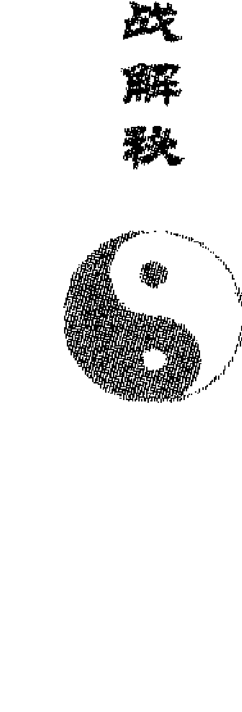

## 上编 六壬应用研究

五行相克：木克土、土克水、水克火、火克金、金克木。
地支六合：寅亥合、卯戌合、辰酉合、巳申合、午未合、子丑合。
地支六害：子未害、丑午害、寅巳害、卯辰害、申亥害、酉戌害。
地支六冲：子午冲、卯酉冲、辰戌冲、丑未冲、巳亥冲、寅申冲。
地支三合：巳酉丑合、申子辰合、寅午戌合、亥卯未合。
地支相刑：子卯无礼刑、寅巳申无恩刑、丑戌未恃势刑、辰酉午亥自刑。

##### 长生十二诀法

甲乙寅卯木悉以亥为长生，未为墓，申为绝，其中甲以寅为禄，乙以卯为禄。

丙丁巳午火悉以寅为长生，戌为墓，亥为绝，其中丙以巳为禄，丁以午为禄。

庚辛申酉金悉以巳为长生，丑为墓，寅为绝，其中庚以申为禄，辛以酉为禄。

壬癸亥子、戊己辰戌丑未土悉以申为长生，辰为墓，巳为绝地，其中壬以亥为禄，癸以子为禄。

另外，戊以巳为禄，己以午为禄，随火干寄宫来论。

关于“长生十二诀”法在壬学中的应用，历来颇多争议，有依五行来起的，有依十干来起的。六壬为地支学，故应依地支五行来起，不分阴阳顺逆，但涉及到天干禄位，则应以天干长生十二诀来起，故地支五行，不分阳顺阴逆，一律按阳顺而排，而且水土同宫。天干五行禄位，严格按阳顺阴逆来排，而且是火土同宫。

月将是壬式中六亲、天将、神煞、遁干等各类象征的基础，其本身也有固定象意。

下面将逐一分析，以便全面了解月将的性质。

###### 1. 登明亥

登明亥，正月将，居双鱼宫，宝瓶星，分野卫、并州，古并阈州，西北位，角音，四数，咸味，褐色，医人药物根亥。壬寄其上，木生其下，玄武之象，水神也。

所主祯祥、征召、阴私、污秽，乘凶如蛇勾虎等，应争论拘系，沉溺，迫干为阴谋、敌人。巳酉丑日占泄气失物。加日干为头，加年命为泄泻。

登明亥类指阴私、官讼、牢狱、盗贼、奸淫、幼儿、沉溺、楼台、图书、头部、图画、圆环、幞头、伞笠、庭院、仓库、厩、园、墙基。在人体主头风、癫狂、肾、疮痢、发、膀胱。又主野猪、熊、鱼、鳖、龟、稻、梅花、葫芦、酢酱、雨师、舟子、孙、私识、伞笠、双象、产难。

亥在地盘为天门，贵人加临天门为贵人当权，神藏煞没，为择日第一要义！贵登天门，占天必雨，占仕途事天子，日德加入天门，占试高中。

- 登明亥，乘十二天将意象如下：
  - 乘贵，为征召。
  - 乘蛇，为悲哭、坏头面、管钥。
  - 乘朱，为盐、管钥、幼儿。
  - 乘合，为阁、幼儿、莹。
  - 乘勾，为狱、哀哭、吏。
  - 乘龙，为楼。
  - 乘空，为卒、厕。
  - 乘虎，为武器。
  - 乘常，为谷物、廪。
  - 乘玄，为眼目、流泪、盗贼、盐。
  - 乘阴，为幼子。
  - 乘后，为溺死、醉人、幼子、麦、痰火。

###### 2. 河魁戌

河魁戌，二月将，居白羊宫，奎娄星度，分野鲁，属徐州，西北位，商音，五数，甘味，黄色，辛寄其上，火墓其下，天空之象，土神也。

所主印绶、文书、公使、代表、又欺诈、奴婢、逃亡、破产、聚众，又旧事重新，为阴，为雪，为军人，州城，牢狱，加申成为队伍。在人体主脾土泄泻、腹痛、胸胁足、命门、任督不交、水火不交、梦魂颠倒。又类为五谷、麻、豆、蚕丝、山狗、狼、豺、军器、礼服、鞋靴、锄、锁、碓磨、瓦器、数珠，加卯成为手足、奴隶、猎者、小童、空门、城郭、营寨、土岗、灵堂、浴室、牢狱，加四季为墙垣。

河魁类在占测中多类指印绶、奴婢逃亡、旧事、动众、恶人、强盗、欺诈、联盟、牢狱等。

戌在地盘上为地狱，专主狱事。贵人加临，名贵人入狱，告贵必辱。河魁加天门亥宫发用，凡占阻隔不通，所谓“魁渡天门关隔定”是也。

河魁戌乘十二天将意象如下：
- 乘贵，为天医、医生。
- 乘龙，为红衣、甲日墙倒。
- 乘合，为工人、手足、技术、文工。
- 乘勾，为聚众、斗殴、石块、争战、六根不全。
- 乘蛇，为窑冶、冶炉、化炼。
- 乘朱，为官吏、舅翁、加年命足疾。
- 乘常，为印绶、老师。
- 乘虎，为盗贼、克日敌人、坟墓、兵士、石头。
- 乘阴，为白衣女士、石碎。
- 乘空，为行步艰难、兵卒、异人。
- 乘玄，为乞讨、犯人、加寅坑厕。
- 乘后，为长者、舅翁。

###### 3. 从魁酉

从魁酉，三月将，居金牛宫，胃昴毕星宿度，分野赵，属冀州，太阴之象，位居正西，数六，金神也。

所主赏赐有功、解散、有无状，又金帛、信息、奴役、阴私事。在人体主肺病、肝胆、小肠、耳目、口鼻、皮毛、精血、音声、咳喘、痨伤、吐血。又类为陨星，为阴、姐、少女、外妾、婢、外亲、酒人、赌徒，丙丁日干加之为赤眼、小麦、菜蔬、姜蒜、酒、浆、乳、鸟、鸡、鸭、鸽、雉、夫妻不和、乘凶煞为尸变、金银、庙神、金银工匠、胶漆工行、白塔、山岗、土穴碑碣、碓磨、风箱、机、仓库、酒坛、桐门严、街巷、珍珠首饰、旺相金玉、死囚小刀。

从魁酉占测多类指金器、首饰、妇人、奴婢、小妾、阴私、金刀、信息等。

从魁酉亚魁星，占试逢从魁加临占人日干年命之上不空亡者，必高中。

从魁酉在地盘上为门户之象，占家宅酉作后门看。

占天时酉作雨师（毕宿），会合丑宫俱主大雨倾盆，秋冬逢之主霜雪冰冻。

- 从魁酉乘十二天将意象如下：
  - 乘贵，为老婢、宾赐。
  - 乘龙，为金玉、尼、鬼、童女。
  - 乘合，为奇术、加寅申尼、军者。
  - 乘勾，为争议、解散。
  - 乘蛇，为鸟怪、海啸。
  - 乘朱，为目疾、喧聒、鸡怪。
  - 乘常，为女乐、乐伎、伎工（加卯）。
  - 乘虎，为临四孟边兵、甲乙日孝服、金玉、尼、白衣。
  - 乘阴，为地私门、丙丁日钱钞、白衣女士、肺脾伤损。
  - 乘空，为霜、小女、女使、巧术。
  - 乘玄，为水边、湖滨。
  - 乘后，为私通、江、霖雨。

###### 4. 传送申

传送申，为四月将，居阴阳宫，觜参星度，分野晋，属益州、西岐，西南位，徵音，七数，辛味，栗色，庚寄其上，水生其下，白虎之象，金神也。

所主交通、运输、道路、驿站、车马、音耗、疾病、死丧、生产事。在人体主肺、肝胆、大肠、心胸、筋骨、脉络、音声、缺唇、血疾、水母。又类为行人、公人、兵卒、邮使、医师、疾病。大麦、药物、猿、猩猩、绢帛、羽毛、金银器、刀剑、馈送、升迁、驿递、金石铁匠、商贾、巫、猎人、屠门、城、神祠、邮亭、廊、大路、马舍、内室、死尸、灵柩。乘贵癸丑日加干淫乱、祸患。

传送申占测多类指行人、路途、疾病、灾厄、信息等。

申与身同音，占病不宜申逢死气，死神入棺木或入墓地。

实占中传送发用或再见丁马、驿马、天马，魁罡加临六处，俱主身动。

- 传送申乘十二天将意象如下：
  - 乘贵，癸丑日加干为淫乱、祸患。
  - 乘龙，为失路、功曹、道门。
  - 乘合，为医院。
  - 乘勾，为攻劫。
  - 乘蛇，为丧孝。
  - 乘朱，为朵车、飞轮。
  - 乘常，为僧、医生。
  - 乘虎，为猎人、兵器、疮肿、骨痛、军车。
  - 乘阴，为剑刃、鼎折。
  - 乘空，为碓磨、脱辐。
  - 乘玄，为遗失、失脱、克日水厄。
  - 乘后，为湖池、碓凳。

###### 5. 小吉未

小吉未，为五月将，居巨蟹宫，井鬼星度，分野秦，属雍州，西南位，徵音，八数，甘味，黄色。丁寄其上，木墓其下，太常之象，土神也。

所主沟浍、嘉宾、酒食、婚庆、祀祖、祈年、井田、农作等事。在人体为脾脏、胃腑、中央、土德、肩脊、果腹、口唇、伤食、翻胃、呕逆、痨瘵、。又类为井、父母、桑叶、木棉、小麻、酒食类、医药、印信、冠裳、笙歌、酱、孀妇、妹、道、酒师、茶、酒肆、宾贺、庄筵、熟识、帽工、土冢、墙垣、风伯。辛巳日乘虎为大风。

小吉未占测多类指酒食、衣裳、妇女、婚姻、鬼神等。

占天时，未为风伯，会寅宫箕宿，必主狂风四起。

- 小吉未乘十二天将意象如下：
  - 乘贵，为老者。
  - 乘龙，为征召、婿。
  - 乘合，为林木、床。
  - 乘勾，为水日争讼、田园、桑园。
  - 乘蛇，为学子。
  - 乘朱，为老师、水日讼词，加亥子蝗虫。
  - 乘常，为气噎、红军、老母、天医、长女、醉人、衣被、太婆。
  - 乘虎，乙日为坟墓、大风、台飓。
  - 乘阴，为继母、老人、姨、大小姑。
  - 乘空，为井泉。
  - 乘玄，为继父。
  - 乘后，为将至、舅翁。

###### 6. 胜光午

胜光午，为六月将，居狮子宫，柳星张星度，分野周，属三河。西南位，宫音、九数、苦味、赤色。正禄无寄、朱雀之象，火神也。

所主文书、官事、公事、丝绵、火德、光、电、炎上、阳气、热烈事。在人体主心、口舌、神气、营卫、血热、任督、神经、心脏、血脉、脑动力。又类为电母、霞、晴、词讼、文电信息、蚕姑、丝绸、旌旗、书画、黍稷、红豆，加卯为禾黍、獐鹿、马夫、飞禽、航、光影、光怪、妇女、旅客、军官、骑兵、女军、女巫、伴侣、城门、堂、宫室、田宅、山林、窑冶、炉、蒸、柜、衣架、娘子军。

胜光午占测多类指文书、图画、妇女、官事、心神、眼目、堂屋等。

朱雀乘午名真朱雀，占文极美。占讼真朱雀克太岁，讼达朝廷，罪必致死。惟申酉年有之，戊己辰戌丑未年逢真朱雀生太岁，大宜干文书于朝廷，必达至尊之前。

正七月占，午作天马发用，必主行人事。三传午卯子，仕途逢之发达之兆。

- 胜光午乘十二天将意象如下：
  - 乘贵，为善人、善士。
  - 乘龙，为使君。
  - 乘合，为帐被、泽官、舌人、布帷、目疾、小豆、衣、禾黍。
  - 乘勾，为亭长。
  - 乘蛇，为惊恐、少女、文风、赭色。
  - 乘朱，为伤风、下沥、燃烧、火烛、关信。
  - 乘常，加申酉为厨子、衣物、大食堂、帐被。
  - 乘虎，为道路、十字街口、刀兵、大道、诅咒。
  - 乘阴，为小妾、眼患、餐所。
  - 乘玄，为目心病。
  - 乘后，为宫女、疝气。

###### 7. 太乙巳

太乙巳，为七月将，居双女宫，翼轸星度，分野楚，属荆州，东南位，角音，四数，苦味，紫色，戊寄其上，金生其下，螣蛇之象，火神也。

所主变异、怪异、惊恐、口舌是非、纠缠、争斗等事。在人体主心、三焦、咽喉、头面、齿、小肠、胃、牙齿、吐血、疮、毒热。又类为虹霓，冬至后为雪，亦为电、窑灶、炼炉、砖瓦、冶铁、窑工、技术、布帛、丝品、花果、黍稷、红豆、疮疤、鸟虫、蜥蜴、蝗蚓、蟾鳗、长绿树、风气、主妇、长女、朋友、画师、术士、厨师、骑卒、艺人、文学、乐器、车骑、筐、磁器、机械、火力。

太乙巳占测多类指斗争、口舌、忧惊、火光、怪异、妇女、炉窑、血光等。

太乙巳为丧车煞，占病逢申加巳为白虎入丧车，大凶。


- 太乙巳乘十二天将意象如下：
  - 乘合，为鸣蝉、胎孕。
  - 乘勾，为囚徒、双胎、戊日管钥。
  - 乘蛇，为吊客、辛丑头面疼、双胎、双象、火光、雀斑、少女、胎孕。
  - 乘朱，为女士、学生、火热、红衣。
  - 乘常，为灶畔、井灶。
  - 乘虎，克干为外孝服、釜。
  - 乘阴，为淫娟、口疮、徒配、罯。
  - 乘空，为罪犯。
  - 乘玄，为双重，遇月厌为梦惊。
  - 乘后，克日辰为骂詈。

###### 8. 天罡辰

天罡辰，斗柄之所建也，为八月将，居天秤宫，角亢星度，分野郑，属兖州。东南位，商音，五数，甘味，黄色。乙寄其上，水土墓其下，土神也。

所主战斗、讼词、死丧、田宅等事。在人体主脾、肝、肩、项、破肤、顶门、风瘫癱肿、偏盲、喉症、雾。加阳支为晴，加阴支为雨。类指狱神、法警、凶徒、顽恶等。五谷、岗岭、墙垣、寺观、祠堂、五谷、麻、鱼、蚕箔、田园、井泉、池沼、沟浍、甲胄、军人、坚硬、果敢、岗岭、石栏、寺观、祠堂、廊庑、缸瓮、砖瓦、破衣、荒冢、死尸、垦荒。

天罡辰占测多类指死丧、田宅、旧事、牢狱等。

天罡为十二星次之首，故为领袖之神。天罡又为魁星，考试最吉。

天罡又为动神，临年命者多主动者必静，静者必动。

辰为天罡，寅为鬼户，辰加寅名罡塞鬼户，大宜躲灾避难，吊丧问疾，合药书符等事。

- 天罡辰乘十二天将意象如下：
  - 乘贵，为山坡、坂泉。
  - 乘龙，为龙神、雨师。
  - 乘合，为鱼、网罟。
  - 乘勾，为屠宰、争讼。
  - 乘蛇，为惊恐、目疾。
  - 乘朱，为惊恐、文状。
  - 乘常，为僧道、医人。
  - 乘虎，为屠户、血光。
  - 乘阴，为产妇、阴私。
  - 乘空，为僧道、孤独。
  - 乘玄，为盗贼、狱囚。
  - 乘后，为妇人、阴私。

###### 9. 太冲卯

太冲卯，为九月将，居天蝎宫、氐房心星度、分野宋、豫州。正东位、羽音、六数、酸味，正禄无寄，六合之象，木神也。

所主舟车、邮驿、交通、森林、友谊合作等事。在人体主肝、大肠、手、背、目眦、膏肓病、胸肋多风。又类指雷震、长子、交易经纪人、舟车、门户、床。晚禾、瓜果、狐貉、羝羊、驴、园、牌坊、俎豆、棺、轮、池泽、大林、竹丛、盗贼、水径、前门、窗牖、梯、衣架、箱、幡竿、笙簧、盆盒、鼓笛。

太冲卯类指舟车、长男、雷龙、门户、驿马等。

- 太冲卯乘十二天将意象如下：
  - 乘贵，为术士、竹器。
  - 乘龙，为竹篙、巳日雨。
  - 乘合，为天马方、小学生、卯加目疾、骨肉酸痛。
  - 乘勾，为少亡、桥梁。
  - 乘蛇，为马、骡、水道、工师。
  - 乘朱，为工匠。
  - 乘常，为兄弟、竹器。
  - 乘虎，为大路、木器。
  - 乘阴，为姐妹。
  - 乘空，为亭子。
  - 乘后，为水车、水轮、春疫、春加子、瘟疫。

###### 10. 功曹寅

功曹寅，为十月将，居人马宫，尾箕星度，分野燕、幽州，位东北。徵音、数七、酸味、碧色，甲寄其上，火生其下，青龙之象，木神也。

所主文书、官吏、婚姻，财帛、木器、山林工程等事。在人体主肝胆、筋爪、手脉、口、发眼、三焦、目痛、肝胃痛。又类指谒见、升阶、督邮、家长、宾客、夫婿、豹、猫、早禾、瓜果、花草、卖酒家、风伯、道路、公衙、丛林、田堤、前厅、屏风、内室、机杼、棺椁、庙。

功曹寅类指木器、文书、婚姻、财帛、官吏、栋梁、会计、道士等。

地盘寅为鬼门，占病忌日干年命加人，必凶。寅为箕宿，占天时主大风。

寅为天吏，申为天城，占考试、工作最喜见之。寅申入课传，最利升迁。

- 功曹寅乘十二天将意象如下：
  - 乘贵，为征召。
  - 乘蛇，为猫狸怪、迷路、五色（加午）。
  - 乘朱，为胥吏、诚信、火炬、栋柱（加午）。
  - 乘合，为坊士学士。
  - 乘勾，为警法、林峦、法官。
  - 乘龙，为肝胃疼、道门、风门。
  - 乘空，为棒杖、法警、林产。
  - 乘虎，为飓风、大风、道人、法吏。
  - 乘常，为书籍、医生。
  - 乘玄，为杂斑纹、迷路。

乘阴，加四仲为宛转。

乘贵，为医师。

###### 11. 大吉丑

大吉丑，为十一月将，居磨蝎宫，斗牛星度，现人箕有奇。分野吴越，属扬州，位东北。徽音，八数，甘味，黄色，癸寄其上，金墓其下，贵人之角，土神也。

所主田地、财帛、园圃、作物、田家、斗争、勤俭。在人体主肾、小肠、脾足、耳、肩背、秃发、病目、腹症、气喘。辛酉日乘龙为桥梁。又类指大麻、黄豆、野菜、蜈蚣、秤、斗斛、食物、鞋、乘月厌为冤仇，又咒诅。雨师、佛神、僧尼、贤者、旅舍、军官、农夫、巫师、墓田、社坛、桑园、仓库、厨房、井墙。

大吉丑占测多类指田产、腹部、雨师、将军、贵人等。

又总论丑未专主田宅、财帛、筵喜。

大吉为丑，仰观天文，丑为星纪，中有斗牛二宿，子为玄枵，中有女虚危二宿。子丑相加，则牛宿与女宿鹊桥相会，再加天将太常欢娱之神，大利占婚。牛女相会可知实质为子丑六合而成，以民间传说来比喻婚姻之象。

- 乘贵，为珍珠、腰脚、痿痹、羯回。
- 乘蛇，为土坑、锅。
- 乘朱，为文书，丙日为举荐。
- 乘合，为道场、先雨后雷（卯加戌）、轿车、缸、夕阳。
- 乘勾，为将军、兵卒。
- 乘龙，乘乙为宫殿、文书物。
- 乘空，为罐、侏儒，己日为土地。
- 乘虎，为风伯、传舍。
- 乘常，为田宅、甜物、不完物。
- 乘玄，为肠泄、桥梁。
- 乘阴，为缸。

###### 12. 神后子

神后子，为十二月将，居宝瓶宫，女虚危星度，分野青州齐属，位正北，宫音，九数，咸味，黑色，正禄无寄，天后之象，水神也。

所主私人、阴私、暗昧、妇女等事。为妻宫、媳、女辈、乳媪、胎产、月经、血崩、肾、膀胱、腰、耳、肾竭、痢、耳内伤风、燕窝、鱼鲜、黑豆、蝙蝠、淫乱、淫女、笼匣、卧室、雷雨、河海、渔父、船工、屠者、江湖、沟渠、水物、水泊，加日辰为舅姑，为瓶盖。

神后子多指妇女、阴私、盗贼、小儿、暗味等。

神后子乘十二天将意象如下：

- 乘贵，为老妇。
- 乘蛇，为浴池，冬至后为大雪霏霏。
- 乘朱，为红衣女子、军。
- 乘合，为布匹、奸邪、布帛。
- 乘勾，为驼子、瓮、女军。
- 乘龙，为亡遗、绸缎。
- 乘空，为哀声、瓮。
- 乘虎，克干为血病、军妇。
- 乘常，为娟妇、孝妇、坤母。
- 乘玄，为盗贼、肾虚、小孩、加饴。
- 乘阴，为小妾、妯娌、天阴、娟妇、婢妾。
- 乘后，为血崩、幼女、布帛，加玄武为大雨。

#### 四、天将概述

十二天将，是六壬测事的最重要依据之一。如果讲天地盘是六壬对客观世界的模拟，那么十二天将所形成的将盘则是六壬对人类社会的模拟。将盘与天地盘的交织运转则描述了不同环境不同时代人类社会的万千变象。

历代壬学家们对十二天将的五行属性、位置次序、运转规律、判断要点、喜忌辩正、类神相应等都有详尽的研究。下面笔者根据实占技术的需要，将择要介绍于后，以备取用。

###### 1. 天乙贵人

天乙贵人，家己丑土，吉将之首，主官爵、诏命、田土。

贵人为十二天将之主，顺布者吉，逆布者凶，与所乘之神相生或比和者吉，与乘神内外战者凶。

贵人有昼夜之分，昼占则夜贵隐，夜占则昼贵隐，此隐藏之贵人谓之帘幕贵人。考试得帘幕贵人加临日干年命，必主高第。在职官吏见幕贵则反主体官去职之象。常人逢之，必主林下官扶持。

昼夜贵人临干支拱年命者，昼夜贵人作初末传引从日干年命者，凡事主得两贵人提携，事体必成。

贵人加干，谓贵人临身，可制化一切凶煞，大吉。贵人加支，谓贵人入宅，告贵大吉。贵人临身固然大吉，亦要贵人生合日干或年命。若甲日见未贵，庚日见丑贵，贵人作墓临身，必被贵人欺蒙，贵人作鬼临干，被贵人克制，或神祇作怪。贵人作脱气临干，壬癸日卯癸临身，必被贵人脱赚。

昼夜贵人或作空陷或被克制，凡有谋为皆不能成，干贵求事，必先允许而后无实惠。后者干贵贵人逢受克制，自身难保，漫被愁怒。

三传四课俱见贵人，谓之贵人遍地，反无依靠。

昼夜贵人加临辰戌之地为贵人入狱，贵人自有忧烦，昼夜贵人加临卯酉之地为贵立私门，主贵人有私，不宜干贵，唯宜阴谋私祷为宜。昼夜贵人分临子午谓之隔，分临卯酉谓之隔，均主闭塞不通。

甲戊庚日丑未贵人加临天门，名贵登天门，四煞没而六神藏，诸占均吉。

凡干贵，不宜丑上神乘白虎，或白虎乘丑，乃贵人怒恶之貌，必招贵人嗔怒，占讼尤宜详此。干贵求文书事，不宜朱雀乘神遥制贵人，必贵人有所忌惮而不肯用事。

六壬中专以贵人来代表官吏之象，而绝非用官鬼来代替。此点研究者务必注意，故而，官吏自占前途者，须以贵人为自身类神来察吉凶。

贵人：对你有大的帮助的人。贵居官爻（阴克阳，或阳克阴）为当官的贵人；贵居财爻，为贵重的财物；贵居鬼爻（阴克阴，阳克阳），为贵人反对，不同意；贵居比肩，为乐意帮助你的朋友；贵居父母爻，有贵人前来。

“贵人居子曰解纷，解纷宜嘱事于童仆”。解纷就是解除纷乱，事情繁杂则有纷乱。子是夜半之种，贵人丑土克子水解除扰乱，便可安居乐业也。这说明人居子宫是吉的，但总有些纷乱需要处理。说明对待事物要有耐心，不要什么自己抓，也可以依靠可军的去办。

“贵人居丑曰升堂，升堂宜投书于公府”。丑是贵人的本位，丑土加丑土，有泰山之威严。说明办事要公道、严明、不留私情、不走后门，而是“投书公府”。

“贵人居寅曰凭几，凭几可谒见于家”。寅为功曹（十二将之一）为公文琐碎之象。凭几就是依案闲读，这是说贵人处于在家闲读的时候，功曹乘机进言，许多话就比在公堂要好说多了。寅为木、木克土，这里应了一个“侵“字，乘机侵人。

“贵人居卯曰登车，登车宜诉词于路”。卯是一个林木舟车官，名叫太冲，卯为私门，所以见卯就是出门，不是坐车就是乘船。这句话的意思是，贵人出门，有人拦路喊冤。说明今天出要碰到一些棘手的事。

“贵人居辰曰天牢，居戌曰地狱，辰戌怀怒兮下忧上辱”。辰叫天罗，戌叫地网，贵人掉进天罗地网里，有如文王被囚麦里，下被小人所欺，上被君王所禁，真是倒霉之至了。

“贵人居巳午曰受贡，受贡兮君喜臣欢”。巳午为火，火生土。贵人居生方之地，当然事事如意，一片欢喜。

“贵人居未曰列席，列席则有酒筵之娱”。丑为阳贵人，未为阴贵人；又未为太常是酒食衣帛之宫，丑未相加，为两贵相会，当然少不了酒席宴会，歌舞嘻戏之事了。

“贵人居申曰移途，移途则有求干之荣”。申为传送（十二将之一），为道路之神。贵人居申就是贵人在移途的道路上嬉戏游玩，这时想当官的人或谋私利的人便可趁机进言；以达到自己的目的。

“贵人居酉曰入私室，入私室则不遑宁处”。卯酉为日月之门，为私门。贵人在卯为出门，在酉又为入门。贵人出入私门则有失身份了，办事不检点；和不能严于律己，当然要遭人非议而遑遑不宁了。

“贵人居亥曰还绛宫，还绛宫坦然安居”。还绛宫又叫登天门。贵登天门；万事大吉。此时六凶俱藏，可坦然安居。六凶者，螣蛇、朱雀、勾陈、白虎、天空、玄武六神。在贵登天门之时，六四尽被制服而潜藏，所以为大吉。

###### 2. 螣蛇

螣蛇，家在丁巳，凶将也。主火烛、血光、惊恐、怪异之事。

螣蛇者，妖神也，极凶极怪。螣蛇作鬼临干，名蛇鬼，主有惊危之事。唯六处有冲克，可解。如蛇鬼加支，主家中必有怪异。

六辛日遁旬内六丁乘蛇在六处谓蛇乘遁鬼，主至凶至怪至动至急，空亡不能救解。

六丙日干上戊昼夜乘蛇，地盘上又为蛇之本家，谓之两蛇夹墓，占讼被囚，占病必因积块癌症而亡。其中丙戌日最凶，如占人年命在亥用天罡冲制名破墓，庶可少免。

占梦与怪异，先视螣蛇及其阴神，日干三传次之。

螣蛇乘火鬼临火煞火乡主火灾，临支克支更的。火煞者，火鬼也，春午夏酉秋子冬卯也。

螣蛇乘旺相更相生者，主胎产婚姻之喜。若并血忌血支，占产即生，占胎必堕。

螣蛇为卑贱轻浮之神，占人占物必下贱无疑。

### 第二章 六壬预测的基础知识

螣蛇：害怕、惊吓、恶事缠绕、恶梦，在事情上为变化，或出现意外，蛇居官鬼爻，上面责怪，处罚；蛇居父母爻，父母有病变或意外之事，断事为因某外来因素产生了变化，蛇居子孙爻，小孩受惊吓，周围有不良信息干扰，断事为自己产生了变化；蛇居财爻，在钱财上产生了变化，能够到手的钱财变得没有了，如见空亡，则为钱财丢了或被盗了；蛇居比肩，朋友背信弃义，或朋友产生变化。

“螣蛇居子曰掩目，掩目则无思无忧”。子为夜方之神、为水。蛇为火居北方遭克，自然蟠伏栖息，像蒙上眼睛一样，其凶焰无所施，当然就无忧无患了。

“螣蛇居丑曰盘龟，盘龟则祸消福善”。北方玄武为龟也，而丑内有龟，蛇居之，必当龟蛇交感，水火既济；哪有心害人？所以祸消福善。

“螣蛇居寅曰生角，居酉曰露齿，生角露齿祸福两途”。火生于寅，荣旺之始，蛇居寅正有象龙一样飞翔天空之志，所以它贪图荣耀，根本无心害人，因此为福，或无凶害。而八月酉正是火休气陷的时节，秋天来临，万物肃杀；蛇也露出了凶残的本性。又因为火克金乡，蛇在秋天肆无忌惮，到处毒人，危害非浅。

“螣蛇居卯曰当门，居申曰衔剑，当门而衔剑总是成灾”。卯是私门，蛇当门则，出门便被其害。申为金刃之象，火克金则象征着蛇含剑，所以也是大患。

“螣蛇居辰曰象龙，居戌曰入冢，入冢而象龙并为释难”。辰为春天茂密的山林草地，春天正是蛇得志忘形的时候，它总是想象龙一样地住树上攀缘，所以无心以害人。戌地为火的基地，象征着蛇要入洞进行冬眠了，因此更无心害人。所以说象龙和人家都使灾难得到解除。

“螣蛇居巳曰乘雾，居午曰飞空，乘雾飞空休样不辩”。螣蛇火神，正居火位，乃得志之时。但此时蛇高高在上，像腾云驾雾一样，目无所见。所以要小心谨慎，则不被其所害。

“螣蛇居未曰入林，入林兮锋不可砍”。未为木之墓，为夏天林木繁茂的地方，蛇入林则防不胜防了，在茂密的树林中，用刀也砍不到它，因此，要特别小心。

“腾蛇居亥曰堕水，堕水兮从心无患”。蛇能入水，以取鱼虾为食，而无横路毒人之患，对我来说当然无忧了。

###### 3. 朱雀

朱雀，家在丙午，凶将也。主文书、信息、火光、口舌、词讼等。

凡占公事，雀逆理刑日干，官必嗔责，反此无害，雀鬼占官被劾，占讼必败。

占考试与投献文策，雀不入传，亦须寻讨。最爱与岁月建月将并，不然与岁月日相合，带禄附马并德加临生旺之地，文策必中，如被刑克及落空亡无气、加临死绝，其文必不合格。

雀附火神临火乡，并值火时，决主火烛。

考试张榜之时，朱乘丁马，名落孙山。考试占朱神克幕贵，试文不贴主考心意。

德作官星，将乘朱雀，名文德格，主应举得中，在官得荐。

朱雀：争吵，口舌是非，或为信件，消息。朱雀见官爻，有官方通知、信函、信息；见鬼爻，有人骂称，或说你坏话；见父母爻，有家信来，或有消息来；见子孙爻，你写信去；见财，为财而争吵，闹矛盾；见比肩爻，与人发生争吵。

“朱雀居子曰损羽，损羽也自伤难逃”。朱雀为火、临水乡有损羽之象，羽翼伤损，必进退难成，占得此，文书无气而不达。但口舌词讼不凶。

“朱雀居丑曰掩面，掩面动静得昌”。丑为北方水气之余，制朱雀之火，有投江破头之喻，头破而掩面，自不能有为。所以对我则动静皆吉无口舌之忧，但书信不通。

“朱雀居寅居卯曰安巢，安巢兮迟滞沉溺”。寅卯为木，林之象。木生火，朱雀贪生入林结巢安居，所以口舌词讼自息，但书信不通。

“朱雀居辰居戌曰投网，投网兮乖错遗忘”。辰戌名为罗网，朱雀入网罗之中，必不可展翅飞翔。而戌又为雀火之墓，辰戌相对为丘墓之象，朱雀入丘墓之地，如病如衰，其气志得到扼制，当然就凶不为凶了。所谓乖错遗忘仅指文书方面。

“朱雀居巳曰昼翔，音信至都缘昼翔”。昼翔就是白天飞翔。巳午为白昼之象又是朱雀乘旺之方，到此朱雀气盛而高高飞翔，因此，占凶则口舌词论；占喜则起用文书，望人信息俱到。

“朱雀居申曰励嘴，居午曰衔符，励嘴衔符怪异经官语讼”。申金最怕午火，申地为朱雀得气之方，朱雀至此厉嘴口舌是非难免。朱雀居午正得气之时，过去以火旺为文才兼备，若入考场，必高中无疑，符为得中科第的文书。朱雀含着文书到来，表示高中。

“朱雀居未曰临坟，居亥曰入水，临坟入水悲哀且在鸡窗”。未为古墓之象，朱雀在古墓上结巢却停留不去，这下子可麻烦了，纷争白舌和官司不断。巳午未申正是朱雀猖狂得势之地，朱雀停下来不走就像每天鸡叫一样连绵不断，又像乌鸦围绕着墓地死尸在哀号，充满着悲哀的气氛。朱雀在亥地叫入水，亥为夜方又是水乡，朱雀入水受伤而不能展翅飞翔，其灾难自息。但亲人外出，久盼音信不归，也使人感到悲哀。

“朱雀居酉曰夜噪，官灾起盖因夜噪”。酉为门户，口舌入门，有上面降罪，所以官灾。酉为西方日落之方，为夜，所以叫夜噪。西方为权柄之方，朱雀在西方就意味着官方降灾了。

###### 4. 六合

六合，家在乙卯，吉将也。主子孙、和合、婚姻、交易等。

凡六合乘旺相气相生，顺理而入用传者，必主婚姻或胎产、阴私、财物之喜；若死囚相克，则主财物口舌，阴人烦扰。

占婚逢干支上神互乘六合天后，男女必先奸后娶，更看哪边空亡，审其真伪。

初传卯酉乘六合天后为淫佚课，如初传六合，终于天后，主男诱女，有私奔之事。如用天后，终于六合，主女诱男，有私奔之事。

三合作传，干支上神乘六合者，亦作三合六合论，成事吉，散事凶。

六合：相会、赴约、合作、结合。六合见官爻，与官方合作；见鬼爻不予合作；见父母爻，有人来找你；见子孙爻，你去找他人；见财爻，可以合作，合作成功；见兄弟爻，朋友相会或与人有约。

“六合居子曰反目，反目兮无礼之事端”。子卯为无礼之刑，虽然相生，但因事起于无礼而造成反目，彼此不投。

“六合居寅曰乘轩，居申曰结发，乘轩结发从媒妁以成欢”。寅木为轩车，在过去就是轿子。寅中有甲，申中有庚，从寅地坐轿人卯门，卯内有乙，乙庚可以相合结为夫妻，所以寅便为媒人了，而乙庚从了媒人之约，终成合和之喜。

“六合居巳曰不谐，不谐惊悖”。六合为木，木入火乡灰飞烟灭，占事不和谐，如烟云而散，凡占惊扰恐惧难免。

“六合居午曰升堂，居卯曰入室，升堂人室并为已就之占”。午为离位，又为堂屋，所以为升堂，卯为六合本位，又为门户，所以叫入室。六合入室升堂，象征着六合之威严得到展现，而六合又是合和喜庆之官，所以，办事一切顺利。

“六合居未曰纳彩，居丑曰妆严，纳彩妆严总是欲成之例”。未为太常，酒食帛物之乡、丑为贵人之本位。所以，六合居未、居丑都有和合、喜庆、纳彩、装饰的意思。

“六合居酉曰私窜，私窜兮不明之囚地”。卯酉为私门，六合为卯，以私门对私门，有出入私门逃窜之象，六合卯木入金乡被伤，所以叫囚地，以私门对私门，必有奸淫阴私、暧昧不明之事，所以叫不明。

“六合居辰曰违礼，居戌曰亡羞，违礼亡羞因妄冒而加罪”。卯居辰本不和，所以因违礼而加害于对方。戌为是非之地。卯木本克戌之神，但因自己私门临之，以私门对是非。所以引来灾祸，被人所加害。

“六合居亥曰待命，待命合同”。亥为天门，是百官朝见之地，我有公私之事入朝等待招见，这说明办事顺利，必能成功。

###### 5. 勾陈

勾陈，家在戊辰，凶将也。主战斗、词讼、争论、勾留、田园等。凡捕盗，勾陈制玄武，主获。勾陈临日干，亦主获，反此不获。凡占讼先以勾陈为主，如勾陈贼日，理难得伸，日克勾陈，讼得理伸。又忌勾阴附蛇雀虎杀，克日者最凶，勾陈作贵人生日者，可转凶为吉。

占望信息、财帛、出行俱主留滞，俗人得之如此。若官员见之，乃为印绶，盛则吉，衰则凶也。

勾陈：争斗、阻力、阻止。勾陈见官爻，有官场之争，或来自官方的阻力；见鬼，有人与你过不去，会有争吵。如有刑冲则会打架，如见申酉金局，则有刀刃之伤；见父爻，争端自外而来；见子孙，阻力自内而起；见兄弟，朋友阻拦，或争吵。

“勾陈居丑曰受越，居于曰投机，受越投机被辱暗遭毒害”。丑为贵人之地，勾陈入贵地为贱人，虽为贵人所管制，但暗下毒手。子为勾陈土克之方，勾陈得势。更加猖狂以极，所以凶必难免。凶神得势则我必遭殃。

“勾陈居寅曰遭囚，遭囚兮宜上书”。寅为勾陈被制之方，因为寅木克辰土，所以勾陈被囚。所谓上书是说，趁着勾陈被囚，应马上上诉，诉拆它的罪行，立即置它于死地，否则以后它还会加害于我。

“勾陈居卯曰临门，临门兮家不和”。卯为门户，勾陈入门必然争斗、官司、抢攘等入门，造成家庭内外不和，为破坏之象。

“勾陈居辰曰升堂，升堂有狱吏以勾连”。辰为勾陈本位。它处在自己的位置，正有升堂主象，勾陈升堂必有抓人、逮捕、争讼之事，说明有祸降临。

“勾陈居巳曰捧印，捧印兮有封拜”。巳为铸印之方，勾陈为掌印之神，勾陈临巳有棒印奉上之象：所以，当官的占之，必有封拜之事，或迁官必速。但常人则有要盖印抓人之象了，故反而成忧。

“勾陈居午曰反目、反目因它人而迷戾”。午火为朱雀，舌之神，勾陈为庚争讼之神，虽然有午火生辰土，但两者都是凶神，谁也不肯相让，故有反目之象，它反目迷庚而波及于我。

“勾陈居未曰入驿，居戌曰下狱，人驿下狱往来词讼稽留”。未为坦途驿道，戌为地网又叫地狱，戌辰相互对冲必触犯勾陈而被抓入狱，因此，必有道路往来回复词讼以求解脱之事。

“勾陈居申曰趋户，居亥曰褰裳，趋户褰裳反复勾连改革”。在申地往前，是酉之门户，所以叫趋户，亥为夜方，正准备褰衣而卧。而申为坤，名为地户，亥属乾，叫做天门，所以申亥又为门户。上面的意思是说，我正准备进屋内而卧，忽然门前立有勾陈凶神，则赶紧返身逃跑，稍迟便会被其钩执住了。这是一个比喻，是说有灾祸临门，唯有躲避为妙。

“勾陈居酉曰披，披刀兮身遭击”。酉为金又为杀气之方，勾陈居酉互相生更呈其凶，然行凶必遭责，对于我应躲避为妙。

###### 6. 青龙

青龙，家在甲寅，吉神也。主吉祥，吉事，财富，财帛，婚姻，官府等。

诸占悉以青龙为喜神，若披刑带杀入课传贼日，却主凶，以其为杀神故也。

占婚姻，青龙为男，天后为女。

占文官则视青龙，武官则视太常。太常与日干生合者吉，反此为凶。青龙乘神不宜上下克贼，比扩失位丢职。太岁作龙常，必主迁转。

占盗贼忌龙入卦，以龙为万里之翼也。占行人亦主转往他方。

龙乘日干长生或月内生气吉神加临干支，主功名显达，家道荣昌，忌空亡。

占病龙入传，必因酒食或酒色而致。又青龙为纸钱煞，太常为孝服煞，占病皆忌见之。

青龙：走动。青龙见官，上任，或官方走动，或为官而走；见鬼，不愿意走；见父爻，想走和人要你走；见子孙，你去；见财，可以走，或有钱财。见兄弟，可走可不走；见申酉和财爻，为钱财而奔走。

“青龙居子曰入海，居亥曰游江。入海游江因动有非常之庆”。子、亥都为水，龙在水中当然来去自由，动静得昌，占得者自有非常之庆。

“青龙居未曰在陆，居丑曰蟠泥。在陆蟠泥所谋未遂。”丑未为土，丑为湿故为泥，未为燥土，为硬土，所以为陆。龙在陆地和泥地，有才能也施展不开，且困扼，不得飞腾，所以，什么事也办不成。

“青龙居寅曰乘云，居卯曰驱雷，乘云驱雷利以经营。”寅为青龙本宫，正是龙腾云出入的地方。卯为震卦，震为雷。龙又是云雨的象征。所以，龙出入寅正是乘云驱雷，施展自己本事的时候。因此利于一切经营。

“青龙居午曰烧身，居巳曰掩目，烧身掩目因财有不测之忧。”青龙喜生而怕火烧，午为南方火地，所以为烧身。巳为蛇洞，龙人蛇洞最为不吉，大有烧伤掩目之意。南方火地生土，而土为木之财，青龙居巳午唯有一点财物可图。为图一点财物而引火烧身，这就有着莫测之扰了。

“青龙居申曰伤鳞，居酉曰摧角。伤鳞摧角宜乎安静”。青龙木入金乡，有受伤之险。吉神受伤，焉能福佑于我？所以占此必安居守静，不可妄动。

“青龙居戌曰登魁，登魁兮小人争财”。成为河魁，小人是非网风地，青龙财帛入之，则必有小人为财争斗。

“青龙居辰曰飞天，飞天兮君子欲动”。辰为龙宫，又为在天之象，因戌亥子日象地在下，辰巳午未象天在上。辰又为天子之象，青龙飞天象征天子大有作为之时。

###### 7. 天空

天空，家在戊戌，凶将也。主市井、契约、部属、虚诈，亦为奏书之神。

天空为空亡寂灭之神，诸占不喜。财爻，长生爻，鬼爻皆忌见之。

# 六壬应用研究与股市实战解读


占奴河魁从魁，皆以天空为主星，要天空乘神与干支生合无克贼则吉，不然主逃走，更值魁罡，其仆不良。

占试奏对亦吉，天空乃奏书之神，托人谋事，最防虚诈。

占词讼最爱天空发用及终传，主讼解、谋不成。

占婚天空发用及临日辰者，其家必有孤寡之人。不然更徙祖业。天空加临命年者，主单身状态。天空临财官爻者，与寡宿孤辰同论。

一般而言，天空可作空亡看待。三传之中二者空亡，一者逢天空者，则作三传俱空论。

天空：文书、空话、欺骗、开会、学术研讨。天空见官、文书、开会、研讨；见鬼，欺骗、空话；见父母，有文书来；见子孙，写文书去；见兄弟，开玩笑，说空话；见财，凭证、证券、契约等。

###### 8. 白虎

白虎，家在庚申，凶将也。主道路、杀伐、疾病、刑戮、血光等。

白虎与螣蛇为十二天官中最凶之将，白虎主凶丧，螣蛇主凶怪。两将乘日墓加临卯酉上者为墓门开格，病令俱主重丧。两将乘日墓支墓加临支辰，必主宅内怪异不宁，或有伏尸作怪作祟，宜法官安镇行遣。

白虎所临多凶少吉，白虎守禄则为惊危之禄。白虎守长生则生意惊畏，白虎守财则为惊危之南，难求。

白虎作鬼为虎鬼最凶，临干身凶，临支宅凶，临身命则有死亡之忧。

唯占仕途，虎鬼为催官使者，必主赴任极速。

六甲日遁旬内之庚乘白虎在六处，为虎乘遁鬼，至凶至极，纵空亡不能救解。

占天时专视白虎主风，白虎会寅示巳大风必起，甚验。

昴星课最忌虎入课传，则病讼俱危极矣。

白虎虽穷凶极恶，但白虎逢旬空落空，或恋生受制，或阴神制克，主先凶后吉，反无深忧。（神者，虎乘神地盘本家上神是也，其他阴神同论。）

白虎：上任、掌权、金钱、死神；白虎见官，上任或赋予使命；见鬼，死神或有极凶之事；见父母，有钱来；见子孙，钱有损；见兄弟，有钱之人；见财，金钱；居申酉，金钱。

“白虎居子曰溺水，居亥亦然。溺水音书不至”。白虎喜山林道路，今落于水中，则各种凶害可解。所谓音书不至，是指白虎主道路，今落水则道路不通，送书信的人被阻隔、故音书不至。

“白虎居午曰焚身，居巳亦然，焚身祸害反昌”。白虎金入火地，自然遭焚，白虎凶神被焚则我一切祸害可解。

“白虎居卯曰临门，居酉亦然，临门兮伤折人口”。白虎凶神堵在门口，有极凶之兆，若不提防，出门便被其伤。

“白虎居丑曰在野，居未亦然。在野兮损坏牛羊”。丑未为田野之象，又丑为牛、未为羊，为牛羊在田野上。今白虎进入牛羊之中，岂有不伤折牛羊之理。

“白虎居寅曰登山，登山掌生杀之权”。寅为林木山峰，白虎登上山峰则其威不可挡。又白虎为金刃刀剑，有武将之象，故掌生杀大权。占者必凶。

“白虎居戌曰落井，落井脱桎梏之殃”。戌为地狱又叫陷阱。老虎掉进陷阱里自然不能危害于人了。所以，对我则脱桎梏之殃。

“白虎居申曰衔牒，衔牒无凶主可持其喜信”。衔牒就是拿着通关文牒，表示道路通畅，书信往来不断。申为白虎之穴，白虎在家贪图安乐不出来害人，所以有喜信可持。申又为传送，表示持着喜信传给家人。

“白虎居辰曰噬人，噬人有害终不见乎休祥”。辰为山林中之墓地，有未葬之尸，白虎噬尸为吃人，此为凶占，唯避之方可。

###### 9. 太常

太常，家在巳未，吉将也。主欢会，衣裳，印绶，文物，宴食，田地等。

占官最喜此将，终始见太常天驿二马印绶之卦，所求遂意。

太常乘日干长生加临干支者，必宅中有婚礼财帛事。加临支辰者，宜开酒食店面或衣帛门面，后有长进。

太常作日鬼死气加临日干者，主有外丧；加临支辰者，主有内丧。太常乘日鬼死气华盖者加临妻命，妻来占夫病，夫必亡，此为妻戴白帛盖头。

壬子、癸丑日未遁丁马者，必病必因往妻家所致，极验。

太常乘未土发用或临日干之上作鬼者，占病必因喜事或宴饮或往亲家带疾而归。或是大官占之，必因赴宴而病，余占皆因前事而致不美。

太常：酒席、平常之事；孝服。太常见官，有庆功宴席；见鬼，有死丧孝服，占一般事为不平常之事；见父母，进衣服、食物；见子孙，给人衣食；见财，财产。

> “太常居子曰遭枷，遭枷必值决罚。”

子为水乡，太常土克水为坝，但水大决堤，使太常遭受责罚，这是因为子未为害，太常枷锁必因子水害之。这个意思是说太常居子必蒙冤遭害。

> “太常居寅曰侧目，侧目须遭谗佞”

太常最怕寅地，因寅木克土，又寅虎遇未羊，以凶对善，所以太常恭敬百至，不敢正视，唯侧目以探。如果旁有谗言，则大祸不免。

> “太常居卯曰遗冠、遗冠也财物遭伤”

太常冠裳之神而入私门，有冠不正之象，所以叫遗冠，太常为衣帛财物，被卯木所克，必有财物遭伤之忧。

> “太常居辰曰佩印，佩印有用迁之命”

辰为天罡首领，又为掌印之宫，大常为印授之神，二者相对有配印之象，佩印则封官改拜。

> “太常居巳曰铸印，居未曰捧笏。铸印捧笏不征而喜庆”

巳为铸印之方，太常在巳而得印（因火生土，火为土印）。未为太常本位，酒食衣帛之乡，有捧着酒杯，相互祝贺之意，所以有喜庆。

> “太常居午曰乘轩，乘轩有改拜之封”

午和子都为天地之道路，太常在道路上当然是坐车而行，所以叫乘轩。太常乘轩由南而北，有上朝面君之象，所以有改拜之封。

> “太常居申曰衔杯，居丑曰受爵，衔杯受爵不转职而升官”。申为传送，有迁转之意，太常在申为迁转升官而举杯庆加贺。丑为贵人至尊之地，太常在至尊之地有受爵之象。

> “太常居酉曰券书，酉作券书虽顺而防后竞”。券书就是书写功绩，太常得酉金锋刃万事顺利，为成功之象。所以要券书表彰。但酉为从魁，小人之方，又为自刑之方，虽用他以助成功，但要以正大而为之，否则将有不测之忧。

> “太常居戌曰逆命，逆命也尊卑起讼”。戌为河魁网罗之地，为极卑之神，未为太常在上为尊。又未戌有相刑之凶，太常临戌地有尊卑起讼之事，所以叫逆命。

> “太常居亥曰征召，征召虽喜而必下憎”。亥为天门，太常居亥有征召冠裳之象。但未土在上，亥水在下，水憎恨土克之苦，所以上虽喜而下却忧。

###### 10. 玄武

玄武，家在癸亥，凶将也。主盗贼、走失、争斗等。

凡占盗贼，须责玄武三传，先以玄武所乘神为初传，初传地盘上神为玄武阴神为第二传，谓之盗神，而盗神有所生为藏物潜居之处，又须看盗神之阴第三传，此玄武三传神将相生，上得吉将，其贼难获；若三处神将相克，有凶当败露。又看人年上神与日克制玄武者，亦获。

玄武为贼神，居官鬼、脱气、财神、禄神、生气皆主盗财夺禄剥生意，最不宜见之。

玄武又为淫神，颇好色淫荡，放浪。

玄武又为不法之神，皆为非法不正违法乱纪之人事类象。若胎神乘玄武，必主私孕（私生子），不为人知。

玄武乘月将，名“太阳照武宜擒贼”。

玄武：小人、怀疑、不相信、偷盗。玄武见官，上面不信任或给小鞋穿；见鬼，小人，窃贼，吝啬之人，被小人所控制；见父母，有猜疑，有小人来；见子孙，去求人；见兄弟，互相怀疑；见财，图谋钱财或使手段谋取钱财。玄武见鬼临支，有盗贼至。

> “玄武居子曰散发，散发有畏捕之心”。

子为夜半正睡未醒之时，也正是偷盗之时。因此就象易受惊吓的子鼠一样。心怀畏捕之心而四行散发作案见玄武尤当提防。

> “玄武居丑曰升堂，升堂有干求之意”。

丑为贵人之地，玄武被克之方。偷盗不成，以礼说谒，实怀窥测之心和干求之意，此时见玄武，必虚假而只有之人。

> “玄武居寅曰入林，爱寅今入林难寻”。

寅卯为林木，盗贼最喜爱之。因作案后逃入林木中，便难追捕了。所以玄武居寅卯盗贼多半难抓。

> “玄武居卯曰窥户，窥户也家有盗贼”。

盗贼窥卯之门户，当然有险盗之意谨防。

> “玄武居辰曰失路，愁辰今失路自制”。

辰为勾陈土神，专制玄武之水？水逢土无路可走，自然被擒制，占得此，失物必回，盗贼必擒。

> “玄武居巳曰反顾，反顾也虚获惊悸”。

巳为白昼，不是盗贼行窃之机。为惊恐之神，盗贼到此总感到有人在追他，总是虚获惊悸。

> “玄武居午曰截路，居酉拔剑，截路坏恶攻之而反伤”。

午为天地之道路，故象为截路。酉阴金剑锋之象；故取象为拔剑。盗贼被前后堵截，无路可逃，穷凶极恶，狗急跳墙，拔剑威胁，猖狂之极。这时去攻他反而被其所伤。必须有策才能制服之。

> “玄武居未曰不成，不成必败于酒食之地”。

末方为土克玄武，偷盗不成。太常为酒食之地，盗贼因贪图酒食而未能成盗，必被抓获。

> “玄武居申曰折足，居戌曰遭囚，折足遭囚因失势擒之而可得”。

申为坤土克玄武之方，又申为金刃，玄武入之必遭斩杀。戌为牢狱，又土克水，故为玄武遭囚之方。二者尽是捕贼杀贼之地，盗贼失势最易被擒。

> “玄武居亥曰伏藏，伏藏则隐于深邃之乡”。

亥为玄武本位，盗贼行窃后已归家隐藏，所以难以抓住他。

###### 11. 太阴

太阴，家在辛酉，吉将也。主妇女、婢女、嫁娶、隐私、暗昧等。

占婚见太阴并酉亥未发用加日辰，其女不正，必风骚。

占讼太阴入传相生，宜自首。

占女性下属，专视太阴。

太阴所为皆是阴私，不为人知，利阴谋私祷事。

太阴：女人、隐瞒、隐藏、暗中之事。太阴见官，当官的女人或上面有荫庇之意；见鬼，有阴私暧昧之事，或暗中陷害之事；见父母，有女人来；见子孙，去找一个女的；见兄弟，为姐妹；见财，为阴财或隐藏之财。

> “太阴居子曰垂帘，垂帘兮妾妇相侮”。

子为天后，酉为太阴。太阴居子于为二女同居一宫。又子为正北黑夜之地，有夜幕垂帘，以阴对阴之象，所以有不和而相互侮辱之举。

> “太阴居丑曰入内，入内则尊贵相蒙”。

丑为贵人之地，阴人入内，君子必被其蒙蔽而氏乱，故当谨防。

> “太阴居寅曰跣足居午曰脱巾，跣足脱巾财物文书暗动”。

寅为平旦，太阴起来走动，午为午休，胶巾将卧之时，又寅被太阴所克之时，午为文收书制太阴而鬼，阴人所至，故财物文书暗动。

> “太阴居卯曰微行，居申曰执政，微行执政偏宜君子之贞”。

卯为私门，阴人入私门，非正大之事便为微行。申为太阴乘旺之地。太阴为金有操持权柄之象（也可以是在家掌权）。所以，微行执政都可直挡影响到君子的品行和气节。

> “太阴居辰曰造庭，造庭兮宜备乖事”。

辰为龙庭，为天罡所居，阴人入内乖巧。辰为勾陈，威严刚毅之神，被阴柔所化，也不得奋展其志。

> “太阴居亥曰裸形，居巳曰伏枕，裸形伏枕盗窃口舌忧惊”。

> “太明居酉曰闭户，居未曰观书，闭户关书雅称士人之政”。酉为太阴之本家好静所以闭户。未为土生金之地，有休养生息之象，故观书以致闲情。

> “太阴居戌曰被察，被察兮当忧怪异”。戌为河魁刑狱之方，酉戌又为六害，故太阴居戌有被纠察之象，且怪异当忧。

###### 12. 天后

天后，家在壬子，吉将也。主恩泽、人情、妇女、阴私、暗昧、蔽匿等。

天后为妇女类神，占婚作女方者，占孕则为母方看。

天后为恩泽之神，占官占讼皆喜见之，皆主有人情。凡占天后乘太岁加日临门户，主恩赦之兆立至，更值三光三阳课尤准。

天后并太岁，有女王之象，天后并卯则有公主之象。

占婚宜后与日干相生或三合六合，则必成。后刑克日干或干上神，俱主女不肯；日干或干上神刑克天后，俱主男不肯。若课传大吉，主先阻后成。天后所乘之神，可定女子性情容貌。

天后乘血支血忌作月厌临支克支者，皆应宅舍有血光堕胎之灾。

天后：女人、妻子、护佑、爱护、袒护。天后见官，受上面的保护；见鬼，有女人反对；见父母，有女人（或母亲）来帮助和保护；见子孙，寻找保护和帮助；见兄弟，为妻妾；见财，为妻。

> “天后居子曰守闺，居家治事动止多宜。”亥为天门，为乾刚健之地，女子自强不息，刚勇由强，正应治事持家之道。所以动止多宜。

> “天后居寅曰理发，居申曰修容，优游闲暇盖因理发修容”。理发为早上起来整理头发，修容为傍晚容残妆褪，须要重新整理容额。而寅申正是理发修容之时。这是说妇女在家无所事事，过着一种优游闲暇的生活。因为天后子在寅在申都是相互生合的关系，所以无忧无虑。

> “天后居酉曰倚户，居卯曰临门，倚户临门奸淫未足”。卯酉为私门，天后为阴私，有私之神入私门正应淫奔之象。如果是正大之举，也会遭人非议。

> “天后居巳曰裸体，居辰曰毁妆，裸体毁妆不悲哭而羞辱”。巳为蛇，是惊吓之神，子水在巳遇火刑克因暴露而受惊吓，辰为制水之地，天后居辰遭非礼而裸露毁妆，故二者都因羞辱而悲哭。

> “天后居戌曰褰帷，居午曰伏枕，褰帷伏枕不叹息而呻吟”。水入戌地遭克为病之象，戌又为夜间，有卧床之象。午为午休之时，所以叫伏枕，占得卧床伏枕不是因为病卧而呻吟，就是因为不快而伏枕悲哭，总之是事不随意或办事不成。

> “天后居丑曰偷窥，居未曰沐浴，惊惧惊惶缘为偷窥沐浴”。子丑为六合，有私匿之会，又恐人知，所以叫偷窥，未中有井宿，壬子居之有水井意，所以有沐浴之象。女子沐浴当然怕人偷窥，所以惊惧惊惶。以上诀有见不得人的事，必然心中惊怕惶不安。

在六壬判断中，必然要遇到诸多神煞的问题，往往碰到凶神就是凶，碰到吉神就吉，六壬以十二神为最主要的吉凶判断依据。

在十二天将中，有六个凶将也叫凶神，即螣蛇、朱雀、勾陈、白虎、天空、玄武。有六个吉将或比较吉利的天将，即贵人、青龙、六合、太常、天后、太阴，为什么这些天将会有吉凶呢？这与我们自然界的运动规律息息相关。

我们从生活中可以体察出，在春天，万木繁茂，生气盎然，人们感到特别的轻松愉快，正是劳碌繁忙、事业长进的大好时候。所以，代表春天的地支寅卯木，就成为一种生机向上的标志，以寅代表青龙、卯代表六合，青龙六合就成为龙腾万里，喜庆和合的吉神了。青龙是百神中最吉利的神之一，青龙旺相则主喜庆、财物、玉帛、米谷、生产、升迁等，同时也主婚姻、佳会、酒宴、胎产等，只要青龙旺相且生干，任何灾害自然解除。但如果青龙休囚或克干，则喜中有忧了。

六合主喜庆、婚姻和合和一切和平、合作、联合、会合，又主成就、宴会，等等。卯为六合，又叫日月之门，它是东边地平线上的天地交合，日月交合，阴阳交合，昼夜交合，由于它是四正位，又有东西交合，南北交合，所以统应一个“合”字。它旺相合，则喜庆婚姻成就，若休囚合，如有男女阴私暧昧，合伙投机捣鬼相互变态欺诈，明合暗斗等等。这也是阳合和阴合的区别。

夏天南方之神是螣蛇和朱雀，螣蛇为巳，朱雀为午，都是火神。夏天炎热烦燥，火气逼人，人们心火旺盛，好动生事，很容易口舌是非，发生怪异，所以螣蛇朱雀就有这种性质。螣蛇是一个最凶之神，它旺相之时，则躲藏起来生殖繁育，并不主动攻击人类，但无意侵犯了它则凶不可挡。在秋冬之交，则到处觅食横路，凶焰难当。所以旺则占胎产喜事，衰则占火光，惊疑、忧恐、怪异之事，如果病人见螣蛇带刑，则必见血光死亡。朱雀是南方的一个传递信息的大鸟，所以占文章、考试、书信、信息等见到朱雀则是好事。朱雀是火神，代表着天空太阳照耀之地，朱雀加辰巳午未申，则为朱雀腾空飞翔，这时主文采光华，书信畅通。然而朱雀旺盛，也会造成词讼、斗争、火光惊异、忧恐、口舌是非等不吉之事。

秋天开始落叶缤纷，万物凋零。秋天之气就象金刃砍杀万物，有如大将军征战沙场，所以代表秋天的地支申酉金就叫做阴杀之神。白虎，占君子则其性刚烈、勇猛、威武、雄壮、光明磊落，它旺相之时可大施作为，大立奇功，因此白虎有大将军之称。占小人则代表着疾病、死亡、拦路截杀、道路刀剑、官家横祸、死神亡魂，等等。所以，对于常人来看，它是一个非常凶恶的神。酉为太阴，它和白虎同为金神，但性质不同。白虎为阳金，代表着刀剑枪戈、征战万物，而酉金则是阴金，为珠宝玉石之类。酉金为至阴之神，故称太阴，因为妇女爱配带珠宝玉器，又属阴，所以酉金象征妇女。一般来说，太阴有好的一面，即心地善良、仁慈博爱，多助人以为乐，但也有不好的一面，如暗昧阴私、奸邪淫乱、心肠狠毒、背地伤人等，这全在其旺相休囚之分，旺相则正，休囚则邪。

冬天寒气逼人，万物收缩，又为阴气最盛之时，冬天为亥子水神，水主流动，又表示夜方，因此就决定了夜方之神的特点。亥为玄武水神，为夜方之阴神，所以其性为小人、盗贼、遗亡、走失、阴私、奸邪，等等，为偷盗之神。玄武入夜方则盗贼四起；太阳照玄武，则盗贼被擒。子为天后阳水，因为子为冬至一阳初生之地，为万物阴极而阳生，尤如阴阳交合产一胎儿，它是新事物化生的源泉，所以子象征着怀着胎儿的妇女，名为天后，同样是水，而天后有着施舍、恩惠、暗助他人的品行，这和玄武截然相反。原因就在于其阴阳的区分，阴者为盗，阳者为恩，不过男女阴私暧昧，水性扬花也与水有关，这又全在于其旺相休囚了。

戊辰丑未四季是春夏秋冬的过渡阶段，它们分别具有本季度的性质但又是各个季度的终结和开始，因此，还具有各个季度之间的性质叫做“和中”。它们是四方之墓，又是五行之墓。墓就是终结和归宿，事物落在戌辰之地，则多凶险，而落在丑未之地，则多吉庆。辰为天罗，戌为地网，又叫天牢和地狱。辰叫勾陈，是一员武将，专管追捕、揖拿、战斗、争讼。它是捕盗寻贼的得力战将，勾陈乘旺则制玄武。勾陈又主印授，为领袖之神。但是如果失时失地则残忍不仁，心怀异趣，迟滞勾连，枝节横生，阴谋勾结，冤屈好人，所以，勾陈是一个凶多而吉少的神。戌叫天空，它是一个正对着天乙贵人的无影无形的神，实际上就是空亡之神，专主虚、空、诈、伪、不实和欺骗、玩弄、陷害、谗言，等等。总之，天空是一个虚损之神，不过任何事情都有它的正反两个方面，天空对人则主虚伪欺诈，对己则可为智慧、策略，损己和制人全在于旺相休囚之间。丑为贵人，是百神之主，它可为君主，也可为领导，或为名望很高的人。贵人有阴贵阳贵之分，阳贵主昼，阴贵主夜，阳贵主事，阴贵为闲，贵人最怕空怕闲。贵人有顺行逆行，顺行则办事顺利，逆行则多阻隔。贵人有统率全局之功能，贵人清明则国泰民安，贵人昏庸则祸端四起，贵人空陷则无所依凭，贵人登天门则万事有成。未为太常，太常为衣帛之官，是四时之喜神。太常主酒宴、欢庆、婚姻嫁娶，父母印授等等，它是一个吉庆之神。

# 六壬应用研究与股市实战解密


过去人们把十二天将看成是天上的社会，即在天上的皇宫里，有十二个神将统治着地上人间的一切，皇宫以贵人为主宰为君王，天后是贵人之妻；太阴为贵人之妾；天空、螣蛇、玄武都是贵人的奴婢；青龙、朱雀为文臣；太常、勾陈、白虎为武将。这些神掌管着人间吉凶祸福和阴间的生杀大权。

实际上十二个天将的定性，完全是根据自然的有规律的周期性的变化和随着这种变化而发生的各种自然现象来确定的，它们都是取的象征意义。这里面，虽然有着各种鬼神迷信色彩，但只要我们用现代科学的态度来研究这些现象，揭掉迷信的外衣，我们就可以从中领悟到很多关于人生和自然界阴阳消长的道理。

凶神和吉神并不是绝对的，这要看各方面的因素，不可妄下结论。

> 在陈公献《大六壬指南》中，总结出了这样一些原则：
> 
> “凶神刑害灾祸连绵，吉将相生欢欣不已。凶神和合，逢灾不至深危，吉将逢伤，赐福必非全美。吉神临凶卦之中无咎争之道，恶煞临吉卦之内无欢欣之理。煞虽恶生我则其喜终至，将虽良克我则忧难不已。凶神无吉也，合干则讼休，吉神无凶也，克日则祸起”，“吉神旺相事皆吉，凶神旺相事必凶”等，可供我们参考。

#### 五、神煞概述

近代民国研究六壬的学者，对神煞不十分重视，所著六壬书籍对神煞多忽略不提或一带而过，比如民国袁树珊、韦千里，今日台湾秦瑞生等学者便是。神煞在六壬占断中的作用历代学者看法不一，但统一的认识是，神煞不可或缺，在占断中有助吉助凶的作用，但也不可像有的学者夸大其功用，有单独决断吉凶的用法。《壬归》认为“吉凶由神，克应由煞（神煞）”，又云“将无神不灵，神无煞不应”。可知神煞在壬占中的作用和地位。

神煞自古各书所载历来不一，现摘其部分在实战中有所准验的神煞介绍如下。

- 1. 岁煞

太岁：天子、元首、总统、佛祖、教主、头头，统乾之体，有第一

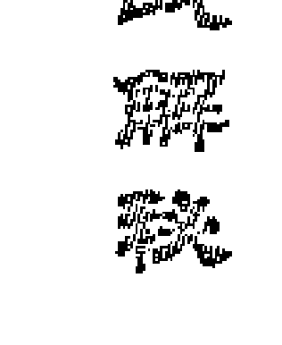

一号人物之义。同时，也可表示父母、长辈、祖上。占病可拟为阎王、祖宗之象，大忌见之。太岁亦代表中央政府、国家大事。太岁主一岁吉凶，应在一年之内。占流年以太岁为主要类神，观太岁三传为断。竞选总统者，最要太岁加临日干年命之上，必主胜出。寅卯辰为东方龙位本家，寅卯辰作太岁乘龙神，为真龙天子象。

- 岁破：太岁所冲之辰，代表阁魁、首相、总理、宰辅等二号人物之象。又主上半年事（岁之一半之象），又为大耗，并财神主破耗财物，岁破作鬼主讼。

- 病符：旧年太岁，代表病气，陈年旧事。又为太上皇。病符作鬼克日干，俱主病症，作日干财神，贵人生气生合日干，宜结算陈年旧事。病符作天鬼临支加支者，主一家人俱患时疫。

- 丧门吊客：太岁前后二辰，前为丧门，后为吊客。干支上逢丧吊，主年内有丧事。丧吊逢年命之上，为人披麻带孝也。类神并丧吊，占病必死。

- 官符：太岁三合前辰也。比如巳年太岁，则前辰酉为官符，主官司词讼之事。

- 白虎：太岁三合后辰也，主血光凶丧之事。

- 小耗：病符所冲之辰也，主血光凶丧之事。

- 岁墓：太岁后五辰也。主坟墓、病讼、宅灾等事。

###### 岁干星煞

| 星煞 | 岁干 | 甲 | 乙 | 丙 | 丁 | 戊 | 己 | 庚 | 辛 | 壬 | 癸 |
| :--- | :--- | :--- | :--- | :--- | :--- | :--- | :--- | :--- | :--- | :--- | :--- |
| 岁德 | | 甲 | 庚 | 丙 | 壬 | 戊 | 甲 | 庚 | 丙 | 壬 | 戊 |
| 岁德合 | | 己 | 庚 | 丙 | 丁 | 癸 | 己 | 乙 | 辛 | 丁 | 癸 |
| 天庭 | | 丑 | 寅 | 辰 | 巳 | 辰 | 巳 | 未 | 申 | 戌 | 亥 |

含义：

岁德——福集殃消。
岁德合——福集殃消。
天庭——事干朝廷。

###### 岁支星煞

| 星煞/岁支 | 子 | 丑 | 寅 | 卯 | 辰 | 巳 | 午 | 未 | 申 | 酉 | 戌 | 亥 |
|---|---|---|---|---|---|---|---|---|---|---|---|---|
| 岁合 | 丑 | 子 | 亥 | 戌 | 酉 | 申 | 未 | 午 | 巳 | 辰 | 卯 | 寅 |
| 岁破 | 午 | 未 | 申 | 酉 | 戌 | 亥 | 子 | 丑 | 寅 | 卯 | 辰 | 巳 |
| 岁刑 | 卯 | 戌 | 巳 | 子 | 辰 | 申 | 午 | 丑 | 寅 | 酉 | 未 | 亥 |
| 劫煞 | 巳 | 寅 | 亥 | 申 | 巳 | 寅 | 亥 | 申 | 巳 | 寅 | 亥 | 申 |
| 灾煞 | 午 | 卯 | 子 | 酉 | 午 | 卯 | 子 | 酉 | 午 | 卯 | 子 | 酉 |
| 岁煞 | 未 | 辰 | 丑 | 戌 | 未 | 辰 | 丑 | 戌 | 未 | 辰 | 丑 | 戌 |
| 大煞 | 子 | 酉 | 午 | 卯 | 子 | 酉 | 午 | 卯 | 子 | 酉 | 午 | 卯 |
| 大将军 | 酉 | 酉 | 子 | 子 | 子 | 卯 | 卯 | 卯 | 午 | 午 | 午 | 酉 |
| 破碎 | 巳 | 丑 | 酉 | 巳 | 丑 | 酉 | 巳 | 丑 | 酉 | 巳 | 丑 | 酉 |
| 病符 | 亥 | 子 | 丑 | 寅 | 卯 | 辰 | 巳 | 午 | 未 | 申 | 酉 | 戌 |
| 丧门 | 寅 | 卯 | 辰 | 巳 | 午 | 未 | 申 | 酉 | 戌 | 亥 | 子 | 丑 |
| 吊客 | 戌 | 亥 | 子 | 丑 | 寅 | 卯 | 辰 | 巳 | 午 | 未 | 申 | 酉 |
| 白虎 | 申 | 酉 | 戌 | 亥 | 子 | 丑 | 寅 | 卯 | 辰 | 巳 | 午 | 未 |
| 飞廉 | 戌 | 巳 | 午 | 未 | 寅 | 卯 | 辰 | 亥 | 子 | 丑 | 申 | 酉 |
| 天鬼 | 酉 | 午 | 卯 | 子 | 酉 | 午 | 卯 | 子 | 酉 | 午 | 卯 | 子 |
| 天怪 | 丑 | 子 | 亥 | 戌 | 酉 | 申 | 未 | 午 | 巳 | 辰 | 卯 | 寅 |
| 飞魂 | 亥 | 子 | 丑 | 寅 | 卯 | 辰 | 巳 | 午 | 未 | 申 | 酉 | 戌 |
| 雷公 | 寅 | 亥 | 申 | 巳 | 寅 | 亥 | 申 | 巳 | 寅 | 亥 | 申 | 巳 |
| 雷煞 | 亥 | 申 | 巳 | 寅 | 亥 | 申 | 巳 | 寅 | 亥 | 申 | 巳 | 寅 |
| 风伯 | 申 | 未 | 午 | 巳 | 辰 | 卯 | 寅 | 丑 | 子 | 亥 | 戌 | 酉 |
| 风煞 | 寅 | 丑 | 子 | 亥 | 戌 | 酉 | 申 | 未 | 午 | 巳 | 辰 | 卯 |
| 雨师 | 子 | 卯 | 午 | 酉 | 子 | 卯 | 午 | 酉 | 子 | 卯 | 午 | 酉 |
| 雨煞 | 子 | 丑 | 寅 | 卯 | 辰 | 巳 | 午 | 未 | 申 | 酉 | 戌 | 亥 |
| 丧魄 | 未 | 辰 | 丑 | 戌 | 未 | 辰 | 丑 | 戌 | 未 | 辰 | 丑 | 戌 |

含义：

- 岁合——凡占皆吉。
- 岁破——凡占皆凶。
- 岁刑——主刑伤，病讼最忌。
- 劫煞、灾煞、岁煞——凡占皆凶。
- 大煞——生干吉，克干凶。
- 大将军——主征战。
- 破碎——主破坏，凡事难成。
- 病符——占病，克干支年命者死。
- 丧门——与吊客星俱到，克干克支者，方以孝服论，否则不作丧吊看。
- 月合——生干有喜，克干有殃。
- 生气——解凶增吉，成就新事。
- 死气——占病凶。
- 死神——占病凶，乘虎尤凶。
- 成神——旺相生合，做事成就。
- 会神——婚姻成，行人至。
- 天财——课传无财，此神临干发用亦可求财。
- 天恩——官占有恩泽升迁。
- 圣心——占奏章喜生合日干，克冲破害不吉。
- 天马——官升迁，行人立至，凡占皆速，捕亡难获。
- 天医地医——生合日干吉，可服其药，作鬼克干，必为医误。
- 解神——主解散一切，吉凶无成。
- 活天赦——生合日干主赦罪。
- 月破——凡事不成，凶事可散。
- 月刑——占病讼忌。
- 血支血忌——阳人血光，阴人堕胎，忌针灸。
- 产煞——乘后阴立产，乘勾虎难产。
- 咸池——即桃花，主淫乱，妇女不正。
- 火烛火光——乘蛇雀克干身灾，克支宅焚。
- 月厌——凡占皆凶，事无成，宅有怪。
- 飞廉——克干有非常之惊，凡占皆速，行人立至，占宅有怪。
- 天鬼——主病疫，宅有怪。
- 飞魂——主鬼祟相侵，夜梦不祥。
- 雷公雷煞——乘蛇雀雷电，后玄雨，贵空晴。
- 风伯风煞——主风。
- 雨师雨煞——有雨。

###### 2. 季煞

- 天喜：春戌夏丑秋辰冬未也。主喜庆、恩泽、官迁、财喜。
- 寡宿关神：春丑夏辰秋未冬戌也。寡宿婚失。关神出行有阻。
- 皇书战雄：春寅夏巳秋申冬亥。皇书主科名，功名词讼喜之。战雄战胜。
- 浴盆天目：春辰秋戌夏未科丑也。浴盆小儿占病忌之。天目主家中有鬼祟。
- 孤辰：春巳夏申秋亥冬寅，意义与寡宿同。
- 火鬼：春午夏酉秋子冬卯也。火鬼乘蛇雀克干支主火灾。
- 丧车：春酉夏子秋卯冬午，丧车克日主病死。
- 天赦：春寅夏午秋申冬子也。主恩赦人情，官讼喜见。

###### 3. 月煞

- 生气：月建后二辰也。比如正月生气在子，生气为壬学中最吉之物，解凶增吉，成就新事，乘后合有孕，乘龙财婚，唯占盗贼，鬼作生气，恐贼再来，占病逢生气，病症日重。
- 死气：生气所冲之辰也，主死丧之事。病讼孕产最忌。死气加临日干年命之上，必有死亡之惊。死气再并飞魂、天鬼、病符、丧吊诸凶煞者，尤为凶验。
- 死神：死气后一辰也，与死气同论。
- 月破：月建所冲之辰也，主破坏、离散、婚嫁忌、产易生、事体月内不成。

六壬应用研究与股市实战破解

## 六壬应用研究与实践解读

天医：正月戌顺行十二辰也。生气之后生气也，代表医生。

地医：天医所冲之辰也，与天医同论。

飞魂天诏：正月起亥顺行十二辰，飞魂主神魂不定，夜多凶梦，鬼祟相侵，天诏主诏书之喜。

月厌：正月起戌逆行十二辰。月厌妨嫁娶，加玄盗贼，加蛇怪梦，加虎克日病死。加朱勾忧禁，逃者忌向此方。

成神：正月起巳，顺行四孟，主所谋得遂，成合事体。

天马：正月起午，顺行六阳辰，主迁动诏命出行之事。

皇恩：正月起未，顺行六阴辰，主皇恩庇护。

天鬼：正月起酉逆行四仲，主兵亡、产死、祸患、疫气。

天鸡：正月起酉逆行十二辰。

天财：正月起辰顺行六阳辰，主财喜。

书信：正月起酉顺行十二辰，天鸡、书信并朱雀主信函。

血支：月建后一辰。

血忌：正月起丑二月起未，三月起寅四月起申，依次顺行六冲辰。血支血忌俱主血光，产孕病忌之。

丧魄：正月起未逆行四季，与飞魂同论，并金神血支血忌加临年命刑克日干者，主刀下凶灾。

天德月德：俱主福德吉利。天德者，正月见丁，二月见坤，三月见壬，四月见辛，五月见亥，六月见甲，七月见癸，八月见寅，九月见丙，十月见乙，十一月见巳，十二月见庚者便是。月德者，寅午戌月见丙，申子辰月见壬，亥卯未月见甲，巳酉丑月见庚者便是。

###### 月支星煞

| 星煞 | 寅 | 卯 | 辰 | 巳 | 午 | 未 | 申 | 酉 | 戌 | 亥 | 子 | 丑 |
| :--- | :--- | :--- | :--- | :--- | :--- | :--- | :--- | :--- | :--- | :--- | :--- | :--- |
| 月合 | 亥 | 戌 | 酉 | 申 | 未 | 午 | 巳 | 辰 | 卯 | 寅 | 丑 | 子 |
| 生气地医 | 子 | 丑 | 寅 | 卯 | 辰 | 巳 | 午 | 未 | 申 | 酉 | 戌 | 亥 |
| 死气 | 午 | 未 | 申 | 酉 | 戌 | 亥 | 子 | 丑 | 寅 | 卯 | 辰 | 巳 |
| 死神 | 巳 | 午 | 未 | 申 | 酉 | 戌 | 亥 | 子 | 丑 | 寅 | 卯 | 辰 |
| 成神 | 巳 | 申 | 亥 | 寅 | 巳 | 申 | 亥 | 寅 | 巳 | 申 | 亥 | 寅 |
| 会神 | 未 | 戌 | 寅 | 亥 | 酉 | 子 | 丑 | 午 | 巳 | 卯 | 申 | 辰 |
| 天财 | 辰 | 午 | 申 | 戌 | 子 | 寅 | 辰 | 午 | 申 | 戌 | 子 | 寅 |
| 天恩 | 未 | 酉 | 亥 | 丑 | 卯 | 巳 | 未 | 酉 | 亥 | 丑 | 卯 | 巳 |
| 圣心 | 亥 | 巳 | 子 | 午 | 丑 | 未 | 寅 | 申 | 卯 | 酉 | 辰 | 戌 |
| 天马 | 午 | 申 | 戌 | 子 | 寅 | 辰 | 午 | 申 | 戌 | 子 | 寅 | 辰 |
| 天医 | 子 | 卯 | 午 | 酉 | 子 | 卯 | 午 | 酉 | 子 | 卯 | 午 | 酉 |
| 解神 | 申 | 申 | 戌 | 戌 | 子 | 子 | 寅 | 寅 | 辰 | 辰 | 午 | 午 |
| 活天赦 | 未 | 戌 | 丑 | 辰 | 未 | 戌 | 丑 | 辰 | 未 | 戌 | 丑 | 辰 |
| 月破 | 申 | 酉 | 戌 | 亥 | 子 | 丑 | 寅 | 卯 | 辰 | 巳 | 午 | 未 |
| 月刑 | 巳 | 子 | 辰 | 申 | 午 | 丑 | 寅 | 酉 | 未 | 亥 | 卯 | 戌 |
| 血支 | 丑 | 寅 | 卯 | 辰 | 巳 | 午 | 未 | 申 | 酉 | 戌 | 亥 | 子 |
| 血忌 | 丑 | 未 | 寅 | 申 | 卯 | 酉 | 辰 | 戌 | 巳 | 亥 | 午 | 子 |
| 产煞 | 寅 | 巳 | 申 | 亥 | 寅 | 巳 | 申 | 亥 | 寅 | 巳 | 申 | 亥 |
| 咸池 | 卯 | 子 | 酉 | 午 | 卯 | 子 | 酉 | 午 | 卯 | 子 | 酉 | 午 |
| 火烛 | 巳 | 午 | 未 | 申 | 酉 | 戌 | 亥 | 子 | 丑 | 寅 | 卯 | 辰 |
| 火光月厌 | 戌 | 酉 | 申 | 未 | 午 | 巳 | 辰 | 卯 | 寅 | 丑 | 子 | 亥 |

六壬应用研究与股市实战解秘

### 第二章 六壬预测的基础知识

###### 4. 旬煞

旬奇：甲子甲戌旬奇在亥，甲申甲午旬奇在子，甲辰甲寅旬奇在丑，奇主奇逢，逢凶化吉。

旬仪：六旬地支也。甲子旬仪在子，甲戌旬仪在戌，其余旬仿此，凡事吉庆，有礼仪之尊。

三奇：甲戊庚人间三奇，乙丙丁天上三奇，大利官爵，主奇遇出众，消灾避祸。

丁马：丁马又名六丁，每旬之中，六丁之辰也。甲子旬中丁卯，甲戌旬中丁丑，甲申旬中丁亥，甲午旬中丁酉，甲辰旬中丁未，甲寅旬中丁巳。丁马主摇动不安、出行之事。亦为妖神，专主不祥、怪异、忧惊、长生禄神乘丁，皆主生意。禄神不安，恐难持久作福。本命逢丁马，心惊不安，坐地盘长生之上，可作避难逃生论。丁马要看日元，壬癸日逢之多主财动婚动，庚辛逢丁多主凶动。六庚日巳加申，六辛日午加辛皆丁神临宅，人宅俱动俱灾。

旬癸：又名闭口，每旬之中六癸之辰也。闭口主人不言、病不食，机关莫测。禄神闭口，难依俸禄；财爻闭口，难求其财；长生闭口，生意已尽；鬼爻闭口，凡事忍让，闭口不言，则祸可渐散矣。

六壬应用研究与股市实战解密

###### 5. 干煞

干德：甲己德在寅，乙庚德在申，丙辛德在巳，丁壬日德在亥，戊癸日德在巳，主转凶为吉，福佑之神，诸占皆喜。又表专家、学者等人象，亦名曰德。

游都：甲己在丑，乙庚在子，丙辛在寅，丁壬在巳，戊癸在申。游都较为重要，定要记住。游都主贼盗、来敌。兵占、失物占中要用。

败神：以干支五行之沐浴为败神，凡事主败坏，凶煞也。例如壬寅日，壬上酉为干之败神，寅上子为支之败神，皆取干支五行沐浴之地为败神。

###### 日干星煞

| 星煞\日干 | 甲 | 乙 | 丙 | 丁 | 戊 | 己 | 庚 | 辛 | 壬 | 癸 |
|---|---|---|---|---|---|---|---|---|---|---|
| 日德 | 寅 | 申 | 巳 | 亥 | 巳 | 寅 | 申 | 巳 | 亥 | 巳 |
| 五合 | 未 | 申 | 戌 | 亥 | 丑 | 寅 | 辰 | 巳 | 未 | 巳 |
| 日禄 | 寅 | 卯 | 巳 | 午 | 巳 | 午 | 申 | 酉 | 亥 | 子 |
| 贤贵 | 丑 | 申 | 寅 | 寅 | 午 | 丑 | 申 | 寅 | 寅 | 午 |
| 兼务 | 戌 | 酉 | 申 | 未 | 巳 | 午 | 辰 | 卯 | 寅 | 亥 |
| 日解 | 亥 | 申 | 未 | 丑 | 酉 | 亥 | 申 | 未 | 丑 | 酉 |
| 日医 | 卯 | 亥 | 丑 | 未 | 巳 | 卯 | 亥 | 丑 | 未 | 巳 |
| 阳刃 | 卯 | 辰 | 午 | 未 | 午 | 未 | 酉 | 戌 | 子 | 丑 |
| 直符 | 巳 | 辰 | 卯 | 寅 | 丑 | 午 | 未 | 申 | 酉 | 戌 |
| 游都 | 丑 | 子 | 寅 | 巳 | 申 | 丑 | 子 | 寅 | 巳 | 申 |
| 鲁都 | 未 | 午 | 申 | 亥 | 寅 | 未 | 午 | 申 | 亥 | 寅 |
| 进神 | 子午 | 子午 | 子午 | 子午 | 子午 | 卯酉 | 卯酉 | 卯酉 | 卯酉 | 卯酉 |
| 退神 | 丑未 | 丑未 | 丑未 | 丑未 | 丑未 | 辰戌 | 辰戌 | 辰戌 | 辰戌 | 辰戌 |

含义：
日德五合——凡占大吉。
日禄——课象吉将吉为食禄，课象凶将凶为比劫。
贤贵——占干贵并贵人吉。
兼务——占官主兼两任。
进神——凡事宜进，进有庆，退失机。
退神——凡事宜退，退无咎，进多阻。
日解——解凶。
日医——生合日干可服其药，否则不吉，急病视日医，缓病视天地医。
阳刃——静吉动凶，又主血光。
直符——即飞符，占病凶，出行不归。
游都——占贼，来路视之。
鲁都——占贼，去路视之。

###### 6. 支煞

支煞以占日支来取用，十分要紧。
驿马：三合头冲之辰也。申子辰日马在寅，巳酉丑日马在亥，亥卯未日马在巳，寅午戌日马在申。驿马为壬学中最重要的神煞之一，卦卦要推，课课要看。驿马为动迁之神，最喜与禄神相并，谓之禄马同乡。驿马诸占所需，学业、工作、出行、疾病、求财皆要视其呈象。驿马主行动，若驿马空亡、落空、疾病、恋生、入墓、被合，皆主虽有出门动身之象，实不行也。驿马临干，身动；驿马临支，宅动。驿马临年命，身动。驿马也可同样以年支、月支、命支来论。则有年马、月马、命马之类。然皆以日马为主，若年命月马与日马相并，则主速动远动大动。

劫煞：寅午戌日在亥，亥卯未日在申，申子辰日在巳，巳酉丑在寅，劫煞主劫盗伤杀之事，诸占速应，劫煞乘白虎、玄武贼符等，必主劫盗之应。

亡神：寅午戌日在巳，亥卯未日在寅，申子辰日在亥，巳酉丑日在申。亡神主人亡物失，占病占物忌类神并亡神入空亡之乡，必应人亡物失事。

破碎煞：寅申巳亥日在酉，卯子酉午日在巳，丑戌辰未日在丑。主物破、财损、血光、刀刃之伤等。破碎煞忌与败神病，谓之破败神，最凶。惟酉作壬癸戊己日败神有之，壬癸日多因酒色奴婢败家败身，戊己日多因子息而败坏家业。

华盖：寅午戌日戌戌，亥卯未日在未，申子辰日在辰，巳酉丑日在丑，华盖最忌与日干墓库并，则为华盖覆日人昏晦，尤凶。

桃花煞：寅午戌日在卯，亥卯未日在子，申子辰日在酉，巳酉丑日在午。桃花主口舌、淫乱，又为悬绳煞，占贼必自屋而下，占病必有自缢鬼。

雨师：子日起申顺行十二辰，主雨。

晴朗：子日起午顺行十二辰，主天晴。

将星：寅午戌日在午，亥卯未日在卯，申子辰日在子，巳酉丑日在酉，将星代表大将。

灾煞：寅午戌日在子，亥卯未日在酉，申子辰日在午，巳酉丑日在卯，主飞横不测之事。

以上神煞相当要紧，其中的日德、驿马、丁神、劫煞、成神、天马、生气、死气、死神、月厌、破碎煞、天鬼、天赦、太岁、岁破、小耗、病符、天喜、丧吊更是重点中的重点，不可等闲视之。“三传吉凶有狐疑，全凭神煞解心迷。”

神煞多端，惟在触类旁通，神而明之，存于其人；运用之妙，又存于一心也！

###### 日支星煞

| 星煞 | 子 | 丑 | 寅 | 卯 | 辰 | 巳 | 午 | 未 | 申 | 酉 | 戌 | 亥 |
|------|----|----|----|----|----|----|----|----|----|----|----|----|
| 支德 | 巳 | 午 | 未 | 申 | 酉 | 戌 | 亥 | 子 | 丑 | 寅 | 卯 | 辰 |
| 支合 | 丑 | 子 | 亥 | 戌 | 酉 | 申 | 未 | 午 | 巳 | 辰 | 卯 | 寅 |
| 六冲 | 午 | 未 | 申 | 酉 | 戌 | 亥 | 子 | 丑 | 寅 | 卯 | 辰 | 巳 |
| 六破 | 酉 | 辰 | 亥 | 午 | 丑 | 申 | 卯 | 戌 | 巳 | 子 | 未 | 寅 |
| 六害 | 未 | 午 | 巳 | 辰 | 卯 | 寅 | 丑 | 子 | 亥 | 戌 | 酉 | 申 |
| 三刑 | 卯 | 戌 | 巳 | 子 | 辰 | 申 | 午 | 丑 | 寅 | 酉 | 未 | 亥 |
| 日马 | 寅 | 亥 | 申 | 巳 | 寅 | 亥 | 申 | 巳 | 寅 | 亥 | 申 | 巳 |
| 华盖 | 辰 | 丑 | 戌 | 未 | 辰 | 丑 | 戌 | 未 | 辰 | 丑 | 戌 | 未 |
| 破碎 | 巳 | 丑 | 酉 | 巳 | 丑 | 酉 | 巳 | 丑 | 酉 | 巳 | 丑 | 酉 |
| 桃花 | 酉 | 午 | 卯 | 子 | 酉 | 午 | 卯 | 子 | 酉 | 午 | 卯 | 子 |
| 雷电 | 辰 | 辰 | 未 | 未 | 戌 | 戌 | 丑 | 丑 | 寅 | 寅 | 卯 | 卯 |
| 雨师 | 申 | 酉 | 戌 | 亥 | 子 | 丑 | 寅 | 卯 | 辰 | 巳 | 午 | 未 |
| 晴朗 | 午 | 未 | 申 | 酉 | 戌 | 亥 | 子 | 丑 | 寅 | 卯 | 辰 | 巳 |
| 将军 | 子 | 酉 | 午 | 卯 | 子 | 酉 | 午 | 卯 | 子 | 酉 | 午 | 卯 |
| 三合 | 申辰 | 巳酉 | 午戌 | 亥未 | 申子 | 酉丑 | 寅戌 | 亥卯 | 子辰 | 巳丑 | 寅午 | 卯未 |

含义：

- 支德——次吉。
- 六合三合——占成合事吉，占解散事不利，占病亦忌。
- 六破六冲六害三刑——凡占不吉。
- 日马——主动又主速。
- 华盖——主昏迷。
- 破碎——主破坏。
- 桃花——主淫乱。
- 雷电——主雷电。
- 雨师——有雨。
- 晴朗——主晴。
- 将军——兵战逢旺相吉。

#### 六、课体概说

六壬比拟周易六十四卦，有六十四课，课课有名目课式和寓意。六壬中的课名往往是针对三传组合而来命名。三传午卯子为轩盖，巳戌卯为铸印，皆利官职。魁罡发用为斩关课，利出行逃亡。三传四季神为游子课，三传皆为四孟神为玄胎课，三传皆为四仲神为三交课。旬尾加旬首发用为闭口课。卯酉乘后合发用为淫佚课。四课俱上克下为无禄课，四课俱下克上为绝嗣课。卯酉上神发用为龙战课。天乙立卯酉之上为励德课。天罡发用为死奇课，用神与正时克日干为天网课。囚死墓神发用又天罡加日长生处名天狱课。支干相加支克干为乱首课，支干相加干克支为赘婿课……这些课名，顾名思义可以知其一些意象。

##### (一) 64 课课体解说

大六壬占事所成的课式叫课体。经云：“欲究吉凶，须详课体。课体不明，吉凶难测。”所以课体在占事中也占着非常重要的位置。《大六壬立成大全铃》、《六壬一览》及诸书中共载六壬七百二十局。实际上，六壬共能推演八千六百四十局。因为六十花甲是日期循环的基数，每日有十二个时辰，二者相乘等于七百二十，这就是七百二十局的来历。然每个时辰还可同十二个月将相配，这样相乘，等于八千六百四十，这就是六壬课的全部课式。一年三百六十天，共有四千三百二十个时辰，《奇门遁甲》共四千三百二十局式就是根据这样而来。何以六壬课还多出一倍？因为每日每个时辰，六十天只能循环一次，一年只能循环六次，只能同六个月将见面，两年才能和十二个月将相互配完，所以才会有八千六百四十个局式。

八千六百四十局数字何其复杂，为了让他简单易记，先贤便把这诸多的课式，归类总结成六十四种，这就是六十四课体的来源，它和易学中的六十四卦遥相呼应。同时六十四课中含有诸多格式，名目繁琐，语多重复，有些课体也不尽然，以下选自李峰注解的《六壬直指》有关课体内容予以解释说明，仅供壬课研究者与爱好者参考。以下原文出自《六壬直指》，意译与解说为李峰先生注解。

###### 1. 课体：元首

###### 八卦：乾

> **原文：**
> 凡课有一上克下，余课无克曰元首课，有天象焉。如君驭臣，名正言顺，为九宗之元，六十四课之首，故名元首。君占之，则得伊吕之臣；臣占之，必遇尧舜之君；常人占之，万事亨通。大哉元首，元亨利贞，首出庶物，万国咸宁。统乾之体，乃元吉第一课也。

###### 意译与解说：

**伊吕之臣：** 伊是伊尹，名阿衡，成汤举事时任以国政，佐汤平定海内，治理天下有大功。吕即吕尚，又称太公望，姜姓名牙。以渔钓交结周西伯，被立为师。为西伯侯阴谋策划，以倾商政。周武王即位后，被尊为师尚父，助武王灭纣治国。此二人皆为古之贤臣，这里喻君王得元首课，主得像伊尹、吕尚这样的贤臣。

**尧舜之君：** 尧名放勋，代兄为帝，为人仁德聪明，合和万国，制历法，治洪水，任贤举能。及卒，天下为之三年不举乐。舜名重华，品行高洁，继尧为帝。任贤举能，蛮夷率服。此二人为古之明君。这里喻大臣占得元首课，主会遇到像尧舜一样贤能的明君。

元首课因为上克下为正，天地得位，以尊制卑，为诸课之首，故名。大凡得之，主君臣和合，父慈子亲，婚姻和谐，谋为顺利，孕 lifecycle 生男，兵讼客胜，官职首擢，经商获利。如果日辰用神，年命值旺相气乘吉将，更逢龙德、三光、时泰等吉课，主大吉大利，大富大贵。所以占得此课者，均应积极进取，不可消极等待。

###### 2. 课体：重审

###### 八卦：坤

###### 原文：

> 凡课有一下贼上，余课无克，曰重审课，有地象焉。如臣诤君，不敢直谏，必再三踌蹰。详审而后进，故名重审。或从王事，无成有终，统坤之体也。

###### 意译与解说：

此课因与易卦中的“坤”卦相应，故象地，象臣，象子。因其课由下贼上发用，犹如臣向君，子向父，下级向上级提意见，必须再三详审，方敢为之，所以叫重审课。

占事得重审课，虽地有承天载厚，柔顺利贞之象。但一下逆上，定有忧惊。贵人顺行则福生，贵人逆行则乱生。诸占吉凶如下：

- （1）占事宜后起。
- （2）祸由内生。
- （3）用兵主胜。
- （4）占孕产为女。
- （5）诸般谋望，主先难后成。
- （6）初传为墓绝，末传为生旺，灾祸会逐渐消解，事终有成。
- （7）初传为生旺，末传为墓绝，主事先易后难，先得后失。
- （8）初传克末传有凶兆。
- （9）末传克初传为吉兆。
- （10）末传天将为龙、常、阴、后、合等吉将，或为德、喜等吉神，可逢凶化吉。
- （11）诉讼主后者胜，对被告有利。
- （12）此课利下不利上。如果上神旺相，下神休衰，虽有忤逆亦不成害。如夏占巳午火加亥子发用，因水不能克旺火之类是。
- （13）初传为子孙乘勾陈、白虎、螣蛇等凶将，又见刑害，主子害父。如初传为妻财乘凶将且刑害者，主妻害夫。即父子相离，夫妻失和之课。
- （14）末传为初传之墓时，恐起灾害。如初传亥，末传辰。如果初传乘雀、蛇、虎等凶将，末传见墓反变祸为福。
- （15）末传为初传长生时，如初传寅，末传亥之类，可避诸灾。如果初传为凶神凶将，却能变福为祸。

# 3. 课体：知一

## 八卦：比

###### 原文：

凡课有二上克下，或二下克上，择课之阴阳，与今日比者而为用神，曰知一课。盖比者，和也，阳日阳比，阴日阴比。二爻皆动，事有两岐。善恶混处，必知比于一善者而用之，故名知一。统比之体，乃原筮元永贞之义。

###### 意译与解说：

阳日阳比，如日干甲为阳，丙戊庚壬四干亦为阳，与日阴阳相同名比。阴日阴比，如日干乙为阴，丁己辛癸四干亦为阴，与日阴阳相同为比。

知一课最少有两课受克而动，所以事分两端，善恶混杂，故要择其比和者为用。因为比即有善恶之意，有亲切辅助之情，乃去谗任贤之课。占得此课者主：

- （1）比为喜事，不比为忧事，事起同类，祸从外起。
- （2）占寻人、失物，在近邻之处。
- （3）日辰乘天后、贵人，有迟疑之事。
- （4）上克下发用，有嫌疑；下克上发用，有妒嫉。
- （5）占兵事、诉讼等事宜和解。
- （6）吉神成比时，主事物在近处；不成比时，事物在远处。凶神成比时，有喜事；不成比时，有忧事。
- （7）知一课用神与日干成比，占婚姻主不和谐。
- （8）有二上克下，同类相加，恐招朋友中伤，祸由外来，对客有利，不利主人。二下克上者，恐有妻财、咀咒不安等事。总之大致为舍近就远，舍疏就亲，恩中有害之象。

# 4. 课体：涉害

## 八卦：坎

###### 原文：

> （课中俱比俱不比，以寅申巳亥孟神用为见机格。无孟取仲季用，为察微格。孟仲季复相等，用四课先见者，为缀瑕格。）
> 凡课有二上克下，或二下克上，与今日俱比俱不比，则以涉地盘归本家，受克深处为用，曰涉害课。占者凡事艰难，稽迟时日，必历尽风霜而后得。统坎之体，有苦尽甘来之象。

###### 意译与解说：

坎者，险也。然物极必反，否极泰生。涉害课亦历经艰险，方涉反本宫，与坎卦象同，故云：统坎之体。

凡占事得涉害课者主：

- （1）风波险恶，渡涉艰难，谋事先难而后名成利遂。诸事多费苦心而后成。灾难消散较迟。
- （2）占婚姻事受阻，占病不安，占逃亡隐匿于朋友之家。
- （3）占孕伤胎，占生产迟滞。
- （4）占行人，待人不来。占失物在家内。
- （5）神将为凶，又有三四克，主灾深难解。如果日辰旺相，神将为吉，虽受克其灾亦轻，容易化解。

# 5. 课体：遥克

## 八卦：睽

###### 原文：

> （神克日干为用，曰蒿矢格。日干克神为用，曰弹射格。）
> 凡课无克，取日干与四课上神相克者为用，曰遥克课。遇有两克以相比者为用。如蒿矢无镞，弹射无丸，射物难中，不足为畏。凡事祸福不测，忧在西南，喜在西北。始虽惊恐，后无妨害。统睽之体，乃狐假虎威之课也。又睽，乖异也，小事吉。

镞即箭头，蒿矢课非金遥克者，名蒿矢无镞。丸以土成，弹射课非土遥克者，是弹射无丸。蒿矢格，课上神遥克日干者是。

占事得此格者，主：

- 1. 开始雷吼声大，有惊恐之状，而后逐渐消失。
- 2. 忧喜未实，文书虚谋。
- 3. 占事得此格，不宜有客，有客多会反目成仇。
- 4. 利主不利客，利小不利大。
- 5. 三传神将凶，日辰无气，主有盗贼及其他阴谋灾害。
- 6. 三传神将吉，日辰有气势者，谒贵有喜，待人亦来。
- 7. 诸事先难后利。先动手无利，后动手有利。

# 6. 课体：昴星

## 八卦：履

###### 原文：

> > (刚日取酉上神为用，曰虎视转蓬。柔日取酉下神为用，曰冬蛇掩目。)
> 凡四课上下无克，又无遥克，取从魁上下神为用，曰昴星课。昴星者，酉中有昴宿也。从魁者，酉之神也。酉位于西方，乃白虎之金位，性主刑杀义，司决断死生出入之门户，此从酉立传，故名昴星。虽有惊恐，惟宜守静则吉。统履之体，有蛇虎当道之象。

###### 意译与解说：

昴星为二十八宿星宿名，全名昴日鸡，分野在正西方。因此课以天盘酉下神和地盘酉上神为发用，酉中有昴星，故名之。

日有阴阳，昴星课也分刚（阳）日和柔（阴）日两格。

虎视格：刚日昴星取地盘酉金上神为初传，酉为西方白虎之神，仰而上视，故曰虎视。中传取辰上神，末传取干上神。

占事得虎视格，主：

- 1. 关梁闭塞，津渡稽留。外出轻者灾，重者有死亡、囚禁之祸。
- 2. 主有惊恐之事，祸从外来，静守为宜。凡事过分者，必有灾害。等人不来。妊娠得子，生产无忧。
- 3. 蛇虎入传，日辰用神囚死大凶，病者死，官讼入狱。如果日辰旺相，则减其凶。
- 4. 日辰，用神旺相，三传神将皆吉，亦以吉论。考试中榜。（按：地盘酉为从魁，大利科考。）
- 5. 昴星为淫乱之神，阳日主男子轻浮，多生奸邪之事。

# 7. 课体：别责

## 八卦：涣

###### 原文：

> （亦名芜淫）
> 凡三课无克，别取一神为用，曰别责课。此三课不备，别从其类，责取一合神为用，故名别责。占者凡事不备，必须借径而行。统涣之体，主有留连之象。

###### 意译与解说：

别责课发用虽取合神，但阴阳所合有别。阳为天，所以阳日初传，取与日干相合的上神为用。如戊与癸合，癸寄丑宫，即取丑上神发用。中末传皆取干上神。

# 8. 课体：八专

## 八卦：同人

###### 原文：

> （遇天后、六合、元武一将入传，为帷薄不修。）
> 凡课干支同位，无上下克，取阳顺阴逆，三神为用，曰八专课。盖干与支神共在一位，如八家同井，专心合力，故名八专。若占家务，则重轻易举，惟不利奔波于外。统同人之体，乃诸侯会盟之课也。

###### 意译与解说：

八专课阴阳取法有别。刚日八专从干上神开始，在天盘上顺数三位为初传，中末传皆用干上。

# 9. 课体：伏吟

## 八卦：艮

###### 原文：

> （刚日以日神为用，曰自任格。柔日以支神为用，曰自信格。）
> 凡课月将加时，十二神各居本宫，取神克日为用，曰伏吟课。天地之神自居本家，日辰阴阳伏而不动，自相克贼，独隐呻吟，故名伏吟。占事静中有动，统艮之体，守旧待新之课。

###### 意译与解说：

伏吟课有克，仍按克贼之法发用。中传取初传所刑之神，末传取中传所刑之神。占事课得伏吟，主：

- (1) 选举必成，考试必中，求名荣归。
- (2) 疾病有忧，或起怪异之事。
- (3) 占断诉讼，春冬二季灾浅，夏秋二季灾重。
- (4) 谨慎律身，动作无虞。
- (5) 凡事主屈而不伸，静中思动。
- (6) 鬼旺更乘凶将，其势危凶。如果三传见吉神，又乘天马、德神、天喜，日辰又临旺相，当以吉论。

# 10. 课体：反吟

## 八卦：震

###### 原文：

> （亦名无依。以支辰斜射为用，曰井栏射格，亦名无亲。）
> 凡课十二神各居冲位，取相克为用，曰反吟课。盖诸神反其位，坎离交易，震兑互换，日辰阴阳，往来克贼，反复呻吟，故名反吟。凡占来者思去，离者思归，得失未定，惟利复旧。统震之体，重重震惊之课也。

###### 意译与解说：

无依格：反吟课中有克贼，依法发用是此格。因十二神均居冲位，无所凭依而名。占事逢此格主：

- (1) 高峰为谷，深谷为陵，变化不定。
- (2) 得物必失，失败反成，成败难凭。
- (3) 决定之事，必遭离散。出阵受虚惊，害人者反遭其害。
- (4) 有重重烦恼，旧事复发之象。
- (5) 三传为巳亥巳者，多有变动，欲求财物或文章。三传为卯酉卯者，多为家庭或途中争端。三传为寅申寅者主有远行、移动、争讼之事。
- (6) 神将凶，主多损失，动亦无益。神吉将吉，为动中求昌。
- (7) 父子不和，亲情不睦，夫妻各怀二心。
- (8) 逃亡须往远方寻。
- (9) 六合乘卯酉时，主人离财散。
- (10) 青龙临寅申时，主隔墙有耳而起灾祸。

# 11. 课体：三光

## 八卦：贲

###### 原文：

凡课用神日辰旺相，吉神在中，日三光课。占者万事可以任行，不劳费力，利有攸往。统贲之体，乃光明通达之课也。

###### 意译与解说：

为什么叫三光课，因为此课首先要具备三个条件。一是日干旺相。干为人，为我，人旺诸鬼难胜，且可峥嵘。
二是支旺，支为宅，宅旺，诸邪难侵。三是用神旺相，所干无阻。此三处神旺相再乘吉将，就如光华四射，故名之。
占事课得三光，万事吉昌，目的一定能达到，事半功倍，大吉大利。占之囚狱可获释放，疾病得之可痊愈，商贾得之可获利。如果中末传见死囚，凶将，是三光失明，主先亨通而后有抑塞。

# 12. 课体：三阳

## 八卦：晋

###### 原文：

凡课天乙顺行，日辰有气居前，旺相气发用，日三阳课。占者凡事吉庆，所求皆遂。统晋之体，乃龙剑呈祥之课也。

###### 意译与解说：

为什么叫三阳？原因有三。一是天乙贵人左行为顺行，为正治，阳气顺。二是日辰旺相有气，居天乙贵人之前，阳气延伸。三是用神旺相，阳气和而进。有此三种，如三阳开泰，万物生辉，故名之。

占事逢三阳课。主云路翱翔，讼狱得释，疾病无妨，财喜遂意，行人还乡，贼来不战，孕产贤郎。如果贵人临辰戌，名贵人坐狱。用神为日鬼，中末传又无救神，都是三阳不泰。占事主暗昧难成，先泰后否。

# 13. 课体：三奇

## 八卦：豫

###### 原文：

凡课得旬日之奇发用或入传，曰三奇课。如甲子、甲戌旬，用丑；甲申、甲午旬，用子；甲辰、甲寅旬，用亥；此为三奇。盖鸡鸣乎丑，日精已备；鹤鸣夜半，月精已备；斗转乾亥。星精已备。又丑为玉堂，子为明堂，亥为绛宫，三者为旬用之奇，故名三奇。占者百祸消散，凡事吉利，统豫之体，乃上下悦怿之课也。

###### 意译与解说：

日奇：甲日在午，乙日在巳，丙日在辰，丁日在卯，戊日在寅，己日在丑，庚日在未，辛日在申，壬日在酉，癸日在戌。

旬奇重，日奇轻。旬奇和日奇均入传为上吉。有旬奇无日奇亦为三奇吉课。如果仅有日奇而无旬奇，则不为三奇课。

占事得三奇课，万事和合，千殃解除。男人求婚，可配淑女。妇女怀孕，能产贵儿。士有奇遇，病获良医。凡事逢凶化吉，不忌刑杀。如果三奇空亡，精力不足，其福减半，先明后暗，吉凶无成。

# 14. 课体：六仪

## 八卦：兑

###### 原文：

凡旬首之仪发用或入传，曰六仪课。甲子旬用子，甲戌旬用戌，甲申旬用申，甲午旬用午，甲辰旬用辰，甲寅旬用寅，此为旬六仪。

盖旬首为六阳支神星宫之长，直符之使，有礼仪之尊，故名六仪。占者动无阻隔，家集千祥。统兑之体，乃喜气溢眉之课也。

###### 意译与解说：

- 支仪：子仪在午，丑仪在巳，寅仪辰，卯仪卯，辰仪寅，巳仪丑，午仪未，未仪申，申仪酉，酉仪戌，戌仪亥，亥仪子。

占事课逢六仪，兆多吉庆，求财相宜，有罪可逢赦减，有病能遇良医。如果旬仪、支仪皆入传，且乘天乙吉将，为富贵六仪，再加奇仪同会，妙不可言，吉庆无比。如果仪神发用克行年，则凶。

# 15. 课体：时泰

## 八卦：泰

###### 原文：

凡课用起太岁、月建，乘青龙六合，又带财德之神，曰时泰课。盖太岁为天子，月建为诸侯，青死为目长，又为钱财喜庆之神，六合为婚姻合和之神。四者发用，并入三传，而为日辰财德之神，如人时运通泰，故名时泰。占者万事亨利，统泰之体，乃天地和畅之课也。

###### 意译与解说：

构成时泰课要有三个条件。一是太岁月建，一发用，一入传。二是初末传乘青龙，六合吉将。三是课传带日财德神。缺一非此课。

占事逢时泰课，主灾潜祸消，谋为无碍，婚姻美满，占财大利（按：发用为财德故）。逃亡者，必安全回家，逢盗贼必然自败。孕产贵子，前程远大。如果传见空亡，则事多虚喜。

# 16. 课体：官爵

## 八卦：益

###### 原文：

凡课得岁月年命驿马发用，又天魁、太常人传，曰官爵课。盖驿马为驿递之神，传命之使。又戊天魁为印绶，故名官爵。占者庶人吉庆，仕宦升擢。统益之体，为鸿鹄冲霄之课也。

###### 意译与解说：

官爵课要有两个条件。一是发用必须是太岁、月建、本命、行年## 第二章 六壬预测的基础知识

的驿马。二是传中必须见戊土天魁，天将太常。因为戊土天魁的类神是印，太常的类神是绶，合起来是印绶。太岁、月建、本命、行年共用驿马，本已华丽异常，再加印绶入传，驿马必为传递加官晋爵的信使，故名之。

占事得官爵课，富贵荣华，有官迁职，无官得官，财名皆利。如果四马带印绶，更遇天马、德神，青龙尤吉。日辰旺相主事成速，囚死主事迟滞。若占病讼遇之，却多凶少吉。如驿马逢冲破，主官爵淹留。若印绶值空亡，主官爵失脱，文书沉匿。常人主谋事不成。

### 17. 课体：富贵
八卦：大有

原文：

凡课得天乙乘旺相气上下相生，更临日辰年命发用，曰富贵课。盖天乙在紫微门外，近于左枢，居太乙之右，为十二神之首，主升官上任等事。占者家道荣昌，官职显耀。统大有之体，乃金玉满堂之课也。

意译与解说：

富贵课要求有三。一是天乙贵人乘旺相之气发用，二是天乙贵人所乘之神要上下相生，三是天乙贵人要临日辰或年命方是。

如果贵人逢旺相气发用，日辰上神逢禄马，亦为此课。

占事逢富贵课，如天降福德，万事新鲜；财喜双美，富贵两全；孕生贵子，婚配婵娟；狱讼得理，谋望胜前；如戊加巳发用或入传，则为富贵权印之象，尤吉。若再逢太常乘戊，又有驿马，青龙入传，则主累代富贵，无官者加官，有官者高升。

富贵课如果贵人临辰戌之位，名入狱，又名势消课，所占皆凶。如果在乙辛辰戌四日占，或占人年命为辰戌者，又为贵人临干、临支、临年命，仍以富贵课断，万勿误为入狱。

如果三传中见昼夜两贵，主告贵求事，必得两处贵人成就。若四课三传中昼夜贵人重得，则为遍地贵人，为贵多不贵之象。告贵反无依，占讼主干多官，主凶。


贵在干前事不宜迫，迫反为贵所怒。贵在干后则宜催，不催事慢。
昼贵临酉戌亥子丑寅夜支，夜贵临卯辰巳午未申昼支，名贵人蹉跎，诸事不可往求贵人。但夜贵临昼主自暗投明，稍吉。
若贵人坐宫受克，名贵人受制，万不可告贵求事。
如果传中贵人空亡，落空，事主虚喜，出旬填实可成。

### 18. 课体：龙德
八卦：萃

原文：

凡太岁、月将乘贵人发用，曰龙德课。盖太岁，人君也，首出庶物而德被天下。月将，一月主宰之神，太阳也。悬象在空，而明照四方。天乙贵人，吉将之首也。降福致祥，而消苦超贫。若太岁与月将并者，更乘今日之贵神作用神，如龙行雨泽，德及万物，故名龙德。占者主天子恩泽，福神相助。统萃之体，乃云龙际会之课也。

意译与解说：

龙德课有两个条件。一是太岁和月将必须是同一种，二是必须乘贵人且发用为初传，方是此课。
占事得此课者，君恩及下，万民欢欣，罪囚出狱，财喜临身，利名易遂，争讼休陈，官职超擢，利见大人。总之利卑下求贵，吉庆重重。不利尊贵求卑下，再带凶煞、日鬼，决非吉庆。

### 19. 课体：轩盖
八卦：升

原文：

凡课值胜光为用，遇太冲、神后，曰轩盖课。神后，子也，为紫微华盖。太冲，卯也，为天驷、天车。胜光，午也，为天马。此三神并遇，如乘驷马轩车，高张华盖，故名轩盖。占者加官荣显，凡事吉祥。统升之体，乃士子发达之课也。

意译与解说：

轩盖课要有两个条件：一是午火发用，二是卯木、子水全，方符此课。

六壬应用研究与现代解秘


### 20. 课体：铸印
八卦：鼎

原文：

凡课得戌加巳入传，曰铸印课。戌，天魁也，为印。巳，太乙也，为炉。盖戌中有辛金与巳中丙火作合，全凭火炼，铸成贵器，故名铸印。统鼎之体，乃炼汞成丹之课也。

意译与解说：

巳为炉火，戌为印，卯木为印模，三者全，方为此课。

凡占事得此课，顽金铸印，炉火炎炎，投书献策，官职高迁。仕官之人，商务之人得此格，有进职加薪之喜。平常人得之却不大好。占孕，胎产大吉。占疾病，诉讼却大凶。

铸印课若逢太常入传，名印绶双全，三传更乘吉将，日辰旺相，则主官爵高迁，所求遂意。如果春占，干支是丙丁巳午，火嫌太过。若逢戌土空亡，日辰无气，名破模损印，官不能升迁。再逢凶神恶将，主先成后败，徒劳心力，甚至有官灾刑害之事。

### 21. 课体：斫轮
八卦：颐

原文：

凡课卯加庚或加辛为用，曰斫轮课。盖卯为车轮，庚辛为刀斧。木就金斫，故名斫轮。占者禄位高迁。统颐之体，乃革故鼎新之课也。

意译与解说：

此课有两个条件。一是必须卯木发用，因为卯为车轮。二是卯木必须加庚辛或申酉发用，因为庚辛申酉为刀斧。

占事得斫轮课，孕病凶险，财喜欢跃，禄位加增，官职迁擢，戊印、常绶遇之更乐。卯木加于庚金、申金之上者为上。加辛金、酉金次之。因为卯中乙木和庚金有暗合之情，更遇贵人、龙常等吉将及驿马、德合等吉庆无比。而卯加酉相冲，课逢反吟，吉庆自然大减。

壬癸日得地，卯木又为舟楫，初传、末传、驿马引从，名轩车，则能任重道远，有除授官职之喜。

卯木休囚无气，乘白虎临申为官椁，值空亡为朽木难雕。春季甲乙日占为木旺金衰，名伤斧。秋季庚辛日占，金旺木死，名伤轮。如果辛卯日干上卯为日财，宜速取，缓则有害。

总之，占逢此课均主事成迟缓，或先历艰难而后有成。如果三传中有本日墓神，名旧轮再斫，主退官失职，再谋复兴。

### 22. 课体：引从
八卦：临

> 原文：凡课日辰干支前后上神发用为初末传，曰引从课。此贵人出行，前者引，后者从，故名引从。统临之体，乃车马蜂拥之课也。

意译与解说：

- 引从课的要点有二。
  1. 日干或日支上神的前神发用或为末传。
  2. 日干或日支的后神发用或为末传。
  二者缺一皆非此格。

初传在干神之前，末传在干神之后，又名拱干格。

### 23. 课体：亨通
八卦：谦

> 原文：凡课用神生日，及三传递生日干，或干支互相生旺，曰亨通课。主逢亨运，事事通达，故名亨通。统谦之体，乃福禄来临之课也。

意译与解说：

- 亨通课的条件有三条：
  1. 初传生日干。
  2. 三传递生日干。
  3. 干支互相相生。
  细解起来，却有他别。

- 一是三传递生有两种：
  (1) 初传生中传，中传生末传，末传生日干。
  (2) 末传生中传，中传生初传，初传生干。

- 二是相生相旺有四种：
  (1) 干上神生干，支上神生支，名俱生格。
  (2) 干上神生支，支上神生干，名互生格。
  (3) 干上神为干之旺神，支上神为支之旺神，为俱旺格。
  (4) 干上神为支之旺神，支上神为干之旺神，名互旺格。

凡占课得亨通课，三传相生，干支有情，官逢荐擢，士获功名，婚姻和合，财利生成，事事如意，名利双收。如果递生逢空亡，课传中无解救，仍以凶论。

### 24. 课体：繁昌
八卦：咸

原文：

凡课夫妻年立德方发用，或年立时令旺相之乡，曰繁昌课。占者人丁旺相，诞毓麟儿。统咸之体，乃男女合感之课也。

意译与解说：

- 繁昌课有四个条件：
  (1) 夫妻行年立德方或值德合。
  (2) 夫妻行年的干支相合。
  (3) 夫妻本命各乘旺相气。
  (4) 夫妻行年为三合，上乘时令旺相之气。

占事得繁昌课，主阴阳和合，万物生成。命得贵孕，产必男形，谋为大利，家道自兴。如果夫妻行年俱乘衰败气，或互相克害，则名德孕不育，主小产或流产。

繁昌课专视天地盘与夫妻关系而定，为占妊娠专用之课，四课三传均略而不论。

### 25. 课体：荣华
八卦：渐

原文：

凡课禄马贵人临干支年命，并旺相气发用人传，更乘吉将，曰荣华课。凡事荣达，且有光华，故名荣华。统渐之体，乃士众拥从之课也。

意译与解说：

荣华课的条件有三。一是禄马贵人加临干支或年命且发用，二是发用旺相，三是传乘吉将。

禄即日禄，马指驿马，并非财马。

占事逢荣华课，干吉支祥，人宅俱利，经营俱享，动止均美。

孕育麟儿，婚姻连理。用兵征讨，得地千里。若昼夜贵人均逆行或贵人坐辰戌之上，名贵人坐狱，诸事则宜退不宜进。

贵人所乘之神为日之官鬼，占求官利，占病却凶。

贵人空亡，为贵人休假不理事，出空填实方可告贵求事。

如果贵临干支为刑害，则反吉为凶，占讼理直而作曲断。

### 26. 课体：德庆
八卦：需

原文：

凡课日辰、干支德神及天月二德发用，并在年命乘吉将，曰德庆课。盖善莫大于德，德能转祸为福，而有喜庆，故名德庆。统需之体，乃君子欢会之课也。

意译与解说：

德庆课的条件有二：一是德神发用，二是年命上神乘吉将。

德神共有天德、月德、日德、支德四种，以日德为主。

占事逢德庆课，德神在位，诸煞潜藏。囚狱释放，病危无妨，婚姻佳配，孕产贤郎，凡占谋望，既吉且昌。如果德神为干鬼，德有化鬼之妙，占功名必高中，有官者必升迁。如果德神乘青龙等吉将更吉。即使乘凶将，有德神化解也无灾害。

如果德神空亡，或神将外战被刑克则不吉。如戊日以巳为德，巳临亥，乘玄武，玄武属癸亥水，巳德受二亥冲克，为减德，主事参差不顺。天将克神为外战，如青龙木克丑土等是。

如果课中德神克日干，德神的下神也克日干，则德化为鬼，反凶。

此例仅四阴日有，即乙日德在申，申临酉；丁日德在亥，亥临子；己日德在寅，寅临卯；辛日德在巳，巳临午。癸日无此例。

### 27. 课体：合欢
八卦：恒

原文：

凡课日辰遇天干作合，及支三合、六合发用，并占人年命俱乘吉将，曰合欢课。凡日辰年命见合，主和合欢喜，故名合欢。统恒之体，乃婚姻团圆之课也。

意译与解说：

- 合欢课有四个条件：一是日上神遁干与日干作合，二是初传与干上神作六合，三是三传与干支作三合，四是年命上神乘吉将。

占事逢合欢课，主乾坤匹配，奇偶交并，占孕迟生，行人荣省，名利乔迁，财喜欢称，婚姻天缘，万事佳庆。但三合事关众多，克应要过月。占病迟愈，占争讼以和解为贵。

合欢课中带有刑冲破害，名蜜中藏砒，反为凶兆。如果初传落空亡，主喜事难成或为虚喜。

### 28. 课体：和美
八卦：丰

原文：

凡课干支遇三合、六合，上下递互相合，曰和美课。占者主客皆怡，内外和顺，故名和美。统丰之体，神合道合之课也。

意译与解说：

- 和美有四。日干与支上神作合，日支与日干上神作合为一。日干与干上神作合，日支与支上神作合为二。干支的上神与三传作三合为三。日上两课及支上两课，上下俱作三合为四。有此情况之一者，都是和美课。一象曰：三合六合，上下欢悦，交易大通，财利不绝。婚姻吉庆，干贵相宜。惟占病，占讼不利，主病危讼屈。

如果课中逢有刑害，主恩中有怨，笑里藏刀。交合中各怀盗气，主彼此都有相脱之意。若合中逢空，主一场虚喜。若合中逢冲，主先合后散，先成后败。

注意：此课与合欢课大体相同。

### 29. 课体：斩关
八卦：井

原文：

凡课魁罡加日辰发用，曰斩关课。盖辰为天罡，戌为天魁，日辰，人也。魁罡，天关也。魁罡加日辰，犹人遇凶神，重门闭塞，必须斩开关门，故名斩关。占者利于阴私，永无触碍。统井之体，乃豹隐南山之课也。

意译与解说：

占事逢斩关课，主关梁逾越，最利逃亡，捕贼难获，出行无殃。病讼凶祸，厌祷吉祥。最利隐遁逃亡。

甲戊庚日占贵人临亥，名神藏煞没。神藏即六凶神临克方，即腾蛇临子名坠水，朱雀临丑（癸水）名投江，勾陈临卯木名人狱，天空临巳名受辱，白虎临午名焚身，玄武临申名折足。六神均有所制，不能逞其凶焰。煞没即辰戌丑未四煞陷于寅申巳亥四维。凡占事遇之，主万事顺利，不独斩关课如此。

河魁加亥，名魁渡天门，主抑塞难通。

天罡加寅，名罡塞鬼户，主谋为顺利。

魁罡临日辰，传有虎阴申酉为斩关得逃者，永远不获。若带血支、血忌、呻吟、羊刃、三杀，必伤人而走。

### 30. 课体：闭口
八卦：遁

原文：

（凡旬尾加干，旬首加支，为一旬周遍格。）

凡课旬尾加旬首，或旬首乘玄武，或旬首位上神乘玄武发用，曰闭口课。如甲申日，巳加申，丙辰日，亥加寅之类，皆旬尾加旬首为用也。如丁酉日，午加酉，若用夜将，则天盘旬首乘玄武为用。如甲子日，辰加子，昼夜地盘，皆旬首上神乘玄武为用。首尾相加，似物闭藏，环圆无端，不见其口，故名闭口。统遁之体，乃上下朦胧之课也。

意译与解说：

闭口课的条件有三：一是旬尾加旬首发用，二是旬首乘玄武发用，三是旬首上神乘玄武发用。有此其中之一者，即闭口课。

- 甲子旬子为旬首，酉为旬尾。
- 甲戌旬戌为旬首，未为旬尾。
- 甲申旬申为旬首，巳为旬尾。
- 甲午旬午为旬首，卯为旬尾。
- 甲辰旬辰为旬首，丑为旬尾。
- 甲寅旬寅为旬首，亥为旬尾。

为什么旬首乘玄武也是闭口课？因为玄武是十二将中的第十位神，天干癸，地支亥，干为十干之尽，支为地支之末。玄武居第十位正是天干之尽，玄武神癸亥又是地支之末，所以以旬尾论之，为此格。

> 象曰：占事逢闭口，主禁口闭绒，机关莫测，事机难明，逃亡难寻，失物人见而不肯言，纵乘贵告贵也不允。乘白虎占病，主痰气阻塞，喉肿舌禁，若兼无禄课体，主绝食而死。占讼有冤莫诉，有屈难伸。占孕生暗哑之儿。

### 31. 课体：游子
八卦：观

原文：

凡课三传皆土，遇旬丁、天马为用，曰游子课。盖土者，辰戌丑未，五季之神。咸归于墓，有巡游考绩之象。旬丁者，每旬丁干所值之神，主干摇动，其势最速。势既摇动，使人好游，故名游子。居者欲游，游者欲返。统观之体，乃云萍聚散之课也。

意译与解说：

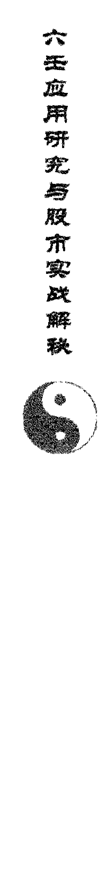

游子课的要求有二：一是三传必须皆土，即辰戌丑未，二是传中必须有天马和旬丁。

旬丁：即本旬中天干遁丁之神。如甲子旬，遁至卯为丁卯，卯即是旬丁。

旬丁、天马都是动神，使人好游，奔走东西，故名。

占事逢此课，丁马加吉神，主奔走西东。出行吉利，坐守困穷，疾病难愈，官讼多凶，天阴不雨，婚姻终空。大体为动摇不定之象，凶多吉少。若兼三奇、六仪等课体，年命日辰上有冲克救神，可化祸为福。

三传未戌丑为自阴传阳，主在家打算远出。若三传为戌未辰，名自阳传阴，主在外欲归。

初传丑土，加临辰土为破游。初传为戌，加临未土为衰游。游子课和反吟课并为复游。破游衰游不吉，复游中平。

游子课和斩关课并为绝迹，有张良归山之象。游子课和淫泆课并主因私隐而逃。游子课和天寇课并，因盗而逃。

张良，字子房，秦末韩人。佐刘邦伐秦灭楚，平定天下，官封留侯，后弃官隐居。

### 32. 课体：三交
八卦：姤

原文：

凡课四仲日占，四仲加日辰，三传皆仲，将逢阴合，曰三交课。四仲日占，遇四仲加支辰阴阳，为一交；仲神发用，传皆四仲，为二交；仲神乘太阴六合将，为三交。此三者相遇交加，故名三交。占者事体勾连，连绵不已。统姤之体，乃风云不测之课也。

意译与解说：

三交课有三个条件：一是四仲日占，二是四仲加干支，三是三传皆仲神，发用乘太阴六合。

四仲：子午卯酉者是，又名四败神，为五阳干沐浴之地。六合为乙卯，太阴为辛酉，亦为仲神。

占事逢三交课，主交加连累，奸私隐匿，谋事不明，求财无益。讼犯刑名，兵逢强敌。乘凶将病患尤甚。再遇凶神，男犯重法，女犯通私。

初传乘太阴六合，主门户不利，有隐私事。初传乘天空，主虚诈事。乘玄武，主遗失被盗。乘螣蛇，主惊恐怪异。乘朱雀，主口舌是非。乘勾陈，主撕打斗殴。乘白虎，主孝服损伤。

太阴、六合不入传，名三交不交。如果年月日时皆仲神，名三交不解。前者不及，后者太过。二者之凶，更甚于交。

三交课，三命行年乘吉将，日乘发用旺相。或三传为午卯子，是高盖乘轩，皆不得以三交课论。

### 33. 课体：乱首
八卦：师

> 原文：凡课日往加辰，辰克日发用者，曰乱首课。盖日为尊长，辰为卑幼，辰克日，乃下犯上之象。又辰来加日而克日，为上门乱首。自取乱首者，尊上自己失礼，为支所犯，其事尤轻。上门乱首者，卑下无端敢来犯上，其事尤重。统师之体，有征讨不顺之象。

意译与解说：

乱首课有两种：一是干加支，被支克，名自取乱首。二是支加干克干，又叫上门乱首，其祸尤重。占事逢此课，子忤其父，弟背其兄。君骄臣逆，尊卑不分。以下犯上，悖逆重重。初传若逢官鬼，凶祸尤速。三传神吉将吉，年命处有克制凶神，生我之神名患门有解。

### 34. 课体：赘婿
八卦：旅

> 原文：凡课日干克辰，又自加临为用，曰赘婿课。盖干为夫，支为妻。干克者为妻财，以干临支，以动就静，如男子婿赘妻家。以支临干，以静就动，如妇人随男就嫁。今乃舍己就人，以身出赘，故名赘婿。

六壬应用研究与股市实战解秘

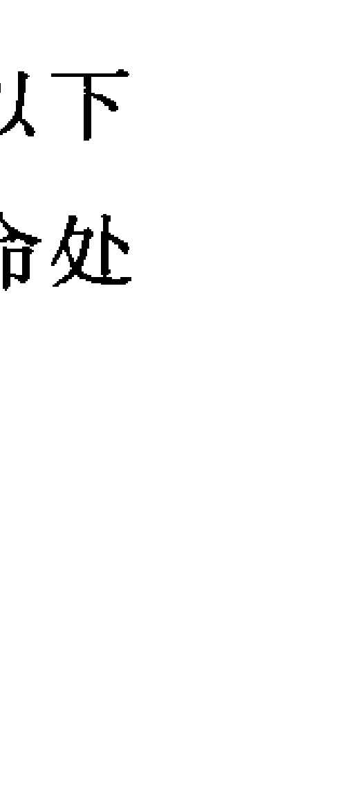

### 35. 课体：冲破
八卦：夬

原文：

凡课日辰之冲神加破为用，曰冲破课。盖冲主反覆，破主倾坏，冲破并为一类，故名冲破。统夬之体，乃雪上加霜之课也。

意译与解说：

象曰：占事逢冲破课，主人情反复，门户不宁，婚姻不遂，胚孕难成。一切谋望，成而复倾。惟占病讼逢之，却主冲散。所以此课占吉事得之为凶，占凶事逢之却吉。

如果发用初传与太岁、月令占时逢冲，也为冲破课。大抵发用旺相忌冲，衰墓宜冲。吉将不宜冲，凶将却宜冲。若凶将值空亡亦忌冲，因逢空冲则起。吉将值空亡宜冲，冲则有用。

订讹曰：子午冲道路驰逐，男妇争谋变动。卯酉冲，门户改移，或逃亡失脱，淫乱奸私。

寅申冲人鬼相伤，夫妻异心。巳亥冲反复无实。丑未冲，兄弟兴衰相持，谋心不同，干事不遂。辰戌冲，奴仆离异，贵贱不明。

### 36. 课体：淫泆
八卦：既济

原文：

凡课初传卯酉为用，将乘后合，曰淫泆课。盖卯酉为阴私之门，后合乃淫欲之神，主淫奔泆欲，故名淫泆。占者利私谋，不利公谋。统既济之体，乃阴阳配合之课也。

意译与解说：

此课有两个条件：一是必须卯酉发用，二是天将必须是六合、天后，缺一则非此课。

课体虽一，却分两格。六合为男，初传乘六合，末传乘天后名狡童格。天后为女，初传乘天后，末传乘六合则是淫女格。

占事逢此课，男子就室，女子有家，淫乱成风，阴私莫禁，嫁娶不吉，逃亡却利。若与三交课并，名浊滥淫泆，所私绝非一人一处。课中上克下发用，过在男子；下贼上发用，错在女子。若值空亡，淫泆为虚。日干和发用旺相，则以吉论。

### 37. 课体：芜淫
八卦：小畜

原文：

凡四课有克，缺一为不备。及日辰交互相克，曰芜淫课。凡见二阳一阴，为阴不备，如二男争一女。二阴一阳，为阳不备，若二女争一男。又兼日辰交互相克，各自相生。此夫妻皆有私通，两情相背，荒淫无度，故名芜淫。占者家门不正，事多淫乱。统小畜之体，乃琴瑟不调之课也。

意译与解说：

芜淫课有两种：一是四课缺一不备，但有克。二是干支交互相克。

占事逢芜淫课，名阴阳不备，交克最嫌。利名碌碌，狱病淹淹，阴微晴久，阳少雨添，行人未至，征战不利。阳不备利主，阴不备利客。交互相克，主宾主不投，两方均不利。如果神将吉，又有救神，不以凶论。即使夫妻离散，终复团圆。

三传阳多，事起于男。三传阴多，事起于女。

四课缺一名不备，其排列顺序，刚日不变。柔日则日上两课的位置要和支上两课交换。即：第三课、第四课改为第一、第二课；第一课、第二课改为第三、第四课。其课相同时，应取前弃后。如第一课、第三课同，取第一课舍第三课；第二课与第三课同，也是取第二课舍第三课。第一课和第三课属阳，第二课和第四课属阴。存二阴一阳，名阳不备；存二阳一阴，名阴不备。

## 38. 课体：孤寡

八卦：革

原文：

凡课地盘空亡为孤辰，天盘空亡为寡宿，以十干不到之地，五行脱空之乡，曰孤寡课。又有以发用空为孤，末传空为寡者；又有以阳空为孤，阴空为寡者。占主离乡背井。统革之体，乃同居不同行之课也。

意译与解说：

孤辰、寡宿共有三意。一是以旬空论，阳空为孤，阴空为寡；如甲子旬中戌亥空，戌土阳空为孤，亥水阴空为寡。二是以天地盘论，地盘空为孤，天盘空为寡。三是以四季论，即孤辰寡宿二煞；春季以巳为孤，丑为寡；夏季以申为孤，辰为寡；秋季以亥为孤，未为寡；冬季以寅为孤，戌为寡。三者之中，以四季孤寡为重。

占事逢孤寡课，阴惆阳怅，百事乖张，六亲无靠，离乡背井，诸事大体不吉。若兼三奇，六仪课体或神将皆吉，主反祸为福，先破后成。

## 39. 课体：度厄

八卦：剥

原文：

凡四课内三上克下，或三下贼上，曰度厄课。盖上为尊，下为卑。三上克下，则尊长凌欺，小幼困厄；三下贼上，则尊长不正，幼小凌犯，故名度厄。占者家宅乖和，老幼不安。统剥之体，乃六亲冰炭之课也。

意译与解说：

象曰：占逢此课，长幼相厄，骨肉多乖，出军失利，行人有灾，讼直枉终，病去复来。如果日辰，类神旺相，反主长得幼力，幼得长力。若末传为吉神、救神，再加日辰旺相，亦主小凶或无凶，甚至化凶为吉。

### 第二章 六壬预测的基础知识

## 40. 课体：无禄绝嗣

八卦：否

原文：凡课四下俱克上，为无禄课。四上俱克下，为绝嗣课。盖日神阴阳，既皆相克，不得其所，不免投辰上两课。辰上阴阳又相克，则无所投之路。占者多主孤独，惟火多克金，有水可救。统否之体，乃上下僭乱之课也。

意译与解说：四上克下是上不容下，为不恕，而自己也无容身之地，故名绝嗣。四下贼上，是以下犯上，为不忠不孝，上禄被夺，故名无禄。占事得此课者，上下悖逆，父子分离，求谋不遂，动作多疑。如果三传有救，方免灾危，先否后喜。无禄课占病必死，兵讼后者胜。绝嗣课兵讼主先胜。无禄课初传下贼上，末传又克初传者，名首尾相制，见之灾难尤甚。

## 41. 课体：迤福

八卦：屯

原文：凡课八迍课得五福，曰迍福课。如时令死气发用，为一迍。下为旺气取胜，为二迍。上见丘墓，为三迍。下见雠仇，为四迍。乘凶神，为五迍。带刑害，为六迍。下贼上，为七迍。凶神临日辰相克，为八迍。如用起死气，未传旺相，为一福。子逢凶，母带德解救，为二福。始为凶将，终有吉神，为三福。初传见鬼贼，年命克制之，为四福。日神吉，临旺相，为五福。占者先凶后吉。统屯之体，乃雷雨解难之象也。

意译与解说：迍，即迍邅，原为困顿不得志之义，这里的迍即“凶”之意，八迍即八凶。占事得此课，八迍并初传，忧患将至，得病重危，遭官坐死，谋望不成，动作被累。若逢五福，变忧为喜。占事均主先忧后喜，终有成就。

## 42. 课体：侵害

八卦：损

原文：

凡课日辰六害相加，并行年为用，曰侵害课。盖害者，损也。如子畏午冲，未复合之，助仇而为害也。主侵损相害，故名侵害。统损之体，乃防人暗算之课也。

意译与解说：

- 一是六害加临日干发用
- 二是六害加临日支发用
- 三是六害加临行年发用

占事逢侵害课，主六亲冰炭，骨肉刑伤，财利潜害，疾病毁伤，求婚人破，出军阵亡，胎孕防坠，干谒不祥。如果害神临干支，发用为凶神乘凶将，为祸尤甚。如果三传乘吉将，又兼德神，虽困难重重，有人作梗破坏，但终能成就。

## 43. 课体：刑伤

八卦：讼

原文：

凡课中三刑发用并行年，曰刑伤课。盖恶莫大于刑，刑主伤残，故名刑伤。统讼之体，有天与水违行之象。

意译与解说：

- 一是发用刑干
- 二是发用刑支
- 三是发用刑行年

占事逢此课，主偏欹失位，家门不昌，胎孕欲坠，婚姻不良，征下顺利，斫上刑伤，谋为乖戾，行为遭殃。刑干人不利，刑支宅不顺，与月建相刑不可讼人。若遇吉将吉神，事有阻但终遂。刑干事速，刑支事缓。

## 44. 课体：二烦

八卦：明夷

原文：

凡四仲月将，遇四正及四平日占，得日月宿加四仲，斗罡系丑未，二烦课。盖四仲者，子午卯酉也。日宿者，太阳躔度宫神也。正月起亥，逆行十二辰。月宿者，太阴星躔度宫神也。正月初一起室、二奎、三胃、四毕、五参、六鬼、七张、八角、九氐、十尾、十一斗、十二虚。每月初一移一宿，逐日数二十八宿，遇奎张井翼氐斗宿，重数一回，数到月宿住处，为太阴所在宫神。更详七政历细度为准。斗罡者，辰也。四正者，朔望弦晦也。初一为朔，初八为上弦，十五为望，二十三为下弦，月终为晦。四平日，即四仲也。子平卯，卯平午，午平酉，酉平子也。如日月经仲宿度数多而有稽留，及天罡凶神交系丑未，贵人不得理事，则三光不明。德气在内，刑气在外，此二者天地相并，故名二烦。占者家有灾祸。统明夷之体，乃荆棘满途之课也。

意译与解说：

二烦课的要求有三。一是占日为子午卯酉四仲，二是日宿和月宿都为仲神，且临仲神，三是斗罡临丑未。缺一非此课。

日宿即月将，临仲神名天烦课。斗罡即辰。

月宿即月亮，太阴宫神，临仲神名地烦课。

日宿和月宿均临仲神，名叫二烦课。

什么是太阴躔度宫神？先要明确以下几点：

- 一是二十八宿的顺序：
- 室壁奎娄胃昂毕。
- 觜参井鬼柳星张。
- 翼轸角亢氐房心。
- 尾箕斗牛女虚危。

- 二是二十八宿所属之宫：
- 室壁居亥宫奎娄在戌宫胃昂毕在酉宫。
- 觜参在申宫井鬼在未宫柳星张在午宫。
- 翼轸在巳宫角亢在辰宫氐房心在卯宫。
- 尾箕在寅宫斗牛在丑宫女虚危在子宫。

三是二十八宿轮转法：

正月初一起室星，二月初一起奎星。
三月初一起胃星，四月初一起觜星。
五月初一起井星，六月初一起柳星。
七月初一起翼星，八月初一起角星。
九月初一起氐星，十月初一起尾星。
十一月初一起斗星，十二月初一起女星

每月依二十八宿的顺序往下数，每遇奎星、井星、张星、翼星、氐星、斗星时，则重留一日，数至占日即知月宿所在。其在何宫，何神即月宿躔度的宫神。如占日为七月二十一，欲查该日月宿，则初一起翼星。初二留一日仍为翼。初三轸，初四角，初五亢，初六氐，氐要重留一日。初七亦氐，初八房，初九心，初十尾，十一箕，十二斗，斗须重留一日。十三亦斗，十四牛，十五女，十六虚，十七危，十八室，十九壁，二十奎，奎应重留一日，二十一亦奎。奎在戌宫，月宿即戌。余类推。

占事男遇天烦课，命遭刑戮。女遇天烦课，身受益毒。征战伤亡，疾病号泣，狱讼徒流，胎孕不育。此课极凶，春夏占得之，凶稍轻。秋冬占得则无救。虽有吉将，亦无能为力。

## 45. 课体：天祸

八卦：大过

原文：

凡四立日占，得今日干支，临昨日干支；或昨日干支，临今日干支，曰天祸课。盖立春日，木旺水绝。立夏日，火旺木绝。立秋日，金旺火绝。立冬日，水旺金绝，故名四绝。如干支神加绝神干支，或绝神干支加四立干支神，此四时之气，德既绝而用刑。如天灾流行，人受其祸，故名天祸。占者动有凶咎，不可妄为。统大过之体，乃嫩草遭霜之课也。

意译与解说：

天祸课有三个条件：一是必须四立日占，二是今日的干支加临昨日的干支之上，三是昨日的干支加临今日的干支之上。

四立日，即立春、立夏、立秋、立冬四日。昨日即前一日。

立春日木旺水绝，立夏日火旺木绝，余类推。故四立日的前一日又叫四绝日。

> 象曰：以新易旧，天降灾祸，咎事莫为，身宜谨守，战斗流血，营谋丧偶，出行死亡，干谒空走。若值朔望，其凶尤甚。

望：地球运行至太阳和月亮之间，这天太阳从西方落下时，月亮正好从东方升起，地球上看到圆形的月亮叫望，多在农历的十五日。

朔：月亮运行到太阳和地球之间，与太阳同时出没，地球上看不到月光叫朔，定在农历每月的初一日。

天祸课若逢绝神发用，五行各有所主。

- 绝神为火，主有火灾或雷电之灾。
- 绝神为水，主有水灾或盗贼淫乱之灾。
- 绝神为木，主有屋梁崩折之灾。
- 绝神为金，主有兵戈战斗之灾。
- 绝神为土，主有墙壁塌陷或瘟疫之灾。

## 46. 课体：天狱

八卦：噬嗑

原文：

> 凡课囚死墓神发用，斗系日本，曰天狱课。盖囚死者，时令囚死之气也。墓者，日库也。我克者为死，克我者为囚。斗者，辰为罡也。日本者，日干之长生也。若日本强旺生日，尚望有救。今日日本又系于斗，不能扶助用神。囚死墓葬之气，如天之桎梏于人，致诸罗网，故名天狱。占者忧患相仍，无从解免。统噬嗑之体，委靡不振之课也。

意译与解说：

天狱课的条件有二。一是发用必须是死气，囚气或墓气。二是斗系日本，即辰土加临日干长生之位。

占事得此课，日用迍邅，刑狱之愆，犯法难解，染病未痊；出行甚凶，谋事徒然；临阵逢此，无一生还。如果发用刑日干，带恶杀尤凶，虽乘青龙吉将也不能解救。如果日辰、行年、临旺相气，又遇德神等，主危中有救，忧中有喜。

## 六壬应用研究必成绝学

## 47. 课体：天寇

八卦：蹇

原文：

凡四离日占得月宿加离辰，曰天寇课。盖春分秋分，卯酉月中，阴阳均分而离。冬至夏至，子午月中，阴阳俱至而离，故为四离。乃阴阳生杀之机，多主盗贼之事。月宿者，太阴躔度之辰。正月初一起室，逆行二十八宿，每日约十三度，所到之宫辰为月宿。阴精专主刑杀，加于四离之辰，如天降此寇盗，殃及于人，故名天寇。占者事多破坏，身值乱离。统蹇之体，乃时势多艰之课也。

意译与解说：

分至日，即春分、秋分、夏至、冬至四日。分至日的前一日为四离日。如果占事当日的月宿加临四离日的地支，是天寇课。

月宿躔度，详见“二烦课”。

占事得此课，主阴阳分离，事多破坏，盗贼猖狂，兵卒溃败，疾病难疗，孕育无碍，出行死亡，婚姻拆散。如果月宿加离日地支发用，为祸尤甚。宜静不宜动，一动即有生离死别之象。如果占人年命见月宿加离日的地支，必己身欲为盗贼。如果月宿加离日地支又同月将并，为日月并明，主盗贼败露，能化凶为吉。

## 48. 课体：天网

八卦：蒙

原文：

凡课占时与用神同克日，曰天网课。盖时为目前，用为事始，时用皆为日鬼，如人举目所见，无非罗网，故名天网。占者凡事不能踊跃而行，登高至远。统蒙之体，乃罗网在头之课也。

意译与解说：

占事逢此课，名天网四张（按：四面八方张开之意，并非数量），万物俱伤。胎孕损子，逃亡遭殃。兵防埋伏，病入膏肓。如果末传，年命有救神克制初传，名解网，可转凶为吉。

罗网格则主身宅俱不利，病危讼凶，谋为多拙，传中见丁马更凶。如果神将吉，末传、年命有救，仍以吉论。

## 49. 课体：魄化

八卦：蛊

原文：

凡课白虎带死神死气，临日辰行年发用，曰魄化课。盖虎为凶将，乘旺气而受制，乃不能为害。若遇死神死气，及囚死之神，则为饿虎，定是伤人。如魂飞魄散，化为异物，故名魄化。死神正月起巳，死气正月起午，俱顺行十二辰。其神乘虎克日，则为己身之灾，克辰则为门户之灾。统蛊之体，乃阴害相连之课。

意译与解说：

此课的主要条件是白虎带死神和死气发用。发用处有三：一是临干，二是临支，三是临行年。非此处发用者，均非此格。

占事逢此课，主魂飞魄丧，忧患相连，病多丧死，讼恐遭刑，产孕伤子，征战损兵，谋多招祸，切莫远行。如果发用为日干的墓神，名白虎衔尸，凶不可言。如果白虎乘神临地盘寅宫，名虎入鬼门。如果白虎的阴神能制虎，干支年命上有吉神解，名魄化魂归，却主先忧后喜。

## 50. 课体：三阴

八卦：中孚

原文：

凡课天乙逆行，日辰在后，用起囚死，将乘元虎，时克行年，曰三阴课。盖贵人逆治，日辰在后，阴气不顺，一也。用神囚死，动作无光，阴气不振，二也。将乘元虎，时克行年，阴气不利，三也。此三者暗昧幽晦，故名三阴。占者凡事不通，多有晦滞。统中孚之体，有或鼓或罢或泣或歌之象。

意译与解说：

三阴课有三个条件。一是贵人逆布，日辰在天乙之后。二是初传囚死。三是发用乘玄虎，占时克行年。台湾六壬名家张定州认为：此论支理驳杂，不足为据。

占事逢此课，公私交困，百事沉沦，见官受屈，患病多准，禄位难保，婚姻不吉。如果日辰发用带墓，时克行年尤凶。遇飞魂，丧魄等凶杀，占病必死。如果日辰、年命、三传处有解救，末传旺相，则以吉论。

## 51. 课体：龙战

八卦：离

原文：

凡卯酉日占，卯酉为用，人年立卯酉，曰龙战课。盖卯月阳气南出，万物生；阴气北入，榆荚落。酉月阳气北入，万物凋；阴气南出，麻麦生。此阴阳出入之位，刑德聚会之门，时气分离，不可复合。如卯日占课，遇卯为用，人年复立卯上。酉日占课，逢酉为用，人年并立酉上。此阴气主杀，阳气主生，其体如龙，一生一杀，相战于门，故名龙战。占者凡事疑惑，反覆不定。统离之体，乃门户不宁之课也。

意译与解说：

龙战课有三个条件。一是卯酉日占，二是卯酉发用，三是占事人行年立卯酉之上，三者缺一非此课。

## 52. 课体：死奇

八卦：未济

原文：

凡课斗罡系日辰，阴阳发用，曰死奇课。斗罡者，辰也。天罡为死奇，乃凶恶厌翳之神。死囚带杀，所在者殃。如罡加四课之神，主死亡奇怪之事，故名死奇。月为刑奇，主于刑杀，占者必有疾病忧患。日奇为福德，主奸盗可息，反凶为吉。统未济之体，忧中望喜之课也。

意译与解说：

死奇课有两个条件。一是斗罡加日干发用，二是斗罡加日支发用，均为死奇课。

凡占事得此课，因辰为天罡，刑狱之神，疾病死亡，征战凶来，讼被囚，干贵失靠，婚嫁出行，祸患自招。带日鬼日墓，乘虎为必死之兆。天罡加日，祸不出旬。加孟忧双亲，加仲忧己身，加季忧妻奴。如果初传旺相为吉将，或六处有救神，或辰土为月将，名死奇回光，则除祸为福。

## 53. 课体：灾厄

八卦：归妹

原文：

> > 凡课丧车、游魂、伏殃、病符、丧吊、丘墓、岁虎发用，曰灾厄课。盖丧车一名丧魂，正月起未，逆行四季，为恶鬼临门，主病疾忧死，妇人产厄。游魂正月起亥，顺行十二辰，为鬼怪不祥，惊恐病患。伏殃正月起酉，逆行四仲，为天鬼杀，主殃祸侵凌，伏兵杀伤。病符乃旧太岁，临支克支，主合家病患，并天鬼则为时疫，并白虎则为死丧。或临干支旺相，带日财贵人，即宜成合残年旧事。岁前二辰为丧门，岁后二辰为吊客。若全加支干或年命发用，主身披孝服，或并死气绝神，白虎临身，吊客人宅，主自身死亡，宅人挂孝。白虎岁后四神，并旬虎临日辰，最为凶兆，并鬼则病不可疗。五墓者，金丑、木未、火戌、水土辰，主死丧病患。统归妹之体，乃鬼祟作孽之课。

意译与解说：

岁虎：子年在申，丑年在酉，寅年在戌，卯年在亥，辰年在子，顺行十二支。如果岁虎作鬼占病，凶不可治。

占事逢此课，主灾厄重重，妖孽为害，疾病死亡，财喜破坏，婚姻多凶，征战大败，行人不归，访人不在。

## 54. 课体：殃咎

八卦：解

原文：

> > 凡课三传递克日干，神将克战，或干支乘墓，曰殃咎课。如己巳日三传巳申寅，初传克中，中克末，末克日干。如丙子日三传子未寅，末传克中，中克初，初克日干，为递克。主他人欺凌，互相克害，为官宜自检束，防人论劾，常人有横祸。凡将克神为外战，祸患易解。神克将为内战，祸患难解。凡初传遭上下夹克，身不自由，受人驱策。夹财财不由己，费用百出。惟夹克鬼则反吉。将逢内战，主谋事将成，被人搅扰。天后内战为用，主妻不和，或多病患。余详天将言之。壬申日，亥加辰，申加丑，为干支坐墓，乃心肯意肯，人宅甘受晦祸。丙寅日，干上戌，支上未，为干支乘墓，主人宅皆不亨利。此象若非殃祸，必由愆咎，故名殃咎。统解之体，乃内外凌辱之课也。

意译与解说：

殃咎课有四种。一是课遇三传递克日干。二是三传神将内战或外战。三是初传遭夹克。四是干支坐墓或乘墓。

将克神为外战：如白虎乘寅，白虎属金克寅木；朱雀乘酉，朱雀属火，火克金之类。神克将为内战：如白虎乘午，午火克白虎金；朱雀乘子，子水克朱雀火之类。外战祸患易解，内战难解。

夹克即神受将和下神夹克，如玄武乘午临亥，玄武水与加临之亥水，夹克午火之类是。主受人驱策，身不由已。

乘墓是干支上神为干支之墓。如甲日上神为未，子支上神为辰之类。坐墓是日干寄宫之下和日支之下见墓。如甲寄寅宫，寅临未，子临辰之类。干墓主人晦，支墓主宅晦。

占事得此课，五行克贼，多凶少吉，病势多危，讼事难息。民罹罪愆，官遭弹劾。递克主被人欺凌。夹克主身不由已，受人驱策。内外战家法不正，丑声四播，占病最凶。乘墓人宅欠通。坐墓人宅自招晦气。

## 55. 课体：九丑

八卦：小过

原文：

凡戊子、戊午、壬子、壬午、乙卯、乙酉、己卯、己酉、辛卯、辛酉，十日为九丑日。如四仲时占，丑临日加四仲发用，为九丑课。盖子午卯酉，为阴阳出入之门。乙戊己辛壬，乃刑杀不正之位，三光不照。此五千四平，合而为九丑。乃一岁之终，物必纽结，丑恶同时，故名九丑。占者多凶。统小过之体，乃上下迍遘之课也。

意译与解说：

乙木即卯木，居震方，震为雷，故为雷声开始震动之日。戊己居中央，逢此日为北斗星下降之日。辛金即酉金，肃杀之气正盛，故为万物断绝之日。壬日乃三光不照之日。冬至为子，以阳易阴；夏至为午，以阴易阳。春分为卯，阳盛阴绝。秋分为酉，阴盛阳绝。这些都是大不吉利的。丑为十二月，是一年中最末的一个月，岁功既毕，诸神会集，以考善恶。所以，以刑杀不正的五干，配合阴阳易绝的四支，再遇着岁末之月的丑土加临四仲发用，必有凶祸灾咎。

占事逢此课，刚日男凶，柔日女祸。重阳害女，重阴害男。婚姻有灾，营造无补，诸事谋为，徒劳辛苦，嫁娶迁徙，大凶大忌。乘吉将祸浅，乘凶将祸深。

## 56. 课体：鬼墓

八卦：困

原文：

> 凡课日神、墓神及日鬼发用，曰鬼墓课。盖鬼者，贼也。阳见阳，阴见阴为鬼。如甲日用申，乙日用酉，为鬼也。鬼多主事不美，谋望不成，灾将及身。阴鬼星宿神祇，阳鬼公讼是非。墓者，蒙昧也。如甲乙寅卯见未，丙丁巳午见戌之类。鬼主伤残，墓主闭塞。五行既受鬼之克贼，又加四墓，故名鬼墓。统困之体，乃守己待时之课也。

意译与解说：

此课有一说：干支的墓神兼日鬼发用者是。细查五行之墓，只有水墓辰为鬼，余皆无。

此墓用五行之墓，并非十二长生墓。即甲乙寅卯墓未，丙丁巳午墓戌，庚辛申酉墓丑，壬癸亥子墓辰，戊己辰戌丑未墓辰。

占事得此课，五行克贼，立于墓乡，盗贼难获，家宅不昌，行人可至，病必癫狂，财防虚耗，诸事迟滞，只宜退藏。此课日鬼发用，若为旺相气兼乘德神（按：此说无用，因墓无日德），占求官，占考试，主大利，余占均大凶。

如果初传为鬼墓，末传为长生，名自墓传生；或六处中有冲克鬼墓之神者，主变凶为吉，先忧后喜。

六壬应用研究与股市实战解秘# 57. 课体：励德

- 八卦：随

原文：

凡课天乙立卯酉，曰励德课。夫卯酉为阴阳交易之位，贵人由之而迁易。如日辰阴神在天乙前，贵人不得引从，则宜于退。盖阴主小人，小人恃势，不知谨身修德，则凶。若日辰阳神在天乙后，贵人前引而从，则宜于进。盖阳主君子，君子知机，又能行仁布德，则吉。此天道福善祸淫，奖励有德，故名励德。占利君子，不利小人。统随之体，乃反复不定之课也。

意译与解说：

励德虽仅天乙临卯酉一个条件，但因干支阴阳居天乙前后有别而有别格。

干支阴阳二神是指四课中的上一字。第一课的上一字为干（日）之阳神，第二课上一字为干之阴神，第三课的上一字为支（辰）之阳神，第四课的上一字为日支之阴神。并非甲寅之类为阳神，乙丑之类为阴神。

占事逢此课，若阳神前引，阴神后随，君子吉，小人则危。若阴神前立，阳神后随，小人得意，君子失机。大体君子主迁动官位；平民主身宅不安，若安分循理，亦能获吉。

如果干支的阳神居贵人前，阴神居贵人后；或阴神居贵人前，阳神居贵人后，为励德课。

# 58. 课体：盘珠

- 八卦：大壮

原文：

凡课太岁、月建及日时，并三传皆在四课之中，曰盘珠课。如甲子年、七月、乙巳日、酉时巳将占。岁月日时，皆在四课之上，为天心格，主事远大非常，及于朝廷，可以成就。如盘中走珠，不出于外，故名盘珠。统大壮之体，乃凤翔丹山之课也。

意译与解说：

# 59. 课体：全局

- 八卦：大畜

原文：

> 凡课三合俱在传，曰全局课。如三传申子辰水局，名润下格。寅午戌火局，名炎上格。亥卯未木局，名曲直格。巳酉丑金局，名从革格。辰戌丑未，名稼穑格。此三方类神，全入传中，合成一局，故名全局。吉事必成，凶事难弃。统大畜之体，乃同气相求之课也。

意译与解说：

占事得全局课，三方会合，萃成一气，吉事必成，凶事难散。婚姻美满，谋为大利。尊长恩荣，常人财喜。传财易得财，传官易得官，日干和用神旺相，神将吉，大吉大利。如干支上有一神与中传作合，凡事主有人帮助，全无阻滞。惟占病讼，主不散为凶。三传中若有一神与干支上神刑冲破害，名三合犯杀，主合中不合，若与合作，须防笑里藏刀。

# 60. 课体：元胎

- 八卦：家人

原文：

> 凡课孟神发用，传皆四孟，曰元胎课。盖四孟者，寅申巳亥四生之局，又为五行受气之位，此元中有胎，故名元胎。占者，事体皆新。统家人之体，乃开花结子之课也。

意译与解说：

元胎课的条件只有一个，即三传皆“寅申巳亥”四孟神。

占事得此课，乃四生之局，胎孕成形，官加爵位，婚获美妻，病难速愈，财可大兴，道路跋涉，奔波繁忙。此课发用若为父母，主尊长有灾。子孙发用，值空亡名元胎不育，主百事无成，占子息尤艰。发用乘天后值空亡，则主因孕伤母。

此课大体为新鲜吉庆之象，但身喜心忧，事远而多伏，触则成祸。如课体反吟，则名绝胎，虽开花但不结子。

元胎课逢寅加巳，巳加申，申加亥，亥加寅，上神气泄于下神，名病胎格。主怀胎有忧，事远而伏，暗昧不明，触则成祸。

元胎课若逢寅加亥，亥加申，申加巳，巳加寅，上神受下神之生，名生胎格。百事皆喜，怀孕大吉。

甲木长生于亥，其子火为受气。壬水长生于申，其子木为受气。庚金长生于巳，其子水为受气。丙火长生于寅，其子土为受气。戊土长生于申，其子金为受气。所以四孟为五阳干的受气之位，故曰玄胎课。

# 61. 课体：连珠

- 八卦：复

> > 原文：
(即连茹课) 凡课用神传在一方，相连作中末，曰连珠课，如三传寅卯辰之类。盖中末传孟仲季神，相连若贯珠，故名连茹。茹，菜也。盖拔茅联茹，言其相牵引也。吉士占之，若连珠之可爱。凶人占之，若连茹之可恶。统复之体，乃山外青山之课也。

> > 意译与解说：
占事逢连珠，阴阳夹拱，奇偶有生。凶者重重，吉亦累累。孕必连胎，事当续举。时旱多晴，天阴久雨。传进宜进，贵顺者事速（进茹），值空亡却宜退。传退宜退，贵逆迟阻（退茹），遇空亡反宜进。三传相接而进，名进连茹。

# 62. 课体：间传

- 八卦：巽

> > 原文：
凡课间一位作三传，曰间传课。顺间传十二格，主事顺。逆间传十二格，主事逆。统巽之体，乃阴阳升降之课也。

意译与解说：

间传课因天地盘相间二位而成，也有顺逆之分。计顺有十二格，逆有十二格，本应有二十四格。但其中五格均难入传，课中没有，实际只有十九格。

占事得此课，间位相传，事多间阻。顺有登天，向阳、出户。逆有回阳，励明、顾祖。占事逢之，皆为吉象。

# 63. 课体：六纯

- 八卦：无妄

原文：

凡四课三传俱阳，或四课三传俱阴，曰六纯课。六阳课宜于尊贵，占天庭之事。六阴课宜于卑下，占阴私之事。统无妄之体，乃匪正有眚之象。

意译与解说：

占事逢之，若六阳动达，如登三天，私凶公吉，官职升迁。若六阴则蒙昧，似坠深渊，公凶私吉，病患缠绵。

占孕六阳主男，六阴主女。

# 64. 课体：杂状

- 八卦：节

原文：

凡课俱取初传动爻，以别五行纯杂，数目物色为用，曰杂状课。盖纯者，子午卯酉四仲为纯。其余寅申巳亥四生之地，辰戌丑未四墓之地，皆有余干杂处其中，故名杂状。统节之体，有万物得所之象。

意译与解说：

子午卯酉支中仅藏一种五行，故为纯。

寅申巳亥四孟，寅中有生木，申中有生水，巳中有生金，亥中有生木，并非纯洁之气，故曰杂。

占事得之，五行阴阳，万物纯杂，凶视救神，吉防凶害，数目日期，颜色物类，觅物寻人，克应可取。

# 课体总论

至此六十四课全部介绍完毕，静心思考，就会发现：

-   1. 牵强附会。如杂状课，有的书为物类课，毫无意义，无非是凑足六十四课之数而已，难免牵强附会。
-   2. 脱离课理。六壬课是以贼克之法为主发用的，这就是说判断六壬课要以十二神五行生克制化为主。有些课不问神之吉凶，生克之奥妙，以某一特定日期论吉凶。如“二烦课”、“九丑课”、“天祸课”等完全脱离壬断课理。
-   3. 支离破碎。有些课理凭空想象，支离破碎。如“三阴课”、“龙战课”等其理甚异。
-   4. 雷同重复。如“官爵课”与“铸印课”， “六纯课”与“间传课”，“合美课”与“合欢课”等实是大同小异。
-   5. 神煞主课。课理应以神将吉凶为主，有些课悖离课理，只依神煞判断。如“六仪课”、“斩关课”等。

从前面课体说明中我们可以看到，大部分均有“神将吉者，依吉断。神将凶者，以凶论”之说，且举例中课体吉者，其例反凶；课体凶者，其例反吉之例比比皆是。说明课体只是分类参考，与吉凶关系并不重要，故近代六壬名家袁树珊、韦千里等在书中均将课体略去。

# （二）课体简释

己戊卯铸印，卯戊巳斫轮，午卯子轩盖，皆有前程远大之意，占功名（考研类）主中，占官主升。铸印有竞争之意。铸印斫轮占天时主雨。同时都有动意，无马亦动，占病死，常占不吉。己戊卯铸印、卯戊巳斫轮应期主迟，历尽艰难而后成。斫轮有刀砍、刀伤之意，从其本意引申而来。所以从以上经验来看此三种课体，就有了一定的判断根据。占问急事，即应期快的事情，若逢铸印、斫轮一般就是不成了。

丑亥酉极阴，私人利益、私下、淫逸之意，未婚占多主同居，已婚可能主外遇。占天时阴天，又丑为大吉，若乘贵发用，多为私人事贵人动。

辰午申登三天，多为不吉。因天罡辰发用故。占天时，龙登天，行雨象，多有雨。占刑狱多囚。占病，则病重，恐有升天之意。另，辰多临干支，发用有出行之意，斩关故。然辰多乘六合、青龙，往往又坐寅卯地成夹克。占婚财夹克，女多被男弃。出行遇发用夹克，出行遇阻，多不成。占财，若辰为财，夹克，挣钱不多，钱财不够。

丑子亥收藏，有入库之意。万物伏藏。

戌酉申返驾，多主无功而返、打道回府、事情象原来一样。占事多不成，戌，天魁，凶神。成此课必魁度天门，关隔定。

午辰寅顾祖，探望祖先、长辈之意。引申为回老家、到这来、回那去。无丁马、驿马往往也主活动。又引申为回心转意、像原来那样的意思。

凡干加支克支、支加干受干克者，为赘婿课。占婚多为男方到女方之地生活，不一定为赘婿。一般为定居之地距离女方较近，定居在女方地区（不可全断为住女方家）。占生意、买卖等事，变通来断。

回环，占外出工作、求学等事，可参考干支在三传中的变化情况来断成功否。一般来说，干为外，支为内。三传全在干支两课，家中徘徊、犹豫象。自干传支，行人来。自支传干，有人外出，参考初之夹克、内外战否，断出行情况。三传回环，去了又来，或者来了又去。

凡支加干克干、干加支受支克为乱首。前者为上门乱首，意为别人上门来捣乱、上门欺负我、来找我麻烦、倒霉事上门。祸患重，若为辰、戌、蛇、虎上门祸尤重，凶加凶故也。看阴神情况断有无解救。后者为自取乱首，意为自讨没趣，自找麻烦。若占婚，往往主男追女，女不理会，婚姻不容易成功。

亥子丑，龙潜，潜龙勿用，故引申之，多主吉事不成。但占孕否，则一般肯定为有孕，（但为潜龙勿用之孕）初、中传谐音孩子故也。占胎孕取长生后两位的“胎”多有不验，若以此而推，占病为什么不取“病”为类，来断病情呢。所以说，取象当活。如占胎孕，可取亥、子，可取子孙，可取六合，不必单拘“胎”。“胎”不显就不必在天地盘中寻寻觅觅了！男占婚，可取后、财、合、为相关类神，还可参考干支关系来断男女之现状关系。现者则取，不现一般不取。再如，下蛋的母鸡丢了，可取财、雀，不一定取酉。丢羊定取未，见牛定取丑，则容易走入教条的误区。

四课不全，只有三课名芜淫，占婚多淫，未婚多为同居，已婚有外遇之嫌。逢此课体又遇败，桃花主外情，未婚主走桃花运，有多个“对象”。但不是所有芜淫断婚都淫，也主不完全，目前不圆满，有不足之处。“四课不全即为病”。其他占断一般也按不完全来断。

三传申戌子名涉三渊，字面意思：人入深渊，不得脱身。引申为犹豫、彷徨、困境、煎熬。如占婚遇之，多前景不乐观，有难处。出行遇之，多忧郁，彷徨。占病，多煎熬，痛苦，病危。也有走下坡路的意思。占失物遇之，取向下之意，物已经丢失。

遥克主费力，遥克干发用，为官鬼，临三、四课，则雷声大而雨点小，初期似为大凶，实际大事化小。占婚遇之，女追男，费力，恐男不肯。干克发用，为财，临三、四课，求财尤费力，如镜中花，水中月。占婚遇之，男追女，恐女不就。二课发用似乎当别论。

昴星发用多应事迟，无吉事又无大凶，蛇虎发用别论。又多主事无头无尾，纠缠不清。

涉害二取一发用，多有煎熬、竞争之意。如占功名（考学）多有此课，参考发用位置情况可断结果吉凶。余则类推。值得一提的是铸印也有竞争之意，曾有一课，某求占与别人争地，占得铸印，干两课全为土，断能争得土地。

别责因取合为发用，所以多有合伙之意。求占者做事多有同伴。

全局（三合局），力量强大。有范围广、力量大、投资多、人数众、速度快之意，这些意思当按事之不同区别来看。占买卖，合成财局（且日干有气），多为财源滚滚来。占长辈病，合成父母局，乘太常死气，必然病危，主速。即病情严重，拖不了几天，按日断。水局有流通、流动之意。火局有热烈之意。又失物有时合为水局，合为子局。子，耗子，正应被偷之象。某占讼，干支各自三合、更干支上神相刑，主双方恃势、互不相让，各有千秋。占婚遇三合、六合，一团合气，大家都高兴。

干支夹定三传，遇之人多处困境中，诸书云：“吉凶不能逃”。占失物，遇之，东西放在某大东西中，即“夹”在其他东西中。

干克支上神，支克干上神为解离课，“分离”之意。占婚，逢此，更男女本命加干支，必分离。占失物逢之，东西找不到了。

游子课，本身就为动象。占升学遇之，外出念书。占失物遇之，东西掉在外面了。占工作多为外出挣钱，逢蛇虎，外出做危险工作。诸书中也有根据自阴传阳、自阳传阴断外出或归来的理论。占工作，支上也是很重要的一个方面，可根据刑、冲、克、害断人与单位关系。前几天遇到一课，一中男求测儿子工作情况，算命老先生根据支上三合水局，断要找的工作与水有关，反馈是花钱找了一份在石油钻探队的工作。读古书，时常有先贤根据支上断升官至何地的课例。干支两课是断课中不能忽略的方面，干既为我，支就指向了对象。壬课是现实的反映，有怎样复杂的现实，就有怎样难琢磨的壬课。占病，遇三马，且支上遇太常、六合、玄武、白虎多主病故，作破碎、或刑克干支更验。

无禄、绝嗣课，诸书有争议。逢之，多应“无”“绝”，引申为没有发展，困难重重。不同事情按这两种意思类推。

断六壬课注重类象，但有许多时候象与象重叠，小象与课体这个大的类象（通象）重叠，通象的意义是不容忽视的。把课体作为通象来看待，正是基于六壬的博大精深，反映事情的准确、全面、细致。但课体通象不宜死拘，六壬是讲究“活断”的，这也正是六壬难学的一个重要原因。

# 七、六壬占断中常见的格式学说

# 1. 罗网卦说

凡支干上神乘干支前一辰，皆为天罗地网卦。如甲子日干上乘卯为天罗，子上乘丑为地网类。罗网卦宜静不宜动，静则兴旺发达，动则罗网裹身，伤人毁宅。占讼必被囚系，占病难脱，占出行有大灾、血光之应。若罗网空亡或被年命上神冲破，则为破罗破网，庶可转凶为吉。

# 2. 墓库运说

墓库运说包括乘墓、坐墓、互墓、夹墓、裹墓、传墓、入墓等。乘墓乃干支皆乘墓神。如甲申日，干上未，支上丑。互墓乃干支互换乘墓，如甲申日干上丑支上未。坐墓乃天盘干支坐地盘墓乡之上，如甲申日寅加未、申加丑类。夹墓乃指天将与地盘同类作墓在日干之上，如六丙日干上戌，昼夜天将皆乘螣蛇，地盘巳宫又为蛇之本家，故谓之双蛇夹墓。另外，还有太常夹墓，等等。裹墓乃专指日干上乘墓神刚好又为本命之例。如甲申日干上未墓覆日干，其人本命又是未年生人，则为裹墓，也为天罗自裹。传墓入墓专指三传巳戌卯、申丑午、寅未子而言的。比如巳戌卯，初传巳传戌墓作中传，谓之传墓，中传三来墓巳谓之入墓，两者并称传墓入墓。

乘墓人宅昏晦，运气晦滞。互墓相互欺蒙。坐墓自招其祸，甘愿受晦，且家宅送与他人作践而甘心情愿。夹墓专指两蛇夹墓，占病腹中有硬块而不治，凡占昏晦，占讼囚禁，诸难难脱。裹墓乃命运衰弱，自招之祸，宜禳天上本命星位，以免殃咎。传墓入墓之类神大凶，主无气昏弱。如丙日逢申丑午之传，申为妻财爻传墓入墓，占妻及财皆不利，妻防痛失，财求难得。以上诸等墓库，乘蛇虎凶将及凶煞更见凶险。若墓库空亡、落空及年命上神制克冲去，墓作月将，墓作生气，旺相作库，皆主难中有救，先凶后吉，遇难呈祥。

# 3. 登门渡门说

登门指式中天盘贵人加临地盘亥宫，渡门乃指天盘河魁戌加临地盘亥宫。前者称之为贵登天门，后者则称魁度天门。贵登天门，神藏煞没，凡谋无不亨利。魁度天门，万事有阻碍，谋为不通，出行有阻，病必隔食。

# 4. 贵塞鬼户、罡塞鬼户

贵人加临地盘寅宫为贵塞鬼户，天罡加临地盘寅宫为罡塞鬼户，塞鬼户大利占脱难事，纵三传中出现众鬼，亦无忧患。

# 5. 循环周遍天心格

凡三传皆在四课之上，谓之循环格，又名回还格。干上旬尾支上旬首或干旬首支上旬尾为一句周遍格。凡年月日时四建皆在四课或三传之中，谓之天心格。此三格主事体反复，利成事，忌散事。占讼逢之反复难了，占病缠绵不断，占行人贼盗必然来而复去，去而复来，反反复复，未有一定。“天心格”只利大事，不利小事，最利于中央事，即日而成。如壬申日干上子为旬首，支上酉为旬尾，即为周遍格。如癸卯日干上申，三传卯戌巳，即为二三四课上神，三传皆在四课之中，即为回环格。如在申年戌月卯日卯时占，年月日时皆在四课三传之中，即为天心格。

# 6. 内战外战说

内战者，指地盘克天盘，天盘克天将例。如申加巳乘六合类，地盘巳克天盘申，天盘申又克天将六合例。外战者，指天将克天盘，天盘克地盘，如寅乘太阴加辰地，天将太阴金克天盘寅木，天盘寅木又克地盘辰土例。内战为窝里斗，主内乱内患，祸起内部。外战为外乱，祸从外来。干支三传皆逢内战外战者，最凶。占病必死，占讼必刑。

# 7. 三传递生递克说

三传递生乃指三传接连相生。如初生中、中生末、末生日干，或末生中、中生初、初生日干类。如丙申日干上申，三传申亥寅。主众人推荐成事，官员升职。三传递克乃指三传接连相克。如初克中、中克末、末克日干，或末克中、中克初、初克日干类。比如六戊日伏吟三传巳申寅例。三传递克主犯众怒，官员必被弹劾、撤职。

# 8. 三传三合成局说

三传寅午戌、申子辰、亥卯未、巳酉丑三合成局。三传成局宜为干支之财局、生气局，则吉。成鬼局、子孙局则凶。三合成局最利合作事，成就一切，忌空亡，则合而不合之象。若支干上神与三合局中字（即将星）犯刑冲害，谓之合中犯煞，外面和合内则暗害，故喻此为蜜中砒。

# 9. 夹克说

四课三传之月将，下临地盘克乡，又乘克制之天将，谓之夹克。如六甲日辰加天干，昼夜天将皆乘六合，天罡既受地盘寅木制克，又受天将六合所克。夹克主类神受损，无气。克财主耗财妻病，克鬼则当忧不忧，反喜见之。三传皆受夹克，为家法不正，讼刑，占病死，凶无敌矣。

# 10. 引从支干说

初传居干支前，末传居干支后，谓之引从干支格。引干主人进职发达，引支主迁修家宅。如庚辰日干上丑，初传寅居干前引，末传子居干后从，为引从天干格。如己亥日干上辰，初传已丑支前，末传卵居支后，为引从地支格，大利迁修家宅。

# 11. 夹拱说

壬学夹拱专取初末传、干支、两贵人来论。丙丁日贵人在酉亥，必夹拱戌字。壬癸日两贵在卯巳，必夹拱辰字。凡年命上神为辰戌者，为两贵拱年命格，占事必得两贵人相扶而成。干支可夹拱贵人，如庚午日伏吟夹拱夜贵，可求贵人办事。干支伏吟可来拱日禄，宜求禄，如丁巳日伏吟例，干支伏吟拱夹午禄。

# 12. 传进传退说

三传顺时针连作传，谓三传进或进传，三传逆时针连作传，谓之传退或退传。传进如三传丑寅卯类，宜进取发展。传退如三传丑子亥类，宜退步保守。又有三传相间传进行退例，谓间三传。如三传卯丑亥为退间三传。如三传未酉亥为进间三传。间传进退较难，勉强吃力之象，诸占不顺。传进空亡则进而不进，反宜退步。传退逢空亡则退而不退，反宜进步。三传相连又名连茹格，占主事体牵连动众。三传进退前后或逢空亡或逢鬼贼脱气，前后皆无吉神吉将，则谓之前后逼迫难进退，占事多进退两难，只宜静守待时。

# 13. 虎头蛇尾说

初传虎末传蛇谓虎头蛇尾，占事必由大化小，由小化了之象。占病讼皆主先凶后散，终无妨也。六癸日初末传辰戌乘蛇虎互相冲击者，谓之以凶制凶格，实以毒攻毒之法，凶咎虽重，终能散尽，最宜脱困解忧。

# 14. 龙蛇互化说

初蛇末龙为蛇化龙，进化格，占试必高中，占官前程远大，占人不凡之器。初龙末蛇为龙化蛇，退化格，占试不中，占官失职，占人庸常。

# 15. 六阳六阴格

四课三传全逢申戌子寅辰午为六阳格，凡占利公干不利私谋。四课三传全逢丑卯巳未酉亥为六阴格，凡占利私谋不利公干。

课三传全逢丑卯巳未酉亥为六阴格，凡占利阴谋不利公干，尤主昏迷也。

## 16. 字相说

六壬占课颇重字相学法则，用于判断，多验。

合成字类：丑未两宫叠加，斗、鬼两宿字合成魁字，为中魁元之象，最利考试。辰未两宫叠加角羊两宿字合成解字，也利考试，当中解元象。式中天盘子加巳位，子巳合成死字，子巳年命类神逢之必死。式中巳酉合成配字，占讼发配异乡。

以字谐音推类：未作味类，子作子息类，亥作孩类，申作身类，辰作陈类，德作得类，亥子作子息类推，占小儿病忌亥子加辰地盘辰戌丑未浴盆之地，逢之小儿必死。申作身类，申乘六合加临卯位，为身入棺之象。申逢死气，即为“死身”象，占病逢之必死。丙丁日申作妻星，壬申日申作父母，庚辛日申作兄弟，诸等六亲并死气为死神入棺，病死无疑。辰作陈姓推（《指南》有二验例）。德为得，占试逢日得加入天门，为人德入天门，必高中。

以字形推类，丑作田王字类，午作干类，巳作巴已类推，此类字形最多，各依式中所现及所断事体作类应分别。

## 17. 未助初传说

初传父母，末传生助，必有人暗地推荐而亨旺。初传财爻末传生助，必有人以财相助，最利占婚。初传鬼，末传财助，必有人教唆害我，大忌求末传之财，为财化鬼格。

## 18. 源消根断、雨露润泽格

四课俱上脱下，三传依次相脱，为源消根断，凡占脱耗无穷，极验，占病必死。四课俱上生下，名雨露润泽，考试高中，生机无限。

# 六壬应用研究与现代占断实例

# 八、六亲概述

六亲指父母、官鬼、妻财、兄弟、子孙、己身六类，六壬中对六亲相当重视，将其与十二月将、天将、神煞结合起来，放入到长生十二诀中进行地支的生克制化，来判断事物的吉凶。

大六壬的占测形式就是四课三传，六亲的所有变化也都是附着此一形式之上展开的，下面将徐传刚先生，对六亲结合长生十二诀两法融合的有关论述选录如下，以飨读者。

## 1. 论禄神

禄神，官禄也，多指古代官吏的俸给。引申到今天，凡工薪阶层的工资、公务员的工资、技术人员的工钱、报酬、待遇、奖金都可归纳于禄神这一概念之中去。

壬学中的禄神以十干来论，甲禄在寅，乙禄在卯，丙戊禄在巳，丁己禄在午，庚禄在申，辛禄在酉，壬禄在亥，癸禄在子。禄神于学业、疾病、工作、官运、财运等多种事体上皆为主象。禄常与日德驿马合称德禄驿马，最吉。禄神最喜生旺，乘吉将青龙、六合等，皆主食禄丰裕，有荣名，有权有势象。禄神忌休囚、空亡、陷空、乘天空、白虎、玄武、螣蛇、丁神、闭口、破碎、遁鬼（遁干为鬼）等凶神恶煞，皆主禄神受损、损失、失业、降职、降薪、丢官、去职皆有可能。

禄神乘旺相气吉将加临日干者，宜守现状。若禄神受损不吉，则宜弃禄别谋，禄神临支辰者，为权摄不正，宜俯就求禄享荣。占官职多替人代职，名不正言不顺，事多牵掣，或遥受职禄，或者食家宅之禄，或替职禄于儿孙，种种不一。日禄加临支辰，颇忌受地支克脱墓，禄受墓克，则必因动建房宅而失其禄。禄被支脱，必以禄来还房债。

丁巳、己巳、癸亥三日伏吟，干支拱日禄，大宜求职求禄。癸亥日嫌禄空，要年月填实方验。

凡占病，宜视日禄，谓之“禄粮神”。禄粮神不可落空亡及作闭口，或临绝地受克，占病必绝食而死。以六亲而言，禄神可化为兄弟爻，占兄弟事，则可依禄神、旺神、羊刃来论凶吉。

## 2. 论财

财者，金钱也，钞票也，一切有价物品皆是也。六壬中以日干所克者为干财，地支所克为支财，本命所克为命财，一般论财依干财为主。

财为养命之源，人人所欲，最喜者，财旺就人，最忌者，财来化鬼，财来落空，财被耗盗，则主祸矣。

凡财神旬空、落空、乘天空、作墓神、乘玄武、破碎、大耗、小耗、皆主失财。财神乘白虎，财神坐鬼乡，财神遁鬼，财神（阴神）化鬼，皆为“鬼财”——即凶险之财，不仅难取，取则生祸，财神夹克，则破财难免。

三传皆财，忌干支上见日鬼，则为财神化鬼，取财必生大难。日上财却遁旬中干鬼，必因财致祸，为食伤身，因妻致词讼。

三传皆脱气生干支上财神者，为“还魂财”，大利索债求财。财神得天将生助，大利求财。财神发用得中末相生，必有人暗地以财相助。凡日干依次逆克三传（日干克初，初克中，中克末），则为求财大获格。以上诸例皆利求财。

财乘丁马驿马，必出入求财。壬癸日三传四课见丁神，悉主财动，大利求财。

财神固利求财，但克生气（父母爻），所以占生计者，大忌财来克父母爻，必因求财而妨生意。

占婚以财神为妻星，财神空亡，婚散妻失。财神乃妻星正象，十分要紧，占孕产，财神乘生气，主妻孕。

## 3. 论官鬼

官鬼者，贼害之神也。凡一切损我、祸我、害我、殃我、伤我之

人事物皆为官鬼之象。官鬼多凶少吉，惟仕宦功名、女性占夫喜见之，其余皆忌。

官鬼之害人，须与白虎、螣蛇、丁神、遁鬼、墓神、月厌、天鬼、死气、死神、破碎相并，方能逞威杀机。尤其以鬼乘白虎最凶最烈，六处无子孙救解，则灾患必重，祸不可逃。鬼临干人灾，临支宅灾。鬼爻虽凶，若鬼旬空、落空、夹克、受制恋生、阴神制克，则悉主先凶后吉，无妨矣。

三传全鬼最凶，要干支上有子孙制克，或天将制克，或贵德临身，则可移凶化吉，鬼爻旺相当时，亦不为凶。初传鬼，要末传子孙制克，或父母爻化之，或干上子孙爻制克，则主先凶后吉。初传鬼，末传空则鬼传向空亡，无祸，虚惊而已。

庚辛日见丁神，则凶祸必动。火鬼乘蛇雀克宅（地支），火灾。驿马乘虎鬼灾速。鬼乘蛇虎丁神，为害尤深。天乙贵人作鬼，神祇或贵人作殃。朱雀作鬼，占官劾，占讼屈，勾陈作鬼讼败，病符作鬼主家患流行病。

占婚以官星为夫星，乃夫星正象。

占病依鬼来拟病症。

## 4. 论父母

父母者，生我育我之神也。凡一切惠我、助我、恩我、扶我、益我之人事物皆为父母象。

凡人生存于世上，皆赖生气（父母）一片，生气旺盛，方兴旺发达；生气休囚，皆衰败平庸。占生计，要父母爻临身或三传三合成局，则生意兴旺，前途无限。最忌空亡，则生意虚矣。财爻相克，生计必败。占病以父母为生气，生气旺，不畏病势，生气陷空，则生机灭尽，作寻死论。

人之生存，皆决于地盘环境。一者依赖干上生气，二者俯就支上生气，三者就日干支盘生气之方，四者本命乘临地盘长生之处，五者日干下临财乡。凡此五端，皆壬式中人能生存于不同环境之象，脱离此五象，人必有咎。

生气者，生我之父母爻也，甲乙以亥子为父母爻。其中亥为长生，最吉。子为败神，旺相犹可，衰败则凶，其余天干仿此同论。

凡父母爻受制、空亡、落空、乘天空、乘凶神恶煞，俱主有损。父母爻受生受旺，则大吉。

占父母事，以父母爻为类神，要生旺坐于相生德合之乡，忌会墓地空亡之乡。

## 5. 论子孙

子孙者，日干所泄之神也。式中见鬼爻者，则名子孙；不见鬼爻，子孙爻又名脱气、耗神也。

子孙爻乘脱将，或空亡，或乘天空，或乘玄武加临日干上，悉名脱耗神，大忌被人脱赚。三传脱气颇忌，要生助干支上财神，为还魂财，始吉。占病见三传脱气成病，为源消根断，病必弱症而亡。

子孙爻之吉，惟在制鬼，占子孙事，看式中子孙爻。

大凡而言，六亲皆会现于干支之上和三传之上，可以来往生克。三传可制克干支上神，亦可生助干支上神；干支上神可生助三传，亦可制克三传；三传之间亦可相互生克。干支上神亦可相互生克。干支跟各自上神亦可生克。总而言之，吉神受生助，则为吉；吉神制克，则不吉。凶神受生助，为凶。凶神受制克，则不凶。

长生十二诀包括长生、沐浴、冠带、禄、旺、衰、病、死、墓、绝、胎、养十二种类。

长生最吉，败神衰败，禄神荣名，旺神发达，衰神衰弱，病则耗损，死则死羸，墓则暗昧，绝则断绝，胎则孕育，养则生充。六亲与此十二时常统一而论。

比如禄神、旺神一般不讲兄弟爻，墓则仅论墓。甲乙日未为墓财，壬癸日辰则为鬼墓，丙丁日见戌只称墓，庚辛日见丑也只称墓，不再论六亲之象也。败神一般是天干的父母爻，也只讲败神，不讲生气父

## 九、日辰与课传简论

六壬占课，就是对占出的四课三传作分析研究。那么对日辰干支课传及他们之间关系的认识和理解，是六壬课分析判断的基础功夫，下面选录徐传刚先生从六壬古籍整理归纳出有关四课日辰三传方面的内容，以供读者参考。

### （一）论四课

第一课为日（干）之阳神，第二课为日之阴神，第三课为辰（支）之阳神，第四课为辰之阴神。阳神以占出现，阴神以占伏藏。总以两阳为主而阴次之。四课全者，事正顺而易；四课不全，事不正逆而难。大抵见生合德禄旺相者言吉，见克害刑冲破空墓者言凶。

### （二）论日辰

占日干支，又谓日辰。干尊故曰日，支卑故曰辰。天干为外事门，地支为内事门。

凡占，干为我为动为尊为男为外为表为远为高，支为彼为静为卑为女为物为里为近为低。

一般而言，干支第一分动静主客之象，第二分尊卑之象，第三分男女之象，第四分内外远近之象。实占中按不同的事体分各象来取拟。

运用最多的是以干为人，以支为宅（家）。支为日干所寄之宫，为人日干所涉地理、环境、对象之总代表。凡占个人事体者，不分主客悉以干为人，支为家来看待。

干支吉凶，系于加临上神。干支上神与干支所论吉凶，一看其六亲关系，二看长生十二诀中何宫字眼，三看地支刑冲化合害的生克制化关系。此一法须结合在一起来看。比如甲子日干上子，子为甲干父母爻，又为败神。再如辛日干上见丑，丑为辛这父母爻，又为墓神，又为刑神，按此三象来断。

干支上神见生合、禄马、德神、贵人、青龙、六合、天后、太阳、天喜等吉神吉将则以吉论，干支上神见克害刑冲、脱耗、空墓、白虎、螣蛇、天鬼、死气、死神、破碎等凶神恶煞则以凶论。

大凡干支之吉凶，首决于上神，再及于其他。干支之上神，乃干支所感应事物最近身切己者。求谋物事，凡物事类神加临干支者，类神不空不破不刑不冲者，求必得也。类神空破刑害者，求必失也。课者，聚集之象也。干为己身，上神加干，乃干上神所拟事物跟日干来聚会也。辰为家宅，支上神加支，乃支上神所象事物跟地支来聚会也。聚会吉凶，只观上神与干支生克而已。依以推断干支相加乃主客方，动静方，尊卑方，男女方，内外方相会团圆之象。干加支，客就主，男就女，尊就卑，动就静，外就内之象。支加干，主就客，女就男，卑就尊，静就动，内就外之象。可依干支生克关系来论主客、男女、动静、尊卑、内外关系相会之吉凶。

干支相连紧密而不可细分。言干者，必受支之影响；言支者，必受干之影响，故而干之凶吉，不仅跟干上神相关。干支者，占事主客体也。干寄宫于地盘，支寄于地盘本位。干支皆是伏居地盘者，其凶吉之象悉依上神（天盘）来呈现。因此，干支上神乃干支之外在“面目”也。干支相连，干支生克关系伏居内，干支上神生克关系显现于外，干支上神与干支相涉交错于内外之中。因此，论干支者，必论此三者关系也。

| 干上神 | 支上神 |
|--------|--------|
| 日干   | 地支   |

+   第一组：干上与干、支上与支的上下关系。干由于干上神来体现情况，支由支上神来体现情况。各自反映本身主要情形。
    第二组：干支上神与干支首次感应之后，再感交错关系，干与支上神，支与干上神反映交错关系。
    第三组：干支交往最终影响决定干支本身及干支上神之关系。干支上神体现表面关系，干支体现质关系。凡决于公开表面之事体，可单凭干支上神来分胜负。比如体育比赛，只依干支上神来决比赛结果，易简精妙。凡事涉内心者，不仅要看干支上神，更要看支干内在。比如恋爱婚姻，干支上神生合固吉，但支干再生合，始会彻心彻骨和合，否则不论矣。

凡干支交错、里外、上下之关系，悉可依六亲、地支学的生克制化及长生十二诀状态来表示衡量。

由于干支上神加临之不同，故干支之凶吉就不一样了。或干支俱吉，或干支俱凶，或干吉支凶，或干凶支吉。或干上不吉，支上却吉，或干上吉，而支上却凶。种种万象，精彩纷呈。

干支各受上神相生，为俱生，两家各自有生意。干上生支，支上生干为互生，两家互相帮助，和顺有益。

干支各受上神相克，为俱克，两家各自受伤有灾。干上克支，支上克干，为互允，主两家相互征战，人情不和。

干支各受上神脱耗，为俱脱，主各自被人脱赚损失。干上脱支，支上脱干，主两家相涉互脱互骗，各有脱赚浪费。

干支各加临败神，为俱败，主彼此倾颓。干支各加临死神。为俱死，主彼此衰赢。干支各加临旺神，为俱旺，主兴旺生谋。干支各加临墓神，主各自昏晦。败神、死神、旺神、墓神互见于支干之上，为互败、互死、互旺、互墓，各以不同象意言之。

干支各自加临冲害破神，主彼此受损，各自不足。

干支交错，内外加临刑冲害破神，为主客猜忌，人情不足。

干支上神，交错，内外加临六合之神，为主客和顺合作之象。

干支上神各有合神，交错，内外再见相刑害，则为先合后害，先合作后相害，先吉后凶。

干支交错六害，干支上下神互相六合，为先害后合。

干支交错六合，干支上下神互相六害，为先合后害。

凡论干与支上神，支与干上神，或者是干上神与支上神，务必要看上神各临地盘寄宫。如支上亥水生合日干甲木，如亥坐于辰地，亥受制墓乡，则生力有限，惟甲辰日有之。只有甲俯就辰地，方可谓之长生。若甲不府就辰支独寄于寅，不作长生看待。其余干上神与支的关系也同论。

下面择《六壬大全·日辰》来对日辰关系作全景式的描述。

## 日 辰

+   - 日上生日百事吉，昼将人助夜神庇。
    - 日上克日百不利，昼将人害夜鬼魅。
    - 日生上神百费出，日克上神事抑塞。
    - 日上之神去生辰，辰上之神来生日。
    - 日辰各受上神生，两家顺利有生意。
    - 日上之神去克辰，辰上之神来克日。
    - 日辰各受上神克，两家俱伤各不利。
    - 日上脱辰我脱他，辰上脱日他脱我。
    - 日辰各受上神脱，彼此防脱俱蹉跎。
    - 日上之神见辰旺，辰上之神见日旺。
    - 日辰上各见旺神，静则为禄动遭网。
    - 日往临辰遭下克，自取卑幼凌犯摧。
    - 辰来临日又克日，卑幼上门肆侵欺。
    - 二者俱名为乱首，父子兄弟各离析。
    - 日临辰上去受生，以尊就卑受包容。
    - 辰临日上来生日，彼自上门来周济。
    - 日临辰上去生辰，宅旺人衰虚耗频。
    - 辰临日上来脱日，亦主虚耗钱财是。
    - 日临辰上去克辰，事虽费力得财云。
    - 辰来临日受日克，尊长得财卑幼悲。
    二者皆名为赘婿，日辰比和吉将吉。
    日上禄马主荣迁，日见辰马宅动吉。
    辰上日禄受屈抑，权摄不正此为占。
    日辰上各见德神，再乘吉将进发真。
    若见六合和合吉，不宜解用忧病侵。
    乘墓坐墓日辰同，俱主昏迷云雾中。
    宾主不投怀猜忌，日辰互见害与刑。
    日辰逢败人宅颓，绝神结绝旧事宜。
    死气死神宜休息，若值空亡虚无实。
    日课不足心意焦，辰课不足家宅忧。
    若见卯酉为阻隔，魁罡蛇虎有伤折。

另外，干支上神的加临还有两贵人临干支，干支前一神作天罗地网加临（干前一神为在罗，支前一神为地网），干支上旬尾旬首加临为一旬周遍格。贵人临支干，凡事得贵人成就。天罗地网，凡占宜静大旺，动则为血光之应。又罗网相互加临支干之上，为互网格，为主客彼此网罗对方。一旬周遍格，占事不散，万谋皆成，有始有终，惟不宜占忧疑释散事。

# 下面再依《毕法赋》有关赋文来简述日辰纲要。

+   (1) 互生俱生万事宜。
    (2) 人宅受脱俱招盗。
    (3) 彼此全伤防两损。
    (4) 富贵干支逢禄马。（干上禄，支上马，或干上马，支上禄，考试、工作最喜欢之，占病则宅移人动，大凶。）
    (5) 干支皆败势倾颓。
    (6) 人宅皆死各衰羸（占病必死。）
    (7) 人宅坐墓甘招晦（天盘干支各自坐地盘墓乡之上，凡祸自招，甘心就罪之象。）
    (8) 干克乘墓皆昏迷。（乘者即干支上加临之物。）
    (9) 互旺坐旺坐谋宜。
    (10) 干支值绝凡谋绝。（干支上见绝神或互见绝神，凡事宜了结。病不宜，必死。）
    (11) 丧吊全逢挂缟衣。（丧门吊客加临互临干支之上）。
    (12) 交车相合交关利。
    (13) 上下相合两心齐。
    (14) 宾主不投刑在上。（干支上逢子卯刑，四课逢辰午酉亥，干支上逢午酉两神，三传寅巳申、丑戌未者皆是。）
    (15) 彼此猜忌祸相随。（干支上下、交错、内外逢六害神。）
    (16) 旺禄临身徒妄作。
    (17) 权摄不正禄临支。
    (18) 脱上逢脱防虚诈。（干上脱神，上神双被天将脱。）
    (19) 空上乘空事莫追（干上空亡神，又乘天空将。）
    (20) 两蛇夹墓凶难免。（六丙日干上戌，昼夜天将皆乘蛇，地盘已宫蛇之本乡，干为人，近身之物为墓库，占讼入狱象，占病人坟象。）
    (21) 华盖覆日人昏晦。（华盖与墓加临日干之上。）
    (22) 干乘墓虎莫占病。（墓神乘虎，惟六辛日干上丑乘虎有之。）
    (23) 支乘墓虎有伏尸。（支上神乘干支之墓神，乘虎加临克支，主家中有伏尸。占家宅主年内必丧亲属，干支墓乘蛇加支克支，家有怪）
    (24) 鬼临三四病讼随。（支上两课皆日鬼，为家中众鬼，主犯官讼，或全家患病。）
    (25) 病符克宅全家患。
    (26) 龙加生气吉迟迟。（干上神乘龙神作日干长生爻加临。）
    (27) 天罗自裹己招非。（干上墓作本命加临日干之上。）
    (28) 太阳射宅屋光辉。（月将加临地支之上。）

### (三) 论发用

发用就是初传，又名发端门，又名用神。发端者，事物动机发现处。用者，事体透用之处。传者，传递之处。初传者，第一步之传感消息处。

初传（一传）乃动机发现之处，事物之透露处，故为发端之门。凡预测事物之端倪、判断事物之决策、三传之总纽、四课之结晶，皆在此初传。它是事物之始应，传吉则事吉，传凶则事凶。祸福之端，克应之兆，皆发于此节。

大凡天地盘一动，干支主客即可感会干支上神物事，随之上神物事之上神物事（又名阴神）随之而来，遂成四课类聚之势。“方以类聚，物以群分”，四课不同事物一旦聚会，吉凶遂尔相生，干支上可以细析，然四课吉凶不一，自有变化之势，对干支产生影响，由此初传生矣。初传一生，天然感应，由初传传中传，由中传传末传，依次递进，天机妙理存于其间。三传之传感，亦即事物聚合之势、必然之象也。缘何？初传一定，地盘本家上自有物事（上神）于后影响，则中传自然出来，中传一出，中传本家（上神）物事如影随形跟踪而来，末传生矣！故而，三传之传感，实事物必然联系之事物矣。一串连一串，类聚支遇之象。末传者，因缘尽头处也。无缘不聚不成课象，无缘不生初传。初传中，中传末，三传传递，更是因缘作用于其中矣！

> “方以类聚，物以群分”

初传者，缘起之处也。初传起于干上两课，乃外来因缘事，亦为自己主动作事。初传起于支上两课，乃内来因缘事，亦为他人主动作事。

由于初传一般为四课上神，其与干支之关系主要以六亲来判别，则吉凶大象可定，再观其立地（地盘）及中传、末传，则吉凶变化之势可一眼看出。

发用克下事外来，利男利先卑小灾；发用下贼事起内，利女利后尊长悲。发用地盘克神克将，谓之内战（内忧）；事将成合搅拌言。天将克神（发用）克地盘，谓之外战，事从外来（外患）象。

> 用起长生凡谋遂，长生临墓发旧事。
> 用败与死事者毁，用绝事了人信至。

用墓事缓病者悲，物在人亡凶事微。
刑冲破害事阻隔，用空忧喜无实遮。
克日忧身长上讼，克辰家宅不安宁。
克时心动惊状起，克末有始必无终。
克命上神主得财，克年上神事必乖。
丧吊事干有服人，休主将病因主刑。

初传一生，因缘起焉。传者，际遇也。初传者，干支第一步共同际遇也。吉凶专依初传跟干支来分别生克以定之。
干支上有凶神，要初传制克或转化，则可转凶为吉。干支上有凶神，初传生助或比和，则祸患又来。干支上有吉神，初传制克或转化，则移吉为凶。干支上有吉神，初传生助或比和则吉利又来。
初传吉，干支上神制克，乃遇而不遇之象。初传凶，干支上神制克，则凶而不凶之象。大凡干支上神先于初传而跟干支发生感应，初传次之，中传再次之，末传又一次之。断事次序：第一步看干支上神之感应，第二步看初传之感应，第三步看二传三传之感应，最后一步看干支上神与三传之感应如何，以作最后结果之判定。比如干有子孙爻，三传际遇皆鬼爻，遇鬼凶象，后有子孙制克，则最终可移凶化吉，遇难呈祥了。
对初传的分析，一看其地盘立处，二看其天时盛衰，三观天官之善恶，四观其为长生十二诀中状态，五观其与干支的刑冲生克关系，六视神煞克应，七观遁干，综合起来判断四课物事的初步变化。

（四）论三传

三传者，初传中，中传末也。三传者，三步相传而已，传四课、日辰之际遇而已。

初传一起，中传不同于初传，变初传也，故为移易门。中传一定，末传遂生，末传不同于初传，因缘中止处，故为归计门。

三传之吉凶针对干支而言的。步步传吉，则事大顺。步步传凶，则事大难。或吉传凶，或凶传吉，则吉凶不一，吉来克凶凶不起，凶来克吉吉不起。初传克尽末传，不论末传吉凶，决无结果。末传克尽初传，事必有果。

初传末传描述事物发展之起始与尽头，两者最为重要。初传吉，要末传生助，忌克制。初传凶，则反之。末传吉，要初传生助，忌克制，末传凶则反之。

三传者，三步传感事物因聚际遇也。三传者，可视为三类物事运载干支之变化。因此，三传之吉凶，首先在于三传本身之生克关系。三传相互关系，也同样一论六亲关系，二论地支的生克制化关系，三论长生十二诀之状态关系。

三传之吉，干支之禄马德神贵人青龙生气天喜等类也。三传之凶，干支之鬼墓脱败、蛇虎死气等类也。吉要生助，凶要制克，一言以蔽之矣。

凡初传吉，末传凶，事主先易后难；初传凶，末传吉，事主先难后易。

凡占进取，三传渐有气者，或三传传进者，为吉。

凡占脱散，三传渐无气者，或三传传退者，则成。

凡初传居目前一位，末传居日后一位，谓之前引后从，主有迁官升职之喜。引从地支者，则有迁居修宅之庆。

凡三传不离四课，谓之课内藏、回环格，事主因缘重来，皆有成就之象。

凡三传俱阳，事必显著明白。三传俱阴，事必隐秘暗匿。

凡三传以此相生生助干支，为递生克，事必转相提携，委曲成就。

凡三传依次相克克制干支，为递克格。事必转辗相扰，相互欺凌，事败、讼刑、病死。

凡初传居干上，末传居支上，自干传支，主我求人办事。

凡初传居支上，末传居干上，自支传干，主他人来求我办事。

初中空亡（或仅初空亡），末传不空，谓虚传实，凡事艰难中成遂。

初中不空，末传空亡，谓实传虚，主事最终无所成就，空空如也。三传皆空亡，则事主虚声，一无实处。

凡三传比肩同类，或三合成局，凶则重重，吉则累累，凡事有重叠之象。

三传传向日干者，谓朝日格，吉凶皆不可避。三传传向日支者，谓之朝支格。

三传位于干支上神之间者，谓之三传夹定，凡事天定，祸福不能自主。

三传有自然空间时间之次序。大凡而言，初传为始、首、第一、男、客、天、外、高、远等象意。中传为中间事物、状态、位置、数目等；末传有终、尾、最末、女、主、地、里、低、近等象意。初传末传之相对时空象意可仿干支来论。不过要说明的是，用初末传来分主客，仅是方法论的“权用之活法”，非主流之正法。此活法应用最广者，莫过于依三传来分三元主体之事例。

三传者，依四课吉凶变化之势而已，四课合者，三传可传之散，四课散者，三传可传之合，四课凶者，三传可传之吉利，四课吉者，三传可传之凶恶。四课虚者，三传可传之实处，无中生有；四课实者，三传可传之虚空，一无所成。

## 第三章 六壬的分析判断

### 一、大六壬判断的基本思路

### 1. 看课式

大六壬的课式反映了事件形成和发展过程中的“气数”强弱，例如，课式为元首或贼克课，并且四课全，这说明该事物的运动能力强，而且发展速度比较快，如果三传上见马（驿马和丁马），则为快马加鞭事情很快就会得到应验。如果见八专、返吟、伏吟之类，则有如多病的老人，步履蹒跚，办什么事情都要大打折扣，不仅慢而且恐怕靠不住。

四课全，则为气数足，比如看妇女孕产，出现了三课或两课，那我们就说胎儿肯定不足月，或不足数，孕妇要早产，而且多会出现难产。如果算明天生意如何，如果只有三课，则不仅赚不了钱，可能还要赔进一点等等。其他类推。

四课全还要看克，克是事物转折的关键，四课无克，则说明事物的“机”尚未到，还不能采取行动。

无论四课全不全，只要有克，则说明事物要发生变化了，或者你开始行动，或者他人开始行动。这个时候，就是我们所说的“发用了”，“用”则为“动”也。

> 六壬应用研究与股市实战解密

### 2. 看贵人顺逆

贵人的顺行和逆行，代表着事物运动的快慢和顺利与否，贵人顺行，则事物所处的时空状况为顺行；反之，则事物的时空为逆行，办事受阻，一切不利。贵顺则事情发展较快，贵逆则慢。

### 3. 定“发用”的时空方位

这一条是拿准事物和发展的关键。有人说“发用就是事物的开始，”这是对的，但在我们占算事物的时候，就并不见得事物就从这里开始，它也可能已经发生了，也可能尚未发生。因此，确定“发用”的时间和空间，就成了六壬人手进行判断的最关键之点。这一点，在任何六壬书上都是绝对保密的。

具体如何判断呢？我们举陈公献占例来看。

丙子二月乙酉日辛巳时，淮扬巡抚讳振缨浙湖吴公祖，因贼焚凤灵被逮，刑部已定重辟，索占吉凶。涉害课，天狱格。

| 龙阴阴六 | 财未龙 |
| :--- | :--- |
| 未寅寅酉 | 父子贵 |
| 寅酉酉乙 | 子巳虎 |
| (四课) | (三传) |

淮扬巡抚吴公祖，因贼人焚烧了凤灵，失职而故逮捕，后刑部已确定重新审理，故占吉凶。陈公献判断为“今必遇赦，在六月便有出狱之征。曰：何以言之？盖因皇恩临干，天赦居支，又中传太岁作贵人生日，罪虽至重，亦能转凶为吉，但嫌戌临孟位又为本命，谪戌未能免。”后因曹大司礼奉命执审，开豁谪戌。

这里的关键在于，为什么“六月便有出狱之征？”我们看，发用为未，龙财并见，当事人肯定用钱财收买了判官。未落在了寅上，寅为正月，而当时是二月占，说明此人用钱财收买判官二事发生在一月，故发用之事情已过，第一传便可以不看了。接着看第二传为子，父贵生干，有贵人在帮助当事人，子落在未上，子未为刑，子未空亡则为刑空出狱。未为六月，故此贵人在六月帮助了当事人，使当事人得以免除死罪，而改成了发配边关，事情在第二传便得到结果，第三传便无关紧要了。它是出狱以后发生的事情了，故可以不看。至于为什么会谪戌，这就要用其他的东西。

我们判断课式，必须先看其整体，看其大方向，先确定了整体轮廓以后，再寻找细小的东西。这就不是乱抓信息，无的放矢了。

判断时空方位的方法很多，前面谈到的是一种。还有许多，如：年支发用，事情不出年内，月建发用，事情不出月内，日干支发用事应定在日内，等等。还有来求算者已经知道并确定了事情发生的时间范围，如来人只问“明天坐飞机有没有危险”。其发用时空就不能以月和日来定了，而是以三传作为时辰的概念，因为它应的就在明天一天之内。

判断时空方位应该注意，我们能判断的时空区域只是一个大概的范围，如果定月就在一到二月之间，定日就说在几日之内，因为事情有发展非常复杂，我们要更加精确地判定事情的时间范围，不定期必须根据天地盘、四课、三传、神将、年命等等因素进行全面地分析，要看旺相，看空亡，看关格，看阻碍，看罗网等等，这些都是影响事物发展日程的重要因素。要掌握这些，就是非一朝一夕的事情了。

学习六壬，必须要掌握数术学最高层次的理论，这就是“道”。什么是“道”呢？所谓“道”就是世界上任何事物所必然遵循的共同的发展规律。这个发展规律具体地讲，就是事物如何从“无”中生有，如何从“有”中变成万物，如何又从万物变成为“无”。从而又进入到事物是如何地发展，什么叫命数，什么叫运数，什么叫局数，什么叫出局入局，什么叫“逢三致克”，什么叫“逢五则化”，什么叫机数，什么叫元世运会，什么叫阳九百六等不一而论。数术学并不是只搞算命算卦，实际上这种算命算卦，只是过去具有高度数术学智慧的人，用来认识世界和把握世界的一种工具而已，并不是用来养家糊口的。孔子“五十而知天命”，知天命乃为圣人也！

我们只要有这样的胸怀大度，学习数术学才会突飞猛进，才能逐渐地：“知天命”而得“道”了。

### 4. 看神将和六亲

对于“神”和“将”，很多书有不同的解释，《六壬金口诀》把十二地支叫“将神”，而把贵人朱雀叫“贵神”。《六壬秘笈》中把十二地支叫“支神”，而把贵人朱雀等叫作“天将”等等不一而论。到底有没有一个统一的说法呢？

所谓“将”，应该根据“十二月将”而来。所谓“神”，应该是贵人螣蛇等天神。《卜筮正宗》的六爻预测里面就把贵人等叫“六神”。不过很多的六壬书都把它们给颠倒过来。这可能是想把大六壬和其它的东西区别开来或是别的原因。

实际上，所谓“月将”或者“支神”，就是在活动盘上的活动地支。固定盘上的地支叫十二宫，即十二个方位。活动地支是在不断地巡回，每个时辰、每天、每月、每年都有不同，而它们都以太阳的运行行为准则，太阳每个月要移动一宫，因此在不同的时刻都要以太阳的宫度（或缠度），来确定地盘与天盘上所对应的地支，故人们把这个相对应的天盘上的地支叫做月将或将，而把天空中用不同星座命名的贵人，螣蛇等统称为“神”，用十二个不同空间的神加临十二宫内，组成了六壬盘。

不管神也好，将也好，我们只要知道它的意思就行，怎么叫都可以，不必拘泥于某某书上是怎么说的，只要简单易记就行。

我们习惯上还是把贵人螣蛇叫做“神”，把十二月将叫做“将”，这样便于记忆和运用。

一般来说，“将”是定时间和方位的，它是一组时空体系。我们看“将”，是看“将“在何时何地，在这个特定的时空范围内，“将”所管的事情是什么，它将向什么情况发展，或将产生什么事情。“将”可以理解为“将来”、“将要”的意思。所以说：“月将是值事之门”。

“神”是看吉凶的，“神”有吉神和凶神。老百姓在遇到灾难的时候，总是要请求“神”的保护，而没有谁说要“将”来保护的，我们的六壬不能离开现实。

至于对六亲的判断，这里面的名堂就更多了。六亲就是看四课和三传中吉神和凶神，以及一切发生的事情与主体即来算之人的关系。例如如果三传中出现凶神如白虎之类，但生干，则说明这个性情凶悍的人在为我打抱不平，我不但没有危险，反而会轻而易举地击败那些克我的凶神，使我的凶中产生了吉。但如果三传中出现了贵人在克我，则这个贵人或领导与我的关系就不和谐了，他处处在卡我整我，我还说他是个吉神或好人，那就大错特错了。

六亲关系，不一定非要是自己的亲戚或朋友，它有非常广泛的解释。六亲实际上就是在四课三传中出现的事物与主体（或我）发生了关系。如三传出现子孙爻即我生他，意思就是说，我去找他，请他帮忙，出现父母爻即他生我，敦是说他同意了我的请求，愿意与我合作和帮助我。如果出现官鬼爻，就是说他不同意合作，否定了我的意见等，这是非常灵活的，还要根据具体的情况具体地分析。

在干与支的关系上，如果干克支，则表明我在他之上，我占主动地位，我说话算数。反之，我就被动了。因为在四课中，干上阳神和干上阴神代表了主体以及我方和要求算之人。支上阳神和支上阴神则代表了客体、对方和所要求算的事。人和事，我和他要相合或相生事情才能成功。否则，事情是很难办成的。如占婚姻，则必然不长或根本就不成。

看六壬必须看天时、地利、人和的关系。怎样看呢？简单一句话：天盘所乘之支代表了天时，地盘的不同方位则代表了地利。天盘和地盘之和则代表了人和，这个“人和”关系，就是我们所说的六亲关系。事物有天时、地利，但没有人和，也是很难成功的。

我们知道了这些，就能在六壬课式中灵活判断，以把握和处理事物的最佳时机。这就不是“妙算如神”，而且可以“运筹于帷幄之中，决胜于千里之外”了。

### 5. 看事物“出现”与否

这个问题，在六壬中是比较难判断的。看事物出现与否，是决定事物能否应验的重要环节。求算者所问的事物，能否在三传中出现，或者求算者问此，而三传却出现彼，这都是在六壬占算中经常出现的问题。遇到这些问题，我们该如何解决？

出现这些现象有几个原因：第一，来算者口里问的事和心里想的事不符，或他正在想办一件秘密的事不便说出，而问一件与此事有关联的供他自己推理判断的事。第二，求算者并没有真心想问什么事，而想借此机会出考题，以满足好奇心，这叫“心不诚则不灵”。第三，所问的事根本就不存在。第四，所问的事情离发生还非常遥远，如一个小学生问什么时候能够出国留学。这个时间间隔太长，只有算命先生能够回答，六壬是不会出现的。

六壬预测有几条基本的原则：第一，六壬是一种处理较短时间间隔的机运之学。它处理十二天时间内的事物，其成功率是100%，超出了十二天，则都是预计之数，这就要根据天时地利人和和事物发用时空并且结合命理灵活分析，以及占算者主观上的客观推测，来判断事物发展的结局。第二，六壬起课，过三不问。因为“事不过三”，这就是“遇三致变的规律。六壬模数第一次不能成课，则说它没有出现，第二次不成课，则说事情尚未形成，如果第三次也没出现，则这个事情目前根本不能成功，或无法告诉你。第三，六壬预测，必须专一。就是在预测事物时，要心情专一，问题专一，不能一下问很多问题，而且问题要具体化，不能一下同时问“我下半辈子的前程如何，财运如何，家庭如何”等，这就把所问的事情间隔拉长，范围扩大，使课传上出现的信息杂乱无章，很难出现它真正的信息。第四，六壬预测，心诚则灵。所谓心诚，就是必须抱定一个事情来问。而且事情越急，或者事情已经发生，急于想知道其结果，这时六壬课才反映得最真切，和最准确。否则，无事来问，或出于别有用心来问，则六壬课就会出现非常复杂的信息，其所问的问题在三传上就会答非所问。

那么，在六壬课式中，怎样看事情出现与否呢？

举个例子：壬申年三月壬申日酉时，我正在给一群朋友讲数术学。突然有一位不认识的青年人问：“你能算一算我什么时候结婚，我就相信数术学了。”在大家的怂恿下，我按固定时袖中盘算了一下，其课式是这样的：

| | | | | | |
|---|---|---|---|---|---|
| 巳 | 午 | 未 | 申 | | |
| 辰 | | | 酉 | | |
| 卯 | | | 戌 | | |
| 寅 | 丑 | 子 | 亥 | | |
| | | | | | |
| 龙 | 龙 | 常 | 常 | 比 | 亥 | 常 |
| 申 | 申 | 亥 | 亥 | 父 | 申 | 龙 |
| 申 | 申 | 亥 | 壬 | 子 | 寅 | 后 |
| (四课) | | | (三传) | | |

我断：此人尚未谈朋友，更无从结婚。知道内情的人哈哈大笑，说确是如此。

为什么断他没有谈朋友呢？我们看：课见伏吟，为静之象。说明此人正在为谈朋友之事而伤心烦恼。贵人逆行，说明谈朋友不顺。四课上没有出现六合，合为合而谈之，为谈朋友之象。三传也没有出现六合；就更不能合而婚之了。这就叫“没有出现”，也就是说与谈朋友，结婚直接有关的信息没有出现。因此，我们只抓住这一条，就可以做出整个事物的判断。

我们在判断事物时，如果三传没有出现，就看四课，四课没出现，就看天地盘。若三传出现了，则事情已经出现或将要发生，此时断定该事物的发生和发展已经是必然的和不可避免的。如果事物仅仅在四课出现而未上三传，则说明此事正在酝酿之中，有一触即发的趋势。或者该事物与它事物正在进行选择，比较之中，它处于次要地位而被其他的事物所取代。在四课中也未出现，则说明事物尚未形成，就可以不用判断了。

### 6. 看“动静”

在数术学上，“六爻看飞伏，六壬看动静”六壬看动静是一绝，它里面包含了非常深刻的哲学思想，在任何的六壬书上都不会怎么讲它，或者一笔带过。那么，动静代表什么，我们如何看动静呢？

> 《御定星历考原》说：万物“静则随方而定，动则依数而行”。静是事物的起点和终点，静是事物的源泉和根本。对于任何事物我们必须看它在相对静止时的形状和性质，才能确定其时空方位，才能辨明其固有的本质和确定性。例如，爱因斯坦证明：物质在高速运动（逐渐接近光速）时，其牛顿时速将发生改变，物质便不具有确定性；物质的时间和形状（即空间占有的位置）将随着速度的不断增高而不断地变大和缩小。布朗也证明，在高速运动的微观粒子中，其运动的速度和位置是不可能确定的。因此提出了著名的“测不准原理”。这是高速运动的物质，那么低速运动（远远小于光速）的事物，是否也具有这种不确定和不易把握的性质呢？我们来看，我们扔出一块石头，它到底能扔出多远呢？我们能不能在它的运动轨道上确定该石头的固定位置和它的具体开头呢？我们如果有一台高速录像机来跟踪石头的轨迹，并且把它大大地放慢，这时我们能够确定它的具体形状，但如果没有录像机，我们就会望尘莫及了，它到底能扔多远，则必须要等到石头走完了它全过程，最后落在那一点上我们才能知道。我们设想有三个人，有同样大的力气，并且站在同等的距离来扔同一块石头，那么我们就说，该石头从 A 点扔出，落在 B 点，然后又从 B 点扔出，落在了 C 点。则 A 点是起点，B 点是终点；也可以说，B 点是起点，C 点是终点。这样，B 点既是起点，也是终点，同样也可以说 A 点既是起点，又是覆盖点，因为 A 点也是被抛出来的。

这种运动要回到我们的太极运动中来了，我们从太极图上的任何一点开始运动，它转了一圈最后还是转到了该点上，这说明什么呢？说明事物的起点就是终点，事物在它运动时，其在运动轨迹上的形象是确定的，我们却能抓住它最后的确定点。这就是万物“静则随方而定”的“定”字。事物定在哪里，就叫做“命数”。命数是确定的，不可更改的，而“运数”却是在不断地变化的，那么，动静的关系怎么样运用到六壬之中呢？

我们先看“发用”。所谓“发用”，就是事物在其运动轨迹上某一点的状态。这一点从整个事物发展过程中的某一处，产生动态、或变态、或转折，对事物产生关键性的影响，从而关系到整个事物的发展。这个点的运动是事物发展的必然趋势，无论我们算不算它，它都是自然存在的，而我们要看这个点最终发展的归宿如何，则要看它落在哪里，即“定”在哪里，这就是动静的关系。动静问题是解决大六壬整个思想体系的关键性问题。

事物在它的发展过程中，是分各个不同的发展阶段的（如 A、B、C 点），这就是不同的发展定数，它们按照一定的程序一步步走向终结，我们能够分清各个不同的发展阶段，就能较为准确地确定事物发展的长短和期限，这就是我们所说的小数、中数、大数的判断。

### 二、六壬判断的要点

大六壬从课体形式及运算程序上看，都有一定的特点，掌握这些特点，有助于实占技术的运用之妙。

从形式上看，课体可分天地盘面、四课分布和三传排列三块。凡事决断，有决于天地盘上者，有仅决于四课者，有仅决于三传者。

人曾云占断六处说，包括日干、三传、行年、本命六个地方，于此六处取类神析事。按课体及运算次序来全面看，占断之处应包括太岁、月建、正时、四课（四处）、三传（三处）、行年、本命等十二个地方，始为全璧。一般六壬书尚有八门之说，正时为先锋门，月将为值事门，日干为外事门，日支为内事门，初传为发端门，中传为移易门，末传为归计门，年命为变体门等。《六壬视斯》对此八门解释为“凡占如门之次第，审之吉凶自见，以其能察祸福来去故均谓之门。”《大六壬金铰剪》、《大六壬探源》、《大六壬预测学》等书也皆以“八门”说来阐释占断要点。

正时为成课第一因素。《探原》云“猝然相遇之谓机，自然符合之谓神。六壬之用占时，非神与机之谓乎？故古人以占时为先锋门，谓其不待运式而先有所主也。”《指掌赋》云“先贤时察来情，端倪无不应验。”

正时为来人求占之时，动涉意念，事关天人。正时又为目下现在顷刻，故来意专以正时来断。

大凡依正时推来意，要按正时与干支的六亲关系、神煞、天将诸象来综合判断。

月将者，值事门也。事之本身由十二月将来阐述，天将、六亲、神煞莫不赖月将而起，事之所值所在处也。

六壬中的月将专指太阳所在星次，非实指太阳本体。太阳为光辉之象、聪明之象、名声之象、荣光之象。太阳加日主福德、临宅屋光辉、照武贼必败、乘命宜雪理辩明。太阳悬象在空，明照四方，不忌空亡及陷空，惟忌加临夜时夜方，则光辉失色也。

太阳有光明、著名、显赫、生气、热烈、温度、高贵、天子、聪明、爆光等象意，随各类整体而分别应占。

壬占之中，有三身之说，一者日干，二者行年，三者本命。此日干年命皆已身之象。日干为课体之主，年命为个人之主。课传可人所共有，年命仅个人所独。课体吉，年命可移吉化凶；课体凶，年命可化凶易吉。故古人谓年命为变体门，以移易课体之吉凶耳。

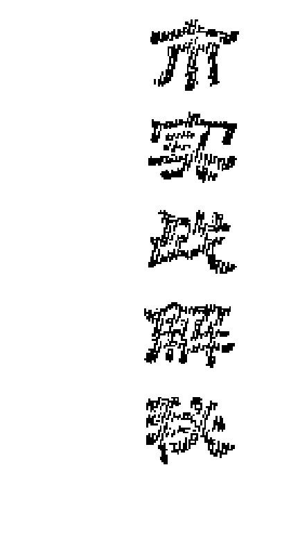

《壬归》云“命主生平，年关气运。虽其久暂不同，实占人所独，盖本课传而分高，各有专司。合年命而较求，方为切己。” 大凡大事、运事，须视本命；小事、近事须视行年。一般壬占中，行年重于本命，行年与日干互为表里，分别应占。

行年本命之作用全在上神作主宰，年上神空亡，一年无成，命上神空亡，一生无成。年命上神乃气运感应所来之物。财居上；求财易。官居上，求官易。驿马天马丁马临年命，身动。总而言之，年命上神所应事物求取易得，入式（四课三传）更应更的，年命上神可生克制化日干上神、三传及地支上神一切物事，为壬占最终之权柄。

年命入式必须论，年命不入式随课取应，可论亦可不论。另外，年命上神可与年命论生克，然以课传中六亲性质为主。又凡涉及个人身体肌肤者，必论年命。比如疾病、婚姻、孕产等事。婚姻占中男女年命相加，实男女肌肤相亲之角，切记切记。

干支、两贵人可拱年命，初末传可引从年命，此处年命可与日干一般论。年命可初课传五阴、五阳而成六阴、六阳格局。

总之，年命上神为吉作用，必应吉象；年命上神为凶作用，必应凶象。年命可佐断事体。凡事占卜以课体为主也。

六壬断课，仅是“观象玩占”而已。

六壬占出一课，万象寓于课体盘面三传四课年命之中。细析之，十二月将乃一象系、十二天官乃一象系，六亲又是一象系，神煞更是一象系，长生十二诀中的状态更是一象系，如此众象交错，岂不复杂乎？

而壬占重在“易简”之道，只要抓住事物之主角，细细观其主象（类神），就可大致判断吉凶。比如求财，只要看式中青龙及财神类神。比如求官，只要看式中青龙及官星类神就可。比如考试，只要看式中朱雀及文书爻就行了。再如占讼，只要看式中官鬼勾陈类神就行了。

大凡而言，人事物皆有其象，现扼要介绍如下，以作提纲。

六壬应用研究与股市实战解秘


# 人象

太岁表天子、总统、主席。月建表省、州、乡、县、村之一把手。干表男，支表女。干表尊、父，支表卑母。眷属当以六亲论，父母以父母爻来论（其他仿此）财爻为妻象，官爻为夫象。专家学者看日德。天后看妇女，天空从魁河魁看奴婢，六合看子孙。神后、天后又可表母亲、妻室。太阴可表兄弟，六合又可表朋友。

# 事象

求官看龙、常、官星。求名看文书、朱雀。
干贵看贵人。婚姻视天后、财爻。求财看青龙及财爻。衣服酒食事看太常。雨看青龙，晴看天空。天地事看勾陈，出行事看白虎。

# 物象

月将、天将、六亲、神煞各有一定物象，随类而推。
人事物象在四个象系中各有表述。比如父亲，既可看太常，又可看日德，还可看长生爻。再如妻妾，既可看天后，又可看神后，还可看财爻。再如求财既可看天财（神煞），又可看青龙，还可看财爻。再如疾病，既可看白虎，又可看官鬼。各种不一，这对如何抓类判断就有了难题。古往今来，一切六壬书对此避而不谈，以至成了研习壬占的关口。
实际上，一种事体的众多类神，可以帮助我们多角度多层次去看待此一事体的最终吉凶。但是，众多类神的出现，必然会表现出不同的信息类象，难免会出现自相矛盾的结论。这时该到底怎么看呢？笔者这里而透露一点，要抓最贴切最合适的象为主作判断的依据。比如妻妾当以财爻为主象正象，而弃神后、天后不用。再如父母当以父母爻为主，而弃日备、天后、太常不用。
类神者，一类事物之总代表也。类神实乃事物之大象。大象之中涵有其他小象。任何一定大象的类神，都由月将、天官、六亲、地位、气数、遁干、态势、神煞、阴神九类小象融合而成。其中月将为类神之体，天官乃所系天将，六亲较量于干支得出。地位者，月将立地；气数者，月将于气候中的盛衰之势。遁干者，指旬干也。态势指十二长生诀中的状态。神煞包含年季月干支旬煞等。阴神者，月将地盘本家上神是也。六壬对类神大象的破译解析（观象），都是在此九件小象中切入运筹出来的。在实际运算中，只要抓着“九件”小象中的任何一项作为取象标志切入，那就可以相应知晓其他八个小象，然后将此九个小象的若干个象进行组合形成明确的信息链，从而作出占断结论。

一般而言，抓类取象的切入点往往是通过天官和六亲两象来实现的。比如测占父母疾病事的吉凶，就以父母爻来类取，以父母爻所载其他八象来断吉凶。若父母爻乘白虎死气坐于地盘墓乡，那么就可依白虎天官、死气神煞、墓乡地位之象信息来表述为：父母病凶而死，入墓为安了。

用类神大象来占断事体，主要是决于九件小象中的若干，未有一定，随类而应。

比如己卯岁八月庚子日为人占工作事，占得申子辰作三传，来年太岁天罡辰土旬空加临干，明表来年工作无着落，无生计之象。此决于生气并旬空、太岁三象来言的。

比如庚辰岁二月庚辰日因楼上水滴声不断，疑是水箱漏水，占得申子辰三传水局脱漏日干，庚金为体代表水箱，三传水局来脱体，正是水箱漏水象。后请人一看，果然是水阀冻坏封闭不着而漏水，何其验哉！此决于六亲脱气之象意也。

比如庚辰岁四月丁丑日夜占河北有信否，朱雀作类切入。雀乘未遁癸闭口陷申地空乡，明表无信之象，至为显然。又如丁丑日夜占天气得伏吟，发用丁丑雨师，丁神主暴雨，夜里大雨如注。辛巳日占天气得卯寅丑三传，由初中传，知天晴大风，末传雨师又为本神克日干，来日必有暴雨，后果然。此数例俱以遁干来中取验的。

比如戊申日测占车臣战事，发用子水龙神将星夹克。而知俄将损折高级军事将领。再如正月壬戊日测中欧世贸谈判，得巳寅亥三传递生，发用巳火作成神，故知农历四月份始能达成协议。此二例俱主要以神煞来断验。

大抵占课皆是察事体各类因素综合来定，各类因素者，悉以各等类神相应观象玩占。比如疾病占，既视虎鬼之象来拟病症，又取子孙、天地医来拟医生，观其两者生克关系来拟治疗情况；再取病人类神来观病情吉凶。观察三个类神，方能全面断尽疾病一事。

在不同事体占测过程中，各种各样的类神大象会在课传上纷至沓来，呈现不同面目与组合，此时就必须有个取舍的选择。《六壬大全·毕法赋》对此总结为“专筮不人仍凭类”和“分占现类勿言之”的原则。之就是讲，占测不同事体就应责取不同类神大象，不可以把不同非关之类神穿插于各种事体当中混为一谈。比如测占失盗要到式中去寻玄武类神。如果此类不在六处，也要到天盘盘面中去抓类而言其方位数目颜色，至于课传中所现的其类神诸象则应一概不取。当然“分占现类勿言之”仅是原则，不可拘泥教条化。更多时候，分占现类可言之，特别是一些天将、月将、六亲、神煞相并之象加临年命入局者，言之必的，必有奇验。六壬作为占测技术，不仅能对已发生或正发生的事件进行测占结果，更可对未兆之事作出前瞻性的预测。由于六壬的类神是多重象类之全息符号，所起课式是全息模型，故而能一课多断，一事多测。关于六壬式局可推测多事的范例，古人早已有之，可详见于《大六壬指南》一书中。就笔者经验而言，往往一个时辰所起课局可以应付占测多种事情，不拘泥于一事一课之程式。关于此点，将在课例实占研究中会涉及。

# 三、六壬占断的应期

六壬占断首决吉凶，次决克应之期。古人云“占断莫神于克应期，亦莫难于克应期。”

论断应期，首观发用。太岁发用，事应一岁之中；月建发用，事应一月之中；月将发用，事应三旬之中；句首发用，事应十日之中。四立日干支发用，事应一季之中。用起节气日干支，事应半月之内。用起干支者，事应今日。用起正时，事应目下现在。

岁月节候均不发用，即以本日地支推之。如丑日，寅为初传，则应在第二日；卯为初传，则应在第三日；辰为初传，则应第四日。出四位则不取矣。

又以用神上下为月期，以占日爱恶之日为日期。吉课以生扶占日为爱神，凶课以克制占日为恶神。

又或以初传所合为成期，末传所冲为散期。或以发用墓绝为应期，或以三合少一字，是依少一字为成期。或以空亡填实及补足课传为成期。

大凡占课，远应年月，近应时日。远应近应首观天乙顺逆，发用旺相休囚及位置。天乙顺行，发用旺相，发用于一二课者，俱主速应。天乙逆，发用休囚三四课者，俱主迟应。

然而占课，专注类神，岂可舍类神之象而言应期者？上述种种，务是类神方位，否则不论矣。专以类神加临地盘之字，类神之字及阴神字来决定应期；或以类神死绝、生旺、冲、合之日辰来断应期。始为正宗合理。

大凡类神见于干支上，应最速；见于初传，则次之，见于中末传者则迟矣。

类神空亡者，则依类神字面出现时日以定应空。“空亡”一说，古今多有争议。然而，空亡多应虚空，少应填实，此点研习者一定要注意！古人云年、月、行年、本命、月将可填实空亡，大误也。太岁并空亡字面，则为年空，月建并空亡字面则为月空；行年本命填实旬空者，此种论调亦不可提。大凡古人讲空亡未来填时之时日，正是笔者所谓未来应空之时，此点真知灼见，习者一定要重视万分。

类神大象入于空亡之乡，仅是虚象而已。难有正果。空亡仅是水中月镜中花，不可谓之无，也不可谓之有，如此而已矣！

类神空亡由虚传实，类神实在传入空亡者，则出旬后有验，此者类神存在于三传中方算数，否则又不论矣！类神空亡又传空乡，则应空必矣，百无一实。

人生在世，皆有所求，求之得否，在于因缘。四课三传者，因缘之象矣！类神人于课传者，有缘之象；类神不人于课传者，无缘之象！究其因缘实质，实由气运而至。天地盘转运，万物随之聚散离合，我身亦万物中一员，焉能不动？四课者，我身聚会之物也，或凶或吉，全在生克。三传者，我身遭遇之物也，或凶或吉，亦在生克。聚遇吉神吉将者，我身吉矣；聚遇凶神凶将者，我身咎矣！

明此一理，壬占之法尽矣。

# 上编 六壬应用研究

# 第四章 六壬分类预测实例

## 一、疾病生死灾害预测

占病，以干为人，支辰为病。日上克辰吉，辰上克日凶。男子看青龙，女子看天后，小儿看螣蛇，若蛇虎等类乘死神死气克日，或辰克日，带白虎者；及年命俱墓，复乘死者；月厌、大煞、飞魂、丧车、哭神等类填满课传，内有克日者；课传中诸煞并见，复有一二煞为日之鬼者；日德禄发用，及加年命上，而空亡者（若支上主空反主病愈）；类神空亡者（父与尊长日及天乙，母太阴，友青龙，妻妾天后，子息六合，奴婢天空及酉戌）；青龙乘日马与元武乘浴盆煞，加命上者；以此系之，皆为死占。其死之期，则以日干之绝神定（如甲日绝于申之类），看绝神临地盘何辰，临岁则不出一岁，临月不出一月，临日不出日之类。

若年命入墓，而四课中有生气者；三传俱绝，而年命上有生气者；类神在生旺之乡者；课传俱恶煞而不来伤日者；白虎乘神克日，而日上神反克白虎者；白虎乘神克支，与克支上神者；又白虎乘神生日，或日生白虎乘神，与白虎作本日德神者；白虎虽入墓，而加午上者（为烧身无畏）；若虎乘水神加午则双凶矣；白虎克日得虎阴制虎者；日德禄发用而不空亡者；皆为生之占。

其病愈之期则以日干之子孙定（如甲日占丙丁日是也），此死生之占也。

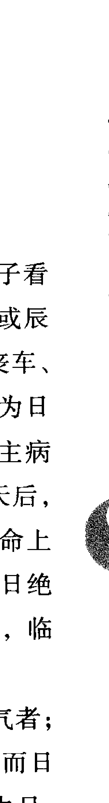

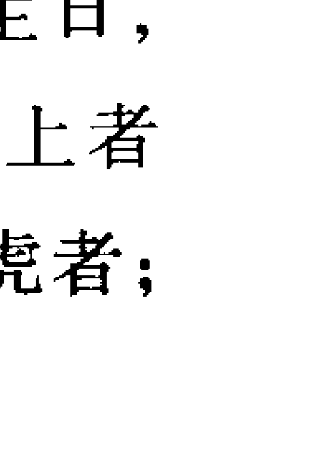

# 六壬应用研究与现代解读


其病症则视支上神，子主伤风，若天后乘之，则男精竭而女血绝。支上亥，癫邪头风，若元武乘之则主眼目流泪。戌主腹痛脾泄，天空乘之则行步艰难。酉喘嗽劳伤，乘阴则伐肺伤脾。申男唇破，女孕厄，白虎乘之疮肿骨疼。未伤食翻胃吐逆，乘常则气噎痨瘵。午心痛目昏，乘雀伤风下痢。巳齿痛或吐血，乘蛇头面疮肿。辰遗漏风瘫，乘勾咽喉塞肿。卯胸胁多风，乘合骨肉酸痛。寅目痛腹病，乘龙肝胆胃疾。丑气促伤残，乘贵人腰腿痿疲。

更详其神煞所加，虎加辰霍乱吐泻，武居子肾衰，辰戌乘后雀疟疟等疾，天乙守辰戌虚肿，勾乘戌咽喉塞，阴乘申腰肿，虎乘丑腹疾，巳亥相加心腹有疾，子作血支癰疽血痢，阴乘羊刃血支臂腹有血疾，丑加亥乘虎。与课为三闾传为曲直，女人经水不通；勾绞作蛇虎人传小儿手足。反吟带白虎，反胃；伏吟作日鬼，水蛊。

若究其得疾之原，则看日上神，乘天乙因思想劳苦，乘蛇惊恐忧疑，雀苦心诵读咒，六喜庆婚姻，勾情丝牵绊，龙经营财物，空其妄隐忍，虎吊丧问病，常醉饱，武祭祀盗贼，阴私暗昧，后闺阁酒色。自巳至戌，白虎乘之病在表；自辰至亥，虎乘病在里。此病症之占也。

至于医药，男以天罡加行年上视功曹之下是医神，如寅加子则正北方求医。女以天罡加行年传送之下。如医神克支制虎，则善矣。

如或不然，于今日课前二神下求之，如甲日课寅，前二乃辰即天医，其下可求也。若能克支制虎，则善。

又或不然，则于天乙对冲下求之，如又不能克支制虎，则直干制虎乘神之下求之。如虎乘申于午下求之。必当分阴阳以为克制将有不善矣。

其医神属木土者，宜丸散，水宜汤，火宜灸，金宜针。

若夫鬼祟则视日鬼，详课传，无日鬼则无祟，有则以日鬼所乘天官占之。乘天乙则岳祠土地；乘蛇淫祠真武，在东南方先在怪梦；朱雀君火神，或经咒愿心；合家神，或眠床当换；勾道路孤魂，先分男女，次列位方；龙香火口愿，在初传天愿，在中传家堂愿，在末传卷轴星辰安不净不处；天空古庙视师；虎横死凶身（在申酉大的，然或是岳神)；常则新化灵，或许盘案未还；元斗圣不安；阴女姑阴鬼，或灶损须修；后水亡老妇，加旺则观音大士愿心。他如死气所乘亦可参看。如死气乘合家有尸枢，乘蛇沉废久病死者，勾阴府勾摄之神，乘乙香火，乘虎病痛死亡者不得解脱，或伏尸，后阴妇人阴灵之类。此鬼祟之占也。

其禳祟之法，如传中见金鬼，用绯纸三陌赤豆三合煮将些少与病人食之，余撒在本家房舍诸处，纸用香烛焚化，盖取相克之义也。火鬼用黑纸六陌黑豆六合，土鬼用青纸四陌或沉香等类，木鬼用白纸二陌或十陌白豆二合，水鬼用黄纸八陌油麻八合，如前法行之。

凡鬼发用，日上神反克之者，虽有祟不须祈也。遇克鬼之日自愈，又辰加寅为罡塞鬼户，占病无鬼祟。鬼发用在受克之方，亦不能为祸。凡虎克年命日干，带刑煞入传者必死，不带刑煞不入传，虽克无妨，虽入传带刑煞克年日若临空亡乘天空犹有再生之理，惟忌行年日干入墓虎来遥克者，十有九死，余可救也。

## 实例一：国王常患病，今此何时逝

偶然间笔者在凤凰卫视上看到报道，长期患病的沙特国王法赫德近来病情又有所加重，全国又处在戒备状态。我随即灵机一动，马上起课预测如下：

2005年05月29日22时
乙酉 辛巳 癸丑 癸亥
四月申将 甲辰旬寅卯空

课式如下：

天将 | 地支 | 天将 | 地支
---|---|---|---
蛇 | 寅 | 常 | 未
贵 | 卯 | 青 | 戌
后 | 辰 | 常 | 未
阴 | 巳 | 青 | 戌
朱 | 丑 | 玄 | 午
合 | 子 | 常 | 未
勾 | 亥 | 空 | 酉
青 | 戌 | 虎 | 申

三传：青龙（庚戌）、太常（丁未）、天后（甲辰）

分析：
测病看支辰、鬼和白虎，子孙为寅卯木医生在课中空陷，白虎在申为病在肺大肠筋骨，初传青龙逢鬼，必因酒色导致虚弱而病，末传为日干之墓，课传全是旺土凶鬼克干，而无金来救应，贵人空陷也不救病，大凶之课。太岁酉金月将申虽生扶年命（由国王 82 岁，推知年命癸亥）亥水，好像有救，但命亥坐于寅之病地，命上申以白虎看，命上又上乘白虎，两虎加命凶上加凶，中传丁神凶动，命上虎主其凶必速，以此判断，国王必死于今年未月巳日，为何死于未月巳日，因未月丁神凶动，日干癸绝于巳。

据报道，2005 年 8 月 1 日周一，下午 3 时 25 分，即农历乙酉年癸未月丁巳日乙巳时，国王法赫德去世，储君阿卜杜拉继任。
沙特国营电视台突然中断广播，不断播出可兰经文，其后公布死讯。长期患病的沙特阿拉伯国王法赫德周一去世，储君阿卜杜拉继任王位。

## 实例二：潜水失踪，是生是死

06年9月10日当天一位外地的朋友来访，闲聊中他提到9月9日当天一群朋友相约海边潜水，大伙儿上岸后发现少了一个人，寻了一会儿找不到人，以为他先回家了，哪知道到了晚上还不见人影，一直到9月10日也没有消息，家人着急，于是要我的朋友测一测。
以询问时间起课如下：

2006年09月10日12时
丙戌 丁酉 壬寅 丙午
七月巳将 甲午旬辰巳空

课式如下：

天将 | 地支 | 天将 | 地支
---|---|---|---
蛇 | 辰 | 常 | 酉
贵 | 巳 | 虎 | 戌
后 | 午 | 空 | 亥
阴 | 未 | 青 | 子
朱 | 卯 | 玄 | 申
合 | 寅 | 常 | 酉
勾 | 丑 | 空 | 亥
青 | 子 | 虎 | 戌

三传：青龙（庚子）、天空（己亥）、白虎（戊戌）

已经知道的预测条件是：

- 1. 潜水失踪
- 2. 年命1981，辛酉
- 3. 潜水方向是住家的东北方

问题是：

- 1. 此人吉凶如何？
- 2. 何时有消息？

分析：

- 1. 虎临干鬼凶速速。
- 2. 太岁作魁渡天门乘白虎大凶，水下遇阻伤灾意外孝服，支上丑命之墓神，支上勾陈也主田坟凶丧，初传兄弟子水龙神一起多人潜水，中传天空大家都走了，末传鬼墓虎凶神定是溺死。
- 3. 命酉上申作虎看大凶，又乘玄武水神水中意外孝服。
- 4. 朱雀卯坐辰上空亡，戌时冲实为应。

反馈：

- 1. 此人吉凶如何？ 凶，死亡。

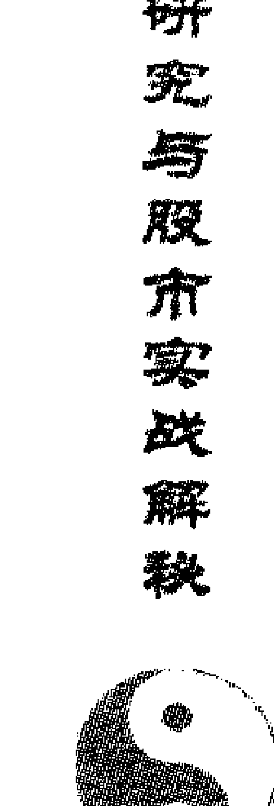The request was rejected because it was considered high risk# 失业之忧。

凡三传递生者，三传传进者，蛇化龙神者，贵登天门者，寅申作德禄驿马者，岁作龙常者，白虎作官星者，三传内战传出者，俱主工作顺手，前途看好。

职称评定，最要戌印未绶、太常、天喜、皇恩、皇书、皇诏、幕贵等类神出现并临日干年命生合，则大吉，否则不然也。

升迁调动大事，专视寅申、驿马三神。兼神太岁、月建、月将、德禄、龙常、财官、天喜、皇书、朱雀等类神在式中的情况。

# 实例一：两次求职终难成

网友无名：今天去了一家公司面试C++程序员，而自己的专业正是这个。而这个公司招的是有资历的人员，由于自己刚毕业，所学技术尚少，所以要考虑一下。我在那里与那里的技术总监聊了很久，因为是一家青岛的公司，所以在青岛招C/C++人员比较困难，这里大多都用.net。我说了一下自己的情况，他们要看下，如果在两个周之内招不满合适的人员，那么或许会让我过去，因为我有基础，所以培训起来容易些。我对他们说，我现在对待遇的如何并没什么要求，只要是我能进去，给我一个这样的学习环境便可以了。对于这个机会我很看重，不知道结果如何，希望大家能详细的看看。

公历：2007年6月25日12时
丁亥　丙午　庚寅　壬午
五月未将　甲申旬午未空

青 空 虎 常
午 未 申 酉
勾巳　　　戌玄
合辰　　　亥阴
卯 寅 丑 子
朱 蛇 贵 后

合朱玄常
辰卯戌酉
卯寅酉庚

父 壬辰 合
官 癸巳 勾
官　午 青◎

看结果（很重视）。

分析：
求职最重父母生气支上来生合干上。

- （1）禄神申坐空，说明求占者目下无工作正合当前求占者状态，发用父母乃为求职之事。干支具临旺气，说明求占者本身素质较佳，所面试的单位也不错。发用辰与日上酉合，说明求占者所面试的公司有人对求占者有情有意。
- （2）日上支上卯酉冲克，发用父母遭天将与地盘双木夹克，课逢罗网阻力重重，只宜静待，不可谋求。
- （3）此重审之卦，顺进连茹，进中有退，事不顺利。三传顺连茹空（未传空），名曰：声传空谷，示所求无果。

网友无名于2007年7月3日反馈如下：

多谢，反馈一下：我与这家公司已经失去了联系，现在在另一家公司工作，工作与网络有关，做电脑和软件的维护，待遇不错。

过了两个多月，网友无名报着一线希望，又去了这家公司。

现在去接待我的是另外一个技术总监。说了很久，很投的来。两个技术总监对我都很好，不是因为我的技术，而是因为我的志向。现在还没有合适我的职位，在十一之前也许会有，但是不一定。如果有的话，到时候会通知我。即便没有，到时候也会给我回复。因为现在自己的经验尚无，进去先做软件测试工作。以后才能转到开发部门。

请大家帮我看下，结果如何，我能否进到此公司。

公历：2007 年 9 月 5 日 17 时
丁亥戊申壬寅己酉
七月巳将甲午旬辰巳空

| 朱 | 蛇 | 贵 | 后 |
|----|----|----|----|
| 丑 | 寅 | 卯 | 辰 |
| 合 | 子 | 已 | 阴 |
| 勾 | 亥 | 午 | 玄 |
| 戌 | 酉 | 申 | 未 |
| 青 | 空 | 虎 | 常 |

分析：

- （1） 发用明暗鬼大凶不吉，三传合财局生起干上鬼来克日大凶，以此课求谋大不利难遂之象。
- （2）干上支上未戌相刑，发用戊鬼刑日上未鬼，且父母生气具不上传，公司必不聘用。末传子孙寅木乘蛇来脱，难成。

网友无名反馈：不成，另谋出路。

# 实例二：远方的工作去不去

2008 年 3 月 21 日，紫气凌云说：“中午师兄发来短信，说导师叫我过去，我就匆匆过去了。从导师那里得知，原来是苏州的一位师兄要找人搞研发，他那缺人，想要我去帮忙，我于是起课看看去后有无发展前景。”其所起课盘如下：

公历 2008 年 3 月 21 日 12 时
干支：戊子乙卯庚申壬午
二月戊将甲寅句子丑空
1984 年生人，本命子，行年寅

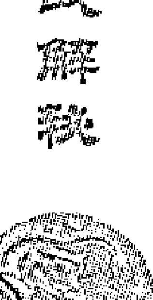

| 勾 | 合 | 朱 | 蛇 | 父 丙辰 玄 ◎ ||| 青 申 | 丑 贵 | 兄 庚申 青 || 空 未 | 寅 后 | 子 子 蛇 ◎ || 午 | 巳 | 辰 | 卯 || 虎 | 常 | 玄 | 阴 |

分析：

- （1）戌为打工者求职者，加于占时午火岁破之上，又上乘六合，是有人找帮手谈合作之事。戌又为父母，因而是工作之事。
- （2）干支上神太岁子作子孙脱干支又交互来脱，初传辰作父母上乘玄武落空，末传太岁做子孙上乘蛇又落空，四课不离三传，三传不离四课，去而复返，劳而无功之象。
- （3）三传合水局脱干，防失脱之事，中传申为日禄上乘青龙，正宜守此不可乱动为好。
- （4）年命子上坐辰墓，年命子与月建卯相刑，年命又上乘玄武，本命又落空亡，大凶不利。
- （5）行年寅上午为岁破，上乘白虎，当防意外事。

总合来看，去了前景不大，还可能有破费。

后来，紫气凌云说，我本身不想去了，与我的专业相关性不大。

# 实例三：此去前程如何

大海因前往一公司应聘管理职位，看到公司的管理状况有些蹊跷，对自己在该公司的发展前景产生疑虑，遂起课，我看到后解析如下：

公历：2008 年 3 月 13 日 18 时

戊子 乙卯 壬子 己酉

二月亥将 甲辰旬寅卯空

命酉，年巳

# 上编 六壬应用研究

```
勾 青 空 虎
未 申 酉 戌     蛇后贵阴     官 甲辰 蛇⊙
合 午     亥常     辰寅卯丑     财 丙午 合
朱 巳     子玄     寅子丑壬     父 戊申 青
辰 卯 寅 丑
蛇 贵 后 阴
```

分析：

- （1）课体：交车合，登三天，蛇化龙，测工作是好课，但日干壬在卯月休囚无力。
- （2）命酉上日禄太阳亥，又上乘太常吉将，看似吉利，但卯为月建，上乘贵神主该公司老板为有身份有后台之人。酉为本命，为月建卯所冲，预示该老板不容他。
- （3）发用辰为日墓又临蛇落空，中传岁破，末传坐败地，丑加干上作本命墓神，行年上带勾不吉，一事无成之象。
- （4）支为公司，支上天后主公司内部，干上太阴支上天后，交车合，主有男女私通交合之事也。

总合来看，课虽吉，但日干休囚无力，前程实是让人担忧啊，只得空自嗟叹啊！

大海如实反馈：

- （1）老板女，有官职在身，无信义之人。
- （2）管理比较乱，水够深的……
- （3）上下苟合……管理起来难。
- （4）待遇是不错，感觉不着地，正如太白所言，一事无成，（这长时间休息的很少）

打算再次跳……

总结来看，课的确是登三天，但日元弱，再好的课用不上……还是要看五行生克制化……

再次感谢太白等解课。

# 六壬应用研究与实战解读


## 五、婚姻预测

凡占婚姻，以青龙为男为夫，天后为女为妇；日之阳神为男，支之阴神为女。如青龙旺相则为佳男，天后旺相则为佳妇。青龙之神生后，或与后比和，则男益乎女；天后亦然。日上神旺相则男吉，辰上神旺相则女吉。日上神乘贵人则男贵，辰上神乘太常则女贵。日上神与辰上神相生或比和则男女相得。日之阴神旺相则男家富，辰之阴神旺相则女家富。若龙后所乘神刑冲破害而不相合，或落空亡，带孤寡，又日辰上刑冲破害，而不相合，或空亡，而乘恶神，兼之龙所乘神克后，与日上神克辰，则为妨妇之男。后所乘神克龙，与辰上克日，则为损夫之妇。皆所不当议也。至成否，当看日上辰上，生合比和，与传内见天喜德合则成，见刑冲劫害而不相合，龙后六合所乘神，与日辰刑冲破害，或日克天后，或天后克日，皆主不成。又初传为男，末传为女，中传为媒，欲其比和相生，不宜空亡刑害。至女子之邪正，看支上三传及女年命上，乘太常日德支德者正，乘元阴与桃花煞者邪，类而推之可也。

占婚姻，首视干支。干为男，支为女。干支生合主婚成，干支刑害主不成。青龙为男友，天后为女友。观察青龙天后乘神以定个人情况。财星为妻象，官星为夫象，以财官关系来论婚后夫妻缘份，行年本命看个人性情长相，悉依上神来论。

干加支，男追女；支加干，女追男。干支生合，情真意节。干支刑害，感情破裂。干到空亡，虚情假意。年命相加，肌肤之亲，相生主鱼水之欢，相克主琴瑟不调。

男女长相视年上神（不知行年则从干支上神来替代论）。依木瘦、金方、水肥、水尖、清浊结合时令及所乘天官、神煞言之。

男女性情视命上神，以木仁、金义、水智、火礼、土信结合时令及天官神煞言之。正邪也要以行年命上神言之。凡天备、月德、干德、

六壬应用研究与股市实战解秘


# 六壬用神断婚姻实战解读

支备、贵常龙合主正派贞洁；凡月厌、桃花、奸门、玄武、太阴主邪淫风骚。

夫妻缘分，皆在财官，财官旺相，白头偕老，财官一空，半路分别。

占测婚姻成否，先看干支，当重龙后、财官、年命。支干生合者，三传三合者，财官不空者，年命相加者，龙后相生支干者，课传中成神、会神、天喜、月合并见者，子丑相加发用者，皆主必成。干支冲克者，财官空亡者，年命相加又空亡者，财官龙后月厌、孤寡、月破、岁破刑克干支者，河魁度亥者，皆主不成。

占测婚后吉凶，也经支干、财官、年命。支干生合者，行年生合者，夫妇恩爱。支干相克，行年冲战者，夫妇不谐。男占兄弟爻成合局克妻。女占子孙爻合局克夫。男占财爻空亡，女占官爻空亡，生离死别，半世夫妻之象。二阳一阴，妻有外夫；二阴一阳，夫有外妻。支干呈解离芜淫卦者，夫妇分居离婚之象。发用六合终于天后，夫欲私奔；发用天后终于六合，妻与人逃。干支上乘六合天后，主男女有私通事，女年在干或在男命，男年在支或在女命，先奸后娶。三传引干夫不良，三传引支妻不淑。

男婚女嫁，尚涉及媒人及双方父母，宜逐类言之。六合为媒，干长生为男方父母，支长生之女方父母。看诸等类神与龙后关系来定其中缘由。

以上婚姻占法皆为古传正法，壬占中尚有活法佐断。

初传为男，中传为媒，末传为女，依三传生克关系来言男女、媒人之间交往情况。

又以天罡所指定婚配成败，天罡加孟不成，天罡加仲，犹豫不定，天罡加季，必成。

另外，闻媒之议合，而未必其言之虚实，则月将加时看六合所临之神，以孟仲季视之，合临孟，虚；合临仲，半虚实；合临季，实。

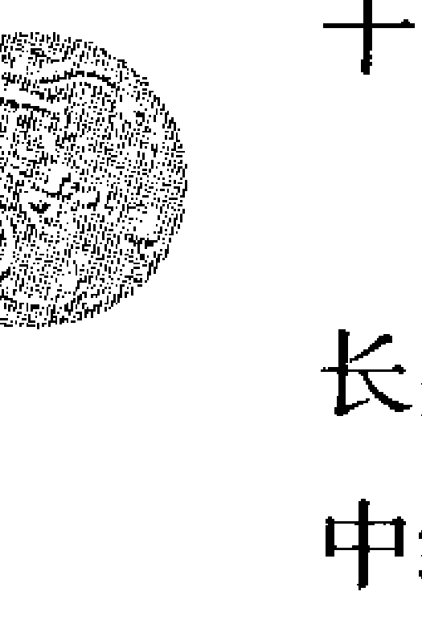

# 实例一：婚姻有矛盾，别求空费力

网友一枚莲花发贴：请各位老师出手，有同学求测婚姻。

刚才一同学甲打电话来，诉其苦恼，欲求俺测之。甲已婚四年，其妻乃初中同学，虽以前早就认识，但婚后时常争吵，已多次闹离婚。最近甲偶然遇到小学同桌乙，此同桌已离婚，目前单身。甲感觉得与同桌很是合得来，有离婚而与同桌乙结婚之念，不知吉凶如何。

2005年10月18日22时

乙酉丙戌乙亥丁亥

九月辰将甲戌旬申酉空


      朱 合 勾 青
      戊 亥 子 丑       蛇常空蛇     兄 戊寅 空 ⊙
    蛇酉            寅空     酉辰寅酉     财 癸未 后
    贵申            卯虎     辰亥酉乙     父 丙子 勾
      未 午 已 辰
      后 阴 玄 常

分析：

此课为四墓复生盘，只利旧事不利新生，乙日为罡压日本，为天狱课，若再囚死，主祸从天降，有牢狱之事。但支上太阳虽入夜，干支上神生合，测婚不妨无事。干上酉蛇主男的正在想婚姻财喜之事，支上辰罡星太阳入夜无光辉，支上墓要倒霉，爱人心情极坏，又罡星当白虎看主能力强行事强硬霸道但有刑伤，太常主武力，说明其妻能力强脾气暴躁身体动过手术或不好，上乘太常主武力，支又为家里，说明在家里妻子对男的动过武发过火。初传寅也主婚喜之事，但乘天空兄爻，主事不实有口舌，又以初传寅为这个男的乘天空心里有婚喜事但犹豫不决心思悬空，末传子为他的小学同桌生初传，对他有意思，中传财后空无媒人中间人，是他们自己相识相通，三传递克恐事不如

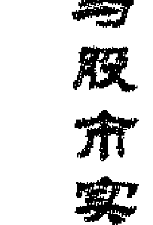

意，此事会越来越难，尽管末传子生干，但干上酉逢支上辰生来克干，支上辰罡星克末传子，从整个课盘看，这个事恐有人阻拦，难以实现。

网友一枚莲花反馈：

俺同学打电话来说，同桌乙已有人给她介绍男朋友了，同时经过接触，俺同学感觉到和同桌乙并不是十分合得来，一起生活可能并不合适，还不如永远做好朋友，于是今天彻底打消了追求同桌乙的念头。

俺同学并于今天中午请同桌乙和她新认识的男朋友吃饭，她男朋友在咸阳上班，比同桌乙大六岁，但看来人品和能力都不错，也是离过婚的。俺同学居然和同桌乙的男朋友十分投缘，很是谈得来。虽然俺同学感觉他们不一定有结果，但心里也轻松了许多，感觉到跳出了一个苦恼的圈子。

俺代表俺同学再次感谢大家的帮助！

## 实例二：全周占婚姻吉凶

网友牛野说，全周于 2008 年 2 月 9 日起课求测，两个同年出生的男女婚姻是否可成？这对男女均为 1982 年戌年生人。于是我便欣然判断分析如下：

公历：2008 年 2 月 9 日 10 时
戊子甲寅己卯己巳
正月子将甲戌旬申酉空

贵 后 阴 玄
子 丑 寅 卯  虎朱合阴  兄 甲戌 朱
蛇亥     辰常  巳戊酉寅  父 辛巳 虎
朱戌     巳虎  戊卯寅己  财 丙子 贵
酉 申 未 午
合 勾 青 空

分析：
此课与占证件能否办成一课同，唯月将月建不同。此课我当时见支卯空亡，占婚最忌干支落空亡，又干支上神寅戌相克，支上所乘朱雀坐于戌墓之上，这里朱雀为结婚证书，入墓难有，又墓神作兄弟发用，皆凶象。随脱口告之，难成。

此课方外居士在后来也做了较详细的分析判断，现载录如下：

> 干支邀午火父母爻来合，可能要见父母了，可惜午临绝地父母不太同意。

正时巳火父母爻乘白虎，家长迟疑不安之象。

末传财来克巳火，印绶公姑安可犯，主婆媳不合。

干上之鬼临月建，末财为月将，财官相生，得时为吉，本是好事，然财来生鬼，鬼却位在干上，抬头见鬼，必出麻烦，财爻本身抬头六害，女方心里定忑忑多疑，官爻仰丘复仇男方必多阻碍压力，依我看最终凶多吉少。

后来牛野于2008年6月4号反馈说，最终凶多吉少。

# 六、胎产预测

胎产之产，先视有无，次决男女，次详生期及生之吉凶。大概看日之子孙及胎神、六合、天后之类。如课传旺相，相生相合，子息六合发用，或虎后合与血支血忌，及胎神乘生气发用加干支年命者，有。夫妇年命上见德合、天喜、子孙，而不空亡者，俱主有孕。若课传干支年命刑冲破害，子息、六合不见，及见而空亡者，则无。男女须看夫妇年命，年命上阳神主男，是阴神主女。又课传俱阴主男（盖阴极度阳生也），课传俱阳主女。又三传二阳包阴主女，二阴包阳主男。又曲直炎上神主男，从革润下课主女。又月建重叠作胎神兼生气旺气者主双生。至于生期，取法多端。有以勝光所临之下神为断者，有取生养之下神者（指长生十二字指生养），有以冲胎刑胎之月日断者，有

六壬应用研究与股市实战解秘

以发用三合定月期（亥发用，卯未为生月之类），发用刑冲定日期（如子发用，午冲卯刑之类），以用后一辰定时期者。然总须详审课传、干支、年命、生合冲脱及兼血支、血忌、浴盆等神煞，以意消息之，鲜有不验也。其吉凶则以干支三传年命上神，如乘天月日德、六合、青龙，诸吉神旺相相生，则吉。乘蛇虎、死气等凶神克害则凶（伤支损母，伤干损子），又传顺贵顺者生易，传递贵逆者生难，孕产之占，不外是矣。又月建加天后，主妻妾怀孕；生气乘天后、六合，亦主有孕。

# 实例一：孩子何日生？是男还是女

一日在网上与壬山壬海网友闲聊，突然壬山壬海说有一亥命女子，刚生了一个婴儿，请问你能否测出生的是男孩还是女孩？哪天出生的？于是我按当时聊天时间起课如下：

公历：2007年9月16日11时

丁亥己酉癸丑戊午

八月巳将甲辰旬寅卯空

```
蛇 贵 后 阴
辰 巳 午 未 空青空青 兄 壬子 青
朱卯 申玄 亥子亥子 兄 辛亥 空
合寅 酉常 子丑子癸 官 庚戌 虎
丑 子 亥 戌
勾 青 空 虎
```

分析：

- （1）此课干支上神皆为子，正好应了所测孩子之事。
- （2）干上子，子上乘龙神，合为龙子，龙者男孩，凤者女孩，预示此女所生必是一男婴。
- （3）日干癸水胎在巳，巳上辰，辰为辰龙，辰又为阳支，所以断其所生为男孩。
- （4）胎神为巳，为太岁亥所破，巳为岁破，故知此男婴为巳日所生也。
- （5）三传退连茹，此女命为亥，亥为当年太岁，亥上戌为魁渡天门，复又上乘白虎，故知其产顺利，但必是刨腹产也。

壬山壬海网友反馈说，所断皆对也。

# 实例二：女友怀孕了吗

广东的网友问其女友是否怀孕？若怀上能保住吗？我遂起课如下：

2008 年 3 月 12 日 16 时

戊子 乙卯 辛亥 丙申

二月亥将 甲辰旬寅卯空

```
朱 合 勾 青        后常阴虎      官 乙巳 后 ◎
申 酉 戌 亥        巳寅辰丑      兄 戌申 朱
蛇 未      子 空
贵 午      丑 虎      寅亥丑辛      子 辛亥 青
    已 辰 卯 寅
后 阴 玄 常
```

分析：

- （1）干乘墓虎，主所测之事大半为凶，初传遁出暗财乘天后发用，支上干财，所问必与其女友妻室有关。果然网友所问的是其女友怀孕之事。
- （2）怀孕看胎神，胎神卯临月建旺相不空，又上乘贵神，断其女友肯定已怀上，而且所怀为一贵子，但天盘胎神卯上乘玄武恶神，恐无法保住。

六壬应用研究与股市实战解秘


网友随即打电话问其女友，其友说，已做过测试，有反应，怕是怀上了，前天酉日服药，已被打掉。网友连连叹息，悔之晚矣。

# 七、各类考试预测

考举之法，以日干为应试人，支为场屋。廷试则以太岁为主文，会试以岁破（寅年申类）为主文，督学及府县试则以月建为主文。主文要带龙常朱六等吉神，生日辰年命不空者，中象也。不宜带刑杀等凶神、克制日辰年命。发用不宜克干支。若贵人青龙入传或临日辰年命必中也。朱雀为文章，如临午位名真朱雀格，纵不入传亦佳。若不受刑克而生合日辰年命主文明显达。其朱雀乘神要与主文相生，若雀克主文，则文字不贴主司之意。又当看帘幕贵人，如甲戌日占得昼时，则丑为贵人，未乃帘贵也。占得夜时未为贵人，丑为帘贵。幕贵见课传，加干支年命，与年命干支生合，必然高中。其三传宜旺相有气，宜乘吉神吉将，与干支年命相生，不宜相刑害空亡。若三传递生而生日干必膺荐拔也。至于中之高下，廷试视太岁，或生日或作日贵临于发用，五马交驰（五马谓岁月天驿命马是也），印绶德禄皇恩天喜并见，六阳数足者（数足者，甲丙戊庚壬日四课三传子寅辰午申戌俱备是也），状元也。太岁乘吉神，生日或作日贵临干，见中传，三四马交驰，印绶德禄天喜并见，六阳缺一者，榜眼也。太岁乘吉神生日或作日贵临干，见末传，三四马交驰，印绶德禄天喜并见，六阳缺二者，探花也。若课传俱吉而吉神并于初中者，二甲也。并于末传者，三甲也。会试月将乘吉神生日，或作日贵临于发用，传见禄马德天喜者，魁元也。吉神同上而月将见于中末传者，后也。乡试岁破乘吉神生日，或作日贵临于发用，传德禄马天喜者，元魁也。吉同上而岁若见中末者后也。小试月建乘吉神生日，或作日贵发用，传见德禄者，榜首也。龙朱旺相月建乘吉作贵，见中末传者，一二等也。龙朱休囚，月建虽乘吉神作贵，见别处不入课传者，三等也。（占人泮及府县试仿此类推）

又天盘酉临年命日干，名亚魁星，占试必中。丑未相加作年命日干，为鬼斗相加格，亦中魁元。盖丑中有斗，未中有鬼，合而为魁字。日德加亥为用乃德入天门格，试必高中。

至于武举之占，则视日上、发用与年命上，如遇天杀月煞乘天空白虎太岁人传者利。巳为弓，申为箭，五马为马，三者并见，又乘吉神不空亡者利。三传克日，羊刃禄马并见者利，其余则依文举观之可也。

现代社会各类考试皆从以上类比占测。

考试最重长生禄马，更喜魁罡、贵人、青龙、太常、朱雀、印绶、天喜、生气、月德、皇书、皇恩、太阳、旬首诸等吉将吉神。颇忌腾蛇、白虎、墓神、月厌、病符、死气、死神、破碎、空亡等凶神凶将，吉神空亡则考试不中矣！

长生乃聪明学堂所在，禄乃士子词馆正位，马乃就学赴读之神，数者俱见，中式必然无疑。

天罡领袖之神，河魁文明之宿，丑未贵人之首，旬首六甲之始，朱雀文书之神，数者并临占人日干或年命之上，不仅考试必中，且中高魁，名列前茅。

腾蛇卑贱之神，青龙高贵之将，蛇化龙神，发迹之兆；龙化蛇神，日下之象。

亚魁（酉）从魁亦作魁星看，要加临日干年命之上，高中。

月将光辉之象，必主聪明高贵，成名之兆。墓库月厌暗昧之象，必致愚蠢晦滞。

平常考试，只观朱雀与文书交。

中考、高考则极重长生禄马、魁度、魁罡、旬首、贵人、太常、青龙、印绶。

考研考博，专注魁星、幕贵。

职称之考，则视印绶、太常、铸印、研轮、轩盖课俱是中兆。

专业考试占测，则视幕贵、朱雀。

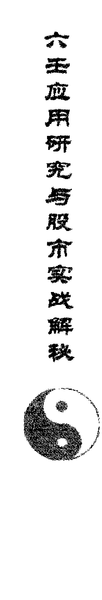

六壬应用研究预测歌诀

## 实例一：竞争职位，笔试预测

我们单位举行领导干部职务公开竞争活动，笔试考核在竞争职务活动中十分重要，有着关乎竞争成败的一票决定权，所以每个竞争者都格外重视。我在精心准备，认真应考刚刚结束，就诉诸天命，起课分析以决成败如下：

- 2005年05月31日12时
- 乙酉 辛巳 乙卯 壬午
- 四月申将 甲寅旬子丑空
- 占人年命为亥

| 蛇 | 贵 | 后 | 阴 |
|---|---|---|---|
| 未 | 申 | 酉 | 戌 |
| 朱午 |  | 亥玄 |  |
| 合巳 |  | 子常 |  |
| 辰 | 卯 | 寅 | 丑 |
| 勾 | 青 | 空 | 虎 |

| 蛇合贵朱 |
|---|
| 未巳申午 |
| 巳卯午乙 |

| 官 | 庚申 | 贵 |
|---|---|---|
| 财 | 壬戌 | 阴 |
| 父 | 子 | 常 | ◎ |

分析：
此课干上朱雀加午为真朱雀，而又旺于巳月，天月日德贵人官星太阳临初传发用，魁星入中传，末传父母幕贵上乘太常吉将，于考试竞争均主大吉之象，支上驿马乘六合，主参加竞争考试的人较多。考分看朱雀加午，午数为9数，五行数为2、7，结合考试难度可判断推测成绩当在70分左右。果然等到公布成绩，考分果然为70分，在众多的考试竞争者中还算是中上等成绩，对我来说还算理想。事后发现此为错误正断，由于起课时过于匆忙，贵人排错了位置，正应了错误也能判断准确的易学奇象。正确的课局如下：

```
公历：2005年5月31日12时
乙酉 辛巳 乙卯 壬午
四月申将 甲寅旬子丑空
```

```
青 勾 合 朱
未 申 酉 戌
空午        亥蛇
虎巳        子贵
辰 卯 寅 丑
常 玄 阴 后
```

```
青虎勾空
未巳申午
巳卯午乙
```

| 官 | 庚申 | 勾 |
|---|---|---|
| 财 | 壬戌 | 朱 |
| 父 | 子 | 贵 | ◎ |

六壬应用研究与股市实战解秘

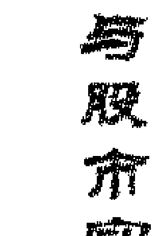

分析：

1.  干上天空，主试题做得不全面或有试题没做完，支上乘白虎，主试题较难。
2.  天月二德官星幕贵太阳做初传发用，朱雀乘魁星人于中传，末传父母贵人，定主考试大吉榜上有名。
3.  考试成绩看朱雀加于中传河魁戌上，戌坐申上，申为7数，故判断考分为70分左右，果然公布成绩为70分，由于考题对竞争者来说相对偏难，所以我的考分在众多的考试竞争者中还算是中上等成绩，较为理想。

就这样我顺利通过笔试，进入下一轮面试大关。

## 实例二：职务竞争，面试预测

在我们单位的领导干部职务竞争活动中，按照程序，面试是竞争职务考核的最后一大硬关口，也就是俗话说的，三拜九叩都过了，就剩最后一哆嗦了，最后一哆嗦可关呼整体成败啊！于是我在参加完面试吃过晚饭后，抱着忐忑不安的心情，当即起课判断面试结果如下：

时间：2005 年 06 月 09 日 18 时
乙酉 壬午 甲子 癸酉
五月申将 甲子旬戌亥空
年命辛亥

| 合 | 朱 | 蛇 | 贵 |
|---|---|---|---|
| 辰 | 巳 | 午 | 未 |
| 勾卯 |  | 申后 |  |
| 青寅 |  | 酉阴 |  |
| 丑 | 子 | 亥 | 戌 |
| 空 | 虎 | 常 | 玄 |

| 玄常虎空 |
|---|
| 戊亥子丑 |
| 亥子丑甲 |

| 父 | 甲子 | 虎 |
|---|---|---|
| 父 | 亥 | 常 | ◎ |
| 财 | 戊 | 玄 | ◎◎ |

### 分析：

1.  干上乘天空，正应面试时众人凭空依题设想互相辩论之象。干为我，上乘天空奏书之将，正好应证了我在辩论过程中，依题巧妙引出为单位提供建设性见议的话题和论点，因考官有一半为本单位领导，后来我的发言得到了总站领导的表扬与好评。
2.  初传父母将星临旬首发用，预示我在辩论中的发言独占鳌头，颇占上风。实际我在辩论发言开头引用了司马迁《史记》上有关论述刘邦的一段古语，使在座的考官耳目一新，语压群雄。初传逢白虎，主我在发言辩论中有紧张打隔的现象。中末传空陷，主我的发言有点虎头蛇尾的味道。
3.  支上亥为干之长生又上乘太常吉神，课经云：夜占亥加子，太常乘日之长生临支，交车相合，主宅中有婚姻之事，或开彩帛铺，或开酒食店。若太岁月日临传，主事远大，谋为得遂。今日支子发用，主事必成。


结果我在面试中除表现有点紧张，偶尔打嗝外，语惊四座，从面试成绩看，我顺利通过面试，值得庆幸的是，事后我的答辩不仅在总站领导会议上，得到了总站长的赞同和表扬，而且还得到了直接领导的点名表扬。

## 八、竞争官职预测

占官先主象，文看青龙，武看太常，主象临有气地为吉，临无气地为凶；临日辰年命为显，不临日辰为晦；与日辰相生主长久，克或内外战不利；日生主象外除，主象生日内除或近都。
又宜看官星及禄马。官星即甲乙日酉申之类，马即岁月日时命之驿及天马，禄即日干之禄神。数者要旺相入传临干支年命则吉，忌见下神克害及空亡。
又以功曹传送为升阶之贵神，若寅申乘贵人，又临马，旺相必升。
又贵登天门，乃荣任朝见之象。
又干上有支马，支上有干禄，名富贵卦，主加官进职。
又初传居日干前，末传居日干后，为引从格，亦主迁擢。
又太岁龙常禄马发用，年命上又乘吉神，不空陷者，皆吉占也。

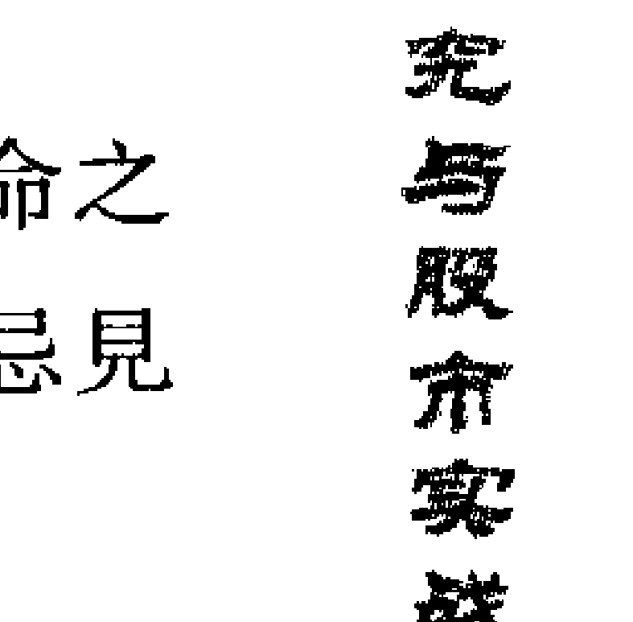

若夫日上与发用神将并凶，或神将吉而空亡冲墓者主凶。或干支上乘罗网而年命又乘丧吊诸神者，则为丁艰之凶。若日上发用，墓乘白虎，或禄神作闭口（旬尾加首名闭口），神将不吉，三传中空，与年命上乘病符诸凶煞也，则为病疾之凶。三传递克日干，无日德解救，与朱雀闭口者，则为弹劾之凶。德禄官马俱落空亡，年命又乘凶煞者，去位之凶。日禄加临支上，或加支而投墓，无日德解救者，则为降级之凶。至于食禄之方，则以禄神所临之下决之（临子齐分丑吴分之类，当看分野而言）。又三传递生日干必膺荐擢之喜也。
现代竞争官职以上述论断类测皆可。

六壬应用研究与股市实战解秘

## 实例：预测竞争职务

我们单位举办领导职务竞争上岗活动，要求大家尽可能的参加，因我这几年与机关领导很少来往，觉得成功的可能性很小，没有对此抱太大的希望。转念一想自己不是在学易吗，预测一下看看，若有可能不妨试试，于是按自己动念头的时间起课分析如下：

2005 年 05 月 23 日 15 时
乙酉 辛巳 丁未 戊申
四月申将 甲辰旬寅卯空
占人年命为亥

```
空 虎 常 玄
巳 午 未 申      常常常常    子 丁未 常
青辰        酉阴    未未未未    子 癸丑 朱
勾卯        戌后    未未未丁    子 庚戌 后
寅 丑 子 亥
合. 朱 蛇 贵
```

### 分析：

1.  式中四课天将皆是太常，初传天将也为太常，太常为武职，正应我所竞争的职务为军警司法安全部门之职务。
2.  年命亥上乘贵神，为贵登天门，有利于竞争职务。
3.  初传虽上乘太常吉将，但作子孙临丁神发用，主必会努力参加竞争职务的活动，但子孙为克制官星之凶神，临于初传发用，凶多吉少，要作好竞争会出现失败的心理准备。
4.  中传丑上乘天将朱雀，在巳月旺相，主在竞争考试过程中，考试答卷较理想。
5.  末传戌乘天后做干墓，三传皆作子孙而又刑冲，恐因人事关系的原因，不能被任用。

## 九、官司诉讼预测

占讼须分内外，若内而与家人讼，则日为尊长辰为卑幼。外而与他人讼则以日为原告，辰为被告。若无对头者，以日为官，辰为己，观日辰之吉凶克制而胜负自明。如日吉辰凶或日克辰则尊者与原告胜。辰吉日凶或辰克日则卑者与被告胜。日辰比和，则和合矣。当其投状也，则视朱雀，如朱乘神与天乙乘神生合，或比和而初传生日干者状准，反此则否。及其准否，则视勾陈，如日克勾陈则词得理，勾克日则词失理。若天空乘日辰年命而关神入传，与墓神覆干支年命，而又自生投墓者，主监禁，遇钥神即出；若自墓传生，或冲墓亦出。曲直作传而克日者，主枷杻，三刑六害凶神恶将见于日辰发用者，讼大负。元武所乘神，教唆鬼也。须看类神而察其何人。神后所临避罪方也。

至于决大疑重狱，而欲得囚之真情者，则以日为我，辰为囚，坐我于制囚之方，则彼当吐实。若日辰上见天空，囚忍楚不吐，此亦理之足据者，故录之。

又占讼忌朱勾克日，忌朱克太岁，忌丁逢羊刃忌勾虎同克日。若太岁贵人生日，罪虽重亦得末减。初传虎末传蛇为虎头蛇尾，虽祸不凶。

现代社会打官司，一般要分民事和刑事两类来分别看待。民事之占，首分主客。干为原告（或求占者），支为被告（对应方）。古代占法尚看尊卑，凡民告官者，以干为官府，以支为平民。今则不然，据于现代社会“法律面前人人平等”的基本理念，只依支干分原被告就行了，不必拘泥旧法。此乃壬占要跟时代精神发展须相适合的原则。

以官鬼为官方（法院），以勾陈为审判庭。以父母爻为文字证据（理由），兄弟爻为证人，以朱雀为宣判书，以子孙爻为律师。

民事起诉，首视朱雀，贵人为受理人，朱雀生合贵人，则可立案，否则不成。以朱雀来拟诉状如何。

民事调解，要看支干，支干空亡或相生相合，主调解可成。若刑冲克害，则难成。又喜三传传空，则讼终不成，天空居末传，则讼终不起。

民事胜负如何，专看干支上神的关系及三传，也要看朱雀、勾陈两类神。要日克勾朱，或勾朱生合日干，则原告胜；生支辰者，则被告胜。支干俱受克脱墓，则两败俱伤。

刑事诉讼，以干为当事人，以支为家庭。以官鬼为公检法机关，以墓库为监狱（看守所），以丁神、羊刃为脚镣手铐，以太岁为最高法院，以月建为地区法院。以月将、龙神、生气为真相道理。以皇恩、天赦为缓刑、赦免之神，以五刑为所受刑罚。

支干坐墓乘墓入墓传墓，俱主关押。官鬼克日，俱主有罪，并凶煞白虎者，多主死罪。鬼乘吉神又得天赦、皇恩，多主缓刑。只有官鬼空亡或受制，或有救化解（父母爻），方能转凶为吉，无罪释放。

## 实例：一友被诬告偷窃

网友柳静言，因为其朋友在成衣店购物，被诬告，发贴请占吉凶。据柳静言讲述，此事的起因是因为自己的一个朋友去一成衣店购买衣服，试完衣服走出更衣室，却被一个从事房地产业务的女生当面询问是否检到一皮包，其朋友当即告知对方并无捡到皮包。事后其朋友回家才发现，儿子在更衣室曾捡到一皮包，事先没有告诉她，就把皮包放到自己的背包里去了。柳静言的朋友后来按那位女生名片上的地址，将皮包寄还给了对方。但是那位女生却说自己的皮包里装有钱财，一再要求要钱回去。并以盗窃罪名将其朋友告上警察局，因警察局里皆对方熟识者，警察在对其友问话时百般刁难，目前案件已被送到地检署，其友将在9月3日出庭应对此事。据柳静言讲，说其朋友寄回皮包前曾打过电话给当事者确认，律师认为这是有利的情况证据，证明没有贪财之情。还说这件事请教过多位律师，皆言无罪，于法于理不构成窃盗，我遂按柳所起六壬课，观其吉凶如下：

已知柳静言的朋友为女性，年命丁未，属羊。

公历：2007年8月17日15时
丁亥 戊申 癸未 庚申
七月午将 甲戌旬申酉空

```
朱 蛇 贵 后
卯 辰 巳 午
合 寅      未阴
勾 丑      申玄
子 亥 戌 酉
青 空 虎 常
```

```
朱贵常空
卯巳酉亥
巳未亥癸
```

| 财 | 辛巳 | 贵 |
|---|---|---|
| 子 | 己卯 | 朱 |
| 官 | 丁丑 | 勾 |

我在预测判断分析前，对柳静言事先申明，本断只是学述性讨论，切勿照搬施行，否则后果自负。

分析：

(1) 课体：逆间传悖格，弃明透暗，以巧就拙之卦，是盘午加申雀虎恶斗主大讼，纵然空亡亦不能免。
弹射：求财虚有，谋望难遂。
解离：反目成仇，官讼可解之卦。

(2) 对方的诉状看朱雀，申月休囚所述非分无理，但雀加卯生贵必被受理，以干为原告，支为被告，柳的朋友就为被告以支类，官鬼为法院申判机关，勾陈为审判长，日干子孙卯为对方律师，酉为支方被告方我方律师。

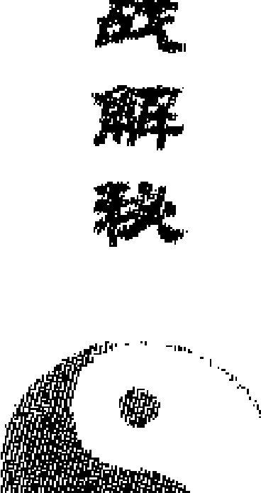

3.  西克卯金克木对我方被告方律师有利，我方证据父母已加支临贵马财初传，说明我方证据真实有力会起到关键作用，对方被告方证据在阴神临太常父母酉金逢空，显然虚假无力而显强辞夺理。支克干，然支空无力之象，支上贵必借贵人之力也，日上天空虚诈见亥有恶人来帮，上下交互来克与双方均不利，然未传勾陈临丁鬼克日，对被告大利，又以初传为原告，末传为被告，初生末，必然大利被告，此有求和之意也。
4.  此课五阴相继，昏乱之象，全凭命上支上贵人父母财马证据取胜。支上已作干财来脱支，恐有钱财物必失之于对方。

其后柳静言于9月4日反馈：说其朋友被诉至检察院，在庭审时，因为对方证据不足，请来了两个黑道打手，以其友在与对方争执中所谓的人身伤害为由，在庭外跟柳静言朋友的哥哥索要了12000元台币来作和解，庭审走了个形式，双方了事。

## 十、交易预测

交易大要以日为人，辰为物；而买物则以辰为我，日为彼，用神为物；卖物以日为我，辰为彼，用神为物。自日传辰则买物成，自辰传日则卖物成。日辰俱吉则物贵，宜于卖；日辰俱伤则物廉，宜于买。日财旺相物虽滥而必售，日辰上乘青龙而日辰克之物虽珍宝而必获。日吉辰伤则物虽售而利少，日伤辰吉售虽迟而利厚。类神乘蛇带囚死价虽廉而不中，类神如子为丝绵之类。若物与日辰相生，三传旺相更得吉神良将，或见成神，其物可居；若物类不见课传，或虽见而空亡、入墓、休囚无气、与日辰相刑克，则买卖俱不得。又课得交车生合、末助初传、三传递生俱吉，逢罗、网、死、墓忌。又两贵夹拱、禄神乘旺，生涯遂意，病符遇生旧物更新。初中空而末不空要见财德长生，

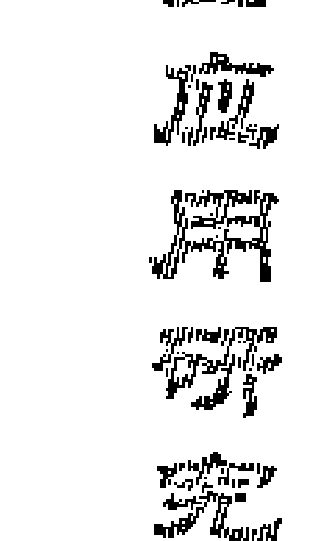

进步艰难，后当有获。又财乘青龙生气，常乘财印，主财利丰盈。又传进当进，传退当止；财爻不宜太多太旺；劫财不宜多见；财爻最忌空绝。至于交易所宜之方，则视青龙临处与驿马长生所临之地而往利三倍矣。

现代买卖交易以类神为主，参考上述经验来做论断。

## 实例：住房剩无几，买卖可成否

2007年10月16日，逍遥居士和其爱人看了一套房，感觉还可以，只是与开发商价格没谈拢，晚上吃饭时其爱人让其看看此房能买到手吗？其以正时起课如下：

公历 2007年 10月 16日 17：50分
丁亥 庚戌 癸未 辛酉
九月辰将 甲戌旬申酉空
占人戊午命未年

```
合 朱 蛇 贵
子 丑 寅 卯
勾亥 辰后
青戌 巳阴
酉 申 未 午
空 虎 常 玄
```

```
空蛇贵虎
酉寅卯申
寅未申癸
```

```
子 己卯 贵⊙
官 甲戌 青
财 辛巳 阴
```

分析：

(1) 干上申金作父母长生，又上乘白虎，戌月申金旺相故空而不空，干上申金虽为日之长生，但坐于地盘丑墓之上，主所看中急着要买的房所剩无几了。
(2) 干上乘支网，支上乘干罗，干支上神寅申相冲克，主其与开发商价格没谈拢，暂时未达成购买协议。

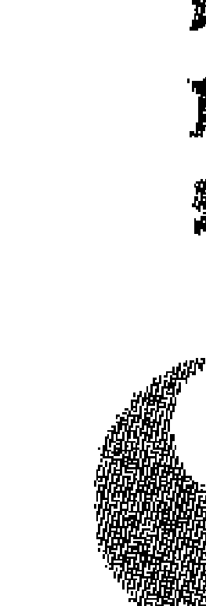

（3）命午上乘大吉丑与天将朱雀，主房宅文书合同事，末传巳财逢驿马岁破，又未传巳与干上父母申金做六合，所以断，目下虽未谈拢，但终会在价格上做出让步谈成购买的。

逍遥居士反馈说：今天与开发商又谈了几次，开发商的报价同比我市其他楼盘确实不算太高，况且那幢楼已剩最后三套未售出去，而我们相中的就一套了，我和妻担心失去机会，所以今晚在与开发商打电话交谈中，做了稍微让步后，双方都同意了。

## 十一、谋望预测

谋望之占，事非一端，情亦万绪，大要须看类神，类神见则吉，不见则否（如求财则看青龙财神之类）。干支上神旺相无刑冲破害而发用更乘吉神吉将，与日生合，不落空亡，年命上神与类神生合而不刑冲不逢空陷及成神出现者，谋望可成。支干上神互相刑冲带破而不相合，发用与日刑冲破害入墓或干支坐墓，互墓、乘凶神、关格等煞，或年命上神克日上神，初传克末传者，所谋不成。又自干传支，我去求人；自支传干，人来求我；先刑后合，初难后易；先合后刑，初易后难。此谋望大概之占法也。

## 实例：证件能否顺利办成

网友六壬新生的朋友于2007年12月11日问，所办证件顺不顺利，能否办成？随按所超课局分析判断如下：

2007年12月11日14时6分
丁亥 壬子 己卯 辛未
十一月寅将 甲戌旬申酉空

```
贵 后 阴 玄
子 丑 寅 卯
蛇亥 辰常
朱戌 巳虎
酉 申 未 午
合 勾 青 空
```

```
虎朱合阴
巳戊酉寅
戊卯寅己
```

```
父 辛巳 虎
兄 甲戌 朱
财 丙子 贵
```

分析：
(1) 贵人逆传，月将寅作官鬼加干上克日，太阴又乘干，肯定不顺利。
(2) 朱雀为证件，但坐戌墓之上，中传父母也为证件，虽临驿马，但坐于戌之墓上。支也为证件，一是支落空亡，二是支上朱雀乘戌墓，皆凶象。
(3) 末传月建旺气子作贵人财星生干上官鬼，恐花了钱事难办成。

此课后来六壬新生于2008年6月4日反馈说，前阵子问他还说没消息。

## 十二、经营求财预测

凡求财当视日之财神，入课传年命有，不入课传年命无。日财即日干所克者，如甲乙日则以戊巳辰戌丑未为财之类也。若支上神及财神生日无刑冲，求必得。日生辰及生财神不得。日财临辰两课名外财人内，支财在日两课出求可得。宜逢有气之候，临有气之乡，与日辰年命相生财可得。或财临鬼地，或坐空逢空，不得。有财旺日衰，身虽病财可得，日旺财衰，身纵安而财损。三传须见财则易求，初传财中末生助，中传财初末生助，末传财初中生助，俱吉。三传俱财财反

六壬应用研究与股市实战解秘

化鬼（此说必须三传皆财生起干上之日鬼克其日干者方可作化鬼看）。三传俱鬼鬼反化财（盖比肩为夺财神，三传俱鬼克去比肩，其财可得。然必须课传内有一处财神出现方可作化财论也。）初传空败刑害末传吉终可求，初传财中末传不吉终不遂。三传俱凶，至底无成，又三传俱作日之财神，所乘天将又与相生相比，又值生旺之月，占求财即无财。盖财自贪其生旺，不能与我作财故也。又日克初传，初又克中传，中又克末传为求财大获格。

又财喜墓库，但防空亡破，反主库中有失。更有日辰命三财，盖日上神支上神命上神，俱以下克上为日辰命之财（如日是甲上神是丑，支是子上神是巳，本命是酉上神是寅之类。）课书所谓求财紧切视三财是也。

又日禄命禄见课谓一禄胜千财，最吉。日辰命上见暗财（暗财即遁干之财，如甲日遁己上日得金局生水俱是暗财）。

青龙即财喜之神，宜时旺地旺或乘生气长生天喜临干生干克干俱吉。龙在亥为入水，不入传亦佳。但凡财神均宜生旺不宜空陷及劫杀破碎，其得财之月日，则以旺相财神所临处与青龙落处为断，亦有以末传合处者，临时消息之可也。

## 实例：生意可否做

网友六壬新生的朋友于 2007 年 12 月 2 日问，想做生意，看看行吗？我按其课盘分析判断如下：

2007 年 12 月 1 日 18 时
丁亥 辛亥 己巳 癸酉
十月寅将 甲子旬戌亥空
卯命，行年戌

```
朱合勾青
戌亥子丑  虎朱玄勾  父己巳玄
蛇酉      寅空    卯戌巳子  兄戌朱◎
贵申      卯虎    戌巳子己  官丁卯虎◎
未午巳辰
后阴玄常
```

分析：

- 此为知一，铸印破模，励德课。
- 四课不离三传，三传不离四课，反复思索之象。
- 日上子财临幕贵必有人助，支上墓支，支作父母生气发用被年月所破，不吉。
- 行年戌被上神卯官鬼所合，而且落空，行年戌又墓支，不可行动。
- 命卯上虽临贵神，但被申克破，卯又与戌上逢白虎坐空，防灾祸。
- 发用临玄武，又入中传之墓，中末空陷，所谋必不遂，有始无终。

六壬新生于 2008 年 6 月 4 日反馈说，多谢断课，是呀，他有点犹豫，资金不太够，最终因资金不足而放弃。

## 十三、家宅风水预测

占宅以干为人，支为宅。如日上神生支，支上神生日者，干支互受上神生者，干上见支之旺神而支上见干之旺神者，日辰各见上神之旺者，日辰上见德神者（一不要空，二要乘吉将），日辰上见贵神及三六合者，日辰上见太岁月将而无刑冲克害者，日临辰受生者（如甲子日寅加子），辰加日生日者，贵合龙常乘日辰并发用者，则人为福，占宅为吉。

如日上神脱辰，辰上神脱日，或日辰各受上神脱者（主人病宅盗），日上辰克辰，辰上神克日，或日辰各受上神脱者（主人灾宅坏），日上辰墓辰，辰上神墓日，或日辰各受上神墓者（主人宅昏晦），日辰上神刑冲破害及空亡破碎者，日临辰受克，辰加日克日者，三传无气发用空亡者，元勾蛇虎乘日辰上并发用者，则人为祸，占宅为凶。

至分占人之祸福，视日辰乘龙常等吉神作日德日贵日禄者，日辰上神生日，并辰生日及生日上神者，生气乘龙加干者，日上辰克辰，日临辰克辰者，三传生日及三传旺相发用，日德乘吉者，初传居干前，末传居干后者，是为福占。

如日上乘蛇虎等凶神，及刑冲破害者；日上神克日者；日上神死气，乘白虎者；辰上克日，日临辰受克者，日上空亡，三传克日，发用空亡，又乘死神死气者；则为祸占。

若夫宅之吉凶，则视支上神。如支上神乘吉神旺相，与支辰生合者；支上神旺相，三传乘吉神生支，而发用支德，不克日，不空亡者；不刑冲破害者，则为吉占。

如支上休囚墓绝，又乘凶神者，支上虽生气而克日者，支上空亡及三传休囚，乘蛇虎等凶神者，或三传俱支鬼，並不生日者；则为凶占。

若察其鬼祟之有无，如日鬼天鬼天目加辰传用见月厌丁符者，主有鬼，而以天罡所临方定之。如临子在房，丑在厨之类。

又以支之左右为邻，对冲为对门，地盘卯为前门，酉为后门，子为房之类。上得吉神将相生则吉，否则凶（如支是子，丑为左邻，亥为右邻）。占宅以干为人，支为宅。

至占新旧宅吉凶，以日上神为旧，支上神为新。如日上克日，自不欲住矣。辰上克辰，虽住不久也。日上旺相旧宅好，支上旺相新宅好。

凡出租卖房，最宜支干刑冲，则易出手外租，要三传作财作生气生合日干，则因宅获利。又干支得解离卦（干支分别交克上神，干克支上神，支克干上神），亦主出脱成功。又支上神空亡，亦主成。最不宜支干相加，为人宅相恋，不能出手。干加支，人堂恋宅；支加干，宅来恋人。若支干坐地盘墓乡，则是将家宅借住他人，任其作践而心甘情愿。

家中眷属，悉以式中六亲类神大象来论，六亲乘贵龙常生旺当以贵断，六亲乘白虎皆主有损。父母落空亡，非早丧必主远离。六亲亦然。大概而言，印绶乘旺，祖父豪华过伦；盗气逢生，子孙贤淑拔类；妻带咸池，不娴礼义之守。子乘劫煞，子多悖逆之行。父子刑害发用，非损克必至相夷。财官相合入传，非姻亲定因指腹。子乘白虎多刑克，父落空亡是死离。财逢夹克难偕白发之缘。官遇长生，定显青云之器。无禄防夭折之患，绝嗣恐成继嗣之忧。六亲长短，按生旺而即见；五伦贵贱，观神将而即知。

卯为前门，酉为后门，亥为卧室，午为客厅，未为井，丑为厨房，寅为书房，申为过路，戌为卫生间，辰为祠堂，巳为灶，亥为仓库，各以此类上神来言之，上神得吉将相生则吉，上神得凶将相克则凶，更以家长本命上神配合，喜相生，忌相克。如卯门上神克命上神必有门碍之事，以神将言之。

以上诸法兼以家长本命上神配之（喜相生忌相克），吉凶祸福无遗矣。家宅之占诸说尚繁，颇多不经，故不具录。

## 实例：精神萎靡因家宅，六壬预测又治疗

网友无名家中一亲戚，男，已过花甲之龄，儿孙满堂，但现在整日精神昏迷，晚上无法睡觉。回家问起此事，对方言此症状已有一年多，开始并不知如何得的，吃药无济于事，也请过不少奇人异士，但至今不见成效。今日上来替他起一课，问下他是否真有实病，继续吃药是否会有成效。如若不是，是否在其他方面出了问题，请帮忙看看。

此亲戚今年64岁，属鸡的。

我随按其课分析判断如下：

2008年8月26日6时
戊子 庚申 戊戌 乙卯
七月巳将 甲午旬辰巳空

```
空 虎 常 玄          蛇后常空 财 庚子 后
未 申 酉 戌          寅子酉未 官 壬寅 蛇
青 午          亥阴          子戌未戌 兄 辰 合 ◎
勾 巳          子后
辰 卯 寅 丑
合 朱 蛇 贵
```

分析：

- 课名泆女，必有阴私，此人有病！因此人命酉上亥为旧年太岁病符，又上乘太阴，正应昏迷之阴症。
- 支干之上神子未相害，人宅不安之象，支作日墓风水有问题，支上太岁子带死气乘天后，发用太岁子带死气乘天后，天后者卧室睡床也，说明问题出在卧室睡床上，可能是睡床放在冲压犯太岁之方，中传鬼乘蛇克日主得怪病，中传寅木乘蛇说明房子周围，可能有爬山虎或藤条类植物，克日为怪异所缠。

破法：在父母申方摆放麒麟一对或挂埋五帝钱以制之，若家居周围有爬山虎或藤条类植物，于年命方放对铜鸡制之必安，将睡床移至不冲犯压太岁之吉方可解！

## 十四、公司单位个人创业发展及财运预测

壬占公司单位个人创业发展运气，专重父母爻和财爻二类神。父母爻为占营生事，财爻为占利益事。另外，还可兼看龙常、贵人、禄马等。

公司单位个人创业发展，当视干支，干为当事人，支为单位（包括下属、店面、固定资产）。要支干逢生逢旺，或三传生旺干支，则创业可成，前景看好。若支干内外相脱则单位虚耗亏本转行之象，若支干皆受克制或空墓刑冲，则困境重重，主单位倒闭。

壬占单位运气，可充分借鉴占家宅一法，两者有异曲同工之妙。

个人求财，专看财神。视财神在课体年命中的情况来细言之，可寻避难财、就身财、三传财、年命财、还魂财、鬼财、暗助财、艰难财等类皆是也。避难财，日干坐下财神也。就身财，干上之财也。三传财，初中末财神也。年命财，年命上神为年命所克者也，要生合日干，则唾手可得。还魂财，三传子孙局生起干支上财神是也。鬼财，财乘虎，财遁鬼者皆是也。暗助财，初传财神末传相助也。艰难财，初中尽空末传财神不空者也。上例诸等财神皆忌空亡、落空、乘玄武、大耗、小耗、墓库、破碎等，则主难求，反而有失财之忧。

## 实例：单位是否能扶正

我们单位从改制以来，十多年来人员从过去的300多人增加到现在1200多人，办公场所也增至三处，但行政级别却一直未升格，最近风传单位行政级别由副升正的消息，恰巧我送书给副总时，副总顺便问及此事，我便起课预测如下：

公历：2008 年 6 月 27 日 15 时 8 分
戊子 戊午 戊戌 庚申
五月未将 甲午旬辰巳空

```
合 勾 青 空
辰 巳 午 未
朱 卯 申 蛇
蛇 寅 酉 常
丑 子 亥 戌
贵 后 阴 玄
```

```
虎常朱合 申酉卯辰
申酉辰戌 官 癸卯 朱 ⊙
官 壬寅 蛇
兄 辛丑 贵
```

分析：
课逢元首退茹，难以升格前行。
支为单位，酉加支上来脱不吉，乘太常为公安执法武职单位，又酉来害戌，干上辰来冲戌，三传会木局克支与干，三传退连茹，进则落空，只得退守，那里还能升格，发用卯空亡逢闭口乘雀，干上逢天罡阻隔之神又落空，说明虽有其事，但皆落空，难以提上议事日程。
事实上，我们单位直到现在，未有升格的动向。

## 十五、射覆

刚日视日上神，柔日视辰上神，而以发用参决之，中末传未必视。
以课体占则润下为近水曲形物，炎上为近火尖虚物，曲直为形长草木物，从革为形方金铁物，稼穑为土产圆物；伏吟为近物，亦水边伏匿物；反吟为远物，亦道路往来物；阴阳不备则不完全物，惟此人课射覆宜用。
以发用占则用起月建前者为过去物，用起月建后者为未来物，用起月建者为现在物。

以十二辰占则子为绝水之类。
以十二神占则天乙其物黄白之类。

以数目占则甲己子午九之类，旺则乘而倍进，休则从本数，囚则上下相乘，相则乘而进，死气减半空亡，刑害减去二分。假令已加辰，休则巳四辰五为九，囚则上下相乘为二十，相则乘而进作四十，旺则乘四倍作二百也，死则减半只作四浸透，半空亡刑害减去二分九本数，病去其六只作三数也。

以五行占则占色者，当知金白缥，木青碧，水黑绿，火赤紫，土黄褐。旺从本色，如金旺则言缥；相从子色，如金则言黑绿；休从母色，如金休则言黄褐；囚从鬼色，如金囚则言赤紫；死从妻色，如金死则言青碧也。

以类神占则于神将所属类神中求之。

由是而占物之生死则以旺相长生为生，物因死刑墓为死物。

- 占物之方圆，则用起孟为圆，仲为方，季为尖碎。
- 占物之有无，则日辰上与发用上天空空亡无物，余皆有。
- 占物之左右，则天罡加孟左，加仲右，加季左右皆有。
- 占物之覆仰，则罡加孟仰，仲中正，加季覆。
- 占物之肴簌，则占肴者当于渔猎中占三十六禽依类言之。
- 占微者，子为白芥菱苦，丑为野菜瓜萎，寅卯为园菜蔓菁，辰为菠菱，巳为莴苣，午为茄子，未为荷 兰，申为鹅头莪菌，酉为韭葱萝卜，戌为马苋葫芦，亥为芸苔葵子。

合而言之，长生者物新小，沐浴者物滑泽，冠带者物枯朽，临官者新壮，帝旺者近贵即用，自衰至养者废旧不堪，旺为圆软，相为方嫩，死为直破，虚为细碎，休为轻形不全。大都旺相者其物新而完固，死者其物缺而旧也。

至用以姓字占者则刚日视中传，柔日视末传，以十之辰决之。如子商姓孙齐谢郝江阮孔虞任范贺耿聂沐汪漆。

## 实例：包中是何物？又在等何人

下午遇到一个自称五台山后山攀魔洞慧缘大师的得意弟子法云的

时间：2005年10月10日17时01分
乙酉 丙戌 丁卯 己酉
九月辰将 甲子旬戌亥空

| 天将 | 地盘 | 遁干 | 六亲 | 神煞 |
| :--- | :--- | :--- | :--- | :--- |
| 合 | 子 | | 子 | 戌 蛇◎ |
| 勾 | 丑 | | | |
| 青 | 寅 | | | |
| 空 | 卯 | | | |
| 朱 | 亥 | | 己 | 己巳 常⊙ |
| 蛇 | 戌 | | | 甲子 合 |
| 贵 | 酉 | | | |
| 后 | 申 | | | |
| 阴 | 未 | | | |
| 玄 | 午 | | | |
| 虎 | 辰 | | | |
| 常 | 巳 | | | |

分析：

- 射覆首重发用，然发用戌空亡，只得看中传，中传又空，看末传，末传子乘合为布匹布帛，引申为包，遁干为父母，可知包中装的定是文书纸画之类。
- 又物看支辰，辰上戌蛇，蛇主文字书画之类，戌为印绶文书，也可看出是字画文书之类。
- 日上寅乘龙神，可知此人所为求财之事。所等之人看日上寅与发用戌，寅为天吏，戌为军人，可知其所等之人为军官。
- 发用戌空亡上乘蛇又逢子孙脱气，戌为欺诈，结合日上，便知其想空手骗财。
- 辰上空发用空，所求之事难成。

结果，其人从包中拿出一张自称价值千万元的山水古画，说是在等一位五十多岁的师团级军官，但人家没来。

## 中编 六壬与股市预测原理

## 第五章 六壬数理模型的全息周期性

### 一、宇宙全息统一论

早在 20 年前的 1987 年，王存臻和严春友两位先生在张颖清教授的成名之作《生物全息律》（就是基于以小窥大的中医整体观，嫁接全息照相的全息概念，来说明生物体每一相对独立的部分，为整体比例缩小这一全息现象）基础上，通过研究论证，创作了《宇宙全息统一论》（1988 年 3 月由山东人民出版社第一次印刷出版），这就是王存臻主创的震惊世界科学界的宇宙全息统一论。

下面兹引述王景祜先生对《宇宙全息统一论》的推荐文章，来对《宇宙全息统一论》作整体介绍和论述。

《宇宙全息统一论》共分九章：全息思想史、宇宙全息图、物质全息律、精神全息律、物质—精神全息律、时空全息律、宇宙全息律、全息哲学观、宇宙全息统一论。

在《全息思想史》这一章中，作者介绍了古代东方朴素的全息思想，即阴阳、五行和八卦学说、《道德经》中的全息思想、中医学中的全息思想、佛教思想中全息思想、古代中世纪和近代西方哲学和科学史中的全息思想、马列主义经典著作中的朴素的全息思想，特别是恩格斯在《自然辩证法》中所表露出来的朴素的全息思想，最后，还介绍了当代国际学术界的全息思想。其中，特别提到全息技术的发展史。全息技术是1948年由盖伯发明的。他的概念和理论均构成了现代全息技术的理论基础。到了20世纪60年代初期，由于激光技术的问世，使全息照相术得到了迅速的发展。全息照相，顾名思义，它是物体全部信息的照相；即使一张照片被撕成许多碎片，每一小碎片仍能再现出物体的整个图像来。这是因为全息照片的每个部位上都受到了被摄物体各部分反射光的作用，从而使每个部位上都浓集了被摄物体整体乃至每个部位的信息。人们都有这样的体会：当从屋里观看外部景物时，无论从窗口还是从窗户的某一块玻璃，甚至某一个小孔观看出去，都能观察到窗外的全部景物，而且清清楚楚。全息照相和这种情况具有相同的道理。所以，全息照相的出现，不仅为人们提供了一种新颖的摄影技术，而且成为人类探索和认识世界的不可缺少的有力工具。

全息概念的基本含义是：部分（或子系统）与部分，部分与整体之间包含着相同的信息，或部分包含着整体的全部信息。它揭示了信息或世界的整体性、不可分割性；或宇宙在信息意义上的同一性和统一性。于是我们就看到了一幅奇妙的宇宙全息图景：宇宙间的一切系统、一切事物、一切层次都互相渗透、互相包含、互相转化、互相潜含、交互摄入、重重映现、无穷无尽……大宇宙包含着无数小宇宙；大系统包含着无数小系统；高层次包含着无数低层次；每一小宇宙、低层次、小系统都是大宇宙、高层次、大系统的缩影。作者把这种“中国套盒式”的结构称为“全息递归结构”这一切又互相依赖，一事物依赖在一切事物上面；一切事物也依赖在每一事物上面；可以说一事物由一切事物组成，它也构成了一切事物。宇宙的一切事物互相感应，处于动态的全息联系之中，每时每刻在互相交流着内心的“情感”，形成了一曲波澜壮阔的宇宙大合唱。

“信息”这个词已经成为当今世界的时髦用语。可是，当问到“什么是信息”时，人们却无言对答。

> > 信息是物质、能量、和精神的属性或存在模式，是物质、能量和精神的时空序（这里的“序”包括两个方面：有序和无序。不应把信息理解为事物的有序性，因为无序也是一种序，因而无序也是一种信息，信息是有序和无序的总和。）这样，我们就把信息、物质、能量和精神有机地联系成一体了。

全息性也是事物模糊性的根源。因为全息性表明事物是亦此亦彼、此亦是彼、我中有你、你中有我；而且全息性表明事物只是关系凝聚体，而关系时时处于变动之中，是不确定的。不确定性是模糊性的一个特征。全息律的普遍性宣布了模糊性是事物普遍具有的一个属性。由此可见，宇宙全息论是辩证唯物主义根据当代科学发展成果对其普遍联系原理的必然推论和深化。

在《物质全息律》一章中，作者介绍了：物理全息律、化学全息律、生物全息律、广义生物全息律、社会全息律和生态全息律。在这一章里，作者以他们雄厚的现代科学理论为基础，作了极其精彩而深刻的解析和叙述，看了令人十分信服。在《生物全息律》一节中，作者作了如下的叙述：

> > 生物全息律从本质上揭示了生物机体的部分与整体间的全息关系，部分即整体，整体即部分。但从存在形态上来看，部分与整体分属不同层次，属于不同的态。生物机体的部分是潜在的整体。从显态上来看，生物机体的任一部分都是与整体不同的，细胞、枝节、叶片都不同于整体。但是从潜在信息的角度来看，细胞、枝节、叶片都包含着同整体相同的信息。

这就使生物体的每一部分都包含了DNA系统的全部信息。DNA是整体信息的储存库，以后的发展过程（就是目前的克隆技术——本文作者注）不过是从这个信息储存库不断提取已储存的信息而已。这种信息的提取不是零散地，而是很慷慨地以DNA的整体信息为一个单位，整份整份地往外提取的，这样就使每一个复制细胞都分有一个元细胞的完整拷贝，从而使每一群细胞在构成更高层次的全息元的时候也按这个拷贝的模板来复制这个全息元。1964 年，斯图尔德对胡萝卜韧皮部的细胞进行组织培养，结果成功地再生了完整的胡萝卜植株，从而以确实的证据表明，除了植物的性细胞以外，它的体细胞也具有全能性（包括传种能力），从而揭开了克隆技术的序幕，尽管当时还没有明确提出 “克隆技术” 这一名称。我们不难看出，目前，国内外各类媒体所报道的 “克隆技术”，实际上就是对生物体实行的自我复制过程进行控制，使之变成符合人们意志所需的 “人工复制” 而已。这种复制之所以成为可能，正是由于每个细胞中都包含着整个生物体的全部信息，对全部信息进行定向地选择和淘汰，就能复制出符合人们所预期的生物体来。

宇宙全息统一论揭示了能够将一切领域沟通起来的宇宙万物的构造规律，揭示了世界物质统一性的具体方式，深化了普遍联系的原理，丰富了转化论，使古老的整体观焕发青春。宇宙全息统一论首次从全息统一的高度阐明了宇宙的大统一，为科学的大统一奠定了理论基础。提出了全新的宇宙整体观，使人们从一个崭新的角度来观察自身与世界，具有重大的方法论意义，成为打开宇宙迷宫的金钥匙。它有力的促使中国文化的基础得到了现代科学的证明——天人合一与宇宙全息论。

《宇宙全息统一论》吸收了古代东方朴素的全息思想，西方哲学和科学史中的朴素的全息思想，马列著作中朴素的全息思想以及当代的全息理论和全息技术发展的成果，而提出来的新的哲学体系和理论，是我国传统哲学的一种重要的发展。

当代的克隆技术，从人的皮肤中取出一小块细胞，经过定向的培养，就能培育出人的心脏，取羊的任何一个细胞，就能培育出一头小羊，取牛的任何一个细胞，就能培育出一头小牛……这就充分证明了：在任何一小部分物体中，都含有该物体的全部的信息。早在克隆技术问世前 12 年，王存臻和严春友两位先生就已经在他们的著作中，把这个理论讲得十分清楚和透彻。他们在著作中正确地指出：“宇宙全息律认为：宇宙是一个 n 维全息体，它的任何一个组成部分都是浓缩的信息宇宙，宇宙是一个无数个信息宇宙的集合体。简言之，任一系统都包含着宇宙总体的全部信息。”随着世界上“克隆技术”的出现和发展，国内外各大媒体接二连三地对克隆羊、克隆牛……甚至人的胚胎等，作了报道，《宇宙全息统一论》也就堂而皇之的成为克隆技术的哲学依据，也是今后发展克隆技术的理论基础，反之，克隆技术的成功和发展也是《宇宙全息统一论》论断正确性的有力证据。

总之，宇宙全息统一论是现代科学和我国古典哲学有机结合的成果。我国古代的儒家哲学和道家哲学都将宇宙看成统一的整体，理学家朱熹认为：“人人有一太极、物物有一太极”，中国医学理论把人体看成一个整体，又将人与自然看成一个整体。但是，古代的理论缺乏严格的论证，《宇宙全息统一论》的作者，根据现代科学的成果对它作了详细的论证，为古代的天人合一、天人感应、以小见大、感而遂通的周易哲学理论，提供了有力的科学论据，使易学体系从封建迷信的死胡同里走了出来，成为为人民服务的有力工具。

## 二、信息互感论

人是即时时空信息的载体，是一种生物全息能信息载体。当他脱离母体独立地投入到宇宙空间后，无时无刻不在影响着其他信息载体，同时又无时无刻不在接受着其他信息载体的影响；强信息（不以狭隘的测定为准）始终制约和影响着弱信息，弱信息也始终抵御和承受着强信息的影响。这就是时空信息的互感性。

那么人做为宇宙中的一种生物载体，按照全息的理论，当然和其他事物之间也存在着互相感应，处于动态的全息联系之中，每时每刻在互相交流着内心的“情感”。这就是为什么从一个人的出生时间就能知道他的命运，为什么从突发事件就能知到人事吉凶的根本依据，这也是为什么做为周易体系三式之一六壬能预测证券市场走势的根本原因。

六壬应用研究与股市实战解秘

## 三、六壬数理模型的全息周期性

六壬是易学预测体系中模拟宇宙统一全息信息场的天文立体动态象数理模型。

### 1. 六壬的立体模型就是天体宇宙的缩影

从六壬的立体构成要素十二天将十二月将地盘十二支来看，就知道六壬有着深厚的天文学背景。六壬的地盘以包含十二地支的九宫八卦构成，以象地之八方八种类象，地盘以地支示人间八种事象，天盘以十二天将示天上十二神象来分别统管天下万事万物，天盘上又有十二月将居于天空以决吉凶，这个天地立体的筮盘无不完美的模拟了天上人间日月包罗万象的天体宇宙，尤其是天盘十二天将月将是古人模拟了天体中的天神星系太阳过宫的不同位置，来统御整个课盘，以示模拟天体之纲纪，来占测万事万物。周易《系辞》中说：

> “易与天地准，故能弥纶天地之道。仰以观于天文，俯以察于地理，是故知幽明之故，原始反终，故知死生之说。精气为物，游魂为变，是故知鬼神之情状。与天地相似，故不违。”

做为周易预测体系的分支六壬更是立体的体现了“易与天地准”的易理和思想，所以能包容天地，触类旁通，阐释世界，知天下事。这形象的反映了六壬的立体时空全息类象模型的完美与实用。

### 2. 六壬式盘中的各构成要素在占测中的类象体现了物以类聚人以群分的宇宙全息观

六壬是以易经的八卦类象为基础来类象模拟人事物的占测的。象就是易象，它是古人仰观俯察自然人事物推理类比抽象出来的易占全息象。这种易象在《易传》中有大量的论述，比如在周易《说卦》中列举了乾卦的代表卦象，乾为天，为圜，为君，为父，为玉，为金，为寒，为冰，为大赤，为良马，为老马，为瘠马，为驳马，为木果。从全息统一的角度来看，会发现这一段有着密切的内在联系。全息论认为宇宙间看似毫无关联的事物，却可能是全息同类项，全息同类项较之非全息同类项，其化学组成模式相似程度较大，它们之间的关系也就更为密切。周易中的八卦类象正是从信息的高度对万事万物进行分类的全息同类项，全息同类项之中的事物具有可比性，它们之间可以相互感应和转化。六壬的地盘即是以存在于八卦九宫中的十二地支来排布，每一个地支均代表数、方位、四时、人物、五行属性等全息易象，同时也将十二天将十二月将干支五行等全息元代人立体时空易象模型中，形成一完整统一的宇宙全息微缩立体数理模型，以四时八节十二节十二气为经，以太阳过宫形成月将为纬，全息的模仿天体运行演化规律，与地球太阳系甚至整个宇宙形成全息同步，是以能知天下之吉凶福祸。

### 3. 以十二中气、卯酉时辰的节侯时间来确定六壬课盘的时空周期性，反应了六壬在天文历法模式上的全息观

由于天体运行的周期性，尤其是日月地球的运行形成节令转换而带来的气候变化，不仅使农作物产生了明显的周期季侯生长性，而且对人的生理活动也有直接周期性影响，比如女性的月经就随着月球的运行而产生规律的周期性。那也就是说人与自然必须要共同服从同一个客观存在着的周期定律，这个周期定律就是六壬赖以起课的以地球绕太阳公转而形成二十四节气中的十二中气和以地球自转形成的黑白昼夜之分的卯酉时辰，地球绕太阳公转而形成的二十四个节点，与地球自转形成的黑白分界时间点，具有明显的天文节律性和全息周期性。天体运行所形成天文历法的节律全息周期性，为尤其依赖其起课的六壬提供了科学的天文学客观依据。

六壬应用研究与股市实战解读

## 第六章 六壬与证券市场预测原理

### 一、六壬与国外证券市场预测理论

国外证券市场经典预测理论与古典六壬预测理论的相通之处在于它们共同建立于天体运行的自然法则之上，即宇宙全息统一周期性。

证券预测理论早先起源于国外，它的经典预测方法，比较著名的有螺旋历法、道氏理论、艾略特波浪理论、江恩理论等。

#### （一）螺旋历法与周易六壬的阴阳周期理论

螺旋历法是由美国人嘉路兰（Cheistopher Carolan）先生在古代历法的基础上创立的证券走势周期性预测方法。嘉路兰做为一个股票期货交易商，在1987年10月19日的股灾当日，他亲眼目睹了一个世纪以来最疯狂的交易日，仅下午几个小时华尔街股指一落千丈，数以千亿美元的市场资产付诸流水，远远超过了1929大股灾的损失，当时整个美国仿佛处在世界的末日，并且股灾很快席卷全球，许多人倾家荡产，负债累累，甚至不少人自杀身亡，整个证券市场处在惊怕，灰暗，绝望当中。嘉路兰先生痛定思痛，怀着坚毅不屈的精神，经过两年艰辛努力，终于创建了螺旋历法。

自1992年10月螺旋历法公诸于世以来，很快风靡全球证券市场。螺旋历法有三个要素：朔望月周期、二分（春分秋分）二至（夏至冬至）点、斐波那契积数（十二世纪欧洲著名的数学家意大利人斐波那契创立的数列）。希 Fibonacci 所发明的一组神奇数字，1、1、2、3、5、8、13、21、34、55、89、144……包括“黄金分割比率”、“轮回规则”）。朔望月周期描述的是月球地球太阳三者的天体运动，分至点描述的是太阳地球的运动，斐波那契数列是宇宙的生成之数，这三者的结合构建了一个简明的预测体系。“螺旋历法”理论背后的主要精神是月球的周期影响大自然生态，同样人类的集体市场心理亦受月球周期所左右，投资者对市场前景的乐观与悲观跟随月球周期变化而起伏。这毫无疑问的表明了天体运行与人体生理活动的关联全息周期性对证券市场的周期性走势是有影响的。螺旋历法所应用的既非阳历亦非阴历，应用的是月球围绕地球运行的周期29.53天为计算的单位，它的单位与别的不同，并不是以月球运行周期的倍数为基础，所应用的进位级数根据神奇数字系列的开方而成（即朔望月周期29.53乘以神奇数字的开方），计算每一个螺旋历月份单位的月数，是以自然日数计算，并非以交易日计算。这说明它仍然是在自然历法的周期内来选择自己的走势，并没有脱离天体运行所形成的阴阳法则。利用螺旋历法分析金融市场走势，可说是一门科学也可说是一门艺术。它所计算出来的市场转折点在时间上十分明确，准确性经常极高，分析者必须确定时间螺旋开始的焦点，否则差之毫里，谬之千里。螺旋历法计算的是大自然影响市场情绪，在这方面仍然有十分大的研究空间，值得我们继续探索。与波浪理论不同之处，在于历法本身只重于市场价格转向的时间预测，至于量度未来价位方面则欠缺。尽管如此，自螺旋历法面世以来，其惊人的预测转向时间的准确性，比当今任何的时间投影技术，包括波浪理论在内，均有过之而无不及。

- 螺旋历法朔望月周期、二分二至点是其预测证券市场走势的精华。它主要表现在以下 3 点：
  (1) 春分后的新月（每月农历初一）焦点所产生的螺旋顺时序引发市场顶部；冬至后满月（每月农历十五）焦点所产生的螺旋，逆时序引发市场底部。
  (2) 新月和满月焦点，在冬至到夏至之间所产生的螺旋，引发市场顶部；而在夏至到冬至之间产生的螺旋，引发市场底部。
  (3) 按焦点产生的螺旋序列分为奇偶。新月焦点奇系列引发市场顶部；偶系列引发市场底部。满月焦点奇系列引发市场底部；偶系列引发市场顶部。

上玄月（每月农历初八）与下玄月（每月农历二十三）也常常引发市场的顶和底，这是我本人对螺旋历法更进一步的理解。

由于某一个时间点，既可能是新月螺旋指向，又可能是满月螺旋指向；既可能是冬至后螺旋指向，也可能是冬至前螺旋指向，所以一般人们在判断这个没有统一的标准，导致莫衷一是。如果我们用易学来审视，就很清楚了。上面的第一条只说了夏至后新月和冬至后满月，对夏至后满月和冬至后新月没有提到，而且对二分二至的运用不是很恰当，对于也是由于没有易学指导，只凭有限的不完全统计得来的经验总结。第二条似乎是易学的方法，但是只采用了分至，也就是日地关系来区分，把螺旋历法的核心——朔望月（月地日关系）遗漏了，还成其为螺旋历法吗？第三条似乎采用了朔望月，但只是把螺旋序列的序数分阴阳，这个实际上没有真实含义，只是数的奇偶而已，况且又忘了分至这个日地关系，也是一种伪说。那么，有没有办法把朔望月（月地日关系）和分至（日地关系）都统一起来呢？我们看看易学怎么说的。

> 邵康节说：阳在阴中，阳逆行；阴在阳中，阴逆行；阳在阳中，阴在阴中，则皆顺行。此真至之理，按图可以见之矣。

这一段话可以破解螺旋历法的顺逆时序触发问题，新月为阳生，夏至为阴生，夏至之后新月为阴中之阳，阳逆行，此焦点逆时序螺旋引发市场底部，底部为阴极生阳。满月为阴生，冬至为阳生，冬至之后满月为阳中之阴，阴逆行，此焦点逆时序螺旋引发市场顶部，顶部为阳极生阴。新月为阳生，冬至为阳生，冬至之后新月为阳中之阳；满月为阴生，夏至为阴生，夏至之后满月为阴中之阴，皆顺时序螺旋。冬至之后新月焦点顺时序引发市场底部，夏至之后满月焦点顺时序引发市场顶部。这样，我们就可以根据焦点在日地关系和月地关系中的阴阳一致性（非矛盾）来确定螺旋点的顺逆和顶底问题，这才符合易学这一宇宙统一周期场理论体系。

六壬做为模拟天体运行的筮盘，其本质就是天体运化的微缩，它以冬至到夏至，夏至再到冬至的中气确定月将来起课，其起课用历正好是从冬至开始中间经春分到夏至，阳极阴生，夏至到冬至的起课，用历也正好是从夏至开始中间经秋分到冬至，阴极阳生。六壬又以卯时开始用昼（阳）贵，阳气上升，而以酉时开始用夜（阴）贵，阴气上升。又从亥开始顺布天将，从巳开始逆布天将。而螺旋历法新月和满月焦点，在冬至到夏至之间所产生的螺旋，顺时序引发市场的底部和逆时序引发市场的顶部，而在夏至到冬至之间产生的螺旋，逆时序引发市场的底部和顺时序引发市场的顶部。螺旋历法以自然月平均29.53天为一个周期月，而六壬由一个中气至下个中气更换月将的时间周期恰巧也是一个30天左右，这与螺旋历法的自然月相契合。六壬的这种起课法则与天体运行法则不谋而合，这说明他们有着共同的理论基础，即历法。历法就是人为把握天体运行的位置时节而设的参照坐标，其实质是天体运行周期性规律性表现。做为共同建立在历法基础上用来预测的六壬和螺旋历法，当然有着共同的天体运行背景做为其科学理论支撑，不同的是六壬是以筮盘的形式出现，更多的建立在阴阳易理的范筹中，体现的是天人合一信息互感的抽象的周期全息性，在诠释其内容时需要对抽象的信息元素进行解析罢了。从这一理论角度来看，螺旋历法正是天人合一信息互感论的杰出代表。

#### （二）道氏理论与周易八卦六壬的联系

道氏理论是由上世纪初美国的查尔斯·亨利·道和尼尔森提出后经汉密尔顿进行发展的股市技术先驱，股票价格运动的三种趋势是其精髓所在。周易六壬股市行情分析法与这三种趋势理论有异曲同工之妙。

- （1）道氏将基本趋势（长期趋势）分为牛熊、多空市场两种，周易六壬行情分析法将长期的股市趋势也分为两种潮流：即贵人（十二天将）阳顺行与阴逆行，阴与阳两极。阴阳理论也是构筑易股行情分析法的基础之一，从大势上也是与道氏观点相类。
- （2）道氏的次级趋势（修正趋势）持续时间一般以三周至数月不等，周易行情分析法的K线八卦象也常常是以三周作为分析周期，六壬用三传来模拟分析初中末三个行情发展周期。
- （3）道氏的短期趋势（日常波动）采用六天内变动的股价情况作为分析的内容，周易行情分析法也是采用六天的六十四种阴阳变化来对K线的波纹运动进行分析。
- （4）道氏的多空市场观点将多方市场与空方市场分成三个阶段，周易六壬行情分析法在这方面也以其卦象中的三才（天、地、人）对多空牛熊市场进行更细致的分析。

道氏理论在过于注重长期趋势的分析，在新的长期波动初期常常分析不足，而且对中期趋势的变动分析也不是很足，更不要说短期趋势上的分析了，所以在目前具有中国特色的中国股市中，道氏理论对有效的选股帮助不是很大。周易行情分析法注重于中短期趋势的分析，将中短期趋势分成六十四种形态（六十四卦象），将这六十四种形态结合K线图详论，对选股与后市分析很有帮助。六壬以其全息性能更直接深入的解析一只股票的业绩及未来的走势，对投资人选股操作作出较为准确的判断。

#### （三）艾略特波浪理论与周易六壬的联系

艾略特波浪理论是美国的艾略特在对华尔街股票期货市场长期调查研究中，探索出涨跌规律，于1927年创立的一套较完整的波浪理论经典。股市就是一个大的波浪变化，而中国的易理则认为：变是万物规律。周易六壬行情分析法与艾略特波浪理论之间也是有所联系的。

- （1）艾略特波浪理论认为无论是多方市场还是空方市场，股价变化的每一个完整的循环都会呈现出八个固定的波浪趋势：多方市场是五个上升浪加三个下跌浪，空方市场是五个下跌浪加三个上升浪。周易八卦行情分析法虽然轻牛熊市场的概念，但也将股价变化分为八种形态：乾、艮、坎、震、坤、兑、离、巽。六壬行情分析法则由坎、艮、震、巽、离组成的地盘中的子、丑寅、卯、辰巳、午示多方上升浪，坤、兑、乾地盘中的未申、酉、戌亥示空方下跌浪。
- （2）艾略特波浪理论中的大浪包含小浪是互相推进与转化的，任何一浪或者一波都可归于上一浪或上一波中的小波浪。这其实也正是周易八卦的理论，周易的万物互相转化理念一直是其精髓，在各卦象中随时的变化异动都将产生新的卦象，每个卦象也归于上一卦象的一部分，易有：“无极而生太极，太极生两仪，两仪生四象，四象生八卦，八卦定吉凶，吉凶生大业”也正是说的这个道理。六壬是建立在周易八卦基础理论之上更为精细的一种模拟客观事物表现形式，无疑会对周易八卦理论有所包含，比如它的地盘就是后天八卦中的十二地支组成。
- （3）艾略特波浪理论中的八浪特征与周易行情分析法八卦理论也有着极其相似之处，艾略特波浪理论在实际运用上由于大浪之中有小浪、小浪之中有细浪，再加上推动与调整中经常出现变化与繁杂形态，而且对浪的准确划分难以把握，也是有缺陷的。周易八卦与六壬行情分析法重在实时分析，在浪的划分直接将现时的形态变为卦象与筮盘直接分析，更重在中短期趋势的把握，尤其是周易八卦与六壬的太极周期建立在客观的自然干支历法上，不容易被市场出现的表面现象所误导。

一个完整的股市循环是一个太极，上升浪为阳，下跌浪为阴，这是阴阳两仪，就象六壬中的阳顺升阴逆降一样。八浪的结构完全与八卦六壬地盘相吻合。以后天八卦为例：一浪为坎卦，二浪为艮卦，三浪为震卦，四浪为巽卦，五浪为离卦，A 浪为坤卦，B 浪为兑卦，C 浪为乾卦，正好是六壬筮盆地盘包括后天八卦的一个完整循环。

如果我们把后天八卦配上地支，正好是六壬筮盆地盘上的地支，子为一浪，在时为冬至，冬至一阳生，可是这微阳很少有人觉察的，这与波浪理论中关于一浪是打底浪，市场一般认为是反弹的论述不谋而合。道家的修炼基础就是要做到一阳生时“时至神知”，同理，我们易学的研究就是要避免股市中的“百姓日用而不知”的现象发生。

## 中编 六壬与股市预测原理

尽可能在初始状态即有所发现，这点在六壬这个巨型的微缩盘中神机自现，就看你如何解读了。丑寅为二浪调整，卯为三浪，如日出东方，万众瞩目。辰巳为四浪，午为五浪，此时为离卦，日头高悬，但巳阳极阴生开始转向阴跌。未申为 A 浪，酉为 B 浪，戌亥为 C 浪。这样就结束了一个周期浪形，在实际情况中浪的表现形式复杂多变，但终归大的表现形式莫过如此。

## 二、六壬历法与江恩理论

### （一）六壬的节气干支历法

历法是古人通过观察天体运行规律，总结出包括节气、置闰等内容的年月日时周期节律。我国古代以农立国，历法在指导农业生产方面作出了巨大贡献，同样今天历法在股市中也大显神通，经常遇到行情在历法节气的交接处“转折”，让投资者感到大为惊奇！节气是易学中的时空概念，在股市中却发生了易学所揭示的现象，这就反证了易学机制的自然属性和科学性。

我国历法是世界上最古老最科学的阴阳合历，它由阴历（月球盈亏周期变化即朔望月）阳历（太阳视运动周期即回归年）通过大小月置闰协调成体现自然天象的阴阳历，即一年十二个月，三年一闰共 37 个月的中国农历。

天干地支纪历为我国历法自古所独有，它以十天干，即：甲、乙、丙、丁、戊、己、庚、辛、壬、癸、十个天干顺序，和地支，即：子、丑、寅、卯、辰、巳、午、未、申、酉、戌、亥十二个地支顺序，从各自的第一个字“甲”和“子”开始，按一定的规则一一相配，组成甲子，乙丑，丙寅等，依此类推，乃至癸亥，共 60 个组合，而后又从甲子开始，再至癸亥，60 为一个循环周期，又称 60 甲子或 60 花甲子。可以纪时，纪日，纪月，纪年。

节气的安排决定于太阳，从冬至开始间隔地依次安排各个节气的中气。一年有 12 个月 24 个节气，每月一节一气，“小寒、立春、惊蛰、清明、立夏、芒种、小暑、立秋、白露、寒露、立冬、大雪”为“节”，为每月的起始；“冬至、大寒、雨水、春分、谷雨、小满、夏至、大暑、处暑、秋分、霜降、小雪”为“中气”，在每月的中期交接，六壬用中气，以中气为月将更换的界线。

由农历、干支历、节气共同组成了中国特有的历法阴阳合历，俗称阴历以便与公历即阳历相区分。做为反应时空全息性的应用易学如周易八卦六壬当然离不开这个标志时空的历法，阴历。由于六壬筮盘是模拟天体运化的宇宙微缩模型，它在模拟天体宇宙时空全息性时尤其依赖于历法，即由具体的时空标志点（历法所示的时日）来抽象的显示事物的内在本质关联信息，所以六壬自古以来就有自己专门的历法即六壬历，六壬历以二十四节气学说为基础，把一年分为十二节与十二气，即“小寒、立春、惊蛰、清明、立夏、芒种、小暑、立秋、白露、寒露、立冬、大雪”为“节”，“冬至、大寒、雨水、春分、谷雨、小满、夏至、大暑、处暑、秋分、霜降、小雪”为“中气”，六壬用中气而不用节，以中气为月将更换的界线来起课盘。

### （二）江恩理论与六壬节气干支历

### 1. 江恩理论

威廉姆·江恩（William Gann 1878 ~ 1955），是20世纪20年代初期传奇的金融证券市场预测家。江恩理论是威廉姆·江恩在20世纪早期的美国金融证券市场中，通过对数学、几何学、宗教、天文学的综合运用，建立起的自己独特的分析方法和测市理论。由于他的分析方法具有非常高的准确性，有时达到令人不可思议的程度，因此江恩便成为世界金融证券市场上非常出名的人物。

1878年6月6日，江恩出生于美国德克萨斯州的一个爱尔兰家庭，他的父母是虔诚的基督徒，有深远的循道会背景。江恩自己也是一个虔诚的基督徒，他声称从圣经中发现了市场周期理论。

江恩家乡是盛产棉花之地，在 1902 年江恩 24 岁的时候，他做了第一次棉花期货合约的买卖，并从中获利，自此之后的 53 年，他从金融市场共获取 5000 万美元的利润，以当时的价值计算，相当于现在的 10 亿美元。

知识是在这个市场上赢取利润的必要条件，江恩从童年开始，已经意识到，自然法则是驱动这个市场的动力。他声称他用了 10 年的时间来学习自然法则和金融市场的关系。在这 10 年间，他曾到过英国，埃及和印度求取知识。当他在英国时，他不分日夜的在大英博物馆研究金融市场在过往 100 年里的历史，在那时，他集中研究古老数学，几何和星象与金融市场的关系。他的重要分析方法当中之一的江恩正方形，据说是由埃及和印第安寺庙结构所启发出来的。结束他的漫长研究之旅时，他认为金融市场存在着振动的法则，这些法则一经掌握，你就可以准确预计未来市场时间和价格。

1908 年，江恩到纽约开展他的业务及严肃测试他的理论和买卖方法。同年，他发布了他的主要分析方法“主要时间因素”（Master-Time Factor），令他在华尔街一名惊人。

在 1909 年 10 月，一本在 20 年代初期十分流行的金融杂志“报价与投资文摘”的编辑理查·怀高，为他作了长达一个月的，由记者监测他的投资买卖活动专题采访。

令这位记者惊奇的是，江恩得到的总回报高达 1000%。他一共做了 286 次买卖，在 25 天里，264 次赢和 22 次输。赢出的次数占总数 92.3%。在那个月里，他平均每隔 20 分钟便做一次买卖。在其中一个交易日里，他共做了 16 次买卖，其中八次是当天市场波动的即市逆转点。

根据江恩的朋友威廉基利的回忆，“最令人惊讶的预测是江恩在1909年夏天其间所作的，当时他预言九月份小麦期权将见 1.20 美元。这意味着，它必须9月底前见此水平。在9月30日（最后一天）芝加哥时间中午12点，这个期权在1.08美元以下，看来他的预言不能兑现了。江恩说，如果它不见1.20美元，将证明我的整个计算方法错误，我不关心现在是什么价格，它必须去那。果然不出江恩所料，小麦期权价格在最后1小时交易中升至1.20美元，使全国震惊。”

在江恩事业的高峰，江恩创立两间公司进行市场研究。他出版投资时事通讯和每年股票及商品展望。江恩并且主持几个投资和买卖的研讨会，江恩限制每名学生不能将材料给予他人，这些研讨会收费昂贵，2500美元甚至5000美元不等。以当今价值来算，上述学费等于25000～50000美元。

### 江恩理论的主要内容：

- (1) 股价波动是支配市场循环的重要法则。股价波动的形式是上升与下跌。当股市由上升转为下跌时，25%、50%、75%等是重要的支撑位。当股市从低位启动时，1.25、1.5、2等是股价重要的阻力位。
- (2) 时间是循环周期的参考点。20年、30年、60年以上为长期循环。1年、2年、3年……15年等为中期循环。其中30年最重要，因为含有360个月，是一个完整圆形的度数。短期循环为24小时、12小时……甚至可缩小到4分钟，因为一天有1440分钟，地球自转一度为1440除以360，得出4分钟。
- (3) 10年是一个重要的循环。由10年前的顶部（底部）可预测10年后的顶部（底部）。此外，7年也是一个转折点，因为7天、7周、7个月都很重要。
- (4) 在5年的升势中，先升2年，跌1年，再升2年。到第59个月注意转折。在5年的跌势中，先跌2年，升1年，再跌2年。处于长期上升（下跌）时，一般不会超过3年。
- (5) 在上升的趋势中，如果以月为单位，调整不会超过2个月。如果以周为单位，调整一般在2～3周。在大跌时，短期的反弹可以维持3～4个月。
- (6) 将360度圆形按月份（和中国历法巧合）分割，来计算股市循环。

江恩线的数学表达有两个基本要素，这两个基本要素是价格和时间。

江恩通过江恩圆形、江恩螺旋正方形、江恩六边形、江恩“轮中轮”等图形将价格与时间完美的融合起来。在江恩的理论中，“七”是一个非常重要的数字，江恩在划分市场周期循环时，江恩经常使用“七”或“七”的倍数，江恩认为“七”融合了自然、天文与宗教的理念。

江恩线是江恩理论与投资方法的重要概念，江恩在X轴上建立时间，在Y轴建立价格，江恩线符号由“TXP”表示。江恩线的基本比率为1:1，即一个单位时间对应一个价格单位，此时的江恩线为45度。通过对市场的分析，江恩还分别以3和8为单位进行划分，如1/3，1/8等，这些江恩线构成了市场回调或上升的支持位和阻力位。

江恩理论的优点，是阐述了时间与价位的关系，准确的时间和价位的预测，使其他任何理论难望项背。江恩理论的弱点，是缺乏对另一市场的重要因素成交量的描述。因此，江恩理论与道氏趋势理论、艾略特波浪理论，相互结合使用，才可起到互为弥补的作用。江恩理论的核心体系是：“时间周期论”与“空间的波动法则”，该理论涵盖了时间与空间的概念，这是江恩理论在统一全息论出现之前的高明之处。

## 2. 江恩理论与六壬历法之间的关系

江恩理论的核心是循环周期论，它与我国的古代历法、二十四节气、干支周期、六壬节气干支历及六壬全息数理模型，在探索世界的物质全息统一性方面有着异曲同工、殊途同归之效。

干支纪历中的60周期和12周期乃至10周期，并不是老祖宗随意想象出来的，而是对天体运行现象进行观测，计算而获得的符合客观规律的科学知识。天体运行周期与甲子周期呈整数倍的关系，这是因为九大行星围绕太阳的公转周期，除了水星以外，其余的都与甲子周期呈整数倍关系，九大行星的会合周期全部都与甲子周期呈整数倍关系。月球的公转周期和哈雷彗星的回归周期，也同样存在上述关系。可见甲子周期是有坚实的科学基础的。江恩理论中特别重视10、30、60、360的长期和12的短期周期循环，而这些数字在干支纪历中也是十分重要的时间周期，干支纪历中一句为 10 天 10 个时辰，一个甲子周期为 60 年 60 天 60 时辰，一元 60 年，一年为 360 天 12 个月，一月 30 天，一天有 12 时辰等，无不与江恩理论中的循环周期相吻合。建立在干支历法上的六壬也有一句 10 个时辰，一个月内一节一气共两个节气 30 个干支日，一天 12 个时辰 12 个筮盘局，一年 360 天等，看来干支纪历六壬历法与江恩理论所重视的循环周期都是基于天体运行的时空概念上提出来的宇宙时空定位坐标参数，六壬正是基于这个坐标参数起筮盘局，来解析此刻时空存在的信息，无独有偶，江恩理论也是基于这些时空定位坐标参数来分析判断金融证券市场的趋势，从这里可以看出，这两种测市理论工具的实质本源即时空周期全息是一样的，不一样的只是它们的表现形式各自不同，江恩理论更接近于市场更易于理解和应用，而六壬的抽象不易解析性为其在金融证券市场上的应用带来天生的障碍。正因为如此，我们才要大力研究，使其比江恩理论更要精确的运用于金融证券市场。

江恩理论中“将 360 度圆形按月份（和中国历法巧合）分割，来计算股市循环。”这点和六壬地盘，由坎卦艮卦震卦巽卦组成上升，由离卦坤卦兑卦乾卦组成下降，这一阴阳往复圆环式周天公度式的六壬节气干支历不谋而合。

从以上论述来看，江恩理论与六壬的基础理论均是建立在天体运行的自然法则之上，都是从不同角度对天体宇宙全息周期性的体现和描述，六壬是天人合一信息互感的抽象杰作，江恩理论更像老子所说的，“人法地，地法天，天法道，道法自然”的宇宙自然法则在金融证券市场上的杰作。

六壬与螺旋历法、道氏理论、艾略特波浪理论、江恩理论的共同基础是天体运行的自然法则，即宇宙全息统一周期论。

## 下编 六壬与股市实战解秘

## 第七章 六壬与股市预测的基本法则

由于六壬是易学预测体系中模拟宇宙统一全息周期信息场的天文立体动态象数理模型，所以它对事物具有抽象的预测性，它的预测性精华表现在对抽象全息元的解析翻译上，如从上编介绍过的六壬预测用神中我们可以看到，古人及今人已从人事物的多个方面对六壬预测用神做了较为成熟的总结，但对于近年来在中国刚刚崭露头角的股市，还没有做出一个象样的解析和翻译，我想，一是由于精通六壬预测的学者未必精通于中国股市，精通于中国股市的投资者大都不了解易学甚至六壬，其结果是股市是股市，六壬是六壬，二者风马牛不相及，造成祖国的传统预测瑰宝无用武之地。即便是有的易学爱好者在股市预测中六壬有所应用，但都不得其法或用法不成体系，以致偶有测准，败多成少，使六壬在股市实战预测中沦落到几近荒废的地步，此情此景，使人感到无比痛心，笔者有感于此，几经艰辛，无数次纵横于六壬与股市之间，数年来不计成本，终于在前人的基础上摸索讨寻出六壬与股市实战预测的真谛，现合盘推出，与诸位股市投资者易学爱好者共飨，以期达到越来越多的股市投资者能从中受益，使六壬在股市实战中发挥出应有的魅力，使祖国的传统预测瑰宝，被誉为人事预测之王的六壬发扬光大，为祖国传统文化的延续与发展做出自己应有的贡献。

## 一、六壬与股市预测的切入点

### （一） 灵活机变是六壬预测的切入点

#### 1. 灵机论

六壬预测是信息科学史上的一大进步，是我们的祖先爱科学、信科学、用科学的先进思想的结晶。它的方法是灵活多样，内容涉及面阔，用途广泛，测事具体，准确性高，这是八卦预测方法的一大创新，在中国历史上影响很大。但由于六壬预测学比较深奥，难以普及，加之有人误认为其迷信，所以没有得到广泛流传和运用。六壬预测学的显著特点是灵机变用，方法多样，省时省力，预测准确性高。比如一个人的死，用现代方法要作一系列的光波检查、生化检查等十多项程序，经过几个小时才能下出结论。如果用六壬预测，就省时省力，在很短时间里能得出结论。

中国现代预测学家邵伟华同志在他的《周易与预测学》一书说过：“人体本身就是一个信息感应器，他有预测信息的功能。”六壬预测就是靠人体信息感应，从人的一时动静及在当时时空点上的事件、器皿、物品等推测人手，判断战争的胜负，事情的成败，人生的得失等。具体说来，就是从出师打仗发马立营的开始时间，或从人的出生时间，事物得失离合的开始时间，或从器物获得的时间开始，逐年逐月逐日推理预测看是利于何时交战能得胜，何时敌人发兵，何时何方何处有敌人埋伏，或何时何方何处有利于我军埋伏和出击，何日何时能成功奏凯。如果预测人生的寿命长短，行运的旺衰，就取该人的出生年月日时演布，妻妾、子女、官禄、钱财就预测出来了。如果预测事物或物品的成败久暂，就把所得到的时间或初见到的时间作为依据，进行演布，或把事物的长短方圆按五行所属配合六壬进行演布，就能测出事物的成败时间及成败程度，或器物的破损旺盛时间及程度。如军营中只要有一见一闻或遇到移斜倒蹲，军号乱鸣，或听到善言恶语，或见到旗鼓破损，或见到鸟兽从何方来，不论是见到或听到任何一种怪异的事物，都可以作为一种吉凶祸福的预兆。如果听到人说话的几句、几声或几字，或金彭军号什物的响鸣方向数目，或乐器的响声远近，音质高低，响声数目，都可以作为六壬预测的依据。灵机变用的原因是，事物最初在大脑中反应的时间、地点、形状数目配合六壬推理过程进行预测，要活学活用，灵活变通，不能呆板机械，生搬硬套，要心绪平静，注意力专注，不能想此而考虑彼。在取物、声、数时，切忌取一而又取二，这样事物的吉凶就难以判断测定了。如果取某一事物预测不准，再取一种事物预测得又不准，就不要再继续了。这是预测者心绪不安所造成的，所以吉凶就难以测出。预测时最好只选一种事物为准。六壬预测的方法很多，形式不拘，“见物即可测”。

从以上论述我们得知，六壬预测的方法是，事物最初在大脑中反应形成的时间、地点、形状、数目等，配合六壬推理形成预测。

#### 2. 六壬预测常用切入点方法

- (1) 天地正时起局预测法。天地正时起局法，它是以求测者求测的时间或以遇到人、事、物的时间来起课预测，这个时间就叫天地正时，以这个时间为契入点起出课盘来预测，就是天地正时起局预测法。这也是六壬预测的常用方法。
- (2) 取时预测法。取时预测的方法，是以特定的时间，比如人的出生时间，挑战者号航天飞机升空的时间等等，来做为切入点起课的方法。
- (3) 取数预测法。是求测者随口报出一个数字，再以数所对应的地支来起课预测的方法。它的实质是以数字为切入点来预测。取数预测法是让求测者说出一个数字，或是预测者本人看到听到某种事物的多少数目，来确定地支位，以月将加在地支上起课来进行预测。如果取到的数字大于12数，则用除法除以12，以余数做为要起课判断的地支位。
- (4) 信函预测法。信函的预测方法是以求测者的写信的时间为切入点来起课预测。信函预测一定要让预测者写清初写信时的具体年月日时，不然预测就不可能准确。
- (5) 随机预测法。就是用非常灵活的方法来做为切入点起课排盘预测的方法。
    - 一是抽数（签）起课预测法。当多人同时要求预测时，第一位以正时起课或抽数起课预测，第二位第三位等则抽取数字或抽签以起课排盘预测。
    - 二是笔画、声音、语言等外应起课法。就是以所得字的笔画，或声音的次数，语言的字数等外应数为依据，求得地支数，以月将加其上起课预测的方法。

### （二）六壬与股市的切入点预测

（1）当投资人面临消息或选股判断上的彷徨犹豫时，这时的思维正是六壬与股市预测的最佳切入点。

投资人在瞬息万变的股市投资活动中，除了获取官方正规的媒体信息外，由于中国股市的不完善性，政策的不稳定性，小道消息经常满天飞，突发性变化也总是令人猝不及防，给本来就提心吊胆的股民画满了问号。尤其是各家股评众说风云，莫衷一是，往往使投资人无所适从，更让人喜忧交加的是电视报纸机构券商股评等，天天对股市评头论足，甚至大推特推各种股票。那么，当你面对突如其来的消息不知真假时，当你面对推荐的股票犹豫不决时，当你为选定的股票拿捏不定时，当你在套牢的股票面前一筹莫展时……面对如此境况，请投资人且莫惶恐，因为你所面临困境的时机就是你利用六壬预测股市或股票的最佳切入点，请你马上转变你的思维，利用当时的时间起课预测，这将会使你轻而易举的解除面临的困境而有所选择甚至有所盈利，困境就是六壬这个有力的预测武器所要发挥的最佳切入点。

（2）天地正时起局预测法是股市或股票预测的最佳切入点方法。

如上所述，当你发觉自己的预测切入点后，请首先弄清当时的年月日时，即天地正时的年月日时干支节气，接下来马上用该时间起课排出课盘，就可以分析判断了。这就是股市或股票预测的基本方法，这也是经过大多数人无数次检验较为准确的方法。

（3）数字起局法是解决一个人面临众多股市问题要解决时的最佳切入点方式。当一个投资人在好几只股票面前为挑选出理想的股票为难时，这时，请分别将每只股票人为的编排好序号，并使序号与12地支数对应，这样用当时的月将加在序号所对应的地支数上起出课盘，这样一只股票起一个六壬课来分析，就能较为准确的找出理想的股票了。

六壬预测重外应，要有明显的外应，对股市个股的走势实在难以用常用方法判断时，方可用之，否之难合易理。那些天天对股市进行预测，不分大小轻重，明显用常用分析方法，就能较好分析解决的，而不去努力，偏要把简单事情复杂化的投资者，请慎用此法，此乃不合易理，强易之所为也。古人说，尽人事而知天命，人事不尽，专问天命，是不明易理世理也，非易之所为。

## 二、六壬对证券投资者自身状况的判断

证券投资是一项理性的综合性投资行为，它成功的根本原因，在于投资者个人的综合素质。一个成功的证券投资者除了具备一定的投资知识外，最重要的取决于投资者的性格和心态，俗话说的好，江山易改本性难移，说的就是一个人一旦形成一种性格后，将终身很难改变。在证券市场上，在股市里，一个人一旦形成一种投资风格，也是很难在短时间内改变过来的，所以社会上有性格决定命运，股市里有性格决定输赢之说。有一个好的性格必将会有好的心态，这是如……影随形先天所带来的所谓天赋的东西，那么有了好的性格和好的心态如果没有好运气，生不逢时也很成问题，比如巴菲特如果在1929年美国股灾时还在进行证券投资，不论他有多么好的素质和性格，都将与今日的他无法相比。如果说新一轮世界经济景气周期带给中国股市前所未有的大牛市是投资者得了天时的话，那么那些具备资金又具备投资条件和投资经验者就是得了地利与人和，如果说得天时地利人和者定能成功，那么像巴菲特、索罗斯等证券市场的巨人一定是得了神助。所谓神助就是冥冥之中一个人的气运。俗话说的好，七分靠努力，三分靠运气，看来运气在股市投资中真的是一件很重要的事。那么我们就用模拟宇宙统一全息周期信息场的天文立体动态象数理模型的大六壬，来看看一个投资者的素质性格及他的运气到底如何。

在六壬预测中，日干往往代表求测者被预测者，那么日干及上下神的状态就表明了被预测者当前所处的状况，在股市中就会体现一个投资者的具体情况，天将多反应的是投资者的性格及投资成败大概投资方略，月将及课传六亲多反应是投资人的投资状况，日干的长生禄旺死墓绝临太岁月建太阳等反应的是投资者当下的投资情绪，发用三传神煞课格课体反应的是投资者的大体情况，年命行年反应的是投资者当前的时运高低，要注意参考。

## （一）六壬对证券投资者自身状况判断的法则

### 1. 日干上乘十二天将时的判断

- 日干上乘贵人较好，说明投资者器宇轩昂，具有投资才华，善于投资炒作，遇到情况能妥善处理。
- 日干上乘螣蛇，主善变，疑心重，纠缠不清。
- 日干上乘朱雀，主依靠消息操作，有急燥爱闹口舌的毛病。
- 日干上乘六合，主心平气静，善于总结，利交易买卖。但贪多，所买的股票不至一支，有时主暂时被套牢。
- 日干上乘勾陈，主反应迟慢，固执，死心眼，大都容易被套牢。
- 日干上乘青龙，主投资策略正确，财运好，容易获利。
- 日干上乘天空，主容易上当受骗，心无主见，投资容易遭受损失。
- 日干上乘白虎，主脾气太直，操作上有点武断，容易出纰漏出现损失。
- 日干上乘太常，主财运好，易因喜好饮酒宴乐助长自满情绪，防贪利。
- 日干上乘玄武，主好投机买卖，容易被骗线，有时主头脑不清，容易破财遭到损失。
- 日干上乘太阴，主善用阴谋自私自利，贪占眼前利益，容易昏晕上当受骗，易感情用事，靠感觉行事，常常暗自乱动，容易招致投资套牢和失败，防过错与操作失误。
- 日干上乘天后，主头脑不清，易被套牢，易遭到损失，宜长线投资。

### 2. 日干上乘十二月将及发用做六亲时的判断

日干上乘十二月将及发用做父母生气时，一般多主吉利，宜于谋划分析操作盈利。
日干上乘十二月将及发用做子孙脱气时，一般多主大凶，宜休息观望分析研究。
日干上乘十二月将及发用做财爻时，一般多主吉利，宜于操作谋利。
日干上乘十二月将及发用做兄弟时，一般多主半凶半吉，宜于筹措资金等待时机。
日干上乘十二月将及发用做官鬼时，一般主凶，操作受阻很不顺利，宜于观望，不宜轻举妄动。

### 3. 日干临长生禄旺死墓绝临太岁月建太阳等时的判断

日干上乘长生，不落空亡，大吉，大胆操作。
日干上乘禄神，不落空亡，大吉，主情绪高昂，宜大胆操作，但要止盈，防行情财运到头。
日干上乘帝旺，主情绪高涨，运势已到头，见好就收。
日干上乘死地，主情绪低落，宜休养生息，等待时机。
日干上乘墓神，主精神昏昧不振，情绪低迷，动作受制，容易被套牢，宜退藏隐守。
日干上乘绝地，主情绪低沉，无可奈何，难以行动。
日干上乘太岁月建太阳，做父母时大吉可有大做为，做子孙脱气时要防大的损失，做官鬼时防灾难，做兄弟时防骗，做财爻时可发财。

### 4. 发用三传对求测者的判断

日干之父母发用，又乘吉神吉将，太岁月建太阳做父母或财爻发用，发用不落空亡者，主吉利，可操作谋利，日干之子孙脱气发用，又乘凶神凶将者，不可操作谋利。墓神发用小心不宜妄动。初传遁鬼作子孙脱气，大凶不可行动。三传合财局，日干旺相者可谋利操作。三传刑冲不可乱动，三传合子孙局，一般不宜操作，三传合兄弟局鬼局亦要视干上神来判断具体情况，否则不可乱动。三传合父母局，宜长远打算。三传递克克日，小心不要妄动。三传递克末传生日，先难后易。三传递生生生日大吉，可果断行事。三传化进化退要视具体情况而定吉凶。

### 5. 神煞课格课体对求测者的判断

日干发用临驿马，要视吉凶而动，临大小耗，破碎，劫煞等凶煞，小心谨慎为妙。临天财，生气，天月二德等吉神宜大胆操作。遇回环、不备、闭口、斩关、阴交、四绝、反伏吟、冬蛇掩目、天网、天狱、乱首、重审、魁渡天门等课不宜轻动。遇贵登天门、登三天、干支引从、蛇化龙等课宜有所行动。

## （二）六壬对证券投资者自身状况判断的示例

2005年11月28日09时许，笔者对权证买卖非常感兴趣，于是就用正时起课来看买卖情况。看看今天能买到武钢认购权证吗？公历：2005年11月28日9时39分

乙酉丁亥丙辰癸巳
十月寅将甲寅旬子丑空
年命：辛亥、行年：庚子

| 合 | 勾 | 青 | 空 |   | 后 | 朱 | 贵 | 合 |   | 官 | 癸亥 | 贵 |
| :--- | :--- | :--- | :--- | :--- | :--- | :--- | :--- | :--- | :--- | :--- | :--- | :--- |
| 寅 | 卯 | 辰 | 巳 |   |   |   |   |   |   |   |   |   |
| 朱 | 丑 |   | 午 | 虎 | 戊 | 丑 | 亥 | 寅 |   | 财 | 庚申 | 玄 |
| 蛇 | 子 |   | 未 | 常 | 丑 | 辰 | 寅 | 丙 |   | 兄 | 丁巳 | 空 |
|   | 亥 | 戌 | 酉 | 申 |   |   |   |   |   |   |   |   |
|   | 贵 | 后 | 阴 | 玄 |   |   |   |   |   |   |   |   |

分析：
干上长生驿马又乘六合，命亥上申财临玄武，说明笔者当时的状态较好，心平气和，头脑清晰，上乘驿马是爱动手痒急于频繁操作。命临玄武防破财，适宜投机做短线，于当天结束买卖。发用月建乘贵人作鬼，又遁出干鬼，亥加寅为旬尾加于旬首，闭口卦，说明操作买卖定会受阻不太顺利，有说不出的难受。支上丑为破碎，行年落空，不宜操作买卖，宜于观望，否则定有不顺。

结果当日，笔者以5分钟MACD线为技术分析指标，在低位挂好单后，不到一会武钢认购权证就冲高回落，由于笔者怕成交后遭到损失，立即撤单，在我撤完单后，一直没敢操作，在操作上有点受阻，不太顺利。事实上，580001武钢认沽权证于1.16元开盘后一瞬间上涨到1.84元，随后一路下跌到1.368元。

这个例子说明投资者在投资操作前，一定要有好的状态和好的运气，否则小者无功而返，大者会导致失误遭到损失。

## 三、六壬在股票(上市公司)选择上的判断法则

股市投资要取得收益，首先着重于上市公司的选择亦即股票的选择。

### （一）六壬对上市公司的判断法则

六壬对上市公司的判断主要是通过对上市公司总体情况，高层管理人员，所得利润，经营流动资金，产品及市场的判断，来甄别上市公司的优劣。

#### 1. 对上市公司总体情况的判断法则

以支为上市公司，兼看父母爻。支或父母爻旺相，上乘吉将、临太岁月建太阳或带吉神处长生禄旺者为效益好的规模大的企业，反之则差。还要参考结合干上与发用三传课格课体等来综合判定。

（1）支或父母爻上乘十二天将时的判断。

- 支或父母爻上乘贵人，主企业兴旺发达，名气大形象好，在国内多为大型具有优质资产的国有企业，或有强硬后台的企业，在股市多为绩优蓝筹股。
- 支或父母爻上乘螣蛇，主多次变更上市公司名称，无实力，合同债务等纠纷缠身，好重组或业绩下滑的上市公司。
- 支或父母爻上乘朱雀，主企业名气大知名度高，有市场宣传方面的优势。
- 支或父母爻上乘六合，主规模大的或下属企业较多的经营平稳的上市公司，有时也主企业重组。
- 支或父母爻上乘勾陈，主企业发展缓慢，业绩增长较差。
- 支或父母爻上乘青龙，主知名度高，发展快，业绩好，正处在扩张阶段的上市公司，在股市多为绩优成长股。
- 支或父母爻上乘天空，主业绩虚假不实或有诉讼纠纷的上市公司，多指 ST 股，亏损重组股。
- 支或父母爻上乘白虎，主业绩增长或下滑较快，竞争力很强或有问题的上市公司。
- 支或父母爻上乘太常，主企业发展迎来可喜局面，具有诱人的发展前景。
- 支或父母爻上乘玄武，主亏损或好作假帐或有诉讼纠纷的上市公司，多指 ST 股，亏损重组股。
- 支或父母爻上乘太阴，主企业表面上发达，但实际上业绩下滑或有隐瞒虚报欺骗投资者和股东的行为。
- 支或父母爻上乘天后，主企业内部管理和谐，人情味浓，有家里人或有女人参与营谋，产品为顾客考虑周到，但业绩容易下滑。

（2）支或父母爻上乘太岁月建太阳时的判断。

- 支或父母爻上乘太岁时，主为大型国有企业或国有控股的大型上市公司，一般主有较硬强大的背景。
- 支或父母爻上乘月建时，一般主为有实力知名度高处在旺盛期的企业。
- 支或父母爻上乘太阳时，一般主声名远播，内外知明的国际大型企业。

（3）支或父母爻带吉神恶煞时的判断。

支或父母爻带驿马德禄等吉神一般主资产优良有发展前景的上市公司。支或父母爻带大小耗破碎等凶煞一般主 ST 或业绩下滑资产不良的上市公司。

（4）支或父母爻发用日干逢空亡时的判断。

支或父母爻发用日干遇空亡，一般主上市公司以前在基本面上有过大的变化，比如重组购并，大股东入主注资等，有时也主上市公司业绩存在潜在下滑风险或虚而不实，也可能是经营上出现暂时性的困难，处于半停歇状态。支或父母爻发用日干空亡遇天空玄武加凶煞，为业绩有大幅变动或有可能面临破产，也可能重组并购，也可能退市。支或父母爻发用日干空亡遇刑害脱耗可能重组并购改制。支或父母爻发用日干逢反吟、临马星或上下刑冲，可能企业迁址。

#### 2. 对上市公司高层管理人员的判断

以太岁为董事长，以日干为总经理高层管理人员，以其所上乘之天将，所临长生禄旺死墓绝及所带神煞来具体判断高层管理人员的素质高低好坏，是否对企业有利，是否变动等情况。有时以太岁为董事长上级领导管理人员，以月建为总经理，日干为高层管理人员来判断。
太岁月建日干上乘吉将吉神处长生禄旺之地，二者又相生比和者，主上市公司高层内部团结，素质较高，对企业发展有利。反之则不利。月建克日干，日干又遇驿马，总经理或高层管理人员必有更换变动。

#### 3. 对上市公司所得利润的判断

以财爻为利润，财爻旺相，得吉将吉神处长生禄旺之地主企业盈利丰厚，财爻日干旺相带吉将吉神主有盈利，反之则无利。财爻临玄武加凶煞必主亏损，利润为负值。以财爻的旺衰看利薄利厚，财爻逢空则无利或得利微乎其微，利润的数目以财爻所临之月将数，结合股市中每股利润来判断。

#### 4. 对上市公司经营流动资金的判断

以财爻为上市公司经营流动资金，旺则流动资金充分，衰则流动资金不足，逢空流动资金缺乏，逢合资金被占用；逢刑冲流动资金支出过快，留不住资金；遇凶煞资金受损；逢空没资金或有也微乎其微；旺空亡暂时缺，入墓资金被困，入库暂时缺。流动资金的数量以财爻所临月将数来判断。

#### 5. 对上市公司产品及市场的判断

以支为产品，支旺相，逢吉将吉神，上乘长生禄旺，主产品好市场占有率高；反之，主市场占有率低。逢贵神在市场上是高档、名牌产品，或是消费者信赖市场信誉好的产品，逢螣蛇或墓神主产品质量时好时坏没有稳定的市场；逢青龙太常主质量好有潜在的市场前景，逢六合品种多市场占有率高；逢天空玄武伪劣产品无市场容易遭受管理部门处罚；逢太阴白虎产品不成熟，市场销售困难或产品容易被召回处理；逢勾陈天后存放时间长、存货多市场销售不好，逢朱雀畅销、远销、名气大，市场好。

### （二）六壬对上市公司判断的例释

2005 年 7 月 22 日华茂股份股价探新低，引人关注，随起课看看它的基本面。

公历：2005 年 7 月 22 日 20 时
乙酉 癸未 丁未 庚戌
六月未将 甲辰旬寅卯空

```
青 空 虎 常
寅 卯 辰 已
勾丑 午玄 丑辰丑辰 官 辛亥 朱 ⊙
合子 未阴 辰未辰丁 子 甲辰 虎
亥 戌 酉 申
朱 蛇 贵 后
```

#### 1. 六壬分析

看课体为八专斩关课，四课脱耗，日干无依，说明现下企业整体情况不佳，需要力挽狂澜才行。

（1）先看支上企业的整体情况，支未上乘天罡辰，临白虎凶将，说明该企业在经营上遇到阻力，业绩出现大幅下滑。亥临死气逢空亡做鬼发用，主企业处在半生产状态，支作月建曾经是国家大型企业之一。

（2）月建为董事长临支位，上乘天罡辰与天将白虎主能力强常出差在外，天罡主在经营上比较大胆任性。干为总经理高层管理人员上乘天罡辰与天将白虎主能力强，日干与支相生主董事长与总经理高层管理人员团结和睦有利公司发展，干支上神辰与辰相刑主公司高管在经营上遇到很大的阻力和困难，初传遇鬼逢空主企业处在半停产状态。

（3）对该上市公司所得利润的判断看财爻，财不上课传不利财，盘中财子与亥在未月休囚，子与亥在地盘又落空，财爻逢空则无利或得利微乎其微，经查每股利润就为0.07元左右。

（4）对该上市公司经营流动资金的判断看财爻，财爻子与亥在未月休囚，子与亥在地盘落空，财爻逢空可判断为无或有也微乎其微，所以可判断为流动资金短缺。

（5）对该上市公司产品及市场的判断看支未，未为月建旺主生产效率高库存产品较多，支上辰与白虎，主销售困难市场不好。

#### 2. 下面我们看看华茂股份的实际情况

（1）公司的唯一发起人安庆纺织厂是1958年创建的国有大型棉纺织工业企业。1998年5月27日经安徽省人民政府皖政秘［1998］83号文件批准，由安徽省安庆纺织厂作为独家发起人，对其生产经营性资产及其相关债项进行重组，并拟通过募集方式筹建设立的股份有限公司。

（2）华茂股份2004年度业绩预警公告
华茂股份预计2004年度实现净利润同2003年度实现净利润相比，下降50%以上。上年同期净利润为58927763.34元，每股收益为0.13元/股，本业绩预警经过注册会计师预审计。

华茂股份公布2005年三季报：每股收益0.07元，每股收益（扣除）0.07元，每股净资产1.63元，调整后每股净资产1.63元，净资产收益率4.2%，扣除非经常性损益后净利润42460584.88元，主营业务收入 816130148.37 元，净利润 42963375.19 元，股东权益 1023471411.88 元。

（3）华茂股份的董事长及董事，总经理等高管人员学历均在大学以上，无报告显示其上层高管人员之间不和，说明其高层管理人员素质还值得信赖。

**【每股指标】**

| 财务指标（单位） | 2007-06-30 | 2006-12-31 | 2005-12-31 | 2004-12-31 |
| :--- | :--- | :--- | :--- | :--- |
| 审计意见 |   | 标准无保留意见 | 标准无保留意见 | 标准无保留意见 |
| 每股收益（元） | 0.0590 | 0.1600 | 0.0900 | 0.0400 |
| 每股收益扣除（元） | 0.0460 | 0.0900 | 0.0800 | 0.0400 |
| 每股净资产（元） | 2.3800 | 1.7400 | 1.6200 | 1.5400 |
| 每股资本公积金（元） | 0.8882 | 0.2193 | 0.2193 | 0.2214 |
| 每股未分配利润（元） | 0.3535 | 0.3822 | 0.2877 | 0.2154 |
| 每股经营活动现金流量（元） | 0.1272 | 0.4473 | 0.0878 | 0.3054 |
| 每股现金流量（元） | -0.0001 | -0.0173 | -0.0511 | 0.0653 |

上表显示华茂的现金流在 2005 年是最为短缺的，每股收益也是较低的。综合分析，华茂股份股价探新低，主要是由其基本面业绩大幅下滑造成，建议谨慎投资持有该股。

图 1  华茂股份 2005 年 7 月 21 日股价探新低 K 线图

## 第八章　六壬与股市预测的实战法则

众所周知，我国股市由于其刚刚起步，历史短暂，从一级市场到二级市场存在许多人为因素，有许多空隙可钻，尤其在二级市场上，前几年不管是绩优股还是垃圾股，只要存在套利机会，就一齐鸡犬升天，弄得股民在股市中只知道寻找题材庄股重组庄股甚至连 ST 庄股也不放过，只要有庄就认为肯定能涨，连最基本的基本面业绩面都少有人看了，中国股市变成不折不扣的投机市场，加上内幕消息的作用，那几年只要有消息，就能发财，成了股民的口头禅。中国股市不光是消息市，更是政策市，只要有关股市的政策一出，犹如股市的尚方宝剑，说涨谁也拦不住，说跌就连证券市场上的皇军，基金们也莫之奈何，中国股市的涨跌成了国家政策的晴雨表，成了庄家的提款机。2000 年以来，由于中国股市存在着的股权分置，国家和个人持股者的风险和收益的不公平等因素，导致了长达好几年的慢慢熊途，中国股民的损失极大的伤害了他们对股市的热情，出现了“股市就是毒品，远离股市就是远离毒品”的悲观论调。随着政府对股权分置的改革成功，中国证券市场在景气的世界经济的感召下，走出了破天荒的大牛市，许多股民和机构投资者都没来得及适应这迎面而来持续如一的大牛市，股市就涨到了 5000 点以上的高位，很多投资者在不知不觉中赚了大钱，股市的财富效应家喻户晓，于是呼全民皆股，连寺庙里的和尚都开户入了股市，中国股市的入市投资者以平均每天开户 20 万户以上户数在猛增。有的学者讲中国最大的牛市来了，未来要涨到 10000 点以上，确实股市也像那些学者所说的一样突破 5100 点又突破 5200 直到突破 5500 点还在涨，股市啊股市，中国的投资者对你说，爱你没商量。在投资人兴奋之余，也有机构和投资大家在唱反调，认为当前中国股市已涨到历史高位，风险大于投资，提请大家且莫刀口舔血，虎口夺食。事实上股市中的大多数股票也不像前半年那样普涨了，能涨的股票也越来越难捉摸了，板块的轮动也越来越没规律可寻了，高价股涨了还要涨，低价股盘整了还要盘整，这个市场到底怎么了，有的擅长技术分析的学者认为这是由于市场中技术性的结构性调整所致，有的擅长宏观分析的说是过剩的流动资金被期债市场分流所导致的结果，有的学者干脆说是“二八、八二”现象造成的。反正是各说各有理，实质是赚了指数赔了钱。那我们投资者在身处 5500 点的市场高位，究竟该怎么办，是进还是退，下面我就给大家介绍一下具有周期全息预测性的大六壬与技术面基本面分析相结合，是怎样提高股市预测的可靠性和准确性，实现易学预测与炒股实战相结合，互相参考互相印证，最终赢钱的技术。

### 一、六壬与股市预测的基本用神

1. **父母爻**：在股市里代表多方，父母爻旺相，说明买方实力强，行情上涨，这时往往成交量会放大。父母爻也代表企业上市公司。父母爻还代表操作计划方案政策面。
2. **子孙爻**：在股市里代表做空方卖方获利方。
3. **财爻**：在股市里代表行情，资金面状况，股价，也代表企业的盈利利润财务状况流动资金状况。财爻旺主股市行情旺成交活跃人气旺盛，有增量资金进入。财爻衰主股市行情衰微成交清淡无人气，无资金进入。
4. **官鬼爻**：代表官方证券管理机构。
5. **日干**：一般代表投资者求测者，在测股市整体情况时，代表股市，当时股市里的主导力量庄家主力等，日干强说明主力有较强的做盘能力。日干具有相对性，在强势市场中，日干多代表做多的一方，## 二、用神及其相互关系在股市中的体现

### （一）强势市场（牛市）及个股的特征

1.  日干财爻旺相乘吉神吉将或财临日干课传，财爻旺相又乘吉神吉将。
2.  日干上乘父母乘吉神吉将或发用作父母乘吉神吉将。
3.  日干旺相上乘财爻作太岁月建太阳。
4.  发用为财爻作太岁月建太阳。

以上日干课传财爻旺相，是市场强势特征的基础。

### （二）弱势市场（熊市）及个股的特征

1.  日干财爻休囚乘墓神凶神凶将或子孙墓神临日干，课传无财爻又乘凶神凶将。
2.  日干上乘子孙墓神乘凶神凶将或发用作子孙墓神上乘凶神凶将。
3.  日干休囚上乘子孙墓神作太岁月建太阳。
4.  发用为子孙墓神作太岁月建太阳。

以上日干休囚而财爻不上课传或财爻休囚空亡者，是市场弱势特征的基础。

### （三）主要用神之间的重要关系在股市中的体现

六壬在股市里最主要的用神是日干、财爻、父母爻、初传。

-   (1) 课传财爻旺相，父母临日上或初传发用者主多方吃进，后市看涨，可持股待涨，做多后市。
-   (2) 干生支或干上生支上，支上又生支者，课传无财爻或财爻休囚空亡者，子孙脱气临干上或初传发用者，主空方抛售，后市看跌，可卖出股票止盈或止损，做空后市。
-   (3) 财爻受克，干上逢子孙墓神或官鬼，初传发用又逢子孙墓神官鬼，多方不做多，主股市或个股盘整或下跌。
-   (4) 干上逢兄弟或初传发用逢兄弟，主市场惜售，个股或股市盘整下跌或维持原来走势。
-   (5) 重点看财爻旺衰，日上初传发用所临六亲及吉凶将神煞，来判定行情的幅度时限及具体情况。
-   (6) 在对股市及个股的趋势做出正确判断后，应通过以下用神关系来决定买还是卖：当支生干，支上生日或支上生日上，日上又生日者，日上临财或初传发用为财爻时，日上临父母或初传发用为父母时，日干财爻父母不落空亡者，年命行年不遭刑害、不乘墓神、不落空亡、所逢天将吉利，这时买进股票肯定赚钱。当干上逢旺财旺禄或课传支辰上逢旺财旺禄时宜卖出获利止盈。

六壬贵在活用，同时六壬课盘720局有很多课，财爻父母爻不上课传，那么在判断时就要灵活通变，活学活用，才能运用自如。

## 三、课体课格神煞

### （一）课体课格

1.  **反伏吟**
    伏吟，在熊市多主盘跌，在牛市多主盘升，应多看少动为宜。反吟，在熊市多主振荡盘跌，在牛市多主大幅振荡或飙升，宜快出或快进。
2.  **贵登天门**
    在股市及个股处低位时一般主开始上涨，在股市及个股处高位时一般主涨幅过大，到达头部位置或阶段性头部位置。
3.  **魁渡天门**
    一般多主上涨受阻。
4.  **回环格**
    多主上涨后会出现回探或下跌后会出现反弹的走势。
5.  **罗网卦**
    一般多主上涨受阻下跌受限，动止难伸。
6.  **墓库**
    干休囚遇墓神为墓，干旺相遇墓神为库。遇墓多为被套牢或下跌调整走势，遇库多为涨跌受制有限。遇墓操作防失误防套牢，遇库小心无妨。日干入墓行情不显。
7.  **三传递生**
    三传作父母、财爻递生日干主步步高涨，三传作子孙、官鬼递生日干步步下跌。
8.  **三传递克**
    一般主先跌后涨。
9.  **三传化进化退**
    三传化进、化财、化父母、化禄时主涨，有时不好判断；三传化退、化子孙、化官鬼、化墓绝时主跌。
10. **内外战**
    内战主涨跌来自内部，不易判断觉察。外战主涨跌的原因来自外部消息或其他方面。
11. **干支引从**
    涨跌由龙头股或其他原因引起。
12. **源消根断**
    一般主跌。
13. **雨露润泽**
    一般主涨。
14. **末助初传**
    初传为父母、财爻时主涨，初传为子孙、官鬼时主跌，初传为兄弟时要依课具体做出判断。
15. **三传三合成局**
    三传三合主人气聚积，成交放大。三传成财局、父母局、兄弟局主涨，三传成子孙局、官鬼局主跌。
16. **三传刑冲**
    三传刑冲一般主人气涣散，成交稀少，低迷下跌。
17. **八专、四绝、无禄、度厄、天狱、阴交**
    主下跌调整。

以上课体课格在预测中要慎用，因其在具体预测中有时作用很大，有时根本无作用，只能作为辅助参考，具体预测还要结合股票本身的技术指标来做判定。

### （二）神煞

一般日干发用、年命行年上逢吉神则吉，逢凶煞则凶。具体如下：

**（1）吉神**

-   天财：主上涨，有收益。
-   天喜：主涨。
-   生气：主涨。
-   成神：投资有成。
-   天马：上冲。
-   天德月德：平稳。
-   旬奇：突发上涨。
-   旬仪：表面上风光。
-   三奇：主涨。
-   驿马：主振荡，临父母必上涨。

**（2）凶煞**

-   月破：人气涣散，破财下跌。
-   破碎：主人气涣散，防套牢破耗。
-   大小耗：防操作失误带来较大的损失。
-   死气、死神：低迷，沉闷。
-   月厌：主乱，防操作行情混乱。
-   丁马：振荡，防快速下跌，防跳水。
-   闭口：行情压抑，沉闷难受。
-   劫煞：行情受阻。
-   亡神：防被套失财。
-   病符：防策划操作出问题。
-   丧门吊客丧车：主行情容易遭到破坏。

## 四、三传生旺墓绝天将月将与股市走势

### （一）三传

三传与行情走势的关系。

-   (1) 初传：也叫发用，一般主开盘价、开盘行情，短线行情。
-   (2) 中传：主中段行情，中线行情。
-   (3) 末传：主收盘价、收盘行情。

### （二）生旺墓绝

日干发用逢长生、禄、旺、死、墓、绝与行情走势的关系。

-   (1) 长生：一般主行情刚起动，也主日后有较大的涨幅。
-   (2) 禄旺：一般主行情已涨到头，处在高位或阶段性头部位置，要及时止盈落袋为安。
-   (3) 死：行情况沉闷低迷，处于低位或阶段性底部。
-   (4) 墓：行情处在调整期，有时主有大的调整或下跌。
-   (5) 绝：行情处在绝处逢生的阶段。

以上长生、禄、旺、墓、绝，要结合课传中财爻、六亲、天将判断才有应验。财爻旺，日上发用父母、龙常贵神、朱雀、六合又逢禄旺，必主行情涨至高位或阶段性头部，要及时卖出止盈。日上发用子孙、官鬼、蛇虎勾陈、天空、太阴、玄武又逢死墓绝者，财爻休囚空亡或不上课传，必主行情有较大调整或下跌，应及时止损，等待底部来临，再择机买入。

### （三）天将

十二天将与行情走势的关系。

-   (1) 贵人：主有政府或机构做为后台，有来路不明的资金支持行情走高，也主龙头股。
-   (2) 螣蛇：忽上忽下或胶着走势，趋势不明，难以把握或受调控，走势缠绵。
-   (3) 朱雀：主人气聚积，交投活跃，买卖兴旺，行情上涨火暴。也主有消息或行情因消息而产生。
-   (4) 六合：平和，稳健，配合合作，收集筹码，人气聚积，平稳上涨，数量众多，有利买卖。
-   (5) 勾陈：主行情况沉闷，走势过于缓慢，长时间盘整或长时间阴跌，投资者反应迟钝，行情受到严重阻碍。
-   (6) 青龙：主有良好的上涨环境，行情有较大的涨幅。
-   (7) 天空：主上涨或下跌不实，容易出现骗线的行情。
-   (8) 白虎：暴涨或暴跌，操盘手法凶悍，有时指上涨遇到很强的阻力。
-   (9) 太常：主上涨平稳。
-   (10) 玄武：一般主下跌，有时主诱空，投机气氛浓，防骗线。
-   (11) 太阴：阴跌或暗中吃货出货，行情隐微或暗中产生行情。
-   (12) 天后：主行情滞后，或有内部行情，依靠机构或私秘可靠的消息做行情。

### （四）月将

十二月将与行情走势的关系。

-   (1) 登明亥、神后子：主下跌，阴跌。
-   (2) 传送申、功曹寅：指行情随消息变化而变化，有时主上下振荡。
-   (3) 胜光午、太乙巳：走势较怪异，不好把握。
-   (4) 小吉未、大吉丑：多主上涨平缓或盘整。
-   (5) 天罡辰、河魁戌：主行情受阻。
-   (6) 从魁酉、太冲卯：一般主涨。

十二月将作父母、财爻临干或初传一般主涨，十二月将作子孙、官鬼临干或初传一般主跌，十二月将作兄弟临干或初传一般主微涨。

## 五、行业及板块运用法则

### （一）行业及板块用神

###### 1. 月将

-   (1) 登明亥：代表酿酒、饮料、水库、交通、水运、自来水、天然气供应、海港码头、船运运输、物流、海运、水生海鲜与湖海渔业捕捞业、远海运输、贸易等行业板块。
-   (2) 神后子：代表石油、天然气、酿酒、饮料、保健品、鞋业、浴厕制品、成人用品、化肥农药、交通水运运输、清洁、参观旅游、休闲、美容化妆、港口码头、玩具等行业板块。
-   (3) 功曹寅：代表文化教育、科技、化工化纤、石化、花草园林、中医药、卫生护理、纺织服装、茶叶、知名度高的大型企业等行业板块。
-   (4) 太冲卯：代表航天、火箭、军工、橡胶轮胎、林业、木材、木器家具、体育运动产品、车船飞机火车交通工具、纺织服装业绩大幅增长等行业板块。
-   (5) 太乙巳：代表太阳能、电力、电讯、制热、电脑网络、传媒通信、冶炼化工、传媒设计、照明业、电子游戏、无线电、声波探测、烟火及业绩尚不明朗的等行业板块。
-   (6) 胜光午：代表广告图片、绘画设计、摄录影视、陶瓷、电子、电器、家电、工艺品、印刷、美容、电子信息、印章刻制、文字报刊、烟草、照明、烟火等行业板块。
-   (7) 天罡辰：代表地皮房地产、畜牧、雕塑、屠宰、丧葬、水泥、矿藏、煤碳、建材、土地种植、不动产或业绩有下滑的 ST 类等行业板块。
-   (8) 河魁戌：代表农业及公司业绩发展受阻、业绩预减预亏、重组等行业板块。
-   (9) 大吉丑：代表农业农产品、畜牧饮奶业、矿产资源、煤矿等矿藏资源开采与建筑工程资本控股、矿石、路桥工程、制瓷业、基金重仓股、房地产与贸易、商业投资等行业板块。
-   (10) 小吉未：代表食品、旅游、酒店、中医药、卫生护理、医药、医院、机械工程、生物科技、纸业、美容等行业板块。
-   (11) 传送申：代表钢铁、有色金属、机械、轧钢炼钢业、汽车、火车、轮船、飞机、航空器、桥梁、电脑网络、传媒通信、体育用品等行业板块。
-   (12) 从魁酉：代表有色金属、钢铁、稀土、玉石、金融、珠宝钻戒、钟表仪表、电子玩具业等行业板块。

#### 2. 天将

-   (1) 贵神：代表银行金融、投资证券、财会业、资本控股、矿石、路桥工程、制瓷业、基金重仓股、银行债券、信托投资、大型知名国有控股的企业等行业板块。
-   (2) 螣蛇：代表照明业、无线电、声波探测、烟火及业绩尚不明朗的行业板块。
-   (3) 朱雀：代表律师信息咨询、传媒设计、照明业、文化教育、科教、通信网络、传媒、旅游、文化传播以及与大学研发相关联的产业等行业板块。
-   (4) 六合：代表国际联合中介、合作、奥运、并购重组、大盘股等行业板块。
-   (5) 勾陈：代表地皮、房地产、畜牧、雕塑、屠宰、丧葬、土地、种植、不动产、业绩增长缓慢或有下降、难有发展的企业等行业板块。
-   (6) 青龙：代表世界排名500强的大型企业或业绩有较大增长、具有高科技尖端技术、知名度高、行业龙头等板块。
-   (7) 天空：代表高空作业、航空航天的行业或业绩不实、业绩变动不稳、有浮亏、好投机经营的企业等行业板块。
-   (8) 白虎：代表高速公路、道路、交通设施、爆破、高危、西部开发、拆除破坏、业绩预减预亏、重组亏损、ST等行业板块。
-   (9) 太常：代表纺织服装、娱乐、酒店、餐饮食品、陶瓷文物、工艺品、博物馆、婚庆或业绩喜人的企业等行业板块。
-   (10) 玄武：代表酒类、水运、油气、清洗、保健品、鞋业、浴厕制品、成人用品、化肥农药、制冷、北方企业及业绩亏损的ST类行业板块。
-   (11) 太阴：代表珠宝玉器、字画、古玩、医护、内衣、私人服务、有潜在风险的企业等行业板块。
-   (12) 天后：代表律师辩护服务、室内装潢、睡床、成人用品、内衣、幕后运作、地下作业及业绩保持稳定或有下滑的ST类行业板块。

### （二）板块应用法则

以预测股市交易时间段的六壬课的干上及发用初传青龙、朱雀所乘的神将，来确定所要预测的时间段内，有所表现的行业及板块。这些行业板块可以从股市证券软件的涨跌幅里得到印证。

### （三）热点行业板块的操作方法

-   （1）以年为周期来预测时，首先要确定干上及发用所体现的热点行业及板块，然后从基本面和技术面来选定该行业及板块内的龙头品种，判断清楚其走势及所处的阶段，再确定是中长线操作还是短线操作。
-   （2）以月为周期来预测时，先要确定干上及发用所体现的热点行业及板块，然后要判断清楚该行业板块是刚起动还是行情已到了尾声，主要从技术面兼看基本面来判断，再确定操作方案。
-   （3）以日及时为周期来预测时，确定了干上及发用所体现的热点行业及板块后，主要是从这些热点行业及板块中发现以及找出刚起动的龙头品种，再判断选择操作。

## 六、当日大盘分时走势预测技巧

**1. 对开盘的预测**

干上及发用上乘子孙、墓神、官鬼又有玄武、太阴、天后等凶将凶煞时一般主低开；干上及发用上乘父母、财爻又有青龙、贵神、朱雀、太常、六合吉将吉神时一般主高开；干上及发用上乘月建、太岁、太阳作父母、财爻又乘吉将时，主大幅高开。实测中要结合美股港股周围股市及前收市即时消息情况，结合大势综合预测做出具体判断。

**2. 对全天走势的预测**

主要看发用，以天将六亲为主，吉则涨，凶则跌。上午看巳时、午时、未时的六亲生旺死绝来判断具体的走势。开盘价位点数看巳数与初传数来确定，收盘价位点数看未数与末传数来确定。

## 第九章 六壬与股市实战的技巧策略

对股市的预测不管是用什么方法，最根本的目的是把握其趋势。嘉路兰的螺旋历法与江恩理论，重点把握的是证券市场的高低点周期与节变点，道氏理论与波浪理论重点把握的是证券市场的涨跌趋势。这些理论用于对大势的分析往往十分准确，对于个股的深入分析却常常显得苍白无力。但个股的行情走势是脱离不了证券市场大的趋势的，所以对于大势与个股的分析研判必须引入更加具体细致的技术性指标，像 MACD、BOLL、KDJ、移动平均线、筹码线等，都是为了描述市场与个股的具体走势而发明的，它们从发明到现在一直是证券市场走势的主要参考指标，相信大多数投资者对其一定不会陌生。

一把钥匙开一把锁，具体问题具体分析，六壬预测也不例外，不能脱离证券市场的基本规律而漫天谈股，它必须以证券市场为太极点，以技术指标为走势趋势的具体模拟，以证券市场及个股的基本面为根本，来建立自己的证券预测体系。这样理论结合实际，对具体的操作才会起积极的作用。本章着重介绍六壬预测与股市中技术指标的结合使用技巧与操作策略。

## 一、六壬预测与股市中技术指标的结合使用技巧

### （一）KDJ 与六壬预测的强势弱势、买卖点

1.  周K线的KDJ在80线以上说明该股是强势股，正在上涨或已处在高位，应持有或择机卖出为主。周 K 线的 KDJ 在 20 线以下说明该股是弱势股，正在探底或处在底部，应择机介入为主。六壬预测时可查看以上指标特征，对应验证确定是否强弱势。
2.  周 K 线的 KDJ 在 20 线以下出现黄金交叉向上，60 分钟 KDJ 也出现低位向上的黄金交叉线，这是最佳的买进信号和时机，六壬预测买进时机时，可对应参考操作。
3.  周 K 线的 KDJ 在 80 线以上即将出现死亡交叉向下，60 分钟 KDJ 也出现高位向下的死亡交叉线时，这是最佳的卖出信号和时机，六壬预测卖出时机时，可对应参考操作。

### （二）MACD 与六壬预测的波段趋势

60 分钟 MACD 在低位出现黄金交叉向上时为波段上涨的开始，六壬预测中应持股；60 分钟 MACD 在高位出现向下的死亡交叉时为波段下跌调整的开始，六壬预测中应获利止盈。

### （三）BOLL 线与六壬预测的支撑压力位

股价处在 BOLL 线上升通道中，股价碰触穿越 BOLL 线上轨时，一般表示要冲高回落，六壬预测中注意提醒操作者短线部分应暂时卖出，长线部分继续持有。股价碰触穿越 BOLL 线下轨时，一般表示遇到支撑，六壬预测中注意提醒操作者短线部分应及时买进。

### （四）筹码分析与六壬预测中的跟庄技术

当股价运行在高位时，低位红色筹码随股价的涨升而无增减变化时，六壬预测中应提醒操作者，继续持股不动，紧跟勿跑。低位红色筹码随股价的涨升而日渐明显减少时，六壬预测中应提醒操作者，庄家在出货，应获利了结。

### （五）移动平均线与六壬预测中的涨跌趋势

-   (1) 当 5 日、10 日移动平均线在低位带量上穿 20 日、30 日线时，形成黄金向上交叉，后市若有成交量配合，必形成多头上涨趋势，六壬预测涨升趋势时要对应验证。
-   (2) 当5日、10日移动平均线在高位带量下穿20日、30日线时，形成死亡向下交叉，必形成空头下跌趋势，六壬预测下跌趋势时要对应验证。

### （六）成交量与六壬预测中的虚涨虚跌

当出现股指或股价无量上涨或下跌时，为虚涨虚跌，这时往往离股指股价的趋势反转已为时不远，六壬预测时要注意对应验证虚涨虚跌。

量能是证券市场的根本，没有成交量的市场是无源之水，没有成交量的股票是无法活跃的股票。量价关系是市场趋势判断的主要因素，量价关系分为两大类，一类是常见的类型，即低量低价、量增价平、量增价涨、量缩价涨、量增价跌和量缩价跌等六种；另一类是比较特殊的类型，即地量地价、天量天价、无量空涨、无量阴跌、底部放量和顶部对倒等六种，下面仅对低量低价、量增价平、量增价涨这三种常见的量价关系作重点介绍。

**1. 低量低价**

低量低价主要是指个股（或大盘）成交量非常稀少的同时，个股股价也非常低的一种量价配合现象。低量低价一般只会出现在股票长期底部盘整的阶段。

当股价从高位一路下跌后，随着成交量的明显减少，股价在某一点位附近止跌企稳，并且在这一点位上下，进行长时间的低位横盘整理。经过数次反复筑底以后，股价最低点也日渐明朗，同时，由于量能的逐渐萎缩至近期最低值，从而使股票的走势出现低量低价的现象。

低量低价的出现，只是说明股价阶段性底部形成的可能性大大增强，而不能作为买入股票的依据。投资者还应在研究该股基本面是否良好，是否具有投资价值等情况后，才能做出投资决策。

**2. 量增价平**

量增价平主要是指个股（或大盘）在成交量增加的情况下，而个## 第九章 六壬与股市实战的技巧策略

股的股价却几乎维持在一定价位水平上下波动的一种量价配合现象。量增价平既可以出现在上升行情的各个阶段，也可以出现在下跌行情的各个阶段之中。同时，它既可以作为卖出股票的信号，也可以作为买入股票的信号。区别买卖信号的主要特征，是要判断“量增价平”中的“价”是高价还是低价。

如果股价在经过一段时间比较大的涨幅后，处在相对高价位区时，成交量仍在增加，而股价却没能继续上扬，呈现出高位量增价平的现象，这种股价高位放量滞涨的走势，表明市场主力在维持股价不变的情况下，可能在悄悄地出货。因此，股价高位的量增价平是一种顶部反转的征兆，一旦接下来股价掉头向下运行，则意味着股价顶部已经形成，投资者应注意股价的高位风险。

如果股价在经过一段比较长时间的下跌后，处在低价位区时，成交量开始持续放出，而股价却没有同步上扬，呈现出低位量增价平的现象，这种股价低位放量滞涨的走势，可能预示着有新的主力资金在打压建仓。一旦接下来股价在成交量的有效配合下掉头向上，则表明股价的底部已经形成，投资者应密切关注该股。

-   3. 量增价涨

量增价增主要是指个股（或大盘）在成交量增加的同时，而个股的股价也同步上涨的一种量价配合现象。量增价涨只出现在上升行情中，而且大部分是出现在上升行情的初期，也有小部分是出现在上升行情的中途。

在经过前期一轮较长时间的下跌和底部盘整后，市场中逐渐出现诸多利好因素，这些利好因素增强了市场预期向好的心理，刺激了股市的需求，市场交换逐渐活跃起来。随着成交量的放大和股价的同步上升，投资者购买股票短期内就可获得利润，赚钱的示范效应激起了更多投资者的投资意愿。

随着成交量的逐渐放大，股价也开始缓慢向上攀升，股价走势呈现量增价增的态势，这种量价之间的良好配合，对未来股价的进一步上扬，形成了真实的实质性支撑。

在六壬预测中关键要看财爻，其次是父母爻，它们是六壬预测证券市场的根本。一般出现低量低价，天量天价时，要通过六壬预测来确定是否是个股或大盘的中期顶部底部或阶段性顶部底部。

## 二、六壬预测的操作策略与实战技法

### （一）六壬对不同投资者预测的操作策略

-   （1）对机构大资金投资者，应着重于大势的预测，操作预测上应把握波段周期投机的时机。
-   （2）对大户投资者，要着重于长线牛股的持有跟庄预测，兼顾短线投机的预测。
-   （3）对中小散户工薪阶层，应着重于股票证券的基本面长线持有投资的预测。

### （二）六壬预测与实战技法

-   （1）六壬在预测压力支撑位与顶部和底部时，要结合移动平均线与黄金分割比、成交量来综合研判。
-   （2）六壬在预测股指股价涨跌位时，要结合市场涨跌的预期市盈率与收益投机程度来综合判定。
-   （3）在牛市中，六壬预测要找到牛市顶点，锁定利润及时止盈。
-   （4）在熊市中，六壬预测要找到每次反弹的相对高点与调整的相对底部，做到高处卖出低处买回，不断增加持股数量，降低持股成本，直至解套获利为止。

### （三）操作策略及仓位控制

#### 1. 牛市

-   （1）牛市起初，选择有中线潜力的价值股，不论价格高低，大仓位（70%以上）分批逐步买入中线持有，阶段性的获利目标设定在20% ~30%左右，每逢波段调整，逢高则卖出，逢低则买进。买卖的原则多半依据20日或30日均线来操作。一定要留有20% ~30%的现金去做题材股或追逐热点。
-   （2）牛市的高点时间段，则要依据周K线及时锁定利润，卖出中线仓位的股票，因此时股市大多具有疯牛狂躁的特征，一定要保持冷静，用低于30%的仓位，追逐热点，追捕涨停板，见好就收。
-   （3）在牛市的回档期，一般不超过2个月，是最好的休息和进货良机。但此时投资者往往难于判明方向，不敢冒然行动，可降低仓位至半仓，重点以短线交易为主，等待方向明确，再加大仓位。

#### 2. 熊市

-   （1）在熊市起初，则要保持警惕，以1/3仓位进行短线交易为主，找准每次反弹的底部，小有获利，浅尝即止。
-   （2）在熊市末期，由于此时投资者处于投资情绪的低谷，恐惧心理还未去除，要逆反心理，加大仓位至50%，逢低就逐步分批大胆买进已看好的价值股，直至真正的底部出现，方向判明，再加码至70%以上仓位。

#### 3. 振荡市

-   （1）牛市中的振荡市，由于投资者往往会误认为是牛市的头部而过早被洗出局，这时应保持50%以上的目标仓位，加大短线操作力度，等待方向明确后，再加仓。
-   （2）熊市途中的振荡市，投资者往往会误认为是底部而上当，此时应减低仓位至1/3，保持短线操作，以规避风险。
-   （3）熊市底部的振荡市，投资者往往会认为是下跌的中继而不敢建仓，这时应克服恐惧心理，加大仓位至少为一半，逐步吃进价值目标股，减少短线操作。

## 第十章 六壬与股市实战例释

## 第一部分：六壬对大盘指数的预测

取用判断经验：

在预测宏观经济面时，以日干来判断经济面的大体情况，以支来判断具体状况。若要判断竞争对手的经济整体情况时，以支为我方，以干为对方，判断友邻方时，以兄弟爻为用。具体要视各用神所乘神将六亲长生诀课体课格神煞等的吉凶组合，并结合各自的类象来做出分析判断。

在预测大盘指数时，以发用为大盘运行趋势方向，以日干为主力庄家投资者，以支为股市散户，以朱雀为市场消息大盘点位，以财爻为市场行情入市资金，以官鬼爻为证券监管机构和政府相关部门，以父母为做多方，以子孙为持股方做空方。

日干父母爻财爻旺相上乘吉神吉将主多方势力强，一般主涨，父母爻财爻不上传或休囚上乘凶神凶将又逢空亡凶课凶煞，干上乘子孙爻官鬼爻墓神或发用乘子孙爻官鬼爻墓神上乘凶神凶将又逢凶课凶煞，则说明多方势力弱，空方占据优势，主调整或下跌，上涨或调整的时限参看发用数来判断。大盘指数的最高点与最低点则以干之财爻日禄与子孙墓神旺衰数来判断。流年流月流日的行情则以年上月上日上神将六亲等来判断。当天大盘开盘点位以开盘时间起课，以发用与股市大势预测结合来判断。

下面结合实例加以说明。

## **实例一：金融海啸闹股灾，股市底部在哪里**

在美国经营长达 200 多年的雷曼兄弟公司突然宣布破产申请，标志着美国经济从次贷危机已演变成一场波及全世界的金融海啸。金融海啸，使世界各国金融市场受到史无前例的打击，西方国家各大投行不是破产就是受到重创，加之显示各国经济晴雨表的股市纷纷下滑，尤其美国在经历上世纪 1929 年股灾和 1987 年股灾后，现在又遇到了空前的金融危机，投资者倍感恐慌，不知此次金融海啸造成的股灾会有多么恐怖，股市的底部会在哪里？

我便以看到美国 7000 亿救市方案正式通过国会批准的新闻时间起局预测如下：

2008 年 10 月 4 日 14 时
戊子 辛酉 丁丑 丁未
九月辰将 甲戌旬申酉空

```
合 勾 青 空    常后朱青    官 丙子 蛇
寅 卯 辰 巳    未戌丑辰    子 庚辰 青
朱 丑      午 虎    戊丑辰丁    子 甲戌 后
蛇 子      未 常
亥 戌 酉 申
贵 后 阴 玄
```

分析：

课体：昴星，掩目，虎视。预示美国股市的风险已经潜伏，股灾即将来临。

以日干来判断美国股市的整体情况，干丁上乘天罡辰太阳作子孙脱气，干又自坐戌墓上，总合判断说明美国股市今后主要以下跌调整探底为主，青龙主美股有反弹。三传预示着此次金融海啸对美国股市影响的初中末三个阶段，初传发用子为太岁乘蛇作官鬼，说明此次金融危机给美国股市带来了前所未有的股灾，投资者对美股的前景难以明了。中传太阳辰乘龙神作子孙来脱，说明这次美国股灾会扩散为世界性股灾，从而影响世界各国证券市场进入调整的循环周期。末传戌墓乘天后作子孙脱气，说明美国股市及证券市场将来会失去昔日全球繁荣鼎盛的景象，必然走入低谷走向台后。末传戌数为5，戌加丑上下叠乘5乘8得40数，结合美股道琼斯和标普500指数，每遇重大经济危机时跌幅都要过半的历史经验，可明确判断出美股未来的底部保守的说，应该在道琼斯6400点到6800点区间和标普指数640点到680点区间。

结合我国股市上证指数，说明未来我国股市上证指数最低会下调至1400点到1800点区间见底，香港恒生指数最低会下调至10400点到10800左右见底。

从以上分析判断可知，美股道琼斯指数必将跌破9000点至6400点左右的区间见底，标准普尔指数将跌破900点至640点左右的区间见底。受此影响，未来香港很可能跌到10400点左右的区间方才能见底稳住。

结果：2009年3月6日，美股道琼斯指数最低见到6470.11点，标准普尔指数见到666.8点，开始反弹上涨到2009年10月份的上万多点和上千多点。我国A股上证指数于2008年10月28日见底1664.93点后开始上涨。香港恒生指数于2008年10月27日见底10676.29点后开始上涨。

## 实例二：大盘调整早知道

2007年5月9日，上证大盘的走势表面上虽强劲，但上攻显得越来越乏力，当天中午休市后，我当即起奇门局预测上证大盘的走势，发现其已行至阶段性的头部高位，不敢相信，随即又起六壬课与摇六爻卦全息验证信息一致相同。下面先将当时的六壬课分析预测如下，

2007年5月9日午时六壬课：
时间：2007年05月09日 12时
丁亥 乙巳 癸卯 戊午
三月酉将 甲午旬辰巳空

```
| 合 | 勾 | 青 | 空 |    | 勾蛇朱后 |    | 父 丁酉 勾 |
|---|---|---|---|---|---|---|---|
| 申 | 酉 | 戌 | 亥 |    | 酉午未辰 |    | 兄 庚子 虎 |
| 朱未 |    |    | 子虎 |    |    |    |    |
| 蛇午 |    |    | 丑常 |    | 午卯辰癸 |    | 子 癸卯 阴 |
| 巳 | 辰 | 卯 | 寅 |    |    |    |    |
| 贵 | 后 | 阴 | 玄 |    |    |    |    |
```

### （一）分析

#### （1）课体：

三爻课主奸私阴匿，事不明，求财不易有风险，加上发用乘勾主凶。

干上辰为广义的斩关课，宜逃脱，利阴私之事，于股市就是要止盈卖出。

重审课，初克末大凶。

#### （2）分析

干上辰罡墓神天后，辰又作日之官鬼，显示官方政府有关部门以强硬不诡手段压制股市，支上蛇事多怪异缠绵，正应股市突然大幅下跌振荡，初传太阳酉作父母，主股市目下还会上涨，发用父母临勾陈主有公开的消息但滞后，发用带丁神败气破碎，干上墓神，主股市将要暴跌，中传日禄三刑兄弟白虎主涨到头或已至阶段性头部，要暴跌，末传子孙大煞临闭口脱干主有大跌有损失，三传递生脱干损失必大，下跌必深。朱雀主行情大盘点位，朱雀乘未，未落空亡之地，故行情马上要结束，未为8数，说明此次下跌调整的点位在3800点左右。

果然大盘在6月5日第一次探低成功收于3768点后反弹上涨，在7月6日第二次探低成功收于3781点后结束调整开始新一轮的周期性上涨。

#### （3）看应期

就是看何时调整下跌，调整多长时间。2007年5月30日甲子日（甲子周期螺旋历法满月节变点），日禄用事，故应于此日股市涨势到顶而开始暴跌向下调整。果然上证从5月30日从4334点左右开始大幅调整下跌。调整下跌的时限看初传发用，发用太阳月将酉带丁神，知其下跌调整必速，初传又临勾陈，推知其调整的时间不会过短，结合螺旋历法与股市运行常识，可判断出此次下跌调整必在一个月左右。果然上证从5月30日开始调整下跌，至7月6日探底结束开始上涨，历经1个月左右。

### （二）六壬预测的操作策略

-   （1）机构专业投资者应波段操作择机卖出获取最大利润，散户工薪阶层在条件具备时应波段择机卖出，忙于工作或其他事务者则以长线持有为主，等下一个波段周期高点来临时再卖出不迟。
-   （2）卖出时机的确定，当通过以上预测知道了调整下跌的走势后，应结合上证大盘K线图，在上证周K线KDJ高位向下死亡交叉刚出现时，应马上寻找个股60分钟KDJ高位向下的死亡交叉时机来卖出股票，避免大盘调整下跌所带来的风险。

### （三）对后市的预测

2008年太岁子上卯作子孙脱气又乘太阴，故主明年股市有大的调整。

## 实例三：今日股市验证

2006年05月26日，上证大盘反弹，不知接下来反弹还会不会延续，能否走出反转行情。于是笔者以当时的时间起课预测如下：

2006年5月26日9时20分
丙戌 癸巳 乙卯 辛巳
四月申将 甲寅旬子丑空

```
| 勾 | 合 | 朱 | 蛇 | 合空朱青 | 官 辛酉 合 |
|:---|:---|:---|:---|:---|:---|
| 申 | 酉 | 戌 | 亥 | | |
| 青未 | 子贵 | 酉午戌未 | 父 子 贵◎ | | |
| 空午 | 丑后 | 午卯未乙 | 兄 乙卯 玄◎ | | |
| 巳 | 辰 | 卯 | 寅 | | |
| 虎 | 常 | 玄 | 阴 | | |
```

分析：

-   1. 日干上虽临未财，又干上乘青龙吉将主上涨，支作干禄，初传遁出干财，发用上乘六合吉将，也主当日短线必上涨。
-   2. 父母子落空主买方力量较弱，朱雀乘戌墓主股市人气不足，子孙午坐支上正旺，干上未墓，说明目下股市大势趋弱。
-   3. 发用官鬼乘六合吉将，遁干为财，主在低位有筹码收集，中传子乘贵神作父母，主主力开始发力做多，初末传递生至末传日禄卯，主股市必上涨出现阶段性头部。
-   4. 支上午来生合干上未，为对买方做多方有利，后市买进看涨。

结论：今日股市必涨，后市看涨。

实际上证报收于1613.89，全天上张22.47点。

实际走势如下图所示：

图 3 2006 年 05 月 26 日上证日 K 线图

## 实例四：大盘何时触底？六壬铁嘴断出

龙隐网网友定力心魔对笔者说：“老大，不要出书了，请直接铁嘴断出大盘哪天触底就是最大的广告？”我回复：应该在冬至前后，以我看到你贴子的时间起课如下：

```
2007 年 12 月 4 日 14 时
丁亥 辛亥 壬申 丁未
十月寅将 甲子旬戌亥空
```

```
青 勾 合 朱
子 丑 寅 卯    虎朱勾后    财 庚午 后⊙
空 亥          辰 蛇      戊卯丑午    官 乙丑 勾
虎 戌          巳 贵      卯申午壬    父 壬申 玄
酉 申 未 午
常 玄 阴 后
```

分析：

-   (1) 财爻午火为行情，财爻虽临干上，又作初传，但休囚又落空主目下无行情，股市缺乏做多的资金。亥月亥上临休囚空亡之午财，主股市行情低迷，日干上乘天后，主投资者大都退后观望，很少参与买卖操作了。日干为主力，戌亥落空，发用财爻落空，说明主力当下无力做多，短线无行情。
-   (2) 三传午生丑，丑生申，递生至日之父母长生申，末传申为父母多方日干之长生，旺相于丑月，说明行情需要经过一段时间，经过中传官鬼丑上乘勾陈主调整后，末后到父母长生申就会产生上涨行情。从亥月至丑月，中间经历子月，子上未为官鬼，又上乘太阴主调整，冬至为子月换将之中气，结合螺旋历法，冬至阴极阳生，那么很可能冬至前后市场就会出现变盘的节点，这个节点很可能就是此轮调整的最低点结束点。
-   (3) 子孙空方卯加支上，亥月子孙卯旺相，朱雀居卯，卯为6数，结合江恩回调法则，4600点左右应是此轮调整的最低点。
-   (4) 丑上申为日干之父母长生，申上乘玄武为投机行情，说明丑月多方开始发动短期投机行情，子上未为干之官鬼，未上乘太阴主调整，从亥月到丑月，大盘还需调整1个月左右上涨行情才能产生。

定力心魔的反馈：

看来冬至前后触底，也是对的一种选择。这个大盘从11月28号到冬至，就反复忽悠筑底吧。不过，怕是不会跌破28号的低点。

实际走势如下图所示：

图4 上证大盘在冬至前后见底反弹图

## 实例五：上证大盘及板块，六壬判断定真机

2008 年 2 月 21 日周四，上海证券交易所大盘指数及板块的六壬预测验证。2008 年 2 月 20 日晚，我思索明日上证走势及板块的表现情况，以便确定明日的具体操作方案，就按第二天开盘时间起局如下：

2008 年 2 月 21 日周四上证大盘开盘时间六壬课：

2008 年 2 月 21 日 9 时 34 分
戊子 甲寅 辛卯 癸巳
正月亥将 甲申旬午未空

```
| 青 | 空 | 虎 | 常 | 玄合勾阴 | 财 辛卯 玄 |
|---|---|---|---|---|---|
| 亥 | 子 | 丑 | 寅 | 卯酉戌辰 | 兄 乙酉 合 |
| 勾戌 | | 卯玄 | | 酉卯辰辛 | 财 辛卯 玄 |
| 合酉 | | 辰阴 | | | |
| 申 | 未 | 午 | 巳 | | |
| 朱 | 蛇 | 贵 | 后 | | |
```

分析：
(1) 课体：反吟，主振荡，研轮，龙战，主反复不定之象。
(2) 开盘看初传发用，卯作日财上乘玄武发用，卯坐死地，必主低开。
(3) 开盘后当天走势，看日干结合发用，干上天罡辰，上乘太阴，课逢上下干支冲克反吟，主振荡调整反复不定之象。

盘中板块预测：初传干上神将，朱雀青龙所乘之神为有所表现的行业板块，初传卯为六合，又为财爻，主大盘股蓝筹股；干上辰为煤炭股，朱雀乘申，申为钢铁板块，青龙乘亥，亥为酒类海运等行业，亥下巳为电子信息、3G概念、化工板块。

实际上，上证指数当天报收于 4527.18 点，下跌 39.85 点，昨收：4567.03，今开：4534.17，较昨日收盘低开了 32.86 点，最高：4568.21，最低：4452.68，成交量：613091 手成交额：1002.96 亿元，指数振幅：2.53%。大盘蓝筹股普遍跌幅居前，钢铁板块继续领涨大盘，商业、新能源新材料、电子信息、3G概念、煤炭股、化工板块也有不俗的表现。

实际走势如下图所示：## 第十章 六壬与股市实战例释

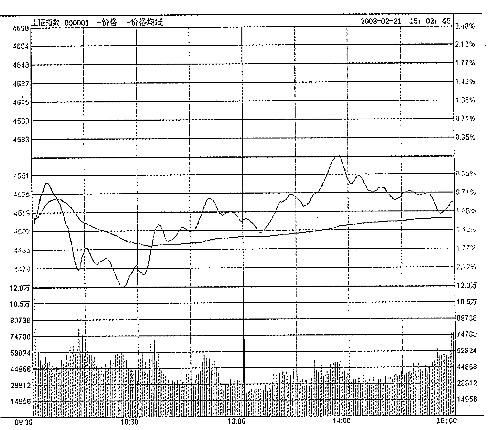

图5 上证大盘低开分时图

### 实例六：中国石油求自保，大盘指数露真谛

中石油只求自保，不再充当救世主，股市今日走势，后市分析必有意义。

中国石油自从上市加入指数计算以来，因其占有上证指数的权重较大，它的走势直接影响上海证交所大盘指数的涨跌，所以想要搞清楚上证大盘的真实走势，首先要对中国石油的走势有一个正确的认识。比方，上证大多数股票在调整，但中国石油却上涨，那么从表面上看，上证指数也在上涨，不细作考究的话，往往会被其表面现象所蒙蔽。

2008年3月10日收盘后，我参考当天中国石油中规中矩的走势，起课预测上证后市走势如下：

2008年3月10日16时
戊子 乙卯 己酉 壬申
二月亥将 甲辰旬寅卯空

```
勾 合 朱 蛇
申 酉 戌 亥
青未 子贵
空午 丑后
巳 辰 卯 寅
虎 常 玄 阴
```

```
玄贵后朱
卯子丑戌
子酉戌己
```

```
官 卯 玄◎
父 丙午 空◎
子 己酉 合
```

六壬明显子孙脱气酉作日支，官爻卯木值月建乘玄武发用，短线大盘必跌，也说明官方有调控，日干己上临墓神戌，戌上乘朱雀坐墓，主行情低迷，投资者大多被套牢深陷股市，多方午火居中传空陷又遭岁破，支上太岁贵神子脱支，初中传空亡，末传酉作子孙，股市必有大的调整。朱雀为大盘调整点位，朱雀加戌上，戌加干己上，己者未也，戌数5，未数8，戌未叠乘为40，结合费伯纳契黄金支撑与江恩回调法则，可判断这次上证大盘的调整点位可能在3000点左右一带。

中石油今日走势中规中矩，盘中死守21.8元的前期底线，只求自保，不再充当救世主，股市今日走势，对后市分析必有意义。上证今日探出8个月以来的新低，收盘跌破4165点一线的费伯纳契黄金支撑，成交明显放大，深成指已跌破年线，市场恐慌情绪加剧，预计短线探底4070点一带后，会引发反弹行情，请大家务必于反弹高点出逃，暂时观望为宜，以避免不必要损失。

从两盘预测看，两市入市资金严重不足，政府对股市从紧的调控手段未见改善，尤其是两会传来征收资本利得税的利空消息，三月特别是两会后春分20日左右，两会反弹行情结束，将会出现一轮较大级别的调整，最低可看到3000到3300点左右，请大家重新回忆过去股市流传的“远离股市就是远离毒品”的经典黑色名句，相信它会对大家的投资拉响风险警报，请在警报声中休息，隔岸观火为宜。

实际上，上证截止2008年4月3日为止，最低下调至3271.29点，开始反弹。随后在4月20日谷雨后2天即22日见到2990.79点的阶段性底部，展开较大的反弹行情。

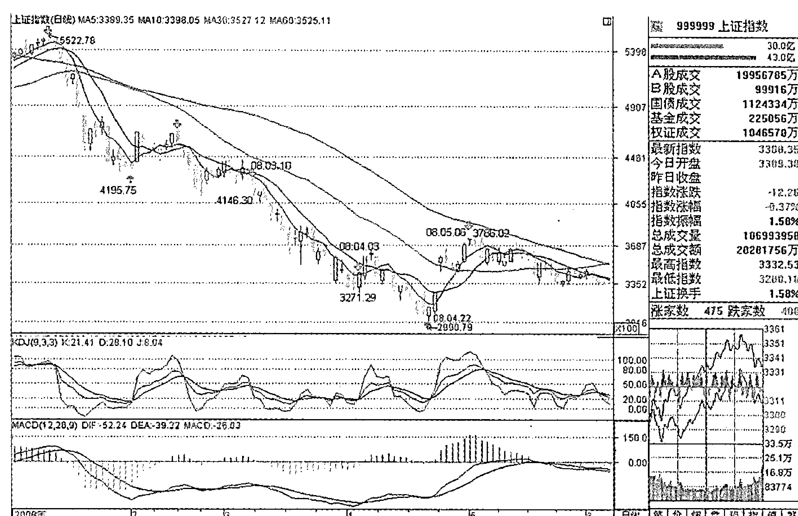

图6 上证指数调整K线图

### 实例七：上证跌破5000点，六壬预测早知晓

本例为六壬名家陈剑先生在其博客上对上证大盘的实测，其对股市分析非常到位，具有很强的实操性，现转载如下：

9月份，北京刘兄问：“可不可以算股市？”我说：“可以。”他说：“想算算大盘走向。”我说：“算得出来，等哪天你心血来潮时起课吧。”

2007年10月25日，当天上证指数跌了4.8%，昨收5843点，今收5562点，这下触动神经了，刘兄抽戌时，预测大盘的走向。

公历2007年10月25日
丁亥 庚戌 壬辰 庚戌
九月卯将 甲申旬午未空

```
青 勾 合 朱 蛇空空后 子 庚寅 蛇
戌 亥 子 丑
空 酉    寅 寅酉酉辰 官 未 常 ◎
虎 申    卯 酉辰辰壬 兄 戌子 合 ◎
未 午 巳 辰
常 玄 阴 后
```

- (1) 总体上说，大盘不行了，今后要开始下跌。
- (2) 有点反弹，但没有力量，你自己早点处理吧。
- (3) 要到明年春天，才会有一些涨幅。

日干为大盘，支加干克干，是上门乱首，辰是华盖、日墓，所谓华盖覆日人昏晦，明显表示大盘前景堪忧，凶象。天后是阻滞，墓是壅塞，上涨是不可能的。发用腾蛇乘寅，克日干上的辰鬼墓，为救解，近期有反弹。寅加酉，戴墓，是俯仰见丘仇，无力之甚，反弹也不会持久，最多七天时间。中传未，末传子，旬空落空，都是说明后面没有上涨的空间。明年春天，木旺克土，应该是有反弹以及上涨表现。

作者按：此课子孙空方乘凶神蛇发用，干为股市，干上官鬼天后辰作水墓，财爻休囚不上课传，支上乘天空脱支，皆凶象调整之象，课为不备主目下股市不具备上涨条件。朱雀为调整点位，朱雀加丑，丑为8数，结合江恩回法则可判断此次最低会调整到4800点左右，出现反弹。反弹的时间，看盘中子上巳，丑上午为日财，结合螺旋历法可判断出，反弹应于子月冬至前后出现，丑月后结束。

刘兄听了，将信将疑，说要静观发展，看是不是这样的。人之常情，情有可原，未来的情况，人人都会有迷惘的时候，持观望态度也是正常的。在2007年11月3日，刘兄又来电话说：“要再起一课，算上证指数今后是到底涨还是跌。”我说：“行啊。”抽戌时。

公历2007年11月3日
丁亥 庚戌 辛丑 戊戌
九月卯将 甲午旬辰巳空

```
勾 朱 蛇 贵
戌 亥 子 丑
青 酉 寅 后
空 申 卯 阴
未 午 已 辰
虎 常 玄 空
```

```
合常空后
亥午申卯
午丑卯辛
```

```
财 癸卯 后
兄 丙申 空
父 辛丑 蛇
```

### 判断结果：

- (1) 情况非常不妙，大盘必跌。
- (2) 11月22日前，上证指数在5000点以上，22日起，跌破5000点。
- (3) 跌破5000后，第一个支撑是4500点，这个支撑会破，然后跌到4200点。如果4200点破了，那就会跌到3000多，如果在3000多，那底部具体多少点，我就不甚明了，但可以肯定不会在3000以下。
- (4) 明年春天，有反弹。

### 分析过程：

卯克丑，午克辛，交车相克，阻力明显。干上卯财，遁旬尾癸，临干发用，初传又被申克，叫“前后逼迫难进退”、“克处回归又受克”，前有强敌，后有追兵。《毕法赋》载：“初传被下克，继归地盘之本宫，又被上神所克格，此例，乃克处回归又受克，虽虎贲之勇，亦不可为。”所以大盘下跌，是可以肯定的。卯是当月之将，目前卯将管事，22日交小雪，换寅将，过22日上证指数必跌破5000。戌加巳，戌5巳4，所以先是4500点。卯6数，加地盘辛，辛是7数，6×7=42，所以4200点是一个支撑。卯折半，是3，所以可以设想到下一们数是3000点，卯加戌，戌5数，6×5=30，亦是3000点。明年春天是木旺的时候，所以在二三月份，会有上升的表现。至于具体的情况，可能需要到时重新起课进行推算。

当11月21日，上证指数收盘5214点，22日，收盘4984点，终于跌破5000点了！由于推算准确，晚上刘兄打电话来说，表示佩服。但他的股票，今天28日，跌到4803点，时至今日，或许是心存侥幸吧，刘兄仍旧没有作何处理，每个人都有自己的理由，俗话说，未来的事情，谁又能真正知道得那么清楚呢。

大六壬虽然可以算股票，很多时候确实能够在课象中体现出来，但也只是一种参考的预测方法而已。“贪、嗔、痴、慢、疑”本是“五毒”，因为股票涉及的是“金钱”，激发的是人的“贪欲”，所有的当事人包括占卜者，都是身在“无明”中，而不自知，都会被“贪心”、“疑心”等心所障住，往往会做出一些不真实的判断。包括我本人，也是在无明中，所以上面的一些推算，也只能作为参考而已。

> 正所谓：“此情可待成追忆，只是当时已惘然！”

作者按：此课财星卯作太阳加干上逢闭口发用，中传申为日干之旺刃，说明行情已涨到头，干上初传乘天后，主股市要调整退后不前了，朱雀为点位，朱雀加子上，子加未上，子为9数，未为8数，结合江恩回调法则，可判断此次上证大盘下调的点位在4800点左右，未传丑为日之父母，旺相，说明丑月多方会发力上攻，大盘会反弹上涨。


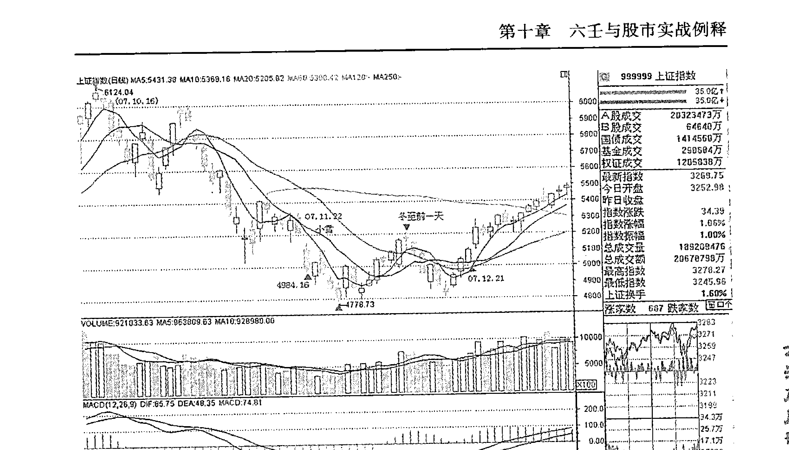

图7 上证大盘走势

### 实例八：报传股市进热钱，六壬占断知涨跌

此课为六壬名家方外居士在其论坛占出的一课，现转贴如下：

2008年6月22日，方外居士看到有关警惕巨额热钱进入A股，股市会上升的报道，起课占验如下：

- 公历2008年6月22日
- 戊子 戊午 癸巳 庚申
- 五月未将 甲申旬午未空

```
蛇 贵 后 阴
辰 巳 午 未
朱 卯     申 玄
合 寅     酉 常
丑 子 亥 戌
勾 青 空 虎
```

```
朱蛇空青    子 辛卯 朱
卯辰亥子    子 庚寅 合
辰巳子癸    官 己丑 勾
```

方外居士简断：干上青龙月破，三传夹定，脱气，退茹，看来还得跌回。希望秋后转好。

这课看楼市也要跌。

> 作者按：此课财爻巳午火在盘中落空，多方父母休囚不上传，干上月破，龙神居干上来脱，支上辰墓干，皆凶象，初传子孙卯木乘朱雀发用，主近期有不利消息，还要下跌，中传寅木作子孙主中线还要下跌调整，末传丑乘勾陈作官鬼，末后下跌必深。三传退连茹，大象上主股市必长期调整下跌。朱雀为下跌调整的点位，朱雀居卯，卯为6数，结合A股的市盈率，可判断上证大盘最低会跌至1600点左右见底。

实际走势见下图所示：

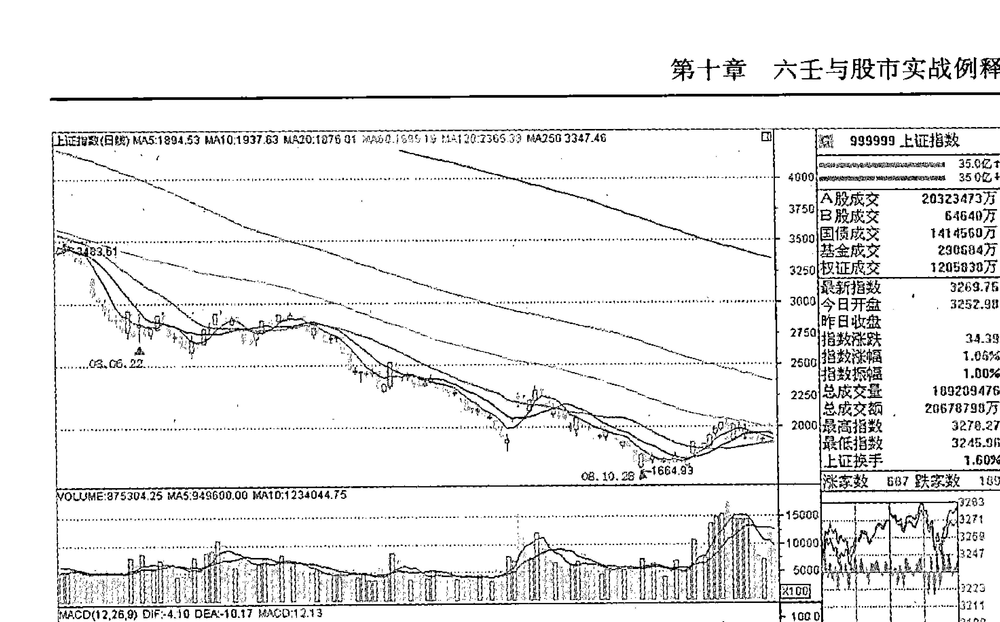

图8 上证大盘走势

## 第二部分：六壬对单个股票权证的预测

### 取用判断经验：

以日干来判断投资者的素质及投资状态，以支辰来判断投资者所持股票或权证的情况，以财爻来判断投资者的资金状况获利情况，以支或父母爻来判断投资者的操作方案手法策略情况。

以支或父母来判断上市公司基本面情况，以支辰判断上市公司的产品销售及市场营销状况，以财爻来判断上市公司的流动资金情况和盈利情况，以太岁月建日干来判断上市公司的高管人员情况。

以父母来判断所测股票的多方情况，以子孙来判断所测股票的持股方即空方情况，以财爻结合朱雀来判断行情的强弱有无，以朱雀来判断消息面状况，以日干来判断买方主力庄家情况，以支辰来判断卖方散户情况，以支辰给合多空方买卖方发用三传来判断所测股票的具体走势状况，并参考财爻与日干年命、支辰与日干的关系来做出买卖的决定。

在具体判断时，要充分运用六壬预测股票的基本原则和实战原则，并结合 K 线与技术指标判断出精确的趋势及买卖的时间价位。

下面结合实例予以说明。

### 实例一：占买中国联通如何

有一朋友求测可否买入中国联通这支股票，我按其奇门局时间起六壬课分析如下：

```
公历 2005 年 10 月 20 日 2 时
乙酉 丙戌 丁丑 辛丑
九月辰将      甲戌旬申酉空
```

```
蛇 贵 后 阴
申 酉 戌 亥
朱未       子玄
合午       丑常
巳 辰 卯 寅
勾 青 空 虎
```

```
朱青常后    兄 壬午 合
未辰丑戌    子 甲戌 后
辰丑戌丁    子 庚辰 青
```

### 分析：

1. 日干丁上加临戊土墓神主昏悔，又乘天后阴私难明，主对中国联通的走势难以判断，初传午火乃日禄支德，乘六合吉神，主求测人想收集买进中国联通持有。
2. 以日干丁为股市上有戊墓乘天后主调整下跌，父母多方财爻不上传主行情低迷，支丑上辰土作日之子孙来脱，干支乘墓，说明股民大都被套牢，有大的损失情绪低落。干支上神辰戌相冲主股民不进场入市买卖，股市冷清人气涣散。股市的资金看财爻申酉金落空陷之乡，说明股市缺乏资金或有资金出逃，进入股市的资金有损失或入市资金缺乏。
3. 以支为中国联通，支上辰墓，主目下行情低迷，上乘青龙财神，为国内有发展潜力业绩稳增长的大公司，也主将会有行情。初传发用午火为支德日禄，主有短期行情。中传戌作子孙乘天后墓日，主中国联通中线走熊难有起色，(事实上联通从2005年10月到2006年的8月一直阴跌至2.16元见底后才开始有了新的上涨行情)。末传未作子孙，但乘龙神财星，主最后经过长时间调整会走出大幅上升行情。
4. 戌月为日干丁火之墓神，说明戌月中国联通就会下跌至阶段性底部，驿马居亥逢空，亥月驿马当令填实，冲动巳上财星申金行情出现，亥子月亥上寅木子上卯木为干之父母多方出现，可判断亥子两月中国联通定会有上涨行情，丑月财之墓神当令，定会复又转入跌势。
5. 课虽为冬蛇掩目虎视之凶格，凶险异常，但初传发用午火为日禄支德，支上乘青龙财星，说明可逢低短期短线参与买卖有利无害，所以短期逢低买入持有该股可获利。干上戌为日之墓，戌数5，结合联通的股价可判断其阶段性底部价位在2.5元左右，初传午为干禄，午为9数，可判断中国联通在亥子月的短期上涨头部价位在2.9元附近。
6. 操作建议，专业机构投资者可根据联通的周K线KDJ在低位向上黄金交叉来临时，即时买进，在周K线KDJ处于80线以上高位时，择机卖出获利。散户及工薪阶层不建议操作。

事实上，中国联通从2005年10月19日，以2.5元开始振荡上涨至06年1月9日的2.91元复又下跌。

实际走势如下图9所示：

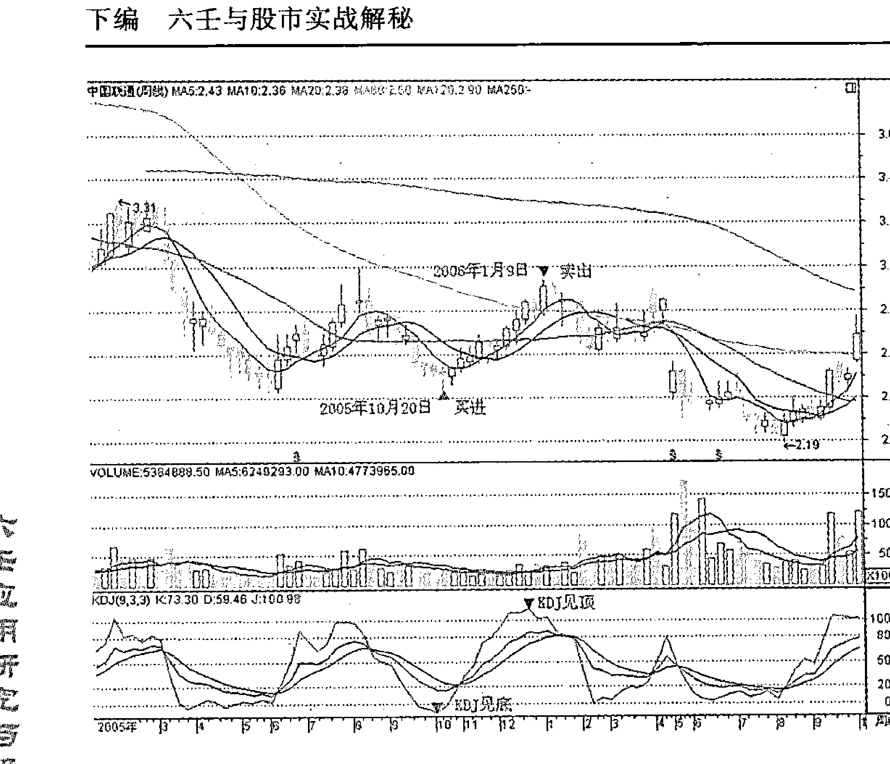

| 项目 | 价格/数值 | 数量/备注 |
|------|------------|------------|
| 600050 中国联通 | | |
| 委比 | -42.52% | 委差 -62724 |
| 卖⑤ | 6.67 | 9434 |
| 卖④ | 6.66 | 22292 |
| 卖③ | 6.65 | 41260 |
| 卖② | 6.64 | 26931 |
| 卖① | 6.63 | 5076 |
| 买① | 6.62 | 4505 |
| 买② | 6.61 | 11218 |
| 买③ | 6.60 | 17768 |
| 买④ | 6.59 | 2824 |
| 买⑤ | 6.58 | 5973 |
| 现价 | 6.63 | 今开 6.57 |
| 涨跌 | 0.09 | 最高 6.64 |
| 涨幅 | 1.38% | 最低 6.50 |
| 总量 | 192万 | 量比 1.18 |
| 外盘 | 94.2万 | 内盘 98.2万 |
| 换手 | 0.91% | 股本 212亿 |
| 净资 | 3.35 | 流通 212亿 |
| 收益(三) | 0.146 | PE(动) 34.1 |

图9 中国联通的周K线2005年10月20日KDJ在低位向上黄金交叉图

### 实例二：皇台酒业是否涨，六壬分析定策略

有一网友问，皇台酒业是否会涨，我按其奇门局时间同时起六壬课做了如下分析：

2005年11月1日10时
乙酉 丙戌 己丑 己巳
九月卯将 甲申旬午未空

```
合 勾 青 空
卯 辰 巳 午
朱 寅
未 虎
蛇 丑
申 常
子 亥 戌 酉
贵 后 阴 玄
```

```
玄后合青 财 丁亥 后
酉亥卯巳 子 乙酉 玄
亥丑巳己 兄 未 虎◎
```

### 分析：

（1）日干己上临父母巳火旺神又上乘青龙，财运亨通发达之象，但可惜巳火龙神落空陷之乡，怕是自己犹豫莫敢下手，白白错过赚钱的机会。

（2）财爻亥水逢闭口乘天后发用，主有资金，乘大家对该股情况尚不明了在背后暗中进入做多，财逢丁马，主该股在走势上有大幅振荡。中传太岁酉作子孙又上乘玄武，主该股2005年会下跌调整。

（3）支为皇台酒业上市公司，支上财爻亥水逢闭口乘天后丁马，均主该公司基本面有较大的变化（2005年4月22日摘掉ST帽），亥主酒类企业，亥为财爻说明该公司靠酒盈利，流动资金亥财乘天后丁马休囚于月令，主该公司流动资金短缺，有私下背后内部家里人参与挪用的问题。太岁酉为公司董事长或高管人员，上乘玄武，又作子孙，课逢五阴，天后发用，说明该公司董事长或高管人员有问题（公司董事长总经理隐瞒了父子关系，实际该公司的董事长总经理是两父子，其父任上市公司皇台酒业董事长，其子担任总经理），太岁酉作子孙来脱支丑，说明该公司董事长与其子有私自非法行为，有非法关联交易（其父将皇台4466万股转让给了其子的公司，使其子成为皇台第二大股东）。

（4）财爻亥为股价，亥为4数，亥财为初传发用，说明股价开始起涨价位在4元左右，中传酉为太岁子孙乘玄武，主酉年2005年该股会呈调整下跌走势，末传未空旺于月令为空而不空，上乘白虎主该股经过长时间调整后会走出大幅振荡飙升行情，未为8数，未加申，申为7数，未申上下叠乘为56数，结合该股基本面情况可判断股价最高会涨到6元左右。日干己墓绝于戊子，可知该股于2005年酉年戌子两月见底，日干己禄旺于巳午月，可知该股必于来年2006年巳午月，日干上父母巳火龙神落空填实之时涨势见顶，中间大约经6个月左右才能涨到6元左右见顶。事实上皇台酒业从2005年12月到2006年6月底，历经大约6个月的时间，从4元多振荡上涨至最高6.24元后除权下跌。

（5）日干上加临父母禄神，又乘青龙财神，初传亥财乘丁马发用，皆得财之象，因此上说明买进该股就能获利。

（6）操作建议，可在其周K线的KDJ下调至20线以下发出向上的黄金交叉时大胆买进，依周KDJ线低买高抛。

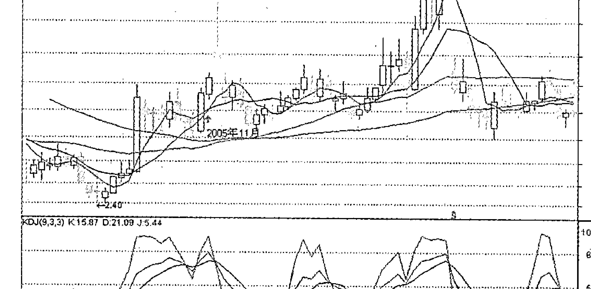

| 项目 | 值 | 项目 | 值 |
|------|----|------|----|
| 股票代码 | 000995 | 股票名称 | *ST皇台 |
| 委比 | 100.00% | 委差 | 1236 |
| 买① | 7.22 | 数量 | 692 |
| 买② | 7.21 | 数量 | 373 |
| 买③ | 7.20 | 数量 | 121 |
| 买④ | 7.18 | 数量 | 40 |
| 买⑤ | 7.17 | 数量 | 10 |
| 现价 | 7.22 | 今开 | 6.90 |
| 涨跌 | 0.34 | 最高 | 7.22 |
| 涨幅 | 4.94% | 最低 | 6.78 |
| 总量 | 87566 | 量比 | 1.28 |
| 外盘 | 53304 | 内盘 | 34382 |
| 换手 | 4.94% | 股本 | 1.77亿 |
| 净资 | 1.21 | 流通 | 1.77亿 |
| 收益(二) | -0.200 | PE(动) | — |

图10 皇台酒业从2005年11月到2006年6月底周K线KDJ图

## 实例三：股票巨亏7万，何时可以解套

有个网友着急的问，目前股票巨亏7万，什么时候可以解套？我1977年出生，年命丁巳。我就按其问课时间起六壬课局分析预测如下：

公历2007年9月21日15时
丁亥 己酉 戊午 庚申
八月巳将 甲寅旬子丑空

蛇 朱 合 勾
寅 卯 辰 巳
贵 丑 午 青
后 子 未 空
亥 戌 酉 申
阴 玄 常 虎

后朱阴蛇 官 甲寅 蛇
子卯亥寅 财 癸亥 阴
卯午寅戊 子 庚申 虎

### （一）分析

-   (1) 先看日干投资者的心态和素质，日干戊命巳上加临寅木官鬼，又乘滕蛇凶神，主投资人处在极度压抑难受毫无信心的状态，行年申上巳为岁破，又上乘勾陈凶神，主有破财，亥财逢闭口乘太阴，主钱财阴损不明，财爻亥为4数，亥加寅，寅为7数，亥为太岁，损失较大，就是损失有七万了。
-   (2) 支为股票上临卯木官鬼月破，乘朱雀，主因消息或行情火红追高，操作失败被套。
-   (3) 父母多方不上课传，主多方无力不做多，财爻亥水为行情，但逢闭口乘太阴，主该股处在弱势调整阶段，朱雀于酉月休囚，说明也无行情。
-   (4) 初传官鬼寅木遁出旬头暗鬼，主投资者在该股涨至头部要下跌时才介入，中传亥财旺于月令，说明下跌过后有所反弹，但财逢闭口又乘太阴，反弹行情不太明了较难把握，也主是最后的机会。末传申乘白虎驿马作子孙，主经过反弹后该股会大幅振荡下跌。
-   (5) 课中干之阴神主将来以后，阴神上加临亥财，但财逢闭口又乘太阴，闭口为旬尾乃最后的反弹上涨机会，太阴主逢低介入，也主行情幅度不大不好把握，主逢低买进有利可图。

### （二）操作策略

-   (6) 亥财旺于亥子月，朱雀加卯上，卯于亥子月也旺相，由此可知亥子月有反弹最后的逃命行情，所以操作上应在周 K 线的 KDJ 处在 20 线以下的低位时，逢低加码买进摊低成本，于亥子月财爻旺时才能开始上涨，在周 K 线 KDJ 处在 80 线以上高位时方可考虑卖出获利！

实际走势如下图 11 所示：

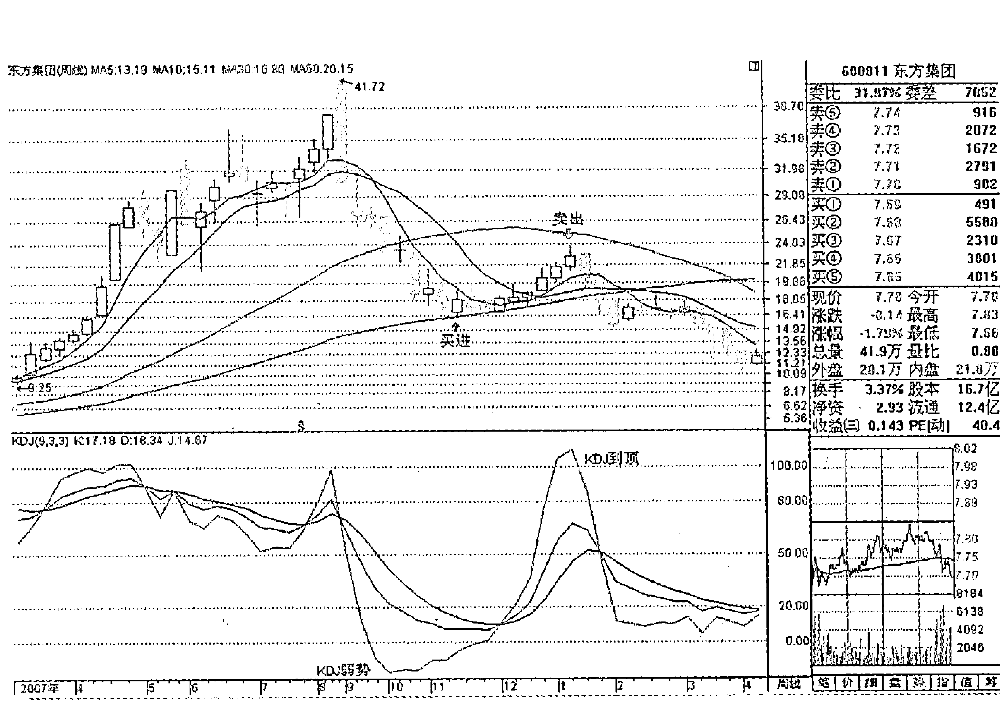

图 11 东方集团周 K 线 KDJ 低位弱势图

## 实例四：宝钢权证如何走？预测分析早知道

2005年12月01日，580000 宝钢权证由于上市以来走势较为活跃，参与的投资者众多，笔者随对其当日的走势进行了预测。

公历2005年12月1日9时24分
乙酉 丁亥 己未 己巳
十一月寅将 甲寅旬子丑空

朱 合 勾 青
寅 卯 辰 巳
蛇丑       午空
贵子       未虎
亥 戌 酉 申
后 阴 玄 常

蛇勾蛇勾 财 癸亥 后
丑辰丑辰 兄 丙辰 勾
辰未辰己 兄 丙辰 勾

### 分析：

-   (1) 月建亥作财爻发用，主所测权证有行情短线会上涨，课逢八专主参于买卖投资者众多，财逢闭口乘天后，行情不容易判断掌握，日干上临辰土天罡财墓又乘勾陈，持有其权证的投资人大都对其走势不太明了，反应迟钝，心里没底，如入昏墓之中。
-   (2) 钢铁方面的权证看申，申上巳火为干之父母多方，又上乘青龙吉神，主必然有较大的上涨行情。
-   (3) 当天交易时间为巳时午时未时，巳时午时为父母多方当权，必然上涨，开盘看初传，初传亥数4，亥上申，申数7，巳时开盘，巳数4，巳上寅数7，综合看主开盘以1.7元左右开盘。午时为日禄当权，午为9数，主午盘最高可涨至1.9元以上，下午未时当权，未数8，也可看末传，末传辰数5，辰上丑数8，综合看当收在1.8元左右。
-   (4) 综合来看，钢铁方面的权证会有短线上涨行情，可以买进。但课中干支皆乘罡墓，干支上神相刑又均乘勾陈，发用财爻传入中末传之墓，主买卖风险较大，要快进快出，不然反应迟慢必然会有损失。课逢八专参与者众，又为斩关励德课，投资人宜大胆突破心理压力，鼓励自己大胆买进，即时卖出为上。

宝钢权证580000于1.71元开盘后，最高涨至1.9元以上后，经过多空双方激烈角逐，最终于1.82元报收，昨日以1.66元收盘，经过全天交易较昨日上涨了0.16元。

## 实例五：大盘权证如何走？六壬判断来把握

网友：若方便，麻烦楼主预测一下，周一（11月19日）上证大盘，午盘（11：30）与15点收盘各收在什么点位，目前上证5316点。顺便再预测一下031003SFC1（金融行业）权证，11月19日的最高点/最低点的价位，目前19.539元。

以我看到你发帖时间起课预测如下，括号内为网友的反馈。（非常感谢楼主详细预测，目前上班是早出晚归，工作有点忙，没能及时反馈，请多包涵）。

公历2007年11月17日11时24分
丁亥 辛亥 乙卯 壬午
十月卯将 甲寅旬子丑空

```
朱 合 勾 青
寅 卯 辰 巳   玄贵阴蛇   财  丑 蛇◎
蛇丑         午空   酉子戌丑   财 壬戌 阴⊙
贵子         未虎   子卯丑乙   财 己未 虎
亥 戌 酉 申
后 阴 玄 常
```

### 分析：

-   （1）日干乙为求测者，上加临鬼墓丑土，初传丑墓作财落空，三传丑未戌三刑，主操作混乱，资金有损失（巳/午月损失大30%，后来的月份基本持平），干上传逢空又乘滕蛇凶将，主忧郁焦虑不安（周六那天为工作的事情），三传三刑，干支上子丑虽合但具落空，干和支又相害，说明求测者买卖投资表面上看起来没什么，实则混乱非常不顺利，有损失（每次操作还是有一定的依据，不算盲目，只是经常嫌利润少，被套很多次，以前的大损失就是这样产生的），所以从日干方面看，求测者应观望等待时机为主，不宜盲动（戊月下旬到现在没有操作，在学习炒短线，原因是没有找到可靠的方法；还有一点就是由于自己奇门没学好，运用不当，由此给我带来了一定经济损失，为此自己转换了方向）。
-   （2）日干又为股市为主力，上加临鬼墓丑土，初传丑墓作财落空，三传丑未戌三刑，主行情走势上下振荡较乱股市人气涣散，被套牢的多。干上传乘蛇，说明这时的股市忽上忽下不好把握，传财三刑，干上初传丑财落空，主股市有大的投资资金在短线进出炒作，主力看空股市，行情较乱。支为股民散户，上虽临父母子乘贵神，但子卯相刑，主散户有较大的投资失误和损失，子空贵神落空不吉，空亡主投资者散户对股市心里大都没底在观望参与的少。
-   （3）父母多方子加在支上空亡，支为卖方沽出方，所以多方看空不做多，子卯相刑，多方投资者多有损失，干上鬼墓，多被套牢。干上财，三传作财爻，但亥月土财休囚，说明市场行情进入弱势，传财又相刑，课逢稼穑，很明显近期市场是一个振荡下跌的格局。具体的点位看朱雀，朱雀加寅，寅加巳，寅数7，巳数4，寅巳相叠为28数，结合当时上证指数取7数或8数，可判定上海股市至少要调整到4700点至4800点之间的区间。

六壬应用研究与股市实战解秘

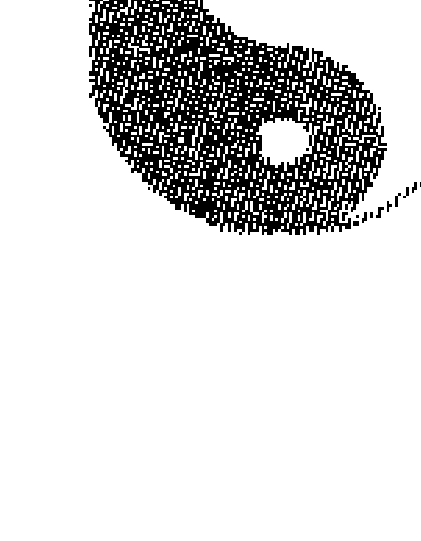

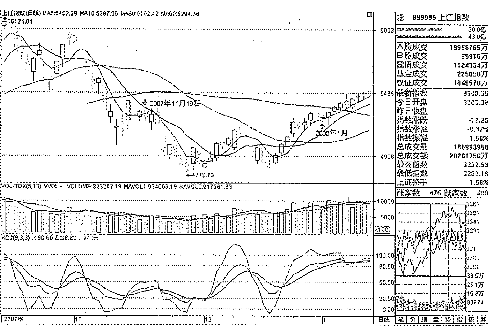

-   （4）周一11月19日为丁巳日，巳火为日干乙之子孙脱气，为做空方，主当天以下跌调整走势为主。11点半为午时，课盘中午为9数，午上卯为6数，卯午叠乘为54数，结合上周末上证收盘指数5316点来判断，上证午盘应收跌在5290点左右或5260点左右或5254点左右（实际上证午盘收在5254点），15点为申时，课盘中申为7数，申上巳为4数，巳申叠乘为28数，所以上证下午15时收盘应在5270点左右或5240点左右或5228点左右（实际上证收在5269点）。
-   （5）031003SFC1（金融行业）权证，基本面，看支上子乘贵神落空（主以前为名气大形象好的绩优蓝筹股，逢空主业绩有变，干上鬼墓，课逢稼穑，三传刑冲，说明其经营业绩受阻（近期刚上调完存款准备金率），其近期走势看初传发用，初传丑墓作财乘蛇落空，父母多方子加支上落空，主多方看空，卖出的多主阴跌（快到期了，应该是卖出的多），11 月 19 日当天为丁巳日，巳火为日干乙之子孙脱气，为做空方，主当天以下跌调整走势为主。当天的最高点/最低点的价位分析判断为，乙禄在卯，卯为 6 数，卯上子为 9 数，结合 031003SFC1 权证的股价，可判定其当天的最高价位为 19.9 元左右（实际最高点价位为 19.749 元）。乙墓在未，下午未时正好为干之墓神当权，所以判定其当天最低价位应出现在下午未时，未数 8，未上辰为 5 数，未辰相叠为 40 数，结合 031003SFC1 权证的股价，可判定其当天的最低价为 18.40 元左右（实际其最低点价位为 18.528 元）。

## 实例六：基本面上有突变，六壬预测察真知

2007年3月7日，有朋友问：近日来，杭萧钢构从2元附近开始连续涨停，到底怎么回事？于是我从朋友问话的时间起课预测如下：

公历2007年3月7日11时24分
丁亥 癸卯 庚子 壬午
正月亥将 甲午旬辰巳空

```
合 朱 蛇 贵
戌 亥 子 丑       合常虎贵      官 已 常 ◎
勾酉            寅后        戌巳午丑      父 戊戊 合 ◎
青申            卯阴        巳子丑庚      负 癸卯 阴
未 午 已 辰
空 虎 常 玄
```

### 分析：

-   * （1）基本面预测：
  第一，上市公司看支与父母，支子上已为干之长生支之财神，支上乘太常吉神，已却逢空亡，父母戊上乘六合吉将，但父母戊落空，支上又逢破碎岁破，说明上市公司的基本面较差，从三传看，初传逢岁破破碎官鬼逢空发用，中传戊作父母乘六合吉将落空，末传卯财逢闭口值月建乘太阴，课逢铸印，说明上市公司基本面存在有较大的变化，业绩从较差转变为大幅增长，增长原因不易被查知。干支上神交车合，但合中带克，说明公司内部在经营管理上有问题。
  第二，公司的业绩看财爻卯值月建，居末传，说明该公司将来业绩有大幅的增长。财逢闭口又乘太阴，目前增长原因及方式还不为股民投资者所明确。
  第三，董事高管人员看太岁亥月建卯及日干庚，太岁亥上加辰墓又乘玄武凶神大凶，主董事高管人员有官司是非。月建卯作财神逢闭口乘太阴，主总经理高管人员私下暗中有不为人知的资金财物操纵行为。
  为。日干庚上临丑为墓神，乘贵神主高管人员有后台在暗中支持，但逢墓神丧车凶煞。从太岁日干董事高管情况结合来看，说明有董事高管人员涉嫌违法犯罪，巳火岁破发用，巳为官爻监管机构，太岁必受其冲克，说明一定会有董事高管人员监管机构被查处。
-   （2）父母多方逢空而财爻卯值月建主无量上涨，日干为主力庄家，上乘贵神，说明主力有背景实力强大，逢墓神已暗中绝对控盘，支为散户，支上逢空，说明散户介入较少，干支上神交车合，说明庄家违反监管法规政策，对倒拉台股价，初中传空亡，末传财值月建，说明其涨势必速，涨幅必大，有一步到位之势。
-   （3）日上父母贵神，支上巳为日之长生支之财神，末传财值月建，课逢铸印，干支上神巳丑生合，说明投资者买入该股必获大利。

后来了解到杭萧钢构与非洲某国签订了达300多亿元的合作盈利项目，同时杭萧钢构公司高管人员涉嫌本公司股票的非法内幕交易被处罚逮捕。

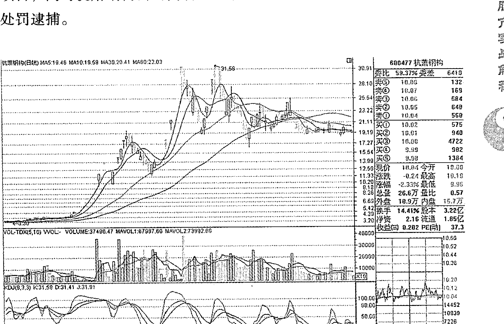

图14 杭萧钢构股价日 K 线图

## 实例七：买进中石油，肯定能赚钱

中国石油于11月5日回归沪市，不少同事对其投资价值很关注，问我现在能买吗？买进后将来能涨多高？于是我按中国石油上市首日开盘时间起课预测如下：

公历2007年11月5日9时24分
丁亥 庚戌 癸卯 丁巳
九月卯将 甲午旬辰巳空

```
朱 蛇 贵 后
卯 辰 巳 午   空勾常空   官 辛丑 勾
合寅    未阴   亥丑酉亥   兄 己亥 空
勾丑    申玄   丑卯亥癸   父 丁酉 常
子 亥 戌 酉
青 空 虎 常
```

### (一) 分析

#### 1. 首先看其基本面

支或父母为中国石油，支卯落空，说明中石油以前有过重组。支上干，癸为丑，说明中石油是以地下资源油为主营业务。支卯又为太阳，说明中石油在世界上为规模大经营好的名牌企业。乘勾陈主业绩增长受阻。父母酉逢丁神乘太常吉将，说明中石油业绩增长快，基本面有较大的变化。其业绩看财爻，财不上传，课盘中巳财乘贵神，说明中石油是国有大型资源垄断性企业，业绩有保证。但巳落空亡，主其以前业绩增长快而稳定。午财乘后，说明中石油以后将来的业绩会下滑。巳数4，巳加未，未数8，结合股市中每股的收益，可判断中石油今年的每股收益应在0.80元左右。

#### 2. 看一下中石油上市当天的走势

##### (1) 开盘价预测：

它的开盘价看初传，初传丑数8，丑加卯，卯数6，丑卯叠乘数48，综合看主开盘价与8数有关，参考中国石化前一日的动态市盈率，28.49元除以0.56元就约等于50.88倍，用中石化的市盈率来类比中石油的市盈率，那么中石油的上市首日开盘价在理论上就为50.88乘以0.80约等于40.7元，结合六壬数预测它的开盘价应该为48元左右（实际上中石油在其上市首日的开盘价为48.6元）。

##### （2）当天的分时走势预测：

11月5日当天为卯日，卯为干癸之子孙脱气，卯上又乘勾陈凶将，说明中石油当日以下跌调整走势为主。（实际上中石油以48.6元的最高价开盘后，就一路下跌）。

##### （3）当天最高价最低价预测：

最高价看日干癸之禄为子，子数为9，巳时开盘，巳午时财神当权，巳数4，午数9，结合其开盘价，那么可判断中石油当日的最高价应在49元左右。最低价看日干癸之墓神辰，辰数5，下午未时官鬼当权，未数8，未上巳，巳数4，4数最小，取4数，结合其开盘价，那么可判断中石油当日的最低价应为40元左右（实际上中国石油当日的最高价为48.62元，最低价为41.7元）。

#### 3. 中石油的近期走势预测

中石油近期短线走势看初传，初传丑土作日之官鬼，又乘勾陈凶将，说明中石油近期的走势主要是以下跌调整为主。父母多方酉金逢日破丁神，主做多方有损失有被套牢的。

#### 4. 中石油今后的走势预测

##### （1）2008年的走势：

明年为戊子年，子上戊为财之墓神，日之鬼，子上又乘白虎凶神，说明中石油明年主要以调整走势为主，白虎可能跌幅会较大，投资者要有心理准备。

##### （2）今后的最低价预测：

最低价看干之墓神为辰，辰数5，子年子数9，结合中石油的股价，可判断其最低价应为，当市场市盈率在15倍左右时应在9元左右。


#### 5. 买入中石油能否获利

干上亥为日之禄旺，说明目下中石油股价处在高位，又乘天空凶将，实为诱多，不可买进。末传父母逢丁神又遭日破，多方损失惨重。支上丑克干上亥水，不宜买入。财不上课传，课逢涉害（介入即有害），极阴（长时间阴跌），不备（买入条件不具备），回环（多少价涨上去的，还得跌回来），短线绝对不可介入，只有等到其下跌至9元以下时，才可逢低介入做多。

### （二）操作策略

根据以上预测，投资者应持币等待中石油的价格回落至9元以下时，才应开始买入中长线投资持有。

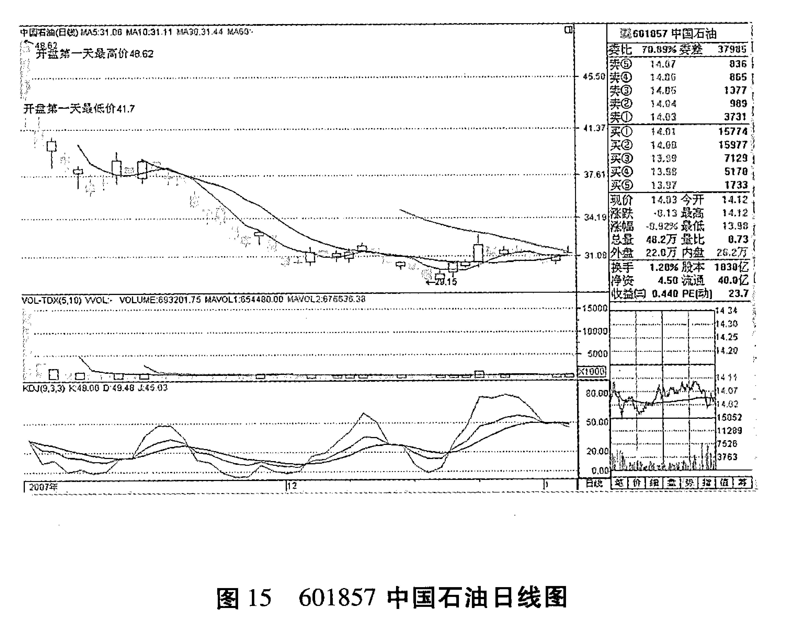

## 实例八：股票被套，何时回本

广东的网友：最近全仓600282，成本价24.20元，亏了不少，腰斩了，请测何时能回本？我按其发贴时间起课如下：

2007年11月14日23时24分
丁亥 辛亥 癸丑 壬子
十月卯将 甲辰旬寅卯空

```
青 空 虎 常
申 酉 戌 亥 勾蛇勾蛇 官 甲辰 蛇
勾未 子玄 未辰未辰 官 丁未 勾
合午 丑阴 辰丑辰癸 官 庚戌 虎
巳 辰 卯 寅
朱 蛇 贵 后
```

-   1. 日干癸上临辰土罡星墓神，乘螣蛇凶将，主被套牢，情绪低迷，心情压抑，不知所措。课逢稼穑，一水敌众土，损失必大。幸好亥月水旺，干旺只是暂时入墓库被套，等到冲开墓库之时，必然有解套的机会。
-   2. 财爻不上传，课盘中财爻巳午火落空，初传为鬼墓，又乘螣蛇凶将，说明短线为下跌调整行情，三传作鬼刑冲，主人气涣散，行情低迷。干支上神皆临辰土罡墓，主买卖交投清淡行情受制。
-   3. 今幸有末传戌土乘虎冲开干上墓神辰土，以凶制凶，日干癸水方才得救。因此可判定，后市必然存在有解套机会。稼穑课，水遭众土围克，必要寅卯木制土，癸水日干方能得财，也就是说寅卯月木当令时，课中寅卯出空填实，巳午火财神旺相时，才能有解套的机会。斩关游子课，行情必有反弹之象，有利出逃。
-   4. 从技术上看，其周K线的KDJ已至低位，60分钟MACD线呈低背离，日K线的筹码指标显示下档低位已有大量红色获利筹码。

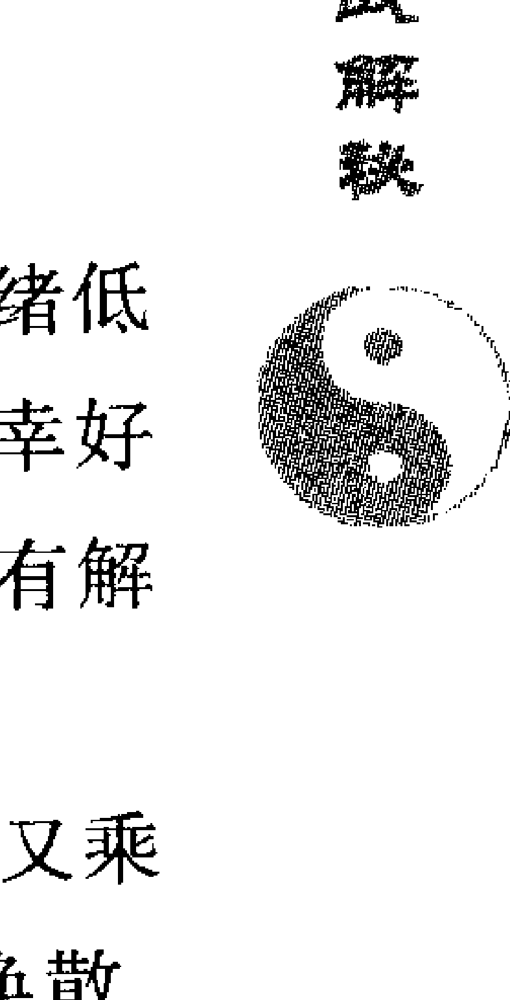

-   5. 操作策略，若有资金可与此时逢低买入做一波段行情，若无资金可持股不动，等待股价上涨解套。

实际走势如下面的图所示：

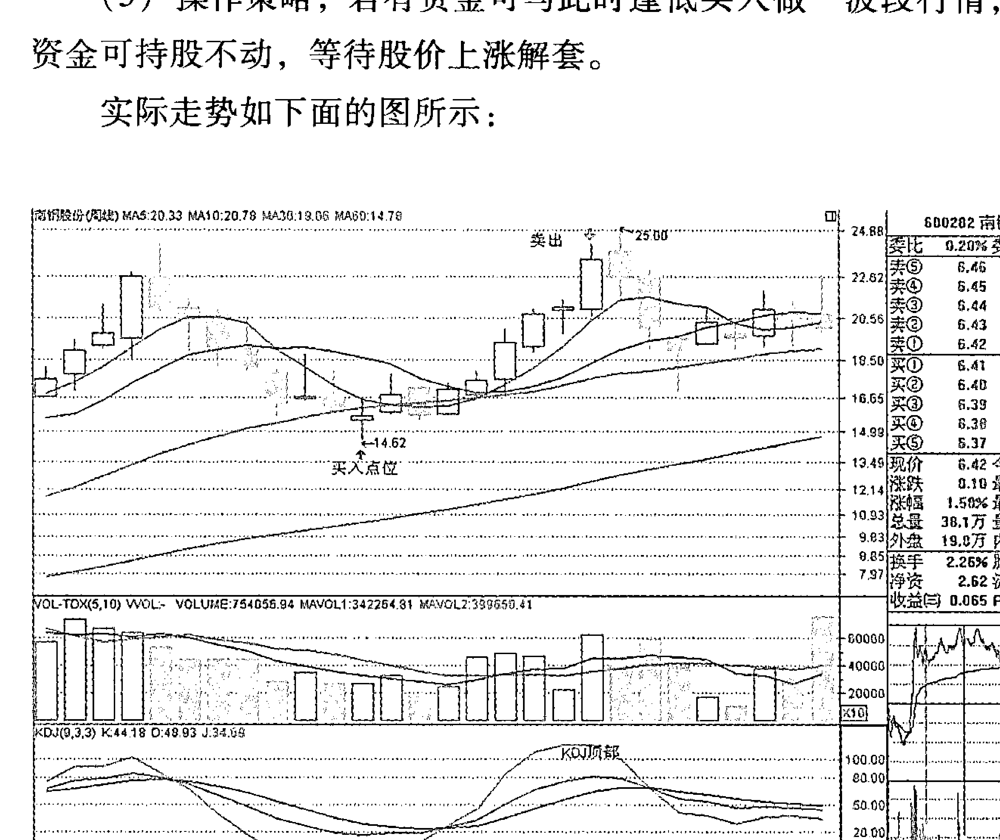

图16 600282 南钢股份周K线 KDJ 低位图

| 项目 | 价格/数值 | 备注 |
|------|------------|------|
| 600282 南钢股份 | | |
| 委比 | 0.20% | 委差 24 |
| 卖⑤ | 6.46 | 1043 |
| 卖④ | 6.45 | 1795 |
| 卖③ | 6.44 | 2007 |
| 卖② | 6.43 | 1020 |
| 卖① | 6.42 | 9 |
| 买① | 6.41 | 1024 |
| 买② | 6.40 | 2307 |
| 买③ | 6.39 | 372 |
| 买④ | 6.38 | 1904 |
| 买⑤ | 6.37 | 219 |
| 现价 | 6.42 | 今开 6.54 |
| 涨跌 | 0.10 | 最高 6.54 |
| 涨幅 | 1.50% | 最低 6.19 |
| 总量 | 38.1万 | 量比 0.87 |
| 外盘 | 19.0万 | 内盘 10.3万 |
| 换手 | 2.26% | 股本 16.0亿 |
| 净资 | 2.62 | 流通 16.0亿 |
| 收益(三) | 0.065 | PE(动) 74.4 |# 第十章 六壬与股市实战例释

## 实例九：何时有转机，六壬定知道

网友问：000557 银广夏有退市风险吗？若无何时才能有转机？我当即起课预测如下：

2007年11月23日23时24分
丁亥 辛亥 壬戌 庚子
十月寅将 甲寅旬子丑空

```
勾 青 空 虎
未 申 酉 戌     后玄贵阴     兄  子 玄◎
合午          亥常      寅子卯丑     子 甲寅 后⊙
朱巳          子玄      子戌丑壬     官 丙辰 蛇
辰 卯 寅 丑
蛇 贵 后 阴
```

分析：

- (1) 先看日干投资者，干上丑土作鬼逢空，主操作失误有损失，现下心里对行情没底，乘太阴心情不好郁闷。初中传空陷，末传辰作鬼乘凶蛇墓干，说明求测者已长时间被套牢。支为股票，乘玄武主下跌调整，干支上神子丑相合，说明投资者买了这支股票（网友反馈说，早买了，现在被套）。幸鬼加干而值空，辰墓在末传而被支戌冲破，月将太阳寅木居中传制鬼，日干由是得救，求测者定会有解套获利的机会。

- (2) 再看该股的基本面，支为上市公司，支上子空亡，又乘玄武恶将，财爻不上课传，说明该上市公司为亏损较大的企业，有退市的风险和债务官司纠纷。支为产品，支上子水，上乘玄武为酒类企业，支上逢空主企业处在半停产状态。财神为该上市公司利润，不上课传，巳午火财神在课盘中又休囚于月令，主利润微薄，末传辰作鬼乘凶蛇墓干，资不抵债。

- (3) 干支上神子丑六合，说明该上市公司有重组，太岁亥为日禄，说明该上市公司的上级单位和政府领导，对该上市公司的重组很重视很支持，但课逢重审，未传克初传，干支上神子丑空合，事多虚少实而不顺。

- (4) 辛鬼加干而值空，辰墓在末传而被支戌冲破，月将太阳寅木居中传制鬼，干壬水有救，说明该上市公司一定不会退市，有希望重组成功。

- (5) 朱雀为消息乘巳火旺地，为真消息，可靠。据以上分析可知，000557 重组有望，消息确实，可大胆持有该股。（网友反馈说，有消息说000557银广夏，可能被青铜峡铝业或中粮重组）

- (6) 近期走势看初传发用，初传发用为日干壬水之帝旺，主该股在子月初传出空填实之际会反弹上涨，出现一个阶段性头部。

- (7) 操作策略，应根据该股的周 K 线 KDJ 低位黄金向上交叉图，寻找 60 分钟 KDJ 向上金叉时机买进持有，在周 K 线的 KDJ 高位死叉来临时，择机卖出。

图 19  000557 银广夏周 K 线 KDJ 低位向上黄金交叉图

## 实例十：龙字出口，走势若何

网友大黑天1说，请您看一只个股，我说1个字龙，请您看看未来3个月走势。谢谢！

以我看到你贴子的时间起课预测如下：

2007年12月23日0时36分
丁亥 壬子 辛卯 戊子
十一月丑将 甲申旬午未空

```
勾 青 空 虎
午 未 申 酉
合 巳       戌 常
朱 辰       亥 玄
卯 寅 丑 子
蛇 贵 后 阴

合朱阴玄 父 壬辰 朱
巳辰子亥 官 癸巳 合
辰卯亥辛 官   午 勾◎
```

分析：

- (1) 日干辛上太岁亥作子孙乘玄武恶将，课逢罗网，主求测者投资有较大损失，资金被套。
- (2) 目下行情看初传发用，初传父母辰作多方发用，乘朱雀吉将，主多方因有利的消息，开始进入建仓，但初传逢破碎煞，课逢网罗，辰罡发用，目下行情受阻，难以产生上涨行情。
- (3) 支上辰为父母，逢破碎煞，乘朱雀，主企业有资产分割重新组合或基本面有变化方面的消息。
- (4) 支卯为财神为行情，卯上乘朱雀，该股有重组消息，寅卯月左右财神木当令旺相时，会有上涨行情。
- (5) 龙字应课中辰龙父母多方临支乘朱雀发用，支卯作财神旺于月令，三传进连茹，主该股未来三个月必然有上涨。

反馈：

ok！非常好！说理透澈！准确度高！

> “（1）日干辛上太岁亥作子孙乘玄武恶将，课逢罗网，主求测者投资有较大损失，资金被套。”

——对！上周几乎天天跌，刚买人就被套，还好是-10%左右，今天回升。

> “（2）目下行情看初传发用，初传父母辰作多方发用，乘朱雀吉将，主多方因有利的消息，开始进入建仓，但初传逢破碎煞，课逢网罗，辰罡发用，目下行情受阻，难以产生上涨行情。”

——近期在打压。

> “（3）支上辰为父母，逢破碎煞，乘朱雀，主企业有资产分割重新组合或基本面有变化方面的消息。”

——对！这一点偶最为欣赏，正确，已公开，但不知最后能否象龙一样飞升？重组成功？

> “（4）支卯为财神为行情，卯上乘朱雀，该股有重组消息，寅卯月左右财神木当令旺相时，会有上涨行情。”

> “（5）龙字应课中辰龙父母多方临支乘朱雀发用，支卯作财神旺于月令，三传进连茹，主该股未来三个月必然有上涨。”

——等好消息！

老师确实水平非一般，在股票版高手中也属一属二，希望您能多帮助小散。常来呀，老师！

## 实例十一：网友来发问，六壬知涨跌

网友寇添问600184新华光后市涨跌情况？依你的局起六壬课分析如下：

2007年12月28日15时36分
丁亥 壬子 丙申 丙申
十一月丑将 甲午旬辰巳空

六壬应用研究与股市实战解读

### 下编 六壬与股市实战解秘

蛇 贵 后 阴
戌 亥 子 丑
朱 酉         寅 玄
合 申         卯 常
未 午 已 辰
勾 青 空 虎
青阴常蛇 午丑卯戊
父 癸卯 常 财 丙申 合 子 辛丑 阴

分析：

- (1) 日干丙上戌墓作子孙来脱，又乘滕蛇，墓神覆日，必主被套，情绪低落，干上戌空，心里没低，不知所措之象。
- (2) 父母卯木多方旺于月令乘太常吉将发用，行情财神申金乘六合入中传，主目下有上涨行情。
- (3) 毕法有云“两蛇夹墓凶难免，支干乘墓各昏迷”，丑月未传子孙乘太阴作墓神覆支财之上，中传申财传入丑墓，丑月墓神当令，主该股必然阴跌。
- (4) 日干丙上戌墓，戌数5，主该股最低价位会在15元左右，日干丙禄在巳，巳数4，巳上戌数5，戌巳相叠数20，申财数7，申上丑，丑数8，结合新华光的股价，可判断其最高可涨至18元至20元左右的区间见顶。
- (5) 课逢斩关回环，主求测人定要于丑月前后，克服心理因素，及时卖出止盈。不然丑月前后，因课途回环还会跌回去。

实际走势见下图所示：

## 实例十二：博客常来看，股票请分析

请帮忙预测一下此股走势。你好！经朋友介绍，经常登陆你的博客，发现你的预测非常准确，佩服！能否麻烦你帮忙看看一只股票，属于通讯及相关设备制造业，目前股价52元左右，有劳老师预测一下该股票3个月内的走势，谢谢！

2008年1月5日14时
丁亥 壬子 甲辰 辛未
十一月丑将 甲辰旬寅卯空

### 下编 六壬与股市实战解秘

| 朱 | 蛇 | 贵 | 后 |
|---|---|---|---|
| 亥 | 子 | 丑 | 寅 |
| 合戌 | | 卯阴 | 辰戌寅申 |
| 勾酉 | | 辰玄 | 戌辰申甲 |
| 申 | 未 | 午 | 巳 |
| 青 | 空 | 虎 | 常 |
| 玄合后青 | 兄 寅 后 ◎ |
| 官 戊申 青 ⊙ |
| 兄 寅 后 ◎ |

分析：

- 1. 干上申为日之鬼煞，乘青龙财星但落空，发用乘天后为日之德禄驿马落空陷，说明求测者错过高点卖出机会，有所损失。
- 2. 支辰上戌墓作财冲支，支上乘六合，课逢反吟，主该股基本面有变化，有重组或并购题材。
- 3. 多方父母不上课传，财神居支与支上冲刑，发用三传冲克，初末传德禄驿马逢空，主该股目前人气涣散，走势上有振荡回调迹象。
- 4. 财神在丑月当令，但课逢反吟，财辰戌相冲，主丑月有振荡上涨行情，但不好把握，只有等寅月德禄驿马出空填实之时，该股方可出现明显的高点，应及时卖出止盈为好。

冰安娜：

非常感谢老师百忙中给我回复和预测！
我目前暂时被浅套，准确；
走势上近期有回调迹象，准确；
该股基本面有变化，目前尚不知道。
请问老师：该股回调会很多吗，可以继续持有吗？此股中线有潜力吗？

太白山：

该股不会回调太多，因日干甲木墓在未，未数8，回调价位应在48元左右，初末传寅为日之德禄驿马，中传乘青龙财神，但三传尽皆落空，因此该股从走势上看中线潜力不大。

冰安娜：
回复，祝你一切顺利！我将反馈此股信息。
谢谢老师！该股目前果然回调了，老师你预测得太准了，谢谢！

## 实例十三：生死一线，能否博弈

本人准备博一只重组或可能退市股，生死一线，停牌后何时复牌？能否重组成功？能买人否？请老师看看，谢谢！烦请太白老师祥细分析一下，感谢！问半年或一年后的行情。

2008年1月9日22时36分
丁亥 癸丑 戊申 癸亥
十二月丑将 甲辰旬寅卯空

| 贵 | 后 | 阴 | 玄 | | 虎玄阴贵 | | 财 壬子 虎 |
| 未 | 申 | 酉 | 戌 | | 子戊酉未 | | 官 寅 青◎ |
| 蛇午 | | 亥常 | | 戊申未戌 | | 兄 甲辰 合⊙ |
| 朱巳 | | 子虎 | | | | |
| 辰 | 卯 | 寅 | 丑 | | | |
| 合 | 勾 | 青 | 空 | | | |

分析：
由于时间关系，我点到为止：
- 1. 此课课义：发用之子，日财也。上乘白虎，惊危而不敢取。若更恋此财，必引而入于鬼墓之乡，其财反为支上戊土所得矣，几何而能入手乎。
日干戊上乘贵神，发用子财乘虎为惊危之财，主求测者想投机，投资有高风险的股票。
- 2. 支为所搏之股，支上干墓，又乘玄武恶将，辰为末传墓初传子财，主该上市公司业绩大幅下滑，出现较大亏损，基本面有较大的变动，未传空墓，可能有长时间的重组行为。支上戌土，可能是以经营房地产为主营业务的上市公司。

- (3) 支申为你的操作计划，申上干墓又乘玄武，发用子财乘虎为惊危之财，必主为风险极高的投机炒作计划。
- (4) 多方父母不上课传，财子乘虎发用，中传驿马乘青龙财神，末传辰做财墓落空，主有风险较大的振荡行情，且行情振荡至最后，必无着落。
- (5) 开盘时间看初传，结合该股实际情况，可判断应在明年子年的戌亥月前后，因戌可冲开财之辰墓，亥月财旺，故应在子年戌亥两月。
- (6) 初传财乘虎，起初重组注资有困难，中传驿马官鬼乘龙神，主有政府上级管理部门会参与重组，末传乘六合作财库，干上贵神，重组有望成功。
- (7) 以我的理论，贵神加干，财神发用，罡塞鬼户，逢低买入可获利，以技术指标量化为主。
- (8) 2008年太岁子作财神临初传乘虎发用，主有较大的振荡行情，子数9，子上寅，寅数7，股价与7数9数有关。

### 大易应用研究高级班讲义

> xiaoxuan: 感谢老师，以您的理论看，能否看出此股麻雀变凤凰，现价8-9元，假如开盘后后期走势是否连续涨升？最高能看到多少？关键是停牌太久，怕得不偿失。目前这几天狂放巨量是否庄家在出逃还是最后洗盘？我还在矛盾中，稍后再给您详细反馈，谢谢！

> 太白山: 可根据开盘后的预期收益与市盈率来结合六壬数判断以后的价位，以我看会开在7元左右，财乘白虎当然放量振荡走势凶悍了。

> xiaoxuan: 谢谢！太白老师耐心，细致的分析。您说的此股情况与事实基本相符。此股亏损连年，看来退市已成定局。为了不误导别人，此股我给您短消息了（s * st 鑫安 000719），供参考！前段时间一直大趋势向下，近来放巨量有所反弹，目前应该是相对高位，想再等等看情况少量买人，还没想好。总想投机一把，呵呵。

实际走势如下图所示：

图21 s * st 鑫安走势图

## 实例十四：买股多犹豫，六壬解忧愁

网友青烟袅袅：前段时间一直惦记着一只股票，只想等跌了买，现在不但没跌还是涨，无奈不敢追了，又想这支股票，也是在我关注之下从12-13块涨到17元了，还能买吗？请老师指点，万分感谢！

2007年8月23日1时6分
丁亥 戊申 己丑 乙丑
七月午将 甲申旬午未空

### 下编 六壬与股市实战解秘

朱 合 勾 青
戌 亥 子 丑
蛇酉 
寅空
贵申 
卯虎
未 午 已 辰
后 阴 玄 常

合阴玄勾
亥午巳子
午丑子己

父 癸巳 玄
兄 丙戌 朱
官 辛卯 虎

分析：

- 1. 支丑上太阳午火作父母，可以断定这支股为业绩较好的大型上市公司，午做干禄，说明该股已涨至高位。
- 2. 日干已土上临子财逢空，干上乘勾反应迟钝，说明求测者踏空行情，心中犹豫没有底数。
- 3. 多方父母已火临日之帝旺发用，说明该股已涨到高位，初传已火遭岁破乘玄武，主短线要走出下跌调整行情。
- 4. 干为主力，干上乘勾说明主力庄家介入较深，干上子空亡，主投资者股民多踏空，庄家对倒做盘。子午丑未，干支上下交冲。而子未午丑，干支又各自相害，为先冲后击之象，说明主力先对倒拉抬振荡上冲，而后向下洗盘打击散户。午与未合而生日，子与丑合而为财，交车相合，交关利益也，说明主力在拉抬对倒洗盘中有获利，少数股民也有获利。
- 5. 朱雀坐中传戌土墓上，说明该股没有公开的消息，中传戌墓干，主求测者在行情中途看不懂行情而被困。课体为知一，说明求测者面临利益选择反复难定。
- 6. 此课禄马财星具落空亡之乡，日禄居支，毕法云：权摄不正禄临支，彼此猜忌害相随。主求测者猜忌必不买也！

青烟袅袅反馈：

感谢楼上老师断卦，我本打算做中长线，因为涨了6块多了，感觉做长线没意义了，做短线就要快，我刚入股市还没有实践经验，看看再说。

## 实例十五：黄金券商有行情，六壬神课知先机

2009 年 5 月 4 日上午 10 时左右，住德国的易友方外居士，偶然间在网上遇到笔者，闲聊了几句后，方外知我在研究股市，便提出看看海通证券今后的走势，我随起课预测，发现课中不仅有海通证券上涨的信息，而且还有有色黄金股票上涨的信息，黄金股表现较抢眼的有山东黄金、中金黄金等，见于山东黄金刚除完权，价格较低，炒作需要的资金量较小，我便建议方外重点关注山东黄金，并嘱咐其近期不到 60 元左右不卖出。一个月后，海通证券大涨超过 16 元，山东黄金涨到了 59.25 元还在上涨。下面将当时的六壬课判断分析过程详述如下：

公历 2009 年 5 月 4 日
己丑 戊辰 己酉 己巳
四月酉将 甲辰旬寅卯空

| 合 | 朱 | 蛇 | 贵 |
| :--- | :--- | :--- | :--- |
| 酉 | 戌 | 亥 | 子 |
| 勾 申 | | 丑 后 | |
| 青 未 | | 寅 阴 | |
| 午 空 | 巳 虎 | 辰 常 | 卯 玄 |

| 虎 | 后 | 玄 | 蛇 |
| :--- | :--- | :--- | :--- |
| 巳 | 丑 | 卯 | 亥 |
| 丑 | 酉 | 亥 | 己 |
| 财 辛亥 蛇 | | | |
| 官 卯 玄 ◎ | | | |
| 兄 丁未 青 ◎ | | | |

分析：

- (1) 为什么发现课中不仅有海通证券上涨的信息，而且还有有色黄金股票上涨的信息？

干上亥财乘驿马又发用，亥为财爻发用必主近期有行情，三传亥卯未三合局主人气聚集有行情，干已在辰月旺相，上有亥财主买股票必然获利。
亥协音海，海字开头的股票就是方外要问的券商股海通证券，说明海通证券定会上涨。

支为股票，支酉为有色金属板块，酉为金银具体就为黄金股，山东黄金刚除完权只有39元左右，在黄金股中价低有炒作优势，所以推荐买山东黄金。

- (2) 为什么嘱咐其近期不到60元左右不卖出呢？

亥上卯，卯为6数，结合山东黄金股价，判断近期可涨至60元左右，结合海通证券判断其可上涨到16元以上。

实际走势如下图所示：

图22 2009年5月4日到6月8日山东黄金走势图

图23  2009年5月4日到6月19日海通证券走势图

# 第三部分：六壬对期货的预测

## 取用判断经验：

期货预测以支为所测之品种合约，以日干为期货操作者或求测者，以父母为多方，以子孙为空方，以朱雀为消息，以支或父母为操作策略，以财爻为行情，以所测之品种用神来判断该商品的基本面情况，以日干为主力，以支为散户。

期货商品用神一般以卯为玉米、大米、小麦、大豆、豆粕、棉花、象胶等，以辰为白糖等，以申酉为有色金属、铜、锌、铝、黄金等，以亥为石油、食用油、豆油、棕油等油类商品。

## 实例一：期货预测来参赛，玉米合约断涨跌

易友道衍举办期货合约预测大赛：明天（2008年3月7日），丙午日，玉米0809合约以开盘价和收盘价做比较，是上涨还是下跌？

2008年3月6日23时27分
戊子 乙卯 丙午 戊子
正月亥将 甲辰旬寅卯空

青 勾 合 朱
辰 巳 午 未
空 卯 申 蛇
虎 寅 酉 贵
丑 子 亥 戌
常 玄 阴 后
青勾空青 父 卯 空◎
辰巳卯辰 父 寅 虎◎◎
巳午辰丙 子 癸丑 常◎

分析：

课体：元首，退茹，不备。

- （1）对当天行情的分析判断：
开盘看初传卯，卯虽为父母，但落空，又逢天空凶将，财爻休囚不上课传主无行情，日干上神辰罡作子孙来脱，课为退茹不备，结合以上情况可判其必然低开。
三传空陷，退连茹，末传子孙又逢闭口，所以判断当天为下跌。

- （2）对今后行情的判断分析：
多方父母皆落空，缺少做多的力量，课逢退茹不备，主多方撤退，不具备做多的条件，不会再做多了。

子孙空方辰加日干之上，末传又为子孙空方，课为退茹，必大肆做空无疑。

卯为玉米，课盘中卯上父母寅落空，上乘白虎凶将，主振荡破坏行情，必跌。

主力庄家日干丙上临子孙辰罡，又上乘龙神，支为该合约，支上临日禄巳，说明多方做多已至头部高位，获利很多了，课逢不备，说明多方往上继续做多的条件不具备了，遇到很大的上行做多的阻力了。

从父母子孙多空双方来看，父母多方虽旺相但尽皆落空，子孙空方加临日干为主力，主力也看空，玉米用神宫也凶，支上临日禄，所以看来玉米0809的中期性或阶段性头部已确立。

易友道衍反馈：今日开盘：1837 收盘：1835 涨跌：-2

## 实例二：豆粕强麦，走势分析

网友 day158，对豆粕 0809、强麦 0809 行情精确预测两例。

- （一）豆粕 0809

此课用报数起课，报 11 数。

2008 年 03 月 03 日 14 时
戊子年甲寅月壬寅日丁未时
正月亥将 甲午旬辰巳空

蛇 朱 合 勾
午 未 申 酉
贵 巳 戊 青
后 辰 亥 空
卯 寅 丑 子
阴 玄 常 虎

后阴常虎
辰卯丑子
卯寅子壬

官 辰 后 ◎
财 已 贵 ◎ ◎
财 甲午 蛇 ◎

六壬应用研究与股市实战解秘六壬应用研究与股市实战解秘

从课体分析，价格的上升空间已不大了，短期面临巨大的调整。但在时间上空头还不能占便宜，空头发力应在午日吧。因为期货做的是差价，所以空间到位就应开仓。时间虽不到位，那只说明行情还得横横（明天吧）。3月5日交惊蛰，应正是空头可以狂妄的时候。

> 作者按：此课是网友 day158 用报数法占得的一课，课传空方子孙临月令旺相，财爻尽皆落空，父母又不上课传，空方占据绝对优势。墓神官鬼辰罡天后发用凶，主辰日行情必然由升转跌。支为合约，支上支之帝旺，上乘太阴，主该合约上升行情到头，要调整下行了。干为投资者，干上为干之旺刃，上乘白虎，主投资者行情已做满，已到行情转折之危险关头。

毕法有：进茹空亡宜退步，所谋多拙逢罗网，互旺皆旺坐谋宜，前后逼迫难进退。3月5日为辰日，该日又为惊蛰，墓神官鬼天后发用，当为由多转为做空之时。

## （二）强麦0809

此课用报数起课，报12数。

2008年02月29日9时
戊子年甲寅月己亥日己巳时
正月亥将 甲午旬辰巳空

```
青 空 虎 常
勾辰         酉玄
合卯         戌阴
寅 丑 子 亥
朱 蛇 贵 后
```

```
后后虎虎    财 己亥 后
亥亥未未    兄 乙未 虎
亥亥未已    兄 辛丑 蛇
```

```
强麦809技术短线看盘：2186做多2160止损。
```

作者按：此课是网友 day158 用报数法占得的一课，课逢伏吟杜传，发用杜传，事防有阻，改图可以成就。财逢太阳乘天后，行情已行到头部高位行将后退，中传日干己身遁出暗鬼临兄弟乘白虎凶神，暗示行情行将到头转折下行，多方风险来临。支为合约，支作太阳与支上自刑凶，支上又乘天后，主该合约行情要下行后退，中末传相刑土旺克财，空方将行权，丑日（3月2日）兄弟始当权，丑日开始必为空方行情。

## （三）豆粕0809、强麦0809行情走势的螺旋历法分析

依螺旋历法来看，冬至后满月为阳中之阴，逆时序引发市场顶部，冬至后新月为阳中之阳，顺时序引发市场的底部，夏至后满月为阴中之阴，顺时序引发市场顶部，夏至后新月为阴中之阳，逆时序引发市场的底部。螺旋历法的实质是探讨月球地球、太阳地球之间的相对运行关系对人类社会的实质性影响，也就是说节气与满月新月日左右的时间，均有可能引发市场的顶和底。

1月21日阴历2007年十二月十四满月时间交大寒节气，也就是说大寒节气的满月时间左右会引发市场的顶或底部，果然在1月24日，交大寒第3天，豆粕0809见底，强麦0809在1月22日也见了底。在3月5日阴历正月二十八新月时间惊蛰节气左右，市场会被引发一个阶段性顶部，这个顶部会不会是大顶呢，让我们拭目以待。在3月20日阴历二月十三满月时间春分节气左右，会引发市场的阶段性或中期性底部，那么4月4日阴历二十八新月时间清明节气左右就又是一个顶部了。

## 实例三：大豆期货行情，六壬判断分析

国内大型周易预测论坛龙隐网奇门遁甲版高级斑竹 Wellsome，请笔者对08年7月以后的大豆期货行情的预测。以 Wellsome 心动时间所起的课预测分析如下：

2008年7月2日3时54分

# 六壬应用研究与股市实战解秘


# 下编 六壬与股市实战解秘

戊子 戊午 癸卯 甲寅
五月未将 甲午旬辰巳空

```
青 勾 合 朱
戌 亥 子 丑    朱虎勾玄    财 甲午 玄
空酉         寅蛇      丑申亥午    兄 己亥 勾
虎申         卯贵      申卯午癸    官   辰 后 ◎
未 午 已 辰
常 玄 阴 后
```

# 分析：

1. 以支为大豆期货合约，支上申，申上虎，支上两虎凶神，三传自末传辰天罡日墓鬼爻递克中初传，主该合约期货行情必大跌无疑。
2. 财爻为行情，财爻午火加干上，值月令，乘玄武凶将发用，遁出旬首，中传亥为干之帝旺，主多方行情已到头部高位尽头，行将下跌做空。
3. 以日干为主力，上乘玄武凶将，逢旺财，初传财爻值月令逢玄武，说明主力认为大豆合约的上升行情已到高位头部，三传逆行递克财爻，要开始发动向下做空的行情。
4. 午月令作财爻，午数9，判断大豆最高涨幅在5900左右。朱雀加丑上，丑为8数，结合大豆的空方行情，可判断其底部应在2800左右。

总合以上判断，可做空大豆直至2800左右，再考虑反弹做多。

事实正如所测，大豆期货合约商品一直在下跌，直至2800左右才出现止跌反弹行情。

# 六壬用神克应实战解法

# 第四部分：对外汇的预测

# 取用判断经验：

以支为主币，以干为客币，以支上干上神将及三传课体神煞等来判断主客币的基本面情况。以日干为炒汇者或求测者，以父母为多方，以子孙为空方，以朱雀为消息。

具体分析判断请结合实战原则与K线技术指标作出精确的买卖时间和价位。

下面结合实例加以说明。

## 实例一：英镑兑美元，六壬测走势

2008年6月23日周一，早上外汇开盘，因英国货币通胀，消息面对英镑不利，我当即起课预测英镑兑美元的走势如下：

2008年6月23日6时54分
戊子 戊午 甲午 丁卯
五月未将 甲午旬辰巳空

```
勾 合 朱 蛇
酉 戌 亥 子       后合合虎     兄 壬寅 后
青申           丑贵     寅戊戊午     子 甲午 虎
空未           寅后     戊午午甲     财 戊戌 合
午 巳 辰 卯
虎 常 玄 阴
```

六壬应用研究与股市实战解秘


# 分析：

1. 英镑为主币以支午来看，支上戌库，又乘六合，说明英国货币发行量过多有通胀。
2. 美元为客币以干来看，干上月令作子孙来脱，又乘白虎，说明美元需求量很大，现下正缺，市场对美元需求消耗量很大，发用为干禄，美元走势正旺。
3. 三传合子孙当令之火局，父母爻不上课传，空方势力强大，课逢不备，英镑不具备做多的条件，只利空方宜做空。
4. 干为美元，初传发用为干禄，初传为短线行情，那么短线宜做空卖出英镑。

结果：英镑兑美元从6月23日周一开盘即跳空低开，随后一路下跌，在1小时图上看，15个小时内均为跌势，直至第16个小时才开始重拾升势。

## 实例二：英镑美元行情，实测验证

国内大型周易预测论坛龙隐网奇门遁甲版高级斑竹 Wellsome，请笔者对2008年9月以后的英镑兑美元趋势的预测。以 Wellsome 心动时间所起的课预测分析如下：

2008年9月11日22时54分
戊子 辛酉 甲寅 乙亥
八月巳将 甲寅旬子丑空

| 勾 | 青 | 空 | 虎 | 虎蛇虎蛇 | 兄 甲寅 虎 |
|---|---|---|---|---|---|
| 亥 | 子 | 丑 | 寅 | 寅申寅申 | 官 庚申 蛇 |
| 合戌 | | 卯常 | | 申寅申甲 | 兄 甲寅 虎 |
| 朱酉 | | 辰玄 | | | |
| 申 | 未 | 午 | 巳 | | |
| 蛇 | 贵 | 后 | 阴 | | |

# 分析：

1. 以支为英镑，以干为美元，上乘腾蛇凶神主走势上下不稳，申临干支，彼此皆遭冲克，英镑美元在基本面上都受到打击和压制。又驿马在申，为马载日鬼，主基本面恶化速度极快。初传寅，为日之德禄，主初时美元较英镑基本面要好些。
2. 从课体反吟来看，对美元走势有利，课传全是日之德禄，也对美元走势有利。
3. 父母多方子孙空方不上传，财爻也不上传，日之德禄白虎发用，说明起初英镑走至高点上行受阻，中传申旺相于月令，为马载日鬼，又为日之绝地，说明英镑在见顶后，会走出中长线振荡下跌行情，末传又见日之德禄寅木，主其后英镑还会反弹上涨。

英镑自从去年2007年见到2.1094的最高点后，中间虽有反弹出现，但总体趋势向下，一路下跌至今，料英国经济见底后，英镑必会出现反弹走势。

# 第五部分：综合预测

# 分析判断要点：

在实际预测过程中，首先要参考所测大盘指数与个股期货外汇的历史走势及当前具体情况，比如当前的市场估值、市盈率、宏观面、新月满月点的波浪形态、二十四节气、甲子周期、江恩循环周期、菲伯南希黄金分割、道氏趋势、支撑压力位等等，来建立六壬预测时的参照系，做到一把钥匙开一把锁，具体问题具体分析，力求在数理上达到准确模拟。

证券市场是一个动态开放的巨系统，因而不管是那种预测手段，都不可能做到一测即准，一劳永逸，六壬预测也不是万能的，因而我们在预测时要动态的时刻密切关注，从消息面时空意念切入点来全息解析验证金融证券市场，才能达到较高的预测准确率。

下面结合实例加以说明。

## 实例一：螺旋江恩西方论，奇门六壬通内涵

从这次沪深两市大盘的调整看螺旋历法江恩理论与大六壬奇门遁甲的技术性科学内涵。

这次调整的一个重要时间是中国农历的大寒节气，大寒附近对于证券市场是一个重要的时间窗，不论从螺旋历法还是江恩理论来看都是一个关键的节变点。

此轮行情从螺旋历法看，正是从冬至左右开始起动引发市场上涨，至大寒左右的满月引发了这次调整，很好的印证了螺旋历法。那么从冬至左右开始至大寒左右，正好是市场在上涨了30天左右，亦即江恩之360度圆之十二分之一处，从空间上看正好是上证大盘上涨到了江恩回调位之二分之一处（即6100减4780等于1400左右，1400除以2等于700，700加4780等于5500左右），也就是遇到二分之一的强阻力位置处。

看来螺旋历法江恩理论不是那些人所谓的无用之理论，相反，它们是分析研判证券市场走势的法宝，大寒的这次回调有人说是由于受到美国及港股影响所致，这只是表面现象而矣。实际上上证大盘是从1月15日，也就是美股港股大调的前一天，就开始了调整步伐的。这又一次证实了螺旋历法与江恩理论的伟大之处与在技术面上的神奇和可靠性。

那么做为建立在中国农历节气干支历法基础上的大六壬与奇门遁甲，因为与螺旋历法江恩理论有着共同的天文学背景，和周期全息性的本质体现，所以六壬与奇门遁甲能够提前预测出这次大盘调整的事实，就不足为奇了。这也是一个事物能从不同的角度得到正确预测，说明六壬与奇门遁甲，具有某种科学内涵的合理性是不容忽视的，这次调整前的预测就是有力的实证。

附六壬预测：

2008年1月12日9时50分
丁亥 癸丑 辛亥 癸巳
十二月丑将 甲辰旬寅卯空

```
青 勾 合 朱
丑 寅 卯 辰
空 子     巳 蛇
虎 亥     午 贵
戌 酉 申 未
常 玄 阴 后
```

```
合后勾贵 父 丁未 后
卯未寅午 财 卯 合 ◎
未亥午辛 子 辛亥 虎 ◎
```

从六壬看，三传三合木财局，说明股市人气近期仍然较旺，成交持续活跃，但六壬三合财局克父母生气，生官克日，末传乘虎作子孙脱气，中传财神落空亡，发用未为财之墓神又乘天后，月建丑为干之墓，故主股市在丑月必跌。朱雀在辰，辰加干之禄地申金上，禄主近期行情的高点，辰数5，所以行情由5500点左右开始下跌。末传亥为四数，亥又为干之病地，故主股市会下跌至4000点左右。这样两市大盘就有下探250日年线的可能，并且在4000点左右会出现反弹。

实际走势如下图所示：

# 下编 六壬与股市实战解秘

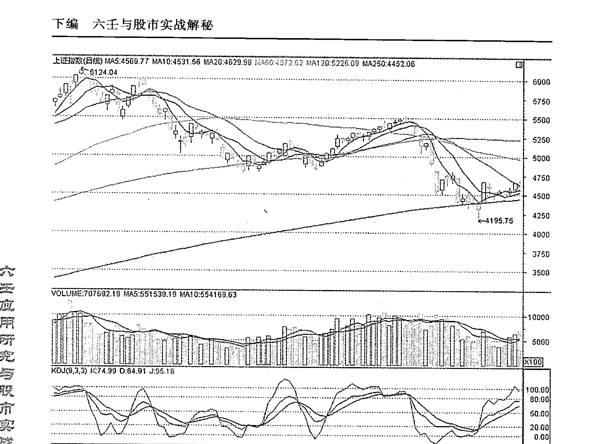

图24 2008年1月12日上证大盘日K线图

## 实例二：一年之计始于春，零八股涨立春头

中国股市走过了2006年2007年两年的大牛市，从2005年6月6日见底的998.23点，一路上涨至2007年10月16日6124.04点的历史高点，它不仅体现了中国经济的良性持续发展，而且更是股权分置改革胜利成果的展现。那么从2007年的10月31日沪市上证指数涨至第二次高点开始调整以来，从宏观面上来看，有流动性过剩说，股市泡沫说，楼市过涨说，次贷危机说，政府调控说，市场过度融资说，大小非解禁猛虎说等有关沪深股市调整的宏观理由之说，初看这些说法也十分客观合理，但是我们研究股市，不光要从表象上观察和探究，更重要的是要从股市的内在机理上分析和把握。

我记得江恩理论曾说过 2 年往往是市场的一个周期，那么面对我们的市场，从 2006 年 2007 年这两年的大牛市的周期来判断，我们不难看出，从技术上讲，目前市场的调整其实就是对江恩理论中关于 2 年周期说的验证，也是对两年大牛市的消化整理，什么流动性过剩，次贷危机等说法只不过是市场的外在表现和周期性走势的外在诱因而已。以螺旋历法来看，以沪市为例，上证指数从 2005 年 6 月 6 日的 998.23 点最低部运行至 2008 年 2 月 1 日 4195.75 点的暂时最底部，整整经过了 33 个月差四天，也就是 970 个自然日，以螺旋历法的 29.53 天为一个月的话，那么 970 天除以 29.53 天等于 32.84 个月，也就是说差 4 天多一点刚好就是螺旋历法所谓的 33 个周期月，这意谓着到 2 月 5 日前后，市场就会真正的见到此轮调整的阶段性底部，同时也会真正的迎来新一轮周期性的开始循环点。无独有偶，2 月 4 日是立春，从时间上讲是江恩 360 度时间圆的八分之一处，也是江恩回调的一个重要支撑位，更是螺旋历法新月焦点的市场引发节变点。我们来看，从 998.23 点到 6124.04 点上证共上涨了 5125.81 点，按照下调至黄金分割比 0.382 处即会遇到强支撑，上证此轮下调应该至，6124.04 减去 1958.05 点（6124.04 -998.23 乘以 0.382）等于 4165.94 点，那么它离 2 月 1 日的最低点 4195.75 点仅仅只差 29.81 点。以上这些不是偶合，恬恬说明我们的市场已经离阶段性的底部不远了，不管从时间上还是点位上，真的就是这几天的事了，也许 4195.75 点就是本阶段调整的底部了。

立春是一年的开始，古人有谚云，一年之计在于春，一日之计在于晨。不管是市场跌破年线从技术上讲要有一个反弹也好，还是易学预测市场在 2 月 4 日立春此日要上涨也好，都说明沪深股市要有一个上涨，来为久已休歇的多头提供一个反攻的契机。从理性上讲，经过此次大幅调整，市场平均市盈率已大幅下调至 25 倍左右，以中石油为例，它 2007 年的每股收益应该在 0.80 元左右，那么它当前 24 元左右的股价已步入当前合理区域，它下跌的空间已不大。所以不管从时间上空间上，市场的理性上，我们都应当确定目前的点位已处在沪深股市的阶段性底部区域了，不管需要二次探底还是三次筑底也好，马上迎来的将是市场的新一轮周期性循环的开始。

2月4日立春日，沪深股市大盘预测：

-   2008年2月4日9时50分
-   戊子 甲寅 甲戌 己巳
-   十二月子将 甲戌旬申酉空

```
蛇 贵 后 阴
子 丑 寅 卯      蛇常玄勾      父 丙子 蛇
朱亥        辰玄      子巳辰酉      财 癸未 空
合戌        巳常      已戌酉甲      兄 戊寅 后
酉 申 未 午
勾 青 空 虎
```

分析：
六壬发用太阳做父母生气必大幅高开上涨，故断该日高开大幅上涨。

实际上，上综指当日高开94.25点，全天大涨351.4点，创历史上沪深股市单日最大涨幅。

实际走势如下图所示：

# 六壬应用研究与股市实战解秘


# 第十章 六壬与股市实战例释

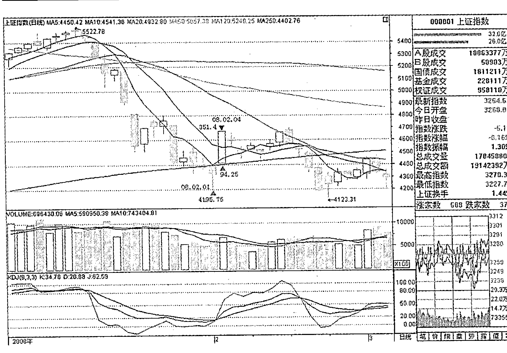

## 实例三：上证大盘综合预测

2008年3月3日周一，时值人大政协两会开幕将会有利好出台之际，但是上周五美股大跌，A股市场自从2007年10月见顶走熊连续下跌，便对周一的走势忧心忡忡，于是我便以上海证券交易所开盘时间起局，预测分析了上证大盘当天的分时走势以及热点板块表现情况，感觉比预期的要好，遂解除忧虑，并结合螺旋历法波浪理论对其后市的走势做了详尽分析，现分述如下：

### （一）上证当日大盘分时走势及热点板块基本面预测分析

2008年3月3日上证开盘时间六壬课：

-   2008年3月3日9时
-   戊子 甲寅 壬寅 乙巳
-   正月亥将
-   甲午旬辰巳空

```
    空  虎  常  玄
    亥  子  丑  寅      玄合空贵    子 壬寅 玄
青戌              卯阴      寅申亥巳    父 丙申 合
勾酉              辰后      申寅巳壬    子 壬寅 玄
    申  未  午  巳
    合  朱  蛇  贵
```

# 分析:

### (1) 当日大盘分时走势预测

开盘看初传，寅为日月建作子孙空方脱气，又乘玄武恶将发用，说明上证开盘必然低开，干上巳旺相空而不空，作财爻上乘贵神吉将，说明股市当天有行情，有国家护盘，中传申为父母多方乘六合吉将主多方人气有聚集，申金驿马父母多方乘六合吉将居支上，作干壬水之长生，结合开盘后巳午时财爻当权，主大盘低开后必然开始振荡上涨，下午未时为子孙寅木之墓神当权，主空方不能做空，多方行情得以维持。

### (2) 当天热点板块预测

支上申为干之长生主创投、开发等专板块，干上财爻贵神主投资信托银行板块，朱雀居未上主医药、食品、板块，支上申为有色金属、钢铁、机械、仪器板块，干上巳为传媒、计算机、电子信息、电力、新能源等板块。
干壬居亥，发用寅上乘玄武主纺织服装、环保、供水供气、远洋运输、湖海水产养殖、农药、酿酒、石油板块，青龙居戌上主化肥、农药、农业等板块。

### (3) 技术面基本面综合易学分析:

上周上证大盘从技术上，下探至以 4165 点左右为强支撑的黄金分割区间一带止跌回升，多方勉强站稳 4300 点一线，距离年线尚有 100 点左右的上升空间，成交缩小，人气涣散，弱势难改。从盘面上看，以中石油为首的大盘指标股有明显救市的痕迹，这也是大盘企稳的主要原因。下周一，中国平安的31.2亿限售股将解禁，加上，上周五美股因美国国际集团巨亏戴尔赢利下滑的影响而大跌的因素，沪深大盘面临的考验将不言而预。但是，从中国股市的走势上具有较强独立性来看，加之两会在3月3日周一当天开始召开的因素考虑，当不会出现过深的下跌振幅。

从易学预测的角度来看，六壬日上贵神，奇门开门宫生日干宫，两盘均显示有政府参与救市，因而不会出现过深的振幅。

实际走势如下图所示：

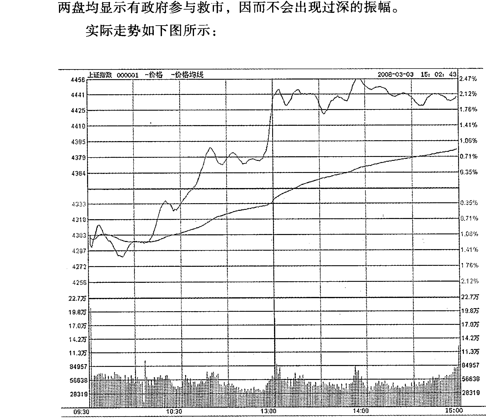

图26 上证大盘分时图

盘后实况公告：## 下编 六壬与股市实战解秘

受上周五美股大跌影响，沪深股市今日早盘低开，两会召开的乐观情绪令投资者憧憬两会出台一些有利于市场发展的措施，沪指在跌破4300点后逐步收复失地并迅速翻红。午后大盘继续稳步上涨，沪指一度涨逾百点，之后维持小幅震荡，收盘大涨89点，涨幅2.06%。两市的成交金额为1863.2亿元，比前一交易日增加约696.9亿元，增幅巨大，净流入约192亿元。

3月3日，沪综指开于4323.70点，较上个交易日收盘点位4348.54点低开24.84点，最高4456.96点，最低4279.35点，收报4438.27点，上涨89.72点，涨幅2.06%。

六壬应用研究与股市实战解秘

中石油今日午盘前出现快速拉高带动指数迅速上涨，市场人气增强，成交量明显放大，创投、环保、新能源、农业等概念股强势上涨，钢铁、银行表现相对欠佳，仍然保持整体上涨走势，市场呈现个股普涨格局。

作为2008年最强势的板块之一的创投板块，今日再度风起云涌，相关个股走势强劲，市场对其追捧有加。盘面上，力合股份、大众公用、紫光股份、复旦复华、钱江水利均强势涨停，水井坊涨8.07%。随着两市创投概念股的再度崛起，市场上另外一个受到关注的交易品种股指期货推出也日益临近，午后，股指期货概念股再度出现直线飙升，与创投概念股联袂起舞。盘面上，中大股份强势涨停，美尔雅、弘业股份、杉杉股份、中海海盛大涨逾5%。

从以上报道可看出，中石油在今日的旱地拔葱是两地大盘上涨的主要原因，沪深股市今日的走势与日本香港亚太股市的走势截然相反，可见预测中国股市，必需要增加一项必要的参考因素，这个因素，我在这里不说，想大家已经心知肚明。

### （二）上证后市走势的螺旋历法波浪理论的周期性循环趋势分析

上证目前正在走大C浪调整浪，从2008年5月5日后，又处在2007年10月16日下跌以来的下跌第五浪之中，下面结合螺旋历法对它的子浪进行详细分析。

依螺旋历法来看，冬至后满月为阳中之阴，逆时序引发市场顶部，冬至后新月为阳中之阳，顺时序引发市场的底部。1月21日阴历2007年十二月十四满月时间交大寒节气，也就是说大寒节气的满月时间左右会引发市场的顶部，果然在1月14日，阴历的初七上玄月头一天，上证B浪触顶5522.78点开始了暴跌，引发了上证下跌C浪中的第一下跌调整浪。2月4日阴历2007年十二月二十八新月前第三天时间交立春节气，会引发市场的底部，果然在立春节气的前一日2月3日，上证见到4195.75点低点，随即在第二日立春当日开始反弹大幅上涨，引发了上证下跌C浪中的第二反弹浪。2月19日是雨水节气，第二天20日是阴历08年正月十四，月圆时间，亦即螺旋历法所谓的冬至后满月引发市场的顶部时间，实际上2月20日上证见到近期反弹的高点4695.8点便逐日开始下跌调整，继而引发了下跌C浪中的第三下跌调整浪。在2月26日阴历2008年正月二十（本月下玄月前第三天），见到下跌的第一反弹低点4123.31点，随后在阴历正月二十七新月头三天时间，也就是惊蛰节气头一天的3月4日，市场被引发出了一个4472.15点的反弹高点。从1月21日大寒左右开始至3月20日春分节气左右刚好2个月60天一个甲子循环周期左右，正好是螺旋历法的2个自然月周期，也正好是江恩2个月调整周期时间，也就是说市场的调整如果在基本面政策面有强支撑时，随时会出现大C浪中的第四浪反弹的概率很大。在3月20日阴历二月十三满月时间春分节气左右，市场会被引发出一个顶部，实际上在3月20日满月前第二天，市场在真空中见到了3857.62点的反弹高点，随后延续了大C浪中的第三下跌调整浪。4月4日阴历二十八新月前第三天时间清明节气左右会引发市场调整的又一个低部，实际上在4月3日阴历二月二十七新月前第四天，市场又一次在真空中见到了3271.29点的近期调整的低点，继续延续了大C浪中的第三下跌调整浪。从1月21日大寒左右开始至4月20日谷雨节气满月日左右，刚好3个月90天一个半甲子循环周期左右，正好是螺旋历法的3个自然月周期，也正好是江恩3个月调整周期时间，也就是说市场的调整如果在基本面政策面也现较强支撑重大利好时，随时会在4月20日谷雨节气的满月日左右，出现大C浪中的第四浪反弹。

果然在4月20日，上证在见到2990.79点的低点后，在4月4日也就是满月日后第四天，财政部、国家税务总局决定从2008年4月24日起，证券交易印花税降至千分之一，随即上证开盘向上跳空高开261.54点，出现了大C浪中的第四浪反弹走势。5月6日阴历立夏四月初一新月日第二天，上证见到此轮反弹的高点3786.02点开始了大C浪中也是去年10月份调整以来的第五浪下调。

实际走势如下图所示：

| 项目 | 数值 |
|------|------|
| 999999上证指数 | 30.0亿 |
| A股成交 | 19956785万 |
| B股成交 | 99916万 |
| 国债成交 | 1124334万 |
| 基金成交 | 225856万 |
| 权证成交 | 1046570万 |
| 最新指数 | 3308.35 |
| 今日开盘 | 3303.38 |
| 昨日收盘 | 3321.01 |
| 指数涨跌 | -12.26 |
| 指数涨幅 | -0.37% |
| 指数振幅 | 1.58% |
| 总成交量 | 186993958 |
| 总成交额 | 20281756万 |
| 最高指数 | 3332.53 |
| 最低指数 | 3280.18 |
| 上证换手 | 1.50% |
| 涨家数 | 475 |
| 跌家数 | 400 |

## 图27 上证循环趋势图

## 实例四：香港恒指综合预测

2008年3月3日周一，正值国内人大政协两会开幕将会有利好出台之际，但是上周五美股大跌，香港H股市场自从2007年10月底见顶走出连续下跌趋势，便对周一的香港恒生指数走势产生疑虑，于是我便动念头起课，以香港股票交易所开盘时间起课，预测分析了恒生指数当天的分时走势情况，感觉比预期的要好，遂解除忧虑，并结合螺旋历法波浪理论对其后市的走势做了详尽分析，现分述如下：

### （一）3月3日香港恒指分时走势预测

2008年3月3日9时，恒生指数开盘时间六壬课：

2008年3月3日9时50分
戊子 甲寅 壬寅 乙巳
正月亥将 甲午旬辰巳空

空 虎 常 玄
亥 子 丑 寅
青 戌 卯 阴
勾 酉 辰 后
申 未 午 巳
合 朱 蛇 贵

玄合空贵 子 壬寅 玄
寅申亥巳 父 丙申 合
申寅巳壬 子 壬寅 玄

### 分析：

六壬对开盘的预测看初传，初传日月建寅作子孙又上乘玄武凶将，结合上周尾盘有下跌，判断必主大幅低开，结果恒指当日低开840.1点，又日干壬上乘贵神财爻，支上又为干之父母长生，大局反吟主振荡，所以可判断，恒指大幅低开后，不会再往下挫，应呈现出低开振荡高收的走势，实际上恒指低开后，全天下跌了746.7点，呈低开振荡走高的态势。

结果：恒指开盘在23491.57点，较上个交易日恒指收盘点位24331.67点，低开840.1点，全天最高点位为23738.67点，最低为23458.95点。恒指虽然全天下跌746.7点，但是恒生指数收盘点位为23584.97点，较开盘23491.57点，上涨93.4点，全天收出阳线。

看到这里，细心的读者不难发现，在同一天用同一个局预测内地A股与香港恒生股市的涨跌截然不同，内地A股上涨了89.72点，而香港恒指却下跌746.7点，为什么这么不同呢，难道用同一六壬课预测出来的结果会自相矛盾不成，其实有心机的读者不难发现，内地和香港股市虽然涨跌不同，但是他们的共同点都是低开高走，收出的都是阳线，涨跌的不同主要是因为各自市场交易主体不同，主导因素不同所造成的，所以大家在预测各自不同体系的市场时，一定要因时因地因具体的参照情况来综合分析，这样才能做到有的放矢，一把钥匙开一把锁，具体情况具体分析，做到准确无误。

### （二）香港恒生指数的螺旋历法波浪走势分析

依螺旋历法来看，冬至后满月为阳中之阴，逆时序引发市场顶部，冬至后新月为阳中之阳，顺时序引发市场的底部，夏至后满月为阴中之阴，顺时序引发市场顶部，夏至后新月为阴中之阳，逆时序引发市场的底部。螺旋历法的实质是探讨月球地球、太阳地球之间的相对运行关系对人类社会的实质性影响，也就是说节气与满月新月日左右的时间，均有可能引发市场的顶和底。

香港恒生指数于2007年10月30日见顶31958.41点，距离10月24日，阴历九月十四霜降节气只有6天左右，霜降当日为螺旋历法的满月，依照螺旋历法夏至后的满月会顺时序引发市场的顶部，那么10月30日距离霜降满月历法日不过6天，可见恒指这次顶部就是由霜降满月历法日所引发，已毫无疑问了。

2007年11月22日的25861.73点，为恒指第一下跌浪的底部，它距11月23日小雪节气满月日只有一天差距，可以肯定这个底就是由小雪节气的满月所引发。2007年12月7日的29962.93点，为恒指第二反弹浪的顶部，恰巧该日是大雪节气新月日，那么12月7日的顶部就是由大雪节气的新月所引发。12月18日的26093.96点，为恒指第三下跌浪的底部，它是由位于12月22日的冬至满月所引发。依此分析，我们就会看到，2008年1月6日小寒节气的新月引发了恒指的第四反弹浪的次高点，2008年1月21日大寒节气的满月引发了恒指第五下跌浪的底部，3月5日惊蛰节气的新月引发了恒指的反弹A浪的次高点，恒指继而开始了B浪回调，3月20日春分节气的满月引发了回调B浪的底部，恒指开始了C浪上涨。从以上分析，我们看到，恒指波动的高低点往往出现在节气或节气附近的新月或满月，结合波浪理论，很容易，我们就有可能准确把握恒指的走势。从MACD日线技术指标来看，很明显，恒指日K线与MACD出现底背离，说明恒指已完成一个五浪下跌三浪反弹上涨的周期，接下来，很可能展开一轮新的周期性循环走势。

奇门六壬所依赖的节气历法，同样被螺旋历法所应用，节气历法的实质是宇宙时空的坐标，节气历法年复一年的重复性本身反映了宇宙运行的周期性，它所包涵的信息元，不论奇门六壬易学能够解读，螺旋历法江恩波浪理论也照样可以解读其奥，这些特征无疑都在揭示宇宙信息元的全息性和周期性，由此我们可以认识到宇宙的全息统一周期性，是股市乃至整个人类社会的发展变化的终极原因。

## 实例五：我国台湾股市综合预测

### （一）台湾加权指数的历史走势

1990年2月，台北股市从最高点12682点一路崩盘，一直跌到2485点才止住，大盘在8个月内跌掉了10000点，跌幅高达80%。

全世界的股市都一样，宏观经济的持续增长、本币升值的强烈预期以及外围资本的大量涌入，构成了发动一轮大牛市的背景。当初的台北股市正是在这样的环境下，迈开了牛市的第一步。

当时台湾经济已实现连续4年平均9%的高增长，除了财政储备增长，民间收入也大幅提升。那时，岛内居民工资收入增长很快，年底的奖金分红更是丰厚。一般公务员年底可以领到1到2个月的额外薪水；一些普通行业的工人，年底一般可以多领3个月工资；一些垄断行业以及那些高速扩张的行业更是不用说了。当时全民皆股，投资变成投机，这股投机风潮方兴未艾，不管资金面、市场面或是心理面，而政策面也表现出默许态度。

由于新台币的升值预期，海外“热钱”大量涌入岛内，在居民财富增长作用下，当时台湾土地和房地产价格在短时间内翻了两番，一时间，岛内可以说是资金泛滥，巨大的资金流贪婪地寻找各种投资机会，而股票市场就成为一个最大的“蓄水池”。

指数从一千多点狂涨到一万两千多点。在当时大涨的过程当中，开户的人数从五六万人暴增到六百万人之多，可以说是全民皆股。那时几乎是买什么赚什么，因此在整个狂涨的过程中，日子都非常非常的好过，买错了股票，只要肯拿住，后来都是赚钱。因此当时消费类行业包括餐饮和百货公司，生意都非常非常的好，没有嫌价钱贵，只是看喜不喜欢而已。

为抑制股市泡沫，1988年9月，台湾相关部门出台准备征收资本利得税的政策。这个大利空让指数从8813点连跌19天到4645点。然而，由于当时台北股市投机盛行，很多人都已经处于疯狂的状态，台湾有关部门征收资本利得税这一“撒手锏”没有起多长时间的作用，台指就重新抬头，继续一路“高歌猛进”。——这是典型的牛市特征，对利空不敏感直到麻木，甚至把利空当作利好去炒作。

离谱的是，一只银行股票在泡沫最高峰时，总市值竟是包括摩根大通、美洲银行、富国银行等5大银行市值的总和，而其净利润只有这五大银行的5%。

到股市崩盘前的1989年最后一个季度，台股平均市盈率达到100倍，而同期全球包括新兴市场在内的其他市场市盈率都在20倍以下，当时的台北股市已经谈不上什么投资价值。

截至到现在，台股至今也没能够收复失地，十多年前的“伤口”一直留到了现在。

现在我们同样也关注一下股灾开始之后的极具毁灭性的下杀见底的位置以及反弹的高度。台指从12682跌到2485，用时8个月，之后的反弹从1990年10月到1991年5月，耗时7个月达到6100点，反弹高度为145%。

### （二）未来台湾加权指数反弹高度的周易预测

台湾的易友兔兔小次郎因父亲热炒台股期指不利，通过MSN请笔者为其预测，笔者以免兔小次郎在MSN上请我对台股做分析预测的时间起局分析如下：

2008年12月4日14时
戊子 癸亥 戊寅 己未
十一月寅将 甲戌旬申酉空

蛇 贵 后 阴
子 丑 寅 卯
朱亥     辰玄
合戌     已常
酉 申 未 午
勾 青 空 虎

玄勾空蛇 财 丙子 蛇
辰酉未子 兄 癸未 空
酉寅子戊 官 戊寅 后

### 分析：
1. 土败于酉，木败于子，日辰上交互相加，为我孟败他，他先败我。干戊上子为支寅之败神，子又为财神，乘螣蛇凶将，说明你父亲投资失败，资金有亏损被套牢，心情郁闷。干上子财，乘蛇也主你在学习奇门六壬金融证券数术预测。
2. 以干为台湾股市，干上太岁子财做支之败神加干，干上又乘螣蛇凶将，主台湾股市败落市值缩水较大，走势低迷前景不明。
3. 支上干之败神克支，又乘勾陈凶将，主台股跌幅较深，投资者的投资多有失败。
4. 明年已丑年，丑上乘青龙财神，丑上申为驿马，总合历史走势综合来看，台股在明年会出现较大的振荡反弹行情，丑数8，申数7，申加丑相叠为56数，可判断加权指数反弹高度大约会在5600点以上，8000点以下。

### （三）2008年12月22日台湾加权指数当天走势预测

台湾的易友兔兔小次郎在我处购书后，看到12月22日台湾加权指数的开盘走势，疑惑不解，当时通过MSN就问：请测12月22日台湾加权指数的走势，吾随以其发问时间也就是开盘时间起课预测分析如下：

2008年12月22日9时7分
戊子 甲子 丙申 癸巳
十一月丑将 甲午旬辰巳空

朱 合 勾 青
丑 寅 卯 辰
蛇子     已空
贵亥     午虎
戌 酉 申 未
后 阴 玄 常

蛇青阴朱 官 庚子 蛇◎
子辰酉丑 财 丙申 玄
辰申丑丙 子 辰 青◎

### 分析：
1.  开盘看干上及初传发用，月将太阳加干丙上，乘朱雀吉将，初传子作太岁发用，巳时开盘，巳为日之德禄，因此可判断开盘必主高开。
2.  中传申财乘玄武恶神，主行情中途转而向下，三传合润下之鬼局，课逢润下之格，主当日以下跌调整走势为主。
3.  末传辰作子孙，又逢空，主午后下跌，辰上青龙主有反弹，末时收盘，末为日之子孙脱气，收盘必收跌。
4.  从交易时间看，上午巳时为干之德禄，主高开后有上攻，中传申财乘玄武，必主行情在上攻后反转转向下，午后未时，未为子孙脱气，末传逢空，未时必跌。
5.  课逢润下之格，在弱市中当以盘整下跌来判断。12月21日周日为冬至日，20日周六为农历十一月二十三日下玄月甲午日，因螺旋历法冬至节气与甲子周期六甲日为证券市场变盘的周期性敏感时间点，所以结合以上几点综合判断，分析台湾加权指数不仅当天会高开低走，走出大幅振荡调整下跌走势，而且还会从此进入一个新的调整循环周期。

中新网12月22日电：据台湾媒体报道，台北股市今日与多数主要亚洲股市同步开高走低。台股加权指数一开盘攻上4750点，一度突破60日线，但随即遇压拉回，由红翻黑，终场以4535.54点，下跌158.98点作收，成交量缩小至671.53亿元新台币。

全景网12月22日讯：台湾股市周一大幅收低，台湾电子龙头企业鸿海领跌，因鸿海董事长郭台铭表示景气比想像还要坏3倍。台湾加权股价指数收低158.98点或3.39%，报4535.54点，为12月12日以来最低收位。

## 实例六：A股重上3000点之测

### （一）世界股市调整的历史回顾

兹引述有关成熟资本市场的历史经验如下：
（1）日经指数的调整。

1986年，日本经济走势平稳，由汽车、电子、集成电路等行业带动，实力逐渐增强，至80年代末，日本汽车已称霸全世界，日本的产业在西欧、拉美遍地开花，几乎所有的国家都逼伏在日本强大的经济实力之下。1986年12月开始的不同寻常的经济繁荣被称为“平成景气”。日经指数由1983年的7000多点持续上升，在1989年12月19日达到38915点，较1983年最低点上涨了接近6倍，大批的股指沽空期权终于开始发威。高盛公司从日本保险业手中买到的股指期权被转卖给丹麦王国，丹麦王国将其卖给权证的购买者，并承诺在日经指数走低时支付收益给“日经指数认沽权证”的拥有者。该权证立刻在美国热卖，大量美国投资银行纷纷效仿，日本股市再也吃不住劲了，到2003年4月最低跌至7607点。累计跌幅高达80%，创造了日本股市历史上最大的下跌幅度。房地产连续14年下跌。整个国家的财富缩水了近50%。目前的日经指数仍然只是在15000左右徘徊。这场股灾几乎将日本几年来的成就全部毁灭。它在日本引起的恶性后果可比于美国30年代的大萧条。

现在我们需要关注的，是股灾开始之后的极具毁灭性的第一波下杀见底的位置以及反弹的高度。1992年1月，日经指数在16000点位置获得支撑，从顶点38915计算下跌幅度，是58.89%，随后引发技术性反弹。

## 下编 六壬与股市实战解秘

报复性反弹，高点为22500左右，反弹高度为40%。日经指数的上涨花了6年时间，跌到16000则花了两年时间，目前的A股则是上涨6倍花了29个月，下跌至2990点也就是51%左右时，用了6个月左右，才遇到支撑反弹至3776点，反弹高度为26%，按比例来说，时间周期则被浓缩。A股从6124点下跌至1664点的最低点用时10个月左右，跌幅达72.8%，快达到日经指数当年80%的跌幅。下面我们来看时间周期相近的案例。

### (2) 道琼斯指数的调整

如图：

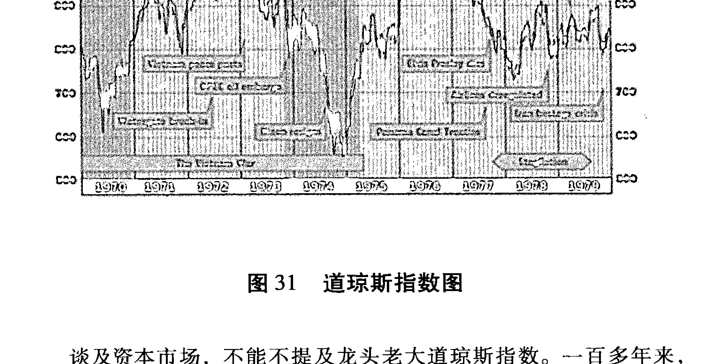

谈及资本市场，不能不提及龙头老大道琼斯指数。一百多年来，随着资本市场的不断发展，道琼斯指数已经成为这个市场的标竿。上图是1973-1974年的回调整理图，可以看到从1973年6月的1067点到1974年12月时，道指已经一路下跌到577点。跌幅为46%，用时一年半。但是在随后的15个月内，也就是1975年3月，道指重回1000点上方，涨幅为88%。

道指 2001 年 1 月从高点 11908 开始调整，到 2002 年 10 月的 7181 点见底，跌幅 40%，用时 22 个月，之后一路上扬至 2007 年的历史最高点 14198，涨幅为 97.7%。

### (3) 台湾加权指数的调整历史

见实例五，我国台湾股市综合预测中，“（一）台湾加权指数的历史走势。”

### (二) 比较世界股市的调整经验，可判断未来上证的反弹空间在 3000 点以上

在资本市场上，历史总是在不断的重演，当然，不会简单的重复。中国既不是日本，也不是美国，中国有自己的国情。但是，它山之石可以攻玉，上述例子可以告诉我们，目前的位置，从技术分析来看就是底部区域，最起码，也是一个中级底部。

- （1）A 股与日经指数的暴跌作对比，72.8% 的跌幅与日经指数 80% 的跌幅相差无几，日经指数大跌 80% 后，第一个报复性反弹高度为 200% 以上，我们可以期待一个中等级别的反弹，高度起码在一倍以上。
- （2）A 股与台湾加权指数的暴跌作对比，这方面上面我们已经对比得比较详细，台湾加权指数的疯狂炒作程度是大大超过我们 A 股市场的，因此跌幅高达 80%，但是随后的反弹幅度也是惊人的达到了 145%，我们虽然暴跌了 72.8%，不及台湾加权指数的跌幅，但由此我们也可以期待一个 1 倍以上的较大级别的超级反弹。

日本和我国台湾两个市场，在反弹之后才步入真正的漫漫熊市，请记住，是在反弹之后！为什么进入熊市，根本原因是经济真正进入漫长的衰退期。中国经济进入衰退期了吗？这是个复杂的问题，第一，我们对中国经济还是长期看好的；第二，即使中国经济真的进入衰退期了，我们的 A 股市场也绝不会在 10 个月暴跌 72.8% 的状况下连个 30%～40% 高度的反弹都没有，就进入熊市！我们无意评论政策对股市的影响，只知道股市涨过头了自然会跌，跌过头了自然会涨，这是客观规律，只要股市存在下去，这个客观规律就不会变。

下编 六壬与股市实战解秘

(3) A 股与美国道琼斯指数的暴跌作对比，A 股暴跌 72.8%，远未达到道琼斯指数暴跌的 80%，这一对比无疑是乐观的。如果对于我们民族复兴有信心，如果对于我们国家经济发展有信心，现在确实可以买入了。历史证明，牛市中的任何一次暴跌事后看都是最佳的建仓机会，对比道琼斯两次 40%以及 46%幅度的回调，我们的股民太幸运了，能在大规模牛市的过程中等到 72.8%的深度回调从而廉价买进优质的股票。那么这次调整结束之际就是反转行情的开始，A 股将在今后的若干年里会以慢牛形势不断创出新高。

(4) 由申劲松的牛市每5年上涨一个台阶500点，牛市每次高点为1733点的整数倍，我们可以判断出来，上证大盘在未来至少会反弹至1664+1773=3437点左右。

### (三) 上证指数反弹的六壬预测

2009年2月6日周五，农历己丑年正月十二，是此年立春后沪深股市第三个交易日，当天上证收出自2008年10月28日低点1664.93点以来的反弹新高2181.24点，成交量也同步放大，由于其是在熊市途中的带量反弹新高，我犹豫大盘后市还能否持续反弹，便于当晚10时多起奇门局，对上证大盘指数后市走势进行了分析研究，发现后市走势十分乐观，上证指数有重上3000点，甚至有超越3400点的希望，与借鉴世界股市调整反弹的历史经验分析不谋而合，就打消了顾虑，开始谨慎看多。实际上沪市从2008年见到1664点低点开始反弹，从寅月开始到未月经过6个月的上涨，涨幅达一倍以上，见到3478点的顶部后，开始暴跌下调。当时在熊市趋势及空方情绪占据优势的情况下，为了谨慎其间，未公开这次预测结果，现将当晚六壬课分析过程详述如下。

> 公历2009年2月6日
> 己丑 丙寅 壬午 辛亥
> 正月子将 甲戌旬申酉空
>
> 合 勾 青 空
> 午 未 申 酉
> 朱巳 戌虎
> 蛇辰 亥常
> 卯 寅 丑 子
> 贵 后 阴 玄
>
> 青勾阴玄
> 申未丑子
> 未午子壬
> 官 丁丑 阴
> 子 戌寅 后
> 子 己卯 贵

分析：
（1）为什么说经过分析研究，发现上证后市走势十分乐观？
朱雀与财爻为行情，朱雀居巳上在寅月旺相，财爻午火居地支在寅月也旺相，说明有行情，干上乘太阳子水旺神，初传太岁丑发用，遁出丁神作财爻，说明今年股市有行情，三传进连茹说明行情步步向上前进高升。
所以说经过分析研究，发现上证后市走势十分乐观。具体分析每月行情如下：
寅月上居卯乘贵神，辰月上居巳财乘朱雀吉将，巳月上居午火财爻乘六合吉将，午月上居未土空方子孙寅卯木之墓地，未月上居申金父母干之长生，又乘青龙财星，但申金为驿马逢空亡月破，主行情加速空涨有破散之象，见青龙有到头之象。申月上居空亡之酉金乘天空凶将必下跌。综合看，从寅月至未月为上升行情，申月见月破天空凶将空亡之神必下跌。
（2）为什么说上证指数有重上3000点，甚至有超越3400点的希望？
朱雀为大盘指数，朱雀居巳上在寅月旺相，巳为4数，结合上证反弹至少达到一倍以上的预测，那么可判断上证指数应在3400点以上，干上子水为帝旺，子上丑为8数，可判断上证最高涨幅不会超过3480点。
据此判断，所以说上证指数有重上3000点，甚至有超越3400点的希望。

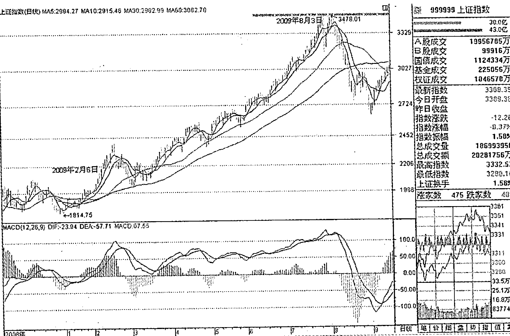

图32  2009年2月至8月上证指数反弹上涨日K线图

## 实例七：暴跌必反弹，不逃必被套

2009年07月29日，沪市大盘于3419.99点低开后一路下行，至下午14时左右开始大幅暴跌跳水，一度下跌达280多点，盘中连破3400点3300点3200点三大关口，市场陷入恐慌，尾盘14时25分左右在石化双雄等大盘权重股拉抬救护下出现反弹，最终全天上证股指暴跌171.94点，跌幅达百分之5。我于当天14时50分起奇门六壬局预测分析后市走势，发现上证后市必然会产生反弹，但是反弹不久后便会出现大幅连续暴跌中线调整行情，结果上证股指连续反弹3天，见到3478点新高，在股评人士的一片叫好声中，开始了连续向下暴跌，直至跌破3000点还未出现象样的反弹行情。下面将判断分析详述如下。

公历2009年7月29日
己丑 辛未 乙亥 癸未
六月午将 甲戌旬申酉空

```
勾 青 空 虎
辰 巳 午 未     玄阴朱合    财 甲戌 阴
合 卯       申 常   酉戌寅卯    官   酉 玄◎
朱 寅       酉 玄   戌亥卯乙    官   申 常◎◎
丑 子 亥 戌
蛇 贵 后 阴
```

### (一) 六壬分析

#### (1) 为什么说上证后市必然会产生反弹？

干上卯禄主股市已到顶，卯加辰上，辰为5数，主大盘最高点位为3500点左右，初传戌财乘旺气发用，课见魁渡天门，也说明目前行情太旺有见顶遇阻之象，初传戌为5数，也为3500点左右，今日暴跌还远未靠近3500点，那么初传为短线行情，初传戌财旺相发用，主有短线反弹行情，子丑日为周六周日休市不交易，寅日上居太岁丑作财爻主上涨，卯日上居寅木临官乘朱雀吉将也主涨，辰日上居干之卯禄乘六合吉将也主涨，巳日子孙当值，上又居辰财罡星乘勾陈凶将主上涨受阻，辰为5数，故此日有见到3500点左右的可能，午日子孙太阳当值，上又居巳火子孙脱天将青龙主跌，未日墓神当值，上又居太阳午火作子孙，乘天空凶将必主大跌，申日上居未土干之墓神乘白虎凶将主暴跌。

从以上分析看，8月1日、2日、3日，即寅日卯日辰日为反弹上涨，4日即巳日盘中见顶开始出现阴K线吊线，5日、6日、7日，即午日未日申日开始了暴跌。

三传戊酉申退连茹，末后两传酉申逢空，毕法有踏脚空亡进用宜，应用于今日非常相似，午后大盘大幅下跌后，市场下档无支撑和承接

六壬应用研究与股市实战解秘

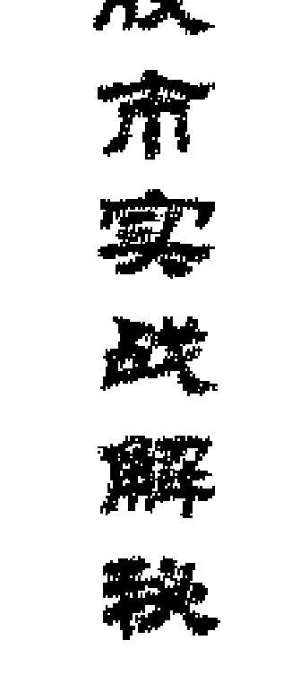

#### (2) 又为什么说反弹不久后便会出现大幅连续暴跌中线调整行情？

干上卯禄主股市已到顶，卯加辰上，辰为5数，主大盘最高点位为3500点左右，初传戌财乘旺气发用，课见魁渡天门，也说明目前行情太旺有见顶之象，戌为5数，也为3500点左右，三传退连茹，说明股市将会回调下跌，三传戌申酉会西方金局鬼局大凶，主必然会大跌，申月上居未土为干之墓神，又乘白虎凶将主申月会暴跌，说明申月股市必将出现大幅振荡下挫行情。朱雀为行情点位，朱雀加寅上，寅下卯，寅为7数，卯为6数，那么说明在申月，上证必然会暴跌到2600点至2700点一线方能见底。

所以说反弹不久后便会出现大幅连续暴跌中线调整行情。

### (二) 螺旋历法江恩波浪理论分析

从螺旋历法看，自2008年10月28日上证见底1664点起涨至今天7月29日，整整9个月，9个月的时间天数大约是神奇数字89的平方根与29.53天的乘积，正好符合螺旋历法对市场的判断周期。从2007年10月16日市场下跌至2008年10月28日见底大约用了12个多月的时间，从2008年10月28日上涨开始至今天，市场大约所用的时间为12个月乘以四分之三，大约等于9个多月，正好符合目前的上涨周期9个月左右，也正好与江恩的四分之三压力时间周期相吻合。简单的说，今日为六月初八上玄月日，是市场回调的时间窗，昨日为甲戌日六甲敏感时间窗，深市也与昨日见顶，综上所述，此次放出天量的巨幅调整，从技术上讲已完成了反弹上涨周期，从浪形上讲，如果2007年10月至2008年10月的下跌浪为A浪的话，那么从2008年10月28日反弹至今天7月29日的这一浪就是B浪，接下来应该运行的是下跌C浪。又如果2007年10月至2008年10月的下跌为五浪下跌，

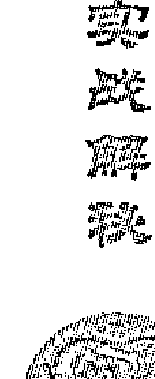

## 第十章 六壬与股市实战例释

那从2008年10月28日反弹至2009年7月29日的这一浪就为反弹A浪，接下来运行的将会是调整B浪。

### (三) 基本面分析

沪深两市的基于流动性充裕催生的年内最大的一波反弹行情，被今日放量达4300多亿巨量的170多点长阴线击溃，创造了沪深股市历史上空前振幅和黑色星期三，让我们永远记住这疯狂的一天。年初到现在央行共投放信贷市场的资金达8万亿之巨，远远超过同期放贷的两倍以上，世界各国为了较快的摆脱金融危机所带来的经济衰退，纷纷向实业经济投放流动性，以缓解和恢复经济面上的疮痛，由此而引发的负面影响就是潜在的通胀，各国股市也因美联储向市场投放1万亿的流动性而出现较强劲的反弹走势，其中尤其以中国股市为最，其要么跌个底朝天，要么不顾经济面上的危机而涨个没完没了。此次在央行启动票据发行以回收流动性，第三季度开始减少流动性信贷投放，严查信贷资金入市，开启IPO和创业板的共同夹击下，沪深A股终于招架不住，开始出现大跌，应验了我在月初做出的上证会在3300点到3400左右出现振荡调整的预测。期间多头主力多次发动中石化中石油钢铁煤炭券商有色房地产银行等大盘权重股以诱多，但每次出货都因盘中缺乏承接盘，而不得不盘中再度拉起继续诱多，今天主力借中国建筑大盘航母上市交易，往日新股上市多遭暴炒的时机下，早盘趁机出货，下午跳水，尾盘又拉起，以利来日拉高继续出货。从以往的经验看，天量调整过后，市场往往会出现反弹，反弹仅仅是反弹，从技术上讲，牛市的确认只有从月线的MACD快线两次上穿慢线后，才能形成稳定可靠的大牛市，目前并未形成二次上穿的形态，所以目前言牛市尚早，做为投资者，应该清醒的认识到目前的行情已步入调整周期，而不要轻信所谓的大趋势未有改变，市场后市还有新高的论调，而是应把握反弹机会，选好品种和时机，即时快进快出，短线操作为主，保护战果，等待调整振荡结束，再行布局为好。

实际走势如下图所示：

## 六壬应用研究与股市实战解秘

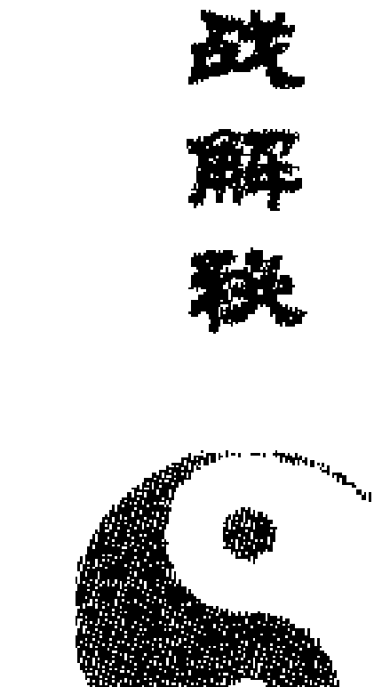

## 下编 六壬与股市实战解秘

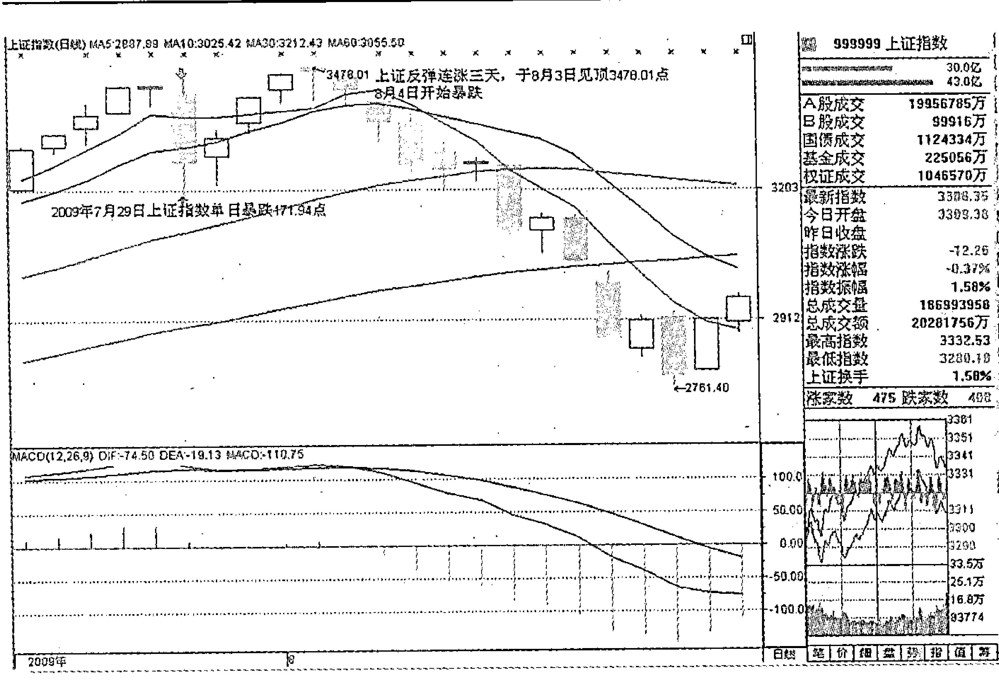

## 图 33 上证暴跌后连续反弹 3 天见顶 3478.01 点后暴跌 K 线图


## # 第十一章 最后的预测

## 一、要投资还是要赌博？——价值投资是根本

大家知不知道一个企业从创建开始，从理论上讲必须每年赢利至少百分之 10 才有投资的价值这个道理吗？也就是说，投一个企业或项目，成本收回的时间周期不应超过 10 年才是最合理的投资。为什么企业要把赢利设在百分之 10 以上才可做，是因为它存在有很大的风险，相比较存银行就没那么大的风险了。那么在二级市场上加上人为炒作的因素，要投一个企业，就是要分析这个企业所对应的二级市场上的股价，在投资购买后，是否会在 15 年内收回成本，即市盈率是否超过了 15 倍，这就是投资股票的根本原理。在中国百分之九十以上的大多数投资人所购买的股票，都难以在 15 年内收回自己的成本，换句话说都在做投机，就是在冒险跟赌博，可自己却根本不知道。

炒股票，估值是最重要的，它决定你从二级市场上以多少价格来购买股票才是合理的。估值往往是按业绩和市盈率来定的。所以你投那只股，就要根据业绩和市盈率来投。业绩和市盈率怎么算出合理估值的？在二级市场上就是你的投资成本收回的时间周期不要超过 15 年，也就是你每投一元钱给所投的上市公司，这一元钱要收回来的时间周期最好不要超过 15 年。目前世界上大多数股市的动态市盈都在 15 倍左右，都在合理的投资价值区间，只有我国等少数新兴股市的市盈率在 20 倍以上，所以充满了投机气氛，也为投资者布满了投资陷阱。

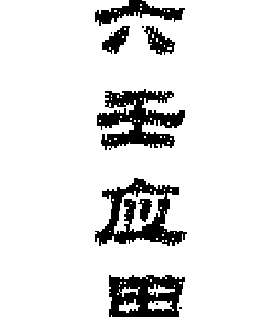

## 下编 六壬与股市实战解秘

举个例子，比方中石油，大家知道它0.75 元的业绩，10 倍市盈率代表你投它会在 10 年内收回成本。在二级市场上加上浮动炒作的成分，15 倍对它最公平，也就是说你投它买它的股票，最好在 15 年内收回成本才合理。在中国，20 倍的市盈率显然是高估了它。15 倍的市盈率的话，那它在二级市场上所对应的股价应在 11 元左右才最为合理。也就是说，在二级市场上你每买一股中石油所花费 11 元左右的钱，就得 15 年才能收回，这时它的股价在 11 元左右才是对应的买点，对它来讲才是最合理的投资。

0.75 元的每股收益，一般的你投它最好不超过 15 年就能收回本钱才好，那么它对应的股价就应是 11 元左右，超过 15 年的回收期就不合算了，所以香港的才 10 元多，国内的 18 元左右，市盈率 25 倍左右，显然估值不合理，股价偏高，没有投资价值。那有些朋友说，好多投资者是在 45 元到 48 元购买的，那难道中石油就没有投资价值吗？这个是一个业绩未来预期增长的投资方法，说到底是在投机和冒险，并不代表合理的投资价值，所以它从 48 元一直跌到现在的 18 元左右了，从市盈率看，它还没跌到合理的投资区间，还有下跌的空间。

早几年宝钢 2 元时，没多少人买，可现在看到 10 多元甚至 20 多元了，还在涨，想捡便宜，根本不判断自己是在投资还是在冒险，结果可想而知。这个道理好多人在说给他时，他很明白，可在买股票时，他就糊涂了。巴菲特就是根据这个十分简单的道理来买进和卖出中石油的，因为股价是围绕企业的赢利发生上下波动的，世界经济不好了，企业的赢利就会下降，股价也会下降，老巴就是这样做的，只不过他比别人早做一步罢了，他难得的是他能做到，别人做不到，是因为大多数的人觉得，自己的运气不比老巴差，所以要买比老巴更冒险的股票。


证券市场总是垂青那些老实本分的价值投资者，对那些敢于冒险的勇士总是给予无情的打击和报复，炒股的人能明白自己在投资还是在冒险赌博就行，买股前算一下，就知道自己在投资还是在冒险赌博，就不会把买股投机做成老股东，把老股东做成冒险家了。一个市场的市盈率太高，做企业的基础就没有了，相当于在玩泡沫，在赌博，就很危险。这次下跌有人说是政府在默认，我看是的，其实质就是价值回归，就是要大家别玩泡沫，搞点实际的，投点资，这个明白了，我想以后大家买股时，会有赢利的。

## 二、准确掌握价值、时间、空间三个投资周期才是金融证券市场上的致胜法宝

## 六壬应用研究与股市实践解秘

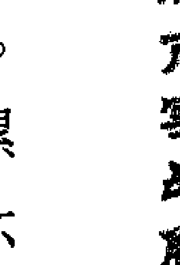

价值、时间、空间三个周期是投资任何金融证券市场所要研究的根本话题。

价值周期是投资分析金融证券市场的基本法则，时间与空间周期的投资分析则是为寻找最佳的买卖时机和点位提供一个良好的介入点。

如果说宏观分析为金融证券投资市场提供了可靠的价值分析，螺旋历法就是从时间上精确解决了金融证券投资市场的周期性时间循环趋势，江恩理论则是更擅长于从空间上综合分析研究金融证券投资市场的周期性循环趋势，而波浪理论更加从形态上较好的分析把握了，金融证券投资市场的周期性循环的具体运动表现形式，那么周易大六壬的天文立体动态数理模型，就是螺旋历法江恩理论波浪理论分析把握金融证券投资市场的总合。

周易大六壬的天文立体动态数理模型，它不仅是天体宇宙的微缩，而且更重要的是，它无时不刻的反映着与人类社会活动密切的各种周期性预知信息，反映在金融证券投资市场领域，就是它对价值周期时间周期空间周期的准确预知和把握，因而能从抽象的分析角度为我们提供可靠的投资买卖信息。由本书中所提供的理论与实践，足以证明，周易大六壬的天文立体动态数理模型，是掌握价值、时间、空间三个投资周期的最佳抽象分析工具。

## 附录(转载):

## 易学在华尔街的应用—3175.9%

张延生、龙卫权

1997年11月12日～1998年2月12日期间，在我将张氏理论用于外汇期货的一个实验里，进场38日，共进行66次买卖，结果是45次获利，21次损失，我所运用的买卖资金，增长共3175.9%。

就是说，短短的三个月期间，投入的10000.00美元，已升值为327590.07美元。

这些实验包括了对损失的承受，即测试巨额损失对定力、判断力和思维的干扰和影响；故意反方向，找出并等候到其底线，以确定正数和负数时候的分别；多个账户的同时操纵，人为地使某些账户盈亏参差，总和后仍然盈利，以便在日后需要时可以使用；提前预定多个指令，曾试验过在同一户口一次预定40次交易的指令，这批指令后来需差不多15天才全部执行完毕，结果是令人振奋的。

我发现：盈利对思维的干扰和影响，远远大于损失。正所谓高处不胜寒，大有大的难处。此干扰和影响的比例大约为3:1，即盈利1倍时的干扰和影响相当于损失3倍时的干扰和影响。亦是说胜利比失败更难以应付，正所谓利令智昏，财迷心窍！所以我是以如履薄冰的心理去迎接胜利的。

同时，亦深深体会到易学的精深，比如说当卦象提示是可以在什么价位成交（虽然是事实），当有“是否”的意念一闪，因为与市场的方向相反，且相距大于1000点，从6957跃升至7960（日元期货），亦仅仅是那么一念而已，马上就乱套了，自己亦觉得好笑，

> > “初噬告，再三渎，渎则不告”

就像血癌病患者，相同的病情，成年人和小童治疗难度的比例是9：1，因为成年人太多思维了，而小童则天真无邪、无忧无虑、没有经验、不会怀疑，所以治疗时很轻松，远比成年人容易；或者像醉酒之人，如果从行驶着的车上跌下，或从高处坠地，其生存率将会远远高于其他常人，因为其无恐惧、不知害怕、不会挣扎、手脚不动，是标准的自由落体状态，所以大部份的时候是下肢先着地，受伤多为下肢，不会危及生命（人体以下肢的比重为大，重量远大于其他部位；而头部、胸部和腹部多有空腔的部份，比重较轻）；且人类/生物有其与生俱来的求生本能，这种本能只有在无所畏惧，或无所思、无所虑的状态下才能发挥出来，这是大部分的一般常人可望而不可及的，也是众多的修炼者所梦寐以求的，而醉酒之人则在不知不觉之中，刚刚好地、恰如其分地做到了这点。

或者说，他们没有太多的主观干扰因素。

我平时在下买卖的指令时，习惯给多3点的缓冲时间，即指令在到达波谷或波峰之前3点，以保证指令可以被执行，因为经纪执行指令有时间上的延迟，如果我可以直接下单的话，连这3点都可以省免，这样就可以把成交点放在波谷或波峰上了。

这些实验纯粹是使用易学的知识，与期货知识无关。因为我是从医出身，以前对期货和金融完全没有概念，就算到今天，对那些艰涩的术语还是莫名其妙，包括货币之间的换算、基差、套期保值和交叉盘，等等。

好在我所作的交易，价格的定义，完全不需要这些基本知识，这些术语对我完全无关紧要，可有可无，不知道还好，少了一重干扰，免得自寻烦恼。

当使用易学的知识对某一样事物作判断时，对此事物的理解和知识越少越好。如果对此事物有某一程度认识，虽然是可以抗拒其干扰，但潜意识里多多少少还是会/有可能存在着某些影响，至少会增加多一点麻烦，因为要人为地排除其干扰（这亦是为什么一般人不算自己的事情的原因之一，除非是水准相当高）。

> 从此可知“难得糊涂”的境界，亦是“无所为，而无所不为”。

这些实验亦并没有使用任何金融新闻。虽然我亦尝试过分析七国高峰会、格林斯潘的言论等，但结果是一塌糊涂，因为这也是一种人为的干扰，真真假假、假假真真，连抗拒都来不及，还要引进？所以一早就放弃了。

在我购买的金融资讯中，仅仅是数字和曲线对我有用——报价而已。笑话：我曾经查询过看看可否把新闻资讯从我订购的金融资讯中删除，因为这除了可以减少干扰外，还能使我减免不少费用（在金融资讯中，新闻资讯是最昂贵的）。

试验表明，金融市场亦与其他的事物一样，是有规律可循的、可以预测的、可以计算的，并且可以准确地、零误差地捕捉每一个波谷和波峰的。

金融交易仅仅是需要一个价格而已，需要一个准确的，还未出现在电脑报价系统上的价格（虽然此价格已经出现，已经存在）。

就像自然界中的其他暂时尚未被人们认识的事物一样，早就存在着了，不会因为人们不知道它的存在而不存在；或者像星星的运行一样，是有迹可循的，不会因为人们的无知而停止运行或者消失，这点是不会因为人们的意志所改变的；或者像我给别人所作的房屋估价，我需要/可以准确地判断这所房屋的价格是多少才是最公平的，因为如果要价高了，此客人没钱买，成交不了，就不成价格了（如果此客人走后，短期内市场无人问津的话；或下一个/以后的客人出的价均低于此客人的话），要价低了，对房主不公平。所以，刚刚好，双方均可以接受的价格才是最佳的价格；同时此价格必须是在房主可以接受的这段时间内，市场上可以达到的最高价格。亦是说此估价不仅要考虑到房屋本身的价值，还要考虑到市场上的价值。使用易学就可以轻易地解决这些问题。

张氏理论包含：场理论、宏观理论、整体理论以及本质规律性的矛盾统一。

张氏理论认为：任何事物均有规律性存在，不管范围再大再小，都是有规律性的，而且这种规律有主要矛盾和次要矛盾，只要抓住主要矛盾，其他的次要矛盾就很容易处理了。不管你的问题再复杂，我把主要的、本质的抓住了，你的问题就跑不出这个规律了。而西方的方法则往往是胡子眉毛一把抓，不突出主要的，把真正的规律都忽视掉了。

张氏理论同时认为：中华文化是长远、宏观、整体地看问题的，根据具体的情况，作出具体的判断，没有死格式。如果市场变化万千，你没有变，不随着环境变，而是死格式，就得被淘汰。现在西方的理论都是固定的模式、固定的逻辑，其很多市场的方法并不很理想。如果人们都用这些固定的理论，固定的逻辑，都能掌握规律了，就不可能有什么表现，就不是规律了，所以没有固定的逻辑，没有固定的模式。

当然了，你说有没有公式或程式？肯定有。而且这种东西每人也都能学会，它是有规律可循的。但是这些我们还需要保密，大家都会用的话，可能会引起混乱，这种技术不能大家都掌握，大家都掌握了就像现在的股票市场规律一样，大家都掌握了就不成规律了，抓不到规律了。

你说我是按照西方的规律？你知道西方的资本主义社会经济发展了这么多年了，300多年了（16世纪到现在），股票市场自从在华尔街边那棵大树下的第一笔交易到现在也有207年了，西方的金融市场一直都在运作，它们有这么高的概率吗？没有！它们有这么高的回报率吗？没有！

用西方的规律达不到这样的水平！这么多年了，没有！只有用了东方的传统的东西才有这样的机会。索罗斯弄了半天，才有31.9%的回报率（他就对世界起了这么大的作用了）。

西方的文化，西方的科学技术，最高的层次，就是哲学；而东方传统的哲学，就已经能够把现代所有的科学技术概括在里面了（包含西方的哲学）。

## 六壬应用研究与股市实战解读

张氏理论是用易学的道理运作的，用的是传统的方法，当然还有现代的方法，二者相结合。既有现代科学优秀的部份，亦有中华传统文化优秀的部份；既不完全是现代的，亦不完全是古代的。

中华传统文化是很深的，河图洛书、先天八卦，都是数学模式，数学模式最后转化成场效应，这数就是场了，不管你是大是小，只要确定你的数是属那个场，那个场就是那一个方向，那一个方位；这一个场与那一个场是什么关系，按五行生克是一定的，这不是量变与质变的问题，量再大再小，先确定是那个场，只要是这种场，不管数目再大再小，都是这种场，这种场和那种场的作用就是这个关系。

比如在赌场里面，当这一个区是这一个场时，这一个区内的几张桌子都会是这个数。如两张相邻的轮盘赌桌，可以同时依序出现廿、十八、四，接着就这一张桌是一，另一张桌是二，逐渐分开，之后就不同了，因为此时的场已经不同。

现代医学对妇女月经周期亦有同样的发现，当她们同住在一间房子里面，特别是在类似学校宿舍这样的环境时（如在十五平方米的宿舍里住八至十人），她们的月经周期会趋向同步；当她们分开一段时间之后，这些同步现象会改变；而她们再回到一起的时候，同步现象会再度出现。这就是场的作用！

近朱者赤，近墨者黑，亦是同样的道理。

一件事情的出现，有它的偶然性，也有它的必然性。对它不认识者，就是偶然的、突发的，和巧合的；对它有认识者，就是必然的、规律的，和预料之中的。

什么事情都是有因果关系的，不管是先有鸡还是先有蛋，先有蛋还是先有鸡，任何事物的发展，都是有它的原因的。因为它在这个地方形成这种场，在那个地方形成那种场，最后在另一个地方形成另一种场，鸡生蛋的场，蛋生鸡的场，或者是其他的什么场。即是说，每一件事物的产生，必是先有这一件事物的场的存在。

## 第十一章 最后的预测

简单通俗地说：若想要知道一本书的内容，不一定要看这一本书，看看此书的总字数即可，排成卦，即可得知，因为此书与此卦的内容是相似的，或者说此卦的内容就是此书的内容。

下面是一些世界上非常著名的交易记录，仅供参考：

◇恒生指数每年滚存回报 <120%
1989年12月～1998年12月，恒生指数的每年滚存回报，即假使在一年前开始投资的话可以获得的回报，在109个投资月份中，有28个投资月份是负面回报，其中最高回报的月份是1993年12月份，也不超过120%。

◇恒生指数五年滚存回报 <350%
1993年12月～1998年12月，恒生指数五年滚存回报，即假使投资期跟证券及其他长线投资一样，以五年为最起码单位的话，其中最高回报的月份是其第一年的第一个月份，即1993年12月份，也不超过350%。

◇量子基金——31.9%
著名投资专家索罗斯（George Soros）的“索罗斯基金管理公司”旗下最大的量子基金（Quantum Fund，量子集团内目前最老资格，最大型的基金），亦是世界三大主要基金之一（另外两个是老虎基金和维尼克基金），其29年历史以来，每年平均回报率为31.9%。一般认为：世界上没有任何一家投资基金，可以比得上它所创造的成就记录。

◇波浪理论大师派瑞特——444.4%
当代波浪理论大师派瑞特在1984年为期三个月的竞赛中，以444.4%的报酬率赢得全美投资竞赛的总冠军，且刷新该竞赛（USTC）的记录。

◇廿世纪伟大炒家江恩——1000%
威廉·江恩（William Delbert Gann），1878年6月6日出生。最为人们瞩目的，是江恩在1909年10月份的25个市场交易日中，共进行286次买卖，结果是264次获利，22次损失，获利率竟达92.3%。江恩所运用的买卖资金，增长共1000%，令人难以想象。事实证明江恩是一个出色的即市炒家，在上述买卖中，平均每次买卖只相差20分钟。在其中的一个交易日，他进行了16次买卖，其中八次是当天波动的即市顶或底部。江恩在1902年24岁第一次入市买卖棉花期货，自此之后的53年，他在市场总共获利5000万美元，以当时币值，金额之大，令人咋舌。

## 基金经理中的超级明星——林治

管理麦哲伦基金（Magellan Fund）的彼得·林治（Peter Lynch）被《时代杂志》誉为首席基金经理，享有全美第一名基金经理人之称。他的投资哲学令他管理的基金成为过去十年表现最佳的股票基金。如果投资者在1977年以1万美元买入这个基金，到1990年已升值为19万美元。

根据我目前收集的资料，并未发现有比3175.9%更高的记录（也可能有，只是我未发现，如果哪位朋友知道的，欢迎指教）。

总而言之，零售、贸易、地产和金融至目前为止，在张氏理论指导下的盈利能力，应该是其他的理论或方法，包括道氏理论、波浪理论、江恩理论、四度空间、占星学、波幅指数买卖系统、抛物线时间/价位系统、神经网络系统、专家系统、模糊逻辑、遗传基因系统、混沌理论以及您所知道的任何理论或系统，无法同日而言的。

几千年前的易学，仍然可以有效地指导今天的金融交易！可以有效地运用于我们的日常生活！这亦是至目前为止，没有其他的文化、文明、或古迹可以做到的。

当然，我们亦应承认，由于易学是中华文化的精髓所在，其难度使之无法可以为一般的投资大众所了解和使用（起码不太容易）。就像一位艺术家在雕琢塑造一件伟大的作品，并非是可以一蹴可及的，尤其这揣摩的过程更是需要长时间的学习和探索，方可渐渐领悟其中的要诀；绝非翻完几本书，就可以起卦算卦，这种自以为入门的作法却是初学者最为常见的。

因为这是系统的东西，所以学习亦要有系统。冰冻三尺非一日之寒。

虽然如此，入易学之殿堂或许并不容易，但是若能约略体会其中精要之一二，从而可以有个大致的概念，则对市场的涨跌及其脉动会有更深一层的认识，也较能以一个宏观的角度来研拟投资策略，而不致于像许多的投资者一样迷失在市场的丛林之中，惶惶不可终日于难以预料的涨跌之间。

> 在此引用威廉·江恩的一句话：“如果你学习时有所进步，而又证明你是值得教导的话，我会给你一个主宰的数字及主宰的字句”。

注：这仅仅是易学的应用之一而已，学易的目的并非为此！
1999年10月5日此成果应邀参加《中国第一届国际高新科技成果交易会》。

六壬应用研究与股市实战解秘