# 六爻八卦预测

## 六爻八卦全息论

## ——中国传统文化的精髓

全息论是研究事物间所具的全息关系的特性和规律的学说。它既是理论科学又是应用科学，全息论的核心体系是宇宙全息论，即宇宙万物任一部分都包含着整体的全部信息。任何事物我们都可以通过局部来了解它的全部，透过表面来弄清楚它的实质。全息论强调科学的全息整体性，将部分与整体有机的联系并统一起来。全息论现象与全息论规律普遍存在于自然界各个行业、学科及日常生活等各种领域。它来自一切学科，又将返回一切学科。从而建立起一系列全息论分支学科，如：宇宙全息论、生化物理学科全息论、社会经济全息论、人体全息论、考古全息论等等。全息论对各门类、各学科都有重大的指导作用，为我们研究宇宙万物提供了捷径。全息论是极为重要的方法论，是打开宇宙迷宫的金钥匙。用全息论的方法来认识世界、改造世界，可以收到事半功倍的效果。

全息论是所有预测学科的依据。经过长期大量的实践已经证明了全息论的正确性，考古工作者对一颗牙齿进行化验，可以得出古人的身高等许多数据。法医工作者对一根毛发进行化验，可以得出死者或者罪犯的许多特征。这说明事物的某一局部包含了其整体的信息，万事万物都具有全息性。易经的手相、面相、六爻八卦、八字预测等都用的是全息论方法。手相、面相是提取人体的一个局部，生辰八字是人出生时刻的一个时空点，六爻八卦是根据动态产生时一个时空点，这其中都包含了人整体的一生或某一时段的信息。所以其预测的理论根据都是科学的。

古代人们认为，世界是一幅天人万物交融，互感、互应、互渗的“使人拘而多所畏”的图景。宇宙天体的运动对人之命运产生的影响是巨大的，和人的吉凶祸福是息息相关的。所有天体运动都会不同程度的作用于地球生命，在地球生命上留下全部信息。在整个宇宙天体运动中，以日月的运行对地球的生命影响最大。宇宙天体（包括日月）的运动变化都是周期性的。与此相应，人的运气，人体机能，经脉气血的运行也有周期性盛衰变化。太阳运行形成了寒暖燥湿的气候之变化，月亮运行形成了盈亏圆缺之交替。太阳运行形成天气温暖则地之经水易于流动，人之气血也易于运行；反之，天气寒冷则地之经水易于凝结，而人之气血也涩滞不行。这种运行有四时周期性规律，而人之相应也有四时周期性变化。月亮运行影响人体变化的明显例子就是女子月经与之完全相应，即人体来潮的时间与月亮运转周期基本一致。这就是我们祖先全息论观察世界的智慧结晶，说明古人一直就是这样认识世界的，只是没有明确归纳到全息二字而已。

全息论思想源远流长。中国古老的伏羲先天八卦与周文王的后天八卦中充满着闪光的全息论智慧。易学是古代的宇宙全息论，万事万物都具有太极性，太极即无极，大无其外，小无其内，皆能无限的二分生化。太极便是全息论，太极与太极之间；大太极与小太极之间；皆有相同的信息。最大的太极是无限大的宇宙，最小的太极是无限小的基本粒子，中间有无数层次的太极，太极的每一部分都具有太极性，即二分性。因而都能生化为一个太极。近些年来无性繁殖的成功，更印证了宇宙的泛太极性和全能生成性，每一个细胞也是一个太极，也能显化为一个完整的动物，因此美国不得不立法禁止克隆人。

任何一个相对独立部分都是一个太极，如果从卦体符号上看时空的规律就更明显了。八卦图画，一爻在最底层，以上二爻三爻，每一卦画都是太极的二分支。初爻为两仪；二爻为四象；三爻为八卦。初爻决定一卦的基本性质，以一年论之，初爻为阳则当冬至到夏至，这个阳长阴消阶段；初爻为阴则当夏至到冬至这个阴长阳消阶段。二爻又进一步起决定作用，如果初阴二阴则当秋分至冬至，初阴二阳则当夏至到秋分；如果初阳二阴则当冬至到春分；初阳二阳则当春分到夏至。事物越发展，卦体内部结构越复杂。伏羲是三爻八卦，文王是六爻六十四卦。太极是○爻卦，处于未分化的混沌状态，没有在卦画中表现出来。每一卦画都能无限的二分生化，都能育成整体太极。

《淮南子》曰：“以小见大，见一叶落而知岁之将暮”，就是宇宙万物全息论的观念，我们完全可以从任何一个角度来预测人事、物事。凡事在特定时空中出现的瞬间信息本身就昭示着天机！“窥一斑而知全豹”，任何事物我们都可以通过局部来了解它的全部。

《六爻八卦全息论》就是用全息论的方法，在宇宙天体运行中，找出人在某一时刻所禀阴阳五行之气的失衡点，避免其不利因素给本身带来的不吉之处；顺应天时，调整自己以适应、利用大自然运行规律中的有利因素。

阴阳五行论即是天人合一的全息论，就是强调事物的平衡与协调。因为阴太盛则阳不振，阳太盛则阴不柔。这就是中国传统文化的基本精髓！着重和谐，坚持中庸，在《六爻八卦全息论》预测过程中更是得到了淋漓尽致的发挥！

马福修

癸巳年冬月于石家庄

## 序一

掀开中国文化的历史典籍，《易经》文化星光灿烂，异彩纷呈。由此衍生出来的术数文化，门类繁多，浩如烟海。古往今以来，吸引无数学者穷经皓首，花毕生的精力去论证、考究它。在中国历史上人才辈出，不乏精通术数之人，商殷的姜子牙、三国时的诸葛亮、宋朝的陈抟和邵康节、明朝的刘伯温，……，由于他们对《易经》的探究和术数上的神奇，而使其名传于世。还有现代的预测大师邵伟华、陈鼎龙、张树淮、天印、慧缘、李涵辰等。他们称得上当代术数的佼佼者。然而，他们也只局限于某单项学科的研究和运用，而同时精通多种术数，且能运用得体，使世人称道者，却如凤毛麟角鲜为人知。且喜江山自有人才出，随着历史的发展，时代的变迁，易经文化历经岁月的沧桑，实践的锤炼，绽放出更加灿烂的光辉！在这炫耀的光芒之中，一位幼承祖传、博采众家之长、勇于创新、自成体系的易坛巨匠，脱颖而出。他就是著名的易学、姓名、相学、风水学专家——马梧修老师。

我与马老师有缘，2009 年一个偶然的机会我们相识，我为他在易经领域里的博学所折服，我开始师从马老师学习易经，随着学习的深入，我深深感到马老师在学术上师承百家，融会贯通，厚积薄发，习古而不泥古，独树一帜，逐渐自成体系。他的高超预测水平和解灾方法，得到社会各界人士的高度认可。十余年来，马老师应各界人士的要求，励志将祖国传统文化术数发扬光大，把自己多年来积累的心血成果和实践经验，汇编成册，聚册成书，先后著有《滴天髓点评》、《子平真诠点评》、《渊海子平点评》、和《八字预测全息论》、《六爻八卦全息论》、《实用风水学全息论》、《八字取名学全息论》、《手相学全息论》、《面相学全息论》等著作，并将陆续出版以满足诸学之渴望。

## 六爻八卦全息总论

《六爻八卦全息总论》这部书以理论知识为基础，实际卦例为指导，实践经验为参考，抱着实事求是的科学态度，在尊重和继承古人宝贵经验的基础上，采用去粗取精，去伪存真的原则，思路清晰，结构严谨，重点分明，浅显易懂，真实可用，实为一部难得之书。细心研读马老师的系列著作，字字珠玑，精彩满卷，奇招妙法，耐人寻味。他的系列著作，溶入了他三十余载研易文化史册，从而有力地推动易学文化的向前发展。为此，我为能够师从这样一位博才多学，技艺精湛，不堪保守，勇于奉献的老师而自豪！为古老的易学文化又绽放出奇异之花而骄傲。

仅以此序献给我的老师，愿天下有缘拜读此书的人步入易学之神秘殿堂，获取人生之密码。

许 津

癸巳中冬于美国爱荷华州立大学

## 序言二

《易经》乃中国传统文化之精髓，其包罗万象，博大而精深，奥妙无穷，故而得以玄学之称。历朝历代，上至古圣先贤，下到贫民百姓，研究应用者甚多。使之来源于自然，发展于社会，服务于人类。是一个藏有万象天机的信息贮存库，是一门高深而能为人类趋吉避凶，甚至改变人类命运的自然实践科学。若能精通此道，就可上知天文，下察地理，中晓人事。

自上世纪八十年代以来，随着改革开放的发展，《易经》研究热潮空前高涨，问世的专著铺天盖地，多如牛毛，可许多著作深奥难懂，写得藏头露尾，或尽是些基础游戏，没有具体方法可言，使人读懂都难，更别想拿来使用了，再说又有多少大师肯将绝技一语点破呢？

易友马风魁，字悟修，研易多年，走遍大江南北，行程数万里，拜名师，访良友，积累了大量第一手素材，穷天地之造化，悟卦理之真谛，易理卦技，可谓高矣。数年来，门庭若市，来访者求测者络绎不绝，被当地老百姓尊称马神仙。鉴于目前社会上众多易友欲学无门之状况，回想自己多年学易之艰辛，为祖国之易学计，马大师将自己多年学习研究的易学精华，著书立说，汇编成册，无私地奉献给广大易友。此书最大的看点是一改几百年来用神越旺越好的一元化思维模式，在易理上力排众议，去伪存真，正确体现了刘伯温先师的“人有贤不肖之殊，卦有过不及之异，太过者损之斯成，不及者益之则利”的二元化思维方法。划时代地提出了“六爻卦世爻定旺衰”的论断，开创了是卦都可一卦多断的先河，再不是一卦只能断一件事的僵化模式。避免了父旺克子，子旺克官，官旺克兄，兄旺克财，财旺克父的被动卦局。真正发挥了“动静阴阳，反复变迁，虽万象之纷纭，须一理而融贯”的易之正理。

抑之，弱则扶之，一切皆在阴阳平衡上做文章。恢复了易经阴阳平衡的中庸思想，大大提高了断卦的准确率。为众多的易学爱好者找到了一条简练快捷步入易学殿堂的捷径，使你少走弯路。此书对于传统纳甲法的六亲定位也做了大胆的改革，如同八字中六亲定位那样，以世爻为日干，生我者为父母，克我者为官鬼，我生者为子孙，我克者为妻财，避免了传统卦序中许多卦之五行同世爻五行错位的现象。

易有变易，不易，简易之意。故易者移也，变也，贵在通变，贵在创新，法无定法，条条大道通易经。任何一门学问的创立，都有它的正负两面性，此理论也不例外，它属易学领域众多理论中的新生儿，还需不断完善成熟壮大，不足和错误之处也是在所难免的，关于此还需作者及众多的易学工作者在今后的大量应实践中不断的发掘、充实、完善它，使它真正成长为易学理论中的一颗参天大树。至于此理论的好与不好，好不好使，写书的自己说了不算，只有广大的易友最有发言权。好吃不好吃，只有吃了才知道；实践是检验真理的标准嘛！

我相信，有缘得到此书的朋友，你同时也得到了一次研易的契机。此契机就是你寻找多年踏入易学殿堂的通途，望广大的易学朋友们莫要错过良机哟！

杨子申

2013 年 10 月于石家庄

## 自序

史载《易经》在夏代称《连山》，在商代称《归藏》，到周代方称《周易》。易经在古代被列群经之首，上世纪八十年代以来，由于改革开放，人们的观念已逐步更新，越来越多的人已认识到，由周易衍生出来的各种预测学，确能预测吉凶祸福。目前国家一些高等学府也开设了专门的课程。

然而，作为玄学，有其科学的价值，也有其神秘的面纱，许多人认为自学预测不难，想上台阶，提高预测水平确很难；要登人文雅之堂则更难。笔者研易三十余载，几经坎坷，历尽风雨，体会颇深，确实如此。

本人向来务实，从不夸夸其谈，更不敢愚弄读者。读者读完此书便知所言非虚。本书上篇详细讲解八卦预测的基础知识，包括本人历年来的心得体会。循序渐进，系统完整，为预测必须掌握的基本内容。中篇重点介绍全息论六爻八卦预测的精华，其中关于世爻旺衰的判断及六亲取用等理论，实用性强，灵活方便，快捷准确。下篇综合论述，以实例解析理论基础知识的应用，分章节，别门类论述其重点、要点，是所有实际应用的常识及全息论六爻八卦预测之高深造诣。笔者将断卦思路及长期积累的断卦经验全盘托出，毫无保留。总体上说，上篇是预测必须掌握的理论基础知识，中篇是全息论六爻八卦预测的整体框架，下篇内容丰富，枝叶茂盛，犹如画龙点睛，上、中、下合璧，活灵活现的呈现出一套完整的预测体系。全书贯串的一条宗旨，一种精神，就是让读者学懂、学会、学深、学精。人们相信周易，是因为它的确能测出吉凶祸福。八卦包罗万象，无所不能，无所不有，其大无外，其小无内，远应年月，近应日时。但是，随着科学技术飞速发展的今天，人们对时间的要求越来越高，再用远应年月，近应日时，已经不能满足求测者的需求，书中已把作者多年来的心血结晶合盘托出，意在将应期准确断到分上，至于能否再精确断到秒上，这些尚且仍在研究之中，很希望能与广大易经爱好者共同切磋交流。

只要读者仔细阅读，耐心去学，当你读完此书，掌握了书中的要点之后，就会感到：自学入门不难，想上台阶，提高预测水平容易，要登人大雅之堂亦非难事。只是人们难于找到自己想学而能学会的好书而已。果真如此，本书或许是你的首选。对于想学预测的人，这是—部入门的好书；对于想提高预测水平的人，这是一部迅速提高的好书；对于有较高预测水平的人，这是一部引人入深的好书！

由于时间仓促，加之作者的理论经验亦不完备，书中挂一漏万及不足之处，在所难免，竭诚欢迎各界人士及易学爱好者给予斧正。笔者自知才疏学浅，今斗胆抛出此砖，旨在引玉，为弘扬祖国传统文化尽一己微薄之力，使易学工作者与易学爱好者能有更多更好的精神食粮！

成书之际曾得到华夏出版社社长赵玉芝和马丽红、马志军、杨锡武、杨涛、宋立国、艾绍远、李金丽、李飞等人的大力支持与帮助，在此深表敬意，一并致谢。

马凤魁

2014年初春于河北石家庄

上篇 理论基础篇

第一章 《周易》八卦概论

关于基础知识，各种八卦预测的书中均有，作者开始并未打算写此方面的内容，但许多读者朋友纷纷打电话来说最好补上，以利读者更加系统的学习。为满足易友的要求，把基础知识写出，对四基库的应用作了详细的讲解，并将自己多年来的一些心得体会写出，同时把必需掌握的技巧给予提示，以使易友真正能学以致用。因为只有基础知识丰富了，预测才能准确。基础越扎实，断卦越精彩。

第二节 河图、洛书

一、河图象数

河图之文，前二七，后一六，左三八，右四九，居中者五与十。

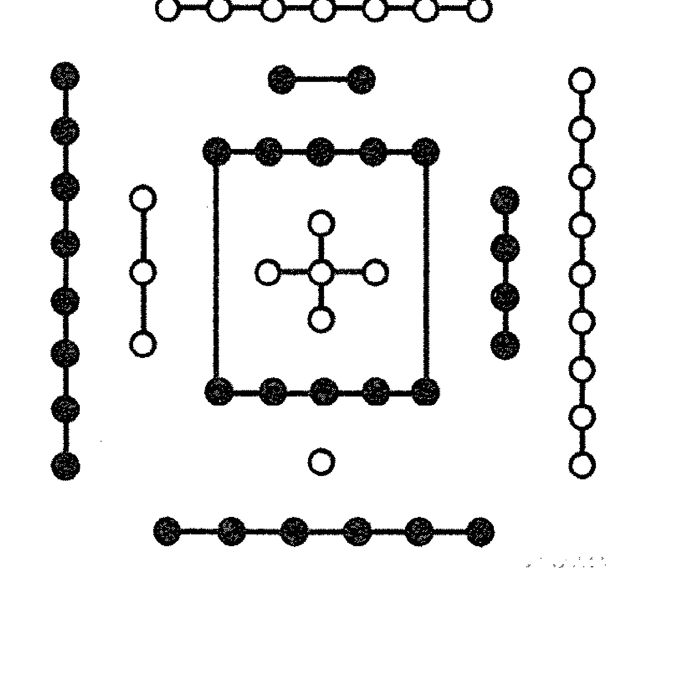

图中白点表示奇数为阳，黑点表示偶数为阴。前二七即二七合火居于南，七为阳，二为阴；后一六即一六合水居于北，一为阳，六为阴；左三八即三八合木居于东，三为阳，八为阴；右四九即四九合金居于西，九为阳，四为阴；居中者五与十合土，五为阳，十为阴。天一生水，地六成之；地二生火，天七成之；天三生木，地八成之；地四生金，天九成之；天地之气和合，化生五行之气。天一地二，天三地四，天五地六，天七地八，天九地十。天数五，地数五，五位相得，而各相会。天数二十有五，地数三十，凡天地之数五十有五。此所以成变化而行鬼神也。

先天河图解：

河图者，伏羲氏王天下时，龙马出河，遂以其纹画八卦，即为易之祖也。五阳泽天夬卦，夬者决也，阳决阴之意，卦体下五阳去一阴，是众君子去一小人也，去之无难是而怪也。易之本变也，变而通神主心矣，明心见性则易通于心。则易有象而无象，心则静也，静而生灵，灵通天地万物则易于心合，此乃心易之小成。

二、洛书范数

洛书之数，戴九履一，左三右七，二四为肩，八六为足，五居中央。

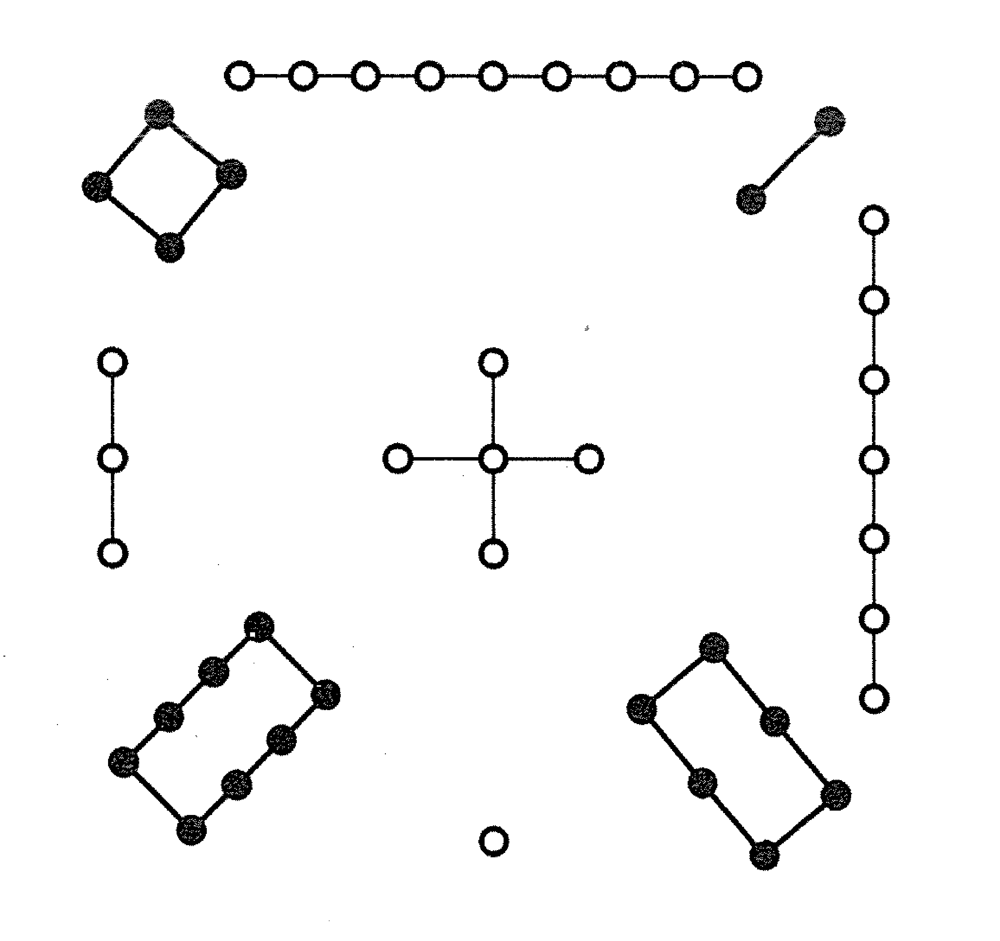

一合九而为十，二合八为十，三合七为十，四合六为十，五居此洛书纵横皆十五数合矣。亦称八卦九宫如下表：

| 4 | 9 | 2 |
|---|---|---|
| 3 | 5 | 7 |
| 8 | 1 | 6 |

先天洛书图解：

洛书者，禹治水时，神龟负文而列于背，有数一至九，禹遂因而策之以成“九类”，既后天卦之本。四月纯阳，乾为天卦，乾天的意思，为万物之尊，万事万物的根本。乾即天道，人君健德刚的根本。人君健德刚万有，而无阻碍，圣人作易开物成务，以乾之德性，以出治则刚德所施，确守至正之矩，乃为适宜，乃为利益所在，以乾也德性，而成就大业，此乃乾德所明，乾乃天下万事万物父纲至要理。

第二节 八卦

《周易》八卦是我们祖先发明的瑰宝，八卦象包罗万象，无所不有，其大无外，其小无内，是人类乃至整个宇宙的信息库，它仰观于天文，俯察于地理，中明于人事；上测天，下测地，中测人事。经过历代先贤充实完善，现在已被越来越多的有识之士推崇应用和推广，它以其独特的魅力放射着无比灿烂的光辉。

何为易？易即简易，变易，不易。《系辞》中有“是故易有太极，是生两仪，两仪营四象，四象生八卦。”八卦生吉凶，八卦定大业。太极即阴阳未分，天地浑沌之期，太极是因为大到极点，物极必反，就会出现分化，故阴阳分离，形成了天与地或是天地本身有阴有阳，阴阳环抱，表示阴阳交合。阳为天，为太阳，为父，为刚等。阴为地，为月亮；为母；为柔等。阴阳交合产生少阳，少阴，象征四方，四时，八卦象征八方，八节，即父母交合所生长男，中男，少男，长女，中女，少女，六子。

太极生成八卦的图式如下：

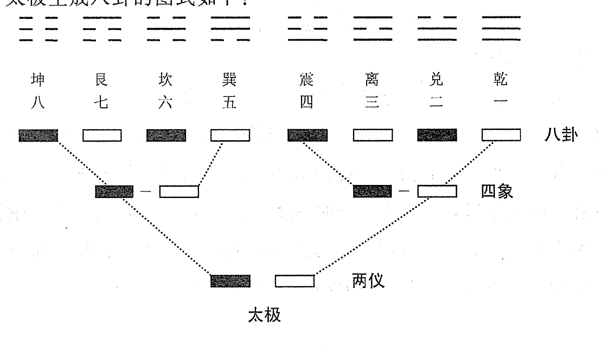

八卦有先天八卦，后天八卦及实用八卦之分，现分述如下：

一、伏羲先天八卦方位图

伏羲八卦（先天八卦）

先天伏羲图说：

天地定位，山泽通气，雷风相薄，水火不相射。八卦相错，数往者顺，知来者逆，是故易逆数也。

先天八卦，天南地北离东坎西先天卦数，乾一，兑二，离三，震四，巽五，坎六，艮七，坤八。先天卦数主要在数的应用。实际一切数应用都是以先天卦数为体，先天卦从里往外看。正月三阳地天泰卦，乃天地交而万物通泰内阳外阴之象也，天时定四方，建五常，用天时乘地利秩人伦，守天地之道，可开万世之泰。泰天地交通也，在气运则为贞元会合宇宙昌明之时。

二、文王后天八卦图

文王后天八卦图说：

帝出乎震（正春也），齐乎巽（春末夏初），相见乎离（正夏也），致役乎坤（夏末秋初），说乎兑（正秋也），战乎乾（秋末冬初），劳乎坎（正冬也），成乎艮（冬末正也），万物所藏，文王八卦，以属春夏秋冬四时之序也。

后天八卦，坎一、坤二、震三、巽四、中宫五、乾六、兑七、艮八、离九。后天八卦立向，奇数四正偶数四维。既为后天以用为主，先天定数，后天用象，后天卦从外往里看，一内一外既一阴一阳也，此乃阴阳之合，体用之分。月卦四阳交，雷天大壮，大者壮也，刚以动故壮。大壮利贞，大者正天地之情，惟正故大，则壮可常保其盛。大谓阳也，四阳盛长君子之道大而壮，君子必以正为大，天地之情可见矣。

三、实用八卦

实用八卦是伏羲先天八卦，与文王后天八卦相结合，用的是先天八卦之数，后天文王八卦之方位，见图：

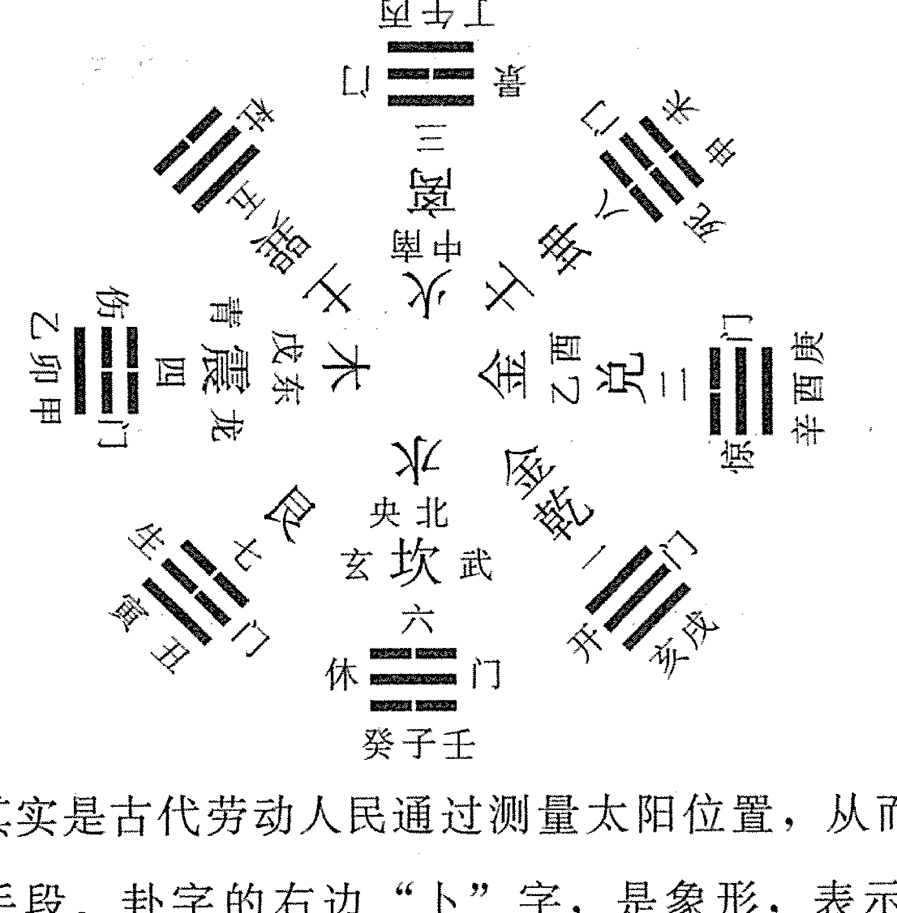

所谓卦，其实是古代劳动人民通过测量太阳位置，从而知季节、记录劳作规律的手段。卦字的右边“卜”字，是象形，表示在地上竖杆子，右边那一点是太阳的影子。“卦”字左边的“圭”字是尺子，用来测量影子的长度位置。通过长期测量，劳动人民掌握了春耕秋收的各种季节规律。所谓八卦，应该是在地之八方测量结果的记录。

现将八卦所代表的事物、特征录“启蒙八卦所生诸物”口诀如下：

乾主君官珠玉宝，头冠圆果狮象豹。  
坎耳丽沟雪露霜，酒血水鱼江盐井。  
艮主雪雾山林虎，手鼻狗鼠并田路。  
震为雷声街闹市，龙蛇楼屋并竹木。  
巽主鸡蛇毛羽禽，股肱风疾僧尼匠。  
离女心目虹霓电，聪明才学炉灶雄。  
坤牛牝马及文章，后母老妇脾腹雾。  
兑为新月雨泽星，少女师巫肺口舌。

口诀的意思是：乾卦为君、官贵、仕宦人、金玉、珠宝、头圆物、兽狮象等。其余各卦读者可以从口诀中理解。

第三节 八卦次序与六十四卦

一、八卦次序

伏羲八卦方位图顺序：乾一，兑二，离三，震四，巽五，坎六，艮七，坤八。

后天八卦方位顺序：坎一，坤二，震三，巽四，中五，乾六，兑七，艮八，离九。

实用八卦是伏羲先天八卦，与文王后天八卦相结合，用的是先天八卦之数，后天文王八卦之方位，其次序如下：

乾一 兑二 离三 震四 巽五 坎六 艮七 坤八。

二、八卦符号口诀

1、歌诀：
乾三连，坤六断，离中虚，坎中满，  
兑上缺，巽下断，震仰盂，艮覆碗。

2、符号：

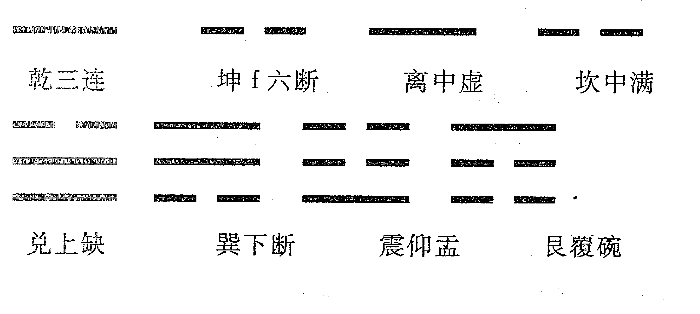

三、八卦方位

先天八卦：乾南，坤北，离东，坎西，兑东南，震东北，巽西南，艮西北

后天八卦：震东，兑西，离南，坎北，乾西北，坤西南，艮东北，巽东南

四、八卦所属

乾、兑（金）；震、巽（木）；坤、艮（土）；离（火）；坎（水）。

五、八卦生克

乾、兑（金）生坎（水），坎（水）生震、巽（木），震、巽（木）生离（火），离（火）生坤、艮（土），坤、艮（土）生乾、兑（金）。

乾、兑（金）克震、巽（木），震、巽（木）克坤、艮（土），坤、艮（土）克坎（水），坎（水）克离（火），离（火）克乾、兑（金）。

六、八卦旺衰

乾、兑旺于秋，衰于冬；震、巽旺于春，衰于夏；  
坤、艮旺于四季，衰于秋；离旺于夏，衰于四季；  
坎旺于冬，衰于春。（四季是指每个季节的后一个月）

七、八卦所对应的五行

金——乾、兑　　乾为天，兑为泽  
木——震、巽　　震为雷，巽为风  
土——坤、艮　　坤为地，艮为山  
水——坎　　　　坎为水  
火——离　　　　离为火

五行相生：木生火，火生土，土生金，金生水，水生木。

八、五行相克：水克火，火克金，金克木，木克土，土克水。

九、八卦分阴阳

乾、坎、艮、震、四卦，属阳卦，其中乾为老父，艮为少男，坎为中男，震为长男。

（震、坎、艮中阴多阳少，表示阴从阳，故为阳卦）

坤、兑、离、巽四卦，属阴卦，其中：坤为老母，兑为少女，离为中女，巽为长女（兑、离、巽中阳多阴少，表示阳从阴，故为阴卦）

十、八卦及六十四卦

《易经》中六十四卦的排列，起于《乾坤》两卦，是在乾为天，坤为地，先有天地然后有万物这种思想指导下排列的。至于其它六十二卦的排列次序，都是以卦卦象相错的方法进行排列的。

八卦重为六十四卦，共有八个宫，每宫的第一卦，称首卦，或八纯卦，如乾（☰）卦，兑（☱）卦，离（☲）卦，震（☳）卦，巽（☴）卦，坎（☵）卦，艮（☶）卦，坤（☷）卦。

八卦，单卦为经卦（☰），两卦相重为别卦（䷀），八个别卦按五行分为八个宫，八宫只有八个卦象，那么其它五十六个卦象是怎样产生出来的？这是大家所关心的。

八卦是物象的标志，也是阴阳二气旺衰五行生克的标志。阴阳的规律是“变”，可以说是变化无穷。因此，其它五十六个卦象，都是由八

上篇 理论基础篇

第一章 《周易》八卦概论

关于基础知识，各种八卦预测的书中均有，作者开始并未打算写此方面的内容，但许多读者朋友纷纷打电话来说最好补上，以利读者更加系统的学习。为满足易友的要求，把基础知识写出，对四基库的应用作了详细的讲解，并将自己多年来的一些心得体会写出，同时把必需掌握的技巧给予提示，以使易友真正能学以致用。因为只有基础知识丰富了，预测才能准确。基础越扎实，断卦越精彩。

第二节 河图、洛书

一、河图象数

河图之文，前二七，后一六，左三八，右四九，居中者五与十。

图中白点表示奇数为阳，黑点表示偶数为阴。前二七即二七合火居于南，七为阳，二为阴；后一六即一六合水居于北，一为阳，六为阴；左三八即三八合木居于东，三为阳，八为阴；右四九即四九合金居于西，九为阳，四为阴；居中者五与十合土，五为阳，十为阴。天一生水，地六成之；地二生火，天七成之；天三生木，地八成之；地四生金，天九成之；天地之气和合，化生五行之气。天一地二，天三地四，天五地六，天七地八，天九地十。天数五，地数五，五位相得，而各相会。天数二十有五，地数三十，凡天地之数五十有五。此所以成变化而行鬼神也。

先天河图解：

河图者，伏羲氏王天下时，龙马出河，遂以其纹画八卦，即为易之祖也。五阳泽天夬卦，夬者决也，阳决阴之意，卦体下五阳去一阴，是众君子去一小人也，去之无难是而怪也。易之本变也，变而通神主心矣，明心见性则易通于心。则易有象而无象，心则静也，静而生灵，灵通天地万物则易于心合，此乃心易之小成。

二、洛书范数

洛书之数，戴九履一，左三右七，二四为肩，八六为足，五居中央。

一合九而为十，二合八为十，三合七为十，四合六为十，五居此洛书纵横皆十五数合矣。亦称八卦九宫如下表：

| 4 | 9 | 2 |
|---|---|---|
| 3 | 5 | 7 |
| 8 | 1 | 6 |

先天洛书图解：

洛书者，禹治水时，神龟负文而列于背，有数一至九，禹遂因而策之以成“九类”，既后天卦之本。四月纯阳，乾为天卦，乾天的意思，为万物之尊，万事万物的根本。乾即天道，人君健德刚的根本。人君健德刚万有，而无阻碍，圣人作易开物成务，以乾之德性，以出治则刚德所施，确守至正之矩，乃为适宜，乃为利益所在，以乾也德性，而成就大业，此乃乾德所明，乾乃天下万事万物父纲至要理。

第二节 八卦

《周易》八卦是我们祖先发明的瑰宝，八卦象包罗万象，无所不有，其大无外，其小无内，是人类乃至整个宇宙的信息库，它仰观于天文，俯察于地理，中明于人事；上测天，下测地，中测人事。经过历代先贤充实完善，现在已被越来越多的有识之士推崇应用和推广，它以其独特的魅力放射着无比灿烂的光辉。

何为易？易即简易，变易，不易。《系辞》中有“是故易有太极，是生两仪，两仪营四象，四象生八卦。”八卦生吉凶，八卦定大业。太极即阴阳未分，天地浑沌之期，太极是因为大到极点，物极必反，就会出现分化，故阴阳分离，形成了天与地或是天地本身有阴有阳，阴阳环抱，表示阴阳交合。阳为天，为太阳，为父，为刚等。阴为地，为月亮；为母；为柔等。阴阳交合产生少阳，少阴，象征四方，四时，八卦象征八方，八节，即父母交合所生长男，中男，少男，长女，中女，少女，六子。

太极生成八卦的图式如下：

八卦有先天八卦，后天八卦及实用八卦之分，现分述如下：

一、伏羲先天八卦方位图

伏羲八卦（先天八卦）

先天伏羲图说：

天地定位，山泽通气，雷风相薄，水火不相射。八卦相错，数往者顺，知来者逆，是故易逆数也。

先天八卦，天南地北离东坎西先天卦数，乾一，兑二，离三，震四，巽五，坎六，艮七，坤八。先天卦数主要在数的应用。实际一切数应用都是以先天卦数为体，先天卦从里往外看。正月三阳地天泰卦，乃天地交而万物通泰内阳外阴之象也，天时定四方，建五常，用天时乘地利秩人伦，守天地之道，可开万世之泰。泰天地交通也，在气运则为贞元会合宇宙昌明之时

二、文王后天八卦图

文王后天八卦图说：

帝出乎震（正春也），齐乎巽（春末夏初），相见乎离（正夏也），致役乎坤（夏末秋初），说乎兑（正秋也），战乎乾（秋末冬初），劳乎坎（正冬也），成乎艮（冬末正也），万物所藏，文王八卦，以属春夏秋冬四时之序也。

后天八卦，坎一、坤二、震三、巽四、中宫五、乾六、兑七、艮八、离九。后天八卦立向，奇数四正偶数四维。既为后天以用为主，先天定数，后天用象，后天卦从外往里看，一内一外既一阴一阳也，此乃阴阳之合，体用之分。月卦四阳交，雷天大壮，大者壮也，刚以动故壮。大壮利贞，大者正天地之情，惟正故大，则壮可常保其盛。大谓阳也，四阳盛长君子之道大而壮，君子必以正为大，天地之情可见矣。

三、实用八卦

实用八卦是伏羲先天八卦，与文王后天八卦相结合，用的是先天八卦之数，后天文王八卦之方位，见图：

所谓卦，其实是古代劳动人民通过测量太阳位置，从而知季节、记录劳作规律的手段。卦字的右边“卜”字，是象形，表示在地上竖杆子，右边那一点是太阳的影子。“卦”字左边的“圭”字是尺子，用来测量影子的长度位置。通过长期测量，劳动人民掌握了春耕秋收的各种季节规律。所谓八卦，应该是在地之八方测量结果的记录。

现将八卦所代表的事物、特征录“启蒙八卦所生诸物”口诀如下：

乾主君官珠玉宝，头冠圆果狮象豹。  
坎耳丽沟雪露霜，酒血水鱼江盐井。  
艮主雪雾山林虎，手鼻狗鼠并田路。  
震为雷声街闹市，龙蛇楼屋并竹木。  
巽主鸡蛇毛羽禽，股肱风疾僧尼匠。  
离女心目虹霓电，聪明才学炉灶雄。  
坤牛牝马及文章，后母老妇脾腹雾。  
兑为新月雨泽星，少女师巫肺口舌。

口诀的意思是：乾卦为君、官贵、仕宦人、金玉、珠宝、头圆物、兽狮象等。其余各卦读者可以从口诀中理解。

第三节 八卦次序与六十四卦

一、八卦次序

伏羲八卦方位图顺序：乾一，兑二，离三，震四，巽五，坎六，艮七，坤八。

后天八卦方位顺序：坎一，坤二，震三，巽四，中五，乾六，兑七，艮八，离九。

实用八卦是伏羲先天八卦，与文王后天八卦相结合，用的是先天八卦之数，后天文王八卦之方位，其次序如下：

乾一 兑二 离三 震四 巽五 坎六 艮七 坤八。

二、八卦符号口诀

1、歌诀：
乾三连，坤六断，离中虚，坎中满，  
兑上缺，巽下断，震仰盂，艮覆碗。

2、符号：

三、八卦方位

先天八卦：乾南，坤北，离东，坎西，兑东南，震东北，巽西南，艮西北

后天八卦：震东，兑西，离南，坎北，乾西北，坤西南，艮东北，巽东南

四、八卦所属

乾、兑（金）；震、巽（木）；坤、艮（土）；离（火）；坎（水）。

五、八卦生克

乾、兑（金）生坎（水），坎（水）生震、巽（木），震、巽（木）生离（火），离（火）生坤、艮（土），坤、艮（土）生乾、兑（金）。

乾、兑（金）克震、巽（木），震、巽（木）克坤、艮（土），坤、艮（土）克坎（水），坎（水）克离（火），离（火）克乾、兑（金）。

六、八卦旺衰

乾、兑旺于秋，衰于冬；震、巽旺于春，衰于夏；  
坤、艮旺于四季，衰于秋；离旺于夏，衰于四季；  
坎旺于冬，衰于春。（四季是指每个季节的后一个月）

七、八卦所对应的五行

金——乾、兑　　乾为天，兑为泽  
木——震、巽　　震为雷，巽为风  
土——坤、艮　　坤为地，艮为山  
水——坎　　　　坎为水  
火——离　　　　离为火

五行相生：木生火，火生土，土生金，金生水，水生木。

八、五行相克：水克火，火克金，金克木，木克土，土克水。

九、八卦分阴阳

乾、坎、艮、震、四卦，属阳卦，其中乾为老父，艮为少男，坎为中男，震为长男。

（震、坎、艮中阴多阳少，表示阴从阳，故为阳卦）

坤、兑、离、巽四卦，属阴卦，其中：坤为老母，兑为少女，离为中女，巽为长女（兑、离、巽中阳多阴少，表示阳从阴，故为阴卦）

十、八卦及六十四卦

《易经》中六十四卦的排列，起于《乾坤》两卦，是在乾为天，坤为地，先有天地然后有万物这种思想指导下排列的。至于其它六十二卦的排列次序，都是以卦卦象相错的方法进行排列的。

八卦重为六十四卦，共有八个宫，每宫的第一卦，称首卦，或八纯卦，如乾（☰）卦，兑（☱）卦，离（☲）卦，震（☳）卦，巽（☴）卦，坎（☵）卦，艮（☶）卦，坤（☷）卦。

八卦，单卦为经卦（☰），两卦相重为别卦（䷀），八个别卦按五行分为八个宫，八宫只有八个卦象，那么其它五十六个卦象是怎样产生出来的？这是大家所关心的。

八卦是物象的标志，也是阴阳二气旺衰五行生克的标志。阴阳的规律是“变”，可以说是变化无穷。因此，其它五十六个卦象，都是由八

## 六爻八卦全息论

“游魂、归魂”，多为测行人之用，“魂”只是个比喻。如测行人何时回，遇游魂卦，即为游够方休，不能马上回来。若遇归魂卦，此人走不远，很快就会回来。

以上是乾宫八卦变法，其它宫的变法仿此。这个变法，是汉朝大易学家京房发明的。关于每个卦的世爻、应爻定位法及作用，在下篇将有详述，在此不论。

1、八宫之六十四卦名：

| 列1 | 列2 | 列3 | 列4 |
|---|---|---|---|
| 乾为天 | 天风姤 | 天山遁 | 天地否 |
| 风地观 | 山地剥 | 山地晋 | 火天大有 |
| 此为乾宫八卦，性质属金。 |  |  |  |
| 坤为地 | 地雷复 | 地泽临 | 地天泰 |
| 雷天大壮 | 泽天夬 | 水天需 | 水地比 |
| 此为坤宫八卦，性质属土。 |  |  |  |
| 震为雷 | 雷地豫 | 雷水解 | 雷风恒 |
| 地风升 | 水风井 | 泽风大过 | 泽雷随 |
| 此为震宫八卦，性质属木。 |  |  |  |
| 巽为风 | 风天小畜 | 风火家人 | 风雷益 |
| 天雷无妄 | 火雷噬嗑 | 山雷颐 | 山风蛊 |
| 此为巽宫八卦，性质属木。 |  |  |  |
| 坎为水 | 水泽节 | 水雷屯 | 水火既济 |
| 泽火革 | 雷火丰 | 地火明夷 | 地水师 |
| 此为坎宫八卦，性质属水。 |  |  |  |
| 离为火 | 火山旅 | 火风鼎 | 火水未济 |
| 山水蒙 | 风水涣 | 天水讼 | 天火同人 |
| 此为离宫八卦，性质属火。 |  |  |  |
| 艮为山 | 山火贲 | 山天大畜 | 山泽损 |
| 火泽睽 | 天泽履 | 风泽中孚 | 风山渐 |
| 此为艮宫八卦，性质属土。 |  |  |  |

兑为泽　泽水困　泽地萃　泽山咸

水山蹇　地山谦　雷山小过　雷泽归妹

此为兑宫八卦，性质属金。

## 六十四卦之排列方法如下：

第一卦　乾：乾为天，乾上乾下。  
第二卦　坤：坤为地，坤上坤下。  
第三卦　屯：水雷屯，坎上震下。  
第四卦　蒙：山水蒙，艮上坎下。  
第五卦　需：水天需，坎上乾下。  
第六卦　讼：天水讼，乾上坎下。  
第七卦　师：地水师，坤上坎下。  
第八卦　比：水地比，坎上坤下。  
第九卦　小畜：风天小畜，巽上乾下。  
第十卦　履：天泽履，乾上兑下。  
第十一卦　泰：地天泰，坤上乾下。  
第十二卦　否：天地否，乾上坤下。

## 六爻八卦全象论

第二章  阴阳五行

要想研究易经及其它预测方法，阴阳五行是最基本的内容。阴阳学说是我们祖先最早通过对各种事物和现象的观察，仰者观察于天，俯者观法于地，把万物万象分为阴阳两大类，是我国先民最朴素的辩证唯物主义。

## 一、阴阳观念

“阴阳”是我国古代劳动人民对自然界相互关联的某些对立的事物和现象最基本的概括，是最朴实的宇宙观和方法论。阴阳学说的原始意义是指太阳的向背，把向着太阳的面叫“阳”，背着太阳的面叫“阴”，后来随着哲学思想的逐步成熟，才形成抽象的阴阳学说。

那么，以什么来确定阴阳的范围？这个范围也就是指自然界中相互关联又相互对立的事物或现象，且双方具有截然相反的两种属性。这两种属性，才能称为阴阳。从这一规范出发，我们规定阴阳的标准是：具有积极、刚健向上等特性的事物和现象属阳，具有消极退守，柔弱下降等特性的事物和现象属阴。为了便于记忆，我们把阴阳特性分析如下：阴阳这个概念，除了有他们自己的属性外，还具有相生、相克、对立、互根、消长、转化的内容。

## 一、阴阳学说的起源

阴阳学说的产生，早在夏朝就已形成，这可以从《易经》中的八卦阴阳交的出现而得证实。八卦中阴（--）和阳（一）出现在我国的夏朝的占书《连山》中，故《山海经》中有：“伏羲得河图，夏人因之，曰《连山》，黄帝得河图，商人因之，曰《归藏》，列山氏得河图，周人因之，曰《周易》。”这就是说，在夏朝时就有《连山》这样的八卦书，而八卦又是由阴和阳这两个最基本的爻组成的。所以阴阳学说，至少起源于夏朝是无疑的。

## 二、阴阳对立

阴阳对立，是指自然界中的各种事物或现象都存在着相互对立的两个方面。如我们日常生活中所见的天地，男女、昼夜、寒热、雌雄、动静、上下、左右、刚柔、迟速和八卦是由阴阳两种对立的符号组成的，也是由四种对立的符号组成八卦，再由三十二种对立的符号组成六十四卦。所以说，阴阳两种对立的矛盾，是一切事物的根本矛盾。然而乾坤即是两种对立的矛盾，但又是互相统一的。唯有这种统一，然后才能产生变化，生成万物。故阴阳的对立与统一，是一切事物的始终。

## 三、阴阳互根

阴阳互根，是事物或现象中对立的两个方面，具有互相依存，互相为用的联系。阴与阳的每一个侧面都以另一个侧面作为自己存在的前提；即没有阴，阳不存在；没有阳，阴也不存在。正如没有乾；就没有坤；没有天，也就没有地。《素问·阴阳应象大论》说：“阴在内，阳守之，阳在外，阴之使也。”所以如果失去了阴阳之间的相互依存（即阴阳根），一切生命将不复存在，即谓“阴阳离决，精气乃绝”。

## 四、阴阳消长

阴阳消长，是指事物和现象中对立着的两个方面，是运动变化的，即“阴阳消长”和“阳消阴长”。其运动是以彼此消长的形式进行的。阴阳之间的这种彼此消长的运动变化称为“阴阳消长”。

阴阳消长保持相对的动态平衡，维持事物不断的发展变化。《系辞》有：“日往月则来，月往日则来，日月相推而明生焉。寒往暑来，暑往则寒来，寒暑相推而成岁焉。”所谓往来就是阴消阳长，由白天变黑夜，由黑夜变白天，从事某种运动或变动时，增长了能量（即阳气）的产生，必然导致营养物（阴气），也必定会消耗一定的能量（阳气），这就是阳消阴长的过程。

总之，整个宇宙之中万事万物无不包含着“阴阳消长”的变化过程。

## 五、阴阳转化

阴阳转化，就是阴阳变化，它是事物或现象的阴与阳两种不同的属性，在一定条件下其对立面转化。这种事物的转化，由阴阳消长的量变，至阴阳转化的质变。《黄帝内经》云：“重阴必阳，重阳必阴”“寒极必热，热极必寒”指的就是阴阳变化。

阴与阳虽然是两种不同的属性，但又可以互相转化。“生生之谓易”“事物有变动，故曰变”。易，即阴阳相易，也就是阴极生阳，阳极生阴。所以就阴变阳，阳变阴。即阴阳互相转化，是事物发展的必然规律。事物只要顺着阴阳变化的规律发展下去，最终就能达到事物互相转化的目的。

上述阴阳、互根、消长、转化的关系是阴阳学说的基本内容，我们在学习预测和实际操作时不能片面机械地看待阴阳要素，而要在生活中随机领会，因为知识也来源于生活。

## 二、五行学说

五行学说，不仅是宇宙观，而且是朴实的系统论。五行学说认为宇宙万物由五种基本物质构成，即金、木、水、火、土。自然界各种事物或现象都是由这五种不同属性的物质不断运动和相互作用的结果。因此，五行学说也和阴阳学说一样，也是我国先民认识世界，解释世界以及事物发展变化的一种哲理。

《内经》在《尚书·洪范》中记载五行为：一曰水，二曰火，三曰木，四曰金，五曰土。后来，随着历史的发展，五行学说也得到了进一步的发展。并将五行与五方、五色、五季等相配，成为一种复杂的系统。五行学说，采用取象比类的方法，将世上万事万物朴素的分为五类。在其属性的基础上，运用生克制化关系，来说明和解释事物之间的相互联系和变化。五行之间的关系是：

## 一、五行相生

相生，就是相互促进，相互滋生的意思，五行之间存在着一种相互生长，助长的关系，称为五行相生，五行相生的次序是：木生火，火生土，土生金，金生水，水生木。

## 二、五行相克

相克，就是抑制，相互制约的意思，也是事物在运动发展变化过程中相互联系的一种表现。五行之间的这种克制，制约关系，称为五行相克。五行相克的次序是：木克土，土克水，水克火，火克金，金克木。

五行学说认为，相生相克，象阴阳一样，是事物不可分割的两个方面。没有生就没有事物的发生和成长。没有克，就不能维持事物在发展和变化中的平衡与协调。所以没有相生就没相克，没有相克，就没有相生。这种生中有克，克中有生，相互相成，互相为用的关系，推动和维持事物的正常生长，发展与变化。故五行中的任何一行，都存在着这种生我、我生、克我、我克的关系。如图中所示：

## 三、五行反克（侮）

五行反克是指五行中的某“一行”过强盛，因而对原来克我的“一行”进行反克。如木本受金克，但木特别强盛，不但不受到金的克制，反而对金造成反克称为木坚金缺。木克土，土重木折，土克水，水多土荡。水克火，火旺水干，火克金，金多火熄。可见原先就是被克的一方，如果力量胜过克的一方，克者反而受制。

## 四、五行亢胜

易曰，亢穷则变。亢胜即穷极，事物达到穷极状态就会走向反面。如木亢则折，金亢则缺，水亢则荡，火亢则灭，土亢则散。任何事物不可穷极，否则，向其反面转化。物极必反，就是这个道理。

## 五、五行的旺、相、休、囚、死

五行分配于四时之中，并随四时变迁、寒暖燥湿、昼夜长短的不同而发生旺衰起伏的周期变化。在同一时期内，各种五行旺衰的程度也完全不同，而且只有一行是最旺的，也只有一行是最衰的。即五行的旺、相、休、囚、死。那么什么叫旺、相、休、囚、死呢？其意可解释为：

- 旺：处于强盛旺盛状态；  
- 相：处于次旺状态；  
- 休：处于休生养息状态；  
- 囚：衰弱被囚状态；  
- 死：被克制而处于死绝状态。

五行在四时中的旺相休囚死的状态列表如下：

| 四时\五行 | 木 | 火 | 土 | 金 | 水 |
|---|---|---|---|---|---|
| 春 | 旺 | 相 | 死 | 囚 | 休 |
| 夏 | 休 | 旺 | 相 | 死 | 囚 |
| 季 | 囚 | 休 | 旺 | 相 | 死 |
| 秋 | 死 | 囚 | 休 | 旺 | 相 |
| 冬 | 相 | 死 | 囚 | 休 | 旺 |

歌诀为：

1、木旺于春，火旺于夏，金旺于秋，水旺于冬，土旺于当令之月。

2、当令者旺，令生者相，生令者休，克令者囚，令克者死。

当令歌：木旺立春六十天，火旺立夏芒种前，土旺四立前十八，金旺立秋至寒露，水旺立冬整六十，牢记切莫搞混乱。

## 六、五行分类列表

|  |  | 木 | 火 | 土 | 金 | 水 |
|---|---|---|---|---|---|---|
| 五行 |  | 木 | 火 | 土 | 金 | 水 |
| 人体 | 五脏 | 肝 | 心 | 脾 | 肺 | 肾 |
| 人体 | 六腑 | 胆 | 小肠 | 胃 | 大肠 | 膀胱 |
| 人体 | 五官 | 目 | 舌 | 口 | 鼻 | 耳 |
| 人体 | 五声 | 呼 | 笑 | 歌 | 哭 | 呻 |
| 人体 | 五情 | 怒 | 喜 | 思 | 悲 | 恐 |
| 人体 | 五常 | 仁 | 礼 | 信 | 义 | 智 |
| 人体 | 形体 | 筋 | 脉 | 肉 | 皮毛 | 骨 |
| 人体 | 变动 | 握 | 忧 | 哕 | 咳 | 栗 |
| 自然界 | 五音 | 角 | 徵 | 宫 | 商 | 羽 |
| 自然界 | 五味 | 酸 | 苦 | 甘 | 辛 | 咸 |
| 自然界 | 五色 | 青 | 赤 | 黄 | 白 | 黑 |
| 自然界 | 五化 | 生 | 长 | 化 | 收 | 藏 |
| 自然界 | 五气 | 风 | 暑 | 湿 | 燥 | 寒 |
| 自然界 | 五方 | 东 | 南 | 中 | 西 | 北 |
| 自然界 | 五季 | 春 | 夏 | 长夏 | 秋 | 冬 |
| 自然界 | 五数 | 三 | 二 | 五 | 四 | 一 |

## 七、五行宜从事的行业与方位

宜木者，喜东方。  
可以从事山林、木材、木器、书报、纸张、木制家具、装潢、纺织纤维、棉布、木成品、文教、出版、文书、纸业、养花、茶叶、盆景花草、花园果树、育树苗、中药、敬神物品、香料、植物性素食品等木性质的工作。

宜火者，喜南方。  
可以从事火力、电力、热能、冶炼、炽割、沥青、放光、照明、光学、易燃、火药、电火制品、油类、燃料、酒精类、煤炭、煤气、及有关系石油产品、橡胶、轮胎、树脂、化学原料、饭店、宾馆、热饮食、食品、美容、理发烫发、化妆品、人身装饰品、文艺、文学、文具、文化学生、文人、作家、写作、撰文、教员、校长、秘书、出版、政界、公务等火的性质的工作。

宜土者，喜中央之地、本地。  
可以从事农牧、土地开垦、土地交易、房地产、土产、农村、畜牧、肥料、饲料、布匹、服装、纺织、石料、石灰、矿物、泥沙、石头、砖瓦、水泥、山地、建筑、房产买卖、雨衣、雨伞、筑堤、容水物品、当铺、古董、陶瓷、中间人、律师、管理、买卖、设计、顾问、丧业、筑墓、墓地管理、僧尼等土的性质的工作。

宜金者，喜西方。  
可以从事精纤材或金属材料、金银珠宝、铜铁、矿产、机械、五金、家电、仪器、刀器、玻璃、铝厂商业、坚硬、决断、武术、鉴定、总管、汽车、交通、金融、工程、种子、开矿、民意代表、伐木、机械、交通工具等金之性质工作。

宜水者，喜北方。  
可以从事航海、冷温不燃液体、冰水、鱼类、水产、水利、饮料、水果贩卖、冷藏、冷冻、打捞、洗洁、扫除、流水、港口、泳池、湖池塘、浴池、酒业、冷食物买卖、飘游、奔波、流动、连续性、易变化、属水性质、音响性质、清洁性质、海上作业、交通运输航运、迁旅、特技表演、娱乐、电影电视、运动、观光旅游业、导游、旅行、玩具、魔术、记者、侦探、旅社、灭火器具、钓鱼器具、医疗业、药物经营、医生、护士、占卜等水的性质的工作。

## 第三章 天干、地支

十天干，十二地支，《史经》称十天干为母，十二地支为子，天干、地支又简称干支。

从历史的发展来看，大概先发明了天干以后再发明了十二地支。然后，才有了甲子，早在公元前1562——公元前1066年殷商时期，已有干支甲子，十干首先被用于商王朝世系的帝号；如成汤名天乙，他的儿子便叫大丁，申丙，申壬，孙名大甲……。“大挠采用五行之情占斗机所建，始作甲乙以名日，谓之干，作子丑以名月，谓之枝”。这就证明干支的产生与历法有着密切的关系。如《殷墟书契前编》七·四四卜辞云：“乙卯卜，昱丙雨”，“辛亥卜，昱卜雨”等。都说明干支是记日的。后来运用其作纪年、纪月、纪日、纪时。

## 一、天干

### 一、十天干

甲、乙、丙、丁、戊、己、庚、辛、壬、癸

用十天干纪日，每十天便是一个循环，与十二地支相配，每六十天为一个大循环，用干支纪年，就是通常所说六十花甲子。

### 二、十天干阴阳之分与五行

> 《素问·八式运气论奥，论十干》说：“甲、丙、戊、庚、壬”为阳；“乙、丁、己、辛、癸”为阴，五行各一阴一阳，故有十日。

甲为什么属阳、乙为什么属阴？一是先言者为刚为阳，二是奇数为阳。故甲为阳，甲在先；乙在后；甲为奇数，乙为偶数，故乙为阴。其他如此。

甲乙同属木；甲是拆的意思。指万物剖腹而出。为阳木，系指森林之木，性坚质硬，为栋梁之材。

## 六爻八卦全息论

乙是轧的意思。指万物初生，抽轧而出。为阴木，系指花草之木，性柔质软，情满人间。

丙丁同属火：丙是炳的意思。指万物炳然著见。为阳火，系指太阳之火，其性猛烈，普照万物。

丁是强的意思。指万物丁壮。为阴火，系指灯盏之火，性柔质弱，舍己为人。

戊己同属土：戊是茂的意思。指万物茂盛，为阳土，系指大地之土，性高亢、质硬，生育万物。

己是纪的意思，指万物有形可纪识，为阴土，系指田园之土，性温质软，造福人间。

庚辛同属金：庚是耕的意思，指万物收敛有实。为阳金，系指剑戟之金，性刚质硬，肃杀万物。

辛是新的意思。指万物初新皆收成。为阴金，系指首饰之金，性质柔弱，装饰人间。

壬癸同属水：壬是任的意思。指阳气任养万物于下。为阳水，系指大海之水，性猛质硬，灌溉万物。

癸是揆的意思，指万物可揆度。为阴水，系指雨露之水，性质静弱，资滋生万物。

## 三、十干配四时方位

甲乙东方木，丙丁南方火，戊己中央土，庚辛西方金，壬癸北方水。

甲乙属木，其时春，触地生而产万物，其位东方，故甲乙为东方木。

丙丁属火，其时夏，炎火其上，使万物生长，其位南方，故丙丁南方火。

戊己属土，其时季夏，得皇极之正气，含黄中之德，能苞万物，其位内通，故戊己中央土。

## 四、十干配人体

十干配身体：甲为头，乙为肩，丙为额，丁齿舌，戊己鼻面，庚为筋，辛为胸，壬癸胫，癸为足。

十干配脏腑：甲为胆，乙为肝，丙为小肠，丁为心，戊为胃，己为脾，庚为大肠，辛为肺，壬为膀胱，癸为肾。

按照中医理论，其中胆、胃、小肠、大肠、胱、膀胱为六腑，性质属阳，所以都配阳干；肝、心、脾、肺、肾为五脏，性质属阴，所以都配阴干。单为腑，双为脏。

> 歌曰：甲胆乙肝丙小肠，丁心戊胃己脾乡。  
庚是大肠辛属肺，壬系膀胱癸肾藏。  
三焦亦向壬中寄，包络同归入癸方。

> 又曰：甲头乙肩丙额求，丁心戊鼻己属面。  
庚是筋轮辛为胸，壬胫癸足一身覆。

## 五、十天干的合化关系

甲己合化土——中正之合，主安分守己，淳正厚朴。  
乙庚合化金——仁义之合，主刚柔兼备，重信守义。  
丙辛合化水——威制之合，主仪表威严，智力优秀。  
丁壬合化木——淫匿之合，暧昧不明，先贱后良。  
戊癸合化火——无情之合，主娇媚多情，薄情寡义。

## 第二节　地支

十二地支名为月，故《尔雅？释天》中有：“岁阴者，子、丑、寅、卯、辰、巳、午、未、申、西、戌、亥。”

天干主天主动，动则有为。地支主地主静，静以待用。干主一而支多藏。干性质单纯而支性质复杂。天干之吉凶显而易见，地支则不然，吉凶暗，一时难见祸福。岁运引动，吉凶尚明。天干地支相配，支为干之根，干为支之苗。地支值年为众杀之首。值月，主宰生杀之权。天干无此特权，故地支是决定天干生旺死绝的关键。因此，地支的重要性大于天干，重于天干，学者不可忽视。地支是古人用来纪月的方法，古人用支来表示月的名称，一年共十二个月，所以有十二个支。正月建寅，就是正月为寅月。正月建寅是因北斗七星的星斗柄指在寅位。二月建卯，三月建辰，四月建巳，五月建午，六月建未，七月建申，八月建酉，九月建戌，十月建亥，十一月建子，十二月建丑。

## 一、十二地支与五行

十二支为：子丑寅卯辰巳午未申酉戌亥。

十二支中：子、寅、辰、午、申、戌为阳；  
丑、卯、巳、未、酉、亥为阴。

寅卯同属木：寅为阳木，初生之木；卯为阴木，极盛之木。

巳午同属火：午为阳火，极盛之火；巳为阴火，初生之火。

申酉同属金：申为阳金，初生之金；酉为阴金，极盛之金。

子亥同属水：子为阳水，极盛之水；亥为阴水，初生之水。

辰戌丑未同属土：辰戌为阳土，丑未为阴土。未戌为燥土，辰丑为湿土。干土中藏火，湿土内则含水。

## 二、十二支配方位与四时

寅卯为木为东方为春，巳午为火为南方为夏，  
申酉为金为西方为秋，亥子为水为北方为冬，  
辰戌丑未为土为本地，为一年四季的最后一个月。  
寅卯辰为春，三会东方木；  
巳午未为夏，三会南方火；  
申酉戌为秋，三会西方金；  
亥子丑为冬，三会北方水。

> 歌诀云：  
寅卯应合东方木，巳午南方正属火，  
申酉要归西方金，亥子北方属于水，  
辰戌丑未属何方，脾旺四季属于土。

## 三、十二支配脏腑

+  1、十二支配脏腑：  
寅为胆，卯为肝，辰为胃，巳为心，午为小肠，未丑为脾，申为大肠，酉为肺，戌辰为胃，亥为肾，子为膀胱、三焦，丑未为脾。  

2、十二支配身体：

十二支配身体：子为耳，丑为胞肚，寅为手，卯为指，辰为肩、胸，巳为面、咽齿，午为眼，未为脊梁，申为经络，酉为精血，戌为命门、腿足，亥为头。

歌曰：

> 子属膀胱水道耳，丑为胞肚及脾乡；  
寅胆发脉并双手，卯木十指内肝方；  
辰土为皮肩胸肋，巳面咽齿下为肛；  
午火精神司眼目，未土胃脘隔脊梁；  
申金大肠经络肺，酉中精血小肠藏；  
戌土命门腿踝足，亥水为头及肾囊；  
若依此法推人命，岐伯雷公也播扬。

## 四、地支类象

+  1、地支地理类象：  
子：湖海池塘　丑：园圃田坟　寅：山林桥梁　卯：林木舟车  
辰：墓墓山岭　巳：炉冶窑灶　午：市道旌旗　未：村寨井泉  
申：驿铺石径　酉：岗城街巷　戌：田垄营丘　亥：江河港涧  

+  2、地支人物类象：  
子：丫鬟、妇女　丑：牧筑、耕夫　寅：隐樵、书吏  
卯：船户、车夫　辰：鱼翁，禁子　巳：炉灶、窑工  
午：马夫、蚕妇　未：马夫、蚕妇　申：铺兵、驿站  
酉：卑妾、娼妓　戌：军丁、奴仆　亥：道士、医伶  

+  3、地支饮食类象：  
寅卯：青色，春季所生之物。　  
巳午：赤色，夏季所生之物。  
申酉：白色，秋季所生之物。　  
辰戌丑未：黄色，四季田园所生之物。

+  4、地支器物类象：  
子：胭脂、簪环。　丑：帽子、要带　寅：桌子椅子　卯：  
辰：量器、米尺、筛网　　巳：炉、扇、弓弩　　午：书画、旌旗  
未：餐具、布匹　　申：碾磨　　酉：金银珠宝　　戌：盔甲、印章  
亥：图画、雨具

## 五、地支生克关系

地支生克力量的大小同天干一样，同性相克大于异性相克，同生相生大于异性相生。

+  1、地支相生：  
寅卯木生巳午火，巳午火生辰戌丑未土，辰丑土生申酉金，申酉生亥子水，亥子水生寅卯木。

+  2、地支相克：  
寅卯木克辰戌丑未土，未戌土克亥子水，亥子水克巳午火，巳午火克申酉金，申酉金克寅卯木。

读者应注意，在十二地支的生克关系中，辰丑土晦巳午火的力量大于亥子水冲克巳午火的力量；未戌土脆申酉金的力量大于巳午火克申酉力量。

+  3、地支相冲：  
子午相冲；丑未相冲；寅申相冲；卯酉相冲；辰戌相冲；巳亥相冲。在六爻预测中，受冲双方均受伤，得年月日者受伤小，另一方受伤大。

+  4、地支相刑：  
子刑卯，卯刑子为无礼之刑。寅刑巳，巳刑申，申刑寅，为持势之刑。丑刑未，未刑戌，戌刑丑为无恩之刑。

辰午酉亥为自刑，刑者刑罚也，多主刑事犯法之事，也主伤灾病痛之疾。

+  5、地支相害：  
子未相害，丑午相害，寅巳相害，卯辰相害，申亥相害，酉戌相害，相害为受害、被害，为受克之意。

笔者对相刑，相害并不注重，认为古人之刑害说法并不科学，断卦遇刑害不必考虑，直接按交之五行生克制化而断即可，读者可酌情使用。

## 六、地支相合：

子丑合化土，寅亥合化木，卯戌合化火，辰酉合化金，巳申合化水，午未合化土，（午为太阳，未为太阴）。

相合，有合中有克，合中有生之别。合中有克者，是先好后坏，先热后冷，先合后分。如子与丑合，卯与戌合，巳与申合。子为水，丑为土，土克水；卯为木，戌为土，木克土；巳为火，申为金，火克金此为合中有克。合中有生者，寅与亥合，辰与酉合，午与未合。寅为木，亥为水，水生木，木增力；辰为土，酉为金，土生金，酉增力；午为火，未为土，火生土，未增力，故为合中有生。

其中：子丑、卯戌、巳申皆以绊论。寅亥、辰酉午未皆以生绊论。

## 七、地支三合局：

申子辰合化水，寅午戌合化火，巳酉丑合化金，亥卯未合化木。

在六爻中，三合局皆以三合绊论。但不论三合，六合遇冲可解。

生地半合局：申子半合水，寅午半合火，亥卯半合木，巳酉半合金。在生地半合局中，除巳酉以合绊或相克而论外，其余皆以生论即可。

墓地半合局，子辰半合水，午戌半合火，卯未半合木，酉丑半合金。在墓地半合局中，子辰、卯未大多以合绊论；午戌、酉丑则以生合论。

## 八、地支三会局：

寅卯辰会东方木，巳午未会南方火，申酉戌会西方金，亥子丑会北方水。

在六爻预测中，凡构成三会者，皆以三会绊论。

## 九、地支用以纪生肖、数位、月、时辰列表如下：

| 地支 | 子 | 丑 | 寅 | 卯 | 辰 | 巳 | 午 | 未 | 申 | 酉 | 戌 | 亥 |
|---|---|---|---|---|---|---|---|---|---|---|---|---|
| 生肖 | 鼠 | 牛 | 虎 | 兔 | 龙 | 蛇 | 马 | 羊 | 猴 | 鸡 | 狗 | 猪 |
| 数位 | 1 | 2 | 3 | 4 | 5 | 6 | 7 | 8 | 9 | 10 | 11 | 12 |
| 月份 | 11 | 12 | 1 | 2 | 3 | 4 | 5 | 6 | 7 | 8 | 9 | 10 |
| 时间 | 23—1 | 1—3 | 3—5 | 5—7 | 7—9 | 9—11 | 11—13 | 13—15 | 15—17 | 17—19 | 19—21 | 21—23 |

## 第三节  论辰、戌、丑、未四墓库

凡命理预测依据的十天干、十二地支，而十二地支中的丑、辰、未、戌四墓库就占其中的三分之一，在预测中占有很重要的作用。所以掌握四墓库的作用，正确运用四库是正确预测的重要组成部分。现将辰、戌、丑、未四墓库其特性及相互作用关系详释如下：

+  1. 辰、丑为湿土，可以生申、酉金，并能晦巳、午火，其晦火之力大于亥、子水冲克巳、午火之力。  
+  2. 未、戌为燥土，见申、酉金不可论生，未、戌能脆申、酉金，其脆金之力大于巳、午火克金之力。未、戌见巳、午火，仍以泄火论，但其力轻微，只有未见午，因午未合，未泄午有力。  
+  3. 辰、戌冲，丑、未冲，受冲双方均减力，用神减力以凶推，忌神减力以吉论。  
+  4. 丑刑戌，戌刑丑，辰、戌刑未，未刑辰、戌，丑、未相冲不论刑。  
+  5. 卦爻逢墓月，以弱论。如木逢未，火逢戌，土、水逢辰，金逢丑弱而有生，不是真弱。

## 第四节　干支纪年、月、日、时

## 一、干支纪年法

古人把十天干与十二地支按顺序两两相配，每配六十次就循环一周，因是以天干甲和地支子相配为第一年，所以这样搭配出的全部干支，就称为六十甲子。六十甲子纳音表就是把在六十年出生的人，按金、木、水、火、土分为五种类型的命，两年为一行，为一个年命。六十甲子纳音不仅是人体信息的标志，也是自然界万物兴衰的信息标志，对于一个国家来说也是如此。因此，六十甲子纳音表，是宇宙全息的信息库总标志。

## 六十甲子纳音表下：

| 年号 | 年命 | 年号 | 年命 | 年号 | 年命 | 年号 | 年命 | 年号 | 年命 | 年号 | 年命 |
|---|---|---|---|---|---|---|---|---|---|---|---|
| 甲子 | 海中金 | 甲戌 | 山头火 | 甲申 | 泉中水 | 甲午 | 沙中金 | 甲辰 | 佛灯火 | 甲寅 | 大溪水 |
| 乙丑 |  | 乙亥 |  | 乙酉 |  | 乙未 |  | 乙巳 |  | 乙卯 |  |
| 丙寅 | 炉中火 | 丙子 | 涧下水 | 丙戌 | 屋上土 | 丙申 | 山下火 | 丙午 | 天河水 | 丙辰 | 沙中土 |
| 丁卯 |  | 丁丑 |  | 丁亥 |  | 丁酉 |  | 丁未 |  | 丁巳 |  |
| 戊辰 | 大林木 | 戊寅 | 城墙土 | 戊子 | 霹雳火 | 戊戌 | 平地木 | 戊申 | 大驿土 | 戊午 | 天上火 |
| 己巳 |  | 己卯 |  | 己丑 |  | 己亥 |  | 己酉 |  | 己未 |  |
| 庚午 | 路旁土 | 庚辰 | 白蜡金 | 庚寅 | 松柏木 | 庚子 | 壁上土 | 庚戌 | 钗钏金 | 庚申 | 石榴木 |
| 辛未 |  | 辛巳 |  | 辛卯 |  | 辛丑 |  | 辛亥 |  | 辛酉 |  |
| 壬申 | 剑锋金 | 壬午 | 杨柳木 | 壬辰 | 长流水 | 壬寅 | 金泊金 | 壬子 | 桑松木 | 壬戌 | 大海水 |
| 癸酉 |  | 癸未 |  | 癸巳 |  | 癸卯 |  | 癸丑 |  | 癸亥 |  |

## 二、六十甲子纳音速记法

对于记忆力差的初学者来说，六十甲子纳音的记忆，是个令人头痛的问题。如果死记硬背，很花时间，又易忘掉。读者不妨发挥自己的联想能力，把六十甲子纳音编成顺口溜进行背诵。顺口溜在文字上可以用谐音、通假、曲意、附会、比拟等多种“艺术”手法，把六十甲子纳音编成具有故事情节的趣味性打油诗，只要自己既易背诵，又有懂得其代表的意思就行。这样的趣味记忆比死记硬背的机械记忆效果好得多。

纳音的记忆法因人而异，各有见地。但一般都只能分辨纳音的五大类，如庚寅、辛卯纳音五行为木，壬子、癸丑纳音五行也为木，但到底是什

## 六爻八卦全息论

纳音五行还有一定的规律，就是天干相同、地支相冲的二组干支其纳音五行相同，在六十甲子表的次序上它们相隔三十。如甲子与甲午天干相同，地支相冲，纳音五行同为金；癸巳与癸亥纳音五行同为水。这样，只要知道三十柱干支的纳音五行，就可知其余纳音五行。再有一组纳音内的前一柱干支与后一柱干支纳音五行相同，知道前一柱就知道后一柱，知道后柱就知道前一柱，如丁丑为涧下水，丙子也一定是涧下水。这里给大家介绍一种速记法：

1、将十天干分组用数字表示：

甲乙　　丙丁　　戊己　　庚辛　　壬癸

1　　　2　　　3　　　4　　　5

2、将十二地支分组用数字表示：

子丑　　寅卯　　辰巳

午未　　申酉　　戌亥

1　　　2　　　3

3、将五行用数字表示：

木　　金　　水　　火　　土

1　　2　　3　　4　　5

4、要想知道某一组干支的纳音，将天干数与地支数相加，便是该组干支的五行，如天干与地支相加之数大于5，需用和减去5，所得之余数即是该组干支的五行纳音数。

5、举例说明：

甲寅：甲是1数，寅是2数，1+2=3，3即为此干支的五行纳音数。3为水，所以甲寅的纳音就是水。

庚辰：庚是4数，辰是3数，4+3=7，和数大于5，需减去5数，余数则是此干支的五行纳音数。7—5＝2，2即是此干支的纳音数。2为金，所以庚辰的纳音为金。

## 三、四时与二十四节气

四时：春、夏、秋冬为四时。

四季在细化分，就是一年的二十四节气了。我们都知道一年有三百六十五天，分四季，十二个月，二十四节气。具体的二十四节气，每个节，每个气的内容如下：

- 节气：立春、惊蛰、清明、立夏、芒种、小暑、立秋、白露、寒露、立冬、大雪、小寒
- 中气：雨水、春分、谷雨、小满、夏至、大暑、处暑、秋分、霜降、小雪、冬至、大寒

## 二十四节气歌

> 春雨惊春清谷天，夏满芒夏暑相连  
秋处露秋寒霜降，冬雪雪冬小大寒  
每月两节不变更，最多相差一两天  
上半年采六廿一，下半年是八廿三  

## 四、干支纪月法及节令

| 月份 | 节令区间 | 中气 |
|---|---|---|
| 寅月正月 | 立春—惊蛰 | 雨水 |
| 卯月二月 | 惊蛰—清明 | 春分 |
| 辰月三月 | 清明—立夏 | 谷雨 |
| 巳月四月 | 立夏—芒种 | 小满 |
| 午月五月 | 芒种—小暑 | 夏至 |
| 未月六月 | 小暑—立秋 | 大暑 |
| 申月七月 | 立秋—白露 | 处暑 |
| 酉月八月 | 白露—寒露 | 秋分 |
| 戌月九月 | 寒露—立冬 | 霜降 |
| 亥月十月 | 立冬—大雪 | 小雪 |
| 子月十一月 | 大雪—小寒 | 冬至 |
| 丑月十二月 | 小寒—立春 | 大寒 |

纪月的地支每年固定不变，以寅月为正月开始，丑月为十二月结束，立春交节时建寅。纪月的天干虽不固定，但有规律可循。其口诀如下：

## 五、日上起时法

干支纪时是将干支搭配，六十个时辰（即5天）为一人周期，具体运用见口诀：

甲己还加甲　乙庚丙作初  
丙辛从戊起　丁壬庚子居  
戊癸何方发　壬子是真途  

其法以甲己日生子时上起甲，如甲子日午时，子上起甲子，丑上起乙丑，寅上起丙寅，余仿此。

## 日上起时表

| 时\日 | 甲己 | 乙庚 | 丙辛 | 丁壬 | 戊癸 |
|---|---|---|---|---|---|
| 子 | 甲子 | 丙子 | 戊子 | 庚子 | 壬子 |
| 丑 | 乙丑 | 丁丑 | 己丑 | 辛丑 | 癸丑 |
| 寅 | 丙寅 | 戊寅 | 庚寅 | 壬寅 | 甲寅 |
| 卯 | 丁卯 | 己卯 | 辛卯 | 癸卯 | 乙卯 |
| 辰 | 戊辰 | 庚辰 | 壬辰 | 甲辰 | 丙辰 |
| 巳 | 己巳 | 辛巳 | 癸巳 | 乙巳 | 丁巳 |
| 午 | 庚午 | 壬午 | 甲午 | 丙午 | 戊午 |
| 未 | 辛未 | 癸未 | 乙未 | 丁未 | 己未 |
| 申 | 壬申 | 甲申 | 丙申 | 戊申 | 庚申 |
| 酉 | 癸酉 | 乙酉 | 丁酉 | 己酉 | 辛酉 |
| 戌 | 甲戌 | 丙戌 | 戊戌 | 庚戌 | 壬戌 |
| 亥 | 乙亥 | 丁亥 | 己亥 | 辛亥 | 癸亥 |

掌握了干支纪年、月、日、时法，就能正确排出年干支、月干支、日干支、时干支。也就是说四柱和卦象，在六爻预测中，它是用来判定卦象应吉应凶的重要标准，以此来推断事物发展变化的吉凶祸福。

## 六、六甲空亡

甲子旬中戌亥空；甲戌旬中申酉空；甲申旬中午未空；甲午旬中辰巳空；甲辰旬中寅卯空；甲寅旬中子丑空。

六甲空亡又叫旬空。六十甲子中分为六个旬组成。甲子旬、甲寅旬、甲辰旬、甲午旬、甲申旬、甲戌旬，六个旬。每旬为十天。如甲子旬中有甲子日、乙丑日、丙寅日、丁卯日、戊辰日、己巳日、庚午日、辛未日、壬申日、癸酉日，共十天。在这十天中十个天干全都齐全了，十二地支还少了戌和亥两个地支，少了这两天，我们就把戌亥这两个地支放在下一旬中，那么甲子旬中戌亥即是旬空。余仿此。如果在甲子旬中起得的六爻卦中有戌或亥就为空。空指时间还没到，到了就不空了。

空亡逢吉不吉，逢凶不凶；贵人空亡无贵人，凶灾空亡是虚惊。

如：甲戌旬申酉空，在甲戌旬中起卦，卦中有申爻或酉爻为财爻，财爻为空，主时间没到，等到出了甲戌旬下一旬甲申日或乙酉时间才到，才可得财。此为出空不空能成事。

## 七、十天干生旺死绝表

|  | 长生 | 沐浴 | 冠带 | 临官 | 帝旺 | 衰 | 病 | 死 | 墓 | 绝 | 胎 | 养 |
|---|---|---|---|---|---|---|---|---|---|---|---|---|
| 甲 | 亥 | 子 | 丑 | 寅 | 卯 | 辰 | 巳 | 午 | 未 | 申 | 酉 | 戌 |
| 丙 | 寅 | 卯 | 辰 | 巳 | 午 | 未 | 申 | 酉 | 戌 | 亥 | 子 | 丑 |
| 戊 | 寅 | 卯 | 辰 | 巳 | 午 | 未 | 申 | 酉 | 戌 | 亥 | 子 | 丑 |
| 庚 | 巳 | 午 | 未 | 申 | 酉 | 戌 | 亥 | 子 | 丑 | 寅 | 卯 | 辰 |
| 壬 | 申 | 酉 | 戌 | 亥 | 子 | 丑 | 寅 | 卯 | 辰 | 巳 | 午 | 未 |
| 乙 | 午 | 巳 | 辰 | 卯 | 寅 | 丑 | 子 | 亥 | 戌 | 酉 | 申 | 未 |
| 丁 | 酉 | 申 | 未 | 午 | 巳 | 辰 | 卯 | 寅 | 丑 | 子 | 亥 | 戌 |
| 己 | 酉 | 申 | 未 | 午 | 巳 | 辰 | 卯 | 寅 | 丑 | 子 | 亥 | 戌 |
| 辛 | 子 | 亥 | 戌 | 酉 | 申 | 未 | 午 | 巳 | 辰 | 卯 | 寅 | 丑 |
| 癸 | 卯 | 寅 | 丑 | 子 | 亥 | 戌 | 酉 | 申 | 未 | 午 | 巳 | 辰 |

十天干生旺死绝表，表中“长生”尤如人刚出生于世，或降生阶段；“沐浴”为婴儿降生后洗浴阶段；“冠带”，为小儿可以穿衣戴帽了；“临官”也称进禄，“帝旺”都为身旺，运气旺的阶段。事物旺者，必有“衰败”阶段，故从衰至绝都为败地，“胎”“养”运上讲，多称为“平运”，因为“胎”为怀胎，“养”又称为“休养”。从事物发展、变化规律来讲，就是事物由生到成长、壮大，到衰败死亡，然后又有生这样一个循环不已、生生不息的过程。

表中十干是指以日干为主，就是本人出生的日干。例如：乙木遇午为长生，遇巳为沐浴，遇辰为冠带……遇丑为衰，遇亥为死……。也就是说，乙木遇到午年、午月、午日、午时，都为遇“长生”。相么，乙木遇到亥年、亥月、亥日、亥时，都为遇死地。遇死地不一定就是必死了。死地多主运气不顺，或者有灾。所以当年、月、日、时都同时遇到亥，又不知自己四柱的排列组合的情况下，各方面都要多加小心，不然会造成一定的损失。其他类同。万物皆从生至帝旺为有利；从衰到绝为不利，胎养多主一般。十天干生旺死绝表，是一个趋吉避凶的信息标志表和时间表。

## 第五节　神煞论

神煞之论，从汉至今已有三千多年的历史，古书载有三百二十多种，众家纷说不一。《滴天髓》指神煞为荒谬之说，而《三命通会》则做了极其详尽的描述。作者认为神煞之说，既能流传至今，决不会是空穴来风，它应该是预测吉凶的标志之一。这里的“神”亦并非是神仙之“神”，“煞”亦并非杀人之“杀”。神是八字预测中的吉星标志，煞是不吉之象的一种标志。它不能代表命运或决定吉凶，但会在某些方面显示出更明确的信息，在预测时能起到一定的辅助作用。它更趋于命主或某一人事的某种特性，有时可给我们提供更多、更全面、更详细的信息。八卦预测时，无论贵人神杀，用神临之更美，忌神临之，则减半或无用。断人吉凶应事时，亦可作为参考。断人性格、品貌，尤其参考价值。若置五行生克制化以不顾，仅凭神杀，谬指生死祸福，则有失论命之真谛矣！

在此作者选出了在实践中常用的几种，供大家在预测时参考选用。

## 一、吉神

## （一）、天乙贵人

甲戊牛羊，乙己鼠猴乡，  
丙丁猪鸡位，壬癸兔蛇藏，  
庚辛逢虎马，此是贵人方。  

> “天乙者，乃天上之神，在紫薇垣六外，与太乙并列；待天皇大帝，下游三辰，司管天人之事。其神最尊贵，所至之处，一切凶煞隐然而避。”

贵人，就是在关键时刻提供帮助，解救危难的人。

若人的命局或卦中有天乙贵人降临，自然吉祥。其人聪明智慧，品行端正，心地善良，清高脱俗，悟性极强。做事理义分明，不徇私情，受人尊重拥戴。而且，命有天乙贵人加临；如在出生时得天乙之神惠顾，一生自然多贵人帮扶，尤其遇紧急危难之时，多有贵人出现或事情突然有了意想不到的转机。

如一个人的八字是：

| 年 | 月 | 日 | 时 |
|---|---|---|---|
| 戊戌 | 癸亥 | 甲午 | 乙丑 |

年干为戊，参照口诀“甲戊并牛羊”，看地支中有无牛羊，即丑未，时支丑为天乙贵人。再看日干为甲木，参照口诀，仍是以丑为天乙贵人，所以此命造就是有一个时支丑为天乙贵人。

天乙贵人虽为吉神，然也不宜多见。多见则心不定；如一个多主，不知该投靠何人，或机遇诱惑太多，所以遇事反倒主意不定或心存投机。

## （二）、太极贵人

甲乙生人子午中，丙丁鸡兔定亨通，  
戊己两干临四季，庚辛寅亥禄丰隆；  
壬癸巳申偏喜美，至此应当福气钟。  

太极贵人的查法与天乙贵人相同，都是以年干和日干为参照，分别看地支中是否有歌诀中所示的地支，如有，即为有太极贵人。

例乾造：庚子　辛巳　戊午　甲寅  
主人年干庚见时支寅为太极。聪明好学，喜欢学习神秘文化，2007年参加学习，学习有始有终且悟性极高。

在八卦预测时的查法，是以日干为主，卦爻中见者即是。

> 太极，乃万物之初始，《易》有“太极生两仪，两仪生四象”，两仪即是阴阳。所以太极图上面阴阳鱼相互交合。

太极贵人取其天地未开混沌神秘之意，所以卦中有太极贵人之人，除聪明好学外，还特别爱思考，对神秘现象特感兴趣，如佛、道、特异功能、阴阳五行、命相面相等。在预测中我发现太极贵人是判断人慧根高低的一个很重要标志。喜好数术的人不一定都有太极星；但有太极星的人在探索神秘未知事物方面绝对有天份，成就较一般人高。人命逢之，主聪明好学，喜神秘，有钻劲，为人正直，做事专一，有始有终。喜玄学数术及其它学术职业。如得生旺有吉星贵格相扶，主气宇轩昂，福寿双全，不是朝廷做官者，定是人间富贵人。很多有成就的高僧、精神领袖、活佛、气功师、预测大师、科学家、艺术家、医生都有此星。

## （三）、天月二德

## （1）天德贵人

正月生者见丁，二月生者见未，  
三月生者见壬，四月生者见辛，  
五月生者见戌，六月生者见甲  
七月生者见癸，八月生者见丑，  
九月生者见丙，十月生者见乙，  
十一月生者见辰，十二月生者见庚。

天德的查法是以出生的月令或摇卦时的月令为主，如二月生人，地支中见未即是有“天德贵人”。其余同。

例乾造：甲午　己巳　庚寅　辛巳  
原局巳月生人见天干庚为月德，见天干辛为天德。98年遇车祸化险为夷。终生好事不断，富贵吉祥。

## （2）月德贵人

寅午戌月生者见丙，申子辰月生者见壬，  
亥卯未月生者见甲，巳酉丑月生者见庚。

月德的查法也是以出生的月令或摇卦时的月令为主；如五月生人，见丙者是有“月德贵人”。

例乾造：甲午　己巳　庚寅　辛巳  
原局巳月生人见天干庚为月德；见天干辛为天德。98年遇车祸化险为夷。终生好事不断，富贵吉祥。

在八卦预测时的查法，是以月令为主，卦爻中见者即是。

天月二德乃日月会合照临，一切阻咔邪恶只有隐身遁形。人出生之时得此日月之辉同时照临，自然灵气非凡，吉星高照。

卦中有天月二德降临，主人聪明智慧，不拘一己私情。明大理，通大义，忧国忧民；乐善好施，助人不图回报，人品极佳。

天月二德是最吉之星，但人命得之虽然吉祥，也不能改变命局的高低。只能是吉上添吉，逢凶减凶。若原卦中是做官之人，官临天月二德，做官多贵人相助，少官灾；

若卦中是读书之人，临天月二德，则读书聪明过人，志向远大，意气风发；

求财之人得之，则财运较好，且得财后能反馈社会，乐于做公益慈善事业。

普通百姓得之不主富贵人，但品行端正，为人忠厚。即使无文化，也心存古道，乐于助人行善积德。

天月二德还能减凶化灾。无论是达官贵人还是平民百姓得之都主官刑不犯，贼不临门，有厄运也能化解，但也要视卦中的组合而定。

减缓灾祸。天月二德临用神，其力大，临忌神，气力小。

## （四）、文昌贵人

甲乙巳午报君知；丙戊申宫丁已鸡。  
庚猪辛鼠壬逢虎，贵人见卯入云梯。

文昌的查法以年干及日干为主，凡四柱中地支所见即是。

例乾造：庚戌　丙辰　庚辰　丁亥  
日主庚见亥为文昌人命。学习优秀，文章出众，以高分被录取本科大学。

在八卦预测时的查法，是以日干为主，卦爻中见者即是。

在民间，如果一个孩子学习好，得了什么奖或考上了好大学，人们就会说他是文昌照命或文曲星下凡。文昌贵人是代表文上和艺术上成就的吉神，文昌人命的人通常都是才思敏捷，善文上之事。一生利官近贵，不喜粗俗。即使是没有多高文化的人也喜欢舞文弄墨，逢庸附雅。

文昌贵人在实际应用中也是有条件的。不能一见有文昌贵人便断人有文凭有才学。有一个学员对我说，她给人预测时，发现这个人的四柱有两个文昌贵人，便说人家有文凭，文化高，结果却闹出了笑话。那个人说：我是个农民，没读过书。

看文昌贵人能否起作用，首先要统观命局，看八卦组合是否是读书或搞艺术的材料。如果是以印为用，财旺克印或水土混杂，即使满局文昌也写不出好文章来。文昌星在局中必须生旺；临月令或得生；还要看文昌的五行为何；如为火，在局中又旺，即使不能登科及第也定是口才好，有文采；若是再临桃花，定是艺术之人，即使文化不高也是心性灵巧，有悟性，很多演员就是此种情况。文昌临印，生旺为用，多是文章秀丽的文人、才子。土主憨实，不善幻想，浪漫，所以文昌与之无缘。

## （五）、魁罡贵人

壬辰庚戌与庚辰，戊戌魁罡四座神；  
不见财官刑煞并，身形旺地贵无伦。

魁罡以日柱见者既是。

例乾造：庚寅　戊寅　壬辰　癸卯  
主人好胜心强，办事果断，有领导才能。95年被提拔重用。

在八卦预测时的查法，是以日柱为主，卦爻中见者即是。

辰为天罡，戌为河魁，辰戌乃阴阳灭绝之地，所以魁罡之日出生之人多有一股热气，严厉有威，不与人同。其人好胜不见，聪明异类，或神鬼不惧，不信邪，正义严明，适合主掌公检法大权；或信神信鬼，信巫信道，多鬼魅阴气。

魁罡的用法与其他世爻一样，看其衰旺，定其喜忌，并不像有的书中所有说的那样，魁罡一见财富祸患立至。

魁罡之人声宏气壮，声音条件好，适合练声乐，尤其适合练美声。很多歌唱家都是魁罡日出生。

## （六）、驿马

申子辰马在寅，寅午戌马在申，巳酉丑马在亥，亥卯未马在巳。

驿马查法以年支及日支为主，四柱地支临之则为驿马。

例坤造：壬寅　戊申　甲申　甲戌  
命局中的年支和日支，月支均为驿马星。日主每到驿马逢当值之年或是驿马逢冲之年都走动多，出门在外的时候多。

在八卦预测时的查法，是以日支为主，卦爻中见者即是。

驿为驿站，古代传送官方文件中途休息或换马的地方。驿马为传达官方文书的交通工具，为送信的快马。驿马代表的是动态，是迁升、迁移、调动、搬迁、变化的标志之一。

三命通会云：人命吉神为马，大则超迁之喜，小则顺动之利。凶神为马，大则奔蹶之患，小则驰逐之劳。逢冲如马后加鞭，遇合等于掣肘。

足。

驿马亦为出门的标志，驿马在卦中为喜用神时，逢驿马年运，或生驿马之年运，多出门，驿马逢制则不出门。驿马在卦中为忌神时，逢制驿马的直运多出门，驿马年运或生助驿马的年运不出门。驿马为卦中的用神，但卦中无时，一生少出门，驿马为卦中的忌神时，卦中无，一生多出门。驿马为忌神时，临世旺，一生多搬家。驿马为用神旺时，驿马运中，出门获利，驿马为忌时，年运制驿马时出门获利。

驿马又为升学出国的标志，在八卦中预测考研究生，出国留校时；除看印星、官星外，驿马也是一种最明显的标志。凡出国留学者，不但印星、官星在卦中起好作用，多临驿马星。因驿马为吉临官印，官印又主学业。故此出国留学者多是驿马在命局中临官印，且八卦组合又为喜用，官印相生之人。

驿马在卦中为吉神，为官运升迁之喜，且工作性质多走动、出差，且多为美差，能遍游山水名胜大、小城市，风光无限；小则有顺利变动，常人的调动、搬迁等，且越动越好；驿马若临忌神或冲去吉神，则主奔波不宁之象，大凶无安栖身之处，亡命天涯；小凶为生存奔波劳碌，风霜雨雪，难以停歇。驿马逢冲，等于马后加鞭，如惊马狂奔不止；驿马逢合，如马被困于栏中，难以驰骋。还要看柱中喜忌，喜合逢合有喜，主迁升，喜冲，冲则有喜，动中得利，如乱世方出英雄。

无论喜忌，驿马都主动恋，命带驿马之人，一生必有变动迁移，很难一生稳定在一个地方。无论是主动还是被动，多不居祖籍或出生地，外出营谋，时上驿马，走的最远，有出国之机。若居住方位不动，则人多动，往来于各地与居住地之间。而且驿马之动，不仅是人身体之多动，还代表生活状态多变、思想多变。婚姻不稳定，家业多动变，职业多变等。意识形态也是今日沧海明日桑田。

驿马入卦而旺，其人如马之性，敏捷矫健，动作快，反应快，性急如风，做事雷厉风行，我想古代那些行侠仗义来无影去无踪的侠客肯定都有驿马。所谓好男儿志在四方，古往今来很多敢于开创冒险卓有成就的人都有驿马临身。

驿马之人不安于现状，内心喜动，喜欢旅游，即便平日看起来很文静本分的人骨子里也不安分，有出人意料的叛逆和果敢。只要一说走，心里就高兴，不畏路途远艰难。有的农村妇女，没有条件出远门、旅游，就从东家到西家，在邻居家串门，也不安心呆在家里。总之，有条件远走就远走；没条件远走就近走；连近走都不成，就神游，心游万仞，思想也得走。

驿马逢冲，开车必快，几乎都有车祸，也比较适合速度类竞技运动，敢冒险，但不够稳。

马为动态，动中之力大于静。所以马星临官，官力增；临财，财更大；临禄，禄更厚；还要看在卦中为喜为忌：为喜更吉，为忌更凶。

官临驿马为喜，多为动态之富，多走动、出差，如军人、外交官、政府驻外人员、官方经商官员、交通界官员等。

驿马带财，多为大企业家，商人，且多发外乡之财；穿梭往来于世界各地，适合行商，不适合坐商。

马奔财乡，发如猛虎。卦中以财为用，命中有驿马生财或流年遇驿马生财，能一夜暴富。还有禄马同乡，即禄与马星同柱，若身弱帮身，大吉。一生衣食无忧，不缺养命之禄，多为食禄奉养或有家人供给，得家产等。求财也适合动中求财。此禄马不能冲，冲必有灾；若为忌，逢冲有惊无险；无妨。

很多演艺界、体育界的人都有驿马，主一生多走动奔波，动中求名，动中求财。这样的人就要主动出击，为自己寻找机会而不能坐家立等。

我们常说人天马行空，意为不受管制，驿马的人确实不愿多受约束，喜欢自由，有点儿散漫。

八卦组合不好，又带驿马，则多表现为思维活跃，不安于现状，总想改变，但因为不够务实，所以总是失败，被人称为瞎折腾，越折腾越穷。一生碌碌风霜，奔驰未遇。

女命卦中带驿马，若为吉神，代表工作顺利，有风光之机；若带两个以上的马星或驿马被冲，确实不吉。一方面本人不甘现状，不满足，不安于室，做家庭主妇，主动求变，导致生活不稳定，婚姻多变，远嫁他乡；身心难保；另一方面，即使本人力图求稳，也不可能，会有被动之变，一生多漂泊迁徙，住不安处，甚至有家难归。不管有无成就，即便富贵，也不福气，有花自飘零的叹息。

老年逢驿马运或岁运驿马被冲，无论喜忌，主有身体不适；浑身筋骨疼痛，有筋骨之疾。因老年人骑马，身子骨已老，即使风光，也经不起长途颠簸，所以必然筋骨疼痛。

小孩幼年逢驿马之运或原卦中有驿马，岁运逢冲，主惊吓、惊变，行运不好，家有惊变之事，一定防有意外之灾；即使行好运，以孩子未成之心态，骑马也难免惊吓，虽有变动旅游，也要防生病、出事，乐极生悲。

实践证明驿马不必按上述规定来查，寅申巳亥均是驿马，只要卦中见者即是，流年逢之均有动向。

## （七）、华盖

寅午戌见戌，亥卯未见未，申子辰见子，巳酉丑见丑。

华盖之星查法以年支及日支为主，四柱中地支所见即是。

例乾造：丙申 辛丑 庚辰 丙戌

主人年支申见日支辰为华盖星入命，此人聪明好学，办事认真，多才多艺；喜静孤独。

在八卦预测时的查法，是以日支为主，卦爻中见者是。

华盖者，天有此星，其形如宝盖，性主孤。又有华盖是大帝头上的一颗星神，有护帝之威，故此星主傲。事实上华盖星是一颗艺术之星，卦带华盖之人聪颖空灵，情孤性傲，内心世界丰富；长于与自己心灵对话、与自然界对话、与生物动物对话，就是不太擅长与人对话；不太善于处理人际关系及人间琐碎之事。因为悟性强，在艺术、绘画、音乐、写作、灵学、宗教、神秘事物、命根、气功、医学等方面卓有灵性，有独特成就。

华盖之人清高，有的有洁癖，给人的感觉不太合群或者思维方式异于常人。六爻组合好，多为高官贵人、艺术界名流；组合不好，则思维异常，不切实际，心比天高，似乎不食人间烟火又不能离开人间烟火，不尽自己凡人的责任而喜欢不切实际的漫天幻想，会令亲友比较头痛。

测卦时带华盖之人一般具有特异功能，第六感特好，有通灵的能力，有佛缘，多信佛拜道之人。但华盖之人也易出偏，在修炼或练气功时易走偏，还有的人出现幻觉，如得不到调整，时间久了就会导致神经方面有问题。所以练功时、拜佛时，千万不要刻意去求特异功能或看到什么图像，凡事顺其自然。

华盖逢空，漠视凡尘之事。组合好，能看破红尘，开悟世人，向世人宣讲真理，或为高僧；组合不好，多为九流僧道或民间杂耍卖艺之人。华盖逢空又无财，多遁人空门，即使不为僧道，也为民间隐士。

## （八）、将星

寅午戌见午，巳酉丑见酉，申子辰见子，亥卯未见卯。

将星的查法以年支及日支为主，四柱地支见者为是。

例乾造：戊午 乙丑 乙未 辛酉

主人年支午见时支午为将星人命。本人身材高大有威风，办事态度认真，现已成为年轻组织领导者。

在八卦预测时的查法，是以日支为主，卦爻中见者即是。

将星者，军中将领。取三合局中中位即是。将星之意，即表示才能出众，有领导、服众之才；又代表位重官高，为某一行业、某一部门权威人士或掌权之人。临宦官，出相入将；临七杀，掌生死大权，多为军警武职；临财，掌财政大权；临印，为文官或学术权威；临伤官，艺术界、演艺界、文学界、技艺方面的名人；临桃花，多是情圣，有不爱江山爱美人之豪情。

将星虽吉，也不可一见将星便断人是大领导、大干部、掌大权。还要审其在卦中的衰旺及喜忌而定。如为喜神，但不旺，其力小或根本无作用；为忌神，又临旺，则其害大。

## （九）、金舆

甲龙乙蛇丙戊羊，丁己猴歌庚犬方，  
辛猪壬牛癸逢虎，凡人遇此福气昌。

金舆又称禄，金舆查法以日干为主。

例坤造：庚申 丁亥 庚戌 己卯  

主人日干庚见日支戌为金舆。属于有福见贵之人，2000年购买奥迪轿车一辆。2008年近贵人受到重用。

在八卦预测时的查法，是以日干为主，卦爻中见者即是。

金者，华美尊贵；舆，车也。故金舆为金车。在古时为达官贵人及五亲国戚所乘之马车，装金饰银，非常华贵，是身份地位象征。在今天则为汽车，而且是名车好车，是富贵的象征。

命带金舆在今天除代表富贵之外，还代表与车的缘分。

1、喜欢车，为发烧友，喜欢收集有关车的各种模型资料，在国外有人直接收集车；  
2、从事与车有关的职业，如交通界、汽车制造、销售、职业司机、赛车手等；  
3、自己有车，有好车；  
4、学车快，开车好，平安，不出大事；  
5、若与驿马同交，则不尽骑马坐轿，所到之处是金鞍宝马接送，八面威风，风光无限；  
6、在古时认为女命能坐金舆，定是夫贵子显，为旺夫旺子有福之人；在今天，女性凭借自己的能力买车或受到隆重接送的也不少，所以不一定依靠丈夫和儿女。  
7、金舆所临之支说法也又不同，在世支或父母支按为出身富贵定家，父辈或祖辈有人做官，车接车送，本人也能沾光；临世支或官支则代表本人及配偶；临子孙支，则最吉，本人及子女富贵安康。

金舆的用法也要视六爻的组合而定，同时还要结合国情。国外有金舆

## （十）、论禄神

甲禄在寅，乙禄在卯，丙戊在巳，丁己在午，庚禄在申，辛禄在酉，壬禄在亥，癸禄在子。

有的书认为时柱见以上三组干支为金神，《全息论六爻预测学》认为日主、时柱都可用。卦爻中见者即为。

例坤造：乙巳 己丑 癸酉 辛酉  

主人日干癸酉为金神。93年逢癸酉金水旺地有灾。金神入火乡，好事天下响，入水乡泪汪汪，眼病手术。

既有金神，当喜火炼。故有“金神入火乡，富贵天下响”之说，还有“金神贵格，火地奇哉”的说法，意为金神必见火，见火方能发福。

禄：爵禄也，当得势而享，乃谓之禄，禄为养命之源。八字预测时禄在年支叫岁禄，在月支为建禄，在日支叫禄，在时支叫归禄。八卦预测时遇世爻旺时见禄，宜见克泄；世弱的禄，忌见克泄。禄马自衰至死兼死绝，若无吉神加助时，定知破祖多劣。凡禄一律均怕入空亡或犯冲，如果禄为用，不幸入空亡或犯冲，又不得吉神解厄，势必“贫贱为奴多乞食，飘零身自各东西”。即使不为奴为乞，也必是虚名虚誉，不足取也。禄犯冲，谓之破禄，如甲禄在寅，见申为破，则气散不聚，贵人停职剥官，常人衣禄不足；禄逢冲或月支建禄，贫无祖屋，抛乡离故，奔走他方营谋，又禄多身旺不宜见羊刃（劫财），否则克妻克父。禄又为比肩，处临官旺地，日元弱最喜禄神来扶助帮身，再遇印生，吉星相助，建勋立业，为有福之人。

禄之吉凶喜忌如下：

甲禄在寅，见丙寅为福星禄，戊寅为伏马禄，俱吉。庚寅谓之破禄，半吉半凶。壬寅为之正禄，带截路空亡，必为僧道。甲寅谓之长生禄，大吉。

乙禄在卯，见卯谓之喜神旺禄，主吉，丁卯为截路空亡，主凶。己卯进禄，辛卯破禄，又为交禄，半吉半凶；癸卯带天乙死禄，虽贵终贫。

丙禄在巳，见己巳为九天库禄，主吉。辛巳截路空亡，癸巳伏贵神禄，半吉半凶。乙巳马禄，丁巳库禄，俱吉。

丁禄在午，见庚午为截路空亡，凶。壬午为德合禄，甲午为进神禄，俱吉。丙午喜神禄，交羊刃，半吉。戊午伏神羊刃禄，多凶。

戊禄在巳，己巳九天库禄，主吉。辛巳截路空亡。癸巳贵神禄，戊癸化合，有官位重，乙巳驿马同乡禄，丁巳旺库禄，俱吉。

己禄在午，见庚午为截路空亡，壬午为死鬼禄，俱凶。甲午进神合禄，显达之象。丙午喜神禄，戊午伏神羊刃禄，凶。

庚禄在申，见壬申为大败禄，甲申截路空亡禄，俱凶。丙申大败禄，多成败。戊申伏马禄，多滞，若值福星贵人。吉。庚申长生之禄，大吉。

辛禄在酉，见癸酉伏神禄，凶。己酉破禄，多成败。丁酉空亡贵神禄，主奸淫事，值喜神吉。己酉进禄，辛酉正禄，俱吉。

壬禄在亥，见乙亥天德禄，丁亥贵神合禄，己亥旺禄，辛亥同马乡禄，俱大吉。独癸亥大败禄，主贫薄。

癸禄在子，见甲子进神禄，主登科进达；丙子交羊刃禄，带福星贵人，有权。戊子伏羊刃禄，合贵禄，半吉。庚子印禄，吉。壬子正羊刃禄，凶。

禄同样为世爻旺地，在十干生旺死绝表中临官之地，禄与羊刃相同，完全可看成世爻的印或比劫，世弱时，局中有禄帮身，行运遇之，皆以吉断。世旺时，局中有禄帮身为凶，行运遇之，则以凶断。然禄帮身之力，小于羊刃之力，故其为吉为凶的程度，相对羊刃要较轻。论禄之吉凶，需以八卦组合为准，根据世爻之喜忌而论。总之不可离开五行生克制化，世爻弱需生扶时遇禄则吉，反而世爻旺喜克泄时，无论禄或羊刃，六爻中见之，流年遇之，概以凶言。

## 二、凶煞

## （一）、羊刃

甲羊刃在卯，乙羊刃在寅，丙戊羊刃在午，丁巳羊刃在巳；庚羊刃在酉，辛羊刃在申，壬羊刃在子，癸羊刃在亥。

羊刃以日干为主，凡四柱地支见者为有羊刃。

例乾造：甲午 壬申 丙寅 己亥  
主人日干丙逢年支午为羊刃。90年庚午入狱坐牢。

在八卦预测时卦爻中再见者更须万分小心。

- 如八卦中若见子为灾煞，则防水灾，包括落水、家里发水、或财产被水淹没等，应少去深水游泳；  
- 八卦中见午为灾煞，则防火灾；包括烫伤、烧伤、失火要随时注意家里电、煤气，与火打交道时要分外小心；  
- 八卦中见酉为灾煞，要防为金属利器所伤，如兵器、金属尖角、手术、车祸等；  
- 八卦中以卯为灾煞，要防木枝鞭挞。古时被告木杖鞭挞，多为触犯刑法，所以见卯为灾煞之人要防牢狱官司及房屋倒塌、地震等灾难。

如八卦中有子午、卯酉相冲，则又可能以子为灾煞反有火灾；又木为灾煞反为金属所伤，看卦何者旺，何者弱，何者受伤即可判断。

## （四）、孤辰寡宿

亥子丑人，见寅为孤，见戌为寡。  
寅卯辰人，见巳为孤，见丑为寡。  
巳午未人，见申为孤，见辰为寡。  
申酉戌人，见亥为孤，见未为寡。

孤辰寡宿的查法以年支为准。

例乾造：癸卯 己未 丁丑 庚戌  

主人卯年生人见日支丑为寡。91年离婚，96年又复婚。

孤辰寡宿主幼失父母、无亲无故是为孤；无夫无妻，独守空房是为寡。命带孤寡宿，孤寒凄冷，长夜难眠，一生少温暖亲情。

亥子丑属北方水，水以金为母，金绝于寅，是母绝之地；用水为妻，墓在戌，为妻之墓地。故亥子丑人见孤寡为绝母绝妻。

寅卯辰属东方之木，木以水为母，水绝于巳；又金为夫，夫墓于丑，所以寅卯辰人见孤辰寡宿为绝母绝夫。

巳午未属南方火，火用木为母，木绝于巳；用水为夫，夫墓于辰。所以巳午未人见孤辰寡宿为母绝夫绝。

申酉戌属西方之金，金用火为夫，火绝于亥，为夫绝之地，以木为妻，木墓在未，妻之墓地。所以申酉戌人见孤辰寡宿为绝夫绝妻。

孤辰寡宿取生我世爻之三会局五行之绝地为孤辰，不仅单为母绝之意，凡能生我助我之人均在此列。所以人命犯孤辰，不利六亲，或幼失双亲，或与儿女失合，无生无助；命犯寡宿，则平生难于婚配，女命生于夫绝之位而遇寡宿，婚姻难成，屡嫁不能携老，男命逢之，难结红鸾，人赘方好。以我的经验，男女逢寡宿，均为夫、妻之墓地，流年大运逢冲方可成婚。

孤辰寡宿虽然听之不寒而栗，但实际应用中也要结合八卦组合而言。如卦中夫星妻星为用，又逢生旺，即逢孤辰寡宿也无妨碍。

## （五）、空亡

## 空亡的查法

空亡的查法，是以起卦时的日干为主，六爻中见之即是。

因天干有十，地支有十二，天干地支相配，比如从甲子配，甲子、乙丑、丙寅、丁卯、戊辰、己巳、庚午、辛未、壬申、癸酉，至此十天干已经配完，地支尚有戌、亥，所以戌亥就被轮空，无着落，叫空亡。凡在甲子旬中出生的人，年、月、日、时见戌或亥，即为有空亡。同理癸酉之后，天干再从甲与地支依次相配，自甲戌起至癸巳，十干配完，叫甲戌旬中，申、酉为空，所以甲戌旬中申酉空，其它以此类推。

空亡在周易预测中应用较多，在预测中不起绝对作用。空即无，但空不是永远空，可以填实，只待时机，待流年甚至流月运行到空亡之地时，即为填实不空。如甲子旬中戌亥空，流年行至戌亥之地为填实不空。还有旺不为空、冲不空、合可解空等。

空为没有，没有不吉；但空则有容，心胸宽广；空则清静淡泊，不为财死，不为物欲所驱，所以空亡多，其人反倒超凡脱俗，凡事不计较，顺其自然。八卦组合好，还多意外无心之福。出家人若多空亡，四大皆空，反能修成正果。

## 桃花

桃花，又名咸池，是传说中王母娘娘的仙子们洗澡沐浴的地方。而桃花也是取各五行的沐浴之地。古代桃花还分好多种：

- 倒插桃花：如月、日、时是亥或卯或是未；年支为子，其余类推。
- 滚浪桃花：丙子日生，月柱或时柱为辛卯，辛卯日生，月柱为丙子，为滚浪桃花，不论男女，生性淫乱，婚姻破败。

> 诗云：
>
> 四柱干支合到刑，多因酒色丧其身
> 若临羊刃并七杀，定作黄泉路上人。

又，丙子辛卯相刑，荒淫滚浪。

- 裸形桃花：甲子日生，月柱或时柱为庚午，庚午时生，月柱为甲子，为裸形桃花，不论男女，生性淫乱，婚姻破败，因甲沐浴在子，庚沐浴在午，二干皆逢沐浴，沐浴主淫，地支又相冲击，故有此应。
- 遍野桃花：四柱地支全子午卯酉四字，为遍野桃花。

> 白居易的《长恨歌》中有：“春寒赐浴华清池，温泉水滑洗凝脂。待儿扶起娇无力，始是新承恩泽时”。古时有云：
>
> 凡人命内带咸池，自是天然惹是非，
> 男子逢之多慷慨，女人为此逞风情。
> 咸池不合也风流，合起奸淫老不羞，
> 有合更兼来克我，肠风泪病为仇。
> 咸池四位五午中，遍野桃花斗嫩红，
> 男女遇之皆酒色，为其娇艳弄春风。
> 子午卯酉占中天，咸池羊刃煞相连，
> 甲庚壬丙人相遇，慷慨风流醉管弦。
>
> 凡是咸池多性巧，更主风流貌比花，
> 性急又兼多才艺，是非林里反成家。
> 咸池一煞号廉贞，逢水妖娆主乱淫，
> 淋浴进神仍见贵，必教倾国与倾城。
> 倒插桃花色更鲜，日时月里反朝年，
> 风流倜傥人奸妒，性巧聪明贤不贤。
> 错乱咸池艺术人，休囚带鬼最为真，
> 空亡身旺心偏巧，能文能武骂鬼神。
> 羊刃咸池在日时，心灵性巧事多知，
> 旺宫性急败宫缓，宿疾风流兼有之。
> 咸池为性本邪淫，申子辰逢癸酉金，
> 亥子水人情色重，恐耽花酒病伤心。
> 时日咸池一两重，名为岁煞反招凶，
> 暴亡水火离乡死，咀咒黄泉不善终。
> 日上咸池带旺神，阴错阳差华盖并，
> 妻家若祸兼装丑，若不刑离诱外人。
> 命值咸池洗日星，为人性巧更多能，
> 男人得此多相识，女子逢之犯众僧。
> 本宫切忌带廉贞，巳不淫兮妻必淫，
> 设使夫妻皆正大，官吏因妻及女人。
> 女子咸池日上加，聪明守仪不好邪，
> 却愁夫婿多颠倒，赌博呼游也破家。
> 咸池一煞最乖戾，克我生我皆不利，
> 比和也是贱星名，好色贪财难于发。

由此可见淋浴给人的联想是貌美如花，肤如凝脂，男欢女爱，情深意浓。

古往今来，人们对桃花都有偏见，甚至有点谈桃花变色。许多合婚的人都要问：他（她）犯桃花吗？还有很多男人希望自己有桃花；女人则希望没有桃花。其实命带桃花在预测时有如下特征：

- 桃花又名咸池，五行淋浴之地，为风流之星，主男欢女爱，八字带桃花的人，花心，容易吸引异性，也容易对异性感兴趣。
- 桃花普遍被告认为是好淫之神，容易和多个异性发生性关系，八字桃花带了两个或两个以上，或者又带淋浴，婚前必定失贞，婚后一个机会也可能在外面乱来。
- 有些男人腰无半文，长得也不咋样，只因八字桃花多重，一样能和很多不同类型的女人苟且，莫名其妙地就有很多女人愿意同他上床。有些女人相貌平常，就因八字桃花重，一样也会卖弄风骚，勾引很多不讲品味的男人。
- 桃花坐正偏财，本人有桃花外，有可能是老婆长得漂亮，也有可能是老婆会与人私通。偏财为父，或者父亲不正。
- 桃花坐比肩劫财，为“桃花劫”，显示会因色破财，受人欺骗敲诈，或因经常出入声色场所（如歌舞厅、夜总会等）而消耗不少金钱，或者自己成为“横刀夺爱的”主角。女人则有可能是受骗失身，或者为达某种目的而对某些男人以身相许（经云女命：劫比桃花大不良）。
- 桃花坐七杀，为“桃花杀”，经云：酒色猖狂，只为桃花带杀。不论男女，皆色欲极重，并且会因桃色事件而招来杀身之祸，或被人狠狠地敲诈一笔，或因性乱染上杨梅大疮。有些男命八字带桃花杀，自己承认只好色，不好酒。
- 女命八字正官坐桃花，可以是老公长得帅，有好的事业工作，更有可能是老公在外金屋藏娇。
- 桃花落在时辰上，为“墙外桃花”，其所犯桃花的机会又大大增多。
- 八字带桃花，又有子卯相刑，异性缘特好，淫不可言，纯属动物型的，只讲一时快活，不要任何情调，并会因色欲而来不少麻烦。
- 八字带桃花，又有三合、六合，异性缘特好，淫不可言。经云：桃花带合，必是浪游之子。

桃花有以上特点。但桃花在卦中究竟否发挥作用，还要视八卦的组合及桃花在卦中衰旺而定。通常月令桃花因为得气，所以起的作用比较大。

在桃花中，以火桃花及水桃花作用更大。火主文，文章，艺术口才超群。再临桃花，在此方面更有天分和成就。卦中有此信息，可鼓励此人去考艺术院校或做节目主持人、专业作家等，必有成就。

水主智，也代表感情丰富，多情善变；若世爻属水再临桃花，则必风流好色，沉溺于感情之事，或纵欲风流，或陷于感情不能自拔，总之肯定是个情种。

作者三十余年来通过大量实践证明，桃花不必按上述规定来查，子午卯酉均是桃花，只要八卦中见者即是；年月逢之均应注意，务必要仔细分析判断其吉凶倾向。

## 第四章　八卦预测

### 第一节　卦象

何为卦象？《系辞》有：“易者，象也”。“象者，言乎象者也”。“立象以尽其意，设卦以尽情伪”。“八卦成列，象在其中矣！”古有八卦为经卦，两卦相重为六十四卦，称为别卦。两卦相重而卦象成，卦象，物之象，象有“群”义，它对物对事不只是含有重复或两种意义，而且包含多种意义和多种事物。拿物来说，水中生百物，水中藏万物；拿自然现象来说，卦中六个爻有天，有地，有人；拿人来说，有父母，有兄弟，有官鬼，有妻财，有子孙等。八卦的卦象，不仅代表的物象之多，而且还有“八卦之象”、“六爻之象”、“像形之象”、“爻位之象”、“反对”。

### 八卦万物类象：

#### 乾卦：

1. 五行：金  
2. 属类：

- 【天时】：天、冰、雹、霰、霜。
- 【地理】：西北方、京都、大郡、形胜之地（险要、名胜）、高亢之所（高而干燥）。
- 【人物】：君、父、大人、老人、长者、宦者（官吏）、名人、公门人（政府工作人员）。
- 【人事】：刚健武勇、果决、多动少静。
- 【身体】：首、骨、肺。
- 【时序】：秋、九十月之交、戌亥年月之时、五金年月日时。
- 【静物】：金玉、宝珠、圆物、木果、刚物、冠、镜。
- 【屋宿】：公厕、楼台、高堂、大厦、驿宿（旅馆、饭店）、西北方向的屋室。
- 【家宅】：秋占宅兴隆，夏占有祸，冬占冷落，春占吉利。
- 【婚姻】：贵官之眷，有声有名之家，秋占宜成，冬夏不利。
- 【饮食】：马肉珍味，多骨，肝肺、干肉。木果、动物脑袋、圆物、辛辣物。
- 【生产】：易生，秋占生贵子，夏占有损，坐宜向西北。
- 【求名】：有名宜随内任，刑官，武职，掌权，天使，驿官（如通讯人员），宜向西北到任。
- 【谋旺】：计谋策略、有成，利公门，宜动中有财，夏占不成，冬占多谋，少遂（实现）。
- 【交易】：宜金、石、珍宝珠贵货，易成，夏占不利。

#### 兑卦：

1. 五行：土  
2. 属类：

- 〔天时〕：雨泽、新月、星。
- 〔地理〕：泽、水际、缺池、废井、山崩破裂之地，其地为刚卤。
- 〔人物〕：少女、妾、歌伎、伶人、译人、巫师、奴仆、婢。
- 〔人事〕：喜悦、口舌、诋毁、诱说、饮食。
- 〔身体〕：舌、口、喉、肺、痰、涎。
- 〔时序〕：秋八月，酉年月日时，金年月日，二四九月，日。
- 〔静物〕：金刃、金类乐器、废物、缺器之物、代口之物、毁折之物。
- 〔动物〕：羊、泽中之物。
- 〔屋舍〕：西向之居、近泽之居、败墙壁宅、户有损。
- 〔家宅〕：不安，防口舌，秋占喜悦，夏占家宅有祸。
- 〔饮食〕：羊肉、泽中之物、宿味、辛辣之物味。
- 〔婚姻〕：不成，秋占可成，有喜，主成婚之吉，利婚少女，夏占不利。

#### 离卦：

1. 五行：火  
2. 属类：

- 【天时】：日、电、虹、霓、霞。
- 【地理】：南方、乾亢之地、窑、炉冶之所、向阳处。
- 【人物】：中女、文人、大腹、目疾人、甲胃之人（人）。
- 【人事】：文化之所、聪明才学、相见虚心、书事。
- 【身体】：目、心、上焦（三焦之一）。
- 【时序】：夏五月、午火年月日时、三二七日。
- 【静物】：火、书、文、甲胃、干戈、槁木、槁衣、干燥物。
- 【动物】：雉（野鸡）、龟、鳖、蚌、蟹。
- 【屋舍】：南舍之居、阳明（向阳）之宅、明窗、虚室。

#### 震卦：

1. 五行：木  
2. 属类：

- 〔天时〕：雷
- 〔地理〕：东方、树木、闹市、大途、竹林、草木茂盛之处
- 〔身体〕：足、肝、头发、声音。
- 〔人物〕：长男。
- 〔人事〕：起动、怒、虚惊、鼓噪、多动少静。
- 〔时序〕：春二月、卯年月、时、四三八月日。
- 〔静物〕：木竹、苇、乐器、（竹木）、花草、核。
- 〔动物〕：龙、蛇、百虫、为鸭。
- 〔屋舍〕：东向之居中、山林之处、楼阁。
- 〔家宅〕：宅中不时有虚惊，春占及秋占不利。
- 〔饮食〕：蹄肉、山林野味、鲜味、果酸味、莱蔬、鲤鱼、（鱼）。
- 〔婚姻〕：有成、声名之家、利长男之婚、秋占不利。
- 〔求利〕：山林竹木之财、动处求财、或山林、竹木茶货之利。
- 〔求名〕：有名、宜东方之任、施号发令之职、掌刑狱之官、有茶木税课之任、闹市市货职。
- 〔生产〕：虚惊、胎动不安、头胎必生男、坐宜向东、秋不吉。
- 〔疾病〕：足疾、肝经之疾、惊恐不安。
- 〔谋旺〕：可旺、可求、宜动中谋、秋占不遂。
- 〔交易〕：利于成交、秋占难求、动而可成、山林、木竹茶货之利。
- 〔官讼〕：健讼、有虚惊、行移取堪反覆。
- 〔谒见〕：可见、宜见山林之人、利见宜有声名之人。
- 〔出行〕：宜行利东方、利山林之人、秋占不宜行，但恐虚惊。
- 〔姓字〕：代木姓人、行位四八三。
- 〔数目〕：四八三。
- 〔方位〕：东方。
- 〔五味〕：甘、酸味。
- 〔色彩〕：黑青、绿碧。

#### 巽卦：

1. 五行：木  
2. 属类：

- 〔天时〕：风。
- 〔地理〕：东南方之地、草木茂秀之所、花果菜园。
- 〔人物〕：长女、秀士、寡妇之人、山林仙道之人、僧道。
- 〔人事〕：柔和、不定、鼓舞、利市三倍、进退不果。
- 〔身体〕：股、肱、气、风疾。
- 〔时序〕：春夏之交、二五八之时月日、三月、辰巳月日时、四月。
- 〔静物〕：木雷、绳、直物、长物、竹木、工巧之器、臭、鸡毛、帆、扇、臼。
- 〔动物〕：鸡、百禽、山林中之禽虫、蛇。
- 〔屋舍〕：东南向之居、寺观楼台、山林之居。
- 〔家宅〕：安稳利市、春占吉、秋占不安。
- 〔饮食〕：鸡肉、山林之味、蔬果酸味。
- 〔婚姻〕：可成、宜长女之婚、秋占不利。
- 〔生产〕：易生、头胎产女、秋占损胎、宜向东南坐。
- 〔求名〕：有名、宜文职、直人风宪（法律）、宜茶果竹木税货之职、宜东南之任。
- 〔求利〕：有利三倍；宜山之利、竹货木货之利、秋不利。
- 〔交易〕：可成、进退不一、交易之利、山林交易、山林木茶之利。
- 〔谋旺〕：可谋旺、有财可成，秋占多谋少遂。
- 〔出行〕：可行、有出入之利、宜向东南行、秋占不利。
- 〔谒见〕：可见，利山木之人，利见文人秀士。
- 〔疾病〕：股肱之疾、风疾、肠疾、中风、塞邪气疾。
- 〔姓字〕：草木傍姓氏、行位五三八。
- 〔官讼〕：宜和、恐遭风宪之责。
- 〔数目〕：五三八。
- 〔方位〕：东南。
- 〔五味〕：酸味。
- 〔色彩〕：青绿、碧、洁白。

#### 坎卦：

1. 五行：水  
2. 属类：

- 〔天时〕：八月、雨、雪、露、霜、水。
- 〔地理〕：北方、江湖、溪涧、泉井、卑湿之地、沟渎、池沼、有水之处。
- 【人物】：中男、江湖之人、舟人、盗贼、匪。
- 【人事】：险陷卑下、外事以柔、内事以利、漂泊不成、随波逐流。
- 【身体】：耳、血、肾。
- 【时序】：冬十一月、子年月日、一六月日。
- 【静物】：水代子、核产物、弓轮矮柔之物、酒器、水、瓦工、株、丛棘、藉、盐、酒。
- 【动物】：猪、鱼、水中之物、狐、水族。
- 【屋舍】：向北之居、近水、水阁、江楼、茶酒、长器、宅中湿地之处。
- 【饮食】：猪肉、酒、冷味、海味、汤、酸味、宿食、鱼代血、掩藏、有代核之物、水中之物、多骨之物。
- 【家宅】：不安、暗昧、防盗、匪。
- 【婚姻】：利中男之婚、宜北方之婚、不利成婚、不可在辰成丑未月婚。
- 【生产】：难产有险、宜次胎；男，中男，辰戌丑未月有损、宜北向。
- 【求名】：艰难、恐有灾险、宜北方之任、鱼盐河泊之职、酒职、兼醋。
- 【求利】：有财防失、宜水边财、恐有失险、宜鱼盐酒货之利、防阴失。防盗。
- 【交易】：不利成交、恐防失陷、宜水边交易、宜鱼盐···一货、酒之交易、或点水人之交易。
- 【谋望】：不宜谋望、不能成就、秋冬占可谋。
- 【出行】：不宜远行、宜涉舟、宜北方之行、防盗匪、恐遇险阻陷溺之事。
- 【谒见】：难见、宜见江湖之人、或有水傍姓氏之人。
- 【疾病】：耳痛、心疾、感染、肾疾、胃冷、水泻、涸冷之病、血病。

## 六爻八卦全总论

〔官讼〕：不利，有阴险，有失因讼，失陷。

〔姓字〕：点水傍姓氏。

〔数字〕：一。六。

〔方位〕：北方。

〔五味〕：碱酸。

〔色彩〕：黑。

艮 卦：

+   1. 五行：土。
2. 属类：

〔天时〕：云、雾。山岚。

〔地理〕：山径路近山城，丘陵、坟墓，东北方，门阙。

〔人物〕：少男。闲人，山中人。童子。

〔人事〕：阻隔。宁静。进退不决，反背，止住。不见。

〔身体〕：手指、骨、鼻。背。

〔时序〕：冬春之月。十二月丑寅年月日时、七五十月日。

〔静物〕：土石。瓜果、黄物。土中之物、阙寺。木生之物。藤生之瓜。

〔动物〕：虎。狗、鼠。百兽、黔喙（黑嘴壳）之物。狐。

〔家宅〕：安稳，诸事有阻，家人不睦，春占不安。

〔屋舍〕：东北方之居，山居近石，近路之宅。

〔饮食〕：土中物味，诸数之肉，墓畔竹笋之属，野味。

〔婚姻〕：阻隔难成，成不迟，利少男之婚，宜对乡里婚，春占不利。

〔求名〕：有名，宜东北方之任，宜土官山城之职，春占虚。

〔求利〕：求财阻隔，宜山林中取材，春占不利有失。

〔交易〕：难成，有山林田土之交易，春占有失。

〔出行〕：不宜远行，有阻，宜近陆行。

〔遇见〕：不可见，有阻，宜见山林之人。

〔疾病〕：手指之疾、胃脾之疾。

〔官讼〕：贵人阻滞，官讼未解；牵联不决。

〔姓字〕：代土字傍之姓氏，行位五十七。

〔数目〕：五十七。〔方位〕：东北方。

〔五味〕：甘。

〔色彩〕：黄、黑。

## 坤卦：

+   1. 五行：土
2. 属类：

〔天时〕：阴云、雾气、冰霜。

〔地理〕：田野、乡里。平地。西南方。

〔人物〕：老母、后母、农夫、乡人、众人、老妇人、大腹人。

〔人事〕：吝啬、柔顺、懦弱、众多、小人。

〔身体〕：腹、脾、肉、胃。

〔时序〕：辰戌丑未月。未申年月日时、八五十月日。

〔静物〕：方物、柔物、布帛。丝棉。五谷。舆（车）斧。瓦器。

〔动物〕：牛。百兽、牡马。

〔屋舍〕：西南方、村居。田舍。矮屋。土阶、仓库。

〔家宅〕：安稳。多阴气。春占宅舍不安。

〔饮食〕：牛肉。土中之物。甘味、野味。五谷之味、芋笋之物。腹藏之物。

〔婚姻〕：利于婚姻，宜税产之家，乡村之家，寡妇之家，春占不利。

〔生产〕：易产，春占难产，有损或不利于母，坐宜西南方。

〔求名〕：有名，宜西南方或教官。农官守土之职，春占虚。

〔交易〕：宜利交易，宜田土交易，宜五谷利，贱货。重物。布帛，静中有财，春占不利。

## 六爻八卦全息论

〔求利〕：有利，宜土中之利，贱货重物之利，静中得利，春占无财，多中取利。

〔谋旺〕：利求谋，邻里求谋，静中求谋，春占少遂，或谋于妇人。

〔出行〕：可行，宜西南行，宜往乡里行，宜陆行，春不利。

〔谒见〕：可见，利见乡人，宜见亲朋或阴人（女人），春不宜见。

〔疾病〕：腹疾。脾胃之疾，饮食停滞，谷食不化。

〔官讼〕：理顺，得众情，讼当解散。

〔姓字〕：代土姓人，行位（排行）八五十。

〔数目〕：八五十。

〔方位〕：西南。〔五味〕：甘。

〔色彩〕：黄、黑。

## 第二节　卦位

易经中的六十四卦，每卦都是由一爻（初爻）、二爻、三爻、四爻、五爻、六爻（上爻）组成的。一、二、三爻组成一个单卦，四、五、六爻组成另一个单卦。两个单卦相重，就组成了表象生动的别卦。

单卦在别卦中的位置，称为卦位。卦位属于卦象，卦象包括卦位，卦位共分七种。

+   一、两卦相重有上、下之位，也称上卦下卦；
二、两卦相重有内外之位，也称内卦外卦；
三、相同卦相重有前后之位，即上卦为前，下卦为后；
四、两卦相重有阳位阴位，也叫阳卦阴卦，如三卦，外阴而内阳；
五、两卦相重有刚位柔位，如二卦，外刚内柔；

+   六、同卦相重平行之位，或重复之位；

七、两卦相重，有远位近位，外卦为远，内卦为近。

卦位之说，有七种之多，可见在运用时，是各有不同，其含义也不一样。如预测水灾时，外卦有水，内卦无水，就是外地（远处）有水灾，内地（近处）无水灾。就不能用为上面有水灾，下面无水灾。也不能用刚位有水灾，柔位无水灾。这当然要看水势的大小，如果外卦有水；但不旺，也可能只是降雨，而构不成水灾。总之，卦位，交位用法要根据预测的具体事物来定，掌握其规律，灵活运用，不能千篇一律，也不能胡乱运用。

## 第三节　爻象与爻数

> 《说卦》“立天之道曰阴与阳，立地之道曰柔与刚，立人之道曰仁与义。兼三才而两之，故《易》六画而成卦，分阴分阳，迭用刚柔，故《易》六位而成卦。”三才者，天、地、人之位也。

# 一、天位、人位、地位：

一卦六爻，五爻六爻为天位，三爻四爻为人位，初爻二爻为地位。又初、三、五爻为地、人、天之正位。

# 二、上位、中位、下位：

一卦之上爻，为上位。上卦之中爻和下卦之中爻为中位，初爻为下位。

# 三、阳位、阴位：

一卦六个爻，以初、三、五爻为阳位，二、四、上爻为阴位。

## 第四节　爻位

# 四、同位：

一卦六个爻，内外卦都有上、中、下的交位。初爻居内卦之下，四爻居外卦之下爻，是为同位；二爻居内卦之中，五爻居外卦之中，是为同在中位；三爻居内卦之上，上爻居外卦之上，同在上位，是为上位。

# 五、贵贱之位：

《系辞》中天尊地卑乾坤定矣，“卑高以陈贵贱”。虞翻曰“乾高贵五，坤卑贱二”。很清楚，五爻为贵位，是天子之贵，二爻为贱，小人之贱。

# 六、刚柔居尊位：

每卦第五爻为天位之正位，为君位，为尊位。阳居第五爻，为阳居尊位。阴居第五爻，为阴居尊位。居尊位，象人居帝王之位。

# 七、阴阳得位与不得位：

每卦之初、三、五爻为阳位，二、四、上爻为阴位。阳居阳位，阴居阴位，为得位，或者是当位、正位、位正、在位。如阴爻居阳位，阳爻居阴位，为不得位，失位，未当位。得位象人所处的地位、环境有利，或者人之才德与职位相当，或人行事与职位相当，否则不当，不利。得位者，有利之象，不得位者，不利之象。

# 八、刚柔相胜：

一卦六个爻，下五爻为刚，上一爻为柔，为刚胜柔，刚能制柔。反之，下五爻为柔，上一爻为刚，为柔胜刚，柔能制刚。例三为柔制刚。

## 第五节　卦辞爻辞的运用

关于《周易》的产生，古代易学史上有所谓“《易》历四圣之说。即，伏羲画八卦，文王重为六十四卦。《易经》这部书是我国最古老的经典。“经”就是道，就是理。是最神圣的典籍，权威的著作，也是一切真理的源泉。而《周易》自古以来，就被推崇备至，尊为“群经之首”。是我国传统文化的基础，一切学术思想的根源，也是我国传统文化的最大特色。

我们研究《周易》预测，不是消极地问结果如何？而是进一步地研究，应当如何？先哲曰：不能趋吉避凶，圣人做易何用？

春秋时已经有人不把周易仅当作占书用，而当作古典文献，象《诗》、《书》一样引用它的话，作为行为准则、论据。孔子曾引：“不恒其德，或承之羞。”是一例。郑由吉批评楚康王：“不修其政德，而贪昧于诸侯以逞其愿。”预料其将亡，引易经中的《复》卦上六爻辞：“迷复，凶。”说他想恢复称霸诸侯之愿，而放弃政德不修；复归无所，是谓“迷复”，能无凶乎（襄公廿八年）？说明当时已很重视用易经之论作依据。

《三周》中亦有此例，第一百零六回：何晏问管辂：可至三公否？又问：连梦青蝇数十，来集鼻上此是何兆？辂曰：“元、恺畏羲，周公佐周，皆以和惠谦恭，享有多福。今君侯位尊势重，而怀德者鲜，畏威……”

者众，殆非小心，求福之道。且鼻者，山也，山高而不危，所以长守贵也。今青蝇臭恶而集焉。位峻者颠，可不慎乎？愿君侯裒多益寡，非礼勿履，然后三公可至，青蝇可驱也。”这里管辂引《易》文“裒多益寡”做论批评何晏无德。

《三国》乃明朝罗贯中据陈寿《三国志》及民间传说经过加工而作。内有不少《易》筮内容，书中所提到的卜易高手有：管辂、孔明、吕范、简雍、庞统等人。如第五十四回周瑜探得刘备丧妻，便设计派吕范来说媒，引刘备入赘勾陈。孔明对刘备说：“来意亮已知道，适间卜易，得一大吉利之吉兆，主公便可应允。”遂定下三条妙计。第四十五回，周瑜气量窄小，几欲除却孔明，玄德亦劝孔明不要去。孔明曰：“亮命居虎耳，安若泰山……以十一月二十日甲子为期，可令子龙驾小舟来南岸边等候，切勿有误。”从上二例可知孔明预测功夫之高亦有目共睹。只可惜当时之卦象未以流传下来。唯一说到卦象的是七十六回吕范揲著成的“地水师”卦，断曰：“更有玄武临应，主敌人远奔；”七十七回吕范又卜卦告孙权曰：“此主敌人（关羽）投西北而去，今夜交时，必然就擒。”皆应验了。

另在四十八回中，曹操野心勃勃欲扫天下，率兵南下，畅言谈笑之际，忽闻鸦声声望南飞鸣而去。操问曰：“此鸦缘何夜鸣？”左右答曰：“鸦见月明，疑是天晓，故离树而鸣也”（实为曹兵必败之兆），操遂作歌“……月明星稀，乌鹊南飞，绕树三匝，无枝可依……”歌罢，扬州刺史刘馥字元颖，指出这句乃不吉之言，曹怪其败兴刺死刘馥。其实这些都是天意使然。又六十三回，孔明将荆州印绶交给关羽时，问：“这干系都在将军身上”，云长曰：“大丈夫既领重任，除死方休。”孔时闻云长说个死字，心中不说，欲待不与，其言已出。此为外应是也。后果为孙权擒杀。此二例皆系外应，应早见于《梅花易数》。

全书亦有二处损及占法：即吕范揲成卦及三十七回玄德令卜者揲著或卦择吉期往卧龙岗孔明。其他只云：“卜易、卜得。”窃以为诸葛亮，管辂等人皆是以金钱代著的；早在西汉京房发明金钱纳甲为卦六爻预测

以来，后人多依此行之。

综上所述，《易经》不但启示事物发生的微妙契机，并且指引人们应当如何临机应变，避凶趋吉；因而我们不应是消极的占卜，而是要积极地预测，调动人类积极因素、扬长避短的处事智慧。

《易经》六十四卦的后面，附有解说全卦的“卦辞”，也称作“彖辞”。

卦是—种有利牙的动物名称，是断的意思，亦即“卦辞”是每一卦的占断。

什么叫卦辞？卦名后边的文字称为卦辞。如“元亨、利贞”为《乾卦》的卦辞。六十四卦卦名之后具有各自与之相对应的六十四条卦辞。在《乾卦》卦辞中，“元亨”和“利贞”是两个并列的兆示之辞，兆示之辞是用来说明占筮的结果的，我们称为兆辞。《周易》中有各种各样的兆辞。如元亨、利贞，勿用，利见大人，无咎，有悔，吉，凶，无咎，利涉大川，不利有攸往，利居贞，利建侯，吝，悔亡……等等。这些不同的兆辞代表了吉凶程度不同的结果。一条完整的卦辞中应当具有表示吉凶结果的兆辞。

卦辞下面的全部内容为爻位和爻辞。爻位是用来说明卦象的。爻位后面的文字，我们称为爻辞。每一爻位后面都有一条爻辞。《周易》共有六十四卦，每卦都有六条爻辞。全部《周易》中应该三百八十四条爻辞。《坤卦? 六二》的爻辞为“直、方、大，不习，无不利”。这里的“直、方、大”称为象辞。“不习，无不利”称为兆辞。一条完整的爻辞应当由两部分组成，第一部分为象辞，第二部分为兆辞。不仅爻辞是这样，同样，一条完整的卦辞也应当由象辞和兆辞这两部分组成。在《坤卦》中爻辞中的象辞为“直、方、大。含可贞、括囊、黄裳”。分清象辞与兆辞是读懂《周易》的核心所在！初学者首先应当在此下功夫，把三百八十四爻的象辞与兆辞分出来，这样会事半功倍。

根据我们研究，象辞和兆辞之间可以构成以下几种关系：

第一、卦爻辞中，象辞与兆辞形成一一对应的关系。即，有一条象辞，就有一条兆辞与它相应。

第二、卦爻辞中，象辞与兆辞在一定条件下达成——对应的关系。而当没有这一条件时，不一定会产生在有特定条件时所出现的结果。如《需卦·上六》“入于穴，有不速之客三人来。敬之，终吉”。当你回到洞穴中时，有三个不经邀请的客人突然来访。这时，只有在你对他们以礼相待这一条件下，才会产生“终吉”的结果。如果不遵守这一条件，则很难说有好的结果出现。

第三、卦爻辞中，象辞与兆辞的一一对应关系有一定的范畴，超出这一范围则兆辞不再与象辞对应。即象辞指代范围较小，那么占问小事则吉，反之，则凶。一旦超出这一范畴，则是这一象辞所难以承担的，则为不吉利。

第四、卦爻辞中，象辞与爻辞表现出多样性倾向。一种为一象多兆，即在一个特定的象辞下有几个不同的兆辞。另一种为多象一兆，即在几个不同的象辞下有一个共同的兆辞。

第五、卦爻辞中，象辞与爻辞相互脱节。一种表现为有象无兆。即在一卦爻辞中，只有象辞而无兆辞。另一种则表现为有兆无象。即在一卦爻辞中，只有兆辞而无象辞。

第六、一卦之中，如果六爻都很安静，没有动爻、变爻，就用本卦的卦辞下断。如果其中一爻动，就用这一爻的爻辞下断。如果其中两爻动，选取阴爻的爻辞下断，这是因为阴爻主宰未来的命运；如果这两爻的阴阳相同，都是阴爻或都是阳爻，则选取上爻的爻辞下断。如果是三爻动，则选取中爻爻辞下断。如果是四爻动，选取下面静爻爻辞下断。如果是六爻皆动，那么乾卦和坤卦以“用九”和“用六”爻辞下断；其余各卦，则用变卦卦辞下断。先贤刘伯温曾说：如果爻神吉祥而易辞凶险，是先吉后凶；如果爻神凶而易辞吉，是先凶后吉。

上面介绍这些内容，我们在运用《周易》卦辞、爻辞进行预测断卦时，仅供参考，不得生搬硬套。在预测中运用卦辞、爻辞来断卦，其尺度很难掌握。必须依靠自己的悟性，举一反三地灵活运用，自己多体会，多总结，把别人成功的经验变为自己的，这样才能用活、用好达到

## 第六节 体用互变法

每一个别卦都有上卦和下卦，由两个单卦组成，在预测中，我们习惯用“体”和“用”来区别两个单卦的主和次。那么，什么是体卦？什么是用卦？及互卦呢？别卦中，没有动爻的那个单卦为“体卦”即别卦中动爻在上卦象，则下卦为“体”上卦为“用”；别卦中动爻在下卦，则上卦为“体”，下卦为“用”。互卦则是将主卦去掉初爻、六爻，剩下中间的四个爻，上面三爻为体卦之互卦，下面三爻为用卦之互卦。这四个爻组成互卦的时候，中间两个爻是上、下两个互卦所公用的。这样说的前提是动爻在下卦中，否则正好相反。如果，动爻在上卦中，那么留下的四个爻，上面三爻组成互用之卦，下面三个爻组成互体之卦。体卦之互最最紧要，用卦之互次一等。

体卦为主、为自己；用卦为他人、为事情。体卦为静，用卦为动。体卦为主、用卦为客、为宾。“体”和“用”处理的一般原则，体卦为主，用卦为事。互卦为事物发展的中间情况，变卦为事情的最终结果。

例：《履卦》中五爻为动爻则卦象为……变卦为……

上卦为用卦——下卦为体卦——互卦为——

体克用诸事吉，用克体诸事凶；体生用有耗失之患；用生体有进益之喜。体用比和则诸事顺心。

## 一、生体卦象的实质辨别：

“用生体”诸事吉祥，有进益之喜。

乾卦生体：主公门中喜益。即事业上有发展，或有上级领导提拔；或打官司在法庭得理，或进升职务等等。

坤卦生体：主有田地之喜益。可能在田、地购置上主益，在田、地转买中进财或得到死去的人，人士的人的遗产或者惠赠。或受到同乡人，同一处土地上生活、工作的人的帮助等方面的进益。

## 二、克体卦象的实质辨别：

> “用克体”诸事凶。

乾卦克体：主有公事之忧。可能在工作中遇到困难，一时理不出头绪，想不出对策，使自己陷入困惑之中。或自己到西北方向去，办事不顺等等。

坤卦克体：主有田地之忧、小人之忧、阴人之侵（即已经过世的人，因为生前有未了结之事，影响到自己。例：财产分割引起的纠纷。）祟常失财，安葬之事。

生、克体之卦、卦象内容很多，还有剩下的六卦与体卦的生克作用不再举例。我们在预测时，要总结经验，灵活运用，举一反三，不可死扣教条。

## 第七节　八卦预测法则

## 一、预测天时

凡测天时，不分体用，着重观察诸卦，详推五行生克。乾主晴天，坤主阴天，离多主晴朗，坎多主雨。震多在春夏则表示有雷轰，巽多在四时风烈。艮多表示久雨必晴，兑多不下雨也会阴天。夏季预测，离多而无坎，则可能干旱炎热。冬天预测，坎多而无离，则雨雪飘飘。

全观诸卦者，谓互变卦。详推五行者，谓离为火，主晴；坎为水，主雨。乾为天主晴朗，坤为地主阴天。震为雷、巽为风，秋冬震多无制，变会有不寻常之雷，若有巽风再起，则不风撼震动之应。艮为山为去，若雨久得艮则雨止。艮卦有停止的意思，也有土克水之义。兑为泽，不雨则阴。

若乾坤两卦同现，时儿晴，时儿阴，变化不定。若坤艮两卦同现：阴晦不常。卦数有阴有阳，主阳晴阴雨，奇偶暗重，坤为老阴之极，久晴必雨。若逢重坎、重离；一日内也可能时晴、时雨。坎为水，必雨；离为火，必晴。乾兑属金，秋天可能是光明的晴天，冬天金生水，可能是雪花飘漂。坤艮之土，春雨泽。夏火炎蒸。易曰，云从龙，风重虎。艮为云，巽为风。艮巽生逢，风云际会。飞砂走石。遮日，掩山。一年四季随时发生此种情况。

坎卦在艮卦之上，布雾兴云；在兑卦之上，凝霜作雪。乾兑为霜雪雾雹，离卦为日、电、虹霓。离为电，震为雷，两卦相逢，可以雷电俱作。坎为雨，巽为风，两卦重逢，可以风雨骤兴，再与震卦相逢，雷声惊动百里。

地天泰，水天需两卦为昏蒙之象；天地否、水地比两卦为黑暗之形。八纯卦中离卦在夏天必造成旱灾；在四季必主晴天。坎卦，在冬天必造成严寒；在四季主多雨，久雨不晴，遇艮卦，久雨必晴。

+   - 水火既济、火水未济两卦，四时不测风云。
- 风泽中孚、泽风大过两卦，三冬必有雨雪。
- 水山蹇、山水蒙两卦，百步因雾不清。
- 地风升、风地观两卦，四时影响航行。
- 离卦在艮卦之上，晚上下雨，早上晴天
- 离互艮卦，晚上晴天，早上下雨。
- 巽坎互离，风到虹霓，巽离互坎，效果相同。

总之，我们在研究预测天时，必看主卦、互卦、变卦。测天气预测报时，在年月日中加上地名笔划数作为上卦，加时数为下卦。地名必须

## 二、人事

预测人事详观体用。体卦为主，用卦为宾。用克体不宜，体克用则吉。用生体有进益之喜，体生用耗失之患。体用比和，谋为吉利。更详观互卦、变卦，以断吉凶。复究盛衰，以明体咎。

人事之占，则以全体用总章，同决吉凶。若有生克体之卦，则看前边介绍过的“生体卦象的实质辨别”和“克体卦象的实质辨别”。无生克，只断本卦。

## 三、预测家宅

预测家宅，以体为主，以用为屋舍，若体克用，自己或者自家居住比较安宁吉祥。用克体，凶。可能以后会有意料不到的事情发生。

用又主物质、财产、设备、人口等，若卦象为用生体，则将来门户兴旺；若体和用比和，家庭安稳；若体生用，家庭各方面有一定的消耗。

## 四、预测婚姻

测婚以体为主，用为婚姻。用生体，婚易成或因婚有得。体生用，婚难成，或因婚有失。体克用可成，但较迟。用克体，不可成，成亦有害。体用比和，婚姻吉利。

预测婚姻，“体”为要求预测的这一家，“用”对方之家。体卦旺，指此家门比较兴旺；用卦旺，则表示对方条件较好，可能家资厚一些，也可能人品、人缘方面好一些等。用生体，可以婚姻满意或者得财，很可能情投意合，因爱无比。体生用，一般没有什么嫁妆物品，或者要自己主动去求婚。体用比和，则彼此相就，良配无疑。

## 五、生育预测

测生育，体卦为母亲，用卦为生育。体用俱宜乘旺，不宜乘衰，宜相生，不宜相克。体克用，不利于子；用克体，不利于母。用生体，有利于母，体生用，有利于子出生。体用比和，则生育的全过程顺快顺快而平安。欲在生育前辨别男女，当在生育预测时仔细审卦。阳卦阳爻多则生男；阴卦阴爻多则生女。阴阳卦爻差不多，可参考预测时左右所立占的人，奇数为阳，偶数为阴。

## 六、求谋预测

预测求谋一件事的成败，以体为主，用为所求之事。体克用，所求之事可成功，但有困难，较迟。用克体，所求之事，成功希望不大，或成功后对自己产生不利因素。用生体，所求之事较顺，可得旁人帮助，易成。体生用，所求之事不顺利，虽计划周全，但难成心愿。体用比和，求谋有希望，且称心如意。

## 七、求名预测

预测求名，以体为主，用为功名。体克用，功名可以实现，但名利较迟。用克体，功名很难实现。体生用，功名很难实现，自己付出顺之飘散。或虽成功了，而有些问题使自己伤透脑筋，产生不要功名之想法。用生体，功名容易得到，可能因功名自有所获得。体用比和，功名能够得到，且较称心如意，欲知何处任职，看变卦据的方位而定。若无克体之卦，只看卦体的时序便可以决定日期。若你已经在任，最忌讳克体之卦象。小心有不利自己的事情发生，应早作打算，防患于未然。

## 八、求财预测

测求财，以体为主，以用为财。体用有财，用克体无财。体生用，财物有耗损之忧。用生体，财有进益之喜。体用比和，财利快意。欲知

## 九、旅行预测

旅行以体卦为主，用卦为自己出外旅行之事。“体克用”，可以出外旅行，计划旅行多得意。用克体，不宜出外旅行，出则有祸。体用，出行有破耗之失。用生体，可以出外旅行，有意外之则；或心情畅快。体用比和，出行愉快。凡出行，体宜乘旺，诸卦宜生体。体卦乾震多主动，宜行动。艮坤卦多初动，不宜行动。巽宜船行，离宜陆行，坎防失脱，兑主纠纷。

## 十、失物预测

测失物，以体为主，用为失物。“体克用”可寻，较迟。“用克体”不可寻。“体生用”失物难见。“用生体”物易寻；体用比和物不失。预测失物，以变卦为失物所在方向或方位。

若以变卦为乾卦，则往西北方向去找。或公厕、公共场所、楼阁集中的地方；或在金石之旁；或与圆有关的地方；或在高亢之地。

若变卦为坤卦，则往西南方向去找；或在田野空旷之所；或仓库之处；或稼穑之处；或土窑穴藏之所；或在瓦器、方器之中。

若变卦为震卦，则往东方去寻找。或在山林之所；或草丛之中；或在钟、鼓响器之旁；或在闹市之地；或在大道附近。

若变卦为巽卦，则往东南方向去寻找。或在山林之所；或在寺庙、道观之地；或在菜蔬之园；或在舟车之间；或在木器之内。

若变卦为坎卦，则往北方去寻找。或藏之于水边，或在溪、井、沟、渠的所在地附近；或地与装酒醋有关的物件内；或在与鱼、盐有关的地方。

若变卦为离卦，则往南方去寻找。或在厨房、饭店；或在炉灶之旁，功在明窗和空房内；或在文书柜附近，或在与烟火有关的地方。

若变卦为艮卦，则往东北方去寻找。或在山林之地；或在道路附近，或在岩石之旁，或在土洞、土穴之中。

若变卦为兑卦，则往西方去寻找。或在湖柳泽旁；或在败垣破壁内；或在废井缺池之中。

## 十一、疾病预测

凡测疾病，以体卦为病人，以用卦为病症。体生用，疾病难以治愈，体克用，疾病很快能治愈，甚至不用任何措施，就日见好转。用生体，病情回复较快。用克体，任何药也无效。体用比和，疾病容易好，心绪也安宁。若疾病好转的日子，以生体之卦决定。反之，以克体之卦决定。

现实生活中，要预测的事还有很多，其它例如：交易、饮食、官讼、胜负等等，其方法和道理大体相同。不再一一详例。在运用时，详细审观主卦、互卦和变卦的五行生克关系，分清主宾、动静，结合卦象旺衰，都可作出较为准确的判断。下面再向读者介绍有关卦验方面的一些知识：

## 十二、卦验章

《易冒》曰：以交而取占应者，谓之用神；以卦而取占应者，谓之卦验。卦验专于卦而不专于交也。

其意思是说：取来断吉凶的交，叫做用神；取来断吉凶的卦，叫做卦验。卦验专讲卦而不涉及交。自古以来就曾有许多都是根据卦来断吉凶而应验的，所以这些内容确实不可忽视。

比如占婚姻时最忌卦冲、交冲和日月冲，这时就不看用神的衰旺了。占邦国和征伐忌内卦反吟和伏吟，因而不以子孙和官鬼交为凭据。占迁居忌外卦反吟和伏吟，因而不以官鬼为根据。占疾病，如果主属化墓绝，那么即使用神旺相也以凶断。在许多情况下，都要先考虑卦，后考虑交，而这五种情况尤其重要，可惜搞预测的人常常泥于用神，以至无法作出正确的预测。

占晴雨时，以乾为天，以离为日，以坎兑二卦为雨，故得乾离二卦为晴，得坎兑二卦为雨。虽然以子孙交主晴，以父母交主雨，但是只有在得到的不是这四卦的情况下，才需要考察父母交或子孙交的旺衰。

若占卜坟茔时，以卦遇巽风坎水为大的凶兆。因为这两卦犯“风水”二字，又属于六冲卦。只有立秋后占平地而得坤卦，立春前占山地而得艮卦，才不但不凶，反而为吉兆。因为风水虽然最忌六冲，但是坤为平地，艮为山，坤卦得秋后三气，艮卦得春前一气，所以不论六冲与否。巽卦中的蛊为虫，蛊的卦名卦义也有虫的象征，所以得蛊卦，坟地有虫蚁。卜得井卦地下必定有泉水，所以签得井卦，坟地有泉。明夷卦中的坤为户，故签得明夷，主坟地有伏尸。所得的卦不在这些范围内的，才需要通过用神、世交等来确定吉凶。

占出师征伐而遇明夷卦，有军队覆没那样的大败。因为明夷卦地上火下，有光明受到伤害之象，而且它的上六交辞为“用行师，终有大败。以至于十年不克征”，有军事上遭受重大失败，几乎一蹶不振的胜兆。

遇坎、蹇、困卦，要防备陷入险地的危险，因为坎为险陷，蹇为难行，困为穷困。在这些情况下，不必谈论子孙旺衰，或者官鬼的发动与否，只要直接据卦以断就行了。

占求财，遇萃卦为亏本，因为根据京房的说法，萃为缺数。

占出行，遇节、艮、坎、明夷不吉，因为节为阻节，艮为止，坎为险陷，明夷为伤。

占狱讼，遇大壮与央两卦为赢得官司，因为占狱讼大壮为阳壮，央为除去小人；遇坎、蹇、明夷卦则会身陷囹圄，因为遇坎、明夷二卦既不吉，蹇卦又有步履艰难之象。

占疾病，遇明夷、既济、丰、节诸卦而士交官鬼独发，必死，因为占病以官鬼为病，而独发的卦以独发的交断吉凶。

占婚姻，卦遇咸、恒、节、泰的吉，只是不能变冲，因为咸卦的卦辞是“娶女吉”，恒卦的涵义是恒久；而节、泰都是六合卦；遇睽、革、解、离的凶，即使变出的卦逢合也凶，因为睽为乖违，革为变革，两者都有离兑二女同居而志向不同的象征；解、离二卦犯解约、离异之讳。

占子嗣的有无，过去商瞿在将去齐国的时候，四十岁了还没有子嗣，孔子为他占了一卦，得大畜卦的九三爻，结果后来有五个儿子。也有筮得蒙卦而得子，筮得涣卦而得孕的，因为《周易》训“蒙”字为儿童，《易林补遗》说涣卦而象征腹中怀了孩子。还有筮得大有、同人、乾、剥诸卦而有双胎的，为“丙戌两胎于子也”。

以上这些卦，都是凭卦来断，而不及交或用神，这些是前代的贤人都有的成格和应验。

也有一些是因卦象而取义的，就是因卦义而加以推断利用。比如占国家，如果得到的是否泰二卦中的一个，那么君子和小人各自的地位和气势就可以知道了，因为阳为君子，阴为小人，泰卦三个阳爻在内卦，三个阴爻在外卦，有君子在朝而小人在野的象征；而否卦则相反。如果得到的是损益二卦中的一个，则丰收还是灾荒就可以知道了，因为益是增益，损为减损。

占道业，得艮、复、咸、无妄诸卦，可以成就心性的学问和修养。因为艮的卦义为止，主张“君子以思不出其位”；复的卦义为返回仁的本性，有“以至日闭关”之象；咸卦为山泽通气之卦，是感应的意思，有“君子以虚受人”的教诫；无妄卦，是毫不虚妄的意思，有“动而应天”的象征。

占儒家的学业，得贲、旅、坤、离诸卦，文章可以焕发出光采。因为贲为文饰；有火在山下，草木因而色彩绚烂的象征；旅也是山火成卦。当年，孔子曾经因筮得贲旅二卦，而慨叹自己只能在文章和教学方面发挥作用。坤为文章，离为火，都有文明的象征，故都能使人文采焕发。

此外，占科举，得乾、震二卦中的一个，不但可以得第，甚至可以夷盘。这些都出于旧传所验。

屯卦的意思是迍邅，蹇的意思难行，占上疏怎么可以得屯卦或蹇卦？晋卦的意思是臣子受到君主的礼遇和恩赐，升卦的意思是晋升，是“积小以高大”，而且其中有顺的意思，所以如果是朝见君主，最喜欢晋和升二卦。

《周易？系辞传》说：“太阳高悬的时候办集市，招致天下的人；聚集天下的货物，使人们互相交易；使人们各得所需，然后散去，这是取法于噬嗑卦。”所以得噬嗑卦，有利于商铺的经营。

又说：“挖空树木做成船，削尖木材制成桨，以舟楫的便利，渡过不能通行的江河，到达遥远的地方，以便利益天下，这是取法于涣卦。”所以得涣卦，有利于渡过大江大河。

又说：“发明结绳的方法，并进而编织成罗网，用来打猎捕鱼，这是取法于离卦。”所以得离卦，有利于渔猎。

又说：“用牛马驾车，拖运重物，直达远方，使天下得到便利，这是取法于随卦。”所以得随卦，有利到驾驭马匹。

又说：“砍削树木制成锄，揉弯木杆制成犁，并用锄和犁的作用教导天下，这是取法于益卦。”所以得益卦有利于农业生产。

又说：“把弦加在弯木上制成弓，削尖树枝做成箭，用弓箭的作用威慑天下，这是取法于睽卦。”所以得睽卦有利于平定动乱。

如果得到艮、离、咸、蛊卦，由于艮以为山为蚕，离为织物，咸为山泽通气之卦；蛊本是虫类，所以占蚕会有收益。

如果得到噬嗑、鼎、颐卦，由于噬嗑的卦义为食，鼎用来烹煮东西，颐为口为颐养，所以占六畜主烹杀和食用。

占盖房，以得大壮卦为吉，因为《系辞传》说：“上古时代的人住在洞穴里，生活野外，后世圣人改为修造宫室来居住。上有栋梁，下有檐宇，以防备风雨的袭击，这是取法于大壮。”

占父母的疾病，以得大过卦为凶，因为《系辞传》说：“古时代的埋葬，用柴草厚厚地包裹尸体，掩埋在荒郊野外。后来圣人发明棺椁，

## 六爻八卦全息论

改变人们葬俗，这是取法于大过。”

离为火，坎为水，噬嗑为“颐中有物”，讼为争论，明夷为伤，小过阴过，损为损害，所以防火灾而得离卦，防盗窃而得坎卦，防是非而得噬嗑或讼卦，防患害而得明夷、小过与损卦，这些都是在自古以来的卦忌之列。

不过，这些虽有应验，但还是应以结合实际，兼看用神更为确切。况且有古代的巫史所记载的占验。如观之否，即所得本卦为观卦，因其六四爻变而成为否卦。据《左传？庄公二十二年》记载，陈厉公生敬仲时，厉公让周史以《周易》占筮一下，就得到了这一爻。这一爻的爻辞为：“观国之光，利用宾于王。”意思是臣子做君王的宾客，观仰国家的强盛与文明。周史先引本卦变爻之辞，说明厉公生的这个孩子将来必定会大有作为，即使不在陈国，也一定会在别国得志；即使不是他本人，也一定会是他的子孙。后来到陈国灭亡的时候，陈桓子开始在齐国坐大，这一卦果然应验了。

如归妹之睽，即大卦的第三爻变阴，形成睽卦。据《左传？僖公二十五年》记载，当周襄王曾被狄后击败，流落在郑国汜地。秦伯驻军在河上，准备迎接襄王。晋臣狐偃劝晋文公去勤见周襄王，认为这是大义，可以取信于诸侯，晋国由此可以称霸。晋文公听了狐偃的建议，让卜偃用龟卜了一下，得到黄帝战于坂泉的朕兆。但是晋文公还不放心，又让卜偃用蓍草占筮一下，就得到了大有卦九三爻。这一爻的爻辞是：“公用亨于天子，小人弗克。”意思是，公侯得到天子的宴请，而小人配不上这一礼遇。卜偃解释说，这一卦象征战胜狄兵，并受到周王的宴请，还有比这更大的吉祥吗？何况从筮得的卦象看，内卦由乾天变为兑泽，外卦为离日不变，有“天变泽以迎日”的征象。从大有卦本身看，下卦乾为天为父，上卦离为火为子，也有天子隆尊来迎接您的意思。晋文公听了卜偃的分析，辞别秦伯，前往勤，果然受到周襄王的优宠。

如筮得困之大过，即困卦六三爻变，而成为《大过》卦。据《左传？襄公二十五年》记载，齐棠公死了，崔武子前去吊丧。他看到齐棠公的遗孀棠姜很美，想要娶她。用《周易》占了一卦，得到这一爻。巫史都说这是吉卦，陈文子却说：“从卦象看，下卦坎变为巽，而坎为夫，巽为风为姜，有‘夫从风，风损姜’的征象，所以不可娶。”他又引证《困》卦六三爻辞所谓“困于石，据于蒺藜，入于其宫，不见其妻，凶”来说明不可娶棠姜的道理。爻辞的意思，是被石头挡住了去路，身后全是蒺藜，回到家里，见不到妻子，凶。但崔武子色迷心窍，不听陈文子这一套，说：“一个无夫之妇能有什么害！这些凶险她原先的男人都承担了！”于是娶了棠姜，结果闹得身败名裂。所以遇困之大过，不利家室。

如筮得复卦而无变爻，据《左传？成公十六年》记载：晋楚鄢陵之战前夕，晋侯筮得了这一卦。史官说：“吉。卦辞说‘南国蹙，射其元正，中厥目。’”意思是对方国家的处境穷困窘迫，而国王又被射中了眼。国势很险，王亦受伤，对方那有不败的道理！于是晋国征伐楚国，果然射中的楚王的眼睛。所以，筮得复卦，不利于出军应敌。

筮得屯之比卦可以得到名誉。如《左传？闵公元年》记载：毕万想到晋国去做官，不知仁途如何，于是用《周易》占了一卦，遇屯卦变比卦。辛廖说：“吉；屯卦象征地位巩固，比卦象征善于朝辅政，还有比这更吉的吗？一定会繁荣昌盛的。”又根据卦象分析说：“团结众人而能够巩固，安和而能够用武，这是象征公侯的卦啊！公侯的子孙，一定会恢复他们的国家。”这一卦后来果然应验了。

筮得屯之豫可以得到国家。如《国语？晋语》记载，晋国的公子重耳在国外流亡的时候，想依仗秦国的帮助重返晋国，于是亲自以《周易》占了一卦，问：“还能拥有晋国吗？”得到屯之豫即屯卦初九、六四、九五交变而形成豫卦。筮史都说不吉，恐怕事情行不通，不是有作为的卦交。司空季子却说：“吉。在《周易》中，屯豫两卦卦辞都有‘利建侯’的字样。如果不能重返晋国，以辅佐王室，哪里能谈到‘利建侯’？吉祥没有比这更大的了。屯卦含有物力雄厚的意思，豫卦含有欢乐愉快的意思。屯卦内卦为震车，豫卦外卦震车，土地人民都顺从你，又有长流不竭的泉源资助着你。土地物力雄厚，又乐其所有，如果不是重新得到晋国，还有什么能担当这些卦象？所以这二卦都是重返晋国，建立功业的卦。”后来晋文公果然重返晋国，做了国君，并成为春秋五霸之一。

筮得蛊卦则敌国失败。如《左传？僖公十五年》记载：“秦穆公伐晋，卜徒父筮为此算了一卦，说：‘吉，渡过河去，公侯的车毁败。’”秦穆公问是什么意思，卜徒父回答说：“是大吉的卦，三次击败晋军之后，一定会擒获晋君。遇到的是蛊卦，爻辞说：‘千乘三去，三去之余，获其雄狐。’”（意思是用千乘兵车去攻打敌国，经过三次进攻，就能捕获雄性的狐狸。这段文字，《周易》中没有，或许出自《连山》、《归藏》等其它筮书）这里的狐蛊，应当指晋国的君主。蛊的内卦是巽风，外卦是艮山。现在已经是秋天了，我们打落山上的果实，取用山上的木材，所以能够取胜。而晋国，果实既落，木材又没了，怎么能不失败？”后来果然应验了卜徒父的推断。

筮得泰卦则谋求的事能够成功。《国语？晋语》记载：秦穆公接纳了晋公子重耳，并表示愿意帮助他重返晋国。董因迎接重耳。这位晋公子问：“我这次能行吗？”董因为他筮得了泰卦，这一卦的卦象是天在下面欲升于上，地在上面将降于下，卦辞是“小往大来，吉亨”。董因据此解释说：“天地相配，亨通，小的往，大的来。这次行了。哪有什么不利？您一定会得到晋国。”后来公子重耳果然得到了晋国。以上古籍中记载的筮例，与六爻卦的断法是不太一样的，不可混为一谈。读者一定要记住。

问卜者的德行，必须与卦相副，这样吉卦才吉，否则吉卦也凶。所以，既有因为高尚的品德与筮得的卦爻相配，而导致吉昌的；也有得到了吉卦，却因为失德逆天而导致灭亡的。

关于品德与卦相配而吉的例子，如唐代的郭子仪曾经筮得象征君主的乾卦九五爻，而始终恪守臣道，所以虽然功高震主，却丝毫不被怀疑。宋悔庵曾经占得遁卦的上爻，爻辞说“肥遁，无不利”，意思是从容隐退，没有不利。他谨守这一爻辞，而得到亨通。宋太祖曾经筮得象征南方的离卦，却向相反的北方而去，结果仍得亨通。明宗曾筮得象征君王的乾卦，而最终得以恢复自己的国家。这样的例子不胜枚举。

但更值得注意的是虽得吉卦，却因失德逆天而导致灭亡的例子。因为可忧的不是德与卦相悖，而是相反。

《左传？明公十二年》记载：南蒯想要背叛季平子，占了一卦，得坤卦的第五爻，爻辞是“黄裳元吉”。南蒯以为大吉，给子服惠伯看，说：“我想做一件大事，怎么样？”子服惠伯说：“我曾经研究过《周易》，占问忠信的事情是可以的，否则必然失败。黄是中央土的颜色，裳是下体的服饰，元是众善的首长。占筮者没有忠信的美德，就当不起黄这种尊贵的色彩；作为下属而对上司不恭敬，就当不裳这种美饰；所要做的事不善，就不符合元的涵义。况且《周易》不可以用来占问冒险侥幸的事。这三点有缺失，即使筮得的卦是吉的，也不会应验。”后来南蒯反叛季平子，果然失败。

《左传？襄公九年》记载，鲁宣公之妻、成公之母穆姜，与大夫叔孙侨如私通，淫乱无德，成公十六年，叔孙侨如与穆姜合谋，想废掉成公，兼并孟孙氏与季孙氏，失败后叔孙侨如逃往齐国，穆姜被迁到东宫；后来死在那里。穆姜初迁东宫时，用《周易》筮得艮卦变为随卦。史官断卦说：“随是出来的意思，您一定很快就迁出东宫。”穆姜说：“不可能。在《周易》，随卦的卦辞说‘元亨利贞，无咎’。其中元是众善的首长，亨是美好的聚会，利是道理的合同，贞是做的骨干。这四德是不可违背的，而我作为一个女人，却因为淫乱而给国家带来祸患，这是在下位而做不仁的事，不能叫做元；使国家不得安宁，不能叫亨；作乱而害了自己，不能做利；放弃自己尊贵的地位而与臣子作私通，不能叫做贞。具备元亨利贞四德的人遇随卦当然无咎，而我却不具备，怎么配得上随卦呢？我自己作恶多端，怎么能无咎呢？我一定会死在东宫，出不去了。”

关于遇吉卦而凶、遇凶卦而吉的例子，我们在实践中都会不时地遇见。

## 第五章 六爻八卦起卦与装卦

## 第一节 如何起卦

八卦起卦的方法有许多种，现介绍几种常见的起卦方法：

- 第一种：按年、月、日、时起卦；
- 第二种：用三个麻钱摇卦；

# 一、年、月、日、时起卦：

以年、月、日为上卦，年、月、日、时为下卦。又以年、月、日时总数为变爻。

- 1、用每年的地支配成数；如下：子年一数，丑年二数，寅年三数……亥年十二数。
- 2、用正月为一数，二月为二数，三月为三数，……十二月为十二数。
- 3、用初一日为一数，二日为二数，三日为三数，……三十日为三十数。
- 4、用子时为一数，丑时为二数，寅时为三数，……亥时为十二数。

凡起卦不管数的多少皆以八除之，余数作卦；凡起卦不管数的多少皆以六除之，余数为动爻。卦为什么用八除？爻为什么用六除？因卦有八方，则用八除；爻有六爻，则用六除。

起卦：凡数初八除者，以余数作卦。余五者为巽卦，余六者为坎卦。被八除尽者，仍以八数作卦，即坤卦。不够八数者便以原来的数作卦，例：原数是三起卦为离卦，原数是五起卦为巽卦……

动爻：凡数被六除者，以余数为动爻，余一数为一爻动；余二数为二动；余五数为五爻动。初六除尽者为六爻动。原数小于六者，则以原数为动爻。原数是二，即二爻动，是一数即一爻动。其它仿此。

例：癸未 庚申 癸丑 戊午（2003年7月11日12点 阳历）8+7+11=26……26用8除，余数为2，2为上卦

26+12=38……38用8除，余数为6，6为下卦；38用6除，余数为2，则二爻动。

其卦象为（图示）变卦为（图示）即“泽水节”变卦为“泽地萃”

## 二、摇卦法

六爻预测法是我国的大宗之法，就是以三枚铜钱（乾隆钱最佳），用双手合扣一分钟，心中默想所测之事，然后在手中摇动，使铜钱的电磁场和人身的电磁场相通，天下之事无不从心动，心动信息发，集中意念，向处发信息。只有意念集中，才能正确地，真实地反映出钱的阴阳排列。一分钟后，将铜钱散在平面上（或桌子上），来回重复六次而成卦。

铜钱的用法，有字的一面为正（字），无字的一面为背。三个铜钱中只有一个背，则记为“、”为单为阳；有两上背记为“、、”为拆为阴；三个背面为“O”为重为阳；三个字记为“×”交为阴。“O”仍为一点，“×”仍为两点。“O”和“×”为卦中动交。动则变，阳动变阴，阴动变阳。卦中六个交全动，则全变；六个交都不动，则不变。一点为少阳，二点为少阴；一圈为老阳，主过去事；一“×”为老阴主未来之事。

- 例：○ 上交 一圈 为一点为阳——
- 、、 五交 三点 为拆为阴——
- ○ 四交 一圈 为一点为阳——
- × 三交 二叉 为交为阴——
- 、 二交 一点 为单为阳——
- ○ 一交 一圈 为一点为阳——

占卦时由下往上排，排卦名时，由上往下，此卦外卦为火，内卦为金，是为离上，兑下，则为“火泽睽”卦。

## 三、卵石起卦法

卵石起卦法是英国克斯朵夫·巴克特介绍的一种起卦法，现介绍如下：

现代的读者经常发现他们的时间极其有限。这种方法虽比抛币法用去的时间要长，但比蓍草的方法要短。在卵石方法中，他们可以找到一种妥协。

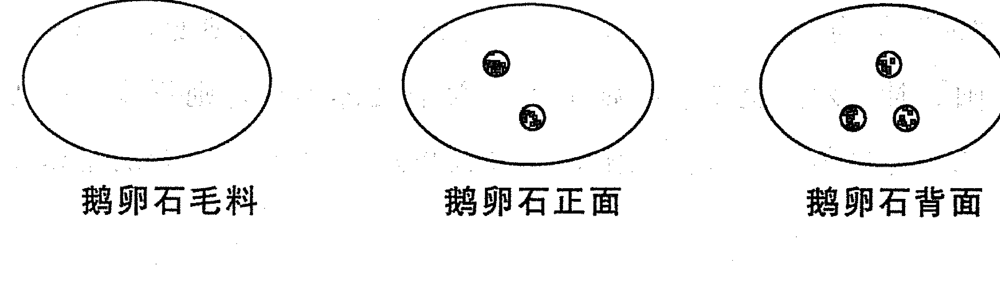

用这种方法，只需块扁平圆滑的鹅卵石，直径3厘米左右即可。抽出时间耐心地寻找，直到发现一块自己真正满意的并值得保存多年的石头，会惊奇地发现在我们居住的区域，居然也蕴藏着这么丰富、美丽的资源。在海滩、在公园、在附近河边的砾石中或花园里，我们都能找到得到。请欣赏这个神奇的自然造化之物吧。它经历上千年甚至上亿年的历史。在这个过程中，它成形、磨圆、磨光直到变成现在这个样，它的确是一件永恒之物，使我们能触摸到宇宙的基本力量。它是一个丰富的微观的宇宙，是旋转的电子，如同我们头顶上的亿万颗星星一样复杂。

第二步，在这块小鹅卵石上，一面标上两点，另一面标上三点；有油漆和软笔很容易做到。如果选择的是一块黑石头，可以用明亮的颜色来标记，例如改正液。然后做一个袋子用以保管这块特殊的石头。小袋子可用红色、黄色一类只要是自己喜欢的材料就行，可以把它放在《易经》附近。

预测时，抛卵石的方法同掷铜钱的方法基本相同，但不是一次掷铜钱才得到一个爻象，需要把石头掷三次才能得到一个爻象。把石头捧在手里，静心几分钟，然后让它掷在地上或检它较大的平面上。它可能显示两点的这一面；也可能是三点的那一面。三次的总数就可以使你确定象的底线。例如，如果你掷了三次点数分别为：2点、3点、2点，则总数为7。每一个总数构成一个爻的阴阳。列示如下：

- 2，2，2为6属阴为阴爻及老阴（×）；
- 2，3，2和3，2，2及2，2，3为7属阳为阳爻（一）；
- 3，3，2和2，3，3及3，2，3为8属阴为阴爻（--）；
- 3，3，3为9属阳为阳爻及老阳（○）。

因此本例中，由于你的得数是7，所以得到的爻象是阳爻（一）。然后继续使用同样的方法，自下而上地建立起你的卦象。每掷三次，算出得点的总数，然后画一个爻象。要画六个爻象，一共要掷18次（3×6）。每增加一个爻象，静下心来思考所要问的问题。

如果有一个爻是老阳或老阴，它意味着它要变成它的对立面。即阳变阴，阴变阳，并由此得出变卦。也可以这样说，掷卵石的方法同掷铜钱的方法基本上一致，除了它要求把卵石掷上三次才能构成一个爻，这样做，主要是为了使求测者有更多的时间去思考自己所问的问题。但不论使用的是哪一种方法，一定的仪式是非常重要的。因为它能帮助预测者关注于自己的问题，获得更加贴切的答案。

## 四、数字起卦法

首先要将数字转换为卦象，其转换方法是：若为1位数小于等于8则就于本身数字为卦象。如“3”数离为三则此卦为《离卦》如“9”

数就用“9”除以“8”余数为“1”则此卦为《乾卦》。若为3位数可将这三位数分成三段，第一位为上卦，第二位为下卦，第三位为动爻或分成两段，第一位为上卦，第二、三位之和被8除余数为下卦，三位之和被6除，余数为动爻。若为2位数，可将此数分两段，第一位为上卦，第二位为下卦，两位之和被6除，得余数为动爻，或与本身数字被8除，余数为卦。

例：报127数求测

以左边1为原数得上卦为乾卦，右边27之和用8除余数为1得下卦乾卦，三数之和被6除余数为4为动爻，全卦为《乾卦》变卦《风天小畜》。或以1为上卦得乾卦，2位下卦得兑卦，7被6除余1为动爻，得全卦为《天泽履》卦变卦为《天水讼》总之，3位数之内的数字起卦，根据本人当时一时的灵感，第一信念想用什么方法，就按什么方法起卦，所测吉凶祸福是相同的。具体方法为：将数字分成两节，左边一节数字之和除以8得之余数为上卦，右边一节数字之和除以8得余数为下卦，两边数字之和除以6数得余数为动爻。数字为奇数时左边一节要比右边一节少一位数，数字为偶数时从中分开，两节位数均相等。

例：四位数：1249

以左边12之和为原数得上卦离卦，右边49之和被8除余数为5得下卦巽卦，四数之和被6除余数为4为动爻，全卦之象为《火风鼎》变卦《山风蛊》其余位数多的数字同理。

## 五、按字的笔划和字数起卦

取其笔划，以左边为阳为上卦，右边为阴为下卦，以上为阳为上卦，下为阴为下卦，一字的总笔数，用六除求动爻。

例1：“乾”字按左为上卦，右为下卦，左是8划为“坤”卦，右是3划，下卦为“离”卦，总笔划数11划，被6除余5，故5爻动。此为《地火明夷》卦变卦《水火既济》

例2：“震”字按上为上卦象，下为下卦的原则，上“雨”为8划，下为“辰”7划总数15划，用6除余3，3爻动。其卦象为《地山谦》

变卦《坤为地》。

二字者：平分两仪，以一字的笔划数，被8除，余数为上卦；一字的笔划被8除，余数为下卦，两字的总笔划被6除，余数为动爻。不够六除者以原数画为卦。

三字者：一字为上卦，两字为下卦，三字总数被8除，余数为动爻。

四字者：两字为上卦，两字为下卦

五字者：两字为上卦，三字为下卦……

十一字以上，以至百字均可以起卦，以一半为上卦，一半为下卦，其字之总数被6除求动爻。以字起卦，不论是繁体字，还是简体字，都要笔划清楚为准，笔划不清者不用。

## 六、来人方位起卦：

如癸丑巳时，有一青年往兑方，以青年人居地为上卦，兑为下卦，是《山泽损》卦，又以艮七，兑二，加巳时六数，总数十五被6除余3数为动爻。其卦象为：变卦为：《山天天畜》

## 七、按声音起卦

凡闻几声，数到几数，起作上卦，加时配数作下卦，再以总数被6除，余数为动爻。例闻动物叫声，或闻人敲击之声，都可起卦。

## 八、按物象起卦

物象起卦示有二种，第一种是按物体的形象起卦，如听雷声，见仰状碟子碗等，如卦象状，上卦为震；再如见圆状东西，见到官员，或皇宫，都可以是状，上卦为乾为上卦，再以当时之时数与上卦的卦体数相合除以八得余数，为下卦卦体数。再用这卦数除以六，所得余数为动爻数，得之卦的变卦。

第二种物象起卦法，无明显的形象与八卦象间的联想；可以用数量除数物象数目，用这数字去起卦，方法也同时间法，被八除，除尽者用坤卦为上卦，除不尽者用余数为上卦，比八小者以本数为上卦，再以此加上当时间数被八除，余数为下卦；再以此加上当时间数被六除，得动爻数，演成之卦（变卦）。组成一个六爻卦的本卦与变卦。

## 第二节 装卦法

《易经》中每个经卦各居一宫，每宫包含六十四卦中的八个个别卦；各宫都有其五行属性，即乾宫和兑宫属金，艮宫和坤宫属土，震宫和巽宫属木；离宫属火；坎宫属水。八宫五行的记忆口诀是：

- 坤艮属土坎属水，
- 乾兑二卦性属土，
- 震巽属木离属火，
- 八卦五行关系深。

八卦中含有卦和象征意义，即乾卦卦象为天，象征意义“健”；坤卦卦象为地，象征意义为“顺”；震卦卦象为雷，象征意义为“动”；巽卦卦象为风，象征意义为“入”；坎卦卦象为水，象征意义为“陷”；离卦卦象为火，象征意义为“附”；艮卦卦象为山，象征意义为“止”；兑卦卦象为泽，象征意义为“悦”。

六十四卦分属八宫，每宫含八个卦。八宫是：乾宫、坎宫、艮宫、震宫、巽宫、离宫、坤宫、兑宫。

卦名前的文字，表示的是八卦的象征物，如“天风姤”，意思是姤卦由象征特为“天”的乾卦和象征物为“风”的巽卦所构成；“天山遁”，意思是遁卦由象征特为“天”的乾卦和象征物为“山”的艮卦所构成等等。

## 一、八卦纳甲法

什么是“纳甲”，所谓纳甲，就是将十天干即：甲、乙、丙、丁、戊、己、庚、辛、壬、癸纳入八卦之中。而所以称之为纳甲，是由于“甲”为十干之首，为便于称述特举“甲”以概括十干。

这样似乎可以说，所谓纳甲占卦法，就是把十天干纳入八卦的一种占卦方法。这样说其实是不准确的，因为事实上所“纳”的内容要比这复杂得多。概括起来说，所纳内容主要以下几个方面：

- 1、给八卦纳入天干；
- 2、给八宫六十四卦各卦六爻纳入地支；
- 3、定“六亲”
- 4、安“世”、“应”
- 5、起“六神”；
- 6、配五行；

这些所纳入的内容，都是断卦的重要依据。这里要强调指出的一点是，纳甲占卦法的最大特点是给卦中的各种因素都配以五行，充分发挥和利用五行之间的生克冲合等关系而进行断卦，所以配五行乃是一个关键环节。

这种给卦中纳入各种断卦依据的做法和过程，通常称为“装卦”。装卦之后，就可以断卦了。不过断卦时除了依据上述内容外，还要审视占卦日期和卦爻变动情况等等。

与其他占卦法相比，纳甲占卦法具有细致、缜密、周严、具体、规则性强、随意性小等长处，但弊端也不少，如复杂烦难，不易掌握，神秘色彩更加浓厚等。

总之，纳甲占卦法是给卦中纳入十天干等断卦依据的一种占卦方法，其步骤有两个：一是装卦，二是断卦。

将天干纳入八卦的方法是：先将天干纳于五方：东方甲乙、南方丙丁、西方庚辛、北方壬癸、中央戊己。

## 六爻八卦全息论

# 二、八卦纳支

在八卦预测中天干表示五运，地支表示六气，所以能成就四季而化生万物。五运施予，六气接受并加以完成。天干的作用是气化，地支的作用是形化；五运的施予没有形象，六气的区别却有迹象可寻。所以浑天甲子在地支上配财、官、父、兄、子六亲，而不配在天干上。与天干相比，卜筮更重视地支，不过也有参用天干的。

- 八卦纳支时分内卦、外卦，一分为二拆开配用。
- 乾内卦：子水、寅木、辰土。
- 外卦：午火、申金、戌土。
- 坎内卦：寅木、辰土、午火。
- 外卦：申金、戌土、子水。
- 艮内卦：辰土、午火、申金。
- 外卦：戌土、子水、寅木。

- 震内卦：子水、寅木、辰土。
- 外卦：午火、申金、戌土。
- 巽内卦：丑土、亥水、酉金。
- 外卦：午火、申金、戌土。
- 离内卦：卯木、丑土、亥水。
- 外卦：酉金、未土、巳火。
- 坤内卦：未土、巳火、卯木。
- 外卦：丑土、亥水、酉金。
- 兑内卦：巳火、卯木、丑土。
- 外卦：亥水、酉金、未土。

以上八卦，乾震两卦六个爻中的地支排列相同。其六爻中的地支排法，是隔位而排，由下往上排。知道各爻的五行排列，就能正确掌握阴阳五行生克制化的法则，这是断准卦的重要环节。

为了便易记忆，绘手掌图解说：

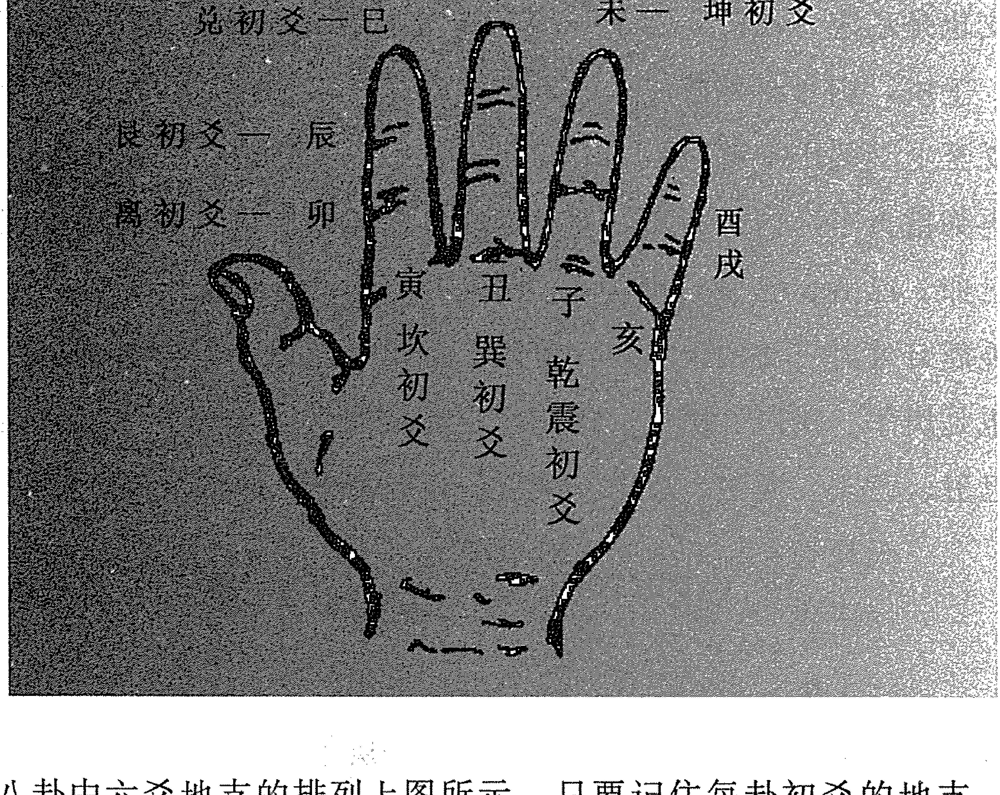

八卦中六爻地支的排列如上图所示，只要记住每卦初爻的地支，隔位排列，阳卦顺行，阴卦逆行就可以了。如图中乾、震、坎、艮四阳卦排列

## 三、六亲排法

一卦有六爻，分排六亲。六亲就是父母、兄弟、妻财、官鬼、子孙。卦中六亲，以八卦所属五行为主，分定爻位地支六亲次序。六亲不仅是要预测的对象，也是取用神的依据；明确卦中用神，才能正确的预测和断卦。

六亲生克：生我者为父母，我生者为子孙，克我者为官鬼，我克者为妻财，同我者为兄弟。“六亲”之间的生克关系在占卦中经常用到，卜者应当牢记。

## 六亲生克关系图

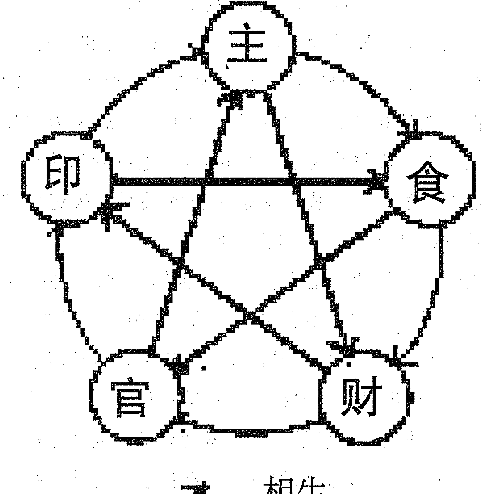

- 相生
- 相克

## 六爻八卦全息论

八卦中各宫六亲的排法：作者总结出一首《六亲歌》如下：

> 乾兑金兄土父传，木财火官水子然。
> 坎宫水兄火为财，土鬼金父木子来。
> 坤艮土兄火为父，木鬼水财金子定。
> 离宫火兄水为鬼，土子木父金财助。
> 震巽木兄水父母，金鬼火子财是土。

例如：乾为首《乾为天》卦，乾宫属金，即我为金。

- 戌、六爻 父母（土生金我，生我者为父母）
- 申、五爻 兄弟（金与金，同我者为兄弟）
- 午、四爻 官鬼（火克金，克我者为官鬼）
- 辰、三爻 父母（土生金，生我者为父母）
- 寅、二爻 妻财（金克木，我克者为妻财）
- 子、初爻 子孙（金生水，我生者为兄弟）

八卦中乾兑的五行属性为金，因此，乾宫八卦和兑宫八卦共十六卦的属性均为金。“比我者为兄弟”，十二地支中申酉为金，如果在卦中六爻遇到申或酉，就是和“我”并列平等的关系，故定为“兄弟”。十二地支中丑、辰、未、戌属性为土，土生金，“生我者为父母”，所以在卦中六爻凡遇运丑、辰、未、戌，就是生我的关系，故定为“父母”。这就是所谓“乾兑金兄土父传”。其余亦然。

关于“六亲”之间的生克关系，前人曾作过这样的概括：

> “子动生财，不宜父摆，兄动克财，子动能解。
> 财运生鬼，切忌兄摇，子动克鬼，财动能消。
> 父动生兄，忌财相克，鬼动克兄，父动能泄。
> 鬼动生父，忌子交重，财动克父，鬼动能解。
> 兄动生子，忌鬼摇扬，父动克子，兄动无妨。
> 子兴克鬼，父动无妨，若然兄动，鬼必遭伤。
> 财兴克父，兄动无忧，若然子动，父命难留。
> 父兴克子，财动无事，若是鬼兴，其子必死。”

鬼兴克兄，子动可救，财若交重，兄弟不久。
兄兴克财，鬼兴无碍，若是父兴，财遭克害。”
这里所谓“兴”、“交”、“重”都是动、变的意思。

## 附：六十四卦爻象全图表：

| 乾为天 | 天风姤 | 天山遁 | 天地否 |
|---|---|---|---|
| 父母壬戌土、世；兄弟壬申金、官鬼壬午火、父母甲辰土、应；妻财甲寅木 | 父母壬戌土、兄弟壬申金、官鬼壬午火、父母甲辰土、应；妻财甲寅木 | 父母壬戌土、兄弟壬申金、应；官鬼壬午火、兄弟丙申金、官鬼丙午火、父母丙辰土 | 父母壬戌土、应；兄弟壬申金、官鬼壬午火、妻财乙卯木、父母乙未土 |

| 风地观 | 山地剥 | 火地晋 | 火天大有 |
|---|---|---|---|
| 妻财辛卯木、官鬼辛巳火、父母辛未土、兄弟辛酉金、应 | 妻财丙寅木、子孙丙子水、父母丙戌土、妻财乙卯木、官鬼乙巳火、应 | 父母己未土、兄弟己酉金、妻财乙卯木、官鬼乙巳火、父母乙未土、应 | 父母己未土、兄弟己酉金、妻财甲寅木、子孙甲子水、应 |

## 2. 兑宫八卦属金

| 兑为泽 | 泽水困 | 泽地萃 | 泽山咸 |
|---|---|---|---|
| 父母丁未土、世；兄弟丁酉金、子孙丁亥水、父母丁丑土、应；妻财丁卯木 | 父母丁未土、兄弟丁酉金、子孙丁亥水、应；官鬼戊午火、父母戊辰土、妻财戊寅木、世 | 父母丁未土、兄弟丁酉金、应；子孙丁亥水、妻财乙卯木、官鬼乙巳火、父母乙未土、世 | 父母丁未土、应；兄弟丁酉金、子孙丁亥水、兄弟丙申金、官鬼丙午火、父母丙辰土、世 |

| 水山蹇 | 地山谦 | 雷山小过 | 雷泽归妹 |
|---|---|---|---|
| 子孙戊子水、父母戊戌土、兄弟戊申金、世；兄弟丙申金、官鬼丙午火、父母丙辰土、应 | 兄弟癸酉金、子孙癸亥水、父母癸丑土、世；兄弟丙申金、官鬼丙午火、父母丙辰土、应 | 父母庚戌土、兄弟庚申金、官鬼庚午火、世；妻财庚辰土、子孙庚寅木、父母庚子水、应 | 父母庚戌土、应；兄弟庚申金、官鬼庚午火、父母丁丑土、妻财丁卯木、官鬼丁巳火、世 |

## 3. 离宫八卦属火

| 离为火 | 火山旅 | 火风鼎 | 火水未济 |
|---|---|---|---|
| 兄弟己巳火、世；子孙己未土、妻财己酉金、官鬼己亥水、应；子孙己丑土、父母己卯木 | 兄弟己巳火、子孙己未土、妻财己酉金、应；妻财丙申金、兄弟丙午火、子孙丙辰土、世 | 兄弟己巳火、子孙己未土、应；妻财己酉金、妻财辛酉金、官鬼辛亥水、世；子孙辛丑土、父母辛卯木 | 兄弟己巳火、应；子孙己未土、妻财己酉金、兄弟戊午火、世；子孙戊辰土、父母戊寅木、应 |

## 4. 震宫八卦属木

| 震为雷 | 雷地豫 | 雷水解 | 雷风恒 |
|---|---|---|---|
| 妻财庚戌土、世；官鬼庚申金、子孙庚午火、妻财庚辰土、应；兄弟庚寅木、父母庚子水 | 妻财庚戌土、官鬼庚申金、子孙庚午火、应；兄弟乙卯木、子孙乙巳火、妻财乙未土、世 | 妻财庚戌土、官鬼庚申金、应；子孙庚午火、子孙戊午火、妻财戊辰土、世；兄弟戊寅木、父母戊子水 | 妻财庚戌土、应；官鬼庚申金、子孙庚午火、官鬼辛酉金、世；父母辛亥水、妻财辛丑土 |

| 地风升 | 水风井 | 泽风大过 | 泽雷随 |
|---|---|---|---|
| 官鬼癸酉金、父母癸亥水、妻财癸丑土、世；官鬼辛酉金、父母辛亥水、妻财辛丑土、应 | 父母戊子水、妻财戊戌土、世；官鬼戊申金、官鬼辛酉金、父母辛亥水、应；妻财辛丑土 | 妻财丁未土、官鬼丁酉金、父母丁亥水、世；官鬼辛酉金、父母辛亥水、妻财辛丑土、应 | 妻财丁未土、应；官鬼丁酉金、父母丁亥水、妻财庚辰土、世；兄弟庚寅木、父母庚子水 |

## 5. 巽宫八卦属木

| 巽为风 | 风天小畜 | 风火家人 | 风雷益 |
|---|---|---|---|
| 兄弟辛卯木、世；子孙辛巳火、妻财辛未土、官鬼辛酉金、应；父母辛亥水、妻财辛丑土 | 兄弟辛卯木、子孙辛巳火、妻财辛未土、应；妻财甲辰土、兄弟甲寅木、父母甲子水、世 | 兄弟辛卯木、子孙辛巳火、应；妻财辛未土、父母己亥水、妻财己丑土、世；兄弟己卯木 | 兄弟辛卯木、应；子孙辛巳火、妻财辛未土、妻财庚辰土、世；兄弟庚寅木、父母庚子水 |

| 天雷无妄 | 火雷噬嗑 | 山雷颐 | 山风蛊 |
|---|---|---|---|
| 妻财壬戌土、官鬼壬申金、子孙壬午火、世；妻财庚辰土、兄弟庚寅木、父母庚子水、应 | 子孙己巳火、妻财己未土、官鬼己酉金、世；妻财庚辰土、兄弟庚寅木、父母庚子水、应 | 兄弟丙寅木、父母丙子水、妻财丙戌土、世；妻财庚辰土、兄弟庚寅木、父母庚子水、应 | 兄弟丙寅木、应；父母丙子水、妻财丙戌土、官鬼辛酉金、世；父母辛亥水、妻财辛丑土 |

## 6. 坎宫八卦属水

| 坎为水 | 水泽节　水雷屯 | 水火既济 | |
|---|---|---|---|
| 兄弟戊子水、世；官鬼戊戌土、父母戊申金、妻财戊午火、应；官鬼戊辰土、子孙戊寅木 | 兄弟戊子水、官鬼戊戌土、父母戊申金、应；官鬼丁丑土、子孙丁卯木、妻财丁巳火、世 | 兄弟戊子水、官鬼戊戌土、应；父母戊申金、官鬼庚辰土、子孙庚寅木、世；兄弟庚子水 | 兄弟戊子水、应；官鬼戊戌土、父母戊申金、兄弟己亥水、世；官鬼己丑土、子孙己卯木 |

## 7. 艮宫八卦属土

| 艮为山 | 山火贲 | 山天大畜 | 山泽损 |
|---|---|---|---|
| 官鬼丙寅木、世；妻财丙子水、兄弟丙戌土、子孙丙申金、应；父母丙午火、兄弟丙辰土 | 官鬼丙寅木、妻财丙子水、兄弟丙戌土、应；妻财己亥水、兄弟己丑土、官鬼己卯木、世 | 官鬼丙寅木、妻财丙子水、应；兄弟丙戌土、兄弟甲辰土、官鬼甲寅木、世；妻财甲子水 | 官鬼丙寅木、应；妻财丙子水、兄弟丙戌土、兄弟丁丑土、世；官鬼丁卯木、父母丁巳火 |

| 火泽睽 | 天泽履 | 风泽中孚 | 风山渐 |
|---|---|---|---|
| 父母己巳火、兄弟己未土、子孙己酉金、世；兄弟丁丑土、官鬼丁卯木、父母丁巳火、应 | 父母壬戌土、子孙壬申金、世；父母癸午火、兄弟癸亥水、妻财癸丑土、应；父母丁巳火 | 官鬼辛卯木、父母辛巳火、兄弟辛未土、世；兄弟丁丑土、官鬼丁卯木、父母丁巳火、应 | 官鬼辛卯木、应；父母辛巳火、兄弟辛未土、子孙丙申金、世；父母丙午火、兄弟丙辰土 |

## 8. 坤宫八卦属土

| 坤为地 | 地雷复 | 地泽临 | 地天泰 |
|---|---|---|---|
| 子孙癸酉金、世；妻财癸亥水、兄弟癸丑土、官鬼乙卯木、应；父母乙巳火、兄弟乙未土 | 子孙癸酉金、妻财癸亥水、兄弟癸丑土、应；兄弟庚辰土、官鬼庚寅木、妻财庚子水、世 | 子孙癸酉金、妻财癸亥水、应；兄弟癸丑土、兄弟丁丑土、官鬼丁卯木、世；父母丁巳火 | 子孙癸酉金、应；妻财癸亥水、兄弟癸丑土、兄弟甲辰土、世；官鬼甲寅木、妻财甲子水 |

| 雷天大壮 | 泽天夬 | 水天需 | 水地比 |
|---|---|---|---|
| 兄弟庚戌土、子孙庚申金、父母庚午火、世；兄弟甲辰土、官鬼甲寅木、妻财甲子水、应 | 兄弟丁未土、子孙丁酉金、世；妻财丁亥水、兄弟甲辰土、官鬼甲寅木、应；妻财甲子水 | 妻财戊子水、兄弟戊戌土、子孙戊申金、世；兄弟甲辰土、官鬼甲寅木、妻财甲子水、应 | 妻财戊子水、应；兄弟戊戌土、子孙戊申金、官鬼乙卯木、世；父母乙巳火、兄弟乙未土 |

## 四、装变卦爻

卦遇变爻，变爻在内卦只变内卦，变爻在外卦，只变外卦，内外卦都有变爻则全变，但记卦时，只记有变化的爻，没有变化的爻则不必重标地支、五行和六亲。在装六亲的时候，不以变卦所在宫为“我”，仍以所占得的本卦属性为“我”。即变卦六亲仍以主卦之六亲而排。例：乾为天卦变泽火革卦，二爻与六爻两个爻变，《泽火革》为坎宫之卦，装六爻时仍以乾宫金为“我”，不以变卦坎宫水为“我”。

## 第三节　按世应定六亲

## 一、按世应

一卦六个爻中，有世爻和应爻，世爻为问卦之人，应爻为他人（问卦人所要测的人或事）等。世应相生相合，则宾主相投，世应相克相冲则两不睦。凡占问自己疾病、寿数、出行诸事凡损益自身者，都以世爻为用神。凡测无尊卑之称呼，未曾深交之朋友及九流术士，仇人敌国，或指某处地头，或者此山此水，此寺此塔等，俱以应爻为用神。

在纳甲占筮中，如何确定“世爻”、“应爻”非常重要，因为主要据此占断。要确定“世”、“应”各爻，应首先推出卦中的“六亲”和六爻的干支，再定出“世”爻，然后根据“世”爻即可定出“应”爻来。

“世”的确定是以六十四卦所分八宫及一卦所在宫中的次序为依据的。

关于六十四卦分宫，即阳四宫为乾、坎、艮、震；阴四宫为巽、离、坤、兑，共八宫，每宫八卦。而每宫八卦的次序不能紊乱，即纯卦、一世、二世、三世、四世、五世、游魂、归魂，这一排列顺序是据每宫纯卦有规律的交变而来的。前面已经介绍，可参看六十四卦分宫次序表。

## 二、六亲类象

1、父母爻对应的人：长辈、教师、岳父等等相当卦主的父母辈的亲属。在具体运用过程中，父母爻还泛指比自己年龄大的人。例在测人事有关系时，如果父母爻为喜神生扶世爻，说明比自己年龄大的人或是父母辈的人对自己比较关照，关系融洽。

对应的事：学习、学业、知识、通讯、通信、信息、教育、爱护、关照、保护、承载、容忍、包涵等等。

体现在人的特性上：为喜神时主知识渊博、老成、有经验、守信。为忌神时主死板、变通性不强等。

对应的物：城池、房舍、车船、衣物、雨具、文书、案卷、证书、证件、票据、字据、契约、合同书、法律条文、规章制度等。

对应地理：文化事业单位、教育单位、通讯单位场所、交通局、工商管理所、审计局、打字印刷单位场所、设计院、学校、敬老院、慈善机构等等一切与文化、文字、证件、信仰、慈善、保护有关的机构和场所都可以用父母爻作对应点。

2、官鬼爻对应的人：长官、领导、法官、小人、凶手、歹徒、盗贼、鬼怪邪崇这人物等等；还有能制约、限制我或陷害我，使我恐惧的人都可以用官鬼爻作对应点。在六爻中官鬼爻还代表广义上的男人。

对应的事：为喜神时主名誉、名气、地位、官职、荣誉、表扬、奖励等一切使我荣身、扬眉吐气之事，都以官鬼爻为对应点；为忌神时主官司诉讼、牢狱之灾、口舌是非、吸毒、鬼神邪崇之事、恐吓、打击报复、陷害、诽谤、疾病、灾祸、忧郁之事等等。

体现在人的特性上：为忌神时主狡猾、深藏不露、阴险、歹毒、好功名；为喜神时主雄心壮志、有荣誉感、有责任感等等一些心性。

对应的物：为喜时主奖状、毕业证书、荣誉证书；为忌神时主尸首、凶猛的野兽、鬼怪、凶器、毒药、白粉、摇头丸等等。

对应的地理：法院、检察院、公安局等法制机构。还有政府机关、事业单位、监狱、工商管理所等等官方（公家）单位和机构。另外还对应着色情场所、酒店、舞厅、赌场、刑场、凶事（出事）现场等等。

3、兄弟爻对应的人：兄弟姐妹、朋友、同辈之人、同行、同事等等。

对应的事：为忌神时主劫财、破财、克妻、分离、分手、分散、阻碍、阻隔、阻拦、争斗、争端、争执、分夺、掠夺、劫掠、抢占；为喜

六爻八卦全息论

神时主帮助、帮扶、资助、携手、有利合作等等。

体现在人的特性上：为喜神时主自尊心强、有毅力、热心好客、好交友、乐于助人；为忌神时主固执己见、唯我独尊、我行我素不愿受制约。还有任性、死要面子、好争夺、好斗等等。

对应的物：假肢、假牙、扶手、健身器具、运动器具等等。

对应的地理：体育馆、体委、竞争场所、运动场、比赛场，与我所经营从事的业务相同场所或单位。例如你开酒店，那么你周围的其它酒店就可以兄弟交来代表，因为他是你的同行，他与你竞争。

4、妻财交对应的人：男士预测，财交临桃花时可代表情人、女友。还对应着仆人、下属、工人、职员等。另外，财交还代表广义上的女人。

对应的事：财务、利欲、欲望、享受、色欲、情欲、感情、被控制、受指使、使用、婚姻、经济往来、钱财得失等等。

体现在人的特性上：为忌神时主重视钱财利欲、重视实际；为喜神时主能够脚踏实地去生活，用钱节约等。

对应的物：金钱、金银财宝、财物、财产、贵重物品、粮食、食物、工具、碗筷、盘子、车辆等等一切为我使用之物都可以用妻财交来对应。

对应的地理：证券交易场所、金融财政单位、银行、储蓄所、粮油单位、劳务场所等等和金钱财物有关的单位和场所都可以财交为对应点。

5、子孙交对应的人：晚辈、小孩等，凡属儿女辈之人都可以子孙交为对应点；另外下属、兵卒、徒弟、医生、僧道、公安人员、检察机关人员等等都以子孙交为对应点。

对应的事：为忌神时主寻欢作乐、吃喝嫖赌、与领导有矛盾（官交为喜被子孙交克制时）；为喜神时主健康娱乐、旅游运动、发表著作、发表演说、有生财之道（子孙交为喜神时）、展览、展示、绘画、艺术创作等等。

对应人的特性：好动、喜欢艺术、喜娱乐、好幻想、清高、有生财之道（子孙爻起了好作用时）、口才好（为喜神时）等等。

对应的物：收音机、录音机、鼓乐器等供开心娱乐之物品；玩具、运动器材、欢乐器具、性药、药物、趋吉避凶器具等等。

对应的地理：游乐场所如公园、动物园、酒店、电影院、公安局等。

地支与天干的作用关系与地支与（世爻）地支之间的作用关系相同，也是以生世、克世、世生、世克、同世为准而确定。比如：天干甲木，世爻地支子水，世爻子水生天干甲木，我生者为食伤（子孙）都为阳，所以为食神，其他类同。

# 三、六亲歌诀

# 1、六亲变化诀

> 父母化父母，进神文书许，

化子不伤丁，化鬼官迁举，

化财尊长忧，兄弟为泄气。

父母化父母或化进神，利于文书之事；化子不伤丁，虽有父母克子孙之说，但动爻不能生克变爻；化官鬼，为化回头生吉；化妻财为化回头克，因妻财爻克父母爻，不利家宅、尊长等；化兄弟爻为泄气。

> 子孙化退神，人财不称情，

化父田蚕败，化财加倍荣，

化鬼忧生产，兄弟谓相生。

子孙爻动化退神主泄气，占自身、占财都不如意；子孙动化父母回头克，主凶象；化妻财为泄气，加倍的衰；子孙爻动化官鬼，不利生产，恐产妇或婴儿有险，主生产不顺；子孙动化兄弟回头生，大吉之象。

> 官鬼化进神，求官应急速，

化财占病凶，化父文书遂，

化子必伤官，化兄家不睦。

官鬼化进神好，主进钱财；官鬼交化妻财交，主忧虑；化子孙交回头生，主事吉利称心；官鬼交化父母交不利家长；化兄弟交主破财，因兄弟交克官鬼交为回头克，所以主破财。

> 妻财化进神，钱财人宅来，

化官忧戚戚，化子笑哈哈，

化父宜家长，化兄当破财。

妻财化进神好，主进钱财；妻财交化官鬼交，主忧虑；化子孙交回头生，主事吉利称心；妻财交化父母交不利家长；化兄弟交主破财，因兄弟交克妻财交为回头克，所以主破财。

> 兄弟化退神，凡占无所忌，

化父妾奴惊，化财财未遂，

化官弟有灾，化子却如意。

兄弟交化退神，凡占之事无所忌；化父妾奴惊，因父母为生我者，妻妾为我克者。化父母交回头生，兄弟交又增力量；克财交更凶，故称妾奴惊；化妻财交，求财不遂意；兄弟交化官鬼交，为化回头克，凶灾之象；兄弟交化子孙交事却如意。

# 2、六亲发动诀

> 父动当头克子孙，病人无药主昏沉，

妇亲子息应难得，买卖劳心利不好，

行人在外身将动，产妇求神易脱除，

失物静安家未出，病人伤胃更伤脾。

父母交发动克子孙凶象也。不利求医问药，不利病人；占婚占子都难得；测买卖劳心费力且不会盈利；测行人定有书信；占产妇利于生产；占失物未出家门；占病必主脾胃不好。

子孙发动伤官鬼，占病求医身便痊，

行人买卖身康泰，婚姻喜美是前缘，

产妇当生子易养，词讼私和不到官，

谒贵求名休进用，劝君守分听乎天。

子孙交发动克伤官鬼爻，但却利求医治病；占出外行商主身体健康，生意顺利；占婚姻美满幸福；占生产主产妇易生子女易养；占官司私了不宜到官；不利求官求名；劝君安分守己顺乎自然。

官鬼从来克兄弟，婚姻未就生疑滞，

病因门庭祸祟来，耕种蚕桑皆不利，

出外逃亡定见灾，词讼官非有囚系，

买卖财轻赌博输，失脱难寻多暗昧。

官鬼交发动，兄弟交受克，占婚姻不利且生阻碍；占病不利；占耕种难获，养蚕不利；占外出，逃亡必见灾；占官司难输甚至进牢；占买卖财轻，占赌难输；占失脱难以寻找，且多生暗昧之事。

财交发动克文书，应举求名总是虚，

将本经营为大吉，亲姻如意乐无虞，

行人在外身将动，产妇求神易脱除，

失物静安家未出，病人伤胃更伤脾。

妻财交发动克文书，即父母交，应举求名遇之一场空；占求财可下大本钱，大吉之象；占婚姻美满如意，且无不好之处；占行人在外即将动身；占产妇利于生产；占失物未出家门；占病必主脾胃不好。

兄弟交重克了财，病人难愈未离灾，

应举夺标为忌客，官非阴贼耗钱财，

若带吉神为有助，出路行人便未来，

货物经商消折本，买婢求妾事不谐。

兄弟交发动克妻财爻，占病难愈且多灾；应举夺标最忌兄弟交发动；因兄弟交为竞争对手；占求官不是遇小人就是耗钱财；若有吉神称为有助；占出路行人还未归；占货物或经商，兄弟交发动定主赔本；

娶妾兄弟交发动，为事不和谐，因兄弟克妻财交。

# 四、寻世认宫

寻世认宫是六爻八卦预测的一个重要内容，它是组成一个完整卦象的重要步骤。一个卦象得出后，首先要认出这个卦是属于那一宫才能装好各爻的干支并配好六亲。然后再按好世爻和应爻才能确定我方、它方之后，方能进行吉凶的预测。

寻世认宫就是通过装好的卦爻来确定世爻、应爻，然后再确认此卦是在八卦的那一个宫里，组成一个完整的卦象。从而来进行下一步的预测。

下边向读者介绍一种快速寻世认宫的方法。也就是说一个卦象出来后，立即就能看出它是属于那一宫，世爻应爻在什么位置上。按照这种寻世认宫歌诀的方法既快又准。

我们知道一个纯卦是由三个爻组成，这三个爻即上爻为天，下爻为地，中间一爻为人，分别代表由天、人、地组成。一个完整的卦象是由六个爻上、下两部分（即上卦、下卦）组成。

“天同二世天变五”的含义即一个卦的上下两部分（上卦、下卦）天爻相同而人爻、地爻二爻上下卦各不相同时就是二爻持世，这就是“天同二世”。知道世爻在二爻后往上数第三爻（即卦之五爻）就是应爻。为了便于理解，我们把六十四卦中二爻持世之卦分别列出，便可以看出这个规律：

| 天山遁 | 泽地萃 | 火风鼎 |
|---|---|---|
| 父母戌土 | 父母未土 | 兄弟巳火 |
| 兄弟申金应 | 兄弟酉金应 | 子孙未土应 |
| 官鬼午火 | 子孙亥水 | 妻财酉金 |

| 左列 | 中列 | 右列 |
|---|---|---|
| 兄弟申金 官鬼午火世 父母辰土 | 妻财卯木 官鬼巳火世 父母未土 | 妻财酉金 官鬼亥水世 子孙丑土 |
| **天山遁** 妻财戌土 官鬼申金应 子孙午火 子孙午火 妻财辰土世 兄弟寅木 | **泽地萃** 兄弟卯木 子孙巳火应 妻财未土 父母亥水 妻财丑土世 兄弟卯木 | **火风鼎** 兄弟子水 官鬼戌土应 子孙申金 官鬼辰土 子孙寅木世 兄弟子水 |

从上列卦中可以看出这些卦都是上下天爻相同而人爻地爻却各不相同，这就是天同二世的意思。

“天变五”的含意即一卦象的上卦、下卦的天爻不相同，而人、地各自相同，就是五爻持世。如下：

# 六爻八卦全息论

| 山地剥 | 地山谦 | 风水涣 |
|---|---|---|
| 妻财寅木 | 兄弟酉金 | 父母卯木 |
| 子孙子水世 | 子孙亥水世 | 子孙戌土 |
| 父母戌土应 | 兄弟申金应 | 兄弟午火 |
| 妻财卯木 | 兄弟寅木应 | 兄弟辰土应 |

| （左列） | 火雷噬嗑 | 雷火丰 |
|---|---|---|
| 父母子水 | 妻财未土世 | 官鬼戌土 |
| 父母子水 | 官鬼酉金 | 父母申金 |
| 妻财戌土应 | 子孙午火世 | 妻财午火 |
| 官鬼申金 | 兄弟寅木应 | 官鬼丑土应 |
| 官鬼酉金 | 父母子水应 | 子孙卯木应 |

| 天泽履 | 泽天夬 |
|---|---|
| 兄弟未土 | 子孙酉金世 |
| 子孙申金 | 妻财亥水 |
| 父母午火 | 兄弟辰土 |
| 兄弟丑土应 | 官鬼寅木应 |
| 父母巳火 | 妻财子水应 |

“地同四世地变初”的含义是：上下两卦地支相同，其它三爻各不相同就是四爻持世。如：

| 风地观 | 水山蹇 | 山水蒙 |
|---|---|---|
| 妻财卯木 | 父母戌土 | 父母寅木 |
| 父母未土 | 官鬼申金 | 官鬼子水 |
| 子孙未土世 | 兄弟申金世 | 子孙戌土世 |
| 妻财卯木 | 妻财未土 | 妻财丑土 |
| 官鬼巳火 | 官鬼午火 | 子孙辰土 |
| 父母未土应 | 父母辰土应 | 父母寅木应 |

| 地雷复 |
|---|---|
| 官鬼丙寅木 | 妻财癸亥水 |
| 妻财丙子水 | 兄弟癸丑土 |
| 子孙丙申金 | 父母乙巳火 |
| 应 | 兄弟乙未土 |
| 父母丙午火 |  |
| 兄弟丙辰土 |  |

> “三世异”即上、下两卦的天、人、地三个爻都分别各不相同，那么世就是三爻持世。

| 天地否 | 泽山咸 | 火水未济 |
|---|---|---|
| 父母戌土应 | 父母未土应 | 兄弟巳火应 |
| 兄弟申金 | 兄弟酉金 | 子孙未土 |
| 官鬼午火 | 官鬼亥水 | 妻财酉金 |
| 妻财卯木世 | 兄弟申金世 | 兄弟未土世 |

| 雷风恒 | 风雷益 | 水火既济 |
|---|---|---|
| 妻财戌土应 | 兄弟卯木应 | 兄弟亥水应 |
| 官鬼申金 | 妻财未土 | 官鬼戌土 |
| 子孙午火 | 官鬼午火 | 父母申金 |
| 官鬼酉金世 | 妻财辰土世 | 兄弟亥水世 |

| 妻财丑土 | 父母子水 | 子孙卯木 |
|---|---|---|
| **山泽损** | **地天泰** |  |
| 官鬼丙寅木 | 子孙癸酉金应 |  |
| 应 | 妻财癸亥水 |  |
| 妻财丙子水 | 兄弟癸丑土 |  |
| 兄弟丙戌土 | 兄弟甲辰土世 |  |
| 兄弟丁丑土 | 妻财甲子水 |  |
| 世 | 官鬼甲寅木 |  |
| 父母丁巳火 |  |  |
| 官鬼丁卯木 |  |  |

“人同游魂人变归”的含义是：“人同游魂”是说上、下两卦中的人爻相同，而天爻、地爻各不相同，即为游魂卦是四爻持世。如：

| **火地晋** | **天水讼** | **泽风大过** |
|---|---|---|
| 官鬼巳火 | 父母戌土 | 子孙戌土 |
| 父母未土 | 兄弟申金 | 妻财申金 |
| 兄弟酉金世 | 官鬼午火世 | 兄弟午火世 |
| 妻财卯木 | 兄弟申金 | 兄弟午火 |
| 官鬼巳火 | 官鬼午火 | 子孙辰土 |
| 父母未土应 | 父母辰土应 | 父母寅木应 |

| **雷山小过** | **山雷颐** | **地火明夷** |
| 妻财丁未土 | 兄弟丙寅木 | 父母癸酉金 |
| 官鬼丁酉金 | 父母丙子水 | 兄弟癸亥水 |
| 父母丁亥水世 | 妻财丙戌土世 | 官鬼癸丑土世 |

| 列1 | 列2 | 列3 |
|---|---|---|
| 官鬼辛酉金 父母辛亥水 妻财辛丑土应 | 妻财庚辰土 兄弟庚寅木 父母庚子水应 | 兄弟己亥水 官鬼己丑土 子孙己卯木应 |
| **风泽中孚** | **水天需** |  |
| 官鬼辛卯木 父母辛巳火 兄弟辛未土世 兄弟丁丑土 官鬼丁卯木 父母丁巳火应 | 妻财戊子水 兄弟戊戌土 子孙戊申金世 兄弟甲辰土 官鬼甲寅木 妻财甲子水应 |  |

“人变归”是说上、下两卦，人爻各不相同，而天爻、地爻各自相同，即为归魂卦是三爻持世。如：

| 列1 | 列2 | 列3 |
|---|---|---|
| **火天大有** | **山风蛊** | **地水师** |
| 官鬼巳火应 父母未土 兄弟酉金 父母辰土世 妻财寅木 子孙子水 | 父母戌土应 兄弟申金 官鬼午火 父母丑土世 妻财卯木 官鬼巳火 | 子孙戌土应 妻财申金 兄弟午火 官鬼亥水世 子孙丑土 父母卯木 |
| **泽雷随** | **山风蛊** | **地水师** |
| 妻财未土应 | 兄弟寅木应 | 父母酉金应 |

| 列1 | 列2 | 列3 |
|---|---|---|
| 官鬼酉金 | 父母子水 | 兄弟亥水 |
| 父母亥水 | 妻财戌土 | 官鬼丑土 |
| 妻财辰土世 | 官鬼酉金世 | 妻财午火世 |
| 兄弟寅木 | 父母亥水 | 官鬼辰土 |
| 父母子水 | 妻财丑土 | 子孙寅木 |

| 列1 | 列2 |
|---|---|
| **风山渐** | **水地比** |
| 官鬼卯木应 | 妻财子水应 |
| 父母巳火 | 兄弟戌土 |
| 兄弟未土 | 子孙申金 |
| 子孙申金世 | 官鬼卯木世 |
| 父母午火 | 父母巳火 |
| 兄弟辰土 | 兄弟未土 |

以上寻世（即按世爻）总结起来歌诀共有四句：
大同二世天变五，地同四世地变初，
本宫六世三世异，人同游魂人变归。

运用以上歌诀能够确定世爻的位置，应爻的位置自然就迎刃而解了。即应爻的位置就是在世爻在位置上顺数隔二位（即第三位）为应爻所占之地。只要记熟上述歌诀，并理解了其中的意思，卦象一出来后，一看就可知道世爻、应爻该按在什么位置，可以大大提高装卦速度和装卦准确性。

世应位置确定后，还得断出此卦象属于那一宫，从而来定兄弟父并配上六亲。如何得知是那一宫，我们可用下面歌诀而定：

> 一、二、三、六外卦宫，四、五游魂内变更，归魂内卦是本宫。

“一、二、三、六外卦宫”就是一爻持世、二爻持世、三爻持世、六爻持世。

六爻八卦全息论

六爻持世，它们的外卦是该卦所属之宫。

> “四、五、游魂内变更”就是说四世卦、五世卦、归魂卦的内卦再变回来（还原回来），所属之宫就是本卦的所属之宫。

> “归魂内卦是本宫”的含意比较简单，就是说归魂卦的内卦是那一宫的，那么这个卦就属于哪一宫。如：《水地比》卦，下卦是坤卦，那么《水地比》卦属坤宫。

寻世认宫的歌诀归纳如下：

- 天同二世天变五，地同四世地变初；
- 本宫六世三世异，人同游魂人变归；
- 一二三六外卦宫，四五游魂内变更，
- 归魂内卦是本宫，先寻世爻再认宫。

五、掌上起世法

为了使读者更熟悉六爻八卦按世应的方法，下面给初学六爻的朋友再介绍一种掌上起世的方法。如果能在短时间内，熟练运用掌上起世交法，不仅方便快捷，不受条件限制，更能给人以卦技精湛、修为深厚的感觉。掌上起卦简易快捷，方法如下：

首先，把左手四根手指的指根指尖，定义为八个卦，见图一：

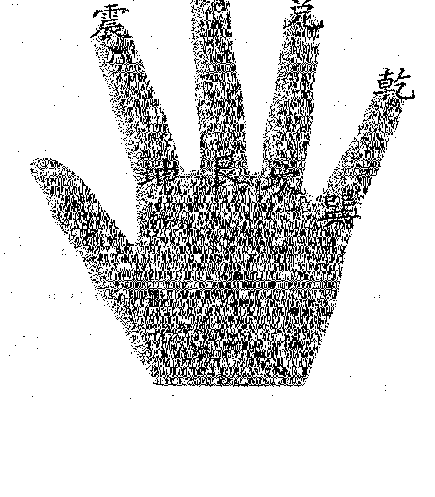

六爻八卦全息论

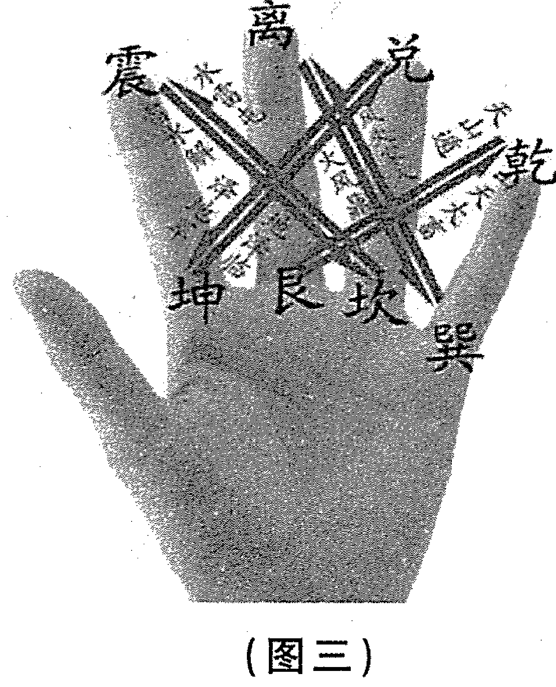

（图一）

这样一来，六十四卦每一卦都可以在手掌中，找到特定的路径了。

而且每一卦所属的宫，都有了特定的规律。

下面，再分别把六十四卦分成八组，并逐一分析。

（一）、八纯卦：乾为天、坎为水、艮为山、震为雷、巽为风、离为火、坤为地、兑为泽。

此八卦都属本宫，皆为六爻持世，不必解释，读者自能理解。

（二）、一爻持世：天风姤、水泽节、山火贲、雷地豫、风天小畜、火山旅、地雷复、泽水困。

此八卦都属上卦之宫，在掌图中，皆为上下相对的垂直关系。如图二：

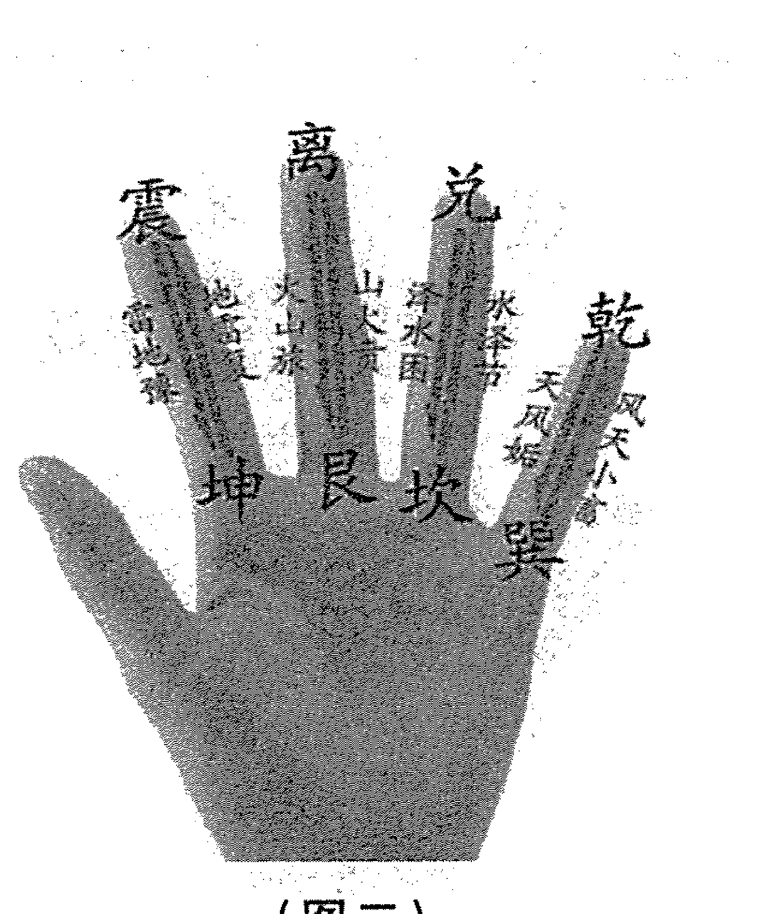

（图二）

（三）、二爻持世：天山遁、水雷屯、山天大畜、雷水解、风火家人、火风鼎、地泽临、泽地萃。

此八卦都属上卦之宫，在掌图中，皆为隔一指交叉关系。如图三：

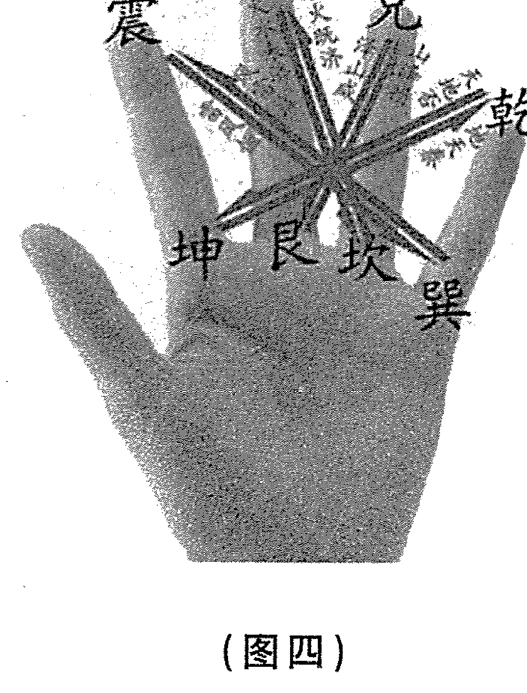

（图三）

（四）、三爻持世：天地否、水火既济、山泽损、雷风恒、风雷益、火水未济、地天泰、泽山咸。

此八卦都属上卦之宫，在掌图中，皆为对称的交叉关系。如图四：

（图四）

（五）、四爻持世：风地观、泽火革、火泽睽、地风升、天雷无妄、山水蒙、雷天大壮、水山蹇。

此八卦都属下卦之对应卦之宫，在掌图中，皆为对称的平行关系。如图五：

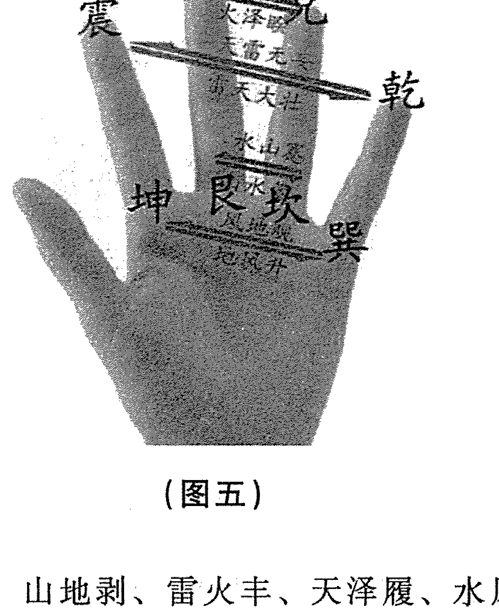

（图五）

（六）、五爻持世：山地剥、雷火丰、天泽履、水风井、火雷噬嗑、风水涣、泽天夬、地山谦。

此八卦都属下卦之对应卦之宫，在掌图中，皆为对称的平行关系。如图六：

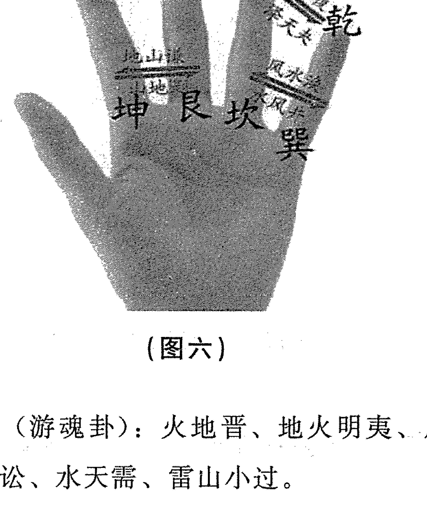

（图六）

（七）、四爻持世（游魂卦）：火地晋、地火明夷、风泽中孚、泽风大过、山雷颐、天水讼、水天需、雷山小过。

此八卦都属下卦之对应卦之宫，在掌图中，皆为相邻的交叉关系。如图七：

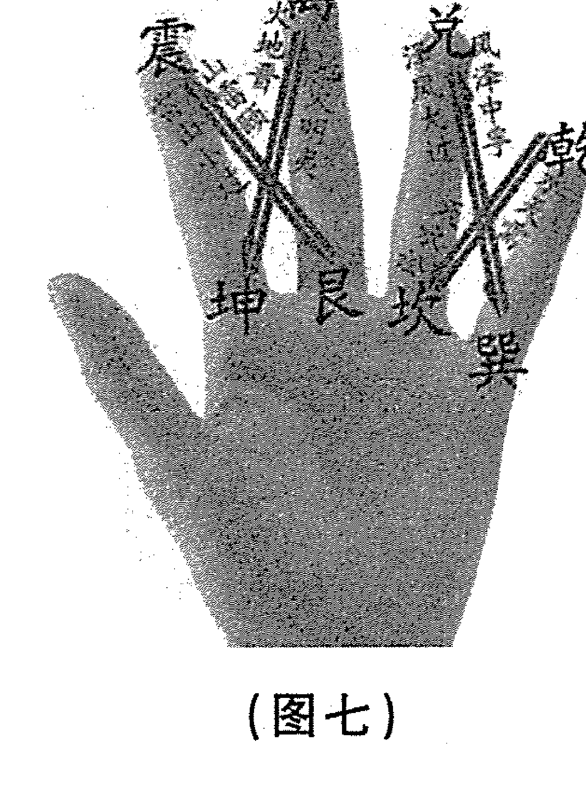

（图七）

（八）、三爻持世（归魂卦）：火天大有、地水师、风山渐、泽雷随、山风蛊、天火同人、水地比、雷泽归妹。

此八卦都属下卦之宫，在掌图中，皆为隔一指的平行关系。

由上述可知，六十四卦每一卦所属之宫和持世之交一目了然。将其综合归纳如下：

- 一、上下卦若为上下相对的垂直关系，此卦即属上卦之宫，一爻持世。
- 二、上下卦若为隔一指交叉关系，此卦都属上卦之宫，三爻持世。
- 三、上下卦若为对称的交叉关系，此卦都属上卦之宫，三爻持世。
- 四、上下卦若为对称的平行关系，此卦都属下卦之对应卦之宫，四爻持世。
- 五、上下卦若为对称的平行关系，此卦都属下卦之对应卦之宫，五爻持世。
- 六、上下卦若为相邻的交叉关系，此卦都属下卦之对应卦之宫，四爻持世（游魂卦）。
- 七、上下卦若为隔一指的平行关系，此八卦都属下卦之宫，三爻持世（归魂卦）。

综上，若能对六十四卦了如指掌，并且烂熟于心，即可熟练地在掌上起卦断卦，从而摆脱起卦断卦对笔墨的依赖，成为出神入化的断卦大师。下面，我们分别把六十四卦分成八组，并逐一分析。

（一）、八纯卦：乾为天、坎为水、艮为山、震为雷、巽为风、离为火、坤为地、兑为泽；

此八卦都属本宫，皆为六爻持世，不必解释；

（二）、一爻持世：天风姤、水泽节、山火贲、雷地豫、风天小畜、火山旅、地雷复、泽水困；

此八卦都属上卦之宫，在掌图中，皆为上下相对的垂直关系。如图二；

（三）、二爻持世：天山遁、水雷屯、山天大畜、雷水解、风火家人、火风鼎、地泽临、泽地萃；

此八卦都属上卦之宫，在掌图中，皆为隔一指交叉关系。如图三；

（四）、三爻持世：天地否、水火既济、山泽损、雷风恒、风雷益、火水未济、地天泰、泽山咸；

此八卦都属上卦之宫，在掌图中，皆为对称的交叉关系。如图四；

（五）、四爻持世：风地观、泽火革、火泽睽、地风升、天雷无妄、山水蒙、雷天大壮、水山蹇；

此八卦都属下卦之对应卦之宫，在掌图中，皆为对称的平行关系。

如图五；

（六）、五爻持世：山地剥、雷火丰、天泽履、水风井、火雷噬嗑、风水涣、泽天夬、地山谦；

此八卦都属下卦之对应卦之宫，在掌图中，皆为对称的平行关系。

如图六；

（七）、四爻持世（游魂卦）：火地晋、地火明夷、风泽中孚、泽风大过、山雷颐、天水讼、水天需、雷山小过；

此八卦都属下卦之对应卦之宫，在掌图中，皆为相邻的交叉关系。

如图七；

（八）、三爻持世（归魂卦）：火天大有、地水师、风山渐、泽雷随、山风蛊、天火同人、水地比、雷泽归妹；

此八卦都属下卦之宫，在掌图中，皆为隔一指的平行关系。

论世应歌诀

世父旺相最为强，作事亨通大吉昌，
谋望诸般皆遂意，用神生合妙难量，
旬空月破逢非吉，克害刑冲遇不良。

世应生克隔交诗诀

世应相生卦则吉，世应相克事必凶，
世应比和事却中，作事谋为定可用，
应动他人心易变，身动生忧事不宁，
若是用父居此下，旺相扶持可速成，
世应当中两间交，发动所求多阻隔，
假饶有气事分明，必见忍耐方始得，
世应当中两间交，忌神发动莫相交，
日辰与用当中动，事有蹉跎终究好。

世父发用诗诀

世爻旺相主安康，作事亨通大吉昌，
谋望诸般皆遂意，纵他谋害不能伤。

诸爻持世诀

6、父母持世：

父母持世主身劳，求嗣妾众也难招，
官动财旺宜赴试，财摇谋利莫心焦，
占身财动无贤妇，又恐区区寿不高。

7、子孙持世：

子孙持世事无忧，求名切忌坐当头，
避乱许安失可得，官讼从今了便休。
有生无克诸般吉，有克无生反见愁。

8、官鬼持世：

官鬼持世事难安，占身不病也遭官，
财物时时忧失脱，功名最喜世当权，
入墓临忌无散日，逢冲转祸变成欢。

9、妻财持世：

妻财持世益财荣，兄若交重不可逢，
更遇子孙明暗动，利身克父丧文风，
求官问讼宜财托，动变兄官万事凶。

10、兄弟持世：

兄弟持世莫求财，官兴须虑祸将来，
朱雀并临防口舌，如摇必定损妻财，
父母相生身有寿，化官化鬼有奇灾。

世应者乃卦中之主也。世爻为自己，如人之身体，兴旺为佳，作事亨通，求谋称意。世爻兴旺，又得月、日、动爻、用神生合，或得其一生合者，更是锦上添花。世爻若遇旬空月破，休囚无气，不吉。再遇刑冲克害，则是凶上加凶。应爻为彼、他人，为事之结果。在具体应用上很灵活，如测彼此两方的形势，世爻代表我方，应爻代表对方。

第四节 论六神

六神者：青龙、朱雀、勾陈、腾蛇、白虎、玄武，它们各有自己的方位和五行颜色。青龙代表东方木、青、绿色；朱雀代表南方：火、红色；白虎代表西方、金、白色；玄武代表北方、水、黑色；勾陈、腾蛇居中央，土、黄色。六神实际借星座之名分别事类。卦爻配六神，不仅可以分别事类，而且可以参断吉凶。十天干配六神是：甲乙日从初爻起青龙，丙丁日从初爻起朱雀，戊日从初爻起勾陈，己日从初爻起腾蛇，庚辛日从初爻起白虎，壬癸日从初爻起玄武。

一、六神起例

甲乙日摇卦：初爻起青龙、二爻起朱雀、三爻起勾陈、四爻起腾蛇、五爻起白虎、六爻起玄武。

丙丁日摇卦：初爻起朱雀、二爻起勾陈、三爻起腾蛇、四爻起白虎、五爻起玄武、六爻起青龙。

戊己日摇卦：初爻起勾陈、二爻起腾蛇、三爻起白虎、四爻起玄武、五爻起青龙、六爻起朱雀。

庚辛日摇卦：初爻起白虎、二爻起玄武、三爻起青龙、四爻起朱雀、五爻起勾陈、六爻起腾蛇。

壬癸日摇卦：初爻起玄武、二爻起青龙、三爻起朱雀、四爻起勾陈、五爻起腾蛇、六爻起白虎。

二、起六神定局（各从下起）

| 卦爻 | 甲乙日 | 丙丁日 | 戊日 | 己日 | 庚辛日 | 壬癸日 |
|---|---|---|---|---|---|---|
| 上爻 | 玄武 | 青龙 | 朱雀 | 勾陈 | 腾蛇 | 白虎 |
| 五爻 | 白虎 | 玄武 | 青龙 | 朱雀 | 勾陈 | 腾蛇 |
| 四爻 | 腾蛇 | 白虎 | 玄武 | 青龙 | 朱雀 | 勾陈 |
| 三爻 | 勾陈 | 腾蛇 | 白虎 | 玄武 | 青龙 | 朱雀 |
| 二爻 | 朱雀 | 勾陈 | 腾蛇 | 白虎 | 玄武 | 青龙 |
| 初爻 | 青龙 | 朱雀 | 勾陈 | 腾蛇 | 白虎 | 玄武 |

三、六神主事

青龙主喜事，朱雀起官非，
勾陈田土事，腾蛇怪梦疑，
白虎主孝服，玄武盗贼欺。

1、甲乙为青龙：

其神属木，居东方，春季得令，应寅卯甲乙之日。
所主：屋宅、桥梁、寺观、舟车、贵宾、僧道、青绿、婚姻、喜庆、善事、生产、善士、伐木、进喜。青龙者为人慈祥恺悌、自命清高、聪明俊秀、敏捷从容。主吉庆之事，如发动临用神，则进财进禄，临仇神忌神，则酒色成灾，乐中生悲，头昏眼花。诗曰：
卦中吉将号青龙，作事求财喜气浓，
名利婚姻皆遂意，假饶忧事也无凶。

2、丙丁为朱雀：

其神属火，居南方，夏季得令，应丙丁巳午日。
所主：窑灶、火烛、契文、宣敕、文书、契券、公讼、是非、斗闹、焦燥、干旱、文章、口舌、朱紫。朱雀者急于言词，易招人评谤，为人能言辩，常带笑脸。主文书、口舌、官非，临用神或生合世爻主有文上之喜，临忌神、刑、克世爻则口舌官非。临鬼神情暴躁，胡言乱语之患。诗曰：

> 朱雀临忌卦上来，文书发动事难谐，
> 失脱火光并口舌，求谋交易尽心灰。

3、戊日为勾陈：

其神属中央土，四季月当令，应戌已辰戌丑未之日。
所主：州郡、城郭、田土、坟墓、阴晦、垣墙、隐伏、迟滞、堆垛、伏尸、蛊毒、黄色、山林、屋宅、埋藏、重孝。勾陈者为人本分、厚道、稳重、有规矩，但行事迟钝。主田土、牢役，如临用神发动生合世爻主有固定资产收入，临忌神，则有有产、田产、生意的纠纷和官司。临鬼脾胃不和，肤虚肉肿。诗曰：

> 勾陈事事主勾留，遭闷迟疑未罢休，
> 若问求官官未至，望求田土亦难周。

4、己日为腾蛇：

其神属土，无正位，故己之次附勾陈。
所主：道路、绳索、缠绵、怪异、恶梦、虚惊、血丝、赤色。
腾蛇者为人虚浮、多心机、无信、不诚实、多梦。主虚惊怪异之事，临用神惊而无险，临忌神则有受惊吓，有事被缠难于脱身。临鬼伤筋折骨，血崩血骨。诗曰：

> 腾蛇终是有忧惊，怪梦邪魔恐见侵，
> 举用求人多进退，安然守静始清平。

5、庚辛为白虎：

其神属金，居西方，秋季得令，应申酉庚辛之日。
所主：金玉、瓦石、刀兵、杀戮、死亡、凶祸、哭泣、血光、生产、暴卒、绳索、讼害。白虎者为人刚强自用，阴险狠毒，好斗但行事果断，性急。主凶伤孝服，与法律有关之事，如临用神发动生身，则发动如猛虎，临忌神，则主凶伤血光孝服。诗曰：

> 白虎交重丧恶事，官司病患必成凶，
> 持金动克妨人口，遇火生身便不同。

6、玄癸为玄武：

其神属水，居北方，冬季得令，专应壬癸亥子之日。

所主：雷雨、江海、池井、湿润、阴晦、贼盗、小人、阴私、奸淫、暗昧、隐晦、痔漏、堕胎、玄黑。玄武者为人奸诡、鄙吝、行事暧昧、狡谲多淫。主匪盗暗昧之事，如临用神发动则在不知不觉中有人相助，智力发达，临忌神，防盗窃及男女之事而成灾。临鬼色欲太过，忧闷在心。诗曰：

> 玄武原来是暗神，逃亡淫盗每相侵，
> 求财难脱终无实，赌博交关不称情。

四、六神发动

测卦之时如遇六神安静，吉凶只是倾向而已，尚不明显，如果六亲发动，为吉为凶的征兆则更加明确。六神发动诀如下：

1、青龙发动诀：

青龙发动附用通，进财进禄福无穷，

临仇遇忌都无益，酒色成灾在此中。

2、朱雀发动诀：

朱雀交重文印旺，煞神相并漫劳功，

是非口舌皆因此，动出生身却利讼。

3、勾陈发动诀：

勾陈发动忧田地，累岁逢冲为忌神，

生用有情方是吉，若然安静不迷蒙。

4、腾蛇发动诀：

腾蛇鬼克忧劳挛，怪梦阴魔暗里攻，

持世落空休道吉，逢冲之日莫逃凶。

5、白虎发动诀：

白虎交重丧恶事，官司病患必成凶，

持金动克妨人口，遇火生身便不同。

6、玄武发动诀：

玄武动摇多暗昧，若临官鬼贼交攻，
有情生世邪无犯；忧患临之奸盗凶。

7、六神发动断总诀：

日六神内动诀

青龙内动多喜庆，朱雀内动口舌兴，
勾陈内动原告休，腾蛇内动怪异来，
白虎内动忧疾病，玄武内动忧远行。

日六神外动诀

青龙外动官职会，朱雀交惊他官忧，
勾陈发动言诰述，腾蛇故云忧在外，
白虎外摇忧远游，玄武须云损失愁，
大杀动须六畜灾，杀阴动须福禄来。

六神空亡诀

青龙空亡家虚喜，朱雀亡讼得理，
勾陈空亡无勾连，腾蛇空亡不惹灾，
白虎空亡病无事，玄武空亡盗无妨。

五、世应临六神诀

世应在青龙，喜事两三重，
万事皆遂意，有病不为凶。
世应见朱雀，公事两头着，
南方妇人来，音信尚可用。
世应见勾陈，田地上忧心，
惹动官事发，作福免灾刑。
世应见腾蛇，怪异恐有惊，
何人朝暮至；日辰是为重。
世应见白虎，疾病须忧害，  
官事有忧煎，孝服凶伤侵。
世应在玄武，盗贼须防护；
偷物又偷鸡，早防可安宁。

六、六神入五行断诀

- 青龙：
  青龙入木喜事生，入水求官定是亨，
  入火之时多不利，入土有阻金悲声。
- 朱雀：
  朱雀入火用无害，入土公判口舌理，
  入金有财防阻节，入木无防水惹灾。
- 勾陈：
  勾陈入土田宅兴，入木家庭有不祥，
  入金进田愁孝服，火伤女妇水癃疹。
- 腾蛇：
  腾蛇入土梦邪祟，入水终忧小口刑，
  入木迁移多不定，金嫌孝服火衰声。
- 白虎：
  白虎入金孝服重，入水须忧官讼兴，
  入土有灾田宅起，火主血光木否并。
- 玄武：
  玄武入水忧贼盗，入土官非木有灾，
  入火失财有疾病，金爻逢着有横财。

七、六神持世诀

- 青龙：
  青龙持世喜事来，求婚谋遂有横财；
  若子营谋须大利，添人进口没非灾。

- 朱雀：
  朱雀持世主官非，财去财来事不济，
  病者休惶冲土地，婚姻交易总难期。

- 勾陈：
  勾陈持世主勾连，官灾病疾却相缠，
  若发此爻临世上，田土山林事不然。

- 腾蛇：
  腾蛇持世梦魂惊，四时怪异到家庭，
  作事远行难称意，只宜守旧且安宁。

- 白虎：
  白虎持世主刑伤，男女儿孙见血光，
  宅舍不宁重孝服，畜牲长养不为良。

- 玄武：
  玄武持世主失财，谣言般灾祸入门来，
  若有劫文人偷弄，不然人口暗伤怀。

六神中青龙是善良清高，喜气利名的征兆；腾蛇是虚浮惊恐，忧疑怪梦的表征。朱雀预示适宜于通音信文书，又预示火灾、官司可能降临；白虎对武将建功立业有利，女人生育将招来凶衰血光之灾。勾陈如果是管与田地的公差，坟茔迟迟不能建成；玄武是阴险的盗贼，水患，奸邪的象征。

青龙如果去西方，以半吉半凶下断；白虎如果去南方，以小凶下断。土中的玄武预示没有盗贼来扰，木内的勾陈预示庄稼收不好。朱雀遇水，纵然遭遇官司也容易解脱。腾蛇逢木，纵然做了怪梦也没有凶险。勾陈陷落，预示田地将不保。玄武空亡，预示没有盗贼侵扰。腾蛇空亡，闲梦却能解妖邪，青龙陷落，纵然怀胎也是一场虚空，没有喜庆可言。朱雀隐避，预示不会遭遇官员，白虎潜伏，预示不会遭遇凶衰。

断卦时并不是以六神为主，应以五行的生克制化为主，但若是结合六神则可断出卦中人物事件的许多细节来，所以预测时要把握住五行生克这条主线，结合六神来详细参断。

第六章 六爻卦的基本预测法

六爻的基本预测方法主要是进行断卦，断卦是一种复杂的综合思维判断，对于卦中的各个因素及爻与爻的关系进行综合分析和逻辑推理，从而得出准确的吉凶祸福。而其中最主要的就是看用神和忌神的五行生克制化。

六爻八卦中预测吉凶宗旨是：在寻求卦爻的理想处之前，先寻求其不理想处；在未寻求卦爻的有利处之前，先寻求其不利处。看到卦爻中没有不利处，再去寻求其有利处，并加以肯定。这是卜筮的秘要，是总看卦爻和用神的大法。

作者从老师和朋友处学到了古圣先贤所留下的宝贵经验和知识，经过长年的学习实践，粗略通达了其中的变化，决不会吝惜自己的心得，而使精微的祖国传统数术文化变为绝学。真诚的希望广大读者及易学爱好者，不要把它看作小道而不屑一顾，一定要深入研究，掌握其中的精义。

## 3、断卦应辨别爻位用神及世应。

爻的用神有六种：一是世应，二是两身，三是六亲，四是六神，五是爻位，六是变互。

什么叫世应？世为本，应为末；世为主，应为人。世应是成卦之主宰。什么叫两身？一是卦身，二是世身，而卦身比较重要。什么叫六亲？即妻财、官鬼、父母、兄弟、子孙，在运用的时候各有所主。什么叫六神？青龙、朱雀、勾陈、腾蛇、白虎、玄武，各自掌管着不同的事务。什么叫爻位？如初爻为地，上爻为天，五爻为君，二爻为臣，因事类的不同而各有所主。什么叫变互？卦动则观察它的变化，卦静则用它的互卦来占卜吉凶，根据具体需要而取用。这是爻的运用，所以用神有取于爻的，舍卦而用爻。此即就爻象而论。

## 4、断卦应注重世爻和应爻。

就成卦之主而言，以世爻和应爻为重。世应的忌讳有十种，即旬空、月破、绝、冲散、人墓、发动、合冲、随鬼入墓、助鬼伤身、升降进退。占事，遇空的不成；遇破的多败；遇绝的多顿；遇散的完全失去；遇墓的难以行动；遇运的多有变更；遇合处逢冲的事情将成还败。遇随鬼入墓的，占争讼和疾病，为被困于不利之地。遇助鬼伤身的，属于灾患的凶兆。进神与上升，如火刚刚开始燃，势必越烧越旺；退神与下降，如树木刚刚落叶，漫长的冬季正等待着它。这些就是十忌的情形。

所以，如果事情由我来成就，必须看世爻，虽然占官职因官鬼爻而成；占文章因父母爻而成就，但是世爻逢空却不成；事情因别人而成就必须看应爻，虽然财物因妻财而得，文书因父母爻而得，但是应爻逢空却不得。所以用神有取于世应的，就要舍弃卦、爻、用象，而取用世爻和应爻。这就是断卦时应格外注意的世应的避忌事项。

## 5、对于千差万别的占问，均须以六亲为用神。

具体的用神多不胜数，须依事情的类别而分别求得。

有用神就有忌神。对忌神，喜欢它静而不动、衰而不旺、有制伏它的因素。有用神又必定有元神，对元神，喜欢动而不静、旺而不衰、生而无克。六亲当中，官鬼多主凶祸，但是卦中有“无官鬼则无气”的说法；父母主劳心劳力，但是有“无父则事无头绪”的比喻；妻财主财，子孙主福德，是人们认为吉祥的，但是如果求名，却是凶恶之神；兄弟虽为劫财夺妻，求事多主无功，却是子孙福德的元神。六亲的具体运用还要看五行生克而论。所以用神有取于六亲的，就要舍去世应而取六亲。断卦时六亲为用神，还要必须注意的元神和忌神的作用。

## 6、八卦预测时，动交、变交对吉凶的判断更为直接。

预测吉凶时，没有比动交和变交更亲切的。变交能生克制动交，而动交不能生克变交。动交能生克本卦的静交，而变交不能克本卦的静交。变交空、破、死、绝，动交就不受它的生克了；动交空、破、死、绝，变交回头生则为得救，回头克则更凶。一交独发，尤其贵于知微。这是卦中有动交、变交时所应当考虑的。预测时用神交确定之后，以动变交为重，而变交只回头生克动交本身，而不能生克本卦静交。

## 7、卦中用神不显时，考察飞交和伏交以定吉凶。

用神在卦中不显时，考察飞交和伏交才最为完备。伏神克飞神则出现，飞神生伏神则得气，飞神克伏神则死灭，伏神生飞神则泄气，伏神与飞神比和则易于引拔，飞神旬空则易于出现，伏神空、破、死、绝则无用。根据这些规则，伏神能否出现就可以区分清楚了。所以伏神死灭或泄气的，即使临日月也不能取；飞神破散的，即使伏神生旺也没有用处。先用世交下的伏神，其次是动交下的伏神，再次是静交下的伏神。这是对飞神和伏神所应用的法则。这是实际预测当中关于卦交中飞神伏神预测为要点。

## 8、月建及日辰对六交八卦中的各交均具有主宰之作用。

旺衰的主宰，没有超过日月的。日月的象征，为君主，为将令，交神哪个能够违抗？所以即使是乘旺而发动的世爻和应爻，也无不服从。为日月所克的爻，如有动爻和变爻来生，叫做贪生忘克；为动爻和变爻所克的爻，如果日月来生，那就像在溺水中得到救援。爻临日建，月破不超过三旬；爻临月建，旬空不过一旬。凡临日月建的爻，化克化破都不会受到伤害，化空化退也没有妨碍。

月建以区分旺、相、休、囚、死五种状态为主，而要知道金生水，生中有克；土绝于巳，绝中有生。日建参考长生、沐浴等十二种状态。月冲为破，日冲为散；月重相克，日重遇绝；日有随鬼入墓和助鬼伤身的忌讳，而月没有。所以与月相比，日辰与吉凶的关系尤其密切。这是日月当权的情形。

## 9、卦中之爻逢冲合有吉有凶。

辨别合冲，有卦和爻的区别。卦的六冲，从一开始就冲合处逢冲，冲在过程的中段；合处变冲，冲于过程的后期。爻合而遇冲，将成而败；爻冲而遇合，先战而后和；发动而逢合则绊住，静而逢合则兴起。

合法有三种，即生合、克合与刑合。生合，如寅亥之合，亥水生寅木；克合，如子丑之合，丑土克子水；刑合，如巳申之合，巳火刑申金。遇生合的吉，遇克合的凶，遇刑合次凶。

冲有五种：一是相扶而冲，叫做暗动；二是相绝而冲，称为散，散不及暗动；三是相合而冲，冲中以我克为动，以克我为散；四是胎绝之冲，以旺相为动，以休囚为散；五是暗冲之散。

暗冲之散胜于动冲之散，因为动冲造成的散彻底散尽，暗冲造成的散只相当于退气。暗动的情形，是吉凶祸福，于不知不觉中暗暗地来；暗散的情形，是吉凶祸福，悄然而去。

本卦的自冲有三种：一是卦内动爻相冲，如果力量相敌，就都被减力；二是爻临日月建，即使逢冲也不散；三是如果两爻一旺一衰，遇冲后衰爻被冲散，旺爻为动。这些合冲要领是预测中所应当记住的。

## 10、八卦预测还应注意是辨别旬空和月破。

旬空有八种：一是月破而空，叫做坏空。二是月克而空，叫做全空。三是月生日克，或日生月克，叫做克空。四是无生无克，叫做安空。五是日月来生，叫做半空。六是日月生扶，叫做旺相空，旬内空而旬外实。七是空遇日冲而填实，空交发动而填实；月建临空而填实，都叫做填实的空。八是空交发动而遇月破，动也无用；空交被冲而遇绝散，冲也无用。如果是伏藏的空，阴阳的空，旬首尾的空，虽然为象数所有，却不必多谈。

月破有三种：一是月破临官鬼发动而凶，月破临动交冲而化无；二是月破之交临日辰，不以破论；三是破交遇值月建时，不以破论。这是旬空月破所应当分辨的。

## 11、在六爻八卦的预测中，要正确运用三刑、六害、三合会局和天干五化。

关于三刑、六害、三合会局和天干五化。三刑六害，仍按照五行生克来权衡轻重。子卯间的相刑，刑轻而生重；酉戌间的相害，生多而害少。刑为扭攘，害为怨离。三合局和天干五化的方法，是会局用中间的地支；五化重在日干。所以说遇破、空、绝、散这是自合；有寅戌而无午，这叫假局，也为无用。天干五化一般用于一交独发，并且化合的另一方主要是日的天干。至于另有动交和月的天干，只是偶然用到。交的天干不发则气运没有根本；日干之间不合则五化没有来由。这就是为什么刑、害局、化四种方法，只能参局而不可执着。预测中应首重交之生克制化，合有合化、合绊之分，刑克要按照五行的生克来权衡轻重。

## 12、六神和星煞在预测中可以起辅助作用。

关于参究六神和星煞，作者的经验是六神的运用，必须以六亲为根本。子孙为用驾临青龙，必有喜庆之事；卦中有玄武而无官鬼，大多不是偷窃。星煞的吉凶，必须以用神为根本。贵人虽然出现，而主官运的官鬼交和主文章的父母交都衰弱无气，就是空有凌云壮志；但只要子孙逢空，天喜星加临，又怎能说是白日做梦？这是六神与星煞为什么不能拘泥。关于六神和星煞的用法，作者认为先贤刘伯温“吉神凶煞之多端，何如生克制之一理”的说法最为确切。若卦交不吉，临吉神又有何用？卦交为吉，临凶煞亦可无妨。总之，用神用爻临吉神则更吉，卦中忌神临凶煞则更凶。另外，六神星煞可作为辅助断人、物、事的细节和特点确有画龙点睛之妙。

## 二、选取用神的原则

古代诸家圣贤在取用神的原则上有某些分歧，特别是对旬空、月破问题，存在相反的观点。有的主张“舍其月破，而用不破；舍其旬空，而用不空”，有的则强调“舍其不破，而用月破；舍其不空，而用旬空”。

> 《增删卜易》中有：“舍其休囚，而用旺相；舍其静爻，而用动爻；舍其月破，而用不破；舍其旬空，而用不空；舍其破伤，而不伤，此古法也。余得验者多有应乎旬空月破，舍其不空而用旬空，舍其不破而用月破”。

> 《卜筮正宗》中有：“舍其闲爻，而用持世；舍其无权，而用月日；舍其安静，而用动摇；舍其不破，而用月破；舍其不空，而用旬空”又云：“天机尽泄于有病之间，断法总在于药医之处”。

二者观点基本一致，作者更同意《卜筮正宗》之观点，因为：

- 旬空月破刑冲克害为“病“，取“病爻”为用，露其“病”之信息，得观其“机”，对症下药，吉凶、应期便可确断；
- 动则变，变则露其机，故取动者；
- 无“病”时，则应取旺者、吉者；

所以《卜筮正宗》一百多例，皆遵循以上原则，作者通过大量实践认为此说更加准确。

这种取用神之原则还要有一个次序，例如当出现两种以上情况时应该怎么办？

作者认为，首先究其病爻，次观动静，再次当无病时取旺而吉者，最后看世应，因此，总结为如下次序：

- 舍其不空，而用旬空；
- 舍其不破，而用月破；
- 舍其无病，而取刑伤；
- 舍其安静，而取动摇；
- 舍其无权，而用月日；
- 舍其休囚，而用旺相；
- 舍其闲交，而用持世；
- 舍其间交，取临应者。

## 三、用神两现

用神两现，就是卦中有两个用神，而在预测时，只用一个用神。两个用神交，取何为用？《增删卜易》中有：“舍其休囚，而用旺相；舍其静交，而用动交；舍其月破，而用不破；舍其旬空，而用不空；舍其破伤，而用不伤”。再者以世交相邻或近者可为用神。

## 第二节 飞、伏论

六十四卦中，有的卦五行六亲不全，只有三行或四行。比如“地风升”卦，六个爻共有三行，只有妻财、官鬼、父母三种六亲，如果起得此卦，要占测子女或兄弟之事，用神应取子孙交或兄弟交，但卦中并不见这两个交，此即称谓为用神不现，这种情况下该怎样取神呢？我们知道，八宫首卦六交中，是五行俱全的，因此，凡是所得的卦中缺什么六亲，都可以在本宫首卦中寻找。寻得的用神，叫伏神。借用的方法是在与首卦对应的交位上取。

卦有用神交者，为用神不缺，无用神交者，为用神不上卦或用神不现。如所需之神临月、日者，可以用月、日为用神。若不临月、日，可

## 六爻八卦全息总论

在八纯卦中寻找用神借之，借来之用神爻，写在原卦对应爻旁。此借来之用神称之为伏神，原卦之爻称为飞神。

伏神有用者六：

- 伏神得日、月生者或临日、月者；
- 伏神旺相者或飞神化回头克而无力牵制伏神者；
- 伏神得飞神生者；
- 伏神得动爻生者；
- 伏神得日、月动爻冲克飞神者（飞神为伏神之原神者除外）；
- 飞神空破伏囚库绝于日月者（飞神不为伏神之原神时）。

例如“地风升”卦属震宫，我们将“震”、“升”二卦列出对比便易于明白伏神的寻找方法：

| 震为雷 | 地风升 |
|---|---|
| 妻财戌土、 世 | 官鬼酉金、 |
| 官鬼申金、 | 父母亥水、 |
| 子孙午火、（伏子孙午火） | 妻财丑土、 世 |
| 妻财辰土、 应 | 官鬼酉金、 |
| 兄弟寅木、（伏兄弟寅木） | 父母亥水、 |
| 父母子水、 | 妻财丑土、 应 |

“升”卦无子孙、兄弟二爻，在“震”卦中它们分别居四爻、二爻之位，所以，“升”卦的两个伏神便分别对应地居于四爻、二爻之下；居于伏神之上的六亲，称为伏神的飞神，“升”卦中妻财丑土是子孙午火的飞神，父母亥水是兄弟寅木的飞神。

飞神与伏神的生克吉凶诀曰：

伏来克飞为出暴，飞来克伏反伤身，  
伏去生飞为泄气，飞来生伏得长生。  
交逢伏克飞无事，用见飞伤伏不宁，  
飞伤不和为无助，伏藏出现审来因。

例：伏克飞神为出暴：

甲申年 壬子月 壬戌日 巳时 某男占家中父母及妻子吉凶，摇得渐卦：

> 风山渐  
官鬼卯木、应  
（伏妻财子水）父母巳火、  
兄弟未土、  
子孙申金、 世  
父母午火、  
兄弟辰土、  

伏神妻财子水旺克飞神父母巳火，妻子无事，父母定有灾，伏克飞为出暴，快而凶，应期在最近的亥子日。果然第三天（子日）父病，第三天丑日动手术。

## 飞来克伏反伤身：

己丑 庚申月 甲戌日 午时 某男测妻近期财运，得“明夷”卦：

> 地火明夷  
父母酉金、  
兄弟亥水、  
官鬼丑土、 世  
（伏妻财午火）兄弟亥水、  
官鬼丑土、  
子孙卯木、 应

妻财午火伏神为用，飞神兄弟亥水得月之生有力而克伏神。戌日水有制无妨，亥日水当值，重克伏神，不但破财，犹恐伤身。果于其日因生意亏损数千元，又遭伤灾。

## 飞来生伏得长生：

某男在外听说其妹在家患病，问何日愈，癸酉年 甲寅月 癸酉日 摇得“升”卦：

## 地风升

官鬼酉金、  
父母亥水、  
妻财丑土、 世  
官鬼酉金、  
（伏兄弟寅木）父母亥水、  
妻财丑土、 应  

兄弟寅木伏神为用，临月建，又得飞神生，病轻且易痊愈今被日辰所克，过酉、戌二日必愈。果于第三日（亥日）康复。伏神为用，其生克吉凶与一般用神的看法大致相同，只是伏神之上有了飞神这层“隔膜”，卦中其他爻对伏神的生克作用就需透过飞神才能充分发挥。比如伏神为木，飞神为水，忌神金欲克木，却有飞神水为伏神木之屏障，若非金特别强，水木特别弱，忌神金就难以克伤伏神木。又如伏神为木，飞神为金为忌神，这个飞神就象架在伏神头上的一把剑，若非伏神有日、月之生，且金休囚空破或被日月动爻彻底制住，伏神就难以出头，所以，飞神对伏神的影响是很大的。

伏神无用者五有：

一、伏神休囚又逢绝地；  
二、伏神休囚、又逢旬空月破；  
三、伏神被日月冲克害；  
四、伏神入墓库；  
五、伏神休囚值旬空。

此五项为无用伏神，虽有如无，终不能出。“伏居空地，事与心违”。

## 第三节 原、忌、仇神论

### 一、论原神

原神者，生用神之爻也。忌神者，克用神之爻也。仇神者，克制原神反生助忌神也。例：木为用神，生木者水也，水是木之原神。克木者金也，金为木之忌神。克水生金者土也，土为木之仇神。无论测何事，先看用神旺、相、休、囚，有原神动来生助否，或有忌神动来克害否。

> 原神歌诀：

原神发动志气扬，用伏藏兮也不妨；  
须要生扶兼旺相，最嫌化克及逢伤。

原神者，生用神之爻也，原神生用神，皆为吉象。原神生用有六个方面：

三、原神临长生，帝旺于日建；  
四、原神动而化进神，或化回头生；  
五、原神临月建、日建；  
六、原神临月、日又临动爻；  
七、原神与忌神同动；  
八、原神旺动而临空化空。

临空化空，并非无用，因有动不为空，填空之日不为空，出空之日不空。

例（1）：原神旺相，或临日月。或日、月动交生扶用神者。

如酉月亥日测求才得坤卦  
原神：子酉、 世  

用神：才亥、  

　　兄丑、  

　　官卯、 应  

　　父巳、  

　　兄未、  

求才以才交为用神，此卦亥水才交临日建，当权得令，吉利也。加以上交酉金子交为原神，原神临月建、旺相、生扶用神才交，所以才运亨通。

（2）原神动化回头生，及化进神，生扶用神：

如原神：巳化卯  
用神：丑  

原神巳火化卯木，变交卯木能生本位之巳火，谓之回头生，原神巳火动来生扶用神丑土。

如原神：巳化午 原神：申化酉  
原神：寅化卯 原神：亥化子  
原神：丑化辰 原神：未化戌  

以上都谓之原神动化进神。

（3）原神长生，帝旺于日辰，生扶用神（长生、帝旺都是对日支而言的）：

比如 寅日测卦得  
原神：巳火长生于寅日  
用神：丑  

巳火于寅日测，谓之巳火长生于日辰，生用神丑土为吉象。

又如 卯日测  
原神：巳 火旺于卯（即帝旺于卯）谓  
用神：丑 之帝旺于日辰。

巳火于卯日测，谓之巳火帝旺于日辰，生用神丑土亦为大吉之象。

（4）原神与忌神同动，生扶用神：

未  
酉  
忌神：亥动而化寅  
原神：卯动化而丑  
用神：巳  

未  
读者注意，这不是真实之卦例，而是为简便起见作为原、用、忌神的简例，借以说明问题。

上例用神巳火，作为原神的卯木动来相生，又有忌神亥水动来克用神巳火，但卦中忌神亥水与原神卯木相生，而忘其克用神巳火，形成忌神亥水动来相生原神卯木，连续相生，卯木原神其力倍增，相生用神巳火，此所谓贪生忘克也，此则用神根深蒂固，其吉倍增。

原神也有不能生用神之六个方面：

一、原神休囚又逢绝地；  
二、原神休囚、又逢旬空月破；  
三、原神休囚不动而变绝变克；  
四、原神动而化退；  
五、原神动而化破化散；  
六、原神临墓库。

例（1）：原神休囚又逢旬空、月破  
酉月甲午日（辰、巳空）得  
原神：巳（空）  

酉月金旺，原神巳火休囚。甲午日空辰、巳，原神巳火空亡（即旬空）是为不能生用。

酉月甲午日  
原神：卯（破）  

酉月金旺木死，原神卯木休囚，酉月破卯，卯为月破，原神卯木为月破。

以上这样的原神休囚又逢旬空、月破，不能生用神。

（2）原神休囚动而化退神：  
酉日 原神：卯化寅  

酉月金旺木死，原神卯木休囚，又卯化寅为退神（其它如于化亥、午化巳、酉化申、辰化丑、未化辰、戌化未都为退神）

（3）原神衰而又绝：  
卯月甲寅日测  

原神：酉  

卯月木旺金囚，原神衰，又原神酉金绝于日辰寅日，所以原神衰而又绝。

（4）原神入墓：  
丑日 原神：申（入日墓）  

申金长生在巳，墓于丑，丑日占卦，称申金入墓于日辰。（亦称日墓）  

原神：申（入动墓）  
——丑化巳  

原神申金，卦中动出丑爻，金墓于丑，称原神申金入动墓。

（5）原神休囚动而化绝、化破、化散，而不生用神：  
酉日 原神：卯化申  

原神卯木休囚又变出申金（木绝于申）谓之原神休囚动而化绝。占以日辰而冲动交谓之冲散。以动交冲交亦能冲散。但旺相者冲之不散，有气者冲之不散。用神、原神旺衰，专凭日月，但月重旺相休囚，而日重长生、帝旺、墓绝。

以上所举之例是原神有病无力生助用神，即使原神出现，也是无用。

## 忌神、仇神

## 忌神歌诀

看卦先须看忌神，忌神宜静不宜兴，
忌神急要逢伤克，若遇生扶用受刑。

忌神者，克害用神之爻也。

忌神动而克害用神者有五：

- 忌神旺相或日、月、动爻生扶。或临日月者。
- 忌神动化回头生、化进神。
- 忌神旺动、临空、化空无碍
- 忌神长生、帝旺，于日辰。
- 忌神与仇神同动。

以上忌神逢之虽不为害，但过时遇旺则凶。凡卦中论原神、忌神之有力无力，都要用神有气，若用神无根，即使原神有力亦难生，忌神无力也不足喜。

仇神者，克制原神，不能生用神，反生忌神而克用神。如原神与忌神休囚，则由仇神之旺衰，来判定用神的强弱。

用神与原神、忌神、仇神的关系，实际是五行生或克的关系。原神对用神有益，忌神、仇神皆对用神有损，但由于五行具有循环相生、隔位相克之位，所以，只要能使五行中相克的两行之间有一种能起到通关作用之一种五行，就可变相克为相生，忌神克用神，但忌神生原神，仇神又生忌神，所以，如果能使原神起到通关的作用，就可以化克为生，进而使仇神生——忌神生——原神生——用神。而要起到通关的作用，首先要卦中有通关的这种五行，其次要使这种五行有力，所谓有力，就是要旺相或发动。

凡卦中原神有力与忌神同动，则原神生用神之力反而加大；而且忌神不克用神。仇神、忌神、原神同动，生用之力更大；忌神旺动，无原神或原神衰弱安静，忌神必定克用神，再若仇神同动，克用神之力更会增大。

## 第四节　进、退神论

宇宙万事万物的发展变化都有一个进退的阶段，六爻八卦预测中的爻变之进退就可以反映这种变化。进者，发展壮大也；退者，破败衰退也。卦爻化进，称之为进神；卦爻化退，称之为退神。故《系辞》曰：“变化者，进退之象也”。六爻之动变，就是论述这种变化、进退的自然规律。所谓“进神退神”，就是事物、事情经过动变后所表现的前进与后退的具体标志。

- 进神、退神乃指爻之间同类五行的进退；
- 进神者；卦爻之动而化进也。如：寅化卯，丑化辰，辰化未，未化戌，戌化丑，巳化午，申化酉，亥化子为化进。
- 退神者；卦爻之动而化退也。如：卯化寅，辰化丑，未化辰，戌化未。

未，丑化成，午化已，酉化申，子化交为化退。

> 《卜筮正宗》论进退之法有三：“旺相者乘势而进一也；休囚者待时而进二也；动爻变爻有一逢空破冲合者，待期填补合冲而进三也；退神之法亦有三：旺相者或有日月动爻生扶，占近事暂时而不退者一也；休囚者即时而退二也；动爻变爻有一而逢空破冲合者，待期填补合冲而退三也。”

进神者，表示事物不断向前发展，如春天来临，草木茵茵，一遍生机。退神者，当然是事物变化而倒退的表现，如秋天花残叶败之象。化进化退，有喜忌祸福之分，吉神宜遇化进，凶神宜遇化退。

进退之吉凶以喜忌为准。用神、原神化进无冲克则吉，化退无生扶不宜；忌神、仇神化进无冲克则凶，化退无生扶则宜。用神化进无克破增吉，宜于发展；忌神化进无制增凶，不可冒进；用神化退无生扶减吉，事难发展；忌神化退无生扶减凶，灾祸渐消。

例一：丁丑年　壬寅月　壬午日　巳时男测流年财运得：

| 火雷噬嗑 | 水雷屯 |
|---|---|
| 子孙巳火○ | 父母子水、、 |
| 妻财未土× 世 | 妻财戌土、、应 |
| 官鬼酉金○ | 官鬼申金、、 |
| 妻财辰土、、 | 妻财辰土、、 |
| 兄弟寅木、、应 | 兄弟寅木、、世 |
| 父母子水、 | 父母子水、 |

此卦世爻妻财得日辰之生，又乘势化时，实为招财进宝之象。目下用神处春令死地，财运尚为一般，待交清明后至立秋前，土临生助之时，自可大获收益，结果在当年夏季财源大吉。

例二：甲戌年　丁丑月　戊申日　申时，男测在外地工作的大哥年前能回家过春节否得：

| 风火家人 | 山水蒙 |
|---|---|
| 兄弟卯木 | 兄弟寅木、 |

卦中兄两现，然均处旬空化退神，又遭日辰克制，必不能归，后果因公事所阻未能回家。

例三：丙子年　丁酉月　癸巳日，男求测患病住院多时的父亲之吉凶得：

| 坤为地 | 山地剥 |
| --- | --- |
| 子孙酉金×世 | 官鬼寅木、 |
| 妻财亥水、、 | 妻财子水、、世 |
| 兄弟丑土、、 | 兄弟戌土、、 |
| 官鬼卯木、、应 | 官鬼卯木、、 |
| 父母巳火、、 | 父母巳火、、应 |
| 兄弟未土、、 | 兄弟未土、、 |

酉金明动，亥水暗动，连续相生动来克害巳火父爻，幸父爻得日辰相扶，病情暂不致十分危重。嫌忌神亥水化进，有雪上加霜之势。用神本死于当年太岁，今又遭忌神暗攻，星点之火，何抗旺水？病必凶危。谨防冬令亥、子月。后果于当年子月病逝。

例四：甲申年 壬申月 戊午日 辰时男测妻生产是否平安摇得“同人”之“讼”卦：

| 天火同人 | 天水讼 |
| --- | --- |
| 子孙戌土、应 | 子孙戌土、 |
| 妻财申金、 | 妻财申金、 |
| 兄弟午火、 | 兄弟午火、世 |
| 官鬼亥水○世 | 兄弟午火、、 |
| 子孙丑土× | 子孙辰土、 |

父母卯木○，　　　　父母寅木、、应
二爻子孙发动化进，显然产期临近，胎儿已急不可耐！初爻父母卯木动来相克，喜其休囚化退化破，难以为害。卦中财子并旺，是母子平安之象，生产必定顺利。后于当月乙丑日午时得一男婴，分娩后母子平安一切顺利。

## 第五节　动、变论

卦有卦变，爻有爻变。八卦预测时爻变卦则变，六爻不动则不变，有动爻则有变。动变，有变回头之生，有变回头之克，还有变合、变冲，一般用神爻变生者为吉，变克者为凶。故“吉凶生乎动”，动爻为事之始，变爻为事之终。

关于六爻八卦的动变特录古籍，《海底眼一爻动变断》如下：

- 子孙发动伤官鬼，占病求医身便痊。
- 行人买卖身康泰，婚姻喜美是前缘。
- 产妇当生子易养，词诉空论事不全。
- 谒贵求名休进步，守旧常占可自然。
- 子化子兮有小凶，举讼兴官理不同。
- 子化官兮防祸患，占病忧疑尽不中。
- 子化父兮防产妇，无中生有爹头绪。
- 子化兄兮事不圆，脱诈人情疑莫去。

这段话译成现代白话文的意思就是说：子孙爻一旦发动，必定伤害官鬼之爻，如果求医治病则疾病便会痊愈；外出做买卖会身体康泰，一旦婚嫁婚姻则喜美，因为双方前世有缘。产妇生子顺利，而且孩子容易养活，而打起官司却不顺利；拜谒权贵求取功名不会取得好的结果，应当遵循故例听其自然。子爻与子爻化合，有小的凶险，打官司与升官职应遵循不同的道理和规则。子爻与官星化合，要提防祸患临头；占断疾病一旦忧疑不决，往往测不准确。子爻与父爻化合，要提防产妇生产怀空胎，易出现无中生有的是非来。子爻与兄弟爻化合，事难圆满；推脱诈伪之人请托，一定要审慎从事。

财交立用克文书，应举求官总是虚。
买卖交官财利好，亲姻如意乐无虞。
行人在外身将动，产妇求神患脱除。
失物静安家未出，病人伤胃更伤脾。
子化财兮好望财，财化财兮妇主灾。
财化官兮防走失，财化文书用可谐。
财化兄兮财少成，相知援赚勿交亲。
财化子兮宜守旧，托用人情不如心。

这段话译成现代白话文的意思就是说：妻财交当用会克文书星，写不出好文章，所以应举求官总是白费力。做买卖遇上官星，利润丰厚；结婚成家称心如意，不会有什么灾祸。行人在外行将要回家，产妇求神问卜疾患会痊愈。发现丢失了财物，其实财物可能静静地放在家里，并未丢失；病人一旦伤了胃，往往同时也伤了脾。子女与财星化合，往往会发财；财星与财星化合，妇人会有灾祸。财星与官星化合，要提防迷路走失；而财星与文星化合则是很有利。财星与兄弟之爻化合，不会发财；如果与相交甚厚的人交往，则可能发财并结亲。财星与子爻化合，应当遵守旧章行事，对人有所请托往往很不如意。

兄弟同人克了财，病人占者哭哀哉。
应举雷同文不一，若是常占定破财。
有害虚词应累众，行人出路未回来。
货物经商皆折本，求妻买婢事难谐。
兄化兄兮家不足，兄化财兮财反覆。
兄化官兮休下状，占病难医须见哭。
兄化文书和改教，人情复喜主无忧。
兄化子兮忧可散，若问行人信有头。

这段话译成现代白话文的意思就是说：兄弟交如果被同人卦所克而定然破财；病人这时前来求卦问卜，结果是必死无疑。占问应举之事，结果往往不一样；如果为一般事情占问财一定要破财。问卦常常说些有……

## 六爻八卦全息论

毫无益的空话对谁都不利，行人外出近日不会回来。经营商业都要折本。求妻妾买奴婢之事往往办不成。兄爻与兄爻化合，家产往往不足应用；兄爻与财星化合，钱财定遭损失。兄爻化与官星化合，不要打官司，因为一旦打官司便宜会输；而占问疾病，结果必定疾病难以医治，甚至必死无疑。兄爻与文星化合有外力救助，能使忧转为喜，不再有忧愁。兄爻与子爻化合，忧愁便可化解，如果占问外出的家人的情况，肯定会有好结果。

## 暗动

静交旺相，日辰冲之为暗动，静交休囚，日辰冲之为日破。暗动者，有喜有忌。用神休囚，得原神暗动相生，忌神暗动生原神，原神暗动生用神，此谓之喜。用神休囚无助，又得忌神暗动克之，皆谓之凶。暗动者，如人私下作事，福来而不知，祸来而不觉。因此，凡遇忌神暗动克世，克用者，应提高警惕，多加防范，处处小为妙。例：寅月己未日测女病，得《坤》之《师》卦：

| 坤为地 | 地水师 |
|---|---|
| 酉金、、世 | 酉金、、 |
| 亥水、、 | 亥水、、 |
| 丑土、、 | 丑土、、 |
| 卯木、、应 | 午火、、 |
| 巳火、、 | 辰土、 |
| 未土、、 | 寅木、、 |

酉金子孙虽处休囚之地，但得日辰未土生之。三爻巳火动来克金，幸未冲丑土暗动，土动生金，病虽重无妨。今日未、申时有救，果遇名医救治。

## 独发独静

一卦之中，五个爻不动，一个爻动，谓之独发。五个爻俱动，一个爻不动，谓之独静。若卦中有一些爻明动，有一爻遇日辰冲而暗动，此也为独发。独发独静，不过观事之成败迟速而已。生者事成，克者事败；静者应迟，动者应速。至于吉凶，当看用神，如舍用神而不用，非也。

尽静尽发；一卦六爻安静，又无日辰冲动，为尽静。六个爻全动者，为尽发。尽静者，如春花之含蕊，人未见其妙。尽发者，犹如百花齐放，人多发见其艳，一遇狂风，翻然而损。故静者美，动者常咎。不管尽静尽发，以看月神为主断事。

## 第六节　爻之五行生克

根据六爻预测的需要，本节专讲卦之六爻的五行生克，刑冲化合的问题。八卦有五行属性和生克关系，六爻也是如此。不过六爻的五行生克关系，仍是以天干地支的排列来表示。

## 一、五行相生

五行相生：金生水，水生木，木生火，火生土，土生金。
相生者，有互相资生、资助，相好、相和、相救、和平共处、长期共存之意。生我者，我得利；我生者为泄气，耗失。凡世交，用神，宜于逢生，如得月建之生，日辰之生，动爻之生，动化回头生，得生有吉事、喜庆之事。

例：戊子年 乙卯月 己卯日 己时测见犯罪有救否？得《复》之《震》卦：

| 雷复 | 震为雷 |
| --- | --- |
| 子孙酉金、、 | 兄弟戌土、、世 |
| 妻财亥水、、 | 子孙申金、、 |
| 兄弟丑土×应 | 父母午火、 |
| 兄弟辰土、、 | 兄弟辰土、、应 |
| 官鬼寅木、、 | 官鬼寅木、、 |
| 妻财子水、世 | 妻财子水、 |

丑土兄弟为用，动而受月、日克之，明现大凶，幸得丑土化父母午火回头生之，后竟刑免死。

例：己丑年丙寅月 乙丑日测父病，得《升》之《师》卦：

| 地风升 | 地水师 |
| --- | --- |
| 官鬼酉金、、 | 官鬼酉金、、应 |
| 父母亥水、、 | 父母亥水、、 |
| 妻财丑土、、世 | 妻财丑土、、 |
| 官鬼酉金○ | 子孙午火、、世 |
| 父母亥水、 | 妻财辰土、 |

妻财丑土、、应　　兄弟寅木、、
二爻亥水父母为用神，虽值旬空，有原神酉金动来生之，无碍。但不宜原神酉金化回头之克，此为原神受伤，原神无根，此人后死于午日卯时。应午日卯时者，卯木生助午火克害原神之故。

## 二、五行相克

金克木，木克土，土克水，水克火，火克金。
相克者，为相害，相制，相损，相冲，相欺等不利之象。受克者，如官灾牢役，疾病破财，丢官失职，克妻，克夫，克子及伤身之灾，……受克者，有自身之祸殃，也有家庭之灾患。大至死亡，身体残废，小至百事不顺，忧患无穷。
凡克我者，为忌神、仇神。忌神，仇神都是凶杀之神，害命之神，宜遇逢克。如月建克，日辰克，动爻克，动而化回头之克。

例：庚午年 庚辰月 丁未 日午时测子病，得《无妄》之《否》卦：

| 天雷无妄 | 天地否 |
|---|---|
| 妻财戌土、 | 妻财戌土、应 |
| 官鬼申金、、 | 官鬼申金、 |
| 子孙午火、世 | 子孙午火、 |
| 妻财辰土、、 | 兄弟卯木、、世 |
| 兄弟寅木、、 | 子孙巳火、、 |
| 父母子水○应 | 父母未土、、 |

## 三、六合

> 《系辞》中有：“乾，阳物也。坤，阴物也。阴阳合德，而刚柔有体”，“男女媾精，万物化生。”这都是讲的阴阳相合之理。

世间万物万事，都有合有分，合久必分，分久必合；合中有生，合中有克；有先分后合，有先合后分；有相合为好，有相合为坏，这都是事物发展的必然规律。

在五行生克上，有合之为吉，有合之为凶；有贪生忘克，有贪合忘生。

相合之规，必须是一子合一丑，不能二子合一丑，也不能二丑合一子，必须相对而合。二合一，一合二，称之嫉合，或争合，此为不牢之合。

六合方法有：

1. 日月合爻：静爻、动爻与日、月合者，是休囚之爻得旺相。例丑月测得《坎》卦，世爻子水与月建相合。
2. 爲爻与爻合：謂之合好，爻动化合，为化生扶，例测得《否》卦，世、应二爻俱动，是卯与戌合，有一爻不动不为合。
3. 爻动化合：爻动与动爻合者，为动而逢合，合而绊之，难于行动。例测得《坎》卦，世爻丑土动，化出子水，是子与丑合；是他来合我，与我合好。
4. 卦逢六合：例测得《否》卦，内外六爻自行相合。
5. 六冲变六合：是先冲而后合好，例测得《乾》卦为六冲卦，若外卦三爻动变为《泰》卦，为六合卦。
6. 合变合：是先好，后来又好，例测得《旅》之《夬》卦。

> 古书有：“万事若得三六合，诸事必得久远，有始有终。吉事逢之必就，凶事逢之，其事难结”。

凡得合者，吉。测名成名，测利得利，测婚必成。测自身发迹，测宅兴旺，测求谋称意。但要用神有气，宜用；用神休囚死库，无益。占行人，出行得合者，难于动身。

例：丁丑年 戊申月 丙子日 酉时某女摇卦求测与男友的恋爱关系如何摇得《兑》卦：

+   - 兑为泽
- 兄弟未土、、世
- 兄弟酉金、
- 子孙亥水、

未婚者以应爻为对方。应落空亡，他心不实；世处六爻得日帮扶太过，太过则悔，本人亦有退悔之意。她说：“确实如此。不知能不能继续维持?” 世应比和，二人关系似乎平静如初。但卦逢六冲，两人已生嫌隙。现应爻被月、日冲动，对方有离之意，惟世爻安静，目前尚可维持；只防来年应爻临太岁冲世，恐是挥手作别之时。实际于丁丑年夏和平分手。

例：壬午年 壬寅月 甲午日 申时某女测子久病，得《大壮》卦：

+   - 雷天大壮
- 兄弟戌土、、
- 子孙申金、、
- 父母午火、世
- 兄弟辰土、
- 官鬼寅木、
- 妻财子水、应

病时测久病逢冲则死，近病逢冲则好。申爻子孙为用神，临月破，世爻午火临日建，克用神，本日应见凶；但卦中子水暗动制火，今日不死，明日子水受制，忌神遇合，未土贪合忘生，用神必死。果死于未日辰时。

凡卦得六合变六冲者，诸测不利。先合后散，先亲后疏，先荣后衰，先富后贫，先好后坏，得而复失，成而又败，惟测官灾有益。

## 四、六冲

六冲者，即子午相冲，丑未相冲，寅申相冲，卯酉相冲，辰戌相冲，巳亥相冲。相冲者，对冲也。有卦与卦，爻与爻相冲。

六冲卦有：乾、坎、艮、震、巽、离、坤、兑、天雷无妄、雷天大壮共十卦。

相冲者有六：一，日月冲爻，二，卦逢六冲，三，六合变六冲，四，六冲变冲，五，动交变冲，六，交与交冲。

爻冲有五：一，爻遇月冲为月破，二，爻旺相遇日冲为暗动，三，爻休囚遇日冲为日破，四，动爻化回头冲，如逢仇敌；五，爻与爻冲，谓之相击。

日辰冲动爻为散，动爻冲动爻为散。旺相者，冲之不散；有气者，冲之不散。休囚者，遇冲易散。

命书中大都认为六冲是一对一之冲，如一子可冲一年，或一年可冲一子，而两子不冲一年，两年不冲一子，作者经过长期实践检验认为并非如此。二冲一或三冲一之力更大。子午冲，就是水火交战，水众冲火越彻底，火众冲水越激烈，岂有不冲之理？

冲者，散也。凡忌神、仇神宜冲，凶事宜冲，吉事不宜。但逢冲时要看用神，用神旺相，冲而不破，用神休囚，凶而又凶。六合变六冲，用神旺相，始吉终凶，谋事虽成，有始无终。测病，近病逢冲即愈，久病逢冲则死。

冲有冲旺冲衰之别。子午冲、寅申冲、卯酉冲、巳亥冲，为水火不容，金木相战，既冲又克，冲的结果是双方损力，故为冲衰，力量过分弱小的一方则被冲破冲散。丑未冲、辰戌冲，乃同类相冲，激起旺气，实力相助，故为冲旺；但如果日或月冲土爻，而土爻又被有力之动爻克制，则土爻为被冲散冲破。

日月如天，其力最大，可以冲破、冲散、冲起卦爻，而卦爻不能冲动日月。

例：丙子年 甲午月 庚子日巳时某女求测与他人合伙做建材生意如何？

| 雷地豫 | 坤为地 |
|---|---|
| 妻财戌土、、 | 官鬼酉金、、世 |
| 官鬼申金、、 | 父母亥水、、 |
| 子孙午火○应 | 妻财丑土、、 |
| 兄弟卯木、、 | 兄弟卯木、、应 |
| 子孙巳火、、 | 子孙巳火、、 |
| 妻财未土、、世 | 妻财未土、、 |

应爻临月建动来生合世爻，目下合作必当如意；只是应遭日冲，乃为合处逢冲，先聚后散，防秋后金水临旺，日辰冲散应爻，恐再难携手。实际情况是午未月合作较为愉快，申月却分帐散伙。

例：丁丑年 己酉月 丙辰日 卯时某男欲留职停薪摇卦测能办成否得《坤》之《萃》：

| 坤为地 | 泽地萃 |
|---|---|
| 子孙酉金、、世 | 兄弟未土、、 |
| 妻财亥水× | 子孙酉金、应 |
| 兄弟丑土× | 妻财亥水、、 |

卦逢六冲，冲则散，此事似乎难成，殊不知世爻得日辰生合，为冲中逢合，先难后易。应爻受月冲，成事当在合应之期，故断戌月求谋可遂。后其人反馈于戌月办成。

## 五、生克冲合

一卦中，爻与爻合，爻与爻冲，日月合爻，日月冲爻，爻变回头冲、合本爻，这些情况，有时是单一的，有时是并存的，有合又有冲。比如辰月卯日得“乾”之“巽”卦，世爻戌爻辰土相冲，与月建卯木相合，与变爻仍木相合。合冲并见有“合处逢冲，冲中逢合”两类。

+   合处逢冲有三种情形：

1. 六合变六冲（即六合卦变六冲卦）；
2. 日月冲卦中相合之爻；
3. 有合之爻变回头冲。

+   冲中逢合也有三种情形：

1. 六冲变六合；
2. 日月合卦中相冲之爻；
3. 被冲之爻变回头合。

合主聚，冲主散；冲中逢合主先散后聚，先失后得，先难后易；先疏后密；合处逢冲则相反。

卦和六爻，有生有克，有冲有合，这正符合大自然运动变化的规律。没有生，就没有克；没有克也就无所谓生。没有冲就没有合，没有合也就无所谓冲。因此，生克冲合，是自然界的普遍规律。现以《乾》卦为例来加以说明：

+   乾为天

- 父母戌土、世
- 兄弟申金、
- 官鬼午火、
- 父母辰土、应
- 妻财寅木、
- 子子孙水、

如自测吉凶，以世爻弱喜生扶为例。世爻戌土为自己之身，宜于旺相，最怕休囚冲克。宜午火相生，最忌寅木克之。又不宜世落空亡，更忌月破，月破为身破也。此戌土世爻有四种生克冲合。《增删卜易》有：

> “一，月建能生克冲合，此世爻戌土，若在寅卯月，则被寅卯之木克伤，为之不利。若在辰丑，辰土冲戌土世爻，谓之月破，百无所用。若在巳午日，火能生戌土，谓之火旺土相，世爻旺相，诸事亨通。若在丑未”

日，此二土旺相能扶为吉。若在戌日，谓之世临日建；此为旺相，诸事吉。若在申酉亥子日，戌土为泄气之地，世休囚无力。

“二，日辰能生克冲合，此世爻戌土，若在寅卯日，寅卯之木能克戌土，谓世爻受伤，不利之象。若在辰日，辰土冲戌土世爻，谓之暗动。若在未丑之日，遇土而帮扶，戌土亦为得助。若在巳午日，戌土临日建当令得权。若在申酉亥子日，此戌土泄气。谓之日建能生克冲合也。

“三，卦中之动爻能生克冲合；此世爻戌土，遇三爻寅木发动，能克戌土；四爻午火官星发动，能生戌土；第三爻辰土发动，能冲戌土。谓之能生克冲合用神。”

例：丙子年 甲午月 庚子日巳时某女求测与他人合伙做建材生意如何？

| 乾为天 | 水天需 |
|---|---|
| 父母戌土○世 | 子孙子水、、 |
| 兄弟申金、 | 父母戌土、 |
| 官鬼午火○ | 兄弟申金、、世 |
| 父母辰土、应 | 父母辰土、 |
| 妻财寅木、 | 妻财寅木、 |
| 子孙子水、 | 子孙子水、应 |

卦中午戌旺动，寅木静，三合火局中寅木之力暂时不足，待寅日当值，合局成化而生世爻，事必成。后果于壬寅日如愿以偿。

例：庚辰年 庚辰月 丁亥日 辰时女测求财摇卦得“萃”之“革”卦：

| 泽地萃 | 泽火革 |
|---|---|
| 父母未土、、 | 父母未土、、 |
| 兄弟酉金、应 | 兄弟酉金、 |
| 子孙亥水、 | 子孙亥水、 |
| 妻财卯木× | 子孙亥水、 |
| 官鬼巳火、、 | 父母丑土、、 |
| 父母未土× | 妻财卯木、应 |

内卦初、三爻动构成三合局，但未土旬空为虚，必待出空填实之时合局得化，合局为财来生世，求财必得，出空填实是应于月还是应于日？观世爻巳火，被日辰冲破，虽得合局之生，世爻太弱却不受生，巳月世爻由弱变强，本可得财，但巳冲亥又破三合局，午月午未合土，亦破三合局，未月不但填实卦中虚空爻，且未月乃季夏，世爻巳火得气而不弱，身财两停，必是得财之时，后来在未月发财数万。

三合局之力比六合之力大，所以其吉凶的程度也更深，必须是合局有力，尤其是三合局之中神（三合局中间一字寅午戌之“午”）不受克破，否则就不能构成真正的三合局或者说是有其形无其力。

## 六、三合局

亥卯未合木局，巳酉丑合金局，寅午戌合火局，申子辰合水局。
卦中有两个动爻时，三合局成立；卦中一个动爻，有日、月参与时，三合局成立，卦中三合成直角三角形亦成立。
三合有合化与合绊之分，三合成化必须是用神旺，临月令而用神在卦中又不能严重受伤，在大多数情况下，三合局成化时，以合绊论：被绊的三方均不能正常发挥作用。用神被绊以凶断，忌神被绊以吉论。
合局者，卦爻中之地支相合，卦爻与月建、日建化合等。

三合化局者有四：

1. 一卦内有一爻动而合局中一爻，往往是中神之爻。
2. 两爻动，一爻不动而合局。一爻暗动，一爻明动，也为两爻动。
3. 内卦初爻动，三爻动；动而变出之爻合局。
4. 外卦四爻动、六爻动，动而变出之爻合局。

合局之规，必须是申子辰三字俱全者，才能给局。多一字，少一字，都不能合局。少一字者，待其卦变出之爻，或临月、日建之爻才能合局，此谓之虚局，待而用之。多一字者，也不能成局，如亥卯未中有两个卯字，此为多一字，必须动爻，或日月临戌，卯与戌合，合去了一个卯字；此时才能成局。三合局中，有一字空破者，待填实之日、月成局；有一爻入库者，待冲开之日成局。总之，三字俱全才能化合成局。
其实，三合局，无非是力量的聚合形式，除上述四种合局之外，另外还有日建与卦中动交也可组成三合局，如寅月戌日得“乾”之“小畜”卦，四爻午火动，日月动交组成寅午戌三合火局，如果午为用神，则加大其力量则增吉，午为忌神，则增凶。

## 七、三刑

子刑卯，卯刑子，为无礼之刑。巳刑申，申刑寅，寅刑巳，为恃势之刑。丑刑戌，戌刑未，未刑丑，为无恩之刑。辰、午、酉、亥自刑。

相刑为刑害之事，主凶，既主伤害疾病，又主牢役之灾。凡测遇世、用神遭刑者，要遵纪守法，处事小心为佳。

相刑，不仅卦爻中动变而构成，卦爻与日、月也可构成三刑。三刑同样要寅刑巳，巳刑申；申刑寅俱全，才称为三刑。三子可刑一卯，一卯可刑三子，但三卯一子不刑，一子三卯，也不相刑。其它如三合局化局的原则一样。

三刑虽主凶灾之事，但也有贪合忘刑之别。例寅月庚申日测子病，得《家人》之《离》卦：

风火家人　　　　　　离为火

兄弟卯木、　　　　　子孙巳火、世
妻财未土×　　　　　妻财未土、、
父母亥水、　　　　　官鬼卯木、
妻财丑土、、世　　　父母亥水、应
兄弟卯木、　　　　　妻财丑木、、
　　　　　　　　　　兄弟卯木、

巳火为用神，月建生之，日辰合之，病可治。但不宜月建寅，日建申与用神巳火构成三刑，病危。后果死于寅日寅时。

例：戊寅年 丙辰月 己亥日 己时男测妻病摇得《比》之《谦》卦；

水地比　　　　　　　地山谦

妻财子水、、应　　　子孙酉金、、
兄弟戌土○　　　　　妻财亥水、、世
子孙申金、、　　　　兄弟丑土、、
官鬼卯木×世　　　　子孙申金、
父母巳火、、　　　　父母午火、、应
兄弟未土、、　　　　兄弟辰土、

子水为妻，世卯木动之刑妻，但卯木与戌土同动而相合，因此卯木贪合忘刑。其妻病于酉日愈。应酉日者，妻化子水回头生之。

## 八、三会局

地支三会局不仅在八字预测学中有很大作用，而且在六爻八卦预测中也有其重要的实用价值。

历来诸书大多只论三合，不谈三会，其实六爻八卦预测的理论根据就是五行力量的变化。三合是地支的聚合，三会也是地支力量的会聚，两种形式的结果都使合局的力量加强，而实际上同一时令下，三会局的力量比三合局的力量会更大。三会局引起的吉凶并不亚于三合引起的吉凶变化。所以，三会局也决不可忽视。

三会局与三合局相似，也强调“中神”的核心作用。如寅卯辰三会，卯为三会局之中神，对寅、辰有凝聚作用，为力量的核心和力量的聚合点；寅、辰对卯则有维护、加强的作用。

# 三会局的构成条件和形式：

1. 月建、日辰与动爻可构成三会局，但中神必须旺于月建或日辰。如寅月卯日或卯月寅日，与动爻辰土可构成三会局；寅月辰日与动爻寅木，寅月或寅日与动爻卯、辰，卯月或卯日与动爻寅、辰都可构成三会木局。这种三会木局一般情况下都能成化。辰月辰日与卦中动爻寅卯之三会木局，一般在当时不能成化，这是因为中神不在月日，三会局。卦中交动组成三会木局，但月日不见中神时，此三会局当时也不能成化。会而不化之局，随着时令的变化，当月、日出现中神时，则可成化。这种情况是指测长远之事的卦而言；如测近期之事，等不到时令的这种变化，则无所谓成化。

例：丁亥年 戊申月 辛酉日 卯时得“贲”之“中孚”卦：

| 山火贲 | 风泽中孚 |
|---|---|
| 官鬼寅木、 | 官鬼卯木、 |
| 妻财子水× | 父母巳火、 |
| 兄弟戌土、、应 | 兄弟未土、、世 |
| 妻财亥水○ | 兄弟丑土、、 |
| 兄弟丑土× | 官鬼卯木、 |
| 官鬼卯木、世 | 父母巳火、应 |

卦中亥子丑三交同动三会水局，因水得日月之生，会局可化。
由于三会局之力特别强大，因此，当会局成化时可以破六合、三合之局。如寅卯辰会可以破卯戌合、辰酉合及申子辰之合；而对寅亥合则起加强作用；若寅午戌合火力量强大，三会木局不致木多火窒，则可助寅午戌三合火局之势；若三合火局中神受损而力量不足，三会木局导致木多火窒，则破寅午戌之合局。破局就是使原局的力量在很大程度上遭

到损失，再无力维持原来的格局，所以，五行力量就会发生重大变化。

其余三会金局、三会水局、三会火局的道理仿此。

例：丙子年 丙申月 戊戌日 午时某女摇卦求测侄儿能否回来得《谦》之《山》：

| 地山谦 | 艮为山 |
|---|---|
| 兄弟酉金× | 妻财寅木、世 |
| 子孙亥水、、世 | 子孙子水、、 |
| 父母丑土，， | 父母戌土、、 |
| 兄弟申金、 | 兄弟申金、应 |
| 官鬼午火、、 | 官鬼午火、、 |
| 父母辰土、、 | 父母辰土、、 |

用神长生于月建又化进神，日辰戌土本克用，动与月日会成金局使日辰不但不克用，反而会金生水，旺则流动，丑土合子，止水之流，水遇阻则回头，故断亥、子日回家。

## 第七节　四时生旺

卦象、爻象、五行六亲的生旺、休囚库绝，是以一年四季的节令、月建、日辰为标志的。卦象、用神临旺，则吉；预测中是极为重要的，一定要熟记。

## 一、四时生旺

正月建寅，寅木临月建；二月建卯，卯木临月建。正、二月为木旺，火相，其余金、水、土俱作休囚。

三月建辰，辰土临月建；十二月建丑，丑土临月建，辰丑湿土生金，金为旺相，其余俱作休囚。

四月建巳，巳火临月建；五月建午，午火临月建。四、五月火旺，土相，其余俱作休囚。

六月建未，未土临月建；九月建戌，戌土临月建，未戌燥土不生金，火有余气，火为相，其余皆为休囚。

七月建申，申金临月建；八月建酉，酉金临月建。七、八月金旺生水，水为相，其余俱作休囚。

十月建亥，亥水临月建；十一月建子，子水临月建。十月、十一月水旺生木，木为相，其余俱作休囚。

用神临月建、日辰、长生帝旺，得福不浅。忌神临之，为祸不轻。但用神临旺地，且无它爻克伤，为吉。

忌神临月建、日辰、长生帝旺者，而用神休囚无救者，诸测皆凶。生扶忌神者，为助恶行凶；克制原神，为拦路抢劫。忌神受克有制，无凶。

## 二、月建司权

月建，即月令，掌一月之权，司三旬之令，一月三十日当权得令，掌管万测之提纲，巡察六爻之善恶，操生杀之权。月建能助卦爻之衰弱，挫爻象之旺强，制服动变之爻，扶起飞伏之神。月建当权为主帅纲领，爻之衰弱者，能生之合之，扶之拱之，衰而亦旺。爻之强旺者，能克之冲之，刑之破之，旺而亦衰，卦有变爻克制动爻者，月建能制服变爻；卦象有动爻克制静爻者，月建能制服动爻。用神伏藏，飞神压住者，月建能冲克飞神，扶助伏神而为用。

爻之月合而有用，爻逢月破而无功。月建合爻，则为月合而有用；月冲之爻，即为月破无用之爻。

月建不入爻，亦为有用；月建一入爻，愈见刚强。卦无用神，即以月建为用神，不必寻伏神。月建入卦动而作原神者，为福更大。动而作忌神者，为祸更凶。不入卦者，缓之，入卦者速之。

爻值月建，旺相当权，逢空不空，逢伤无害。（在旬内者，毕竟为

## 三、日建当令

一月三十天中所排天干地支，有阴阳五行生克制化之律。日建者，即子、丑、寅、卯、辰、巳、午、未、申、酉、戌、亥十二支周而复始。地支为一日之主，是卦中六爻五行生旺库绝的具体标志，是预测信息时，决断成败的重要依据。

月建司三旬之权，但有春夏秋冬之分，四季生旺墓绝之别。日建不然，四时俱旺，为六爻之主宰，行一日之令，掌一日生杀之权，与月建同权同功。断卦日辰歌诀曰：

问卦先须问日辰，日辰克用不堪亲；
日辰与用相生合，作事何愁不称心。

卦之用神，得日建之生，动爻之生、之合，则用神旺而更旺；而用

## 四、交之旬空

甲子旬中戌亥空，甲戌旬中申酉空，甲申旬中午未空，甲午旬中辰巳空，甲辰旬寅卯空，甲寅旬中子丑空。

月有三旬，上旬、中旬、下旬。旬空，是以日建为主，例甲子日为甲子旬，从这一天起，乙丑丙寅丁卯……癸酉共十天，这十天都在甲子旬中。在这十天的任何一个日子起卦，卦中有戌、亥两爻就为旬空。旬空就是在甲子旬中无戌亥两日。其它仿此。静空为真空。得太岁填实；动空为空而待用，出空而填空。

旬空之论，自古颇多，如真空、假空、动空、冲空、填空、无故自空、库空、绝空、害空、破空等。以至后人无法掌握。清朝易学家、八卦师圣野鹤老人对旬空也有精辟论述，经实践检验，极为准确。他说：“旺不为空，动不为空，有日建动爻生扶者不空，动而化空，伏而旺相皆不为空。月破为空，有气无动为空，伏而受克为空，真空为空。真空者，春土、夏金、秋木、三冬逢火是真空。”旬空、填实之日不为空，出旬之时不为空。

旬空是五行阴阳交变过程中一个最显著的太极点。空者，无也，太极是也。它既是阴阳转化之终，又是阴阳转化之始。它象天体中的“黑洞”一样能量极大，不可漠视。可以毫不夸张地说，没有了旬空，六交预测无从谈起，八字分析也会陷入迷蒙。

## 五、旬空分类

按照卦象组合就分两类：一为先天旬空，简称旬空，二为后天旬空简称轮空。甲子旬中戌亥空，则卦中戌亥为空先天旬空，也就是卦中原来就有的旬空字。若断丙子日应什么事，则到了丙子日，卦中申酉字轮空，这申酉即为后天旬空。从这个意义上讲，卦中除了明现的旬空字为先天的旬空，其余的字符轮，都称为后天旬空字。

例丑月庚戌日测子出外何日回，得《节》之《师》卦：

| 水泽节 | 地水师 |
|---|---|
| 子水、、 | 酉金、、应 |
| 戌土、 | 亥水、、 |
| 申金、、应 | 丑土、、 |
| 丑土、、 | 午火、、世 |
| 卯木、 | 辰土、、 |
| 巳火○世 | 寅木、、 |

卯木子孙爻为用神，动爻临日建合之；有事相绊。又甲辰旬中寅卯空，甲寅出空必回。果如此。应甲寅日者，寅木出空不为空，又世化寅木生世。

又戌子年 戌月 甲子日，某男来测官运，得《讼》之《萃》卦：

| 天水讼 | 泽地萃 |
|---|---|
| 戌土○ | 未土、、 |
| 申金、 | 酉金、应 |
| 午火、世 | 亥水、 |
| 午火、、 | 卯木、、 |
| 辰土○ | 巳火、、 |
| 寅木、、应 | 未土、、 |

命中无官，难得官星生世持世，今世临月库、日破，又化回头之克，不但无官，反有大凶。今旬空，出月遭殃，防交月之官灾。此人不服，说顶头上司和上级对我关心备至，十分器重，有何官灾。后果此人走私行贿，于亥日被捕，捉拿入狱。

## 第八节　反吟、伏吟

## 一、反吟

反吟，即卦变冲克，爻变冲克也。反吟有两个方面，有卦之反吟；有爻之反吟。卦之反吟是卦变相冲。为乾变巽，巽变乾，坎变离，离变坎，坤变艮，艮变坤，震变兑，兑变震等。

卦理意义：由于上下卦的不同变化，又分内外卦反吟、内卦反吟和外卦反吟三种形式。反吟者主事反复，但用神化冲、克者凶，内卦反吟，内则不安；外卦反吟者，外则不安；内外卦反吟者，则是内外不安之象。

## 二、伏吟

伏吟：卦变而卦交地支及六亲不变谓之伏吟。伏吟也分内外伏吟、内卦伏吟、外卦伏吟三种情况。伏吟卦只限于乾震三经卦之互内外

## 三、卦身

“阴世则从午月起，阳世还从子月生，欲得识其卦中意，从初数至世方真” 此为定卦身之法。“阴世则从午月起”是定阴爻持世的卦的卦身方法。即凡是遇阴爻持世的卦，则从卦的初爻上起午，二爻起未，三爻起申，四爻起酉，五爻起戌，六爻起亥。一直数至世爻为止。此谓“数至世方真”。如果初爻正好是午火持世，那么初爻的午爻就是卦身；数至世爻是未土爻，未土是卦身，数至世爻是酉，酉爻就是卦身，数至世爻是申，申爻就是卦身。若世爻的地支不是申，或者不是所求的地支，则看卦中有申爻否，有申爻不论在内卦，还是在外卦，见申就是卦身。

例：巽为风

兄弟卯、世
子孙巳、、
妻财未、、
官鬼酉、应
父母亥、卦身
妻财丑、

“阳世还从子月生”是定阳爻持世卦的卦身方法。其方法与定阴爻持世的方法同理。聪明读者一看便知不再详解。

卦身是伏神，有的卦没有卦身，没有卦身就从各宫首卦中去查，就如查伏神一样。查出后，伏神在第几爻位上，就写在主卦第几爻位旁。

例：雷天大壮

戌、、
申、、
午、世

辰、伏卦身（卯木）
寅、
子、应

还有的卦不但本身无卦身爻，就是用伏神的办法也查不出卦身，此为无卦身之卦，例：《泽风大过》就是如此。

例：泽风大过

妻财未、、
官鬼酉、
父母亥、世
官鬼酉、
父母亥、
妻财丑、、应

《大过》卦从初爻起子，数至世爻卯位，但卦中无卯木，在《震》卦中查伏神，也无卯木之爻。故此卦为全无卦身之卦。综上所述，卦身之法共四种情况：一是有卦身；二是一卦有两个卦身；三是以伏神为卦身；四是全无卦身。卦身吉凶法和用神一样，也是由五行生克制化的法则。卦身旺相，生卦身者，则吉；反之则凶。但运用时，可以根据自己的情况，善用者则用，不善用者可不用。笔者认为测事以用神为主，方是正统之法。

## 第九节　卦爻的作用规律

## 一、爻的作用层次

（一）、爻的第一层次

在六爻八卦中，一个完整的卦象包括：年、月、日、时、主卦、变

## 交的第二层次

交的第二层是变交，这里指的变交是主卦发动之交变出在变卦中的同位交。为什么变交为第二层次交呢？因为变交除了对本位动交有生克冲合的作用卦，对主卦其它交也有生克冲合的作用，变交可以生克主卦中的动交和静交，而主卦中的动交和静交无权生克变交；变交的生克权力的大小决定于日辰、月建；受日辰、月建制约，所以变交为第二层次交。变交对主卦中的动交和静交发生作用是有条件的：当变交对本位动交有生、克、合、冲作用时，因它与本位动交最近，就有优先生克权，这时它只对本位动交产生作用，而不对其它交产生作用，或对其它旁交作用力很小。当变交对本位动交没有生、克、合、冲关系时，它就会对主卦中其它旁交产生生、克、合、冲作用。

## 交的第三层次

交的第三层次就是主卦中的动交、暗动之交。动交在主卦中能生、克、合、冲同层次的动交，也能生、克、冲、合主卦中的静交。动交无权生、克日、月及变交。

## 交的第四层次

交的第四层次就是卦中的静交，包括伏藏之交。卦中静交受制于其它三个层次交，它只能生、克同层次的静交，而不能生、克动交。

## 交层次转换

卦中的交，无论是动交、静交还是变交，有时也值日或月建，这叫日、月入卦。这时静交、动交、变交的层次也随之发生改变，相当于第一层次之交，但是它只有第一层次交的力量，而无第一层次的权力，等过后仍然返回原来位置。力量和权力是两个概念，读者一定要分清。

# 二、交与交的作用规律

1、世交与应交直接发生作用；  
2、动交与动交发生生、克、制、化作用，隔世交时动交与动交不能作用；  
3、动交的变交与动交发生作用时，不与主卦的其它交发生作用；  
4、动交变出的空亡之交不与动交发生作用；  
5、动交空亡，为空而待用，出空后才发生作用；  
6、空亡在月令同样不与卦交发生作用；  
7、卦交临年、月、日作用力最大；  
8、静交在卦中的作用规律是：相邻两交作用，隔不作用；  
9、动交与用神发生作用。

## 第十一节 六爻诸占定位图

## 交位在实际预测中的代表

| 项目 | 初交 | 二交 | 三交 | 四交 | 五交 | 六交 |
|---|---|---|---|---|---|---|
| 天气 | 云、布、风、云、雾 | 微、细、霜、龙、生 | 不、停、烟、电、散 | 连、日、露、雷、聚 | �滂沱、太阳、雨师、沛 | 雨晴、不久、雨、盈 |
| 地理 | 子墓、宅墓、宅、井、宅长 | 母墓、宅、人、灶、宅母 | 兄弟墓、中门、席床、兄弟 | 亲墓、大门、内门、门户、妻财 | 父墓、路、版土、人身、子孙 | 祖墓、宗庙、家地、栋宇、奴婢 |
| 国朝 | 民 | 士 | 大夫 | 公侯 | 君王 | 太庙 |

## 六爻八卦全息论

## 测来意

测来意，就是卦成之后，根据六爻所主预测对方为何事求占。我们用八卦测事，要知道来人之意，这是一项比较难的问题。从一般情况看，往往成卦之后，八卦大师问来者所测何事？然后决定用神选取，再作判断。但有时，来人也会问你：“你看测何事？”有技高者，确能回答，但大多数预测师回答不了。回答不了的，也是属于正常之事，人有

## 六爻八卦全息论

测来意的要诀如下：

1、首看应爻，次观动爻：应爻为所求之事的对方，事因，未知方，对方。一卦之玄机起于动爻，有动必有变，有变必有果，所以动爻为卦之“焦点”。

2、再看年月日时四值对世应和其它卦爻的影响度，综合分析，决断出卦中的喜忌。

3、然后看六亲、和六神：六亲为人际因素，六神为定性，皆以动爻所临为主。

4、还要重视生、克、制化及空、墓、刑、冲和外应等特殊信息的处理灵知取用。

5、卦身是时辰的何六亲，往往是求事之主；卦身是事物的性质。卦身的原神是用神或世爻的何六亲，往往是求测者的来意。

7、时辰多为鬼时所测之事凶；时鬼冲动人口是问住宅不安，时为卦中之兄多问失财之事，时为卦中之子问子女之事。

8、卦中财鬼同动一般为失盗之事；卦中官旺父旺，大多是问升学考试之事。

9、从爻位可看所测之事是什么：如初爻为心事等。

10、从卦名看所测之事：卦名是种高度抽象的概括，往往也可给予提示。结合内外卦象，综合分析，就可把握玄机。

测来意，古代的占书虽有论述，但完整的经验不多，今将《卜筮正宗》中的《何知章》照录，供读者参考。

## 何知章

何知人家父母疾，白虎临爻兼刑克。  
何知人家父母殃，财爻发动煞神伤。  
何知人家有子孙，青龙福德爻中轮。  
何知人家无子孙，六爻不见福神临。  
何知人家子孙疾，父母交动来相克。  
何知人家子孙灾，白虎当临福德来。  
何知人家小儿死，子孙空亡加白虎。  
何知人家兄弟亡，用落空亡白虎伤。  
何知人家妻有灾，虎临兄弟劫伤财。  
何知人家妻有孕，青龙财临天喜神。  
何知人家有妻妾，内外两财旺相决。  
何知人家损妻房，财爻带鬼落空亡。  
何知人家讼事休，空亡官鬼又休囚。  
何知人家讼事多，雀虎持世鬼来扶。  
何知人家旺六丁，六亲有气吉神临。  
何知人家进人口，青龙得位临财守。  
何知人家大豪富，财爻旺相又居库。  
何知人家田地增，勾陈人地子孙临。  
何知人家进产业，青龙临财旺相说。  
何知人家进外财，外卦龙临财福来。  
何知人家喜事临，青龙福德在门庭。  
何知人家富贵昌，临财旺福青龙上。  
何知人家多贫贱，财爻带耗休囚见。  
何知人家无依倚，卦中福德落空亡。  
何知人家室破损，玄武带鬼二爻困。  
何知人家锅破漏，玄武人水鬼来就。  
何知人家屋宇新，父人青龙旺相真。  
何知人家屋宇败，父人白虎休囚坏。  
何知人家墓有水，白虎空亡临亥子。  
何知人家墓有风，白虎空亡巽巳攻。  
何知人家无香火，卦中六爻不见火。  
何知人家无风水，卦中六爻不见水。  
何知人家两灶户，卦中必主两重火。

## 中篇 六爻八卦全息论预测法则

趋吉避凶是人类自身谋求生存和发展的天性。从古到今人们一直都在探索人类自身的生命运行轨迹，以使自身生活得更完美更幸福。在诸多预测方法中，八字预测术是比较常用的一种。也有用六爻卦测终身的，但是不多，而且不太准确。传统的六爻方法，着重于一事一断，很少考虑一卦多断。这样，久而久之使人们形成了一个固定的思维模式：一个六爻卦只能断一个或者少数的几个事；而八字才可以断终身。实际上，一个六爻卦的信息含量一点也不少于一个八字的信息量；甚至在某种程度上要超出八字的信息量。其实不应该简单地比较两者信息量的多少，应该说：两者各有千秋，运用得法，都可以指导人们很好地生活。两者互补，可以发掘更多更详细的信息，从而为人们提供更多更准确更好的服务。

八字预测是用人的出生时间（八字）来预测人一生的凶祸福的。八字是人从母腹中落地瞬间的时空状态，可以据此来推人一生的生命轨迹。全面正确地分析这个八字，就能大体上描述这个人的一生运行轨迹。古人以及今人都在用这种方法预测人的吉凶运程，以达到趋吉避凶的目的。同样道理，六爻八卦进行预测，也完全可以达到趋吉避凶的目的。八字命局，是从人的出生轨迹的初始时空状态来探讨人的人生轨迹的。而六爻八卦，是从起卦人的人生轨迹中任何一个随机点的时空状态截取信息的，而这个六爻卦也必然能反映人一辈子的所有信息。而且六爻卦除了能反映这个人一生的信息之外，也可以更清楚的反映出某一个具体事物的详细信息。

在众多传统预测方法中，六爻预测法是大宗之法，六爻预测法流传已久，其影响很大，普及面也很广泛。传统六爻预测法的规则是：在卦中选取一个用神爻，用神爻代表所测之事，用神爻在卦中旺相、逢生扶

## 第一章　世爻旺衰全息论

六爻八卦的卦象虽然只有六十四个，但是卦象再加上起卦时的年月日时，组合却是无穷无尽的，在这所有的组合中，断卦时最为关键的是断世爻旺衰，在这所有的卦象中，世爻旺衰决定了六爻八卦只能有四种卦象：即世爻旺，世爻弱，世爻从强，世爻从弱之卦。确定了世爻旺衰，用神、忌神也就区分出来了，断卦循着这一主线，所测之事吉凶就会一目了然。

## 第一节　论世爻之喜忌

《六爻八卦全息论》断法中，世爻在卦中或许旺，或许弱，不太旺也不太弱时，看用神对世爻的作用如何而定事之吉凶。世爻在卦中就跟八字预测中的日元一样，若世爻旺，用神是生扶世爻的，所测之事为凶；用神克制世爻，所测之事为吉；世爻弱，用神是生扶世爻的，所测之事为吉；用神是克制世爻的，所测之事为凶。

世爻旺至极，或弱至极时，就要顺世爻之性断事之吉凶，即世旺至极，用神生扶世爻，以吉断；克制世爻以凶断；世弱至极，用神生扶世爻，以凶断；克制世爻以吉断。

总而言之，世爻弱时，喜卦中之爻所生扶，凡是生扶世爻之爻均为用神，凡是克泄耗之爻均为忌神，卦中生扶之力大时应吉，克泄耗之力大时应凶。

世爻旺时，则喜卦中之爻来克泄耗，凡是克泄耗世爻之爻均为用神。

神，凡是生扶之交均为忌神，卦中克泄耗之力大时应吉，生扶之力大时应凶。

世交极旺时，喜卦中之交所生扶，凡是生扶世交之交均为用神，凡是克泄耗之交均为忌神，卦中生扶之力大时应吉，克泄耗之力大时应凶。

世交极弱时，则喜卦中之交来克泄耗，凡是克泄耗世交之交均为用神，凡是生扶之交均为忌神，卦中克泄耗之力大时应吉，生扶之力大时应凶。

用《六爻八卦全息论》断法，卦象一成，所测之事成败与否便可一目了然，再不像传统的六交断法，说应吉有理，说应凶也有可能的令人难做取舍的情况。

《六爻八卦全息论》的预测法，分析事之吉凶，与八字的分析方法十分接近，只是没有了化格，世爻相当于八字中的日元，卦中所有之爻均具有喜忌两重性，须看对世爻的有益有害而定其喜忌。对八卦中的用神不再是一律旺即吉，衰即凶。读者可以看出，古人留下来的预测法，与全息论六爻八卦预测法相比较，其准确率只有50%，且不能断准应期。全息论六爻八卦预测术，从理论上讲，准确率为100%，且能从卦中断准应期。那么分析世爻旺衰，就成了断卦的首要工作。断世爻旺衰是不是与八字中断日干旺衰相同呢？其实两者是完全不同的！

在《六爻八卦全息论》预测术中，有以下几个理论上的关键：卦交之旺衰论、空亡论、飞伏论、反吟伏吟论、十二地支间的作用关系等，古人流传下来的方法统统需要改进，这些不够完善的理论，有可能导致断卦不灵，应期不准。而在这些理论之中，最为关键的是断卦交旺衰之法，掌握了这一关键的诀窍，才能把六爻预测应期准确断到日，这一技法将在本章中全面阐述；相信读者看完后，就会知道六爻八卦全息论预测法则的精妙之所在！

好多读者朋友认为《六爻八卦全息论》将传统的八卦预测术提高到了一个崭新的阶段，是一个划时代的改革，是八卦预测史上的新的里程碑！

## 第二章　八卦预测全息论

### 第一节　六亲取用法则

#### 一、古代六亲取用法则

淮南子曰：卦中六亲，有有者，有无者；有真者，有假者，有真中之假者，有假中之假者。如纯乾卦，六亲皆真也。如乾宫风地观卦，六亲皆假也，有官鬼父母妻财，无兄弟子孙也。又如山地剥卦，外艮丙戌土为父母，丙子水为子孙，丙寅木为妻财。乾宫有戊子寅三爻，乃真中之假。内坤乙未土为父母，乙巳火为官鬼，乙卯木为妻财。乾宫无未巳卯三爻，乃假中之假。据此而推，则一本九族，别于内外矣；为亲为疏，别于真假矣。父母之亲疏，无兄弟之真义，夫妇之偏正，子孙之嫡庶，别于真中之假，假中之假矣。然宅居之或有或无，属人属己，岂外是而推也哉？

这段话的意思是：淮南子说：卦中的六亲，有以下几种情况：有六亲，无六亲；真六亲，假六亲；真六亲中的假六亲，假六亲中的假六亲等等。

例如，纯乾卦中的六亲，都是真六亲；乾宫中的观卦的六亲，都是假六亲，因为里边有官鬼、父母、妻财，却没有兄弟、子孙。又如剥卦，外卦艮卦上的丙戌土是父母，丙子水是子孙，丙寅木是妻财，乾宫各卦，有戊子寅三爻者，是真中之假。内卦为坤卦者，乙未土是父母，乙巳火为官鬼，乙卯木为妻财。而乾宫中没有未巳卯三爻者，是假中之假。根据这一规律而推论，六亲关系，在内卦和外卦中是有区别的；关系的亲疏，决定着真假，即亲者为真，疏者为假。父母之亲的早晚，无兄弟之真义，夫妇之偏正，子孙之嫡庶，与真中的假有别，是假中之假。

#### 六亲取用式

内亲以内卦本宫出现者为真。如内卦不现，则看内卦之伏神。如不现，又无伏者，则取飞宫论之。外亲以外卦本宫出现者为真。如外卦不现，则看外卦之伏神，更若无伏神，亦取飞宫论之。

这段话译成现代白话文的意思就是：内亲，以内卦本宫中出现的为真六亲。如果内卦中不出现，那就看内卦中的伏神。如果六亲也不出现，又没有伏神，则取飞宫去观察判断。外亲以外卦本宫出现者为真六亲。如果外卦没有出现，那就看外卦的伏神，而假如没有伏神，也要取飞宫观察判断。

六亲又有区别，本家族内为内亲，家族之外为外亲。

#### 内卦本宫六亲

阳宫，祖也；阴宫，祖妣也；阳父，父也；阴父，母也；阳兄，兄也；阴兄，弟与姐妹也。阳子，男也；阴子，女与媳也；阳财，妻也；阴财，妾也。

这一节讲的是内卦本宫中的六亲。

这段话译成现代白话文的意思就是：阳宫，是祖父；阴宫，是祖母。阳父，指的是父亲；阴父，指的是母亲。阳兄，指的是哥哥；阴兄，指的是弟弟和姐妹。阳子，指的是儿子；阴子，指的是女儿和儿媳。阳财，指的是妻子；阴财，指的是妾、情人。

#### 外卦本宫六亲

阳宫，外祖也；阴宫，外祖母也；阳父，岳父、舅父、姑夫也；阴父，岳母、舅母、姑娘、母姨也。阳兄，表兄弟也；阴兄，表姐妹也。阳子，女婿、表侄也；阴子，外甥女也。阳财，表嫂也；阴财，表弟妇；或表兄弟之妻也。

这一节讲的是外卦本宫中的六亲。

这段话译成现代白话文的意思就是：阳宫，是外祖父；阴宫，是外祖母。阳父，是岳父、舅父、姑夫；阴父，是岳母、舅母、姑母、姨母。阳兄，是表兄弟；阴兄，是表姐妹。阳子，是女婿、表侄；阴子，是外甥女。阳财，是表嫂；阴财，是表弟媳或表兄弟之妻或情人。

#### 六亲取飞宫法

飞位以世为主而推之。生世为父，父克为母；生父为祖，祖克为祖妣。父比为伯叔，伯克为姆，叔为婶。世比为兄弟，兄克为嫂，弟克为弟妇。世克为妻；妻克为妾。妻生为女，克女为婿。婿为甥，女生为甥为孙，媳生为孙女；孙克为孙媳，孙生为玄孙。以此推之，罔不周悉。人生多者苦，人忌多者凶（如父人财方，兄人鬼交也）。休空者必远离，鬼煞者必带疾。大同小从世前一位数上去，小同大从世下一位数下去，俱以一水二火三木四金五土之数。数到之交，即取为用也。

> 刘青田曰：数定之六亲，显而有准。此法熟玩，祸福自真是也。

这段话译成现代白话文的意思就是：飞宫六亲，以世交为主去推论。生世交者，为父亲；父亲所克者，为母亲。生父亲者，为祖父；祖父克者，为祖母。父亲所比者，为伯父、叔父；伯父克者为伯母；叔父克者为婶母。世交比者，为兄弟；兄克者为嫂，弟克者为弟媳。世交所克的是妻，妻所克的是妾。妻所生者，是女儿，克女儿的是女婿。女婿所生的是外甥，女儿所生的是外甥女，儿媳所生的是孙女。孙子所克的是孙媳，孙子所生的是玄孙。依此推之，无一遗漏。人生多者苦，人忌多者凶（如父亲和财位相生，兄与鬼爻相生）。休空者必远离，鬼煞者必带疾。大同小从世前一位数上去，小同大从世下一位数下去，皆以一水二火三木四金五土为顺序。数到之交，即为用爻。

## 世属土爻

高祖属金，曾祖属水，祖属木，伯祖叔祖属木，高祖妣木，祖妣土，伯叔祖母属土，伯叔堂伯叔火，父属火，兄弟堂兄弟属土，子侄属金，姆婶堂母婶属金，母属金。妻嫂弟妇嫂妹妻妾属火，媳侄妇女属水，孙属水，孙媳孙女属火，曾孙属木（以上内亲）。

外祖属木，母舅岳父姑夫属火，表兄内弟姐妹夫属土，外祖母属土，舅母岳母姑娘属金，表嫂妻姨表姐妹属水，表侄外甥属金，表侄妇甥媳甥女属木。（以上外亲）

这一节段讲的是世爻的五行属性为土的时候，各种亲属的五行属性。

这一段以及以下边四段，讲的是飞宫飞位内卦外卦六亲占断的法则。依据世爻五行土、木、水、金、火分别列出内卦外卦的六亲；这也是六亲变化的具体方法。学习占卜者应当熟练把握，经常试用。

## 世属木爻

高祖属火，曾祖属土，祖属金，伯祖叔祖属金，高祖妣属金，曾祖妣属水，祖妣属木，伯叔祖母属木，伯叔堂伯叔属水，父属水，兄弟堂兄弟属木，子侄属火，姆婶堂母婶属火，母属火。妻嫂弟妇嫂妹属土，妻妾属水，媳侄妇女属金，孙属土，孙媳孙女属火，曾孙属金（以上内亲）。

外祖属金，母舅岳父姑夫属水，表兄内弟姐妹夫属木，外祖母属木，舅母岳母姑娘属火，表嫂妻姨表姐妹属土，表侄外甥属木，表侄妇甥媳甥女属金。（以上外亲）

这段话讲的是世爻的五行属性为木的时候，各种亲属的五行属性。

## 世属水爻

高祖属木，曾祖属火，祖属土，伯祖叔祖属土，高祖妣属土，曾祖妣属金，祖妣属火，伯叔祖母属水，伯叔堂伯叔属金，父属金，兄弟堂兄弟属水，子侄属木，姆婶堂母婶属木，母属木。妻嫂弟妇嫂妹属金，妻妾属土，媳侄妇女属火，孙属金，孙子孙媳属土，曾孙属水（以上内亲）。

外祖属土，母舅岳父姑夫属金，表兄内弟姐妹夫属水，外祖母属水，舅母岳母姑娘属木，表嫂妻姨表姐妹属火，表侄外甥属木，表侄妇甥媳甥女属土。（以上外亲）

这段话讲的意思是世爻的五行属性为水的时候，各种亲属的五行属性。

## 世属金爻

高祖属水，曾祖属木，祖属火，伯祖叔祖属火，高祖妣属火，曾祖妣属土，祖妣属金，伯叔祖母属金，伯叔堂伯叔属土，父属土，兄弟堂兄弟属金，子侄属木，姆婶堂母婶属水，母属水。妻嫂弟妇嫂妹属木，妻妾属土，媳侄妇女属火，孙属木，孙女孙媳属土，曾孙属火（以上内亲）。

外祖属火，母舅岳父姑夫属土，表兄内弟姐妹夫属金，外祖母属金，舅母岳母姑娘属水，表嫂妻姨表姐妹属木，表侄外甥属水，表侄妇甥媳甥女属火。（以上外亲）

这段话讲的意思是世爻的五行属性为金的时候，各种亲属的五行属性。

## 世属火父

高祖属土，曾祖属金，祖属水，伯祖叔祖属水，高祖妣属水，曾祖妣属木，祖妣属火，伯叔祖母属火，伯叔堂伯叔属木，父属木，兄弟堂兄弟属火，子侄属土，姆婶堂母婶属土，母属土。妻嫂弟妇嫂妹属金，妻妾属木，媳侄妇女属水，孙属金，孙子孙媳属土，曾孙属水（以上内亲）。

外祖属水，母舅岳父姑夫属木，表兄内弟姐妹夫属火，外祖母属火，舅母岳母姑娘属土，表嫂妻姨表姐妹属金，表侄外甥属土，表侄妇甥媳甥女属水。（以上外亲）

这段话讲的意思是世爻的五行属性为火的时候，各种亲属的五行属性。

## 断高曾祖

高祖从曾祖位下飞，曾祖从祖位下飞。如祖位值旬空月破，则看曾祖父分宫；祖看内卦木宫官鬼爻。如内卦鬼不现，看内卦的伏神。如不现，又不伏，取爻下一位起数飞之。飞位既定，后看某爻带吉生旺，则知某祖起家。看某祖生合世身，则知承某祖基业。如某祖爻衰空，带破碎、二耗、暴败等煞，则知祖业飘零，必须自成自立也。祖宗富贵贫贱详见于后，故不载。再看某祖之子孙逢刑害克破空亡，带破碎、二耗、暴败煞者，便知是某支子孙破败家业。如子孙爻带禄马、官鬼、德合旺相得势者，便知是支子孙发达。如值空亡墓绝而带白虎、刑刃，又被四直动爻克破者，则知是支绝也。但逢衰败破耗，不见财禄，持兄伏兄者，则不绝而贫也。

《燃犀集》曰：木宫鬼空者，无祖业也。鬼旺爻衰者，祖业父败也；鬼衰爻旺者，祖败父兴也。鬼在外交退煞，祖亡他郡也；鬼临五六煞墓（丁未、戊戌是煞是墓），客葬外乡也。

这一段讲的是祖宗家业占断方法，以飞宫飞位取官爻进行占断，如果没有官鬼，则用飞数之法，这就形成飞位与飞数并用的模式。

## 一、六亲全息论取用法则

## 六亲全息论的定位

六爻八卦全息论是在传统八卦预测基础上的一次改革，她融入了八字预测的方法和技巧，是将世爻看成八字中的日主（日元）；以世爻为中心，看世爻与它爻的五行生克来决断吉凶。所以她不是按传统六爻八卦的方法来定六亲，而是根据世爻与它爻的生克关系来定位六亲：

1. 生世爻者为父母，即正印、偏印（枭）。与世爻阴阳不同性者为正，相同者为偏；
2. 克世爻者为官鬼，即正官、偏官（杀）。与世爻阴阳不同性者为正，相同者为偏；
3. 世爻生者为子孙，即食神、伤官。与世爻阴阳同性者为偏，是食神，不同性者为正，是伤官；
4. 世爻克者为妻财，即正财（财）、偏财（才）。与世爻阴阳不同性者为正，相同者为偏；
5. 与世爻同五行者为兄弟，即比肩、劫财。与世爻阴阳不同性者为劫财，相同者为比肩。

全息论六爻八卦中的六亲生克关系：

全息论六爻八卦中的六亲相生关系是：以世爻为自己（我），同我者为兄弟，我生子孙，子孙生妻财，妻财生官杀，官杀生父母，父母生我（兄弟）。

六亲相克关系是：以世爻为自己（我），同我者为兄弟，兄弟（我）克妻财，妻财克父母，父母克子孙，子孙克官杀，官杀克我（兄弟）。

六爻八卦全息论中六亲取用原则：

以世爻旺衰而定用神；世爻旺或从弱时，喜克、泄、耗；忌生扶。以子孙、官杀、妻财为用神，以兄弟、父母为忌神。反之，世爻弱或从旺时，喜生扶，忌克、泄、耗。以兄弟、父母为用神，以子孙、官杀、妻财为忌神。

## 第二节　六亲总论

## 一、六亲全息论的断法

六亲者，父母、丈夫、妻子、兄弟、子女。
占六亲，仍以世爻喜忌定吉凶，得失、成败。

六亲为用神时：

1. 离世爻近，则与本人关系密切，反之感情不深，或不在一起来往较少。
2. 六亲爻旺、相、身体好，长相好是能干之人。如休囚，身体差，长相不好。
3. 有动爻生扶，在社会上有地位，工作顺利，如受它爻克制，无地位，工作不顺，或受他人排斥，或有不测之灾。

六亲为忌神时：

1. 离世爻近，感情疏远，反之感情融洽。
2. 六亲爻旺相，身体不好，长相差，休囚，身体好，长相美，能干。
3. 它爻动来克制，有地位，受人尊敬，爱戴，事业顺利。它爻动来生扶，诸事不顺，无地位或地位消失。

## 二、六亲全息论的涵义

1. 父母爻即印（正印）、枭（偏印）。其所对应的人：长辈、教师、岳父等等相当卦主的父母辈的亲属。在具体运用过程中，父母爻还泛指比自己年龄大的人。例如在测人事有关系时，如果父母爻为喜神生扶世爻，说明比自己年龄大的人或是父母辈的人对自己比较关照，关系融洽。

对应的事：学习、学业、知识、通讯、通信、信息、教育、爱护、关照、保护、承载、容忍、包涵等等。

体现在人的特性上：为喜神时主知识渊博、老成、有经验、守信。为忌神时主死板、变通性不强等。

对应的物：城池、房舍、车船、衣物、雨具、文书、案卷、证书、证件、票据、字据、契约、合同书、法律条文、规章制度等。

对应的地理：文化事业单位、教育单位、通讯单位场所、交通局、工商管理所、审计局、打字印刷单位场所、设计院、学校、敬老院、慈善机构等等一切与文化、文字、证件、信仰、慈善、保护有关的机构和场所都可以用父母爻作为对应点。

简言之，印、枭代表一切具有覆盖意义的人或物。如：母亲、长辈、老师、靠山、房屋、车、船、飞机、土地、信息、网吧、文凭、文书、名誉、规模、门面、善良、不善、衣服、布匹、涂料、薄膜、皮肤等等无穷无尽。

2. 官鬼爻即官（正官）、杀（七杀、偏官）。其所对应的人：长官、领导、法官、小人、凶手、歹徒、盗贼、鬼怪邪崇这人物等等；还有能制约、限制我或陷害我，使我恐惧的人都可以用官鬼爻作对应点。在六爻中官鬼爻还代表广义上的男人。

对应的事：为喜神时主名誉、名气、地位、官职、荣誉、表扬、奖励等一切使我荣身、扬眉吐气之事；都以官鬼爻为对应点；为忌神时主官司诉讼、牢狱之灾、口舌是非、吸毒、鬼神邪崇之事、恐吓、打击报复、陷害、诽谤、疾病、灾祸、忧郁之事等等。

体现在人的特性上：为忌神时主狡猾、深藏不露、阴险、歹毒、好功名；为喜神时主雄心壮志、有荣誉感、有责任感等等一些心性。

对应的物：为喜时主奖状、毕业证书、荣誉证书；为忌神时主尸首、凶猛的野兽、鬼怪、凶器、毒药、白粉、摇头丸等等。

对应的地理：法院、检察院、公安局等法制机构。还有政府机关、事业单位、监狱、工商管理所等等官方（公家）单位和机构。另外还对应着色情场所、酒店、舞厅、赌场、刑场、凶事（出事）现场等等。

简言之，官、杀代表一切具有给自己造成压力意义的人或物。如：领导、上级、丈夫、儿子、女儿、情夫、能力、压力、单位、岗位、法律、制度、轻松、受伤、黑社会、警察、官司、官灾、兵、痞子、武官、老板、公务员、罪犯等等无穷无尽。

3. 兄弟交即比（比肩）、劫（劫财）。其所对应的人：兄弟姐妹、朋友、同辈之人、同行、同事等等。

对应的事：为忌神时主劫财、破财、克妻、分离、分手、分散、阻碍、阻隔、阻拦、争斗、争端、争执、分夺、掠夺、劫掠、抢占；为喜神时主帮助、帮扶、资助、携手、有利合伙合作等等。

体现在人的特性上：为喜神时主自尊心强、有毅力、热心好客、好交友、乐于助人；为忌神时主固执己见、唯我独尊、我行我素不愿受制约。还有任性、死要面子、好争夺、好斗等等。

对应的物：假肢、假牙、扶手、健身器具、运动器具等等。

对应的地理：体育馆、体委、竞争场所、运动场、比赛场，与我所经营从事的业务相同场所或单位。例如你开酒店，那么你周围的其它酒店就可以兄弟交来代表，因为他是你的同行，他与你竞争。

简言之，比、劫代表一切具有和自己相仿、相对、相类似意味的人或物。如：兄弟、姐妹、朋友、同事、合伙人、竞争者、发财、破财、耗财、争执、同辈人、同路人等等无穷无尽。

4. 妻财交即财（正财）、才（偏财）。其所对应的人：男士预测，财交临桃花时可代表情人、女友。还对应着仆人、下属、工人、职员等。另外，财交还代表广义上的女人。

对应的事：财务、利欲、欲望、享受、色欲、情欲、感情、被控制、受指使、使用、婚嫁、经济往来、钱财得失等等。

体现在人的特性上：为忌神时主重视钱财利欲、重视实际；为喜神时主能够脚踏实地去生活，用钱节约等。

对应的物：金钱、金银财宝、财物、财产、贵重物品、粮食、食物、工具、碗筷、盘子、车辆等等一切为我使用之物都可以用妻财爻来对应。

对应的地理：证券交易场所、金融财政单位、银行、储蓄所、粮油单位、劳务场所等等和金钱财物有关的单位和场所都可以财爻为对应点。

简言之，才、财代表一切具有自己所支配意味的人或物。如：妻子、父亲、情妇、妾、金钱、财物、身体状况、富有、贫穷等等无穷无尽。

5. 子孙爻即食神（神）、伤官（官）。其所对应的人：晚辈、小孩等，凡属儿女辈之人都可以子孙爻为对应点；另外下属、兵卒、徒弟、医生、僧道、公安人员、检察机关人员等等都以子孙爻为对应点。

对应的事：为忌神时主寻欢作乐、吃喝嫖赌、与领导有矛盾（官爻为喜被子孙爻克制时）；为喜神时主健康娱乐、旅游运动、发表著作、发表演说、有生财之道（子孙爻起了好作用时）、展览、展示、绘画、艺术创作等等。

对应人的特性：好动、喜欢艺术、喜娱乐、好幻想、清高、有生财之道（子孙爻起了好作用时）、口才好（为喜神时）等等。

对应的物：收音机、录音机、鼓乐器等供开心娱乐之物品；玩具、运动器材、欢乐器具、性药、药物、趋吉避凶器具等等。

对应的地理：游乐场所如公园、动物园、酒店、电影院、公安局等。

简言之，食、伤代表一切具有付出意味的人或物。如：儿子、女儿、学生、徒弟、下级、小辈人、产品、作品、动物、宠物、创造力、技能、技巧、口才、口舌、排泄物、灵魂等等无穷无尽。

## 第三节　论六神喜忌

六神，又称六兽，即：青龙、朱雀、勾陈、腾蛇、白虎、玄武。

1. 青龙

青龙方位为东方，五行属木，青龙主喜庆之事也主酒色；青龙代表的物：蛇、蟒、粗而直之物，代表大树、柱子、大雨、河流；测人的性格、职业时，青龙临世用，此人从事公职，在国家企事业单位工作。性格上主为人耿直、正义、光明磊落，如休囚主人固执己见，为人死板等等。

2. 朱雀

朱雀方位为南方，五行属火，朱雀主口舌是非、文书、信息、通讯、文化之类事物。朱雀代表的事物为鸟、雀，能发声之类事物，如汽笛、音乐歌声、说话、电话、演讲、靠口才表达之事物。测工作为翻译、教师、律师、传教士、预测师等等。朱雀主文印、口舌，世临朱雀表明此人性格象火一样急切，热情多礼，为人爱说，口才好，善演讲、表达，好说好笑，其职业适于教师、宣传、推销、广播，并靠口才或文化事业工作。

3. 勾陈

勾陈方位代表中央，五行属土，勾陈主田土、文章、契约之事；勾陈主慢、主牵连，有多人参与之象。测风水，勾陈主中间地带、为转弯抹角。勾陈主陈旧、老的，引申为熟人、旧事。测职业，勾陈临世用主田土之类工作，如房地产、农民、为专业技术，主合作伙伴，占性格休囚主为人处事死板，不够圆滑，自我约束力强，旺相主诚实老练，成熟稳重。

4. 腾蛇

腾蛇方位为中央，五行属土。腾蛇主虚惊怪异之事，也主牢狱之灾。腾蛇代表的事物：蛇、蟒、神鬼、仙妖、怪事、奇事，代表细而长之物，如绳子、线、软水管、能缠绕之物，代表小雨、小河。在风水学上代表路。腾蛇主捆绑、环绕、困扰、缠绕，有带手铐之象，也引申出拘留审查之意。

5. 白虎

白虎，代表西方，五行属金，主凶灾，横祸，主伤病灾、牢狱之灾，血光之灾，来势凶猛之事。白虎持世主人性格沉稳，城府深，善于心计；职业为医生、律师、屠夫等。白虎代表坚硬之物，金属物，为猛兽、凶器。白虎主孝服、丧事，主风波；测人体临世、用主肥大、体胖、面恶。

6. 玄武

玄武代表北方。五行属水，玄武主暧昧不明、隐私、盗窃，不能光明正大去做之事，主暗地里、心理、主隐性之事物，不易被察觉之事物。玄武持世，主人轻浮，说话华而不实，做事没有信用，明一套暗一套。

## 一、六神与六亲的组合

六神在具体断卦中主要是用来区分事物的类别，揭示一种信息吉凶倾向。下面将六神组合之象介绍如下：

（一）、青龙临不同的六亲所组合成的不同事物类象：

1. 青龙临官鬼爻：代表法律、官级；女测婚为正夫；代表警察、法官、公安人员等公检法之类人员，代表酒色。代表神位、仙位等等。

2. 青龙临父爻：代表文书、证件、法律条文、治安条例、为合同、契约、发票、字据、帐目，代表经书、经文，代表亲生父母，代表国家企事业单位，代表学校等等。

3. 青龙临兄弟爻：为同胞兄弟姐妹，正义的朋友，正直的兄弟，伙伴、朋友等。

4. 青龙临财交，为正道之财，男占婚为结发之妻、正妻、正房。占运程为福禄之财，为福气等。

5. 青龙临子孙交，为亲生子女，嫡系晚辈，为酒色、娱乐，又可为著作、演示、宣传材料、广告、广播、享乐、开心等等。

（二）、朱雀临不同的六亲所组合成的不同事物类象：

1. 朱雀临官交：主口舌官非；测灾情，若火官临朱雀为火灾，水官临朱雀为水灾。测风水，朱雀临官克世用为火形煞为火灾；为声煞主官非。

2. 朱雀临父交：代表书信、邮寄、电报、电话、诉状、供词、唱片、磁带、光盘、录音带；测工作为：教师、演说家、文人墨客、演艺界、录音师、通讯工作文化事业、邮递工作，靠口说、靠文化、文字之类的行业。

3. 朱雀临兄弟交，发动主有口舌争端，主吵架、辩论、演说等，多主是非争斗。

4. 朱雀临财交，代表汇款、存折、支票；工作是动嘴的；靠口说挣钱的营生；男测婚，很可能对方有小孩或女方好说、好歌唱、口无遮拦，能言善辩。若财交为世交之原神或合世交，主对方能说会道；对男方来讲，说话就像百灵鸟般地动听，若财交为世之忌神，冲克世交，那女方所说的话对男方来说就象乌鸦嘴般难听。

5. 朱雀临子孙交：代表音乐、歌曲场所、为歌舞厅、酒吧、娱乐场；工作方面：为广播员、解说员、歌星、笑星、说书、唱戏的、算命、吃口食之类职业。代表宠物如小狗、小猪、鸟儿等等。也主念佛、诵经、宣传、叫声、喊声、鸣笛等等。

（三）、勾陈临不同的六亲所组合成的不同事物类象：

1. 勾陈临官交：占生意为熟客，女占测婚主男方有脚踏两只船之象，其男友与其它女人有勾连相好之象；男占婚，为情敌；占官司，主纠葛，官司没完没了，没头没绪，纠缠不休；占忧郁主苦恼时间长、难脱身；测职位、职业，种类为房地产工作；为房地产之官，刑警，为拘……

## 六爻八卦全息论

留所、看守所、监狱之类职业、官位。

+   2．勾陈临父爻：占申请为迟滞，很长时间办不下来；占出行主劳苦，有拖累、有停留、耽搁；占生产为难产；占手续为房地产合同、契约、文书。

+   3．勾陈临兄爻，为朋友、同事、老熟人，为合伙人；同伙，主拉帮结派，团伙；测求财，兄弟临勾陈发动，说明是因同事、朋友或熟人引起的破财。

+   4．勾陈临财爻；男占婚主女方有脚踏两只船之象；女占婚，为情敌，为男方的旧情人；占求财为土财，房地产之财，为技艺得来之财。测运气世爻休囚财爻临勾陈旺动克世，主受女人之害，受自己熟悉的女人牵连而招祸。

+   5．勾陈临子孙爻：占工作为靠技术、手艺挣钱，为牵来领去随人走的宠物，如小狗等。

## （四）、腾蛇临不同的六亲所组合成的不同事物类象：

+   1．腾蛇临官爻：占官司灾凶，若发动克世爻用神，主有牢狱之灾；占梦主有噩梦、怪梦，令人惊恐、怪异之梦；占宅，主有怪异之事发生，有妖、仙、鬼、神作祟，有异常声音、动静；占病，为虚病、怪病，医院查不出之病症，神经之类症症；女占婚，官爻临腾蛇，为命中注定之丈夫，很难离婚。

+   2．腾蛇临父爻；克世主受文书，契约所束缚，受合同所牵制；测父母，主父母有怪病怪事或神经不正常，有虚病，思虑过重多疑；测合同，若父爻临腾蛇克世爻主所签合同内容上，对方巧设圈套坑害自己或为无效合同、凭征，为虚假证件等；测平安，腾蛇临父发动世爻，用神主有车祸之灾。

+   3．腾蛇临兄爻；占官司克世，主有牢狱之灾，测合伙生意，防对方故意巧设圈套坑害自己。

+   4．腾蛇临财爻：男占婚，为命中之妻，不易离婚；占生意，为应得之财。为巧取，靠手段，靠机智得来之财。

## （五）、白虎临不同的六亲所组合成的不同事物类象：

+   1. 白虎临官爻：发动克世用，测运气主有血光之灾，病伤之灾，牢狱之灾；严重者有死亡之灾；测风水，二爻值白虎临官爻旺为喜，主有家中出掌生大权之人；休囚主家有暴死、凶死之人。

+   2. 白虎临父爻：主跌打损伤；测长辈主长辈有病伤之灾；测家宅，主有丧事孝服。白虎临父爻值申酉金，测职业为屠夫。

+   3. 白虎临兄爻：占平辈主有病伤缠身或有灾难；有血光之灾、争夺、争斗之事。

+   4. 白虎临财：占平安，为有钱但有病；男占婚，主女方有病，旺相主女方体态丰满，较胖或长得白；白虎临财生世主暴发，得横财或得丧事白事之财，得从事危险性操作之财。

+   5. 白虎临子孙爻：主女子小辈有病、死、伤、亡之象；主小孩顽皮，不服管。

## （六）、玄武临不同的六亲所组合成的不同事物类象：

+   1. 玄武临父爻：克世用，测文书，主文书有伪，证件有伪，不实之象；测长辈，主长辈有难言之隐，不难公开之事困扰；

+   2. 玄武临兄弟爻：主欺诈、欺骗、蒙蔽，测赌博必输。

+   3. 玄武临财爻：主非正道之财、骗来之财、暧昧之财，赌博之财、黑道之财、贪污受贿、行贿之财、走私、贩毒、偷漏税等非法之财；测婚主妻或对象风流，有偷情之事。世爻临玄武主自己有隐私之事。

+   4. 玄武临子孙爻：代表享乐，寻欢作乐，不正当性行为，代表心情舒畅；测小辈主小辈走失，或小辈有暧昧之事。

+   5. 玄武临官鬼：为盗贼，克世有被盗之象；世爻官鬼临玄武主自己为梁上君子（小偷）或黑道人，走私、贩毒违法之人；女测婚主夫不正、风流；测风水，主受水害，易有性病、肾病。

## 二、六神与六爻、六亲的事物类象

## （一）、六神持世的性格取象

+   1、青龙持世：为人慈祥恺悌，自命清高，聪明俊秀，敏捷从容。

+   2、朱雀持世：急于言词，易招人诽谤，能言善辩，常带笑脸。

+   3、勾陈持世：为人本分，厚道、稳重、有规矩，但行事迟钝。

+   4、腾蛇持世：为人虚浮，多心机，无信，不诚实，多梦。

+   5、白虎持世：为人刚愎自用，阴险狠毒；好斗，但行事果断，性急。

+   6、玄武持世：为人奸诡，鄙吝，行事暧昧，鬼计狡谲，多淫。

## （二）、六神临鬼断疾病

+   青龙临鬼：酒色过度，间昏眼花。

+   朱雀临鬼：神情暴燥，胡言乱语。

+   勾陈临鬼：脾胃不和，肤虚肉肿。

+   腾蛇临鬼：伤筋折骨，血崩血晕。

+   玄武临鬼：色欲太过，忧闷在心。

## （三）、六亲持世性格取象

+   1、世爻持财化财：为人现实、大方、好功名、财大气粗。

+   2、世爻持鬼化鬼：凶残狡诈，淫乱多疑，无视法度，心怀鬼胎。

+   3、世爻持官化官：严正古板，光明磊落，疾恶如仇，一身正气。

+   4、世爻持父化父：慈祥严肃，任劳任怨，含辛如苦，行事费力。

+   5、世爻持兄化兄：奸诈刻薄，贪心挑剔，贫穷小气，竞争口舌，有财难聚。

+   6、世爻持子化子：骄傲清高，幼稚任性，我行我素。

## （四）、六爻卦中看世爻定身份

+   1、子孙临朱雀合应爻的为演艺界人员：统称为演员。

+   2、父母是申、酉之金又临白虎是屠夫：包括杀鸡、羊、猪、狗之

+   3、父母临勾陈在初交休囚无帮的是农民。

+   4、官鬼临白虎在乾、震卦的是公检法人员。

+   5、父母临火库戌朱雀并临的是老师、教授。

+   6、官鬼临青龙是子、午、卯、酉在四正得扶的是有官位之人。

+   7、财爻临勾陈生世的是一般的国家公务人员。

+   8、官鬼带白虎生世的是医生；在兑宫的还是个主刀的外科医生。

+   9、妻财桃花是阴爻在三爻之上，再加玄武：如是女人来占，主此人是妓女。

+   10、父母临马星在三、五两爻临坎卦的是个司机。

+   11、妻财临玄武生世在六爻上的为算命先生。

+   12、妻财临玄武生世在初爻的为地理风水先生。

+   13、妻财临玄武生世在五爻的为流窜扒手。

+   14、妻财临玄武生世在二爻的为撬门入室的小偷。

+   15、妻财带青龙生世的为服务性娱乐人员。

总之，断卦时要根据六亲属性、交位、六神、卦象和桃花、驿马等来定位，灵活下断语。世间三百六十行，以上仅是一个提示，其余读者可以自悟。

## （五）、日常证件类的信息取象

+   1、生世爻的为身份证。

+   2、生子孙爻的为出生证。

+   3、生父母临马星的为驾驶证。

+   4、生六爻的为边防证。

+   5、生父母爻临朱雀的为学生证。

+   6、生妻财爻的为粮油购销证。

+   7、生父母爻临马星但在六爻的为出国护照。

+   8、生卦身临青龙的为结婚证。

+   9、生卦身临朱雀带刑的为离婚证。

总之，断卦时可根据易理与现实生活中的事理，来灵活运用，区分对待。

## （六）、论卦象对现代交通工具的取象

+   1、乾巽两卦在外的为飞机和航天器。

+   2、离坤两卦在内的为火车，内燃机车。

+   3、震、艮两卦在内的为汽车。

+   4、坎兑两卦在内的为轮船。

马星临五、六两爻的为飞机。

马星临三、四两爻的火车、汽车。

马星临初、二两爻的为轮船。

综上所述，其实六神本身并不主吉凶，断卦时六神且不可单独使用，不能仅凭六神妄下断语，必须配合具体的六亲、爻位、卦象，并结合实际来综合推断出一些具体信息来。六神的作用是辅助提取一些具体信息之象。

关于神煞之论。在清朝王洪绪撰《卜筮正宗》一书中，有《黄金策》总断《千金赋》直解所论，最为精辟：“虎兴而遇吉神，不害其为吉；龙动而逢凶曜，难掩其为凶；玄武主盗贼之事亦必官交；朱雀本口舌之神然须兄弟；疾病大宜天喜，若临凶煞必生悲；出行最怕往亡，如系吉神终获利。是故吉凶神煞之多端，何如生克制化之一理”——大抵卜易当执定五行六亲，不可杂以神煞乱断。盖古书神煞至京房先生作易，乱留吉凶星曜以迷惑后学，如天喜、往亡、大煞、大白虎、大玄武之类皆是。今人宗之无不敬信，然神煞太多岂能辨用？合以六兽而方其法，莫不以青龙为吉，以白虎为凶，见朱雀以为口舌，见玄武以为盗贼，不分临持用神、原神、忌神、仇神，概以六兽之性断之，大失先天之妙旨。何则？白虎动固凶也，若临所喜之爻，生扶拱合于世身，则何损于吾？故曰凶“不害其为吉”。青龙动固吉也，若临所忌之爻，刑冲克害用神，则何益于事？故曰虽吉而“难掩其为凶”。朱雀虽主口舌，然非兄弟并临，则不能成口舌也。玄武虽主盗贼，若非官交并临，则不

## 三、旬空分类：

+   1、先天旬空论

卦中以起卦的日建寻到的旬空字，就称为先天旬空。即如：甲子旬中戌亥空一类。无论旬空之字动与不动，或者旺与不旺，先天旬空总以空论。而且先天旬空之字永远不论填实。

+   2、后天轮空论：

卦中除了了先天旬空字之外的其它字，全为后天轮空字。这些字轮到旬空时即空，此旬一过该字即不空。卦中某五行若为先天旬空字的话，其喜神和忌神的定位与后天空字刚好相反。用一句简单的话来说就是：“喜空变忌，忌空变喜”。假如：卦中午火持世，而旺。那么亥水本应当为喜神。可是，恰恰起卦日为甲子旬中的一天，这个亥水就成了先天旬空字，这样的话，亥水就不能定位为喜神，反而要定位为忌神了。这就是先天旬空反断论的涵义。

传统分类既多又繁，又少有实用价值，以作者愚见按照卦象组合就分两类：一为先天旬空，简称旬空，二为后天旬空，简称轮空。如：己丑年 丁丑月 戊申（申酉空）酉时，某人测求财摇卦得《讼》之《蒙》卦。

| 天水讼 | 山水蒙 |
|---|---|
| 戌、 | 寅、 |
| 申○ | 子、、 |

## 六爻八卦全息论

| 午○世　　　　　戌、、 |
|---|---|
| 午、、　　　　　午、、 |
| 辰、　　　　　　辰、 |
| 寅、、应　　　　寅、、 |

此卦世爻午火在己丑年有合神土来泄之，戌月土又来泄之，再加上年支丑土晦三，故为从弱卦。申日建贴近世爻又耗世，是有财之象。再看应爻，寅木旬空：若按古论，见到应爻旬空就认为“应空事不成”，则大错！在六爻八卦全息论预测术中应爻为忌神且旬空为大吉，实际上该人在乙丑日得财两千多元。所以，此卦应爻是忌神，旬空大吉。为何在乙丑日得款呢？乙丑日为甲子旬，甲子旬中戌亥旬空，此卦上爻戌土轮空，申金财星喜神不受制而得丑土日建所生，故而在该日得钱财。

## 第五节　全息论卦爻作用规律

在六爻八卦全息论中，有以下几个理论上的关键：卦爻之旺衰论，空亡论，卦爻之间的作用关系以及十二地支间的作用关系，这些内容用古人流下来的方法统统不准确，也就是古人这些不够完善的理论，才导致断卦不灵，应期不准。在这些理论之中，最为关键的是断卦爻旺衰之法，掌握了它，才能把六爻预测应期准确断到日。

六爻断卦中，世在卦中或许旺，或许弱，不太旺也不太弱时，看用神对世爻的扶抑性如何而定事之吉凶。若世旺，用神生扶世爻的，所测之事为凶；用神克制世爻，所测之事为吉；世爻弱，用神是生扶世爻的，所测之事为吉，用神是克制世爻的，所测之事为凶。

世爻旺至极，或弱至极时，顺世爻之性断事之吉凶，即世旺至极，用神生扶世爻，以吉断，克制世爻以凶断；世弱至极，用神生扶世爻，以凶断，克制世爻以吉断。即卦象一成，所测之事成败与否便可一目了然。

然：再不像传统的六爻断法，说应吉有理，就应凶也有可能的令人难做取舍的情况。

在六爻八卦全息论预测学中，世爻旺衰确定后，卦爻之间的作用关系就是断卦的最重要内容，因此，要想准确断定所测之事的吉凶，何时应吉，何时应凶，就必须要熟练掌握六爻卦中各爻之间的作用规律。

## 一、六爻卦的环形作用规律

+   1、一般地，我们起出的每一个六爻卦都存在着三个环形链条。

①主卦的六个爻构成了一个环形链条；

②变卦的六个爻也构成了一个环形链条；

③伏神六个爻同样亦构成一个环形链条。

## 六爻八卦全息论

例如：壬午年西月庚辰日（申酉空）甲申时起卦得《火地晋》之《天地否》卦。

| 【伏】火地晋 | 天地否 |
|---|---|
| 戌巳、、 | 戌、 |
| 申未、、 | 申、 |
| 午酉、世 | 午、 |
| 辰卯、、 | 卯、、 |
| 寅巳、、 | 巳、、 |
| 子未、、应 | 未、、 |

从卦中可以看出：

主卦从初爻起：未、巳、卯、酉、未、巳构成了一个环形链条；变卦从初爻起：未、巳、卯、午、申、戌又构成了一个环形链条；伏神从初爻起：子、寅、辰、午、申、戌也构成了一个环形链条。每一个链条中的各个地支之间，也都遵循着一定的作用规律。

+   2、八纯卦都是本宫卦，没有伏神爻，所以，最多只有两个环形链条。即：只有主卦和变卦。当八纯卦为静卦时，只有一个环形链条：主卦。

+   3、其余的静卦都有两个环形链条：主卦和伏神爻。

## 二、六爻卦中爻与爻之间的作用规律

+   1、静爻在卦中的作用规律是：隔不作用，紧贴作用，初爻与六爻作用。其涵义：

六爻卦中由于各个爻之间的距离远近不同，造成了它们之间的作用力大小也不同，紧贴两个爻的力量自然要大于相隔的爻之间的作用力啦！我们把这种作用关系叫做“隔不作用，紧贴作用。”在六爻卦中紧贴的爻有以下几种：

+   ①初爻与二爻、六爻之间；

+   ②二爻与初爻、三爻之间；

+   ③三爻与二爻、四爻之间；

+   ④四爻与三爻、五爻之间；

+   ⑤五爻与四爻、上爻之间；

+   ⑥六爻与五爻、初爻之间；

+   ⑦各同爻位的飞爻与伏爻之间；

+   ⑧变卦与主卦中的各同位爻之间。

如在前面的《晋》之《否》卦中：主卦的二爻巳火可以生初爻未土，泄三爻卯木，泄伏爻寅木，受变卦的二爻巳火之帮扶。这关系都是“紧贴作用”。这个巳火与卦中其它的爻几乎不作用，这些关系就是“隔不作用”。

+   2、隔空爻作用。

卦中两个爻中间有先天旬空之爻的，这两个爻之间就可以直接作用。如前面卦中的五爻未土就可以越过旬空的酉金，直接合绊三爻卯木。

+   3、世爻与应爻作用。

世爻与应爻作用的涵义：虽然六爻卦中的世爻与应爻之间相隔两个爻，但是，它们之间要以紧贴相论。如前面卦中的应爻未土，就可以论它直接能脆世爻酉金。

4、动爻与世爻作用，动爻与应爻作用，动爻与用爻作用。用爻与世爻作用。用爻与世爻作用。动爻与世爻之间不论相隔与否，例如对于前面卦中的五爻未土动爻，则可以论：动爻未土脆世爻酉金，同时动爻未土也帮扶应爻未土。

5、动爻与动爻发生生、克、制、化作用。卦中动爻与动爻之间遵循“隔静爻作用，隔动爻不作用，隔世爻应爻也不作用”的规则。

6、动爻的变爻与动爻发生作用时，不与主卦的其它爻发生作用。动爻变出的空亡之爻不与动爻发生作用。

7、卦中动爻发动与邻爻作用。

8、卦中各爻作用时由卦的两边向世爻作用。

## 三、爻的作用层次

## （一）、爻的第一层次

在六爻八卦中，一个完整的卦象包括：年、月、日、时、主卦、变卦、六神几个组成部分，其中年、月、日、时也作为一个具体爻来看待。在预测中，日、月建对卦中任何一爻都有生、克、拱、合的作用，所以日、月建的生克权最大，排在第一位，为第一层次爻。

## （二）、爻的第二层次

爻的第二层是变爻，这里指的变爻是主卦发动之爻变出在变卦中的同位爻。

为什么变爻为第二层次爻呢？因为变爻除了对本位动爻有生克冲合的作用外，对主卦其它爻也有生克冲合的作用；变爻可以生克主卦中的动爻和静爻，而主卦中的动爻和静爻无权生克变爻；变爻的生克权力的大小决定于日辰、月建，受日辰、月建制约，所以变爻为第二层次爻。

变爻对主卦中的动爻和静爻发生作用是有条件的：当变爻对本位动爻有生、克、合、冲作用时，因它与本位动爻最近，就有优先生克权，这时它只对本位动爻产生作用，而不对其它爻产生作用，或对其它旁爻作用力很小。当变爻对本位动爻没有生、克、合、冲关系时，它就会对主卦中其它旁爻产生生、克、合、冲作用。

## （三）、爻的第三层次

爻的第三层次就是主卦中的动爻、暗动之爻。动爻在主卦中能生、克、合、冲同层次的动爻，也能生、克、冲、合主卦中的静爻。动爻无权生、克日、月及变爻。暗动之爻稍次于动爻，能生克冲合主卦中的静爻，也无权生、克日、月及变爻。

## （四）、交的第四层次

交的第四层次就是卦中的静交，包括伏藏之交。卦中静交受制于其它三个层次交，它只能生、克同层次的静交，而不能生、克动交；静交在卦中的作用规律是：隔不作用，紧贴作用，初交与六交作用；旺相有力之交可以作用休囚无力之交。

## （五）、交层次转换

卦中的交，无论是动交、静交还是变交，有时也值日或临月建，这叫日、月入卦，这时静交、动交、变交的层次也随之发生改变，相当于第一层次之交，但是它只有第一层次交的力量，而无第一层次的权力，等过后仍然返回原来位置。这里力量和权力是两个概念，读者一定要分清。

## 第六节　用神忌神及应事特点

## 一、用神忌神的区分

+   1、用神

六爻八卦全息论中凡是益于世交的五行，均称为用神。具体的说就是，世弱卦和从强卦中所有生扶世交的五行，均称为用神；世旺卦和从弱卦中凡是克泄耗世交的五行，均称为用神。

+   2、忌神：

六爻八卦全息论中凡是不益于世交的五行，均称为忌神。具体的说就是，世弱卦和从强卦中所有克泄耗世交的五行，均称为忌神；弱从卦和世旺卦中凡是生扶世交的五行，均称为忌神。

## 二、进神、退神论

六爻卦中同一个五行按顺序往前顺排的情形，就叫做该五行化进神；按顺序逆排的情形，就叫做该五行化退神；某五行化进神增力，化退神减力。如卦中的亥化成变卦中的子，寅化成卯，巳化成午，丑化成辰，未化成戌，申化成酉，为化进神；反过来，子化成亥，卯化成寅，午化成巳，辰化成丑，戌化成未，酉化成申，为化退神。一般地说，用神宜化进神，忌神宜化退神。不管主卦动与不动，都称为化。

## 三、六亲测算

六爻八卦全息论中预测六亲关系可以概括为一句话：远近看感情，旺衰定长相，生克定能力。

具体来说就是当卦中某六亲为用神时，离世爻近，则该六亲与世爻的感情好，或者在空间位置上离的近；该六亲离世爻远，感情差，或者在空间位置上离的远。当某六亲为忌神时，离世爻近，则为感情不好，或者在空间位置上离的远；离世爻远，感情好，或者在空间位置上离的近。

当卦中某六亲为用神时，逢年月日时相助或旺相，则该六亲长相好而且有能力，逢临爻克制或年月日时克制，这个六亲长相差且无能力；当某六亲为忌神时，逢临爻相生或年月日时生助，这个六亲长相差且无能力；逢临爻克制或年月日时克制，这个六亲不仅长相好而且有能力。

## 四、六亲应事

卦象立，吉凶定，应何事，找六亲。这就是我们准确断卦的基本准则。也就是说：卦象一成，吉凶马上就显现出来。构成吉凶组合之字是什么六亲，那就应这个六亲方面的吉事或者凶事。这就是全息论六爻八卦的六亲应事论。

## 五、用神与忌神的区分和应事特点

下面以实例说明用、忌神的区分及应事判断方法：
例：这个卦是作者于2001年9月13日上午，为一位中年男子断的卦。当时，根据该男子随意而报出的“38”两位数字，起得《火地晋》之《天地否》卦。

| 火地晋 | 天地否 |
|---|---|
| 戌巳、 | 戌、 |
| 申未× | 申、 |
| 午酉、、世 | 午、、 |
| 辰卯、、 | 卯、、 |
| 寅巳、、 | 巳、、 |
| 子未、、应 | 未、、 |

+   1、区分用神忌神：

此卦就是是从弱卦。前面讲过：从弱卦喜欢克泄耗，所以，卦中凡是克泄耗世爻的五行全是用神，凡是生扶世爻的五行全是忌神。从卦中可见：此卦中的巳、午火是克世爻酉金的五行，它们是用神；未、戌土是脆世爻酉金的五行，也是用神；子水是泄世爻酉金的五行，也是用神；寅、卯木是耗世爻酉金的五行，所以也是用神；申金与世爻同类，本应该是帮扶世爻的五行，归入忌神一类，可是，因为申金是先天旬空字，因为其旬空，所以，申金不帮扶世爻，“忌空变用”，所以，申金也

## 六爻八卦全息论

为用神。辰土是生世爻酉金的五行，所以，本卦中只有伏在三爻下的辰土为忌神。

2、应事的判定：

前面说过：应何事，找六亲。怎么找呢？

第一、重点是看卦中相关的六亲对世爻起了什么作用。

第二、要知晓测卦人的性别和年龄段。这点很主要，不然会闹出不少笑话，比如：卦中财星起了坏作用，如果在不知晓测卦人大约年龄段的情况下，就很容易搞错——人家才十几岁就断其破大财。从卦中我们可以看出：

+   ①世爻酉金变午火回头克，官星起了好作用，这一点说明该人能力强，具备当领导的素质，可为官。

②卦中五爻未土动而脆世爻，大吉；未土也是世爻的杀星，也说明了该人具备了当官的基本素质。

③此未土又为其枭神，可断该人有靠山，这是为官的外在条件。

④根据以上三点我断其是当官的。他当场答道：对。当过一个大企业的车间主任，管着百多号人。

⑤卦中三爻卯木紧贴世爻而耗，财星起了好作用，这是发财的信息组合，他是比较富的命。

⑥卦中二爻巳火泄三爻卯木，巳火是官星，泄卯木起了坏作用，这是因事业破财的信息组合。

⑦根据以上两点我断其在1999年己卯年和2001年辛巳年破了大财！他答道：对。这两年破财将近一百万（实际是九十七万）。

⑧卦中应爻未土有巳火生，未土遇巳火帮扶而力大，脆世爻酉金，大吉！这说明他们夫妻感情好，婚姻吉。

⑨卦中辰土伏在三爻之下不生世爻为害，印星起了好作用。说明该人与母亲的感情很好，文化程度高。

## 第二章 论应期

前边我们论述了六爻预测的基本方法及理论知识，大多数学习者大多会有这样的感觉，六爻八卦入门易，学好难，其实不然。其实是自己没有掌握卦断的技巧而已。“八卦定吉凶，吉凶生大业”，易有简易，不易，变易之意。是故易有太极，太极生两仪，两仪生四象，四象生八卦，八卦类万象。八卦上测天，下测地，中测人事，八卦包罗万象其大无外，其小无内，天下之事有吉有凶，而吉凶的信息是靠预测的方法得来的。对所测之事的吉凶信息，最重要的一环就是定准吉事到来和凶事发生的时间，这个时间就叫应期。所以定应期是一切信息预测的最后阶段，也是关系到信息预测成功与否的重要一步，它是信息预测的最难之关。古往今来，无论是高级预测大师，还是民间江湖艺人，都在认真研究和不断总结这方面的经验。作为预测者不仅要快而准的预测出所需信息的吉凶，更重要的是，准确定出吉凶应验时间，为求测者趋吉避凶提供可靠的信息保证。要做到信息预测准，应期定的准，没有高超的预测技术和实践经验是不行的，因此要认真学习，扎好基础，苦练本领，大胆实践，及时总结，这样才能一步一个脚印，步入神秘易学殿堂。再假之时日，定可攀缘而上，登峰造极亦非不可。

## 第一节 如何断应期

六爻八卦预测中，定应期的方法很多，有其共性，也有其特性，断应期是预测的最后一环，也是关键一环，对许多预测者来说，也是比较

## 六爻八卦之应期

六爻八卦定应期从古至今皆以生世、生用而定应期，测卦时，生世则吉，生用则利，用神为所测之事，殊不知先贤刘伯温在黄金策曾指出“人有贤不肖之殊，卦有过不及之异，太过者损之斯成，不及者益之则……”。

## 六爻八卦全息论

利”笔者经过多年认证，此乃恒古不变这理；断卦真宗也。凡卦成之后，均需看世爻旺衰，用神对世爻是损益而定，卦有旺、弱、从旺、从弱之分，事有吉凶之别，凡有益世爻之爻，则为用神，不利世爻之爻则为忌神，所测之事，临用则生之为吉，临忌则克泄耗为吉，定应期亦须遵此而定。看卦中所测之事是有益世爻与否，益世爻为用神生之则利，不益世爻之人事为忌神损之斯成，以下定应期之规则皆不出乎于此，望读者仔细研读细心体味。

六爻八卦全息论预测中，只要断定准确卦爻旺弱，就能十分准确地断定所测之事的成与败，然后根据每年中的五行旺衰，便能准确地把应期断准。

六爻八卦全息论一改传统的预测方法，定应期再不是笼统的“远应年月，近应日时”，而是卦之本身就严格地框定了应事的日期，清楚地告诉了我们在何年，何月，何日，何时，肯定会应什么吉事或者什么凶事。其应期总则为：

卦应吉：卦中为用之爻神益于世爻，用神逢生旺时为应期；卦中为忌之爻不益于世爻，忌神逢衰受制时为应期。

卦应凶：卦中用神之爻益于世爻；用神逢衰弱受制时为应期；卦中忌神之爻不益于世爻，忌神逢生旺时为应期。

应期在哪年，卦中自定，有时用伏神，而应期绝不在变卦中断，只有原卦中才能断应期。

## （一）、世弱卦及从旺卦之应期

+   1、生世爻之应期：

+   ①、如自测病世爻弱（或从旺）而须生扶，卦中丑土为世爻，巳午火为用神，巳午火生丑土之时为病愈之期。

+   ②、若巳午火用神被亥水子所克，必待冲去亥子水或亥子水入墓之时为病愈之期。

+   ③、若巳午火旬空、月破，待出空填实或逢合之时为病愈之期。

+   ④、若巳午火贪合忘生，需待逢冲之时为病愈之期。

+   ⑤、若巳午火入墓，化墓待其中墓之时为病愈之期。

⑥、若巳午火用神不显，待其出现之时为病愈之期。

⑦、若巳午火用神静而不动，需逢巳午之时为病愈之期。

# 2、克世用之应期

+   ①、如果神五行属木，克用神木者，必是申酉之金，申酉金则是忌神，必在申酉时之时为发生凶灾之期。

②、若申酉为忌神，得日月动爻（仇神）之生，此为凶灾之应期。

③、若申酉为忌神化长生，临长生之时为凶灾之应期。

④、若忌神申金化酉金，必临酉之时为受克之应期。

⑤、若忌神酉金动而化申金有逢寅冲动而应者，也有逢申而应之。

六爻八卦预测时，凡忌神逢墓、人墓、化墓或逢休、囚、死、绝、化退、化死、化合皆为好，反之如若用神遇之则应凶。

# 3、旬空应期

+   （1）、测事遇世爻用神旬空需世待其出空，填实之年月日时应吉。

（2）、测事遇忌神旬空需在待其出空，填实之年月日时应凶。

（3）、用神旬空发动待其出空之日或填实之时应吉。

（4）、忌神旬空发动待其出空之日或填实之时应凶。

（5）、用神动逢空，化空，待其出空之时应吉。

（6）、忌神动而逢空，化空待其出空之时应凶。

（7）、用神空而逢合，必待冲开之期应吉。

（8）、忌神空而逢合，必待冲开之期应凶。

（9）、用神空而逢克，必待出空或制杀之时应吉。

（10）、忌神空而逢克，必待出空或制杀之时应凶。

（11）、用神而入墓，必待冲墓之时应吉。

（12）、忌神而入墓，必待冲墓之时应凶

## 4、逢合应期

凡测事世爻用神遇三合、六合者，皆为难解难结，合为绊神，即绊住不能动也，动而不动，动而有绊，卦中世用遇日辰合或自化合者，或

## 六爻入卦全息论

有动交来合者，吉凶皆不能立见其效，须待冲破合神之时应吉。卦中忌神遇日辰合或自化合者，或有动交来合者，须待冲破合神之时应凶。

## 5、逢冲应期

+   （1）、若卦中用神逢冲，须待冲神被合或被制住之时应吉。

（2）、若卦中忌神逢冲，须待冲神被合或被制之时应凶。

（3）、若卦中用神冲空，须待填实之日应吉。

（4）、若卦中忌神冲空，须待填实之日应凶。

## 6、入墓应期

入墓有交人墓，人动墓，动而化墓，凡世爻用爻不宜入墓，忌神入墓为吉。世爻入墓，必待冲墓或临墓之日、时应吉。反之，忌神入墓，在冲墓或临墓之日时应凶。

## （二）、世旺卦及从弱卦之应期

测卦遇世旺卦或从弱卦时，定应期之法以世弱或从旺卦有所不同，世弱卦或从旺卦以世爻、用爻旺而为吉，世旺卦与从弱卦则不同，此两种卦象遇世爻受制为吉，那么用爻也就是克制世爻之爻了。因此断应期应记住，凡遇克世爻或生扶用爻者为吉之应期，反之，凡生世爻或制用爻则为不吉之应期。也可以说忌神逢生为不吉之应期，忌神受制为吉之应期。

# 1、生世爻之应期：

+   （1）、若测卦遇寅卯木持世则生世者为亥子水，那么亥子水，临月日之时则为应凶之期。

（2）、若寅卯木被申酉金所冲，必在申酉金被合逢制或入墓之时为应凶之期。

（3）、若亥子水被巳午火所冲，必在巳午火被合逢制入墓之时为应凶之期。

（4）、若亥子水被寅丑所合，必在寅丑被合逢制入墓之时为应凶之期。

（5）、若亥子水旬空、月破，必待出空、填实、或逢生之时为应凶。

## 2、克世爻之应期：

（1）、若世爻五行属金，克世爻金者，必是巳午火，巳午火则为用神，那么，在巳午火之时、日为应吉之期。

（2）、若用神为巳午火，得日、月动爻之生，生助之日为应吉之期。

（3）、若用神为巳午火化长生，临长生之时为应吉之期。

（4）、若用神为巳午火化午火，临午火之日、时为应吉之期。

（5）、若用神为巳午火化巳火，有逢亥冲而应者，也有逢巳日而应吉者。

（6）、若世爻申酉金受克、泄、耗，而克、泄、耗者旺宜生扶均可为应吉之期。

（7）、若世爻被合住，合神宜生旺之时为应吉之期。

其余用神旬空、逢合、逢冲、入墓之判断方法同上面介绍的世弱、从旺之用神断法，大同小异，读者可逐类旁同，自行参悟，不再赘述。

总之，断卦要灵活掌握，首先看卦爻之作用关系，然后看五行之生克制化。即用神合住以冲开之期断之；用神休囚，以生旺之期断之；用神无气，旺相之期断之；用旺不动，冲动之期断之；用神有全发动以日辰或日辰临用为动，或日辰生用者即以本日断之；用神受制，制杀之期断之；用神得时旺动而又遇生扶，以生扶之期断之；用神伏藏不现，以出现之期断之；用神旬空，出空之期而应之。远应年月、近应日、时，因人而异，因事而定。

## 第三节　论外应

世有万物，人有万事，在这万事万物之中，都有一个“理”字，搞易经研究也是如此。八卦的卦象中有阴阳变化，阴阳消长之“理”；有事物发展变化，对立与统一之“理”；有阴阳五行生克之“理”；有帝王如何治国，一个人如何做人之“理”；总之，天、地、人万物万事之“理”都在其中。故《系辞》有“八卦以象告，爻象以情言”。这就是说，我们所预测的事，八卦的卦象、爻辞中都写得很清楚，只要一看就知道，所以，“知象则理在其中”。

“理”不仅是解《经》注《经》必须遵适的原则，也是指导信息预测的指南。尤其在决定预测结果时，“理”显得特别重要。运用得好，能够百发百中，运用不对，就会一错到底。

随着时代的变迁，八卦的起卦方法和内容不断的改进和革新，所以断卦的方法越来越完善，越来越科学，准确性也越来越高，但是，也越来越复杂，技术难度会更高，更难以掌握。本节讲述几种不同的断卦方法，结合古今有关卦例进行对比的断法，供大家在学习实践中参考。

以“义理”断卦是古今都用的普通方法之一。“义理”，就是以卦辞、爻卦、卦象的含义并结合实际情况来决断吉凶。这就是“理论联系实际”，“有的放矢”，其法难度大，不好掌握。故古人十分重视。邵康节说：“数说当也，必须以理论之而后备。苟论数而不论理，则拘其一见，而不验也。且如饮食得震，则震为龙。以理论之，龙非可取；当取鲤鱼之类代之。又以天时之得震，当有雷声。若冬月占得震，以理论之，冬月岂有雷……”这就是根据情况，有的放矢，不然会犯“教条主义”、“经验主义”的错误。

### 1、古例：

《左传？公十二年》：南蒯是鲁季氏的一个邑宰，他想背叛鲁投齐国。临行前用《周易》占了一卦得《坤》之《比》。《坤》六五辞曰“黄裳、元吉”，他高兴地认为是个大吉之象，就把卦象叫易学专家子服惠伯看，南说，我有事，你看如何？惠伯说，占忠信之事可以，占坏事不成，必然败。就把“黄裳、元吉”的真正含义讲给南蒯听：“黄，中之色也。裳，下之饰也。元，善之长也。中不忠，不得其色……”。就是说，不具备高尚的品德，忠善之心，用《周易》占坏事，就是得到吉卦也是凶。南蒯不听其劝，果然失败。

李镜池先生认为惠伯之所以断准，还有一个原因，那就是惠伯看到他“吞吞吐吐，知道没有好事”（《周易探源》）。这是符合《系辞》中“将叛者其辞惭”的论述。但还有一个原因：惠伯之所以能断对，就是《坤》卦六五爻，虽居中而不得位。五爻是阳爻之位，今阴爻居之，为不利不得位，为不正，不正必是邪恶之事。再加之坤土有不动之义，妄动必然取灾。所以惠伯有“中不忠，不得其色”，不忠，则不是真正的“黄裳”之正色。

《论衡？卜占篇》：鲁将伐越之际，子贡占得《鼎》卦之《蛊》。《鼎》九四动，其辞曰“鼎折足，覆公餗，其形渥，凶”。子贡说，行用足，今足拆了，是凶也。孔子说是吉：“越人水居，行用舟，不用足。故谓之吉”。鲁伐越，果克之。“实践是检验真理的唯一标准”。孔子是根据鲁伐越，从水路进攻，不走陆地，用舟不用足的这一实际情况而断的，故断对了。

《梅花易数》：昔李淳风占黑赤二马入河。有人问二马谁先起来？有人起得《离》卦说：“离为火，火赤色，赤马先起”。李曰：“火未燃，烟先发，黑马先起”。果然如此。这里，李淳风就是根据烧火时，先见烟而后见火的实际情况这一道理而断的，故断对了。

《梅花易数》：冬月酉时，邵康节和其子拥炉取火，有人扣门，初扣一声而止，继而扣五声说借物。康节叫其子占之，试借何物。得，《姤》卦之《巽》。子曰“金短木长者。器也。所借锄也。”康节曰“非……”

## 六爻八卦全息总论

也，必借斧。”开门一问，果然借斧。其子问何故。康节说，“起数又须明理。以卦推之，斧亦可也，锄亦可也。以理推之，夕晚安用借锄，必借斧；盖斧切于劈柴之用耳。推数也须明理。为占卜之切要也。”

（5）《周易古筮考》：清人纪晓岚，临考学前占了一卦得《困》之六爻动：“困于石，据于疾藜，入于其宫，不见其妻，凶”。老师看了说不吉。纪认为自己还未娶妻，谈何不见其妻凶。他又说，困于石，第一名可能是姓石的，或代石旁的，我可能是第二名。后果如愿。又如，有的人占得父母凶，但他父母早就去逝了，父母何凶？纪晓岚就是根据自己还未娶妻这一实际情况而断的，所以正确。从《困》卦的用神看，福神生世，又官世相生，是得功名之象，所以中举。

六爻八卦进行预测时，卦术的高低，不仅包括理论基础及预测方法和技巧，还有一个不容忽视的极为重要的因素，就是外应的运用，它是八卦预测的一项重要环节。

何为外应，外应即在理、卦数、卦象、交象以外的临时的突发的外界信息。外应对决定预测结果的吉凶成败起着至关重要的作用。也就是说，当正在起卦或列好卦象排出六亲世应时，突然遇到外界即自然界的一切客观信息出现时，一定要结合这些自然现象来决断吉凶。

古之圣贤，在预测时，非常注意外应，且能灵活运用，恰到好处的利用外应来断卦。如何正确的利用外应，先贤邵康节曾指出要做到“三要”。所谓“三要”就是指“耳、目、心”三者，预测时不仅要正确运用易理，掌握阴阳五行生克制化的规律，而且要耳听八方之声音，目观天地万物之变化，心思外来之应，精心推理，加于运用。有外应而用者，必断卦如神，舍外应而不用者，则难免失误。准确应用外应，必须做到眼观六路，耳听八方，心有灵犀，及时发现，灵活应用，所以八卦预测如前人所言，定法如是，全在通变，也就是强调要掌握变通之妙矣。

《三要灵应篇》和《十应奥论》是前人总结的经验中的重要篇章，在此，我们简要地介绍一些预测理论及有关外应的知识给大家。

## 一、《三要灵应篇》概要

全息论六爻八卦预测，属于情理之学，情理存在于人心，应当思想坚定，头脑较洁，不受外因的干扰，才能有利于周易预测学的学习和深造。如果这样，我们就能在事情未发生前，判断事物发生、发展、变化、终结的情况，从而趋吉避凶。

“三要”指的是耳、目、心三个部位。“灵应”则是，别人听不到的东西，自己听到了并且要用在预测实践中；别人看到但不重视的东西，自己看到了，并且要用在预测实践当中；别人想不到的东西，自己想到了并帮助自己作出预测的正确结论，所谓“神鬼不知，我独知之”。

“三要”为人的一身的重要感觉器官，即：听觉、视觉和心觉。万物之理来源于耳、目、心的清澄和静态。

> 高明的预测者，能够做到：“听其音，知吉凶。见其形，知善恶。察其理，知祸福。”

达到这种境界，就象空谷里的回声，就象影子跟着人；预测丝毫不差，与实际结果完全一致。

这其中之道理，出自周易，远取诸物，近取诸身。

学习周易的许多人中间，在预测方面，鬼谷子、严君平、东方朔、诸葛孔明、郭璞、管辂、李淳风、袁天罡、皇甫真人、麻衣仙、陈希夷、后继学者邵康节、刘伯温、牛思继、刘澄然、富寿子、秦然子、朱清灵子都是其中的高手。我们平时要多看一些先贤古圣的书籍，借鉴和学习他们的方法、技巧和思路。

> “天高地厚。万物散殊。阴浊阳清。五气顺布。祸福莫逃乎数。吉凶皆有其机。人为万物之灵。心乃一身之主。目寓而为形于色。耳得而为音于声。三要总之。万物备矣。”

## 二、《十应奥论》类关于预测时论外应的经验介绍

在预测的过程中，遇吉兆出现，可以顺应为吉；遇凶讯出现，难免事情难成。见到圆的东西可能事情圆满，见到缺损的东西，事情可能不尽人意。这样说，有预测经验的高手，认为是有一定道理的，但对何为吉兆？何为凶象的判断，实在是一件很难辨别的事情。

在此我们例举古例一则，唐朝，有一位妇女，她的丈夫有事久居客乡，音讯也没有。她很着急，于是请当时的预测高手求断吉凶。他本来要找的是《周易》预测名家李淳风先生。但是不巧，李淳风有事出门了。

李淳风的儿子在家，并已经学会周易预测。这位妇女就请李淳风的儿子为她断一卦。在断卦的过程中，李淳风的儿子看见这位妇女手中拿有一把折扇。就在她打开折扇，准备扇风取凉的时候，忽然，折扇的扇面子脱落了。于是，李淳风的儿子就据此断卦说：“骨肉分离，不得相见”。用现在的话说，那就是你丈夫已经在外边死了，再也没有相见的时候了。

这位妇女听到这个不幸的结果，痛哭而回，悲伤万分。

她在回家的路上，无巧不成事，恰好遇到李淳风先生外出回家。李淳风先生就问她，为什么这样悲伤，有什么伤心的事吗？

这位妇女就把“求断易数”的经过讲了一遍。李淳风告诉她，其实没有什么关系。于是把自己的判断告诉她，说：“穿衣见父，脱衣见夫”，你的丈夫今晚必回。

到了晚上，这位妇女的丈夫果然回家了。

同样一件事情，同样一个卦象，为什么会有如此大的判断出入，这就是说除了一般的预测知识之外，主要还是凭各人的预测实践经验。李淳风的儿子毕竟还是嫩一些。可见预测本身的学问是精深细微的。

我们在预测的时候，遇到云开太阳出，可以认为预测的事情增添成功的希望；如果遇到乌云遮日或者烟雾笼罩，那么成功的希望可能为之失色。

遇到起风，可能使希望随风飘去；遇到震雷，难免一场虚惊。

月亮当面，宜近清光；雨点沾衣，可以受到恩惠。

这些是预测时，除了辨别卦象，借助仰观天文，来验证人间之事的外应方面的预测经验。

## 远取诸物之应：

假如我们预测旅行或者出外办事，想测一下，使用什么交通工具比较好。这时如果看见舟船，不妨乘船而去。有人推自行车进来，近处不妨就骑车而去，远行则可乘汽车或火车旅行，假如恰巧有飞机从头顶上空飞过，坐飞机旅行也是合适的。万一从窗口一望，近处正有车祸发生，这可能是某种惊兆，不如不坐汽车，或者改天旅行。以免有不利于自己的事情，发生于外出旅行之中。

看到别人举枪射击，所谓“箭在弦上，不得不发”，所要预测之事，可能不得不干，至于事情的成败，那还要看整体卦象而定，不可妄下断语。

如果看到的，只是有人肩扛着枪，那么枪很可能空枪，预测之事或许还不到马上付之实践的火候。

预测时如果有人用刀，比方着人用刀削苹果，那么预测遭到失败。碰到纺织工人进门，谈论纺织，那么处理预测之事，务必精打细算，周密计划。如同纺织，布是要一线一线，慢慢织成的。

看到围观下棋的现象，所遇到的事情或自己想干的事情，可能众目睽睽、自己应当审势，谨慎而为；至少不应当有损于别人或者公众的利益，免遭公愤。

## 六爻八卦全息论

预测时，如果有人擦镜片；那么预测的事情，可能有一些因素在干扰；使自己看不清事物的全貌，因此下不了决心，那就要排除干扰，分清枝节与主体的关系，然后，再决定事情该怎么办。

预测时，如果有人磨刀，预测的事情可能目前条件还不成熟，所谓“磨刀不负砍柴功”，慢慢地打通办事的各种渠道，最后事情一定能办成，而且会有所进益。

预测时，如果遇到有人用快刀劈柴，那么时间比较节省，所要办的事可能很快能办好。问题是“才”同音，因此，在你办这件事的时候，可能会伤一些人的感情，使有用的人才受到伤害。因此，即使是因为事业才这样做，也应当在事后做一些必要的弥补。这样会对今后事业的发展和工作的顺利带来好处。

预测时，如果碰到有人在边上裁衣服，那么不要忘记其中的哲学道理：“破后方成”。也许所测的事情，应当打破现有的处事格局，作一些人事等方面的适当调整。比如：足球比赛，有时摆出“最强阵容”不能取胜，换上几个替补队员，反而因为对方不熟悉，忙中出错，被我所乘。其中还有一个主要原因是替补队员上阵大有“新官上任三把火之势”，其充沛的精力正是打开局面所需要的。

预测场所生产易碎的器皿，要警惕预测之事即使成功了，也还要防止再出问题。因为瓦器、器皿成后也易碎，所以我们在事成之后不得不防，小心处之。

亦棋之道，关键在于临场用计。看到别人下棋，预测之事特别要重视周密的计划，干着前边，要想到后边。不仅看到自己怎么办？还要想到别人会怎么办？特别是在竞争激烈的场合，更要做到知己知彼，方能战胜对手。否则“计不如人”必然招至失败。

预测的时候，如果在水边看见渔网之类，那么预测的事情，恐怕要请注意保密。因为渔民打渔，捕捞为实，张网有形；但摸之为粉；如果用“实布”做成网，空怕就很难打到渔了。目的是好的，达到这目的需要的方法和技巧。

## 草木之应：

人们普遍认为草木无情。近年，美国有科学工作者通过实践证明，草木也有情感，只不过大家不知道罢了。比如：我们给花浇水、施肥，在某种仪器上可反映出花“情感”是处在平静中，换句话说，花是愉悦的。试验者用烧红的烙铁逼近花草、树木。某种仪器便能测出他们的某种“惊恐”和“不安”。草木有情感，只是很难向人们表达。因此，也无法使人们普遍的承认。

《周易》预测是“天、地、人”三才结合，通过人的智慧综合考虑的结果。古人在长期的预测实践中，总结记载了许多成功的经验“草木之应”也为其中之一，现介绍给大家，供大家在进行预测时参考验证。

预测过程中，如果有人送来芝兰之类的鲜花，芳香溢人，我们看作是种瑞兆。是我们预测之事有望、有进益的好的兆头，可以照一定的程序去做。

## 动物之应：

民间流传着“喜鹊报喜，乌鸦报灾”的传说，其实在通常情况下，并不能表达上述结果。只有与周易预测结合，乌鸦与喜鹊作八卦卦象参照物的时候，才有这种可能。古人在预测实践中总结的经验是：喜鹊吉祥，乌鸦噪舌。

其它诸如鸿雁，主朋友们有书信来；毒蛇，防备别人的暗中伤害；鼠咬衣服，恐怕有“小嘴”引起的灾祸；雀儿在屋子前后叫，保能有远行之事；犬吠，当心盗贼临门；鸡斗，主有意见纷争；牵羊，会有喜庆之事发生；骑马人过往，出入都对自己有利，见猴子上树，恐为心神不宁；见鲤鱼出水，会有好的变化；绳子拴马，主疾病难安；笼子里关鸟，当心事情不顺，以至人落在囚笼里。

## 散见观物之应：

前面已经有许多类似的预测辅助应验之物象，因此，后面我们介绍一些观物应验的内容。

“借酒消愁”人们习惯把酒作为忘记忧愁的方法之一，因而，预测时，不能见酒杯无故碰碎。

药是治病的重要手段，与医生在半道相逢，主病人难中有救。

见到藤、萝之类，可以看作事情会有依靠。

虎、豹的形象比较威严，主自己的威信日后有所提高。

耕田、锄田有土地翻复之象，主事情可能会有反复。

见利刀破竹、剖竿，有势如高山流水之象，事情比较利。

春花秋月，虽然有华而不实的感觉，但毕竟还是一种气势的景色。

夏天的棉花，冬天的麻葛。虽然棉、葛都是生活必需品，但就四时的所需来说，它们到底显得有些“背时”了。

秋凉以后的扇子，有时过境迁的遭遇，被人遗弃是可以理解的。

久晴时的雨伞，暂是被人们遗忘，作一时的闲置是正常的。

泡影、闪电，它们的特征是：时有、时无，变化不定，因此给人一种虚幻的感觉，事情有使人难以置信的成分。

蜘蛛织网捕捉昆虫，如果没有巧妙的机关和计谋，则无法成功。

## 拆字之应：

拆字本身就是《周易》预测中的一门学问，测字常用的方法便是拆字，其难度之大是可想而知的。中国的汉字千变万化，要精通这门学问，决不是三言二语可以办到。这里只是作为预测的一种手段，举几个例子，说明预测时可用拆字作参考来。

宋朝，有位叫谢石的人，以拆字闻名天下。有一天；宋高宗微服私访，与谢石相遇。

宋高宗用埋杖在地上写了个“一”字，让谢石测一测。谢石想想，说：“土上加一划，成‘王’字，看来你不是普通的老百姓”。

宋高宗将信将疑之间，又写了一个“问”字。由于田土不平，“问”字的两侧部分都向外斜线飘飞。

谢石吃惊地说：左看是个“君”字，右看还是个“君”字。你必然是当今主上，贵为皇帝，于是立即下拜。

宋高宗说：不要声张。随后招谢石进宫，在偏殿接见。宋高宗又写一个“春”字，让谢石测之。

谢石说：“春”字上边是个“秦”字头，下边是代表光明的“日”字底。现在“秦”头太重，压得“日”也无光。

宋高宗听了默默无语。当时，秦桧专权，左右朝廷，连宋高宗也没有什么办法。后来，秦桧得知这件事，把已经为官的谢石贬到边关去了。

谢石地去边关的途中，遇到一个女子。女子说，她会拆字。谢石感到很奇怪，难道世上还有象我这样高明的拆字人吗？他随手写了一个“谢”字，让女子测之。

这位女子说：你不过是一个算卦、拆字的先生。

谢石问她：“这样说有什么根据”?

女子说：“寸”字，“言”字中间立一个“身”字，靠“寸”，“言”立身人世，不是算卦、拆字先生；你又能干什么呢?

谢石又写了一个“皮”字。

女子说：“皮遇到石头”，谜底就破了。“皮”字本来是盖押石头的东西，如今“皮逢石破”，原来你姓“皮”名字“石”。谢石原来叫“皮石”。

于是，谢石大惊，很佩服地说：我也是会拆字的，你可以写个字，让我测一测。

女子说：我站在这里就是一个字，你测一测吧！

谢石说：“人在山傍立，是一个“仙”字，难道你是个“仙子”。

女含笑而去。

后人感叹地说：拆字的确是奇妙的学术，它妙就妙在人心啊！但对

## 六爻八卦全息论

各种事物或某一事物的信息，所以外应亦是一种非常重要的信息，在预测时突然听到周围有哭声，笑声或起风或下雨或男来或女往，或戏闹，或殴斗等等，这些均是外界信息的反映，在断卦时一定要与所测之事紧密结合起来决断吉凶。如有人来问病，预测时突然听到有人悲伤，大哭，此时不论卦象、爻象如何皆以凶断，如闻欢笑之声，不论卦象、爻象如何，均可定为吉祥，简言之，外应者闻吉则吉，闻凶则凶，见吉则吉，见凶则凶。用法因人事、地点、时间而不同，却都离不开八卦五行之象、数、理、义。

## 下篇 实例解析篇

前面，介绍了六爻八卦全息论预测的理论基础知识，及预测方法，本篇用实际卦例来解析前边理论基础的运用和具体断卦的方法及诀窍。分门别类，分章逐节，内容广泛，各有重点，且尽量避免内容重复。为了培养读者的断卦能力，作者在每个章节均有重点提示，以便读者突出重点。抱着对读者负责的态度，笔者提醒大家，凡书中所举之例，大多是作者亲测之卦，且有学员或弟子目睹耳闻，有些是在学习班上现场所测，书中无论何卦，决不随意杜撰，基于上述情况，笔者所选卦例均为近年来所测，也多是测近期之事，但有些卦例所测事情是以后才能应验的事，目前尚未应验，望予谅解。希望读者认真观察，仔细揣摩，能达到举一反三，触类旁通。

## 第一章 六爻八卦要断准世爻旺衰细区分

不少学易者来信来函，指出为什么有些卦起出后按传统书上讲应为吉，实际情况却反为不吉呢？有些卦跟过去书中之卦完全一样，而书上讲吉，但现实却相反呢？这就是本章所述之重点所在。凡世爻旺或从弱时，按传统断法就不能准确应验。在六爻八卦全息论预测术中，断卦需首先看世爻旺衰，所测之事是何爻，是否有益世爻，这样分清世爻旺衰，世旺时需克、泄、耗为吉，世弱则生扶为吉，准确定出世爻之旺衰，则是断卦的首先要之关，闯过此关，则可料事如神，百发百中，本章将以具体实例解释如何判定世爻旺衰，并详细说明官运、官灾及凶伤疾病、贫贱寿夭的预测要点，希望读者能掌握并熟练运用。

## 第一节 官运

在六爻八卦全息论预测术中，测人的官运时，当世爻旺或为从弱卦时，官杀星离世爻又近又直接克制世爻；当世爻弱或为从强卦时，官杀星离世爻又远又不克制世爻，可说是官必吉。总之，若官杀星有利于世爻，可为官贵之命。其贵的程度取决于官杀星利于世的程度大小及世爻、官爻所处的爻位。具体预测中应把握住以下几项：财官印组合有利于世爻时生官；财与印枭同起好作用，喜财，财制印；喜印、财不制印；忌财，财有制而不伤印者为官廉洁；

在六爻八卦全息论预测术中，印枭表示善良，印起好作用，人善，

## 六爻八卦全息论

起坏作用，人不善。财印起好作用，不贫。若世爻不喜财制印，而卦中财制了印，或喜财制印而财不制印则必为贫官，不是官也必贫得无厌。

例1：己卯 丙子 乙巳（寅卯空）巳时平山县古月镇一男齐某测官运
摇卦得《风泽中孚》之《坎为水卦》

| 风泽中孚 | 坎为水 |
|---|---|
| 卯木○ | 子水、、玄武 |
| 巳火、 | 戌土、白虎 |
| 未土、、世 | 申金、、腾蛇 |
| 丑土、、 | 午火、、勾陈 |
| 卯木、 | 辰土、朱雀 |
| 巳火○应 | 寅木、、青龙 |

解析：

+ 1、先断世爻未土之旺衰：

己卯年摇卦为土旺之时，虽然月建水耗世，又有年支，卯木克世，但二者之力仍不如年干合神土之力大，所以本卦之中世爻未土为旺，需克、泄、耗。

2、世爻旺衰定出后，再看卦中有无空亡之字，本日摇卦寅、卯空，卦中寅、卯木同显，二爻卯木静而不动，不生巳火，初爻巳火为应爻动变寅木，寅木亦不生巳火，六爻卯木亦不生五爻巳火，世爻旺以巳火为忌，于月火本就弱，加之寅卯木为巳火之原神，临空无用，为吉相，断其可以如愿。后果于12月当选为村长。

例2：戊寅 甲子 丁未（子丑空）巳时某男找到我说，本人慕名而来特求先生来测财运如何？摇卦得《比》之《小畜》卦

| 水地比 | 风天小畜 |
|---|---|
| 子×应 | 卯、青龙 |
| 戌、 | 巳、玄武 |
| 申、、 | 未、、白虎 |
| 卯×世 | 辰、腾蛇 |

[PAGE 321]

|  |  |
|---|---|
| 巳× | 辰、勾陈 |
| 未× | 子、朱雀 |

解析：

+ 1、断世爻卯木旺衰：

戌寅戌癸合化火，火旺泄卯木，月建子水临空生世减力，年支寅木虽能帮身，但亦被年干之合神所泄，因此，为世弱卦需生扶为吉。

+ 2、卦中卯木被官爻贴近而克，故此断此人为官，且因官非而来，此人听后惊叹不亦，连连称是，并且表示谦意—再说，我听别人说大师水平很高，断卦如神，但不太相信，特此一试，果然名不虚传，望大师指点迷津。

+ 3、卦中官星申金被上爻戌土所脆，戌土被巳火所生，脆金有力，而申金又被变爻未土所脆，今初爻未土被月建子水所耗且临朱雀，我当时断：你因心直口快得罪同事及领导，所以有些人跟你过不去。你是财务主管，有人诬陷你有贪污，而你为官清廉，且为县团之职，做事光明磊落，实属含冤；但你放心三个月内定能逢凶化吉。到巳卯年二月份本人又开车前来我寓，手捧镜扁表示感谢，激动地说，先生真乃神人也，原来他官司澄清，由副职升为正职。这真是：为人不作愧心事，半夜不怕鬼叫门！

例3：2000年9月石家庄赵某下岗后一直无工作让我测是否再就业，当时摇得《丰》之《需》卦

| 庚辰 | 丙戌 | 戊申 | （寅卯空）巳时 |
|---|---|---|---|

| 雷火丰 | 水天需 |
|---|---|
| 戌、、 | 子、、朱雀 |
| 申×世 | 戌、青龙 |
| 午○ | 申、、玄武 |
| 亥、 | 辰、白虎 |
| 丑、、应 | 寅、腾蛇 |
| 卯、 | 子、勾陈 |

[PAGE 322]

解析：

+ 1、断世爻申金之旺衰：

庚辰年摇卦，年干乙庚合金为金旺，年支辰土生金，卦中申金有力为旺。但能不能从旺还要再看月令戌土，此戌土不但不生金，反而脆金，且脆金之力大于巳午火克金动，戌土一方面脆金；另一方面又冲年支辰土，所以为世旺卦而不从旺。以克、泄、耗为吉。

+ 2、卦中世爻申金，动化戌土回头脆，且临青龙。看了此卦当时我：“说你今年三月份下岗对吧？”对方点头称是。“下岗，你又干起了临时工，在某单位门岗工作，7月份出现问题，领导对你不满意将你又辞退，至今还无工作。”对方听了，连连点头称是，说大师看我还能找到工作吗？我沉恩一会儿说：“你不用着急，三天之内你就可能找到一份更称心如意的工作，此事将有一个退居二线的老干部帮忙。”对方听了似信非信，几天后见到我高兴的说，先生果如眼见，正是摇卦后的第三天，我姑父给我找了一家公司上班，让我负责总务工作还算不错。

+ 3、当时还断此人第二年会提升，可在副职；第三年专正职，03年财利裕如，春风得意，这些事后来均得到应验。

例4：丙戌 甲午 丁卯（戌亥空）未时某男测官运摇得《咸》卦：

| 泽山咸 |  |
|---|---|
| 未、、 | 青龙 |
| 酉、世 | 玄武 |
| 亥、 | 白虎 |
| 申、 | 腾蛇 |
| 午、、 | 勾陈 |
| 辰、、 | 朱雀 |

此卦世爻为申金，受年干合神之耗，又受年支午火及月令午火之克，故为从弱卦。1998戊辰年吉凶参半，庚申月遭遇车祸。壬戌月提升。1994甲戌年提升，1998戊寅年再次提升。

总上所述测官运时，需看卦中组合，其组合有利于世爻时升官或工作好，财与印枭起好作用，卦中喜财；财能制印，或卦中喜印，财不制印或忌财，财有制而不伤印，见到此种卦象就可铁口直断该人为廉洁之人，我们真希望当今之世：廉洁奉公之人越多越好啊！

## 例8：壬午年 丁未月 戊子日（午未空）己未时某男子测事报数

## 第二节 官灾

在六爻八卦全息论预测术中，从卦中看是否有官灾，就是看卦中官杀星和印枭是否对世爻起了坏作用。若二者共同对世爻起了坏作用，则必为官灾命。起的坏作用大，则官灾大，起的坏作用小，则官灾小。也就是说，官杀印枭对世爻起坏作用时为官灾。若卦中世爻弱无印比生扶，又有食伤泄身或受日建之伤，则该人缺乏灵活性，当外界出现不利世爻的信息时，该人易受到伤害。

例1：丁亥 丙午（辰巳空）甲午 未时某男测得《豫》之《丰》卦：

| 雷地豫 | 雷火丰 |
|---|---|
| 戌、、 | 戌、、 |
| 申、、 | 申、、 |
| 午、应 | 午、 |
| 卯× | 亥、 |
| 巳、、 | 丑、、 |
| 未×世 | 卯、 |

此卦世爻未土受年干合神之克，为弱，幸有年支亥水和月支子水之生，故此为世弱卦，当时根据卦象断了如下几条：

+ 1. 因财而打官司。
2. 11月可胜，但钱没要回来。
3. 今年12月有70——80%希望可要回来。
4. 需送礼5万元打典。
5. 明年戊子年正、二月可要回来。

后来反馈，所测完全正确，实事上是在九月份因对方欠建筑材料款300万元而打官司到了法院，十一月份法院判决胜诉，没有送礼，结果法庭老是后拖没人管，要不回钱来，后来送了五万元的礼，到第二年2月份钱才给全部要回来。

例2：庚寅 己卯 甲子（戌亥空）辰时某男测官非口舌得《大畜》之《履》卦：

| 山天大畜 | 天泽履 |
|---|---|
| 寅、 | �戌、玄武 |
| 子×应 | 申、白虎 |
| 戌× | 午、腾蛇 |
| 辰○ | 丑、、勾陈 |

寅、世　　　　　　卯、朱雀
子、　　　　　　　巳、青龙

断：此卦寅木世爻受年干合神之克，为弱，幸有年支寅木和月支卯木相帮，故此为世弱卦，当时根据卦象断了如下3条：

+ 1. 不能用武防血光之灾。否则有官司出现
2. 对方会送礼。
3. 农历4月份会有吉庆如意之事。

后来此男子反馈说，是去年冬天下大雪其妻子因扫雪与邻居发生口舌，后被对方打得住院，医院鉴定为轻微脑震荡，事主反而不承认，所以家中儿子回来跟对方谈判无效，报到了当地派出所，但事情一直解决不了。所以全家商量后决定以血还血，以牙还牙，到对方家中去谈，如对方不讲理，就先教训他一顿；我告诉此男子还是不去的好，如再去对方家中谈不好，动手打架就会有流血凶伤事件发生，以后事情更难解决，还得打官司到法院。后来实际对方送了礼，派出所拖着不解决，结果又到法庭起诉了对方，到4月份才出了医疗费用四千元，又给了两千元的其他损失费。在此作者说两句题外之语，作为预测者，一要努力学习提高预测业务水平，二要一心向善，注重易德，在预测时要劝人遵纪守法，多做善举；大事化小，小事化了，这样才能利人利己，为社会和谐而尽力。

## 第三节 伤病灾

在六爻八卦全息论预测术中，凡卦中世爻弱时喜生扶，忌克泄耗。若卦中世弱没有帮，无印比生扶，另一方面还有食伤泄身或受日建之伤，则该人缺乏灵活性，当外界出现不利世爻的信息时，该人易受到伤害。

在六爻卦中世爻旺时，喜克泄耗，官杀星为用神，若受制，容易身体受伤，同样世爻弱时，官杀星若为忌神，若官杀再受生扶也有伤灾之信息。若身体有伤残，卦中官杀星起坏作用的信息会很明显。卦中忌神多重制约世爻，用神受限制，此人必是灾难重重的苦命。总之，官杀为用受制易有伤灾，身体易受伤。为忌受生扶，也有受伤之兆。

例1：壬午 甲辰 丁未（寅卯空）巳时男测事，得《豫》之《丰》卦：

| 雷地豫 | 雷火丰 | 六神 |
|---|---|---|
| 戌、、 | 戌、、 | 青龙 |
| 申、、 | 申、、 | 玄武 |
| 午、应 | 午、 | 白虎 |
| 卯× | 亥、 | 腾蛇 |
| 巳、、 | 丑、、 | 勾陈 |
| 未× | 卯、 | 朱雀 |

此为世弱卦，杀星卯木为喜神，三爻卯木动，有二、四爻巳、午火泄不吉；变卦中初爻卯木有上爻戌土之合绊，亦不吉，再加上月建辰土刑世爻，为有残疾之象。该男从小开始就有多次受伤经历，双腿几次骨折，至今走路不方便。

例2：二十岁左右的男性外来打工者测事，摇得《震》之《随》卦：

壬午 乙巳 己丑（午未空）未时

| 震为雷 | 泽雷随 |
|---|---|
| 戌、、世 | 未、、朱雀 |
| 申× | 酉、青龙 |
| 午、 | 亥、玄武 |
| 辰、、应 | 辰、、白虎 |
| 寅、、 | 寅、、腾蛇 |
| 子、 | 子、勾陈 |

此为世弱卦，卦中无一个五行生扶世爻，真乃苦命之人也！卦中五爻申金动化酉金为化进神，耗泄世爻大不吉！这一点说明该男技术不

## 六爻八卦全息论

佳，是头脑、手脚不灵活之象，出来打工只能当小工。日建丑土又刑世爻，大不吉，该男于前一日（戊子日）申时，在干活过程中（室内装潢）一不小心被电击伤，昏过去一个多小时。为何没被电击而亡？因巳火月合绊卦中申金和日建合绊子水之故。

例3：庚寅 丙戌 乙巳（寅卯）测得《剥》卦：

| 山地剥 |  |
|---|---|
| 寅、、 | 玄武 |
| 子、、世 | 白虎 |
| 戌、、 | 腾蛇 |
| 卯、、 | 勾陈 |
| 巳、、应 | 朱雀 |
| 未、、 | 青龙 |

此为世旺卦，喜克泄耗，应爻卯木为用临朱雀，朱雀为口舌之神，故此人为广播电视节目主持人。世爻子水喜泄，不喜帮，故断2008年戊子年以来财不聚，花钱多。世爻子水临白虎故断其有妇科病并做过手术（实际上是乙酉年因妇科病做了切除子宫手术）。卦中戌土为用神，2009年巳丑土冲戌土，合子水有凶伤孝服之事，其女公公是航空公司副总，在2009年8月份死亡，单位补助资金20余万元；因丑土冲未，未土弱不泄巳火，故也有得财之事。

例4：庚寅 癸未 乙丑（戌亥空）申时女摇卦得《家人》之《渐》卦：

| 风火家人 | 风山渐 |
|---|---|
| 卯、、 | 卯、、玄武 |
| 巳、、应 | 巳、白虎 |
| 未、、 | 未、、腾蛇 |
| 亥、 | 申、勾陈 |
| 丑、、世 | 午、、朱雀 |
| 卯○ | 辰、、青龙 |

卦中世爻未土被年干合神所泄，年支寅木所克，月令未土不能帮丑，故为从弱卦，卦中初交卯木为用克身有力。2001年辛巳年，已火临应而旺，又泄用神卯木；故此因妇科疾病做了子宫肌瘤切除手术。2009年己丑土帮世交丑土不吉，果于农历4月作乳腺癌手术，应4月者已火旺也，生丑土而不吉矣！卦中卯木为官星，代表丈夫，临青龙故断丈夫身高1.75米，为双眼皮，果验。

例5：辛巳 己亥 壬寅（辰已空）午时某男测其姑姑病情，得《既济》之《咸》卦：

| 水火既济 | 泽山咸 |
|---|---|
| 子、应 | 末、、白虎 |
| 戌、 | 西、腾蛇 |
| 申× | 亥、勾陈 |
| 亥、世 | 申、朱雀 |
| 丑、、 | 午、、青龙 |
| 卯、 | 辰、玄武 |

此为世旺卦。卦中四爻申金动生世交不吉，但五爻戌土之脆，变卦四爻水之泄反而吉。世交交水变申金回头生不吉，有变卦四爻交水泄也吉。起卦的当日寅木合绊亥水就不吉，但同时又冲了申金，所以，当日病人只是发昏而已。第二日癸卯，卯旺泄亥水，申金生世交无制，所以，其姑姑在癸卯日去世。这说明吉凶生乎动，此卦中，只有四爻申金动，申金为忌神，动化亥水泄之为吉，当亥水被泄，无力泄申金时，申金旺而生世也必应凶事。

## 第四节 吉凶寿夭

在六爻八卦全息论预测术中，从六爻卦中看一个人的寿限长短，主要就是看食伤与印枭对世爻所起的作用。印枭与食伤共同对世爻起了好作用，则该人长寿。反之，印枭与食伤共同对世爻起了坏作用，则其寿短。看某人六亲的寿命长短，就是看卦中某六亲的“印、食”与世爻的作用关系，起的作用好，该人某六亲就会寿高，起的作用不吉，则会寿短。如财不利于世则妻或父寿短。印枭为喜用受制，或印枭为忌而受生扶，母早亡。食伤代表测卦人的精气神，印枭代表该人的躯壳及气质。一个人的精力旺盛，精神充沛，自然会健康长寿；若灵魂出壳，非夭即折，势必驾鹤西去。所以，长寿者，卦中印食平衡且对世爻起好作用；夭亡者，必是卦中印食失衡，交之五行作用不吉。

例1：甲申 丙寅 乙卯（子丑空）寅某男起卦测寿，得《蒙》之《革》卦：

| 山水蒙 | 泽火革 |
|---|---|
| 寅○ | 未、、 |
| 子× | 酉、 |
| 戌×世 | 亥、 |
| 午× | 亥、 |
| 辰○ | 丑、、 |
| 寅×应 | 卯、 |

此为世旺卦，卦中午火为其岳父，是忌神，弱而受制，可知岳父高寿。2001辛巳年，巳火生世爻，不吉，巳火帮午火，午火旺为凶，且巳火又泄寅木，寅木无力不制戌土，其年庚午月端午日，老人高寿仙逝，享年92岁。

例2：壬午 甲辰 壬戌（子丑空）酉时某男子报数“868”测得《师》之《坤》卦：

| 地水师 | 坤为地 |
|---|---|
| 酉、、应 | 酉、、 |
| 亥、、 | 亥、、 |
| 丑、、 | 丑、、 |
| 午、、世 | 卯、、 |

辰○            已、、
寅、、          未、、

此为世旺卦，丑为伤官，旬空大不吉；应爻则星酉金耗世爻本吉，但亥水泄之也不吉；世爻午火化卯木回头生亦大不吉。食伤与印枭都起了坏作用，木主肝，此人肝癌已到晚期，可以说危在旦夕。之所以测卦之月无事，是因辰月令助卦中二爻辰土动而晦世爻午火和日建戌土合绊卯木之故。但时建酉金合绊辰土，冲卯木大不吉。甲辰月、乙巳月问题不大，丙午月甲寅旬中危险，后果于丙午月甲寅旬中的辛酉日病逝。

例3：戊子 丙辰 甲午（辰巳空）未时，某女士摇得《兑》之《随》卦：

| 兑为泽 | 泽雷随 |
|---|---|
| 未、、世 | 末、、 |
| 酉、 | 酉、 |
| 亥、 | 亥、 |
| 丑、、应 | 辰、、 |
| 卯○ | 寅、、 |
| 巳 | 子、 |

此为世旺卦，卦中食神酉金，枭神巳火，财星亥、子水，比肩丑土，余息卯木均为喜神。但是，亥水泄酉金，卯木克丑土，子水回克巳火却起了坏作用。该女士于2005乙酉流年发现得了乳腺癌。2006、2007两年练气功治疗，有所缓解。2008戊子流年，戊土助世爻土大不吉，子水克初爻巳火，巳火受制也不吉，故该女病重复发，且癌病转移到肺部。起卦时虽然很重，但日建午火在生合世爻起坏作用的同时，又冲子水，生丑土，也起了好作用；未时建在帮世爻为凶的同时，又绊卯木，克亥、子水。也起了好作用。所以，该女之病才得以挨过戊子年，在2009己丑年的亥月病逝。

例4：辛巳 庚寅 己亥（辰巳空）某男子测命运，得《泰》之《大壮》卦：

| 地天泰 | 雷天大壮 |
|---|---|
| 酉、、应 | 戌、、 |
| 亥、、 | 申、、 |
| 丑、、 | 午、 |
| 辰、世 | 辰、 |
| 巳 寅、 | 寅、 |
| 子、 | 子、 |

此为世弱卦，卦中应爻伤官泄世爻不吉，印星巳火伏藏不生世爻，比肩辰土旬空不帮助世爻。全卦中唯有四爻丑土可助世爻，五爻亥水，初爻子水泄应爻酉金稍吉。该人在辛巳年度寅月甲寅日肺病加重输氧抢救，在辛酉日去世。这里卦中伤官酉金、印星巳火严重失衡，故而该男子在50多岁就撒手人寰早早去世。

例5：丙戌 庚子 辛卯（午未空）某女士摇得《坤》之《巽》卦：

| 坤为地 | 巽为风 |
|---|---|
| 酉×世 | 卯、 |
| 亥× | 巳、 |
| 丑、、 | 未、、 |
| 卯×应 | 酉、 |
| 巳× | 亥、 |
| 未、、 | 丑、、 |

此卦为从弱卦，五爻亥水为食神，是用神，动变巳火回头冲不吉，四爻丑土为枭神，是忌神，不受伤。世爻酉金动变卯木回头冲为吉，但不宜被年支戌土所合，卯木受伤不吉。丁亥年己酉月丁巳日，亥水、卯木全部被制，丑土旺，制未土应大凶。实为肺癌后期，药石无效无治而亡！

## 六爻八卦全息论

|  |  |
|---|---|
| 卯、世 | 卯、 |
| 巳、 | 巳、 |

此为世旺卦，官星酉金虽不直接克世爻，反而生应爻亥水，为大吉之组合，可为官；初爻巳火泄世爻卯木也吉。此为技术性官员，且为国家正式干部，实际上该男子为某市的一中医院院长。

## 第二章 交之作用有定位生克制化为根本

在六爻八卦全息论中，有几个关键：世爻之旺衰论；空亡论；卦爻之间的作用关系以及十二地支间的作用关系；在这些理论之中，第一步是断世爻旺衰，掌握了它，才能把六爻预测应期准确断到日。

## 六爻八卦全息论

六爻卦中的比劫、正偏财、食伤对世爻起好作用时，就是发财之时。如世旺和从弱卦，财食均泄耗世爻得力，比劫受制；世弱卦和从旺卦的财食不耗泄世爻或受制，比劫生助世爻得力，即为发财之时。

反之，世旺卦和弱从卦的财食不去泄耗世爻，比劫又旺而逢生；或世弱卦和从强卦的财食有力而泄耗世爻，或比劫无力又不助世爻均为破财之期。

总之，财食不益身，其人必定贫。财星将人助，其人肯定富。

例1：丁亥 甲辰 辛未（戌亥空）酉时甲午年生男测事，得《恒》之《鼎》卦。

| 雷风恒 | 火风鼎 |
|---|---|
| 戌×应 | 巳、 |
| 申、、 | 未、、 |
| 午、 | 酉、 |
| 酉、世 | 酉、 |
| 亥、 | 亥、 |
| 丑、、 | 丑、、 |

此卦世爻酉金被年干合神所耗，又有年支亥水泄之为弱，但有月令辰土来生，不能为从弱卦，故此为世弱卦。1、卦中五爻申金为用，月建辰土生之为吉，申金泄应爻戌土耗四爻午火，在卦中起了双重好作用，但卦中未土制申金又为不吉之象。故该男子于1980庚申年己丑月结婚，女方嫁资甚丰（结婚也可认为是得“财”）。2003年癸未流年未土脆申金不吉而耗财甚重。

2、世爻酉金得变爻酉金兄弟之助，又得月令辰土之生大吉，再者

四爻午火还有变爻兄弟酉金耗之，酉金兄弟在卦中也起得好作用很大，所以1993癸酉年得朋友之助益发财若干。

3、卦中的二爻亥水泄世爻酉金为不吉之组合，故此在1995乙亥年破财一万。

4、卦中的四爻午火克世爻酉金亦为不吉之组合，在流年制住午火之时也会有好事发生，实际1996丙子年发财两万。

5、卦中初爻父母丑土因隔亥水，不能生世爻酉金；丑土不制亥水不吉，1997丁丑年母亲生病住院耗财四万多。

6、根据卦中各爻的作用关系，可以肯定该男在2005乙酉年又发大财。确实在此年又挣九十多万。

7、卦中六爻即亥应爻戌土为忌神本吉，可惜动化巳火回头生之不吉，卦中之爻动不为空，是故本人在2001辛巳年有官司口舌，花钱三万元；在2006丙戌年四月份母亲病重，为母亲治病四处求医，农历九月终因回天无力而母亲去逝。花钱近十万。

人人都想发大财，但不是想发就能发的，是不是能发财？一卦即可见分晓。命中该有的，一遇时机就会发，命中没有的，强求只能是徒增烦恼而已。看着是金山，也很有可能“望着金山跑死马”。

例2：辛巳 辛丑 丁丑（申酉空） 申时某男写“发财”二字测买彩票，得《家人》之《小畜》卦。

| 风火家人 | 风天小畜 |
|---|---|
| 卯、 | 卯、 |
| 巳、应 | 巳、 |
| 未、、 | 未、、 |
| 亥、 | 辰、 |
| 丑×世 | 寅、 |
| 卯、 | 子、 |

此为世弱卦。从卦象看，亥水财贴世而不耗世，有点发意外之财的信息，但是，不会太大。原因就是卦中有未土克亥水，应爻巳火亦为

财，生世本吉，无奈应爻巳火静而不动，世爻丑土动，自己充满发财势望，财却无动于衷，难有发大财的希望。再有本就很弱的世爻又变成寅木回头克，断其在当年申月申金旺时冲克寅木，有一次发财的机会却没发着，该人说：真是，本来有一组他期期购买的彩票，偏偏在那个月的一次投注中就改动了，而被改动的那组号恰恰就是申月那一期的大奖！把他的肠子都悔青了。何于会如此？因申金虽克制寅木，同时也生卦中三爻亥水之财星。这说明了一个道理：命中无有莫强求，强求定然要碰头。在六爻卦中财星对世爻起作用的状态，决定得财顺利与否的情况。若财星对世爻起好作用时，起的好作用越大，富裕的程度就越大。所以，见到卦中财爻对世爻很有利，就可铁口直断该人为富命。

例3：辛巳 己亥 戊子（午未空）丙辰时男子报数“852”，据此数起得《升》之《谦》卦。

| 地风升 | 地山谦 |
|---|---|
| 酉、、 | 酉、、 |
| 亥、、 | 亥、、 |
| 丑、、世 | 丑、、 |
| 酉、 | 申、 |
| 亥○ | 午、、 |
| 丑、、应 | 辰、、 |

此为世弱卦，四爻旺财该水是忌神，紧贴世爻，貌似不吉。但是亥水不耗世爻，反而大吉；应爻丑土化辰土为进神帮世爻为吉。三爻酉金贴世爻而泄虽不吉，但是，酉化申为化退又为吉，有二爻亥水动而泄之，六爻酉金化酉金为伏吟，而且还有五爻亥水泄之，更吉。五爻亥水泄上爻酉金；亦吉。综合而论，食神被泄，财星起了大大的好作用，所以可断该人为大富之命。实际上该人是70年代生人，虽然起步不算太早，但现今已有百万元左右资产（知情人都说这肯定为保守数字），前途当不可限量。

例4：庚辰 丁亥 戊子（午未空）戌时一男子报数“9“测事；据此数

字起得《乾》之《履》卦。

| 乾为天 | 天泽履 |
|---|---|
| 戌、世 | 戌、 |
| 申、 | 申、 |
| 午、 | 午、 |
| 辰○应 | 丑、、 |
| 寅、 | 卯、 |
| 子、 | 巳、 |

此为弱从卦，财星子水为用神旺而耗世爻大吉，又有食神申金紧贴世爻泄之亦大吉。食神主聪明智慧，故该男子思维敏捷。96 丙子年时，为某著名大型集团公司所属的一个企业总经理。98 戊寅年即辞职，独闯商海搞建筑材料，一鼓作气，三、四年的时间从无到有，资产已达到几百万，而且正在扩大经营，势头正强，在以后 2004 甲申年、2005 乙酉年肯定还会大发其才。

例5：公历 2010 年 07 月 20 日 08 时 47 分吾友来电问当天财运，我据此时间起卦得：

庚寅 癸未 辛未（戌亥空） 王辰时测得《涣》之《蒙》卦。

| 风水涣 | 山水蒙 |
|---|---|
| 卯、 | 寅、腾蛇 |
| 巳○世 | 子、、勾陈 |
| 酉 未、、 | 戌、、朱雀 |
| 午、、 | 午、、青龙 |
| 辰、应 | 辰、玄武 |
| 寅、、 | 寅、、白虎 |

此卦世爻巳火被年干合神所耗，月令未土所泄，但有年支寅木所生，为世弱卦。世爻巳火动而化子水为回头克不吉，午时午火冲去子水忌神为吉，所以午时必有财可得。确实是在午时 12：30 分有客户来电话定了 3400 元的货。四爻未为忌，被时辰所克，又有酉伏藏在下，断酉

时又可得财，但未土必竟是忌神，也小有不吉，实际情况是下午18：00又成交3500元的货，同时又破了300元的小财（后来说游泳卡丢了）。从卦象看三交午火为用神临青龙又是兄弟交，故断本日可有朋友介绍而成业务，朋友当属贵人，临午火阴交故断其为女性，临青龙个子较高，长得好看，为大眼睛双眼皮，果验。本卦最大的忌神是世交动而所化出的子水，子水在未月末日被制甚重，水为一、六之数，故断本日可得财6000元左右，第二天对方反馈实际入收6900元。

## 第二节 学业 文印

在六爻八卦全息论断法中，印主学业、文凭、文书、合同等，食伤主智、口才、演艺、技术等。若卦中印、食双得力，学业定优异，亦为聪明、学识高、成就大。印食泛泛，其人则为憨厚平常一般之人。

例1：壬午 丁未 庚寅（午未）末 某男随口报数“375”得《旅》之《遁》卦。

| 火山旅 | 天山遁 |
|---|---|
| 巳、 | 戌、 |
| 未× | 申、 |
| 酉、应 | 午、 |
| 亥 申、 | 申、 |
| 丑 午、、 | 午、、 |
| 卯 辰、、世 | 辰、、 |

此为世弱卦。应爻酉金是伤官为忌神，弱而受午火之制，大吉，主其人聪明。上交巳火生世交辰土为吉，主在印方面吉；午火枭神生世爻，亦为吉。该人为1977丁巳年生人，上小学时就很聪明，在学校是学习尖子，在1985乙丑年，丑土太岁帮世交辰土大吉，本人从小学三……

年级直接升入四年级。1990庚午年，年支午火助二爻枭神午火，二爻枭神午火生世爻辰土，学习很不错，在学连连得奖。1995年乙亥年亥水伏神泄三爻食伤为，本年吉考上东北一所重点大学。1997丁丑年丑帮世爻辰土为吉，由于在校学习成绩特别好，担任学生会秘书长，各方面都很优异。1999年己卯年，卯克世爻不吉，但卯冲酉又吉，所以当年学习很好，但考硕士研究生时意外受挫，未能被录取。但在2000庚辰年辰土得丑土生又旺了，此年被科技大学录取为硕博连读生，很受导师器重。

例2：庚寅 戊寅 甲寅（子丑空） 戊时某女老总测收购兼并一服装集团公司摇得《履》之《乾》卦。

| 天泽履 | 乾为天 |
|---|---|
| 戌、 | 戌、玄武 |
| 申、世 | 申、白虎 |
| 午、 | 午、腾蛇 |
| 丑× | 辰、勾陈 |
| 卯、应 | 寅、朱雀 |
| 巳、 | 子、青龙 |

此为世旺卦。应爻卯木是财星为用神，有太岁助之为旺，木又代表服装等以木有关之业，故断可以如愿能办成。卦中三爻丑土父母印星为忌神又得辰土帮之不吉，印上不吉必是合同或报告有问题，故断其收购某公司起草的可行性报告有问题。当时这位女总很自信，说此报告是集团办公室主任亲自起草写的，估计不会有什么问题，结果在第四天的午日省国资委给把材料退了回来。卦中世爻申金伏吟，应爻卯木为用神化寅木为化退，初爻巳火虽为用神却又泄二爻卯木应爻，四爻午火官星本贴世爻申金克之为吉，不宜却受三爻丑土之旺土所晦，所以断前半年事情反复不顺，农历九月戌土旺时，六爻戌土用神得月令之助脆世爻申金有力，下大力运作事情才能顺利进展。十一月子水旺时，初爻巳火受变爻子水所克而不泄应爻卯木，初爻临青龙主吉庆如意，所以这时才能成功。实际是九月份请人吃喝玩乐花钱不少，才各方面疏通关节，终在十

一月办成。断九月份下大力度运作者因何？临玄武是也！肯定有吃喝玩乐、酒色应酬的暗昧之举矣！

## 例3：辛卯 庚子 丁巳（子丑空） 酉时一老总测一项目报“东”字测得《坤》之《师》卦。

| 坤为地 | 地水师 |
|---|---|
| 酉、、世 | 戌、、青龙 |
| 亥、、 | 申、、玄武 |
| 丑、、 | 午、、白虎 |
| 卯、、应 | 辰、、腾蛇 |
| 巳× | 寅、、勾陈 |
| 未、、 | 子、、朱雀 |

此为从弱卦。应爻卯木是财星为用神，有太岁助之为旺，但不宜化午火泄之，又临腾蛇，主惊忧怪异，事情以为挺顺但实际运作时困难重重，反复不顺。此卦中三爻卯木为应爻，能生临爻即二爻巳火，二爻巳火生初爻未土，未土克上爻酉金，而世爻酉爻从弱宜受克制，所以此卦总体上讲最后结果是吉的。但细看之下，二爻巳火被辰土晦之，辰土代表印星，四爻丑土临白虎耗应爻卯木用神，卦中四爻丑土父母印星为忌神不吉，二爻巳火又被辰土印星晦之不吉。印上不吉必是文书合同方面有问题，卦主称所测极准，目前就是难在合同上，对方原本答应今天订合同，结果临时却通知说现在有事今天又谈不成了。我告诉卦主合同可再订时间，定在30号可顺利签下来。至此卦主又问利润提成的数目应是多少？这种情况每个行业都有其自身的规律，卦师不可能精通360行，现在的行业大概比360行还多，所以在实中要把握五行、爻位、卦数、卦象等因素活断。此卦中水木火都起好作用，应爻卯木财爻得太岁卯木相助，五爻亥水泄世爻酉金为吉。以水为6，爻为5，木为8，故我告其5、6、8之数。卦主问10数行不行？我说不行。卦主在电话里连称：“好！好！好！就按大师所定方针办”！后果在30号未时打电话告知：“顺利签了合同，所有条款如愿谈成。”

## 第三章 旬空也有喜忌分虚实飞伏寻其因

六爻八卦全息论中空亡以日柱而查；是以起卦时的日干为主，六爻中见之即是。阳干为空，阴干为亡。空对实言，亡对有言。旬空是干支匹配顺次排列中出现的自然现象，是阴阳五行交变过程中一个最显著的太极点。空者，无也，太极是也。它象天体中的“黑洞”一样能量极大，不可漠视。

古书论旬空之法曰：

1、旺不为空，动不为空，有日建动交生扶者不空。
2、动而化空，伏而旺相者不为空。
3、月破为空，有气不动亦为空，伏而被克亦为空。真空亦为空。

真空者春土、夏金、秋木、三冬逢火是真空。旬空、填实之日不为空出旬之时不为空。

> 用神空亡诀：“发动逢冲不谓空，静空遇克却为空，忌神最喜逢空吉，用与原神不可空。春土、夏金、秋树木、三冬逢火是真空。旬空又值得真空像，再遇交伤到底空。”

## 六爻八卦全息论

此句一过该字即不空。卦中某五行若为先天旬空字的话，其喜神和忌神的定位与后天空字刚好相反。用一句简单的话来说就是：“用空变忌，忌空变喜”。假如：卦中午火持世，而旺。那么亥水本应当为喜神。可是，恰恰起卦日为甲子旬中的一天，这个亥水就成了先天旬空字，这样的话，亥水就不能定位为喜神，反而要定位为忌神了。这就是先天旬空反断论的涵义。

在全息论六爻八卦预测中，旬空之字十分重要。卦成之后要先寻找旬空，看其在卦中的状况，分析明白了，好多事情便一目了然，分析不明白，就会越看越糊涂。

在断卦时卦有用神交者，为用神不缺，无用神交者，为用神不上卦或用神不现。如所需之神临月、日者，可以用月、日为用神。若不临月、日，可在八纯卦中寻找用神借之，借来之用神交，写在原卦对应爻旁。此借来之用神称之为伏神，原卦之交称为飞神。

在下列情况为伏神有用：

- 一、伏神得日、月生者或临日、月者；
- 二、伏神旺相者或飞神化回头克而无力牵制伏神者；
- 三、伏神得飞神生者；
- 四、伏神得动爻生者；
- 五、伏神得日、月动交冲克飞神者（飞神为伏神之原神者除外）；
- 六、飞神空破休囚废绝于日月者（飞神不为伏神之原神时）。

反之除此之外，则为伏神无用，若然伏神弱而受克制无用，则虽有如无，终不能出。“伏居空地，事与心违”。

其实，伏神之生克吉凶与一般用神的看法大致相同，只是伏神之上有了飞神这层“隔膜”，卦中其他交对伏神的生克作用就需透过飞神才能充分发挥。比如伏神为木，飞神为水，忌神金欲克木，却有飞神水为伏神木之屏障，若非金特别强，水木特别弱，忌神金就难以克伤伏神木。又如伏神为木，飞神金为忌神，这个飞神就象架在伏神头上的一把剑，若非伏神有日、月之生，且金休囚空破或被日月动交彻底制住，伏神就难以出头，所以，飞神对伏神的影响是很大的。

本章将重点介绍在六爻八卦全息论中空亡的运用及六交的虚实飞伏生克制化等等。断卦时一定要注意卦中之动爻、静爻，包括伏藏之爻、空亡之爻，它们在卦中的一般作用和特殊规律等。下面我们详列了父母、兄弟及性格方面的预测要点及预测方法，着力以实例分析卦中空亡之爻及飞伏之爻的断卦技巧，读者学懂学会，运用起来定能铁口直断，百发百中，所测之事吉凶成败了然于胸。

## 第一节　父母

六爻中若代表父亲的偏财星（财爻）之作用不利于世爻，即卦中财爻为用神时多重受制，或财爻为忌神又多方受生则不利于世爻，主其父亲必寿命不长。若代表母亲的印星（父母爻）之作用不利于世爻，若卦中印枭为用神时多重受制，或印枭印忌神又多方受生则不利于世爻，必主其母亲难以高寿。六爻卦中忌神越旺越不吉，若受制的话，一般也会转凶为吉，但是，此制必须以合绊、泄克为主，不可以冲，在六爻卦中，有时旺相之忌神越冲越旺力越大，所以，卦中过旺的忌神，逢冲往往会应凶。

例1：辛巳 辛卯 辛巳（申酉空）午时一中男测母亲重病，得《困》之《萃》卦。

| 泽水困 | 泽地萃 |
|---|---|
| 未、、 | 未、、 |
| 酉、 | 酉、 |
| 亥、应 | 亥、 |
| 午、、 | 卯、、 |
| 辰○ | 曳、、 |

此为世旺卦，应爻印星亥水为忌神旺而逢生助，凶。目前在变卦中有三爻卯木合绊亥水稍吉。辛卯月中暂时无事，但巳日建冲应爻亥水，亥水更旺，不吉，其母亲病很重，很危险。待到壬辰月，辰月建生五爻酉金，五爻酉金再生应爻忌神亥水，亥无制生世之力大增，应大凶，在甲辰旬中寅卯轮空时当为生死关口。后来该男子母亲果于壬辰月的乙巳日去世。正是巳日冲亥之时。

例2：丁亥 丙午 辛未（戌亥空）申时笔者一男友在我处现场随意翻书到“117”页，按页码数起得《乾》之《姤》

| 乾为天 | 天风姤 |
|---|---|
| 戌、、世 | 戌、 |
| 申、 | 申、 |
| 午、 | 午、 |
| 辰、应 | 酉、 |
| 寅、 | 亥、 |
| 子○ | 丑、、 |

此为世弱卦。财星子水为忌神贴世而耗，子动变丑回头合为吉，但不宜变卦上爻戌土刑丑，解放忌神子水不吉，此为克父之合。乙酉年，其人28岁时父亲故去。

例3：壬午 丁未 癸巳（午未空）未时某男士报数“456”，得《恒》之《鼎》卦。

| 雷风恒 | 火风鼎 |
|---|---|
| 戌×应 | 巳、 |
| 申、、 | 未、、 |
| 午、 | 酉、 |
| 酉、世 | 酉、 |
| 亥、 | 亥、 |
| 丑、、 | 丑、、 |

此为弱从卦，财星为用神不现主不吉，即克父。卦中财星寅木伏在二爻亥水之下，亥水为用神，制去亥水为凶。丙寅年，财星寅木旺制泄亥水，财星为凶，主父不吉，该年其父亲去世，当年此男子才24岁。

例4：壬午 甲辰 丙寅（戌亥空）戌时某女前来求测摇得《蛊》之《大过》卦。

| 山风蛊 | 泽风大过 |
|---|---|
| 寅○应 | 未、、 |
| 子× | 酉、 |
| 戌× | 亥、 |
| 酉、世 | 酉、 |
| 亥、 | 亥、 |
| 丑、、 | 丑、、 |

此为世弱卦。初爻忌神丑土为用神，是母亲。但不宜卦中上爻寅木忌神旺动而克之为不吉。此女克母。2003癸未年母亲重病。2005乙酉年，母亲去，该年此女才15岁。

例5：壬午 丙午 庚午（戌亥空）辛巳时某中年男子测事，得《大壮》卦。

| 雷天大壮 |
|---|
| 酉 戌、、 |
| 亥 申、、 |
| 丑 午、世 |
| 卯 辰、 |
| 巳 寅、 |
| 未 子、应 |

此为从强卦。二爻卯木为母亲，不是直接生世爻，不吉；又被巳火之伏神泄之，寅木又受伤减力，也主母不吉，为克母之命，该男出生后第四年，在癸巳年其母去世。

## 第二节 兄弟

在全息论六爻八卦预测中，若卦中比肩起了坏作用，则克伤同性兄弟，若劫财起了坏作用，则克伤异性姐妹。所谓“克伤”就是指：或者是独子女；或者是只有兄弟，而无姐妹；或者是只有姐妹，而无兄弟；或夭折、伤残；或者是各方面不如自己，亦或者是兄弟（姐妹）之间关系很不好。总之是不利于足——兄弟姐妹，不利的情况要根据卦爻的组合，视六爻的旺衰、空亡、远近及飞伏，看其作用关系，综合后才能决定。

例1：王午 丁未 癸巳（午未空）未时老年男子起得《恒》之《鼎》卦。

| 雷风恒 | 火风鼎 |
|---|---|
| 戌×应 | 巳、 |
| 申、、 | 未、、 |
| 午、 | 酉、 |
| 酉、世 | 酉、 |
| 亥、 | 亥、 |
| 丑、、 | 丑、、 |

此为弱从卦，世爻酉金变酉金，所变之爻忌神酉金及四爻酉金比肩起了坏作用，加之卦中午火官空亡，用神空亡不吉，所以，该男是一个地地道道的老农民，且只是弟兄一个，没有同性兄弟。再看卦中应爻六爻戌土为用神，旺动化回头生为旺，脆五爻比劫申金，主姐妹方面吉，其人有两个妹妹，且很有能力，都是国家公务员，一个在镇政府工作，一个在县委工作。卦中申金与世爻酉金本隔午火为害，不宜午火为用神旬空，用空变忌为不利，实际是跟自己关系一般，平时交往甚少。

## 第三节　性格

在全息论六爻八卦预测中，若卦中印枭星和食伤星都对世爻起了好作用。则该人聪明、学识高，成就大。六爻卦中印枭和食伤对世爻没充分发挥出好作用，则该人就为很一般的平常人。也就说人们常说的“憨”。憨者，憨厚；并非痴傻之人。说其“憨”，只是说明其人是很平常且实在，也就是很一般的平庸之人也。

例1：壬午 乙巳 乙未（辰巳空）巳时某女士摇得《损》之《未济》

| 山泽损 | 火水未济 |
|---|---|
| 寅、应 | 已、 |
| 子、、 | 未、、 |
| 戌× | 酉、 |
| 丑、、世 | 午、、 |
| 卯、 | 辰、 |
| 已○ | 寅、、 |

此为世弱卦，世爻丑土变父母午火回头生，午火旺又不受伤，印方面必定吉；印为学业、名声方面；变卦中食神酉金是忌神，而又多重受制大吉。食伤主智、口才艺术等。此卦为文凭高，名气大、口才好之卦象。卦中印星为用旺，食神为忌而受制，主聪明、学识高，主学术上成就大，名气大。实际上该女士为大校教授，研究生导师，曾多次出国讲学，桃李满天下。

例2：壬午 壬寅 辛亥（寅卯空）戌子时某女士求测运气得《旅》之《小过》卦。

| 火山旅 | 雷山小过 |
|---|---|
| 已○ | 戌、、 |
| 未、、 | 申、、 |
| 酉、应、 | 午、 |
| 申、 | 申、 |
| 午、、 | 午、、 |
| 辰、、世 | 辰、、 |

此为世弱卦，二爻午火印枭直接生世爻辰土大吉，卦中食伤申酉金为忌神，多重受制，也主大吉。实际上该女士是本科毕业生，头脑特别聪明，创造边很强。是高级工程师，担当过多个企业的技术总管，能力相当出色，成绩斐然。

例3：辛已 丙申 丙寅（戌亥空）申时某女摇得《泰》之《升》卦。

| 地天泰 | 地风升 |
|---|---|
| 酉、、应 | 酉、、 |
| 亥、、 | 亥、、 |
| 丑、、 | 丑、、 |
| 辰、世 | 酉、 |
| 已、寅、 | 亥、 |
| 子○ | 丑、、 |

此为曲弱卦，印星巳火虽不直接生世爻，但伏在三爻寅木之下，泄寅木起了好作用，此为飞来生伏得长生，可断该人有一定的文化和能力。但应爻伤官酉金泄世爻辰土不吉，再者世爻变出的酉金亦泄世爻辰土不吉，这说明该人无甚特殊技术或能力。实际该人是中专文化，为本厂总务科“绿化队”的一名普通工人，整天被人呼来喝去，平平庸庸，难有大的建树！

## 第四章 一卦多断论六神风水解灾阴阳论

本章将重点介绍一卦多断及六神在断卦时的辅助作用，还有如何根据六爻卦断人的居住风水环境、调节风水及如何趋吉避凶化解灾难的内容等。并详列了婚姻、子女的预测要点及预测方法；着力以实例分析卦中配偶、子女、六神的预测技巧，详细介绍了风水在八卦预测中的应用及趋吉避凶的操作方法。读者一定要活学活用，细心学习体会，达到举一反三。

学习预测术的朋友都知道，风水对人影响的重要性。所谓风水，实际指的是自然界中的风和水，根据风和水在不同环境中的存在形式，其影响人吉凶的程度也不尽相同。

什么叫风水呢？风在空中行为阳气，水在地中流为阴气，阴阳二气

在万物中互感互存寒暖湿燥的中和作用规律叫风水。风水过寒、过燥、过暖，象开锅的水或过湿象永不停止的雨。万物在这种环境中无法生存下去，只有在寒暖湿燥中和中求生存最吉祥。我在研究风水中亲自到山川、平地、丘陵实践考察中发现各种大小的气场风水都不一样，我曾发现过一块宝地，那里的风水到了冬天不冷夏天不热一年四季小草都是青新的嗅发着清香，没有任何蚊虫。环境湿度的改变导致人的吉凶不同，于是人们把通过风水变化而定人吉凶的技术叫风水术。

现在所说的调理风水主要是指调理后天的微观风水环境。无论形势派，命理派还是理气派，风水调理的都是人们后天的风水环境。不管什么风水流派，调理风水时无非是调理这么几个方面。

- 1、房子外边的环境包括各方向的地势高低等；
- 2、室内各部分如卧室等如何安排以及各种物件的摆放；
- 3、房子的坐山朝向；
- 4、门的朝向等等。

其中最主要的就是房子外边的环境，就是住房或经营房外边的地势高低，四周的遮挡物分布情况等等。另外阴宅即祖坟也在这个范围之内。微观的风水环境其实主要就指这些内容。

为人调理风水催财官、催人丁只要方法得当确有奇效。多年来，作者运用风水术调理了好多久婚未孕的夫妇的居住环境，其中大都产生了神奇效应：有的夫妇生了健康的宝宝（男孩居多），也有的夫妇也已怀孕，即将分娩。“风水调理催人丁，久婚未孕见神功”。这句话是一对夫妇向我赠送的一面锦旗上所写的！另外还有许多夫妇也多次向我来信来电表示感谢！在此我诚恳的告诉大家，指点迷津是我的为人之本，愿天下好心人都能趋吉避凶，心想事成！

久婚未孕，在医学上称为不孕症。通常婚龄两年以上，配偶生殖功能及性生活正常；未避孕而不受孕者，称之为不孕症。女方不孕因素主要有：下丘脑——垂体——卵巢轴功能紊乱致无排卵；输卵管阻塞影响精卵结合；子宫发育不良或内膜病变影响受精卵着床；外阴阴道或宫颈因素影响精子穿过。另外还有女性生理上的缺陷，均不能受孕。男方不孕症原因主要有：精液异常，如无精子或精子数目少，活动力弱，形态异常等；其次是精子运送障碍，如输精管阻塞、阳痿早泄等，另外还有免疫因素，内分泌紊乱及先天性睾丸发育不全、隐睾、睾丸炎症等。按照精液检查和精液分析，精液量正常为2—6毫升，PH值7.5—7.8，精子密度应6000万/毫升以上，活动数60%以上，异常精子不超过15%—20%，才能为正常，才有生育的希望。

在调理过风水的夫妇中，具体情况不一，有的婚龄达10年以上，最少也有四五年，均未孕。有的夫妇还把医院检验结果单给我参考。深圳某夫妇，其丈夫的精子成活率仅为21%，其它如精液量、密度等指标都不正常。这些久婚未孕夫妇，都有长期投医问药治疗的经历，但效果不佳；从而影响了婚姻的幸福和家庭的稳定。

在风水中，有“山管人丁水旺财”之说。风水调理是在现实生活中，主要是对生活的居住环境进行调理，往往一对小夫妻与父母同居住在一个大家庭里，或楼房、套间或平房、套房，均有相应卧室。卧室是夫妇同居的地方，一天24小时中，至少有7、8个小时在温馨的卧室床上度过。因此，对夫妇卧室房间的调理至关重要。其次，是对客厅的调理。客厅是一个家庭人财汇聚的地方，是招待客人及夫妇家庭聊天看电视等主要活动场所；许多宝贵时光要在客厅里度过。

作者在风水调理时，发现大多数不孕夫妇的居住环境都相应存在问题；有的是整体楼房设计有问题；有的设计较好，但卧室的定位及室内物品摆放存在着许多问题。也有的房间是不规则，成为异形房。我们一般要求将主卧室定位在整套房间里艮位或兑位。而绝大部分是将卧室定位在整套房的坤位或巽位。有的是整套房间的艮位或兑位空缺；有的是将艮位和兑位设计为厨房、厕所或楼梯间；大多数夫妇的卧室将艮位和兑位安放了有阻碍的物品，从而影响了生儿育女的美好宿愿。

> 《周易？说卦传》曰：“天地定位，山泽通气，雷风相薄，水火不相射”。其实这句话就正是我们用八卦易经为人调理风水的真谛。尤其是

“山泽通气”一句是专指调理人丁的绝招。山为艮、泽为兑、艮为小儿、兑为少女。久婚未孕，要的就是小儿或小女，必须“山泽通气”，才能生儿育女，繁衍后代。如在艮位和兑位有阻碍，就等于医学上的胆结石、肾结石、大便梗阻一样，只有通过药物和物体、激光等方法进行清理疏通以后，这些病症才会消除。同理，在夫妇小两口中，无论是输卵管还是输精管阻塞不通，精子和卵子结合的机率就不高。只要疏通了管道，精子和卵子畅通无阻，自然结合，必然会使女方怀孕。关于风水方面的内容，笔者在拙著《实用风水全息论》、《玄空风水讲义》等书中，均有详细论述，有志于此者不妨一读。

调理风水的方法是：在夫妇居住的房屋、客厅，主要是卧室的艮位和兑位上，在特定的时间，安放特定的风水物品，就能达到“山泽通气”。再按夫妇八字中的喜忌，在其它方位作调整，目的是要达到阴阳平衡，这样就会收到预期的效果。同时，夫妇双方能互敬互爱，如胶似漆，效果就会最佳。再者，也还要辅以必要的药物治疗和精神调节。

在作者调理过风水的夫妇中，有大多已经生育和怀孕；最短的在风水调理后两周就怀孕了，也有三、四个月才怀孕的，最长有半年到十二个月才怀孕的。当然，还有未怀孕之例，据调查：其中多是其夫妇没有按照要求，在特定的时间和方位上安放特定的风水物品；其中有一对夫妇是有矛盾闹离婚，没在一起同居；另有夫妇情况不明，无法查询。总的来讲，效果是不错的。当然，在风水调理以前，要对小两口的八字命理进行分析；如果确系无子女、或有明显的生理上的缺陷，如子宫切除、丧失生育能力，那就没有调理的必要了。有关八字命理方面，读者可参看拙著《八学预测全息论》。在风水调理之前，要先占上一卦，看卦交的凶吉，才可以决定调理的方向及方法。

作者用风水调理催人丁、久婚未孕夫妇喜获生孕的情况，成功的案例确实很多，这绝不是偶然！这是以证明易经八卦和风水是我们古代灿烂的先进文化，确实了不起！确实神奇与伟大！面对一对对夫妇已经生育或怀孕的喜悦和感激，我心里也特别激动！真希望大家都能学好调理风水的知识和方法，为人民服务，为社会造福！

## 六爻八卦全息论

# 第一节 随意起卦，多重取象

俗话说的“瞒天瞒地瞒不了先生”是告诉我们：卦象一成，信息具显，对于高水平的卦师来讲，一切都了如指掌。古人对起卦要求较高，强调：无事不占，占必专注。什么要沐浴更衣，焚香祷告啦！什么“心不诚卦不灵”啦！等等清规戒律。实际上完全没必要把起卦的方式搞得那么神乎其神！更没必要把人搞得晕晕忽忽。科学是实实在在的学问，经过多年的实践得出结论：随意起卦最真实！无论是按照传统的方法摇卦也好，还是用随便什么方法起卦也好，卦象一成，所有的信息都在里面，因为，人生天地间，每一个人的人生轨迹都是天体运行对其作用的反映。天体运行产生的这种无形的作用力是巨大的。它作用在不同个体的人身上：就产生了不同的人生轨迹，也就呈现了不同的丰富多采的人生悲喜剧。

《六爻八卦全息论》强调的是天地人之间的全息、同步，只要抓取信息得法，可随机取卦，一卦多断。

一卦多断，关键问题就是选用神。测什么事就以什么为用神。然后围绕用神这个核心，展开分析推断。如一事一断以世爻为用神，而卦主又要问父母之事，那么父母爻就是用神。如果再问子女之事，子孙爻就是主用神。要是再看阳宅风水，就用断阳宅风水的方法去选用神，以此类推，综合起来，就成了一卦多断。在一卦多断中，应该说六爻都是用神，尤其涉及到飞宫法的时候，有时一个爻位，六亲要反反复复地使用，既是此的用神，又是彼的用神，反复、穿插、灵活使用，这也就是活用、巧用。只要在实践中不断摸索提高，功到自然成！

一卦多断，必须要有足够的易学知识，也就是说，光懂六爻八卦是不够的，还必须广泛涉猎，四柱命理、梅花易数、奇门遁甲、阴阳风水、手相、面相、紫微斗数、铁板神数，以及相关的法律法规、医学、经济等社会知识。这些知识是一卦多断的基础知识。如果不懂或似懂非懂，一卦多断就不可能实现。

易学本身就是一个综合性的科学，博大精深，包罗万象。进入了易学殿堂，就是进入了知识的海洋。可以让我们在这一广阔的文化领域中，不断地丰富和完善自我，增进自己的知识。这正是易学文化无穷魅力之所在，只要我们不懈地努力，一定能登上辉煌的易学殿堂。

本书中的实例受一卦多断之限，不可能只断一件事，凡是经我预测的，都是以一件事为主，触一反三，从一卦中断出许多事来，有些是有联系的，有些是与所测之事毫无牵连的，这就是我断卦的方法和风格。

例1：这是一个朋友在晚上八点刚多时，打电话问他妹妹病情的例子。当时作者让他报一数字，他心里很着急不知怎么报，后让他说一个字，他也不知说啥字。这时作者把手表看了一下，正好是七时52分，就跟他说你就别报了，我十分钟后就告诉你所测情况，问卦的时间是：2009年12月晚7点52分。

己丑 丁丑 辛未（戌亥） 戌时

根据52所得到的是《中孚》之《涣》卦：

| 风泽中孚 | 风水涣 |
|---|---|
| 酉、 | 酉、腾蛇 |
| 亥、 | 亥、勾陈 |
| 丑、、世 | 丑、、朱雀 |
| 丑、、 | 午、、青龙 |
| 卯、 | 辰、玄武 |
| 此卦世爻临年支、月令旺，又有年干合神生之，为从旺之卦。作者对卦中各爻、六神等分析之后，下了以下几条断语，并作了部分验证，又给予一些指导和建议：

+ 1、世爻从旺喜生扶忌克泄耗，今世爻下之丑土被卯木所克，又被……

+ 2、应爻巳火临白虎又被日建未土所泄，故其病需要作手术才可以；朋友说妹妹本人不愿作手术。因丑土有午火生之为吉，所以我告诉他在十二月做手术最好，（2月1号农历十八日做手术最好），如果不做明年麻烦会更大。本人以红色为吉，住院其间可穿红色内衣等。

+ 3、木为三、八之数现已花钱三万左右（实际已花两万八千多），卦中酉金逢丑土月建之生，酉金再生亥水为不吉，金为四、九之数，所以共需花钱九万左右（医院让再筹款七万元）。

+ 4、西金代表八月，且临腾蛇，亥水为十月，又临勾陈，断其妹家中今年八月有意外花钱，十月份似有盖房两处之事。卦中寅卯木双重，所以她本人有两个儿子。反馈说八月份确实大儿子到西方太原外时出了车祸，伤了右腿，幸有惊无险，现已康复。在十月份（准备了七、八万元钱）开始盖房；同时建两处院，一个院子大宽十四米三，一个院子小宽为十二米。两院相临且同时动的工，现在还没起大墙。其妹为了来年生人，确有两个儿子。

+ 5、卦临五月，卦中二爻卯木、六爻酉金、五爻亥水均不利世爻，都为忌神，由此可断其家原来风水情况：东方木太旺不吉（实际临麦场、空地等），西方金旺不吉（西方有一大污水坑），北方水旺亦不为吉（北边有一条大河水由西向东而流）。

+ 6、十月不吉加之选择的盖房日期亦不吉，应予化解，可在本月十八日上午十一时以后在工地上挂两小红旗（小国旗），并配合其它方法可解。

+ 7、卦中二爻卯木临玄武克上爻丑土又被辰土所耗，故你本人在二零一零年的二月与同事相处时有上当受骗之事，三月份有贵人相助，工作上可有好事。结果在三月被好友暗中诬告有经济问题，后领导查无问题，三月份由财务副科长提为财务正科长。

例2：庚寅 己卯 辛酉（子丑空） 酉时某女摇卦测得《离》之《明夷》卦。

| 离为火 | 地火明夷 |
|---|---|
| 巳○世 | 酉、、腾蛇 |
| 未、、 | 亥、、勾陈 |
| 酉○ | 丑、、朱雀 |
| 亥、、应 | 亥、青龙 |
| 丑、、 | 丑、、玄武 |
| 卯、 | 卯、白虎 |

此卦世爻临年支、月令旺，但有年干合神耗之，故为世弱之卦。卦中世爻巳火弱喜生扶，不宜被变爻酉金所耗又临腾蛇，必有虚惊怪异之事发生。世为老阳动主过去之事，若老阴动则主未来之事。今酉金为忌神动是由于以前家中发生变化以后，才出现的奇怪现象。

世间万物莫不受大自然的作用，宇宙天体的运转，对每个个体的人都会产生不一样的作用结果。人在运气好时，好事会自然降临，运气不好时，办嘛事嘛不顺。去年己丑年丑旺生卦中四爻酉金忌神，必运气不顺。实际情况是近期测卦人找风水先生看了家中风水：当时是八月酉月，往家门口其家门朝西方（酉金方）放了一对石狮子。从放了狮子后，家中接连出事，先是老公开出租撞人，赔偿费花了四万多，十月份老公生病，十二月家中又被盗（这是二爻丑土临玄武之故）。所以我让她把石狮子搬走，并指给她门口及卧室、客厅的调整方法。

再看2010年在卯月酉日酉时摇卦亦主近两天家中也不太平。求测者说近几天晚上老作恶梦，害怕会有不好的事发生，白天老是跟老公吵嘴，这时我看见她手机的挂件上有一对貔貅，貔貅属金，亦助长卦中酉金之力，而卦中五爻酉金忌神临朱雀，又生应爻忌神亥水，亥水为官鬼，代表丈夫，所以容易和老公吵架，世爻巳火动变酉金，酉金为忌神又临腾蛇，腾蛇主惊忧，怪梦缠绕，故此她夜梦惊魂，至此我让她把貔貅摘下来，或送朋友亦可。正月近几天不顺，是貔貅助卦中酉金，酉金旺则朱雀叫、腾蛇兴，此乃三者（六神）作怪之故耳。

例3：庚寅 乙酉 丁丑（申酉空） 酉时某女摇卦测得《升》之《恒》卦。

| 地风升 | 雷风恒 |
|---|---|
| 戌 酉、、 | 戌、、青龙 |
| 申 亥、、 | 申、、玄武 |
| 午 丑× 世 | 午、白虎 |
| 辰 酉、 | 酉、腾蛇 |
| 寅 亥、 | 亥、勾陈 |
| 子 丑、、应 | 丑、、朱雀 |

此卦世爻丑土受年支、月令之克泄，又有年干合神泄之，故为从弱之卦。卦中世爻丑土从弱不宜动化午火印星回头之生，临白虎神主凶伤孝服手术等。三爻酉金为用神，紧临世爻而泄世爻为吉，惜乎又被二爻亥水所泄，此为美中之不足也。99己卯年卯木冲酉金用神奶奶亡故，且从此后家庭近几年一直不太顺。酉在兑宫主少女，受伤亦主年轻女性不利。世应均为丑土阴爻，受间爻酉亥制大吉，说明姐妹两个均有能力。世爻逢生本人文化不高，实际本人为中专毕业，开一服装店，收入很可观。其姐为名牌大学本科毕业生。卦中应爻丑土主坟墓，世爻丑土帮应爻丑土；又被午火生，主坟墓的南方向有问题。南方火旺克兑宫酉金，兑宫为少女，受克不利少女婚姻。现姐妹两个自己二十八岁，姐姐三十一岁均未婚嫁。祖坟影响整个家祖，去年伯父家的孙女才三岁因病手术，花钱五万多元。以上推断和事实得到验证后，后来作者应邀亲到现场，将其家宅和墓地给予调理并进行了化解。

例4：辛卯 己亥 甲申（午未空） 戌时航空公司曲某摇卦测得《大畜》之《贲》卦。

| 山天大畜 | 山火贲 |
|---|---|
| 寅、 | 寅、青龙 |
| 子、、应 | 子、、玄武 |
| 戌、、 | 戌、、白虎 |
| 辰、 | 亥、腾蛇 |
| 寅 ○ 世 | 丑、、勾陈 |
| 子、 | 卯、朱雀 |

此卦世爻寅木受年支卯木及月令亥水之生，又有年干合神为水而生之，故为从旺之卦。卦中世爻寅木从旺，不宜动化丑土财星回头之耗。阳爻主动变，为已发生的事。再看四爻戌土财星临白虎又是当天摇卦之时辰，爻临白虎在四爻旺克应爻父母子水，六神中白虎除主凶伤孝服手术外，又主车祸。此处紧贴父母子水而克之，子水为父母亦代表车。所以断其在近日即庚辰日发生车祸；因世爻旺而逢生，故本人有惊无险，只是略受轻伤而已，安全基本上无妨。但必破大财，实际汽车报废，损失三四十万。但是为何断损失三四十万？土为五、十之数，为何不是五万、十万或是五十万、一百万？这里断数是依爻位而断的。因财爻辰土在三爻，戌土在四爻，所以有如此之断。读者朋友应注意，断卦时应结合实际灵活运用。

## 第二节 八字、八卦与姓名

# 一、八字与姓名

古曰：“赐子千金，不如教子一艺，教子一艺，不如赐子佳名。”人一落地，八字即定，吉凶顺逆皆是前世因果，似乎是无可改变的，但为何同年同月同日同时同地生人，命运亦有天壤之别，有的人一生大发特发，有的人一败涂地，诸事无成。于是便有人说姓名是人生命运的枢纽，子曰：名正则言顺。我们生活的空间每一个数与字，都包含了一定的灵动力，好的灵动力能帮助你事业如鱼得水，并且可化凶为吉。好的名字就像是一把保护伞一样保护着你，当别人喊你名字时，也叫来了你的好运。

有此可见，姓名对人的一生起到的作用是很大的，大约在20%以上。为什么以前的人特别是有成就的人，都有姓名、字、号这个字号在人生当中能起到什么作用，其实姓名就好比你的八字命局，是一个人一生成就大小的代表。字、号好比是大运，代表一个人所行运程的好坏。姓名是一辈子都跟着你的，风水的调整最多是管三、四年的事，正常情况下人的名字是有风水环境决定的。跟命主的命运是相互的，真正的预测高手，一看八字就知道你姓名的五行旺衰情况，反之，一看姓名也能知道你八字命局的五行旺衰情况，所以从根据八字中的五行旺衰，进行起名或改名，显然可见，就可以起到调理命运的作用了。

好名字就是一个好招牌，就是公司企业财运的“聚宝盆”，可以给人带来好的财官运气，给公司、企业和店铺招来无限生机和滚滚财源。

给孩子起名，给店铺、公司起名是我们预测服务中的主要内容。起名的流派很多，犹以五格剖象法流传最广。其实五格剖象法也是源于易经之理，是日本一学者，先在我国研修易道，回国后参悟而成，始盛行于日本，后流行于港台及东南亚等国，上世纪八十年代才流传入我国。说白了就是日本学者拿我们中华祖先的东西，加工修饰后又被中国人当作珍宝来视之，用之，且堂而皇之地加以推崇。笔者不否认它的实用价值，但也有一些看法，认为取名在使用五格剖象法的基础之上，还应注意以下几个方面：

+ （一）、以人的八字为基准，准确判定八字格局，区分八字中的用神、忌神，将此作为取名的前提。

（二）、将八字中有力的用神及最凶的忌神放在首位，确定生扶或克制的对象，这里应注意，八字中干支不同时，应以天干为主，因天干为人的环境。名字是命主外在符号的标志，所以起名应注重天干。

（三）、将汉字偏旁部首及字形字意为助益的主要方法，如三点水为水，草字头为木，炎为火，东为木等。

（四）、取名时注意声符、形符和义符的统一。名字要意境高雅、朗朗上口，好写、好记、好叫、好听。取名时还应注意尽量不要起两个字的名字，一者国家已限制取两个字的姓名，再者又容易与人重名，造成不必要的麻烦。

# 二、姓名与汉字

圣人云：“名正则言顺。”据说是上古的一位人类首领名叫仓颉，他仰观天文俯察地理，溶天地之灵气，纳自然之精华，创造出神奇的文字。五千年来，几经演变简化都是以象形为根来发展变化。汉字是世界上最复杂的文字，这个小小的方块形文字蕴藏着无限的信息。一位研究中国文字的外国学者称：“每个汉字就是一个集成电路。”所以用汉字组成的姓名才拥有如此大的信息量。

作者拙著《八字姓名全息论》中，对汉字的形、象、声作了大量的论述，窃以为用一个人的姓名可以轻松地读出此人一生的穷通寿夭，富贵贫贱。因为姓名中的汉字蕴含着易经的八卦及梅花易数、易理、象数之内容。所以用汉字姓名来解读人生，可以准确预测人的生吉凶祸福，而且这种方法还具有很多优点：

+ （一）、预测最为直观，人的名字决不是简单的代号，因为他是由象形的汉字构成，而每个字都有其独特的结构，当我们看到名字时，按照名字中某一文字结构直言吉凶，不必再数笔画为准的争论中，当你还在数笔画时，差不多一个名字的吉凶祸福早都已经测出来了。如“秀”字，有手术信息，“超”字有伤灾信息等。

+ （二）、预测速度最快，当你看到一个名字或听到一个名字时立断吉凶，几乎没有时间差，让人感觉不到你的思考，我预测时以常用这种方法，听到对方将名字信口道来，立断吉凶，速度惊人，如同电脑，令求测者大为吃惊。他们常说的一句话就是：我还没告诉你出生时间呢，怎么就说出来了。

+ （三）、预测方法最简单，纵观五千年人类文明史，人们为了趋吉避凶，创造出无数种预测术，没有哪种预测术能像汉字姓名学这么简单实用。就连几岁的孩子都能准确地说出几件来。这里有一个真实的故事讲给您听听：

一天，一个叫宋彬的人到家来求测，我刚送走此人，读小学三年级的侄女放学回来走到我的案前，指着宋彬这个名字说：“这个人婚姻不好，有手术。”听了孩子的话我惊呆了，问：“你怎么知道的?”她说：你不是跟别人说三结构的字婚姻不好吗？又说那三撇是三把“刀”吗？我陷入了沉思，伟大的仓颉！神奇的汉字，神奇的汉字姓名学！

汉字姓名学没有复杂的计算，干支转换及繁琐的推论，一切皆出于易经，即简易、变易、不易。无论长幼，有无易学基础，只要智商正常，用三到五天就可以学会，这里我可以向天下研究姓名、文化的学者和易学爱好者保证。

+ （四）、《八字姓名全息论》预测内容最全面，将汉字和姓名学以其独特完整的体系推向社会，目的只有一个，就是为造福苍生，尽一点微薄之力。无论是婚姻家庭，疾病伤害，官运，财运，六吉凶，社会关系，住宅环境，阴宅环境都无所不包。对人生命运推算到流年流月，预测内容洋洋大观无所不能。这样简单的预测术能测出这么多的内容。试问哪种姓名预测方法能与之匹敌，哪种预测术不黯然失色！感兴趣的读者请慢慢地仔细品味吧。

+ （五）、预测最准确，《八字姓名全息论》用姓名学将汉字溶入易经内容，预测时只要运用得法，准确率有时可达100%。作者用此术多次在大型活动中当场预测，精彩至极，掌声雷动。即使你不懂易学，亦无易学根底，通过短期学习，其姓名预测准确率也达90%以上。

+ （六）、预测方法实用，无论何时何地，或者聊天之中；或者酒席宴间，都可以让你大显神通，大放光芒。神奇的预测让大家刮目相看。姓名作为一种大众文化，人皆所用，针对原名不吉的问题，汉字姓名学提出了新概念，新思维。通过调整姓名笔名，别名来激发您的潜能，转变您的运气。使其更具实用性，能够造福全人类。

+ （七）、预测最独特，汉字姓名学代表当今姓名学的最高水平，以其独特的思维模式，前沿的理念，提出了新理论，新观点，讲究天地人合一，信息同步。此法是姓名学的大法，跟其它预测术相得弥彰，让人有一法通，百法能之感。

+ （八）、预测最神奇，汉字姓名学提出“天地人三维一体的全息论”。抓信息点，预测结果往往出人意料，预测内容令人难以置信，拍案叫绝。有时连预测者自己都不敢相信如此神奇。练之日久，天人合一，超脱自然。有缘人自悟亦能达到登峰造极的境界。

作者拙著《八字姓名全息论》中，认为汉字姓名学是一种易学易懂准确率极高的预测人生之法，也是最实用的大众文化。读者如果能按照书中所有章节精细读一遍，定有大成。学易三、五年甚至十余年也难有此种造化。这种预测法以“象”和“理”为主线，当你看到一个名字时，以其中的某一字为用神立断吉凶，直抒胸臆。

读象之法既简易之法，只要你能把名字之中的任何一个字当成求测本人，能想象出方块字类人之头，人之身，四肢就可以了。当然能看的越细越好。如“和”字上面的“一”搬为头，象一把刀，身体的右侧“口”有手术信息“刀口”等。这样类象太简单了，没有干支转换，见到什么象就读什么，准确至极。不要犹豫，不要反推，直读其象。按此法预测，结果是会令你吃惊的，神准！作者从大量的预测实践中，总结出五种非常简单的象法，即婚姻法、伤灾法、风水法、生活细节法、相貌法，欢迎大家学习。

本人初是研究八字及八卦预测，后又专攻风水、起名、手相、面相、择日等。在姓名学上，运用易经之数、理、象法，按全息论的思路，活学灵断，颇有心得，今略举几例，以读者同好共参之。

丙戌春，一中年男子前来求测，自报大名“李北晓”，我立断：“您是一位命运坎坷之人啊！25岁后，事业大起大落，与友合作多失败，婚姻多破败，结过两次婚，且克儿女，多犯官司，爱酗酒，酒后宜闹事。”来人感慨万千，点头称是。解：此人正行“北”字运，实乃“背”字运也。主夫妻反目，合作多败；“匕”字旁，主官司；“北”五行属坎，坎为水，水为酒，与“晓”字中“日”相克，故克儿女，酗酒。实际情况是：本人25岁在张家口市创办肉联厂，被合伙人所骗；官司一直打到现在；前妻离婚，带走三个女儿；因他酒后闹事，后妻怀孕8个月离家出走；至今查无音讯。大女儿因婚姻不幸上吊自尽，真是“自古红颜多薄命，人生造化皆如此！”命乎，运乎，姓名乎？

## 三、八卦、八字与姓名

在六爻八卦全息论预测中，男测婚看财，女测婚看官。何知姻缘好，配偶财官妙！男女测婚，若卦中财官为用神旺当然是好事，而且越旺越好。但很旺的用神不可受伤，受伤则应不吉之事。正所谓“旺者冲衰衰者拔，衰者冲旺旺者发”，此“拔”，此“发”吉凶皆有。男人测卦，若得用神为食伤交泄世爻为吉者，说明该人聪明，也主该人性功能强。若男人性功能强，周围再有异性包围，很容易有越轨之举。

财官配偶宫，受伤婚不吉。配偶宫为用，受伤难言吉。不论男女测婚，都要重点看配偶宫是不是受伤，配偶宫受伤则不吉，不受伤则为吉利之婚。六爻卦的应爻为配偶宫，若受伤（用神受制，忌神受助均为受伤）主婚姻不吉。同时男测卦还要参考财星，女测卦还要参考官杀星，要看配偶星对世爻的作用结果而断。

凡卦还要特别注意，六冲变六冲为多婚之象。若男测卦遇卦中的三爻不吉时，多指女性泌尿生殖系统或妇科疾病。

在现实生活中，婚姻不吉的情况千差万别，难以用简单的语言来概括周全。有的是生离是死别，有的是动荡不宁，有的是暂时的不顺，有的是晚婚，凡此等等，不一而足；断卦时要根据卦爻组合、旺衰和作用关系综合运用，才能断活断灵！

例1：壬午　丙午　壬戌（子丑空）　午时一位中年男子测事，得《否》之《遁》卦。

| 天地否 | 天山遁 |
|---|---|
| 戌、应 | 戌、白虎 |
| 申、 | 申、腾蛇 |
| 午、 | 午、勾陈 |
| 卯×世 | 申、朱雀 |
| 巳、、 | 午、、青龙 |
| 未、、 | 辰、、玄武 |

此为世旺卦。世爻上下左右皆为财官食伤；应爻也为财，食伤巳午火临青龙，贴世而泄世，说明其人口才好，会讨年轻女性的欢心。正偏财均旺，主正财（妻子）有能力，偏财主情人能干，会挣钱，长得美感情好，该人财大气粗，精力十分旺盛，是某公司老总。从1981年辛酉年结婚开始，事业上基本是一帆风顺。2000年庚辰年开始自己组建公司，任公司老总。一日，家人忽不知其去向，各处寻觅不见，疑其发生意外。第二日自归。坦若无事也。

例2：庚辰　乙酉　癸酉（戌亥空）　巳时某小姐测事，得《夬》之《兑》卦。

| 泽天夬 | 兑为泽 |
|---|---|
| 未、、 | 未、、白虎 |
| 酉、世 | 酉、腾蛇 |
| 亥、 | 亥、勾陈 |
| 辰○ | 丑、、朱雀 |
| 寅、应 | 卯、青龙 |
| 子、 | 巳、玄武 |

此为从强卦。食神不泄世爻为吉，性欲旺盛之象。但上爻未土脆世爻受伤不吉，常受男人的进攻。三爻辰土为印星是喜神，动而化退不吉，再加上二爻财爻寅木变卯木化进神，临青龙又克世爻，用神印星受损，必是贪食贪财，寻欢作乐的酒色之徒，对她来说名声已变得无足轻重了。该女人从1998年戊寅年开始，陆续到几个旅店当服务叫小姐。此类女子所起的卦中，多是官杀星起坏作用，食伤星起好作用，印枭星为用受制，为忌受生之象。

例3：壬午　壬寅　戊辰（戌亥）　亥时某老年男子在现场报数“9876”得《姤》之《大过》卦。

| 天风姤 | 泽风大过 |
|---|---|
| 戌○ | 未、、朱雀 |
| 酉、 | 酉、、青龙 |
| 午、应 | 亥、、玄武 |
| 戌、 | 午、、勾陈 |
| 亥、 | 亥、、朱雀 |
| 子午、、世 | 辰、、白虎 |

此为世弱卦，亥水为忌不泄世爻大吉。该人于1983年癸亥流年结婚。正财子水为忌神，伏在世爻丑土之下，大不吉。1984年甲子流年，其妻子亡故。正所谓“世弱财暗伏，财现妻不见。”

例4：壬午　甲辰　丁卯（戌亥）　亥时某男测事，摇得《蒙》之《未济》卦。

| 山水蒙 | 火水未济 |
|---|---|
| 寅、 | 巳、、青龙 |
| 子、、 | 未、、玄武 |
| 戌×世 | 酉、、白虎 |
| 亥午、、 | 午、、腾蛇 |
| 辰、 | 辰、、勾陈 |
| 寅、、应 | 寅、、朱雀 |

此为世弱卦，偏财子水为忌神弱而受制，是吉象，说明妻子能干，正财亥水伏在三爻午火之下而不现，不克午火，为用神。此用神，不可受制，受制为凶。1999年己卯年卯木合绊亥水，妻子应凶，在当年巳巳月，妻子病逝。卯木生午火合世爻，世爻又为喜，当年甲戌月该人又再婚。

例5：壬午　乙巳　辛巳（坤酉）　巳时某女求测摇得《归妹》之《大壮》卦。

| 雷泽归妹 | 雷天大壮 |
|---|---|
| 戌、、应 | 戌、、腾蛇 |
| 申、、 | 申、、勾陈 |
| 午、 | 午、、朱雀 |
| 丑×世 | 辰、、青龙 |
| 卯、 | 寅、、玄武 |
| 巳、 | 子、、白虎 |

此为世弱卦，世爻丑土动化辰土化进神本为吉，但不宜丑动与应爻（配偶宫）戌土相刑。再者二爻卯木克世爻也不吉，因此为克夫命。其丈夫在丁亥年甲午月，被车撞死。

例6：壬午 壬寅 辛亥（寅卯空） 子时某女士测运得《旅》之《小过》卦。

| 火山旅 | 雷山小过 |
|---|---|
| 巳○ | 戌、、腾蛇 |
| 未、、 | 申、、勾陈 |
| 酉、应 | 午、、朱雀 |

| 左列 | 右列 |
|---|---|
| 申、、 | 申、、青龙 |
| 午、、 | 午、、玄武 |
| 卯辰、、世 | 辰、、白虎 |

此为世弱卦，应爻酉金为忌神弱而又多重受制，且官星卯木为忌神，旬空伏在世爻下，大吉，婚姻美满。该女士于1999年己卯流年结婚，结婚后夫妻恩爱甜蜜，从未红过脸，家庭工作都很如意。

例7：己卯 丁卯 癸巳（午未空） 巳时某男士起卦测运，摇得《蒙》之《贲》卦。

| 山水蒙 | 山火贲 |
|---|---|
| 寅、 | 寅、、玄武 |
| 子、、 | 子、、白虎 |
| 戌、、世 | 戌、、腾蛇 |
| 午× | 亥、、勾陈 |
| 辰○ | 丑、、朱雀 |
| 寅×应 | 卯、、青龙 |

此为世旺卦，配偶宫寅木动化卯木，为化进为喜神又临青龙，财星子水临空，大吉，必为吉利婚姻，实际该男从1987年丁卯年结婚之后直到现在始终夫妻和睦，确无婚灾。

例8：己卯 丁卯 癸巳（午未空） 巳时某男士测事得《剥》之《艮》卦。

| 山地剥 | 艮为山 |
|---|---|
| 卯、寅、 | 白虎 |
| 子、、世 | 腾蛇 |
| 戌、、 | 勾陈 |
| 卯× | 朱雀 |
| 巳、、应 | 青龙 |
| 未、、 | 玄武 |

此为弱从卦，应爻配偶宫巳火为正财，是用神又化得午火回头生，再加之所临青龙，皆是婚姻大吉之象。该人从1989年己巳年结婚至今两口子几乎从没红过脸。

## 例9：庚寅 戊子 甲午（辰巳空） 巳时某女士摇卦得《观》之《塞》卦。

| 风地观 | 水山塞 |
|---|---|
| 卯○ | 子、、玄武 |
| 巳、 | 戌、、白虎 |
| 未、、世 | 申、、腾蛇 |
| 卯× | 申、、勾陈 |
| 巳、、 | 午、、朱雀 |
| 未、、应 | 辰、、青龙 |

此为弱从卦，应爻配偶宫未土化辰土为比劫临青龙，这里世应均是阴爻，青龙主酒色，可断为情人。三爻用神官星卯木贴世而克本主官，不宜动化申金回头克之，六爻官星卯木动生五爻印星巳火，巳火再生世爻，卯木本为用神反而起了坏作用，加之三爻巳火又生应爻未土忌神，皆是婚姻不吉之象。该人从2001年辛巳年结识男友，当年此女春游时，不甚掉到了公园的河水里，后得此男子救出而相识。其人中高个子，较好看，双眼皮，略胖。小自己3——5岁。这些年常在一起，近来因怀疑男友另有情人而跟其大吵一番（二爻巳火生应爻未土之故也）。再看此女之夫，在1999年己卯年趁工作之便，认识一小自己九岁的女青年，从此两人形影不离，不管家庭，不顾名声。这正是：阴阳八卦泄天机，五行生克定吉凶。不管什么人，也不管做了什么事，只要随意摇一卦，在卦中都会一览无疑！

## 例10：庚寅 丙戌 己酉（寅卯空） 亥时某女在电话中报“平”字，据此字笔画数测得《涣》之《蒙》卦。

| 风水涣 | 山水蒙 |
|---|---|
| 卯、 | 寅、、勾陈 |
| 巳○世 | 子、、朱雀 |

| 左列 | 右列 |
|---|---|
| 未、、 | 戌、、青龙 |
| 酉 午、、应 | 午、、玄武 |
| 辰、、 | 辰、、白虎 |
| 寅、、 | 寅、、腾蛇 |

这是我朋友之女，今年处对象之后，发生了一点矛盾，对象老是说近期要来看她，结果光说不来，她也弄不清怎么回事了，让我给看一下她跟对象还能不能和好。此为世弱卦，应爻配偶宫辰土为官星，应爻克世爻不吉。三爻用神午火比劫生世主吉，不宜生应爻辰土，财星酉金伏在三爻用神午火比劫之下不吉，主7、8月份进展不顺，两人易产生矛盾。四爻未土化戌土回头生，又临青龙主吉庆如意，两人在农历6月份开始有实质性接触，7、8月份虽然进展不顺，但九月份定会合好如初。卦中三爻午火，生应爻忌神辰土，辰土是卦中最重要、最大的忌神，只有制住辰土，两人才能如愿，今戌月令帮未土本吉，只是日建酉金不利，待明日为戌月戌日，卦中戌土旺动合午火冲辰土，和卯木印星得出，所以在明天庚戌日必有吉庆如意之事。实际情况是对象近期忙着往美国输出劳务，一直抽不出身来，一至等到第二天庚戌日他们才相聚才冰释前嫌，俗话说小别胜新婚，经过一段时间的分离，再相聚自是甜甜蜜蜜，满天乌云化为无有了，这以后的事情我不说读者也会看明白的。

## 例11：甲申 丙寅 己未（子丑空） 午时某女摇卦得《坎》之《比》卦。

| 坎为水 | 水地比 |
|---|---|
| 子、、 | 子、、勾陈 |
| 戌、、世 | 戌、朱雀 |
| 申、、 | 申、青龙 |
| 午、、 | 卯、玄武 |
| 辰、应 | 辰、白虎 |
| 寅、、 | 寅、腾蛇 |

此卦婚姻不吉，09年有合好的希望，12年可重续前缘。

## 第四节 子女

在六爻八卦全息论预测中，食伤代表子女，若为用神时受克、泄、耗；或食伤为忌神时受生扶。也就是说食伤在卦中不起好的作用，即食伤不益于世爻，则不利子女，为克子女之命；或子女难产；或子女易有伤灾；或子女无能不孝，也有是白发人送黑发人的。

在六爻卦中，当代表子女的食伤星，为忌神时受克、泄、耗；或为用神时受生扶。也就是说食伤在卦中起了好的作用，即食伤益于世爻，则子女有为，长相好有能力，而且孝顺。

例1：辛巳 庚寅 庚申（子丑空） 未时某男子测运气得《谦》卦：

| 地支/六亲 | 六神 |
|---|---|
| 酉、、 | 腾蛇 |
| 亥、、世 | 勾陈 |
| 丑、、 | 朱雀 |
| 申、、 | 青龙 |
| 卯 午、、应 | 玄武 |
| 辰、、 | 白虎 |

地山谦

此为世旺卦。以食伤星为用神，可是，原卦中没有。卯木伏在二爻午火之下，受午火之泄，受伤，而且卯木不泄世爻亥水，明显是克子女之命。该男子7岁的儿子在庚辰年夏天车祸身亡；乙酉年冬天，其14岁的女儿也遇车祸而身亡。

例2：戊子 辛酉 甲寅（子丑空） 午时某男测子之病得《讼》之《未济》卦。

| 天水讼                | 火水未济 |
|---|---|
| 戌、、巳、、 | 玄武 |
| 申○ 未、、 | 白虎 |
| 午、世 酉、 | 腾蛇 |
| 午、、午、、 | 勾陈 |
| 辰、辰、 | 朱雀 |
| 寅、、应寅、、 | 青龙 |

此为世旺卦。以二爻食伤星辰土为用神，可是在卦中辰土晦三爻午火，对四爻应爻午火无泄之力，故此断孩子是已归别人收养，今卦中应爻寅木生世爻午火为忌，明显是此子在心脏方面有问题，但身体无大碍逐步可以正常。在8月份通过手术可以解决，在6天之内或阳历10月7号前可以手术，需花钱有4、9之数（实际花钱九千多元），后平安健康！其子为2008年7月28日下午6点零5分出生，7岁起大运，再看其子的命运

戊子　庚申　庚子　乙酉（辰巳空）

运：辛酉　壬戌　癸亥　甲子　乙丑

八字中身旺财弱比肩旺，第一步大运又行辛酉劫财运，故不远走他乡必为克父之命。

例3：庚寅　戊寅　辛丑（辰巳空）　未时某中年妇女测女儿工作得《师》之《复》卦。

| 地水师 | 地雷复 |
|---|---|
| 酉、、应 | 酉、、腾蛇 |
| 亥、、 | 亥、、勾陈 |
| 丑、、 | 丑、、朱雀 |
| 午、、世 | 辰、、青龙 |
| 辰○ | 寅、、玄武 |
| 寅× | 子、白虎 |

此为世弱卦。以女儿食伤星为忌神，食伤星辰、丑土晦世爻午火为大忌，在卦中丑土不受伤，表明女儿2009年己丑年没工作。应爻酉金耗

世之午火本不吉，但被亥水泄又被初爻和太岁寅木耗而无力，所以世爻不为其害。印星寅木为用克制二爻辰土忌神为吉，今被太岁寅木克之为大吉，卦中寅木动化子水生之更是大吉。可断女儿文凭很高，世爻午火受辰土之晦不吉，但辰土严重受制，这里应注意，凡卦中受伤严重的忌神当值应大吉。所以女儿今年各方面肯定好于2009年。

实际女儿是北大英语系研究生毕业，原来在北京市某中外合资企业上班，2008年底因故辞职后，在2009年一直没有工作，今年正月刚去中国航空公司应聘，未知能否被录用，特来求测。作者告诉她女儿在今年三月可以上班，后来在三月份被录用为航空公司总部办公室搞文秘兼英语翻译工作，一直很顺利，由于工作突出深得上司欣赏，在11月份又被破格提升。此中玄机，读者尽可以卦中自悟。

## 六爻八卦全息论

寅木动化兄弟巳火，卦主明显是溺爱子女之人，有时爱旁叨，儿子有逆反心理，有时不听母亲话。卦主反馈说儿子原来学习不错，各方面都挺好，从去年2009己丑年不爱学习了，经常贪玩，不回家又不太听话。其儿子八字是：

乾造：壬申　己酉　丙辰　癸巳　（子丑空）

八字日主身弱而从弱，以金水土为用神，根据八字和卦象，我嘱其回家在卧室北方给儿子放学习桌，并在桌上放了用文昌塔和一只鸡，平时多穿黑色、白色衣裤等。可以利其学业，加强他的学习兴趣并调节好心情。到2010年底，其母特意从老家赶来告诉我：从按我的方法给孩子调了风水之后，该年在农历三月就有所好转，四月在班里受到表扬，后来学习成绩平稳上升，年终考试得了全年级第七名，受到学校表扬。

## 第五章 应期直断料如神再探应期时分论

前边我们论述了六爻预测的基本方法及理论知识，大多数学易者会有这样的感觉，六爻八卦入门易，学好难，其实不然。其实是自己没有掌握卦断的技巧而已。对所测之事的吉凶信息，最重要的一环就是定准吉事到来和凶事发生的时间，这个时间就叫应期。所以定应期是一切信息预测的最后阶段，也是关系到信息预测成功与否的重要一步，它是信息预测的最难之关。作为预测者不仅要快而准地预测出所需信息的吉凶，更重要的是，准确定出吉凶应验时间，为求测者趋吉避凶提供可靠的信息保证。要做到信息预测准，应期定的准，就要认真学习，扎好基础，苦练本领，大胆实践，及时总结，这样才能一步一个脚印，步入神秘易学殿堂。再假之时日，定可攀缘而上，登峰造极亦非不可。

六爻八卦预测中，定应期的方法很多，有其共性，也有其特性，断应期是预测的最后一环，也是关键一环。在预测中，各种事情又有独特的定应期方法，要因人而异，因事而定，勤学多练，灵活运用，不能千篇一律，照搬书本，墨守成规。总之不管是易成之事，吉利之事，还是难成之事，不吉之事，皆需以用神忌神为主线而断。

六爻八卦定应期从古至今皆以生世、生用而定应期。殊不知先贤刘伯温在黄金策曾指出“人有贤不肖之殊，卦有过不及之异，太过者损之斯成，不及者益之则利”。笔者经过多年认证，此乃恒古不变之理，断卦真宗也。定应期之规则皆不出乎于此，读者要仔细研读细心体味。

六爻八卦全息论一改传统的预测方法，只要断定准确卦爻旺弱，就能十分准确地断定所测之事的成与败，然后根据每年中的五行旺衰，便能准确地把应期断准。定应期再不是笼统的“远应年月，近应日时”，而是卦之本身就严格地框定了应事的日期，清楚地告诉了我们在何年，何月，何日，何时，肯定会应什么吉事或者什么凶事。

在六爻八卦全息论预测中，不仅有吉的应期，也有不吉的应期。不吉的应期一般多数是在忌神旺相，用神受克严重之时为应期。有时卦中有原神动而生用，逢原神被制时为凶的应期。有时不吉之事是不可以确定具体日期：如测工作调动能不能调成，你推断出调不成，即是结果也是应期，此类事情无法确定是哪日办不成，也没这个必要。

总之，断卦要灵活掌握，首先看卦爻之作用关系，然后看五行之生克制化。即用神合住以冲开之期断之；用神休囚，以生旺之期断之；用神无气，旺相之期断之；用旺不动，冲动之期断之；用神有全发动，以日辰或月辰临用为动，或日辰生用者则以本日断之；用神受制，制杀之期断之；用神得时旺动而又遇生扶，以生扶之期断之；用神伏藏不现，以出现之期断之；用神旬空，出空之期而应之。远应年月，近应日、时，因人而异，因事而定。

我们在预测时，还应特别注意外应，灵活运用，恰到好处的利用外应来断卦。八卦预测定法如是，全在通变，要掌握变通之妙矣。

何为外应？外应即在理、卦数、卦象、爻象以外的临时的突发的外界信息。外应对决定预测结果的吉凶成败起着至关重要的作用。也就是

说，当正在起卦或列好卦象排出六亲世应时，突然遇到外界即自然界的一切客观信息出现时，一定要结合这些自然现象来决断吉凶。

外应是预测时，外界突然出现的一种信息反映，这种现象储存了自然界各种事物或某一事物的信息，所以外应亦是一种非常重要的信息，比如在预测时突然听到周围有哭声、笑声或起风或下雨或男来或女往，或戏闹，或殴斗等等，这些均是外界信息的反映，在断卦时一定要与所测之事紧密结合起来决断吉凶。如有人来问病，预测时突然听到有人悲伤，大哭，此时不论卦象、爻象如何皆以凶断；如闻欢笑之声，不论卦象、爻象如何，均可定为吉祥，简言之，外应者闻吉则吉，闻凶则凶，见吉则吉，见凶则凶。用法因人事、地点、时间而不同，却都离不开人卦五行之象、数、理、义。

应期如何断，卦中见精微。世上有万物，事物发展也无尽无休，反映这万事万物的卦象更是千差万别，要想准确快速的断出吉凶应期，不是凭几句口诀和公式就能学会的。断应期要在长期的探索中发现规律。在断卦当中，最主要的是分清喜、忌神，定出卦的吉凶：吉凶确定之后，当事物发展到制去卦中忌神时则应吉事。当事物发展到制去卦中喜神时则应凶事。

本章将重点介绍六爻应期直断及作者再探应期的时分论等内容。断卦时一定要注意卦中之动爻、静爻，包括伏藏之爻、空亡之爻，它们在卦中的一般作用和特殊规律等。本章着力以实例分析卦中断应期的技巧；每一例都有断卦的思路、要点、诀窍，供读者朋友们在实践中参考。读者朋友若能学懂学会，就可达到对所测之事的吉凶成败，了然于胸，运用起来方才可以铁口直断，百发百中！

## 第二节 卦例点窍

八卦预测远应年月，近应日时，有时可以推断出具体年月日时，有时不能用具体日时来确定，也是应期，断应期要根据所测之事的长短期来定，依据社会常理，事物发展的规律而定。如测事物、出行、交易等当前之事或几个时辰之事或月内可决之事，应期可推到日时及分令时上，能准确到十分之内。

什么是分令时呢？一个时辰是一百二十分钟，把一个时辰分成十二等份。每份正好十分钟，为一个分令时。每个时辰的初分令时为子分令时，接下去为丑……依十二支次序推到亥为最后一分令时。预测近期之事，用十二支分野，预测的精确度就可大大提高。

假如测运势、事业、前途、久病、外出多年之人的归期，子嗣等应期皆以年月论之，就象我们测距离长短一样，根据所测的具体情况有时定到公里，有时定到米、尺甚至厘米、毫米不一而足。所以断应期一定要明白这个道理，灵活运用不要硬钻牛角尖，硬要把年内，月内的事之应期定到日上、时上甚至分上，因为根本达不到，只能是徒劳无功枉费心机。

例1：某男测妻何时回，实情是妻开车回娘家，娘家离自己家50里左右，以往最迟在6点回来，现已将近下午七点了还没回来，所以有些担心，求测妻何时回来，摇得《大壮》之《临》卦：

巳丑　庚午　巳丑（午未空）　酉时

| 雷天大壮 | 地泽临 |
|---|---|
| 子戌、、 | 财酉、、 |
| 财申、、 | 官亥、、 |
| 兄午○世 | 子丑、、 |
| 子辰○ | 子丑、、 |
| 父寅、 | 印卯、 |
| 官子、应 | 兄巳、 |

此为世弱卦，以妻财申金为忌，申金在五爻为道路，说明人已在路上，化亥水为吉说明人平安，何时到家呢？重点是看应爻。卦中戌土制申金又克应爻忌神子水为大吉，寅木泄应爻子水也起到好作用，所以断在戌时寅分合时（为7：20——7：30之间）可回。后来反馈妻子确实是在7：26分平安回来。

总之，断应期要根据所测之事来定。测月余左右的事情，可以推断到日上。断日内事情可以推断到时辰上，甚至可以精确到分分钟上。读者不妨一试，欢迎大家共同探讨研究。常言道：真传一句话，假传万卷书，文贵如人品。当今社会上有些易学工作者，他们各有特长，有的人把自己的一技之长，视为至宝，作为秘籍，从不肯轻易示人，更别说传授。其实有些东西就像是一层窗户纸，一捅即破，作者向大家郑重承诺，凡事见到此书的人，也不管是盗版书，还是正版书，不管有任何问题，只要是书上所讲的问题，作者都会解答，有志者不妨共同探讨。

作者联系方式：电话：13081039679 15176824365  
QQ：597528039 邮箱：ZYYCYJS@126.COM

例2：某女士丢失了自行车，问能否找到，摇得《震》之《否》卦：  
丙子年　己亥月　己卯日（申酉空）　亥时

| 震为雷 | 天地否 |
|---|---|
| 兄弟戌土×世 | 兄弟戌土、 |
| 子孙申金× | 子孙申金、 |
| 父母午火、 | 父母午火、 |

| 左列 | 右列 |
|---|---|
| 兄弟辰土、应 | 官鬼卯木、、 |
| 官鬼寅木、、 | 父母巳火、、 |
| 妻财子水○ | 兄弟未土、、 |

断：此为从弱之卦，应爻为兄弟辰土冲世爻戌土本为大吉，但不宜辰土化官鬼卯木回头克之，又有二爻之寅木也克辰土，好在寅木被父母巳火所泄，用神辰土得四爻午火父母之生，可许之无妨。再者子孙申金为用神临空，但动不为空为吉象。再看卦象，卦逢六冲变六合，是失而复得之征。虽然并非绝对如此，但在大多情况下，能增强找回失物的信息，故可推断失而复得。应十一点后，即午时可以找回。

在此还有一个主要原因就是外应。此卦亥月按常理讲火是不旺的，加之摇卦在亥时，但当时求测者身穿一套粉红色衣裙，站在我的南方；并且办公室的好几部电话、手机响个不停，这些都是特定时空中的“旺火”，即外应之火（电话、手机属火，信息为父母），所以在这种情况下，我告诉她：“你不用担心，自行车丢不了，明天上午十二点钟左右一定能找回。”第二天上午十二点半，果然找到了自行车。

例3：壬辰 壬寅 戊戌（辰巳） 巳时某男测竞选村长。

| 雷火丰 | 雷天大壮 |
|---|---|
| 戌、、 | 戌、、朱雀 |
| 申、、世 | 申、、青龙 |
| 午、 | 午、玄武 |
| 亥、 | 辰、白虎 |
| 丑×应 | 寅、腾蛇 |
| 辰、 | 子、勾陈 |

断：此为世旺卦，世临腾蛇主本人忧豫不决，卦中应爻亥水为用神，又得临爻酉金财星相生主吉，摇卦为亥时，亥又代表猪，故断其养猪今年八月后定获大利。后卦主听我的话很快到市场买了四十头猪崽，到秋后每市斤肉涨到7——8元，只九个月已获利两万余元。年底共获利四万余元。卦主高兴地说：年初听君一席话，明智挣钱心里甜。往年种地无收入，今年养猪嫌四万。

例4：戊寅 丙辰 庚辰（申酉） 巳时某男测卦问能否由副团级提升正团级，摇卦得《咸》之《姤》：

| 泽山咸 | 天风姤 |
|---|---|
| 未土× 应 | 戌土、 |
| 酉金、 | 申金、 |
| 亥水、 | 午火、 |
| 申金、世 | 酉金、 |
| 午火× | 亥水、 |
| 辰土、、 | 丑土、、 |

断：此为世弱卦，未土应爻为忌神动而化进，世爻又被临爻克泄，晋级难成。故对其说，此次提升的是别人，恐怕轮不到你，安心下来工作吧。后经验证：确实是提了别人，与卦主无份。

例5：辛巳 丁酉 辛卯（午未空） 巳时 韩女士测公爹病情（已  
86岁）摇得《睽》卦：

| 火泽睽 | 六神 |
|---|---|
| 巳火、 | 腾蛇 |
| 未土、、 | 勾陈 |
| 酉金、世 | 朱雀 |
| 丑土、、 | 青龙 |
| 卯木、 | 玄武 |
| 巳火、应 | 白虎 |

断：此为世弱卦。世爻酉金宜生不宜泄，应临白虎主凶伤孝服，财上不吉断饮食难进。卦中忌神应爻巳火临白虎，得财爻卯木之生，是鬼爻呈凶奔黄泉。我告诉他说“你公爹已危在旦夕了，现在饮食不进，准备后事吧，谨防后天即巳日。”后果于巳日卯时病故。

例6：庚辰 丑 丁卯（戊亥空） 亥时某男测婚姻，摇得《丰》之《升》卦：

| 雷火丰 | 地风升 |
|---|---|
| 戌土、、 | 酉金、、 |
| 申金、、世 | 亥水、、 |
| 午火○ | 丑土、、 |
| 亥水、 | 酉金、 |
| 丑土×应 | 亥水、 |
| 卯木○ | 丑土、、 |

断：此卦世爻得年干合神及年支、月支之生，世爻旺极为世旺卦。应爻丑土父母生世爻本吉，不宜动而化亥水泄之。初爻卯木为财临桃花克应爻，四爻午火官鬼临桃花克世爻，男测婚财官临桃花主对方风流成性。所以我告诉卦主“女方家庭经济较好，女友父母同意你们早结婚（实因女儿有风流韵事管不住她），注意明年或后年（太岁临巳、午火）三月有分离之象。结果本月二十四结婚，巳卯年此女就跟另一男的好在一起了，结果在辛巳年五月离婚。”这真是：良药难治思想病，好话

难劝若命人，劝其不听，自然有忍痛割爱的生离之苦了。

例7：戊子　甲子　庚辰（申酉空）　辰时某女测来意，摇得《豫》之《睽》卦：

| 雷地豫 | 火泽睽 | 六神 |
|---|---|---|
| 戌土× | 巳火、 | 腾蛇 |
| 申金、、 | 未土、、 | 勾陈 |
| 午火、应 | 酉金、 | 朱雀 |
| 卯木、、 | 丑土、、 | 青龙 |
| 巳火× | 卯木、 | 玄武 |
| 子水、、世 | 巳火、 | 白虎 |

断：此为世旺卦，卦中火旺土焦，子水为用，伏在世爻未土之下不出，申酉金用神空亡。所以我问她说：“你是来求测身体疾病的，是2004年得的，你是肾或妇科有毛病，今年刚做了手术，对否？”

她答曰：“对，就是妇科病，在2004年就感觉不好，到医院检查出来的，今年十月刚做了手术。我就是看身体状况的，你看此病严重吗？”

我说：“此病你已经手术就无妨了。”此卦申金为用而伏藏，世爻临白虎旺而逢生，测病必是动手术。

例8：辛巳年　辛卯月　丁亥日（午未空），某女测来意，摇得：

| 震为雷 | 泽雷随 | 六神 |
|---|---|---|
| 戌土、、世 | 未土、、 | 青龙 |
| 申金× | 酉金、 | 玄武 |
| 午火、 | 亥水、 | 白虎 |
| 辰土、、应 | 辰土、、 | 腾蛇 |
| 寅木、、 | 寅木、、 | 勾陈 |
| 子水、 | 子水、 | 朱雀 |

断：此为世弱卦，卦中世爻戌土弱喜生扶，应爻比劫逢午火生为旺，比劫不助世爻。加之财官不益世，子动临玄武。我说：“你是来测婚姻和工作的。”对方答曰：“是的”。

## 六爻八卦全息论

我们测卦时脑子要灵活，万事离不开一个理字。一个姑娘来测卦，一般来说一看婚，二看财，当然还有其它方面的事，这就要看卦爻所反应的信息了。卦中财官相生不利世，女测婚姻终不顺。主其男友花心，断其是2000年度辰年跟男友认识的，是她自己的一个女同学介绍的她们单位一个同事。最近她跟男友闹矛盾了，其实从卦上一看就知道，是她的这个女同学跟她的男友好上了。这个卦就是婚姻不顺之象。

例9：辛巳　丁酉　壬辰（午未空）某男求测，摇卦得《涣》之《中孚》卦：

| 风水涣 | 风泽中孚 | 六神 |
|---|---|---|
| 卯木、 | 卯木、 | 腾蛇 |
| 巳火、世 | 巳火、 | 勾陈 |
| 未土、、 | 未土、、 | 朱雀 |
| 午火、、 | 丑土、、 | 青龙 |
| 辰土、应 | 卯木、 | 玄武 |
| 寅木× | 巳火、 | 白虎 |

断：此为世弱卦，卦中世爻巳火弱喜生扶，应爻辰土晦巳火为忌，幸有初爻寅木克制应爻辰土，但初爻寅木动而化泄，无力制忌神辰土，且飞神未土旬空，伏神酉金易出，酉金财临月建为忌神旺必损财。故对其说：“今天你破财了，裤兜里揣的400元钱丢了，你是西方去丢失的。”

> 反馈说：“是的，准备给侄子结婚用的400元钱，今天上午去西方复印稿件，回来后才发现裤兜里的钱不见了。此钱还是我借的。唉，真上火。”

> 我说：“此钱找不到，恐怕是你在掏裤子里的东西时丢在路上，被一少女捡去了。”

例10：辛巳　丁酉　丙子（申酉空）巳时，一老年妇女来测丢失，摇得《解》之《豫》卦：

| 雷水解 | 雷地豫 | 六神 |
|---|---|---|
| 戌土、、 | 戌土、、 | 朱雀 |
| 申金、、应 | 申金、、 | 青龙 |
| 午火、 | 午火、 | 玄武 |
| 午火、、 | 卯木、、 | 白虎 |
| 辰土○世 | 巳火、、 | 腾蛇 |
| 妻财寅木、、 | 未土、、 | 勾陈 |

断：此为世弱卦，卦中世爻辰土弱喜生扶，动化巳火回头生大吉。世临腾蛇是忘记，化回头生主物不失。卦中巳火为用回头生世，世爻辰土又有三爻午火相临来生，四爻午火克制应爻忌神申金，子水财爻为忌神，伏在初爻寅木之下为化泄，均是不失财之象。

> 我仔细审视了卦中动静后说：“你老人家今天丢失的财物是项链首饰物品。”

> 反馈：“是我的项链丢了，1千多元买的。你看我还能否找到？”

> 我说：“放心吧，丢不了。此项链是您家的一位少女孩放了起来，装在一个条形布帛里，明天丑日可找回。”

实际应验：当日此老妇人着急出门赴宴，后回来于丑日找到。是其孙女见其项链在洗脸盆边上，怕老人家忘记丢失，就用手套装好放了起来，之后上学去了。待老人家赴宴回来后，问此事，其孙女即把项链交还给了奶奶。

例11：己卯　丙子　辛丑（辰巳空）辰时，某一约五十岁左右的女士为其弟测事，摇得《观》之《益》卦：

| 风地观 | 风雷益 | 六神 |
|---|---|---|
| 卯木、 | 卯木、 | 腾蛇 |
| 子孙巳火、 | 巳火、 | 勾陈 |
| 父母未土、、世 | 未土、、 | 朱雀 |
| 卯木、、 | 辰土、、 | 青龙 |
| 官鬼巳火、、 | 寅木、、 | 玄武 |
| 妻财未土×应 | 子水、 | 白虎 |

断：此为世旺卦，卦中世爻未土旺不喜生扶，应爻未土为忌神，动化妻财子水回头耗之大吉。卦中子水妻财伏兄下临马星，婚姻有变是女因。断卦测来意，要先看世爻、应爻及动爻，还要兼看伏神。下面是我观察分析卦象后与卦主的对话。

> 我说道：“从卦上断你的弟弟已经离婚了，不是两方情愿和气协议离的婚，而是经法院判离的（应爻未土为兄弟临白虎之故）。”

> 王女士竖起了大拇指道：“马老师，您真行，真的让您给算准了。我弟弟是个律师，和妻子感情不和，两人结合至今已经四十余岁，始终没有孩子，双方和谈不成后经法院判决离了婚。您看何时能再成家。”

> 我说：“你弟弟心性高傲，离过婚的不想要。现有一女子离婚或已死夫；其条件较好，有钱长相也很好；但你弟没有动心，原因是你弟弟想讨一个没有结过婚的姑娘（财为用伏藏临月令，为桃花）。”

> “唉呀，真神了，确是如此。现有一位女的死了丈夫，领着一个女儿，条件又好，长得也不错。”

> “可是你弟弟不愿意这门婚事，他却想找个大姑娘。你弟弟的婚姻要在2000年庚辰年才可成了（卦中卯木受辰土制时，卯不生巳火，巳火不生未土，辰土又制未土且临青龙）。”

例12：辛巳　丁丑　丙申（辰巳空）巳时，某女测运气，摇得《小过》之《恒》卦：

| 雷山小过 | 雷风恒 | 六神 |
|---|---|---|
| 戌土、、 | 戌土、、 | 青龙 |
| 申金、、 | 申金、、 | 玄武 |
| 子孙午火、世 | 午火、 | 白虎 |
| 兄弟申金、 | 酉金、 | 腾蛇 |
| 妻财午火× | 亥水、 | 勾陈 |
| 官鬼辰土、、应 | 丑土、、 | 朱雀 |

断：此为世弱卦，卦中世爻午火弱而喜生扶，午为桃花，受应爻官鬼辰土之克，应爻辰土又得二爻午火而生。世临桃花兄生官，是非自惹自伤心。卦中看这是一个已经离过婚的人（实际是1998年己卯年结婚，在2000年度辰年离婚的）。二爻午火动化亥子水回头克之大吉。今年四月份找了对象又结婚了，现已流过产两次（对方回答是）。我又说：“第一次所找对象有病，他不能生育，你和他姐夫有染，后来家庭影响很大。”卦主答：对。

> “现在是你发现你老公跟你一个好姐妹有不正常的男女关系，所以你两口子生气了，这是你这次来摇卦的主要目的。”我又告诉她说：“你需防今后第五天或第八天（辰、丑日）有口舌争斗，否则自身有灾。”

后来确实是在第八日辰日中午，她们夫妻为这起桃花事件而产生口舌生气，丈夫将其女殴打后，此女由于过度悲伤服毒住院，后经抢救总算保住了性命。

例13：辛巳　癸巳　戊戌（辰巳空）午时，某女测来意，摇得《水泽节》卦：

| 水泽节 | 六神 |
|---|---|
| 子水、、 | 朱雀 |
| 戌土、 | 青龙 |
| 申金、、应 | 玄武 |
| 丑土、 | 白虎 |
| 卯木、 | 腾蛇 |
| 巳火、世 | 勾陈 |

断：此为世弱卦，卦中世爻巳火弱而喜生扶，应爻申金临玄武为忌神，世应临马星为外出走动之人，防贪财不利官司伤身。且看卦中四爻申金妻财为忌神，丑土临白虎生申金，不吉，需防官非口舌；所幸五爻戌土临青龙脆申金，或可无妨。所以可断此女是为婚姻而来，自己心神不定。实是她在一外地老板家打工，与老板关系不正常，老板也常给她一点小恩小惠（应爻申金临玄武之故），现有人给她介绍了好多男朋友，本人心理没底。我劝其要注意影响，不要一脚踏两只船，否则婚姻不顺，还易惹官司上身。如若听我劝解，保你今年九月婚姻可成。后果在九月戌月得配如意郎君。

例14：丙戌　丙申　庚申（子丑空）酉时，某男来测事，摇得《天》之《同人》卦：

| 乾为天 | 天火同人 | 六神 |
|---|---|---|
| 戌土、、世 | 戌土、、 | 腾蛇 |
| 申金、 | 申金、 | 勾陈 |
| 午火、 | 午火、 | 朱雀 |
| 辰土、、应 | 亥水、 | 青龙 |
| 寅木○ | 丑土、、 | 玄武 |
| 子水、 | 卯木、 | 青龙 |

断：此为世弱卦，卦中世爻戌土弱而喜克，不喜生扶，应爻辰土制世爻为忌，有二爻寅木制之本无妨。不宜卦中寅木动化兄弟丑土来劫财，初爻财子水用神又临空。官动化兄临玄武，财爻临空物必失。我观察分析卦象后问卦主：“你今天下午丢失了东西，大约是2700元左右买的手机？”对方说：“对，是在下午四点后才发现手机丢了，您看能否找回？”我说：财是破定了，手机找不回来，手机是在西方（五爻为道路，申为西方）道路上丢失的。

对方回答说：“对！”后确实没有找到。

例15：戊子　戊午　戊寅（申酉空）酉时，某男生自测今年考学能考上否？摇得：

| 地雷复 |
|---|
| 酉金、、 |
| 亥水、、 |
| 丑土、、应 |
| 辰土、、 |
| 父母巳火伏寅木、、 |
| 子水、世 |

断：此为世弱卦，卦中父母爻伏而不现，说明其人平常学习不用功，应爻临丑土兄弟为忌神，上学贪玩花钱多。故断此次考学分数不够，考不上。后反馈确实未考上。

## 下篇　实例解析篇

例16：庚寅　壬午　甲辰（寅卯空）午时，某男生自测能否考上大学，摇得《大蓄》之《小蓄》卦：

| 山天大蓄 | 风天小蓄 |
|---|---|
| 寅木、 | 卯木、 |
| 子水×应 | 巳火、 |
| 戌土、、 | 未土、、 |
| 辰土、 | 辰土、 |
| 午火、世 | 午火、 |
| 子水、 | 子水、 |

断：此为世弱卦，应爻子水财星为忌神动而化耗，又被临爻所制，主上学花钱少。世爻午火临月令、时辰，说明平时学习用功。故断此次考学顺利，且能考上花钱少的高等学校。后果被一所军事院校提前录取。

例17：庚辰　壬午　戊午（子丑空）巳时，某男测侄女报考北京大学能否如愿？摇得《泽地萃》卦：

| 泽地萃 |
|---|
| 未土、、 |
| 酉金、应 |
| 亥水、 |
| 卯木、、 |
| 巳火、、世 |
| 未土、、 |

断：此为世弱卦。应爻妻财酉金为忌神，耗世爻本为不吉，但子孙未土得月、日、时之生助，又脆克应爻忌神酉金有力。官鬼亥水紧贴应爻酉金而泄之，卦中官生印，印生世，连续相生，可化克为生，说明侄女成绩优秀，故此次必能如愿高中。后果然侄女被北京大学录取。凡是财官印有益世爻者学历必高，且在2005年又被校方保送免费攻读研究生。

385

## 后记

近年来，各地学员及读者朋友纷纷来信来函，希望作者有六爻八卦方面的专著问世。有鉴于此，为弘扬祖国传统文化，为答谢各界仁人志士的厚爱，拾笔而起，勤耕不辍。但甚感压力之大，亦知肩上之重托，所以从来未敢有所妄言，心中拳拳，终日惶惶。及至书稿付梓之际，方才伸长懒腰，深深地长出了一口气。十余载昼夜寒暑，几番修改完善，总算辑成此稿。然而，放眼前望，却又发现今后的路还很长。易学之途还有好多未解之谜，还有待于我们去探索研究，真可谓任重道远啊！谨以此句与同道共勉：雄关漫道真如铁，而今迈步从头越！

## 推广语

周易八卦是我们中华传统文化之瑰宝。八卦其大无外、其小无内，可以上测天、下测地、中间测人事。本书讲的是天地人之间全息论，提倡的是天地人之间和谐共存。

六爻八卦全息论源于传统八卦预测学，法于子平命理术，成长完善于实践中，服务于社会各行业，是六爻八卦预测史上一个新的里程碑。作者根据自己三十多年实践经验，将传统的八卦预测提高到一个崭新阶段，意图让八卦预测走入寻常百姓家，使八卦预测更具灵活性、全面性、精准性。

作者首次提出的断卦首先看世爻旺衰、测事一卦多断等理论，为广大易经爱好者、研究者献上了一曲不可多得的美妙之音。

- 本书是进入易学殿堂的捷径！
- 是涉足易海的轻舟！
- 是攀登易学高峰的阶梯！
- 是易经爱好者、研究者的福音！
- 是易学爱好者及研易者值得一看的好书！