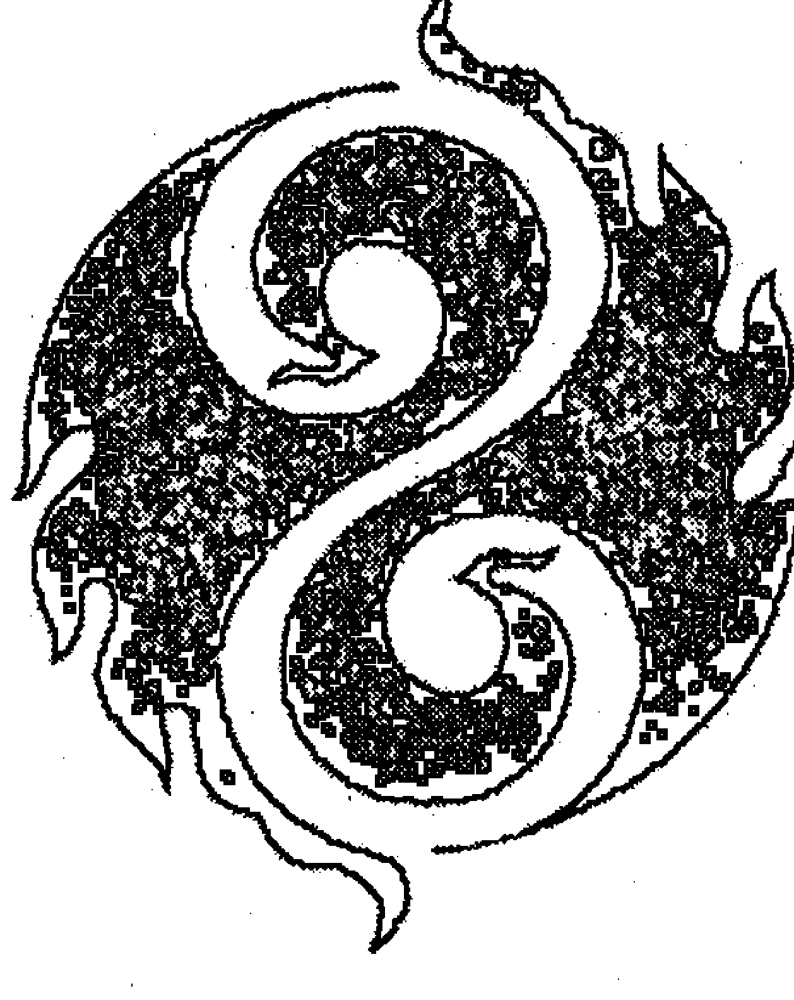
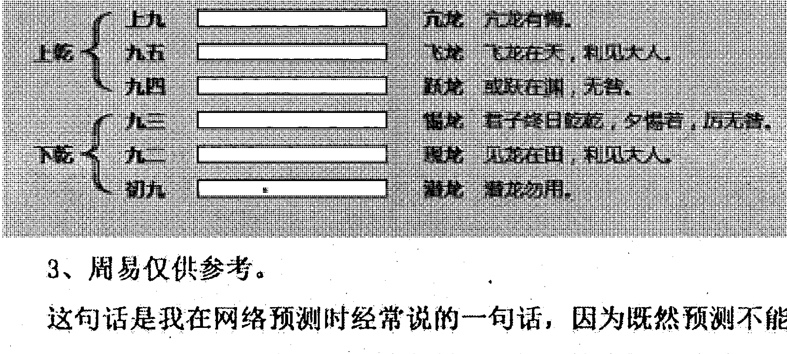
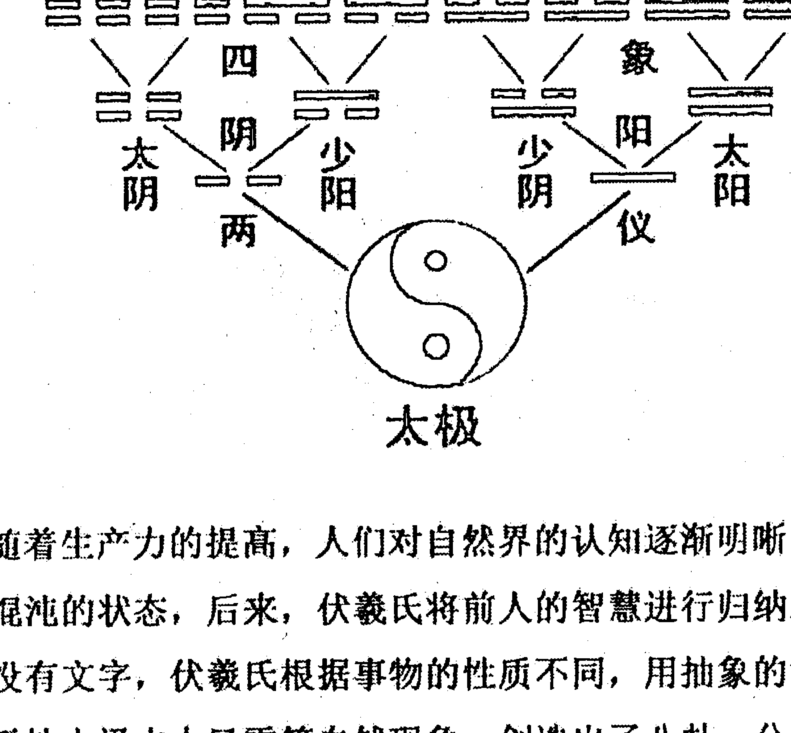
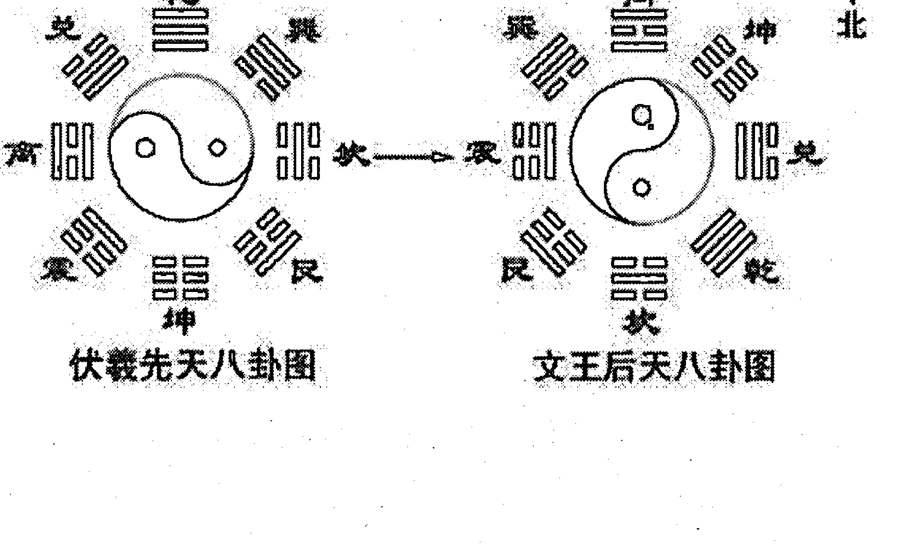
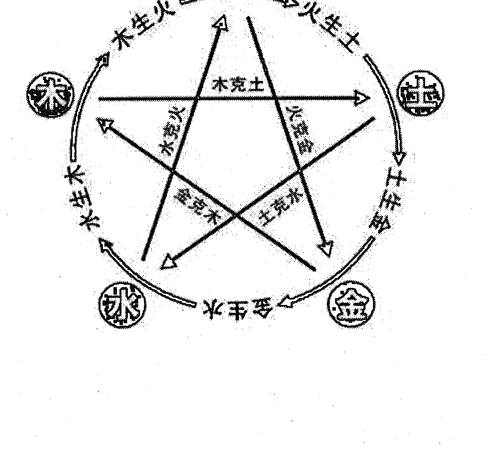
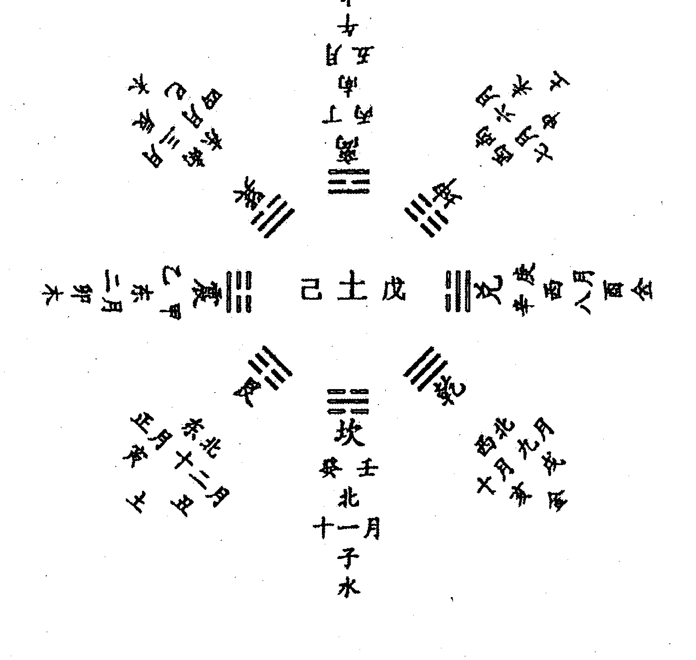
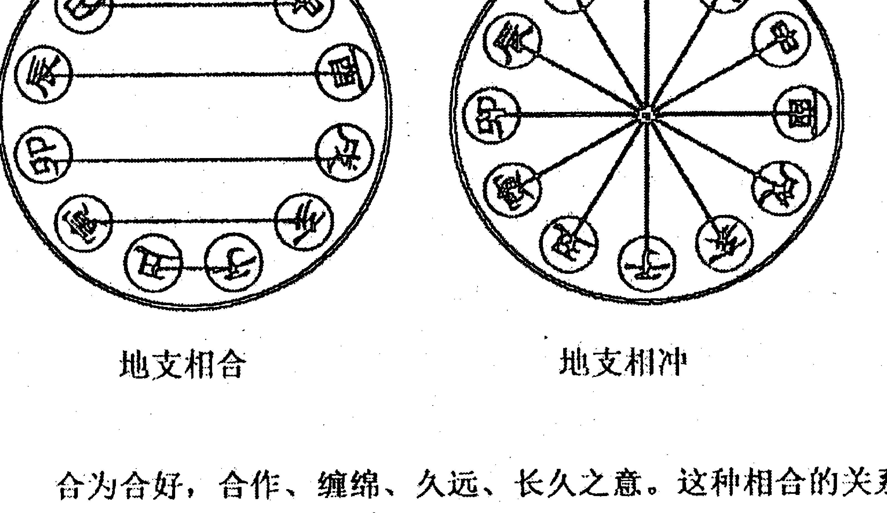
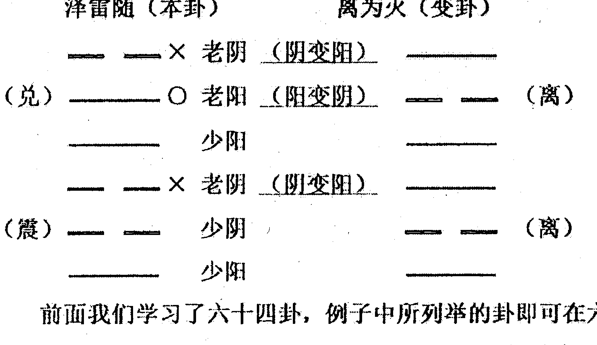

# 六爻基础入门




## （篆体标题文字，较难辨识）

> 能得真谛者不自诩  
> 怀揣玄机者定自谦

## 知微易学会六爻初级网络培训班常年招生

- 一、培训方式：语音授课，随时答疑解惑。  
- 二、培训时间：共40天，每晚9—10点，节假日不休。  
- 三、培训内容：《六爻基础入门》全书，从零开始，培训后基本达到入门水平。  
- 四、培训福利：  
  - 1. 赠送《六爻基础入门》电子版；  
  - 2. 赠送知微易学会定制摇卦铜钱；  
  - 3. 凡由此班结业再报名进阶班的学员，进阶班学费一律8折。  
- 五、培训说明：本培训班主要为物色和培养六爻后备人才，几乎只收成本费。上课期间考勤非常严格，对学习质量和平时作业考试都有较高的要求。如不能坚持上满40天，请谨慎报名。  
- 六、本会还开设有一对一教学，在两个月内自由选择时间，由老师一对一授课，共40课时，福利与上相同。  
- 七、联系微信：13593968461。  
- QQ研讨群：175343880。

## 知微易学会六爻段位表

| 级别 | 段位 | 层级 | 基本情况 | 下一步方向 |
|---|---|---|---|---|
| 特级 |  | 职业 | 对卦象和细节的解读准确率较高，能够随时把握卦象，从容应对卦主的提问，技术和阅历达到较高水平。 |  |
| 高级 | 三段 | 准职业 | 对细节和象法判断的准确率长期保持在8成左右，自身理论体系已稳定，并积累了一定的实战经验和社会阅历。 | 从业，积累经验和社会阅历。 |
| 高级 | 二段 | 总结 | 对细节和象法判断的准确率长期保持在7成左右，自身理论体系已基本稳定，实战失误率逐步降低。 | 大量实战，归纳总结，向职业化迈进。 |
| 高级 | 一段 | 实战 | 对细节和象法判断的准确率稳步提升，并开始实战，形成自己的六爻理论体系，逐渐从借鉴他人的理论到自己研究发现理论。 | 逐步退出网络练手，加大实战力度。 |
| 中级 | 三段 | 掌握 | 对六爻基础知识掌握牢固，对细节和象法部分有一定的研究和心得，断卦时多以验证细节为主，并保持一定的准确率，但实战较少，仍停留在网络层面。 | 大量探讨卦例，多在网络练手总结，开始实战。 |
| 中级 | 二段 | 练习 | 对六爻基础知识已基本掌握，断卦时会主动研究卦中的细节问题，对于比较基础的卦能有一定的思路，断卦思路逐步形成。 | 大量探讨卦例，多在网络练手。 |
| 中级 | 一段 | 上手 | 认真研究过六爻基础理论，对六爻基础知识有一定掌握，对象法和细节有初步掌握，对一般卦不仅能判断吉凶问题，偶尔也能判断部分细节。 | 加强细节和象法学习，参与卦例探讨，开始练手。 |
| 初级 | 三段 | 入门 | 认真研究过六爻基础理论，对六爻基础知识有一定的掌握，对简单的吉凶卦能做出判断，对卦的细节问题比较欠缺。 | 学习六爻细节和象法知识，参与卦例探讨。 |
| 初级 | 二段 | 过渡 | 阅读过六爻基础书籍，对六爻基础知识掌握较差，对简单的吉凶问题尚不能做出判断，看卦时仍然处于懵懂状态。 | 加强基础知识学习，少量参与卦例探讨。 |
| 初级 | 一段 | 开始 | 接触过六爻预测，略懂一些专业术语，对六爻预测有较强的兴趣，但对基础知识不甚了解，初看过六爻书籍。 | 认真阅读六爻基础书籍。 |

## 纳兰代序

谨以此序祝贺青岚先生新书问世，并祝愿所有读者能在此书中初窥易学堂奥。

与青岚先生相识并不久，至今也无缘见上一面，心里却早就当了自己的师傅，也当了未曾相识却神交已久的老友。尝请教易学问题，所问初级而无理，却得到先生耐心详细的解答，得以入了六爻门槛。《易》讲缘分，那么这可能就是缘分了吧。

想起很早以前买了一本《周易》，怎奈潦草浮心难以沉淀，不久便束之高阁，再无过问。很偶然的情况下看到曾仕强老师的《易经的智慧》一书，才了解到《易经》为何被称作“群经之首”，才知道原来“否极泰来”“三阳开泰”“九五之尊”这些耳熟能详的词语原本来自于《易》。才体会到中国延续至今的，上至国家，下至个人，从社会到家庭，从官场到职场，朋友交往之情，夫妻达理之道……无不深受《易》之影响，正所谓“人人知易理，而不自知”。

一阴一阳之谓“道”，《易》来自于自然，如果天是“阳”，那么地便是“阴”；夏天是阳，冬天是阴；白天是阳，黑夜是阴；男人是阳，女人是阴；坚硬为阳，柔软为阴；外在为阳，内在是阴；言行是阳，思想是阴……世间万物莫能出于阴阳之道。只有阴阳相济、互补、转化、平衡，万物才会显示勃勃生机。

试想当今社会，一个人，如果只知打基业不懂守江山，或者一味阿谀不知自持，一味索取不知尊重与感激，反之亦然，终会阴阳不调自食苦果，如果有因果，这也许是最基本的因果了吧。想起曾经有个同门问青岚先生：“学易这么久，可有鬼神之感，或者冥冥之中自有安排？”先生答曰：“并没有。”人心至正，阴阳平衡，警示于此，可见一斑。然而《易》在当今社会，或被推至神坛之上，或被贬于迷信之中，与学易之人有莫大干系。

小子愚见，周易六爻法作为《易》的正宗占卜之术，与易理宜为阴阳。只知易理不知易术，如英雄无用武之地；只知易术而不识易理，不重德，无异于作茧自缚，自食苦果。我最钦佩青岚先生的便在此处，先生以自然为道，不宗教化，不造神，以实用为根基，不故弄玄虚，只有这样，易学才有可能逐步摆脱“迷信”的阴影，真正复兴辉煌。

六爻之法，作为古筮正宗占卜之术，研习之路颇为艰难，不说所耗费的时间、精力、金钱，唯内心所承受之重，也非旁人所能感同身受。跟先生一样，我的学易之路虽尚短暂，却也经历过初识读天书般的迷茫；读书读到深夜，读到头痛欲裂，做梦都在摇铜板的痴妄；拉着身边的人占卜，而后如窥天机般的惊喜；瓶颈期的难以突破进而失望怀疑……我曾开玩笑和身边的朋友说，这每一个阶段都是在“渡劫”，渡心劫。

正在这时，青岚先生传来开馆著书之讯，拜读之下，言言真诚，字字珠玑，无一语故弄玄虚，顿觉很多许久间的迷茫找到了出口。就像每次请教他问题时总能得到答案一样。欣喜之下，特书此序，贺先生开馆于坊间，著书于纸上，立心传此中正之道，为往圣继绝学于斯，实乃幸也。

公子纳兰  
2017年10月17日

## 南柯代序

天有不测风云，人有旦夕祸福。面对难以预料的世事，我们都很渴望自己能预知未来，能像电视上的世外高人一样料事如神。我们一直觉得预测之学，是难以接触得到的，其实，它一直都在我们身边：接触得最多的是根据专业知识来对事件和局势做出判断和估计。比如牙医根据你牙齿的情况来推断你的饮食生活甚至是健康情况，我们通过自身对他人和局势的了解来思考将来可能的发展变化。无非是一叶落而知天下秋。

而真正的占卜预测虽然看似神奇，也只是和这些世间方法专业体系相互不同罢了，五行相生相克，万物流转始终。占卜中的六爻预测作为传承久远、典籍完备、非常正宗的一门占卜之术，就值得学习。虽然还有奇门、六壬、梅花等等预测之术，但由于这些预测之术要么过于繁杂，要么典籍缺少，总之，缺乏师父引领，难以深入领会其中精髓。而六爻由于典籍众多，没有过分繁杂，流传反而非常广泛，以至于现在说起算卦，我们就能想象到手握铜钱而占卜的画面。

六爻典籍众多，以个人的观点，分为古书和现代书两类。古书历经大浪淘沙，其观点大多是得到众多名家高人的认同，具有权威的特性。但是其缺陷也是显而易见的，第一是古文不易懂，文言文由于在现代应用得很少，不说理解，连阅读都成问题，虽然现在出版社能够将文言文翻译成现代文，但是翻译的人才在六爻专业知识方面就未必精通，翻译难免和原意出入很大。第二是古书在六爻的吉凶判断和事件细节方面是混在一起讲的，对于我们初学者来说，这两条主线还是要分别理清才能学好六爻，就像我们穿的一双鞋，要理清左右，分别清晰地驾驭，才能顺利走路。第三是古书在弘扬六爻之学的同时，还参与了师父挑选弟子的作用，因此古书系统化不强，大多简略，师父挑选弟子就给他一本六爻古籍。由于系统化不强，需要努力理解、持之以恒，理解能力显示了徒弟的资质悟性，持之以恒看出了徒弟的耐心。但是在现代化社会中，是需要学到六爻尽量学以致用，这种考核就成了我们学习六爻的阻碍。第四是时代变迁，虽然时代变化阴阳五行之理是不变的，但是很多新的现象需要从六爻中寻找到对应的解释，而古书很难提供这方面的帮助。

现代的六爻书籍虽然能与现代社会接轨，但是由于没有经受时间的考验，鱼龙混杂，难以辨识是否是真正系统有效而且正宗的书籍。青岚先生学易多年，现在从事专业六爻预测。在根基上，他以传统正宗的六爻断卦理论为本，广泛吸收各个六爻派系的观点，对各派理论进行一一验证，验者吸收留存，不验者修正或舍弃，这本《六爻基础入门》就是青岚先生梳理六爻基础知识，深入浅出对六爻进行系统性的讲解。由于曾经有着教师的工作经验，青岚先生有着丰富的系统讲解和论述六爻知识的经验。这本书的正统性可以从各位六爻爱好者在实战和古籍中得到充分验证，更为可喜的是，青岚哥还筹备了一个六爻答疑群，为购买本书的六爻爱好者提供了解答疑惑的平台。很多事情都是各有缘分，如果你与六爻预测有缘的话，希望能够珍惜，如果上天想考验你并给你预知未来的能力，也许这个机会就在目前吧！

南柯天运  
2017年10月19日

## 自序

### ——我的六爻之路

> 献给为了理想而坚持奋斗的朋友们！

我出生于1986年，典型的80后，农村娃，父母都是农民。从小家境不太好，长相身高更是不好意思提。我爷爷是工人，一生郁郁不得志，临近50岁的时候，仿佛看到了人生的尽头，于是放弃工人身份，开始当门卫，只为了有充足的时间研究周易六爻。那时候我还小，根本不懂什么周易八卦，倒是长期在甲乙丙丁子午卯酉之中熏陶，算是耳濡目染。爷爷也经常给我算运势，总是说我聪明归聪明，但官运却不好，只能当个小职员，混一碗饭吃，那时候自然是没有把爷爷的话放在心上。2004年我考上了一所普通的本科学校，大学期间，逃课、挂科、打游戏、玩通宵一样都没少干过，成绩自然也是垫底的那种，好在有惊无险地毕了业，参加了本市农村学校资教，当上了数学老师。当老师期间，也基本是浑浑噩噩在过日子，有课去上，没课就关在宿舍打游戏。说这么多，总之一句话，从小到大就是个纯屌丝，也从来都没有什么远大的抱负和崇高的理想之类的，做事也是拖延症中晚期，不到最后一天基本不动身那种类型，似乎完全就是照着爷爷给我算的轨迹一步步往前走。

2009年，一个偶然的机会，我有幸被借调到本市纪委工作，我突然感觉我的人生际遇来临了，别的不说，光“市纪委”这三个字说出来都是够有面子的。我在心里暗喜，如果能成功成为市纪委的一员，以后还不是高官厚禄，锦绣前程，甚至都觉得可以光宗耀祖了。那段时期，我一改以往懒散颓废的状态，像打了鸡血似的，拼命工作，拼命学习，拼命表现，再苦再难的工作我都坚决完成，期间多次受到领导的肯定和表扬，我俨然从一个懒癌晚期患者变成了积极向上的有为青年。可惜，一年半以后，我还是没能如愿留下来，不得不选择继续回学校教书完成资教任务。虽然算是失败了，但那时我已基本明白，人是要靠自己努力的，只有碌碌无为的人才去认命。所以虽然离开了市纪委，反倒更加激起了我努力上进的决心。2012年底，我考上了本地基层公务员，一年后，我再次被借调到市纪委工作，成为同批公务员里第一个借调到市局的人，仿佛又起死回生一样等来了机会。这时候的我，已经完全不同于以往咸鱼般的存在，而是一心想有所作为的大好青年，简直是疯了一样地工作。一年半后，命运之神再次让我留下来的希望破灭，连在我后面借调到市纪委的同事都转正了，我却还是原地踏步，再次面临回到原单位的尴尬处境。

那段时间长期失眠，整夜整夜地睡不着，夜深人静的时候，我总在想，难道人的命运真的是注定的？难道真的像爷爷算的那样，这辈子就只有一碗饭吃？肯定不是这样的。如果都是注定的，那人们还努力做什么，不如躺在床上等天上掉馅饼多好。所以人是不能坐以待毙的，必须赶紧为将来找出路。我花了很长的时间深刻反思了自己的性格、长处、缺点、兴趣、理想等等，发现我根本不是做官的料，不喜欢搞人际关系，不喜欢迎来送往，不喜欢酒桌陪笑，不喜欢阿谀奉承，我突然发现，我是不是该考虑换个职业了。那一阵子我一直在思考这个问题，我的人生到底该怎么走，如果不当公务员，我还能做什么？但是思考了两个多月，发现我真的是什么都不会，去别的公司肯定是不想去的，做生意吧，没技术，没资金，没人脉，连胆量都没有，感觉白吃了二十几年的大米饭，到哪里去找一条不需要资本，又适合自己的路呢？

有一天，无意中和同事说起我的苦恼，同事随口说了一句：“你爷爷不是会算卦么，你让你爷爷教你，学好了能赚很多钱的。”说者无心，听者却有意，我顿时如醍醐灌顶一般，是啊，现成的路在我面前，我怎么没有想到呢？学周易不需要本钱，我本人又有兴趣，悟性也还不错，学好了又可以赚钱，又自由不受拘束，简直是太适合我了。我像找到了指路明灯一样，赶紧回老家找爷爷，爷爷当然是乐意我学了，正愁研究了几十年的衣钵没人继承，于是给了我两本邵伟华写的《周易与预测学》《周易预测例题解》，然后我就如获至宝一般，带回去拜读去了。

拿到书，赶紧开看，周易八卦、五行生克、天干地支一遍而过，因为从小就熟悉，看一眼就懂了，其他新知识，我都很认真地用一个笔记本记着，时常翻看。每天都是从下班以后，一直看到晚上十点多睡觉，有几晚还等老婆睡着了偷偷爬起来研究，十天不到，书就翻完了，感觉没有想象中的那么难，反正觉得很简单。那时候刚好要去武汉办事，于是照着书上所说，摇卦画卦，糊里糊涂地嘀咕一通，还根据卦的意思给自己选了个吉日，周四出发，周五办成。事情果然和所测一样，周五虽然中间有点小意外，但是总算是办成了，一时觉得自己神勇无比，只用了十天就能断卦，相比于爷爷说近30年只学到了点皮毛，那我简直是学易的天才，于是赶紧告诉亲友，给他们免费断卦，凡是要预测的，一律来者不拒。

我把所有断的卦和过程都写在QQ空间里，吸引了不少朋友前来咨询，加上断的卦也蒙对了不少，一时自信心爆棚，想想爷爷所说的是不是太危言耸听了。我认为六爻不过如此，简单得很，并且狂妄地扬言要断足100卦，然后去学梅花易数、生辰八字等，要把所有的预测术都学会，然后像电视上说的那样，当上CEO，迎娶白富美，从此走向人生巅峰。可等断到30多卦的时候，我渐渐发现，有些卦好难，根本看不懂，有些甚至连用神都没有，有些动爻发动了跟用神没有半毛钱关系，而且从朋友们反馈的情况看，错的也越来越多，根本不像我所想的那样，而且我只会判断简单的吉与凶、成与败，对于朋友们所问的其他细节自然是一片茫然。我逐渐明白了爷爷当初所说30年只学会了点皮毛的意义，六爻深如海，哪是我这样随便就能学好的，要想学点真本事，不认真踏实地钻研，无异于天方夜谭了。于是我放弃了学其他预测术的想法，每天只研究六爻卦。然后我又发现，生活中不是每个人都相信算卦的，很多人认为算卦是迷信，是骗子，甚至相当鄙视，这让我觉得，学六爻真不该如此高调，我把QQ空间所写的卦例全部删除了，也不再给亲友们算卦了。根据易友推荐，我买了一套《增删卜易》开始认真研读，边读边给人看卦，每天就是看看感情卦，今天又分手了，明天又复合了，后天有小三了，有蒙对的，当然错的居多，反正免费，互相也不认识，倒也其乐融融。

不知不觉几个月过去了，渐渐地发现我已不像当初那么痴迷，那么喜欢看卦了。初学时的好奇心和虚荣心逐渐冷却，技术又难以得到较大的提升，很多卦依然看不懂，有些甚至毫无头绪，买的《增删卜易》连一半都没看完。每天看着卦发呆，甚至有时候根本不想看到卦，看到就觉得烦。整天就是用神相生、用神相克，六合六冲，“你爱不爱我我爱不爱你”的真的很无趣。看到其他高手断别人长相、性格、疾病、风水无比细致，自己却门都没有，心里落差很大。刚好那段时期，工作上的事情心情很烦躁，干脆就这么暂时放下了。

一直到2015年下半年，我都只是断断续续地翻一下那本《增删卜易》，似乎我的六爻之路就要像绝大多数学易的人一样，就此放弃了。2015年上半年，经领导牵线，我从市纪委调到市建委，主要从事公文写作工作。市建委领导看得起，愿意接纳，市纪委领导极力帮忙，原单位领导也同意，似乎一切都顺水推舟，板上钉钉了。然而，市建委的申请送到市委组织部后，组织部领导给我打电话，说我三年的基层服务年限没满，不能调动，我一时傻眼了。回想起老妈曾经给我说过，说爷爷给我测过了，我进不了建委，还是会回原单位的。果然是从哪里来，回哪里去。这么多年谨小慎微，辛苦拼搏，到头来仍然是一场空。回到出租屋，恰逢房东来收房租，女友（现在的老婆大人）央求房东能宽限几天，说发了工资就交。我坐在床边沉默良久，一时间所有的委屈都集中爆发，再也无法隐忍。第二天，我婉拒了建委领导的再三挽留，决然地从建委大院走出，心里发誓，坚决不会留在体制内，最多一年内辞职走人，我要寻找属于自己的人生。

可是要说辞职，谈何容易，不是人人都有勇气辞掉铁饭碗的。作为一个男人，要养家糊口，可不能任性胡为。辞职了去做什么，拿什么生活，这些都是要考虑和规划好的。于是我再次想到了六爻，开始认真思考职业从易的可能性，也开始拿起许久没有翻过的《增删卜易》。回到原单位后，我边工作，边看书，边思考出路。也正是这段时期，我的理想和人生观发生了重大转变，基本确定了以后的发展方向。为了以示决心，我将玩了三年、投入了数万元、原本转让可以回收上万的游戏账号直接销毁，从此没有再玩过任何付费网游。2015年底，《增删卜易》终于看完，我又买了王虎应大师的一套书籍，并准备2016年春季辞职，然后在家专心研究六爻。为了能让家人同意辞职，我不断地给父母家人阐述我的想法。作为农村人、老一辈，父母自然无法理解，他们不明白，一向懂事上进的儿子为什么要辞去人人羡慕的公务员，去当个街头摆摊算卦的；如果辞职了，如何向亲友邻居交代。而我明确表示不想活给亲友看，只想活出自己。多次交谈无果后，最后不惜和老爸打了一架，家里新装修的门框现在都还有当初弄坏的印记，态度之坚决让我自己都害怕。父母不死心，又邀请爷爷和家里长辈轮番劝说，我也不为所动，一心辞职。父母见我有如此毅力，终于松口，同意了我的想法。2016年上半年，领导安排我参加了两轮巡视工作，辞职的事情只能往后拖；7月儿子出生，只能再次往后拖。期间有不下5次的机会可以再次调动，包括领导、亲友多次与我谈心，劝我慎重考虑。此时的我，已经心如铁石，决定不再留在体制内，所有的邀请都一一回绝了。10月，基层换届，老领导高升，新领导上任，我认为时机已到，便向领导提出辞职申请，最终于2016年11月底辞职。体制内所有的优越与温暖，所有的烦恼与迷茫，从此都与我无关了。2017年春节过后，原单位领导再次给我打电话，说位置还给我留着，只要愿意，随时可以回来。我笑着给领导交底：一个男人，做出了决定，是不会回头的；即使前面是万丈深渊，也要硬着头皮想办法走下去。

## 三

辞职后，我给自己放了五天假陪老婆孩子，然后开始系统地、逐章逐例地研究。我把自己关在书房里，一关就是八个月。每当自己懒惰发作的时候，我都告诫自己：你辞职了，没有生活来源了，再不努力，老婆孩子要跟着你去要饭了。甚至有几个晚上真的做梦梦到牵着还不会走路的儿子在路边讨饭，被吓醒。偶尔出门一次，都恍如隔世。我甚至感觉走在喧闹的街上很不适应，都不知道该去哪里。为了督促自己坚持学习，我开了一个学习贴，每天都把学习的情况记载下来。学习的时候，我把自己不太懂的地方全部做上笔记，然后大量阅读书籍。光买书的钱就花费了近千元。截止目前，认真阅读了王虎应、朱辰彬等现代大师所著六爻书籍62部（本），古籍17部（本），易学书籍13部（本），共90多本书籍，写满了三大本笔记。对于书中所著理论，用实例进行一一验证，多次验证准确的，方才使用；对经验证准确率有疑的进行摘抄，重点关注；对经验证错误的理论进行总结更改。有些疑难错卦，经常会整夜思考，辗转难眠，甚至有一次在洗澡的时候洗着洗着就坐在小凳子上想起了断错的卦，一个澡洗了快两个小时，家人还以为我掉厕所里了，简直是到了痴癫的程度。而一旦从根本上弄清楚问题所在后，那种满足和兴奋是难以用言语来形容的。就这样经过八个月的系统化验证与总结，疑问逐一解除，思路逐渐明晰，预测水平与准确率均稳步提升，找我预测的人也越来越多。

2017年8月，我向职业从易的道路上迈出了一大步，开了一家春风周易会馆，实测准确率保持在较高水平，前来预测的朋友基本都能满意而归。我还创建了一个基础研讨群，在别人都不屑于带新手玩的时候，我却反其道而行之，专给易友们讲解基础卦理。在给别人讲解的时候，自己印象更加深刻，基础更牢固。万丈高楼平地起，只有基础扎实了，断卦时才更加得心应手，这都是从我教师生涯得出来的经验。同时，我深知自己的水平还很欠缺，未来的路还十分艰难，还需要继续努力研究，每天都坚持研究学习12小时以上，不敢懈怠。正所谓星空不问赶路人，岁月不负有心人。当我每天放下书本，关上电脑回家时都已是凌晨，街上已经人车稀少，一片寂静了。

到了2018年，卦馆已经能轻松收入过万，内部学员也有几十名，基本上解决了生活上的压力。然而我逐渐地发现，人都是有惰性的，一旦没了压力，就没了动力。自从不必为生计发愁后，我再也没有一年前的那种拼搏精神。就是在平时，工作时长也不过三四个小时，每天几个卦。有时候在卦馆无所事事，刷手机或者发呆；有时候干脆闭馆打麻将。朋友们都羡慕我是30岁提前过上了60岁的生活，而我则苦笑不已。每当夜深入静的时候，我总习惯地问自己：这难道是我想要的生活吗？我的人生难道再次陷入一成不变、安逸悠闲的状态了吗？当初从建委大院出来时的决心与豪情壮志难道就这样烟消云散了吗？当然不是。我必须要再次振作起来，勇敢地走出舒适区，重新规划未来的易学之路，重新找到人生的方向。

2019年初，经朋友资助，我带着3名学员在武汉开了一家易知微公司，正式向公司化运营迈步。由于第一次当老板，没有任何经验，公司成立初期，一切都是从头开始。我白天一边处理日常事务，晚上思考公司方向，还要学着当老板的样子面试年轻的员工。由于经验不足，千头万绪，工作开展很不顺利，压力很大，又开始严重失眠，甚至整晚睡不着觉，直至某天晕倒在厕所。

值得吗？当然值得！

人活一世，不能实现自己的理想，不能实现自己的价值，不能为了理想去奋斗，与咸鱼何异；即使前路再艰难，即使道路再坎坷，也不能轻言放弃！我开始重新学习招聘技巧，学习运营知识，学习一个老板所有该学的东西！趁自己才30多岁，还年轻，就当是为了十年后的自己。

## 四

每当有易学爱好者问我该看什么书入门，有没有什么更好更快的入门方法的时候，我都不知道该怎么回答，往往只能推荐去看《增删卜易》。《增删卜易》是古籍中的经典之作，比较适合初学者入门使用，但是古书上有些理论已经不太适应现代预测的需要。如古时的婚姻和现在的婚姻存在着本质上的区别，婚姻观念发生了根本上的变化。古代讲究父母之命，媒妁之言，讲究明媒正娶，从一而终；现在就没这回事了，只要自由恋爱，不违背法律规定就可以。如果仍然按照古法断姻缘，往往准确率难以令人满意。还有如暗动与日破的定义也存在争议的地方，古书以旺相被日冲为暗动，休囚被日冲为日破，其实这个表述也不是很准确，暗动的判断标准还有很多。再比如古书的理象不分问题，对长生十二宫的认知存在误区等等。

而现代大师的书多标新立异，对基础知识部分多半写得比较简洁，一笔带过，有些知识过于理论化，实用性不强，不利于新人学习。为了使初学易者少走弯路，也为了将来内部讲解的时候有资料可用，所以在2017年时决定写一本初级入门的资料，供大家学习参考。今年由于易知微公司发展需要，再次将本书进行简单的修订和删减。

本书共有六章，主要是采取简洁的语言尽量将六爻基础知识写得通俗易懂，不照本宣科。全书重在实战知识，也有很多本人在学习中的经验总结。对于实际预测中用处不大或者没有用处的知识，如天时等只简单概述；对于实战中的主要内容进行重点分析；对基础部分的知识不厌其烦地反复讲解，争取让完全没有易理基础的六爻爱好者也能很容易看懂、会用，能尽快进入六爻之门，学到真东西。书中所列举的卦例，九成以上是在预测中收集整理而来，另有少部分是摘自《增删卜易》或其他易友提供卦例。

本书在编写过程中，得到了易友们的大力支持，在此一并致谢。由于水平有限，编写仓促，书中错误难免，不足之处敬请各位易学同仁批评指正。

蒋岚

2019年7月修订

## 研究实用易学的要求和原则

生活中有句老话：成才先成人。学习实用易学也和学习其他知识和技能一样，要想学好六爻预测，在易学上有所成就，必须对易学有正确的认知，具备高尚的道德品质和持之以恒的学习精神，还要有一定的悟性。

## 一、要有正确的认知

### 1、周易不是迷信。

谈起周易，大部分人首先印入脑海的就是“封建迷信、骗人的把戏”，认为搞周易的人，都是在故弄玄虚、装神弄鬼。包括我所在写字楼的物业老头，都说搞周易的就是忽悠人的。不可否认，现实生活中确实用周易骗人的大有人在，甚至新闻网络铺天盖地的都是些奇葩的利用周易骗财骗色的信息，让人瞠目结舌。难道周易真的就从传说中的群经之首，沦落至此吗？很显然不是这样的。我们平时所接触的周易从业者，大部分都是街头巷尾走街串巷的人，他们大部分水平有限，只是为了混口饭吃，更有道德水平低下者，专以骗人为生。实际上真正的易学高手是难得一见的。

初学时，我曾经对本地十多名在街头摆摊的人进行了实地检验，结果让人大失所望，绝大多数人只是照本宣科，略懂些专业术语，青龙就是要升官发财，白虎就是有血光之灾，刑杀就是要坐牢……只有一位教师出身的老先生颇有功底，确实是真才实学。然而讽刺的是，这位老先生摆了半天摊，竟然没有一位求测者，倒是旁边穿着道士服跟唱戏一样的先生身边围了不少人。我不禁感叹，看来这一行，技术不重要，包装才重要。那么，是不是我们不用学太好，只要包装就行了呢？显然不是的。我们所见的街头摆摊者，只不过是易学的最底层；在比较高的层次，是要靠水平吃饭的。像现代的王虎应大师、朱辰彬大师等，无不以精湛的技术令人折服，而他们每一卦所获得的收益也差不多是这些街头摆摊人一年的收入。现在有许多大学都开设了周易研究室，比如中山大学的周易研究室就很有名，都是些学者、教授在从事易学研究工作。在一切做生意的老板圈子中，请高人指点也是比较常见的事情。所以我们不能因为所见的都是一些走街串巷的从易者就说周易是骗人的。骗子哪个行业都有，只不过用周易骗人更让人深恶痛绝罢了。

所以学易首先心态要正，所谓易为君子谋，不要贪图蝇头小利，更不能用周易谋不正当之事，目标要远大，眼光要长远，才能学有所成。说起收费这件事，我这人一向比较实在，宁做真小人，不做伪君子。我曾经不止一次地在公开场合说过，我学易就是要实用的，不搞花架子。学易的目的是为了趋吉避凶，为他人排忧解难，也更是为了证明自己的价值，获得报酬养家糊口。曾经有人批评我，说学易就应该普度众生，应该修身养性，不能收费。我说拉倒吧。说起普度众生，恐怕让道德帝们捐个十块八块都要噘嘴半天。熟悉西游的人应该都清楚，佛主曾说，某个王子为了求真经，佛主就让他用金子铺地，铺多少，就给相同大小的佛经。可见佛主传经也是需要报酬的，不是免费给的。预测也是劳动，而且是很辛苦的劳动，自己付出了劳动，就要获得报酬，只要是凭本事预测，适当收费心里得。再说，任何东西，只要一免费，便没人会珍惜。何况真正学易是非常艰苦的，往往需要数十年的苦学才能达到较高的成就，又怎能随意轻贱了。

### 2、周易不是神话。

我们相信不少人对周易感兴趣，都是从书上或者影视作品中看到有关周易的故事，里面的师傅犹如神仙一样，掐指一算，每测皆准，令人膜拜。于是很多人就想学会这种想测什么就测什么，指哪打哪的本领。可是现实预测，是不可能做到百分百准确的。依靠现代超级计算机所预测的天气预报，也常常不准，何况是人？除了街头侃大山的以外，即使是国内顶尖高手，也没有谁敢说自己百分百准确。这其中涉及到预测者的技术水平、发挥状态，包括求测者的心态、信息的误解等等，都对准确率会造成一定的影响。目前一般行业内的普遍标准是：预测准确率长期保持在85%以上，那都是难得一见的高手。只要能保持较高的准确率与稳定性，能对未来的事情起到决策和参考作用，就已经达到目的了。对于偶尔的失误，不要惊讶，也不必疑惑，应该允许有失误存在。

比如我们拿周易第一卦乾为天来论述这个问题。大家都听过一个词，叫做“飞龙在天”，这个词就来源于《易经》中的乾卦。飞龙在天是乾卦九五爻的爻辞。《易经》中，把阳爻叫做九，把阴爻叫做六；每个卦有六个爻，九五就是在乾卦的第五爻。这一爻通常被人们称为最吉利的一爻，象征至高无上，所以古代的皇帝又叫做九五之尊。那既然每个卦有六个爻，为什么不是最上面的第六爻是最吉利的，而偏偏是第五爻最吉利呢？我们来看第六爻的爻辞叫“亢龙有悔”，比喻事物到了尽头，已经开始悔悟了。周易讲究中庸之道，讲究阴阳平衡，不是说越旺越好。俗话说器满则倾，旺过头了，反倒不好了。到九五的位置已经是极点了，再往上就是有悔了。可见，世间之事，能达到六居其五，已经是非常难得的状态了。六分之五大约83%左右，预测的准确率也是一样，能达到并长期保持这个状态，已经可以说是难能可贵了。不切实际地去追求百分百的准确，既不现实，也不符合天地之道，是不可取的。当然了，也不是说这就让人们不要努力了。俗话说，百尺竿头，尚要更进一步，学易是无止境的。即使达到了85%的准确率，要想长期保持，那也是不容易的，还需要常年累月地不断钻研完善。



### 3、周易仅供参考。

这句话是我在网络预测时经常说的一句话，因为既然预测不能达到百分百准确，那么必定会存在误差。有些求测者过于迷信周易的功效，认为预测的师傅经常测得很准，那么当然就一定要按照预测的结果来办事：测出近期要犯口舌，就把自己关在屋子里不出来；测出要破财，就把正常的生意往来都推了。更有甚者，心无理想，人无能力，懒惰颓废，而指望着大师指点发财之路，这其实是不对的。

自己不努力，神仙也难救。何况世间有那么多勤劳勇敢的人神仙都救不过来，又怎么会来救懒惰之辈？所以正确对待周易的做法是：凡事亲力亲为，一般能自己解决的事自己做，实在犹豫不定时，以周易为决策参考。本人学易数年，除因学习需要起卦以外，纯为自身和家人测卦并不多，遇到事情都是首先自己想办法，实在心里疑惑才起卦参考。对于所预测的结果，要根据实际情况进行分辨，进行取舍，然后趋吉避凶，切不可盲目迷信而铸成大错。

在这里我举两个现实生活中的例子来说明。某先生初学易时，自测儿子的婚姻情况，卦象显示将要离婚。父亲肯定是维护儿子的，想当然地就认为是儿媳妇的命运问题，于是按照卦意，极力地从中劝他们离婚，一来二去最后还真离了。结果好好一个家，就此分崩离析，儿子也无心上进，整天游手好闲，孙子也从小离母，吃了不少苦。按卦的结果来看，这位先生无疑是算得很准的；但是按道理来分析，就大错特错了。我们经常说，宁拆十座庙，不毁一桩婚。卦虽有显示，也该尽量想办法撮合，而不该为了实现卦的结果，人为地去强行操作。此种所为，虽然应了卦象，但是种了恶果了。后来随着六爻技术的提高，先生逐渐明白了当初所做欠妥，幡然悔悟，遂改修佛门，一为家人祈福，二为自身修行赎清罪恶，直至现在十多年儿子家才走向正轨。第二个例子是我表叔，他本为南方一所学校校长，要应聘其他学校校长，找我预测，连测七八次都显示不能成功，但我仍然劝表叔去应聘。表叔也懂得这个道理：周易可以做参考，但是成功靠自己努力。虽然后来经应聘确实不成功，但应聘也没坏处，还为将来应聘积累了不少经验，何乐而不为？所谓塞翁失马，焉知非福，说不定正是现在应聘失败积累了经验，才促成了将来的成功呢？如果但凡做事都靠预测，吉利就去做，不吉利就不做，天下哪有这样便宜占尽的事？有人说，那既然如此，用易用处何在？古人已经给出了很好的答案，古书上明确指出：圣人作易乃是为指点迷津、趋吉避凶。如确因事迷茫，无法抉择，此时占卦，神灵必佑；或有重大凶危之事，神必告之。总之，预测的结果是为自己的抉择做参考辅助的，其重心在人，而不在卦，不可本末倒置。

## 二、要有高尚的品德

### 1、不可行欺骗之事。

目前易学界可谓鱼龙混杂，各色人马汇集一堂，真假难以分辨。在网络上插科打诨，极尽吹嘘的这还算好的；更有甚者，利用职业便利，利用人们趋吉怕凶的心理，采取欺骗、恐吓的手段吓唬事主，骗财骗色，人神共怒。可以说，很多易学界有良知的人尤其痛恨这类诈骗之人。他们不仅让事主蒙受金钱上的损失和心理上的创伤，更让整个易学界蒙羞。奈何目前国家没有制定易学行业的统一标准，既不容许预测正规化，也不明确立法说预测是违法行为，就这么放任自流，这也是一种无奈。

周易讲究正道，纵观《易经》爻辞，很多地方都在表达一个观点：守正持中可得吉利。这与佛门中种善因得善果颇为相似。我本人是相信因果轮回的，也坚信行善积德、为恶积祸，恶是祸患之始，善是福德之源。在预测中，总有卦主问我，该如何改运？有什么办法能走好运？我总是回答八个字：“常行善事，莫求回报。”只有真心行善才是最大福报，而故意为恶，其祸不浅，也不是所谓的吃斋念佛、超度法事、风水调理所能弥补的。

我爷爷曾经遇到过一个真实的案例。某天，一位中年男士前来预测，排卦后，爷爷第一句话就说：你这两年是怎么过来的，按卦非死即伤，危险重重。那人回答：这两年很好啊，不仅运气不错，身体也好，还赚了不少钱。爷爷一愣，重新审视卦象，笑着说：除非你救人性命，否则不可能这么平稳。这人回答：确实救过人性命。原来，一个挥汗如雨的大夏天，他拖着板车（农村用木头做的用来拉东西的车）在路上走，看到有人中暑晕倒在地上。当时地面温度非常高，周围也没有其他人，如果不救，恐怕凶多吉少。此人赶紧上前查看，发现情况不妙后迅速将地上的人抬到板车上，拖着车一路飞奔、喘着粗气跑到医务室，然后在医生的帮助下转院把人救活了。此人当时完全是出于本能，只知道要救人的命，根本没有功夫去想做善事有没有回报之类的问题。这样的善举，才真正是功德无量，才能起到消灾解难的作用。而依靠化解、风水之力，即使是高人出手，虽然有用，其效果也难以与此相提并论。有人说，我也想救人啊，也想做好事啊，但是生活中遇不上怎么办？其实，生活中并不缺少做善事的机会，只是你愿不愿意用心去做、去发现了。刘备临死前曾说过“勿以恶小而为之，勿以善小而不为”，常行小善，也能积累大的福报。常人如此，我们学易之人更应该守正扬善，切不可骗人钱财，心存歪念，徒增恶果。

### 2、不可有贪财之欲。

有人说，你前面说的太危言耸听了，毕竟好人是多数，坏人是少数，拿周易骗人的也更是少数中的少数。我学易不骗人，也不给别人预测，我自己研究了用来研究赌博、打麻将、买股票、买彩票不就行了？今天财运好，就出去打麻将；明天财运不好，就在家睡大觉。只赢不输，只赚不赔，岂不美哉！

有这样思想的人，恐怕我又要泼冷水了：天下哪有稳赚不赔的道理，不仅不能稳赚，深陷其中还会输得一塌糊涂。六爻大师朱辰彬先生曾经讲过，周易有不谋专事的特征，特别是在求偏财上，偶偶尔为之倒还可以测准，如果一直专门测求偏财之事，最终卦会不按常理，胡乱显示。有很多易友对此也是很有感触的，例如测赌球，如果按世应对比看，明明世比应旺的不是一点半点，怎么看都是世赢，但是却应赢了，这就是卦象乱显的原因。即使预测水平高超，通过预测赢了钱，最后也会因为这样那样的事还回去。再者，一心通过预测获得偏财，偶尔为之无伤大雅，长期钻研，人的贪欲就占了上风，基本上就失去了努力工作、积极拼搏的动力了，这也是很危险的。

为了说明长期测偏财的危害，我举一个真实的例子。某人研究六爻预测数年，小有所成，尤其爱好测打麻将，几乎达到十中其七八的准确率，所以总是赢多输少。此人也知道长期测麻将不好，但是明摆着的财路，谁愿意自己放弃呢？仍然隔三差五地赢个百八十块。某天提前预测，财运大好，只是子孙失陷，也没有多想。一直打到下午要接儿子放学，牌桌上又手气大旺，一时不舍得下桌，心里想着再玩两把，胡个大牌就走。不知不觉又玩了个把小时，此人猛一抬头，发现窗外天已经快黑了，突然想起还没有去接孩子，联想到卦中子孙失陷，心里顿时感觉不妙，赶紧下桌去学校找儿子，哪里还找得到？正想测一下孩子安危时，发现前面不远处河边围了很多人，上前一看，儿子已经掉河里淹了个半死，旁边的人正在救儿子的命。最后算是神仙保佑，总算救了回来，没有铸成大错。此人抱着儿子大哭了一场，深知这是自己贪欲太过的报应，好在儿子没事，算是敲了一记警钟，至此以后，此人不仅不再测麻将，甚至直接戒了摸牌赌博，也是亡羊补牢，为时不晚。

### 3、不可生嫉妒之心

学易与学佛一样，也是一种修行，首先要先修心，其次才是学易。学易的过程中，要保持谦虚谨慎的态度，取人之长，补己之短，切不可稍有所成就高傲自满，不可一世，更不能心生嫉妒，妒心一起，恐怕就难有所成就了。学易也是一种与人交流的锻炼过程，一个卦如何下断语，如何取舍，与易友该如何交流都有很深的学问，值得我辈深思。

而现在易学界，却是一片混乱的现象，而且同行相轻非常严重，特别是一些入门以后有了基础的初学者，极其容易对他人的理论和学说进行批判，总认为别人是吹牛皮、瞎忽悠，甚至有人明知道对方实力和水平超过自己，也要挑几根刺来贬损一下，这正是嫉妒心在作祟。而学到一定程度之后，不少易友高傲之心便逐渐占据了主导，也不屑于和一般新手打交道，各大易学平台、QQ群内，总是会看到为了争论卦理而相互诋毁、谩骂的现象，都认为自己的理论是正确的，对方是瞎扯淡。其实殊不知，实践才是检验真理的唯一标准，不管用谁的理论，不管用的是什么方法，实践检验一下，真伪立辨，又何必吵得不可开交？正如本书开篇的那两句诗一样：能得真谛者不自诩，怀揣玄机者定自谦，谦虚谨慎才是我辈该有的学易之道。

我曾经怀着忐忑的心情向多位易学前辈请教过卦理，哪曾想高手们却十分谦虚，他们话里行间都在表达着一种亲切感，让我这个易学小辈受益匪浅。受他们的影响，我也建了一个初级六爻研讨群，经常在群内分析一些卦例，讲一些初级知识给新手朋友们参考，倒也其乐融融，既积累了人脉，又锻炼了思路，收获不小。

## 三、要有坚韧的毅力

学易者成千上万，成功者寥寥无几。这句话在我小时候总听爷爷说起，以前不太懂，现在算是深有体会。相信大家都知道，现实中搞周易的都是些老先生，这虽然有一部分原因是年纪大了没啥事做开始研究周易谋个生路，更大的原因是周易需要长时间的坚持和积累才能学有所成。有一次我们几个易友间讨论起这件事，我说我大致给出个比例：初学者约100%的话，入门者大约30%，提升者大约5%，进阶者大约0.1%，高手大约0.01%，大成者凤毛麟角。意思是说，假设一万人学易，能入门的大概3000人，入门后继续研究技术再次提高的大约500人，技术能达到一定高度的大约10人，能称为高手的大约1人，基本上是万中无一。我这么一说，似乎有些不妥，因为本身自己水平就不咋地，时常断错卦，还敢将别人划成三六九等，感觉狂妄了些。正在懊悔之际，没想到易友们都十分赞同，说我这比例还给得高了，真实的比例恐怕更低，由此可见学易之路的艰难。

我曾经开过一个免费的六爻培训课，一共15人，都是网上原先互不相识的人。学习之初，都是信誓旦旦地要学好六爻，那气势足可排山倒海。可是免费的，注定没人重视和珍惜，只十天不到，就有不少人今天有事，明天要出去旅游，后天来了朋友，大后天心情不好。约二十天，我便结束了课程，并不是内容教完了，而是根本教不下去了。那时候我就明白了一个道理，真正能沉下心来钻研的人毕竟是极少数。就像绝大部分人都只喜欢在朋友圈喝心灵鸡汤，谈所谓的感悟，而不会去学习鸡汤背后真正的知识一样，人们所追求的只是对六爻预测的好奇和羡慕六爻能准确预测结果的神奇，却不会用娱乐的时间来交换知识的积累过程。现在这15人中，只有1人还在继续研究六爻知识，其余的基本上连卦都不知道怎么看了。

所以再后来，遇到有人让我免费教的时候，我都是直接拒绝的，不是我为人高傲摆架子，而是真正想钻研的人，自会去想办法努力，别人免费教的，也没几个人会当回事，我又何必去趟这个浑水。

宋辰彬大师曾经在《古筮真诠》中说道一个现象，就是有不少初学者对所学的六爻理论知识意志不坚定，一旦发现所学理论算得不准或者学了一段时间技术没有进步，就去找其他的理论来学习，结果往往是各种理论学一圈下来，发现学了个四不像，甚至理论之间互相排斥，不知道如何抉择，其实这也是缺乏毅力的表现。遇到理论不通时，不妨多请教；遇到卦理不明，不妨多占验。学六爻不是一蹴而就的，几乎所有的六爻高手都是在长期钻研、孤独探索下才学有所成的。如贾秉然就在书中写到，十数年埋头苦学六爻，其中艰辛，不足与外人道也；曲炜也是辞去工作后，将自己关在农村老家，五六年后才崭露头角。大师尚且如此，何况是我们，更应该持之以恒，不断钻研，才能领悟到六爻的真谛。

# 第二章 周易理论概述

## 第一节 八卦的起源

提起周易八卦，在我国可以说是无人不知、无人不晓，上到耄耋老叟，下到懵懂童稚都知其一二，但要往深层次里说清楚周易的来源，大部分人恐怕知之甚少。由于现在很多书籍都对周易的起源介绍得十分详细，在这里仅简要论述。

八卦相传为伏羲所创，其原理来源于大自然，来源于生活，是我国古代劳动人民智慧的结晶。相传在上古时期，由于生产力的限制，人们对于宇宙的认知处于一种迷茫和混沌状态，将天地万物在造化之前称之为无极，而将孕育万物的天地方圆称为太极，太极是万事万物发展、运动、变化、传承之源泉所在。后来老子有言：“道生一，一生二，二生三，三生万物”，这里的“道”，就是指太极。

人们发现，生活并不是杂乱无章的，而是具有惊人的规律性。白天，太阳像火球一样照耀大地，带来了光明和温暖，万物受阳光滋养而生息繁衍；夜晚，太阳降落，月亮升起，黑暗降临，万物沉寂而休养生息；白天和黑夜周而复始，交替轮回，永不停止。于是人们把白天称之为阳（——），把夜晚称之为阴（--），称为两仪。阴阳学说即以此而来，如男人为阳，女人为阴，前为阳，后为阴，外为阳，内为阴等等，有阴即有阳，有阳即有阴，阴阳为相互对立统一而存在。

再后来，人们又发现，每过一段时期，气候、温度等都会发生变化，而且也会周而复始：春天，雨水充沛，万物开始生长，气候宜人；夏天，气候炎热，燥热不已；秋天，暑气退却，万物萧条；冬天，气候干燥，寒风刺骨；而经过这四个季节后，又会回到温暖的春天，然后继续周而复始。人们把这种四季轮回的现象称为四象，分别为太阳、少阳、太阴、少阴。



随着生产力的提高，人们对自然界的认知逐渐明晰，再也不是当初混沌的状态；后来，伏羲氏将前人的智慧进行归纳总结，那时候还没有文字，伏羲氏根据事物的性质不同，用抽象的符号来分别代表天地山泽水火风雷等自然现象，创造出了八卦，分别以乾代表天，以兑代表泽，以离代表火，以震代表雷，以巽代表风，以坎代表水，以艮代表山，以坤代表地，并制定了方位、数字等，于是形成了易学上所说的先天八卦图。所以，八卦不是凭空而来的，而是古时人们在不断地认知大自然中常年累月的智慧总结，从太极到八卦，经历了漫长的岁月沉淀，最后由伏羲归纳总结而成。

到了商周时期，周文王被商纣王囚禁时，认为随着生产力的提高，人们活动的范围大幅度增加，伏羲所创的先天八卦图方位发生了巨大的变化，已经与现实不太对应，于是根据春夏秋冬四时之序将先天八卦图进行改进，形成了著名的后天八卦图。后世多使用文王所创的后天八卦图方位，但仍然用先天八卦图数字，具体情况将在后面章节进行详细说明。



## 第二节 五行生克

五行是古代劳动人民对物质世界的高度归纳和总结，是最基本的现实元素，五行生克理论是六爻预测的核心理论，一定要熟练掌握。五行即金木水火土，其来源一说是指东南西北四方和脚下生活的地方统称为五行，另一说是指春夏秋冬四季和生活土地统称为五行，不管是哪种说法，其所代表的实际意义是一致的。

五行中的木指东方，特征是生长、柔和、温暖、早晨、春天、植物、绿色等信息；火指南方，特征是炎热、光芒、升腾、夏天、红色等信息；金指西方，特征是清凉、肃杀、收敛、金属、秋天、白色等信息；水指北方，特征是寒冷、潮湿、冰霜、冬天、黑色等信息；土指中间，特征是包容、养育、四季、中央、黄色等信息。

五行学说不仅仅是将事物简单地分类，更为重要的是，它阐述了事物内部的运动规律和轨迹。五行之间，既有相生的关系，又有相克的关系，正是五行间的生克运动，才推动了世界万物的不断变化和发展。目前所有的预测术，其理论源头都是由五行生克而来。

五行相生顺序为水生木，木生火，火生土，土生金，金生水。这五种相生的关系是古人从长期的实践中总结出来的，具体的解释有很多种。比如，植物在生长的过程中需要水的滋润，所以水生木；木又能生火，所以木生火；火燃烧后留下灰烬，成为土，所以火生土；土中的矿石可以提炼金属，所以土生金；金属做成的容器可以盛水，所以金生水。当然了，还有很多种不同的说法，大家可以去自行研究，这里只是一种比喻，便于理解和记忆。

五行相克的顺序为水克火，火克金，金克木，木克土，土克水。

水能灭火，所以水克火；火能融化金属，所以火克金；金属器具可以砍伐树木，所以金克木；植物生长消耗土地的养分，所以木克土；土能挡水，所以土克水。在预测中，生的寓意是帮助、帮扶、有益处的意思，克的寓意是克制、克害、制止、阻止的意思。五行生克是六爻预测的核心所在，其生克关系务必掌握透彻。



## 第三节 八卦象类

前面我们知道了八卦的由来，其实很多人在现实生活中或者网络上看到过八卦图，但是往往一眼而过，谁也没注意，感觉就是几个杠杠。至于具体是什么卦，仍然不认识。有一句口诀，对于记忆八卦很有帮助，只要经常念一下口诀，认识八卦不是难事。

- 乾三连、坤六断，震仰盂、艮覆碗，
- 离中虚、坎中满，兑上缺、巽下断。

乾卦☰是三条长线，坤卦☷是六条断线，震卦☳像一个上面开口下面有底的容器（钵盂），艮卦☶像一只倒扣的碗，底面朝上，开口朝下；离卦☲两头实中间虚，坎卦☵两头虚中间满，兑卦☱上面缺了，巽卦☴下面断了。

八卦虽然只有八个类型，但是可以对应自然中的万事万物。古人认为，天地孕育万物，所以以乾为天为父，坤为地为母，乾坤孕育另外三男三女六个卦，八卦大致的类象分别如下：

乾卦☰为八卦之首，其创立的最原始意义是用来代表天的，所以又叫做乾为天。它由三个阳爻构成，象征阳刚之气，称为纯阳，所以乾卦又代表阳刚、威严、刚强、稳健、正直、高大威猛的形象，在人事上代表父亲，在人体上代表头、肺、骨等，在方位上位于西北方，在五行上属金，在数字上代表1。

兑卦☱代表沼泽，又叫兑为泽。兑是“悦”的半边，所以又代表愉悦。兑中间有口，代表唱歌、说话、口舌是非等，在人事上代表少女，在人体上代表口、肠、肺等，在方位上代表正西方，在五行上属金，在数字上代表2。

离卦☲代表火，又叫离为火。离象征温暖、炎热、光明，代表热情、有活力、积极向上等，在人事上代表中女，在人体上代表心脏、眼睛，在方位上代表正南方，在五行上属火，在数字上代表3。

震卦☳代表雷，又叫震为雷。震象征雷声阵阵，封神演义中的雷震子即是由此而来，代表震动、运动、响动等，在人事中代表长男，在人体上代表肝胆、足，在方位上代表东方（如柯震东的名字就有东方之意），在五行上属木，在数字上代表4。

巽卦☴代表风，又叫巽为风。巽象征风吹拂、柔风习习、无孔不入，代表进入、柔软、柔顺等，在人事中代表长女，在人体上代表肝胆、腿股，在方位上代表东南方，在五行上属木，在数字上代表5。

坎卦☵代表水，又叫坎为水。坎象征水波涛涛、路不通畅，代表水面、陷入、聪明、智慧等，在人事中代表中男，在人体上代表肾、膀胱、耳朵，在方位上为正北方，在五行上属水，在数字上代表6。

艮卦☶代表山，又叫艮为山。艮象征高山险阻，无法前行，代表险阻、困难、停止前进等，在人事上代表少男，在人体上代表脾胃、手，在方位上代表东北方，在五行上属土，在数字上代表7。

坤卦☷代表地，又叫坤为地。坤象征方圆大地，象征广大，代表稳重、厚道、可靠、包容等，在人事上代表母亲，在人体上代表脾胃、腹部，在方位上代表西南方，在五行上属土，在数字上代表8。

以上是八卦大致所代表的信息，在断卦中经常使用，需要熟练掌握。为了方便大家记忆，将其归纳如下：

| 卦 | 乾 | 兑 | 离 | 震 | 巽 | 坎 | 艮 | 坤 |
|---|---|---|---|---|---|---|---|---|
| 卦象 | ☰ | ☱ | ☲ | ☳ | ☴ | ☵ | ☶ | ☷ |
| 自然 | 天 | 泽 | 火 | 雷 | 风 | 水 | 山 | 地 |
| 大意 | 稳健 | 喜悦 | 热情 | 震动 | 进入 | 陷入 | 停止 | 包容 |
| 人物 | 父 | 少女 | 中女 | 长男 | 长女 | 中男 | 少男 | 母 |
| 人体 | 头 | 口 | 眼 | 足 | 股 | 耳 | 手 | 腹 |
| 内脏 | 肺肠 | 肺肠 | 心脏 | 肝胆 | 肝胆 | 肾 | 脾胃 | 脾胃 |
| 方位 | 西北 | 西 | 南 | 东 | 东南 | 北 | 东北 | 西南 |
| 五行 | 金 | 金 | 火 | 木 | 木 | 水 | 土 | 土 |
| 数字 | 1 | 2 | 3 | 4 | 5 | 6 | 7 | 8 |

## 第四节 六十四卦

周文王创立后天八卦后，将卦两两重合，形成了六十四卦，并将六十四卦分成八个宫，每宫八个卦。每宫的第一个卦由于上下都相同，称为八纯卦。如两个乾卦相重合（☰+☰）就形成了六十四卦中的第一卦，上下都是乾，取名乾为天☰，乾为天即是乾宫第一卦。将离与艮相重合（☲+☶），就形成了上面是离为火，下面是艮为山，取名火山旅䷷。其他依次类推，都是由八卦两两重合而成，其卦名都是由八个卦的自然属性相加取名，如艮+坎，叫做山水蒙。

文王创立六十四卦时，只有卦名、卦象、卦辞，并没有文辞，相传文辞为文王的儿子周公所作（也就是周公解梦的那个周公），后来大圣人孔子又为周易写了很多辅助的说明书，统称十翼，至此才形成了被后世称为群经之首的易经，通常称为周易。从伏羲创立先天八卦，到孔子作十翼，相传共经历了三千多年，可谓长远。

六十四卦的卦名不是很好记，却是必须记住的，虽然有歌诀，但是很生硬，我认为还不如勤加练习，熟能生巧记忆得更快。我初学时，采用的方法是正反两两一组读卦的全名，比如天水讼，水天需；天火同人，火天大有；泽雷随，雷泽归妹等等。读一两天后，让老婆在纸上任意画六道杠杠，然后我猜卦名，如此往复，效果还不错。

六十四卦全图如下：

### 六十四卦分宫卦象次序

| 八宫 | 八纯卦 | 初爻变 | 二爻变 | 三爻变 | 四爻变 | 五爻变 | 游魂卦 | 归魂卦 |
|---|---|---|---|---|---|---|---|---|
| 乾宫 | 乾为天 | 天风姤 | 天山遁 | 天地否 | 风地观 | 山地剥 | 火地晋 | 火天大有 |
| 坎宫 | 坎为水 | 水泽节 | 水雷屯 | 水火既济 | 泽火革 | 雷火丰 | 地火明夷 | 地水师 |
| 艮宫 | 艮为山 | 山火贲 | 山天大畜 | 山泽损 | 火泽睽 | 天泽履 | 风泽中孚 | 风山渐 |
| 震宫 | 震为雷 | 雷地豫 | 雷水解 | 雷风恒 | 地风升 | 水风井 | 泽风大过 | 泽雷随 |
| 巽宫 | 巽为风 | 风天小畜 | 风火家人 | 风雷益 | 天雷无妄 | 火雷噬嗑 | 山雷颐 | 山风蛊 |
| 离宫 | 离为火 | 火山旅 | 火风鼎 | 火水未济 | 山水蒙 | 风水涣 | 天水讼 | 天火同人 |
| 坤宫 | 坤为地 | 地雷复 | 地泽临 | 地天泰 | 雷天大壮 | 泽天夬 | 水天需 | 水地比 |
| 兑宫 | 兑为泽 | 泽水困 | 泽地萃 | 泽山咸 | 水山蹇 | 地山谦 | 雷山小过 | 雷泽归妹 |

以上每宫的第一个卦叫八纯卦，是由两个相同的卦组合而成，每个卦的五行与卦宫的五行一致，如乾宫卦都属金，巽宫卦都属木，以此类推。同一卦宫内从第二卦开始，都是在前一卦的基础上从初爻起开始变化，如乾宫第一卦乾为天，初爻阳变阴，就成了第二卦天风姤；天风姤第二爻阳变阴，就成了第三卦天山遁，一直变到第五爻形成山地剥卦。后面两卦则有所不同，第七卦是在第六卦的基础上向下变化成为火地晋卦，又叫游魂卦；第八卦则是在第七卦的基础上，将下面三个爻全变，又叫归魂卦，游魂与归魂的知识留到以后章节叙述。

## 第五节 天干

所有的预测术都离不开天干地支。天干地支早在上古时期文字出现的时候就存在了，最早用来计时和当做人名来使用。

天干因为共有十个，所以一般称为十天干，它们分别是：甲乙丙丁戊己庚辛壬癸，其排列顺序是固定的。由于在传统六爻预测中，天干一般只用来装六神、定旬空、查神煞等，一般不参与吉凶判断，所以我们只需要掌握天干的几个关键特征即可。总的来说，只用记住一句口诀：甲乙东方木，丙丁南方火，戊己中央土，庚辛西方金，壬癸北方水。

具体来说，甲和乙在正东方，属木；丙和丁在正南方，属火；戊和己在中央，属土；庚和辛在正西方，属金；壬和癸在正北方，属水。天干之间是存在相互作用的关系的，但是对于传统六爻预测来说，一般不必使用，故略。

## 第六节 地支

地支一共有十二个，又称为十二地支，分别为：子丑寅卯辰巳午未申酉戌亥。在传统六爻预测法中，十二地支有着举足轻重的地位和巨大的作用，吉凶应期主要靠十二地支来判断。地支还和我们的生活息息相关，如人们所熟悉的十二生肖，就与十二地支完全对应，具有广泛的用途，所以必须牢固掌握。

- 1、地支与阴阳。天干和地支具有同样的阴阳属性，都是奇为阳，偶为阴，也就是子寅辰午申戌为阳支，丑卯巳未酉亥为阴支。不过地支阴阳的属性用得极少，了解即可。

- 2、地支与五行。地支的五行十分重要，分别是：寅卯属木，巳午属火，申酉属金，亥子属水，丑辰未戌属土。一般情况下，都会将地支与五行合起来读：子水，丑土，寅木，卯木，辰土，巳火，午火，未土，申金，酉金，戌土，亥水。

- 3、地支的方位：子为正北方，丑、寅为东北方，卯为正东方，辰巳为东南方，午为正南方，未申为西南方，酉为正西方，戌亥为西北方。地支的方位在预测中使用频率非常高，需要牢记。

- 4、地支与月份。十二地支与一年十二月刚好对应，但是预测时，并不是使用的公历或者农历，而是使用的万年历，以二十四节气来定时间，不过由于人们对节气知之甚少，所以一般以接近万年历的农历来大致判断时间。其中正月为寅，二月为卯，三月为辰，四月为巳，五月为午，六月为未，七月为申，八月为酉，九月为戌，十月为亥，十一月为子，十二月为丑。

- 5、地支与季节。十二地支与季节是相对应的，其中寅卯辰为春巳午未为夏季，申酉戌为秋季，亥子丑为冬季。

### 6、地支与时辰

十二地支与十二时辰也是一一对应的。古人把一天分为十二个时辰，每个时辰相当于现在的两个小时，换算成现在的时间依次为：子时（23至1），丑时（1至3），寅时（3至5），卯时（5至7），辰时（7至9），巳时（9至11），午时（11至13），未时（13至15），申时（15至17），酉时（17至19），戌时（19至21），亥时（21至23）。

据此可以看出，在古代，并不是夜晚24点作为一天的分界线，而是以子时23点作为一天的分界线。所以有些在23点到24点出生的人，实际上出生日期应该算第二天。

### 7、地支与生肖

我们平时所说的十二生肖，也是与十二地支相对应的，分别是子鼠、丑牛、寅虎、卯兔、辰龙、巳蛇、午马、未羊、申猴、酉鸡、戌狗、亥猪。

比如：1986年为寅年，那么生肖就属虎。以前有人为了生个吉利的龙宝宝，硬是挨过了大年三十晚上12点以后再生产，但是生肖的起止时间不是以大年三十来判断的，而是以立春来判断的，结果生出的宝宝在八字上不是龙宝宝，让人啼笑皆非。再说了，生肖属龙只是听起来好听一些，其实并无实质用处，属龙的也不会将来都是高官厚禄，属猪的一样会出人才，完全没有必要为了生个龙宝宝而冒这么大的风险。

### 8、地支与器官

分别是亥子为膀胱、肾，寅卯为肝胆，巳午为心脏，申酉为肺，辰戌丑未为脾胃。这只是大致区分，还有很多具体用法以后再叙述。

### 9、地支与数字

地支的数字是从子开始，到亥结束，依次从1到12。子1，丑2，寅3，卯4，辰5，巳6，午7，未8，申9，酉10，戌11，亥12。

### 10、地支与八卦

地支与八卦在方位上相互对应，只需要将十二地支的方位与八卦的方位相互印证即可。具体情况为：子对应坎卦，丑寅对应艮卦，卯对应震卦，辰巳对应巽卦，午对应离卦，未申对应坤卦，酉对应兑卦，戌亥对应乾卦。由于太极八卦、五行生克、天干地支之间所代表的方位等信息是一个整体，所以后人将这几者融合进一个体系，得图如下：



为方便记忆，整理如下：

|  | 子 | 丑 | 寅 | 卯 | 辰 | 巳 | 午 | 未 | 申 | 酉 | 戌 | 亥 |
|---|---|---|---|---|---|---|---|---|---|---|---|---|
| 地支 | 子 | 丑 | 寅 | 卯 | 辰 | 巳 | 午 | 未 | 申 | 酉 | 戌 | 亥 |
| 生肖 | 鼠 | 牛 | 虎 | 兔 | 龙 | 蛇 | 马 | 羊 | 猴 | 鸡 | 狗 | 猪 |
| 阴阳 | 阳 | 阴 | 阳 | 阴 | 阳 | 阴 | 阳 | 阴 | 阳 | 阴 | 阳 | 阴 |
| 时间 | 23-1 | 1-3 | 3-5 | 5-7 | 7-9 | 9-11 | 11-13 | 13-15 | 15-17 | 17-19 | 19-21 | 21-23 |
| 五行 | 水 | 土 | 木 | 木 | 土 | 火 | 火 | 土 | 金 | 金 | 土 | 水 |
| 月份 | 十一月 | 十二月 | 正月 | 二月 | 三月 | 四月 | 五月 | 六月 | 七月 | 八月 | 九月 | 十月 |
| 季节 | 冬季 | 冬季 | 春季 | 春季 | 春季 | 夏季 | 夏季 | 夏季 | 秋季 | 秋季 | 秋季 | 冬季 |
| 人体 | 膀胱 | 脾胃 | 肝 | 胆 | 脾胃 | 三焦 | 心 | 脾 | 肺肠 | 肺 | 胃 | 肾 |
| 方位 | 北 | 东北 | 东北 | 东 | 东南 | 东南 | 南 | 西南 | 西南 | 西 | 西北 | 西北 |
| 八卦 | 坎 | 艮 | 艮 | 震 | 巽 | 巽 | 离 | 坤 | 坤 | 兑 | 乾 | 乾 |
| 数字 | 1 | 2 | 3 | 4 | 5 | 6 | 7 | 8 | 9 | 10 | 11 | 12 |

在断卦中，依据地支间的五行生克关系和其他规则而断。比如子水和寅木，由于水生木，所以子水可以生寅木；申金和卯木，由于金克木，所以申金可以克卯木等等，当然了，还有其他很多规则。在十二地支中，除了五行相生相克以外，其内部还存在着相合相冲等诸多复杂的关系。

相合为：子与丑合，寅与亥合，卯与戌合，辰与酉合，巳与申合，午与未合。如下图：



合为合好、合作、缠绵、久远、长久之意。这种相合的关系是超出五行生克范畴的，在预测中也一般优先考虑。虽然十二地支两两相合，但是其相合的程度却不尽相同，大致可以分为生合和克合两种。亥与寅、午与未、辰与酉属于生合，不仅相合，五行还相生；子与丑、卯与戌、巳与申属于克合，虽然相合，五行却相克。生合者，相互扶持，关系亲密，如胶似漆；克合者，貌合神离，和心不和，目前虽合，难免不分道扬镳；即便如此，仍然比其他相克的地支之间要好得多。

相冲为：子与午相冲，丑与未相冲，寅与申相冲，卯与酉相冲，辰与戌相冲，巳与亥相冲。相冲为互相敌对的状态，预测时也需要优先考虑，多代表冲突、敌意、争执、冲散、散伙等意思。

地支的合与冲是六爻预测中非常重要的内容，在预测时使用频率很高，必须熟练掌握。

## 第七节 六十花甲与纳音歌

所谓六十花甲，就是将十天干和十二地支进行一对一组合，一个天干配一个地支，最后得出的六十种组合。如第一个天干为甲，第一个地支为子，相组合就是甲子；第二个天干为乙，第二个地支为丑，相组合就是乙丑，其余以此类推，一共为六十种组合。由于六十花甲以甲子开头，又叫六十甲子。

六十花甲的用法十分广泛，我国古代的纪年法就是六十花甲纪年法，每六十年一轮回。比如，我们总会听到老人说，出生于癸未年、甲申年等，这就是六十花甲纪年法；再如清代末年1898年的戊戌变法，就是在戊戌年进行的变法，而2018年就是戊戌年，刚好过了120年，已经是两个六十甲子了。

对于六十花甲，古人编了一首纳音歌，主要表达的是其五行属性和象征的事物。

甲子乙丑海中金，丙寅丁卯炉中火，戊辰己巳大林木，庚午辛未路傍土，壬申癸酉剑锋金。甲戌乙亥山头火，丙子丁丑涧下水，戊寅己卯城头土，庚辰辛巳白蜡金，壬午癸未杨柳木。甲申乙酉泉中水，丙戌丁亥屋上土，戊子己丑霹雳火，庚寅辛卯松柏木，壬辰癸巳长流水。甲午乙未沙中金，丙申丁酉山下火，戊戌己亥平地木，庚子辛丑壁上土，壬寅癸卯金箔金。甲辰乙巳覆灯火，丙午丁未天河水，戊申己酉大驿土，庚戌辛亥钗钏金，壬子癸丑桑柘木。甲寅乙卯大溪水，丙辰丁巳沙中土，戊午己未天上火，庚申辛酉石榴木，壬戌癸亥大海水。

纳音歌主要是在生辰八字预测时作用较大，在六爻初级阶段几乎可以不用，在高级阶段有时候可以用来取象做参考。不过我对纳音了解并不多，平时也不怎么用，各位根据自身情况，了解即可。

## 第八节 二十四节气

前面我们提到，在六爻预测中，有一套不同于公历、农历的独特的时间计算方法，是以干支作为纪年的方法。千百年来，古代劳动人民根据自然界和生产生活中的规律，发明了二十四节气来对应干支纪年，分别为立春、雨水、惊蛰、春分、清明、谷雨；立夏、小满、芒种、夏至、小暑、大暑；立秋、处暑、白露、秋分、寒露、霜降；立冬、小雪、大雪、冬至、小寒、大寒。

为便于记忆，古时就流传着二十四节气歌：

> 春雨惊春清谷天，夏满芒夏暑相连，  
> 秋处露秋寒霜降，冬雪雪冬小大寒。

基本上，从公历算起，上半年每月5号左右为交月日期，下半年每月7号左右为交月日期。直到今天，二十四节气依然与我们息息相关，如每年清明节都是法定节假日，还有很多地方会过冬至节、立春节等。二十四节气从立春开始，到大寒结束，每个节气大致为15天左右，每两个节气为一个月，一年正好360天。每个节气的起始时间与公历基本固定对应，如夏至一般在每年的6月22号或23号两天，正好是太阳运行到北回归线附近，此时白昼最长，夜晚最短；冬至一般为每年的12月22号或23号两天，正好是太阳运行到南回归线附近，此时白天最短，夜晚最长，与现代天文历法惊人吻合，体现了我国古代人民杰出的智慧。

- 立春、雨水对应寅月，大致从公历2月5号左右开始；
- 惊蛰、春分对应卯月，大致从公历3月5号左右开始；
- 清明、谷雨对应辰月，大致从公历4月5号左右开始；
- 立夏、小满对应巳月，大致从公历5月5号左右开始；
- 芒种、夏至对应午月，大致从公历6月5号左右开始；
- 小暑、大暑对应未月，大致从公历7月7号左右开始；
- 立秋、处暑对应申月，大致从公历8月7号左右开始；
- 白露、秋分对应酉月，大致从公历9月7号左右开始；
- 寒露、霜降对应戌月，大致从公历10月7号左右开始；
- 立冬、小雪对应亥月，大致从公历11月7号左右开始；
- 大雪、冬至对应子月，大致从公历12月7号左右开始；
- 小寒、大寒对应丑月，大致从公历1月5号左右开始。

## 第二章 起卦与装卦

## 第一节 六爻预测概述

六爻预测法又叫做周易预测、纳甲法等，俗称的“算卦”就是指这种方法。因卦有六个爻，所以后世称为六爻预测法。六爻预测法在我国数百种预测技术中影响较大，范围很广泛，其起源十分久远，源头可以追溯到上古时期的伏羲氏，并以文王六十四卦为载体进行预测。最初使用的是通过观察烧裂的龟甲的裂纹来进行预测，后来演变为用蓍草经过“四营成易”等复杂的操作步骤来起卦，然后再根据《周易》的卦辞和爻辞来解卦。由于这种起卦方式十分繁琐，到后来逐渐演变成较为简洁的用铜钱来起卦的方法。

到了汉代时期，易学大师京房写了一本《京房易传》，首次将天干地支纳入到周易预测中，所以六爻预测又称为纳甲法。到宋代初年，一位名为麻衣道人的人写了一本《火珠林》并流传于世。本书在京房易的基础上，将卦爻、天干地支、六亲五行作为断卦的主体来判断，从此以后，六爻预测逐渐开始走向成熟。

六爻预测理论的集大成者就是明代初期大名鼎鼎的刘伯温，其著作的《黄金策》对后世六爻预测影响十分深远，直到现代的诸多六爻预测书籍都仍然以《黄金策》为理论正宗。但是《黄金策》也有其缺陷，就是全书只有口诀，没有卦例，就像绝世武功秘籍只有心法，没有招式一样，普通人很难只看这本书就能入门。到清代时，野鹤老人所著的《增删卜易》才真正让六爻预测广泛传播，影响深远。《增删卜易》通过大量的实例和简单的入门方法，让许多初学者得以入门，现代对于《增删卜易》的研究从未停止过。直到现在，每当有初学者问该看什么书入门时，我仍然会推荐《增删卜易》。

六爻预测之所以经久不衰，除了历代易学前辈不断地钻研以外，与它本身的优势也是分不开的。六爻预测法最大的特点就是随时随事而占，但凡心有疑惑，不论何事，不论巨细，上到天时、中到俗事、下到地理，都可以摇卦预测，从而为事主抉择提供参考。

## 第二节 起卦方法及注意事项

六爻预测的起卦方法有很多种，其中得到广泛认可、使用频率最高的是用古铜钱或现代硬币起卦。具体方法如下：

- 1. 取三枚古铜钱，或面值相同的三枚硬币；
- 2. 将钱币用双手捧在手心，诚心思考所测的具体问题；
- 3. 约十秒钟后，摇动钱币数下，然后抛在平面桌面上或者容器里，记下三个钱币的字花面，此为卦的第一个爻。由于六爻是从下往上排卦，所以写在卦的最底端。铜钱以汉字为正面，满文为反面；硬币以面值为正面，以菊花为反面。目前主流比较认可的记录方式为：
  - 两个字面记为“———”或者“/”，称为少阳；
  - 两个花面记为“— —”或者“//”，称为少阴；
  - 三个字面记为“— —×”或者“×”，称为老阴；
  - 三个花面记为“———○”或者“○”，称为老阳。

目前在六爻预测中，对于铜钱和硬币所代表的正反问题争论不一，异议较大，甚至一些大师级的高手对正反的定义都有所区别。不过这并不是什么很大的问题，因为六爻预测具有专一性，只要坚持按照个人习惯，如何记正反面都可以，摇出的卦也会按照个人习惯而显示。但是千万不可今天字为阳，明天字为阴，那就乱套了。一般情况下，即以本文所述为准即可。

- 4. 重复以上动作，总共摇六次，形成六个爻，从下到上依次记录即可成卦，并记下摇卦时的大致时间。

例如六次所摇卦的结果为：字字花、字花花、字字字、花字字、花花花、字字字。其排列顺序从下到上依次为：

| 次序 | 结果 | 阴阳属性 | 爻位 |
|---|---|---|---|
| 第六次 | 字字字 —— —— × | 老阴 | 上爻（六爻） |
| 第五次 | 花花花 —— —— ○ | 老阳 | 五爻 |
| 第四次 | 花字字 ———— | 少阳 | 四爻 |
| 第三次 | 字字字 —— —— × | 老阴 | 三爻 |
| 第二次 | 字花花 —— —— | 少阴 | 二爻 |
| 第一次 | 字字花 ———— | 少阳 | 初爻（一爻） |

需要注意的是，最下面的爻叫做初爻，往上依次是二爻、三爻、四爻、五爻、上爻。在卦中，少阴和少阳称为静爻，属于安静不动的爻，阴阳已定，不会变化；而老阳和老阴称为动爻，会发生阴阳变化，阴变阳，阳变阴，变出的爻叫做变爻，不会再变化。如果摇出的卦没有动爻，全部是安静的爻，这种卦就叫做静卦。

- 5. 根据记录的结果画出变卦，并标注上卦名。如下图所示：



前面我们学习了六十四卦，例子中所列举的卦即可在六十四卦中找出卦名。摇出来的卦称为本卦，变化出来的卦称为变卦。本卦中，上面三个爻形成的卦称为上卦或者外卦，下面三个爻形成的卦称为下卦或者内卦。同时要注意，卦虽然是从下往上排，但是写卦名时，是从上到下确定卦名。上卦为兑卦（泽），下卦为震卦（雷），加起来就是泽雷随。在变卦中，上卦和下卦都是离卦（火），加起来就是离为火，那么摇出来的卦就称为泽雷随变离为火。这种摇卦法是目前广泛认可的方法，需要多加练习，熟练掌握。

还有一些其他的起卦方法，如数字起卦、汉字起卦、随机起卦、电脑起卦等等，在此不一一叙述。

### 6、起卦的注意事项

- 1. 摇卦要心静，心诚，不可亵渎，不可轻慢。
- 2. 每次起卦只问一件事，不要贪多。所求的问题宜开门见山，越具体越好。如测与某人缘分如何，可以直接思考与此人的缘分，而不应该只思考自身姻缘如何。
- 3. 初筮告，再三渎。除卦理不明以外，尽量不要为一件事情反复摇卦，更不要因为没有测到自己想要的结果就无限制摇卦。
- 4. 心术要正。六爻有四不测：一不测违法之事，二不测违背道德之事，三不测捕风捉影之事，四不测损人利己之事。以上四种，即使诚心求测，卦亦不告。

## 第三节 纳甲

所谓纳甲，就是在排卦的过程中给六十四卦的每一爻分别装上天干地支。纳甲时，从初爻开始，一直到上爻结束，一般将所纳的天干地支写在卦的前面。乾坎震艮四个阳卦，按天干地支的顺时针顺序纳甲；坤巽离兑四个阴卦，按照逆时针顺序纳甲。口诀为：

- 乾内甲子外壬午，坎内戊寅外戊申；
- 震内庚子外庚午，艮内丙辰外丙戌；
- 坤内乙未外癸丑，巽内辛丑外辛未；
- 离内己卯外己酉，兑内丁巳外丁亥。

乾坎震艮四个阳卦具体纳甲如下：

（子丑寅卯辰巳午未申酉戌亥）

| 乾 | 坎 | 震 | 艮 |
|---|---|---|---|
| 壬戌——— | 戊子— — | 庚戌— — | 丙寅——— |
| 壬申——— | 戊戌——— | 庚申— — | 丙子— — |
| 壬午——— | 戊申— — | 庚午——— | 丙戌— — |
| 甲辰——— | 戊午— — | 庚辰— — | 丙申——— |
| 甲寅——— | 戊辰——— | 庚寅— — | 丙午— — |
| 甲子——— | 戊寅— — | 庚子——— | 丙辰— — |

乾坎震艮四个阳卦是十二地支中按顺序每间隔一位纳甲。

坤巽离兑四个阴卦具体纳甲如下：

（子丑寅卯辰巳午未申酉戌亥）

| 坤 | 巽 | 离 | 兑 |
|---|---|---|---|
| 癸酉—— —— | 辛卯——— | 己巳——— | 丁未—— —— |
| 癸亥—— —— | 辛巳——— | 己未—— —— | 丁酉——— |
| 癸丑—— —— | 辛未—— —— | 己酉——— | 丁亥——— |
| 乙卯—— —— | 辛酉——— | 己亥——— | 丁丑—— —— |
| 乙巳—— —— | 辛亥——— | 己丑—— —— | 丁卯——— |
| 乙未—— —— | 辛丑—— —— | 己卯——— | 丁巳——— |

坤巽离兑四个阴卦是十二地支中按倒序每隔一位纳甲。

我们可以发现，在内卦和外卦中，天干基本固定不动。乾内卦纳天干甲，就全部都是甲；乾外卦纳天干壬，就全部是壬。而且天干在实际预测中作用较小，一般可以不用纳天干，只需要纳地支即可。现举例说明：

| 水风井 | 泽雷随（本卦） | 离为火（变卦） |
|---|---|---|
| 子水—— —— | 未土—— —— × | 巳火——— |
| 戌土——— | 酉金——— ○ | 未土—— —— |
| 申金—— —— | 亥水——— | 酉金——— |
| 酉金——— | 辰土—— —— × | 亥水——— |
| 亥水——— | 寅木—— —— | 丑土—— —— |
| 丑土—— —— | 子水——— | 卯木——— |

这是舍弃了天干只纳地支的纳甲法，并在地支后增加了五行属性，这是一般通用的纳甲法。水风井卦，下卦为巽卦，于是照抄巽的下卦纳甲；上卦为坎卦，于是照抄坎卦纳甲。后面的泽雷随变离为火卦，本卦中下卦为震卦，于是照抄震的下卦纳甲；上卦为兑卦，照抄兑的上卦纳甲。变卦也一样，上下都是离卦，全部照抄。

现在随着网络的进步，出现了很多排盘软件，只要输入摇卦的结果，就可以自动排卦，非常方便。于是不少学易者舍弃了纳甲的学习，其实这是不对的。虽然我也经常用手机排盘软件排卦，但是排卦的知识却是必须要研究和掌握的。由于我本人短期记忆较差，对于口诀一向懒得背，为了解决纳甲的问题，于是将上面口诀进行简化，另编了十六字：乾震起子，坎寅艮辰，离卯兑巳，巽丑未坤。意思是乾卦和震卦从子水开始，坎卦纳寅，艮卦纳辰，这是按顺序纳甲的四个阳卦。至于按倒序纳甲的四个阴卦，则是离卦纳卯，兑卦纳巳，巽卦纳丑，坤卦纳未。这句口诀只是描述内卦的纳甲情况，外卦纳甲可以顺推。在不熟悉的情况下，可以像本节举例中一样，将十二地支依次写出，再按阳顺阴逆的次序隔位纳甲就可以了。

## 第四节 装六亲

六亲是指父母、兄弟、子孙、妻财、官鬼，包括我（起卦的人），统称为六亲。六亲并不是单单指这六种亲属关系，而是利用这六种关系来模拟事物之间的相互作用。因此，六亲只是一种符号，它可以代表很多意思。

六亲的排法不是固定不变的，而是根据主卦的卦宫来决定的。具体方法是：以主卦卦宫的五行属性为“我”，与我相同的用兄弟表示，生我的用父母表示，我生的用子孙表示，我克的用妻财表示，克我的用官鬼表示。

简单来说就是：生我者父母，我生者子孙，比肩者兄弟，我克者妻财，克我者官鬼。

要排出一个卦的六亲，首先要知道主卦属于哪一宫，变卦的六亲则要按照主卦卦宫的五行来装，而不能按照变卦卦宫的五行来装，否则会出现前后矛盾的现象。

例如天风姤变泽风大过，天风姤是主卦，属于乾宫，乾宫属金，那么“我”的属性就是金。

与我相同的是兄弟，不管主卦变卦，凡是卦中属金的都用兄弟表示，卦中有申金和酉金，则在主卦和变卦所有申金和酉金前面写上兄弟；

生我的就是父母，这一卦土生金，所以凡是属土的都用父母表示，卦中有丑土、未土和戌土，在它们前面写上父母；

我生的就是子孙，这一卦金生水，所以凡是属水的都用子孙表示，卦中有三个亥水，在三个亥水前面都写上子孙；

我克的就是妻财，这一卦金克木，所以凡是属木的都用妻财表示，但是这个卦中没有属木的，所以没有妻财，暂时不用管；

克我的就是官鬼，这一卦火克金，所以凡是属火的都用官鬼表示，卦中只有一个午火，则在午火前面写上官鬼。

卦象如下：

| 天风姤（乾宫属金） | 泽风大过（按乾宫安六亲） |
|---|---|
| 父母戌土 —— ○ | 父母未土 —— —— |
| 兄弟申金 —— | 兄弟酉金 —— |
| 官鬼午火 —— | 子孙亥水 —— |
| 兄弟酉金 —— | 兄弟酉金 —— |
| 子孙亥水 —— | 子孙亥水 —— |
| 父母丑土 —— —— | 父母丑土 —— —— |

在装六亲的过程中，很多初学者容易将变卦的六亲装错，仍然按照泽风大过的卦宫属性装六亲。在此提醒，变卦的六亲一定要按照本卦的卦宫属性来装，以免造成本卦和变卦的六亲出现不一致的错误现象。

## 第五节 安世应

世应指的是卦中的世爻和应爻，世爻一般指起卦人自己，应爻指所求的事或者他人。世应是六爻预测中必不可少的元素，也是一个卦的灵魂所在。每个卦的世应是固定不变的，世爻与应爻之间永远相隔两个爻，所以，在安世应时，只需要找出世爻，那么隔两个爻的就是应爻。

现代有很多易学者都在总结世应的规律，编了很多歌诀，我认为王虎应先生的歌诀比较实用，摘录如下：

> 寻世从初往上轮，阴爻变阳阳变阴；  
> 变至内外相同卦，该爻即为世所临；  
> 若到五爻卦仍异，转从四爻往下行；  
> 若到初爻方为止，归魂世在三爻临；  
> 内外相同勿需变，六爻安世为八纯；  
> 若问应爻安何处，世隔两爻即为应。

大意是，如果这个卦上下都一样，属于八纯卦，那么世爻在六爻；如果上下卦不一样，找世爻从初爻开始，将爻的阴阳互变，阴变阳，阳变阴，变到哪一爻上下卦成了一样的卦，那么这一爻就是世爻，而这时候形成的上下一样的卦就是卦宫。如果一直变到五爻还是没有变成上下一样的卦，那就掉转头继续向第四爻再变，如果向下一直再变到初爻才变出上下一样的卦，那么这个卦就是归魂卦，世爻在第三爻。

例如山水蒙卦，内外卦不相同；外卦为艮，内卦为坎。从初爻起，将阴阳互变，初爻为阴爻，变为阳爻；二爻为阳爻，变为阴爻；三爻为阴爻，变为阳爻；四爻为阴爻，变为阳爻，此时，变成了上下都是离的离为火卦，那么世爻就在四爻的位置，而山水蒙卦就在离宫，属火。

| 山水蒙（离宫） | 变化 | 离为火（上下一样） |
|---|---|---|
| 父母寅木 —— |  | —— |
| 官鬼子水 —— —— |  | —— —— |
| 子孙戌土 —— —— | 世 阴变阳 | —— |
| 兄弟午火 —— —— | 阴变阳 | —— |
| 子孙辰土 —— | 阳变阴 | —— —— |
| 父母寅木 —— —— | 应 阴变阳 | —— |

这种方法既可以找到世应，又可以找到卦宫，属于比较实用的口诀，但是也比较复杂，遇到归魂卦时，往往要阴阳互变很多次，太耗时间。初学时，大多是将六十四卦全图排列出来，起卦后直按对照参考，原版六十四卦全图附后。

在学习中，我发现这种图使用起来很不方便，特别是在初学时，对六十四卦的排列不熟悉，往往需要找很久才能找到，于是我又自行排列了一种六十四卦全图，将六十四卦全部按首字排列，并注明是哪宫第几卦，方便查找。如山风蛊，本为巽宫第8卦，但是找起来很麻烦，于是将其编入艮宫，注明巽8，说明是巽宫第8个卦，查找时，只需要到艮宫查找卦的第一个“山”字即可方便找出，修订版六十四卦全图附后，供读者参考。

## 原版六十四卦全图：乾宫八卦属金

| 乾为天 | 天风姤 | 天山遁 | 天地否 |
|---|---|---|---|
| 父母戌土 世<br>兄弟申金<br>官鬼午火<br>父母辰土 应<br>妻财寅木<br>子孙子水 | 父母戌土<br>兄弟申金<br>官鬼午火 应<br>兄弟酉金<br>子孙亥水<br>父母丑土 世 | 父母戌土<br>兄弟申金 应<br>官鬼午火<br>兄弟申金<br>官鬼午火 世<br>父母辰土 | 父母戌土 应<br>兄弟申金<br>官鬼午火<br>妻财卯木 世<br>官鬼巳火<br>父母未土 |
| 风地观 | 山地剥 | 火地晋 | 火天大有 |
| 妻财卯木<br>官鬼巳火<br>父母未土 世<br>妻财卯木<br>官鬼巳火<br>父母未土 应 | 妻财寅木<br>子孙子水 世<br>父母戌土<br>妻财卯木<br>官鬼巳火 应<br>父母未土 | 官鬼巳火<br>父母未土<br>兄弟酉金 世<br>妻财卯木<br>官鬼巳火<br>父母未土 应 | 官鬼巳火 应<br>父母未土<br>兄弟酉金<br>父母辰土 世<br>妻财寅木<br>子孙子水 |

## 兑宫八卦属金

| 兑为泽 | 泽水困 | 泽地萃 | 泽山咸 |
|---|---|---|---|
| 父母未土 世<br>兄弟酉金<br>子孙亥水<br>父母丑土 应<br>妻财卯木<br>官鬼巳火 | 父母未土<br>兄弟酉金<br>子孙亥水 应<br>官鬼午火<br>父母辰土<br>妻财寅木 世 | 父母未土<br>兄弟酉金 应<br>子孙亥水<br>妻财卯木<br>官鬼巳火 世<br>父母未土 | 父母未土 应<br>兄弟酉金<br>子孙亥水<br>兄弟申金 世<br>官鬼午火<br>父母辰土 |
| 水山蹇 | 地山谦 | 雷山小过 | 雷泽归妹 |
| 子孙子水<br>父母戌土<br>兄弟申金 世<br>兄弟申金<br>官鬼午火<br>父母辰土 应 | 兄弟酉金<br>子孙亥水 世<br>父母丑土<br>兄弟申金<br>官鬼午火 应<br>父母辰土 | 父母戌土<br>兄弟申金<br>官鬼午火 世<br>兄弟申金<br>官鬼午火<br>父母辰土 应 | 父母戌土 应<br>兄弟申金<br>官鬼午火<br>父母丑土 世<br>妻财卯木<br>官鬼巳火 |

## 离宫八卦属火

| 离为火 | 火山旅 | 火风鼎 | 火水未济 |
|---|---|---|---|
| 兄弟巳火 世<br>子孙未土<br>妻财酉金<br>官鬼亥水 应<br>子孙丑土<br>父母卯木 | 兄弟巳火<br>子孙未土<br>妻财酉金 应<br>妻财申金<br>兄弟午火<br>子孙辰土 世 | 兄弟巳火<br>子孙未土 应<br>妻财酉金<br>妻财酉金<br>官鬼亥水 世<br>子孙丑土 | 兄弟巳火 应<br>子孙未土<br>妻财酉金<br>兄弟午火 世<br>子孙辰土<br>父母寅木 |

| 山水蒙 | 风水涣 | 天水讼 | 天火同人 |
|---|---|---|---|
| 父母寅木<br>官鬼子水<br>子孙戌土 世<br>兄弟午火<br>子孙辰土<br>父母寅木 应 | 父母卯木<br>兄弟巳火 世<br>子孙未土<br>兄弟午火<br>子孙辰土 应<br>父母寅木 | 子孙戌土<br>妻财申金<br>兄弟午火 世<br>兄弟午火<br>子孙辰土<br>父母寅木 应 | 子孙戌土 应<br>妻财申金<br>兄弟午火<br>官鬼亥水 世<br>子孙丑土<br>父母卯木 |

## 震宫八卦属木

| 震为雷 | 雷地豫 | 雷水解 | 雷风恒 |
|---|---|---|---|
| 妻财戌土 世<br>官鬼申金<br>子孙午火<br>妻财辰土 应<br>兄弟寅木<br>父母子水 | 妻财戌土<br>官鬼申金<br>子孙午火 应<br>兄弟卯木<br>子孙巳火<br>妻财未土 世 | 妻财戌土<br>官鬼申金 应<br>子孙午火<br>子孙午火<br>妻财辰土 世<br>兄弟寅木 | 妻财戌土 应<br>官鬼申金<br>子孙午火<br>官鬼酉金 世<br>父母亥水<br>妻财丑土 |

| 地风升 | 水风井 | 泽风大过 | 泽雷随 |
|---|---|---|---|
| 官鬼酉金<br>父母亥水<br>妻财丑土 世<br>官鬼酉金<br>父母亥水<br>妻财丑土 应 | 父母子水<br>妻财戌土 世<br>官鬼申金<br>官鬼酉金<br>父母亥水 应<br>妻财丑土 | 妻财未土<br>官鬼酉金<br>父母亥水 世<br>官鬼酉金<br>父母亥水<br>妻财丑土 应 | 妻财未土 应<br>官鬼酉金<br>父母亥水<br>妻财辰土 世<br>兄弟寅木<br>父母子水 |

## 巽宫八卦属木

|  |  |  |  |
|---|---|---|---|
| **巽为风**<br>兄弟卯木 世<br>子孙巳火<br>妻财未土<br>官鬼酉金 应<br>父母亥水<br>妻财丑土 | **风天小畜**<br>兄弟卯木<br>子孙巳火<br>妻财未土 应<br>妻财辰土<br>兄弟寅木<br>父母子水 世 | **风火家人**<br>兄弟卯木<br>子孙巳火 应<br>妻财未土<br>父母亥水<br>妻财丑土 世<br>兄弟卯木 | **风雷益**<br>兄弟卯木 应<br>子孙巳火<br>妻财未土<br>妻财辰土 世<br>兄弟寅木<br>父母子水 |
| **天雷无妄**<br>妻财戌土<br>官鬼申金<br>子孙午火 世<br>妻财辰土<br>兄弟寅木<br>父母子水 应 | **火雷噬嗑**<br>子孙巳火<br>妻财未土 世<br>官鬼酉金<br>妻财辰土<br>兄弟寅木 应<br>父母子水 | **山雷颐**<br>兄弟寅木<br>父母子水<br>妻财戌土 世<br>妻财辰土<br>兄弟寅木<br>父母子水 应 | **山风蛊**<br>兄弟寅木 应<br>父母子水<br>妻财戌土<br>官鬼酉金 世<br>父母亥水<br>妻财丑土 |

## 坎宫八卦属水

|  |  |  |  |
|---|---|---|---|
| **坎为水**<br>兄弟子水 世<br>官鬼戌土<br>父母申金<br>妻财午火 应<br>官鬼辰土<br>子孙寅木 | **水泽节**<br>兄弟子水<br>官鬼戌土<br>父母申金 应<br>官鬼丑土<br>子孙卯木<br>妻财巳火 世 | **水雷屯**<br>兄弟子水<br>官鬼戌土 应<br>父母申金<br>官鬼辰土<br>子孙寅木 世<br>兄弟子水 | **水火既济**<br>兄弟子水 应<br>官鬼戌土<br>父母申金<br>兄弟亥水 世<br>官鬼丑土<br>子孙卯木 |
| **泽火革**<br>官鬼未土<br>父母酉金<br>兄弟亥水 世<br>兄弟亥水<br>官鬼丑土<br>子孙卯木 应 | **雷火丰**<br>官鬼戌土<br>父母申金 世<br>妻财午火<br>兄弟亥水<br>官鬼丑土 应<br>子孙卯木 | **地火明夷**<br>父母酉金<br>兄弟亥水<br>官鬼丑土 世<br>兄弟亥水<br>官鬼丑土<br>子孙卯木 应 | **地水师**<br>父母酉金 应<br>兄弟亥水<br>官鬼丑土<br>妻财午火 世<br>官鬼辰土<br>子孙寅木 |

## 艮宫八卦属土

| 艮为山 | 山火贲 | 山天大畜 | 山泽损 |
|---|---|---|---|
| 官鬼寅木 世<br>妻财子水<br>兄弟戌土<br>子孙申金 应<br>父母午火<br>兄弟辰土 | 官鬼寅木<br>妻财子水<br>兄弟戌土 应<br>妻财亥水<br>兄弟丑土<br>官鬼卯木 世 | 官鬼寅木<br>妻财子水 应<br>兄弟戌土<br>兄弟辰土<br>官鬼寅木 世<br>妻财子水 | 官鬼寅木 应<br>妻财子水<br>兄弟戌土<br>兄弟丑土 世<br>官鬼卯木<br>父母巳火 |
| 火泽睽 | 天泽履 | 风泽中孚 | 风山渐 |
| 父母巳火<br>兄弟未土<br>子孙酉金 世<br>兄弟丑土<br>官鬼卯木<br>父母巳火 应 | 兄弟戌土<br>子孙申金 世<br>父母午火<br>兄弟丑土<br>官鬼卯木 应<br>父母巳火 | 官鬼卯木<br>父母巳火<br>兄弟未土 世<br>兄弟丑土<br>官鬼卯木<br>父母巳火 应 | 官鬼卯木 应<br>父母巳火<br>兄弟未土<br>子孙申金 世<br>父母午火<br>兄弟辰土 |

## 坤宫八卦属土

| 坤为地 | 地雷复 | 地泽临 | 地天泰 |
|---|---|---|---|
| 子孙酉金 世<br>妻财亥水<br>兄弟丑土<br>官鬼卯木 应<br>父母巳火<br>兄弟未土 | 子孙酉金<br>妻财亥水<br>兄弟丑土 应<br>兄弟辰土<br>官鬼寅木<br>妻财子水 世 | 子孙酉金<br>妻财亥水 应<br>兄弟丑土<br>兄弟丑土<br>官鬼卯木 世<br>父母巳火 | 子孙酉金 应<br>妻财亥水<br>兄弟丑土<br>兄弟辰土 世<br>官鬼寅木<br>妻财子水 |
| 雷天大壮 | 泽天夬 | 水天需 | 水地比 |
| 兄弟戌土<br>子孙申金<br>父母午火 世<br>兄弟辰土<br>官鬼寅木<br>妻财子水 应 | 兄弟未土<br>子孙酉金 世<br>妻财亥水<br>兄弟辰土<br>官鬼寅木 应<br>妻财子水 | 妻财子水<br>兄弟戌土<br>子孙申金 世<br>兄弟辰土<br>官鬼寅木<br>妻财子水 应 | 妻财子水 应<br>兄弟戌土<br>子孙申金<br>官鬼卯木 世<br>父母巳火<br>兄弟未土 |

## 修订版六十四卦全图：天部八卦

| 列1 | 列2 | 列3 | 列4 |
|---|---|---|---|
| 乾为天（乾1）<br>父母戌土 世<br>兄弟申金<br>官鬼午火<br>父母辰土 应<br>妻财寅木<br>子孙子水 | 天风姤（乾2）<br>父母戌土<br>兄弟申金<br>官鬼午火 应<br>兄弟酉金<br>子孙亥水<br>父母丑土 世 | 天山遁（乾3）<br>父母戌土<br>兄弟申金 应<br>官鬼午火<br>兄弟申金<br>官鬼午火 世<br>父母辰土 | 天地否（乾4）<br>父母戌土 应<br>兄弟申金<br>官鬼午火<br>妻财卯木 世<br>官鬼巳火<br>父母未土 |
| 天雷无妄（巽5）<br>妻财戌土<br>官鬼申金<br>子孙午火 世<br>妻财辰土<br>兄弟寅木<br>父母子水 应 | 天泽履（艮6）<br>兄弟戌土<br>子孙申金 世<br>父母午火<br>兄弟丑土<br>官鬼卯木 应<br>父母巳火 | 天水讼（离7）<br>子孙戌土<br>妻财申金<br>兄弟午火 世<br>兄弟午火<br>子孙辰土<br>父母寅木 应 | 天火同人（离8）<br>子孙戌土 应<br>妻财申金<br>兄弟午火<br>官鬼亥水 世<br>子孙丑土<br>父母卯木 |

## 泽部八卦

| 列1 | 列2 | 列3 | 列4 |
|---|---|---|---|
| 兑为泽（兑1）<br>父母未土 世<br>兄弟酉金<br>子孙亥水<br>父母丑土 应<br>妻财卯木<br>官鬼巳火 | 泽水困（兑2）<br>父母未土<br>兄弟酉金<br>子孙亥水 应<br>官鬼午火<br>父母辰土<br>妻财寅木 世 | 泽地萃（兑3）<br>父母未土<br>兄弟酉金 应<br>子孙亥水<br>妻财卯木<br>官鬼巳火 世<br>父母未土 | 泽山咸（兑4）<br>父母未土 应<br>兄弟酉金<br>子孙亥水<br>兄弟申金 世<br>官鬼午火<br>父母辰土 |
| 泽火革（坎5）<br>官鬼未土<br>父母酉金<br>兄弟亥水 世<br>兄弟亥水<br>官鬼丑土<br>子孙卯木 应 | 泽天夬（坤6）<br>兄弟未土<br>子孙酉金 世<br>妻财亥水<br>兄弟辰土<br>官鬼寅木 应<br>妻财子水 | 泽风大过（震7）<br>妻财未土<br>官鬼酉金<br>父母亥水 世<br>官鬼酉金<br>父母亥水<br>妻财丑土 应 | 泽雷随（震8）<br>妻财未土 应<br>官鬼酉金<br>父母亥水<br>妻财辰土 世<br>兄弟寅木<br>父母子水 |

## 火部八卦

| 列1 | 列2 | 列3 | 列4 |
|---|---|---|---|
| 离为火（离1）<br>兄弟巳火 世<br>子孙未土<br>妻财酉金<br>官鬼亥水 应<br>子孙丑土<br>父母卯木 | 火山旅（离2）<br>兄弟巳火<br>子孙未土<br>妻财酉金 应<br>妻财申金<br>兄弟午火<br>子孙辰土 世 | 火风鼎（离3）<br>兄弟巳火<br>子孙未土 应<br>妻财酉金<br>妻财酉金<br>官鬼亥水 世<br>子孙丑土 | 火水未济（离4）<br>兄弟巳火 应<br>子孙未土<br>妻财酉金<br>兄弟午火 世<br>子孙辰土<br>父母寅木 |
| 火泽睽（艮5）<br>父母巳火<br>兄弟未土<br>子孙酉金 世<br>兄弟丑土<br>官鬼卯木<br>父母巳火 应 | 火雷噬嗑（巽6）<br>子孙巳火<br>妻财未土 世<br>官鬼酉金<br>妻财辰土<br>兄弟寅木 应<br>父母子水 | 火地晋（乾7）<br>官鬼巳火<br>父母未土<br>兄弟酉金 世<br>妻财卯木<br>官鬼巳火<br>父母未土 应 | 火天大有（乾8）<br>官鬼巳火 应<br>父母未土<br>兄弟酉金<br>父母辰土 世<br>妻财寅木<br>子孙子水 |

## 雷部八卦

| 列1 | 列2 | 列3 | 列4 |
|---|---|---|---|
| 震为雷（震1）<br>妻财戌土 世<br>官鬼申金<br>子孙午火<br>妻财辰土 应<br>兄弟寅木<br>父母子水 | 雷地豫（震2）<br>妻财戌土<br>官鬼申金<br>子孙午火 应<br>兄弟卯木<br>子孙巳火<br>妻财未土 世 | 雷水解（震3）<br>妻财戌土<br>官鬼申金 应<br>子孙午火<br>子孙午火<br>妻财辰土 世<br>兄弟寅木 | 雷风恒（震4）<br>妻财戌土 应<br>官鬼申金<br>子孙午火<br>官鬼酉金 世<br>父母亥水<br>妻财丑土 |
| 雷天大壮（坤5）<br>兄弟戌土<br>子孙申金<br>父母午火 世<br>兄弟辰土<br>官鬼寅木<br>妻财子水 应 | 雷火丰（坎6）<br>官鬼戌土<br>父母申金 世<br>妻财午火<br>兄弟亥水<br>官鬼丑土 应<br>子孙卯木 | 雷山小过（兑7）<br>父母戌土<br>兄弟申金<br>官鬼午火 世<br>兄弟申金<br>官鬼午火<br>父母辰土 应 | 雷泽归妹（兑8）<br>父母戌土 应<br>兄弟申金<br>官鬼午火<br>父母丑土 世<br>妻财卯木<br>官鬼巳火 |

## 风部八卦

|  |  |  |  |
|---|---|---|---|
| **巽为风（巽1）**<br>兄弟卯木 世<br>子孙巳火<br>妻财未土<br>官鬼酉金 应<br>父母亥水<br>妻财丑土 | **风天小畜（巽2）**<br>兄弟卯木<br>子孙巳火<br>妻财未土 应<br>妻财辰土<br>兄弟寅木<br>父母子水 世 | **风火家人（巽3）**<br>兄弟卯木<br>子孙巳火 应<br>妻财未土<br>父母亥水<br>妻财丑土 世<br>兄弟卯木 | **风雷益（巽4）**<br>兄弟卯木 应<br>子孙巳火<br>妻财未土<br>妻财辰土 世<br>兄弟寅木<br>父母子水 |
| **风地观（乾5）**<br>妻财卯木<br>官鬼巳火<br>父母未土 世<br>妻财卯木<br>官鬼巳火<br>父母未土 应 | **风水涣（离6）**<br>父母卯木<br>兄弟巳火 世<br>子孙未土<br>兄弟午火<br>子孙辰土 应<br>父母寅木 | **风泽中孚（艮7）**<br>官鬼卯木<br>父母巳火<br>兄弟未土 世<br>兄弟丑土<br>官鬼卯木<br>父母巳火 应 | **风山渐（艮8）**<br>官鬼卯木 应<br>父母巳火<br>兄弟未土<br>子孙申金 世<br>父母午火<br>兄弟辰土 |

## 水部八卦

|  |  |  |  |
|---|---|---|---|
| **坎为水（坎1）**<br>兄弟子水 世<br>官鬼戌土<br>父母申金<br>妻财午火 应<br>官鬼辰土<br>子孙寅木 | **水泽节（坎2）**<br>兄弟子水<br>官鬼戌土<br>父母申金 应<br>官鬼丑土<br>子孙卯木<br>妻财巳火 世 | **水雷屯（坎3）**<br>兄弟子水<br>官鬼戌土 应<br>父母申金<br>官鬼辰土<br>子孙寅木 世<br>兄弟子水 | **水火既济（坎4）**<br>兄弟子水 应<br>官鬼戌土<br>父母申金<br>兄弟亥水 世<br>官鬼丑土<br>子孙卯木 |
| **水山蹇（兑5）**<br>子孙子水<br>父母戌土<br>兄弟申金 世<br>兄弟申金<br>官鬼午火<br>父母辰土 应 | **水风井（震6）**<br>父母子水<br>妻财戌土 世<br>官鬼申金<br>官鬼酉金<br>父母亥水 应<br>妻财丑土 | **水天需（坤7）**<br>妻财子水<br>兄弟戌土<br>子孙申金 世<br>兄弟辰土<br>官鬼寅木<br>妻财子水 应 | **水地比（坤8）**<br>妻财子水 应<br>兄弟戌土<br>子孙申金<br>官鬼卯木 世<br>父母巳火<br>兄弟未土 |

## 山部八卦

|  |  |  |  |
|---|---|---|---|
| **艮为山（艮1）**<br>官鬼寅木 世<br>妻财子水<br>兄弟戌土<br>子孙申金 应<br>父母午火<br>兄弟辰土 | **山火贲（艮2）**<br>官鬼寅木<br>妻财子水<br>兄弟戌土 应<br>妻财亥水<br>兄弟丑土<br>官鬼卯木 世 | **山天大畜（艮3）**<br>官鬼寅木<br>妻财子水 应<br>兄弟戌土<br>兄弟辰土<br>官鬼寅木 世<br>妻财子水 | **山泽损（艮4）**<br>官鬼寅木 应<br>妻财子水<br>兄弟戌土<br>兄弟丑土 世<br>官鬼卯木<br>父母巳火 |
| **山水蒙（离5）**<br>父母寅木<br>官鬼子水<br>子孙戌土 世<br>兄弟午火<br>子孙辰土<br>父母寅木 应 | **山地剥（乾6）**<br>妻财寅木<br>子孙子水 世<br>父母戌土<br>妻财卯木<br>官鬼巳火 应<br>父母未土 | **山雷颐（巽7）**<br>兄弟寅木<br>父母子水<br>妻财戌土 世<br>妻财辰土<br>兄弟寅木<br>父母子水 应 | **山风蛊（巽8）**<br>兄弟寅木 应<br>父母子水<br>妻财戌土<br>官鬼酉金 世<br>父母亥水<br>妻财丑土 |

## 地部八卦

|  |  |  |  |
|---|---|---|---|
| **坤为地（坤1）**<br>子孙酉金 世<br>妻财亥水<br>兄弟丑土<br>官鬼卯木 应<br>父母巳火<br>兄弟未土 | **地雷复（坤2）**<br>子孙酉金<br>妻财亥水<br>兄弟丑土 应<br>兄弟辰土<br>官鬼寅木<br>妻财子水 世 | **地泽临（坤3）**<br>子孙酉金<br>妻财亥水 应<br>兄弟丑土<br>兄弟丑土<br>官鬼卯木 世<br>父母巳火 | **地天泰（坤4）**<br>子孙酉金 应<br>妻财亥水<br>兄弟丑土<br>兄弟辰土 世<br>官鬼寅木<br>妻财子水 |
| **地风升（震5）**<br>官鬼酉金<br>父母亥水<br>妻财丑土 世<br>官鬼酉金<br>父母亥水<br>妻财丑土 应 | **地山谦（兑6）**<br>兄弟酉金<br>子孙亥水 世<br>父母丑土<br>兄弟申金<br>官鬼午火 应<br>父母辰土 | **地火明夷（坎7）**<br>父母酉金<br>兄弟亥水<br>官鬼丑土 世<br>兄弟亥水<br>官鬼丑土<br>子孙卯木 应 | **地水师（坎8）**<br>父母酉金 应<br>兄弟亥水<br>官鬼丑土<br>妻财午火 世<br>官鬼辰土<br>子孙寅木 |

## 第六节 动爻、静爻与变爻

我们知道，卦分为本卦和变卦，卦中之爻分为动爻、静爻和变爻，那么断卦时，他们相互之间的关系是怎么样的呢？以天风姤变火山旅为例：

| 天风姤（本卦） | 火山旅（变卦） |
|---|---|
| 父母戌土 —— | 官鬼巳火 —— |
| （动爻）兄弟申金 —— ○ | 父母未土 — — （变爻） |
| 官鬼午火 —— 应 | 兄弟酉金 —— 应 |
| 兄弟酉金 —— | 兄弟申金 —— |
| （动爻）子孙亥水 —— ○ | 官鬼午火 — — （变爻） |
| 父母丑土 — — 世 | 父母辰土 — — 世 |

在这个卦中，天风姤叫做本卦，火山旅叫做变卦。兄弟申金和子孙亥水叫做发动之爻，简称动爻；他们变化出的父母未土和官鬼午火叫做变化之爻，简称变爻；而天风姤卦中的其他四个爻叫做安静之爻，简称静爻。火山旅卦中的其他四个爻在初中级阶段不用研究，甚至有些书上排盘时直接忽略不计。

在断卦时，发动之爻（动爻）可以生克冲合静爻和其他动爻，静爻却不能生克冲合动爻，动爻为主动，静爻为被动。如此卦中，兄弟申金发动，可以生子孙亥水这个动爻，子孙亥水发动，可以克第四爻的官鬼午火这个静爻，而按照五行生克原则，子孙亥水却不能生兄弟申金，官鬼午火更是没有权力去反抗子孙亥水克制，只能默默承受，或者等待其他救援。

在动爻与变爻之间，动爻不能生克冲合变爻，变爻可以生克冲合本位动爻，但不能去作用除了本位动爻以外的其他爻。如动爻兄弟申金变化出父母未土，此时，父母未土可以生兄弟申金，这叫做回头生；如果是化出的变爻克制本位动爻，就叫做回头克。而父母未土也仅仅只能生本位的兄弟申金，不能生位于第三爻的兄弟酉金。动爻子孙亥水化出变爻官鬼午火，但是这里子孙亥水却不能克官鬼午火，因为子孙亥水为动爻，官鬼午火为变爻，动爻是不能克变爻的。

卦中剩下的本位静爻没有生克权，处于整个卦的最底层，变卦中的其他静爻更是可以直接忽略不计。

## 第三章 理法基础

## 第一节 用神、元神、忌神、仇神

用神，是指断卦中的主卦爻，又称用爻。简单来说就是求测什么，就相应以卦中哪一种六亲为用神，如测财运，就以卦中的妻财爻为用神。在传统六爻预测法中，用神是研究的第一步，也是重点和核心，其他爻都是围绕用神来辅助分析的，用神如果取错了，基本上结果就会谬以千里。我们已经知道，六亲虽然只有六种，但是根据生我者父母，我生者子孙，比肩者兄弟，我克者妻财，克我者官鬼的定义，六亲基本能代表任何所要求测之事，各六亲的含义大致归纳如下：

- 1、父母。父母的定义不仅仅是指父母亲，凡生我、对我有益，能够庇护、保护我的都叫父母。
- ①代表父母、长辈、老人、老师、师傅等人际关系。凡是在自我认知上属于长辈的都可以用父母表示，如父母双亲，爷爷奶奶，叔叔婶婶，外公外婆以及七大姑八大姨都为父母。但是有一种情况除外，就是虽然是自己的长辈，但是关系十分疏远，心里没有半点当对方是长辈的念头，此种情况不宜取父母为用神；相反之下，虽然没有血缘关系，但是感情非常好，心理上早已当作对方是自己的长辈，则应该取父母为用神，如养父母，情感上非常亲密的年长的保姆等等。有些卦中，虽然对方与自己毫无血缘和亲属关系，但是由于对方年长，也可以取父母为用神，如测老人，有威望的长者，邻居老大爷等。（下同，不再叙述）
- ②代表房屋、衣服、雨伞等庇护我的物品。
- ③代表书信、文书、契约、合同、成绩等与文星有关的事物。

在预测考学时，以父母为成绩；在生意往来中，以父母为合同、契约等。

- ④代表信息、消息、短信等现代通讯。
- ⑤代表车辆、飞机等运输工具。
- ⑥代表下雨、下雪等天气现象。

2、子孙。子孙的定义指我所生的，受我庇护的人或事物。

- ①代表儿女、孙子、孙女、幼儿、胎儿、晚辈、徒弟、下属等人际关系。如收养的子女、女婿，师傅收的徒弟，都属于子孙范畴。
- ②代表医生、医药、救治、医疗器械、健身器械等与救死扶伤有关的事物。
- ③代表忠臣、良将、神灵等正派角色。
- ④代表犬畜、六禽等动物。凡测动物都以子孙为用神。
- ⑤代表娱乐、开心、玩乐、消遣等高兴快乐事物。
- ⑥代表僧侣、道士、天师等克鬼的职业。
- ⑦代表顺风、福德、天晴等有益之事。

3、兄弟。兄弟的定义为与我比肩的，同辈的以及相互竞争的人或事物。

- ①代表兄弟姐妹、堂兄堂妹、关系较好的表兄表妹、关系较好的朋友、同事、同僚、师兄弟等同辈的人。
- ②代表假肢、假牙、假发等替代品。
- ③代表同行等竞争对手。
- ④代表破耗、截财、花费等破财之事。
- ⑤代表阻碍、阻拦、门槛等不顺畅之事。
- ⑥代表大风、逆风等天气现象。

4、妻财。妻财的定义为受我所掌控和支配的人或事物。

- ①代表妻子、情人、女友、暧昧对象、相亲对象、奴仆等女性。
- ②代表钱、金银、首饰、报酬、薪水、奖金等与钱财有关的物品。
- ③代表私人物品、失物等。
- ④代表粮食、食物、酒水等饮食。

5、官鬼。官鬼的定义为克我的、制约我的人或事物。

- ①代表官员、上司、老板、领导、丈夫、男友、情郎等管束我的人。
- ②代表盗贼、犯罪分子等不正当的职业。
- ③代表疾病、灾祸等凶险之事。
- ④代表事业、官运、工作之事。
- ⑤代表疑惑、焦虑、担心、害怕等忧患之事。
- ⑥代表鬼怪、鬼神、尸体、去世的人等。

6、世爻与应爻。世爻代表自身之事，凡测自身都以世爻为用神，应爻为对方。一般测和自己不相干的人取应爻为用神。

在六爻预测中，要确定以什么为用神，就要看具体测什么。如测长辈身体情况，就以父母为用神；男测感情，就以妻财为用神；测猫走失了，就以子孙为用神；其余以此类推。确定了用神后，另外还需要确定元神与忌神。凡是生用神的叫做元神，是用神力量的源泉，在预测时多为有利的因素，也代表人的思想、想法、思维、意识等；凡是克用神的叫做忌神，忌神是克害用神的恶煞，是不利因素。

用神的忌神，在预测时多表现为阻隔、灾煞、死对头等；而克害元神的叫做仇神，仇神是通过克害用神的元神来间接对用神产生不好的影响，预测时多表现为仇人、小人、背后说坏话之人等。比如求财测得离为火卦，应该以妻财酉金为用神，土生金，那么卦中凡属土的就是妻财的元神；火克金，那么卦中凡属火的就是妻财的忌神；土为元神，木克土，那么卦中凡是属木的就叫做仇神。

### 离为火

- 兄弟巳火 —— 世（忌神）
- 子孙未土 —— （元神）
- 妻财酉金 —— （用神）
- 官鬼亥水 —— 应
- 子孙丑土 —— （元神）
- 父母卯木 —— （仇神）

初学断卦时，为加深理解，可以如上图所示进行标注。在实际预测中，只需要理清楚卦中用神、元神、忌神的关系，对于仇神一般只分析其作用，名词却用得不多，了解即可。

## 第二节 伏神与飞神

伏神是指在取用神时，卦中没有用神，只好在每宫首卦上寻找隐藏的用神。如测财运得地火明夷变坤为地卦：

```
（坎为水）　　　地火明夷（坎7）　　　坤为地

（兄弟子水）父母酉金━━ ━━　　　　父母酉金━━ ━━
（官鬼戌土）兄弟亥水━━ ━━　　　　兄弟亥水━━ ━━
（父母申金）官鬼丑土━━ ━━世　　　官鬼丑土━━ ━━
妻财午火　　兄弟亥水━━━━━━×　　子孙卯木━━ ━━
（官鬼辰土）官鬼丑土━━ ━━　　　　妻财巳火━━ ━━
（子孙寅木）子孙卯木━━━━━━○应　官鬼未土━━ ━━
```

测财运应该以妻财爻为用神，但是在本卦地火明夷卦中却没有妻财爻，而变卦中的静爻妻财巳火是不能取为用神的，怎么办呢？因为每宫第一卦的六亲都是齐全的，于是我们找到地火明夷是坎宫第七卦，就从坎宫首卦坎为水里面找出妻财爻。坎为水卦妻财午火在第三爻上，于是将妻财午火写在地火明夷第三爻兄弟亥水前面，我们将妻财午火称为伏神。意思是，用神卦上没有，不上卦，只能找到隐藏在第三爻下面的伏神妻财午火来做用神，而压在妻财午火之上的兄弟亥水，就叫做飞神，其余括号内的爻可以省略不写。

在不考虑其他情况下，伏神与飞神之间大致存在四种关系：

- 1. 飞神生伏神，此为伏神得到生助，为吉；
- 2. 飞神克伏神，此为伏神受到克害，为凶；上面所举例子中，伏神为午火，飞神为亥水，水克火，所以是飞神克伏神，为凶。
- 3. 伏神生飞神，此为伏神泄气，力量丢失，为不利；
- 4. 伏神克飞神，此为伏神冲开飞神压制，为有利。

以上四种为大致的利弊情况，具体的用法留到以后叙述。

## 第三节 持世

持世，意思是看世爻是什么六亲。一般持世之爻都代表一些特定的意思，特别是在静卦中尤为重要。单就六亲持世来说，大致意义如下：

- **父母持世**：在卦中，父母是克子孙的，是子孙的忌神，所以父母持世对子孙所代表的人和事物不利；同时，父母是生兄弟爻的，父母持世对兄弟爻代表的人和事物有利。此外，父母持世还代表辛劳、艰苦、劳累、文化、知识、消息、音信、文凭、证据等意思。
- **子孙持世**：子孙持世不利官运事业工作等，不利女测姻缘。同时，子孙是福神，子孙持世不怕牛鬼蛇神侵扰，不怕官非牢狱之灾，不惧一切烦恼、灾祸、忧愁、狐疑之事，具有快乐、娱乐、平安、安泰之意；子孙为财之元神，利测生意买卖等长远求财之事。
- **兄弟持世**：兄弟是截财之神，兄弟持世多不利财运，易耗财；男测姻缘不利感情，测办事多有阻碍不顺畅，外出多遇风云险阻。兄弟持世利测朋友兄弟之事，利测合作、合伙经营之事。
- **妻财持世**：妻财持世利测生意求财之事，利男测姻缘；妻财为克制父母之爻，对测学业考试、文书、交通、联系等事不利。
- **官鬼持世**：官鬼为事业，利求测事业官运、升官谋职、工作前景之事，利女测姻缘。官鬼也为忧愁、烦恼、疾病、灾祸的代名词，官鬼持世身不安，易有疾病灾祸之事发生。

六亲持世只是一种参考因素，预测时要根据所占的事具体分析，不能一看到子孙持世就说不利姻缘、不利工作；如果仅仅是测外出游玩安全与否，子孙持世代表平安高兴愉悦之意，又何来不吉？

## 第四节 月建

月建，又叫月将、月令，是指起卦时月份的天干地支组合，预测时以地支为主，天干一般不考虑。前面在论述十二地支时已经叙述过，月份的地支为正月为寅、二月为卯、三月为辰、四月为巳、五月为午、六月为未、七月为申、八月为酉、九月为戌、十月为亥、十一月为子、十二月为丑。月建的判断标准并不是公历和农历，而是由二十四节气所划分的万年历法。但凡学习六爻预测，必须要知道每月每天的历法，可以用手机下载，也可以购买带有万年历法的挂历。

月建在六爻预测中权力相当大；古书有云，月建乃万物之纲领，巡察六爻之善恶；月建的掌权时间为当月，在月内但凡是卦中之爻，不论是动爻、静爻、变爻还是伏神、飞神，无一不受月建生克冲合等影响。但是卦中之爻，却不能对月建造成任何危害，卦中之爻即使克月建，月建也毫发无损，冲月建，无异于鸡蛋碰石头，反而自己破败。就像古书中所说的那样，爻克月建徒受其名，没有任何意义。可以说，月建就像皇帝，可以决定各爻生死。

月建的最大作用是决定所有爻的旺衰，旺的刚强有力，衰的摧枯颓败。卦中之爻根据月建与爻的相互关系，大致可以分为十个层次：

- 1、临月建。卦中之爻与月建地支完全相同称为临月建。临月建之爻相当于皇帝派遣的钦差大臣，虽然与月建不是同一人，但是可以代表月建。断卦时该爻犹如有金刚护体，即使受到他爻克害也可以在当月内无妨；被该爻克害之爻则受伤极深难以抵挡，如无其他救助，在当月内即见凶危。
- 2、月建生合。卦中之爻得月建相生又相合，共有三种：午月未土爻，辰月酉金爻，亥月寅木爻。这三种犹如皇帝非常宠信、贴心置腹之人，力量非常强大，即使受克，在月内也不会显衰败，而被该爻所克之爻则受伤极深，如无其他救助，多在三个月内应凶。
- 3、月扶。卦中之爻的地支与月建五行相同称为月扶。如寅月的卯木爻，申月的酉金爻等等。此爻犹如皇帝亲属，属于皇亲国戚，爻与月建同根，也十分显旺，即使受到他爻克害，在月内也可以抵挡不显衰败。
- 4、月生。卦中之爻受月建相生，如未月申金、酉金爻。此爻犹如皇帝信任之人，即使受克制，在月内也可以抵挡而不显凶危。

以上四类中，临月建、月建生合、月扶称为旺，月生称为相，统称为旺相，都属于有用有力之爻。

- 5、月建平合。卦中之爻得到月建相合但是不相生，共有六种：寅月亥水爻，酉月辰土爻，未月午火爻，戌月卯木爻，申月巳火爻，子月丑土爻。此爻犹如与皇帝理念与意见相同，但实际关系并不太亲近之人，虽然有一定的力量，但是并不显旺，只是有气不衰而已，逢克时仍然受伤，只是程度略轻，只要得到帮扶即可解救。
- 6、月气。所谓月气，是指每个季度最后一个月，还留有该季节的余气。共有四种：辰月是春季最后一个月，寅木、卯木有气；未月是夏季最后一个月，巳火、午火有气；戌月是秋季最后一个月，申金酉金有气（但是由于戌土本来就生金，预测时一般论月建相生，属于旺相）；丑月是冬季最后一个月，亥水、子水有气（由于土克水，预测时一般论衰）。真正意义上来说，只有辰月寅卯木有气，未月巳午火有气。此爻犹如皇帝以前的手下，恩宠与信任都大不如从前，但是毕竟还有点余气，受克时也可以略微减轻伤害，但是受伤程度较深。

以上两类属于有气的范畴，爻的旺衰程度已经大不如前面四类情况，但是尚有部分力量。

- 7、休囚。是指月建对该爻没有任何作用，该爻生月建或者克月建的情况。如月建为丑土，卦爻为寅木，此时丑土对寅木没有任何帮助，犹如与皇帝关系一般但也没有公开冲突之人，此爻显得力量虚弱，开始变衰。逢其他爻克害即伤，没有任何抵挡。也有书将休囚称为休囚无气，比喻该爻没有生机，一片死气沉沉的样子。
- 8、月建克合。卦中之爻受月建相克，同时又与月建相合，共有三种：卯月戌爻、巳月申爻、丑月子爻。此爻犹如与皇帝意见不合而被处理之人，显得比较衰败，但在处理时仍然念及旧情，会有所保留，网开一面。
- 9、月克。是指卦中之爻被月建相克；如寅月丑辰戌未四爻，都被月建所克，犹如被皇帝关入天牢准备秋后问斩之人，当月内衰败非常，命在旦夕，十分危险，如没有其他力量相生相救，一般在月内即见凶危。
- 10、月破。月破是指卦中之爻地支上与月建相冲，凡与月建相冲之爻，都为月破。如子月午爻，午月子爻，寅月申爻，申月寅爻，辰月戌爻，丑月未爻等等。此爻犹如犯上作乱将要被处以极刑之人，属于衰败彻底之象，即使有其他力量救助，仍然为衰。除特殊情况外，在月内，月破之爻逢生无用，救之不起，属于最为衰败之爻。

月破之爻是不分五行生克的，只要与月建相冲，即为月破。子月冲午与辰月冲戌，其效果并没有什么差别，管你是皇家国戚还是一般人员，犯上作乱其结局都是一样的。

以上四类属于衰的范畴，在吉凶上属于无用之爻，若无其他条件解救，多应凶危。

以上十个层次是在不考虑其他生克条件的基础上，单论月建对爻的影响力而排列的。然而在预测中，不仅仅要考虑月建对爻的影响，还要考虑日辰、动爻对爻的综合影响，才能综合判断爻的旺衰程度和力量大小。

月建对爻的影响仍然以地火明夷变坤为地为例：

| 地火明夷 | 坤为地 |
|---|---|
| 父母酉金 —— —— | 父母酉金 —— —— |
| 兄弟亥水 —— —— | 兄弟亥水 —— —— |
| 官鬼丑土 —— —— 世 | 官鬼丑土 —— —— |
| 妻财午火（伏兄弟亥水）——— × | 子孙卯木 —— —— |
| 官鬼丑土 —— —— | 妻财巳火 —— —— |
| 子孙卯木 ——— ○ 应 | 官鬼未土 —— —— |

如果是酉月测得此卦，那么卦中最上父母酉金临月建，旺相无比；三爻与五爻的兄弟亥水受月建相生，也属旺相；二爻与世爻的官鬼丑土以及初爻变出的官鬼未土与月建没有关系，属于衰爻；伏藏的妻财午火也与月建没有关系，也属于衰爻；初爻子孙卯木与三爻变出的子孙卯木为月破，属于最为衰败之爻；变卦中其余之爻则不用分析。在不考虑其他情况下，爻在月建四时旺相（又称为四季旺相）情况大致归纳如下：

- 寅月，寅木临月建，卯木旺，巳午火相，亥水平合有气，子水、酉金休囚，辰戌丑未土衰，申金月破。
- 卯月，卯木临月建，寅木旺，巳午火相，亥子水、酉金休囚，戌土克合衰，辰丑未土衰，酉金月破。
- 辰月，辰土临月建，酉金生合旺，丑未土旺，申金相，寅卯木有余气，巳午火休囚，亥子水衰，戌土月破。
- 巳月，巳火临月建，午火旺，辰戌丑未土相，子水、寅卯木为休囚，申金克合衰，酉金衰，亥水月破。
- 午月，午火临月建，未土生合旺，巳火旺，辰戌丑土相，亥水、寅卯木为休囚，申酉金衰，子水月破。
- 未月，未土临月建，辰戌土旺，申酉金相，午火平合有气，巳火有余气，寅卯木休囚，亥子水衰，丑土月破。
- 申月，申金临月建，酉金旺，亥子水相，巳火平合有气，辰戌丑未土、午火休囚，卯木衰，寅木月破。
- 酉月，酉金临月建，申金旺，亥子水相，辰土平合有气，丑未戌土、巳午火休囚，寅木衰，卯木月破。
- 戌月，戌土临月建，丑未土旺，申酉金相，卯木平合有气，巳午火、寅木休囚，亥子水衰，辰土月破。
- 亥月，亥水临月建，寅木生合旺，子水旺，卯木相，申酉金、辰戌丑未土休囚，午火衰，巳火月破。
- 子月，子水临月建，亥水旺，寅卯木相，丑土平合有气，申酉金、辰戌未土休囚，巳火衰，午火月破。
- 丑月，丑土临月建，辰戌土旺，申酉金相，巳午火、寅卯木休囚，子水克合衰，亥水衰，未土月破。

## 第五节 日辰

日辰，又叫日建、日令，是指起卦时当天的天干地支。在古书中说，日辰与月建同功同权，同时对卦中任何爻都产生影响，其效用一样大，平起平坐。月建克爻时，如果有日辰相生，可以抵挡；月建冲爻时，如果爻临日辰，也可以抵挡。

日辰可以影响爻的旺衰，按层次分别为：临日辰、日扶、日生、日不生不克、日克五种。日月如天，掌管着整个卦中至高无上的权力，只有日月对卦爻有巨大的影响，卦爻对日月无能为力；爻克日辰时，与月建一样，日辰也不受任何影响。月建掌管一月之令，行使一月之权，日辰虽然只掌当天之令，却是四时俱旺，并不仅仅只管当天，特别是在测久远之事时，如果得日辰相生，多为长久吉利。在日月同时对爻的影响中，临日月为最高级的旺相，日月扶和日月生为一般旺相，日月克为一般衰败，月破为深层次衰败。

具体情况如下：

- 1. 爻临月建，又临日辰，此时该爻旺相到极点，金刚护体，逢克不伤。如申月申日，卦中申金爻即是如此。
- 2. 爻临月建，日辰生扶；爻临日辰，月建生扶。此时爻旺相非常，仍然逢克不伤。如申月酉日，卦中酉金爻，或者申月戌日，卦中申金爻等等。
- 3. 爻得日月两处相生或者相扶，此爻旺相有力，逢克可以抵挡。如未月辰日，酉金爻，或者子月卯日，寅木爻等等。
- 4. 爻得日月之一生扶，另一处不克，此爻为旺相，该爻有用。如申月寅日，子水爻，或者丑月卯日，午火爻等等。
- 5. 日生月克，或者月克日生，此时日月一生一克，力量相当，属于平相，不旺不衰。如子月酉日，寅木爻，或者午月辰日，申金爻等等。
- 6. 日月对爻都没有生扶，也没有克制，此爻为休囚无力，若没有其他生助，则难以成事，往往应凶。如未月巳日，寅木爻即是如此。
- 7. 日月之一对爻相克，此爻为衰，若无救助则为衰败无用。如申月午日，卯木爻，或者午月酉日，寅木爻等等。
- 8. 日月对爻都克，此爻更加衰败，即使有其他爻救助，短期内也难以言吉。如寅月卯日，辰土爻即是如此。
- 9. 日辰对月破之爻的影响大致分为六种情况：  
  - ① 月破临日辰之爻不为破，属于平相。如申月寅日，寅木爻不为破，称为日辰实破，但测长期之事，仍然要出月才能应吉。  
  - ② 月破得日辰相合又相生之爻不为破，属于平相。如申月亥日，寅木爻不为破，称为日辰合破，也需要出月应吉。  
  - ③ 月破得日辰相生扶之爻仍然为破。由于月破比日生力量要大，所以虽得生，仍然为衰。如午月申日，子水爻仍然为月破；子月巳日，午火爻也仍然为月破。但是此时破的同时受日辰相生扶，其程度较轻，也仍然为衰败之爻。  
  - ④ 月破不得日辰相生扶之爻为破，此时月破程度较重，该爻衰败。  
  - ⑤ 月破又被日辰相克之爻属于特殊衰败，此时该爻完全无用，逢生不起，救治无功，就像树木烂根一样。  
  - ⑥ 月破又被日辰相冲之爻要视具体情况而定，一般情况下为彻底衰败之爻，但在特殊情况下却有起死回生之功效。这是由于日辰冲爻有时候会形成暗动的现象，这一点在预测中极为罕见，留作以后论述。

以上九类是分析卦中之爻在日月共同影响下的旺衰情况。细心的读者也许会发现，以上并没有涉及到日气的情况，是因为四时旺相是月建的范畴，日辰上没有日气一说，所以不存在日气的说法。

另外还有日辰合爻的情况，前面我们说过，一般情况下，月建合爻为合旺，但是日辰不同。日辰生合、平合与克合一般来说不指旺衰之事，生合论生，克合论克，平合论合；日合指该爻被绊住，不让其发挥作用。在行人章测出行时，如果世爻或用神被日辰相合，往往会因为其他事情难以行动。如爻遇月破，日辰相合则可以解破。

从第九种情况我们可以看出，月破之爻也不是真的就判了死刑，全无用处。在前面论述月破之时，注明了还存在着一些特殊情况。解救月破之爻有三种方法：一是实破。当日辰临值时，可以解破。如申月丑日，寅木爻月破，过一天后，到申月寅日这一天，寅木刚好临日辰，此时寅木不为破。二是合破。当日辰或动爻发动相合时，可以解破。如申月亥日，寅木爻虽然被月建冲破，但是日辰亥水相合，可以解破；或者卦中有亥水发动相生，也可以解破。这两种解破只是当天不破，在月内其他日期仍然为破。

三是出月不破。一般指测长远之事时，在当月内月破之爻，只要出了该月，就不为破。如申月丑日，寅木为破，待过了申月，到酉月时，寅木就不破了。但此种情况只适用于测本月外的事情，如果测月内发生的事，仍然为破。这三种方法是判断事件应验日期的参考，经常用到。

另外，如果月破之爻刚好发动，称为假破。此时虽然仍为月破，但只要过了本月或者到了填破之时，也可以有用。

如亥月己丑日，占将来会不会有官职，得兑为泽变天水讼卦（摘自《增删卜易》）：

| 兑为泽 | 天水讼 |
|---|---|
| 父母未土 —— —— × 世 | 父母戌土 —— |
| 兄弟酉金 —— | 兄弟申金 —— |
| 子孙亥水 —— | 官鬼午火 —— 世 |
| 父母丑土 —— —— 应 | 官鬼午火 —— —— |
| 妻财卯木 —— | 父母辰土 —— |
| 官鬼巳火 —— ○ | 妻财寅木 —— —— 应 |

测官职，当然是以官鬼为用神，卦中最初爻的官鬼巳火即可以为用神。官鬼巳火发动直接去生最上面的世爻，这是将来有官职的迹象，不过可惜，巳火现在被月建亥水冲破，是无力生世爻的。需要等到将来解破的时候，就可以得到官职了。解破可以应在巳年临值实破，也可以应在申年合破，结果到巳年实破的时候得到了长房世袭的官职。

2017年3月5日，寅月辛卯日（午未空），某男与对方已经定好了交易，但对方突然说资金没到位，要稍等几天，测最后能否成交，得水泽节变地雷复卦。

| 水泽节 | 地雷复 |
|---|---|
| 兄弟子水 —— —— | 父母酉金 —— —— |
| 官鬼戌土 —— ○ | 兄弟亥水 —— —— |
| 父母申金 —— —— 应 | 官鬼丑土 —— —— 应 |
| 官鬼丑土 —— —— | 官鬼辰土 —— —— |
| 子孙卯木 —— ○ | 子孙寅木 —— —— |
| 妻财巳火 —— 世 | 兄弟子水 —— 世 |

测与对方能否成交，以财爻为用神，以应爻为对方。卦中妻财持世，日月都来相生，非常旺相，所以主要是看对方的状态再来进行判断。本卦应爻父母申金被月建冲破，这一信息与卦主描述的对方突然说资金没到位是十分吻合的，于是我根据应爻月破，断其交易不成功。

其实这是非常不严谨的。应爻月破，而且有官鬼戌土发动相生，只能说明当月对方没钱不能成功，而卦主又没有说明这笔交易到底会持续多久。如果不在本月交易，出月以后再交易，月破又有什么妨碍？最终这笔生意于出月后的卯月交易成功了，就很能说明，月破之爻，出月而有用。

有了这个教训，我后来就学乖了。再遇到这类卦时，就着重留意所测之事的长短：如在月内，则断凶；长远之事则要具体分析了。

2017年5月20日（巳月丁未日），我正关在家里研究六爻，突然接到表叔的电话，说是去应聘了一个某学校的校长职位，要预测一下应聘校长的结果。表叔是长辈，我自然不敢怠慢，于是告诉表叔摇卦方法，共用硬币自摇得水火既济变泽火革卦。

| 水火既济 | 泽火革 |
|---|---|
| 兄弟子水 —— —— 应 | 官鬼未土 —— —— |
| 官鬼戌土 ——— | 父母酉金 ——— |
| 父母申金 —— —— × | 兄弟亥水 ——— 世 |
| 兄弟亥水 ——— 世 | 兄弟亥水 ——— |
| 官鬼丑土 —— —— | 官鬼丑土 —— —— |
| 子孙卯木 ——— | 子孙卯木 ——— 应 |

我一看，代表表叔的世爻兄弟亥水被月建巳火冲破，日辰未土又克世爻，这属于六种月破中最衰败的一种。即使卦中有代表学校的父母爻发动来生世爻，但是月破之爻，逢生也是生之不起。而且，父母爻变出的兄弟亥水也为月破，此种卦象十分不吉。

但是有了前次断错的教训，我采取了保险的方法，于是给表叔说，这次应聘恐怕是有难度，如果是在巳月内出结果，则不能成功；如果出了巳月，则有希望。

后来得知，果然在巳月出了结果，没有成功。当然了，此卦还有其他地方可以判断不吉，由于涉及到其他知识，就不具体说明了。

2017年4月13日，辰月庚午日（戌亥空），某男测儿子被车擦伤了头部，有没有大问题，得天地否变风水涣卦。

| 天地否 | 风水涣 |
|---|---|
| 父母戌土 ——— 应 | 妻财卯木 ——— |
| 兄弟申金 ——— | 官鬼巳火 ——— 世 |
| 官鬼午火 ——— ○ | 父母未土 —— —— |
| 妻财卯木 —— —— 世 | 官鬼午火 —— —— |
| 官鬼巳火 —— —— × | 父母辰土 ——— 应 |
| （伏神：子孙子水）父母未土 —— —— | 妻财寅木 —— —— |

测儿子之事，本来应该以子孙为用神。但是这个卦，指明了问头部有没有大问题，所以要以代表头部的最上爻父母为用神。上爻父母戌土被月建冲破，这就是头部擦伤之象。但是戌土受日辰相生，卦中又有两处元神发动生戌土，所以这里戌土月破的层次是很轻微的，说明受伤根本不重，只要出月就好了。结果反馈：没有什么大问题，第二天就可以玩去了，后来也没听说有啥大问题。

所以月破并不是一定衰败无用的，在满足以上情况和一些特定条件下，月破之爻也是可以有用的，其程度也是有所不同的，这需要在预测时认真分析研究了。

## 第六节 旬空

旬空，又叫空亡，是指在天干地支互相组合时，由于天干只有十个，而地支有十二个，当一轮天干从甲到癸组合完时（即一旬，每旬10天，每月有三旬），地支会多出两个，那么这两个地支就叫旬空。每一旬第一天就是该旬的名称，具体情况如下：

- 甲子、乙丑、丙寅、丁卯、戊辰、己巳、庚午、辛未、壬申、癸酉（戌亥旬空）
- 甲戌、乙亥、丙子、丁丑、戊寅、己卯、庚辰、辛巳、壬午、癸未（申酉旬空）
- 甲申、乙酉、丙戌、丁亥、戊子、己丑、庚寅、辛卯、壬辰、癸巳（午未旬空）
- 甲午、乙未、丙申、丁酉、戊戌、己亥、庚子、辛丑、壬寅、癸卯（辰巳旬空）
- 甲辰、乙巳、丙午、丁未、戊申、己酉、庚戌、辛亥、壬子、癸丑（寅卯旬空）
- 甲寅、乙卯、丙辰、丁巳、戊午、己未、庚申、辛酉、壬戌、癸亥（子丑旬空）

歌诀为：

> 甲子旬中戌亥空，甲戌旬中申酉空，甲申旬中午未空，  
> 甲午旬中辰巳空，甲辰旬中寅卯空，甲寅旬中子丑空。

我们可以发现，旬空的查法完全以日辰为主，与月建无关。在查旬空时，为了方便，一般采取顺逆查法：如果该日的天干离最后面的“癸”比较近，就顺推到癸，同时地支也顺推相同的个数，再往后两位就是旬空；如果该日的天干离最前面的“甲”比较近，则逆推到甲，同时地支也逆推相同的个数，再往前两位就是旬空。如庚子日，庚离癸较近，顺推三次到癸（辛壬癸），所以地支也从子开始顺推三次（丑寅卯），再往后两位（辰巳）即是旬空。再如丙戌日，丙离甲较近，逆推两次到甲（乙、甲），则地支也逆推两次（酉、申），再往前两位（午未）即是旬空，其余以此类推。

旬空的字面意思就是没有。如果卦中的爻旬空，就像这个爻在本卦内没有一样。一般来说，是一种不利因素，在少数预测类别中也是有利的。对于旬空，古书叙述十分繁杂，让人眼花缭乱，光旬空的种类就有十多种。在实际预测中，只要区分是真空还是假空即可。如果是真空，那么这个爻就是彻底空了，等于无用；如果是假空，虽然在当旬内不能发挥作用，出旬、填实或者逢冲一样有用。

真空是指该爻旬空时，安静不动，休囚衰败、没有其他爻相生的情况，此时为空无用；旬空之爻旺相，或有动爻相生，或自身发动，或有日辰相冲，都叫假空，满足条件仍然有用。

当爻遇假空时，有三种情况可以有用：一是填实。比如卦中申金旬空，目前申金无用，等过了这一旬到甲申日，就算出空有用；二是冲实。比如卦中申金旬空，目前无用，到寅日，寅木冲申金，此为冲空，此时申金有用。而如果旬空之爻刚好临当月的月建，也仍然旬空。如午月申日，午火旬空，虽然临月建，但是本月月建不能填实，仍然为空。不过午火既然临月建，旺相无比，即使旬空也为假空，出空则有用。如果爻遇真空，即使填实、冲实也一样于事无补。三是出空。意思是，只要出了当旬就算出空，即使没有到地支临值之日也算出空。如卦中卯木旬空（寅卯空），有时候到了寅日，虽然还没有到卯日，但是卯木已出旬不为空。这种现象一般比较少见，但却是客观存在的，不能不引起重视。

填实与冲实是六爻预测中用来判断时间应期的重要参考，往往在预测中遇到用神旬空时，多应在填实、冲实之日。另外，旬空还有一系列其他含义，如在测感情卦中，用神旬空，则多指对方内心不诚，对感情不重视、敷衍等；在测一般事情中，旬空还有不安、焦虑、担心、迷茫、躲避等含义，多以负面信息和不利之事为主。

2017年2月25日，寅月癸未日（申酉空），某女测猫的病能好吗？得地天泰变地风升卦：

| 地天泰 | 地风升 |
|---|---|
| 子孙酉金 —— —— | 子孙酉金 —— —— |
| 妻财亥水 —— —— | 妻财亥水 —— —— |
| 兄弟丑土 —— —— | 兄弟丑土 —— —— 世 |
| 兄弟辰土 ———— 世 | 子孙酉金 ———— |
| 官鬼寅木 ———— | 妻财亥水 ———— |
| 妻财子水 ———— ○ | 兄弟丑土 —— —— 应 |

（旁注：父母巳火）

猫是动物，测动物应该以子孙为用神。本卦中，应爻就是子孙酉金，所以取之为用神。酉金旬空，后来这只猫死在两天后的乙酉日，正是应了填实之日。至于猫为什么会死，有兴趣的易友可以在学完本书后试着研究。

2016年12月17日，子月癸酉日（戌亥空），某易友测在网上抢火车票何时能抢到，得离为火变火地晋卦。

| 离为火 | 火地晋 |
|---|---|
| 兄弟巳火 ———— 世 | 兄弟巳火 ———— |
| 子孙未土 —— —— | 子孙未土 —— —— |
| 妻财酉金 ———— | 妻财酉金 ———— 世 |
| 官鬼亥水 ———— ○ 应 | 父母卯木 —— —— |
| 子孙丑土 —— —— | 兄弟巳火 —— —— |
| 父母卯木 ———— ○ | 子孙未土 —— —— 应 |

火车票是一种凭证，以父母为用神。卦中父母卯木月建相生，日辰相冲为旺相。动爻亥水发动生卯木，可惜亥水旬空，所以要到亥水不空的时候，就可以抢到火车票了。19号就是亥日填实，所以断19号可以抢到票。结果18号戌日抢到了火车票。这是因为戌日已经出了上一旬，亥水已经不旬空了。这种情况在应验日期中并不太多见，但是也不能忽视。

还有一种情况，叫做冲起。意思是如果爻逢旬空，刚好当天日辰冲旬空之爻，或者卦中有动爻发动冲该爻，不管此爻是真空还是假空，此时该爻相当于被日辰或动爻冲实而动，形成暗动而有用，可以当做动爻一样使用。

如未月申日，寅木旬空，即使寅木在月建休囚，日辰冲之也为暗动。甚至此爻在月破这种十分衰败的情况下，只要旬空被日冲，都可以冲起形成暗动。如申月申日，寅木旬空，此时寅木被月建冲破，为月破，但同时也被日辰冲空而起，形成暗动而有用，这是旬空之爻的一个非常重要的特性，断卦时需要十分留意。

2017年7月20日，未月戊申日（寅卯空），某女测老公离家出走了，吉凶如何，得雷天大壮变雷泽归妹卦。

| 雷天大壮 | 雷泽归妹 |
|---|---|
| 兄弟戌土 —— —— | 兄弟戌土 —— —— 应 |
| 子孙申金 —— —— | 子孙申金 —— —— |
| 父母午火 ———— 世 | 父母午火 ———— |
| 兄弟辰土 ———— ○ | 兄弟丑土 —— —— 世 |
| 官鬼寅木 ———— | 官鬼卯木 ———— |
| 妻财子水 ———— 应 | 父母巳火 ———— |

测老公以官鬼为用神，所以取二爻的官鬼寅木为用神。寅木在月建休囚，被日辰申金相冲按道理应该为日破；好在寅木旬空，即使休囚，被日辰相冲也不为破，而形成了暗动有用的局面。后来此人老公并无危险，当天回家了，这就是日辰冲旬空之爻为冲起而暗动的例子。

2015年7月2日，午月己卯日（申酉空），某人测十岁的二女儿不见了，问是否安全，得泽地萃变泽水困卦。

| 泽地萃 | 泽水困 |
|---|---|
| 父母未土 —— —— | 父母未土 —— —— |
| （暗动）兄弟酉金 ——— 应 | 兄弟酉金 ——— |
| 子孙亥水 ——— | 子孙亥水 ——— 应 |
| 妻财卯木 —— —— | 官鬼午火 —— —— |
| 官鬼巳火 —— —— × 世 | 父母辰土 ——— |
| 父母未土 —— —— | 妻财寅木 —— —— 世 |

这是在某群内易友提供卦例现场占验的。测女儿安危，应该以子孙为用神。本卦子孙亥水在日月都休囚，世爻官鬼巳火发动直冲用神亥水。由于亥水衰弱，经不起巳火相冲，看起来女儿不妙。

我们发现，日辰卯木冲五爻兄弟酉金，酉金被月克为休囚，好在旬空。旬空的时候，不管休囚旺相，只要被日辰相冲都为冲起而暗动，可以当做动爻一样使用。所以酉金暗动可以生用神亥水，亥水既然有兄弟酉金相生，就经得起官鬼巳火相冲了。兄弟是朋友、同学等，十岁的小孩子，也只有同学了，所以判断孩子在外有朋友或同学帮助，安全无妨，无须忧心。何况官鬼巳火在世爻上，世爻指求测人自己，所谓的世爻官鬼巳火冲用神，不过是卦主找不到孩子，愤怒之下，想胖揍孩子一顿了。

断完后易友反馈：孩子于辰日回家，同学送回来的。至于有没有胖揍一顿，那就不得而知，靠大家脑补了。若非日辰冲空亡的酉金暗动生用神，这样的卦又怎能应吉？

2017年5月17日，巳月甲辰日（寅卯空），某男岳父想不开喝了农药，占岳父吉凶，得天水讼变火水未济卦。

| 天水讼 | 火水未济 |
|---|---|
| 子孙戌土 —— | 兄弟巳火 —— 应 |
| 妻财申金 —— ○ | 子孙未土 —— |
| 兄弟午火 —— 世 | 妻财酉金 —— |
| 官鬼亥水 兄弟午火 —— | 兄弟午火 —— 世 |
| 子孙辰土 —— | 子孙辰土 —— |
| 父母寅木 —— 应 | 父母寅木 —— |

测岳父吉凶，以父母为用神。父母寅木临应爻，日月不生为休囚，卦中妻财申金发动冲克用神寅木，寅木休囚，必定会被冲破，此为大凶之象。妻财有饮食之意，克用神的饮食很显然就是农药了。

然而，用神寅木刚好旬空，动爻申金冲旬空的寅木不仅不破，反而被冲起而暗动有用，一定不会死亡。既然是申金冲起旬空的寅木，所以断申日一定可以脱离危险。结果反馈，约申日转入普通病房，已脱离生命危险，后治愈出院。此卦很多有水平的易友都断错了，就是没有考虑用神旬空，被动爻相冲为冲起，不为冲破。

旬空还有一个有利的信息，就是当忌神发动克用神、元神或者世爻时，此时用神、元神或者世爻旬空，可以暂时躲避忌神之克而不受伤害，等出空以后才会受克，这种情况叫避空。

2017年8月8日，申月丁卯日（戌亥空），某男测母亲病，得山地剥变风山渐卦。（六爻群内易友“天行有常”提供卦例）

| 兄弟申金 | 山地剥 | 风山渐 |
|---|---|---|
|  | 妻财寅木 —— | 妻财寅木 —— 世 |
|  | 子孙子水 —— 世 | 子孙子水 —— |
|  | 父母戌土 —— | 父母戌土 —— |
|  | 妻财卯木 —— × | 兄弟申金 —— 应 |
|  | 官鬼巳火 —— 应 | 官鬼午火 —— |
|  | 父母未土 —— | 父母辰土 —— |

测母亲病，以父母为用神。卦中父母两现，取旬空的四爻父母戌土为用神。父母戌土不得月建相生，被日辰相克为衰，卦中又有妻财卯木发动克用神，大凶之象。然而卦虽凶，却不会马上应验，因为用神戌土旬空，旬空受克，此为避空。只要不出空，暂时就不会应凶。最终应在戌土出空后的8月20日己卯日，其母亲病故。

2017年10月14日上午9点，我正在某六爻群和群友聊天，群友“六爻算卦”贴出了一个卦：2017年10月9日，戌月己巳日（戌亥空），某男测父亲重病，得山地剥变山水蒙卦。

| 兄弟申金 | 山地剥 | 山水蒙 |
|---|---|---|
|  | 妻财寅木 —— | 妻财寅木 —— |
|  | 子孙子水 —— 世 | 子孙子水 —— |
|  | 父母戌土 —— | 父母戌土 —— 世 |
|  | 妻财卯木 —— | 官鬼午火 —— |
|  | 官鬼巳火 —— ×应 | 父母辰土 —— |
|  | 父母未土 —— | 妻财寅木 —— 应 |

测父亲病，以父母为用神。卦中父母两现，以旬空的父母戌土为用神。父母戌土临月建，日辰相生，已经是旺相非常了，卦中又有官鬼巳火发动相生，此为过旺，与父亲病重的现实情况是极不吻合的。周易讲究中庸之道，阴阳平衡，虽然旺相为吉，衰弱为凶，但是物极必反，所谓器满则倾，旺过头也为凶；所谓否极泰来，凶过头则为吉，这种过旺过衰的内容，在下一本书中将会论述。

此卦中父母戌土过旺，为大凶之象，但是由于戌土旬空，所以在出空之前，是不会有危险的。推算一下出空的日期，正是10月14日与易友聊天的当天。我寻思，难道凌晨应凶的卦，这位易友就直接测出来了？这个可能性太小了，所以判断应验日期应该在戌年月比较妥当。结果，易友反馈，就是于出空后的戌日寅时，14日当天凌晨去世。真的是当天应凶，易友就把卦发出来了。

过旺的卦遇到我这种聪明过头的人来解，又怎能不被聪明误呢。看来解卦真的是不能耍小聪明，老老实实按卦来解才是正理。当然了，此卦其实还有其他更好的思路，更能直观地说明问题，由于涉及到点面的知识，在此就不具体分析了。

## 第七节 日破与暗动

在月建的知识中，我们知道被月建相冲的爻一律为月破，但是日辰冲爻却有日破与暗动的分别。古书中，日辰冲休囚与衰弱的静爻称为日破，如申月酉日，卯木爻受月建相克为衰，再受日冲就成日破；午月申日，寅木爻在月建上不生不克为休囚，受日冲也为日破，其作用与月破大致相当，此时该爻更加衰败无用。而日辰冲旺相的静爻称为暗动，如申月巳日，亥水爻得月建相生为旺相，再受日冲为暗动，此时亥水爻有力，而且可以当做动爻来使用。

日辰冲爻犹如大海上风浪中的帆船，如果船体弱小，承受不住风吹浪打，则会船翻人亡；如果船体坚固，则能借风扬帆，直达彼岸。

如寅月子日，测财运，得坎为水变水泽节卦：

| 坎为水 | 水泽节 |
|---|---|
| 兄弟子水 —— 世 | 兄弟子水 —— |
| 官鬼戌土 —— | 官鬼戌土 —— |
| 父母申金 —— | 父母申金 —— 应 |
| （日冲）妻财午火 —— 应 | 官鬼丑土 —— |
| 官鬼辰土 —— | 子孙卯木 —— |
| 子孙寅木 —— × | 妻财巳火 —— 世 |

测财运应该以妻财爻为用神，本卦中只有一个三爻妻财午火，可以取之为用神。午火得月建寅木相生，被日辰子水相冲，这时就为暗动，可以当做动爻来看，显示为吉。而暗动之爻是没有变爻的，妻财午火后面的官鬼丑土只是变卦中的安静之爻，不能当做变爻来看。

而如果是午月寅日，测父母之事，应该以父母爻为用神，卦中四爻父母申金可以取为用神。申金受月建午火之克而衰，再受日辰寅木相冲为日破，父母之事则判断为凶。

而且日辰冲爻时，子冲午与午冲子是没有区别的，不必考虑其相冲时是否相克的问题，只需要考虑该爻在月建和其他条件下是否旺相有力即可。

2017年4月24日，辰月辛巳日，某男测考试是否能被录取，得巽为风卦。

巽为风  
兄弟卯木 —— 世  
子孙巳火 ——  
妻财未土 ——  
官鬼酉金 —— 应  
父母亥水 ——  
妻财丑土 ——

测考试以父母为成绩，卦中第二爻父母亥水受月建相克为衰，被日辰巳火相冲为日破，所以断考试成绩不好，不能被录取，结果没有被录取。

但是实际预测时，却并不完全是这样的，还有日辰冲旬空之爻、日辰冲有动爻相生之爻、日辰冲有气之爻也为暗动，这一理论在本书后面章节会逐渐论述，在此仅举一例。

2017年10月28日，戌月戊子日（午未空），某人测做生意是否有财，得震为雷卦。

震为雷  
妻财戌土 —— 世  
官鬼申金 ——  
子孙午火 ——（旬空）  
妻财辰土 —— 应  
兄弟寅木 ——  
父母子水 ——

测财运，以妻财为用神。妻财戌土持世临月建旺相，卦中子孙午火在月建休囚，被日辰相冲本来为日破，但是午火旬空，则日冲为暗动而生世爻，这是得财之兆。结果，前后两个午日得到了两笔钱。

## 第八节 太岁、时辰与分令

太岁是指起卦时当年的地支，也称为年支、岁令，也就是我们生活中常常提起的“太岁头上动土”“冲太岁”等。如2017年是丁酉年，太岁就是酉金，被太岁相冲的叫做岁破。2017丁酉年与卯木相冲，卦中卯木爻则为岁破。

太岁总管一年之权，高高在上，但是太岁却不像月建那样对卦中之爻有巨大影响。在日常预测中，太岁往往不对卦中之爻产生作用，仅仅是在预测久远之事或者测当年整体运势时有一些作用。如测当年运势，如果刚好逢岁破，则预示着全年运势较差；但测日常生活小事时，基本可以忽略不计。

时辰是指起卦当时时辰的天干地支，如中午12点起卦，则时辰为午时。时辰在平时的预测中也基本可以忽略不计。其作用与太岁刚好相反，往往是在预测紧急之事、当天之事、当时之事时起作用。如测某人半小时内会不会回来，此时就要用到时辰了。

如果将一个时辰再进行细分，则可以将每个时辰分为十二分令，每个分令为十分钟。以寅时（3至5点）为例，3:00到3:10为寅时子分令，3:10到3:20为丑分令，其余依次类推，4:50到5:00为亥分令。

总之，卦中之爻的旺衰主要看日月的作用和影响，太岁、时辰和分令只在特定卦中发挥作用，平时可以忽略不计，了解即可。

## 第九节 进神与退神

在预测中，当爻发动，变化出的变爻与动爻地支五行相同但又不完全一样时，就要辨别两者之间的先后顺序。按十二地支顺序往前进的，称之为化进神；按倒序往后退的，称之为化退神。古书中进退神的种类比较多，但是实际预测中我们所能遇到的进神与退神各只有四组，分别是：

- 进神：寅变卯，申变酉，丑变辰，未变戌（向前变化）
- 退神：卯变寅，酉变申，辰变丑，戌变未（向后变化）

进神象征着事物不断壮大、不断前进，用神元神遇到进神一般为吉利。如测做生意，得到财爻化进神生世，生意将会越来越好，赚的钱越来越多。古书将其归纳为三种情况：旺相之爻动化旺相，叫做乘势而进，当时就可以见效；休囚之爻动化休囚，待旺相时而进；动爻变爻有一而值衰破，待旺相或填实之日而进。所以即使目前动爻衰弱休囚甚至破败，或者变化的进神衰破，也可以待旺相时为吉，其力量是十分强大的。

进神发挥作用，一般往往不在当前，而是需要一个过程缓缓而进。如做生意，不会马上就成暴发户，而是要经过数年的奋斗积累才会有较高的成就。当然，也有少数特殊卦中进退神为当时就见效的，需要在预测时灵活分析运用。

2017年4月29日，辰月丙戌日（午未空），某女测母亲突然发病住院吉凶，得泽山咸变天火同人卦。

| 泽山咸 | 天火同人 |
|---|---|
| 父母未土 —— × 应 | 父母戌土 —— 应 |
| 兄弟酉金 —— | 兄弟申金 —— |
| 子孙亥水 —— | 官鬼午火 —— |
| 兄弟申金 —— 世 | 子孙亥水 —— 世 |
| 官鬼午火 —— | 父母丑土 —— |
| 父母辰土 —— × | 妻财卯木 —— |

旁注：妻财卯木

测母亲病，应该以父母爻为用神，本卦中有两个父母爻，应该以应爻的父母未土为用神。父母未土发动，变出父母戌土，此为化进神，由此可以判断，母亲的病不太要紧。变出的戌土在辰月属于月破，虽然日辰填实不为破，但是要想完全好转，在辰月的管辖范围内是不行的，还需要出了辰月才行。此时已经是辰月尾，根据这些综合分析，所以断其母亲过几天出了辰月就可以好。结果在巳月壬辰日治愈出院。

退神象征着事物逐渐衰败、慢慢退缩，用神元神遇到退神一般为不利。如测感情，用神化退，则表示对方会逐渐远离退出。退神也和进神一样，需要一个时间过程，测当前之事或短期之事往往不会马上就退，特别是旺相之爻变出旺相之爻，短期内仍然不退。如申月，酉金动化申金，虽然是退神，但是申金酉金都旺相无比，短期内仍然旺相不为退，所以在测短期之事时，遇到旺相动化退的，就当它不退，按动爻看即可；如果是测长期之事，等过了旺相之月仍然会退。如果休囚之爻动化休囚，则为退为凶；如果退神中有空破之爻，到填实之时为凶。

2017年5月28日，巳月乙卯日（子丑空），某易友测妻子是否怀孕，得天泽履变泽水困卦。

| 天泽履 | 泽水困 |
|---|---|
| 兄弟戌土 —— ○ | 兄弟未土 —— |
| 子孙申金 ——（世） | 子孙酉金 —— |
| 父母午火 —— | 妻财亥水 ——（应） |
| 兄弟丑土 —— | 父母午火 —— |
| 官鬼卯木 ——（应） | 兄弟辰土 —— |
| 父母巳火 —— ○ | 官鬼寅木 ——（世） |

易友见子孙持世，临胎爻又上卦（即十二长生中的胎，象法基础中会进行论述），说明妻子已经怀孕。后来确实查出怀孕，但是午月胎儿停止生长流产了。其中的原因之一就是子孙的元神兄弟戌土往上爻变出未土，属于化退神，此为不利胎儿的信息，导致了流产。

2017年9月13日，酉月癸卯日（辰巳空），某中年女性到会馆来找我预测孩子学习情况，得泽火革变雷火丰卦。

| 泽火革 | 雷火丰 |
|---|---|
| 官鬼未土 —— | 官鬼戌土 —— |
| 父母酉金 —— ○ | 父母申金 ——（世） |
| 兄弟亥水 ——（世） | 妻财午火 —— |
| 兄弟亥水 —— | 兄弟亥水 —— |
| 官鬼丑土 —— | 官鬼丑土 ——（应） |
| 子孙卯木 ——（应） | 子孙卯木 —— |

学习成绩以父母爻为用神，卦中父母酉金发动化出申金，为化退神，虽然申金酉金都旺相，但预测学习不属于短期之事，仍然为退。申金可以对应2016年申年，酉金可以对应2017年酉年，所以判断她孩子的学习成绩从去年申年开始，到现在酉年逐渐下滑了。卦主反馈确实从去年上高中开始就下滑了不少。

在实际预测中，也并不是说用神元神临进神就一定为吉，退神就一定为凶。在测行人、测复合、复婚等特殊预测中，进神与退神的功效刚好相反：进神表示就此远去，难以回来；退神表示回心转意，即将回来。

辰年未月丁丑日（申酉空），占父亲在外何时回来，得火天大有变水风井卦。本卦摘自《增删卜易》。

| 火天大有 | 水风井 |
|---|---|
| 官鬼巳火 —— ○ 应 | 子孙子水 —— |
| 父母未土 —— × | 父母戌土 —— 世 |
| 兄弟酉金 —— ○ | 兄弟申金 —— |
| 父母辰土 —— 世 | 兄弟酉金 —— |
| 妻财寅木 —— | 子孙亥水 —— 应 |
| 子孙子水 —— ○ | 父母丑土 —— |

测父亲，以父母为用神，本卦中有两个父母爻，应该以发动的父母未土为用神。未土发动变出戌土，属于化进神。但是在测行人中，化进神代表远行不回之象。辰年未月起卦，此人父亲一直到了午年戌月才回家，足足过了两年多。

2016年12月11日，子月丁卯日（戌亥空），某男测驾驶证丢了，能找回吗？得天地否变泽地萃卦。

| 左卦（天地否） | 右卦（泽地萃） |
|---|---|
| 父母戌土 —— | 父母未土 —— |
| 兄弟申金 —— | 兄弟酉金 —— 应 |
| 官鬼午火 —— | 子孙亥水 —— |
| 妻财卯木 —— 世 | 妻财卯木 —— |
| 官鬼巳火 —— | 官鬼巳火 —— 世 |
| 父母未土 —— | 父母未土 —— |

补注：中间见“○应”，旁见“子孙子水”。

驾驶证为证明类，应该以父母为用神。本卦有两个父母爻，应该以应爻父母戌土为用神。父母戌土在日月为衰，又旬空，初看是几乎找不到了。但是戌土发动变未土，为化退神。我们说，退神有回来的意思；戌土发动与世爻相合，表示驾驶证回到自己身边了。用神戌土旬空，当应在当晚戌时填实找回。后来卦主于当晚戌时在KTV找到了驾驶证。

## 第十节 反吟

本节只论述爻之反吟。所谓爻之反吟，就是动爻发动，变出与之相冲的爻，称为爻化反吟。如亥水发动，化出巳火；卯木发动，化出酉金等等。反吟顾名思义，就是反复的意思，比喻事情反反复复，败而成，成而败，失而得，得而失，分而合，合而分，或者反复多次往来于某地等等。

反吟多为不吉之象，其程度也有区别：

- 一是用神元神化出既冲且克之爻，如卯化酉，此种反吟凶险程度较深，多为反复应凶；
- 二是用神元神化出只冲不克之爻，如酉化卯，此种反吟虽然结果不吉，但一般不为大凶，仅仅是反复不成而已；
- 三是卦中虽然出现反吟，但与用神元神无关，此种反吟只有反复现象，成与不成还需要看用神旺衰而定，旺者虽有反复，最终可成；衰者反反复复，最终不成。

2016年12月5日，亥月辛酉日（子丑空），某女测考研究生结果如何，得火地晋变火风鼎卦。

| 火地晋 | 火风鼎 |
|---|---|
| 官鬼巳火 —— | 官鬼巳火 —— |
| 父母未土 —— 应 | 父母未土 —— 应 |
| 兄弟酉金 —— 世 | 兄弟酉金 —— |
| 妻财卯木 —— × | 兄弟酉金 —— |
| 官鬼巳火 —— × | 子孙亥水 —— 世 |
| 子孙子水 父母未土 —— 应 | 父母丑土 —— |

测考试以父母为成绩，官鬼为名次。首先看父母未土在日月上都为休囚，说明成绩不理想。更不吉的是，二爻和三爻都发动，化出反吟，而且既冲且克，十分衰败。不仅考不上，而且还会反复折腾。事后卦主反馈，差两分没有考上，由于分数差得不多，到处联系学校，反复来回折腾还是没有成功，心很累。

2017年6月27日，午月乙酉日（午未空），某男测室友失踪了，得地雷复变风泽中孚卦。

| 地雷复 | 风泽中孚 |
|---|---|
| 子孙酉金 —— × | 官鬼卯木 —— |
| 妻财亥水 —— × | 父母巳火 —— |
| 兄弟丑土 —— 应 | 兄弟未土 —— 世 |
| 兄弟辰土 —— | 兄弟丑土 —— |
| 官鬼寅木 —— × | 官鬼卯木 —— |
| 妻财子水 —— 世 | 父母巳火 —— 应 |

室友应该以兄弟为用神，本卦中应该以应爻兄弟丑土为用神。兄弟丑土得月建相生为旺相，但是不该卦中二爻官鬼寅木发动克用神。官鬼为麻烦，说明是遇到麻烦了。卦中五爻和六爻同时发动，化反吟，说明室友所遇到的事情出现了反复，导致不能回来。事后反馈，由于室友在地铁上撞倒了一位老人，本来以为事情不大，赔点钱即可解决此事，然而反复沟通协商都没有达成一致，老人报警，室友被派出所带走关了五天才放出来。

> 卯月己亥日（辰巳空），某官员占升迁，得地泽临变风泽中孚卦。（摘自《增删卜易》）

| 地泽临 | 风泽中孚 |
|---|---|
| 子孙酉金 —— × | 官鬼卯木 —— |
| 妻财亥水 —— × 应 | 父母巳火 —— |
| 兄弟丑土 —— | 兄弟未土 —— 世 |
| 兄弟丑土 —— | 兄弟丑土 —— |
| 官鬼卯木 —— 世 | 官鬼卯木 —— |
| 父母巳火 —— | 父母巳火 —— 应 |

测升迁，以官鬼为用神。本卦官鬼卯木持世，临月建，又得日辰相生，旺相无比，说明官运极好。但是卦中五爻和六爻发动，化出反吟，难道不吉？我们前面说过，反吟并非都应凶，像这样用神旺相，又不在反吟内的卦，虽然有反复，但是结果却应吉。此人当月由江西升任到山东，不到一年，又被提拔回江西任职。一年内连升两次，只见往来反复升官，不见应凶，这是由于用神旺相不在反吟之内的缘故。

## 第十一节 伏吟

伏吟是指爻发动后，变出之爻与动爻完全相同，辰土发动变出辰土，寅木发动变出寅木。之所以会出现这样的现象，是由于乾卦与震卦所纳的地支相同，所以当乾变震卦或者震变乾卦时，就会出现动爻与变爻的地支完全一样的现象。

伏吟的主要字面意思是呻吟，多为担心、忧心忡忡之象。伏吟分为内卦伏吟、外卦伏吟和全卦伏吟：

- 内卦伏吟为二爻和三爻同时发动化出相同的地支，多指内心忧愁；
- 外卦伏吟为五爻和六爻同时发动化出相同的地支，多指忧心浮于表面，看起来就知道很担心；
- 全卦伏吟则为乾为天变震为雷，或者震为雷变乾为天卦，多为十分担心害怕，此为不吉之象。

占事业求运遇伏吟，往往长期难以升迁；占姻缘，内心苦楚，闷闷不乐；占疾病，多指痛苦呻吟。然而伏吟与反吟相比，一般事情较轻，只是忧郁呻吟，至于具体吉凶，还要根据用神旺衰而断。

由于动爻发动变出相同之爻，所以伏吟在预测中，动如不动，毫无进展，所以对于伏吟之爻的应验日期，一般情况下需要到逢冲……之日，冲开伏吟局面，才能应验。如寅木为用神，化出寅木，此时伏吟，需要到逢申日冲开寅木，才会应验。

2017年9月17日，酉月丁未日（寅卯空），某男性好友测姻缘情况，得地雷复变地天泰卦。

| 地雷复 | 地天泰 |
|---|---|
| 子孙酉金—— —— | 子孙酉金—— ——应 |
| 妻财亥水—— —— | 妻财亥水—— —— |
| 兄弟丑土—— ——应 | 兄弟丑土—— —— |
| 兄弟辰土—— ——× | 兄弟辰土———世 |
| 官鬼寅木—— ——× | 官鬼寅木——— |
| 妻财子水———世 | 妻财子水——— |

男测姻缘，以妻财为用神。卦中妻财两现，以世爻妻财子水为用神。妻财持世，说明好友有意中人或者正在接触某位女士，而且卦是六合卦，看起来相处得还挺融洽。卦中内卦出现伏吟现象，说明好友对姻缘之事还是很忧愁担心的。那么担心什么呢？我们说应爻也可以代表所测的人，应爻不得月建相生，被日辰相冲为日破，日破为不吉之象。如果把应爻当做目前接触的那位女士，说明对方一定是有什么事情影响了两人之间的感情。应爻是因为被日辰相冲才破的，那么日辰就是罪魁祸首。日辰为未土，五行上与卦中兄弟爻相同，兄弟就是竞争者，很显然，有人插足了他们的感情，而且影响很大，这才导致了好友担心。

反馈：女友要分手，因为有其他更合适的人了。本来已经到了谈婚论嫁的时候了，哪想到出了这档子事。

2017年6月18日，午月丙子日（申酉空），某男测女友怀孕三个月，突然失踪了，得风天小畜变天雷无妄卦。

| 风天小畜 | 天雷无妄 |
|---|---|
| 兄弟卯木——— | 妻财戌土——— |
| 子孙巳火——— | 官鬼申金——— |
| 妻财未土——（× 应） | 子孙午火———（世） |
| 妻财辰土———（○） | 妻财辰土—— |
| 兄弟寅木———（○） | 兄弟寅木—— |
| 父母子水———（世） | 父母子水———（应） |

测女友以妻财为用神，卦中妻财两现，以应爻妻财未土为用神。

此卦暂不分析女友去哪了。卦中二爻寅木发动化出寅木，辰土发动化出辰土，形成了伏吟格局，说明卦主此时内心十分担心。担心什么问题呢？世爻子水被月建午火相冲为月破，午火与卦中子孙巳火属性相同，子孙就是孩子，所以卦主最担心的，就是女友怀的孩子。而应爻妻财未土发动克世爻，未土又化出子孙午火，说明女友连同孩子不想和卦主在一起。结果，女友打掉了孩子，不愿意和卦主和好。

## 第十二节 三合局

三合局是六爻预测中比较常见的现象，是指由三个地支所组成的一个整体，能够发挥巨大的作用，代表汇聚、集聚、合力、合作、众多等含义。三合局以最中间的地支属性作为整个合局的属性，一共有四组，分别是：申子辰合水局，寅午戌合火局，亥卯未合木局，巳酉丑合金局。

除特殊情况外，三合局一旦形成，就会按照合局的方式发挥作用，而一般不以原来的动爻论吉凶。三合局的形成具有一定的条件，不是说三个地支都出现就可以成局的。

- 1. 三个地支全部发动（包括暗动，下同）。比如，卦中申金、子水、辰土全部发动，则可以形成申子辰三合水局。
- 2. 二四六动、三爻动，连同他们的变爻组成三合局。如初爻丑土发动化出巳火，三爻酉金也发动，即可组成巳酉丑三合金局。
- 3. 四爻动、六爻动，连同他们的变爻组成三合局。
- 4. 包括中间地支在内的两个动爻发动，日辰或者月建刚好凑成另一地支，也可以成局。如卦中寅木发动，午火也发动，刚好日辰为戌土，则可以借日辰组成寅午戌三合火局。
- 5. 中间地支发动，日月刚好组成另外两个地支，也可以成局。如卦中午火发动，日月分别为寅木和戌土，则可以组成寅午戌三合火局。

三合局如果只有两爻发动，日月上又没有另一个地支，此时不成局，必须等到日月出现另一个地支时才能成局，这叫虚一待用，一般用来判断事情的应验日期。三合局中如果有一个旬空，或者月破，必须等到解空解破后才发挥作用。三合局有吉有凶，当三合局生用神或元神时为吉，克用神或元神时为凶，而且力量强大，难以解救。另外，当三合局与世爻没有任何关系，既不生世爻，又不克世爻，世爻也不在三合局内时，说明所求之事与世爻无关，为不吉之象。

2016年12月20日，子月丙子日（申酉空），某女性好友测刚才的相亲对象如何，得坤为地变火水未济卦。

| 坤为地 | 火水未济 |
|---|---|
| 子孙酉金—— ——×世 | 父母巳火—— ——应 |
| 妻财亥水—— —— | 兄弟未土—— —— |
| 兄弟丑土—— ——× | 子孙酉金—— —— |
| 官鬼卯木—— ——应 | 父母午火—— ——世 |
| 父母巳火—— ——× | 兄弟辰土—— —— |
| 兄弟未土—— —— | 官鬼寅木—— —— |

我一看到此卦就对朋友说，这是两个人介绍的，你们没有缘分，最终难成。朋友反馈说，是的，两个人一起介绍的一位男士，最终没有成功。测相亲对象，应该以应爻官鬼卯木为用神。卦中四爻六爻发动，连同变爻形成了巳酉丑合金局，刚好克用神。而且主卦中巳火、酉金、丑土也都发动，又形成了一个三合局。三合局本来就具有多人、众人的意思，一个卦中有两个三合局，所以判断是两个人介绍的。两个三合局都刚好克用神，是不利的因素，所以最终不能成功。

2017年5月15日，巳月壬寅日（辰巳空），某女测与老公拿刀互砍，测其老公伤势如何，得天雷无妄变水雷屯卦。

| 天雷无妄 | 水雷屯 |
|---|---|
| 妻财戌土——○ | 父母子水—— —— |
| 官鬼申金—— —— | 妻财戌土—— ——应 |
| 子孙午火——○世 | 官鬼申金—— —— |
| 妻财辰土—— —— | 妻财辰土—— —— |
| 兄弟寅木—— —— | 兄弟寅木—— ——世 |
| 父母子水—— ——应 | 父母子水—— —— |

以官鬼为用神。卦中世爻子孙午火发动，上爻戌土也发动，本来应该是午火生戌土，戌土再生官鬼。如此看，卦主老公应该毫发无损。但是坏就坏在刚好日辰是寅木，形成了寅午戌三合火局克伤官鬼申金，其老公一定伤得不轻。而且，既然是三合局克用神，应该是多人参与其中才造成的互砍。

卦主反馈，两边家里亲属起哄，一时冲动才打架的，老公确实伤得不轻，已经住院抢救去了，现在很害怕。

此卦就是典型的卦中两爻发动，借日辰成局的例子。但是这种借日月成局一定要中间地支在卦中发动，不能中间地支在日月上，否则不能成局。

2017年4月7日，辰月甲子日（戌亥空），某女测面试的工作能成吗，得山天大畜变雷风恒卦。

| 山天大畜 | 雷风恒 |
|---|---|
| 官鬼寅木———○ | 兄弟戌土——应 |
| 妻财子水——应 | 子孙申金—— |
| 兄弟戌土——× | 父母午火——— |
| 子孙申金（伏兄弟辰土）——— | 子孙酉金———世 |
| 父母午火（伏官鬼寅木）———世 | 妻财亥水——— |
| 妻财子水———○ | 兄弟丑土—— |

测工作面试，一般以父母为用神。本卦中，父母午火伏藏不现，而寅木却在上爻发动，与四爻戌土、变爻父母午火，组成了寅午戌三合父母火局。父母为工作，但是这个三合局却与世爻没有任何关系，世爻好像局外人一样，这就说明，应聘的工作与世爻无缘，恐怕是得不到了。

事后反馈，果然没有得到工作。

2016年6月27日，午月庚辰日（申酉空），某女占儿子能不能复婚，得坎为水变风地观卦。

| 坎为水 | 风地观 |
|---|---|
| 兄弟子水—— ——×世 | 子孙卯木——— |
| 官鬼戌土——— | 妻财巳火——— |
| 父母申金—— —— | 官鬼未土—— ——世 |
| 妻财午火—— ——应 | 子孙卯木—— —— |
| 官鬼辰土———○ | 妻财巳火—— —— |
| 子孙寅木—— —— | 官鬼未土—— ——应 |

母亲测儿子复婚，以代表儿媳妇的妻财为用神。妻财越旺，复婚希望越大。卦中妻财午火临月建旺相，这就是可以复婚的迹象。

但是什么时候能复婚呢？这就是应期范畴。卦中子水发动，辰土发动，要凑成三合局只少申金。申金又是代表结婚证的父母爻，是复婚的关键，三合局为多人撮合之象。所以断其儿子有望在双方亲属的撮合之下，于申月复婚。

反馈：果然在亲属们的劝解下于申月复婚了。这是三合局中两个地支发动，需要到另一个地支出现时成局的例子。这类卦的三合局只不过是一个应期规律，并不代表吉凶，不能把三合局带入吉凶混为一谈。

## 第四章 断卦的基本步骤与规则

## 第一节 断卦的基本步骤

很多初学的朋友往往有这样一种感觉，就是在刚开始的时候，拿着一个卦，不知道如何下手，不知道怎么分析，有时候会茫然地对着卦发呆。本节就重点论述一般预测的基本步骤。举例如下：2017年2月18日，寅月丙子日（申酉空），某男测考试笔试能否通过，得巽为风变风天小畜卦。

| 巽为风 | 风天小畜 |
|---|---|
| 兄弟卯木———（世） | 兄弟卯木——— |
| 子孙巳火——— | 子孙巳火——— |
| 妻财未土—— | 妻财未土——（应） |
| 官鬼酉金———（应） | 妻财辰土——— |
| 父母亥水——— | 兄弟寅木——— |
| 妻财丑土——（×） | 父母子水———（世） |

在初级阶段，一般解卦可以按以下几个步骤进行：

- 1. 取用神。预测什么事，就取什么为用神。测考试，就以代表考试成绩的父母爻为用神。本卦只有一个二爻父母亥水，取之为用神。对于卦中有两个用神的，一般来说，先取世应上的为用神；其次取发动的为用神；如果都不发动或者都发动，则取旬空、月破、临日月、日月相合等有异常现象的用神。如果两个用神基本没啥分别，一般取离世爻近的为用神。如果两个用神没有任何分别，则可以同时参考。
- 2. 辨旺衰。主要是看用神、忌神、动爻在日月的影响下，旺衰程度如何。本卦用神亥水虽然与月建相合，但是不受月建之生，属于平合；好在日辰子水生用神，所以用神为旺。动爻妻财丑土受月建相克，日辰相合，总体为衰。
- 3. 看生克。看卦中动爻（包括暗动之爻）对用神的作用关系如何。如此卦，卦中只有一个动爻妻财丑土发动，丑土的作用力是直接克用神亥水。在这里要注意的是，动爻丑土虽然既可以克用神亥水，又可以生官鬼酉金，还可以冲妻财未土，但是实际上，它的路线是很单一的。动爻不管有几个，他们的最终作用只会按照一定的形式组合后对用神或者世爻产生影响，而一般不会去影响其他不相干的爻。本卦中，妻财丑土发动一般只会去克用神亥水，而不会闲得到处去生酉金或者冲未土。或许有人会问，难道丑土就不能先去生酉金，然后酉金再去生用神亥水吗？这个想法是好的，可惜酉金是静爻，在动卦中没有生克权，不能形成丑土生酉金、酉金再生亥水的局面，只能是丑土发动直接克亥水。
- 4. 断吉凶。吉凶的判断方法虽然复杂，但是大致可以归纳为几个方面。

卦断为吉的模式大致有七种：

- 1. 世爻或用神得动爻（三合局）相生，并且动爻不变废；
- 2. 世爻或用神化进神；
- 3. 世爻或用神动化回头生；
- 4. 用神旺相发动生世爻；
- 5. 用神旺相，同时世爻得日月、动爻之一生扶；
- 6. 用神旺相克世爻，同时世爻也旺相；
- 7. 世爻或用神发动化出临日辰或者月建之爻，称为化旺。

以上七种情况下，一般以吉断。其中，动爻变废的情况将在第二节进行论述。

卦断为凶的模式大致有六种：

- 1. 世爻或用神被动爻（包括三合局）相克，并且动爻不变废；
- 2. 世爻或用神发动化退神；
- 3. 世爻或用神发动化回头克；
- 4. 世爻或用神发动化破；
- 5. 用神生世爻，但是用神安静衰败无用或者发动变废；
- 6. 用神克世爻，同时世爻衰败休囚。

以上六种情况，一般以凶断，具体用法在随后章节中逐步进行论述。

本卦中，既然用神亥水被忌神丑土发动相克，属于断凶模式的第一种，那么显然这是不吉利的因素，所以此卦判断为凶。事后反馈，果然没有考上。

有人说，本卦用神旺相，丑土即使克用神，毕竟衰败，克也克不动啊？在这里告诉大家一个判断吉凶的定律：一般情况下，卦内动爻的作用要比日月的作用大。这是因为“神兆机于动”，动爻是卦中最重要的因素，只要发动，必要应验。除非卦中用神旺相非常，达到逢克不伤或者能够抵挡的条件；其他情况下，即使用神旺相，也不过是目前无事，到了动爻旺相、用神无生时，一样要应凶。甚至在断卦时，一个爻即使月破，但是只要发动，依然有用，待不破时便可发挥作用，足以看出动爻才是卦之根本。

在判断吉凶过程中，不仅仅要分析用神的旺衰，世爻也不能衰败无用。否则，即使用神再旺，也难以应吉。世爻代表起卦之人，本人如果受克失陷，相当于失去了根本，用神再旺也是无济于事。就好比有人非常有钱，但是身体垮了，一样是零。

2017年7月14日，未月壬寅日（辰巳空），某女测公司在两人中选择一个，问能否留下来，得地山谦变水山蹇卦。

| 地山谦 | 水山蹇 |
|---|---|
| 兄弟酉金—— —— | 子孙子水—— —— |
| 子孙亥水—— ——×世 | 父母戌土—— —— |
| 父母丑土—— —— | 兄弟申金—— ——世 |
| 兄弟申金—— —— | 兄弟申金—— —— |
| 妻财卯木—— ——应 | 官鬼午火—— —— |
| 官鬼午火—— —— | 官鬼午火—— —— |
| 父母辰土—— —— | 父母辰土—— ——应 |

测工作，本来应该以官鬼为用神。卦中二爻官鬼午火月建相合，日辰相生，是为旺相。但是世爻子孙亥水却发动，化出父母戌土回头克，这属于卦断为凶的第三种模式，结果必定不吉。事后反馈，果然没能留下来。所以说，即使用神旺相，世爻回头克衰败也不能应吉，必须达到用旺世也不衰才行。

- 5. 推应期。这个卦，卦主没有问应期，所以不需要推断何时考上。

不过，在实际预测中，大部分卦是需要推断出具体应验日期的。许多卦主在求测时，甚至就是为了应验日期而来。如很多女性朋友喜欢测何时有姻缘、何时能结婚；何时与老公或男友联系复合等，这些都是需要看出应验日期的卦。更有一些卦，如测何时下雨、快递何时能到等等，这些卦的应验日期是一定会发生的，而且基本上没有吉凶上的考虑，纯粹只是问应验日期。我们一般将这种明确需要判断应验日期的卦称为应期卦，而把需要判断吉凶成败的卦叫做吉凶卦。应期卦和吉凶卦在断法上有很大的区别：应期卦一般只需要按照应期公式，找出应期规律即可。有些特定的应期卦甚至卦象为凶也无妨，因为卦主根本没问吉凶，或者说整个卦不涉及吉凶，所以只需要断日期即可。而大部分卦即使问的是应期，如果也包含了吉凶的疑问，那吉凶问题也是不可忽视的。如女测与男友何时结婚，这里面就存在不能结婚的可能。像此类卦，除了判断结婚日期，仍然要判断吉凶问题。

应期问题是六爻预测中非常难的知识。由于应期的可能性比较多，非常不好把握，很多水平不错的易友断应期也经常出错。即便如此，我们也要熟练掌握推断应期的基本规律。

应期有“吉事吉应，凶事凶显”的说法。如果卦象为吉，那么就按照有助于用神的思路推断应期；如果卦象为凶，那么就按照对用神不利的思路推断应期。应期的大致规律有以下几种：

- 1. 用神安静而旺相，一般以用神临值或者用神逢冲为应期。用神安静而休囚，如卦象吉，一般以用神临值或者用神得生扶为应期；如卦象凶，一般以克用神或者冲破用神为应期。

2017年5月2日，辰月己丑日（午未空），某女测何时来例假，得地雷复变风地观卦。

### 地雷复　风地观

子孙酉金—— ——×　　　　　官鬼卯木————  
妻财亥水—— ——×　　　　　父母巳火————  
兄弟丑土—— ——应　　　　　兄弟未土—— ——世  
兄弟辰土—— ——　　　　　　官鬼卯木—— ——  
父母巳火（伏官鬼寅木）—— ——　父母巳火—— ——  
妻财子水————○世　　　　　兄弟未土—— ——应

测例假比较特殊，一般不按照六亲取用神，而是需要根据卦的具体情况来取用神。这种取用神的方法在初级阶段较为复杂，暂不过多论述。在本卦中，应该以二爻的官鬼寅木为用神。

用神官鬼寅木休囚安静，起卦当天为丑日，第二天就是寅日临值，所以断第二天来例假。另外，本卦外卦反吟，说明卦主的例假反反复复，极不准确。

反馈：寅日就来了例假。确实例假非常不准，完全没有规律性。

2016年12月10日，子月丙寅日（戌亥空），某男测母亲重病两月有余吉凶如何，得泽地萃卦。

### 泽地萃

父母未土—— ——  
兄弟酉金————应  
子孙亥水————  
妻财卯木—— ——  
官鬼巳火—— ——世  
父母未土—— ——

测母亲病，以父母为用神。卦中父母两现，以离世爻较近的初爻父母未土为用神。未土月建不生，日辰相克为衰，卦中又没有其他动爻相生，看来自多吉少。整个卦中只有起卦当天的日辰寅木和妻财卯木克用神，所以断当天寅日或者第二天卯日这两天危险。结果于第二天卯日去世。

- 2. 用神发动，卦象为吉时，以用神所临地支或合用神的地支为应期；卦象为凶时，以冲用神所临地支为应期。

2017年4月10日，辰月丁卯日（戌亥空），某男测网上买的手机哪天到，得风雷益变风山渐卦。

| 风雷益 | 风山渐 |
|---|---|
| 兄弟卯木——应 | 兄弟卯木——应 |
| 子孙巳火—— | 子孙巳火—— |
| 妻财未土—— | 妻财未土—— |
| 官鬼酉金（伏妻财辰土）——×世 | 官鬼申金——世 |
| 兄弟寅木—— | 子孙午火—— |
| 父母子水——○ | 妻财辰土—— |

网购手机，手机为财物，以妻财为用神。卦中妻财两现，以世爻发动的妻财辰土为用神。用神妻财持世发动，发动一般可以应临值，或者逢合。起卦当天是卯日，第二天就是辰日，刚好世爻临值，于是断手机第二天辰日到。

反馈：第二天辰日下午到了。

2017年10月21日，戌月辛巳日（申酉空），某女测朋友说从家乡来看望她，何时到，得坤为地变地雷复卦。

| 坤为地 | 地雷复 |
|---|---|
| 子孙酉金—— ——世 | 子孙酉金—— —— |
| 妻财亥水—— —— | 妻财亥水—— —— |
| 兄弟丑土—— —— | 兄弟丑土—— ——应 |
| 官鬼卯木—— ——应 | 兄弟辰土—— —— |
| 父母巳火—— —— | 官鬼寅木—— —— |
| 兄弟未土—— ——× | 妻财子水—— ——世 |

测朋友何时到，以兄弟爻为用神。卦中兄弟两现，以初爻发动的兄弟未土为用神。兄弟未土在初爻发动生世爻，这正是朋友来临卦主之象。未土发动，不是应在临值的未日，就是应在相合的午日。所以断22号、23号必到。

反馈：22号午日下午未时到了。

- 3. 用神元神被合时，一般以逢冲的地支为应期。

2017年5月27日，巳月甲寅日（子丑空），某易友在网上某平台买了个冰箱，但是使用过程中发现有质量问题。于是联系厂家进行维修或者退换，测最终的冰箱何时可以到，得雷风恒变雷天大壮卦。

| 雷风恒 | 雷天大壮 |
|---|---|
| 妻财戌土—— ——应 | 妻财戌土—— —— |
| 官鬼申金—— —— | 官鬼申金—— —— |
| 子孙午火———— | 子孙午火————世 |
| 官鬼酉金————世 | 妻财辰土———— |
| 父母亥水———— | 兄弟寅木———— |
| 妻财丑土—— ——× | 父母子水————应 |

既然卦中妻财丑土发动生世爻，而且那么很显然，这个妻财丑土就是卦主所测的冰箱。只不过，丑土旬空，又发动化出子水相合，此时合为合住，又称为合绊。正是因为子水的牵绊，使得丑土不能生世爻，那么就要到冲开这个坏事的子水而应验。最后一直到了午月的6月13号（午月冲开子水）才应验。

2017年5月11日，巳月戊戌日（辰巳空），某男测已申请辞职，何时可以离开，得山泽损变风山渐卦。

| 山泽损 | 风山渐 |
|---|---|
| 官鬼寅木 —— 应 | 官鬼卯木 —— 应 |
| 妻财子水 —— —— × | 父母巳火 —— |
| 兄弟戌土 —— —— | 兄弟未土 —— —— |
| 子孙申金 —— 世 | 子孙申金 —— 世 |
| 兄弟丑土 —— —— ×世 |  |
| 官鬼卯木 —— ○ | 父母午火 —— —— |
| 父母巳火 —— ○ | 兄弟辰土 —— —— |

卦主已经申请辞职，问的是何时能离开，应该要以代表卦主本人的世爻为用神。卦中世爻发动，就是离开之意，但是世爻丑土与第五爻妻财子水相合，合为合住、合绊。就是因为这个妻财子水牵绊的原因，导致卦主不能走，所以必须要冲开这个妻财子水才行。起卦时是巳月，于是断午月冲开子水，卦主就可以走人了。

结果：巳月的最后一天，公司来了个新人接替了卦主的位置。午月第一天，卦主即离职。此卦可谓神验。

- 4. 元神发动，卦象为吉时，一般以元神所临地支为应期，或元神逢合的地支为应期；卦象为凶时，一般以冲去元神的地支为应期。

丑月戊子日（午未空），自占病，得天火同人变火山旅卦。

| 天火同人 | 火山旅 |
|---|---|
| 子孙戌土 —— | 兄弟巳火 —— |
| 妻财申金 —— ○ | 子孙未土 —— —— |
| 兄弟午火 —— | 妻财酉金 —— 应 |
| 官鬼亥水 —— 世 | 妻财申金 —— |
| 子孙丑土 —— —— | 兄弟午火 —— —— |
| 父母卯木 —— ○ | 子孙辰土 —— —— 世 |

本卦摘自《增删卜易》。自占病，以世爻为用神。世爻是代表疾病的官鬼爻，此为不吉之象。元神妻财申金发动生世爻，但是申金化出子孙未土，又月破又旬空，相当于是元神变出月破旬空，这种卦象十分不吉。结果此人于寅月去世了，就是应了冲去元神申金的日子。

- 5. 旬空时，一般以填实、冲实或出空为应期。（略）
- 6. 月破时，卦象应吉，一般以实破、合破或者出月为应期；卦象应凶，一般以当月为应期。（略）
- 7. 用神元神化进神时，一般以动爻、变爻地支或合变爻地支为应期；用神元神化退神时，一般以变爻地支或者冲动爻、变爻地支或合变爻地支为应期。

2013年1月24日，丑月庚寅日（午未空），某男测爷爷重病，得泽火革变雷火丰卦。

| 泽火革 | 雷火丰 |
|---|---|
| 官鬼未土 —— —— | 官鬼戌土 —— —— |
| 父母酉金 —— ○ | 父母申金 —— —— 世 |
| 兄弟亥水 —— 世 | 妻财午火 —— |
| 兄弟亥水 —— | 兄弟亥水 —— |
| 官鬼丑土 —— —— | 官鬼丑土 —— —— 应 |
| 子孙卯木 —— 应 | 子孙卯木 —— |

测爷爷病，以父母为用神。卦中父母酉金发动化出申金，为化退神，此为不吉之象。上爻官鬼未土为酉金之元神，元神指人的思维、意识等，未土旬空，被月建丑土相冲为月破，又被日辰相克，衰败彻底。这种迹象表明，卦主爷爷已经思维意识模糊，油尽灯枯之象，恐怕回天乏术了。用神化退可以应在冲动爻和变爻之日，测卦当天就是冲变爻的寅日，第二天就是冲用神的卯日，这两天恐怕凶多吉少了。于第二天卯日去世。

2017年1月31日，丑月戊午日（子丑空），某男测娘家的伯父病重吉凶，得泽火革变雷火丰卦。

| 泽火革 | 雷火丰 |
|---|---|
| 官鬼未土 —— —— | 官鬼戌土 —— —— |
| 父母酉金 —— ○ | 父母申金 —— —— 世 |
| 兄弟亥水 —— 世 | 妻财午火 —— |
| 兄弟亥水 —— | 兄弟亥水 —— |
| 官鬼丑土 —— —— | 官鬼丑土 —— —— 应 |
| 子孙卯木 —— 应 | 子孙卯木 —— |

测伯父病，以父母为用神。卦中父母酉金受月建相生，日辰相克为平相，发动化出申金为化退神，此为凶象。发动化退神可以应逢冲的日期，所以断寅卯日危险。

反馈：于9日后的寅月卯日去世。

- 8. 用神受克时，卦象为吉，一般以冲掉忌神地支为应期；卦象为凶时，一般以忌神临值或者逢合的地支为应期。

2016年12月22日，子月戊寅日（申酉空），某女测姥爷病重吉凶，得兑为泽变泽雷随卦。

| 兑为泽 | 泽雷随 |
|---|---|
| 父母未土 —— —— 世 | 父母未土 —— —— 应 |
| 兄弟酉金 —— —— | 兄弟酉金 —— —— |
| 子孙亥水 —— —— | 子孙亥水 —— —— |
| 父母丑土 —— —— 应 | 父母辰土 —— —— 世 |
| 妻财卯木 —— —— ○ | 妻财寅木 —— —— |
| 官鬼巳火 —— —— | 子孙子水 —— —— |

测姥爷病，以父母为用神。卦中两处父母，分别处于世应爻位上，由于不是测自己病，所以一般取应爻父母丑土为用神。父母丑土虽然月建相合，毕竟不相生，属于平合，而且日辰相克，此为衰败。动爻卯木发动克用神，卯木得月建相生，日辰相扶，非常旺相，凶险之相十分明显。起卦当天为寅日，第二天就是忌神卯木临值之日，断第二天危险。

结果反馈：第二天卯日晚上交时刚过，姥爷去世了。

2017年1月17日，丑月甲辰日（寅卯空），某人测快递包裹今天能到吗，得雷地豫变雷山小过卦。

| 雷地豫 | 雷山小过 |
|---|---|
| 妻财戌土 —— —— | 妻财戌土 —— —— |
| 官鬼申金 —— —— | 官鬼申金 —— —— |
| 子孙午火 —— —— 应 | 子孙午火 —— —— 世 |
| 兄弟卯木 —— —— × | 官鬼申金 —— —— |
| 子孙巳火 —— —— | 子孙午火 —— —— |
| 妻财未土 —— —— 世 | 妻财辰土 —— —— 应 |

测快递包裹以妻财为用神。本卦妻财两现，以上爻暗动的妻财戌土为用神。戌土月建相扶，日辰相冲为暗动，日辰冲指当日，所以当天必到。卦中兄弟卯木发动克用神，所以酉时冲开卯木忌神，快递就可以到。反馈：当天酉时拿到快递。

- 9. 用神元神日冲、日合、临日辰，以及动爻临日辰生克冲合用神时，一般应验在当日。有时候存在当日来不及应验，而顺延到第二日的情况。

2016年12月30日，子月丙戌日申时（午未空），某男问几百块的运费对方何时打款，得山风蛊卦。

### 山风蛊

| 山风蛊 |
|---|
| 兄弟寅木 —— —— 应 |
| 子孙巳火 —— —— |
| 妻财戌土 —— —— |
| 官鬼酉金 —— —— 世 |
| 父母亥水 —— —— |
| 妻财丑土 —— —— |

测钱财之事，以妻财为用神。卦中妻财两现，以临日辰的妻财戌土为用神。妻财戌土临日辰旺相生世爻，临日辰指当日，所以当天一定会打款。起卦时已经是申时，所以断戌时打款。卦主说，戌时已经是晚上了，一般晚上是不会打款的，估计是没戏了。结果，正应了当天戌时收到了款项。

2015年8月15日，申月癸亥日（子丑空），家里要安装宽带，已经联系了安装师傅，测何时来，得泽水困变水地比卦。

| 泽水困 | 水地比 |
|---|---|
| 父母未土 —— —— | 子孙子水 —— —— 应 |
| 兄弟酉金 —— —— | 父母戌土 —— —— |
| 子孙亥水 —— —— ○应 | 兄弟申金 —— —— |
| 官鬼午火 —— —— | 妻财卯木 —— —— 世 |
| 父母辰土 —— —— ○ | 官鬼巳火 —— —— |
| 妻财寅木 —— —— 世 | 父母未土 —— —— |

测不相干的人，以应爻为用神。此卦应爻子孙亥水即为安装师傅。子孙亥水临日辰，发动生世爻，临日辰指当日，但是当天已经比较晚了，来不及了，所以会顺延到第二天来。结果第二天早上巳时来安装好了。

以上只是推断应期的大致规律，实际预测中，应期的出现形式远远不止这些，有的是很多种情况混合在一起，需要综合推断应期，甚至有些应期完全不按章法，需要在断卦时灵活运用。

## 第二节 动动相连

当一个卦有多个动爻，并且动爻之间存在着连续的生克关系时，一般情况下，动爻会优先和动爻发生作用，然后再连续向用神或世爻产生相生或相克的效果。如酉金发动，本来克寅木，但是如果卦中有子水或者亥水发动，就会形成酉金生亥水，亥水生寅木的连续相生局面。古书将其归纳为元神与忌神同动，称为“贪生忘克”，其原理都是一样的。意思是，当忌神发动克用神时，如果元神刚好也发动，则忌神会先去生元神，然后元神再生用神，从而化险为夷。如果卦中酉金发动克寅木，同时卦中另有戌土等土爻发动，则会形成戌土发动生酉金，酉金再克寅木的连克局面，则酉金克寅木的力量更强大，寅木受伤更严重。我们把动爻与动爻之间相互作用的过程叫做“动动相连”。

2016年11月24日，亥月庚戌日（寅卯空），某易友搬东西时不小心闪了腰，疼痛难忍，测去某医院治疗是否有效，得风泽中孚变火雷噬嗑卦。

| 风泽中孚 | 火雷噬嗑 |
|---|---|
| 官鬼卯木 —— | 父母巳火 —— |
| 父母巳火 —— ○ | 兄弟未土 —— —— 世 |
| 兄弟未土 —— —— × 世 | 子孙酉金 —— |
| 兄弟丑土 —— —— | 兄弟辰土 —— —— |
| 官鬼卯木 —— ○ | 官鬼寅木 —— —— 应 |
| 父母巳火 —— 应 | 妻财子水 —— |

我们还是按照断卦的基本步骤来分析此卦。

- 1. 取用神。医院以父母为用神，卦中有两处父母，以五爻发动的父母巳火为用神，应爻的父母巳火可以一起参考。测是否有效，主要是看用神是否对世爻有帮助。

- 2. 辨旺衰。世爻未土不得月建生扶，但是有日辰戌土相扶，总体为旺；动爻官鬼卯木受月建相生为旺相；动爻父母巳火被月建冲破为月破。

- 3. 看生克。这是我们本节的重点内容。

我们首先来分析疼痛难忍的原因。卦中二爻官鬼卯木发动，卯木是克世爻的，官鬼可以代表疾病，所以才会疼痛。好在卯木化寅木是化退神，说明疾病会逐渐减轻，但是卯木旺相，旺相之爻当时是不退的，退也需要时日。父母巳火也发动，巳火虽然月破，但发动仍然有用。按照原理，卯木会先去生巳火，巳火再去生世爻，形成了贪生忘克、连续相生局面。

- 4. 断吉凶。父母巳火月破，发动生世爻，但是其力量很小，说明其实去医院治疗效果也一般。只不过，因为忌神官鬼本身就发动化退神，此为疾病逐渐减轻之象，即使不去治疗，也会慢慢好转。去治疗当然也会有一些作用。于是劝卦主及时去就医。

- 5. 推应期。由于此卦没有问应期之事，所以一般不需要推断应验日期。不过我们也可以大致推断一下本卦的应验日期。本卦应期主要有两个着手点：第一是父母巳火虽然生世爻，但是毕竟月破，一般对于月破之爻来说，要么实破、要么合破、要么直接出月。按照卦象应吉来说，出月显得太远，不合实际；实破为巳日，合破为申日，都比较远。第二是官鬼卯木发动化寅木退神，又旬空，退神可以应变爻地支寅日或冲变爻地支申日，旬空可以应填实的寅日或冲空的申日。所以两种方法结合起来，最显眼的应期就是变爻的地支寅日，或者冲变爻又合破的地支申日。

我们从起卦当天的戌日开始往后数，戌日后是亥日，亥日后是子日，子日后是丑日，丑日后是寅日。寅日貌似是我们要找的应期地支，而且，腰部扭伤，治疗后大概休息三四天，也符合实际，于是断寅卯日左右痊愈。

易友反馈：当时疼痛难忍，到医院进行了简单治疗，医生说是腰肌损伤，到下午已经能够行走，在家休息3天后，于寅日完全恢复。而此卦中，月破的巳火发动生世，也是有一些作用的；如果父母巳火不发动，卯木则畅通无阻，直接克世爻，虽然化退神会慢慢好，但程度会重一些。

2015年8月5日，未月癸丑日（寅卯空），某男测公司协议退钱能退吗，得天雷无妄变天水讼卦。

| 天雷无妄 | 天水讼 |
|---|---|
| 妻财戌土 —— —— | 妻财戌土 —— —— |
| 官鬼申金 —— —— | 官鬼申金 —— —— |
| 子孙午火 —— —— 世 | 子孙午火 —— —— 世 |
| 妻财辰土 —— —— | 子孙午火 —— —— |
| 兄弟寅木 —— —— × | 妻财辰土 —— —— |
| 父母子水 —— —— ○应 | 兄弟寅木 —— —— 应 |

这个卦是我初学时遇到的一个卦，那时候对解卦完全是懵的，根本不知道怎么分析。只知道既然测钱财，当然是看妻财了，至于其他动爻什么的，咱就管不着了，其结果自然是错得离谱了。后来专心研究后，着重分析了此卦。以下思路是在知道结果的情况下对卦进行的分析，属于马后炮的思路，特此说明。

测退钱，无非是为了钱财，以财爻为用神。卦中财爻有两个，都没有什么特殊情况，一般来说，取离世爻近的妻财辰土为用神。

另外，这个卦涉及到了公司，应爻代表公司，所以以应爻的父母为公司。

妻财辰土月扶、日扶，此为旺相，又没有空破现象，看来埋线有效。我们再来分析卦中的两个动爻。初爻父母子水发动，二爻兄弟寅木也发动。根据动动相连原则，子水首先会去生寅木，寅木会去克用神辰土，这样就形成了子水和寅木连起来克用神的局面。用神被克，当然不吉，即使妻财辰土在日月旺相，也无济于事，所以自然得不到钱。再进一步分析，既然是应爻为公司，应爻生忌神寅木一起克财，说明公司根本就起心不想给这笔钱，卦主又怎么能得到呢？

动爻与动爻之间虽然有着优先生克的特征，但是不是所有的动爻之间都会相互作用，必须满足它们相互作用后，其方向必须是指向用神、元神以及世爻的。简单来说，就是需要动爻与我们所测的事情能有联系。如果一个爻虽然发动了，但是它既不生克用神，又不能与其他动爻相连，在吉凶上就没有太大的研究价值。

2017年3月23日，卯月己酉日（寅卯空），一女性朋友测与相亲对象能否成功，得水风井变风水涣卦。

| 水风井 | 风水涣 |
|---|---|
| 父母子水 —— × | 兄弟卯木 —— |
| 妻财戌土 —— | 子孙巳火 —— 世 |
| 官鬼申金 —— —— | 妻财未土 —— —— |
| 官鬼酉金 —— ○ | 子孙午火 —— —— |
| 父母亥水 —— 应 | 妻财辰土 —— 应 |
| 妻财丑土 —— —— | 兄弟寅木 —— —— |

女测相亲，官鬼为用神。本卦官鬼酉金被月建冲破，又临日辰为实破。上爻父母子水也发动，按道理，官鬼酉金发动会首先生上爻父母子水，因为动爻之间先作用嘛。但是这个卦却不同，父母子水既不能生克世爻，又不能生克用神，它的发动感觉有点奇怪，所以在初级阶段，我们可以直接无视它的存在，不理它就是了。只用分析用神官鬼酉金即可。酉金虽然实破，但是化出回头克，属于衰败之象，说明相亲不能成功。结果当然是没有成。像此卦中父母子水这样，既不能生克世爻或者用神，又不能与动爻组成连续相生再去作用世爻的动爻，在初级阶段，不必考虑它，等到以后再去研究它的意义。

在动动相连中，不仅仅是发动之爻可以形成连续相生的情况，暗动之爻也是可以的。

2017年5月12日，巳月己亥日（辰巳空），十个月大的儿子有时候总喜欢发出怪声，有时候还细声尖叫，担心是不是生病了，得风水涣变风泽中孚卦。

| 风水涣 | 风泽中孚 |
|---|---|
| 父母卯木 —— | 父母卯木 —— |
| （暗动）兄弟巳火 —— | 兄弟巳火 —— 世 |
| 子孙未土 —— —— | 子孙未土 —— —— 世 |
| 兄弟午火 —— —— | 子孙丑土 —— —— |
| 子孙辰土 —— | 父母卯木 —— 应 |
| 父母寅木 —— —— × | 兄弟巳火 —— —— 应 |

测儿子身体，以子孙为用神，卦中有两个子孙，以临应爻的子孙辰土为用神。子孙辰土得月建相生为旺相，状态为旬空。卦中有一个动爻父母寅木发动，其目的是直接去克子孙辰土，单以此看，情况不妙。即使子孙辰土旬空为避空，可以暂时避开寅木相克，出空岂不是不吉利？好在日辰亥水冲五爻兄弟巳火，巳火临月建旺相，又旬空，无论从哪里分析，都是日冲之为暗动。于是卦的格局变成了寅木发动生巳火，巳火暗动生子孙的吉利之象。不过子孙现在旬空，既不受克，也不受生，等到子孙出空，必定无事。

果然，不到四五天，儿子就不发出怪声了。问了一下专业人士，说是孩子这么大的时候有些喜欢练嗓子玩，不必担心。孩子是父母的心头肉，如果不是提前预测了，怎么可能不担心呢？

2017年1月4日，子月辛卯日（午未空），家里的公交卡找不到了，老婆摇卦得地风升变雷风恒卦。

| 地风升 | 雷风恒 |
|---|---|
| 官鬼酉金 —— —— | 妻财戌土 —— —— 应 |
| 父母亥水 —— —— | 官鬼申金 —— —— |
| 妻财丑土 —— —— ×世 | 子孙午火 —— —— |
| 官鬼酉金 —— —— | 官鬼酉金 —— —— 世 |
| 父母亥水 —— —— | 父母亥水 —— —— |
| 妻财丑土 —— —— | 妻财丑土 —— —— 应 |

旁注：子孙午火、兄弟寅木。

公交卡应该以父母为用神，本卦父母亥水两现。由于确信公交卡在家里，所以应该取内卦的二爻父母亥水为用神。亥水有月建相扶为旺相，但是不该卦中妻财丑土发动克亥水，这是不利的信息。

妻财丑土在世爻上，世爻指求测人，说明是老婆自己把公交卡放哪里忘记了。卦中有日辰卯木冲官鬼酉金暗动（酉金虽然休囚，但是有丑土相生，日冲为暗动），形成了丑土生酉金，酉金生亥水的连续相生格局。看来，想要找到公交卡，得这个关键人物官鬼酉金出面才行。转念一想，官鬼为丈夫，我老婆测的卦，官鬼酉金不就是我么？但是我也不知道公交卡放哪了，到哪里去找呢？

当然是到卦中找了。父母亥水为公交卡，按道理亥水为西北方，但是我家西北方为厨房，公交卡绝不可能在厨房里。再看内卦为巽卦，巽为东南方，东南方向是卧室，这个方向靠谱。亥水在二爻的位置，二爻大概在离地面不高的地方，我们卧室有一个电脑桌大概就是这么个高度。既然是要我出马才能找到公交卡，于是我直接去卧室电脑桌抽屉里找到了一个文件袋，公交卡果然就在里面，着实在老婆面前得瑟了一回。

而且更巧合的是，文件袋里有两张卡，一张公交卡，另一张孩子的防疫卡，再回过头来看看卦中父母亥水两现，真是高度吻合，让人不禁感叹和佩服易学的神奇。而且此卦也符合暗动的定义：暗动之爻，必须要付出实际行动方才成功。本卦中官鬼暗动才形成连续相生，也就是说，需要我本人付出行动去找，才能找得到公交卡；否则，躺沙发上不动，这公交卡是不会自己蹦出来的。

## 第三节 动爻变废

我们再来看一下这样一个卦。

2016年12月10日，子月丙寅日（戌亥空），某男测父亲住院。卦仪，得风地观变风山渐卦。

| 风地观 | 风山渐 |
|---|---|
| 妻财卯木——— | 妻财卯木———应 |
| 兄弟申金 官鬼巳火——— | 官鬼巳火——— |
| 父母未土— — | 世 父母未土— — |
| 妻财卯木— — × | 兄弟申金———世 |
| 官鬼巳火— — | 官鬼午火— — |
| 子孙子水 父母未土— — | 应 父母辰土— — |

测父亲疾病，以父母爻为用神。卦中有两个父母，分别在世应的位置上；由于不是测自己，所以以应爻父母未土为用神。父母未土在月建休囚，被日辰相克为衰。再看卦中动爻，妻财卯木月建相生，日辰相扶为旺相，动而克用神未土，此为凶险之象，按此分析，卦主父亲怕是病重危险了。而我却断卦主父亲无大碍，巳午日有好转。结果午日其父亲虽然没有完全好，但是却能出院了。这是什么原因呢？关键就在于卦中的动爻妻财卯木上。卯木虽然旺相，但是化出兄弟申金回头克，在初级阶段的吉凶层面属于贬爻，相当于自废武功，完全可以直接舍弃。所以可以看成此时用神未土并未受到动爻克害，只是自身有点衰，到了巳午日生旺用神的时候，就会大有好转。

2017年2月9日，寅月丁卯日（戌亥空），某友测老板会答应今年在家兼职不去外地吗，得山火贲变地山谦卦。

| 山火贲 | 地山谦 |
|---|---|
| 官鬼寅木———○ | 子孙酉金—— —— |
| 妻财子水—— —— | 妻财亥水—— ——世 |
| 兄弟戌土—— ——应 | 兄弟丑土—— —— |
| 子孙申金 妻财亥水——— | 子孙申金——— |
| 父母午火 兄弟丑土—— —— | 父母午火—— ——应 |
| 官鬼卯木———○世 | 兄弟辰土—— —— |

测工作，以官鬼为用神。这个卦却很有意思，世爻在初爻有一个官鬼爻发动，最上爻也有一个官鬼爻发动。初爻指本地的、在家里的，最上爻指比较远的，这正与卦主所问的问题刚好相吻合。上爻的官鬼寅木化出子孙酉金回头克，回头克说明外地的就去不成了，只剩下世爻的官鬼爻，所以判断老板会答应请求不去外地，就在家兼职。最终果然如愿。

那么，到底动爻在哪些情况下会出现发动变废而在吉凶上处于无用状态呢？初级阶段来说，一共有四种情况：其一是我们前面讲到的发动化回头克，其二是发动化退神，其三是发动化破，其四是发动化绝。这个发动化绝属于象法基础中的内容，我们留到后面讲解；发动化退在前面进神退神章已经进行了论述，现在主要来分析发动化破的情况。

发动化破是指动爻发动，变出的变爻被日月冲破的情况。变爻被月建相冲，无论旺相休囚一律论月破，但是变爻月破在测不同的事情时，其作用完全不一样。测月内之事，则变爻被月建冲破，此动爻相当于化废，属于无用状态；如果测出月之事，虽然后化月破，但是出月就不为破了，只能说在本月内动爻不能发挥作用，长期来看还是有用的。而如果动爻被日辰相冲，则要按照测事的长短和暗动与日破的标准来判断：测短期之事，动爻旺相的，被日冲不为破，动爻休囚的被日冲为日破；测长期之事，动爻无论休囚旺相，一律为破。

2017年6月1日，巳月己未日（子丑空），某女测工作调动，得坎为水变泽水困卦。

| 坎为水 | 泽水困 |
|---|---|
| 兄弟子水—— ——世 | 官鬼未土—— —— |
| 官鬼戌土—— —— | 父母酉金—— —— |
| 父母申金—— ——× | 兄弟亥水—— ——应 |
| 妻财午火—— ——应 | 妻财午火—— —— |
| 官鬼辰土—— —— | 官鬼辰土—— —— |
| 子孙寅木—— —— | 子孙寅木—— ——世 |

测工作调动，可以以官鬼为用神，也可以以父母为用神，要看卦中具体情况而定。本卦中刚好有父母爻发动，所以以父母申金为用神。父母申金发动生世爻，这是工作可以调动的吉利格局，但是卦中有两个不利因素。一是世爻子水旬空，必须要等到出空或者冲空填实以后才能受申金相生；二是申金化出亥水，被月建巳火冲破，月破之爻本月内属于无用之爻，必须等出了巳月方才有用。所幸工作调动也不是一两天的事，大可断出月后的午月冲实世爻，用神爻不化破时可以调动成功。事后反馈，果然在午月调动成功。

2017年5月15日，巳月壬寅日（辰巳空），某女测何时离婚，得水雷屯变地雷复卦。

| 水雷屯 | 地雷复 |
|---|---|
| 兄弟子水—— —— | 父母酉金—— —— |
| 官鬼戌土———○应 | 兄弟亥水—— —— |
| 父母申金—— —— | 官鬼丑土—— ——应 |
| 妻财午火 官鬼辰土—— —— | 官鬼辰土—— —— |
| 子孙寅木—— ——世 | 子孙寅木—— —— |
| 兄弟子水——— | 兄弟子水———世 |

女测离婚，以官鬼为用神。本卦中有两个官鬼爻，应该以应爻发动的官鬼戌土为用神。离婚与结婚不同，结婚需要用神越旺越好，说明两人缘分牢固，感情融洽。而离婚则需要用神越衰破越好，说明缘分浅薄，易于分离。

官鬼戌土受月建相生，日辰相克为平相，倒也不差，但是不该发动化出亥水，亥水被月建冲破，相当于用神化破，官鬼化破则为衰。这就是可以离婚之象。于是我断其一定会离婚，离婚日期在变爻亥水实破的亥月。

结果，出了巳月，进入午月，两人离婚了，此是应了出月不破为应期。

2017年2月9日，寅月丁卯日（戌亥空），某男测昨天的面试能否成功，得天风姤变地风升卦。

| 天风姤 | 地风升 |
|---|---|
| 父母戌土———○ | 兄弟酉金— — |
| 兄弟申金———○ | 子孙亥水— — |
| 官鬼午火———○应 | 父母丑土— —世 |
| 兄弟酉金——— | 兄弟酉金——— |
| 妻财寅木／子孙亥水——— | 子孙亥水——— |
| 父母丑土— —世 | 父母丑土— —应 |

面试以父母为用神。本卦初看来说，应爻官鬼午火是生世爻的，应爻为对方，对方就是面试官之类的，应爻生世说明面试官对卦主印象还是不错的。我们再看用神父母爻，父母戌土发动，化出了酉金，酉金在月建休囚，被日辰相冲，此时为冲破，相当于父母戌土化破，这就属于无用动爻了，说明虽然面试官对卦主印象好，但是这个工作却得不到。卦中有一个兄弟申金发动，而且用神父母戌土是生申金的，虽然在吉凶上我们可以不用管他，但是在判断细节时却可以利用。兄弟为朋友、同辈、竞争对象，不过面试的时候是没有朋友的，有的只是和卦主一样的其他面试者，这个兄弟申金其实就是竞争者。用神生兄弟爻，很显然这个工作被别人得到了。

事后反馈：当天与面试官相谈甚欢，以为这次稳上了，后来打听到由于说错了话，工作被其他人得到了。

2017年6月3日，巳月辛酉日（子丑空），老妈回老家去了，测当天老妈来不来，如果来我们就在家里等着老妈来做饭，不来就带着老婆孩子一起出去外面吃饭，摇得雷山小过变雷地豫卦。

（原文此处为卦图）

测老妈来不来，以父母为用神。本卦有两个父母爻，应该以应爻父母辰土为用神。但是这个卦，重点却不在父母用神上，而是在动爻兄弟申金上。我们在前面学习六亲的时候知道，兄弟不仅仅是代表兄弟姐妹，还代表阻隔、风波等意思。此卦中兄弟申金在间爻发动（世应之间的爻叫做间爻），就像是一块石头横在了用神和世爻之间，那就是代表路上有阻碍或者有事耽搁了。我瞟了一眼卦，立即判断，老妈有事耽搁了来不了了，于是欢欢喜喜地带着老婆孩子出去吃大餐去了。可结果，大餐才吃了一半，接到了老妈的电话，说已经到了，当场把我老婆笑得不行，取笑我说，大师还有失手的时候啊？我当时那个尴尬……回到家，赶紧把卦拿出来仔细分析：兄弟发动代表阻隔，这是没错的，但是变爻妻财卯木被日辰冲破了，相当于动爻变废，阻隔消除了。既然阻隔消除了，那当然是来了。这都是看卦不仔细、吊儿郎当造成的，不怪老婆取笑。那么兄弟代表什么阻隔呢？我联想到测卦时天气乌云满天，风雨欲来，兄弟又代表风云，这时我已经明白了，老妈必定是因为天气原因准备不来，后来天气原因消除了，于是来了。事后问老妈验证，果然是因为天气很吓人，下起了暴雨，本打算不来了，下了不到半个小时，下午5点刚过，雨过天晴了，又怕我们饿肚子，连忙赶过来了。由此可见，动爻化破为变废，则不能发挥相应的作用，能从卦中明白此理，被老婆取笑也是值得的了。

在动爻化破中，如果变爻同时回头生动爻，此时动爻仍然有用，不为真破。一般来说，这种情况属于应期的提示，事情多应在实破合破之时。

卯月壬寅日（辰巳空），占寻地，得泽火革变水火既济卦。

| 泽火革 | 水火既济 |
|---|---|
| 官鬼未土—— —— | 兄弟子水—— ——应 |
| 父母酉金——— | 官鬼戌土——— |
| 兄弟亥水———世○ | 父母申金—— —— |
| 兄弟亥水——— | 兄弟亥水———世 |
| 官鬼丑土—— —— | 官鬼丑土—— —— |
| 子孙卯木———应 | 子孙卯木——— |

本卦摘自《增删卜易》。寻地，就是找一块地安葬去世的祖先。古人认为安葬之地的吉凶直接影响到后世子孙的功名前程和运势旺衰，所以古人非常重视祖坟的选址问题，直到现在，还有许多以寻地看阴宅为业的风水师活跃在民间。

寻地以代表土地的父母为用神。卦中世爻亥水，化出父母申金回头生，但是申金在月建休囚，被日辰相冲为日破。一边是回头生，一边是动爻化破，如何分辨？像这种虽然化破，但同时化回头生的情况，一律为假破，都可以生旺世爻而为吉，不同的是，其应验日期要等到变爻申金解破的日子。

后来卦主果然于申月在西南方找到了一块好地，安葬后若干年，大儿子和三儿子都先后考上了功名。这种动爻、变爻与日月之间的作用相互矛盾的现象，一般以动变爻的作用为主，以日月的作用为辅，这个问题在下一节中进行详细论述。

## 第四节 重内轻外

在判断吉凶的过程中，经常会遇到日月和动爻、变爻对用神产生相反作用的情况，日月与动爻、变爻对用神生中有克，克中有生，这种情况下往往令初学者不知道如何判断吉凶。朱辰彬先生对这一类卦的吉凶判断用“重内轻外”四个字进行了总结，经大量实践验证，效果比较满意。生克相反的情况主要有八种：

- 1. 爻在日月总体为旺，但是被动爻相克；
- 2. 爻在日月总体为衰，但是受动爻相生；
- 3. 爻在日月、动爻总体为凶，但是化回头生；
- 4. 爻在日月、动爻总体为吉，但是化回头克；
- 5. 爻发动化回头生，但是变爻逢破；
- 6. 爻发动化回头克，但是变爻逢破；
- 7. 爻发动化进神，但是变爻逢破；
- 8. 爻发动化退神，但是动爻在日月旺相。

除特殊情况外，以上八种动变与日月的作用相冲突的情况中，决定一个爻最终吉凶的因素从小到大依次是：日月小于动爻，动爻小于变爻。这是因为，日月是先天因素，而动爻为外部因素，变爻为内部因素，预测时要按照重内轻外的原则分析爻的最终旺衰走势，而不能仅仅以日月对爻的影响来判断最终走势。

2017年3月31日，卯月丁巳日（子丑空），朋友测想开个门面做生意如何，得火地晋变坤为地卦。

| 火地晋 | 坤为地 |
|---|---|
| 官鬼巳火———○ | 兄弟酉金———世 |
| 父母未土— — | 子孙亥水— — |
| 兄弟酉金———○世 | 父母丑土— — |
| 妻财卯木— — | 妻财卯木— —应 |
| 官鬼巳火— — | 官鬼巳火— — |
| 父母未土— —应 | 父母未土— — |

测开门面做生意，无非是为了求财，所以应该以财爻为用神。本卦财爻卯木临月建旺相，但是不该四爻酉金、变爻丑土、六爻巳火形成三合金局克财爻。虽然财爻临月建为旺，但是这种月建与动爻相冲突的情况下，要以动爻为主，何况是比动爻力量更强大的三合局？恐怕开店难有钱赚，于是建议朋友不要开店。朋友自己要上班，也确实不懂得如何经营，于是听从我的劝告，放弃了开店的打算，避免了钱财损失。

2016年11月20日，亥月丙午日（寅卯空），由于在是否辞去公务员专研六爻上反复纠结，举棋不定，下不了决心，故自测如何抉择，得天风姤变风山渐卦。

| 天风姤 | 风山渐 |
|---|---|
| 父母戌土——— | 妻财卯木———应 |
| 兄弟申金——— | 官鬼巳火——— |
| 官鬼午火———○应 | 父母未土——— |
| 兄弟酉金——— | 兄弟申金———世 |
| 子孙亥水———○ | 官鬼午火——— |
| 父母丑土———世 | 父母辰土——— |

旁注：妻财寅木

测辞职以代表工作的官鬼为用神。官鬼午火虽然被月建相克，但是临日辰，得日辰为高级旺相，所以总体为旺。既然官爻旺相，一般来说不该辞职啊，但是卦中有忌神子孙亥水临月建发动克用神，日月与动爻相冲突下，以动爻为主，看来辞职是大势所趋。而且，忌神临月建，说明辞职就在当月。于是我顺应卦意，在亥月的11月29日正式辞职，离开了工作四年的政府单位。

> 卯月己卯日（申酉空），弟占兄，兄已获重罪，问母到官府申诉能救否，得地雷复变震为雷卦。（摘自《增删卜易》）

| 地雷复 | 震为雷 |
|---|---|
| 子孙酉金——— | 兄弟戌土———世 |
| 妻财亥水——— | 子孙申金——— |
| 兄弟丑土———应× | 父母午火——— |
| 兄弟辰土——— | 兄弟辰土———应 |
| 官鬼寅木——— | 官鬼寅木——— |
| 妻财子水———世 | 妻财子水——— |

测兄安危，以兄弟为用神。本卦兄弟两现，以应爻发动的兄弟丑土为用神。兄弟丑土被日月双克，非常衰败，与已获重罪的现状十分符合，但是兄弟丑土发动，化出父母午火为回头生。一般情况下，动爻化回头生即可抵挡日月克制，此为大吉之兆，所以古书中野鹤老人让卦主母亲赶紧去申诉，后来果然蒙恩免死，没有判死刑。由此可见，即使日月同时克用神，只要用神发动化回头生，都能减轻伤害甚至逢凶化吉。

> 寅月辛卯日（午未空），占父何日归，得风地观变天地否卦。（摘自《增删卜易》）

| 风地观 | 天地否 |
|---|---|
| 妻财卯木—— | 父母戌土——应 |
| 官鬼巳火—— | 兄弟申金—— |
| 父母未土—— ——世× | 官鬼午火—— |
| 妻财卯木—— —— | 妻财卯木—— ——世 |
| 官鬼巳火—— —— | 官鬼巳火—— —— |
| 父母未土—— ——应 | 父母未土—— —— |

测父亲何时归，以父母为用神。本卦中世应都是父母爻，应该取世爻发动的父母未土为用神。父母未土被日月双克，而且还旬空，这是一个极其凶险的卦象。因为在古代，出门在外是很不安全的，往往兵匪横行，危机重重。用神被日月双双克制旬空，凶险异常。所以野鹤老人遇到这样的卦有点不敢下定论，让卦主又占了一卦，根据另占的卦才敢断其父亲无危险。其实本卦已经给出了答案，父母未土虽然衰败，但是发动化午火回头生，日月与动变相矛盾时要以动变为主，像这样动化回头生之爻，即使遇到危险，也能安然度过。后来果然其父于实空的乙未日安全到家。

动爻化回头生与回头克但是同时变爻逢破时，仍然按照回头生与回头克来论，这个问题在前面章节已经进行了说明，在此不多论述。动爻化进神和退神但是同时变爻逢破的，也一律按照化进神和退神来论，只是应验的日期要到解破之时。

> 酉月庚戌日（寅卯空），某人一直没有孩子，占何年生子，得水雷屯变水泽节卦。（摘自《增删卜易》）

| 水雷屯 | 水泽节 |
|---|---|
| 兄弟子水—— —— | 兄弟子水—— —— |
| 官鬼戌土—— ——应 | 官鬼戌土—— —— |
| 父母申金—— —— | 父母申金—— ——应 |
| 官鬼辰土—— —— | 官鬼丑土—— —— |
| 子孙寅木—— ——×世 | 子孙卯木—— —— |
| 兄弟子水—— —— | 妻财巳火—— ——世 |

（旁注：妻财午火）

测生孩子，当然以代表孩子的子孙爻为用神。卦中子孙寅木持世，被月建相克，又旬空，看来情况不妙。好在子孙寅木发动化出卯木，为化进神，但是卯木被月建冲破，又旬空，那么像这样的虽然化进神但是又空又破的，到底能不能算进神呢？按照重内轻外的原则，进神是内部因素，空破是外部因素，当然要以进神为主。变爻目前空破，只不过是时机未到，等到解空解破之时，就会应吉。

结果，此人妻妾极多，到寅卯年，妻子和婢女一同生养，最后存活了几个儿子。

从以上卦例我们可以看出，当用神在日月和动爻之间存在相反的生克关系时，其最终结果要以动爻和变爻为主，回头生与回头克，进神与退神是决定用神是否有用最关键的核心因素，远比日月及其他动爻对用神的影响要大得多。但是如果一个爻发动，不是化出回头生回头克与进神退神，此时再遇到变爻被冲破，则为变废，是无用动爻。

如果此时变爻旬空，则不一定为变废。动变化空并不属于变废的情况之一，需要根据具体情况来具体分析。一般来说，动变化空只是应期的提示，没有固定的吉凶定势，这个问题由于比较复杂，留作以后论述。

或许有人会问，那么日月到底有什么作用呢？在初级阶段的预测中，日月的主要作用是影响爻的旺衰和应验日期的远近。用神受日月双克，只能说目前的运气不好，但是用神发动化进神或者回头生，则说明将来运气会好。用神旺相，忌神休囚，用神虽然受克，但是不会马上应验，而是要等到忌神旺相时才会应验。如上例测辞职的卦，忌神刚好临月建，才会在当月辞职；如果忌神休囚，则会拖延到旺相时辞职。如果我们把用神比作一个人，把日月比作天，把其他动爻比作其他环境影响，那么可以得知，一个人的命运关键还是掌握在自己手里，即使上天不怜、环境险恶，但只要自身努力，一样可以闯出一片天空，成就一番事业。相反，如果一个人天生富贵，环境优越，但是自己不争气，就像卦中用神日月相生、其他动爻相生，但是动化回头克或化退神，这样的人总有一天会败光家业，晚景凄凉。

## 第五节 用神伏藏

在预测中，经常会遇见用神伏藏的情况，许多初学的朋友对用神伏藏的卦总是无从下手，不知道该如何分析，本节主要论述这个问题。用神伏藏状态下，首先要判断伏神是否能出伏有用。刘伯温在《黄金策》中有一句非常经典的话：伏无提擎终徒尔，飞不推开亦枉然。意思是说，用神伏藏时，需要有日月生旺或冲开飞神才有用，否则，即使找出伏神，也没有丝毫作用。那么，具体哪些情况下伏神有用，哪些情况下无用呢？

### 伏神有用的情况：

- 1. 伏神得日月相生旺相；
- 2. 伏神得飞神相生；
- 3. 伏神不得飞神相生时，有日月、动爻冲开飞神；
- 4. 伏神不得飞神相生时，飞神旬空、月破。

以上四种，伏神待时有用，一般为吉。

### 伏神无用的情况：

- 1. 伏神在日月休囚衰败；
- 2. 飞神旺相克伏神；
- 3. 伏神旬空、月破。

以上三种，虽有伏神，并无用处，一般论凶。

### 用神伏藏的应验日期有三种：

- 一是伏神休囚、旬空、月破时，多应在临值或受冲克时应凶；
- 二是伏神被飞神压制，多应在冲开飞神之时；
- 三是飞神旬空、被冲开，多应在伏神临值或得生之时。

2017年9月23日，酉月癸丑日（寅卯空），三姑两口子一大早到会馆里来预测，其中有一卦是测店里生意如何，得天山遁变山风蛊卦。

| 天山遁 | 山风蛊 |
|---|---|
| 父母戌土——— | 妻财寅木———应 |
| 兄弟申金———○应 | 子孙子水—— —— |
| 官鬼午火———○ | 父母戌土—— —— |
| 兄弟申金——— | 兄弟酉金———世 |
| 妻财寅木 官鬼午火—— ——×世 | 子孙亥水——— |
| 子孙子水 父母辰土—— —— | 父母丑土—— —— |

既然测生意，当然是以妻财为用神。本卦妻财伏藏于世爻之下，月建相克，日不生扶为衰，而且寅木还旬空，五爻兄弟发动冲克妻财，用神伏藏，伏因旬空，被动爻相克，虽有如无，所以我判断，他们这家店子生意很不好，还亏了不少钱。三姑反馈是这样的，别的店子都还可以，就这家怎么都搞不起来。

2017年3月26日，卯月壬子日（寅卯空），某女测丈夫发烧何时好，得风水涣变天水讼卦。

| 风水涣 | 天水讼 |
|---|---|
| 父母卯木——— | 子孙戌土——— |
| 兄弟巳火———世 | 妻财申金——— |
| 妻财酉金 子孙未土—— ——× | 兄弟午火———世 |
| 官鬼亥水 兄弟午火—— —— | 兄弟午火—— —— |
| 子孙辰土———应 | 子孙辰土——— |
| 父母寅木—— —— | 父母寅木—— ——应 |

测丈夫病，以官鬼为用神，本卦中没有官鬼爻，只好找伏神。官鬼亥水伏藏在第三爻兄弟午火之下，月建不克，日辰相扶为旺，更吉利的是，飞神午火被日辰相冲，此为冲开飞神，伏神得出而有用。所以到申酉日官鬼亥水得生旺时，其丈夫的病就可以好。其再占一卦，得风天小畜变风水涣卦。

| 风天小畜 | 风水涣 |
|---|---|
| 兄弟卯木——— | 兄弟卯木——— |
| 子孙巳火——— | 子孙巳火———世 |
| 妻财未土—— ——（应） | 妻财未土—— —— |
| 妻财辰土———○ | 子孙午火—— —— |
| 兄弟寅木——— | 妻财辰土———应 |
| 父母子水———○世 | 兄弟寅木—— —— |

旁注：官鬼酉金

本卦中用神官鬼酉金还是伏藏，而且被月建卯木冲破，日辰又不生扶，十分衰败，说明其丈夫病情还是比较严重的。好在飞神妻财辰土发动与用神生中带合，我们前面讲过，合可以解破，飞神妻财辰土刚好解了用神月破，而且生用神为吉，只要到用神酉金临值之时，病就可以好。

事后反馈，其丈夫高烧不退，一直到一个多星期后的申酉日才完全好转。

申月戊子日（午未空），某男测父亲病，得地雷复卦。

### 地雷复

| 地雷复 |
|---|
| 子孙酉金—— —— |
| 妻财亥水—— —— |
| 兄弟丑土—— ——应 |
| 兄弟辰土—— —— |
| 父母巳火 官鬼寅木—— —— |
| 妻财子水———世 |

测父亲病，以父母为用神。卦中父母巳火伏藏，月建平会，日辰相克为衰败，此时伏神无用。飞神寅木为父母元神，被月建相冲为月破，此为大凶之象。一般来说，当飞神不生伏神时，宜飞神空破，此时伏神易出；但当飞神生伏神时，则不宜空破，空破则相当于伏神的元神空破，为不吉之象。伏藏应凶可以应逢冲，飞神月破可以应合破，两条都指向交月比较危险。

反馈：交月去世。

2017年9月28日，酉月戊午日，六爻群内易友“天行有常”测孩子发烧何时好，得山火贲卦。

```
山火贲

官鬼寅木———
妻财子水—— ——
兄弟戌土—— ——应

子孙申金 妻财亥水———
父母午火 兄弟丑土—— ——
官鬼卯木———世
```

测孩子病，以子孙为用神。卦中子孙申金伏藏于三爻之下，月建相扶，日辰相克，总体平相，所以孩子病情不是特别严重。伏藏的应期可以应在临值，午日过后两天即是申日，所以断申日病愈。

事后易友反馈，申日病好了。

## 第六节 独发与独静

所谓独发卦，就是指卦中只有一个动爻的情况，这种卦是很常见的。卦中唯一的动爻叫做独发之爻，独发之爻有一些特殊的代表意义，多代指事物的性质、原因、过程、结局、应期等。

而独静卦，就是卦中五个爻全动，只有一个爻不动的卦，这种卦不是常常遇到，即使遇到，也往往可以叠占一卦，所以显得不是那么重要。

2016年12月25日，子月辛巳日（申酉空），某女测想辞职出去找工作可行否，得火泽睽变天泽履卦。

| 火泽睽 | 天泽履 |
|---|---|
| 父母巳火——— | 兄弟戌土——— |
| 妻财子水 兄弟未土—— ——× | 子孙申金———世 |
| 子孙酉金———世 | 父母午火——— |
| 兄弟丑土—— —— | 兄弟丑土—— —— |
| 官鬼卯木——— | 官鬼卯木———应 |
| 父母巳火———应 | 父母巳火——— |

测找工作，本来应该以官鬼为用神，但是卦中的动爻却很奇怪，兄弟未土独发，未土是世爻的元神，元神是一个人的思想，元神发动，这就是卦主有想出去找工作的想法。但是未土发动化出申金旬空，元神化空，说明卦主只是空想想，另外，代表卦主的世爻酉金也旬空，也说明卦主不会付出行动。

所以我只是好言相劝了几句，并没有给卦主分析什么时候辞职，该找什么样的工作，因为按卦看没必要，卦主只是目前工作不顺心，吐槽一下而已。

果然，几个月以后，我又遇到了卦主，问起有没有出去找工作，卦主说，还是老样子，而且觉得自己也干不成什么事，好像也不是那么想辞职了。

2016年10月20日，戌月乙亥日（申酉空），某六爻群内易友贴出一个卦，某男测竞聘副职结果如何，得山地剥变坤为地卦。

| 山地剥 | 坤为地 |
|---|---|
| 妻财寅木———○ | 兄弟酉金—— ——世 |
| 兄弟申金 子孙子水—— ——世 | 子孙亥水—— —— |
| 父母戌土—— —— | 父母丑土—— —— |
| 妻财卯木—— —— | 妻财卯木—— ——应 |
| 官鬼巳火—— ——应 | 官鬼巳火—— —— |
| 父母未土—— —— | 父母未土—— —— |

测竞聘职位，以官鬼为用神。卦中官鬼巳火虽然休囚，但是有妻财寅木发动相生，日辰冲之为暗动，古书说，财动生官，悦幸得名，这是可以竞聘成功之象。然而在竞聘时，为什么会出现妻财独发的现象呢？应聘嘛，跟财有什么关系呢？我们说妻财独发代表事件的性质、过程等，说明得到职位一定跟钱财有关。在现如今中国特色的晋升体制下，我想明眼人都知道卦主是通过走后门，送钱送礼给领导才能得到职位。卦主后来反馈，确实走后门了，也成功得到了职位，于亥日上任。而应验在亥日，是因为动爻发动，应在逢合之日。

而有些独发卦的应期就着实让人抓狂了，因为独发的应期有时候不按常理出牌，完全和应期的规律不同，让人捉摸不透。

2017年3月6日，卯月壬辰日（午未空），某女测母亲病重是否能好，得风地观变风山渐卦。

|  | 风地观 | 风山渐 |
|---|---|---|
|  | 妻财卯木——— | 妻财卯木———应 |
| 兄弟申金 | 官鬼巳火——— | 官鬼巳火——— |
|  | 父母未土—— ——世 | 父母未土—— —— |
|  | 妻财卯木—— ——× | 兄弟申金———世 |
|  | 官鬼巳火—— —— | 官鬼午火—— —— |
| 子孙子水 | 父母未土—— ——应 | 父母辰土—— —— |

测母亲病，以父母为用神，本卦父母爻两现，以应爻父母未土为用神。父母未土被月建相克，日辰相扶为平相，卦中又有妻财卯木临月建独发来克用神，虽然妻财卯木发动化回头克。由于卯木临月建，当月内并不怕申金之克，此为大凶之兆，只不过是时间问题罢了。按照凶事凶显的原则，本卦的应期应该是忌神得力克用神的时候显凶，另外，用神旬空，也可以暂时避空，所以我选择了用神未土出空后，能冲开变爻申金，使忌神卯木无后顾之忧直克用神的3月16日壬寅日应凶。结果，卦主母亲确实因身体无力去世了，却应验在了3月22日卯月甲申日。大家再对照卦中的独发之爻，卯木发动变申金，应验日期为卯月申日，这种应验之期，完全不符合应期的基本定律，谁又敢如此判断呢？

有了这次教训后，这个卦我一直记在脑海里。无独有偶，某天在群里给易友分析卦时，又遇到了一个类似的卦。

2017年6月17日，午月乙亥日（申酉空），某群友测医疗费报销什么时候可以到账，得兑为泽变泽天夬卦。

### 兑为泽

### 泽天夬

| 兑为泽 | 泽天夬 |
|---|---|
| 父母未土—— ——（世） | 父母未土—— —— |
| 兄弟酉金——— | 兄弟酉金———（世） |
| 子孙亥水——— | 子孙亥水——— |
| 父母丑土—— ——（×应） | 父母辰土——— |
| 妻财卯木——— | 妻财寅木———（应） |
| 官鬼巳火——— | 子孙子水——— |

此卦虽然是问求财报销之事，但是却代表资料文书的父母爻发动了，而且还化进神，我马上想到，报销需要一系列的证明材料，既然卦中父母丑土发动冲世爻未土，必定是材料不齐全，导致还不能报销。那么卦中父母丑土独发化出辰土，就可以直接判定为丑日去办理证明材料，辰日报销成功得到钱财。果然，卦主事后反馈，丑日去医院办理了相关证明，于辰日报销相关费用。

《增删卜易》中也记载了类似卦例。辰月甲午日（辰巳空），占开煤矿，得风火家人变风雷益卦。

### 风火家人

### 风雷益

| 风火家人 | 风雷益 |
|---|---|
| 兄弟卯木——— | 兄弟卯木———（应） |
| 子孙巳火———（应） | 子孙巳火——— |
| 妻财未土—— —— | 妻财未土—— —— |
| 官酉 父母亥水———（○） | 妻财辰土—— ——（世） |
| 妻财丑土—— ——（世） | 兄弟寅木—— —— |
| 兄弟卯木——— | 父母子水——— |

占开煤矿，无非是为了求财，以世爻妻财丑土为用神。丑土月扶日生为旺相，说明可以开到煤。世爻丑土安静不动，旺而静的一般应在逢冲之时，再结合古代开煤一般需要开几个月的实际情况，所以野鹤老人断在丑土逢冲的未月可以见到煤。结果，未月没见到煤。既然野鹤老人这样的高手都说了可以开到煤，那当然是继续开了，就这么一直开开停停，一直开到了亥年辰月才见到煤。连野鹤老人都在书中抱怨说：此乃应于独发亥水化辰土，年月俱应，断卦之时，谁敢以亥年辰月而断耶？

当然了，以上几例只是发生概率较小的个案，绝大部分独发卦的应期还是按照发动逢值逢合的规律而应的，在预测中不能以偏概全，还是要按照应期规律来判断。

2017年4月22日，辰月己卯日（申酉空），某男占与人玩耍时把对方胳膊拉脱臼了，能否解决，得雷火丰变地火明夷卦。

| 雷火丰 | 地火明夷 |
|---|---|
| 官鬼戌土—— —— | 父母酉金—— —— |
| 父母申金—— ——世 | 兄弟亥水—— —— |
| 妻财午火———○ | 官鬼丑土—— ——世 |
| 兄弟亥水——— | 兄弟亥水——— |
| 官鬼丑土—— ——应 | 官鬼丑土—— —— |
| 子孙卯木——— | 子孙卯木———应 |

以世爻为自己，应爻为对方。应爻生世，说明这事可以商量。

卦中妻财午火独发生应爻，独发表示事情的性质、过程、应期等等，妻财代表钱财，所以这是要赔钱的。独发可以应在临值，午日可以解决。

结果午日没有解决，一直到5月7号，下一个午日才赔钱解决，这是因为本旬内，世爻旬空，世空说明没有达成一致，等到下一旬世爻出空后的午日即可解决此事。

独静卦的吉凶仍然要以用神来判断，其应期往往应在安静之爻逢值或者逢冲上。

> 寅月庚戌日（寅卯空），占女病，得火水未济变水山蹇卦。（摘自《增删卜易》）

| 火水未济 | 水山蹇 |
|---|---|
| 兄弟巳火———○应 | 官鬼子水—— —— |
| 子孙未土———× | 子孙戌土—— —— |
| 妻财酉金———○ | 妻财申金—— ——世 |
| 官鬼亥水 兄弟午火———×世 | 妻财申金—— —— |
| 子孙辰土———○ | 兄弟午火—— —— |
| 父母寅木—— —— | 子孙辰土—— ——应 |

测女儿病，以子孙为用神。本卦中有两个子孙，而且都发动，子孙未土发动化进神，子孙辰土发动化回头生。不管取哪个为用神，都为吉。但是独静卦的应期判断原则却很特别，是按照安静之爻父母寅木逢冲或者逢值来判断的，父母寅木旬空，后来女儿在寅日临值之日好了。

## 第七节 静卦

静卦是指没有动爻的卦，卦中没有动爻有暗动之爻的，也为静卦。在预测中，静卦的判断方法与其他卦有很大区别，由于没有动爻，所以一般来说，只能以日月和世爻、用神这几个方面来分析。朱辰彬先生对静卦的分析十分精彩，在这里作简要论述。

### 断法主要有三个步骤：

- 1、测自己之事时，先看静卦是否是用神或忌神持世。凡是静卦用神持世，元神出现在卦中（伏藏不算），即使用神衰弱，只要不逢空破，即以吉断；如果逢空破，则需要解空解破才应吉；如果是忌神持世，即使忌神衰弱，也以凶断；如果忌神刚好逢空破，在解空解破之前可以短暂应吉，长期依然为凶。

2011年9月19日，酉月丁丑日（申酉空），某人测考试能及格吗？得水泽节卦。

### 水泽节

- 兄弟子水—— ——
- 官鬼戌土————
- 父母申金—— ——应
- 官鬼丑土—— ——
- 子孙卯木————
- 妻财巳火————世

测考试成绩，以父母为用神。本卦父母申金月建相扶，日辰相生，不可谓不旺，但是忌神妻财巳火持世，又是静卦，根据静卦的判断原则，直接断凶。反馈结果，没有考上。

2017年6月5日，巳月癸亥日（子丑空），某女测科目二能否考过，得兑为泽卦。

### 兑为泽

- 父母未土—— ——世
- 兄弟酉金———
- 子孙亥水———
- 父母丑土—— ——应
- 妻财卯木———
- 官鬼巳火———

测科目二，以父母为用神。本卦为静卦，用神父母未土持世，月建相生为旺相，又不逢破，元神官鬼巳火上卦，临月建旺相，被日辰相冲为暗动而生世爻。全卦大吉，完全符合静卦断吉的第一条规律，直接断过。反馈：一次即过。

2017年5月5日，巳月壬辰日（午未空），某男测公务员考试能否通过，得风天小畜卦。

### 风天小畜

- 兄弟卯木———
- 子孙巳火———
- 妻财未土—— ——应
- 官鬼酉金（伏神） 妻财辰土———
- 兄弟寅木———
- 父母子水———世

测公务员考试，以父母为成绩，以官鬼为职位。本卦用神父母子水持世，在日月总体衰败，但是静卦用神持世，衰败却显得不是那么重要，还要看是否逢破，元神是否上卦。本卦中，父母子水的元神为官鬼申金，没有上卦，伏藏在第三爻之下，达不到断吉的标准，所以断凶。反馈：没考过。

2017年7月17日，未月乙巳日（寅卯空），某男测面试结果如何，得地风升卦。

### 地风升

```
官鬼酉金—— ——  
父母亥水—— ——  
妻财丑土—— ——世  
官鬼酉金———  
父母亥水———  
妻财丑土—— ——应  

子孙午火
兄弟寅木
```

测面试，以父母为用神。卦中用神两现，以五爻父母亥水为用神。本卦忌神妻财丑土持世，被月建相冲为月破，同时用神父母亥水受月建相克，日冲为日破。世爻与用神都破，很显然面试不能成功。反馈果然不成功。

- 2、其次看是否是用神生世或者用神克世。用神生世时，只要用神旺相，世爻不空破，一般断吉。用神克世时，一般断凶。如果用神虽然生世爻，但是用神衰败，或者世爻空破不受生，则难以言吉。

2017年4月24日，辰月辛巳日（申酉空），某男测考试能否被录取，得巽为风卦。

### 巽为风

```
兄弟卯木———世
子孙巳火———
妻财未土—— ——
官鬼酉金———应
父母亥水———
妻财丑土—— ——
```

测考试能否被录取，以父母为考试成绩。本卦中父母亥水生世爻，这个格局看起来还是吉利的，但是亥水被月建克制，日辰相冲为日破，虽有用神生世，也是无济于事。最终果然没有被录取。

2016年12月11日，子月丁卯日（戌亥空），朋友测工作调动能否成功，得泽风大过卦。

### 泽风大过

```
妻财未土—— ——
官鬼酉金———
子孙午火 父母亥水———世
官鬼酉金———
兄弟寅木 父母亥水———
妻财丑土—— ——应
```

测工作调动，以官鬼为用神。本卦官鬼两现，而且位置相当，可以任意取其中一个为用神。官鬼酉金生世爻，但是月建不生扶，日辰相冲为日破，虽有用神生世的吉利格局，也是于事无补。一直到现在，工作调动也没有成功。

卯月辛丑日（辰巳空），占辨复，得火地晋卦。

### 火地晋

```
官鬼巳火———
父母未土—— ——
兄弟酉金———世
妻财卯木—— ——
官鬼巳火—— ——
父母未土—— ——应
```

本卦摘自《增删卜易》。所谓辨复，就是古代当官员因事丢失职位后的一种申诉行为，所以应该以官鬼为用神。本卦中官鬼巳火克世爻，再看世爻旺衰，世爻酉金被月建相冲为月破，虽有日辰相生，月破之爻生之不起。用神克世，世爻衰败，无疑是不吉的格局，后来果然不准复职。

但是在某些特殊领域，用神克世，反为吉兆。如：测财运时，用神克世，世爻旺相为得财之兆；测行人，用神克世，反为行人将回；测医药，用神克世，反为药到病除等等，除此以外，用神克世大多为凶。这类问题在求财、行人章中论述。

- 3、如果静卦既不是用神持世，也不是忌神持世，而且用神与世爻之间也没有什么关系，这种情况下，则需要达到用旺世兴的格局，才能判断为吉。所谓用旺世兴，用旺好理解，世兴就是世爻必须有日月之一生扶；若用神旺相，但是世爻衰败，也难以断吉。

2017年3月28日，卯月甲寅日（子丑空），群内好友测报考国土局最终能得到这个工作吗，得地雷复卦。

### 地雷复

- 子孙酉金—— ——
- 妻财亥水—— ——
- 兄弟丑土—— ——应
- 兄弟辰土—— ——
- 官鬼寅木—— ——
- 妻财子水—— ——世
- 父母巳火

虽然是测公务员考试，但是卦主关心的是最终能否得到工作，而不是考试分数。所以应该用代表工作的官鬼为用神。卦中官鬼寅木月建相扶，临日辰，旺相非常，说明国土局这个工作真的是非常好，但是世爻子水却休囚旬空，没有达到用旺世兴的要求，职位再好，恐怕自己难以得到。后来果然没有考上国土局。

对于静卦的应期，仍然大多数适用静爻逢值逢冲的特征，一般来说，在没有动爻的静卦中，旺相的静爻应在逢冲，休囚的静爻应在逢值，在此不多论述。

## 第八节 心态卦

心态卦，也叫忧患卦，是一种有别于占普通事情的特殊情况，多为占卦人担心、害怕、忧愁、惊吓而占。卦中以官鬼代表担心忧虑等不好的事物，以子孙代表安心放心等吉利的事物。心态卦分为明心态卦与暗心态卦，由于暗心态卦的判断方法十分复杂，初学时难度较大，暂不论述。

心态卦有几个显著特征：一是卦主明确告知因担心害怕而测某件事，如担心亲人在外安危，担心是否有灾等等；二是卦中原本的用神安静不动，也不在世应爻的位置上，但是子孙或者官鬼却发动或者在世应的位置上；三是原本的用神伏藏不上卦，子孙与官鬼发动或者在世应位置上。心态卦的判断方法比较简单，卦中官鬼衰败空破或者被克制，子孙旺相则为吉；卦中子孙衰败空破或者被克制，官鬼旺相则为凶。世爻或动爻化出子孙则为吉，化出官鬼则为凶。

卯月己未日（子丑空），得天泽履卦。（摘自《增删卜易》）

### 天泽履

| 爻位 | 卦象 |
|---|---|
| 上爻 | 兄弟戌土 —— |
| 五爻 | 子孙申金 —— 世 |
| 四爻 | 父母午火 —— |
| 三爻 | 兄弟丑土 — — |
| 二爻 | 官鬼卯木 —— 应 |
| 初爻 | 父母巳火 —— |

野鹤老人乘船经过鄱阳湖，忽然湖上刮起了大风，水浪把船舵都冲走了，船只在湖中间盘旋不定。见此情形，与野鹤老人同船之人赶紧摇卦。野鹤老人听说摇得了天泽履卦，头也不抬，对摇卦人说：“子孙持世，何足为忧？”说完仍然继续睡大觉。不一会儿，刮起一阵大风，将船吹到了对岸，全船人安然无恙。

2017年3月31日，卯月丁巳日（子丑空），某人占父亲突发脑溢血，问吉凶，得山天大畜卦。

### 山天大畜

| 伏神/旁注 | 卦象内容 |
|---|---|
|  | 官鬼寅木 —— |
|  | 妻财子水 — — 应 |
|  | 兄弟戌土 — — |
|  | 兄弟辰土 —— |
| 子孙申金 | 官鬼寅木 —— 世 |
| 父母午火 | 妻财子水 —— |

测父亲病，本应该以父母为用神。但是在突发脑溢血这种紧急情况下，用神父母却伏藏不上卦，而代表担心、忧患的官鬼爻持世，所以此卦为心态卦，官鬼持世，大凶之兆。结果其父亲于4月4日去世。此卦如果以父母午火受月生日扶、飞神相生旺相而断，怎能应凶？

在心态卦中，也并不是官鬼持世一定为凶，子孙持世一定为吉，还需要分析卦中官鬼与子孙的力量对比和生克情况。虽然官鬼持世，如有子孙发动克制，仅仅担心害怕，却不会应凶；虽然子孙持世，如果被日月冲破，则难以言吉，危险仍在。

己月戊辰日（戌亥空），某人上防汛兵为官，得地泽临变火泽睽卦。

| 地泽临 | 火泽睽 |
|---|---|
| 子孙酉金 —— —— × | 父母巳火 ——— |
| 妻财亥水 —— —— 应 | 兄弟未土 —— —— |
| 兄弟丑土 —— —— × | 子孙酉金 ——— 世 |
| 兄弟丑土 —— —— | 兄弟丑土 —— —— |
| 官鬼卯木 ——— 世 | 官鬼卯木 ——— |
| 父母巳火 ——— | 父母巳火 ——— 应 |

本卦摘自《增删卜易》。占完之后，此人心想完了，测忧患之事，却出现官鬼持世，大凶之兆，恐怕是在劫难逃了。野鹤老人看了以后说，虽然官鬼持世，但是外卦巳酉丑三合金局，正是子孙福神之局，冲克世爻之鬼，放一百个心。果然此人虽然多次遇到流兵，或躲避或不躲避，都安然无恙，毫发无损。

还有一种心态卦属于暗心态卦，就是卦主并没有明确表现出十分担心害怕，但是卦象却有心态卦的迹象。

2017年10月3日，酉月癸亥日（子丑空），某女因与丈夫分居，想去接孩子，问能不能接到孩子，得地泽临变震为雷卦。

| 地泽临 | 震为雷 |
|---|---|
| 子孙酉金 —— —— | 兄弟戌土 —— —— 世 |
| 妻财亥水 —— —— 应 | 子孙申金 —— —— |
| 兄弟丑土 —— —— × | 父母午火 ——— |
| 兄弟丑土 —— —— | 兄弟辰土 —— —— 应 |
| 官鬼卯木 ——— ○ 世 | 官鬼寅木 —— —— |
| 父母巳火 ——— | 妻财子水 ——— |

测找孩子，以子孙为用神。但是这个卦却很奇怪，子孙在最上爻安静不动，世爻上动的是代表担心的官鬼持世。卦主担心什么呢？我们可以推测，是由于与丈夫分居了，担心接不到孩子。这种官鬼持世的担心之卦，就是心态卦。我们说心态卦有独特的判断方式。本卦中代表担心的官鬼持世，则主要看卦中官鬼爻的旺衰。官鬼卯木被月建酉金相冲为月破，又发动化退神，即使日辰相生也仍然为衰。官鬼既然衰败，即为吉兆，所以判断卦主可以接到孩子，不必担心。事后反馈，果然接到了孩子。

本卦如果按照一般思路，取上爻子孙为孩子，则子孙旺相克世爻，世爻又月破化退神，像这样的卦象，是无论如何也接不到孩子的。所以，当卦中出现明显的心态卦迹象时，即使卦主没有明确的担心现象，也要按照心态卦的方式来分析。

## 第五章　象法基础

在初级六爻预测中，一般分为理法和象法。理法主要是用来判断吉凶成败的，然而我们在预测时，如果只回答吉利、不吉利，可能就显得枯燥无味了。而一个合格的预测师，必须要尽量判断出与卦相关的其他具体信息，给卦注入灵魂和血液，这样才能断得具体而生动，才能让求测者信服。本章所论述的象法大多不主吉凶，只是用来提取事件发生的原因、过程以及性质等真实信息，俗称取象。

象法几乎无处不在，整个卦就是一个表示事物的象，俗称卦象。

在前面的章节中，也涉及到了许多取象的内容，如八卦象类、旬空、合局、伏吟反吟等。象法一般不涉及到吉凶之事，只有极少部分与吉凶有关。由于象法和理法知识存在着很多矛盾和冲突的地方，特别是长生十二宫与五行生克往往不一致，导致很多初学者在理法与象法之间处于混乱状态，难以区分，需要认真研究掌握。

## 第一节 六神

六神是传说中上古时期的六种神兽，分别是：青龙、朱雀、勾陈、腾蛇、白虎、玄武。六神与卦的六个爻相互对应，一般不能单独决定吉凶，是断卦取象时的重要参考。

六神的排法是以日辰的天干来排的，从初爻到上爻依次排列，一般写在卦爻的最前面，口诀是：

甲乙起青龙，丙丁起朱雀，戊日起勾陈，  
己日起腾蛇，庚辛起白虎，壬癸起玄武。

具体排列如下：

|  | 甲乙日 | 丙丁日 | 戊日 | 己日 | 庚辛日 | 壬癸日 |
|---|---|---|---|---|---|---|
| 六爻 | 玄武 | 青龙 | 朱雀 | 勾陈 | 腾蛇 | 白虎 |
| 五爻 | 白虎 | 玄武 | 青龙 | 朱雀 | 勾陈 | 腾蛇 |
| 四爻 | 腾蛇 | 白虎 | 玄武 | 青龙 | 朱雀 | 勾陈 |
| 三爻 | 勾陈 | 腾蛇 | 白虎 | 玄武 | 青龙 | 朱雀 |
| 二爻 | 朱雀 | 勾陈 | 腾蛇 | 白虎 | 玄武 | 青龙 |
| 一爻 | 青龙 | 朱雀 | 勾陈 | 腾蛇 | 白虎 | 玄武 |

六神的含义非常多，吉凶参半，也比较不好掌握。在实际预测中，一般会根据爻的旺衰程度和卦的具体情况来取吉或取凶，比较实用的大致意义如下：

青龙：青龙属木，方位为东方，左边。吉者主正义、忠诚、正式、正配、高大、威严、端正、帅气、靓丽、喜庆、福禄、吉祥、喝酒、饮食之意；衰者为嗜酒、贪杯、好色、清高、不合群、孤僻、乐极生悲等。

朱雀：朱雀属火，方位为南方、前方。吉者主文书、信息、说话、甜言蜜语、口才、火光、温暖、飞行、快速、红色等；衰者为口舌、是非、官司、火灾、炎热、发炎、发烧、感冒、中暑等。

勾陈：勾陈属土，方位为中央。吉者主诚实、稳重、憨厚、可靠、田土、房产、地产、建筑、陈旧、熟悉、熟人、老朋友等；衰者为愚笨、不灵光、迟缓、勾连、牵制、纠缠、肿胀、肿瘤、癌症、牢狱之灾等。

腾蛇：腾蛇属土，方位为中央。吉者主缠绕、弯曲、灵活、思维、小路、艺术、技艺、冥冥之中等；衰者为惊讶、惊吓、心惊、怪异、虚幻、奇幻、阴私、噩梦、阴灵、魂魄等。

白虎：白虎属金，方位为西方、右边。吉者主威猛、霸气、有魄力、男人味、女汉子、果断、不拖泥带水、刀枪、士兵、从军、征伐等；衰者为暴躁、家暴、打架、虐待、流血、血光、损伤、受伤、疾病、死亡、煞气、故事、孝服等。

玄武：玄武属水，方位为北方、后面。吉者主聪明、智慧、缜密、有城府、内向、喜善、暧昧等；衰者为盗贼、淫乱、纵欲、淫邪、赌博、欺骗、诈骗、虚伪、狡诈、抑郁、精神病、小人等。

从六神代表的大致含义可以看出，六神并没有固定的吉或凶的定义，而是需要根据卦的具体情况来取舍。

2017年9月17日，酉月丁未日（寅卯空），某女士到会馆测女儿姻缘如何，得艮为山变山风蛊卦。

## 艮为山　山风蛊

| 六神 | 本卦（艮为山） | 变卦（山风蛊） |
|---|---|---|
| 青龙 | 官鬼寅木 —— 世 | 官鬼寅木 —— 应 |
| 玄武 | 妻财子水 — — | 妻财子水 — — |
| 白虎 | 兄弟戌土 — — | 兄弟戌土 — — |
| 腾蛇 | 子孙申金 —— 应 | 子孙酉金 —— 世 |
| 勾陈 | 父母午火 — — | 妻财亥水 —— |
| 朱雀 | 兄弟辰土 — — | 兄弟丑土 — — |

测女儿姻缘，以代表男士的官鬼为用神。卦中官鬼寅木持世，但是寅木旬空，说明卦主女儿还没有对象，这个持世的官鬼只是卦主自己心目中理想的未来女婿的样子。官鬼临青龙，青龙主正直、帅气、男人味。寅木为高大挺拔，所以卦主希望女儿能找个这一类型的男朋友。卦主不好意思地反馈说，确实是这样。

2017年10月28日，戌月戊子日（午未空），好友到会馆来测近年财运，得水火既济卦。

### 水火既济

| 六神 | 六亲与地支 |
|---|---|
| 朱雀 | 兄弟子水 — — 应 |
| 青龙 | 官鬼戌土 —— |
| 玄武 | 父母申金 — — |
| 白虎 | 妻财午火　兄弟亥水 —— 世 |
| 腾蛇 | 官鬼丑土 — — |
| 勾陈 | 子孙卯木 —— |

测财运以妻财为用神。卦中妻财午火伏藏旬空，又休囚，财运自然是不好。另外，世爻兄弟亥水临白虎，白虎主烦躁、急躁，脾气不好。朋友反馈，确实财运不太好，而且最近十分烦躁不安。

初学时，有人看到青龙就认为大吉，看到白虎玄武就认为大凶，这是极其错误的。六神并不能单独决定事件吉凶，它们只是附和于卦的参考因素，一切以卦为主导，卦吉则取吉，卦凶则取凶。如果父母爻临青龙，但是休囚衰败或者克世，对自己不利，何喜之有？父母临白虎，但是旺相生世有利，又有何凶？

2017年10月10日，戌月庚午日（戌亥空），某女测婚姻如何，得火山旅卦。

| 六神 | 伏神 | 本卦 |
|---|---|---|
| 腾蛇 |  | 兄弟巳火 —— |
| 勾陈 |  | 子孙未土 —— —— |
| 朱雀 |  | 妻财酉金 —— 应 |
| 青龙 | 官鬼亥水 | 妻财申金 —— |
| 玄武 |  | 兄弟午火 —— —— |
| 白虎 | 父母卯木 | 子孙辰土 —— —— 世 |

女测婚姻，以官鬼为用神。卦中官鬼临青龙，是否可以断为吉利？非也。官鬼亥水伏藏，月建相克为衰，而且旬空，此为伏神无用不能出。官爻伏藏在妻财之下，妻财为女人，说明老公有了外遇。此时的青龙只是说明其老公花心而已，根本没什么有利的意义。反馈：老公在外公开和小姐混在一起，吃软饭，不顾家。

## 第二节 神煞

神煞与六神一样，也是一种辅助取象的参考信息，不能决定吉凶。周易中的神煞非常之多，有几百种，以至于几乎所有的爻都可以对应几个神煞，让人眼花缭乱。在初级阶段，神煞一般只用来参考，作用不是很大，基本上可以不用神煞。在此只介绍几种比较常见的、使用频率比较高的神煞。

- 1、贵人：也称为天乙贵人，多为逢凶化吉、救人危难之神。  
  其查法以日辰的天干为主，口诀是：  
  甲戊兼牛羊，乙己鼠猴乡，丙丁猪鸡位，  
  壬癸兔蛇藏，庚辛逢马虎，此是贵人方。  
  意思是，如甲寅日，卦中逢丑未（牛羊）即是贵人，其余以此类推，这里的生肖指的是卦中的十二地支。  
  但是实际上在预测中，天乙贵人却有点名不符实。比如上面例子中，查出丑未为贵人，但是卦中丑未却并不生世，虽然是贵人也无济于事；相反，卦中如果有动爻发动生世合世，即使不是贵人，也胜过贵人。所以不必拘泥于贵人神煞，还是要以卦为主。

- 2、驿马：驿马即是古代传送重要信息的情报人员所骑之马。  
  神煞中引申为移动、好动、行动、出行、有想法之意，也有不安分、不成熟、叛逆、顶撞之意。驿马的查法是以日辰的地支来决定的，具体查法为：  
  申子辰驿马为寅，寅午戌驿马为申，  
  亥卯未驿马为巳，巳酉丑驿马为亥。  
  例如，甲申日、丙子日、戊辰日，其驿马都是寅木。如果测出行，世爻临驿马，说明卦主肯定将要行动了。

- 3、桃花：也就是人们常说的走桃花运。桃花多用来测感情之事，也用来形容人的性格等。桃花多主漂亮、靓丽、风流、异性缘好、招人喜欢等意思；卦象不吉时，也主花心、淫乱、三角恋、出轨、背叛等信息。  
  桃花的查法以日辰的地支为准，口诀为：  
  寅午戌桃花在卯，巳酉丑桃花在午，  
  申子辰桃花在酉，亥卯未桃花在子。  
  如在感情卦中，女测男，而官爻临桃花旺相，则大致可以判断此人长相不错，女人缘好，招人喜欢等等。

以上三种是比较常见的神煞。还有一些用得比较多的如禄神、文昌、谋星等等，就不一一叙述了。

2017年7月5日，午月癸巳日（午未空），女测与男友能否和好，得天风姤变泽风大过卦。

| 六神 | 天风姤 | 泽风大过 |
|---|---|---|
| 白虎 | 父母戌土 —— ○ | 父母未土 —— —— |
| 腾蛇 | 兄弟申金 —— | 兄弟酉金 —— |
| 勾陈 | 官鬼午火 —— 应 | 子孙亥水 —— 世 |
| 朱雀 | 兄弟酉金 —— | 兄弟酉金 —— |
| 青龙（财寅） | 子孙亥水 —— | 子孙亥水 —— |
| 玄武 | 父母丑土 —— 世 | 父母丑土 —— 应 |

女测男，以官鬼为用神。本卦官鬼午火临月建，日辰相扶为旺相。查桃花：巳酉丑桃花在午，官鬼午火正是桃花，所以判断此男长相十分帅气，很有吸引力。官鬼午火旬空，在预测感情卦中，旬空代表不诚心，所以判断男友虽然长相不错，但是对感情却不坚定。卦主反馈，确实是这样。

2017年3月7日，卯月癸巳日（午未空），一妇测何时能从北京回仙桃，得天火同人变天山遁卦。

| 天火同人 |  | 天山遁 |
|---|---|---|
| 白虎 子孙戌土 ——— | 应 | 子孙戌土 ——— |
| 腾蛇 妻财申金 ——— |  | 妻财申金 ——— 应 |
| 勾陈 兄弟午火 ——— |  | 兄弟午火 ——— |
| 朱雀 官鬼亥水 ——— | 世 | 妻财申金 ——— |
| 青龙 子孙丑土 — — |  | 兄弟午火 — — 世 |
| 玄武 父母卯木 ——— ○ |  | 子孙辰土 — — |

二姐夫妻俩因为带孩子在北京治病，现在孩子病情有所好转，所以想回家。巳酉丑日驿马在亥，世爻为官鬼亥水，正好临驿马，驿马为行动之象，所以回家是迟早的事，只需要以子孙为用神来判断回家日期即可，因为孩子好了，才能回。子孙两现，应该以应爻子孙戌土为用神。月建克合，日辰相生，总体来说不算衰。卦中忌神父母卯木临月建旺相，发动克子孙，临月建为当月，所以要回家，当月肯定是不行的，必须到卯木衰弱、子孙得生扶时为宜。于是我建议从未月到酉月之间为最佳回家时间。结果二姐一家于未月回家，目前孩子身体恢复较好，并无大碍。

## 第三节 交位

交位在六爻预测取象中有着非常重要的作用，指的是从卦的初爻到上爻，每个爻都固定代表一些信息。在预测不同的事件时，其所代表的信息是不同的，这样才能代表万事万物。预测时，需要随机应变进行取舍。

比较常用的爻位信息如下：

- 初爻：初爻为卦的第一个爻，代表刚开始、当初、小时候、农村、乡下、老家、家里、邻居等；由于处于最下层，代表下面、后面、底下、水井、地基、低洼、普通市民、儿童、小学生、老百姓、普通职员、科员等。在人体上代表脚、脚趾、鞋子、袜子等。
- 二爻：代表房子、屋内、办公室、家里、小镇等；人物上代表比普通人高一级的科长、处长、基层管理员；人体上代表腿、膝盖、生殖器、子宫、胎位、肠、裤子、护膝等。
- 三爻：代表卧室、床、市政府、县城等；在人物上代表处长、县长、主任、中学生等；在人体上代表腰、腹部、臀部、脾胃、肝胆、内脏、内裤、裙子、围裙等。
- 四爻：代表大门、窗户、厕所、地级市、高等学校等；在人物上代表市长、厅长、高中生等；在人体上代表胸部、背部、乳房、心脏、肺部、上衣、挂饰等。
- 五爻：代表道路、首都、中心学校等；在人物上代表国家元首、一把手、帝王、老板、上司、大学生等；在人体上代表脖子、五官、胸部、喉咙、气管、心脏、手臂、项链、围巾、外衣等。五爻一般称为君位，是指当权者或者一家之主的爻位。
- 六爻：代表远方、边境、国外、远离、寺庙、墙壁、屋顶、祖坟、神位等；在人物上代表老人、祖先、退休人员、离职人员、毕业生、神佛、退出的爻位等；在人体上代表头部、面部、神经、帽子、头饰等。

爻位的意思还有很多很多，对于初学来说，能够理解并熟练掌握以上含义已经足够了。爻位只能用来取象，不能用来决定吉凶。

如前面所列举的中年女性测孩子学习情况的例子：酉月癸卯日（辰巳空），某中年女性到会馆来找我预测孩子学习情况，得泽火革变雷火丰卦。

### 泽火革变雷火丰

| 泽火革 | 雷火丰（辰巳空） |
|---|---|
| 白虎 官鬼未土 —— —— | 官鬼戌土 —— —— |
| 腾蛇 父母酉金 —— ○ | 父母申金 —— —— 世 |
| 勾陈 兄弟亥水 —— 世 | 妻财午火 —— |
| 朱雀 兄弟亥水 —— | 兄弟亥水 —— |
| 青龙 官鬼丑土 —— —— | 官鬼丑土 —— —— 应 |
| 玄武 子孙卯木 —— 应 | 子孙卯木 —— |

根据子孙卯木临月破，又被代表学习的父母酉金发动来冲克，首先判断她孩子学习成绩不好。如果把整个卦看成是一间教室，那么子孙卯木就在教室的后面，父母酉金就是老师和讲台。再根据子孙卯木临玄武，又在初爻，玄武指偷偷摸摸、暗地里，初爻为底下，所以判断她孩子上课不专心，老师讲课的时候他老是偷偷地躲在底下玩。卦主反馈说，确实是这样，上课就偷偷玩，不爱学习，成绩不太好。这就是结合了初爻的爻位来判断的。

同一天，另一位女性测运势财运，得风水涣卦。

### 风水涣

| 风水涣 |
|---|
| 白虎 父母卯木 —— |
| 腾蛇 兄弟巳火 —— 世 |
| 勾陈 妻财酉金 子孙未土 —— —— |
| 朱雀 官鬼亥水 兄弟午火 —— —— |
| 青龙 子孙辰土 —— 应 |
| 玄武 父母寅木 —— —— |

这里只提取卦中信息，财运问题到本书财运章论述。

根据世爻在第五爻，五爻为君位，掌权的爻位，一般是男人的爻位，所以判断她在家说话算数，掌管开支大权。反馈确实是的，钱财归她管着，并且说话算数。

根据五爻可以代表心脏，又地支巳火代表心脏，又旬空，腾蛇可以代表心惊，判断她有轻微的心律不齐、心慌气短的现象。该女士十分惊讶，说昨天晚上睡觉前都心慌了好一阵子睡不着。

根据官鬼亥水伏藏在第三爻之下，官鬼为疾病。第三爻大概在腰腹部的位置，地支亥水主肾和生殖系统，下卦又是坎卦，也主肾，三爻临朱雀，朱雀可以代表炎症，所以判断她肾功能不太好，还有妇科炎症。反馈肾部问题小一些，妇科问题比较严重。

### 第四节　三刑

三刑是指地支之间的几种特定组合，一般为凶，具体含义有刑罚、判刑、官司、牢狱、流血、伤灾、死亡等。占事遇之，也多为不吉利的因素。但是三刑也是附和使用的，不能一看到三刑就判断为凶。只有当卦的信息为凶，再遇到三刑时，则可以取象为凶危、刑罚、血光之事。

三刑一共有四种：

- 1、子与卯刑，此为无礼之刑。子水本来生卯木，但是在某些特殊卦中，则有刑象，使用起来比较复杂，初学时可以直接忽略不计。
- 2、寅巳申三刑，此为恃势之刑。这三个地支如果发动汇聚到……一起，则多应牢狱、凶灾、斗殴、重病之事。

- 3、丑未戌三刑，此为无恩之刑。丑未戌都属土，本是同根兄弟，但是三个汇聚一起，则为利而争，忘记了恩情，使用时，难度较大，也可以暂时忽略。
- 4、辰午酉亥为自刑，多比喻自作自受。由于自刑难度最大，又一般不影响吉凶判断，初学基本可以忽略。

在四组刑中，只有寅巳申三刑使用较多，当此三刑都出现发动，或卦爻与日月构成三刑，且用神或世爻衰败时，多应凶事，断卦时要留意。而如果卦爻旺相，卦象应吉时，即使遇到三刑，不过是虚有刑之象，并无刑之实，多表现为虚惊、害怕等。

以前面列举过的某女与老公互砍卦为例，巳月壬寅日（辰巳空），得天雷无妄变水雷屯卦。

| 六神 | 天雷无妄 | 水雷屯 |
|---|---|---|
| 白虎 | 妻财戌土———○ | 父母子水— — |
| 腾蛇 | 官鬼申金——— | 妻财戌土——— 应 |
| 勾陈 | 子孙午火———○世 | 官鬼申金— — |
| 朱雀 | 妻财辰土— — | 妻财辰土— — |
| 青龙 | 兄弟寅木— — | 兄弟寅木— — 世 |
| 玄武 | 父母子水——— 应 | 父母子水——— |

这里我们主要分析卦主老公的伤势情况。老公为官鬼，卦中五爻官鬼申金即是卦主老公。申金被世爻子孙午火、妻财戌土和日辰寅木合火局相克，这就是卦主与老公打架之象，从这里我们可以看出，真实情况恐怕不像卦主描述的那样是互砍，而主要是卦主砍老公，因为卦中代表卦主的世爻午火作为三合局的中间地支发动克官鬼申金。再来看其老公的情况，申金与月建巳火，日辰寅木，刚好构成了三刑，三刑有受伤之意，而且三合局克用神，力量很强大，说明打架过程中，老公受伤比较严重，五爻大概是五官、脖子这里，所以大概是面部这里受伤。

2016年5月14日，巳月丙申日（辰巳空），某人测妻子车祸住院吉凶，得泽水困卦。

### 泽水困

| 六神 | 六亲 | 爻象 | 标记 |
|---|---|---|---|
| 青龙 | 父母未土 | ——  —— |  |
| 玄武 | 兄弟酉金 | ———— |  |
| 白虎 | 子孙亥水 | ———— | 应 |
| 腾蛇 | 官鬼午火 | ——  —— |  |
| 勾陈 | 父母辰土 | ———— |  |
| 朱雀 | 妻财寅木 | ——  —— | 世 |

测妻子安危，以妻财为用神，世爻妻财寅木在日月休囚，元神子孙亥水被月建冲破，元神是人的思维，说明现在妻子重病不醒。更要命的是，月建巳火，日辰申金，用神寅木形成了寅巳申三刑，大凶之象。结果其妻子于甲寅日死亡。

## 第五节　长生十二宫

长生十二宫又叫十二长生，是指地支的十二种状态，具体为长生、沐浴、冠带、临官、帝旺、衰、病、死、墓、绝、胎、养十二个状态，寓意着事物从生到灭循环往复的运动规律，是初学六爻时的难点。

长生十二宫绝大部分主要用来取象，只有极少数在特定条件下与吉凶有关。而且，土与水的十二长生完全一样，这是因为土本来没有十二长生状态，寄生于水，所以初学预测时，可以完全将土的十二长生状态忽略不计。

如下表：

| 五行 | 长生 | 沐浴 | 冠带 | 临官 | 帝旺 | 衰 | 病 | 死 | 墓 | 绝 | 胎 | 养 |
|---|---|---|---|---|---|---|---|---|---|---|---|---|
| 金 | 巳 | 午 | 未 | 申 | 酉 | 戌 | 亥 | 子 | 丑 | 寅 | 卯 | 辰 |
| 木 | 亥 | 子 | 丑 | 寅 | 卯 | 辰 | 巳 | 午 | 未 | 申 | 酉 | 戌 |
| 火 | 寅 | 卯 | 辰 | 巳 | 午 | 未 | 申 | 酉 | 戌 | 亥 | 子 | 丑 |
| 水 | 申 | 酉 | 戌 | 亥 | 子 | 丑 | 寅 | 卯 | 辰 | 巳 | 午 | 未 |
| 土 | 申 | 酉 | 戌 | 亥 | 子 | 丑 | 寅 | 卯 | 辰 | 巳 | 午 | 未 |

### 十二长生的具体含义如下：

长生，寓意事物刚刚起步或出生，含有出生、生长、源头、起点、帮助、依靠、救助等含义。长生之爻发动生用神或者世爻时，多为吉。

沐浴，寓意婴儿刚刚出生以后，洗干净身体。含有洗澡、滋润、淫乱、裸体等含义。

冠带，寓意小孩长大，举行成人仪式，穿衣戴帽，含有穿戴、打扮、包装、装饰、化妆等含义。

临官，寓意成人后出仕为官，包含考公务员、考职、工作、官阶、当差、当兵、当官、成长等含义。

帝旺，寓意在一生中的鼎盛时期，包含荣耀、强大、辉煌、顶点，前处等含义。

衰，寓意从鼎盛转入衰败，包含落后、下降、后退、退缩、退休、软弱、无能等含义。

病，寓意已经开始生病，即将走向死亡，包含生病、厌恶、讨厌、欠缺、漏洞、问题等含义。

死，寓意事物已经处于灭亡状态，已无生机，包含死亡、死板、感染、死气沉沉等含义。

墓，寓意死亡后埋于墓中，包含掩埋、收藏、控制、管制、隐藏、躲避、仓库、沉迷、昏沉、黑暗、酣味、结束等含义。墓又叫库，其使用范围和频率在十二宫中是最多的，也是初学的难点之一，需要牢固掌握。

绝，寓意埋葬后已经归于绝迹，包含绝迹、绝路、险境、断绝、绝情、无情、冷酷、消失等含义。绝的使用频率也较多，而且多以凶象出现，如女测感情时，官爻休囚遇绝，多指男方比较绝情。

胎，寓意事物绝迹以后，又开始孕育新的生命，包含怀胎、计划、打算、想法、起步、幼小等含义。胎多用来预测怀孕时查找胎爻。

养，寓意胎已形成，正在逐渐长大，包含生长、吸收、营养、滋养、培育、养育、包养、寄养、疑惑、孤寂等含义。

在初级阶段的学习中，长生十二宫是以日辰和动变爻来判断的，与月建并无太大关系，所以卦爻在月建的长生十二宫状态一般不用分析研究。初学时只需要掌握长生、墓、绝三种即可，具体用法如下：

- 1、长生。金长生在巳、木长生在亥、火长生在寅、水长生在申。木长生在亥，比如，寅木卯木交遇到日辰为亥水，或者有亥水发动相生，就是得长生；火长生在寅，巳火午火遇到日辰为寅木或者寅木发动相生，就是得长生；水长生在申，亥水子水遇到日辰为申金或者申金发动相生，就是得长生。这三种长生并不难理解，唯独金长生在巳，很多人都觉得巳火不是克金吗？这不是与五行生克有冲突？日辰为巳日或者有巳火发动克金时，到底是克呢，还是长生呢？其实这一点都不冲突，火克金确实不假，这也是五行的基本含义，然而金若要脱胎换骨打造成器皿和物品，也必须经过烈火融化后才行，犹如凤凰涅槃一样，所以金长生在巳，在道理上并无问题，主要是在断卦使用时，不好掌握。

就以申金为例，如果用神为申金，刚好当日日辰为巳火，就会有如下几种情况：巳火克申金、巳火刑申金、巳火合申金、申金长生在巳火，而预测时，到底属于哪一种，让人十分头疼。在这里告诉大家一个死办法，将吉凶判断与取象完全分开，判断吉凶旺衰一律按照五行生克而论，不要被其他因素干扰；判断关系以及取象，则可以论合、刑和长生。如午月巳日，申金爻的旺衰为受月建午火之克，日辰巳火也克，属于衰败之爻，而不必去考虑其他因素。如果是预测出行取象，那么申金就被巳火合住了难以出发，又由于相刑，刑可以代表不高兴，可以判断心里不痛快。申金长生在巳，长生为起点的意思，也可以说卦主已经准备好从家里出发了。

## 2、墓。

金墓在丑，木墓在未、火墓在戌、水墓在辰。墓也叫作库，多指收藏、暂停、躲避、隐藏、迷恋、思念、着迷之意。如测失物时，用神入墓，多指东西被收起来了，或者被东西盖住；或者放在盒子里；测疾病时，用神元神入墓，多指病人比较昏沉，头脑不清醒，病比较严重；测求财和行人时，多指人在躲避之中。在吉凶方面，如果爻入墓，则在出墓前该爻暂时不会受到生克的影响，需要等到冲开或者该爻临日月（也叫临值）时才能出墓，这也是判断应期的重要参考之一，与旬空的用法比较类似。

墓有三种，分别为日辰墓，动爻墓，变爻墓，还有一种月建之墓，初学时完全可以不用管它，月建上只以五行生克而论即可。爻有两种情况下可以入墓：

- 一是静爻可以入日辰和动爻之墓。如日辰为戌土，卦中有巳火午火爻，则该爻入墓；或者卦中有戌土爻发动，则静爻巳火午火入这个动爻戌土墓。而如果卦中巳火或者午火也发动，则不论入墓，应该论巳火或者午火生戌土。
- 二是动爻可以入日辰和本位变爻之墓。如寅木发动，化出未土爻，或者日辰为未土，则寅木入未土墓，而其他动爻化出的未土则与寅木无关，寅木也不会入其他动爻之墓。至于月墓和其他入墓的情况，初学时大可以不用考虑。

在四大墓库中，金墓在丑，水墓在辰，这两种墓又与五行生克相冲突了，丑土生金，辰土克水，如果在断卦时遇到，如何分辨？前面已经说过了，在吉凶上，尽管按照五行生克去分析旺衰判断吉凶，该生的生，该克的克；而在提取卦中信息和判断应验日期时，则按照墓去理解。

如果爻入墓以后如何出墓呢，共有三种方式：一是冲墓可出。如未日，寅木为用神，则寅木入日辰未土之墓，当丑日冲开未土时，寅木可以出墓。二是冲爻可出。到申日冲寅木时，可以出墓。三是到临值可出。测近期之事到寅日可以出墓，测长远之事到寅年或者寅月可以出墓。但是这种情况比较少见，一般以前两种为主。这三种方式是判断应期的重要依据和参考。

2017年7月22日，未月庚戌日（寅卯空），儿子生病了，比较严重，自测孩子疾病何时好，得火风鼎变火山旅卦。

| 六神 | 火风鼎 | 火山旅 |
|---|---|---|
| 腾蛇 | 兄弟巳火——— | 兄弟巳火——— |
| 勾陈 | 子孙未土——  ——（应） | 子孙未土——  —— |
| 朱雀 | 妻财酉金——— | 妻财酉金———（应） |
| 青龙 | 妻财酉金——— | 妻财申金——— |
| 玄武 | 官鬼亥水———（○世） | 兄弟午火——  —— |
| 白虎 | 子孙丑土——  —— | 子孙辰土——  ——（世） |

测孩子疾病，应该以子孙为用神，这个卦有两个子孙，应该取应爻的子孙未土为用神。子孙未土临月建，日辰扶助，按说用神如此之旺，没啥问题啊，怎么会病得这么严重呢？仔细一看，原来最上爻的兄弟巳火是子孙元神，入了日辰戌土之墓，这就是病因。元神一般指人的思维，元神入墓，多半昏沉，精神不振。巳火又临腾蛇在最上爻，腾蛇指惊吓，上爻指头部，所以表现为孩子萎靡不振，整天昏昏沉沉，不时地大哭大叫，着实把家里人吓得不轻。

我看了卦之后，对家人说，这是小问题，去医院治疗一下，明天就大有好转，最多几天就痊愈，放心好了。于是当天带孩子去医院看了一下，说是由于疱疹性咽炎引发的重感冒，医生说得也很严重，开了药，叮嘱我们一定要按量吃，否则会很麻烦。我们不敢怠慢，遵医嘱。果然到第二天，孩子虽然没有完全康复，但是已经能自己玩耍了，没过几天就完全好了。之所以敢如此肯定说明第二天大有好转，是因为巳火虽然入日辰戌土之墓，但是第二天就是辛亥日，亥水冲巳火，巳火刚好可以出墓，病情就可以基本好转，何况卦中本来就有动爻官鬼亥水发动，目的就是去冲出巳火，种种迹象都显示亥日病情好转。至于说要过几天才可以完全康复，那是因为化出了火山旅六合卦，这个知识点留到后面章节论述。

## 3、绝。

金绝在寅，木绝在申，火绝在亥、水绝在巳。所谓绝，就是绝情、绝迹、绝地、绝望之意。在预测中，用神元神遇绝，一般分为在日辰遇绝和在动变爻遇绝两种。在日辰遇绝时，吉凶上仍然按照五行生克使用，细节上则可以提取相关信息。在动变爻上遇绝时，多为不利的信息。其中，木绝在申，火绝在亥，本身就与五行生克相同，倒也好理解，大不了按相克来判断总错不到哪里去。但是金绝在寅，水绝在巳，往往容易忽视，特别是动爻发动后变出绝，如酉金发动，化出寅木；子水发动，化出巳火，这就叫化绝。一般来说，动爻化绝，属于前面讲的动爻化废的一种，是一种不利的信息，预测时应注意。

2016年12月13日，子月己巳日（戌亥空），原市纪委的同事测儿子高考成绩如何，得地雷复变山雷颐卦。

| 六神 | 地雷复 | 山雷颐 |
|---|---|---|
| 勾陈 | 子孙酉金 —— —— × | 官鬼寅木 —— |
| 朱雀 | 妻财亥水 —— —— | 妻财子水 —— —— |
| 青龙 | 兄弟丑土 —— —— 应 | 兄弟戌土 —— —— 世 |
| 玄武 | 兄弟辰土 —— —— | 兄弟辰土 —— —— |
| 白虎 | 官鬼寅木 —— —— | 官鬼寅木 —— —— |
| 腾蛇 | 妻财子水 —— 世 | 妻财子水 —— 应 |

测高考，以父母为成绩。本卦父母巳火伏藏，月克临日辰，总体为旺，又有飞神官鬼寅木旺相相生，说明卦主儿子成绩很不错，重点大学是没有问题的。但是既然是测儿子高考，代表儿子的子孙酉金却发动化出寅木，金绝在寅，此为化绝，化绝为进入绝地，在考试上就是发挥失常。所以我判断，高考成绩虽然不错，但是却发挥不太好，成绩难以达到预期。后来，卦主儿子考了608分，虽然后来也进了重点大学，但是去年卦主儿子就考了609分，选择复读是冲着清华去的，这个分数确实是没有达到预期。

午月癸卯日（辰巳空），占求功名，得艮为山变风地观卦。

| 艮为山 | 变爻 | 风地观 |
|---|---|---|
| 白虎 官鬼寅木——— 世 |  | 官鬼卯木——— |
| 腾蛇 妻财子水—— —— | × | 父母巳火——— |
| 勾陈 兄弟戌土—— —— |  | 兄弟未土—— —— 世 |
| 朱雀 子孙申金——— 应○ |  | 官鬼卯木—— —— |
| 青龙 父母午火—— —— |  | 父母巳火—— —— |
| 玄武 兄弟辰土—— —— |  | 兄弟未土—— —— 应 |

本卦摘自《增删卜易》。测功名，以官鬼为用神。用神官鬼持世，有日辰相扶为旺，卦中两个动爻刚好可以形成子孙申金发动生妻财子水，妻财子水发动生用神官鬼寅木的连续相生格局，看起来官运亨通不在话下。可曾想，妻财子水这里出了幺蛾子，子水发动化出巳火，此为化绝，化绝之爻，属于变废之爻，不能起到申金生子水、子水生寅木的作用，导致子孙申金直接冲克世爻寅木，造成大凶之象。世爻官鬼被冲克，轻则受处分，重则会丢官罢职。果然在申七月，因与同事彼此不和，相互参斗，结下了梁子，一直到子月事情才平息，被降级调用。

爻在日辰遇绝，在吉凶上却不如爻在动变爻遇绝那样，往往可以不用考虑。如申月巳日，子水爻得月建相生，日辰为绝，此时依然为旺，没有丝毫影响。辰月巳日，子水爻受月建之克，日辰遇绝，一样为衰，有没有绝一个样。但是我们可以在断卦时，从日辰为绝上面提取一些具体的信息。

2017年10月27日，戌月丁亥日（午未空），某亲友测与人做合伙生意如何，得地水师卦。

### 地水师

| 六神 | 爻象 |
|---|---|
| 青龙 | 父母酉金── ──应 |
| 玄武 | 兄弟亥水── ── |
| 白虎 | 官鬼丑土── ── |
| 腾蛇 | 妻财午火── ──世 |
| 勾陈 | 官鬼辰土────── |
| 朱雀 | 子孙寅木── ── |

测合伙生意，以妻财为用神。卦中妻财午火被日辰相克为衰，虽然是静卦用神持世，但是世爻衰而旬空为真空，短期来说，是不吉利的，看来合伙生意也不是那么好做的。日辰亥水为财爻绝地，日辰入卦为五爻兄弟亥水，兄弟指合伙人，财的绝地说明此人与财绝缘，从这里可以看出，亲友的这位合伙人并没有做生意所必须具备的能力，如果合伙，前景就堪忧了。

亲友反馈：这位合伙人确实没怎么做过生意，此次是初次合作，前景未知。

## 第六节　六合卦与六冲卦

六合卦，是指六十四卦中地支自动两两相合的卦，六冲卦是指六十四卦中地支自动两两相冲的卦。

六合卦共有天地否、地天泰、泽水困、水泽节、火山旅、山火贲、雷地豫、地雷复共八个卦，具有合好、和顺、融洽、亲密、亲近、长远、长久、缠绵、连绵、拖延、拖拖拉拉等意思。

六冲卦共有乾为天、兑为泽、离为火、震为雷、巽为风、坎为水、艮为山、坤为地、雷天大壮、天雷无妄共十个卦，具有冲突、冲击、冲散、打斗、斗殴、突然、突发、紧急、近期、不长久、果断等意思。

光从字面意思来看，不少初学者往往更喜欢六合卦，不喜欢六冲卦，甚至在测感情卦中，看到六合卦就判断吉，看到六冲卦就判断凶，这当然是不对的。六合与六冲根本不能决定卦的吉凶，它只是取象的一种参考。

2017年上半年，我在收集卦例的过程中，遇到了一位女性求测者，她说测了一个有关与男友复合的卦，但是是六冲卦，六冲一定是没戏了，说完感觉很失落的样子。而我细看之下，发现用神官爻并不衰败，六冲不过是说明分手显得很突然，一点心理准备都没有，怎么能以六冲就断定为凶呢？一问，果然是这样，男友不知道什么原因，突然给她发了个消息说要分手，然后就联系不上了。于是我劝她不要着急，不妨等几天，卦看不会就此分手。果然没出一个星期，这位卦主高兴地来反馈了，说是由于男友工作失误被公司开除了，一时觉得人生无望，不想拖累女方，于是提出分手，事后想通了很后悔，主动央求复合。可惜当时没有留意，卦例没有保存下来。

2016年12月12日，子月戊辰日（戌亥空），一女性朋友测与某男缘分如何，得天地否变泽地萃卦。

| 天地否 | 泽地萃 |
|---|---|
| 朱雀 父母戌土 —— ○应 | 父母未土 —— —— |
| 青龙 兄弟申金 —— | 兄弟酉金 —— 应 |
| 玄武 官鬼午火 —— | 子孙亥水 —— |
| 白虎 妻财卯木 —— —— 世 | 妻财卯木 —— —— |
| 腾蛇 官鬼巳火 —— —— | 官鬼巳火 —— —— 世 |
| 勾陈 父母未土 —— —— | 父母未土 —— —— |

女测感情以官鬼为用神，卦中官鬼两现，以月破的官鬼午火为用神。官鬼午火被月建子水冲破，已经显得非常衰败，又有官鬼的墓库戌土发动，使官鬼午火入墓，看来此卦不吉。应爻也可以代表对方，应爻父母戌土发动化出父母未土为化退神，说明对方会逐渐疏远退出。但是天地否卦是六合卦，是不是可以根据六合卦断吉利呢？当然是不能的。六合卦并不能决定卦的吉凶，而是另有所指，说明他们之间虽然难以成功，但是也不会很快就分开，还是会长期联系，因为六合可以表示拖延、纠缠的意思。于是我给朋友说，你们之间缘分渺茫，难以走到一起，但是会经常保持联系和暧昧。朋友很不以为然，说既然走不到一起，那就没有联系的必要了。结果一直到现在，这两人仍然在联系，甚至偶尔会一起出去逛街看电影，但是关系已大不如从前，而且就是走不到一起。

2017年6月6日，午月丙子日（戌亥空），接到朋友电话，说非常想念去世的父亲，不知道父亲在那边过得好不好，摇卦得坎为水变艮为山卦。

| 六神 | 坎为水 | 艮为山 |
|---|---|---|
| 玄武 | 兄弟子水 —— —— × 世 | 子孙寅木 —— —— 世 |
| 白虎 | 官鬼戌土 —— ○ | 兄弟子水 —— —— |
| 腾蛇 | 父母申金 —— —— | 官鬼戌土 —— —— |
| 勾陈 | 妻财午火 —— —— × 应 | 父母申金 —— —— 应 |
| 朱雀 | 官鬼辰土 —— ○ | 妻财午火 —— —— |
| 青龙 | 子孙寅木 —— —— | 官鬼辰土 —— —— |

这一类卦，是无法得到反馈的，因为我们不可能验证去世的父亲在那边过得好不好，只能通过卦象对轨后，再做出相应的推断，然后给卦主进行相应的指导。

本卦以父母为用神，整个卦十分特殊，由六冲坎水，变为六冲艮土，六冲化六冲，卦象回头克，卦爻乱动，说明事情发生得很突然，有点猝不及防。用神申金在四爻临腾蛇，五爻元神动化月破，腾蛇主吃惊、惊吓，元神指思想，就是突然发生了某事被吓到了。妻财午火临月建发动克用神，午火为心脏，用神在第四爻也指胸部的位置，所以判断是因为突发心脏病去世的。世爻子水为求测的家人，在最上爻临玄武发动，又是月破，上爻指头部、思绪，上爻月破，说明卦主家里人也都感到十分不安，思绪上有点六神无主，不知道该怎么做才好。

朋友反馈，所断全部吻合。父亲在外地，由于心脏病突发去世了，周围没有亲人陪伴。既然情况吻合，那么可以判断父亲在那边过得并不好，由于事发突然，受到了惊吓，非常害怕，需要尽快守神定气。于是给同事一些紧急建议，同事听了建议，马上去照做。

事后反馈说，刚开始心惊肉跳，每晚胡思乱想，心情很糟糕，总能感觉到父亲的无助与害怕，经过指点后有了方向，感觉逐渐好转，家里人也安心多了，现在已基本走出来了。此卦虽说是测虚无之事，但是我们可以从中学到，六冲化六冲为事态紧急、突然发生的意思。

2017年7月左右，我正在给易友解卦，有一位女士拿出一个卦让我解：2015年9月26日，乙未年酉月乙巳日（寅卯空），测与男友能否结婚，得雷火丰变离为火卦。

| 雷火丰 | 离为火 |
|---|---|
| 玄武 官鬼戌土 —— —— × | 妻财巳火 —— 世 |
| 白虎 父母申金 —— —— 世 | 官鬼未土 —— —— |
| 腾蛇 妻财午火 —— | 父母酉金 —— |
| 勾陈 兄弟亥水 —— | 兄弟亥水 —— 应 |
| 朱雀 官鬼丑土 —— —— 应 | 官鬼丑土 —— —— |
| 青龙 子孙卯木 —— | 子孙卯木 —— |

拿出一个两年前的卦让我看，明显有试探的意味。我也不管试探也好，考我也好，反正是研究，不妨试试。

女测男，以官鬼为用神。本卦中官鬼两现，以上爻发动的官鬼戌土为用神。戌土得日辰相生，又化巳火回头生，不能说不旺，而且用神官鬼戌土发动生世爻，这是十分吉利的格局，说明当时两人感情融洽，这是可以结婚的卦象。但是，变卦却化出离为火六冲卦，六冲一般不长久。而且，用神戌土虽然化回头生，也是化出另外的妻财，说明卦主的老公会另有缘分。

果然，卦主反馈，她们于2015年戌月结婚，婚后吵得天翻地覆，后于2017年午月离婚。只可惜，我当时将两人的结婚时间算错了，留下了不小的遗憾。

2017年9月28日，酉月戊午日（子丑空），某男测何时能摆脱债务缠身的困境，得雷地豫卦。

### 雷地豫

| 六神 | 伏神 | 本卦 | 标记 |
|---|---|---|---|
| 朱雀 |  | 妻财戌土 —— —— |  |
| 青龙 |  | 官鬼申金 —— —— |  |
| 玄武 |  | 子孙午火 ————— | 应 |
| 白虎 |  | 兄弟卯木 —— —— |  |
| 腾蛇 |  | 子孙巳火 —— —— |  |
| 勾陈 | 父母子水 | 妻财未土 —— —— | 世 |

测摆脱困境，主要是想让日子好过点，不至于债务缠身压力太大，以世爻为用神。世爻妻财未土持世，被日辰午火相合，卦又是六合卦，合主长久、缠绵，可见，此人的困境恐怕会持续很久，短期之内是不可能解决的。要解决困境，至少到了子丑年，冲开午未合才行。

通过询问卦主得知，此人欠了外债几十万，又只是普通人，按正常情况下，别说子丑年了，基本上是难以还清债务了。像这类忧愁卦中，六合主忧愁日久，不吉反凶。

从以上的例子可以看出，六合六冲不过是表达现状与未来的一种取象信息，不能左右卦的吉凶走向。如测已经开店财运如何，如果卦变六合，表示店铺长久；卦变六冲，表示店铺将有变动。再结合卦中用神的旺衰程度，如果用神衰败，卦又变六冲，很可能即将会关门。这些信息要在断卦时，根据卦的具体意义和需要去灵活选择和取舍。甚至在测担忧之事时，六合反而不吉，六冲反而吉利，这是为什么呢？因为在测担忧之事的卦中，六合表示担忧长久连绵，六冲则表示担忧很快消散，这都是从取象的角度来进行解释，根本无关吉凶。此外，六冲与六合卦在断疾病时，有一定的参考意义，一般来说，久病重病逢冲则危，近病小病逢冲则愈，而近病逢合，则表示会拖延时日；久病重病逢合，则短期无碍。如上一节测孩子病的卦，化出了六合卦，六合主缠绵、久远，所以疾病不会马上痊愈，还需要拖延时日。

但是六冲卦与六合卦互变，却有另外一层含义。六合变六冲，寓意先缓后急，先成后败；六冲变六合，寓意先急后缓，先败后成；六合化六合，寓意长久缠绵，吉上加吉；六冲化六冲，寓意事起突然，败上加败。当然了，判断时不可拘泥死板，还是要结合用神、卦意来具体进行分析取舍。

2017年5月2日，辰月己丑日（午未空），某男测今晚谈的客户能否交易成功，得离为火变震为雷卦。

| 六神 | 离为火（六冲） | 震为雷（六冲） |
|---|---|---|
| 勾陈 | 兄弟巳火 —— ○ 世 | 子孙戌土 —— —— 世 |
| 朱雀 | 子孙未土 —— —— | 妻财申金 —— —— |
| 青龙 | 妻财酉金 —— | 兄弟午火 —— |
| 玄武 | 官鬼亥水 —— ○ 应 | 子孙辰土 —— —— 应 |
| 白虎 | 子孙丑土 —— —— | 父母寅木 —— —— |
| 腾蛇 | 父母卯木 —— | 官鬼子水 —— |

以世爻代表自己，应爻代表对方客户。应爻亥水日月双克衰败，又化出子孙辰土回头克，更加衰败彻底。交爻辰土为用神亥水墓库，临玄武，玄武指欺骗，墓库指躲避，合起来看，就是对方根本不诚心，不靠谱，闹着玩的。世爻发动化出戌土为化月破，戌土又是世爻的墓库，说明卦主被蒙蔽了，卦六冲化六冲，事情为临时而起，也将很快结束，交易不会成功。

卦主听了之后很不愉快，说人家大晚上从外面来找我问生意，怎么可能是闹着玩的呢，谁会闲得慌没事干来聊着玩。卦主这么说，我也不好分辨什么，只能说到时候看结果吧。几个月后再次遇到卦主，询问之下，卦主说，当天晚上聊了一下就一直没消息了，确实不靠谱。

2016年12月12日，子月戊辰日（戌亥空），女测与未婚夫缘分如何，得山火贲变艮为山卦。

|  | 山火贲（六合） | 艮为山（六冲） |
|---|---|---|
| 朱雀 | 官鬼寅木 —— | 官鬼寅木 —— 世 |
| 青龙 | 妻财子水 —— —— | 妻财子水 —— —— |
| 玄武 | 兄弟戌土 —— —— 应 | 兄弟戌土 —— —— |
| 白虎 子孙申金 | 妻财亥水 —— | 子孙申金 —— 应 |
| 腾蛇 父母午火 | 兄弟丑土 —— —— | 父母午火 —— —— |
| 勾陈 | 官鬼卯木 —— ○ 世 | 兄弟辰土 —— —— |

女测未婚夫，以官鬼为用神。本卦官爻两现，以持世的初爻官鬼卯木为用神。卯木受月建相生为旺相，又持世爻，说明两人目前正在交往中。但是山火贲（六合）变艮为山（六冲），寓意先成后散，先亲密后反目的意思。应爻也可以代指所测之人，应爻旬空，空在感情卦中一般指不诚心、不上心。于是我判断说，别看目前你们两人相处较好，其实你心里很不踏实，因为你对对方没有多少感觉，总觉得对方对你不上心，好像差点什么。而且，你们虽然已经订婚，最终难以走到一起，现在结婚，恐怕有离婚风险，戌年即有分晓。

卦主当场反馈：十分准确，虽然订了婚，但是总感觉两人之间差了点什么，在一起的时候很没意思，心里空落落的。2017丁酉年下半年再次遇到卦主，两人仍然没有结婚，卦主说，我看不用等到戌年了，今年都怕难以坚持下去，因为我又认识了另一位男士（官鬼寅木）了。

## 第七节　游魂卦与归魂卦

前面在讲述六十四卦时，曾经提到了游魂与归魂卦。每宫第七卦叫做游魂卦，每宫第八卦叫做归魂卦。

游魂卦有：火地晋、雷山小过、天水讼、泽风大过、山雷颐、地火明夷、风泽中孚、水天需，共八个卦，表示外出、出去、乐不思蜀、心不在焉、流连忘返、心绪不宁、叛逆、贪玩、不服管教等含义。

归魂卦有：火天大有、水地比、泽雷随、山风蛊、地水师、天火同人、风山渐、雷泽归妹，共八个卦，表示回家、回归、回溯、返回、保守、闭门不出、回心转意等含义。

游魂卦与归魂卦不能用来判断事情的吉凶，而是用来提取卦象信息，丰富卦的内容的。特别是在测行人、外出和学业上经常用到，有时候往往可以断出非常精彩的卦来。

2017年4月22日，星期六，辰月己卯日（申酉空），某人测上中学的表弟不知道去哪了，得风雷益变山雷颐卦。

| 六神 | 风雷益 | 山雷颐 |
|---|---|---|
| 勾陈 | 兄弟卯木 ——— 应 | 兄弟寅木 ——— |
| 朱雀 | 子孙巳火 ——— ○ | 父母子水 —— —— |
| 青龙 | 妻财未土 —— —— | 妻财戌土 —— —— 世 |
| 玄武 官酉 | 妻财辰土 —— —— 世 | 妻财辰土 —— —— |
| 白虎 | 兄弟寅木 —— —— | 兄弟寅木 —— —— |
| 腾蛇 | 父母子水 ——— | 父母子水 ——— 应 |

测表弟，以兄弟为用神，取应爻兄弟卯木为用神。一般测寻人，首先要看安危如何，兄弟卯木虽然不得月建相生，但是临日辰，非常旺，所以安危问题首先排除。其次再判断去哪了。兄弟卯木临勾陈，勾陈为熟人，所以判断是跟熟人在一起。五爻子孙巳火独发，独发可以表示事件的性质、状态等。子孙为玩乐、娱乐，临朱雀，朱雀指说话，综合起来就是在熟人那里玩。变出的山雷颐为游魂卦，游魂为流连忘返，说明玩的还很开心，暂时不想回。结合表弟正读中学，所谓的熟人也不过是同学了，所以判断表弟和同学玩是正确的。用神卯木安静不动，要到逢冲的时候才能回，所以断当天酉时回。结果，酉时很准时地回来了，果然去同学家玩去了。

再如前面列举的某女测老公离家出走的卦，未月戊申日（寅卯空），得雷天大壮变雷泽归妹卦。

| 雷天大壮 | 雷泽归妹（归魂） |
|---|---|
| 朱雀 兄弟戌土 —— —— | 兄弟戌土 —— —— 应 |
| 青龙 子孙申金 —— —— | 子孙申金 —— —— |
| 玄武 父母午火 ——— 世 | 父母午火 ——— |
| 白虎 兄弟辰土 ——— ○ | 兄弟丑土 —— —— 世 |
| 腾蛇 官鬼寅木 ——— | 官鬼卯木 ——— |
| 勾陈 妻财子水 ——— 应 | 父母巳火 ——— |

测丈夫去哪了，应该以官鬼为用神，所以取卦中二爻的官鬼寅木为用神。寅木在月建为休囚，同时被日辰相冲，本来应该是日破，哪想到寅木刚好旬空，前面我们讲了，寅木在旬空状态下被日辰相冲，不管是真空假空，都可以形成暗动而有用，所以安全问题基本可以放心了。卦中有一处兄弟辰土独发，这个辰土很奇怪，辰土发动好像不能对用神寅木造成什么实质性的影响，貌似没有什么关系，但是它却可以去克初爻的妻财子水，而且辰土还是子水的墓库。子水与寅木那就有关系了，子水为寅木的元神。现在我们知道，元神指的是人的思维和想法，现在元神子水被克，而且还入辰土之墓，元神入墓有想不开、进了死胡同的意思，说明卦主的老公思想上想不开，看来有自杀的冲动。前面分析用神寅木没有危险，但是元神子水却危险重重，有自杀倾向，是什么导致这个自杀的危险没有发生呢？我们发现，寅木本来是休囚的，是得到了日辰申金冲起才形成暗动的，但是如果没有日辰冲这个旬空的官鬼，那么官鬼为衰，那就危险了。这么看来，日辰申金起到了关键作用。这个日辰申金刚好出现在卦的第五爻，临青龙又是子孙，五爻指道路，子孙又是福神，此时是救命的正义化身，虽非贵人，胜似贵人，所以判断应该是在路上遇到了什么事或者什么人，然后没有自杀。加上变卦的雷泽归妹是归魂卦，也说明丈夫想回家，不会在外漂泊很久。在前面的应期章节我们说过，用神被日辰相冲，多应在当天或者顺延至次日，于是断卦主丈夫虽然有自杀倾向，但是并没有危险，当天或者第二天一定会回来。

事后反馈，丈夫因为患有抑郁症，离家出走，在半路遇到朋友，当天就被劝说带回来了。

## 第八节　世动化用

世动化用，是指卦中世爻或者动爻发动，变化出用神的情况。这种现象无论是古籍还是现在占验都多有涉及，其原理不是以五行生克来判断的，而是以象法来判断的。世动化用一般是比较吉利的，变爻代表将来、最终、最后的意思，所以世爻和动爻化用神多寓意事情最终可以成功，其应期多应验在动爻和变爻的地支上。我们先来看看古书中关于世动化用的相关记载。

寅月癸亥日（子丑空），占主人何日回，得山天大畜变风天小畜。

| 六神 | 山天大畜 | 风天小畜 |
|---|---|---|
| 白虎 | 官鬼寅木 ——— | 官鬼卯木 ——— |
| 腾蛇 | 妻财子水 —— —— ×应 | 父母巳火 ——— |
| 勾陈 | 兄弟戌土 —— —— | 兄弟未土 —— —— 应 |
| 朱雀 子孙申金 | 兄弟辰土 ——— | 兄弟辰土 ——— |
| 青龙 父母午火 | 官鬼寅木 ——— 世 | 官鬼寅木 ——— |
| 玄武 | 妻财子水 ——— | 妻财子水 ——— 世 |

本卦摘自《增删卜易》。在古代，主人如父，所以占主人以父母为用神。本卦中父母午火伏藏不现，但是五爻妻财子水却发动化出了父母巳火爻，结果主人于巳日回来了。

本卦中，原本用神伏藏，卦意不是很明显。但是动爻化出用神，这就是卦象在指示巳日主人可回，此时就不需要再去分析伏神，只需要根据动爻或者变爻来判断即可。

子月戊寅日（申酉空），占官职，得泽水困变兑为泽卦。

| 六神 | 泽水困 | 兑为泽 |
|---|---|---|
| 朱雀 | 父母未土 —— —— | 父母未土 —— —— 世 |
| 青龙 | 兄弟酉金 ———— | 兄弟酉金 ———— |
| 玄武 | 子孙亥水 ———— 应 | 子孙亥水 ———— |
| 白虎 | 官鬼午火 —— —— | 父母丑土 —— —— 应 |
| 腾蛇 | 父母辰土 ———— | 妻财卯木 ———— |
| 勾陈 | 妻财寅木 —— —— ×世 | 官鬼巳火 ———— |

本卦摘自《增删卜易》。占官职，以官鬼为用神。本卦中官鬼午火月破无用，看来升官无望，但是世爻发动，化出用神官鬼巳火，此为世动化用。世爻为求测人，相当于求测人变出了官位，最终于寅月升官。此卦应在了动爻临值的日期。

申月丙子日（申酉空），占子存亡，得风地观变泽地萃卦。（摘自《增删卜易》）

| 六神 | 风地观 | 泽地萃 |
|---|---|---|
| 青龙 | 妻财卯木 ——— ○ | 父母未土 —— —— |
| 玄武 兄申 | 官鬼巳火 ——— | 兄弟酉金 ——— 应 |
| 白虎 | 父母未土 —— —— ×世 | 子孙亥水 ——— |
| 腾蛇 | 妻财卯木 —— —— | 妻财卯木 —— —— |
| 勾陈 | 官鬼巳火 —— —— | 官鬼巳火 —— —— 世 |
| 朱雀 子孙 | 父母未土 —— —— 应 | 父母未土 —— —— |

占子存亡，就是有儿子外出了，长期没音信，不知道是生是死，以子孙为用神。卦中子孙亥水伏藏于初爻之下，需要分析伏神的旺衰状况。而世爻未土发动化出用神子孙亥水，并且上爻的卯木也动，形成了亥卯未三合木局，又临青龙，青龙指喜庆之象，这明显是求卦人与儿子相见、一家人非常高兴的画面。世爻化出子孙亥水，其儿子于亥月回家了。

从这三个古例中我们可以看到，卦中用神伏藏也好，出现也好，休囚不吉也好，当有动爻或者世爻发动，化出用神时，一般舍弃原有用神，直接以变出的用神来进行判断，多为最终吉利之象。应验日期多为动爻或者变爻所临的地支。

2016年12月30日，子月丙戌日（午未空），某易友测网购的两本书何时到，得山火贲变乾为天卦。

| 山火贲 | 乾为天 |
|---|---|
| 青龙：官鬼寅木 ——— | 兄弟戌土 ——— 世 |
| 玄武：妻财子水 —— —— × | 子孙申金 ——— |
| 白虎：兄弟戌土 —— —— ×应 | 父母午火 ——— |
| 腾蛇（子孙申金）：妻财亥水 ——— | 兄弟辰土 ——— 应 |
| 勾陈（父母午火）：兄弟丑土 —— —— × | 官鬼寅木 ——— |
| 朱雀：官鬼卯木 ——— 世 | 妻财子水 ——— |

书属文书类，以父母为用神。本卦只问网购的应期，不涉及吉凶之事，所以一般不用分析旺衰。卦中父母午火伏藏月破，然而应爻兄弟戌土发动又化出了一个父母午火，这就是应期的提示。戌土发动可以应临值或者逢合，临值为当天，但是刚刚下单，不可能马上到，所以断卯日逢合时到。反馈：卯日午时到。

2016年12月22日，子月戊寅日（申酉空），某易友有一笔款项，说下午到，占哪个时辰收到打款的消息，得天地否变火地晋卦。

| 天地否 | 火地晋 |
|---|---|
| 朱雀：父母戌土 ——— 应 | 官鬼巳火 ——— |
| 青龙：兄弟申金 ——— ○ | 父母未土 —— —— |
| 玄武：官鬼午火 ——— | 兄弟酉金 ——— 世 |
| 白虎：妻财卯木 —— —— 世 | 妻财卯木 —— —— |
| 腾蛇：官鬼巳火 —— —— | 官鬼巳火 —— —— |
| 勾陈（子孙）：父母未土 —— —— | 父母未土 —— —— 应 |

本卦的主要目的是测何时收到打款的消息，而不是问拿到钱财，应该以代表消息的父母爻为用神。卦中父母爻两现，而动爻申金发动，又化出一个父母未土，动爻化用，这就是应期的提示，明下午未时一定会受到打款消息。

反馈：未时接近申时收到了消息。

2017年6月12日，午月庚午日（戌亥空），某男测看中一个房子，准备租下来放东西，能否成功，得泽风大过变火天大有卦。

| 六神 | 泽风大过 | 火天大有 |
|---|---|---|
| 腾蛇 | 妻财未土 —— —— × | 子孙巳火 —— —— 应 |
| 勾陈 | 官鬼酉金 —— —— ○ | 妻财未土 —— —— |
| 朱雀 子孙午火 | 父母亥水 —— —— 世 | 官鬼酉金 —— —— |
| 青龙 | 官鬼酉金 —— —— | 妻财辰土 —— —— 世 |
| 玄武 兄弟寅木 | 父母亥水 —— —— | 兄弟寅木 —— —— |
| 白虎 | 妻财丑土 —— —— ×应 | 父母子水 —— —— |

租房子以父母爻为用神。卦中有三个父母爻，分别是世爻亥水、二爻亥水、应爻的变爻子水。这三个父母爻中，应爻化出的父母子水为动爻化用，说明最终可以租到房子。但是我又考虑到，父母子水被月建和日辰相冲，为月破日破，如此衰败之下，这个化出的用神子水能否有用就难说了。再加上世爻父母亥水在日月休囚，虽然有妻财未土发动生官鬼酉金，官鬼酉金发动生父母亥水，但是父母亥水旬空，也是空不受生。据此我判断这个房子租不成。另外，为了稳妥起见，我还对房子的现状进行了一些分析，如初爻临白虎，白虎主白色，卦中两处父母亥水分别为朱雀、玄武，朱雀指杂乱，玄武指阴暗潮湿，这些判断都与房子的现状十分吻合。过了几天后，卦主反馈说，房子暂时没租成，对方没有给明确答复，于是我更加坚定了自己的想法，把这个卦作为卦例进行了分析讲解。然而7月13号，卦主再次反馈，房子谈成了。我大惊之下，赶紧审视卦象，随即明白了问题所在：变爻父母子水月破，当月是不成的，这也就是为什么几天后卦主反馈没有成的原因。月破之爻在月内是属于衰败无用的，但是出了月就不同了，7月13日已经出了午月，进入了未月，当然就可以成功了。

从此卦中可以看出，世爻、动爻化出用神逢空破的，一般需要等到出空、解破之后，才会应验。我先前不明白其中的道理，以为化出用神逢衰败的仍然不吉，自然就会断错了。

2017年10月29日下午1点多，我正在埋头写书，老婆带着孩子去喝完了喜酒，然后来会馆玩了一会就回家去了。哪知道才过了5分钟，老婆就急急忙忙地跑回来了，说带的几百块钱不见了，要测一下能不能找回。戌月己丑日未时（午未空），老婆自摇卦得天雷无妄变火天大有卦。

| 天雷无妄 | 火天大有 |
|---|---|
| 勾陈 妻财戌土 —— | 子孙巳火 —— 应 |
| 朱雀 官鬼申金 —— ○ | 妻财未土 —— —— |
| 青龙 子孙午火 —— 世 | 官鬼酉金 —— |
| 玄武 妻财辰土 —— —— × | 妻财辰土 —— 世 |
| 白虎 兄弟寅木 —— —— × | 兄弟寅木 —— |
| 腾蛇 父母子水 —— 应 | 父母子水 —— |

测钱财以妻财为用神。卦中妻财多现，按说应该以三爻发动的妻财辰土为用神。辰土月破，又被兄弟寅木发动相克，还临玄武，玄武就是偷，难道钱在喝喜酒的时候被偷了？另外，五爻的官鬼申金发动，五爻为路，官鬼为贼，也有可能是在路上被偷了，老婆听我嘴里这么嘟咕，当时就整个人都不好了。

我没有理会老婆，继续研究卦象，因为这个卦疑点太多了。首先，这个卦是子孙持世，我们说子孙是福神，虽然旬空，但是并未受冲克，按说不像丢钱之象。其二，这个卦是伏吟卦，伏吟卦代表老婆心里担心，有时候往往只是一种取象，并不代表吉凶。第三，五爻的官鬼申金发动化出了妻财未土，这是动爻化用，属于吉利之象。如果是在路上被偷，绝不至于又化出一个妻财来。第四，天雷无妄卦是六冲卦，在测担心之事时，六冲为吉利之象。综合以上几点，我明白此卦真正的用神并不是妻财辰土，而是五爻变出的妻财未土，那么，钱一定没有丢，可以找回。卦中妻财未土旬空，而此时就是下午2点未时，说明钱一定是在3点之前未时之内找到。

但是老婆当时毫无头绪，也记不清钱到底是在哪里丢了。我继续分析卦象，妻财未土是由五爻的官鬼交变出来的，官鬼爻除了代表小偷以外，还可以代表老公，那就是我本人，官鬼又临朱雀，朱雀指说话，那就是靠我的指点找到了钱。于是我自摇一卦，测老婆的钱到底在哪里，得风天小畜变巽为风卦。

| 六神 | 风天小畜 | 巽为风 |
|---|---|---|
| 勾陈 | 兄弟卯木——— | 兄弟卯木———世 |
| 朱雀 | 子孙巳火——— | 子孙巳火——— |
| 青龙 | 妻财未土——应 | 妻财未土—— |
| 玄武（官酉） | 妻财辰土——— | 官鬼酉金———应 |
| 白虎 | 兄弟寅木——— | 父母亥水——— |
| 腾蛇 | 父母子水———○世 | 妻财丑土—— |

（表头：左“风天小畜”，右“巽为风”）

本卦同样妻财多现，但是此时，我已经十分清楚，只有世爻化出的妻财丑土才是我真正要找的钱。世爻为父母子水，父母为家，初爻也为家，说明钱可能就在家里。妻财丑土与世爻相合，合一般应验在冲开，此时正是未时，刚好未冲丑冲开，说明当时回家就可以找到。另外，应爻也可以代表所测的事情，应爻妻财未土旬空，被日辰相冲暗动克世爻，财来克世为得财之象，未土克世也应在未时找到。断到这里，我只给老婆说了四个字：回家去找。

老婆马上带着孩子回家，不一会打来电话，说家里没有，你算错了。然而，我分明听到电话里老妈在旁边忍不住笑场了。这时老婆才告诉我说，钱没丢，就在家里床边的柜台上，原来是早上出门前拿出来放在柜台上忘记带了。

还有一种心态卦中，当动爻或世爻发动，化出代表福神的子孙爻时，往往代表吉利放心之象。

2017年9月19日，酉月己酉日（寅卯空），某女由于从事特殊岗位，测近期工作是否安全，得水山蹇变泽山咸卦。

| 六神 | 水山蹇 | 泽山咸 |
|---|---|---|
| 勾陈 | 子孙子水—— —— | 父母未土—— ——应 |
| 朱雀 | 父母戌土—— | 兄弟酉金—— |
| 青龙 | 兄弟申金—— ——×世 | 子孙亥水—— |
| 玄武 | 兄弟申金—— | 兄弟申金——世 |
| 白虎 | 妻财卯木 官鬼午火—— —— | 官鬼午火—— —— |
| 腾蛇 | 父母辰土—— ——应 | 父母辰土—— —— |

测工作安全，主要是担心有什么突发事件或者安危之事，以世爻为用神。卦中世爻申金日月扶助旺相，又发动化出代表放心安心的福神子孙亥水，说明不会有什么安危问题，大可放心。截至目前，一切平安，并没有什么不妥之事发生。

## 第九节 世用化鬼

世用化鬼与世动化用刚好相反，是指世爻或用神发动，化出官鬼爻，或者官鬼爻发动，化出用神的卦象，这种卦象多用在判断人身安全、凶危之事以及疑惑担心之事上，结果多为不吉。

2017年5月25日，己月壬子日（寅卯空），某男测同事的母亲久病发展趋势，得水地比变风泽中孚卦。

| 六神 | 水地比 | 风泽中孚 |
|---|---|---|
| 白虎 | 妻财子水—— ——×应 | 官鬼卯木—— |
| 腾蛇 | 兄弟戌土—— | 父母巳火—— |
| 勾陈 | 子孙申金—— —— | 兄弟未土—— ——世 |
| 朱雀 | 官鬼卯木—— ——世 | 兄弟丑土—— —— |
| 青龙 | 父母巳火—— ——× | 官鬼卯木—— |
| 玄武 | 兄弟未土—— ——× | 父母巳火——应 |

测同事的母亲，属于与自己无关的人，以应爻为用神。应爻妻财子水临日辰旺相，但是不该发动化出官鬼爻，用神化鬼为大凶之象，说明同事母亲凶多吉少了。

反馈：五日后去世了。

这种用神与官鬼爻互化的现象一般不吉，但是在占以官鬼为用神，或者以官鬼为元神的卦中却并不适用。如妻占丈夫之安危，子占父母长辈之安危时，官鬼爻分别为用神和元神，父母化官鬼为化回头生，不为凶；但是官鬼化父母却没有回头生的作用，为大凶。

2017年6月2日，己月庚申日（子丑空），某男测母重病何时去世，得泽天夬变天山遁卦。

| 六神 | 泽天夬 | 天山遁 |
|---|---|---|
| 腾蛇 | 兄弟未土—— ——× | 兄弟戌土—— —— |
| 勾陈 | 子孙酉金—— ——世 | 子孙申金—— ——应 |
| 朱雀 | 妻财亥水—— —— | 父母午火—— —— |
| 青龙 | 兄弟辰土—— —— | 子孙申金—— —— |
| 玄武（父巳） | 官鬼寅木—— ——○应 | 父母午火—— ——世 |
| 白虎 | 妻财子水—— ——○ | 兄弟辰土—— —— |

测母亲病，以父母爻为用神。卦中父母巳火伏藏临月建，本来旺相，但是应爻官鬼寅木化出了一个父母午火，这就是鬼化用神，意味着母亲将要变鬼，为大凶之象。结果其母当晚戌时去世了。

2017年5月3日，辰月庚寅日（午未空），父亲在本地务工，平时8点前就回来了，今天8点都过了，还没回，外面又风大雨大的，很担心，摇卦测父亲何时回，得地泽临变地水师卦。

| 六神 | 地泽临 | 地水师 |
|---|---|---|
| 腾蛇 | 子孙酉金—— —— | 子孙酉金—— ——应 |
| 勾陈 | 妻财亥水—— ——应 | 妻财亥水—— —— |
| 朱雀 | 兄弟丑土—— —— | 兄弟丑土—— —— |
| 青龙 | 兄弟丑土—— —— | 父母午火—— ——世 |
| 玄武 | 官鬼卯木—— ——世 | 兄弟辰土—— —— |
| 白虎 | 父母巳火—— ——○ | 官鬼寅木—— —— |

测父亲以父母为用神。卦中父母巳火日辰相生旺相，又发动化回头生，首先安危是没有问题了。用神发动，说明已经动身了，但是不生世也不克世，应该是动身后又去了其他地方。由于是测几个小时以内的事情，所以时辰就显得非常重要了。晚上8点正是戌时，此时用神入时辰之墓，如要回来，必须冲开墓库才行，所以应该在亥时应。父母为巳火，化出寅木，所以不是亥时寅分令回，就是亥时巳分令回，即：9:20到9:30，或9:50到10:00回。

结果，我的手机显示9:49分，父亲开门回来了。到现在我也不知道是我断错了，还是手机慢了一分钟。事后问父亲，父亲说，早就完工了，准备回的时候被东家拉去吃饭了。

本卦父母临白虎，又发动化鬼爻，按照古书来说，白虎为凶险之神，多指凶灾，发动化鬼爻更是不吉，然而事实是安然无恙。所以，白虎虽凶，不克世无妨；用神不宜化鬼，但是回头生无妨。若用神衰败临白虎受克，或化出鬼爻不生用神，甚至化鬼回头克的情况，此时则为大凶，应引起重视。

## 第六章 分类占验

## 第一节 姻缘类

姻缘类作为六爻预测中占比重最大的门类，一直以来都是初学六爻最大的热门，甚至有不少易友学习六爻，本身就是因为感情受挫，四处求测而不得，转而自己钻研。姻缘类预测内容十分繁杂，古代的姻缘观与现在有较大的出入，古人讲究父母之命，媒妁之言，决定双方姻缘成败的往往是双方的家庭，而现在讲究恋爱自由，决定姻缘成败的往往是男女双方；古代男人可以三妻四妾，所以男测姻缘时，卦中多妻是吉利之象，而现代讲究一夫一妻制，男测姻缘卦中多妻则大大的不妙了。所以古书的理论有很多都已不太适用，学习起来有一定困难。

姻缘类的占验，不管是已婚、未婚、谈朋友，还是暗恋、相亲、父母代子女预测等，测女方一律以妻财为用神，测男方一律以官鬼为用神。另外，由于应爻也可以代指所占之事，所以往往在有些卦中，也需要参考应爻来判断姻缘的成败。

- 1. 在姻缘预测中，用神要旺，用神旺相者，姻缘易成；用神休囚者，缘分堪忧。用神旺相，持世、生世、合世为吉；用神休囚，冲世、克世为凶。用神得生扶为吉，用神被克制为凶。

2017年2月13日，寅月辛未日（戌亥空），表哥测与女友能否结婚，得火雷噬嗑卦。

### 火雷噬嗑

| 六神 | 本卦 |
|---|---|
| 腾蛇 | 子孙巳火—— |
| 勾陈 | 妻财未土—— ——世 |
| 朱雀 | 官鬼酉金—— |
| 青龙 | 妻财辰土—— —— |
| 玄武 | 兄弟寅木—— ——应 |
| 白虎 | 父母子水—— |

男测姻缘，以妻财为用神。卦中妻财两现，以世爻妻财未土为用神。妻财持世为吉利之象，未土虽然受月建相克，但是临日辰，临日辰为高级旺相，所以妻财未土为旺，完全可以结婚。近期得到反馈消息，他们已经在上海付了首付买了房，领了结婚证。计划于2018年4月底完婚。

2017年1月2日，子月己丑日（午未空），某女测与前男友能否复合，得水火既济变风雷益卦。

| 六神 | 水火既济 | 风雷益 |
|---|---|---|
| 勾陈 | 兄弟子水—— ——×应 | 子孙卯木——应 |
| 朱雀 | 官鬼戌土—— | 妻财巳火—— |
| 青龙 | 父母申金—— —— | 官鬼未土—— —— |
| 玄武（伏午） | 兄弟亥水——○世 | 官鬼辰土—— ——世 |
| 白虎 | 官鬼丑土—— —— | 子孙寅木—— —— |
| 腾蛇 | 子孙卯木—— | 兄弟子水—— |

女测复合，以官鬼为用神。卦中官鬼丑土与官鬼戌土都安静不动，而世爻却变出官鬼辰土回头克，属于官鬼用神克世的不利格局，看来复合无望了。不仅如此，世爻自己化出鬼爻回头克又临玄武，玄武指犹豫、抑郁等，而且官鬼辰土为世爻墓库，就像卦主把自己关在屋子里，自己克自己，所以我据此判断，卦主因为与前男友的感情之事曾想不开有过自杀倾向。卦主十分惊讶，反馈说确实自杀过，但几次下来没有死成，也就放弃了。

- 2. 男测女，如果卦中出现妻财与其他兄弟官爻相合（包括日月），妻财发动化出官鬼爻，或妻财伏藏于官爻兄弟之下，妻财下伏藏官鬼兄弟爻，多为女方有另外的感情之象。  
  女测男，如果卦中出现官鬼与兄弟妻财相合（包括日月），官鬼发动化出妻财爻，或官鬼伏藏于妻财兄弟之下，官鬼下伏藏妻财兄弟爻，多为男方有另外的感情之象。

2017年7月2日，午月庚寅日（午未空），某男测与暗恋已久的女神之间有没有缘分，得水风井变雷风恒卦。

| 六神 | 水风井 | 雷风恒 |
|---|---|---|
| 腾蛇 | 父母子水—— —— | 妻财戌土—— ——应 |
| 勾陈 | 妻财戌土—— ——世○ | 官鬼申金—— —— |
| 朱雀 | 官鬼申金—— ——× | 子孙午火—— —— |
| 青龙 | 官鬼酉金—— —— | 官鬼酉金—— ——世 |
| 玄武 | 父母亥水—— ——应 | 父母亥水—— —— |
| 白虎 | 妻财丑土—— —— | 妻财丑土—— —— |

男测暗恋对象，以妻财为用神。本卦中妻财戌土持世爻，说明确实是卦主暗恋别人很久了，妻财受月建相生，日辰相克为平相，倒也不算太坏，但是不该发动化出官鬼爻，官鬼代表别的男人，看来卦主暗恋的女神已经名花有主了。不仅如此，妻财发动还生四爻官鬼申金，心都在别的男人那里，卦主不过是空想想罢了。结果基本如所断。

2017年8月31日，申月庚寅日（午未空），某位女士到会馆预测与男友缘分如何，得兑为泽变泽雷随卦。

| 兑为泽 |  | 泽雷随 |
|---|---|---|
| 腾蛇 父母未土—— ——世 |  | 父母未土—— ——应 |
| 勾陈 兄弟酉金——— |  | 兄弟酉金——— |
| 朱雀 子孙亥水——— |  | 子孙亥水——— |
| 青龙 父母丑土—— ——应 |  | 父母辰土—— ——世 |
| 玄武 妻财卯木———○ |  | 妻财寅木——— |
| 白虎 官鬼巳火——— |  | 子孙子水——— |

女测与男友缘分，以官鬼为用神。卦中官鬼巳火得日辰相生为旺，两人缘分不浅。但是官鬼巳火与月建申金、日辰寅木组成寅巳申三刑，恐怕此男犯过刑罚，而且又临白虎，脾气暴躁，有点像混混。二爻妻财卯木发动生官爻，此人应该是在外另有缘分，但是化退神，又化月破，不过已经感情破裂了。月建申金与官鬼相合，申金的六亲为兄弟，也可以说明此男在外另外有其他缘分。

卦主反馈：确实有其他缘分，他有老婆没有离婚，经常纠缠不清，而且因为打架被拘留过。

2017年9月21日，酉月辛亥日（寅卯空），某男测与前任女友能否复合，得风天小畜变山水蒙卦。（六爻群内易友“式神召来”提供卦例）

| 六神 | 风天小畜 | 山水蒙 |
|---|---|---|
| 腾蛇 | 兄弟卯木——— | 兄弟寅木——— |
| 勾陈 | 子孙巳火———○ | 父母子水—— —— |
| 朱雀 | 妻财未土—— ——（应） | 妻财戌土—— ——（世） |
| 青龙（官酉） | 妻财辰土———○ | 子孙午火—— —— |
| 玄武 | 兄弟寅木——— | 妻财辰土——— |
| 白虎 | 父母子水———○世 | 兄弟寅木—— ——应 |

男测前任，以妻财为用神。本卦妻财两现，以发动的三爻妻财辰土为用神。辰土在日月休囚，为世爻墓库，墓库有迷恋的意思，而且，辰土临青龙，说明前女友长得很好看，卦主非常喜欢。但是辰土发动克世爻，说明前女友不喜欢卦主，而且妻财辰土下伏藏着官鬼酉金，辰酉相合，官鬼为另外的男人，表示前女友已经有了其他感情，而且关系融洽。以上判断基本符合情况，到目前为止，没有复合迹象。

- 3. 若用神伏藏不上卦，为两人分居、外出、异地恋等。

2017年7月2日，午月庚寅日（午未空），某女测与丈夫还有没有缘分，得风火家人变泽天夬卦。

| 六神 | 风火家人 | 泽天夬 |
|---|---|---|
| 腾蛇 | 兄弟卯木———○ | 妻财未土—— —— |
| 勾陈 | 子孙巳火———（应） | 官鬼酉金———世 |
| 朱雀 | 妻财未土—— ——× | 父母亥水——— |
| 青龙（官酉） | 父母亥水——— | 妻财辰土——— |
| 玄武 | 妻财丑土—— ——×世 | 兄弟寅木———应 |
| 白虎 | 兄弟卯木——— | 父母子水——— |

女测丈夫，官鬼为用神。此卦官鬼酉金伏藏在第三爻之下，月建相克为衰，说明两人已经分居，而且缘分浅薄，难以继续了。卦中除了世爻妻财丑土以外，还有另外的妻财未土发动，说明丈夫已经有了另外的缘分。而且，世爻发动，化出寅木回头克，又临玄武，玄武主抑郁，二爻为宅、家里，这又是一个人在家自杀抑郁之象。卦主反馈说，前面测的都很准，生了孩子以后，丈夫不管不问，得了产后抑郁症，很多次都想自杀结束生命，又害怕孩子受苦没人照顾，就这样一直煎熬着，好在慢慢自己走出来了，现在已经好多了。

- 4. 在预测双方缘分的卦中，旬空影响较大。谁旬空就代指谁不诚心，一般不吉。如测未来缘分，旬空为还没有出现的意思。

2017年7月2日，午月庚寅日（午未空），某女测工作中认识的男士是否会主动约她出去，得泽山咸变天山遁卦。

| 泽山咸 | 天山遁 |
|---|---|
| 螣蛇 父母未土—— ——应× | 父母戌土—— |
| 勾陈 兄弟酉金—— | 兄弟申金——应 |
| 朱雀 子孙亥水—— | 官鬼午火—— |
| 青龙 兄弟申金——世 | 兄弟申金—— |
| 玄武 妻财卯木 官鬼午火—— —— | 官鬼午火—— ——世 |
| 白虎 父母辰土—— —— | 父母辰土—— —— |

以官鬼为用神。官鬼午火临月建，日辰相生，十分旺相，说明对方还是很优秀的。但是官鬼旬空，说明对方不诚心；官下伏妻财，对方已经有女友了。而且应爻也可以代指对方，应爻虽然化进神生世爻，看起来很热心，可惜也旬空，说明不实诚。应爻为父母，父母指工作上的事，说明对方对卦主热心是因为工作的关系，而不是感情上的关系。由于对方人好，条件好，又热情，以至于让卦主产生了对方对自己有意思的错觉。事后反馈：确实没有结果。

- 5. 世爻代表自己，应爻代表对方，一般来说，世应相生相合为吉，相冲相克为凶。有时卦中财官没有异常，但是应爻却有特殊反应时，则要以应爻为主判断姻缘成败。

以前面列举过的卦为例：2016年12月12日，子月戊辰日（戌亥空），某女测与某男缘分如何，得天地否变泽地萃卦。

| 六神 | 天地否 | 泽地萃 |
|---|---|---|
| 朱雀 | 父母戌土——○应 | 父母未土—— —— |
| 青龙 | 兄弟申金—— | 兄弟酉金——应 |
| 玄武 | 官鬼午火—— | 子孙亥水—— |
| 白虎 | 妻财卯木—— ——世 | 妻财卯木—— —— |
| 腾蛇 | 官鬼巳火—— —— | 官鬼巳火—— ——世 |
| 勾陈（孙子） | 父母未土—— —— | 父母未土—— —— |

女测男，以官鬼为用神。本卦官鬼两现，以月破的官鬼午火为用神。官鬼月破无生，十分衰败，已是不吉；应爻此时也旬空发动化退神，旬空为不诚心，退神为退却，说明对方对自己的感情并不是真心，将来有退出迹象。虽然世应相合，但是这种合是表面的合，实质上两人难以成功。结果一直到现在，快一年了，仍然没有正式在一起的迹象，表面上对方对卦主十分关心爱护，偶尔还出去逛街看电影，但实质上两人感情逐渐转淡，双方都知道在一起几乎不可能了。

- 6. 父母爻可以代指双方家长，或代指结婚证书。如遇到父母爻旬空、月破、伏藏、入墓、临玄武等因素重叠时，多为未婚同居，或没有领取结婚证。

2017年7月4日，午月壬辰日（午未空），某女测与前男友还能复合吗，得风火家人变水火既济卦。

| 六神 | 风火家人 | 水火既济 |
|---|---|---|
| 白虎 | 兄弟卯木——○ | 父母子水——应 |
| 腾蛇 | 子孙巳火——应 | 妻财戌土—— |
| 勾陈 | 妻财未土—— —— | 官鬼申金—— —— |
| 朱雀（官酉） | 父母亥水—— | 父母亥水——世 |
| 青龙 | 妻财丑土—— ——世 | 妻财丑土—— —— |
| 玄武 | 兄弟卯木—— | 兄弟卯木—— |

看到卦后，我主要判断了以下几点：

- 1. 你们之间常有争吵。可能原因是你对他平时有些约束，让他有些反感，但最初感情是很好的。
- 2. 你们有可能短暂同居过。
- 3. 这个人长相不差，性子有些急，喜欢争论。
- 4. 此人不在你身边，可能有其他女性在接触之中，而且亲密程度不差。
- 5. 你们之间没有缘分。

卦主反馈：除第五条暂时无法反馈外，1-4全中！

第一点：女测复合，以官鬼为用神。本卦官鬼不上卦，伏藏在第三爻之下。世爻生用神，而且代表对方的应爻也生世爻，说明最开始，他们的感情还是不错的。世爻妻财丑土为官鬼墓库，所谓墓库，就像是想将官爻紧紧地关在自己身边，这就是平时我们常见的女方把男方管得很死，没有一点自由空间。官鬼临朱雀，朱雀为口王，所以，正是由于女方的这种行为，导致后来两人常常产生口角。

第二点：父母亥水为结婚证，在日月衰败，入日辰之墓，入墓就是拿不出结婚证。官鬼伏藏在第三爻之下，三爻为床，相当于床上躺着这个男人，所以为两人同居。

第三点：查桃花，申子辰桃花在酉，官鬼酉金正是桃花，说明彼男长得帅气，临朱雀，朱雀指口舌、争论。同时，应爻也可以代替对方，应爻临腾蛇，腾蛇为古怪、急躁，合起来就是男方性子急，喜欢争辩。

第四点，官鬼伏藏不上卦，显然对方不在卦主身边。官鬼酉金与日辰辰土相合，日辰的六亲与卦中五行相对比为妻财，妻财为别的女人。另外卦中上爻兄弟卯木发动克世爻，兄弟为竞争者，也可说明有人插足了两人之间的感情。

- 7、当出现用神与世应关系相矛盾时，以用神判断成败，以世应关系判断感情好坏。

我们知道，测感情卦，取财官为用神，我们前面也学到，世爻为自己，应爻可以代表对方，世爻与应爻相生为吉，相克为凶。但是在预测感情类的卦中，用神旺相生世，世应又相生相合的吉卦是非常少的，这种只羡鸳鸯不羡仙的爱情童话基本上是万中无一。大多数感情卦都是用神与世应关系之间总会出点这样那样的问题。

经常见到很多易友在争论，当用神与世应关系相互不矛盾时，到底是以用神来判断吉凶，还是以世应关系来判断吉凶。我认为吉凶成败以用神为主，两人关系以世应为主。如用神旺相，但世应相冲相克，可以理解为，两人有缘分，但是相处不融洽，属于欢喜冤家或者有名无实的那种类型；如果用神衰败，但世应相生相合，那就是有缘无份，梁山伯与祝英台的那种类型。就如前面第5和第6中所列举的例子，都是世应相生相合，但结局却并不吉利，所以一般来说，除了世应有特殊显示以外，世应关系只能用来判断两人之间相处如何，判断缘分成败，还是要以用神为主。

2017年10月20日，戌月庚辰日（申酉空），我正在会馆埋头写书，进来两位女士，其中一位测婚姻状况，此人边摇卦边说，我先试一下，看测得准不准，测得准我再测其他的。摇得火山旅变火地晋卦。

|  | 火山旅 | 火地晋 |
|---|---|---|
| 腾蛇 | 兄弟巳火 —— | 兄弟巳火 —— |
| 勾陈 | 子孙未土 —— —— | 子孙未土 —— —— |
| 朱雀 | 妻财酉金 —— 应 | 妻财酉金 —— 世 |
| 青龙（伏官亥） | 妻财申金 —— ○ | 父母卯木 —— —— |
| 玄武 | 兄弟午火 —— —— | 兄弟巳火 —— —— |
| 白虎（伏父卯） | 子孙辰土 —— —— 世 | 子孙未土 —— —— 应 |

遇到这样的卦，一般需要首先说几点让对方信服的话才行，要不然就没法继续下去了。

我：你的婚姻很不好，与老公分居两地。（女测婚姻，以官鬼为用神。卦中官鬼亥水日月双克为衰，又伏藏不现，所以判断婚姻不好，分居）

卦主：嗯，你继续说。

我：虽然你们分居，但是表面上你们在外人眼里还是照样过日子。（卦逢六合，世爻辰土与应爻酉金相合，但是世爻月破，应爻旬空，金玉其外，败絮其中）

卦主：还有没有？

我：你老公现在在外公开有其他人，而且这事你自己知道。（官鬼伏藏于妻财之下，而且妻财发动，发动为公开）

卦主：是的，判断的基本正确。老公在外地，他过他的，我过我的，他确实有人了，为了孩子，表面上我们还是装成一对夫妻，其实内部已经烂透了。

- 8、姻缘中的六合卦与六冲卦具有参考意义，一般只论其特性，不论其吉凶。六合指现状会长期持续，六冲指现状终将要改变。

如本节第5点卦例测与男友缘分如何，得天地否变泽地萃卦中，由于卦象不吉，始终难以走到一起，但是卦偏偏是六合卦，所以成又成不了，散也不会散，一直拖延，像这种六合卦，何吉之有？

但如果是测夫妻或两人缘分，用神旺相，又逢六合，那自然是吉上加吉，长久缠绵；若卦象不吉，再逢六冲，自然是缘分浅薄，各奔东西。这方面的例子已经在前面章节中列举了很多，这里就不再举例论述了。

## 第二节　财运类

财运是六爻预测中非常重要的内容。所谓人为财死，鸟为食亡，这是任何人都绕不开的话题，包括我本人学习六爻，目的之一也是为了赚钱养家糊口。求财卦以妻财爻为用神，以兄弟爻为克财的忌神，以子孙爻为财源。根据求财的不同类型，归纳总结如下：

- 1、财爻要旺，利妻财爻持世生世合世，不利妻财爻空破墓绝、受克、伏藏不现或者妻财发动生应爻。

2017年8月24日，申月癸未日（申酉空），高中同学找我预测财运及事业发展，得火风鼎卦。

### 火风鼎

| 六神 | 事项 |
|---|---|
| 白虎 | 兄弟巳火——— |
| 腾蛇 | 子孙未土—— ——（应） |
| 勾陈 | 妻财酉金——— |
| 朱雀 | 妻财酉金——— |
| 青龙 | 官鬼亥水———（世） |
| 玄武（伏父卯） | 子孙丑土—— —— |

预测财运，以妻财为用神。卦中妻财两现，月建相扶，日辰相生非常旺相，而且静卦用神妻财旺相生世为大吉，虽然旬空，乃是假空，财源广进之象。同学自毕业后，与其丈夫做生意，短短数年就积累了数千万家财，实在是令人羡慕。

2017年10月10日，戌月庚午日（戌亥空），自测财运如何，得山地剥变地水师卦。

| 山地剥 | 地水师 |
|---|---|
| 腾蛇：妻财寅木———○ | 兄弟酉金—— ——（应） |
| 勾陈（伏兄申）：子孙子水—— ——（世） | 子孙亥水—— —— |
| 朱雀：父母戌土—— —— | 父母丑土—— —— |
| 青龙：妻财卯木—— —— | 官鬼午火—— ——（世） |
| 玄武：官鬼巳火—— ——×（应） | 父母辰土——— |
| 白虎：父母未土—— —— | 妻财寅木—— —— |

本卦妻财两现，以发动的妻财寅木为用神。妻财寅木日月不生为休囚，发动化兄弟酉金回头克，哪来的财可求？不仅无财，反倒要破耗不少。整个戌月花费了一万多，入不敷出啊。

- 2、兄弟为求财的忌神，一般不利兄弟爻持世，或兄弟爻发动克妻财。但若兄弟持世旬空月破，短期反倒有财，长期仍然不吉。若兄弟持世旺相，妻财也旺相，也主有财可得。

2017年9月13日，酉月癸卯日（辰巳空），某女士到会馆预测运势财运，得风水涣卦。

### 风水涣

| 六神 | 伏神 | 本卦 | 标记 |
|---|---|---|---|
| 白虎 |  | 父母卯木——— |  |
| 腾蛇 |  | 兄弟巳火——— | 世 |
| 勾陈 | 妻财酉金 | 子孙未土—— —— |  |
| 朱雀 | 官鬼亥水 | 兄弟午火—— —— |  |
| 青龙 |  | 子孙辰土——— | 应 |
| 玄武 |  | 父母寅木—— —— |  |

测财运，妻财为用神。本卦兄弟巳火持世，在静卦中，兄弟持世一般不利求财，而且有破耗，好在兄弟巳火旬空，短期内暂不克财，长期则不吉。于是我问卦主，是否准备进行长期投资？卦主说，确实有投资的意向，而且准备行动了。我说你今天真是来对了，这本来是破财之卦，只是巳火旬空，暂时还没破财，如果不是今天来预测，直接去投资，恐怕本钱都难回。卦主见我前面给她预测的几卦都准确无误，放弃了投资的想法，避免了重大破耗。

不过，耗财之事后来仍然应验了，卦主见投资不成，本地房价又持续上涨，干脆将准备投资的钱买了一套房子保值，真可谓明智。从此卦中可以看出，兄弟持世，一般不利求财，但若兄弟旬空、月破时，短期内不会克财，出空、解破后，仍然要克财。所以，若测短期求财之事，在兄弟旬空月破以内，还是有赚钱机会的。

2017年9月25日，己酉月乙卯日（子丑空），老爸带了一位朋友前来会馆预测财运，得风火家人变风地观卦。

|  | 风火家人 | 风地观 |
|---|---|---|
| 玄武 | 兄弟卯木——— | 兄弟卯木——— |
| 白虎 | 子孙巳火———应 | 子孙巳火——— |
| 腾蛇 | 妻财未土—— —— | 妻财未土—— ——世 |
| 勾陈（伏官酉） | 父母亥水———○ | 兄弟卯木—— —— |
| 朱雀 | 妻财丑土—— ——世 | 子孙巳火—— —— |
| 青龙 | 兄弟卯木———○ | 妻财未土—— ——应 |

预测财运，以妻财为用神。卦中妻财两现，以世爻妻财丑土为用神。妻财丑土被日辰相克为衰，又旬空，说明财运很不好，赚不了什么钱。更不吉的是，卦中亥卯未三合兄弟局克财，不仅没钱赚，反而接二连三地破大财。卦主反馈：今年只赚了一万块钱，但是花销很大，不是子孙生病住院，就是家人受伤，还办了不少正事花钱，总之是不得安宁。

- 3、妻财发动克世，世爻旺相时，为得财的吉兆，世爻衰弱时，反为财所累。

2017年6月12日，午月庚午日（戌亥空），某群友测明天第一天出摊卖快餐可否，得兑为泽变水火既济卦。

| 六神 | 兑为泽 | 水火既济 |
|---|---|---|
| 腾蛇 | 父母未土—— ——（世） | 子孙子水—— ——（应） |
| 勾陈 | 兄弟酉金——— | 父母戌土——— |
| 朱雀 | 子孙亥水———○ | 兄弟申金—— —— |
| 青龙 | 父母丑土—— ——×（应） | 子孙亥水———（世） |
| 玄武 | 妻财卯木———○ | 父母丑土—— —— |
| 白虎 | 官鬼巳火——— | 妻财卯木——— |

以妻财为用神。妻财卯木不得日月生扶，但也不被日月相克，为休囚。卯木发动克世父未土，未土得日月生合为旺相，财爻克世，世爻旺相，此为得财的吉兆，可惜妻财休囚，大钱没有，小钱倒不在话下。

结果卦主将快餐摊位摆在学校旁边，有很多学生放学后来购买，第一天出摊就全部卖光了，小赚了一笔。

> 乙亥年丑月丁巳日（子丑空），某老板问生意如何，得兑为泽变天雷无妄卦。（摘自贾秉然《六爻财运秘法》）

| 六神 | 兑为泽 | 天雷无妄 |
|---|---|---|
| 青龙 | 父母未土—— ——×（世） | 父母戌土——— |
| 玄武 | 兄弟酉金——— | 兄弟申金——— |
| 白虎 | 子孙亥水——— | 官鬼午火———（世） |
| 腾蛇 | 父母丑土—— ——（应） | 父母辰土—— —— |
| 勾陈 | 妻财卯木———○ | 妻财寅木—— —— |
| 朱雀 | 官鬼巳火——— | 子孙子水———（应） |

测生意如何，以财爻为利润，子孙为财的来源。卦中妻财卯木在日月休囚，发动化退神，说明财运不好，利润下滑，子孙亥水财源被月建相克，日辰相冲为日破，说明没有来源，生意难有起色。而且，世爻父母未土被月建相冲为月破，在当月内为衰，妻财卯木发动克世爻，世爻衰败不仅不会得财，反倒会被财所累。

结果，生意很不好，没有起色，三天后被有关部门没收了1400元的爆竹货物，真的是被财所累。

- 4、测做生意、长期投资等长久财运，子孙爻为财之来源，尤为重要，财没有来源，即使妻财旺相，也不持久；如果财爻休囚，子孙发动生财，也可以一直维持。

2017年10月15日，戌月乙亥日，我正在埋头写书，一位老顾客带了一位中年男子前来预测财运，得泽火革变水山蹇卦。

来人只说测财运，其他一句都不说，然后就看着我。我看了看卦，做出了以下判断：

| 六神 | 泽火革 | 水山蹇 |
|---|---|---|
| 玄武 | 官鬼未土—— —— | 兄弟子水—— —— |
| 白虎 | 父母酉金——— | 官鬼戌土——— |
| 腾蛇 | 兄弟亥水———○世 | 父母申金—— ——世 |
| 勾陈（伏财午） | 兄弟亥水——— | 父母申金——— |
| 朱雀 | 官鬼丑土—— —— | 妻财午火—— —— |
| 青龙 | 子孙卯木———○应 | 官鬼辰土—— ——应 |

- 1. 测财运，以妻财为用神。本卦妻财伏藏不现，日辰相克为衰，首先判断财运不好。
- 2. 妻财被飞神兄弟亥水压制不得出，临勾陈，兄弟为朋友，勾陈指建筑、房产、田产等行业，说明在这些行业中，被朋友影响，导致钱不能得手。
- 3. 兄弟亥水持世发动，兄弟为劫财的，说明此人爱花钱，也留不住钱，钱到手上就花出去了。
- 4. 世爻亥水临腾蛇，腾蛇指想法、思维，发动化出申金旬空，申金为世爻的元神，也代表卦主的想法，旬空说明是空想，兄弟又是克财的，所以判断为卦主现在由于运气不好，压力大，经常胡思乱想，甚至因此做出了错误的判断，导致破财。
- 5. 初爻子孙卯木为财源，发动化月破，说明财的来源出了问题，目前必有投资失败的现象发生。而且太岁酉金冲破财源卯木，这个投资是今年投资的，卯木临青龙，投资的是娱乐行业或者看起来比较高大上的行业。

说完我也看着卦主，卦主此时两手抱胸，发现我看着他，马上把手放下了，客气地说，算得基本正确，财运、习惯等等就不说了，今年确实投资了2000万到一个旅游项目，但是钱被朋友牵连了，一直拿不到手。其他财运也很差，由于压力大，决策失误多次，感觉很郁闷，以前很少这样的。

2017年10月7日，酉月丁卯日（戌亥空），老婆的朋友来会馆测店铺生意如何，得雷泽归妹变兑为泽卦。

| 六神 | 雷泽归妹 | 兑为泽 |
|---|---|---|
| 青龙 | 父母戌土 —— —— 应 | 父母未土 —— —— 世 |
| 玄武 | 兄弟申金 —— —— × | 兄弟酉金 —— —— |
| 白虎 | 子孙卯木 —— —— | 子孙亥水 —— —— |
| 腾蛇 | 父母丑土 —— —— 世 | 父母丑土 —— —— 应 |
| 勾陈 | 妻财卯木 —— —— | 妻财卯木 —— —— |
| 朱雀 | 官鬼巳火 —— —— | 官鬼巳火 —— —— |

测店铺生意，属于长久财运，因为开店不可能今天开了明天不开，所以以妻财为用的同时，子孙一定不能衰败失陷。本卦妻财卯木被月建冲破，日辰实破，倒也说得过去，但是不该五爻兄弟申金发动化进神来克财爻，进神威力巨大，影响长远，恐怕这个店子会生意惨淡亏本。子孙财源伏藏不上卦，还旬空，店里没有顾客，根本不能生财。卦化出六冲卦，六冲为散，不长久，恐怕不久会关门。

卦主反馈，确实店内生意比较差，顾客很少，一直处于亏损状态，关门估计也不远了。

2017年10月20日，戌月庚辰日（申酉空），某女测生意财运如何，得坤为地变火地晋卦。

| 坤为地 | 火地晋 |
|---|---|
| 腾蛇 子孙酉金 —— —— × 世 | 父母巳火 —— |
| 勾陈 妻财亥水 —— —— | 兄弟未土 —— —— |
| 朱雀 兄弟丑土 —— —— × | 子孙酉金 —— 世 |
| 青龙 官鬼卯木 —— —— 应 | 官鬼卯木 —— —— |
| 玄武 父母巳火 —— —— | 父母巳火 —— —— |
| 白虎 兄弟未土 —— —— | 兄弟未土 —— —— 应 |

测财运以妻财为用神。妻财亥水被日月双克为衰，但是卦中发动的子孙酉金、父母巳火、兄弟丑土却形成了巳酉丑三合子孙局生财，子孙为财源，三合局为合伙之象，此为细水长流之财。所以我断其生意为合伙经营，大钱没有，小钱不愁。

反馈：生意有人入股合伙，大钱确实没有，但是每年一二十万的小钱还是有的。我笑着说，一二十万还是小钱，我这连你一半都没有的，那不赚的就是零花钱了。

## 5、测与人合作、合伙、要债、借款、转让等求他人之财时

应爻不可忽视，不宜应爻旬空、逢破、入墓或发动冲克世爻，否则合作不利。求他人之财由于涉及到对方的态度与想法，不是光看财爻就能决定的，利应爻生世合世，不利应爻发动冲世克世以及空破墓绝。

2017年2月19日，寅月丁丑日（申酉空），某男测店铺转让是否成功，得泽地萃变水地比卦。

| 泽地萃 | 水地比 |
|---|---|
| 青龙 父母未土 —— —— | 子孙子水 —— —— 应 |
| 玄武 兄弟酉金 —— —— 应 | 父母戌土 —— —— |
| 白虎 子孙亥水 —— ○ | 兄弟申金 —— —— |
| 腾蛇 妻财卯木 —— —— | 妻财卯木 —— —— 世 |
| 勾陈 官鬼巳火 —— —— 世 | 官鬼巳火 —— —— |
| 朱雀 父母未土 —— —— | 父母未土 —— —— |

测店铺转让，以妻财为用神，兼看应爻。本卦妻财月建相扶旺相，卦中子孙亥水发动化回头生而生财爻，此为非常吉利的格局，但是变爻申金被月建冲破，本月内恐怕是难以交易成功。再看应爻，应爻酉金旬空，旬空指不诚心，看来对方并不是特别想接手卦主的店铺。反馈：没有交易成功。

2017年7月4日，午月壬辰日（午未空），某易友测已经和对方谈好了，对方承诺会派人来买桃子，测对方最终会不会来购买，得天风姤卦。

### 天风姤

| 六神 | 伏神 | 本卦 |
|---|---|---|
| 白虎 |  | 父母戌土 —— |
| 腾蛇 |  | 兄弟申金 —— |
| 勾陈 |  | 官鬼午火 —— 应 |
| 朱雀 |  | 兄弟酉金 —— |
| 青龙 | 妻财寅木 | 子孙亥水 —— |
| 玄武 |  | 父母丑土 —— —— 世 |

以应爻为客户，应爻临月建生世爻，但是不宜旬空，测交易时，旬空则不诚信，不能生世爻，恐怕对方不会来。反馈确实没来。

2017年4月7日，辰月甲子日（戌亥空），某男测父亲代替他去要债，可以要到吗，得风火家人卦。

### 风火家人

| 六神 | 伏神 | 本卦 |
|---|---|---|
| 玄武 |  | 兄弟卯木 —— |
| 白虎 |  | 子孙巳火 —— 应 |
| 腾蛇 |  | 妻财未土 —— —— |
| 勾陈 | 官鬼酉金 | 父母亥水 —— |
| 朱雀 |  | 妻财丑土 —— —— 世 |
| 青龙 |  | 兄弟卯木 —— |

测要债，以财爻为用神，同时兼看应爻。卦中妻财两现，以世爻妻财丑土为用神。妻财持世，说明这钱本来就是自己的，丑土月建相扶为旺相，说明对方也有钱还。再看应爻，应爻子孙巳火不空不破，生世爻，说明对方也想还钱。但是妻财丑土却被日辰相合，合为合住不放，看来对方一定是有什么特别的事，导致近期不能还钱，需要到冲开子丑合的午未月才可以还钱。

反馈：父亲去要债，对方很客气，表示现在马上要结婚，结婚之后立即还钱，后于午月还钱。

2017年10月22日，戌月壬午日（申酉空），某易友在群内分享一个卦例，某人测与顾客能否谈成这笔生意，得兑为泽变天泽履卦。

|  | 兑为泽 | 天泽履 |
|---|---|---|
| 白虎 | 父母未土—— ——×世 | 父母戌土—— —— |
| 腾蛇 | 兄弟酉金——— | 兄弟申金———世 |
| 勾陈 | 子孙亥水——— | 官鬼午火——— |
| 朱雀 | 父母丑土—— ——应 | 父母丑土—— —— |
| 青龙 | 妻财卯木——— | 妻财卯木———应 |
| 玄武 | 官鬼巳火——— | 官鬼巳火——— |

测与人谈生意，以妻财为用神，同时应爻不能失陷。卦中妻财卯木在月建仅有余气，说明此次即使谈成，利润也不高。世爻父母未土为妻财墓库，就是想把钱拿到手之象。世爻发动化出进神，卦为六冲，这是卦主努力争取、与对方谈价之象。再来看应爻，应爻月扶日生，不空不破，说明对方也有心谈成。反馈：谈成了生意，盈利100元。

2017年4月9日，辰月丙寅日（戌亥空），某女测近期能借到钱吗，得地泽临卦。

### 地泽临

| 六神 | 六亲 | 变化/标记 |
|---|---|---|
| 青龙 | 子孙酉金 —— —— |  |
| 玄武 | 妻财亥水 —— —— | 应 |
| 白虎 | 兄弟丑土 —— —— |  |
| 腾蛇 | 兄弟丑土 —— —— |  |
| 勾陈 | 官鬼卯木 —— | 世 |
| 朱雀 | 父母巳火 —— |  |

借钱以财爻为用神，本卦妻财亥水临应爻生世；日月不生为休囚，而且旬空，则不能生世爻。应爻也为去借钱的对象，说明对方都不想借钱给卦主。反馈：别说近期了，两个月都没借到钱。

- 6、不得用六爻预测赌博、诈骗、抢夺等违法之财，对打麻将、买股票、理财等偏财，少测为宜，更不可以测偏财为业。

用六爻测偏财，理论上是完全可行的，但是正如我在本书最前面所描述的那样，周易讲究正道，是不会支持我们用六爻求偏财的，如果是学好了六爻凭能力赚钱，这是毫无问题的。生活中，偶尔利用六爻预测打麻将、买股票，也不是不可为之，只是奉劝各位易友，娱乐为主，切莫沉迷。

## 第三节 事业类

预测官运、工作、升职、应聘之事都属于事业类范畴。其中，预测官运升迁、工作升职、职称评定、找工作等一般以官鬼为用神，而预测到指定的单位应聘能否成功，则以父母为用神。当然了，在实际预测中，也不能拘泥死板，要根据卦象具体取用分析。

- 1、用神要旺，利用神旺相持世、生世、合世，不利用神休囚衰败、入墓逢绝、发动克世或发动生应爻。同时，世爻不能衰败失陷，至少要有日月之一生扶或动爻相生。

2016年5月8日，巳月庚寅日（午未空），大学同学测官运如何，此次能否升正科级，得雷山小过卦。

### 雷山小过

| 六神 | 伏神 | 本卦 | 标记 |
|---|---|---|---|
| 腾蛇 |  | 父母戌土 —— —— |  |
| 勾陈 |  | 兄弟申金 —— —— |  |
| 朱雀 | 子孙亥水 | 官鬼午火 ———— | 世 |
| 青龙 |  | 兄弟申金 ———— |  |
| 玄武 | 妻财卯木 | 官鬼午火 —— —— |  |
| 白虎 |  | 父母辰土 —— —— | 应 |

以官鬼为用神，卦中官鬼两现，以世爻官鬼午火为用神。一般来说，官鬼持世临青龙、朱雀，多为正式单位或大公司。世爻官鬼午火月建相扶旺相，可惜旬空，需要填实而应。午火对应于2014年，于是判断其2014年升副科级，下个月即是午月填实，必定升正科。而且，官鬼午火旺相在第四爻，第四爻在地级市大概是处级干部，判断他将来官运亨通，最高可以到正处级。

反馈：在市委组织部工作，2014年升副科级，一个月后成功升正科级。现在还不到30岁，正处级都觉得低了。

2017年4月10日，辰月丁卯日（戌亥空），某网友因简历中有点小情况，测最终能否成功入职，得天风姤变泽风大过卦。

| 六神 | 天风姤 | 泽风大过 |
|---|---|---|
| 青龙 | 父母戌土 —— ○ | 父母未土 —— —— |
| 玄武 | 兄弟申金 —— | 兄弟酉金 —— |
| 白虎 | 官鬼午火 —— 应 | 子孙亥水 —— 世 |
| 腾蛇 | 兄弟酉金 —— | 兄弟酉金 —— |
| 勾陈 财寅 | 子孙亥水 —— | 子孙亥水 —— |
| 朱雀 | 父母丑土 —— —— 世 | 父母丑土 —— —— 应 |

易友关心的是最终能否入职，以官鬼为工作。卦中官鬼午火日辰相生为旺相，临应爻生世爻，应爻为对方，所以可以判断公司领导那边对易友还是印象很好的，也准备聘用他。上交父母戌土发动，戌土是官鬼墓库，使得官爻入墓，不能生世爻。父母为文书，这就是易友所说的因为简历上的原因影响了入职，是不利的因素。好在戌土发动化出未土，为化退神，属于变废。另外戌土旬空，也不能真正让官鬼入墓，所以综合判断，简历确实有点影响，但是由于公司领导对你印象不错，这又不是什么大事，最终可以入职。

卦主反馈：几天不见，技术见涨啊。确实是如你所断，人事部发现简历有水分后，向老板汇报，老板对我印象不错，又正需要人手，并没有为难，顺利入职。

- 2、子孙为求官的忌神，不利子孙持世或发动克官。轻则工作不顺，难以升迁；重则另谋他就，丢官降职。

2017年7月13日，未月辛丑日（辰巳空），某女测工作前景如何，得天火同人变风天小畜卦。

| 左侧 | 天火同人 | 右侧 | 风天小畜 |
|---|---|---|---|
| 腾蛇 | 子孙戌土 —— | 应 | 父母卯木 —— |
| 勾陈 | 妻财申金 —— |  | 兄弟巳火 —— |
| 朱雀 | 兄弟午火 —— ○ |  | 子孙未土 ——— 应 |
| 青龙 | 官鬼亥水 —— | 世 | 子孙辰土 —— |
| 玄武 | 子孙丑土 ——— × |  | 父母寅木 —— |
| 白虎 | 父母卯木 —— |  | 官鬼子水 —— 世 |

测工作前景，以官鬼为用神。本卦官鬼亥水持世，日月双克衰败，这个工作显然没前途。卦中又有兄弟午火发动生子孙丑土，子孙丑土发动克世爻官鬼，兄弟为竞争者，临朱雀，朱雀指口舌，子孙为官父忌神，临玄武，玄武是暗地里、偷偷的，这个组合就是有人对卦主很不满，私底下说卦主坏话，排挤卦主，要抢卦主的职位。

子孙丑土月破，日辰实破，好在化回头克，暂时不会离职，等到申月冲开变爻寅木，恐怕职位不保。

卦主反馈：虽然在公司确实有人不满，私底下总说她坏话，打小报告，但是目前来说，是不可能离职的，因为公司这个职位只有她一个人，没有谁能胜任这个工作，再说公司领导很器重，你这个算得不对。

结果，第二天，卦主又来找我，说公司新招了一个女生，和她同一个职位，并且公司领导明说了，以一个月为期限，最终只留下一个人，谁能力强谁留下。

7月底的时候，再次遇到卦主，卦主反馈说，自己已经离职很多天了，大概20号左右就离职了，公司领导挽留了很久，本公主才不屑于理他们，自有大公司来请我。不过这位公主貌似又过了一个多月也仍然失业中，这是后话了。

卯月戊戌日（辰巳空），测目前官运升否，得离为火变震为雷卦。（摘自《增删卜易》）

| 六神 | 离为火 | 震为雷 |
|---|---|---|
| 朱雀 | 兄弟巳火 —— —— ○ 世 | 子孙戌土 —— —— 世 |
| 青龙 | 子孙未土 —— —— | 妻财申金 —— —— |
| 玄武 | 妻财酉金 —— —— | 兄弟午火 —— —— |
| 白虎 | 官鬼亥水 —— —— ○ 应 | 子孙辰土 —— —— 应 |
| 腾蛇 | 子孙丑土 —— —— | 父母寅木 —— —— |
| 勾陈 | 父母卯木 —— —— | 官鬼子水 —— —— |

测官运，以官鬼为用神。卦中官鬼亥水日辰相克为衰，发动化出子孙辰土回头克，这是丢官降职之象，哪里还谈什么升官。世爻兄弟巳火为测卦人，发动入戌土墓库，又临朱雀，朱雀为口舌官司，结合官场来说，这就是牢狱之象。

结果，辰月被革职拿问。

- 3、测有明确单位的应聘一般以父母为用神，父母也为文书、调令，也可以代表消息、信息等。

2017年7月28日，未月丙辰日（子丑空），表叔测应聘某学校校长，得雷地豫变震为雷卦。

### 雷地豫　震为雷

| 六神 | 雷地豫 | 震为雷 |
|---|---|---|
| 青龙 | 妻财戌土 —— —— | 妻财戌土 —— —— 世 |
| 玄武 | 官鬼申金 —— —— | 官鬼申金 —— —— |
| 白虎 | 子孙午火 —— 应 | 子孙午火 —— |
| 腾蛇 | 兄弟卯木 —— —— | 妻财辰土 —— —— 应 |
| 勾陈 | 子孙巳火 —— —— | 兄弟寅木 —— —— |
| 朱雀 | 父母子水 妻财未土 —— —— × 世 | 父母子水 —— |

测应聘，以父母为用神。父母子水伏藏，日月双克还旬空，属于无用之爻。世爻发动，化出了一个父母爻，这叫世化用神，只要化出的用神旺相、不破败，都属于吉利之象。可惜，变爻父母子水衰败旬空，为真空，又是六合化六冲卦，先成后败之象。反馈：确实是刚开始顺利，后来没有成功。不过按照世动化用来说，虽然这次不成，到子年月必有机会。

2017年8月27日，申月丙戌日（午未空），接到表叔电话，测应聘深圳某学校校长，得山水蒙变坤为地卦。

### 山水蒙　坤为地

| 六神 | 山水蒙 | 坤为地 |
|---|---|---|
| 青龙 | 父母寅木 —— ○ | 妻财酉金 —— —— 世 |
| 玄武 | 官鬼子水 —— —— | 官鬼亥水 —— —— |
| 白虎 | 妻财酉金 子孙戌土 —— —— 世 | 子孙丑土 —— —— |
| 腾蛇 | 兄弟午火 —— —— | 父母卯木 —— —— 应 |
| 勾陈 | 子孙辰土 —— ○ | 兄弟巳火 —— —— |
| 朱雀 | 父母寅木 —— —— 应 | 子孙未土 —— —— |

以父母为用神。父母寅木在上爻，被月建冲破，又发动化回头克，衰败之极，虽然临青龙，最多说明这个学校名气大、待遇好，但是不能成功。

表叔说，在摇卦的时候，最后一次有钱币掉地上了，我说无妨，但为了慎重，还是重测一卦，申月丙戌日（午未空），摇卦得地水师。

### 地水师

| 六神 | 本卦 | 变卦 | 标记 |
|---|---|---|---|
| 青龙 | 父母酉金 —— | —— | 应 |
| 玄武 | 兄弟亥水 —— | —— |  |
| 白虎 | 官鬼丑土 —— | —— |  |
| 腾蛇 | 妻财午火 —— | —— | 世 |
| 勾陈 | 官鬼辰土 —— | —— |  |
| 朱雀 | 子孙寅木 —— | —— |  |

以父母为用神。本卦父母酉金月建相扶，日辰相生，旺相无比，又临青龙，这是学校好、待遇好、工作高大上的吉利之象。而且，父母代表成绩，应聘成绩也不错，看起来与前面一卦完全相反。但是用神旺相不足以判断吉凶，还要看世爻。妻财午火持世，月建不生，入日辰之墓，又旬空，这是真空入墓之象。虽然父母大旺，但是世爻失陷，也是不能成功。

表叔说，既然成绩好，为什么会不成功呢？我说可能是您自身的工作运势问题，因为世爻太衰了。

到了8月31日，申月庚寅日（午未空），表叔给我打电话，说想再测一下这次应聘，得地泽临卦。

### 地泽临

| 六神 | 六亲 | 爻位/标记 |
|---|---|---|
| 腾蛇 | 子孙酉金 | —— —— |
| 勾陈 | 妻财亥水 | —— —— 应 |
| 朱雀 | 兄弟丑土 | —— —— |
| 青龙 | 兄弟丑土 | —— —— |
| 玄武 | 官鬼卯木 | ———— 世 |
| 白虎 | 父母巳火 | ———— |

此卦一出，我倒是疑惑了很久。虽然说应聘以父母为用神，但是这个卦父母爻在初爻，代表事业的官鬼爻却在世爻这么重要的位置上，所以我很快判断，表叔对这次应聘极为重视。此卦要取官鬼为用神，而不能取父母爻。这种取用神的方法，叫做客观取用法，是根据卦的具体情况取用神，在初级阶段可以不必掌握，但是在后期是必须掌握的知识点。

言归正传。此卦取世爻官鬼卯木为用神，月建相克，日辰相扶，不空不破，元神妻财亥水也上卦。按照静卦用神持世的解卦思路，这是完全可以成功之象。但是为什么前两次预测都显示不能成功，这次却显示能成功呢？一件事情不可能有两种结果，肯定是有其他情况我忽略了。

再次细看此卦，发现妻财亥水与日辰相合。世爻为卯木，日辰为寅木，世爻与日辰同属性，在六亲中属性相同的就是兄弟，兄弟是竞争者。于是我马上判断，这个日辰寅木是另外的应聘者，日辰合住了世爻的元神妻财亥水，相当于另外的应聘者抢了本来属于世爻的钱财，这就是有人抢了表叔职位之象。为了谨慎起见，我还到某六爻群找易友参考了一下，随即坚定了自己的判断。

当我把这个情况告诉表叔后，表叔说，自己与原学校签订了几年的合同，如果这时候毁约，会赔一大笔钱，不知道是不是指的这个，再占一卦。

申月庚寅日（午未空），摇得水雷屯变风水涣卦。

|  | 水雷屯 | 风水涣 |
|---|---|---|
| 腾蛇 | 兄弟子水 —— —— × | 子孙卯木 —— |
| 勾陈 | 官鬼戌土 —— —— 应 | 妻财巳火 —— 世 |
| 朱雀 | 父母申金 —— —— | 官鬼未土 —— —— |
| 青龙 财午 | 官鬼辰土 —— —— | 妻财午火 —— —— |
| 玄武 | 子孙寅木 —— —— × 世 | 官鬼辰土 —— 应 |
| 白虎 | 兄弟子水 —— ○ | 子孙寅木 —— —— |

以父母为用神。此卦一出，前面的疑惑全部都明白了。世爻为子孙寅木，被月建冲破，日辰填实。我问表叔何时出结果，表叔说就这两天内。那么世爻虽然被日辰填实，在月内仍然为月破，即使卦中两处兄弟子水发动生世爻，不出月仍然逢生不起。世爻既然在月内失陷，任你用神如何旺相，一样不吉。世爻为寅木，日辰又是寅木，这就是竞争者。日辰冲父母申金暗动，表面上是申金生子水，子水生世爻，实际上世爻在月内为月破，怎么生也是无济于事。暗动指暗地里、偷偷地，表面上大家一致都认可表叔，形势一片大好，实际上这都是日辰寅木冲动父母申金搞的假象。

这个时候，表叔才告诉我不停占卦的原因。原来这个职位的年薪是100万，而且签约就再给100万安家费，确实待遇好。表叔已经去应聘了，发挥得也相当好，而且其他人的应聘过程表叔也是全程观看了，自认为没有人能比自己发挥得更好。打电话咨询了负责面试的核心人物，对方也对表叔赞赏有加，说表叔发挥的是最好的，希望最大。然而，卦象却与实际不太符合，我也不好多说什么，只能等结果了。

到了晚上，表叔仍然不放心，说最后再测一卦。申月庚寅日（午未空），得风天小畜卦。

### 风天小畜

| 六神 | 伏神/附注 | 本卦 | 标记 |
|---|---|---|---|
| 腾蛇 |  | 兄弟卯木 ———— |  |
| 勾陈 |  | 子孙巳火 ———— |  |
| 朱雀 |  | 妻财未土 —— —— | 应 |
| 青龙 | 官鬼酉金 | 妻财辰土 ———— |  |
| 玄武 |  | 兄弟寅木 ———— |  |
| 白虎 |  | 父母子水 ———— | 世 |

此卦我只瞟了一眼，就直接回复表叔说不吉。一是对于前四卦的自信，要说四卦全错这种情况我是从来没有遇到过的；二是此卦为静卦，用神父母子水持世，但是元神官鬼酉金却伏藏不上卦，这是静卦用神持世的典型不利格局。应爻可以代指所求的事，目前旬空，也说明此次应聘恐怕是一场空了。

9月6日一大早，表叔打来电话，说你算得真准。招聘方昨晚发了公告，应聘失败。但是他们竟然不敢公布成绩，表叔打电话去询问，对方说这次不以成绩为唯一判定标准。然而只有一道考试，不看成绩那看什么呢？而且在应聘前，大家就都听到其中一位应聘者与校方在谈安置问题了，其中缘由，其实大家也心知肚明了。只是按成绩和表现来说，原本属于自己的职位，100万的年薪，现在被别人以这种方式夺走了，谁又能甘心呢。

- 4、妻财为官鬼元神，也为工作中的福利待遇等。以官父为用神时，妻财发动生官为吉利之象；以父母为用神时，妻财为克父母的忌神。

2017年2月16日，寅月甲戌日（申酉空），某人测同事筹办了一家新公司，许诺给予丰厚的薪水待遇，该不该辞职后去这家公司，得火山旅变山风蛊卦。

| 火山旅 | 山风蛊 |
|---|---|
| 兄弟巳火 —— | 父母寅木 —— 应 |
| 子孙未土 —— —— | 官鬼子水 —— —— |
| 妻财酉金 —— ○ 应 | 子孙戌土 —— —— |
| 勾陈 官亥 妻财申金 —— | 妻财酉金 —— 世 |
| 兄弟午火 —— —— × | 官鬼亥水 —— |
| 青龙 父卯 子孙辰土 —— —— 世 | 子孙丑土 —— —— |

测工作以官鬼为用神。卦中官鬼亥水伏藏，说明这个工作还没有正式起步，处于规划中，月建不生，日克为衰，前途堪忧。世爻辰土被日辰相冲为暗动，说明卦主心里还是很想去的。应爻为对方，妻财酉金即是对方许诺的报酬，旬空，旬空为不实、不诚信，而且兄弟午火发动克应爻妻财，说明对方所许诺的高额报酬是不真实的，所以建议卦主一定要谨慎，不签订实质性的东西不要轻易辞职。

事后反馈：对方果然不诚信，很多事情都支支吾吾、遮遮掩掩不肯说清楚，又没有实质性的规划，感觉就是侃大山，最后决定不去了，还好没有辞职。

再来看前面列举过的例子。2016年10月20日，戌月乙亥日（申酉空），某人测占竞争副职，能成功否，得山地剥变坤为地卦。

| 六神 | 山地剥 | 坤为地 |
|---|---|---|
| 玄武 | 妻财寅木 —— ○ | 兄弟酉金 —— 世 |
| 白虎 兄申 | 子孙子水 —— —— 世 | 子孙亥水 —— —— |
| 腾蛇 | 父母戌土 —— —— | 父母丑土 —— —— |
| 勾陈 | 妻财卯木 —— —— | 妻财卯木 —— —— 应 |
| 朱雀 | 官鬼巳火 —— —— 应 | 官鬼巳火 —— —— |
| 青龙 | 父母未土 —— —— | 父母未土 —— —— |

竞争职位以官鬼为用神，本卦官鬼巳火在日月为衰，并且被日辰相冲，本来为日破。看起来，这位仁兄是没有机会竞争成功的。但是最上爻的妻财寅木发动生官爻，古书上说“财动生官，侥幸成名”。此时官爻得生，日冲则为暗动而有用。将原来的不利局面转变成有利局面的关键原因就是这个妻财生官爻，而且妻财临玄武，玄武指暗中、偷偷的，那毫无疑问是送礼了。卦主后来反馈，确实走后门送礼了，也成功得到了职位，于交日上任。

- 5、兄弟爻为竞争者，为事业中的阻碍，又为升迁中破财之象。

2017年7月26日，未月甲寅日（子丑空），某人测今天应聘能成功吗，得雷水解变兑为泽卦。

| 六神 | 雷水解 | 兑为泽 |
|---|---|---|
| 玄武 | 妻财戌土 —— —— | 妻财未土 —— —— 世 |
| 白虎 | 官鬼申金 —— —— × 应 | 官鬼酉金 ———— |
| 腾蛇 | 子孙午火 ———— | 父母亥水 ———— |
| 勾陈 | 子孙午火 —— —— | 妻财丑土 —— —— 应 |
| 朱雀 | 妻财辰土 ———— 世 | 兄弟卯木 ———— |
| 青龙 父子 | 兄弟寅木 —— —— × | 子孙巳火 ———— |

应聘本来应该取父母为用神，但是本卦中父母伏藏旬空，毫无用处，官鬼爻却发动了。官鬼申金发动化进神，又不生世爻，又不克世爻，到底起什么作用呢？原来初爻的兄弟寅木也发动了，兄弟为竞争者，就是其他应聘人员。官鬼发动冲克兄弟寅木，官鬼为领导、为职位，五爻又是领导的爻位，很显然，这是公司的领导把竞争者淘汰了的卦象。既然竞争者被淘汰了，那卦主自然就应聘成功了。

反馈：果然淘汰了对手，应聘成功。这种方法属于反向思维，即忌神衰败被克时，事情反而能成功。这种卦象在预测中会经常遇到，包括前面个别例子中也列举了忌神化破得吉兆的情况，预测时要引起注意。

- 6、如测辞职、离职，则喜官鬼衰败，或子孙发动克官。官鬼越衰败受克，离职越顺利；官鬼越旺，离职越难。

以前面列举过的我自测辞职的卦为例。2016年11月20日，亥月丙午日（寅卯空），摇卦问该何时辞职，得天风姤变风山渐卦。

| 六神 | 天风姤 | 风山渐 |
|---|---|---|
| 青龙 | 父母戌土 —— | 妻财卯木 —— 应 |
| 玄武 | 兄弟申金 —— | 官鬼巳火 —— |
| 白虎 | 官鬼午火 —— ○ 应 | 父母未土 —— —— |
| 腾蛇 | 兄弟酉金 —— | 兄弟申金 —— 世 |
| 勾陈 | 妻财 子孙亥水 —— ○ | 官鬼午火 —— —— |
| 朱雀 | 父母丑土 —— —— 世 | 父母辰土 —— —— |

测辞职，官鬼为用神。官鬼午火月克，临日辰，总体为旺相。卦中子孙亥水临月建，发动克官爻，临月建为当月，说明当月会辞职。于是当月29号就辞职了。此卦相比起本书前面列举的大学同学测官运的卦，真是天壤之别，除了羡慕，也只有一声叹息。

2017年3月28日，卯月甲寅日（子丑空），表哥的女友测想跳槽，得火风鼎变雷风恒卦。

| 六神 | 火风鼎 | 雷风恒 |
|---|---|---|
| 玄武 | 兄弟巳火 ——（○） | 子孙戌土 ——（应） |
| 白虎 | 子孙未土 ——（应） | 妻财申金 —— |
| 腾蛇 | 妻财酉金 —— | 兄弟午火 —— |
| 勾陈 | 妻财酉金 —— | 妻财酉金 ——（世） |
| 朱雀 | 官鬼亥水 ——（世） | 官鬼亥水 —— |
| 青龙 | 父卯 子孙丑土 —— | 子孙丑土 —— |

测辞职，以官鬼为用神。本卦官鬼亥水持世，在日月休囚，说明工作运势不好。上爻兄弟巳火发动，目的是想来冲破官鬼亥水而辞职，但是巳火发动变成土入墓，出墓之前，不会对世爻官鬼产生影响。所以我劝卦主暂时不要辞职，安心工作，以后再考虑辞职问题。卦主听从劝告，没有辞职。

2017年4月28日，辰月乙酉日（午未空），某女测该不该换工作，得风雷益卦。

| 六神 | 风雷益 |
|---|---|
| 玄武 | 兄弟卯木 ——（应） |
| 白虎 | 子孙巳火 —— |
| 腾蛇 | 妻财未土 —— |
| 勾陈 | 官鬼酉金 妻财辰土 ——（世） |
| 朱雀 | 兄弟寅木 —— |
| 青龙 | 父母子水 —— |

测换工作，以官鬼为用神。官鬼酉金伏藏在世爻之下，月建生合，临日辰，旺相无比。日月为领导，说明公司领导对卦主很重视；世爻飞神辰土又生合酉金，把官鬼酉金牢牢地攥在手里，自己也舍不得辞职。这样的卦象，莫不是卦主逗我玩呢？

再细看应爻兄弟卯木被日辰相冲，卯木在辰月有余气，日冲为暗动克世爻。兄弟为同事，暗动为暗地里，临玄武也是偷偷摸摸地对世爻不利。看来是公司的同事私下里对卦主不满，搞小动作。但是卯木虽然在月建有余气而暗动，又怎么能影响到如此旺相的世爻呢？世爻得日月生合，领导肯定是站在卦主这边，让她去闹，绝对闹不出什么花样来。

听我这么一说，卦主也笑起来了。实际确实如此，有人对卦主不满，卦主心烦之下，问该不该换个工作，实际上要真走是不舍得的。既然卦象这么显示，那当然是不换工作了。

- 7、特殊情况下要根据具体卦象客观取用神，而不能认定某个六亲为用神。

在预测事业类、考试类卦中，往往官鬼、父母、应爻都可能是用神。所以在预测时，不能一看测工作就以官鬼为用神，而要根据具体卦象来具体分析。如上一例测应聘，父母伏藏旬空，但是官鬼却发动了；如五测应聘校长的第三卦，父母爻很平常，官鬼爻却在世爻上，这时就要考虑以官鬼为用神的情况，而不能死板地仍然去找伏神。我就出过类似的错误，当醒悟过来后，惭愧不已。

2017年7月22日，未月庚戌日（寅卯空），某易友给我发了一个卦，测其女儿能否考上一中，得雷地豫变泽水困卦。

| 六神 | 雷地豫 | 泽水困 |
|---|---|---|
| 腾蛇 | 妻财戌土 —— —— | 妻财未土 —— —— |
| 勾陈 | 官鬼申金 —— —— × | 官鬼酉金 —— —— |
| 朱雀 | 子孙午火 —— —— 应 | 父母亥水 —— —— 应 |
| 青龙 | 兄弟卯木 —— —— | 子孙午火 —— —— |
| 玄武 | 子孙巳火 —— —— × | 妻财辰土 —— —— |
| 白虎（父子） | 妻财未土 —— —— 世 | 兄弟寅木 —— —— 世 |

由于当时有客户在预测，我只简单瞟了一眼卦象，看到父母子水伏藏在初爻下，日月双克，飞神未土临月建又克，伏神不得出，于是断考不上。

这位易友又发了其女儿自测卦。2017年7月23日，未月辛亥日（寅卯空），得泽雷随变地山谦卦。

| 六神 | 泽雷随 | 地山谦 |
|---|---|---|
| 腾蛇 | 妻财未土 —— —— 应 | 官鬼酉金 —— —— |
| 勾陈 | 官鬼酉金 —— —— ○ | 父母亥水 —— —— 世 |
| 朱雀（孙午） | 父母亥水 —— —— ○ | 妻财丑土 —— —— |
| 青龙 | 妻财辰土 —— —— × 世 | 官鬼申金 —— —— |
| 玄武 | 兄弟寅木 —— —— | 子孙午火 —— —— 应 |
| 白虎 | 父母子水 —— —— ○ | 妻财辰土 —— —— |

我们仍以父母为用神，见到父母亥水两现都化回头克，直接判断考不上，看完便匆匆看别的卦去了。其结果，自然是断错了。事后仔细分析这两卦，发现既然是测女儿考学，当然是首选父母为用神。但是第一卦在卦中父母伏藏的情况下，官鬼日月双生，发动化进神，并且代表女儿的子孙巳火也发动，巳与申相合，卦象明确显示女儿与学校相合的吉利之象，我却没有仔细思考。第二卦由于是其女儿自测，所以世爻为女儿，卦中也明现五爻官鬼发动与世爻相合，而我仍然抱着父母为用神不放，又怎么能不出错呢？至于卦中父母两现回头克，应该是有两门功课考试成绩不太理想。

一般来说，如果主用神伏藏不现，或者平平无奇，既不在世应上，又安静不动，也不空破，但是参考用神却异常明显，稳居世应，或发动生克冲合世爻时，就要考虑取参考用神的情况。这种客观取用法需要有足够的灵感和对卦象的掌控能力，对于初学六爻的朋友来说，可能不是三言两语能说清楚的，只能在预测中逐渐领悟了。

## 第四节　学业考试类

在考试学业类预测中，以父母爻为考试成绩，以官鬼爻为名次。一般来说，不管是测学习情况，还是测考大学、考研、考级，还是出国考试、一般考试等，如果只测考试成绩如何、能否通过，则以父母为用神；如果是测考公务员等与最后的工作直接挂钩的一类考试能否成功，还要参看官鬼爻。同时，无论用神如何旺相，世爻不能衰败失陷，至少要有日月之一生扶或有动爻相生，因为世爻为自己，成绩再好，发挥不出来也不行。当然了，前面我们已经讲过，还是要根据卦的具体情况来取用神，要灵活变通。

- 1、测学业考试以父母为成绩，父母要旺，利父母持世、生世、合世，不利父母发动克世或被妻财所克。

2017年7月26日，未月甲寅日（子丑空），某男测明天考科目二，能否通过，得火水未济卦。

### 火水未济

| 六神 | 本卦 | 标记 |
|---|---|---|
| 玄武 | 兄弟巳火——— | 应 |
| 白虎 | 子孙未土—— —— |  |
| 腾蛇 | 妻财酉金——— |  |
| 勾陈 | 官鬼亥水—— —— | 世 |
| 朱雀 | 子孙辰土——— |  |
| 青龙 | 父母寅木—— —— |  |

以父母为用神。本卦为静卦，用神父母寅木临日辰旺相，又生世爻，世爻月合日生也旺相，很显然能通过。反馈通过了。

2017年2月18日，寅月丙子日（申酉空），某男测笔试能否通过，得巽为风变风天小畜卦。

### 巽为风

### 风天小畜

| 六神 | 巽为风 | 标记 | 风天小畜 | 标记 |
|---|---|---|---|---|
| 青龙 | 兄弟卯木——— | 世 | 兄弟卯木——— |  |
| 玄武 | 子孙巳火——— |  | 子孙巳火——— |  |
| 白虎 | 妻财未土—— —— |  | 妻财未土—— —— | 应 |
| 腾蛇 | 官鬼酉金——— | 应 | 妻财辰土——— |  |
| 勾陈 | 父母亥水——— |  | 兄弟寅木——— |  |
| 朱雀 | 妻财丑土—— ——（×） |  | 父母子水——— | 世 |

测笔试成绩以父母为用神。本卦中父母亥水月建平合，日辰相扶为旺相，世爻月扶日生也为旺相，但是不该忌神妻财丑土独发克用神，成绩必定不理想。

反馈：没有通过。不过妻财丑土化出了用神，今后再考还是有机会的。

2016年12月27日，子月癸未日（申酉空），某男测考试能否通过，得巽为风变火山旅卦。

| 巽为风 | 火山旅 |
|---|---|
| 白虎 兄弟卯木——— 世 | 子孙巳火——— |
| 腾蛇 子孙巳火——— ○ | 妻财未土—— —— |
| 勾陈 妻财未土—— —— × | 官鬼酉金——— 应 |
| 朱雀 官鬼酉金——— 应 | 官鬼申金——— |
| 青龙 父母亥水——— ○ | 子孙午火—— —— |
| 玄武 妻财丑土—— —— | 妻财辰土—— —— 世 |

以父母为用神。父母亥水月扶日克为平相，卦中五爻子孙巳火发动生妻财未土，妻财未土克用神亥水，此为不吉之象。另外，初爻妻财丑土被日辰相冲为暗动而克用神，用神本来只是平相，何况双拳难敌四手，成绩恐怕不理想。另外，本卦为六冲化六合卦，寓意先败后成，也可以说明此次难以通过，将来仍然有机会。反馈：没有通过。

2017年7月4日，午月壬辰日（午未空），群友测表妹填报志愿能否被安大外语系录取，得泽风大过变地火明夷卦。

| 泽风大过 | 地火明夷 |
|---|---|
| 白虎 妻财未土—— —— | 官鬼酉金—— —— |
| 腾蛇 官鬼酉金——— ○ | 父母亥水—— —— |
| 勾陈 孙午 父母亥水——— ○ 世 | 妻财丑土—— —— 世 |
| 朱雀 官鬼酉金——— | 父母亥水——— |
| 青龙 兄寅 父母亥水——— ○ | 妻财丑土—— —— |
| 玄武 妻财丑土—— —— × 应 | 兄弟卯木——— 应 |

测填报志愿时，高考成绩已经固定了，所以父母爻则不能代表成绩，而是代表所填报的专业。卦中父母三现，以世爻父母亥水为所测的外语系。世爻父母亥水被日辰相克为衰，发动化妻财丑土回头克，很显然，外语系恐怕是难以录取了。二爻父母亥水也发动，又化出妻财丑土回头克，这说明第二个专业也不能录取。好在五爻官鬼酉金发动生世爻，变化出了第三个父母亥水，此为动爻化用，是吉利之象，这个变出的父母亥水则是录取的专业。

反馈：前面两个专业都没有录取，被第三个专业录取了。至于这个安大到底是什么学校，说实在的，到目前我也没搞清楚。

- 2、测最终能否考上公职、事业单位等一类考试，必须参看官鬼爻。如父母与官鬼旺衰有冲突，则以官鬼爻为主。

卯月甲申日（午未空），占会试，得艮为山变风雷益卦。

| 艮为山 | 风雷益 |
|---|---|
| 玄武 官鬼寅木——— 世 | 官鬼卯木——— 应 |
| 白虎 妻财子水—— —— × | 父母巳火——— |
| 腾蛇 兄弟戌土—— —— | 兄弟未土—— —— |
| 勾陈 子孙申金——— ○ 应 | 兄弟辰土—— —— 世 |
| 朱雀 父母午火—— —— | 官鬼寅木—— —— |
| 青龙 兄弟辰土—— —— × | 妻财子水——— |

会试是古代科举考试的一种，相当于现在的公务员考试，所以以官鬼为用神。官鬼寅木持世，月扶日冲为暗动。卦中虽然有子孙忌神发动，但是子孙申金、妻财子水、兄弟辰土组成了申子辰合水局，反而生旺世爻，大吉之象，一定能高中。

后来果然高中，金榜题名。

2017年2月18日，寅月丙子日（申酉空），某男参加事业单位笔试后，感觉考得很不好，发挥得非常糟糕，测最终能否通过，得地雷复变地泽临卦。

|  | 地雷复 | 地泽临 |
|---|---|---|
| 青龙 | 子孙酉金—— —— | 子孙酉金—— —— |
| 玄武 | 妻财亥水—— —— | 妻财亥水—— —— 应 |
| 白虎 | 兄弟丑土—— —— 应 | 兄弟丑土—— —— |
| 腾蛇 | 兄弟辰土—— —— | 兄弟丑土—— —— |
| 勾陈 | 父巳 官鬼寅木—— —— × | 官鬼卯木—— —— 世 |
| 朱雀 | 妻财子水—— —— 世 | 父母巳火—— —— |

测事业单位考试，除了看父母成绩以外，还要参看官爻。卦中父母巳火月生日克仅为平相，又伏藏不现，好在飞神寅木发动相生，也算有用，以此来看，成绩虽然不理想，进面试还是没问题。再看官鬼爻，官鬼寅木临月建，得日辰相生非常旺相，而且发动化进神，世爻子水临日辰也为旺相。这样的卦一定是面试逆袭的节奏，最终可以得到这个职位。

> 反馈：笔试成绩很一般，没有任何优势，面试时超常发挥，逆袭成为第一名，最终入职。

- 3、无论用神旺相如何，世爻不宜空破墓绝，必须有日月之一生扶，或有动爻发动相生。特殊情况下，即使用神克世爻，或者用神平相，世爻如果旺相或发动，仍然有机会通过刻苦努力而成功。

2017年1月15日，丑月壬寅日（辰巳空），某人测想去考研，能行否，得水山蹇卦。

### 水山蹇

| 六神 | 事项 |
|---|---|
| 白虎 | 子孙子水 —— —— |
| 腾蛇 | 父母戌土 —— —— |
| 勾陈 | 兄弟申金 —— —— 世 |
| 朱雀 | 兄弟申金 —— —— |
| 青龙 财卯 | 官鬼午火 —— —— |
| 玄武 | 父母辰土 —— —— 应 |

测考研以父母为用神。卦中父母两现，以应爻父母辰土为用神。

父母辰土月扶日克为平相，而且旬空。这说明此人以现在的水平来说，考研是有所欠缺的。好在世爻申金月生日冲为暗动，世爻暗动，说明此人一定会努力钻研学习，则机会大增。应爻父母辰土为东南方，如果选择考研，以报考东南方的学校为宜。结果此人至此开始努力学习，果然考上了东南方的研究生。

2017年3月28日，卯月甲寅日（子丑空），群友测公务员考试报考乡镇公务员能考上吗，得水泽节变坎为水卦。

| 水泽节 | 坎为水 |
|---|---|
| 玄武 兄弟子水 —— —— | 兄弟子水 —— —— 世 |
| 白虎 官鬼戌土 —— —— | 官鬼戌土 —— —— |
| 腾蛇 父母申金 —— —— 应 | 父母申金 —— —— |
| 勾陈 官鬼丑土 —— —— | 妻财午火 —— —— 应 |
| 朱雀 子孙卯木 —— —— | 官鬼辰土 —— —— |
| 青龙 妻财巳火 —— ○ 世 | 子孙寅木 —— —— |

以官鬼为用神。官鬼丑土日月双克，还旬空，此为真空。世爻在日月旺相，动化回头生而去生官爻，说明卦主为了公务员考试非常努力，但是官爻空不受生，努力也考不上。

反馈：没有考上。而且这位群友确实非常努力，每天坚持学习打卡，最终还是没有考好。

- 4、代测孩子学业考试，以父母为成绩，以子孙为孩子。

2017年8月2日，未月辛酉日（子丑空），某女占儿子学习情况，得风天小畜变地雷复卦。（易友“正寅宁一”提供卦例）

| 六神 | 风天小畜 | 地雷复 |
|---|---|---|
| 腾蛇 | 兄弟卯木—— ○ | 官鬼酉金—— |
| 勾陈 | 子孙巳火—— ○ | 父母亥水—— |
| 朱雀 | 妻财未土—— 应 | 妻财丑土—— 应 |
| 青龙 | 官酉 妻财辰土—— ○ | 妻财辰土—— |
| 玄武 | 兄弟寅木—— ○ | 兄弟寅木—— |
| 白虎 | 父母子水—— 世 | 父母子水—— 世 |

测孩子学习，以父母为成绩，以子孙为孩子。本卦父母子水持世，月克日生为平相，又旬空，成绩不理想。子孙巳火临五爻，发动化父母亥水回头克，父母亥水为学业，又是驿马，说明孩子比较排斥学习，比较顽劣。而且整个卦外卦反吟，反吟为反复之意，孩子比较叛逆；内卦伏吟，世爻旬空，说明因为孩子不好好学习，自己内心十分担心，心里不踏实，不知道如何管教。反馈情况正是如此。

2017年9月23日，酉月癸丑日（寅卯空），某女性长辈到会馆测儿子学习如何，得风雷益变天火同人卦。

| 六神 | 风雷益 | 天火同人 |
|---|---|---|
| 白虎 | 兄弟卯木—— 应 | 妻财戌土—— 应 |
| 腾蛇 | 子孙巳火—— | 官鬼申金—— |
| 勾陈 | 妻财未土—— × | 子孙午火—— |
| 朱雀 | 官四 妻财辰土—— × 世 | 父母亥水—— 世 |
| 青龙 | 兄弟寅木—— | 妻财丑土—— |
| 玄武 | 父母子水—— | 兄弟卯木—— |

由于是亲属，所以对卦主的情况比较熟悉。测孩子学习以父母为成绩，以子孙为孩子。卦中父母子水月建相生，日辰相克，总体平相，说明成绩凑合，还过得去。卦中两处妻财发动克父母，这说明最近因为其他因素影响，成绩下滑了。长辈说，确实是的，最近几次考试，成绩下降得很厉害，也不知道是什么原因。

我继续分析此卦，三爻妻财辰土持世，临朱雀克用神。朱雀指说话，辰土是用神墓库，墓库指沉迷；父母又临玄武，玄武指偷偷的、私底下。很显然，上课不专心了，偷偷在底下讲小话去了，而且沉迷其中。四爻妻财未土发动克用神，临勾陈，勾陈指勾连、牵连；妻财为女性，阴爻也为女性。妻财发动化出代表孩子的子孙相合，合为合好之意，很显然孩子和某个女同学看对眼了，有早恋之象，当然影响学习成绩了。应爻兄弟卯木为子孙的元神，元神就是思想，卯木被月建冲破，说明孩子的心思都不在学习上了，都去找女同学去了，成绩又怎么能不下滑呢。

长辈听完，恍然大悟。不过毕竟是知识分子家庭，他们明确表示不会去责问孩子和强行拆散，而是通过心理引导，争取让孩子的心思回到学习上来。从日辰丑土冲开午未相合来看，心理引导恐怕作用甚微，最终仍然要通过外力才行，这个暂时就没有反馈了。

## 第五节 胎产类

胎产类预测一般以子孙和胎爻为用神，尤其是测是否怀孕，必须看胎爻。所谓胎爻，是指十二长生里面的“胎”，其查法是根据子孙爻的五行来查的。查询时，不必去按顺序从头到尾找，直接根据子孙的墓库再往后数两位就是胎。

- 子孙为金，墓在丑，胎在卯；
- 子孙为木，墓在未，胎在酉；
- 子孙为火，墓在戌，胎在子；
- 子孙为水土，墓在辰，胎在午。

1、预测是否怀孕时，一般以胎爻为主进行判断；子孙为参考。胎爻上卦，或者在日月出现，即为怀孕；如胎爻不上卦，伏藏不现，或者虽然上卦，但是逢空破墓绝回头克，都为没有怀孕。

判断怀孕的方法，古籍早有记载，但是翻看古书，有以子孙为用的，有以胎爻为用的，有两者兼断的，有以六神和世爻判定的，还有以种煞喜神等判定的，理论杂乱不堪，让人无所适从。现代理论基本舍弃了古籍的一些杂论，一般以子孙和胎爻来判定是否怀孕。

但是在预测时，经常遇到子孙和胎爻互相矛盾的情况：有的子孙发动，胎爻却不现；有的胎爻旺相，子孙却休囚。到底该用哪个判断，无法分辨。这个问题曾经困扰了我很久，后来经过大量占验，发现以胎爻为用神比较符合实际情况。仅以自测真实卦例验证如下：

2017年4月21日，辰月戊寅日（申酉空），老婆例假超过几天了，测老婆是否怀孕，得地水师卦。

### 地水师

| 六神 | 六亲 | 卦象 | 标记 |
|---|---|---|---|
| 朱雀 | 父母酉金 | —— —— | 应 |
| 青龙 | 兄弟亥水 | —— —— |  |
| 玄武 | 官鬼丑土 | —— —— |  |
| 白虎 | 妻财午火 | —— —— | 世 |
| 腾蛇 | 官鬼辰土 | —— —— |  |
| 勾陈 | 子孙寅木 | —— —— |  |

占怀孕，先看子孙。卦中子孙寅木临日辰旺相，再查胎爻：子孙为木，墓库在未，胎在酉，那么应爻父母酉金则是胎爻，酉金得月建相生为旺，但是旬空，空就是没有，说明没有怀孕。然而，子孙寅木偏偏临日辰，如此之旺，这可如何下结论？

2天后，例假还没有来，于是再测。辰月庚辰日（申酉空），测老婆是否怀孕，得地水师卦。

### 地水师

| 六神 | 六亲 | 卦象 | 标记 |
|---|---|---|---|
| 朱雀 | 父母酉金 | —— —— | 应 |
| 青龙 | 兄弟亥水 | —— —— |  |
| 玄武 | 官鬼丑土 | —— —— |  |
| 白虎 | 妻财午火 | —— —— | 世 |
| 腾蛇 | 官鬼辰土 | —— —— |  |
| 勾陈 | 子孙寅木 | —— —— |  |

两次测到同样的一个卦，也是很神奇的，但是卦的内容就大不一样了。本卦子孙寅木已经不临日辰，为休囚；胎爻酉金仍然旬空，就像卦神在给我说：子孙旺不旺无所谓，关键看胎爻，胎爻旬空，没有怀孕。为了稳妥起见，再测一卦验证。

辰月庚辰日（申酉空），得山天大畜变山雷颐卦。

| 山天大畜 |  | 山雷颐 |
|---|---|---|
| 腾蛇 | 官鬼寅木——— | 官鬼寅木——— |
| 勾陈 | 妻财子水—— ——（应） | 妻财子水—— —— |
| 朱雀 | 兄弟戌土—— —— | 兄弟戌土—— ——世 |
| 青龙 孙申 | 兄弟辰土—— ○ | 兄弟辰土—— —— |
| 玄武 父午 | 官鬼寅木—— ○ 世 | 官鬼寅木—— —— |
| 白虎 | 妻财子水——— | 妻财子水———应 |

先看子孙，子孙为申金，再查胎爻：子孙为金，墓在丑，胎在卯。本卦中没有卯木，日月上也没有。没有胎爻，则意味着没有怀孕；卦中伏吟仅为担心之象。事后反馈：没有怀孕。

2017年6月3日，己未月辛酉日（子丑空），测老婆是否怀孕，得风泽中孚卦。

### 风泽中孚

| 六神/伏神 | 本卦 |
|---|---|
| 腾蛇 | 官鬼卯木——— |
| 勾陈 妻财子水 | 父母巳火——— |
| 朱雀 | 兄弟未土—— —— 世 |
| 青龙 子孙申金 | 兄弟丑土—— —— |
| 玄武 | 官鬼卯木——— |
| 白虎 | 父母巳火——— 应 |

先看子孙，子孙为申金，墓在丑，胎在卯。卦中有两个官鬼卯木，看似怀孕，然而卯木在月建休囚，被日辰相冲为日破，胎爻逢破则没有怀孕。于是非常自信地给老婆说没有怀孕。哪知道过了一……个星期，仍然没动静。这下我开始疑惑了，难道预测有误？于是再测，午月己巳日（戌亥空），得雷火丰变震为雷卦。

| 六神 | 雷火丰 | 震为雷 |
|---|---|---|
| 勾陈 | 官鬼戌土 —— —— | 官鬼戌土 —— —— 世 |
| 朱雀 | 父母申金 —— —— 世 | 父母申金 —— —— |
| 青龙 | 妻财午火 ______ | 妻财午火 ______ |
| 玄武 | 兄弟亥水 ______ ○ | 官鬼辰土 —— —— 应 |
| 白虎 | 官鬼丑土 —— —— 应 | 子孙寅木 —— —— |
| 腾蛇 | 子孙卯木 ______ | 兄弟子水 ______ |

先看子孙，子孙为卯木，墓在未，胎在酉。本卦中和日月都没有酉金胎爻，没有怀孕。两卦都显示没有怀孕，于是我也不多考虑了，又过了几天才来例假。问了下懂行的人，对方说，哺乳期的女性确实有一些例假不规律的，这是正常现象。虽然是白担心了，但是能从中领悟到卦理，也是一种难得的收获了。

2017年5月5日，巳月壬辰日（午未空），某女测是否怀孕，得雷水解变兑为泽卦。

| 六神 | 雷水解 | 兑为泽 |
|---|---|---|
| 白虎 | 妻财戌土 —— —— | 妻财未土 —— —— 世 |
| 腾蛇 | 官鬼申金 —— —— ×应 | 官鬼酉金 ______ |
| 勾陈 | 子孙午火 ______ | 父母亥水 ______ |
| 朱雀 | 子孙午火 —— —— | 妻财丑土 —— —— 应 |
| 青龙 | 妻财辰土 ______ 世 | 兄弟卯木 ______ |
| 玄武 | 父母子水（伏）兄弟寅木 —— —— × | 子孙巳火 ______ |

先看子孙，子孙为午火，墓在戌，胎在子。虽然父母子水伏藏在初爻下，但是伏神是不算在卦内的，所以胎爻不上卦，没有怀孕。

反馈：没有怀孕。

2017年7月4日，午月壬辰日（午未空），某女测这次做试管婴儿能否成功，得泽水困卦。

### 泽水困

| 六神 | 六亲 | 爻位 |
|---|---|---|
| 白虎 | 父母未土 | —— —— |
| 腾蛇 | 兄弟酉金 | —— |
| 勾陈 | 子孙亥水 | —— 应 |
| 朱雀 | 官鬼午火 | —— —— |
| 青龙 | 父母辰土 | —— |
| 玄武 | 妻财卯木 | —— —— 世 |

测做试管婴儿，主要就是问此次能否怀孕，需要看胎爻。子孙亥水临应爻，墓在辰，胎在午。卦中官鬼午火在第三爻，但是旬空，空就是没有，看来这次做试管婴儿是失败了。

反馈：没有成功。

- 2、如果已经怀孕，测胎儿健康平安，则以子孙为用神，兼看胎爻。子孙宜旺而安静，不宜发动，动则不安，更不宜空亡、化空、逢破、入墓、遇绝。不宜临白虎受克，因为白虎为血神，怀孕期间流血则意味着流产动红，是不吉现象。不宜子孙发动化出官鬼爻，子孙化官鬼，多为流产之象。同时，因为二爻代表生殖系统，所以以二爻代表胎位，表示子宫，如胎位出现异常现象，则应该参看。

2015年5月3日，辰月己卯日（申酉空），老婆怀孕两个多月，在市妇幼保健院检查出胎儿发育停滞，医生建议先进行观察，于是自测胎儿健康，得泽山咸变水山蹇卦。

| 泽山咸 | 水山蹇 |
|---|---|
| 勾陈：父母未土 —— —— 应 | 子孙子水 —— —— |
| 朱雀：兄弟酉金 —— —— | 父母戌土 —— —— |
| 青龙：子孙亥水 —— ○ | 兄弟申金 —— —— 世 |
| 玄武：兄弟申金 —— 世 | 兄弟申金 —— —— |
| 白虎（财卯）：官鬼午火 —— —— | 官鬼午火 —— —— |
| 腾蛇：父母辰土 —— —— | 父母辰土 —— —— 应 |

测胎儿健康，以子孙为用神。卦中子孙亥水月建相克为衰，但是发动化出申金回头生，而且，日辰冲动五爻兄弟酉金暗动生子孙，则子孙为旺，看来并没有什么太大的问题。然而医院检查却明显胎儿停育，当时完全不理解为什么子孙回头生的情况下，胎儿最后还是于巳月午日流产了，直到后来系统化地研究后才恍然大悟，原来怀孕期间，子孙不宜动，更何况，子孙发动化出申金旬空，二爻胎位中的胎爻午火又临白虎，这三个因素加在一起，胎儿流产也属情理之中了。

再以列举过的卦为例：2017年5月28日，巳月乙卯日（子丑空），某易友测妻子是否怀孕，得天泽履变泽水困卦。

| 天泽履 | 泽水困 |
|---|---|
| 玄武：兄弟戌土 —— ○ | 兄弟未土 —— —— |
| 白虎（财子）：子孙申金 —— 世 | 子孙酉金 —— —— |
| 腾蛇：父母午火 —— —— | 妻财亥水 —— 应 |
| 勾陈：兄弟丑土 —— —— | 父母午火 —— —— |
| 朱雀：官鬼卯木 —— 应 | 兄弟辰土 —— —— |
| 青龙：父母巳火 —— ○ | 官鬼寅木 —— —— 世 |

先看子孙，子孙为申金，墓在丑，胎在卯。卦中胎爻为官鬼卯木，在第二爻，临日辰旺相，这就是怀孕之象。但是这个怀孕是有风险的，子孙申金月建相克又相刑为衰，临白虎血神不吉，元神兄弟戌土发动化退神，这是胎儿流产之象。

后来午月去医院检查不吉，于是易友再次摇卦测胎儿安危，2017年6月19日，午月丁丑日（申酉空），得水山蹇变风山渐卦。

| 六神 | 水山蹇 | 风山渐 |
|---|---|---|
| 青龙 | 子孙子水 —— —— × | 妻财卯木 —— —— 应 |
| 玄武 | 父母戌土 —— —— | 官鬼巳火 —— —— |
| 白虎 | 兄弟申金 —— —— 世 | 父母未土 —— —— |
| 腾蛇 | 兄弟申金 —— —— | 兄弟申金 —— —— 世 |
| 勾陈 | 妻财卯木（伏官鬼午火） —— —— | 官鬼午火 —— —— |
| 朱雀 | 父母辰土 —— —— 应 | 父母辰土 —— —— |

以子孙为用神。子孙子水月破日克合为衰，化出妻财卯木，怀孕期间子孙发动为不吉之象，子卯又相刑，两卦都有三刑之象，恐怕凶多吉少。子孙元神申金旬空入日辰之墓，也不吉利。

后经检查，胎儿停止发育，随后流产。易友之后反思，可能是因为没有经验，媳妇怀孕期间还和媳妇嬉戏打闹造成的，后悔不已。

2017年4月13日，辰月戊午日（戌亥空），老婆的好友测胎儿是否健康，得火地晋变山地剥卦。

| 六神 | 火地晋 | 山地剥 |
|---|---|---|
| 腾蛇 | 官鬼巳火 —— | 妻财寅木 —— |
| 勾陈 | 父母未土 —— —— | 子孙子水 —— —— 世 |
| 朱雀 | 兄弟酉金 —— ○ 世 | 父母戌土 —— —— |
| 青龙 | 妻财卯木 —— —— | 妻财卯木 —— —— |
| 玄武 | 官鬼巳火 —— —— | 官鬼巳火 —— —— 应 |
| 白虎（伏子） | 父母未土 —— —— 应 | 父母未土 —— —— |

测胎儿健康，以子孙为用神。卦中子孙子水伏藏在初爻下，月建相克，日辰相冲为日破，伏藏日破为真破无用，况且，子孙临白虎，怀胎临白虎为凶，恐怕要流产。查其原因，卦中世爻兄弟酉金发动化月破，酉金是子孙元神，元神为神经系统，世爻代表卦主自己，必定是卦主做了什么影响了胎儿。

卦主反馈说，是意外怀孕，但是怀孕期间由于感冒打针吃药了，医生说存在巨大的风险，建议不要这个孩子。我说，这种卦象一般不会错的，这个孩子不该留，风险太大了。几天后，卦主选择将孩子流产。事后我十分后悔，深责自己说话欠妥，虽然说胎儿确实存在风险，但是留与不留是医生和卦主去决定的，而我坚定地劝卦主不该留孩子，恐怕是造了大孽了，今后一定引以为戒。

2016年6月18日，午月辛未日（戌亥空），某女怀胎34周，去医院检查，发现胎儿脐带绕颈3圈半，医生有建议继续观察的，有建议立即剖腹产的，意见不一，让卦主自己定夺，于是摇卦测胎儿吉凶，得雷地豫变火风鼎卦。

| 六神/附注 | 雷地豫 | 火风鼎 |
|---|---|---|
| 腾蛇 | 妻财戌土 —— —— × | 子孙巳火 —— |
| 勾陈 | 官鬼申金 —— —— | 妻财未土 —— —— 应 |
| 朱雀 | 子孙午火 —— 应 | 官鬼酉金 —— —— |
| 青龙 | 兄弟卯木 —— —— × | 官鬼酉金 —— |
| 玄武 | 子孙巳火 —— —— × | 父母亥水 —— 世 |
| 白虎（伏子） | 妻财未土 —— —— 世 | 妻财丑土 —— —— |

以子孙为用神。卦中子孙两现，以二爻发动的子孙巳火为用神。子孙巳火月建相扶为旺相，但是不该化出父母亥水相冲，此为反吟之象，十分危险。世爻未土临白虎，白虎主血，建议立即剖腹产。

反馈：胎儿心脏功能已经很弱，不能再留在体内，于当日剖腹产，母女平安。

2017年1月21日，丑月戊申日（寅卯空），本地易友测其亲属胎儿健康，得雷泽归妹卦。

### 雷泽归妹

| 六神/附注 | 内容 |
|---|---|
| 朱雀 | 父母戌土 —— —— 应 |
| 青龙 | 兄弟申金 —— —— |
| 玄武（子孙亥水伏） | 官鬼午火 —— |
| 白虎 | 父母丑土 —— —— 世 |
| 腾蛇 | 妻财卯木 —— |
| 勾陈 | 官鬼巳火 —— |

以子孙为用神。卦中子孙亥水月克日生为平相，伏藏于四爻官鬼之下，官鬼主疾病，子孙伏于鬼爻之下，说明胎儿身患疾病，十分不利。二爻为子宫胎位，衰弱旬空为真空，怀孕时子宫是空的，这是流产之象。

反馈：于酉日下午流产。流产前，孩子的奶奶找另一位算命先生算了一下，认为胎儿有救，但医生坚持认为已经没救，做了流产手术。

2017年10月1日国庆节，酉月辛酉日（子丑空），好友到会馆测媳妇已怀二胎吉凶，得雷山小过变地泽临卦。

| 雷山小过 | 地泽临 |
|---|---|
| 父母戌土 —— —— | 兄弟酉金 —— —— |
| 兄弟申金 —— —— | 子孙亥水 —— —— 应 |
| 官鬼午火 —— ○ 世 | 父母丑土 —— —— |
| 兄弟申金 —— ○ | 父母丑土 —— —— |
| 妻财卯木 —— —— × | 妻财卯木 —— —— 世 |
| 父母辰土 —— —— ×应 | 官鬼巳火 —— —— |

我一看此卦，心里暗叫不好。卦中子孙亥水虽然伏藏受日月双生为旺相，但是胎爻官鬼午火在三爻胎位发动，化出妻财卯木，表面上是化出回头生，实际上妻财卯木被月建日辰双冲为破，十分不吉。另外，世爻也有一个胎爻午火，发动化出丑土旬空，胎爻化空，就是胎没有了，此乃流产之兆。

为了谨慎起见，我于是宽慰好友说，这个卦动爻太多了，信息比较复杂，再摇一卦试试，摇卦得天泽履变地泽临卦。

| 六神 | 天泽履 | 地泽临 |
|---|---|---|
| 螣蛇 | 兄弟戌土 —— ○ | 子孙酉金 —— —— |
| 勾陈 | 妻财子水（伏子孙申金）—— ○ 世 | 妻财亥水 —— —— 应 |
| 朱雀 | 父母午火 —— ○ | 兄弟丑土 —— —— |
| 青龙 | 兄弟丑土 —— —— | 兄弟丑土 —— —— |
| 玄武 | 官鬼卯木 —— —— 应 | 官鬼卯木 —— —— 世 |
| 白虎 | 父母巳火 —— —— | 父母巳火 —— —— |

然而此卦也同样不吉。怀胎时，子孙宜静不宜动，动则不安。

卦中子孙申金持世，日月相扶，如此旺相，然而不该子孙发动，子孙既然发动，说明腹中胎儿定然不吉利，已经有凶险之兆。二爻官鬼卯木为胎爻，又在胎位，被日月双冲为破，胎与胎位都被金爻冲破，金为金属、手术刀，必定会流产。两卦胎爻都逢破，应该会在解破之时流产，所以断到戌月合破卯木胎爻时流产。

反馈：检查结果很不好，后胎儿停育，于10月20日戌月庚辰日流产。

子月乙亥日（申酉空），占妻子胎孕平安与否，得雷火丰变雷山小过卦。（摘自《增删卜易》）

| 六神 | 雷火丰 | 雷山小过 |
|---|---|---|
| 玄武 | 官鬼戌土 —— —— | 官鬼戌土 —— —— |
| 白虎 | 父母申金 —— —— 世 | 父母申金 —— —— |
| 螣蛇 | 妻财午火 —— —— | 妻财午火 —— —— 世 |
| 勾陈 | 兄弟亥水 —— —— | 父母申金 —— —— |
| 朱雀 | 官鬼丑土 —— —— 应 | 妻财午火 —— —— |
| 青龙 | 子孙卯木 —— —— ○ | 官鬼辰土 —— —— 应 |

> 原断：午火妻财临月破，又被亥日克之，冬天之火休囚被克，全无生扶，命之难保。彼曰，子孙卯木动而生火，何谓全无生扶？余曰，卯木子孙动而变鬼，神曰母子皆丧，非生火之卯木也。彼又曰，财虽不旺，卯木子孙得子月亥日生之，何谓子亦难保？余曰，变鬼之子孙，纵临日月，亦无宜矣。

这是《增删卜易》中的一个卦例中的对话，大意是，一人测妻子怀孕平安与否，卦中妻财午火被月建冲破，日辰相克，为大凶之象。同时，子孙变官鬼爻，即使子孙日月生扶旺相，也于事无补，最终母子双亡。野鹤老人甚至说子孙变鬼，百无一活。我们前面在论述世用化鬼时，也将用神变鬼爻视为不吉之象。在现代预测中，由于有很多易友（包括我在内）都是以《增删卜易》入门，所以对子孙变鬼，百无一活这句话印象极为深刻，在断胎儿安危时奉为经典，只要看到子孙变鬼，就直断胎儿保不住，造成了许多卦的结果与实际相差甚远。本人经过大量实践，发现子孙变鬼也不一定就应凶，有的应在胎儿体弱多病，有的应在剖腹产、早产等。除非专为测胎儿安危时，子孙变鬼才为真正的大凶，而一般的占胎儿出生的卦却不应凶。那么是不是野鹤老人错了呢？当然不是的。这是由于古代医疗水平低下，胎儿只要发生一点意外，都会造成非常严重的后果，所以古代的胎产，那真的就像鬼门关走了一遭。而现代医疗体系已经十分发达，因胎产而亡的现象已经大大减少，如前面我们所举的例子中，当发现胎儿不安时，多会采取人工干预的形式进行抢救或提前剖腹产。所以我们现在预测中，遇到子孙变鬼时，如子孙衰败，则仍按不吉断；若子孙旺相，或卦主没有思考胎儿安危的念头，则要慎重对待，认真分析，不可直接断凶而出现差错。

2016年12月15日，子月辛未日（戌亥空），某女测该子何时出生，得天火同人变水山蹇卦。

| 天火同人 | 水山蹇 |
|---|---|
| 腾蛇 子孙戌土 —— ○ 应 | 官鬼子水 —— —— |
| 勾陈 妻财申金 —— | 子孙戌土 —— |
| 朱雀 兄弟午火 —— ○ | 妻财申金 —— —— 世 |
| 青龙 官鬼亥水 —— 世 | 妻财申金 —— |
| 玄武 子孙丑土 —— —— | 兄弟午火 —— —— |
| 白虎 父母卯木 —— ○ | 子孙辰土 —— —— 应 |

本卦中，子孙戌土旬空，发动化出官鬼子水，按古法，则是百无一活，实际上真日生女，母女平安，并无危险。有人说这卦子孙旬空，出空会不会有危险？这个担心是很有道理的，因为我们现实中也确实存在很多小孩几岁了出意外的，所以凡占卦遇到子孙受克的，宁愿多句嘴，劝卦主仔细照看小孩，多行善积德，防止将来出意外。

- 3、测胎儿出生，宜子孙或妻财逢冲，不宜逢合。逢冲多为顺产，逢合多为难产或剖腹产。胎儿出生时，子孙临白虎无妨，这是因为生孩子必定要见血，属于正常现象。胎儿出生的应期比较复杂，有时候不一定按照应期公式而应，多为子孙逢冲、世爻逢冲、妻财逢冲，或者子孙、世爻的胎养之日。

2017年5月4日，辰月辛卯日（午未空），父亲在外地测宝宝何时出生，得兑为泽卦。

### 兑为泽

| 六神 | 六亲/干支 | 标记 |
|---|---|---|
| 腾蛇 | 父母未土 —— —— | 世 |
| 勾陈 | 兄弟酉金 ______ |  |
| 朱雀 | 子孙亥水 ______ |  |
| 青龙 | 父母丑土 —— —— | 应 |
| 玄武 | 妻财卯木 ______ |  |
| 白虎 | 官鬼巳火 ______ |  |

只测孩子出生日期，并没有安危之念，所以不必考虑旺衰吉凶。

本卦为六冲卦，六冲为顺产。子孙为亥水，所以断巳日冲子孙孩子出生。结果，应在酉日孩子出生，酉日是应了妻财卯木逢冲之日。

2017年2月24日，寅月壬午日（申酉空），某女测孩子何时出生，得山地剥变艮为山卦。

| 山地剥 |  | 艮为山 |  |
|---|---|---|---|
| 白虎 | 妻财寅木 ______ | 妻财寅木 ______ | 世 |
| 腾蛇 | 兄申（伏）子孙子水 —— —— 世 | 子孙子水 —— —— |  |
| 勾陈 | 父母戌土 —— —— | 父母戌土 —— —— |  |
| 朱雀 | 妻财卯木 —— —— × | 兄弟申金 ______ | 应 |
| 青龙 | 官鬼巳火 —— —— 应 | 官鬼午火 —— —— |  |
| 玄武 | 父母未土 —— —— | 父母辰土 —— —— |  |

本卦子孙子水持世，受日辰冲破，生孩子就是要逢冲，日辰指当日、当前，所以这是马上要出生之象。日辰相冲，多应在当日或次日，不在当日生，最多第二日出生。

反馈：第二日上午出生。

- 4、测怀孕男女一般尽量少测，防止出现因测出女胎而人为流产，造成杀生现象。古书的方法是，如果是静卦，先看卦包，阴包阳为男，阳包阴为女，如无卦包，则看子孙，子孙为阳，则为男，子孙为阴，则为女。如果是动卦，阳动变阴为女，阴动变阳为男。如果两爻动，看上爻；三爻动，看中爻；四五爻动看静爻。如子孙和胎爻双现，则有可能是双胞胎。

卦包是指卦中阳爻包阴爻，或者阴爻包阳爻的卦象。阳包阴卦有：坎为水、泽风大过、雷山小过、泽山咸、雷风恒；阴包阳卦有：离为火、山雷颐、风泽中孚、风雷益、山泽损。

然而，经实践来看，古人留下的这一套占生男女的方法是不太靠谱的。我又查阅了现代大师们的占生男女方法，基本上各有各的说法，占验率仍然不尽理想，加上测生男女本就有些犯忌，所以干脆放弃了此项研究，仅保留了几例有意思的卦。

2017年2月28日，寅月丙戌日（午未空），某易友测范员李心洁怀的是双胞胎吗，得风泽中孚变风水涣卦。

| 六神 | 风泽中孚 | 风水涣 |
|---|---|---|
| 青龙 | 官鬼卯木 —— | 官鬼卯木 —— |
| 玄武（财子） | 父母巳火 —— | 父母巳火 —— 世 |
| 白虎 | 兄弟未土 —— —— 世 | 兄弟未土 —— —— |
| 腾蛇（孙申） | 兄弟丑土 —— —— | 父母午火 —— —— |
| 勾陈 | 官鬼卯木 —— | 兄弟辰土 —— 应 |
| 朱雀 | 父母巳火 —— ○ 应 | 官鬼寅木 —— —— |

先看子孙，子孙申金伏藏不现，不像双胞胎，再查看胎爻，子孙为金，墓在丑，胎在卯，卦中胎爻官鬼卯木两现，确实有可能生双胞胎。结果未月生了双胞胎。

2014年11月24日，亥月己亥日（辰巳空），某男测媳妇怀孕男女，得雷地豫卦。

### 雷地豫

| 六神 | 事项 | 爻象 | 标记 |
|---|---|---|---|
| 勾陈 | 妻财戌土 | —— —— |  |
| 朱雀 | 官鬼申金 | —— —— |  |
| 青龙 | 子孙午火 | ———— | 应 |
| 玄武 | 兄弟卯木 | —— —— |  |
| 白虎 | 子孙巳火 | —— —— |  |
| 腾蛇（父母子水伏） | 妻财未土 | —— —— | 世 |

测男女，以子孙为用神，不必考虑其旺衰。本卦子孙两现，有人说，应该以应爻子孙午火为用，又临青龙为喜事，午火为阳爻，是个男孩。也有人说，二爻的子孙巳火旬空，被日辰相冲为暗动，二爻又是胎位临白虎，白虎主出生，应该以巳火为用神，巳火为阴爻，是个女孩。结果，生了一男一女龙凤胎，可谓神奇。

2016年春节期间，我在亲戚家喝喜酒，有一位远亲长辈听说我在研究六爻，他儿媳妇正有身孕，硬是要测一下儿媳妇怀的是男是女。毕竟是长辈，我也不好拒绝，于是让对方用钱币摇卦，对方说，摇卦太麻烦了，就报个数字“8”。我就按照所报的数字8来断，8为坤卦，坤为纯阴卦为母，主生女孩。此时对方后面的一桌有个女性亲属带的一个小女孩因为摔倒了，哇哇大哭，吸引了很多人的目光，于是我根据坤卦加这个女孩大哭的外应直接判断生女孩。

一直到2016年底，都没有听说对方的儿媳妇到底生男还是生女，我心里反而更加自信了，如果生男孩，那肯定是要电话挨家挨户通知的，现在既然没消息，多半是生了女孩了。后来从家人口中……得知，确实生了女孩。

在实际预测中，有一小部分人是想生二胎要男孩的，这时候往往我们的断语会影响到卦主的思维和想法。对于某些地方，特别是农村偏远地区极少数重男轻女的人来说，如果预测的是女孩，则有可能会提前进行人工干预而选择流产，其巨大的业障会有一部分回向我们，这是比较忌讳的。所以在此奉劝各位易友，如果是娱乐练手那自然是无妨，其他情况下，不要轻易给人预测生男生女，更不要像我前面的卦中那样，坚定地认为孩子已经没救，劝人流产，这都是十分欠妥的。

## 第六节　行人类

行人类预测在生活中是比较常见的，属于非常实用的预测门类，主要包括出行安全、何时回家以及行人走失等等。自己出行以世爻为用神，亲属出行以六亲为用神，测毫不相干的人则以应爻为用神。行人类预测较为复杂，往往需要根据卦象进行综合判断。在初级阶段，主要论述以下三点：

- 1. 测出行，主要看世爻的状态，世爻宜旺，不宜逢合，合则难行；不宜受动爻相克、鬼爻相克、入墓等。

出行喜子孙持世，或世爻化出子孙，因子孙为福神，子孙持世不空破墓绝，出行一路顺风。世爻不宜入墓，入墓防被蒙骗、因病住院、因伤住院等。应爻为目的地，不宜空破，应爻失陷，多为到了地方以后会有不顺；间爻为同行之人，若间爻发动克世，不是受同行拖累，就是中途有阻碍。卦若现反吟、伏吟，反吟主有反复，伏吟指忧愁，都为不吉之象。

六冲卦，出门在外不太平，东奔西跑；六合卦，在外较为顺畅平安。世爻临驿马，很快会出行；世爻被日辰或动爻相合，必有其他事或人缠住，难以出行。

父母为风雨、行李、交通工具等，父母克世，多为因天气、行李、车辆晚点等原因影响，严重者防有车祸凶灾。兄弟为出行的阻碍，兄弟克世防破财、受伤等。官鬼代表忧愁、烦恼、疾病、灾祸等，官鬼克世为心情忧愁、担心，严重的有大凶之象，需防人身安全、重大疾病等。妻财为饮食、女性，妻财克世防因钱生事、水土不服、饮食不卫生，或为女性所累。子孙为娱乐、小孩，子孙克世多为受小儿影响，或娱乐游玩时有灾。同时，要根据事情的具体情况来判断灾祸的程度。

再结合六神进行判断：青龙克世多为乐极生悲、淫邪之事、酒后惹事；朱雀克世多为口舌官司、火灾等；勾陈多指牢狱、牵连；腾蛇主惊吓、虚惊、奇异；白虎指打斗、打架、抢劫、受伤、死亡等；玄武多指偷盗、诈骗、上当受骗、蒙蔽，或因干不正当之事而受处罚等。这些要结合六亲和卦象灵活运用。如果不克世，反而生世，则以吉断。如测旅游中遇到动爻生世，青龙生世为喜庆、欢乐、开心、高大、典雅之意；朱雀生世为口才、解说、服务周到之意；勾陈指田园之风；腾蛇主异域风情、奇幻之象；白虎主威武之风；玄武主智谋之事、科技之景等等，这些都要根据所测的具体事来具体分析。

2017年4月21日，辰月戊寅日（申酉空），某男测去外地找朋友一起看演唱会如何，得雷风恒变雷山小过卦。

| 六神 | 雷风恒 | 雷山小过 |
|---|---|---|
| 朱雀 | 妻财戌土 —— —— 应 | 妻财戌土 —— —— |
| 青龙 | 官鬼申金 —— —— | 官鬼申金 —— —— |
| 玄武 | 子孙午火 —— —— | 子孙午火 —— —— 世 |
| 白虎 | 官鬼酉金 —— —— 世 | 官鬼申金 —— —— |
| 腾蛇（兄寅） | 父母亥水 —— —— ○ | 子孙午火 —— —— |
| 勾陈 | 妻财丑土 —— —— | 妻财辰土 —— —— 应 |

以世爻为自己，应爻为目的地。世爻官鬼持世，看起来不吉，好在月建相生为旺相，又旬空，所以虽然是鬼持世，却不会应在凶险之事上。官鬼可以指烦恼，临白虎，白虎为烦躁。应爻为目的地，应爻妻财戌土被月建冲破，日辰相克，说明卦主的烦恼是由于到了目的地之后发生的。应爻为妻财，又是阴爻，卦主此行是去找一位女性朋友。

结果，卦主是去见一位女性网友，说好了一起看演唱会，去了以后，对方没有出现，独自看了演唱会，心情很不好，非常烦躁。

2017年3月10日，卯月丙申日（辰巳空），某女因学校要求搬寝室，8人抽签决定搬走2人，测自己会不会搬走，摇得泽地萃卦。

### 泽地萃

| 六神 | 泽地萃 |
|---|---|
| 青龙 | 父母未土 —— —— |
| 玄武 | 兄弟酉金 —— —— 应 |
| 白虎 | 子孙亥水 —— —— |
| 腾蛇 | 妻财卯木 —— —— |
| 勾陈 | 官鬼巳火 —— —— 世 |
| 朱雀 | 父母未土 —— —— |

测会不会搬走，与测出行是同类型的，也是以世爻为用神。世爻官鬼巳火持世，官鬼指担心、忧愁，说明卦主并不想搬走。官鬼旬空，说明这个担心是不存在的。巳火月建相生，日辰相合，合则为合住不动，也称为合绊。世爻被日辰合绊，这是卦主不会搬走之象。

反馈：没有搬走，另外两个关系较好的搬走了。

2017年1月5日，丑月壬辰日（午未空），某男准备回老家过春节，因下大雪高速封路，测哪天可以坐车回家，摇卦得泽火革变雷天大壮卦。

|  | 泽火革 | 雷天大壮 |
|---|---|---|
| 白虎 | 官鬼未土 —— —— | 官鬼戌土 —— —— |
| 腾蛇 | 父母酉金 —— ○ | 父母申金 —— —— |
| 勾陈 | 兄弟亥水 —— 世 | 妻财午火 —— 世 |
| 朱雀（财午） | 兄弟亥水 —— | 官鬼辰土 —— |
| 青龙 | 官鬼丑土 —— —— × | 子孙寅木 —— |
| 玄武 | 子孙卯木 —— 应 | 兄弟子水 —— 应 |

测哪天可以坐车回老家，相当于测出行，以世爻为用神。卦中官鬼丑土代表卦主的担心，发动化出代表福神的子孙回头克，属于官鬼变废，说明卦主很快就不用担心了，肯定可以坐车回家。卦中五爻父母酉金可以代表车，发动生世爻，而且五爻可以代表路，说明很快就可以上路回家了。虽然父母酉金化出申金为化退神，但是一来酉金得日月双生，旺相不为退；二来，测当前之事，也不论退。

结果，第二天己巳日，冲动世爻亥水，且合住酉金之变爻申金之日，就与同事坐车回家了。

2017年9月22日，酉月壬子日（寅卯空），某易友测近三天内哪天会出门去谈生意，得水山蹇变泽山咸卦。

| 六神 | 水山蹇 | 泽山咸 |
|---|---|---|
| 白虎 | 子孙子水 —— —— | 父母未土 —— —— 应 |
| 腾蛇 | 父母戌土 —— | 兄弟酉金 —— |
| 勾陈 | 兄弟申金 —— —— × 世 | 子孙亥水 —— |
| 朱雀 | 兄弟申金 —— | 兄弟申金 —— 世 |
| 青龙（财卯） | 官鬼午火 —— —— | 官鬼午火 —— —— |
| 玄武 | 父母辰土 —— —— 应 | 父母辰土 —— —— |

测出门谈生意以世爻为用神。本卦世爻申金发动，一定会出行，发动可以应逢值逢合。由于易友已经明确说近三天，起卦时为子日，近三天为丑寅卯日，所以断交逢合的寅日出门。但是卦中妻财卯木伏藏不现，又旬空月破，世爻又化出代表娱乐的子孙爻，与谈生意有些不符合，倒像是借谈生意之名出去玩。当场问易友，易友也不明说，只是说到时候再反馈。结果寅日确实出门了，不过不是去谈生意，而是出门旅游去了。

- 2、测某人何时回家，如世爻旬空，则此人速回；若用神克世，近期回家；若用神生世，回家略迟。

用神发动，已经动身；用神在五爻发动克世生世，已经在回家的路上了。若动化进神，则虽然动身，又去了别处；动化退神，已经动身必回；用神逢合，被事缠住，待冲开时回。测安危，宜用神旺相得生扶，不宜空破墓绝。宜子孙福神持世；若忌神发动克用神，宜忌神化废有克制，或忌神化出用神。

2017年2月24日，寅月壬午日酉时（申酉空），某女父亲外出未归，不知道怎么了，测父亲安危，何时归，摇卦得兑为泽变泽火革卦。

| 六神 | 兑为泽 | 泽火革 |
|---|---|---|
| 白虎 | 父母未土 —— —— 世 | 父母未土 —— —— |
| 腾蛇 | 兄弟酉金 —— —— | 兄弟酉金 —— —— |
| 勾陈 | 子孙亥水 —— —— | 子孙亥水 —— —— 世 |
| 朱雀 | 父母丑土 —— —— × 应 | 子孙亥水 —— —— |
| 青龙 | 妻财卯木 —— —— ○ | 父母丑土 —— —— |
| 玄武 | 官鬼巳火 —— —— | 妻财卯木 —— —— 应 |

以父母为用神。本卦父母两现，以应爻发动的父母丑土为用神。

父母丑土在日月为平相，卦中忌神妻财卯木发动克用神，初看为凶。

好在妻财卯木化出了用神父母丑土，此为化用不克用，安危无妨。

结果酉时刚过，戌时回来了，原来是车坏了。

丑月庚午日（戌亥空），占父亲外出哪天回来，得天泽履卦。（摘自《增删卜易》）

### 天泽履

| 六神 | 天泽履 |
|---|---|
| 腾蛇 | 兄弟戌土 —— —— |
| 勾陈 | 妻财子水（子孙申金）—— —— 世 |
| 朱雀 | 父母午火 —— —— |
| 青龙 | 兄弟丑土 —— —— |
| 玄武 | 官鬼卯木 —— —— 应 |
| 白虎 | 父母巳火 —— —— |

测父亲何日回，以父母爻为用神。卦中父母两现，以临日辰的父母午火为用神。父母午火临日辰而克世爻，用神克世为人即将回来之象，临日辰为当天，所以当天其父亲就回来了。

2016年12月13日，子月己巳日（戌亥空），测叔叔近期是否会回家，得山雷颐卦。

### 山雷颐

| 六神 | 伏神 | 本卦 |
|---|---|---|
| 勾陈 |  | 兄弟寅木 —— |
| 朱雀 | 子孙巳火 | 父母子水 —— —— |
| 青龙 |  | 妻财戌土 —— —— 世 |
| 玄武 | 官鬼酉金 | 妻财辰土 —— —— |
| 白虎 |  | 兄弟寅木 —— —— |
| 腾蛇 |  | 父母子水 —— 应 |

叔叔是长辈，以父母为用神。卦中父母两现，以应爻父母子水为用神。父母临月建旺相，不生克世爻，山雷颐卦又是游魂卦，说明近期不会回来。但是世爻戌土旬空，世空人必回，用神又临月建，所以本月内会回。结果于十天后才回家。

- 3、测人员走失、在外安危时，用神宜旺，不宜空破，不宜入墓逢合。除测长辈、丈夫外，用神不宜化官鬼爻，或鬼爻化用神；不宜用神临白虎被克墓，更不宜临白虎化回头克。判断走失的方位，一般以十二地支、内外卦或卦宫的方位来判断：若用神在内卦，尚未走远；用神在外卦，已经走远；用神在六爻，远走他乡。六冲卦在外不安，东奔西走；六合卦在外平安。若有动爻相生相合，多为有人照顾。

2017年1月13日，丑月庚子日（辰巳空），某男大姨患抑郁症出走，测何时回、吉凶如何，得泽雷随变地泽临卦。

|  | 泽雷随 | 地泽临 |
|---|---|---|
| 腾蛇 | 妻财未土 —— —— 应 | 官鬼酉金 —— —— |
| 勾陈 | 官鬼酉金 —— ○ | 父母亥水 —— —— 应 |
| 朱雀（孙午） | 父母亥水 —— ○ | 妻财丑土 —— —— |
| 青龙 | 妻财辰土 —— —— 世 | 妻财丑土 —— —— |
| 玄武 | 兄弟寅木 —— × | 兄弟卯木 —— 世 |
| 白虎 | 父母子水 —— | 子孙巳火 —— |

以父母为用神。卦中父母两现，以发动的父母亥水为用神。父母亥水月克日扶为平相，但是发动化回头克，十分不吉。卦中有官鬼酉金发动生用神，还有二爻兄弟寅木发动与用神相合，合为合住，相当于在用神变回头克之前将其拉住，防止变凶，所以这个兄弟寅木成为了本卦的关键。兄弟为朋友、兄弟姐妹，看是不是这一类人找到了大姨，并从中帮忙了。结果，于当日找到，原来是跟卦主表姐出门去了。

2017年6月20日，午月戊寅日（申酉空），某女测离家出走的儿子去哪了，得艮为山卦。

### 艮为山

| 六神 | 艮为山 |
|---|---|
| 朱雀 | 官鬼寅木 —— 世 |
| 青龙 | 妻财子水 —— —— |
| 玄武 | 兄弟戌土 —— —— |
| 白虎 | 子孙申金 —— 应 |
| 腾蛇 | 父母午火 —— —— |
| 勾陈 | 兄弟辰土 —— —— |

测儿子出走，以子孙为用神。子孙申金月建相克，日辰相冲，好在子孙旬空，日辰冲空为暗动，所以安危无妨。官鬼寅木持世为卦主担心，艮为山为六冲卦，说明儿子在外到处跑，不安宁。卦中五爻妻财子水月破，妻财为钱财、饮食等，说明孩子在外没有钱，吃饭都成问题。

方位上，申金为西南方，在内卦的最上爻，内卦主近，内卦的上爻一般代指本市、本县内。用神申金被日辰相冲暗动克世爻，用神克世可寻回；日辰与世爻地支相同，所以必须卦主亲自去找才能回。

反馈：于午月己巳日在西南方50多公里的县城找到了。没有应在当天，而是应了暗动逢合。

2017年4月4日，卯月辛酉日（子丑空），某女测弟弟离家出走半个多月，还会回家吗，得艮为山变火地晋卦。

| 艮为山 | 火地晋 |
|---|---|
| 螣蛇 官鬼寅木 —— 世 | 父母巳火 —— |
| 勾陈 妻财子水 —— —— | 兄弟未土 —— —— |
| 朱雀 兄弟戌土 —— —— × | 子孙酉金 —— 世 |
| 青龙 子孙申金 —— ○ 应 | 官鬼卯木 —— —— |
| 玄武 父母午火 —— —— | 父母巳火 —— —— |
| 白虎 兄弟辰土 —— —— | 兄弟未土 —— —— 应 |

测弟弟出走，以兄弟为用神。卦中兄弟两现，以发动的兄弟戌土为用神。兄弟戌土发动不生世爻，艮为山卦又是六冲卦，说明卦主弟弟不想回来，而是在外漫无目的地东奔西跑。戌土发动化出酉金，被月建卯木冲破，在卯月内是不会回家的，必须出月以后才行。好在4月4日已经是卯月的最后一天，很快就要到辰月，艮卦为东北方，所以建议卦主赶紧去东北方寻找。

反馈：4月6日在东北方找到了弟弟，但是没看住又跑了，过了一天自己回来了。

2016年12月14日，子月庚午日（戌亥空），某男父亲走失，测找父亲，得天雷无妄变火山旅卦。

| 天雷无妄 |  | 火山旅 |
|---|---|---|
| 腾蛇 妻财戌土 —— |  | 子孙巳火 —— |
| 勾陈 官鬼申金 —— ○ |  | 妻财未土 —— —— |
| 朱雀 子孙午火 —— 世 |  | 官鬼酉金 —— 应 |
| 青龙 妻财辰土 —— —— × |  | 官鬼申金 —— |
| 玄武 兄弟寅木 —— —— |  | 子孙午火 —— —— |
| 白虎 父母子水 —— ○ 应 |  | 妻财辰土 —— —— 世 |

原断：测父亲走失，以父母为用神。本卦父母子水临月建旺相，又卦中申子辰组成了两处三合局，应该是有人找到了父亲，并帮忙照顾。日辰冲用神，冲开了三合，当天就可以找到。

反馈：于当日找到，警察找到的，死在了路边。

此卦让我十分震惊，明明用神旺相，三合成局，怎么会应凶呢，而且日期也对得上，一时无法理解。后来看到朱辰彬大师所著《古筮真诠》中指出，当用神在三合局内时，不宜用神发动化回头克，此为凶危之象。我马上联想到此卦，随即恍然大悟：原来此卦应凶，是因为用神父母子水临白虎，发动化辰土回头克，又入辰土之墓；临白虎回头克为大凶，入墓为死亡，才正应了卦主父亲死亡之象。五爻官鬼申金生用神，五爻为道路，官鬼为警察，这才应了警察找到之象。

过了不到一个星期，我在某六爻群内看卦时，某易友贴出了一个十分类似的卦。

卯月庚子日（辰巳空），某人测母亲病况及趋势如何，得天雷无妄变天山遁卦。

| 天雷无妄 |  | 天山遁 |
|---|---|---|
| 腾蛇 妻财戌土 —— |  | 妻财戌土 —— |
| 勾陈 官鬼申金 —— | 应 | 官鬼申金 —— |
| 朱雀 子孙午火 —— | 世 | 子孙午火 —— |
| 青龙 妻财辰土 —— —— × |  | 官鬼申金 —— |
| 玄武 兄弟寅木 —— —— |  | 子孙午火 —— —— 世 |
| 白虎 父母子水 —— ○ 应 |  | 妻财辰土 —— —— |

测母亲病，以父母为用神。卦中父母子水临日辰旺相，发动化出辰土回头克，又入辰土墓。而且，父母子水刚好也临白虎，又在三合局内，此卦与上一卦如出一辙，于是直断其母亲凶多吉少。用神子水临日辰，当日见危。

反馈：当日服毒而亡。

由此可见，用神临白虎回头克又入墓为大凶之象，即使在三合局内，甚至这两卦中用神一个临月建，一个临日辰，仍然都应了死亡，预测时要留意。

## 第七节　疾病类

疾病关系到人的生死健康，一向为人们所重视。特别是一些重大凶危之病，更是轻易就能击垮一个家庭，造成难以挽回的伤害。疾病类预测十分复杂，特别是在预测病情时，由于病因种类繁多，学易之人的医理知识欠缺，导致难以断得精准。

预测疾病，首先要判断吉凶，因为吉凶是摆在第一位的，吉凶如果断错了，其他细节就没有意义了。断吉凶主要看用神、元神的旺衰情况，旺者吉，衰破墓绝者凶。

其次，还要断病因。古书中以官鬼爻为病，但是在实际预测中，以官鬼爻为病是远远不够的。一般以官鬼爻来判断比较轻的病因或存在的隐患等，而以世爻、用神、元神的旺衰与生克情况来判断主要病因。总的来说，就是在卦中找世爻、用神、元神的毛病，哪里出了毛病，哪里就是病因。病因的断法十分复杂，除了以官鬼爻代表病因外，往往需要结合整体卦象、六亲、爻位、六神、地支、卦宫等等来进行综合判断，现仅将使用频率较多的内容大致归纳如下：

- 爻位：
- 六爻：头部、面部、大脑、神经
- 五爻：五官、脖子、心脏、气管、食道、胸部、肺部
- 四爻：心口、背部、乳房、心脏、肺部、肋骨
- 三爻：腰部、腹部、脾胃、肾部、肠道、大腿
- 二爻：腿部、膝盖、生殖器、大肠、直肠、子宫
- 初爻：腿脚、脚趾

- 六神：
- 青龙：疼痛、饮酒、风流之病、好色、淫乱、乐极生悲
- 朱雀：发烧、发炎、发热、胡言乱语、精神失常
- 勾陈：肿胀、损伤、脾胃疾病、骨质增生、痴呆症、记忆力下降、肿瘤、癌症
- 腾蛇：疑难杂症、精神类疾病、心神不宁、失心疯、惊吓过度、失眠多梦
- 白虎：妇科疾病、月经不调、血液类疾病、产后并发症、暴躁易怒；白虎爻即代表疾病
- 玄武：生殖系统疾病、风湿关节炎、阴虚之病、体弱贫血、难以启齿之病、抑郁症

### 地支：

- 亥子水主肾、生殖系统、血液方面疾病
- 寅卯木主肝胆、神经、腿脚方面疾病
- 巳午火主心脏、肠道、发烧、感冒、热症、炎症、眼病等方面疾病
- 申酉金主肺部、骨骼、背部、牙齿等方面疾病
- 辰戌丑未土主脾胃、肠道等消化系统疾病

### 卦宫：

乾宫主肺部、骨骼、头部疾病；兑宫主口腔、肺部疾病；离宫主眼睛、发烧感冒、心脏疾病；震宫主神经、腿脚、手足类疾病；巽宫主腿脚、风寒类疾病；坎宫主肾、生殖系统疾病；艮宫主背部、肩部、肠胃类疾病；坤宫主皮肤、肠胃、消化系统疾病等等。

以上仅作为大致判断病因的参考，初学时能掌握以上内容，已经是很不容易了。在实际预测中，主要是以判断病的吉凶为主，判断病因为辅。断病因时，有些卦并不会完全按照以上内容显示，还要结合卦名、十二长生、生克冲合等进行综合分析，需要在预测时灵活掌握运用，才能准确断出疾病之所在。

- 1. 占自身身体情况时，以世爻为用神，一般可以以官鬼爻为疾病，宜官鬼爻休囚衰败，不宜官鬼爻持世，或发动冲克世爻用。但是在测丈夫的疾病时，官鬼爻为用神；测长辈疾病时，官鬼爻为元神。此两种情况下，官鬼爻反而宜旺不宜衰败。此时不能以疾病看，而是应该以忌神为病。

2017年5月7日，巳月甲午日（辰巳空），某女测孩子发烧感冒了，何时能好，得泽天夬卦。

### 泽天夬

| 六神 | 伏神 | 本卦 | 备注 |
|---|---|---|---|
| 玄武 |  | 兄弟未土 —— —— |  |
| 白虎 |  | 子孙酉金 —— | 世 |
| 腾蛇 |  | 妻财亥水 —— |  |
| 勾陈 |  | 兄弟辰土 —— |  |
| 朱雀 | 父母巳火 | 官鬼寅木 —— | 应 |
| 青龙 |  | 妻财子水 —— |  |

测孩子病，以子孙为用神。本卦为静卦，静卦用神持世，元神上卦，已经可以判断无妨。只是目前用神被日月双克比较衰败，到用神临值之日必愈。结果酉日临值而愈。

2017年9月23日，酉月癸丑日（寅卯空），三姑爷到会馆测其身体情况，得坎为水变泽山咸卦。

### 坎为水（泽山咸）

| 六神 | 坎为水 | 泽山咸 |
|---|---|---|
| 白虎 | 兄弟子水—— ——世 | 官鬼未土—— ——应 |
| 腾蛇 | 官鬼戌土—— —— | 父母酉金—— —— |
| 勾陈 | 父母申金—— ——× | 兄弟亥水—— —— |
| 朱雀 | 妻财午火—— ——×应 | 父母申金—— ——世 |
| 青龙 | 官鬼辰土—— ——○ | 妻财午火—— —— |
| 玄武 | 子孙寅木—— —— | 官鬼辰土—— —— |

测身体情况，以世爻为用神，卦中对世爻不利的就是疾病，官鬼爻也为疾病。卦中兄弟子水持世，月建相生，日辰相克，为平相。

卦中二爻官鬼辰土发动克世爻，官鬼还有妻财午火发动生扶，此即为病。辰土为胃部，临青龙为饮食，妻财也是饮食，所以是由于吃饭不规律导致胃部出了问题。五爻官鬼戌土为病，不过戌土安静，没有发动克世爻，所以戌土的问题很轻。戌土临五爻，五爻为胸肺的位置，戌土又是火的墓库，很显然是指肺部，于是我判断可能是由于吸烟引起了肺部有轻微不适。

反馈：胃部问题很大，经常疼，肺部还好，现在基本不怎么抽烟了，没什么问题。旁边三姑补刀说，还说没问题，天天抽烟，还咳嗽。

2017年10月18日，戌月戊寅日（申酉空），老婆像是有根筋被扯住了，非常疼，卜何时好，得地雷复变地天泰卦。

| 六神 | 地雷复 | 地天泰 |
|---|---|---|
| 朱雀 | 子孙酉金—— —— | 子孙酉金—— ——应 |
| 青龙 | 妻财亥水—— —— | 妻财亥水—— —— |
| 玄武 | 兄弟丑土—— ——应 | 兄弟丑土—— —— |
| 白虎 | 兄弟辰土—— ——× | 兄弟辰土—— ——世 |
| 腾蛇 | 官鬼寅木—— ——× | 官鬼寅木—— —— |
| 勾陈 | 妻财子水—— ——世 | 妻财子水—— —— |

自测病，以世爻为用神，以克世爻的为病。卦中兄弟辰土发动克世爻，又临白虎，白虎也代表病。辰土被月建相冲为月破，日辰相克，十分衰败，说明根本无妨；卦中官鬼寅木临日辰克辰土，日辰当日，所以断当天就可以基本好转。卦六合化六合，虽然无妨，但病长期仍然有轻微影响。结果当天没好，到第二天才好，偶尔也还有点轻微的疼痛感。

2016年12月25日，子月辛巳日（申酉空），某女测长辈重病吉凶，得雷山小过变雷地豫卦。

| 六神 | 雷山小过 | 雷地豫 |
|---|---|---|
| 腾蛇 | 父母戌土—— —— | 父母戌土—— —— |
| 勾陈 | 兄弟申金—— —— | 兄弟申金—— —— |
| 朱雀 | 官鬼午火—— ——世 | 官鬼午火—— ——应 |
| 青龙 | 兄弟申金—— ——○ | 妻财卯木—— —— |
| 玄武 | 官鬼午火—— —— | 官鬼巳火—— —— |
| 白虎 | 父母辰土—— ——应 | 父母未土—— ——世 |

测长辈病，以父母为用神。卦中父母两现，以应爻父母辰土为用神。父母辰土日辰相生，倒也无妨，但是卦中用神父母临白虎，重病临白虎不吉；作为元神的官鬼午火又被月建冲破。测长辈重病时，元神官鬼不宜破，此为大凶之象。元神主思维、灵魂等，说明病人已经意识模糊了。月破可以应验在实破之时日，第二天就是午日实破，恐怕凶多吉少。

结果：当日午时就去世了，没能挨到第二天午日。后来仔细分析此卦，卦中申金独发，日辰相合，独发可以表示应期，独发合日应在当天也不算奇怪了。

2017年10月9日，戌月己巳日（戌亥空），某女到会馆预测财运，财运测完以后，又顺带测了一下身体情况，得雷水解变火水未济卦。

| 六神 | 雷水解 | 火水未济 |
|---|---|---|
| 勾陈 | 妻财戌土—— ——× | 子孙巳火—— ——应 |
| 朱雀 | 官鬼申金—— ——应 | 妻财未土—— —— |
| 青龙 | 子孙午火——— | 官鬼酉金——— |
| 玄武 | 子孙午火—— —— | 子孙午火—— ——世 |
| 白虎 | 妻财辰土———世 | 妻财辰土——— |
| 腾蛇（父子） | 兄弟寅木—— —— | 兄弟寅木—— —— |

测自己身体状况，以世爻为用神。世爻辰土被月建相冲为月破，又临白虎，这就是病。辰土为胃部，说明其肠胃功能有比较大的问题。上爻为头部的爻位，上爻妻财戌土旬空，说明头有时候空空的，属于神经一类的问题。

反馈：肠胃功能很差，现在正在吃中药调理。另外，确实神经上有点问题，晚上睡眠质量很差。

2016年12月29日，子月乙酉日（午未空），某女测侄子何时康复，得泽山咸变雷风恒卦。

| 六神 | 泽山咸 | 雷风恒 |
|---|---|---|
| 玄武 | 父母未土—— ——应 | 父母戌土—— ——应 |
| 白虎 | 兄弟酉金———○ | 兄弟申金—— —— |
| 腾蛇 | 子孙亥水——— | 官鬼午火——— |
| 勾陈 | 兄弟申金———世 | 兄弟酉金———世 |
| 朱雀（财卯） | 官鬼午火—— ——× | 子孙亥水——— |
| 青龙 | 父母辰土—— —— | 父母丑土—— —— |

测侄子病，以子孙为用神。子孙亥水月扶日生为旺相，元神兄弟酉金发动生用神，虽然化退神，临日辰旺相，暂时不退而有用。卦中官鬼午火发动克元神酉金，此时官鬼为祸，则为病症。官鬼为午火，午火指心脏，临朱雀也指心脏或者炎症一类的疾病。官鬼午火被月建冲破，发动化回头克，属于衰败化废之爻，说明这个病很轻。由于官鬼月破，本月就可以好。

结果小孩得的是心肌酶异常，5天后就治愈出院了。

- 2、卦中元神衰败化退，临空破墓绝也为病。元神化退空破墓绝，或被动爻冲克，多为神经类、思想上或者头部疾病。若元神在上爻，再临腾蛇者更验。

2017年4月24日，辰月辛巳日（申酉空），某男测岳父重病吉凶，得雷风恒变雷水解卦。

| 六神 | 雷风恒 | 雷水解 |
|---|---|---|
| 腾蛇 | 妻财戌土—— ——应 | 妻财戌土—— —— |
| 勾陈 | 官鬼申金—— —— | 官鬼申金—— ——应 |
| 朱雀 | 子孙午火——— | 子孙午火—— —— |
| 青龙 | 官鬼酉金———○世 | 子孙午火—— —— |
| 玄武（兄寅） | 父母亥水——— | 妻财辰土———世 |
| 白虎 | 妻财丑土—— —— | 兄弟寅木—— —— |

测岳父病，以父母为用神。卦中父母亥水月克日冲为日破，元神官鬼酉金发动化回头克，此为大凶之象。元神酉金旬空，发动化出午火回头克，用神被巳火冲破，巳午两日都十分凶险。结果，巳午两日刚过，未日去世。

2017年1月11日，丑月戊戌日（辰巳空），某女占奶奶重病吉凶，得泽风大过变雷风恒卦。

| 六神 | 泽风大过 | 雷风恒 |
|---|---|---|
| 朱雀 | 妻财未土—— —— | 妻财戌土—— ——应 |
| 青龙 | 官鬼酉金———○ | 官鬼申金—— —— |
| 玄武（孙午） | 父母亥水———世 | 子孙午火——— |
| 白虎 | 官鬼酉金——— | 官鬼酉金———世 |
| 腾蛇（兄寅） | 父母亥水——— | 父母亥水——— |
| 勾陈 | 妻财丑土—— ——应 | 妻财丑土—— —— |

测奶奶病，以父母为用神。卦中父母两现，以世爻父母亥水为用神。亥水被日月双克，十分衰败。元神官鬼酉金发动生用神，但是化退神，元神化退乃是病人身体逐渐变差、精神状态越来越不好之象，并不是疾病逐渐退却。结果于一个月后的寅月寅日去世了，乃是应在冲变交之时。

此处化退神与上例测侄子病化退神性质完全不同。测侄子病用神旺相，病情较轻，加上是小孩，元神退为轻微的精神不好之象；而测奶奶重病，用神衰败，又是老人，元神化退则是日暮西山，去而不返了。丑月元神旺相，所以不应凶；而寅月，元神的变爻被冲破，则应凶。这种断疾病卦的区别，需要在断卦时十分留意，细细揣摩。

2017年3月9日，卯月乙未日（辰巳空），某男占堂叔身体情况，得雷风恒变地天泰卦。

| 六神 | 雷风恒 | 地天泰 |
|---|---|---|
| 玄武 | 妻财戌土—— ——应 | 官鬼酉金—— ——应 |
| 白虎 | 官鬼申金—— —— | 父母亥水—— —— |
| 腾蛇 | 子孙午火—— ○ | 妻财丑土—— —— |
| 勾陈 | 官鬼酉金—— 世 | 妻财辰土—— 世 |
| 朱雀（兄寅） | 父母亥水—— | 兄弟寅木—— |
| 青龙 | 妻财丑土—— × | 父母子水—— |

测堂叔身体，以父母为用神。卦中父母亥水日辰相克为衰，卦中又有子孙午火发动生妻财丑土，妻财丑土发动克亥水，此为不吉之象。好在妻财丑土化出父母子水，动爻化出用神为吉，不至于有生命危险。但是卦中亥水的元神官鬼酉金却被月建冲破，元神月破代表思想上存在问题，这些现象表明神经系统出了问题。

> 反馈：好好的人疯了。

- 3、占较轻之近病，宜用神旬空、逢冲，卦六冲，此时病很快痊愈；不宜逢合，卦遇六合，则会拖延时日，甚至发展成重症。而占长久之重病，宜用神旺相或逢合，说明在短期无碍；如遇用神旬空、逢冲，卦六冲，则为大凶。总之，近病逢空逢冲则愈，久病逢空逢冲则凶。

2016年12月9日，子月乙丑日（戌亥空），某女测不小心运动受伤了，何时好，得山雷颐变山火贲卦。

| 六神 | 山雷颐 | 山火贲 |
|---|---|---|
| 玄武 | 兄弟寅木——— | 兄弟寅木——— |
| 白虎（孙巳） | 父母子水—— —— | 父母子水—— —— |
| 腾蛇 | 妻财戌土—— ——世 | 妻财戌土—— ——应 |
| 勾陈（官酉） | 妻财辰土—— ——× | 父母亥水——— |
| 朱雀 | 兄弟寅木—— —— | 妻财丑土—— —— |
| 青龙 | 父母子水———应 | 兄弟卯木———世 |

以世爻为用神。这个卦中没有忌神克世爻或者元神，只有妻财辰土发动冲世爻，所以以妻财辰土和伏藏的官鬼为病。卦中官鬼酉金伏藏在三爻之下，临勾陈，三爻为腰部到大腿的位置，酉金指骨骼，勾陈指勾连、牵连。形象地说，就是腰部到大腿处伤了筋骨。卦中世爻旬空，辰土发动冲世爻，近病逢空逢冲为吉利之象。独发之爻可以代表事件的应期，所以直接断辰日即愈。

结果，辰日没有痊愈，而是一直到了第二年的辰月才逐渐好转。原来变卦的山火贲是六合卦，六合为长久，辰还是那个辰，只可惜变成了远在四个月之后的辰月。

寅月丁卯日（戌亥空），某男测父亲朋友重病，吉凶如何，得泽地萃变天山遁卦。

| 泽地萃 | 天山遁 |
|---|---|
| 青龙（父母未土）—— ——× | 父母戌土—— |
| 玄武（兄弟酉金）——应 | 兄弟申金——应 |
| 白虎（子孙亥水）—— | 官鬼午火—— |
| 腾蛇（妻财卯木）—— ——× | 兄弟申金—— |
| 勾陈（官鬼巳火）—— ——世 | 官鬼午火—— ——世 |
| 朱雀（父母未土）—— —— | 父母辰土—— —— |

父亲的朋友，与卦主并没有太大的关系，以应爻为用神。应爻兄弟酉金在日月休囚，被日辰卯木相冲，重病逢冲大凶之象。元神父母未土发动化进神，但是也化空，又被卦中卯木发动相克，不吉。卯木虽然化出申金回头克，但是变爻申金被月建冲破，无力克卯木；况且卯木月扶临日辰，旺相非常，申金也克不动，看来恐怕凶多吉少。结果此人于巳月去世。

丑月丁巳日（子丑空），某男测长辈久病，得泽水困变泽火革卦。

| 泽水困 | 泽火革 |
|---|---|
| 青龙（父母未土）—— —— | 父母未土—— —— |
| 玄武（兄弟酉金）—— | 兄弟酉金—— |
| 白虎（子孙亥水）——应 | 子孙亥水——世 |
| 腾蛇（官鬼午火）—— ——× | 子孙亥水—— |
| 勾陈（父母辰土）——○ | 父母丑土—— —— |
| 朱雀（妻财寅木）—— ——×世 | 妻财卯木——应 |

测长辈病，以父母为用神。卦中父母两现，以发动的父母辰土为用神。父母辰土月扶日生为旺相，但是不该发动化出丑土为化退神。丑土又旬空，久病逢空为不吉之象。世爻忌神妻财寅木发动化出卯木为化进神而克父母辰土，用神化退，忌神化进，这是病情逐渐沉重、病人身体一日不如一日之象，恐怕无力回天了。但是此卦毕竟是六合卦，凶险之期必定还有一段时间。结果于巳月去世了。

2017年6月18日，午月丙子日（申酉空），某男测父亲久病，得坎为水变泽水困卦。

| 六神 | 坎为水 | 标注 | 泽水困 | 标注 |
|---|---|---|---|---|
| 青龙 | 兄弟子水—— —— | 世 | 官鬼未土—— —— |  |
| 玄武 | 官鬼戌土——— |  | 父母酉金——— |  |
| 白虎 | 父母申金—— ——× |  | 兄弟亥水——— | 应 |
| 腾蛇 | 妻财午火—— —— | 应 | 妻财午火—— —— |  |
| 勾陈 | 官鬼辰土——— |  | 官鬼辰土——— |  |
| 朱雀 | 子孙寅木—— —— |  | 子孙寅木—— —— | 世 |

以父母为用神。父母申金被月建相克为衰，日辰子水冲动妻财午火暗动克申金，此为不吉之象。坎为水为六冲卦，久病逢冲为凶。忌神午火临月建暗动克用神，恐怕本月难过。

反馈：午月末日去世了。

- 4、在预测重大疾病、凶险之病时，除测长辈、丈夫病以外，用神不宜化鬼爻，或鬼爻化用神，一般为凶，官鬼化父母也为凶。前面在世用化鬼章节已经进行了详细讲解，在此不多论述。
- 5、用神入墓，多为昏沉之象，旺者冲墓而愈，衰者为凶。测重病时，用神伏藏多为入院治疗或卧床之象。

2017年2月8日，寅月丙寅日（戌亥空），某男占伯父已经病危，趋势如何，得山天大畜变离为火卦。

| 六神 | 山天大畜 | 离为火 |
|---|---|---|
| 青龙 | 官鬼寅木——— | 父母巳火———世 |
| 玄武 | 妻财子水—— ——应 | 兄弟未土—— —— |
| 白虎 | 兄弟戌土—— ——× | 子孙酉金——— |
| 腾蛇（孙申） | 兄弟辰土——— | 妻财亥水———应 |
| 勾陈（父午） | 官鬼寅木———○世 | 兄弟丑土—— —— |
| 朱雀 | 妻财子水——— | 官鬼卯木——— |

占伯父病，以父母为用神。卦中父母午火伏藏不现，这就是入院治疗之象。父母午火日月双生，飞神寅木发动相生，旺相非常，这种卦象与一个病危的人是完全不符合的。这不是伯父病即将好转，而是过旺为凶，回光返照之意。卦中兄弟戌土发动，戌土是用神午火的墓库，重病逢墓库发动，意味着即将死亡。变卦离为火为六冲卦，久病逢冲也是不吉。

反馈：伯父七十五岁，食道癌两年多，于戌日去世。应戌日是因为戌土发动，应在动爻临值之时。

- 6、妻财为饮食，除测妻子病以外，卦中妻财伏藏空破者，多为饮食不下之象。在前面所列举的卦例中，很多凶危之卦都是妻财伏藏或者空破受克的，读者可以自行参研。

2016年3月14日，卯月乙未日（辰巳空），某男占父亲久病吉凶，得泽火革变雷火丰卦。

| 六神 | 泽火革 | 雷火丰 |
|---|---|---|
| 青龙 | 官鬼未土—— —— | 官鬼戌土—— —— |
| 玄武 | 父母酉金———○ | 父母申金—— ——世 |
| 白虎 | 兄弟亥水———世 | 妻财午火——— |
| 螣蛇（财午） | 兄弟亥水——— | 兄弟亥水——— |
| 勾陈 | 官鬼丑土—— —— | 官鬼丑土—— ——应 |
| 朱雀 | 子孙卯木———应 | 子孙卯木——— |

测父亲病，以父母为用神。卦中父母酉金被月建冲破，发动化退神，大凶之象。用神月破，多应在本月内见凶，所以断当月危。卦中妻财午火伏藏不现，说明已经难以进食。反馈：已经不能进食，十天后病逝。

## 第八节 其他类

本节主要是将六爻预测中经常涉及到的其他杂项预测进行简要论述，包括天时、诉讼、失物等。

- 1、天时。

天时类预测在古代十分重要，由于古代没有天气预报，所以一般出行之前，懂易理的都会测一下天气如何。到了现代，随着科技的进步，天气预报已经十分准确，天时预测就失去了它的现实意义了。不过天时预测由于应验快，方便初学应期时提高技术水平，也受到一部分易友的喜爱。

天时类预测中，以父母爻为雨雪，以子孙爻为晴天，以妻财爻为晴天有云，以兄弟爻为风云，以官鬼爻为雷电。此类预测完全是测应验日期，因为天时无论是雨是晴终究会应验，主要是按照应期公式进行推理归纳。

2017年5月14日，己月辛丑日（辰巳空），因天气晴朗，占何日有雨，得天地否卦。

| 六神 | 本卦（天地否） | 标注 |
|---|---|---|
| 腾蛇 | 父母戌土—— —— | 应 |
| 勾陈 | 兄弟申金—— —— |  |
| 朱雀 | 官鬼午火—— —— |  |
| 青龙 | 妻财卯木—— —— | 世 |
| 玄武 | 官鬼巳火—— —— |  |
| 白虎 | 子孙子水（父母未土）—— —— |  |

测何日有雨，以父母爻为用神。卦中父母两现，以暗动的初爻父母未土为用神。未土被日辰相冲暗动，一般应于当天或者末日。当天晴空万里，下雨可能性不大，所以断末日有雨。结果末日小雨。

在天时卦中，发动之爻往往具有特殊的含义：父母发动则雨必不远，子孙妻财发动则天气转晴，官鬼发动有雷电或雾气，兄弟发动则有风起。而卦中除用神以外的其他不动之爻，一般来说不必特意去分析。如果所测的用神伏藏，必待用神临值或者冲开飞神而应事。

> 酉月乙巳日（寅卯空），占本日阴晴，得地风升变雷风恒卦。（摘自《增删卜易》）

### 地风升　雷风恒

| 六神/附注 | 地风升 | 雷风恒 |
|---|---|---|
| 玄武 | 官鬼酉金—— —— | 妻财戌土—— ——应 |
| 白虎 | 父母亥水—— —— | 官鬼申金—— —— |
| 腾蛇（孙午） | 妻财丑土—— ——×世 | 子孙午火—— —— |
| 勾陈 | 官鬼酉金—— —— | 官鬼酉金—— ——世 |
| 朱雀（兄寅） | 父母亥水—— —— | 父母亥水—— —— |
| 青龙 | 妻财丑土—— ——应 | 妻财丑土—— —— |

占本日阴晴，没有特定用神，主要是看卦象如何。卦中妻财丑土持世，妻财主晴朗，说明是晴天，但是妻财的晴天还有点云。世爻化出子孙午火，子孙为大晴，午为午时，所以当天整天都是晴天，上午有点云，到午时晴空万里。

卯月癸巳日（午未空），因连日下雨，占何日晴，得水地比变泽火革卦。

### 水地比　泽火革

| 六神 | 水地比 | 泽火革 |
|---|---|---|
| 白虎 | 妻财子水—— ——应 | 兄弟未土—— —— |
| 腾蛇 | 兄弟戌土—— —— | 子孙酉金—— —— |
| 勾陈 | 子孙申金—— ——× | 妻财亥水—— ——世 |
| 朱雀 | 官鬼卯木—— ——×世 | 妻财亥水—— —— |
| 青龙 | 父母巳火—— —— | 兄弟丑土—— —— |
| 玄武 | 兄弟未土—— ——× | 官鬼卯木—— ——应 |

占晴以子孙为用神。卦中妻财亥水、官鬼卯木、兄弟未土发动，形成了三合木局生父母巳火，父母为雨，这说明还有雨下。好在卦中子孙申金发动克制官鬼爻，子孙主晴，子孙申金就是指申日见晴。结果申日见晴。读者若对天时类预测感兴趣，可以参看《增删卜易》。

天时等，论述得十分详细。

## 2、诉讼

诉讼即打官司，以世爻为自己，应爻为对方，官鬼爻为官方，父母爻为证据文书等。判断时，主要是看世应的旺衰力量对比和官鬼爻的生克情况。世旺应衰我占优势，世衰应旺惹不起。世应相冲相克或卦六冲，双方剑拔弩张；世应相生相合或卦六合，多为庭外和解。

同时，官鬼爻的生克十分重要，官鬼为官方。官爻如果生世爻，相当于官方向着自己，胜算则大增。同理，如果官鬼生应克世爻，则对方有后台，官司则难以打赢。卦中若官爻两现，则有可能多次开庭审理；官鬼不现或者破败，则法院不受理或者推诿拖拉。

打官司的原因，要根据卦中的具体情况来综合分析，包括世爻、动爻、官爻、六神等等。青龙因酒色、贩毒、饮食等引起，朱雀因文书、账目、争执等引起，勾陈因田地、房产、建筑、工程或受牵连而引起，螣蛇因拐骗、冤枉、惊吓等引起，白虎因打架、杀人、伤害、事故等引起，玄武因偷盗、诈骗、色情、贪污等引起。也可以根据六亲来判断官司的原因，父母为文书、账目等，妻财为财产、女人等，兄弟为朋友之事、抢劫行凶等，子孙为小孩、娱乐或动物引起，官鬼为工作、公家之事、牛鬼蛇神引起。

卦中如用神入墓，逢三刑，被冲破，临勾陈螣蛇等，都有牢狱之象，断卦时要留意。

2017年3月13日，卯月己亥日（辰巳空），某女测二审能赢吗，得离为火卦。

### 离为火

| 六神 | 内容 | 标记 |
|---|---|---|
| 勾陈 | 兄弟巳火——— | 世 |
| 朱雀 | 子孙未土— — |  |
| 青龙 | 妻财酉金——— |  |
| 玄武 | 官鬼亥水——— | 应 |
| 白虎 | 子孙丑土— — |  |
| 螣蛇 | 父母卯木——— |  |

测官司，以世爻为己方，应爻为对方，官鬼为法院。兄弟巳火持世，月建相生，日辰相冲为暗动，世爻暗动，应爻安静，则是己方告对方。同时，世爻是因为被日辰相冲才暗动，日辰与应爻地支相同，相当于是对方把己方逼得去告状。世爻临勾陈，勾陈为土地房产之事，必是因此而起。从双方力量对比来看，世爻月生与应爻临日辰相比，显然是对方力量更强，何况应爻为官鬼亥水，又临玄武，对方有官方在背后偷偷支持，这样的官司自然是打不赢了。

卦主又贴出了前几天测同一件事的卦。

2017年3月8日，卯月甲午日（辰巳空），摇得雷泽归妹变天水讼卦。

| 六神 | 雷泽归妹 | 天水讼 |
|---|---|---|
| 玄武 | 父母戌土— —×应 | 父母戌土——— |
| 白虎 | 兄弟申金— —× | 兄弟申金——— |
| 螣蛇 | 子孙亥水 官鬼午火——— | 官鬼午火———世 |
| 勾陈 | 父母丑土— —世 | 官鬼午火— — |
| 朱雀 | 妻财卯木——— | 父母辰土——— |
| 青龙 | 官鬼巳火———○ | 妻财寅木— —应 |

仍然以世爻为己方，应爻为对方。世爻父母丑土月克日生为平相，临勾陈，仍然显示为土地房产之事。应爻月建寅木带合，日辰相生，也旺不到哪里去。但是应爻为戌土，又临玄武。戌土是火的墓库，卦中火正是代表官方的官鬼爻，说明对方一定有官方支持。这两卦的信息十分吻合，断其一定打不赢官司。

反馈：因为一群人合伙建房被村里多收了一大笔费用，一审败诉，己方不服，再次上告，结果仍然败诉。

2017年5月31日，巳月戊午日（子丑空），某男受朋友邀请出去吃饭，结果吃完朋友跑了，没有买单，然后店家报警，此人被抓进派出所了，测何时能出来，得风火家人变天山遁卦。

| 六神 | 风火家人 | 天山遁 |
|---|---|---|
| 朱雀 | 兄弟卯木—— | 妻财戌土—— |
| 青龙 | 子孙巳火——应 | 官鬼申金——应 |
| 玄武 | 妻财未土——× | 子孙午火—— |
| 白虎 | 父母亥水—— | 官鬼申金—— |
| 螣蛇 | 妻财丑土——世 | 子孙午火——世 |
| 勾陈 | 兄弟卯木——○ | 妻财辰土—— |

以世爻为用神。妻财丑土持世，妻财为饮食，被临勾陈的兄弟卯木发动相克，兄弟指朋友，勾陈是牵连、牢狱之意，这就是卦主所说的，出去吃饭被朋友牵连了。世爻临螣蛇，螣蛇也有牢狱之象，这就是被抓进派出所了。本卦中虽然世爻丑土受兄弟相克，好在丑土旬空，受克旬空为避空，暂时克不到。卦中四爻妻财未土发动与世爻相冲，旬空之爻逢冲则起，这就是出去之象。未土为未日或未时，起卦当天为午日，所以判断从未时起，最多到第二天，一定可以出来。

结果当天自己偷偷跑出来了，具体时辰不知。我猜想，可能是警察不太想管这样的事，而有意放他走，因为卦中官鬼酉金伏藏，官鬼为官方，说明警察根本不想管这摊子事。要不然派出所也不是菜园子，怎么可能随便就自己跑出来了。

2017年3月4日，丁酉年寅月庚寅日（午未空），某女多年前的男友于2012年被判刑15年，测何时出狱，能否减刑，得离为火变乾为天卦。

| 六神 | 离为火 | 标记 | 乾为天 | 标记 |
|---|---|---|---|---|
| 螣蛇 | 兄弟巳火 | 世 | 子孙戌土 | 世 |
| 勾陈 | 子孙未土 | × | 妻财申金 |  |
| 朱雀 | 妻财酉金 |  | 兄弟午火 |  |
| 青龙 | 官鬼亥水 | 应 | 子孙辰土 | 应 |
| 玄武 | 子孙丑土 | × | 父母寅木 |  |
| 白虎 | 父母卯木 |  | 官鬼子水 |  |

这类卦本来不好取用神，因为对于多年前的前男友，卦主心里是还当前男友看呢，还是只是好奇当局外人看，这个不得而知。好在卦中官鬼亥水临应爻，代表前男友的官鬼爻和代表不相干的人的应爻重合在一起，不管卦主是什么目的，都可以取应爻官鬼为用神。

官鬼亥水与日月相合，但是日月都不生用神，卦中又有两处子孙发动克官爻，那么克用神的子孙爻就可以代表入狱的原因。二爻子孙丑土临玄武，玄武指暗地里做的、偷偷摸摸之事；五爻子孙未土临勾陈，勾陈就是牢狱，子孙未土化出妻财，妻财为钱财、女人、饮食等。结合用神官鬼为青龙，青龙也指淫乱、饮食等，卦主又说被判刑15年，试想如果因为涉黄、嫖娼等淫乱之事，不会判这么重。很显然，判刑原因必定与饮食有关，与饮食有关能判刑15年的，那就是贩毒。

再来看能否减刑。卦中二爻忌神丑土化回头克，忌神化克，这是减刑之象；五爻忌神未土发动化破，也为减刑，说明至少会减刑两次以上。用神官鬼被日月相合，如果出狱，必须冲开。应该应申年冲寅，或者巳年冲亥。2017年已经是酉年，申年刚刚过，很显然不符合，于是断2025年巳年出狱，约减刑2年。

卦主反馈：是因为贩毒被抓，减刑2年也与实际大致相符，但是目前无法反馈了。

## 3、失物

失物之占与行人走失比较类似，对于初学来说有些复杂。失物卦根据丢失的物品种类而取用神，用神宜旺，宜安静不动，不动则物品还在原地，没有被移动；如果发动，多是有人移动了物品，则难以寻找。

如用神伏藏或入墓，多是物品在某个东西里面或被某东西压住了，具体以飞神、墓爻、爻位、六亲、六神等来综合判断。

对于有被盗嫌疑的卦中，不宜官鬼爻或兄弟爻临玄武发动，多指东西被盗。在被盗卦中，与官司诉讼卦有些区别：被盗卦是以官鬼爻为贼，以克官鬼的子孙爻为公安机关。如官鬼旺相、子孙衰败，则公安机关难以抓获盗贼；官鬼伏藏为贼已经躲起来了，也难以抓住。如官鬼被子孙发动相克，或者官鬼化子孙回头克，则应该速速报案，此贼易捉。如虽然官鬼被子孙克制，但用神破败，则贼虽然可以捉到，但是财物已被挥霍一空，无法挽回了。

2017年5月15日，巳月壬寅日（辰巳空），某男测财物被盗，能否寻回，得风天小畜卦。

### 风天小畜

| 六神 | 伏神 | 本卦 | 世应 |
|---|---|---|---|
| 白虎 |  | 兄弟卯木——— |  |
| 螣蛇 |  | 子孙巳火——— |  |
| 勾陈 |  | 妻财未土—— —— | 应 |
| 朱雀 | 官鬼酉金 | 妻财辰土——— |  |
| 青龙 |  | 兄弟寅木——— |  |
| 玄武 |  | 父母子水——— | 世 |

测财物被盗，主要是看能不能找到小偷，追回钱财。钱财以妻财为用神，小偷以官鬼为用神，以子孙爻为公安机关。卦中妻财两现，以旬空的妻财辰土为用神，辰土月生日克平相，又旬空不吉。财下伏藏着官鬼爻，官鬼为盗贼，这就是钱财被偷之象；官鬼伏藏，说明贼已经躲起来了。再看子孙公安机关，虽然临月建旺相，但是旬空，旬空说明要么没有报案，要么公安机关没有真心办案，所以这小偷是抓不到的。

反馈：查遍了监控，由于当天人太多，没有线索。

2017年9月4日，申月甲午日（辰巳空），老爸回到家说电动小三轮丢了，测能否找回，得天山遁卦。

### 天山遁

| 六神 | 伏神 | 本卦 | 变卦 | 标记 |
|---|---|---|---|---|
| 玄武 |  | 父母戌土 | —— |  |
| 白虎 |  | 兄弟申金 | —— | 应 |
| 螣蛇 |  | 官鬼午火 | —— |  |
| 勾陈 |  | 兄弟申金 | —— |  |
| 朱雀 | 妻财寅木 | 官鬼午火 | —— —— | 世 |
| 青龙 | 子孙子水 | 父母辰土 | —— —— |  |

老爸边摇卦边说，今天真倒霉，又破财了。卦主最看重的是丢车破财了，所以虽然用父母表示车，但却要以财爻来判断能否找回。卦中妻财寅木伏藏，被月建冲破，看来确实要破财了。

再看贼能否抓到，官鬼爻为贼，卦中官鬼两现，一个临世爻，一个在第四爻，说明是团伙作案。世爻官鬼下伏藏妻财，此为动手偷车的贼。第四爻的官鬼离财稍远，此为望风鸣锣。两个官鬼爻都临日辰非常旺相，而代表公安机关的子孙子水却伏藏不现，这样的格局，我看也不用报警了，根本没啥用。

再来看车，卦中父母爻两现。上爻的父母戌土临玄武，上爻为退出的爻位，玄武指偷盗，这就是说被偷的电动车。初爻还有一个父母辰土，旬空指还没有出现，临青龙主新的，这是将要再去买一辆车的意思。

反馈：放弃了报警，第二天上午花了2800元又买了一辆新的电动三轮车。

2017年5月4日，辰月辛卯日（午未空），某人测工费丢失能否找回，得山雷颐卦。

### 山雷颐

| 六神 | 伏神 | 本卦 |
|---|---|---|
| 螣蛇 |  | 兄弟寅木 —— |
| 勾陈 | 子孙巳火 | 父母子水 —— —— |
| 朱雀 |  | 妻财戌土 —— —— 世 |
| 青龙 | 官鬼酉金 | 妻财辰土 —— —— |
| 玄武 |  | 兄弟寅木 —— —— |
| 白虎 |  | 父母子水 —— 应 |

以世爻妻财戌土为用神。戌土被月建冲破，这就是工具丢失之象，好在日辰卯木与世爻戌土相合，合可以解月破。日辰为卯木，卯木的六亲为兄弟爻，兄弟指同事，所以让卦主去找同事问问。

反馈：次日找到了，在工友那里。

2016年12月12日，子月戊辰日（戌亥空），某男测身份证能否找到，得泽雷随变兑为泽卦。

| 六神 | 泽雷随 | 兑为泽 |
|---|---|---|
| 朱雀 | 妻财未土 —— —— 应 | 妻财未土 —— —— 世 |
| 青龙 | 官鬼酉金 —— | 官鬼酉金 —— |
| 玄武 | 子孙午火 父母亥水 —— | 父母亥水 —— |
| 白虎 | 妻财辰土 —— —— 世 | 妻财丑土 —— —— 应 |
| 螣蛇 | 兄弟寅木 —— —— × | 兄弟卯木 —— |
| 勾陈 | 父母子水 —— | 子孙巳火 —— |

身份证为证件类，以父母为用神。卦中父母两现，以旬空的父母亥水为用神。父母亥水月扶，入日辰墓，用神入墓是被什么东西挡住了；父母亥水又临玄武，玄武指暗处。卦中兄弟寅木发动化进神，与亥水相合，相合也为挡住或者压住了。兄弟寅木在第二爻，日辰辰土入卦在第三爻，二爻和三爻大概在离地一米多以内；寅木为木制品，属东方到东北方，应该就在这个方位离地约一米高的木制品东西下面。父母亥水旬空，一般应在填实；兄弟寅木发动，可以应临值或者逢合，所以综合判断亥时应该可以找到。

反馈：亥时找到了，在沙发下面。

2015年5月16日，巳月壬辰日（午未空），自测毕业证不见了，能否找到，得山雷颐变天地否卦。

|  | 山雷颐 | 天地否 |
|---|---|---|
| 白虎 | 兄弟寅木——— | 妻财戌土———应 |
| 螣蛇 | 父母子水—— ——× | 官鬼申金——— |
| 勾陈 | 妻财戌土—— ——×世 | 子孙午火——— |
| 朱雀 | 妻财辰土—— — | 兄弟卯木—— ——世 |
| 青龙 | 兄弟寅木—— — | 子孙巳火—— — |
| 玄武 | 父母子水———○应 | 妻财未土—— — |

毕业证以父母为用神。卦中父母两现，以应爻父母子水为用神。子水在日月为衰，发动化妻财未土回头克，看起来不妙，怕是难以找到。但是世爻既然化出代表福神的子孙，这明显是让我放心，可以找到之象。子水在初爻，离地不太高之处，临玄武，玄武指暗处；另外，用神入日辰墓库，应该是被东西压着。子水化出未土爻，未为西南方，内卦由震化为坤，坤也为西南方，家里与此相符合的只有书柜了。

根据这些线索，我把家里翻了个遍，却怎么也找不到。于是再次分析此卦，我突然想起，初爻为乡下、老家，莫不是证件在老家放着？老家楼上西南方也有这么一个柜子。刚好老妈有事要回老家，于是拜托老妈回家去找。

未日老妈回老家，将我描述的地方前前后后全部翻了一遍，仍然没有找到，只好暂时放弃。正当我以为找不到了的时候，子日突然接到老妈电话，说当天没事的时候又去我说的柜子里随意翻了一下，直接就翻到了。此时我恍然大悟，世爻化出子孙福神，是让我放心，证件一定没丢找得到。初爻用神子水发动化回头克，未日正好变爻忌神临值，当然找不到了；到了子日，用神临值，不怕未土相克，证件就找到了。此卦之神奇，真让人叹为观止。

2017年1月2日，子月己丑日（午未空），某男测照相机掉了，能找到吗，得地风升卦。

### 地风升

| 六神 | 伏神 | 本卦 | 变卦 | 世/应 |
|---|---|---|---|---|
| 勾陈 |  | 官鬼酉金 | —— —— |  |
| 朱雀 |  | 父母亥水 | —— —— |  |
| 青龙 | 子孙午火 | 妻财丑土 | —— —— | 世 |
| 玄武 |  | 官鬼酉金 | ———— |  |
| 白虎 | 兄弟寅木 | 父母亥水 | ———— |  |
| 螣蛇 |  | 妻财丑土 | —— —— | 应 |

照相机为财物，以妻财为用神。卦中妻财两现，以世爻妻财丑土为用神。妻财丑土月建相合，临日辰旺相，又临青龙，这是一个新的照相机，或者外观保养得很好。静卦用神持世本来是吉利之象，但是元神子孙午火却不上卦，这就十分不吉了，看来相机难以找到了。

既然是丢失在外，那么肯定有人捡到，所以以官鬼爻为捡到相机的人。官鬼酉金两现，应该不是单独一个人捡到相机。官鬼为酉金，酉金为西方，捡了照相机的人去了西边。子孙可以代表公安机关，伏藏旬空还月破，衰败彻底，即使报警也根本不会有人管这事，照相机找不回。

后续反馈：照相机是去爬山的时候，挂在树上忘记拿了，回去找的时候已经不见了。上山有两条路，我们一行人在东边路上一直留心观察也没有什么发现，应该是有人拿了以后从西边路上下山去了。照相机是前不久新买的，我非常喜爱，保养得也非常好。既然是自己丢失的，我想报警也确实没什么用，自认倒霉了。

## 后记

本书到这里基本就告一段落了。对于初学的易友来说，只要认真学习思考本书的内容，入门自然是没有多大问题，但是想要能看懂大部分卦，并保持一定的准确率，仅学本书的内容是远远不够的。俗话说，纸上得来终觉浅，绝知此事要躬行，还需要通过大量的实际预测检验，才能够牢固掌握书中的基础知识，最终形成自己的六爻理论体系。

后期我将会继续编写两本《六爻理法进阶》与《六爻象法进阶》，理法主要详细论述生克冲合的各种细致分类和方法步骤，象法主要详细论述各种取象的知识和方法，一般适合入门后在实际预测中仍然对基础知识掌握不牢，存在诸多疑问的易友，敬请期待。