# 六爻疑惑指迷

帮你打开神秘之门  
帮你解开六爻学习的困惑

## 自序

有许多人看了我写的书以后，觉得自己进步很快，纷纷打电话或来信询问还有没有其他的书。实际上我要写的东西还有很多，但由于比较忙，不可能在短时间内把多年来研究出的六爻预测成果全部展现给大家，需要抽时间一点一点地写。真要全部写出，恐怕需要几年的时间才能够完成。

但是，为了使大家的预测水平在短期内得到提高，不至于再走弯路，于是我挤时间把认为在预测中最容易搞错的、以及大家含糊不清的一些东西加以整理，写成书稿，奉献给读者，期望大家通过这本书能有一个清醒的认识。这本书既是对大家学习中遇到的疑惑给予回答，又是对我以前书里个别错误观点的矫正和不足部分的补充。

为了大家便于学习，本书在写作上采用了问答的形式。不过此书虽然是以问答的形式写的，但并不是为了拼凑条目的一种答疑，而是围绕预测中最主要的、最容易错的地方做了许多深刻的阐述。

对大部分答疑，尽可能地附上一些卦例，用来帮助大家对问题的理解。所以此书不是针对初学者写的。至于有关初学者所提到的一些基础问题，由于篇幅有限，就不在此书中给予详细回答，因为基础的东西已经在我的《六爻预测自修宝典》里介绍了，不清楚时可以去阅读这本书。

王虎应


## 有关摇卦方面的疑惑

洞天探卦之六爻疑惑

### 问一：六爻预测是预测师摇卦还是求测人摇卦？

**答：**两种情况都可以。在没有开始使用铜钱取卦以前，如果有人来求测，一直是预测师来起卦的；后来改用铜钱摇卦以后，就成了求测者摇卦。实际上提取卦象只是个手段，关键在于求测人真正动念了没有。这种动念是一种想通过用卦来得到关于某人或某个事情吉凶的欲望，只要有了这种欲望，无论谁来摇卦都可以。这个观点我已经在《六爻卦例说真》里面讲过了，而且还举了许多例子，大家可以看这本书。

这个问题其实在古时候，古人已经意识到这一点。看过《增删卜易》这本书的人都应该记得，在《增删卜易》“黄金策千金赋”一章中讲过这样一个情形：

有一天在野鹤老人处有几个人来求测。其中有一个年轻人想问功名，一个年长者想问自己孩子的病。当时是年轻人先提出要预测自己的功名，但因为有长辈在座，古人很有规矩，尊长为先，所以就让长辈先摇卦看自己孩子的病。

### 辰月癸未日（申酉）；年长者摇卦得天风姤变风水涣卦

```
父母戌土′
兄弟申金′
官鬼午火○应    父母未土
兄弟酉金○      官鬼午火
子孙亥水′
父母丑土″世
```

### 年轻人自己摇卦得：天泽履

```
兄弟戌土′
子孙申金′世
父母午火′
兄弟丑土″
官鬼卯木′应
父母巳火′
```

野鹤老人对这种情形把握得非常到位，所以他用前面年长者摇的卦断年轻人的功名，而用年轻人摇的卦断长辈孩子的病，结果应验。

如果机械地用长辈摇的卦断他孩子的病，用年轻人摇的卦断年轻人自己的功名的话，很有可能野鹤老人的预测生涯中就会多了两次失误，或增加两个没有应验的卦例。

野鹤老人当时是这样看的：若以前卦断子病者，其子必死。何也？亥水子孙，日月伤克，世爻暗动，又伤子孙，元神酉金，又被午火克坏，谓之忌神旺而元神衰，势之必死。岂知本人举念在前，前卦而应功名，午火官动而生世，世动官兴，五月高迁。后卦竟应父占子病，申金子孙，日月生之，次日即愈。

还有一次，也遇到这样的情况。

**己巳月辛巳日（申酉空），有人占父病，偶遇曾长至，让之先占，得并之升卦。**

| 项 | 内容 |
|---|---|
| 卦名 | 并之升 |
| 父母 | 子水 |
| 世爻 | 妻财戌土○世 |
| 官鬼 | 申金 |
| 官鬼 | 酉金 |
| 应爻 | 父母亥水′应 |
| 妻财 | 丑土″ |

此卦乃因日下缺出，而人四缺三，问我能得否而占也。断曰：申酉之官，俱逢空地，又被日月之克，空而被克，眼下不能。幸得戌土生官，秋季方能有望。岂知此卦乃应前人占父病之卦也，戌土财动而克父，亥水父母日破、月破，元神空而被克，死于戌日。

#### 及官吏本人之占，得乾之家人卦

| 左列 | 右列 |
|---|---|
| 父母戌土′世 |  |
| 兄弟申金′ |  |
| 官鬼午火′○ | 父母未土 |
| 父母辰土′应 |  |
| 妻财寅木○ | 父母丑土 |
| 子孙子水′ |  |

此卦火局生父母，若占父病，岂得死乎？殊不知应前官占功名也。寅午两爻俱动，财官俱动，三合世爻而成官局，缘世在六爻，得粤东肇庆缺焉。

按此二卦何尝不灵，无奈人计而神不计从，其所得之卦，仍视举念之次序也。

这个是野鹤老人没有把握好而断错的卦，但他想到了自己失误的原因。我想，大家在预测时一定有某些卦没有应验，说不定就是因为这种情况。

即使只有一个人来预测，也有这样的情况：来人在路上想的是预测自己的工作，来了后突然又改变了主意，想预测孩子的学习或者其他事。如果真是这样，那他摇出的卦就有可能是来的路上想的问题，而不是他来后提出的问题。所以预测师要善知来人之念头，把握各种情形才能减少失误，而不能就事论事，死盯着卦看。

> 有人说：“功夫在卦外。”我想这句话里就包含了这些道理。不能不让我们深思。

我常常见有的人把没有应验的卦让我来看是怎么回事，里面有他自己没有理解透、看错的卦，但也有许多不是这样的原因。我希望看了我这段论述的人，如果今后在预测中失误的时候，在找卦中原因的同时，也找找卦外的原因，这样就会使自己的预测水平得到真正提高。

下面举上几个我自己实际中遇到的例子，以便大家加深印象，加深对这个问题认识的重要性。

我有个老乡是开命名馆的，空闲的时候，我常常到他那里去聊天。有一次我去他那里时，他拿出两个卦来让我看，说有一个人分别摇了两个卦，看自己经营的“男子汉饭店”和“羊杂割小吃店”如何。

#### 巳月庚寅日（午未空），先摇卦问男子汉饭店如何？得山风蛊变山天大畜卦

| 本卦 | 变卦 | 六神 |
|---|---|---|
| 兄弟寅木′应 |  | 螣蛇 |
| 父母子水″ |  | 勾陈 |
| 妻财戌土″ |  | 朱雀 |
| 官鬼酉金′世 |  | 青龙 |
| 父母亥水′ |  | 玄武 |
| 妻财丑土× | 父母子水 | 白虎 |

接着又摇卦问羊杂割小吃店如何？得山地剥变水雷屯卦。

| 本卦 | 变卦 | 六神 |
|---|---|---|
| 妻财寅木○ | 子孙子水 | 螣蛇 |
| 子孙子水×世 | 父母戌土 | 勾陈 |
| 父母戌土″ |  | 朱雀 |
| 妻财卯木″ |  | 青龙 |
| 官鬼巳火″应 |  | 玄武 |
| 父母未土× | 子孙子水 | 白虎 |

一个人同时间两个店的事，虽然分开摇卦，但这种情况很容易出现差错。因为人动念的先后顺序不同，尤其是遇到一些人犹豫不定，决定不了先问哪个，这样很大程度上就会影响卦的准确性。作为一个预测师，如果不能细细把握和了解这些情况，预测失误是小，耽误来人的事就大了。

我见第一卦财临白虎，白虎为血、手术等，引申可以理解为宰割之意，所以我判断这个卦应该应羊杂割店。卦中妻财丑土休囚，月不生，被日克，又被变爻合绊，所以断羊杂割店生意不好。

而后卦六爻财动化回头生，月生，日比扶，五爻子孙又动来生它，用神很旺，财爻两现，好像有点过旺；但初爻父母未土发动，正所谓用神叠叠，需墓库以收藏。后卦肯定是应男子汉饭店，所以断男子汉饭店生意不错。

结果应验。果然是羊杂割店生意不好，男子汉店生意不错。老乡说，他当时生搬硬套，根据摇卦的顺序判断，结果把卦断反了。看来不是卦不应验，而是意念和摇卦的先后也关系到判断的准确性。

### 再例：2002年的一天，有一位妇女打来电话，预约第二天来我这里给她远在深圳上班的儿子预测工作

第二天，即巳月丙子日（申酉空），在她们没来之前我先起了一卦，得山风蛊变风天小畜卦。

| 左列 | 中列 | 右列 |
|---|---|---|
| 兄弟寅木′应 |  | 青龙 |
| 父母子水× | 子孙巳火 | 玄武 |
| 妻财戌土″ |  | 白虎 |
| 官鬼酉金′世 |  | 螣蛇 |
| 父母亥水′ |  | 勾陈 |
| 妻财丑土× | 父母子水 | 朱雀 |

我摇出卦来后，就当这个卦是对方摇的，自己先做了分析，把判断结果写在了纸上：

官鬼持世是有工作的信息，得月建长生，是参加工作不久。世爻空亡临螣蛇，螣蛇主不安，空亡也主不安，说明她儿子不能安心工作。官鬼休囚又临空亡，做官无门。初爻为心事，临财爻发动化出父母，财为生意买卖，父母为公司，综合判断就是自己想经商做买卖。

五爻父母子水发动，父母为工作环境，环境变动就是有换单位的信息，但被初爻丑土合住，所以很难变动。同时世爻官鬼入墓于初爻丑土，也是工作变动不了的信息。而且应爻为所要去的地方，临青龙，表面看很好，但应为兄弟，实际经济效益不好，不是非常景气。

我这样做也是为了验证一些东西，从内心来说，是没有很大把握。我写完断语后，就把这张纸放在了抽屉里面，等着她们前来。

过了一个小时后，那个妇女带着她的儿子来了。我本想拿出刚才判断的结果给她们看，但又担心卦的信息不准。心想，她儿子既然也来了，还不如让他本人亲自摇一卦。

她儿摇卦得山风蛊。

我见此卦和我先前的主卦完全一样，只是没有动爻，于是坚定了信心，便把刚才放在抽屉里的纸拿出来对他们说：“我已经把你们要测的事情测好了，请你们看一下是否准确？”

那个妇女看了纸上的判断结果后很是惊讶，说：“我参加过邵伟华老师的周易预测培训班，我自己学习预测也有几年了，从来没有见过像你这样的预测方式，人还没到就提前把别人要测的事情写出来的，而且还测得很对。以后要向你多多请教。”

其实这种在求测人还没有到来之前自己先摇一卦，提前把来人要测事情的结果写在纸上的方法，我也是第一次用，也是在想做一种新的尝试。

根据我多年的预测经验来说，这种方法是可行的，因为六爻预测在摇卦时可以采用来人摇卦或者预测师摇卦两种形式。其实她第一天打电话预约，信息早已传递过来了，谁摇卦都是一样的准确。

### 问二：摇卦用什么钱币好？

答：只要是能分出正面和反面的硬币，都可以作为摇卦的工具，也可以自己做摇卦的工具。有人说用乾隆铜钱摇卦灵，这纯粹是无稽之谈。卦的应验在于问卦人的心念以及预测师的断卦水平如何，而不在于用来摇卦的工具。用铜钱摇卦是早在乾隆时期之前就发明了的，难道此前的人用其他铜钱摇卦预测都失灵吗？

我用人民币硬币、日元硬币、新加坡元硬币、唐代的古钱币、宋代的古钱币、金代古钱币，还有自己做的钱币等都摇过卦，事实证明用哪种工具摇卦都可以，根本不会因为工具的不同而影响预测的结果。

我为了验证各种硬币摇卦的正确性，每过一段时间就换一种工具，积累了大量的例子，充分证明了用哪一种硬币都是可行的。

2000年10月，我和日本友人一行几人前去H省的H市考察超常现象。因考察对象还没有到来，中间的联系人把该省的一个副省长和纪委主任叫到宾馆一起打麻将。闲谈之间，他们问到我们考不考察易经预测。当时与我同行的一位老先生和对方说：“我们的王老师就是研究预测的，你们这里的人水平要是超过他就叫来，水平要是一般就算了。”这样说话，好像有挑衅的口气，对方听了很不高兴。

那几个人一听我研究预测，就非要让我测一测不可，实际大有欲试水平高低的意思。

**当时我带的铜钱丢了一枚，那位副省长就从宾馆里找来三枚一元钱的硬币，于戊申月辛丑日（辰巳空）摇得并之升卦。**

| 卦象/六亲 | 对应 |
|---|---|
| 父母子水 | 螣蛇 |
| 妻财戌土（世） | 勾陈 |
| 官鬼申金 | 朱雀 |
| 官鬼酉金 | 青龙 |
| 父母亥水（应） | 玄武 |
| 妻财丑土 | 白虎 |

我问他：“想预测什么？”  
他回答说：“看看儿子的运气。”

我看了上面的卦后断道：“你儿子坐牢了，他是因为经济案件进去的。警察没去你家，是在半路上把你儿子抓走的。半年之内出不来，要到明年正月才能放出来。”

那个副省长听了断语后，连连说断得准，并说他们认识的人里，预测没有像我这样准的。并告诉我，他儿子也是警察，但因为给一个走私汽车的朋友开走私车时被抓了进去，到现在已经被关押半年了。原定为走私罪，后通过各种关系，又改成转移赃物罪。

这是我第一次用人民币硬币摇卦判断，结果很准确。

此卦是这样看的：子孙临朱雀伏在官鬼下，朱雀主官司口舌，被官压住，又入墓于财戌土，财为经济，临勾陈主牢狱，所以断他儿子因为经济案件被抓了。墓在五爻，五爻为道路，所以是在路上被抓的。正月元神出现，冲开飞神得出，所以断正月出来。

**再例，戊申月戊午日（子丑空），一女求测怀孕情况，我让她用三枚十日元的硬币摇卦，得水天需变坎为水卦。**

| 六亲 | 标记 | 其他 | 六兽 |
|---|---|---|---|
| 妻财子水 |  |  | 朱雀 |
| 兄弟戌土 |  |  | 青龙 |
| 子孙申金 | 世 |  | 玄武 |
| 兄弟辰土 | ○ | 父母午火 | 白虎 |
| 官鬼寅木 |  |  | 螣蛇 |
| 妻财子水 | ○应 | 官鬼寅木 | 勾陈 |

**断：**以子孙爻为用神，子孙持世，得月生扶为旺，说明已经怀孕。但日克子孙，元神辰土月破，动而化出忌神为不吉。

辰土也是世爻的元神，世爻为求测人，元神为一个人的心思、思维，破而不生用神，就是不想要这个孩子。化出忌神，就是想流产掉这个孩子。更何况子水发动，使神临死地，此胎难保。

后于乙丑日，子孙入墓之日的巳时，此女流产掉了这个孩子。

#### 卦例：戊申月戊午日（子丑空）

秦男喜欢上一个女孩，看和她能否谈恋爱？我让他用三枚一元日元硬币摇卦得雷天大壮变雷风恒卦。

| 六亲/爻位 | 地支五行 | 六神 |
|---|---|---|
| 兄弟戌土 |  | 朱雀 |
| 子孙申金 |  | 青龙 |
| 父母午火（世） |  | 玄武 |
| 兄弟辰土 |  | 白虎 |
| 官鬼寅木 |  | 螣蛇 |
| 妻财子水（应） | 兄弟丑土 | 勾陈 |

断：以妻财为用神，同时参考应爻。财爻被月建克伤，日冲为破、为散。财临应爻，应为他人，财破与变爻相合，此女已经和别人同居破身。

用神不吉，所以求测人没有机会和此女谈恋爱。

此人多方打听对方情况，果如卦中所言，于是放弃了追求。

举例：寅月庚辰日（申酉），一女测考银行助理如何？我用自己仿制古钱而设计的六爻专用预测硬币，让她摇卦，得“雷泽归妹卦”。

| 六亲 | 位置 | 六神 |
|---|---|---|
| 父母戌土 | 应 | 螣蛇 |
| 兄弟申金 |  | 勾陈 |
| 官鬼午火 |  | 朱雀 |
| 父母丑土 | 世 | 青龙 |
| 妻财卯木 |  | 玄武 |
| 官鬼巳火 |  | 白虎 |

断：以官鬼为用神，官鬼得月生扶为旺相，官旺生世，一定可以考上。

当日酉时，她来电话告之，一百多人参加考试，只录取三十人，她考上了。

## 问三：摇卦时需要一个劲地想要预测的事吗？

答：有的书上讲，摇卦时要一个劲地想自己要测的事，如果判断不对的话，就归咎于求测人心不诚、思想杂乱，卦里面没有反映出他需要的信息。这是预测师给自己找台阶下。

我以前也是那样认为的，而且书里也写过摇卦人在摇卦时需要专心地想自己要测的事。一旦预测不准了，就觉得是来人意念没有集中，心不诚造成的。可是后来发现根本不是那么回事。

自从我研究采用预测师摇卦以来，发现摇卦时根本不需要不停地想要预测的事。来人既然专门前来预测，他的这种预测心态和意念早已在他脑海里了，人是靠脑波通过三枚钱币来传递他所关心之事的信息的。所以在摇卦时，来人再也不需要一个劲地想自己要测的事。念头既起，就可以摇卦预测。

因为通过实践证明，摇卦既可以是求测人摇卦，也可以是预测师摇卦。有时候让在场的第三者摇卦也一样准确。

预测师摇卦，一般是不需要再加什么意念的，而且脑子越是什么也不想，摇出来的卦就越准确。就我而言，如果有人打电话求测，通常情况下，一般都采用我自己来摇卦，在摇卦时脑子什么也不想，照着摇出的卦毫不犹豫地给予判断。像这样已经应验的卦不是一个两个，所以完全可以肯定这一观点是正确的。

例：2006年3月15日晚10点左右，我的朋友、著名中医高明伍大夫打来电话，说他朋友的母亲下午6点多出门到现在还没有回来，连个电话也没有，让我预测一下吉凶情况如何。丙戌年辛卯月癸卯日癸亥时（辰巳），我摇卦得水火既济。

| 六亲 | 六神 |
|---|---|
| 兄弟子水（应） | 白虎 |
| 官鬼戌土 | 螣蛇 |
| 父母申金 | 勾陈 |
| 兄弟亥水（世） | 朱雀 |
| 官鬼丑土 | 青龙 |
| 子孙卯木 | 玄武 |

这个卦是他朋友问他，他又打电话问我，我摇的卦。他朋友是不知道我会预测的，最初的念头也不是要找我预测，而是找高大夫预测，但决断遇到困难的时候，高大夫才问的我。

高大夫一般用的是梅花易数，而我用的是六爻预测。这个卦虽然是我摇的，当然等于他朋友问卦，所以以父母为用神。父母申金虽然不得日月生扶，但也没有被日月克伤，所以根没有坏；再加上是静卦，表示安然，所以他母亲外出没有凶象，平安无事。

什么时候回来？用神安静，一般应静而逢值逢冲。冲用神者为寅，寅对应于早上3~5点，那么晚回一般不符合实际情况，所以应该是申时回来。第一天的申时已经过去了，那就应该应第二天的申时。同时元神戌土被日合住，贪合忘生，第二天是辰日，冲开生世，辰日回无疑。我断申辰日的下午3~5点回来。

实际上他朋友的母亲正是刚到4点的时候回来的，说是到西南方向的一个地方旅游去了。因为他的朋友在省政府机关是要人，这个事情惊动了公安局，他们同时找了六个人进行预测，只有我判断得正确。

我当时没有断方向，但这个卦很符合实际情况，方向正应用神申金所对应的方向。

### 问四：摇卦时铜钱掉到地上怎么办？

#### 硬币该算哪一面？

答：大家在给人预测时可能会常常遇到这样的情况：有时候个别的钱币掉在了地面上，或者是桌子下，有的甚至掉到了眼睛看不到的地方；更甚者，硬币立在墙角没有倒下。初学的人不知道这种情况如何是好。掉到别处的钱币算不算？立起的硬币该算哪一面？

假如遇到这种情况，是不需要再次摇卦的。在摇卦时，不管钱币掉在了什么地方都要算数。找到钱币看其是正面还是反面，把掉下去的钱币和没有掉到地上的钱币一起来看正反面情况。假如有的铜钱正好立起来靠在某物体上没有倒下，那么就以看见的一面来判断正反面。我在实践中也常常遇到这种情况，都是这样用的，一点也不会影响卦的准确性。

不过大家如果为了减少这种因为掉钱币带来的麻烦，可以找一个平底的器物，比如盘子之类的东西作为盛受钱币的工具，这样可以减少往外面掉的概率。也可以找一个大一点的桌子摇卦。

例：亥月丙辰日（子丑），一人测近期财运，摇卦得山雷颐。

在摇第二次的时候，钱币掉到了桌子下，捡起来和桌子上的钱币同时看正反情况，合起来为两背一字，按拆算。

| 左列 | 右列 |
|---|---|
| 兄弟寅木′ | 青龙 |
| 父母子水″ | 玄武 |
| 妻财戌土″ 世 | 白虎 |
| 妻财辰土″ | 螣蛇 |
| 兄弟寅木″ | 勾陈 |
| 父母子水′ 应 | 朱雀 |

卦中妻财两现，以世上逢冲妻财戌土为用神。月不克，日冲中带扶，为暗动。辰土财爻临日冲世，本日就有财得，果然于当日得1000元。

### 问五：就一件事，可以连续摇卦测吗？

答：当然可以。不过一个卦如果已经反映出要问的事情，就没有必要再摇第二次卦；只有在第一卦信息不明确时，或者不好加以判断时，才需要再摇一卦，互相参合起来判断。

例：丑月壬寅日（辰巳），一日本女子测女儿能否考上大学，得天山遁卦。

| 六亲与五行 | 六神 |
|---|---|
| 父母戌土′ | 白虎 |
| 兄弟申金′ 应 | 螣蛇 |
| 官鬼午火′ | 勾陈 |
| 兄弟申金′ | 朱雀 |
| 官鬼午火″ 世 | 青龙 |
| 父母辰土″ | 玄武 |

断：官鬼为第一用神，父母作为参考。卦中官鬼两现，以世爻官鬼午火为用，父母爻则以临空亡的父母辰土为用。

官鬼得日生助为旺，临青龙为喜；父母辰土虽为空亡，得月建拱扶也旺。综合判断可以考上。

后果然考上。

丑月丁未日（寅卯），此女再一次摇卦测女儿考大学情况，得泽风大过卦。

| 左列 | 右列 |
|---|---|
| 妻财未土″ | 青龙 |
| 官鬼酉金′ | 玄武 |
| 父母亥水′ 世 | 白虎 |
| 官鬼酉金′ | 螣蛇 |
| 父母亥水′ | 勾陈 |
| 妻财丑土″ 应 | 朱雀 |

以官鬼为用神，父母爻作为参考。官鬼得日月生扶为旺相，父母虽然被日月克制为休囚，古人说：“旺官能生衰父。”预测考学以官鬼为重，父母为轻，静卦中旺相之爻可以生扶休囚之爻，官旺生世，所以也可以判断其女儿考上大学。

应验情况，参考前卦。

她在丑月戊申日（寅卯）再次摇卦问女儿考大学的情况，得雷风恒变震为雷卦。

| 本卦 | 变卦 | 六神 |
|---|---|---|
| 妻财戌土″ 应 |  | 朱雀 |
| 官鬼申金″ |  | 青龙 |
| 子孙午火′ |  | 玄武 |
| 官鬼酉金○ 世 | 妻财辰土 | 白虎 |
| 父母亥水○ | 兄弟寅木 | 螣蛇 |
| 妻财丑土× | 父母子水 | 勾陈 |

以官鬼为用神，父母爻作为参考。卦中官鬼两现，以世上发动之爻官鬼酉金为用神，官鬼月生日扶为旺相，且动化回头生。本来过旺为不吉，但初爻丑土发动，官鬼入墓。古人说：“太过者损之斯成。”“用神叠叠，需墓库以收藏。”过旺的爻见到墓库力量就会减弱，而父母亥水得日生扶，也不休囚，综合判断能够考上大学。

结果同前例。

同一日，她又摇得雷风恒变雷天大壮卦。

| 本卦 | 变卦 | 六神 |
|---|---|---|
| 妻财戌土″ 应 |  | 朱雀 |
| 官鬼申金″ |  | 青龙 |
| 子孙午火′ |  | 玄武 |
| 官鬼酉金′ 世 |  | 白虎 |
| 父母亥水′ |  | 螣蛇 |
| 妻财丑土× | 父母子水 | 勾陈 |

此卦与刚才的一卦有些类似。以临世爻的官鬼酉金为用神。用神得日月生扶旺而持世，财动生官，侥幸得名；可以考上。应验情况参考前面。

再例：我的一个日本学生坐飞机要到东京，于是自己测出行的吉凶情况，但摇了两卦都觉得不好判断，于是打电话问我。我看了前面两个卦后，认为为吉，而他还是有些担心，问我是不是可以再摇一个卦，我说当然可以，于是他又摇一卦。第三卦反映的吉凶情况要比前两卦更明确一些，他才放下心来。这些卦例很值得我们思考。

实际上三个卦反映的都是吉，而且应验结果非常有意思：每个卦各自反映了出门时不同时间段的吉凶情况。现把这三个卦举例如下。

寅月庚辰日（申酉），他测坐飞机到东京吉凶，摇卦得水地比变水雷屯卦。

| 左列 | 中列 | 右列 |
|---|---|---|
| 妻财子水″ 应 |  | 螣蛇 |
| 兄弟戌土′ |  | 勾陈 |
| 子孙申金″ |  | 朱雀 |
| 官鬼卯木″ 世 |  | 青龙 |
| 父母巳火″ |  | 玄武 |
| 兄弟未土× | 妻财子水 | 白虎 |

此卦他认为世爻随鬼入墓为不吉，所以又摇了第二卦。但实际上此卦世爻得月拱扶旺相，看吉凶应该以世爻衰旺为主。

一爻独发，虽然遇到墓库不好，但也要看预测什么事，看墓的信息是应在什么上。不吉有轻重之分，不能一概见到墓库就认为是死亡。预测吉凶时不要拘泥于世爻临什么六亲。此卦世爻入墓于初爻，初爻为脚，乃是腿脚被困住，不能行走，所以应该判断成飞机起飞时间延误的信息。

他摇的第二卦是：泽风大过变泽山咸卦。

| 本卦 | 变卦 | 六神 |
|---|---|---|
| 妻财未土″ |  | 螣蛇 |
| 官鬼酉金′ |  | 勾陈 |
| 父母亥水′（世） |  | 朱雀 |
| 官鬼酉金′ |  | 青龙 |
| 父母亥水○ | 子孙午火 | 玄武 |
| 妻财丑土″（应） |  | 白虎 |

他说自己一看此卦，父母亥水月不生扶，日又来克，又入墓于日，二爻父母亥水发动，与世爻形成自刑，比上一个卦更不好。而出门之事势在必行，所以打电话要问我，可是没有和我联系上。第二天和我通话后谈到他自己对上述两卦的观点。

我当时判断，第二卦世爻与月建相合为旺相，入墓于日，和第一卦有点相同之处，也是自己被困、飞机要晚点的信息。二爻父母亥水发动，不要以自刑来看，因为在六爻预测中，刑只是用来辨别意思的，一般不主吉凶，所以这里的亥水发动是助旺了世爻。

父母为车船等交通工具，在这个卦里就表示飞机，所以我判断他出行会遇到航班延误，改乘别的飞机。

他摇的第三卦是在寅月辛巳日（申酉）和我联系上后才摇的，得泽火革变泽地萃卦。

| 项 | 变项 | 六神 |
|---|---|---|
| 官鬼未土 |  | 螣蛇 |
| 父母酉金 |  | 勾陈 |
| 兄弟亥水（世） |  | 朱雀 |
| 兄弟亥水○ | 子孙卯木 | 青龙 |
| 官鬼丑土 |  | 玄武 |
| 子孙卯木○ | 官鬼未土 | 白虎 |

此卦世得月合为旺，卦中三合子孙，无忧之象，出门定平安无事。

结果上述第一卦应在了他出行的时候，飞机晚点，但平安起飞了。第二卦应在了他回来的时候，飞机晚点不能起飞，航空公司安排另一架飞机安全抵达了目的地。第三卦则告诉你整个这次出行是安全的。

从这三个卦例来看，给我们一种启发：就一件事反复摇卦，当前面摇的卦和后面摇出的卦假如出现矛盾时，很可能不是卦的问题，也不是六爻预测术本身有问题，而是卦从各个角度反映你要预测的事物的情况。这样的例子在《增删卜易》里就有，大家可以看我写的《增删卜易评释》。对于这种情况，关键是预测人如何把握的问题，是否可以从卦里看出其中的奥妙来。

## 六爻摇卦方面的疑惑

卦例：某月乙未日（辰巳）下午五点多，正当快要下班之际，天空忽然乌云密布，电闪雷鸣，四周顿时变得像黑夜一般，大雨倾盆而下。于是测何时雨停，得蛊之离卦。

| 六爻（本卦） | 对应 | 六神 |
|---|---|---|
| 子孙巳火′ |  | 玄武 |
| 妻财未土″ 世 |  | 白虎 |
| 官鬼酉金′ |  | 螣蛇 |
| 妻财辰土× | 父母亥水 | 勾陈 |
| 兄弟寅木″ 应 |  | 朱雀 |
| 父母子水′ |  | 青龙 |

妻财辰土旺而独发；父母入墓，雨必会停，但因辰土旬空，戌时冲实，我断七点雨停。又疑财动化父，辰日辰土出空有雨。后刚到七点，大雨即住。

次日壬寅日（辰巳），天空阴云，占本日有雨否？得益之既济卦。

| 六亲/爻位 | 伏神 | 六兽 |
|---|---|---|
| 兄弟卯木○ 应 | 父母子水 | 白虎 |
| 子孙巳火′ |  | 螣蛇 |
| 妻财未土″ |  | 勾陈 |
| 妻财辰土× 世 | 父母亥水 | 朱雀 |
| 兄弟寅木″ |  | 青龙 |
| 父母子水′ |  | 玄武 |

此与前卦相似：父母不动，妻财辰土动而化父母，即断本日不雨，明日辰土出空必雨。本日果无雨。

即至甲辰日（寅卯），占当日天气，得解之大壮。

| 六亲/爻位 | 伏神 | 六兽 |
|---|---|---|
| 妻财戌土″ |  | 玄武 |
| 官鬼申金″ 应 |  | 白虎 |
| 子孙午火′ |  | 螣蛇 |
| 子孙午火× | 妻财辰土 | 勾陈 |
| 妻财辰土′ 世 |  | 朱雀 |
| 兄弟寅木× | 父母子水 | 青龙 |

前两卦皆应辰日有雨，此卦子孙与兄弟发动，与暗动之爻戌土三合成子孙局，而父母安静，难道本日无雨？我想起《增删卜易》中野鹤之卦例，即断午时即雨。

果至午时下起了雨。

再例：有一个中年妇女病了，酉月丁酉日（辰巳），她的丈夫测她的病得雷山小过卦。

| 六亲/爻位 | 六神 |
|---|---|
| 父母戌土″ | 青龙 |
| 兄弟申金″ | 玄武 |
| 官鬼午火″ 世 | 白虎 |
| 兄弟申金′ | 螣蛇 |
| 官鬼午火″ | 勾陈 |
| 父母辰土″ 应 | 朱雀 |

测自己妻子的病，以妻财爻为用神。妻财卯木被日月冲克，为日破月破，非常休囚。用神伏在官鬼午火之下，被官鬼压住，是大凶之象，说明他妻子长期受疾病折磨，病得很厉害。

临勾陈为癌症。在第二爻，二爻为生殖器的爻位，飞神为子孙胎地，压着用神，说明是生育孩子的地方出了问题，综合判断为子宫癌。

用神月破，戌月合破为凶，后此人妻子于戌月庚戌日未时死于子宫癌。

就这个病人的问题，病人的姐姐也于酉月丁酉日（辰巳）摇卦测妹妹的吉凶，得水风井变坎为水卦。

| 项 | 伏神/中列 | 六神 |
|---|---|---|
| 父母子水″ |  | 青龙 |
| 妻财戌土′ 世 |  | 玄武 |
| 官鬼申金″ |  | 白虎 |
| 官鬼酉金○ | 子孙午火 | 螣蛇 |
| 父母亥水′ 应 |  | 勾陈 |
| 妻财丑土″ |  | 朱雀 |

断：预测妹妹病以兄弟爻为用神。此卦和前卦虽然问卦人和病人的关系不同，但结果都是一样的。

此卦用神也是伏在第二爻，被日月克制，又得动爻官鬼酉金来克，用神全无生机，也是凶多吉少；但忌神动而被化出午火克制，到戌月午火入墓，忌神无制，就会有力量克用神。应期和前例一致：戌月戌日午火入墓，未时被合不能制服官鬼酉金，故应此月此日此时而亡。

酉月丁酉日（辰巳），病人的侄女也摇卦问姑姑病情，得地山谦变雷山小过卦。

| 六亲（本/变） | 伏神 | 六神 |
|---|---|---|
| 兄弟酉金″ |  | 青龙 |
| 子孙亥水″ 世 |  | 玄武 |
| 父母丑土× | 官鬼午火 | 白虎 |
| 兄弟申金′ |  | 螣蛇 |
| 官鬼午火″ 应 |  | 勾陈 |
| 父母辰土″ |  | 朱雀 |

断：以父母爻为用神，卦中父母两现，以发动之爻父母丑土为用。用神不得日月生扶为休囚，凶多吉少。用神虽然动而化回头生，只是暂时的。

一般情况下独发之卦即使用神再弱也是见生得生，但这个卦不是第一次出来的卦，前面已经有几个人摇了，所以这个主要是在告诉凶的应期而已。到戌月元神入墓，用神无生，必然为凶；另一父母爻辰土空亡与日相合，久病逢空则死，今与日合也是暂时不要紧。到戌月合处逢冲，冲空则实，必然为凶。

应验情况参考上例。

以上这一组卦例，由于摇卦人和病人的关系不同，所以围绕判断的用神也不相同，卦是从各个角度去反映病人吉凶的。

### 问六：六爻预测提取卦象只能用摇卦的形式吗？

答：也不一定。因为有些时候受场地的限制不适合摇卦，如果遇到这样的情形时，就可以采用下列这两种方式来提取卦象，经我验证一样准确。

- （一）把三枚铜钱装在口袋里，用手随意搅乱，然后拿出来放在另一只伸平的手里，看它们的正反情况。看完后继续放在口袋里再次搅乱，拿出来再看其正反情况，如此反复六次，就可以得到一个卦，这和平时摇卦的形式实质是相同的。

例：申月壬申日（戌亥），我的一位朋友从日本回来太原，约好我在他住宿的地方等候。飞机航班是在晚上8:20到达，但是我等到10:20也没有见到他的人影。

天在下着小雨，我怀疑是不是因为天气的原因而延长了航程，于是打电话问了一下飞机场的问讯处，问讯处回答说飞机早已到达。这好让人觉得奇怪，因为飞机场到住宿的地方只有半小时的路程。

当时就突然产生想用卦来预测一下他几点到的念头，但由于等候的环境不适合摇卦，所以就用上述的方法取卦得，雷风恒。

#### 变火风鼎卦

| 爻位 | 内容 | 六神 |
|---|---|---|
| 上爻 | 妻财戌土 ×（应） 子孙巳火 | 白虎 |
| 五爻 | 官鬼申金″ | 螣蛇 |
| 四爻 | 子孙午火′ | 勾陈 |
| 三爻 | 官鬼酉金′（世） | 朱雀 |
| 二爻 | 父母亥水′ | 青龙 |
| 初爻 | 妻财丑土″ | 玄武 |

### 寻失踪卦方面的疑惑

**断：**以兄弟爻为用神，兄弟寅木不上卦，伏在父母亥水之下，月冲为破，事情紧急时预测要参考当时的时辰。此时亥时，与用神相合为合破，用神伏藏，日建冲出，当日必来。亥时用神实破，应该在亥时到达。

卦中戌土独发，古人说：神兆机于动，戌土发动，一定是应期的信息。此时戌时已过，戌土肯定不是表示戌时到达，因为用神月破亥时实破，应期应该定在亥时，所以戌土就是表示亥时中的某个时间段。

一个时辰有两个小时，用十二地支来分割，每十分钟为一个单位，可以对应于十二地支。由于古人没有这种分法，所以我们姑且把这种时间段称之为“刻”。那么卦中的戌土就表示亥时的戌刻到达，也就是说应该在晚上的10:40到10:50之间到达，结果在晚上的10:41到达住处。

**再例，戊月癸辰日（申酉），我接到一个外地易友的短信，她问自己最近会不会破财？用上述方法取卦得，雷风恒变地风升卦。**

| 六亲 | 变爻 | 六神 |
|---|---|---|
| 妻财戌土″应 |  | 螣蛇 |
| 官鬼申金″ |  | 勾陈 |
| 子孙午火○ | 妻财丑土 | 朱雀 |
| 官鬼酉金′世 |  | 青龙 |
| 父母亥水′ |  | 玄武 |
| 妻财丑土″ |  | 白虎 |

**断：**因为是问有关财的情况，所以应以财为用神。卦中财爻两现，日月又都是财爻，四爻子孙午火又动化妻财丑土，财多旺极为太过，应该反断，所以我断她必然破财。

我问她为何要有此问，她说公安局让保密，事后再告诉我。结果第二天她发来短信说自己被骗两千元。

原来她收到一条说自己的银行卡在某商场消费的信息，让她及时与提供的电话联系。电话里的人员冒充公安人员，让她对此事保密，不让她把情况告诉外人，说是为了她卡上资金的安全，让她把资金转移到公安人员给她提供的一个安全卡上。于是她把卡上的2000元钱划转到了对方提供的卡上。这事本来就是别人设下的一个圈套，当时她全然不知。我追问她，她都不说，也许该她破财，于是就上了别人的当，而被骗。

（二）、用围棋子来取卦。三黑三白，黑白表示阴阳，三表示天地人三元。其方法是把六颗围棋子装入口袋中搅乱，任意取出三颗，以黑白来定义阴阳：一白两黑为少阳，二白一黑为少阴，三白为老阳，三黑为老阴，如此求得卦象。

**例，酉月己卯日（申酉），一人问岳父在外打工何时回家？我让他抓围棋子得天水讼卦。**

| 六亲/地支 | 六神 |
|---|---|
| 子孙戌土 | 勾陈 |
| 妻财申金 | 朱雀 |
| 兄弟午火 世 | 青龙 |
| 兄弟午火 | 玄武 |
| 子孙辰土 | 白虎 |
| 父母寅木 应 | 螣蛇 |

**断：**以父母为用神，父母寅木月克日扶，衰旺相当。元神亥水伏在三爻；因是闲来问卦，应以月来断应期。用神月克，应该逢长生时间，即交月当回。

后果于立冬后归来。

再例，戊月空寅日（辰巳），我自己用铜钱摇卦测日本邮寄的书什么时候到，得雷泽归妹卦。

|  |  |
|---|---|
| 父母戌土″应 | 白虎 |
| 兄弟申金″ | 螣蛇 |
| 官鬼午火′ | 勾陈 |
| 父母丑土″世 | 朱雀 |
| 妻财卯木′ | 青龙 |
| 官鬼巳火′ | 玄武 |

**断：**以父母爻为用神。卦中父母两现，都没有月破空亡，一个临世，一个临应，又都没有遇冲合，取其旺者为用神，所以以临月建者父母戌土为用。

用神得月建比扶为旺，临月建，当月可到。用神安静，静而逢值逢冲，辰日冲用神即可到。

后果于甲辰日收到日本邮寄来的书。

## 问七：六爻预测可以用时间数字等起卦吗？

答：在事情紧急、没有环境允许摇卦时，偶尔可以用一下，有一定的应验率。但我不主张用这种方法，因为其装卦形式先定外卦后定内卦，与六爻从初爻的装卦方法有着本质的不同。道法讲究自然，动爻有无，以及几个动爻，都有玄机在里面。只有用摇卦的方法才会出现这种情况，而用时间、数字等起出的卦都是一个动爻，千篇一律，根本出现不了伏吟、反吟、三合局等组合形式，大大地影响了卦的信息。

### 问八：六爻预测需要参考爻辞来判断吗？

答：善用者可以作为参考，但六爻预测一般不需要用爻辞。因为六爻预测以五行生克为主，其本来就是脱离爻辞、形成自己独特体系的预测法。没有爻辞作参考，也足够反映出事物的吉凶。

### 问九：摇卦前需要洗手焚香吗？

答：六爻预测与鬼神无关，心里有预测的念头摇卦即可。洗手焚香纯属多余，古人迷信，以为六爻预测有鬼神在暗中作用，所以才有此说。

### 问十：六爻预测需要修身养性吗？

答：一般不需要去做什么修炼，但作为一个真正的预测师需要有道德方面的修养，应该用这种预测术帮助别人解决问题，而不能用它来骗人；要做到收费心安理得。对于弱者和穷人可以不收费。

## 问十一：六爻预测主要是靠理论还是靠灵感？

答：六爻预测是一门玄学，它是一个理论加灵感的产物，以理论为主，灵感为辅。一般吉凶和应期以及初级阶段的预测，是靠其严密的理论来完成的。如果要预测细微的地方，尤其是用高层次“象”来预测时，就需要通过灵感把抽象的东西变为具体事物。

不过这种灵感也是靠坚实的理论基础培养出来的。只有灵感没有理论，是不能把自己的预测水平上升到出神入化的境界的。

### 问十二：如何才能快速提高预测水平？

答：学习预测需要一个好的老师和好的教材，因为自己初学不知道什么是对、什么是错。六爻预测方面的书很多，里面写的内容不一定全是正确的，如果看错书走错路，白白浪费几年时间也不会学成，所以选择好的教材和老师非常重要。

有了好的老师以后，不要机械地去死记硬背老师教给你的东西，而是要学习老师的断卦思路。老师领进门，修行在个人。老师不能每时每刻都在你身边给予辅导，所以学习断卦思路非常重要。思路打开了，老师没有讲过的东西自己也可以分析判断出来，这是其一。另外自己要勤于思考，勤于实践，那样才能把老师教给的东西变为自己的东西。

看书时脑子里要多想为什么，不要只是一味地接收，因为天下没有神仙，老师也有犯糊涂的时候。如果看书能找出书中的不足之处、问题所在，说明你就进步了，同时也学会了提高预测水平的方法。

### 问十三：古代有哪些六爻书值得参考？

答：初入门的人，可以反复地看《增删卜易》，因为这本书讲的都是基础的内容，而且理论和卦例并重，是初学者练好基本功最好的参考资料。熟读这本书之后再去看《卜筮正宗》。只有看了这两本书之后，才可以阅读《易隐》《易冒》《易林补遗》《断易天机》等等。因为古代的书上错误很多，而且各种书的理论不是一个流派，初学者在没有学成以前随便翻看就会越学越糊涂，不但无益反而有害。

### 问十四：什么叫“卦不能劝”？

答：也就是说一个人没有预测的想法时，不要去劝他摇卦。因为预测是心灵有感而成象，他自己不动念头，卦就不会反映他的事。

这个问题在《增删卜易》中早已说过，“他念由他动，慎勿提他”就是这个意思。有时有的人本不想预测，但碍于劝他摇卦人的情面，勉强摇卦。这样摇出的卦里往往反映的不是摇卦人的事，有时候反而是劝他摇卦人的事。学习六爻预测必须知道这一点。有的卦没有应验，在很大程度上可能与摇卦人的意念有关，所以在预测时一定要留心。

> 《增删卜易》书中讲到：他之心事，未动念而占，我提醒他，叫他占，乃我之念也。

## 曾有父叫子占功名。午月辛酉日（子丑），得萃变遁卦。

| 左列 | 右列 |
|---|---|
| 父母未土× | 父母戌土 |
| 兄弟酉金′ 应 |  |
| 子孙亥水′ |  |
| 妻财卯木× | 兄弟申金 |
| 官鬼巳火″ 世 |  |
| 父母未土″ |  |

> 看梅花卦方面的疑惑（竖排页边文字）

此子才有五岁，父叫他占将来有功名否？若以官星持世，夏火当令，未土父爻为文章，父化进神，功名有望。岂知父叫子占，乃父之念也，此卦乃是父占子也，父动克子，兄动伤妻。

此子未年而死，申月伤妻。

未年死子者，未土父动，值未年以伤子也。夫应七月伤妻者，卯木财爻绝于申也。

这个卦就是应在了劝卦人的念头上。

## 再例，我遇到过这样一个卦。子月壬午日（申酉），一个人带他的朋友来我这里玩……

他的朋友知道我会预测，但并没有想要预测的意思，也许是和我不是很熟悉的原因，不敢提出来。谁知这个人非要劝他的朋友摇一卦预测一下，说是来一次不容易，机会难得。而他的朋友实际上也没有要问的事，在别人强劝说下，摇卦得火风鼎变艮为山。

| 左列 | 中列 | 右列 |
|---|---|---|
| 兄弟巳火′ |  | 白虎 |
| 子孙未土″应 |  | 螣蛇 |
| 妻财酉金○ | 子孙戌土 | 勾陈 |
| 妻财酉金′ |  | 朱雀 |
| 官鬼亥水○世 | 兄弟午火 | 青龙 |
| 子孙丑土″ |  | 玄武 |

**断：**因为没有具体的预测目的，就要从卦的变化组合来判断。

此卦官鬼持世发动化出兄弟，这个组合一般是以中间人的身份求财的信息。官鬼为牙人，就是现在的中间商。财生世爻，财到了自己的手里；但化出兄弟，钱又从手上出去。凡是靠介绍业务和提供信息，以及吃回扣捞钱方式，都应该属于这种组合表示的范围。

这个卦财空而弱，看上去生世，但最后真正什么也得不到，做不好还会破财。

我综合这些信息就断到：你这个人是靠倒手东西或者是靠中介而发财；不过成功率不高，最后得不了多少钱，可能还会赔。我。结果对方说我断得不对，说他从来就不做中介生意。话不投机，就没有再往下断。

谁知道这个卦是劝而摇出的卦，最后应在了劝卦人身上。这个劝卦人在火车站给另外一个朋友买了张车票，但朋友改变了日程不去了。他想退票，但车站不给全额退款，觉得有点亏，于是自己想卖给要票的人，这样就没有损失。结果被铁路公安当票贩子抓住，不但票被没收，而且罚了款。

所谓倒手东西，是应在了被当成票贩子这个信息上。

## 有关摇卦方面的疑惑

### 问十五：是不是在子日不能摇卦预测？

《增删卜易》里说过：“筮必心诚，何妨子日？”关键在于求测人动了念没有。我有很多在子日预测应验的例子，可见子日预测不会影响预测的准确性。

**例：**我的日本朋友森田先生是专门研究特异功能等神秘现象的，同时也跟我学习六爻预测。我和他闲谈时说过特异功能可以隔物透视东西，六爻预测也可以做到。他为了验证我的说法，于2001年戊月壬子日（癸卯），在太原的某宾馆里让他的助手从卫生间拿出一个放有麦面的瓷杯，请我预测一下杯子里是什么东西。我摇卦得地天泰变山天大畜卦。

| 六亲/爻位 | 相关信息 | 六神 |
|---|---|---|
| 子孙酉金×应 | 官鬼寅木 | 白虎 |
| 妻财亥水″ |  | 螣蛇 |
| 兄弟丑土′ |  | 勾陈 |
| 兄弟辰土′世 |  | 朱雀 |
| 官鬼寅木′ |  | 青龙 |
| 妻财子水′ |  | 玄武 |

这种预测器皿内所放东西的方法，在古代称之为“射覆”，是一种测试预测水平和预测家们用来消遣的高级游戏。

射覆的方法在古代六爻书籍《火珠林》和《海底眼》中曾经论述过，但用起来并不灵验。大家知道，六爻预测首先涉及到的是取用神，但古书中没有说过射覆如何取用神。我在长期的实践中发现，用六爻来射覆是以应爻为用神的。具体的预测方法我在这本书的“有关取用神的疑惑”章节里有详细的描述，大家可以参考。

此卦以应爻为用神，世爻为物体的用途和表面特征，外卦为表，内卦为里，主卦为表，变卦为里，而六神为物体的颜色和性质。

此卦应爻为子孙酉金，子孙为小巧之物，临金，金为光滑、发硬的东西。子午卯酉为圆，所以杯子里的东西是圆的。

临白虎，白虎为白色，说明这个东西的主色调是白的；白虎又主医药，东西与医药有关。用神动而合世，世临朱雀，朱雀为红色的，说明此物白色光滑的表面上带有红色的花纹。

卦为六合，说明该物是有盖的，因为合为重叠之象。用神动而化空，变卦、变爻为里，东西里面是空的、有空隙的。化官鬼，官鬼主变化，此物里面可以动。

变卦为艮，艮为止，此物是固定在某个物体上用的。日辰子水为用神死地，此物见水则坏。

我断到此，让他助手把杯子打开验证，结果里面放的是一个挂在护士胸前用来卡时间的怀表。表面白色光滑，秒针是红色的，带有盖，里面是空的，此表不是防水的，淋湿见水就不能用了。可见子日预测是准确的。若不是子日，还断不出此物见水就坏呢。

后来我拿此例和我的一个朋友探讨，他说此物就是一块表。我不解问之，他说按你的说法，用神合世，世爻为物体的性质来判断，世爻辰土为时间，我们平常说出生的时间为生辰，说明辰表示的是时间，是管时间的，当然也就是表了。可谓一语千金。我们有时候判断不出具体的断语，不是卦不应验，而是我们的预测水平还不到位。

## 举例，己月甲子日（戌亥），某男测租房子开理发店如何？

得泽风大过变泽山咸卦。

| 左列 | 中列 | 右列 |
|---|---|---|
| 妻财未土″ |  | 玄武 |
| 官鬼酉金′ |  | 白虎 |
| 父母亥水′ 世 |  | 螣蛇 |
| 官鬼酉金′ |  | 勾陈 |
| 父母亥水○ | 子孙午火 | 朱雀 |
| 妻财丑土″ 应 |  | 青龙 |

**断：**开店看财，店铺看二爻。要租店，还要看应爻，应爻为房东。

首先看财，财爻两现，月建生，日为帝旺之地，初看很是不错。但世爻空破，预测任何事不宜世爻空破。二爻父母动，是店铺有变化。财临应上被日合，日合为绊，绊住财不能得到。所以怕是理发店开不成。

应财克世，如果要租此店铺，怕出现对方用价格来压人，也就是说对方要价高，自己接受不了。

结果，因为租店的价格谈不妥，对方要价太高，没有开成。

### 问十六：夜里子时摇卦如何定日期？

答：子时是从晚上的11点到凌晨的1点。因为一天的开始是从凌晨12点算起的，所以子时和其他时辰不一样，一个时辰跨越两天。一般情况下，晚上12点前为上一天，如果过了晚上12点后，就按第二天计算。不过有的人把进入子时就算是一天的开始，到底哪种说法正确，口说无凭，需要具体实践卦例来验证。为了验证子时的摇卦情况，我曾经专门在子时前后摇卦，用事实证明了晚上12点是一天的分界线。

### 我家喂养的小猫不见了，于戊寅月乙亥日（申酉）晚11点15分，测小猫能否回来？

得水雷屯变山火贲卦。

| 六爻 | 变爻/对应 | 六神 |
|---|---|---|
| 兄弟子水 × | 子孙寅木 | 玄武 |
| 官鬼戌土 ○ 应 | 兄弟子水 | 白虎 |
| 父母申金 ″ |  | 螣蛇 |
| 官鬼辰土 × | 兄弟亥水 | 勾陈 |
| 子孙寅木 ″ 世 |  | 朱雀 |
| 兄弟子水 ′ |  | 青龙 |

预测动物，以子孙爻为用神。子孙寅木月不克、日来生，卦中又有兄弟子水动而来生，为旺相。

子孙持世又入宅爻，猫肯定能回来。用神与日相合，合则为绊，猫应该是被困在某个地方了。六爻兄弟子水化子孙寅木，明天为子日，子日猫一定能回来。因用神逢合，巳时冲开即可回来。

**我于当晚12点20分再次摇卦测猫何时回来。戊月丙子日（申酉），得山雷颐变风天小畜。**

| 左列 | 中列 | 右列 |
|---|---|---|
| 兄弟寅木′ |  | 青龙 |
| 父母子水× | 子孙巳火 | 玄武 |
| 妻财戌土″ 世 |  | 白虎 |
| 妻财辰土× | 妻财辰土 | 螣蛇 |
| 兄弟寅木× | 兄弟寅木 | 勾陈 |
| 父母子水′ 应 |  | 朱雀 |

子孙巳火不上卦，伏在五爻父母子水之下，月不生日来克，飞爻动而来克。以衰旺来看好像猫不会回来。前面已经测过子日巳时回，猫没有凶，所以再测什么时候回来，卦中信息的重点在回来的时间，而不在吉凶。

父母子水临日化出子孙巳火，这是从象的角度来告诉当日巳时，猫可出现。内卦伏吟，猫一定在什么地方叫呢。

结果在巳时无意中听到猫在仓库里叫，原来不知道什么时候把猫关在里面了。

再例，子月辛酉日（子丑）晚上，我下榻在当地宾馆。劳累了一天正准备休息，突然收到某女生发来的信息，要求看一下她和男友的关系发展如何？

我看了一下时间是夜里12:07，按照12:00为分界线，此时应该是壬戌日了，于是决定按壬戌日断卦，摇卦得水天需变地天泰卦。

### 有关于摇卦方面的疑惑

| 左列 | 中列 | 右列 |
|---|---|---|
| 妻财子水″ |  | 白虎 |
| 兄弟戌土○ | 妻财亥水 | 螣蛇 |
| 子孙申金″世 |  | 勾陈 |
| 兄弟辰土′ |  | 朱雀 |
| 官鬼寅木′ |  | 青龙 |
| 妻财子水′应 |  | 玄武 |

以官鬼爻为用神，兄弟戌土临蛇发动，兄弟为阻隔之神，一定是二人之间的感情出现了阻隔。三爻兄弟辰土临朱雀暗动，为口舌之象，说明二人发生了口舌之争。

子孙持世，又是游魂卦，是要分手之象；但卦变六合，官鬼旺相，仍然还会和好。实际情况二人发生争执，男的提出要分手，但在戌日的白天又打电话，提出想和好。

再例，卯月庚戌日（辰巳）（11:51），一女测与某敦璟府感情发展如何？得雷山小过变坤为地卦。

| 本卦 | 变卦 | 六神 |
|---|---|---|
| 父母戌土″ |  | 朱雀 |
| 兄弟申金″ |  | 青龙 |
| 官鬼午火○世 | 父母丑土 | 玄武 |
| 兄弟申金○ | 妻财卯木 | 白虎 |
| 官鬼午火″ |  | 螣蛇 |
| 父母辰土″应 |  | 勾陈 |

女的预测婚姻，以官鬼为用神，卦中官鬼两现，以持世发动之爻官鬼午火为用。

用神得月生扶为旺相，但入墓于日，动而生应为无情。元神伏藏，被日合绊，又被动爻兄弟申金克绝，卦变六冲，两人的感情不会有圆满的结果。

元神为一个人的思维和内心世界，官的元神不上卦，又被日合绊，乃是对方有许多顾虑，有意回避两人的感情。

卯月己亥日（辰巳）（凌晨12:15）此女再次摇卦，问二人的感情发展，得泽地萃变泽水困卦。

| 六亲/爻位 | 变爻/对应 | 六神 |
|---|---|---|
| 父母未土″ |  | 勾陈 |
| 兄弟酉金′应 |  | 朱雀 |
| 子孙亥水′ |  | 青龙 |
| 妻财卯木″ |  | 玄武 |
| 官鬼巳火×世 | 父母辰土 | 白虎 |
| 父母未土″ |  | 螣蛇 |

以官鬼为用神，官鬼得月生扶，但被日克；衰旺相当，但不宜用神旬空动而又化空亡，虽是化成六合卦，也为不吉。后来二人果然没有走到一起。

### 问十七：跨国预测时要换时间吗？

答：这个问题也是一个比较重要的问题，这要看时区跨越有多少，日期是不是在一个范围内。因为有的国家之间，有个日期变更的问题。

通过一些卦例发现，遇到这种情况要看是谁来摇卦，摇卦的场所，决定着卦的日期。一般是以摇卦人所在地方时间为准的。

当求测人和预测师所处位置、日期不是同一天时，如果是求测人摇卦，就按求测人所在地方的日期判断；如果是预测师摇卦，就以预测师所在地方的日期判断。

**例，2003年阳历8月3日，一女子在美国的机场把行李丢失，自己摇卦得天山遁变火山旅卦。**

```
父母戌土′
兄弟申金○应　　父母未土
官鬼午火′
兄弟申金′
官鬼午火″世
父母辰土″
```

**断：** 此卦是求测人在美国摇的卦，如果按美国的时间预测的话，应该是未月丁未日（寅卯）；如果按中国时间预测，因为中国比美国晚十三个小时，就应该是戊申日了。

当时在这个问题上，还没有完全搞清楚，而是以戊申日判断的。

丢失行李以父母爻为用神，用神旺相，得月建比扶，丢失的行李应该能够找回来。五爻兄弟申金临日发动化出父母，应该是当日找回来的迹象。

结果按中国的时间来看，则是在酉日找到行李。如果按美国的时间来判断，申金动而化出父母，应该是在申日找到行李比较符合卦理。中国的酉日，正好是美国的申日。

由此例来看，预测时的日期应该以摇卦人当地的时间为准。

**再例，一女在美国失眠，请求化解，于寅月庚申日（子丑）（此为美国的当地时间，没有换成中国的日期。）摇卦得乾为天卦。**

| 六亲与地支 | 六神 |
|---|---|
| 父母戌土′世 | 螣蛇 |
| 兄弟申金′ | 勾陈 |
| 官鬼午火′ | 朱雀 |
| 父母辰土′应 | 青龙 |
| 妻财寅木′ | 玄武 |
| 子孙子水′ | 白虎 |

**断：** 以世爻为用神，二爻寅木临月建，暗动来克世爻，乾为头，六爻为头，木主神经，是神经衰弱的信息。

因为世爻是受暗动之爻寅木之克，利用寅与亥合的原理，使寅木贪合忘克，就可以起到牵制忌神的作用，所以让其在白纸上写一个“亥”字，放在枕头下面。

因为白色为金，可以克木，亥字合住寅木使其不克世爻。因为是神经衰弱，六爻为头，枕头正好是头的部位，所以把化解物放在枕头下面，可以产生特殊的气场来保护头部。

甲子日发来电子信件反馈，如此化解后失眠现象当晚就消失了。

卯月，寅月癸亥日（子丑）（此为美国的当地时间，没有换成中国的日期。）一女在美国，测脸上长了青春痘，要求化解，在美国摇卦得水风井变泽山咸卦。

| 本卦 | 变卦 | 六神 |
|---|---|---|
| 父母子水 |  | 白虎 |
| 妻财戌土（世） |  | 螣蛇 |
| 官鬼申金 × | 父母亥水 | 勾陈 |
| 官鬼酉金 |  | 朱雀 |
| 父母亥水（应） | 子孙午火 | 青龙 |
| 妻财丑土 |  | 玄武 |

**断：** 以世爻为用神，世在五爻，五爻为五官，临土，土为皮肤；受月建之克，是皮肤不好的信息。临螣蛇，螣蛇为伤疤，综合起来就是脸上有青春痘的信息。

此卦仇神在二爻发动克元神，官鬼申金又动来助旺仇神，使火不得生土，也就成了皮肤好不了的原因。

> 有些摇卦方面的疑惑

进行化解：一要制服仇神，二要生扶世爻，所以我让她在一张黄纸上写七个红色的“巳”字，贴在卧室的西北方向。

因为黄色为土，既可以助旺世爻，又可以克制仇神亥水；巳火为元神，可以合住官鬼申金，又可冲去仇神亥水，生扶世爻戌土，一举三得。红色代表火，可以加强巳火的力量；七为火的成数，化解疾病一般多用成数，所以写七个字。因为世爻为戌土，戌对应于西北，一切生克都是围绕戌土来展开的，所以让她贴在了西北方向。

后反馈于辛巳日自己照镜子时，突然发现青春痘不见了，皮肤变得非常光滑。

**再例，2003年4月2日，一女坐飞机从巴黎到米兰，下飞机后有一个贵重东西丢失了，于是摇卦测可以找到吗？得泽火革变水雷屯卦。按意大利的当地时间为卯月乙巳日（寅卯）。**

| 左列 | 右列 |
|---|---|
| 官鬼未土″ |  |
| 父母酉金′ |  |
| 兄弟亥水○世 | 父母申金 |
| 兄弟亥水○ | 官鬼辰土 |
| 官鬼丑土″ |  |
| 子孙卯木′ |  |

因为是贵重物品，所以以财爻为用神。妻财午火伏藏，但得月建生，日辰比扶为旺相，所以可以找到。第二日用神逢值，午日可以找到。

实际上午日的凌晨1点30，机场的工作人员给她把丢失的东西送到了下榻的宾馆。

### 问十八：六爻可以预测以前的信息吗？

答：六爻预测是超时空的，目前和未来的事情可以预测，当然也可以预测过去的事情。

例，丑月丙午日（寅卯），一个日本人前来找我预测，他为了验证卦的准确性，问我能不能预测过去的事情。我说根据六爻的理论是可以的，于是让我测他三年前得过什么病，摇得山天大畜变山水蒙卦。

（左侧竖排栏）关于摇卦方面的疑惑

| 六爻/位置 | 中列 | 六神 |
|---|---|---|
| 官鬼寅木 |  | 青龙 |
| 妻财子水（应） |  | 玄武 |
| 兄弟戌土 |  | 白虎 |
| 兄弟辰土（○） | 父母午火 | 螣蛇 |
| 官鬼寅木（世） |  | 勾陈 |
| 妻财子水（○） | 官鬼寅木 | 朱雀 |

以世爻为用神，受克为病，但是因为世爻不受克，所以就以元神来判断。

元神两现，以发动之爻妻财子水来判断。三爻辰土化出午火回头生，又得日上火来生助，旺克元神。三爻为心脏的爻位，火又加强了克元神之爻的力量，日上火冲元神，所以我判断他三年前得过心脏病。元神在初爻动而化鬼，初爻为足，官鬼为病，腿部也应该出现过问题。

他反馈：三年前心脏血管破裂，突然昏迷被送进了医院，曾经有一个月的时间腿疼得不能走路。

再例，某装修公司秦先生来测损玻璃情况，因为对预测抱有怀疑态度，他有个手指断了，于是就让我测他的断指头是在哪年发生的？

于辰月癸巳日（午未）摇坎为水变风水涣卦。

| 左列 | 中列 | 右列 |
|---|---|---|
| 兄弟子水 × 世 | 子孙卯木 | 白虎 |
| 官鬼戌土′ |  | 螣蛇 |
| 父母申金″ |  | 勾陈 |
| 妻财午火′ 应 |  | 朱雀 |
| 官鬼辰土′ |  | 青龙 |
| 子孙寅木″ |  | 玄武 |

断：测伤灾，以克世爻者为用神。卦中官鬼戌土和辰土两现，又皆为静爻，但戌土被月建冲破，故取月破之爻戌土为用。甲戌年（94年）为官鬼戌土实破之年，定于甲戌年断的手指。结果应验。

### 问十九：修道之人问卦，用六爻测不准吗？

答：有许多易学书上说凡是出家人、信佛之人、以及修道之人是测不准的。这种观点毫无理论依据。六爻预测用的是五行生克，不管出家人还是修道之人，修炼再高，很少有人能摆脱五行的束缚。

有句话说：“跳出三界外，不在五行中。”但真正能跳出三界外的人还会找人间卦吗？只要存在于宇宙间，就永远会被五行制约。

我们知道，宇宙中万事万物的发展和灭亡，都是因为五行相生相克产生的结果。这些出家修道之人，水平修得再高也有结束生命、死亡的那一天。他们也得病，饿了也要吃饭，困了也要睡觉；有人有辟谷的本事，但没有水还是不行，说明他们仍然受到五行的制约。

如果有哪位出家人或者修道之人说用八卦的方法测不准他们，就说明这种人是在自我吹嘘，完全是为了显示自己多么厉害、不同于一般人等。我们也常常见到有的预测师给人断不准事的时候，就问对方是不是有什么宗教信仰？假如对方回答说有宗教信仰时，就会说，信教之人测不准。好像信了教以后就可以改变一切似的。这纯粹是预测师测不准后怕丢面子，给自己找的一种借口而已。其实预测本来就不是百分之百的，预测失误也很正常，何必找借口掩饰呢？

我给不少出家人，以及修道之人预测过，不管他们修炼如何，照样可以判断出许多事来。预测的准确性在于对卦的理解和把握，而不是在于对方是什么人。

例，子月丙辰日（子丑），一位名叫万德的出家人，预测自己的财运，得雷水解卦。

| 左列 | 右列 |
|---|---|
| 妻财戌土″ | 青龙 |
| 官鬼申金″应 | 玄武 |
| 子孙午火′ | 白虎 |
| 子孙午火″ | 螣蛇 |
| 妻财辰土′世 | 勾陈 |
| 兄弟寅木″ | 朱雀 |

断：以财爻为用神。卦中妻财两现，以暗动之爻妻财戌土为用，另一财爻作为参考。

财爻持世，得日比扶为旺相，说明他很有钱。卦中子孙两现，说明其钱财有多方来源。三爻子孙午火临螣蛇，螣蛇主技艺，说明他有一技之长，以此可以得财。另一子孙午火临白虎，白虎主威严。在佛教中来讲，叫无畏。生世生财爻，叫作无畏施，说明有许多信徒捐给他钱。

用神妻财戌土暗动生应爻官鬼。应在五爻主道路，从表面上来解释，就是钱花到路上了。此卦为震宫之卦，震为动，所以我判断他喜欢云游，把自己所得的钱全部花在了云游上。

> 看笑摇卦方面的疑惑

从象的角度来看，日辰也是财爻的墓库，子孙月破，生财的力量减弱。财爻入墓，乃是为财所困。日主目前，说明他目前缺钱。

用神戌土暗动，动而逢值逢合，我断他1999年（己卯年）财运不错；2000年为庚辰年，是财爻所值之年，此年财运较好。今子孙月破，明年正好是壬午年，子孙实破，目前虽然财运不佳，明年仍然会好转起来。

原来此人在出家以前上的是艺术学校，写字画画很有一手，许多居士出钱买他的作品，每年收入很多。他挣下钱后到处云游，很少攒钱。目前因为买了一本特别珍贵的古本经书，所以感到经济有些紧张。

卯例，亥月庚寅日（午未），一女预测修行如何？得雷天大壮变山火贲卦。

| 左列 | 中列 | 右列 |
|---|---|---|
| 兄弟戌土 × | 官鬼寅木 | 螣蛇 |
| 子孙申金″ |  | 勾陈 |
| 父母午火○世 | 兄弟戌土 | 朱雀 |
| 兄弟辰土′ |  | 青龙 |
| 官鬼寅木○ | 兄弟丑土 | 玄武 |
| 妻财子水′应 |  | 白虎 |

**断：** 预测修炼宜官鬼休囚，子孙旺相在卦中发动。因为官鬼为杂念，官鬼旺相，必然杂念很多，无法入静。

此卦父母持世临朱雀，父母为文书，朱雀主言语，主此人每天念咒或者诵经书。世爻入墓于六爻，六爻为寺庙，说明她迷恋庙宇，经常喜欢往庙里跑。世爻逢空，心不能静，不能入定，不能安心修炼之象。

官鬼在二爻，二爻为夫位，官鬼为男人，综合判断此官鬼就是她的丈夫。临玄武动而生世，玄武主暧昧之象，乃是她的丈夫想和她同床。但世爻逢空，空不受生，就是为了修炼和丈夫分居的信息。此卦官鬼旺相发动，世爻又空，根本修不出什么境界。

此女果然是为了修炼和丈夫分居，说是怕泄了真气，但也没有修出什么正果。

**再例，己月辛卯日（午未），一个尼姑找我预测，她想买房子，但没有钱，问彩票能否发财，得乾为天变兑为泽卦。**

| 六亲/六神（左） | 六亲（右） | 六神 |
|---|---|---|
| 父母戌土○世 | 父母未土 | 螣蛇 |
| 兄弟申金′ |  | 勾陈 |
| 官鬼午火′ |  | 朱雀 |
| 父母辰土○应 | 父母丑土 | 青龙 |
| 妻财寅木′ |  | 玄武 |
| 子孙子水′ |  | 白虎 |

**断：** 发财看财，房子看父母。财爻临日合世，是有财可得，但动而化出财库空，是攒不住钱，没有积蓄。财得日扶虽有气，但不是大财，所以想通过抓彩票是发不了财的。

父母持世，说明是她有房子，但动而化空化退，又把房子腾出来了。临螣蛇，螣蛇主狭窄，说明退掉的房子比较狭窄。应上父母也动化退，是有人腾出了房子，临青龙是新的，世爻入墓于应，自己想住进别人腾出的房子。

六爻为寺院，世爻临之，是到寺院出家的信息，但动化退化空，说明她不经常住在庙里。世为鬼库，有烦恼未去。临螣蛇化空，在寺院里孤独无助，非常寂寞。

她说自己虽然出了家，但寺院里就她一个人，平时也有居士来上香火，倒是收入还可以，但自己还有一个儿子没有成家，所以想给儿子买套房子。原来她是有房子的，住的是自己上班时候公司的房子。后来因为自己出家，房子交回了公司。现在有人有一套新房子要卖，她听了想买下来给儿子，但价格太高，自己买不起，所以想预测一下，看抓彩票可不可以中奖。

**举例，五月壬午日（申酉），一个名叫慧祥的小和尚来我这里预测疾病，摇卦得地水师变水地比卦。**

| 项目 | 六亲/五行 | 六神 |
|---|---|---|
| 父母酉金″应 |  | 白虎 |
| 兄弟亥水 × | 官鬼戌土 | 螣蛇 |
| 官鬼丑土″ |  | 勾陈 |
| 妻财午火″世 |  | 朱雀 |
| 官鬼辰土○ | 妻财巳火 | 青龙 |
| 子孙寅木″ |  | 玄武 |

以世爻为用神。世得日辰比扶，没有受月建来克，有病不重。

水在五爻动而来克，又动化出官鬼，水为口和喉咙，说明喉咙有病。临螣蛇，是嗓子发干，呼吸不畅。

世在三爻被螣蛇所临之爻来克；三爻为床，蛇主梦，说明睡眠不好。二爻鬼动来泄世爻的气，临青龙，青龙主色，动而化出妻财；财为精液，有梦遗的毛病。辰为水库，主肾，肾虚。外卦兄鬼互化，防手脚出毛病。

鬼在卦中旺动，杂念多而不能静修。世生二爻，二爻为宅爻，常常想回家。

六爻父母酉金临阴爻为母，居六爻，六爻为寺院的爻位，父母与官鬼辰土相合；官鬼主神佛，说明他母亲也信佛，也是一个佛教徒。

一切果如所断。其本人喉咙发干，睡眠不好，常常肾虚梦遗，手脚发麻。虽然出家，但常常回家看他母亲，他母亲是一个信了20多年佛的佛教徒。

## 六爻基础方面的疑惑

### 问一：预测中的天干有什么用途？

答：六爻预测吉凶，一般是以地支生克为主的，天干几乎不起作用。不过这并不是说天干在预测中就毫无用处。在实际的预测中发现，天干在用来判断数字方面很有用，一般多用于判断钱数、地震的震级、人体的身高、考试的分数等方面。具体取数方法，可以参看我写的《六爻预测分类占验技法》一书。

例，一个日本人找我预测，想参加投标买土地，问出多少钱可以中标？于寅月壬戌日（子丑），得天地否卦。

| 六亲 | 位置 | 六兽 |
|---|---|---|
| 父母戌土′ | 应 | 白虎 |
| 兄弟申金′ |  | 螣蛇 |
| 官鬼午火′ |  | 勾陈 |
| 妻财卯木′ | 世 | 朱雀 |
| 官鬼巳火″ |  | 青龙 |
| 父母未土″ |  | 玄武 |

以父母为用神，卦中父母两现，以应上父母戌土为用。

父母得日拱扶为旺，世爻临财合用神，卦中明确显示用钱可以买到这块土地。此卦重点在于投标的钱数，因为世上财爻合用神，所以就用此爻来判断钱的数量。

世爻妻财所纳干支为乙卯，用范围先天数来判断：乙为八数，卯为六数，合起来为十四，所以我判断他投标一千四百万日元即可。

最后他买到了这块土地，原来标底为一千三百五十万日元。他原打算投两千万日元竞标的，此次预测为他节省了很大一笔钱。

### 问三：六爻预测中卦身有什么用途？

答：古人说“卦身重叠，须知事体两交关”，认为卦身很重要，但实践证明卦身与事情的吉凶没有关系。卦身偶尔可以用来判断来意，找闺房和床帐。具体用法可以参考我写的《六爻预测分类占验技法》一书。

例：2000年戊辰月乙丑日（戌亥），我在北京时，朋友王弈宇带他的朋友前来预测婚姻，一个1958年生的男子摇卦，得山泽损变……

#### 火水未济卦

| 六亲/标记 | 本卦 | 变卦/对应 | 六神 |
|---|---|---|---|
| 官鬼寅木′ | 应 |  | 玄武 |
| 妻财子水″ |  |  | 白虎 |
| 兄弟戌土× |  | 子孙酉金 | 螣蛇 |
| 兄弟丑土″ | 世 |  | 勾陈 |
| 官鬼卯木′ |  |  | 朱雀 |
| 父母巳火○ |  | 官鬼寅木 | 青龙 |

以妻财爻为用神。妻财子水月克日克，兄弟戌土又动而来克，父母巳火动而绝妻财，是不利婚的信息。但凭这一点是断婚姻不好离异呢，还是找不下对象呢，单凭这点是难以下结论的。

于是我参考床帐来判断。此卦卦身在申，卦身所生之父母子水为床帐，床帐休囚临绝，书云“床帐空绝未娶妻”，说明他没有家庭，所以我判断他当时没有结婚。

用神与世爻相合，是得妻之象，但此财被日也合住，日合为绊，2002年壬午冲开财爻子水，可以结婚。日上丑土和世爻五行一样，就是与自己是同性的人，自己合到的这个财是日上丑土合过之后才合到世上的，也就是说他娶的老婆是二婚的。

结果当时此人果真是年龄很大了还没有结婚，在2001年的亥月认识了一个离异的女人，五月领结婚证，在2002年正式举行了典礼。

### 问三：六爻预测中神煞有用吗？

答：六爻预测以五行生克为主，没有神煞照样可以断出事物的吉凶，不过参考个别神煞也能提取出来一些信息，从而使判断结果更有把握。

比较常用、应验的神煞有天乙贵人、驿马、桃花等，其它可以不用。

例，2000年我在北京茶馆下榻时，戊戌月丙寅日（戌亥），一位日本人占问其女儿上学情况，得水天需变水风井卦。

| 六亲/五行 | 六神 |
|---|---|
| 妻财子水″ | 青龙 |
| 兄弟戌土′ | 玄武 |
| 子孙申金″世 | 白虎 |
| 兄弟辰土′ | 螣蛇 |
| 官鬼寅木′ | 勾陈 |
| 妻财子水○应（变兄弟丑土） | 朱雀 |

我看了卦象后，断其女儿调皮顽劣，不爱学习，经常逃学，与实际情况完全吻合。

这个日本人觉得很神奇，以为我有特异功能，其实全部是用卦推出来的。在判断这个卦的时候里面就用到了神煞。

子孙为其女儿，父母为学业。卦中财动克父母，父母不上卦，故断其女儿不爱学习。子孙临白虎，白虎主顽劣，所以断其女儿调皮。子孙得月生扶旺相，临驿马暗动，又是游魂卦，书云：

> “旺马游魂逃学儿”，故断其女儿经常逃学。

可见神煞也有用处。

举例，卯月庚午日（庚寅），一男子占问朋友流年，得风地观之山地剥卦。

| 左列 | 中列 | 右列 |
|---|---|---|
| 官鬼寅木″ 世 |  | 螣蛇 |
| 妻财子水″ |  | 勾陈 |
| 兄弟戌土″ |  | 朱雀 |
| 子孙申金○应 | 官鬼卯木 | 青龙 |
| 父母午火″ |  | 玄武 |
| 兄弟辰土″ |  | 白虎 |

我看了卦后，断其朋友因女人或经济问题正吃官司。

他说朋友的确是在吃官司，不过是因经济问题被收审了，与女人没关系。

此人上午预测完后下午又来了，说我断得很对，他的朋友被同居的女人告发了，进了看守所。问我如何才能解脱？

我说，你找个属牛的可以帮助解决此事。后果然有个属牛的帮忙解决了官司，得以平安。

此卦判断时就用了神煞。

预测朋友，以兄弟为用神，兄弟爻两现，以空亡戌土为用。兄弟戌土临朱雀，被月建官鬼克伤，朱雀为口舌官司，其朋友必有此方面之事发生。流年卦一般人不宜官鬼持世，今官鬼持世，流年必不顺当。

子孙动而生妻财，妻财暗动生忌神官鬼，妻财为经济、钱财、女人；又子孙临青龙动而化官，青龙为酒色，所以断不是因经济问题就是女人问题引发官司。占卦日天干为庚，甲戌庚牛羊，贵人在丑未，丑土与妻财子水相合，使子水不生忌神，又帮扶用神，所以断让其找属牛的人帮忙。

不过神煞虽然有用，但在预测中也不能一概用神煞来套。应该结合用神喜忌，这样才会有很高的应验率。

### 问四：初学断卦应该如何入手？

答：

1. 首先应该标出空亡和月破以及暗动的爻，以备判断时参考；然后开始找用神。
2. 用神确定以后，看日月对用神的作用如何？因为日月为根本，用神有没有根，根被坏了没有？全靠日月对用神的作用来断定。
3. 如果卦里有动爻时，又要看动爻对用神的作用。动爻往往预示着事物发展的趋势和复杂的过程。
4. 在围绕用神判断时，加入爻位，以及六神、十二长生状态等，综合判断。
5. 如果没有动爻时，则要看旺相之爻对用神的作用。

下面具体举两个卦例，希望大家通过这两个例子，对断卦的步骤有一个初步的认识。

例，卯月壬寅日（辰巳），一人预测自己当老板后公司发展如何，得泽留殉卦。

| 六亲 | 六神 |
|---|---|
| 妻财未土″ 应 | 白虎 |
| 官鬼酉金′ | 螣蛇 |
| 父母亥水′ | 勾陈 |
| 妻财辰土″ 世 | 朱雀 |
| 兄弟寅木″ | 青龙 |
| 父母子水′ | 玄武 |

一个卦出来以后，首先要找出月破、空亡的爻和伏藏的爻，以便在断卦时作为判断吉凶和细节的依据。要不有的人一下看不出来，错过许多细节，有时甚至因为没有看出爻的月破和空亡来，影响到了判断事情的吉凶成败。月破空亡对爻的作用很大，尤其是临用神、元神、忌神时，必须把这些作用考虑进去，这样才能做到万无一失，把握好事物的吉凶成败。

不过如果月破和空亡临到一个判断时涉及不到的爻，则可以弃而不看。

从此卦中来看，我们首先可以找出五爻的官鬼酉金为月破，世爻上的妻财辰土为空亡。元神子孙午火不上卦。找出了这些条件以后，就需要看以哪个爻为中心来展开判断，这就是六爻中所谓的找用神。

此人主要是预测公司的发展情况，所以应该以财爻为用神。财爻旺相，就可以发展得很好；如果财爻休囚，就没有利益可图，公司就会倒闭。用神找出来以后就需要看用神的衰旺情况。

如果用神两现时，又需要把判断的事情集中在其中的一个爻上，另外的一个爻作为参考。有关这一点，大家可以参考我写的《六爻预测自修宝典》中有关用神两现的章节。

以此卦为例来看，卦中妻财两现，应该是以临空亡持世的妻财辰土为用神。

用神的衰旺，首先是从日月对用神的作用来判断衡量。用神喜得日月生扶比助，日月为根；用神得日月其中之一生扶比助，就为有根；日月不生扶比助用神，也不克用神者，用神虽然休囚，但没有坏了根，若得卦中动爻来生，没有克泄，就以吉断。

如果日月都克用神，用神就为无根。如果不是用神独发自身发动化回头生或者元神独发，一般皆以凶看。此卦用神妻财辰土被日月克制为无根。

此为静卦，用神没有动而化回头生，用神毫无生机。没有动爻的卦，旺相之爻既可以生扶休囚之爻，也可以克制休囚之爻。

作为生扶用神的元神子孙午火伏藏。而克制用神的兄弟寅木，得日月比助，旺而克用神。所以要问公司的发展前景如何，就肯定不好。妻财休囚又空亡，说明经济岌岌可危，危险在什么时候，这就是应期的判断。

## 六爻基础步步高的秘密

判断应期要围绕用神以及对用神有作用的动爻来综合分析。各种应期的判断，请参考我写的其他书中的应期章节。此卦没有动爻，一切围绕用神判断。日月克用神，但用神处于空亡，此为逢空暂时难克，但是一旦出空被克，公司就会面临破产。因为这个卦是静卦，表示事物吉凶的发展不是一天两天的事，所以应期的判断，一般用月来为单位。现在是卯月，紧接下个月就是辰月，辰月正好是用神出空的月。所以辰月怕会面临着破产的危险。一般的卦，把吉凶和应期判断出来就算完成了预测任务，如果再想深入，还可以判断其他细节。

世爻与五爻相合，五爻为领导的爻位，世爻去生合五爻，就是他本人想要去做公司老总的信息，自己想到那个位置上去。世临朱雀空亡；朱雀一般为讲话、谈论的意思，但遇到空亡，多数会是出现相反的结果。说明此人口才不行，讲不了话。五爻官鬼月破，又绝于日，与空亡之爻辰土相合，表示在原来领导位置上的人消亡了。五爻临螣蛇，螣蛇主死，说明原来的领导死了，如何死的呢？官鬼酉金被木（卯）来冲破，又绝于木（寅），临螣蛇，螣蛇为绳索，五爻为脖子。木加螣蛇对用神不利时一般为上吊自杀。

实际情况，原公司老总因为公司债务累累而上吊自杀。求测者本人继任之后，也没有改变公司的局面，到了辰月公司已经无法维持，只得宣告破产。

再例，戊戌月丙寅日（戌亥），一个1961年出生的日本女子，问她的婚姻，得地天泰变山火贲卦。

| 左列 | 中列 | 右列 |
|---|---|---|
| 子孙酉金×应 | 官鬼寅木 | 青龙 |
| 妻财亥水″ |  | 玄武 |
| 兄弟丑土″ |  | 白虎 |
| 兄弟辰土′世 |  | 螣蛇 |
| 官鬼寅木○ | 兄弟丑土 | 勾陈 |
| 妻财子水′ |  | 青龙 |

这是一个有动爻的卦，和静卦的判断有所不同，具体的区别在此书的另外一个地方有专门的论述，大家可以去参考。这里要讲的是断卦的步骤。

首先找出卦中的月破和空亡，此卦妻财亥水空亡，世爻兄弟辰土月破，断卦涉及到这些爻时，就必须注意到它们的用法。

取用神，因为是女子问婚姻，所以以官鬼爻为用神，因为官鬼爻为丈夫的信息。用神定好之后，就要看日月对用神的作用如何。

月建为戌土，对用神没有生扶的作用，但也不克用神。日辰和用神地支的五行完全一样，有比扶用神的作用，所以此用神为旺相。

接下来看卦中动爻对用神的作用。首先用神自身发动，一般来说，用神旺相安静，是婚姻稳定的信息。但此卦用神发动，说明婚姻会有变化。用神克世，说明丈夫对她不好。官鬼寅木和1998年的地支一致，说明丈夫这一年就对她不好了。

看完用神之后，再看一下其他爻对用神的作用。卦中六爻子孙酉金发动来克官鬼寅木，用神受克，也是婚姻有问题的信息。综合判断就可以说明她的婚姻不是很好。此卦六合变六冲，说明她婚姻暂时还比较稳定，但忌神的力量很大，分手是迟早的事。

接下来就是应期的问题，因为用神得日来比助，说明近期内是不会离婚的。而月不克用神，所以当月不会离婚。判断应期时要兼顾到用神和忌神的衰旺，以及用神和忌神的变爻。本月生助忌神，说明目前两个人的关系不是很好。而用神化出兄弟丑土，暗示着丑月婚姻可能有所变化。接着再看看以后各月五行对用神的作用情况。

下个月为亥月，生合用神，忌神不得助，用神的力量大于忌神，忌神克不动用神。所以亥月不会离婚。亥月过后是子月，子月和亥月的情况差不多，也是忌神休囚、用神得旺的时候。所以子月也不可能离婚。接下来是丑月，丑月忌神得助，用神不得生扶，而正好与用神化出的变爻地支一致。所以她丑月离婚的可能性很大。

再往细里看，当用神发动时，要看它和什么爻产生作用。此卦官鬼寅木动而与妻财亥水相合，妻财有女人的意思，官鬼动而合之，一般来说是丈夫有外遇的信息。但此卦妻财亥水空亡，说明这个事情是不存在的。所以断卦是要照顾到空亡、月破等的情况，不能见逢合就随便下断语。

如果还要再往深里判断，需要结合用神所临的爻位和六神。此卦官鬼寅木在第二爻，二爻为宅，临勾陈，勾陈有缓慢、懒惰的意思，说明她的丈夫不是一个勤快的人，总是呆在家里。

官鬼寅木动而去合亥水，这个妻财亥水可以当钱来讲，说明她丈夫非常喜欢钱，想得到钱。但是妻财空亡，他是得不到多少的。这个钱是从哪里得到的呢？因为世爻是财库，说明钱是由求测人管着，她丈夫要钱就是从她那里要的。

卦分析到这里，我们就可以看出她丈夫是个什么样的人来了：她丈夫是一个好吃懒做，呆在家里不干活，只想伸手向老婆要钱的人。

再继续往深里判断，就可以把六合和十二长生用进来。十二长生的用法，是看日月，以及动爻、世爻等和用神是一种什么关系。详细的用法，可以看我写的《六爻卦例说真》一书。

此卦月建戌土为用神官鬼寅木的养地，再加上夫位应爻动而来合世爻，应为他人，是他人就我之象。所以她的丈夫是招来的女婿，等于女人养男人。

再看世爻和官鬼寅木的关系。世爻是求测人，对于官鬼用神来说，世爻是官鬼的衰地。说明她的丈夫在她面前来说，是一种弱小的状态，这个弱小可以说是能力没有她强，也可以说是年龄比她小。

那么判断年龄要小多少岁，方法有很多，在于灵活运用。按十二地支的排列顺序，寅木在辰土之前，寅木为大。从寅木数到辰就不对了，所以应该从世爻到用神的间隔距离来判断。从辰土到寅木，间隔十个地支，所以判断她的丈夫比她小十岁左右。实际上她丈夫是1971年生的，比她整整小十岁。

忌神子孙酉金对用神官鬼来说，是在用神的胎地，胎为打算，胎地合到世爻上，也就是说求测人有和丈夫离婚的打算。预测婚姻，判断到这里，如此详细，已经足够了。但是有的卦可以把其他附带的信息也能判断出来。

世爻月破，临螣蛇，说明她目前的心情状态不是很好。因为螣蛇主不安之象，我见她神情不安，就问她是不是还有什么问题要问，她说还想看一下自己的身体状况。

到这里再往下判断，与婚姻没有关系，就属于一卦多断了。当求测人还有其他问题，而新的提问与原来的用神不重复时，可以无需再摇卦，用此卦仍然可以判断。判断自己的身体，需要再另外取用神。

世爻为求测人，对世爻不利的信息就是疾病的信息。所以要以世爻为用神来展开判断。此卦世爻月破，日辰来克，二爻官鬼又动来相克，元神不现，世爻很弱。如果是专门预测疾病，就非常不好。但此卦是兼而问之，所以不能判断她有性命之忧，只是身体不好而已。

接下来就要分析判断具体是什么病。有关疾病的详细判断，可以看我写的《六爻预测疾病新探》一书。

## 六爻基础方面的疑惑

此卦世在三爻，五行临土，卦宫又是坤宫。坤又为土，主脾胃，同时三爻又是胃的爻位，月破受克，就是胃有毛病。而世爻为水库，水又主肾，同时官鬼临日来克，三爻为腰的爻位，官鬼临日在三爻时，多为腰不好的信息，三爻又主腿，所以判断她肾虚，有腰腿痛的毛病。六爻子孙动而化出官鬼，六爻为头，官鬼为毛病，说明相对应的部位，也就是头部也有病。临青龙，青龙主痛，说明她有头痛病。

以上判断全部应验。

### 问五：纳音在六爻预测中有用吗？

答：在判断事物吉凶方面纳音是不起作用的，因为六十四卦中纳音本来就不全。不过纳音可以在判断卦象时结合六亲提取参考信息，同时用六爻化解时也用到纳音。具体的用法，可以参考我写的《六爻趋避初探》一书。

为了使大家理解纳音的用法，我在这里举一个应用到纳音的卦例。

亥月戊寅日（申酉），某印刷厂的女子预测丈夫疾病和财运情况，摇卦得雷山小过变山风蛊卦。

| 左列 | 中列 | 右列 |
|---|---|---|
| 父母戌土× | 妻财寅木 | 朱雀 |
| 兄弟申金″ |  | 青龙 |
| 官鬼午火○世 | 父母戌土″ | 玄武 |
| 兄弟申金′ |  | 白虎 |
| 官鬼午火× | 子孙亥水 | 螣蛇 |
| 父母辰土″应 |  | 勾陈 |

判断丈夫的病，以官鬼为用神。官鬼两现而且都发动，地支完全相同，所以都可以作为用神判断。月克日生，衰旺相当。

官在四爻临玄武化墓，入动墓，预测疾病多为住院的信息。一般的小病是不会住院的，所以一定是大病。卦在兑宫，兑为金，主肺，四爻又是肺的爻位，兄弟申金两现夹用神暗动，申为官鬼病地，金也是肺，两个病地两个墓，所以我判断她丈夫因为肺上的病曾经住院两次。

根据移神辨爻的方法，四爻的官鬼既临玄武又临螣蛇，玄武主黑色、主溃烂，螣蛇主细菌、病菌等；结合在一起就是结核，所以我断她丈夫因为肺结核住院两次。

另外一个官在二爻，动化回头克；兑为肠，二爻为肠的爻位，火也为肠，临螣蛇，螣蛇为细长物也是肠的象，所以断她丈夫肠不好，容易拉肚子。

财的判断，则以财为用神进行判断。财爻卯木不上卦，伏在二爻官鬼午火之下，得月生日扶为旺相。同时财临日生世，为有财、财运好的信息。

她问什么上的财，我见妻财丁卯，纳音为炉中火，与炉灶有关；同时财爻卯木与临朱雀的父母戌土相合，朱雀为口，父母为店，在兑卦，兑又为口，所以判断她丈夫的财是与饮食有关，开饭店的财。

疾病的判断很正确，而她丈夫正好是开饭店的，财运也不错。

### 问六：错卦正断现象怎么理解？

答：这里所说的错卦并不是说初学者不会装卦把卦装错的情况，而是指预测水平到了一定阶段以后，在预测时无意识地把卦的六亲、卦宫、世应等看错，以错卦的形式断对了卦的情形。

这在预测中是一个很正常的现象。如果正当预测中发现自己把卦装错了，就可以把卦校正过来；但要是在预测完成后才发现把卦搞错了，就不需要改正，即以错卦为主。

念由心中生，卦以念而显示。六爻预测是一种玄学，预测时不只是卦的理论对预测的准确性有影响，预测师当时的状态和灵感在里面也起着一定的作用。当预测师进入高度状态时，八卦不只是提供宇宙信息的一种工具，也是诱发预测师灵感的一种符号。

预测师可以借助八卦看出许多在正常状态下无法想到的东西和事物发展的规律，也可以把自己的潜意识唤醒，判断出卦里没有体现的信息。

卦的复杂性和组合变化往往随着预测水平的提高而变化，也许当时用六十四卦的组合无法反映出要预测的事情，有可能根据预测师的状态出现了错卦的情况，以一种所谓错的形式来表达事物真正的发展趋势。

不过这只是我个人的认识而已，不一定就是对这种现象的正确解释。我在实际的预测中也遇到过这种现象，虽然不多，但这种现象是客观存在着的，现举一例如下。

例，己卯月戊寅日（申酉），某女测姐姐病，得雷水解卦。我当时错把它看成坎宫卦，装卦如下。

| 卦象 | 六神 |
|---|---|
| 官鬼戌土″ | 朱雀 |
| 父母申金″ 应 | 青龙 |
| 妻财午火′ | 玄武 |
| 妻财午火″ | 白虎 |
| 官鬼辰土′ 世 | 螣蛇 |
| 父母寅木″ | 勾陈 |

我见卦中没有兄弟爻，就寻找伏藏，兄弟子水伏在六爻下，飞神克之，飞神为官鬼，压住兄弟爻，说明她姐姐长期被病折磨。

兄弟临水被克，伏而不得出，于是就断她姐姐尿不出来。

对方说判断正确。但在断完后回家的路上突然觉得卦有些不对，记忆中好像从来就没有兄弟伏在六爻的可能，所以把卦重新看了一遍，才知道看错了卦宫，把六亲装错了。

正确的卦如下。

| 左列 | 右列 |
|---|---|
| 妻财戌土″ | 朱雀 |
| 官鬼申金″应 | 青龙 |
| 子孙午火′ | 玄武 |
| 子孙午火″ | 白虎 |
| 妻财辰土′世 | 螣蛇 |
| 兄弟寅木″ | 勾陈 |

虽然卦当时装错了，但判断非常符合实际情况，但不能说因为有这种情况出现就否认六爻预测的可靠性。

## 问七：什么叫做占此应彼？

答：就是摇出的卦中没有出现自己要预测的事情的信息，反而反映出没有要问的事情，或者是卦在反映要问预测的事情的同时，又反映出了求测人没有要问的事情来。这就叫占此应彼。

这种卦例在古书上也有，那么什么情况卦里出现的信息是占此应彼呢？对于这个问题，虽然需要预测师的预测水平有一定的功底才能看出，但并不是杂乱无章，还是有其一定规律可寻。

## 六爻基础方面的秘密

一般情况下，这种卦很少是静卦，卦里一定有动爻出现。古人说“神兆机于动”，“神爻乱发”，所谓动必有因，每个动爻的出现都不是偶然的，而是潜在信息的反映。

如果卦中的动爻和卦的组合出现某种强烈的信息，而同时与求测人所问的事情又没有本质的联系时，那么这些爻的变化和卦的组合很可能暗示着求测人有其他更重要的事情发生。占此应彼所表现出的信息往往反映的是比较大的事情，事情大才会有强烈的信息反映出来。

为什么会出现这样的现象呢？我觉得卦是人潜意识信息的延伸，是破译潜意识的一种特殊符号。所以当我们的显意识还在不知道的时候，潜意识已经用卦的形式告诉我们未来将要发生的事情了，这就是占此应彼的原理。这也是一卦为什么可以多断的原因所在。《增删卜易》里专门有章节论述占此应彼这个问题，大家可以看看。我在这里举几个我自己实践中的卦例，以帮助大家对这一现象加以理解和应用。

**例：2000年子月己丑日（戌亥），一男问工作调动，得巽为风变风水涣卦。**

| 左列 | 中列 | 右列 |
|---|---|---|
| 兄弟卯木′ 世 |  | 玄武 |
| 子孙巳火′ |  | 白虎 |
| 妻财未土″ |  | 螣蛇 |
| 官鬼酉金○应 | 子孙午火 | 勾陈 |
| 父母亥水′ |  | 朱雀 |
| 妻财丑土″ |  | 青龙 |

**断：**以官鬼爻为用神，官鬼发动，乃是工作变动的信息。但动而化破，目前很难调成。官鬼入墓于日，墓为困住动不了，也是说目前不能调成。2002年为壬午年，官鬼变爻实破，可以调成。卦在巽宫，巽为东南，将调往东南方向。

但此卦官鬼动而克世，四爻妻财未土暗动，使世爻入墓，世爻又得月来相刑。调动工作必有不利。不是入狱就是有大病发生。

他笑着说：我身体平常没什么毛病，又不做违法的事，你说的这两样都不可能。

后此人于第二年的四月调任某研究所的副所长，还以为我真的把卦给断错了呢。到了2002年，此人突然调往海南，海南正好在山西省的东南方向。调去不到一个月，突然得了黄门癌，住院做了手术。

## 案例：2001年寅月丁卯日（戌亥），一女测领结婚证能成否？

得雷风恒变山风蛊卦。

| 六神 | 本卦 | 变卦 |
|---|---|---|
| 青龙 | 妻财戌土×应 | 兄弟寅木 |
| 玄武 | 官鬼申金″ |  |
| 白虎 | 子孙午火○ | 妻财戌土 |
| 螣蛇 | 官鬼酉金′世 |  |
| 勾陈 | 父母亥水′ |  |
| 朱雀 | 妻财丑土″ |  |

断：虽然父母爻为结婚证书，但成不成要看官鬼爻。

此卦官鬼两现，以月破之爻官鬼申金为用神。官鬼月破不得日辰生扶为休囚，卦中又三合子孙局，克用神。此婚不成，不可能领到结婚证。更何况代表结婚证书的父母亥水空亡，又被卦中妻财戌土所克。妻财临应克父母，应为对方，是对方不想结婚。

此卦子孙三合局克用神的同时，也克了世爻。子孙临白虎，白虎主病症、血光之灾。防本人有不测灾祸。

子孙午火动而化戌土空亡，出空则有力量作用，所以要注意，需防疾病发生。子孙午火为2002年的太岁，2002年不能掉以轻心。

结果此人和那个男人不但没有结成婚，还在2001年的戌月发现了子宫癌，经多方治疗无效，于2002年的戌月病故。

## 例：巳月辛丑日（辰巳），一女预测房地产公司开发前景，得泽火革变山火贲卦。

| 本卦 | 变卦 | 六神 |
|---|---|---|
| 官鬼未土× | 子孙寅木 | 螣蛇 |
| 父母酉金○ | 兄弟子水 | 勾陈 |
| 兄弟亥水○世 | 官鬼戌土 | 朱雀 |
| 兄弟亥水′ |  | 青龙 |
| 官鬼丑土″ |  | 玄武 |
| 子孙卯木′应 |  | 白虎 |

断：预测公司前景，目的是为了获得更多的利益。所以以妻财爻为用神，妻财午火不上卦，伏在三爻兄弟亥水之下，飞神被月建冲破，本为吉象，但不宜世爻月破，动而化鬼回头克，不要说求财，自己的生命也有危险。

世爻被月建火来冲破，世临朱雀化鬼，又是火墓来回头克，当防火灾。

后此人公司一直没有发展起来，到戌月家里发生火灾，脸上被火烧伤。

## 例：癸未年己未月戌戌日（辰巳），一女测生小孩吉凶如何？得风天小畜变地泽临卦。

## 六爻预测方面的疑惑

| 左列 | 中列 | 右列 |
|---|---|---|
| 兄弟卯木○ | 官鬼酉金 | 朱雀 |
| 子孙巳火○ | 父母亥水 | 青龙 |
| 妻财未土″应 |  | 玄武 |
| 妻财辰土○ | 妻财丑土 | 白虎 |
| 兄弟寅木′ |  | 螣蛇 |
| 父母子水′世 |  | 勾陈 |

**断：**以子孙爻为用神，子孙在外卦反吟，动爻化回头克，又入墓于日，反吟主反复之象，子孙空亡化绝，必然主现在不是头胎，以前曾经流产过小孩。

今子孙发动，动而逢值逢合。下月申月子孙逢合，当会生下孩子。子孙休囚，动而化阴爻，又在巽宫，巽又为女，所以当生女孩。反吟卦必主生孩子不顺为难产。

此卦三爻妻财辰土临白虎发动，此动爻的变化与子孙爻毫无关系。古书上说“财临虎动，丧音至”，意思是说，妻财临白虎动，家里要带孝。卦中辰土动而化退，又被日冲，防辰土逢合之时。如果酉月没什么事发生，当防亥年家中老人出问题。

此女子申月甲申日，剖腹产生下一女孩，曾在2002年流产过一胎。其母亲于乙酉年辰月得甲状腺癌去世。

很有意思的是这个女士的母亲在2003年的戌月，因为单位工资的事要和单位打官司，也来找我，于戌月丁卯日（戌亥），摇卦得火山旅卦。

- 兄弟巳火′  
- 子孙未土″  
- 妻财酉金′应  
- 妻财申金′  
- 兄弟午火″  
- 子孙辰土″世  

我曾经从她女儿测生小孩的卦里断过此人在酉月有可能逢凶，而现在酉月过去了，她平安无事，所以很留意这个人摇的卦。

当她摇出此卦时，一股吃惊的感觉从我的心里掠过。此卦虽然是问官司，但世爻月破，又被日克，日为世爻死地，问什么官司，且有性命之忧。

## 六爻基础方面的疑惑

世爻月破，乙酉年合破，辰月实破，定是不好。于是我对她说：“钱乃身外之物，官司是其次，把自己身体保养好是最主要的，我看你2005年怕有一个关口。”

结果她回答说：“你给我女儿预测生孩子时说我上个月不好，而实际上我什么事也没有。我今天不是专门预测自己吉凶的，应该不会有问题，我现在身体什么毛病也没有。你就看我官司能不能赢吧，其他不用看。”

我们给人做预测，就是要给对方提供一些合理的建议，当卦里有信息不好时，必须提醒对方注意，但人家听不进去，就不要勉强。

卦中财临应暗动合世，通过打官司，对方（单位）会答应给钱的，但世爻月破日克没有力量，虽然后有子孙爻，却生不起财来，最后钱还是难以要回。

官司果然所断，打赢了没有要回钱，单位答应给，就是迟迟不给。后来这个人在乙酉年的辰月去世了。在临终时，后悔自己没有听我的建议和忠告，再三嘱咐她的女儿，以后有什么事情，一定找我给看看。在乙酉年她的女儿来找我，说到伤心处时，哭了足足有半个小时。

**例：戊午月庚申日（子丑），一人测投资装修娱乐中心发展前景如何？得水风井变巽为风卦。**

| 左列 | 中列 | 右列 |
|---|---|---|
| 父母子水× | 兄弟卯木 | 螣蛇 |
| 妻财戌土′世 |  | 勾陈 |
| 官鬼申金″ |  | 朱雀 |
| 官鬼酉金′ |  | 青龙 |
| 父母亥水′应 |  | 玄武 |
| 妻财丑土″ |  | 白虎 |

断：妻财持世在五爻，五爻为领导的交位，财为经济，乃是私企老板的组合。

财爻旺相，帝旺在子水，是发财的信息，但父母子水临螣蛇发动化出兄弟。父母为信息、诉状，螣蛇为麻烦事，兄弟主破财，当防有人找麻烦，投诉他而破财。

此人当时回答，我经商这么多年，还从来没有人告过我。结果在第二天打来电话，说他正在装修的娱乐中心被迫停工了，突然有人告他，说干活的工人没有安全措施，被查封了。

此人因为提前收了别人的租金，大楼又出事，众人纷纷找上门来要退款，一下把几年的积蓄化为了乌有，负债外逃，直到2006年才缓解又来找我预测。

## 有关动变方面的疑惑

### 问一：独静卦独发卦怎么看。

答：有关独静独发的问题，古人曾经论述过，但大多是从应期的角度论述的。《海底眼》中有一文断事口诀，不过也不是专门论述这个问题的。

我通过长期的实践和研究发现，独静独发不但与事情的应期有关，而且关系到判断事情的原因和成败。

独发的爻有以下几个作用：

- 1. 表示事情的应期。
- 2. 表示事情的原因和性质。
- 3. 淡化五行生克的作用，以象为主，表示事情的吉凶。
- 4. 占此应彼，把求测人没有要问的事情反映出来。

独静的爻有以下几个作用：

- 1. 表示事情的应期。
- 2. 表示事情的原因和性质。

下面我举一些卦例，以期大家对这个问题有一个深入的了解。

## 独发主应期：

一般是应动爻所值或者应合动爻，即所谓的动而逢值逢合。以独发断应期，一般情况下这个动爻和用神的关系比较紧密，当然也不排除与用神没有关系时做应期。

例：甲申年壬申月己丑日（午未），一女预测狗病，得兑为泽变雷泽归妹卦。

| 六亲/爻位 | 变爻/对位 | 六神 |
|---|---|---|
| 父母未土“世” |  | 勾陈 |
| 兄弟酉金○ | 兄弟申金 | 朱雀 |
| 子孙亥水′ |  | 青龙 |
| 父母丑土“应” |  | 玄武 |
| 妻财卯木′ |  | 白虎 |
| 官鬼巳火′ |  | 螣蛇 |

以子孙爻为用神，月生日克，衰旺相当，元神发动来生，本来可以助旺用神的力量，但元神动而化退，此为一爻独发，表示这条狗的身体会渐渐地衰弱下去，一天不如一天。

后来此狗于乙酉年的酉月死去。

年月都应了独发。这个卦的动爻与用神的联系非常紧密，所以独发主了应期。

再例：寅月甲寅日（子丑），某男测贩运生铁如何？得风地巽变风山渐卦。

| 左列 | 中列 | 右列 |
|---|---|---|
| 妻财卯木′ |  | 玄武 |
| 官鬼巳火′ |  | 白虎 |
| 父母未土″世 |  | 螣蛇 |
| 妻财卯木× | 兄弟申金 | 勾陈 |
| 官鬼巳火″ |  | 朱雀 |
| 父母未土″应 |  | 青龙 |

以财爻为用神，财爻得日月比扶为旺相，但不宜用神独发化绝，很难有大的发展。

此人不听，去贩运生铁，结果从卯月开始就连连赔钱，只得中止。

这个是用神独发，所以与应期的关系也比较紧密。

## 独发主吉凶：

如果卦中只有一个动爻（暗动的爻不算）时，判断事情的吉凶要非常慎重。因为独发的卦好像淡化了五行生克的法则，取而代之的是象占了主导地位。也就是说，长生十二宫在卦里表示吉凶方面起很主要的作用。

长生、沐浴、帝旺多为吉的信息，死、墓、绝多为凶的信息。

有的卦用神即使很弱，遇到长生、沐浴、临官、帝旺就会出现生机；有的用神旺相，遇到死、墓、绝就会走向不好的一面。实战中发现，死是最不好的信息，其次是绝，最后才是墓，吉凶的程度有所不同。

独发之爻主吉凶有两种情况：一种是用神以外的爻发动，从象的角度对用神产生作用；一种是用神自己发动，变爻对用神发生的作用。

下面我举几个卦例。

**例：己巳月辛丑日（辰巳），一人占出门吉凶如何？得火天大有变雷天大壮卦。**

| 六亲/五行 | 六神 |
|---|---|
| 官鬼巳火（应） | 螣蛇 |
| 父母未土 | 勾陈 |
| 兄弟酉金 | 朱雀 |
| 父母辰土（世） | 青龙 |
| 妻财寅木 | 玄武 |
| 子孙子水 | 白虎 |

这是一个东北易友问我的卦。此卦一爻独发，以五行生克看，预测出行，应为目的地，世爻旺相，应动生世，应该是吉。

但实际上此人出门在乙巳日遇到车祸死了。

以象看，官鬼巳火独发，不是生世爻而是绝世爻，出门必然为凶多吉少。今巳火空亡，出空即不好。同时应期也是应了独发。

再举一个卦例，和这个例子有非常相似之处。

**例：午月丁丑日（申酉），我的学生史伟民问一卦，一女测父亲病，得天地否变天水讼卦。**

| 六爻 | 伏神 | 六神 |
|---|---|---|
| 父母戌土′应 |  | 青龙 |
| 兄弟申金′ |  | 玄武 |
| 官鬼午火′ |  | 白虎 |
| 妻财卯木″世 |  | 螣蛇 |
| 官鬼巳火× | 父母辰土 | 勾陈 |
| 父母未土″ |  | 朱雀 |

断：以父母爻为用神，卦中父母两现，以暗动之爻父母未土为用。官鬼巳火一爻独发，论绝不论生，此病很凶；绝地临勾陈，勾陈主癌症，所以我第一句话的断语就是此人得的是癌症，而且是很凶，命不会长久。

用神临初爻暗动，初爻为脚，此人喜欢东奔西跑，临朱雀，朱雀主说话，说明得了病还到处走动找人聊天。忌神为木在三爻主肝，癌症为久病，久病怕冲，日冲用神，对用神不利，日上丑土也是肝，所以是肝癌。

我判断此人未月不死，申月必死。后来此人死于未月庚申日。是应了用神逢值月，独发之爻逢合之日。

## 再例：亥月癸卯日（辰巳），一外地女子预测孩子在单位出事，她的工作能否保住？

| 六亲/地支 | 附注 | 六神 |
|---|---|---|
| 兄弟子水 |  | 白虎 |
| 官鬼戌土 |  | 螣蛇 |
| 父母申金 | 应 | 勾陈 |
| 官鬼丑土 |  | 朱雀 |
| 子孙卯木 |  | 青龙 |
| 妻财巳火 | 世（含子孙寅木） | 玄武 |

**断：**以官鬼为用神，卦中官鬼两现；以与日合之爻官鬼戌土为用，日月不生扶用神，日辰克中带合为绊住，对用神极为不利。初爻巳火一爻独发，用神临绝，工作肯定会丢失。乙巳日反馈，工作没能保住。

## 再例：寅月甲寅日（子丑），一女测与一男人的感情发展如何？得火风鼎变雷风恒卦。

| 六亲/爻位 | 世应/标记 | 六神 |
|---|---|---|
| 兄弟巳火○ |  | 子孙戌土 / 玄武 |
| 子孙未土″ | 应 | 白虎 |
| 妻财酉金′ |  | 螣蛇 |
| 妻财酉金′ |  | 勾陈 |
| 官鬼亥水′ | 世 | 朱雀 |
| 子孙丑土″ |  | 青龙 |

以官鬼为用神，用神得月相合本来为旺，但不宜六爻巳火独发，用神临绝，两人必定难以长久。官合日上父母，交往的这个男人是结了婚的。

后果于己卯日分手。

举例：丑月戊戌日（辰巳），某男测税务局来查账如何？得火水未济变雷水解卦。

| 六亲/爻位 | 世应/标记 | 六神 |
|---|---|---|
| 兄弟巳火○ | 应 | 子孙戌土 / 朱雀 |
| 子孙未土″ |  | 青龙 |
| 妻财酉金′ |  | 玄武 |
| 兄弟午火″ | 世 | 白虎 |
| 子孙辰土′ |  | 螣蛇 |
| 父母寅木″ |  | 勾陈 |

断：以官鬼为税务局人员，看官鬼与世爻的情况。官鬼亥水虽然克世，但伏而不现，被日月克制，巳火独发又是绝地，无力克制世爻，必然不会为难自己，查不出问题。后果然没有查出问题。

## 再例：未月甲戌日（申酉），一人占问小孩被绑架吉凶如何？得水地比变风地观卦。

| 六亲/五行 | 标记 | 六神 |
|---|---|---|
| 妻财子水 | 应 | 玄武 |
| 兄弟戌土 |  | 白虎 |
| 子孙申金 |  | 螣蛇 |
| 官鬼卯木 | 世 | 勾陈 |
| 父母巳火 |  | 朱雀 |
| 兄弟未土 |  | 青龙 |

这是一个易友提供的卦例。

看孩子吉凶，以子孙爻为用神。子孙空亡临螣蛇，空亡表示失去、害怕、心虚，螣蛇表示绳索束缚、胆子小。综合起来看就是小孩丢失、被绑架的信息，也是表示孩子被绑架后感到非常害怕。

如以正常的五行生克来看，日月生扶子孙，子孙出空就可以回来，但此卦六爻子水独发，独发之卦主要以象来分辨吉凶，子水为用神死地，死地独发，必然为凶。

实际情况小孩被绑匪撕票。

## 再例：未月癸未日（申酉），一个人的儿子外出两天没有回家，问吉凶如何？得艮为山变风山渐卦。

| 左列 | 中列 | 右列 |
|---|---|---|
| 官鬼寅木′世 |  | 白虎 |
| 妻财子水× | 父母巳火 | 螣蛇 |
| 兄弟戌土″ |  | 勾陈 |
| 子孙申金′应 |  | 朱雀 |
| 父母午火″ |  | 青龙 |
| 兄弟辰土″ |  | 玄武 |

这个卦也是易友提供的。

预测孩子的吉凶，以子孙爻为用神。这个卦和上面的卦有许多相似之处，用神都为申金且空亡，日月生扶用神，看似旺相，但子水一爻独发，用神遇死地，问吉凶定然是凶多吉少。

后于第二天找到了小孩的尸体，原来是小孩溺水而亡。用神死在子水，小孩死在水里，可谓神验。

## 再例：辰月丁卯日（戌亥），一人测开服装店如何？得火地……## 雷变火雷噬嗑卦

| 左列 | 中列 | 右列 |
|---|---|---|
| 官鬼巳火′ |  | 青龙 |
| 父母未土″ |  | 玄武 |
| 兄弟酉金′ 世 |  | 白虎 |
| 妻财卯木″ |  | 螣蛇 |
| 官鬼巳火″ |  | 勾陈 |
| 父母未土× 应 | 子孙子水 | 朱雀 |

有疑动交六爻的疑惑。

以妻财为用神，月建不生用神，也不克用神；用神得日比扶为旺，但不宜墓库临应爻独发。独发之卦的判断以象为主，用神入墓，再加上兄弟酉金临世爻暗动，开店必然无财可求。应为顾客，对用神不利，顾客很少。

实际情况因为顾客少，店铺又被人偷，只得转让关门。

## 再例，寅月庚午日（戌亥），一人测开茶社如何？得雷泽归妹变地泽临卦

| 左列 | 中列 | 右列 |
|---|---|---|
| 父母戌土″ 应 |  | 螣蛇 |
| 兄弟申金″ |  | 勾陈 |
| 官鬼午火○ | 父母丑土 | 朱雀 |
| 父母丑土″ 世 |  | 青龙 |
| 妻财卯木′ |  | 玄武 |
| 官鬼巳火′ |  | 白虎 |

以财爻为用神，用神得月帮扶为旺相，但不宜官鬼午火独发，财遇死地，必然无财可求。

后开茶社只经营了三个月，没有利润，无法维持就关闭了。

## 再例，寅月乙丑日（戌亥），一人测年运，得天地否变天雷无妄卦

| 左列 | 中列 | 右列 |
|---|---|---|
| 父母戌土′ 应 |  | 玄武 |
| 兄弟申金′ |  | 白虎 |
| 官鬼午火′ |  | 螣蛇 |
| 妻财卯木″ 世 |  | 勾陈 |
| 官鬼巳火″ |  | 朱雀 |
| 父母未土× | 子孙子水 | 青龙 |

年运卦以吉凶为第一重点，财官次之。此卦一爻独发，世爻入墓为大凶之象，幸得日辰冲开墓库，不至于死。世爻入墓应冲，酉月需要防病灾发生。

实际上，此人酉月得中耳炎，又差一点被汽车撞死。

## 再例，寅月戊午日（子丑），一男测财运如何？得地水师变地风升卦

| 左列 | 中列 | 右列 |
|---|---|---|
| 父母酉金″ 应 |  | 朱雀 |
| 兄弟亥水″ |  | 青龙 |
| 官鬼丑土″ |  | 玄武 |
| 妻财午火× 世 | 父母酉金 | 白虎 |
| 官鬼辰土′ |  | 螣蛇 |
| 子孙寅木″ |  | 勾陈 |

以财爻为用神，用神得月生扶、得日帮比，为旺相，但不宜用神独发化死地，所以财运肯定不佳。

实际上此人在一个五金店打工，每月只有三到四百元的工资，日子过得非常艰辛。

用神独发以象主吉凶的情况：用神独发，宜化长生、化回头生、化进神，不宜化死、墓、绝。

## 例，申月己巳日，一人测姥姥摔了一跤，做手术有无危险？得泽水困变泽地萃卦

| 左列 | 中列 | 右列 |
|---|---|---|
| 父母未土″ |  | 勾陈 |
| 兄弟酉金′ |  | 朱雀 |
| 子孙亥水′ 应 |  | 青龙 |
| 官鬼午火″ |  | 玄武 |
| 父母辰土○ | 官鬼巳火 | 白虎 |
| 妻财寅木″ 世 |  | 螣蛇 |

这个卦例是在网上上课时学生问的。此属于独发象主吉凶的范围。

预测姥姥吉凶，以父母爻为用神。卦中父母两现，以发动之父母辰土为用。用神独发，不以衰旺定吉凶，而是以象来判断。用神动而化出巳火，以化绝看，不以化回头生看，所以此卦必然应凶。临白虎，白虎为跌打损伤和手术的意思。

实际情况此人的姥姥做完手术就死了。

### 独发表原因和性质的情况

独发之爻有时候不是表示应期，也不是表示吉凶，而是表示预测之事的原因。

例，未月壬寅日（辰巳），网上一易友测病，得风火家人变风雷益卦。

| 左列 | 中列 | 右列 |
|---|---|---|
| 兄弟卯木′ |  | 白虎 |
| 子孙巳火′ 应 |  | 螣蛇 |
| 妻财未土″ |  | 勾陈 |
| 父母亥水○ | 妻财辰土 | 朱雀 |
| 妻财丑土″ 世 |  | 青龙 |
| 兄弟卯木′ |  | 玄武 |

有实动变六亲方面的疑惑（竖排边注）。

断：以世爻为用神，世爻月破日克为休囚。以五行衰旺来看，此病必凶，但此为一爻独发的卦，以象为主。三爻亥水发动，为世爻临官之地，有病无妨。

独发之爻临朱雀主炎症，二爻为生殖器部位，水在内卦为尿。综合判断，我断他为尿道炎，申月可以好转，此为世爻月破，出月不破。

他说的确是尿道炎。

### （标题文字不清晰）

再例，申月戊子日（午未），一男测病，得山风蛊变艮为山卦。

| 六亲 | 标记 | 位置 | 六兽 |
|---|---|---|---|
| 兄弟寅木 | ′ | 应 | 朱雀 |
| 父母子水 | ″ |  | 青龙 |
| 妻财戌土 | ″ |  | 玄武 |
| 官鬼酉金 | ′ | 世 | 白虎 |
| 父母亥水 | ○ | 子孙午火 | 螣蛇 |
| 妻财丑土 | ″ |  | 勾陈 |

以世爻为用神，世爻得月生扶为旺相，有病无妨。

父母亥水独发，为世爻病地。独发之爻表性质、原因，故以病地为判断疾病的依据。三爻为生殖器的部位，水为尿液，螣蛇为细菌，所以判断为细菌感染引起的尿道炎。用神安静，静而逢值逢冲，卯日世爻逢冲，一定可以治好。

果如所测。

再例，寅月壬申日（戌亥），一人测近日财运如何？得山火……

### 寅巳山坤向卦

| 左列 | 中列 | 右列 |
|---|---|---|
| 官鬼寅木′ |  | 白虎 |
| 妻财子水″ |  | 螣蛇 |
| 兄弟戌土″ 应 |  | 勾陈 |
| 妻财亥水○ | 兄弟辰土 | 朱雀 |
| 兄弟丑土″ |  | 青龙 |
| 官鬼卯木′ 世 |  | 玄武 |

以妻财为用神。卦中妻财两现，以发动之爻妻财亥水为用神。

用神得月合旺，又得日生扶，动而生世，乃是近日得财之象。

但用神动而入墓于变爻，又动化回头克。次日变爻被合不克用神，巳时用神从墓库中冲出，有财可进；戌日冲去变爻也有财可进。用神动而临朱雀，朱雀主口，定是口头说话而得财。

后果于次日巳时和戌日巳时，给人介绍生意，分别进财各二百元。

### 独静卦主原因的卦例

酉月，癸月丙申日（辰巳），我的一个学生因为单位领导让其调往下属贵州去工作，自己不想去，找人与领导通融，问工作还会不会调动？得泽天夬变风地观卦。

| 左列 | 中列 | 右列 |
|---|---|---|
| 兄弟未土 | 官鬼寅木 | 青龙 |
| 子孙酉金 世 |  | 玄武 |
| 妻财亥水○ | 兄弟戌土 | 白虎 |
| 兄弟辰土○ | 官鬼卯木 | 螣蛇 |
| 官鬼寅木○ 应 | 父母巳火 | 勾陈 |
| 妻财子水○ | 兄弟未土 | 朱雀 |

看吴成文方面的疑惑。

一般预测工作调动以官鬼为用神，官鬼旺相可以调动，官鬼发动也可以调动。但此卦非常特殊，除过世爻，其他爻位全部发动，为独静卦。

当有一个动爻时，动爻是事物变化的征兆；但独静卦反而不是以动爻为主来判断，而是独静的爻作为事物发展的征兆。

此卦舍用神官鬼而不看，单看独静的爻。独静之爻持世又是克官鬼的子孙，就是官鬼受克，惟我不动。所以我判断他工作不会被调动。

他回答说此事已知道结果，领导不调他去别的地方了。

## 再例，我的学生张庆学问这样一个卦，未月丁巳日（子丑）

一人测病，得泽地萃变山风蛊卦。

| 本卦 | 变卦 | 六神 |
|---|---|---|
| 父母未土× | 妻财寅木 | 青龙 |
| 兄弟酉金○应 | 子孙子水 | 玄武 |
| 子孙亥水○ | 父母戌土 | 白虎 |
| 妻财卯木× | 兄弟酉金 | 螣蛇 |
| 官鬼巳火× 世 | 子孙亥水 | 勾陈 |
| 父母未土″ |  | 朱雀 |

初爻独静临朱雀，朱雀主炎症，在兑宫主肺、气管，一定这方面出了问题。

实际上因气管炎没有治好而引起肺炎。不过，独发以象为主，也不是死法，需要看卦里的变化情况。细细体会卦表现的意思，才能做到准确率很高。

有这样一个卦例，就可以说明这个问题。

## 我的学生张庆学，他爱人找戒指的一个卦，很能说明这个问题

辰月戌寅日（申酉），得雷地豫之火地晋卦。

| 本卦 | 变卦 | 六神 |
|---|---|---|
| 妻财戌土× | 子孙巳火 | 朱雀 |
| 官鬼申金″ |  | 青龙 |
| 子孙午火′ 应 |  | 玄武 |
| 兄弟卯木″ |  | 白虎 |
| 子孙巳火″ |  | 螣蛇 |
| 妻财未土″ 世 |  | 勾陈 |

他妻子平时总是把戒指放在化妆品上的，由于急着看电视剧，看完再找时就找不到了。明明知道就在家里，可就是找不到。已到23点时还未找到，所以就摇了上面的卦。

有关疾病这方面的疑案。

第二天他给了个手机短信，我马上回复说：“财戌土月破动化绝，月破为找不到，日克又为不利信息，化绝是东西不见了的信息。月破日克，就这两个条件就已经足够可以说明东西找不到了，没必要再以独发的形式来化绝。所以戌土化巳火是绝中带生，最后可以找到。雷地豫为六合卦，表示可以遇见，今天是己卯日，破待合，今天能找到。”

他妻子早上起床后就找，找到快上班时还未找到；下午回来接着找，戒指还是无踪影。难道飞了不成？到了晚上我们都要放弃了，谁知奇迹出现了，戒指突然找到了。

事情是这样的：他家里来了个客人，用火柴点完烟后就把火柴扔到了地板上。张庆学是个很爱干净的人，等客人走后就去捡扔在地上的火柴，结果发现火柴梗正好压在戒指上。时间是戌时，正是用神实破的时候。

这个卦用神临朱雀，化火回头生，因为火柴的原因而找到东西，可以说是卦的信息反映得很准。

这个也是独发，而我在判断时就没有以化绝判断，而是化回头生看。可能许多人理解不了。不是说独发看象，土化巳为绝吗？大家看看前面的卦，和这个对比一下就会发现不同了。前面土动化巳是土旺，而这个卦土一点气也没有。也许有人还会问，假如论回头生，这个卦月破日克，用神没有根，应该是生扶不起来啊？其实这个卦还是因为一爻独发，以象为主判断，即使用神没有根，见生得生。所以如此弱的用神也可以找到丢失的东西。

### 问二：三合局的组成需要什么条件？

答：许多人对三合局组成的条件不是很清楚，以至于预测时不能正确地把握。那么到底什么情况才是三合局呢？古人对三合局是这样论述的：

> “三合者有四：一卦之内有三爻动而合局者，一也。两爻动，一爻不动，亦成合局者，二也。有内卦初爻、三爻动，动而变出之爻成三合者，三也。有外卦四爻、六爻动，动而变出之爻成三合者，四也。”

也就是说，三合局在卦里至少是两个动爻，而且三合局中的中间地支（子午卯酉）一般要在卦里出现并发动。出现而不发动者，只有另外两个地支发动则不是；不在主卦里出现，在变爻里出现也不是；另外两个地支在卦里发动，中间地支出现在日月上的也不是。

> 当卦里有两个（包括中间地支）爻发动，缺少另外一个地支时，叫虚一待用。这个时候日月出现另外一个地支时可以凑合成局，也可以借用暗动的爻来凑合成局，或者等待未来的时间补上一个凑合成局。如果卦里只有中间地支发动，即使日月是三合局的另外两个地支，也不成三合局。下面我们通过具体的卦例来论述三合局的成立情况。

## 例，亥月辛丑日（辰巳），一日本人问病，得水地比变泽山咸卦

| 本卦 | 变卦 | 六神 |
|---|---|---|
| 妻财子水（应） |  | 螣蛇 |
| 兄弟戌土 |  | 勾陈 |
| 子孙申金× | 妻财亥水 | 朱雀 |
| 官鬼卯木×（世） | 子孙申金 | 青龙 |
| 父母巳火 |  | 玄武 |
| 兄弟未土 |  | 白虎 |

以世爻为用神，世爻得月生扶为旺相，但不宜忌神发动来克，以及用神动而化回头克。幸得初爻暗动，世爻和月建以及暗动之爻组成了三合局，壮大了世爻的力量，所以暂时没有性命之忧。

但忌神旺于用神，此病发展下去对自己极为不利。世爻卯木临三爻受克，木为肝胆，三爻也为肝胆的交位，胆为阳，肝为阴，卯木为阴，所以是肝病。

忌神临朱雀来克，朱雀主炎症，当为肝炎；世爻入墓于初爻，为住院之象。

实际上此人因丙型肝炎住院，经过长时间的治疗，仍然没有好转。

## 再例：午月庚辰日（申酉），一人测官运如何？得天水讼变风泽中孚卦

| 六亲/地支 | 世应 | 六神 |
|---|---|---|
| 子孙戌土 |  | 螣蛇 |
| 妻财申金 |  | 勾陈 |
| 兄弟午火○ 世 | 子孙未土 | 朱雀 |
| 兄弟午火 |  | 青龙 |
| 子孙辰土 |  | 玄武 |
| 父母寅木× 应 | 兄弟巳火 | 白虎 |

断：以官鬼爻为用神，官鬼亥水不上卦，月建不生，入墓于日，又被日克为休囚。元神妻财在第五爻，空而不生官鬼；五爻为领导的交位，空不能生用神，是因为领导不给予提拔。世爻临兄弟午火发动，与初爻寅木以及六爻的暗动之爻形成三合局。此三合局为兄弟，为破财花钱之象；三合兄弟就是花了很多很多的钱，而且是到处花钱。综合来看，此卦是破财而不得官。实际上此人为了升官给各方面领导送礼，花出去四十多万，也没有得到升迁。

## 卯月，丁未日（寅卯），一女测和秦易结婚成否？得坤为地变火水未济卦

| 本卦 | 变卦 | 六神 |
|---|---|---|
| 子孙酉金× 世 | 父母巳火 | 青龙 |
| 妻财亥水″ |  | 玄武 |
| 兄弟丑土× | 子孙酉金 | 白虎 |
| 官鬼卯木″ 应 |  | 螣蛇 |
| 父母巳火× | 兄弟辰土 | 勾陈 |
| 兄弟未土″ |  | 朱雀 |

断：以官鬼爻为用神，官鬼得月生扶为旺相。此卦官鬼卯木静而不动，虽然与日月亥卯未三个地支齐全，但因中间地支卯木没有发动，卦中又没有另外一个地支来组成半局，所以此三合局不成立。而是论官鬼卯木得月建生扶，入墓于日。

此卦中用神不成三合，而忌神子孙酉金因二爻的巳火、四爻的丑土以及自身酉金的发动，形成了三合子孙局，去冲克用神。用神由旺转弱，所以两人的关系不会长久。果然在乙酉年两人分手。

## 再例，戌月乙未日（辰巳），一人测升官，得山地剥变艮为山卦

| 左列 | 中列 | 右列 |
|---|---|---|
| 妻财寅木′ |  | 玄武 |
| 子孙子水″ 世 |  | 白虎 |
| 父母戌土″ |  | 螣蛇 |
| 妻财卯木× | 兄弟申金 | 勾陈 |
| 官鬼巳火″ 应 |  | 朱雀 |
| 父母未土″ |  | 青龙 |

断：以官鬼爻为用神，官鬼亥水被月建冲克为月破，同时又得不到日的生扶，用神非常休囚。

此卦的组合，世爻在第五爻，五爻为尊位，世临尊位，克应爻之官，本来是自己得到权力、把别人排挤走之象。但应爻官鬼过于休囚，没有位置让其取而代之，此为用神无根，所以很难升官。

卦中元神妻财卯木发动生官，此为花钱求官之象。日月虽然有亥水、未土，卯木也发动，但因卯木独发，形不成三合局，只论卯木化回头克，所以说花钱也不得升官。

此人果然没有升上官。

## 举例：亥月辛卯日（午未），一人测女儿考高中，得山地剥变山泽损卦

| 六亲/用神 | 地支 | 六神 |
|---|---|---|
| 妻财寅木 |  | 螣蛇 |
| 子孙子水（世） |  | 勾陈 |
| 父母戌土 |  | 朱雀 |
| 妻财卯木 |  | 青龙 |
| 官鬼巳火（应） | 妻财卯木 | 玄武 |
| 父母未土 | 官鬼巳火 | 白虎 |

断：以官鬼为用神，父母爻只做参考。此卦官鬼巳火虽然被月建冲破，但得日生，为有根，同时又化回头生，官鬼得旺，应该能够考上。

此卦初爻未土发动，与月建和日辰虽然亥卯未三个地支俱全，但中间地支在日上不在卦中，因此不可以三合局看，以正常五行生克看就行。

结果果如所测。

## 再例，寅月辛酉日（子丑），一女预测公公疾病，得火风鼎变地风升卦

| 左列 | 中列 | 右列 |
|---|---|---|
| 兄弟巳火○ | 妻财酉金 | 螣蛇 |
| 子孙未土″ 应 |  | 勾陈 |
| 妻财酉金○ | 子孙丑土 | 朱雀 |
| 妻财酉金′ |  | 青龙 |
| 官鬼亥水′ 世 |  | 玄武 |
| 子孙丑土″ |  | 白虎 |

断：以父母爻为用神，父母卯木伏在初爻丑土之下；飞神空亡。用神得月扶，本为吉象，但不宜忌神临日，冲克用神。外卦三合的中间地支在卦中发动，另外一个地支也发动，再借酉金的变爻形成三合局。

巳酉丑又合成局来克用神，克多生少，所以不吉。今用神伏藏，最怕出现，所以防卯月逢凶。

后来此人公公死于正月二十五日晚上子时。时间虽然在正月，但这一天正好是交节令的日子，这天戌时交节令，子时已经进入了卯月，所以这一天的日子应该是卯月戊子日，可见节令对预测非常重要。

## 再例，《增删卜易》中的一个卦例。寅月丙申日（辰巳），占官之升迁，得艮卦变山雷颐卦

| 本卦 | 变卦 |
|---|---|
| 官鬼寅木（世） |  |
| 妻财子水 |  |
| 兄弟戌土 |  |
| 子孙申金（应） | 兄弟辰土 |
| 父母午火 |  |
| 兄弟辰土（×） | 妻财子水 |

原断：寅木官星持世，临月建而旺相，虽被申日冲克，喜申子辰合成水局，以生世，不独无害，定然三月高迁。

果于三月升任云南。夫应即升者，乃因交得水局生扶；应三月者，辰土出空之月也。应云南者，世与官星皆在六爻之故耳。

此例解释有误：三合局中，中间之地支在变卦中，一般是不能生克用神的，除非用神的变爻为三合局中的中间地支。

此卦妻财子水乃由初爻变出，一般只可以作用于其本位爻，即初爻。而不可以作用于他爻。

此卦为调遣，不是升任。也就是我们现在所说的工作调动。官鬼持世暗动，又化游魂，是职务变动之象。古代云南属于边陲，被派往者为贬，即使官职比原来高点，也非美差，是明升暗降。应动冲世，是他人催促之象，因应爻空，故事应在出空之辰月。

以上列举了许多有关三合局的卦例，希望大家细细研读。

## 有关动爻方面的解说

## 有关年月日时方面的疑惑

### 问一：用神为土月建冲时，是不是月破？

答：月破不分五行是什么，凡是月冲之支即是月破。有的书上把月建和用神为土相冲时当暗动看，这是错误的。现举例说明如下。

未月辛酉日（子丑），一个笔名叫程邵的男子测出书是否可以成功，得山风蛊卦。

- 兄弟寅木′ 应
- 父母子水″
- 妻财戌土″
- 官鬼酉金′ 世
- 父母亥水′
- 妻财丑土″

出版书以父母为用神，卦中父母两现，以空亡父母子水为用。

此为静卦，用神虽然被月克伤，但日生用神，生克相抵。静卦之中，旺相之爻可以作用于休囚的爻。世爻为自己，旺而生父母，说明为了出版此书，本人很努力。初爻妻财丑土被月冲为破，为了出版此书破费不少。用神在五爻，五爻为京城，可以到北京找出版社，对书的出版非常有利。

今用神被月克，申月以后用神得生，可以出版。

后果然在北京找到了出版社。为了出版这本书，前后一共花了16万元。出版后还送给我一本做纪念。土为月破的例子很多，我的其他书里也有，大家在阅读时留心一些。

### 问二：什么情况下才是暗动？

答：暗动是六爻预测中非常重要的现象之一，每个卦都需要仔细查看，如果疏漏查看不到，有时候会影响到用神吉凶的判断。暗动有两种情况：一种是日冲引起的暗动，一种是爻冲引起的暗动。对于前者大家比较熟悉些；对于后者，大家可能不熟悉。通过长期实践，两种情况都是应验的。我现在详细地把这两种情况介绍如下。

#### （一）日冲引起的暗动

古人对这个问题描述得比较简单：

> “静爻休囚，日辰冲之曰日破。静爻旺相，日辰冲之为暗动。”

但是通过大量的实践来看，日破的爻很少，只有个别爻是日破，大部分情况下为暗动。而且发现暗动之爻由于月建以及其他动爻对被冲之爻的作用，暗动有衰旺的区别。

- 1. 被冲之爻得月生、比、拱扶者为最旺的暗动。也就是说，这种情况月建一定是暗动之爻的元神，或者和暗动之爻的五行一样（月冲除外，月冲日再冲为月破日破）。这样的暗动非常有力，对其他爻的作用很大。
- 2. 其次是月合之爻被日冲也是暗动。被月合日冲引起暗动的爻分三种情况：  
  一是月生合该爻，日冲引起的暗动。这样的暗动和上面（1）的力量一样，也是非常大的。  
  二是月不生也不克，只是月合日冲引起的暗动。这样的爻比刚才的爻力量要小些。  
  三是月建克中带合的爻，被日冲引起的暗动。这样的暗动，在月合里面最弱。

例，卯月壬辰日（申酉），一女预测工作调动，得雷天大壮卦。

| 六亲/干支 | 六神 |
|---|---|
| 兄弟戌土″ | 螣蛇 |
| 子孙申金″ | 勾陈 |
| 父母午火′ 世 | 朱雀 |
| 兄弟辰土′ | 青龙 |
| 官鬼寅木′ | 玄武 |
| 妻财子水′ 应 | 白虎 |

断：以官鬼为用神。官鬼得月比扶，旺而生世，工作可以变动。官在二爻，二爻为室内，说明她的工作是坐办公室，在室内工作。

卦逢六冲，主本人不安心工作。世临朱雀父母旺相，主本人有高学历。兄弟戌土虽然月克，但克中带合，被日冲为暗动。世入兄弟墓库，兄弟为同事，说明她在单位受同事的管束和欺负。

应为要去的单位，在初爻，是要调往基层单位。临白虎，主公检法部门。应克世爻，去后工作压力大，不如现在的单位。

她说实际情况的确是这样，自己大学毕业，在机关单位上班，每天很清闲，但就是单位老有人欺负自己，所以想离开这个单位，到一个律师事务所去工作。

- （5）接下来就是月建长生之爻被日冲引起的暗动。月建长生的同时也生这个爻，日再冲之，毫无疑问是暗动。即使月建对这个爻是长生中带克，也会因为日辰的来冲引起暗动。比如巳月酉金遇到卯日、申金遇到寅日等，虽然月是克金的五行，但因为有长生这层关系，也不以日破论，应看成是暗动。

**例：巳月己卯日（子丑），一人预测妻病，得泽天夬变水天需卦。（此例在《预测疾病新探》一书中已有。）**

| 左列 | 中列 | 右列 |
|---|---|---|
| 兄弟未土″ |  | 玄武 |
| 子孙酉金′ 世 |  | 白虎 |
| 妻财亥水○ | 子孙申金 | 螣蛇 |
| 兄弟辰土′ |  | 勾陈 |
| 官鬼寅木′ 应 |  | 朱雀 |
| 妻财子水′ |  | 青龙 |

断：以妻财爻为用神。卦中妻财两现，亥水月破发动，子水旬空可暂取为用神，兼而断之。

亥水月破，动化回头生，卦中又有子孙酉金持世暗动生助，无妨；子水旬空，近病乃是吉象。

卦属坤宫，坤主胃，四爻妻财亥水月破，财为饮食，四爻主胃，定是胃病。

卦中子孙持世暗动，是求医问药。然用神月破、旬空，近期内不会有效。用神月破，出月不破，下个月午火值月冲实妻财子水，方可病愈。

**应验情况：**因胃部发痛，到医院检查为胃溃疡。吃西药数日不效，后因药有副作用停服，直到芒种过后方愈。

此卦之中，子孙酉金虽然月克，但是克中带长生，日冲为暗动，不是日破。

- （4）再其次，月既不生扶比扶该爻，但也不克该爻，遇到日冲时也是暗动。比如亥月申爻遇到寅日，申就是暗动；卯月子爻遇到午日，子水也是暗动。

**例：午月己酉日（午未），学生曾寄问一公司欠她公司的钱，要了几次也要不回来，问是否可以要回？摇卦得地火明夷卦。**

| 六爻 | 六神 |
|---|---|
| 父母酉金 | 玄武 |
| 兄弟亥水 | 白虎 |
| 官鬼辰土（世） | 螣蛇 |
| 兄弟亥水 | 勾陈 |
| 官鬼丑土 | 朱雀 |
| 子孙卯木（应） | 青龙 |

以妻财为用神，妻财虽然不上卦，但得月建比扶为旺相，财爻空而不现，是没有得到钱的信息。

应爻木月不生扶也不比扶，但没有被月克伤，逢日来冲为暗动，应爻暗动生财，此财一定能要到手。应爻生财，是对方给钱之象。应爻的暗动是由日冲引起的，所以此钱需要索要才能回来，对方不会主动给钱。

财伏兄弟亥水之下，癸巳日冲去飞神，在这天要钱可以要到，后来果然在这天要到了钱。

### 再例：寅月庚寅日（午未），一人测到山东有贼否？得水泽节卦。

| 六亲/五行 | 六神 |
|---|---|
| 兄弟子水 | 螣蛇 |
| 官鬼戌土 | 勾陈 |
| 父母申金 应 | 朱雀 |
| 官鬼丑土 | 青龙 |
| 子孙卯木 | 玄武 |
| 妻财巳火 世 | 白虎 |

以财爻为用神，财爻持世得日生扶，但不宜月建冲破，幸得应爻父母申金暗动，破处逢合，此为合破。应为目的地，父母为长辈，此为通过长辈而得财，果如所测。

- （5）还有一种爻，月不生此，但得动爻来生；或者月克该爻，但得卦中动爻来生；逢日冲之，也可以成为暗动。但月冲日冲的情况不是暗动，为月破日破。

**例：亥月甲子日（戌亥），一人预测官运升迁，得雷水解变雷泽归妹卦。**

| 左侧 | 右侧 |
|---|---|
| 妻财戌土″ |  |
| 官鬼申金″ 应 |  |
| 子孙午火′ |  |
| 子孙午火″ |  |
| 妻财辰土′ 世 |  |
| 兄弟寅木× | 子孙巳火 |

**断：**以官鬼为用神。官鬼申金不得日月生扶，元神戌土空亡，用神没有力量。忌神子孙卦中两现，日月克之，休囚无力。但因为初爻寅木动来生扶，日冲成为暗动。两个忌神暗动来克用神，说明暗地里有两个人在阻挠他升迁。同时寅木独发，一爻动以象为主定吉凶，用神临绝，此次很难升迁。他说果然是有两个人暗地里捣鬼，一男一女，不想让他升上去。后没有升迁成。

再举一个《增删卜易》上的卦例。

**寅月己未日（子丑），占女痘，得坤之师卦。**

| 本卦 | 标注 | 变卦 |
|---|---|---|
| 子孙酉金 | 世 |  |
| 妻财亥水 |  |  |
| 兄弟丑土 |  |  |
| 官鬼卯木 | 应 |  |
| 父母巳火× |  | 兄弟辰土 |
| 兄弟未土 |  |  |

**原断：**酉金子孙，虽则春令休囚，得日辰生之。二爻巳火动而克金，得未日冲动丑土，火动生土，土动生金，花虽密以全生。

彼日：目下甚危。

余曰：不妨，今日未申时有救。果于申时遇明医救治，何妨缓也？

这个卦丑土暗动生用神是一方面，但此也为独发卦；独发卦，以象为主定吉凶。巳火独发生用神，此卦为吉。又独发主应期，逢合之时为应，所以应申时。

那么什么是日破呢？就是月克该爻，同时月又不是长生，也不是合的关系。如果是这样的情况下遇到日冲时才是日破；或者像（4）的情形，月不生扶比扶该爻，而卦中又有动爻来克，日冲该爻时，该爻就成了日破。

**例：卯月丁巳日（子丑），某男预测和一女谈恋爱，发展情况如何？得天风姤变泽风大过卦。**

| 六亲/地支 | 关系 | 六神 |
|---|---|---|
| 父母戌土 | ○ | 青龙 |
| 兄弟申金 | ′ | 玄武 |
| 官鬼午火 | 应 | 白虎 |
| 兄弟酉金 |  | 螣蛇 |
| 子孙亥水 |  | 勾陈 |
| 父母丑土 | 世 | 朱雀 |

## 有关冲克日破方面的疑惑

**断：**以妻财为用神。财爻寅木不上卦，伏在二爻子孙亥水之下。用神得月比扶旺相，本为吉，但不宜世爻空亡；元神子孙亥水不得月建生比，动爻戌土来克，日冲为破。

水宜有源，木宜有根，元神日破，俩人相处不会长久。元神被巳火冲破，变入游魂卦，巳月必然分手。

后果于巳月乙亥日分手。

伏藏的爻即使旺相，日冲也不是暗动，为冲出。因为暗动只是针对主卦中出现的静爻而言。所以伏神没有暗动，变爻没有暗动，动爻没有暗动。动爻本来就是动的，旺而被日冲时叫做“冲之愈动”，比一般的动爻生克力量更大；而动爻十分休囚被日冲时，叫做“冲散”，没有生克其他爻的权利了。

### （二）再有一种暗动的爻不是日冲引起的，而是因为另外一个动爻的变化引起的

这样的暗动需要有几个条件。首先这个卦一定是一爻独发，如果卦里有两个动爻就不会有爻冲引起的暗动；其次需要发动的爻要旺相，只有旺相才有力量冲动安静的爻。这个动爻不能空破、逢日和变爻合它，因为一旦被合，贪合忘冲，该爻被绊住就不能使其他爻暗动了。再一个条件就是被动爻冲的爻一定要旺相，或者有气。这个就好比一个人在帮另外一个人往起站立，扶他的人要有力量，而被扶的人也要有点力气才行。如果是一个病入膏肓的人，连翻身的力气都没有，要让人扶他站起来是很困难的。

关于这个观点的说法，不是我发现的，古人早已经有了论述。在《卜筮正宗》第四卷《黄金策总断千金赋直解》中有这样一段有关暗动的论述：静得冲而暗兴，大凡不发动爻的不可便言安静，若被日辰冲之则虽静亦动，谓之暗动。犹如人卧而被人呼唤，即不能安然而睡。既是卦中发动的爻也能冲得安静的爻，且爻遇暗动者犹人在私下作事也，暗动之爻之生扶我，定被私下一人帮衬；倘或克害我，定被一人在私下谋损，其理深微，应事在于合日。

有一个易友原来一直是搞传统六爻的，也写过有关传统六爻方面的书，但是后来突然抛弃了传统六爻，成了传统六爻的批判者和新法六爻的推崇者，还举出例子来在各种各样的易学杂志上发表他的观点。其中有一例是这样的：

> 壬午年丙午月甲寅日（子丑），一人测狗走失，得天水讼变泽水困卦。

| 本卦 | 变卦 | 六兽 |
|---|---|---|
| 子孙戌土○ | 子孙未土 | 玄武 |
| 妻财申金′ |  | 白虎 |
| 兄弟午火″ 世 |  | 螣蛇 |
| 兄弟午火″ |  | 勾陈 |
| 子孙辰土′ |  | 朱雀 |
| 父母寅木″ 应 |  | 青龙 |

他说按传统方法以子孙为用神，用神动而化退，狗不会回来；却主张抛弃用神，看世爻有衰旺进行判断，这是根本没有真正理解传统六爻的用法。他根本就不知道，预测人和动物走失，以及物品丢失等，用神化退，是回来之象；化进神才是不吉。这种进退的用法，根据所预测的事情不同，吉凶是不一样的。有关退神的用法，我在我写的《六爻卦例说真》有过论述，大家可以去参考。

狗后来在酉日回来。这位易友批评传统六爻，说按传统六爻是不可能断出狗在酉日回来的，其实他对传统的东西根本就没有理解，而且也没有细细研读过传统六爻的书籍。古人的这句话“其理深微，应事在于合日”，正是说的这个应期。此例不但反驳不了传统六爻不应验，反而是肯定传统六爻非常应验的最佳佐证。

### 问三：日合为绊分动爻和静爻吗？

答：古人说“动值合而绊住”，说的是单指动爻，就是用神发动，被日或者其它动爻合住的情况是被绊住而不能动，应事需要冲开。但从实际的应验结果来看则不是这样的。用神不管是发动或者是安静，被日和其它动爻等合住，就是被绊。请看下面的卦例，大家就知道，日合为绊是不分动爻静爻的。有的书上说静爻被日合为合起，当动爻看，这是错误的。

例，午月癸酉日（戌亥），一女因和丈夫吵架，丈夫出走，测其何日归？得地水师变地雷复卦。

| 左列 | 中列 | 右列 |
|---|---|---|
| 父母酉金″ 应 |  | 白虎 |
| 妻财亥水″ |  | 螣蛇 |
| 官鬼丑土″ |  | 勾陈 |
| 妻财午火″ 世 |  | 朱雀 |
| 官鬼辰土○ | 子孙寅木 | 青龙 |
| 子孙寅木× | 兄弟子水 | 玄武 |

卦中官鬼两现，以发动之爻官鬼辰土为用。月建午火生助官鬼为旺，卦中虽有子孙发动克制官鬼，官鬼发动化回头克，但月不帮扶子孙，日克子孙，子孙无力克官鬼，所以不足为患。

官鬼动而与日相合，合则为绊，明日甲戌冲开官鬼一定回来。主卦归魂也有归来之意。

其丈夫果然在第二天的辰时回来。

再例，亥月己丑日（午未），黄女士问某父母到海南放牧吉凶，得山雷颐变坤为地卦。

| 六亲/本卦 | 变卦 | 六神 |
|---|---|---|
| 兄弟寅木○ | 官鬼酉金 | 勾陈 |
| 父母子水′ |  | 朱雀 |
| 妻财戌土″ 世 |  | 青龙 |
| 妻财辰土″ |  | 玄武 |
| 兄弟寅木″ |  | 白虎 |
| 父母子水○ 应 | 妻财未土 | 螣蛇 |

以父母为用神。卦中父母两现，以发动之爻父母子水为用神。

父母子水得月建比扶为旺相，临初爻发动，初爻为足，乃是将要登上旅途的信息。但用神与日相合，我断其父母必有事去不成。我友也知六爻预测法，但对我的断语不理解。后其父母果然因房产的原因没有去成。此即用神动逢合而绊住之用法。

我的一个日本学生，他是一个社会活动家，平常非常繁忙，有一个女同恋爱趁五一休假期间去拜访他。对方要是坚约的话，就得安排好接见的时间，于是他于辰月乙酉日（午未），测对方是否在说好的时间内来，得乾为天变雷天大壮卦。

| 六爻 | 本卦 | 变卦 | 六神 |
|---|---|---|---|
| 上爻 | 父母戌土（世） | 父母戌土 | 玄武 |
| 五爻 | 兄弟申金 | 兄弟申金 | 白虎 |
| 四爻 | 官鬼午火 |  | 螣蛇 |
| 三爻 | 父母辰土（应） |  | 勾陈 |
| 二爻 | 妻财寅木 |  | 朱雀 |
| 初爻 | 子孙子水 |  | 青龙 |

以应爻为用神。应爻得月比扶为旺相，但静而不动与日相合，日合为绊，定是有什么事情不便前来；外卦伏吟就是在原地呻吟不动之象，六冲化六冲，冲之为散，也是难以见面的信息，所以我判断对方不会来。

后对方打电话告诉说，因休假期间交通堵塞无法前来。

再举一个古代的例子：某年月戊辰日（戊寅），占妹临产吉凶，得火地晋卦。

| 六爻 | 卦象 | 六神 |
|---|---|---|
| 上爻 | 官鬼巳火 | 朱雀 |
| 五爻 | 父母未土 | 青龙 |
| 四爻 | 兄弟酉金（世） | 玄武 |
| 三爻 | 妻财卯木 | 白虎 |
| 二爻 | 官鬼巳火 | 螣蛇 |
| 初爻 | 父母未土（应） | 勾陈 |

占妹吉凶以兄弟爻为用神，子孙爻为孩子。兄弟酉金月克日生，衰旺相当。兄弟酉金为子孙元神，被日辰合住无法生子孙，日合为绊，这是难产的信息。明日卯时冲开酉金一定生下。后来果然于第二天卯时生下孩子，母子平安。古人虽然有“动逢合而绊住”，但从这个例子上来看，实际上也把静而逢合当做绊住。

刚才这两个例子都是用神安静，被日辰合住都以日合为绊来看待，所以不要拘泥于动逢合而绊住。日合为绊这是从理法上来论述的，从象法上来看还可以巧妙地利用日合为绊的理论判断出一些细节来。

**例：辰月丁亥日（午未），一个女子预测疾病，得天雷无妄变泽雷随卦。**

| 六亲/地支 | 六神 |
|---|---|
| 妻财戌土 ○ | 青龙 |
| 官鬼申金′ | 玄武 |
| 子孙午火′ 世 | 白虎 |
| 妻财辰土″ | 螣蛇 |
| 兄弟寅木″ | 勾陈 |
| 父母子水′ 应 | 朱雀 |

断：以世爻为用神。月不生日克，受克就是有病。世临白虎，受克，白虎为血，世在四爻临午火，四爻为心脏的爻位，火也……为心脏，是心脏有问题，加上白虎的信息，就是心脏供血有问题。

六爻戌土独发，世爻入墓于六爻，六爻为头，临青龙，青龙为痛，是头痛病。但墓库月破，不是很严重而已。元神兄弟寅木在二爻，被日合住，日合为绊，合住不能生世爻，也是有病的信息。二爻为生殖器的爻位，临勾陈，勾陈为肿胀。是子宫瘤和卵巢囊肿一类的病。

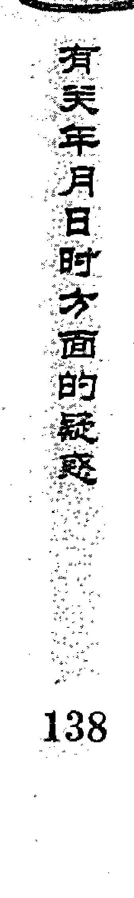

实际上此人头痛、心脏供血不好、心慌、子宫瘤和卵巢囊肿。

## 再例，丑月丁酉日（辰巳），高藤女士测女儿病（孩子11岁），能好吗？得地雷复变地火明夷卦。

| 六神 | 本卦 | 变卦 |
|---|---|---|
| 青龙 | 子孙酉金 |  |
| 玄武 | 妻财亥水 |  |
| 白虎 | 兄弟丑土（应） |  |
| 螣蛇 | 兄弟辰土× | 兄弟辰土 |
| 勾陈 | 官鬼寅木× | 官鬼寅木 |
| 朱雀 | 妻财子水（世） |  |

**断：**以子孙爻为用神，子孙月生日扶为旺相，说明她女儿的病不会有性命之忧。三爻辰土发动，看似要生用神，但被日辰合住，贪合忘生，这是卦的关键，合绊元神的日辰也是子孙，说明她女儿的病是来自于自身，而不是因为外界引起的。

三爻为床，被日合住不能生用神，再加上内卦伏吟，伏为不能动之象，说明她女儿是在床上瘫痪不能行走。

实际情况，她女儿脑瘫引起下肢瘫痪，不能行走，出入与轮椅相伴。

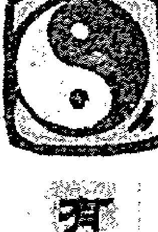

> 测某年某月某日时方面的秘密

举例，寅月戊辰日（戌亥），一个三十多岁的女人测异性缘，得雷风恒变地风升卦。

| 六亲/地支 | 对应 | 六神 |
|---|---|---|
| 妻财戌土″应 |  | 朱雀 |
| 官鬼申金″ |  | 青龙 |
| 子孙午火○ | 妻财丑土 | 玄武 |
| 官鬼酉金′世 |  | 白虎 |
| 父母亥水′ |  | 螣蛇 |
| 妻财丑土″ |  | 勾陈 |

断：以官鬼为用神，卦中官鬼两现，五爻官鬼月破，二爻官鬼与日合，可皆取为用神。

官鬼持世旺相，是有男友的信息，临三爻，三爻为床；又见动爻午火为沐浴之地，说明已经同居在了一起。

然而官鬼与日辰相合，日辰为财，财为女人，这个男的同时又有其他女人相处。应爻暗动生官鬼，说明同时还有另外一个女的爱着这个男人；官鬼绝于月建，子孙午火独发，说明二人的感情出现了问题；官临白虎，白虎为病，日合为绊，又三爻为床，说明此男因病卧床，子孙旺相发动，卯月官鬼逢冲二人必定分手。

实际情况：此女与有妻之男同居，男的突然因病瘫痪在床，于是她就想和这个男人分手，后于卯月分手。

**例，午月己巳日（戌亥），一人测母病得雷火丰变地火明夷卦。**

| 左列 | 中列 | 右列 |
|---|---|---|
| 官鬼戌土″ |  | 勾陈 |
| 父母申金″世 |  | 朱雀 |
| 妻财午火○ | 官鬼丑土 | 青龙 |
| 兄弟亥水′ |  | 玄武 |
| 官鬼丑土″应 |  | 白虎 |
| 子孙卯木′ |  | 螣蛇 |

以父母为用神。日月都来克用神。卦中忌神又动来克制，用神非常弱，说明他母亲身体很不好。

火在四爻来克，是心脏不好。六爻元神空不生用，是头上也有毛病。临勾陈，勾陈为迟缓之象，是痴呆的信息。用神为金，临朱雀主声音，受克是不会说话或说话不利索。日为忌神克而合住用神，日合为绊，是疾病缠身的信息；用神在五爻被合，五爻为道路，日合绊住，是不能走路的信息。实际情况是他母亲有心脏病和老年痴呆症，说话不灵活，行动不便。

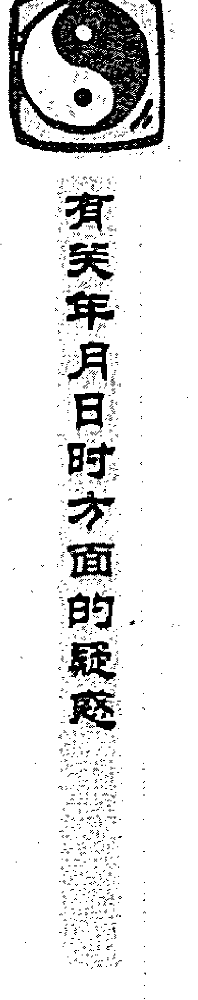

## 问四：爻被月建合也以绊而论吗？

答：不是的，日合和月合有本质的区别，日合为绊，月合为旺。

《增删卜易》中对月合是这样论述的：“月将乃当权之帅，万卜以之为纲领。爻之衰弱者，能生之、合之、比之、拱之、扶之，衰而亦旺。爻之强旺者，能冲之、克之、刑之、破之，旺而亦衰。”“爻逢月合而有用，爻逢月破而无功”。

古人明确地指出月合旺，月冲为弱，可是今人看书不仔细，应用中乱了章法，我见现在的许多书上说什么月合为绊，月建是土，越冲土越旺等等。看这样的书真是误人。

> 比如《增删卜易》中有这样一个例子：“卯月戊辰日（戌亥），妹占兄官事，已被判重刑尚有救否？得天地否变天水讼卦。”

| 左列 | 中列 | 右列 |
|---|---|---|
| 父母戌土′应 |  | 朱雀 |
| 兄弟申金′ |  | 青龙 |
| 官鬼午火′ |  | 玄武 |
| 妻财卯木″世 |  | 白虎 |
| 官鬼巳火× | 父母辰土 | 螣蛇 |
| 父母未土″ |  | 勾陈 |

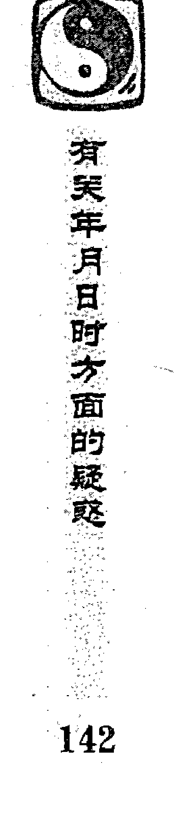

申金兄爻为用神，官鬼巳火临螣蛇来刑克用神，刑为受刑，螣蛇为绳索，此为牢狱信息的标准组合。

表面来看官鬼动而来克用神，好像不吉，但此为一爻独发，一爻独发以象为主，象主吉凶，动爻也为用神长生之地；遇长生为吉。此是其一。同时，卦中戌土得月建来合为旺，又得官鬼巳火生之，所以日冲为暗动。暗动生兄弟申金，再加上日月不克用神，用神原本得日生扶为有根，所以凶中有救。

最后因父母年迈得以免死。

**再例，2001年的一天，大连市的杨先生打来电话，说想让我从她的一个流年卦中判断一下小孩的吉凶，为寅月丙午日（寅卯），占得雷泽归妹变乾为天卦。**

| 本卦 | 变卦 | 六神 |
|---|---|---|
| 父母戌土×应 | 父母戌土 | 青龙 |
| 兄弟申金× | 兄弟申金 | 玄武 |
| 官鬼午火′ |  | 白虎 |
| 父母丑土×世 | 父母辰土 | 螣蛇 |
| 妻财卯木′ |  | 勾陈 |
| 官鬼巳火′ |  | 朱雀 |

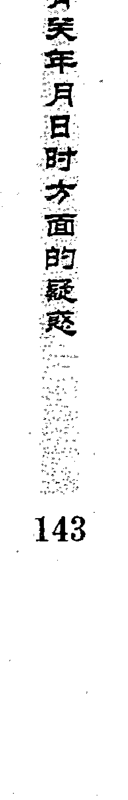

子孙亥水为用神，用神不上卦，伏在四爻官鬼之下，官鬼为病，是孩子身体不好、有病的信息。初看此卦，日月不生用神，外卦伏吟，忌神父母两动，元神入墓，很是不好，但卦之玄妙，要是不细看，是看不出来的。难怪杨先生前后询问过中国国内八十多名有点名气的六爻高手，皆以凶推，说他女儿当年必死。

我分析此卦，日月不克子孙，子孙的根没有坏，月合用神为旺，卦中虽然有忌神两处发动来克，但元神动而相解，贪生忘克，形成连续相生，子孙得救，根本不会有凶。我断小孩只是呼吸系统肺功能不好，没有大的凶灾，会平安度过此年。

最后我是唯一预测对的人。

### 问五：太岁在预测中有用吗？

答：许多书上讲到用神岁破，太岁生克用神什么的，好像预测时的当年太岁，在预测中也占有很重要的地位。其实太岁根本不参与对任何爻的生克。

> 古人说：“太岁星司一年之令，尊而不亲，高而难仰，吉凶皆不及乎日月。古以太岁不理家庭琐事，此理是也。  
> 所以太岁冲爻而为岁破不以为凶，合爻为岁合不以为吉。爻之衰者，太岁不能生之，爻旺者太岁不能制之，遇月破者即破，逢旬空者即空，非比月建日建之力也。”

既然古人这样说了，那么我们在预测时是不是就可以不看太岁呢？这是不对的。预测时大家务必要留心用神或者忌神、元神等是不是临了太岁，太岁在预测中不是没有用途，而是它表示的是一个时间范围，太岁有过去太岁、当年太岁、未来太岁等。

本年的太岁，得日月生比旺而入爻发动，就有生克它爻的权利；不入爻，或者是伏而不动，就没有力量作用于其它爻。

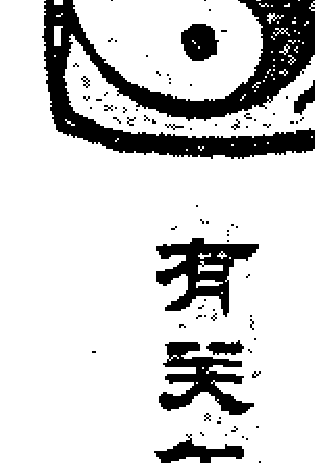

其它流年太岁，不管是过去的，还是未来的，常常有对卦中某个爻的生克冲合，以判断事情发生的应期，而不是某年的太岁多管闲事，越权到本年来管卦里的某个爻来了。

**例，2001年四月庚子日（辰巳），某男测母病，得风泽中孚变风水涣卦。**


| 左列 | 中列 | 右列 |
|---|---|---|
| 官鬼卯木′ |  | 螣蛇 |
| 父母巳火′ |  | 勾陈 |
| 兄弟未土″ | 世 | 朱雀 |
| 兄弟丑土″ |  | 青龙 |
| 官鬼卯木′ |  | 玄武 |
| 父母巳火○应 | 官鬼寅木 | 白虎 |

**断：**以父母为用神。父母巳火两现，以发动父母爻为用神。用神虽动化回头生，但用神空不受生，日辰克之，月建又为用神死地，再加上具有死亡信息的白虎临用神，其母病必凶。

用神巳火为本年太岁，动而化官鬼，乃是本年变鬼的信息，年内必凶。亥月合住元神不生用神，用神逢冲不吉。

判断病症，两个用神相互参看。用神临勾陈，月建为用神死地，是癌症的信息。用神死在酉金；金为子孙，必与子孙相对应的疾病而凶。子孙为肠、呼吸道、食道、乳房等，结合用神临五爻的信息，断其母是食道癌。

**应验情况：**其母果然是食道癌，这个卦例我在《六爻分类占验技法》一书中曾经提过，但写书时不知道结果。甲申年我在上班的路上突然遇到这个人，问他才知道结果，其母果然在我判断的交月去世。

## 卦例，1997年巳月甲寅日（子丑），博物馆某男测妻病得雷火丰变地雷复卦。

（这个卦在《六爻预测疾病新探》里也提到过）

| 本卦 | 变卦 | 六神 |
|---|---|---|
| 官鬼戌土″ |  | 玄武 |
| 父母申金″世 |  | 白虎 |
| 妻财午火○ | 官鬼丑土 | 螣蛇 |
| 兄弟亥水○ | 官鬼辰土 | 勾陈 |
| 官鬼丑土″应 |  | 朱雀 |
| 子孙卯木′ |  | 青龙 |

**断：**以妻财爻为用神。用神得月建比扶，日辰生助旺相，但不宜财动化空化鬼。古诀云，用连鬼来目下立见倾危，此病不妙。

用神化出官鬼丑土，太岁入爻（丁丑年测），年内有凶，忌神兄弟亥水发动克用，今临月破，防填实之日月，因用神旺相，许之亥月有险。

卦在坎宫，坎为水主血尿，必是血尿方面之病。用神午火临四爻被克，四爻为心，午火也为心，心脏受到影响，忌临勾陈化官鬼辰土，勾陈主肿胀，亥水主尿，三爻主阴，辰土为膀胱，是小便有问题。

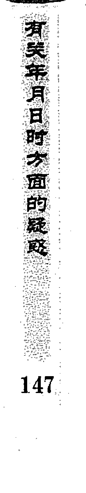

五爻父母申金临虎暗动，五爻为胸肺，父母主胸、金为肺，申主传送，白虎主血，暗动克子孙忌神，子孙为血管，是肺部有血管出了问题而引起的。临申，为申月所得。卦中金水为忌，病人不宜戴金银首饰。父母持世，子孙临日冲动，子孙为医药，父母主奔波，为求医治病，到处奔波。子临木为原神，宜到东方向医。

应验情况：其妻于丙子年申月因肺部血管堵塞而病，致使心脏供血不足、失调，小便不下，全身浮肿，软弱无力，于预测十天后的癸亥日酉时去世。

当时用神旺相，未敢以日决凶，岂料竟应亥日。应亥日者，忌神月破，实破之日也。应酉时者，忌化官鬼辰土回头克有制，酉时合住辰土不克亥水，反生助亥水而克用之故。用神临月旺相而死，乃乘旺临月变鬼之故。

**案例，甲申年甲戌月丁卯日（戌亥），一男子预测和自己的女朋友什么时候可以分手，得泽地萃变水地比卦。**

| 左列 | 中列 | 右列 |
|---|---|---|
| 父母未土″ |  | 青龙 |
| 兄弟酉金′应 |  | 玄武 |
| 子孙亥水○ | 兄弟申金 | 白虎 |
| 妻财卯木″ |  | 螣蛇 |
| 官鬼巳火″世 |  | 勾陈 |
| 父母未土″ |  | 朱雀 |

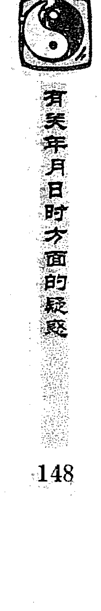

**断：**以妻财为用神。财得月合为旺，又得日辰比扶，元神动而来生，一下很难分手。

财合月上父母，父母为结婚证书，说明交往的这个女人是结过婚的。元神为一个人的心思，财之元神临白虎独发来克世，白虎主打斗，如果分手，这个女的想打你，对你不利。

此人回答：的确是这样，自己和一个有丈夫的女人发生了关系，处了一段时间后，发现这个女人思想太偏激，于是提出分手，但是这个女人警告他，如果要分手，就要把他杀了，所以心里很是烦恼。

既然是烦恼而占，卦中兄弟酉金暗动克财，酉为来年太岁，说明第二年俩人肯定分手，那就再等一年。子孙虽是财之元神来克世，但因为此人是忧虑而占，子孙独发为解忧之象，动而克去身边之鬼，一定不会受到伤害。后果然在乙酉年安然分手。

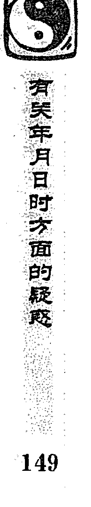

**举例，甲申年甲戌月庚辰日（申酉），一女预测婚姻，得雷水解变雷泽归妹卦。**

| 爻位/六亲 | 六神 |
|---|---|
| 妻财戌土 | 螣蛇 |
| 官鬼申金（应） | 勾陈 |
| 子孙午火 | 朱雀 |
| 子孙午火 | 青龙 |
| 妻财辰土（世） | 玄武 |
| 兄弟寅木（×）→ 子孙巳火 | 白虎 |

**断：**以官鬼为用神。用神得日月生扶为旺相，但用神值太岁而空，兄弟寅木一爻独发，绝用神官鬼，独发以象为主，所以此婚必离，而且应在本年。

申也为申月的地支，申月可以实空。同时看香闺，卦身在丑，香闺在水，日月克，入墓于日又不上卦，肯定已经离婚。所以我断她在申月已经离婚。

世爻辰土得日辰并起生官鬼，戌土暗动也生官鬼，是自己暗中又喜欢其他男人。官鬼在五爻，五爻为领导的爻位，是和自己的领导有暧昧关系。

结果所断皆验。

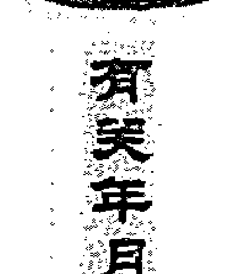

### 问六：时辰在预测时有用吗？

答：六爻预测以日月生克为主，一般情况下只看日月对卦中的作用，基本上不看预测时的时辰。

但如果求测人求测问的事是非常紧急的事情时，时辰就显得非常重要，当判断卦的吉凶时必须将预测时的时辰考虑进去。

例，午月甲午日酉时（辰巳），一女子来预测，说她的两个儿子中午放学后没有回家，也没和家长打招呼，不知道去了哪里，亲戚都问了说没去，直到目前也没一点消息，于是求问卦，得水泽节变坤为地卦。

| 六爻 | 伏神/变爻 | 六神 |
|---|---|---|
| 兄弟子水″ |  | 玄武 |
| 官鬼戌土○ | 兄弟亥水 | 白虎 |
| 父母申金″应 |  | 螣蛇 |
| 官鬼丑土″ |  | 勾陈 |
| 子孙卯木○ | 妻财巳火 | 朱雀 |
| 妻财巳火○世 | 官鬼未土 | 青龙 |

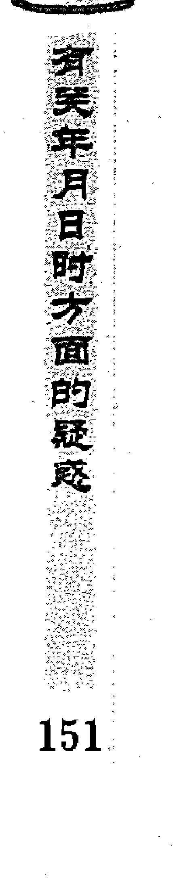

**断：**以子孙爻为用神，日月不克子孙，子孙临二爻动而生世，二爻为宅，孩子一定会回到家。

五爻戌土动而合住用神，动逢合而绊住，但此时酉时合处逢冲，冲开用神，说明现在小孩已经到家。子孙在二爻临朱雀生世，朱雀主语言、信息，孩子会从家里给她打来电话。

断语刚刚出口，她的电话铃响了，正是儿子从家里打来的电话。问他们中午去了哪里？他们说是去同学家玩了。

再例，申月丁卯日酉时（戌亥），远在上海的易友灯儿在周易爱好者QQ群里发问，公司丢失了一箱货物，究能否找回？得

#### 坎为水卦

| 左列 | 右列 |
|---|---|
| 子孙子水″ | 青龙 |
| 父母戌土′ | 玄武 |
| 兄弟申金″世 | 白虎 |
| 兄弟申金′ | 螣蛇 |
| 官鬼午火″ | 勾陈 |
| 父母辰土″应 | 朱雀 |

断：以妻财爻为用神，妻财卯木伏在二爻官鬼午火之下，月克日比，衰旺相当。此卦为静卦，旺相之爻可以生伏囚之爻，元神子水得月生扶有力为旺相，可以生财用神，用神临日透出，货物可以找到。

但事情紧急，要参考问卦的时间。此时是酉时，冲克用神，冲应合；明日辰日合住时上酉金，用神不受冲克就可以找到货物。

后果在第二天找到了丢失的货物。

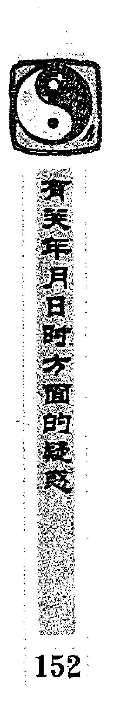

## 有关取用神方面的答疑

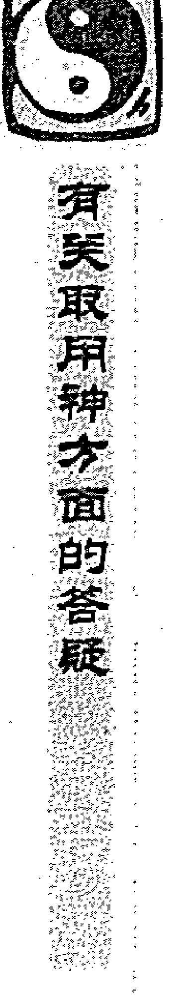

### 问一：预测获奖以什么为用神？

**答：**假如是一种比赛性的、有名次排列的获奖，就以官鬼为用神，因为官鬼代表名次。如果是单纯为了得到获奖证书，就以父母为用神。

**例，**某月丁亥日（午未），我的一位日本学生测参加太极拳比赛可否获得好名次，共有52人参加，取前8名，摇卦得雷山小过变山风蛊卦。

| 本卦 | 关系 | 变卦 | 六神 |
|---|---|---|---|
| 父母戌土× |  | 妻财寅木 | 青龙 |
| 兄弟申金″ |  |  | 玄武 |
| 官鬼午火○世 |  | 父母戌土 | 白虎 |
| 兄弟申金′ |  |  | 螣蛇 |
| 官鬼午火× |  | 子孙亥水 | 勾陈 |
| 父母辰土″应 |  |  | 朱雀 |

**断：**以官鬼为用神，卦中官鬼两现，而且都发动，以世上官鬼为用神，另一官鬼作为参考。

用神虽然得月合为旺，但日克空亡，入动墓化墓，另一官鬼化回头克，用神动而生应爻，此为无情，几个方面显示对自己不利，所以肯定不会进入前八名。

结果只得第十三名。

### 问二：办护照和签证以什么为用神？

答：预测护照和签证应该分开来看，它们都是以父母爻为用神，因为它们都属于证件的范畴。办护照官鬼为发证机关，办签证官鬼为大使馆。

例，未月壬午日（申酉），我的一个日本学生问蔡弟办到英国的签证，什么时候办下来？得地山谦变雷山小过卦。

| 左列 | 右列 |
|---|---|
| 兄弟酉金″ | 白虎 |
| 子孙亥水″世 | 螣蛇 |
| 父母丑土× 官鬼午火 | 勾陈 |
| 兄弟申金″ | 朱雀 |
| 官鬼午火″应 | 青龙 |
| 父母辰土″ | 玄武 |

断：以父母爻为用神，卦中父母两现，以月破发动之爻父母丑土为用。用神丑土虽月破，但得日辰生扶，又动化回头生，签证可以办下来。用神月破，逢合之日可以办成，后于丙戌日递交手续，戊子日就办了下来。

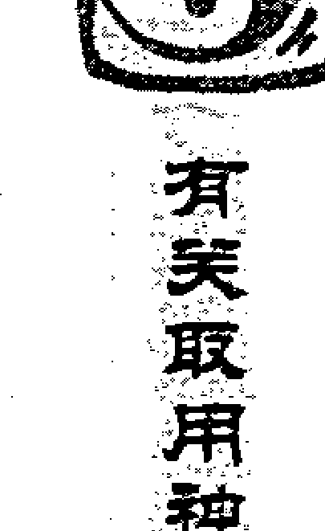

**案例，巳月丙午日（寅卯），姜的一个朋友测办护照哪天能办下来？得坎为水变兑为泽卦。**

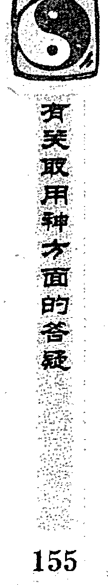

| 六神 | 本卦 | 变卦 |
|---|---|---|
| 青龙 | 兄弟子水（世） |  |
| 玄武 | 官鬼戌土 |  |
| 白虎 | 父母申金× | 兄弟亥水 |
| 螣蛇 | 妻财午火（应） |  |
| 勾陈 | 官鬼辰土 |  |
| 朱雀 | 子孙寅木× | 妻财巳火 |

断：以父母爻为用神。此卦初看，用神不得月建生扶，又被日辰来克，六冲变六冲，好像办不成，但此卦为坎变兑，是卦变回头生（兑生坎），所以护照可以办下来。

用神动而生世，按应期法则来看，动而逢值逢合，戌申日为用神所值，戌申日可以办下来。果于戌申日巳时办下护照。

**案例，未月壬辰日（午未），一女士测办签证如何？得地火……**

#### 明夷卦

| 左列 | 右列 |
|---|---|
| 父母酉金″ | 白虎 |
| 兄弟亥水″ | 螣蛇 |
| 官鬼丑土″世 | 勾陈 |
| 兄弟亥水′ | 朱雀 |
| 官鬼丑土″ | 青龙 |
| 子孙卯木′应 | 玄武 |

**断：**以父母爻为用神，父母得日月生扶为旺相，签证一定可以办下来，但日辰与用神相合，日合为绊，要办好签证就会拖延，需要很长时间。元神持世月破，子月合之，可拿到签证。后果然在子月拿到了签证。

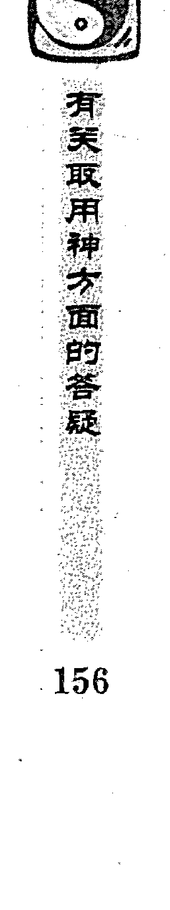

## 再例，巳月壬辰日（午未），我自己测办签证何时下来，得水火既济卦

| 左列 | 右列 |
|---|---|
| 兄弟子水″应 | 白虎 |
| 官鬼戌土′ | 螣蛇 |
| 父母申金″ | 勾陈 |
| 兄弟亥水′世 | 朱雀 |
| 官鬼丑土″ | 青龙 |
| 子孙卯木′ | 玄武 |

**断：**以父母爻为用神，父母得月合日生为旺，官鬼戌土暗动生用神，签证一定能办下来。父母用神为申金，按应期规律判断，静而逢值逢冲；丙申日为用神所值，应该在这一天办下来。

果然在这一天拿到了签证。

## 再例，寅月丙寅日（戊寅），一位朋友测到香港成否

得雷风恒变山水蒙卦。

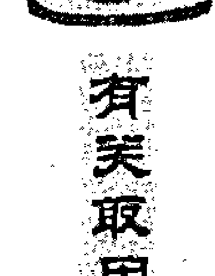

诸类取用神方面的答疑

| 本卦 | 变卦 | 六神 |
|---|---|---|
| 妻财戌土×应 | 兄弟寅木 | 青龙 |
| 官鬼申金″ |  | 玄武 |
| 子孙午火○ | 妻财戌土 | 白虎 |
| 官鬼酉金○世 | 子孙午火 | 螣蛇 |
| 父母亥水′ |  | 勾陈 |
| 妻财丑土″ |  | 朱雀 |

**断：**以父母爻为用神，兼看世爻，父母亥水被月建合起，本为吉象。但不宜空而被日建合住，日合为空，空为得不到通行证。世爻绝于日月，被子孙午火三合局来克，又动化回头克，世爻受克太重，不能生父母亥水，说明是办不了通行证。后果因非典没有走成。

### 问三：出租房、卖房以什么为用神？

答：一般以父母爻为用神，财爻只是作为参考而已。父母爻受克休囚，房子则租不出去、卖不出去。父母爻旺相得应爻生合或临应爻，房子易租易卖。

例，辰月庚戌日（寅卯），北京秦女士问自己的别墅什么时候可以卖掉，得水山蹇变风山渐卦。

| 六亲/五行 | 伏神 | 六兽 |
|---|---|---|
| 子孙子水 | 妻财卯木 | 螣蛇 |
| 父母戌土 |  | 勾陈 |
| 兄弟申金（世） |  | 朱雀 |
| 兄弟申金 |  | 青龙 |
| 官鬼午火 |  | 玄武 |
| 父母辰土（应） |  | 白虎 |

**断：**以父母爻为用神，卦中父母两现，以月破父母戌土为用，另一父母爻作为参考。

卦中父母两现，是有两套别墅。五爻父母戌土临勾陈，月破日又填实，勾陈主陈旧，月破为破损，填实为修补，在外卦主房子上半部；六爻子水动化忌神，六爻为房顶，我断她旧一点的别墅房顶漏水曾修补过，当场应验。

我问她是要卖新的别墅还是旧的别墅？她说旧的不好卖，想卖新的，因为父母戌土代表旧的别墅，所以要看新的别墅就要以父母辰土为用神。父母辰土月建比扶，日辰冲之为暗动，用神暗动临应爻生世，房子一定有人买；按应期规律判断冲处逢合，酉月可以卖掉房子。另外参考妻财卯木，伏藏被日合住，酉月冲出冲开，也是此时可以卖掉；财爻为木，木主三、八，断其大约可卖八百万。

后于酉月卖掉，得财整八百万。

**再例，辰月癸未日（申酉），一人因自己租下的店铺经营不景气，想转租出去，问何时能够转租？得风泽中孚卦。**

| 左列 | 右列 |
|---|---|
| 官鬼卯木′ | 白虎 |
| 父母巳火′ | 螣蛇 |
| 兄弟未土″世 | 勾陈 |
| 兄弟丑土″ | 朱雀 |
| 官鬼卯木′ | 青龙 |
| 父母巳火′应 | 玄武 |

**断：**以父母爻为用神，父母不得日月生扶，但也没有被日月克伤，虽然不旺，根却没有坏掉；用神临应生世，房子一定能转租出去。

巳月用神所值，旺而生世，就可以转租出去了。

果如所测。

开卦，卯月己巳日（戌亥），一人预测什么时候可以把店铺出租出去，得艮为山变山风蛊卦。

- 官鬼寅木′世  
- 妻财子水″  
- 兄弟戌土″  
- 子孙申金′应  
- 父母午火× → 妻财亥水  
- 兄弟辰土″

断：以父母为用神。父母月生日扶，用神旺相，店铺一定可以租出去，但嫌用神动而化回头克，必待冲去变爻亥水，用神不受克制时，才可以出租成。后于巳月出租，乃应冲去变爻亥水之月。

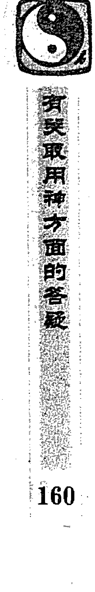

## 问四：预测邻居吉凶以什么为用神

答：预测邻居也是锻炼自己的一种好方法，对提高预测水平很有帮助。别人没有来问，但自己又想预测，预测后又有可能最后知道结果，所以平常除过预测自己的事以外，也可以预测其他事。

预测邻居一般以应爻为用神，不管是年龄大小，都看应爻。除非你和邻居关系处得非常好，和好朋友一样，那样就是看兄弟爻了。

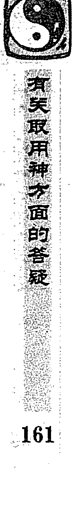

**例，午月丙寅日（戌亥），一易友听说邻居的母亲病了，测其母病吉凶，得天山遁变火山旅卦。**

| 六亲/地支 | 关系位 | 六神 |
|---|---|---|
| 父母戌土′ |  | 青龙 |
| 兄弟申金○应 | 父母未土 | 玄武 |
| 官鬼午火″ |  | 白虎 |
| 兄弟申金′ |  | 螣蛇 |
| 官鬼午火″世 |  | 勾陈 |
| 父母辰土″ |  | 朱雀 |

**断：**此卦最容易取错用神，不管是邻居，还是其母亲，与你没有什么关系，就以应爻为用。

用神月克日冲，卦象显示非常不好。虽然用神动化回头生，但日月对用神都是不好的作用，用神无根，逢生不起，所以为凶。乾宫卦，乾为头，六爻元神空而被日克伤，六爻为头，病在头部。

动而逢值逢合，冲处应合，巳日又是三刑，结果邻居的母亲于巳日因脑溢血而死。如果是以父母为用神判断，就与卦不相符合。

**又例，寅月戊辰日（戌亥），一老妇测一邻居男子之病，得火山旅变艮为山卦。**

| 六爻 | 伏神/中列 | 六神 |
|---|---|---|
| 兄弟巳火′ |  | 朱雀 |
| 子孙未土″ |  | 青龙 |
| 妻财酉金○应 | 子孙戌土 | 玄武 |
| 妻财申金′ |  | 白虎 |
| 兄弟午火″ |  | 螣蛇 |
| 子孙辰土″世 |  | 勾陈 |

断：以应爻为用神。用神发动化空化破，为不吉。今日日辰绊住用神不化，甲戌日冲开，使元神化破，又用神实空实破，定为不吉。

结果邻居的男子于甲戌日子时而死。死于子时者，因为用神为金，金死在子。

## 问五：预测印章丢失以什么为用神

答：就单指印在纸上的红印章来说是父母爻，如果是印章本身则为财爻，所以印章丢失看财爻。

例，申月庚申日（子丑），我的一个日本学生测印章丢失，测能找到吗？得泽天夬卦。

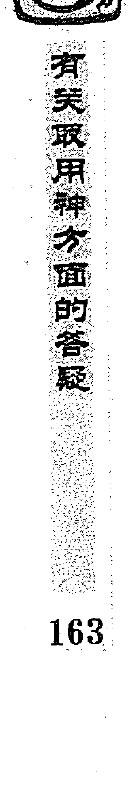

| 六亲 | 六神 |
|---|---|
| 兄弟未土 | 螣蛇 |
| 子孙酉金（世） | 勾陈 |
| 妻财亥水 | 朱雀 |
| 兄弟辰土 | 青龙 |
| 官鬼寅木（应） | 玄武 |
| 妻财子水 | 白虎 |

断：以妻财为用神，卦中妻财两现，以空亡妻财子水为用。子孙持世乃是自己丢失，日月生助用神，用神旺相，丢失的印章能够找到。现用神空亡，出空可以找到。

后来于甲子日在自己每天开的车中找到了印章。

再例，午月庚午日（戌亥），学生刘弟庆在网络教学的地方问这样一卦：单位的公章不见了，能否找到？得风雷益卦。

| 左列 | 右列 |
|---|---|
| 兄弟卯木′应 | 螣蛇 |
| 子孙巳火′ | 勾陈 |
| 妻财未土″ | 朱雀 |
| 妻财辰土″世 | 青龙 |
| 兄弟寅木″ | 玄武 |
| 父母子水′ | 白虎 |

断：我说这个卦首先是定用神，应该以妻财为用神。卦中财爻两现，以临世爻妻财辰土为用神。用神持世得日月生扶，说明公章没有丢失。

用神临青龙，是比较重要的一个公章。卦中巽宫，巽为木，东西在与木器有关的地方；辰土为父母的墓库，父母主文书，应该是在放文件的抽屉里。日生用神，当日就可找到。

他反馈说，这个卦前后问过六个人，他们都以父母爻为用神，说父母月破、日破，又是忌神持世，断公章找不到。看来是用神取错了。而实际上公章是被公司一个打扫卫生的人看到公章在桌子上放着，怕丢失，便顺手放在橱柜的抽屉里。公章于当日就找到了。

他当时又为此事还摇了一卦，为水火既济变水山蹇卦。

| 左列 | 中列 | 右列 |
|---|---|---|
| 兄弟子水″ | 应 | 螣蛇 |
| 官鬼戌土′ |  | 勾陈 |
| 父母申金″ |  | 朱雀 |
| 兄弟亥水′ | 世 | 青龙 |
| 官鬼丑土″ |  | 玄武 |
| 子孙卯木○ | 官鬼辰土 | 白虎 |

断：这个卦和前一个卦虽然不同，但意思表达的一样。财爻伏在世下，得日月比扶，又有子孙发动来生，为公章不会丢失。用神伏藏，临日建透出，为当日找到；木动来生，也是在有木器的地方找到。

如果以父母爻为用神，日月克父母，仇神发动，必然找不到，与实际情况根本不符。可见印章丢失以财爻为用是毫无疑问的。

**举例：子月甲辰日（寅卯），我的一个日本朋友测印章丢失，得雷火丰卦。**

| 左列 | 中列 | 右列 |
|---|---|---|
| 官鬼戌土″ |  | 玄武 |
| 父母申金″ | 世 | 白虎 |
| 妻财午火′ |  | 螣蛇 |
| 兄弟亥水′ |  | 勾陈 |
| 官鬼丑土″ | 应 | 朱雀 |
| 子孙卯木′ |  | 青龙 |

断：以妻财爻为用神，妻财午火月破，日不生扶，元神子孙卯木又空亡，被暗动之父官鬼戌土合住，贪合忘生，用神毫无生机，很难找回，果然没有找回。

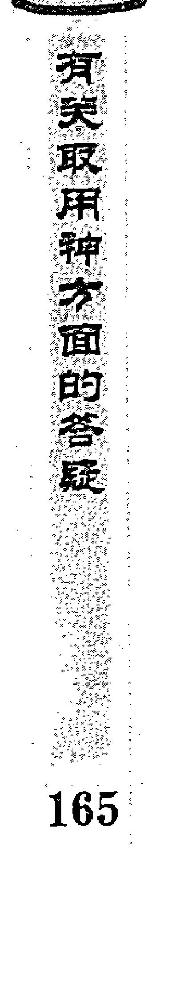

### 问六：预测行李丢失以什么为用神？

答：应该以父母爻为用神。这个在古书中早已经有定论。

例，卯月甲午日（辰巳），我的日本学生问托运行李丢失可否找到？得火风鼎变火水未济卦。

| 左列 | 中列 | 右列 |
|---|---|---|
| 兄弟巳火′ |  | 玄武 |
| 子孙未土″ | 应 | 白虎 |
| 妻财酉金′ |  | 螣蛇 |
| 妻财酉金○ | 兄弟午火 | 勾陈 |
| 官鬼亥水 | 世 | 朱雀 |
| 子孙丑土″ |  | 青龙 |

断：以父母爻为用神，父母卯木伏在初爻子孙丑土之下，得月建拱扶为旺相。卦中虽有忌神酉金发动，但月破日克，又化回头克，没有力量克用神，所以丢失行李一定可以找到。乙未日冲去飞神就可以找到。

后果然在乙未日的酉时找到。应酉时是因为用神伏藏，被冲出来，如果此卦要是看财爻则行李找不到了。

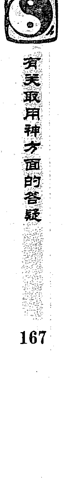

### 问七：六爻射覆以什么为用神？

答：用易经预测的方法来判断器物中所藏的东西，古代称之为射覆。这在预测中是非常难的，需要很高的预测水平才能做到。古代有许多预测师，把它作为一种预测游戏来进行互相比赛。这种方法既可以用来娱乐，也可以提高自己的预测思维。具体的预测方法在《火珠林》《海底眼》这两本书中有部分论述。但如果用书中介绍的方法来预测，准确率很低。在六爻典籍以外的其他书中也提到有射覆的情况，不过用的根本不是六爻的方法，而且与六爻围绕用神来判断有着本质的区别。我们既然是研究六爻预测，就应该用六爻的方法，而不能把那些方法照搬。

多年来我通过研究和实践，发现总结出了一套完全是用六爻思维进行射覆的方法。用六爻来射覆是以应爻为用神，应爻就是你要判断的东西。在进行射覆时，和普通的预测方法一样，需要围绕用神，同时参考用神的衰旺、五行、六亲、六神、卦宫、动爻等，看它们对用神的作用进行综合判断。

## （1）卦宫一般反映的是东西的外形和结构，或者是性质

外卦为器物的上部，内卦为器物的下部，或者外卦为器物的表面，内卦为器物的里面。主卦为器物的表面，变卦为器物的里面。

- 乾为圆形的东西、高级的东西、金属、果物、珠宝、结晶体、镜子、帽子、马肉、辛辣的东西等。  
- 坤为方形的东西、有棱角的东西、柔软之物、布匹、丝绸、陶器、泥制品、土中之物、女士用品、牛肉、甘甜之物。  
- 震为木制品、竹制品、花草树木、植物类的东西、动态的、机械类的东西、能产生声音的东西、发酸的东西等。  
- 巽为竹类工艺品、木器、发直的东西、带柄的东西、细长的东西、绳索、鸡肉、蔬菜、发酸的东西等。  
- 坎为水中之物、圆形的东西、液体的东西、高低不平、洼陷的东西、发咸之物等。  
- 离为美丽、鲜艳、有花纹的东西，为螃蟹、乌龟、山鸡、河蚌、发热发光之物、有文字的东西、用电的东西、发苦的东西。  
- 艮为固定的东西、静物、土中之物、矿石、山中之物、发甜的东西、狗肉等。  
- 兑为金属的东西、带刃的东西、破损的东西、有口的东西、乐器、能产生声音的东西、食物、废品、辛辣的东西等。  

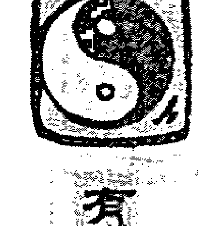

## （2）六神是用来判断物体、颜色和性质，或者是用途的

青龙为装饰物、食物、贵重物、鲜艳的东西、漂亮的东西、绿色的东西、新东西、化妆品等。

朱雀为与电有关的东西、书信、文字类、食物、有声音的、有光泽的、红色的东西等。

勾陈为柔软之物、陈旧的东西、土中之物、鼓状之物、粗糙之物、连接之物、黄色之物等。

螣蛇为弯曲的东西、细长之物、螺旋状的东西、罕见的东西、动态的东西、综合色、褐色、不规则的东西等。

白虎为坚硬的东西、带刃的东西、尖形之物、与医药有关的东西、发硬的东西、白色的东西等。

玄武为晦淡无光之物、黑色的东西、脏物、液体的东西、色情的东西、腐烂的东西等。

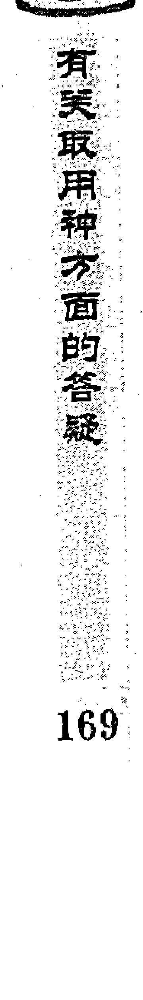

#### （3）六亲多用来判断东西的性质

兄弟主坚硬之物、消耗品、工具等。

妻财为食物、能吃的东西、流通的东西、日用品等。

子孙为玩具、小巧可爱之物、动物、药品、娱乐之物等。

父母为柔软之物、包装之物、有机物、覆盖、交通工具、服装、文书、布匹等。

官鬼为变形的东西、不规则的东西、富于变化的东西、动态的东西、眼睛看不见的东西等。

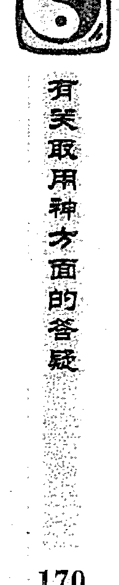

## （4）用十二地支也可以判断物体的形状

寅申巳亥为尖形的东西；子午卯酉为圆形的东西；辰戌丑未为方形的，或者是不规则的东西。

## （5）以世应判断东西的性质和表面的形状

世应五行相同，为对称物；世应相合为重叠物；世应相生为相连之物；世应相生合为镶嵌之物；世应相克，为消耗之物等。

## （6）从卦的动爻对用神的生克，可以判断物体微妙的地方

用神空亡或者动而化空，物体里面是空的，或者是有空隙的，有孔之物。月破日破，是有接缝、裂缝之物，或者是破损之物。

遇三刑，物体有破损，或者是变形的东西。受克休囚，为陈旧之物。受生得长生旺相，为新的东西。遇合为重叠之物、有盖之物、成套的东西，或者是组合而成的东西。

用神入墓为有包装的东西、带盒的东西、镶嵌的东西。伏吟为内部发出声音，或内部会动的东西。

反吟为震动、摇晃的东西。游魂卦为外用的东西，或者是可以拆卸的东西。

归魂卦为内用的东西，或者是附属品等。

> 看完这则卦案之后的感悟

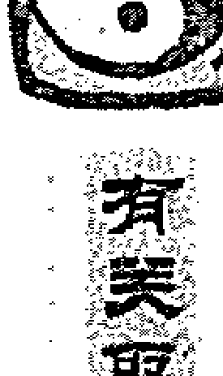

以上大概地讲了一下射覆的基本预测规则。预测水平很高后，还可以把十二长生等概念都用进去，进行综合判断。

**例，酉月壬子日（寅卯），妻子和我说她参加会议时会上奖了个东西，让我测测看是什么东西？我摇卦得泽风大过变泽火革卦。**

| 本卦 | 变卦 | 六神 |
|---|---|---|
| 妻财未土′ |  | 白虎 |
| 官鬼酉金′ |  | 螣蛇 |
| 父母亥水′世 |  | 勾陈 |
| 官鬼酉金′ |  | 朱雀 |
| 父母亥水○ | 妻财丑土 | 青龙 |
| 妻财丑土×应 | 兄弟卯木 | 玄武 |

**断：**以应爻为用神。应为妻财，此物与饮食有关。动而化兄弟，乃是工具。日合用神，东西为两部分组成，合用者为父母。父母为庇护我者，就是器物盖，说明是有盖之物。用神见月建为沐浴，物体表面光滑。

外卦为兑，兑为口，器物上面开口；下为巽，巽为入，下面有凹进去的地方。初爻为器物下部，动而化空化破，是底部有开口，或者有凹进去的地方。

主卦在震宫，震为动，为机械类器物。内卦变离，离为火为电，器物是用电的。二爻亥水临青龙，化出与用神相同的六亲妻财，青龙主饮食，妻财也主饮食；二爻又为灶、厨房，说明器物是厨房用品，通过水可以做饭。我综合判断为电火锅，实际上是一个电饭锅。

**卦例，子月辛卯日（午未），我的朋友把一个东西放在荧光盘的盒子里，让我测里面放的是什么东西，我摇卦得雷风恒卦。**

| 左列 | 右列 |
|---|---|
| 妻财戌土″应 | 螣蛇 |
| 官鬼申金″ | 勾陈 |
| 子孙午火′ | 朱雀 |
| 官鬼酉金′世 | 青龙 |
| 父母亥水′ | 玄武 |
| 妻财丑土″ | 白虎 |

**断：**以应爻为用神。应临妻财，此物与饮食有关。世临青龙，此物能吃。用神与日合，合为重叠之象，东西由两部分组成，说明东西带有外壳。世爻为表面，酉金暗动，用神得沐浴地，酉为圆，沐浴为裸露，此物表面圆而光滑。用神临螣蛇，此物红里透黄。实际上里面放了一颗红皮鸡蛋。

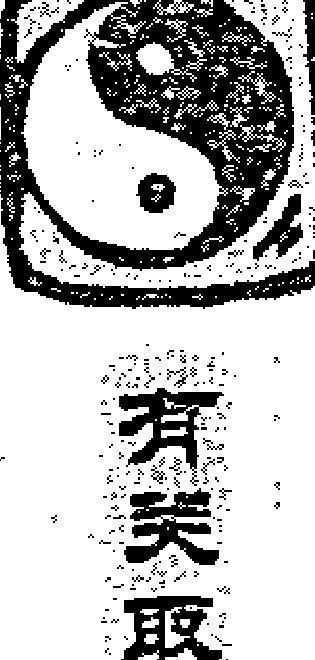

卦例，午月辛未日（戌亥），学生张庆学来太原学习，临走时他想看看射覆是怎么回事，把一个东西放在了茶叶筒里，让我预测，我摇卦得天地否变山水蒙卦。

| 六亲/五行 | 动静 | 关系 | 六神 |
|---|---|---|---|
| 兄弟申金 | ○ | 子孙子水 | 勾陈 |
| 官鬼午火 | ○ | 父母戌土 | 朱雀 |
| 妻财卯木（世） |  |  | 青龙 |
| 官鬼巳火 | × | 父母辰土 | 玄武 |
| 父母未土（应） |  |  | 白虎 |

**断：**以应爻为用神。外卦为外表，外卦是乾，乾为圆，物体外表是圆的。六合卦，物体由两部分组成。用神得两个元神来生，也是表示东西由两部分组成。用神空亡，东西里面有空隙。临螣蛇，螣蛇主变化，内部可以动。

蛇主红里透黄，世临青龙与用神相合，青龙、妻财都有饮食的意思，此物能吃。

实际上里面放的是一颗鸡蛋。

又例，未月庚戌日（寅卯），一个朋友在喝水的茶杯里放了一个东西让我测是什么，我摇卦得，风火家人变风地观卦。

| 左列 | 中列 | 右列 |
|---|---|---|
| 兄弟卯木′ |  | 螣蛇 |
| 子孙巳火′ 应 |  | 勾陈 |
| 妻财未土″ |  | 朱雀 |
| 父母亥水○ | 兄弟卯木 | 青龙 |
| 妻财丑土″ 世 |  | 玄武 |
| 兄弟卯木○ | 妻财未土 | 白虎 |

## 看实物取用神方面的答疑

断：以应爻为用神。应爻为巳火，寅申巳亥为尖，火又主尖形物，说明里面的东西是尖形的。三合局来生用神，东西是由多个组成的，但亥水发动，用神临绝，现在里面放的只是其中一个。

用神入墓于日，此物表面有皮或包装，卯木发动，为用神沐浴地，说明东西外面的皮已经被去掉了。用由初爻来生，初爻为地面，又用神临勾陈，勾陈司田土，说明此物是土中生长之物。世爻临财，财为饮食，主此物能吃；世为表面，临玄武，玄武主溃烂，此物表面有溃烂。

实际情况：里面放了一瓣蒜，表面有个点烂了。

## 看类取用神方面的答疑

### 问八：预测钥匙以什么为用神？

答：以妻财为用神。有的书上说以子孙为用神，完全是错误的。

例，卯月壬子日（寅卯），一男测钥匙丢失，得水火既济变地天泰卦。

| 左列 | 中列 | 右列 |
|---|---|---|
| 兄弟子水（应） |  | 白虎 |
| 官鬼戌土○ | 兄弟亥水 | 螣蛇 |
| 父母申金 |  | 勾陈 |
| 兄弟亥水（世） |  | 朱雀 |
| 官鬼丑土× | 子孙寅木 | 青龙 |
| 子孙卯木 |  | 玄武 |

断：以妻财爻为用神。妻财午火不上卦，但得月生扶为旺相，日冲用神。古书上说：“用伏逢冲无人盗。”钥匙不是被人偷走的。

用神入墓于官鬼戌土，为藏匿之象；兄弟持世，压住用神。兄弟为同事，持世是好朋友，说明是他的朋友开玩笑把钥匙藏起来了，午日可以找到。

实际情况是在未日午时从同事的抽屉中找回。是同事和他开玩笑时把钥匙放在抽屉里，忘还给他了。应未日者，是因为用神冲处逢合之故；应午时者，用神伏藏逢出出现。

再例，未月癸卯日（辰巳），某单位一女测钥匙丢失，得离为火变山火贲卦。

| 左列 | 中列 | 右列 |
|---|---|---|
| 兄弟巳火′ 世 |  | 白虎 |
| 子孙未土″ |  | 螣蛇 |
| 妻财酉金○ | 子孙戌土 | 勾陈 |
| 官鬼亥水′ 应 |  | 朱雀 |
| 子孙丑土″ |  | 青龙 |
| 父母卯木′ |  | 玄武 |

断：以妻财爻为用神。妻财得月生扶又动化回头生，但不宜忌神持世。古书上说：“世克用神物难寻。”同时用神动而生应爻，此为无情，钥匙肯定找不回来。妻财临金，金主四，丢失的钥匙为四把。果然丢失了四把钥匙，最后没有找回来。

卦例，未月庚戌日（寅卯），一女测钥匙丢失，得地火明夷卦。

| 六亲 | 六神 |
|---|---|
| 父母酉金 | 螣蛇 |
| 兄弟亥水 | 勾陈 |
| 官鬼丑土 世 | 朱雀 |
| 兄弟亥水 | 青龙 |
| 官鬼丑土 | 玄武 |
| 子孙卯木 应 | 白虎 |

断：以妻财爻为用神，财爻虽得月合为旺，但不宜入墓于日，飞来克伏，世爻月破，又是游魂卦，钥匙很难找回，后果然没有找回。

### 问九：预测眼镜以什么为用？

答：眼镜在类象时为父母爻，但预测眼镜丢失，则以妻财为用神。

例，卯月庚辰日（申酉），我的一个日本学生测丈夫的眼镜丢失，能否找到，得巽为风变天风姤卦。

| 六亲/五行 | 关系位 | 六神 |
|---|---|---|
| 兄弟卯木′ | 世 | 螣蛇 |
| 子孙巳火′ |  | 勾陈 |
| 妻财未土× | 子孙午火 | 朱雀 |
| 官鬼酉金′ | 应 | 青龙 |
| 父母亥水′ |  | 玄武 |
| 妻财丑土″ |  | 白虎 |

断：以妻财为用神。卦中妻财两现，以发动妻财未土为用神。月克日扶，衰旺相当。但用神动而化回头生，由弱变强，所以眼镜可以找到。用神临未土，未土为西南，临朱雀得火生，放眼镜的地方与火有关。后发现自己家西南方向有个暖炉，在里面找到了丈夫的眼镜。

再例，未月丙寅日（戌亥），某单位一女测眼镜丢失可否找回，得水地比变泽地萃卦。

| 六亲/五行 | 关系位 | 六神 |
|---|---|---|
| 妻财子水″ | 应 | 青龙 |
| 兄弟戌土′ |  | 玄武 |
| 子孙申金× | 妻财亥水 | 白虎 |
| 官鬼卯木″ | 世 | 螣蛇 |
| 父母巳火″ |  | 勾陈 |
| 兄弟未土″ |  | 朱雀 |

断：以妻财亥为用神，财爻为水，临应爻被月克，应为他处。眼镜是在一个有水的地方丢失的。子孙申金独发，以象为主，本主能够回来，但子孙被日冲去，又化空亡，无法生用，所以最后是找不回来的。

实际上是一副游泳用的眼镜，把它丢在游泳场了，没有找回来。

再例，酉月丙申日（辰巳），我的一个日本学生，她爷爷的眼镜找不到了，让她测眼镜在什么地方，得坎为水变山水蒙卦。

| 左列 | 右列 |
|---|---|
| 兄弟子水× 世 | 子孙寅木 青龙 |
| 官鬼戌土○ | 兄弟子水 玄武 |
| 父母申金″ | 白虎 |
| 妻财午火″ 应 | 螣蛇 |
| 官鬼辰土′ | 勾陈 |
| 子孙寅木″ | 朱雀 |

断：以妻财爻为用神。妻财临三爻，得月来生为旺相，眼镜可以找到。那眼镜在什么地方呢？就从用神临的爻位和五行来判断：三爻为门，午火为南，入墓于戌土，为眼镜隐藏在某个地方的信息。

她看见门口南面有个纸箱，就到那个纸箱里找，结果在里面找到了爷爷丢失的眼镜。她爷爷感到六爻预测很神奇。

### 问十：预测邮寄的包裹以什么为用神？

答：以父母爻为用神。虽然包裹里装的是日用品等，不以妻财判断，应该以父母来判断。因为包裹是委托别人来邮寄的，父母为依靠、依赖，所以以父母做用神。

例，我的一位学生起一卦想不通就来问我：未月乙卯日（子丑），测别人给他寄的礼物何时收到，得天风姤变火风鼎卦。

| 六亲与地支 | 六神 |
|---|---|
| 父母戌土′ | 玄武 |
| 兄弟申金○ | 白虎 |
| 父母未土 | 螣蛇 |
| 官鬼午火′ 应 | 勾陈 |
| 兄弟酉金′ | 朱雀 |
| 子孙亥水′ | 青龙 |
| 父母丑土″ 世 |  |

断：不管邮寄任何东西都以父母爻为用神。此卦若是以财为用，兄弟独发，冲克用神，必然不会收到；但实际上是在申月收到了礼物。此是因为以父母爻为用神，父母月破，出月不破，兄弟申金独发动而化出父母，意即申月得到邮寄的东西。

再例，巳月乙巳日（寅卯），我的一个日本学生测邮寄给朋友的手工艺品为什么没有收到，得风地观卦。

| 六亲/地支 | 六神 |
|---|---|
| 妻财卯木 | 玄武 |
| 官鬼巳火 | 白虎 |
| 父母未土（世） | 螣蛇 |
| 妻财卯木 | 勾陈 |
| 官鬼巳火 | 朱雀 |
| 父母未土（应） | 青龙 |

断：以父母爻为用神。用神得日生扶为旺相，父母临应爻，是对方已经得到该物品的信息。于是让对方仔细查看一下信箱，结果发现邮寄的东西是卡在信箱上面没有落下来，以为没有收到。

### 问十一：预测邮寄的书以什么为用神？

答：有的易友认为，书的六亲虽然是父母，但邮购书籍是当成一种商品来看，认为应以财爻为用。此说虽然在理，但大量的实践证明，还是以父母为用正确。

例：戌月己丑日（午未），学生测给他邮寄的书何日到，得地火明夷变火山旅卦。

| 列1 | 列2 | 列3 |
|---|---|---|
| 父母酉金× | 妻财巳火 | 勾陈 |
| 兄弟亥水″ |  | 朱雀 |
| 官鬼丑土× 世 | 父母酉金 | 青龙 |
| 兄弟亥水′ |  | 玄武 |
| 官鬼丑土″ |  | 白虎 |
| 子孙卯木○ 应 | 官鬼辰土 | 螣蛇 |

断：以父母为用神。父母得日月生扶，外卦巳酉丑三合成局为旺相，书可以到达。世爻临日化出父母，世爻是自己，临日表示当天，化出父母，父母为书，表示当天可以见到书。他果然于当日酉时收到书。

当时他问：此卦为何不用卦中的三合局来当用神看？我说此卦非常微妙，三合局乃是另外一个信息，表示邮寄的书不是一本而是三本。

再例：我的学生张庆学于巳月丙申日（辰巳），测邮购的书何日到，得坎为水变水风井卦。

| 左列 | 中列 | 右列 |
|---|---|---|
| 兄弟子水″ 世 |  | 青龙 |
| 官鬼戌土′ |  | 玄武 |
| 父母申金″ |  | 白虎 |
| 妻财午火× 应 | 父母酉金 | 螣蛇 |
| 官鬼辰土′ |  | 勾陈 |
| 子孙寅木″ |  | 朱雀 |

断：以父母爻为用神。卦中父母申金得月合为旺，父母临日生世，应该是当日收到。

三爻午火独发，化出父母酉金，神兆机于动，此卦已经反映当日可以收到书。午火发动化出父母，肯定应的是时辰，综合判断为当日午时到。

实际情况正是。

再测，戌月乙酉日（午未），我的一位朋友托运的书当日会到吗？得坎为水变水地比卦。

| 左列 | 中列 | 右列 |
|---|---|---|
| 兄弟子水″ 世 |  | 玄武 |
| 官鬼戌土′ |  | 白虎 |
| 父母申金″ |  | 螣蛇 |
| 妻财午火″ 应 |  | 勾陈 |
| 官鬼辰土○ | 妻财巳火 | 朱雀 |
| 子孙寅木″ |  | 青龙 |

断：以父母爻为用神。父母月生日扶为旺相，父母临日生世，也应该是当日到。元神发动生用神，但月破，日辰合之为合破，也是当日到的信息。

我刚判断完此卦，他的电话就响了，正好是货运公司通知他书已经到了。

### 问十一：预测学习如何以什么为用神？

答：学习成绩如何看父母爻，同时判断孩子的性格等情况看子孙爻。

例，戌月丙寅日（戌亥），2000年我在北京时，一个大约五六十岁的日本男子预测他女儿的上学情况，得水天需变水风井卦。

| 六亲/爻位 | 六神 |
|---|---|
| 妻财子水 | 青龙 |
| 兄弟戌土 | 玄武 |
| 子孙申金 世 | 白虎 |
| 兄弟辰土 | 螣蛇 |
| 官鬼寅木 | 勾陈 |
| 妻财子水 应（伏兄弟丑土） | 朱雀 |

断：看小孩学习以父母爻为用神，子孙爻为孩子的性格和状态。

此卦父母爻巳火虽得日生扶，但伏而不上卦，入墓于月。财爻独发，临朱雀来克，说明孩子不爱学习。

子孙临白虎暗动为驿马，又是游魂卦。白虎为顽皮捣蛋，临驿马暗动，为到处走动之象。古人说：“游魂行千里”，是外出的迹象。这些卦的组合正应了古代书上的一句口诀：“旺马游魂逃学儿。”所以我判断他的孩子不喜欢学习，经常逃学。

判断之后这个日本人一直追问我是不是有特异功能，怎么能知道他女儿不爱学习、经常逃学。

实际上，知道六爻预测学的人细细分析此卦，都可以判断出来。可见中国古老的预测术是很厉害的。学精通了，就像开了天眼一样，什么都能看透。

再例，戌月庚申日（子丑），一人测儿子学习，得火风鼎变山风蛊卦。

| 卦爻 | 变爻/标记 | 六神 |
|---|---|---|
| 兄弟巳火′ |  | 螣蛇 |
| 子孙未土″ 应 |  | 勾陈 |
| 妻财酉金○ | 子孙戌土 | 朱雀 |
| 妻财酉金′ |  | 青龙 |
| 官鬼亥水′ 世 |  | 玄武 |
| 子孙丑土″ |  | 白虎 |

断：以父母爻为用神。父母虽得月建合之为合旺，但伏藏不现，绝于日，财爻动而克之，他孩子的学习成绩肯定不好。父母为学业，伏藏不现，乃是休学在家的信息。子孙丑土空而临白虎，白虎为顽劣，他孩子果然是因为捣蛋，老师拒绝他到学校去。

结果果如所测。

又例，亥月乙卯日（子丑），一个人预测他孩子上学的情况，得火地晋变泽地萃卦。

| 六爻 | 变爻/对应 | 六神 |
|---|---|---|
| 官鬼巳火○ | 父母未土 | 玄武 |
| 父母未土× | 兄弟酉金 | 白虎 |
| 兄弟酉金′ 世 |  | 螣蛇 |
| 妻财卯木″ |  | 勾陈 |
| 官鬼巳火″ |  | 朱雀 |
| 父母未土″ 应 |  | 青龙 |

断：看学习情况，先看父母爻。父母不得日月生扶，反被日来克伤，休囚发动，说明学习成绩不好，不稳定。子孙不在卦中，伏藏为躲避逃避之象，又是游魂卦，说明他孩子不喜欢学习，常常逃学。

结果这个人的孩子果然是这样。

又例，丑月庚子日（辰巳），一女预测孩子的学习情况，得雷风恒变火山旅卦。

| 左列 | 中列 | 右列 |
|---|---|---|
| 妻财戌土× 应 | 子孙巳火 | 螣蛇 |
| 官鬼申金″ |  | 勾陈 |
| 子孙午火′ |  | 朱雀 |
| 官鬼酉金′ 世 |  | 青龙 |
| 父母亥水○ | 子孙午火 | 玄武 |
| 妻财丑土″ |  | 白虎 |

断：看学习成绩，以父母为用神。父母虽然得日比扶，但被月克伤，同时又有动爻妻财戌土来克，克多生少，学习成绩一定不好。

子孙午火为驿马，暗动入墓于动爻戌土，也是躲避之象，说明她的孩子不喜欢学习，不想上学。

实际情况正是这样，孩子不喜欢学习，常常逃学。

### 问十三：预测电脑以什么为用神？

答：如果是电脑丢失，以财爻为用神；如果是电脑损坏，问电脑何时修好，以父母爻为用神。

例，未月丁卯日（戌亥），一位强基学员问自己的电脑损坏送去修理，何时能修好，得雷山小过变雷地豫卦。

| 六神 | 本卦/变卦 |
|---|---|
| 父母戌土″ | 青龙 |
| 兄弟申金″ | 玄武 |
| 官鬼午火″ 世 | 白虎 |
| 兄弟申金○ → 妻财卯木 | 螣蛇 |
| 官鬼午火″ | 勾陈 |
| 父母辰土″ 应 | 朱雀 |

断：以父母爻为用神。卦中父母爻两现，以空亡父母戌土为用。父母临青龙，电脑是新的；空亡是电脑不能显示图像。

兄弟申金临螣蛇动化妻财卯木，兄弟为阻隔之象，螣蛇为细长物代表线路，说明是某处线路不通。卦在兑宫，兑为口，是某线头接口有问题。父母戌土空亡，出空可修好。

后于丙戌日修好，原来是一开关的连接点脱落。

再例，申月丁巳日（子丑），我的一个朋友测电脑损坏什么时候修好，得兑为泽变地雷复卦。

| 六亲/地支 | 世应 | 六神 |
|---|---|---|
| 父母未土 | 世 | 青龙 |
| 兄弟酉金 |  | 玄武 |
| 子孙亥水 |  | 白虎 |
| 父母丑土 | 应 | 螣蛇 |
| 妻财卯木○ | 化官鬼巳火 | 勾陈 |
| 官鬼巳火○ | 化父母未土 | 朱雀 |

断：以父母爻为用神。卦中父母两现，以空亡临应爻的父母丑土为用神。丑土空亡是电脑没有图像。忌神临勾陈发动克用神，但元神也同时发动，成连续相生，再加上用神得日生助为旺相，电脑可以修好。

用神临死绝之地（死于卯，绝于巳，这是从象的角度看），绝处临朱雀，朱雀为文书、文件，可能是不小心把电脑的某个文件删除了。

结果果然是少了一个文件，加进去后电脑可以显像了。电脑是在己未日修好的，这是因为用神空亡，冲空则实。

再例，卯月辛卯日（午未），一人测电脑何时修好，得天水讼变山水蒙卦。

| 本卦 | 变卦 | 六神 |
|---|---|---|
| 子孙戌土′ |  | 螣蛇 |
| 妻财申金○ | 官鬼子水 | 勾陈 |
| 兄弟午火○ 世 | 子孙戌土 | 朱雀 |
| 兄弟午火″ |  | 青龙 |
| 子孙辰土′ |  | 玄武 |
| 父母寅木″ 应 |  | 白虎 |

断：以父母爻为用神。父母爻得日月比扶为旺相，电脑可以修好。父母生世，但世爻空而入墓，不受父母所生。辰日冲开墓库，午时实空，可以修好。

果于第二天午时修好。

再例，学生言十于戌月庚午日（戌亥）问自己的电脑坏了何时修好，得水天需变风天小畜卦。

| 本卦 | 变卦 | 六神 |
|---|---|---|
| 妻财子水× | 官鬼卯木 | 螣蛇 |
| 兄弟戌土′ |  | 勾陈 |
| 子孙申金″ 世 |  | 朱雀 |
| 兄弟辰土′ |  | 青龙 |
| 官鬼寅木′ |  | 玄武 |
| 妻财子水′ 应 |  | 白虎 |

断：以父母爻为用神。父母巳火伏在二爻官鬼寅木之下，月建不克，日辰比扶为旺相，同时飞神又来生用神为吉。卦中妻财子水虽然动来克用神，但子水月克日冲，冲之为散，根本没有力量克用神，说明电脑基本上没什么毛病。忌神临螣蛇，螣蛇为细长之象，应该是连接的线出了问题。

结果他说请来维修人员，维修时一看电脑根本没有坏，是插电脑的线松开，于申时恢复正常。

实案：占测用神方面的答疑（页边竖排文字）

举例，亥月丁亥日（午未），我自己预测电脑坏了，什么时候可以修好，得风山渐变风水涣卦。

| 左列 | 中列 | 右列 |
|---|---|---|
| 官鬼卯木′ 应 |  | 青龙 |
| 父母巳火′ |  | 玄武 |
| 兄弟未土″ |  | 白虎 |
| 子孙申金○ 世 | 父母午火 | 螣蛇 |
| 父母午火× | 兄弟辰土 | 勾陈 |
| 兄弟辰土″ |  | 朱雀 |

断：以父母爻为用神。卦中父母爻两现，父母巳火暗动，父母午火空亡发动，以空亡发动父母午火为用。

用神得月来生扶为旺相。用神逢空亡，出空即好。用神发动，动而逢值逢合，也应午日。结果在午日未时，电脑修好。

再例，酉月辛丑日（辰巳），我的一朋友刘某电脑丢失，得雷水解变雷地豫卦。

| 左列 | 中列 | 右列 |
|---|---|---|
| 妻财戌土 |  | 螣蛇 |
| 官鬼申金（应） |  | 勾陈 |
| 子孙午火 |  | 朱雀 |
| 子孙午火 |  | 青龙 |
| 妻财辰土（○世） | 子孙巳火 | 玄武 |
| 兄弟寅木 |  | 白虎 |

断：以妻财为用神，卦中妻财两现，以世上发动妻财辰土为用神。此卦初看，用神得月合、日辰拱扶为旺，同时财动化回头生，应断为可以找到。

但此为一爻独发，不以五行生克理法为主，而是以象法判断吉凶。用神空亡表示丢失，动而化绝又化空，表示回不来；临世化空化绝，表示是自己丢失的。

后果然没有找回。

再例，寅月癸未日（申酉），西藏某公司的老总到南方出差，随身所带的笔记本电脑被人偷走，打电话问我电脑能否找回，因为里面装有很重要的资料。我摇卦得泽风大过变天火同人卦。

| 项 | 项 | 六神 |
|---|---|---|
| 妻财未土（×） | 妻财戌土 | 白虎 |
| 官鬼酉金 |  | 螣蛇 |
| 父母亥水（世） |  | 勾陈 |
| 官鬼酉金 |  | 朱雀 |
| 父母亥水（○） | 妻财丑土 | 青龙 |
| 妻财丑土（×应） | 兄弟卯木 | 玄武 |

断：以财爻为用神，卦中财爻两现，而且都发动，可都作为用神来看。六爻财动化进神，预测丢失东西，化退可以找回，化进乃是东西远离自己之象，所以是找不回来的信息。

初爻妻财丑土月克，动化回头克，为休囚，被日冲为日破、冲散，丢失的电脑肯定找不回来。

后来果然没有找回。

### 问十四：预测古董以什么为用神？

答：字画一类的东西以父母爻为用神，一般的贵重器物以妻财为用神。旺相为真，休囚空破为假。

### 例：某月甲辰日（寅卯），我单位的一个同事测买的一件瓷器真假如何？

得山水蒙变山天大畜卦。

| 左 | 中 | 右 |
|---|---|---|
| 父母寅木 |  | 玄武 |
| 官鬼子水 |  | 白虎 |
| 子孙戌土（世） |  | 螣蛇 |
| 兄弟午火（×） | 子孙辰土 | 勾陈 |
| 子孙辰土 |  | 朱雀 |
| 父母寅木（×）（应） | 官鬼子水 | 青龙 |

**断：**以妻财爻为用神，日月生扶用神为旺相，此件瓷器为真。

用神伏藏，与日相合。古书上讲：日合用神，器掩遮藏。说明此件瓷器是埋在土中的。飞神戌土暗动来生，戌为火库，主为窑灶，此件器物是从古瓷窑的废墟中得到的。

用临螣蛇，此物少见；用神见午火为沐浴之地，同时金又主坚硬光滑，说明器物表面很光滑。初爻发动绝用神，又临空亡，化出官鬼；初爻为器物底部，绝为缺少、残缺，空亡为有缝隙；官鬼为毛病，水为液体，综合判断，器物底部有裂缝，放上水后会漏水。

实际情况是他从老百姓手中买了一件金代的水注。据讲，是从当地古窑址的废墟中发现的，器物的表面光滑，底部裂了一条缝。

### 某例，丑月丁卯日（戌亥），一人捧来一块古代的圣旨，不知真假

问卦得山天大畜变山风蛊卦。

卯酉取用神六面的含疑

| 左列 | 中列 | 右列 |
|---|---|---|
| 官鬼寅木 |  | 青龙 |
| 妻财子水（应） |  | 玄武 |
| 兄弟戌土 |  | 白虎 |
| 兄弟辰土 |  | 螣蛇 |
| 官鬼寅木（世） |  | 勾陈 |
| 妻财子水（○） | 兄弟丑土 | 朱雀 |

断：以父母爻为用神，父母午火伏在二爻官鬼寅木之下，得日生扶，又得飞爻来生旺相，此物是真，临勾陈为官宦人家之物。

初爻妻财临朱雀发动，冲克用神，冲者为散，克为有毛病，临朱雀主文字，说明此圣旨残缺不全；变爻与动爻相合，使妻财子水贪合忘克，说明此物还有补救的可能。

结果我与他一同前去看那圣旨，果是真的，但圣旨不全，只有一半。原来圣旨是整块的，是老人留给他的传家之宝。因为兄弟两人，而圣旨只有一块；两人分家时把圣旨从中间剪开，各拿了一半。后来此人先买下此圣旨，又从另一个兄弟手中买到了另一半。

### 又例，丑月丁卯日（戌亥），占古字条真假

得地火明夷变离为火卦。

| 左列 | 中列 | 右列 |
|---|---|---|
| 父母酉金（×） | 妻财巳火 | 青龙 |
| 兄弟亥水 |  | 玄武 |
| 官鬼丑土（×世） | 父母酉金 | 白虎 |
| 兄弟亥水 |  | 螣蛇 |
| 官鬼丑土 |  | 勾陈 |
| 子孙卯木（应） |  | 朱雀 |

> 疑似边栏竖排文字：……用神家通的象意（部分字迹不清）

断：以父母爻为用神，父母酉金得月生扶为旺，字条是真的。用神三合，说明字条不是一幅，是由多幅组成。临青龙，字迹清秀。后去看字条果然是真，是古代清朝一个进士写的字条，字条共有两幅组成。

### 又例，卯月乙酉日（午未），一人说有一件锅鼎，想购买，不知其真假

摇卦得水泽节变山地剥卦。

| 项 | 变卦/对应 | 六神 |
|---|---|---|
| 兄弟子水（×） | 子孙寅木 | 玄武 |
| 官鬼戌土（○） | 兄弟子水 | 白虎 |
| 父母申金（应） |  | 螣蛇 |
| 官鬼丑土 |  | 勾陈 |
| 子孙卯木（○） | 妻财巳火 | 朱雀 |
| 妻财巳火（○世） | 官鬼未土 | 青龙 |

**断：**具体的器物以财爻为用神，财爻得月生扶，日辰不克，为旺相。又临青龙，青龙为高贵之象，说明此铜鼎是真，而且是一件比较珍贵的东西。

二爻子孙卯木临朱雀动而来生。朱雀主讲话，子孙为间爻，这是有中间人介绍，让他购买此物。

用神入墓于官鬼戌土，鬼为尸体，临白虎主死亡，明显是从墓中得来。卦逢六合，此物为上下两部分组成，是有盖的铜鼎。

六爻兄弟子水临玄武动而来克，玄武主腐烂。六爻为顶部，说明器盖有所腐蚀。

财爻持世化官化空，又入墓于官鬼。购买此物定然不吉，化官鬼为见官，入墓主牢狱，化空为失去器物。购买此铜鼎后，不但器物保不住，还有可能引来官司和牢狱之灾。

后此人领我看完此物之后，在我的劝说下没有购买。

### 问十五：投标以什么为用神？

答：以父母爻为用神。因为能不能中标与签订合同有很大的关系，能签订合同，就表示可以中标。有人说是看财，这是不对的，中了标也不一定就可以挣到钱，有的还甚至赔了钱，所以以财爻来判断显然不对。如果要问利润，可以再另外摇一卦判断。

### 例，寅月癸未日（申酉），学生张庆学问：有个人要竞标陶瓷

摇得火泽睽变坤为地卦。

| 六亲（本卦） | 六亲（变/位） | 六神 |
|---|---|---|
| 父母巳火（○） | 子孙酉金 | 白虎 |
| 兄弟未土 |  | 螣蛇 |
| 子孙酉金（○世） | 兄弟丑土 | 勾陈 |
| 兄弟丑土 |  | 朱雀 |
| 官鬼卯木（○） | 父母巳火 | 青龙 |
| 父母巳火（○应） | 兄弟未土 | 玄武 |

此卦以父母爻为用神，父母巳火得月建来生，卦中又有官鬼动来生助，旺相无疑，但不宜临应爻动而克世，必主此标不得。世爻空亡也是不利因素之一，很难中标。

后果然未中标。也许有的人会问：父母与世爻，以及世爻的变爻成三合局不是很好吗？此三合合的不是父母而是子孙，反而使父母变了性质，更是不可中标。

齐鲁西南神方预测答疑

### 卦例，癸卯月己亥日（辰巳），山东的一易友问朋友投标工程能否得到

得火地晋变天雷无妄卦。

| 六亲/爻位 | 六神 |
|---|---|
| 官鬼巳火 | 勾陈 |
| 父母未土（×） | 朱雀 |
| 兄弟酉金（世） | 青龙 |
| 妻财卯木 | 玄武 |
| 官鬼巳火 | 白虎 |
| 父母未土（×应）→ 子孙子水 | 螣蛇 |

断：以父母为用神，卦中父母两现皆动来生世，虽然休囚但日月不克，根没有坏。神兆机于动，用神生世必然能中标。现在元神月破，下月子月出月不破，一定可以中标，后果然中标。

### 卦例，丑月甲午日（辰巳），一朋友问工程可以中标吗？

得水泽节卦。

| 六亲/爻位 | 标注 | 六神 |
|---|---|---|
| 兄弟子水 |  | 玄武 |
| 官鬼戌土 |  | 白虎 |
| 父母申金 | 应 | 螣蛇 |
| 官鬼丑土 |  | 勾陈 |
| 子孙卯木 |  | 朱雀 |
| 妻财巳火 | 世 | 青龙 |

断：以父母为用神，父母月生日克，衰旺相当。用神合世本为吉，表示可以得到工程，但世爻空而难合，用神临应，官生应爻，不得中标。

后果然没有中标。

### 又例，戌月乙亥日（申酉），一人问投标如何？

得风天小畜变水天需卦。

| 六亲/爻位 | 变卦 | 六神 |
|---|---|---|
| 兄弟卯木（○） | 父母子水 | 玄武 |
| 子孙巳火 |  | 白虎 |
| 妻财未土 | 应 | 螣蛇 |
| 妻财辰土 |  | 勾陈 |
| 兄弟寅木 |  | 朱雀 |
| 父母子水 | 世 | 青龙 |

断：以父母爻为用神，父母子水持世，得日拱扶为吉，但被月克，衰旺相抵。六爻卯木一爻独发，为用神死地，元神空而不上卦，必然不能中标。

后果然未中。

### 再例，戌月庚午日（戌亥），一人测中标可成否？

得风地观，变天地否卦。

| 六爻 | 六亲/干支 | 六神 |
|---|---|---|
| 上爻 | 妻财卯木 | 螣蛇 |
| 五爻 | 官鬼巳火 | 勾陈 |
| 四爻 | 父母未土（×世）→ 官鬼午火 | 朱雀 |
| 三爻 | 妻财卯木 | 青龙 |
| 二爻 | 官鬼巳火 | 玄武 |
| 初爻 | 父母未土（应） | 白虎 |

断：以父母爻为用神，卦中父母两现，以世上发动父母未土为用。用神得月帮扶，日辰来生，又自动化回头生，一定可以中标。

后果然中标。

### 问十六：预测求医问药是以子孙为用神吗？

答：在六亲中子孙爻虽然代表医药；但如果专门预测求医问药时，则不是看子孙和用神的关系，而是看应爻与用神的关系。

因为应为医药，这个观点在古书《增删卜易》中有过论述，我自己通过许多实践也证明了这一观点是正确的。

一般来说，用神为官鬼时，宜应爻临子孙克官鬼，此为克去病人之病，尤其是官鬼持世克自己的病，最为应验。用神为其他六亲时，如果用神旺相也宜应克用神，但官鬼临应除外，官鬼克用神必定为凶。如果用神休囚，反宜应爻生用神，此种组合为吉，反之为凶。用神克应，以及应爻休囚空破，皆是医药无效。

### 例，戊月壬午日（申酉），一人测找某大夫看病效果如何？

得火风鼎卦。

| 六亲 | 六神 |
|---|---|
| 兄弟巳火 | 白虎 |
| 子孙未土（应） | 螣蛇 |
| 妻财酉金 | 勾陈 |
| 妻财酉金 | 朱雀 |
| 官鬼亥水（世） | 青龙 |
| 子孙丑土 | 玄武 |

断：以应爻为用神，应临子孙克世，必有效果，果然如此。

### 举例，午月壬午日（申酉），学生张庆沙问父亲因病吃药效果如何？

得风泽中孚变风雷益卦。

| 六爻 | 变爻 | 六神 |
|---|---|---|
| 官鬼卯木 |  | 白虎 |
| 父母巳火 |  | 螣蛇 |
| 兄弟未土（世） |  | 勾陈 |
| 兄弟丑土 |  | 朱雀 |
| 官鬼卯木（○） | 官鬼寅木 | 青龙 |
| 父母巳火（应） |  | 玄武 |

断：以父母爻为用神，应爻为药品，用神临应爻，说明已经开始服用此药。用神看似旺相，然而不宜元神动而化退，服药效果肯定不好，果然是这样。

### 再例，酉月丁未日（寅卯），一日本女子测割双眼皮吉凶如何？

得离为火变火山旅卦。

| 六爻 | 变爻 | 六神 |
|---|---|---|
| 兄弟巳火（世） |  | 青龙 |
| 子孙未土 |  | 玄武 |
| 妻财酉金 |  | 白虎 |
| 官鬼亥水（应） |  | 螣蛇 |
| 子孙丑土 |  | 勾陈 |
| 父母卯木（○） | 子孙辰土 | 朱雀 |

断：以世爻为用神，世爻休囚，应克世爻，做手术必然会有不利的一面。但得元神独发来生世爻，手术可以成功。六冲变六合，正是单眼皮变双眼皮的信息。

世在六爻临巳火，六爻为头部，火主眼睛，青龙主美貌，割双眼皮后眼睛会变得很美丽。不过元神月破空亡，又入墓于日，临朱雀，朱雀主炎症，要注意手术后发炎。

果然割双眼皮成功，但因为伤口感染发炎，吃了一段时间的药后就没事了。

### 卯月丁酉日（辰巳），我的一个日本学生问治疗癌症的药物效果如何？

得山地剥变震为雷卦。

| 六亲/爻位 | 相关爻象 | 六神 |
|---|---|---|
| 官鬼寅木（○） | 父母戌土 | 青龙 |
| 妻财子水（世） |  | 玄武 |
| 父母戌土（×） | 官鬼午火 | 白虎 |
| 妻财卯木 |  | 螣蛇 |
| 官鬼巳火（应） |  | 勾陈 |
| 父母未土（×） | 子孙子水 | 朱雀 |

断：世爻为自己，应爻为药品。世爻得日生扶为旺，宜应爻克世；然而此卦世克应爻，应爻逢空，表示此药效果不佳。卦中戌土、未土发动来克世爻，是有副作用的信息。

果然是那样。

### 举例，子月甲子日（戌亥），测服用某药效果如何？

得天泽履变风火家人卦。

| 本卦/变卦（爻位） | 六神 |
|---|---|
| 兄弟戌土 | 玄武 |
| 子孙申金（世） | 白虎 |
| 父母午火（○） | 螣蛇 |
| 兄弟丑土（×）→ 妻财亥水 | 勾陈 |
| 官鬼卯木（○应）→ 兄弟丑土 | 朱雀 |
| 父母巳火 | 青龙 |

断：以应爻为用神，世克应爻，此药无效。应临官鬼旺相发动，不但药无效果，而且副作用很大，反而会使病情发展。

果然服用药后不但没有效果，反而病情加重，于是停服。

### 举例，子月丙寅日（戌亥），一人问服用药物如何？

得地山谦卦。

| 卦爻 | 六神 |
|---|---|
| 兄弟酉金 | 青龙 |
| 子孙亥水（世） | 玄武 |
| 父母丑土 | 白虎 |
| 兄弟申金 | 螣蛇 |
| 官鬼午火（应） | 勾陈 |
| 父母辰土 | 朱雀 |

断：以应爻为用神，官鬼临应旺相，此药效果一般；世克应爻，世爻又逢空亡，服药无效。

服用药后果然没有效果。

### 卯月，未月己亥日（辰巳），一男子问因病求某医生治疗如何？

得风火家人变水天需卦。

| 左列 | 中列 | 右列 |
|---|---|---|
| 兄弟卯木（○） | 父母子水 | 勾陈 |
| 子孙巳火（应） |  | 朱雀 |
| 妻财未土 |  | 青龙 |
| 父母亥水 |  | 玄武 |
| 妻财丑土（×世） | 兄弟寅木 | 白虎 |
| 兄弟卯木 |  | 螣蛇 |

断：以应爻为医生，世爻为求测人。世爻月破，不得日辰生扶，又动化回头克，此为世爻休囚。世爻休囚喜应爻来生世爻。应临子孙暗动来生世爻，请此医治疗，定有效果。应爻暗动生世，是暗中求医，说明此人所得之病，不能光明正大地告诉人。

世在三爻临白虎，月破而被回头克。三爻为生殖器的爻位，白虎主疾病，此人一定染有性病。世爻月破，出月不破，下个月是申月，冲去变爻，世爻不再受克，疾病会治愈。

此人果然是得了淋病，私下找了个医生，打针吃药，看了近一个月后好了。

### 一病例：卯月癸未日（申酉），一人测服用某药治疗疾病，效果如何？

得火雷噬嗑变雷泽归妹卦。

| 六爻 | 变爻/对应 | 六神 |
|---|---|---|
| 子孙巳火（○） | 妻财戌土 | 白虎 |
| 妻财未土（世） |  | 螣蛇 |
| 官鬼酉金 |  | 勾陈 |
| 妻财辰土 |  | 朱雀 |
| 兄弟寅木（×应） | 兄弟卯木 | 青龙 |
| 父母子水 |  | 玄武 |

断：以世爻为自己，应爻为药品，世爻得日比扶为旺相；喜应爻动而化进神克世，但子孙巳火在六爻发动，使应爻不能直接克世，成连续相生之势，应爻负生旺克，说明此药效果不佳。后此人试着服用一段时间后，果然没有效果而放弃。

## 六爻特殊现象的疑惑

### 问一：在什么情况下子孙爻为解忧之象？

答：六爻预测卦时一般是以五行生克为依据判断事物的吉凶，但也有特殊情况，卦不以五行生克定吉凶，而是以象的形式来表现吉凶。

从我多年的实践来看，一般情况下一爻独发，多以象为主判断吉凶；个别的则是从六亲角度，以卦的组合来表示吉凶，其实这也是象的一种。子孙为解忧之神，就是其中的一种情况。这是因为官鬼有灾祸、烦恼、忧虑的意思，子孙是克官鬼的，子孙旺就可以克官鬼，官鬼被克，烦恼、灾祸就不会产生。从这个意义上讲，子孙就成了解忧之神。

具体把握，需要根据预测师灵活应用。当来人是一般性的预测时，官鬼为用，子孙在卦里发动就是不利的信息；当来人带着忧虑的情绪或者有心病来预测时，卦里子孙发动，子孙就成解忧之神，即使用神是官鬼也应断为吉。

这种看卦的思维，实际上在《增删卜易》已经开始萌芽了，只不过没有明确地提出来而已。像“近病逢空，逢冲则愈；久病逢空逢冲则死；近病逢合则凶，久病逢合则愈”，就是以象来定吉凶，而不是以五行生克。

**例，寅月乙亥日（申酉）：一男测岳母得了脑萎缩，瘫痪在床多年，问什么时候岳母死？得天水讼变泽水困卦。**

| 左列 | 中列 | 右列 |
|---|---|---|
| 子孙戌土（○） | 子孙未土 | 玄武 |
| 妻财申金 |  | 白虎 |
| 兄弟午火（世） |  | 螣蛇 |
| 兄弟午火 |  | 勾陈 |
| 子孙辰土 |  | 朱雀 |
| 父母寅木（应） |  | 青龙 |

断：此卦是问岳母的死，一般应以父母爻为用神，但此卦子孙爻独发。古书上说：“神兆机于动。”子孙为解忧之神，对于他来说，岳母的死是一种解脱。

岳母死了他就高兴，所以子孙爻发动，就是他岳母要死亡的信息，而不能死搬硬套看父母爻。此卦子孙动而化退，卯月合住，子孙就不退，所以他岳母应该在卯月死。

后来他岳母果然在卯月死了。

此卦与《增删卜易》中的一个例子非常相似，为了大家学习方便，一起放在这里以供参考。

午月甲申日（午未），防涨水冲去麦子，占何日晴？得天火同人变泽火革卦。

| 左列 | 右列 |
|---|---|
| 子孙戌土○应 | 子孙未土 |
| 妻财申金′ |  |
| 兄弟午火′ |  |
| 官鬼亥水′世 |  |
| 子孙丑土″ |  |
| 父母卯木′ |  |

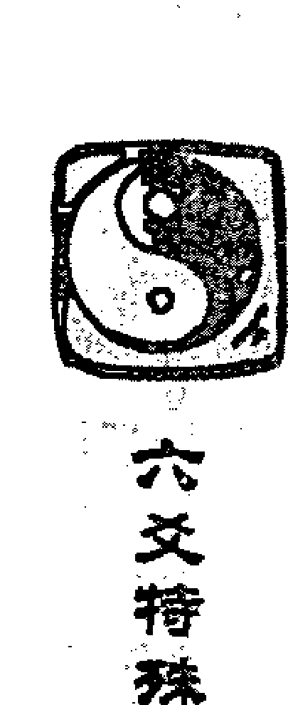

## 六爻特殊现象的疑惑

友人执此而问余曰：戌土子孙一爻独发，昨日丙戌，定应大晴，如何还雨？

余曰：尔忧麦被水冲，神以子孙发动克去身边之鬼，叫尔勿忧；非应晴也。虽则目下未晴，决不涨水，即以此卦而决阴晴，卯日必大晴也。

彼曰：何也？

余曰：动而逢合之日晴，则尔无忧也。卯日果大晴。

此卦实则子孙动而无忧，但因子孙动而化退，即日合住子孙不退，此日心可得安宁。与上面我实际中预测的卦有异曲同工之妙。

再例，一个参加过我面授班的学生，是辽宁抚顺人；在上面授班期间让我断他的升迁情况，我断他戌月升官；后果然应验。升迁官职后，报纸上已经公布了消息，但是自己突然被市长传话说要找他谈谈，他担心是不是市长又不让他升官了。

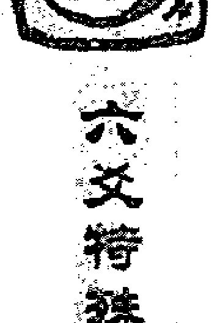

## 六爻揭秘现象的突破

于是戊戌月甲申日（午未），摇卦得雷天大壮变泽天夬卦。

| 左列 | 中列 | 右列 |
|---|---|---|
| 兄弟戌土″ |  | 玄武 |
| 子孙申金× | 子孙酉金 | 白虎 |
| 父母午火′世 |  | 螣蛇 |
| 兄弟辰土′ |  | 勾陈 |
| 官鬼寅木′ |  | 朱雀 |
| 妻财子水″应 |  | 青龙 |

一般情况下，预测升官以官鬼为用神，但此卦因忧虑而摇卦，不能生搬硬套。

他自己摇了此卦，更觉得不好，判断说官鬼休囚，子孙在五爻发动又克，五爻为领导，忌神动化进神克官，领导要剥掉我的官了，看来这次上不成了。于是打电话问我。我判断如下：

你是在非常忧虑的情况下摇出的卦，不是一般性的预测升迁。

此卦子孙旺相动化进神，子孙乃是解忧之神，子孙在卦里发动，就是告诉你没有问题，让你不用担心。

后在丙戌日打来电话告诉我，虚惊一场，市长不是要撤掉自己的官，而是因为其他事情和他谈话的。

再例，我的同学他爱人肾上长了个瘤子，医院断定为恶性的，说是需要马上做手术，而且明确表示，病人很可能要死在手术台上。做还有一线希望，不做就只能是等死。他为此事十分忧虑，连饭也吃不下，于是在戊辰丙寅日（戌亥）摇卦得天斩卦。

| 项 | 六神 |
|---|---|
| 妻财子水 | 青龙 |
| 兄弟戌土 | 玄武 |
| 子孙申金（世） | 白虎 |
| 兄弟辰土 | 螣蛇 |
| 官鬼寅木 | 勾陈 |
| 妻财子水（应） | 朱雀 |

断：一般情况下，关系到妻子的吉凶，应该以妻财为用神。如果以此判断，月克妻财，日不生扶，用神根被坏，肯定不好。但他是在非常忧虑的情况摇的卦，不能这样判断。

我见子孙持世暗动，子孙为解忧之神，不以用神无根生扶不起看，断手术肯定成功，没有什么危险。

后手术非常顺利，没有一点危险。

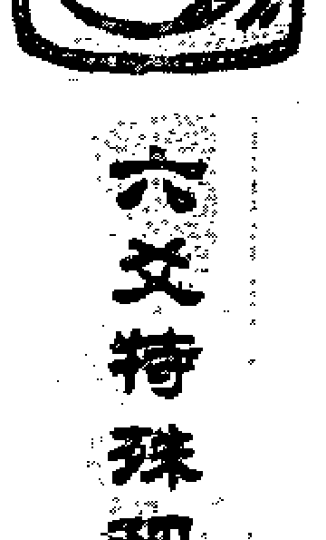

### 问二：卦在什么情况下是过旺？

答：什么东西都不能太过，阴阳讲的就是平衡和中庸之道，所谓物极必反。古人在这方面的论述也不少。“太过者，损之斯成”“子虽福德，多反无功”“兄若太过，反不克财”等等。但许多人看书不仔细，忽略了这一点，致使一部分卦断不对。

过旺的卦有这样几个规律：日月一定是同时对这个爻产生生扶拱比的作用。有其中一个不生扶比助者，该爻再旺也不是。卦中用神、元神或是两现，或是又有动爻化出。有元神来生，或者是动化回头生等。也有的卦是静卦，日月同时生扶用神，而卦里元神用神多现。

## 六爻特殊预测要点的疑惑

## 过旺的情况分这样几种类型

- 1. 用神过旺。这种情况需要用神有制，或墓库收藏为吉，有生无克则为凶。这里有这样几点要注意：用神虽然非常旺，但动化破化空则不是过旺。
- 2. 元神过旺。这个和用神过旺的道理一样，可以参考用神的情况。
- 3. 忌神过旺。这个和用神过旺相反，用神休囚无根，忌神旺到极点，反是为吉。用神有根则不是。用神弱极的卦，可以归在这个里面，此时反而喜用神动而化空化破。

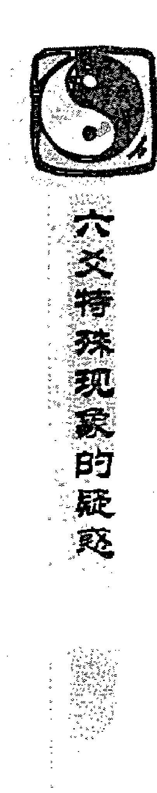

**例，酉月丁未日（寅卯），一个名叫伊波迪代的女子测财运，得火风鼎变巽为风卦。**

| 六亲 | 五行/状态 | 六兽 |
|---|---|---|
| 兄弟 | 巳火′ | 青龙 |
| 子孙 | 未土×应 | 玄武 |
| 妻财 | 酉金○ | 白虎 |
| 妻财 | 酉金′ | 螣蛇 |
| 官鬼 | 亥水′世 | 勾陈 |
| 子孙 | 丑土″ | 朱雀 |

**断：**以财爻为用神，卦中财爻两现，月比日生，财爻自回头生，子孙未土动又来生，子孙丑土暗动也来生，生之太多，此为太过，物极必反，财运肯定不好。

实际情况财运很差。

**例，卯月乙卯日（子丑），某求测大病，得水天需变地雷复卦。**

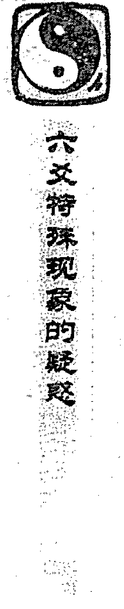

| 本卦 | 变卦 | 六神 |
|---|---|---|
| 妻财子水″ |  | 玄武 |
| 兄弟戌土○ | 妻财亥水 | 白虎 |
| 子孙申金″世 |  | 螣蛇 |
| 兄弟辰土○ | 兄弟辰土 | 勾陈 |
| 官鬼寅木○ | 官鬼寅木 | 朱雀 |
| 妻财子水′应 |  | 青龙 |

**断：**以父母为用神。用神父母巳火不上卦，伏于二爻官鬼寅木之下，二爻为宅，说明其父卧病在家。

用神得日月生扶，又得飞爻动而生之，忌神休囚，旬空不动，又入墓辰土，用神有生无克为太过。此卦元神日月以及动爻变爻四处出现。

父爻火旺临朱雀是热症。内卦伏吟，病人腹中难受，卦遇游魂，病人神志不清。五爻兄弟戌土为用神墓库，用神太旺，需墓库收藏。然此父被日月所克，临白虎发动化出妻财亥水，土在五爻可断鼻子，财为血液，白虎主血，流鼻血无疑。

现日辰合住墓库，火库不开，难以降火，故主当日凶险。然卦中辰土发动冲开戌土是有惊无险，有用之神辰土被日月克制，临勾陈又在坤宫，坤为腹，三爻为腹，其父必腹胀。二爻官鬼为原神，用神已旺，却又动而生助，原神也成仇敌，二爻为生殖器，临朱雀，其小便赤黄。

其父果因热症，测病当日人事不醒，家人皆以为要去世，至晚上忽然苏醒，至丁卯日方死。

**例，酉月己酉日（寅卯），学生查卜测恒硕醋业下周走势？得火风鼎变山风蛊卦。**

| 左列 | 中列 | 右列 |
|---|---|---|
| 兄弟巳火′ |  | 勾陈 |
| 子孙未土″应 |  | 朱雀 |
| 妻财酉金○ | 子孙戌土 | 青龙 |
| 妻财酉金′ |  | 玄武 |
| 官鬼亥水′世 |  | 白虎 |
| 子孙丑土″ |  | 螣蛇 |

他以我所说的过旺原理来判断：以财为用，日月都是财爻。卦中财爻又两现，四爻妻财酉金动化回头生，卦中子孙爻两重，财爻叠见，此为过旺，股票肯定下跌。

果然下跌。

**又例，酉月丁未日（寅卯），管十测盐湖钾肥本日走势，得火山旅变艮为山卦。**

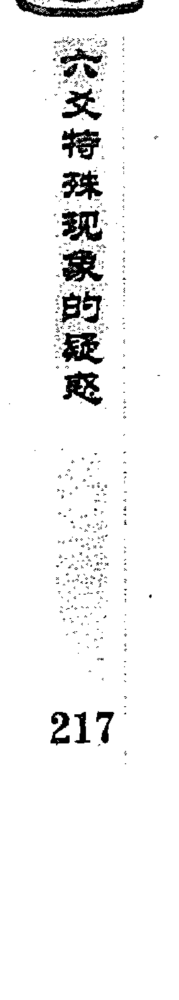

| 本卦 | 变卦 | 六神 |
|---|---|---|
| 兄弟巳火 |  | 青龙 |
| 子孙未土″ |  | 玄武 |
| 妻财酉金○应 | 子孙戌土 | 白虎 |
| 妻财申金′ |  | 螣蛇 |
| 兄弟午火″ |  | 勾陈 |
| 子孙辰土″世 |  | 朱雀 |

以妻财为用神，用神月扶日生，卦中妻财两现，四爻妻财动化回头生，子孙也是两重，与上卦有异曲同工之妙，也是过旺，股票必然下跌。

实际情况果然是跌了。

**又例，管十提供了一个例子，河北一个操户测到山寨磁蝶……**

## 生意如何？于壬申月辛酉日（子丑）得火山旅变巽为风卦

| 六爻 | 本卦 | 变卦 | 六神 |
|---|---|---|---|
| 上爻 | 兄弟巳火′ |  | 螣蛇 |
| 五爻 | 子孙未土× | 兄弟巳火 | 勾陈 |
| 四爻 | 妻财酉金○应 | 子孙未土 | 朱雀 |
| 三爻 | 妻财申金′ |  | 青龙 |
| 二爻 | 兄弟午火× | 官鬼亥水 | 玄武 |
| 初爻 | 子孙辰土″世 |  | 白虎 |

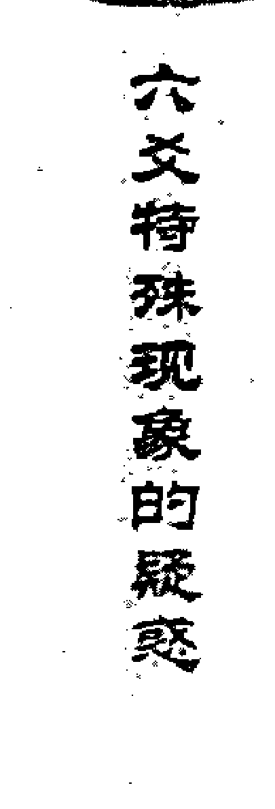

以妻财为用神，兼看子孙，日月都是妻财，卦中财爻两现，四爻妻财酉金动化回头生，五爻子孙发动，又动来生财，卦中虽有兄弟午火发动，午火动化回头克，无力克财，又与子孙未土形成连续相生之势，贪生忘克，财爻过旺，必然没有财可取。

后果然没有挣到钱。

## 又例，教书的鱼某伏一卦，甲申年未月庚戌日（寅卯），一人问开照相馆如何？得风水涣变风山渐卦

| 六爻 | 本卦 | 伏神/变卦 | 六神 |
|---|---|---|---|
| 上爻 | 父母卯木′ |  | 螣蛇 |
| 五爻 | 兄弟巳火′世 |  | 勾陈 |
| 四爻 | 子孙未土″ |  | 朱雀 |
| 三爻 | 兄弟午火× | 妻财酉金 | 青龙 |
| 二爻 | 子孙辰土′世 |  | 玄武 |
| 初爻 | 父母寅木″ |  | 白虎 |

以妻财为用神，妻财虽然伏藏在四爻子孙未土之下，但得日月生助，飞来生伏，三爻子孙辰土暗动，三爻兄弟又化出财来，兄弟午火动生子孙辰土，子孙辰土生妻财，也是形成连续相生之势，兄弟午火不克妻财，日月以及卦中有四重子孙，此正如古人所说“子虽神福德，多反无功”。子孙叠叠生妻财，为财爻太过，必然无财可得。

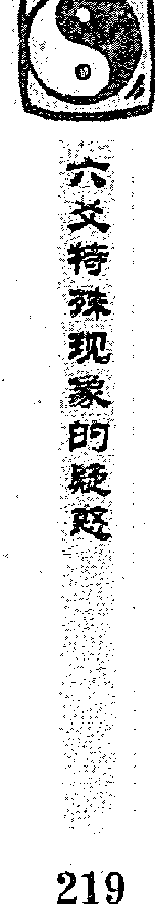

果然至乙酉年酉月顾客稀少，一直亏损。

**再例，史伟民提供一卦，戊月辛未日（戌亥），一女问财运如何？得火风鼎变泽天夬卦。**

| 左列 | 中列 | 右列 |
|---|---|---|
| 兄弟巳火○ | 子孙未土 | 螣蛇 |
| 子孙未土×应 | 妻财酉金 | 勾陈 |
| 妻财酉金′ |  | 朱雀 |
| 妻财酉金′ |  | 青龙 |
| 官鬼亥水′世 |  | 玄武 |
| 子孙丑土× | 官鬼子水 | 白虎 |

卦中妻财两现，日月同来生财，卦中又有两重子孙发动，五爻子孙动化妻财，六爻兄弟动化子孙，子孙妻财卦中及日月叠叠相见，财爻过旺，必然财运不佳。

实际情况正是如此。

## 六例：学生“豪”提供一卦，申月癸未日（申酉），一人问求财如何？得火风鼎变风水涣卦

| 六亲/地支 | 关系 | 六兽 |
|---|---|---|
| 兄弟巳火 |  | 白虎 |
| 子孙未土×应 | 兄弟巳火 | 螣蛇 |
| 妻财酉金○ | 子孙未土 | 勾陈 |
| 妻财酉金○ | 兄弟午火 | 朱雀 |
| 官鬼亥水世 |  | 青龙 |
| 子孙丑土 |  | 玄武 |

此卦也是妻财两现，月扶日生，财动化回头生，子孙动而又来生财，财爻也是旺极。只是三爻财化午火回头克，财爻受克，好像不以过旺来看，但变爻与日相合，日合为绊，变爻兄弟午火不克妻财酉金，也是过旺的卦。问财运必然不好。财临三爻动而生世，三爻为门，财刚进门就得破财。实际情况：此人做生意刚收了客户的订金，就被投诉，无法经营下去。

## 酉月戊申日（寅卯），一面瘦弱的学员求问，说临来前妻子要求预测她的身体，于是此学员摇得火风鼎变山风蛊卦

| 左列 | 中列 | 右列 |
|---|---|---|
| 兄弟巳火′ |  | 朱雀 |
| 子孙未土″应 |  | 青龙 |
| 妻财酉金○ | 子孙戌土 | 玄武 |
| 妻财酉金′ |  | 白虎 |
| 官鬼亥水′世 |  | 螣蛇 |
| 子孙丑土″ |  | 勾陈 |

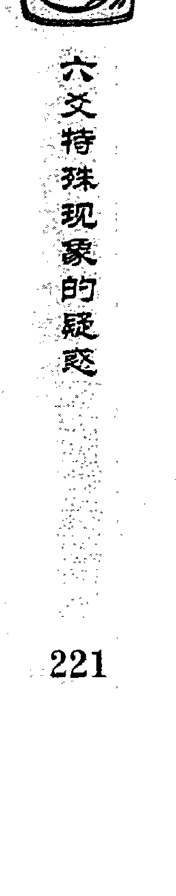

**我断道：**你老婆是严重的贫血。你家有两重门，外面的门大，里面的门小，影响财运。虽然寥寥数语，所断完全正确。

此卦是这样断的。临来前妻子可呼，乃是妻子的意念，虽为此学员摇卦，当取世爻为用神。世爻亥水得日月生扶，又有妻财酉金动来生助，世爻为过旺；用神过旺也为凶。离宫卦，离为血液，水为血液，财也为血液，又另一财爻临白虎，白虎也为血，旺极必反，所以为极度贫血。三爻四爻为门，三四相同，为内外两重门，四爻为外，三爻为内，因四爻动化回头生，所以外面的门比里面的门大，财过旺必不利财，所以断之。

## 卦例，戊月甲戌日（申酉），一人测考试，得水天需变雷泽归妹卦

归妹。这是学生拿给我看的一个例子。

| 左列 | 中列 | 右列 |
|---|---|---|
| 妻财子水″ |  | 玄武 |
| 兄弟戌土○ | 子孙申金 | 白虎 |
| 子孙申金×世 | 父母午火 | 螣蛇 |
| 兄弟辰土○ | 兄弟丑土 | 勾陈 |
| 官鬼寅木′ |  | 朱雀 |
| 妻财子水′应 |  | 青龙 |

以官鬼爻为第一用神，同时参考父母爻，日月不生官鬼，子孙持世发动克官鬼；父母又入墓于日月，官父两衰，而忌神子孙持世发动，得日月生扶，又得卦中五爻和三爻土动来生，旺到了极点，虽然化出父母回头克之，但父母入墓于日月，没有力量克子孙，此为忌神过旺，物极必反。考试一定能通过。过了几天后得知结果，录取分数线为一百，此人竟考了二百二十分。

## 卦例，丑月癸辰日（申酉），一男测母病，问本月危险否？

## 得山雷颐变山地剥卦

| 左列 | 中列 | 右列 |
|---|---|---|
| 兄弟寅木′ |  | 螣蛇 |
| 父母子水″ |  | 勾陈 |
| 妻财戌土″世 |  | 朱雀 |
| 妻财辰土″ |  | 青龙 |
| 兄弟寅木″ |  | 玄武 |
| 父母子水○应 | 妻财未土 | 白虎 |

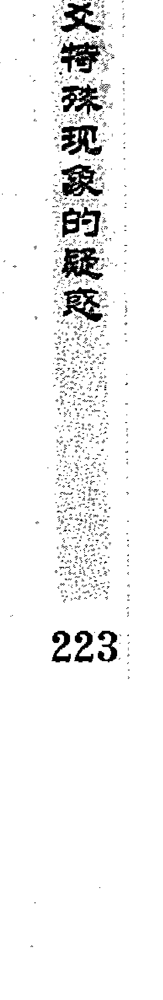

以父母爻为用神，卦中父母子水两现，以上爻父母子水为用。父母入墓于日，为住院的信息；用神入墓于财，病人不思饮食。用神虽然得月建相合为有气，但日月克制用神，妻财戌土暗动又来克制，用神动而化破，凶多吉少。用神临水而被克为肾病。

此卦日月以及卦中有五重妻财，好像忌神旺极，反不克用神，但此卦不是，因为用神与月相合，为有根，用神不是衰极。再有用神化破，只论破而不论回头克，用神化破，实破之时则凶。

后死于乙未日。

## 某例：丑月壬辰日（午未），一人问我侄媳妇如何？得泽风大过变地山谦卦

|  |  |  |
|---|---|---|
| 妻财未土″ |  | 白虎 |
| 官鬼酉金○ | 父母亥水 | 螣蛇 |
| 父母亥水○世 | 妻财丑土 | 勾陈 |
| 官鬼酉金′ |  | 朱雀 |
| 父母亥水○ | 子孙午火 | 青龙 |
| 妻财丑土″应 |  | 玄武 |

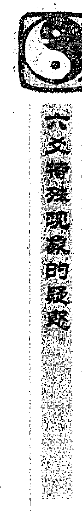

以父母亥为用神，此卦父母两现，都为亥水而且同时发动，可以兼做用神。日月同时克制用神，四爻父母动化回头克，二爻父母动而化空，卦中忌神两现，虽然元神官鬼发动，但被日辰合住，贪合忘生，用神弱到极点，此病必得。而且应该应在克用神的日子。

果然于乙未日应验。

再例，一个……拿一个卦问，说午月丙辰日（子丑），一人问自己有一块土地，将来会升值否？如果没有升值空间该打……

## 卦实例，得雷天大壮变火地晋卦

| 左列 | 中列 | 右列 |
|---|---|---|
| 兄弟戌土× | 父母巳火 | 青龙 |
| 子孙酉金″ |  | 玄武 |
| 父母午火′世 |  | 白虎 |
| 兄弟辰土○ | 官鬼卯木 | 螣蛇 |
| 官鬼寅木○ | 父母巳火 | 勾陈 |
| 妻财子水○应 | 兄弟未土 | 朱雀 |

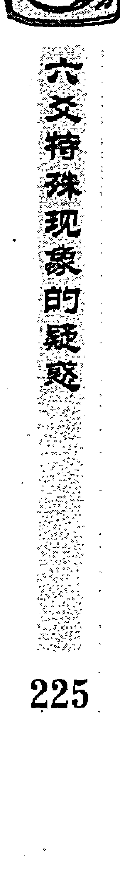

此卦目的是为了求财，所以以财爻为用神。卦中妻财空破日克，又入日墓，兄弟两重发动来克，用神发动又化回头克，财爻衰到了极点。如果按财爻旺相得财，财爻休囚不得财的话，所问的这块土地将来必然没有升值的空间；但此卦为用神极弱，反而应该判断为有升值空间。

什么时候升值，不是用神得生时，而是用神再受克时地价会涨。用神入墓，当应冲开，所以戌月肯定会上涨。

但是当时有好几个人看过此卦，都认为没有升值空间，于是此人卖掉了这块土地。谁知到戌月地价上涨，此人因提前卖掉了土地，等于损失二十万元。

## 卦例，戊月己丑日（午未），学生“寅”问办证如何？得泽雷随变天雷无妄卦

| 左列 | 中列 | 右列 |
|---|---|---|
| 妻财未土×应 | 妻财戌土 | 勾陈 |
| 官鬼酉金′ |  | 朱雀 |
| 父母亥水′ |  | 青龙 |
| 妻财丑土″世 |  | 玄武 |
| 兄弟寅木′ |  | 白虎 |
| 父母子水′ |  | 螣蛇 |

以父母为用神。卦中父母爻两现，以与日相合的父母子水为用。日月克用神，忌神发动化进神又来克用神，卦里忌神两现，其中一个持世，用神又被日合绊住，元神入墓，可以说是用神没有一点生气，弱到了极点。物极必反，所以我断办证顺利。结果寅日去办证，卯日就办了下来。

**例，寅月丙午日（寅卯），一个名字叫口元罗的人测旅馆生意如何？得泽地萃变雷山小过卦。**

| 左列 | 中列 | 右列 |
|---|---|---|
| 父母未土″ |  | 青龙 |
| 兄弟酉金○应 | 兄弟申金 | 玄武 |
| 子孙亥水′ |  | 白虎 |
| 妻财卯木× | 兄弟申金 | 螣蛇 |
| 官鬼巳火″世 |  | 勾陈 |
| 父母未土″ |  | 朱雀 |

以财爻为用神，此卦初看财爻被月建冲克，日不生扶，而兄……

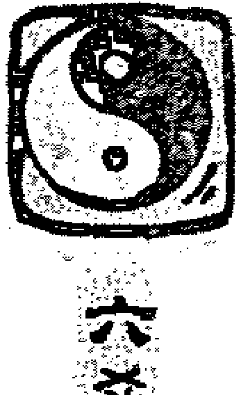

弟爻临月，财爻化出兄弟回头克，五爻兄弟又动化出兄弟，好像财弱极，兄弟过旺，为生意不好的信息。但是仔细分析，兄弟有日克制，五爻兄弟动而化退，不为太过；只有日月同时生助兄弟，卦中再有兄弟发动时，才是兄弟太过。所以此卦以兄弟克财、财爻休囚、生意不好论。

实际其旅馆客人很少，入不敷出。

### 卯例：戊午月丁丑日（申酉），一个名叫大庆修甸的人测父病

得风雷益变水山蹇卦。

| 本卦 | 变卦 | 六神 |
|---|---|---|
| 兄弟卯木○应 | 父母子水 | 青龙 |
| 子孙巳火′ |  | 玄武 |
| 妻财未土″ |  | 白虎 |
| 妻财辰土×世 | 官鬼申金 | 螣蛇 |
| 兄弟寅木″ |  | 勾陈 |
| 父母子水○ | 妻财辰土 | 朱雀 |

以父母爻为用神，用神被日月克制，卦中忌神两现，其中辰土动来克用；用神又动化出忌神，忌神多现，好像是衰极的卦。其实不然，因为用神动而化破，化破一般不以回头克论。

此卦是用神弱，化破为凶；忌神因为月破，不是过旺，也不是用神过衰。所以一定是一种很不好的病。

实际上是肝癌。

再例，我的一个学生，她孩子要外出参加夏令营。午月辛巳日（申酉），摇卦测孩子外出吉凶，得山地剥变山泽损卦。

| 本卦 | 变卦 | 六神 |
|---|---|---|
| 妻财寅木 |  | 螣蛇 |
| 子孙子水（世） |  | 勾陈 |
| 父母戌土 |  | 朱雀 |
| 妻财卯木 |  | 青龙 |
| 官鬼巳火（应） | 妻财卯木 | 玄武 |
| 父母未土 | 官鬼巳火 | 白虎 |

以子孙为用，她见此卦子孙休囚、月破，父母动来克之，很是不吉。但孩子很想去，所以请我判断。

我说此卦是典型的忌神过旺卦，物极必反，外出一定平安无事。为什么呢？子孙月破、日绝之，没有根。再看忌神父母，得日月生，父母两现，初爻父母化回头生，又得二爻鬼动来生，父母旺极，所以反而不克子孙。

后外出参加夏令营，果然平安。如果对这样的卦把握不准，是不能随便判断的；不可把人的生命当儿戏。

## 六爻预测实战卦例102

再例，我的学生张庆学的一个朋友被公安抓走，打电话问自己什么时候可以出来。午月辛丑日（辰巳），我的学生摇卦得风天小畜变风水涣卦。

| 本卦 | 变卦 | 六神 |
|---|---|---|
| 兄弟卯木′ |  | 玄武 |
| 子孙巳火′ |  | 白虎 |
| 妻财未土″（应） |  | 螣蛇 |
| 妻财辰土○ | 子孙午火 | 勾陈 |
| 兄弟寅木′ |  | 朱雀 |
| 父母子水○（世） | 兄弟寅木 | 青龙 |

因为是他本人求测，所以是我学生摇的卦，应该以世为用神。

我的学生把握不准这个卦，又打电话问我。我判断说是辰日出来，果然应验。他不解。

这个卦是这样理解判断的：世爻月破日克合，没有一点气，为无根。忌神财爻两现，妻财辰土动来克。如果按一般的五行生克判断，克多无生，一定没有机会被放出来，但这样判断就错了。

这个卦属于忌神过旺，反而克多为吉。我们看看忌神财爻是不是过旺：财两现，得月生日扶，动化回头生；卦里又有一个子孙，虽然不动也可以增加财的力量。不过辰土空亡，暂时不能克世爻；辰日出空，忌神产生作用，世爻被克为吉，所以判断这天出来。

我在刚开始写这本书的时候，以为过旺的卦一定是有动爻的，但后来发现不完全是这样，有时候静卦也有过旺的情况。

例：一学易者问我一卦，未月庚辰日（申酉），男测谈恋爱如何，得雷地豫卦。

| 六亲/五行 | 六神 |
|---|---|
| 妻财戌土″ | 螣蛇 |
| 官鬼申金″ | 勾陈 |
| 子孙午火′应 | 朱雀 |
| 兄弟卯木″ | 青龙 |
| 子孙巳火″ | 玄武 |
| 妻财未土″世 | 白虎 |

以财为用神，此卦财爻两现，以暗动者妻财戌土为用。日月都是财，卦中又有两财，子孙又两现生财，有点财重叠太过之象。但是我当时不敢肯定静卦也有过旺之说，只以财临世上，遇六合可以成功，结果错了。

从此卦的判断失误，使我认识到静卦也有太过之说。在这个卦出现以前，我的学生就提出过这个问题，我当时说还需要验证，看来静卦有过旺也成立。

举例，学生顾问的一卦：寅月丙寅日（戌亥），一人测运气如何，得风雷益卦。

| 爻位 | 六神 |
|---|---|
| 兄弟卯木 应 | 青龙 |
| 子孙巳火 | 玄武 |
| 妻财未土 | 白虎 |
| 妻财辰土 世 | 螣蛇 |
| 兄弟寅木 | 勾陈 |
| 父母子水 | 朱雀 |

此卦财临世爻，但日月克财，卦中又有兄弟两现，得日月比扶克财。正月就有财得，本人也平安无事。财爻如此衰而得财，当时他觉得是否属于忌神过旺，我不能肯定；现在看来，静卦确实也可以出现过旺。

### 问三：什么是用神有根无根？

答：用神的根，是以日月对用神的作用来衡量的。日月中只要有其中一个生扶拱比用神、长生用神、月合用神者，都是用神有根。一克一生者，也是有根。无根者有三种情况：

- 用神被日月都克，则为用神无根。
- 月破、日克，也是无根。
- 月克日不生，要看卦里忌神的力量大小定其有根无根，这样的卦多是静卦。

**例：酉月丁巳日（子丑），张庆学问一个溺狗的卦，得泽火革卦。**

| 六亲/地支 | 六神 |
|---|---|
| 官鬼未土 | 青龙 |
| 父母酉金 | 玄武 |
| 兄弟亥水 世 | 白虎 |
| 兄弟亥水 | 螣蛇 |
| 官鬼丑土 | 勾陈 |
| 子孙卯木 应 | 朱雀 |

以子孙爻为用神。子孙月克又冲，为月破，日不生扶，休囚无根。临朱雀被克，是不能吃东西。卦中虽然有两亥水被日冲成暗动来生用神，但用神无根，生扶不起，所以为凶。

后死于己未日，此是应用神入墓。这个属于（3）的情况。

**再例：学生孙焕新也因狗病，医生已经说没有救了，于巳月戊午日（子丑），摇卦得泽火革变水雷屯卦。**

| 本卦 | 变卦 | 六神 |
|---|---|---|
| 官鬼未土″ |  | 朱雀 |
| 父母酉金′ |  | 青龙 |
| 兄弟亥水○世 | 父母申金 | 玄武 |
| 兄弟亥水○ | 官鬼辰土 | 白虎 |
| 官鬼丑土″ |  | 螣蛇 |
| 子孙卯木′应 |  | 勾陈 |

以子孙为用神。此卦和上卦看起来非常相似，但仔细看却大不相同。上卦月建克子孙，又冲破了用神；而此卦中日月虽然不生子孙，但也不冲克，也就是说没有把用神的根坏了。卦中元神两现且皆发动来生用神，狗一定可以活。元神月破，出月不破，下月出月，逢实破合破之日，狗病即可愈合。后果于午月丙寅日狗病好了。

### 再例：交月庚子日（辰巳），一个叫久保文明的人测自己戒烟了，喉咙为什么还痛，能否好，得雷风恒变雷水解卦。

| 本卦 | 变卦 | 六神 |
|---|---|---|
| 妻财戌土″应 |  | 螣蛇 |
| 官鬼申金″ |  | 勾陈 |
| 子孙午火′ |  | 朱雀 |
| 官鬼酉金○世 | 子孙午火 | 青龙 |
| 父母亥水′ |  | 玄武 |
| 妻财丑土″ |  | 白虎 |

以世爻为用神。日月不生扶世爻，但也不冲克世爻；用神没有坏根。虽然世爻动而化回头克，但变爻被日月克制，日又冲去变爻，晓晓一定没有大事，可以好。忌神为火，水克之，多喝水即可。

后果然好了。

再例，一易友拿出《增删卜易》中的两个例子来问我，说这两个卦涉及到用神有根无根的问题，野鹤老人对这两个卦不能自圆其说，问我如何看待这两个卦。这两个卦是这样的：

己月乙未日（辰巳）自占病，得泽风大过变火风鼎卦。

| 本卦 | 变卦 | 六神 |
|---|---|---|
| 妻财未土× | 子孙巳火 | 玄武 |
| 官鬼酉金○ | 妻财未土 | 白虎 |
| 父母亥水′世 |  | 螣蛇 |
| 官鬼酉金′ |  | 勾陈 |
| 父母亥水′ |  | 朱雀 |
| 妻财丑土″应 |  | 青龙 |

自占病，世爻亥水为用神，被未土忌神动而克，幸得酉金元神亦动；忌神未土反生元神之酉金，金生亥水，接续相生，化凶而为吉。岂知亥水月冲日克，值月破而被克，虽有生扶，生之不起，如树无根，寒谷不回春也。

果卒于癸卯日。应卯日者，冲去元神之日也。此谓之用神无根，元神有力亦难生。

### 卯月己卯日（申酉），弟占兄已得重罪，母叩周旋赦否？得地雷复变震卦。

| 位置 | 六亲 | 六神 |
|---|---|---|
|  | 子孙酉金 | 勾陈 |
|  | 妻财亥水 | 朱雀 |
| 应 | 兄弟丑土× | 青龙 |
|  | 父母午火 |  |
|  | 兄弟辰土 | 玄武 |
|  | 官鬼寅木 | 白虎 |
| 世 | 妻财子水 | 螣蛇 |

兄弟爻为用神，丑土兄动日月克之，明现大罪难脱；幸得兄爻丑土化午火父母回头相生。断曰：速速行之。父母生兄，神告显然。后果蒙恩免死。

第一个例子，世爻月破日克，日月对用神没有丝毫的生扶之意，属于我所说的用神无根，所以应凶，当在情理之中。再加上六爻未土发动来克，用神的力量又减弱了许多。此卦两爻发动，理象兼看，虽然元神发动，但按理的角度来看，难生无根之用，所以卯日冲去元神为凶。

后一例用神丑土被日月克伤，也是无根，却为何逢凶化吉？

这是因为一爻独发，以象为主，逢生得生，逢死则死。尤其是用神独发，化回头生者，即使是休囚无根，如化回头生，也是凶中有救。

再例，子月辛酉日（子丑），江苏的一个人测在山西某展公司如何，得水泽节卦。

| 六亲 | 六神 |
|---|---|
| 兄弟子水 | 螣蛇 |
| 官鬼戌土 | 勾陈 |
| 父母申金（应） | 朱雀 |
| 官鬼丑土 | 青龙 |
| 子孙卯木 | 玄武 |
| 妻财巳火（世） | 白虎 |

断：公司事业的发展，以利益为重，所以以财爻为用神。财爻被月建克之，日不生扶，日为用神死地，为用神无根。卦中虽有子孙卯木暗动来生，也是生扶不起；子孙暗动，说明是暗中有人帮忙；但世上财爻休囚，说明其本人经济实力差，事业很难发展起来。

后果然没有取得成功。这个属于（3）的情况。

### 问四：对“空下伏神易于引拔”如何理解？

答：也就是说，当预测中出现用神不上卦时，用神虽然休囚，但飞神空亡，一般多以吉来判断。因为飞神为压住用神者，飞神既空，用神不再受压，容易出来。这也是打破五行生克为主、以象判断吉凶的其中一种情况。

**例：酉月甲寅日（子丑），一女测母病，得山火贲变火雷噬嗑卦。**

| 本卦 | 变卦 | 六神 |
|---|---|---|
| 官鬼寅木′ |  | 玄武 |
| 妻财子水″ |  | 白虎 |
| 兄弟戌土×应 | 子孙酉金 | 螣蛇 |
| 妻财亥水○ | 兄弟辰土 | 勾陈 |
| 兄弟丑土″ |  | 朱雀 |
| 官鬼卯木′ |  | 青龙 |

以父母爻为用神，父母午火不上卦，伏于三爻兄弟丑土之下。日辰生之为旺，卦中戌土发动，使元神入墓，乃是住院的信息。

用神绝在妻财，又临朱雀，是饮食难以下咽。忌神虽然发动，但与日相合，合者为绊，贪合忘克，病人暂时没有生命危险。

最吉者飞神空亡，古人说“空下伏神易于引拔”，有病无妨。

后子月反馈，其母之病好转了许多。她母亲得的是食道肿瘤。

### 再例：丑月乙未日（辰巳），某男打电话测妻子出走，可回来否？若回来，什么时间回来？我摇卦得风泽中孚变山火贲卦。

| 本卦（六亲） | 变卦（六亲） | 六神 |
|---|---|---|
| 官鬼卯木 |  | 玄武 |
| 父母巳火○ | 妻财子水 | 白虎 |
| 兄弟未土（世） |  | 螣蛇 |
| 兄弟丑土× | 妻财亥水 | 勾陈 |
| 官鬼卯木○ | 兄弟丑土 | 朱雀 |
| 父母巳火（应） |  | 青龙 |

断：以妻财为用神。妻财子水不上卦，伏在五爻父母巳火之下，用神被日月克伤，本为休囚不吉。

但幸得月合用神，同时飞神空亡，空下伏神易于引拔；又三爻发动而化出妻财，近日可回。用神休囚，逢长生日回，明日即回。

后果于第二天回家。

再例，《增删卜易》中之例。

酉月丙辰日（子丑），占子病，得地风升卦。

| 爻位信息 | 备注 |
|---|---|
| 官鬼酉金 |  |
| 父母亥水 |  |
| 子孙午火 | 妻财丑土（世） |
| 官鬼酉金 |  |
| 父母亥水 |  |
| 妻财丑土 | （应） |

《黄金策》曰：空下伏神，易于引拔。此卦午火子孙伏于丑土之下，丑土旬空，伏神易出，许午日子孙出现必愈。果于午日起床。

### 问五：什么叫卦中出现无情？

答：当用神发动不生世爻，而是生应爻时，即使用神旺相也为不吉。应为他人，是成就别人而不成就我，此叫作无情。这个规律一定是“用神发动生应爻”才是。如果应爻也同时发动，而且动而生世，反而可以解，不能看成是无情。用神静而生应则不是，用神临应爻也不是。这个问题在古书中就有论述，大家可以看看。

### 酉月己巳日（戊寅），占竞选工会主席，得水风井变水泽节卦。

| 六爻 | 变爻/附注 | 六神 |
|---|---|---|
| 父母子水″ |  | 勾陈 |
| 妻财戌土′世 |  | 朱雀 |
| 官鬼申金″ |  | 青龙 |
| 官鬼酉金○ | 妻财丑土 | 玄武 |
| 父母亥水′应 |  | 白虎 |
| 妻财丑土× | 子孙巳火 | 螣蛇 |

**分析：**此为《六爻预测三垣》中的例子。卦中用神官鬼酉金得月建帮比，又巳酉丑合成官局，不空不破，理应当选，然结果却落选。非传统取用神断法有误，而是用神生应出现无情。三合局代表一个团伙、一种势力，三合官局生应，说明有一大批人帮着对方；又应爻父母暗动，说明有人在暗中拉选票。

### 申月乙亥日（申酉），占缺得否？得水风井变水泽节卦。

| 六爻 | 变爻/附注 | 六神 |
|---|---|---|
| 父母子水″ |  | 玄武 |
| 妻财戌土′世 |  | 白虎 |
| 官鬼申金″ |  | 螣蛇 |
| 官鬼酉金○ | 妻财丑土 | 勾陈 |
| 父母亥水′应 |  | 朱雀 |
| 妻财丑土× | 子孙巳火 | 青龙 |

**分析：**此为《增删卜易》中的例子。与前卦完全相同，也是用神成三合局生应爻，而自己落选，另选别人。

### 卯月，申月壬寅日（辰巳），某男测官能当上否？得雷山小过变山水蒙卦。

| 本卦 | 变卦 | 六神 |
|---|---|---|
| 父母戌土× | 妻财寅木 | 白虎 |
| 兄弟申金″ |  | 螣蛇 |
| 官鬼午火○世 | 父母戌土 | 勾陈 |
| 兄弟申金○ | 官鬼午火 | 朱雀 |
| 官鬼午火× | 父母辰土 | 青龙 |
| 父母辰土″应 |  | 玄武 |

以官鬼为用神，官鬼得日生扶持世，又成三合局，本是吉象，但不宜动而生应，出现无情，乃是官被他人所得之象，与己无关。

后果然没有得到。

### 卯月，巳月戊午日（子丑），一男测财运，得泽天夬变水天需卦。

| 本卦 | 变卦 | 六神 |
|---|---|---|
| 兄弟未土″ |  | 朱雀 |
| 子孙酉金′世 |  | 青龙 |
| 妻财亥水○ | 子孙申金 | 玄武 |
| 兄弟辰土′ |  | 白虎 |
| 官鬼寅木′应 |  | 螣蛇 |
| 妻财子水′ |  | 勾陈 |

以财爻为用神，卦中妻财两现，以发动之爻妻财亥水为用。

妻财亥水独发，动而化回头生，本是吉象，但不宜被月建冲破，动而生应。卦中出现无情，虽然财动化回头生可以得财，但财生应爻，又为不利财之象，说明是钱流入了别人的口袋里。

实际情况：此人做工程发了财，但钱要不回来。

### 卦例：子月癸酉日（戌亥），一人测给公家申报的财政预算，少申报了十万元，问再次申报能否给予批下？得泽天夬卦。

| 六亲 | 六神 |
|---|---|
| 兄弟未土″ | 螣蛇 |
| 子孙酉金′世 | 勾陈 |
| 妻财亥水′ | 朱雀 |
| 兄弟辰土′ | 青龙 |
| 官鬼寅木′应 | 玄武 |
| 妻财子水′ | 白虎 |

以财爻为用神，此卦财得月建帮扶，日辰来生为旺相。此卦初看也是财生应爻，但用神没有发动，不以无情来看，所以此笔款项一定能要回来。

妻财亥水空亡，出空即可，果然应验。

### 卦例：子月己卯日（申酉），一个日本女子测与自己的男友能否结婚？得水山蹇变坎为水卦。

| 本卦 | 变卦 | 六神 |
|---|---|---|
| 子孙子水″ |  | 勾陈 |
| 父母戌土′ |  | 朱雀 |
| 兄弟申金″世 |  | 青龙 |
| 兄弟申金○ | 官鬼午火 | 玄武 |
| 官鬼午火× | 父母辰土 | 白虎 |
| 父母辰土″应 |  | 螣蛇 |

**断：**以官鬼为用神。官鬼虽然被月建冲破，但得日辰生扶为旺。用神旺相本为吉，但不宜克世而生应爻。

官鬼克世，是男友对她不好，不喜欢她。用神生应爻，此为无情，乃是对别人好。

用神化出父母生应爻，父母为结婚证书，是想和别人结婚，不想与她结婚。世爻空亡，说明自己心烦意乱，坐卧不安。

实际上，此女和她的男友在三年前怀孕生下孩子，但男友迟迟不肯与她结婚。在今年（乙酉年）辰月与另一个女子结婚。她上诉，想通过法院解决，但以败诉而告终。

### 再例：酉月丙午日（寅卯），一日本女子测她女儿能否考上……她所报考的大学，得山雷颐变离为火卦。

| 左列 | 中列 | 右列 |
|---|---|---|
| 兄弟寅木′ |  | 青龙 |
| 父母子水″ |  | 玄武 |
| 妻财戌土×世 | 官鬼酉金 | 白虎 |
| 妻财辰土× | 父母亥水 | 螣蛇 |
| 兄弟寅木″ |  | 勾陈 |
| 父母子水′应 |  | 朱雀 |

断：以官鬼爻为用神，父母爻作为参考。此卦官鬼酉金不上卦，伏在三爻妻财辰土之下，官鬼得月比扶，此卦官鬼也生应爻，但不是无情，因为官鬼没有发动，虽然与应爻是相生的关系，不作无情看。

此卦用神月扶日克，力量相当。幸得卦中财爻动而来生，此为生多克少，为吉。古人说“财动生官，侥幸得名”，所以刚刚能够被录取。最后考上了大学。

### 再例：子月丙子日（申酉），测女儿考大学如何？得风山渐卦。

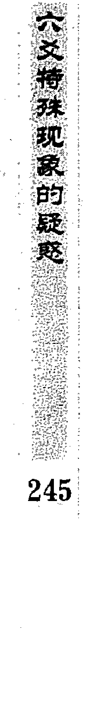

| 六神 | 爻位 |
|---|---|
| 青龙 | 官鬼卯木′应 |
| 玄武 | 父母巳火′ |
| 白虎 | 兄弟未土″ |
| 螣蛇 | 子孙申金′世 |
| 勾陈 | 父母午火″ |
| 朱雀 | 兄弟辰土″ |

断：以官鬼爻为用神，此卦用神得日月生扶为旺相，官鬼临应，不能叫做无情。喜子孙持世，克应上之官；世爻虽然空亡，但作为忌神，空亡无妨。父母月破、日破，预测考试是以官鬼为重，所以官鬼旺相即可。

最后考上了大学。

### 再例：寅月壬戌日（子丑），一人测升官如何？得火地晋变火泽睽卦。

| 本卦 | 变卦 | 六神 |
|---|---|---|
| 官鬼巳火′ |  | 白虎 |
| 父母未土″ |  | 螣蛇 |
| 兄弟酉金′世 |  | 勾陈 |
| 妻财卯木″ |  | 朱雀 |
| 官鬼巳火× | 妻财卯木 | 青龙 |
| 父母未土×应 | 官鬼巳火 | 玄武 |

断：以官鬼爻为用神，卦中官鬼两现，以发动之爻官鬼巳火为用神。用神得月生扶，本为吉象。但不宜克世生应；此为无情，本来应以凶断，幸得应爻发动。官动生应，应爻动来生世，此卦的落脚点最后又到了世爻上，变无情为有情，应该可以升迁。

果然得到了一个很重要的职务。

### 戌月辛酉日（子丑），占何日补官，得涣之解卦。

| 六亲/本卦 | 变卦 | 六神 |
|---|---|---|
| 子孙子水″ |  | 螣蛇 |
| 父母戌土′ |  | 勾陈 |
| 兄弟申金″世 |  | 朱雀 |
| 兄弟申金′ |  | 青龙 |
| 官鬼午火× | 妻财寅木 | 玄武 |
| 父母辰土×应 | 子孙子水 | 白虎 |

这是《增删卜易》上的一个卦例。官鬼为用神，用神虽然不得日月生扶，但也不受日月之克，没有坏了根。同时用神自动化回头生，乃是吉象。

不过不宜用神克世动而生应，看上去是无情。好在应爻动生世，成连续相生，变不利为有利。应爻月破化空，难以引化；日合应爻解破，子月出空而得升。

果得升于冬月。

### 问六：什么叫大象生克论吉凶？

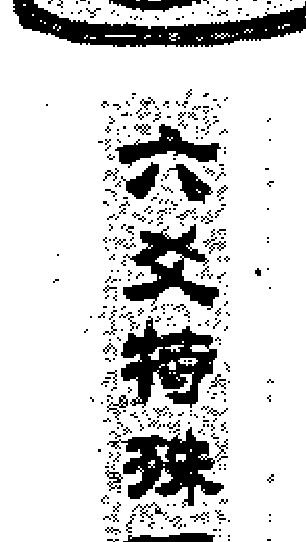

## 六爻筮探究象的奥秘

答：当遇到八纯卦变八纯卦时，多以大象辨吉凶，而不是以用神的五行生克为主定吉凶。这也是六爻预测里面的一个特殊现象，也是超越了五行生克之理，而以象为主论吉凶的。

> 古人对这个问题是这样论述的：“卦之变者：有变生、变克、变墓、变绝、变比和。予得验者，凡遇卦化克者，不论用神之衰旺，皆以凶推。”

实践中发现，卦变者，只以回头生和回头克而定吉凶比较妥当。

卦变化回头克者，如乾变离、兑变离、坎变坤、坎变艮、巽变乾等；卦变回头生者，如坎变兑、离变震等。变墓者，如离变乾，因为离为火，火墓纳乾；乾变艮，因为乾为金，金库纳艮等；变绝也是同样的道理。但这样一来就乱了章法，比如乾变艮既是化回头生，也是变墓，也是变绝，反而使人无法把握，而且也不应验。所以预测中一般只论大象回头生、回头克，墓绝不论。乾化坎、巽变离等，为主卦生变卦，此为化去，一般取用神而论生克。

有些东西还需要我们大家在实践中大量地去验证。现在我把我实践中应验的部分卦例列出来。

### 例：卯月丙午日（寅卯），一男测办护照如何？得坎为水变兑为泽卦。

| 左列 | 中列 | 右列 |
|---|---|---|
| 兄弟子水″世 |  | 青龙 |
| 官鬼戌土′ |  | 玄武 |
| 父母申金× | 兄弟亥水 | 白虎 |
| 妻财午火″应 |  | 螣蛇 |
| 官鬼辰土′ |  | 勾陈 |
| 子孙寅木× | 妻财巳火 | 朱雀 |

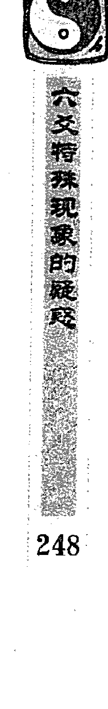

通常情况预测办护照是以父母为用神。此卦父母不得月建生扶，被日克伤，又绝于动爻子孙寅木，六冲变六冲，是不得之象。

但此卦为八纯卦变八纯卦，不以用神五行生克为主，而是用大象定吉凶。此卦坎变兑，是大象变回头生，护照一定可以办下来，逢金水之日必成。

两天后为戊申日，又与父母申金相一致，申日可以办下来。

果然在戊申日办了下来。

### 再例：午月庚辰日（寅亥），一人测出国的手续能否办下来？得乾为天变离为火卦。

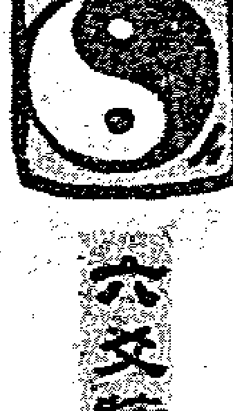

| 本卦 | 变卦 | 六神 |
|---|---|---|
| 父母戌土′世 |  | 朱雀 |
| 兄弟申金○ | 父母未土 | 青龙 |
| 官鬼午火′ |  | 玄武 |
| 父母辰土′应 |  | 白虎 |
| 妻财寅木○ | 父母丑土 | 螣蛇 |
| 子孙子水′ |  | 勾陈 |

此卦若以取用神来判断，当以父母爻为用神。父母戌土持世，得月建来生为旺相；日辰冲世，又属暗动，好像可以办好出国手续。但此卦为八纯卦变八纯卦，以大象生克为主，乾变离为大象变回头克，手续很难办下来。

果然没有办下来。

### 再例：一人问我一卦，测母病如何？申月丁亥日（午未），得坎为水变坤为地卦。

| 左列 | 中列 | 右列 |
|---|---|---|
| 兄弟子水″世 |  | 青龙 |
| 官鬼戌土○ | 兄弟亥水 | 玄武 |
| 父母申金″ |  | 白虎 |
| 妻财午火″应 |  | 螣蛇 |
| 官鬼辰土○ | 妻财巳火 | 勾陈 |
| 子孙寅木″ |  | 朱雀 |

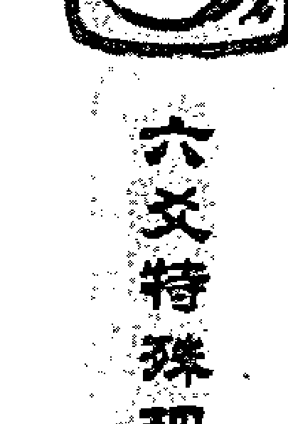

## 六爻特殊现象的疑惑

我断：此人母亲必死。  
他问：此卦父母旺相，怎么能死了？  
我说：此卦属于八纯化八纯，不看用神，只看大象回头克。

他说：原来是这样啊，这下知道这个卦为什么是他母亲死的原因了。

再例，学生钱宝顺初来太原见我时，说到他预测时遇到的一个卦，为一个女的预测工作，得乾为天变离为火。

我当时没有问他摇卦的时间，就认为此卦不吉，不但工作不好，而且还有性命之忧。我判断在巳月此人有性命之忧。而实际上，此人在乙酉年的壬午月壬午日，因白血病而亡。

此也是因大象变回头克之故。这个卦实际上是在甲申年申月己未日（子丑）占的。

| 六亲/爻位 | 伏神 | 六神 |
|---|---|---|
| 父母戌土′世 |  | 勾陈 |
| 兄弟申金○ | 父母未土 | 朱雀 |
| 官鬼午火′ |  | 青龙 |
| 父母辰土′应 |  | 玄武 |
| 妻财寅木○ | 父母丑土 | 白虎 |
| 子孙子水′ |  | 螣蛇 |

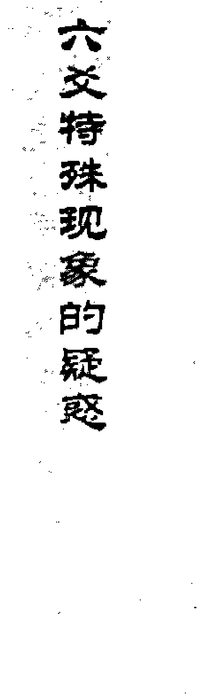

此卦与上面的办出国手续之卦都是乾变离，为何此卦有性命之忧，而出国手续的卦没有？这是因为这种类型的卦，用大象来定生克，所以所问事体与象的含义有很大的关系。

乾为事业工作，她本人问的就是工作，所以事体与性命相关；如果出现大象回头克，不但所问之事不好，且有性命之忧。而且主卦与月五行相同，化大象回头克也不好，谓之临日月变坏。

为了更好地把握此类卦的判断和这类卦的规律，我把《增删卜易》里的卦例也一并列在这里。

### 例：卯月辛巳日（申酉），某人不言何事，占得巽卦变乾卦。

| 本卦 | 变卦 | 六神 |
|---|---|---|
| 兄弟卯木′世 |  | 螣蛇 |
| 子孙巳火′ |  | 勾陈 |
| 妻财未土× | 子孙午火 | 朱雀 |
| 官鬼酉金′应 |  | 青龙 |
| 父母亥水′ |  | 玄武 |
| 妻财丑土× | 父母子水 | 白虎 |

问之所占何事？

伊曰：代卜长辈功名。

余曰：功名须要亲占，代占难取用神，从不敢断。幸此卦显而易见，巽木化乾金，即为化回头克，为绝卦也。不必问名，寿命不久。

果于午年前七月而终。

为什么这个卦也应了死亡？这是因为主卦和月五行相同，卦临月变坏。

### 又如：午月丙寅日（戌亥），占主病，得离卦变坎卦。

| 本卦 | 变卦 | 六神 |
|---|---|---|
| 兄弟巳火○世 | 官鬼子水 | 青龙 |
| 子孙未土× | 子孙戌土 | 玄武 |
| 妻财酉金○ | 妻财申金 | 白虎 |
| 官鬼亥水○应 | 兄弟午火 | 螣蛇 |
| 子孙丑土× | 子孙辰土 | 勾陈 |
| 父母卯木○ | 父母寅木 | 朱雀 |

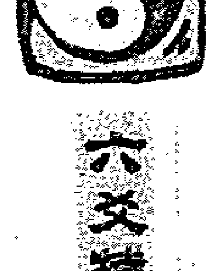

离火变坎水，回头来克，目下午月火旺，许之冬令必危。果卒于九月丁亥日。此皆不看用神之衰旺也。

此也是主卦与月的五行相同，主卦临月变坏。

### 再例：一人于卯月乙酉日（午未），占买房价，得坎之坤卦。

| 本卦 | 变卦 | 六神 |
|---|---|---|
| 兄弟子水″世 |  | 玄武 |
| 官鬼戌土○ | 兄弟亥水 | 白虎 |
| 父母申金″ |  | 螣蛇 |
| 妻财午火″应 |  | 勾陈 |
| 官鬼辰土○ | 妻财巳火 | 朱雀 |
| 子孙寅木″ |  | 青龙 |

卦变回头之克，房价事小，今年诸事须宜谨慎。后于四月覆舟而死。占此应彼，神预告之，令人早知趋避也。古以占大事忌之，此卦岂非占小事而应大凶耶？！

下面是《增删卜易》点评《易冒》中的卦例。

### 如：寅月甲子日（戌亥），占母病，得坤之巽卦。

| 本卦 | 变卦 | 六神 |
|---|---|---|
| 子孙酉金×世 | 官鬼卯木 | 玄武 |
| 妻财亥水× | 父母巳火 | 白虎 |
| 兄弟丑土 |  | 螣蛇 |
| 官鬼卯木×应 | 子孙酉金 | 勾陈 |
| 父母巳火× | 妻财亥水 | 朱雀 |
| 兄弟未土 |  | 青龙 |

坤土化巽木，乃回头之克。而彼卦则曰：寅化旬空，休囚之反吟亦凶。

既曰空破则重，又曰示凶，且更牵扯亥水冲破巳火，故凶。殊不知既得卦变，止观卦象，不看用神；以其既使爻吉，泉竭根枯，岂能久乎。

### 又如：寅月癸酉日（戌亥），占长子病，得震之兑卦。

| 本卦 | 变卦 | 六神 |
|---|---|---|
| 妻财戌土世 |  | 白虎 |
| 官鬼申金× | 官鬼酉金 | 螣蛇 |
| 子孙午火 |  | 勾陈 |
| 妻财辰土应 |  | 朱雀 |
| 兄弟寅木× | 兄弟卯木 | 青龙 |
| 父母子水 |  | 玄武 |

此非震木化兑金回头之克耶？此二卦竟未看出，土遭木克，木被金伤，以震为长男，占长子所以不吉。殊不知卦变回头之克，少女亦难保也。今以彼之占验而谓彼之错误，无他说也。

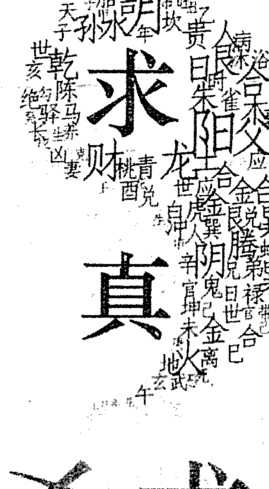

## 六爻求真

LIU YAO XUE CHU YING · 王虎应

- 书名：六爻疑惑指迷
- 作者：王虎应
- 封面设计：廖尼使者
- 版式设计：紫兰味
- 出版人：陈庆力
- 出版社：时轮造化有限公司
- Kachakra Creations Pte Ltd
- 地址：15 Philip Street #09-00 Singapore 048649
- 传真：65-63450912
- 国际书号：981-05-6351-3
- 定价：港币80元

出版所有全书的文字与图片，未经出版人书面许可，不许以任何方式抄袭或翻印，违者必究。