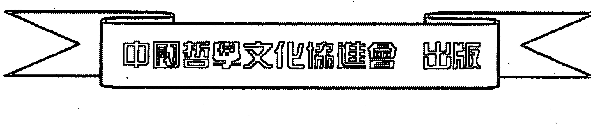

# 六爻真鉴


## 前言

愚是一位年近四十易學愛好者，和眾多的易學愛好者一樣，對中國的數術文化有著特別的偏愛。一九九四年秋天，因爲受啟蒙恩師莫先生的影響，開始了漫長的學習周易預測的旅程，尤其是對中國傳統的八卦六爻預測術產生了濃厚的興趣。愚也就是在學習和實踐過程中逐漸形成了特有的思維方式和預測方式。同時在這十餘年預測生涯中，倍感易學愛好者的心聲，深刻體會到那種渴望在預測殿堂裡不斷學習、不斷進取的迫切願望。愚雖然不是什麼易學名家，但仍願將自己這十餘年中領悟到的預測知識和預測技巧寫成書，奉獻給求知若渴的廣大易學愛好者。不足之處，望廣大易學愛好者斧正。

全書將分幾個部分對六爻預測技術進行系統的剖析。如諸多的易學預測書籍都沒有對預測思維方式有所論述，在本書中增加了一個章節來說明如何進行預測思維。書中主要以愚在實踐中的部分卦例展開詳細分析。需要注意的是：本書主要是針對一卦多斷爲主進行剖析，因而不適合初學八卦六爻預測的朋友。本書需要預測愛好者必須掌握深厚的易理知識，那麽閱讀本書的時候會起到事半功倍的效果。也許有一定預測水準的易友看了以後會覺得釋卦過程有些囉嗦，甚至有畫蛇添足之感，但本書主要目的是教授初學一卦多斷的易友如何養成正確思維的習慣，也是爲了易學者在學習的過程中逐步形成具有自己特有的思維方式而打好鋪墊。因而務必要初學許多斷卦的愛好者認真研讀。

愚寫的這部六爻預測之書，已經傾盡了全部心血，十餘年的六爻預測經驗和技巧一一通過文字方式論述。因此身邊不少朋友看見愚的初稿後紛紛鼓噪：如今是經濟社會，什麼都講效益，都講實際。你沒見現在世面上一些所謂易學大家爲了名利拼個你死我活？那些所謂大師每出一部書都會留一手，像擠牙膏一樣，不斷在易學愛好者身上榨取錢財。他們就是看準了易學愛好者求知若渴的心境，一面再一面地放長線釣大魚。你倒好，寫三七二十一，把十幾年的心血結晶那麼輕易地給實了，你圖什麼呀？最後落了什麼呀？簡直就是出賣自己。愚笑了笑，對朋友說，愚昨天看了一本書叫《老子和莊子》，裡面一則寓言很有意思：

> 問桓公曰：「敢問，公之所讀者，何言邪？」公曰：「聖人之言也。」曰：「聖人在乎？」公曰：「已死矣。」曰：「然則君所讀者，古人之糟粕已矣！」桓公曰：「寡人讀書，輪人安得議乎！有說則可，無說則死！」輪扁曰：「臣也以臣之事之。斲輪，徐則甘而不固，疾則苦而不入，不徐不疾，得之於手而應於心，口不能言，有數存焉於其間。臣不能以喻臣之子，臣之子亦不能受之於臣，是以行年七十而老斲輪。古人之與其不可傳也死矣。然則君之所讀者，古人糟粕已矣！」

釋文：齊桓公在堂上讀書。輪扁在堂下削制車輪。他放下手中的工具走上前來，問齊桓公：「請問公所讀的是什麼書？」桓公說：「是聖人之言。」輪扁問：「聖人還活著嗎？」桓公說：「已經死了。」輪扁說：「那麼您所讀的，不過是古人的糟粕罷了！」桓公說：「我在讀書，工匠怎麼能妄加評論？你能說出道理則作罷，說不出道理就得死！」輪扁說：「我是根據我的工作來觀察的。製作車輪，椎眼做得寬了就鬆滑而不牢固，做得緊了就滯澀而不進去，鬆緊適宜才得心應手。對此說不出來，分寸大小心中有數。我無法使兒子明白其中奧妙，兒子也無法掌握我的技術，所以我雖然已七十高齡卻還得製作車輪。古人和他那無法言傳的東西一同死了。那麼你所說的，只不過是古人的糟粕罷了！」

這則寓言告訴我們不要只看、只學表面化的東西，那樣不是真正做學問，也是學不到任何有用的東西，也不符合學習精神。學易要心領神會，悟出前人只可意會而不能言傳的精髓所在。這則故事同時也是在告誡學習預測的朋友不要生搬硬套，呆板地模仿別人的預測方法及思維模式，那樣只能禁錮自身思維潛能，使自己的思維空間變得狹隘，在思維上不能產生飛躍，抑制了自身拓展思維的領域。假如只是刻板地模仿別人的技術，那麼在預測技術上也只能停留在小學生的水準。古易有云：窮則變，變則通。易可近取諸身，遠取諸物。這是學不好預測的，也永遠只能停留在易學的山寨下。因此愚認為，即使拿到了別人花費精力寫成的書，假如只知道生搬硬套，不去探究，那麼拿到的只是別人所寫的一疊普通白紙罷了。只有悟懂了，在實際學習中領悟其中道理，形成自身一套特有思維方式，才會在預測技術上通達。秉性差，一輩子只能依葫蘆畫瓢，人云亦云，殊不知世事都在不斷變化中；即便出現的是滴水那樣微小的變化，也能激起千層波瀾，愚者也只能在易海微瀾中變得茫然不知所措，迷失自己。因而學不會依然是別人的。

學習任何一種預測術都應懷著循序漸進的態度去學習它、研究它，那樣才能在易學的海洋中不斷進取，獲益匪淺。正所謂書中自有黃金屋，書中且有顏如玉，做到盡信書不如無書，做到隨心易者。望每一個研易者、學易者在不斷學習中收益更多，早日找到通往易學殿堂的陽光大道。

## 第一章　八卦六爻预测的思维方式

思维方式，何为思维方式？这里我不做具体阐述，这里着重说明什么是正确的预测思维方式。为了让学员更好地理解什么是预测思维方式这一问题，举一个易学前辈说过的寓言。这个故事是这样的：一人在地下画了一个圆圈，让过路人谈，是个什么。生意人见了说：“这是铜钱。”卖烧饼的说：“不是铜钱，这是烧饼。”教书先生见了说：“你们都说错了，这是数学里的零。”此时，一个刚从赌场出来的人见了说：“一副牌少了，这东西我认识，不过，我不好意思说。”大家问，是什么？某人指着对面的赌马场，再指地上所画的圆圈说：“我刚才从那里出来，这是个潭底洞，输钱再多也填不满的无底洞。”

在你看完这则短小寓言后，不知你会联想到些什么？本来是同样一个圆圈而已，但是为什么出现在不同的人嘴里就会变得不同呢？道理很简单，用个通俗的话来说就是：一样米养百样人。不同的人因为思维方式不同，因而虽然见到同属一样的事物，经过大脑理解判断，最终得到的结果也就不同。这正所谓：仁者见仁，智者见智。预测也是一样：不同的预测师在进行实地预测的时候，由于每个预测师的思维模式不一样，理解程度也不同，对预测象的定位也不一样，因而导致其在实际预测过程中，对卦象、爻象、阴阳等象的联想和想象、拓象、提象过程中对象的定位不同，因而会出现预测结果有所不同。

但并不能因预测结果有了出入而歧视周易预测的科学性。断不准是人的问题，而不能否认周易预测的可行性。愚在与诸多易友学习交流过程中发现，众多易友在预测时还是保持运用着初学者提象、理解象的层面，象的思维模式呈单一线性形式：黑就是黑，白就是白，直就是直，曲就是曲，静就是静，动就是动，两者之间格格不入，永远没有相交综合的一天。并没有采取变换发散的方法去思考。如你看到的是一个点，那么你不妨换个角度去看、去观察、去审察，那么观察到、理解到的也许是一条线。因此预测师如果要做到更好地为众人服务，就要求其熟练掌握正确的预测思维方式。而正确的思维方式必然是准确预测的重要环节。

目前，市面上出版有许多八卦六爻方面的预测书籍，且在书中或多或少介绍了在实际预测中运用的这样或者那样的预测技巧和方法。甚至有些所谓易学名家为吸引更多初学周易预测的爱好者，大肆制造一些所谓断语。于是一些易友或预测师为了精进自己的预测技术，买的预测书一本又一本，最终家中书柜堆满了关于八卦六爻预测技法的书。但是经过一段时间学习以后，发现自己的预测技术并没有得到很大提高，有的还出现了预测技术滑坡、思维混乱的情况。于是有些初学者开始怀疑自己是不是真的像一些易学大家所说那样，不够聪慧，或是天生愚钝，那些在易学方面颇有造诣者皆因得到了恩师亲传口授？

11【亦是算器】

愚也是个普通人，自学八卦六爻预测术已经多年，其间也没有真正接遇某位易学名家或者世外高人为师。愚不敢说在八卦六爻预测术上有所造诣，但却也在预测研究中获益良多。愚诚心将一些在多年实际预测中运用的技法逐一成文，与易友一道分享，共同进步。

在实践中愚发觉：要想令所学预测技术在实际预测中发挥得淋漓尽致，牢固预测基础知识是学六爻一卦多断及信息预测的重要前提，而其关键条件还是要会活学活用，懂得善于变通。那样才能在实际预测中不至于望卦兴叹，也不至于落到看见卦就茫然不知所措的地步。愚认识一些学习八卦六爻预测术多年的爱好者，其中不乏一些研习者研习时间并不亚于愚，有的甚至学了三十年之久，然在真正要断卦的时候，嘴里还是停留在简单的梅花内外卦生克、比和，以及各爻之间的五行生克制化，或者五行生克多少上。略有成者略知卦中应吉应凶，一旦追问下去，问其事主发生了何种事情、因何造成、因谁而起，其也不知从何开口。老道的预测师则选择一些看似平和合理的接口推诿，给自己留下一层；嘴拙者只有看着别的易友侃侃而谈，滔滔不绝说着卦中故事，自叹技不如人。难道这些学了三五十年的朋友是理论基础不好吗？他们也没有按部就班硬套，为什么判断不出那么精彩的故事呢？总的一句话，还是其所用预测思维方式首先有误。

八卦六爻预测绝是一门科学的预测方法，也是要讲辩证法的。和其他任何一门预测术都一样，任何不讲辩证法的预测方法都会是不正确的。研易者知道，任何事物都不以人的主观意识而存在，同样周易预测的正确性也是不以某个人的意识而客观存在着，其也兼承着自身特有的规律运行。因而只有遵循其特有规律，才不至在学易、研易过程中有失偏颇。在运用中不仅要在预测技术上遵循其特有规律，而且在预测思维方式上也应该遵循其特有规律。下面就学习八卦六爻预测中特有的思维方式做一步详尽说明：

学习八卦六爻预测术的易友应该明白，八卦六爻的一卦多断（全息）预测实际是运用了象和数的拓变，一极或者多极定位的模式进行预测的。因而在取象上，任何一个单一的象都具有分裂性、独立性；同时又具有特有性、包容性和相容性。前面说过，任何事物是不以人的个人意志而存在的。比如说在你的前面站着一个人，你只能看见这个人的前面部分，如这个人的脸、眼睛、鼻子、前胸、腹部、手的前面部分、腿、脚等等，但是你看不见这个人的后脑、背部、臀部、腿的后部、脚板底等，而这些部分却不以你的意识而客观存在着。如果这个世界是悬浮在空气中，是个立体的场，而你又可以随意站在世界任意一个角度，那么你才能看全这个人相应部位。比如说你要看这个人的脚板部位的时候，你只有站在这个人的下面，才能看见这个人的脚板部分等等。你要看不同部位的时候，就得站在不同位置才能观察到你想观看的地方。而你看不见的地方却依然不以你的意识而始终客观存在着。因此人的视野就存在一个局限性。你要看全这个人的全貌的话，也只能借助外界工具才能做到，比如镜子就是观察一个人或者事物的辅助物。它是通过光的反射取得一个与实体相对应的人或者事物的影像，这样一来人们才能从镜面观察到事物。但是镜子同样具有人视觉一样的局限性，就是只能反映在镜子辐射区内的事物形态，如果超出了镜子所在辐射区范围，那么就不能反映出来。天下无论哪一种辅助工具都解决不了自身局限性，包括人的眼睛视觉局限性这些缺陷，因此所看见的并不是一个事物或者人物的整体，看见的仍然是一个事物的局部或者人物的某个部位而已。虽然借助了任何一种观察辅助工具仍然看不见其整体，但不表示其不存在，或者否定其事物完整性。八卦六爻预测则是运用了所有辅助工具比之不及的方法，它能不借助外界任何一种辅助工具，就能完整反映所测事物、人物的方方面面。不要质疑八卦六爻预测也有局限性，不要质疑八卦六爻预测也像镜子一样，只能预测所辐射范围的东西，辐射不到的就不能预测。那么究竟八卦六爻预测事物的辐射范围有多大、多广呢？易道广大，无所不包。预测师通过符号形式化卦显现，以阴阳五行生克制化为规律，以象和数的裂变和拓变模式，整体反映一个事物内在或者外在联系，全面反映一个人、事的方方面面、里里外外。因而八卦六爻预测突破了人有限视觉以及一切辅助工具的局限性。在预测中，通过卦中阴阳五行生克制化等一系列解读过程后，就能把事物形态特征完整复制出来。比如说一个预测疾病的六爻卦，那么这个卦和爻就隐含了各个方面情况，通过阴阳五行生克制化就能找出这个卦中“病”为何症，那么根据“病”所在爻位、象位、阴阳等就能说明这个病兆所处在身体何位置，再根据阴阳、旺衰等就能清楚了解病症所表现出的症状等等，再根据爻象和数的各种组合，也不难看出其病在何时起、因何而起。

预测师在进行系统的预测思维过程中，就应该把整个卦视为求测者，而预测师本人不参与其中，只作为观察者，把出现的八卦六爻当作观察求测者的一面全息立体镜子。那么起出的卦、爻、内外、阴阳、爻位、主卦、互卦、变卦等等，可以作为这个卦（人）里里外外的不同参考点。求测者要预测的事物就像赤裸透明地站立于悬浮空中，它整体情况都可以通过卦的爻和数不断组合变换，进而在预测中尽收眼底，而不需要任何工具就可以将整个事物在思维中进行合理拆分、组合、相融。预测的时候你的思维呈放射线向四周散发出去，而并不是像镜子辐射那样受范围限制。预测时思维不应受任何限制，穿梭于人事内外之间。但必须注意的是，预测时思维一定要根据卦理需要，符合卦意，绝不能超出卦意思维范围。

曾记得几年前有部很出名的电视连续剧《寻秦记》，其中有那么一段，引用到预测中来说明什么是预测的多维思维最合适不过：故事中说跨越时空的项少龙在辩论会上说明什么是时代，就在白布上画了一幅画。有的人看了以后认为画布上的是一个带有西域血统的老妇女，而有的人却说画布上画的是一个漂亮的美少女。为什么会有那样的结果呢？简而言之，就是因为观察的人站在不同角度观察所致。认为是带有西域血统老妇女者，是因为观察者以整个画面的全部来进行观察；而观察者认为是美少女的，则把画遮住了一部分，因此画布上的画就成了一个美少女。尽管这不过是个简短片段，但是对于开拓一个人易学领悟力会产生巨大影响，你会觉得六爻卦预测其实就是思维上的无限变化和飞跃。

15【六爻真象】

八卦六爻预测其实也就是根据需要，站在千万个不同位置上观察问题，推理事物的发生发展。善于变通预测思维的人，就好比一个会欣赏风景的智者，随时随地根据自己欣赏需要，变换不同视觉角度去欣赏出不同景致；善于思辨、善于运用思维的人，即便是站在同一个角度，看山可以是山，看水可以是水，看山可以是水，看水可以是山。试想如果是站在不同角度，看山也可以是山，看水依旧是水而已。到底怎么呢？一个不懂得欣赏风景的人只会傻傻地站在风景一面，那么永远看见的只有单调景色，百无聊赖，了无生趣；如果不善于思考，不善于联想的人，即便是站在不同角度欣赏美景，美景也同样只不过是普普通通的景致，看山依旧是山，看水依旧是水而已。同理，在八卦六爻预测中，不懂变换思维，不懂得变通预测各种群组象，那么六亲永远是六亲，父母还是父母，阴还是阴，阳还是阳，思维上的禁锢对于预测者来说就等于自杀。八卦六爻预测中，爻位、象位、阴阳的变换、交替，就混沌不同观察点、切入点、立极点。需要时，预测者以不同的爻、爻位、象、阴阳、内外等为立极点，进行极变、象变、数变，或与其它组合、拆分等一系列组合，那么一个卦的多重象数集合、交织，就组成一个庞大资讯群。卦中的任何一个爻都是观者，也是被观者，就看站在什么角度。好比你在某个地方看某人，而某个人也会在不同角度观察你是一样的道理。预测时，你借助六爻的内在和外在各种关系随时变换，站在不同基点上观察所要观察的任意对象。

八卦六爻的思维实际上是一种系统的逻辑性思维，也是一种应变性思维、整体性思维、全面性思维、天人思维和立体性思维。预测的时候往往就是在阴阳卦爻基础上进行多种思维交变的过程，是在人的大脑里形成一个象和数完整的、系统的、综合性思维联想成型和象数归纳推演。

下面举一个卦例来说明一个卦该如何正确进行预测，如何合理根据卦象来拓展自己的思维：

这是一个相亲的卦，当时正值傍晚，愚在街上遇见了一位曾有过一面之缘的男性朋友，其三十来岁都没有女朋友，想找个人结婚，但是一直未找到合适的。最近有人给他介绍了一个女朋友。其知道愚懂些周易预测之术，但是其很质疑愚的预测术，抱着怀疑态度让愚给其预测，让愚给他看看其此次能不能成功。无奈愚当时让其随机报了四个数字，愚就根据数位起成卦进行一卦多断。断到最后的时候其又让愚分析其选的一块风水地（阴宅用）的风水如何。愚就着这个卦做进一步分析。这个卦是早已经应验的卦，现在拿来做拆解：

- 出生年：1973年  性別：男  預測目的：相親能成否？
- 農曆時間：癸未年十月初十亥時
- 干支：癸未年  壬戌月  壬辰日  丁亥時（旬空：申酉）
- 六神：騰馬—寅　桃花—酉　日祿—申　貴人—寅、午

### 巽宫：风天小畜　乾宫：乾为天

| 六神 | 伏神 | 本卦 | 变卦 |
|---|---|---|---|
| 腾蛇 | 妻财 庚戌土 | 兄弟 辛卯木 | 妻财 壬戌土 世 |
| 勾陈 | 官鬼 庚申金 | 子孙 辛巳火 | 官鬼 壬申金 |
| 朱雀 | 子孙 庚午火 | 妻财 辛未土 应 | 子孙 壬午火 |
| 青龙 | 官鬼 辛酉金 | 妻财 甲辰土 | 妻财 甲辰土 应 |
| 玄武 | 父母 辛亥水 | 兄弟 甲寅木 | 兄弟 甲寅木 |
| 白虎 | 妻财 辛丑土 | 父母 甲子水 世 | 父母 甲子水 |

起出来以后，这个主卦风天小畜和互卦火泽睽，变卦纯乾卦，也就蕴涵了方方面面的资讯了，这是一个整体的太极。卦中单个的爻就是某一个具体的太极。要断具体的事情，就得根据卦中选取的爻（用神）展开分析。

拿到一个卦的时候不要先忙着预测，应该首先确定要预测的卦的各个方面内容：一个二十来岁的年轻小伙子，至今未婚，经人介绍见了一个年轻女士，但是不知道能不能成功，因此想通过预测了解其与见面的女士有无好的发展前景。预测的目的已经确立，第一步就是根据预测目的合理地选择卦中的第一用神。由于是问相亲的事情，因而卦中的初爻世父母甲子水就是求测者本人；相亲双方还没有实质性的婚恋中的亲密关系，那么六四应爻妻财辛未土就是和求测者相亲的年轻女士。由此，四爻的妻财未土就是这个相亲卦中的第一用神，其他与世应相关的各爻则是影响此次相亲以及各种关系的关系爻。

接下来就要花少许时间把世应双方所处的环境场简单确认一下，以备后面的预测中随时调用。世爻处的环境场就是世所在的乾内卦宫，应所处的环境场就是应所在的巽外卦宫。而大岁、月建、日建、时建则是影响整个世应场的主要因素。卦中基本的两大阵极都弄清楚了以后，紧接下来还要花简短时间熟悉一下两个极分别与整个卦宫中六亲之间的关系等。如果对这些都已经很熟悉，在具体断卦中就可以省略这些步骤，待断卦需要用时，再在心里随时调用即可。

### 分析结果

#### 1. 对方年纪比卦主年纪小

预测分析：通过一个卦预测双方之间长幼的问题，就要先了解六亲一些基本特性，以及六亲之间关系。在六亲中，父母、官鬼都是年长之星，属于父母辈；兄弟是和世同辈之星，因此兄弟爻在六亲中是较为年轻之星；妻财也是较为年轻之星；最年幼的配对就是子孙爻。一个卦中要看彼此双方长幼，就得把两种星放在一起做对比。

结合卦中各种实际情况进行分析：应爻是相亲女方，现临妻财未土，临月建和日建帮扶，又得子孙午火回头生合，那么一则说明女方比较年轻，二则化出的子孙说明女方不但是年纪小，而且心性也比较年轻。回过头来看世爻，世爻不仅临的是父母子水爻，卦中不但不得官鬼生扶，而且在日月上都是处于泄气受克境地，因此世应相比之下，女方比男方要年轻活泼。

仅仅以世爻和应爻所临六亲属性判断双方长幼是片面的，也是不切实际的。以上情况只能说明有这个资讯之象。要得到更多资讯来验证谁长谁幼，还要结合世应所临阴阳和所在卦宫等，才能切合实际地说明双方长幼特征。为了更清楚判断男女双方之间孰大孰小，就这个卦进一步分析应爻在卦中的各种特征：应爻阴爻四阴位，阴有年幼、小、柔弱属性；现阴爻又处在阴地，四阴爻得位，说明女方不仅表现为年龄比较小，而且心性也比较小。再就是妻财未土所临卦宫又是巽宫，巽主长女，属于子女一辈。

那么分析到此，再回过头分析世爻所在卦中表现出来的各种属性特征：世位阳爻初阳位。阳有成熟、年长、大、壮特性。现在初阳不仅临父母爻，又处在初阳位，那么总体看，男方不仅年龄比较大，而且心性也显得成熟，是个成熟之星；且父母世爻又处在乾宫老阳乾卦宫，属于年长的父母一辈。相应比之下，乾是年长一辈，而巽宫是子女一辈，因而男方年龄比女方年龄大。父母不仅代表年长之星，而且显现出来的也是比较老成、古板的属性。

在这个卦中，实际上还可以运用世应所临四象来分析相亲双方属年长、属年幼的问题，以及双方在人之性格上表现出来的个性问题（这个在后面的男女双方性格分析部分会作系统分析）等等。（确实也如此，女方是1980年生，而男方是1973年生）。假如只是用六亲属性来判断恋爱双方长幼问题，那么此种推断是片面的。分析一个卦种特有属性，要综合各种特性做综合分析，才不会有失偏颇。

#### 2. 女的长得高

预测分析：在断这一点的时候，你的思维要放得辽一些、宽一些。也许你会问：妻财未土出现在巽宫，巽为木，而未属土，本来就是木克土的，为什么还会长得高呢？首先你要了解八卦各种形象属性。乾卦高，震在形体上也主高。同样是木，和巽有所不同的是：巽在意象上有细长、窈窕之意，那么在这里巽还主苗条。

这个卦里，妻财未土临的是应爻，在预测定位上，妻财未土就是相亲对方。现在妻财未土临日月帮扶，所以得旺。土在五行意象上是矮、厚、壮、柔、固执之意。然则妻财未土临日月帮扶，为土多、土厚。那么思维也要跟着转，土多自然就高、厚、坚韧。由于这个应爻未土出现是在外卦巽宫之中，那么这个未土也自然而然受到了木宫局限。木有高、长之象，还是原卦宫总体之象，那么思维也就跟着这一点往下转，这个宫里的未土也只有屈从于木宫。也就是说，卦宫决定了所在面内六爻、六亲阴阳五行属性的附属性。

因此综合以上分析，可以得到这样一个结果：对方定是长得比较高，而且长得比较结实（所在地是南方，不可能像北方人那样，这也是思维的一部分），而且长得比较健康。

#### 3. 头发黄，不黑，长头发

预测分析：有一定预测水准的易友都知道，按照鬼谷子分爻法，六爻是头之所在，也是头发之所在。按照五行在人体上的分配，金主骨，木主毛发，水主血，土主肉，火主心脏或眼睛等系统。那么现在预测思维也要跟着转了，你的思维应该放在这个卦整体上。由于已经把这个卦的应爻定为对方，那么预测师就应当把你起出的卦当作一个年轻女性的整体。卦中的各爻、各五行、各阴阳等预测元素，都是这个年轻女性的方面。

前面已经讲过，思维在一定条件下没有局限性。也就是说，不单单应爻所在卦宫以及整个卦等都蕴涵有这个女性的各种资讯。那么要预测这个女性各方面情况，首先得按鬼谷子分爻法把一个人在这个卦中的体位对应出来：六爻为头，五爻为面部，四爻为胸，三爻为腹部和腰部位，二爻则是腿部，自然初爻就是脚。

那么预测者知道六爻是头发部位。古易中同时也以震、巽为毛发，旺而多，衰而少而稀；乾白，坤则短，合则长，水白，金沙，土短故稀黄。果应验来讲，大家都知道木在旺的时候是青色，中国古代也称女性头发为青丝。但是在实际给别人预测时就不能说“您的头发很青”。众所周知，毛发正常时是黑色，那么木旺时毛发就是黑色。现在这个卦里的六爻卯木不但不得日月之生，却受日月午戌泄木原气，而且又合、回头合。戌土本来是火之库，现在卯木合火库，火为红色，现在卯木在火库中泄自身元气，且六爻兄弟卯木临腾蛇，腾蛇也主细长。那么结合这一点就知道这个木并不旺，因而这个女性头发自然偏黄。所谓木衰而黄就是这个道理。

在交组合中，由冲则短，合则长，破则缺。这三点可以分析得出相亲女方头发是长的。

#### 4. 申字脸（长体脸形）

预测分析：前面在预测头发特征时已经说过，一个卦的五爻是人的脸部位。其爻位所带阴阳五行也潜在代表一个人的脸形状，以及受外在因素影响所呈现出的特征等。现在这个卦的五爻是子孙巳火。火本来就有瘦小、尖、矮小之象。现子孙巳火入月库，在日上又被辰土泄原气，那么就是不旺之火。

按照前面的思维断卦学，这个巳火由于是在巽宫，巽在预测人的面部时本有面长、额头宽大之意象，那么这个女性脸形状本来就有了个基本形。思维就要把这两方面都考虑进去。现在巽卦变乾卦，乾为金，为圆。原来巽的额宽、脸长特征，由于巽化乾的变化过程，也就变圆的一个过程；且子孙巳火化官鬼申金也是个变化过程，合也主圆。现在综合前面看，这个女性脸不可能是纯圆的，应该是椭圆的、鹅蛋脸，也就是预测中所说的申字脸。

#### 5. 皮肤

预测分析：现实生活中有什么样的事情，卦中就会存在有这样事情的资讯象存在，那么预测师就可以通过八卦预测的方式将卦中相关资讯象一一提取出来。在预测时，只有预测师充分发挥自己的预测实力和丰富想象力，切合实际地研究，才不容易出现不该出现的问题。

前面说了，这整个卦就是相亲对方，就是那个年轻女性。整个卦就是女性整个身体，各个爻所在爻位代表人体不同身体部位。那么同样，在预测一个人身体肤色时，也同样运用了爻位、阴阳等知识。因而在一卦多断中，用神所临阴阳五行、卦宫及年月日時影响决定了一个人特征。这里不仅是人的表面特征，还包括人的内在表现特征等等，诸如一个人的外貌、所表现出的外在气质、内心潜在个性、语言特征等等。个人肌肤特征当然也从属于这个范畴。

在这个卦中，妻财未土在日月建得到帮扶，又自身化回头生，土旺则焦、黑。但是这里肌肤表现出来的是黝黑黄色。若要进一步分析女方肌肤特征，还可以根据妻财未土所临阴阳五行属性继续往下分析。（这里附带说明一下：妻财未土得日月建帮扶，说明女方皮肤天生质地不错，很健康；化出子孙午火来合，那么只能说明女方知道怎样护理自己皮肤。子孙主护理，而官鬼主疤痕、痘痘、斑点等瑕疵。）

要继续往下分析，就得先明了一个道理：每一个爻、六亲、爻位都具有象的重新加载性、可重塑性及延续性。也只有对一个爻、对一个六亲、爻位等（这里称之为预测元素）进行预测对象（这里称之为对象）重新加载，才能在一个卦的预测元素中找到其他预测象，才能将物象与卦中各种象对应起来，才可在一个卦上进行一卦多断。

如图：这里就不再标示图了。每个预测师都可以在自己心里标示一个新的图。假如在预测师心里标示的图越完善、越宽广，那么会得到更加庞大的资讯象。这个图解在后面章节中会详细提及。现在继续回到关于女方皮肤方面分析：六四爻妻财未土虽然在日月建上得到帮扶，又自化子孙午火回头生合，显示极旺，但是不管怎么说，妻财未土始终在巽宫之中，受到巽之弱木牵制影响。

巽木在象意上又主细长之意。但这里不能用“细长”来形容一个人的皮肤特征，因为巽还有一层意思，就是具有伸缩性、弹性、舒张性。这里选用“弹性”形容一个人的皮肤再合适不过。但是巽为卦宫，因而对于妻财未土来说也是一种局限性和抑制性。妻财未土临四阴爻位，又临阴爻，阴主柔弱，阳主刚硬，水主血，土主肉，那么根据实际情况就能看出女方皮肤质地。

#### 6. 双眼皮

预测分析：前面已经说了，火为心脏、为眼睛。如果在一个卦中，那么就得根据五行火所在卦的不同爻位，决定这个火爻所代表的是何身体器官或者部位，或者按古籍以五爻离宫火福为用。一个卦里，脸部位是在五爻，同样眼睛所在卦位也是五爻。如果要确定一个人的眼睛在卦中如何表现，就必须结合卦中五爻地支五行阴阳属性的具体表现而确定。

现在是子孙巳火临之，巳火本属阴爻，阴在数理上代表双数之意，而阳性则表示单数之意。虽然化申金，申金虽然是单数，但是化合也表示双的意思，故此女性眼皮为双的。

#### 7. 脸上有斑点

预测分析：前面在分析脸的时候已经说过，五爻是一个人的脸部位。但是这里又分析说父母为脸。看到这里你也许会觉得奇怪：五爻是脸，父母也是脸，那到底哪一个才算脸呢？看到这里千万别晕，千万不要认为是一回事。搞六爻一卦多断预测的易友很多都知道，预测时用神不是单一的，往往在预测一件事情时会用到多个用神，它们之间是相互配合使用，并不是孤立的。且有时候还要根据原用神需要重新定制六亲。

这个卦虽然运用了五爻作为脸，这里要重点说明的是，并不能因为在鬼谷分爻法里说明了以五爻父母为人之脸，就照葫芦画瓢地说五爻父母就是相亲女子的脸，这显然不正确。一卦多断中特别注重具体事物具体分析。简单说，脸的位置要分析相亲女性具体脸部位时，就应将脸的资讯锁定在五爻位置上，结合阴阳、五行、六亲等转换组合，就不难得出此女脸部具体特征。

在这个卦里，五爻临的是子孙巳火。在八卦六爻意象中，子孙为生发、青春此类定义。子孙临巳火，巳火长生在寅木，病于申金。那么这里子孙巳火化官鬼申金病地，化空。在意象上，官鬼为瘢疤、伤痕、死亡、灭绝；空在意象上就是没有、消失。而子孙巳火临的六神恰好是勾陈。在六神意象中，勾陈有包、鼓、撑起等特征；五爻又为阳爻，阳者有坚实、向上、向外伸展、成长等意象。那么综合以上诸多组合意象，巳火就是说此女脸上长有青春痘，而且青春痘好后还留有一些疤痕。

#### 8. 胸部丰满

预测分析：预测这方面，也许很多易友觉得是件非常新鲜的事情，且很多朋友认为特别羞于启齿，故很多易书很少提及这方面预测技术问题。其实在很多古籍中，这方面都有记载。世间一切事物都尽在阴阳之间，又有什么难以开口的事情呢？

在预测这方面时，预测师尽量把思维放在整个卦第四爻位上，因为这个爻位正好是人体胸部。一个人胸部特征都在四爻位旺衰上。预测时思维应该具有一种无形包容性，就是说虽然不能真实看见一个人内部器官系统状况，但是通过预测可直观其内部各种特征。那么在预测时就要根据五行在爻位上，尤其四爻位置上有没有受到刑冲克害，以及六神在卦中参与演化等，判断一个人胸部情况，如有没有痘痕、胎患、横纹等等，以及疤痕大致形状和大小等。

未土在日月均得帮扶，得旺。土意为肉，土多为肉多，合围圆。那么从这些意象组合下不难看出此女胸部很丰满。

#### 9. 腿比较丰满，腿长

预测分析：预测一个人的腿和其他部位一样，思维方式都是一样的。人在一个悬浮空间中是立体的，具有多面性。因此在预测时思维应采取多维思维。即便一张白纸都还有几个面（而不是一个面，纸的边即使再薄都还有一定厚度，只不过由于太薄，人们往往忽略了它的存在）。总的来说，无论预测人体什么部位，或任何一种事物，思维时绝不能停留在一点上，应该站在不同角度观察要预测对象。

虽是月破，但是值日建不为破，临驿马木，所以腿也很丰满，且修长。

#### 10. 学历不高（危险是初中生）

预测分析：人总是活在阴阳五行之中，不可能五行六亲样样都如己所愿。阴阳五行随四时更替都会有生旺衰败过程，因此生活中也不可能有完美无缺的事情。一个卦中的阴阳五行和人事一样，随四时变换会表现出不同状态。人们学习周易预测，就需要找出其变化规律，并采取相适应举措：有利的就谨慎中加倍努力，不利的就换个方式面对，而不是看见有利就坐享其成，等着天上掉馅饼；不利的就畏首畏尾、逃之夭夭。而却步听天由命也是不正确的。

妻财临未土，单说明其是个很实际的女性。通过其他组合可说明其学历状况：妻财未土动化子孙午火，与父母子水相冲，说明其对读书有很大排斥感，不想读书；且五爻既是老师位置，也是女方父母位置，静化空，一方面说明女方家贫，另一方面由于受原太极星妻财未土主导，无论子孙巳火怎么生，四爻子孙午火回头生合，也改变不了妻财未土实质本质。因此其女子读书无望。子孙临勾陈在巽，勾陈为弱背，巽为山林，实际女方父母是山里的农民。没有钱，没有得到很好的教育，综合看来其学历不高。

#### 11. 没有正式的职业

预测分析：在做这一项目预测时，已经不是纯粹预测女方人体特征这一点了，那么此时大极点就要随着太极点转换而变换。依旧按照以应为太极点转换用神，那么子孙巳火同样就成为应爻妻财未土的父母爻；六爻兄弟卯木则就是其父的官鬼爻。父母主工作，官鬼爻则是这个工作的庇护所。要预测工作，这两个爻是参考重点。

现在找准这两个点以后，就可以判断并往下分析了。预测时思维也跟着这个点转，所在卦宫与爻位就是应所处整体环境状况。首先站在应爻未土角度观察问题：应爻未土在日月都旺，只能说明女方身体状况很好，且自身能力很强，而不能单纯认为女方有固定职业。应爻临妻财阴爻，而其上五爻和下二爻均为阳爻，然其居外卦巽宫，说明女方适应能力很好，但是所处环境不好，没有好的发展前途。

五爻子孙巳火是妻财未土的父母爻，静而化官鬼申金空，且五爻子孙巳火下伏官鬼申金，伏神官鬼申金处于勾陈状态。在六亲意象中，子孙爻为求财手段或者方法。那么官鬼申金伏在五爻子孙巳火之下，不妨看作此女求财手段是没有正式工作的。五爻子孙巳火临勾陈，在六神意象中，勾陈有携带、本身具有、本质之意。那么这里可理解为其工作性质不带官方性质，或者不是从官方固定职业中获取利益的一种体现。由此很明显说明其没有固定工作。

子孙在求财中为长久求财财源。在主卦风天小畜中，五爻子孙巳火静变而空，这里也说明其没有固定长期求财手段，只是做点小工而已（财虽然旺，但是子孙不旺，化空缘故）。应爻妻财未土临勾陈发动，化子孙午火。发动说明应爻有主动性，临财说明求财是主动、积极的。应爻临巽外卦，巽为进出，为市利三倍，为求谋做生意。应爻发动而化子孙午火回头合，那么可以说明女方很积极地找适合自己的工作，说明其是靠手艺赚钱。（实际是在一家木竹制品加工厂打工）

这里特别提一个问题：应爻妻财未土临朱雀，动化子孙午火。其中巽行未土是木之库，库为房间、库房、窑厂；朱雀为火，巽为木，为山林。实际上女方家在山里烧过炭等，做过木炭生意。

#### 12. 男方的家境好

预测分析：成家的朋友都知道，结婚不仅仅是个人行为。男女双方结合，同时也是两个不同家庭的结合。男女双方结合不仅要考虑和兼顾双方家庭各种情况，还要承担双方家庭不同责任和义务。因此在男女双方恋爱、结婚之前，往往双方家长会考查双方家庭不同经济状况。

虽然现在已经是二十一世纪，但是在一些农村里，参考恋婚双方家庭经济状况也是很普遍的事情；在城市里这样的事情也不少见。因而预测师会应求测者要求，预测一下对方家庭经济状况，因为它关系着恋爱和婚姻双方实际利益问题。那么在一卦多断中，如何考察卦中各种六亲，成为一个实质性和关键性问题。

前面已经说过，一个爻、一个六亲都可以做多重定位和多重取象。在这个预测相亲的卦中，应爻不单单充当女方角色，世爻也不单纯充当男方本人角色。世应两个爻各自可以在体现太极星前提下，结合各自卦宫具体情况以及六亲、月建、日建、时建，那么这两个不同整体就是各自家庭真实状况写照。

下面先看应爻女方家庭经济状况。应爻所在卦宫强弱外，卦宫对应巽卦即可作为女方家庭，而年月日时作为影响女方家庭经济状况的重要外在因素。现巽卦卦爻木，不但在年月日時上为一片泄气，而且其中动爻六爻父母戌土也动来盗泄巽宫元气。巽木只是在时上得到少许汲水生扶，那么巽木弱，受益就少，说明女方家没有良好条件创造出好的经济效益。时是离卦最近的，这只能说明女方家庭目前……多寡：但是求测者不利在外发展。确实如此，实际上男方的家庭环境比女方的家庭环境要好得多。现有的有限条件维持家中的经济开销，在这个卦中，应爻则只能作为女方家庭中的一个成员来参考，这里定位为相亲的女方。应爻在年月日上得到帮扶，说明总体外面的大环境对女方的发展是有利的，但是时上的亥水生巽宫木，木得生来牵制、制约应爻妻财未土，这里可以理解为外面的环境对女方的发展是有利的，尽管女方家里没有给她造就良好的发展条件，因此女方适合到外面去发展。那么接着再看一看卦主男方家庭的状况又如何，那么要看男方家庭的经济状况的话，就得把风天小畜卦下卦作为男方家庭的第一用神来观察。乾内卦不但得太岁日月建的生助，而且还得到六四爻动来生扶，这里不但说明外面的大环境给男方家庭造就了良好的创造经济效益的条件，而且自身也具备了优厚的条件创造效益，懂得利用现有条件。因此男方的家庭比女方家庭的经济状况好得多。下面就顺带看看男方今后发展有什么样的有利条件：在卦中虽然世爻受日、月建的重重克制，巳爻在外卦宫动来克制，又被回头的子孙冲克，那么可以理解为大环境不利于世爻发展，遭受到外来诸多因素的限制和影响。但是值得庆幸的是父母子水生在下卦乾宫之中，受乾宫旺金之生，从而减少了日月建和四爻动克、子孙回头冲之外来不利因素的影响。乾起了一个良好的通关作用。那么不难看出，求测者懂得利用自身优势，利用身边有利环境发展自身优势，取得很好的发展前景。

## 13. 女方父母亲喜欢你（找感情预测的这个男性的朋友），女孩子虽然很能说，但是因为不喜欢你而对你没有话好说，对你有看法、无好感。不喜欢你的原因一方面也是因为你不懂得浪漫，没有情调，个性死板造成的。

预测分析：这个卦说到对方长辈与求测人之间的关系和态度如何，在以往的书中很少有详细介绍或者分析。这样毫不保留地告诉大家，其实也是很简单的道理。书中经常提到，预测者在预测的时候思维视野要尽量放宽，不要局限在一点上。既然前面已经说了应爻对方，世爻自己，那么应和世就是两个对立但是又统一的太极点。在预测的时候首先能认识这一点，那么根据这一点，预测思维也要跟着转换。既然这个卦应爻代表对方女性，那么这就是一个与求测者本人相对的太极点。那么按照转换太极点的方法，生妻财未土的就是应的父亲爻，也就是这个女性本人的父亲；也就是卦中的子孙巳火就是应爻妻财未土的父亲。那么子孙巳火所克的就是其妻子，也就是应的母亲（此女性的母亲），余下的六亲可以依此类推。那么依照同样道理，卦中的伏神官鬼酉金就是世（求测者本人）的父亲；官鬼酉金所克的木爻就是求测者本人的母亲。第一步就这样轻而易举把卦中双方的六亲找出来以后，下一步就得把思维放在看对方双亲和自己关系、态度上了。天干地支所属的阴阳、五行和世应之间就构成了一个结构体，就这个相亲卦组成了一个人际关系网。应爻女方，那么其父母子孙巳火和官鬼酉金与世的五行生克制化合冲刑害……

### 33【六爻真暴】

彼此双方的一种关系，或者说是对双方的态度。如果问卜了如何分析卦中的五行关系，在预测以后就会得到以上结论：女方双亲是喜欢求测者的。而为什么对方不喜欢求测者呢？在预测的时候首先找准两个点：世为求测者自己，应为对方。那么应所临的卦宫与世所在卦宫可以看成不同的两个对等场，至于合还是不合就得看世和应在五行配合方面的情况。已经找到了应的双亲以后，就依照组合取象的原则具体看每个爻与每个爻（六亲与六亲等）之间的组合情况。五爻子孙巳火是应之父母爻，现在巳正临官鬼申金与世爻合，也是真生，真生有真心实意之象，那么说明女方父母亲对您的这位朋友是有好感的。应临妻财未土在日月上都得帮扶，又化子孙午火回头生。妻财爻当用，所以为人是比较注重实际，也注重感情，不是个随随便便的女性。应爻在卦中得三爻帮扶，又得日月建帮扶，站在应的角度上看，帮扶者就是兄弟、朋友；应又被群阳来克，又应爻是未土，未土又是兄弟卯木之库，说明女方容易得到朋友，因为自身又能说，因而人缘很好，而且男女朋友都很多，亦为进进出出之意，也有朋友之意。三爻父母辰土（可以看作应爻的兄弟姐妹）助之，二阳与四阴相吸，同样可以说明其女子朋友多。但是需要注意的是九三爻妻财辰土之下的伏神官鬼酉金和九五爻子孙巳火之下的官鬼申金，这里虽然官鬼申酉金处于旬空状态，但是并不为真空，上下两个官鬼临飞神阳爻交夹，应受着妻财未土，由此说明其也是一个很吸引人的女人（当时属于当事人的隐私，因而没有直接和当事人说这一点）。下面再根据妻财未土所临的四象来分析一下女方处事态度，妻财未土临四爻少阴之上位，少阴有做事沉着、心思缜密、凡事有节制。妻财未土临朱雀，朱雀有巧舌如簧、能说会道之象，因此组合之象有相亲对象很能说的预测。但是应爻妻财未土是动爻，动则有变，一动化子孙午火来冲世爻子水；本来子孙就是生感情、是好的，那么一下变冲世，冲有排斥之意，因此就看得出虽然相亲对象很能说，但是和求测者是话不投机。再就是五爻是尊位，是应爻妻财未土之父母亥，紧贴应爻妻财未土真生，临勾陈。五爻子孙巳火下伏官鬼申金，说明曾经也有人介绍过男性朋友，或者谈过恋爱，但是官鬼申金空，且官鬼申金又化空，这里说明此女有谈过恋爱，也有失败过的迹象。临勾陈贴身生应爻，说明此女对以前往事有所怀念。转头看世这方面，世爻就是求测者本人，父母本身就是辛苦之神，父母又有文书刻板之意；相对的妻财合子孙则具有浪漫和谈情调。现父母子水临白虎入库，入库有不开化、害羞之意在里面，被月建克制，那么一方面说明求测者本人是个不懂得浪漫、对于恋爱比较笨拙死板的人，这是谈恋爱不会那么得心应手；另外一方面，世被日月建克制，又被四爻动化子孙来冲，世临白虎病神，那么说明求测者本人身体健康差。世临父母子水虽然在乾宫得生，也就是论身边环境虽然好，但是常因为女人或者钱财所累，因为日月建都是财爻，自身又有妻财丑土伏在下面，世虽然得乾卦宫之生，但还是显得太弱，那么就无法受财。那么钱财和女人对于世（求测者）本人来说就是一种负担、一种压力。最后也再根据世爻所在卦象看求测者是如何处事的：父母子水临太阳之下，太阳有为人冲动、不考虑后果、走极端之象。最后看看世应组合：世临子水，应临未土，两者组合为相害，本身就有不和谐、别扭之意存在，因此也一样说明两人在一起是不好的。

#### 14. 最终分手在土旺之月

预测分析：预测婚姻成败在诸多预测书籍中都有具体论述，这里就不附带说明，只针对此例做一番讲解。那么这个相亲能否恋爱成功的卦，和平常一卦一断的分析是一样的。

#### 15. 今天选的风水之地的西南方是空的，坐南朝北

预测分析：本来这个卦是预测相亲的，但是这个卦已经作为一卦多断来使用。那么在断卦时候，预测者就不能把卦里的用神视为单一的，那样是断不好卦的。一个卦里本身就隐含着多种多样的信息，那么一个卦里的用神就不止是单一的，用的时候要根据卦的需要选取所需要者为用神。现在这个用来预测婚姻的卦用来预测阴宅风水方面，也许会有人说这两件事情是八竿子打不着的事情，因此预测婚姻的卦是不能用来预测风水的。其实不是这样，求测人起卦的同时附带了本人所涉及的多种多样信息在里面，比如说求测者在起卦当天或者几天以前，甚至更早以前做过的事情等等，以致一个看似简单的婚姻卦不单单能用来预测求测人具有什么样的学历、有没有结婚、自家家境等各方面情况，及与求测人相关的人事各方面情况等等……卦中的一切都得靠易友自己在实践中多多研究、摸索。虽然说这本是个预测恋爱相亲的卦，但是在求测人报数起卦的时候，卦中已经存在了与其相关的各种信息象，其中象可谓包罗万象，应有尽有，卦中关于风水的信息象那只不过是冰山一角。一个预测相亲的卦要预测一块地的风水时，就得有所取舍，再一次重新定象、定位。风水和婚姻、恋爱、相亲是两个性质截然不同的事情，那么就得把先前预测婚姻、恋爱、相亲的各种定位六亲全部舍弃。同样一个卦，要预测一块地的风水，那么首先得把象、位、数等各种关系定位在风水上。那么首先这个卦整体定位上就是一块地，一个待测风水好坏的卦，而不是一个预测相亲成败的卦。那么卦中的十二地支就代表十二不同方向、方位，结合受宫所在位置，也不难看出此方位上的各种情况，如土质、高矮、厚薄、坐山向位等等。如此卦中，父母子水持世临勾陈，受六四爻妻财未土临旺相重克不算，还化出子孙午火冲之，那么此阴宅风水坐向本应该是坐北朝南。由于世爻父母子水被重克冲，那么坐向就发生了变化，由坐北朝南变成了坐南朝北。土质色黑，坚而不渗，潮而不干。丑土、子孙巳火静化官鬼申金之空，西南必须空起，有风从其方向深入。

以上是用一个简单的卦例来简单说明如何就一个卦进行预测的预测思维，以及简单说明如何利用同一个卦、同一个爻等重新定位定象，其他内容就不再重复论述。其他具体说明望易友在不断学习中逐步掌握。总的来说，预测思维是极其重要的一个内容，预测得好与不好，灵活运用卦技思维这是一个关键。最后告诉有缘的朋友，预测的时候不能停留在点、线、面的平面基点上，即不是一根直线由A点到B点，而是一个球体。在预测的时候，爻位、阴阳、六亲、卦宫……就是预测的不同观察角度。预测内容就是通过这些不同角度作为基准点分析事物的。预测可以根据预测思维的需要任意穿插，直的、曲的。而你的心就是给这些交错线条找到对称点的人。总之就是在预测的时候要站在不同角度观察问题、思考问题。

## 第二章 预测师预测常识

预测师能准确地给求测人预测也实属不易。预测师不仅要掌握阴阳五行的理论基础和技术基础之外，还得了解和熟悉与之相关的一些行业基础知识、各行业一些常规知识。比如说预测师在给求测人预测疾病的时候，即便掌握了良好的预测理论和预测技术基础，但不懂基本医理，同样也不能很好地为来人预测，因为你连人体基本知识都不懂，人体相关器官在人体什么部位、心脏在什么部位都搞不清楚，你如何给别人预测呢？因此古时候就有“不知易不为医”的说法，就是说要医易结合才能很好地为来人排忧解难。再比如，一个预测师连天南地北都搞不清楚，在预测的时候你怎么知道一个人的家到底是坐什么向什么的？如何根据卦理进行风水上的调理？作为预测师不了解一些基本常识性知识，在预测的时候也同样不能做到得心应手，亦不能成为一个合格的预测师。因而要求预测师不仅要掌握专业预测知识，而且要适当地加强专业预测知识之外的知识学习，如天文地理、人伦、医药、卫生等等一切常规性知识。特别是在科技发达的今天，尤其要掌握更多知识，才能跟得上今天的预测进度。如果还停留在古老的预测视野之下，遇上新兴事物将会变得不知所措。比如说来人要预测近期股票涨跌走势，你连股票是什么也不知道，又将如何给别人预测呢？显而易见，作为预测师在学习中不断开拓自己的眼界和增进本人的社会阅历是势在必行的，也是百益无一害的。易来源于生活，高于生活，易时时刻刻都在生活中，却不为大多人知晓。

如今来求测的人是多种多样：官员、经商的、学生、职员等等。由于客人在咨询的时候也会有不同心态，因而来咨询的客人会问的问题也是形形色色、五花八门。也因为不同的人经历的事情有所不同，那么咨询时所处心情也各有不同。预测师在给求测人预测的时候就不能一成不变地给客人解答问题和解决问题，预测师就要考虑客人各方面情况给对方预测。特别是在发现卦中潜伏着重大不吉因素的时候就得更加注意，那么首先要考虑到客人心态承受能力。比如说预测师发现卦中潜伏着卦主将发生重大病灾，应在某一年月，那么不注意说话方式方法，直接对客人说卦主会有重大病伤，如果对方心理承受能力小，就会在心理上有压力，也就会胡思乱想。说句不好听的话，倘若卦主承受不住，恐怕不到应验那一年就先被吓倒了。那么预测师多少要掌握些基本心理学知识，在预测的时候就可以做到洞悉客人、卦主心理动态，加上预测师说话方式得法，那么在很多情况下足以避免前面所说的不良现象。因而一个好的易学预测师也是一个好的心理咨询师。即便不能达到心理咨询师水准，只要本着设身处地多为求测者考虑一些又何乐而不为呢，兴许多为别人考虑一些还会收到意想不到的效果。往往在实际预测中会出现一些不需要预测的预测，那么作为预测师在和求测者言谈中可以察觉到，同时可以从卦中反映出来。比如说一些来求测者在命运上是否存在重大隐患，还是因为心理问题而造成心理压力的时候，那么作为预测师可以多建议其去咨询心理医生或者多和心理分析师交流，没有必要漫无边际地胡说八道，因事诱导或者误导求测者，给求测者造成心理疾病，日久生病，耽误求测者治疗时间。

给人预测不是短跑比赛、力争第一，因此在预测的时候切不可急于求成，不必起卦就直捣冲刺，也不管来人心理一下能否接纳和消化，三下五除二就把卦断完了。这样一来极有可能没有把卦断好，反而错漏百出，把卦断反了。技术好固然没有问题，但最怕其中出错。倒不如起好卦以后先别忙着预测，待把预测师本人心态调节好以后再开始预测，先把卦中情形列好，然后找到一个突破口，随着突破口一步步往下预测，由浅入深逐步展开。在预测的时候如果遇上没有把握的事情最好不要轻易下结论，不要看着别的预测师滔滔不绝给人预测就也想效仿，别的预测师能一卦多断，自己也想面面俱到，如果并不好会弄巧成拙、丑态百出，不仅会给自己脸上抹黑，甚至会给易学抹黑，那么也有可能使周易预测被误会为封建迷信、坑蒙拐骗之嫌。预测师也要根据自己的技术衡量力而行，不善用者最好采取一卦一测的方式，切不可好大喜功、急功近利。

俗话说一样米养百样人，师父领进门，修行在个人。即便是同出师门的师兄弟，由于预测水准都会有所差别，悟性亦不一样，思维有所差异，因此分析结果或有相同或完全不同。但不要因而怀疑周易运用于预测的准确性。不同预测师预测出的结果有所不同，这是一个确实存在的问题。也因为人有失手、马有失蹄的时候，预测结果只是经预测师思维、推理、归纳过程而得出的结果。因而预测师转告求测者结果的时候应该秉着客观态度看待预测结果，以预防为主原则，切不可太过执着。对于预测结果应遵循一分为二的原则来看待。就算以前每次预测都非常准确，但是也会因为此次某种特殊原因将预测结果弄颠倒，而导致自己或者求测者蒙受损失。预测师要知道自己并非神仙，事事能料事如神、洞悉先机；也并非上帝，可以将命运玩弄于股掌之间。要知道事事无绝对，不可能每次都能预测得非常准确，因此预测结果只能做个参考。那么预测师在和求测者预测之前也要说明这一点，告知其预测结果仅供参考，要求测者通过自己思考后慎重抉择。当然对待预测结果也要有个正确对待的问题。比如说求测者来预测求官或者加薪，即使预测结果是好的，那么预测师也要告诉求测者积极面对预测结果，不要一看预测结果能有官当就得意忘形，书也不读了，什么事情也不做了，等着天上掉下个天大的官来给自己做。要知道天上不会总掉下免费的午餐，什么都要靠自己付出百分之百努力才可能成功。就算预测出能有官当，那么就应该加倍努力才对。就算预测出能有加薪、发财机会，那也不能整天无所事事、游手好闲，或整日坐在家中做白日梦。也要明白天下没有不劳而获的事情，都要为自己所要实现的目标付出一定代价，不可以指望天上掉馅饼的事情会降临在自己身上。

那么只能以预防为主的原则，切不可抱着消极态度。再如预测出求测者有重大疾病，通过预测知道是绝症，那么也不能采取坐以待毙态度。预测师依然要告诉求测者要坚持不懈地和病魔做斗争，坚持去医院做治疗，切不可以一听到是绝症就躺在家中。此时候预测最好像前面说的，要注意说话方式方法，有时候善意的谎言未尝不是好事情。在诸多预测项目中，预测师充当的并不是一个完完全全专业的预测分析师。来的客人有的会因为情感上和生理健康上有所不适，要求的并不完全是精确的卦理专业分析，而是寻求心理上的安慰。那么预测师就得根据客人实际情况在预测中进行适宜心理指导，为客人解决心理压力。因而一个专业预测师不仅仅是个在预测技术上过硬的卦理分析师，同时也是给咨询者解决心理障碍和精神障碍的理疗师，甚至是一个在人生前进路上的引导师和咨询师。预测师给人预测就好比裁缝师给别人做衣服，要事先量体裁衣，不然做出的衣服就会衣不着体，或者缺胳膊少腿。做预测师也一样，首先要了解自己的能力水准，切不可滥竽充数，打肿脸充胖子、死撑硬撑。要知道预测来不得半点虚假，特别是在一卦多断中尤其能体现出一个预测师的预测技术水准。如果自己没有那么好的技术就不要揽到正式台面上显摆，自己没有那个水准就老老实实在平时苦练基本功。若不知轻重拿到台面上硬着头皮给别人预测，要么会弄巧成拙，要么会被别人拿来调侃，这兴许还是轻的，弄不好会被别人说成江湖骗子，专门做坑蒙拐骗的下贱勾当，那样不仅仅让自己在人前抬不起头来，被别人误会是学易预测专属骗人的伎俩，给易学蒙羞，给周易预测披上玄学的外衣。无论是学习一卦一断，还是一卦多断，或者其他预测术，都要秉着循序渐进的学习态度去研究、学习。学习周易预测并不是一朝一夕的事情，往往要花十年、二十年，甚至要花一辈子时间去苦究它、学习它。预测师有了较高预测水准，也不可以盛气凌人、不可一世，凡事都要争第一，凡事离开了自己都不行的骄纵态度，飞扬跋扈、目空一切。要知道一山还有一山高。《周易》的博大精深并不是一朝一夕就能参透的，《周易》运用于预测之中就更是要预测师有谦而不舍的精神。学习周易预测要打持久战，江山代有人才出，在预测界后起之秀青出于蓝而胜于蓝，不要想着自己永远是第一。

## 第三章 卦多断概述

学习六爻预测的朋友都知道，正确选取断事用神是至关重要的。如果在断事的时候选错了用神，那么真可谓差之毫厘，失之千里，断出的结果会因为选错用神而面目全非。因此在实际学习八卦六爻预测的时候，导师是一而再、再而三地强调正确选取断事用神的重要性，并且就如何正确选取断事用神做了一次次说明。本章节主要讲的是八卦六爻一卦多断用神选取及其运用相关的一些琐碎问题。倘若爱好者对一卦多断选用尚不甚熟悉，希望爱好者多多研读相关书籍，这里就不再重复一卦多断选取用神的问题。

### 一卦多断的准确率

六爻卦预测在一事一测上可以说是准确率最高的。在一事一测过程中，预测师只要围绕着与之有关的方面进行预测，难失偏颇，特别对于老道的预测师来说，一事一测简直就是小菜一碟，不足为虑。但现如今往往来求测的人不是单单只问一件事情，而往往是一个问题接着一个问题往下问，令预测师不得不耐下性子逐一给客人分析。一来，求测者因此可以在心理上考究预测师的水准；二来，就是看看有没有必要请预测师继续预测下去。一卦多断的准确率固然高，假若遇见前面所说的情况，求测者要问的问题繁多，刚刚测完一件事情，紧接着就要求预测师预测另外一件事情，如果求测者在同一时间要问七八件事情，那么客人就得起七八个卦，就算预测师准确率再高，无形当中求测者也会被预测师折腾得要……變卦頻率，死而後已，也會被折磨得更加身心疲乏，苦不堪言。如此作為預測師的，難道不覺得頻繁起卦太過繁瑣嗎？

如若預測師遇見突發緊急的事情要預測，來人因為情緒或者事情的複雜性，定要連續發問很多方面，難道作為預測師依然對客人說：「您先稍等一下，請您再起一個卦嗎？」再如遇見的是一位剛剛失戀、破財的客人，心情本來就不怎麼好，想問幾件事情，以尋求心理上的安慰和平衡，作為預測師您還怎麼能狠得下心，而再而再地重複同樣一句話：「請您再起一卦」？作為預測師難道就不能設身處地為客人多想想，客人還有多大精力拿來折騰呢。恰遇上脾氣壞的客人，早被預測師繁瑣的行徑激怒，定會甩屁股而拂袖而去。

由此可見，一卦一斷的準確率雖然高，但是對於要諮詢多方面的客人來說，是件勞心勞力的事情，不僅浪費了客人的寶貴時間，同時對於預測師來說也是件大費周章的事情。因此，為了更好地解決預測上反覆起卦等繁瑣問題，最好的辦法就是進行一卦多斷預測。但有易友對一卦多斷存在懷疑態度，出現這樣的原因多是因為技術上的差異，和預測思維上存在一定分歧的緣故，因而對一卦多斷依然保持觀望態度。

其實，一卦多斷和一事一斷在斷卦的本質上沒有什麼區別，只是在預測技巧和方法上有所區別而已。研究周易八卦六爻預測術的學者都知道：六爻預測這門技術運用的是模糊取象及數理的方式進行預測，因此在取象和取數的時候是很廣泛的，因而卦爻中蘊涵著大量資訊。起出的卦反映出了當時所在時間和空間裡的各種信息量，這種信息量是隨著時間和卦的變化而不斷演變的。因此在進行時的不斷變換下，卦中的各預測元素也隨之不停變化。因而卦中的各卦爻不僅可以以單一形式反映單一事物，也可以以單一形式反映多樣事物的資訊，卦中任意單一預測元素也同樣具有此種功能。

前面不少現代研究者出的預測典籍中，有不少研究者特別反對一卦多斷，因為他們認為起出的卦僅僅是反映卜求測者某個方面的事情。比如預測婚姻的卦，僅僅反映婚姻單方面情況，而不存在與婚姻無關的資訊。諸如卦主事業、身體健康，及其婚姻雙方父母長輩的各種情況，甚至卦主家宅風水方面的狀況，假若運用一卦多斷斷出與婚姻「無關」的事情，那就有點荒天下之大謬，簡直令人匪夷所思，也是不可能或不可行的。

對一卦多斷持懷疑態度的學者也不細想一下：就算是預測婚姻的卦，為什麼就不能拿來進行一卦多斷呢？為什麼固執地說預測婚姻的卦預測出雙方父母長輩的事情、雙方事業等等就是與之無關呢？雙方長輩的健康也從側面影響著婚姻成敗；不用說也明白，婚姻雙方事業的好壞對婚姻也同樣有直接作用。如果說預測婚姻的卦能準確預測出婚姻雙方的事業及其父母長輩的其他方面，又作何解釋呢？難道是預測師胡編亂造的嗎？不了解此項預測術的外行人，對憑藉幾個簡單符號就能準確預測事物而表示質疑，尚可理解；倘若是一個本身就是做預測工作的預測師來說，那就不得不讓人覺得心寒。

一些預測師對一卦多斷表示質疑的原因主要有以下幾個方面：

- 一是從來未嘗試運用一卦多斷方式斷卦，認為一卦一斷是六爻預測的唯一性和絕對性。造成此種原因的根本原因，是預測師本身思維視野不夠開闊，不懂變通，滿足於目前成績，停滯不前，故步自封，不懂開始新的嘗試。
- 二是因為預測師本身基礎打得不牢固，而不敢嘗試。造成此種原因的原因是固執，沒有學習六爻預測的堅持性；一旦學習遇上困難就索性放棄，改參學別的預測術，或者因為某種原因放棄學習六爻預測，圖省事，或者為了學習而學習，急於求成；遇上錯誤從不問為什麼，預測後也不作系統總結。
- 三是根本不敢做新的嘗試。造成此種原因的根本原因就是以上兩種原因的總和，對一卦多斷根本不做新的研究，人云亦云，對一卦多斷的可行性只是質疑，而不想、不願意，也不敢進行實際研究，因為各種局限性只能口是心非地說不。

然而不知，八卦六爻的一卦多斷把預測師帶到了一個嶄新領域。六爻預測學者應知道，卦與年月日時等等組成的是個濃縮的宇宙資訊體，是宇宙萬事萬物各種各樣資訊之所在。就前面說的預測婚姻來說，起出的卦裡所反映的婚姻資訊，只不過是整個資訊體的一塊小小切片。預測師根據實際需要將這小小切片加以適當放大，還要根據理論對所出之卦做出符合卦意、適宜的推理，再對各種推理進行有機分類、歸納、總結，做到有的放矢，那麼卦中各種各樣的資訊就會越來越浮出水面。

預測者要明白：萬物皆有一太極，一太極中自有一我。我只不過是個小小的極而已。正所謂極中有極。講得簡潔些，就舉個簡單例子：你自己可以比作一個太極，但對社會來說，你只不過是社會這個太極中一塊小小切片，一個小太極而已；但是對於你身體裡各種器官來說，你就是其所有器官的一個大太極。悟性好的易友就能體會到萬物皆有性、萬物皆有一太極、萬物相通這個道理。引申到八卦六爻預測方面就不難知道：即便是預測婚姻的卦，同樣隱藏著萬事所在時間和空間裡的各種資訊。

而卦中之象也隨著預測師思維推演不斷呈現出來。假如預測師在預測婚姻時眼中只有婚姻這單方面資訊，而忽視卦中其他與之相關資訊，或者沒有採用適宜技術提取卦中資訊，或者根本沒有技術提取卦中更多潛在資訊，那麼一卦一斷不能作為適宜藉口，於是就有「預測婚姻的卦不能做其他方面預測」的荒謬說法。

愚不是什麼預測大師，愚只希望將多年預測所得心得以文字方式面世，供廣大易學愛好者參考，一起研究。多年以來深感一卦多斷的好處，力求在預測上全部運用一卦多斷進行預測，盡可能在預測中更好地為求測者服務，減少痛苦，避免在預測過程中浪費求測者大量時間。一卦多斷中的象在預測過程中是不斷得以拓展、膨脹、裂變的。因而要求預測體系更加嚴密，要求預測師技術越來越高，也因為如此才有極其重要的作用和魅力，深深吸引著更多易學預測愛好者，都想僅憑一個卦活潑不絕地給客人像說故事一樣講解。因此一卦多斷也逐步被眾多易學愛好者接納，但是由於一卦多斷比起一卦一斷在技術上要求更高，於是在一些愛好者眼中學習此種技術是難上加難。

其實，明白了一卦多斷和一卦一斷本質上沒有區別，明白了前邊說的「萬物皆有一太極」這個道理，就很容易入手。萬物皆有一太極，在預測某一件事情時，首先把你要預測事物的用神，也就是把這個用神當成一個特定太極點找出來，然後圍繞這個極點展開預測。因為卦中的每一個爻根據其所在卦宮、爻位、陰陽、六親、六神等的組合，都會組成一個新象、新太極，那麼預測者在提取這些象時，再根據需要給其重組，也就成了一個新太極，也因此會產生新的象和數。

預測者要明白一個道理：任何一個爻的六親、陰陽所代表的爻都是相對而言的。正所謂有陰就有陽，無陽本無陰。起出的卦的六親只是相對於卦宮五行而言的。卦宮為金，那麼卦中的兄弟爻就是金。就像前邊說的，卦宮為大太極的話，與之相同的就是同類；生卦宮之六親就是父母爻。這是針對卦宮這一大太極而言的。但是起出的卦每一個爻又是一個獨立小太極，那麼卦中爻與爻之間就產生一個新的太極關係。一卦多斷時，你要預測其他事情時，再根據用神取用法選取正確用神以後，再根據其性質重組六親關係，預測者才能完成下一個預測。

在實際預測中，往往在一個卦進行一卦多斷時，卦中一個簡單卦爻（或者某個單一預測元素）要重複幾次或者更多次使用。在預測一件事情時，眼下這個卦爻是這件事的用神、太極點，但也有可能是另外一件事的太極，甚至在預測過程中得穿插使用。因此在一卦多斷中，用神不只是單一的，也不是一成不變。

一卦多斷並不像一卦一斷那樣只選取唯一一個用神。既然說到一卦多斷中不單單只有一個用神，有可能同時出現兩個或者多個，那麼究竟要怎樣正確選取用神，這是個關鍵性問題。

在一卦一斷中，有時同時出現兩個用神，比如預測父母親長輩事情，卦中出現兩個父母爻。初學預測的朋友往往因此困惑，到底取哪一個爻為用？其實也不必為此小問題困惑，因為古人在很多書中對此都有明確論述。現代一些名家關於六爻預測方面書籍對此問題也做了詳盡說明。如《天心正宗》和《卜筮指要》對用神兩現問題有明確說法：

「舍其閑爻而用持世，舍其無權而用日月，舍其安靜而用動爻，舍其不破而用月破，舍其不空而用旬空。」

那麼在一卦一斷中就不用為同時出現兩個用神而煩惱，按照書中描述套用便是，然後根據五行生剋制化分析斷卦就是。

但是在一卦多斷中就不像那麼簡單了，特別是對於剛剛接觸一卦多斷的預測師來說，選用的確是件頭疼事。其實一卦多斷取用方法和一卦一斷方法近似，只是稍微在層次上起了一些變化而已。傳統一卦一斷取用，是根據需要取相應六親爻為用。譬如預測父母親、房產等與庇護性有關的，就以起出卦中的父母爻為用神；預測小孩、瑣碎事情，就以子孫爻為卦中用神。在一卦多斷中，就不單單以卦中六親爻為用，有時會以爻位、爻之陰陽為用，有的會以轉換卦爻用神之後的六親為用。這裡特別要提醒注意的是：雖然都是在卦爻中變化，但是不同爻位和陰陽屬性，轉換六親後的實質性六親，和起出的六親在取象和象意上有本質區別。

這裡毫不保留地透露給廣大初學一卦多斷的朋友，這也是歷多年學習六爻預測的一個訣竅。那就是：起出卦的六親不作用神時，是表面化六親，也是表象；轉換太極點後的六親也是一種表面化的實質性六親，也可以說是實質性的表象。當起出的六親作為用神時，其他六親（伏神六親、轉換後六親、卦位、陰陽等等）則作為用神附屬象來參考。經過轉換後的六親雖然同一五行，但是因為六親不一樣，因而在卦文所表達的屬性也有所不同，主要還是用作說明用神性質和現象的附屬象。當轉換後六親作為用神時，起出卦的其他六親（包括伏神六親、變卦六親等等）則作為說明轉換後六親的附屬象，來說明用神的資訊象及其各種性質和現象。

在卦文中，兩種表象就像陰陽對立的兩極（並不是絕對對立），也正像起出六爻卦中世爻和應爻一樣，各自服務於自己的用神。而伏神則是一種潛在隱象，這很重要。隱象中隱藏著更多契機。其實說白了，隱象就是一種附屬象，是真實的裏象。在預測過程中，隱象（附屬象）在不作為用神時，是作為用神所附帶的各種性質、狀態、動作、過程的一種資訊；它也是在說明和用神之間、原六親之間關係，也是在同時說明與其他用神之間存在的資訊關係。在一卦多斷中，無論是表象還是裏象，都可以作為預測用神擴運用到實際預測中去。那麼這樣在一卦多斷中，就會出現和一卦一斷中同樣一個問題：在預測同一件事時，會同時出現兩個或者兩個以上用神。

那又如何取用呢？看到這裡，也許你更會覺得愚是越說越玄，如一團糊塗，摸不著腦袋，分不清東南西北。多個用爻？這裡首先要說明的是：如果在一卦多斷中同時出現兩個同一五行六親用，愚不主張按照一卦一斷取用捨棄的方法取用，即便是一卦一斷也不主張完全按照取捨法取用。如果真出現兩個同五行六親，愚主張用分真假六親的方法取用為首要原則（這在後面的第四章「一卦多斷的基礎結構」中的「文之真假」中有說明）。

其實，愚曰一卦多斷出現的多個用爻也是一個用爻，也就是多個用爻都是為一個用神服務，都是說明一件事情，只不過採用了多角度觀察和分析而已。也可以說以多象定一象的方式來斷卦和分析卦中各種資訊象。那麼卦中為一個用爻服務的爻都是等位的，在具體斷卦時各個根據需要都可確立這一個獨立太極，但又相互作用和聯繫。因而在一卦多斷中，愚主張採取多重象定位方式來考查卦中單一用神的集體表現資訊，也就是前面所說的用爻多重定位模式。

說到這裡，再穿插一個題外話題。愚在多年預測生涯中發現一個現象：很多預測師都忽視了一個問題，就是諸多預測師在預測時只是把起出的六親排上就給客人斷事，而忽略了伏神。雖然有些預測師把伏在用神下的六親排出來了，但是還是省略了其他六親伏神，也就無意中疏漏了更多重要資訊象。正確起卦方法是：不僅要把起出的六親和納甲排上、六親列出，而且還要把原卦宮六親伏神羅列出來，這一點很重要。因為在一卦多斷中，伏神之象已經決定了一個用爻在不同時期的集體表現。就像如下卦起六親：如果卦上仍有伏神，同樣要把上卦伏神一一排列出來，因為在一卦多斷中伏神也同樣可以作為用神出現、運用……在一卦多斷中，伏神是作為隱象、作為卦爻之間的參斷。

再如預測師在預測一個人當時心境時，就可以根據卦之表象和裏象關係預測出這個人的心態。前面說起出的六親是表面化的，在年月日時和一些外在因素組合之下，不難看出這個人對某件事情表面所持態度如何；那麼表象和裏象組合也就可以看出這個人實際上對某件事情真正持有的態度，也就是人常說的看看某人是不是表裡如一。

艮宮：山天大畜

| 六神 | 伏神 | 飛神【本卦】 |
|---|---|---|
| 螣蛇 | 兄弟 丁未土 | 官鬼 丙寅木 |
| 勾陳 | 子孫 丁酉金 | 妻財 丙子水（應） |
| 朱雀 | 妻財 丁亥水 | 兄弟 丙戌土 |
| 青龍 | 子孫 丙申金 | 兄弟 甲辰土 |
| 玄武 | 父母 丙午火 | 官鬼 甲寅木（世） |
| 白虎 | 兄弟 丙辰土 | 妻財 甲子水 |

《易隱》中的定飛伏神法也對伏神具體用法做了簡潔介紹。現摘錄如下：八卦陰陽互伏，故乾卦伏坤，坤伏乾卦，震巽互伏，坎離互伏，艮兌互伏。如乾宮遁否卦，外卦伏坤，內卦伏乾，觀剝晉卦皆伏乾，惟大有卦伏外乾內坤也，餘仿此。范曄曰：飛伏者往來隱顯之神也，我為己往，伏為將來。若卦因用神不空不破，不必更取伏神；惟六爻不見用象者方取伏神推之。伏見飛為出暴，飛剋伏則傷身，伏生飛回洩氣，飛生伏而相生，飛伏比和，則相助而吉也。郭景純曰：飛伏神以世爻為基準，卦勢宜詳審之。擬震神如形狀如影，對鬼魔並見其物。如益卦世下伏酉金鬼，巽為雞，在陰宮陰金，必有牝雞為怪也。又如復之謙卦，世下伏未土兄弟，化作震卦，是欲尋兄弟也。古人探幽測隱，但仿伏神而置，則鬼神無所遁形矣。

也據是說，在實際預測中不僅僅要把起出之卦所在卦宮的六親排出來，而且根據實際需要還要把對宮六親羅列出來。假如為了節省時間，預測師可以把伏神一一排在腦子裡，沒有必要在紙上一一寫出來；但不寫在紙上，不表示沒有必要排伏神。需要時在腦子裡「排出來」就成。建議初學一卦多斷的易友把伏神一一羅列出來，以便於實際預測時隨時調用。具體如何運用表象和裏象，在後面章節中做了一些具體卦例分析，望有緣者好好參詳，有緣者自會明其理。今後在實地交流學習中會接觸更多預測實例，那麼在交流學習期間，期望易友好好參詳各卦裡在實際中各爻具體運用和操作過程。

初學預測時，導師要求在起卦時必須把八卦六爻中的用神提取出來，並詳解卦爻中具體斷事的用神是什麼，是父母爻還是官鬼爻等，而後就是原神、忌神、仇神，以便於學生記憶。那麼剩下不用的爻就給安上一個雅觀名字——閑神，意思就是閑而不用的爻。往往現實生活中常見一些預測師在斷卦時只是將前面說的幾個爻用上，剩下的就甩早拋之。

## 55【六爻真容】

有的預測師更是簡便：你是來問一件事情的，他就順你的意，乾脆除用神、動爻和日月之外，一律拋之而後快。這樣雖然出錯機率也不大，這種做法只適合一卦一斷和收錢快的做法，對於一卦多斷來說是根本不適合的，也就更談不上再提高自身預測技術。

在一卦多斷裡，沒有一個爻是閒著的。每一個爻都在卦文中起著至關重要的作用。無論好壞，卦文中每一個爻，也就是每一個小太極，都時時刻刻在變化著。因此在卦文中也沒有絕對的動靜之分。在八卦六爻預測中，動爻是靜的開始，靜也已是動的開始，相互間也已作具體互換。卦中每一個爻都包含著求測者身邊各種內在和外在資訊。譬如在預測某個人的事業時，若要做一卦多斷，那麼卦中某一個靜爻就是其六親各種資訊之所在，預測師在預測時就不能一看見是靜爻就棄之而後快，也不要一看見閑神就拋之腦後。其實閑神在卦文預測中並不閒。

每一個爻都起著至關重要作用，無論是變爻、本卦親爻等等，都是一卦多斷中作為隨時調用的用神。即便是伏藏在原主卦之下的六親，也可以作為其他資訊象的太極點。在一卦多斷中，每一個爻都隱含著不同資訊象，它是結合卦文所處不同卦宮、爻位、陰陽等等而決定不同資訊的。因而在每次預測時都必須運用循序漸進模式進行卦象全面剖析；必要時可以從卦之初爻位遞增性地往上推斷。這裡不再細說，看斷卦例，相信你一定會明白。

都是用神，每一個陰陽位象都是用神，也都蘊藏著一種或者多種象。通過爻與爻組合，也都可以組成新象。象在預測中起了極其重要作用，這對探究求測者心態起了積極作用。什麼樣的人處於什麼樣心態，預測師通過卦爻組合就可以一目了然，用「知己知彼，百戰百勝」也一點不過分。

在運用卦爻分象時，預測師一定要把握好分寸，做到有的放矢，這很重要，不可以漫無邊際胡謅。雖然說八卦六爻預測中象可以無限外延，但是也不能脫離實際。在實際預測中，每一個爻都要經過反反覆覆多次提取其中象意。因為每一個爻都有其獨立之象，經過六親、六神、陰陽、爻位、三合、六合等組合又會有新象，所以預測師得細緻再細緻地把卦爻中的每一種組合挖掘出來。

下面仍然以山天大畜卦做簡單說明卦爻組合分象的問題。

艮宮：山天大畜

| 六神 | 伏神 | 本卦卦象 | 本卦六親 | 世應 |
|---|---|---|---|---|
| 螣蛇 | 兄弟 丁未土 | —— | 官鬼 丙寅木 |  |
| 勾陳 | 子孫 丁酉金 | -- -- | 妻財 丙子水 | 應 |
| 朱雀 | 妻財 丁亥水 | -- -- | 兄弟 丙戌土 |  |
| 青龍 | 子孫 丙申金 | —— | 兄弟 甲辰土 |  |
| 玄武 | 父母 丙午火 | —— | 官鬼 甲寅木 | 世 |
| 白虎 | 兄弟 丙辰土 | —— | 妻財 甲子水 |  |

例：如果起出這個卦的是個男人，問的是戀愛婚姻，那麼拿到這個卦以後就得慢慢一層層分析。因為起出卦的第一爻是求測者心理，那麼可以先從卦爻初爻開始下手。當然這也不是一定要從初爻開始分析，預測師可以根據自己習慣和喜好找到切入點。首先要明白的是：世所在卦宮是與卦主相關的各種環境，整個卦經過六親轉換後的六親，與卦主相關的親屬關係；而應所在卦宮是與女方相關的各種環境，整個卦經過六親轉換後的六親，與女方相關的親屬關係。

關係：在這個卦中的初爻，就是卦主對於戀愛婚姻所持態度。初爻妻財子水臨白虎，可以根據實際情況分析。若初爻得日月旺，那麼初爻陽爻交之妻財子水女性，就有男子一樣剛烈性格。但初爻為陽，二爻也為陽，陽疊陽有排斥感。那麼上升到九二陽爻分析一下：父母午火伏在九二世爻官鬼寅木之下，且臨玄武。這裡經過分析組合，說明卦主本身就有煩憂、有疑惑。現父母午火這個附屬象被九初爻妻財子水……冲，那么再一次组合以后就说明卦主的心里有些说不出口的事情压在心里面，也就是不希望恋爱或者婚姻的对象是个像男人一样性格的女人。若九初妻财子水在酉月被临卯虎，就更加不可能完成真正生官鬼寅木的使命了，卦主也不可能和一个两次婚的女人一起生活的。在这个卦中，六五妻财子水才是真正的恋爱对象或者妻子。首先，应爻妻财子水坐五爻阳位，其宫鬼寅木临世阴位，世应虽然阴阳不得位，但是世阳为阳，应阴为阴，理阴阳有应；其二，六五妻财子水居妻宫应位，得位中正；再就是六五妻财子水才是山天大畜中的妻财真爻，而九初妻财子水只不过是个假象。因此九初妻财子水临白虎，只能作为卦主的心理活动的分析，或者是以前的女朋友、前妻等等来分析。分析无土的女朋友、妻子的各种状况，只有以六五妻财子水为用，结合卦中的各种情况进行分析。至于做什么，还可以根据爻位之所在而做具体的分析。这就是简单的六爻分象。具体的组合分象还需要预测灵活机动的思维分析。

以上只是简单的六亲和五行的组合取象，实际在预测中还有爻与爻的组合位之下而形成的变。比如：

然男方虽然主动，但是诚意还是不够，对自己信心不足，因此在男方表面上是积极地对待双方之间的恋爱关系，实际上心中无底。如果兄弟辰土遇上卦的真空的话，那么男方对此恋爱就可以彻底地理解为虚情假意。如果这个卦遇上父母戌土旬空、死绝之地，而且还是真空，那么你就可以大胆地断定来人是个胸无点墨之人。如果这个地天泰之卦是世爻动，而应爻是旬空的静爻，那么就可以看出对方是暂时还无恋爱的想法，但是也没有明显地拒绝男方。

### 坤宫：地天泰

| 六神 | 伏神 | 【本卦】 |
|---|---|---|
| 玄武 | 兄弟 壬戌土 | 子孙 癸酉金（应） |
| 白虎 | 子孙 壬申金 | 父母 癸巳火 |
| 腾蛇 | 父母 壬午火 | 兄弟 癸丑土 |
| 勾陈 | 官鬼 乙卯木 | 兄弟 甲辰土（世） |
| 朱雀 | 父母 乙巳火 | 官鬼 甲寅木 |
| 青龙 | 兄弟 乙未土 | 妻财 甲子水 |

这是个六合卦，如果不考虑大岁、月建、日建和时间以及外来的因素，只看卦中的六亲五行之间生克与爻的组合。如果是男子预测婚姻成败的卦，如果卦中的世爻动，则可以表示为男方主动追求女方。世动去合应子孙酉金，预测婚姻，应为对方，世为自己，世动合应，一个在取象上有本人主动求爱之象，含有和好之意。假若应爻也在卦中动，那么说明恋爱的双方对彼此之间都有爱意，表现得非常积极。假若是虽然世应都动，但是由于世爻兄弟辰土有空，那么虽然动与应生合，但是因为是旬空，在预测恋爱上就有难以落实之象。

男方的卦动，在预测婚姻中，一般遇上世爻动化回头克制的，一般都是因为自身的原因谈不成恋爱。就拿这个地天泰来说，如果是化乾坤卦，那么世爻是动化回头克制，那么说明因为自身的原因不想谈恋爱，因为克兄爻有压力、猜疑，现在回头克制，那么自己恐惧或有疑惑或者压力。具体是因为什么样的原因，那么就要通过卦中的各种组合来分析。这里顺带告知易友一个断卦的技巧：以前初学周易六爻预测的时候，导师一再强调变爻不能冲克合制主卦中的任意一爻。在愚看来，这是一种荒谬的说法。愚想说明的是，在实际的预测中变爻起到重要的作用，同样可以和主卦中的动爻生克制化主卦中的任意一爻，这是一个诀窍，善用者不妨可以一试。

地天泰这个卦虽然是预测恋爱婚姻的，但是如果就此卦一卦多断到钱财方面的话，假若见是初爻妻财子水和卦中兄弟辰土动，那这里就有个连续的象可以取。首先初爻妻财子水动入世爻兄弟辰土之库，辰土也是水土之聚，那么说自己有存款之象，因为库为保险柜、盒子、银行。如果三爻为门，那么此两爻组合以下就有自己把门不让钱外流，也可以看做自己是个守财奴。如果六神又遇上白虎，那就更加可以说此人是爱财如命；假如兄弟是旬空的，因为旬空也有空无一物之说，也就是表示自己没有存款，没有积蓄，有钱也花光了。如果初爻动入三爻兄弟之库，因为三爻兄弟辰土动的缘故，辰土动就会合应爻子孙酉金。因为在预测婚姻中世爻为自己，应为对方，现在是男方来测的，那么就有自己就算是有钱也是给老婆管着的象。

地天泰的卦虽然是男的求测的，但是应爻为对方，那么按照转换太极的方法看六亲之间的组合象也同样奏效。

在一卦多断中，六爻官鬼经常运用到的一种技巧，此种技巧主要是用于一卦多断在预测其他六亲的情况之用，以便在卦中提取更多的信息。这种方法被现在称之为转换太极星。时下被有些网络上的易友称之为新派的理论，其实那些易友不了解，因为在一些古籍里已经提及了飞宫这方面问题，而且还说明了卦爻如何飞宫的方法。现代一些易学的名家也在自己的典籍里详细地剖析了卦爻如何飞宫，但是都是以世爻为飞宫的基准的。拿易学典籍《易隐》来说，其中就明确地指出：“飞位是以世为准而推之。”也就是以世爻为基准。生世为父，父克为母，母生为祖，祖克为妣；父比为伯叔，伯克为姆，叔克为婶；世比为兄弟，兄克为嫂弟妇；世克为妻，妻克为妾，妾生为女，克女为婿，婿生为男，女生为子；长子前一爻为次子，次子之前一爻为三子；子克为媳，子生为孙，媳生为孙女，孙克为孙媳。以此推之，罔不周悉。入生乡者吉，入忌乡为凶（如父入财方，兄入鬼受克）；休空者必远离，鬼杀者必带疾。大问小，徙世前一位数上去；小问大，徙世下一位数下去。俱以水一、火二、木三、金四、土五之数，数到之爻，即取为用也。刘书大旨，数定之六亲，显而有准，此法或玩，祸福自真是也。因此很多刚接触一卦多断的预测师在预测的时候还不懂得如何转换六亲，紧应就乱断，遇静卦就成规，约就以书中的“以世爻为基准”来转换六亲。古语有云：尽信书不如无书，不懂灵活变通，只知道死板书中的条条框框、教条，是很难在预测上有所发展的。

转换六亲不能单单以世爻为基准，而要全面地分析卦中的各种问题。假如一个一卦多断的卦，如果要预测其他六亲的情况，那么就要根据实际的情况转换太极点，这样才能达到预想的预测效果。比如说预测的是和父母对象有关系的，首先就要以卦中的父母爻为太极点，然后根据生父母爻的为父母爻，克制父母爻的为官鬼爻，父母爻所生之爻为子孙，父母爻所克之爻为妻财，与父母相同为兄弟，其他六亲再定六亲，仿此类推。如果单单以世爻为基准来断其他六亲的各种情况的话，那么就无从探究其他六亲的各种信息。因此就要转换太极点，然后根据太极点重新分析卦中的五行生克的情况，其他六亲的吉凶情况也就通过转换六亲之后的五行生克进行推断。初学一卦多断的六爻爱好者常以为六爻预测中只有主卦和变卦之间爻文之间能组合成象，或者有的易友呆板地认为六爻卦的象也只是按照梅花卦的取象方法取象，于是把整篇整版的梅花象数全都死背下来，结果在实际的运用中还是不能得心应手。其实八卦六爻预测中的取象方法远远不止这些。在一卦多断中，不仅仅是主卦和变卦六爻之间的组合，还有卦爻和卦爻组合成象，主卦卦爻和伏神之间的组合成象，还有伏神爻和主卦爻和六神组合成象，还有卦爻、变卦卦爻、伏神爻及六神之间的组合成象等等。这需要易友细细地看书中具体的分析过程和采取多维的思考。这里再一次强调的就是，搞预测的学者和希望成为预测师的易友一定要把预测的基础打牢，灵活运用。

假如八卦六爻一卦多断是盖大楼，那么盖大楼的沙石就是运用五行；而盖房子的砖就是阴阳五行组合、生克制化组合、六亲组合；盖房子的钢筋则是各种组合的体系、预测的体系；盖房子用的水泥则是把各种组合衔接在一起的手段和过程。盖成什么样的房子，那么就要有建筑图纸；你将要预测什么、怎么样预测，就是建筑的图纸；最终你将要预测出什么样的结果，则也就是要盖的大楼的模型。万事具备，只欠东风，接下来就看作为预测师的你是如何将水泥把各种各样的材料一一契合，预测的结果就是你作为预测师盖出的实物。盖房子当中每一个环节都是至关重要的。盖房子没有了砂石，就犹如预测没有基础，其楼基打得不牢固，随时都会有坍塌的危险。不知道怎么组合象，也就如同盖房子不知道选择合适的砖，该用什么样的砖一样，那么在砌房子的时候就会出现砖墙不堪，那么砌出的房子就不扎实，也不美观，同时也无形中耗费了材料。在预测中不懂怎么把组合的象落合在一起，就如同不知道怎么用料、什么样的料应该放在什么地方、料与料之间怎么样配合是一样的道理。这就好比一个房子没有了好的钢筋，即便是有了上好的钢筋也不知道如何运用是一样的道理。砂石、砖、钢筋等都准备好了，但是没有盖房子的图纸，那么也是无法实施的。在预测中能够灵活运用各种组合、衔接、配合，那么自然水泥的用途就算是用到位了；如果不懂得怎么样用水泥、用多少水泥等等，假如只是东抹一点、西拉一块，那么砌出的房子不但是耗费大量用料，还有可能让房子不牢固。在预测中也就成了东说一点、西扯一片，让求测的人听得糊里糊涂，不但是耗费了求测人的时间，且也同时会直接或者间接给求测者带来更多的不便。

因此在学习一卦多断中也要养成多做分析的习惯，逐步形成自己独特的思维方法，形成自己特有的预测体系（也可以看作独特的预测方式方法）。现实生活中的盖房子都是按部就班的，必须脚踏实地地一点一点往上砌，才能把大楼盖好（在预测中这叫预测的结果）。但是实际的一卦多断并不只是有一个结果，可能会预测出很多很多种，那是因为你想要盖的大楼的图纸变了，那么自然预测出的结果就会随着图纸的改变而层出不穷。在实际的预测中，预测的项目就是盖大楼的图纸，假如求测人要预测婚姻，那么图纸就是给定的，至于怎么个盖法，那就看预测师了。一卦只作为一卦多断的途径，断卦时只有根据实际情况的需要，把卦中的各种组合反反复复地组合又重新组合，直到达到要求为止。要预测其他的项目，那么在实际预测中你依旧会将卦中的各种组合重新地反复组合。假如求测人希望一卦多断的时候，那么就好比同时给出了多个图纸，至于先盖什么样的楼房、后盖什么样的楼房，那是预测师自己的事情，只要求测人听得明白就成。与其说一卦多断是运用各种组合盖大楼，倒不如说是搭六面体组合的积木。卦中的每一个爻或者六亲，根据实际的预测需要，反复地进行单面、多面，或者是六面体的组合。但是无论是什么组合，实际上也就是象与象的组合，一卦多断也就是象的集合。在一卦多断中无论阴阳是什么组合，是什么样的爻，五行中任何一种，任何一种六亲，任何一个爻位等等，独立的时候有其特有的象，但是经过变换后，其面就变了，象也就变了，经过不同的组合也会产生新的象，这就是一卦多断的组合成象。

比如说一个阴爻，那么可以表示的象有女人，或者柔性的东西、暗面的、软弱的、性懦的、负面的，这都是阴爻所特有的单一的象。假如这一个单一的阴爻占据的是一个卦中五爻位，那么这就有了组合成象的条件。五爻是君位，在一个国家则就是君王的位置，在一个单位、公司就是一个公司的领导人，在一个班组就是班组长。那么两种象组合在一起就成为一个新的象，那么就不难看出新象之下会有什么样的结果。假如五爻位置临六亲是子孙爻，那么组合之下则又会出现一个更新的象。但是其中都是不动的象的组合，并非是爻与爻之间的、组合与组合之间的组合成象。往往在一卦多断中就常常运用到大量的象与象之间的组合。这就像在搭积木的时候，先把一面体组合好，再把剩下的五面根据需要组合好以后成为一个立体的六面体，最后把两种或者多种六面体再根据需要组合在一起，这就是多重组合成象。预测师所要做的就是用专业的预测知识把多种组合后的象用常人可以听得懂的语言翻译出来，而翻译象的过程就是预测。对于预测师来说，预测的过程实际上就是一个读象的过程。一卦多断中所要翻译的象远远不像一卦一断那么简单，更不像一卦一断中需要翻译的信息那么少。因此读一卦多断的象的过程实际上是个漫长的过程，需要有耐心和时间去支持。假如有时间的话，可以仅凭一个卦做一卦多断，解读一个人的一生。但是要做到能合理地读象，首先就要学会如何组合成象、解象。学会组合成象和解象的首要任务就是先学会读单一的象。后面的章节就将一些常用的象罗列和解读出来，再加以适当做象的外延，希望预测者看了以后灵活地运用解读，并不是生搬硬套，最好养成在预测中逐渐把自己所学的象进行外延化、扩大化，不断地充实自己的象的知识库。

由此与其说一卦多断是门预测学，倒不如说是门象的组合学和翻译学，是翻译人世间各种行为的形象学。八卦在经过象不断的网络式组合后，不断地延伸出各种各样新的象，随其用而取之。目前一卦多断读象基本上有两种形式：一种是以象释卦，另一种则是以卦释象。所谓的以象释卦，就是根据预测时环境的各种情况而随时随地地取象成卦。比如说看见一老年男子，此可为乾卦；看见一老年女子，或者是孕妇则为坤卦；看见鱼为坎卦；看见一少年则为艮卦。得卦之后根据实际的情况而组合成重卦，最后是解读卦中的各种情况，这就是以象释卦。以卦释象则不一样，是先起出卦，然后根据卦中各种组合，比如说爻与爻的组合，爻与阴阳的组合，爻与卦宫的组合，爻与内外的组合等等，通过组合之后分析象意，解释象在现实生活中的实际意思，这就是以卦释象。那么以卦释象的过程完全就是一种推理的过程。和以象释卦相比，两者虽然在解释象的途径有所差别，但是最终目标还是一样，真正的结果只有一个，都是对对象所产生的结果进行了整合。本书的重点也就是以卦中的各种组合来解释象的。那么在具体地学习各种象和象的组合成象之前，首先要明白什么是象。所谓的象就是形象、形态、特征。在《易经》中，象是以特殊的符号和文字的形式来体现出宇宙中各式各样的活动，以及各种自然形态所存在的规律。象在《易经》中也是最基本的要素，在八卦预测中也是要掌握的最基本的预测技术要点。象在《易经》中有三层含义：一个是现象，其二就是意象，三就是法象。宇宙中的万事万物存在各种各样的现象，那么易只不过是经过人们自身的观察、提炼，以卦、爻等的形式来表达、解释自然界中存在的各种各样的规律，这个意会、想象的过程就为意象。那么通过观察各种现象、意象的过程，以取象比类的形式解释思维的过程就是法象。而法象也只不过是抽象的思维活动。那么八卦、六爻预测就是通过观察自然界中的各种现象，用形象的思维进行取象比类的思维活动，以八卦六爻符号的形式来解释思维活动，其是一种无形的语言，无时无刻地以抽象的形式分析自然各种活动。象运用于预测中也主要是以文字和符号的形式来表达社会中各种现象所持有的形态、活动。根据实际预测的需要，六十四卦每取一物象，那么卦中的取象随着每一个爻位、阴阳等的变化而变化。因此象在实际的预测中有可变性和逆变性，这也是本书在后面的章节中所提及的通变。一卦多断就是将卦合理地放大或者缩小，取象、理解、分析象、组合象……

## 第四章
## 一卦多断的基础结构
### 阴阳

阳在象意里代表的是光明的、积极的、正义的、正面的、暴露的、有正义感的、活跃的、进步的、男性的、充实的、阳刚的、向前的、坚硬的、开着的、上升的、雄伟的、高的、富裕的、尊贵的、有益的、快乐的、荣誉的、开放的、乐观的、完美的、长生的、运动的等等。因此在卦中阳象的寓意都是褒义的，这都是相对阴面而言的。既然是相对而言，那么阴就是黑暗的、消极的、负面的、不道德的、隐藏的、女性的、沉闷的、悲哀的、贫穷的、卑微的、退缩的、矮小的、怯懦的、悲观的、下降的、向后的、逃跑的、有害的、失意的、开口的、缺陷的、死亡的、静止的等等一切在卦中贬义的。阴阳既是相对而言，而普用者究其站在什么样的角度观察问题，因此无所谓阴也无所谓阳，阴阳都在一念之间。用阳则阳，用阴则阴；用阳则阴，用阴则阴，唯其所用而分阴阳。阴阳在预测中根据不同的实际预测项目，其取象都有所不同。阴阳之象乃言无不尽，尽无不止，需时则取，随地而分。在预测中，阴阳不能单纯地只指爻才有阴阳。

阴阳在卦中与阴阳、五行、地支、六亲、六神、爻位、伏神、动爻、变爻、内外卦、所在的卦宫等等都可以组合成新的象。阴阳的组合成象和其他组合成象之后的诸多方法，都是把每个……

#### 生的象意

所谓的生，就是两种五行受与益的组合，如五行金生水，水则得益，金则为受，为损耗。

一个单一的象先读出，然后组合在一起以后一并读出。阴阳得位表现为在其位谋其政，不在其位不谋其政；如果是阴阳不得位，则表现出来的是截然相反的。阴居阳位，可以理解为不在其位却行政，此为名不正、言不顺。如果是在古代，则有谋权篡位之嫌；现今则有一个公司里有小人当权把持公司内务。就上班族来说，就有不务正业、拿着薪水却不干正事，有离岗、脱岗之象。如果五阴爻是子孙酉金居阳位，本来阴本身就有小、年纪小的象意在里面，在六亲中子孙是最小、最年幼、年轻的六亲星，表现出来的象则有贪玩、洒脱、玩世不恭、随意性。酉金又有好酒的象在里面，那么几个象联系组合在一起，就有玩世不恭、好酒、无所事事、不成熟的表现。若是一个家庭，那么就有女人专权。若是阳居阴位，那么无论是在古代还是在现代都有怀才不遇之象，或者说自身所处的环境、工作不好，阳者则不能充分发挥自己的能力和体现自身价值。反应到现实生活中则是身边的小人太多，而显示出来的就是阳者受制，无法施展所长。如果还想取得更多的象意，就得把其他与之有关的联系的六神象等等一起读出。这只是泛泛而谈，真正的还要结合阴阳在卦中生克制化、旬空、月破、死绝等等各种组合一起放在一起解读。阴阳无绝对，正所谓阴中有阳，阳中有阴。

生爻表现为给予，但是站在生者的角度上看，虽然给予受者得益，但是自身却损耗了元气，生者表现为泄气；而受益者则表现为得益而使自身获利、扩大，两者实质为体与子体的关系。运用到现实生活中，生者则表现为父母亲一样的关爱，有信任感、亲昵、给予，包容缺点，给予好处。在经济上是投资，实质上也是让受者得益。而得益就是获得好处、沐浴恩泽、得到信任和重用等。在八卦六爻中，往往“生”是结合各种组合来体现“生”在现实生活中的各种实际意义。首先在八卦六爻中，单个的爻结合六亲表现其特有的象意。前面说过，起出的六亲是个表面化的象意，如都知道父母爻在卦中体现的是父母性的特性，起出的父母爻表面上有父母般关爱备至、给予小辈恩泽、给予晚辈好处的特性。若结合实际情况，若父母爻对世（求测人）或者用神克制，那么虽然是父母爻，那么其显示的则是官鬼处处压制、限制、压抑、刁难等特性。若官鬼爻对世或用有益，那么官鬼爻在表面上虽有压制、限制、压抑、刁难等特性，但显示的则是父母爻的特性。所不同的只不过是具体的特性有所不同而已，会得到官方的恩泽、加官进爵、有提拔和重用等有利之事。这就是实际六亲宫应象，也就是实质性六亲的特性。因起出的卦的六亲也是表面化的生的属性，实质性的关联需转换太极点以后加以具体的判断。其他六亲之间的生，也要转换太极后才能具体地判定其象，有体现体与子体之间的关系。生有使受生者得益而自身受损之象，但是要明白一点的是，大岁、日、月使卦中爻受益，而不考虑大岁、日、月建的损耗问题。在具体的卦中某个具体的爻对卦中某个具体的爻的生衰，要考虑损耗的问题。

比如说，一个恋爱的卦，若是世持子孙，应为妻财，世动，表现为世主动投入感情或者物质追求应，世表现出的是损耗。变爻中世在有没有损耗感情或者物质上的东西，那么就要结合其他的组合加以判断。生在任何一个预测的卦都应注意各种组合，通过生和生、生和旬空等组合，再结合爻在日月中的旺衰做简单的分析，希望易者在实际的运用中多加揣摩。

若是用爻在日月建上已经是个很弱的爻，假若卦中旺动爻来生，那么就是用爻久逢甘露，其用爻此时就表现为获救、得到大力支持等象；生则表现为大力支持、全力以赴、救人于水火之象。在现实生活中就像一个病得要死的人，或者一家濒临破产的公司，突然得到救助，得到官方、得到大的资金支持，就有起死回生之象。假若是动爻也是个衰弱之爻，而且还是一个月破之爻，那么就是虽然有救用之心，但是却无救之力，其表现出来的象就是心有余而力不足。那么对于用来说就是干瞪眼，对于动爻和自己都是同病相怜。在现实生活中则好比一个濒临绝境的人遇上一个同病相怜、比自己还要破落的人帮助，有等于无，真是久逢甘露，但仅此而已。若是逢到旺相之动爻，对于用来说，眼见马上就要得救了，确实是救星，但是没想到动爻逢旬空，那么对于衰弱的用爻来说，其动爻简直就是见死不救、落井下石、口是心非、表里不一、笑里藏刀、虚情假意之象。衰弱之爻得旺相之爻相生，假如是真生，那么在现实生活中表现出来的则就是真心实意的帮助；若是假生，在现实生活中也不能看作真正帮助，而是虚情假意。

之人或事情。萬物皆與陰陽相通，因此卦爻中的各種組合就是社會生活的縮影。那麼假設爻是交，而且發動，那麼兄弟動就有劫財之事。那麼相看此戀愛卻是難成的，但是如果兄弟化出的爻與世爻的組合象也更是微妙。比如一個預測戀愛的卦，世在卦中的是妻財爻臨之，而應爻是兄弟爻，主戀交發生剋關係。

但是變爻是不可以對主卦中的其他爻發生剋制化關係的，愚認為這種說法是片面的。變爻一樣可以對除了主變爻之外的其他五個爻發生剋制化的組合。而且前面在諸多的書中也都有說明變爻與主變爻之間的關係，在很多書都嚴正地說了變爻只可對主變爻發生剋關係，但是變爻是不可以對主卦中的其他五爻發生剋制化關係的。

假如某爻又是處在旬空的局面，那麼就更加不足，資金不夠；所以公司發展的步履艱難。假如卦中爻又是處在旬空的局面，那麼就更加不足，無論卦宮是旺是衰都與其沒有任何關係，就猶如一個人是鹽油不進，就好比雷打不動，這也好比在作戰中的按兵不動，待出空之時而發。

但是所處的卦宮衰敗，也只能說明公司雖然很有實力，但是投資環境不好，或後源不足，達不到單位或者公司的要求，有失厚望。假如卦中爻是一個公司，假如是在日月建雖然得月建上都是旺相的，那麼也說明其雖然有能力，但是由於所在的單位和環境不好，也無法完全施展自己的才能。相反，假若爻是得日月建而旺相，但是卦爻所在的日月建都處於衰敗的局面，那也只能說明公司或者單位雖然提供了良好的工作環境，但是由於自身的素質太差，都失令，無氣，那麼說明其人所處的小環境不好，工作單位、公司不景氣。雖然卦爻在日月建上都是旺相的，那麼某爻所在的卦宮就是其所處的小環境場，假如某爻所處的環境場在日月建社會中之一人。

子孫爻與世妻財爻有合的關係，那麼可以根據卦中的組合情況分析，還是有希望可以成的。都知道在八卦六爻預測中兄弟動是對財爻不利的，預測婚姻戀愛也是不利的一個方面，那麼是不是一看見兄弟動就是不利的呢？

兄弟動化出子孫，看似是兄弟化洩氣，兄弟生子孫為洩氣象嘛。但是假如預測者換個角度來看兄弟動化洩氣，變爻又來合世，未必是件壞事情。一來削弱了兄弟動的氣勢，而化出的子孫爻對財是生合的。那麼就是說兄弟一方是換了一個角度來追求對方。這就好比現實生活中一個面目猙獰、顯得窮凶極惡的男子，一旦看上自己心愛的女人，怕自己的氣勢和行徑傷害（兄弟爻動）對方，那麼就適當地收斂。與其說換一種方法，倒不如說是為了自己心愛的女人適當地改變一下自己的形象（子孫也主柔性，這也叫做投其所好）來追求對方。

因此在邏輯上兄弟始終是和妻財爻格格不入的，換個方式就好了，用到現實生活中的其他問題也是一樣，來硬的不行，那就來軟的，以迂為直。因此沒有動變之功，那麼永遠一見兄弟動就逃之夭夭，就好比現實生活中面目猙獰、表面氣勢洶洶的男子永遠討不到老婆，壞人也是永遠不能改惡從善是一樣的道理。易本來就是變易，不變則不通，生活中的種種又何嘗不是。

卦中的六爻之間還可以分為遠近之生。近者乃貼身（用）之生，卦中表現有兩爻為上下文關係，或者生用爻之爻為伏用之伏神，此兩種都屬近之生。但是兩者中屬伏神最近，近者有隨手可得之意。在現實生活中，有幫助自身的人離自己很近，拉自己的是身邊的人之意，或者是和自己很親近的人。假若貼身之生的爻或者伏神不是月破就是旬空，自己在卦中又是弱之爻，那麼表現為身邊雖然有幫助自己的人，但是沒有一個有能力的。旬空的爻若是得旺，卻也是一個見死不救、幸災樂禍之人，根本就是沒有真心實意要幫助自己。至於遠的，那麼就是離用遠的爻，若也是用衰弱得遠爻之生，那麼可以根據卦爻之象說明其人是離自己比較遠之人，或者不熟悉之人，但是由於遠而顯得力量不足，正好比現實生活中遠水救不了近火是一樣的道理。因此爻之遠近對於用之生也有不同的意味和不同的象。在預測中，生不僅僅可以是爻與爻之間，而且可以是爻與卦宮之間，爻與日月之間等等。

## 剋的象意

剋和生一樣，同樣是兩五行之間的一種組合形式，如木剋土，土剋水，水剋火，火剋金，金剋木。六親之中為兄弟爻剋財爻，妻財爻剋父母爻，父母剋子孫爻，子孫爻剋官鬼爻。和生所不同的是，兩者之間是一方運用力量使一方受損而挫敗，兩者是相擊、相戰的關係。剋的一方顯示出主動性，而受剋的一方則顯示受損、受牽制，是一種被動性。

現實生活中受剋一方為挨打、受牽制、不受信任、被排擠、被歧視、被強迫、被指揮。衰弱之爻被剋，如同一個怯懦的木偶，處處受擺佈，是一種被動性；主剋的一方有恃強凌弱、發號施令、指揮、歧視、排擠，顯示的是主動性。在一卦多斷中剋的形式和生一樣，有爻與爻之間相剋，爻與日月之間，爻與卦宮之間等等的組合。太歲、日、月建是以四時更替而旺衰的，不受八卦六爻預測中各種組合的牽制，因此是最有指揮者；卦中的每一種組合都聽命於太歲、日、月建，受其牽制。對於卦中的各種組合來說，是最高的層次。

假如卦中之用受太歲、日、月建的牽制，那麼其用所代表的人事，在生內會出現與之對應的六親方面的不順，或者損失。卦中的用爻也一樣，如受父母爻之剋，那麼可能理解為受房產、學業、合同、出行、長輩、車船之累；受官鬼之剋，那麼自然是受官方、司理、盜、事業等方面所累。

但是無論是受何種之剋，在預測思維上不要單一認為受剋就是有害、受排擠、受威脅，具體的卦還要具體分析，要站在不同的角度看問題。如在預測小孩子讀書的時候，小孩年紀小，自控力差，父母之剋則表現為長輩在學習上給予其適當的壓力，讓其完成學業；預測公司、企業工作的時候，職工必須遵守規章制度，官鬼之剋則表現為命令式，在公司裡則表示為老闆制定出某種規定，對員工的行為加以制約，表現的是上級對下級下達的某種命令。世用大旺，適當地受剋也是有益的，這和生活中的每一種事物之間都是相通的。如經濟增長得過快，那麼適當地剋一下，可以達到調整經濟市場增長速度的作用。

剋在實際的組合中也表現出的象有所不同。按照主動和被動來區分，只有剋和受剋兩種形式；但是按照旺衰的程度和其他的組合，就有各種各樣的表現之象。如一個衰弱之爻發動，想達到克制卦中旺相之爻的目的，這就好比以卵擊石，不自量力的人不知死活，拿著頭去撞牆壁。

若是旺相之爻正好處在有空亡靜的時候，那麼旺相之靜爻對衰弱動爻之克則表現為置之不理，毫不在意，對不傷毫髮的舉動視而不見。若旺相之爻發動，可不是在旬空其間，對衰弱之動克尚可以容忍；旺動旬空受克之爻在旬空其間可以理解為按兵不動、養精蓄銳，待羽翼豐滿、時機成熟之時，受克之旺相之爻以反侮之勢反克之爻，這就如同兵家中的以逸待勞、後發制人。

若是一個旺相之爻動來克衰弱之爻，那簡直就是勢如破竹，毫不費力。那麼克的一方則表現之象為恃強凌弱、強制、命令；受克的一方則只能按部就班、言聽計從，被使喚、被牽著鼻子走。休囚之爻在休囚其間是無法發揮自身能力的，只有等著四時走旺於己的時候才會發揮自己的作用，這好比臥薪嘗膽是一樣的道理，待休囚之爻壯大起來以後才能真正發揮作用。

衰弱之爻被所臨的卦宮所克，說明自身的能力已經很差了，而卦宮又是爻所處的環境場，場又包圍自身，那寓有現實生活中屋漏又遭連夜雨、危機四伏。人事上說明自身身邊的小人很多，不利事業的發展，困難重重。自身已經難以勝任所面臨的種種困難。而一個旺相的爻臨所在的卦宮不好，洩氣或者受克，那麼則說明自身所處的環境很不好，也是不利於事業的發展。假如由於爻的五行可以克制卦宮五行，也只能說明自身可以勉強勝任身邊的工作，還可以應付有餘。

## 77.【六沖與空】

在剋的形式中，也和其他組合一樣，也有遠近組合、內外組合。同樣，假如一個主動爻變回頭剋，那麼化出的變爻也能對主卦中的其他爻發生剋制關係。主動化回頭剋，剋剋，而具體的原因就在於變爻所臨的六親、五行等的組合。遠剋對用影響小，近剋影響大，特別是貼身的剋就更是危險。不利時，就好比身邊放著一個定時炸彈，隨時都有引爆的危險。

如一個剋制用的爻，雖然眼下是處於旬空、休囚的狀態，但是由於貼身剋制，一旦出空或者爻旺之時，就會對用造成一種威脅，對於用來說是虎視眈眈。而遠者就算是出空旺相的時候也不會構成嚴重的危險。遠者，若用在內，剋者在外卦，那麼可以根據實際的預測情況推測危險是在外部、遠的地方；若用在外、剋者在內部或者家中，那麼行者可以根據情況擇地而行。

而最怕的就是動爻發動本來是生用的，對用有利，哪知道變出之爻剋用。此好比雖然所做的事情有利，但是其中同樣隱含著諸多不利的因素。具體是否真有不利，和什麼方面不利，那麼具體的卦還要具體分析。但是太歲、日、月建不考慮對卦中的遠近問題。卦對於太歲、歲、月建來說，則是遠的。回頭剋的也是屬於近剋的一種形式。

在預測中，剋也不是單純指爻與爻之間，也可以是爻與卦宮之間、爻與日月之間等。假如剋制在六親六爻裡表現為過度的壓抑、限制、局限，那麼過度生就為放縱、欣喜若狂。那麼適宜的剋制、壓抑、局限就可以成為動力；那麼適宜的生就可以表現為人性的喜愛有度，做事情有度。剋制有度的動力是帶有被動性，而生的動力則是一種主動性。

如果只有一味過度的克制，而沒有生，那麼就表現為這個人的壓力加大，沒有歡樂，那麼人的情緒就會變得日益扭曲，那麼就會導致人因為無法承受壓力而精神崩潰。假如一個人過度喜悅，沒有適當的壓力，那麼人性就會變得無節制，就會變得無休止的狂縱，那麼人就容易走向極端。

六爻裡官殺多，而且又處處受克，這就好比是壓力過多，也就是在現實生活中得到的讚許少，領導的信任減少，批評多。如果是受到妻財的克制，那麼就是說因為錢財有所緊，或者說得不到物質上的享受、物質上利益上的好處，得不到女人的信任。如果是印綬克制，那麼就是說受到父母長輩的批評，或者是得不到長輩的信任。那麼在具體對待上就應該根據命中的具體情況給予適當調整。對於一個人來說，這個人信心就會不足，因而在對待一個人的時候要有適當的鼓勵或者讚許，適當的限制和壓抑，做到生克有度（變化有度），才不至於陰陽失衡。

## 爻的制

所謂的制就是在剋的基礎上加力，那麼本身受剋的爻就有被壓制、壓抑感，受到的打擊力加強。和剋有所不同的是，剋是帶有牽制和保護性的；屬制則像現實生活中無論對方願意或者不願意，採取強大的手段以達到對方服輸、認輸的地步，使對方對自己佩服言從，沒有什麼情面可以說的意思。那麼不同的六親組合之下就表示不同的資訊象，這裡探討，具體說明。

## 爻之當位

卦之斷中常說到爻之當不當位的問題，在卦爻斷中同樣實用，而且使用頻率也是非常高的其中一種技巧。初學者都知道卦之初、三、五爻為奇，屬於陽位，應由陽爻占位；二、四、六爻為偶，屬於陰位，應該由陰爻占位。那麼陽爻占陽位、陰爻占陰位為之當位；如果出現陰爻占陽位、陽爻占陰位則為不當位，也就是失位。

位正在實際的預測中則預示著事物符合規律，順應事物的發展規律，遵循正道，那麼在實際中則預示著事物有良好的發展前景，適合生存的模式。而失位則表示求用的事物不符合規律，不能順應事物的發展規律，與發展規律背道而馳，不守正道，那麼就預示著所預測的事物隨時有夭折的危險。

在實際的預測中，不能一遇見當位的情況就斷言應吉，而失位的則表示有凶。任何預測都要分而作出判斷而後言其吉凶。無論是得位或者失位都好，在實際的預測中都要結合卦中的動靜以及太歲、月建、日建、時間等外在複雜的關係加以綜合判斷。爻之失位時，假如太歲、月建、日建、時間等外在關係對其有利，同樣可以言吉，這就有扶正的跡象。爻之雖然得位，但是各個方面都對其不利時，同樣可以言凶。

這在實際生活中也屢見不鮮。可以用爻之得位和失位來說明社會中各種複雜現象。如一個公司的老總雖然名正而獨攬一個企業、一個公司的大權，掌握所有員工的生殺大權，但是其德行等等各方面都不能服眾，公司上下都對其不滿，甚至對其採取抗拒等行為，那麼遲早這個公司就會面臨崩潰的邊緣。加上外來危機，那麼就如一個卦中重重剋制，將是四面楚歌。公司也會變成別人的囊中之物，不是被人兼併就是拆解分割，自己也將移位淪為別人的階下囚，被人左右，位正也最終失位。

相反，不得位者也會通過眾望所歸而成為位正之者。那麼斷卦的實際運用中，也不能單單一看陰爻或者陽爻當位了就說明位正，還要根據實際情況進行實際分析。如卦爻中實際的位子要和現實生活中的實際位子相應才行。比如說一個企業的總裁不坐在自己的位子上，而是整天泡在員工群裡，不對企業作出抉擇，且做一些與自己身份不符的事情，那麼這也是位不正的一個具體表現，這同樣是不利於一個企業發展的行為，也就是在其位謀其政的意思。當然，在實際預測中所做的事情當不當位會很自然反應在卦裡面。

因此在斷卦中，位之得位和失位不能片面就爻之陰陽和位之陰陽決斷，綜合考查各種情況是非常必要的一個過程。爻之得位和失位的相互轉變也是通過爻之本身或者他爻的動變而順逆。爻之主變位正者在實際中就像本人通過自己的努力而成就，爻之主變是帶有主動性；而爻之因他爻動而成位正者，就有坐享其成、坐收漁利之嫌疑。反之，爻因他爻而失位的，可以理解為因為受到外界其他人的影響而導致自己的地位不保。具體是什麼引起的失位，可以根據爻之遠近及卦中各種情況進行具體分析。假如是爻自變而失位者，在實際中就像本人放棄了自己的努力，退位讓賢。特別是在卦中有爻化退而失位的就更需貼切，這就好比心灰意冷，不得不放囊自己的事業、自己手中權力。

爻之位正、位失，首要考慮的是太歲（但是一般斷卦中很少有人考慮太歲，一般都是注重日、月建對卦中各爻的考查）、月建、日建，短期的要考查時。月建和日建如同兩個至高無上的強權者，就算卦中產生對各爻位正、位失的不利因素，只要月建和日建有力，那麼卦中各爻對其產生的影響是微乎其微的。如一個人雖然在單位有權力，但是名不正言不順，就算下面員工對其怨聲載道，但上面的領導對其卻有情，那麼其還是有發展餘地。

生活自在無不來源於陰陽之間。爻之所在爻位是先天決定其特性的小環境場，但是其實際的環境場是根據爻之本身陰陽所決定的。就好比常在生活中聽到的一句：「環境是死的，人是活的。」那麼這個卦中的爻位陰陽是給定位的，是死東西；而真正決定性作用的是爻之本身，你是陽還是陰，都由自身決定。而卦宮也是決定其爻之位正、位失的得益屬害關係的一個環境場，其決定了其爻位場的各種利益。日月只是屬於外來因素，因而智者會根據各種場應資訊決定其自身的去留、開關、有無等等問題。

## 爻之相應

爻分陰陽，同樣爻位因有奇偶亦有陰陽之別。陰陽之間相互落合、輝映，對應於古易中所說的道。在六爻卦中，初陽位與四陰位是相互交感輝映、對應的，二陰於五陽，三陽與六陰同。

相應是遵循相互感應、對應之理，因而爻之應必須是兩爻之間相互交感。但是爻之應又有有應和無應之別。所謂爻之有應，就是兩個相互交感之爻陰陽搭配得當，陰陽和合，兩兩相應。

爻之相應雖有三對，但是爻之應卻有有應和無應之分。凡是兩相應之爻之中有陰陽搭配的，應為有應，也就是陽爻與陰爻相應謂之有應；而兩相應的爻全是陰或者全是陽的，應謂之無應。有應和無應不考究何爻位之間的組合問題。

在通常情況下，有應的應諸吉，無應的謂凶，也不考查爻位陰陽得位或者失位的關係。但在實際預測中非常重視陰陽是否有應、得位或者失位問題。如在預測婚姻中，假如是女子求問婚姻，雖然世應為陰陽有應，但是女子求問婚姻，喜陰爻持世占陰位；假如是陽爻持世，占的又是陽位，同樣陰陽為不得應，婚姻中同樣會出現不和諧現象。假如又是陽官占據陽位，那麼婚姻的男方須入贅女家或者對女方言聽計從才能維持婚姻，因為女子求婚陽官持世有凌夫之嫌。

同樣，男子求婚姻，假如是陰爻臨陰位，雖然與應爻有應，也會失位、無應。因而在實際預測中不能固守教條，並不能呆板地認為只有世應之間才能論爻的有應或者無應。在實際的一卦多斷中，所說的相應不單單是位置上的陰陽相應，也就是說不單單是考查初爻和四爻、二爻與五爻、三爻與六爻之間有應或者無應問題。在一卦多斷中，可以是主互變三個卦中任意一個爻與其他的任意一個爻位上的爻相應，也可以是與任意幾個或者多個不同爻位上的多個爻相應，反之亦可，這就好比在現實生活中規定的一夫一妻制，但是偏偏有的人卻一夫多妻，或者一女多夫。

因而在實際運用中不能拘泥於呆板教條，可以在不同爻之間進行考查有應無應的問題。一般在一卦多斷的實際運用中，是把用爻作為基點進行有應或者無應的考查。考查有應或者無應的時候，也不考慮是否為本親或者轉換後的新六親。轉換太極以後的六親同樣具有與本親相同的特性，如在一卦多斷中可以把與世爻對應的應爻比作夫妻宮，那麼在轉換後的新六親同樣有與用爻相應的夫妻宮，同樣具有與本親之應爻相同的特性，這和現實生活中有不同家庭存在是同樣的道理。

在實際運用中，有應者就好比是志同道合、一拍即合、一唱一和、夫唱婦隨、首尾呼應、前後呼應、情投意合、珠聯璧合、同聲同位、有始有終等等之意。假如暗動之爻與相應的爻有卦義上，就有明珠暗投、一丘之貉、同流合污、臭味相投、蛇鼠一窩等等之意。在實際預測運用中要仔細分析相應的爻之間是如何相應的，才能更好地考查出相應爻之間是如何應的問題，也才能更好地分析出被測事物在不同時期所反應出的資訊象。

## 爻之陰陽進退

一個卦爻隨著四時的不斷變化而變化，在變化的過程中孕育著吉凶禍福。爻在卦中因受到四時更替的影響，在六個爻層中上下往來。因萬物皆由水生，水為極陰，陰極則陽生，所謂陰陽之始。那麼卦中的陽爻之氣應由初爻逐一向上交通遞進，陰爻則由上六逐漸向下初爻發展。

夏至為陽極之時，陽極則陰生，那麼夏至之時就為陰之始。那麼陰爻者則初爻向上六爻進氣，而陽爻者則由上六爻向下初爻洩氣，完成陰陽往復的過程。

一個卦爻順應四時的發展規律，陰陽交替變換。冬至開始陽氣漸漸上揚，陰氣就漸漸消退；一直到陽氣達到旺極的時候，陽爻就應該持陽而進，陰爻就應該守陰而退；而夏至時本應該待陰發而進，陽氣逐漸消退，這是自然規律。但是本該冬至時陽氣已經漸盛，卻不能正常地秉承規律進發，而是維持原狀或者與之向背；陰氣也不能秉守夏至之時逐漸退氣之理，而是隨四時陽而反進，那麼就破壞了正常規律。如同不守自然規律，就表現出不守規矩，與自然規律、與法則背道而馳，自然就有凶險。大凡任何事情都要約遵而斷，即便是看見爻不守四時之理就言之凶險，率下定論只能是片面的。

在八卦六爻預測中，以陰陽爻特有的性質來說明陰陽進退的特徵。《易經》中以陽爻為實，以陰爻為柔。那麼陽爻遇陽爻時屬阻，陽爻遇陰爻時而進。當爻位來臨之時，陰極陽始，陽爻逢著陽氣由卦之初爻位逐步向上攀升。假若卦之六爻中九二為一陽爻，那麼遵循陽遇陽受阻的特性，初陽無法向上攀升，只能停留在初陽的位置。如同現實生活中某件事情剛開始就受到阻礙。如果六爻之三爻、四爻依然是個陽爻，那麼就預示著前面的路是重重困難、步履艱難。那麼初陽要想向上步步攀爬的話，就要產生一個變術，無論這個變術是因己而變還是因彼而變。

陰陽進退在八卦六爻預測中往往被運用來形容人、事、物在某一階段特定的資訊象。如某方面工程的發展情況，某個人某個時期遇見某件事情所表現出來的態度等等。在預測事物時，往往爻之進退需要結合其他不同象的組合，來表現一個事物主體本身的資訊。

如一個預測婚姻的卦，九三陽爻持世，正值陽氣進發之時，那麼九三陽爻是要不斷向上六爻遞進的。九三陽爻又已經說明了求測者本人對婚姻所持的態度和決心，陽剛欲進，但是也由於臨陽有疑惑。雖然四爻本應該由陰爻居其位，但是前面一陽爻據位，那麼遇陽有阻，九三陽爻就不能達到向四爻遞進的目的，這就可以說明此路不通，受到某些事情的影響，或者人事阻擋而不能完成九三爻之願望。

那麼九三爻若想掃清重重阻礙向四爻位遞進而產生一個新的變術，或者其目的就得自己產生一個變術：要麼自身積極做出改變而克服困難，要麼通過別人（找貴人）幫忙產生一個變術，或者說是助力以完成自己的目的。假如卦中四爻位、五爻位、六爻位均是陽爻，而九四、九五、上九爻沒有產生變術（動），自身又沒有動，那麼一方面說明自己對事情採取了被動舉措，另一方面說明其步履艱難，很難完成自己的心願。

都知道九三爻位於卦之中位，假若前面已經是困難重重，而二爻位又是被陽爻佔據其位，那麼其面臨的則是進退兩難，有陰漸變之勢。又若六爻唯一初爻位是陰爻，那麼卦主只能懷念從前悲歡而已。

### 爻之易位

所谓的爻的易位，就是说八纯卦中的真爻脱离原来的位置，跑到别的卦宫当中、别的爻位上。如下卦：

| 本卦 | 变卦 |
|---|---|
| 离宫：离为火 | 离宫：风水涣 |
| 兄弟 己巳火（世） | 子孙 辛丑土 |
| 子孙 己未土 | 父母 辛卯木（世） |
| 妻财 己酉金 | 兄弟 辛巳火 |
| 官鬼 己亥水（应） | 兄弟 戊午火 |
| 子孙 己丑土 | 子孙 戊辰土（应） |
| 父母 己卯木 | 父母 戊寅木 |

在八纯离卦宫中，九初本应是父母卯木，六二本应是子孙丑土，九三本应是兄弟巳火。但是在离之风水涣此卦中，父母卯木却跑到了六五之君位爻上，而子孙丑土跑到了九六的高位之上，兄弟巳火却降到了六四爻的人位之上了。这就是爻的易位。由此看来，卦中的各爻是具有游走性的。

再仔细查看此离纯卦的三个爻：父母原是处于初爻的最低位，而在风水涣卦当中，父母卯木却易位到了涣卦当中君王之位。如果是预测事业工作，在象的变化过程中就可以理解为：工作是一步一步来的，都是从头开始，从低层开始做起。现在主卦由离之八纯卦一下跃到了五正之位，预示着可以通过本身的努力做到最好，成为事业的主导人，或者某个项目的核心人物。

八纯离卦中的六三子孙丑土，经过卦变以后跑到了九六的最高位上，其不但是爻位发生了变化，而且在阴阳属性上也发生了变化，本来是阴爻的地位，一下跑到了天位的阳位。这可是两个实质性的大变化。在实际预测中，可以理解为因为自身努力，业务技术或者经整改后的产品品质得到一个实质性的飞跃等等。

处于离纯卦中高位的兄弟巳火，经过卦变以后，不但是爻位发生了变化，而且阴阳属性也发生了变化。如果是预测事业，也可以理解为：本来身居高位，应该是高枕无忧的；但身居最高位就有“高处不胜寒”，更得时时刻刻注意个人德行修行，切不可因为自己结党营私、贪色敛财、中饱私囊、飞扬跋扈，不知居安思危之理，结果一下被踢了下来。当然这都是一般常态地看待问题，具体情况还要具体分析。身居爻位之最高位，如果要再更上一层楼，就得先退一步，那样才能达到更进一步的目的。

在考察爻的易位变化时，必须结合预测的各种条件（时间、爻之动静、卦宫、卦爻位等等）综合分析，才不至于偏颇。如前面所说的离之风水涣卦当中，虽然主卦的父母卯木处于阳爻阳位，显然位正，但是所处位置是卦中最低的一爻位，也就是说在事业或工作上虽然名正言顺，但自己职位低微，只不过是个普通职员。再加之父母卯木所临的内卦巽属离火卦，火是盗泄木的元凶之地，即便父母卯木得日月建生之，那么可以理解为：虽然自己有一定能力或者有用见解，但是所在环境不好；如果不得日月建之生，则就是得不到领导赏识，在离火卦中只有白白浪费自己的时间，不利于自身事业和工作。

那么这里把旺相爻又可以理解为现实生活中的怀才不遇。但是经过卦变以后就截然不同了，千里马遇到了伯乐。卦变可以看作经过自身努力，得到领导赏识以后，或者另投明主以后得到了重用或者提拔，由主卦的初正位跑到了五正位。而且风水涣卦的父母卯木不但位正，而且处于巽木之中，异位木和卯木为比劫，也就是说虽然有竞争，但是有利于良性发展；且在风水涣卦中巽木上乘下坎水，总体上来讲是有好的环境，适宜自身事业发展。正所谓“良禽择木而栖”就是这个道理。

通过以上三个爻的说明可以揭示：事物都不是一成不变的，任何事物都在不断运动中，每时每刻都在不断变化。如果墨守成规，只有在变化中被淘汰；只有认真学习、研究，掌握命运发展的各种规律，才能立于不败之地。

实际预测中没有出现离之纯卦，单单以风水涣卦也可以独立分析爻的易位问题。单卦在分析爻之易位时，就要求预测者牢记八八六十四卦各爻分立所属的情况。

### 爻之真伪

爻的真伪性在一卦多断中的运用也是举足轻重的。正确区分爻的真假，一个重要特性就是便于预测者能够合理、正确地选取预测所用的第一用神。预测者都知道，在断卦中，如果不能正确找出卦中的用神，那么很有可能造成预测上的全盘错误。俗话说得好：差之毫厘，失之千里；一错满盘皆啰嗦。预测出来的结果反而会造成卦主或多或少的损失。

那么什么是爻分之真？什么是爻位假？其实这也很简单：八纯卦中出现的就当真，没有出现的就为假。这里举个简单的卦例，一看就很容易明白如何区分什么是真，什么是假。

| 项目 | 内容 |
|---|---|
| 卦宫 | 巽宫：山风蛊 |
| 标注 | 【本卦】 |
| 六神与六爻 | 螣蛇、勾陈、朱雀、青龙、玄武、白虎（含兄弟、子孙、妻财、官鬼、父母等标示） |
| 日期 | 庚辰月 辛巳日（甲戌） |

山风蛊卦属于巽宫的第八卦，即蛊魂卦。此卦上巽下巽。在这个卦中同时出现了两个父母子水这一爻，也没有妻财戌土这一爻，因此六五的父母子水和六四的妻财戌土是假。九六的兄弟寅木也为假，因为在纯巽宫之中也是没有兄弟寅木这一爻的。因而外卦宫的三个爻都属于假爻。细分一下：六四爻为真位假爻，六五爻则为假位假爻，九六爻为真位假爻。这样分析下来就很好区别什么位用。

这个卦是预测钢笔遗失在什么地方。预测钢笔遗失地点，首先就得取第一用神。如果选六五爻父母子水为用就不切合实际，因为最后是钢笔在工作地点的院子里楼下找到的。用九二爻父位用最合适不过。首先考虑六五父母子水是假位假父，选其为用不合适；而选取九二父母子水最恰当：其一，九二父母子水是真位真父；其二，符合“以近世为首选为用”的原则；其三，因为值班期间一直没有出过院门，钢笔不可能自己跑出院子。

而这个卦中，父母子水正好处在二爻当中。实际上是一时间自己遗忘了钢笔放在什么地方。卦中的信息也很明显是自己遗忘，并不是别人偷盗所致。卦中官鬼丑土临青龙勾空，说明是自己遗忘或者不小心遗失所致，并不是别人偷盗。九二的父母子水贴世，官鬼酉金自用，也是说明是自己不小心遗失的。现在九二父母子水被月建妻财辰土墓收藏，同时又被日建冲出，说明钢笔还是可以找到的。实际上钢笔是在离院子大门很近的地上找到的，当时正好是巳时。

### 爻之动静

宇宙间的万事万物无时无刻都在不断运动中。作为宇宙间小环境场的地球来说，地球上的万事万物亦时刻在不断运动和变化中。在八卦六爻中，则以阴阳卦画的形式反映不断变化的万事万物。动静只是相对面言的一种表达方式。在八卦六爻预测中，以阳为动，以阴为静。

那么在六亲爻中，则是以一些特定组合方式来说明一个卦爻的动静（并不只是以单一阴阳形式来说明事物所属的动静属性）。初学八卦六爻预测时，导师或者一些初级书籍里很明确地告诉研究者：动在卦中有两种属性，一种是阳动，一种是阴动；阳动者在八卦六爻中叫“重”，阴动者为“爻”。爻重表示阴阳两种属性事物在不断运动中相互交变的一种过程或形式。正所谓阴极者阳生，阳极者阴生，阴阳是在不断运动中反映事物的各种所属特性。

而在这里主要研究的是为什么爻会动，或者静，以及两种属性动静的具体表示模式。首先研究一下爻的动在卦中是怎样表示其所属动的特性的。初学时导师或书籍中还说明了“旺相的爻被日冲则为动”，却没有再说爻会因别的形式而产生动。愚认为，在八卦六爻预测中，爻的动静不能单纯指旺相爻因受日建冲才会动。万事万物是以阴阳属性卦画形式来说明事物不断运动，事物动静只是相对而言。譬如常识中知道树木不会动，但这只是相对静止，因为地球本身无时无刻都在运动。那么卦爻动静也是相对而言。

爻的动不能单纯以表面说“某爻因受日建冲才会产生动”。愚认为在八卦六爻预测中，动即是静，静即是动；动和静有时候也会产生动象。还有就是某爻被时间（年、月、日、时）合起时也会产生动象，被卦中再相合起时同样会产生动象等等。下面就几种产生动象的形式作简单讲解。

首先还是回到初学时接触到的最基本、最熟悉的一种模式：旺相之爻因受日建冲而产生动。古籍和现代一些预测书中把这种产生动的形式叫“暗动”。被冲的旺相爻对卦中其他爻进行生克制化，言之祸福不知鬼不觉。那么暗动之爻所表现出来的象就有不明显、偷袭、鬼祟之意，具有隐藏性。

在实际预测中，可以把日月建等时间看作引起某爻暗动的外来因素，而卦中引起某爻暗动的就视作内在因素。爻之暗动就好比中学所学作用力和反作用力。卦中的静爻因受外来或内在作用力，才致使本身改变静止状态。譬如在实际预测中，静止之爻就好比一个人本来对某件事物无动于衷，但是由于受到某种外来因素或内在刺激而产生了反应。具体是什么原因，就要看主冲之爻临什么六亲、临什么六神、阴阳如何等等。比如主冲六亲是财爻，那么外来或内在原因与钱财、女人、利益等有根本联系。然具体情况还要具体分析，才能详细分析出是什么原因。由此可以认为主冲各爻在实际中表现出来是一种主动性质，而受冲爻所表现出来则是被动性质。

使卦中产生暗动的因素，不能片面看作只有一个原因。换句话说，卦中的某爻暗动并不能单纯只认为只有日建，也可能会有两个以上作用因素使卦中某爻产生动象，也就是说使卦中某爻产生动象的主冲爻可能是日建、时建、卦中之爻等。那么运用到预测事物中，就可以从卦中看出引起卦中某爻动的刺激因素是多方面的。

第二种产生动象的原因：卦爻本身是静止的，但是本身是旺相爻，在日月建等上又得到生扶，那么这样的爻也会产生动象。初学时导师或书籍中就有说：旺相静止爻会对卦中静止爻产生克制，尤其旺相爻会对衰弱爻产生克制力。那么实际上生克制化的过程本身就是一种动象，因而不能再单纯片面把爻辞看作绝对静止。要知道区别爻动静的唯一办法，就是把不同的两个或两个以上爻放在一起进行比类，才能言其动静。

旺相之爻没有因为受到外来或内在冲克而产生动象，这说明旺相之爻具有、或者说已经满足了动的可能性，随时会对卦中周边爻产生克制化。在实际预测中常会遇见类似情况。这里可以认为旺相爻自身条件已经满足，不需要外来或其他内在（非自身）刺激而达到动的目的。就好比两军对垒：旺相爻好像自身已具备各种条件，诸如天时地利人和等等，随时可以对周边国家产生威胁或攻击。再比如旺相爻是一家已具备各种优越条件和优势的公司，随时会对相关公司产生各种动象，或者把对手击垮，或者兼并某家比自己弱小的公司，尤其是临近弱小公司。

第三种产生动象的原因：静止爻被日月建等合起而产生动象。这种动象虽然和前面“静止爻受冲而动”似乎相似，但两者有本质区别。前面受冲是因为外来或内在因素刺激而动，这种状态的爻有被驱使性，带有不情愿之象；主冲爻则有驱使性和强迫性。而合起之爻则好比受到外来或内在原因而动，其爻有被某种原因（人或事物）拉起、救出、获救之象，虽然也具有被动性，但受合爻没有被强迫性和不情愿性。主合爻则具有引拔和带动性，不具有驱使和强迫性质。合起往往具有“合好”的意思。

就好比两个人：一个人因为受冲才会有动力，就像平常话说的“不打不动，打一打动一动”，是被强迫才那么做；而合起有如受到某种关爱或关注。此两种又可根据其相互五行属性表现出几种性质：合对静爻有利，能达到增力效果，此种为得生得益况；还有因为合起而可以减力、失去元气，此种为泄气得益况；还有无有保护性的克合。无论何种合起情况，静爻都会因为感合而产生动象。

那么有了暗动，自然就有明动。暗动是悄悄地动，神不知鬼不觉地动，吉凶祸福难料；卦爻被冲又暗动克制，就有被小人作祟、暗地里被使黑手、飞来横祸之意。暗动有“暗渡陈仓”之用意。得生自然是件好事情，就是不知何时得到飞来横福，意外之喜，暗地里得到好处或帮助。

而明动则是正大光明地动，不需要遮遮掩掩，吉凶祸福似乎很明显。明动就好比通过正当管道争取胜利，什么都摆在台面上做和说。衰弱的明动爻对其他爻产生的生克制化，就如同一个人不管前面路途如何艰辛都要尽力拼搏、尽力争取，而不考虑自身通过生克制化所产生效果。旺相之爻对其他爻产生生克制化，就犹如一个身强力壮的人或实力雄厚的公司尽力做到最好，以达到某种目的。

此两种不同的动的模式，但无论怎么动，都脱离不掉受到小环境场和大环境场约束。正所谓无论孙悟空本领再大也跑不出如来佛五指山一样的道理。任何一种组合关系都是相互制约、相互牵制，以达到阴阳有恒的目的。

前面说了爻之动静只是相对而言。正如阴阳两者始终是相互依赖、互根、相摩相荡的：动者视为阳，静者视为阴。爻静的时候就具有阴的属性和特征。爻静预示着所测事物正处在停止状态，静止爻必须遇上外来或内在因素刺激，才能完成转化为阳动状态。

这里还需要特别提醒预测者：不要把爻静单纯看作绝对静止。八卦六爻预测只是通过卦的形式来表现万事万物各种形式和状态，卦中相对静止的爻只是相对而言。但是运用到实际预测中，就不能片面地把静爻看作其所代表事物就是静止，或者片面地说此事物已经停止运作。学习者应明白，阴阳卦画是真实反映世间万物之间内在和外在联系关系的。

在卦画阴阳五行中，不同预测元素之间同样是在不断相互作用着。静止爻表面上是静止，其实它和整个大环境场关系密不可分。一句话，其存在自有其道理。爻之静往往是爻之动的先兆，也可能是爻之动的开始。卦中爻之静也会随着爻之动在不断变化中变化，因为爻之动会产生这样或那样的新环境场，无时无刻影响着卦中各个静动之爻。阳动之时，爻之静受到爻之动影响会产生极变或它变。那么实际上爻静也是孕育待发的状态。有句话常听到：“不在沉默中爆发，就在沉默中死亡。”

### 单一体的多重定位

是这个道理，爻文静就好比一个沉默寡言的人，无论你说什么他都闭口不说，除非受到某种严重刺激，以致其产生极变。阴极者阳生，那么其人才会开口说话；如果总受不住刺激，那么其只能是郁郁而终。

预测中不要一看见爻之静就认为其在卦里没有什么信息象，要么忽略其信息象存在，在静爻中截取的信息象只是只言片语，或者干脆舍弃不用。听见过很多这样的预测者，看见爻之静的时候索性和卦主说其卦里反映的信息象太少，重新起一卦来分析；要么就是三言两语把卦主打发了事。殊不知爻之静虽然表面上是静止的，反映的信息象比较单一，但是它通过卦爻中各种组合以后，同样能延伸出成千上万的信息象。

初学八卦六爻预测的时候，导师都循循善诱地告诉每一个学习者：学习预测学要做到一步一个脚印，首先要把基础打牢，该记的牢牢记住，不该记的就忘得干干净净；切不可操之过急，捡了芝麻丢了西瓜，得了一样忘了另一样；亦不可不守法则胡断乱断，忘却章程。尤其断卦时切不可取错用神。一个卦就是一个用神主体，一个卦反映预测事物整体性，一个卦也只能整体性反映一个预测事物，而不能作为它用……云云。

没有错，初学时导师就是这样苦口婆心引导每位学员。导师那么引导学生是有目的的，是为了学生更好掌握并牢固基础预测学基本模式，弄清楚其基本的预测结构。而一卦多断作为八卦六爻预测学的高层预测技术，需要学习者在有一定预测基础并掌握一定预测技巧、模式以后才能运用。导师这一点良苦用心不容置疑。导师说一个卦只能整体性反映一个预测事物，也是针对初学者而言。

但是，作为多年从事预测学的学者、研究者，如果还依承初学时导师循循善诱的步伐，刻板地认为一个卦只能整体性反映一个预测项目，只能用作一卦一断，那么你的预测思维只能被永远禁锢在冰冷狭窄的空间里，永远不可能在预测技术上有所新飞跃。

众所周知，一个简单的八卦六爻，实际上是一个浓缩的宇宙信息体。它整体或者部分地说明了宇宙整体，或者单一地说明了宇宙间各种事物之间内在或外在关系；以及整体与部分、整体与整体、部分与部分之间内在或外在联系。它是宇宙间各种事物象的浓缩资讯体总汇。它既能整体地通过卦文之间各种演绎说明一个事物或多个事物的各种信息象，也能单一地通过卦文中某个单一信息体推演事物部分信息象。

说得更加明了、深入一点：一个小小卦文不但能单一反映某一个事物的各种信息象，也同时包含众多事物的信息象。在预测某一个简单事物的同时，其实也在对宇宙间各种事物进行推演。

如果把八卦六爻预测比作照相，那么一卦一断只是利用了照相的单一成像技术，成像后的相片是平面的，只反映被照摄物体单一性质，而没有整体反映被照摄物体性质。因而被反映物体就存在缺陷，仅仅是片面性反映物体与之相关部分性质而已。

而一卦多断则是利用了最先进的全息成像技术。成像后的照片是总体反映了被拍摄物体整体性质，不存在因为视觉等客观原因未能反映物体方方面面特性的缺陷。那么在一卦多断中，一个单一的信息体，如单一的爻文、爻文所在方位、阴阳、象，以及经过组合后的组合体等等，都无所不在地成为各种象的汇集点，也是各种象成为象的太极点。因而一个八卦六爻卦是彼信息象的体，也是此信息象的载体。足可见庄子先生“以一心观万心，一身观万身，一物观万物，一世观万世”这句话是真知灼见。现代科学技术在一定程度上也恰好印证了“以一物观万物，一身观万身”的观点，亦足可见“一滴水就能反映太阳的光辉”这句话有深远哲理性。

由于现代社会，人们已不是单纯靠既定俗化思维来了解事物、认识事物，因而在一定程度上是有局限性的。无论处在何种境地，都会因为某种特定限制，而对周易预测术存在一定异议。即便在预测界，也会对一卦多断存在不同看法。环境使然，无可非议。

那么究竟怎样才能进行一卦多断呢？这才是值得深入分析的问题。前面已经说明，即使是一个简单预测卦，它整体的卦与卦之间、爻与爻之间、卦和爻之间，都是宇宙万物浓缩信息象的集合。那么进行一卦多断时，就要进行卦爻一系列重组和拆分，这里运用了多重定位的方法。

所谓多重定位方法，就是对要预测的多个事物，在一个卦或者一个爻上进行多重信息象载位的方法。那么在一个卦上或者一个爻上，它既是此信息象的载入体，也是彼信息象的载入体。载入后，通过以其载入体为原点（也就是常说的太极点）展开对各种事物信息象的演择。虽然同一信息象载入点，但由于要进行演择的对象个性规律不同，那么经过推演后所产生的信息象也就有所不同，因而在同一卦、爻上所产生的信息象结果层出不穷，随不同定位的卦、爻等等不断变化而变化。

在诸多古籍和现代一些预测典籍中，都对卦、爻进行了不同信息象定位。只不过现代多数习研学者只是停留在单一卦、爻象定位上。可能大多学习和研究者都认为一个卦、爻进行多重信息象再定位有失理法。愚主张：善用者用，不善用者慎用。

其实一个卦、爻的信息象多重定位，也不外乎老生常谈，只不过是在同一卦、爻上进行了多种预测项目载入而已，然后根据不同预测项目有针对性地进行预测罢了。如前面第一章中一个震变卦，为什么会预测出如别人所说与婚姻无关的诸如女方父母职业属性、所选风水之地好坏的问题（如果可以的话，可以通过一个卦预测出方方面面的问题，如双方身体健康、双方亲属身体状况、居住环境以及周围特征等等）？

只是想预测的、而预测师有能力预测的范围，其实在预测时就是把同一卦当作载入体，将要预测的恋爱状况和环境两个预测项目在一个卦上进行推演。那么在预测古籍和现代一些预测典籍中，都有针对性地对卦、爻进行定位，如尤其著名的古籍《易隐》《断易天机》《断易大机》《卜筮全书》。

特別是在《易隱》中對卦、爻的定位就更是細緻。書中大量採用了通變分斷法，在一卦多斷的時候，就是對不同預測項目的具體某個預測個體的卦、爻定位的詳細分析。仍以第一卦中預測戀愛成敗的卦例為解說，假若要預測的項目是戀愛成敗、雙方的身體健康及其特徵、家庭風水、陰宅風水，那麼在分析這幾種預測項目時，首先要依其所預測的項目，依次作為預測的主體資訊載入到同一個卦上。預測過程中根據通變分斷法作出卦、爻定位。簡單說，就是不管預測什麼項目，起出的唯一之卦也就是某個特定預測項目資訊象的載體，只不過卦中所反映出的資訊象，是根據不同的定位法所產生的。

如預測戀愛婚姻的時候，起出的風天小畜之純乾卦，就是整個戀愛過程及其成敗演變的資訊全體；而卦中爻又只是作為戀愛個體及其與戀愛相關的個體。如在戀愛卦中，世爻就作為求測男方各種情況的資訊個體。世爻在整個卦中也是作為求測男方各種與之相關的第一定位點，也可以說是第一用神。世爻所在的內卦官位，是作為與男方第一用神息息相關的環境場，也可以是男方作為個體的第一環境場。按照生世為其父母爻，世之父母爻所剋的為世之鬼爻，世所剋為世之妻財，所生的為其子孫爻，剋世者為其官鬼爻。那麼按照此種通變所派生出來的新個體，則是作為與世相關資訊點的載入點；同樣，所在的卦宮則是考查作為新生載入點的環境場。要考查男方某一個特定爻某種特定資訊的時候，則必須根據各爻所處的環境場、所定位之爻所在卦中爻位、高低、陰陽、內外、貴賤、旺衰、伏藏（真假）等等進行分析。

當要分析與女方相關的各方面資訊象的時候，也同樣按照預測男方各種情況時所採用的方法進行卦、爻的再定位預測。那麼要在同一個卦上推演分析男女雙方特徵的時候，作為個體的環境場就制約了各爻所在環境場的某些資訊象。也就是說，無論個爻怎樣演變，都不能超出個爻環境場所表現出來的總體特性。根據五行各自的特徵，以及個爻所在的爻位、陰陽、生剋制化刑害等結構模式組合之下所表現出來的資訊象，就是男女雙方各種內在面的特徵情況。

如果說一個卦要進一步考查分析陰、陽宅的風水情況，首先就得把原來給風天小畜中作為戀愛成敗、身體健康等資訊象的各種定位全部去除，眼前的風天小畜只是分別作為預測陰陽宅風水的資訊載體。第二步就分別把此兩種預測項目各爻的定位分別載入。在預測戀愛中，風天小畜的應爻是作為女方資訊原點，世爻則是作為男方各種資訊象的對應原點；而在陰宅中，應爻則是作為案山資訊象的原點，世爻在陰宅預測中則是作為穴與穴象的考查原點。因而一卦多斷是因為預測項目的不同、所聯繫考查分析的定位象不同而產生新的資訊象。因而在一卦多斷中，每一個個體的卦、爻、爻位等，並不是單純地只是作為某件預測事件的定位爻，或者說單純僅僅是某件預測事件的用神。在一卦多斷中，每一個獨立的卦、爻都具備不斷反覆使用的可能，既是此的定位用神，又是彼的定位用神，因而看似獨立的爻並非真正獨立。

## 個體單一獨立定象成象性

所謂的個體單一成象，係指卦中單一的元素，諸如陰陽、四象、個爻、六位、六親、五體組合、單卦、虛實、空破、旺衰、六神等等，不經過複雜的六親等組合而能夠獨立完成成象過程。這體現了單一元素在卦中具有相對的自主性、高度相對的獨立性和絕對性（在這裡姑且把在卦中成象的預測個體稱之為預測元素），同時也揭示了單一事物本身的完整性和固有性。

這些單一的個體預測元素在卦中往往作為複雜六親組合成象的原點，或者說太極點。在卦中，這些單一個體是複雜六親之間組合成象的基石。作為具有自主性和獨立性的預測個體元素，它們不受其他個體影響，保持本身特有特性。在卦中，這些單一預測元素起著引導性作用。

在卦文中，個體單一獨立定象成象的「個體」不單單是主卦中的個爻，也可以是變卦、互卦、伏神卦中的個爻，也可以是以上三種卦中的單一獨立預測元素，如伏神卦中個爻的陰陽同樣可以成為獨立定象成象的一個基點。一句話，無論是卦中的任何獨立體或者組合體，都可以看作一個單一體，都可以獨立定象成象。個體單一獨立定象成象正是反映了事物中作為一個單一整體反映事物屬性的特徵，強調了單一個體具有完整資訊象的存在性。

## 個體單一獨立成象的多分性

八卦六爻的基礎就是單一預測元素，它們通過卦中任意組合以後產生不同資訊象。預測者就是根據卦中各種資訊象的相互作用，作用於卦中的各種組合，推斷出預測事情的性質和行為事件。卦中的資訊象隨著預測者的不斷深入而層出不窮。未深入瞭解八卦預測，尤其是初學一卦多斷的易者會納悶：為什麼僅僅是卦中那麼簡單的六個爻、幾個六親，會產生如此之多的資訊象？一卦一斷的時候在選取用神以後，不是資訊象已經固定了嗎？

其實資訊象在一卦多斷中源源不斷出現的最終原因，是因為卦中的各種預測元素都採取了再分和多分手段。這就是常說的拆分：把單一獨立的象，以所選太極不斷拆分、重組而得。學過梅花易數的朋友都知道，八個簡單的卦有著不同象意。如乾卦在人象上可以象官宦、公門人、老人、長者、有名望之人、君王、父親等；坤卦在人象上可以象老女人、大腹之人、孕婦、鄉下人、農夫等。其他六爻也均在象意上有不同變化，從這裡看出象具有再分性和多分性。其實八卦中陰陽、四象、爻位、六爻、六親之組合，乃至組合之組合，又何嘗不具有同樣性質。

單一預測元素即便是在一卦多斷的預測中，因為預測載體不同，因此同一個單一預測元素就被反覆不斷拆分；有些時候即便是同一個預測載體，因為預測目的不同，象也會被重複拆分。因為單一象具有多分性質，因而同時單一之象又會因載體不同而具有多重屬性。這樣就解決了一卦多斷中相同單一象再次定位的問題。由此，單一象的多分性也成為一卦多斷可行的重要途徑。

單一獨立之象因為載體不同而不斷變化、拆分、拓變，這其實也是象的演變過程。預測者只要把其變化、拆分過程當作正常象演變即可。這裡要提醒易者一個關鍵問題：儘管是同一個獨立成象之象，因預測載體不同而拓變，但在預測思維上不能把兩個或更多個經過拓變的象，與原來拓變的主象看成同等一體的象與定位。如此把拓變後的象和原來主象看成一體，就很容易把象的屬性和特性混為一談，造成思維混亂。拓變後的象因載體不同，因而與原來未拓變的主象一般都會有所區別。象的拓變也揭示了單一象具有兩個或多個對立面。單一個體象是由萬千個獨立之象組合而成。雖然主象和拓變象在單一屬性上有所不同，但拓變象和主象事實上仍有共性。不同預測事物內在仍有潛在聯繫。

## 個體多象組合定象成象性

所謂個體多象組合成象，係指本身具有完整獨立成象的兩個或者多個卦象，經過多重組合以後完成一個新象。這說明了多個單一個體成象的集中性和整體性。思維上是一種反觀思維形態。以往普通預測思維形態多為正觀思維，即由一到萬的思維模式，順向思維認為在八卦預測中每個單一預測元素都是由本身特性開始分象。那樣只能說明單一個體成象具有可分性。若只知道運用個體預測元素之象的可分性，不僅在預測中成象量大大減少，還會使預測者思維變得狹隘，不符合天地萬物「唯一而萬變」之理。

既然單一個體具有象的多分性，那麼反過來想，多象成一象同樣可行。單一象的多分，猶如從點到線、從線到面、從面到局部、從局部到整體的放射性思維模式；反之，單一個體多象正好是諸象歸一形式。若僅運用單一個體分象成象模式於八卦預測中，則只能是冰山一角，且有失片面。在八卦多斷中採取的是多象定一象模式，這也符合萬物歸一原則。

個體多象組合定象成象性同時也說明象具有可重複性和拓撲性、延伸性。在一卦多斷中，往往多個單一象只能說明某件預測事物的單一部分，或者局部性質，而不能說明預測事物全部。只有通過已經成象的多個單一象組合之後，才能完成最後成象。也就是說，要說明預測事物最終性質，特別是在預測某種事件行為過程時，單一預測元素也只是說明其本身潛在特性。

如預測某件事物時，已確定所在卦中某爻為第一喜用神，其木爻所在卦宮、爻位、陰陽、六神，也只能說明其本身特性，而不能說明預測事物整體部分。若要說明更多連貫「動作」過程，就要考查卦中其他單一各爻之性質。首先要考察太歲、月、日、時、流年、流月、流日、流時等對世爻、第一用神的作用和影響力，是沖、刑、害、合、破等，都能說明此作為第一用神的第一個「行為動作」是什麼。

假如作為第一用神的木爻旺而受沖，就會產生動象，也是行為過程的開始。暗動既是偷偷摸摸、鬼鬼祟祟，有種不欲公告人之象。那麼到此組合也只是說明作為單一個體自身受外力影響而產生的一個局部性質象，而不能整體說明整件預測事物全部過程。若要繼續往下分析整體，就要考慮作為第一用神木爻受沖所在預測卦宮有無入庫、被合、生合等象。如有入庫之象，就看此庫與木爻有無實質聯繫。若卦中有一未土庫，庫有房間之意，第一用神木爻動而入庫，入庫如進房間。怎麼進房間就要看第一用神木爻所臨六神，如臨騰蛇，有被人誘騙、拐賣等（需結合個人六親性質）。作為第一用神木爻之庫若受刑，刑則有損害、責罰、踐踏等象。進一步還可考察木爻臨的是何庫：父母庫、財庫、兄弟庫，還是官鬼之庫。如此反覆將多個可單一成象之象進行組合再組合，才能完整反映預測事物全部資訊象。這就是個體多象組合成象模式。

由於預測事物千變萬化，因而即便同樣組合，因預測事物不同，所產生之象也有所不同。個體多象組合定象成象，歸根結底就是在象的基礎上進行完整某象的歸納、復原。在八卦預測中運用的是象的逆向思維模式，就好像現實生活中一個被打碎的花瓶一樣。無論花瓶碎片有多少片，單個碎片除了具有本身特有性質，也具有其他碎片共有性質，更具有整個完整花瓶的全部性質。要知道整個花瓶的各種性質、形態和整體呈現，必須進行花瓶整體復原，就得對花瓶千萬個碎片進行重組。

個體多象組合定象成象，就是運用了此種花瓶復原思維模式下進行的多象成象方法。一個簡單八卦六爻雖然只有六個爻和陰陽位，但是經過象的再生組合，象數也隨著成象模式不同而源源不斷湧現。個體多象組合成象是多斷中運用較頻繁、使用頻率較高的一種預測模式。但由於過去陳舊思維模式（尤其一些書籍誤導），致使預測者思維越來越狹隘和刻板，限制了思維空間。一對一、點對點的平面式思維，使預測者在思維上無法跨越。個體多象組合定象成象模式，就是一種從多點到面的組合，是一種多維思維模式。它在取象時不僅考慮其自身內在特性，還要同時考慮與之相關特性在同一基點下所表現出來的性質，以及其在整體範疇內所具有的共性。環環相扣，其連帶性、共有性與整體性，往往同時存在於某一個單一預測元素上。要使組合象不致脫離整體象範疇，在進行第一步成象時，就要多加考慮與之相關個體象有無與已成象共有特性，這樣在進行多象組合歸納過程中，才不致扭曲整體象的形態和特性。

## 爻之取象對立性

爻的取象對立性，是指預測事物在卦中以爻象形式出現，兩個爻象不僅相互排斥，而且其屬性和趨勢形成對立面。如卦中最明顯具有對立性的一組是世爻和應爻。往往在預測時，世爻代表求測者本方，應爻代表與求測者本方相異的彼方；在預測打仗時，世為本方，應為與己作戰的敵方。

在卦中具有對立性的取象爻有：陰與陽、太陰與太陽、少陰與少陽、父母爻與子孫爻、子孫爻與官鬼爻、兄弟爻與妻財爻、妻財爻與父母爻、初爻與上爻、二爻與三爻、三爻與四爻、四爻與五爻、五爻與六爻、上爻與下爻、飛神與伏神等。其實說白了，無論什麼樣的對立取象組合，本質上就是陰陽兩種對立屬性。陰陽對立是指自然界任何事物和現象都存在兩面性，因此要求人們看待爻象時要一分為二，用辯證方法分析和解決問題。卦中更離不開用這樣的方法解決預測元素之間的相互矛盾。正確利用爻在取象中的對立性特點，是探知卦中兩個或多個事物之間內在聯繫的重要途徑，也是正確選取預測事物直取用神的關鍵，同時也是解決卦中所體現對立屬性之象間矛盾的一個重要手段（通關）。

## 一卦多斷通變

網絡上和身邊不少易友都見過、聽過我講述關於一卦多斷中通變的論述。如果您在原網站《易學交流網》的《預測新觀點》和《聞話我與周易八卦六爻全息預測》中，都能看到對六爻通變所作的簡潔論述。當時有些易友誤解，說我所學技藝屬於新派。其實關於通變的說法，古籍中早有論述，不能說是新派，一切不過是引用預測古籍中的精華而已，無所謂新舊之分；有的乾脆把我一頓數落，說我是抄了某某名家爐中火的大師技藝，或者是某某大師的徒弟，得了師父親傳口訣。在這裡，我鄭重聲明：我和眾多易學愛好者一樣，只不過是個酷愛易學的學習者而已。若真要說我有所得，也只是吸取了古人精華；前輩易者就是我的導師。更有甚者學了我講的內容，反倒打一耙。與其把時間花在剽竊理論技藝的新舊上，倒不如把更多時間用在預測思維和技藝變通上更實在。

在講一卦多斷的通變之前，先講述自然界兩個很尋常的事。一個是流水。大家都知道「人往高處走，水往低處流」。假如河水要流向大海，若遇到高處，肯定過不去，只有改道而行，曲曲折折後才能通向大海。另一個是登山。喜歡登山的朋友都明白一個淺顯道理：如果要到山頂，由山底直線向上攀登，理論上路程最短；但若那樣，不惟危險重重，而且耗費氣力最大，也許會花更多時間。相反，假如沿著山體盤旋向上，會節省力氣，雖然多花一些時間，但總歸可以平安到達。水若不知遇高改道，依舊徑直而行，就永遠達不到大海，只能在高處原地踏步；同樣，登山者若不知迂迴盤旋，恐怕尚未到山頂便已耗盡體力，甚至跌入深谷。

再貼近生活一些：譬如一個很帥的小伙子看上漂亮姑娘。大姑娘總是矜持，即使對男孩子有好感也會保留。若小伙子一聽到拒絕就一蹶不振、停滯不前，那麼漂亮姑娘最終也許成為別人的嫁衣。作為帥哥的你也許悔恨終身。假如聰明一些，就會換個方法追求喜歡的女孩，投其所好，以迂為直，來個愛情馬拉松，雖時間長一點，但最終把心愛的人追到手。這就是變通。

引用到八卦六爻預測中又何嘗不是如此？都知道五行是金剋木、木剋土、土剋水、水剋火、火剋金，五行相制；六親是官鬼剋兄弟、兄弟剋妻財、妻財剋父母、父母剋子孫、子孫剋官鬼，這是千載不變之理。假如不懂五行、六親變通，那麼預測師眼中要麼是相生，要麼是相剋，兩個相剋的五行六親就永遠走不到一起，這是不正確的。易乃變易、簡易，不變則不通。這和流水、登山、追求女孩子是一樣道理。萬事萬物息息相通，八卦六爻預測貴在變通，陰陽、五行、六親，通過不同模式變通以達到「通」的目的。

由於種種限制，過去多是在網絡聊天室、論壇和身邊朋友中簡裝地講述六親通變，並沒有講述如何運用通變技術及如何做到真正變通，更沒有講述其他通變問題。下面就幾種通變問題做一些預測技術上的論述。

第二種常見、也是最常用的通變技術，就是對六親通變。在一卦多斷中，六親通變是最基本、最普遍、最頻繁使用的一種預測技巧。通變時，依照六十四卦起出的六親是一種表親，體現的是表面化性質。它是隱親（即通變後實質性六親）通變的一個切入點，也就是最常說的太極點、太極星。在一卦多斷中，無論表親、隱親乃至隱象中的六親，都隨時可能成為太極星轉換的切入點。轉換太極星時，按照五行生剋原理重新給六親定位，即：生我者為父母，父母生者為兄弟，兄弟生者為子孫，子孫生者為妻財，妻財生者為官鬼，而與我比者為兄弟。

那麼重新定位後的六親，無論原來表親是何種六親，通變後六親都具有雙重或多重象意。轉換太極星之後的六親，內在顯示的是表親各種性質，但表面六親性質依然未丟掉。假如表親是人的臉皮，那麼轉換太極星後的隱六親就是人的肉，兩者緊緊相連。下面續將六親在太極星轉換後其表現的實質性質做簡述。

- 父母爻為太極星：  
  - 官鬼爻顯示父母特性  
  - 妻財爻顯示官鬼特性  
  - 子孫爻顯示妻財特性  
  - 兄弟爻顯示子孫特性  
  - 父母爻同時顯示兄弟特性

- 子孫爻為太極星：  
  - 官鬼爻顯示妻財特性  
  - 妻財爻顯示子孫特性  
  - 兄弟爻顯示父母特性  
  - 父母爻顯示官鬼特性  
  - 子孫爻同時顯示兄弟特性

- 妻財爻為太極星：  
  - 官鬼爻顯示子孫特性  
  - 妻財爻顯示兄弟特性  
  - 子孫爻顯示父母特性  
  - 父母爻顯示妻財特性  
  - 兄弟爻顯示官鬼特性

- 官鬼爻為太極星：  
  - 官鬼爻顯示兄弟特性  
  - 妻財爻顯示父母特性  
  - 子孫爻顯示官鬼特性  
  - 父母爻顯示子孫特性  
  - 兄弟爻顯示妻財特性

- 兄弟爻為太極星：  
  - 官鬼爻顯示本來官鬼特性  
  - 妻財爻顯示本來妻財特性  
  - 子孫爻顯示本來子孫特性  
  - 父母爻依然顯示父母特性  
  - 兄弟爻依然顯示兄弟特性

不同太極星進行六親變通以後，站在不同角度，其象意都有所不同。以父母為太極星為例：原來官鬼爻具有壓制、約束、管束、驅使、壓迫、災禍、損害等不利象意；由於通變，在官鬼身上顯示出的，反而是處處關懷備至、沐浴、提拔、照顧、重用、加官進爵。對於父母爻來說，是倍受關懷、受到重用、有好靠山、名聲加身，得以宣化其子。妻財爻顯示官鬼特性，原來妻財爻是為我所用、被我驅使、我所擁有者，如妻子、錢財、欲望；由於通變，妻財爻則顯示出被所用者驅使、受妻子壓制、受錢財制約、受欲望驅使。對於父母爻來說，是處處受錢財所累、被妻子擺佈、被欲望征服。子孫爻顯示妻財特性。子孫爻原來具有快樂、自由、平安、我行我素；由於通變，在子孫身上顯示的是處處受父母管束、受父母制約，不快樂、不自由，受父母與文書牽累，不安全，貨源減少、財源被堵截，娛樂受限，運動量減少。對父母爻而言，是得晚輩下屬好處、指揮下屬、奴役下屬、財源由我調配，不能放任自流，強制晚輩讀書。兄弟爻又顯示子孫特性。原來兄弟爻具有掠奪、爭狠鬥勇、打架、競爭、搶劫、結夥、朋友、兄弟姐妹等象意；由於通變，在兄弟身上顯示的是處處得到長輩關懷、得到長輩好處，競爭力加強，合夥範圍加大，打擊力度增強，雄心勃勃、野心勃勃。對父母爻而言，兄弟爻即自己的子孫，則是給予晚輩更多幫助，加強打擊力度，助紂為虐。

那麼瞭解了如何通變六親以後，就要正確運用六親之間通變技巧，不要在卦中一看見兄弟爻就認為要破財，一看見官鬼爻就覺得要有災禍，一看見子孫爻旺相就認為鴻運從天降，一看見財爻旺相就認為發財可賺。具體卦象要透過表親看其本質而具體分析。因此，六親通變在一卦中有極其重要作用：

- 第一，合理辨別六親之間的表面關係和實質關係。  
- 第二，在八卦六爻一卦多斷預測中區分真假六親。  
- 第三，把六親象義合理化。

六親通變並不是單純以世爻為基準進行變換，而是根據卦爻需要，對卦中特定用神進行六親轉換。具體不在此贅述，請易友在本書中細細研究。

第二種也是在一卦多斷中經常遇到的，也是最常用的通變技術，只不過運用者沒有加以重視，因此得不到很好的運用。這就是五行通變技術。此種通變技術主要是針對變爻所提出的。一卦多斷中，變爻既是變象的一部分，也是五行通變的一個切入點。常規的預測都知道五行都是金剋木，木剋土，土剋水，水剋火，火剋金；火生土，土生金，金生水，水生木，木生火。這是定理，毋庸置疑的真理。假如要說金剋火，木生金，這是不符合定理的。但是八卦六爻因爲有變，所以可以成爲通變的管道；但不是金剋火，金的性質就變成水的性質，木剋金，木就變成了火的性質，並非也。八卦六爻中通變的變爻，便是通過動變的形式產生了新的生剋途徑而已。

比如說雷天大壯卦，本來是個六沖卦，卦爲父母午火，應爲妻財子水，兩者相剋，表面上看是老死不相往來。如果應動，父母午火就會因爲妻財子水動而受傷；且雷天大壯爲六沖卦，也有散的意思，那麽吉事不吉，成事不成。假如應妻財子水動化出一個官鬼寅木，表面上看是更爲不利，首先動則有變（變好還是變壞要具體看卦之組合，不要誤認爲動變就不好），且應動化洩氣，諸多易者一直把此種都看成不利的資訊，而忽視了其真正化洩的實質意義。這就好比一個實力很強的公司想與另外一家公司合作，但是由於某些利益上的原因而影響兩家公司的合作前途，那麽就得在技術和管理上做適當的調整，那麽也就是應的變術。雖然看是洩氣啦，但是促成了兩家合作關係，那麽應所變的官鬼寅木，實質上是起了一個由剋變生的轉化。

再比如說澤水困卦之坎卦，如果就預測婚姻上來看，因卦原本是個六合卦，預測婚姻是可成就之象，再加上應子孫爻水動來合世，表面上表示對方很主動想成起好事，究其實質變的結果來看就不一樣了。應子孫爻水變出一個兄弟申金，雖然給予子孫生的意思，但是另一方面也是由於變爻兄弟申金沖世妻財寅木而宣告婚姻挫敗的。前一個例子，子水不可能通過本身水的特性而直接對午火產生生的效果；後一個例子，子孫爻水不能直接通過本身水的特性而產生克制寅木的效果。兩者均是通過動產生一個新的變術，而達到實質的目的。這就和前面所說的生剋、沖、合、刑、害、破都是相通的，都是以迂求直，只不過是形式不同罷了。

第三種通變技術其實也是很尋常的一種，那就是陰陽相互轉化。陰陽之間的相互轉化和以上兩種通變一樣，也有兩種基本的通變模式：一個是通過爻變和卦變的形式達到變的效果，那麼陰陽達到了一個相互轉換的目的，其陰陽性質是隨著變化而變化的。卦動、爻動則變，無論卦爻起初是何種屬性，當卦爻因動而變，或陽動變陰，或陰動變陽，兩者相互在動變中相互轉變，或陽變陰而遞減，或陰變陽而遞增，直變而盡在陰陽之間。陰陽有陽遇陰而進，陽遇陽則阻。如地天泰之地火明夷，主卦初九、九二爻屬陽爻，初陽不進，因爲被九二陽所阻，九二動變陰之緣故而產生一個遞進性。地火明夷之六二爻是主卦九二之變術，與主卦九二實爲一個階梯模式。

另外一種是陰陽本身在象意上的變化，其自身陰陽性質並沒有改變。如陽有剛健、連接之象，但是轉換一個角度上看，陽也有阻礙、不通之象意；陰有柔弱、決斷之象，但是轉換一個角度上看，也有連通、暢通之意。如水地比卦由九五陽統五陰，初六至四六皆爲陰爻，整體上看爲一陽之卦，配來弱虛無；但是四陰可看成連通，但是至九五陽則爲阻。其餘種種都有相通，之所謂變，乃是在不同的角度上具體分析某種事物，並不是死搬硬套。

爻之變有自動而自變，亦有因爲彼動而使自變。變有主動和被動，主動者爲動變，被動者爲靜變。以卦當中，每一個爻都象徵宇宙中萬事萬物之太極，或動，或不動，或主動，或被動。如乾爲天之天火同人卦，九二爻動爲主動，因爲其動的緣故，雖然初九陽與九二陽在陰陽屬性上無變化，但是其五行由於九二陽爻動變，主卦之初陽由甲子水變爲變卦初陽己卯木，主卦三陽甲辰土變爲變卦己亥水。主卦初陽與三陽皆因爲九二的緣故而產生變術，此爲被動，也是三變。無論是主變或者被動之變，都是一個整體，皆因動或者靜而產生和諧。但是在具體的預測分析時，主動而變和被動而變其所表現的性質則有所不同。預測者要善加運用：主動者有情願、樂意；被動者則爲不情願、隨大流、隨聲附和、趨炎附勢、不得已而聽之，因爲彼而改變自己之意。運用在人事上，則有因爲別人之動而改變「我」之意。總之，靜變對於動變而言，並非定要主觀上的動而取之，因而在具體的斷卦中也有必要詳加分析，同樣在卦中也參加具體的生剋制化。

## 第五章

### 一卦多斷的結構說明

從學習剛剛接觸陰陽五行的屬性，到認識一個簡單卦文的組合；從一卦一斷的預測事物，到一卦多斷的分析多種事物，這是個不斷認知的學習和預測知識不斷積累的過程，在不斷的研究學習中漸漸地向預測殿堂步步深入。步履艱難地在預測道路中探索著，窺探一卦多斷中各種不同的結構體內在和外在關係，在不斷的研究中揭示一卦多斷內在個體之間結構模式。

一個簡單卦在一卦多斷中，主卦就是所有預測某類的總體環境場（視環境場而定），也是所有預測項目的始發預測太極點。它作為整體部分的時候，就是整體反映所有預測要素的資訊集合。伏神卦、互卦、變卦、內外卦（上下卦）等都以主卦的總環境場為主，也就是說無論何種資訊象都不能超出總環境場的局限。伏神卦是作為主卦的輔助環境場，假若以主卦為中場的話，那麼伏神場就是左環境場，而變卦則就是右環境場，也是最終的量場。一卦多斷的時候，輔助左右兩個資訊場都是以主卦的原點（某個卦爻或者位，陰陽鄰鄰）為主體。但這並不是絕對的，而是相對的。

舉個簡單的例子，假若五爻是兄弟未土，五爻之下的環境場中伏的是妻財子水，那麼五伏妻財子水就為主卦兄弟未土的一個資訊象，它們便是相互量加之後產生的新的象。五伏神妻財子水也可以作為主體的資訊象進行分析。假若五伏的妻財子水是作為兄弟未土的真親來考查的，那麼要考查妻財子水其他與之相關的資訊象的時候，就要以五伏妻財子水作為主體原點，那麼按照其太極點的方式重新進行六親通變，那麼一個新的資訊象的主體和輔助的資訊象個體也就產生了。總之核心是要預測什麼樣的事情，選好用神以後，就以其為原點太極進行六極點的轉換，讓各爻在產生新的資訊象之後進行各種六親的變換組合。組合的模式由於隨著不同的卦和場層出不窮，愚沒有辦法把全部的組合形式一一列舉出來，只能希望研究者在學習中不斷掌握。

在一卦多斷中，資訊象並不是各爻獨立的，資訊象需要「環緊扣」地進行組合。也就是說往往是一個象的組合，是另外一個資訊象的某一部分；整體的資訊象要在幾個或者更多個資訊象組合以後才能完成。因而主卦作為資訊象產生的主原點，不僅是在主卦當中進行資訊象的成合，需要的時候它和變卦的各爻或者和伏神的各爻也可產生新的資訊象……但是不管怎麼樣，產生的資訊象依然不能脫離資訊總場的制約。同樣作為下一級資訊象的環境場來說，上下兩個卦宮同樣遵守小環境場依承大環境場這個規律，各爻作為獨立個爻（上卦或者下卦宮）資訊象，也將遵守所屬個體資訊象的原則。

然而在一卦多斷中，還存在著各種各樣的關係和特性，如爻之統一性、單一元素的多重屬性、爻的隱真性等等。在卦中各種錯綜複雜的關係交織在一起，組成一個龐大的預測體系，但每種關係卻不是始終單一固定的模式運作。各種關係也隨著陰陽的交變在不斷變化中，因而作為預測者就不能刻板地運用所學到的預測知識，表面性地看待問題和分析問題。以葫蘆畫瓢式的學易方法是最不能效仿的。古書云：書信畫不如無書，就是告知學習者無論學習何種技術、技巧，都要腳踏實地地學習，靈活地掌握和運用。

在八卦六爻一卦多斷中，每一個單一的預測元素都不是孤立的，而是相對獨立的；卦中的每一個爻都不是絕對靜止的，也是相對靜止的；每個爻的陰陽屬性也都不是絕對不變的，都在不斷的運動中不斷變化。作為一卦多斷，那麼其內在的每一個單一的預測元素，或者每一個元素的組合，以及組合之間，都是相互關聯的。一句話就是十指緊扣，一環扣一環。

每一單一的六爻在卦中相互之間都在相互影響和作用，特別是緊貼的個爻之間影響力最強。如初爻和二爻相互之間影響力最強，而初爻和六爻相互之間影響力相對來說最弱。即便在靜卦中，爻與爻之間也存在生剋制化、刑沖合害；有動爻的卦中，靜爻同樣可以對其他爻發生作用。單一個爻在相互之間影響的情況下，同樣受到卦宮影響，個爻和卦宮之間的影響也是相互的。

伏神爻在常規一卦一斷中只是作為飛神對應點進行象和數的作用分析，但是在一卦多斷中，伏神爻同樣具有和主卦個爻一樣的能力，同樣可以和主卦中的個爻相互發生作用、相互影響，進行象的組合。假若以主卦為太極點，為第一用神時，那麼伏神卦則作為附屬參考。當伏神爻作為第二用神的太極點參考時，那麼與之相關的主卦各爻、卦等同作為其附屬象作為參考；那麼與伏神卦互伏的卦則作為另一個附屬象的參考點。無論是什麼爻為主爻（用神），與之相關的就為其附屬象。在一般情況下，是用來說明主體與其他附屬爻（象）之間關係上所產生的象的連動象和關係。

一般沒有經過主變的單純六十四卦的六親為本象，本象是說明預測事物本來的特性、屬性、特徵的極點。假如把一卦多斷的六爻卦看作是道，那麼不要單純地把道想像只是分為二，片面地認為只是兩個陰陽對立的兩個極的統一體。道一分為二是在思維局限性下的客觀產物，道之一分為二的陰陽說法，只不過是人們為了更好地了解事物、認識認知事物本質的常規模式，是認識事物最為基本的導引性思維，也是最基本的邏輯思維模式。而人們通過陰陽八卦的運算預測，也就是為了更好地了解事物，認識事物發展的整個形態過程，通過辨析陰陽的基本規律，通過八卦六爻預測了解事物各種潛在因素，從而達到更好地適應事物發展生存的規律。

但是道理需明白的是：陰陽八卦的預測只是一種最基本、最原始的了解事物方式，也可以說陰陽運用到八卦六爻預測，只不過是道的冰山一角。因而預測的時候不能把思維停留在片面認識陰陽只是個對立統一體，更不能單純地認為道只有陰陽兩個對立極，而應把思維放得更寬，把「兩個對立矛盾」這組字眼從思維海洋中徹底刪除掉。應該視作多個極、多個具有同屬性的、多種矛盾同時並存的，但又同時具有整體統一性的個體，也不要刻板地認為只有兩極。它們既可以是陰，也可以是陽，也可以是半陰半陽，也可以是似陰似陽、似陰非陰、似陽非陽，更可以是什麼也不是。因而在預測中，思維時並不一定要規定從無到有，或是從有到無；從上到下，或是從下而上；從左到右，或是從右到左的呆板模式。說得拗點，假若一個人有多張嘴，那麼那個人就可以同時說盡卦中元素在特定環境中所表現出的不同形式。

八卦六爻預測中，因為所測事情有所不同，即使是同樣組合，但是表現出的象也有所不同，因此易有變易，有模糊易之稱。即便愚能把世間所有各種象的組合都一道出，也未必學易者看了以後都能很好運用、靈活運用。可惜愚不是聖人，不能把世間所有事在卦中的象一一通過文字逐字寫出來，只能把一些預測思維途徑寫出來，僅供參考。希望易者在實踐中逐漸形成自己的思維方式，慢慢積累、核對、綜合，形成自己的思維方式才是非常重要的。有些東西用文字難以通表，愚就是愚，決不可能成為聖，愚也不可能成為汝，心領神會才是易的高層。一卦多斷中，無論是何種基礎結構模式，都是客觀反映事物在常規狀態下所顯示的各種特有資訊象。因而在判斷其吉凶狀態時，不能以其常規基調說明了事物吉凶狀態，要本著一分為二、二分為多的態度綜合判斷事物吉凶特性。因此在基礎象意等結構模式上就不再多寫。

## 第六章

### 現實實戰卦例分析

### 一個書商老闆預測自己的年運的一卦多斷

2003年的時候，愚去一位賣書的老闆那裡去玩。由於經常和其購買一些易學書籍，故其知道吾懂些八卦六爻預測，於是就纏著給其預測年運。無奈之下，就叫其心裡想著自己的一件事情，然後隨機報一組數字。預測其想了一會，就隨口報了3和6兩個數字。

癸未年　丙辰月　庚申日（子丑）

此人報數位3和6，根據此資訊起得離（火水未濟）之離（火風鼎）卦。

干支：癸未年　丙辰月　庚申日（旬空：子丑）

神煞：驛馬寅、桃花酉、日祿申、貴人寅午

| 六神 | 伏神 | 【本卦】 | 【變卦】 |
|---|---|---|---|
| 螣蛇 | 官鬼 戊子水 | —— 兄弟 己巳火 應 | —— 兄弟 己巳火 |
| 勾陳 | 子孫 戊戌土 | — — 子孫 己未土 | — — 子孫 己未土 應 |
| 朱雀 | 妻財 戊申金 | —— 妻財 己酉金 | —— 妻財 己酉金 |
| 青龍 | 官鬼 己亥水 | — — 兄弟 戊午火 世 → —— 妻財 辛酉金 |
| 玄武 | 子孫 己丑土 | —— 子孫 戊辰土 | —— 官鬼 辛亥水 世 |
| 白虎 | 父母 己卯木 | — — 父母 戊寅木 | — — 子孫 辛丑土 |

「您看了此卦象，愚笑了笑和這位老闆說：『您錢財運是這樣的，您1995、1996年錢財運很不好，會因為錢財惹來很多的官司和口舌，差點有坐牢的危險。』此人見愚笑著說這番話，也沒有什麼驚訝，回答：『先生，您說得很對。我在1995、1996年的時候因為承包了一個副業（給做米粉加工提供大米），由於自己的不慎，損失了好幾萬元，陷於困窘，直到2000年的時候才還完。』愚繼續問，頭緒也跟著放開心往下預測。」

分析：卦中兄弟午火持世，但是在日月上都逢洩氣，那麼兄弟火不夠旺，所以當被流年剋制或者沖破的年份就會引發災禍。1995年和1996年分別是乙亥年和丙子年，那麼剛好是官鬼當太歲。兄弟午火持世在1995年是伏神貼身剋兄弟午火，不吉，故1995年有破財之憂。1996年是丙子年沖太歲，兄弟午火持世臨歲破，太歲直沖破世，那麼太歲就是最高的官。那麼在1995年和1996年太歲不利世，因此這兩年不但無財，反而有災。

### 您在家裡兄弟姐妹六人，兄弟有四人，而你是家中排行老三

「對，愚在家中男性兄弟中是第二的。」

分析：在預測兄弟姐妹多少的時候，要注意卦中用神六親的旺衰情況；如果是臨旺相的話就加倍，如果遇上月沖剋破、死絕的就應該適當減半。那麼在此卦中，兄弟午火持世，在臨日月都是被剋洩午火之氣，在卦中又沒有寅卯木貼身生，跟沒有巳火沖身幫扶，所以兄弟午火弱。午火在地支裡排行第七位，本應該斷卦主有兄弟姐妹七人的，但是現在已經被剋洩無氣，且兄弟午火身邊也是盜洩之五行，那麼卦主的兄弟姐妹應該減少，故斷為六人。因為卦中世爻兄弟午火臨三爻動，那麼按照先天卦排序，離為三數，離卦理數為3、2、7，故此人在家中排行第三。

您不止談過一次戀愛。您以前談過的女朋友都很漂亮，而且也能說會道，但是您的父母親很不喜歡，並且還教唆兄弟姐妹要求你離開你的女朋友，惹來很多口舌，還差點鬧出官司。現在的愛人在沒有結婚之前，你們住得很近，長得不高，但是不愛說話，在管錢方面卻很有數。

「是呀！這一點先生您也看得出來？周易真是神祕。是這樣的，原來我談了一個女朋友，這個女人長得像您說的那樣，長得很漂亮，小巧玲瓏，也很會說話。但是家裡父母很不喜歡這個女朋友。臨近結婚的時候，父母親說動家裡幾個兄弟姐妹，要我不要娶這個女人。結果這個女人和她家裡人很氣憤，說離就走，但是最後還是分手了，和現在的女人結了婚。我和我愛人沒有結婚之前都離得很近，一個在河東，一個在河西，只有一水之隔。」

分析：這本來是一個預測年運的卦，但是用來一卦多斷看婚姻，那麼主卦中的妻財酉金也就是過去的婚姻對象，而變卦的妻財酉金也就成了目前婚姻。現在這個卦要預測婚姻，那麼卦中的世爻就是卦主本人。依照這個太極點進行分析，某爻中任何一個爻都是與之對應關係的六親。因為主卦中的四爻妻財酉金是指未婚之前的女朋友，現在臨酉金桃花，又臨青龍，而且是在外卦離宮之中，外卦是指過去，因此以前的女朋友不僅能說會道，而且長得很漂亮。

但是具體成不成功，還要看主卦中這個妻財酉金與卦中六親之間關係。那麼現在就要轉換一個思維分析點：現在四爻妻財酉金就是一個太極點，那麼卦中其他五行就圍繞這個太極點變化。原來主卦中以兄弟午火這個太極點就形成了兩個對立但又統一的最大對應點，兩者之間既有對立點，又有相同點，在卦中也就代表了兩個家庭成員之間的關係。具體和這個卦中的妻財酉金能不能成，那麼就要看主卦中的妻財酉金在其中受到的五行生剋了。如果不能成，又是什麼原因，依這兩個太極點，就要進一步展開分析。

現在起出的卦是申、酉金重，又有兄弟午火動來剋制酉爻妻財酉金，太歲未土來合兄弟午火，月辰土、日申金來洩兄弟午火之力，這三方面也只能減輕四爻妻財酉金被剋之苦，所以酉金也不至於被兄弟午火剋破、剋死於起步，但也僅暫時改變不了兄弟午火來貼身剋制四爻妻財酉金，故有分離之憂。

現卦中的父母寅木被日建申金沖動，雖然寅木不當令，按理來說是被沖破的，但是預測到這一步時，不能按照旬空、月破、死絕來分析，而要再轉換一個思維方式，也就是說把日建沖父母寅木看成象的形式來分析。因爲火水未濟是在離卦之中，那麼起出的卦只是一種表象，那麼原來離卦中的五行與起出五行也就形成一種隱象。也就是說起的卦和原來卦宮的五行六親也就形成一種關係。

那麼原來離卦中有卯木伏在初爻父母寅木之下，在日建申金沖動父母寅木的同時，也帶動了伏神父母卯木。父母寅木暗動來生兄弟午火，表明是父母長輩私下教唆。因爲兄弟午火爲自己，父母寅木之下伏有父母卯木，那麼在離卦中父母卯木爲真母，因此是自己的父母親。父母卯木也同時被沖出，一方面沖四爻妻財酉金的同時，也生兄弟午火來剋制妻財爻，金木相沖，也就形成了兩股對立關係。妻財酉金和兄弟午火貼身自剋，因妻財酉金臨朱雀，也就是說發生矛盾。原來離卦中官鬼亥水伏在兄弟午火之下，且又是官刑，而且是貼身之剋，也就表現爲因為婚姻造成的一種心理壓力。

而另外一方面，妻財酉金臨太歲、月建、日建旺，那麼金旺就表現為嚴烈。在離宮又是朱雀臨身，也就表現為性格變得火爆，不甘心受制，所以有口舌之爭。又兄弟午火被貼身官鬼亥水刑，所以有因婚姻而官司之象。兄弟午火化出的妻財酉金主後來的女人。兄弟午火化出妻財酉金，二爻丑土，現在子孫辰土合之，那麼與兄弟午火化出的妻財酉金交合，那麼就有結婚同居的跡象。而且兄弟午火之庫剛好和妻財相沖，又應鬼亥水伏在兄弟午火之下，因此有隔水之象。這個隔水象是世兄弟午火和世變之妻財酉金組合成象的。

可能有人會問：主卦也有個妻財酉金，為什麼不是主卦之妻財酉金和世的組合，而是和世變之爻組合？那麼以前和自己戀愛的女人也和自己是一水之隔嗎？四爻也是緊貼世呀。問得好。上卦四爻是屬於它宮外卦，且四爻又是外卦邊爻，那麼四爻和世變之爻在標準上是有區別的。兄弟午火變出的妻財酉金在巽宮之中，巽本來就有高的象，巽卻在日月建上都不當旺，那麼高也不會太高的。而且妻財酉金爲妻子，因爲卦宮限制，所以妻子不會很高；且在地域上不像北方人那樣。命理財是因爲財與子孫辰土合，變卦宮的妻財酉金又入丑土之庫，所以是有積蓄。

> 「哎呀，先生真是神奇，這一點您也能看得出來。是的，我的右腳以前被狼狗咬過，那時候由於不懂，聽信別人斷言，用了一些藥物，所以現在右腳一直有不適的感覺。我的頭部也曾經因爲自己小時候爬樹，結果從樹上跌下來，傷到了腦袋。」

您的右腳有不適現象，是被動物所傷的。頭部的右邊也有被傷之象，是被木器所傷。

分析：這個起出的卦就好比一個人，那麼這個人身體上的各個方面情況，就通過卦的每個爻相互之間的五行生剋表現出來。初爻為腳，又是陰爻，又是墓土卦之中，主爻為石邊，受六爻和日之三刑，臨白虎。白虎屬金，白虎又是血神，有損傷折損之象，故有損傷之疤痕。寅木在艮宮，艮為有齒之動物，故為動物所傷；六爻為頭，也直接以六爻火相應，所以有攀高之象；寅木為木器，所以是被木器所傷，臨騰蛇，故有傷疤。

您的胸部也有不適的狀況，而且花了不少錢，一到天熱的時候就容易咳嗽。「正是這樣，前幾年因為肺出了毛病，去看醫生花了很多錢，雖然現在好了很多，但是一到天熱的時候老愛咳嗽。」

分析：四爻為人體的胸部，臨酉金，故為肺，臨朱雀，說明本身肺部存在疾病，現在被三爻兄弟午火動剋，故有疾。好在四爻妻財酉金得太歲、月生合、日建幫扶，實際不會有大的毛病。

您是1992、1993年這兩年中結婚的，1994年有了子。「太對了，我是1992年結的婚，1994年生了一個男孩，就是家中的這個男孩。」

分析：1992、1993年妻財臨太歲旺，官鬼被妻財酉金帶旺，不剋祖上父爻，所以兩年結婚；卦中戌亥空，子孫空，待填實沖開卦中子孫與妻財酉金相合之時……這個卦裡二爻子孫辰土與四爻妻財酉金合，有母合子孫之象，那麼相合的對象就是子孫脫離母體，就是出生之意。

您現在家中有一個男孩，但是您本人應該有兩個小孩，只是有一個孩子難養，現在的男孩身體健康差些。「是的，我的確現在家裡有一個男孩，正在讀書。後來愛人又懷上一個女孩子，但是計劃生育的關係，找不到準生的指標，所以懷孕七個月的時候就給打掉了。」

分析：按照轉換太極點的原理，那麼兄弟午火所生的就是真正的子孫，而原卦宮中旺現的真正子孫，是伏在二爻下的子孫丑土和五爻的子孫未土。現在子孫丑土旬空伏在二爻下面，又子孫丑土入飛神之庫，且臨玄武化官鬼亥水。玄武有虛假之意，空也有不實之意，現在入庫化鬼，也就有小孩無生入墓之象在卦裡反映。而子孫辰土臨太歲旺相，在月建值月，在卦裡又得兄弟午火來生，所以子孫辰土無傷；子孫辰土臨旺，又在二爻地爻之中，故是有一個孩子；子孫臨陽爻，又在坎卦之中，故是一個男孩。

您經常在外地，四處奔跑，常年出外地。「呵，是的，由於自己的生活，不得不常年往外跑。」

分析：應爻臨兄弟巳火，應為所做之事，現在爻兄巳火與卦中妻財酉金半合，巳火遇驛馬星，馬星有四處奔波之意，那麼其象是在奔波中賺錢。

您是白手起家，兄弟姐妹都幫不上你的忙，而且你們也不住在一起，離你遠。父母親也只能給你幫倒忙。「哎，的確是這樣的，我的幾個兄弟姐妹都幫不上自己，父母親不但不幫自己，而且老婆跟我過不去。」

分析：兄弟午火不喜同類幫，而且兄祿巳火在父母卦中，在外卦宮，距離遠。父母寅木暗動生兄弟午火，有不明求財之象。

## 一日出行預測

此卦曾發在福建南平的論壇上，是想給易友之間一個相互學習、交流的機會。但是此帖子發了很長時間，回覆的人寥寥無幾。愚很想和更多的易友交流預測技術方面的知識，可是一直未能如願，無奈只好節選其中部分，以書面的形式和廣大的易學愛好者交流、學習。

癸未年　丁巳月　癸卯日（辰巳）

坤宮：雷天大壯　　　坤宮：澤天夬

| 六神 | 伏神 | 【本卦】 | 【變卦】 |
|---|---|---|---|
| 白虎 | 子孫 癸酉金 | 兄弟 庚戌土 | 兄弟 丁未土 |
| 螣蛇 | 妻財 癸亥水 | 子孫 庚申金 | 子孫 丁酉金（世） |
| 勾陳 | 兄弟 癸丑土 | 父母 庚午火（世） | 妻財 丁亥水 |
| 朱雀 | 官鬼 乙卯木 | 兄弟 甲辰土 | 兄弟 甲辰土 |
| 青龍 | 父母 乙巳火 | 官鬼 甲寅木 | 官鬼 甲寅木（應） |
| 玄武 | 兄弟 乙未土 | 妻財 甲子水（應） | 妻財 甲子水 |

## 看見一個長輩因為錢財的問題打小孩

到街上看別人預測時，身邊坐著其兒子。由於兒子犯了一些小錯誤，被預測師很生氣地教訓了一頓。當時出門之前愚翁就對卦中的資訊做了詳盡分析。都知道一個卦中蘊含著種種資訊，只要善於提取卦中的組合資訊，就能讀出千千萬萬的資訊；而卦中的一個單一爻，因不同組合也會解讀出許多資訊，也就對應生活中的種種事情。

當時預測小孩子被打，愚主要是以卦中的初爻為太極點分析問題。初爻按卦爻分支法是臨子孫位，預測時首先撤開卦中的六親妻財，而是站在初爻位的角度分析問題。那麼初爻被日建刑之，都知道日建是父母、長輩，官爻的位置受刑，也就是挨打、受罰，這個象就被解讀出來了。

要問是什麼原因，那麼就換一個角度，站在六親角度，也就是把財爻和六神組合起來一起解讀，臨騰蛇、財，那麼多數是因為錢財問題。且財臨玄武，也就是說小孩是因為做了錯事，向長輩要錢而受責罰。五爻是父親之位，雖然動化進神，看似生初爻子水，也就是表面上父親可以給錢給晚輩，但是五爻子孫申金被月建合住，也就是說子孫申金不會給晚輩好處，反倒還會有麻煩。初爻伏神兄弟未土是月建卯木之庫，兄弟未土又與妻財子水相害，且是剋害，那麼剋也有打的意思。因此說小孩子不但從長輩那拿不到好處，而且還會被教訓一頓。

## 本日裡會有一女性的朋友給愚說媒

預測分析：都已經近三十的人，一直沒有女朋友，身邊的朋友也頗為著急。正好15:38的時候，愚的一位市裡要好的女性朋友撥通了愚的手機，要給愚介紹一位女性朋友。預測分析如下：

根據爻的預測遞增性原則，把卦爻提升到一爻位。在雷天大壯這個卦中，官鬼寅木臨青龍，伏於父母戌土中；官鬼寅木得日建乘旺，被卦中六五爻子孫申金化進神沖動，因而官鬼寅木暗動生助世爻父母午火。那麼官鬼臨宅爻生世，應該是有喜事入家門。按照預測常理，官鬼與動臨青龍必有工作，實質上是喜事。但是這個卦中不能如此簡單分析，因卦中的六五爻為子孫動，子孫動則不可能有官爻上的喜事，反倒應有剋官失職的危險。

根據卦中官鬼寅木和世爻克制化的情況，判斷是喜事無疑。至於是什麼喜事，就得從卦中的動爻著手。前面在講一卦多斷結構時已說，伏神表示原卦六親的附屬象，是說明兩者關係的。現在妻財亥水伏在六五爻子孫申金之下，子孫申金動沖九二爻官鬼寅木的同時，伏神妻財亥水一起發揮作用。那麼卦中的子孫申金就把妻財亥水、九二爻官鬼寅木、九四爻父母午火世爻聯繫到了一起。子孫申金隨騰蛇有牽線、搭橋之意，搭的事情就是伏在自己下面的妻財亥水。伏神妻財亥水隨騰蛇，臨地為女人之事，也為妻子之事；但妻財未婚，不能說是妻子。本來伏神就是在中間搭話，又是在世爻，這是未來之事。

六五爻子孫申金動化進神，把九二爻官鬼寅木沖動，讓官鬼寅木來生世爻父母午火，使得伏在自己下面的妻財亥水拐彎來生世爻，這是五行能量的一種轉化。如果按五行生剋基本原理，妻財始終克父母午火，那麼妻財爻不可能和父母爻走到一起，父母爻也始終視妻財爻為官鬼，父母爻持世的卦主一輩子找不到老婆，顯然這種思維不合理。這是一種六親轉化，也是五行屬性的轉化，不是簡單以「世爻旺可擔財克」來看。

這個卦中的九二爻不單單就是官鬼爻。按照世爻轉換太極點原則，九二爻官鬼寅木則是世爻父母午火的父母爻，伏在九二爻之下的父母巳火則說明官鬼寅木的附屬資訊象。官鬼寅木為世爻之父母爻，也就是說有好的消息。經過上面幾個爻的組合分析，得出前面所說的有人介紹女朋友。

接著再對世爻做簡略分析。世爻父母午火臨月得幫扶，父母得健生助，說明當時覺得狀況尚可。但因六五爻子孫動，子孫申金和父母午火所生卦宮一下由原來震宮變成兌宮。卦宮起了變化，事情也隨之產生變化。換句話說，就是因這個媒介介紹對象之事使愚發生了變化，受到了影響。對世來說，子孫申金就是外來因素。

父母午火又因子孫申金之動，自變為妻財亥水。世爻父母午火所變出的妻財亥水，與伏在六五爻之下的妻財亥水等位，說明同一件事情。因而九四變爻妻財亥水是父母午火的附屬象；由於這個變爻在變卦之中，也是說明未來之事。世爻父母午火臨勾陳，被變爻妻財亥水貼身剋制，一方面說明六五爻所介紹的那個女人，實際上對愚來說是負擔、包袱，只能造成一定壓力；九四世爻所變出的妻財亥水又在兌宮中得生，不為弱；且世爻父母午火自化妻財亥水，另一方面也是自己造成的。那麼在經過大壯（有走動之象）之後就沒有聯繫了。

在斷卦思維過程中，不要單純想父母午火化財破，因此妻財亥水不能對世爻形成剋制力；而要把兩者看成世爻自身對這件事情的態度。在預測過程中，不要一看見卦爻受剋就單方面看某爻受牽制，而要時不時換個角度分析。實際分析操作中，卦爻自化回頭剋制，解決辦法還是要從卦主自身出發。實際上在十月見了朋友介紹的女性二面後，就再也沒有聯繫。

## 預測工友發病出走情況

2000年的時候，愚正在上班，單位一領導電話告知：單位上一同事有精神病，在醫院就醫時突然舊病復發出走，不知所蹤。單位領導和家人都非常關心，即派出人員四處尋找。愚略懂一些預測術，於是預測一卦，希望有所幫助。

壬午月　己亥日，預測自己的同事發病出走，問平安否，何日回？

干支：壬午月　己亥日（辰巳）

行人在外暫時平安。

預測分析：因為是預測自己的同事，本應選取卦中的兄弟爻為用神，但是因為卦主和愚不熟悉，故以應爻為用神。預測出走在外的行人，首先要看行人在外情況如何、是否平安，那麼應爻就得結合歲、月、日作為基準點參考。現在用神妻財子水臨午月沖破，但是得日令幫扶，卦中又有子孫申金動來生，所以斷眼下雖不會有事，但不安。

| 六神 | 伏神 | 【本卦】 | 【變卦】 |
|---|---|---|---|
| 勾陳 | 子孫 癸酉金 | 兄弟 庚戌土 | 妻財 戊子水（世） |
| 朱雀 | 妻財 癸亥水 | 子孫 庚申金 | 兄弟 戊戌土 |
| 青龍 | 兄弟 癸丑土 | 父母 庚午火（世） | 子孫 戊申金 |
| 玄武 | 官鬼 乙卯木 | 兄弟 甲辰土 | 父母 戊午火（應） |
| 白虎 | 父母 乙巳火 | 官鬼 甲寅木 | 兄弟 戊辰土 |
| 騰蛇 | 兄弟 乙未土 | 妻財 甲子水（應） | 官鬼 戊寅木 |

## 出走的同事身上已經沒有多少錢，因為本身的原因遺失了錢財

分析：卦中的妻財子水本身也是錢財資訊。現在被月沖破，本身又動臨騰蛇化寅鬼，說明出走同事身上已經沒有什麼錢財，也因為自己本身原因失去錢財。妻財子水之下伏有兄弟未土，子未相害臨騰蛇，主多為被別人欺騙走。

## 出走的同事現在是漫無目的地亂走、狂走

分析：首先大壯卦是六沖卦，又化坎卦。六沖卦在預測行人時都有走動之意。用神妻財子水化寅木，寅木本身就是鬼星，也說明行人在走動。且雷天大壯初爻爻辭裡有「壯於趾」一說，也就是有突然行走之意。預測時要注意本質問題，因為出走同事年約四十來歲，壯年、身強力壯，在發病情況下，只有在體力消耗完結時才會停止走動。

## 單位也積極出動人力去尋找

分析：官鬼卯木伏在三爻兄弟辰土之下，對兄弟辰土來說，官鬼卯木是實質性的官，也就是單位領導；三爻之父母午火也是實質性的父母爻，也就是單位。三伏克制三爻兄弟爻，這個克制不能在思維上理解為不吉利，也不要看見克制就認為是不好的事情，要換個思維。這個克制可解為單位領導派出同事去尋找，理解為強制也正確，因為畢竟是官。至於單位同事對此保持的態度，具體看卦中兄弟辰土的表現。兄弟辰土有空臨玄武，與子孫文合虛局，也只勉強說明單位同事心有餘而力不足。既然是動爻，那麼還是去做、去尋找了。

## 應該往近水、近路的地方找，按出走地方往西北方和北方找

分析：用神在初爻動，但是被五爻子孫申金動合，有被提升或拉動之象；又五爻為路，本身申金就有路的資訊。震卦化坎，坎為路，這都說明出走同事有在路上行走之象。震化坎為大路，因為互卦裡有兌卦，兌有澤，再加上妻財亥水伏在五爻之下，都顯示附近有水澤之象。綜合以上，就有近水近路之說。用神妻財子水臨乾卦化坎卦，乾為西北，坎為北方，自然是在這兩個方向尋找。

## 出行的人當日無事，但還嫌過寅日

分析：按此卦推斷可知此人出走為凶象，必須在寅日前找回，否則危險。因為時間是流動的，應爻妻財子水在月上首先就是一個時限性；因為月破，所以有逢難生扶、逢傷更傷。按照時間進行推演下去，妻財子水就會遇上不利時機。卦中雖然父母午火動來生兄弟辰土，兄弟辰土又動來生子孫申金，為連續相生之象；同時兄弟午火化回頭生，子孫申金也是動化生之象。從這幾方面看似乎有救應，但卦中兄弟辰土有空，那麼兄弟辰土無法生助子孫申金，子孫申金也就失去後援，會被卦中的父母午火動來剋制。

按時間推移來看：交亥日，用神妻財子水在日得扶（並非實扶），用神在日上得旺，故無事。子日，用神妻財子水臨日建，當日令，旺，也不會有什麼危險；丑日，用神被合住，是行走緩慢的跡象；寅日，原神申金被沖，無力再生用神，又用神被月沖破，更是不吉之象，故斷此人死於壬寅日。果然此人在壬寅日被車撞死在公路上。

## 重點提示

諸多預測書籍都對月破和日破有具體論述。《筮學指迷》中就對月破做了一些簡單扼要的論述：交逢月建以相沖，三旬之內破無功；或臨日辰動爻生，過月之後現威風；上克下兮為無用，唯嫌神助總成空。不知卦中有隱情，汝今斗膽道真經，但顧視情歸分明。

也就是說，按照月破之文，雖靜而不動，更無日辰動爻生扶，或者非長遠之事，那麼這爻到底還是破的；如果動，仍能傷剋他爻，變者也能傷本爻，雖然眼下是月破，但是出月還是不破的。日破也是一樣，雖然眼下是破，但是出日還是不破的。

但是在這個卦例中，不能說預測對象（這位工友）出月以後會在出月後「至死地而後生」。如果這樣說，就會鬧出大笑話，也會犯思維邏輯上的嚴重錯誤。這裡牽涉到辯證思維：首先從這個卦中應爻在五月為真破，再就是卦中也找不到一絲絕處逢生的交。因為時間永遠往前走，按照時間推移，此人的原神一旦被沖破，就意味著失去生存權利，時光不可能倒流，因此不可能「至死地而後生」。

簡單說，月破和日破都是兩個相對爻相沖。在預測中，沖就好比兩個強大力量猛烈撞擊，或者力量強大一方對較弱一方給予重創，那麼固然會有受傷跡象。特別是在預測出行時更為明顯。有緣朋友在預測時要特別注意運用月破隱含意。尤其在一卦多斷中要用得恰如其分。月破有失去、分離、相撞、打爛、分裂、有矛盾等含義，具體卦要具體分析。

## 卦隱吉應凶在預測思維上的一個誤區

卦中應吉應凶，是看卦中用爻實質受生受剋程度多少而斷定，之後再加時限推斷。起出卦的當時年、月、日、時，及外應、動靜交對用爻的生剋制化等，先判定用爻吉凶；根據判斷後，再加以時限（根據時間進行）推斷用爻應吉或應凶的時間。

而非在用爻未斷吉凶的情況下，先加時限閉環推斷用爻吉凶。否則一個卦中的用爻就會出現「此時應吉，彼時應凶」的惡性循環。正如人死不能復生一樣，未推斷人生死之前先加時限推斷，就會出現死而復生。正確做法是：先根據起卦年月日時及外應、卦中動靜交等，確定死或活；然後再加時間推斷具體死活的時間。

### 外遇的婚姻

1999年的時候，某市府一位上了年紀的女性朋友，帶了一位年近四十歲的女士到寒舍請測婚姻。  
丙子月　辛酉日（子丑）

愚看了看那位女士起出的卦，笑著對其說：「你是個身邊有丈夫的人。」其聽了這麼簡單一句話，似乎有些不屑一顧地看了愚一眼。「是的，我早已經結婚了。」愚見簡單預測奏效，於是放心大膽往下預測。

分析：雖然是一位四十多歲女士，按常理女人到了四十來歲還不結婚是極少數，但也不能說沒有。所以預測時不能憑空想像就說別人結婚或未婚、離婚，而是要找卦中顯示的各種潛在資訊。在這個卦中，官鬼卯木在月上臨沐浴……

| 六神 | 伏神 | 【本卦】坤宮：水地比（歸魂） | 【變卦】兌宮：地山謙 |
|---|---|---|---|
| 騰蛇 | 子孫 癸酉金 | 妻財 戊子水（應） | 子孫 癸酉金 |
| 勾陳 | 妻財 癸亥水 | 兄弟 戊戌土 | 妻財 癸亥水（世） |
| 朱雀 | 兄弟 癸丑土 | 子孫 戊申金 | 兄弟 癸丑土 |
| 青龍 | 兄弟 甲辰土 | 官鬼 乙卯木（世） | 子孫 丙申金 |
| 玄武 | 官鬼 甲寅木 | 父母 乙巳火 | 父母 丙午火（應） |
| 白虎 | 妻財 甲子水 | 兄弟 乙未土 | 兄弟 丙辰土 |

## 實例

……地，而且官鬼卯木是太歲，卦中父母爻也在太歲上旺得生。明寫抄本上有云：男取身生地（卦身所生之爻），女取身所剋之爻為官鬼（卦身所剋之爻）。但是在實際預測中，卦身所剋和所生之爻都要做具體分析和參考。而這個卦裡的卦身所生之爻是妻財亥水，所剋之爻為官鬼寅卯木，那麼此二爻都是臨日月、太歲旺相。卦中父母爻沒有旬空死絕，雖然臨月是胎地化破，但是在太歲上還是旺的。官鬼卯木持世，表示身邊有依靠的人，而這個人就是面前丈夫。

「你本來是有工作的，你辭職出去做生意。」「對的，我本來是在政府裡面上班的，但是覺得錢太少了，所以就辭職出門做了生意。」

分析：官鬼寅木也象徵工作，雖然這個卦裡是持世，但是動化子孫申金回頭剋，日建上又有子孫酉金來沖，所以斷是因為自身原因離開了工作崗位。六爻妻財子水在坎宮之中，坎為奔走之象，化坤為眾，子孫酉金居之，也就是說賺的是大家之財，財在大眾之中。又官鬼卯木化子孫申金，子孫申金有靠口食其力賺錢之象。從諸多象結合分析，結論就是來求測的女士目前是做生意。

「你的丈夫是很愛你的，但是自從你去做生意，在西北邊你認識了一個面色比較黃實、個子不高的有婦之夫以後，你和丈夫的關係就變淡……」

分析：此卦中女人預測婚姻，現在官鬼持世，應爻又為妻財子水，為財鬼顛倒，為女奪夫權之卦，預測婚姻不吉。因為女測婚姻，世為自己本人，對應的應爻就是丈夫。現在應爻妻財子水化子孫酉金回頭生，同時應也來生世爻，也說明丈夫是愛自己的，表面粗看似夫妻和睦。但是細看並非如此。

首先要看兄弟戌土動來合世。戌土臨五爻君位，還要注意五爻也為丈夫位，現在臨螣蛇動來與動爻官鬼卯木合。世本身也是自己，自己世爻也動來合動爻兄弟，這也說明是雙方你情我願的事情。兄弟戌土在坎宮，因此與之相好的男人在西北方向，也說明婚姻上的不幸多半是自己造成。戌土臨坎宮，坎水本身在月上應該生高，但現在化坤卦，又戌土為火之庫，也有壓不高之意。五爻為面部，現在土臨坎宮，土主黃，水主黑，所以其男人個子不高、面黃。

官鬼卯木是自己，現在被子孫申金回頭剋制，也就是說自己有別的想法。原卦宮的妻財爻子水伏在五爻兄弟戌土之下。按照轉換太極點的方法，先以兄弟戌土為太極點，轉換太極星。那麼兄弟戌土就是「自己」：我生之爻為子孫，剋我之爻為官鬼，我剋之爻為妻財。那麼起出的卦與原卦宮伏神就形成一種關係，原來卦宮裡的妻財子水就是這個兄弟戌土的妻子或者情人。分析這個卦裡兄弟戌土和妻財子水在卦中的資訊，則此兄弟戌土是已經結過婚的。這裡不做詳細分析。

> 「你們的姦情已經被你丈夫發現了，但是你的丈夫很愛你，不願意和你離婚，你對你的丈夫也存有一絲留戀之心……」

**你對丈夫也存有一絲留戀之心。**  
「是的，這件事情被我丈夫發現以後，他只是大發脾氣。我很後悔，想離婚，但是他卻堅持不和我離婚，我覺得欠他的太多啦……」

**分析：**卦中動爻雖然相合，但是被日辰沖，又世爻化回頭剋。自己的丈夫已經知道這件事情，但是應爻妻財子水生世，表現為丈夫很愛自己；官鬼卯木持世，也就是說自己對丈夫還有留戀之心。現在卦中官鬼卯木臨太歲建，應爻妻財子水也臨月建，旺生，所以是當年不可能離婚的。由於丈夫很愛自己，張女士聽見筆者依據卦中顯示的情況分析後，在驚奇之餘便欣然地將自己的情況全盤托出，並大聲讚嘆《周易》的確是門博大精深的科學。

## 重點提點

伏神是在起卦的時候不直接出現在卦中的，而是根據露頭把原來卦宮中的陰陽五行羅列出來，那麼這就是伏神。在具體的運用上有著不同的用途，因為伏神是潛藏的，所以伏神在象裡就表現為不可見的、見不得人的、躲藏、隱私的特點。那麼起出的六爻陰陽五行和伏神之間，也就存在一種相互聯繫，相互間也存在一種生剋制化的關係。由於原來卦和六爻五行為初始，亦可以理解為裡象；起出的卦為後來的表象。那麼八卦也不再只是八卦，易友在預測的時候可以把卦再一次重疊。

## 個人的運氣預測

這是一個愚在南部辦事情時新交的朋友的運氣卦。當時其知道愚學習周易預測已經多年了，但是因為其從來沒有見過愚給人預測，不相信愚年紀輕輕就學周易預測，認為只有上了年紀的人才會相信周易預測，也才會去學習、研究周易預測。似乎在他們眼中「男人三十而立，四十而不惑，五十知天命」才是正理。愚現在正是而立之年，不應該相信命運，學習和研究周易預測更是件讓人難以理解和費解的事情。其不相信周易預測，於是抱著試試看的態度讓愚給其預測運氣。於是根據其報的數字得一卦。

```
農曆時間：乙酉年四月十五亥時
干支：乙酉年　辛巳月　丙午日　己亥時
旬空：寅卯
神煞：驛馬—申　桃花—卯
　　　日祿—巳　貴人—酉、亥
卦主報的數：0520
```

| 六神 | 伏神（本卦） | 變卦 |
|---|---|---|
| 青龍 | 官鬼 丙寅木 —— 官鬼 辛卯木 | —— 官鬼 辛卯木 |
| 玄武 | 妻財 丙子水 —— 父母 辛巳火 | —— 父母 辛巳火（世） |
| 白虎 | 兄弟 丙戌土 — — 兄弟 辛未土（世） | — — 兄弟 辛未土 |
| 螣蛇 | 子孫 丙申金 — — 兄弟 丁丑土 | — — 父母 戊午火 |
| 勾陳 | 父母 丙午火 —— 官鬼 丁卯木 | —— 兄弟 戊辰土（應） |
| 朱雀 | 兄弟 丙辰土 —— 父母 丁巳火（應） → | — — 官鬼 戊寅木 |

### 卦主性格缺少主見，優柔寡斷、多疑，且有些膽小怕驚。

預測分析：雖然預測卦主的性格是微不足道的小預測，看似只是運用象、點到皮毛，但是這一點皮毛就能很好把握求測者心裡的內在與外在特徵。前面說過，預測師不但是敲開未來大門的使者，也是為有心理疑難的諮詢者解開困惑的心理諮詢師。因而在預測求測者性格這一方面，也是至關重要的部分。因為和此朋友剛開始交往，需要首先了解的當然是其個性。

在這個風澤中孚卦中，由於是自己報數字起卦，那麼理所當然第一用神就是世爻六四兄弟未土。雖然兄弟未土得日月建之生，又得初爻父母巳火爻之生，為之旺極。按理說兄弟爻得旺，凡有剛強、爭強好勝、鬥勇的個性；但是世爻兄弟未土處在四爻陰爻陰地，又處在巽卦，且是巽卦最下爻之中。巽為風，為猶豫不定、左擺右搖、舉棋不定之象。再就是兄弟未土處在三爻人位的大陰之中。六爻與六四世爻在人位對沖，那麼卦主具有前面所說的那種性格。

### 卦主雖然很有女人緣分，但對待女人脾氣很不好，會有打女人的行徑出現。

預測分析：雖然卦爻中的妻財爻沒有出現，只有妻財子水伏在六五爻父母巳火之下，但從整個風澤中孚卦來看，上卦位巽，下卦位兌。換個角度來看，其實巽也是兌，兌也是巽；巽兌都主女人，且風澤中孚在整體大象上就是接吻、求愛、密合。綜合卦和六爻分析，世爻兄弟未土處在一個大離卦之中，一個大男人身在兩個陰爻、群陰之中，那麼就說明其異性緣分不錯。

但是也有不好的地方：上巽下兌，其實也是張口，那麼時不時就會有吵架的情況出現。為什麼呢？前面預測卦主性格時已做分析，六四兄弟爻處在大陰之中，太陰的人生性多疑，性格較為偏激。現在六四兄弟世爻又臨六神白虎。前面章節在分析組合成象時已經說過象意，白虎臨兄弟有打人的象意。現在世爻兄弟未土不但旺極，而且臨白虎，那麼就有打人的可能。其實這也不能全怪卦主，也更因為一些不好的事情造成卦主如此性格。下一步接著分析，就知道為什麼卦主會有這種性格。

### 因為卦主女朋友的異性緣分比較好，認識了別人，由此離開卦主。

預測分析：風澤中孚卦中的妻財爻沒有出現在卦中，只是伏在九五爻父母巳火之下。九五爻父母巳火貼著世爻兄弟未土，那麼五爻是陽爻，為女人坐陽位，就有女人凌駕男人之上的象，萬事以自己為中心。世爻兄弟未土承著九五父母巳火（實際上也是被九五之下的妻財子水所剋），一方面可說明卦主和女朋友是在工作中認識的；另一方面也可說明當時卦主女朋友是很喜歡卦主的。妻財子水雖然佔據高位，貼生六四世爻，也有愛意之象。

那麼接著分析，妻財臨子水桃花，而且臨玄武，這樣可知卦主女朋友不但漂亮，而且很有韻味。這個卦中四、六爻是官鬼卯木，那麼子卯緊貼相生、相刑；且九五父母巳火爻一方面和世爻兄弟未土相應（九五陽爻，六四陰爻，陰陽相吸引，雖然女方持陽、男方持陰，雖不能長久，但也有一段緣分），另一方面九五父母巳火不但和六三兄弟丑土半合，父母巳火之下的妻財子水也可和六二爻兄弟丑土相應、相合。兩個兄弟爻在人位上又出現對沖，那麼組合來看，就是卦主女朋友認識了別的男人以後發生了矛盾。

### 卦主頭上受過嚴重傷，已留有明顯疤痕。

預測分析：學習一卦多斷以後，逐漸明白和掌握鬼谷子分爻法。一個卦在預測人體信息時，六爻就是人體頭部。預測時如果六爻受到刑沖剋害，相應六爻對應的人體部位就會受傷，因此也會在人體相應地方留下傷疤。現在卦主風澤中孚之六爻因受到年上太歲沖破，因此六爻部位會受傷。

這個卦恰好是六爻位陽爻受沖。那麼在學基礎六爻易時都明白：官鬼為禍害、為傷疤。屬陰爻在預測人體受傷時，表現為有淤血、潰爛、化膿等象；陽爻則表示傷口癒合會留下傷疤、硬化、凝固等象。那麼幾個象組合起來，就不難看出卦主腦袋曾經受過傷。為了讓預測者更加形象明瞭地了解卦主怎麼受傷，這裡也簡單說明：卦主因年幼淘氣爬樹，從高處墜落，腦袋撞到一根木頭上，流了不少血。在這個卦裡也很容易找到卦主墜落時的形象性組合，望愛好者慢慢參詳。

### 卦主腎較為虛弱，而且會因風流引起陰私疾病。

預測分析：金主骨，水主腎血。如果一個卦中出現某一五行偏枯，或者旺極失衡（無論何種原因引起陰陽失調），就會造成生理或心理上的某種疾病。這個卦中就是這樣：卦中金水兩種五行不但沒有明顯出現，子孫申金伏在六二兄弟爻之下，藏在濕土墓庫之中，因而不受日月旺火和動爻之剋制，所以在筋骨方面卦主沒什麼毛病；但是子水就不一樣，妻財子水伏在九五父母之下，不僅在月剋絕地，而且被月建沖破，在三爻也沒有亥子水的生存之地，且又被初爻父母巳火盜洩元氣，因此其必有腎血方面疾患。

二爻又是男人隱私部位，現在官鬼卯木臨之。官鬼卯木無妄得子水之生，因而對男人來說其生理能力較差。再換一角度看，官鬼主疾患，現在官鬼卯木臨陰私之地，又與變爻兄弟辰土相害；與兄弟相害可看作因朋友而成疾；相害又與九五父母巳火玄武之下的妻財子水相刑。整個卦象多陰地，前面已說明卦主女人緣不錯，常處女人堆裡。綜合各方面來看，卦主必定會因風流之事而染病。

### 卦主股部有包症，腿有疾。

預測分析：二爻是腿部，三爻是腰臀之處。現在這兩個爻綜合分析後都有不適之象。先分析腿為什麼有毛病：古易學典籍中以震巽兄弟爻為股膝，三爻兄弟丑土是卦中的股，二爻也可兼看。現在三爻兄弟丑土被二爻貼身剋制，那麼以兄弟爻為股的角度看，三爻被木鬼剋制。官鬼卯木帶勾陳，勾陳主包症。現在官鬼卯木一方面貼身剋制三爻兄弟丑土，另一方面化出兄弟辰土收丑土，很明顯三爻股部有毛病。

再回過頭來把二爻定位為腿膝蓋載體分析。二爻不但是被太歲酉金沖破，而且還與變爻兄弟辰土相害。主卦上巽木、下伏金，也有跛拐表現。前面已說過，一卦多斷只是把卦作為不同預測項目的同一信息載體；當預測某個項目時，就把整個信息卦看作該項目的信息整體。卦中單一元素也可看作整個信息象的全部，預測者在預測時須靈活把握運用。在這個預測中，就是把二爻作為不同信息象的載入點，進行多方位預測。細心者可看出其共同點：無論載入什麼信息載體，預測基點都圍繞二爻不停轉動。

### 妹妹的學習成績在中上段，但不是名牌大學。

預測分析：這個卦雖然是預測個人運氣，但作為一卦多斷時，首先要把整個卦重新作為新的信息象載入體。那麼在這個卦裡預測其妹妹學習情況時，風澤中孚卦就是卦主家所有人的信息總匯，也就是說這個卦包含了與卦中相關家庭成員的所有信息象。要考查某一成員的信息情況，首先要找出首選第一用神。這個卦的卦主是兄弟未土世爻，那麼卦中的六三爻兄弟丑土自然代表其妹妹。首選第二用神找出後，再根據第一用神未土極點，按照生剋，用神的父母爻為參照。

卦中兩個父母巳火就是兄弟未土的父母爻。在這個卦中，兄弟丑土不但得巳月建之生，而且又得動爻來生，可謂旺極；旺可動化父母午火貼身來生，得父母交爻之生，一般來說學習成績比較優異。但這只是粗略分析。在這個卦中，兄弟爻旺極，物極必反；再加之六三兄弟丑土臨陰爻陽位，六神帶螣蛇。組合幾方面來看，其妹妹學習成績處於中間偏上位置，不會上名牌大學（其實是省內普通大學）。

如果這個卦繼續往下分析，也許你會感覺卦爻表現力很神奇，能把生活中各種場景通過卦爻形式表現得淋漓盡致。在不斷學習八卦六爻預測中，愚越來越感覺到八卦六爻世界貼近自己，彷彿那種神奇影響力不斷融合在周圍，將自己裹得嚴嚴實實。預測卦主妹妹學業時，愚與卦親近的感覺也越來越強烈。也許你會覺得奇怪，但是當說出卦主妹妹就讀什麼學校時，你就會有同感：卦主妹妹就讀的是省內師範大學。按此再分析：父母午火貼身回頭生第一用神六三兄弟丑土，父母午火在形象上可看作與火有關的職業、學校，師範大學正符合象意。作為妹妹第一用神爻，兄弟丑土與五爻父母巳火實位生合，與初爻父母巳火生合，同時兄弟丑土也得初爻父母巳火之生。五爻是長者、教師爻象位置，初爻是小輩、學生爻象位置。這樣繼續分析，你會不會也有同樣感覺？八卦六爻無時無刻不在以卦爻形式描繪每個人的生活，深深影響每一個預測者。卦主自己的學習成績就不用細緻分析，兩者有雷同現象。的確也有同是一個卦、兩兄妹學習成績不同的情況，這就要看卦中各爻具體表現，尤其是卦中第一用神爻所變之爻。

## 大夫是退休幹部

離婚對一般中年婦女的確是件痛苦的事情。因為某些原因飽受失去愛人的痛苦，愚的一位年長女性朋友正是如此。其很想再婚，知道愚懂些預測，於是登門請愚預測婚姻如何。於是讓其搖了下面一卦：

癸卯月 甲申日（戌亥）趙女士預測自己的婚姻。

> 憑著此卦，愚笑著對其說：「您不是已經同居了嗎？而且今年元月份不是已經登記了嗎？您還要來問？」其不好意思地小聲說：「對的，沒有想到居然給您預測出來了，我的確是今年元月份登記結婚了。正像您說的，已經住在一起了。其實您也知道，我已經離了兩次婚了，您看我這次婚姻會好嗎？」聽了其肺腑之言，愚心有所觸，於是很認真給其分析。

| 六神 | 伏神 | 【本卦】 | 【變卦】 |
|---|---|---|---|
| 白虎 | 官鬼 寅木 | —— 官鬼 卯木 | —— 兄弟 戌土 |
| 螣蛇 | 妻財 子水 | —— 父母 巳火 | —— 子孫 申金 |
| 勾陳 | 兄弟 戌土 | — — 兄弟 未土 世 | —— 父母 午火 世 |
| 朱雀 | 子孫 申金 | — — 兄弟 丑土 | — — 父母 午火 |
| 青龍 | 父母 午火 | —— 官鬼 卯木 | —— 兄弟 辰土 |
| 玄武 | 兄弟 辰土 | —— 父母 巳火 應 | — — 官鬼 寅木 應 |

巽宮：風澤中孚　　離宮：天水訟

預測分析：卦中兄弟未土臨陰世持世，那麼陰世起卦身應該由午月起，那麼酉金就為封身，那麼封身所克制的亥水恰是官鬼卯木。值一爻亥，臨月建，那麼此女家中必有男人同居。卦中的父母巳火動臨月生旺，因此當斷其已經結婚。因為寅月先進氣，卦中父母巳火得月建寅木生旺，足可以連生兄弟未土，所以是寅月登記；二月份卯木當令，一方面生應爻父母巳火，父母巳火動來生世；另一方面亥值月建入爻又和世生合，因此卦是同居時間。

> 愚看著此卦越看越為其高興：「您還有什麼疑惑的呢？就您起的這個卦，您和現在的丈夫很恩愛。雖然您的丈夫比您年紀大，但是他卻是個有官職的人，現在退休了。您的丈夫對您很好，關懷備至。你們的婚姻會很好，您就放心好好工作吧！」其聽後激動地說：「是的，我現在的愛人對我特別好，也的確是位國家裡退休的幹部。但是他越是對我好，我就越害怕自己的婚姻會重蹈覆轍。今天聽您這麼說，我就放心了，真是謝謝您。」

預測分析：要預測雙方年紀大小，就得以卦中的幾個方面做具體分析。首先轉換思維角度看問題，把世應看作兩個不同對應點。世爻卯木，應爻亥水之夫，卦中提出卯木用神為參考對象。那麼應爻為父母巳火，世爻兄弟未土，應父母巳火值旺生世，應對世就體現出像長輩一樣的關愛。父母巳火在月上處於病地，且又化官鬼寅木臨日為絕地；一爻官鬼卯木化兄弟辰土衰地。世為陰，應為陽，陰小陽大，這幾方面足以說明其丈夫年紀大於自己。

妻財子水伏在父母巳火絕地。妻財子水又是官鬼卯木之財、薪水。五爻父母巳火與月建子孫申金合，月為上司、為單位，說明薪水由單位把持，官鬼卯木要拿到錢必須由上邊發放。現在不僅財臨父母絕地，且官鬼卯木臨日也是絕地，故丈夫是年紀大、已經退休的幹部。子午卯酉為正職。

## 重點提點

很多有基礎的易友拿到卦時還是無從下手預測，關鍵是其不懂靈活運用的道理。其實卦有卦象，爻有爻象，五行有五行之象；在不同爻的組合、陰陽組合下，還會產生新的不同之象。正如「一物從來有一身，一身還有一乾坤」的道理。預測時你可以根據需要把任意一個爻看成太極點，與之相對者看作其對應點；也可以把對應點再作太極點轉化。不轉化的情況下同樣表現其特性，與之對應者則表現出其他特性。譬如上面這個婚姻卦，站在世的角度看，應為父母爻，那麼應對世就表現如母親般關懷；如果站在應的角度看，那麼世就像應的小孩一樣倍受關懷。其他可依此類推。

### 预测书信

预测在老董处邮寄的书什么时候能拿到手。

戊寅年　甲寅月　丁亥日　己酉时（午未）

> 以父母寅木为用神，得日月生，旺相，但是日合住，故预测到农历己亥日有信并得书。

预测思维分析：

此卦中同时出现了两个父母爻，这里取初爻父母寅木为用。也许有的易友会问，为什么不取六爻父母卯木为用？在很多书中也有以近世爻的六亲为用一说，那么这个卦中似乎应该以六爻父母卯木为用。而根据实际情况，愚是当事人，并未拿到邮寄的书籍。在此卦中，世是在外卦巽宫当中，而并非在内卦之中，初爻父母寅木也是在卦宫之内，那么在思维上，“拿到书籍”是未来之事，而初爻近在卦宫则……

| 六神 | 伏神 | 本卦 | 变卦 |
|---|---|---|---|
| 青龙 | 兄弟巳火 | —— 父母卯木 | —— 父母寅木 世 |
| 玄武 | 子孙未土 | —— 兄弟巳火 世 | — — 官鬼子水 |
| 白虎 | 妻财酉金 | — — 子孙未土 | — — 子孙戌土 |
| 腾蛇 | 官鬼亥水 | — — 兄弟午火 | —— 妻财申金 应 |
| 勾陈 | 子孙丑土 | —— 子孙辰土 应 | — — 兄弟午火 |
| 朱雀 | 父母卯木 | — — 父母寅木 | — — 子孙辰土 |

离宫：风水涣（本卦）　　艮宫：艮为山（变卦）

是才是对的环境场，那么自然而然初爻父母寅木才是用神。根据现实生活情况也得知，邮寄物品要等汇寄款项到了对方，对方才能根据款项向邮局发出邮购物品；在实际邮寄过程中还需要时间，并不是款到了就能拿到书籍。此卦中应为发书的起点，世为拿到书的终点。

再者，初爻父母寅木临月建，被日建合住。那么初爻父母寅木与六爻父母卯木比较之下，初爻父母寅木旺的程度略胜一筹。而且在这个卦中，父母寅木所临六神是朱雀，朱雀主言语、书信，因此选初爻父母寅木为用最合理不过。

邮件投递过程是：邮寄者先把要邮寄的物品送到邮电局，邮电局把众多邮品分类，然后通过各种运输方式运送到目的地邮电局，再由目的地邮电局把各地来的邮品分类后送到员工手中。这个卦里，父母寅木虽是静爻，同时被日建合；父母寅木属旺相，这里的被日建合不能单纯视为合住，而要看作被合起，即属于“旺为动”，同样有动象。四爻子孙未土是父母寅木之库，也是外卦边爻（六爻是内卦边爻）。因子孙未土临异宫为邮电局，但是现在子孙未土旬空，也说明书信还没有到目的地邮电局。

三爻兄弟在象意里有支援、传递、桥梁、连接之意；腾蛇也有缠绕、连接、交合之意。但是现在三四爻为间爻都处于旬空位置，那么这两爻不能成交，也可说明书信没有通过邮递员投递到寓所所在地邮电局，简单说就是书信还没有到。

下面就一个爻一个爻分析书信投递过程。前面已经说了，因为初爻父母寅木临月建，被日建合起，在坎卦，寅木又是驿星，都属于动星。父母寅木虽然临马星有动象，但父母寅木临初阴爻，二爻子孙辰土却是阳爻，也就是说父母寅木要上升到二爻位范围内才活动。但是书本身自己没有长脚，不会自己走，必须有人把书投递到邮电局。因此初爻父母寅木变出一个阴子孙辰土，子孙辰土临朱雀，在卦宫之中，为邮电局。因书信已经发到对方邮电局，初变子孙辰土临朱雀与主卦二应爻子孙辰土为转角移位，两个爻是错位的，可视作移星换位。初变子孙辰土是主变，主卦子孙辰土是变化后的位置（有时可看作变化后的结果或一个环节）。

二爻子孙辰土临勾陈，勾陈有聚众、汇集、交缠、捆绑成团的象意，这里作“汇集在一起”较恰当。和子孙辰土在一起，就有把物品聚拢在一起的意思，子孙本身就是零碎物品或事情。二爻又有房间之象，组合起来就有把许许多多邮件聚集在一起之象。由于二爻是动爻，那么就是说邮电局已经把书信发出；但是书籍不能自己长翅膀一下飞到手中，还是要经过邮电局投递手段才能送达。尽管二阳爻能直接上升到三爻位置，但不是邮电局直接投递到所在地邮电局，而是通过邮递员投递方式进行。那么二阳爻直接上升三阴爻不行，就要再寻求变气：二变兄弟午火与主卦三爻兄弟午火也形成移星换位（也可比作楼梯模式，其作用就是把信息通过递进方式传递）。二变兄弟午火和主卦兄弟午火可看作一体，和初爻变子孙辰土与主卦二爻子孙辰土一样视为一体，只不过两者在组合性质上略有差异。

有不同，現在三爻兄弟午火旬空，動合四爻子孫未土。那麼從一變原卦主卦三爻的傳遞中，兄弟午火一直是處於旬空的位置。儘管三爻是動爻，有如同爻的跡象，但也只是一個假象。四爻子孫未土也是旬空位置，被三爻兄弟旬空假合，表面上是接收入口的象；同樣是囊中無物。前面說了四爻的子孫未土是郵電局，那麼現在旬空著，就像郵電局的門雖然開著，隨時等著郵政運輸員把郵件運送到門口的象。

三爻兄弟午火和四爻子孫未土都是陰爻，卦遇陰，表面上看是其路已經不通，但是三爻成合，就有了郵遞員在所在線地的郵電局投遞郵件的象。也可以說，傳遞書信的路一直暢通無阻，隨時可以傳遞書信。但是二變只將午火和主卦三爻兄弟午火一直暗動，二變之爻是由主卦三爻子孫戌土變出來，官爻看出書寫副本從對方的郵電局發出，需要一定時間才能把書發到愚所在的郵電局。那麼也只有待午未出空以後，三四爻才能連接成功。也可以說，愚才可從所在的郵電局拿到從對方郵寄過來的書籍，也就是要等到甲午日以後才可拿到書。

換個角度，站在世的角度去分析，世臨五爻兄弟巳火，六爻是父母卯木，五爻為陽，六爻也為陽，陽遇陽不生，那麼六爻父母卯木不生五爻兄弟巳火。四爻子孫未土是父母卯木之庫，但是子孫旬空，雖然五爻兄弟巳火可生四爻子孫未土，由於子孫旬空，不受生。儘管四爻子孫未土化子孫戌土進神，與主卦六爻父母卯木成合，四變子孫戌土爻是主卦兄弟巳火之庫，那也要待四爻子孫未土出庫。子孫未土化子孫戌土進神，可以看成一個從無到有的過程。

實際上，寄書在癸巳日寫了愚所在的郵電局。當時拿到書包裹的時候，包裹上蓋的郵戳日期就是癸巳日。也許你在這裡會犯糊塗：前面不是說要出空，要在甲午日以後才能拿到書，兄弟午火沒有出空是不能履行自身向子孫未土的傳遞功能，為什麼郵戳上卻蓋的是癸巳日？這裡是個關鍵想法。

首先要明白，書籍什麼時候到，和什麼時候能拿到書籍，是兩個不同的概念，是不同的兩個預測目的。此卦的應期就是合待沖或者待值日。現在初爻父母寅木臨日合住，那麼等沖開日建的時候，書就能到愚所在地的郵電局。再就是預測者不能把拿書難只放在卦中有形的六親，那麼就確定是巳日。至於是哪一個巳日，預測者就得細細分析了，這裡就不做分析。

前面說四爻子孫未土是郵電局，雖然處於旬空的位置，但是初爻父母寅木依然是巳日交入庫的。預測者在遇難上要明白這一點。就算是父母入庫，但是不到甲午日，父母寅卯木也不能進不出（用於應什麼不能出，有心者一看就能明白，這裡就不再多說）。且書儘管是到了愚所在地的郵電局，並不能代表愚就能拿到想要的書籍。待到癸巳日，父母寅木破被合，那麼就有了擺脫日建戌未的約制，可拿到書信。

果然在西曆2月15日（農曆正月十九日，癸巳日）有書和信。西曆2月17日（乙未日）。

### 兄弟持世的婚姻亦能成

雖然說外遇的婚事對於當事人雙方來說都是不幸的，特別是對已經有小孩的家庭來說尤其如此。因此在預測這類問題的時候，預測師須慎之又慎。老話說得好：寧拆一座廟，不拆一對人、一個家。那麼就要求預測師在預測的時候，儘量使用委婉的語氣告訴預測者；在對方沒有要求、沒有離婚的情況下，盡可能勸其合。實在不能一起過的時候，也要有說話的分寸，不要把話說得太死，不考慮對方的心理承受能力，往往會造成不必要的後果。當發現卦裡已經有離婚再娶或者再嫁的資訊，那麼預測師也要根據求測者的心理需要而做具體判斷。

2003年，愚正在家中寫關於八卦六爻方面的文章，正好某市的一位領導打電話來，說其一位朋友想問婚姻的事情。因為當時其領導考慮到某些問題，故由其代為回饋和轉告，而那位領導的朋友就坐在一邊聽愚的預測。愚當時讓其領導的朋友隨機報了一組數位，半個小時以後其領導來電話後，愚就做了以下預測：

- 性別：男  
- 占事：預測離婚再娶成否？有無傷害？  
- 起卦：己卯日（旬空：申酉）  
- 神煞：驛馬—巳　桃花—子　日祿—午　貴人—子、申

| 六神 | 伏神 | 本卦 | 變卦 |
|---|---|---|---|
| 勾陳 | 兄弟巳火 | —— 子孫戌土 | —— 子孫戌土 |
| 朱雀 | 子孫未土 | —— 妻財申金 | —— 妻財申金 |
| 青龍 | 妻財酉金 | —— 兄弟午火 世 | —— 兄弟午火 應 |
| 玄武 | 官鬼亥水 | — — 兄弟午火 | —— 妻財酉金 |
| 白虎 | 子孫丑土 | —— 子孫辰土 | —— 官鬼亥水 |
| 騰蛇 | 父母卯木 | — — 父母寅木 應 | — — 子孫丑土 世 |

離宮：天水訟（遊魂）　乾宮：天風姤

> 「您身邊的朋友有了外遇，那外遇的女人鬧到了單位裡，現在您的朋友已經離婚了。」  
> 「是的。」那位領導在電話裡沉默了一下回應道。  
> 「正是如此，您看他們能走到一起嗎？」

預測分析：預測師都知道，預測婚姻得天水訟是個不好的卦，且容易犯上官司，所以未婚者遇上此類卦，婚姻則要避之大吉。天水訟，外卦為乾，為老男；內卦為坎，為中男，為陷進。下卦坎水為兩陰包陽，陽也為男，陰則為女。那麼在這裡可以理解為因為兩個女人引起的官司。

前面書中已經說過，在起出的卦中，出現在爻為表象，伏神為隱象。那麼四爻理所當然就是其老婆，而伏神自然而然就是別的女人。現在此卦中兄弟臨午火桃花，兄弟主劫財，那麼其異性緣分肯定不會差，再加上兄弟午火臨青龍，青龍主欲望……給此人下此定論不會錯。

現在四爻妻財酉金臨旬空，那麼也就是說自己身邊已經沒有老婆。妻財酉金與兄弟午火自刑，刑為有害、有矛盾。因為妻財酉金會在卦中被兄弟午火臨旺而動剋，但卻得月之生。伏神父母卯木是指過去的事情（起出的卦爻在象意上表示現在，伏神表示過去），臨驛馬被月建合住，雖剋主虛假、失去，被合也有收斂、合走的意思在裡面。那麼從多方面看，其原來的老婆不是死了，而是離婚了。

五爻妻財申金臨尊位。大家都知道預測男女之事，女應該為陰爻、臨陰位。現妻財申金居五爻就屬位不正。陽屬剛，乾屬剛，妻財申金臨朱雀，那麼就可以理解為不服氣、口舌是非、吵架，不甘心其位不正之象在裡面，也就有了取而代之之嫌。

> 愚沒有直接回答他的話，而是順著思路繼續往下預測：  
> 「您的朋友有一個男孩，雖然小孩站在母親一邊，但現在孩子和父親住在一起。」  
> 「還能看出來呀！」其領導有些吃驚地在電話那頭應道。

預測分析：卦中的子孫臨月建，得動爻兄弟午火之生，所以是有孩子之象。那麼子孫未土才是真正的小孩，現在伏在五爻財申金之下，就可以表現出對母親有感情和支援之象。雖然能與兄弟午火生合，但是子孫未土畢竟與月建相刑。子孫戌土是兄弟午火之庫，故小孩和母親的感情深。子孫臨勾陳，在陽宮，故是個男孩。子孫戌土與兄弟午火合庫，那麼這也說明父親是和孩子居住在一起的。

> 「此婚雖然離了，但已經和外遇的女人結了婚，都已經結婚了，您還來問我可成還是不可成。」  
> 其領導變得有些不好意思地回答：  
> 「這也瞞不到您，的確，他們是已經結婚了，您看是什麼時候結婚的？」  
> 「今年的丙戌月，不過還沒有住在一起。」  
> 「是的，是的。我的朋友還想問問他們在一起會不會有相剋的現象，好不好？」  
> 「兩人沒有相剋的現象，大可以放心。」

預測分析：兄弟午火持世，本來是不能成的，但是婚姻庫得日建生之。卦中妻財申酉金旬空，卦中兄弟午火動，但是無法剋制旬空之財，應驗所測之事情，也就是其目前空窗。人卦中與世相生，所以是可成之象。但是動爻午火化妻財酉金，那麼兄弟無法剋制變爻之妻財酉金，變爻妻財酉金就能與四爻妻財酉金等同，也就應驗了前面所說的取代之象。

那麼戌月是已經可以登記結婚的。妻財酉金畢竟是在旬空，變爻要與伏神妻財酉金等同，那麼只有等出空的時候，才填實身邊的空虛，所以目前還沒有住在一起。

兄弟午火持世臨日亥，與伏神妻財酉金自刑，實際上是和變爻丑刑。變爻妻財酉金雖然有心與二爻辰土合，二爻為房間，與子孫合，合主同房之象。現在被月建子孫戌土沖開，那麼也說明了目前還沒有住在一起。也可以說明現在是在和不和現在的愛人住在一起，疑慮重重，自尋煩惱。卦中沒有傷世的爻出現，故在一起沒有問題。

## 重點提醒

很多古籍都對兄弟爻做了諸多論述，尤其是在求財和男士預測婚姻方面做了詳盡說明。一般在男士求測婚姻的時候都覺得兄弟持世是不好的事情，婚姻戀愛必敗。實際上不是那麼一回事。就像這個卦例一樣，兄弟午火雖然持世、臨日旺，但是被戌庫收藏其火氣，那麼自然不會傷到卦中的妻財爻。

那麼預測婚姻和求財的時候，如果遇上兄弟持世，一個要兄弟爻弱，最好是喜墓庫收藏；要麼就是卦中的妻財爻不能弱，但是又不能出現，或者旬空亦可。如果卦中兄弟爻也不能沒有，或者兄弟爻弱之又弱，而妻財爻太旺，那麼就會有妻不服管、欺夫、有外心。其實一個卦中主要是卦中五行六爻的相互平衡制約，那麼才稱得上完美。

## 中考考學的一卦多斷

今日特地去拜訪某地一位年長的易友，恰好其孫女正值初中升學考試完畢，很想知道自己今後能考上什麼樣的學校，能否升學。於是讓其隨機報了兩個數位，憑根據其報的數位進行了一卦多斷。

- 出生年：1989年  
- 性別：女  
- 占事：預測初中中考能考上什麼學校？  
- 起卦方式：報數2和1  
- 干支：乙巳年 壬午月 壬午日 己酉時  
- 旬空：申酉  
- 神煞：驛馬—申、桃花—卯、日祿—亥、貴人—卯、巳

| 項目 | 本卦 | 變卦 |
|---|---|---|
| 卦名 | 震宮：澤天夬 | 兌宮：兌為澤（六沖） |

| 六神 | 伏神 | 卦爻資訊（本卦） | 對應變爻資訊（變卦） |
|---|---|---|---|
| 白虎 | 子孫酉金 | —— 兄弟丁未土 | —— 兄弟未土 世 |
| 騰蛇 | 妻財亥水 | —— 子孫丁酉金 世 | —— 子孫酉金 |
| 勾陳 | 兄弟丑土 | —— 妻財丁亥水 | —— 妻財亥水 |
| 朱雀 | 官鬼卯木 | —— 兄弟甲辰土 | —— 兄弟丑土 應 |
| 青龍 | 父母巳火 | —— 官鬼甲寅木 應 | —— 官鬼卯木 |
| 玄武 | 兄弟未土 | —— 妻財甲子水 | —— 父母巳火 |

預測中考考學能不能考上、考上什麼樣的學校，那麼澤天夬之兌為澤可作整體升學考試各個方面的總體資訊匯聚場。與之相適應的年月日時及其預測時候出現的外應，就是影響升學及升學以後能考上什麼樣學校的整體因素。

要知道考上什麼學校，首先就要看主卦能不能升學。那麼這個卦在進行升學相關預測的時候，主卦及其變卦的各個預測元素對應的事物，只能圍繞升學相關事物。就好比把主卦和變卦單純看作升學的一卦來斷，至於作其他方面的預測，那是以後的事情。

預測升學考試和平時預測考試是一樣的，依然以父母爻、官鬼爻、對世的回背以及世爻的旺衰決定卦主的學習成績；那麼應對世的回背則決定卦主就讀的命運。因而在分析卦主能不能與升學有緣的時候，決定卦主六爻命運的這幾個預測元素，世應都不能出現衰、破、死、絕、空等不利因素。廢話少說，下面就根據以上幾方面分析卦主的升學命運。

在這個澤天夬卦中，父母巳火只是伏在九三爻官鬼寅木之下。雖然父母巳火臨日月建得幫扶，但是沒有出現，因而不能對世爻產生作用力；卦中只是通過九三爻兄弟辰土動來傳遞，且父母火爻得作用力。加上世爻本身旬空，一方面說明自己對自己的考試成績沒有把握；二說明本身在學習接受能力小，名次對她來說不值一提，與她沒有太大關係。再一個是說明其沒有很好地接收老師的知識，而是通過同學之間的幫助而獲得知識、取得進步。

### 人際關係交往

兄弟辰土雖然動可以生合世爻本身，但是兄弟辰土卻動而化退，那麼顯然卦主學到的知識會大大減少。而且月建只是通過生動父兄辰土使卦主受益、獲得知識。卦中的父母火文星沒有直接出現，因而看來卦主的學習成績不能算很好，只能說在班中屬中等水準。

現在世爻子孫酉金旬空，不受生，也不受剋。世爻等出空的時候就接受九三父兄辰土的生合，那麼那時候世文就會得益，受益的時候也就是接收到錄取通知單的時候。官鬼寅木伏在兄弟辰土之下合世文子孫酉金，官鬼卯木帶的是朱雀，也就是名氣的文書。應爻官鬼寅木雖然在日月建上顯示的是一片沒氣，但是官靜化進神，官鬼寅木之下帶的是父母巳火。那麼就是說一旦官鬼寅木被沖動的時候，就會對世爻產生作用力。官鬼寅木要動，必須等到申月沖才會動。也就是說，到申月就會有好消息。官鬼寅木伏下是父母巳火帶青龍，故分析卦主中考已被學校錄取，但是因為父母巳火沒有出現，只能說學校不是很好而已。

再根據卦中的各種預測元素看卦主適合報考什麼樣的專業。卦主適合報考什麼樣的專業，和以後做什麼樣的工作密切相關，因而選擇職業往往要根據自身條件和個性，也存在一定關係。因而看卦主性格也很重要。

首先看世文子孫酉金。子孫酉金雖然處於旬空位置，但是金空則鳴，處於兌宮之中，下文有兄弟辰土帶朱雀來生合。由此說明卦主朋友多，而且自身也是能說會道。如果想知道卦主和什麼樣的人交往比較順利，和什麼樣的人較難交往，那麼就得把分析做得更加仔細。前面講一卦多斷結構的時候已經說了，陽可以參示男性，陰則代表女性。但假如作為預測只知道生剋與象參，那麼斷卦就會面臨很多所問。

在這個卦中，雖然卦爻子孫酉金所帶的是陽位，這也只能說明卦主個性有些像男孩子而已。在這裡世爻依然是女性，而不能因為陽爻代表男性，因此卦主就要變成男性來斷，這屬於錯誤。這裡陽代表的是女性之陽氣，那麼與之相吸引的依然是陰爻，但是這裡的陰爻就代表男性。

九二爻兄弟辰土動來合世爻子孫酉金，九三爻為陽，陽為同性。兄弟辰土動雖然是合世爻子孫酉金，但是卻合動化退，化出兄弟丑土。丑土同樣與子孫酉金為半合，而且是陰爻，因而卦主比較喜歡和男性朋友交往。卦主本身又是子孫酉金臨之，那麼臨爻子孫有喜歡小孩、有求新探險的手腕；再者子孫酉金臨少陰下爻，主為人有克制力，做事情有節制力，心思沉穩。

再就是九三爻兄弟辰土，一方面動來與世爻相合，另一方面可動化出兄弟丑土與九初爻妻財子水合。九三與九初相比，九三為尊位，而下爻妻財子水得其高位生。對於世爻來說，九初爻是子孫爻。再就是子孫持世的卦，世不宜為官，只適合做教師、心理醫生等用口的職業。因而報考教師職業較為適合。

預測卦主的升學、考學情況以後，愚根據此卦變卦對其家的田宅環境做了簡單分析。用八卦做陽宅風水分析，無外乎左青龍、右白虎之類。前面說過，一個卦爻做一卦多斷的細緻分析，就要首先對原來的卦重新定位。現在是預測風水，那麼就要把與風水相關的公式嵌套在原來的卦上。原來這個卦作為升學卦來分析，現在用作陽宅風水方面的預測，就得把澤天夬作為陰陽各方面資訊載體重新載入。

根據這個卦，愚也是由淺入深進行分析：所住居的房子周圍所處地方是土山，並不是石山，且是沼澤或者田地。金在卦中主石頭，現在子孫酉金處於午月、午日，屬受剋之地，雖然卦中有九二爻辰土動來生合，但金處於生月為真空（這裡主要考察金所在卦中的狀況，而不主要考慮在卦中受生多少，這裡主要採用單一預測元素的單象成象性），那麼所居住周圍是沒有石頭山的。

在這個預測卦的整體（主卦、互卦、變卦及伏神卦）中金水重，玄武妻財子水臨九初爻，月建為月破、日破，且又世化絕。因而在卦主居住房子後面有很小的溝水或者溪水。再看這個卦裡，雖然妻財子水臨日月建都為月破，但是前邊講過，單一爻受到所在卦宮影響。那麼子水雖然已破，但是所在卦宮為乾卦，乾為金，是水之源，那麼子水在乾宮就得生。因而不可能是大河，只可能是小溪或者很小的河，而且周圍也沒有橋（這一點就不敘述了）。九二爻臨官鬼寅木緊貼九初妻財子水得生，那麼在房子東北方，向上樹木長得比較茂密。

居住的房子為坤土木結構，且不是石灰水泥的磚體結構。在這個六爻風水卦中，父母爻為房子、塵土；二爻為配宅；官爻為廳；子孫爻為廚、道路；財爻為臥房；兄弟爻為牆體、支架。現在卦中的兄弟未土在六爻高位，又臨陰爻之地，九二爻又來辰土動化退神兄弟丑土。在卦宮又是由乾宮化兌宮，主卦中的父母火爻始終沒有出現，只是伏在二爻官鬼寅木之下。那麼整個卦中又是處在水澤之中，由此可以斷是土木結構房屋。

家中門相對，口舌是非比較多。前面講了兄弟是牆體，但是換一個角度看，兄弟臨三四爻也是門。在這個卦中，九三兄弟辰土臨朱雀在三爻門的交位上，動化出兄弟丑土，那麼兄弟動必有劫財，因錢財、女人事情出口舌。既然確定了兄弟爻是動了，那麼六爻兄弟未土臨陰爻更加有門的資訊象；陰爻通口，在卦的最外面、最前面，那麼說是門更加形象。從這個卦中可以看出，所居住房子的西南、東北、東南部有門可以出入。

父親一輩中會有兄弟姐妹中出現難養、夭折的現象，而且爺爺一輩中也有此現象。那麼有這樣的推斷，就首先要在卦中確定卦主的父親在什麼位置上，在卦中受各因素影響和外來因素（年月日時）影響下所呈現的狀態。在這個澤天夬卦中，按照父之真偽確定了真父爻就是上六兄弟未土爻，那麼就以上六兄弟未土爻為太極點，對此進行全面生剋制化的資訊象組合。

首先九三爻兄弟辰土動收上六兄弟未土，且九二兄弟辰土動化兄弟丑土爻，說明一個現象：上六兄弟入庫受沖減少。再加之上六兄弟未土臨白虎，下伏宮是子孫酉金。在主卦中，上六兄弟未土的原神父母火爻沒有出現，這一方面說明沒有得到父母過多恩澤，而且說明家境欠佳。

再回頭看看上六父、伏神子孫酉金以及六神白虎的組合（說出來，不知道易友是不是覺得各爻組合和現實生活中的各種現象很貼切呢？）。白虎主病傷、流血，而以兒孫來言為太極星。子孫酉金又是上六的子孫爻，子孫酉金在爻位象意裡又主醫生。現在這個卦中伏神子孫酉金旬空，前面又說了卦中的父母爻沒有出現。那麼經過這個環節的系列組合以後，不知道是不是在腦海裡有：因為卦主爺爺當時家境不好，自己的父親一輩兄弟有了病傷而得不到救治難養？實際情況也是這樣。至於爺爺一輩的，也就不用再細說明了。

那麼看完了卦主父親和爺爺一輩的簡單情況以後，再簡單看看卦主父母親的婚姻狀況。前面已經確定了上六爻是卦主父親，那麼再根據上六這個父，確定一下卦主母親爻在什麼爻位，以及在卦中的表現。根據爻之真偽，可以確定九四的妻財爻就是卦主真母。那麼在分析卦主父母婚姻關係時，就以九四爻為太極點，而父親爻則以上六爻為太極點。

現此卦中，九三動爻是影響卦主父母婚姻的主體線索。九三兄弟辰土爻是九六爻和九四爻之間主要的另一太極點，而兄弟辰土爻動變出來的兄弟丑土爻又作為其附屬象，說明卦主父母和自身作為太極點的各種關係紐帶。九三兄弟辰土動，一方面把九四妻財亥水收入庫中；另一方面變出來的兄弟丑土與九四妻財亥水之下兄弟丑土同位，因此兄弟辰土劫財成功。另一方面，九三所變出的兄弟丑土合住九初妻財子水，那麼這裡就說明了一個現象：這個九三爻不但和卦主母親有關係，而且和別的女人也有關係。子丑陰陽爻位相合非常吻合，這說明九三爻的兄弟丑土是個有家室的男人。出現了這樣的事情，家中怎麼不會有口舌是非呢？於是九三爻兄弟辰土臨朱雀當門戶，就說明了家中正不安寧。

### 出行的一卦多断

2003年的时候，一位朋友知道愚一直在研究周易预测，借着耳闻来到寒舍，想检验愚对预测的程度。于是就让愚预测当日其出差途中某地路上发生了何种事。为了检验几年来愚学易的成效，愚让那位朋友随机报了一组数字，根据此信息本人得一乾变天火同人卦。

丙辰月　戊午日（旬空：子丑）

看了这个卦以后，愚就下了一个结论：这位朋友从来的路上，火车已经快到本地的时候，火车压死了一个女人。

预测分析：首先看此卦，是个纯乾卦，上下均属乾，变卦为天火同人，是个归魂卦。乾属金，离属火，……

| 六神 | 伏神 | 本卦 | 变卦 |
|---|---|---|---|
| 朱雀 | 兄弟 酉金 | 父母 戊土（世） | 父母 戊土（应） |
| 青龙 | 子孙 亥水 | 兄弟 申金 | 兄弟 申金 |
| 玄武 | 父母 丑土 | 官鬼 午火 | 官鬼 午火 |
| 白虎 | 妻财 卯木 | 父母 甲辰土（应） | 子孙 亥水（世） |
| 螣蛇 | 官鬼 巳火 | 妻财 甲寅木 | 父母 丑土 |
| 勾陈 | 父母 未土 | 子孙 甲子水 | 妻财 卯木 |

乾宫：乾为天（六冲）　离宫：天火同人（归魂）

按理说离火可以克乾金，但是在卦中离火寡不敌众，独独的离火难敌乾金之众。因而离火实际上是不安全的，这就好比一个人再有理，也敌不过众口。尤其是别人跟你来横的，拳头更硬。纯乾卦，乾为天，那么重叠起来在预测的时候可以比作天外有天；而在这里可以看作火车本身的重量是很庞大、很重的。离为女性，天火同人，天在外、在上，离在内、在下，这就好比一个女性被压在火车下面。变卦为归魂卦，那么也就是说魂归西天。互卦为事情的过程，这里你可以看作火车，每一节那么重，无论怎么互都是乾卦，那么也就是说一个女人被很长的火车压住了。

再看一下卦中六爻的反应。九三爻父母辰土临应爻，虽然没有发动，但是已经说明了很多问题。父母辰土临白虎化子孙亥水。辰土与亥水之间本身就是刑冲关系，而且白虎则是指有血光的意象在里面。父母也为车，子孙为道路，寓安全。父母辰土居于乾宫内卦之中，那么这里就告诉我们在坐火车的途中发生了血光事件。

二爻妻财寅木临螣蛇，处于九二爻父母辰土之下。妻财我们可以指女性、女人、钱财，这里我作为指女性；九二爻发动化父母丑土空，内卦由乾变离。这里理解为女人在惊恐之下被压在了火车之下，丑土空，妻财寅木变空。空就是没有；离为离中虚，没有了气息，死掉了。为什么会断死掉呢？单凭这一点说是片面的，应该全面分析卦中的爻，才能确定事物的根本原因。在这个卦里，九二爻妻财寅木临月日均为最死之地，卦中没有明显的动爻来生，那么也就……

## 卦主的一个朋友出现了婚姻问题，目前有个女人缠着他，而且这个女人的口舌闹到家里，在职位上也受到影响

是说九二爻自身的力量是很微弱的，假如将二爻看作一个人的话，那么这个人的运气是非常不好的，运气低下。按照转换太极点的原理，子孙就是妻财的父母爻，是妻财爻的庇护之星；但是在这个卦里面，子孙子水虽然紧贴着妻财寅木，但是子孙子水自身又空，又入月建之库，又被日建官鬼午火冲，那么就使得妻财寅木没有丝毫护卫的力量。子孙本身的意象也就是安全，但是就卦上看，是没有找到一点安全的迹象。这里对二爻妻财寅木而言，那个女人完全没有一点安全意识防范。由于一时麻痹大意，或者满脑子全是琐碎的东西，或者喜欢美好的事物冲昏了头脑，以致在安全意识单薄的情况下，被火车推到了最危险的境地。

预测分析：为什么会有这样的结果，也许你会觉得预测出这样的结果是不可能的，因为前面说是压死了一个女人，这里又说卦主的一个朋友被一个女人缠着，两件事情是八竿子打不到一块的。这个卦明明就是预测坐火车从始发到目的地的事情，怎么可以这样断呢？预测者应该明白，一个卦蕴含着各种各样的信息。就拿这个预测出行的卦来说，这个卦里不但蕴含着卦主出行的种种情况，同时也夹杂着卦主身边种种息息相关的信息。卦中的每一个爻就是不同的每个小太极，在遭遇各种五行、阴阳等组合时，也表现出不同的信息。

《坎》中何廉斋在《金锁玄关》中有云：“命得合刑冲克旺墓空此八字，大无不包，细无不入，此乃易道之要也。且如卦中有三爻动，乃是三事在其中；又有父爻，相生相克相刑；有三爻动中止一事，有三爻中止五事，有从动中事已往发，有事有萌而方张。”这个卦中的九二爻依然可以作为一个太极点的一部分，也就是以二爻立极；另外一个太极点则是九五爻，这也是个立极点。那么按照前面的转换太极点的方法，生妻财寅木的自然就是其父母爻，那么己克的就是妻财爻，依此类推。这里很快就要用到一个：起出的卦六亲（这里作为原卦六亲）和转换后的六亲之间，也就存在着一种特殊的关系。简单地说，起出的卦的六亲与六亲之间只是表面的关系；转换后的六亲与起出的卦六亲，在运用上有彼此隐藏的关系。伏神卦的六亲和起出的卦六亲是一样的，起出的卦六亲与伏神卦六亲之间是看彼此关系的。九五爻兄弟申金临青龙，五爻为尊位，居于乾宫之中，那么说明卦主有位朋友不仅长得帅气，而且有官职；二爻寅木临螣蛇发动冲九五兄弟申金，那么也就是说在家里的妻子和这个卦主帅气的朋友发生了矛盾。在这个纯乾卦中已经有了一个“妻财寅木”，但是初爻的子孙子水暗动又化出个妻财卯木。这个妻财卯木是由子孙子水临勾陈被日建官鬼午火冲出来的，被带出来的第二个女人。那么也就是说，因为在工作中结识了另外一个女性。

那么在现今社会是实行一妻一夫制度的，和以前的一夫多妻截然不同。二爻为家宅，理所当然二爻的妻财寅木是兄弟申金的妻子。那么这个初爻子孙子水化出的妻财卯木就是兄弟申金的情人。卯木为桃花，与主卦六爻父母戌土又处于少阳位置，因此表现出来的不仅是年轻漂亮，而且有学识，个性泼辣，能说会道，是个识大体。现在一卦多出了一个妻财爻，那么对于其领导的妻子固然是个威胁。初变妻财卯木与主卦二爻妻财寅木相比，寅木是比较成熟的木，而卯木则是比较年幼的木，这里就可以看出初爻子孙子水所变出的妻财卯木要比妻财寅木小，也就是说此领导后来认识的女人要比自己的妻子更年轻、漂亮。那么其妻子表现出来的情况如何，就要看卦中妻财寅木自己与世爻之间的关系。二爻妻财寅木临螣蛇化出父母丑土，与世、太岁形成三刑，世临朱雀，妻财寅木又居太阳位置。太阳的性格比较激进、暴躁，那么这个寅木怎么可以容忍别人把自己各方面都逊色的女人想替代自己在家庭中的角色？那么其妻子表现出来的自然是火爆性子，不服气，大吵大闹，挑起家庭战火（父母丑土在离宫）。兄弟申金在六爻入乾宫，父母主工作单位，那么表示此事已经闹到了单位之中。因祸起寅刑，因此自己的工作也受到了影响。

## 此领导现在已经在仕途上进到了顶峰，再没有机会往上走了

预测分析：此主卦为纯乾卦，世爻此领导现在世居六爻最高位，且世爻父母戌土临空地最高位，又是阳爻。都说前面无前进之路，在卦爻文辞里有“飞龙在天”一说，那么意思就是说已经达到了顶点了，要再想往上走是不可能的。如想再往上走，只有物极必反，除非先空一下后上。

### 火车上的企业厂长

其实一卦多断和平常断卦没有什么区别，只不过在断卦的时候你选用不同的用神罢了。然后你根据需要选取不同作用所用的六亲，依照此点不断转换太极点，然后根据卦做合理推理。凭在火车上遇见的一个企业厂长，他要求求测自己的财运，于是就依照他报数字起出的卦，来说明一卦多断：

- 干支：癸未年　壬戌月　辛未日　巳时
- 旬空：戌亥
- 神煞：驿马—巳　桃花—子　日禄—酉　贵人—寅、午

乾宫：乾为天（六冲）　坤宫：泽天夬

| 六神 | 伏神 | 本卦 | 变卦 |
|---|---|---|---|
| 螣蛇 | 兄弟 酉金 | 父母 壬戌土 | 父母 戌土 |
| 勾陈 | 子孙 亥水 | 兄弟 壬申金 | 兄弟 申金 |
| 朱雀 | 父母 丑土 | 官鬼 壬午火 | 子孙 午火 |
| 青龙 | 妻财 卯木 | 父母 甲辰土（应） | 父母 亥水 |
| 玄武 | 官鬼 巳火 | 妻财 甲寅木 | 妻财 丑土（应） |
| 白虎 | 父母 未土 | 子孙 甲子水 | 子孙 卯木 |

预测财运，当以财为用，兼看世与财的关系。当然也要看应，因为应是求测财好坏或者有无的基点。现在此卦中父母爻都旺，子孙爻不但是在六爻卦的最下面，而且受父母爻制约；妻财寅木又在乾卦里受制，应爻破了，且今年太岁逢父母未土，与子孙子水相见害。那么此人财运显然好不到哪里去，2001、2002年尤甚。然后在二断爻辞中：

## 2002年婚姻上出了问题，因为女人的问题与自己的妻子吵架

预测分析：看夫妻关系，世为自己，应为妻财，结合看妻财寅木。这个卦中父母戌土持世，临月建旺；应爻父母辰土临月破，又被动世父母戌土冲。这里不言，父母戌土在动中应父母辰土的同时也生助兄弟申金，兄弟申金化兄弟酉金进神，那么卦中的妻财寅木受冲克力量就明显增加。这里也就表现为卦主对自己妻子有排斥心态。综合以上两点，就可以断其与妻子关系不好。前面一个卦已经说明了起卦六亲和原卦六亲之间的用法与关系，这里就不再重复。那么按照转换太极星来看，父母戌土“冠水为财”，这个财不是妻，而是外来的麻烦。2002年是壬午年，午火就是父母戌土的官星，也是一种桃花；本身午火就是桃花。那么四爻官鬼午火化子孙亥水，这个亥水就是财，那么2002年农历五月份必定会因为工作关系有外来女人带来的麻烦。交亥（该）的时候亥水当旺，一方面克制卦中官鬼午火，使父母戌土失去官鬼午火庇护之力；另一方面生卦中的妻财寅木。那么妻财寅木力量足的时候，待有日建破未土库的时候就来克制父母戌土，戌月就会有口舌麻烦。父母戌土与卦变中的亥水是相克的，故关系不会长久。

### 家中有一个男孩，且其学历高，且在国外

预测分析：家中应该有一个男孩，是因为卦中子孙子水首先上卦，也不空破，且是在乾宫中，是金水相生，因此会有一个孩子。因为子水临阳爻宫中，因此是一个男孩。要看这个孩子各方面关系，这是重要环节和方法，就不能以子孙子水单太极点转换六亲，因为起出的卦只是表象。要进一步探查子孙情况，就得以世父母戌土为太极点转换太极的方法找到子孙爻。那么世爻之父当然是子孙爻，兄弟申金也就是世爻自己的小孩。这个申金爻只能作为探查原来子孙子水的关系情况。兄弟申金临日而衰得旺，再父爻临马星临西金进，故学业好而且有出国迹象。

## 此人是靠工资吃饭的，当官的，应该是个公门人，目前已经退职

预测分析：首先父母戌土持世，虽然旬空，但是毕竟临日建，卦中又有官鬼午火生之，在乾卦中且父母戌土临月建在最高位，故断其是个当官的。卦中的妻财寅木临月不得生，在日建未库；官鬼午火也入月之库，财官被收，所以自己终退职，因为毕竟财不死破。

### 臆想卦的一卦多断

一天晚上同事在玩愚的手机，一不小心把手机项坠了，想第二日到卡店门面去给手机办解签，突然想到一位未曾相识的漂亮女子，于是心里一动就起了一卦：

> 己未月　癸亥日（旬空：辰巳）

愚曾经有一位很要好的朋友，就是因为吾喜欢易学占测的缘故，如今已经形同陌路，对愚大为不满，认为搞周易预测的人是在搞封建迷信，是在妖骗众人，觉得周易预测是件匪夷所思的事情。尤其是仅仅凭借简单地摇一个卦，或者报上一组数字就能预测人的命运和生死，是很具欺骗性的。更不要说预测人不说话就能知道其本人的各种情况，让其更是觉得荒天下之大谬，因此不足为众人信服，纯属骗人的行径。一些初学易友也深感疑惑。殊不知古中医延传至今已经有上千年历史，而今中医看病时却沿用了过去古中医的望、闻、问、切，驾乎于此来给病人诊断，并且还运用了《黄帝内经》中一些阴阳五行知识，这又作何解？难道还继续用“预测准确时只是巧合”这样简单一句说辞来搪塞吗？天下有那么多巧合吗？

作为一门学术研究，愚无力让悠悠众人都相信预测是一门科学，只能把现学到的浅薄知识献给有缘朋友。上面这个卦主是在没有和对方有任何接触和间接了解的情况下预测的。那么遇上这么一个卦该怎么解？该怎么找到突破口？这样的卦和预测来意有很相近的地方，其实和生时卦多断是一样的。只须预测师根据自己预测找到一个简单切入点，先找到一个容易断的方面下手。第一步成功了，那么以后的预测就方便很多。

| 六神 | 伏神 | 本卦 | 变卦 |
|---|---|---|---|
| 白虎 | 子孙 酉金 | 兄弟 戌土 | 兄弟 未土 |
| 螣蛇 | 妻财 亥水 | 子孙 申金 | 子孙 酉金（世） |
| 勾陈 | 兄弟 丑土 | 父母 午火（世） | 妻财 亥水 |
| 朱雀 | 官鬼 卯木 | 兄弟 辰土 | 兄弟 辰土 |
| 青龙 | 父母 巳火 | 官鬼 寅木 | 官鬼 寅木（应） |
| 玄武 | 兄弟 未土 | 妻财 子水（应） | 妻财 子水 |

（中间含卦爻线与由本卦至变卦的箭头示意）

## 此女文凭不高，不是个大学生

预测分析：父母主文化水准，那么这个卦中的父母爻在日月和卦中的旺衰程度，也就决定了此女文凭高低。卦中的父母午火虽然不得月建生助，但是在日建上得生；同时父母午火在巽木卦中，按理说此女文化程度会很高。但是五爻子孙申金化进子孙酉金进神，盗泄父母午火之气，同时也冲克了卦中的官鬼寅木。再就是父母午火化妻财亥水回头克制，主卦也因为五爻动的关系，变卦来克震卦。综合以上看，不利于文的方面很多，所以断其女文凭不高、文化程度不高。

## 其女未婚，但是有一男朋友，其男朋友应该是公检法的，且目前其与男朋友之间的关系不好，七月份有分离之忧

预测分析：预测某人是否结婚，的确是不容易的事情，也是一些易友头疼的问题。真的要说明对方是否结婚这一点，才能预测吗？如果真没说出这一点就不能预测了吗？如果是这样，岂不是说周易预测不能预测来人结婚与否这类咨询吗？进一步说，预测不能知过去和将来吗？这不是与预测学背道而驰吗？

其实预测讲个人悟性和预测水平。正所谓“师傅领进门，修行在个人”。不同的人领悟力和思维方式不同，因此预测水平和技术都有差异。因此在断卦时切忌妄自尊大、夸大其词。预测讲究循序渐进，和任何一门预测学科一样，也是门很严谨的科学，来不得半点虚假。懂就是懂，不懂就说不懂，没有把握就量力而行，这才是预测者正确的学习研究态度。

在这个卦里，预测其女是否结婚，首先就要查看卦身所生和所克之爻，再看卦中起出的父母爻旺衰空破等情况再做定论。在这个卦里，寅卯木在未月是临库地，不旺；但是寅木在日建上有帮扶，也算临日建旺，且官鬼更居二爻。二爻为家，现在二爻寅木入月墓，与父母午火世生合，合有同居、居住、相好的意思。现在又是合父母爻，那么信息就更加明显：其女是有男朋友的，而且关系很亲密。伏神父母巳火旬空，伏在二爻官鬼寅木之下；且起出的卦中父母爻被回头克。母亲为卯木，在卦中没有出现，只是伏在三爻兄弟辰土之下。卦身所生之爻为父母午火，虽然是生卦，但是被日辰所变之爻克制；卦身所克之爻为兄弟辰土爻，现在处于旬空位置。卦身所伏之爻旬空等等，都显示此女性没有结婚登记迹象，所以只是同居而已。

那么要进一步断其男朋友行业的时候，就得以二爻官鬼寅木为太极点，分析其在卦中的方面。现在官鬼寅木入的是月建之库，且六爻兄弟戌土爻化出一个兄弟未土，而这个兄弟未土正是二爻官鬼寅木之库。六变临白虎，白虎是调教之星；二爻官鬼寅木临青龙，青龙又是正直之星，三爻又是在乾宫之中，故断其男朋友是公检法部门的。卦中五爻子孙申金动化酉金进神来克二爻官鬼寅木，那么在感情方面这是个不利信息。现在官鬼寅木在日建上虽然得帮扶，但是一旦官鬼出月库的时候就会被冲掉，那么也就预示着要分手。实际上也正是当年申月分手。这一段分析其男朋友行业的时候运用了六变兄弟未土库，也许您会疑问为什么不断其兄弟有在公检法部门的或者有疾病呢？有缘朋友一定会明了为什么，余不述。

## 现在居住的房子是租借的旧房，没有做什么装修

预测分析：预测房屋的时候要以官鬼和父母为用神，两者要一起参考分析。如果父母爻临旺相，但是一爻却是休囚死绝空破，这说明房子是新建的，但是里面却没有做任何装修；如果两者都是休囚死绝破，这只说明房子又旧又破；如果父母爻是衰弱的，而官鬼爻是旺相的，那就说明房子虽然旧，但是里面却做了重新装修。按照卦来说内卦为宅，看内卦旺衰情况断卦的新旧。这个卦中官鬼爻虽在乾卦之中，虽然得日建帮扶，但是受卦爻限制，又被五爻子孙克，所以住宅里面不是新的。父母午火被月来土合，子孙泄气，又被回头克制，所以不可能是新房子，故没有做什么装修。

### 一朋友的妹妹的婚姻卦

壬戌月　壬申日（旬空：戌亥）

### 夫妻感情不好，婚姻不顺

预测分析：预测婚姻，也可以说“阴阳谓之道”。阴阳要相互呼应，搭配要得当。而在这个卦里，世临阴爻位置，应为阴，世应阴阳不搭配、不和谐。两阴在一起如若一塘死水；两阳在一起，一谈即崩，一个不服一个，说即挑起战火。虽然这个卦是世应相生，但是首先此起卦者为女性，而现在是官鬼持世，世应本末倒置，有妻凌夫之象。且又是化六冲卦，因此婚姻不吉利。

### 男女双方均有外遇

预测分析：世为自己，临桃花。月建临兄弟戌土。

坤宫：水地比（归魂）　坎宫：坎为水（六冲）

| 六神 | 伏神 | 本卦 | 变卦 |
|---|---|---|---|
| 白虎 | 子孙 酉金 | 妻财 子水（应） | 妻财 子水（世） |
| 螣蛇 | 妻财 亥水 | 兄弟 戌土 | 兄弟 戌土 |
| 勾陈 | 兄弟 丑土 | 子孙 申金 | 子孙 申金 |
| 朱雀 | 兄弟 辰土 | 官鬼 卯木（世） | 父母 午火（应） |
| 青龙 | 官鬼 寅木 | 父母 巳火 | 兄弟 辰土 |
| 玄武 | 妻财 子水 | 兄弟 未土 | 官鬼 寅木 |

## 1999年由于丈夫外遇因此大动干戈，2000年自己也因为外遇的事情出麻烦，惊动了父母亲出面调解，2002年因为外遇的事情引起官司

世官鬼卯木与月建合，五爻也是兄弟戌土，五爻为丈夫位，因此断此女与一个男子关系特别好，而且把其当成自己的丈夫一样看待。且此男人也有爱人，应临桃花，且官鬼也为桃花，妻财与官鬼刑生，故丈夫也有外遇。

分析：1999年官鬼卯木临太岁旺，且官临朱雀，官鬼卯木刑应子水。由于其女方起的卦，那么应就是自己的丈夫。1999年太岁临桃花刑应，那么就会因为女人之事惹出口舌；又世化出父母午火冲应，故当年因为外遇的事情与丈夫大动干戈。

2000年太岁临兄弟辰土，冲动卦中兄弟戌土。五爻兄弟戌土临螣蛇，对其女总是无礼纠缠；另一方面太岁临兄弟辰土与世官鬼卯木相害，辰土为妻财子水之库。因此当年也是因为女人问题和丈夫争吵，大打出手，竟然到动刀的地步。

站在五爻位置上换个角度来看，五爻也是父亲之位，因太岁的介入而动；又因为二爻母亲之位动变出兄弟辰土冲动五爻，那么说明父母亲被惊动，出面来和（调解）双方战火。再看世官鬼卯木的表现，虽然四爻妻位，也就是说虽然双方想抛开小孩分道扬镳，但是一到五爻，双方想法就被打消了。

五爻是阳爻，说明各奔前程的想法行不通。2002年父母当旺，此年应临妻财子水被冲动，故双方均是桃花运特别旺，尤其是男方，因为是官生之物，所以当年和99年一样。

### 外遇婚姻心理分析

#### 北京张女士心理有何隐情？

| 项目 | 内容 |
|---|---|
| 干支 | 甲申年　己巳月　癸丑日　丁巳时 |
| 旬空 | 寅卯 |
| 神煞 | 驿马－亥；桃花－午；日禄－子；贵人－卯、巳 |

### 预测分析

初爻为卦主心理所想的事情。现在父母辰土临玄武，这里就有一个象：因为父母主文书、文章，也代表言语，那么和玄武组合之下，就是说有些事情是不好的意思。用言语说出来的，因为玄武有暗昧、不好意思、不正、羞于启齿之象在里面。初爻进一步利用象的外延和组合分析，父母临玄武，被五爻兄弟申金动来合起，兄弟动临腾蛇主欺骗……

| 六神 | 伏神 | 本卦（艮宫：雷山小过（游魂）） | 变卦（艮宫：泽山咸） |
|---|---|---|---|
| 白虎 | 父母未土 | —— —— 父母戌土 | —— —— 父母未土 |
| 腾蛇 | 兄弟酉金 | —— —— 兄弟申金 | —— —— 兄弟酉金 |
| 勾陈 | 子孙亥水 | ——— 官鬼午火（世） | ——— 子孙亥水 |
| 朱雀 | 父母丑土 | ——— 兄弟申金 | ——— 兄弟申金（世） |
| 青龙 | 妻财卯木 | —— —— 官鬼午火 | —— —— 官鬼午火 |
| 玄武 | 官鬼巳火 | —— —— 父母辰土（应） | —— —— 父母辰土 |

> 图中含有本卦与变卦之间的动爻指向箭头。

骗。兄弟主劫财，因为兄弟申、酉金在外卦，说明是外来的人。那么组合之下，就有在经营上会因为交困或消耗，经营过程中而被欺骗、蒙受损失。

#### 二爻官鬼午火临青龙

二爻官鬼午火所在的位置是宅、家爻，也就是说张女士已经有丈夫在家中，是有丈夫的人。二爻官鬼午火临青龙，说明丈夫长得还比较帅，因为午火为桃花寓意。青龙主爽直，不喜欢拐弯抹角。

在象的外延上分析二爻，二爻也是张女士经营的店面，现在临月建得旺，但是财不旺，所以只看出店面的规模大，但是目前效应不赚钱。

#### 三爻兄弟酉金临朱雀

三爻兄弟酉金临朱雀，因遇现在困卦，和丈夫同宫。把卦上小过卦用互卦分析，因为兄弟金临巽宫，巽主长女，那么也就是说丈夫有个姐姐也在店面里帮忙。但是临的是朱雀，与月建卯合，刑有挑衅滋事；临朱雀也就有好说之象在里面。组合之下就说明丈夫的姐姐是爱说的人。

#### 四爻子孙亥水持世

四爻子孙亥水持世。由于张女士不是做梦的，那么就有官鬼持世身不安的说法。官鬼是火持世，火主烦躁，现在又见官鬼午火临月帮扶，又在外卦震宫之中，实为太旺，说明张女士有心烦的事情。且官鬼午火持世化子孙亥水回头克制，变为回头克，多是因为自身招来。

的麻烦。又午火和亥水为自刑，也就是说张女士正为自己惹来的麻烦自寻烦恼。勾陈临官鬼也说明是自己造成的麻烦，勾陈土勾连，组合之下有自己不慎带来的烦恼事。

五爻兄弟申金临君位，又化进神。临君位为大，那么说明自己有个姐姐，能力很强。但是临腾蛇，腾蛇有缠绕，和兄弟组合就有哄、骗、多变；金又旺，说明其姐姐的个性像男人一样，但是就是有点心眼不够开阔，脾气有些古怪。

六爻父母临戌土临白虎，预测者都应知道辰戌丑未是房间，且临的是白虎，白虎主刑伤，也主医院或者医生。现在父母临戌土并白虎，化父母未土为化退，和巳建形成三刑，刑则有伤；又临白虎，白虎还有伤灾之意。那么说明在父辈、房产、居所之类事情上有损伤。由于阳为人，阴为鬼，因为知道某一个门面在转让，现在就出父来看的话，是势在必行。下一个月建合起变父母未土，那么合就有合走的意思，那么出房卜在今月肯定会转让成功。

#### 综合分析此卦

此卦中缺水木，也就是没有妻财和子孙爻。首先看子孙爻：子孙伏在官鬼午火之下，是月破。虽然五爻旺化进神，但是巳是无法生月破之爻；兄弟申金又被月合进口库，都是难以生子孙爻水的象。那么可以说明虽然学校的资质非常好，但是由于小孩自身的原因，所以接受能力欠佳，学习成绩一般。

子孙亥水与官鬼午火自刑：一说明小孩自身能力差；二因为官鬼午火世是张女士自己，现在自刑，那么说明小孩和自己的关系比不上和父亲的关系好。另外也说明张女士也为女儿的事情烦恼。

此卦中无财而有两官。古代有“卦中两官而无财，不能成婚，成之有害”一说。目前张女士是已经结婚之人。妻财卯木伏在二爻官鬼午火之下，一是说明丈夫是有老婆的人，也是张女士本人；但是妻财卯木有空，四爻官鬼午火和二爻官鬼午火形成自刑的局面，真正说明张女士和丈夫的关系出现了问题。妻财卯木有空，就有自己不受控制，或者和丈夫之间交流少、沟通少。

那么这卦中出现了两官无财，就会造成婚姻上的失衡。官鬼午火持世临勾陈，张女士起的卦不应该是官鬼持世，因为女测官持世、男测财持世，为其身不正，有夺夫权之象，也主女人当家。四爻官鬼午火持世化子孙亥水，子孙主感情的事情，亥水为阴水，绘出内心世界，也就是说明感情上出了问题。两官也就是丈夫和情人，说明是自己有了外心。

应爻是事情所在，应临辰土。卦爻看男，那么对方应该是个比自己年纪小的人。辰土居良宫中得旺，无冲，对方应该是个生意圈中人。应爻父母辰土在卦中，辰虽然有困执，但是辰为辰土，又与五爻兄弟申金合，水生智，那么对方不但是诚谨幽默，而且懂得体贴人。土主柔，但说男人上不能说是温柔，主要以体贴为表现。

五爻兄弟动化进神，兄弟是冲妻财的。兄弟申金又与应爻父母辰土合成了犹豫，因为临的是螣蛇，螣蛇有死缠烂打的意思，因此其男子也是缠着不肯放手。螣蛇临兄弟在谈恋爱上主会说话，连哄带骗、花言巧语，说明其男子很会说话。

妻财对于男人来说就是自己的老婆；但女人来论就是钱财、情敌。不过这妻财属于二爻，因为二爻是家宅，那么换个角度来看这个伏神妻财卯木也就是自己。虽然妻财卯木是伏在官鬼二爻之下，但是临官鬼午火在口舌上不够旺；兄弟申金在大岁上也得旺。那么逢到流年月日把二爻官鬼午火冲开之后，兄弟申金就能把妻财卯木给冲克住，所以到某时候婚姻将会出现严重的危机。

- 4. 2005年是张女士婚姻的危险时期。因为卦中没有克制身边勾陈官鬼午火，所以断定张女士还没有能力彻底和外心的男人分手。

因为是酉金、午火持世，水生一，火克二，那么张女士可能会有两个比较好的感情朋友。

- 5. 交为路，兄弟申金临螣蛇动化进神，螣蛇主弯曲不直，兄弟又为门户，说明有一条弯弯曲曲的路一直通向张女士家。

二爻的妻财卯木伏在官鬼午火之下。按照卦数分爻法，二爻和妻财主厨房，妻财又主食物。现在妻财卯木旬空，也就是说没有木来生火，那么可想而知就是灶冷清，说明这段时间张女士家里很少有人在家煮吃。

像一爻妻财卯木，因为是张女士自测，那么伏神妻财卯木也是其本人（例如算什么也还可以，而不患外遇的对象，相信有缘者一看就明白）。那么财空不生官鬼午火，这里有两个象：一个是说明张女士不快乐，也不想回家，对家显然有失去信心的表现；再一个象就是结合车体和官鬼午火的组合可以看出其也不愿意和自己的丈夫行房，不愿意搭理自己的丈夫。

雷山小过卦中无子孙爻也没有妻财爻。子孙在预测人的情感方面时代表人的感情，妻财则代表人的欲望。现在无财爻无子孙，也可以看出其和丈夫的情感世界出现了问题。三爻官鬼午火又是张女士的丈夫，也是男人的命根子。现在临月虽然旺相，但毕竟在日建上处于养地，那么可以看出其丈夫一方面是把心放在了工作上，而另一方面则反映其生理能力不足。

二爻是女性的隐私部位（在卦里和男人的位置不同）。父母丑土恰好又伏在三爻兄弟酉金之下。辰戌丑未属虚地，库有田、坑、洞、穴之象；且四库之中，辰土和丑土是湿土，兄弟酉金临之。兄弟有帮助、借助、支撑、需要外界辅助的含义在里面。且辰戌丑未土组成三刑，戌土骨，四爻父母爻；父母丑土与六爻父母戌土和变爻父母未土组成三刑，也就是说明丈夫不能满足自己的需要，而自己解决，或者找别人解决生理上的需要。

另一方面子孙爻不上卦，只是伏在四爻之下。在预测的时候，起出的卦的六亲也可以看做此人的家，伏神就跟家以外的世界。子孙爻水临马星，说明家中孩子常不在家居住。

这个卦中有两个官鬼午火。在预测阳宅风水的时候，官鬼属灵，火也主灵。现在一爻官鬼午火居蛇之中，四爻为门，但并的是官鬼午火，说明进门见厅；两个官鬼都在月建上得到帮扶，旺，因此张女士家有两个厅。

预测店面的财运来看，本年农历寅卯月效益平稳。虽然卦中有两官，财是伏在父母店面之下的，虽然月上出现了财，但是部分钱也因为店面的问题耗费掉了。但是总比农历巳、午月官鬼直接出现的时候好。巳月、午月是官鬼大旺的时候，这是效益最不景气的时候。到了农历未月的时候，父母未土出现，把局面给伏住了，未土拱财库，那么在预测上就有巳亥官鬼和财库合之象，那么官被合就不会损财，所以未月的店面生意会很好。到了申酉月的时候，兄弟大旺，如果遇上子丑日的时候虽然财运会很不错，但是在感情上也会出现麻烦。戌月的时候财运会不错。

## 过了段时间，张女士的婚姻有了新的变化，想通过预测看事态会如何发展，于是找我再预测一次

壬戌年　庚戌月　癸未日　丁巳时　（旬空：申酉）

### 预测分析

预测这类婚恋问题的时候，可以从卦的世爻、用神，以及世爻所表示的当事人在处理遇到问题时所持的态度和心态等等来分析。此卦的世临子孙酉金临勾陈，子孙持世，说明张女士目前对这段突然出现的感情是很执着的，也因为这段感情中出现了令其感到某种新鲜感。子孙在预测里有新鲜感、执着、增大的象，在里面……

艮宫：火泽睽

| 六神 | 伏神 | 本卦 |
|---|---|---|
| 白虎 | 官鬼 丙寅木 | 父母 己巳火 |
| 螣蛇 | 妻财 丙子水 | 兄弟 己未土 |
| 勾陈 | 兄弟 丙戌土 | 子孙 己酉金（世） |
| 朱雀 | 子孙 丙申金 | 兄弟 丁丑土 |
| 青龙 | 父母 丙午火 | 官鬼 丁卯木 |
| 玄武 | 兄弟 丙辰土 | 父母 丁巳火（应） |

……临酉金，金主个性刚强、坚韧，进一步说明张女士对这段感情有势在必得的想法，很想争取得到这段感情。临酉金并在其他象里有酒水之象，那么组合起来可以说明张女士正处于如痴如醉的时候。但是子孙酉金现在旬空，也表示其目前对这段突然出现的感情，心底都没有，不知道怎么办才好。

月上是父母午火，对于子孙酉金来说就是官鬼；父母又主电脑、网络、文化、言语，那么可以看出张女士对这段感情和上网的事情处于烦恼之中。伏神兄弟戌土又与子孙酉金形成鬼害。子孙酉金临处在离宫之中，那么就有了焦躁不安之象。

世是子孙酉金，应是父母巳火，世应生合。世临勾陈，应临玄武，组合之象就有双方在网络或者媒体中谈情之象。父母巳火之下伏有兄弟辰土，兄弟辰土与子孙酉金为六合，因为是伏神，所以对方只能偷偷地在媒体中与张女士谈情说爱。

再看张女士是子孙酉金持世，兄弟戌土在子孙酉金之下，与初爻父母巳火之下伏兄弟辰土相冲，冲就有散的意思。但是由于兄弟辰土和子孙酉金是相穿，所以张女士难以做出和其分手的决定而烦恼。伏神兄弟辰土临四爻父母位（心脏部位），也就是说张女士心里烦闷，这一点更确切地说明张女士的心境。

三爻兄弟丑土由于受到日建冲而变为暗动。因为兄弟丑土是世子孙酉金的库，那么就有其想躲避应爻的意思，但是应临月建巳火力量大，因此张女士暂时还无法躲避。丑土是张女士的朋友，因为丑土也和子孙酉金半合，所以是朋友。因为巳酉丑会局，所以当女士不在家的时候，就在朋友家通过媒体谈感情的事情。因为丑土动的缘故，丑土又是房间，四爻伏神的兄弟辰土也是房间，可见兄弟辰土也是房间。因为兄弟戌土是火库，那么三爻主要是以世下的兄弟戌土为主，兄弟戌土临离宫，离为酒店、旅馆。照此卦看，可能会发展到去酒店一起过夜。

初爻父母巳火之下的兄弟辰土临玄武，因为在古代初爻有钱的意思。这个卦和第一个卦都有相同之处，都是应在初爻临玄武。玄武有不正、怪的意思，现在是兄弟辰土临之，说明对方的心性有问题。朱雀临下，黑，与子孙酉金合；提出的卦六亲主在明、光明，伏神和暗动有私底下、不光明、暧昧之象，所以对方极有可能私底下有偷偷行为。

秋天的时候申酉金冲动二爻官鬼卯木之丈夫爻，因此秋天的时候丈夫的运气极其不顺。秋天巳酉丑合金局，那么如果不分手的话，张女士就会和其人有更进一步的发展，也会因此耗费钱财。按照世为太极转换太极的方法，那么官鬼卯木就是世的财，所以秋天会在感情上耗费比较多的钱，如果不断的话这两年都是。对于丈夫来说官鬼卯木就是财，那么对其来说就是耗费丈夫的钱。

### 影碟的故事

市府一朋友打长途电话来说，其有几张喜欢的影碟在上班的地方遗失了，找了几天都没有找到。其说已经问了身边的同事，结果没有。

> 辛未月 辛卯日（旬空：午未）

### 预测分析

因为预测的是自己的同事和丢失的影碟，那么卦中兄弟寅木就是人的用神爻，初爻父母子水就是物品的用神爻。影碟也属于文化用品，故取父母子水为用。按照转换太极点的方法看，以父母子水为丢失影碟的用神爻也是恰如其分的。世为丢失影碟的主人，也称所测之人。因为影碟是卦主所买，那么对于卦主来说也是自己的财产。世为妻财未土，那么卦所见的父母初爻父母就是妻财爻，也就是自己的财产。明白了这一点就能很好地继续往下预测。

| 六神 | 伏神 | 本卦 | 变卦 |
|---|---|---|---|
| 螣蛇 | 兄弟未土 | 子孙巳火 | 子孙巳火 世 |
| 勾陈 | 子孙巳火 | 妻财未土 世 | 妻财未土 |
| 朱雀 | 妻财未土 | 官鬼酉金 | 官鬼酉金 |
| 青龙 | 官鬼酉金 | 妻财辰土 | 父母亥水 应 |
| 玄武 | 父母亥水 | 兄弟寅木 应 | 妻财丑土 |
| 白虎 | 妻财丑土 | 父母子水 | 兄弟卯木 |

异宫：火雷噬嗑　　离宫：离为火（六冲）

二爻兄弟寅木临应，临玄武。玄武为不正的含义在里面。虽然在这个卦里兄弟寅木阴爻临的是二爻阴位，表面上看没有什么问题，阴爻临阴位似乎很符合规律，但是细致想一下却不是那么回事。因为被预测的对象是卦主的同事，是个男人，那么理所当然被测对象就应该持阳爻才对，现在临的却是阴爻上的阴地。卦爻是玄武临身，所以说对方其身不正。玄武还有偷盗、私下之意，初步分析是卦主的同事私下里把影碟拿起来了。

二爻兄弟寅木对于世爻来说为财，而且动爻提出卦主的财。对应父母转换太极点来说，兄弟寅木是世爻卦主的官鬼爻，应爻是使卦主耗财的对象。二爻兄弟寅木化出妻财丑土，变出的妻财丑土就可以合定主卦的初爻父母子水。螣蛇有拿、捉、取走之意在象里面。同时可以注意观察这个火雷噬嗑的伏神父母爻水是在二爻之下的，父母亥水伏在兄弟寅木下与六合，也说明螣蛇的弄失与卦主同事有关。

初爻父母子水在预测这个卦里作为物品用神，临白虎，又化兄弟卯木来克，都是说明物品已经弄失。刑则失，临白虎也是说明物品有失。初爻父母子水之下的伏神却和二爻变爻等位，伏神妻财丑土又与飞神父母子水相合。三爻妻财辰土动化父母亥水，而父母亥水又与二爻兄弟寅木合，有拽住的意思。从这两点和前面分析的一点，这就可以肯定是卦主的同事拿走影碟。

有此六合，可能会问：难道仅仅凭兄弟爻临玄武和父母子水化兄弟寅木，就说是卦主同事拿走？这种说法有点不尽人意或者不负责任，这一点希望悟性高的朋友考虑一下。事只说到把影碟藏起来，如果什么都说破了就没有意思了。

一变之爻是妻财丑土，合走了主卦父母子水。因为妻财丑土是在离宫之中，离火卦有离中空，有盒子之象。主卦二爻兄弟寅木如同妻财未土之库，未土主木箱。现在五爻妻财未土又是在离卦之中，那么就可以更加肯定是隐藏在木箱、木柜之中。由于妻财未土正处于旬空，那么就表示虽然影碟是被藏起来，但是柜子的门没有关上。

主卦火雷噬嗑的下卦是震卦。震卦第三和第一爻是两个阴爻，而最下一爻才是阳爻，阴柔、柔软。主卦第三爻是库爻辰土遮挡，看不见，又是父母之库，说明影碟是被东西遮挡、盖住了。是什么遮挡了？一看妻财辰土所变之爻是父母亥水。父母主衣服、票凭、证书等。但是因为是两个阴爻，且又是在震宫之中，那么根据实际情况，一般被衣物或者柔软物品所掩盖。

主卦父母子水爻被日建卯木之刑，又被变爻兄弟卯木刑，刑爻有不正含义。由真正阳爻中，父母爻水伏在二爻兄弟寅木之下，二爻是暗位，玄武同样有不正含义，所以影碟虽然被藏在了柜子当中，但是给放歪了。妻财辰土是父母子水之库，土象是父母子水隐藏之处。都知道阴为右，阳为左，三爻妻财辰土又是青龙（左）变父母亥水（与主卦二爻伏神父母爻水等位，且都是阳爻），说明影碟是被斜放在柜子当中，而且是在柜子的左边。

### 电话预测述哀情，此情却无情

一个相识的女性朋友从很远的外地打长途电话来，要求给自己预测恋爱情况，于是让其报了一组数字，起得下面这个卦：

| 项目 | 内容 |
|---|---|
| 干支 | 癸未年 丁戌月 丁丑日 庚戌时 |
| 旬空 | 申酉 |
| 冲煞 | 驿马—亥　桃花—午　日禄—午　贵人—酉、亥 |

美满的婚姻是众多年青男男女女所梦想的，都希望在恋爱的时候能找到自己所爱的伴侣，能够幸福地和自己所爱的人走完人生的每一个春夏秋冬，走完人生短暂的几十年，更希望自己成为世界上最幸福的人。可是这只是一个美好的反愿，并不是每个人都会得到那样的幸福。因为恋爱的时候相互之间的性格、学历、阅历、兴趣等等的差异，也就造成了彼此间有不同的分歧，那么在恋爱或者婚姻的过程中也就出现这样或者那样的问题。

| 六神 | 本卦 | 变卦 |
|---|---|---|
| 青龙 | 子孙 酉金（妻财 子水） | 妻财 子水 |
| 玄武 | 妻财 亥水（兄弟 戌土） | 兄弟 戌土 |
| 白虎 | 兄弟 丑土（子孙 申金） | 子孙 申金 |
| 螣蛇 | 官鬼 卯木 世 | 父母 午火 应 |
| 勾陈 | 父母 巳火 → 兄弟 辰土 | 兄弟 辰土 |
| 朱雀 | 兄弟 未土 | 官鬼 寅木 |

坤宫：水地比（游魂）　坎宫：坎为水（六冲）

那么在运用八卦六爻预测的时候，预测者就要注意仔细分析卦文中的每一环节，才能很好地分析卦中各种隐藏的信息所在。因为只有这样，才能把求测者所需的信息找出来。现在来预测的人并不只是满足于预测师简单几句“你的婚姻不好”或者“婚姻怎么美满”就可以打发的。现在的求测者会一个问题接着一个问题地问下去，比如说：我未来的爱人在什么地方，长得什么样，大概有多高，是在本地还是外地，相貌如何，是属什么的等等。只要求测者想问，问题是一个接着一个，可以说层出不穷。那么这就要求预测师懂得变通，且有过硬的预测技术和技巧。

### 中意的这个男的脸不白，长相一般，是个近视眼，还是个单眼皮（正确）

预测分析：卦主在报数预测婚姻情况的时候，现实生活中与之有关的各种信息都蕴藏在卦中里，包括对方方方面面，也蕴含有自身各个方面的情况等，那么这个卦中自然有与其相好的男性朋友的信息。因为五爻是人的面部所在，兄弟戌土临月建，在日建上得帮扶；兄弟占据五爻，自古以来有“兄弟居五爻都长相一般”的断语。况且土黄古浊，坤卦伏在兄弟之下，土土黄，文属水，色黑。故此男性朋友不但长相一般，眼睑不白，有些黄。五爻也是眼睛所在，同时在断其眼睛的时候还要看卦中的巳午火力量怎么样才做定论，现…## 男的職業是做與車船有關的、流動性比較大的行業（做機動車的銷售）

在父母巳火雖然在卦中動，但是是入五爻兄弟戌土入庫，也入了月建之庫。斷人視力的時候，火入庫，主人的眼睛視力不清楚、朦朧，視力有障礙。由此可以斷定其男朋友是個近視眼。五爻兄弟戌土為陽爻，戌土又為窯，那麼陽土窯，故也由此可以說明其是個單眼皮。

預測分析：因為應爻是其男性的朋友，那麼按照轉換太極點的方法，應所剋者為財，剋己的為官鬼。那麼卦中的父母巳火為其應爻的財星，那麼卦中的兄弟戌土也就是其應的官星。那麼可以這樣理解：妻財子水剋父母巳火為自己的財，而父母巳火動變出的兄弟辰土就是自己的工作職位。巳火是驛馬，說明其男性的朋友是在流動中賺錢的。

## 其男性朋友在外地有別的相好的女朋友，此戀愛是不會成功的（年底分手）

預測分析：此卦雖然說是世應相生的卦，但是因為是女測男，應星持世，說明其女想嫁於男性之上。但是應被日建上剋合，合就有合好的意思。妻財子水被日建合住，使水不能生世官鬼卯木；二爻父母巳火又與日辰丑土半合，與應下伏神子孫酉金為三合，父母巳火又為應妻財子水之財。那麼也就是說其男子有女朋友，無意與其成為男女戀愛性質的朋友。為什麼說是在外地呢？就是因為日建上是兄弟丑土，日建上為遠，而原來卦宮的兄弟丑土也是伏在四爻子孫申金之下，也說明其女朋友是在外地的。

## 此男性朋友文憑不高（圖中）

預測分析：預測文憑的時候首先要看什麼信息據應爻。現在是妻財子水佔據應爻，卦中的子孫申金按照轉換太極點的方式，那麼子孫申金就是其應爻的父母爻。現在子孫申金旬空，入日建之庫，且子孫申金之下又有個兄弟丑土，因此其文憑不會很高。

## 父母親不在本地

預測分析：卦中的父母巳火發動入五爻兄弟戌土，這是一個表象。真正的象是卦中的子孫申金臨四爻入日建之庫，子孫申金之下又伏有一個兄弟丑土，那麼說明其父母是在家中。申金是在外卦之中，這也同時說明其父母是在外地的。

## 手機號碼起卦的一卦多斷

預測起卦的方法是多種多樣。傳統的有蓍草起卦法、銅錢搖卦法、方位、顏色等等。目前在預測界較為常用的預測起卦方法是隨機報數的起卦法，因為資源無所不在，隨機報數的起卦方法解決了以前諸多起卦方法的繁瑣性和局限性，不僅節省了求測人大量寶貴的時間，而且也給求測人在心理上減輕了許多負擔。至於為什麼隨機報數起卦能準確反應求測人某個時段的情況，這裡不做深究。下面的一個卦就是用數字起出的卦進行預測的。這裡要說明的是，下面起出的卦並不是求測人隨機報的一組數位，而是當事人拿一男子的手機號碼起出的卦。

事情是這樣的：愚有個較好的女性朋友，其母為其介紹了一個男性朋友。其不知道有無結交的必要，想通過預測得到適當的參考意見。於是其讓愚預測一下此男子各方面的情況，再考慮是否要有深交的必要。其不知道報什麼數字好，於是讓愚拿那男子的手機號碼進行預測。愚從來沒有試過拿手機號碼進行組合起卦，但是愚想萬事萬物都是相通的，至於用什麼方法起卦進行預測，只不過是一種手段而已，沒有必要強求。於是把手機號碼組合起卦預測……

戊午月　己巳日　（旬空：戌亥）

| 六神 | 伏神 | 【本卦】離宮：火山旅 | 【變卦】乾宮：火地晉（遊魂） |
|---|---|---|---|
| 勾陳 | 官鬼 子水 | 兄弟 巳火 | 兄弟 巳火 |
| 朱雀 | 子孫 戌土 | 子孫 未土 | 子孫 未土 |
| 青龍 | 妻財 申金 | 妻財 酉金（應） | 妻財 酉金（世） |
| 玄武 | 官鬼 亥水 | 妻財 申金 | 父母 卯木 |
| 白虎 | 子孫 丑土 | 兄弟 午火 | 兄弟 巳火 |
| 騰蛇 | 父母 卯木 | 子孫 辰土（世） | 子孫 未土（應） |

## 其一：此卦象是個方形臉

卦起出來以後，再根據實際的卦中情況做了幾個方面的預測。

預測分析：前面很多卦例子都說了如何預測一個人臉形狀的方法，但是這裡有必要再對此問題加以論述。都知道預測人之臉形時，是以五爻的五行為用進行預測的，必要的時候可以取父母爻作為輔助分析。在預測中可能會遇見兩個五行之象有相矛盾的時候，那麼就要分清主次。就像在此卦中預測人臉形的問題，那麼就得以五爻為主，初爻的伏神父母卯木作為輔助參考之用。此卦中五爻為子孫未土，預測者知道土在五行象中為方、闊、厚。由於五爻子孫未土是處在六合卦中的伏卦中，且又是在離卦之中，都知道六合主方，正在離卦中也是主有方正之意。參考初爻伏神父母卯木，子午卯酉為正方形，故斷此男性的臉為方形。

這裡要注意明白一個取用的問題：這裡說的取五爻為用，初爻伏神父母卯木為參考輔助之用，而不是說取初爻位為用，或者其他什麼爻為用。很簡單的一個道理，一個卦不同的爻代表了人之不同的身體部位，如果取初爻位為用，或者取三爻位為用，那麼就是說這個人的臉是長在腳上或者屁股上是一樣的道理。

那麼根據卦中的一些組合就能看出此男生的其他方面。比如根據起出的卦的主變組合，你可以斷此男性是個見了姑娘容易害羞、臉紅的毛頭小夥子，一點也不過分（實際上也是如此）。為什麼得出此樣的結論呢？都知道妻財爻為女性（假如你想斷得更加細緻的話，你可以根據妻財的陰陽五行做進一步分析，這裡就不多加分析），三爻妻財申金動化出父母卯木。預測者知道父母爻是指人的臉或者臉面，一方面化出的父母卯木動入五爻子孫未土，一方面又沖四爻妻財酉金。入墓有見不得人、躲避之象，那麼臉面入墓，就是臉見不得人、害羞。本身五爻子孫未土臨的是陰爻，陰代表昏暗、急色、害面的意思，這裡理解為羞澀是恰如其分的。由妻財申金化出的父母卯木沖四爻妻財酉金就更不難理解，沖也就是排斥，和妻財酉金的組合，也就是見了漂亮的女性就有不好意思、排斥的象。那麼五爻的六神又是什麼呢？朱雀是個火神，又是離宮火官爻中，都是有火之象。把以上幾個方面組合起來看，就是此男性見了女性就害羞、臉紅。

## 其二：此人視力不好，是個近視眼

預測分析：五爻既是臉的位置，又是眼睛所在的位置。怎麼區分臉和眼睛，在很多的書中都沒有一個具體分析。愚也是個粗人，只能意會卦中的某種特定資訊，而不知道如何表述其中的道理，所以具體如何區分範疇，一下也難以說個明白。但很多古書中都有以離為目之說。在此卦中，互文本應該是以離火為主，但異卦係未土居之，洩火之氣；火山旅也還是損上益下之卦，因此斷此男子是個近視眼。

## 其三：其人大腹腩腩

預測分析：都知道在梅花易裡有艮為下體一說，而坤在下卦的時候則有大腹之人之象。在古代裡坤為老母，多數是形容身懷六甲之人，但是現在是預測男子的，一個男人不可能身懷六甲。如果在實際運用中不懂得靈活運用，很容易就鬧出笑話來。只知道生搬硬套梅花易的象數，一看見坤，不管男女就說是身懷六甲，那豈不是折煞人嗎？根據實際情況，也只能說其男子大腹腩腩。坤也有其他象意在裡面，就像前面說的，坤也有方的意思，你總不能不切合實際地說其男子的肚子是正方形的。所以為什麼說易是變易是有一定道理的，模糊的象意也要根據實際情況取合適的象，才不會犯方向性的錯誤。要做到有的放矢，才能在實際預測中很好地發揮自身所學的預測知識。

## 其四：個子不高，約在一米六五左右

預測分析：至於人的身高問題，在很多書中都有具體論述。一般在實際預測人的時候要注意以下幾個問題：

- 一是要考慮求測人所處的環境場。如果是北方人，人的身材是略微比南方人要高一些。
- 二就是在取數的時候五行旺衰的問題。一般震卦取五數，巽木取三數，卯為六數，火為二數，子水為一數，亥水為四數……

但是在實際取數的時候要考慮五行在卦中的具體情況，切不可無論何種情況都生搬數位。比如在此卦中，首先要考慮子孫辰土所處的環境場，坤宮是艮宮。也許你會問為什麼要取世為此男性，很簡單，因為手機號是此男性的，愚的朋友只是想知道此男性的各種情況，而不是想問愚朋友與此男性之間的婚戀情況，而此數位也不是愚的朋友報的，因此取世為此男性是恰當的。那麼辰土雖然得日月建之生，屬於旺相，但是辰土處於艮卦中，受艮宮的限制，土雖然高，但是墩厚而已，不能像寅卯木那樣修長。也因此男性並非北方人，因此在取基準數字的時候以1.60米為基準。本來辰土在卦的日月建上旺相，應辰土加倍，應取二數，但是卦中有申金動化父母卯木剋洩，因此仍然取五數，那麼就是一米六五為宜。

## 其五：其人現在居住在一樓，大門朝西南開

預測分析：居住樓層的高低的確是個棘手的預測，愚不是神仙，因此不可能每次都能預測準確。意思是把此次預測準確的一個思維過程分析出來。首先，要明白辰戌丑未為庫，為房間，父母也為房間。前面說過什麼樣的庫就是什麼樣的人進什麼樣的房間，而這裡說的房間也並非實際意義上的房間，而是形象上的房間，預測者要明白這個道理。現在其卦中子孫辰土持世，那麼世就是自己本人。辰土又是萬物之庫，辰庫有庫之象，世又是一個基準。現在子孫辰土化子孫未土進神，子孫未土又是父母寅木之庫，父母卯木伏在初爻子孫辰土之下，那麼結合之下就不難看出其是住在一樓。也許你會問，化出的進神子孫未土在坤宮又有什麼象呢？坤為闊、寬廣，在預測住房環境之類的時候可以理解為院子，也就是說其可能居住的房子是在一個院子裡的樓房。其他你想要知道更多的資訊，還可以挖掘卦中各種潛在資訊。大門朝西南開在這裡就不做解釋了，稍微有預測知識的朋友一眼就能看出是為什麼。

## 其六：為人小氣

預測分析：四爻妻財酉金臨陽爻，陽為財、為門戶，被三爻妻財申金所攜之父母沖動來合世子孫辰土。合有把住、逃脫不了的意思，那麼結合看起來就有門戶的財被世把住，財就流不出去，且月建上也沒有破合的出現，因此此男子為人比較小氣。

## 其七：其人的父母親不和，且自己住在一起，而在外地

預測分析：雖然伏神父母寅木伏在子孫辰土之下，父母卯木沒有出現在本宮，也就是父母不在一起之象。但是子孫辰土靜化進神子孫未土，與五爻子孫未土為移神換位。子孫未土是父母卯木之庫，也就是家，那麼其父母固然也就是在外地。

#### 其八：非正式工作

有沒有正式工作，首先要看官鬼爻和父母爻有沒有出現。在卦裡兩者都沒有出現：父母是伏在子孫辰土世之下，而官鬼亥水則伏在三爻妻財申金之下。由於三爻妻財申金是卦中唯一的動爻，那麼父母卯木沒有出現倒是一件好事情。該爻建酉生助子孫辰土，對於子孫辰土來說，亥月建的午火就是子孫辰土的父母爻；妻財申金又不見巳化丑的父母卯木之爻，對於子孫辰土來說就是自己的官鬼爻。那麼正的官鬼和父母爻都沒有出現，那麼就是沒有正式的工作。

## 一個曾經發在玄易論壇上的練手卦

如果你從頭到尾看完了愚所寫的這本書，也許注意到本書中採用的卦例大多都和戀愛有關，足見戀愛婚姻是人生的一件大事。古有「不孝有三，無後為大」一說。在古代的時候，這種接代是件很嚴肅的事情。對於一個家族來說，沒有後代則如同不孝父母一樣，是件奇恥大辱的事情。古代的時候女人只是作為一件附屬品，對於婚姻對象是沒有任何做主權力的，沒有出嫁之前只有待在閨閣之中，自己的婚姻只能聽憑父母的包辦和擺佈，直到洞房花燭之時，才看清楚自己的丈夫長得什麼樣子。

說句不中聽的話，在古代，女性就是一部傳宗接代的機器，完全沒有地位和自主權。更不要說有戀愛的權力了，在古代有的根本不知道什麼是戀愛，更不知曉戀愛中的樂趣。假若在古代有違逆父母之命、自己選擇戀愛婚姻對象的事情，那麼將被世人另眼相看，被視作有違倫常和綱常的事情，也是大逆不道的事。

而在現代就不同了，在現代社會中，女性有了自主權力，有追求自己幸福的權力。古代那些父母之命、媒妁之約的事情早已不復存在。往往現代女性為了追求到一個好的婚姻伴侶，往往是談了一個又一個戀愛對象。足見在現代社會中要想找到一個好的婚姻伴侶是件很不容易的事情。因而在預測中，戀愛婚姻的預測在預測項目中占了主要地位。現代社會中的大多數人還是希望自己能有美滿的婚姻，於是在戀愛預測中對戀愛和婚姻的預測尤為重視，要求也越來越高。

不再滿足停留在預測師「卦斷」的層面上。往往在求測的時候，求測者都會提出幾個問題，一個問題又一個問題。有的求測者恨不得把戀愛婚姻對象的方方面面都問個水落石出不可。那麼這就更進一步體現出現代女性的自我意識有了更深的增強。那麼這就講求預測師有高深的預測技術，才能滿足求測者這種徹底的通問。因而不斷充實預測師的預測技術和技巧是關鍵性的一個大問題。卦「斷」的思維模式是不能滿足現代預測需要的。那麼愚希望能和廣大易學愛好者一起研究學習一卦多斷的各種預測技術。

下面這個卦是曾經發生在玄易社區上的一個練手卦，愚當時是以學習中的暱稱發在論壇上的。卦主是曾經和愚見過幾次面、南寧地區的一個年輕女性。卦主已經30歲了，可是婚姻一直沒有著落，很是著急，可是談了幾個都沒有談成。於是打了長途電話進行諮詢，問能不能和目前交往的男性能不能成。愚根據其所報的數位起卦進行電話預測：

- 出生年：1976年
- 占事：問婚姻成否
- 性別：女
- 農曆時間：乙酉年四月初三子時
- 干支：乙酉年 辛巳月 癸巳日 甲子時（旬空：午未）
- 神煞：驛馬——申　桃花——卯　日祿——寅　貴人——丑、未

| 六神 | 伏神 | 【本卦】 | 【變卦】 |
|---|---|---|---|
| 白虎 | 兄弟 未土 | 官鬼 巳火 | 子孫 酉金 |
| 騰蛇 | 子孫 酉金 | 妻財 子水 | 妻財 亥水 |
| 勾陳 | 妻財 亥水 | 兄弟 戌土（應） | 兄弟 丑土（世） |
| 朱雀 | 子孫 申金 | 妻財 亥水 | 妻財 亥水 |
| 青龍 | 父母 午火 | 兄弟 丑土 | 兄弟 丑土 |
| 玄武 | 兄弟 辰土 | 官鬼 卯木（世） | 官鬼 卯木（應） |

艮宮：山火賁  
坎宮：地火明夷（遊魂）

## 練卦內容

- 男的大致身高，以及面部特徵。
- 男的是否有職業，以及職業特徵情況。
- 家中兄弟姐妹幾人。
- 父母是幹什麼的。
- 求測人心理特徵（對此戀愛的態度）。
- 男方對此所持的態度。
- 此人生肖屬什麼（可斷可不斷，這點也沒有斷，不過可憑回饋）。
- 男女雙方有何關聯。
- 戀愛能成否（待驗證）。

一個戀愛卦成功與否的預測，實際也就是對戀愛各種環境場的考查。如果預測戀愛的對方，那麼首先就要把世應所在的兩個卦宮作為彼此雙方的各種環境場基點，而世應則作為預測雙方各種信息的第一用神，也作為考查與彼此相關各方面情況的大樞點。那麼在山火賁這個卦中的分卦，就作為與卦主戀愛的各種環境場。應爻則就是與卦主戀愛的男方，那麼男方所在的環境場就包含了與卦主相關的特定各種環境資訊。而內卦則是以外卦應爻、應官為基點的附屬環境場，一切就繫於此。那麼就根據卦中應爻這一基點，在各種環境場和各種組合中進行象和數的實際分析。

預測的時候，由於未曾見過卦主戀愛的對象，那麼為了提高卦主對預測師的可信度和預測內容的準確度，以及增進預測師的預測信心，那麼對卦主所諮詢主題的附屬面進行預測是很有必要的。在這個卦中，戀愛成敗是這個預測專案的主題，而與之相關的男方身高、職業等等則作為預測主題的附屬預測，首先要進行預測。那麼進行附屬預測的模式可以說是一種漸進型的預測方式。在大多數預測中可以運用這種預測模式。當然視環境情況也可以採用一針見血直刺主題的模式進行預測，不過那樣的預測只適合求測者和預測師非常熟悉的情況下採用。作為學習和研究者、初學者，對把握性不高的預測題，不提倡採用後面所說的一針見血模式。廢話少說，下面就這個山火賁以上幾個方面進行研究分析：

應爻作為卦主戀愛對象的男方，那麼應爻以及應爻的旺衰程度及所臨卦宮，則就是男方的身體狀況和能力大小、性格、有職業者所在公司或者單位工作能力等等各方面的信息場和變場。在山火賁這個卦中，應爻兄弟戌土臨六爻，在日月建上都得生。那麼在五行中戌土取數是以五為基準，旺則翻倍論之。但是這個卦中，應爻六爻戌土化兄弟丑土，又被九四六動爻官鬼寅木剋制，那麼應爻兄弟戌土旺的程度就會打折扣。第二個，在一般情況下，南方男性和北方男性在身高上有一定差距，因此在身高取數基點上不能定得過高。那麼在這個卦中，應爻兄弟戌土的身高基點則應該定在1.60米上為適宜。那麼再根據應爻五行土的取數上適當進行取數，這裡以0.05米為基點進行數的添加。那麼男方身高就應該定在1.65米左右。實際上男方是1.67米。

父母亥（轉換太極星以後第一用神的父母爻），火爻，五爻是人體眼睛。我們在卦中和其它陰陽五行等等的組合，是整體反映眼睛部位的特徵。首先在這個卦中，應爻兄弟戌土的父母爻在卦中是沒有出現的，只是伏在六二爻兄弟丑土之下和出現在四爻之上。九四六官鬼寅木動來盜洩火爻元氣不算，同時九六爻緊貼著六五爻的日辰妻財子水爻，盜洩六五爻元氣，更六五爻自身又靜化月破，那麼男方眼睛視力方面定是有問題的，實際上男方是個近視眼。

那麼再根據卦中各爻組合繼續分析眼睛部分還存在什麼樣的特徵：六五爻妻財子水臨騰蛇，在山火賁這個卦是個六合卦，那麼合主關的意思。但是六五爻之變爻又被日建巳火沖開、破合。那麼卦主的眼睛就是一開一閉，在實際預測中，出現這樣的組合通常是人的眼睛會出現眨眼情況，而且給人在視覺上感覺是在不停轉動，也就是頻眨眼。妻財子水為單，因此還是個單眼皮。

在山火賁這個卦中，兄弟戌土不單是代表其自身情況，還可以通過其五行旺衰程度（結合飛宮、飛數）判斷出卦主的兄弟姐妹個數情況。前面對男方身高分析的時候已經說了，男方戌土爻雖然得日月建之生，但是被卦中的四六爻官鬼寅木剋制，自身又洩化退，取數的時候不能取得太大。結合飛宮、飛數，憑在這方面取數上取「一、五」這個數。

那麼再以應爻兄弟戌土爻為基點，按照轉換太極點的原則來分析男方是否有工作，及其工作的性質情況。在這個卦中，父母爻是卦主的工作單位，四六爻官鬼寅木同是其工作。那麼按照這個基點，第一用神還是六四爻的兄弟戌土爻；而官鬼爻和父母爻則就是其工作情況的附屬性質。如果以官鬼爻和父母爻為基點的話，那麼官鬼爻和父母爻都是第二用神爻，那麼就會產生同時作用於兄弟戌土爻的兩個第一用神爻。

那麼首先分析卦主父母爻的情況。在這個卦中，父母火爻是兄弟戌土的工作單位，但是這個父母爻只是伏在六二爻兄弟丑土之下。日月建也為火性，但是日月建的火不能作為工作單位來看待，還是以六二爻伏神父母午火為工作單位。那麼伏神父母午火得日月建的幫扶是旺的，可以生應爻兄弟戌土；四六爻官鬼寅木同時也可以生父母爻。由此可以說明男方是有工作的。但這個卦中的父母爻並沒有出現，只是伏在六二爻之下，那麼這個工作的性質就有所不同，在工作上就表現為工作性質有「虛」的性質、有不固定性。再反過來看一下九四六爻官鬼寅木，官鬼寅木雖回頭剋，動化卯、酉金回頭剋，又被月建火所洩氣，一方面再次說明其工作不穩定性；二因為寅木是馬星，動有動象。官鬼寅木化出子孫酉金生六五爻妻財子水，妻財是工資，那麼可以看出，其的工資應是來……貞於奔忙中，互卦的上卦又是坎水卦，坎也主動，那麼工作就有流動性。白虎臨財也說明了工資的不穩定性，且妻財子水在月是絕地，在日建上是日破，那麼男方的工資是不高的。綜合這個方面來看，與固定工作的性質都是基本質上的區別的，那麼進一步可以斷定其職業特點。

再就是應爻為自身，雖然得生，但也只能說明自己有一定的工作能力，其所在的環境場是艮卦，艮屬於土，和應爻的五行屬性相同。一方面說其朋友比較多，但是競爭力非常大（如果應爻示弱性，那麼得到的幫助力就較多；現在日月建均生應爻，且現在兄弟戌土化退，那麼男方運氣會因為待遇的問題換工作。再就是伏神父母戌土雖然能生應爻兄弟戌土，但是其顯示的不是主爻的特性，而顯示的主要是六爻兄弟丑土和應爻之間刑的特性，而且兄弟丑土帶的六神是朱雀，那麼在工作中，因為競爭所產生的口舌會很多），得到的工資卻不多。

山火賁這個卦中的父母爻雖然是伏在六二爻之下，但是也可以為太極點來分析其工作單位的特性。父母午火在日月建上得到幫扶，那麼勢必工作單位龐大；父母午火帶朱雀在離火宮，且此卦有光明、裝飾、廣而告之之意，由此可以分析得出男方的工作與媒體、廣告等一類工作有關係。實際是一家廣告公司做跑腿的工作。

接下來要分析的是男女雙方對這場姻緣各自所持的態度如何，那麼就依照這個卦的初爻向上遞增性地分析。這個卦的卦主是位年輕未婚的女性，但是在卦中所表現出的就是官鬼卯木持世。這樣看來，卦主首先對自己的婚姻要求肯定是很高的。官鬼所表現出來的特性是執拗、守舊，但是不乏有些疑心重。臨桃花、玄武，一方面說明自己本身長得比較漂亮，另一方面同時也說明自身要求高，再則就是本身臨玄武，個性給人的感覺是很有女人味的一種女人。

卦主是個女性，但這個卦中卻是官鬼臨初九陽爻持世臨陽位，因而女卦主所表現出來的是又有男性陽剛一樣的風範。雖然占火賁是個六合卦，從卦意上來說女卦主與男方是情投意合的，但是這個卦細緻分析以後，就不能草草地以表面的卦意來判斷。

在這個卦中，一方面鬼卯木與六四爻形成一個爻的六合形式，另一方面官鬼卯木所臨的是陽爻，但自身所伏的是艮宮的兄弟辰土陰爻，即辰戌相害。第二方面就是自身的六二爻依然是個兄弟丑土陰爻，陰陽相應、相吸。這兩方面都說明其朋友很多，選擇的機會恐很多。上九爻又是個官鬼寅木，更能說明這一點。女卦主選擇的目標大多，換個角度說女卦主的交際很廣泛，遠近都有朋友，都有可能成為戀愛婚姻考慮的對象，但是遠方的成功機會就小。

再就是一官鬼陽爻持世，對應的都是陰爻的兄弟爻，那麼中爻往中，這位年輕的女卦主所給人的感覺就是以自我為中心。六四爻是兄弟戌土騰蛇臨應爻，雖然兄弟戌土上的是六四爻高位，但是在女卦主的眼中是軟弱的，因為六四爻的兄弟戌土是陰爻處於陰地，由此表現出來的就是比較弱。

在人的長相上，子午卯酉位四正，說明人長得是比較漂亮的；而寅申巳亥相對來說就比較差了，在長相上最差的就是辰戌丑未，因為辰戌丑未是四種五行之庫，為雜氣之庫。再加上六四爻又臨兄弟和騰蛇，故在女卦主的眼中此男子長得是不怎麼好看的。在人的長相上用六親來表達的話，父母爻所臨的六親長相是很普通的，官鬼爻和兄弟爻臨的六親之人的長相是最差的，長相上最好的僅僅屬於妻財爻和子孫爻，但是任何判斷都要一分為二地分析，也就是綜合判斷。

官鬼卯木臨初陽爻，那麼陽爻臨世的卦，發展自然從世所在的爻開始。由此女卦主表現出來的是比較主動。但是按照六親通變的角度來看問題和分析問題，站在官鬼卯木的角度上看，六四的兄弟戌土就是其女卦主的財爻，財爻臨騰蛇就是交際應酬、交往、花費的對象。因而對方只是女卦主的普通朋友和交際運用的對象而已，在感情上是次要的。也因為交際的對象多了，女卦主自己都說不清楚自己和男方是戀愛還是男女朋友的關係。

當應爻戌土來旺被沖動的時候，那麼此男子就會明白地告訴女卦主進一步的婚姻打算。女卦主因為交際比較廣泛，看著這山又比那山高，身邊又有兄弟爻性質的朋友戌土來害，也就是身邊還有別的朋友來纏著，那麼女卦主是左右為難，不知所措。因而應爻的兄弟戌土產生了退卻的態度，但不能單純地把兄弟戌土退化兄弟丑土看作是一種望而卻步、心灰意冷的心境。

六四爻兄弟戌土忌被妻財爻所克，這也同時說明男方身邊也不乏有追求的女性。兄弟戌土化出兄弟丑土，是巳父午火的妻財子水，合就有和好、求愛的意思；那麼兄弟戌土和女卦主的官鬼卯木也成合，那麼雙方有多方面的選擇對象，女卦主只不過是選擇對象的其中一個而已。因此在這裡把兄弟戌土化兄弟丑土退應著作是退而求其次的戀愛戰略。綜合來看，雙方都是有這種跡象。

這裡額外說說和卦主有關的其他方面分析，學習者可以慢慢研究。

官鬼卯木持世，內卦六二爻之下的伏神父母午火主工作。官鬼卯木又在離火卦當中泄氣；在日月建上又被泄氣，那麼這一點充分說明了女卦主身處的工作環境是多麼不順利，根本沒有良好發展的機會，更不要說得到領導的重用。現在又面臨著單位改制的危機，卦主正面臨去留的兩難抉擇：留，自身的經濟條件不容許，沒有過多資金儲備；去，自身的技術特長又有頗多限制。這位女卦主實際上是一家拍賣行的文員。如果一卦多斷的學習者有興趣的話，可以在卦中就這幾點再作細緻研究分析，想想為什麼在卦中各爻是如何表現以上各方面情況的。

## 深圳李先生的運氣卦

深圳的李先生是愚多年來一位要好朋友的朋友，經朋友介紹，李先生從深圳打來長途電話進行諮詢，其在電話裡顯得很是高興，並且對愚說自己準備結婚啦，希望能到他家中作客，並讓愚給其預測近期時間的運氣。愚根據其報的數字起卦，進行實際預測。

- 出生年：1974年
- 性別：男
- 占事：預測運氣
- 農曆時間：乙酉年三月廿九申時
- 干支：乙酉年 辛巳月 庚寅日 丙子時
- 旬空：午未
- 神煞：驛馬—巳，桃花—子，貴人—寅、午，日祿—酉

離宮：天火同人（歸魂）　　乾宮：乾為天（六沖）

| 六神 | 伏神 | 【本卦】 | 【變卦】 |
|---|---|---|---|
| 騰蛇 | 兄弟己火 | —— 子孫戌土 應 | —— 子孫戌土 世 |
| 勾陳 | 子孫未土 | —— 妻財申金 | —— 妻財申金 |
| 朱雀 | 妻財酉金 | —— 兄弟午火 | —— 兄弟午火 |
| 青龍 | 兄弟午火 | —— 官鬼亥水 世 | —— 子孫辰土 應 |
| 玄武 | 子孫辰土 | —— 子孫丑土 | —— 父母寅木 |
| 白虎 | 父母寅木 | —— 父母卯木 | —— 官鬼子水 |

## 李先生的愛人目前是一家公司的小頭頭，其愛人在公司很有人緣，朋友也多，而且很適合在其公司發展。

### 預測分析

一個卦進行一卦多斷的時候，首先要進行用神定位。都知道預測人事的時候，世所持的六親、所在爻位、陰陽等特有特性，都潛在蘊含了求測者求測前後各方面資訊。而對應的應爻則代表著與之相關的人各方面資訊。那麼在這個卦中，首先與之相關的是其愛人。在這個卦中，應爻既是李先生的愛人，也是李先生目前要諮詢的資訊之一。

儘管是很熟悉的朋友介紹來的，屬於某些情況下，求測人在諮詢時會隱去一些情況不說，直到預測師預測出來、點中要害時，求測者才會把心放下，向預測師說明真實來意。那麼這裡先別忙著探究求測者真實來意，重要的是首先把第一用神從卦中挖掘出來。

天火同人卦屬於離宮，那麼其卦宮真財是伏在四爻兄弟午火之下的妻財酉金，但是現在起出的卦中沒有出現，而是伏藏。伏藏者，那麼即便是真女、真親，也成了假女、假親。雖然應爻也代表妻子，但是現在要求預測的是李先生愛人的卦，那麼理所當然妻財爻就是第一用神爻。雖然交代了原來卦宮妻財酉金之位成為第一用神，而應爻則成為第二用神的附屬象，也就是說預測李先生妻子的各種情況時，應爻子孫戌土只不過作擴展參考之用。

現在妻財酉金臨五爻尊位（子、午、卯、酉為正職；寅、申、巳、亥為副職；辰、戌、丑、未為雜職），女人居尊位，且又是臨中金。申金在月建、日建上不得幫扶，只是在上卦乾宮得乾金幫扶；且六二陰爻子孫未土低位生五爻高位，高位得低位之生，說明下面還有人對其言聽計從。二爻位相對於五爻位來說層次比較低，且子孫又代表下屬之象，因而其愛人只不過是在公司裡的一個小頭目而已。

天火同人之上卦，是李先生夫妻雙方在自己事業上發展的環境場，也是在共同生活中的交際場。環境場對用神有利，那麼就預示著所處環境適合生存，有良好發展前景；妻財申金雖然不得日月建幫扶，但是與自身所處環境場乾金比和，弱勢之下能夠幫扶的就是其朋友。常言說得好，縣官不如現管。日月環境場雖然不好，但是其愛人所處環境場對其依然有利。一個說明其自身所處環境場中有較好人緣，並且能夠幫助到她，朋友也多，相對來說還是比較適宜在公司中發展。

### 預測技巧分析

在這段預測分析過程中，運用了上下爻位進行比位的方法。在這個卦中運行高低位比位的是九五爻和六二爻。九五爻為陽剛，無論從日月建和所處卦宮場來說都處於卦中弱勢，而六二爻相對來說則顯示了比較強的優勢。首先六二爻陰爻居陰位，不但是位正，而且得卦宮這個環境場之生，這是第一優勢；而隨之卦宮又得月建幫扶、日建之生，二則說明下面職員多，而且較為得力。九五雖然顯示的是弱勢，但是畢竟得六二爻之生，也可以說明雖然九五爻能力欠缺了些，但是依然佔據了五爻陽剛優勢。

如果一爻佔據了優勢，不但是發動，而且是動來沖剋九五爻的，那麼就預示著低位爻已經不滿意九五爻的領導和管束，矛盾已經明顯化。如果是暗動來沖剋九五爻，也只能說明低位對九五爻雖然不滿意，但是不敢擺在檯面上說出來而已。

也許已經發現了低位的子孫丑土動化回頭父母寅木剋，那麼子孫丑土動來生九五爻妻財申金的力度就會減小。並且動出的父母寅木與妻財申金相沖，這就是爻的兩面性，既有矛盾性又具有統一性。主卦代表具有明瞭性的事物，而變卦則是具有隱含性、隱藏性質的事物。

六二子孫丑土雖然不滿意九五高位領導，只能通過自身產生一個變術，達到衝擊五爻目的。子孫丑土由陰動引出父母陽，父母代表想法和建議、情緒。這裡與九五沖，那麼則是心情不滿的情緒和意見。父母寅木通過回頭剋制動爻中子孫丑土，達到牽制九五。這裡六二有假隱真之象，表面上是生九五爻，其實是達到沖的效果。

六二低位的子孫丑土臨玄武，內心有不好意思說出口、也不願意說出口的隱藏、偷偷摸摸之象。也就是常聽到的，即便是對某個領導有不滿情緒，也只能私下嘀嘀咕咕，而不能旁若無人地在公開場合上發表演說，就是這個道理。話又說回來，無論是真生還是假生，生的力度或大或小，都是生。高位得生就首先佔據了優勢。這裡不可以偏概全而論之。

## 李先生的愛人因為長輩家人的緣故催促，而在其耳邊勸說結婚辦酒席的事情。

### 預測分析

從這個卦中也不難看出，李先生是已經登記結婚了的，這很符合卦意，和李先生自己說要結婚是不謀而合。其實在電話中了解到，李先生已經登記結了婚，但是在中國人傳統眼中，即便夫妻雙方到婚姻登記處已經登記結婚了，還不能算是「結婚」。中國人的傳統是三媒六聘，大擺酒席宴請夫妻雙方親朋好友，廣而言之眾人共見其明媒正娶，是正式夫妻，告訴大家已經結婚了。

在這個卦中已經取據了九五妻財申金為女方第二用神爻。現在妻財申金受到更高位日建寅木之沖，因為申金與寅木，這裡只有沖象，而沒有剋象。再者日建同屬於父母爻，這裡可以理解為女方長輩壓力，使得九五產生動象，正確說應該是暗動。無論是暗動還是明動，或者靜生、靜剋，勢必會產生一個新象。

六四兄弟午火旬空，雖然明近九五，但是也不能構成威脅，那麼也就不會形成大阻礙。那麼在這個卦中九五所生的是九三官鬼世爻。九三官鬼世爻就是李先生本人，也是作為應卦主第一用神爻。現在九三官鬼世爻臨青龍，自身臨龍，龍主喜事、快樂之事、吉慶之事。官鬼世持青龍，也就是說喜慶事情來自自己本身，這是單一資訊象。

結合六二父爻，更加確定這個資訊象全貌。六二父位是朱雀爻，現在子孫丑土動化出父母寅木來合世官鬼青龍，就有吉慶事情入卦之象。九五妻財臨勾陳暗動生官鬼爻水，那麼吉慶事情必定和李先生夫妻倆有關係。古籍中也記載了關於婚姻這方面的資訊象。

## 雖然兩人已經在一起，但是眼前李先生心裡有件讓自己左右為難、拿不定主意的事情。

九三官鬼世爻存在相害因素，因此即便相生也有不和諧現象，引申到李先生夫妻感情上，就有雖然妻子愛自己，但是難免為了婚姻大事嘮嘮叨叨。

### 預測分析

綜觀一卦，它不僅僅是一個人婚姻的卦，也是一個人命運的卦，在心理學上也是一個人對某件事所持態度的心理卦。這個天火同人卦，卦出是潛在說明了李先生存在心理糾結。是什麼呢？就這個卦一步步拆解。

九三爻官鬼持世，雖然是九三位正，但是官鬼爻亥水臨月破，按照常理身上鬼爻不安。這裡不但是破衰，而且被六二子孫丑土動來剋。就算子孫丑土被化出的父母寅木剋制，減少了子孫丑土動來剋的程度，也少不了被剋制的痛楚。本身官鬼臨亥水已經被月沖破，即便是小程度剋制也如同再來一次重擊。

六二子孫丑土不但是動，而且帶著父動，還化出父母寅木來合。如果有憂愁事情，合就有聚集不散、煩惱纏繞之象。子孫丑土臨玄武化出父母寅木來合，前面已經說過是婚姻喜慶之事，但是帶玄武，那麼這個婚姻性質就變了。即便是家中好事，也帶著一些用言語難以說出口的事情在纏繞著李先生。

九三官鬼持世陽爻雖然佔居陽位，現在雖然已經過了立夏，陰氣漸勝、陽氣逐漸消退，但是李先生仍以陽官持世，這也並不違反自然規律。男人預測婚姻以陽官持世，正位於位正。這一象也正是表明其對眼前婚姻態度是想結婚的。但是一破衰，這個態度就變了。

主卦四爻一索陽爻之象，產生了九三官鬼爻去路，陽遇陽則阻，陽遇陰則通。且不僅僅四爻為陽，五爻、六爻均是陽爻，說明困擾李先生的事情，對他自己來說是前途黯淡、困難重重。三爻位和四爻位為邊爻位，三爻四爻都為陽爻，那麼說明李先生為了這件事情反復，不敢輕易邁出一步。

九三和九四為太陽之象，太陽者陽之過極。說明李先生對此事情一是無可奈何，二是煩躁不安。既然上不去就選擇退路，可是六爻因動的關係，已經由一陰爻變出一陽爻堵住了退路，變爻父母也合住了世。這件事情已經讓李先生騎虎難下，被懸在半空中。加之日建寅木的力量，官鬼亥水更覺得無計可施。那麼在無計可施的情況下，九三官鬼爻因為六爻變的緣故也變為了子孫辰土庫，李先生採取了回避的態度。

### 預測技巧分析

在這段分析中運用了爻之進退法則。爻之進退也是隨著四時旺衰而進退的，但是在這個卦中卻見的是九三陽官持世，不細看似乎與四時旺衰自然規律不符，其實這並不矛盾。反過來想也不難明白：如果陰氣漸勝時，就應該陰爻持世，採取退氣、不進取心態面對生活；明天進氣時，就陽爻持世採取積極態度面對生活，這顯然是不正確的思維模式。

陽爻持世只是表明一種特性，作為人者就是要求人以積極態度面對生活，而不善於消沉地對待短暫人生中遇到的種種困難。陰爻持世也只不過是在揭示人性時表明的一種多持有特性而已。

正所謂人往高處走，水往低處流。在卦中揭示人性時，是秉承了陽者順行、陰者逆行的道理，在前面這段分析中並不矛盾。這裡提出來是為了說明，無論分析任何事物都要保持一分為二的態度，不能把什麼事情都混為一談、死搬硬套。細者也不難明白為何要提出立夏陰氣漸勝、陽氣漸弱這一點。

天火同人為五陽一陰卦，這裡和四時是不謀而合的，沒有脫離卦之本意。六二陰動出六沖純乾卦，說明陰氣已經很快消亡，極陽馬上就要到來，極陽生陰，一個新的變術正在隨著時間變幻不斷醞釀之中。這個卦的九三陽爻已經無法再有進氣空餘地。究竟是什麼事情讓李先生如此煩惱，就著這個卦繼續往下分析。

## 煩惱的是因為李先生的朋友告知其愛人的確有了外遇，因而不知道是否要舉行婚禮。

### 預測分析

為什麼會有如此現象發生呢？首先看到的就是九四這個陽爻阻礙了九三陽爻去路，那麼就成為這件事情的一個卦體用神交接點。九四兄弟午火旬空臨朱雀，火空則明，兄弟臨朱雀必是搬弄是非口舌。九四夾在男女雙方第一用神之間，上貼身空克九五妻財申金，雖然不像實剋那樣痛癢分明，但是也讓人覺得難受不已，可謂空穴來風。

乾之下卦巽風動之象。旬空之九四兄弟午火下與九三官鬼爻為亥刑，也就是說讓李先生陷入煩惱之中。這個話是誰放出來的呢？就是六二這個子孫丑土。一方面它採用示假隱真的態度，一邊生九五妻財申金，另一方面化出父母寅木來沖九五，表達自己的不滿情緒；同時變爻父母寅木也在生九四，臨玄武。玄武主隱事，子孫丑土變父母寅木，必定有人在李先生愛人的公司內部吹了外風。這個話傳到了李先生的耳中，九四兄弟午火只不過是個傳遞訊息、降語的傳聲筒。

歷來讓男人和女人頭疼的問題，就是忌諱口中的愛人有了另外一層男女關係，現在俗稱就是外遇問題。而發生在李先生身上正是這個問題。六二子孫臨玄武，化父母寅木來沖九五妻財申金，玄武臨財不僅指講公司的事情，而且是偷偷摸摸、鬼祟之事。

天火同人之卦本身就是五陽凌一陰，在婚姻上這和天風姤卦有相同寓意：婚姻不利。單以卦變兩個卦來看，九五妻財申金被沖暗動入了六二子孫庫；從日月組合後來看，九五妻財申金被月建兄弟巳火剋合，同時又被日建父母寅木破合，六合三沖。加之九五妻財申金暗動，就有拉拉扯扯之象。作為婚姻女方第一用神的妻財申金，坐下又是勾陳，那麼牽連起來就不得了。這件事情就與女方勾連糾纏、沒完沒了。日月與用神臨勾陳刑合，對於婚姻是個極為不好的象，且又墜入六陰鬼地之庫，也難怪其愛人答話時有閃爍之語。

## 測來人預測何事

愚閒暇的時候喜歡上街看別人給人預測。一日愚像平常一樣上街看人算命，正好來了一個較大年紀的老人來求測。愚因為不是本地人，聽不懂當地人的方言，於是索性把那預測師的卦記下，然後去別的朋友那玩去了。過了兩個小時，跑回到那邊，邊看預測邊諮詢那預測師，再聽預測結果的正確性。

乙亥月　壬寅日（辰巳）

坤宮：水地比

| 六神 | 伏神 | 本卦 | 相關信息 |
|---|---|---|---|
| 白虎 | 子孫 癸酉金 | — — | 妻財 戊子水 應 |
| 騰蛇 | 妻財 癸亥水 | ——— | 兄弟 戊戌土 |
| 勾陳 | 兄弟 癸丑土 | — — | 子孫 戊申金 |
| 朱雀 | 兄弟 甲辰土 | — — | 官鬼 乙卯木 世 |
| 青龍 | 官鬼 甲寅木 | — — | 父母 乙巳火 |
| 玄武 | 妻財 甲子水 | — — | 兄弟 乙未土 |

## 來諮詢的那位老人是來給小孩的婚姻選日子、配婚的。

### 預測分析

世間事情種種，來的人可以問生老病死、求官進爵、升職加薪、失物尋人、婚嫁娶。為什麼這裡卻只是問婚姻，而且是給小孩配婚、選日子，而不說來人是來問其他問題呢？

首先，卦中的官鬼卯木臨月得生，臨日得幫扶，在坤宮，官鬼卯木旺，剋制所在坤宮五行土，因此看來老人身體很健康，從卦象上看沒有什麼疾病。再看老人的愛人，應臨妻財子水，在月為旺相幫扶，在日雖然是盜泄子水之氣，但是子水所臨的是坎水卦宮，財子水之下伏有子孫酉金，都有助子水之功。由此看來其老伴在身體健康上也沒有什麼問題。

為什麼說是老人的小孩有婚姻之喜？首先卦之表親子孫申金受日沖暗動來合父母巳火。都知道二爻是家宅，現在父母巳火臨青龍，說明家有喜事。有的人會問，父母巳火都臨旬空、月破了，那麼不是有的說樂極生悲，哪裡有什麼喜事？要知道日月是同功同權的，雖破，但是出月不破；眼下雖空，待出空旺相填實的時候也不空。那麼出空旺相填實時就會有喜事。月是過月則無，日辰是長久。

此卦子孫申金入宅，說明家中有進房子或者著小孩上的喜事。現在子孫臨勾陳，勾陳主連帶，父母巳火才是官鬼卯木真正的小孩。站在父母巳火角度上看，子孫申金則是父母巳火的財、女人。那麼也可以這麼理解：官鬼卯木之小孩有「財」進之喜。由於子孫申金臨的是四陰爻位，又是陰爻，那麼固然是女人，那麼固然也就是老人的小孩（父母巳火）要討老婆啦。現在父母巳火臨月破、旬空，那也就是沒有日子，或者沒……有灵记，那么前来定是为婚配的事情选日子的。在这个卦中，真正的老人、小孩跟女人的父母口角。

求测的老人的儿子因为那女子长得不漂亮，不愿意娶那女子为妻；但是老人小孩的女朋友现在已经大肚子了，追得特别紧。

预测分析：这是一个一卦多断的卦，蕴涵着双方的各种资讯。按照“父子孙申金属女方太极点”的原则，五爻兄弟戌土就代表子孙申金的父母爻。现在兄弟戌土临腾蛇，都知道兄弟腾蛇临五爻，脸是长得不好看的；而且五爻兄弟临定位是阳爻，阳主刚，阴主柔，组合在一起看，都可以说明其女子的脸长得很普通。看一个人的长相不能单单以父母爻和五爻，还要看其所临的阴阳五行，以及用神所临的依傍五行的属性。四爻子孙为求测老人之儿子的女朋友，金虽然生白，但是申金居坎之黑水之地，又逢月穿、日冲，故也可以看出其女长得很普通，而且肤色黧黑。勾陈属土，与子孙申金相生，在人的性格上土老实，这也不难看出其女是个贤慧的女子。

现在摊开五爻兄弟戌土这一太极点，再把四爻的子孙申金和二爻的父母巳火同时立极，成为两个对立统一的场。首先看子孙申金这个场所持的女方态度：子孙受日建寅木暗动来合父母巳火，都知道动主主动，暗动只不过是暗暗的蠢动。临勾陈动合父母巳火，说明女子紧紧抓着老人的儿子；临勾陈合青龙，那么就是想结婚的意思。对于子孙申金来说，五爻兄弟戌土就是自己的长辈、父母亲，五爻也是长辈之爻。子孙申金临阴爻，五爻为阳爻，五阳乘四阴，四阴得位为真生，说明女方长辈支持女儿结婚的事情。五阳居高位置，又是火库，虽然有真生之意，但是子孙申金在火库之中“生”也有“苦”的意思。在现实生活中就有“虽然长辈同意其女儿结婚，但是也要说上几句”的意思。

子孙申金临四阴爻迫着五爻，阴爻不能往上递增，因而六四子孙阴爻再也不能往上走了。换个角度来看，五阳乘四阴，也有压着自己的女儿和对方结婚的意图。而作为求测老人的儿子所持的态度就是旬空、月破，不管子孙申金如何六合，都是假合。作为人事来说，就是无论女方如何激进，求测老人的儿子是不同意结婚的。旬空说明不同意；而在求测老人的眼中，虽然很希望自己的小孩结婚，但是不管自己说什么都是无济于事，老人的小孩旬空，听不进去。因为虽然二爻与三爻都是阴爻，有“阴遇阳，阴就是通路；阴遇阴则不通”。二爻官鬼为卯木，下生父母巳火，旺在旬空之地，那么也说明劝说是没有用的。

但是对于三爻官鬼卯木来说，四阴爻就是其压力。三阴遇上在其高位的四阴，又被四阴子孙申金贴身克制，那么对于二爻官鬼卯木来说，四爻子孙申金就是其官鬼，也就是一种来自小辈的压力。换到现实生活，也就是自己说不动自己的男朋友，那么制约住了自己的男朋友的父母，也等于制住了男朋友。那么父母巳火没有走到五爻路，也就被阻断了。三、四阴挡住了去路，六爻父官鬼虽然能生六二爻的父母巳火，但是换个角度来看，也是不同意、不支持自己儿子的意见。六三爻和六二爻同为阴爻，同性相斥、异性相吸，说明父子之间的意见相左。

文有应，也可以说是迫于对方父母的压力才同意要结婚的。为什么女方显得如此着急结婚，还是因为标题所说的：女朋友已经大肚子，怀了男朋友的小孩，想跑是跑不了的。首先把整个卦看做一个整体，四爻子孙申金既是女方本人，又是小孩。现在暗动合到卦位，坤主大腹，一爻又是女人的肚子，子孙申金又临青龙，有添丁之喜。在阴阳行象里有云：阳遇阴行，阴遇阳则止。

时今已经进入资讯的网络时代，越来越多的易友更喜欢在网络里研究易学和学习易学预测的知识，咨询生活中琐碎的事务，也在网络中更多地与不同地域的易学研究者共同探索易学中未知的部分。闲暇的时候也给予网络中的朋友解答预测中遇到的问题。在网络的学习中，愚也获得了更多的知识。在这里，愚将精简一些几年来在网络给朋友们预测过、已经得到准确应验的卦例，奉献给广大的易学爱好者朋友们。

### 预测婚姻的也可以一卦多断

愚在上海有一位很要好的女性朋友，几年来在易学方面一直得到其大力的支援。当时其未曾认识愚之前，其也是一个求测者，因为面对接踵而来的恋爱的各种情况不知所措，于是让愚给其预测一下恋爱的情况。

癸未年 甲寅月 丁丑日（申酉）  
报数字23和75预测本人的婚姻情况

断：愚通过求测者本人提供的数位起成了八卦。当卦成的时候，愚不禁皱起眉头，对来求测的这位网络朋友说：“漂亮的女士，你目前的婚姻状况欠佳，有些话说出来请你不要介意。”

> “不要紧，您看出来什么尽管说。”

巽宫：风雷益　　震宫：山雷颐

| 六神 | 伏神 | 【本卦】 | 【变卦】 |
|---|---|---|---|
| 青龙 | 妻财 庚戌土 | —— 兄弟 辛卯木 应 | —— 兄弟 丙寅木 |
| 玄武 | 官鬼 庚申金 | —— 子孙 辛巳火 | — — 父母 丙子水 |
| 白虎 | 子孙 庚午火 | — — 妻财 辛未土 | — — 妻财 丙戌土 世 |
| 腾蛇 | 官鬼 辛酉金 | — — 妻财 庚辰土 世 | — — 妻财 庚辰土 |
| 勾陈 | 父母 辛亥水 | — — 兄弟 庚寅木 | — — 兄弟 庚寅木 |
| 朱雀 | 妻财 辛丑土 | —— 父母 庚子水 应 | —— 父母 庚子水 应 |

- 1.「你现在谈的男朋友身材比较高，魁梧，而且长得很帅，额头宽，而且经常外出。」  
「是的，我现在这个男朋友是长得很帅，身高一点七四米，的确他是经常不在家，老跑外地。」

预测分析：和一卦断预测婚姻一样，世临巳，应用于恋爱的对方，世应就为恋爱的双方。由于求测者是女性，那么世就为女方，应就为男方。应临月建又在青龙位，卯木临巽卦宫也决定其身高，巽为长，在月建上正值旺气，因此尽管应化退，在预测身高方面一般不做过多考虑。又主卦为前面，变卦为身体的背面，变卦也正好是艮卦，艮也为背，主宽厚。艮在月建上得对扶，因此其男朋友身材高大、魁梧。又卯木为桃花，青龙也主漂亮，巽为宽，兄弟卯木化出吉星。

- 2.「你们已经有同居关系。」  
「不会吧？这一点你也能预测出来？」

预测分析：妻财辰土爻被旁爻妻财未土临白虎化出的妻财戌土冲。白虎为血神，为伤灾，破身也有如受伤；再就是妻财辰土临阴爻，阴为破损。又官鬼伏在世妻财辰土之下，虽然官鬼酉金旬空为假合，临腾蛇为两人“绑”在一起，但都说明其与男朋友有了实质性的关系。妻财辰土阴爻的爻位角度上看，阴爻居的是阳爻位，说明合和的性质不正。再就是卦中的父母子水被日建克合，在月建上处于病地，真正的父母爻五爻子孙巳火化回头克制，都显示其是没有登记结婚的，所以只能说是同居而已。

- 3.「你的男朋友很有女人缘，也很会哄女孩。」  
「是的，他在公司里很得女性欢迎，而且女性朋友也多。」

预测分析：应兄弟卯木为桃花，官鬼酉金又在妻财辰土之下，四爻和六爻均隐含财爻，主互变卦妻财重重，有群女人包围之象，故女人缘好。官鬼虽是伏神，临的是腾蛇，腾蛇主哄骗、说大话。应兄弟卯木临巽，巽的倒宫是兑，综合论明其男朋友很会说话，讨女人欢心。

- 4.「你的男朋友不止有你一个女朋友，还同时有其他的女朋友。」  
「是的，他身边另外有一个女朋友。」

预测分析：官鬼酉金虽然是伏在妻财辰土之下，辰酉相合，但是酉爻的妻财未土被日建冲为暗动，暗动有偷偷摸摸之象；未土暗动和化进，化出一个妻财戌土冲世。妻财戌土和辰土是同五行，因此为和其同样年纪的女人。化出的妻财戌土一方面冲世，一方面生应卦世爻下的官鬼酉金，那么就有戌土冲掉世而取而代之之意。另一方面戌土暗动合应爻兄弟卯木，因此断其男朋友还有一女朋友。

- 5.「你和你现在的男朋友没有真实的感情。」  
「是的，我也没有把太多的感情投入到这里面来。」

预测分析：官鬼酉金伏在世妻财辰土之下，但是酉金处于旬空状态，因此不真实。如此就有其男朋友在感情上是虚情假意，不怎么愿意接受其真实感情。世应是双方，通过世应也可以解读两者关系。现卦世应相克，卦中的通关子孙巳火被父母子水回头克制，自身都难保，所以无力起到通关作用，因此双方的恋爱没有什么真实感情。其说没有把过多感情投入到里面，但是从卦中不难看出其对此感情所持的真实态度：世妻财辰土是真生世爻官鬼酉金，世又临腾蛇，那么可以看出其很在意与男朋友之间的关系，而只是在其男朋友不太在意与其的关系而已。既然卦主那么说，也没有必要深究。在以后交往中，其从谈话中流露出来的感情，的确很在意其男友。

- 6.「你本人长得很漂亮，对方是因为你的财色而来。」  
「但愿您的预测是错误的，我身上倒是有一些钱，但不是很多。至于色嘛，您也看见我的相片了，我自认为还行。」

预测分析：预测一个人是否长得漂亮的时候，首先审查其人的阴阳爻是否秀美。预测术中有“子午卯酉为桃花，长得漂亮；辰戌丑未为杂气，故长得不漂亮；寅申巳亥为长生，长相漂亮秀美。临富贵兄弟的长相憨厚，临父母兄弟的长相端闲，临父母子孙、妻财出现窈窕长相漂亮秀美；临官鬼则相貌寻常。”此断法不一定绝对，具体要和实体分析。此卦中五爻子孙巳火，子孙主长得小气，不显得老；但是因为巳火绝时常，本应断长相普通。卦中临玄武主妖艳，因此综合分析其长得还比较漂亮。至于预测其身高等方面，那么只有把整个卦一并分析解读。当然辰土居世，身材不会很高，即使临戌丑，巽木旺之短也是一样。前面说了五爻子孙巳火虽然动来生世，但是由于戌父母入水回头克制的缘故，没有起到通关作用，因此世应之间形成相克局面，且官鬼伏在世妻财辰土之下，世财之气被损耗，因此其男朋友和其在一起只不过为了财色而已。

- 7.「你的男朋友不是做公职的，是做进出口贸易的。」

预测分析：卦中子孙动，有不利于公职之象。兄弟卯木临本宫巽宫，内卦为巽卦，外卦亦为巽，有往来迅速运作而得财之意。且日建冲四爻妻财未土，未土乃木库，兄弟卯木遇库有求财墓库之象。站在应的角度上分析解读应兄弟卯木，可以理解为在库中求财。五爻子孙巳火为求财的管道，化父母子水在库头，配货物进库。由于四爻又是边爻（在一卦多断的全息图中有标识），妻财未土化进为妻财戌土合应，应动被应劫。三爻妻财未土化出的变爻妻财戌土，另一方面冲开三边爻妻财辰土（水之库），四库就为货品仓库，就好比把仓库中的物品（父母）搬来（入库）、倒头（冲开库门）赚钱。由此看来是做进出口贸易的，本身就应贸易。

- 8.「目前你的男朋友的经济情况不好。」  
过了几天，该女士在Q100上回馈说：「的确如此，现在他因为一些事情在经济上有点困难。」

预测分析：应爻临兄弟卯木，临月建当旺，所临的卦宫也在卦中为旺相，说明其男朋友所处的求财环境很好；但是兄弟有劫财之意。兄弟多了就表示竞争激烈，求财较难；如果卦中的子孙和财都旺相，那么应兄弟旺倒是件好事情。站在应的角度看问题，应旺好劫财，预测的时候不要一看见兄弟出现就表示有人劫财，这种想法是片面的。但是此卦中五爻子孙巳火是应兄弟卯木的子孙，也就是求财之源路子，现在被回头克制，说明求财的路子紧。卦中兄弟又多，那么竞争本来就很强；如果兄弟应自身又不弱旺，那么财只有被别人所劫。此卦中正是如此：应兄弟卯木临日为泄气，又自化退，这些都不利于应劫财。再就是兄弟卯木临六阳爻，是骑虎难下。原因是子孙巳火临阳爻被父母子水回头制约，那么就是找不到货源，或者生财之路。因此说其男朋友目前的经济状况不好。

- 9.「本年家中长辈有重大的病伤。」  
「是的，我有点难过，年头的时候我外婆去世啦！」

预测分析：父母子水受日克合，四爻妻财未土临太岁大旺，被日建冲暗动克制。另一方面，妻财未土临白虎暗动化妻财戌土冲三爻妻财辰土。由此三爻妻财辰土临腾蛇，库门大开，且初爻父母子水又入卦中三爻妻财辰土腾蛇之墓，又被临太岁直接克制。卦中无得生之气，因此本年父母子水要生还的机率微乎其微。古预测书中有云：辰戌丑未现腾蛇，白虎敛凶伤孝服。

- 10.「目前你本人身体欠佳，主要在肾上。」  
「的确是这样，我总觉得身体有些欠佳。」

预测分析：妻财不得子孙之生，虽然日月有同仇回权之力，但是卦中父母子水为肾，卦爻位官鬼酉金为肾源，现只是在妻财辰土之下，且旬空，不受生；二爻也不生父母子水，而且在月上是临绝地，因此肾上有问题。

- 11.「你本人今年农历四五月份会因为文书、安全、福利一类的问题花费一些钱财。」  
「啊……是这样的。我们单位要求团员每个人都要买保险。」（实际上后来的交往中得知，的确公司让其买了保险）

预测分析：以往在预测的时候，总觉得只要是兄弟见财，或者值鬼耗，才会有破财、耗费钱财的事情，其实不尽然。具体的卦要具体分析，不妄下结论。一个卦中应看五行旺衰和制宜是否适宜，才不至于偏颇。无论预测何种事案，不妨有时候换个角度来观察穷通题。就好比此卦中，子孙巳火既是世的庇护神，又是世的父母爻；同时子孙巳火在五爻又是世的领导，而变出的父母子水则是子孙巳火的官，却是世爻的财爻。此卦中卦爻子孙巳火受克，世的钱也就相应减少了，那么相对来说就减少了子孙巳火对世爻生的力量。换个角度来看，亦可得其破财之象。

### 身处两地，近在眼前

愚有个非常要好、身处异地的女性朋友，在愚几年的网络易学生涯中给予了极大的帮助。一次其在上网的时候给愚出了一道难题，问愚为什么其上网的时候是趴在窗上用电脑。因为这个问题其在几天前已经无意中说漏了嘴，故愚没有再预测这方面的情况，而是根据其随机报的一组数字，预测出了其他与之有关的情况。

癸未年　戊午月　辛巳日（申酉）

#### 其是穿着睡衣上网

思维预测分析：首先把整个卦锁定为其整个身体，那么整个卦就蕴涵着其整个身体各个方面的情况。首先伏神为隐象，起出的卦为表象。卦为火山旅，上卦为离卦，离有离中空虚之象，两阳包阴；阳属实，为遮掩；阴爻虚，为无遮掩、暴露，那么就像一个罩子。下卦为艮，艮的首象意就是人体的下半部。三爻为阳，下卦两爻为阴，有一阳悬两阴之象。上下卦组合在一起来看，就像一个罩子由上而下将整个身体都罩住了。

| 项目 | 内容 |
|---|---|
| 本卦 | 离宫：火山旅 |
| 变卦 | 离宫：火风鼎 |

| 六神 | 伏神 | 【本卦】 | 【变卦】 |
|---|---|---|---|
| 腾蛇 | 官鬼戊子水 | —— 兄弟己巳火 | —— 兄弟己巳火 |
| 勾陈 | 子孙戊戌土 | — — 子孙己未土 | — — 子孙己未土 应 |
| 朱雀 | 妻财戊申金 | —— 妻财己酉金 应 | —— 妻财己酉金 |
| 青龙 | 官鬼己亥水 | —— 妻财丙申金 | —— 妻财辛酉金 |
| 玄武 | 子孙己丑土 | — — 兄弟丙午火 | → —— 官鬼辛亥水 世 |
| 白虎 | 父母己卯木 | — — 子孙丙辰土 世 | — — 子孙辛丑土 |

互卦为泽风大过。上兑，兑上缺，有最上边开口之象；下卦为巽，巽下断，那么就有最下边有开口之象。整个互卦组合起来看，就像两边开口、中间有遮挡的一个圆罩。这时候的预测思维不能停留在平面的基点上，而要把思维立体化。泽风大过，中间四阳，两头卦阴，也说明了整个身体除了头和足是被罩子遮挡住的。变卦由二爻一阴爻动变而成，艮也就由一阳夹两阴变成了两阳夹一阴之象。预测到这里，思维再一次转化：主卦为表象，变卦为里象，那么火风鼎就重新产生一个新的象在里面。艮本身就有遮挡位置，只有到腰的位置以下，变为遮挡到腿的位置。主卦艮三爻为腰，变卦现在变为二三爻均为阳，二爻为腿，所以遮挡位置有所增加。变卦组合来看，就像一个罩子由主卦的二动变，遮挡部位产生了新的变化。再回过头来看，主卦的伏神卦为离卦，本身寓意就告之为离中虚。综合前面几个方面分析，其穿的是睡衣。当然还要根据具体情况具体分析，因为卦主是在家里，而且是在晚上，断其穿睡衣是恰如其分的。

#### 其是有穿内衣

思维预测分析：在《易隐》中，论身体容貌时鬼谷子先生就对人体的各个方面做了具体预测分析。四六也对应为人体的胸部。现在妻财酉金旬空，“空”有不存在、没有的意思在卦象里体现，且妻财酉金又是在离卦之中，应为衣物的太极；世爻为人的太极，应在外，世在内，应为物的特征。如果说起出的卦爻是表象，那么伏神爻则为里象。在九四妻财酉金下的伏神是六四妻财申金，妻财申金正处于旬空境地，那么都足以说明其是胸无一物。

#### 内裤为黑色

思维预测分析：在《易隐》中，鬼谷子先生把爻对应为女性的隐私部位。首先主卦的艮下卦本来是一阳悬两阴，本来是说下体没有什么遮挡的，但是因为二爻动变的缘故，有一阴变为巽二阴，也就有了遮挡。兄弟午火居六二爻，现在以此为太极元点，兄弟午火之下的子孙丑土为其附属象，变爻也为附属象。子孙丑土为九三爻妻财申金之库，妻财申金附带官鬼亥水，与六二兄弟午火元点静变的附属象官鬼亥水同位。现暂停此路思维，分析下一艮卦卦象：梅花易数中巽为长、艮为短。如果说巽在下卦为长裤的话，那么艮卦就为短裤，在这里为人体下半身最为合适。艮在九三为阳，初六和六二都为阴；阳为遮挡，阴为暴露，那么齐腰以下就为暴露。古籍中又记载，二爻为女阴之地，现在二爻阳居之，那么就是有遮挡。故到此更能说明是有短裤之象。预测到这个地方，两个要分析的象已经在卦里了，也就可以把两个思路一起并进分析。主卦六二兄弟午火所变出的官鬼亥水，与主卦九三爻之伏的官鬼亥水同位；九三爻伏神是说明妻财申金各种属性特征的附属象。亥水临日月为衰，故此得出上面的说法。

#### 头发愈浓

思维预测分析：六爻为头，也为毛发之所在。按照五行分身体各部分：土为肉，火为眼睛、心脏，水为血、肾，金为骨、肺，木为毛发。现在六爻为兄弟巳火，那么临午月份，又是巳日建，可以断当时头发是干的。因为卦中卯木在火日月上是被火焚的，六爻又临腾蛇，腾蛇为攀绕、染、缠绕之意在里面，那么就可以断定其头发当时是染起来的。

#### 当时其上网那间房子的门是关着的，但是没有上锁

思维预测分析：人生在这个世界上，人和世界是息息相通的。那么理所当然，一个卦不仅仅显示本人特定信息，而且在其报数位预测起出的卦里，也同时显示其身边各种信息。那么这个卦由预测人的身体状态，预测到其居住当时环境，也不再陌生。三四爻为门，现在三四爻旬空，意思就是门没有关，或者说没有门。但是火山旅是偏六合卦，且三爻妻财申金、妻财酉金化进，与子孙辰土合。辰戌丑未为宅、为房间，且初爻子孙辰土下伏父母卯木，父母亦为房间。也就是说子孙带宅合门，合处关，冲、空为开，那么也就是说门是关着的。现在进一步转换一下太极点，站在世的角度上来说，妻财申金和妻财酉金就是其子孙；而站在妻财酉金的位置来说，世子孙辰土就是妻的父母爻。子孙为铁，金爻临门户也为铁。现在妻财（子孙）临门又旬空，也就是说门虽然是关着的，但是没有上锁。

#### 重点提示

易友都知道旬空就意味着不存在或者没有的意思。如果是预测婚姻，官鬼旬空伏在世下，那么也就是说这个人的身边没有男人或者丈夫；如果是男的预测，妻财伏在世下旬空，也可以说明这人身边没有老婆或者女人；求财也是一样，财空无财……那么逢旺出空以后才会有云尔。但预测者一定不能死搬硬套，一见旬空就说无，见空就说有。最记得以前曾经预测过一个简单卦，可惜这个例子不慎遗失了，但是卦的大致意思还是记得的：某一老农非常想赚钱，专想靠歪点子。一日来求愚预测，说山中曾有一个土匪埋过宝藏的地方，问愚是否宝藏是否还在。愚被其纠缠难以拒绝，看了卦以后，一看是应临妻财酉金，临日月死绝之地，又处于旬空位置，便告之其不要想那些歪念头，穴下只不过是些破烂铜钱而已。其不相信，连夜上山，结果正中愚所言。这个遗失的卦例是符合辩证思维的：无论妻财伏怎么出空添实，穴下根本不可能有宝藏出现。和预测人命是一样的，本来已经是空亡了，从这方面看说明此人已经死了，不存在了；无论怎么样到添实出空，添实的口子也不可能死而复生。因此在预测的时候，还得必须遵守辩证思维这一定律。

### 聊天室易友的一卦

癸未年　癸亥月　甲辰日　辛未時  
旬空：寅卯

> 根據此人搖出的卦來看，應該是出去辦事的時候出了車禍，撞了車，原因是司機駕駛的時候昏昏沉沉的。

預測分析：出了何種事情首先由此卦的初爻分析解讀，因為此卦的初爻正好是應爻，初爻父母寅木臨青龍，在月上逢日合，那麼粗略地可以確定是在「父母」之類的事情，似乎像是好事情。但是父母寅木臨青龍逢日合，靜化子孫未土，那麼吉事難以成就。

第二步就要分析卦中的動爻，動爻也正好是一爻，子孫辰土臨「玄武值日建得旺」，一方面「玄武子孫辰土動沖四爻子孫戌土」，另一方面化出兄弟巳火與初爻父母寅木相刑，那麼對於初爻父母寅木來說，變爻兄弟巳火是個不吉利的因素。說來說去也還是二爻子孫辰土動變的原因。

接下來就看一下卦主，也就是世爻子孫戌土。子孫戌土在月上雖然是處於退氣之地，但是實質上是洩氣之地，在日建上受沖，且二爻子孫辰土也值日建旺動來沖世。進一步看，二爻兄弟巳火，兄弟巳火居三爻，雖然緊貼著世似乎有近水樓臺之勢，但是兄弟巳火卻化兄弟午火，後源不足，且在月建上受剋，在日上洩氣。兄弟午火就是世的父母，也就是庇護神。本來子孫就是一個安全之星，現在看來卻身已處於不安全之中，應剋世。對於世來說，父母寅木就是官鬼，就是不安全的隱患；父母臨寅木馬星，在坎宮，也就有車船之象。山水變之水卦為事，二爻陽爻位置就好比一個人居室中，兩邊的陰爻就像車的輪子。那麼綜合看來，世本身就孤立無援，假如要坐車船的話就是不安全，容易出危險之象。而此卦綜合看來也就應出了事。

把上述三個爻的分析一併放在一起分析：父母寅木受刑，車不安全；世子孫戌土弱受沖，父母相剋，自身坐車不安全；接著再分析一下二爻子孫辰土，二爻子孫辰土為司機位置，動化出兄弟巳火，兄弟也就是子孫戌土的朋友，換個角度來看，兄弟巳火也是世的庇護神，現在為月破，不能擔當庇護世的大任，且又是入主卦子孫戌土之庫。那麼入庫之人也就是駕駛的，那麼卦主本人和司機一同坐車，那麼肯定會出問題，就好比所有運氣衰到極點的人全集中氣一起，待華蓋一到就出門。

可惜，初爻父母寅木靜，出子孫未土之庫，也總是車在庫中不動，人若不外出則不會出問題。問題在於二爻子孫辰土動，本來父母寅木臨場又有阻，不能出重禍的，但卦中爻變陰，幸卦遇子孫發旺可辦事，一爻空路就通了，那麼寅木要經初爻土生到父，因卦爻五爻都起變爻，說明路通，已經做了外引交通計劃和準備，那麼子孫辰土本可以一直通達到父母寅，沒有想到四爻有個子孫戌土在等待，子孫辰土臨日建沖，壞了，出了重禍。

| 六神 | 伏神 | 本卦（離宮：山水蒙） | 變卦（乾宮：山地剝） |
|---|---|---|---|
| 玄武 | 兄弟 巳火 | 父母 寅木 | 父母 寅木 |
| 白虎 | 子孫 未土 | 官鬼 子水 | 官鬼 子水 世 |
| 騰蛇 | 妻財 酉金 | 子孫 戌土 世 | 子孫 戌土 |
| 勾陳 | 官鬼 亥水 | 兄弟 午火 | 父母 卯木 |
| 朱雀 | 子孫 丑土 | 子孫 辰土（動） | 兄弟 巳火 應 |
| 青龍 | 父母 卯木 | 父母 寅木 應 | 子孫 未土 |

（圖中含爻象線與動爻箭頭）

## 六爻聯盟一朋友的卦

此篇為2004年在網路上的六爻聯盟論壇上預測的卦，如果有興趣的也請朋友到。

甲申年　丙寅月　辛巳日　癸巳時  
旬空：申酉

- 1. 你本人立春以後的境遇漸差。  
  預測分析：官鬼持世臨歲破，雖得日建，但是日刑害。

- 2. 現在是滿心煩悶。  
  預測分析：官鬼持世，子孫為太歲，口為父母，也就是說你為了生活上或者工作上的壓力增大。

- 3. 公司裡的同事也有人在說你的是非，你感覺壓力很大，公司有人想幫你，但是也是心有餘而力不足。  
  預測分析：四爻為兄弟戌土臨朱雀化出子孫，五爻雖然想生你，但是卻化兄弟制約妻財。

- 4. 且正如你所說的合作出了問題，多應你的失誤造成的。  
  預測分析：父母為你的工作，現在臨玄武受亥水沖。

- 5. 目前領導也對你冷淡有所看法。  
  預測分析：日建是你的主管，現在臨持世被日刑害，且官被洩氣。

- 6. 你在動中求財，目前給你的感覺是事與願違。  
  預測分析：官持世為匪星，應為你所求之事，現在月破，日刑。

- 7. 你本人現在在外求謀，父母不在身邊。  
  預測分析：世在外，父母在內。

- 8. 未婚。  
  預測分析：財星受制，團關死絕，兄弟化破。

- 9. 文憑不高，應該是後天補的。  
  預測分析：父母被沖，臨衰式。

- 10. 少年時期學習成績一般，貪玩。  
  預測分析：官鬼歲持世，但是歲破，日刑，子孫當太歲。

- 11. 父血和腰腿，母親心上有些毛病。  
  預測分析：略。

- 12. 本人髮質好，但視力有些差，且臉上有些黑斑。  
  預測分析：略。

- 13. 你本人異性緣分尚好，但是來者多為財。  
  預測分析：官持世動化財來生，五爻財動化兄，緣來緣去都和異性有緣。

- 14. 公司帳目歸你主管把著，但是帳目似乎有點不清。  
  預測分析：子孫與官合，但是旬空月破，且兄弟化子孫月破。秋天以後境遇會有所改觀……餘不詳。

| 六神 | 伏神 | 【本卦】 |  | 【變卦】 |
|---|---|---|---|---|
| 螣蛇 | 兄弟 未土 | —— 官鬼 寅木 世 | → | —— 妻財 子水 |
| 勾陳 | 子孫 酉金 | — — 妻財 子水 | → | —— 兄弟 戌土 |
| 朱雀 | 妻財 亥水 | — — 兄弟 戌土 |  | — — 子孫 申金 世 |
| 青龍 | 兄弟 丑土 | —— 子孫 申金 應 |  | —— 子孫 申金 |
| 玄武 | 官鬼 卯木 | — — 父母 午火 |  | — — 父母 午火 |
| 白虎 | 父母 巳火 | — — 兄弟 辰土 |  | — — 兄弟 辰土 應 |

艮宮：艮為山　　兌宮：水山蹇

- 答案：  
  1. 對  
  2. 很對  
  3. 對  
  4. 對，主要是跟外合作時候我的聯絡和轉達意思，也就是我的操縱能力差導致該生滿出口問題。  
  5. 主管有看法，我跟他關係較為冷漠。  
  6. 是的。  
  7. 是。  
  8. 對。  
  9. 文憑本科，學校不是很出名，後天補救的是我的工作技術和理論。  
  10. 少年小學初中出名，高中貪玩，但不差，還不錯。  
  11. 父親為腦出血，繼母病我未問。  
  12. 髮顏色灰淡，不過比較細而好看，臉目前有痘。  
  13. 異性緣分其實複雜，雖然外表給人感覺好，但我對人冷漠，所以並不歡迎。  
  14. 是的吧。

老鄉水準我信得過，還有鐘承洲也是廣西的，真是可以為豪。

## 女士的終身卦

坤造陰曆1954年8月20日午時  
甲午年　癸酉月　乙亥日　壬午時  
旬空：申酉

愚在網路裡有一位易友，其在六爻預測中頗有見地，經常和愚在網路和電話中交流預測心得。一日其拿出一女性的八字讓愚預測，愚最擅長的就是八卦六爻預測，於是將八字起成終身卦進行分析。預測完以後其說愚預測的幾個項目都較為準確，很是欣賞，但是其說不知道從卦中如何分析其他的幾個方面，愚看了卦以後做了個細緻的分析：

> 此女是個活潑、喜歡自由，不希望被管束的女性。

預測分析：前面在進行六親分類的章節中提及，子孫有開心、無拘無束、喜歡自由、喜歡技藝之象。卦中子孫酉金持世臨月建，對於世來說，卦中的父母爻就是世的官。現在卦中父母巳火被日沖破，無力制約世，即使是上爻的父母巳火動也只能合成個破局，說明父母親也沒有辦法管得動世。世子孫酉金旬空，在世的眼中，回頭剋制的父母午火也是形同虛設，根本不當回事，不予理睬。卦中的二爻卯木大夫星，現在已經被月沖破，那麼說明大夫更加沒有能力醫治卦主了。由於子孫是個技藝之神，現六爻父母巳火動與世雖然合成破局，但是站在時間長遠的角度上看問題，卦主依然是個喜歡舞文弄墨者。六爻父母巳火臨離宮，雖然父母巳火在日月上不得氣，但是在卦宮中仍有助；終歸由於月破的緣故，終難以在文上有所作為，但是因為父母臨玄武與世合，因此在玄學上會頗有造詣。

艮宮：大畜變　　震宮：雷澤歸妹

| 六神 | 伏神 | 【本卦】 | 【變卦】 |
|---|---|---|---|
| 玄武 | 官鬼 寅木 | 父母 巳火 | 兄弟 戌土 |
| 白虎 | 妻財 子水 | 兄弟 未土 | 子孫 申金 |
| 騰蛇 | 兄弟 戌土 | 子孫 酉金（世） | 父母 午火（世） |
| 勾陳 | 子孫 申金 | 兄弟 丑土 | 兄弟 丑土 |
| 朱雀 | 父母 午火 | 官鬼 卯木 | 官鬼 卯木 |
| 青龍 | 兄弟 辰土 | 父母 巳火（應） | 父母 巳火（應） |

### 此卦主女有心臟之疾

預測分析：水主血液，火主心臟，卦中缺水，妻財子水只是伏在五爻兄弟未土之下，且子未相害，說明血有問題。卦中的父母巳火被日建沖破，因此其心臟方面也存在問題。

#### 此卦主女性定身卦肥胖

預測分析：預測一個人的胖瘦無論用六爻八卦還是八字預測都有相近之處，雖然說用的方法有所不同，但是其結果都是一樣的。一個終身卦就是一個人的身體各方面情況的縮影，卦中五行之間的生剋制化也就體現出一個人的身體形態，和八字一樣，受生多而互剋洩，那麼卦主就容易胖；剋損耗多而生少就容易瘦，這和現實生活中的人是一樣的道理。此卦主子孫酉金持世，而子孫就相當於八字中的食神和傷官，主食欲。卦中父母巳火都臨日破，且兩兄弟貼身生之，雖然又回頭剋，但是子孫酉金卦有空，那麼足以說明其食欲旺，而剋洩少，所以容易胖。站在午火和世的角度來看，父母就是其工作，父母主辛苦之神，沒有剋洩到子孫酉金之氣，固然是心寬體胖。再加上三爻是卦主的腰，臨兄弟丑土帶勾陳，丑土主肉，勾陳主垢，那麼也可以說明卦主是比較肥胖的。

### 其卦主女的腹部定有較深的橫紋（回饋說是剖腹產留下的疤痕）

預測分析：站在世的角度上看，世就是女卦主本人。如果把卦看成女卦主整個身體的角度上來看，四爻就是其腹部。四爻臨騰蛇，騰蛇在形象上主長條、帶狀、細長、疤痕。那麼進一步站在子孫酉金的角度上觀察，剋世者就為官，那麼貼身回頭剋的父母午火就是官鬼，官鬼也主疤痕。那麼結合在一起看，女卦主的腹部是有傷痕的，至於是怎麼形成的就要結合其他象的組合一起分析，這裡就不做進一步分析。

### 第一個問題是為什麼女卦主的丈夫會有外遇，而外遇的對象卻是自己親弟弟的愛人

下面就分析一下易友提出的兩個問題。女卦主某次回家，發現自己的丈夫不在自己身邊，卻發現自己的丈夫和來自家寄宿的親弟弟的愛人睡在一起，當時女卦主的弟弟不想驚動其他人，因此連門也沒有關。女卦主瞭解後才知道丈夫已經背叛了自己很多年，此乃婚姻中不幸之不幸。

預測分析：不錯，用八卦預測婚姻可以知道卦主的丈夫會有外遇，但是還要知道為什麼會有外遇，不能知其然而不知其所以然。就此卦中其丈夫有外遇的資訊是很明顯的。用終身卦分析的時候，應爻是丈夫位置，但是卦中官鬼才是真正的丈夫星，所以看婚姻的時候兩者都要看，都要做具體分析。現此卦中二爻是官鬼卯木，為丈夫星，二爻又是家宅，這裡很符合卦意。首先世為女卦主，世子孫酉金臨月建得旺，與二爻官鬼卯木相沖，卦中有沖動關。世臨陽爻居四陰位，在官鬼卯木之上，那麼從邏輯看出，世有凌夫之心；二爻其丈夫官鬼卯木月破，且是陽爻臨陰位，那麼也可以看出其丈夫在女卦主眼中是懦弱、不起眼的。世與官不但居位都不正，且都臨陽爻，那麼由此可看出世與丈夫之間存在分歧，存在不和諧之處。站在官鬼卯木的角度看問題，卯木是個桃花星，被月建沖也屬於暗動的一種形式，桃花沖桃花，自然避免不了有外心的可能。

對於大方些的女性來說，現代婚姻中外遇之事是司空見慣，即使是出現在自己或者丈夫身上也是在所難免的；但是不能容忍的是自己的丈夫外遇對象竟然是自己親弟弟的老婆。前面說了月沖官鬼卯木屬於暗動的一種形式，那麼暗動之爻所表現的就是神來不知、鬼來不覺。

官鬼卯木暗動入五爻兄弟未土之庫，而兄弟未土和世子孫酉金同屬一宮，那麼兄弟未土就是其女卦主的兄弟姐妹。兄弟未土化出子孫申金在震宮，那麼就為男性；世爻屬陽為大，兄弟未土屬陰為小，那麼兄弟未土固然是女卦主的弟弟。那麼再換取兄弟未土的角度上看，伏見未土之下的妻財子水理所當然就是其老婆了。再把視角轉到官鬼卯木的位置上來看，不考慮五爻是何種六親，那麼未土就是房屋、房間；加上六親看就是兄弟的房子，和官鬼卯木與妻財子水相刑等組合在一起看，就不難看出發生了什麼事。如果考慮六爻變之兄弟戌土和三爻兄弟丑土，那麼預測出的專象就更多，對於其不幸的女卦主丈夫之事，可以用匪夷所思來表述。

為什麼會進弟媳的房而且當時沒有關門，依照卦理也很好解釋。首先把視角放到世的角度上，把整個卦看作女卦主的家，以世為中心，把初爻去掉，那麼五個爻組合起來就像兩個離卦：一三四爻為離，四五六爻為離。兩個兄弟庫爻正好臨陰爻，陰為通路，這裡理解為進出房間；二陽和六爻為牆，四爻也為牆，那麼一個整體房間的形象就出來了。再把視角放到官鬼卯木，也就是女卦主丈夫身上。官鬼卯木發動，子孫主感情，也就是受情欲望影響，暗動，偷偷摸摸跑到了未土房間裡。因為兄弟未土化子孫申金旬空，當時也沒有關門，那麼接下來的就不用說了。

### 第一個問題是為什麼同樣是亥年，一個是1983年的癸亥年傷了腿子，而1993年的乙亥年卻傷了手腕和腿股

預測分析：這個問題對於諸多的易學愛好者來說的確是個棘手問題。相同的地支年，但受傷的卻是身體不同部位，那麼按照以往的斷卦方式，只是分析出卦表面的六親生剋制化還是不夠的。這裡涉及一個隱象尺度的問題。在這個卦中的尺度就是旬空地支，就如化卦中的癸亥年旬空地支是子丑，在變爻中則是亥戌的伏神妻財子水，那麼妻財子水就是這個尺度。在甲子遁一句中，隱象所對應的六親、人之部位等等就會發生相應事情，應驗則驗，應凶則凶。在這個卦中隱象妻財丙子水在納音項屬潤下水，而表親兄弟己未土，其納音為天上火，臨白虎兆帶有災，在人體上主瘍肉，為鼻子。因此癸亥納音大海水年加大了水的力量，鼻子的部位定會受傷。1993乙亥年，旬空地支為申酉，尺度的隱象是四爻子孫庚申金伏在兄弟己丑土之下，那麼相應的卦交逢甲戌旬中，該應言的應言，該應凶的應凶。子孫爻中庚申金納音為石榴木，己丑納音為霹靂火，而乙亥年的納音是山頭火，六爻的父母巳火同樣化兄弟戌土來刑，那麼在八卦爻位來說，三爻兄弟是腿股，臨勾陳就為受傷、脫臼之事。三爻的隱象子孫申金和表親子孫酉金爻相連也為相穿，那麼四爻會有個勾連，那麼四爻所在的位置現表親兄弟之庫，那麼其自然也會受傷。

## 第七章

### 疾病預測

想必經常逛愚以前網站的朋友都看見過愚寫的一篇關於運用八卦六爻預測疾病的文章，題目呢《八卦預測疾病有新法》。雖然那篇文章寫得比較簡潔，但是本人曾在一些論壇和預測聊天室裡提及過關於運用新法預測疾病的一些觀點：預測疾病時不能單以官鬼為用，官鬼只不過是疾病發生時所表現出的症狀而已。

翻閱相關不少古籍，事實證明古人在預測疾病在選用上並沒有錯，而是現今一些別有用心的人混了一己之私歪曲古人的意思，偷換概念。《易隱》一書裡有云「預測病症，官鬼為憑」，並不是說預測疾病的時候以官鬼為用；在預測疾病的選用章節裡就有明確說明，世爻或爻位為命，官鬼為病象，父兄妻財以各屬為用，如五行不上卦者則從《黃金策》分交取用。《卜筮正宗》裡亦有組卦用官鬼，父兄妻財以各屬為用，如五行不上卦者，則從《黃金策》分交取用。大凡有關於預測疾病的卦例也說明，預測疾病正如《易醫》裡所說，各取所屬為用。有人所說的「以官鬼為用」之說，以官鬼為用和以官鬼為病症本身就是兩種意思。大凡有些知識的人都知道這是兩種不同概念，相互交換只能說是偷梁換柱，混淆視聽。

愚認為預測疾病的人體是一體，只要有陰陽失衡的時候，那麼就會產生疾病。正如《黃帝內經》有云：凡陰陽之要，陽密乃固。兩者不和，若春無秋，若冬無夏。因而和之，是謂聖度。故陽強不能密，陰氣乃絕；陰平陽秘，精神乃治；陰陽離決，精氣乃絕。說的就是人的身體健康和陰陽大有關係。以陽氣緻密最為重要，陽氣緻密，陰氣才能固守於內；陰陽二者不協調者就會生病，就像自然界的春夏秋冬往復一樣，如果自然界的春夏秋冬失衡，有其春天而沒有冬天，有冬天而沒有夏天。因此，陰陽是要協調配合得當，相互依賴，相互為用，是維持正常生理狀態的最高標準。

如果陽氣過於亢盛，那麼就不緻密，陰氣就竭絕；陰氣平和，陽氣固密，人的精神狀態才會好；如果陰陽離絕，那麼就意味著人就會隨著精氣竭絕。正所謂陽勝則陰病，陰勝則陽病，陽勝則熱，陰勝則寒。世間萬事萬物都講究陰陽平衡，八卦六爻預測學、奇門預測學、地理風水預測學也是不例外，都要講求陰陽平衡。這是很淺顯的道理，自然乃至整個宇宙都是息息相通的。

那麼在八卦六爻預測學裡也不例外。如果光是以官鬼爻斷病，感覺太過牽強，也有些片面。一個卦就是一個人的身體，不同的陰陽五行在不同的卦爻位都代表人體不同的部位和器皿，同時卦中各爻的旺衰程度也表現出不同的症狀。諸如陰代表陰性的，陽則代表陽性的；陰表示有裂痕的，陽爻則代表有疤痕的，有孔、洞等象。隨著時光不斷轉化，就會產生不同的氣場，作用於自然界裡的每一個人。人隨著氣場不斷變化而受到不同影響，在身體健康方面也因此會出現這樣或者那樣的疾患。

一個卦是由陰陽五行所組成的，那麼隨著歲月作用，其中某一種五行就會受到不同影響。一般情況下，月破、旬空、受制、死絕、受旺五行沖剋，或者過旺的五行，就極易出現問題。應該根據卦爻所在的位置，就可以區分是人體的什麼部位出現問題。總之，八卦講求的是陰陽平衡和流通。因此官鬼爻作為預測疾病的用神是有失偏頗的，應該根據實際的年、月、日、時等特定的量來分析衡量卦中各爻是否有疾病存在，以及疾病所在的位置、所表現出的症狀如何。

在實際運用中，官鬼爻只是參考病變的一個點，也可以作為其病在發作時候的症狀，如是發熱還是發冷，或者是外寒內熱等等。古人說的病症之所在就是這個意思。卦中失衡的陰陽五行和官鬼爻的組合才是真正的病兆之所在。再則一個人在病發的時候並不是單純只有一種病症出現，往往會因為某一種疾病併發其他一些疾病，也就是先天生活中所說的併發症。假若再死搬硬套地運用官鬼爻為病症，那麼其他一些併發症是無從得到考證和研究的。

同理，在實際的八卦六爻預測疾病當中，往往卦中某個單一陰陽五行的爻出現「病灶」的時候，與之相關的某一個或者其他陰陽五行的爻也會或多或少受到一定影響。八卦六爻在預測疾病的時候，個爻的「病灶」之處正恰恰是人之身體出現病症之處。用不恰切的話講，八卦六爻就是人之身體健康與否的體溫器，是傳統預測師研究人體病灶的病歷。

癸為腎；寅為膽，乙為肝，丙為小腸，丁為心，戊為胃，己為脾，庚為大腸，辛為肺，壬為膀胱，癸為腎；午為小腸，巳為心，申為大腸，子為膀胱，亥為主腎……朱士晦。

## 鬼籙分交

| 交次 | 部位 | 象意 |
|---|---|---|
| 初爻 | 足 | 關 |
| 二爻 | 腿股 | 搏客 |
| 三爻 | 肝腎 | 哭聲 |
| 四爻 | 脾臟 | 福德 |
| 五爻 | 心臟 | 棺木 |
| 六爻 | 頭腦 | 黃泉 |

現在摘錄《易隱》裡關於預測疾病時病症的章節，以供易友借鑒參考：以官鬼為憑，如鬼爻持世爻交，用爻；或鬼動來刑害剋沖身世爻、用爻者；或官鬼伏於身世命用爻者；或身世命用動化官鬼者。各隨五行斷之也。

鬼屬陰在內卦，則金為肺，木為肝膽，水為腎、子為膀胱，火為心小腸，土為大腸。鬼屬陽在外卦，則金為四肢骨節手齒、右耳、小便也；木為筋股、左耳也；水為口喉皮膚、涕淚血汁也；土為鼻、裡腹背（見反）也；火為目胸手、新胸低也。又艮戌為頂門，丑未為肩背也。有八卦：乾為首，坤為腹，震為足，巽為股，坎為耳，離為目，兌為口舌也。又分宮：初爻為足，二爻為股膝，三爻為腹腰腎肛門小便，四爻為胸乳，五爻為面頸手。凡遇鬼伏鬼、化鬼，或鬼動來剋世者，必帶疾也。

用逢金鬼者，陰則肺癆，陽則骨節疼痛、膿血淋漓也。又金鬼旺，泄中帶患；金鬼衰，血內生膿也。用逢木鬼者，陰則肝膽之疾，陽則四肢風氣酸疼、口眼歪斜、頭疼口燥也。又木動者，陽癰而陰酸旺，癲中帶熱；木鬼衰，惡上帶生風也。用逢水鬼者，陰則遺精盜汗、腎竭；女為血枯經閉；陽則嘔吐泄也。又水鬼旺，嘔中帶嗽；水鬼衰，寒滙虛也。用逢火鬼者，陰則心悸之疾，陽則癰疽毒熱、噴咽也。又火鬼旺先寒後熱，火鬼衰先熱後寒也。用逢土鬼者，陰者胃壅滯氣喘、水蟲癰泄，陽則濕疫時氣也。又辰鬼則咽喉腫塞，戌鬼則腹疼胃傷，丑鬼則氣脹蒸脾，未鬼則翻胃噎隔勞嗽也。火鬼化水者，往來寒熱也；內鬼沖外、外鬼沖內者，內外感傷也。鬼內動上元之症，世鬼出現為陽症，世鬼伏藏為陰症；陰鬼化陽，陰症變陽；陽鬼化陰，陽症變陰。鬼屬陰者，日輕夜重；鬼屬陽者，日重夜輕。外卦鬼旺而內鬼衰，先輕後重；動爻剋變又生，先重後輕。遊魂鬼用，言語恍惚；歸魂鬼用，晝夜閉不語。鬼伏藏者，病來不覺；鬼臨剋者，舊病之疾。又鬼伏鬼與鬼化鬼者，非癥症，則舊病交作。用爻伏鬼，鬼出復發也；世持子伏鬼者，子旺日病退，鬼旺日病重也。又鬼生旺日病重，鬼墓胎日病困，鬼死絕日病輕也。元神值日必輕，忌神值日必重也；又財爻墓絕日重也。卦六沖變動者重也。用持靜伏而被動爻傷者，雖重不死；鬼動傷用，而日月沖鬼者，臨凶而免也。

以上《易隱》中舉出的，都是在發病時不同陰陽五行臨鬼所出現的不同狀態。嚴格地說，預測疾病時官鬼只是病兆特徵，而真正發病部位還得根據八卦六爻中不同情況，確定病所在的人體位置。

1998年，聽到一個朋友家中做客，適時正好有一位年近四十的中年婦女也在。其知道嚴懂些周易，就請嚴給預測一下運氣，得：

> 認為起了卦以後在預測身體健康方面時，隨言中說其肺部、主要是喉嚨有毛病，而且腰膝酸軟，結果完全正確。

思維預測分析：由於預測這個卦的時間太久，不憶將此卦的月日遺失了，但依然清楚地記得此卦中妻財雖得日月所生。那麼首先這個卦中的五行失衡，特別是水在卦中沒有上卦，只是伏在三爻兄弟午火之下，形成火水未濟的局面；且是卦中兄弟午火臨三爻發動，水之元神沒有生助亥水之力。那麼可以確定問題出在五行中火、金、水失衡的狀態。下一步就可以從卦中的六爻和陰陽位置來區分究竟是人體的什麼方面出問題。

| 離宮：天水訟 | 離宮：巽為風 |
|---|---|
| 【本卦】 | 【變卦】 |
| 伏神 |  |
| 兄弟己巳火 —— 子孫壬戌土 | 父母辛卯木 世 |
| 子孫己未土 — — 妻財壬申金 | 兄弟辛巳火 |
| 妻財己酉金 —— 兄弟壬午火 世 | 子孫辛未土 |
| 官鬼己亥水 —— 兄弟戊午火 | 妻財辛酉金 應 |
| 子孫己丑土 — — 子孫戊辰土 | 官鬼辛亥水 |
| 父母己卯木 — — 父母戊寅木 應 | 子孫辛丑土 |

（三爻在人體上是腰的位置；亥水主腎，所以腎有問題。二爻是膝，現在子孫辰土臨之，亥子水均被辰庫所收，木氣無法流通，所以腰和腿、膝顯得酸軟。四爻在人體上則是呼吸系統肺的位置，妻財酉金伏在兄弟午火之下，伏主陰、主人體內部，酉金主肺，刑壓也就造成了雙重午火刑剋酉金的局面。變卦巽木可生助卦中兄弟午火，巽亦主呼吸系統，因此肺有問題。好在四爻兄弟午火被變爻子孫未土合住，那麼兄弟午火剋酉金的力量減小，因此肺的問題不是很嚴重。五爻則是喉嚨位置，酉金本身就是喉嚨，被卦中兩重兄弟午火剋制，又被自己的變爻兄弟巳火刑剋合，因此問題主要出在喉上面。當時看了這個卦後就一再告誡其不要吃過多辛辣或水產類（比如魚）食物。當時其不在意，過段時間覺得患病時才後悔當初沒有聽勸，吃了魚類和過辣食物，結果已經基本好的喉嚨毛病又復發，花了一大筆冤枉錢。）

憨正在家中寫關於預測疾病方面的文章，突然接到一位相交很久朋友的電話。其說他有個好朋友剛生了一個男孩，沒想到出生五十天，卻有四十天靠氧氣維持生命，現在孩子一直處於昏迷不醒的境地，問憨該如何處置。憨只好隨其去醫院，看到了其朋友孩子的八字，結果終身卦一看，大吃一驚。

乾造：陽曆2003年9月6日10時  
陰曆：癸未年（楊柳木）八月初十日巳時  
癸未年　庚申月　壬子日　乙巳時（申酉空）

這個八字壬水生於長生之旺地，天干上又有偏印和比劫幫身，此日元屬於身旺八字。最後此八字氣流在時干乙木傷官之上，實際上乙木生於申金臨胎地，乙木自坐火地、泄氣之地，乙木過弱一時難被旺水之生，那麼就形成水旺無法泄耗，貞坐午火受制，那麼八字中就成了水火交戰的局面。火主心，因此心臟會有問題；水多腎沉，因此與其有關的五行也出了問題。實際上此小孩是因為剖腹產、出生過早，羊水嗆入心肺中，因此心臟和肺部都出了問題。

看終身八卦就更加明顯：巽為長女、人體胸部，現在子孫午火居之，且化父母亥水回頭剋午火。胸是心肺所在，肺在五行地支中當以酉金居其位，現在申酉金都臨空位，旬空也更不能發揮作用。出兌的時候一樣受子孫午火剋制。也許你會問四爻的子孫午火不是已被父母亥水回頭剋制了嗎？怎麼還能剋制酉金呢？這裡只說句簡單的話：五行生剋是交互的，而不是單方面的，有緣者自可領會。當時愚去看望此小孩時，卦主父母親曾報過一組數字預測其小孩病況，那個卦與終身卦非常貼切，可惜已遺失，但愚仍清楚記得那卦五爻也是申金且旬空，被火剋制，但卦中又再現出一片由水……

| 六神 | 伏神 | 【本卦】 | 【變卦】 |
|---|---|---|---|
| 白虎 |  | 妻財 戌土 | 妻財 未土 |
| 螣蛇 |  | 官鬼 申金 | 官鬼 酉金 |
| 勾陳 |  | 子孫 午火 | 父母 亥水 |
| 朱雀 | 妻財 辰土 | 妻財 丑土（世） | 妻財 丑土（應） |
| 青龍 | 兄弟 寅木 | 兄弟 卯木 | 兄弟 卯木 |
| 玄武 | 父母 子水 | 子孫 巳火 | 子孫 巳火 |

（中間有由本卦到變卦的箭頭與陰陽爻線圖示）

不同的五行因所處爻位不同，因而在預測疾病時表現出的症狀也有所不同。在實際預測操作中，並非一定要把卦中六親當作完整體系進行預測，也可把卦中單一爻的屬性部分拆分使用。下面這個卦就是運用了預測用藥的部分屬性進行預測的。

壬午月　辛巳日（甲戌）

這個卦是愚在拜會當地一位年長易友時，其讓愚參謀預測其兄弟疾病情況時所測。愚當時就推測其兄弟疾病出現在肺部，雖病重，但可以病癒。為什麼這麼說？就得根據這個卦中各爻所表現的情況進行細緻分析。這個卦雖是代測，但整個卦就是以卦中體用神兄弟辰土展開，卦中各爻影響其體用身體健康。

| 六神 | 伏神 | 【本卦】 | 【變卦】 |
|---|---|---|---|
| 螣蛇 | 官鬼 丙寅木 | —— 兄弟 壬戌土 | —— 兄弟 壬戌土 |
| 勾陳 | 妻財 丙子水 | —— 子孫 壬申金 世 | —— 子孫 壬申金 |
| 朱雀 | 兄弟 丙戌土 | —— 父母 壬午火 | —— 父母 壬午火 世 |
| 青龍 | 子孫 丙申金 | — — 兄弟 丁丑土 | — — 父母 戊午火 |
| 玄武 | 父母 丙午火 | —— 官鬼 丁卯木 應 | —— 兄弟 戊辰土 |
| 白虎 | 兄弟 丙辰土 | —— 父母 丁巳火 → | — — 官鬼 戊寅木 應 |

健康的各種環境因素、卦中各爻相互影響，加之外界影響（四時），卦中各爻就會出現陰陽失調，進一步根據各爻所在位置與陰陽，可斷定身體疾病所在。拿到卦時就得對卦中各爻做全盤旺衰考查。在天澤履卦中，最衰弱的是九五爻子孫申金，現處旬空。五爻臨申酉金為肺，旬空即不能發揮正常功能，不能正常呼吸；加之日月合動爻對九五爻重剋制，說明周圍對其呼吸造成不良影響。好在子孫申金旬空，反不至於被旺火重剋；九五爻所處大運履卦又有金幫扶，九初又變出坎水潤燥，乃逢凶化吉之兆。這裡有個變通：以往預測認為卦爻旬空，待出空時就會被剋，應凶；但就此卦看來不盡然。愚主張具體卦具體分析。此卦卦主兄弟實際情況就是肺部出現問題，到醫院檢查發現肺部有陰影，卻診斷不出何病。當時醫院已下病危通知書，由於通過吸氧，身體漸漸恢復健康。此卦與前一卦有相同之處，都是五爻申金旬空。五爻申金旬空在很多預測中都主現時呼吸不正常，因而若你既是預測師又是醫生，不妨在卦中與病人診斷中作細緻檢查，不要耽誤診治時間。

## 梅花六爻皆可用於疾病預測

有的易友認為梅花和六爻格格不入，用六爻預測絕不可以用梅花來分析，因為他們口中梅花和六爻起卦方式方法不一樣。愚不知道什麼叫可以、什麼叫不可以。愚認為，凡是能準確預測事物、能為別人排憂解難的方法就是好方法。下面這個卦例，愚既用了六爻方法預測疾病，又運用了梅花取象方法，預測效果不言而喻。此卦是愚在市面裡一位善地理風水的老中醫那裡偶然得到。當時那位老先生知道愚也愛玩預測，於是想試試愚的身手並切磋技藝。正好此時進來一位約37至38歲女士來面診，於是愚以一組數字得卦：山火賁之地火明夷。

丁亥月　甲戌日（空亡：申、酉）

| 六神 | 伏神 | 本卦（艮宮：山火賁） | 變卦（坎宮：地火明夷） |
|---|---|---|---|
| 玄武 |  | 官鬼 寅木 | 子孫 酉金 |
| 白虎 |  | 妻財 子水 | 妻財 亥水 |
| 騰蛇 |  | 兄弟 戌土（應） | 兄弟 丑土（世） |
| 勾陳 | 子孫 申金 | 妻財 亥水 | 妻財 亥水 |
| 朱雀 | 父母 午火 | 兄弟 丑土 | 兄弟 丑土 |
| 青龍 |  | 官鬼 卯木（世） | 官鬼 卯木（應） |

### 預測分析

這個卦雖然是感起之卦，但卻反映了預測對象方方面面。既然是預測對方疾病的卦，那麼卦中每一爻就是所要預測對方的各個層面。

六爻為人頭部，官鬼寅木臨坤發動化子孫酉金旬空。女測主寅，空主遲鈍，思維受限制。互卦上卦為震，震震疊，震動、眼搖，這就說明那女性表現出頭部眩暈、昏沉。

卦中子孫申金不上卦，只伏在九三爻妻財亥水之下。子孫主中醫藥針水，三爻為隱私部位，臨勾陳，說明已對女性腰部或隱私部位做了打針處理；但子孫申金旬空，九六爻官鬼寅木發動合九三爻妻財亥水的同時又沖伏神子孫申金，說明打針吃藥效果不理想。

原因是又沖又合，九六爻官鬼寅木亦主病患反覆，醫雖對症藥入，說明此女病好後又不注意，所以引起病難醫治。

九三爻妻財亥水臨勾陳，下伏旬空之子孫申金，互卦為坎，玄武官鬼寅木來合，說明此女不單腰痛，而且隱私部位有瘀滯現象。

實際用梅花看卦也是一樣，得火象卦，外卦艮，內卦離，艮在上、離在內，離火在內，為炎症之象。

#### 分析得

- 此女子廿歲患婦科病，有頭暈、短氣跡象，還伴隨腰酸楚。  
- 其後證實，此女性是面頰癬爛，導致身體虛沉、腰痠。

## 一、男性朋友的身體健康卦

人的一生中，身體健康尤為重要。俗話說得好：無病就是福。的確，即便家財萬貫，但渾身是病，三天兩頭往醫院跑，那麼再大的財福也是無福消受。因而在實際生活中要時刻提醒自己健康生活，不僅身體上要健康，而且生理和心理上同樣要健康，這樣一個人在生活中才能活得有滋有味，才能有更多時間追求事業和夢想。但並不是每個人都有好的、健康體質，往往因為這樣或那樣的問題影響身體健康。也有的疾病是與生俱來，即便那樣，無論什麼疾病也要採取積極態度去面對。既然知道自身疾病由何造成（從陰陽五行理論上分析），就應採取相應措施去彌補、修正。這裡不要把易學曲解成封建迷信或歪理邪說，誤認為不打針、不吃藥。學習易學、了解易學，是為了更好地服務廣大朋友，更好地為有「疾病」的朋友排憂解難。下面這個卦是為一位認識的朋友做身體健康預測的範例。

辛巳月　甲辰日（旬空：寅卯）

| 六神 | 伏神 | 【本卦】 | 【變卦】 |
|---|---|---|---|
| 玄武 兄弟未土 |  | 子孫巳火 | 子孫巳火 世 |
| 白虎 子孫巳火 |  | 妻財未土 世 | 妻財未土 |
| 騰蛇 妻財未土 |  | 官鬼酉金 | 官鬼酉金 |
| 勾陳 官鬼酉金 |  | 妻財辰土 → | 父母亥水 應 |
| 朱雀 父母亥水 |  | 兄弟寅木 應 | 妻財丑土 |
| 青龍 妻財丑土 |  | 父母子水 | 兄弟卯木 |

巽宮：火雷噬嗑　離宮：離為火（六沖）

### 預測分析

初爻在人體定位上是人的腳、肛門位置，子水亦主膀胱。現在此卦中父母子水臨月為絕地，在日受土重收、剋之，且又被三爻妻財辰土剋之、收之；不僅如此，而且還被伏神妻財丑土剋合。父母子水被夾在幾方面剋制已經很弱，卻仍被自己靜化的兄弟卯木刑之。對父母子水來說就是四面楚歌、危機四伏。還不止如此，父母子水又陷入一片火海之中，火雷噬嗑臨月更顯火旺。父母子水在卦宮中被火反侮，簡直屋漏又逢連夜雨，必定在初位六親和爻位出現疾患。

到底有何疾患？先把初爻定位第一用神位，與之相關六親就是第一用神爻位有關附屬象。水主潤澤，現在整個卦中一片火海，子水又被丑土合住。初爻主尿液、糞液，而困在初爻又是阻住糞便，現在初爻被合住，表示初爻一切之阻是因火熱引起不通。再看父母子水靜化兄弟寅木成刑之象，此刑本身就是受苦，古代卯木相刑有打屁股之喻，挨打處有火辣辣感覺。照此分析就是有便秘現象。實際上卦主時常便秘，且常因虛熱引起便秘致肛裂出血。

再者，初爻同時定位為腳的位置，現在又被兄弟寅木回頭刑之，病灶受刑，腳上也會出現不適。基礎知識中主卦為左、變卦為右，那麼自然是左腳有問題。實際上卦主左腳腳底時常發生莫名鑽心痛。

二爻在人體定位上是人的隱私部位，準確說二爻指男性隱私部位；同時二爻臨兄弟寅木亦指人體腿部。對男人來說就是腿股及兩腿之間部位。現在卦中兄弟寅木雖出現，卻處旬空，且被月建刑之。這裡產生兩個象：兄弟寅木因刑而有刑洞之象，也可說不能正常發揮作用，得不到伏神父母亥水生助。兄弟寅木之下父母亥水本是隱藏的，隱藏主暗、不明顯；伏神父母亥水因月沖為月破，臨朱雀就是火炎症。即在二爻位置出現炎症，而且疾患已顯體出來。兄弟寅木又靜化妻財丑土之鬼墓，分析到此可進一步斷定二爻位置依然有疾患。

六二爻亦主排泄尿液、汗液、廢物、腎囊，化出妻財爻，更與不便有關部位。且父母爻水臨內卦宮，主導管、人之下體、臍部左右位置。二爻兄弟寅木臨陰爻，陰爻主不可見性、隱藏性。那麼在人體這個位置的疾患，根據卦中組合分析後可斷為前列腺炎症之類。實際上也確是前列腺炎症。很巧的是卦主腿上也有炎症，有輕微風濕。

六三爻妻財辰土是人的腎囊位置，也是人腰的位置。此卦中腎水之父母亥水臨月破，因飛神兄弟寅木旬空之故，所以伏神父母亥水出現被重重剋制。三爻妻財辰土又是腎水之庫，不宜靜化父母亥水月破，水破火燥，在卦中不能與火形成既濟。因水火失調，必導致火炎上亢，因此可斷定出現問題。三爻妻財辰土是男人命根隱私之處，現臨勾陳靜化月破，且伏神官鬼酉金與飛神妻財辰土、變父母子水三刑，那麼隱私處必有包症不能散去。

換個角度看，妻財辰土在三爻，辰土主胃，妻財主食物也主糞便；但現在在三爻，不主糞便，應主食物儲存、孵化之地，與父母亥水同，有津液、攜食物之象。人的五穀之精在胃中孵化成身體所需營養。人的胃一旦出現嚴重症狀，人也隨之逐漸消瘦，乃至成為不治之症。此卦中雖辰土得月建之生又臨日建，應說胃無大礙，但辰土示卦化父母月破，而且辰土與亥水成破自刑，且妻財辰土在震宮入中受剋制，受兄弟寅木臨朱雀貼身剋制。現在諸多不利於妻財土爻的症狀出現，勢必在胃方面出現疾患。妻財土爻在前面學習八卦六爻「一卦多斷」時已說，蠕動在疾病上主潰爛、化膿之象。實際上卦主最早較虛弱，在隱私陰囊部位起了幾個白硬包症，雖漸漸消退，但仍隱約可見；在上部則有頭瘡和十二指腸潰瘍、胃炎之疾。就此題建議卦主多吃一些溫腎食物，過於燥熱、大熱食物不吃或少吃為妙。

## 預測網購筆記本電腦

起卦西曆：2008年11月7日11時2分（北京時間）  
起卦農曆：戊子年十月初十日午時  
干支：戊子年　癸亥月　辛亥日　甲午時

預測網購物品和其他預測一樣，都要找到恰當用神。但以前我們在預測中提到過，用神不能是單一的，也不能是絕對的。預測要根據對應事物選擇對應用神，不能像初學時那樣刻板選用。那麼在這個卦裡，六爻父母未土就是代表網購筆記本本身情況。具體是什麼情況，就要從六爻各方面做具體分析。

- 一、世爻臨陰爻  
- 二、世爻臨六爻高位  
- 三、世爻臨騰蛇

| 六神 | 【本卦】 | 【變卦】 |
|---|---|---|
| 騰蛇 | 父母未土（世） | 父母戌土（應） |
| 勾陳 | 兄弟酉金 | 兄弟酉金 |
| 朱雀 | 子孫亥水 | 子孫亥水 |
| 青龍 | 父母丑土（應） | 父母辰土（世） |
| 玄武 | 妻財卯木 | 妻財寅木 |
| 白虎 | 官鬼巳火 | 子孫子水 |

- 五、世爻临勾官……
- 六、世爻临父母丁未土

……这些都是说明世爻各种情况的一些特征，那么我们就根据这些实际的情况分析如下：

父母未土临日月临寅戌气之地，那么临员的意思就是身带，身上有之意；临腾蛇有担心等等。结合以上种种，说明网购者对买笔记本电池是很担心的，一直处于不安的状态。实际上卦主是第一次网购，心里很担心上当受骗。

应爻父母丑土代表的是买的电池的各种情况。虽然父母丑土临青龙进神，那么青龙主的事外表，也代表的是事物本身外在的特性，化进也说明电池本身看起来很新。但是父母临日月还是泄气之地，且临泽水之卦，也就是说这个电池外表看起来是很新，其实这个电池做过改良或者是翻新，存在有水分的可能。

九二父妻财卯木动临玄武化退，妻财卯木临宅爻，对于电池来说就是电池的内部。那么也就是说电池的内部有了问题，妻财卯木动就会克制父母丑土。父母丑土是与电池有关的东西，如计量、容量、新旧等。实际上电池拿到手的时候有不少问题，一个是计量不准确，再就是里面有新旧电池搭配的现象。

再就是泽卦是六冲卦，也就是与电池相关的，如外表、包装等，因为六冲，实际上拿到手的电池外观不新，但是也不旧，电池外盖没有合好，还有较大的缝隙……

## 预测网路排盘手机卖假

己巳月 己巳日（戌亥空）436卦

| 六神 | 【本卦】雷火丰 | 【变卦】离为火 |
|---|---|---|
| 勾陈 | 官鬼戌土 | 妻财巳火（世） |
| 朱雀 | 父母申金（世） | 官鬼未土 |
| 青龙 | 妻财午火 | 父母酉金 |
| 玄武 | 兄弟亥水 | 兄弟亥水（应） |
| 白虎 | 官鬼丑土（应） | 官鬼丑土 |
| 腾蛇 | 子孙卯木 | 子孙卯木 |

- 1. 世爻父母申金临朱雀持世，日月均为财爻合世爻，这里说明一个问题，就是卦主本人对通讯类（手机）很感兴趣，临朱雀可以说是蠢蠢欲动，有购买的欲望。
- 2. 上六爻官鬼戌土动生世爻，引发世爻化官鬼未土，临腾宫。那么这里说明这种手机对于卦主本人来说是有实用性的，能帮助自己。然而鬼爻空，不能真生世爻，也就是说卦主对这种手机的实用性不是很了解，也不知道怎么样操作。即便对这种手机有购买的欲望，但还是心存疑虑。
- 3. 日月均为妻财，且巳火合生爻，虽然是合，但确实克合，且卦中的巳巳又助妻财午火旺，那么也就是说购买这种手机的疑虑主要是这种手机的价格不菲。
- 4. 应爻官鬼丑土临白虎，临日月妻财巳火来生。就这个卦看，应该说卖家卖出的手机应该是真的，但不可能全是新机，极有可能是淘汰的机器或者是翻新机。
- 5. 子孙卯木临勾陈，初爻临日建倒泄元气，被上六爻合起，那么这里说明此种手机的技术性并不高，或者适用价值不高，但是对于许多人来说却是很有实用性，应该说是绰绰有余。

非。就这个卦看，应该在2个这个数以上，不知道是不是一千五左右。

像这样能排盘的手机，市面上比比皆是，只要是智能手机，随便在网上找个排盘软件就可以用了。

### 周易预测解决下水道堵塞

| 项目 | 内容 |
|---|---|
| 干支 | 己丑年 戊辰月 丙午日 戊戌时 |
| 旬空 | 寅卯 |
| 神煞 | 驿马-申，桃花-卯，日禄-巳，贵人-酉、亥 |

这个卦是当日求测自己身体的卦，因为身体非常不舒服，原来以为是有肾结石，所以起了一卦。刚好家里的下水道出了问题，因为家里刚装修完毕不久，所以爱人怀疑下水道堵塞是因为下水道的弯管过多，因而不利于排水；再又怀疑下水的弯管弯度过大，也是不利于排水的原因。于是想请疏通管道的人员上门疏通下水管道。我相信这些都不是下水道排水不畅的原因，于是自己又起了一个关于下水道情况的卦，结果两个卦是一样。经过卦理分析，我坚持是下水道因为装修被堵。

震宫：泽风大过（游魂）　　坤宫：泽天夬

| 六神 | 伏神 | 【本卦】 | 【变卦】 |
|---|---|---|---|
| 青龙 | 妻财戌土 | 妻财未土 | 妻财未土 |
| 玄武 | 官鬼申金 | 官鬼酉金 | 官鬼酉金 |
| 白虎 | 子孙午火 | 父母亥水（世） | 父母亥水 |
| 腾蛇 | 妻财辰土 | 官鬼酉金 | 妻财辰土 |
| 勾陈 | 兄弟寅木 | 父母亥水 | 兄弟寅木（应） |
| 朱雀 | 父母子水 | 妻财丑土（应）→父母子水 | 父母子水 |

停了，那么根据卦理有理由怀疑我的身体也和自己家的风水有关。因为家里才装修，所以不方便打开下水管路。15日打开下水管道的末端下水的地方，果然，正如卦理所言，是下水道被装修的砖沙水泥给堵住了，清理过后排水畅通无阻，本人身体不适已全无。经过此预测，爱人更深深感觉到周易预测的博大精深。

## 预测分析：

- 1. 在这个卦里，四爻父母亥水临世爻为下水的地方，也就是洗手盆。刚好父母亥水临白虎，白虎五行属金，是个不锈钢的洗手盆。刚好洗手盆是齐腰的地方。
- 2. 五爻官鬼酉金，那么这个卦象里就是水龙头。官鬼本身就有变幻莫测的意思，且官鬼是父母亥水的原神，且官鬼酉金临玄武，下伏官鬼申金，那么很明显就有水出之象。
- 3. 三爻官鬼酉金临腾蛇，继续上面的意思，腾蛇主细长的、像蛇一样的东西，这里很明显就是下水的管道。官鬼酉金下伏妻财辰土，临腾蛇，那么结合这些就有一个蜿蜒蓄水的管道，正确地说是弯下水的弯管。
- 4. 二爻父母亥水才是真正的水管里面的水，临勾陈，这里说明水管里面充满了水。
- 5. 初爻妻财丑土临朱雀，也就是下水道的末端，丑土临朱雀化父母子水，也只能说明下水的地方出了问题。

## 简明分析如下：

本来这个卦卦文见酉金被土、亥水夹着，就有水由高位向低位流泄之象。在这个卦中，二爻的酉金发动是起到一个承上启下的作用，也就是上面说的酉金与伏神妻财辰土相合。妻财辰土在这里所担当的象就是坎水的弯渠。土爻相生，官鬼酉金又可生父母亥水，那么都说明管路和弯管都没有被堵塞。初爻伏财丑土临日月建旺相，日月越是旺，那么也是说明下水道堵得越严重。卦里也已经说明了这个问题：二爻父母亥水因为初爻的堵塞，使得管路里面充满了积水，勾陈有聚积之意。

### 离开本地好还是留在本地发展

| 项目 | 内容 |
|---|---|
| 西历时间 | 2009年8月20日23时39分 |
| 农历时间 | 己丑年七月初一日子时 |
| 干支 | 己丑年 壬申月 戊戌日 壬子时 |
| 旬空 | 午未 辰巳 寅卯 |
| 神煞 | 驿马：申；桃花：卯；贵人：丑、未；日禄：巳 |
| （其余） | 世、应标记见卦象栏 |

坎宫：地水师（游魂）

| 六神 | 本卦 | 六亲/纳甲 |
|---|---|---|
| 朱雀 | －－ | 父母 癸酉金（应） |
| 青龙 | －－ | 兄弟 癸亥水 |
| 玄武 | －－ | 官鬼 癸丑土 |
| 白虎 | －－ | 妻财 戊午火（世） |
| 螣蛇 | —— | 官鬼 戊辰土 |
| 勾陈 | －－ | 子孙 戊寅木 |

- 1. 六三爻妻财午火临白虎持世，午火临于坎宫，上迫于阴爻阴地，财爻又临日月都是泄气之地，下又临官鬼腾蛇旬空。这里说明你目前处于一种很不乐观的境地，事业发展受到了阻碍，破耗费多，前途不容乐观，心里又不安，有时候还会做噩梦。走也难，不走也难，是骑虎难下。
- 2. 九二官鬼辰土临腾蛇，被日建戌土冲，为暗动，填实。这里说明一个问题，就是你会由不安的状态变成下定决心要离开这个城市。
- 3. 也是由于官鬼辰土动的缘故，你想到西边或者东南边的城市去发展自己的事业。
- 4. 地水师虽然是个静卦，但是毕竟是个游魂卦，有外出之意（……）（这里有易友提出这里是有问题的，明明是归魂卦，为什么说是游魂卦，归魂卦有不出疆之意……）。

有外出之意呢？既然提出来了，愚也没有必要再留出空档。下个是……约于九二爻临宅爻，居坎宫，坎水有动之象；宅爻被冲，人在家呆不住之意，因此有外出之意。就卦上看，你可能会招人结伴同行（……）<……>，这里又是凭什么？期待与朋友一起参与。

### 做生意如何做学问

- 起卦农历：己丑年七月廿一日亥时
- 干支：己丑年 癸酉月 丁巳日 辛亥时
- 空亡：子丑

这个卦是为愚多年前认识的一个面包缘的朋友起的，起卦人是愚。偶然在网上重遇，甚是高兴，于是天南地北地谈论玄学的问题。中途意觉有了分歧，于是对他的看法提出了质疑。其说已经破解了玄学，愚不解，于是心里想着他的事情起了一卦让他破解。谁知他无法解释，只是说：“先天信息已定的情况下，学再多的术数对一个人没有多大意义，去研究生命科学比较实用。”愚觉得还是毛主席说的那句话比较中听：活到老，学到老，毕竟学无止境。单单是一个简单的1+1，就可以让我们学“董子”，更何况是博深的易学预测学呢？

| 六神 | 伏神 | 【本卦】艮宫：山天大畜 | 【变卦】乾宫：火天大有 |
|---|---|---|---|
| 青龙 |  | 官鬼寅木 | 父母巳火 应 |
| 玄武 |  | 妻财子水 忌 | 兄弟未土 |
| 白虎 |  | 兄弟戌土 | 子孙酉金 |
| 螣蛇 | 子孙申金 | 兄弟辰土 | 兄弟辰土 世 |
| 勾陈 | 父母午火 | 官鬼寅木 世 | 官鬼寅木 |
| 朱雀 |  | 妻财子水 | 妻财子水 |

他没有办法解释这个卦的含义，于是就这个卦给他做如下分析：

目前他缺少资金，也没有投资项目，虽然自己有些生意的手段和方法，但是没有资金项目也是徒劳。

目前他运气差，往往看上去要有发财的机会，却被别人占了先机，挡了财路。虽然这个卦是我起的，但是这个卦是预测他的，因此整个八卦六爻就是他本人。卦里显示的每一点信息都是和他息息相关。从卦理看，也是因为他的个性妨碍了他的发财路。就这个卦看他性格是：虽然聪明，做生意的主意多，点子好，有做生意的手段，但是过于刚愎自用，缺乏自信心，脾气暴躁，能力不足，往往因为他的性格，使得生意难以上门。还有就是他的赚钱的方法有问题。

家中风水不好，有门门相对或者门窗相对的情况，门的前后有空地。

## 六爻预测运气的综合预测

起卦农历：己丑年十二月初四日戌时

干支：己丑年 丁丑月 戊辰日 壬戌时

旬空：戌、亥

上面这个卦是一位年轻的女士求问最近运气的卦。此女士因为前段时间运气一直不佳，因而很想预测一下，于是凭其随机报了一组数字，得风火家人之风天小畜，于是根据所得到的卦进行了详细的分析。

- 1. 卦主卧室床铺地下有花盆、脸盆之类的东西，且上面均有花纹。（结果有个塑胶的花盆和带有花纹的脸盆）
- 2. 预测分析：预测出这一条的主要依据就是因爻为二爻，二爻为床的位置，在这里取的用神是二爻这个爻位，而不是取六三爻父母亥水临白虎这个用神。那么整个人卦就会以床为基准点展开来，六四父就变为床的面上的东西，那么六二爻则就是床下的东西……那么按照这个思维将整个要预测的空间就全部展开在自己脑子的空间里，通过上父的分析，就会得出不同的象。就好比这个卦的六二爻，那么理所应当就是床下，结合种种象的组合就得出各种不同新的象，预测出床下有种种的东西。这一条预测出卦主的卧室床下有花盆、洗脸盆之类东西的理论就是：妻财的象本身就有被体使这个象，被拿来承载这个象，被使用等象。再看这个丑土，丑土本身就是有库之意，在日月都得帮扶，说明丑土很坚硬，是一个能承载分量的库。再结合离宫来看，妻财丑土在旬是离宫，离有美丽、装饰之象在里面，离火本身就有“离中虚”，结合这基点就可以得出床铺底下有个很坚硬的、有洞的、可以拿来装东西的盆、罐之类的东西。再以二爻花盆为基点看其它的象，那么在二爻以上的东西面就是花盆里面或者脸盆里能装的东西。三爻是父母亥水，那么也就是说这个盆可以拿来盛水。假如以变爻为上，而不是为右的话，那么这个盆还可以用来装木。这里需要注意的是六二爻妻财丑土下面伏的是父母亥水，亥寅是相合的，正所谓合则有气，那么也可以看这个兄弟寅木是有生命、有气的。结合前面的象，也就是告诉预测师，这就是一个洗脸盆、一个花盆放在床底下。
- 3. 床铺底下有盒子，盒子里面有放过不用书本（正确）。

预测分析：预测出这一条主要的依据是利用了“爻”和“库”这两个大的组合象得出的这一点。首先是前面我们已经说了妻财在土就是有盒子的象在里面。在这个卦里面，父母爻亥水临的是白虎，且是阳爻，父母代表书，因为六爻动的缘故而化妻财辰土，辰土本身就是万物之库，库有收藏的意思在里面。父母爻亥水旬空，旬空为暂时无用，被开墓。也许你会觉得既然旬空应该没有了，这里需要注意的是这个空并不是父母空，而是亥水空。父母只是一个附属的象，说明这个亥水的特征，而并不是表示这里不存在父母这个特质的对象。空并非真实表示没有、不存在之意。前面已经说了辰土就是库，而妻财也可以表示收藏、装载，因此通过组合的象就说明床铺底下有个装有闲置书本的盒子。

（二）

- 4. 床铺地下有木质的、细长的棍子，用绳子捆绑着（床铺底下有故账竹，上面捆着有绳）。

预测分析：略

- 5. 厨房的方向上有花草、蜿蜒攀爬类的。（厨房窗口上种有三角梅）

预测分析：略

## （续）

- 6. 家里养有水性动物，但是经常是养不活，最近也死了（家里养有金鱼，最近死了两……）
- 7. 父亲身体不好，主要表现在肾上面（是）

预测分析：略

- 8. 母亲视力不好，老花眼，腰部酸肿，腿有风湿，母亲有妇科病（正确）

预测分析：略

- 9. 卦主肾也不好，有结石，小便黄，也有妇科病（正确，但是卦主不明白为什么妇女也会有妇科病）

预测分析：略

- 10. 卦主最近有钱了，因而变得更爱漂亮了，最近也因为打扮花了不少钱（正确，最近因为做卷发，花了不少的钱）

预测分析：略

- 11. 最近准备跟朋友约去远行，去朋友处游玩（对，准备去贵安）

预测分析：略

- 12. 家中的厕所门经常不关，自己的床铺挨着厕所（正确，头挨着厕所的墙）

预测分析：略

- 13. 卦主喜欢吃肉，喝白开水都容易长肉，整个人肉乎乎的；但是不是前凸后翘的那种类型，臀部肉多，但是不翘，胸部肉少，但是塌陷，身材不好

预测分析：略

- 14. 目前用的棉被是黄色的（其实是淡红色的），棉被枕头有花边（正确）

预测分析：略

### 移动家里的东西

- 15. 家里的风水因素：家中的东西经常改动，因而造成了风水不好（正确，卦主母亲经常移动家里的东西）

预测分析：略

- 16. 卦主住宅的右边有个水塘（正确，是个鱼塘）

预测分析：略

- 17. 卦主住宅的后面有排污系统或旧垃圾堆（正确，这个臭水沟）

预测分析：略

- 18. 卦主在单位业务技术差，不想学习（正确）

预测分析：略

家中风水不好，需要调理。

以上省略分析部分，请易友多多动脑分析。

### 购买的石蜂蜜是假货

起卦西历：2010年3月15日14时21分（北京时间）

起卦农历：庚寅年正月三十日未时

干支：庚寅年 己卯月 甲子日 辛未时

水地比之泽地萃　空亡：戌、亥

应爻为所买的东西，应爻的旺衰程度说明所买东西的真假和好坏程度；在这个卦里，应爻为妻财子水，并不是应爻临妻财子水就是好事情。应爻临妻财子水只能说明这个东西是有价格的，需要花钱的。那么临日建时，说明这个东西很值钱，越旺就越是值钱，价格也就是越高；且在六爻高位，说明这个东西要花的钱很多，是个天价。那么这个卦是预测所购买的石蜂蜜真假的，妻财子水临日建难道就是真的了吗？我们先撇开石蜂蜜的真假问题不说，在实际的断卦当中，并不是说爻旺好就好，越旺就越好。

| 本卦 | 变卦 |
|---|---|
| 坤宫：水地比（归魂） | 兑宫：泽地萃 |
| 六神、世应、六亲等排盘 | 对应变卦排盘（含箭头指示变化） |

满，妻财子水临日建就是好东西，越旺，东西就是越好，非也。因为八卦六爻是要综合地看整个卦里面的组合结构的。卦爻旺未必好，衰也未必坏。有哪个说这个卦好、那个卦坏，这个爻旺就好、那个爻衰就坏？如果真那样想就大错特错。卦、爻本身没有绝对的好坏之分，问题是会旺什么。教授说的，顺应自然的东西就是好的、吉利的，不顺应自然的就是坏的、不吉利的。在这个卦里面妻财子水临玄武，玄武是什么？玄武就是阴暗的、不见阳光的、虚假的、难以启齿的。前面的章节里面我们就对六神做了解释，六神就是决定六爻所属六亲性质的一个说明、一个定性。那么应爻这个妻财子水临上了玄武，那么可以说，妻财子水越旺，那么这个石蜂蜜就越假，假得无法言语。那么我们继续看看这个石蜂蜜究竟怎么一个假法：看看这个妻财子水临日建旺，旺的源头就是六四爻子孙申金临腾蛇。腾蛇主虚假的、不实的、有毒的、有害的。那么前面已经说了妻财子水临玄武是越旺就越假，又得子孙申金临腾蛇来生，这里就是说这个假石蜂蜜里面添加了有害的物质，有害的属金物质。在这个卦爻里面，核心部分就是应爻妻财子水，好坏都取决于卦爻在卦里的具体组合表现。在以前断卦的时候，我们都说了年月日時是外力因素，是造成整个卦爻环境的外部力量，也是影响整个卦爻发展的一种驱动力。看这个卦，年月都是官鬼，卦中的应爻妻财子水被月建刑，又因为卦中六四爻子孙申金动而动变兄弟未土回头相害。这个卦中的子孙申金动化妻财亥水，首先就说明一个问题：说明这个造假能带来很多的经济利益。

### 小贩卖的皮包品质

今天在街上看见有个商贩在卖皮包，测算一下结果会怎样？

问）

起卦西历：2010年5月7日20时51分（北京时间）

起卦农历：庚寅年三月廿四日戌时

干支：庚寅年 辛巳月 丁巳日 庚戌时

空亡：子、丑

| 六神 | 伏神 | 【本卦】 | 【变卦】 |
|---|---|---|---|
| 青龙 |  | 子孙 戌土 | 子孙 戌土 |
| 玄武 |  | 妻财 申金 | 妻财 申金 |
| 白虎 |  | 兄弟 午火 世 | 兄弟 午火 应 |
| 腾蛇 | 官鬼 亥水 | 兄弟 午火 | 妻财 酉金 |
| 勾陈 |  | 子孙 辰土 | 官鬼 亥水 |
| 朱雀 |  | 父母 寅木 应 | 子孙 丑土 世 |

## 预测分析如下：

应爻父母寅木化子孙丑土临朱雀，在日建、月建都不旺，且临病符，病者为有问题之象。如果父母寅木不旺，也本身就说明了一个实质性问题：父母本身就是指卖家所卖的包包，父母爻不旺就说明了包包本身品质低劣，或者所卖的包包根本就有缺陷；且如果父母爻越是衰弱，就越说明包包品质越是不好。再看看卦中六爻的表现，卦中的兄弟午火就是所要从顾客手里索取钱财的人，兄弟动本身就是有要破财的意思。由兄弟爻越是旺相，那么越容易破财；如果破财，那么必定所破之财越多。三爻本身就是阳爻位置，那么被兄弟午火阴爻所占据，且下伏官鬼亥水，这就是说商家这个人是用尽心机。本身临腾蛇就是说明对方会设计圈套来使别人上当受骗，骗取钱财。腾蛇是虚假、不真实、圈套之意。虽然官鬼亥水不破，但是因为是伏在兄弟爻之下的，也代表的是商家内心的，或者说是心机、心计，一句话说是心怀鬼胎，但是伎俩并不高明而已。但是因为兄弟爻旺相，所以还是会骗取别人钱财的，因为卦中毕竟有财。且官鬼亥水月破、日破都说明一个问题：心怀……## 買房買來的困擾

某日，惠正在家裡整理本書相關的一些資料，接到一個資深的易友打來的長途電話，說他的一位朋友在當地買了套商品房，因為瑣碎的問題與開發商發生了意見上的分歧，僵持了大半個月，前途未卜。知道惠對周易八卦之爻測頗有心得，於是請惠起卦預測一下會如何發展。

877699077865  
戊子月　己亥日  
水天需之水風井  
空亡：辰、巳

| 六神 | 【本卦】 | 【變卦】 |
|---|---|---|
| 勾陳 | 妻財子水 | 妻財子水 |
| 朱雀 | 兄弟戌土 | 兄弟戌土 世 |
| 青龍 | 子孫申金 世 | 子孫申金 |
| 玄武 | 兄弟辰土 | 子孫酉金 |
| 白虎 | 父母巳火／官鬼寅木 | 妻財亥水 應 |
| 騰蛇 | 妻財子水 應 | 兄弟丑土 |

坤宮：水天需（遊魂）　　震宮：水風井

### 預測分析如下：

水天需首先是個遊魂卦，遊魂主飄忽不定、前途未卜、不安，那麼也就是說業主們和開發商的事情目前正處在特別不穩定的狀態。水天需，上卦為坎，下卦為乾，坎者為水，乾者為天，乾之上有水，寓意是天上有水，但是還沒有落下，也就是說必須積蓄力量，等待時機之意。

然外卦為坎，坎也為險，外卦為業主，也就是說業主們目前正處在艱難險阻的階段，面臨著種種困難，而這個困難則是來自於開發商。內卦為乾，為開發商，乾為長者、有權力的人；乾又為圓、為圓滑、驅動；乾為金，坎為水。也就是說開發商圓滑的態度不斷地製造不同的問題給業主們，將業主們置於艱險的境地，讓業主們困難重重，舉步維艱。

互卦為火澤睽，睽為有分歧、分離、別離之意。該卦外離內兌，離為火，兌為澤、為悅。內卦兌為金、為嘴，也就是說業主們和開發商發生了口舌之爭，互不相讓。外兌為水火既濟，陰陽得位，但是陰陽相剋，也就是說雖然業主們在積極爭取自己的合法利益，但是面臨的困難還是不少，而且業主們之間的內部團結依然是存在的。而內互為開發商，內互為澤天夬，澤天夬上卦為兌，下卦為乾，兌為金，乾也為金，金遇金為比和，按理說是沒有什麼問題，但是夬卦上六爻為缺損，也就是說開發商內部或者和相關部門之間還是有分歧的，且內乾卦九初又妻財子水臨騰蛇動化兄弟丑土回頭剋合，合就為合走、被合走；臨日建為拱，且動化巽卦，主卦為左，變卦為右，巽也就是說，現在開發商不單要掏錢來應付相關部門，還要花精力來安撫內部，傾財傾力，也處於不安的狀態，左右為難之中。

而且子孫世爻申金生應爻妻財子水，應爻妻財子水臨騰蛇化兄弟，騰蛇有不實、手段，而變卦顯為凶缺，那麼也就是說開發商運用手段和說話來誘使業主們就範。水本來就有不穩定、黑、假，如水越旺，那麼手段更加複雜和惡劣、高明。臨騰蛇化兄弟，騰蛇在九初爻，初爻也為心態、隱蔽，也就是說開發商其實也處在極其不安的境地。

九二爻官鬼寅木為宅，也為房子，臨白虎；應爻妻財子水臨騰蛇動生九二爻官鬼寅木，那麼也就是說開發商擔心的還是房子的品質問題。因為父母巳火伏在官鬼寅木之下，父母巳火也可以看做房子。現在父母巳火不單月建受剋，而且臨日破，那麼也就是說房子的品質成為開發商的心腹大患。且父母巳火在乾宮之中，本來乾也為政府部門、權力，現在臨月剋、日破，且遁空，那麼也就是說開發商是找不出合理的理由和政府部門抗衡的。父母巳火旬空，雖是與住宅之子孫申金相合，也就是說雖然有些證據是有利於業主們的，但是畢竟旬空，幫扶力不大，依然不足，政策法規不能幫助業主們。

再看九三爻，九三爻兄弟辰土有空臨玄武，玄武主曖昧不明、見不得光、坑坑窪窪，為後面、陰險狡詐；辰土為墳洞，世爻在兄弟辰土之前，九三爻變化為子孫酉金，也就是說開發商已經佈好了陷阱等著業主們退縮、掉進去，等著獲利。而世爻子孫申金位居於六四爻，六四爻屬君位，也就是說業主們處在艱險的境地，如果退後就會掉到陷阱裡面，但是前面的路依然困難重重。就九四爻的位置來看，說明我們業主無論說話做事都要小心，也只能往前走，因為九五爻為陽爻，陰陽呼應，如果成功的話可以走到地天泰的美好境地。

更具體通過卦，九五爻是兄弟戌土，戌土本身就是火庫，陽爻為光明，互卦之中有離火之象，離火也為名，兄弟為劫財，那麼也就是說假如用錢來買通記者，說不定有成功的希望。且坎卦為外卦，震坤為外卦，那麼也就是說這個記者必須是外地的，而且要北方或者西北方的記者，能花錢買通的記者才可以。且五爻戌土為陽，為坎，為運轉，互卦為離，離也為網，那麼也就是說網路或者其他傳媒也可以。

再就是初爻妻財子水下伏兄弟未土，子未為相害，主卦九五爻為君位，九三空爻兄弟辰土和變爻為兄弟丑土，那麼也就是說應酬圈圈都是劫財，花錢的對象和對手，如果調動起這些，那麼提發稿也就掉進了狼群之中。再三爻父母門戶，玄武兄弟辰土旬空，為不實，父母巳火在內卦也是艮目，那麼也就是說公關發稿的賬目也是有問題的。再二爻為宅、為房屋，伏神父母巳火被沖，主卦上下均是妻財子水，且間夾兄弟辰土動，那麼房屋的西北、東南均有破損，特別是樓頂、下水道也不好。三爻為房屋的隔板，說房屋的樓板都有問題。但是就卦上看，此方不影響使用。

## 眼鏡掉在什麼地方

戊子月　己亥日  
天雷无妄六爻卦  
空亡：辰、巳

老婆眼鏡掉在了地上，可是找了半天都不知道在哪裡，於是打電話來問我。就卦上看，應該是在床鋪或者櫃子底下很低的地方。當時我有種預想，因為是看見了變卦，想是不是給被子蓋起來了，但是床底下怎麼可能有被子呢。其實後面老婆打電話來，眼鏡的確是在床鋪底下，被一張紙巾擋住了，所以不拿開紙巾是看不見的。

### 分析如下：

主卦天雷无妄為六沖卦，上乾下震，用爻父母子水居應爻臨騰蛇發動變妻財未土，騰蛇主虛驚怪異，主遮待。

| 六神 | 【本卦】 | 【變卦】 |
|---|---|---|
| 勾陳 | —— 妻財 戌土 | —— 妻財 戌土 應 |
| 朱雀 | —— 官鬼 申金 | —— 官鬼 申金 |
| 青龍 | —— 子孫 午火 世 | —— 子孫 午火 |
| 玄武 | — — 妻財 辰土 | — — 兄弟 卯木 世 |
| 白虎 | — — 兄弟 寅木 | — — 子孫 巳火 |
| 騰蛇 | —— 父母 子水 應 → | — — 妻財 未土 |

在這裡爻帶動，說明這個眼鏡掉下來的時候，位置肯定發生了變化。再求沖卦，境況是力量不小，那麼眼鏡掉地的時候位置發生改變是正常現象。再，互卦為風山漸，上卦為巽，下卦為艮，艮為櫃子，巽又為長；且主卦內互為山雷頤，山雷頤為大離之象，離屬火，也就是說眼鏡一定是掉到了一個長長的大盒子樣的床鋪下面。

假如卦為顏色的話，那麼床的顏色就應該以天雷無妄來取：外卦乾為白色，震卦為綠色。實際床鋪也是白色的，床頭有少許的綠色。那麼變卦天地否卦，上卦為乾，下卦為坤，否有閉塞不通之意，那麼否就是床鋪地下見不到陽光、陰暗的地方。父母子水臨震宮動變坤宮妻財未土，未土是卯木之庫；再二爻的兄弟寅木臨白虎，白虎主血光、主壞掉；三爻妻財辰土臨玄武旬空動變兄弟卯木，玄武主腐爛。那麼綜合以上內卦的變化，得埋之妻財未土，妻財主被我所用之物，為掩蓋，坤也柔軟。那麼也就是說眼鏡被一個柔軟的東西蓋住了，或者擋住了。實際上是被一張廢紙袋口擋住了。

## 第八章　八卦六爻風水預測

> 好的身體要有好的風水，好的財運也要有好的風水。

惠應約到南寧一位朋友家裡做客，那位朋友知道惠對預測和風水有些研究，於是請惠給其起卦預測身體健康。於是得：作為預測健康的六爻卦，我們將這個卦看作一個人體，而整個卦的每個爻就是人體對應的部分，那麼如果某一個或者多個對應的部分出現了問題，那麼對應的身體某個部分也就會發生疾變，也就是需要治療。

- 丙子月
- 癸巳日
- 坤為地之澤雷隨
- 空亡：午、未

| 六神 | 【本卦】坤宮：坤為地 | 【變卦】震宮：澤雷隨 |
|---|---|---|
| 白虎 | 子孫 酉金 世 | 兄弟 未土 應 |
| 騰蛇 | 妻財 亥水 → | 子孫 酉金 |
| 勾陳 | 兄弟 丑土 → | 妻財 亥水 |
| 朱雀 | 官鬼 卯木 應 | 兄弟 辰土 世 |
| 青龍 | 父母 巳火 | 官鬼 寅木 |
| 玄武 | 兄弟 未土 → | 妻財 子水 |

而對於預測師、風水師而言，則就是要根據卦理進行適宜的調理。

這個卦的主人得了良性腦瘤，雖然進行了良性的切除，但是對於家裡的風水調理是很有必要的。那麼在沒有調理之前，就必須根據卦理找出住宅中不適合卦主居住的原因，找出對卦主有害的煞氣所在。前面已經說了，這個卦雖然是預測卦主身體健康的，但是將這個卦根據卦理進行放大，那麼這裡將整個卦定位為卦主所居住的房屋，就根據這個卦分析看卦主的房屋風水是不是出了問題。

這個卦二爻父母巳火為許父，也是居住的房屋；五爻妻財亥水為人。表面就這個卦看，妻財亥水與父母巳火都旺，妻財亥水臨日建幫扶，應該是旺的；父母巳火值日建，那也應該為旺。人宅兩旺，且五爻人爻剋二爻宅爻，也就是說人居住在新房子裡面應該是住得安穩的，實際上是這樣嗎？要知道實際情況就需要根據卦理進行細緻的分析。

首先就財運而言，卦主的財運是非常之好的。這個卦的世爻是子孫酉金臨白虎居高位，處於純坤卦，坤為眾，子孫在坤卦中得生，說明卦主是個懂得經營、會做生意、會賺錢的能人，賺錢有能耐和魄力。卦中兄弟三四重兄弟，且初爻和四爻的兄弟爻發動來生子孫酉金，又見兄弟未土來生世爻。這裡說明的一個問題就是，卦主的人緣特別好，可以用四海皆朋友來形容卦主，而且初爻和四爻的兄弟發動化出的均是妻財爻，那麼也就是說卦主的這些朋友都會給其帶來很多經濟上的利益和好處，也可以說大多都是投資上有幫助的朋友。

兩個兄弟爻，一個是初爻的兄弟未土臨勾陳，一個是四爻的兄弟丑土臨勾陳。從爻位上來說，這些朋友都來自不同的階層、不同的行業、不同的社會背景。一句話就是卦主很有朋友緣，合得人。卦中的官鬼卯木是損耗，對於卦主來說，這個官鬼卯木並不是損耗，而是投資的對象。為什麼那麼說呢？就是因為用轉換太極點的方法來說，官鬼卯木就是子孫酉金的財，子孫酉金能通過官鬼卯木得到投資上的朋友。有付出就會有收穫，適當地給予官鬼一些好處，換來的是更大的投資利益。因此在斷卦的時候，不要片面地就認為兄弟爻就是破財的，利用好了，兄弟也能變成你財富的來源。

看卦中官鬼卯木臨朱雀，化出的是兄弟辰土，辰土是與子孫酉金相合生子孫酉金的，那麼這裡也就是說卦主在官場上也有幫助自己、能使自己獲得更多投資項目的官方或者有權勢的朋友。再注意觀察日建和世爻、兄弟丑土之間的關係，三合子孫金局，兄弟丑土臨勾陳，那麼也就是說卦主也有自己的朋友圈，會合夥起來做一些投資項目，帶來更大的利益。這個時候你也會注意到卦中的五爻妻財亥水臨騰蛇已經發動了，可以生官鬼卯木，但是千萬不要忙著定論要破財或者已經破財了，應該注意看卦中各個爻之間的組合變化。五爻的妻財亥水發動臨的是騰蛇，在官鬼卯木之間還有一個發動的兄弟丑土在隔著官鬼卯木，且官鬼卯木本身並沒有發動。五爻的妻財亥水臨騰蛇這個說明什麼問題，而兄弟丑土臨勾陳動又說了什麼問題，這只能說明卦主很會運用手裡的資金，把握錢的流向，錢撒出去未必是為了交際，為了今後獲得更多的利益。子孫酉金本身也沒有發動，那麼就是說卦主與官鬼之間保持一種對立，但是又和諧、相互利益的「態勢」。

那是不是卦主有很好的人緣和財運，是不是其他方面都很好呢？要知道五行都是相互制約的，就像五根手指一樣，不會都一樣長短的。這個卦對於仕途而言要坐到很理想的位置是挺難的，倒不如將心思放到做生意上，在生意場上會更加得心應手。至於健康方面，就要通過卦中的各個預測元素之間的組合來分析。

在純坤卦中，六爻子孫酉金持世是卦主本人，居高位，臨白虎，白虎主血液；六爻主腦袋，子孫酉金主血管。在這個卦中，因為卦中初爻兄弟未土、四爻兄弟丑土、五爻妻財亥水發動，子孫酉金之氣受擾，子孫酉金臨世爻化兄弟未土回頭空生，且日建父母巳火又剋制世爻子孫酉金，這些都造成了世爻不利的原因。因為卦中子孫酉金並未發動，與日建父母巳火、四爻兄弟丑土是被動成合，而四爻又是子孫酉金之庫，兄弟丑土臨勾陳，勾陳主腫結、瘤，坤也有癌的跡象。那麼通過以上分析就說明了卦主的身體健康每況愈下，尤其是卦主的腦袋出現了記憶力下降、血管瘤或者腦瘤的跡象。這裡不再繼續討論。

在六爻風水預測中，凡是有沖入宅的，均視為煞氣。這裡說的它並不僅僅針對二爻而言，雖然這只是一個預測健康的卦，但是人的健康和人的種種行為是息息相關的。一個卦可以是人，或者人體的某一個部分，也可以是房，也可以是房子的某一個部分。這正好驗證了孔子在《繫辭》裡面的一句話：「近取諸身，遠取諸物，亦可大，亦可小。」而非有些人所謂的，健康卦只能預測身體健康，而不是超範圍地預測與其不相關的內容。何為與之相關，又與之不相關？何為超出範圍？這個範圍究竟有多大？倒不如問這個預測究竟能預測什麼，不可預測什麼。

殊不知人在大千世界裡，人的一言一行都和這個大千世界息息相關，可以說是牽一髮而動全身，滴水都會起不小的波瀾。就拿人來說吧，人一天幾乎有三分之一的時間都在床上度過，那麼所住的房子對一個人的身體健康是有莫大關係的。因而一個卦可以反映你的身體，也可以從卦裡看出影響身體健康的是什麼。至於為什麼，不妨只靠自己去體會，雖然能知無不言，但卻不能做到言盡其意，還不是個聖人，只希望易友在閱讀過程中細細體會愚人所意。

這個卦明顯是有寓體健康的問題，前面已經做了詳細的描述，然身體的疾病究竟是何原因引起，卦裡其實已經有了解釋。六二爻父母巳火臨宅爻，父母在取象上實際上也寓宅。現父母巳火臨青龍值日建，這個無疑說明此宅很新，陽光充足，採光很好，是個充滿朝氣的好宅。且卦中子孫、妻財均上卦，子孫主氣源、氣口，妻財主納氣、藏財；且卦中妻財亥水得月建幫扶，又得卦中子孫酉金貼身相生，那麼綜合以上所看，此宅不僅是充滿寶氣，而且財運相當地好。按理說這樣一個好宅不應該出現影響身體健康的問題的，然卦中發動的初爻兄弟未土與發動的四爻兄弟丑土相沖，發動的五爻妻財亥水沖六二爻父母巳火。如果將身體的卦視為卦主家裡環境的卦來看，那麼就說明卦主的家裡存在不和諧的地方，家中的一些東西在五行上發生了相互沖剋的情況，特別是五爻妻財亥水爻值月幫扶旺而沖剋宅二爻父母巳火。綜合以上，那麼也就是說這個卦已經出現了問題，具體是什麼就得就卦具體分析。

那麼前面已經說了，採用轉換視角的手段，這個卦已經不再是卦主身體的卦，而是看做卦主的房子來繼續分析問題。既然已經知道房子的風水出現了問題影響了卦主身體的健康，究竟出現了什麼樣的問題，那麼就得觀察卦裡卦外的所有預測元素。

在前面說過，預測八卦的時候，起出的八卦六爻是事物的整體，互卦是事物發展的結果，卦爻中動變、陰陽是引起事物變化的內在因素，而年月日時則是外在激發事物變化的根本原因。也許你會刨根問底地追問什麼是內在因素，什麼又是外在因素。簡單地說，內在因素就是家庭內部的人員相互間的氣場，內部裝修的結構、裝飾、內部的佈置、陳設等等，都是直接影響陽宅風水好壞的內部因素。通常內部因素會很好解決，只要通過預測找到了致病點，稍加改動內部環境就可以調理好一個陽宅的風水。

而影響陽宅風水好壞的外在因素，通常是指陽宅以外的地理環境。在八卦六爻預測中，年月日時通常是影響陽宅好壞的外來因素，不好的我們通常就視為煞氣。一個陽宅的好壞，就看看年月日時上有沒有直沖克六爻的情況。話說回頭，我們繼續分析此卦是如何影響卦主身體健康的。

首先以整個坤為整個房子的平面，那麼二爻的巳火就是房屋的東南面，巳火臨坤宮，坤為方。卦中的五爻妻財亥水動臨騰蛇沖二爻巳火，妻財亥水化子孫酉金回頭生。妻財亥水在卦中，妻財主受驅使、能為我所用的；騰蛇為動象；子孫酉金為快樂的、娛樂的、把玩的、可以供觀賞的、遊戲的。再就是世爻也臨子孫酉金，世爻子孫酉金可上生五爻妻財亥水，六爻臨高位，卦為觀望。綜合以上就是說，東南方放著一個四四方方、供觀賞看的、把玩、人娛樂的、水性的物品，就是這個擺設造成了水火相射的情況。實際上房子的東南方放著一個很大的魚缸，裡面雖然已經沒有魚了，但是有大量的水和卵石。

為什麼沒有魚？大象為坤卦，坤主樓座、虛無、沒有陽氣的地方。卦中的妻財亥水沖巳火，妻財亥水臨騰蛇受日建父母巳火沖，本身妻財亥水就處於發動的狀態，再受沖，那就動得更加厲害；臨騰蛇，騰蛇為驚嚇。那麼也就是說這個魚放在那個位置上容易受到外界影響驚嚇不已，故養魚是不能成活的。

再回到房屋的平面點上來看，九五爻亥水為房子的西北面。卦中的六二爻父母巳火因為值日建巳火而提綱發動，與六五爻亥水相沖。但畢竟卦中父母巳火並沒有真正發動，那麼也就是說這個西北角雖然有來自房子內部的影響而構成威脅，但是畢竟沒有發動，因為只是存在不良局面，而不會造成實質上的損害。但是也是不安的，必須加以調整。實際上房子的西北面房間放置了一台台式電腦，恰巧房間的壁櫥也是紅色的。但真正出問題的是來自於外界的沖，即日建父母巳火沖五爻妻財亥水，即外界的煞氣沖入了房間的西北角。

前面已經確定了家中的西北方有火性的東西擺放是不妥的，也就是電腦，調理好即可。關鍵還是日建癸巳，癸巳納音是長流水；又妻財癸亥水納音也是水，受月建扶得旺，那麼也就是說西北方也受到外界煞氣沖入宅內，造成陽宅氣場不穩。再將視野轉換一下，將整個卦視作陽宅的內外環境，那麼根據爻象，亥水主西北，說明西北邊應該也有條路，這條路直沖進了房屋。

如果四爻看成窗口，那麼五爻的亥水和四變爻的亥水都看成路的話，那麼也就是說有條路夾著自己的窗口，且臨勾陳，很明顯這個窗口處在拐彎角。實際上卦主房子的西北角窗口剛好臨著出社區的路，房子也是臨路邊的一面。五爻妻財亥水動變卦子孫酉金在外互澤風大過之中，實際變卦的四爻、上六爻可看做一個大坎卦，坎為水，那麼路的盡頭應該有水。再六三爻和上六爻均為兄弟土爻，那麼也就是說一條路穿過了兩堵牆之間，但是右邊的牆是有缺口的。路的盡頭是個社區的大門，穿過大門對面是可以望見一條環繞社區的大河。

根據這個卦還可以看出卦主最近的財運、事業、家人等情況，這裡就不再分析，有興趣的朋友可以試著分析。

## 第九章 八卦六爻的取象

在八卦六爻預測中，取象是尤為關鍵的問題。往往預測師在預測的時候，預測得好與不好都在取象上。取象得不好，那麼預測師在表述的時候內容就少，話語也相對簡單，不能達到像講故事的那種效果，求測者也很難為預測師的卦技所折服。即便過後撰寫關於卦例分析，也不會有太多精彩之處。取象好與不好那麼關鍵在哪裡呢？其實很簡單，關鍵就在於預測師如何運用自己的思維，如何拓展自己的思維模式，來對一個卦理的每個預測元素進行反反覆覆的重新組合、重新定向。

一個六爻卦簡單的象的運用，這是作為一個預測師最最基本的基礎之一。但是一個預測僅僅只會簡單地運用簡單的象進行預測，那麼這個預測師也只不過學到了八卦六爻預測的皮毛而已，不能算得上一個好的預測師；但比起只會簡單地看卦理是凶多生少，還是克少生多的預測師要強了許多。然，無論預測師達到以上兩種情況的任何一種，都不是預測師真正所想要的效果。

### 元素：

一個卦裡一個簡單的陰陽就是最簡單的預測元素，一個很普通的爻位就是一個單一的預測元素，一個單一的六神就是一個很簡單的預測元素……那麼在實際運用中，往往需要這些單一元素的組合。的象進行一次重組、二次重組、三次重組，甚至多次重組。那麼，經過預測元素的重組以後，更多的象才能在預測師的腦海裡表現得淋漓盡致，預測師的思維才能變得活躍，才能更進一步地得到拓展。

那麼究竟一個卦要如何進行象的提取呢？在提取象的時候需要注意什麼問題呢？下面就幾個簡單的卦例進行實地分析，看看一個八卦六爻在實際預測中是如何對預測元素進行重組、進行象的提取的。

上面這個卦，是個女士在 QQ 群裡面問戀愛結果如何的卦。我對這個卦進行了象的提取，得到結果如下：

- 做事婆媽，不果斷。
- 男朋友經常外出或者出差。
- 男朋友對妳管得很嚴，限制其行動，這也不容許。

首先看第一條，為什麼會得到這樣的結果呢？也許你會問，那麼先不要著急。拿到卦的時候，我們首先要做的就是對整個卦進行用神的分類，分出來哪個是第一用神，哪個是第二用神（如何定義和運用不同的用神，在以後的分析中再進行論述）。在這個卦裡，第二用神是九三爻的兄弟申金和六二爻的官鬼午火。這個卦因為是斷男女之間的感情問題，那麼從世爻開始入手分析，還是從官鬼爻進行入手分析都是一樣的，就看預測師此時該如何下手。那麼我們選擇從六二爻官鬼午火開始著手。

| 項 | 內容 |
|---|---|
| 旬空 | 午未 |
| 神煞 | 驛馬：寅 |
| 日祿 | 巳 |
| 羊刃 | 丑未月 |
|  | 丙子日 |
|  | 丁酉時 |
|  | 戌亥 |
|  | 申酉 |
| 貴人 | 西、亥 |

## 九宮：澤山咸

## 離宮：天水訟（遊魂）

| 六神 | 伏神 | 【本卦】 | 【變卦】 |
|---|---|---|---|
| 青龍 |  | 父母未土（應） | 父母戌土 |
| 玄武 |  | 兄弟酉金 | 兄弟申金 |
| 白虎 |  | 子孫亥水 | 官鬼午火（世） |
| 螣蛇 |  | 兄弟申金（世） | 官鬼午火 |
| 勾陳 | 妻財卯木 | 官鬼午火 | 父母辰土 |
| 朱雀 |  | 父母辰土 | 妻財寅木（應） |

那麼六二爻官鬼午火這個預測元素，實際上在提取象的時候已經進行了象的多重組合。我們把這個組合的多重象進行合理拆分：六二陰爻是一個單一的預測元素，二爻位又是一個單一的預測元素，官鬼又是一個單一的預測元素……

在這個卦裡，隨妻財卯木→官鬼午火→父母辰土這個層面上，通過象的拆分進行象的提取和利用。官鬼午火是其男朋友，那麼首先這個午火就有一個象：火主性子急，臨陽火就更急；火也主光明。再就是臨二爻位，二爻位在象的定位上往往就是家宅、家的恆定義，或者是母親位（往往所論）。六二為陰爻，與二爻位組合就是陰爻陰位。陰爻在性格取象上多為軟弱、不堅定等等（代表的是負面資訊），而陰位則代表這個人所處的環境、能力、外在的表現力等等這些與之相關的資訊。

那麼我們把這個組合的象經過拆分後，提取了各種各樣的單一象，然後再重新把這個組合象（如妻財卯木伏六二爻官鬼午火臨勾陳這個組合元素的組合象）放到一起，那麼得出一個結果：這個男人性子比較急、比較軟弱，但是還是比較顧家的。

下面再看官鬼午火。官鬼午火發動，動則有變。那麼通過發動的官鬼午火爻這個元素，與變爻父母辰土這個元素進行組合，就得到另外一個結果：官鬼午火是這個男人在婚姻這個事情上的表現——自信心不足。

追根究底看看這個男人憑什麼自信心不足，為什麼會打退堂鼓。以下兩個元素的組合就很能說明問題了：官鬼午火在六爻臨勾陳動化父母辰土，變爻父母辰土與本卦初六爻父母辰土轉角，同屬一個同類，同屬一個人。初六爻父母辰土是世爻兄弟申金的父母，本宮內卦父母為真母，那麼理所當然，初爻父母辰土就是卦主的父母，臨陰爻，母親。卦主的還是官鬼午火的？當然是官鬼午火的母親。卦主的母親是上六爻父母未土。

初爻父母辰土臨朱雀化妻財寅木沖世爻申金，而官鬼午火真正的母親則是初六爻所變之妻財寅木。按照基本的六親轉換，變爻妻財寅木為官鬼午火之母，妻財寅木通變後的父母，這裡我們不做母親解釋，而是作為官鬼午火的母親所表現出的一種態度、一種要求。變爻妻財寅木臨朱雀沖世爻，剋制上六爻父母未土。父母未土雖然臨青龍化進，那麼通過幾個爻的組合就不難看出以下結果：雖然卦主的母親極力促成兩個人的因緣，在兩人的事情上作了很多工作，希望是一樁喜事，但是這個男人的母親卻持不同意的態度，且發生了口角。

```
勾陳妻財卯木 → 官鬼午火 → 父母辰土
朱雀 ─────────→ 父母辰土 ───→ 妻財寅木　應
```

再把官鬼午火這個組合元素與月建、日建組合起來，那麼又提出另外一個象。首先官鬼午火與月建未土合（這裡我們不去論低位合還是高位合），日建子水又沖，這樣一來就出現了一合一沖的局面。現在這個官鬼午火所臨的勾陳就派上用場了，所提取的象是結巴、口齒不利索、語言表達不完整、反覆無常等相關資訊。綜合以上等等資訊，這個男人對於這個婚姻所持的態度等等，在預測師的思維下就表現得活靈活現了。

下面看第二條。我們還是運用分析第一條的方式，把組合的預測元素先逐一拆分提取單一象，然後再把提取的單一象放在一起。

斷第二條的時候，還是先把這一條的第一用神先拿出來。因為是和其男朋友相關的，那麼官鬼午火依然是第一用神，而上六爻父母未土則是對於第一用神來說的附屬用神，也就是第二用神。同理，官鬼午火之下的妻財卯木也為第二用神（在以往的分析中，已經提到過伏神在卦爻裡面所代表的是什麼、說明的是什麼、所表現的意義和在卦爻裡所占的地位是什麼，這裡就不重複了）。

也許拿到這個卦的時候，很多預測師一看妻財卯木伏在官鬼午火之下，立馬得出結論：這個男人有外心，有別的女人，肯定是和別的女人勾搭在一起。殊不知這僅僅是象的冰山一角，也不能簡單地把妻財卯木伏在官鬼午火下就當成有外心。男人有外遇這種呆板的、不負責任的定論，有沒有外心、有沒有外遇，要看官鬼午火這個用神有沒有能力去想、去做。

那麼暫時撇開這個不是問題的問題，回到正題上來。六三爻官鬼午火臨勾陳，下伏妻財卯木發動，與發動的上六爻父母未土成合。這裡說明一個什麼問題？說明這個男人因為錢的問題而和父母未土粘到了一起。回過頭來看看上六爻的父母未土，父母未土臨月建旺相，遷青龍。那麼在這種情況下，把象拆分組合，說明這個男人是為了錢的問題去找工作的。官鬼午火生合上六爻父母未土，說明自己是需要父母未土的，而不是父母未土來遷就官鬼午火。如果兩個六親的五行反過來，就是父母午火來遷就這個男人。

實際上因為發動，是自己需要去找這份工作。另，上六爻在六爻位上是最高位，也主的是地頭、很遠的地方。官鬼午火一下從卦宮的巽位爻跑到了乾宮的上六爻，卦卦之意說明的問題就是：這個男人因為錢財的問題、因為工作的問題，經常從家裡跑到很遠的地方。

分析至此，暫時撇下，看看官鬼午火與日建子孫子水的組合是如何提取象的。日建子孫子水沖剋官鬼午火，子孫子水是妻財卯木的元神，也就是財源。在傳統意義上說，子孫子水是剋制官鬼午火的，那麼官鬼午火所表現出來的就是被子孫子水所牽制。但是不能按常規思維模式想問題，認為受沖剋就是不好的、不吉利的。不妨換個思維方式看問題：日建子孫子水剋制官鬼午火，能不能看成因為尋找財源而被牽制、因尋找財源而累、為了尋找生計而奔波呢？

看看日建子孫子水沖官鬼，伏神妻財卯木是不是得到日建子孫子水的生助。那麼這裡換個思維模式想想，可不可以這樣理解：伏神妻財卯木是自己口袋裡面的錢財，因為迫於找錢或者生計的壓力，這個男人到外面去尋找錢財，使得自己身邊、口袋裡面的錢財日益豐滿起來呢？臨勾陳有鼓起來的寓意。

下面再看看第三條是怎麼樣得出這個結論的。同理，還是按照相同的步驟，先把第一用神先給拿出來。這裡我們把六三爻的官鬼午火和九三爻的兄弟申金都歸為第一用神：

- 騰蛇 → 兄弟申金
- 勾陳妻財卯木 → 官鬼午火
- 世 → 官鬼午火
- （應）→ 父母辰土

且這兩個是等位的第一用神。那麼還是原來一樣，至於從哪一個用神先著手，都是預測師自身的問題。這裡我們選擇從世爻兄弟申金著手，也依舊像以往一樣，把每個組合元素的單象逐一提取，然後放在一起。九三爻兄弟申金臨騰蛇的象放在一起，六三爻官鬼午火臨的象放在一起。前面已經提取過官鬼午火的象了，現在就不再重複提取官鬼午火的象。

我們看世爻兄弟申金臨騰蛇這個組合元素，說明一個什麼問題？臨騰蛇有困擾、驚慌，因為某些事情產生的連鎖反應、連帶關係、不安等象。因為世爻發動，我們知道動則有變。世爻兄弟申金發動，三爻官鬼午火也發動，那麼這兩個元素組合就有什麼呢？官鬼午火定位在人事的時候，官鬼午火臨勾陳，不考慮日建、月建、其他動爻的時候，就有貼著身的剋制、限制兄弟申金的象。九三爻所擔心的官鬼午火與六三爻官鬼午火屬同屬關係，也就是說卦主因為其男朋友限制得太過而擔心反感，反感其男朋友在不外出工作的時候總要求其和自己在一起，限制自己的自由，恨不得天天待在家裡、待在一起。就是這個意思。

此卦暫時分析至此，不妥之處多多擔待。最後需要提醒的是，在卦爻提取象的時候要注意的——

## 幾個問題：

- 用神定位的關鍵是把象定在人，定在事上也是一個關鍵。
- 採取用神一對多的分析方式與不斷變換思維模式。
- 每個預測元素在拆分組合象再重組的時候需定位，不能張冠李戴、桃李不分。
- 涉及多個組合元素組合成象時，還要注意區分象的主導和附屬。

## 編後語：

愚當初是沒有打算寫這部書的，只是為了完整地記錄每個預測的過程，在不斷的學習中更加精進自己的預測技術，開悟自己的思維。沒想到在學習的過程中，看到很多的易學愛好者同愚一樣的遭遇，迫於金錢的壓力，迫於學易門檻高的壓力等，而選擇徘徊在易學預測的門前。

在看到了諸多不幸的這樣或者那樣的事情，在看到了一張張憂愁、苦悶的臉之後，愚覺得將預測記錄完整地寫成一部書是很有必要的，為了自己，為了家人，也為了更多的愛好者。

此書雖然經過了多次的修正，歷經了五六年時間，但書中依然難免還有很多的不足，因為愚也在不斷的學習和積累中完善書中的點點滴滴。愚希望此書能成為諸多易學愛好者前進的鋪路石，不足之處希望今後的學習中共勉。

2005年至2011年完稿

一廬居士於2011年5月4日傍晚

## 敬告易友

如果你是一味地想得到預測，那麼請勿來訪，因為愚並非是專職的預測師；如果你想找愚「決高下」，那麼請不要來，因愚並非是預測高手，而是預測的研究者、學習者；如果你是位辯才，想找愚辯論預測理論和實盤案例，那麼請你省省心，別浪費時間，因愚並不想把時間浪費在唇槍舌戰之中；如果你想試探愚的預測技術如何，那麼請你把多慮的時間用到實盤中去，愚只不過是個普通人，並非神仙，不能滿足無所不知；如果你是誠心誠意地交流，那麼愚真心誠意地歡迎你的到來。

- 參考書目：《易隱》《火珠林》《照面》《斷易天機》《增刪卜易》《天心正宗》《卜筮正宗》等

作者姓名：馮程均  
聯繫地址：鷹潭揭雲正融投資  
電子郵件：ychenzhouyi@126.com  
QQ：804209555，MSN：ycjshi@live.cn




## 「周易網海」

http://www.168k.com

http://www.zhouyi.net

『周易網海』是易學與術數愛好者及中國古代神秘文化研究者不可錯過上網瀏覽的網站，該網頁豐富詳實的具體內容，報導當前國際易學理論研究、應用技術及最新動態信息，更為適應大眾不同層次的愛好，融入各家學說，實行「百花齊放」「百家爭鳴」。網頁闢有與易相關的文學考古、社會科學、宗教哲學、宇宙與自然科學、醫學與養生、學術論證、經驗訣竅、應用實踐、理論新探、名家論壇、命相占卜、堪輿風水、古今絕學、數術學堂、好書推介、易壇快訊、專家作品欣賞和易友交流園地等欄目，內容豐富，既是從事中國傳統術數學的研究學者學術交流的園地，也是廣大易學家和數術愛好者增長知識的良師益友，並得到了國內外眾多學者的稱讚和好評。

## 中國哲學文化協進會

本會創辦目標，為發揚我國傳統文化事業。傾力出版有關文學、易學、醫藥、藝術、宗教、哲學、運動、休閒、兒童文學等各類著作。我們更擬定多元化發展計劃，一則出版現代學者撰著的書刊，另則整理出版先賢的名山古著。現今學者文書機趣願明，古典文書深重蘊籍；兩者各有優缺，可互補其長短，既可吸收基礎見識，又可仰鑽高深學理，在學術上能百尺竿頭。也想能藉此帶起學習風潮，興起古學的研究，展現「中華五術」的新面貌，提升其「學術」的門徑地位，而不再是「術家者流」，希望能從成長中弘揚國粹絕學；因此，本會計劃不定期出版一種特別的書刊，題名為《易學縱橫錄》。

《易學縱橫錄》採用雜誌編法，以論文或散文為主。凡對中國的易學、哲學、醫學、天文、地理、人文、歷史、宗教、科技藝術等諸學說中的論點或心得，或持有自己獨特創見，我們都很歡迎來稿。來稿文字不拘，內容也不拘於中國固有絕學，舉凡世界各地相關者，我們都開門恭迎！「山不捐絕一粒細砂，所以挺拔千仞；海不棄絕一滴水珠，所以浩瀚萬頃。」誠摯之心，我們擁有。踴躍來稿，是我們最感欣喜的。

另本會誠徵有關易學、術數、醫藥、天文星象、堪輿、命相、靈學、符咒、易理、占卜、玄學、武功、五術等各類著作，歡迎各界高手踴躍投稿。投稿須知：凡有意者請用有格稿紙書寫，標點符號要標清楚。稿酬支付：酬酢或以書代稿費，並邀加入本中心理事會或編輯委員會等組織機構。

本會可協助廣大易友出版易學專著，並可負責銷售發行。凡有易學研究文稿（8萬字以上），欲出版者可來函或來電聯繫。若經採用，本會當以最堅強的編輯陣容及廣大的行銷網路，將您的心血結晶，完美地傳送到海內外各讀者手中。