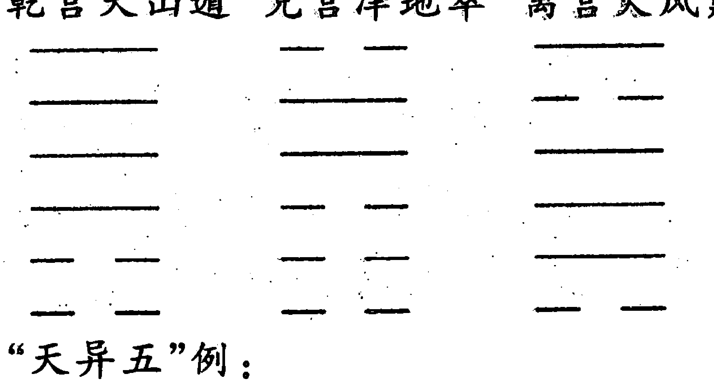
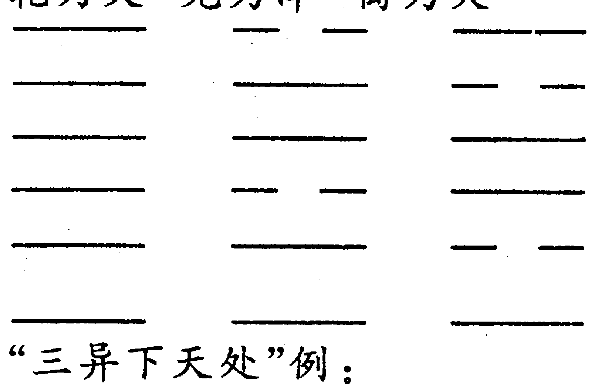
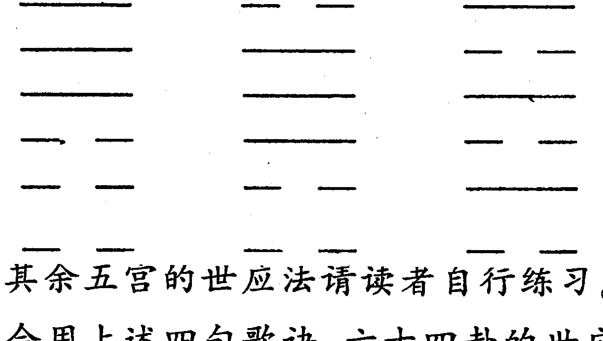

# 六爻答疑

## 前言

应广大易学爱好者的要求，将近几年学员所提出的易学方面的疑问整理成册，编辑出《四柱答疑》《六爻答疑》两部书。

这两部书中的问答，有一部分曲炜老师亲自解答的，也有一部分是中心其他老师给予解答的，内容涉及面很广，有的是曲老师著作上的问题，也有些是书外的问题，是学员在实践过程中遇到的问题。为了充实本书的内容，同时也摘录少部分其它书中比较经典的问答，尽管有的读者会认为有抄书之嫌，但为更多易学爱好者的方便，使得问答更加全面，尽可能从一本问答书中，多解决些易学爱好者的心中疑问，所以思索再三，还是收录进来了。

原计划书在 2004 年 5 月出版，但由于中心业务格外繁忙，不得已一拖再拖，至今才与广大易学爱好者见面，希望广大易学爱好者理解。

由于成书比较匆忙，尽管中心各位老师都尽力去修改、校对，但限于水平和其它因素，错误和疏漏之处也在所难免，希望广大易学爱好者见谅，也恳请提出宝贵意见，给予斧正、完善！

有问题请通过下面方式与本中心联系：

- 来信地址：辽宁省瓦房店市鹏程家园 9 号楼三单元 407 室（曲宝兵收）
- 邮编：116300
- 电话：0411-85675001（传真）
- 电子邮箱：dlqw168@163.com
- 中心网址：www.dlqw.com

> 【致盗版商：我们无法控制你们的盗印，但希望在盗印过程中要讲点道义，不要将此联系方式抹去，切断了作者与读者的联系，读者若有疑问很难得到答复，所以在此希望贵商手下留情！须知，有了我们的发展，才有你们的生存，切断作者与读者的联系，也就切断了你们的财路，其中利害，你们商家肯定比我们要清楚得多。也希望不要乱加乱改，加一些不是原书中的内容，会造成读者的误会，以前《四柱详真》《六爻详真》《六爻多重取象》《四柱信息取象》等好多曲老师的易学著作，都有添加和篡改现象。】

曲炜信息咨询中心

2004 年 6 月

## 一、对易学的认识

### 一问：周易预测到底有多准？有的大师说周易预测准确率是 100% 的，由老师怎样看？

答：就现阶段周易研究情况来看，六爻预测其准确程度可以达到 80% 左右这样一个准确度，个别高手预测平均准确度可以达到 85—90%。虽然有些卦例我们可能测得 90% 以上甚至 100% 的准确度，但不等于卦卦都能达到这样的高准确度。如果六爻预测平均准确度可以达到 90% 以上，甚至像有的大师说自己的预测准确率是 100% 的，那么他为什么不去测足彩？他拿了几个足彩大奖？其谎言只要我们稍微用理智去分析一下，便不攻自破。

### 二问：为什么六爻预测不能达到百分之百？影响预测准确度的原因有哪些？

答：世界上没有绝对性的东西，科学的任何领域都有偏差，都不是百分之百的。六爻预测学它也是科学的一个领域，自然也不可能是百分之百的。

影响六爻预测准确度主要有下面几个原因：

1) 六爻预测这门学科的理论本身就不是十分完善的，还存在着一些盲区，不但六爻如此，其它任何科学领域都是如此，都只能是不断地去完善，永远只能是接近完善。  
2) 预测者本身的预测水平。  
3) 预测者的状态，预测者的心情状态不好，思维就受到一定影响，自然就影响断卦的准确度，这就像人的临场发挥一样，情绪好可能正常发挥或超水平发挥，情绪不好可能有水平发挥不出来。  
4) 求测者摇卦时的意念是否集中。

上面这几个方面都不同程度影响着预测准确度。

### 三问：有人说《周易》是骗人的，像街面上打卦算命的，到处胡说，到处骗人，如果是科学的为什么老出错？包括很多大师，也老是测不对。

答：周易本身是科学的，但科学不等于不会有错，比如你在累计账目时，可能会出错，但不能因为出错就说数学是骗人的；医生可能出现误诊，甚至有些疾病根本也诊断不出来，但没有人说医学本身是骗人的；天气预报，出错的频率也很高，为什么国家不但不禁止还天天在播报？为什么没有人说天气预报不是科学的？这是人们对《周易》本身的不公平。社会上有很多庸医、假医、假药，他们也在到处骗人，人们都能理解这不是医学本身的问题，而是人的问题，我们不会因为有这样的假医、庸医而全面否定医学这门学科。同样也有许多人打着周易旗号到处去骗人，但这也不是周易本身的错，为何因此却全面否定易学这门学科呢？任何一门学科都有两面性（阴阳性），都有积极的一面，也有负面影响。但我们不能因为它有负面影响，而就不去研究它，甚至否定它、扼杀它。比如，电的作用性很大，给社会带来很多积极因素，但电又会引起火灾等。再如枪支，有利的一方面可以起防护作用、消灭敌人，但犯罪分子却用来危害人民和社会安全。其实这些东西本身没有错，关键是操作它的人，是人的因素改变了它的效应。周易也是一样，有人利用周易来骗人；也有人运用周易来为人类造福。这关键是怎样杜绝骗人的问题，而不是全面否定的问题。我们不会因为有医生骗人，有医生误诊而不去看病，甚至取消医院、诊所，而是需要运用各种手段打击这些假医、假药，尽量避免此类事情的发生。医学如此，易学也应如此，这样才公平。所以用一种平等、公平的心态和思想来看待周易这门学科，用辩证的思维去了解周易，才是科学的态度。任何极端的做法都是不正确的。周易不能达到百分之百，是这门学科本身有其局限性，这也是正常的。有些大师也经常断错，这也是正常现象。出错是正常的，不出错反而不正常。科学是无极限的，而人的精力、智慧和知识是有极限的，所以用有限的智慧和知识永远不能完全解决无限的问题。在考试中，有时会的问题都可能答错，何况在自己极限之外的不会问题，所以要正确看待大师的对与错，不要仅凭一卦、一个八字论英雄。

### 四问：我是一个刚接触《周易》的爱好者，不知四柱和六爻哪个更准些？我学哪门更好些？

答：四柱和六爻，本身二者是互补的，各有各的长处，又各有各的局限性。形象地说，四柱就像一个面，它有广度，通过四柱可以看出命主一生大象，例如行运吉凶情况、六亲情况、财官运情况以及性情、喜好等等；而六爻就像一个点，它可以将日主的任何一个时间分段，将一个具体的事聚焦、放大，测出每一点的具体情况。如果想了解人的一生各方面状况，运用四柱预测能全面些、准确些，因为它能给人生一个基本定位；而六爻在测人的一生方面显然没有四柱定位准确与全面。若测一个具体事情或一个随机事情，例如测某一天具体运气和要发生的事，六爻就可以测出，显然四柱难以达到这样的境界。还有测比赛及他人、他事等等，四柱根本无能为力。所以这两门学科各有长处，因此最好这两门同修，这样才能优势互补，且这两门学科某些地方都有相通之处，可以互相促进。

### 五问：你的六爻预测方法是新法还是老法？你对这两派怎样看？

答：我的六爻预测方法基本继承了古代传统方法，在传统基础上又有了新的提高与发展。

至于新法与老法（传统方法），笔者认为不应相互否定，这不是科学态度，而应通过长期不断实践来检验，只有这样才能进一步验证其使用价值到底哪个大。现在笔者只采用传统断卦方法，原因有：传统方法是由几千年流传下来的，是经过几千年不断发展、验证的，而且经过笔者多年来的实践，准确率颇高，所以笔者认为，古法不可否定，而且应大力发展。至于新法，只是一种新生事物，它的使用价值尚需长期验证，不能仅靠几卦来证明，因为即使是完全错误的理论，用它来断事也会有 50% 左右的正确几率。因为事物都有两面性，比如你测成败，不用预测只要瞎猜，有 50% 的几率可以猜对，如果你有些社会经验，会猜对 60% 左右。

### 六问：现在易学界鱼龙混珠，各种歪理邪说充斥着易学领域，各种理论相互矛盾，很多易学爱好者越学越糊涂，怎样来区分其理论真伪？

答：笔者对有些理论没有接触过，也不能妄加议论。笔者区分真伪有这样一个经验：

- 1. 凡是将自己吹捧成神一样的，你要当心有欺诈性。因为真正的有学识之人，像我们社会中的科学家，总是十分谦逊，说话相当有分寸，都具有一种谦虚谨慎的态度。成熟的谷穗总是把头压得很低，只有那瘪谷才把头仰得高高的随风飘摆。搞易学研究的更应有学者之风，要实事求是，来不得半点虚假。  
- 2. 到处说人家不行，只有自己最高的，这是想打击别人抬高自己，心术不正，怎能为人师表？明显是一种心虚的表现，因为没有一套真正成熟的理论来证明自己的实力，所以只能靠打击别人来抬高自己。能够认可别人的优点，说明自己还是有实力，不怕被别人比下去；把别人说得一无是处，肯定有不良用心！  
- 3. 看他的易学理论，是否与社会、自然规律相一致，不一致的必然是歪理邪说。

### 七问：现在易学界大师很多，谁的预测水平最高？

答：你问的这个问题很难有一个准确答案，因为这些大师有些我根本没见过面，也没有亲眼见过他们给人断事，更没一起测验过，很难判定孰高孰低。况且人有专长，术有专攻，正像医生一样，分内科、外科，内科医生诊断内科病拿手，而诊断外科病恐怕不行；外科医生看外科病拿手，而诊断内科病不行。对我们易学界也是一样，可能有些大师测这方面事擅长，而另一方面差些，不可能测所有的事都精通，怎样去评定？所以高下难分。总之，人外有人，天外有天，每一位大师无论总体实力如何，都有我们值得学习的一面，我们只取他们的长处。正像孔老夫子所云：“三人行，必有吾师也，择其善者而从之，其不善者而改之”。不必非要分出个高低来，只要有一个优点，都可以学。

### 八问：对您的实际预测水平及学术理论我很佩服，为什么不大力宣传，让更多人受益？

答：谢谢您对在下的评价，我并不是不大力宣传，我也很希望有更多人学习我的理论，从而为社会造福。只是在宣传这方面我不想把自己包装成“神”，那是一种泡沫效应，可能在很短时间内会带来一点效益，但时间长了泡沫会碎的。我还很年轻，很可能以此为终生事业，仅靠吹捧自己难以长久，况这也根本不是我的性格。我觉得踏踏实实做人，真真切切干事业，才能长久立于不败之地。所以我始终本着这样原则：事业发展需要宣传，但要实事求是，决不搞过头宣传！很多详细看过笔者的拙著的易友都有体会：书的价值与宣传是一样的。正因为此，笔者才敢始终承诺：“购笔者的书如不满意就可全额退款”。而迄今为止，还没有一位因书的内容不满意而要求退款。所以笔者始终认为善待读者，真诚做人，才能持续稳定发展。您若购买了笔者的正版书，如果有疑问，请与电话：0411-85675001 联系，或写信咨询，住址是：辽宁省瓦房店市鹏程家园 9 号楼三单元 407 室（曲宝兵收）（原地址稍有改动，电话不变，以此地址为准。），邮编：116300。电子邮箱：dlqw168@163.com。网址：www.dlqw.com。

### 九问：一卦多断的范围到底有多大？刘文德的书中一卦多断四例是否真实？

答：一卦多断，可以提取很多与求测之事有关的信息，与求测之事无关的信息根本体现不出来。有时即使说准了，那也是巧合而已。一卦多断并不是漫无边际随意提取信息之象。并不是断学业之卦可以提取求测者的其它信息，例如哪年搬家，哪年爷爷死了，父母怎么样等等，这些信息根本体现不出来。断学业之事若想一卦多断，可以提取与学业、学习有关之事，例如：现在学习成绩如何？考试的临场发挥水平如何？大致哪些科目考得好些？哪些差些？会考上什么样的学校？学校方向在何方？离家的远近等等有关学业这方面之事，可以从卦中提取出来。

刘文德的书中一卦多断四例是否真实，在下没有亲眼看过，不能妄加判断。

## 二、基础知识问答

### 一问：摇卦时三个铜钱夹在手心摇六次，请问每夹一次（一分钟后）要摇几下才松手让铜钱掉在地上或台面上？另外铜钱放在手心要不要分反正面放置？假定要分反正面（有字的一面）应该盖向哪只手心？此外，每摇一次都要分出反正面放置才算是正规操作吗？

答：摇卦时三个铜钱放在手心不需分反正面，心中只想自己要求测的事，待自己意念完全沉下来之后，就可摇卦。只要意念集中，不必非要等待一分钟才摇，而且摇卦时不必理会摇几下才松手，随意摇几下，只要能将手中铜钱摇开即可。摇完一次，拾起铜钱不间断地连续再摇五次即可，且也不必分正反面。

### 二问：亥时和子时可不可以摇卦测事？因为这是两天时间交接时，气场有别吗？

答：亥时和子时可以摇卦测事，每一天的任何时间都可以摇卦测事。只要意念集中，测事都准确。

### 三问：测求财、婚姻、工作的正规预测法是用铜钱摇卦，那么还有哪些事项应该用铜钱摇卦？

答：预测任何事情都可以用铜钱摇卦。

### 四问：也有人随时随地要问求财、工作、婚姻等等一些事情，手上又没有铜钱，像这种情况可不可以起时间卦，用六爻预测准确吗？假设不准确那么应用哪种方法进行预测？

答：俗话说，特殊情况特殊对待，卦随自然，起卦的方式也应随着自然条件的改变而改变，不是一成不变的。随时随地问卦，手上没带铜钱，这是特定的环境和情况造成的，必然要靠起时间卦或报数、看来人方向、看来人年龄、或穿着衣色等等一些方法来起卦。这时起出的卦要用梅花易来预测比较准确，不必用六爻预测。用六爻预测不是绝对不可以，但是准确率要低些。因为这时间卦也只是个简单起卦场所，测卦的器具不全，只能避繁就简，所以就应用简单方法来预测，不必用繁琐的六爻来推断。

### 五问：我本人在某一时刻，突然想起有某件事要办，请问就按心想起此事的时间起卦，再用六爻进行预测，这样的预测结果准确吗？遇到这种没带铜钱的情况下，应该用哪种方法进行预测？

答：这种情况可以起时间卦用梅花易来预测，最好不要用六爻来测。还可以根据周围的人数，或者随时翻书，依页码起卦，第一次翻出的页码数除八为上卦，第二次翻出的页码数除八为下卦，第三次翻出的页码数除六为动爻。按着梅花易来预测，等等还有很多方法。

### 六问：用时间卦和摇卦分别如何去知道自己的孩子外出时，去了哪个方向，距离有多远？在那里做什么？是不是和一些不三不四的朋友在做坏事、喝酒、赌博、打架……还是真正在办相应的正事等等，在卦中、六爻、六神中，要如何才能看出端倪？另外距离的计算单位是以米来计算还是以华里或公里来计算？此外断这卦的操控程序我也不太清楚。虽然有时偶能碰准一两次，但终究不知应用规律、规则，就有损学易信心，所以在您的培育下，一定能实现这一心愿。

答：要真正完整清楚回答这个问题，需要费很大篇幅，且要运用到很多易学知识，不是几句话能表达得明白。类似这样的问题在曲老师的《六爻详真》及《六爻特训班讲义》中有较详尽的论述，在此不赘述，请谅解。

### 七问：内卦反吟，内不安；外卦反吟，外不宁。内卦反吟，我乱他定，外卦反吟，他乱我定。用神反吟、伏吟百事不顺。请问：内卦反吟，内不安，内卦反吟我乱他定，如果世爻或用神都在外卦，那么应该断我宁我也不乱，对不对？反之也一样断自己吉祥，对吗？用神遇反吟、伏吟百事不顺，请问这个不顺的深度又如何判断？

答：一般来说，世爻或用神不在反吟之内，是一种我定之象。宁不宁，定不定，只是表明一种心态、一种思想上的相对稳定状态，并不决定吉凶。吉凶必须依着生克制化原理看世爻或用神受克及旺衰程度来综合论述。所以世爻或用神不在反吟伏吟之内也不一定吉祥，而世爻或用神反、伏吟也不一定结果就不吉祥。用神遇反吟，必然做事反复不顺，若用神被冲克越严重，不顺的程度也越深，反之则越轻，这也要看冲克用神的那个爻的旺衰来决定。

### 八问：我本人测父母、子孙、兄弟、妻财、官鬼，可用神不在世爻之位，那么，世爻又代表什么？什么时候需要看世爻？什么事又不需看世爻？反之，用神、世爻都在世爻之位上，又将如何各自论述？

答：自己测他人（包括所有的六亲及朋友），不论用神在不在世爻之上，都是以用神为核心，看卦中动变之爻对用神的作用来论吉凶，而一般是不必考虑世爻代表什么。用神不在世爻，世爻也是普通的一爻（也代表求测人自己）。用神持世，是世、用同位之象，这世爻主要体现的是用神所代表的人的信息，初学者可以只作用神来看，不必考虑世爻的问题。

### 九问：主卦是六冲卦，变卦则是六合卦，断：用神衰弱无结果，用神旺相有好的结果，对吗？主卦是六合卦，变卦是六冲卦，不管用神旺到什么程度其结果必然失意，但有可能失意得比较体面，或者说比如要散的宴席时间会延长一些，对吗？

答：不管是六冲变六合还是六合变六冲，其结果吉凶一般不是以合冲来论的，事情的结果是以五行生克结果来评断的。当然在测特定的事情，合与冲也揭示着事情的结果。古书有云，测喜事喜合忌冲，合则喜事长远，冲则喜事易散。测忧愁之事，喜冲忌合，冲则忧愁易散，合则忧愁缠绵。还有比如测出行，六冲变六合，难以出行；六合变六冲则可以出行，人可以走成，但到底走出去是吉是凶，不是以合冲来论，而是以用神来论的。再比如测官司，遇六冲卦，官司易散，很快就会了结，至于了结结果输赢，必须看世、应力量来决定。合与冲一般来说只揭示事情结束的快慢，并不揭示事情的吉凶。

### 十问：用神是静爻，但陪同动爻一起变出之变爻，对本位用神有回头生克权吗？在进行时中，日建和月建临位于这个变爻时，怎么论其生克权和生克力量？

答：你问的核心是不是用神不动，而用神随着卦变所变出来的本位变爻是否对这同位用神有生克冲合作用，对吧？回答是：有作用。在进行时的日建和月建值这个变爻时，这个变爻对用神的作用力就大，相当于日、月直接的作用力。

### 十一问：用梅花易数起卦可不可以用六爻纳甲法去推断吉凶？

答：可以，但准确度没有用梅花易数去判断准。确率高。用什么方式起卦，就应用什么方式去推断吉凶，是最符合易理的。用梅花易数起卦，以梅花易数的方法去推断吉凶，是最理想、最适宜的判断方法。

## 十二、在六爻预测中是否也可以用体用关系参断？比如只有一个爻动的时候？

答：即使卦中只有一个爻动，也不可以用体用方式判断，因为是摇的卦，就要用摇卦的方式来预测，两者不可混淆。

## 十三、要掌握断卦的一些基本规律，规则大致有哪些？

答：这个问题简而言之，就是地支的刑、冲、合、害和一些空亡、伏藏、入墓、反吟、伏吟、进退等一些断卦规律问题。

## 十四、问：刑、冲、合、害在断卦中如何应用？

答：其实刑、冲、合、害就是一种生克的特殊表现形式，刑与害，可以按正常生克来论。冲与合有些特殊规律，这方面的具体应用规则见曲老师的《六爻详真》《六爻特训班讲义》二书中有关合、冲的论述。

## 十五、问：一般在六爻预测当中，大多都只用生、克、合、冲，很少用刑、害，尤其是相害，有用吗？

答：刑、冲、合、害都是有用的。说它是生克的一种特殊表现形式，就是因为有了这种刑、冲、合、害关系，在地支间才能建立起生克顺序。一般是先论合与冲，再论刑，接着论害，最后才是那些没有关系的地支之间的生克。

## 十六、问：既有刑、冲、合、害先后顺序理论，与爻的四个层次理论是否有矛盾的地方？

答：不是的。在同层次爻中，生克顺序是按着合、冲、刑、害顺序来进行生克的，合与冲并列排在第一位，接着是刑，其次是害，最后是没有特殊关系的。当爻的层次不同时，这些生克顺序被打乱，生克顺序便发生改变，下层次爻间的刑、冲、合、害都得让位于上层次爻。

## 十七、问：曲老师爻的四个层次的提出，是在李洪成老师爻的三个层次的基础上提出的，变爻为第二层次。变爻通常都对本位动爻产生作用，怎么能对主卦中的其它爻产生作用呢？

答：变爻对主卦中其它动、静之爻产生生克冲合作用是有条件的。当变爻与本位动爻无生、克、合、冲作用关系时，变爻就会对主卦中其它爻产生生、克、合、冲作用，这是经过长期实践总结出的结果。

## 十八、问：如果卦中的静爻值日建或月建，那它就成为第一层次爻了，那就可以冲、克动爻或变爻了吧？

答：值日或月建的静爻不能冲、克动爻或变爻。因为值日、月建的爻只是相当于第一层次，而它并不等于具有第一层次爻的权力，它只具有第一层次爻的力量。所以它虽然有第一层次爻的力量，但没有第一层次爻的权力，它的本质地位还属于静爻这个层次，只是力量属于第一层次爻的层次，因此它还是无权冲克动爻及变爻。

权力和力量是两个概念，所以不要将两个概念混作一团。

## 十九、问：卦中值日建或月建的静爻，动爻、变爻能否克伤它？

答：值日、月建的静爻，动爻、变爻都克不伤它。因为它的力量相当于第一层次爻的力量，当变更日、月建，克它的动爻之爻上升为第一层次爻时，可以克伤原象值日、月建第一层次爻。

## 二十、值日、月建的静爻对卦中的动爻是否有生克权？

答：没有。

## 二十一、问：月建和日辰是谁为主，如月与日相冲克如何看？

答：月建与日辰是同功同权，都为第一层次爻。月建在当月之内有第一层次的生克权，过月则没有；日辰是在一年四季都有生克权，再进一步说，在所测事情没结束前均有生克权。至于月建与日辰相冲、相克、相合等均不论。

## 二十二、问：在书中一般只写月建、日辰，而不是写流年太岁和时辰，是否太岁和时辰就没有用了，根本不用去管它了？

答：流年太岁和时辰在断某些事上也是有用的。比如测长期事或测终身运气卦时要用流年太岁，而时辰一般在测短期事情时作用较大，比如测一日之内或几个时辰之内的事情，要参看时辰。

## 二十三、问：暗动之爻能属于第三层次爻吗？那么暗动之爻的变爻能为第二层次爻吗？

答：暗动之爻是由静爻上升为第三层次爻，但其变爻不能为第二层次爻。因为暗动之爻本身没发动，而随着卦中其它爻发动所化出的变爻不能视为第二层次爻。

## 二十四、问：如何把握六爻五行之间的生克关系与力量比较？（摘自《八卦答疑》）

答：由于六爻中主要以地支形式进行生克。

#### 1. 亥、子水生木力量差异分析

一般来说，亥水生木的力量总是比子水生木的力量强一些。这是因为：

- ① 亥水是木的长生之地，长生为方长之气，其进无涯；而子水却是木的沐浴之地，俗称败地，虽也可生木，但其力远不如长生也。
- ② 亥水藏人元壬、甲，人元甲木是木的盘根之地，对木具有扶助的作用；而子水仅藏人元癸水，其气尚清，无养木之功。
- ③ 亥水可与寅、卯木合成木局，如寅亥合木，亥卯半合木局，且合局比较稳固，力量比较强大；合化后亥水的特性转化为木，亥水失去原五行的作用，不能泄金制火，而子水与寅、卯木无亲合之情，却有游离之性，子水生木的同时仍可泄金之气，制火之威。

综上所论，我们可知亥水生木的力量无疑是大于子水生木的力量。

#### 2. 寅、卯木生火力量差异分析

一般来说，寅木生火的力量大于卯木生火的力量。其理可依前例类推。

其余申、酉金生水，巳、午火生土，也可以从地支人元藏干中找出它们之间力量的细微差异。这里囿限于篇幅，兹不再一一罗列分析。在此从地支人元藏干的角度分析一下辰、戌、丑、未土克水的力量差异：

辰、戌、丑、未土由于地支人元藏干的不一，其克水的力量也各有差异。我们知道，辰藏人元戊、乙、癸；戌藏人元戊、辛、丁；丑藏人元己、癸、辛；未藏人元己、丁、乙。在这四土中，丑、辰为湿土，丑为水乡，辰为水库；未、戌为燥土，未为火乡，戌为金地。丑、辰两土克水的力量明显小于未、戌两土。下面我们从支中人元作进一步的详细分析，便可一目了然，洞微索隐。

细究之下，丑、辰两土克水的力量也不一样。丑中辛金、癸水，皆助水势，支中人元形成了己土生辛金、辛金生癸水的连续相生之势，三元生化不停，土水通关有情，土金之气终极于水。故一般情况下，丑土克水的力量较弱；且局中亥、子水旺时，丑土多以半会水局论。

而辰土支藏人元戊、乙、癸，支中除人元癸水余气外，乙木、戊土皆克泄水势，且乙木、戊土其气皆强于癸水，故辰土克水的力量较丑土强。

再看未、戌两土，其克水的力量也不相同。未为南方火乡，火炎土燥，支藏人元己、丁、乙，本支中三元皆无情于水。木、火、土连续相生，克泄耗俱全，故未土克水的力量十分强大。

而戌为西方金地，金之余气尚存，支藏人元戊、丁、辛，火、土、金气连续相生，火土之气流归终极于金，且寒露后水气渐进，燥气渐敛，皆有情于水，故戌土克水的力量稍弱于未土。

权衡之下，辰、戌、丑、未四土克水的力量按其力量大小而论，可依序排列如下：

- 未 > 戌 > 辰 > 丑

从以上分析中我们可以看出，支中人元藏干对五行生克力量的影响是不容忽视的。但这种影响却还不是影响生克力量的全部，而五行之力的方向也在其中起着重要的作用。书中常说“冲”比“克”的力量要大一些，因为“冲”是“克力+斥力”二者力量的汇聚，而“克”只有单纯的抑制能力，即“克力”。所以在一般情况下，“冲”比“克”要彻底一些。我们可以申、酉金克木为例举例说明（仅限于地支）：

申、酉金克寅木：

一般来说，申金克寅木的力量较酉金强。申金克寅木，是连冲带克；而酉金克寅木却只有克力，谓只克不冲。

这里有一个疑点，申中藏壬水，且又为水的长生之地，在一定程度上似乎可以起到金木交战的通关作用，但殊不知，申亥相冲，支中人元一片混战：申中庚金克寅中甲木；寅中丙火克申中庚金；申中壬水克寅中丙火；寅中戊土又克申中壬水。支中人元各有伤损，申中壬水不能为用，无法起到金木交战的通关作用，故申金重克寅木，更甚于酉金。

同理，申、酉金克卯木的力量也是不同的。一般来说，酉金克卯木的力量甚于申金。这是因为酉金克卯木是连冲带克，而申金克卯木却是只克不冲。

其余亥、子水克火，巳、午火克金，寅、卯木克土等，其力量都不是完全相同的。读者可以从地支人元藏干中分辨出它们之间的细微差异。

## 二十五、问：地支六合中生合与克合有何区别？谁容易成化？为什么？（摘自《八卦答疑》）

答：地支六合按其生克形式可分为生合与克合两种，生合包括寅亥合、午未合、辰酉合；克合包括巳申合、卯戌合、子丑合。

我们知道，地支藏干是影响六合的内部因素。地支藏干的不同，使六合之间产生了巨大的差异，如寅亥合木、辰酉合金、午未合土，合力强且极易成化。相对来说，子丑合土、卯戌合火、巳申合水就要困难一些。地支合化与否，与其自身的条件密切相关。如果说时令是影响六合的外因作用，那么地支藏干的自身条件则是决定六合亲合力与合化与否的内因作用。

可以说，地支藏干气数是决定着合化的首要先决条件。一般来说，生合极易成化。譬如寅亥合木，寅支所藏人元为甲、丙、戊，以甲木为其本气；亥藏人元为壬、甲，以壬水为本气、甲木为中气。寅亥合，亥中壬水生寅中甲木，且亥中甲木又与寅中甲木聚合，更增强了木的力量。

辰酉合金，辰支藏人元为戊、乙、癸，其中戊土为18气，乙木为9气，癸水为3气，以戊土为其本气；酉中藏干为辛金，纯而无杂。辰酉合，辰中戊土生酉中辛金，癸水也有润土制火卫金之功，致使金气更盛，且酉金本身就充当着化神的角色，因而辰酉合金极易成功。

午未合土，午中藏干为丁、己，以丁火为其本气，己土为中气；未支藏干为己、丁、乙，其中以己土为本气，丁火为中气，乙木为余气。午未合，午中丁火生未中己土，且午中己土与未中己土聚合，土之力量更强，故午未合土极易成功。

与生合相比，克合的合化情形就大不一样了。克合由于本身条件的“先天不足”，若要成化就特别需要外力的引动催化。

如卯戌合，卯支藏干乙木，无杂气；戌中藏干为戊、辛、丁，其中以戊为本气，辛为中气，丁为余气。卯戌合，卯中乙木克戌中戊土，故戌支土的特性被抑制；而戌中辛金又冲克卯中乙木，卯支木的特性也不能充分发挥。故卯戌合，木土两行皆难成化，唯有卯中乙木生戌中丁火，又有木、土两行制水卫火，成中一点丁火得以生发，故有卯戌合火之意。但戌中丁火不为本气，其势不盛，又蓄于库中，无从引化，故卯戌合火若无外力引动则不易成化。

巳申合，巳中藏干为丙、戊、庚，其中丙火为本气，戊土为中气，庚金为余气。丙火之气流于戊而归于庚，故庚、丙得以共存，庚金又长生于巳。而申支藏人元为庚、壬、戊，庚为本气、壬为中气、戊为余气，申中壬水长生于申金，为方长之气，其进无涯。故巳申合，而金得盛，水得生。所以水长生于申，申又长生于巳，巳申之气流归终极于水，故巳申合化水。但巳申合，申中壬水为方长之气，其势较弱，一般较难成化，若无外力引化，不以化论。

子丑合，子中藏癸水，气清不杂；丑中藏干为己、癸、辛，以己土为其本气，癸水为中气，辛金为余气。子丑合，丑中己土以本气之力克抑子中癸水，欲使癸水臣服于己土，则子水的特性受到抑制，不能显现，从而从土而化，故子丑合化土；但子丑合，支中人元癸水加盟，水势大增，加之丑中己土生辛金，辛金生癸水，故子丑合土更难成化。若无外力催化，一般不以化合论。

从上述分析中我们可以看到，生合与克合之间的差异主要体现在地支藏干方面，可知地支藏干是决定六合成化与否的先决物质条件，在六合中起着举足轻重的作用。

## 二十六、问：地支三合局中的长生、帝旺、墓库之支在合局化后会有什么变化？

答：地支三合局成化后，一般是中神之支的力量得到加强，长生之支和墓库之支的力量被削弱或得到抑制，其性质和功能发生转变，已转化为中神的特性。譬如我们以寅、午、戌三合火局为例，寅午戌三合火局成化后，火的力量得到加强，而寅、戌两支的性质和功能也随之发生变化，转化为火的特性。这是因为寅为火的长生之地，戌为火的墓库之乡，寅、午、戌三支皆藏火，支中人元可谓是“同声相应，同气相求”，且寅木生午火，午火有源，其势不绝，其焰更烈。戌土可制水卫火，其形无损，拱卫有性，故寅午戌三合火局，寅、戌两支皆有利于午火，火势得生拱扶卫，其势更猛。所以一般在三合局中，中神之支的力量得到加强，长生、墓库之支的力量得到削弱或抑制。

## 二十七、问：墓地半合，什么情况下以半合局论？什么情况下以入墓论？

答：墓地半合，一般是由三合局中缺乏长生之支，仅由帝旺之支和墓库之支而构成的合局。墓地半合局有四组：如午戌半合火局、卯未半合木局、子辰半合水局、酉丑半合金局。这四组半合局除酉丑半合金局外，其余三组合局相对来说较难成化一些。这是因为半合局中缺乏长生之支，中神缺乏源头之生的缘故。这就好比成了无源之水、无本之木，或是薪尽之火，容易发生水竭、木枯、火熄的变故。故这种半合局力量一般不是特别强，远不如生地半合和三合局，故这种半合局一般难以成化。其合化与否，关键就要看中神力量的旺衰强弱。如果半合局中中神的力量较强，当令得势，此时半合局成化，当以合局论；若中神的力量较弱，未能主导全局，此时当以入墓论其吉凶。

## 二十八、问：地支之冲，如何论胜负？如子水冲午火，或午火冲子水，到底是谁胜谁败？

答：地支六冲看似复杂多端，但化繁为简，其实质归根结底就是一个生克的问题。生克之结果，必然会涉及到一个胜负的问题。两支相冲后的胜负状态，是由多元因素的影响而形成的，而支神的五行特性就是影响六冲胜负的重要因素之一。一般是木克土、土克水、水克火、火克金、金克木的制约秩序。从五行特性的角度来看：水克火，乃刚胜柔；火克金，乃精胜坚；金克木，为刚胜柔；木克土，为专胜散；土克水，为实胜虚。因此，五行本身的特性是决定六冲生克胜负的物质基础和先天条件。故单纯地从五行特性的角度讲，寅申冲，申胜寅败；卯酉冲，酉胜卯败；子午冲，子胜午败；巳亥冲，亥胜巳败。辰戌丑未之本气相冲，不在此例。

除地支的五行特性对胜负有影响外，时令也是影响六冲胜负的非常关键因素之一。

时令主宰天地之气，为干支之提纲、万物之主宰。人事之兴废，草木之荣枯，莫不是时令使然。故时令为天为君，握万物兴衰之权，司人事进退之举。故六冲之支，当令得气者兴，失时退气者衰，旺可胜衰，强可胜弱。故有“金能克木、木坚金缺；火能克金，金多火熄；水能克火，火多水干；土能克水，水多土流；木能克土，土多木折”之理，此乃五行乘旺反侮之象，六冲之理莫不如此。故子午冲，子水旺则午火败；午火旺则子水败。其它相冲之支的胜负可依理而类推。

## 二十九、问：土旺于四季月，是否是每季月土的旺度都一样？或者说，到底是哪个月的土最旺，哪个月的土最弱？

答：四季月，指的是辰、戌、丑、未四个月。一般来说，土在这四个月的旺度是不一致的。通常是土在未月其气最旺，在辰月其气最弱。如果按土在这四季月的旺度大小依序排列的话，则可以按从旺到弱的顺序依序排列如下：未月＞戌月＞丑月＞辰月。这是因为四季土所处的时令状态不一致和地支藏干各不相同而形成的。我们知道，未月火有余焰，母旺子旺，火土母子相生，其旺可知；戌月金有余气，子泄母气，虽为火库，但气势稍逊于未月；辰月乃木之余气，木旺土虚，清明后辰中乙木主事9日，故气又衰于戌月；丑月水有余气，水土皆冻，其气更衰。

再看辰、戌、丑、未各地支藏干，更可窥见一斑：

未支藏人元乙、丁、己，支中人元一气相生，乙木生丁火，丁火生己土，木火之气流归终极于土，故土毫厘未损，其体甚实；

戌支藏干为戊、丁、辛，人元火土相生，皆助土势，但不宜辛金盗泄土气，故其形稍虚；

丑支藏干为己、辛、癸，人元辛金、癸水，皆盗泄土气，其形不全，其势很虚，更虚于戌土。

辰支藏干为戊、乙、癸，人元水木相生，皆凌土势，故其形自损；又辰为木旺之地，故辰土其气最弱。

综上所述，可知土在每一季月的旺度都不是一样的，所以说未月土气最盛，其次为戌月，再次为丑月，辰月土气最虚。

## 三十、问：在六爻预测中，刑、冲、合、害这些生克关系也有先后顺序吗？

答：有先后顺序，首论合冲，接着是刑，然后是害，最后是没有特殊关系的。应该注意的是，四柱中没有特殊关系的五行生克力度很小，一般不论；而在六爻中有所区别，六爻的地支生克中是要论的，只是排在最后。

## 三十一、问：在六爻预测中爻逢合也主要是三合、六合、三会局，是否也论半三合、半会局？

答：其实半三合就论生克就行，半三会一般不论。

## 三十二、问：书中说，“同层次爻相合，合而不化，双方均减力”。那么是否双方都失去生克权？

答：在同层次爻中也有旺相与衰弱之说，往往衰弱一方失去生克权，而旺相一方仍有生克权。

## 三十三、问：P36，“静爻与静爻只有合象，没有合力，因双方都静而不动，这种合一般没有力量，不论合，但能体现一种信息之象。”请问在断卦中能体现一种什么信息之象呢，能说说吗？

答：在《六爻多重取象》书中全部讲述关于在断卦中的各种信息取象，而不是单纯的一种生克冲合的关系。静爻没有发动相合，往往表示一种内心的思维活动，是一种想法、一种精神，只不过没有明显表现出来，是一种团结友好的氛围，当然要区分生合与克合的关系。

## 三十四、问：为什么用神爻动逢生合，不论绊住为增力。为什么原、忌、仇、闲神无论生合克合都为绊住，暂时失去生克权，相当于静爻。

答：这是在断六爻卦中的一种特殊规定，是由老师多年经验总结，请遵照执行就是。

## 三十五、问：三合局如果在日、月有化神，就是合化成功。这时对三合局中的第一个字和第三个字是否全部被变成化神的五行，如果用神是第一个字或是第三个字，那就是不好，不成事了？

答：如果有化神成功，就按化神之五行论。第一个字是生化神的，受到了化泄严重，第三个字也受到了伤害，如果是用神当然不吉利。

## 三十六、问：卦中之爻只入高层次爻之墓，而有的也入同层次爻的墓无生克权，如卦中有子与辰都发动，午与戌都发动，午与子就入墓，没有生克权，为什么？

答：像这种在卦中动爻不是入墓没有生克权，而是因子辰、午戌半合局而没有生克权之故。

## 三十七、问：有的书说爻入月墓过月可解，爻入日墓过日也可解，是否真的就不用冲爻合墓就可解了呢？

答：在实际断卦预测中并非如此，因爻入月墓、入日墓已留下这种入墓之象，一般来说必待合墓、冲墓来解，才能把入墓之爻冲出，才有生克权，只有特殊情况例外。

## 三十八、问：在什么情况下，静爻不入动爻之墓？

答：当墓爻在受到上层次爻的伤害，失去生克权时，静爻就不入此动爻之墓。如受到日、月、变爻的冲、克、合等情况下便失去生克权。

## 三十九、问：为什么发动之爻不空，变爻旬空，动爻也随之旬空，无生克权，它的解空方式是什么？

答：有句话“玄机尽泄于动变之爻”。凡发动之爻都有它发动的玄机所在，即使爻发动了，变出旬空之爻，就说明它与旬空的地支也就是变爻有关系，或是有联系，也揭示着动爻也就随之旬空。它的解空是必须待变爻出空才有生克权，冲动爻、冲旬空之变爻都无用。

## 四十、问：能说说“临界状态”在我们判断卦爻旺衰时的用处吗？

答：“临界状态”是我们在日常生活中经常会遇到的事情，如某人为某事在十字路口徘徊一样，当你拉一把便能回来，有人推一把就会推过去。六爻中的卦爻也是一样，在日辰月建处在不上不下、不旺不衰的就为临界状态，这时候就要看卦中其它爻的旺衰。

临界状态实质就是处于旺和衰之间的一种中间状态。就像水一样，它也有临界状态，0℃是水的临界状态，0℃以上为水，0℃以下为冰，那么处在0℃时为冰水混合物。六爻中的临界状态也是类似这样处于一种有生克权和无生克权中间状态。

## 四十一、问：静爻的旺衰该如何判断？

答：首先要掌握静爻的临界状态。静爻在日、月一方生、一方受克为临界状态的上线；在日、月双方都休囚为临界状态的下线。这时就看卦中动爻、变爻是否生扶此静爻，若有生扶，此静爻则有气，有生克权；如有克、耗此静爻则衰弱无生克权。

## 四十二、问：动爻的旺衰如何判断？

答：首先看动爻在月令、日辰处在什么状态，也要掌握动爻的临界状态：处在双方都休囚，但不受克为临界状态的上线，这时要考虑卦中动、变爻的向背，有动、变爻生它则有生克权，有动、变爻耗克……它及本身变空、死、墓、绝则无生克权。

## 四十三、问：变爻旺衰的判断及有无生克权的判断方法？

答：变爻在日、月双方是一方休囚，一方受克，是临界状态；若受克这方是连冲带克，便无生克权。凡是在这种状况的下限则无生克权，在此种状况的上限就有生克权。

## 四十四、问：“在六合中，凡日或月与卦中之爻相合都为合而不化”，这是为什么？

答：月和日的五行是不能改变的，它是最高层次，不可能随着低层次爻改变自身的五行属性。它与卦中之爻相合就是一种牵制、绊住，在没有上层次爻解合的情况下，此爻是挣脱不掉的，所以发挥不了正常生克作用。尤其在出行卦中，合都是体现一种合而不化、被绊住的信息。

## 四十五、问：在卦爻的六合中，如卦中同时有两个静爻或是两个动爻的支是同一个字，同时与日或月合，是争合吧？请问这种争合是不论合，那么这爻有没有生克权？（如《山天大畜》卦两个寅木，假如是亥日占卦）

答：这种情况是属于争合。一般争合指用情不专，合得不牢固，但是也有一种合象，这种合只代表一种信息，并不具有多少合力。所以，争合之爻还是有些生克权。

## 四十六、问：卦变伏吟，发动之爻的变支地支也是伏吟，如果也与日辰合，那么是论变爻合还是动爻合，还是争合？生克权该如何论？（如乾卦变震卦，或震变乾，遇日辰是亥、酉、丑）

答：此种情况不能以争合论，因为变爻与动爻不是一个层次。争合是指在同一个层次之间才能出现的这种情况，而变爻与动爻不是一个层次，所以不存在争合。在具体应用上，可以看作是上层次爻合下层次爻，可以将下层次的动爻与变爻合视作两合同时存在。动爻与变爻被日建合住，暂时失去生克权，只有在解合时，才有生克权。

## 四十七、问：高层次爻能合低层次爻、能冲低层次爻，那么高层次爻的日、月或动、变爻，能同时合住两个或者多个低层次爻吗？能同时冲两个或多个同层次爻吗？

答：高层次爻的日、月或动、变爻，能同时合住两个或者多个低层次爻，也能同时冲两个或多个同层次爻。

## 四十八、问：在预测当中，什么样的事情可以代测，不用取用神？

答：凡是父母测儿女的升学、工作、考工、招聘、婚姻等，都可以不用找子孙爻为用神，以世爻代妻子女，并不是不取用神。

## 四十九、问：在六爻卦中有伏神、飞神之说，有的书讲飞生伏为泄气，得长生如何好，问到底谁生谁为好？

答：因为伏神往往是我们所取的用神，而飞神在伏神的上面，所以飞神生伏神，实质是飞神泄气。飞生伏对用神有利，所以飞生伏为好；而伏生飞为用神生飞神，用神泄气，对用神不利，所以伏生飞不好。

## 五十、问：有关伏神，有说“伏于空下而易出”，问是否伏在空爻下的飞神就不用冲飞神了，冲飞神了这伏神之爻就可以有用了吗？

答：还是要冲飞神，冲伏神为有用之应期。（当然得伏神有气。）伏于空飞之下易出现，是与伏于旺相之飞爻相比而言的，但也不是靠它自己“出来”就能出来的，照样要冲飞神或冲伏神，或是值日、月，才能引拔有用。

## 五十一、问：如果用神爻逢空，又伏的情况下是否就无用了？

答：这要看伏神爻的旺衰情况而定。如果旺相有气的伏神爻在出空，逢冲伏、冲飞之时照样有用。

## 五十二、问：伏神是否论月破、日破？

答：伏神照样也论月破、日破。

## 五十三、请问：伏神还论入墓吗？比如飞神的它爻的墓，月、日的墓，如果论入墓了，那怎样才能得出呢？

答：伏神遇有动爻之墓照入，也照入月、日之墓。这样伏神本来就不得出，又再加上入日、月、动爻之墓。其实逢冲伏神之爻的日、月，这两个问题不是都解决了吗？比如伏神是酉，入了动爻的丑土之墓，逢卯日冲酉而得出。

## 五十四、问：子与卯相见是子刑卯，还是卯刑子，这能否分清？

答：子与卯刑，实是具有一种特殊性相生关系，就是子生卯。如果卯木较旺，子水较衰弱，就是卯木刑子水，使子水受伤。如果卦中子水临日、月而旺，卯木衰弱，就生多为克，就是子刑卯。

## 五十五、问：寅、巳、申三刑，最让人头痛，不知从何断起，能说说它们相刑的关系吗？

答：这组三刑的复杂性在于有相冲关系、相合关系和相害关系。寅与申相冲，巳与申是相合，寅与巳是相害。其实还是没有脱离刑、冲、合、害这种生克关系。再利用爻的四个层次理论，看用神是否受到伤损来判断吉凶，不能一见到刑就认为应凶。最主要、最关键的是看用神有无生克权，有生克权就不论刑了。

## 五十六、问：丑、未、戌三刑，说刑的就是土旺，那么丑与未相见，是按相冲论，还是按相刑论？丑与戌相见就论刑吗？

答：因丑、未、戌三刑全是土爻，就是激起土气，使土更旺。丑与未一般情况下先论冲，因为断卦首论合冲。丑与戌相见可以论刑，实际也是土爻旺相之说。

## 五十七、问：相刑之爻是否还要发动的才算相刑？如果有动的、有静的，算不算互相之间相刑？

答：不管发动不发动都算相刑，不用看发动不发动。

## 五十八、问：请说说相害之爻是谁害谁呢？

答：子未相害，就是未土克子水，是未害子；丑午相害，实是午火生丑土，是丑害了午火；寅巳相害，实是寅木生巳火，是巳火害了寅木；卯辰相害，实是卯木克辰土，是卯害了辰；申亥相害是申金生亥水，是亥害了申；酉戌相害是戌土生酉金，是酉害戌土。相害这六组中有三组相生的、三组相克的。相生的是被生方受益，主生方受损；而相克的三组是受克方有损。

## 五十九、问：辰、午、酉、亥自刑，是日、月、卦爻中辰、午、酉、亥齐全算自刑，还是卦中与日、月自见午与午、酉与酉、亥与亥就为自刑？

答：所谓自刑的理解应从自刑的本意上来理解。“自”是自己、自我的意思。辰、午、酉、亥自刑，实质是辰辰、午午、酉酉、亥亥同字之间相互自刑，实质是力量叠加而旺的一种表现。并非辰、午、酉、亥全就是自刑，如果是这样论，那也不叫自刑，可以叫并刑。

## 六十、问：“刑”顾名思义就是主刑罚，那么世爻、用神爻如逢刑，是否就主不吉、应凶有难了呢？

答：爻逢刑不一定都主有凶事，这要看世、用是否被刑伤。世、用不被刑伤，有生克权就不会有凶、有灾。另外如逢刑，还要看卦中有没有高层次支解救，有解救的不一定会有灾，这最好用实例说明会更清楚些。

## 六十一、问：梅花易数起卦时，在右下角记上各种小单卦，弄不懂是什么意思？

答：用梅花易起卦后要取出动爻数，而其动爻是起卦总数除以六而得出的数。梅花易得出的动爻数不以数字来表示，在古时候就以先天八卦数来表示，把所得之数用先天八卦的乾一、兑二、离三、震四、巽五、坎六这些小单卦来表示几爻动。

## 六十二、问：看书上有纳甲法，在断卦中起什么作用？

答：在实际断卦中经常用得不多，但并不能说它没有用处，待到高层次的时候就能用得上，一般在断应期时能用上，比如断流年、月、日、姓氏等。

## 六十三、问：卦爻的旺衰与生克权是什么关系？是否卦爻旺相就有生克权，卦爻休囚无气就无生克权？

答：卦爻的旺衰与生克权是两个概念，它们既有联系又有区别。旺衰是决定生克权的一个重要参考因素，但不是唯一因素。爻旺相不一定就会有生克权，如果旺相逢空或入墓都会暂时失去生克权，但交休囚肯定没有生克权。

## 六十四、问：什么样的克制能达到“制”的程度？

答：制是用强大的压力将对方制服。高层次爻对下层次爻形成的克制，或者同层次爻中通过合局的力量，以及多个动爻克一个单独的爻，或者旺相的爻克衰弱之爻，可达到使受克一方受伤而不能正常发挥力量，就可达到“制”的程度。

## 六十五、问：是否八个卦宫所变出的七个卦就是本宫的内卦或本宫的外卦，所以卦中爻对应的关系就是本宫的内六亲、外六亲？

答：不是的。所变出的卦不属于本宫的内外卦，其中一爻、二爻、三爻变后的外卦是属于本宫的外卦，最后的归魂卦的内卦是属于本宫的内卦，其余都不属于本宫的卦。那么这几个有本宫的卦中对应的六亲关系，才是本宫的真内、外六亲，其余的卦都是假六亲。

## 六十六、问：有关真假六亲有区分了，如何运用真假六亲断事呢？

答：一般情况下是不用区分真假六亲的，只有在预测有亲属关系的病伤灾或是生死大关的情况下，需要找出真假六亲来判断吉凶。

## 六十七、问：内六亲具体都有哪些人物？

答：内六亲一般指本姓氏的直系亲属，如父亲、母亲、兄弟姐妹、子女、爷爷、奶奶、叔叔（姑姑没出嫁前也算内六亲）、兄嫂。

## 六十八、问：外六亲具体有哪些人？

答：外祖父、外祖母、姨、姨父、妹夫、姐夫、姑父、外甥等。

## 六十九、问：变卦的世应有没有用处？有的书把变卦的世、应都写上对吗？

答：不用写上变卦的世应，因为六爻预测一般不看变的是什么卦，而着重看卦爻的变化，看动爻所变的爻是否与用神、原神有利来判断。所以变卦的世爻与应爻可以不用写，如果您愿意写上，也无所谓，其实际应用意义不大。

## 七十、问：变爻在什么情况下对主卦中其它爻有生克作用呢？

答：当变爻对本位动爻没有生克合冲关系的情况下，便对主卦中其它爻发生生克合冲的作用。当然，此变爻在有生克权的前提下才能有此权力。

## 七十一、问：六爻能不能测终身？如能测，如何去测？

答：六爻能测终身，如测流年卦一个道理。曲老师在各书中都没论及此方面的具体预测技法，我在此不做详论。不过，用六爻测终身远不如四柱测终身那么精确，当然四柱也有误差之处，这只是一种比较而已。

## 七十二、问：“动待合”为应期病症法之一，但很多时候又论动爻在月、日上出现填实并入卦中时，动逢值时应事，请问“动待合，动逢值”如何应用？有什么规律吗？

答：用神发动逢合之时为应期，这是动待合；动逢值是用神爻发动逢值日或月时为应期。这两个断应期原则哪个在进行时靠前头，就以哪个为准。

## 七十三、问：测流年卦，世爻逢空是否一年都无所得、毫无进益？

答：并非如此，只有当世爻真空之时，才主事与愿违，难有收益。如果世爻不是真空，还是能够成事、得财，但也有这样的信息：一是在未出空之前，钱财不能到手；二是虽有钱财进益，但挣得没有花得多，最终没有积存下来。

## 七十四、问：在梅花易中如何衡量卦的旺衰？

答：
- 关键看得不得令，以四时旺相休囚死定。
- 若不得令，得日辰生为有气。

## 七十五、问：从卦中找贵人怎么找？第一种是有目标地找贵人，第二种是没有目标的要怎么找？第三种是执行媒体广告方式，又该怎么找？

答：卦中的贵人就是用神爻，或世爻的原神，就是生世爻的就是贵人。有没有目标都是这么回事。第三种是执行媒体广告方式，是否是找给卦主宣传的贵人？主要还是看何爻生世、用，生世、用的爻所临的地支及六亲所代表的人则是贵人。比如寅木发动生世、用，那么可能贵人就是属虎的，或者根据寅木所临的六亲来判断，比如寅木临父母爻，可能是年龄比自己大的人，相当于自己的父母辈，或者是教育界、文化界、通讯等父母爻所代表的行业之人，总之要灵活运用。

## 七十六、问：关于体用比和，体为乾，用为兑，也属比和吗？若属比和，其性质应用有区别吗？若有区别其性质怎么应用？另外，坤为体，艮为用，也属比和吗？若属比和，它们属卦相冲吗？但这不是讲六爻。因为它们的方向相冲，在用卦象预测各项问题时，都论吉祥否？

答：乾、兑两卦为比和，没有什么区别，就看哪个爻发动，看变卦。坤、艮也属比和卦，主卦是吉祥的。单卦五行属性相同就为比和。

## 七十七、问：动爻变出之爻属第二层次，那么暗动之爻所变出的变爻又属第几层次？它的功能力量对比动爻所变出的变爻，有哪些不同吗？

答：暗动之爻变出的爻不以第二层次论，它是随卦变而变出的，自身还属于静爻的范畴。

## 七十八、问：详真第三页上讲，“在重大事情决策时，往往利用梅花易再起一卦，配合六爻卦共同决断；利用两卦参考事之吉凶成败，往往准确率会更高。”请问：如果我本人若遇到类似之情况，且独处一处时，除翻书页起卦之外，还有哪些起卦方式？此外，若六爻结论和梅花易结论发生矛盾时，以哪种结论为准？

答：除翻书，还可以喊数，还可以看颜色，身穿什么色衣服代表什么卦等。如有矛盾，还应以摇卦为准。

## 七十九、问：我想知道张三和李四是否有亲戚？请问：从卦中如何分辨出这种关系？又以何爻为用神？

答：你的想象太丰富。从卦中你可以测对方与自己的关系好坏，但测第二者和第三者的关系，不太好取用神。这方面还没有经验，故不能妄言。

## 八十、问：张三在开发新产品，我想知道他开发的产品能否成功，以应爻为用神，应爻旺相，说明张三有能力开发成功，父母爻旺相，说明产品技术质量高，请问：正确否？

答：如想知道张三开发的新产品能否成功，主要看子孙爻、财爻，因为开发新产品就是为今后有市场，能赚来钱。子孙爻生财爻旺，就能生出财来。

## 八十一、问：我想去帮我姐姐打稻谷（也有可能有别人帮），但不知打完没有。摇卦看稻谷打完否？请问：稻谷应以什么为用神？何知稻谷已打完，何知稻谷没有打完？

答：这个问题不太好说，不能看稻谷，主要看兄弟爻或应爻与世爻的关系。兄爻冲克世爻就不用了，如世爻生合应爻或兄弟爻就是需要。

其实这类问题最好直接打个电话问问，这是最好解决问题的办法，不必费尽心思去摇卦，再费尽心思去断卦解卦。固然周易预测是一种解决疑问的方法，但在实际生活中解决问题方法很多，什么方法最快捷、最准确就用什么方法去解决。未来不用预测方式就可以迅速直接地解决问题，何须寻求一些麻烦的方法来解决。八卦或四柱预测主要目的是为了寻求正常方式解决不了的未知问题，能用正常方式解决的不必来求测，因为预测的准确率也不是百分之百的。也有很多问题是预测学难以完全解决的，比如通过周易预测也解决不了任何技术性的问题，比如电脑坏了，很难用八卦测出具体问题出在哪儿，也不能解决任何技术问题，最好的办法就是找电脑师察看、修理。

## 八十二、问：张三在家装修房子，我想测他房子是否已装修好了，还是没有装修好，请问：何爻代表张三，何爻代表房子装修好，何爻代表房子还没有装修好，何爻何支代表房子在什么时候完工？

答：测张三的房子是否装好了，主要看二爻或父母爻。如二爻或父母爻逢日月刑、冲、克、破或动爻克、冲，就是没有装修好；如果旺相逢生合，就为装修好。什么时候完工，主要看用神父爻或二爻，如逢冲、破待合日完工，空逢出空，休囚待旺等。

## 八十三、问：摇出的主卦是某宫首卦，这是做六冲卦看，还是不做六冲卦看？如果用时间起出的某宫首卦，也用六爻断卦，是算六冲还是不算？

答：摇卦遇首卦就是六冲卦；如按时间起卦应为比和。按梅花易起卦，一般不用六爻法断。

## 八十四、问：如果遇到多个爻发动，按阳世顺行、阴世逆行之法看卦断事，正确否？

答：多个爻发动也不能阳世顺行、阴世逆行，主要看发动之爻最终是生到什么、克到什么爻上。

## 八十五、问：详真第81页上讲，占测内六亲取用时，是以本宫内卦出现的六亲为真六亲，外卦出现的六亲为假六亲。请问：这意思是外卦出现的六亲即使是本宫也是不能做真六亲应用（包括每宫首卦）对吗？那么假也可变真，是在什么条件下许可的？因难免经常碰到用神在外卦却又是本宫，所以上面这条“疆界”归属问题仍需您裁决。

答：前面的理解是对的。假六亲可变真六亲，是在真六亲出差在外的时候，可为真六亲；或是在外面工作、在外治病等，因为在外面，故就以外卦的为真六亲。

## 八十六、问：详真第82页从下往上数第6行讲，“外卦兄弟爻亥水也为假六亲”？这句话使我有困惑，因为前面（81页）讲外卦出现的六亲为假六亲，这里又讲“外卦兄弟亥水也为假六亲”？这意思是如果这个亥水是本宫真六亲，那么就可以拿来用？同时，第8行又讲（本页）“看本宫内外卦有无真六亲”之表述。所以关于真假六亲的使用概念，我真有点理不清，请予详释为盼。

答：《地火明夷》是坎宫的卦，测妹妹的病就要用兄弟爻为用神，此卦的内卦兄弟亥水都不是真六亲，这点应该明白。如果在内卦有真六亲，就可以为用神。

## 八十七、问：详真第83页从下往上数第4行讲，“上卦兄弟亥水临白虎化回头克，日冲为日破”是辰土日建克亥水，为何叫日冲为日破呢？

答：是入日辰土之墓，不为日破。（此为打印有误）

## 八十八、问：在六爻预测中，您说测应期以进行时断，测吉凶成败以现在时断，这点容易理解。而您又说，有些问题本身有时间长短的时效，这一点我还是不完全理解。您的意思是讲有些项目的预测吉凶成败的应期已经锁定在一、二天之内即短期的，用现在时断；若是久远的用进行时断吗？如测合作经营、财运、官运事业、婚姻、子女、升学、兄弟、疾病、伤灾、官讼、官灾、牢狱、阳宅、比赛、来意、股票、年运、终身、失物、行人。请您根据以上所列项目哪些属于有时间长短的情形，予以说明？

答：曲老师在书中说的是：以卦的内因组合定吉凶，以进行时断应期，而并不是像你所说的以现在时定吉凶，您在理解上有很大偏差。

在六爻预测有关时间长短的情形问题，我不能把你所言每个项目都用一句话去确定是短、是长，这要根据预测者的意图去看。即使同一个预测项目，其时间的长短也是会不尽相同的。比如测行人，有人走失这样的例子，有的当天可回，有的几天可回，还有的几个月的，怎能一概而论呢。易是变化的，没有一个规定不变的定律，所以请原谅不能一一说明。

## 八十九、问：是否在六爻预测中只注重原象，撇开月日对卦爻的生克制化、刑、冲、合、害进行一卦多断，而月日只作应期放置一边？

答：在六爻预测中，日、月建是判断卦爻旺衰、有无生克权的一个重要来源。撇开日、月建，无法断事情，更无法断吉凶、应期。

## 九十、问：占得反吟卦，所测之事都不吉吗？

答：并非如此。占得反吟卦，一般多主事体反复、不顺之象，但如果用神爻旺相，不被冲克受伤，照样成事。若用神反吟又受伤，必有大凶。

## 九十一、问：子孙爻为福神在什么情况下不以福神来论？

答：在子孙爻为忌神时不以福神来论。如测求官，子孙爻为忌；或虽不求官但官鬼持世时，子孙爻发动克世爻，都不以福神来论。

## 九十二、问：在《断易天机》一书中卦身的定法是：

- 子午持世，身居初；丑未持世，身居二；
- 寅申持世，身居三；卯酉持世，身在四；
- 辰戌持世，身为五；巳亥持世，身在六。

而在《卜筮正宗》一书中又说：阴世则从午月起，阳世还从子月生，欲得知其中意从初数至世方为真。

请问哪种方法正确？

答：一般多用《卜筮正宗》作为判断卦身的正宗之法。

## 九十三、问：八卦万物类象，具体如何取？比如“乾”卦代表马、老父、公安人员、政府机关等人，无计其数人、事、物。在断卦中总不能把这些东西都说出来吧？取哪个最正确呢？如何取呢？请告诉我一个诀窍。

答：测事取象，是根据具体所求测的事来决定的，要提取与所求测事最贴切的那一部分信息，不能提取与此事无关的信息之象。要结合社会常理来合理提炼。比如自己做了违法之事，求得乾卦克体，此乾卦代表公安机关的意义大些，这就有被公安机关制裁之象。此乾不能代表马，因为提取马的信息与所求测的事无关联，其它仿此。

## 九十四、问：子孙爻代表平安，是福神，如果子孙爻发动克世，怎么办？还是福神吗？

答：子孙爻代表福神，是指它能制官鬼这个意义来说的，但并不是什么爻持世，都以子孙爻为福神。当官鬼持世时，子孙爻发动克世，对世爻不利。此时，子孙爻不能以福神来看，而是以忌神来对待。

## 九十五、问：官鬼爻为灾祸、小人，如果官鬼爻生世、持世也为灾祸吗？生我世爻应该对我有益，如果为灾祸，我有些弄不明白，请解释。

答：官鬼爻生世、持世不为灾祸，而为世的原。

## 九十六、问：有关摇卦所选用的钱币，有的书中说：以乾隆钱最好，而你说用现代钱币最好，能说明您的道理吗？另外用现代钱，有一元、五角、一角、伍分等硬币，选哪样最好，以哪面为正，哪面为反？请详细说明，因为选钱这很关键，直接关系到起卦信息准确度的问题。

答：断卦的准确率高低，除了预测师个人水平因素外，还决定于求测者的意念及摇卦所用的钱币。本文仅就钱币的选择，依个人的实践谈一些看法，供各位读者参考。

笔者通过大量的实践验证，私自认为，选择摇卦所用的钱币十分重要。钱币选择适当，卦象显象明显，重点突出，吉凶易于判断。如果钱币选择不适宜，卦象显象不明显，吉凶难以判断。

很多易友都采用古铜钱，尤其以乾隆铜钱为主。理论依据无非是乾隆时代是一个鼎盛时期，用旺气时期的钱币摇卦最灵验。笔者认为这虽有一定的道理，但社会在发展，时代在进步。自建国以来，我国的社会制度发生了根本性的改变，乾隆铜钱是封建社会的产物，已远远不能适用于现代社会，它是一个过时的货币。我们知道，摇卦的原理是利用铜钱的磁场感应现象，来反映卦爻的阴阳组合及动静情况，依此列出卦象判断吉凶。我们现代人测的是现代社会的事，而现代货币直接应用于流通领域，感应现代社会气息（气场）最强。况且现代的硬币无论是制造工艺、纯度、大小均度，都比古时要强得多，因此在理论上，用现代正在流通的硬币摇卦，最能体现现代信息。笔者依据这种思维，为了验证理论思维是否正确，要求求测人意念集中，先用古铜钱摇卦，然后再用现代硬币摇卦，或先用现代硬币摇卦，再用古铜钱摇卦，用两种钱币摇卦测同一件事情。经过200余卦相互对照，发现用现代的五角钱硬币摇出的卦，信息最明显，断卦准确率最高。

为什么用五角钱硬币最适宜？因为现在流通的五角硬币大小适宜，手小的人也能在掌中摇开；而一元钱硬币和古铜钱形状较大，手小的很难在手心里摇开，从某种程度上也影响卦的准确度。用五分或一角的硬币，虽大小适宜，但分量太轻，如在外界摇卦，被风一吹容易翻面，这也影响卦的正确率。只有五角钱硬币大小、分量最适宜。

读者可以在实践中进一步验证，笔者对此坚信不疑。我现在只用五角钱硬币给人摇卦，根本不用其它硬币，准确率极高！

## 九十七、问：摇卦时要意念集中，怎样才算意念集中，如果周围人多，人声嘈杂，静不下心，怎么办？

答：心里只想欲求测之事，不能有杂念，这样就算意念集中。如果周围人多，人声嘈杂，静不下心，则可以用梅花易数起卦方法，按照梅花易数来判断。一般预测时最好求测者一人在场，这样最大程度避免周围干扰，最大程度提高六爻预测的准确率。

## 九十八、问：测流年运气，是否必须得过初一还是立春？平时在头年冬摇第二年运气可不可以？

答：测流年运气其实随时都可测，不必强求立春以后。

## 九十九、问：八卦中的日、月建，是否也按十二节来区分？

答：八卦中的月建必须按着十二节来区分；而日建不必按着十二节来区分。

## 一百、问：卦象化回头克，比如巽卦变乾卦回头克，在六爻中，看不看？是以六爻中爻的生克为主断吉凶，还是以卦象的生克断吉凶？

答：在六爻中必须参看。在判断吉凶时，要以六爻生克为主，以卦象生克为辅来断吉凶。

## 一百零一、问：测事有时候必须世爻与用神两旺才成，但有时候只是用神旺，世爻休囚不旺，却也成事，请问什么时候世、用都看，什么时候不必看世爻只看用神？

答：在问事情成败之时，必须看世爻与用神旺衰。当求测只问结果时，则不必看世爻旺衰，只看用神。

## 一百零二、问：子孙持世就无官可求吗？如不是这样，子孙持世在什么条件下有官可求吗？

答：子孙爻持世并非无官可求。当子孙爻持世休囚、无气时，而官爻旺相，也可当官。还有所求测的官为公检法一类的官职时，此时子孙爻持世反而有利。

## 一百零三、问：官鬼爻持世就可能有官吗？什么情况下无官？

答：官鬼爻持世可能有官，但并不一定有官。当官鬼爻持世休囚、无气或逢空、入墓等，这些情况下，也照样无官。

## 一百零四、问：测官运，如果兄弟持世，化官鬼回头克，或官鬼发动克世，怎么办？是断吉还是断凶？

答：如果兄弟持世、旺相，官爻也旺相，虽可当官，但容易有竞争并伴有口舌是非。如果有一方衰弱，无生克权，则难以当官。

## 一百零五、问：爻的旺衰、休囚与墓库、空绝，及逢合等都对爻的生克权有影响？哪个影响大？哪个是最关键的影响因素？如果爻旺相说明有生克权，如果旺极被合，是否就没有生克权了？

答：爻的旺衰、休囚与墓库、空绝，及逢合等，都对爻的生克权有影响。其中，旺衰对生克权影响最大，它是根本因素。其它几种情况影响生克权都是暂时性的。如果爻旺相，说明有生克权；如果旺相被合，说明暂时失去生克权，只有解合之时，才有生克权。

## 一百零六、问：我的记性不好，八八六十四卦的装支安世应很难记，能否有简便的记忆方法？

答：有一种方法可以有助于你记住六爻卦象。下面给你详细介绍如下：

#### 寻世歌诀
天同二世天异五，  
地同四世地异初，  
人同四位人异三，  
纯六三异下天处。

歌诀中天、地、人指上下卦爻位。上卦三个爻，上爻（第六爻）为天，中爻（五爻）为人，下爻（四爻）为地；下卦三个爻，上爻（三爻）为天，中爻（二爻）为人，下爻（初爻）为地。同、异指爻象的阴阳同、异。

例释（以乾、兑、离宫为例）：

天同二世天异五——上下卦仅天爻相同，而其余之爻不同者，世爻在二爻之位；上下卦仅天爻不同而其余之爻相同者，世爻在五爻之位。

“天同二世”例：  

“天异五”例：

| 乾宫山地剥 | 兑宫地山谦 | 离宫风水涣 |
|---|---|---|
| 上爻：—— 五爻：—— 四爻：-- -- 三爻：-- -- 二爻：-- -- 初爻：-- -- | 上爻：-- -- 五爻：—— 四爻：-- -- 三爻：—— 二爻：-- -- 初爻：-- -- | 上爻：—— 五爻：-- -- 四爻：-- -- 三爻：-- -- 二爻：—— 初爻：-- -- |

地同四世地异初——上下卦仅地爻相同而其余之爻不同者，世爻必在四爻之位；上下卦仅地爻不同其余之爻相同者，世爻必在初爻。

“地同四世”例：

| 乾宫风地观 | 兑宫水山蹇 | 离宫山水蒙 |
|---|---|---|
| 上爻：—— 五爻：-- -- 四爻：-- -- 三爻：-- -- 二爻：-- -- 初爻：-- -- | 上爻：-- -- 五爻：-- -- 四爻：-- -- 三爻：—— 二爻：-- -- 初爻：-- -- | 上爻：—— 五爻：—— 四爻：-- -- 三爻：-- -- 二爻：—— 初爻：-- -- |

“地异初”例：

| 乾宫天风姤 | 兑宫泽水困 | 离宫火山旅 |
|---|---|---|
| 上爻：—— 五爻：-- -- 四爻：—— 三爻：—— 二爻：—— 初爻：-- -- | 上爻：-- -- 五爻：—— 四爻：—— 三爻：-- -- 二爻：—— 初爻：-- -- | 上爻：—— 五爻：-- -- 四爻：—— 三爻：—— 二爻：-- -- 初爻：-- -- |

人同四位人异三——上下卦仅人爻相同而其余之爻不同，世爻必在四爻之位；上下卦仅人爻不同而其余之爻相同，世爻在三爻之位。

“人同四位”例：

| 乾宫火地晋 | 兑宫雷山小过 | 离宫天水讼 |
|---|---|---|
| ——— | — — / — — | ——— |
| — — | — — | ——— |
| ——— | ——— | ——— |
| — — | ——— | — — |
| — — | — — | ——— |
| — — | — — | — — |

“人异三”例：

| 乾宫火天大有 | 兑宫雷泽归妹 | 离宫天火同人 |
|---|---|---|
| ——— | — — / — — | ——— |
| — — | — — | ——— |
| ——— | ——— | ——— |
| ——— | — — | ——— |
| ——— | ——— | — — |
| ——— | ——— | ——— |

纯六三异下天处——纯指八纯卦，即八宫首卦，世爻必在第六爻（上爻）。三异：上下卦天地人三个爻全都对应相反；下天：下卦天位，即三爻。“三异下天处”意为上下卦天地人爻全都对应相反，则世爻必在三爻之位。

“纯六”例：  

“三异下天处”例：  

其余五宫的世应法请读者自行练习。只要能记住并会用上述四句歌诀，六十四卦的世应位置便可一眼观定，而不必机械记忆六十四卦的世应位置，也不必查工具书。

## 一百零七、问：用现代钱摇卦，比如用五角钱摇卦，以哪面为背，哪面为字？

答：以有国徽一面为背，以标注“五角”的一面为字。

## 一百零八、问：爻逢合，又入墓，是以合来论还是论入墓？

答：入墓是卦中一种特殊规定，应以入墓论。

## 一百零九、问：爻逢空亡，又逢入墓，到底以哪个论？

答：二者都是卦中特殊规定，二者同论不抵触，爻在空亡、入墓期间都失去生克权和受生权。

## 一一〇、问：在六爻中论不论三会？

答：在六爻预测学中，一般不论三会。

## 一一一、问：爻与日月相合能否合化成功？

答：爻与日月相合不能合化成功，因为日月是高层次爻，不可能改变自身五行属性变成其它五行，否则失去判断卦爻旺衰的依据。

## 一一二、问：用卦象法预测，是否只用主卦断卦？

答：不可以。用主卦断事只能得到一些不全面的信息，而不知人事之变化和结局，难以推断未来之吉凶。断卦时，应把主卦和变卦看成是一个整体，把动爻与变爻看成是一个整体。

## 一一三、问：在断六爻卦中是否用卦身？

答：在断卦过程中一般不用卦身，只有个别时倘偶尔用卦身。当然，师传不同，对此看法不一。本人一般不用卦身来断卦。

## 一一四、问：归魂卦有何含义？

答：归魂卦，特点就是不变：一般所测之事想更改变化而难以变化更改，最后只能恢复原来状态。想外出的也难以外出，总之想要求变的也变不了。

## 一一五、问：什么是反吟卦？反吟卦有何含义？

答：反吟卦指方位对冲之卦。  
例：离坎，乾巽，艮坤，兑震。此四卦就是反吟之卦。

爻变反吟，只有坤、巽两卦。  
卦变反吟，主所求之事多半不利。上卦反吟，外事不利；下卦反吟，内事不利。爻变反吟，如用神不反吟，又不受伤，所测之事有反复，但可成。

## 一一六、问：何为伏吟卦？伏吟卦有何含义？

答：伏吟，在实际断卦中，凡卦中有伏吟，其大致为所求之事不尽人意，或乱或不顺，虽不为大凶，但如病人呻吟之象，有忧虑之情。

## 一一七、问：何为游魂卦？游魂卦有何含义？

答：游魂卦，其实质是变。

所测图谋非长远，动而不定常更迁；  
身命无有产业处，行人游荡日忘返；  
出行无踪不思归，家宅此卦多迁变；  
坟家之灵不安宁，福祸吉凶用神参。

## 一一八、问：合局成化条件有哪些？

答：合局成化条件有：

- 1. 必须是六合两个爻、三合三个爻都动，或者是日、月属第一层次、二层次爻作合。
- 2. 必须是化神真，且日、月任何一方不能有克化神之五行。

详细内容请参看曲老师的《六爻特训班讲义》《六爻详真》二书。

## 一一九、问：月破如何补救？

答：月破补救之法：月破之爻如是静爻，此月破无法补救；月破之爻如发动，再逢日、变动爻伤克，也无法补救。

月破之爻必须是本身发动，又无动、变爻克之，才能补救，而且出月后补救才不为破。

## 一二〇、问：构成制的条件是什么？

答：制的力量：

- 1. 月和日构成的力量，至少对受克爻在一方是休囚，在另一方受冲克之力量；
- 2. 多个同五行爻发动，虽在日、月休囚的情况下，仍对受克一方构成强大的力量，而达到制；
- 3. 三合局力量达到制。

## 一二一、问：自己想找事做，但不知找什么事做为好，心里没有目标，所以想请八卦六爻帮忙找活干。可是却不知如何发意念摇卦，因为没有目标。卦摇出之后，以财爻之支为行业对象？为求财之方向？以子孙爻为客源？还是以应爻为客源？以子孙爻所在卦宫为找行业之方位？例如：子孙爻为巳火，在震宫第二卦《雷地豫》，就以震宫（东方）为求财方向？包括店门向？子孙爻为巳火在巽宫第六卦《火雷噬嗑》，就以巽宫（东南方）为求财方向、门向？还是子孙爻巳火虽在震宫第二卦，但它所在的单卦却是坤（西南），为求财方向？而它的（巳火）真正老家却是南方，请问：该巳火到底以哪个宫为准？或这一切都不成立。然而，以我个人之看法，若以子孙爻所在之卦宫为方位，为客源成立，那么，应以南方这个老家为准，请问正确否？我对这种步骤认识还掌握不够，也可以说，在我心里，这是一种全新科目，所以需请您详细指点划界为盼。

答：关于摇卦发意念的事情，没什么特殊要求，为什么事就想什么事。关于找事干摇卦的问题，不能盲目的、无边际地去摇卦，一般应该是有一个目标，可以摇卦看这个事成、败、好、坏，要有几个对应点去分析有利无利。

- 1. 是以世爻为自己、为求测人，看世爻的生克权有无。
- 2. 以应爻为要做的事，或者要去的单位，看是克世爻还是生世爻等，来判断有没有利。
- 3. 是看财爻与世爻的关系，以及旺衰。
- 4. 如长期的事要看子孙爻的旺衰。
- 5. 还要看发动之爻对世爻、财爻的关系来综合判断。求财方向一般以财爻的方向，或子孙爻方向为求财方向，当然也需考虑世爻的旺衰综合定夺。

## 一二二、问：在别人不知道的情况下，我本人想主动去知道别人的阳宅、阴宅和某人现在有些什么烦恼与喜事等等。想以这种方法来检验自己的学易水平，并促进自己提高学易兴趣，以此来刺激记忆障碍。所以，请问以上几个问题应该分别如何找用神，如何分出喜事忧事之来源。也就是说，如何一下子就能把这种“来意”（喜忧与用神）揪出来。我很需要掌握这类定向性的操作规律规则。因这与测来意有区别，因为这是我摇卦测他人他事。另外，关于这类问题还有哪些起卦方式？请求分项详释为盼。

答：有关测阳宅这方面的论述，在曲老师的《六爻特训班讲义》一书有详细论述。这也不是一两句话能说完的，是比较深层次的知识。要想知道某人的烦恼与喜事，主要以应爻为想知道的那个人，如旺相，有生有和则好；如休囚又逢动爻或日月刑冲克害者，均不如意、不顺利。另外还要结合六神参断。

## 一二三、问：青龙、明堂、金贵、天德、玉堂、司命，为吉神，是黄道吉日；天刑、朱雀、白虎、天牢、玄武、勾陈，为凶神，是黑道凶日。请问：黄道吉日是办哪方面的事情就可用？黑道凶日又能做些什么用途？

答：您说这些黑道白道之日，只是民间流传的一种简单的择吉知识，在实际中用处并不大。试想想世上哪一天都有发财的也有破财的；哪一天都有结婚的也有离婚的；哪一天都有人降生；哪一天都有人离开人世。所以说这些所谓的吉凶日子并不管用，也没有多少实用意义。再比如说：小偷偷了您的钱包，对于你来说是坏事，而对小偷来说却是喜事，而这事情是在同一天同一时刻发生的，吉凶对你们二人却截然相反。所以真正意义上的择吉，是针对不同人而言，而并不是类似上面的千篇一律的论法。

## 一二四、问：黄道吉日、黑道凶日与除、危、定、执、成、开（吉神）、建、破、平、收、满、闭（凶神）等十二神，在婚娶、出殡、吉庆、出行、开业、开工典礼、庆典（国庆节）、考学、风水、下葬、开金井（挖坟坑）、打仗……等等以上之事，请问：如何将它们配合运用（由于不懂才问得如此幼稚）或者是如何单独使用它们？关系择日办事，我还有一个概念不清楚，意思是：不管办任何事，该吉日对当事人之生肖（年柱之天干地支）不能有冲克，对吗？那么，选择的吉日对主人（当事人）八字中的月之天干地支与日干日支，有冲克又将怎么办？此外，选择的吉凶对当年的天干地支和当月的天干地支，对当事人、当办之事的影响，又有哪些注意事项？纳音五行又是用来干什么用的？（由于要学六爻风水，不得不详问此类问题）请您详释。

答：有关黄道吉日用途不大，在上面已经说明了。但为了给你增加点知识性，在此给你简单说明一下：在黄道吉日里“定、执、成、开”较好，干什么都行；“除、危”就不太好，尽量不用。一般不能单独使用，需与使用的日建相结合，干支相生的叫宝日、意日。还要与主人的生辰八字有关，选八字中的用神五行。还有这日干支不能与生辰八字的日干支相冲克（年干支），更不能与流年的年、月、日的干支相冲克等，不用考虑纳音。

## 一二五、问：有人来求测，我身上带有钱币，有时也没有，但我不用钱币，却要对方用意念写两个符合他要求测某件事的字，以第一个字为上卦，以第二个字为下卦，然后以上卦+下卦再+时辰数之和取动爻，请问：

- 1. 经常用这种方法给他人预测可以吗？
- 2. 笔画数是以繁体为准，还是以简体字起卦为准？
- 3. 可以用六爻方法断卦吗？
- 4. 如果我第一意念（习惯性）就想用六爻方法来断卦，可以吗？

答：写一字预测也是可以的。

- 1. 用什么方法测都是可以，梅花易测简单事可以。
- 2. 笔画数对方写什么字就以什么字数笔画，不必追求繁体字。
- 3. 用梅花易起卦方法就以梅花易方法断卦。
- 4. 如果你就想用六爻方法断卦也可以，但没有用梅花易数推断准确率高。

## 一二六、问：例如：我现在很想来培训六爻中高级班，又因受打工假期之限（一年只有十天，不够学习之用），所以，我是辞工去学六爻为好？还是就在原处打工？就目前的条件，选择是对的呢？如果为此摇卦，但不知如何分别找准用神？若以内卦为住处，外卦为学校，据说摇卦只重爻象，不重卦象，而且如果世爻若在外卦，那又该怎么视之？

答：关于你是在原处打工，还是来学习的问题是这样的：摇卦外出学习，看摇卦自己学习能否有成绩，能否有进展。

- 1. 主要以世爻为主，看世爻在日、月、在卦中是否有生克权（即旺相否）；
- 2. 看卦中有没有发动之爻冲克世爻，如有克世爻就不利；如卦中有发动之爻生合世爻就好；
- 3. 父母爻或应爻为对应点为老师，如卦中父母爻发动生世、合世则更好，一定会有收获、有提高。

如果摇卦看不行，那就再等待机会，在原处打工挣钱，这要看你自己的选择。来信看你提的问题可以看出，你现在的基础知识还有待于进一步提高，然后再往纵深发展，不要急功近利。

## 一二七、问：如果某人摇一个年运卦，又摇一个宅运卦，如需摆放调整物品，调某人年运之物就放到他的卧室里，调宅运之物就放到房子外边，但如果宅外之山形地貌和特形物对宅人运气信息应该是同步的，请问正确否？如不正确应该怎么办？当然，我即使说得正确也不知该怎么办？

答：当年财运与宅外的山形地貌等环境有关是对的。要想调解真不是件容易的事，这是根据不同人的生辰八字以及排行等全面衡量的。关于这方面的知识也属于高深的，在此不能一一述说。

## 一二八、问：寅木在木月、火月、土月、金月、水月

## 六爻问答

### 木克五土的力量分别如何定位？

答：寅木在木月克丑土力大，在水月木也有力克丑土，在火月土旺相，不克丑土，在土月木休囚力小不克或克小，在金月木受克，不克五土。

### 一二九、问：第一次摇卦，显示做某生意求财不佳，但又总想做这种生意，请问要过多久才能再次摇卦测同一行业？

答：第一次摇卦，这种信息基本定位，如果还想摇，可以什么时候想摇都可以，一般信息大致相一致。

### 一三〇、问：《六爻详真》第87页最下行讲“代测之卦尽可以世爻代表要测之人”。请问：关于代测，又能以世爻代表用神关系的事项总共还有哪些？请求分项告知。例如：父亲摇卦为子女调整读书风水之卦，使子女学习容易进步。

答：代测之卦包括很广，比如测子女升学、官运、工作等等；还有子女测父母工作情况，自己测朋友工作、婚姻等，都属代测之卦。总之，测的是某人体外之事；而测某人身体疾病，比如测朋友、六亲等身体，这是直接测身体上之事，这属测六亲，不属于代测之卦。测六亲出行，主要看人身安全否，人本身能否回来，这也属于测六亲范围内，也不属于代测之卦。

### 一三一、问：鬼伏财下，男必有妻在家，此是指男测婚还是女测婚？

答：此是指女测婚。

### 一三二、问：男测婚卦中一官一妻，妻财为用神，若官多是不是不吉？

答：男测婚以世爻为自己，以妻财爻为用神，故官多无妨。但也需看卦内动变组合情况来综合判断，不是仅靠看官多不多来谈论婚姻。

### 一三三、问：对纯阳之卦，《乾》为纯阳，《天雷无妄》属不属纯阳卦？

答：纯阳之卦惟有乾卦，纯阴之卦惟有坤卦。纯阴纯阳卦，并非指的是两个属阳性之卦的叠加，而是指八卦的爻全是阳爻（——）为纯阳卦；八卦的爻全是阴爻（- -）为纯阴卦。

### 一三四、问：起终生卦时逢闰月生人如何加数？

答：按实际归属月数为准。

### 一三五、问：勾陈发动在卦中是否只要发动在卦中就有军役官司？

答：以勾陈临世发动或临忌神发动克世为依据。

### 一三六、问：青龙发动或临世是否测任何事都吉？

答：青龙临世或发动一般是喜事。但如果临忌神克世那也不吉。其实青龙本身无所谓吉凶，吉凶的结果还是以卦中的生克制化结果来判断，不是以临什么六神来判断吉凶。

### 一三七、问：旺相之爻被日冲为暗动。休囚之爻被日冲为日破。卦爻逢空逢日冲为实。旺相之动爻日冲为不散。那么休囚之动爻逢日冲是否散？

答：休囚之动爻逢日冲为散。

### 一三八、问：月破之动爻是否有用？

答：月破之爻目前无用，但出月后有没有用，关键看此动爻的旺衰状态来定夺。

### 一三九、问：预测中的方向是以求测者的方向为中心还是以预测者的方向为中心？

答：按求测者的地址为中心点。

### 一四〇、问：在六爻预测中如何为求测者选择合适的生意项目？

答：看财爻或子孙的五行属性。以子孙爻或财爻的五行所属的行业来选择生意项目。

### 一四一、问：有人测当日之事，卦爻无动爻而原神和日辰或月建相合，问此原神于当日是否能生用神？是否得待冲开之时生用神？

答：测当日之事，在当日冲开此合的时辰内原神可生助用神。

### 一四二、问：用时间起卦法测天气，宜在哪个时辰测为好？

答：预测可在心念动时起卦。若测当日的天气，还是依子时起卦为好。

### 一四三、问：求测得《损》卦是否都无财可求？

答：并非如此。当细审卦中世爻、财爻的旺衰及有无原神、忌神的生克而定。

### 一四四、问：测婚姻得八纯卦的首卦，如何区分比和卦还是六冲卦？

答：一般地，以时间起卦法得卦按比和论，摇卦则按六冲论。

### 一四五、问：动爻、变爻是否为同一意思？

答：不是一个意思，主卦发动（含暗动）之爻为动爻；卦中发动之爻变出的爻为变爻。其中发动之爻所化出的本位变爻，属于第二层次之爻；主卦中静爻随着卦变化出的变爻，不属于第二层次爻，类属于静爻的层次。

### 一四六、问：六神能否对别爻生克？

答：六神依其所属五行对别爻行生克之职，但力量很小，几乎可以忽略不计。所以平常一般不论六神的生克职能，多数看临六神的爻对其他爻的生克冲合。

### 一四七、问：摇卦测几个月以后的事，是以当时的月建断卦还是以几个月后的月建断？

答：以起卦时的月建为主断吉凶，以进行时的月建看成败应期。

### 一四八、问：八卦预测中，是不是见到子与未，子与午，子与卯之刑、冲、害就为不吉呢？

答：在实际预测中，很多卦都有上述情况，不能一律视为不吉；关键要看刑、冲、害对用神的损益情况来论，冲、刑、害实质也就揭示一种生克关系。

### 一四九、问：在实际预测中怎样用主互变来掌握所断之事的发展过程？

答：一般情况是：主卦是事情发生的现在时，互卦为事情发生的中间阶段，变卦为事情的结局，也就是进行时。

### 一五〇、问：在实际预测中，是摇卦准确还是时间卦准确？

答：都准确，关键是在给一件事或一个人起卦时，能不能及时捕捉信息，捕捉的信息准确就会与所起的卦符合，断事也会准确。

### 一五一、问：字划起卦是用古的笔划数还是用现代笔划数？

答：无论用哪种笔划都可以。

### 一五二、问：六爻所包藏的信息，如何知道是过去的信息或是将来的信息？

答：主要看动爻是阴是阳，阳动主过去之事，阴动主未来之事。另外看动爻所临的地支是在日、月建的过去时还是将来时来判断。如是过去时则以过去的信息来判断，如是将来时则以未来之事推断。

### 一五三、问：什么时候用问卦时间起卦，什么时候用事情发生的时间起卦，什么时候用其他方法起卦？

答：用什么方法起卦，关键看断卦人的适宜和愿意使用哪一种起卦的方法。当你对各种起卦断事方法都很熟练后，当一件事或一个人需要预测起卦时，你此时想用什么方法起卦，那就说明这种起卦方法最适宜断此事。

### 一五四、问：起卦时用月数，还是以实际月数为准？还是以节令月数为准？

答：以实际月数日期起卦，断卦按月令的节气为准。如正月初六日起卦，初七立春，可按丑月断卦；如六月二十七立秋，虽是在六月起卦，但如果在二十七日后起卦，可按节气所属的月令断卦。

### 一五五、问：如主卦子水为动爻变丑土爻，是变回头克，但子丑又相合，是断吉还是断凶？

答：这是两种现象。如断病逢合不吉，断出行难以走动，断吉凶是合中有克。吉凶的判断不能仅靠此一个因素来决断，还必须综合卦中其他条件具体分析。

### 一五六、问：您的书中说测长期求财，得财爻生合世爻或财爻持世才能得财，这里的财爻生合世爻是否指的是财爻生世或者合世？并不是单指既生世又合世吧？

答：完全正确，不论财爻生合世爻或克合世爻都有得财之象，但财爻和世爻都得有生克权才行。

### 一五七、问：卦象、爻象、爻位、地支如何判断是男、女？

答：如果是梅花易数起卦，以卦象断男、女，如兑、巽、离为女；乾、坎、震为男等。如爻象测以阴女阳男来断，书上都已经讲过，详情看书。

### 一五八、问：有时为同一件事一连摇了好几卦，不知哪一卦最准，有时摇卦时心情不好怎么办？

答：为同一件事情一连摇好几卦，一般以意念集中的一卦为准。心情不好没有关系，只要在摇卦时意念集中，摇出的卦同样准确。

### 一五九、问：用六爻给坟地找个好穴，如何找，怎样从卦中看？

答：六爻测风水只能是在已选定目标的基础上来判断吉凶，而对于没有一定目标想通过卦象找风水宝地，这不是六爻这门学科所能达到的，因为六爻虽有预测功能，但它不是万能的，也有它的局限性。所以要找一个好坟地，必须通过阴阳风水之理亲自去寻找。选场找到了目标后再摇卦看坟地吉凶，以世爻为坟地穴场，关键看卦中的人、财、官的利弊。这是风水学上的知识，不能轻易就定夺，要慎重。

### 一六〇、问：在《六爻详真》中的“断来意”一章说：世爻为一卦的核心，又说动爻为一卦中心点，这是否有矛盾？

答：一卦以世爻为核心，动爻为中心点并不矛盾，因为单依一个爻断不出什么，必须看与世爻有关系的爻，或发动爻对世爻的利弊才能决定吉凶。

核心与中心点是不同的两个概念，它们既有联系又有区别，不能完全等同来看。

举个例子来说：将人的生命视为核心，将钱财视为中心点，这二者都重要，但是中心是为核心服务的，二者的关系是相互依存的。

### 一六一、问：您在六爻书中没有提到静爻入变爻之墓的解墓方法，请问是否与动爻入变爻之墓的解墓方法一样？

答：静爻不入变爻之墓，因为静爻它不动，其随卦变之墓层次与静爻相同。爻只入它的高层次爻之墓，不入同层次及低层次爻之墓。

### 一六二、问：  
父母未土×　兄弟申金  
妻财寅木

变爻申金泄未土，这时申金与本位动爻有生、克、合、冲作用了吗？申金是否有权冲主卦之寅木？

答：未土动化申金，是申金盗泄未土的力量，申金与未土没有生、克、合、冲的作用关系，所以申金有权冲克主卦爻寅木。

### 一六三、问：月合卦中之爻，进行时的日、月可解，解合时要冲月还是冲被合之爻？

答：一般情况下是冲卦中的爻。当月建的爻入卦中爻时，冲月建、冲卦中被合之爻都可解。

### 一六四、问：官鬼午火○　父母未土，解合要冲午火还是冲未土？

答：冲午火、冲未土都可解午未之合。

### 一六五、问：丑月　庚寅日  
卦中子孙申金入月墓，被日冲，是论入墓还是暗动？

答：申金在丑月是得生之月，入墓之爻惟有金五行是受生，所以申金为暗动。即使是申金入丑墓，寅日也冲出。丑月申金得生扶为旺相，日冲为暗动。

### 一六六、问：未谈恋爱的男青年占将来何时有妻子，取什么爻为用爻？

答：以应爻为用神，也要参看财爻，综合判断。

### 一六七、问：酉月　壬子日（寅卯空）  
子孙子水×　父母辰土

酉月合住变爻辰土，子水出墓了吗？

答：子水出墓了。

### 一六八、问：巳月　丙申日（辰巳空）  
子孙子水×　父母辰土

子水动入辰墓，辰土旬空，子水出墓了吗？子水是否有生克权？

答：辰土旬空为病，子水不入旬空辰土之墓，所以子水不入墓。

### 一六九、问：巳月　丁酉日（辰巳空）  
子孙子水×　父母辰土

子水动入辰墓，辰土旬空，又被日合住，子水出墓了吗？子水是否有生克权？

答：子水更有生克权，子水不入墓也不受克。

### 一七〇、问：金入丑墓，丑土是生金的，生克权也照样受到限制吗？

答：生克权也照样受到限制，只不过相当于退隐修养，是给自己补气。但在入墓休养期间，还是不能行使自己生克权。

### 一七一、问：在测行人时用神逢生合，是否为合起，相当于动爻则有可以出行之象？

答：不可以这样论，因为合在测出行一类事情时，论法有些特殊，只要遇合不逢冲，也不论合化与否都论绊住，难以出行。

### 一七二、问：用神被月建合，又逢日建冲，这种合冲并见现象，测出行时是论合还是论冲？

答：这类问题在曲老师的《六爻特训班讲义》《六爻详真》二书中有明确的说明。你说的这种情况以冲来论。

### 一七三、问：用神入墓，但墓支逢空，是否算入墓？

答：墓支逢空，在旬空期间，不入旬空之墓，因为墓支逢空，墓支失去生克权，不能限制其他爻。

### 一七四、问：世爻化回头克，是否一定有灾？

答：并不一定就会应灾，这关键还要看回头克这个变爻有无生克权来判断，另外还要考虑测事的长短期来论。变爻没有生克权，不能克世爻，不会有灾；若变爻有生克权那肯定会有灾，除非人为提前化解。

### 一七五、问：卯木爻入未土之墓，如果日、月都是未，请问该论入哪个墓？是论入月墓还是日墓？

答：这两个可以同时论，既入月墓也入日墓。

### 一七六、问：亥水爻入辰土之墓，如果日或月建是辰土，而卦爻也有辰土值日或月建，相当于第一层次爻，这亥水算入日月建之墓还是论入卦爻之墓？

答：一般来说，论入日、月建之墓；但在实践预测中发现这种情况下，也相当于入卦爻之墓，解墓时可以按着入卦爻之墓的解墓方式来看。

### 一七七、问：月建是丑，日建是巳，卦爻是酉。是论巳酉丑三合局，还是论酉入丑土之墓论？

答：应以酉金入丑土之墓论。因为不论酉金在卦中动不动，此合难以成功，不能成化，墓的性质不能改变，所以还应以入墓论。如合化成功墓的性质改变了，则以合论。

### 一七八、问：卯月　丁酉日  
兄弟巳火○　子孙戌土  
父母卯木

变爻戌土被月合克，戌土能否合住主卦之卯木？

答：变爻戌土最终被月建卯木合住。当巳火动变成戌土，戌土首先合主卦中卯木，但月建为第一层次爻，变爻戌土要服从月卯合。

### 一七九、问：辰月　辛卯日（午未空）  
兄弟巳火○　子孙戌土

兄弟巳火动入戌墓，戌土月破又被日合住，巳火出墓了吗？巳火是否有生克权？

答：巳火不入墓。由于巳火得日卯木生，巳火有生克权。

### 一八〇、问：《困》之《无妄》（卦例见下）

《泽水困》　《无妄》

| 左列 | 右列 |
|---|---|
| 父母未土× | 父母戌土 |
| 兄弟酉金、 | 兄弟申金 |
| 子孙亥水、 | 应官鬼午火 |
| 官鬼午火、、 | 父母辰土 |
| 父母辰土○ | 妻财寅木 |
| 妻财寅木×世 | 子孙子水 |

卦中妻财寅木动化子水回头生，父母未土动化进神，能否克变卦之子水？

答：未土动属于第三层次爻，妻财寅木动化出之子水为第二层次爻，第三层次爻无权克第二层次爻，所以未土动就是化进神，也无权克变卦之子水。

### 一八一、问：在四柱中地支之间的生克，有刑冲合害特殊关系的论直接生克，没有这些特殊关系的不论直接生克，只论气势生克。那么在六爻中是否可以这样论？如申与卯爻，没有刑冲合害这种特殊关系，是否不能直接生克？

答：六爻与四柱是两种预测体系，不能完全像四柱那样论。

### 一八二、问：月合卦中之爻，进行时的日、月可解，解合时要冲月还是冲被合之爻？

答：一般情况下是冲卦中的爻。当月建的爻入卦中爻时，冲月建、冲卦中被合之爻都可解。

### 一八三、问：有的卦书将变卦的世应都写上，而有的书则没有写，请问变卦的世应用不用写？变卦的世应起什么作用？

答：变卦的世应可以不写，因为变卦的世应对断卦的意义不大，主要看主卦的世应。

### 一八四、问：您的书上在运用六神提取信息时，有时按六神临主卦动爻论，有时按着动爻的变爻论，说变爻临某某六神来提取信息，请问到底是按主卦的爻论还是按着变爻来论？

答：六神临卦爻，实质就是六神临主卦、变卦的爻位来论的。比如说青龙在四爻，主卦与变卦四爻的位置就是青龙所临的位置，所以这四爻的青龙，既临主卦的四爻，也临变卦的四爻，二者通论。

### 一八五、问：测父母时，世爻是财爻发动，克父母爻，说明卦主不利父母。其实往往求测者都是关心父母，积极努力给父母治病，根本没有残害之心和不利的行动，这世爻克父母怎解释？不符合实际！

答：其实你产生这样的想法，是将世爻的定位看得狭隘了。将财爻看成是世爻了，其实财爻不是世爻，真正世爻的涵义是世爻所在的位置。比如世爻在三爻，是代表世爻居三爻这个位置，而不是这个位置的六亲。当然在六爻预测时，世爻所临的六亲也体现一种信息之象，以此六亲来判断世爻的旺衰等等，然而不可因此就说明世爻就是世爻所临的六亲。其实世爻所临的六亲，可以看成卦中一个普通的爻，并不是世爻，所以并不是世爻克父母，并不代表卦主不利父母。

### 一八六、问：应爻在断卦中有什么具体作用？

答：在测有对方情况下，应爻代表对方；在测没有对方情况下，应爻代表求测事的环境，代表一种处境，一种求测事的气场环境。应爻所代表的求测环境，往往决定着世爻的处境和状态，对事情的成败也起着重要的参考作用。只有求测环境旺相、有利，才能成事，否则事情难以成功。

### 一八七、问：巳月 丙申日（辰巳空）

| 左列 | 右列 |
|---|---|
| 子孙子水× | 父母辰土 |

子水动入辰墓，辰土旬空，子水出墓了吗？子水是否有生克权？

答：辰土的空为病，子水不入旬空辰土之墓，所以子水不入墓。

### 一八八、问：有些书上说，辰土是万物之墓，那么辰土是所有爻的墓，是否爻遇辰都算入墓？

答：不能这样论，辰土只是水的墓库，不是其他五行的墓库。有些书上这样论，只是一种理论，没有多少实用价值。我们在六爻预测中，正规论法是：丑是金的墓库、未是木的墓库、戌是火的墓库、辰是水的墓库。土一般在六爻预测中不论入库，虽然有“水土墓在辰”之说，但一般只论辰是水库，而不论土之墓库。

### 一八九、问：卦中有未土发动，丑土安静，子水爻也安静，请问若丑土被冲起为暗动，丑土暗动后是否可以合子水？

答：不能以合子水来论。

因为未土比子水层次高，低层次爻间的合冲得让位于高层次爻。

### 一九〇、问：合伏神，伏神旺相时是否可以得出？

答：合伏神，伏神不能得出。伏神要得出只有四种情况：值、临、冲伏、冲飞。其他情况伏神都不能得出。

### 一九一、问：合飞神，伏神旺相是否可以得出？

答：一般情况下，合飞神伏神也不能得出，道理与上面相同。

### 一九二、问：卯月　丁酉日  
兄弟巳火○　子孙戌土  
父母卯木

变爻戌土被月合克，戌土能否合住主卦之卯木？

答：变爻戌土最终被月建卯木合住。当巳火动变戌土，戌土首先合主卦中卯木，但月建为第一层次爻，变爻戌土要服从月卯合。

### 一九三、问：卦遇归魂卦，是否所测之事就是不变之象？测工作调动就调动不了？

答：一般情况是这样论的，但是若虽遇归魂卦，但世、用逢冲就会有变。

因为虽然说归魂有不出疆、不变更的特性，但是有使用条件的。当有日、月或动变爻之冲，这种不变状态也会改变，因为冲就是一种改变事物状态、能量和形式的力量。

### 一九四、问：是否遇游魂卦，想变动就能变动，不想变动也得变动？

答：一般来说是这样的，但世、用被合也是变动不了的。

因为虽然游魂卦有变化、不定的特性，但也是有使用条件的，条件是世、用不被合住。因为合有绊住之象，合还有不变更、保持原状的特性。

### 一九五、问：如卦中有三个爻动，午火○、辰土○、申金×皆动，午火是先生辰土，还是先克申金？像这种三爻动的组合有什么规律吗？

答：此种情况，午火先克申金后生辰土。像这种组合，对申金来说，是先受苦后受益。在现实断卦中遇此种情况往往是先难后易，先苦后甜。

### 一九六、问：测失物、行人、走失等，用报二、三数起卦，是用体用生克法准确，还是用六爻法准确？两种方法能参断吗？以谁为主常用？

答：用报数方法起卦，用梅花易数来预测较准确，但也可以用六爻方法来辅助参断，主要结果还是以梅花易判断方法为准。

### 一九七、问：某人测一年财运如何，是以月、日临当年太岁断一年有财，还是单一财生世、持世临日、月建断呢？还是临日、月建又临当年太岁呢？

答：不知你所问的问题是什么，是否是问看财爻旺衰是以流年太岁为主，还是以日、月建为主来判断旺衰。判断财爻旺衰，应以日、月为主，流年为辅来综合判断。

### 一九八、问：有人为儿女测学业前程，是用父旺、官旺还是用子孙旺呢？

答：为儿女测学业前程属代测之卦，相当于儿女亲自摇卦一样，按正常方法去判断，即以世爻代表子女，以官、父爻代表学业、前程。

### 一九九、问：请问官爻持世时，财官世爻同动的组合是得财还是破财？

答：可以得财。至于到底能否得财，还要看兄弟爻的状态来论。若兄弟也发动，就会破财；兄弟不发动，就可以得财。

### 二〇〇、问：请问官爻持世时，卦中虽财官同动，但世爻不动时，这种组合是得还是破？

答：如果发动的官爻与财爻相合时，世爻就得不到财；若不相合时，可以得财。

### 二〇一、请问官爻持世时，卦中子、财、官同动时，此组合求财是得财还是破财？

答：这种情况也可以得财。

### 二〇二、卦中弟兄爻、子孙爻、财爻同动时，连生式组合是得财还是破财？

答：可以得财。但也要看世爻的担财能力来具体定夺。

### 二〇三、财、官同动，而子孙爻旬空、入墓、被合、受克伤时，是得财还是破财？

答：测短期求财可以得财，长期求财很难得财。因为财源逢空，买卖不长久，没有后劲。

### 二〇四、官爻持世旺动，而子孙爻旬空、入墓时有财可求吗？

答：这须看卦中有没有财爻，还要看财爻有没有力量，也得看是长期求财还是短期求财来具体论断。测财官运等等一些问题，不是仅看世、用的，还要看卦中其它爻的动向。你比如求财，还要根据合伙求财、单独求财，长期求财、短期求财等求财方式不同，来区别论断。求财方式不同，判断的原则与方法就有所不同。这方面的知识还需加强，多看看笔者的《六爻详真》及《六爻特训班讲义》两本书，在那里对这方面有详细论述。

### 二〇五、官爻持世化子孙，像这种官世动化子孙回头克的组合什么时候论制官趋于平衡？什么时候又论化回头克为凶？有的书上说：“克去身边之鬼”对吗？本人最头痛了？

答：无论测什么，无论什么情况下，这种组合都是对世爻不利的组合。有些书将官鬼爻视为凶神，这是不对的，其实卦中任何六亲爻，都有正反两方面信息，没有什么吉凶之分。不论什么爻持世，这世爻就代表求测者，就是我自身、我方……这方面的含义。凡是克我的，就是对我不利，对我产生威胁、危害，怎能是好事呢？“克去身边之鬼”之说，就是将官鬼爻视为凶神的产物，纯属误导之论。

### 二〇六、关于测来意，能否多说几句？或有什么好的资料出售？虽王言海老师的测来意与一卦多断本人也读了，您的测来意也看了，但本人还是摸不着什么规律？世、应；动、变、六神、伏神、日、时六亲无法协调统一。

答：测来意是六爻预测最难的一项，它必须在全面掌握六爻预测技巧上才行。没有一定预测功底是很难测出的，尤其是提取信息方面。世、应；动、变、六神、伏神、日、时六亲无法协调统一，是你的断卦经验不足，对它们之间的联系与应用还没有彻底弄明白。所以急于求成不行，要一步一个脚印地学，时间长了，再回过头来看看有关测来意这些技巧，你就会豁然开朗。

### 二〇七、土爻在月、日处休囚之地，如丑动化辰，是论化进或是化墓？处旺地呢？

答：土爻在月日处休囚之地，如丑动化辰，是论化进，是增力。土爻旺相更是化进增力。

## 三、取用神、断旺衰

### 一、问：测婚姻时应该如何取用神？

答：这个问题不是一句话就可以说清楚的，因为有已婚和未婚之区别，已婚和未婚二者的用神不同。

- 1）测未婚男女，在未确立婚姻关系之前，看婚姻发展状态如何？都以世爻为自己，应爻代表对象。
- 2）已经结婚或者婚姻关系已经确立的，测婚姻感情未来趋势，男测以财爻为用神，女测以官爻为用神，都以世爻为自己。看与财、官与世爻的生克关系来判断吉凶趋向。

### 二、问：卦中能经常遇到用神两现，应如何取舍？

答：卦不妄成，用神两现自有两现的道理，不能绝对地选其一而舍弃一，很多情况下二者都可以参考，再结合所测之事的实际情况来具体定夺哪个是真正用神。比如：测求财何日到手？如有两个财爻，就有一个是空爻，一个是未空之爻，那就可以看财的旺衰来判断财的有无，以空爻定应期，出空则钱到手。又比如：测行人在外何时回？如用神两现一内一外，那就取外卦的为用神，这个实际情况就是人在外以外卦的六亲为用神。还比如：测官职，官杀两现一般是内卦之官为现在的官，外卦之官为欲求官职。总而言之，取用之法贵在灵活、变通，要根据实际有针对性地取出用神。

### 三、问：找对应点是否就是在取用神？

答：是的。取用神实质就是找对应点，对应点找得越准确、越多，你的推断信息就会越多越准，来龙去脉就会断得越清晰。

自古以来在取用神方面，著书均是只取一种为用神。实际只取一种六亲为用神，往往太单一，而是以一种用神为主，再可找出与它相联系的对应点为用神，实际就是多角度取用神。

比如：测开饭店生意好坏？世爻对应求测者，应爻对应店面，即求财环境，财爻代表着财利多少，子孙爻代表着财源、顾客，父母爻代表着房屋的新旧、房租的多少、费用高低，官鬼爻代表各种收费的高低等等。

这些对应关系都一一找出来，就知道这个店面的生意怎样了。

### 四、问：测六畜是否以子孙爻为用神？

答：是以子孙爻为用神。

### 五、问：有的在测六畜时以六畜的所属地支为用神，这与子孙爻为用神是否矛盾？

答：在六爻预测中都是以六亲作为取用基本原则，而不以属相为准。即使所测之六畜与卦中某地支属相所代表的六畜一致，也不能取之为用。

### 六、问：钥匙丢了，摇卦测找钥匙，请问以什么为用神？

答：通常以子孙爻为用神。

### 七、问：存款折丢了，在预测时以什么为用神？

答：存款折虽然也属于钱财，但它不属于现金一类的钱财，这与文书类、单据、票据一类等同，所以应取父母爻为用神，财爻可以作参考。

### 八、问：使用的拐杖以什么为用神？

答：这要从何角度去看了：
- 1、如果从保护功能看，拐杖可起到保护主人的安全，可以以父母爻为用神。
- 2、从扶助主人的角度，拐杖起到了腿足的功能，也可以取兄弟爻为用神。

### 九、问：有人要卖房屋，取什么为用神？

答：要卖的是房屋，此时房屋对卦主来说就不具有保护功能，而是将房屋改变为一种商品，具有价值交换功能，所以卖房时取财爻为用神。

### 十、问：要买一辆车做经营用，取什么为用神？

答：如果买一辆车搞经营，为了赚钱，那么在预测的时候要取财爻为用神，因为买车的主要目的是为了赚钱，就是求财，所以应取财爻为用神。父母爻为车，也应参看（不空破就行）。

### 十一、问：如果单位或私人买一台小车只是为自用，取什么为用？

答：取父母爻为用神。

### 十二、问：养牛能否挣钱，如何取用神？

答：如果按古法只取子孙爻为用神就行，但从多角度多找几个对应点，就是：

- 1. 世爻为自己，看旺衰，有没有担财的能力；
- 2. 再看子孙爻与财爻的旺衰，看有没有财，子孙爻代表牛，它的旺衰揭示牛的品种、长势等情况；
- 3. 再看应爻——求财的环境，是子孙爻牛呆的地方，是否适应牛的生长，从这些方面综合判断是否能挣钱。

### 十三、问：想养海产品，如虾、鱼，问能否得财，如何取用神？

答：以世爻为自己，子孙爻为虾、鱼等，财爻为最终所求之财，进行综合判断。

### 十四、问：如种植农作物求财，取什么为用神？

答：取财爻为用神，以子孙爻代表农作物。

### 十五、问：测到外地打工求财，取什么为用神？

- 1、以世爻为自己，看是否旺相，这也代表身体素质、能力大小；
- 2、看应爻与世爻的生克关系；
- 3、看财爻的旺衰、喜忌。

### 十六、问：为了生活所迫想找份工作，取什么为用神？

答：像这种为了养家糊口而想找份工作的，应以生世爻的为用神。

### 十七、问：一个大学毕业生欲求职，如何取用神？

答：一般大学生以上的求职工作者，多数有为求名、求利的，所以在预测时，以世爻为自己。世爻的旺衰状况代表了求测者本人的能力、水平、素质状况。以官爻为测事的主用神为工作，父母爻为工作单位。

### 十八、问：如果一个人问到外面求职好，还是在家乡工作好呢，这应如何取用神进行判断？

答：如果用神在外卦，宜到外地求职；如果用神在内卦，宜在内地发展。

### 十九、问：一个人想学点技术，摇卦问学什么技术好，如何取用神？

答：取生世爻的五行或六亲为用神。

### 二十、问：在升学预测中，升艺术学校与普通大学在取用上是否一致？

答：在普通升学预测时，一般以世爻、官爻、父母爻为用神；而在文化艺术类的升学预测中，不能用这些普通升学为用神，就要偏重于子孙爻。子孙爻旺，世爻旺，是考取艺术学校的标志（子孙代表了技艺、艺术）。

### 二十一、问：父母摇卦测儿子升学以何爻为用神？

答：以世爻为其子，以官爻为用神，兼看父爻。

### 二十二、问：儿子摇卦测其父的官运，如何取用神？

答：同上理，取世爻为其父母，以官爻为用神。

### 二十三、问：测怀孕取用神，不管何人摇卦，都是子孙爻为用神吗？

答：都是以子孙爻为用神。

### 二十四、问：测卖房子能否涨价，是以父母爻还是以财爻为用神？

答：因为你关心的是房价看涨还是看落，这就与钱财有关了，就要以财爻为用。

### 二十五、问：自测官灾时，官鬼持世，宜旺还是宜衰？逢破呢？

答：自测官灾，世爻为己，官鬼持世，宜旺不宜衰，更不宜逢破。

### 二十六、问：自测求财时，兄弟持世宜旺还是宜衰？逢冲、破呢？

答：宜衰破，不宜旺动。如卦有官鬼不动，兄世旺也无妨。如卦有子孙爻动，兄世旺动也无妨。

### 二十七、问：某人准备去某贸易区购一商业铺面（暂未定几楼几号），看今后能否升值？现摇了两个卦：

| 壬午年 丙午月 壬戌日（子丑空）申时 |  |
|---|---|
| 《小过》 | 《贲》 |
| 父戌× | 财巳、 |
| 兄申、、 | 子子、、 |
| 子亥 官午○ | 世父戌、、 |
| 兄申、 | 子亥、 |
| 财卯 官午、、 | 父丑、、 |
| 父辰× | 应财卯、 |

| 丙午月 癸亥日（子丑空）申时 |  |
|---|---|
| 《小畜》 | 《需》 |
| 兄卯○ | 父子、、 |
| 子巳、 | 财戌、 |
| 财未、、 | 应官申、、 |
| 财辰、 | 财辰、 |
| 兄寅、 | 兄寅、 |
| 父子、世 | 父子、 |

此两卦应以哪卦为主？测房屋升值，究竟是以父爻为重，还是以财爻为重？

答：一般来说，如果意念集中，以第一卦为主；如果第一卦意念不集中，则以意念集中的第二卦为主；如果两卦意念都不集中，则此两卦都不可用。测房子能否升值，主要以财爻为用。

### 二十八、问：钢笔不见了取何为用神？是否取父母爻为用？

答：取财爻为用，因为钢笔是使用的工具，是写字的工具，凡是被我使用的东西都以财爻为用。钢笔是供学习、写字用的工具，它并不等于是学习，所以不能取父母爻为用。

### 二十九、问：测天气晴、雨易于取用，测冷暖如何取用？是否取水爻代表冷，火爻代表暖？

答：测冷暖，本人没有多少实践经验，所以此回答仅供参考，不一定正确。从理论上看，应该取财与子孙爻代表暖，以父母爻代表冷。因财与子孙爻代表晴天，一般来说晴天日足自然温度高，而下雨下雪没有光照自然温度低。从雨的形成角度来看是暖气流遇见冷空气，水蒸汽遇冷而凝聚成水珠形成雨，所以凡是下雨大多是因冷气流到来所致。

### 三十、问：子孙爻持世是否注定要剥官削职？

答：不一定。这要看是什么官，也要看子孙爻发不发动，旺不旺相来综合定夺。

### 三十一、问：别人欠我一笔钱，想看看什么时候能还，怎么取用神？

答：你提的问题属于讨债方面的，凡讨债要钱的均为世爻为自己，应爻为欠债人。

- 1. 首先看应爻与世爻的关系，应生世或比和，可肯定对方想还，不致于赖账不还；
- 2. 要看应爻有没有还钱能力，看应爻的旺衰，旺则有还钱能力，衰则无还钱能力；
- 3. 看财爻的旺衰代表对方有没有钱还债，如果想还债，但财爻休囚无气，待财旺之时为应期。

### 三十二、问：测选举干部，广大选民在卦中以什么为对应点？

答：间爻代表选民。

### 三十三、问：看看房屋装修质量如何，以什么为用神？

答：父母爻代表着房屋的空间，可以父母爻为用神。

### 三十四、问：一个房地产开发商，欲求测看楼房的工程质量，以什么为用神？

答：以应爻为用神。

### 三十五、问：测承包装修工程能否成功，应取何爻为用？

答：一要看合同能不能签下来，二要看世爻和应爻的关系。

还要看父母爻合同爻旺不旺，看对谁有利，看父母爻是生世爻还是生应爻。从这些方面去看，才能确定此项工程能不能承包下来。同时，官爻也要看，看这个合同牵扯到哪些方面和部门。如果你是个人承包，不仅牵扯到官方，还可能牵扯到地痞之类的人，得官方同意，合同才能签成。

### 三十六、问：开发产品能否成功，取何爻为用神？

答：取父母爻为用，代表产品质量；以财爻为用代表利润。

### 三十七、问：看学习成绩如何，取何爻为用？

答：父母爻。

### 三十八、问：看学习能否有进步？或者说，能否学成？取何爻为用？

答：取生世爻为用，只要有爻发动生世就有成功的因素。

### 三十九、问：测产品质量如何？取何爻为用？

答：取应爻为用。

### 四十、问：测托人办事，怎样取用？

答：取应爻为办事之人，根据所办事的类别取出事的主用神。

### 四十一、问：测官司是否取官鬼爻为用？

答：测官司取世爻代表自己或我方，应爻为对方，官鬼爻代表法官。看官司输赢主要看世应谁旺。

### 四十二、问：测盗贼取何为用？测被抢劫了取何为用？为什么？

答：东西丢失了，测盗贼取官鬼爻为用，代表盗贼。被抢劫测抢劫者，取兄弟爻为用。因为官鬼是盗泄财爻的，所以取官鬼爻为用。抢劫是硬行抢夺财物，对财是一种掠夺之性；兄弟爻代表抢掠，所以以兄弟爻代表劫财之人。

### 四十三、问：测种某药材，效益如何，怎样取用？

答：以子孙爻代表药材，以子孙爻的旺衰来看药材长势，财爻代表经济利润，世爻代表个人技术、能力及运气。

### 四十四、问：测买一本书，看能否受益，取何为用？

答：取生世爻的为用，书的内容质量取父母爻为用。如父母爻旺，生世爻的五行不旺，说明书质量好或内容好，但自己却学不会。

### 四十五、问：测给对方解灾能否解好取何为用，或者说怎样去看？

答：关键取应爻为对方，看卦中克应爻的五行能否被制，或是否有爻发动生应。

### 四十六、问：有人说测雨取水爻为用，有些书却说取父母爻为用？到底取何为用？

答：正确的应是取父母爻为用。因为在六爻取用中都是以六亲为取用标准，而不是以五行属性作为取用标准。

### 四十七、问：测法物（化灾的物品）是否有化灾的功能取何为用？

答：这必须根据法物的实际作用来取用。如果是制鬼、镇宅之类的法物，取子孙爻为用；如果是起防护作用、保护作用的法物，如护身符、长命锁之类，取父母爻为用。

如果是起通关化泄作用一类的法物，取化泄忌神的五行为用。

### 四十八、问：测拐杖，有的说取兄弟爻为用，因为兄弟爻有帮扶功能，可以帮助人走路；还有的说取父母爻为用，因为父母爻有保护功能，保护人不跌倒。我觉得这两个取用都有道理，但具体应用时总不能取两个用神吧，如何取舍呢？

答：拐杖以及其它一些事物，往往都有双重性质。在取用时，以显示其主要功能的这个六亲为用。老年人用拐杖，主要目的是防跌倒，所以应为父母爻为用。像古代有些人用文明棍，主要目的是显示自己身份的，取官鬼爻为用。

有关用神转换原理，如何变通去看，这方面详细内容请看笔者的《六爻详真》与《六爻特训班讲义》两部书。

### 四十九、问：测找堂兄弟办点事，堂兄弟是当官的，请问如何取用？是取兄弟爻为用还是取官鬼爻为用，或是取应爻为用？为什么？

答：应取应爻为用。因为你是求人办事，对方能否给办自己心里不清楚。在不了解对方心态时，往往取应爻为用，看对方的心态、动静如何，是否能给自己办。这就像与兄弟合伙的道理相同，虽然是兄弟，但在合伙这件事上，是以双方合作这个角度来看的，所以世爻代表自己，应爻代表兄弟，而不取兄弟爻为用。同理，找堂兄弟办事是从求人求对方这个角度论的，堂兄弟是所求的另一方，以应爻为用才对。

## 四、断语、专业用语解析

### 一、问：什么叫随机卦？

答：随机卦是指根据客观实际自然随意起的卦。比如，根据人的动作、来人的方位方向、来人的年龄，或者随时翻一页书等等，随意起的卦。

### 二、问：有的卦书上说“发血财”，什么是血财？是否指的是血光之财？

答：“发血财”并不是指发血光之财，古书原义是指得六畜之财，如猪、鸡、牛、羊、马、驴等等六畜之财。因为这些六畜都是有血有生命的东西，所以称血财。

### 三、问：何为“乘权得势”，六爻预测中“化墓、化绝”“绝处逢生”两词如何解释？

答：在六爻中，爻得月、日生扶临旺相就为“乘权得势”。按十二宫，爻动化出之变爻临墓或绝地，为“化墓、化绝”。墓绝者：寅卯爻墓于未而绝于申，巳午爻墓于戌而绝于亥，申酉爻墓于丑而绝于巳。

卦爻处于绝处时，有的只是休囚并非都是受克。对卦爻论“绝处逢生”时，只是指卦爻在日辰或变爻处于绝的状态。对静爻而言，只要不是月破，而绝于日辰时，如能得月、动两处中之一处生，且生之有力时，即为绝处逢生。对动爻而言，则不畏月破，不论是绝于日辰还是绝于变爻，只要能在日、月、动、变四处中之一处得生，且生之有力时，就为绝处逢生。

### 四、问：何为先天起卦法？何为后天起卦法？如何判断吉凶？

答：先天卦是先得数，后起卦。是以先天数配后天八卦，不用加时辰数。判断时不用参考卦辞、爻辞，只以卦气论生克、吉凶。而后天八卦是先得卦，必加时辰，判断吉凶时主要看卦辞、爻辞，再参考动、静爻论克应日期。

### 五、问：“空亡”两个字是一回事，还是“空”与“亡”有区别？

答：空与亡其实是一回事。“空”主没有、虚无的意思，而“亡”也是无的意思（古时候将“亡”与“无”通用），二者组合在一起也就是没有、虚的意思。

### 六、问：什么是真空、假空，对生克权有影响吗？

答：真空就是此爻在月、日休囚受克为空，不仅在旬空期间无生克权，就是出空也无生克权；而假空是此爻有气，只是在本旬内旬空罢了，待一出空便有生克权。如测某事，空亡之爻为用神又有气，待出空此事可成。

### 七、问：梅花易断卦注重卦气的旺衰，卦气指的是什么？

答：梅花易占卦一般讲的是体卦与用卦，如果体卦在占卦时得月令为同气为旺、为得气；如得月令生为相。实质就是体卦在月建处旺和相状态，均为有气，为卦气旺。

### 八、问：我刚刚学易不久，请问什么是主、互、变卦？

答：主、互、变卦是一种简称，是指凡用梅花易起出卦后，都要用主、互、变卦进行参断。主卦是：无论用什么方法起出的大成之卦都为主卦。变卦是：取出动爻变化后的卦叫变卦。而互卦是：将主卦去掉最上爻和最下爻，将剩下的四个爻把上面三个爻作上卦，下面的三个爻作下卦，这就是互卦。在断事上也分三个阶段：主卦为事情的开始阶段；互卦为事情的中间阶段；变卦为事情的终结阶段。

### 九、问：卦名与卦象是否是一回事？有什么区别？

答：不是一回事。卦名是卦的名称，同时也包含着一定的信息之象。而卦象的涵盖面是很广的，卦象包含着卦名；还包括主卦的外卦、内卦；变卦的内、外卦，以及爻象、爻位等，都是卦象信息之内。

### 十、问：什么是纳甲法？

答：六爻纳甲就是把十天干分别纳入八卦中，在八卦中的天干与地支组成一个干支全象。如乾纳甲、壬，乾卦的地支是初爻为寅，那么初爻天干纳甲，初爻干支组合为甲寅，其它也同样。坤纳乙、癸（下三爻是乙，上三爻纳癸水）；坎纳戊；离纳己；艮纳丙；兑纳丁；震纳庚金；巽纳辛金。

### 十一、问：一般讲某某爻有余气，怎样理解？

答：“余气”顾名思义就是还没完全死、绝，还有一点力量，也就是还能发挥出一定的能量，但这种能量是很弱小的。比如木在辰月为有余气；火在未月为有余气；金在戌月为有余气；水在丑月为有余气。

### 十二、问：无论阳爻动、阴爻动，卦中有合冲关系时先论合冲关系。无合冲关系时，无生则克的“无生”包括哪几个方面？无克则生中的“无克”又管哪几种情况？

答：“无生”是指主卦中没有它能生到的五行，比如卯木发动，如果主卦中没有木能生的火爻，这叫无生。“无克”是指主卦中没有它能克到的五行，比如申金发动，主克，但主卦中没有金能克到的木爻，这叫无克。

### 十三、问：有的书上讲“伏克飞为出暴”这种说法该如何理解？

答：这种说法原意是伏神克飞神，伏神出来迅速，应事快。

### 十四、问：称子孙爻为福神，使用条件是什么？

答：当以财爻为用神时，以及除求官求名、女测婚姻之外的一切问安谋吉的卦中，都以子孙爻为福神，因此时以官鬼爻为灾祸，如子孙爻持世或子孙爻发动，正好克制了“鬼”，这种情况下“鬼”不再对人有害，子孙也就成了“福神”了。

### 十五、问：“官鬼持世身不安”的使用条件是什么？

答：当测忧患之事或测出行时，因鬼是制你的，你心中有鬼即不安时，官鬼持世的象就显出了不安。

### 十六、问：暗动的真正含义是什么？寅月午日之子水爻是否暗动？

答：其含义是旺相之爻虽静，但是遇冲则动。寅月午日之子水爻为临界状态，处于暗动与月破之间，因子水在寅月虽处病地，但只是休囚而已，毕竟没受月之制克。在月有余气之爻逢冲就具有了生克力，就为暗动。又逢冲都是要动的，只是有的逢冲后有生克能力，有的被冲破而无生克能力。通常意义上的暗动是指那些逢冲后而有了生克能力的爻。

### 十七、问：什么叫“别卦”？

答：别卦与经卦的生成不同，六十四“别卦”的每一卦，我们都可以视作两个三爻的经卦上下相重合，所以别卦也叫“重卦”，即八八六十四卦。

### 十八、问：八卦与五音的联系是什么？

答：五音指宫、商、角、徵（zhi）、羽五种清浊不同的声音。将其纳入八卦四时四方五行系统：东方震木，音角；南方离火，音徵；西方兑金，音商；北方坎水，音羽；中央属土，音宫。

八卦与四时、四方、五行、五色、五音、十二月以及天干地支和数目的具体配属，构成了卦象用于预测的最基本的推断模式。在熟悉和把握了这些模式后，我们有必要对与古代预测学关系极为紧密的阴阳、五行学说作一些详细的论述。

### 十九、问：“卦象信息定向锁定原理”何解？

答：“卦象信息定向锁定原理”是由老师经过大量实践总结出来的提取卦象信息一种切实可行的理论。理论的实质是：当所求测的事情定下来之后，所有卦爻、卦象的信息都是围绕所求测的事而定向锁定的。比如你测升学，卦中所有爻的信息都是围绕着与升学有关这件事而定向锁定的，爻所包含的其它与学习无关的信息就不再体现。“卦象信息定向锁定原理”具体详细的解说与运用请见由老师的《六爻详真》《六爻多重取象》及《六爻特训班讲义》。

### 二十、问：生克制化的化是否是合化的意思？

答：这里的化，不是三合、六合的合化成功的化。这里的生克制化是指卦中六爻生克的一种表现形式，化是被生方力量过强，主生方力量弱，主生方被盗泄过度的一种表现形式，而制是另一种克的过度的表现形式。

### 二十一、问：由于是初学，克和制倒是知道是怎么回事，但遇具体时就不会区分是克还是制了？克与制如何区分呢？

答：克是一种牵制，就是一种力量约束着你，但你还有自由，一旦时机成熟就可以发挥力量与才智。而制呢，是在克的基础上又加大了力度，达到彻底制服的目的，使卦爻完全失去生克权。

### 二十二、问：在六爻中谈到力量和权力，这是否应该是一回事呢？

答：力量和权力是两个不同的概念，力量它标示着生克权的大小，而权力的大小不是由力量决定的而是由它的层次决定的，层次越高生克权力就越大，而力量只表示生克力度的大小。

### 二十三、问：生克权什么意思？是否就是指这爻有能力？

答：生克权就指爻的生克权力，也就是标志着它有没有权力去生、克、冲、合其它爻。

### 二十四、问：书中说动爻与动爻冲，旺者胜，衰者因冲而散，请问“散”与“破”是否是一个意思？还有的变爻被冲说为“冲脱”这都应该怎样理解？

答：静爻休囚被冲为破，动爻休囚被冲为冲散，实质与破是一个意思，也无生克权。而变爻被冲叫冲脱。脱就像离轨的车，暂时也无生克权。

爻旺相逢冲为冲脱，出月、逢合、逢旺，也有生克权。

### 二十五、问：月建冲静爻的第二条中说：“月建冲旺相静爻，在月内为月破，无生克权，逢合、值日及出月有生克权。”问这“逢合、值日有生克权”是指在月内逢合、值日吗？

答：是指在月内若逢合、值日就有生克权了。

### 二十六、问：书中说“月建冲值日建之静爻，不但不论破，反而为暗动。”请问，一般都讲“值临”，那么在这里是否值临日建之爻都为暗动？

答：值与临是两个概念，值是与日建相同的字才为值，而临是指同五行但字不相同，如寅日卦中有卯字，这卯就为临，不是值；如有寅字，这就是值。如是申月建，寅木就为暗动，而不为破。

爻值日建就像皇帝亲自下来视察，而爻临日建就像皇帝委派的钦差大臣，虽然也有力量，但比起皇帝亲自下来视察不能同日而语。值日建的爻与月建同功同权，力量与权力相同，故谁也冲不败谁，只能是冲动，所以月冲值日建之爻为暗动。

而临日建之爻，日建虽给它帮扶力量，毕竟不是日建，它并不具有日建的地位与权力，它与月建层次不同，比月建要低两个层次，所以月建能将它冲败。

### 二十七、问：“综卦、错卦、旁通卦、大象卦”等概念，这些卦象在实际预测中该如何应用，是以主卦、互卦、变卦的卦象为主，还是以“综卦、错卦、旁通卦、大象卦”的卦象为主？

答：无论是主卦、互卦、变卦还是综卦、旁通卦、大象卦，都是一种信息象征的符号。作为一般规律来讲，它们之间无所谓有作用大小及主次之分，只有当涉及到具体实际的占例中才有主次之分。

我们已经知道，将一个重卦颠倒过来，就得到一个综卦。这就好比把一个物体倒置起来，真象倒置后，仍然是该物体一样。只是其空间位置的变化而已（如上下、左右、前后、俯仰的变化），物体的性质特征并没有被改变。这一点在以卦象寓物（如射覆）中尤为重要。

比如说，我们若用卦象来表示杯子一物，杯子为有口之物，可用兑卦来表示。但如果我们将杯子倒置在桌上，则其象要用兑卦的综卦即巽卦来表示。如果我们要死死地认定杯子不能用兑卦来表示，那么八卦的卦象就不能表达出物体所处的空间状态（即上下、左右、前后、顺逆、俯仰等空间状态）。谁也不能否定八卦中寓含了很丰富很深刻的时空观念，综卦这一概念的提出，就是对八卦中的空间观念极好的注释，较好地解决了物象的顺逆倒置等空间问题。

在六十四卦中，共有28对56个综卦，剩下的8个卦颠倒之后卦象不会改变，称之为错卦，这8个错卦为：乾、坤、离、坎、颐、小过、中孚、大过。我们常说的“错综复杂”这个成语就是因此而来。

这8个错卦也无一不符合自然、人事物象之理。譬如乾卦，乾为圆，将一个圆形的物体倒置后仍是一个圆。同理，将一个乾卦倒置后仍然是乾卦。依此类推，坤为方，将一个方形的物体倒置后仍是方形。同理，将一个坤卦倒置后仍然是坤卦，其它卦依此类推。由此可以看出卦象与自然物象之间存在着惊人的对应关系！正因为有这样的对应关系，八卦才能准确预测现实生活中的人和事物。

在古筮中，以综卦的卦象来解卦的例子也并不少见。如《左传·僖公十五年》中记载了这样一个筮例：秦穆公欲攻打晋国，事先请筮官卜徒父占了一卦，得“山风蛊”卦。卜徒父根据卦辞和卦象断为大吉，曰：“吉，涉河，侯车败。”其中卜徒父在析卦象时就运用了综卦的卦象。我们知道，蛊卦为上艮下巽。在纳甲筮法以前，古人析卦常常是以卦象、卦辞综合判断，一般是以内卦为自己，以外卦代表对方，蛊卦上卦为艮代表晋国，艮的综卦为震，震为车。这里需要特别指出的是，在春秋战国时，古人打仗常常使用战车，在战争中一般离不开兵车，所以在这里卜徒父根据客观实际具体情况把震卦解释为战车是十分合理的。震是艮卦的倒置之象，所以说，艮卦就好比是一辆倒置的兵车，即兵车颠覆之象。在战争中兵车颠覆了，理所当然是大败之象。所以卜徒父说“侯车败”，是确有其理的。其次内卦巽木克外卦艮土，也为我胜他之象，后果然晋国大败，晋国的军队在逃跑时溃不成军，战车互相碰撞而颠覆，晋国国君的战车陷在泥里而倾覆，被秦军生擒。

此例就是用综卦解卦的成功例子。

所谓旁通卦，其概念在教材中已阐述得较为清楚，这里不再重复。但让不少读者感到棘手的就是在主卦、互卦、之卦与大象卦面前，面临着一个到底与谁为主、该如何选择的问题。

实际上主卦、互卦、变卦与大象卦的地位和作用是同等重要的，并没有作用大小主次之分。它们所象征的信息之间往往具有兼容性。譬如说，我们看到一个年长的男子，可以震卦来表示；如果他安静不动，可以艮卦来表示；如果他穿着黑色的衣服，可以坎卦来表示；如果他在谈笑，可用兑卦来表示；如果他处在屋子里的东南方位，可用巽卦来表示。我们若把这些信息综合起来，就是大坎之象，即“雷山小过”卦。从上述分析中我们可以看出，无论是主卦、互卦、变卦还是大象卦，都是某种信息的象征。它们所象征的信息之间往往具有兼容性，不可偏废，也没有必要一定要分出主次或作用大小之别。

## 五、曲炜老师书上的问答

### 一、问：《六爻讲义》P1讲阴阳之道，说“阳主动主克，阴主静主生。”这里的阴阳爻指的是地支之阴阳（子寅辰午申戌为阳；丑亥酉未巳卯为阴），还是爻象（○、×）之阴阳？

答：指的是地支的阴阳，并非爻象之阴阳。其实在书中下面的举例中也明确阐述了这个问题。

### 二、问：《六爻讲义》P3用报二数、三数法起卦，能测年运吗？年运卦是摇卦法准确，还是报二、三数法准确？

答：用报数方法可以起卦测年运，但就断事的准确度和详细度来说，没有摇卦具体准确。

### 三、问：《六爻讲义》P4体用生克法中，主卦的体用生克关系与变卦的体用生克关系不一致时，以主卦为主还是以变卦为主？

答：主卦的体用关系，揭示着现在或事情起始阶段的吉凶，而变卦的体用生克关系则预示着最终结果的吉凶。所以判断最终结果还是以变卦为主。

### 四、问：《六爻讲义》P23高层次爻可以合、冲、生、克低层次爻，而低层次爻不能生克高层次爻，请问动爻值月、日时，能克不值月、日的变爻吗？若动爻不能克变爻，那么动变之象（动爻克变爻午——申）如何理解？

答：动爻值日、月时不能克不值日、月的变爻。

因为爻值日、月，虽然爻可以上升为第一层次爻，但它只具有第一层次爻的力量，却不具有第一层次爻的权利。所以尽管它相当于第一层次爻，但也没有权利去克第二层次的变爻。在《六爻详真》一书中也曾提到这个问题，读者要明白：力量和权力是两个概念。

动爻午变申金，可理解为午火发动要产生变化，会化出申金这种事象，这申金就会对主卦中的爻产生生、克、冲、合的作用。

### 五、问：《六爻讲义》P25静爻与静爻可以相生相克，是指相邻的还是指远隔的？有人说静爻之间“隔不作用”对吗？如是六静卦如何论生克、定吉凶？

答：一般来说静爻与静爻紧贴的作用力大，相隔和远隔的作用力相应减小。隔也作用，只是作用力很小而已，有时可以忽略不计。

如是六静卦，主要根据用神及世爻的旺衰来判断吉凶，然后参考邻近用神的爻与用神的生克关系来辅助判断。如果有暗动的爻，则以暗动的爻为主来判断吉凶。

### 六、问：《六爻讲义》P25：

| 卯月 | 亥日 |
|---|---|
| 《蹇》 | 《既济》 |
| 子子 | 子子 |
| 父戌 | 父戌 |
| 兄申 世 | 兄申 |
| 兄申 | 兄亥 |
| 官午 | 父丑 |
| 父辰× 应 | 财卯 |

父辰土动化卯木回头克，假如官午火发动化吉，能通关卯木之克吗？

答：不能通关卯木之克，只能起到救应的作用。因为卯木是辰土发动后的变爻，为第二层次，又值月建，而如午火发动是第三层次的爻。下层次爻无权通上层次爻克同层次爻之关。

### 七、问：《六爻讲义》P26、27层次转换法讲

> “不值月、日的高层次爻，目前不能克伤值月、日的低层次爻，只有逢进而时，不值月、日的高层次爻值了月、日时，才能克伤原象中值月、日的低层次爻。”

26页之例：兄午×——财酉，破财是因午月兄午火填实，层次上升（由3—1）而克主卦中的静爻财酉，那么兄午×——财酉的动态组合之象又说明了什么象？能否讲讲这种动变看似克变爻的组合？我本人一直不明白。26页之例：月建换成申、酉月是破财吗？如兄午×——子戌的组合是破财还是得财？

答：世爻午火发动的动态组合之象的寓意是：我要去求财，我的想法就是求财，体现的是一种卦主的想法和行动。动爻与变爻之间是一种互为因果的关系，是因为动爻发动了，才能产生这个变爻，产生这样的结果，这是一种思维；还有时动爻体现的是一种结果，变爻是产生这结果的原因。比如兄弟午火发动变酉金这个例子，动爻体现的是结果，变爻体现的是原因。兄弟发动，兄弟就是动财、破财，为什么破财呢？是因变爻的财而破财，是因为财而破财，为了求财而投资导致的破财。如果不去求这个财，就不会破财。

26页的例子，月建换成申、酉月也照样破财，只是破财要小些，因为兄弟午火的力量小了，劫财的力量就小些。事情的吉凶是卦的内因决定的，不是由卦的外因——日、月决定的。兄弟在卦中发动就是内因存在的一种隐患，如果没有这种不利的隐患就不会破财。

如果兄午动化成戌土，这种组合是一种得财之象，因为一是兄午入变爻戌土之墓，没有能力去劫财，二是戌土是财源，可以生主卦中的财爻，财爻不受克，而且内因有变爻戌土相生，财不受损反而受益，所以是有财可求之象。

### 八、问：《六爻讲义》P26之例：破财是因内因的动态组合兄午×——财酉，还是兄午动克主卦静爻财酉？变换月、日与内因组合有关吗？

答：破财的主要判断依据是兄弟午火发动克主卦静爻酉金之故。变换日、月与内因组合没有多大关系。一般来说，内因的组合决定事情的吉凶，外因的条件只是决定吉凶应期的早晚。只有极特殊的情况下，外因才参与事情吉凶的判断。

### 九、问：《六爻讲义》P29“用神临月日的旺衰状态，其实就是一个基础，一个底，代表着现在时，揭示着现在的状态，判断吉凶利弊，就是在这个底的基础上评定的”。这句话在“真传一句话、流年秘笈”中也有，P294、256也提到，只是有些不明白。在测财运、年运的用法相同吗？请详细说明。

答：测任何事情，这种用法都相同。你比如说，测行情，财在卦中，得日、月双方生助，这财爻已经很旺了，现在就是这样一个旺相的基础，这样的一个底。旺说明现在的价格基础就是这个线，逢进衰时的日、月再给财加力时，价格就会上升；但由于这个底线就是财爻得日月生扶，就已经很旺了，即使改变日、月，也很难给财爻加多少力了，所以行情上升的机会很少，即使升也升不多少。相反现在时是日月都生扶财爻，一改变日、月很容易就是克、泄、耗财爻的日、月，那么财爻的旺度就会随之降低，行情就会下落，而且这种几率很多。所以用财爻现在临日月这个旺衰底线为基准，看财爻在以后的日、月是更旺了还是削弱力量了来判断行情的起伏变化。这个旺衰底线就是起这个作用，其它道理相同。

### 十、问：《六爻讲义》P29之例：变财巳火不入日墓时，论巳申合吗？巳火是先生同位动爻辰，还是克合申？若财巳不合申金时，能按内因有财生官、官生父连生式组合论吗？另外此卦其姐病有治是卦爻生克权起主要作用，还是动态组合起主要作用？

答：变财巳火不入日墓时，不论巳申合，因为在《六爻详真》一书中讲过，当变爻与动爻有生克冲合这种关系时，只论它与本位动爻之间的生克，不论与主卦中其它爻的关系。

财巳不合申金时，可以按内因有财生官、官生父连生式组合论。

此卦其姐病有治，是内因动态组合起主要作用，卦爻生克权起次要作用。

### 十一、问：《六爻讲义》P33买房例：主卦二爻官午世与变卦初爻之官午能等爻代换看作一个人吗？若不能，初爻父辰×化官午怎样取象？此卦多爻动，怎样论组合？

答：不能等同看作是一个人。初爻父辰化官午，可以看作是还有另一个人看上此房子，因为世爻是午火，与变爻午火是比和关系，相当于兄弟关系，兄弟代表竞争者，在买房这件事上，另一个买房者就是自己的竞争者。因为它也生房子——父母辰土，生就是看上的意思。在爻之间的远近关系中，动、变（本位变爻）之间的关系最近，因为它们是同位的，是一体的，就像一家人一样，所以生克力量最大。而世爻与辰土爻虽然是贴近，就像邻里关系，总要比一家人关系远一点。所以这个房子会被别人买去。

此卦中多爻动，申子辰三合局不成立，甲午日建冲子水，破了合局；变爻兄弟申金入月墓，不能克财爻也不能生子孙子水。组合就是一种生克关系的体现，理清了卦中五行间的生克次序，自然就知道卦中各爻的生克关系，也就是所说的组合了。这方面的知识不是一句两句的话能说清楚的，详细内容请见笔者的《六爻详真》一书，那里对爻的生克次序有详尽的论述。

### 十二、问：《六爻讲义》P34月建冲值日建之动爻，动爻仍有生克权。那么月建冲日生之动爻又如何论？

答：月建冲日生的动爻为月破。这是基础知识，在《六爻详真》中已有论述。

### 十三、问：《六爻讲义》P35能否这样理解，同层次爻在力量上值爻 > 临爻 > 月或日生爻？

答：这样理解是对的。

### 十四、问：《六爻讲义》P38求财遇官鬼持世。

- 1）财爻动生世时可得财；
- 2）世爻发动财爻静时也可以求财；

否则无财可求还是破财，这是规律性的东西——内因动态组合起作用吗？“一句话”P2也有此论对吗？

答：所说的可得财，是指有得财的可能，不是说就肯定得财，至于能否得财还需根据卦中内因来定，若内因兄弟爻也发动，也是得不到财，甚至还会破财。所以要充分理解每一句话的具体含义，不要将“可得财”理解成“必得财”。另外，无财可求，寓意就是两层：一是没挣到钱，但也没赔钱；二是不但没挣到钱反而还赔钱。

### 十五、问：《六爻讲义》P44之例：

- 2）甲戌日子孙戌出空，冲子孙辰动而有信，本人有点不明白？

答：此卦用神两现，一个是子孙戌土逢空；另一个是子孙辰土安静被日建合住，这都是用神在卦中存在的“病”。断应期，用神有病，必须待用神病得治之时才是应期。按断应期原则：空是病，待出空，空的病就解除了；用神安静被合是病，待冲开的日子这病就解决了。所以到戌日，用神戌土空这个病解决了，且这个日建的戌又可以冲静爻辰土，破了酉辰之合，使辰土暗动起来。所以这一个戌土出现，卦中用神的这两个毛病都得到解决，所以戌日就是应期，孩子就有音讯。

- 2）电话音信常规看父爻、朱雀爻，为何此处不看？

答：测音信就是以父母爻为用，取用都是按着六亲来取用的，不能按六神来取用。所以虽然朱雀也有信息的含义，也不能取朱雀所临的爻为用神。

### 十六、问：《六爻讲义》P46之例：怎样想到是虚病？子亥×世一父戌，怎样取象？

答：卦中官鬼午火发动变子孙亥水临玄武并入世爻，玄武主暧昧、暗里、主虚；官鬼代表病，所以推断这世爻的病有虚的成分。

子孙亥水化父母戌土，怎样取象在书中已有很明确的交代，主要根据六神、六亲来综合提取信息。

### 十七、问：《六爻讲义》P53、54关于通关、救应请明讲。区别与联系各是什么？您在“真传一句话”P2提到流通，何为流通？流通的条件、规律是什么？

### 卦爻的动静，合冲影响流通吗？就通关、救应、流通，请给予详释。

答：所谓通关，就是一种连续相生的关系。有五行通关，这两个相克的五行就不能相克。比如卯生午，午生丑，卯不克丑，因为有午通关。

所谓救应，是指有五行生它，也有五行克它，这生与克都同时存在。比如丑爻动变寅木爻回头克，卦中有巳火发动，这变爻的寅木只克丑土，不生卦中巳火，所以对丑土来讲，丑土受克了；但有巳火虽生丑土，这巳火并没起到通关作用，只是起到救应作用。

所谓流通，是指三个以及三个以上的不同五行连续相生，这叫流通。构成流通的，必须是三个及三个以上的不同五行才算。而通关、救应只是对三个不同五行而言的。

## 十八、问：《六爻讲义》P62之例：“丈夫何日归”，请问土爻入墓吗？

答：虽然在六爻学上规定水、土墓在辰，但在实践应用中，一般土不论入墓。

## 十九、问：《六爻讲义》P71静爻旬空，入墓暂无生克权，出空、出墓后有无生克权，看在临界状态上线还是下线来判断。请问这个临界状态的旺衰看法，仍以占时月、日看上下线，还是以出空、出墓之日的那个月、日看上下线？（以起卦时的月、日看上下线，还是进行时月、日看上下线）？

答：是以起卦时的日、月来看。

## 二十、问：《讲义》P70“静爻在日、月两方都休，因为临界状态。”而《六爻详真》P67“静爻在日、月两方都休囚便无生克权。”两种说法，哪种更合理？

答：以《讲义》为准，更合适。其实静爻两方休囚，处于临界状态时也无生克权。

## 二十一、问：《六爻讲义》P65调风水例、P75合伙生意例，前者的兄、子同动组合为兄、子都在主卦中发动，后者的兄、子同动组合为子动变兄。请问：这两种形式能算兄、子同动的组合吗？另外为何前者破财（不能调），后者无财可求？是动态组合主要，还是卦爻的生克权重要？

答：一般来说，兄、子同动是对主卦动爻来说的。但子动化兄的本质也是兄弟生子孙，兄、子同动的本质意义是一样的，所以可以这么称呼。

因为前者已经投资开业了，所以必然破财；而后者没有合伙成功，也就没有投资，自然就没破财，也没财可求了。破不破财是要结合实际来看的，看出是破财的卦，如果不去投资就不会破财，若投资就会破财。

卦中的动态组合与卦爻的生克权都重要，都要参考；但相对二者来说，卦中的组合更重要些，它直接决定着事情的吉凶成败。

## 二十二、问：《六爻讲义》P78例，看房子风水，内因动态组合上爻妻财子水动化官鬼卯木，初爻兄弟未土动化财爻子水。请问不利财及女人的原因是初爻的兄未化财子，还是主卦兄未克上爻财子？初爻与上爻动变各有什么信息之象？

答：不利财及女人的原因是主卦兄弟未土克上爻妻财子水。

初爻兄弟发动化妻财临朱雀，兄弟代表纷争，朱雀代表是非口舌，变爻妻财是事情的起因，所以有这样的信息：此房基地会因妻子、女人或钱财之事引起口舌是非，或因此导致破财。

上爻财爻化官鬼，为化泄，泄财爻之气。官鬼代表病灾、代表官方等等，会因官所代表的人事物而耗费钱财，泄财之气。

## 二十三、问：《六爻讲义》

#### 1）P86婚姻例，应爻代表对方（女方），那么应临之官鬼如何取象？

答：应临官鬼，是对方身边有男友之象，说明对方已和别的男友在一起。

#### 2）假如应临父又如何取象？应临兄、子又如何取象？

答：应临父，应爻就有父母爻所代表的人事物的信息之象，比如稳重、死板，或者是父母主持她的行动，她听父母的，等等这样的信息。应爻临什么爻，就相应体现什么爻的信息之象。临兄弟爻，就有兄弟的信息：听朋友意见，听兄弟姐妹及同事同学的意见，或者是体现她性格好争夺、好面子等等。临子孙爻，就有子孙爻的心性，比如幼稚、好玩，不愿受拘束等等。有关各爻的信息之性，请详见笔者的《六爻多重取象》一书。

#### 3）世爻临兄能看出卦中的“心性”吗？应爻临的六亲，能看出对方的“心性”吗？

答：世爻临兄，卦主就有兄弟爻的心性；应爻临的六亲在上面已经讲过，不再重复。

## 二十四、问：《六爻讲义》P87“知识点”关于伏神，能再说明白一点吗？

答：书上已经讲得很明确，不知你到底是哪儿不明白？在这里再补充一句：伏神除了得以引拔的日、月不伏藏外，其它的时候都是伏着的。

## 二十五、问：《六爻讲义》P96之官司例：为何不取二爻官丑为某弟官位、官职呢？

答：因为兄弟爻在外卦，官鬼爻也在外卦，而且紧贴兄弟爻，这就表示这官是兄弟身上、身边的官，自然代表是兄弟的官职、官位意义大些。

## 二十六、问：《六爻讲义》P96：五爻官戌临月、日生，月建丑能刑戌而使戌暗动吗？

答：刑不能使爻产生暗动。

## 二十七、问：《六爻讲义》P107自行车一例：兄爻持世逢空、逢破是好事，说明不劫财。“真传一句话”P1也有论。此论在求财、失物中能用，在其它求测中同样适用吗？兄爻入墓时能与此（空、破）并论吗？

答：在其它求测中兄弟爻逢空逢破不一定是好事，如果是测兄弟姐妹，这就不一定有利。兄弟爻入墓可以与空、破并论，可以理解为兄弟没有生克权之象。

## 二十八、问：《六爻讲义》P107邮递员一例：为何不论财卯×入月墓？

答：因为卯入月未土之墓，但月值卦爻，其实就相当于卯入初爻未土之墓。由于日建午火合卦爻未土，这合就解了墓，所以不论卯木入月墓。

## 二十九、问：《六爻讲义》P122之例的动态组合是论三爻子申○世—兄辰呢？还是论主卦兄辰×，子申○也动而兄子同动呢？

答：二者可以并论，实质就是两个兄弟爻生子孙爻。

## 三十、问：《六爻讲义》P122：若不在巳日占卦，此卦有财可求吗？

答：不在巳日占，也不一定有财可求。

## 三十一、问：《六爻讲义》P129测房子风水例，二爻子孙辰土动化兄弟巳火，属兄、子同动的组合吗？子孙辰土生不到财，是因卦中无财。请问：当财爻出现但旬空、入墓、被制时，子孙动能生到财吗？

答：二爻子孙辰土动化兄弟巳火，算兄、子同动的组合，具有兄、子同动的作用。

当财爻出现但旬空、入墓时，子孙动不能生到财，因为财爻旬空或入墓，其它爻都生不到它，也克不到它。当财爻出现被制时，子孙辰土可以生到它，但由于财爻本身被制，接受生的能力有限，所以受生力量很小。这就像人得了重病，由于身体虚弱，即使给她很多补品，她也吸收不了，她不愿意吃，用不进去。

## 三十二、问：《六爻讲义》P129，二爻子孙辰土动化兄弟巳火如何取象？如何分辨因果关系？

答：动爻与变爻是互为因果的关系，变爻与动爻谁是因谁是果，必须结合实际来看，结合具体的事情来看，没有定规。此卦子动化兄，兄弟代表劫财、破财，临玄武代表赌博等等。这个兄弟劫财的象是子孙化出来的，所以会因子女破费；若是由财爻化出来，则会因妻子、女人、钱财而破财。

## 三十三、问：《六爻讲义》P130找牛例，子孙化父母辰土，方向东南，有些不明白，与讲义P239之论对不上。请问测失物、行人、走失方向到底如何看？

答：P130找牛例的方向确定与讲义P239的论法完全符合，请你仔细阅读239页最后一段最后两句：“若用神之变爻恰为用神之墓，就是墓的方向；用神不动，有其它两爻动，或多爻动，就是用神的变爻之方向。”

130页用神子孙亥水化辰土，符合上面第一句话，说明牛在辰方，辰为东南方；此卦有两个爻发动，而用神爻没动，失物的方向就是用神变爻的方向，这符合第二句话。所以这两句断失物方向窍门，无论你用哪句，它都符合。学易要仔细斟酌书中的每一句话，甚至每一字的具体含义，笔者的书中都用语简练，关键问题用语很注意分寸，这样不至于误人子弟，不至于产生误解。至于如何测失物、行人、走失方向，在讲义239页已经阐述得很具体了，所以你还得仔细琢磨。

## 三十四、问：《六爻讲义》P132之求财例，卦中官鬼酉金动变兄弟寅木，就是劫财之象。请问在求财当中，只要由官鬼爻发动化兄的组合就意味着破财吗？此卦破财是因官动化兄的组合吗？

答：此卦破财的原因主要有三点：

- 一是官化兄，变爻兄弟寅木与动爻酉金没有生克作用，所以兄弟就能克主卦中的财爻，这是兄弟劫财之象；
- 其二，官鬼爻发动，也盗泄财爻的力量，使财爻减力，这卦的内因组合都是削减财爻的力，却没有子孙爻来增加财爻的力；
- 第三点，财爻在日受克，在月受冲为月破。

综合这三点，敢肯定是破财之象。如果只看官动化兄就论破财，那也不一定；如果卦中有子孙发动生扶财爻，就不一定破财了。

## 三十五、问：《六爻讲义》P132，若在求财卦中兄弟动化官鬼的独发组合是得财还是破财？变爻官鬼是制兄弟还是泄财气？

答：在求财卦中，兄弟动化官鬼的独发组合至于是得财还是破财，还要根据卦中财爻的旺衰、世爻的旺衰、官鬼爻是否能完全制服兄弟爻等等一些条件来综合参断，不能就看一个方面来断卦，所以只看这一方面很难确定是得财还是破财。

变爻官鬼是制兄弟，不泄财气的。有这样的疑问还是基础知识不牢，还是不会灵活运用动、变的生克规则。在《六爻详真》一书中明确交代：当变爻对本位动爻有生、克、冲、合关系时，这变爻只对本位动爻产生作用，与主卦中其它旁爻就没有作用。兄化鬼，官鬼是克兄弟的，官鬼爻对本位兄弟爻有克的关系，所以它只对兄弟爻产生作用，就不能泄卦中的财爻了。

## 三十六、问：《六爻讲义》P132，求财卦中官动化兄与兄动化官（且皆是独发之爻）有什么区别？还有兄动化财与财动化兄独发有什么区别？

答：区别很大。官动化兄，这官鬼爻可以泄财爻，可以克主卦中的兄弟爻，也可以生主卦中的父母爻；这官鬼爻不能克变爻兄弟。变爻兄弟如不与官鬼爻相合的情况下，变爻兄弟可以克主卦中的财爻，也可以生主卦中的子孙爻。兄动化官，这是兄弟爻化回头克，这兄弟爻就受变爻官鬼之克，兄弟爻就有可能失去生子孙、克妻财的能力；而官鬼爻由于对本位动爻兄弟有作用关系了，所以它只对本位兄弟爻产生作用，与其它爻就没有作用力了。

至于兄化财与财化兄的爻的作用道理与上面相同。

## 三十七、问：《六爻讲义》P132下面讲，看卦“生克权也是很重要的一方面，卦的内因很关键。”请问：一卦如何协调生克权与内因动态的组合？二者以谁为主？吉凶成败是内因动态组合为主，还是生克权为主？另外，空、墓、合、冲、破、伏对生克权与内因动态组合的影响、限制能否讲一讲（P65、P75、P132、P151、P156……之例均存在内因动态组合与生克权如何统一、以谁为主的“味道”，请给予说明）。

答：生克权与内因组合二者是并重的。生克权主要是由外因日、月决定的，内因组合主要是由卦中动变决定的。在断卦中首先要看内因组合的好坏，然后再看生克权的有无来综合判断，一般不能只看一方面。测长久的事，内因组合最关键；生克权虽重要，但占其次。

举个例子来说明生克权与内因组合二者的关系：人的机遇是外因，代表生克权；而人的自身文化素质、个人能力、胆略、魄力相当于内因组合。一个人要成才、成就事业，是机遇加自身素质（能力、胆识等）二者共同具备的结果。如果这个人内因不好，也就是自身素质差，比如是个傻子，即使外因再好、有再多机遇，也很难成就大业。当然如果自身素质好，有能力、有魄力，但外因社会不允许他发挥自己的特长，也就是说没有机遇，君子无用武之地，那么他也会抱憾终生。在充满机遇的时代里，个人能力和素质则是成功的关键。内因不好，外因再好也无济于事。

再比如，卦的内因组合相当于人的身体内部健康情况。世爻临日、月旺相，说明现在很好没有感觉不适；但人体内因已经潜伏病灶，比如有动克世，虽然这动爻在日月处休囚状态，没有多少生克权，虽然这病灶暂时没有对世爻造成多大危害，但这终究是祸。随着时间推移，一旦外来生活压力大、精神情绪不好或者天气等因素引发，就会病发。但如果内因组合好，身体没有病灶，即使外界压力大些、心情不好以及天气不好，它都不会得病。由此说明，世上的事都是内因和外因共同作用的结果，内因是决定性因素，外因是引发性因素。

总之，二者之间的微妙关系，你还得细细体会。

空、墓、合、冲、破对生克权与内因动态组合的影响、限制，都是暂时性的，随着时间的推移都可以得到解决，成为正常的爻，也就恢复了内部动态组合的原象。比如兄弟发动克财爻，这是卦中的原象，就是有要劫财的信息；但如果兄弟爻入月墓或者是逢空、被日建合等等因素影响、限制，暂时劫不了财，但随着时间推移，兄弟爻总是要出墓、出空、逢冲等，解了这些限制因素，这时兄弟就会劫财了。这种信息、这种原象、这种内因组合，就决定了最终结果是不利的。

总而言之，生克权相当于机遇，内因组合相当于能力、素质。人的内因素质好，有机遇就可以发展起来；而内因素质不好，有没有机遇都难以发展起来。内因组合好，有生克权就可以成事；内因组合不好，有没有生克权都难以成事。

## 三十八、问：《六爻讲义》P155陈女士测运气，二爻父亥动化子午。请问：动爻亥到底克不克变爻子午？为什么？若月、日俱是亥子呢？

答：动爻亥不克变爻子午，因为子孙午火是第二层次爻，动爻亥水是第三层次爻，低层次爻无权克高层次爻。这是基础知识，在《六爻详真》中有明确阐述。若月、日俱是亥、子，也是日、月直接克子孙午火，而动爻亥水也没有权利克变爻。

## 三十九、问：《六爻讲义》P155，父母亥水发动，当伏神子孙午火在月、日上出现时，父爻动能克伤子午吗？

答：可以克伤伏着的子孙午火，而克不伤日、月上的午火。伏神有些特殊性，与正常的卦爻不能同等对待。并不是爻值日月就相当于第一层次爻，其它爻就克不上它。伏神是主卦中没有的爻，是一种虚爻，而主卦中有的爻为实爻。虚爻值日、月建相当于借尸还魂，成为重返人间的一个平常人，相当于第四层次的正常爻，即相当于静爻。

## 四十、问：《六爻讲义》P155，上五爻父爻×—财戌，能说父母车祸类不顺吗？

答：有这种信息，但灾很轻，因为变爻戌土休囚，又被月建合克，暂时是没有能力克父母，只有待合开之时才能有些克性。

## 四十一、问：《六爻讲义》P156“比”之“坎”例：破财是内因动态组合父巳×—兄辰吗？

- 1）此卦父巳×—兄辰为父兄同动的组合，那么请问：
- 2）卦中若兄辰×—父巳是父兄组合吗？
- 3）还有主卦中的父×、兄○，父、兄同动也为父兄同动的组合吗？

请问1、2、3三种形式都为父兄同动的组合吗？在吉凶成败上作用一样吗？

答：在书上已经明确写着，破财最大原因就是父动变兄，兄弟劫财造成的。

- 1）不要拘泥于什么断语，关键要把握住生克的实质关系。任何一种动、变都可以看成一种组合，组合就是卦内各五行之间的关系，包括动与静爻之间也是一种组合。此卦父动化兄，实质就是兄弟盗泄主卦父母爻的力量，克主卦中的财爻。
- 2）卦中若兄辰×—父巳，同样也不要拘泥于什么组合。你这种思维，就是被某种特定格式所限制，认为卦中显示的吉凶只要构成什么特定模式（组合）就会有什么事发生，这是一种僵化思维。不要受一些格式、定规所限制，真正判断吉凶成败是卦中五行生克的结果。卦中若兄动化父，实质就是兄弟化回头生，兄弟力量得到增强。
- 3）此问题也是看生克的实质。由于生克的形式不同，产生的结果会有所差异，不会是完全一样的。

## 四十二、问：《六爻讲义》P156之例：假如主卦中无财（财爻伏藏），父巳×—兄辰的组合是得财还是破财？

答：不一定。因为：

- 一是不知子孙爻在卦中是否发动；
- 二是不知时爻与世爻的旺衰；
- 三不知求财方式；
- 四是不知是长期求财还是短期求财。

这四不知，导致无法定论。因为要得财需要很多条件，看一卦不能只看一点，要全方面综合论断才行，还要结合实际。

## 四十三、问：《六爻讲义》P161之“问法”论可谓用心良苦，但本人仍有一点不明白：当有人问走失的人在外平安否、来与不来、什么时候来的，据您的经验是一卦多断呢？还是“分占拆法”？请点窍。

答：多数卦都可以一卦多断，但不能兼断。所谓的多断，是指提取出很多跟所求测的事有关联的信息；兼断是断跟所求测的事无关的信息。例如人家测升学，可以在卦中提取跟升学有关的信息，比如考试成绩、临场发挥水平、哪一科目好些、分数高低、录取学校等等这方面跟升学有关的信息；不能以这卦兼断跟升学无关的信息，比如提取奶奶身体、父亲工作等等，这是风马牛不相及。

你还是思维僵化，没有理解书中所说“问法”的本质含义。其实信息场无时不在，求测者的问法当中包含了大量断卦信息。他要这样问，必然是心理储存这样的信息，或者是这时的时空点也存在这样的信息，通过求测者有意识无意识地表达出来。比如161页之卦，人家问的就是能否来，这信息就是问来不来，不是问平安。因为问话当中没有丝毫体现担心伯父平安状况的意思。所以用神父母爻受克逢真空，体现的是不能来的信息，而不是怕伯父有灾的信息。如果他问话中有问平安的意思，那么父母爻受克又逢真空，怕伯父定有灾祸了。实质此卦结果是伯父没有回来，也没灾。所以问法不同，断事的结论不同。若此卦你不管问法，会断伯父有灾不能回来了，事实人家伯父根本没灾。

## 四十四、问：《六爻讲义》P165下面的1、2、3之论，能否给予明说？您在“真传一句话”P24说日、时六亲可以参看来意；请讲明其中的规律可以吗？另外关于动变互为因果，请重点给予点窍，本人一直为动变之象的取象而苦恼。

答：关于测来意的四个技巧，书中已经论述得很清楚，在此再补充几句：世爻的旺衰状态揭示这卦主的现在状态，所以看卦中世爻的旺衰可以看出卦主的目前状态、心态等；动爻是一卦的焦点，是卦的眼睛，有什么爻动、产生什么变爻，所求测的事就往往与这动、变爻所代表之事有关；应爻是求测事的环境，也是卦主的环境，这个环境就是一种状态。所以应爻临什么六亲、六神，所求测的事往往就与这六亲、六神所代表的事象有关。所以通过这几个方面就可以初步断出来测者的来意。

有关动变互为因果关系在前面已经说过，在此再进一步说明：动变互为因果，有时候动爻是事情的结果，而变爻揭示的是事情的起因；有时候变爻体现的是事情的结果，而动爻揭示的是事情的起因。这互为因果，具体谁是因谁是果，没有定规，要根据实际来定夺，要根据所求测的事来合理取舍因果关系。这不是一日之功，必须经过长期不断地体悟，方能运用自如。从你现在所提出的这些问题来看，有关爻的层次、动变的生克关系这些基础知识还没彻底明白，所以要达到动、变取象及其它信息取象还有一定距离。要达到这一步，必须能够熟练运用这些动、变爻生克关系、生克结果。

## 四十五、问：《六爻多重取象》P69，二爻之辰动化巳火回头生，反映是什么信息之象？（兄回头生辰，兄巳反冲克亥。）

答：子辰动化兄巳回头生，反映的信息是子孙辰土克官鬼的力量更强。女测丈夫，子孙爻是最大的原神，兄弟是生子孙的。另外兄弟爻就是劫财，破财是反映对丈夫的不吉之象。巳火也有冲官星亥水之象（反克），因官亥休囚无生扶。

## 四十六、问：《六爻多重取象》P92，日建酉合世爻辰与合变爻财辰反映是什么信息之象？是否一样？初爻父母子水动化财辰，日建丑合初爻子水反映什么信息之象？

答：月建酉合世爻辰反映的是说明世爻与别的男人有暧昧之事。初爻子水（父爻）化出辰土，也可以说是世爻辰土想要得到的房子，但父爻子水被日建合去，此房被别人买走，而世爻辰土、初爻变爻辰土都让位于日建丑土。

## 四十七、问：《六爻多重取象》P98，官申生父亥克孙午，反映什么信息之象？阴爻主未来之事，为什么断已经抓起来？

答：P98，官申生父亥克子孙午火，反映的信息之象就是子孙儿子要遭殃。这里要结合六神参断最贴切：子孙爻代表其儿子，临白虎，白虎主风波、横祸等；克子孙爻的父母爻临勾陈，勾陈克用神儿子，那么勾陈的信息象是田土牢役，这都是凶的符号。阴爻主未来之事，但在特殊情况下也主已经发生，是指在测事的日建前几日（最多不能超4-5日）。也就是说其所牵涉到的用事爻在日建的前几日，不超过4-5日的，就主已经发生过的事。

## 四十八、问：《六爻多重取象》P112，该卦测流年，是寅动而劫财，三、四爻为人爻，为何不断破财？

### 或妻有灾？（临白虎主病灾）

答：P112，一般世临白虎受克多主病灾，因为白虎也代表病的信息。

## 四十九、问：《六爻多重取象》P137，月建子冲变爻午，午火不冲世爻，反映是什么信息之象？

答：P137，变爻午因月建子冲而不冲世爻子，应爻发动化出午火冲世爻子水，代表银行的开始阶段对世爻方面不太信任。事情发展到月建冲去午火，那么应爻对世爻的不信任就减轻了，说明世爻的单据、凭据得到银行的信任。冲就是对立、不信，不冲了，就有改变这种态度。

## 五十、问：《六爻多重取象》P147，月建子合官丑反映什么信息之象？

答：日建子水合官丑土，使官丑土不克世爻亥水，日建帮扶世爻，为贵人、朋友帮忙之象。

## 五十一、问：《六爻多重取象》P148，二爻父巳动化财亥，反映什么信息之象？

答：P148，发动之爻往往为事情的中心点，父巳发动化财亥（亥月破），说明为房子的事而花费钱财，如租房太贵。另父母爻为开的店面，说明开店也不挣钱，因月破。至于二爻临白虎，父化财的信息之象书中已说了，在此不再重述。

## 五十二、问：《六爻多重取象》P150：

- 1. 应爻化未土回头合，则应不生世，官司怎能合解？
- 2. 化未土冲世爻丑土，反映什么信息之象？

答：P150，应午火发动生世爻丑土，这是主卦当中反映的信息之象。应生世，主和解。至于未土回头合，在变卦的《巽》为六冲卦，解午未之合；未土冲丑土，实是土旺相，属于同类相冲，没有克性，比和之意。

## 五十三、问：《六爻多重取象》P152，官巳入变爻之墓，但日建卯是合变爻之墓，变爻被合已无生克权，官巳怎能入墓论呢？

答：P152，官巳火发动入变爻戌墓，在卦内已具备这种信息之象，又临勾陈。勾陈也主慢，主有事勾连而不能来。因为这是测能否来，既然动化墓，就是不来的信息。假如测应期，问什么时候能来，可根据入墓、解墓之应期推断。

## 五十四、问：《六爻多重取象》P193：

- 1. 孙巳冲父亥，但皆变出财爻，说明子女与父母产生冲突是因为钱。财未冲丑、财未化官酉、财……
- 2. 巳月建冲父爻与应孙巳冲父爻，反映信息之象是否一样？
- 3. 日建午合变爻财未与四爻财未，反映什么信息之象？
- 4. 日建午合四爻财未使之不冲世爻丑，反映什么信息之象？
- 5. 是否存在孙巳生财未冲世爻财丑与克世爻的作用？该作用是否反映妻子与卦主父母争吵时，儿女站在妻子那边呢？

答：P193

- ① 子孙巳变出财，说明子女与父母产生冲突是因为钱，是正确的。  
  A、财未冲财丑，丑持世代表自己，财爻则代表妻子，也代表钱财。财未冲时丑，反映是妻子与世爻有冲突，意见上的冲突。  
  B、财未动变官酉，财未为丈夫，官酉也就为妻子的丈夫。就是说因未土生酉金，但酉金生父母亥水，说明酉金对妻子的话也不太接受。  
  C、财丑变兄卯，财丑是世爻，就回头克。兄卯木虽然休囚无气，但反映一种信息之象，就是有口舌是非之争。因为临朱雀，就有动口之事；持世化回头克，反映的是与世爻不利的信息。

- ② 应该是一样的，只是说明子孙爻旺相、健壮、年纪轻。

- ③ 日建午合变爻财未，与四爻未都是一样的，午火生未土，此为生合，为合起。

- ④ 日建午合四爻财未，是合起，实际还是冲财丑的，反映就是有争执之象。

- ⑤ 子孙巳发动生财爻未，实是巳火对父爻亥有意见，但未土没先与父母爻说，而是先与世爻说明情况。因未冲丑，首先论冲，子孙巳火起到了作用。是说明妻子与子女站在一边。

## 五十五、问：《讲义》书中有几卦采用修正后乾卦六亲装支，更多的卦采用传统装支来断卦，在实际应用中乾卦到底要采用哪种方法装支？

答：乾卦的装支法可根据自己在起卦时的意向而定。在实践中有些实例说明，用新法装支信息反映能明显些。你可自己在实践中找出哪种方法更贴合实际。

## 五十六、《六爻讲义》P23、P277，“一句话”P22都提到“用神值月、日代表一种时间的量……”能否就三处的内容在断应期的方法上给予详释？月、日并入静爻与并入动爻有区别吗？应期在本月、本日有什么规律吗？

答：因为日、月也是时间的标志，标志何月、何日，所以日、月不但是一个高层次的爻，同时也是时间的代表。用神值日月，自然也就相当于日、月的功用，也揭示着时间的量，所以也往往暗示着事情应期的时间。用神动变成何支，也就意味着何支所代表的日或月，就是事情的应期。

日、月并入静爻与并入动爻有区别。日、月并入静爻，静爻的力量得到增强，相当于日、月的力量，但它的生克权力还是静爻的权利，照样无权克动爻和日、月。日、月并入动爻，动爻的力量得到增强，相当于日、月的力量，但它的生克权利是动爻的权利，有能力克静爻与动爻，但没有权利克变爻与日、月。

应期的长短，是根据具体所求测的事决定的。测长期事，应期则长；测短期事，应期则短。测月内之事，应期在日上；测流年之事，或者是数月之事，应期在月上。这是一般性规律，具体预测时还应灵活运用。

## 五十七、《六爻详真》P61，动爻在日、月一方休囚，一方受克，及在双方均受冲克的情况下都无生克权。根据这一条，P174 兄辰与兄丑在日、月双方均受克又化退，已经无生克权。您说兄辰动而破财，这点我明白，但是动爻兄辰无生克权怎能劫财，怎能断其破财呢？是否在测年运时，不用考虑卦爻在日、月建的旺衰，只要兄爻独动，就可断为破财呢？

答：兄弟辰发动，虽在日、月休囚受克，但是阳爻发动，主过去已发生的事。结合生活实际，庚辰年是辰土当令，就主辰年破财。独发之爻就有它的信息之象在里面，这一点要活断。

## 五十八、您在《六爻详真》的第三章“爻的四个层次”理论中，讲到爻的第三个层次举例是：

卯月 甲午日

| 《水泽节》 | 《兑为泽》 |
|---|---|
| 兄子、、 | 官未、、世 |
| 官戌、 | 父酉、 |
| 父申×应 | 兄亥、 |
| 官丑、、 | 官丑、、应 |
| 子卯、、 | 子卯、 |
| 妻巳、世 | 妻巳、 |

认为兄弟子水交为暗动，学生不明白：兄弟子水在月、日都休囚，父化官鬼回头克，虽然后申金动之生、变爻亥水之助，不能暗动，应为日破。况且动爻申金也受日辰午火之克（不知午火在冲子水时，有没有力量再克申金？）在申金受克减力的情况下，生子水之力就有限。

答：兄弟子水暗动，在《六爻详真》中关于日建冲爻有详细论述。此卦子水在月休囚不受克，日建午火对子水只冲不克，处在临界状态。此时看卦中有无动爻生之，若有则为暗动。现有父母申金生之，所以为暗动。

## 五十九、《六爻详真》P163页，原文：“未结婚初看对象时，无论你与对方认不认识，只要未确立婚姻关系之前，都是以世爻为自己，以应爻为对象，同时，也兼看财爻（男测）、官爻（女测）……”下一段话中，师父又写到：“未结婚前双方未确立婚姻关系，不能以财官为主来看，此时主要以世应来看。”请问师父这两段话有什么区别呢？上一段话中为什么要兼看财爻、官爻呢？第二段话书上不是说只要未确立婚姻前，不能以财官为主。按一般常识讲，未确立婚姻关系有几种情况：一是刚刚认识；二是恋爱阶段，还没有谈婚论嫁；三是已到了谈婚论嫁的程度。即有些人未婚先同居现象。请教师父，书上的两段该如何正确理解呢？请指点。

答：财、官爻还可以代表除对象以外的女人或男人。通过财、官爻与世、应的关系，可以透视出世爻或应爻（对象）与其他男人或女人有没有关系等等，所以要兼看。

## 六十、爻临值太岁、月建、日辰，在什么情况下会被卦中爻克伤，在什么情况下不被卦中爻克伤？

如《六爻详真》P22、P110。P22财酉为用神临日建，不能被克伤，应断不会破财，而结果却破财，为什么？是否此卦是问应期而用进行时推断呢？测求财卦是否都用进行时断卦吗？P110是否因为找鸭子是一、二天的事而用现在时推断，孙午临日建不受财丑制呢？

答：P22其实这个例子在书中讲得清清楚楚，这是理清四个层次的根本问题。兄弟午火发动变财爻酉金，财酉当值日建，所以当时无妨。当进行时兄弟午火上升为第一层次爻的午月时，而财爻酉金随着进行时日、月的更变降低层次，那么兄弟午火就有能力克伤原象为第一层次的财爻酉金，所以破财。因为原象就有兄弟午火发动克酉金的信息，这就是原象留下的破财隐患，而进行时的月令只不过是这隐患的引发因素而已。若原局中没有这样的隐患，即使日月再对财星不利也不会破财。

## 六十一、问：《六爻详真》P31“土爻相冲双方均增力”与P34“月建冲动爻无论旺衰都为月破”。

这两个问题合起来看，月破之土爻，月内逢生合有无生克权？又如寅月辰日占事，戌爻动（或不动而卦内无其它爻动时），戌土有无生克权？上层次土爻冲下层次土爻，双方增力否？

答：月破之土爻，月内逢合有生克权。

寅月辰日占事，戌爻动（或不动而卦内无其它爻动时），戌土爻处于临界状态，即处在有生克权与无生克权之间。

上层次爻冲下层次土爻，土爻是否增力，得看土爻临日、月状态而定。日建冲旺相土爻，为暗动，土爻增力；若冲休囚土爻，则可能为日破或月破，此时则土爻减力。一般来说，上层次土爻冲下层次土爻，上层次土爻不增力。在实际断卦中，上层次爻增不增力根本不用考虑，只考虑卦中土爻即可。

## 六十二、《六爻详真》P247“无论代测、自测都以世爻代表当事人”。此说很不好掌握，让人糊涂。就书中多处实例而言，多有凭六亲取用者，怎么“都以”世爻代表当事人呢？具体怎样理解和掌握？

答：代测卦以世爻代表当事人。如你替你女儿测升学，或者母亲替孩子摇卦测官运之类，这属代测卦，可以将世爻视为所代测之人，就像代测的人亲自来摇卦一样的测法。但如果你测你子女身体、平安、走失等情况时，这属于测六亲范畴，此应取相应六亲为用。

## 六十三、《点窍》合订本第16期三版住宅风水篇内容有些混乱，如“要想知道坟墓是否有灾，内卦为宅，外卦为人，人克宅吉……《天风姤》一（内克外）吉”内容矛盾。四版“世克应《水泽节》极不吉一”这似乎不合六爻常理等。

答：《点窍》合订本第16期打印有误。要想知道坟墓是否有灾，应将“坟墓”改为“住宅”，《天风姤》“内克外”改“外克内”。至于世克应《水泽节》极不吉之论，你说得有道理，不符合常理。这是摘选古代断阳宅之论，怕读者将此中理论不辨理据照搬使用，故在下文提到不要死搬硬套。你比较明智，没有误论所惑。

## 六十四、对订阅《点窍》小报有关事宜甚不了解，只在合订本末页见有2003年《点窍》将改版数语，其它一概不知。本人想从7月份起订阅今年下半年该刊小报，不知可否，有关事宜请告知。

答：有关《点窍》小报，自2003年以后没有时间办，总共只出了32期，即此合订本。

## 六十五、《六爻讲义》P294第四行“世爻旺就有用，就具备能动性，所以一年之中就能主动去做事情，也就具备成事的首要条件；若世爻休囚又不成从象，肯定一年与财、官无缘了”这段话我这样理解，不知对不对：一卦排出（则流年）世爻如果旺，那么在这一年十二个月世爻总是旺的；如果世爻休囚，那么在这一年十二个月世爻总是弱的。我这样理解，不知对否？

答：你理解得很正确，因为一卦起出，当时动爻的旺衰就是一个底线，决定一年的旺衰吉凶。具体书中讲得很明白，不再说了。

## 六十六、问：《六爻多重取象》P158，父巳动变兄辰反映是什么信息？

答：P158，父巳火动克应爻酉金，是反对之象。变辰为兄弟，对女方而言，讲一般兄弟爻之事的阻隔。另外辰土变爻为第二层次，即能生合酉金，又能克卦中的财爻亥水，使女方卯木更弱。

## 六十七、问：《六爻多重取象》P158，变出之爻是辰合世爻，是否说明此女的姐、妹、同事对此持赞成的观点呢？

答：有这种象。

## 六十八、问：《六爻多重取象》P158，日建辰合世爻子酉使之无生克权，不冲克应爻，不正是说明可成吗？说明男方没有自主权，要听别人的。

答：日建辰合世爻酉金是生合，有被合起之象，并非世爻无生克权。

## 六十九、问：《六爻多重取象》P158，父母巳火变辰生合世爻，戌巳生辰，辰生金，是否说明是兄弟姐妹从中说合，会改变女方父母对此事的态度而赞成呢？

答：此事不可能改变：
- a. 是由卦中原象所定，坤卦为六冲，冲则散；
- b. 应爻卯木在日月休囚；
- c. 应爻卯木随卦变而变空。  
这些都主婚不成之象。

## 七十、问：《六爻详真》P236，测流年中，流月与卦中爻作用，刑、冲、合、害，哪个先论？

答：以合、冲为先，再是刑，最后是害。

## 七十一、问：《六爻详真》P236，流月地支是否可以与主卦及变卦中的每个爻皆可作用？

答：可以作用。

## 七十二、问：《六爻详真》P236，流月与卦中爻作用，动爻、变爻、静爻哪个先论？

答：流月与卦中爻作用，先与变爻、动爻，最后是静爻。

## 七十三、问：《六爻详真》P112该卦测流年，兄寅动而劫财，为何不断破财或妻（三、四爻为人爻）有灾呢？

答：在这页没有你提的问题。《六爻详真》P112是第七章六神信息之象，又找P212，也没有“兄寅木动而劫财……”，所以无法回答。你可能买的是盗版书，有些内容并不一定是曲老师的，或者即使是曲老师写的页码也有很大变化，所以很难找到你所问的问题。

## 七十四、《六爻详真》书中56页旬空之说，如甲辰旬问事卯为用，到甲寅日卯是否填实？

答：如果甲辰旬中寅卯空，在甲寅日卯木为出空，乙卯日卯木为填实。

## 七十五、《六爻详真》183页看对象何方向。此方向是以问事人出生地、现居住地或问事地为太极点推之？

答：看对象何方向，以问事人出生地为准。

## 七十六、《六爻详真》230页占来人断卦时间，您是用的通用北京时间，不是用当地（您）时间，我有点想不通，可否请您指点一下？因北京时间是东经120°，当地时间也不是真正的北京地方时间，只是人们为了生活交流的人为时间。如我们用西安时间（如唐朝），那么人们断易不是又按西安时间吗？这样一来太极点的定位不就不在事发地了吗？

答：你说的关于断事的时辰问题是正确的。中国地域辽阔，根据计算，我国最东边已到了下午1点，而最西边才到8:50分，相差四个多小时。如果不论地方时间，那么太阳所达星光点就不对，也就是时辰不对。我们瓦房店地区时间差不大，只差7—8分钟时间。具体计算是东经120°，凡是比120°少1°的地区，比正120°的地区迟4分钟到达时辰。

## 七十七、《六爻详真》257页温先生测年运，财爻化酉助世，您解戌月财气退下实属不解，请指教。

答：温先生测年运，财爻戌土化酉金，是对财爻戌土的一种化泄，也就是官鬼酉金盗泄财气之故。（财生官，求财不利财）

## 七十八、日、月为第一层次爻，说明日、月建的生克权最大；又说日、月为外因，似乎日、月建又不那么重要了。（如《六爻详真》第四版P26例中卯戌合，戌土不克世爻子水，命主再活十年也无事，说明日、月建的生克权最大。如按日、月为外因解，卯月一过，戌土必克世爻子水，其姐必凶。而该书P42例中卯木合克用神戌土却无大碍，又说明日、月建又不那么重要了。如按日、月为第一层次爻解，卯月之内（应期在次日），戌日出空，其女儿必凶。）

“日、月为第一层次爻”与“日、月为外因”二者究竟存在着怎样的辩证关系，请老师帮忙详细解答？

答：在解答你这个问题前，首先要弄明白关于卦的内外因问题。我们在断卦时，要以主卦、变卦中的各爻为内因，年、月、日、时为外因，包括进行时的年、月、日、时。这里面有个常理：外因必须通过内因起作用。卦的内因是主体，外因是客体，客体作用于主体。外因得靠内因起作用、起变化，内因是决定性因素。

现在就你提的P26问题，此卦用神是兄弟子水，在月休囚，在日受克，说明状态不好。要看有无危险或是否危而有救，关键看卦的内因如何：

- 1. 子水在坎宫，又是丙子年太岁相扶；
- 2. 虽有辰土发动克子水，但内因父母申金发动通关；
- 3. 辰土发动冲动戌土也克子水，但有卯月合住戌土。

这个卦关键在内因有原神生扶用神。

P42这个卦例也是同样道理。子孙在月、日休囚受克，但卦中没有动爻克用神，是个静卦，这就说明没有凶险之类事发生。

日、月为第一层次爻，是判断卦爻旺、衰力量的来源。日、月为外因，就好像日、月代表了宇宙空间的大环境，而卦的内因各卦爻代表着人类生存空间的人、事、物，也可以说是一个具体的环境。

以上说明不知能否解答清楚。请看一看曲老师的《六爻特训班讲义》一书，这些问题会更清楚一些。

## 七十九、《六爻详真》（第二版）P54，用神为什么取动爻官丑而不取五爻官戌呢？用神两现应取其动爻而舍去静爻吗？

答：有关用神两现取用之法，在《六爻详真》一书有详细论述。书中明确说明，取用之法要以符合实际那个为用，并非取动不取静。断应期要找有病的来看，因为三爻兄弟丑土旬空为病，而五爻官鬼戌土没有病。

## 八十、《六爻详真》P42，该卦世爻若是动化回头生、克、冲、合，是否都害不成呢？既然日建与世爻成辰酉合为第一层次，书中再论世爻被卯木回头克，难道不是多此一举吗？

答：书中说世爻被卯木回头克，只是叙述论卦的顺序和过程，是让读者明确断卦的顺序，并非多此一举。

## 八十一、问：《六爻详真》P42，变爻卯木被月合成绊，怎么能克世爻呢？

答：书中所说世爻有化父母卯木回头克，并非本意是说卯木已克住辰土，而不能成行。此处卯克辰，只是揭示一种信息之象，并无实际克力，而只是揭示一种信息之象——是因父母爻所代表之事抑制而不能走。

## 八十二、《六爻详真》P110，初爻财丑动而泄用神子孙午，内因是变化的根据，用神受制，鸭子怎能找到？

答：财爻丑土动，化泄子孙午火。子孙午火临月建，旺相，虽被化泄，但并不受伤，所以并不是受制，因此鸭子可以找到。

## 八十三、问：《六爻详真》P177，卦中世应比和与相生是讲夫妻平等，表明感情好，怎说互不相让？

答：兄弟爻持世或临应，因为兄弟代表争夺、争执之意，况两兄弟相遇，必是争夺、争端之象，所以夫妻互不相让。这就像命局中比劫多，易有争端、争夺之象，道理是一样的。

## 八十四、问：《六爻详真》P177，孙爻动克官鬼，但官鬼伏藏不受克，且初爻寅动而克之则吉，怎么可能离婚呢？

答：断离婚是官鬼爻不上卦，一种信息体现。卦中无官鬼爻，说明没有丈夫，这是揭示离婚信息，并不是因为受克才能离婚。断离婚的形式是多种多样的。

## 八十五、《六爻详真》P183，主卦用神子孙子水化子孙子水，初爻子水非动爻，怎能化子孙子水呢？

答：此中所说的子孙化子孙，只是一种信息之象，并非实际的动变。这种信息往往在断行人、走失之类的卦中有其特殊用途，但在其它卦中意义不大。

## 八十六、《六爻详真》P189，兄爻两重动，一个在内卦，一个在外卦，究竟是外人得，还是家人得，请解释以什么为主。此卦兄爻代表什么，两兄爻相刑说明什么？

答：兄弟爻两重发动，生用神子孙申金，是申金的原神，揭示骡子不能丢的信息，并不代表劫财信息。何为是外人得，还是家人得？您在此卦的断法思维上有问题，以后要加强这些方面的锻炼。

## 八十七、《六爻详真》P23，用神兄弟子水休囚受克有生克权吉；而P211，用神父爻休囚受克却没有生克权凶。同样的类型，不同结局，为什么？

答：你所说的两例与吉凶无关，只是结果不同。希望你要加强这方面的思考，不要将结果与吉凶混为一团。

## 八十八、《六爻详真》P109，从家庭看六爻分类：五爻丈夫，四爻妻子，三爻丈夫，二爻妻子，一卦## 六爻怎么会有两个爻是丈夫，有两个爻是妻子，是否有误？

答：此论并非有误，所说的这些信息分类都是从不同角度来看的，并非真正意义上的两个妻子、两个丈夫。

### 八十九、《六爻详真》P218，世爻用神值空人不回，是否值空不管动空或静空人皆不回？

答：并非完全如此。测人能否回来，用神逢空，是一种暂时不能回来之象。动空也是一种想回来之象，但由于某种原因，暂时难回。静空也是同样道理。若休囚逢空，此为真空，这种情况下人很难回来。

### 九十、《六爻详真》P229，父戌土动而化退，且受初爻父辰冲，根本就无力量，怎能生应爻申呢？初爻辰土动化回头生，但受戌冲是否有力量生应爻申呢？

答：父母戌土临月建旺相，虽化退但不是一下子就化退，而是慢慢化退。况父母戌土化未土，未值月建，此种情况下虽化退，实则是化旺，所以戌土依然有生克权，自然能生应爻申金。

初爻父母辰土虽与戌土冲，但土相冲，是冲不败戌的，而且能激起土气，使土更旺，自然有力量去生申金。有关土相冲这方面知识，要详细阅读曲老师的《六爻详真》与《六爻特训班讲义》两部书。

### 九十一、《六爻详真》P239，兄弟持世，即使得财也要伴随着口舌或官非，为什么？

答：因为兄弟爻代表一种竞争、口舌之象。什么爻持世，就有相应的爻所代表的信息含义，所以兄弟爻持世测求财，自然就有兄弟所代表的信息——要伴随着口舌官非。

### 九十二、《六爻详真》P236，辰月冲动爻戌财，为上层爻冲下层次爻，可达到制的目的，戌财被制怎能化酉金入世爻呢？

答：书中所说“上层次爻冲克下层次爻可以达到制的目的”，不等于一见上层次爻冲下层次爻就为冲败，有很多时候也为暗动，你在理解问题上有偏差。此卦辰冲戌是同气相击，只冲不克，所以冲不败，因此到辰月实际是戌土得助，比原来更旺相些。

### 九十三、问：《六爻详真》P236，未月丑冲且暗动，但丑刑戌财说明什么？

答：丑刑戌实际就是土与土相互增力，戌土的力量也得到增强。

### 九十四、《六爻详真》P239，但“官代表官府，在实际生活中是制不住官的”，这句话怎样理解？官鬼是制兄弟的，官制官是否有误？

答：这是结合现实之理来论卦的。现实生活中普通百姓是制不败官府的，只有一种反对之象，但不等于能将政府推翻。你反对政府，自然势与政府对抗，必然要有官非口舌。

> “官制官”是打印错误，应改为“官制兄”。

### 九十五、《六爻详真》P240，子孙爻动本可制官，但卦中二爻孙辰与上爻孙戌相冲受伤无力，能制官而起调解作用吗？

答：前面已经说过土与土相冲是激起土气，土的力量不但不减反而增加，所以此卦子孙爻辰戌土并不受伤，自然能起到制官调解作用。

### 九十六、《六爻详真》P242，卦中财爻是丈夫的旧情人，本人不理解请释疑？是否女测运，卦中只要有财爻，就一定是丈夫的情人吗？

答：财爻代表广义上的女人，勾陈代表熟人、旧人，财临勾陈自然就有旧情人之象，所以推断其丈夫有旧情人。

但女测卦也并非一见财爻就主其夫有情人，还要看卦中的六神、合冲及是否有伏藏或多现等因素来综合论断，不能仅仅凭一财爻而下结论。

### 九十七、《六爻详真》P47，您说寅随进行时的改变出墓受酉金之克，但起卦时的原象，日建辰合变爻酉金。酉金被合已失去生克权，即使寅出墓，酉金亦因被合而无力克之，怎么能应凶呢？

答：寅木能随着进行时出墓，酉金也同样随着进行时的改变，月令也发生改变，所以酉金也会随着进行时而解合，自然就能克已出墓的寅爻。

### 九十八、《六爻详真》P53，兄巳已被申合，失去生克能力，官亥怎能冲世呢？

答：虽然巳被申合，但阻挡不了变爻亥冲世爻。巳被合只能是巳火被合住，它无权冲克其它爻，不等于其它爻不能去冲克它。被合住就像人被抱住一样，它不能去打别人，但不等于别人不能打他。

### 九十九、问：《六爻详真》P53，变爻亥水不与动爻巳火发生冲的作用，能否再与其它爻发生生、克、冲、合作用呢？

答：变爻亥水与动爻巳火有冲、克作用，自然与其它支发生生、克力的作用就很小，可以忽略不计。这种情况下一般不论与其它支的生、克关系，只论它与本位动支的作用关系。

### 一〇〇、《六爻详真》P110，若该卦午火看不值临日月建，是否以受制论呢？

答：不一定以受制论，这要看月建是何五行来综合判断。若月建是生助午火的，就不能以受制论；若月建是冲克午火的，则以受制论。

### 一〇一、《六爻详真》P122，兄弟爻虽动但被月令合住，怎会有口舌？

答：兄弟爻丑土虽被月合，但此合象是暂时的，逢冲的岁月便会解合，兄弟爻自然就能发挥作用。况兄弟发动化兄弟辰土，兄弟辰土也有作用力。还有即使丑被子合，但由于兄弟丑土值日建，与月建同功同权，所以子水合不住丑土。总之无论从哪方面论，兄弟爻都能发挥作用，自然要有口舌是非。

### 一〇二、问：《六爻详真》P122，应爻官卯空且是静爻，怎会挑起事端？

答：这是从事态发展这个角度来论，断卦要结合实际，善于联想，将卦中信息与现实合理组合在一起进行形象断卦，不能死板于动静之论。

### 一〇三、问：《六爻详真》P122，此卦是测租柜台情况，用神是什么？

答：用神是父母爻。

### 一〇四、《六爻详真》P125，卦中子丑空，月令子水空根本冲不破兄午，且兄午变出的财酉可克应爻父寅，说明只要花钱贿赂外贸局，则此业务不是可以办成了吗？

答：子水逢空是专指对卦爻而言，月令不论空，所以月建子水不空，自然能冲克午火。财爻酉金被日建冲脱，没有力量去冲克寅木。

### 一〇五、《六爻详真》P129，世爻临日建而旺，为何您在书中讲在日休囚毫无生扶？辛丑月是空巳午，为何在书中讲空子丑呢？

答：此卦日建打印有误，辛丑日应改为辛酉日（如果是辛酉日，那么就不可能是子丑空）。所以世爻是休囚的。

### 一〇六、问：《六爻详真》P129，二爻的变爻午火可生世爻丑土，卦中有变爻相生，怎么在这一年平平淡淡呢？

答：变爻午火虽可生世爻丑土，但卦中有两个水爻发动耗世爻，一生两耗，力量几乎相抵，所以世爻既没有增多少力也没减多少力，自然是平平淡淡。

### 一〇七、《六爻详真》P188，主卦子水化子水，不是动之象，而是随卦而化，我还是理解不来，请解释。

答：用神子化子，虽然不动是随卦而化，但也揭示一定的信息之象，这是断走失一种特定方法。

### 一〇八、《六爻详真》P196，该卦的日、月建是什么？

答：此卦的日月建：未月甲戌日（申酉空）。此卦的日月建漏印，特此说明。

### 一〇九、问：《六爻详真》P196，该卦说土多火晦，卦中两官丑并不与财午伏神发生关系，怎说土多火晦呢？

答：虽然财爻午火伏，但日、月建还有卦中土多且旺，这就有土多火晦之象。

### 一一〇、《六爻详真》P199，兄申虽动化未土回头生，但兄申被日建巳合绊，变为第一层次的爻，变爻未还能生申金吗？

答：兄弟申金被日建合，但兄弟申金并没有上升为第一层次，爻被合没有上升为第一层次的道理，只有爻值日或月建才能上升为第一层次。虽然申金被合，申金暂时失去生克权，它不能去生克其它爻，但不等于其它爻不能去生克它。就像有人被限制住，他不能去发挥自己的力量，但不等于其他人不能去帮他。所以变爻未土有权生兄弟申金。

### 一一一、《六爻详真》P212，您说外因是变化的条件，内因是变化的根据。应爻用神在日月建虽旺，但卦中官爻动而克上爻兄巳原神，原神被制，用神无源，人怎么能回来呢？

答：此卦世爻亥水虽发动，但在日月休囚受克，又逢空，此为真空，已无生克权，所以它并不能冲巳火。况用神子孙未土值日、月建旺相，这都是人能来的信息。

### 一一二、《六爻详真》P225，测自己的官司能否取世爻为用神？

答：测自己的官司就取世爻为用神，代表自己一方，应爻为对方。

### 一一三、《六爻详真》P226，如何断出钱财被封锁？

答：财爻卯木伏在官爻之下，有一种被官方所压之象；另外兄弟又发动有克财的信息，“克”可引申为控制之意。断卦要有灵活思维，要善于将刑、冲、合、害所代表的意义延伸到现实生活中，这样才能活灵活现地断出许多贴合实际的卦例来。

### 一一四、问：《六爻详真》P226，父戌旬空，但动不为空，填实之日不是找到证据了吗？

答：此卦提取的是现在信息，因为现在毕竟是空的，所以推断证据不足。至于以后虽然戌土可以出空，但在进行时之中，戌月以后就是亥、子、寅、卯月，父母爻在以后的月建中休囚，所以证据难以找到。断卦要结合实际，一般来说不是很大的官司，在几个月内找不到有力证据，就会自然而然不了了之。

### 一一五、《六爻详真》P239，断其戌亥月有外出之象，您说待戌日，世爻财开始退气，亥月为旺，所以此时才有动的能量。戌月戌克亥水，怎么可能会进气？“进气”这两个字怎样理解呢？

答：有关进退气之说在以往的预测书中有过论述，在此为了说明问题，简单介绍一下进退气的知识：在每个季度的上一个月都为进气之月，在每一个季度的最后一月都为退气之月。比如丑月是木的进气之月；辰月是火的进气之月；未月是金的进气之月；戌月是水的进气之月。有关这方面知识请详看《六爻特训班讲义》及其它有关之书。

### 一一六、《六爻详真》P229，旺相之爻化退，可不论化退吗？力量不减吗？申金在卦中旺怎会不受生？

答：旺相之爻化退，不是一下子就能化退，在它旺相的月不能退，只有在休囚之月才能化退。申金虽在卦中旺，但逢空则不受生，这是空的一种特殊规定，只有出空时才能受生。

### 一一七、《六爻详真》P242，该卦变爻兄丑亦合克应爻财子，则五爻财子亦有灾吗？

答：同样也有灾。

### 一一八、问：在《六爻详真》中提到事态发展顺序，请问如何知道事态发展顺序先后？

答：主要从世爻来看，世爻为阳爻，事物是自下往上进行；世爻为阴，事态是自上往下发展。即阳爻持世，事物是从初爻往上发展；阴爻持世，事态是从上爻往下爻发展。

### 一一九、问：《六爻真传一句话》第21页最下面那行内容我看不懂，“或临时辰之发动、变之时辰上”是何意？请用浅白之词再讲一遍为盼。

答：《六爻真传一句话》中的“或临时辰之致动、变之时辰上”（“致”应改为“值”），其实就是在测本日内的事情，临或值时辰的爻发动，就在值或者是临的时辰上应吉凶。

### 一二〇、问：《详真》第18页第二段讲，“在六爻预测中，日、月建是各个爻的旺衰来源，各爻的生克权大小主要根据此爻在日、月处于什么状态来确定”。请问：“此爻”二字是指谁？

答：“此爻”就是卦中在日、月的旺衰情况。就是一句话：卦中的爻，用神那个爻就是“此爻”。

## 六、卦例问答

### 来信问答一

最近收到吉林长春市读者来信，由于信中提疑比较具有代表性，所以在此作一次公开答疑。来信全文如下：

曲老师：您好！

读了第25、26期《易理点窍》后，感到这两期办得特别好，内容充实，所选的卦例有共性，使得我在断卦中所困惑的问题可以比照着得到解决，所以读后深受启发，实感受益匪浅！

我在今年6月30日晚，试着摇了一卦，测第十七届世界杯足球赛。当晚是德国队与巴西队之赛。卦起出来后，自觉很好断：德国队胜，巴西队输。但结果正好相反，为什么？百思不解！今日我将它寄给您，请您或其他易林高手赐教。说明：摇卦时意念自己代表巴西队，问一下本次比赛中的输赢，所以以世爻为巴西队。巴西队在月为破，在日为绝，为什么不输反赢？

| 丙午月 | 己巳日 |
|---|---|
| 《坎为水》 | 《水地比》 |
| 兄弟子水、、世 | 兄弟子水、、 |
| 官鬼戌土、 | 官鬼戌土、 |
| 父母申金、、 | 父母申金、、 |
| 妻财午火、、应 | 子孙卯木、、 |
| 官鬼辰土○ | 妻财巳火、、 |
| 子孙寅木、、 | 官鬼未土、、 |

在此笔者仅就信中疑问答复如下：

我们知道测比赛，关键看世应双方力量对比，哪方力量大哪方取胜。这是一般断卦原则和评判标准。但任何事情都具有它的一般性规律和特殊性规律，在以往六爻书籍中，绝大多数讲的是一般性规律，很少有讲述特殊性规律。如上卦就具有特殊性规律，下面我们共同分析一下：

我们先分析一下世爻。本卦世爻子水在日、月双方呈休囚状态，月冲为破，且卦中又有官鬼辰土动而化回头生，克世爻子水更加有力。元神父母申金，静而不动，在月、日休囚受克，毫无生克权。所以世爻处在弱极无生的状态。世爻弱极，就要从卦中的旺神，即从火、土。这种情况下，世爻虽弱极，但实是强大。这正是物极必反的道理，就像四柱中的从格一样，日主从命局中的旺神，为弱极而有用，反而能担财官，容易得富贵。

再看应爻午火，值月建，又得日建扶助，力量也很强大，但够不构成一气专旺呢？由于卦中有官鬼辰土发动泄之有力，应爻虽旺但有耗泄，不构成一气专旺。

世爻从火、土，其力量就是火、土力量的总和。而应爻虽旺，但被有力辰土化泄，显然力量不及火、土力量总和，它只具有火的力量，不具有土那一部分力量。因此巴西队胜，德国队败。

这种卦的特殊性规律，在函授资料“真传一句话”中早就有过论述，凡是本中心的六爻函授学员见到此卦，定会轻而易举断出世爻赢、应方败的结论。

像这种卦例很多，不但在测球赛上，在测其它事情上也经常遇到。卦的从象和一气专旺格局，断法和道理与四柱中的从格和一气专旺格道理是相通的。

也许您以前有很多卦例解释不了，很可能就是卦的特殊格局您不知道。您只是按着常规的一般性规律去评断，所以断错，而使自己百思不得其解，最后只好认定：六爻是玄学，它不按正理走。

至于卦爻在什么部位下论凶？什么情况下不论凶？什么情况下论一气专旺？什么情况下论一般性的旺，恕笔者暂时不能在此讲得太细，因为这是函授班的内容。希望读者理解、见谅！

### 来信问答三

我是《六爻详真》最忠实的读者，通过学习，使我明白了许多原来不懂的东西，卦技术水平也不断有所提高。这里向您致以深深的谢意！

但是，由于自己对易理学习不深，悟性也差，对您书中讲的不少知识，知其然而不知其所以然，特别是当与实践相矛盾时，就有关知识向老师请教，望能解答。

> 《六爻详真》第39页，关于三合局有这样的论述：“三合局合化成功必须是在日、月有化神，且日、月任何一方不能有克化神之五行，否则合而不化，论绊住，卦中动爻失去生克权。”对这一点规定，有时在实践中并非如此，举例如下：

求测公司运转情况。是公司经理摇的卦。

| 项 | 本卦 | 变卦 | 六神 |
|---|---|---|---|
| 月日 | 甲子月 己巳日（戌亥空） |  |  |
| 卦象 | 《天风姤》 | 《兑为泽》 |  |
| 1 | 父母戌土○ | 父母未土、、 | 勾陈 |
| 2 | 兄弟申金、 | 兄弟酉金、 | 朱雀 |
| 3 | 官鬼午火、应 | 子孙亥水、 | 青龙 |
| 4 | 兄弟酉金○ | 父母丑土、、 | 玄武 |
| 5 | 妻财寅木、 | 妻财卯木、 | 白虎 |
| 6 | 父母丑土×世 | 官鬼巳火、 | 腾蛇 |

析断：公司用人失误，下属一女负责人结党营私，贪污公款。《姤》卦曰：“女壮，无用取女。”故公司出现女人专权失财情况。三爻兄弟酉金动临玄武，化丑土回头生，又与其它三合兄弟局劫财，为贪污钱财。因居三爻，为分厂领导或办公室主任之类。其它信息与今天的话题无关，不赘述。

这里的三合局，在日、月无化神，日辰巳火又克化神，应合而不化，卦中动爻为绊住，失去生克权，就不去劫财。但实际是劫了财，理论与实际相矛盾，我不知该怎样认识，望老师指点迷津。

答：这位易友问题提得好！相信也有许多易友对此问题有疑惑，在此特针对此卦解答如下：

此卦财爻寅木伏在二爻子孙亥水之下，亥水逢日建巳火冲，为暗动，这一点易友不要忽视。所以兄弟爻不但不劫财，反而成了财的源泉，且可通父母爻克子孙爻之关。卦中父母爻两动，直逼子孙爻亥水，一旦子孙爻被克，财源被劫，必有损财之患！所以，保护子孙爻的重任全落在兄弟爻酉金之上，兄弟爻酉金由忌神转变为喜用神。可惜的是，此卦兄弟爻发动逢三合，又合而不化，被绊住，没有生克权，起不到通关作用，父母爻便越过兄弟爻，直克子孙爻亥水，财源被克，因而才有破财之事发生。

此卦父母爻在上爻临勾陈发动，勾陈主勾联，有多人参与之象。父母爻又主文书、票证、账目。另外，三爻变爻之父母爻丑土临玄武，主账目不明、不清。初爻之父母丑土，发动临腾蛇，主账目有虚，腾蛇主耍手段。总之，是父母爻克的财源，都说明是从账目、票据、文书上做文章，瞒报或弄虚作假使公司有损失。由于父母爻多动，说明有很多账目、票据都有作假现象。

此卦估计这位易友是忽略了子孙爻暗动这一条件，误认为劫财原因是兄弟爻三合局合化成功而劫财所致。所以，各位易友在分析卦象时，一定要认真仔细，不要马虎，往往一处忽略，就会满盘皆输。

### 来信问答三

不知此一问该不该问，算我冒昧，但要举例才能说明问题。如申年寅月甲寅日，占年运得《离》之《无妄》卦。申破丑空。

| 《离为火》 | 《天雷无妄》 |
|---|---|
| 兄巳、世 | 子戌 |
| 子未× | 财申 |
| 财酉、 | 兄午 |
| 官亥○应 | 子辰 |
| 子丑、、 | 父寅 |
| 父卯、 | 官子 |

按《详真》P50“变爻受制时，动爻也不能入变爻之墓。”此辰土受日月之克，就不能算墓，但此系年运卦，管的时间长，清明后算不算墓？亥月算不算墓？此其一。六五子孙未土化破化绝，是不是暂时失去生克权？进入辰月后还有无生克权？亥子月呢？其三，此六冲变六冲是否意味着无论好坏事都被冲脱？

答：清明后及亥月都算入墓。

子孙未土暂时失去生克权，进入辰月后还是有点生克权，亥子之月几乎没有多少生克权。六冲变六冲并不是好事、坏事都被冲脱。

2003年巳未月，乙酉日，酉时，本人测去乐德漆家庄情况如何？（注：乐德是区镇，我是名油漆工，住荣县县城，家庄主人姓郝）

摇卦得：《山雷颐》之《地雷复》（午未空）

| 山雷颐 | 关系 | 地雷复 |
|---|---|---|
| 兄寅○ | 官酉 | 玄 |
| 父子、、 | 父亥 | 白 |
| 财戌、、世 | 财丑 | 腾 |
| 财辰、、 | 财辰 | 勾 |
| 兄寅、、 | 兄寅 | 朱 |
| 父子、应 | 父子 | 青 |

断：财爻戌土持世，在日不受克，在月受帮扶，有生克权。财爻持世，财多有用不受克，说明是有财之象。六爻兄寅动化回头克，在日受克，又入月墓，无生克权，无力克世劫财。二爻兄寅安静，在日受克，入月墓，无生克权。应爻父母子水安静，处临界状态，财戌持世克应，为他随我意，是吉之象。综上述，因此断：吉，一切顺利。

实事发展结果：开工初至完工后两天一切顺利，郝没提出任何不满的地方。但完工后的第三天算账，也就是7月28日壬寅日，郝为了少付工资，故意挑剔，提出这儿有问题，那儿有毛病，当日没算清账。隔了一日，即7月30日（甲辰日）下午，又去算账，郝不通过算账，而以强硬的态度只付我1200元工资。我算出的账，郝应付我1900元工资，其中700元工资就被郝强行吃掉。我不服，想告他，但我们之间没有书面合同，又担心告不了他。

答：

- 你说的对，世爻有生克权。  
- 应爻子水也有生克权（一生一克为有生克权的上线）。  
- 兄弟寅木无生克权。  
- 这卦最大的毛病是财源没上卦，子孙巳火伏在五爻父母子水之下，父母子水有生克权，巳火不得出。  
- 三爻辰土也是这卦中的一部分财，被日辰酉金合住，这就是你少的那部分钱之故吧，酉金为官鬼，是官盗泄了你的财。  
- 从卦中的数来看，你也得不到你所说的数量。

- 7、成数是11数，辰土5数被日支酉合去，11+5=16数。辰5数不算，也就只剩11数（16与你说的19数大致）。

- 8、从卦数计算：艮7，震4，7+4=11数。  
根据曲老师“两象定一象原理”来看，他给你12数也大致相吻合吧，因两处计算都是11数。

### 来信答疑四

你好！在你的书中理论指引下，我也在日常生活中进行了一些实践。10月1日那天，我公司举行了建厂15周年厂庆摸奖活动，在10月1日之前的不同时间里，我共测了18个卦例，都是关于此次摸奖结果能否中奖而测的，多数是同事们求测的。在这18个卦例中，测对12个，测错6个，现寄上测错的卦例，请师父给予指教。为了节省篇幅，卦例未排，请多多谅解。另外有关乾卦的排列，均采用乾卦纳支新法。在每个卦例中，为了简便，我都是让同事们随便报两个数字来起卦的。

- 1、2003年9月21日（农历酉月，丁酉日）我妻子报数3、7求测10月1日那天摸奖情况，看能否中奖，得《火山旅》之《艮》，动爻为4爻。初断：不中奖，实际中奖。我的初断思路是：世爻在月、日休囚，自身空。从在贵中心邮购的《六爻真传一句话》资料中可以看出：应爻财酉在月、日双方都旺相，且自身发动而化回头生，卦中无动、变爻克、泄、耗，克、泄、耗之交静而休囚无力，所以我断应爻构成一气专旺，而世爻弱，且卦中原神巳、午火休囚无气不动，所以世爻辰土看起来好像构成从象，从旺金。但现在应爻酉金发动所变出之戌土却能冲主卦中世爻辰土，辰土本来休囚无气，并且又旬空，受戌土之冲，激起土之本气，所以辰土能发挥一半力量而有气。也就是说，辰土不再构成从象了，世生成。因此我断她不能中奖，而实际却恰恰相反，请师父指点。

答：关于测摸奖的问题，我为你学习的勤奋而表示祝贺。共测的十八卦，准确的十二个卦例，约67%的准确率，应该说不低。但在这里还得向你说明一个观点，就是起卦模式问题。

像时间卦、喊数、方位、写字等起卦方法，都属梅花易的起卦方式，适用于突发事件，或灵机一动想起的问题。在这种情况下，用梅花易起卦比较灵验。现在你们公司搞摸奖活动是有日期的，是有预备的情况下，应以六爻摇卦方式起卦比较妥当，能够反映更确切的信息。

另外，用梅花易这种方式断卦，比较注重用卦象断卦为主，是以体卦代表自身，以用卦代表事，代表用，看体用生克关系来确定成败。

下面就探讨一下你这三卦：

- 1、答：酉月丁酉日（辰巳空）《旅》变《艮》。  
a，从卦象上看是主卦用生体卦，变卦是比和，都是易得之象；  
b，《旅》卦是六合，是旺财合世爻，也有得财之象；  
c，财酉金是一气专旺。  
关于变爻戌土是这样断：变爻戌土回头生酉金，有回头生的关系，冲世爻辰土的力量就很小，或没有，可以不计。这样辰土仍然从财了。综合这些，确实为得奖之象。

- 2、2003年9月28日，同事杨某求测，报数1和8，动爻为3。农历酉月，甲辰日，我初断其不中，实际却中。原卦为《天地否》之《天山遁》。此卦世爻卯木月破，在日休囚，且动而化回头克，自身又空。原神子水处于四爻，在月受生，旺相而入日墓。世爻财卯符合构成从象的条件，卦中金旺，所以从金。但随着进行时来看，9月30日是丙午日，原神子水受日冲而出墓，有生扶世爻卯木之权，而世爻弱极。现在原神有了生克权，从而影响了世爻构成从象所具备的条件，所以我断此人不中奖，而实际人家却中，请指正。

答：酉月、甲辰日（寅卯空）得《否》卦变《遁》卦。

此卦用梅花易断也是用卦生体卦，变卦也是用生体卦，可得财之象。你对卦中推断的从象、旺极都对，但是有一点我要分析给你看：信中说是10月1日才开始摸奖，而9月30日丙午冲子水，这是摸奖前，与10月1日摸奖无关系。在摸奖这件事没结束前，这卦的原象就定下了。午日冲子水为出墓，过了午日，子水还是入墓的。

- 3、2003年9月28日，同事陈某求测，报数2、7，动爻为3。农历酉月，甲辰日。此卦原卦《泽山咸》变卦《泽地萃》。起初我断可以中奖，实际未中。我的思路是：财爻卯木伏在二爻官鬼午火之下，空、破休囚于月、日。原神子孙亥水处于四爻，虽受月生，但又入日墓，因此财爻卯木具备构成从象的条件。卦中金最旺，而世爻为兄弟申金，所以财卯顺从旺金，财随从世爻，则世爻应得奖才对，而实际却相反。请问师父，我的断卦思路对吗，请指正。

答：酉月、甲辰日（寅卯空）得《咸》卦变《萃》卦。此卦若按梅花易断，也都是用生体，是易得之象。如果用六爻的特殊格局断，你判断世爻金最旺极的，财爻卯木应从世爻申金，但世爻申金若为旺极的话，不符合一气专旺条件的第三条：“卦中无动、变爻克、泄、耗。”此卦世爻申金在月、日旺相，自身发动，但发动变财爻卯木，这是耗申金之气，所以申金构不成一气专旺格。

此卦从梅花易断应为中奖，从六爻角度断不能中奖，因为构不成一气专旺，世爻就是旺，财空破无财，就是不得财之象，最终还是以六爻的断法而应验。

### 来信答疑五

- 1、有这样一个卦例，原文：“五月己卯日测母亲突然昏迷，摇得《乾》之《山火贲》。”（摘自李洪成《六爻500问答疑》P144）

| 五月 | 己卯日 |
|---|---|
| 《乾》 | 《山火贲》 |
| 父母戌土、世 | 妻财寅木 |
| 兄弟申金○ | 子孙子水 |
| 官鬼午火○ | 父母戌土 |
| 父母辰土、应 | 子孙亥水 |
| 妻财寅木○ | 父母丑土 |
| 子孙子水、 | 妻财卯木 |

附注：我现在学易，主要就是运用师父的理论思维去研习以前我曾经未弄懂的卦例。

此卦是断母亲的吉凶及应期。请问：四爻官鬼午火是用神父母之原神，现在原神旺相动而入变墓，《六爻详真》一书中曾谈到动爻入变爻之墓，破墓方式是冲墓、冲爻及合墓。那么在此卦例中，当日辰卯木能否合住戌土而破墓呢？如果单指卯戌合，而原卦又有寅午戌三合局，原卦解析中谈到寅午戌三合火局生用。在师父的书中也谈到三合局必须要在日、月中有某化神时才能合化成功，那么此卦中也应理解为合而不化。因日辰卯木为第一层次爻，它能合住变爻戌土而破卦中三合局吗？说了那么多，一句话：日辰卯木是起破墓的作用呢，还是破卦中三合局呢？请给予解答。

答：丑月己卯日测母病，卦象在此不重列。此卦是寅午戌合火局不化，合而不化就论绊住，午火入变爻戌土之墓，日辰卯木合戌土，是破了三合局（卯戌合也破了墓）。

- 2、卯年戌月甲午日，卦爻午火用神能否入月墓？卯年戌月乙巳日，卦爻巳火用神能否入月墓？

答：卯年戌月甲午日，和卯年戌月乙巳日，卦爻午火或是巳火，都是照样入月建戌土之墓。你是否觉得这火爻值日建，就不入戌墓了。问题是这样的：巳、午火在卦中的爻值日、月建，这是说明这爻有日、月建的力量，但是它没有日、月建的权力，所以照入月建戌土之墓。

- 3、《易理点窍》一书，师父在2002年2月15日那一期六爻专版中提到摇卦钱币的选择，宜用五角钱硬币最适宜。现在我给师父寄来一枚五角硬币，请问师父此枚硬币是否是你常用的那种五角钱硬币呢？请告之。

答：关于摇卦钱币的选择问题，现在黄色的五角钱均可以，但注意一点，就是要选择在一个年度出的钱币就行。

- 4、原文P160页：例三“朱某求测去摸彩票中奖否？我问其摸奖期到何日止，朱某说，大概五、六天时间。”

在这个例卦中，曲老师的分析是：“卦中虽世临财旺相，但应期是在合日、墓日。”请问曲老师，此卦世临财旺相，为何应期是在合日、墓日呢？并且从日建寅日到午日，都是利财的日子，卦中也无明显的刑、冲、克、害，这是什么原因呢？还有，曲老师你在下一段的分析中提到：“此卦从事态顺序看也是先破后得财之象……”你讲到五爻兄弟动劫财，劫世爻之财。请问：此卦中五爻兄弟亥水虽发动，但动而化成土回头克之，且在月破，在日建又休囚，那还有生克权力呢？请老师能为我详细分析一下。

答：有关断应期之法，是经过长期总结出来的经验。测求财，若财爻太旺，应期并非是在生财日、月或财值临的日、月，而往往是在财被合或入墓之日、月为应期，这是断应期的一种原则规律。

关于兄弟劫财信息，这是卦中内因决定的。兄弟在主卦发动，兄弟虽然很弱，只要它发动，也是有劫财的信息。劫财的多少，看兄弟爻的旺衰，衰说明劫得少。在卦序上，是先有主卦后有变卦，是先有兄弟爻的发动，才产生成土，也就是兄弟发动劫财在先，后才有劫财因素受抑制，而不劫财。所以推断是先破财后得财之象。

- 5、P210页：原文例三“司某测伯父在远地工作，近期能否回来，已知条例，伯父打电话近期要回来”。

在此卦中，曲老师分析如下：“取二爻父母亥水为用，在日、月建休囚受克，又逢空，此空为真空，用神毫无生克权。虽有巳酉丑三合局生用，但用神真空不受生……”请问，此卦中为什么要论巳酉丑三合局呢？曲老师在前面论三合局时曾讲到：“三合局成局后，同样也有合而不化与合化成功两种情况，并且三合局合化成功必须是在日、月有化神。”而在此卦中，日、月建上并无巳酉丑三合局的化神——金，并且日、月建都是未土，都冲初爻财丑土，“冲者破也”，怎么还要论三合局生用呢？请指点。

答：所说的巳酉丑三合局，也是合而不化的一种现象，但此卦组合是变爻巳火生丑土，丑土又生酉金，即使合而不化，也是金受益。你说的三合局被日、月冲破，这种看法是对的。而书中所论的三合局是指卦的内因有三合局信息，不包括外因的日月。内因是永恒的，外因是暂时的，一旦改变日月，内因这三合局就会恢复。现在几卦中冲破三合局，只是现在状态，而内因的组合则是永远状态。

- 6、P228页，曲老师和易友求测我国申办2008年奥运会能否成功的第二个卦例中，世爻为兄弟卯木动爻，代表我方。请问：

曲老师在P43页论“入墓对生克权的影响”一节中曾讲到：卦爻入墓期间内失去生克权，但也不受其他爻生克。此卦中兄弟卯木动而入未土月墓，怎么还要受日建子水、变爻子水的生扶呢？并且此处怎么不论子水刑卯木呢？因有关论爻之间刑、害的问题，老师整本书中很少提及。请老师能否解说一下这方面的知识？另外，求测比赛竞争之类的问题时，如比赛双方是以其他球队之间进行，应该怎么取用神呢？比如，四川队、广东队比赛，或美国与日本之间比赛，该以谁为世爻，谁为应爻？

答：爻的旺衰不受入墓、空亡等影响。爻在日月建的生扶，为旺相，不能理解为入墓或旬空不受生而变弱。爻的旺衰与爻的生克权既有联系也有区别，二者不能等同视之。爻的旺衰影响爻的生克权，也直接决定生克权的大小；但旺也不一定就会有生克权，一旦入墓、旬空或被合等，就会暂时失去生克权。

书中说世爻受变爻子水生，是指世爻出墓之后。申办奥运选举之日，正是世爻出墓之时，出墓便会受变爻生了。

至于为什么不论刑，其实刑也是一种生克关系，并非是相互损害，害与刑都是一样道理，实质就是一种生克关系。

测竞技比赛，测其他两个足球队比赛时，在摇卦时意念之中先假定一方为世爻，代表我方，另一方自然就为应方了。你倾向于哪一方，就以哪方为世爻。

- 7、（72页-73页）汤某求财。

#### 未月戊子日

| 《泰》 |  | 《需》 |
|---|---|---|
| 子酉、、 | 应 | 财子 |
| 财亥× |  | 兄戌 |
| 兄丑、、 |  | 子申 |
| 兄辰、 |  | 兄辰 |
| 官寅、 | 世 | 官寅 |
| 财子、 |  | 财子 |

书中讲：“用神爻在临日或月旺相被制服灾大，用神休囚被制服灾小。如求财财爻旺相，被兄制，是破大财，休囚破财较小。”  
“休囚被制不是雪上加霜吗？就像一个年老体弱的人，与一个年轻体壮的人同得了非典，哪个人灾大？我认为是前者，后者抵抗力强容易恢复。”

答：在卦中财的旺衰，往往只代表财的多少，并不代表财的有无。旺则多，衰则少，所以旺相被克自然是破财较多。财爻休囚，说明财少，自然被劫的就少。当然也要结合兄弟爻劫财的能力来综合判断。兄弟爻再旺，财爻休囚，没有财可劫，破财自然就少。兄弟爻就像抢劫犯，它旺时就相当于抢劫犯气焰嚣张，但它劫的是一个休囚无钱之人，自然劫财数目就少了。

- 8、第85页，陈先生测年运。

|  |  |
|---|---|
| 癸卯日 | 庚申日（子丑空） |
| 《剥》 | 《坤》 |
| 财寅○ | 兄酉 |
| 子子、、世 | 子亥 |
| 父戌、、 | 父丑 |
| 财卯、、 | 财卯 |
| 官巳、、应 | 官巳 |
| 父未、、 | 父未 |

问：“准备三月修房。”阳爻主过去之事，上爻财独动，是阳动，为何不断已经修房，而是准备修房？且按世阴，事从六爻开始，即就应该已经发生？

答：测卦要看主题是什么，主要看卦主测的是什么事。它测的是流年运气，主要测的是当年之事，所以一般不包括以前的信息，只有特殊情况下才体现出以前的信息。此卦你的理由好像很充分，应该代表过去已经发生之事，这种思维是正确的，但不符合实际，缺乏卦理与实际相结合。往往理论也需服从实际。既然此卦是流年卦，测事的范围是在99年一年内之事（包括寅、卯月），但在北方，寅、卯月还是天寒地冻，是无法拆房施工的，只有到辰月天气转暖以后才行。所以在年内的过去时寅、卯月不符合施工条件，自然是往下推了。

- 9、用某求测找工作挣钱养家。

#### 戌月，壬子日（寅卯空）

| 伏神 | 《颐》 | 《益》 |
|---|---|---|
|  | 兄寅、 | 兄卯 |
| 子巳 | 父子× | 子巳 |
|  | 财戌、、世 | 财未 |
| 官酉 | 财辰、、 | 财辰 |
|  | 兄寅、、 | 兄寅 |
|  | 父子、应 | 父子 |

断语：只是为了生存而找工作，应取生世之爻为用，即此卦就以子孙为用。历来找工作（或求官）子孙都是忌神，此卦子孙变成用神，那么父母爻就相应变成了忌神（克子孙），官爻也为忌神，这就和求职卦的用神大相径庭。我想任何人找工作，尽管有人要求高（为了名声、地位、前程），有人要求低（仅是为了养家糊口），但都离不开为了生存，只是生存的质量和标准不同罢了。如果为了养家就以生世之爻（包括子孙）为用，这点与父母爻代表工作、官爻代表工作的原神的易理相违反，无论如何不好理解。

答：断卦需要灵活的思维，主要看求测者的主要目的。如果死板地认为只有父母代表工作，那是犯教条主义。其实父母爻一般来说代表工作单位，并非像你所说的代表工作，而官鬼爻在古书上是代表工作。首先你将父母与官鬼所代表的含义混淆了，没有充分了解官鬼、父母以及其他六亲的本质含义。这方面的思维转变不是一句两句话能说明白的，只有不断地去思索才能开悟。其实取用神是活的，不是死板硬套的。举个简单的例子：你测父亲身体，从你这个角度论，应以父母爻为用神；若你父亲的同事测他的病情，则取兄弟爻为用，这是从他的角度来看你与父亲关系。他们不能跟你一样叫父亲，都取父母爻为用。同是测一个人，由于求测者的求测角度不同，所取的用神就必然有所差异。这就像测工作一样，看你找工作的主要目的。由于找工作的主要目的不同，所取的用神自然也应有所差异。测人和事物的道理都是一样的。官鬼代表名声、地位、前途等，以这为主要目的的自然要取官鬼爻为用；若此人只想混口饭吃，只是为了最起码的生存问题来找工作，自然主要目的是找活路，所以取生世爻的为用。

### 来信答疑六

- 1、阴爻持世，事态从六爻往下爻发展；阳爻持世，事态从初爻往上爻发展。《火珠林》与运限：卦之大限，以阳世为顺，阴世为逆。阳顺则自世而上，而不是从初爻而上；阴世则自世爻而下，而不是从六爻而下。您在P162页断朱某摸奖，是以六爻而下（阴爻持世），而不是以世爻而下，这与《火珠林》是否矛盾？由于本人是易学初学者，接触的书较少，不知“阳世自初爻向上，阴世自六爻向下”出自何处？

答：有关事态发展顺序的说法，有很多书都不一致。我这种论述方式是源于师传，主要原理是：阴爻持世时，由于阴气为浊，主下降；阳爻持世时，阳主清，清气上扬。所以阴是从上往下发展的，而阳爻是从下往上发展的。那么到底是从世爻开始论，还是从初、六爻开始论，众说纷纭。其实本门认为，起卦时是按一定顺序自初爻到上爻这样一个固定顺序，不能随意颠倒，不是先要摇出上爻，后才出现初爻，所以起卦的顺序代表时态、事态的顺序意义大些。而起卦顺序没有先从世爻开始这样的说法，所以以世爻开始论顺序，最起码从理论上来说缺乏理论支持。至于您对此两种说法的认同与否，需你在实践中自己去验证。

- 2、许多易学书中都有这样的问题，即理论是一套，可断起卦来却往往不按自己所说的理论去应用，在您的书中也有这样的情况。比如第三节测失物，第178讲按用神所在的卦宫论方向，用神在乾卦，方位在西北或寺庙、楼房等，可是本节所实际断的方向却都以用神的地支而论，几乎没有按卦宫来定方位的，如用神巳火在坤卦变坎，不断从西南方去往北方，而是断东南等等。这种理论和实际应用的脱节，虽然简述得很清晰，但没有起到很好指导实践的作用。再如P188页，《颐》变《复》卦，兄弟寅木为小偷，在艮卦变坤，艮为小，复卦小偷排行老大？（当然小偷也不在本宫，不是本姓自家人，因颐卦外卦艮不是本宫卦而是异宫卦。）还有，至于子孙墓之说也有理论与实践不一致的现象。第57页明确指出：静爻、动爻、变爻入日、月之墓的破墓方式是冲墓爻，而不能冲日、月。可在实际应用中也有违背这一原理之处，如P220赵某测朋友官司。

丙戌月，丙寅日（戌亥空）  
《泽山小过》之《火地晋》

| 左列 | 右列 |
|---|---|
| 父戌× | 官巳 |
| 兄申、、 | 父未、、 |
| 官午、世 | 兄酉、 |
| 兄申○ | 财卯、、 |
| 官午、、 | 官巳、、 |
| 父辰、、应 | 父未、、 |

断：“辰日冲父戌土，世爻出墓，人被放出来。”世爻入的不但是六爻戌墓，还有月墓。爻入月、日墓，只能冲爻，不能冲月、日辰。可冲动墓，但不能冲月墓，世爻仍未出月墓，人怎能放出？

答：有关断失物方向与处所问题，书中都是理论与实际相辅相成的，并无矛盾和脱节之处，只是你本人没弄明白而已。你所说的变乾卦，应寻于酉、西北、寺庙、楼房等处，这是以梅花易数起卦方式和方法来论断的；而若摇卦测失物，一般不按此论，主要按用神及其他爻的动变情况来论。

有关入墓出墓的问题，是需变通去看的。一般来说，爻入日、月墓，不能冲墓来掏；但若日、月墓值卦爻之时，就相当于爻入卦中之墓。这种情况下冲墓可以解墓，不是这样一般不能解墓。

- 2、同样的问题还有测申办2008奥运卦，卦例是：

#### 例一

未月丙子日（申酉空）

| 《天山遁》 | 《兑》 |
|---|---|
| 父戌○ | 父未、、 |
| 兄申、应 | 兄酉、 |
| 官午、 | 子亥、 |
| 兄申○ | 父丑、、 |
| 官午×世 | 财卯、 |
| 子辰× | 官巳、 |

#### 例三

未月丙子日（申酉空）

| 《巽》 | 《井》 |
|---|---|
| 兄卯○世 | 父子、、 |
| 子巳、 | 财戌、 |
| 财未、 | 官申、、 |
| 官酉、应 | 官酉、 |
| 父亥、 | 父亥、 |
| 财丑、、 | 财丑、、 |

这两卦一是世之变爻入月墓，一是世爻动入月墓。断：不利条件在选举之日可以解决，即丑日选举冲了月墓，这也和前面的理论相矛盾。

答：第一卦与第二卦道理与上面是一样的，只不过第一卦是月墓值变爻，相当于入变爻之墓。

- 3、P299页卦例：

求测兄弟之事，即便申金是用神，又得日扶不为破，在巽卦有卦宫生，月建及动爻之财只冲不克，动爻财寅又化回头克，冲兄弟寅木力减，为何大凶？

### 戊寅年 甲寅月 乙酉日（午未空）

| 左侧 | 《剥》 | 《坤》 |
|---|---|---|
|  | 财寅○ | 兄酉、、玄 |
| 兄申 | 子亥、、世 | 子亥、、虎 |
|  | 父戌、、 | 父丑、、蛇 |
|  | 财卯、、 | 财卯、、勾 |
|  | 官巳、、应 | 官巳、、雀 |
| 子子 | 父未、、 | 父未、、龙 |

断：兄弟大凶被枪决。如果按真假六亲断，本宫内卦是真六亲，本宫内卦没有真六亲，以与世爻比合者为兄弟，子水伏于未土下受克，但未空，未土在月受克，在日休囚，又有动爻克，未土没有生克权，也就是未土不克子水，子水在月休囚在日得生，又临青龙，伏神子水怎能大凶？兄申在本宫外卦伏，不是真六亲，此卦若按真假六亲断就与实际不符。真假六亲在实际中怎样运用？

答：在《六爻详真》中并没有此例，此是盗版书。在盗版书的后面，盗版商为了凑篇幅，将一些其他人书中的内容也拼凑进来，所以此例问题无法解答。况且买盗版书的，本中心没有给免费答疑的义务。因为太多了，实在是没有时间来答复，只有买正版书的才有免费答疑的义务。

另外，最近又听说世面上又出现署名曲炜的一本书——《人体生命信息取象》。在此声明：曲炜老师没有写过此书，但写过《四柱信息取象》一书。听说《四柱信息取象》《四柱详真》《六爻详真》等都有盗版，但盗版商为了在后面凑篇幅，都加了不少不是曲老师的内容。

### 来信答疑七

#### 卦例一

2002年6月8日，自测参加云南曲靖市“陆良生叶杯”象棋大赛首轮对曲靖第一高手杜荣方之战如何？

条件：私下对弈过，水平相当，经验稍欠。

丙午月丁未日（寅卯空）

| 《天雷无妄》 | 《风雷益》 |
|---|---|
| 财戌、 | 兄卯 |
| 官申、 | 子巳 |
| 子午○ | 世财未 |
| 财辰、、 | 财辰 |
| 兄寅、、 | 兄寅 |
| 父子、 | 应父子 |

原断：世临月发动，日有余气而旺，日合住世爻减力，仍以旺论；应爻对方安静，月冲为破，日克，逢生不起，断世胜应负……。

实际：世爻惨败。多处咨询得不到满意答案。

原因为何？望曲老师帮助剖析！

答：测竞争，以世爻为自己，以应爻为对方。世爻午火值日建旺相，又发动，但发动变出未土，合世爻午火；又日建临未土，也合世爻。合就为绊住、合象，使午火不能正常发挥作用，生克权受到限制，在智慧、技术上发挥得不好。

应爻子水月冲为破，日受克，卦中动爻发动又冲破，在整个卦中无一点生扶之力，为从象；这是在断卦进入高层次的特殊断法，应爻由于从而得胜。

#### 卦例二

2003年5月22日，占友王磊说近期到我处，看会来否？何日来？

丁巳月乙未日（辰巳空）

摇得：

|  | 《泽地萃》 | 《天地否》 |
|---|---|---|
| 上爻 | 父未× | 父戌 |
| 五爻 | 兄酉、（应） | 兄申 |
| 四爻 | 子亥、 | 官午 |
| 三爻 | 财卯、、 | 财卯 |
| 二爻 | 官巳、、（世） | 官巳 |
| 初爻 | 父未、、 | 父未 |

原断：用神兄酉安静得动未化进生之，月长生，日生旺相，世空者速到，即日冲用神必来……。实际，事隔一月有余，人根本没来，原因为何？

答：测朋友来，以应爻兄弟为用神。用神酉金虽然没有发动，但随卦变而化退神——申金，退就有后退、不来之意象。

#### 卦例三

2003年8月1日，测当日打麻将手气如何？摇得《谦》之《无妄》：

己未月丙午日（寅卯空）巳时，午未时开打：

| 《地山谦》 | 《天雷无妄》 |
|---|---|
| 兄酉× | 父戌 |
| 子亥×世 | 兄申 |
| 父丑× | 官午 |
| 兄申○ | 父辰 |
| 官午、、应 | 财寅 |
| 父辰× | 子子 |

原断：卦中土金水发动连生，五行之气流通于世爻，断我胜应负。实际当日竟输了700元，为何？

答：这个卦例实际也是测竞争比赛，也是看世应的势力如何。

世爻亥水在月受未土之克，在日休囚，虽发动也无生克权。无生克权的爻，逢生不起。

此卦五个爻发动，就应爻一爻静爻，玄机也在于此静爻。而且应爻静爻值日建旺相，再随卦变财回头生，应下伏财卯木生应爻，所以此卦是他人赢钱。

（寅卯财空，在测当日事，此时辰以当日出空为准）

### 来信答疑八

#### 1、友摇卦测妻何日归？

壬子月甲寅日（子丑空）

《山风蛊》

- 兄弟寅木、应
- 父母子水、、
- 妻财戌土、、
- 官鬼酉金、世
- 父母亥水、
- 妻财丑土、、

断：戌辰日来。实际应于丁卯日来。逢进神时，日建卯木合妻财戌，合冲动世爻酉金人来。合能解空吗？什么情况？为什么没应于乙卯日，是否妻财丑土藏有什么天机？

答：第一例子是测妻何日归。关于测应期，一般找用神有病的定位期。《蛊》卦中妻财丑土逢空，又是静卦，关键要看世爻与用神丑土能否构成联系。原卦中财爻丑土空，世爻安静，这就构不成联系。丁卯日回者，是丑土出空，卯冲世爻酉金动起来，可与丑土见面回来。

乙卯日不能回者，因丑土仍然空，世爻被冲动也无用。

卯戌合不能解丑土之空。（摇卦当时是丑土空）

#### 2、妻子摇卦测年运：

癸未年甲寅月戊申日（寅卯空）

《山地剥》

- 妻财寅木、、
- 子孙子水、、世
- 父母戌土、、
- 妻财卯木、、
- 官鬼巳火、、应
- 父母未土、、

此卦摇于立春日早上十点钟，还没到立春时辰。如果按壬午、癸丑、戊申解卦，也应为妻子财运下半年好于上半年。实际是妻子打工给人卖菜，上半年好于下半年，亥、子月世爻旺相，财运反而非常平淡，百思不得其解。

答：第二个卦是测年运的。首先说在没立春前仍不能用下一年的干支历，所以还是以壬午、癸丑、戊申日来测卦。上半年好于下半年的关键点在于应爻为求财、求测环境，此卦应爻在求测时不旺，待上半年正是木火旺的季节，所以上半年好于下半年；而亥、子月正是冲克应爻的巳火，所以财上不好。

### 来信答疑九

#### 一、以前向您咨询该卦，测流年，亥月丁酉日

| 《旅》 | 《睽》 |
|---|---|
| 兄巳、 | 兄巳 |
| 孙未、、 | 孙未 |
| 财酉、应 | 财酉 |
| 财申○ | 孙丑 |
| 兄午× | 父卯 |
| 孙辰×世 | 兄巳 |

取财申为用：您断月建亥冲巳，日建酉冲变爻卯，由于孙辰起通关作用，卦成兄午生孙辰，孙辰生财申，为财旺。当卦中爻被日、月建所合时，卦中爻已无生克权。

再举一例：壬午年，甲辰月，丁巳日（子丑空）测买楼房转手再卖有钱否？结果房子买不上。

| 左列 | 右列 |
|---|---|
| 财戌、 | 财未 |
| 官申× | 官酉 |
| 孙午、、世 | 父亥 |
| 财辰、 | 财丑 |
| 兄寅× | 兄卯 |
| 父子、、应 | 孙巳 |

该卦亦说是兄寅被官申所制，反不劫财。官申已被巳日建合绊，已无生克权，怎能冲克兄寅呢？而该卦酉日建合子孙辰，已无生克权，孙辰怎通关？

答：第一个卦例，虽子孙辰土日合化，回头生这是一种象，毕竟是发动之爻逢冲，逢生旺时必有用的。此卦兄弟发动，子孙发动，财爻发动，这样连续相生必不劫财。

第二个卦例，这个卦不是《六爻详真》书中的内容，本不该给以回答，但念你是多次交往的老朋友，可做以下解疑。此卦可以断赚不着钱：首先大象就是六冲变六冲卦，又是主卦变化后的兑卦回头克，事情逢冲必不成。第二条是官鬼爻发动化进神，这是泄财爻之气的；兄弟爻发动化进神，是劫财的。虽申金被日巳火合，但化进有酉金，也冲克寅卯木的。而兄弟寅木与卯木只是有气而已，也被日建盗泄。此两忌神都无生克权，所以没造成损失。第三是世爻的财随卦变而化退，应爻的财随卦变而化空，这些象都说明不能赚着钱。（第二个卦例应该是震卦吧，你信中卦象世应标得不对，震卦的世爻在上六爻，你算在四爻上。）

#### 二、以前咨询断卦有时以现在时论吉凶成败，有时以进行时论。

其中有问到原象的问题，您说：原象是看世爻、用神、原神在日、月建旺衰的程度，是休囚无气还是逢空、逢合、入墓，还有逢冲、逢破，看有无生克权。世爻用神有生克权就有成事的条件，无生克权就无成事的条件，这是起卦时的原象。而您在解释P47测朋友病的卦例，却说原象是其朋友在辰月有点余气，动入未土之墓，动化官鬼酉金回头克，又被动爻酉金克制，这就是“原象”的不吉之兆。

- 1. 如果按您上面所说的原象，还要断爻在日月建作用的情形，而卦中官鬼酉金已被月建所合绊，即失去生克权，怎能克世呢？是否用现在时断卦时，要考虑卦中爻被日月建作用情形；而该卦却是用进行时断卦，不用考虑日月建对卦中爻的作用，而只论卦中作用呢？

答：实际这个卦已经考虑了现在时的问题。用神寅木动入未土之墓，原神父母亥入月墓，官鬼酉金被月建合，也为暂时无生克权，所以现在时是用神危而有救，不至于当时就无救。

- 2. 所论用神世爻有生克权就有成事的条件，没有生克权就无成事的条件，是指世爻为用神时，还是世爻与用神要都有生克权才行呢？如被日月建冲合失去生克权，是否有成事的条件呢？请结合第一点两个卦例子以说明。

答：凡自测外，世爻代表求测者自身能力大小、运气高低，这是以世爻为主的一个条件；要办的事就是用神，需要世爻与要办事的用神对应上，两者都旺相有气，能联系上，才能成事。至于结合上面卦，那就不必了，已经说得很清楚了。

- 3. 该卦例测朋友病，是问吉凶，而不是测应期，怎能用进行时论吉凶成败呢？难道测病皆是以进行时论吗？

答：你在这个问题上问得有点意思。这个卦例在原卦象已经可以判断是凶的危险信息，那么就自然要涉及到什么时候是凶的应期。也可以说凡测病，好自然有好的应期，凶有凶的应期。

#### 三、在卦中断卦时只用生克，根本不用泄、耗、扶。请问在断卦中什么情况下才论泄、耗、帮扶？反映的是什么象呢？

答：在断卦中，不是根本不用泄、耗、扶，只是在断卦中生、克、冲、合能体现得明显一些。比如泄的问题，如卦中爻是土，而卦中动变之爻是金，且金又临日或月，这就是一种盗泄。一般盗泄的病是不被人发现，慢慢地在转化着的。耗也是同样，实际某爻衰弱，弱爻克不动旺爻，这就是一种耗的状态。

#### 四、若卦为：

- 日建为丑
- 父子×财辰
- 财戌
- 官申

日建丑与父子成子丑合，父子上升为第一层次，则财辰不克子，辰是否不与本位动爻作用？而冲主卦中财戌，生官申呢？

答：日建丑合父母子水，父母子水不能上升为第一层次，因为日建合父母合住，没有层次上升之说。请你仔细看曲老师的《六爻详真》与《六爻特训班讲义》两部书。

## 七、怎样预测各种事情

### 一、如何从卦中区分是病灾还是伤灾？

答：怎样从卦中区分病灾与伤灾呢？主要从以下几个方面着手：

- 1. 一般来说，世爻或用神旺而受克，多主伤灾；若衰而受克，多主病灾。
- 2. 结合卦名参断，有很多卦辞、爻辞有伤灾的意思，如《夬》《咸》《丰》《过》《壮》等，世爻或用神受克，又遇上这些卦，多主伤灾。
- 3. 看动化之爻，如卦中世爻或用神受克，且卦中又有动爻为：鬼化鬼、鬼化兄、兄化鬼、兄化兄这种现象，多主有伤灾。
- 4. 若用神或世爻太旺，应灾多是伤灾，因旺相当于太刚，太刚则易折。
- 5. 配合六神参断，在六神中，白虎主伤灾、血光之灾，因此世爻或用神临白虎受克，或某爻临白虎动克世爻或用神，多主有伤灾。

### 二、问：用六爻测房子风水如何看房子的新旧？

答：六爻测风水，以三爻为宅，代表房子的居住空间和内部状况；父母爻代表具体的房子，即建筑物。看宅的新旧，主要看宅爻与父母爻的旺衰来综合判断：旺，表示新或值钱；衰，表示旧或不值钱。

如果宅爻旺，说明内部装修较好，屋内粉饰较新；若宅爻衰，说明内部装修不好或没装修，屋内较陈旧。若父母爻旺，说明房子是新的；父母爻衰，说明是旧房。如果父母爻、宅爻一旺一衰，可断房子半新半旧。可能是这样情况：宅爻旺父母爻衰，表示虽是旧房子，但屋内装饰较新或较好；宅爻衰父母爻旺，表示虽是新房子，但内部没装修或装修不好。如果二者都旺，说明房子和内部装修都较好、较新；如果二者都衰，说明二者都不尽人意，破旧不堪。

房子的新旧，一般在5年以内建造的可视为新房，6—15年为半新半旧，15年以上为旧房。这是确定房子新旧的大致原则。有些房子在粉尘污染严重地区及腐蚀性、风化性强的地区，由于房子寿命较短，所以新旧年限要灵活确定。

### 三、如何利用八卦避灾？

答：首先确定灾的类别。

避凶最忌官鬼爻持世或克世。卦中火鬼，则要防火灾；木鬼则防木灾，其他同理。卦中鬼临蛇、朱雀，为官非火灾；卦中勾陈克世，有田土牢狱之灾；青龙克世，酒色之祸。

其次确定灾的内外及远近。

世爻在外卦，克神也在外卦，说明灾在家外，应在家内躲避。

世爻在内卦，克神也在内卦，说明灾在家内，应该到外地躲避。

一般来说，克星在内卦，说明灾发生会在本地；克星在外卦，灾发生会在外地。

若五爻动克世，或世爻在五爻受克，易有道路上的灾祸，尤防车祸。

若父母爻克世，防文书、房子之祸。父母爻在五爻克世，定是车祸。

总之，要结合卦象、爻象、爻位综合来推断。

最后确定躲灾的方向。

躲灾要向子孙爻或生世爻的方向躲避。因子孙爻方向克官鬼。但要灵活对待，若官鬼爻持世，不能向子孙爻方向躲避。

### 六、问：学习周易看能否学会、学好，如何看？

答：取父母爻为用，看父母爻是否生合世爻。若父母爻旺相生合世爻，才可以学成；若父母爻克世爻，有兄弟爻发动通关也可以学会，但花钱要多。

### 七、问：测雨量大小，如何判断？

答：主要从下面几个方面来综合论述：

- 1. 从父母爻旺衰角度看，父爻旺说明雨量大，衰弱说明雨量小；
- 2. 从父母爻所临六神看：父爻临青龙，说明雨量大；临腾蛇雨量小些；临勾陈小雨连绵不断；临朱雀有闪电或是太阳雨；临玄武雨量大或者是夜雨；临白虎雨势迅急；
- 3. 从父母爻临的五行来看，临土火雨量小，临木雨量一般，临金稍大，临水最大。

### 八、妻财克世为有财，官鬼克世是否为有官？

答：对这个问题，有人可能会这样回答您：妻财爻克世为有财是正确的，但官鬼克世不但无官反而有灾。初看这种回答既简单又干脆，也是正确的；但仔细推敲下来，这种回答既不负责任也不完全正确。

更确切的回答应是：

- 1. 妻财克世，是财来寻我，也可能有财可得，但未必一定有财。财爻克世，则世爻必定是父母爻。父母爻持世测求财，在求财为吉的诸卦象中是最差劲的一种卦象了：一是预示着求财操劳辛苦，二是信息强度远较财爻持世、生世、合世为弱。如世爻休囚无气，不但无财可得，反而会因财致灾。只有在世爻旺相，能敌得住财爻之克时，才能有财可得；但此时财爻就相对要弱一些，在程度上与财爻生世比较而言，也无大财可得。如果有官爻通关，形成连续相生之象，则有大财可得。
- 2. 官鬼爻克世，则世爻必定是兄弟爻。一般说来，应该断为官灾、是非、口舌。但如果世爻太旺，喜官鬼克身时，此时官鬼克世也可断为喜官而有官。如世爻休囚受旺官之克，只能断为有灾。如遇父母爻动而通关，则可断为有官贵之喜。

### 九、（女）测婚遇子孙爻持世，一定克夫再嫁吗？

答：通常如此，但也未必。任何断语都是有使用条件的。一般说来，女测婚遇子孙爻持世，都是婚姻不顺的信息，在终生卦上信息更强。但遇子孙爻休囚无气、空破墓绝、受日月动爻之克之合、动化回头克合之时，则不能克夫或克夫力减。当卦中有财爻可通关时，则子孙爻持世不但不克夫，反能助夫。

### 十、问：测婚逢两官两财，是否一定会离婚再娶？

答：不尽然，但不免有外遇或与配偶分居现象。

### 十一、问：用六爻法测财运，盈或亏的数目该如何判断？

答：根据卦数结合财爻之旺衰、本人富贵之层次、求财之地的经济发达程度综合判定。

### 十二、问：测官运子孙持世临日，但官动化财回头生，应断有官还是无官？

答：如官世无合，则与官无缘。

### 十三、问：用六爻测婚姻，如何测知对方是否已有妻室或丈夫了呢？

答：官伏财下、财伏官下、一官两财、一财两官，卦中已有财官而月日交现，是一种信息提示，但需分清是过去还是将来，结论也应全面分析卦而定。

### 十四、问：卦中无财，是否测婚无妻？

答：就一卦断一时一事而言，还应兼看应爻和伏神（妻财爻）与世爻的关系。当世爻、财爻（伏神）或应爻均旺相停匀，伏财得出，仍可得配佳偶，只是事有不顺而已。如此卦并非测终生婚姻，即使伏财不得出，也只能说是此婚不成，并不等于一生无妻。

### 十五、问：占行人归期与平安否应分占，如两卦出现矛盾怎么办？

答：像这种问事可不必分占，一般从一卦之中即可提取两种密切相关的信息。但在摇卦时只能带一种意念，或意念为行人归期，或意念为行人在外安全否。意念虽为一种，而另一种信息也自然显现在卦中。不能两三种意念同发，意念混乱，卦中的信息也必然含混不清。

如为分占，信息也都是同步的。如出现矛盾，则首先考虑是否断卦有误。如测者或求测者想要分占也是可以的，各以所问之卦的信息为主。出现矛盾时，要抓主要矛盾：如在占平安的卦中所兆为吉，在占归期的卦中若有不吉信息，则后卦中的不吉信息，只是兆示平安中有小的灾祸而已。

### 十六、问：如何用六爻预测退休、内退、下岗及下岗后是否有利？

答：退休、内退、下岗的实质是一样的，都意味着要离开工作岗位，都可取官文为用。当官文受克、逢合、遇冲、化退、化空、入墓之时，都可为离岗之期。

如世爻在卦中原本受官文之冲、克、刑、害，当官文遇到上述情况时，反而解放了世爻，则预示着离岗于自己有利；如官文在卦中原本是世爻之原神或保护神，当官文遇到上述情况时，显然于世爻不利，预示着下岗不利。

当然这只是问题的一个方面，实际卦中的信息未必这样简单明了，那就要对具体卦做具体分析了。

### 十七、问：用六爻测求财运时，财爻为木，卦中显现可得财，但经营的东西为金，或是往西方去，还能得财吗？

答：卦中显现可得财，即是得财之象；但如果经营品种不对路，或经营方向不对，财气肯定会受影响，甚至会得出相反的结果。但究竟会引出什么样的结果，还需依据卦象做具体论证。此卦财爻为木，如卦中有通关之爻，即子孙亥水能发挥通关作用的话，则不忌兄弟劫财。

### 十八、问：测天气是否子孙临应就为晴？父母爻临应就为雨？应爻临其他六亲就阴晴难定？

答：不能这样断卦。用六爻法测天气晴雨，要首先搞清六亲所主：子孙爻和妻财爻主晴，父母爻主阴雨，官鬼爻主雷霆电雾，兄弟爻主风云。断卦时主要看六亲在卦中动静、旺衰、受生、受克、空亡、入墓与否，而与世、应无关。

### 十九、问：测失物如何断失物在远地或近地？如何断失物所在的环境？

答：首先要根据万物类象确定失物用神。如用神在内卦、外卦中无鬼、鬼化用神、用神安静、或动而化父、世应比合、本宫化本宫等，都为失物在家中或失物不远的信息，反之为失物在远处。

断失物所在环境有多种方法：

- 一是从爻位上断，如在五爻为路过之类；
- 二是用神五行所属，如用神临木，在树林、园地、柴草中之类；
- 三是用神入墓，在仓库、地下室之类；
- 四是看用神伏于何五行之爻或六亲之下，如伏在父母爻下，在衣物、箱中等；
- 五是看变爻之五行，如用动变午，在马棚之类；
- 六是看六神，如用临蛇在神台神像处等。

### 二十、问：六爻阳宅预测，如何判断宅基原先是## 什么基地？如何判断此宅有缺角，缺在何方？如何判断此宅光线不足？

答：

- (1) 按初爻看房基。根据初爻的五行、所临六亲及所处的旺相休囚、生克刑冲、空破墓绝的状态，可提取许多的信息之象。如：初爻为父母或临鬼墓，则表示房基下原来是坟地；如初爻为辰戌丑未四墓库，且休囚受克，则表示是旧房基；如初爻旺相临吉神发动，则表示是新开的好房基等等。
- (2) 根据二爻看房屋是否有缺损。可先根据二爻是否旺相、爻生还是受冲克，推断房屋的新旧，如旺而逢冲，衰而受克，过旺等等，有缺损之可能。缺何方？按二爻五行所主方位或对冲方位来断。
- (3) 如卦中木火之爻休囚，受冲克刑伤，或水土之爻旺而无克，特别是二、四两爻遇此情况，可能表示该房光线不足，或阴气太重。

### 二十一、问：断九流求财，应如何兼顾官鬼爻、财爻与世爻关系？

答：一般人测求财，大都以财爻持世、生世、合世、克世，财、福、世爻旺相为吉。除财爻生世（必是官杀持世或财官连动生世），卦遇兄弟劫财需看官。一般不用特别留意官文如何，但九流求财，大都是靠小谋小技或特殊技艺赚些辛苦钱，没有依托，没有靠山，没有保障，最怕官方勒索及黑道中人的骚扰，因此，必须在卦中考虑官鬼爻的向背问题。九流测求财，需以官爻为主。这倒不是说对九流而言官爻即是财，九流欲得财，也必须以卦象显示为财爻持世、生世、合世、克世，世、财、福旺相为前提，再加上官鬼爻不克世爻或不相干之爻，方能论吉；如官爻发动生合世爻，则大吉；如遇官鬼克泄，则必受官鬼之害。

### 二十二、问：测盗贼如何辨认男女？是阴阳爻区分，还是以卦区分？

答：用时间起卦则用卦象断为主，阳宫阳卦为男（震为长男，坎为中男，艮为少男，乾为老者），阴宫阴卦则为女（巽为长女，离为中女，兑为少女，坤为老妇）；摇卦则用爻之阴阳断，阳居阳宫多为男，阴居阴宫多为女。卦象与爻象结合参断，会更趋准确。

### 二十三、问：测行人有时以用神五行定方位，有时以上下卦定方向，又有时以变卦、变爻定方向。问何时用何法？

答：摇卦以用神五行定方位，有时以上下卦象定方位。行人在外走动，会有方位改变，变卦为事之终，故有的用变卦和变爻。如卦象与爻象结合参断，会更趋准确。

### 二十四、问：多爻动怎样断卦？

答：用大宗之法该怎样断就怎样断，不要被多爻动所迷惑。即使是独静之卦，也要按生克制化、刑冲合害及组合的特殊规则，断出用神之旺衰喜忌及与世应之关系。多爻动会给析卦带来一定困难，但会者不难。多爻动必然会在主卦中形成连动相生局面，此时只需看是从何爻生起，何爻最终受益。最终受益之爻如为原用两神，则主吉；如最终受益之爻是忌神或仇神则主凶。在理清连动相生链条时，还需详查这链条是否有断链之处，即其中某动爻逢月破、日合、入墓、化回头冲克、化空、化墓等情况时，此动爻既不能或暂时不能发挥通关作用，则在链条断节点处，必有两动爻相克冲。如被冲克的是原用神，则于事不利；如被冲克的是忌仇两神，则对用神有利；如断节本身就是原用两神，也于事不利。最终吉凶，看是何爻受制而定。

有人说六爻乱动主事无头绪，更有人反用独静之爻去断事，置诸动爻而不顾，虽也有应验，但讲不出道理。只有当独静之爻为用神时，许能准确。

### 二十五、问：断应期的时间怎样分长短？也就是说如何分年、月、日？

答：诸书均有“远应年、月，近应日、时”之说，但均无何时应期为长、中、短期之论。可以以下几个方面考虑：

- 1. 按生活日常之理推断。如一个中学生测何时出国，显然得按年定应期；测妻上街购物何时回，显然得按时定应期。
- 2. 按易理推断。如子月测人何日回，卦象火旺之时为应期。若据卦数，动静为28天，但爻临旬空，恐怕就得断到第二年寅月火逢长生之时吧。如爻象为伏克飞，恐怕就是近在眼前的事。
- 3. 按灵感推断。研易用易也是一种修炼，修之既久，灵感自生。
- 4. 如果用神或忌神已具备主吉主凶的能力，只是在日辰方面出了一点问题，就在日辰的进行时上找应期；如果用神和忌神已具备主吉主凶的条件，只是在月令旺衰上出了问题，那就要在月令进行时上找应期。年、时也是如此。

### 二十六、问：为自己测财，兄弟持世而弱，而财子两爻均旺或动，是否有财？

答：兄弟持世测求财情况较复杂。一般说来兄弟爻为劫财之神、伤妻之主，故有“兄弟持世莫求财”之说，但在兄弟爻入墓，财临日月而冲兄等特定条件下，也是有财可得之兆。此卦如卦中有官鬼爻，但不动，兄弟世爻也不动，待兄世临旺之时也有财可得；如卦中再遇官爻同动，更是得财之象；如在兄弟世衰、子财旺动之时，世被泄耗太过，恐有破财之忧。

### 二十七、问：测对方所说之事真假，是不是应爻旬空一律定假？休囚死绝做何断？

答：应爻临空是一种不真实的信息，但还需看是真空还是假空。休囚死绝是对方处境不佳、承诺能力不利等信息。

### 二十八、问：兄弟持世时，什么情况下进财与破财？

答：兄弟爻持世时，只有当兄弟爻旺相安静，官鬼爻同时上卦但不动，或官鬼虽动，但生合世爻，财爻旺相时，可进财。但注意，因为兄弟爻临世如受制太过而身弱，也承担不起财，虽财旺，也只能望之兴叹而已。只有世爻与财爻两停时，主进财。兄弟爻持世发动，或卦中还有兄弟爻发动，兄弟爻旺而无制，财爻衰弱，主破财。如兄弟世爻衰弱不起，而财爻旺相无制时，也主破财。

### 二十九、问：一个人求测何时得工作，摇得六冲卦是断冲去工作还是断冲去忧患呢？

答：不要一看六冲卦就以为凶，具体凶吉要看世爻、用神的旺衰以及五行的生克制化来具体论断。六冲卦爻象相互冲克，如用神、世爻旺相于月、日建，爻化回头生扶，即使是六冲卦，也不能简单断冲去工作。至于忧患，这要看求测者初始意念是什么。因为是预测求职，当然其中有担心工作无着之忧患，一切以工作的得与失为转移。如上卦冲去工作，则不可能冲去忧患，因为求测者本想在卦中寻找寄托、安慰或提示，可卦象显示没有工作可求，你说是冲去忧患，还是加重忧患呢？所以这时求测者喜与忧与工作成败息息相通，紧密相关。

### 三十、问：测官讼，子孙旺持世，父母休囚，空而克世，吉凶怎断？

答：测官讼，子孙爻旺持世，官鬼被克制，父母爻休囚，空而无力克世，当以吉断。话虽如此说，但在实际断卦时，还要针对具体卦象做具体分析。卦有64卦，又有动静之别，词讼主要看世应双方的力量及相生相克关系。此问卦虽子孙持世，但子孙持世的卦共有12个，应爻可为妻财、官鬼、父母，唯独没有兄弟。如此问之卦就是父母临应，且为六静卦，也会因讼事往往不是短期行为，只要父母应爻不是真空真破，在其出空临旺之时，世爻虽持子孙也没什么便宜可得。如为动卦，情况就要复杂一些，此时还要看动爻对世爻的向背，如恰是父母应爻动，则其虽休囚，只要不是真空真破，在日、动、变三处之一处逢生，就有杀伤力，如在其出空临旺之时为事之终结，恐怕虽子孙持世，也是要吃亏的。

另外，还要分清谁是主讼者，此问中如父母临应的话，是对方告我之象；如我方为反讼的话，虽世爻在临旺之时可天不怕地不怕，但官爻不兴，也主反讼不成，逢官爻旺象之时，必遭训斥。

### 三十一、问：用六爻测天气，雨、晴、风易测，但天气变冷变热如何看？

答：可以妻财、子孙爻的旺衰看变热、变冷，当然也可以官鬼、父母、兄弟爻旺看变冷、变热。卦理来源于生活，模拟于生活，象征于生活，可以将日常生活常识纳入卦中考虑。如妻财爻旺主晴，当然变热可能性大；如父母爻旺，有雨且大，气温肯定要相应下降变冷。

### 三十二、问：兄弟持世是化回头克，忌神旺动不克，兄弟无救应，应断本人或兄弟有大灾，如何推断灾应兄弟还是本人？

答：这要看起卦是为测何事而定。如起卦的意念仅是测谋事可成否，此时的世爻兄弟无救应，只是说明事难成而已。但有时测事的卦中带有凶的信息。为慎重起见，可采取下列措施加以深究：

- 1. 求测者是自测还是测兄弟，如是自测应本人，测兄弟当应兄弟。
- 2. 如是测它事，而世爻显大凶之象，为稳妥起见，即刻起卦问自己有无灾难，或问兄弟有无灾难。
- 3. 也可以把本人和兄弟的四柱拿来推断吉凶，看灾应在何人身上。
- 4. 用六神所主、动静、生克及世爻所临吉神、凶煞加以参较。
- 5. 详察太岁对世爻的吉凶向背。
- 6. 如本宫内卦兄弟爻明现或伏藏，则世爻临兄弟为自己。

### 三十三、问：求测被偷盗，有什么理由认定是自家人为盗贼？

答：

- (1) 用神在内卦，爻化本宫内卦。
- (2) 鬼临月建、鬼爻持世、鬼动本宫内卦、世鬼相生合，多为六亲所为。
- (3) 鬼静月旺，多为家人所为。

### 三十四、问：测行人，如何断行人所在方位？

答：

- (1) 如为摇卦测事，则按用神五行所值方位定；如用神因动而变，则先看原五行方位，再看变爻五行方位，或与支对冲方位。
- (2) 如按时间卦测事，则按用神所在卦宫所值方位定，用主、互、变卦分别推断其方位的变化。
- (3) 凡用六爻法测事，上述两法可结合起来共同参断，信息反差较大时，以立卦方式所对应的断法为主，或根据易理决断。
- (4) 用八卦（梅花易）测事，则用卦宫和体用所值方位，通过主、互、变卦及外应推断。

### 三十五、同一时间测同一事，先摇卦后起时间卦可否？结果不同以何为准？

答：可以。如摇卦时意念已集中，起卦方法正确，两卦的信息一定会同步。如不同时，还是以摇卦为准，时间卦只做参考。但首先检查自己是否断卦有误。

### 三十六、问：某人占婚姻，未言婚否，在卦中如何分析是已婚还是未婚？

答：这是一个简单的问题，但含意却十分复杂，因为恋爱、同居、短期的性伴侣和结婚，四者是同类信息，很难在卦中分得清信息代表的是哪一种。可先断卦中婚姻信息为吉为凶，再据以下几点进行判断：

- 1. 直观求者属于何种年龄段，是未成年少年、刚成年青年、大龄青年还是中年，这是预测者必须具备的技能。
- 2. 搞清卦中或吉或凶的婚姻信息是过去时、现在进行时还是未来时。阳动主过去，阴动主未来之事。
- 3. 无论卦中信息为吉为凶，均可据此反查在过去的何年何月何日为较强的婚姻信息期。如此期正处在求测者应该恋爱结婚的年龄段，则至少可断其在该年、月、日有过恋爱之事；如此期还处在求测者的未成年阶段，也只能断其为有过朦胧的初恋而非婚。
- 4. 预测是一门科学，而不是神的行为。也正因为是一门科学，才要为有意义的事去服务；也正因为不是神的行为，也就不可能把每件事都断得神乎其神。此问来者是测婚的，无非是三种情况：要么是未婚之人问何时成婚，要么是问婚姻之事能成否，要么是已婚之人问婚姻的前景。此时卦象成列之后，完全可直接了当地问来者的测意（即摇卦时的意念是什么），根据所问断卦就是了，而不必为过去婚否浪费感情，因为这并不是求测者所问，是没有意义的。虽然预测高手可据“何知章”测来意，但是没有现实意义。二是只有一定层次的人才能有此能力，也未必百发百中，搞不好反弄巧成拙，造成人们对易学的误解，反给易学脸上抹黑。

### 三十七、某人问两个以上工作，或两个以上其它事，哪个更适合自己，除分别摇卦还有无其它办法吗？

答：最好办法就是分别摇卦，各带各的意念。如想通过一卦两断，可分别在内、外卦中取两个用神。分别推断如卦中只有一个用神，另一个用神可看伏神。总之，至少有四个用神可供您选用：主、互、变、伏。一就看您的断卦技巧如何了。

### 三十八、问：讨债和求财有什么具体区别？

答：在取用上没什么区别，在断法上稍有区别。因讨债是已知之财，重在预测回财的可能性与应期；而求财是未知之财，重在预测有财无财。

### 三十九、问：您对六爻预测终身有何看法？

答：六爻预测法也可测知人一生许多重大的信息，其准确率和广泛性随测者技艺高低而不同。但总的说来，在测终生运气上不如四柱预测来得更为详细、具体和准确；但在具体、短期的一事一测方面，六爻法要比四柱预测来得更为快捷、详细、具体、准确。

### 四十、问：三合局如何在卦中应用？

答：三合局成立，各参与之爻必须都动，属一、二层次的交合。三合局是一种象，可能是合力，也可能是减力。如用神在局内或局外得其生，则合力时用神得力，能化时有力；如用神在局内生局，或在局外生局，则用神减力。

如卦中午戌动、戌爻动，寅为用神没动，合局也可成，但因合对寅减力。如寅月午戌，对午戌来说，论不论合均可，总之是午火旺，可断吉凶。

### 四十一、问：如何用六爻测调动工作，方位怎样看？

答：用神：官鬼、父母、世爻。三者齐全可调。身旺（世爻旺），官鬼为领导，父母为调令，要同旺。用神或调令动时才可调动。如官与世相冲，为领导不同意。

调动方位：一看用神在何宫，二看用神为何五行。如用神为卯变酉，则为调往西方。

### 四十二、问：大象回头克及卦爻回头生、克，吉凶程度怎样看？

答：大象回头克分为卦变回头克、伏吟、反吟、六冲、六合等。如测婚，大象卦变冲，这是不利的，应引起注意。如用神动变忌神，忌神在主卦无力，但变成回头克，这时的忌神力就大了，说明你在办事的过程中遇到阻碍，猛克你，追着你打，对成事造成了危害。主卦能帮，变卦回头克却解不了，因变爻最近，围着你转，只有克掉时有用。如回头克有力，你在实际上不去办这件事，则变爻就无用。如测某人去上街买菜，摇卦测出行，卦象为回头克，这可能是在买菜中有损失，多花钱了，或要买的菜没有等等，而不会是挨打、有灾。主要看测意。如上战场卦变回头克，就主生死了。

回头生，是用神本有三分优势，在得回头生后就变成了七分。

### 四十三、四柱财不好，则摇的卦财又好，此时该怎样论？

答：要相信测同一内容，对四柱与六爻的信息是一定会同步的。如四柱财运不好，那就是说这个人的一生或某个阶段中，财运的总的趋势不好，并非是年年、月月、日日、事事财运都不好，也并不是说财运不好就连吃穿都不保。而你所摇的卦，往往就是针对某个时日或某件具体事的财运。比如说，某个人四柱信息为今年财运不好，而摇卦时想的是我家种了五个冬瓜，看能不能卖出好价钱。那么，卦中的财再旺，也就是五个冬瓜钱，而不是一年的财运。如四柱信息为年内财运不好，而摇卦也是测这一年财运的，如果出现了信息反差较大的不同结果时，首先要查找是四柱信息断错了，还是卦中信息断错了，二者必居其一。

### 四十四、问：用什么方法看将要发生的事和已经发生的事？

答：古有阳爻动主过去，阴爻动主将来之说；还有用神在卦身后主过去、用神在卦身前主将来之说；还有飞为主过去、伏为将来之说，可供参考。

你现在起出的卦，整个卦就是你现在求谋这件事时的周围环境，给求测者提供的就是现在的情况；变卦就是求谋这件事时的发展中的情况。根据求谋之事的性质或类象取出用神后，再根据用神在卦中所处的环境，断出吉凶成败的信息，再用进行时去断卦，就可找出将要发生的应期；若根据过去时断卦，就可找出已经发生过的应期。

### 四十五、问：是不是用神旺事情就一定成？

答：求谋一件事情能否成功，有时需要同时具备几个条件才能办成，用神也往往不止一个。只有一个用神旺，事情也未必能成。比如自测出国能成否，世爻为己，是人的用神，需发动或旺而能抗住冲才行；官爻为上级为官方，需有能力生世或生父母爻才行；父母爻为护照，需旺相生合世爻才行。这三个条件缺一不可。只是其中一个用神旺，还是不能成事。有些事用神比较单一，只要具备了用神旺一个条件，事就可成。

### 四十六、问：做生意想进货，应该在什么时候进货为好？

答：测进货财爻为用。做生意当然是希望进货价格越低越好，卖货时希望价格越高越好，那就得看看你所摇的卦在有限的时间里，什么时候财爻最衰，那就是价格最便宜的时候，也就是进货的最佳时机。买进时不能旺，那就越衰越好，但这个衰也有个限度，即主卦原象的财得能扶得起来才行。若卦中之财扶不起来，货买到手后价格不看涨，那不就赔了吗？

### 四十七、问：测股票是不是也应该在财爻最低时节买进，在最旺之时抛出？

答：是这样的。但一是要注意到卦中的财爻是不是有气，能不能够旺得起来，到最旺时节时会不会遇到用神逢空破墓绝等情况。二是要注意卦中信息的具体针对性，不能测的是A股，而实际去买B股等其他股。

### 四十八、问：用六爻测财运，发财多少怎样看？

答：有以下几种方法可参考：

- 1. 主、二互、变三卦之数。
- 2. 主、变卦之数。
- 3. 主卦之数（上下卦和数）。
- 4. 主卦数加动爻数。
- 5. 地支数。
- 6. 地支序数。
- 7. 纳甲后的干支数。
- 8. 五行序数。

在确定数量时，还需注意以下几点：

- 1. 用神休囚如数，旺相加倍，囚死减半。
- 2. 卦爻旺衰要和人实际所在的层次结合起来，如一个修鞋的测财运，卦中为20数，你就不能断他发财20万、200万；如果是一个包工头测运，卦显12数，你就不能断为1.2万，120万也是可能的。人的富贵层次可据四柱看。
- 3. 卦爻旺衰要和人所在地区的经济发达程度结合起来。

### 四十九、问：一些五脏六腑之病，寒热燥湿风病的病因好测，有些虚病怪病该如何在卦中找病因？

答：人体之病确实可分虚实两类。凡通过中西诊疗手段能够查出病因的病，可统称为实病。还有一些用正常的诊疗手段查不出病因，没有具体的病灶，也叫不出什么名堂的病，无论怎样行医用药就是不好，让气功师、巫医神汉之类的人念念有词、神神道道地比划一通反倒能治好，这类病可统称为虚病。这类病的致病原因有三种情况：

- 1. 早期精神病，因发作无规律，难以诊断，仍属实病范畴。
- 2. 有意无意地闯进了一些信息怪异的场，自身的能量场得到了干扰。
- 3. 固有不正当的欲求，被狐、黄、蛇等低灵动物干扰。

其病因在卦中也可通过如下几个方面去看：

- 1. 看用神所临六神所主，或腾蛇所临爻之五行所属。
- 2. 看官鬼爻或忌神五行所属。
- 3. 看用下伏神五行六亲所属。
- 4. 用神自身五行所属。
- 5. 卦中动爻、变爻五行六亲所属。
- 6. 与月、日无关，也非旺衰之病。

### 五十、问：从六爻中如何判断有利于求财的信息，请详叙述越具体越好。

答：

- 1. 财、福两旺不逢克伤，求而必得。
- 2. 测财，得子孙旺相动而生财、合财，不仅得万倍之财而绵绵不断。
- 3. 福神临日、月建动来与财相生相合，财大而求必得。
- 4. 如福神临青龙发动而生合财，世旺得地，那真是财运亨通。
- 5. 财多财旺，必要世旺才能担财。
- 6. 子孙交动来生财或化财，或财动化子，皆主财源丰厚，求易得。
- 7. 世爻与财爻、子孙爻合成财局或子孙局又生世，必得万倍之利。
- 8. 官鬼化财而生世者，最利公家官方求财。
- 9. 九流求财，以官爻为主，如官爻发动生合世爻，必然称心如意。
- 10. 兄、子同动，财源更厚。
- 11. 财无气，世爻得地财旺发动，世爻入墓，逢冲库之年发，但世爻临财爻且有福神生之。
- 12. 世爻克财，求财不利。
- 13. 财爻克世，是财来寻我，凡求易得。
- 14. 财多太旺，须墓库收：卦中财临日、月，又得动爻生财为财星太旺；或动变俱是财，日、月又作财星为财多，求而可成，但须财入库之日方能到手。
- 15. 官父或财爻持世，凡求易得。
- 16. 鬼化财而克世为得财而吉，财化鬼而克世必大凶。
- 17. 财爻持世、生世、合世、克世都是财来找我，求易得；否则求则财难。
- 18. 世若休囚，财临旺地，求财可得。
- 19. 世爻静，若得财来生扶，求而易得。
- 20. 求财遇六合卦，财爻旺或世与财、官相合，为吉祥之象。
- 21. 财爻持世，又化进神，实为锦上添花。
- 22. 官兄同动，财无伤。
- 23. 兄多入库不劫财。
- 24. 父爻持世化财，为辛苦奔波方可得。
- 25. 主卦无财而月临财星可扶，主卦伏财值日便到。
- 26. 财合日辰，合世，应及子孙，指日可。待，或逢库之时到手。

（27）日辰克财，财爻旺生合世或持世，出此日必得财。

（28）兄临破，不克其变出之财。

### 五十一、问：从六爻中如何判断不利求财的信息也请详叙。

答：

- 卦中无子孙财爻，莫费神费力。
- 卦中财爻、子孙爻休囚，空破或死绝，或刑冲克害，无财可求。
- 父兄同动，水中捞月一场空。
- 有福无财，忌兄动。
- 测财遇兄爻临岁君动，千卦中必有一年破财之灾，求财遇之切莫出门。
- 卦逢六冲，空而又空；卦逢六冲，用神受克，不仅无财，须防凶灾。
- 子孙爻被克伤，防亏本。
- 财爻动被日辰合住，其财被人把握不能到手，逢冲日可得；日辰合财生世应可得。
- 五爻道路临官发动，途中多惊险，不宜出门；临虎有风波，临玄武有盗贼。
- 父兄有气，财逢绝地，安守本分为上策。
- 财爻动合应，为被他人得。
- 测求财，财爻不上卦，兄动子孙也动，必须是财爻伏在子孙爻下，方能求得，否则必不成。
- 兄爻持世，在财爻动生、合世情况下，得兄入库之时可得。
- 世爻、财爻空动与不动，旺与不旺，都无财，世爻独空也如此。
- 六合变六冲无财。
- 勾陈临财动克世，虽可求但有官非口舌。
- 兄动或持世，当兄入库，或化回头克，及被日月克，求财可成。
- 破财之数，以主卦或加动爻定之。

### 五十二、问：从卦中如何判断卦主会有牢狱之灾？

答：牢狱之灾标志：世爻入墓，鬼爻入墓，用神动而入墓。逢三刑或勾陈克世，白虎临兄动，或勾陈临世发动或临忌发动。

牢狱之灾卦：《雷水解》《雷天大壮》《天雷无妄》《天水讼》《火雷噬嗑》《泽火革》《坎为水》《泽水困》。测牢狱官讼最好遇六冲卦，冲之必散，有出狱之喜。兄持世临玄武，为暗昧盗窃之事。

本命卦牢狱标志：《丰》变《革》；《革》变《讼》；《需》变《井》；《讼》变《困》；《观》变《涣》；《涣》变《讼》；《鼎》变《姤》；《姤》变《鼎》；《姤》变《丰》；《大过》变《夬》；及《解》变《壮》《噬嗑》《无妄》《坎》。

### 五十三、问：测鬼神如何知道是何种神鬼妖怪？

- 凡鬼爻旺相为阳为男，为阴为女。乾卦西北方，巽主东南方，据鬼爻在何卦以推之。乾为老人男，兑为少女。
- 若鬼在乾宫，是天灯斗愿；在兑卦一定是口愿，或曾受过伤的鬼神（伤亡）；在坎卦是北朝；在艮卦是城隍宅土；在离卦主南殿；在巽卦为土地坟陵；在震卦恐怕是树神藤煞之类；坤卦为上吊或颠扑之阴人。
- 鬼临勾陈是土神为祸；鬼临朱雀，一定是咒骂相侵；白虎临鬼为血神；鬼临玄武是死于不明之鬼。
- 鬼为金，是金刀所杀之鬼神；火鬼为窑神香愿；木鬼为枷锁；水鬼为湖泊江神。
- 鬼爻之墓在卦中动，则伏尸为祸；卦中财爻墓动，则藏神不安。
- 若土鬼临勾陈动，必因修造动土以致不安；口舌起因乃是土鬼逢木雀。
- 水鬼在初爻，断井神；火鬼临于二爻断司命；鬼临三爻断家堂；鬼临五爻断路头；鬼临四爻出门撞鬼祟；鬼临六爻断远外染邪。
- 鬼爻克卦身，为冤家债主；卦身克鬼，妻妾险人；卦身生鬼，卑幼儿童、僧道；鬼爻生卦身，祖宗、父母；卦身比合，鬼为兄弟姐妹朋友。
- 鬼爻带刑，必非善终之鬼；鬼爻伏于父下为家先，伏于福下为小类等。卦身无鬼而临日月，必然新死亡灵为祸；若日、月是鬼而卦中又有鬼，是近日新许之愿未酬。
- 财爻动合鬼爻，或财化鬼、鬼化财，自相作合者，必与病人私通之人为祸。
- 鬼爻动化兄，为朋友兄弟姐妹。若临玄武是盗贼；化父母是伯叔六亲；临腾蛇，其家因匠人造魔所致。
- 若太岁日辰俱是鬼，则目下许愿祖先，未应愿。
- 鬼爻持世，有旧愿未酬。
- 内卦二爻为宅，鬼动临之，住宅不安，常有疾病；若应爻临鬼，其宅朝向不利。
- 金在兑宫发动，金身佛像；木在坎宫发动，舟楫之象。
- 三爻空，其家不奉香火；腾蛇临鬼爻动为妖怪。
- 官爻动空化空，皆主先亡中失祀礼。
- 木爻官鬼，静临三爻，或木鬼伏于父母爻，其家必停柩不安。

### 五十四、问：如何利用八卦测坟墓不吉？

答：

- 卦逢六冲，没有气脉，子孙有灾。
- 卦遇伏吟，这是想迁坟而未成。
- 卦遇反吟，不想迁坟也得迁。
- 占坟以父母爻为用神，父母爻旺相无破伤无事；父爻动入墓、化绝、休囚，后代子孙不旺。世爻变鬼，占问者不吉。鬼化之六亲，其六亲不吉。兄爻、妻爻动化鬼，或鬼化兄、化父、化妻、化子，都要看所冲犯的来断。如子化鬼是鼠命人，午变鬼，马命人不利。

### 五十五、问：坟墓不吉，是因何致祸如何看？

答：因何致祸：看父爻。冲克父爻为忌神。六爻安静、父母爻有气，则不久后自然安宁，不必修补。若忌神临火或是朱雀，灾祸定起于窑灶；若旺临土动或玄武，是因为偷藏葬所伤；忌神临木，或青龙相遇，是蟠根妨碍；克神带腾蛇，是蛇蚁作怪；土忌神与勾陈相逢，是挖掘动土相伤；玄武临水，是水浸入棺木所致；金克父爻，有石块、山冈为害；水冲克父爻，说明低注有泉水涌出；木克父爻是树根；火克父爻，墓中混了蚁蛇；土冲克父爻，是因为盖造房屋引起的。

若六爻安静，看地支缺哪一五行：缺土要筑围墙，缺金立碑，缺火立烟灶；或查看坟房合，缺水可开沟道，缺木多栽树。这里说的缺，有时是不上卦，有时是以爻的空、破、墓、绝无气表现的。只有在官鬼、父爻或世爻；父爻逢空、月破、入墓、入绝，被日、月、动爻克伤时，最好迁坟。

### 五十六、问：利用六爻如何看人的寿命？

答：测寿数：世爻旺，或临日、月，或得日、月生扶及动爻生扶，或动而化生、化旺，所有这些是长寿之相。世爻休囚，其人在冲克之年加以提防。动而逢合，值年；静而逢值，逢冲之年。占寿，原神不宜发动，发动其寿就有限了；不是在原神墓绝之年，便是在原神被冲克之年死去。占寿，忌神不宜动，若动，不是在忌神逢合之年，那必是在忌神值年之时死去。

### 五十七、问：测工作，怎样通过卦看出卦主是作何工作？

答：测工作，父母持世，为文化通讯之类工作；世临乾卦，为经济方面工作，这两方面综合来看，结合六神来判断。总之，其他六亲持世，也主要做相关六亲所代表的工作；世爻临何卦，也可能做与何卦有关的工作。

### 五十八、问：请你详细论述一下起卦时状态与应期快慢方面的问题？

答：起卦状态与应卦方法如下：

- 跑动状态：应卦最速。以成卦之数的四分之一应卦，或者视成卦之数为应卦时辰数。如成卦之数为10，则应卦时数为2.5天或十个时辰。
- 行走状态：应卦速。以成卦之数的一半应卦，如成卦之数为10，则应卦数为5，5为天数或年数。
- 站立状态：应卦在迟速之间。如成卦之数为10，则迟为10数应卦，速为5数应卦。5、10为天数或年数。
- 端坐状态：应卦较迟。以所得成卦之数应卦。如成卦之数为10，则应卦时间为10数，10为天数或年数。
- 睡卧状态：应卦最迟。以成卦之数的倍数为应卦时间。如成卦之数为10，则应卦时间为20天或20年。

### 五十九、问：请详细论述后天卦的推断方法，可以吗？

答：大抵占卜的方法，是在得“大成之卦”后，可按如下模式实施：

首先：依据《周易》的爻辞，以推断吉凶。例如乾卦初九“潜龙勿用”，就是说求事不能称心如意，属于隐忍等待时机之交的情形。九二“见龙在田，利见大人”，就适宜晋见富有尊贵的人等等，其余情形以此类推。

第二，看成卦的“体用”关系，以五行生克推论吉凶。

“体用”指的就是“动静之说”。“体”为主，“用”为事。“用”生“体”或者“比合”，就吉利；“体”生“用”或“用”克“体”，就不吉利。

第三，看成卦之时的“克应”。

所谓“克应”，是指成卦时周围事物的动静变化所内含的吉凶先兆。例如，听到人说吉利的话，看到吉祥的现象，就是吉利的先兆；听到人说不吉利的话，看到一些凶险的现象，就是不吉利的先兆。看到圆形的事物，就预示着所办的事易于成功；看到缺损的事物，就预示着事情终难圆满，等等。

第四，检验占卜时自身的动静。

自己是以坐姿成卦，就预示所办的事成功迟缓；自己是以行走的姿势成卦，预示所办的事会迅速成功。自己以跑动姿势成卦，预示事成更为迅速；自己以睡的姿势成卦，预示所办的事成功最为迟缓，等等。

以上四种情形都予以考察，就可以完全掌握占卜的道理。占卜必须以易卦卦象为主，“克应”关系次之。二者都吉利就大吉利，二者都凶险就大凶险。卦象或克应有凶有吉时，就要详细审察卦辞以及“克”“用”“体”“应”之间的关系，以推断是吉利还是凶险。

总之，占卜的关键就在于圆通变化而不拘执死理。

### 六十、问：能否详细论述先、后天卦推断方式的区别？道理何在？

答：以“先天”起卦预测的方法推断吉凶，只以卦象本身来推论，不常使用《周易》的文辞。以“后天”起卦预测的方法则用文辞兼用卦辞，这是什么原因呢？因为“先天”起卦预测方法认为：成卦之前，易数已先存在，即易的规律存在于《周易》成书之前，是属文辞之前的《易》。因此，不必使用《周易》的爻辞和卦辞，而专以卦象推断。

后天起卦预测方法则认为：得到卦象以后，必用卦辞、爻辞。认为《周易》是爻辞立后的《周易》，所以爻辞卦辞兼而用之。

另外，“后天”起卦预测方法与“先天”起卦预测方法的区别还在于卦数不同。现代人多以坎一、坤二、震三、巽四、中五、乾六、兑七、艮八、离九为后天应用的数目，原因在于古代先贤圣哲作《周易》画卦，开始以太极、两仪、四象、八卦中二次乘方，自成一个乾一、兑二、离三、震四、巽五、坎六、艮七、坤八的先天数体系。所以以后天八卦起卦，以先天八卦为用。

现代人以后天八卦也以洛书数起卦，多不加上时间数。得此一卦，仅有一爻变动，看不出所谓的“移易变通”，所以后天起卦预测方法的起卦定爻，必须加上时间因素。

先天起卦预测的方法确定事物的克应日期，只取卦气的衰旺。如乾兑属金，那么克应的日期就定在庚日、辛日及五行中属金的月令，或定在戌、亥日属乾的位置，或酉日属兑的位置。如占卜得震巽卦，克应日期就定在甲、乙及五行中属木的日子，或定在卯日属震的位置，或辰日属巽的位置。

“后天”起卦预测方法以卦数加时数的总和，而分“走”“睡”“坐”“立”等快慢，作为事物的克应日期。卦数、时辰之类，只有应验就近事物，不能推断遥远的事物。必须综合先天后天的卦数，才可能正确地决断吉凶。

大凡占卦中决断吉凶，《易》理洞见易明的人，只须在全卦的体用生克关系中寻找信息，并参照《周易》文辞便可以了。

现在，“后天”起卦预测的方法却根据六十甲子的纪日，取占卦当日的时辰、方位的星名、残破、败亡、灭迹等征象，以帮助决断吉凶。原因在于天文历象的选时，与《周易》并不相干涉，所以不可单纯依据《周易》的卦辞。

### 两种卦体的比较如下：

#### 一、先天起卦法：

- 先得数，后起卦；
- 只以卦象推论吉凶，不常用爻辞；
- 用后天卦配先天数；
- 起卦时不加时辰数；
- 以卦气定克应。

实例如“观梅占”“牡丹占”“今日动静如何占”等等。

#### 二、后天起卦法：

- 先得卦，再以卦起数；
- 卦象、爻辞、卦辞兼用；
- 常用后天卦配洛书数；
- 起卦时必加时辰数；
- 以动静状态如走、行、立、卧等结合成卦之数定克应。

实例如“老人有忧色占”“少年有喜色占”“鸡悲鸣占”等等。

### 六十二、问：梅花易数以体用来断卦，请问体用的由来及涵义是什么？

答：所谓“体用”，就像易卦可用作卜筮的功用，而以易卦为体，以下筮为用一样，是借用“体用”二字，以寓含事物运动、变化和相对静止之意，来作为分别主体、客体的征兆，和占筮的通例准则。

“体用”之说，以体卦为主体为自己，用卦为他人他事，互卦为事物发展的中间阶段，克应变卦为事物发展的结局。克应体卦之卦气宜于旺盛，不宜衰颓。

卦气旺盛的，如春季震巽木；秋季乾兑金；夏季离火；冬季坎水；“四季”之月坤艮土等。卦气衰颓的，如春季克艮土；秋季震巽木；夏季乾兑金；冬季离火；“四季”之月坎水等等。

体卦宜受他卦的生扶，不宜受他卦的克制。“他卦”指的是用卦、互卦与变卦。生扶，指的是一卦的五行属性对另一卦的五行属性是母子相生的关系。例如乾兑属金体，坤艮土生扶它；坤艮属土体，离火生扶它；离属火体，震巽木生扶它。其余的以此类推。克制，指的是一卦的五行属性与另一卦的五行属性为克制关系，如金体火克之，火体水克之等等。

## 六十二、问：运用外应来断卦，我不知道怎样具体应用，比如根据人、事、物等来做外应，详述有关这方面的内容？

答：运用外应是断卦一种辅助手段，是根据断卦时或起卦时出现的征兆来辅助断卦，这方面内容在《梅花易数预测学》一书有详细论述，也许您手中没有这本书，在此将书中有关这方面关键内容摘录如下，以供您参考。

若是来应之人摇手，则主所测之事是不能做的；来应之人摇头，主求测的人心有不愿。擦拭眼睛并打喷嚏者来应，主求测的人哭泣过后不久；搔弄手头并弹出耳垢的人来应，主求测之人有忧虑；来应之人足部抖动，主求测之人有出行计划；来应之人交叉双臂，主求测之人有损失；来应之人弯曲手指，主求测之人多有阻遏；来应之人叹息连声，主求测之人有悲忧之事；来应之人伸出舌鼓弄，主求测者有是非之忧；来应之人背向站立，主求测者须防闪失、诈骗；来应之人偶尔举臂，主所测之事争夺之后才能了结；来应之人偶尔弯曲两膝，主求测的人有屈抑之求。

以上叙述的是近取于人身的克应。

若是恰逢儿童递书相应，就主求测之人有官司的争端；见有主人鞭笞奴仆之类的事相应，就主求测之人须防责备惩罚之事。若有讨论经史之类的事相应，那么所测之事徒然流于空谈，无法实施；若有笑语、歌曲相应，就主所谋划的事转为悠畅快意；如占测的时候见人赌博，就主有争夺财产的祸端。占测之时，遇有人题写文字，就主求测的人与公文、案卷有关；见有携带物品的人，隐寓求测之人受人提携的意义；恰逢手挽手的二人来应，就主求测的人遭遇牵连之事。

以上是叙述人和事物之间的克应。

乃夫舟楫在水，凭其接引偷行；车马登途，藉之负载而往。张弓挟矢者必领荐，有箭无弓者未可试；持刀持刃，须求快利之方；被甲操戈，可断刚强之柄。缫丝者事务繁冗，围棋者眼目众多。妆花刻果，终非结实之因；书影描形，皆为妆点之类。络绎将成，可以问职；笔墨俱在，可以求文。偶倾盖者主退权，忽临镜者可赴诏。抱瓮器者有非常之用，负大木者有大小之财。升斗宜量力而前，尺剪可裁度以用。可蹴蹴，有人挑剔；开锁钥，遇事疏通；逢补器，终久难坚；值磨镜，再成始得。玩斧磨钢者迟钝得利，快刀砍木者利事伤财，裁衣服者破后方成，造瓦器者成后乃破。弈棋者取之以计，张网者谋之以空。或持斧钺恐有伤，或漆壶筋恐有伏；或挥扇者有相招之义，或污衣者提防谋害之侵。

上乃器物之应，即远取诸物之义。

草木无情，然而有性，时于占筮更有所灵应。所以，灵芝兰草是事物祥瑞的灵应，松柏为健康长寿、生命坚强的象征。遇见椿榆之类的树木，为享尽天年的吉兆；遇见苗芽草莩就是朝生而暮死的凶兆，占测分娩与疾病，应为不久就会死亡的凶兆。树木枝叶飘零，就主人事当萎缩凋谢；根系果核流落，就主求测之人遭遇牵连。奇葩异卉，确实是所办之事流为虚幻的预兆；良嘉水果，自是所办之事有成果的先兆。

以上所叙述的是占测时草木的克应。

至于飞行、爬走的禽兽之类，是最有灵验的预兆。所以乌鸦报灾，虫（长脚蜘蛛）报喜；鸿雁主有远方朋友的讯息，毒蛇主防阴毒的谋害。老鼠咬衣眼，有小小的口角之争；麻雀噪于屋檐，主有远方朋友的到来。两狗相咬，须防盗贼；两鸡相斗，主有喧闹争执。见到牵羊的人，主有喜庆将临；见到骑马的人，主出入都有所得；见猿猴攀树，主心神不定；见鲤鱼出水，主变化不凡。绳索拴马，主疾病难安；构架陷禽，主受困的人未脱害境。

以上叙述的是古测时禽兽的克应。

如见到事物的形象，可以预知字体的构架。所以，“石”逢“皮”字为“破”，“人”倚靠树“木”为“休”息。“笠”漂于“水”畔，哭“泣”分明可见；“火”入于山“林”为“焚”烧之灾显而易明。“三女”相聚，有“奸”私，人事相扰；“三牛”碰头，主奔之劳；一“木”加二“火”，主有“荣”耀加身；一“水”并“四鱼”，为“鳏”寡的象征；“人”继“牛”倒，须防“失”脱；人“言”在“犬”中，有牢“狱”之灾（“狱”字为两“犬”夹一“言”，动物中唯人能言故此）。一斗入空门，主有“斗”包之事；两“丝”挂在“白木”上，主有赏心“乐”事。一“人”夹一“木”，主所询问的事必然“来”。

以上叙述的是古测时拆字的应验。

## 六十三、问：测求财，得何财，何日得财，怎样判断？

答：

- 以财爻之支断；
- 以财爻据卦断；
- 以财爻所临六神断。

#### 何日得财：

- 财旺生合世身者，六合日得；
- 财多太旺者，墓日得；
- 财休囚，生旺日得；
- 财空墓，逢冲日得，出空可得；
- 子孙旺，无财爻，财爻出现日得。

## 六十四、问：失物可寻之象都有哪些？

答：

- 财在内卦本宫，无伤无劫，失物未出家，可寻；
- 财爻在间爻，附近邻居处可寻；
- 财爻在月在日，旺相有气可寻；
- 游魂卦，多是忘记，不是丢失；
- 财爻旺相安静、持世、生世、合世，失物可寻；生旺不空易寻；
- 鬼不上卦，或鬼临空亡，或衰绝不动，易寻；
- 财爻化子孙生合世者可寻；
- 鬼爻、财爻生合者皆可寻。

旺、静无劫盗。旺是表示得时、得地有气；静说明静态，无动象，停止，无劫盗，可寻。

## 六十五、问：怎样确定失物难寻？

答：

- 财爻无救旬空，或发动化空，皆难寻；
- 财在外卦、外宫，旺相发动，失物出外难寻；
- 财爻不宜动，动则难寻；如衰绝受制也难寻；
- 鬼爻发动，或变爻为鬼，是别人偷，也难寻；
- 内卦财爻无气难寻；
- 财遭兄动劫，难寻；
- 财动化鬼难寻；
- 财爻伏难出，不易寻；
- 财宫死墓绝胎难寻；
- 财被刑冲克破或入旺墓难寻。

## 六十六、问：如何从卦中看是谁拾捡失物之人？

答：

- 兄弟、官鬼在外卦动，是外人得，不认识的人捡去；
- 兄弟、官鬼在内卦动，是家人、熟人捡去；
- 兄弟主劫财，代表得物者；官鬼盗泄财，也表示得物者。真正得否，看官鬼、兄弟力量如何。

## 六十七、问：如何看失物丢在何方？

答：财在内卦本宫，在家中丢失。财在外卦本宫，在家外丢失。凡财在外宫，丢失在外边。

- 按宫位论：财在乾卦，方位西北，或寺庙、楼、房、观宇、城墙。
- 财在坤卦：方位为西南，或坟墓、荒郊、市郊野外。
- 财在震卦：东边，或加工、森林、砍伐有响声处。
- 财在巽卦：东南，或市场花园、植物地。
- 财在坎卦：北，或鱼市、水库、大坑、江湖水边。
- 财在离卦：南，冶炼、砖窑、闹市。
- 财在艮卦：东北、山林、坟地、山边、路边。
- 财在兑卦：西、酒店、旅店、戏院。

## 六十八、问：如何判断住宅附近的环境？

答：

- 二爻处乾兑宫逢动者，近临堂、寺。又见临金虎鬼者，近屠猎、军将人家；逢虎是动近赌坊，父动化官近公馆。
- 初二爻鬼墓动，房后有坟；三四爻虎杀墓动，两边有坟；五六爻土鬼动，开门见坟。又寅申巳亥，坟在四角；子午卯酉，坟在四边；辰戌丑未，坟在两边。

## 六十九、问：如何从卦中看出住宅或坟墓前后左右的高低？

答：朱雀克玄者前高后低；龙克虎者左高右低；金遇勾生者中突四低；龙死虎生者西高东低；动衰化旺者前窄后宽；土旺木衰者必平屋。

或者看六神所临的五行旺衰来判断高低，旺为高，衰为低。

## 七十、如何看宅的大小？

答：宅之大小，宅爻逢旺相，财动生合宅爻，或财旺动化父，父又旺相出现者，必大宅。

## 七十一、如何看宅的新旧？

答：宅之新旧：父交宅交两旺新；俱死衰弱主旧；一旺一衰者半新半旧。

## 七十二、如何从卦中看人的寿命？

答：

- 忌神动者，遇生忌之日死；
- 忌神静者，遇忌值之日死；
- 用爻随鬼入墓者死；
- 财动助鬼，伤用者死；
- 世应变空者死；
- 财旺用空者死；
- 用动化墓者死；
- 用化月破者死；
- 本宫外卦墓于内卦者死；
- 世坐财墓者死；
- 卦化墓绝者死（乾、兑化艮、坎；艮坤化巽；坎化乾，震巽化坤）。用神逢月破者死，逢忌神长生之日死；
- 土鬼动者，鬼爻长生之日死；
- 卦六冲者，用爻逢死墓绝之日死；
- 用空无气者，原神绝而忌神生之日死。

## 七十三、怎样用八卦看阳宅？

答：用卦象看阳宅。

- 内卦代表宅，外卦代表居住的人；
- 内外卦都旺相者，居住的人和宅都呈兴隆之象，百事遂意，宅兴隆房价高；
- 内外卦休囚死者，居住之人易有耗损或人丁不旺，住宅也毫无生气，家庭无大进展和发达；
- 内外卦相生、比合者吉，遂事平安；
- 内外卦相冲、相克者凶。

## 七十四、问：男测婚得《姤》卦婚不利，女测婚《姤》卦怎么断？

答：男测婚得《姤》卦为五男一女之象。而女测婚示为五夫配她一女，此为阴阳不调，故不管男女测婚得姤卦婚终不顺。

## 七十五、男测婚卦有两财，女测婚卦两官，是再娶再嫁之兆。已婚和未婚人遇此情况是不是都这样断？

答：都这样断。

## 七十六、问：购买一件大型家具或用具，如何知道对本人有益或是有害？

答：依所购时间起卦，找出用神，用神生扶世爻则吉，克世冲世则不吉。

## 七十七、又问在买大型物件时，欲知其质量好坏，怎样预测？

答：依时起卦，看用神是否旺相，有否原神生助或忌神来冲克。生用者优，克用者劣。

## 七十八、有人欲开发矿产资源，不知地下有无矿产，能否得财，是否安全，怎样找用神和断卦？

答：一般地，可取财爻为用神。当审财爻或世爻是否旺相，有无月建、日辰、原神、忌神的生克而断。至于安全否，关键看有无动爻冲克世爻。

## 七十九、如何从卦中断出妻子及情人情况？

答：以财星为用去进行推断。如果要区分妻子与情人，则可从世应、爻位、阴阳方面入手；财居世应者为妻，爻位上离世爻最近者为妻，与世爻异性者为妻，反之为情人。以上几条相互矛盾时，以世应为主。

## 八十、问：间爻一般有什么作用，什么情况下用间爻取象断事？

答：间爻一般来说，在断出行、比赛、选举等事运用较多。测出行，间爻发动冲克世爻，主出行有阻碍；间爻还代表同伴，间爻逢空说明没有同伴，自己单独出行；间爻旺相发动说明出行有伴侣。测比赛，间爻代表观众，间爻生哪一方则哪方的观众呼声大；测选举，间爻代表选民等等。间爻还有很多信息，只要你灵活运用便会断出许多事象来。

## 八十一、问：能否说一说应爻在断卦中的应用，什么时候应爻参断的意义大些？

答：一般来说在测合伙经营，或有同伴同伙，或有另一对手的情况下，着重看世、应两爻。世爻代表自己一方，应爻代表对方。比如测官司、竞争比赛、测婚姻等等，应爻就代表另一方。在测某一个具体事项时，在不涉及另一方的情况下，应爻往往代表求测环境，这时应爻的参考系数比上面要小些。

## 八十二、问：我学易多年但长进不大，一卦起出后不知如何开口，如何让我解除这种困惑？

答：要断好卦首先要有坚实的理论基础。如果你已经有了很多理论基础而不会断卦，拿起卦来无从开口，主要原因可能是你对欲测之事不知如何去推断。在此给你提供一些思路：

- 一卦起出来后，首先问求测者欲测何事。根据所测之事，首先找出对应点，即找出主要用神。用神找到了，根据用神及世爻旺衰来综合判断所测之事的结果。有关各种事项的预测方法及思路，在笔者的《六爻特训班讲义》一书有较为详细的论述，在此不赘述。

## 八十三、问：有的卦书上说，上爻为头，五爻为脖子，四爻为胸，三爻为腰腹，二爻为腿，初爻为脚；而有的书却说，上爻为屋顶，五爻为梁……也有的卦书上说，上爻为外地，五爻为道路，三、四爻为门户，二爻为宅，初爻为地基等等。众说纷纭，不知哪种说法正确，怎样具体运用？

答：上面所说都是正确的。这关键要看是测何事，如测身体则可按六爻所代表的身体部位来提取信息；如测房屋则提取爻位代表房屋的信息；如测出外则从爻位代表远近的信息来提取。外爻、卦象、卦位代表了无计其数的信息，在实际预测中，我们只能提取与所求测之事有关的信息，这样才能准确提取信息之象。六爻所包含的信息之象很多，每一卦就像一个工具库，你要干什么就从中拿出合适的工具，大可不必将所有工具都搬出来。初学者往往对提取信息之象感到很迷茫，但经过一段时间不断地摸索体悟，就会渐渐地学会提取信息。

## 八十四、问：向人借钱，怎样看对方能否借给我？

答：测找别人借钱，主要看借贷的章节，以世爻、应爻为对应点。世爻为自己，需要旺相有生克权；应爻为对方，也要旺相，应生世、比和都好；还要看财爻旺相有气，说明有钱，这些缺一不行。

## 八十五、问：我想测测对方说话是真是假，如何看？

答：以应爻为对方，应爻逢空、临玄武以及临蛇都是一种不真实之象，因为空就有虚而不实之意，玄武主暧昧不明，蛇主虚作耍手段。还有应爻克世，也是一种欺骗自己之象。

凡是应爻旺相不空、不克世爻，也不临玄武、蛇，就是一种说话诚实之象。

## 八十六、问：能通过六爻择吉日吗？如何选取吉日？

答：可以通过六爻择吉日。通过六爻择吉日主要选取生助世爻之日，但是也要看为何事选吉日。为何事选吉日，则选生助用神的日子。比如为求财选吉日，除了看世爻外还要看财爻，世爻衰则选生世爻之日，财爻衰则选生助财爻之日。其它选月的道理与此大同小异，但是在日常生活要灵活，要结合具体情况具体对待，此理不可死板硬套。

## 八十七、问：如何通过六爻判断未见面对象的长相？

答：对未见面的对象主要参考应爻，以应爻代表对方，主要看应爻所值的五行，及所临的六神、六亲来综合判断。一般来说，应爻临子、午、卯、酉四正星时，则主人长得端庄、漂亮；临寅、申、巳、亥，主人长相一般，但人聪明活泼；临辰、戌、丑、未，主人长相平平，或者较丑，为人敦厚踏实。

但并不是一成不变的，如果应爻值日或月建，不论应临何五行，多数主人长得漂亮或者有能力，二者必具其一。从应爻所临的六亲可以看出此人的性格方面的信息：应临父母爻则有父母爻代表的信息，比如稳重、踏实，但为人死板等等；应临兄弟爻则好争夺、好斗、固执己见；应临官鬼爻则主人对名誉地位追求欲较强，爱慕虚名，贪图名利，但是也显示此人事业心较强等等一些信息；应爻临子孙爻则主人好说、好玩，做事不太成熟，有棱角，尤其女人时对男人挑剔大；应爻临财爻主对方比较重视钱财、重视现实，为人处事很现实，择偶趋向于钱财或者说贪图享受等等。

应爻所临的六神不同程度也代表此人心性：临玄武主人好色、虚诈，为人灵活；临勾陈主人死板但稳重；临青龙主人好打扮或者为人正直；临腾蛇主人虚伪、狡诈、有手腕，为人八面玲珑；临朱雀主人好说，容易有口舌是非；临白虎主人胆大，野心勃勃，或者主人身体有病。

有关六神六亲这些信息远不只这些，还有很多信息请参考笔者的《六爻多重取象》一书。

## 八十八、问：有别人欲跟我合伙做一桩生意，如何看对方是否有诚心合作，是否从中耍手段？

答：测合伙生意，以应爻为对方，看应爻与世爻的关系为主来论。一般来说，应爻生合世爻，都是对方与我诚心合作之象；应爻冲克世爻，多主对方容易耍手段、欺诈世爻；应爻逢空、入墓也是一种不真实之象。总之有关这方面详细内容，请参看《六爻特训班讲义》《六爻详真》二书，那里对此问题有比较详细的阐述。

## 八十九、问：如何知道卦主有官司口舌，或者说卦中有何信息体现的是官司口舌之卦？

答：一般来说，比较明显的官司之卦大都是朱雀临兄弟，或朱雀临官鬼，或朱雀临父母，或者是官、父同动，或官、兄同动，这些都是比较明显的官司口舌之象。还有一些比较隐蔽的官司口舌信息，需要配合卦名及卦中的动变组合来综合判断，在此限于篇幅不能细论，因为如果要完全讲清其中道理得需要近万字的篇幅。有关这一方面的内容请参看《六爻特训班讲义》《六爻详真》二书。

## 九十、通过六爻测婚姻，如何知道配偶是否有外遇？配偶有外遇在卦中都有哪些形式？

答：一般来说测婚姻（已婚）以世爻代表自己，男以财爻代表妻子，女以官爻代表丈夫，所以关键看财与官爻的动态及所临的六神来综合判断：

男测婚，财爻临玄武主妻子有暧昧之事；或者卦中官鬼临勾陈主妻子有旧情人；财爻与其它爻相合，尤其与官、兄相合，或与日、月相合，都主妻子有媾合之事；或者财下伏官也是一种有外遇之象。

女测婚，官爻临玄武主丈夫有暧昧之事；或者卦中财爻临勾陈主丈夫有旧情人；官爻与其它爻相合，尤其与财爻相合或兄爻相合，或与日、月相合，及官下伏财都主丈夫有外遇之象。

## 九十一、如何知道一个与女的相处是否会引起不必要的麻烦？例如影响事业家庭等。

答：以应爻代表对方，如果应爻发动冲克世爻则主容易引起麻烦，或者因此引起事业、家庭方面的动荡；如果应爻不冲克世爻则不会有麻烦；如生合世爻则主因此在事业上会有所帮助等等。

## 九十二、问：女测与一个男的相好，属于婚外恋那种，能否得到此男人之力，是否会引起家庭的破裂？

答：以应爻代表对方，关键看应爻是否生合世爻，是否克世爻，道理与上面相同。

## 九十三、问：测几个月之后的某一天天气如何，是怎样看？是用起卦时的日、月建为主来判断，还是以所测的那一天的月、日建为主来看？

答：应以起卦的日、月建为主来判断，关键还要看卦中的动、变情况来综合论断。一般来说卦中父母爻发动不被制，都是一种有雨之象，父母爻越旺雨越大，反之则越小；兄弟爻代表风，兄弟爻发动则主有风；官鬼爻代表雷，官鬼爻发动主有雷电；财爻、子孙爻代表晴天，此二爻发动主晴天无雨；如果财、父同动主先雨后晴，或者时晴时雨；如果父、子同动主先晴后雨，或者是时雨时晴。

## 九十四、测到某处工作是否顺利，能否有前途，能否既挣钱又学到一些知识？如何判断？

答：以应爻代表工作地点或工作环境，看应爻是否生、合世爻。一般来说应爻生、合世爻，或与世爻比和，都是工作顺利之象，说明这个环境利于本人发展；如果应爻冲克世爻，说明此环境不利世爻的发展与生存。至于是否有前途，关键看卦中的动变及应爻对世爻的生克、冲合来论。  
如果有动变，或应爻生、合世爻，则主在此工作有利于自己事业发展；如果是财爻发动生世，主能得到经济利益；如父母爻发动生、合世，主在知识、学问上有长进；如官鬼爻生、合世爻，主在名气、地位上有进升，或者得领导或者老板重视提拔。  
如果上面这些爻冲克世爻则主不利，何爻冲克世爻就主会有哪方面不利。

## 九十五、问：有两份工作可以去做，如何通过六爻判断从事哪项工作好？

答：这种情况最好摇两卦分别来看，看哪一卦更利于自己就选择哪项工作。

## 九十六、问：到某处去学习，看能否学到知识，能否学有所成怎样看？

答：关键看卦中有无动爻生、合世爻，若有则主在测学习上有长进；如果世爻休囚或逢空、入墓，虽有动爻生，说明自己领悟力不行，接受慢或接受少；如生世旺相，世爻也旺相，说明技艺递进，进展很快，会有很大突破或超越；如生世爻弱，说明虽有长进但长进不是很大；如果卦中有爻发动冲克世爻，又无通关救应，说明不但学不到知识，反而会因此坑害自己，浪费时间和金钱。

## 九十七、问：测做某事是否有危险，是否对自己有害，怎样看？

答：关键看卦中有无动、变爻冲克世爻，如有而无救应则主有危险，有害于自己；如无动、变冲克世爻就不碍事。

## 九十八、到外地去办事或学习，路途是否平安顺利，如何看？

答：关键也是看卦中有无动、变爻冲克世爻，如有而无救应则主路途艰难，容易有灾祸发生；如无动、变冲克世爻则平安无事；如有动、变之爻生、合世爻，不但旅途平安顺利而且还会有收益。

## 九十九、给人解灾，做完解灾有关的事项后想通过六爻预测这灾能否解了，或者说测解灾是否有效果，如何看？

答：这须看谁摇卦来测此事。如果是有灾之人自己测，关键看世爻是否受克；如果世爻受克则主灾还会有，这要看克世爻之爻是否旺相；若旺相则主灾大，若休囚则主灾小；如卦中无动、变冲克世爻则主没有灾祸，说明灾已经解了。

如果是给人解灾之人亲自测一下解灾效果，则以应爻为解灾对象，看应爻是否受克，看卦中有没有动、变冲克应爻来判断。

## 一〇〇、如何通过六爻测股票行情涨落？

答：以财爻为用神，财爻临日、月的旺衰状态代表现在时，体现的是现在行情；进行时的日、月对财爻的影响代表以后行情的起落。一般来说逢进行时生财爻，则有行情上涨的趋势，反之进行时克财爻则有下降之势。如果进行时的日、月对财爻影响不大，那么行情平稳，起落不大。这是一般的论断方法，更深一层次还要结合卦中动变组合来具体分析，这不是一句话两句话可以说明白的。

## 一〇一、您在六爻书中说断易应与实际相结合，要理论联系实际，是否应在平常学习中要多练习多实践就算理论联系实际？如果不是这样那么怎么个理论联系实际法？请您给我说说这方面的问题。

答：笔者所说的理论联系实际并非只是在实践中多预测多练习，这只是一种狭隘的理解。所谓的理论联系实际，它有更深一层含义，并不仅仅局限于在实践中多断卦多练习，而是经常根据社会之理来推衍八卦之理，要根据社会之理来断卦。

举个简单例子，比如就拿出国这一事件来看，在我国建国初期，国家对出国要求的手续和条件很多，所以办出国很难，既要有一定的名望、声望，也要有护照（相应的手续）等等。只有这样才能达到出国的条件，所以那时测出国从卦中要看的条件也很多；而现在只要有钱，自己愿意出国，很容易就可以出国，所以现在断卦从卦中要看的条件就很少，只要财旺，世爻不被合、不落空、不入墓，世爻有气旺相就行。所以断卦的方法和原则是根据时代发展而发展的，时代、政策改变了，卦的推断原则也随之改变，并不是时代在变而卦的推断方法永远不变。如果这样，八卦则难以测准现代的人和事，因为你没将卦理与社会充分融合起来。

其实在断每一卦都应与实际和社会常理相结合，在社会中要办某一件事需要哪些条件，也要一一对应到卦中（即用神找对应点）。在社会中其实要办好一件事需要好多条件，有一个条件不符合，其它条件再好也办不成，卦的道理也应符合社会之理。我们在实践预测中，在测某件事情前首先要想想在实际中要办此事都经过哪些手续，都必须有哪些方面的要求，然后一一对应到卦中，看卦中哪些条件符合要求，哪些条件不符合要求，离符合要求的条件差距有多远，能否有补救，来判断此事可成否。并非凭空臆断，或者按着传统的方法，或者某些所谓的定规来预测，因为现实生活中有很多事已经突破传统的意识和规定，所以还用传统的眼光和传统的思维意识来断卦，必然有失偏颇。

其实理论联系实际并非只是上面所说的几点，还有很多种方式和方法来与实际相结合。在此只是给你点拨一下思维，让你思维有所开拓，更详细更深一层的意义也只能靠你自己去慢慢体悟。

## 一〇二、测买一幅字画是真品还是赝品，如何看？

答：一般来说，对于绝大多数收藏者来说并不是为了欣赏，而主要体现的是其价值所在，所以对这样的收藏者来说应以财爻为用，看财爻旺衰来判断其价值的多少。一般来说财爻逢空、休囚或临玄武，都是一种赝品的信息；如果财旺而不空则是真品。

也有一少部分人收藏字画主要目的是为了欣赏、学习、临摹，所以应以父母爻为用。这时要看父母爻的旺衰以及是否逢空、是否临玄武来评断其真假。总之，对收藏字画的主要目的不同，其用神就有所不同，看其真假的道理却是一样的。

## 一〇三、测买古董，看这古董价值多大，如何看？

答：测买古董，看古董价值主要看财爻，财爻愈旺价值越高，财爻愈弱价值越低。

## 一〇四、在工作中，犯了小人，看这小人是男是女，年龄大小或者长相，如何看？

答：主要看卦中何爻克世，何爻就代表小人；那么何爻所临的六神、六亲，就有小人的相应信息，从此可以提出与小人有关的信息。克世之爻旺相为年轻人；休囚衰弱为老年人或体弱多病之人。看男女主要根据此爻是阴爻还是阳爻，再配合爻位的阴阳来综合判断。一般来说阳爻居阳位是男小人的可能性大些，阴爻居阴位是女小人的可能性大些。至于相貌，关键看克世之爻所临的地支来看：临子、午、卯、酉长得比较俊俏；临寅、申、巳、亥主人活泼好动；临辰、戌、丑、未主人相貌较丑。还有一些信息不便一一详述，这些方面内容请参看曲老师的《六爻多重取象》一书。

## 一〇五、测买一本书看这本书对自己是否有用，如何看？

答：取父母爻为用，主要看父母爻是否生、助及合世爻。父母爻若生、合、助世爻，说明此书对自己有用；若冲克世爻则对自己无用；若发动不但无用而且还会起反作用；若不发动虽无用但也不起多少坏作用。父母爻越旺书的影响力越大，父母爻发动影响力也大，安静影响力相应小些。

## 一〇六、测到某人家去办事（如讨债等）看对方能否在家，如何看？

答：以应爻为对方，看应爻是否逢空、入墓，是否发动。若逢空、入墓或发动，则有见不着面的信息；或者世爻逢空也有见不着面的信息。应爻逢空主对方无踪迹；应爻入墓对方有躲藏之象，或者因某事被限制难以抽身；应爻发动主对方有外出远行之象；应爻安静不空又不入墓则主对方在家可以见着面。前提当然世爻不空不入墓才行，若双方有一方逢空、入墓则主难以见面，即使见着面也与事无补。

## 一〇七、问：干我们这一行的人，坐在家里要预测一下，看今天有人来上门求测否？怎么看有人来？怎么看没人来？有人来又会来几个？是男还是女？是老还是少？是一起来的？还是各自单独来的？我曾遇到过这种尴尬场面，看来这是我们的必修课，请予详释。

答：测看今天是否有上门求测，以应爻为用神，兼看子孙爻。因为这是求财方面，也应参看财爻。世爻为自己，应爻临财爻，子孙爻生世就应有人来；如与世爻刑冲克当然就无人来。至于是男、女、老、少，就要看卦爻的阴阳旺衰等。（这只是从理论上这么看，在实践中要活用。）当然要完全将此问题阐述明白得需要很大篇幅，所以不能更详细地说明。