## 中国古代算术图书宝典

竹山 点校
竹山 释义
北京理工大学出版社

# 壬归

(宋)郭子圣 原著
竹山 点校
竹山 释义
北京理工大学出版社

## 图书在版编目(CIP)数据

壬归/(宋)郭子圣 原著 竹山 点校 竹山 释义. -北京:北京理工大学出版社, 2008.8
(中国古代术数类图书宝典)
ISBN 978-7-5640-1126-2
I. 壬… II.①郭…②竹…③竹… Ⅲ.民俗文化研究-中国-古代 IV. B206
中国版本图书馆CIP数据核字(2008)第24871号

壬 归
原著：郭子圣(宋)
点 校：竹 山
释 义：竹 山
责任编辑：何士娟
封面设计：五星设计
出 版：北京理工大学出版社
社 址：北京中关村南大街5号
印 刷：新乡市天印印务有限公司
开 本：700×1030 1/16
字 数：1780千字
印 张：160(本册印张27)
印 数：1-3000套
版 次：2008年8月第1版 2008年8月第1次印刷
书 号：ISBN 978-7-5640-1126-2
定 价：全套218.00元(本册：76.00元)

## 前言

六壬之学又叫做六壬神课，是三大古术数之一，与太乙神数、奇门遁甲并称三式。六壬起源很早，相传是九天玄女传授给轩辕黄帝，以灭蚩尤，至今已有五千余年的历史。其从汉代《吴越春秋》、《越绝书》就有记载。到隋代《隋书·经籍志》中载有《六壬式经杂古》、《六壬释兆》说明此时壬学体系已成。至唐《王建诗·贫居》有云：“近来身不健，时就六壬古。”更是证明了在唐代时民间已经十分流行六壬之术。

作为古代智者的智慧结晶，以六壬为代表的三式比起其它占卜之术更为合理、更为系统，向来受到帝王的推崇。所以在明清禁研异术的运动中，大凡有关阴阳五行学说的书籍都被焚烧殆尽，只有六壬、太乙、奇门侥幸流传下来。因此，我们才有幸能在今天瞻仰古代贤人的智慧之巅。

众所周知，天干有十，为何六壬神课独取“壬”为其名？此因，壬水属阳，天一生水，是数之始者，壬又寄宫于亥，亥属乾宫，乾为易卦之首，所以取壬为名。六壬是指干支相配成六十花甲，每干配六支，以壬配六支则为“壬子、壬寅、壬辰、壬午、壬申、壬戌”故称六壬。在六壬的应用方面，类似易学，其过程首先由“占时”至“月将”，是无极生太极；再由月将至干支，是太极生两仪；而后由干支产生四课，是两仪生四象；然后发三传，即发三才。最终再布各天将及神煞，用五行生克的原理预测未来吉凶祸福。

壬学之理高深莫测，若要窥探中国古典易学的门径，必不可少的就是对经典名篇的研习。呈现在读者面前的这部《壬归》即为六壬之学的纲领性著作，其中的大部分观点在六壬之学中都被奉为圭臬。此书，文如其名，重点就是介绍六壬之学万法归一的奥秘。若想真正领会六壬的精髓，从学习《壬归》开始，肯定是最为有效的路径。在《壬归的价值》一文中作者对《壬归》内涵的论述十分精辟独到，特引文如下：

《壬归》的价值，类同于开启壬占大堂内室的钥匙，学人想要审视壬占真正的奥秘，《壬归》的方向，肯定是最直截了当的路径。壬归的意思是大六壬占卜的旨归。那么，壬归所认为的壬占旨归是什么呢？

### 一、明理

壬归的作者认为“理以气应，占以理求”，壬占首先是要明理。这个理，既是事物的理，也是人情的理。所谓明理，首先需要以一种求真务实的功夫，由表及里、由此及彼、去伪存真、去粗取精，体察事物的真实性。古人说：世事洞明皆学问，人情练达即文章。怎么能够洞明和练达，前提是要站在冷静理智的客观角度，排除主观臆想的干扰，学会对事物人情，进行清醒的观察、对比、分析、得出清晰的判断。明理，就是要善于站到旁观审视的立场，弄清楚事理人情的真相，及其事件变化的条件。

明理是学壬者一生的功课，壬占的水平，最终取决于学者对人情世故周详细密的把握能力，因为学者的生活经验和壬占的准确程度是呈正比的。学者的生活阅历越丰富，对事物人情的把握越清楚，做出的判断越符合生活常理。由此，我们也认识到，没有一个人可以到达全能全知的境地，但这丝毫不妨碍我们无止境的解悟和接近事情的真相。

明理，一句话，就是求真。

### 二、辨气

《壬归》云：“气者，盖权衡于理之圆机也。所以然者，事因有当然之理，无必然之气；气苟弗应，理亦宜然，象类空悬已耳。谓非理权于气不可。”翻译过来是：理是权衡气势灵活运用的关键。之所以这样，原因是事物有内在必然的变化道理，但不一定有必然的气势变化（因为气势是事物附带属性，或强或弱，或有或无，或动或静，是因事物的具体存在情况决定的）。如果占测的事情不具有某种变化的气势，事物变化的常理也是这样（不具有某种变化的气势），说明了时机未到，类象所指之事只能空悬在那里了，所以说理必然要用权衡气势。

那么气又是什么呢？按照作者的理解是：“盖凡气之见于天上者，随四时而递迁，曰五气，旺相死休囚是也；见于地者，随吾身与应事之类，而如定十二气，长生沐浴到胎养是也。二者之气，取用虽殊，于理则一；而吾身之与万类，得气则吉，不得气则凶，两言决耳。”翻译过来是：气势呈现于天上的，随四季变换，叫做五气，就是旺相死休囚。显现在地上的，依照自身和占测事情的取类，而对应着定出十二种气机，就是长生沐浴到胎养。天地之气，取舍运用虽有差别，在理上是一致的。自身和天地万物，得气就是吉利，不得气就是凶悔，二句话就可以决断。

从以上论述可以看出，壬归对气的理解是针对事物所处时间与空间位置，以及事物地位所带来的特定气势作为气的内在含义来说的。天干代表天象、地支代表地象，在天论天干旺相死休囚，在地论地支的十二气。在实际运用上有差别，但原理是一样的，即临旺相为得气；临长生、冠带、临官、帝旺为得气；临死休因为不得气；临衰、病、死、墓、绝、胎、养、沐浴为不得气。

得气与否决定了事情的大小、强弱、迟速，气主要从量变的意义上来规定着事情的发展变化。而理则是从事物质变的方面来规定着事情的阴阳、刚柔、胜负、得失。

知气，即要以类神为核心，辨别四课三传以及天地二盘上与类神有关因素的气机旺衰升降、从而能整体把握全课透发出来的整体形态整体趋势，一句话，把握全课的气势，明晰课传的真实走向，而不是一叶障目，草率下断。

### 三、通象

大六壬是象学，要到达具体精微的境界，对象的把握，就不能大而化之，含糊其辞。天地二盘、四课三传，是一大象，学者不能轻易略过不谈。

《壬归》云：“盖日辰之象，为两仪，贵贱尊卑，由此而定。四课之体为四象，刚柔内外，从此而分。三传之象，为三才，初中末伏，从兹而备。然两仪之成四象也，实乃三才之具体；三传之三才也，实即两仪之化身；是则所谓课体，而万类各有三才之用矣。”这段话说明了壬占采用了易学图式，把日辰作为阴阳两仪来看待，四课作为四象，三传看成是天地人三才。它们之间的关系是两仪生三才，三才是两仪的变化生成。两仪成四象，四象是三才更深入具体的表现形式。

可以这样理解，日辰是吉凶、胜负、主客、体用、阴阳的出发点，是事物矛盾的本源。三传是事物在时间逻辑上的展开。

通象不是对象的生吞活剥的套用，生硬机械的寻找对应的关系。干支、六亲，天将，十二长生运，五行生克制化、神煞，它们的运用完全是根据整个课体表现出来的变化趋势来决定的。象的本质是表意的，象只是一个通道和媒介，通过它指明具体事物的发展时间，空间运动。最终的出价值判断，即吉凶。这个吉凶的判断其实隐含了一个前提，即对于求测者来说事物的变化是有吉凶的。所以我们强调要首先定位求占主体，以及对求测类神的清晰判断。通过类神变化对求占主体的影响，得出价值判断。

总之，通象是建立在明理的基础上的，象对应的事情是理决定的。象对事情生成变化的把握体现在辨气知势的功夫上，是时机的运变成毁造成事情的成建破败。通过对象的把握，我们得以运用大六壬的图式，来理解所测事件的趋势走向，并判断出由此对求占主体所产生的后果。通象，才能够使大六壬的操作成为可能。因为真正能够使大六壬产生精确预见，神奇应验的，正是占测者对象的深透理解和灵活运用。

六壬之术已经将预测学演绎的十分完美，对《壬归》这样的名篇释义更是十分困难的任务。为了保持著作的原汁原味以及不影响读者朋友对原著的欣赏，此书中笔者首先对《壬归》原文进行了精细地点校，列于讲解部分之前。同时又根据经验，将本书中欠缺的内容补录在文末附录之中，以供参考。鉴于编者水平有限，且时间仓促，书中纰漏之处在所难免，望读者能给予积极的建议，以便再版时有所改进。

竹山
2008年6月

## 导读

### 六壬基础知识

#### 一、五行
金、木、水、火、土谓之五行。
五行相生：木生火、火生土、土生金、金生水、水生木。
五行相克：木克土、土克水、水克火、火克金、金克木。

#### 二、天干
甲、乙、丙、丁、戊、己、庚、辛、壬、癸谓之十天干。
甲、丙、戊、庚、壬为阳干，乙、丁、己、辛、癸为阴干。
甲乙为木，丙丁为火，戊己为土，庚辛为金，壬癸为水。
干合：甲己化土，乙庚化金，丙辛合水，丁壬合木，戊癸合火。

#### 三、地支
子、丑、寅、卯、辰、巳、午、未、申、酉、戌、亥为十二地支。
子、寅、辰、午、申、戌为阳支，丑、卯、巳、未、酉、亥为阴支。
亥子为水，寅卯为木，巳午为火，申酉为金，辰戌丑未为土。
地支六合：寅亥合、卯戌合、辰酉合、巳申合、午未合、子丑合。
地支六害：子未害、丑午害、寅巳害、卯辰害、申亥害、酉戌害。
地支六冲：子午冲、卯酉冲、辰戌冲、丑未冲、巳亥冲、寅申冲。
地支三合：巳酉丑合、申子辰合、寅午戌合、亥卯未合。
地支相刑：子卯无礼刑、寅巳申无恩刑、丑戌未恃势刑、辰酉午亥自刑。

#### 四、十二长生诀
| | 长生 | 沐浴 | 冠带 | 临官 | 帝旺 | 衰 | 病 | 死 | 墓 | 绝 | 胎 | 养 |
|---|---|---|---|---|---|---|---|---|---|---|---|---|
| 木 | 亥 | 子 | 丑 | 寅 | 卯 | 辰 | 巳 | 午 | 未 | 申 | 酉 | 戌 |
| 火 | 寅 | 卯 | 辰 | 巳 | 午 | 未 | 申 | 酉 | 戌 | 亥 | 子 | 丑 |
| 金 | 巳 | 午 | 未 | 申 | 酉 | 戌 | 亥 | 子 | 丑 | 寅 | 卯 | 辰 |
| 水土 | 申 | 酉 | 戌 | 亥 | 子 | 丑 | 寅 | 卯 | 辰 | 巳 | 午 | 未 |

#### 五、空亡
甲子旬中戌亥空，甲戌旬中申酉空，甲申旬中午未空，甲午旬中辰巳空，甲辰旬中寅卯空，甲寅旬中子丑空。

### 六壬起课方法
第一步，确定占时、月将、地盘。其中占时可以用“五子遁元法”确定。月将，正月用亥，二月用戌，三月用酉，四月用申，五月用未，六月用午，七月用巳，八月用辰，九月用卯，十月用寅，十一月用丑，十二月用子。地盘是十二地支的一种排列方法：

| 巳 | 午 | 未 | 申 |
| --- | --- | --- | --- |
| 辰 |  | 酉 |  |
| 卯 |  | 戌 |  |
| 寅 | 丑 | 子 | 亥 |

第二步，把月将加在占时上，转动天盘，起出式盘。比如：正月甲子日辰时起课，将亥加于辰位，然后依次排出其它地支，如下：

| 子 | 丑 | 寅 | 卯 |
| --- | --- | --- | --- |
| 亥 |  | 辰 |  |
| 戌 |  | 巳 |  |
| 酉 | 申 | 未 | 午 |

第三步，以占日的干支为基础，起出四课，以正月甲子日起课为例，方法是：①将甲子日干支分别列入 A 位和 B 位；②根据十干寄宫的方位将 A 位天干甲所寄居宫位的天盘地支填入 C 位；③将 C 位地支填入 D 位；④将 D 位地支所在的地盘宫位的天盘地支填入 E 位；⑤将 B 位地支对应的天盘地支填入 F 位；⑥将 F 位地支填入 G 位；⑦将 G 位地支对应的天盘地支填入 H 位。如下图：正月甲子日辰时

### 四课图：
| 酉(C) | 辰(E) | 未(F) | 寅(H) |
| :--- | :--- | :--- | :--- |
| 甲(A) | 酉(D) | 子(B) | 未(G) |

第四步，根据九宗门的规则，起出发用和中末传，从而得出三传。九宗门是六壬排三传的基本方法，包括：贼克法、比用法、涉害法、遥克法、昴日法、别责法、八专法、伏吟法以及返吟法。此部分内容十分复杂，在后文中详细介绍。

第五步，起出十二将神。

## 目录

- 前言 ……(1)
- 导读 ……(1)
- 六壬基础知识 ……(1)
- 六壬起课方法 ……(2)
- 卷一 提纲例约 ……(1)
- 观四课之加临 ……(2)
- 察用神之生克 ……(9)
- 明三传始终 ……(17)
- 定贵神吉凶 ……(25)
- 判八杀吉凶 ……(55)
- 卷二 壬占易简例约 ……(57)
- 理气象类说 ……(57)
- 占例 ……(59)
- 占例一：求财 ……(59)
- 占例二：琐占约云 ……(72)
- 占例三：扣门 ……(76)
- 卷三 谋望门 ……(79)
- 干贵求财 ……(79)
- 成象 ……(80)
- 通象 ……(82)
- 推类 ……(84)
- 引伸 ……(84)
- 卷四 婚姻门 ……(87)
- 例约 ……(87)
- 干支正象 ……(87)
- 用传变象 ……(88)
- 类神定象 ……(89)
- 品貌根源 ……(90)
- 命年关系 ……(91)
- 成改迟速始终琐象 ……(91)
- 卷五 农事门 ……(93)
- 农桑例约 ……(93)
- 农桑定象 ……(93)
- 类神定象 ……(94)
- 象类约略 ……(95)
- 蚕桑象类 ……(96)
- 加临定象 ……(97)
- 吉凶琐象 ……(98)
- 卷六 出行门 ……(99)
- 十三占例约 ……(99)
- 类象 ……(99)
- 动静占法 ……(101)
- 迟速占法 ……(102)
- 吉凶占法 ……(102)
- 水陆占法 ……(103)
- 阴晴风雨占法 ……(104)
- 伴侣占法 ……(105)

## 目录

- 资本行李占法 ····················································································· (105)
- 投宿占法 ····················································································· (106)
- 启行占法 ····················································································· (107)
- 见闻有疑占法 ··············································································· (108)
- 期会占法 ····················································································· (109)
- 家内吉凶占法 ··············································································· (110)
- 卷七 三才门 ················································································· (111)
- 三才简易例约 ··············································································· (111)
- 类神三传变通法引证 ········································································ (113)
- 卷八 六壬毕法 ··············································································· (117)
- 第一法：前后引从升任吉 ··································································· (117)
- 第二法：首尾相视始终宜 ··································································· (120)
- 第三法：帘幕贵人高甲第 ··································································· (122)
- 第四法：催官使者赴前程 ··································································· (125)
- 第五法：六阳数足须公用 ··································································· (126)
- 第六法：六阴相继尽昏迷 ··································································· (127)
- 第七法：旺禄临身徒妄作 ··································································· (128)
- 第八法：权摄不正禄临支 ··································································· (131)
- 第九法：避难逃生须弃旧 ··································································· (132)
- 第十法：朽木难雕别作为 ··································································· (135)
- 第十一法：众鬼虽彰全不畏 ································································ (135)
- 第十二法：虽忧狐假虎威仪 ································································ (139)
- 第十三法：鬼贼当时无畏忌 ································································ (140)
- 第十四法：传财太旺反财亏 ································································ (140)
- 第十五法：脱上逢脱防虚诈 ································································ (141)
- 第十六法：空上乘空事莫追 ································································ (143)
- 第十七法：进茹空亡宜退步 ································································ (144)

# 壬归
中国古代传统哲学名篇

- 第十八法：踏脚空亡进用宜 ........................ (145)
- 第十九法：胎财生气妻怀孕 ........................ (146)
- 第二十法：胎财死气损胎推 ........................ (152)
- 第二十一法：交车相合交关利 ........................ (153)
- 第二十二法：上下皆合两心齐 ........................ (155)
- 第二十三法：彼求我事支传干 ........................ (158)
- 第二十四法：我求彼事干传支 ........................ (159)
- 第二十五法：金日逢丁凶祸动 ........................ (160)
- 第二十六法：水日逢丁财动之 ........................ (164)
- 第二十七法：传财化鬼财休觅 ........................ (166)
- 第二十八法：传鬼化财钱险危 ........................ (170)
- 第二十九法：眷属丰盈居狭宅 ........................ (172)
- 第三十法：屋宅宽广致人衰 ........................ (173)
- 第三十一法：三传递生人举荐 ........................ (175)
- 第三十二法：三传互克众人欺 ........................ (177)
- 第三十三法：有始无终难变易 ........................ (179)
- 第三十四法：苦去甘来乐里悲 ........................ (180)
- 第三十五法：人宅受脱俱招盗 ........................ (183)
- 第三十六法：干支皆败事倾颓 ........................ (184)
- 第三十七法：末助初兮三等讼 ........................ (186)
- 第三十八法：闭口卦体两般推 ........................ (188)
- 第三十九法：太阳照武宜擒贼 ........................ (192)
- 第四十法：后合占婚岂用媒 ........................ (194)
- 第四十一法：富贵干支逢禄马 ........................ (195)
- 第四十二法：尊崇传内遇三奇 ........................ (196)
- 第四十三法：害贵讼直作曲断 ........................ (197)
- 第四十四法：课传俱贵转无依 ........................ (198)
- 第四十五法：昼夜贵加求两贵 ........................ (198)
- 第四十六法：贵人差迭事参差 ........................ (200)
- 第四十七法：贵虽在狱宜临干 …………………… (201)
- 第四十八法：鬼乘天乙乃神祇 …………………… (202)
- 第四十九法：两贵受克难干贵 …………………… (203)
- 第五十法：二贵皆空虚喜期 …………………… (205)
- 第五十一法：魁度天门关隔定 …………………… (205)
- 第五十二法：罡塞鬼户任谋为 …………………… (206)
- 第五十三法：两蛇夹墓凶难免 …………………… (208)
- 第五十四法：虎视逢虎力难施 …………………… (209)
- 第五十五法：所谋多拙逢罗网 …………………… (211)
- 第五十六法：天网自裹己招非 …………………… (212)
- 第五十七法：费有余而得不足 …………………… (213)
- 第五十八法：用破身心无所归 …………………… (215)
- 第五十九法：华盖覆日人昏晦 …………………… (216)
- 第六十法：太阳射宅屋光辉 …………………… (216)
- 第六十一法：干乘墓虎无占病 …………………… (217)
- 第六十二法：支乘墓虎有伏尸 …………………… (218)
- 第六十三法：彼此全伤防两损 …………………… (220)
- 第六十四法：夫妇芜淫各有私 …………………… (220)
- 第六十五法：干墓并关人宅废 …………………… (222)
- 第六十六法：支坟财并旅程稽 …………………… (223)
- 第六十七法：受虎克神为病症 …………………… (223)
- 第六十八法：制鬼之位乃良医 …………………… (229)
- 第六十九法：虎乘遁鬼殃非浅 …………………… (231)
- 第七十法：鬼临三四讼灾随 …………………… (232)
- 第七十一法：病符克宅全家患 …………………… (233)
- 第七十二法：丧吊全逢挂缟衣 …………………… (234)
- 第七十三法：前后逼迫难进退 …………………… (237)
- 第七十四法：空空如也事休追 …………………… (239)
- 第七十五法：宾主不投刑在上 …………………… (240)
- 第七十六法：彼此猜忌害相随 (244)
- 第七十七法：互生俱生凡事益 (246)
- 第七十八法：互旺皆旺坐谋宜 (248)
- 第七十九法：干支值绝凡谋决 (249)
- 第八十法：人宅皆死各衰羸 (251)
- 第八十一法：传墓入墓分憎爱 (252)
- 第八十二法：不行传者考初时 (253)
- 第八十三法：万事喜忻三六合 (255)
- 第八十四法：合中犯杀蜜中砒 (256)
- 第八十五法：初遭夹克不由己 (257)
- 第八十六法：将逢内战所谋危 (258)
- 第八十七法：人宅坐墓甘招晦 (260)
- 第八十八法：干支乘墓各昏迷 (262)
- 第八十九法：任信丁马须言动 (263)
- 第九十法：来去俱空岂动宜 (266)
- 第九十一法：虎临干鬼凶速速 (268)
- 第九十二法：龙加生气吉迟迟 (270)
- 第九十三法：妄用三传灾福异 (271)
- 第九十四法：喜惧空亡乃妙机 (272)
- 第九十五法：六爻现卦防其克 (275)
- 第九十六法：旬内空亡逐类推 (280)
- 第九十七法：所筮不入仍凭类 (282)
- 第九十八法：非占现类勿言之 (283)
- 第九十九法：常问不应逢吉象 (283)
- 第一百法：已灾凶逃返无疑 (284)
- 附录一 (287)
- 六壬大全之入手法 (287)
- 附录二………………………………………………………(295)
- 括囊赋………………………………………………………(295)
- 云霄赋………………………………………………………(297)
- 三才赋………………………………………………………(299)
- 附录三………………………………………………………(302)
- 《大六壬灵觉经》…………………………………………(302)
- 卷一 七体门………………………………………………(302)
- 一、贼克课…………………………………………………(302)
- 二、比用课…………………………………………………(314)
- 三、涉害课…………………………………………………(318)
- 四、遥克课…………………………………………………(322)
- 五、昴星课…………………………………………………(327)
- 六、八专课…………………………………………………(331)
- 七、别责课…………………………………………………(336)
- 八、伏吟课…………………………………………………(338)
- 九、反吟课…………………………………………………(344)
- 卷二 隐匿门………………………………………………(348)
- 一、三交格…………………………………………………(348)
- 二、斩关课…………………………………………………(352)
- 三、游子课…………………………………………………(354)
- 四、闭口课…………………………………………………(356)
- 五、刑德课…………………………………………………(359)
- 六、解离课…………………………………………………(362)
- 七、乱首课…………………………………………………(363)
- 八、度厄课…………………………………………………(366)
- 九、无禄课…………………………………………………(367)
- 十、残下课…………………………………………………(370)
- 十一、凌犯课………………………………………………(370)
- 十二、孤寡课………………………………………………(371)
- 十三、龙战课………………………………………………(374)
- 十四、励德课 (376)
- 十五、赘婿课 (379)
- 十六、无淫课 (382)
- 十七、洗女课 (386)
- 十八、冲破课 (387)
- 卷三 凶咎门 (388)
- 一、逃福课 (388)
- 二、二烦课 (390)
- 三、九丑课 (394)
- 四、三阴课 (396)
- 五、天寇课 (397)
- 六、天祸课 (400)
- 七、天狱课 (401)
- 八、天网课 (403)
- 九、死奇课 (404)
- 十、魄化课 (406)
- 十一、殃咎课 (407)
- 十二、灾厄课 (408)
- 十三、鬼墓课 (409)
- 十四、六纯课 (410)
- 十五、四逆课 (411)
- 十六、鬼呼课 (411)
- 十七、死绝课 (411)

## 卷一 提纲例约

壬之有纲，犹裘之有领；振裘者必挈其领，言壬者当提其纲。维纲云何？曰四课也，用神也，三传也，天官也，八煞也，如斯而已。虽然，知四课而不知加临之变，不知四课者也；知用神而不知五气之殊，不知用神者也；知三传而不知制救之情，不知三传者也；知天官为万类之主，而不知三才之用，不知天官者也；知八煞为经纬之需，而不知制化之妙，不知八煞者也。操而存之，是为提纲；神而明之，是在人矣。

#### 【白话释义】

何谓“纲领”，《词源》有曰：“大纲和要领。”究其本意，“纲”是指渔网上的一条粗绳子，收网时，渔民拉住绳子把网慢慢收拢，这条绳子就是“纲”。“领”本指衣服的领子。抓住纲和领，网和衣服自然就能轻松自如的把握住了。六壬亦有纲，犹如裘衣必有领，欲展裘衣先要掌握其领，欲学六壬则先要体会其纲。

但凡学习一个技能、学习一种科学，首先都要把对纲领及大意的研究放在首位，这样才不会在学习的过程中偏离航道，进入歧途。越是高深的科学就越是如此，对于“六壬”这个在我国文化沃土上繁衍发展了几千年的古老术数而言，流派众多、著书无数，只有掌握了其纲领才能在浩如烟海的信息中找到所需，踏上正确的求学之道。

“六壬”的纲领并不是高深的理论，也不是飘渺的思想，它就蕴含在最基础的四课、三传、天官、八煞之中，仅此而已。但是一门学问的纲领又岂能是随随便便就能领悟的呢？虽然“六壬”的纲领就在壬学的基础知识中，还需要我们用心体会才能感悟。很多壬学老师喜欢用“知四课而不知加临之变，不知四课者也；知用神而不知五气之殊，不知用神者也；知三传而不知制救之情，不知三传者也；知天官为万类之主，而不知三才之用，不知天官者也；知八煞为经纬之需，而不知制化之妙，不知八煞者也。”这段话来告诫学生，学习“六壬”不能只学泛泛，要深入研究，要以身体之，以血验之。

> “六壬”的纲领就在我们面前，能不能学到事在人为。

### 观四课之加临

凡日上神生日，谓之益气。益气者，有益于我之气也；得之者，遇灾不凶，凡事皆吉，故曰：上神生我，为益气来扶来助。

凡日生上神，谓之脱气者，脱耗于我之气也；得之者，事多脱赚，得不偿失，故曰：我生上，为脱气劳心劳力。

凡日上神克日，谓之损气；损气者，有损于我之气也；昼为人损夜为鬼损；旺相犹可，囚死难当。旺相为官，而君子得之；则为官星临身，进取求官，反以应吉。

凡日克上神，谓之制气；制气者，受制于我之气也。气为我制，则使令惟命，而惟命是从者，其先于财？故## 卷一 提纲例约

曰：我克者为财，然而得吉神旺相，方可言财；若将凶神死、内外刑战，则为财神受伤，反主伤财。

凡日上神生辰，辰上神生日，谓之人宅相生，彼此受益。

凡日上神克辰，辰上神克日，谓之交克，人宅相伤，宾主不睦。

凡日辰皆自生其上神，谓之上脱，则彼此被上人脱赚；而上神又生天官者，则为脱上逢脱，其脱更甚，故曰：脱上逢脱多虚诈。

凡日生辰上之神，辰生日上之神，谓之交脱，主东得西失，辗转脱财。

凡日辰上神各与日辰作合，谓之互合，或交互作合，谓之交合。惟宜和合圆成，不利解脱分散。但合中有刑有害，不可不熟审。

凡日上神墓日，谓之本身逢墓，故曰：华盖覆日，如雾暗室，旺墓犹可，休囚更甚。

凡辰上神墓辰，谓之家宅逢墓，其家必住墓库阴僻之地，休囚为墓，旺相为库。

凡日加日墓之上，谓之将身投墓，有甘心就罪之象，不利有攸往，不往何灾也？

凡日加辰墓之上，谓之移家就静，有散屋与人之象，舍己以从人，甘就其侮也。

凡日辰上神各与日辰刑者，或交互刑害，则有彼此猜忌之象。

凡日辰上各见日鬼辰鬼之墓者，则主凡事不明，最为凶兆。如木日，以丑为鬼墓之类，金神克木为鬼，丑盖金之墓神也。

凡辰加日上被日克，所欲不求而自得，财来就人，气旺更吉。日加辰上被辰克，屈身取侮，当自责；自取乱首，咎不在人也。

日加辰上辰生日，俯就他人求所得。辰加日上日生辰，万事徒劳总不成。辰加日上辰克日，卑下犯上非美德。日加辰上日克辰，用力于人事始成。辰加日上辰生日，任意求谋百无失。日加辰上日生辰，虚费心机百不成。

凡日上神旺日，最宜守旧，如木日以卯为旺神之类。日上神为日禄，主有荣名，切不可舍此禄神而别求动用。日上神为驿马，君子升迁，小人身动。如子日马在寅之类。日上神为日德，最利进取。如甲日德在寅，支德六丑，子日德在巳。日上神为日败，事主败坏，凡事皆凶。如木日败在子，支败六凶。日上神为日绝，凡事结绝。如木日绝在申。辰上见日之禄神，尊屈于卑，贵以下贱，权摄不正。辰上见日之官星，贵人进阶，常人招讼。日辰上神互相相冲，宾主不投，人情不美，与反吟同。四课不合，事不满意，求谋不成。日上神为日鬼，最为不吉。日上魁罡，事不由己；辰上魁罡，家宅不宁。辰上空亡，或见天空，多主戏谑。日辰上见刑害，人情不美，凡事不宜。

凡日课为主，为尊，为人，为动，为远，为高；辰课为彼，为卑，为地，为静，为近，为小。上生下则利，我生彼则不利。

凡日上神为太阳，身近恩光，最为吉利。

凡辰上见月宿，为凶神入宅。月宿，太阴也。正月起危，二月起奎，三月起胃，四月起毕，五月起井，六月起柳，七月起张，八月起昴，九月起角，十月起房，十一月起箕，十二月起斗，日行一宿，遇斗重留，见觜不用。

凡干上有鬼，而辰克去之；辰上有鬼，而干克去之，皆为吉占。又看为何神以定休咎。

#### 【白话释义】

《壬归》有曰：“维纲云何？日四课也，用神也，三传也，天官也，八煞也，如斯而已。”《壬归》认为六壬的纲领就蕴含在四课、用神等信息中，本书将这些基本内容一一讲解，作为第一章。

对“六壬”有所了解的朋友都知道，三传作为壬学推理的核心内容是从四课中依次遁出的，所以研究四课便是研究“六壬”的开始。

《六壬直指》有云：“干上神为日，支上神为辰。”我们国家古代历法的记录是由十天干和十二地支共同构成的，其中天干尊贵所以曰“日”，地支卑微故而曰“辰”。分清楚日和辰之后还要知道日辰与其上神之间的相互作用情况，本段文章就是讨论根据“日”、“辰”、“日上”以及“辰上”之间的关系，并判断吉凶的方法。

四课中凡是遇到日上神生日干的情况，就叫做益气。何谓益气？对我有益处的气；得益气相助，遇灾祸亦不凶，万事皆吉，故曰：“上神生我，为益气来扶来助。”

四课中凡日干生其上神，则谓之脱气，与益气相反，脱气对我必有损耗，往往得不偿失，故曰：“我生上，为脱气劳心劳力。”

四课中凡日上神克日干，叫做损气；损气，顾名思义是有损于我之气；白昼是被人损，夜晚则是被鬼损；若是此课得旺相还能避祸，若临囚死之地则厄运难当。另外，旺相为官，而被君子得到，则是官星临身的情况，进取求官，反而能得到好的结果。

四课中凡是日干克上神的时候，叫做制气；制气为受制于我的气。气被我克制，必然惟命是从，听我使唤，但一定以得财论吗？曰：“我克者为财，然而得吉神旺相，方可言财；若将凶神死、内外刑战，则为财神受伤，反主伤财。”可以看出，虽然我能克气，但只有加临旺相之地的时候才以财论，若是内外刑战且有凶神作祟，反会伤财。

四课中凡遇日上神生辰，辰上神生日，都叫做人宅相生，彼此受益。

相反，当日上神克辰，辰上神克日，即为交克，人宅相伤，宾主不睦。

凡是日辰皆自生其上神，叫做上脱，主彼此皆被上人脱赚，必有损失；而此时又遇上神生天官的格局，则为脱上逢脱，损失更为严重，故曰：“脱上逢脱多虚诈。”

凡是四课中日生辰上之神的时候或者辰生日上之神的情况，叫做交脱，此时通常会在一处得到小利，在另一方遭受更大的损失。

凡是日辰上神各与日辰作合，就是互合的情况；又或是交互作合的时候，叫做交合。此时只能够和合圆成，不应当解脱分散。若是合中有刑有害，则不可不多方考虑隐藏危机。

当日上神墓日，为其本身逢墓，故曰：“华盖覆日，如雾暗室，旺墓犹可，休囚更甚。”而辰上神墓辰的时候，则叫做家宅逢墓，其家必住在墓库阴僻之地，休囚为墓，旺相为库。

凡是日加日墓之上，即为将身投墓的格局，有甘心就罪认罚的意思，不利有攸往，不过也不用害怕，若是无往又哪来的灾祸呢？

当日加于辰墓之上，被称作移家就静，有散屋给他人的征兆，舍己助人也是吉凶来临。

而当日辰上神各与日辰相刑的时候，又或者交互刑害的时候，则主彼此相互猜忌。

日辰上各见日鬼辰鬼之墓的时候，主凡事暗昧不明，是最为凶险的格局。比如木日，以丑为鬼墓之类，金神克木为鬼，丑盖金之墓神。

若是辰加日上被日所克，主其人所欲不求而自得，有财入课则气旺更吉。当日加辰上被辰克，则主屈身取侮，当自责而不应怪罪他人。若日加辰上辰生日，主他人求所必得。辰加日上日生辰的时候，代表万事徒劳，做什么都收不到想要的结果。辰加日上辰克日，主有卑下犯上的事情发生。日加辰上且日克辰，主多行人事，才能得到心中所想。若是辰加日上辰生日的格局，主万事顺义，所求都能有所收获，而日加辰上日生辰，则与之相反，代表虚费心机，百事不成。

凡日上神旺日，最宜守旧，比如木日以卯为旺神的情况，日上神为日禄，主有荣名，一定不可舍此禄神不用而去他处寻求动用。若日上神为驿马，则主君子升迁，小人身动，比如子日马在寅的格局。若日上神为日德，最利进取，如甲日德在寅，支德六丑，子日德在巳。日上神为日败，事主败坏，凡事皆凶，如木日败在子，支败六凶的情况。若日上神为日绝，主凡事结绝，如木日绝在申。当辰上见日之禄神，主尊屈于卑，贵以下贱，权摄不正，必定上下颠倒，以凶论。若是辰上见日之官星，贵人必能进阶，对于常人则会招来官讼。日辰上神互换相冲，代表宾主不投，人情不美，与反吟同断。当四课不合，主事不满意，求谋不成。特别是日上神为日鬼的格局，最为不吉。日上魁罡，则主事不由己。而辰上遇魁罡，则主家宅不宁。辰上遇空亡，或见天空之神，多主戏谑之事。日辰上见刑害，代表人情不美，万事不宜。

通常，日课为主，为尊，为人，为动，为远，为高；辰课为彼，为卑，为地，为静，为近，为小。上生下则有吉象，我生彼则必然不利。

日上神为太阳代表身近恩光，最为吉利。

辰上见月宿主凶神入宅。月宿，即是太阴。正月起危，二月起奎，三月起胃，四月起毕，五月起井，六月起柳，七月起张，八月起昴，九月起角，十月起房，十一月起箕，十二月起斗，日行一宿，遇斗则要延缓一日，见觜则停用。

四课中若是干上有鬼，而辰克此鬼或者辰上有鬼，而被干克，都是以吉来论断，同时却又需要看为何神以定休咎。

对四课中日、辰、日上神以及辰上神的关系《六壬大全》中也有比较详细的论著：
- 日上生日百事吉，昼将人助夜神庇；
- 日上克日百不利，昼将人害夜鬼魅。
- 日生上神百费出，日克上神事抑塞。
- 日上之神去生辰，辰上之神来生日；
- 日辰各受上神生，两家顺利有生意。
- 日上之神去克辰，辰上之神来克日；
- 日辰各受上神克，两家俱伤都不利。
- 日上脱辰我脱他，辰上脱日他脱我；
- 日辰各受上神脱，彼此防脱俱蹉跎。
- 日上之神见辰旺，辰上之神见日旺；
- 日辰上各见旺神，静则为禄动遭网。
- 日往临辰遭下克，自取卑幼凌犯推。
- 辰来临日又克日，卑幼上门肆侵欺。
- 二者皆名为乱首。父子兄弟各离析。
- 日临辰上去受生，以尊从卑受包容。
- 辰临日上来生日，彼自上门来周济。
- 日临辰上去生辰，宅旺人衰虚耗频。
- 辰临日上来脱日，亦主虚耗钱财是。
- 日临辰上去克辰，事虽费力得财云。
- 辰来临日受日克，尊长得财卑幼悲。
- 二者皆名为赘婿，日辰比和吉将吉。
- 日上禄马主荣迁，日见辰马宅动言。
- 辰上日禄受屈抑，权摄不正此为占。
- 日辰上各见德神，再乘吉将进发真。
- 若见六合和合事，不宜解散忧病祲。
- 乘墓坐墓日辰同，俱主昏迷云雾中。
- 宾主不投怀猜忌，日辰互见害与刑。
- 日辰逢败人宅颓，绝神结绝旧事宜。
- 死气死神宜休息，若值空亡虚无实。
- 日课不足心意焦，辰课不足家宅扰。
- 若见卯酉为阻隔，魁罡蛇虎有伤折。

到此，四课加临的情况已经向大家介绍完了，这些内容看似繁杂，但其中却又蕴藏着“六壬”的提纲性思想，我们对此要学会总结和联想，才能运用自如，从而体验出大六壬的精义。

### 察用神之生克

发用之神，主事之吉凶成败，以旺化决之。
凡用在日上两课，为外事，主远，主去；用在辰上两课，为内事，主近，主来。
用起上克下，卑幼有灾，事从外来，占利男子，兵利后应。
凡用得太岁，事在年中；用得月建，事在本月；用得句首，事在本旬；用得节气中立之首，事在半月之内；用得本日之干，事在本日之内；用得气首，事在五日之内。用临死，其事必止如木用而临在午上也；发用临败，其事必败；发用临绝，事结、人信至、病死；发用临墓，事必隐晦。
凡用神冲日、破日、刑日、害日，则自不安稳；用神冲辰、破辰、刑辰、害辰，则家不宁静。
若用克四课内之六亲，即以言吉凶。如甲日，以土为财，四课内有土而用神寅卯克去之，则无财矣。课内本无其财，则不得言克财，六亲仿此。
凡用神下临克地，而上神又来墓用，谓之仰丘俯仇。上神即中传，即用神之阴也。
凡用神克太岁，主岁中灾；克月建，主月内灾；克旬首，旬内灾；克日干，忧己身，主身动及公讼；克日支，忧妻妾卑下，及家内不安。克占时，主心动忧惊；克行年，谋事不成；克本命，命运颠倒。然须视其克日克年克命之神，与日果为何类。若系日鬼，则为身灾；为日刑，则防刑责之灾；带驿马天马，则防车舟倾倒扑跌之灾。带血支血忌，则防血光之灾；带官符病符，则防词讼疾病之灾；带天鬼月厌，则魑魅怪异火烛之灾。惟为财所克，则反利求财；日禄所克，则反利干禄；惟刑克两字，为壬式关键。惟日干、行年、本命，为己身化咎，而岁月旬，不过论其灾发之岁月。
凡用神得四时旺气者，主有喜庆；用若临于旺气之上，为其所克者，则主官非，旺气所胜忧县官也；如春占用木则为旺气，如用土临木，则为旺气所胜矣；忧县官者，县为守土之官，古之诸侯也。气旺当建，而有侯象，而谓之建侯也。用为建侯所胜，故有忧也。
凡用神得四时相气，为益财。如春占火用是也。用若临于相气之上，受其伤克者，则主失财。盖相气为四时子孙，生财之神也，故主益财。子孙之气反来伤用，主失财。相气所胜忧钱财也。
凡用神得四时死气者，为绝灭。如春占土用是也。用若临于死气之上，受其伤克者，则有丧亡之忧。盖死气即是四时财神，财为养命之源，而反伤用；用，事之机也，其机如彼，则无以养命矣。故曰死丧，死气所胜忧死丧也。
凡用神得四时囚气，囚气者，为败坏。如春占金用是也。用若临于囚气之上，受其伤克者，则有刑狱之忧。盖因囚气即是官鬼，官与鬼，惟狱讼首畏之。临于其地而受其所胜，能无凶乎？囚气所胜忧刑狱也。
凡用神得四时休气者，为败坏；如春占水用日也。用若临于休气之上，受其伤克，则有疾病之忧。盖休气即是四时生神，生乃生身之本，而反伤用，则生无所恃，而败坏随之矣，故忧疾病。休气所胜忧疾病也。故曰：旺发言官事，妻财相气论，死言丧祸至，囚动见官刑，休来忧疾病，诸家卦备陈。若只以用神而言，而不论其所临之地，则失之矣。乃有以日干求五气，而不从四时者，谬之甚也。
凡用神得相气，为气至，其事将来；宜占进取。用神得休气，为气谢，其事已往，宜占既散。
凡日鬼为用，事败忧生。若用神自临克地，则不能为灾。
凡日墓为用，凡事不发。若墓为用神下临长生之地，则旧事再发。如甲乙日小吉为用，下临亥水之类是也。
凡日刑发用，百事不利；日冲日破发用，虽得必失；日害发用，凡事疑阻，得不偿失。
凡空亡发用，为本身空，忧喜俱不成，托人多诈，闻事不实，求脱忧，未能脱，小事出旬可望，大事终人难成。
凡日干之同类发用，事多兄弟，用若下临克地，则事不由己。
凡天官下生用神，为得道，得道多助，无所不宜。用神上生天官，为失道，失道者寡助，所作者违碍。
凡用神下临克地，而天官又下克之，则为夹克，凡事逼迫，不由己身，吉不成吉，凶则大凶，如功曹临申发用，上乘白虎之类是也。
凡用神下临生地而天官又下生之，则为比和，吉事顺美，凶事有救。如功曹临亥发用，上乘天后之类是也。
凡地盘克用神，用神克天官，为内战，祸患难解，事从内起。天官克用神，用神克地盘，为外战，凶祸易解，事从外来。
凡用被下克上，乘凶将，则凶动。若未能制克用之神，可以反凶为吉。
凡用神空亡，而所谋不成，所忧易脱，其事不实，其人不来。
凡以用神与所临之辰相因而言数目，如神后加未为用，子数九未数八，八九相因而为七十二数之类是也；若发用作空，则当别取类之上下而因之。
凡德神发用，事成凶散。
凡日辰之上见凶神恶煞，如日鬼日刑之类，而用能克去之，则吉。

#### 【白话释义】

壬学是由四课求出三传，其主要目的是通过分析四课寻找四课之间的矛盾，然后联系到所求占问题，从四课三传的矛盾来预测事情的发展趋势。往往事之吉凶成败是由四课中发用之神来确定的。

凡是日上两课发用，则事情多为从外而来，主远，主去；而用在辰上两课的时候，代表事端由内而生，主近，主来。

如果发用之课上克下，主家中卑幼必有灾祸，且事从外来，此占有利于男子，若是行军打仗，一定要先发制人方可取胜不殆。

若是发用之课以下贼上，则主家中尊长有危险之事，事情必定是由家中不和引起的。此占与前一课相反，必是女人得利，行军打仗后应为上，不可贸然进军。

凡是发用之课得太岁，主事情发生在行年之中；若所用得月建，主事在本月；发用得旬首，事在本旬之内发生；发用之神得节气中立之首的时候，代表事情将发生在半月之内；若是用神得本日之干，本日之内必然发生事故；而用得气首的情况，事多在五日之内应验。发用之神临死位，其事必然像木头一样在原地没有进展；若发用之神临败位，行事的结果只有一个就是失败；当发用临绝位，主事结、人信至、病死；发用临墓，则其事必然有所隐晦，不明不白。

凡用神冲日、破日、刑日、害日，主自身不得安稳并不祸及嫁人；而用神冲辰、破辰、刑辰、害辰，则全家都要遭殃，家中必定鸡犬不宁。

如果发用之课克四课内的六亲，就可根据其具体情况来确定吉凶。如是甲日，则以土为财，四课内有土而用神为寅卯的情况，主用神克财，无财可得。若是课内本无其财，则不用追究克财与否了，六亲仿此。

凡是用神下临克地，而上神又来墓用神，就叫做仰丘俯仇。其中上神即是中传，即为用神之阴。

当用神克太岁，主此年中有灾祸；克月建，主月内有灾；克旬首，旬内有灾；克日干，则主当事人必有灾祸发生，多为身动及公讼之事；而克日支，则需担忧妻妾卑的安危，以及家内的矛盾与不安。若是克占时，多为心动忧惊；克行年，必然谋事不成；克本命，命运颠倒。当然还需要视其克日克年克命之神的情况才能探知具体的结果。若被日鬼，为身体受灾；被日刑，则需要防止遭受刑责之灾；若是四课中带驿马天马，则必是有车舟倾倒扑跌的事情发生。而带血支血忌，多主有血光之灾；带官符病符，则是词讼疾病之灾；带天鬼月厌常为魑魅怪异火烛之灾。只有发用之神被财所克的时候，求财可以获利；被日禄所克的时候，反而能增加俸禄；通过上述分析可以看出刑克两字，为壬学的关键。只有日干、行年、本命，代表自己的过失之处，而岁、月、旬，只不过能代表灾祸发生的时间而已。

凡是用神得四时旺气，多主有喜庆之事将要发生；首先发用之处如果临于旺气之上，是被它所克之处，则主官非，旺气所胜多忧县官；比如在春季占用木则为旺气，如发用在土临木，则为旺气所胜的情况；其中忧县官代指守土之官，也就是古时候的诸侯一级。若是气旺当建，而有侯象，则可以叫做建侯。发用被建侯所胜，所以当有忧虑之处。

当用神得四时相气，代表益财。比如春季占火发用的情况。用神如若临于相气之上，受其伤克，则主失财。因为相气为四时子孙，是生财之神，所以主为益财。子孙之气反来伤用神，当然也就主失财无疑了。故曰：相气所胜忧钱财。

凡用神得四时之死气的时候，主事情多为绝灭的结# 壬归

中国古代传统哲学名篇

果。比如春占土为用的时候。发用之神若临于死气之上，受其伤克，则有丧亡之忧。这是因为死气即是四时财神，财为养命之源，若是财神反伤用神，则无以养命矣。故曰：死丧，死气所胜忧死丧也。

凡用神得四时之囚气，则事情必然难成，这是因为囚气主为败坏。比如春季占金为发用之神，用神若临于囚气之上，受其伤克，则必有刑狱之灾。这是因为囚气即是官鬼，官与鬼代表讼狱之灾。临于其地而受其所胜，怎能无凶乎？所以叫做：囚气所胜忧刑狱。

凡是用神得四时休气的时候，也主事情败坏。比如春季占水为发用，用神若是临于休气之上，受其伤克，则有疾病缠身的危险。这是因为休气即是四时生神，生乃生身之本，而反来伤克用神，则生就无以所恃，败坏必然随之而来，故忧疾病。休气所胜疾病当为第一忧患。故曰：旺发言官事，妻财相气论，死言丧祸至，囚动见官刑，休来忧疾病，诸家卦备陈。用壬学预测的时候如果只是以用神来说，而不论其所临环境如何，则推测结果必然差之千里。甚至有以日干求五气，而不过问四时状况，这真是千古谬误。

凡用神得相气，为气至，所求之事将要到来，应当积极进取。若是用神得休气，则主其气谢，所求之事已经过往，应当消散这种念头。

凡是日鬼为用神，主求事失败且有性命之忧。若用神自临克地，则不能为灾断。

若是日墓为用神，主凡事不发。若墓为用神下临长生之地，多表示旧事重提，已经看似解决的问题再次出现。比如甲乙日小吉为用，下临亥水就是这种情况。

当日刑发用之神，主百事不利；日冲日破发用之神，代表虽然有得但必有所失；日害发用之神，万事疑阻不进，投入没有收获多，可谓得不偿失。

凡是发用之神遇空亡，主其本身为空，忧喜俱不成，有所嘱托之人必然有诈，所闻之事也不尽为真。求脱忧，未能脱，小事出旬有希望成功，而大事则注定难成。

日干之同类发用，来事多是关于兄弟，用若下临克地，则其事并不能由自己控制。

凡天官下生用神，为得道之事，得道者多助，所以万事具益。而用神上生天官，则为失道，失道者寡助，可以预知结果必然有诸多违碍。

凡用神下临克地，而天官又下克用神的情况，叫做夹克，此时凡事皆受逼迫，不由己身，若是吉象则不成吉，若得凶象则结果大凶，比如功曹临申为发用，上乘白虎之类的情况。

当用神下临生地而天官又下生用神，则为比和，代表吉事顺美，凶事有救。比如功曹临亥发用，上乘天后的情况。

地盘克用神，用神克天官，为内战，代表祸患难解，事从内起。天官克用神，用神克地盘，为外战，代表凶祸易解，事从外来。

用神被下克上，且乘凶将，则凶动。若能制克用神，则可以反凶为吉。

用神若是落入空亡，而所谋不成，所忧易脱，问事则不实，问人则不来。

以用神与所临之辰相因而代表事情数目，如神后加未为用神，子数九，未数八，八九相因而为七十二数的例子；若发用作空，则当别取类之上下而因之。

若是德神发用，则事成凶散。

日辰之上见凶神恶煞，如日鬼日刑之类，而用神能将其克去，则为吉。

《六壬大全》中对四课发用也有非常独到的讲解，现录于下：

日主外兮辰主内，四课各就日辰推。
一二发用贵顺行，用在贵前事速成。
三四发用天乙逆，用在贵后吉凶迟。
四课发用名蓦逢，事主偶然或蓦成。
用上克下事外来，利男利先卑小灾。
用下克上事起内，利女利后尊长悲。
下贼上兮神克官，事将成合搅扰言。
用遭夹克名逼迫，身不自由受驱策。
用克上下为隔将，隔断难合事不昌。
用起长生凡谋遂，长生临墓发旧事。
用败与死事摧毁，用绝事了人信至。
用墓事缓病者悲，物在人归凶事微。
刑冲破害事阻隔，用空忧喜无实遮。
克日忧身长上讼，克辰家宅不安宁。
克时心动惊忧起，克末有始必无终。
克命上神主得才，克年上神事必乖。
丧吊事干有服人，休主疾病囚主刑。
天将入庙喜愈喜，凶将归家亦不虑。
用岁中末或月日，移远就近急速是。

### 明三传始终

凡初传吉，末传凶，事主先易后难。初传凶，末传吉，事主先难后易。

凡占进取，而三传渐见有气者，则为吉。如春占，初得亥子，末得寅卯之类是也。若渐见无气，则宜守旧。

凡占脱散，而三传渐见无气者，则为吉。如春占初得寅卯，末得亥子之类是也。若渐见有气，则有事难解。

凡初传在日前一位，末传在日后一位者，谓之之前引后从，主有升官迁秩之喜；引从地支者，则有迁居修宅之庆。

凡三传不离四课者，谓之课内藏，占吉占凶，皆有成就之象，故凡病讼忧产，皆忌见也。

凡三传与日辰互换作合，事主反覆不定，牵连不了。

凡三传俱为日干之生者，谓之益气，凡占俱吉。如甲日占，三传申子辰之类是也。

凡三传俱为日干所克，谓之全财，财多反为不美，如甲日占，三传辰戌丑未之类是也。

凡三传俱克日干，谓之全鬼，鬼多亦为不吉，惟四课上原有制鬼之神，始可转凶为吉。如甲日，三传巳酉丑之类是也。

凡三传俱受日干之生者，谓之全脱，请托多虚谎，谋事多不成，忧病未得脱，干求多费力。如甲日占，三传寅午戌之类是也。

凡三传与日辰互作三合，而内一神空亡者，谓之空合，吉凶俱主不成。

凡三传俱阳，事必显著；三传俱阴，事必隐秘。子寅辰午申戌为阳，丑卯巳未酉亥为阴。

凡三传初生中，中生末，末生干；或末生中，中生初，初生日干者，事必转相提携，委曲成就，逢空亡则仍有名无实。

凡三传末克中，中克初，初克日；或初克中，中克末，末克日干者，则必辗转牵扰，递相欺凌，事败、求无、讼刑、病死，虽不克日，亦有其象。

凡三传自干上发用，传归支上者，必是我托人干事；自支上发用，传归干上者，必是人托我干事。

凡初为长生，末为墓者，事主先易后难，初吉后凶；初为墓神，末为长生者，事主先难后易，初凶终吉，惟三合局有之。

凡三传合住，冲日方动；三传相尾相冲，合日方住。

凡三传传进，作事宜进，吉凶亦渐进盛；三传传退，作事宜退，吉凶亦渐退散。

凡三传初末同辰，凡事宜。

凡三传间位，事多阻隔。

凡三传冲开课中之墓，为吉兆。然一冲不能破二墓，不可不知。

凡三传不在四课之上者，事必难成。

凡三传魁罡，凡事不安，然而魁罡所指，鬼神不能为祸。

凡三传同日为身强，同辰为客盛。

凡三传得见日干者，谓之三传朝日，其吉其凶，不能逃避之象。

凡三传见于日辰之中，谓之夹定三传。如乙丑日干上巳，三传寅卯辰之类是也。凡占者皆有吉不容避，凶不可逃之象，病讼产忧产皆忌见之。

不拘日上辰上，但见一空便为空矣。则有将得复失之象；凶不至死亡，吉亦不成大喜。

凡日辰夹住三传，前后尚虚一位者，谓之虚一，则有小节不完之象。然须看虚上所得何神，与日干果为何等亲属，兼以天官言之。假如所虚为日财，则必使钱不到；所虚为父母，必是文书欠缺之类。如丁卯日干上申，三传辰巳午，虚一未字，未为丁之子孙，上乘勾陈，勾陈主田土，必是子孙田土不及之类是也。若占人年命填而实之，则又不为虚一之类矣。

若日辰之中止有两传，而有一传透出在外，则为透关之格，须观所透者于日干何等亲属以断之。若透出为凶神，凶神去矣；透为吉神，吉亦去矣。如甲子日干上丑，三传子亥戌，子亥二传居日辰之中，戌则透出在外，戌为日财，上乘玄武，主有失财之事之类是也。凡得透关之格，而中传见日，尤为紧要。

凡初见日干之墓，中见用神之墓，而末能冲之，谓之破墓，可以吉言。

凡初有凶恶，末克去之，则吉；初有凶恶，又克其末者，必凶。

凡中见日墓，事当中止；中见日破、日冲，事必中坏；中见日害，谓之折腰，事当中阻；中见日空，谓之断桥，事主中断。

凡末见中传之鬼，谓之传中藏鬼，末为事之结果，最为紧要者也。

凡三传俱空，则百无一实，盖两传空亡，又遇天空也。

凡三传之中二传遇空，只以不空者言事。如初中空，以末传言事之类也。

凡用神，可解日辰上之凶；末传又解发用之凶；行年可解末传之凶。

凡末空，谓之传入空亡，吉凶到后，皆无实际。

凡三传互刑，则前有凶神，而无人制之，皆凶兆也。

凡自死气传生气，吉；自生气传死气，凶。

凡三传所属五行，皆当与日干较取六亲，如甲日见太乙为子孙，见大吉为妻财，见登明为父母，见从魁为官星，见太冲为兄弟之类。

凡占须以类神为主，如占失脱，则以元武为类，式中不见元武，亦当视之，以言方向色目，故曰：所筮不入仍凭类。

#### 【白话释义】

根据《壬归》的理论，三传的吉凶以及三传之间的关系，对预测的事情有重要的影响。若是初传吉，末传凶，所求之事主先易后难，若是一帆风顺不要得意忘形，应当未雨绸缪做好迎接困难的准备。反之，若是初传凶，末传吉，则事主先难后易。

若是占进取，而三传逐渐有气，则为吉像。比如春季占卜，初传得亥子二支，末传得寅卯二支的情况。如果逐渐无气，则宜守旧，不应当轻易做出改变。

如若占问脱散，而三传渐见无气的时候，为吉。比如春季占初传得寅卯，末传得亥子就是这样的情况。若是渐见有气，则事情必然难以分辨清楚。

初传在日前一位，末传在日后一位的情况叫做前引后从，多主有升官迁秩之喜；若是引从地支，则有迁居修宅之庆。

若是三传都是来自四课，就叫做课内藏，占吉占凶，皆有成就之象，故凡病讼忧产的时候，见此情况皆主不利。

如果三传与日辰互换作合，常主事情反覆不定且事情内部因素牵连众多，难以明了。

若三传都被日干生，叫做益气，这时候无论占卜什么结果都可以作吉来断。比如甲日占，三传为申子辰的例子。相反，若是三传都被日干克，就叫做全财，正所谓物极必反，财多反为不美，必有灾祸。比如甲日占，三传为辰戌丑未的情况。

三传皆克日干的情况叫做全鬼，鬼多也不能当作吉来看，只有四课上原有制鬼之神，才有可能转凶为吉。比如甲日，三传为巳酉丑。

当三传俱受日干所生，就叫做全脱，此时一切请托皆为虚谎之言，且谋事多不成，病患也不能痊愈，请求诸神相助只是多费力而已。比如甲日占，三传寅午戌的情况。

凡是三传与日辰互作三合，而其内一神为空亡的格局，叫做空合，此时吉凶俱主不成。

当三传俱为阳，所求之事必然显著，十分惹眼；而三传俱阴的情况，事情多在隐秘中进行不会惊动其他人。其中：子、寅、辰、午、申、戌为阳，丑、卯、巳、未、酉、亥为阴。

而三传中初传生中传，中传生末传，末传生日干；或末传生中传，中传生初传，初传生当日天干的时候，所求之事必被相互提携，委曲成就，当逢空亡的时候则是有名无实的结果。

凡三传末传克中传，中传克初传，初传克日干；或初传克中传，中传克末传，末传克日干的时候，则事情必辗转牵扰，递相欺凌，主事败、求无、讼刑、病死，此时虽然三传并不克日干，但也有不吉之象。

三传自干上发用，且传归支上的格局，主必是我托付别人帮我做事；而自支上发用，传归当日日干的时候，必是别人有求与我。

凡初传为长生，末传为墓的格局，事情多主先易后难，初吉而后凶；若是初传为墓神，末传为长生，则与之相反，事多主先难后易，初凶终吉，此种情况只有三合之局才会出现。

当三传相合，只有与日干对冲才会会有所进展；而三传相尾相冲，代表只有合日方能住。

凡三传传进，主作事宜进，吉凶亦渐盛，正所谓吉者更急，凶者更凶；而三传传退，主作事宜退，吉凶之兆也会逐渐退散。

凡三传初末同辰，万事宜。

三传间位的时候，主事多阻隔。

若是三传冲开课中之墓，为吉兆。但是一冲不能破二墓的道理，也是必须知道的。

凡三传不在四课之上的时候，所求之事必难成功。

三传魁罡，主凡事皆不安定，但是魁罡所指之位虽为鬼神但不能当作祸事。

凡三传同日为主人强势，而同辰的时候代表客方势力旺盛。

凡是三传得见日干的情况，就叫做三传朝日，此时无论结果吉凶，皆不可逃避，应泰然处之。

若是三传见于日辰之中，可叫做夹定三传。比如乙丑日干上巳，三传为寅卯辰的情况。凡是占问者都有“吉不容避，凶不可逃”的征兆，病讼忧产的时候都不益遇到此课。

三传如果不拘于日上辰上，其中见一空亡则整课都以空断。此时多有将得复失的危险；但是虽凶不至死亡，虽吉也不成大喜。

凡是日辰夹住三传，前后尚虚一位的时候，叫做虚一，此时有小节不完之象。然须看虚上所得何神，与日干果为何亲属，同时兼以天官的状况来综合考虑。假如所虚为日财，则必使钱财不到；所虚为父母，必是文书欠缺一类的事故。比如丁卯日干上申，三传为辰巳午，虚一未字，未为丁之子孙，上乘勾陈，勾陈主田土，此时必是子孙田土不丰富之类的事情。若是占问人年命填而实之，则又不能当作虚一的情况来断。

若是日辰之中只有两传，而其中又有一传透出在外，则为透关之格，这时需要观察所透之传于日干何等亲属然后才能判断。若透出为凶神，则凶神要离去；透出为吉神，必是吉神要走远。比如甲子日干上丑，三传子亥戌，子亥二传居日辰之中，戌则透出在外，戌为日财，上乘玄武，主有失财之事将要发生。凡是得到透关之格，其尤为紧要的是中传见日。

初传见日干之墓，中传见用神之墓，而末传能冲初、中二传，则叫做破墓，这种情况透露出来的是吉瑞之兆。

凡是初传有凶恶，而末传将凶恶克去，则为吉；初传有凶恶，又克其末传的时候，必是大凶。

凡是中传见日墓，所求之事当会自行中止；中传见日破、日冲，其事必坏；中传见日害，则此事折腰而亡，必有强大的阻碍在其中；中传若见日空，叫做断桥，也事主情中断。

凡末传见中传之鬼，叫做传中藏鬼，末传通常代表所求事情的结果，所以也是最为紧要的一个要素。

凡是三传俱入空亡，则主事情都是虚无难断的，而有两传入空亡，且又遇天空之神，也以上例为断。

凡三传之中二传遇空亡，则只以不空之传来判断事情的进展情况。比如初传中传空亡，则以末传为判断吉凶的条件。

用神，可解日辰上之凶兆；末传又可解发用之神的凶处；行年则可解末传之凶处。

若是末传空亡，就叫做传入空亡，吉凶暂不能判断，皆无实际可寻。

### 定贵神吉凶

如果三传互刑，则前有凶神，而无人可以制止，是为凶兆。

若自死气传生气，为吉；自生气传死气，必凶。

凡三传所属五行，皆当与日干较取六亲，比如甲日见太乙为子孙，见大吉为妻财，见登明为父母，见从魁为官星，见太冲为兄弟。

占问吉凶需要以类神为主，如占失脱，则以元武为类，式中不见元武，也当视之，以判断方向色目，故曰：所筮不入仍凭类。而类又不宜执着，如占家宅，白虎临寅作鬼，应该以栋梁损折一事为判断依据。若是占财，则又不能这么看了，所以常说：“非占现类莫言之”。

总而言之，要根据实际情况灵活运用口诀，不能一味刻板地追求与书中相同，这样就难免违背了六壬之学兼学天下的特点。

凡占必以天官为万类之主。如占盗贼，视元武，求财视青龙，文书视朱雀，干贵视天乙，怪异视螣蛇，争斗视勾陈，疾病视白虎，婚姻视六合，饮食视太常，奴婢视天空，阴私视太阴，妇女视天后之类。然此特其大略也，触类而长之，则有不可胜言者在焉。凡类虽以发见为主，见则所求易得也，若课传无类，亦当视其方位，以言吉凶。主其情状，则当视其阴神，阳现其象，情归于阴也。

凡天官所乘之神虽吉，若临刑克之地，则亦不吉。天官所乘之神既凶，若临受刑克之地，更凶。故凡天乙临刑，为患非轻。如巳为天乙，加临寅上，寅刑巳也。天乙临害，小事成大，如子为天乙，加临未，子未相害，未又克子也。天乙坐狱，干贵必辱，贵履辰戌也。贵人临空，虚喜无功，天乙乘神加临空地也。惟天乙临日，谓之临身，最吉。

凡天官既凶，而又加临死墓绝地者，更凶，最不利。如白虎凶将，临寅为绝，临子为死，临丑为墓，值此则为祸更深，余凶仿此。

#### 【白话释义】

以六壬占问吉凶，则首先要考虑天官（天将）情况如何，这是因为天将是万类之主，对世间万物都有重要影响。比如预测盗贼事宜，多以元武神定吉凶，求财则要视青龙之神，文书之事有朱雀掌管，天乙之神多是用来预测拜官谒贵，家有怪异必是螣蛇作怪，争斗不休则需主视勾陈，白虎常被用来预测疾病能否痊愈，若问婚姻大事首先要看六合之神生克情况，而饮食问题是由太常掌管，以及奴婢问题需视天空，阴私之事需视太阴，妇女求占则看天后等，最终，无不都是以占问时天将情况来断定的。

然而，以上的方法只是六壬中天将理论的大概诉说而已，若要真正了解其中的义理，就不是读一本书两本书能够学会的了，那需要常年累月不辍不弃的学习积累才能实现。

概而言之，天官多以发见为主，见则所求易得，若课传无类，也应当看其所在方位，来断定吉凶祸福。若是问其情状，则应视其阴神，这是因为“阳现其象，情归于阴也”。

当天官所乘之神为吉，但临刑克之地，也是不吉的预兆。天官所乘之神若是凶神，且临受刑克之地，则结果更凶。所以当天乙临刑，为患非轻。

### 天将总论

十二天将天乙贵人为主居中，前有五位：一蛇、二雀、三合、四勾、五龙，此水、火、土之神在左方者。后有五位：一后、二阴、三元、四常、五虎，此金、水、土之神在右方者。

天空虽云后六位，有名而无物，缘贵人相对无物冲之，犹月杀之有月空，以遇之事皆可也。

以课之天盘起贵神之例，地盘定顺逆之序；顺布者，则背天门；逆布者，则向地户。

凡壬课吉凶系于天将，五行虽各有所属，而用者专取天盘乘神决之。如贵人属土，若乘亥子则属水矣，生克皆以水论。

生日为吉，虽凶将亦为吉；克日为凶，虽吉将亦为凶。紧要不离“生”、“克”二字。吉将喜生扶，忌克制；凶将反此。更察乘神所加盘之神，生克、旺相休囚，喜则宜旺相，忌则宜休囚也。

又《颐旨经》曰：“四课三传虽一定不易，十二神将如四时而运转无穷。人皆言青龙吉将，白虎凶神，太常多主饮馔，勾陈必至勾留，殊不知龙无鳞午上则伤身之害至，折角申酉上则斗讼之愆生；虎登山午上则秉权于阃外，衔牒申上则通信于道途；太常荷项子上而枷锁，勾陈捧印巳上而转职。似此之类，世所不知。又曰：十二天官在天应十二神，在地表十二分野，在岁为十二月，在人为十二经。”

#### 贵人论

《天官书》曰：“天乙在紫微宫门外右星，天帝之神，主战斗，知人吉凶。”

《经》曰：“天乙阖阖门外，事天皇大帝，下游十二辰，家于艮丑斗牛之次，执玉衡校量世间之事，乃壬式中天子也。”

天乙贵人，己丑土，吉将也。为神将之主，传顺吉，传逆凶，比和吉，不比和凶。

若贵人顺治，更与日干相生，虽遇前一蛇、前四勾，不为深害。逆治，虽前三合、前五龙，不为深喜；兼克日干，定主贵人嗔责。

顺治谓在天门之前，地户之后；逆治谓在地户之前，天门之后。贵人顺逆，为吉凶之分。又看待从之神，在吉则吉，在凶则凶，诸神将仿此。

贵神得地则贵，失地则贱，加小人之命则生殃，在君子之身则降福。爱龙、常、合，不立魁罡。在卯酉为关，子午为格；在日辰前则动，在后则宁。

贵人从十干分昼治、夜治，独不居辰、戌之地。以辰为宰杀，成戌为牢狱也。故贵人若临辰戌上者，则巳上起子，辰上起丑，卯上起寅，寅上起卯，丑上见辰，子上见巳，亥上见午，戌上见未，酉上见申，申上见酉，未上见戌，午上见亥，此谓“太乙起子逆后寻”也。

又云：“贵人临辰戌者，以冲为神，临辰冲戌，临戌冲辰，乃天乙所临之位，诸将并随天乙顺逆、前后取之。”

又云：“贵神在丑，其中神入客，则不治事。四仲则正冲，子午相冲，卯酉相冲，丑未相斜冲，辰戌相冲，巳亥相冲，而为井栏冲。”“移神换将”，此之谓也。

贵人空亡，忧不忧。所谓者：喜不忧，当喜不喜。两火一金，火乃灭光。如贵人乙丑金下临乙亥火，火欲煮金，水为救，虽有魁不为忧。若辛未土下临癸酉金，金土相生，吉兆。壬寅金下临甲辰火，火乃克金，得丙午水为救神，灾殃消散。十二天将以此推论。此论纳音。

贵人出狱之法，天将以此推。

如日两贵，一贵当权，其一为帘幕贵人。科试占得，与日干相生，必得高第。

凡谋事遇两贵人，宜于嘱托。太岁作贵人，不必入传，皆为救助。

凡占得贵人吉，惟不救病一说，亦主病轻。

贵人临旺相气发用，及加日辰年命者，曰富贵卦。岁贵更用起月将者，曰龙德卦，皆主升迁，所求遂。

贵人临二八门，曰励德卦，利君子迁转与动移事，不利小人，主忧；身宅移动不宁。

贵人入狱，主君子烦躁不宁。凡谒贵遇入狱及励德，必阻滞，即相见亦欠利，或贵人自有忧烦。

贵人专主钱财、喜庆、诏命之事，君子拜命迁官，小人田宅财物。贵人在旺上主贵人官爵印信，相主贵人锡赐财物，休主贵人忧病，囚主贵人囚系，死主贵人死丧。

##### 赋

天乙居中，后六前五。在子也解息，必嘱事于仆童。在丑也升堂，宜投书于公府。案几在寅，卜庭谒之无虞。登车在卯，知路诉为有补。辰戌怀怒兮，上妬下忧。巳午受生兮，君悦臣喜。移途在申兮，有干求之荣。列席在未兮，有酒食之美。亥还绛宫坦然安居，酉入私室不遑宁处。

子居北方幽隐地，故为房，贵临为解息。一云沐浴，又云主妇人病。

房前为堂，丑又为玉堂，投书进策，主贵人接引喜合。又云丑为本家不治事，惟宜守旧。

寅宜谒见于家，卯宜诉讼于路。又云在卯为荷项，不利于进，主官求退。又为追魂使者，病凶。贵在卯酉，家宅迁移不宁。

巳午以火生土，谓之受赏。又在巳谓趋朝，在午谓乘轩，皆主进望、诏命、荐接、迁擢之喜；又云官讼远行。

在辰戌，上欲害下，且怒且惧，主贵人不宁，有决罚之事，又入狱。

贵人下临未，太常主要乐、小惠。

申白虎，主道路干求，一云有神像事；又主损财。

加酉与卯同，酉为日月入明之地，羣象私出之门，为阴私不明，关隔不通，或云主口舌疾病。

加戌与辰同。

加亥曰持笏，又为登天门，贵人顺治，诸煞被制，利于进取。

##### 诗

天乙神中是贵人，利为干谒庆财因。君子拜官迁禄秩，小人争讼入公庭。旺相相生尊者召，死囚刑克忌官嗔。病名寒热头目痛，祟非凡鬼庙宗神。

##### 类

类为官禄、文章、首饰、珍宝、缯麻、鳖、獬、牛，变异为水木之精，鳞角之物。色黄白，数八。

#### 螣蛇论

螣蛇在天使天乙为车骑都尉，雷部鞭驭之神，位居前一位，丁巳火旺六十日，凶将也。螣蛇为太乙，照则福生，过则祸生，凡事造衅发端者，此神也。既过之后，风火刀兵，大劫小盗，流灾凶旱，风水蟊贼，虫毒疾疫，多行暗道，私匿妇人，妊娠不明事。爱阴、虎、龙、玄、后，畏戌。

蛇主文字、虚誉、公信、小财、水火之交，其类主火烛、惊恐、怪梦、火光、釜鸣、官司、口舌、血光事，应在丙、丁、巳、午日。

若旺相相生比和，则吉；休囚则转灾；空亡减半；披刑带杀，灾病立至。

蛇附旺相神，更相生者，主胎产与婚姻之喜，以其为阴私、血光之神也。在君子主威权之相，以其将厉车骑威武也。若附血忌，带刑煞，占胎必坠，当产即生。

蛇附旺相神，乃有气，占怪必生气之类；附死囚气，为死物，或有声无形。

占梦与见怪，先责螣蛇及阴神，日辰三传次之。凡蛇附火神居火乡，及值时下见火，决主火烛惊恐，不然有口舌公事。

求财蛇附财星旺相相生，必因贱货而得财，反此者主惊恐。凡蛇临日辰，占货必得下贱之物。

蛇旺主县官斗讼，相主亡财争讼，囚主囚系恐惧，休主疾病怪异，死主死丧惊恐。

##### 赋

螣蛇怪异。掩目在亥，去难以消灾；盘龟在丑，祸淫而福善。生角在寅，露牙在酉，进用非讼，祸福两途。乘雾在午，飞空在巳，休祥不辨，皆主进望。入林兮在未，举步可防；坠水兮在子，从心无患。卯当门，申衔剑，总是成灾；戌入塚，辰乘龙，并云释难。

蛇加亥曰掩目，不能伤人。一云发用主婢走，或失财。

丑为寺、龟、蛇、鉴、盘文，故主鉴降祸福。又云乃入穴自藏之象，忧事自散。

寅变火，乃变化之地。旺则生角成龙而得时，利于进用；衰则失时，反为蜥蜴，以大为小。

在酉为克伤之地，故露齿，必主阴人灾疾，口舌怪异。

未木墓之地，为入林，主口舌官讼。

子，火绝之乡，为坠水，主凶灾不成。一云主惊疑、怪梦。

加卯曰当门，伤人口，门户上不和。一云血光。

申金与将刑合内战，戌乃火库为睡床，故入塚忧散。

辰为龙庭，加辰曰自蟠，只可远不可近。又蛇处辰宫，名为进化，凶怪皆消。一云主产妇、公事。

##### 诗

前一螣蛇车骑尉，火神惊恐怪非安。君子居官忧失位，小人争斗病灾躔。旺相相生灾未发，死囚刑克祸连绵。病者四肢头目痛，水木神来作祟冤。

##### 类

类为文华、金火、杂物，变异为金火之精。于人为惊狂、妇人，或作荧惑小人。于祟水木土神，或不葬客鬼。于病为头目、四肢、痈肿、见血，于五谷为豆黍，于兽为蛇、蛟螭，味甘美食物，色红赤，数四。

#### 朱雀论

朱雀在天使天乙为羽林将军，在雷部行火，亦名招风神。位居前二位，丙午火，夏旺春相，凶将也。阴火寄于重离，阳极反阴，不足之神；又名飞火流金。爱虎、阴，畏后、空，不立亥、子、戌。

雀吉，得地则主文章、印信、敕命、服色、王庭事；失地则凶，主火烛、焚毁、口舌、生病、公讼、文字、财物、损失马畜、灾伤等事。

若旺相，披刑带杀，为害必深，反此则浅。凡占公事，雀逆理；刑贼日干，官必嗔责；反此无害。

占科场与投献文策，雀不入传，亦须寻讨，最爱为岁、月建与月将并，不然与岁、月、日相合，带禄、附马、并德，加临生旺之地，文策必中；如被刑克及落空亡，无气，加临死绝，其文必不合格。又卦体三传并吉，亦不必以此断。

朱雀羽虫之长，文书、信息、口舌、刑戮之神。其为印信亦分大小，或天戒，或朝廷公文，或行人私信。尝夏月见山蛇戏路中，占得丑雀附天喜临门户发用，合主朝廷文字，不然则天惊也。当晚骤风雨，几旬而止。盖丑为太岁，为风伯、雨师，附天喜临门户，果应天戒。又旬日中有御榜至。凡将惊动，仿此断之。

雀附火神，临火乡，并值火时占，决主火烛。尝正月己卯日占季卦，雀乘午火居南方，春得相气逆理，三传卯子午，四刑衡杀，当主火烛；幸课名伏吟，神杀不动，雀下贼日干，后不为灾。

朱雀开口法，主斗喧。正巳、二辰、三午、四未、五卯、六寅、七申、八酉、九丑、十子、十一戌、十二亥。

朱雀旺主县官口舌，相主钱财婚姻，死主死丧口舌，囚主囚禁，休主疾病，心腹、口窍不利。

##### 赋

朱雀南方，文书可防。损翼在子，自伤灾难；掩目在丑，用静得昌。寅卯安巢，则迟滞沉溺；辰戌投网，则乖错遗亡。在申曰厉嘴，在午曰衔符，怪异经官语讼；在未名临坟，在亥名入水，悲哀且在鸡窠。官灾起，盖因夜噪在酉；音书至，都缘昼翔在巳。

雀火在子受克，故主自伤。又云有官印信。

在丑名破头，只宜安静。又云田土事起。

寅卯文书不动；又云寅安巢，主文字喜，远信至。卯坐林，怨抑之象。

辰戌主文字失遗；又云主有信息、口舌、狱讼。

申为克伤，故曰厉嘴，主惊怪。又申主信音在途。

午为正司，故曰衔符，主讼狱。一云主婚姻。

木为火父母，在未是父母之墓，故名临坟，主悲哀之事。又在未为啄食，求财吉。

亥是火胞养，故名入水，宜守静，不宜献策。又云浴沐，主失财。

子云投江，主灾退。

酉为火克之地，于时在夜，主官非口舌，又主疾病。

巳为火进之地，于时在昼，主文字信息。又云在外高远。

##### 诗

前二朱雀号羽林，灾殃霹雳火星辰。大人文卷忧察考，庶士妻财兢苦辛。旺气扶持情解释，衰空克制事逡巡。病伤心腹还发呕，瘥日宜看子午辰。

##### 类

类为羽毛、文章，于人与蛇略同，于祟呪咀、灶神，于病在心腹、上窍或见血、呕吐、阴肿，于五谷为果谷，于兽为飞禽、獐、马之类，变异为火气烧灼之属，色赤黑，数九。

#### 六合论

六合在天为光禄大夫，雷部中雨师也。家于乙卯木位，居前三，旺春三月、六乙日，吉将也。

六合乃和合之神，柔顺能通，委曲和合人事。位居东方，是青帝五阴之长女，职居辅弼，得地则文儒、九流之官，失地则暗昧、虚诈、僧道尼之类。爱龙、常，畏后、阴、虎、空，不利四仲。

六合主婚姻、喜庆、信息、求望、交易、胎产、媒妁、牙保、阴私、财物、交契、木植、舟车之象。其类主阴刑不明、先喜后忧、小人女子之过伤、失六畜之象。

又云：六合主门户、道路、更改、变迁。凡六合乘旺相气，相生顺理，而入用传者，主婚姻或胎产喜，阴私财物。若死囚刑克，则主财物口舌、阴人烦挠。

六合乘酉戌，多主奴婢走失。尝见鸦窥天井，占得六合乘戌临门，旬内果有奴走。以六合为天地之私门也。故占盗切忌六合入卦，以私门逃亡难获。

六合与天后同入传，谓之狡童佚女卦，占则人多不正，所为奸弊，兼妨有失。

六合附金，谓之内战，主阴私妇人、兄弟口舌；附土神谓之外战，事在外发，谋起议不安，宜暗求私祷。

六合不合，阴私相怀，酉卯子午也。

六合旺主赏赐迁职，相主嫁娶财礼，死主争财或死丧事，囚主婚姻囚系、阴私谋匿事，休主疾病阴私事。

##### 赋

六合之神，婚姻嘉会。在亥为待命平和，在巳则不谐惊悖。在子反目兮，无礼之事；在酉私窜兮，不明之因。乘辂在寅，结发在申，从媒妁而成欢，皆主婚姻喜美；违礼在辰，亡羞在戌，因妄冒而加罪，皆主婚姻讼事。升堂在午，入室在卯，并为婚姻就己之占；纳采在未，丽妆在丑，总是婚姻欲成之例。

夫亥，木生之地，又为三合，故婚姻百事迪吉。

巳，金生之地，即为贼乡，故不吉。一云巳曰贽书，主信息见贵。

子卯相刑，恩中主怨，婚姻不成，夫妻不睦。又云持笏，宜慎灾病。

酉为私门，临之主男儿淫奔；又跣足，主不进。

在寅万事皆通，又云寅主出求吉。

在申一说为披发，才离病损。

辰戌为牢狱，又卯戌私合，故主奸淫冒罪。在辰一云持巾，主婚；戌一云登途。

午为正位，故升堂。一云主半遂；又云十月占，门户小口不利。

卯为门户，故入室，吉。又云小口灾。

未为三合，故纳采。丑为临金，故妆严。又云未为素服，丑为卧病。

##### 诗

前三六合大夫位，和会婚姻吉兆扶。君子升迁增俸禄，小人饮食更欢娱。相生谋产多吉庆，受制奸宥用暗图。问疾阴阳心腹痛，丈人司命祭当酴。

##### 类

类为竹木、金石所伤之属，变异食盐、羽毛。于人为工巧、儿子，或术士，或仕宦，又为隐逸之士。于祟丈人、身命、丈人，一云土神。于疾阴阳不调，心腹虚。于五谷盐粟，于兽兔之类，味可食物，色光彩，数六。

#### 勾陈论

勾陈在天为大将军，雷部中作唤云神。位居前四位，家于戌辰，土旺四季，凶将也。

勾陈乃宫中杀，职任将军。得地则上令兵威，失地则兵卒不利；持重威权，又为兵甲、守门之吏，大好争讼，多蓄二心。若伏丧带吊，则为不孝之神。一云左将军。

爱玄、空，畏龙、后，不立四孟。

勾陈主兵戈、官讼、公事、印信、虎符、留连、皮革，或争田宅、土舍、财帛。占望信息，财帛出行，俱主留滞。其类主病、蹇厄牵掣、财物损失，庶人得之如此，若官员见之乃为印绶，盛则吉，衰则凶也。

凡占讼，先以勾陈为主。如勾陈贼日，理难伸雪；日克勾陈，讼得理伸。又忌勾之阴神附蛇、鼠、雀，带杀克日者最凶。勾阴若作贵人生日上，得贵助为吉。亦要人行年上神不落空亡。

凡捕贼神，勾陈所乘神制玄武所乘神主获。勾陈临日干亦主获，反此不获。又勾陈所立之地制玄武所立之地，亦主贼败，或自首发。如玄武立申酉，而勾陈立巳午是也。占晴雨最宜勾陈入传临日辰、制玄武，决主天晴。占战斗亦以勾陈制玄武，准上断之。占宅墓勾陈乘旺气加墓宅者，主安从不移；若休囚刑克，当主公事。

勾陈拔剑，主病患相伤。正月起巳逆行十二位。若与辰戌丑未交会，祸患连深；辰戌大凶，丑未口舌。又勾陈披刑带杀，灾咎即临。

勾陈旺主贵人战斗，相贵人争讼，死争死人财物，囚争讼禁锢，休争病人田宅。

##### 赋

或逢勾陈发用，斗讼争官。立获受钺，暗遭辱害。遭囚在寅兮，宜上书；捧印在巳兮，有改拜。临门在卯，家必不宁；被刃在西，身遭决贵。升堂在辰，有狱吏以牵蹠；反目在午，因他人而累及。在未入驿，在戌下狱，往来语讼稽迟；在申趋户，在亥裹衣，反复勾连改革。

勾陈主战斗，丑为明堂，封功决罪。又丑为斧钺，勾陈临之为受钺，主被凌辱。

子为暗室，故曰沉战，主有阴害。又云：丑曰入化，主口舌。子曰临官，主讼牵事变。一云主财帛。

又说，丑未皆主酒食、田宅。

在寅受克，因杖危身，宜上书进策。

巳为金生火盛，金投火为铸印。勾陈临之为捧印，以火旺土相也。故主迁升。

在卯为鬼克，又云入狱，故凶。主迁居、不利小口。

酉金故主刑贵，又云病足难进。

辰为狱，加之故主狱吏勾连。

午为生地，故主惹累。一说，未入驿主吉，在戌又为佩剑凶。一说在申曰利河，吉；加亥宜求财。

##### 诗

勾陈前四大将军，兵灾刑斗讼留连。君子掩逃擒盗贼，小人争妇竞田园。旺相相生犹合理，死囚刑克系迟延。病者肿痈寒热苦，祟在丘陵及主垣。

##### 类

于人为丑妇，或军卒，或贫薄小人。于祟冤死之鬼，及门户土垣鬼。于病心腹寒热，痛肿见血。于五谷为木实。于兽鱼、龙、水虫之属。变异为瓦石、金铁，若被损勾连罗网之类。色青黑，数五。

#### 青龙论

青龙在天为左丞相，雷部中作甘雨之神。位居前五，家甲寅，木旺春三月，吉将也。青龙水木神也，东方青帝，九阳五所居，禄首甲寅之地，高贵端雅，方正廉平，执生气，为辅弼大臣，得地则富贵尊崇，失地则财宝外耗。畏阴、虎，爱后、合，不立申酉。

青龙主文字、财帛、舟车、林木、衣服、书契、官府、升迁、僧道、高人、婚姻、喜庆、媒妁、胎产、宴会、果药之属。其戾主哭泣、病疾、公讼、失财、走畜、陷溺舟车。

凡占公事，虽以青龙为喜神，若披刑杀入卦，贼日干，却主凶，以其为杀神也。

凡新妇入门时，忌天后乘神克青龙，主损夫。

求财以青龙为主，要乘旺相气，临旺相乡，与日辰相生，或作三合、六合者吉，亦须入日辰、三传，不然亦为闲地，求财难矣。占婚姻、胎产同此。

又龙命生财，克命退财。占盗贼忌龙入卦，以龙为万里之翼也。占行人亦主转往他方。占病龙入传，必因酒食；不然因会亲、情喜好得病。

占文官则视青龙，武官则视太常，与日和合者吉，反此者凶。太岁作龙常，必主迁转。

凡龙与煞并加日辰者，主喜庆中有斗杀。

龙开眼，主消灾。孟寅、仲酉、季戌是也。

龙旺主贵人迁官，相婚姻喜庆，死有死人财物，囚有囚人财物，休有故旧酒食。

##### 赋

青龙财喜，多主亨通。伏陆在西，允宜退守；蟠泥在丑，所谋未称。登魁在戌兮，小人争财；飞天在巳兮，君子欲动。乘云在寅，驱雷在卯，宜于营运，利进；摧角在申，无鳞在未，宜乎安静，动凶。午焚身，辰掩目，缘财有不测之忧；子入海，亥游江，因动有非常之庆。

天魁小人也，故在戌主小人争财。一名御雨出入，多劳，主凶。在巳主炎盛，云行雨施，故曰飞龙，利于进谒。寅主征召，又主子孙欢庆。卯又名戏水，才货重重。一说龙乘寅卯，多是求亲。龙乘寅卯加申酉，折足斗讼之象。未为木墓，辰为水墓，故曰无鳞。掩目在午，一云无毛，损才、忧官府，若妻有孕动摇即无虞。亥子俱主舟车、财帛之喜，亥又主婚姻；一说子乘龙合，女占必受皇恩。又曰“子午乘龙，妻妾怀孕，不然家藏孕妇。”

##### 诗

前五青龙丞相位，酒食财钱婚礼仪。
君子奏官迁远职，小人财物送乡者。
旺相相生媒妁吉，死囚刑克是私通。
病者沉热心肠疾，祟关司命且堪医。

##### 类

于人为贵官、族、僧道、高人；于祟司命；于病头目、心痛、四肢、寒热、痈肿；于五谷草木之精，可食之物；于兽龙、虎、豹、狸、猫之属；变异文章、羽毛、钱物、脯玺之类；又为棺椁、枷棒之类。色黄赤，数七。

#### 天空论

天空在天为司直官，雷部中为黄埃尘雾之神。又为渴雨神。位居后六，家戊戌，土旺四季，凶将也。

天空乃阳土之神，燥灰之土，为中央最卑之位，列奴婢之行，为天地之杂气，作人间之诈神。得地则当直之吏，非多是少，妄起事谋；失地则奴辱婢舌，或显或隐，动无济物之心，静有妖氛之气。爱玄、后，畏龙、合、阴、雀，不立四孟。

天空主奴婢、公吏、市井、小人、财帛、言约、私契，其戾主奴婢、口舌、脱空、不实、虚伪、巧诈、是非、毁败之事，以其为空亡寂灭之神，即空亡之类也。

若在辰戌丑未四宫，谓之天空闭，亦可以成小，不可成大事。其或顺理，旺气相生，主财帛喜，奴婢小人同心，更带财星及天喜者，必因小人获财也；不然因僧道获财，或因虚诈有功。

> 《花瓶记》曰：“天空安居，有言不虚。”尝夏占铸钟，天空附火发用，旺相相生，钟遂成，止有小衅。

占词讼，最爱天空发用，及终传，主讼解，谋不成。若求财物，又深忌之。

一说，加临日干旺相，主作营运行商。

占婚，天空发用及临日辰者，其家必有孤寡之人，不然更徙祖业。

占奴河魁，婢从魁，皆以天空为主星，要天空乘神与干支生合无克贼，则吉。不然，主逃走，更值魁罡，其仆不良。占行动，主道路卑贱相损。占赴试奏对，亦吉。天空乃奏书之神也。托人谋事最防虚诈。

占宅墓，若宅墓上见水神，或门户上见天空并者，必主水道垣墙壅塞，泥淤不便。宅墓者，宫音宅在未，墓在辰；商音宅在酉，墓在丑；角音宅在卯，墓在未；征音宅在午，墓在戌；羽音宅在子，墓在辰。惟年将其音相连，如天空戊戌土乃征音及商羽音；太常己未土，贵人己丑土，俱商音及角音。勾陈戊辰土，宫羽征音。凡占得年将，必主大小墓相连也。

天空见泪，哀声聒耳。六甲旬中居壬癸，地见壬癸也。

天空旺主贵人欺诈；相财物欺绐；死欺诈死人事；囚刑狱欺绐；休被人欺诈事。

##### 赋

天空司直，欺情诈弊。伏室在子，患生于妇女；居家在戌，事因于奴婢。侍侧在丑，诈尊长之言；趋进在未，起货财之利。受辱在巳，被制在寅，然自别其是非；识字在午，鼓舌在申，实难分其真伪。凶恶在辰，乘侮在卯，有暴客以欺侵。巧说在西，诬词在亥，值奸人之谋计。

子为房室，故主阴人灾。又云溺水，主小人蹇塞。戌为奴婢本家，故主之。

在戌辰丑未俱名处机，主小事成合。

丑为贵人，故曰侍侧。

未为酒食，以戌刑未，故主诓赚得财。一云，主宿疾。

加寅一名犯牢，主公私口舌。

加巳，一云投绝，若发用主血痢之疾。

午为文明，故识字；申为舌辨，故鼓舌，情伪难测。

辰为恶杀，卯为门户，克伤故主暴客。酉为蔽匿，亥为口舌，二者皆主巧言奸诬。一说天空加酉奴婢走失、奸淫；加亥名濡冠，亦主小利遗失。

##### 诗

后六天空司直官，奸谋诡诈事多端。
君子迁转防谗诬，俗辈孤单被欺瞒。
比助相扶奴婢喜，刑伤不睦是非搀。
疾关气胀疼胸胁，井灶为殃岂得安。

##### 类

于人丑妇、贫人；于祟井灶及绝嗣鬼；于病胁腹中气并下痢；于五谷；于兽狼狗之属；又为印绶、金铁、空虚之物；变异为虚臭恶物；色黄，数五。

#### 白虎论

白虎在天为廷尉卿，雷部者霹雳之神。又为风伯，位居后五，家庚申，金旺秋三月，凶将也。

虎乃西方白帝金神，四阴柔之女也。刚金专主权煞，九天玄女下执法神也。貌若妇人，多与人为凶器、丧服，能损骨肉，亦为胎孕，多行暗道，好作阴私，浸淫浊滥，与后妇同好暗室，操行不良，职居大将。运得地则气雄威猛，失地则狼狈而凶。

冬至雹、冻、大风，夏主暴雷害物。

白虎主道路、信息、兵戈、动众、威权、财帛、犬马、金银、宝物，其庚主孝服、哭泣、死丧、疾病、怪异、凶恶、杀伐、灾害、口舌、狱禁、斗闹、暗昧、血光、怨仇、惊恐、刑戮之事。披刑带杀，灾祸立至。

虎旺相相生及顺理者，亦作财物断之；不然因闹处得财。

凡占施大功，作大事，最要虎入课发用，其功立成，虎乃威权之将也。

占官爵亦要白虎，乃为威权，更带杀尤美，所谓“不刑则不发也。”

占病切忌白虎贼日，兼虎带杀贼日，斗魁作虎克日、克行年，虎阴克日辰年命，皆凶。最爱虎空，附德神者吉。有白虎落空亡，或有德与日相生，不损人惟，凶煞重亦不能救；占公事，忌蛇、虎、克日干，以二将皆血光之神也。占墓宅，看白虎临何方，断其方有岩石、神庙之象。占行人以虎为准，初传立至，中传在途，末传失约未来。虎带丧吊加支，主家丧服，或外服入宅。传中见虎，须干有服人。

占天时，虎主大风。虎仰视凶恶之甚，治四孟是也。

虎遭擒免灾，太岁类合治寅午戌是也。

虎旺上主哭泣遭官事；相上远使怨仇相争事；死病疾死丧事；因血光沉沦狱讼事；休有疾病。

##### 赋

白虎道路，官灾疾病。溺水亥子，望音书不至；焚身巳午，虽灾祸反昌。临门兮卯酉，伤折人口；伏野兮丑未，损失牛羊。登山在寅，掌生杀之柄；落穿在戌，脱桎梏之殃。衔牒在申，立可待其有喜；咥人在辰，终不见其为祥。

金到水沉溺，故望信不至。一云在亥主有孕妇。

巳午火克金，主反祸为福。一云虎乘魁罡加巳午主孝服，或干孝人事。未伏穴难动，酉当路俱老幼疾病。丑未为田野，故损牛羊。又云，丑日直视有求望。一云防害，未亦名登山。主进用有权。滞中得速。虎登山主生财，人口有伤。一云，蛇虎临寅上，折屋墮落；阱亦主反祸为福。一云在戌闭目，成白虎兮犬惊，乃正位为衔牒，主道途信通。又云，申酉俱争讼，辰凶恶，故咥人，主官灾刑戮，又名夜行，凶。

##### 诗

后五白虎廷尉宰，孝服疾病狱囚萦。
君子失官流血恐，小人杀伤致身倾。
旺相相生惟损失，死囚刑克虑沉溟。
病者目头痛疽苦，祟犯伤鬼祭乃宁。

##### 类

于人为病人、孝子；于祟兵死客鬼；于病痈肿、头目见血、忧惊；于五谷麦麻；于兽猿猴虎之属；又为金铜、铁阙之器；变异为剑伤形；色白，数七。

#### 太常论

太常在天为太常卿，一云少府，雷部中养物之雨，淑气之风。位居后四，家己未，土旺四季各十八日，吉将也。

太常己未燥土，为四时之喜神，和八节之嘉会，动遵礼乐为司察之官，职在礼乐毂帛之权。得地则为衣物、财帛、田园、宝货，失地则退藏屯剥，牙保、媒人。爱贵、合、后，畏蛇、空。

太常主文章、印绶、公裳、服饰、信息、交关、酒食、宴乐、绢帛、田地、五谷之属。其戾主乖违、失公私文字、窃盗、衣裳、哭泣、不美、公私、牢系。

占官最喜此将，终始见太常、天驿二马、印绶之卦，所求遂意。如传见河魁、太常，主两重印绶；盖河魁为印，太常为绶也。

占得太常发用，更临日辰门户者，为印绶星动，君子遇之，决主印绶文字之喜。旺相相生，迁官转职，即小人亦主媒妁婚姻。休囚刑克，则财帛不安，货物不足。

太常被剥，百事消烁。春辰、夏酉、秋卯、冬巳是也。

太常旺主贵人财物，酒食婚礼喜事；相祠祀、衣裳、婚事；死谥赠、财帛、囚、县官、召命；休有病人、衣服、钱物，披刑带杀，其事速成。

##### 赋

太常筵宴，酒食相奉。遭枷在子，必值决罚；侧目在寅，须遭佞谗。遗冠在卯也，财物损失。逆命在戌也，尊卑起讼。衔杯在申，受爵在丑，必进取而迁官。铸印在巳，捧觞在未，或征召与喜庆。午乘轩，有改拜之恩。辰佩印，有再迁之命。亥为聘诏，上虽善而必虑下憎。酉作券书，始虽顺而堤防后竞。

子水旺，土囚，故名荷项，因酒食与人决罚。

寅木克土，故小人侧目加谗。

太常为衣冠，卯木克之，故遗失。戌一名入狱，故尊卑不和。

申为杯，丑为贵人，故衔杯而受爵。

巳为印，未为酒食，故铸印而捧觞。未又名列席，丑亦名列席，俱有资财之喜。

午为相地，故乘轩。辰土近巳，故佩印。辰一名枷项。

亥乃绛宫贵人之阙，上人喜，但未土克亥水，故虑下憎。

酉为秋分之故，券出后必有竞也，主阴人喜，且防后争。

##### 诗

后四官为太常卿，田园财帛彩鲜明。
君子迁官荣爵贵，小人媒嫂酒逢迎。
旺相相生婚吉庆，死囚刑克失财惊。
病者四肢头腹疾，祟缘新鬼可求亲。

##### 类

于人为贵人、贫妇；于祟司命，又新化鬼；于病四肢，头腹不宁；于五谷为麻；于兽为雁羊之属；变异为金石、文华、耳目、毛发之类；味可食，形圆，色黄，数八。

#### 玄武论

玄武在天为后军，一云又将军，雷部中为苦雨神。位居后三，家癸亥，水旺冬三月，凶将也。

玄武纯阴之水，倚干辅坎，阴极之位，北方至阴之邪气也。能终万物，职将军。得地则御侮之官，专耗散之权；失地则奸盗贼害，不祥。抱不正之气，妖邪六穷之鬼气，当六甲之穷，位在四时之尽。爱龙、蛇、雀，畏空、勾，恶立魁罡。

玄武主聪明多智、文章巧伎、求望财物、干谒贵人。其戾主失脱、盗贼、奸诈、小人、女子、阴私、不明、走失、疾病、鬼魅、梦想、离别等事。

玄武主鬼祟，其为事多浮泛难成。武在江湖则主风云，在道路则主雨水。武与财星并，主财聚散，或亡失稽滞，少成多败。如其旺相相生，则主交易财物，或作牙侩断之。

凡占盗贼，须责玄武之三传。先以玄武为本传，次看玄武之阴为第二传，谓之盗神；而盗神有所生为藏物潜居之处也。又须看盗神之阴，为第三传。此三处神将相生，上得吉将，其贼难获；若三传神将相克有凶，当主败露；又看人年上神与日，克制玄武者亦获。凡卦，忌武临日辰，或日辰作武，逆理克日辰者，俱防盗贼失脱，亦不宜与小人交易，恐有脱赚；不然其宅有阴人乘门户不利也；如顺理，旺相相生，不在此限。

占走失人物，玄武附德，更临日辰，逃归获。玄武临门户，更直昴星者，必主失脱，官家当主牢狱走失；若直刑害，罪人自犯。玄武横截、盗贼、兵伤，顺行亥子是也。《未明经》又云：武并风伯雨师二神，必有盗贼。

玄武旺主贵人遗失财物事，相系官失财事，死盗贼死亡事，囚盗贼囚系事，休亡失病人财物事。

##### 赋

玄武遗阴贼走失。散发在子，有捕盗之心。升堂在丑，有干求之意。爱寅兮入林而难寻，恶辰兮失路而自制。窥户在卯也，家有盗贼；反顾在巳也，虚见怖惊。在亥名伏藏，则隐于深邃之乡；在未为不戒，则败于酒食之地。截路在午，拔剑在酉，怀恶反伤；折足在申，遭囚在戌，失势可得。

子曰过海，出入进退。丑曰立云，贼、失物、欺诈、干求。

在寅，一说和谐之地，不为灾。在辰主官事，一云魁罡乘玄武奴婢逃亡。

在巳，一云跣足，进身之象，有人举荐。未曰朝天，利于贵。

亥主损官。

在午、酉，贼不宜攻。一云午为失剑，不为害。又曰：玄武午未兮转职。

申主贼现形，又横剑，主害人。一说武乘玄子申，加卯酉，绝伤。

##### 诗

后三玄武后将军，盗贼奸邪狱讼陈。
君子奴逃车马失，常人家破户门淫。
相生健旺伤财畜，互克衰绝丧系迍。
病者患腰兼胀满，祟殃河伯溺潭神。

##### 类

于人盗贼，邪视，小人；于祟河伯、水神；一云厕鬼；于病，心腹胀满；一云患腰；于五谷为豆；于兽豕猪之属；又为虫；于水中连鳞甲文章之物；变异为内虚女子之物；色黑，数四。

#### 太阴论

太阴在天为御史大夫、中丞，又云天乙嫔妃彩女也，雷部中霜雪冰冻之神。位居后二，家辛酉，金旺秋三月，吉将也。

太阴乘金，西方白帝之少女，辅后宫，处人臣之位，有肃杀之权，严重有威貌。得地则正直无私，主台垣谏府、刑章典宪，操天下是非，故于人为信，气禀少阴，嫔媵之职；失地则为婢为妾，三十六怪之主。爱龙、常、后，畏雀、蛇、空，不立卯、午、子。

太阴主妇女、财帛、金银、钱物、阴私、喜庆、婚姻。其戾为阴私损失、谋事迟滞未成、远信未至、病疾未痊。旺相相生，主阴人财喜，或为胎产；死囚刑克，阴小病患，及阴私口舌，婢弊不正之事。

占公讼，太阴入卦，与日相生者，宜首罪。占讼太阴入卦刑克者，主有神佛愿。

占盗贼切忌太阴入卦或临日辰，主难获；天地之私门也。徐曰：“太阴六合来加日，冥福佐之登远程。”

占墓宅，太阴入卦，所临之方断其有佛寺，及奇美好物名。

占婚，见太阴并酉、亥、未发用，加日辰，其女必不正，或神佛阻，妇人间阻。加日本克日，曰主淫乱。丙午日见之有财，太阴居申酉为拔剑，主阴。

太阴旺主嫁娶阴私事，相财物蔽匿，死阴私死丧，囚阴私囚禁，休巫医蔽匿事。

##### 赋

太阴所为蔽匿，其来祸福不宁。垂帘在子，则妾妇相侮；守局在丑，则尊卑相蒙。被察在戌兮，忧怪异，小人诬谮；遭淫在辰兮，被罪争，勾连争讼。寅跌足，午脱巾，财物文书暗动；亥裸形，巳伏枕，口舌盗贼惊忧。闭户在酉，看书在未，雅称士人之正；微行在卯，执正在申，偏宜君子之贞。

凡太阴所为，虽福亦是蔽匿之事。子为房，阴为妾，故垂帘相侮。丑尊贵之宅，阴加故尊卑相蒙，占婚当主贵人为事；一云主僧愿。戌天空之宅，小人之象，故防谮。辰主乖争，又为狱，故有讼；一云戌曰绣衣，主婚。辰曰理冠，求就；又云堕胎、损妇、跌足、财动。寅脱巾，文书动，其忧喜决于占时；又云午日披发怀忧，寅荣迁恩锡。金生水，在亥为裸体，日亥玄武，酉金珠，主阴有盗贼；又孕病；又云孕喜。巳火克酉，为伏枕，阴人口舌。酉为正位，故闭户；未为夏未迎秋，金将至，故看书。卯为门，太阴出之，主正直；申为临官，故为执政，四者皆君子则吉，小人凶也。一云酉主奴婢、疾病、出入、防忧；未主传书、欺诈、破失，又婚事。

##### 诗

后二太阴内史丞，阴私蔽匿事相仍。
君子罪名将出入，小人赃奸致忧惊。
乘旺相生婚礼验，逢衰刑克祀神征。
病者足疾腰伤损，有祟须祈灶有灵。

##### 类

于人与天后同，或云贱妾；于祟女祥，并灶，及绝嗣鬼；于病心、腹、腰、脚损；于五谷为小麦；于兽鸡、雉、飞鸟之属。又为金铁、刀针，变异为野外、水中物，色黄白，数六。

#### 天后论

天后在天事天乙为后妃，雷部阴霖雾雨之神。位居前一，家壬子，水旺冬三月，吉将也。

天后六阴之极，北方黑帝之玄女，处人臣之位，任用财物，为阴户之事。掌握后宫，配贵人，多柔顺，主迟滞，体天地之至位，作群侯之慈母，得地则清真廉洁、高贵尊崇，失地则淫滥奸邪、杂乱人伦。爱龙、常、贵、合，畏勾、空土神，不立四季。

天后主宫廷、阴私、喜庆、妇人、财物、婚姻、胎产与赏赦、庆贺、恩泽。其戾主帷簿不修，阴私不明，欺诈不实，口舌走失。

凡占后乘太岁加日、临门户，主恩赦之兆立至；更值三阳、三光尤准，占公事最宜见之；如不临门户，但入课传者，则主迟慢。

天后所乘神切忌下贼上，必有小人凌辱之事；盖后是皇后星，女弱之象，不宜为下所制也。

占婚，宜后与日相生，及三六合者成，反此不成。天后克日干，女贪，男不肯；日干克天后，男贪女，而女不肯。若卦传大吉，主先阻后成。

天后乘神可以定女子性情、容貌。天后乘马，命见解神，主阴人离别。后阴作玄，暗昧不明；后阴作虎，主妻病凶。罡为后加妇年，主堕胎。

# 壬归

天后阴申阳酉，主淫乱未明。一曰：天后多因占女人，忽逢土旺主灾损。若临午未并壬癸，万事十谋无一真。

天后旺主嫁娶酒食，相妇人阴私事，死主死丧财帛事，囚奸邪系事，休阴私疾病事。

##### 赋

天后妇女，敝匿阴私。守闺在子，治事在亥，动止多宜。临门在卯，倚户在西，奸淫不足。褰帷在戌，伏枕在午，非叹息则呻吟裸体。在巳毁妆，在辰不悲忧则羞辱。优游闲暇，皆因理发在寅，修容在申。悚惧惊慌，缘为偷窥在丑，沐浴在未。

子宜静，亥宜动，又云子主贵人、婚礼、远信、盗贼，亥主阴人病，占讼必狱。

卯酉为门户，主奸淫，家事不宁。

午为水胎，故伏枕，主孕病。

戌为狱，水受克，故褰衣，主失物讼事。

水淫于巳，故裸体奸淫之羞。

辰为牢狱，故毁妆，主遗失衣物，官讼。又云魁罡作后，家藏恶疾阴人。一云在辰，婚产。

寅为毛发，水生木故理发。一云文书不决。申为容水生之地，故修容。一云奸私，寅亥合而丑近之，故偷窥主阴私。一云主婚礼。又云后乘丑加支为用，夜梦鬼交，未为衣服，水受克，故沐浴主妇人忧。又云阴后在小吉，主妇人婚。一云男进田宅。

##### 诗

后天彩女嫔，惟须禁锢莫因循。君子迁官会宾客，小人陈仪议婚姻。旺相维持妻妾产，休囚伤害暗私淫。病成痢疾腰肢患，祟犯河官溺死神。

##### 类

于人主妇人，于祟水神溺鬼，病阴阳不调，大小便不利，脏腑之疾。于五谷稻豆，于兽鼠蝠，又为女人用物，变异为金石草木之属，色白，数九。

### 判八杀吉凶

干有德合鬼墓，支藏破害刑冲，看其旺相空亡，定其往来生克。合乃完成，德为庆会，鬼主伤残，墓多暧昧，破知损坏，害见侵凌，刑分强弱，冲不安宁，旺相察气于四时，空亡主事于一旬，往来定远近之期，生克分父子之亲。

德神临日，凡凶化吉。发用制之，反为不吉。若遭夹克，谓之灭德。

凡德神临于日鬼之上，又与日鬼作合，谓之德化为鬼，反吉为凶。

凡德神为空、受制、遭刑、被害，皆不能为福。如甲日用寅为日德，而寅上见巳，则为德神被害，见死墓绝者，例亦如此。

凡八杀制化，若临陷地，则不能为祸福。

#### 【白话释义】

论日干有德、合、鬼、墓四煞，论地支则藏破、害、刑、冲四煞，六壬需看此八煞的旺、相、空、亡之情况，以分往来生克。合就是完成的意思，德为庆会之事，鬼主伤残，墓多暧昧，破主损坏，害则见侵凌，刑分强弱，冲不安宁，八杀旺相需察气于四时之中，空亡主事于一旬，往来定远近之期，生克分父子之亲。

若有德神临日，凡凶化吉。若是发用之课对其有抑制作用，反为不吉。若遭夹克，叫做灭德，当做凶断。

若是德神临于日鬼之上，又与日鬼作合，叫做德化为鬼，此时反吉为凶。

当德神为空亡、受制、遭刑、被害，皆不能为福论。比如甲日用寅为日德，而寅上见巳，则为德神被害的情况，必遭不幸。若德神落入死、墓、绝之位，例亦如此。

当八杀临陷地时，则不能推论祸福结果。

## 卷二 壬占易简例约

### 理气象类说

壬数学也，易以理著，盖先天地而有，后天地而彰；数则理之所彰，而万象寓焉。

万象者，天地之化体也。天地虽大，咸有一理，况化体乎？起于一，终于十者，干之数，天象也。起于一，终于十二者，支之数，地之象也。扩而充之，象则弥纶于天地间，而无一物之遗。谓非象生于数不可。天尊地卑，天动地静，而尊者为君，为父，卑者为臣，为子；动者为客，静者为主。动而客者，为身为人；静而主者，为宅为物。种种非一，皆类也，谓非类生于象不可。

是故舍数而言象，象无其本；舍象而言数，数有终穷；舍理而言数，灵敏不几隘乎？壬以数名，而可仅以数言乎？象与类，无物不赅，而理则简且易。此壬之所以大也。

然而定理之中，又有气焉；气者，盖权衡于理之圆机也。所以然者，事因有当然之理，无必然之气；气苟弗应，理亦宜然，象类空悬已耳。谓非理权于气不可。盖气在两间，而身与万物咸位乎中，故无适而非三才之用，无往而无覆载之机也。盖凡气之见乎天上者，随四时而递迁，曰五气，旺相死休囚是也；见乎地者，随吾身与应责之类，而如定十二气，长生沐浴到胎养是也。二者之气，取用虽殊，于理则一；而吾身之与万类，得气则吉，不得气则凶，两言决耳。

于戏，类本象分，象因类著，理以气应，占以理求，壬占之法，尽之矣。宁不易简乎？是故谬列占例，以昭易简之端，引伸触类，神而明之，存乎人矣。

#### 【白话释义】

六壬中数的运用，是由易理出发而著成的，就好像先有天地之存在，而后才有天地之表现的道理一样；壬学中数就是理之所彰，而数又代表了天地万象，从而使易理融入到了大千世界中去。

所谓万象，是指天地之化体。天地虽大，但终被一理包含，更何况其化体？天，起于一终于十，即为天干之数，是为天象。地，起于一，终于十二，既是地支之数，这就是地之象。扩而充之，象始终存在于天地之间，而没有一物可以遁逃出天地之数，正所谓象皆生于数。天尊地卑，天动地静，而尊者为君，为父，卑者为臣，为子；动者为客，静者为主。动而客者，为身为人；静而主者，为宅为物。种种非一，都谓之类，即非类生于象不可。

所以不研究数而讨论象，则象无其根本；舍弃象而言数，则数终能用尽；抛开理而讨论数，思维不也要受到狭隘的限制吗？壬学虽以对数的研究称道，而可仅来讨论数吗？象与类，无物不赅，其道理简单且易懂，但这恰恰才是六壬中的大学之道。

然两定理之中，又包含有气；气，可谓是权衡于理之圆机。但必须要明白的是，事因有当然之理，而无必然之气；即使气未到达，但其理亦然存在，唯有象类空悬已，正所谓非理权于气不可。因为气在两间，而人与万物都包含其中，故才有“无适而非三才之用，无往而无覆载之机”的道理。通常，凡是见于天上，随四时而变化的气，叫做五气，即旺、相、死、休、囚；见于地上之气，随人自身变化而应责，比如十二气：长、生、沐、浴、胎、养等。这两种气，虽然用途不同，但是道理相通；运用起来，只记住“人自身以及其他万类，得气则吉，不得气则凶”就足够了。

总而言之，类本象分，象因类著，理以气应，占以理求，壬占之法仅此而已。这样总结过于简单，所以在后文中列一占例详加解释。希望读者可以触类旁通，体会到壬学所含。

### 占例

#### 占例一：求财

例亦伙矣，而首以财言者，何也？盖财在庶人，则为养身亲上之源；在国家则诚富强生聚之本，谁曰细务？岂遂移之？求而有占，务适宜当理，而无后灾也，岂喻利云乎哉？

求财之占，先以青龙为主，而俯仰视之，得气无伤，则吉，否则凶。盖龙为玉帛钱财之类将。求类于将者，法视乘神与将较，若不内外战，则神与将和，将有喜而无忧，皆为得气。得气者，将得气也，得气则吉。吉云者何？类能为吉于人也，吉则可求。凡内外战，皆为不和，将则有忧而无喜，皆为无气，无气则凶，凶则不可妄求。然而内战其将者，忧重；外战其神者，忧轻。轻犹可图，重则难望，忧虽在将，人亦不能无忧也。

类神之气，则又在地，类神者，类将所助之神也，故凡类神所临之地，有十二气，而神与其地较旺衰。盖凡下临有气之地，则财强。长生、冠带、临官、帝旺是也，谓之四吉。下临无气之地，则财弱，沐浴、衰、病、死、墓、绝、胎、养是也，谓之八凶。凡神将既和，而又下临吉地，方成财象。财象既成，此财可求。神将不和，而又下临凶地，财则无象。财象既无，求之何益？神凡内战其将者，即下临生旺，亦非吉象。盖生旺气神自当之，将无与也。夫以得气之神，内战其将，则类将之气益弱，其忧更重，何吉之有？神凡下临空地，而所空即为四吉，亦非吉象。盖既落空，有财尚当防损，况本无财，而欲往求乎？惟神生其将，而神自作空者，尚有出旬之可望。盖出旬则空者填实，故犹可望也。地之十二气，吉凶于类神者，虽各有象可按，然只吉凶两象而已耳。分而玩之，各有其情，未可漫忽。盖凡长生则有生生不匮之义，求财皆吉，而将本求息之财，更相宜也。沐浴则有涣荡消除之义，气当其败，无攸利也。冠带则有庄严整饬之义，冠冕峥嵘之财可图也。临官则有显荣利达之义，官贵公府之财，咸所宜也。帝旺则有当时乘势之义，财关邦国，靡不从心也。惟是日中则昃，月盈则亏，知者虑焉。若复悠泄从事，则恐坐失机宜，时不可失，悔何及矣？衰有日消月耗之义，凡财早图，或有成机也。病则奄奄困顿，弱何如也？死则有去无来，哪有生理？望宜止也。墓则财神归库，遇有刑冲，库藏秘器之财，犹可图也。惟绝则有复生之理，自绝而复生，尚需时日，自非一蹴之可就；而凡割绝之财，或相宜也。至夫胎养之气，则诚微而又微，虽有几望，诚不可过赊也。十二气之所攸关类神，如彼其琐，而可漫言乎哉？是则所谓俯察，以占地理之何若也。类地之气，虽有其征，而天心在上，正未可知。类苟得气，则天不从人，其如天何？故云须仰视而细察之。盖类神之上，各有天神，神各有所乘之将，将主其事，而神司吉凶。或吉或凶，天之心也；天不可测，而推类上神将是以测之。故须仰视。盖在天神将，临其类神，紧关休戚，而于吾身之吉凶可否，复有攸关，所以然者，财之有无多寡，虽在类气之得失，而求之可否，身实主之，从违缓急，在我不在龙也。法曰：阳见其象，而情归于阴。凡类上之神，谓之阴神而曰类阴，阴者事之主，天之心也。盖凡阴乘吉将，气旺扶龙，则知天心佑类，而有默扶阴益之雅。阴乘凶将，气囚制类，则知天意劫财，而有耗分攘夺之虞。阴生日干，及能生合日上神者，取之无咎。阴克日干，及并刑害日上神者，妄取必有他殃。欲知殃于何事，即视类阴所乘之天官。如虎主疾病死丧，蛇主惊忧怪异，元主逃亡盗失，勾主争讼，朱主口舌，天空欺诈之类，所谓将主其事，神司吉凶也。类阴之气迟远攸关，旺相休囚，四时递转，惟气在天，而天实司之，故在天神将，得以代天而司化，应则化之，所见端也。故凡阴乘四时旺气者，吉凶之应必速；相主方来而尚未来，休为已过，囚死必迟。至空亡之气，迟速两端，俱无足道，是皆仰观以测天心之苦；财与吾身，又须较量。盖财旺，必须身强，身弱财强，财虽满前，无力可取。须待生旺吾身之时，方才可必。财弱身强，我志虽雄，财犹恍惚，亦须待生旺财神之候，始可言求。对待之象，不可不知。盖寄干为求者之心，上实有天，而天心未可料也，是故亦仰观以察之。盖凡寄干之上，乘吉气旺则身强，谓之无伤，伤则身弱，日阴所主者，我之情思心腹也，与日神交相生旺，或能生合日干，则心腹可凭，怀思无疚，反身而诚，无施不可，否则切己之忧，殊可虑也。欲知强弱于吾身者，即视日上神所乘之天官。欲知所忧于吾身者为何事，即视日阴所乘之天官。至夫神煞，亦须搜讨，煞历俱在，不可诬也。神煞者，天神所乘之煞也。吉凶可否之实，惟煞主之，故曰：将无神不灵，神非煞不显。煞云者，确实无疑之辞也。顾名思义，象自昭然。日干所临，乃吾身游行之地，凡占有动，便须视之，求财，动占也，故又当俯察以观动之宜否。盖凡所临之地，不刑不克，非败非空，而且或相生旺，则为得气。游身得气，无往非宜，否则未宜轻举，妄动招尤，徒自苦耳。日支之象，与财所乘之天官，乃其职事。寻类而求，洞如观火，如太常之类为尊长，为眷属，为武弁，类推可知也。以其所乘而求五气，则伊人之贫富贵贱，老少晦明，无不可知，而其状貌衣饰，亦无不可知也。例详中黄。辰阴所主，亦即伊人之怀司心腹，而喜忌系焉。盖凡阴神生旺阳神者，伊人之喜，不难于从事；刑害破冲者，伊人之忌，弗克惴裁。欲知喜忌之为何人，即视其阴所乘之天官。凡支干为上神所制，或支干上神为其阴神所制者，皆为有伤。伤则不能无所畏忌，故曰干伤则有所畏而不能取，支伤则有所忌而不敢与。取与之义，全决于斯也。迟速之应，决于三传，传不逢财，惟用是责。凡财神得气无伤，而且见于三传中者，法以次第传之，末传是应期。应期者，克应之期也。盖初为发端，类见必速，而乘四时旺气者，更速。相则稍缓，死囚休气，亦以迟言。中为移易，类见而旺，其应亦缓。末为归计，类见而旺，其应必迟。然若传归日干之上，而或入宅临门者，反当以速期之。是故迟中有速，速亦有迟，不可不察也。

凡财不入传，而第责龙神于间处者，则当寻视发用，盖用者，实事机之先兆也。凡用为岁建，则从岁取期；用为月建，则从月取期；日时亦然。气旬候首，无不皆然。所谓起岁年华问，逢蟾月里寻云云者也。然以岁期者，尚当有所应之月；以月气旬候期者，尚当有所应之日；以日期者，尚当有所应之时，而可不知乎？然而又有说焉，财弱者，宜从所言，身弱者，当以身论，分而求之，应期确矣。数目之端，先天是责。新旧之故，孟仲季言。凡此四者，法以类神与所临之地较之，盖数目者，财之数目也；新旧者，财之新旧也；故不必他求，而惟类是责。地即财之着落处，故须与地相较。甲己子午九者，先天之数目也，相因而言，乘除之定理也。财旺则相因而倍进，财相则计其所因以为数，休则计其应得之成数而不因，囚死则不惟不因，而且减其成数之半，是又先天之活法也。因法云何？如财神之数为九，财地之数为八，八九相因，为七十二之类。类推可也。至于财神财地各有应建之干，计其成数而与财神财地，应得之数，合而计之，数可知也。建干惟日不须复建，盖日者吾身也，财则吾之所求也，多寡有无，皆吾身气类使然。建实吾身之气数，自无而有，故当计及。至夫复建，第求鬼之党救于时中，非为求财设也。所以财之数目，不在复建，年财暗财，皆所当知。年财者，行年上所见之财也。凡年上神为年所克，谓之年财。盖即年中应得之财也。然惟乘龙得气，旺相不空，方有是象，故曰求财视龙，旺相相逢，日年传用，此外难同。又曰：日克青龙为财，年克青龙为尤利。盖日与行年互相表里，故兵占每言日年而不言命。凡龙神所建之干，谓之暗财，而中黄反以真财目之，所谓自然而有，紧关吾身之气数者也，何可不求？故神书云：明无财神，而暗建为财，则亦可以求财。至以生旺墓，皆为暗藏之财，则谬矣。何也？明莫明于旺，旺既为财，彰明较著，而可暗言藏财乎？惟库墓两神，暗藏之象始确。然其间又有生克制化之不齐，步移形换，而可即言暗藏乎？如甲日求财，以土为财神，青龙为类将。丑土为贵人，丑贵顺，龙乘胜光，逆则龙乘传送；未贵须龙乘神后，逆则龙乘功曹。终无土龙之时。龙非明财，而责暗藏之财于生墓中法也。责真财于初建之干，亦非法也。以财之生处言，则土生在申，而传送乘龙既战青龙，又日干反遭类神所刑克破冲，空凶极矣，患莫大在焉，财生之乡，其可恃乎？以财之旺处言，则神后乘龙，有生无战，类将有喜而无忧。类神神后，遥生甲木，日干无凶而有吉，且神后建甲，比旺助日，公而不私，尚可目为暗财乎？惟是财神带败，未免小疵。盖神后子水也，甲与青龙咸败于子，因防而数防焉，则得之矣。或曰：神后在天，随四时而观五气，哪可言败？呜呼，气虽两端，其利则一，《金绳》云：苟得其同，虽远必合；苟失其同，虽近不亲。如甲日求财，龙居水火，而见用于中，虽近不亲也。盖水即神后，火即胜光也，木败于子，死于午，虽见用而不亲，气化圆通，妙理自出，岂可胶视乎？以财之墓处言，则土墓在辰，甲日无乘罡之龙，有是理，无是象。法曰：万物不离生旺墓。盖生旺墓，五行之三合也。五行不能离三合而收化育之功，万物化育于五行者也，能不从三合而责类乎？气二而理不一，可胶视乎？财虽类龙，占情非一，情类阴阳，兼求不失。盖青龙，财帛之通类也。其余天官，辨物之分类也。通类为主，分类为宾，阳见其象，情归于阴，故当兼求。按《金绳书》云：求财专视青龙则失之拘，遍推寻而无所主则失之荡，合阴阳之感通，宾主情分，庶几得之。呜呼，占财之法，尽乎此矣。盖其所求者贵人之财则兼视天乙，炉冶之财视螣蛇，文书之财视朱雀，交易之财视六合，争讼之财视勾陈，欺骗之财视天空，疾病死丧之财视白虎，尊长之财视太常，不正之财视玄武，阴私嘱托之财视太阴，妇女之财视天后，至于将本求利之财，惟视青龙可耳。此以青龙为主，将为宾，主既得气，而宾亦无伤，所乘之财方能类应。如以文书之财而言，青龙不拘藏现，得气无伤，而朱雀恰为发用，即非发用而居有气之乡，不伤日年，是能为吉于人也。朱雀之阴，不伤朱雀，是阴阳和合，文书有气也。阴神不伤日干，是身与类和，文书之财可取，终无他患也。若三传递生朱神，而朱神恰为日年之财，则众力相扶，财必丰厚。若朱神虽能生旺日年，虽能为日年财神，而其阴神反伤日年者，其财必不可轻取之，必有他殃。欲知殃于何事，视其天官；欲知取与，分视日辰，辰伤则其人必有所忌，而不敢与；日伤则吾身必有所畏而不敢取。凡类皆当作如是观，不独文书之财为然也。畏忌见前，兹不重出。约而言之，首责青龙为财将，次责明暗财神，又次责所求物类。若财将所乘之神恰作日年明暗之财，而气旺无伤，自强无患者，求之必得，取之无患。取与之机，视四课克应之诀，决于三传，气旺则财大而速，囚死则财少而迟。财现则易，财藏则难。财落空亡，不惟难求，且防失耗。孟仲季关新旧，数目当问先天，易简之道，尽乎此矣。理气象类，宁有他哉？至于财神乘马带丁，最利远动之类，皆以煞言矣。煞历俱在，无庸赘及矣。

#### 【白话释义】

占例众多，为何以占问钱财为首呢?这大概是财对于庶人，为养身亲上之源；对于国家，为诚富强生之本的原因吧。

求财之占，先以青龙为主，这是因为青龙为玉帛钱财之类将。前后观察青龙，若是它得气且无伤，则吉，否则为凶。求类于将者，方法是视所乘之神与月将比较，若不内外相战，则神与将和，将有喜而无忧，皆为得气。得气代表是将得气，通常得气为吉。吉又如何？若是类能为吉于人，则此吉可求。神将若是内外相战，皆为不和，将则有忧而无喜，皆为无气，无气则凶，凶则不可妄求此事。同时，若是内战其将者，则忧重；外战其神者，忧轻。忧轻尚可行事但须小心为好，若忧重则难望，正是忧虽在将，但人岂能无忧啊。

类神之气，则又在地，所谓类神，即是类将所助之神的意思，所以凡是类神所临之地，有十二气，而神与其地比较旺衰。若是课中下临有气之地，则财强，既是临长生、冠带、临官、帝旺四个方位，叫做四吉。若下临无气之地，主财弱，是临沐浴、衰、病、死、墓、绝、胎、养之地，又叫做八凶。凡神将既和，而且其下临吉地，才能成为得财的预兆。财象既成，则此财可求。反若神将不和，且下临凶地，主为无财之象。财象既无，那么求此财还有什么益处呢？课中之神凡是内战其将的格局，既是下临生旺之地，也非吉象。这大概是因为生旺气只能由神自己担当，而将并没有参与。而以得气之神，内战其将，主类将之气为弱，更是忧患的象征，哪里能有吉兆呢？课中神下若临空地，那么空亡之地既是是四吉，也非吉象。这是因为财物落空，家中有财还需要小心防备，更何况本是无财，求财必然无法得到。只有神生其将，而其神自作空亡，才有希望再下旬中获得利益。这是因为出旬则空亡之神能被填实，所以能有所得。地上的十二气，其吉凶对于类神，虽各有表象可以遵循，但只是一吉一凶两象而已。分类而详细讨论，则各有情，不能疏忽。凡是长生则有生## 卷二 壬占易简例约

生不匮之义，求财皆吉，而课中将本为求息之财，就更加适宜了。沐浴则有涣荡消除的意思，课中之气当败坏，所以没有利益可图。冠带则有庄严整饬的意思，主冠冕峥嵘之财可图。临官有显荣利达的意思，是说官贵公府之财，可以根据自身情况来谋取。帝旺为有当时乘势的意思，其财必然是国家之财，想要也无法得到。只是日中则昃，月盈则亏，明智的人总能考虑周详。若是复悠泄从事，则恐坐失机宜，时不可失，后悔无用。衰位带有日消月耗的意思，主有财则早图，应当抓住机会。若是病位必然奄奄困顿，又怎么能取财无咎呢？死位更是有去无来，哪有再生的道理？任何想望都可以到此为止了。墓为主财神归库，遇有刑冲，必是库藏秘器之财，但可以图谋。只有绝位尚有复生的可能，自绝位而复生，尚需时日磨练，非能一蹴而就那般容易；而凡是割绝之财，则更容易得到。若课中得到胎养之气，主其人诚意微而又微，虽有获得利益的希望，但也不过是赊账罢了，无法获得真实的利益。十二气与其类神的学问，十分繁琐，博大精深，不是三言两语可以概括的，需要不断的实践应用，才可以得心应手。类地之气，虽然玄妙也能领悟，但天心在上，并不能完全知晓。类神若是得气，则天意不从人愿，又能把天怎么样呢？所以说应该仰视而仔细观察。这是因为类神之上，各有天神，神各有所乘之将，而将往往主宰着事情的发展趋势，神司吉凶祸福。或吉或凶，是上天确定的，天不可测，而推类上神将的方法就是为了揣测上天的意指，所以要求我们仰视。在天神将，临其类神，紧关休戚，而与自身的吉凶很有关系，所以，问财产的有无多寡，虽在类气的得失情况，但是能否真正做到无失还是需要个人的努力，而不是仅仅靠上天来决定。法曰：“阳见其象，而情归于阴”。凡是类上之神，叫做阴神，阴既是天地的所好。

#### 占例二：琐占约云

> 求财视龙，旺相相逢。
> 日辰年用，此外难同。
> 财神虽现，财阴须善。
> 龙财旺方，往来诚便。

凡占求财，首视青龙者，龙为旺财之官也。龙乘旺相气，见于日辰年用，方为入式，旺龙入式，求必遂意，故曰相逢。现于中末，应则差缓，见于闲处，迟而且难，故曰难同。相逢即是类见。日辰年用，即是类见之方。难同，即类阴神见之难同，盖言不可同日语也。若龙不入式，而其所乘神与日生合，则亦谓之有路，有路而气旺，所临之地又不空伤，龙之阴且复有益于日，无损于龙，求之可得也。然须财透露旺相不空，方可必得。而惟财之阴神益日者，方堪进取，否则皆为妄求，妄以求之，反生他患。若青龙更作财神者，求之尤易。日克青龙为财，年克青龙为尤利，故青龙若作财神者，求之尤易也。日年顾可分视乎？兵法云日年制武利用兵者，亦此，然其间亦有远近巨细之不齐，盖年远而巨，日近而少也。亦须视其所求者果属何类，类若凶伤，总非吉象。如欲谒贵求财，而天乙处非其地，求之何益？即令得地得时，而于我却不相投，亦无益也。若或无财现，而遁得财干，财干所乘之神，与我作合，而子孙得地，无伤则易，可以往求。龙财旺相之方，即其宜往之地，故曰求财须向龙行处，龙若休伤枉费心。入手之期，即视财气。凡财乘四时旺气，则以财神墓绝之日取期，财乘四时休气，则以财神生旺之日取期。财有生旺墓之不同，不可不察，盖旺即财神，无烦说矣，惟生墓两神，人常忽视，生为财源，墓乃财库，源宜流，库存宜冲，两言而尽矣。盖源中财，疏之则流；库中财，冲斯动矣。财神有五，而年上不与焉，五财者，时用日辰命也。时为日财，为时下近小之财。用为日财，为开手便见之财；乘吉旺相，则取期从速，为数必多；乘吉化衰，则取期缓，为数亦少。日上见财，为就身之外财，亦为己财；辰上见财，为现成之内财，亦为彼财。内财见于日上，宜出财经商；外财见于辰上，宜以财坐贾。命上见财，为命中固有之财，取之不穷。日上神制命上为财，乃谋运生发之财，图之最易。故曰，求财切紧视三财，日辰命上细推排。又曰，财临辰命最可喜，二德生逢兼与比，此去求财财必多，上神与日皆堪拟。岁月建为日财，其财必大。二马六丁为日财，其财必远。财作空亡，近小虽出旬可冀，求难满望，远大则财空可虑，到底无形也。财在岁月建上发用者，即以岁月取期，旬候日时类推可也。财上天官，主财之类，财阴神将，休咎之根。辰上天官，与财之人，辰阴神将，喜忌之本。盖凡财神发用，而欲知其为何如之财，则视财上所乘之天官，财之阴神生合，则吉无不利。若财阴伤财，当防分夺。财阴克日，后必有灾。欲知灾于何事，则视财阴所乘之天官。辰为人类位，故视辰上所乘之天官，未必皆吉神。辰上天官，即其与财之人也，辰上阴神又其人之喜忌所关。若辰上神为辰阴所伤，则有所惧而不敢与。欲知惧于何事，则视辰阴所乘之天官也。约而言之，首视青龙，次视财神，又次视类神。以及发用、日辰、年命、课体，皆所当求者也。龙神喜其生旺，忌见刑战；日辰喜其生合，忌见刑冲；用神喜其吉旺，忌其凶衰；年命课体，喜其扶救，忌其伤残。至于龙财用类之阴，则皆互有关节，不可忽也。

#### 【白话释义】

若论求财需视青龙的旺相相逢情况，以及课中的日辰行年发用等因素。课中若是财神出现，还需要讨论财神的阴阳。若是得有青龙之财落入旺地，则必然可以求财成功。

凡是占卜求财之事，第一位就是要看青龙情况，因为龙为旺财之官。所以课中龙乘旺相之气，见于日辰年用，才为判断求财的基本方法，如有旺龙入课出现在初传，则必能求得所需。所以说叫做“相逢”。若是青龙现于中传末传，则其财必有差缓，若以青龙出现在其他没有作用的地方则主求财即迟且难，叫做“难同”。相逢即是类见。日辰年用，是为类见的方法。难同，则为类阴神见，其所言不可同日而语。如果没有龙入式，但其所乘之神与日干生合，也表示有路求财，有路则气旺，所临之地又不入空伤，龙之阴更有益于日，则对龙毫无损伤，此财必能求得。然而必须财透露旺相且不空，才可得到。这种情况只适合财之阴神对日干有益的时候，才能大胆取财，否则必然是一厢情愿难以成功，如果强求，反而会有其他祸患。

若是青龙更作财神，则求财十分容易。

如果课中日克青龙为财，年克青龙为利，青龙若作财神，求财容易。日和年可以分开来说吗？兵法云：“日年制武利用兵者”，同样道理，具体的课传中年和日必然有很多细节存在差异，总体而言，年代表远而巨，日则是近而少。还需要看其所求的东西属于何类，若是此类为凶伤之物，必然不是吉象。

如果要谒贵求财，而课中天乙之处并非青龙之地，则求财毫无益处。即使令天乙得地得时，但是和我却不相投靠，则也没什么好处可言。如果课中没有财现，但是可以遁得财干，财干所乘之神，与我作合，而子孙得地，此时求财并没有什么危险可以多次求财。龙财旺相的地方，就是应该行动的地方，故曰：“求财须向龙行处，龙若休伤枉费心”。

而问财到手的时间，则应视财气。凡是财乘四时旺气，可以用财神墓绝之日取期，财乘四时休气，则以财神生旺之日取期。财有生旺墓的不同，不可不察，即使是财神很旺，也需如此。生墓两神，人们常常忽略，生为财源之生处，墓更为财库，生处适宜流，库存则需冲。

财神有五，即是五财，问时需用日辰来断。时辰代表日财，是一个时辰可以入账的小财。若是日财，则为开手便见之财；更能乘吉旺相，则取财要尽快，越快则取得的越多；如乘吉化衰，则取财应缓，并且数目定然很少。当日上见财，主为身外之财，也为己财；辰上见财，为现成之内财，但也往往是他人之财。其中内财见于日上，可以出财经商必能获利；外财见于辰上，则应该将财花在资产收购上，否则忧伤。若命上见财，则为命中注定的财，取之不穷。日上神制命上为财，主有依靠谋运生发得来的财，最容易得到。故曰：“求财切紧视三财，日辰命上细推排”。又曰:“财临辰命最可喜,二德生逢兼与比,此去求财财必多,上神与日皆堪拟”。

如果年岁月建为日财,主所得之财很多。二马六丁为日财,则其财离自己很远,不容易取得。若是财作空亡,小财下旬可得,但是数目往往让人失望;而求巨财则此财必然飘渺难得。

财在年岁月建上发用,即以岁月为取财之期,根据其旬、候、日、时可以推测。而财上天官,主财之类,财为阴神将,是事情休咎的根源。凡是财神发用,欲知此财从何而来,则可视财上所乘之天官,财之阴神生合等,若吉则无不利。若财阴伤财,需要防备财遭他人纷争。财阴克日,主取财后必有灾祸。欲知灾是何事,还需看财阴所乘之天官。辰为他人类位,所以看辰上所乘天官,不一定都是吉神。辰上天官,即是给予财物之人,辰上阴神和此人的喜忌相关。若辰上神被辰阴所伤,主其人因为有所害怕而不敢给予。要知道他到底害怕的是什么,要看辰阴所乘天官。

总体而言,问求财第一要看青龙,然后看财神,最后看类神。以及其中的发用、日辰、年命、课体,都是应当细细审视的因素。青龙之神喜生旺,忌刑战;日辰喜生合,忌刑冲;用神喜吉旺,忌凶衰;年命课体,喜扶助,忌伤残。这些都是不能忽视的细节。

#### 占例三：扣门

凡以日干为扣门之人,而视其上神,以观其之善恶。盖日干主动,动者为客;日上神将有善有恶。客固不能自掩而欺人者也,故以责之。凡以行年上神为我,而与日上之神较论休咎。行年者,吾身之年运也。日上既属扣门之人,则年固属我,为休为咎,相关最切。故须较论。不责## 壬占易简例约

辰而责年者，辰泛而行年则专也。盖凡日上吉旺，则为善人，而又生合年神，则必有益而无损。日上凶衰，则为凶人，而又刑克年神，则必无补而有伤。若更究其所乘之天官，所遁之天干，则喜恶之故，与夫衣饰行状皆可悉也。然须考诸用传，方无遗漏。

#### 【白话释义】

要想知道是谁来拜访，以日干为扣门之人，视其上神，以观其的善恶。若是日干主动，则动者为客；日上神将有善有恶。客人必然没法隐藏其本来的意图来欺骗主人。凡占是以行年上神为我，与日上之神比较论吉凶。行年，即是自身一年中的命运。因为日上所属为扣门之人，则行年所属为我，这两者的比较非常密切是为休为咎的决定因素。若是此课不责辰而责年，主辰泛而行年专。若是日上为吉旺，客人是善人，而后又生合年之神，则必是对自己有益而无损。若是日上凶衰，此人则为凶人，而后又刑克年神，则必是对自己毫无益处反而有害的人。若能更加详细的分析其所乘之天官，所遁之天干，则其人善恶的原因也可分析出来，甚至其人的衣饰行状的都能知晓。同时还要深记最后一点，必须要讨论三传中的发用之传才能无有纰漏。

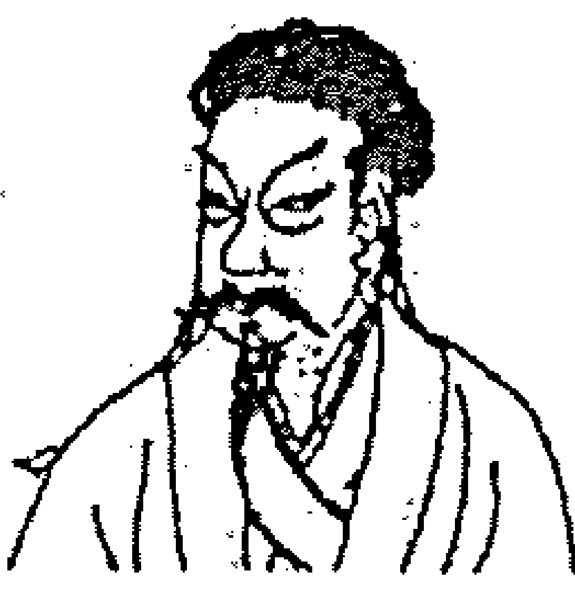

$x y$

### 谋望门

#### 干贵求财

谋望之占，种种不一。占情物类，各有其宜。循类察情，无烦说矣。然惟势利二字，诚世道之所独先，谋望之所最急者也。故又于干贵求财条而致详焉。苟能握其关键，悉其肯綮，则纲领举而众目张，诸占自无棘手处矣。引伸触类，其在人乎？夫以干言，干亦有人，非徒干也；以求言，求亦有人，非漫求也。人我错陈，则对待有象，吉凶可否，当从成象间首求之矣。成象之端，先于日辰，而用传年命则又扶救始终之通象也。以贵言，贵有其类；以财言，财亦有类，而无气有气，则又克应之所必需者也。

#### 【白话释义】

若占谋望，则林林总总，种类繁多。占情物类，各有各的优点。可以依照物类来具体分析。在此不再多做解释，只是要说说势利两字，这两个字实在是谋望中最急需明白的一部分。所以在占问干贵求财的时候,首先要详细讨论的就是此二字。若能掌握其中的关键,熟悉其中的关节,则一纲举而万目张,具体的占例自然没有什么困难的地方了。引伸之下,触类旁通在于个人的修为。以干为例,干中也有人,并非只有一干而已;若用求来说,求中亦有人,而不是惟有一求。明白其中的人我错陈,则可以认真对待象,必能明白其中吉凶。成象的一端,必然先于日辰,而用传年命则又可以推测贯穿始终的通象。以贵人来说,贵也有其类别;以财而论,财也有其类属,无气有气,则是断课时所必需掌握的内容。

#### 成象

日动为我，辰静为人；辰上神以之观人，日上神爰以观我。我往干人，动象也，故为干，生合则吉，而将吉气吉者更吉。战克则凶，而将凶气休者更凶。相刑则不投，相冲则难合，害则有阻，破则无成。乘临固所当详，阴神亦须兼视(旺休以五气言，即神将言)。盖辰伤则彼身正当偃蹇，安能舍己从人，若更囚死空亡，而或脱伤互见，往无益也。日伤则我事方切乖张，何暇洁身他往?若更凶空无气，而或刑害交陈，徒自惫也。若辰上神生合日干，而阴制之，则其人虽有相为之心，返我畏忌而不果，未可恃也。辰阴所乘之天官，即其所畏之人，所忌之事。如阴乘太常则有父母尊长之畏，乘天后则有妇女之畏，乘太阴则有兄弟之畏，乘勾陈忌争斗之事，乘朱雀忌口舌之事之类是也。若辰阴生比辰阳，而与日干作合，则彼中必有相为之人暗中撮合，可之恃也。撮合之人，亦即视之所乘之天官。此识对待大体，理所当然，而势所必致者也。故为成象。凡事关人我，而有对待之象者，皆当从此求之，宁惟谋望哉？盖大体之吉凶既定，然后可求通象，以言扶救，以决始终，故用传命年继夫成象而遂及之也。

#### 【白话释义】

所谓日动为我，辰静为人；辰上神可以用来观测他人，日上神则是用来审视自身。我往干人，则为动象。所以干，生合则吉，而将吉气吉为更吉。干，战克则凶，若是将凶气休为更凶。相刑则主不投，相冲则是难合，若害则有阻，而破必是无成。

其日辰所乘也应当详实，阴神还需要看旺休情况。若辰伤则主他人正在遭受煎熬又怎么能舍己救人？若在囚死空亡之地，或者为脱伤互见，对己也无益处。

若日伤则主我方不能乖张，如果自己洁身自好则他人又怎么能侵染自己呢？若日更落凶空无气之地，或刑害交陈，则是自己徒劳无功。

若辰上神生合日干，主其人虽有相为之心，但是我方畏忌而不能取得满意解释，所以不能自持。辰阴所乘之天官，即代表其所害怕的人，以及所忌讳的事。如阴乘太常则是对父母尊长感到恐惧，乘天后则是有妇女之畏，乘太阴为兄弟之畏，乘勾陈主忌争斗之事，乘朱雀是忌口舌之事等等。

若辰阴生比辰阳，而且与日干作合，主必有暗中撮合的人，可以成功。撮合之人，需要看它所乘天官为何。以上是事情的大体判断，为理所当然之意。之所以叫做成象，即事关他人与我，在做事情的时候有共处的对象，这种情况都应当从此求测，便可知道大体吉凶的情况，然后可求通象，来补充信息，才可以最终定夺。

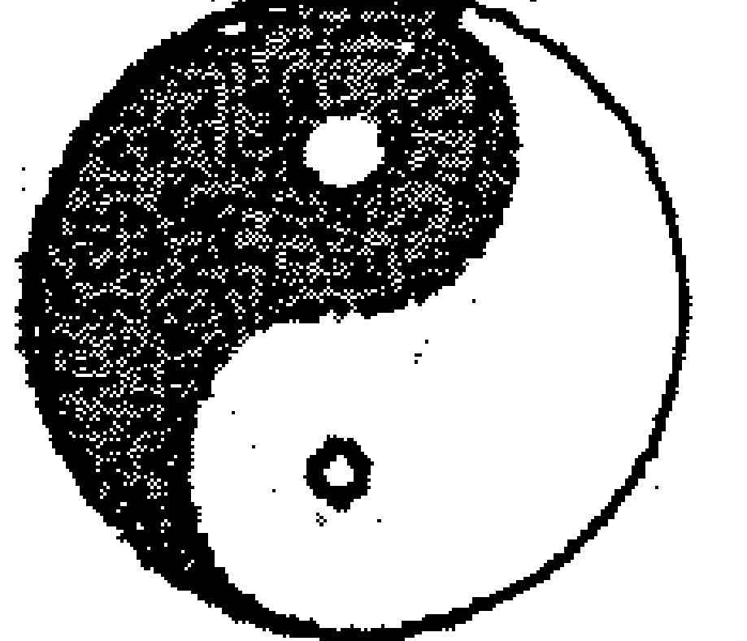

#### 通象

休咎之几，关于发用；转移之妙，乃属中传；末为底止之乡，式中所系；传有出入之异，生咎攸兮。扶救虽在用传，紧关则由年命。凡占皆当详，所以谓之通象。盖发用之神乘吉气旺，而又别无损伤，则以吉应。其所应者，当以速言，气旺故也。囚死乘凶，而乃遂遭战克，则以凶应，其年应者，当以迟言，气休故也。吉则从之，凶则达之，空则靡象，吉凶无成，非所论矣。气之衰旺，亦是五气；用之战克，亦是神将。生合日支而刑伤日干，则利在彼，害在我身。合日干而刑伤日支，则利在我，而害在彼。害在彼者，不利有攸往；害在我者，不往何灾也。所谓休咎之机，关于发用也。用虽为吉于日，而阴遂伤用，则用神之力较微，用虽吉，未可恃也。惟用凶于日者，则反利其阴之制，却能反吉而靡凶。用虽为吉于日，而阴遂墓空，则有中杜难行之象，事宜速图，不可缓也，所谓转移之方，属中传也。自墓传生而末逢吉旺，则到底能成；自生传墓，而末遇凶休，终当止息。吉于辰者，彼当其利，吉于日者，我获其功。凡初递克末，而末克日干者，用虽生干，不可恃也。然为患于日也颇迟，见之宜速，以就用神之生。末递克初，初克日干者，生虽末见，不可恃也。然其为患于日也必速，见之宜早，以避用神之克。凡日生初传，而初传递生末传，终非所利。盖不惟源消根断，而且鬼在末也。凡末递生初，而初生日干者，凡事有成。盖不惟从力相扶，而且财在末也。凡自支上发用，传出于干上，而能生合日干者，人有就我之心，干之可也。自干上发用，传人支上，而又与之生合者，我有就彼之象，进无咎也。所谓出人之异，去就攸分也。命主生平，年关气运，虽其久暂不同，实为占人所独，盖本课传而分视，各有专司，合命年而较求，方为切己，是故日用不可伤残，命年最宜和好。日年交制，自启乖违。命被辰伤，却非我利，惟命制类，亦可言财。类制命年，当同鬼论。所谓扶救虽有三传，紧关则由年命也。

一课中的初传往往主宰着一课的吉凶走势；而有转移之妙的，乃是中传的作用；末传则为一课的最后一个因素，也起着决定作用。若是扶救之神在发用之传，且年命在课中有重要影响的时候，需要详细论断，所以叫做通象。这大概是因为发用之神乘吉气旺，而又别无损伤，所以当作吉。且所求之事，必定会事发迅速，这是由于气旺的原因。若是囚死乘凶位，遭战克，则必是凶相，且此课应卦必然迟缓，是气休的缘故。若是吉，则从之，若为凶，则达之。若是落入空亡为靡象，此时吉凶无成，不是此部分讨论的内容。气的衰旺，即是指五气；而课中的战克，则是说神将。若是生合日支而刑伤日干，则有利于对方，而会伤害自己。而合日干刑伤日支的情况，主利我而伤害他人。此时，不能有攸往；当有害的是自己的时候，则不往何灾。

所谓休咎之机，是关于发用而言的。若是发用对日为吉，但是被阴所伤，则是用神的力量较小，虽然有吉象但是不能用事。此时，只有用神对日为凶，才能控制阴气，可以得到真正的好处。当发用之处对日为吉，但是课中阴遂墓空，则此课有中难行之象，求事应当迅速，不能迟缓。

而所谓转移之方，是指中传。自墓传生并且末传逢吉旺，主事最终能成；若自生传墓，而末又遇凶休，则必会停滞不前。课中吉于辰，主对方得利，吉于日，为自己获利。

凡是初传克中传，中传克末传，且末传克日干的时候，即是发用之传生日干，也不可寻事。若是从未传递克到初传，且初传克日干的时候，也如上同断。

#### 推类

事涉干求，可否虽操于象内；情关得失，吉凶更出于类中。象吉类凶，象难全恃。类吉象凶，类亦难凭。相需并用，占法斯全。有吉无凶，主堪进取，吉凶可否，岂易言哉。所干者既为贵人，则所类者，天乙也。上乘吉旺，则为乘时，又履吉旺，则为得地。既乘天时，又乘地利，而与日干生合，则贵正当权，势诚在我。其心实能相制，其力足以从心。若贵阴两建，又见生扶，则更全吉，反此则不宜妄求。所求者既为财帛，则所类者青龙也。日克之神也。财神财将，既不深藏，又不内外刑战，上下空休，而财阴两建，又与干生合，所望虽奢，求之可得，无他患也。反此则不宜妄求。

#### 引申

类阴得吉，宜往干矣。干之必有所求，求必有类。凡向贵人而有文书之权者，虽既视贵人，又当分视朱雀。有情分之求者，分视太阴；有衣帛谷粟之求者，分视太常；有恩泽妇女之求者，分视天后；所谓类将也。有珠玉之求者，视从魁，有弓矢剑戟之求者，视传送；有图书伞盖之求者，视登明；有书籍之求者，视功曹；有雁羊酒食之求者，视小吉；有墓田之求者，视大吉；有鱼盐之求者，视天罡；有犬马之求者，视天魁胜光；所谓类神也。视类将者，吉凶在所乘神。若神克其将，将则无权，力斯减矣。神伤日干，将亦从而伤之，类神凶矣，非徒无益，而且有损，求之何为？视类神精神虽在天官，力量却由气地。天官即非凶恶，而气与地，却值凶休者，类神虽现，无足取也。凡干君王者，当视太岁之上下；干省府者，当视月建之上下；干尊长者，当视日德之上下。若即乘时得地，而又生合日干，则信任必专，而恩施自厚，往干可也。反此则有求荣得辱之患，干之何益？至夫吉凶诸煞，虽为克应之所必需，实因众象而各有相能之用，未可胶视之者也。煞历具在，无烦赘及矣。约而言之，则不过四课定人我之情，三传决始终之要；类神类将，指事而专求；本命行年，相参而比较；诸神煞关乎克应；精诚自可通灵，吁尽之矣。至于明吉而遁凶，是必防其暗损；明凶而遁吉，尚有与其默益。阴神休咎，所系非轻；气地兴衰，相关最切；生克制化之妙，易地而殊形；轻重虚实之微，骑墙而幻影：此皆占情之所易忽，而此事之所当详者也。故于归约之末，遂表而出焉。

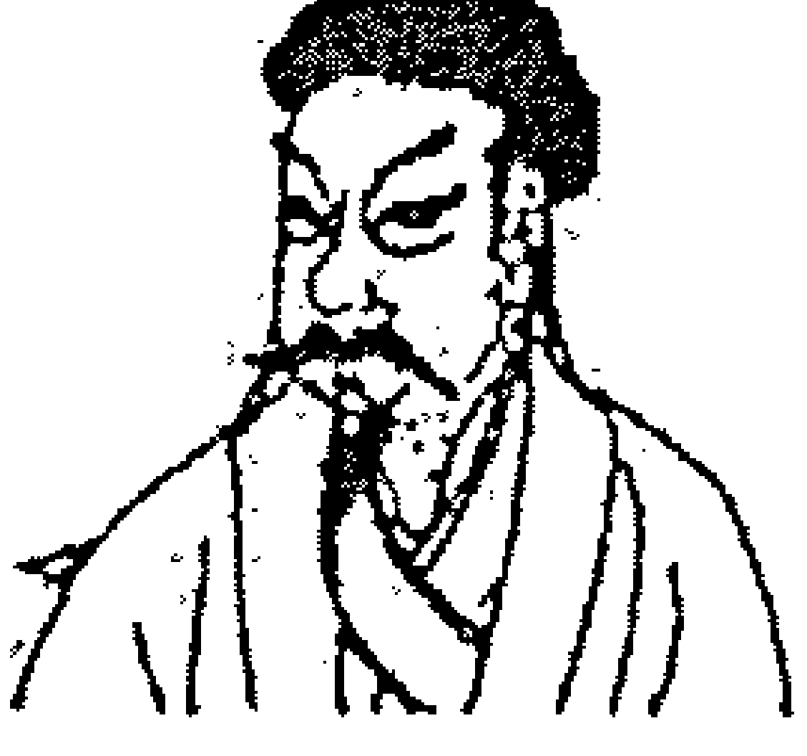

A small amount of rain in the morning may have fallen, but the sun soon rose high and shone down on the earth with full warmth, making everything bright and beautiful.  
In the sky, the blue clouds were rolling, and the white cotton-like clouds slowly moved, sometimes like horses running in the sky, sometimes like sheep grazing, and sometimes like snow white rabbits jumping, and changing shapes all the time. The sun in the sky also showed a smiling face. The warm sunlight bathed the whole earth, making the earth look more beautiful and attractive.  

In the park, the grass quietly poked its green little head out of the soil, as if curious about the world outside. Flowers also began to bloom. The bright and fragrant flowers looked so beautiful. The bees and butterflies flew around, busy pollinating and gathering honey. The trees were also sprouting new buds, and the tender green leaves looked so lovely. In the spring breeze, they were waving gently, as if greeting the arrival of spring.  

The stream in the mountains was also lively. The clear water flowed endlessly and made a gurgling sound, as if singing a beautiful song. Fish were playing happily in the stream, sometimes hiding under the stones, sometimes darting back and forth in the water, and sometimes appearing and disappearing in the water plants. The reeds beside the stream also began to sprout new shoots, swaying in the wind, as if dancing.  

On the farmland, the farmers began to sow seeds. They were busy in the fields, sowing seeds with hoes, and the seeds were evenly scattered on the soil, hoping for a good harvest in autumn. The swallows that had returned from the south were also busy building their nests. They flew back and forth between the farmland and the woods, bringing twigs and mud to build their warm nests.  

In the city, the streets and alleys were also full of vitality. Pedestrians walked hurriedly, some going to work, some going to school, and some going shopping. Cars ran on the road, honking and making a noisy symphony. The street lights lit up the streets and alleys, making the city at night more beautiful and romantic.  

Spring is the season of hope. Everything recovers and begins a new life. The flowers bloom and the grass grows. The birds sing and the insects hum. The world is full of vitality and beauty. Let us embrace this beautiful spring, enjoy this wonderful scenery, and feel the charm of life. Let us also work hard and strive for a better future in this beautiful season, hoping that we can all harvest our own good results.  

Let us go out, feel the spring breeze blowing on our faces, feel the warmth of the sunlight, and smell the fragrance of the flowers. Let us enjoy the beautiful scenery of spring, enjoy the happiness brought by life, and become a better self in this beautiful season. Spring is here, hope is here, and the future is here. Let us welcome this beautiful spring with open arms and look forward to the beautiful future.

### 婚姻门

#### 例约

欲卜婚姻，须分男女；既详四课，亦视三传。以天官察其类神，从五气辨夫休旺。明神暗煞，皆所当求；破害刑冲，尽非吉体。品貌之分详，根源有自；命年之互用，关系非轻。成与不成，两言可决；得与不得，中有微机。孟仲罡加，亦关可否；始终迟速，尤贵得实；而古今占验，则有前贤已试之成法，即心法也。

#### 干支正象

日干之象，为阳为天，夫星是主；日支之象，为阴为地，妇位攸关。喜其互合交生，恶其明刑暗克。若其旺相生合，而所乘者，又为贵合龙常，则姻缘之吉庆可知，投求亦易。若果休囚刑克，而所乘者又见空元蛇虎，则彼此## 卷四 婚姻门

#### 用传变象

之乖违可虑，勉强非宜。且阴阳之气，不宜偏胜；而阳胜其阴者，尚有可为。至上下之乘，不可刑战，而内战其外者，尤无可取。中多阻挠，必阴神之制伤。有口无心，必明生而暗鬼。若夫男家气运，属于类；女宅根基，亦归支上。视其天官神煞，纤毫自可毕陈。审其上下乘临，凶吉何难立辨。盖惟旺相吉生，而带吉煞者，必富贵慈祥，时臻吉庆。休囚凶克，而带凶煞者，必衰微鄙吝，日见乖张。

以三传之变象而言，则初男末女，亦喜相生。而媒妁居中，最宜乘吉。天空元武，带谩戏而不情；勾虎战刑，必媒妁而启竞。初见凶神，末乘吉将，则必女旺而男衰；末见凶休，初逢吉旺，定属男强而女弱。初传克末，必男欲计图其女，亦知男性之过刚；末克初传，则女氏乐有其男，亦知妇怀之匪淑。夫男欠佳，初见虎勾；妇女不良，末乘元合。因亲缔眷，三合旺相以为传；以故联新，六合初终而生吉。联茹而乘合虎蛇，必带子以亲，否则定为怀胎之妇女；三交而见空阴太乙，必以贱而配偶，否则必系婢仆之姻缘。末见空元，何难改日移时，斯系年庚之非实，而命头见者同占。终逢蛇虎，是必阴残颓废，定多灾疾之可虞，而年上见者同断。后合初终，有后娶先奸之象；天孤地寡，有男鳏女寡之灾，未可言成。故曰：“空亡若值支干上，婚娶多为孤寡人，男占女卜皆非吉，纵到成时也不成。”不备八专，或经已聘；反吟别责，或属重婚。凡日上发用青龙发支，则男家有欲娶之心，反阳缓而阴急；辰上发用，天后克干，则女家动欲嫁之念，虽欲晦而尽彰。

### 类神定象

以类神之定象而言，则龙亦为男，后亦为女。惟其所履之分，原俱喜合而忌冲，则其所乘之神，未可论刑而较克。但当即类而观其刑休，则精神气概，绰有成规。若以对待而贵其乘临，则可否从违，反无定见。盖惟龙所乘临，既当旺相生扶，且不内外刑战，则伊男允为男子，而乘龙叶庆，抑又何疑？至于后得乘临，亦不休囚空墓，且逢上下生合，则其女属佳人，而跨凤缘深，岂庸两卜？若龙克其辰，而在女家当之，自难必其首肯。然而以顺为正，固妾妇之道也，何伤乎？惟为招赘之占，则第防辰本之遭龙制，恐终给累乎丘山。若后克其日，而在男家得之，已难轻信人言。抑且阳制于阴，岂丈夫之利哉？无益矣。倘属于归宁之筮，是更忌。日本生辰，乃翁姑之定类；丈人岳母，取象于生辰。天后青龙，于斯较论；休囚克害，婚皆不宜。干缠女宿，丑度牵女，天后妻星，贵神夫象，二神相会，为牛女之交欢，两相恰逢，正夫妻之好合。惟甲戊庚日，神后作天后，大吉作贵人，而格为联茹，不拘进退，皆其象也。得之者，吉无不利。

#### 品貌根源

欲知女貌之妍媸，须视后乘为禀受；欲识迩来之色相，凭年上为转移。故凡后乘无战，气正当时，而又下履生旺之地，上乘生旺之天者，则其本来面目，当秀丽端正，无烦辞说矣。惟是天命靡常，韶光日逝，年神既遂气化而不齐，色相自随年运而迁变，故年上将神，堪占颜色。而天官神煞，可验吉凶。若果年神旺相不空，而无内外战刑，则水清金白，绰有可凭；土重火红，皆堪指责；木主清癯而柔善；魁罡急躁而粗顽；月厌咸池，难言贵重；天空元武淫贱无疑；蛇虎争战而带病符，伤残是虑；勾朱刑害而兼谩语，唇舌滋多。此其定象也。若以五行相配言之，则年上下未可或遗，而生克旺休亦当兼视。盖水木有相生之雅，火金有克战之嫌，木土见而脾胃欠安，金火逢而肺肠兼患。木金虑损，土水相伤，吉凶须视天后，克应详夫神煞。害逢丑午，眸子应灾；若逢卯辰，患归手足；朱乘亥子，定麻其面；雀生寅申，须知发稀；乘四土为雀斑，临巳午主能文。

#### 命年关系

男年女命，虽各视其乘临，以言休咎，而彼此相求，俱可详其成败，以决疑违。若为用度交加而无战刑，则赤绳之系，业经前定，虽隔必成。即见异方遥合，而当旺相，则有青鸟之传，自必易孚，既成且速。若女年克其男命，而后且克日、克官、克龙，则反居鬼空无气之乡者，女必伤夫。若男命克其女年，而龙更克辰、克财、克后，则复陷废休伤害之地者，行将损妇。

#### 成不成迟速始终琐象

成不成，莫相刑。以二后之与日上较言也。凡日上神与后所乘神相刑则不成，否则宜成。两言决之耳。盖不惟日辰之上下彼此不宜相刑，即后之所乘亦不宜与日上相刑，刑其日上之神，犹之乎刑日也。刑日则已不利于男，何可成也？得不得，制其物。以干上神能制支上神，否则异方三合之神得之，上能制支辰也。凡日上神能制支上神，或异方三合之神加支，而制其支，则易得，否则难得。亦两言决之耳。物云者，支为物也。如甲子日戌加子之类。按此二法，只因支干上下无交生互合之象，特变通而次第求之，以占成与得之可否耳。然成得两字者，则有所指不可漫然忽过。盖成则坦怀而无虑，故但视刑。得则着意而有为，故须求制。至于天罡之加，则又不得已而视之，以决疑耳。非真有关于男女之休咎也。盖孟为事始，虚则未实，故难言成。仲介事中，骑墙莫决，故亦难必。季则实为事之终，故可得而成也。迟速之机，则观休旺，旺相则宜速就，休囚惟利迟成。始终之义，则视三传，初吉末凶，则有始无终；初凶末吉，则先难后易。中凶多变，中吉无亏。三传俱吉，而递生日辰者，百年可与其齐眉。龙后休囚，而传递克之者，二姓恐难于偕老。

## 卷五 农事门

### 农桑例约

日用常行，所需于占者，盖亦伙矣。何遂以农桑冠之？盖民为邦本，而其所以安民者，衣与食也。是故天子有籍田之耕，大人有蚕桑之役，黎民不饥不寒，而后可以言教，是则琐占之所以首农桑也。

### 农桑定象

问农圃之占，以日为农人，农人者，身属天干，刚健不息，故以干类之。以辰为田圃者，承天载物，柔顺无疆，故以支类之。而其所以吉凶于农人田圃者，天也。故即视其上神休旺生死、刑害空破，以言吉凶也。盖日干不受上神伤，则农人清吉；日支不受上神伤，则田圃茂盛。日辰之上，互相生合而不破害刑空，则收获丰盈，惠施实受。若发用之神更能生旺其类，则所望之类必有收成，而太岁行年上神复见生扶者，类收必倍。类贵入传，气宜生旺。又须得地，不可空伤。类阴伤类，树艺徒劳。阴伤日年，类及殃咎。凡用生其类，而遂伤干者，亦非农圃之所攸利也。至夫早晚之占，则在三传，凡发用乘吉，而生旺其类，或类现于用，而与辰上无伤，则利于早。中则利中，末则利末也。水陆之占，则在日辰，日吉宜陆，从阳也；辰吉宜水，从阴也。是皆农占圃占之大概也。

### 类神定象

凡以登明神后为稻者，水谷也。稻非水无以生成，故以水类之。故凡水神乘吉旺相，与辰上神生合，不与日干太岁上神往来相伤者，宜稻也。登明宜粳，神后宜糯者，糯大而阳，粳阴而小，各从其类也。俗呼糯为大米，粳为小米者，义盖本此。寅卯者，草木之类神也。草其本而木其性者，五谷之属也。故以功曹太冲类之，故凡用见木神，乘吉旺相，与辰上神生合，不与日年太岁上神往来相伤者，五谷之属皆所宜也。盖惟草而似木者，功曹主之；草而终草者，太冲主之；木阳而草阴，性使然也。巳午者，火之类神也。其性上炎，其象为陆，黍与豆宜于高原，而不宜于淤下者，故以太乙胜光类之，故凡用神见火神，乘吉旺相，与辰上神生合，不与日年太岁上神往来相伤者，黍豆之属，皆所宜也。然而颜色高下，各有其宜，恶可无辨？盖黍之高出者，曰粱，其色多赤，胜光纯火而赤，应以主之。黍之低者，曰粟，其色多黄，太乙火土而黄，应以。豆亦有黄赤之不同，其所应主者，可以思矣。触类而长，宁惟黍云乎哉？申酉者，金之类神也。其性从革，故序为秋，二麦者，生于秋而成于夏者也。秋收也，收四时之金气，利金石之磋磨，故以传送从魁类之。故凡用见金神，乘吉旺相，与辰上神生合，不与日年上神往来相伤者，二麦之所宜也。大麦小麦，阳大而阴小也。辰戌丑未，土之神类也。万物资生，而承天柔顺，故曰稼穑，稼穑之所赅者，不一而足，故百谷之属，咸以土神类之，故凡用见土神，乘吉旺相，与辰上神生合，不与日年太岁上神往来相伤者，百谷皆所宜也。然四土之中，惟大吉更吉，故又名之曰田。即以大吉为田粮者，丑有田象，从其类也。是皆农占圃占之种类也。虽然，理有经常，占须通变，执而求之，反滋谬误，是故凡欲占其岁宜何类为植者，则以发用所现之类而言，吉则从之，凶则违之，不惟旱涝，而耕者，良农也。若果为凶将，废耕乎？故凡用凶于类，而不伤辰，或即伤辰，而中末有救，及日年太岁上神，或有救制，而能扶生辰日上者，但当逐类求之，现与不现，非所论也。若农圃之念，业有所主，而欲占其所主之类，宜与不宜也，亦第取类而俯仰视之可也。凡类既得地，旺相不空，类上神将，又不与类刑战而与辰上神生合，不与日年太岁上神往来相伤者，用之可也。至必入传者，若仍以类为嫌，则反谬矣。类上神将即是类之阴神。

### 象类约略

约而言之，日为农人，辰为畎亩，辰上神将为所树艺之物，日上神将为所仰望之天。发用者，求类之端也；行年者，干求之柄；太岁者，万物之主客也：故皆视其上神而较言之。惟用既以所乘为类，而亦视其上神也，用之阴神亦有所责焉。故凡日上乘吉生干，则农人清吉，而旺相生合者更吉，乘凶克干则农人灾否，而休囚凶克者更凶。辰上吉旺生支，则田园茂盛，休囚相克则地土荒芜。日生辰上则发繁而工倍，辰生日则费少而功多。日上凶死而克辰上，则栽培灌溉未必及时，辰上吉生而克日上，则时届收成终归虚花。类贵入传，莫教休死，又宜得地，不可落空。若为取类之占，则不必拘其藏现，而惟旺相不空者必佳。若果原无所主，则方以用神为类，而惟用生支神者可与。水陆决于干支，早晚视夫初末。三传乘吉递生，而生日辰及生日辰上神者，农牧而无他患。三传乘凶递克，而克日辰及克日辰上神者，歉获而有后殃。类与用神虽逢生旺，而阴神生克干支者，即收获无虞，当防灾疫。用神与类虽觉平常，而阴神吉生支干者，即栽培劳费，实利堪收。式观大象，年属占人，所以日年用类，最忌刑伤；吉凶由神，克应由煞，凡神煞天官，利于和好。农桑虽微，毕竟有关民命，象占非易，必须恃用周详，扩而充之，无不皆然。倘有三反，不为无益者也。

### 蚕桑象类

凡以午为蚕命，午为木之子孙，夏之旺神也。午于神为胜光，故其字从先，两其先者，岁必两收，虫其象也。其又以蚕取义者，午卦为离，为先天乾位，从天从先，象虽不同，义则一也。是故时维清明，蚕即露种而有生焉。至于谷雨，则普天之下皆其初眠时也。时维夏至，则皆眠竟而恣食焉。至于小满，则普天之下，皆其结茧时也。是则午之所谓蚕命而为夏之王神，木之子孙也。凡以未为桑者，午与未合，木之库也。惟库则子孙取之为寄，惟合则子孙食之无伤，未旺于夏，而木火之功，相与告成，是则未之所以为桑也。盖蚕为茧也，虽曰成功而告老，实即脱化而营胎，是则寅之所以类茧也。凡以卯为丝者，卯木本于午为沐浴。沐浴者，丝之象也。浴蚕于汤，而后丝出焉，是则卯之所以为丝也。凡以辰为薄者，辰于午为冠带。冠带者，成人之具也。辰于春为季，中本墓，墓闭藏之所也，蚕必藏焉，而后登之于薄，登薄而茧，成长之象也。辰于象类，则又为山，故俗呼为薄为山，是辰之所以类薄也。凡以巳为筐者，巳之于午，为临官，而比旺，比辅也，下顺从也，下比其类，以藏火为能，蚕之为性，以畏寒为急，故巳火可以筐蚕。是则巳之所以类筐也。凡以申为绵者，申于午为病，于寅为破，盖茧之为利于人也，丝与绵耳，缫而得丝，破之则仅可得绵，蚕所病也，所破也，病于茧而破于茧，是则申之所以类绵也。凡以酉为僵者，午死于酉，而金有刚强之义，故曰其生也柔弱，其死也刚强。戌为黄者，午基于戌，黄其色也。亥为厄绝者，午火绝于亥也。子为鼠耗者，即冲且克，午火受伤，鼠其象也。丑为眠化者，丑午脱害，脱害当眠而身有变动之嫌也，化也者，变之谓也。

### 加临定象

故凡蚕桑之占，首以午为蚕之类位，而仰观焉。仰观者，观夫午上之神，以言吉凶。盖功曹加午则乘带俱吉，则茧收必倍多。太冲加午，而乘带俱吉，则丝获必多。天罡加午，而乘带俱吉，则登薄者成。太乙加午，而乘带俱吉，则上筐无恙。小吉加午，而乘带俱吉，则桑与蚕宜，自无他患。传送加午，而乘带俱吉，则金为火制，收必多绵。惟胜光加午，而乘带俱吉，则二火有比旺之能，蚕之顺利，不待言矣。盖仰观之神，即为类之所天，所以当责。至于从魁之僵，天魁之黄，登明之死绝，神后之鼠耗，大吉之眠化，则皆不利于蚕，而非蚕命上之可或见者也。若既见于蚕命之上，而乘带复凶，则为灾更甚。然而诸凡吉类，虽在午上之所加临，而类上所得之神，又须逐类分责。盖凡旺相乘吉，而无内外刑战，则此类当以吉言，上下克制，而休囚空亡，则此类当从凶论。

### 吉凶琐象

凡占主年命之上，得见财神财星，相生旺相，蚕收必倍。而惟蚕临年上，与蚕更相关切。必须彼此生合，旺相有气，方为全吉。大抵蚕伤占辰，则蚕不利人，而蚕上更乘凶神凶将凶煞，蚕必无收，不可为也。占伤其蚕，则人不利蚕，而蚕上更乘吉神吉将吉煞者，蚕收可望，但当择其吉于蚕者而用之可也。至夫蚕室，岁各有方，法以占年加岁，而惟寅申午未之下，占为吉方。四者之中，择其最便而无冲犯者，居之可也。迟早之法，则视三传，凡初传吉旺而生合蚕命上者，宜早；中吉宜中，末吉宜晚也。眠起吉凶，亦从传中次第求之。盖惟初传吉旺，则头眠起必齐，中主二眠，末主三眠，惟吴中独有四眠之蚕，谓之大眠。大眠之候，亦即视夫末传可也。诸书不以四课为言者，指事而占，但须责类，无他求以乱指视耳。岂有置大象于不用，而竟抹煞干支对待之体哉？日为人，辰为物，不然，何可弃也。但观农人之于田亩种类，可类推矣。

## 卷六 出行门

### 凡占例约

出行何以有占也？盖行藏显晦，一身之休咎所关，水陆舟车，千里之吉凶攸系。前知之则易为趋避，易视之则难以提防，孰谓出行也，而可无占乎？至夫望云之叹，谁则无之？所以家内吉凶，咸须归附，必如是也。而后促装就道，跋涉山川，庶几可以无悔乎？

### 类象

凡以日干为行者之身，而视其上神，以言休咎；以日支为所往之地，而视其上神，以言吉凶。盖凡日上无伤乘吉不战，而气又当时，日支阴神又不凶伤于日，则此身之迪吉可知，反此则有凶灾，不宜妄动。凡日上空亡，而无气无冲，则欲行未必。日上官鬼而兼刑带害，则阻滞难行，其所以阻滞者，视其所乘之官可知也。如鬼乘天乙，气更休囚，必因贵人神鬼而有阻滞；鬼乘蛇雀，又带官符，必因口舌公讼、缠绕忧疑而有阻滞；鬼乘勾陈，又带刑煞，必因田土争斗勾扰牵连而有阻滞；鬼乘白虎，又带丧门、吊客、死符、病符，必因死丧疾病而有阻滞；鬼乘元武，又带盗耗，必因盗失而有阻滞；鬼乘天空，又带亡劫，必因逃亡、走失、欺骗、脱骗而有阻滞之类是也。类而推之，空亡之故，可以思矣。若用见子孙乘旺，既不为下所伤，而又上乘吉将，则是发用之神，力能制鬼而生财，日上虽有官鬼阻滞之嫌，仍可行矣。盖凡日上之鬼，休则难动，鬼缠身也。旺则难当，鬼禁日也。若鬼在日上发用，而又上乘凶将者，是更不宜轻动。见在日上，已自难当，况又发用乎？若旺鬼乘吉，而又用自日发，则仕宦之行，反为吉占，未可概以凶言也。凡日上神乘吉旺相，能制支上之神，而支上亦复旺相乘吉，则是我之财神，见于彼也，往则必吉。若反凶作鬼，带煞披刑，气又囚死，则是我之鬼贼，见于彼地，往则必凶，其所以凶于我者，则亦视之所乘所带可知也。凡日干游行之方，亦宜兼视。盖天上日干，身所动也；所临之地，身所止也，吉凶休咎，咸有攸关，安得无问？故当兼视。凡日干病死墓绝之地，亦不可前往，往则多凶。惟地既生旺不空，而神将之吉者，方可往也。又须兼以日上神与方神较论，假如今日干之上，四土为神，木临之地，不可往也。惟火所临方，则为大利，火生土也。水临亦利，土克水也。金临之方，则无攸利，为所脱也。若所利之方，将吉气旺，又能生合日干年命者，则更利也，他方仿此。然凡出行有占，须首辨欲行者，果为何等人，其所司何事，而后即其内外喜忌言之，方可无失。漫以求之，占无应也。即如日上空亡，所主者何，未可必耳。若为九流技艺之人，空手求财之事，空非所忌，亦须将神得吉气旺，乃往利耳。若为携本经商，则不惟不能行，行且有损。盖行商之占法，以日为外类，外空而往，则奔走徒劳，我空而凶，则资财可虑。视天官，则所以空者，可缕指矣。又如日上鬼，所主者鬼缠身，鬼禁日耳。若为求官问禄之人、功名科举之事，反所喜也。盖功名之占法，以官鬼为主，官临其身，旺相乘吉，既不内外战刑，而用传年命又不相伤，太岁月建又得生扶，而上神又不往来相克，则无官者，当有得官之庆。有官者，定膺迁擢之利，荣何如之？若无气空克，即令求官，亦不可往，而常人得人，在所必忌，何可漫言而无分辨。

### 动静占法

凡欲出行，而欲占其能行与否，则又有动静之义，故以动静占之，盖动则能行，静则未能也。盖凡关墓临干，身则难动。关有阻格之义，墓有敛藏之义，皆静象也，所以难动。若年上神，力能冲关破墓，则可仍以动言，否则须待冲关破墓月日，方能动也。凡日上空亡，亦主难动，若用传年命，见有冲神，亦当以动言之。盖空逢其冲，空者反实，故可动也。然惟旺空逢冲，方有其象，若空带休囚，冲无益矣。凡日干天官入庙者，虽非空亡关墓，亦难以动言。盖神将同体，变化无端，故难言动。惟二马乘旺发用，又无缚足恋厩之类，动斯确矣。凡魁罡临日，则有万不得已之动，乘吉带旺，则以吉言而为速；乘凶囚死，则以凶论，而为迟；披刑带煞而有气，则当亦以速言。故曰：旺如乘车得马，可以掣电而追风。

### 迟速占法

凡占出行，而欲以迟速言，则惟较视日用，日为行者之身，用乃征行之始也。盖凡课传皆阳，事必显而多功，其动必速；课传俱阴，事必阴私而多晦，其动必迟。故曰，日阳而用阴，则当速中之迟；日阴而用阳，则当迟中之速。若日上阳旺而用阴休墓，则虽动复止；日上阴休，而用神旺，则虽迟必行。凡用阳而传阴，当防中道之阻，用阴而传阳，则必履坦无虞。中为发用之阴神，所关于行色者，非浅鲜也。凡用为子孙，而刑克日上，则当有伴侣相伤之应；用为父母，而刑克日上，则当有尊长相促之征；用为兄弟，宜切朋友；见妻财，情关妻妾。方以类聚，物以群分，惟用带丁马，旺相不空，不受下克者，动尤速也。

### 吉凶占法

凡占出行，又知其吉凶何若者，则首视日上，日上为行者之身也。次观辰上，辰上所往之地也。又次视用传，初中末，有道路阅历之象也。又次视年命，命为固有，年主流行，而为行者之身，所独有也。凡见有日鬼而乘凶带杀，则各有所主之事，各有所应之时，各有所见之处可按也。其所吉于行者，惟禄马、生气、日德、天喜之类，附吉乘旺，而无损伤则其行也，即非因喜而动，将来必有喜庆之事，随所遇而自见者也。其所凶于行者，则为鬼，以所乘带及五气言之。盖凡鬼乘天乙，则主官司神鬼之凶，日旺为官，夜休为鬼，分以乘之，方无去也。鬼乘螣，则主惊疑怪异，盗贼火光；鬼乘朱，则主鼠雀纷争，是非口舌；鬼乘合，则牙侩媒保，欺隐奸私；乘勾，主勾惹牵连，争斗讼狱；乘龙，主子孙财帛，亏折损伤；乘空，则主小人仆隶，诞妄欺凌；乘虎，则道路凶恶，疾病兵丧；乘常，主饮食筵会，参商嫌隙；乘元，主盗贼匪类，劫耗遗亡；乘阴，主阴私妇女，奸谋蔽匿；乘后，妇人女子，秽污贪淫。以煞而言，则凡五符为鬼者，必有口舌公讼；往亡为鬼魅者，必将身不生还；车坑为鬼者，有车马舟楫之忧；飞廉为鬼者，防破败损失之患；空亡为鬼者，脱诳可虑；劫煞为鬼，劫夺堪虞。鬼墓则昏蒙多阻；鬼关则隔碍难通；天刑则小人有忧败之嫌，君子亦剥官夺禄；鬼带咸池，奸淫沉溺；鬼披刑害，破祖伤残。引而伸之，触类而长之，则庶几乎百煞之用，其有当乎。

### 水陆占法

凡占出行，而欲知其出行水陆之所宜者，则以日辰为主，而分言之，吉则从之，凶则违之。凡以日干为陆，视其上神，以言休咎。日干之象，为天为阳，陆之位也。日支为水，视其上神，以言吉凶。日支之象，为地为阴，水之位也。故凡干上之神，乘吉生干，气又旺相，则陆路自可从行，乘凶克日，气又囚死，则陆行匪吉。支上之神，乘吉生支，气又复旺相，则水路允宜从往。若乘凶克支，或更克日，气又囚死，则水行必凶。若水陆俱吉，则惟择其最旺，而无损伤者从之。凡陆行则不能不需车马，水行则不能不需舟楫。太冲者，车马舟楫之类神也，然须分视不谬耳。盖太冲临水，象则舟楫；临土，象则车马。旺相则坚固而宽容，休囚则破毁而疲陋。惟乘龙合，而出于支干之端，更无刑战，则水陆皆堪遄往。若载元蛇，而见于日辰之上，则水陆皆不堪从。即乘辰合，则象为减下，沉溺堪虞。卯带车坑，则象为折轮，倾危可虑。上见魁罡，则舟车定多阻隔。更乘月厌，则道路时有忧惊。卯作隔神，宁无阻滞？卯逢夹克，必有损伤。卯上空亡，水则无忧，陆防倾陷。凡舟行之时，万一有损，而欲占其损于何所。亟为衣枷计者，则当专视天罡，而以所加孟仲季言之。加孟则所损在头，仲中季尾。盖孟仲季有首尾之象，而与太冲相害者，天罡也，即以相害者占其所以害，故无失也。

### 阴晴风雨占法

凡占出行，而欲占其途次之阴晴风雨何若者？则以三传之阴阳为主，以言时地之克应。盖阴阳亦晴雨之机，三传开道路之象，而初中末即其时与地也。故凡传得纯阳，则主晴朗，而木旺乘阳者多风。传得纯阴，则主阴晦，而金旺乘阴者多雨。水神旺则虽阳亦雨，火神旺则虽阴亦晴。阳胜于阴，而乘朱蛇，又带晴杀，其晴必久。阴胜于阳，而乘后元，又带雨煞者，其雨必长。是则阴晴风雨之大象也。若分视其时与地，则初传见者，应在始发；中传见者，应在中途；末传见者，应在末路。扩而充之，则辰上见者，应在彼地；日上见者，应在欲行未行之时；而时序之标准，即以三传之十二辰次之，是则所谓时与地也。

### 伴侣占法

凡欲出行，而欲知其将来有无伴侣，及伴侣何若者，则以子孙为主，而亦以三传言其时地。责三传者，以道路言也。责子孙者，制克生财，缓急可恃也。兄弟之爻乃居然伴侣，而不责及者，兄弟有其本责，分财之象，职有合伙经营，而非萍水之交矣。故凡子孙吉旺见于传中，而与日上德合生比，则不惟伴侣有人，而且富厚忠诚，自当竭蹶而相为。子孙休凶，见于传内，而与日上破害刑伤，则途中虽逢伴侣，而疏狂污贱，非徒无益而有损。传无子孙，则视三五六合言之。若更视其所乘所带，则性情容貌，皆可前知。察其天地两间，则时序地方，曷难预定？至于辰见为他类，日见为类行，非虚语也。

### 赀本行李占法

凡占出行，而欲知其赀本何若，则以财爻为主，而以休旺言之。日干所克者，为财神。青龙六合为财星，二者兼视。故凡财神见，而财星称之，则为有本之行、经营之类是也。旺相而带丁马，则必充盈，无往不利。休囚而无丁马，则必微薄蹇滞难通。若财神既藏，而财星又复空窘，则为无本之动，九流之类是也。旺相则得来可望，休囚则到底无功。财虽不现，而适财有气无伤，则居然良贾，深藏莫窥，吉可知矣。若兄弟化财，或财化兄弟者，即非借贷，定为合伙。故凡欲知其行李若何者，则以父母为主，亦以休旺言之。盖行李者，覆庇之资也，而覆被吾身者，莫如父母。故以类之。故凡父母见旺而无损伤，则行李自当富盛；休囚而有刑破，则行李必见凋残；空藏则无，类藏则失。若父母化兄或兄化父母，则与人共，己不自由。

### 投宿占法

凡征行在道，而欲占其止宿处吉凶若何者，则以日辰为主，而较视其上神焉。盖日为本身，辰为旅次也。故凡日辰上神，彼此生旺德合，乘吉带吉，则宾主相安，绝无疑忌。若彼此刑冲破害，乘凶带凶，则宾主不投，易生嫌隙。日伤其辰，则客怀不仁，咎由于我；辰伤其日，则主怀不义，咎起于人。支干逢墓，必不安宁。鬼带三刑，定多凶祸。凶于我者，视其所乘天官。螣主惊疑，朱为口舌，勾陈争斗，白虎兵戈，元武盗贼，天空欺给，太阴奸谋，天后淫秽之类是也。然天官之所凭依者，神也；十二神之所用者，五行也；五行之所变幻者，五气也。引而伸之，则形貌情性、老幼强弱之类，一览而无余蕴矣，于投宿也何有？

## 卷六 出行门

### 启行占法

凡旅次虽安，而欲占其明发之情形者，则以日干为主，日支为佐，兼以用传相较言之。盖日为己身，支为奴仆行李，用为祸福端倪，而三传者，则有时与地之象也。故凡日上吉旺，不伤于日，则为上天显佑，身必无虞；日下吉旺，不逢空败，则为地下默扶，任行无害。元不伤干，而财爻稳固，则无劫掠之忧。勾不制日，而乘性平和，则无口舌争斗之患。例而求之，十二天官，咸有责也。支不受伤，财爻、奴仆、行李，当无患也。以竟日而言，则初为卯辰，中为巳午，未为申酉，时可定也。然式中时位，咸自并如察其上神，吉凶休咎必以时相应，兼而求之。可无失也。盖三传者，时行之大象也；十二辰者，时位之分司也。先其大象，次其分司，占之法也。以地分而言，则十二辰之见于三传者，自可按也。岗、岭、墓、田、湖、池、场、圃之类，各以类见，不可漫责也。凡以年命为扶救之本，而与日辰用传相较而言之。盖年命者，吾身之所独有，转移休咎之权与也。故凡日吉而传凶，支辰年命之上，皆可救也。日辰俱凶，而年命休衰，不能效力者，三传之神，皆可救也。日辰年命俱凶，而三传复凶者，勿行可也，是则所谓趋避也。凡以太岁月建，为君为长，而与日、辰、年、命、用、传相较言之。盖太岁者，人君之象，月建者，官长之象，身居君长临照之下，虽不敢妄异跋扈，毕竟难逃主宰，而其上神，亦即岁月吉凶之所系者也。凡吉凶由神，克应由煞，诸煞之紧关休咎者，不可遗也。如太岁月建，气力最大，入课临传，皆须细视，生扶则吉来不小，刑害则凶至匪轻，即居闲地，而其上神，皆有关系，不可忽也。盖凡岁月上神，遥来相伤者，固为不利，而我去遥伤岁月上神者，尤非所宜也，故曰岁月上神，不可与类往来相克。太岁上神所主岁中事，月上神所主月事事，故与日辰用传年命上神以及类神皆不可相伤也。

### 见闻有疑占法

凡征行在道，遥见人来，心有所疑，而欲占其为何等人者，则以神后为主，而视其所加孟仲季言也。凡神后加孟则为善良，孟为四长生，所以善良；仲为商贾，仲乃四旺，所以商贾；加季则为凶恶，季乃暗金四煞，所以凶恶。责神后者，后为十二神之长，一阳始生，首窃天气，可以为善，可以为恶，神变无端，故曰神后，而以责之。凡占乘舟而来，则以天罡为主，而亦视其所加孟仲季言之。凡天罡加孟，则为吏人，为人之所长，孟长象也。故凡吏人，称为长吏。加仲则为常人，仲有中象，平等之象，故主常人。加季亦为奸恶，季居下流，而有藏垢纳污之象，故主奸恶。责天罡者，见因舟楫而生疑，罡立卯之前者也。盖凡有类主者，皆当以类加孟仲季言之，尤类主者，则以天罡视之。罡为善恶之总主也。故兵占决几之占，每每视此。以上两占皆不言日、辰、用、传、年、命，而视神后天罡者，呼吸安危，刻难姑缓，多视乱指，适以增疑也。虽然，万一乘象果为凶恶，则又何以处之？即就其所加定体，而以日上辰上决其趋避。故凡辰上神克日上神，则吉。辰上旺相，而日上休囚者更吉，前行无忌。日上神克辰上神，则凶。而辰上休囚者更凶。避之可也。惟相生比合，而气俱旺相，又乘吉将者，彼虽凶恶，我无忌也。凡有所问，而欲占其虚实何如者，亦以天罡为主，而亦视其所加孟仲季言之。凡罡加孟上，则为虚诞，孟为始生，事未实也。加仲而虚实参半，仲中而有骑墙之象，疑信相参而未决。加季则实，季为四土，信而实也。然日上辰上，又当参论。故凡日上刑克支上，所言必虚。而罡、魁、蛇、虎、阴、空、谩语见于日上者，尤多诡诈，带空亡者，更出无根。若天罡加孟仲，而日又加彼，其虚可知矣。已上诸占，皆以辰属我，日属人者，来与言。皆有动相，动则为客，见与闻，皆有静象，静则为主，所以日属来言，辰属见闻也。主客动静之间，辨之审矣。

### 期会占法

凡有相期会合，而欲占其得会与否，及已去未去者，若占他人，则视天罡，罡临日辰，定然得会，罡在日前则为已去，罡在日后，则尚未来。然又当以所加孟仲季参而定之。凡罡加孟则尚未至，加季则为已去，惟加仲则可会也。若占同伴则视胜光。凡胜光见于贵前，则为在前；见于贵后，则犹在后；若恰临日辰，便可相会。视胜光者，午于卦为遇也，故视之。

### 家内吉凶占法

凡身处客中，而欲占其家内吉凶何若者，则以日辰为主，而视其所乘天官言之，支为我之家也。故凡支上之神下生其支，而气旺将吉，则必无事而安常。若支上神下脱其支，而上气休囚，则多耗费；上神下克其支，而气休将凶，则必多悔而驳杂。若支克其上，而上神旺相，则可庶几。盖吉凶所主，虽在上神，而事类所关，在于天将。即如鬼乘天乙，虽云鬼祟神祗，而昼夜阴阳岂无分辨？鬼作螣蛇，虽主惊忧火盗，而旺衰虚实，能不周详？大抵贵合龙常，吉事居多，而为凶亦浅。元勾朱虎，凶灾常大，而为吉偏轻。天官各有所司，占者贵于类推，苟能达变，自可通穷。妻子父兄，式内岂无其象？刑冲德合，类端各有其神，周览旁搜，情表自见，仰观俯察，象类分明。

## 卷七 三才门

### 三才易简例约

六壬，象学也。运式以占，象亦伙矣。一日十二时，课亦十二而止。十二课内，象则万千，若但以课体求之，则万千之象，无从出现，而五行之用，反为所拘矣。是故三才易简之法，不可不急讲也。盖日辰之象，为两仪，贵贱尊卑，由此而定。四课之体为四象，刚柔内外，从此而分。三传之象，为三才，初中末伏，从兹而备。然两仪之成四象也，实乃三才之具体；三传之三才也，实即两仪之化身；是则所谓课体，而万类各有三才之用矣。如占妇女，则责天后为类，天后妇女之象也。即令式中无天后，亦当视天后之所乘临。乘即天后所乘之神也。临即乘神所临之宫也。后所乘神，即为初传，初之阴神即为中传，中再传之神，即为末传，是即所谓类神之三传。始终情形，皆在于此。按此而求，尽堪取象，所以不必全拘课体而断吉凶。盖凡末有所主，而概占大象，则吉凶情形，专在课体。若既有所主而占，则事各有类，类各有象，即类以定三传，即三传以言休咎，情形自露，不必徒求课体，即所谓易简也。凡占贵人，则视天乙之三传，而谒贵干求者，亦同责焉。占梦寐、怪异、忧疑、惊恐则视腾蛇之三传，而炉灶之具，亦俱责矣。占文字、口舌，则视朱雀之三传，而飞禽、书信、词讼之属，亦并责焉。占子孙、交易、婚姻、媒保则视六合之三传，而小儿、竹木器具、舟车、门户、床榻、盒桶等物，亦并责焉。占勾连、斗讼则视勾陈之三传，而军旅、墓田、捕役、差人之类，亦皆责焉。占贤良、财帛、及书吏则视青龙之三传，而择婿、求文职功名，亦同责焉。占小人、奴仆、僧道则视天空之三传，而上书、通启、虚诞、诈伪之属，亦俱责焉。占疾病、道路则视白虎之三传，而出师、征讨、死丧之事，亦并责焉。占尊长、财帛则视太常之三传，而米麦、布帛、衣裳、丝絮、药食、武途功名，亦并责焉。占盗贼、逃亡、走失、乞丐则视元武之三传，而行兵、行人、水利、沟渠等事，亦以责焉。占外戚、私慝、婢妾、婆妈、老妇、尼姑则视太阴之三传，而阴私、嘱托、金银钱、石磁器等，亦同责焉。占妇女，则视天后之三传，而择妇、望恩泽、封诰、赦书者，并皆责焉。盖类神所乘之神，虽各有三传可责，然须与日辰行年与制类者，尚可从吉言也。若日年落空，百事无成。惟类自作空，不以空论。然神与将又有变通之法，将即神，神即将。如占贵人尊长，本当专视责天乙，若或课传无天局，而大吉出现，则视大吉之三传以断吉凶，不必更求天乙矣。如占财帛本应专责青龙，如或无青龙，而功曹出现，则视功曹之乘临，以及三传，不必更求青龙矣。或式中无青龙，而太常出现，则视太常之三传以定休咎，不必更求青龙功曹矣。是即所谓变通也。

### 类神三传变通法引证

八月丁巳日辰将酉时占妇女事。

断曰：占妇女事，则视天后之三传，三传成巳、子，将天后、螣蛇。以初传言之，后乘天鬼，加卯临门，内战不安，则其所主者，不得自安之事也。戍与卯合，是有求和之意。八月卯为月破，甲寅旬卯为盗神，天魁之将为下贱。后乘下贱之神，下临无气之地，其为下贱妇女可知。下为盗神月破，合而克之，其所不安者必忧失盗亡财帛之事矣。以中传言之，太乙为天空，空为欺诈不实之象，八月巳为天鼠煞，情必涉鼠，阳现其象，情归于阴。中即后之阴。以末传言之，神后为蛇，子又为鼠，蛇为怪异，家有鼠为怪。天鼠即是小耗，正月起子逆行十二支，所主欺诈耗财，鼠耗之名，盖本于此，其所忧盗失亡财也。此课如占贵人，则视天乙之三传，三传亥午丑，将得贵虎朱，以初传言之，贵人履狱，处非其地，必有忧患，若非病厄，则有过失。盖阴得胜光，为白虎，为疾病之神，内战忧重，故主病厄。末见大吉乘朱，下临六害，八月开刑在午，死气在丑，当因死刑文字而责罚黜退之忧。如占父母，则视太常之所乘临，而以三传言之，三传未寅酉，将得常合阴，以乘临言之，常乘小吉临子，子未六害，而又空亡，则所主者，孤寒也。占父则无母，占母则必无父，否则定当远出。凡类临空亡，十有九死，在外者不得还家，是则所谓类神之之初传，主其事者也。以中传言之，功曹乘六合，乘木克未为鬼，八月寅为死符又为枯骨合乘死木为棺，皆作吉象。以末传言之，从魁乘太阴，重金乘旺，递克类阴，所谓鬼来催鬼，鬼催人死者是也。寅为死门而太阴夜神之酉，临夜位之鬼门，是为冥道也。末为归计，而入冥道？岂父母之利哉？从魁见于日阴，业已在外，而又传出他处，则有异乡之角，是则死于他乡之兆也。盖式中内外之内，惟前后为主，视类者便从类前类后言之。类后为内，类前为外耳。六合之中，前后凡七，七在对冲，而前后均得其六，凡在二三则为近，在五六则为远。按此占，小吉为类临子，恰当前六，故言远；下临空害，故言死亡，类阴凶克，而末酉传出他处，为冥道，故言死在他乡。如占子孙事，则视六合乘临，今合乘功曹，下临丁火，在外耗脱，而功曹于八月为死木，又煞为死符枯骨，皆非吉象。以丁言之，死木不能生囚火，子孙徒自脱耗，而无益于父母也。以未言之，则未为木墓，子孙投墓亦非吉象，是则类神之乘临所主，亦即所谓初传为主事之人也。以中传之类似阴而言，则从魁为月建，月建为官长，从而克之，则当有官长仇难之灾。以死木逢旺金，凶何如之？鬼见其仇，俯临其丘，非子孙之利也。以末传## 卷八 六壬毕法
## 王归

归计而言，则辰虽乘龙，为子孙之财，奈财反助鬼为官，丙辛辰酉合助莫解，而所带之煞，又为白衣，死别凶可知矣。盖凡占问子孙，不宜见者有六，一不宜落空，二不宜投墓，三不宜传见官鬼，四不宜煞带二死，五不宜蛇虎魁罡加临年命，六不宜气乘囚死。若全见者，必有死亡之事，惟加临旺相而传得其吉者，则有喜庆。若既见游煞、斩关、丁马，而传又逢凶，年上又见元空者，主有逃亡劫耗之患。此其大略也。若神而明之，则又存乎其人，难以言传矣。凡辰为宅舍，而子孙之占，亦当责及辰为子孙之类位也。若辰戌丑未乘蛇虎临辰，而辰为亥子则是子孙为土所制，法忧少小。盖亥子皆是少小之象，支神乃是卑幼之位，故当责也。

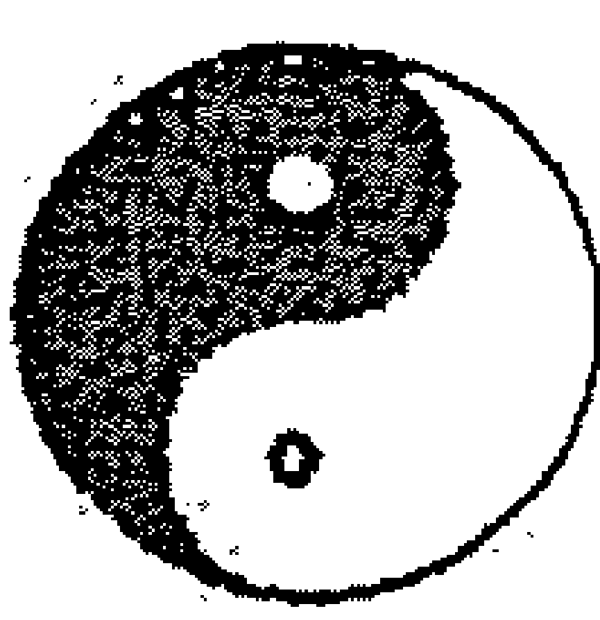

### 第一法：前后引从升迁吉

夫前引后从格者有二等，如遇初传居干前为引，末传居干后为从，值此格者，必升擢官职；又如遇初传居支前引，末传居支后为从，值此格者，必迁修家宅，二事皆吉。

#### 拱贵格
引从天干格内，如庚辰日寅加酉为初传，子加未为末传，此乃初末引从庚干在内，干上丑为昼贵人，兼三传下贼上，岂不应升擢官职也？夜占乃墓神覆日亦无畏，缘中传未作天乙冲破丑墓，乃为吉课也。

#### 两贵引从天干格
如壬子日初传巳加子为昼贵，末传卯加戌为夜贵，亦是墓神覆日，赖中传之戌冲辰，不畏墓也。凡值此例，必得上人提携，或两处贵人引荐成事，如辰为月将尤妙也。

#### 初末引从地支格
如己亥日初传巳加子，末传卯加戌，亦系引从地支格，虽初末加其干墓覆支，赖中传之戌冲辰亦无畏，宜迁修家宅则吉。又如丁亥日初传巳加子，末传卯加戌，亦初末引从地支格，奈昼夜天将皆是白虎居于支上，岂宜迁修宅舍乎？殊不知亦赖中传戌蛇冲辰虎，不为害也。如用辰为月将尤为妙也，或占人行年本命又居巳位，以巳上二戌冲辰，众凶皆散矣。

昼夜贵人临干支上拱其年命在内者宜告贵用事，必得两贵人成就。如丁酉日酉加丁，亥加酉，占人年命在申；丁巳日亥加丁，酉加巳，占人年命在午；癸亥日巳加癸，卯加亥，占人年命在子。

凡干支夹拱在下层，惟甲子、甲辰、癸亥、癸卯。在上层惟庚午、庚戌、丁巳、丁酉。

易无思注：此处可不必分上下层。甲寄寅宫，与子或辰；癸寄丑宫，与亥或卯；庚寄申宫，与午或戌；丁寄未宫，与巳或酉。以上皆形成夹拱。甲子日及庚午日伏吟课，天盘上可见干支拱贵；丁巳日及癸亥日伏吟课，天盘上可见干支拱日禄；丁巳日、癸亥日亥加未，丁酉、癸卯日酉加未，在天盘上可见两贵临干支拱年命。

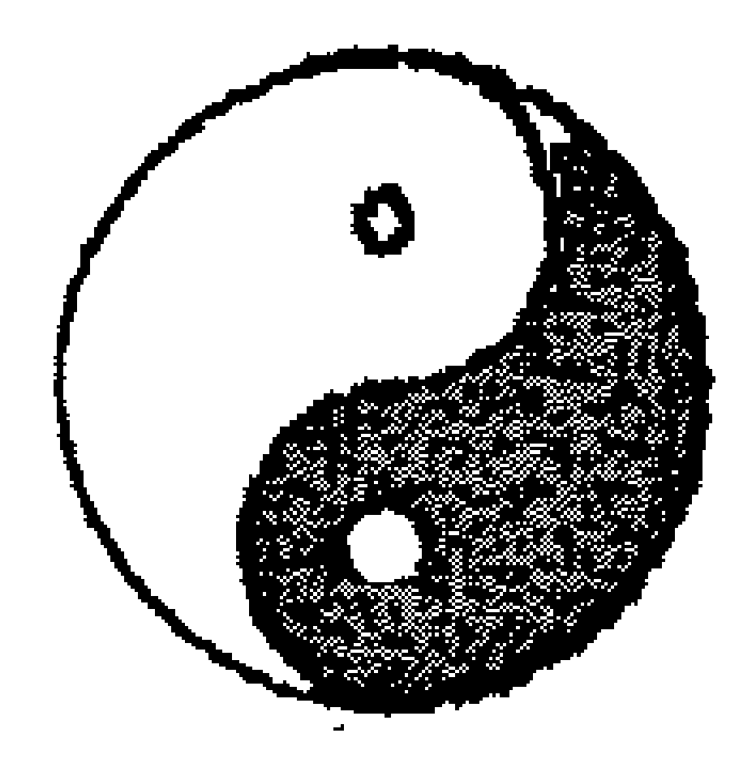
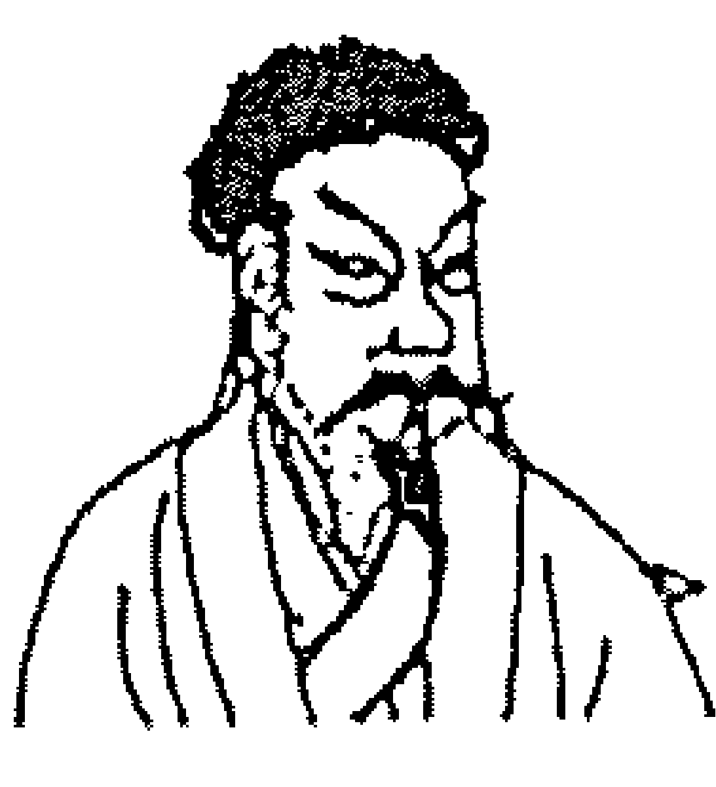
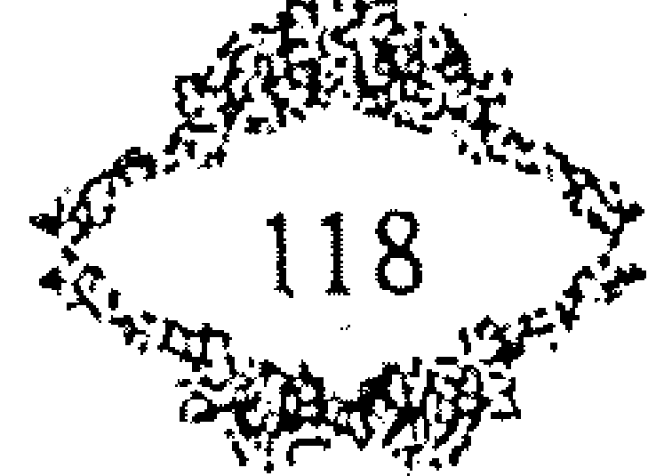

#### 二贵拱年命格
如癸未日初传巳加子，未传卯加戌，占人行年本命在亥，宜告贵成事，名末助初财初德，亦贵人助贵人也。

#### 干支拱定日禄格
惟伏吟卦为的，如丁巳、己巳、癸亥皆伏吟，宜占食禄事。癸亥为嫌禄空。

#### 干支拱夜贵昼贵格
惟伏吟为的，如庚午、己酉支干拱夜贵，甲子支干拱昼贵，皆伏吟卦，宜告贵人求事。

#### 初中拱地盘贵人格
如庚午日干上戌，支上申，乃支干并初中拱夜贵也；又庚午日干上酉、支上未，又庚午日干上午、支上辰，乃支干初中皆拱地盘之夜贵，皆宜告贵而成合事。余皆仿此。

#### 【白话释义】

“夫前引后从”的格局有二等之分，如遇到初传居于日干之前则为引，末传居日干之后是为从，有此格者，必能升擢官职；或者遇到初传居地支之前为引，末传居地支之后为从的时候，必能迁修家宅，两种结果都是大吉。

拱贵格，指的是引从格局在天干格内，如庚辰日寅加酉为初传，子加未为末传，是初末引从庚干在内，干上丑为昼贵人，兼三传中以下贼上，岂有不应升擢官职的道理？若是晚上得此占乃是墓神覆日，亦无需恐惧，这是因为中传未作天乙冲破丑墓，所以仍吉课。

两贵引从天干格，如壬子日初传巳加子为昼贵，末传卯加戌为夜贵，也是墓神覆日的情况，但是由于中传为戌冲辰，所以依然不畏墓地。凡是此种结果，必能得上司提携，或两遇贵人引荐，故能成事。当辰为月将时就能得到更加美妙的结果。

初末引从地支格，如己亥日初传巳加子，末传卯加戌，即引从地支格的时候，虽初末加其干墓覆支，但是得中传之戌冲克辰位，所以无需害怕，此时宜迁修家宅。又如丁亥日初传巳加子，末传卯加戌，也是初末引从地支格的情况，因为昼夜天将都是凶神白虎居于地支之上，为什么也说适宜迁修宅舍呢？其实，这也是依赖此课中传戌蛇冲辰虎的原因，亦不为害。如用辰为月将则更吉，或有遇到问占之人行年本命居于巳位，用其命中巳上二戌冲辰位，众凶神可烟消云散。

昼夜贵人临干支上且拱其年命在内的格局，宜以靠贵人谋事，必得两贵人前来相助。比如丁酉日酉加丁，亥加酉，占人年命在申；丁巳日亥加丁，酉加巳，占人年命在午；癸亥日巳加癸，卯加亥，占人年命在子，皆为此例。

凡干支夹拱在下层，惟有甲子、甲辰、癸亥、癸卯。在上层惟有庚午、庚戌、丁巳、丁酉。

二贵拱年命格，如癸未日初传巳加子，未传卯加戌，且占人行年本命在亥的时候，宜依靠贵人成事，若是末传助初传，即为财初德，当是贵人相助贵人的意思。

干支拱定日禄格，此格局即为伏吟卦，如丁巳、己巳、癸亥皆为伏吟，宜占食禄之事。其中癸亥为嫌禄空。

初中拱地盘贵人格，如庚午日干上戌，支上申，此是支干并初传中传拱夜贵的情况；又如庚午日干上酉、支上未，或者庚午日干上午、支上辰，乃是支干初中皆拱地盘之夜贵，皆宜告贵而成合事。

### 第二法：首尾相见始终宜

谓干上有旬尾，支上有旬首，名周而复始格，亦名一句周遍格，凡值此者，占事不脱，所谋皆成。占赴试，宜代工；占讼宜换司易局；占交加用事，去而复来。惟不宜占释散事，如有忧疑，其事尽在未能决断。

干上有旬尾，支上有旬首，惟乙未卯加辰、辛丑卯加戌、丙申卯加巳、壬寅卯加亥、戊申丑加巳五日有之。干支隔四位方有。前四日俱甲午旬，惟戊申乃甲辰旬。

干上有旬首，支上有旬尾，惟乙丑子加辰、辛未子加戌、丙寅丑加巳、戊寅戌加巳、壬申子加亥五日有之，诸占亦照前断。惟戊寅乃甲戌旬，其余四日俱甲子旬。

#### 天心格
乃年月日时皆在四课之内，凡占乃非常之事，即日而成，或干天庭之事，定然成就。如占阴私、常用鄙俚之事，反成咎也。

#### 回还格
乃三传在四课之中。如辛亥日干上酉、亥上戌，三传戌酉申是也，此以不备言之。至于干支自作三合者，内多回还格，乃干支相会，不可作不备言之。如丁卯、丁亥、己卯、己亥，皆干上卯或干上亥，诸如此类，占凶凶成，占吉吉就，凡事只宜守旧，不能动作。如占病，其病难退，讼不解。如女命占得干加支，男命占得支加干，来意占婚尤验，宜详其生、克、空、脱、刑、冲、破、害、墓言也。

#### 【白话释义】

“首尾相见”指的是干上有旬尾，支上有旬首的格局，叫做周而复始格，亦叫做一旬周遍格，凡遇有此格者，占事不脱，所谋皆成，为大吉。若是占参加考试，宜找人代替；占官讼之事应换司易局；若是占问交加用事，主去而复来。唯独不适合占释之散事，如有忧疑，其事尽在未能决断。

干上有旬尾，支上有旬首的情况，只有乙未日（卯加辰）、辛丑日（卯加戌）、丙申日（卯加巳）、壬寅日（卯加亥）、戊申日（丑加巳）等五日。其规律是干支隔四位才有一日。前四日俱在甲午旬，只有戊申日是在甲辰旬。

干上有旬首，支上有旬尾的情况，只有乙丑日（子加辰）、辛未日（子加戌）、丙寅日（丑加巳）、戊寅日（戌加巳）、壬申日（子加亥）五日才有，方法和前面相同。其中只有戊寅乃在甲戌旬中，其余四日俱在甲子旬。

天心格，此格是年月日时皆在四课之内，主有非常之事，且即日而成，若占问天庭之光明大事，必定可以成功。如占阴私、常用鄙俚之事，则反而不成。

回还格，乃是三传在四课之中。比如辛亥日干上酉、亥上戌，此三传为戌酉申。至于干支自作三合的时候，内多回还格，乃干支相会，不可当作不备言之。如丁卯、丁亥、己卯、己亥，皆干上遇卯或干上遇亥，诸如此类，占凶凶成，占吉吉就，凡事只宜墨守成规，不能动作寻新。如是占病，其病难退，占讼，其案难解。如女命占得干加支，男命占得支加干，其人来意必是占问婚姻之事，应以其生、克、空、脱、刑、冲、破、害、墓的情况来判断吉凶。

### 第三法：帘幕贵人高甲第

帘幕官者，如昼占乃夜贵，夜占乃昼贵。如占科目，专视此神，临于占人年命之上，或临日干上，试必高中矣。凡庶人占得帘幕，得林下官扶持。如有官人占得之，为休官之象。

#### 旬首作帘幕官者临年命、日干之上尤的
惟乙己辛日有之。

#### 又辰戌作旬首临年命、日干者必中魁元
乃甲辰、甲戌两句二十日有之。

#### 斗鬼相加格
或丑加未，或未加丑作年命日干者，亦中魁元，缘丑有斗，未中有鬼，斗鬼二字合而为魁故也。

#### 亚魁星
天盘酉临年命日干者，占试必高中，缘酉为从魁也。以上诸说忌空亡。

#### 德入天门格
乃日德加亥为用，士人占之必高中。亥为天门，德者得也。

#### 真朱雀格
如甲己日于四季年占，用夜贵逆布，乃朱雀乘午，占春闱，其文贴上意，必得高中，缘朱雀主文书，生太岁又生日干。如真朱雀克太岁，占讼必达朝廷，罪必致死，惟申酉岁的。

#### 朱雀乘神克帘幕官
朱雀乘神克帘幕官，占试其文不贴主文意。朱雀乘丁马，榜将出，忌。昼夜贵人拱年命者，赴试必中。如丁酉日干上酉、支上亥，占人年命在申，大宜占试，缘干支上神作昼夜贵人拱年命上河魁。

#### 源消根断格
如癸卯日干上卯、支上巳，年命在寅，大宜占试，不在此论，缘只取二贵拱年命也，但高中矣，恐以不摄终成劳瘵。

#### 帘幕贵人尤分喜畏
帘幕贵人尤分喜畏，细具于后。甲日不喜未墓为之，庚日不喜丑墓为之。又甲寅日不喜丑空为之，庚寅日不喜未空为之，丙寅、丁卯日不喜亥空为之，己卯、乙亥日不喜申空为之，壬子、癸丑日不喜卯空为之，壬寅、癸卯日不喜巳空为之，六辛日不喜午克为之，又辛亥日不喜寅空为之，空亡尤甚，使试官置卷不视，徒劳一次。

#### 占武举法
占武举法，以巳为弓弩，申为矢箭，申加午必箭中红心。如申加寅、申、巳、亥为四脚花，以第几课发用言其箭中之数。四墓脱垛。

#### 【白话释义】

帘幕官的意思是白天占乃得夜贵，夜晚占则得昼贵。如果占问考试科目之事，则看此神，若是此神临于占问人年命之上，或临起课之日干上，考试必能高中。凡白衣百姓占得帘幕，会得林下官扶持。如有官之人占得此神，反为休官之象，凶。

若是旬首作帘幕官临年命、日干之上的，惟有乙、己、辛三日可有。

辰、戌作旬首临年命、日干主必中魁元，只有甲辰、甲戌两句二十日有此情况。

斗鬼相加格，意思是丑加未，或未加丑作年命日干的时候主能中魁元，这是因为丑中有斗，未中有鬼，斗鬼二字合而为魁的原因。

亚魁星，是指天盘酉临年命日干，占试必高中，原因是酉为从魁之神。以上诸说皆忌空亡，若是得空亡则吉不为吉。

德入天门格乃是日德加亥为用，寻求仕途的人占之必能高中。这是亥为天门，德者相得的原因。

真朱雀格，比如甲己日于四季年占，用夜贵逆布，乃朱雀乘午，占春闱，主考试的时候正能迎合主考的心意，必得高中，这是由于朱雀主文书，生太岁又生日干。如果朱雀克太岁，占讼必达朝廷且罪必致死。

朱雀乘神克帘幕官的时候，占试所做文章将会跑题，不能高中。

朱雀乘丁马的格局，在名榜将出之时尤为大忌。

昼夜贵人拱年命，主赴试必中。如丁酉日干上酉、支上亥，占人年命在申，此格局最适合占卜考试，这是由于干支上神作昼夜贵人拱年命上河魁。

源消根断格，此课当如癸卯日干上卯、支上巳，年命在寅，也适合占问考试，不在此论，原因是此课只取二贵拱年命，不过虽能高中，惟恐有不摄终成劳瘵之忧。

帘幕贵人特别分喜畏，下文详细论述。甲日不喜未墓为之，庚日不喜丑墓为之。又甲寅日不喜丑空为之，庚寅日不喜未空为之，丙寅、丁卯日不喜亥空为之，己卯、乙亥日不喜申空为之，壬子、癸丑日不喜卯空为之，壬寅、癸卯日不喜巳空为之，六辛日不喜午克为之，同时，辛亥日不喜寅空为之，空亡则更甚，使试官置卷不视，徒劳参加考试一次。

占武举法，则以巳为弓弩，申为矢箭，申加午必箭中红心。如申加寅、申、巳、亥为四脚花，以第几课发用言其箭中之数。四墓脱垛。

### 第六法：催官使者赴官期

凡占上官赴任，见日鬼乘白虎加临日干或年命之上，乃名催官使者，纵是远缺，必催速赴任也。如催官使者空亡，又是虚信，或被遣差。

#### 催官符
如官星临日干年命者，其三传上神生其官星是也。

#### 恩主举荐例
传、年、日辰有父母爻者是，亦为食禄之地，如值长生作贵人亦如之。如乙日见日贵为父母，己日见夜贵为长生。又乙卯日昼贵空，己卯日夜贵空不用。

#### 四时返本煞
占赴任极迟。夫返本煞者，春得金局，夏得水局，秋得火局，冬得土局是也。如赴任占得返吟，多不满任。

#### 【白话释义】

凡是占问上官赴任之吉凶，见日鬼乘白虎加临日干或年命之上的时候，叫做催官使者，此时纵是任职之地十分遥远，也必会催速赴任。如催官使者落入空亡，则此传言为虚，或着会被遣差他方。

催官符是指官星临日干年命的格局，其三传上神生其官星就是此格。

恩主举荐例，若是传、年、日辰有父母爻的时候，为将要食禄之地，如值长生作贵人也是如此。比如乙日见日贵为父母，己日见夜贵为长生。又乙卯日昼贵空，己卯日夜贵空不用。

四时返本煞，此神主赴任急缓。若是返本煞，则春得金局，夏得水局，秋得火局，冬得土局。如赴任占得返吟，则多不能满任就被迁官。

### 第五法：六阳数足须公用

#### 六阳格
六阳格谓支干四课三传皆居六阳之位是也，凡占皆利公干而不利私谋。假令庚子日第一课戌加庚，第二课子加戌，第三课寅加子，第四课辰加寅作初传，其中传午加辰，末传申加午，卦名登三天，宜占天庭事，有动达高尊之象，如君子占之稍畏初中空亡而减力。如常人占之，赖初中空却省力也，尤未免公干，明白事理。

#### 悖戾格
悖戾格亦名倒拔蛇，如甲午日干上子，虽四课三传皆处六阳之地，缘三传退间，主事间阻艰难，兼被初传戌财引入中末鬼乡，凡占事皆艰辛，尤不免公用也。如甲戌日干上子，四课三传亦皆处六阳位，以上是自夜传出昼，尤明白。

#### 五阳格
五阳格课传居五阳之上者，或占人年命填之，亦名六阳，事主公用明白，利公不利私也。此例极多，不暇细具。

#### 【白话释义】

六阳格，是指支干四课三传皆居于六阳之位的格局，此时无论占卜何事都能得到好的结果，但是利公事而不利谋取私利。假令庚子日第一课戌加庚，第二课子加戌，第三课寅加子，第四课辰加寅作初传，其中传午加辰，末传申加午，卦名为登三天，宜占天庭之事，有动达高尊之象，如是君子占得此课代表稍畏初传和中传的空亡而减力。若普通人占得此课，因为初传中传空亡却反得省力的结果，尤未免公干，明白事理。

悖戾格也叫做倒拔蛇，如甲午日干上子，虽四课三传都处在六阳之地，但是三传退间，主事间阻艰难，并且被初传戌财引入中传末传鬼乡，所以凡占事都主艰辛，尤不免公用。如甲戌日干上子，四课三传亦皆处六阳位，以上一例是自夜传出昼。

五阳格，是指课传居五阳之上的格局，或用占卜人年命用事，也叫做六阳，事主公用明白，亦为利公不利私之课体。此例极多，在此不再详细举例。

### 第六法：六阴相继尽昏迷

#### 六阴格
六阴格谓课传皆居六阴之位是也，凡占利阴谋私干，不利公闻，尤尽昏迷也，或自昼传夜昏迷愈甚。如己卯日第一课酉加巳，第二课亥加酉作初传，第三课巳加卯，第四课未加巳，中传丑加亥，末传卯加丑，课名溟蒙，凡占事必是阴谋奸私之象，兼天将天后、螣蛇、六合、元武，支干上皆乘盗气，又是弹射发用坐于空乡，至费力而不可言也，占病必死，求望皆为脱耗。又己亥日干上巳同。

#### 五阴格
五阴格课传止五阴者，占人年命填之，凡占私不利公，利小人不利君子。

#### 源消根断格
源消根断格如癸卯、癸未、癸巳，干上卯，课传俱在五阴之位，又是下生上神，迤逦而脱去，占病缘不摄而致病，岂不危绝乎？凡占皆脱耗，其法如神，切宜秘之。

又如辛卯日干上子，自干至支及初中末，迤逦下生上神，尽被脱盗，虽不系五阴位全，其理其理一同。以上例除占病外，诸占未免脱耗，日渐消铄也。

#### 【白话释义】

六阴格，是指课传皆居六阴之位的情况，此时无论占卜什么事情，都利阴谋私干，不利光明公事，主特别昏迷，自昼传夜则昏迷愈甚。如己卯日第一课酉加巳，第二课亥加酉作初传，第三课巳加卯，第四课未加巳，中传丑加亥，末传卯加丑，课名叫做溟蒙，主凡事必有阴谋奸私之象，兼天将天后、螣蛇、六合、元武，支干上皆有盗气，又是弹射发用坐于空乡，其费力程度不言自明，若是占病必死，求望则皆为脱耗。己亥日干上与巳相同。

五阴格，此为课传落入五阴，需占人年命填补，亦是所占利私不利公，利小人不利君子。

源消根断格，如癸卯、癸未、癸巳，干上卯，这种格局课传俱在五阴之位，又是下生上神，迤逦而脱去，占病则因为不摄而致病，当然主病情严重危绝在即。凡占皆为脱耗，此种方法神准，切忌应当保密。

又如辛卯日干上子，自干至支及初传中传末传，迤逦下生上神，尽被脱盗，虽不是五阴位全，但其道理与上文相同。以上例除占病外，其余问题未免脱耗，落得日渐消铄的结局。

### 第七法：旺禄临身徒妄作

谓日之禄神，又作日之旺神，临于干上者，切不可舍此而别谋动作。如乙卯日干上卯，幸得乘日之旺禄，何不守此，乃舍而就初传之财、中末之生，殊不知皆是旬内空亡，既逢干空，不免啰呖，再归干上就禄就旺，诚所谓“到处去来，不如在此”之语也。又乙酉、乙亥日干上卯，癸巳、癸丑日干上子，辛卯、辛丑、辛酉日干上酉，己亥、己酉、己巳日干上午，虽不系己土旺神，亦可用也。以上皆在铃内。又如辛巳日，虽干上酉为日之旺禄，奈是旬空，既旺禄空亡，必所得不偿所费，反不宜坐用，未免弃禄而就三传之财，及别谋改业，遂致亨旺，切不可如前论之。又如癸亥日，干上虽乘子为日之旺禄，亦是旬空，未免弃禄而就初传之戌，乃值日鬼乘白虎，又不免向前投中传酉，又值败气，又坐鬼乡酉加戌为鬼乡也，迤逦至于末传申，始逢日之长生，凡值此课，未免舍空禄而就艰难中，更进一步，始得如意，此意法奇妙。丁亥日干上午，乙巳日干上卯同。外有乙未日干上卯，缘是闭口之禄而不可守，遂投初传，奈是昴星不人之财，不免中传再归干上受其旺禄，又不能守，致于末传，弃禄而归于末传宅上，受其干墓之乡，以此占之，乃见食于人，把心不定，终处于家中受困厄而已。

#### 禄被元夺格
如辛卯日，干上酉为日旺禄，缘昼乘元而夜乘虎，遂不可守，未免投初传丑，又是日墓，中传子又是脱气，末传又是丁亥乘虎而遥伤日干，自末传至干，虽欠一位，终不能复投其旺禄也。此例尚有，皆在铃内，甚详。又辛未日干上酉，夜乘虎，支上午火，初巳、中归巳乡，末丁卯。

#### 白话释义
日之禄神，又叫做日之旺神，是临于日干上的格局，若有日之禄神则定不能舍此而谋求别的动作。如乙卯日干上卯，幸得乘日之旺禄，何不墨守成规坐收渔利呢？此课乃舍而就初传之财、中末之生，殊不知此时是旬内空亡，既逢干空，不免啰嗦，再归于干上主就禄就旺，诚所谓“到处去来，不如在此”。又如乙酉、乙亥日干上卯，癸巳、癸丑日干上子，辛卯、辛丑、辛酉日干上酉，己亥、己酉、己巳日干上午，虽不是己土旺神，也可照此使用。又如辛巳日，虽干上酉为日之旺禄，奈是旬空，既旺禄空亡，必所得不偿所费，反应该寻求变化，未尝不可弃禄而就三传之财，别谋改业，遂致亨旺，定不能与前文同断。又如癸亥日，干上虽乘子为日之旺禄，也是旬空，但不能弃禄而就初传之戌，这是因为初传值日鬼乘白虎为凶神；又不能向前投中传酉，又值败气，且又坐鬼乡，迤逦至于末传申，才逢日干为长生，凡是遇到此课，应当舍空禄而进入艰难之中，更进一步，才能如意，此意法奇妙，昭示我们应有恒心。丁亥日干上午，乙巳日干上与卯同。外有乙未日干上卯，这是因为闭口之禄不可守，所以投初传，但又是昴星不入之财，所以中传再归于上受其旺禄，又不能守，致于末传，弃禄而归于末传宅上，受其干墓之乡，以此课来断卦，乃主见食于人，把心不定，终处于家中接受贫困洗礼。

禄被元夺格的格局比较特别，比如辛卯日，干上酉为日旺禄，但因为昼乘元而夜乘虎，遂不可守，若是投初传丑，又是日墓，中传子又是脱气，末传又是丁亥乘虎而遥伤日干，自末传至日干，终不能复投入其道旺禄之地。此例还有很多，都在钤内记录。比如有辛未日干上酉，夜乘虎，支上午火，初巳、中归巳乡，末丁卯。

### 第八法：权摄不正禄临支
谓日干禄神加临支辰上者，凡占不自尊大，受屈折于他人。如占差遣，主权摄不正，或遥授职禄，或正宜食宅上之禄；或将本身之职禄替于儿男者，斯占尤的。且此例每日有一课，可逐类而言之。假令甲子日寅加子，乙丑日卯加丑之类，不暇细具，皆仿此。

#### 禄被支墓克脱
外有日干之禄加支上，被支辰墓其禄，或被支克其禄神者，必因起盖房宅而失其禄。或被支辰脱其禄神者，必因起盖房宅而以禄偿债。假令辛丑日，酉加丑，乃禄神受墓。又乙酉日卯加酉，乃禄神受宅克。乙巳日卯加巳，乃禄神受脱。此例极多，不暇细具，余仿此。

#### 白话释义
此课是说日干禄神加临支辰之上的格局，得此课凡占主不能自尊为大，而要受屈于他人。若是占问差遣之事，主权摄不正，或遥授职禄，或正宜食宅上之禄；又或将本身的职责交予子孙去做。并且此种例子每日都有一课，可以逐类细论，比如甲子日寅加子，乙丑日卯加丑等等，其余仿此可得。

禄被支墓克脱，既是指外有日干之禄加支上，并被支辰墓其禄，或被支克其禄神的情况，主因建造新的房宅而罢官。若是被支辰脱其禄神，则主因建造新宅而欠下债务，需用俸禄偿还才能无咎。比如辛丑日，酉加丑，为禄神受墓。又如乙酉日卯加酉，则是禄神受宅克。乙巳日卯加巳，为禄神受脱。此种例极多，不暇细具，余仿此。

### 第九法：避难逃生须弃旧
#### 避难逃生格
如甲子日戌加子作初传，虽曰日财，乃是旬空，中传申金又是日鬼，末传午火作日之脱气，且三传既无所益，不免只就干上子水而受生，乃应避难而逃生之语。

丁卯日干上亥，乙亥日干上酉，戊寅日干上申，庚戌日干上午，辛未日干上丑，戊午日干上辰，己巳日干上酉，辛酉日干上亥，壬申日干上寅，庚辰日干上子。

#### 庚子日子加申格
又如庚子日子加申，此乃支神上门而脱干，兼三传水局皆作脱气，及昼夜天将蛇龙武皆是水中之兽也，愈击其水而蚀庚金，诚所谓脱耗迍邅，而不可逃；熟视之，天盘申金坐于辰土之上就生，子水坐于申金之上长生，岂能蚀天上之申金？亦为避难逃生也。

占人本命作丁神，动摇不安，而坐长生之上，亦为避难逃生。

避难逃生而终不能逃生者，例如丁亥日干上戌，夜占昴星，三传午戌寅，缘始弃干上之墓，遂投初传之禄，奈是旬空，不免弃空禄而再归干上中传戌墓，终不可受，其久困又投未之长生，奈值白虎，未免止居宅中，受惊危之长生尔。

#### 避难逃生得财格
如壬午日，辰加亥作初传，乃是墓神覆日为用，三传辰酉寅，不免弃墓而投中传酉金之生，又是旬空，遂再投末传寅木，又是脱气，然后弃其三传，而壬干加午而取财也。如丙寅日寅加丙，申财加亥乘元，三传亥申巳，缘申见在之财落空，又焉能求外来之财也。

#### 舍益就损格
亦名不受福德，贲初九：“贲其趾，舍车而徒”。如壬寅日不就干上之申金为长生，愿以壬干加寅木而受脱。

#### 舍就皆不可格
如乙酉日干上亥，辛丑日干上未，唯有庚子日干上辰乃空亡，庚午日干上戌乃空亡。

#### 墓作太阳格
谓墓神覆日，却作太阳，处难中得上人提携，共有五等：一、就干上之生，二、就支上之生，三、日干坐地盘之生，四、本命乘丁坐地盘长生，五、日干下临财乡。

#### 白话释义
避难逃生格，比如甲子日戌加子作初传为避难逃生格，此时虽有日财，无奈旬空，中传申金又是日鬼，末传午火作日之脱气，且三传既无所相益，日干上子水为了生存乃应避难而逃生。丁卯日干上亥，乙亥日干上酉，戊寅日干上申，庚戌日干上午，辛未日干上丑，戊午日干上辰，己巳日干上酉，辛酉日干上亥，壬申日干上寅，庚辰日干上子，皆是此格。

避难逃生，如甲子日辰加寅为初传，虽为日财，无奈昼夜天将皆是六合之神，其财受上下夹克，终不可得，中传午火乃日之脱气，末传申金又是日鬼，三传既无所受益，不免日干子支求生而逃，这也是所谓的避难逃生。又比如庚子日子加申，此乃支神上门而脱干，兼三传水局皆作脱气而论，且昼夜天将蛇龙武皆是水中之兽，所以越击打其水蚀庚金越甚，诚所谓脱耗迍遭，而不可逃；仔细观 察来看，天盘申金坐于辰土之上就生位，子水坐于申金之上长生位，邪神岂能腐蚀天上之申金？这是避难逃生成功的原因。

占人本命若作丁神，主动摇不安，而坐长生位之上，也是为了避难逃生。

避难逃生若是不成功则终不能逃生，例如丁亥日干上戌，夜占昴星，三传午戌寅，因为始弃干上之墓，而投入初传之禄中，但是此课旬空，不免要弃空禄而再归干上中传戌墓，终不可受，此时其久困又投未之长生位，无奈当值白虎凶神把守，所以，只能于居宅中受惊危笼罩下的长生之位。

避难逃生得财格，此格如壬午日，辰加亥作初传，乃是墓神覆日为用，三传辰酉寅，不免弃墓而投中传酉金之生位，但又得旬空，所以再投末传寅木，又是脱气，然后弃其三传，而壬干加午而取财。如丙寅日寅加丙，申财加亥乘元武，三传为亥申巳，因为申见在财落空处，又怎能求外来之财呢？

舍益就损格，此格也叫做不受福德，贲初九：“贲其趾，舍车而徒”。如壬寅日不以干上申金为长生，而愿以壬干加寅木为受脱。

舍就皆不可格，这种格局如乙酉日干上亥，辛丑日干上未，唯有庚子日干上辰乃入空亡，庚午日干上戌亦为空亡。

墓作太阳格，也叫做墓神覆日，主处于困难之中得到上人提携，共有五等：一、就干上之生，二、就支上之生，三、日干坐地盘之生，四、本命乘丁坐地盘长生，五、日干下临财乡，此五等预示着提携的程度。

### 第十法：朽木难雕别作为
谓斫轮课中，卯为空亡者，故名朽木不可雕也。凡值此例，宜改科易业而别作营生。如庚戌日卯加申，辛亥日卯加辛，此二者尤的，余有癸丑日卯加申发用。

#### 斧斤不利格
如丁丑日卯加申为发用，乃申酉空亡，卯木加空地，非朽木难雕之例也，凡谋不遂。

#### 白话释义
此课讲的是斫轮课，卯为空亡，所以叫做朽木不可雕。凡值此例，舍弃以前的经营，寻求其他方向发展。特别是庚戌日卯加申，辛亥日卯加辛两种情况，其余还有癸丑日卯加申发用也应当机立断。

斧斤不利格，这种格局以丁丑日卯加申发用为例，此乃申酉空亡，卯木加空地，并非朽木难雕之例，不宜更张家业。

### 第十一法：众鬼虽彰全不畏
假令壬辰日戌加未为初传，丑加戌为中传，辰加丑为末传，三传戌丑辰皆是日鬼，诚为凶也，殊不知干上先有寅木可以敌其三传之土，制鬼贼不能为害，兼是蒿矢择比为用，又坐空乡，鬼力至轻也，凡占未免先值惊危，下稍无畏，但言必有人相谋害，终不能为祸也。如用夜贵，初乘白虎，尚可畏焉。如用日贵，全无畏矣。且论寅木切不可作脱气言之，实为救神，其寅木论如孔氏门下有子路能御侮者也。又如壬戌日干上寅，丙子、丙申、丙辰干上丑皆是。己亥日干上申夜贵，必得贵人力。

#### 家鬼取家人
如己丑日干上申，支上寅为用，三传寅卯辰，如用夜贵，必得贵人解救，自支寅木发用，中末传俱归木乡，凡值支上有鬼，引入鬼乡者，皆如此说。如丙申日干上丑，丙寅日干上辰，从支阴发用为鬼，亦以家鬼断，赖干上有救，有官人可，病讼凶。

#### 家人解祸格
如癸亥日辰加癸为用，三传辰未戌皆是土神，并来伤干，兼夜天将皆是蛇勾虎，诚为凶也。殊不知支上有寅木可以敌鬼，不为凶咎，此例必得宅中之人解祸，余仿此。

#### 引鬼为生格
谓初传日鬼，而生其末传来育干者是也。如丙子日并干上子为初传，虽是鬼却生末传寅木，作丙火之长生，反不畏干上之子水，亦赖宅上未土为救，是丙子日是也。丙午日亦有丑土为救也，余不为救。己丑日卯加申，甲寅、甲午日酉加寅，乃先凶后吉。

#### 传鬼为生格
三传皆作日鬼，反生起干上之神而育干者是也。如庚午日干上辰，三传戌午寅火局，虽全伤日干，殊不知三传反生干上辰土而育养庚金也。又癸巳日巳加酉，用昼将皆土克日，殊不知土将生三传金局，三传金局生干，乃凶返吉也。

#### 贵德临身消除万祸格
如乙丑、乙巳日并酉加巳为初传，三传金局并来伤其乙干，如用昼贵，凶不可遏，设用夜贵反为吉，言初传酉金上被螣蛇克，下被巳火伤，又被中传丑土来墓，末传巳火来克其酉金，全无力来克干，纵然干上乘申金，又为贵人、又为日之德神临身，能伏诸煞。

#### 天将为救神格
如辛巳日午加辛为用，三传火局并来伤干，诚为凶也，如观天将，昼夜皆是贵、常、勾土神，而窃其火气生其日干，亦宜免祸。

#### 脱气为救格
如壬子日未加卯为用，三传木局并来脱干，且此例既无日鬼，岂宜处于众鬼虽彰全不畏者之例，三传木局切不可作脱气言之，如用夜将，缘三传天将皆是勾、常、贵人土神，并来伤壬干，反赖三传木局去其土将，岂不应斯格也。余五壬日干上卯，夜贵并如其说。壬戌、壬子、癸卯、癸亥，三传未卯亥夜同。

#### 白话释义
假令壬辰日戌加未为初传，丑加戌为中传，辰加丑为末传，三传戌、丑、辰都是日鬼，实在是一凶，但是此课中干上先有寅木可以敌其三传之土，制服课中鬼贼，所以虽日鬼众多，但也不能为害论，兼此课是蒿矢择比为用，又坐空乡，鬼贼之能力也十分有限，凡占遇到此课未免先受惊危，而后结局并无什么可畏之处，但是整个过程中必有人相谋害，虽终不能危害自身，但还是小心为妙。如果用夜贵人，且初传乘白虎，尚能造成一定破坏。而如用日贵人，则完全没有必要担心。且其中寅木切不可当作脱气，其实是为救神，此寅木的作用就好比孔氏门下有子路能抵御外来的侮辱。又如壬戌日干上寅，丙子、丙申、丙辰干上丑都是这种例子。己亥日干上申夜贵，则主必得贵人相助。

家鬼取家人，比如己丑日干上申，支上寅为用，三传是寅、卯、辰，如用夜贵，必得贵人解救，且课中自支寅木发用，中末传都归于木乡，凡是此课中支上有鬼，则中末传必被引入鬼乡。如丙申日干上丑，丙寅日干上辰，从支阴发用为鬼，以家鬼来断，因为干上有救，所以家中还有官人可防，若是占问病讼，主凶。

家人解祸格，如癸亥日辰加癸为用，三传辰、未、戌皆是土神伤害日干，且夜天将都是是蛇、勾、虎一类，实在凶猛至极，但好在地支上有寅木可以敌鬼，所以不为凶咎，此例必得家中有人前来解除祸患，余仿此可得。

引鬼为生格，此格谓初传日鬼，而生其末传来育天干的情况。比如丙子日并于上子为初传，虽是鬼却生末传寅木，作丙火之长生，反不畏惧干上子水相克，同时也依赖宅上未土为救，这是此日为丙子日的原因。丙午日也有丑土为救的可能，其余则不能救。己丑日卯加申，甲寅、甲午日酉加寅，皆主先凶后吉。

传鬼为生格，是指三传皆作日鬼，而反生起干上之神哺育日干的情况。如庚午日干上辰，三传为戌、午、寅火局，虽全伤日干，但是三传反生干上日辰土而育养庚金，正是此例。又如癸巳日巳加酉，用昼将都是土克日，但土将生三传金局，三传金局生日干，所以凶可返吉。

贵德临身消除万祸格，如乙丑、乙巳两日并酉加巳为初传，三传金局并来伤其乙干，如用昼贵，则凶不可遏，设用夜贵反而为吉，这是初传酉金上被螣蛇克，下被巳火伤，又被中传丑土来墓的意思，但是末传巳火克其酉金以用全力，所以无力来克日干，并且干上乘申金，为贵人、又为日之德神临身，所以能制服众凶煞。

天将为救神格，比如辛巳日午加辛为用，三传为火局并来伤日干，十分凶险，如观天将，则昼夜皆是贵、常、勾土神，而窃其火气且生其日干，也能免祸得福。

脱气为救格，如壬子日未加卯为用，三传木局并来脱干，且此例既无日鬼，为什么还能有众鬼大张旗鼓但全不需畏惧呢？缘自，三传木局切不可作脱气而论，如用夜将，三传天将皆是勾、常、贵人土神，并来伤壬干，反而三传木局去其土将。壬戌、壬子、癸卯、癸亥，三传未、卯、亥与此相同。

### 第十二法：虽忧狐假虎威仪
#### 狐假虎威格
如丁未日干上子，其丁火实畏子水所克，反倚赖支属土却能制其子水，不敢来伤丁干也，疑丁火喻狐，未土喻虎，故名为狐假虎威仪之例也。凡占切不可动谋，如动用离其未土，其子水随踪而伤丁火也。又辛亥日干上亥，昼虎夜元皆乘脱气，尤赖亥水坐于戌土之上，尚惧戌土，不至辛金全脱，尤不宜动作，稍如前例。余五辛日亦可如此说。

#### 白话释义
狐假虎威格，是指丁未日干上子，其丁火其实畏惧子水所克，反而倚赖地支属土来克制其子水，不敢来伤丁干，其中丁火来比喻为狐，未土比喻为虎，所以叫做狐假虎威之格。凡占遇此格切不可妄自行动，如动则其未土就不复存在，其子水随踪而伤丁火也就不可避免了。又有辛亥日干上亥，昼虎夜元皆乘脱气，尤其依赖亥水坐于戌土之上，尚惧戌土，不至于辛金全脱气，此时也不宜动作，和前例有所雷同。五辛日也可做此说。

### 第十三法：鬼贼当时无畏忌
假令戊子日干上午，三传寅卯辰皆是日鬼，如春占木旺，诚所畏也，殊不知木至春令而荣旺，既贪荣盛而无意克土，故戊土不畏木克也。此例虽春占无畏，防至夏秋其祸仍发，如有祸时，便宜断绝，免致后患，其余传内全逢日鬼者，各详四季天令而言之。

三合为鬼亦如前说。

#### 白话释义
此课假令戊子日干上午，三传寅、卯、辰皆是日鬼，如春占木旺，诚为气所畏惧之处，殊不知木至春季才能荣旺，既贪荣盛而无意克土，所以戊土并不畏木克。此例若是春季占得则可无所畏惧，但是需防至夏秋两季占得，必有祸事，如有祸时，宜断绝来往，免致后患，其余传内全逢日鬼，应详细审视四季情况再论吉凶。

三合为鬼也同此。

### 第十四法：传财太旺反财亏
假令戊申日干上丑，三传子申辰皆作日之财，兼昼夜天将皆是水中之兽，又于秋冬水生旺之月，占求财事即无财也，如取其财，切防反费己财，缘水自贪其生旺，不能与我作财，只待身旺之月，财气稍衰之月令，方可取其财。例尤多，余亦仿此。

#### 进退连茹为财格
如罔张网之谕求财，不宜坐财墓，亦忌财加鬼墓。

#### 财神空亡格
求财反费己财，缘见在之财已空，求外来之财岂有得也。如辛亥日干上寅、支上卯，二财皆空。庚戌日同。

#### 白话释义
此课假令戊申日干上为丑，三传为子、申、辰皆作日财而论，兼此时昼夜天将都是水中之兽，又是在秋冬之际，水为生旺之月，所以占求财却无财可得，如是取财，则反而会伤财，这是因为水自贪其生旺，而不能当做财来看待，能待身旺之月，财气稍衰之后，才可取其财。这种例子很多，余亦仿此。

进退连茹为财格，这种格局适宜主动求财，而不能静坐财墓求财，也忌讳财加鬼墓之地。

财神空亡格，遇到这种格局主求财反费己财，原因是外表可见的财物已空，求外来之财又怎么能有所得呢？如辛亥日干上寅、支上卯，主二财皆空。庚戌日同断。

### 第十五法：脱上逢脱防虚诈
谓日干生其上神，上神又生天将者，故名脱上脱，凡占尽被脱耗，多虚诈不实之象也。假令六庚日干上子，夜将上乘青龙，此乃庚干生上神，子水又生青龙木将，那更三传皆是水局并来盗日，凡占岂不遭虚诈乎。内有庚子日子加庚，乃支上门来脱干，三传又来脱之，并三传天将夜昼俱是螣蛇、青龙、元武，尽被脱盗。倘熟视之，其庚居天盘坐辰土之上受生，子水居申金之上受长生，终不致脱尽，不可不知。六甲日干上巳，昼占上乘太常；六乙日干上午，昼占上乘天空；六丁日干上丑，昼占上乘太阴。

无依脱耗格：惟丁未日反吟，昼占乃干生丑，丑生将，一火逢九土，如忧事不止一件。若止见一件，别项又来，必有大灾。六己日干上酉，夜占上乘天后。

脱盗格：乃干上逢脱气，天将作元武者例，亦如前说。六辛日干上亥，夜占乘元武；六壬日干上寅，昼占乘元武；六癸日干上寅，昼占上乘元武。余有甲午日午加甲，三传又是火局，并支来盗干，虚诈尤甚。内辛亥日干上亥尤可恶，缘支干上皆脱，初墓又坐脱方，中末空亡，昼虎夜元之将日上俱值，其凶可见。

### 第十六法：干上乘空事莫追

谓上见句空乘天空者，凡所占事皆无实象。如甲申日干上未，昼占上乘天空。余日干上逢空，上乘天空，皆仿此。

#### 脱空格
谓干上有脱乘天空，亦名脱空神，凡占皆无中生有，尽是脱空，全无实踪，不足取信也。如辛卯日干上子，昼占上乘天空，初传又是遥克，中末皆空亡，凡占尽被脱空。六辛日干上子，昼占乘空；六乙日干上午，昼占乘空，余日皆仿此。

但凡遥克为用作空亡，或坐空乡，或乘天空者，凡占皆虚无不实也。

#### 【白话释义】
若是起课见句空乘天空的格局，无论占问何事都如指空话空，全无实象。如甲申日干上未，昼占上乘天空，此课...

脱空格：即是说干上有脱乘天空，也叫做脱空神，此时凡占皆主无中生有，尽是脱空，全无实踪，不足取信为用。比如辛卯日干上子，昼占上乘天空，初传又是遥克，中传末传皆为空亡，所以凡占皆脱空。六辛日干上子，昼占乘空；六乙日干上午，昼占乘空，其他皆仿此。

所有遥克为用作空亡，或坐空乡，或乘天空，都主虚无不实，需牢记。

### 第十七法：进茹空亡宜退步

假令壬子日干上子，三传寅卯辰，皆是空亡，既向前值三空亡，即宜退步，抽身缩首，却就支干上子与丑合，反有所得，庶使壬水不被传木全脱，可以全身远害，不利托人。如甲午日干上卯，三传辰巳午亦皆是空亡，亦宜退步，庶乎甲木不被传火脱尽，奈支干前后夹定脱气在内，尽被脱空而无穷也，如遇丑为年命，始宜退步就其禄神。

#### 脱空格
如癸丑日干上寅，自是空亡，那更寅卯辰为三传，使癸水生其脱空，虽有千金亦不周其足，如昼占乘元武在干上尤甚，占讼费而不直，占病脱而虚甚，终不能退步。

#### 【白话释义】
假令壬子日干上为子，三传是寅、卯、辰，皆是空亡，既向前值三空亡，应当退一步求发展，抽身缩首，就支干上子与丑合，反而将有所得，若是使壬水不被传木全脱，则可以全身远害，不利托人。比如甲午日干上卯，三传辰、巳、午全是空亡，适宜退步，甲木不被传火脱尽，但何奈支干前后夹定脱气在内，所以尽被脱空，如遇丑为年命，才应当退步就其禄神。

脱空格：若是癸丑日干上为寅，自是空亡，寅、卯、辰为三传，可使癸水生其脱空，虽有千金也不能足，如昼占乘元武在天干上则更甚，若是占问争讼所费甚多，占病则脱而虚，终不能退步求前。

### 第十八法：踏脚空亡进用宜

谓退步传全值空亡者，故名踏脚空亡，既退后遇空，宜进而不宜退也。如戊申日干上辰，三传卯寅丑皆作日之鬼，幸遇鬼空，足可以脱灾避难，惟不宜守旧，缘干上乘墓，反宜于三传之外，向前一步，便逢禄神，此却不利有官人占之，缘官爻空亡故也。

#### 寻死格
如丙午日干上辰，三传卯寅丑，虽三传生日，岂宜皆空，如占病，乃寻死格也。占父母病死尤急，如占子息病无畏，占讼理亏，必官人不主张，缘生我者空亡故也。如乙卯日干上卯，亦若寻死格。以上例如背后有三陷阱，岂宜退乎，如退则脚下踏空，反陷其身，凡占宜催督。

#### 踏脚空亡格
惟不宜进前者例，但占事虚声而无成就耳。如甲子日戌加子为初传，乃是本旬之空，申加戌为中传，乃后旬之空，午加申为末传，乃外后旬之空亡，故向后全无实意，尽无成就。甲申日午加申，乙卯日丑加卯，丙辰日丑加卯，丁巳日丑加卯。

#### 【白话释义】
此课说的是退步传全值空亡的情况，所以叫做踏脚空亡课，既退后遇空亡，则宜进而不宜退。比如戊申日干上辰，三传卯、寅、丑都是作日之鬼，幸遇鬼空，足可以脱灾避难，只是不能守旧，这是由于干上乘墓，反宜于在三传之外寻求进步，向前一步，便逢禄神，此课不利有官人占得，因为其中官爻空亡。

寻死格：如丙午日干上辰，三传卯、寅、丑，虽三传生日干，但是此课皆空，如占病，就叫做寻死格。特别是占问父母之病，必死之课，若是占子息之病则可无畏，占问争讼当为理亏，且官员不与自己一方，原因则是生我者为空亡。如乙卯日干上为卯，也好似寻死格。以上例子如果背后有三陷阱，还应当退吗？如退则脚下踏空，反陷其身，此时凡占皆适宜催督事情迅速解决。

踏脚空亡格：此格局惟不宜进前，但占事多虚声而没有成就。比如甲子日戌加子为初传，乃是所在之旬为空亡，申加戌为中传，其后一旬为空亡，午加申为末传，则外后之旬为空亡，所以从本旬向后全无实意，故尽无成就。甲申日午加申，乙卯日丑加卯，丙辰日丑加卯，丁巳日丑加卯亦是如此。

### 第十九法：胎财生气妻怀孕

谓日干之胎神，作日之妻财，又逢月内之生气者，如占妻必孕也。如壬寅日干上午，七月用占，午加亥为发用，壬水胎在午，又是日之妻财，及七月生气在午，占妻必有孕而无疑。六壬日干上午，七月占皆同。六庚六辛日干上卯，四月占皆然。六戊六己日干上子，正月占亦主孕喜，何故言？戊己土神胎亦在子，或有用午为胎神者，不可不知，未免略具，拟土神歌于后。歌云：“戊己当绝在亥怀，明知子上是胞胎。”云云。

支之胎神作月内生气，占妻有胎孕亦确，不必作干之财，惟此胎神临妻之年命尤好，或临支上亦同。妻财作生气，纵不作胎神亦可用。

#### 损胎格
如壬辰日干上午为发用，又七月占，虽妻财作胎神乘生气，必后有损孕，缘午作空亡故也。余仿此。

#### 妾孕格
如辛癸巳日，胎神为生气，乃妻妾之妹有孕尤验。如丙丁日胎神在子，如正月占非妻有孕，即是偏房也。

#### 私孕格
如辛癸日乘元有私。外有甲乙日胎神在酉，十月占；丙丁日胎神在子，正月占，非妻有孕，必是偏室婢妾有胎孕也。如作空乘死气，必是鬼胎也。

#### 互胎格
如戊寅日干上酉，乃支之胎神，支上午乃干之胎神，又作夫妻之行年本命，必然妻怀孕喜，不必寻生气及财神也。乙丑、己未、癸未，干上子；己未、癸丑、己丑、辛未、丁丑，干上午；甲申干上卯，庚寅干上酉，以上并是干上得支之胎神，支上得干之胎神也。

#### 忧子格
论孕产，乃六合三月占加申、四月占加酉，乃月之死气克六合，至产则忧子凶，此二例乃天后、六合为子母之类也。

#### 忧母格
如十一月占天后乘辰，五月占天后乘戌，八月占天后乘丑，二月占天后乘未，以上者乃月内死气克天后也，如至产期必忧母凶。

#### 子恋母腹格
如干加支、支加干而互相生者，乃名子恋母腹，利占孕则保育，不利占产，如至产期占之，迟生则吉。外有支加干而克干者，主产速，或无克亦产，支为母俯首已见其子也。

#### 损孕格
如壬辰日午加亥，癸巳日午加丑，庚戌日卯加申，辛亥日卯加戌，戊午日子加巳，己未日子加未，甲戌、乙亥日酉加巳午，丙辰、丁巳日子加辰戌丑未，以上例缘胎神作空受克，占产当日便生，占孕必损。

#### 月厌煞
如三月占，不宜申加母年命上，九月占，不宜寅加母年命上，缘死气作月厌，占产必凶。六月占，巳加母年命，十二月占，亥加母年命上，缘生气作月厌，占产必速生。

#### 养神二血法
如丙丁、戊己日，胎神在子，养神在丑，如在正月占，言血支血忌皆在丑，并养神而克胎神，如占产生速，如或占孕有损无疑。如在十二月占，言血支血忌皆在子作胎神，如占产亦生速，如占孕亦防损。以上血忌作空亡或坐空乡，占孕占产亦无妨也。

#### 三元胎格
如寅加亥为生元胎，怀孕之时渐有生意，生下男女，必兴旺家门也。如寅加巳为病元胎，如值此怀孕之时，母常有病，生下男女多病不甚长进。寅加辰为衰元胎卦，惟乙未日亥加丑昴星一课是也，怀孕之时，家道日渐衰替，生下男女身躯衰弱，全无生意。

#### 昴星格
刚日生女，或柔日虎视生男，取俯仰而生故也。

#### 胎受克绝格
胎神临本日及临绝受克。六壬日午加亥，六庚日卯加申，乃胎临本日，占产可言当日便生且安好。或六癸日午加亥，六辛日卯加申，乃胎神临绝受克，占孕占产俱畏。六戊日子加巳，同六甲日亦如前说，且占产稍不畏矣。

#### 小产法
如母之年命上神冲克胎神者，纵作生气，必是小产，此法极验。

#### 胎神坐长生格
如丙丁、戊己日子加申，庚辛日卯加亥，壬癸日午加寅，甲乙日酉加巳，大宜占孕，惟不利占产，占得此者反凶。

#### 腹胎格
腹加胎神，丑为腹也。如甲乙日丑加酉，丙丁、戊己日丑加子，庚辛日丑加卯，戊己壬癸日丑加午，如值此，来意妻必有孕，缘胎在腹内，丑为腹之类加临胎神故也。

#### 腹空格
如天盘之丑作空或落空，如占产则生速，缘腹空而必已诞其子，占孕必损孕。

#### 全伤格
支干全伤，子母俱凶，独支受伤害母，独干受伤害子。如产期以本月之内破胎之日生，或害胎之日生，或刑胎之日生，或月内生气之日生，或以子息爻中长生日生，或以五行养处生，如甲乙日以戌为养神，或以逐季之天喜神所临之日生妙矣，夫天喜者，乃逐季之养神也。以上不利占孕，反有损。

纳音法：又妻本命纳音之胎神，冲破之日生产尤验。

#### 夹定三传格
如干支夹定三传，或初末六合，如占产，子母俱不可保，缘气塞于中故也，如约母之年命透出支干之外，可免母之凶也。

#### 【白话释义】
此格局是说当日干之胎神，作日之妻财，又逢月内之生气的情况，如占妻能否怀孕，则必孕。如壬寅日干上午，七月用占，午加亥为发用，壬水胎在午，又是日之妻财，及七月生气在午，占妻必有孕而无需怀疑。六壬日干上午，七月占皆同。六庚六辛日干上卯，四月占皆然。六戊六己日干上子，正月也主孕喜，这是为什么呢？戊己土神胎在子，或有用午为胎神，不可不知，未免有所差池，《土神歌》云：“戊己当绝在亥怀，明知子上是胞胎”。

地支之胎神作月内生气，占妻有胎孕也很准确，不必作天干之财，若是此胎神更临妻之年命尤好，或临地支上也是这样。妻财作生气，纵不作胎神也可用事为吉。

损胎格：如果壬辰日干上午为发用，又是在七月起课，主虽妻财作胎神乘生气，必后有损孕之事发生，是午作空亡的原因。余仿此。

妾孕格：如辛癸巳日，胎神为生气，主妻妾之妹有孕。如丙丁日胎神在子，且是正月占得，则非正妻有孕，即是偏房得子。

私孕格：如辛癸日乘元有隐私之象。外有甲乙日胎神在酉，十月占；丙丁日胎神在子，正月占，非妻有孕，必是偏室婢妾有胎孕。如作空乘死气，则必为鬼胎。

互胎格：若戊寅日干上酉，则为支之胎神，支上午是干之胎神，又作夫妻之行年本命，必然妻怀孕喜，不必自寻烦恼、妄花钱财。乙丑、己未、癸未，干上子；己未、癸丑、己丑、辛未、丁丑，干上午；甲申干上卯，庚寅干上酉，这些都是干上得支之胎神，支上得干之胎神的情况。

忧子格：若论孕产，六合三月占加申、四月占加酉，若月之死气克六合，至生产时则子有凶相，此二例是因为天后、六合为子母得来的。

忧母格：若是十一月占得天后乘辰，五月占得天后乘戌，八月占得天后乘丑，二月占得天后乘未，都是内有死气克天后，如至产期其母必有忧难。

子恋母腹格：若是干加支、支加干而且互相生，叫做子恋母腹，占孕则需保育，不利占生产，如至产期占得此课，迟生则吉。外有支加干而克干的情况，反需要速产，若无克也主生产，支代表母亲俯首可见其子。

损孕格：若壬辰日午加亥，癸巳日午加丑，庚戌日卯加申，辛亥日卯加戌，戊午日子加巳，己未日子加未，甲戌、乙亥日酉加巳午，丙辰、丁巳日子加辰戌丑未，为损孕之照。这是由于胎神作空受克，若是占产主当日便生，占孕必损。

月厌煞：如三月占，不宜有申加于母亲年命之上，九月占，不宜寅加母年命上，因为死气作月厌，占产则必凶。六月占，巳加母年命，十二月占，亥加母年命上，则是生气作月厌，占产必速生。

养神二血法：如丙丁、戊己日，胎神在子，养神在丑，若在正月占问，言血支血忌皆在丑，并养神而克胎神，如占产生速，如或占孕有损无疑。如在十二月占，言血支血忌皆在子作胎神，如占产亦生速，如占孕也需小心防护才可无恙。以上血忌作空亡或坐空乡，占孕占产亦都无大碍。

三元胎格：如寅加亥为生元胎，怀孕之时渐有生意，生下男女，必兴旺家门。如寅加巳为病元胎，如值此怀孕之时，母常有病，生下男女多病且不甚长进。寅加辰为衰元胎卦，惟乙未日亥加丑昴星一课才可得到，怀孕之时，家道日渐衰替，生下男女身躯衰弱，全无生意。

昴星格：刚日生女，或柔日虎视生男，取俯仰而生的意思。

胎受克绝格：胎神临本日及临绝受克。六壬日午加亥，六庚日卯加申，乃胎临本日，占产可预测是当日便生且安好无损。或六癸日午加亥，六辛日卯加申，乃是胎神临绝受克，占孕占产俱有损伤之处。六戊日子加巳，同六甲日之断。

小产法：如是母之年命上神冲克胎神，纵在课内作生气之位，也必是小产，此法及其灵验。

胎神坐长生格：如丙丁、戊己日子加申，庚辛日卯加亥，壬癸日午加寅，甲乙日酉加巳的时候适合占孕，而不利占产，占得此者，生产定不顺利。

腹胎格：腹加胎神，丑可为腹。如甲乙日丑加酉，丙丁、戊己日丑加子，庚辛日丑加卯，戊己壬癸日丑加午，为此格局，若问来意则其妻必有孕，这是胎在腹内，丑为腹却加临胎神的原因。

腹空格：如天盘之丑作空或落空，此时占产则生速，因为腹空而必已诞其子，占孕主损孕。

全伤格：支干全伤，子母俱凶，只有地支伤害母体，只有天干受伤则害子息。如产期以本月之内破胎之日生，或害胎之日生，或刑胎之日生，或月内生气之日生，或以子息爻中长生日生，又或以五行养处生，如甲乙日以戌为养神，又或以逐季之天喜神所临之日生为妙事，天喜，就是各季节之养神。但以上皆不利占孕，反有损伤。

夹定三传格：此格局干支夹定三传，或初传末传为六合，如占产，子母都不可保，是因为气塞于中的缘故，如此时母亲年命透出支干之外，则可免母之凶。

## 第二十章：胎财死气损胎推

戊己日子为胎财，七月死气在子；庚辛日卯为胎财，十月死气在卯；壬癸日午为胎财，正月死气在午；甲乙日酉为胎财，四月死气在酉，甲戌旬鬼胎空亡，余亦仿此，全如前篇论，但凡胎神作月内之死气，妇孕不育。

#### 【白话释义】
戊己日子为胎财，七月死气在子；庚辛日卯为胎财，十月死气在卯；壬癸日午为胎财，正月死气在午；甲乙日酉为胎财，四月死气在西，甲戌旬鬼胎空亡，其他情况由此可得，全如前篇所论，但凡胎神作月内之死气，主妇孕不育。

### 第二十一法：交车相合交关利

#### 交车长生
大宜合本而作营生，庚寅干上亥、支上巳，甲申干上巳、支上亥，戊申伏吟，戊寅返吟。

#### 交车合财
惟宜交关取财，以财交涉最好。辛丑干上子、支上卯，辛巳干上申、支上卯，壬申返吟，辛卯伏吟，癸未午加癸、子加未。

#### 交车脱
虽相交涉而用事，彼此各怀相脱之意，如壬午干上未、支上寅，乙亥寅乙，戊辰酉戊，丁卯戊丁；甲申巳甲，庚寅亥寅各自脱；壬辰酉壬；乙未午乙自脱。

#### 交车害
彼此各相谋害，但不宜相交用事，各有戾害，辛酉伏吟，乙卯伏吟，丁丑午丁，己丑午己。

#### 交车空
如占事始初相交之时，极和极美，后总成画饼，靡不有初，鲜克有终也。

#### 交车刑
如结交朋友，正和中必致争竞，各无礼也。丙寅、戊寅伏吟，辛未辛丑伏吟。

#### 交车冲
不论亲疏，先合而后离，夫妇、父子、兄弟、客主皆然。丁丑、癸未、甲申、庚寅俱伏吟。

#### 交车克
乃蜜里砒，笑里刀之喻也，匿怨而友其人，如相交涉，必至争讼。庚子丑庚，庚戌卯庚，辛未午辛自克。

#### 交车三交
乃三交为三传，凡因交关用事，必有奸私，或相交涉二三事。己酉辰己，丁卯戊丁，丁酉辰丁，己卯辰巳。原文“己卯、戊己之局”有误，因三传非三交，子午日无。

#### 交车三合
乃三合为三传，支支干交车相合，亦名交合格，凡值此者，家合仁义，外人相助而成合，惟忌空亡。乙丑子乙，三传巳丑酉；辛未午辛，三传卯亥未之类。以上谓日干与支上神作六合，地支与干上神作六合，故名交车合，凡占皆主交关交易，交加交换而成合也，惟不利占解散诸事矣。此例如六十日内除甲寅、庚申、丁未、己未、癸丑五日系八专日，干支不分，交车无合，其余五十五日每日一课，更宜详其相合凶吉而言之，内有伏吟相会合者亦同其说。内辛未日干上午、支上卯，三传卯亥未，如占交易，后必龃龉；始见龃龉，后却和合，因发用乘丁也。又丙寅日返吟亦同。

#### 【白话释义】
交车长生之格局最适合与人合本作营生，如庚寅干上为亥、支上是巳，甲申干上为巳、支上是亥，戊申伏吟，戊寅返吟。

交车合财的格局只适合交关取财，其中以财交涉贵人最为好。辛丑干上子、支上卯，辛巳干上申、支上卯，壬申返吟，辛卯伏吟，癸未午加癸、子加未等等。

交车脱：此格局虽相交涉而用事，但彼此各怀相脱之意，比如壬午干上未、支上寅，乙亥寅乙，戊辰酉戊，丁卯戊丁；甲申巳甲，庚寅亥寅各自脱；壬辰酉壬；乙未午乙自脱。

交车害：此时主合伙人之间彼此各相谋害，但不宜相交用事，各有戾害，辛酉伏吟，乙卯伏吟，丁丑午丁，己丑午己。

交车空：此时如占问事情初始相交的情况，则极和极美，后总成画饼，靡不有初，鲜克有终也。

美，而后总成画饼，失去先前的新鲜感觉，而结果定然不遂人意。

交车刑的时候如结交朋友，主因为和美的环境导致激烈的争竞，而且各方都不讲道理。如丙寅、戊寅伏吟，辛未、辛丑伏吟。

交车冲，此时不论亲疏，都主先合而后离，夫妇、父子、兄弟、客主都是这样。丁丑、癸未、甲申、庚寅俱伏吟是为此例。

交车克，此格局好比蜜里藏有砒，笑里带着刀，匿怨而友其人，如相交涉，必至争讼官府。例如庚子丑庚，庚戌卯庚，辛未午辛自克。

交车三交，此时三交则由三传代表，凡因交关用事，主必有奸私，或相交涉二三事。己酉辰己，丁卯戊丁，丁酉辰丁，己卯辰己，子午日则无此格。

交车三合，此格局是三合为三传的情况，因为支干相合，也叫做交合格，凡得到此格者，必定家合仁义，且得外人相助，惟忌空亡。乙丑子乙，三传巳丑酉；辛未午辛，三传卯亥未之类都是这种情况。以上日干与支上神作六合，地支与干上神作六合，所以叫做交车合，这种格局凡占皆主交关交易，交加交换而成合，惟不利占合伙人解散的事情。此例如六十日内除甲寅、庚申、丁未、己未、癸丑五日是八专日，干支不分，交车无合，其余五十五日每日一课都有这种情况，更应当仔细辨别其相合凶吉，以及其中内有伏吟相会合的情形，也如前断。

### 第二十二法：上下皆合两心齐

谓支干上神作六合，地盘支干亦作六合。如乙酉、丙申、戊申、辛卯、壬寅，此五日伏吟者是也。

干支相会格：如乙酉日酉加乙，或乙加酉；丙申日申加丙，或巳加申；戊申日申加戊，或巳加申；辛卯日卯加辛，或戌加卯；壬寅日寅加亥，或壬加寅，缘上下作六合也。

上下俱合格：如日干与上神作六合，地支亦与上神作六合者。例如甲申日干上亥与甲干作六合，支上巳与地支申作六合。丁丑日干上午、支上子，己丑日同。癸未日干上子、支上午，庚寅日干上巳、支上亥。

独支干上神作六合格：如戊辰日干上丑与支上子作六合，又戊辰日干上未与支上午作六合。辛未日干上寅，又干上申；乙亥日干上酉，又干上卯；丙子日干上卯，又干上酉；戊子日干上卯，又干上酉。

交互六合格：如干上神与支作六合，支上神与干作六合。如乙丑日干上子、支上酉，丙寅日干上亥、支上申，戊辰日干上酉，辛未日干上午，乙亥日干上寅，丙子日干上丑，戊寅日干上亥，每日皆有。内有一字空亡，反为凶咎。以上相合，凡占主客相顺，神合道合之象。

外好里槎枒格：凡占皆如其言，缘支干上神虽作六合，奈何地盘支干上神却作六害也。如壬申日干上寅支上亥作六合，殊不知壬干与申支作六害。乙卯日干上丑与支上子作六合，其支干辰卯却作六害，况合空亡而害实在，凡事空喜而实害。辛酉日干上丑与支上子作六合，俱空，独留支干酉戌六害。又辛酉日干上未与支上午作六合，支干酉戌自作六害。乙卯日干上未与支上午作六合，卯辰支干自作六害。丙寅日干上寅与支上亥作六合，干巳与支寅却作六害。戊寅日干上寅与支上亥作六合，干巳与寅支干作六害。

日辰邻近格：缘干支相会，上神作六合者，凡占皆主有变换，彼我共谋求合之事也。如壬子日，子加亥与支上丑作六合，又是支加干兼支干相邻近也。戊午日干上午与支上未作六合，支是支加干兼支干相邻近，丙午日同。值此例者，客主相顺，神和道合。

干支相会格：缘上神相合而不相邻近者例，亦可相共谋而成合事。丙寅日寅加巳、亥加寅，丙戌日戌加巳及卯加戌，戊戌日戌加巳及卯加戌，壬辰日辰加亥及酉加辰。

#### 【白话释义】

此种格局是指支干上神作六合，地盘支干也作六合的情况。如乙酉、丙申、戊申、辛卯、壬寅，此五日伏吟就为此格。

干支相会格，如乙酉日酉加乙，或乙加酉；丙申日申加丙，或巳加申；戊申日申加戊，或巳加申；辛卯日卯加辛，或戌加卯；壬寅日寅加亥，或壬加寅，这是因为课中上下作六合。

上下俱合格，此格是日干与上神作六合，地支也与其上神作六合。例如甲申日干上亥与甲干作六合，支上巳与地支申作六合。丁丑日干上午、支上子，己丑日同。癸未日干上子、支上午，庚寅日干上巳、支上亥。

独支干上神作六合格，此格如戊辰日干上丑与支上子作六合，又如戊辰日干上未与支上午作六合。且辛未日干上寅，又干上申；乙亥日干上酉，又干上卯；丙子日干上卯，又干上酉；戊子日干上卯，又干上酉都是这种情况。

交互六合格，如干上神与地支作六合，支上神与天干作六合则为交互六合格。如乙丑日干上子、支上酉，丙寅日干上亥、支上申，戊辰日干上酉，辛未日干上午，乙亥日干上寅，丙子日干上丑，戊寅日干上亥，此种格局每日都可遇到。若课内有一字空亡，反为凶咎之兆。以上相合，预示主客相顺，神合道合之象。

外好里槎枒格，得此格则凡占皆如格名所言，缘自支干上神虽作六合，奈何地盘支干上神却作六害。比如壬申日干上寅支上亥作六合，但是壬干与申支作六害所以主外好里坏。乙卯日干上丑与支上子作六合，其支干辰卯却作六害，而其课中与空亡相合，则其害必大，主凡事落得空喜且有大害。辛酉日干上丑与支上子作六合，俱空亡，独留支干酉戌六害。又如辛酉日干上未与支上午作六合，支干酉戌自作六害的时候。乙卯日干上未与支上午作六合，卯辰支干自作六害的情况，以及丙寅日干上寅与支上亥作六合，干巳与支寅却作六害。或者戊寅日干上寅与支上亥作六合，干巳与寅支干作六害都是如此。

日辰邻近格，此格缘自干支相会，且上神作六合，所以所占都主有所变换，为彼我共谋之事。如壬子日，子加亥与支上丑作六合，又是支加干兼支干相邻近的格局。戊午日干上午与支上未作六合，支是支加干兼支干相邻近，所断与丙午日同。值此例的时候，客主相顺，神和道合。

干支相会格，此格局是由于上神相合而不相邻近而成的，主可与人相共谋而成合事。丙寅日寅加巳、亥加寅，丙戌日戌加巳及卯加戌，戊戌日戌加巳及卯加戌，壬辰日辰加亥及酉加辰皆是如此。

### 第二十三法：彼求我事支传干

谓初传从支上起，末传归干上者，凡占必主他人委托我干谋事体，吉凶皆成，故占吉则吉遂，占凶则凶成，行人至，求取得。如癸酉日初传从支上巳起，末传至干上酉止，乃三传巳酉丑也。

#### 【白话释义】

此课是说初传从支上起，末传归干上的格局，此时凡占必主他人委托我谋事，无论吉凶皆能成功，所以叫做占吉则吉，占凶则凶，行人至，求取得。比如癸酉日初传从支上巳起，末传至干上酉止，三传则是巳、酉、丑。

### 第二十四法：我求彼事干传支

谓初传从干上起，末传归在支上者，凡事勉强，不免俯求于人，亦为人抑勒，难自屈伸，旺相尤吉，死囚不安，又主为卑下所屈，兼礼下求人之意，只宜低心下意，不宜高上，百事不举，家宅不和，行人未来，病者难愈，死。如丁亥日自干上酉作初传起，至支上丑作末传止也。

#### 【白话释义】

这种格局是说初传从干上起，末传归在地支上，主凡事勉强，不免俯求于人，自己主张难以实现，完全需要依靠他人成事，若落入旺相之地尤吉，而死囚之位主不安，又主为卑下所屈，兼礼下求人之意，此格局只能低心下意，不能趾高气昂，否则百事不举，家宅不和，行人未来，病者难愈，死兆。如丁亥日自干上酉作初传起，至支上丑作末传止是为此例。

### 第二十五法：金日逢丁凶祸动

如有官人占之，则赴任极速，不欲占人行年上神克去六丁所乘之神。常人占之，反宜制丁乘神。谓庚辛二干，三传、年命、日辰逢旬内六丁神者，必主凶动。如乘勾陈必被官词勾追；如乘月之死气，必亲族在外府郡报死亡而动往；乘贵人必贵人差往；乘元武主逃或妻有血灾，蛇雀尤的。如庚午、辛未二日，见卯是丁神，则因妻而凶动，不然取财而祸起，或先得财而后凶。庚辰、辛巳二日，见丑是丁神，则因父母之墓田而凶动，尤分旺相为田，死因为墓；内辛巳日昼将顺行，丑乘白虎作丁神而遥伤日干，其凶动尤速。庚寅、辛卯二日，见亥是丁神，则因子息而凶动；内辛卯日昼将逆行，亥乘白虎，凶动尤速。庚子、辛丑二日，见酉是丁神，则因兄弟或己身而凶动，尤分庚日是兄，辛日是弟及己身及禄有动遥；内辛丑日夜将顺行，酉乘白虎，其凶尤速。庚戌、辛亥二日，见未是丁神，则因父母长上而凶动，内辛亥日夜将逆行，未乘白虎，其凶亦速。庚申、辛酉二日见巳是丁神，则因官鬼及长上而凶动，尤分庚日主鬼动，辛日主官摇动。

火鬼蛇雀克宅格：缘火鬼乘朱雀而克宅神，其末传又乘丁而遥克日干者例，惟庚辰日卯加辰，冬占用昼将是也，如值此课，必遭天火焚伐而怨也。余有火鬼乘蛇雀而克宅者例。春占火鬼是午，如甲申、戊申、庚申三日并午加申，用夜将乘螣蛇而克宅，宜以井泥涂灶禳之，后例亦同。夏占火鬼是酉，如甲寅、庚寅、戊寅三日酉加寅，用夜将乘朱雀而克宅；乙卯、己卯二日酉加卯，用夜将乘螣蛇而克宅；丁卯日酉加卯用昼将乘朱雀而克宅。秋占火鬼是子，如甲午、庚午、戊午三日并子加午，用昼将乘螣蛇而克宅；丁巳日子加巳，昼将乘螣蛇而克宅；辛巳日子加巳，夜将乘朱雀而克宅。冬占火鬼是卯，如甲辰、戊辰、庚辰三日并卯加辰，昼将乘朱雀而克宅；癸未日卯加未，昼将乘朱雀而克宅；辛丑日卯加丑，夜将乘螣蛇而克宅；壬辰日卯加辰，昼将乘朱雀而克宅。

人宅罹祸格：缘日上神克日，而辰上神乘丁又克日，主身宅皆凶，人且灾而宅必动摇，惟有官人占赴任极速，宜乎昼将。凡六庚日巳加庚，六辛日午加辛者，皆丁神临宅。

蛇虎遁鬼格：专论蛇虎二爻，谓六甲日遁旬内之庚乘白虎在六处，并辛日遁旬内之丁乘螣蛇在六处者，凡占至凶至危，至怪至动，纵空亡不能解救。如甲子日，庚午加戌，三传戌午寅，又庚午加子返吟，又庚午加丑，三传辰申子，并用昼将，此乃遁旬内之庚乘白虎而遥伤日干者例。辛巳日丁丑乘蛇加巳临宅，三传午寅戌；又丁丑加申，三传卯申丑，丁在未传；又丁丑加酉，三传酉丑巳，丁在中传，并用夜将。此乃遁旬内之丁乘螣蛇而遥作日干者例。

凶怪格：谓月厌、大煞、天目、墓神、丁神，皆主怪异凶灾，并临年命日辰。如乙巳日干上未，四月占；庚辰、辛巳日干上丑，十月占，此主极怪极凶。

马载虎鬼格：如甲寅日申加午为末传，昼将又乘白虎，又伏吟，又申加戌，又申加亥，并用昼将；戊午日寅加未昼将，戊辰日寅加未，又寅加酉，又寅加亥，并用夜将，白虎克干。余甲戌及戊申此二日，虽有此例，赖鬼空亡不能为害，其余日辰极多，不暇细具，凡占主凶速。

蛇虎乘丁格：如乙亥日丑加亥，辛亥日未加亥者，乃丁作白虎而克支辰，必因家宅而有动，不然屋宇塌倒以致损人口，或染灾病而不可免。余日鬼乘丁作螣蛇尤凶尤怪。乙未日干上酉，夜乘螣蛇亦凶。外有丁神作日鬼乘白虎而克日干者，未免本身有凶动也。惟有己巳一日卯加巳夜将乘白虎而克干者是也。

#### 【白话释义】

若是有官之人占之，则赴任极速，但是唯独不宜占人行年上神克去六丁所乘之神。常人占得此课，则反应制丁所乘之神。庚辛二干，三传、年命、日辰逢旬内六丁神，必主凶动。如乘勾、陈则必被官词勾追；若乘月之死气，必有亲族在外府之省报死亡之信而动身前往；乘贵人则外出是由贵人差往；乘元武主因逃亡而走或妻有血灾。如庚午、辛未二日，见卯是丁神，则因妻而凶动，或者因取财而祸起，或先得财而后凶，只有此三种结局。庚辰、辛巳二日，见丑是丁神，则因父母之墓田而凶动，特别是区分旺、相为田，死、囚为墓看其生克定吉凶；辛巳日昼将顺行，丑乘白虎作丁神而遥伤日干，其凶动特别迅速。庚寅、辛卯二日，见亥是丁神，则因子息而凶动；辛卯日昼将逆行，亥乘白虎，主凶事速到。庚子、辛丑二日，见酉是丁神，则因兄弟或自己而招来祸端，其中庚日是兄，辛日是弟及己身或者禄有动摇；辛丑日夜将顺行，酉乘白虎，凶兆强烈。庚戌、辛亥二日，见未是丁神，则因父母长辈而凶动，内辛亥日夜将逆行，虽然未乘白虎，但其凶也十分迅速。庚申、辛酉二日见巳是丁神，则因官鬼及长辈上级而凶动，其中庚日主鬼动，辛日主官摇动。

火鬼蛇雀克宅格，此格缘自火鬼乘朱雀而克宅神，其末传又乘丁而遥克日干，但只有庚辰日卯加辰，且冬季占用昼将才会出现，如值此课，必遭天火焚伐。下有火鬼乘蛇雀而克宅的例子。春占火鬼是午，如甲申、戊申、庚申三日并午加申，用夜将乘螣蛇而克宅，此时应当以井泥涂灶禳才能避免灾祸，后例也是这样。夏占火鬼是酉，如甲寅、庚寅、戊寅三日酉加寅，用夜将乘朱雀而克宅；乙卯、己卯二日酉加卯，用夜将乘螣蛇而克宅；丁卯日酉加卯用昼将乘朱雀而克宅。秋占火鬼是子，如甲午、庚午、戊午三日并子加午，用昼将乘螣蛇而克宅；丁巳日子加巳，昼将乘螣蛇而克宅；辛巳日子加巳，夜将乘朱雀而克宅。冬占火鬼是卯，如甲辰、戊辰、庚辰三日并卯加辰，昼将乘朱雀而克宅；癸未日卯加未，昼将乘朱雀而克宅；辛丑日卯加丑，夜将乘螣蛇而克宅；壬辰日卯加辰，昼将乘朱雀而克宅。

人宅罹祸格，此格缘日上神克日，而辰上神乘丁又克日，主身宅皆凶，人且灾而宅必动摇，惟有官人占赴任极速，宜乎昼将。凡六庚日巳加庚，六辛日午加辛者，皆丁神临宅。

蛇虎遁鬼格，此格是专门针对蛇虎二爻来说的，是说六甲日遁旬内之庚乘白虎在六处，并辛日遁旬内丁乘螣蛇在六处的时候，主至凶至危，至怪至动，纵有课中空亡也不能解救。如甲子日，庚午加戌，三传戌午寅，或者庚午加子返吟，又或者庚午加丑，三传为辰、申、子，并且发用昼将，此乃遁旬内庚乘白虎而遥伤日干的例子。辛巳日丁丑乘蛇加巳临宅，三传为午、寅、戌；又有丁丑加申，三传为卯、申、丑，丁在末传；或有丁丑加酉，三传是酉、丑、巳，丁在中传，并用夜将行事。这些都是遁旬内之丁乘螣蛇而遥作日干的例子。

凶怪格，此格是说月厌、大煞、天目、墓神、丁神等煞入课，皆主怪异凶灾。如乙巳日干上未，四月占；庚辰、辛巳日干上丑，十月占，都是主极怪极凶，不可不防。

马载虎鬼格，此格如甲寅日申加午为末传，昼将又乘白虎，又伏吟，且申加戌或者申加亥，并用昼将；又如戊午日寅加未昼将，戊辰日寅加未，或寅加酉、亥，并用夜将，白虎克干。另外还有甲戌及戊申二日，虽有此例，但其中鬼为空亡故不能为害，其余日辰极多，不暇细具，凡占得此格主灾难迅速来临。

蛇虎乘丁格，此格如乙亥日丑加亥，辛亥日未加亥，是因为其中丁作白虎克支辰，主家宅有动，或者屋宇塌倒以致损伤人口，或染灾病而不能逃避。其他日子若有鬼乘丁作螣蛇则尤凶尤怪。乙未日干上酉，夜乘螣蛇也做凶断。此是外有丁神作日鬼乘白虎而克日干，所以未免本身有凶动之兆。

### 第二十六法：水日逢丁财动之

惟畏占人行年上神克去六丁所乘之神，则财不动。谓壬癸二日，三传、年命、日辰之六处，逢旬内之丁神者，必主财动，及远方封寄财物付本身之象。如未有妻，则有娶妻之喜，如已有妻，则主别妻之忧。如壬申、癸酉二日见卯是丁，则因子息动而有财。内癸酉日因门户之财动，或为子息而得财。壬午、癸未二日，见丑是丁，则因官鬼之财动，内癸未日伏吟，与癸丑日同说。壬辰、癸巳二日见亥为丁，则因己身或兄弟党之财动，内有癸巳日见亥丁马交加，财动又速。壬寅癸卯二日见酉是丁，则因父母或长上而财动，内癸卯日又因门户之财动。壬子、癸丑二日见未是丁，则因官鬼之财动，内癸丑日干上未，并初传是丁，缘三传皆鬼，不可取财。壬戌、癸亥二日见巳是丁，则因妻之财动，内有癸亥，巳为丁马交加，财动尤速，离妻娶妻更的。

财乘丁马格：缘财神乘丁，或为驿马者，必因出入求财或因妻动用者，如丁马交加，必因妻财而非细之动。如己丑日亥为财乘丁马，甲辰、乙巳见未，丙申、丁酉见酉，戊子日见亥，甲戌、乙亥日见丑。太常乘日之长生临日干上者，来人必占婚姻之喜，或有锡赐物帛之事。如六甲日亥加寅，夜将乘太常。六己申加未，昼将乘太常，癸亥日干上亥，夜常，未巳卯皆财。

太常乘日之长生临支上者，宅中必有婚礼之喜，或宜开彩帛铺或开酒食店肆，后有长进。如甲子日夜占，亥加子作太常，为日长生，又是交车合并。甲戌日亥加戌，夜将亦是交车合，乘太常作日之长生，斯二例占婚尤的。甲寅日亥加寅夜，己未日申加未昼。

牛女相会格：缘丑中有牛宿，子中有女宿，子与丑合，乘太常为用。如乙丑、己丑，子加丑；丙子、壬子，丑加子乘太常，大宜占婚姻。内壬子日是芜淫体，后必不成。

#### 【白话释义】

这种格局，只是畏惧占卜人行年上神克去六丁所乘之神，主财不动。壬癸二日，三传、年命、日辰共六个因素，逢旬内丁神，都主财动，或有远方封寄财物付本身之象。如未有妻，则有娶妻之喜，如已有妻，则主有与妻子分手之忧。如壬申、癸酉二日见卯是丁，则因子息动而有财。内癸酉日因门户之财动，或为子息而得财。壬午、癸未二日，见丑是丁，则因官鬼之财动，内癸未日伏吟，与癸丑日同说。壬辰、癸巳二日见亥为丁，则因己身或兄弟而财动，内有癸巳日见亥丁马交加，财动更是迅速。壬寅癸卯二日见酉是丁，则因父母或长辈而财动，癸卯日又因门户而财动。壬子、癸丑二日见未是丁，则因官鬼而财动，内癸丑日干上未，并初传是丁，因为三传都是鬼，所以不可取财。壬戌、癸亥二日见巳是丁，则因妻之财动，内有癸亥，巳为丁马交加，财动迅速，离妻娶妻同样如此。

财乘丁马格，因为财神乘丁，所以此格局叫做驿马，必有出入求财或妻动之事，如丁马交加，则妻财动用更甚。比如己丑日亥为财乘丁马，甲辰、乙巳见未，丙申、丁酉见酉，戊子日见亥，甲戌、乙亥日见丑。太常乘日之长生位临日干，主来人为占婚姻之喜，或有锡赐物帛之事发生。如六甲日亥加寅，夜将乘太常。六己申加未，昼将乘太常，癸亥日干上亥，夜常，未巳卯皆为财象。

太常乘日之长生临支上的格局，主宅中必有婚礼之喜，或适合开彩帛铺或饭店，必能获益颇丰。比如甲子日夜占，亥加子作太常，为日之长生，又是交车合并。甲戌日亥加戌，夜将也是交车合的格局，且乘太常作日之长生，这二例占问婚姻大事尤其准确。甲寅日亥加寅夜，己未日申加未昼同样如此。

牛女相会格，此格是因为丑中有牛宿，子中有女宿，子与丑合，乘太常为用。如乙丑、己丑，子加丑；丙子、壬子，丑加子乘太常，这些情况都适合占问婚姻。若内壬子日是芜淫之体，婚姻必然失败。

### 第二十七法：传财化鬼财休觅

谓三传皆作日之财，而生起干上日鬼，而伤其日干。

者，必因取财而致祸，及防妻与鬼交而损失。余生支上鬼者，主破家。如辛亥日干上午，三传未卯亥，皆作木局为日之财，其财且不可取，欲待不取，奈财在目前，争忍舍之，设取其财，即生起干上之午火而作辛金，难免其凶祸也。此财如在虎口，又喻如刀上蜜，焉可舐，稍识事君子见其财自祸而出，必不取之，庶得全身远害。此例虽不利取财，惟宜以已财而告贵人成其事，言用昼贵，乃以财生贵，必宜倘求关节事，可谐也。余辛卯、辛未二日干上午同前说。丁巳、丁丑二日干上亥，若丁酉日干上亥，三传亥卯未全生，但日上见鬼耳，幸为贵德，宜告贵得益，宜为长上占之。若壬戌日干上未，夜乘太常，三传全脱，占病则因伤食以致邪祟侵缠，尤恐不救，如得占人年命去其干上之鬼，稍轻。内有丁丑日干上亥，三传酉丑巳，其金财不能生亥水，言初中空陷，末作天空，夜占三传天将皆土，能克去亥鬼，致使财亦不可取，祸亦不伤身，未免羁系，此二事后始无一成。并丁巳、丁酉二日，各视天将言之。

#### 传财化鬼格
缘三传作日之财，反生起支上神而作日干者，此等祸害，必自宅中而发，惟要行年本命上神克制其鬼，庶不致深害。如乙巳日，三传未戌丑，支上申；丑亥丑日，三传丑戌未，支上申；丁亥日，三传申酉戌，支上子，惟宜纳粟得官，或以财告贵，买恩泽而补授极妙。但有官人占之则吉，必升擢官职也。又如四己日，己卯、己亥、己酉、己未，干上亥，虽为日财，奈三传曲直木局，并来伤干，亦宜纳粟求官。

#### 因财致祸格
或畏妻室，如带凶将，或被妻伤者，缘财爻反克干上之神者是也。如庚辰日干上丑，初传寅木为财乘白虎而伤干上丑土，必被妻伤其命，又被丑旬中之丁作墓而覆日，亦是命运灾衰，以致然耳，不然娶恶妻而不孝于父母。

#### 财遁鬼格
缘日上神作财，却遁旬中干鬼，必因财致祸，为食丧身，因妻成讼。如甲戌日干上庚辰，甲辰日干上庚戌，乙丑日干上辛未，乙未日干上辛丑，丙寅日干上壬申，壬戌日干上戊午，癸酉日干上己巳，丁卯日干上癸酉，戊辰日干上甲子。

#### 借钱还债格
如辛酉日干上卯、支上寅，壬子日干上巳，丙午日干上申，外有乙未日伏吟，凡干支相同者，不宜求财耳，此曰借钱还债不明也。

#### 【白话释义】
此格局是指三传都作日之财，而生起干上日鬼，然后伤其日干，预测结果多是因取财而致祸，需要防备妻与鬼交而受损失。余生支上鬼，则主破家。比如辛亥日干上午，三传未、卯、亥，皆作木局为日之财，其财但不可取，可财又在眼前，不忍舍弃，便想方设法取财，即有生起干上之午火而作辛金，所以最终结果是其难免凶祸。此财物如在虎口之肉，也如刀上之蜜，怎么能舔？若是能认识到其财自祸而出的君子，必不会费尽心机取财，可怕的是普通人很难全身而退。这种格局虽不利于取财，但适合自己的钱财买通达官贵人来达到目的，既是以财生贵，也适合倘求关节之事，可以成功。辛卯、辛未二日干上午正是这种情况。丁巳、丁丑二日干上亥，若丁酉日干上亥，三传亥、卯、未全生，但日上见鬼，幸好为贵德，所以能够告贵得益，适合被家中长辈占得。若壬戌日干上未，夜乘太常，三传全脱气，此时占病则因伤食以致邪祟侵缠，恐难救活，如得占人年命去其干上之鬼，则灾难稍轻。有丁丑日干上亥，三传为酉、丑、巳，其金财不能生亥水，言初中空陷，末作天空，夜占三传天将皆是土，必能克去亥鬼，致使有财而不可取，但虽有祸也不伤身，此二事无一能成。而丁巳、丁酉二日，需要各视其天将才能说明白。

#### 传财化鬼格
此格是因为三传作日之财，反生起支上神而作日干得来的，主有祸害，而其必是由自家宅中引发，只要行年本命上有神克制其鬼，还不至于有太深的伤害。如是乙巳日，三传未、戌、丑，支上申；丑亥丑日，三传丑、戌、未，支上申；丁亥日，三传申、酉、戌，支上子，则只适合纳粟得官，或以财告贵，买通上司为极妙。若是有官之人占得则吉，必可升擢官职。又如四己日，己卯、己亥、己酉、己未，干上为亥，虽为日财，何奈三传曲直木局，并来伤干，也需要纳粟求官。

#### 因财致祸格
此格主此人畏惧妻室，如带凶将，则或被妻所伤，这是由于财爻反克干上之神的原因。如庚辰日干上为丑，初传寅木为财乘白虎而伤干上丑土，所以其必被妻伤其性命，又被丑旬中丁作墓而覆日，也主命运灾衰，所以此课主受妻伤，或者家娶恶妻而不能孝顺父母。

#### 财遁鬼格
这一个格局，是缘自日上神作财，却遁于旬中干鬼，必因财致祸，为食丧身，或是因妻遭受官讼。如甲戌日干上庚辰，甲辰日干上庚戌，乙丑日干上辛未，乙未日干上辛丑，丙寅日干上壬申，壬戌日干上戊午，癸酉日干上己巳，丁卯日干上癸酉，戊辰日干上甲子都是这样。

#### 借钱还债格
此格如辛酉日干上卯、支上寅，壬子日干上巳，丙午日干上申，外有乙未日伏吟，此时凡是干支相同的，都不宜求财。

### 第二十八法：传鬼化财钱险危
谓三传俱鬼，则能去比肩，既无夺财之神，于传内有一作财现，其财安稳而无破也。谓三合课中虽作日之鬼，两课俱空，独存一字，中间为财者，乃名全鬼变为财，其财终是危险中出，纵得之亦不安稳，倘君子识事，必不取其财也。如占人命年上乘日鬼，其祸仍发，亦不为财也。如丙申、丙子、丙辰三日并干上丑土，可以敌其水局，独存申金为财，如用昼将，少畏龙蛇元皆水兽，恐为祸也。

#### 取还魂债格
缘三传全为脱气，反生干上财神者。例如己丑干上亥，三传酉丑巳虽为日之脱气，殊不知金局生起干上亥水作日之财。己巳干上亥空亡尤为的验。壬寅返吟，甲戌、甲午、甲申、甲辰、甲寅日干上戌。又如丁丑日酉加巳用，墓土将生空亡之财，亦如前说。有三传为脱气，生起支上财神者，如壬寅、壬戌二日并支上午，甲午日支上戌，亦为取还魂债。

#### 求财急取格
如乙未日未加乙，虽曰财就人格，惟宜速去取之，如缓则财反被未来墓其乙木，却恐为祸。又如辛卯日卯加辛，虽名财就人格，亦宜速取其财，如少缓，亦被卯木克其戌土，反有害也。

#### 空财格
如丙子日酉加巳，乃空财，如用夜将反生三传之财，亦宜索债。

#### 危中取财格
缘干克支辰为财，支上神为鬼者，不免自惊，危中取财。如甲辰日乃甲木克辰土为财，如辰上乘申是也。甲戌日支上申空亡，似乎无畏。乙丑、乙未二日支上酉，丙申日支上亥，丁酉日支上子，戊子日支上寅，己亥日支上卯，庚寅日支上巳，辛卯日支上午作空亡，不可畏之。

#### 【白话释义】
此格是指三传俱鬼，能去比肩，且无夺财之神，于三传之内有一作财现，其财安稳而不会遭到破坏。若是三合课中，虽有作日之鬼，而两课俱空，独存一字，中间为财的时候，叫做全鬼变为财，但是其财终究是自危险中出来的，纵然得到也不安稳，倘是君子识事，则必不取其财。如占人命年上乘日鬼，取财后必有祸事发生，所以财不为财。如丙申、丙子、丙辰三日并于丑土，则可以敌其水局，独存申金为财，如用昼将，还需防范龙蛇元等水兽，恐为祸之根处。

#### 取还魂债格
此格是三传全为脱气，反生干上财神的例子。例如己丑干上亥，三传酉、丑、巳虽为日之脱气，但是还应看到金局生起干上亥水作日之财，己巳干上亥空亡尤其灵验。壬寅返吟，甲戌、甲午、甲申、甲辰、甲寅日干上戌。又如丁丑日酉加巳用，墓土将生空亡之财，也如前所断。有三传为脱气，生起支上财神的情况，如壬寅、壬戌二日并支上午，甲午日支上戌，也为取还魂债的意思。

#### 求财急取格
此格如乙未日未加乙，虽日财就人格，但也应当速速取之，如缓则财反被未来墓其乙木，恐为祸端。又如辛卯日卯加辛，也是适宜速取其财，如稍缓，则被卯木克其戌土，反有害。

#### 空财格
此格如丙子日酉加巳，乃为空财，如用夜将反生三传之财，适合索债。

#### 危中取财格
这种格局是干克支辰为财，支上神为鬼，不免会自受惊怕，从危中取财。如甲辰日乃甲木克辰土为财，如同辰上乘申。甲戌日支上申空亡，可以无所畏惧。乙丑、乙未二日支上酉，丙申日支上亥，丁酉日支上子，戊子日支上寅，己亥日支上卯，庚寅日支上巳，辛卯日支上午作空亡，不用畏惧。

### 第二十九法：眷属丰盈居狭宅
谓三传生其日干，反脱其支辰者是也，值此必人口丰隆而居宅窄狭也。如甲申日干上午，三传辰申子水局全来生日，乃应人口丰盈也，申金为支辰，反生三传之水局，乃应屋舍窄狭也，如得此课，切不可迁居宽广之屋舍，恐反生灾咎，此造化使然，不可逆天理而妄作也。其余占别事，即我盛而他衰，我胜而他负，后例准此，乙酉日干上申，三传申子辰，又干上巳，三传亥子丑。

#### 人旺弃宅格
缘三传生其日干而克其支辰者，占人虽亨旺而无正屋可居，纵为官多是寄居，或欲逃亡而弃其家尤的。如丁未日卯加未，又亥加未用，癸卯日酉加巳用，甲午日子加丑，丙戌日卯加辰用。

#### 赘婿卦
缘支加干而被干克者，其支上又乘脱气，或克支者，必无正屋可居。如丙申日申加丙，亥脱申；丁酉日酉加丁，亥脱酉；戊子日子加戊，未克子；己亥日亥加巳，卯脱亥。

#### 【白话释义】
此格局是说三传生其日干，且反脱其支辰的情况，主家中人口丰隆而居宅窄狭。如甲申日干上午，三传为辰、申、子水局全来生日，所以是家中人口丰盈，而申金为支辰，反生三传之水局，则理应屋舍窄狭，所以才有此课，此时切不可迁居到宽广屋舍中居住，反生灾咎，这是造化捉弄，不可逆天理妄作为。若占别事，主我盛而他衰，我胜而他负，依次可断，且有乙酉日干上申，三传申子辰，或干上巳，三传亥子丑为例。

#### 人旺弃宅格
此格是三传生其日干而克其支辰得来的，但是家中人丁虽亨旺但缺少房屋居住，即使家中富贵房屋多多，也会发生逃亡弃家的事情，终究是人多屋少。比如丁未日卯加未，又有亥加未为用，癸卯日酉加巳用，甲午日子加丑，丙戌日卯加辰用。

#### 赘婿卦
若招女婿入赘则是支加干且被干克，或其地支上又乘脱气，又或克地支，主必无正屋可居。如丙申日申加丙，亥脱申；丁酉日酉加丁，亥脱酉；戊子日子加戊，未克子；己亥日亥加巳，卯脱亥皆是此例。

### 第三十法：屋宅宽广致人衰
谓三传窃盗日干反生支辰者是也，凡值此课，必宅不容人居止，不然人口少而居宽广之屋舍，致使人口日渐衰羸，患难俱生，惟宜弃此住场而别迁居止，庶免此患。余占事皆我衰他旺，我负他胜，后例准此。如甲辰日戌加寅，甲戌日寅加戌，又壬午日未加卯。

#### 卖宅备患格
缘三传生支克干，惟宜兑卖宅舍，以钱预备灾患之费，如癸酉日辰加丑用，己巳日卯加未，丙寅日子加丑，癸酉日伏吟。

#### 狮兽冲宅格
缘对邻兽头吻冲其本家，或有狮子道路冲宅，以致家道衰替，如对邻空亡不足畏也。如壬辰日，申加戌作白虎，冲支上寅；辛巳日伏吟，亥作虎冲支上巳；甲午、庚午二日伏吟，子作虎冲支上午；辛丑日酉加未作虎冲支上卯。

#### 血厌克宅格
缘天后乘血支、血忌作月厌，临支克支，凡交易买卖铺店，皆宜忌此。如七月癸亥日，辰作天后加亥，乃夜占，缘七月血忌在辰，月厌亦在辰，又墓克其宅神故也。止有七月占有血忌与月厌同处，余中有天后临血支、血忌之例。

#### 【白话释义】
此格局是说三传窃盗日干反生支辰的格局，凡值此课，主家宅不容他人居住，或者就是家中人口稀少而居宽广之屋舍，致使人口日渐衰羸，患难俱生，此时应当放弃此房屋而别迁别处，才可以免除灾患。若占其他事情皆主我衰他旺，我负他胜，后例皆是如此如：甲辰日戌加寅，甲戌日寅加戌，又壬午日未加卯。

#### 卖宅备患格
此格局是因三传生支克干得来的，只适合兑卖宅舍，以钱财来减轻灾患之费，如癸酉日辰加丑用，己巳日卯加未，丙寅日子加丑，癸酉日伏吟都是这种情况。

#### 狮兽冲宅格
此格凶猛，缘自邻家有兽头吻冲其本家，或有狮子在道路中冲宅，以致家道衰替，如对邻空亡则不足畏惧。如壬辰日，申加戌作白虎，冲支上寅；辛巳日伏吟，亥作虎冲支上巳；甲午、庚午二日伏吟，子作虎冲支上午；辛丑日酉加未作虎冲支上卯都是狮兽冲宅的情况。

#### 血厌克宅格
当天后乘血支、血忌作月厌，临支克支，叫做血厌克宅格，此时除了忌讳交易买卖铺店，其它均无害。如七月癸亥日，辰作天后加亥，乃夜占，缘七月血忌在辰，月厌亦在辰，又墓克其宅神所以得此课。一年中只有七月才可占有血忌与月厌同处，其它时候则仅有天后临血支、血忌之例。

### 第三十一法：三传递生人举荐
此格有二等，一自初传生中，中生末传，末传生日干；一自末生中传，中传生初传，初传生日干。凡占值二例，必隔三隔四有人于上位推荐之意，所谓皆赖众人之说。如欲干官及请举文状，皆宜得之，必得始终成就也。惟宜详初末空亡，如值空亡者，虽有举荐之心，终无成就之实，乃便作闲话多赤心少之语也。如辛丑日，卯加丑为初传，生其中传巳，中传巳生末传未，未土生辛干，此中空末落空，如年月并干事人命填实可成。又辛酉日干上寅，癸未日干上卯，甲子、壬申、壬辰、甲申、壬寅、壬子、壬戌并干上午；丙子、丙寅、丙辰、丙午、丙申、丙戌干上申，三传申亥寅，此数日内有传空者，有传不空者，如丙子初中空，丙寅中末空。

#### 将生财神格
缘三传作财，其天将又生财神者，大宜取财，如六丙日酉加巳夜。

#### 支干相生格
如壬戌日干上申，支上未土生申金，金来生日，可无畏未为鬼，然后作福。

#### 两面刀格
如六戊日伏吟，巳申寅，末传寅能助初生干，亦能克干，俗谚云，成也萧何，败也萧何，作两面刀。

外有三传生干，天将又生传者，例如六癸日三传酉丑巳，或巳丑酉，昼占天将贵常勾。

#### 【白话释义】
此格局有两个层次，一是自初传生中传，中传生末传，末传生日干；一自末传生中传，中传生初传，初传生日干。凡占得值二例，主时常有人在上司面前推荐自己，正所谓自己发展都依赖于舆论力量。如欲干官及请举文状，则得此课大吉，必能有所成就。同时应看清楚三传空亡的情况，若值空亡，则虽有举荐之心，而终无成就之实，这是因为闲话太多，赤心之语却未得见。如辛丑日，卯加丑为初传，生其中传巳，中传巳生末传未，未土生辛干，此中空末落空，而占人年月若是并干则可填补空亡从而成功。又如辛酉日干上寅，癸未日干上卯，甲子、壬申、壬辰、甲申、壬寅、壬子、壬戌并干上午；丙子、丙寅、丙辰、丙午、丙申、丙戌干上申，三传申、亥、寅，主此数日内有传为空亡，也有传不为空亡。比如丙子初传中传空，丙寅中传末传空。

#### 将生财神格
此格局是三传作财，其天将又生财神的情况，适合求财，比如六丙日酉加巳夜。

#### 支干相生格
这种格局如壬戌日干上申，支上未土生申金，金来生日，可无畏未为鬼，然后得福。

#### 两面刀格
是指如六戊日伏吟，巳申寅，末传寅能助初生干，也能克干的情况，俗谚云：成也萧何，败也萧何，作两面刀。

另外有三传生干，天将又生传的时候，例如六癸日三传酉丑巳，或巳丑酉，昼占天将为贵、常、勾。

### 第三十二法：三传互克众人欺
此例亦有二等，一初克中，中克末，末克日干；一末克中，中克初，初克日干。凡占值此二例，必有人递互而相克害我也，或使众口一词，总相欺凌，或如常人所为凶横，遂被他人雷攻状论。如或见在朝官占得此课，宜自检束提防，恐有台阁上言之患。如丙辰日初传寅加酉，克中传未，其中传未克末传子，末传子克日干丙火。辛酉日干上卯，己巳日伏吟，六戊日伏吟，如丙子日，末传寅加未，克中传未，中传未克初传子，初传子克丙火日干。

#### 求财大获格
如庚辰日干上丑，三传寅未子，自庚金克初传寅为财，初传寅木克中传未土，中传未土克末传子水，总为财，故求财可以大获。此法极好，他课例推。又如乙酉日未加寅，或如乙丑日干上酉，三传寅未子俱同。

#### 土将助财格
如六丙日酉加巳，三传皆财，夜将又皆土神，尽生起财神，大宜求财事，尤宜成合万事，却不利父母，占病则，兼此人不义，多贪横发。

#### 雀鬼格
朱雀作日鬼加干，如在朝官，防弹章，及不宜上书献策，反受责黜。六丙日干上亥夜，六庚日干上巳暮，六甲日干上酉夜，六戊日干上卯昼，壬癸日未乘雀昼贵顺行有之，但不临干，如临年命亦可用。

#### 三传内战格
缘三传俱下贼上，迤逦克去，递相侵伐，乃名三传内战，凡占必是有窝犯，讼自家庭而出。如癸酉日，未加寅下克上，中传子加未受克，末传巳加子亦受克，且天盘未克子，子克巳，地盘寅克未，未克子，尽相伤伐而无穷也。又如戊辰日寅加酉为发用亦同。

#### 【白话释义】
此例也有两种情况，一是初传克中传，中传克末传，且末传克日干；一末传克中传，中传克初传，初传克日干。凡占得此二例，必有人递互而相克，对我有害，或主使众口一词，总相欺凌，又或别人凶横，却被他人雷攻自己。若是官员占得此课，应当洁身自好提防落马，因为恐有人在上司面前说自己的不是。如在丙辰日初传寅加酉，克中传未，其中传未克末传子，末传子克日干丙火。辛酉日干上卯，己巳日伏吟，六戊日伏吟，如丙子日，末传寅加未，克中传未，中传未克初传子，初传子克丙火日干皆为此例。

#### 求财大获格
此格如庚辰日干上丑，三传寅未子，自庚金克初传寅为财，初传寅木克中传未土，中传未土克末传子水，俱为财，所以求财可以所得甚丰。此法十分灵验，其他可类此同断，如乙酉日未加寅，或如乙丑日干上酉，三传寅未子。

#### 土将助财格
此格如六丙日酉加巳，三传皆财，夜将又都是土神，尽生起财神，适合求问财物之事，虽能成合万事，却不利于父母，尤其是占问父母病情，并且得此课者必然不义，贪念太重。

#### 雀鬼格
雀鬼格是朱雀作日鬼加干，主官员需防弹章，且不宜上书献策，反会受到责黜。六丙日干上亥夜，六庚日干上巳暮，六甲日干上酉夜，六戊日干上卯昼，壬癸日未乘朱雀当做昼贵神来用，都是雀鬼格。

#### 三传内战格
此格名称来自三传都是以下贼上，迤逦克去，递相侵伐，所以名三传内战，凡占必是有窝犯，且事端从自家而出。如癸酉日，未加寅下克上，中传子加未受克，末传巳加子也受克，且天盘未克子，子克巳，地盘寅克未，未克子，尽相伤伐而灾害深远。又如戊辰日寅加酉为发用亦同。

### 第三十三法：有始无终难变易

酉为发用，同断。此一句，乃是二项事体。夫有始无终者，乃因初传是日之长生，末传为干之墓是也。夫难变易者，乃初为干墓，末为干之长生是也。如乙未日，初传亥加未为干之长生，末传未加卯为干墓。占得此例者，如初起谋事之时，如花似锦，后将必无成合。又如乙丑日亥加丑，初传亥，末传未，皆自生传墓也，亦如前说。又如丙寅日戌加寅，初传戌为干墓，末传寅乃丙火长生之地，占事先难后易。又如壬子、壬寅二日，辰加寅为初传，申加午为末传，此乃自墓传生，先迷后醒，如占得此例，谋事之初，虽值艰难，已后却有成合，凡占未免先暗后明。

#### 舍损就益格
如甲辰日丑加甲，丑乃日之破碎，支上卯又作六害，又是干之羊刃，宜弃此而就三传子亥戌为生干，凡占不免舍无益而就亨旺也。占得此例，一则有寿，二则自微至显。又如甲子日亥加甲，六月占，乃父母爻作空亡，又是死气，又为木之长生，主父母灾，如父母殁后不论。余极多，仿此。

#### 【白话释义】

此句歌诀，是说事情有两种发展趋势。一是有始无终，是因为初传是日之长生，末传为干之墓地。二是从难变易，乃是因为初传为干墓，末传为天干长生之位。如乙未日，初传亥加未为干之长生，末传未加卯为干墓。占得此例者，如初起谋事之时，如花似锦，但最后终将一事无成。又如乙丑日亥加丑，初传亥，末传未，都是自生传墓的例子。如丙寅日戌加寅，初传戌为干墓，末传寅乃丙火长生之地，占事主先难后易。又如壬子、壬寅二日，辰加寅为初传，申加午为末传，这是自墓传生，必然先迷后醒，若是占得此例，谋事之初，虽然举步维艰，但之后却有机会取得成功，即“凡占未免先暗后明”。舍损就益格，这种格局如甲辰日丑加甲，丑乃日之破碎，支上卯又作六害，又是干之羊刃，适宜放弃此课而就三传子、亥、戌为生干，凡占则不免舍无益而得亨旺。占得此例，所主有二，一则可以益寿延年，二则可以自微至显。如甲子日亥加甲，六月占，乃父母爻作空亡，又是死气，又为木之长生，主父母灾，如父母已经身亡则此课不论。

### 第三十四法：苦去甘来乐里悲

此一句亦宜分为二项说，且夫苦去甘来者，如戊午日，末传申生中传亥水，中传水生初传寅木，而克日干之戊土，诚为被寅木之苦，殊不知反赖末之申金不克其寅，又为戊土之长生，乃应苦去甘来之喻也。凡占未免先受磨折，后却安逸。又如六戊日伏吟，乃初克中，克末，末克日干，亦是先被寅苦，殊不知又赖寅径生其巳火而生戊干也，以上二例，亦可作成败萧何。

#### 一喜一悲格
如癸亥日，干上戌乘龙克日，乃幸中不幸；支上申乘虎生日，乃不幸中幸。又癸卯日干上申乘虎，支上戌乘龙；又壬寅、壬子，戌加子发用，夜将同。如干上长生于月令无气，却喜传中见鬼，乃甲日上见亥，月令无气，传中见申酉为可生亥水也，亦名不幸中幸。

#### 乐里生忧格
如庚寅日干上巳乃庚金之长生，支上亥乃寅木之长生，此乃先各有长生之意，然后递互相参，其庚金反被亥水脱，寅木又被巳火脱，却反为两边脱盗，凡占皆然。又甲申日干上亥、支上巳同前。庚辰日干上戌生干，支上午辰，此例止宜坐待用事，尽有其益，如若动，其支干皆坐于克乡。如庚午日干上辰土生庚金，支上寅木生午火，亦宜坐用，倘动，其支干坐于脱气乡。如庚子日干上巳作干之长生，殊不知巳火亦能克庚金，且支上酉生支，殊不知水败于酉。如癸酉、癸丑、癸巳三日，酉加癸昼占，三传虽金生日，其天将皆来伤日，虽有面前之生，背后反为深害，占病死，占讼刑，乃应俗谚云：贪得一粒粟，失却半年粮。凡占俱如是。如庚辰日干上巳，虽曰日之长生，却被末传生中传，中传生初传之巳火而克庚干。丙申日夜占，干上申，三传申亥寅，初传申加巳作日之财，受上下夹克而无用，中传为日之鬼，末传乘虎遁壬水克干，先是初生中，中生末，末生日干，后却变出许多不美，亦如前说。已上诸例，变宫商薤露。

#### 恩多怨深格
缘干生初恩也，初生中，中生末，末却克日干，反成仇是也。如己巳日，申加巳生中传之亥水，中传水生末传之寅木，反克日干之己土。乙亥、乙未、乙巳、乙卯四日午加亥用。

#### 不幸中幸，幸中不幸格
缘白虎却作长生，青龙却乘日鬼是也，凡占皆然。如六戊日伏吟，昼占三重白虎作长生，乃不幸中幸；如夜占三重青龙作日干之鬼，乃幸中不幸。外有戊己日返吟，三月占，生气克日，主病，死气生日主生。

#### 【白话释义】

此一句也应当分为二项来说，是苦去甘来，如戊午日，末传申生中传亥水，中传水生初传寅木，而克日干之戊土，诚为被寅木之苦，但还应当看到反赖末之申金不克寅，又为戊土之长生位，就好比苦去甘来的情况一样。凡占则未免先受磨折，后却可得安逸。又如六戊日伏吟，乃初克中，克末，末克日干，也是先被寅苦，而后又赖寅径生其巳火而生戊干，以上二例，都可作成败萧何之论。

#### 一喜一悲格
如癸亥日，干上戌乘龙克日，乃是幸中不幸；支上申乘虎生日，乃不幸中万幸。又有癸卯日干上申乘虎，支上戌乘龙；又壬寅、壬子，戌加子发用，夜将相同。如干上长生于月令无气，却喜在传中见鬼，乃甲日上见亥，此时月令无气，传中见申酉为可生亥水的意思，也叫做不幸中的幸运。

#### 乐里生忧格
如庚寅日干上巳乃庚金之长生，支上亥乃寅木之长生，这是先各有长生之意，然后递互相参，其庚金反被亥水脱，寅木又被巳火脱，本是长生却反为两边脱盗，所占事情也是这个结局。又有甲申日干上亥、支上巳可断。庚辰日干上戌生干，支上为午辰，此例止宜坐待用事，则利益可自前来，如若有所动静，则其支干皆坐于被克之地，反而不利。如庚午日干上辰土生庚金，支上寅木生午火，也应当坐收渔利，倘若有所改变，则其支干坐于脱气，不吉。如庚子日干上巳作干之长生，但是巳火也能克庚金，且支上酉生支，而最终水败于酉。如癸酉、癸丑、癸巳三日，酉加癸昼占，三传虽金生日，其天将皆来伤日，虽有面前之生，背后反为深害，占病则死，占讼则刑，乃应俗谚云：贪得一粒粟，失却半年粮。如是庚辰日干上巳，虽曰：“日之长生”，却被末传生中传，中传生初传之巳火而克庚干，亦凶。丙申日夜占，干上申，三传申亥寅，初传申加巳作日之财，受上下夹克而无用，中传为日之鬼，末传乘虎遁壬水克干，先是初生中，中生末，末生日干，最后却变出许多不美，也如前说。

#### 恩多怨深格
此格是缘自干生初传为恩，初生中，中生末，末却克日干，反而成仇。如己巳日，申加巳生中传亥水，中传水生末传寅木，反克日干己土。乙亥、乙未、乙巳、乙卯四日午加亥用。

#### 不幸中幸，幸中不幸格
这种格局是白虎作长生位，而青龙却乘日鬼的情况。如六戊日伏吟，昼占三重白虎作长生，乃不幸中幸；如夜占三重青龙作日干之鬼，乃幸中不幸。还有戊己日返吟，三月占，生气克日，主病，若是死气生日主生。

### 第三十五法：人宅受脱俱招盗

此例亦有二等，一则支上干上皆乘脱气；一则干上脱支，支上脱干。以上二例，凡占人被脱赚，家宅必被盗窃财物，如占病定然起盖屋宅费用，以致心气脱弱而成虚惫，宜服补元气药饵获愈。内有支干递互相脱者及相交涉，必是我欲脱漏彼，彼亦早办脱漏我也，既各怀脱漏之意，故应道典云：天网恢恢，疏而不漏。

#### 遥克、昴星、别责
乘空落空为初传发用，将乘元武者，凡占定主失脱，此法极验。如乙亥日蒿矢，酉元加亥用；丙子日弹射，申元加子用昼将；己巳日弹射，亥元加酉；辛丑日别责，巳元加申夜将；庚午日昂宿，戌加酉昼将夜将。又有庚子日元首，辰空元加子昼将皆乘元武；辛亥卯加戌昼将，此等日乃空亡乘元武为用，但初传不系遥克并昴星。

#### 财空乘元格
或临支发用，亦防失脱。如甲子日戌加子，昼占上乘元武，此例极多。

#### 鬼脱乘元格
缘日鬼或脱气乘元武，来意占失脱，为发用尤的。如己酉日卯加酉昼，辛丑日亥加丑夜。

#### 【白话释义】

这种格局也有二等，一则是支上干上皆乘脱气；一则是干上脱支，支上脱干。以上二例，凡占主人被脱赚，家宅必被盗窃，如是占病则定然会因起盖屋宅则耗费家资，以致心气脱弱而成虚惫，适宜服用补元气之药饵获愈。内有支干递互相脱者及相交涉的时候，必是我欲脱漏他人，他人也早以下手要脱漏自身，既各怀脱漏之意，故应道典云：“天网恢恢，疏而不漏”。

#### 遥克、昴星、别责
乘空落空为初传发用，将乘元武的情况，主失脱无疑，此法极为灵验。如乙亥日蒿矢，酉元加亥用；丙子日弹射，申元加子用昼将；己巳日弹射，亥元加酉；辛丑日别责，巳元加申夜将；庚午日昴宿，戌加酉昼将夜将。又有庚子日元首课，辰空元加子昼将乘元武；辛亥卯加戌昼将，此时日乃空亡乘元武为用，但初传不是遥克并昴星。

#### 财空乘元格
此格或临支发用，也需防止失脱。如甲子日戌加子，昼占上乘元武，此例极多。

#### 鬼脱乘元格
此格缘自日鬼或脱气乘元武，来意为占失脱。如己酉日卯加酉昼，辛丑日亥加丑夜即为此格局。

### 第三十六法：干支皆败势倾颓

谓干支上皆逢败气者，占身气血衰败，占宅屋舍崩颓，日渐狼狈，全无长进，更不可捕捉奸私，告讦他人阴事，倘若到官，必牵连我之旧过，同时败露，各获罪也。其余占用，彼此皆值衰败，乃应俗谚云：“杀人一万，自损三千”之意也。如甲申日干上子、支上午，庚寅日干上午、支上子，丙申、丙寅日干上卯。

#### 破败神临宅格
缘支上有败气，又为破碎煞，必宅中有人不利，而致日渐衰残，家道破败，宜详其破败者类神是何人。如己巳、己亥二日，干上乘酉，乃干之败气又作支之破碎，故总名为破败神也。以类推之，昼占必家中有破败之子，缘酉为己土之子息故也；夜乘天后因妾败。又戊申、戊寅日干上酉，壬寅、壬申、癸巳、癸亥四日干上酉，并同其酉为婢类，亦缘酒色而败家。其余破败神临之同说。一说破败神临干主凶，非临支。

#### 【白话释义】

此格局是干支上都为败气的情况，主占身则气血衰败，占宅屋则房屋倒塌，日渐狼狈，全无长进，更不可有捕捉奸私之事，以及状告他人隐私之事，倘若到官府，必会牵连自己往日的行为，同时败露，各自服罪。若是占问其他事情主双方都成衰败之象衰败，乃应俗谚云：“杀人一万，自损三千”。如甲申日干上子、支上午，庚寅日干上午、支上子，丙申、丙寅日干上卯俱是。

#### 破败神临宅格
来自支上有败气，又为破碎煞，主家中必定有人要遇灾祸，且致全家日渐衰残，家道破败，此时应当仔细分析其破败之人的类神是何人。如己巳、己亥二日，干上乘酉，乃干之败气又作支之破碎，所以叫做破败神。以此类推，昼占主家中有破败之子，是因为酉为己土之子的原因；夜乘天后则主因妾败。又戊申、戊寅日干上酉，壬寅、壬申、癸巳、癸亥四日干上酉，其酉为婢类，主因为酒色而败家。其余破败之神应具体问题具体分析。也有种说法是破败之神临干主凶，而非临支。

### 第三十七法：末助初兮三等论

谓末传助其初传而生日干者，亦有末助初而克干者，亦有末助初传而作日之财神者，此三等皆是，傍有相助而和各成其上说。内末助初生日者，欲年命制末始可言吉，年命生末反凶。如庚午日干上午，三传午辰寅，末传寅加辰，生起初传午火而克伐庚金，末传之寅木乃教唆词讼之人也，其为公曹吏道士，为胡须人，或属虎人，或姓从木，详天将逐类而言而之，尤不宜求财取财，反为祸也，又庚辰、庚申二日寅加辰，辛未日卯加戌，甲辰日辰加子。

#### 抱鸡不斗格
缘己亥、己酉日卯丑亥为传，庚寅日午辰寅为传，癸亥日丑卯巳为传，虽末助初而克日干者，因初传或空亡或落空本无意克其日干，其末传徒为怨憎，奈初传无力终不能克干，故取喻于抱鸡不斗之例也。

#### 枉作恶人格
如庚戌日午辰寅为三传，末空，干上午；又庚子日午辰寅为三传，末传落空亦是。末助初传而克日干者，缘末传空亡不能助其初传，其教唆人必自败露，所以喻枉做恶人也。

#### 谒求祸出格
乃支上神作财生干上神为鬼者，大不利谒贵求财，犯之即有祸出。如甲子甲午日干上酉，甲辰甲戌日干上申，乙亥乙巳日干上酉，乙卯乙酉日干上申，丙寅日干上子、又干上亥。

#### 二等者
如辛酉日末传巳加子助其初传之未土生日干者例，必傍有人暗地相助推荐而致亨旺，如值末传空亡，亦名闲话多赤心少也。六戊日伏吟，己巳伏吟，己丑、辛亥、己巳、己卯、己亥、己未、辛酉七日并干上子。

#### 三等者
如甲辰日干上子，三传戌申午，末传午加申，助其初传之戌土而作甲干之财者，凡占值此，必暗有人以财相助也。如占博弈，宜此末助初为财者作例，来意占婚尤的。如甲寅、甲午、癸未日干上子。

末助初传作日财反克干上神者，如甲子日干上子，三传戌申午；又壬申日干上酉，三传午辰寅同。

#### 自招其祸格
缘年命自助其初传而克干者，乃自招其祸，必致患害也。

#### 【白话释义】

此谓末传助其初传而生日干的情况，也有末传助初传而克干的一类，还有末传助初传而作日之财神的情况，此分为三等，各成其说。内末传助初传生日的时候，若是年命制末传才可言吉，年命生末传反而是凶。如庚午日干上午，三传午辰寅，末传寅加辰，生起初传午火而克伐庚金，末传之寅木乃教唆词讼之人，其为公曹吏道士，为胡须人，或属虎人，或姓从木，另需详看天将为何才可细言，此时不宜求财取财，必招凶祸，又有庚辰、庚申二日寅加辰，辛未日卯加戌，甲辰日辰加子，同断。

#### 抱鸡不斗格
此格是己亥、己酉日卯丑亥为传，庚寅日午辰寅为传，癸亥日丑卯巳为传，虽末传助初传而克日干，但因初传或空亡或落空本而无意克其日干，于是其末传徒为怨憎，初传无力终不能克干，所以比喻成抱鸡不斗之例。

#### 枉作恶人格
如庚戌日午辰寅为三传，末空，干上午；又庚子日午辰寅为三传，末传落空。此为末传助初传而克日干，但因为末传空亡而不能助其初传，其教唆之人必自败露，所以喻为枉做恶人。

#### 谒求祸出格
此乃支上神作财生干上神为鬼的格局，十分不利于谒贵求财，犯之即有祸出。如甲子甲午日干上酉，甲辰甲戌日干上申，乙亥乙巳日干上酉，乙卯乙酉日干上申，丙寅日干上子、又干上亥。

### 第二等
如辛酉日末传巳加子助其初传未土生日干，必傍有人暗地相助推荐而致亨旺，如值末传空亡，则是闲话多赤心少，相助不能成功。六戊日伏吟，己巳伏吟，己丑、辛亥、己巳、己卯、己亥、己未、辛酉七日并干上子皆是此例。

### 第三等
如甲辰日干上子，三传戌申午，末传午加申，助其初传之戌土而作甲干之财，凡占得此格，主暗中有人以财相助。如占博奕，应当以此末传助初传为财作例，来意必是为婚姻之事。如甲寅、甲午、癸未日干上子。

末助初传作日财反克干上神的情况，如甲子日干上子，三传戌申午；又壬申日干上酉，三传午辰寅，断法与上文相同。

#### 自招其祸格
此缘自年命自助其初传而克干的格局，主自招其祸，且致患害。

### 第三十八法：闭口卦体两般推

> 《心镜》云：阳神作元武，度四是终阴。闭口卦止宜捕盗贼而追逃亡，此课纵值。目前时师多未尝拈出，故立成法于后。

地盘旬首上神乘元武者，每日有一二课推之，如甲子句中，甲子日辰戌加子，昼夜皆乘元武；戊辰戌加子昼夜，乙丑日卯加子昼，乙丑日亥加子夜，戊辰日辰加子昼夜，庚午日戌加子昼夜，庚午日辰加子昼夜，己巳日卯加子昼，己巳日亥加子夜，丙寅日伏吟夜，丙寅日申加子昼，丙寅日寅加子昼，丁卯伏吟夜，丁卯日返吟夜。

甲申旬中，甲申日辰戌加申昼夜，戊子日辰加申昼夜，又戌加申昼夜，庚寅日辰戌加申昼夜，乙酉日亥加申夜，卯加申昼，丙戌日子午加申夜又返吟、伏吟昼，丁亥日子午加申夜、返吟伏吟昼，壬辰日子午加申夜、返吟伏吟昼，乙酉日巳加申夜、酉加申昼。

甲戌句中，凡甲戊庚返吟、伏吟昼夜皆是，乙亥日巳亥加戌夜、卯酉加戌昼，己卯日卯酉加戌昼，己亥加戌夜。

甲午、甲辰、甲寅三旬，止有天盘之旬首乘元武，无地盘旬首乘元武，因元武不到东南方也，亦可如其说。凡旬尾加旬首作元武者，惟甲子甲申二旬，甲戌旬无之。

句尾加旬首为发用者例，更值初末上下六合，则气塞于中，如占病即是症重或患禁口痢，不然咽喉肿塞，或痰厥症，不纳饮食，如占胎产定是哑儿，如占失脱纵有傍人见其贼盗窃物，竟不肯言之，凡求人说事，人但闭口而不语有无之意。余占更详天将而言其事类，且如上乘贵人，告贵不允，上乘朱雀，占讼冤枉难伸，乘白虎占讼使人不明而伏罪，余皆仿此。但不免应闭口之意，此法尤好，如甲申、丙戌、丁亥、壬辰、庚寅日并巳加申用，甲寅、戊午、癸亥、丙辰、丁巳、己未、庚申日并亥加寅，内惟丙辰、丁巳为闭口发用，若甲午、庚子、丁酉日卯加午，甲辰日丑加辰，乙巳日丑加辰，甲子、丁卯日酉加子，甲戌、乙亥、午加戌，以上不必皆属闭口发用，但旬尾加旬首即有闭口之意，六旬中皆有。

#### 禄作闭口
缘辛未日酉加寅，大不利占病，缘日禄作闭口，非旬尾加旬首，如乙未日卯加申，夜又乘白虎，或乘元武，不在传课，就天盘言也，亦非旬尾加旬首，辛未日酉加寅夜亦乘白虎，外有丙戌、戊子日巳为闭口禄神，但不乘虎，壬戌日亥为闭口，亦无白虎。

#### 财作闭口
或食神空亡皆如前说。丙寅日干支上酉，丁卯日干支上酉，甲戌日干支上未，壬辰、癸巳日干支上巳，庚子、辛丑日干上卯，甲辰、乙巳日干支上丑，戊午、己未日干支上亥。

#### 【白话释义】

《心镜》有云：“阳神作元武，度四是终阴”。故闭口卦只适合捕盗贼以及追逃亡，此课很少见到，所以在后文中详细论述。

地盘旬首上神乘元武，每日有一二课可推得，如甲子旬中，甲子日辰戌加子，昼夜皆乘元武；戊辰戌加子昼夜，乙丑日卯加子昼，乙丑日亥加子夜，戊辰日辰加子昼夜，庚午日戌加子昼夜，庚午日辰加子昼夜，己巳日卯加子昼，己巳日亥加子夜，丙寅日伏吟夜，丙寅日申加子昼，丙寅日寅加子昼，丁卯伏吟夜，丁卯日返吟夜。

其中，在甲申旬中，甲申日辰戌加申昼夜，戊子日辰加申昼夜，又有戌加申昼夜，庚寅日辰戌加申昼夜，乙酉日亥加申夜，卯加申昼，丙戌日子午加申夜又返吟、伏吟昼，丁亥日子午加申夜、返吟伏吟昼，壬辰日子午加申夜、返吟伏吟昼，乙酉日巳加申夜、酉加申昼。

甲戌旬中，凡是甲戌庚返吟、伏吟昼夜都是此格，乙亥日巳亥加戌夜、卯酉加戌昼，己卯日卯酉加戌昼，己亥加戌夜亦同。

甲午、甲辰、甲寅三旬，止有天盘之旬首乘元武，无地盘旬首乘元武，因元武不到东南方也，亦可如其说。凡旬尾加旬首作元武者，惟甲子甲申二旬，甲戌旬无之。

句尾加旬首为发用者例，更值初末上下六合，则气塞于中，如占病即是症重或患禁口痢，不然咽喉肿塞，或痰厥症，不纳饮食，如占胎产定是哑儿，如占失脱纵有傍人见其贼盗窃物，竟不肯言之，凡求人说事，人但闭口而不语有无之意。余占更详天将而言其事类，且如上乘贵人，告贵不允，上乘朱雀，占讼冤枉难伸，乘白虎占讼使人不明而伏罪，余皆仿此。但不免应闭口之意，此法尤好，如甲申、丙戌、丁亥、壬辰、庚寅日并巳加申用，甲寅、戊午、癸亥、丙辰、丁巳、己未、庚申日并亥加寅，内惟丙辰、丁巳为闭口发用，若甲午、庚子、丁酉日卯加午，甲辰日丑加辰，乙巳日丑加辰，甲子、丁卯日酉加子，甲戌、乙亥、午加戌，以上不必皆属闭口发用，但旬尾加旬首即有闭口之意，六旬中皆有。

#### 禄作闭口
缘辛未日酉加寅，大不利占病，缘日禄作闭口，非旬尾加旬首，如乙未日卯加申，夜又乘白虎，或乘元武，不在传课，就天盘言也，亦非旬尾加旬首，辛未日酉加寅夜亦乘白虎，外有丙戌、戊子日巳为闭口禄神，但不乘虎，壬戌日亥为闭口，亦无白虎。

#### 财作闭口
或食神空亡皆如前说。丙寅日干支上酉，丁卯日干支上酉，甲戌日干支上未，壬辰、癸巳日干支上巳，庚子、辛丑日干上卯，甲辰、乙巳日干支上丑，戊午、己未日干支上亥。

# 壬归
## 中国古代传统哲学名篇

甲午、甲辰、甲寅三旬，只有天盘之旬首乘玄武，并无地盘旬首乘玄武，此是玄武不到东南方的原因，所以可以说。凡是旬尾加旬首作玄武的时候，只有在甲子、甲申二旬才能出现，而甲戌旬必然没有。

以旬尾加旬首为发用做例，更当初末传上下六合，则气塞于其中。如占病即是主症重或患禁口痢，不然就为咽喉肿塞，或痰厥症，饮食不畅；如占问胎产则定是哑儿；如占失脱，纵有傍人见其贼盗窃物，也不肯指责出来；若是求人说事，主其人闭口而不语。其余还要详看天将才能得知具体情况。且如上乘贵人，告贵则不允；上乘朱雀，占讼必然屈枉难伸；乘白虎，主占讼使人不明不白而伏罪，余皆仿此。但都少不了闭口之意。如甲申、丙戌、丁亥、壬辰、庚寅日并巳加申用，甲寅、戊午、癸亥、丙辰、丁巳、己未、庚申日并亥加寅，内惟丙辰、丁巳为闭口发用；若甲午、庚子、丁酉日卯加午，甲辰日丑加辰，乙巳日丑加辰，甲子、丁卯日酉加丑，甲戌、乙亥日未加戌，以上日辰不必细看，都是闭口不言为主，但旬尾加旬首则有闭口之意，且六旬中皆有。

禄作闭口，此格局是辛未日酉加寅等情况，占病不吉，这是因为日禄作闭口，并非旬尾加旬首。如乙未日卯加申酉，夜又乘白虎，或乘玄武，不在传课，就是天盘所言，也非旬尾加旬首；辛未日酉加戌夜也是乘白虎的情形；还有丙戌、戊子日巳为闭口禄神，但不乘虎；壬戌日亥为闭口，也无白虎。

财作闭口或食神空亡，此格局如前说所断。如丙寅日干支上酉，丁卯日干支上酉，甲戌日干支上未，壬辰、癸巳日干支上巳，庚子、辛丑日干上卯，甲辰、乙巳日干支上丑，戊午、己未日干支上亥。

### 第三十九法：太阳照武宜擒贼

谓玄武坐于太阳月将之上，占贼必败。缘贼人喜夜而可以隐形，岂宜被太阳之光照耀，以致盗贼之形现露，不劳捕捉，必然自败。纵太阳月将乘天空或作空亡，及坐空亡尤好，缘太阳不被云翳，更光明也。惟畏占时在夜，贼反大幸也。尤宜逐季推寻日出日入之时，极准。如止以卯为日出，酉为日入，则玄武止有临地盘之申上者为昼，缘不临地寅卯辰巳午未故也。如推究节气，日出日入，则玄武纵临酉戌，尚可作太阳照武之用也。

如壬申日返吟卦，十月占，且支上寅木乃是日之盗气，上又乘玄武，必是家中人作盗，后必败露，缘寅为月将照破玄武故也。如辛亥日亥将戌时，三传丑寅卯，此课所合主失脱而无疑也，缘干上亥是日之盗神又乘玄武，又初传是日之墓神，中传虽寅卯为日财，又是旬空，虽是太阳照武，奈何是戌时，太阳已归地下，其贼难获，此例极多，余皆仿此。至玄武虽不临太阳之上，如于卯辰巳午申天盘之上者，尚可捕盗；或玄武临天马六丁，更临酉戌亥子丑上，其贼终不败露，必至远窜。如占失财，其财坐长生之上者，终不致失，或所失物类坐于长生之上者，亦不至失也。

#### 天网四张格
最宜占贼必获，谓用神与正时同克日是也。惟在破网卦反难捉贼矣。破网者，有神克其初传是也。

#### 贼向防连坐者例
缘玄武所临之神有神作六合是也。如玄武加子临丑，子与丑作六合故也。

#### 捉贼不如赶贼格
假令甲日占，以申为贼，不可便以丙火克之，虽去其鬼贼，亦窃甲干之气，尤忧所费。以此推之，不如以壬水暗窃其申金尤生其甲木为妙。

#### 游都下捉贼必获
游都煞者，甲己日丑，乙庚日子，丙辛日寅，丁壬日巳，戊癸日申。

### 玄武加丁主失脱。

#### 贼捉贼格
如壬癸日辰戌未丑等为传，三传自相刑冲，可以凶制凶，又内有四金字可以化鬼也。又元之本家上神能制元亦是。

#### 鬼作生气，贼来不已
如日之劫财，或占失财，亦以此为贼。或鬼贼本家与玄武本家上神乘太阳，占盗立获。

#### 【白话释义】
此格局是说玄武坐于太阳月将之上，主贼兵必败。这是因为贼人喜夜而可以隐形，怎么能够被太阳之光照耀还能成势呢？所以此课可以让盗贼之形现露，则不劳捕捉，必然自败。纵然太阳月将乘天空或作空亡，及坐空亡也能得到好的结局，这是因为太阳不被云翳遮盖，故更加光明。此课之事不能占时在夜间，主贼人反而大幸。而应当主意要根据四季中日出日入时辰的变化来断课，极其精准。比如以卯为日出，酉为日入，则玄武只有临地盘之申才为昼，因为不临地寅卯辰巳午未的原因。如推究节气，日出日入，则玄武纵临酉戌，也可有太阳照武的作用。

如壬申日返吟卦，十月占，且支上寅木乃是日之盗气，上又乘玄武凶煞，主必是家中贼人作盗，且后必败露，这是由寅为月将照破玄武得来的。如辛亥日亥将戌时，三传为丑、寅、卯，此课所合主失脱而无需怀疑，因为干上亥是日之盗神又乘玄武，又初传是日之墓神，中传虽寅卯为日财，但遇旬空，虽是太阳照武，奈何是戌时，太阳已经藏于地下，所以其贼难获，此例极多，余皆仿此。至玄武虽不临太阳之上，如于卯辰巳午申天盘上，也有可能捕获盗贼。而玄武临天马六丁，更临酉戌亥子丑上，主其贼不能败露，并且已经逃亡远方。如占失财，其财坐长生之位上，所以不致失去，或所失物类坐于长生上，也不会丢失。

#### 天网四张格
这种格局最宜占贼，捕必获，这叫做用神与正时同克日，仅仅在破网卦的时候，难捉贼成功。所谓破网者，是有神克其初传的意思。

#### 贼向防连坐者例
此课是因为玄武所临之神有神作六合。如玄武加子临丑，子与丑作六合等等。

#### 捉贼不如赶贼格
假令甲日占，以申为贼，不可便以丙火克之，虽然可以去其鬼贼，也能窃甲干之气，但所费犹大，以此推之，不如以壬水暗窃其申金生其甲木为妙。

### 游都煞
甲己日丑，乙庚日子，丙辛日寅，丁壬日巳，戊癸日申。

### 玄武加丁主失脱。

#### 贼捉贼格
此格如壬癸日辰戌未丑为传，三传自相刑冲，必是以凶制凶，且内有四金字可以化为鬼。

#### 鬼作生气，贼来不已
若是当日有劫财，或占问失财，则以此为贼。或鬼贼本家与玄武本家上神乘太阳，主占盗立获。

### 第四十法：后合占婚岂用媒

谓干为夫，支为妻，凡占婚全看此，岂宜支干上乘天后、六合，以应私情。那更女之行年居于干上，男之行年居于支上，此乃私情，先相交通，至嫁娶之时，何有用媒妁乎。如占婚值此者，必有有先奸后娶之意也。如丁卯日干上寅，昼乘六合，支上戌乘天后，又干上子夜乘六合，支上申乘天后，且干上戌乘天后，支上午乘六合夜。更看那边空亡，审其真伪，如值空亡，则虽乘天后、六合，既已坐空，乃止怀虚意也。

#### 【白话释义】
此课以干为夫，以支为妻，凡占婚姻情况全看此课。不宜支干上乘天后、六合，以应私情，特别是女方之行年居于干上，而男之行年居于支上，必是隐有私情之事。男女既已经先相交通，所以嫁娶之事又何需媒妁牵连？如占婚值此课，必有有先奸后娶的涵义。如丁卯日干上寅，昼乘六合，支上戌乘天后，又有干上子夜乘六合，支上申乘天后，且干上戌乘天后，支上午乘六合夜。更需看课中空亡情况，以辨真伪，如值空亡，虽乘天后、六合，乃是只有虚情假意。

### 第四十一法：富贵干支逢禄马

谓干上有支驿马，支上有干禄神者，故名真富贵卦。凡君子占之加官添俸，富贵双全；常人占之，病讼俱凶，宅移身动。如丙寅日干上申，乃支驿马，支上巳乃干禄，余仿此。

#### 【白话释义】
此课是说干上有驿马，支上有干禄神的格局，所以叫做真富贵卦。凡是君子占得此课主加官添俸，富贵双全；常人占之，则问病问讼俱凶，需要宅移身动。如丙寅日干上申，乃支驿马，支上巳为干禄，余仿此。

### 第四十二法：尊崇传内遇三奇

且夫三奇者有二等，有三传全遇甲庚戊者，有三传全遇乙丙丁者。其法亦有二，有遁旬中之干者，有遁五子元建之法者。凡值此二例，君子占之，官居一品之尊，贵人岩廊；纵使常人占之，虽无吉泰之兆，亦可消除灾祸。

遁旬中之干者，如己卯日干上午，第四课发用，初传丁丑加寅，中传丙子，末传乙亥。又己巳日丁卯加辰，丙寅加卯，乙丑加寅；又壬申日初传乙丑加子，中传丙寅，末传丁卯；戊辰日初传丁卯加辰，中传丙寅，末传乙丑。

遁甲己还生甲者，如辛巳日干上午，初传甲午加戌，中传庚寅，末传戊戌。己酉日初传乙亥加戌，中传丙子，末传丁丑，余仿此。

#### 【白话释义】
三奇中有二等，有三传全遇甲庚戊的时候，也有三传全遇乙丙丁的格局。其断法也有二种，有隐遁旬中之干的，也有隐遁五子元建的。凡是遇到此二例的时候，若是君子占之，则有官居一品之尊，贵入岩廊的吉兆；若是常人占得，虽无吉泰之兆，但也可消除灾祸。

遁旬中之干，如己卯日干上午，第四课发用，初传丁丑加寅，中传丙子，末传乙亥。又有己巳日丁卯加辰，丙寅加卯，乙丑加寅，还有壬申日初传乙丑加子，中传丙寅，末传丁卯，戊辰日初传丁卯加辰，中传丙寅，末传乙丑等几种情况。

遁甲己还生甲的，如辛巳日干上午，初传甲午加戌，中传庚寅，末传戊戌。以及己酉日初传乙亥加戌，中传丙子，末传丁丑等同断，余仿此。

### 第四十三法：害贵讼直作屈断

如甲申日未加申为夜贵，乃日之墓神，丑作昼贵，又受寅木克，又作天空，初传子与未又为害，如占讼理虽直而必致曲断，事小而必大凶。余占皆弄巧成拙，止宜识时务而就，庶不为大祸。其余五甲日未加寅用夜贵，亦如其说。又如乙酉日未加寅作初传，害中传之昼贵，其象稍相类占，亦如前说。曲直作鬼枷锢，如六巳日逢曲直课也，卯加亥先曲后直，卯加未先直后曲。凡是申加午为白虎投朱雀，午加辰为朱雀投勾陈，皆主讼。

#### 【白话释义】
如甲申日未加申为夜贵，是日之墓神，丑作昼贵，又受寅木克，又作天空，且初传子与未又为害，如占讼，主自己理虽直而必被冤屈，虽然事小但结果凶大。若占其他结果都是弄巧成拙，只适宜识时务而就，才不为大祸。其余五甲日未加寅用夜贵，也如其说。又如乙酉日未加寅作初传，害中传之昼贵，其象稍相类占，也如前说。曲直作鬼枷锢，如六巳日逢曲直课，卯加亥先曲后直，卯加未先直后曲。凡是申加午为白虎投朱雀，午加辰为朱雀投勾陈，皆主遇到官讼之事。

### 第四十四法：课传俱贵转无依

如丁酉日第一课，干上酉乃夜贵，第二课酉上见亥乃昼贵，第三课酉亥相加，第四课又归亥乡，然后三传酉亥丑。此四课三传，皆是昼夜贵人所聚，名曰遍地贵人。贵多者不贵，凡占不归其一，反无依倚，或权摄所委不一，托事无成。如用夜贵，乃名咄目煞，如贵人咄目专视，反坐罪也，大不利告贵，占讼尤凶。外有三传皆是贵人者亦可用，辛巳日干上午，丁卯日干上酉，乙亥日干上子，又干上午。

#### 【白话释义】
此课如丁酉日第一课，干上酉乃为夜贵，第二课酉上见亥则是昼贵，第三课酉亥相加，第四课又归亥乡，然后三传为酉、亥、丑。此四课三传，都是昼夜贵人所聚，叫做遍地贵人课，但是结果却是贵多而不贵。凡占主不归其一，反无依倚，或权摄所委不一，托事无成。如用夜贵，名叫做咄目煞，如贵人咄目专视，则反而坐罪，大不利于告贵求官，占官讼尤凶。也有三传皆是贵人可用事的例子，如辛巳日干上午，丁卯日干上酉，乙亥日干上子，且干上是午的时候。

### 第四十五法：昼夜贵加求两贵

谓六处有旦暮天乙相加者，如占告贵求事，必干涉两贵人而成就。或占谒贵，必不得见其贵人，缘贵人往见别贵，多不在宅。纵然在宅，必会贵客而排筵，盖贵临贵位，乃官人见官人也。如是同官，占之反宜谒见。已后虽值昼夜贵人相加在传，视其合用之贵，如值空亡，不可照前说。如六丁日亥加酉昼，丁巳、丁亥、丁丑日酉加亥夜，六丙日酉加亥夜，六癸日巳加卯昼，癸未日、癸亥、癸巳、癸酉日卯加巳夜，辛酉日午加寅昼，辛巳日寅加午夜，乙酉日子加申昼，申加子夜，甲戊庚日返吟，余虽有之，缘不在传课，故不具载。

#### 贵覆干支格
缘干支上皆乘昼夜贵人例，凡占亦得两贵人周全而成事。如甲申日干上丑、支上未，庚寅日干上未，支上丑，己卯日干上子、支上申，己亥日干上申、支上子，丁巳日干上亥、支上酉，丁酉日干上酉、支上亥。

#### 两贵空害格
如己卯日干上子、支上申，用夜贵乃空亡之贵加宅上，又克宅，干上之昼贵却作勾陈，又为六害。凡占必家庭神位不齐，尊卑相厌，邪正同处，以致人口灾患，又不宜告贵，告贵反逢其怒。或夜贵人加在昼贵之上，宜求关节也。

#### 【白话释义】
此格局是说课中六处有旦暮天乙相加的情况，此时如占告贵求事，则必涉及两位贵人而能成就。或占谒贵，必不得见其贵人，这是因为此贵人往见其他贵人，多不在家。纵然在宅，也会因为有贵客而排筵，无暇接见，这是因为课中贵临贵位，乃是官人见官人的意思。如是同级之官，占之反能谒见成功。而后虽值昼夜贵人相加在传，还需视其合用之贵，如值空亡，则不可照前所说。如六丁日亥加酉昼，丁巳、丁亥、丁丑日酉加亥夜，六丙日酉加亥夜，六癸日巳加卯昼，癸未日、癸亥、癸巳、癸酉日卯加巳夜，辛酉日午加寅昼，辛巳日寅加午夜，乙酉日子加申昼，申加子夜，甲戊庚日返吟等，其他情况虽然还有但并不在传课，所以不在此详细记载。

贵覆干支格，此格是干支上皆乘昼夜贵人的例子，凡占主得两贵人周全而成事。如甲申日干上丑、支上未，庚寅日干上未，支上丑，己卯日干上子、支上申，己亥日干上申，支上子，丁巳日干上亥，支上酉，丁酉日干上酉，支上亥。

两贵空害格，此课如己卯日干上子、支上申，用夜贵乃为空亡之贵加宅上，又克宅，干上之昼贵却作勾陈，又为六害。凡占主家庭中神位不齐，尊卑相厌，邪正同处，以致人口灾患，又不宜告贵求助，告贵反逢其怒气正浓。

### 第四十六法：贵人差迭事参差

谓昼贵临于夜地，夜贵却临昼方，故名贵入差迭。如占告贵人求事，多不归一，如俗谚云：“尖担两头脱也”。此例极多，不暇细具，或每日有二课者，但仿此而言之。如甲子日丑为昼贵坐在酉上，未为夜贵却坐在卯上是也。

#### 贵人顺治格
缘一日内全无逆贵人者，凡告贵皆顺，竟无阻却，兼宜催督复进取。唯有巳为月将，甲戊庚日有之。内有空亡贵人乃无用，如丑未坐于辰戌上，贵人怒嗔。

#### 贵人逆治格
缘一日内全无顺贵人者，凡告贵党无相允意，止宜退步，不宜进前，如进则反受挫。惟亥为月将，甲戊庚日有之，内忌空亡。

> 日贵在夜，开眼作暗。
> 夜贵在日，自暗而明。

贵在干前事不宜迫，迫则反为贵所怒，事必无成；贵在日后，事宜速催，不催事反被散漫，久必有灾。

#### 【白话释义】
此课是说昼贵临于夜地，夜贵却临昼方，所以叫做贵人差迭。得此格如占告贵人求事，主多不归一，如俗谚云：“尖担两头脱也”。此例极多，不暇细具，每日都有二课。如甲子日丑为昼贵坐在酉上，未为夜贵却坐在卯上既是。

贵人顺治格，是说一日内全无逆贵人，凡告贵皆顺，毫无阻却，并且适合催督他人进取。只有巳为月将，甲戊庚日才可得此。还需明确的是若课内有空亡贵人乃无用，如果丑未坐于辰戌上，贵人怒嗔。

贵人逆治格，此格因为一日内全无顺贵人之因素，所以告贵必然不顺，毫无相允之意。止宜退步，不宜进前，如进则反而受挫。只有亥为月将，甲戊庚日才有此课，且内忌空亡。

> 正所谓：“日贵在夜，开眼作暗。夜贵在日，自暗而明。”

贵在于前则事不宜迫，迫则反为贵人所怒，事必无成；贵在日后，主事宜速催，不催，事情必然散漫，久必有灾。

### 第四十七法：贵虽在狱宜临干

谓天乙贵人加临地盘辰戌上者，虽名入狱，如是乙、辛二日占，却名贵人临身，反宜干投贵人周全成事。其余八干，昼夜贵人坐地盘辰戌之上，始名天乙入狱，干官贵怒，惟宜私谋阴祷，亦名贵人受贿。如辰、戌二日占之，乃为贵人入宅，非坐狱论也。

#### 【白话释义】
此课是说天乙贵人加临地盘辰戌上的格局，虽名入狱，但若是乙、辛二日占得，却有贵人临身之名，反而适宜干投贵人周全成事。其余八干，昼夜贵人坐地盘辰戌之上，叫做天乙入狱，主干官贵怒，只适合私谋阴祷之事，所以也叫做贵人受贿。如辰、戌二日占得，是为贵人入宅，而非坐狱之论。

### 第四十八法：鬼乘天乙乃神祇

如六辛日午加干，如用昼占，虽是日鬼临身，缘为贵人，切不可作鬼祟看，占病必是神祇为害。如临宅上者，必是家堂神像不肃而致病患，宜修设功德安慰宅神，庶得无咎。又六丙日昼将亥加巳或亥加支，六丁日昼将亥加未，或亥加支，六乙日申加乙或申加支。

#### 空亡贵人格
缘贵人作空亡者，亦是神祇挠害，占讼大凶，亦为之闲贵人尤忌。

#### 贵人作墓格
六甲日丑为夜贵作墓神加干，六庚日丑为昼贵作墓神加干。

#### 贵人脱气格
如六壬、六癸日以卯为夜贵作脱气，必被贵人脱赚，或神祇降殃，以致脱耗。

#### 【白话释义】
如六辛日午加干，用昼占，虽是日鬼临身，但此时应为贵人，切不可当作鬼祟来看。若是占病必是神祇为害，如临宅上，则必是家堂神像不肃而致病患，应当修设庙堂，彰显功德来安慰宅神，可得无咎之结果。另有六丙日昼将亥加巳或亥加支，六丁日昼将亥加未，或亥加支，六乙日申加乙或申加支等。

空亡贵人格，这是因为贵人作空亡，也主神祇挠害，若占讼则大凶，也为清闲贵人所忌讳。

贵人作墓格，此格是指六甲日丑为夜贵作墓神加干，六庚日丑为昼贵作墓神加干。

贵人脱气格，此如六壬、六癸日以卯为夜贵作脱气，主被贵人脱赚，或家中神祇降殃，以致脱耗。

### 第四十九法：两贵受克难干贵

凡昼夜贵人皆立受克之方者，切不可告贵用事。缘二贵自受克制，必自怒而不能成就我也。不论在传不在传，皆可用之。占得此课，不如不告，天乙谩被怒阻也。如六乙、六己日申加午、子加戌，六丙、六丁日亥加未、酉加巳，六辛日午加子、寅加申，六壬、六癸日巳加亥，卯加酉，惟甲戊庚三干无此例。

#### 白虎或乘临丑格
乃贵人怒恶之貌。凡占干贵官值此，必招贵人嗔怒，占讼尤忌。缘丑乃天乙之本家，不宜见白虎也。或欲告贵人求文书事吉。

#### 贵人忌惮格
缘朱雀乘神克贵人，不可告贵求托，必贵人忌惮而不肯用事。如甲日丑加寅，乃昼贵临身，如占用文书之事不吉，缘朱雀乘卯克天乙之丑土故也。又六己日申为夜贵临身，朱雀乘午而克贵；又六己日昼贵人是子临身，朱雀乘戌而克贵。

真朱雀格，缘朱雀临午，惟可求文书于朝廷，或达于至尊之前最宜。戊己年或辰戌丑未年占之，以真朱雀生太岁故也。若申酉年占之大忌。

#### 【白话释义】

凡是昼夜贵人同受克于其所在之方，切不可告贵用事，这是因为二贵自受克制，必自怒而不能成就我所求之事，不论在传不在传，都可按照此结果预测。如六乙、六己日申加午、子加戌，六丙、六丁日亥加未、酉加巳，六辛日午加子、寅加申，六壬、六癸日巳加亥、卯加酉，只有甲、戊、庚三干无此例。

白虎乘临丑格，乃是贵人怒恶之貌，凡占干贵官值此，必会招贵人嗔怒，占讼尤为忌讳，这是由于丑乃天乙之本家，所以不宜见白虎。若是告贵人求文书之事则吉。

贵人忌惮格，此格因为朱雀乘神克贵人，不可告贵求托，必是贵人因为忌惮而不肯用事。如甲日丑加寅，乃昼贵临身，如占用文书之事不吉，原因则为朱雀乘卯克天乙之丑土。又有六己日申为夜贵临身，朱雀乘午而克贵；且六己日昼贵人是子临身，朱雀乘戌而克贵。

真朱雀格，盖因朱雀临午，只可求文书于朝廷，或达于至尊之前才是大吉。若在戊己年或辰戌丑未年占得此课，是以真朱雀生太岁的原因，可视为吉。若在申酉年占得反为大忌。

### 第五十法：二贵皆空虚喜期

凡昼夜贵人皆空亡者，如干投贵人，事已蒙许允，后却被人搀越。凡占若值此，事事成拙；或有人报喜且勿信，恐为同名姓人，后非我喜，诚为虚喜，而己反有所费也。故俗谚云：“争似不来还不往，亦无欢喜亦无忧。”如丁丑日酉加未作空，亥加酉又落空之类，主告贵先允而事未决，后换旬始可有望。

#### 【白话释义】

凡是昼夜贵人皆为空亡的时候，如干投贵人，则主事已蒙许允，而后却被人搀越。凡占若值此课，必然事事成拙。如有人报喜且勿轻信，恐为同名姓人，最终并非是自己之喜事，而自己却因此事反有所费，故俗谚云：“争似不来还不往，亦无欢喜亦无忧”。如丁丑日酉加未作空，亥加酉又落空之类，主告贵虽然已经允许，但事情仍未执行，换旬才有望成事。

### 第五十一法：魁度天门关隔定

谓戌为天魁，亥为天门，凡戌加亥为用者，占谋用皆被阻隔。或壬、癸日占，旦暮皆乘白虎，占病多是隔气，或食积隔，或是邪祟为灾，服药宜下之为佳。如占盗贼难获，访人不见，诸占总不免关隔二字也。如壬午、壬辰、壬子、壬戌、癸亥五日并戌加亥为用，旦暮天将皆是白虎；又乙亥、丙子、丁亥、戊子、乙未、己亥、庚子、己酉、辛亥，此九日亦见戌加亥为用者，宜视昼夜之天将以定其吉凶之兆。

#### 【白话释义】

课中把戌当作天魁，亥则是天门。凡戌加亥为用的时候，主所占谋用皆被阻隔。若是在壬、癸日占得旦暮之神都乘白虎，占病则主多是隔气，或食积隔，又或是邪祟为灾，服药宜下之为佳；其他如占盗贼必然难获，访人不能相见，无论预测什么都归于“关隔”二字。如壬午、壬辰、壬子、壬戌、癸亥五日且有戌加亥为用，旦暮天将又是白虎亦如上断；又有乙亥、丙子、丁亥、戊子、乙未、己亥、庚子、己酉、辛亥等九日若见戌加亥为用，需要看昼夜天将来定其吉凶。

### 第五十二法：罡塞鬼户任谋为

谓辰为天罡，寅为鬼户，凡辰加寅为罡塞鬼门。不论在传不在传，皆名罡塞鬼户，使众鬼不得窥觑，宜闪灾避难，阴谋私祷，或吊丧问病，合药书符。如甲、戊、庚日尤的，缘昼贵登天门，天罡塞鬼户，凡占无不亨利。又如己丑日卯加丑为初传，乃是日之鬼，中传巳又入鬼乡，末传未空，诚为凶课；如用辰为月将尤妙，名天网四张，赖天罡塞鬼户，使万鬼潜、恶兽伏，所作任意谋为，无阻无障碍也。

#### 贵塞鬼户格
缘三传作日鬼，赖贵人塞鬼户也，亦任谋为。如壬戌、壬辰日巳加寅，癸丑、癸亥、癸未、癸酉四日亦巳加寅，三传辰、未、戌皆鬼；如用昼贵，乃名贵人临寅鬼门，杜鬼贼不出，万事皆宽。以上例如不在传上，或占人行年本命在寅，亦是也。

#### 神藏煞没格
如甲、戊、庚三日以丑未临亥者尤的，余日有神藏无煞没，有煞没无神藏。缘贵人登天门，百煞拱护，凡谋亨利。且夫六神藏者，如甲、戊、庚日，丑未为昼夜贵加地盘亥，乃名贵登天门；螣蛇临地盘子，名堕水；朱雀临地盘癸丑，名投江；勾陈临地盘卯，名受制；天空临地盘巳，名投绝；白虎临地盘午，名烧身；元武临地盘申，名现形，此乃六神藏也。夫四煞没者，缘辰戌丑未五墓煞，陷于四维而没，故也。四孟月占尤的，缘四维为月将故也。余月尚未可用。

#### 【白话释义】

若以辰为天罡，寅为鬼户，凡是辰加寅为罡塞鬼门之课，不论在传不在传，都叫做罡塞鬼户，使众鬼不得窥觎。此时应当逃灾避难，阴谋私祷，或者吊丧问病，合药书符为吉。而甲、戊、庚日更应该这样，这是因为此课中昼贵登天门，天罡塞鬼户，无论占问何事无不亨利。又如己丑日卯加丑为初传，乃是日之鬼，中传巳又入鬼乡，同时末传为空，诚为大凶之课；此时如用辰为月将可转为妙课，名叫天网四张，这是赖于天罡塞鬼户，使万鬼潜、恶兽伏，无论所作何事，皆主无阻无障碍。

贵塞鬼户格，此格缘自三传作日鬼，且贵人塞鬼户的情况。如壬戌、壬辰日巳加寅，癸丑、癸亥、癸未、癸酉四日也是巳加寅，三传辰、未、戌皆是鬼；如用昼贵，乃名贵人临寅鬼门，必然鬼贼不出，万事都可宽心，必是吉果。

神藏煞没格，此格局如甲、戊、庚三日以丑未临亥者尤其灵验，其余日子则有神藏而无煞没，或是有煞没而无神藏。这是因为贵人登天门，必有百煞拱护，主凡谋亨利。更何况有六神藏在课中，如甲、戊、庚日：丑未为昼夜贵加地盘亥，叫做贵登天门；当螣蛇临地盘子，名堕水；朱雀临地盘癸丑，名投江；勾陈临地盘卯，名受制；天空临地盘巳，名投绝；白虎临地盘午，名烧身；元武临地盘申，名现形，以上即为六神之藏。而什么是四煞没呢？即辰戌丑未五墓煞，陷于四维而没。四孟月占此课更甚，不可用事，这是四维为月将的原因。其他月尚未可用。

### 第五十三法：两蛇夹墓凶难免

谓丙戌日戌加巳及支辰来墓日干，兼昼夜天将皆乘蛇及地盘之巳亦是螣蛇之位，故名为“两蛇夹墓”也。如占病必有积块在腹中，因此疾以至不救；或行年本命是戌，其死尤速。如年命居亥上乘天罡辰虎冲戌蛇，故名“破墓”，庶得少延。如丙申日得此，终不能救，缘辰作空虎，无力冲其戌蛇也，外四丙日亦然。但不得如丙戌日例，巳上占讼必被囚禁；凡占事已见凶祸，卒难脱免，转昏转晦，不能停快；占病难愈，占产凶。此例邵师为“抱石投江”之喻。外有六己日辰加未夜占，乃两常夹墓；辰加辰伏吟，两勾夹墓。六壬日辰加亥乃两后夹墓；六辛日丑加申两虎夹墓。六甲日未加丑夜贵，两贵夹墓；未加戌昼贵，两空夹墓。六乙日未加巳两蛇夹墓。六壬、六癸日辰加巳，两蛇夹墓。六庚日丑加丑，两贵夹墓；丑加戌两空夹墓。六丁日戌加巳两蛇夹墓，六己日辰加辰两勾夹墓。

#### 【白话释义】

两蛇夹墓是指丙戌日戌加巳及支辰来墓日干，兼有昼夜天将皆乘蛇及地盘之巳也是在螣蛇之位，所以名为“两蛇夹墓”。此课如占病必有积块在腹中，而且颇为致命，如果行年本命是戌，更是死期不远。如其人年命居于亥上乘天罡辰虎冲戌蛇，则为“破墓”，则死亡之期可以有所推迟。如丙申日得此课，则终不能救，此是由于辰作空虎，而无力冲其戌蛇，其他四丙之日也是这个结果。丙戌日例，为巳上占讼必被囚禁；且无论占问何事都已见凶祸难以脱身，转昏转晦也不会在近期发生。若是占病主难愈，占产亦主凶。此例邵师认为是“抱石投江”。另外，有六己日辰加未夜占此课，乃为两常夹墓之格局；辰加辰为伏吟，是两勾陈夹墓。六壬日辰加亥乃两后夹墓；六辛日丑加申为两虎夹墓。六甲日未加丑夜贵，两贵夹墓；未加戌昼贵，两空夹墓。六乙日未加巳两蛇夹墓。六壬、六癸日辰加巳，两蛇夹墓。六庚日丑加丑，两贵夹墓；丑加戌两空夹墓。六丁日戌加巳两蛇夹墓，六己日辰加辰两勾夹墓。

### 第五十四法：虎视逢虎力难施

谓虎视课者，乃柔日也；昴星课者，乃刚日也，缘鸡鸣则仰首，虎视则俯首也。如柔日虎视卦中，天将又乘白虎者，譬如前后皆有猛虎，纵勇夫至于此时，亦难施力，凡占岂免至惊至危乎。如丁亥日夜将，寅加亥作白虎在末传；丁丑日辰加未夜将，又辰加丑昼将；辛卯日子加卯夜将；辛未日亥加戌昼将。虽白虎临戌亥是空亡，缘临干上乃白虎临身，兼中传并干上是两重虎，又支上乘申，及初末申亦作白虎之本位，乃支干三传乘其虎五。凡值此课，惊天动地，而凶祸难免也。及有戊寅日丑加酉旦占，虽是刚日，亦如前详。俗谚云：“双拳不敌四手”，何况逢刚猛虎乎？《履》六三“咥人凶”，九四“诉诉终吉”。外有己巳日干上申，初传申，中传申又属虎视卦，凡占既历四重虎穴，岂免至惊至危。又己酉日第四课白虎未加申，末传又是申，又是虎视卦体，凡占亦如值三虎。又癸未日乃虎视卦，初传申，中传寅亦是虎，末传又是申，一如四虎。乙未日寅加辰亦是虎，又是虎视卦，未乘白虎临酉，酉为年命者更凶。

#### 【白话释义】

所谓虎视课，是指柔日；而昴星课，即为刚日。其缘自“鸡鸣则仰首，虎视则俯首”之说。比如柔日虎视卦中，天将乘白虎，好像前后皆有猛虎一样，纵是勇夫在此，也难施力，所以无论占问什么都免不了至惊至危的结果。如丁亥日夜将，寅加亥作白虎在末传；丁丑日辰加未夜将，又辰加丑昼将；辛卯日子加卯夜将；辛未日亥加戌昼将。此时格局虽然白虎临戌亥，但是却为空亡，这是因为干上为白虎临身，并且中传并干上是有两重之虎，而且支上乘申，及初传末传为申也作白虎看，所以支干三传共乘虎五。凡值此课，必然惊天动地，且凶祸难免。及有戊寅日丑加酉旦时占，虽是刚日，也如前文所详。俗谚云：“双拳不敌四手”，何况遇到诸多刚猛之虎。己酉日第四课白虎未加申，末传又是申，又是虎视卦体，此种占问也如遇到三虎，同断。其他日子中癸未日乃是虎视卦，初传为申，中传为寅也是虎，末传又是申，一课有四虎。乙未日寅加辰也是虎，又是虎视卦，未乘白虎临酉，若酉为年命则更凶。

### 第五十五法：所谋多拙逢罗网

谓干上乘干前一辰，支上乘支前一辰，故名在天罗地网。凡得此卦，网罗兜裹身宅，诸占岂能亨快？此例如进连茹课中多有，不必细具。如甲申日干上卯、支上酉，余仿此。凡占止利守己，则为支干乘旺；倘若动谋，变为罗网缠其身宅，及作羊刃之煞，伤其身而毁其宅，又乘凶将，其祸尤甚。如占人年命上神冲破支干之网，始无咎也，或遇空亡亦名破罗破网。

干上乘支之网，支上乘干之罗者，例凡占事我欲网罗他，他已网罗我，互相暗昧。如庚寅日干上卯、支上酉，余干四绝体中多有。值干之天罗地网，有官人主丁父服；值支之天罗地网，主丁母服。丁丑日干上寅为互网，又干上申为皆网。癸未日干上寅申，己丑日干上寅申，庚寅日干上卯酉，丙申日干上午，庚申日干上酉，戊申日干上午，壬寅日干上子。

#### 【白话释义】

此格谓干上乘干前一辰，支上乘支前一辰，所以叫做天罗地网。凡得此卦，主有网罗兜裹身宅，比喻事情进展不顺利，即使可以成功也不顺畅。此例在进连茹课中多有类似，在这里不再细具。如甲申日干上卯、支上酉等，余仿此。凡占之克己守法为吉，这是因为课中支干乘旺，倘是动谋，则变为罗网缠身，九死一生，主伤其身而毁其宅；若又乘凶将，则灾祸更大。若是占人年命上神冲破支干之网，则可以无咎，或者遇空亡也叫做破罗破网，为吉。

干上乘地支之网，支上乘干之罗，主我欲网罗他人，且他也要网罗自己，意思是自己与他人相互暗昧。如庚寅日干上卯、支上酉就是此类。值干之天罗地网，若是有官之人主丁忧其父；值支之天罗地网，则是其母。丁丑日干上寅为互网，且干上之申也是网。还有癸未日干上寅申，己丑日干上寅申，庚寅日干上卯酉，丙申日干上午，庚申日干上酉，戊申日干上午，壬寅日干上子。

### 第五十六法：天网自裹已招非

如甲申日未加寅，乃墓神覆日。如占人本命又是未命，乃名天网自裹，凡值此课，必是自招其祸，非于他人暗算，所作昏晦，如处云雾，常被揶揄，必是命运灾衰，星辰不顺，惟宜醮谢本命星位，庶免前殃，余干仿此。或是用起并时同克日课，又值本命作日墓神，尤为凶甚。

丁神厌目格：如乙巳日未加乙，乃墓神覆日，如夜占上乘螣蛇，如四月占，又为月厌，亦是飞廉大煞，亦是天目煞，又乘旬内之丁神。如占人未为本命，必是夜多怪梦而至身位灾衰，亦宜祷禳上天星煞，庶免极凶。余甲辰句中，遇未加支于四月占，皆如前说，必宅中多怪现形，盖未为丁神乘厌目等凶煞故也。

#### 【白话释义】

比如甲申日未加寅，乃是墓神覆日，此时如占人本命又是未命，所以叫做天网自裹。凡值此课，主自招其祸，并非他人暗算，且环境昏晦，如处云雾之中，常被人揶揄，此乃是命运灾衰，星辰不顺，只能醮谢本命星位，以免以后遭殃，余干仿此。或者遇到所用之位并时同克日课，又恰逢本命作日墓之神，更加凶险。

丁神厌目格，此格如乙巳日未加乙，乃是墓神覆日。如夜占上乘螣蛇，如四月占，又为月厌，也是飞廉大煞，还是天目煞，又乘旬内之丁神。如占人以未为本命，必是因为夜多怪梦而至身位灾衰，应祷禳上天星煞，避免更凶。其他，如甲辰旬中，遇未加支于四月占，也如前所说，其家宅中必有怪人怪事发生，这是因为未为丁神乘厌凶煞的缘故。

### 第五十七法：费有余而得不足

如丙午日干上寅、支上卯，此支干全生，岂宜俱空，其第二、第四课却全见鬼贼。如壬午日干上申，虽为日之长生，奈是旬空，既见生不生，不如无生，不免寻初传巳火为财，又坐空乡，又为破碎，及至破费钱财，又见中传寅为脱气，及支上卯木并力而盗脱其日干之气，以此推之，得之不足，费之有余，亦喻所得不偿所费。又如癸未日干上申金，乃长生作空，支上寅木乃脱气却实。又戊子日干上午虽是生气，奈是旬空，既生我者空亡，且见三传寅卯辰皆鬼，引起干午反为羊刃，其凶难免，如亥子本命稍缓。又癸未日丑加巳，三传金局生日，可惜初末空亡，独留中传丑土不空，并昼将贵勾常土将尽来克干。又乙巳日干上卯空亡，情愿以干加支而受脱也。以上总皆生空，脱与鬼皆实论耳。

得少失多格：如甲寅日干上卯，乃日之旺神，三传辰巳午，彼此引人初传，辰乃干上卯之六害，中末盗气，此所谓贪他一粒米，失却半年粮也。

#### 【白话释义】

此课如丙午日干上寅、支上卯，此支干全生，所以课内不宜出现空亡，但其第二、第四课却全见鬼贼。如壬午日干上申，虽为日之长生，却落旬空，所以既见生而不生，不如无生，不免寻初传巳火为财，却又坐空乡，即为破碎，所以到头来自己破费钱财但无所得。此时又见中传寅为脱气，及支上卯木并力而盗脱其日干之气，以此来推断，主所得不足以填补所费之资，也比喻所得不偿所费。又如癸未日干上申金，乃是长生作空，支上寅木之脱气却是实实在在的。又有戊子日干上午虽是生气，但为旬空，既生我者为空亡，且三传寅、卯、辰皆鬼，引起干午反为羊刃，则主其凶难免，若是亥子本命年则凶险稍缓。癸未日丑加巳，三传金局生日，但是初末空亡，独留中传丑土不空，并昼将贵、勾、常土将尽来克干为凶。又有乙巳日干上卯为空亡，此时情愿以干加支而受脱。以上例子都是相生之处总有空亡，而脱与鬼皆则没有空亡的情况。

得少失多格，此格如甲寅日干上卯，乃是日之旺神，三传辰、巳、午，彼此引人初传，辰乃干上卯之六害，中传末传盗气，此正所谓“贪他一粒米，失却半年粮”。

### 第五十八法：用破身心无所归

如戊申日干上未，三传子寅辰，初传虽是日财，奈坐戌土之上受克，又乘白虎。缘恋此惊危之财，引入中末鬼乡，尤幸鬼亦空亡，凡占乃应俗谚云：“争似不来还不往，亦无欢笑亦无愁。”又丙寅日申加巳，夜乘蛇夹克财，中末空陷。丁卯日酉加丁，昼乘朱雀夹克财，中末鬼空。癸未日巳加子作财，乃传墓入墓，中末虽是日鬼，缘贪墓，其巳火不能为鬼。己酉日亥加己作财受克，虽三传克干，奈中末空亡。壬寅日返吟，弃干上空财就初末脱气，幸受申生干也。壬寅日伏吟，干上虽逢日之禄，如昼占乃乘天空，中值脱，末财又空。以上财禄俱作空被克，总无实得之意也。

#### 【白话释义】

此格局如戊申日干上为未，三传子、寅、辰，初传虽是日财，但坐戌土之上受克，又乘白虎。若是恋此惊危之财，必引中传末传入鬼乡，但幸运的是鬼亦空亡，所占之事应俗谚云：“争似不来还不往，亦无欢笑亦无愁”。又有丙寅日申加巳，夜乘蛇夹克财，中传末传空陷。丁卯日酉加丁，昼乘朱雀夹克财，中传末传虽为鬼但落空。癸未日巳加子作财，乃是传墓入墓，中末虽是日鬼，但是因贪墓，其巳火不能为鬼。己酉日亥加己作财受克，虽三传克干，但中末空亡，无凶。壬寅日返吟，弃干上空财就初末脱气，幸受申生其干才可无妨。壬寅日伏吟，干上虽逢日之禄，如昼占乃乘天空，中传值脱气，末传之财又空。以上财禄俱作空被克，总无实得之意也。

财禄都是作空被克，所以并没有什么实际所得。

### 第五十九法：华盖覆日人昏晦
谓辰之华盖作干之墓神，临于干上发用是也。凡占身位，多昏多晦，卒难明白；或遭冤枉，难以分诉；占行人不归，尽在彼处不如意也。如壬申、壬辰二日辰加壬为用；乙亥、乙未二日未加乙为用。

#### 【白话释义】
此课是说辰之华盖作干之墓神，临于干上发用。凡占得此格局主身位多昏多晦，纵使死亡也不明不白；或遭人冤枉，也难以诉说清楚；占行人主不归，且在他方并不如意。若是壬申、壬辰二日以辰加壬为用；乙亥、乙未二日则以未加乙为用。

### 第六十法：太阳射宅屋光辉
如丙午日戌加午，乃是支墓，如占家宅，诚为宅舍不亨快，如用戌为月将，反名太阳辉照家宅，其屋必向阳而明朗，不然常有上人光饰尤胜。如太岁、贵人人宅更美，其余占彼我，乃我不利而利于他人，以支属他人也。又如乙卯日子将卯时，此乃太阳作贵人而生宅，如占宅下必有宝藏，或是子年占之，其年必产贵子，其子虽是旬空，缘太阳乃悬空之象，不畏空亡故也。余论太阳惟忌坐于夜方而不可用，或太阳临身甚宜辨明雪恨。

#### 【白话释义】
此课如丙午日戌加午，乃是支墓，如占家宅，主宅舍不亨快，如用戌为月将，反而有太阳辉照家宅，其房屋必定向阳且明朗，不然则常有贵人前来更加美妙。如太岁、贵人入宅更美。若是问占我与他人关系，乃是我不利而利于他人，这是因为地支代表他人。又如乙卯日子将卯时，此乃太阳作贵人而生宅，如占宅则主地下必有宝藏，在子年占得，其年必能产贵子，若其子是旬空，也不用畏惧，这是因为太阳乃悬空之象，所以不畏空亡。

### 第六十一法：干乘墓虎无占病
谓六辛日丑加戌昼将乘白虎作墓神，内辛酉日丑为空亡尤可畏也，至辛巳日可畏愈甚，缘丑作丁神乘虎作墓，占病必死，诸占且昏且迷，又凶恶，防雠人冤执而遭捶楚。如冬占稍轻，缘丑至冬旺可作库说。
外有六乙日昼贵顺行，虽是未乘白虎，上有临行年本命上者，即无加干者也，夏占稍轻，缘未旺亦为库也，余干无此例。
#### 虎鬼加干格
如六己日卯加己夜、六壬日戌加壬昼夜、六癸日戌加癸昼，除乙辛二日及甲丙戊庚壬丁己癸八日无之。

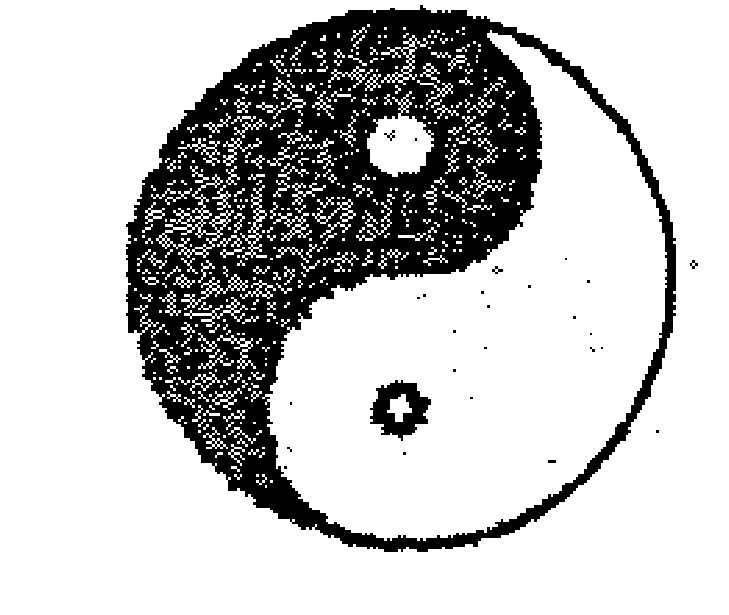
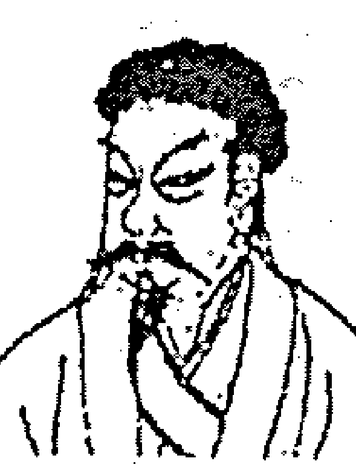

#### 【白话释义】
干乘墓虎课，是指六辛日丑加戌昼将乘白虎作墓神，辛酉日丑为空亡所以此白虎十分凶险，至辛巳日则更加凶猛，此是因为丑作丁神乘虎作墓的原因，主占病必死，其他则主且昏且迷，又凶恶，应小心防备他人陷害。如冬占得此课凶险稍轻，因为丑至冬旺可作库说。
此外，六乙日昼贵顺行，虽是未乘白虎，但上有临行年本命的时候，即是无加干的情况，若夏季占稍轻，此为未旺也为库的原因，其他时候无法得出此课。
虎鬼加干格，在六己日卯加己夜、六壬日戌加壬昼夜、六癸日戌加癸昼，除乙辛二日及甲丙戊庚壬丁己癸八日没有此格。

### 第六十二法：支乘墓虎有伏尸
此例有二等，一者干墓临支，二者支墓临支，以上二例占宅必有伏尸鬼祸或有形响，如又克宅者为的。假令乙亥日未为干墓临支而克支，如昼占上乘白虎，其余乙未日伏吟，并乙酉日未加酉，虽是墓虎临支而不克支，外有辛未辛酉二日虽是丑加支，缘不克支稍轻，其墓作月将不在此限。
第二等者，假令丙子日辰加子昼占，乃支墓临支而克支乘虎，如占家宅值此课者，必家中有孝服动或有丧吊，其年内必有停丧，尤详其墓属何类，而言何人死。又丁亥日辰加亥夜。
#### 虎鬼克支格
缘支鬼乘白虎而克支者，例如壬子日戌加子昼，丁丑日寅加丑夜，壬寅日返吟夜，癸卯日申加卯夜，壬午日返吟昼，乙未日卯加未夜，丙申日午加申昼，癸亥日戌加亥昼夜皆乘白虎。

#### 墓门开格
#### 蛇墓克支格

#### 【白话释义】
此例有两个等次，一是干墓临支，二是支墓临支，若课中有以上二例，主占宅必有伏尸鬼祸或有形响，若是课中有克宅因素则更甚。假令乙亥日未为干墓临支且克支，如昼时占则上乘白虎。其余还有乙未日伏吟，乙酉日未加酉等，此时虽是墓虎临支但不克支，另外有辛未辛酉二日丑加支，因为不克支所以鬼祸稍轻。
作为第二等，假令丙子日辰加子在昼占，乃是支墓临支而克支乘虎的情况，如占家宅，主家中有孝服动，故必有死丧，且其年内必有停丧，还应该详看其墓属何类，就知道是谁人死亡。还有丁亥日辰加亥夜亦是此例。
虎鬼克支格，此格是缘自支鬼乘白虎而克支的例子，如壬子日戌加子昼，丁丑日寅加丑夜，壬寅日返吟夜占，癸卯日申加卯夜占，壬午日返吟昼占，乙未日卯加未夜占，丙申日午加申昼占，以及癸亥日戌加亥昼夜且都乘白虎。
墓门开格，此格如卯酉日占，干墓乘蛇、虎加支的情况，主丧事重重。
蛇墓克支格，这种格局是由干墓乘螣蛇而加支又克支得来的，主宅内怪异频现。如丙子日戌加子夜占，壬子日辰加子夜占，若是临支而不克支则祸患稍轻，但是也不能逃避。另外有三十三日例，在此不再详细讨论，已上例只宜召法官行遣或安镇为吉，因为课中乃墓门开，若是占病，主家中死去三两口，乘白虎也是一样。

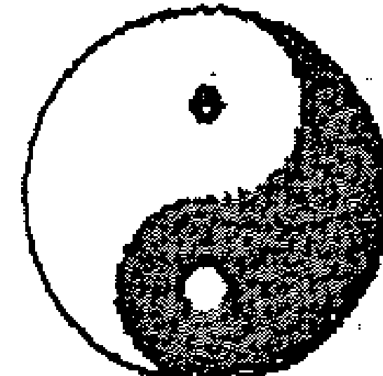
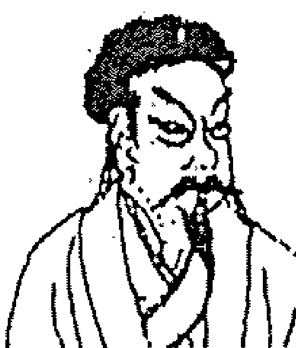

### 第六十三法：彼此全伤防两损
谓支干各被上神克伐者，故名此例，如占讼必两家皆被扑责。诸占必两边各有所亏，如占身被伤，占宅崩损。如丁亥日干上子水克丁火，支上辰土克亥水之类是也。诸例欲去其所克者，内辛未日干上午，支上卯，如占交易等，后必龃龉，如先有龃龉，后却和合。

#### 【白话释义】
此格是说支干各被其上神克伐，所以才有此例，如是占讼主两家皆被扑责。其他问题也主两边各有所亏，如占身则被伤，占宅则崩损。如丁亥日干上子水克丁火，支上辰土克亥水之类正是此课。若要在课中去其所克，如辛未日干上午，支上卯，此时如占交易等，必会遭遇别人辱骂，而事情伊始就恶语相加，却主最后双方和合。

### 第六十四法：夫妇芜淫各有私
谓干被支上神克，支却被干上神克者，为芜淫卦，既名芜淫，何又云夫妇各有私乎？纲夫妇乃人之大伦，既无夫妇好合之情，必有奸私不协之意，却详何处有情而言夫妇之私情也。如《心镜》中以甲子日干上戌，支上申一课为例，乃甲将就子受申克，子近甲兮魁必侵，妻怀内喜私情有，申子相生水合金是也。余有癸巳、壬午干上子，庚子、乙亥干上丑诸例，凡占不可执为芜淫卦，非专言夫妇而已，如先有人相允许，后各不相顾接，非独存无情，尤彼此各怀恶意。
真解离卦，缘干克支上神，支克干上神，或夫妇行年又值此者尤的。如甲子日干上午、支上辰，干克支上辰土，支克干上午火，如男命年在支上，女命年在干上，此时占人必占解离事，已后例内唯详空亡而言之，小畜九三，舆说辐，夫妻反目。

#### 【白话释义】
此课是说干被支上神所克，而支却被干上神克的格局，为芜淫卦，也叫做芜淫，为什么又专说夫妇各有私情呢？这是夫妇乃人之大伦，既无夫妇好合之情，则必有奸私不协之意，究竟何处有情而言夫妇之私情？如《心镜》中以甲子日干上戌，支上申一课为例，乃甲将就子受申克，子近甲，必有魁侵，主妻暗怀内喜，是因为申子相生水合金。癸巳、壬午干上子，庚子、乙亥干上丑却不可认为是芜淫卦，并非是说夫妇感情的。此时如先有人相允许某事，之后不相顾接，并非是独存无情，而是你们彼此各怀恶意造成的结果。
真解离卦，是说干克支上神，支克干上神，或夫妇行年又值此课则更甚。如甲子日干上午、支上辰，干克支上辰土，支克干上午火，如男命年在支上，女命年在干上，此时前来占卜之人必是占问解离之事，主夫妻反目。

### 第六十五法：干墓并关人宅废
谓日干之墓作四季之关神发用者是也，宜分干支发用。如日干之两课上作发用者，主人衰，如支辰之两课上发用者，主宅废。
夫关神者，春丑、夏辰、秋未、冬戌。如乙丑、乙未、乙酉、乙亥四日于秋季占之，未乃干之墓作关神为发用，临于干上，乃应人口灾衰。余六甲日除甲辰秋占未作丁更凶，其余各占皆如前说。如丁卯日戌加卯为发用，冬占乃干墓临支上，乃应宅颓废，余仿此。
#### 墓神覆日作生气格
如占作库务差遣必得，勿作墓看之。

#### 【白话释义】
此课是说日干之墓作四季之关神发用的情况，适宜分干支发用。如日干两课上神作发用，主其人衰，如支辰之两课上神为发用，则主屋宅废。
何谓夫关神？春丑、夏辰、秋未、冬戌。如乙丑、乙未、乙酉、乙亥四日于秋季占得，未为干之墓作关神发用，临于干上，主人口灾衰。其他，如六甲日除甲辰秋占未作丁更加灾废，其余都和前文同断。如丁卯日戌加卯为发用，冬季占乃是干墓临地支之上，主家宅颓废，余仿此。
墓神覆日作生气格，此格主近期有差遣。

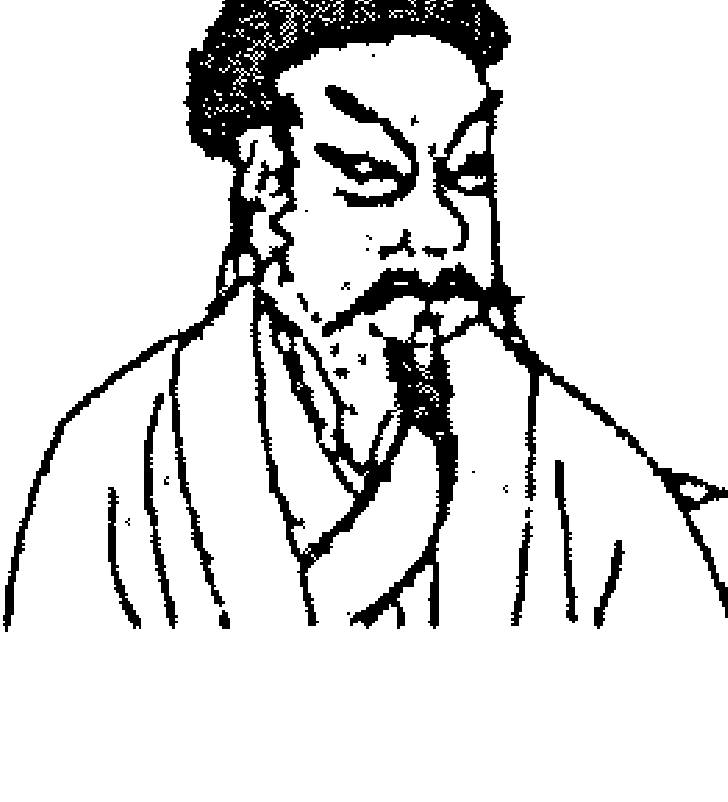

## 卷八 六壬毕法
### 第六十六法：支坟财并旅程稽
谓地支之墓作日干之财者，必主商贩折本，在路阻程，凡谋蹇滞不亨通也。如甲子日辰加子，乃支之墓神而作干之财为发用；甲午日戌加寅用，甲午日戌加子用，乙酉日丑加辰用。
#### 疑惑格
卯酉日占事，如行年又在卯酉之上者，必行人进退疑惑，此《心镜》内龙战卦中具载，尤忌天车煞。天车煞者，春丑、夏辰、秋未、冬戌也。

#### 【白话释义】
此格是地支之墓作日干之财的格局，主商贩折本，路途遇阻，无论求问什么皆主蹇滞、不亨通。如甲子日辰加子，乃是支之墓神作干之财神且为发用；还有甲午日戌加寅用，甲午日戌加子用，乙酉日丑加辰用。
疑惑格，此格局是在卯酉日占事，如行年在卯酉之上，必是行人进退疑惑，此是《心镜》内龙战卦中记载的知识，特别忌讳天车煞。所谓天车煞，正是春丑、夏辰、秋未、冬戌。

### 第六十七法：受虎克神为病证
- 金神乘白虎，必是肝经受病，可治肺而不可治肝。
- 木神乘白虎，必是脾经受病，可治肝而不可治脾。
- 水神乘白虎，必是心经受病，可治肾而不可治心。
- 火神乘白虎，必是肺经受病，可治心而不可治肺。
- 土神乘白虎，必是肾经受病，可治脾而不可治肾。
以上诸法，常得灵验，惟虎受克及家亡，不必治也。

#### 运粮神格
占治病专视日干之食神，尤妙干、行年乘之，乃名运粮神，忌空。

#### 禄粮神格
缘宜观干之禄神，亦名禄粮神，唯不可落空亡及作闭口，或受克。如占久病值此，必绝食而饿死。如辛未日酉加寅，乃是禄坐绝乡，又作闭口，又名无禄卦，占病必死，占食禄事亦忌。

#### 绝体卦
乃是柔干之禄受绝，返吟卦乃是刚干之禄受绝，绝嗣体先亡为祟。

#### 生死格
宜观生气死气尤验。如正月生气在子，死气在午，乃生气克死气也。如在甲寅旬中占之，乃生气空亡而死气实在，占病可畏。如行年上神是亥水尚可医疗，缘亥水克其午之死气故也。如死气克生气，又落空亡，或行年上神生其死气者必死。如生气与死气不相克者，占病虽无妨，但迁延而未即痊瘥也。
白虎乘日鬼而作空亡，必已病而未瘥。

#### 虎墓格
缘日干之墓乘白虎在六处者，如占病必是积块病，宜以破积药治之，如六乙日昼将顺行，乃未乘白虎；内乙酉日未空亡无畏，或易疗，非年深积块也。又六辛日昼将顺行，亦丑乘白虎，辛酉日丑空亡，亦容易治疗。

#### 虎乘丁鬼格
如六辛日有白虎乘丁者，占病必知所患疼痛之处也。如辛卯日亥加丑作中传，昼占乃亥乘白虎作丁神，必为头疼以致不救，余观丁虎类而言之。丑为脾疼或腹疼，卯手疼或目疼，巳齿疼或咽喉疼，未胃疼或积块疼，酉大肠，亥临戌亥子丑寅卯为头，亥临辰巳午未申酉为肾，余逐类言之。如日鬼临于六处不乘白虎，但拟其鬼亦为病证，如火为鬼便言肺病，水为鬼便言心病，金为鬼便言肝病，土为鬼肾病，木为鬼脾病。如鬼受克并空亡不必疗亦瘥。

#### 蒿矢卦
亦宜言有疼痛处，金加火上，筋骨疼痛，惟庚日申酉加巳午尤的。

#### 连茹卦
作日之财，占病必因伤食而得，如人年命上神能制其财神者，尚可医疗。如年命上神生其财神者，必致死亡。

#### 斫轮格
如卯加申，戌加卯，占病必手足不举，或有伤。

#### 空禄格
缘日之禄神作空亡又坐克方，占病必绝食而饿死。如甲辰日寅加酉，夜又乘白虎，返吟夜；乙巳日卯加申夜，返吟夜；丁亥日午加亥夜，日之食神在禁方与前课同。

#### 禄神闭口格
缘禄神作闭口，为旬尾乘白虎者是也。如乙未卯加申，又返吟夜；丙戌、戊子，巳为禄神闭口；辛未日酉加戌夜；壬戌日亥为闭口禄。

#### 六片板格
缘六合乘申临卯，为尸入棺。缘申者身也，于三月占尤的，乃是死身，即死尸也，且上有六合，下有卯木，是为棺也。尸入棺，占病必死，尤宜详其类神而言之，或申加卯不乘六合，于九月占，但病在床而未愈，缘申是生气，卯为木床。癸卯日申加卯，占父母长生病死尤速，缘父母爻入棺故也。又如丙戌、丁卯二日申加卯，昼将上乘六合，如占妻病必死，缘妻财爻亦入棺故也。已上皆三月占尤验。

#### 白虎入丧车格
缘申加巳发用为的，占病可畏。

#### 人入鬼门格
如庚日申为本命，返吟课占病必死。

#### 收魂神
乃戊日辰为元武者是，夜顺昼逆有之，于十一月占尤的，缘辰为死气故也。

#### 浴盆煞
缘忌浴盘有水。夫浴盘者，春辰、夏未、秋戌、冬丑是也。如地盘见浴盆上，忌乘亥子水；天盘见浴盘上忌天后元武二将，如占小儿病死尤速，缘亥为孩，子为子息，故不要见水也。天后亦是子，元武亦是亥。

#### 寒热格
如巳午加亥子，如或克日主痨病，十干返吟必心存疮疱。

#### 宴喜致病格
如癸酉、癸亥、癸丑三日并支上未作太常为用，夜将有之。壬戌子寅日并支上未作太常，夜贵有之。以上六日例，缘未为太常克干居于宅上，或为发用，如占病必因喜事及宴饮，或往亲戚家带病而归。若是官人占之，必因赴宴席过筋而得病，余占皆因前事而致不美。

#### 因妻致病格
如壬子癸丑二日，未遁旬干者，必往妻家得病极验，惟占人行年本命上有卯木为救，如乘寅木必得神护，尤宜命法官治之为妙，倘少缓，寅木反被未墓，便难救也。

#### 血厌病虎作鬼格
白虎乘病符克干尤可畏，或年命上乘血支血忌者，必是血病。或女命占病又带月厌作血支血忌，病必是血崩或堕胎尤验。

#### 【白话释义】
金神乘白虎，必是肝经受病，可治肺而不可治肝。
木神乘白虎，必是脾经受病，可治肝而不可治脾。
水神乘白虎，必是心经受病，可治肾而不可治心。
火神乘白虎，必是肺经受病，可治心而不可治肺。
土神乘白虎，必是肾经受病，可治脾而不可治肾。
以上的方法，十分灵验，只是当白虎受克时，不必枉费财力精力治疗了，必然无救。

运粮神格，占治病专视日干食神，特别是被干、行年所乘的时候，叫做运粮神，但是切忌空亡。
禄粮神格，此格宜观干之禄神，也叫做禄粮神，不可落空亡及作闭口，或受克。此格如占慢性病，其人必绝食饿死。比如辛未日酉加寅，乃是禄神坐入绝乡，又作闭口，叫做无禄卦，此时占病必死。
绝体卦是柔干之禄受绝，返吟卦是刚干之禄受绝。
生死格，此格适宜观看课中生气死气。如正月生气在子，死气在午，是生气克死气的格局。在甲寅旬中占得此格，是生气空亡而死气实在的情况，此时占病必然要遭遇凶险。如行年上神是亥水尚可医疗，这是因为亥水克午位死气的缘故。如死气克生气，且又落空亡，或行年上神生其死气其人必死。如课中生气与死气不相克，占病无妨，但也不会迅速痊愈。
白虎乘日鬼而作空亡，所问之人必然已经久病未愈。
虎墓格，此格是日干之墓乘白虎在六处的情况，如占病必是体内有积块的病，应以破积药治之，如六乙日昼将顺行，是未乘白虎；其中乙酉日未空亡病情无大碍，但也不易消除。而六辛日昼将顺行，也是丑乘白虎，辛酉日丑空亡，此格局病情容易治疗。
虎乘丁鬼格，此格如六辛日有白虎乘丁，占病必知所患疼痛之处。如辛卯日亥加丑作中传，昼占乃亥乘白虎作丁神，必为头疼，甚至难以医救，还要看丁虎情况。丑为脾疼或腹疼，卯手疼或目疼，巳齿疼或咽喉疼，未胃疼或积块疼，酉大肠，亥临戌亥子丑寅卯为头，亥临辰巳午未申酉为肾。如日鬼临于六处且不乘白虎，则其鬼为病证，如火为鬼便是肺病，水为鬼必是心病，金为鬼当是肝病，土为鬼则患肾病，木为鬼多是脾病。如鬼受克并空亡，则不必疗也能痊愈。
连茹卦作日之财，其病定是因为吃坏东西而得，如人年命上神能制其财神，则此病尚可医疗。如年命上神生其财神，主病重必死。
斫轮格，如卯加申，戌加卯，占病主手足无法举高或有伤。
空禄格，此格是缘自日之禄神作空亡又坐入被克之方，占病主为绝食而饿死。如甲辰日寅加酉，夜又乘白虎，返吟夜；乙巳日卯加申夜，返吟夜；丁亥日午加亥夜，日之食神在禁方与此课同断。
禄神闭口格，禄神作闭口，且旬尾乘白虎是禄神闭口格。如乙未卯加申，又返吟夜；丙戌、戊子，巳为禄神闭口；辛未日酉加戌夜；壬戌日亥为闭口禄。
六片板格，此格是六合乘申临卯，为尸入棺。这是因为申为身，于三月占更是无疑，必是死身，且上有六合，下有卯木，代表棺冢。尸入棺，则占病必死，还要详细看其类神才能祥知，或是申加卯不乘六合，于九月占，但病在床而未愈，这是因为申是生气，卯为木床。癸卯日申加卯，占父母主其将要病死，此是亦为父母爻入棺之原因。又如丙戌、丁卯二日申加卯，昼将上乘六合，如占妻病则妻子必死，此时妻财爻入棺的原因。巳上众断都是三月占得必验。
白虎入丧车格，此格是申加巳为发用，主占病可畏。
人入鬼门格，此格如庚日申为本命，因返吟课，故占病必死。
收魂神，此时是戊日辰为元武的格局，夜顺昼逆可得到，于十一月占十分灵验，这是因为辰为死气的缘故。
浴盆煞，此格忌浴盘有水。浴盘是指，春辰、夏未、秋戌、冬丑。如地盘见浴盆，忌乘亥子水；天盘见浴盆忌天后元武二将，如是问占小儿之病，则主夭折，此时因为亥为孩，子为子息，故不要见水也。天后亦是子，元武亦是亥。

### 第六十八法：制鬼之位乃良医

亥为孩，子为子息，所以不要见水。天后也是子，玄武也是亥，应当明了。

寒热格，此格如巳午加亥子，或克日主患痨病，十干返吟则为心病。

宴喜致病格，此格如癸酉、癸亥、癸丑三日并支上未作太常为发用。壬戌子寅日并支上未作太常。以上六日例，是因为未为太常克干居于宅上，或为发用之意，如占病则必因喜事及宴饮，或从亲戚家带病而归。若是有官之人占得，主因赴宴席过多而得病，其余事情都是因为陈年往事而不美。

因妻致病格，此格如壬子癸丑二日，未遁旬干，主必前往其妻子家得病，惟问课之人行年本命上有卯木可以得救，如乘寅木必得神灵保佑，特别适宜命中法官治之为妙，若是少缓，则寅木反被未墓，更加难以医治。

血厌病虎作鬼格，此格是白虎乘病符克干的情况，结果必然凶险，或是年命上乘血支血忌，主有血病。或是女命占病又带月厌作血支血忌，则其病必是血崩或堕胎。

#### 天医作虎鬼格
不宜医者治。虎乘干鬼，必有不明之人作祸。

#### 病体难担荷格
如丁火不平，日干上申，三传申酉戌俱日财，占病必因伤食而得，以致不救，缘丁火逢病死墓，更于秋冬占之无疑也。如求财，春夏二季却有，缘干强之故。尤宜详空而忧喜俱无，如占病，三传俱财，无制财者必死，有制财者可救。丁丑、丁未、丁亥干上申用。

#### 【白话释义】
此格只适合妻子来占问其夫与有官之人可得吉兆，其余皆是凶象。巳午作虎鬼，主不宜灸，申酉作虎鬼，主不宜针。如乙丑日酉加乙，乃是日之鬼，却因为支上有午火而克酉金，此午火便是良医，或是本家亲人有高超医术，或得家堂中祖宗的神位保护，其余可分类而言。除占病外，凡占得此格虽在危难灾患之中，但是必得人相助，即有救神在旁，其神临于占人行年本命之上，适宜雪理辩明，自己为自己辩护，必能远离灾祸。如制鬼之神上乘贵人，则是有达官贵人为自己求情，如见被囚禁，主必有救援可以免祸，或乘蛇虎二神，必得神灵保佑，制鬼之神即是良医，此盖因日之食神也。赶贼神则宜占捕盗，贼神即制鬼之神。如甲戌日干上酉，虽为日鬼，但是此课中旬中空亡，不足畏惧，并且支上巳火坐于墓位，也不能相救。如这种格局求医，则其医虽能准确的说出病症，但是无法对症下药，不利于医治。己丑日干上卯、支上酉，壬辰日干上戌、支上卯，主其余救神不在支上而是临在三传之上及临行年本命，也可为救断，虎鬼所临之处为畏期。如制鬼之神加亥子，看病宜服汤药，加寅卯并四土之上主宜服丸散，如是巳午之上宜灸，加申酉则宜针砭。

### 第六十九法：虎乘遁鬼殃非浅

谓白虎加临旬内之干为日鬼者例，此法应验如神，凡占皆畏其咎弥深，难以消除，纵空亡亦不能为救。如甲子日昼占，乃虎加庚午临戌为用，又旦占虎加庚午临子在支上，又旦占庚午作虎加干，或返吟。乙丑日昼占虎临辛未加戌，戊辰日夜占，虎临甲子加戌。

#### 明暗二鬼格
乃干上神作日干明鬼，又支上神遁旬干作日干暗鬼。如六甲日申加甲、庚加支；六乙日酉加乙，亦庚加支；六丙日亥加丙，即壬加支；六丁日子加丁，即壬加支；六戊日寅加戊，即乙加支；六己日卯加己，即乙加支；六壬日未加壬，即戊加支；六癸日占无。

#### 【白话释义】
此格是说白虎加临旬内之干为日鬼的格局，此法应验如神，凡占得此格都畏惧其犯错误，难以消除，纵是空亡也不能为救。比如甲子日昼占，是虎加庚午临戌为用，白天占虎加庚午临子在支上，或者白天占庚午作虎加干，或返吟。乙丑日昼占虎临辛未加戌，戊辰日夜占，虎临甲子加戌。

明暗二鬼格，此格乃是干上神作日干明鬼，支上神遁旬干作日干暗鬼。如六甲日申加甲、庚加支；六乙日酉加乙，庚加支；六丙日亥加丙，壬加支；六丁日子加丁，壬加支；六戊日寅加戊，乙加支；六己日卯加己，乙加支；六壬日未加壬，戊加支；六癸日占无此格。

### 第七十法：鬼临三四讼灾随

谓日干之鬼临于第三四课全者，官词病患继踵而至，唯宜修德作福，及归正道，庶得稍轻，犹未免于病词二事也。如或全值空亡，始能免此，然亦且先见此而后无虑。如乙未日申加未为第三课，酉加申为第四课之类；如甲戌日酉加戌为第三课，申加酉为第四课，虽日鬼加临辰两课，尤幸皆作空亡，不能为害，似可无畏也。

#### 岁破作鬼临支格
如再克支辰，讼灾免难。

#### 天鬼作日鬼格
在占病，必是疫气。如天鬼作日鬼空亡者病，虽似疫，旋即无事，但未免头疼发热而已。

#### 朱勾相会格
如丙辰午加辰，乃朱雀入勾陈，必有非常之讼。

#### 【白话释义】
此格是日干之鬼临于第三、四课的格局，主官词病患继踵而至，只适合修德作福，归于正道，但所得平平，其余之事免不了是病、讼之争。若是课中全值空亡，则可以免去灾祸，但也应是先见灾祸而后得以无虑的结果。如乙未日申加未为第三课，酉加申为第四课等；又如甲戌日酉加戌为第三课，申加酉为第四课，虽是日鬼加临辰之两课，但所幸都是空亡，故不能为害，所以可以不用担心。

岁破作鬼临支格，此格如果在遇到克支辰，则讼灾免难。

天鬼作日鬼格，此格在占病，必是疫气。如天鬼作日鬼空亡，则虽然看似生病但实际无事，不过免不掉有些头疼发热。

朱勾相会格，这种格局如丙辰午加辰，乃是朱雀入勾陈的格局，主引起大家瞩目的争讼。

### 第七十一法：病符克宅全家患

夫病符者，每年旧太岁是也，且如子年亥为病符，丑年子为病符，余年仿此。若病符临支又克支者，乃主合家病患，更乘天鬼，定遭时疫而无疑也，病符乘白虎而临支克支尤凶。如病符作月之生气，尤主合家病，或作月之死气必死。以上乘天鬼尤凶。天鬼者，正月酉，逆行四仲，涉害深者必久病。

#### 宜成合旧诸事格
缘病符临宅反来生宅，或生日干，或作日财，或作贵人者，却宜成合残年旧事，一切之事宜逐类而推之，勿作病符论。

#### 【白话释义】
所谓病符，是每年的旧太岁，如子年亥为病符，丑年子为病符，余年仿此。若是病符临支又克支的格局，主全家都要患病，若更乘天鬼，则定是遭遇流行的瘟疫。若是病符乘白虎而临支克支则结果更凶。如病符作月之生气，也主其人全家患病，而作月之死气则其人必死。以上例子若乘天鬼则结果更凶。天鬼，即为正月之酉，逆行四仲，涉害深的人主患久病。

宜成合旧诸事格，此格是病符临宅反来生宅的格局，或是生日干，又或作日财，还可以作贵人，此格适合成合残年旧事，具体事情还应具体分析，但不应当作病符来看。

### 第七十二法：丧吊全逢挂缟衣

谓岁前二辰为丧门，岁后二辰为吊客。如支干上全逢此二位凶煞，主凶，又于占人行年本命上神乘之，其年必哭送亲姻，身披孝服也。若论支干上全逢丧吊者，唯甲午、丁亥、己亥、庚子、癸巳，乃干上乘吊客，支上乘丧门。甲戌、丁卯、己卯、庚辰、癸酉，乃干上乘丧门，支上乘吊客。

#### 内外孝服格
如日鬼作死气而乘太常加干上，必主有外孝服。至如六辛日午加戌，正月夜占为死气作太常；六壬日未加亥，二月夜占，又六壬日丑加亥，八月旦占；六癸日未加丑夜占，二月为死气。内辛亥日太常临午加戌，支上未亦为太常，上又乘白虎作丁神而克支，此必有内外孝服。内壬子日太常临未加亥，支上申又乘白虎，三月占又是死气乘虎入宅，亦主内外孝服。又壬戌日太常临丑而克亥，干支上子为白虎作空亡羊刃，入宅主家宅有血光之灾。

#### 孝白盖妻头格
如癸亥卯未三日，干上未夜将，酉年二月丑为年命，如是妻占夫病，必死，缘妻之年命上乘华盖作太常为日鬼，又是死气为吊客故也。如八月内占之，乃未为生气，尚有孝服未已。又如日干之鬼作死气乘太常，在支上主有内丧，再见丧吊更凶。又乙未日申加未，三月占用昼将，作死气乘太常入宅。又戊戌日卯加戌，十月占用夜将，乃卯作死气乘太常入宅，而又克宅，凶尤甚也。又戊子日卯加子作太常，死气入宅刑宅，亦十月占，用夜将有之。又壬子日丑加子，八月占，用昼将，乃日鬼乘太常作死气入宅克宅。又辛酉日午加酉，正月占用夜将，乃死气作日鬼乘太常入宅克宅，凶甚。又壬戌日未加戌二月占，夜将乃死气作鬼乘太常入宅。又癸亥日未加亥，二月夜将，乃死气作日鬼乘太常入宅又克宅，凶。又癸酉日未加酉，二月夜将，乃死气作日鬼乘太常入宅。辛未日九月昼将，寅加未作死气乘太常入宅又克宅。甲戌、庚戌二日卯加戌，十月占，夜将乃死气作太常入宅又克宅。己亥日戌加亥，十一月占，昼夜将乃死气作太常入宅又克宅。辛亥日戌加亥，五月占，昼夜将乃死气作太常入宅又克宅。

#### 墓门开格
如岁后五墓又为干墓，临卯酉作蛇，又作月厌，必主重丧。如子年四月乙酉日未加酉，则乘蛇同上。又午年十月辛酉日，丑加酉乘蛇作月厌，为岁后五墓而又作干墓。

#### 【白话释义】
此格是说太岁之前二辰为丧门，太岁之后二辰为吊客。如支干上全逢此二位凶煞，则主凶，还应看占问人行年本命上所乘是否是此凶煞，若是其年必要哭送亲姻，身披孝服。若支干上全逢丧吊，则甲午、丁亥、己亥、庚子、癸巳，是干上乘吊客，支上乘丧门，或者甲戌、丁卯、己卯、庚辰、癸酉，为干上乘丧门，支上乘吊客。

内外孝服格，此格如日鬼作死气而乘太常加于干上，必主有外孝服，至如六辛日午加戌，正月夜占为死气作太常；六壬日未加亥，二月夜占；六壬日丑加亥，八月旦占；六癸日未加丑夜占，二月为死气。其中辛亥日太常临午加戌，支上未也是太常，上又乘白虎作丁神而克支，其中必有内外孝服之事。其内壬子日太常临未加亥，支上申又乘白虎，若在三月占又是死气乘虎入宅，也主内外孝服。壬戌日太常临丑而克亥，干支上子为白虎也作空亡之羊刃，主家宅有血光之灾。

孝白盖妻头格，此格如癸亥卯未三日，干上未夜将，酉年二月丑为年命，如是妻占夫病，必死，此因妻之年命上乘华盖作太常为日鬼，又是死气为吊客的原因。如八月内占得，未是生气，则其尚且有救。又如日干之鬼作死气乘太常，在支上主有内丧，再见丧吊之煞则更凶。乙未日申加未，三月占用昼将，作死气乘太常入宅。戊戌日卯加戌，十月占用夜将，乃是卯作死气乘太常入宅，且克其宅，结果必凶。戊子日卯加子作太常，是死气入宅刑宅。壬子日丑加子，八月占，用昼将，乃是日鬼乘太常作死气入宅克宅。辛酉日午加酉，正月占用夜将，是死气作日鬼乘太常入宅克宅，灾祸必重。壬戌日未加戌二月占，夜将则是死气作鬼乘太常入宅。癸亥日未加亥，二月夜将，是死气作日鬼乘太常入宅又克宅，为凶。癸酉日未加酉，二月夜将，为死气作日鬼乘太常入宅。辛未日九月昼将，寅加未作死气乘太常入宅又克宅。甲戌、庚戌二日卯加戌，十月占夜将，是死气作太常入宅又克宅。己亥日戌加亥，十一月占，昼夜将，为死气作太常入宅又克宅。辛亥日戌加亥，五月占，昼夜将是死气作太常入宅又克宅。

墓门开格，此格如太岁之后五墓又为干墓，临卯酉作蛇，又作月厌，必主家中有重丧。如子年四月乙酉日未加酉，则乘蛇同上。午年十月辛酉日，丑加酉乘蛇作月厌，为岁后五墓而又作干墓的格局。

### 第七十三法：前后逼迫难进退

假令壬寅日干上子，三传辰巳午皆空而不可进，欲退后一步，逢地下寅盗气，又退一步，逢丑为干鬼，乃前不可进，后不可退，以此推之，惟宜守干上之旺，切不可轻举妄动，如动则虚耗百出。又癸巳日干上子，乙巳日干上卯，三传卯寅丑。甲寅日干上卯，三传辰巳午。壬申日干上子，三传丑寅卯。癸卯日干上寅，三传辰巳午。此于逼迫二字不合，若克处回归，又受克还似之。

#### 初传被下克，继归地盘之本宫，又被上神所克格
此例乃克处回归又受克，虽虎贲之勇，亦不可为。如癸巳卯丑亥四日，午加癸为初传，乃午火受癸水所克，及归本家午上，又被亥水所克，使其午火去住不能也。且午火之类神为日之财，主财聚散。如用夜将元武加午，主失财，其午火之上亥亦为元武，主重重失财。亦为日干之妻，主妻常病，亦为马类或有马而常被人借去。亦为屋类，主频迁徙而耗费用。亦为心类，主心病。亦为眼类，主常患眼目。以上之类皆不宜占。

#### 全伤坐克格
如支干各受上神克，又坐被克方者。假令甲午寅、丙寅午辰戌、癸卯巳，并是返吟。

#### 顾祖格并回还格
止宜守旧，亦进退不能也。

#### 【白话释义】
此格假令壬寅日干上为子，三传辰、巳、午都是空亡而不可进，欲退后一步，又逢地下寅为盗气，再退一步，而逢丑为干鬼，此时前不可进，后不可退，以此推之，只能够守得干上之旺，切不可轻举妄动，如动则虚耗之事在所难免。癸巳日干上子，乙巳日干上卯，三传卯、寅、丑。甲寅日干上卯，三传辰、巳、午。壬申日干上子，三传丑、寅、卯。癸卯日干上寅，三传辰、巳、午等等，同断。但此例子和逼迫二字不合，倘若克处回归，则主又受克。

初传被下克，是继归地盘之本宫，又被上神所克的格局，此例是从克处回归又受克，虽有虎贲之勇，也不可贸然行事。如癸巳卯丑亥四日，午加癸为初传，乃是午火受癸水所克，及归于本家午上，又被亥水所克，使其午火去住而不能。且午火之类神为日之财，主财将聚散。如用夜将元武加午，主会失财，其中午火之上亥也为元武，主重重失财将会发生。也为日干之妻，主妻子常患病，也为马类或有马而常被人借去。更为屋类，主频繁迁徙而耗费家财。还为心类，主有心病。也为眼类，主常患眼目之病。以上之类都不适宜占得。

全伤坐克格，此格如支干各被上神所克，又坐被克之方。假令甲午寅、丙寅午辰戌、癸卯巳，同是返吟。

顾祖格并回还格，得此格只宜守旧，而不能进退。

### 第七十四法：空空如也事休追

谓三传皆空亡者是也，于进退连茹课中多有，如三合课两传空亡，纵有一传不空，而上乘天空将者，亦系此例，不必细具。凡值此等例，占事皆主指空话空，全无实象。惟宜解散忧疑，欲成事而不可得也，或鬼空尤妙。如遇占病，久病者死，新病者空，欲望事成合，须待改旬再谋之方可也。凡鬼空亦宜制之，不然尤有虚挠之凶，为我难见彼之象。

#### 四课全空格
四课无形，事不出名，纵然出也，也是虚声。如乙巳日干上寅为空亡，第二课又入空亡乡，支上卯作空亡，第四课又入空亡乡，此乃四课皆空，故应前言。丙午日干上寅，戊辰日返吟，戊戌日返吟，以上前例内，如年命上乘空亡，但非成事，或替他人占事，或初传遥克作空亡坐空乡，尤无力也。

#### 【白话释义】
此格局是说课中三传皆是空亡，在进退连茹课中多能遇到，如三合课中两传空亡，虽然有一传不空，但若是上乘天空之将，也应算在此格局里面，不再过多讨论。凡是得到此课，若占事主事中一切都是空想空话，全无实际可信的内容。若是能及早放弃还算明智，强求则一事无成，但课中鬼为空亡则结果当妙。如果占病，主久病者死，新病者愈，若是要望事成合，只能过一旬再来讨论了。鬼空也应当制止事情发展，不然有虚挠之凶，自己难以见到真实情况。

四课全空格，此格局主四课无形，事不出名，纵然能出名，也只是虚声。如乙巳日干上寅为空亡，第二课又入空亡之乡，支上卯作空亡，第四课又入空亡乡，所以四课皆空，应依照前文断课。丙午日干上寅，戊辰日返吟，戊戌日返吟，如此时年命上乘空亡，无论是自己谋事还是为他人占卜，都是初传遥克作空亡坐空乡，必然无力。

### 第七十五法：宾主不投刑在上

凡支干乘刑者有三等，凡占未免相刑之意，所谋交涉事，必各有异心。

#### 一字刑者
乃四课上神全逢辰午酉亥者是也。甲辰日第一课酉加寅、第二课辰加酉、第三课亥加辰、第四课午加亥，此乃四课上神全逢辰午酉亥者也。又癸亥日干上午同。又乙酉日第一课亥加辰、第二课午加亥、第三课辰加酉、第四课复亥加辰，支干上乘辰午酉亥又克支干者，尤可畏也。壬午日干上辰克干壬、支上亥克支午。又己酉日辰加己，上为墓覆干，午加酉而克支。丙戌日干上亥克干，支上辰墓支。如甲子日支上辰，其三传辰申子，乃名自刑在干支上。又乙丑日支上酉，其三传巳丑酉，亦支上重逢自刑。又丙寅日干上酉，其三传酉丑巳，乃干上重逢自刑之酉也。余并仿此。

#### 二字刑者
乃支干上全乘子卯是也。子卯相刑者，两边无礼。乙未、丙申、戊申、壬申、辛丑五日，干上子、支上卯。乙丑、丙寅、戊寅、辛未、壬申五日，干上卯、支上子。以上十日，乃支干上神各无礼之刑也。

#### 三字刑者
乃三传寅巳申或丑戌未是也。寅巳申三刑## 壬归 中国古代传统哲学名篇

## 卷八 六壬毕法

者，未免无恩之义，凡占必恩反怨也。如丑戌未者，凡占多恃势而凌弱。尤宜观干上之神带生旺不空、乘吉将，乃名能刑于他人也。三传寅巳申、巳申寅或申寅巳、丑戌未、戌未丑或未丑戌俱是也。

### 金刚格
巳酉丑三合为三传，支干上复见酉者，乃应金刚自刑其方，缘巳刑申、丑刑戌，唯酉不能刑，故自刑其西方。

### 火强格
寅午戌三合为三传，支干上复见午者，乃就火强自刑其方，缘寅能刑巳、戌能刑未，唯午不能刑，故自刑其南方也。

### 水流趋东格
申子辰为三传，干支上复见辰者，乃应水流趋东也，缘子能刑卯，申能刑寅，惟辰不能刑，用趋其辰之本宫，以辰为水之墓库故也。

### 木落归根格
亥卯未为三传，干支上复见亥字者，乃应木落归根也，缘卯能刑子，未能刑丑，唯亥不能刑，故归其亥之本宫也，兼亥为木局之本，夫本者，乃木之父母乡也。

以上皆不宜值之。如占讼，不论一字刑、二字刑、三字刑，皆被刑责，如乘凶将其凶犹甚，唯空亡及皇恩、天赦可解，亦宜问罪犯轻重而言赦宥，如犯重但刑稍轻，而未免遭刑，如情轻则无刑也。皇恩者，正月起未顺行六阴位。天赦者，春戊寅、夏甲午、秋戊申、冬甲子。

### 四胜煞格
乃干上酉、支上午或支上酉、干上午者皆是。又就自刑中单言酉午为四胜煞，凡占各逞能，或皆邀功逞俊之意。如乙丑日、丙寅、戊寅、辛未、壬申五日干上酉，支上午。又壬寅、乙未、丙申、戊申、辛丑五日，干上午，支上酉。以前无恩刑等中，如甲子日寅刑干上巳、子刑支上卯；丙子日干上申，日刑干上申、子刑支上卯；辛丑日戌刑干上未、丑刑支上戌；癸卯日丑刑干上戌、卯刑支上子；辛卯日戌刑干上未、卯刑支上子。于前例中，如此五日，乃支干相刑其上神，又是子卯无礼刑。外有甲寅、庚申、己未、丁未、癸丑五日，或干上乘辰午酉亥，亦作自刑例。

### 助刑戕德格
乃六处有神作支之自刑，又作干鬼，又结连三传为鬼是也。庚午日午加庚发用，又午加未暮将，天乙临干本身可以解凶。

#### 【白话释义】

此格主凡是支干乘刑分为三等，从总体上来说凡占必然有相刑之意，所谋交涉之事，双方或多方必然各怀鬼胎，主事难成。

分而叙之，第一等乃是四课上神全逢辰午酉亥的格局。甲辰日第一课酉加寅、第二课辰加酉、第三课亥加辰、第四课午加亥，此是四课上神全逢辰午酉亥。又有癸亥日干上午同断。乙酉日第一课亥加辰、第二课午加亥、第三课辰加酉、第四课也是亥加辰，支干上乘辰午酉亥又克支干，结果当然不会如意。壬午日干上辰克干壬、支上亥克支午。己酉日辰加己，上为墓覆干，午加酉而克支。丙戌日干上亥克干，支上辰墓支。甲子日支上辰，其三传辰、申、子，叫做自刑在干支上。又有乙丑日支上酉，其三传巳、丑、酉，也是支上重逢自刑。以及丙寅日干上酉，其三传酉、丑、巳，乃是干上重逢自刑之酉的格局。这些都是第一等的情况，灾祸难以逃避。

第二等是支干上全乘子卯的情况。子卯相刑，则两边无礼。乙未、丙申、戊申、壬申、辛丑五日，干上子、支上卯。乙丑、丙寅、戊寅、辛未、壬申五日，干上卯、支上子。以上十日，皆是支干上神各自无礼之刑，主事事受阻，交往甚恶。

第三等是三传寅、巳、申或丑、戌、未的格局。寅、巳、申即为三刑，代表毫无恩情，凡占必定从恩反怨。如是丑、戌、未，则主凡占多主一方恃强凌弱。第三等还要观看干上之神是否带生旺而不空、乘吉将，此时是指自己能刑于他人，若是没有则是他人对自己不利。三传寅、巳、申，巳、申、寅或申、寅、巳，丑、戌、未，戌、未、丑或未、丑、戌亦为同断。

金刚格，此格是巳酉丑三合为三传，支干上复见酉，乃应金刚自刑其所在方位，这是因为巳刑申、丑刑戌，只有酉不能刑，所以自刑西方。

火强格，此格为寅午戌三合为三传，支干上复见午，主火强自刑其方，原因是寅能刑巳、戌能刑未，只有午不能刑，必然自刑南方。

水流趋东格，此格是申子辰为三传，干支上复见辰，因为水流向东方固然刑东，这是子能刑卯，申能刑寅，只有辰不能刑，且以辰为水之墓库的原因。

木落归根格，此格是亥卯未为三传，干支上复见亥的情况，正对应了木落归根，缘自卯能刑子，未能刑丑，只是亥不能刑，所以当归其本宫，并且亥为木局之本，所谓本就是指木之父母所在的地方。

以上各种格局都为不吉的征兆。如占讼，则不管是一字刑、二字刑、三字刑，都主自己被刑责，如乘凶将则结果尤其凶恶，只有遇到空亡及皇恩、天赦才能稍减灾祸，同时此课也能询问罪犯的轻重，会得到赦免的回复，如是犯下重罪主所受之刑可以稍轻，但是不能逃脱处罚，如果情节较轻则刑罚可免。所谓皇恩，是正月起未顺行六阴位。而天赦，即春戊寅、夏甲午、秋戊申、冬甲子。

四胜煞格，此格乃是干上酉、支上午或支上酉、干上午等。自刑中单说酉午为四胜煞，凡占得则各自逞能，或都有邀功逞俊的意思。如乙丑日、丙寅、戊寅、辛未、壬申五日干上酉，支上午。又壬寅、乙未、丙申、戊申、辛丑五日，干上午，支上酉。又如甲子日寅刑干上巳、子刑支上卯；丙子日干上申，日刑干上申、子刑支上卯；辛丑日戌刑干上未、丑刑支上戌；癸卯日丑刑干上戌、卯刑支上子；辛卯日戌刑干上未、卯刑支上子。这些例子中，只有如此五日，乃是支干相刑其上神，又是子卯无礼之刑。且外有甲寅、庚申、己未、丁未、癸丑五日，或干上乘辰午酉亥，也可以当做自刑的例子。

助刑戕德格，此格是六处有神作支为自刑的格局，又叫做干鬼，是因为结连三传为鬼的原因。庚午日午加庚为发用，又有午加未是暮将，只有天乙临课干本身可以解凶。

### 第七十六法：彼此猜忌害相随

此例有五等：一者，干支上下皆各作六害，凡值此者，彼此各相猜忌，主客不相顾接，乃两意相谋，各有戾害。如甲申日干上巳与干为六害，支上亥与支为六害。外有庚寅、丁丑、己丑、癸未等日，皆干支上下作害者。二者，支干上神作六害，亦主各相猜忌。如乙亥日干上子与支上未为六害，辛巳、壬午、丙子、戊子日干上子，支上未。三者，支干、天盘、地盘皆作六害，此等戾害尤甚。如辛酉日返吟，支干戌酉为六害，上神辰卯六害。又壬申、乙卯、丙寅返吟，又乙卯、戊寅、丙寅、壬申、辛酉伏吟，皆有之。四者，干支三传作六害，此局全无和气。如辛卯日干上未，支上子，三传又子未子，皆作六害；辛未日干上亥，支上申，三传又申亥申皆作六害。五者，支干上下交互作六害，如我方动念害人，人已早思害我，此局更为危难。如乙未日，干上子与地支未作六害、支上卯与干作六害，而支干上子卯又复相刑，辗转为害，无从解免。外如甲申日干上亥，支上巳；庚寅日干上巳，支上亥；丁卯、己卯日干上辰。

#### 人喜我忧格
如辛丑日干上酉与干作六害，支上子与丑却作六合也。外有乙未、乙丑日并干上卯，辛未日干上酉。

#### 【白话释义】

此课有五等之分：一，干支上下皆各作六害，凡值此，主彼此各相猜忌，主客不相顾接，乃是两意相谋，各有戾害的意思。如甲申日干上巳与干为六害，支上亥与支为六害。外有庚寅、丁丑、己丑、癸未等日，都是干支上下作害。二，支干上神作六害，也主双方各相猜忌。如乙亥日干上子与支上未为六害，辛巳、壬午、丙子、戊子日干上子，支上未。三是支干、天盘、地盘皆作六害，此等格局灾祸尤其严重。如辛酉日返吟，支干戌酉为六害，上神辰卯为六害。又有壬申、乙卯、丙寅返吟，乙卯、戊寅、丙寅、壬申、辛酉伏吟，都是此等例子。四，指干支三传作六害，此局中全无和气，事事难成。如辛卯日干上未，支上子，三传又是子、未、子，皆作六害；辛未日干上亥，支上申，三传又为申、亥、申作六害。五，是指支干上下交互作六害，此时如我动念害人，则其人也早已经有害我的念头，此局更是危难。如乙未日，干上子与地支未作六害、支上卯与干作六害，而且支干上子卯相刑，必然辗转为害，而无法重修于好。另外如甲申日干上亥，支上巳；庚寅日干上巳，支上亥；丁卯、己卯日干上辰也是此等。

人喜我忧格，此格局如辛丑日干上酉与干作六害，而支上子与丑作六合的情况。还有乙未、乙丑日并干上卯，辛未日干上酉也是此断。

### 第七十七法：互生俱生凡事益

虽有生而作墓败空亡者，知其人宅盛衰，彼此旺败。

#### 互生格
干上神生支，支上神生干是也。此例两相有益，各有生意。如辛卯日干上亥生支，支上辰生干。庚戌日干上巳生支，支上未生干。庚子日干上酉虽生支而却败其支，支上丑虽生干而却是干之墓。庚午日干上卯虽生支，而却败其支，支上丑虽生干，而却墓其干。丁酉日干上丑虽生支，而却墓其支，支上卯虽生干，而却败其干。己酉日干上辰虽生支，而却墓其干，支上午虽生干，而却克其支。辛巳日干上卯虽生支而却败其支，支上戌虽生干而却墓其支。辛亥日干上酉虽生支而却败其支，支上戌虽生干而自克其支。壬午日干上寅生支，支上酉虽生干而作空亡，又为败气也。如值此等例，虽有生旺之名，反作衰败空耗论矣。

#### 俱生格
乃干上神生干，支上神生支是也。此例各有生意，彼此和顺，或两家合本作营生尤应也。如逢月生气尤的。支干全受上神生，丙寅、丁酉日并干上寅，庚午、戊申日并干乘辰。丙寅日干上卯虽生干而亦败其干，支上子虽生支而亦败其支。丁卯日干上卯虽生干而亦败其干，支上亥虽生支而奈作旬空。乙卯日干上子虽生干而作空败，支上亥为长生，此一课乃利宅不利人，利彼不利己。

#### 【白话释义】

此课虽有生气但是却落入墓败空亡之乡，由此可以推测人宅盛衰，彼此旺败的情况。互生格，此格是干上神生支，支上神生干。此例中两相有益，各有生意。如辛卯日干上亥生支，支上辰生干。庚戌日干上巳生支，支上未生干。庚子日干上酉虽生支但是却又败支，支上丑虽生干却是干之墓乡。庚午日干上卯生支，却也败其支，支上丑生干，而却墓其干。丁酉日干上丑虽生支，且墓其支，支上卯虽生干，亦败其干。己酉日干上辰生支，同时也墓其干，支上午虽生干，却克其支。辛巳日干上卯虽生支而却败其支，支上戌虽生干而却墓其支。辛亥日干上酉生支而却又败其支，支上戌虽生干而自克其支。壬午日干上寅生支，支上酉虽生干而作空亡，又为败气。例子繁杂，但规律相同，都是虽有生旺之名，但反作衰败空耗的意思。俱生格，此种格局是指干上神生干，支上神生支。主各有生意，彼此和顺，或主将会两家合本做生意。如逢课中月生气尤其灵验。此格支干全受上神生，丙寅、丁酉日并干上寅，庚午、戊申日并干乘辰。丙寅日干上卯虽生干但也败其干，支上子虽生支却又败其支。丁卯日干上卯虽生干却又败其干，支上亥虽生支却又作旬空。乙卯日干上子虽生干却又为空败，支上亥为长生，此一课必是利宅不利人，利彼不利己的结果。己巳日干上巳生干，支上卯虽生支而反败支，此一课乃是利己不利彼，利人不利宅的预兆。丙子日干上寅实生其干，支上酉虽生支却又败其支，且作旬空。丙午日干上寅，支上卯皆作空亡。

### 自在格
如甲子、乙亥、丙寅、丁卯、戊午、己巳、庚辰、辛未、壬申、癸酉十日，并且是支加干上而生日的格局。

### 第七十八法：互旺皆旺坐谋宜

#### 互旺格
只甲申、庚寅二日有之。甲申日干上酉，乃是支之旺神，支上卯乃是干之旺神。庚寅日干上卯乃是支之旺神，支上酉乃是干之旺神。凡值此者，惟宜两相投奔，各有兴旺，客旺主而主旺客，人旺宅而宅旺人，夫旺妻而妻旺夫，父旺子而子旺父，兄旺弟而弟旺兄，朋友彼此帮助。

#### 皆旺格
支干上皆乘旺神者，乃彼我、客主、夫妇、父子皆然兴旺，凡谋事顺利，不劳其力，惟宜坐待，不利谋动，只可就本身之宅职而静听造转，或已遭失而欲复旧事极妙。倘若意外之求，或远谋动用，则变为网罗缠绕身宅，乃作羊刃，反为灾祸。如或坐待，则人口通泰，宅复兴隆，并无心中得人扶持而发旺，斯占最的。甲申日干上卯、支上酉，庚寅日干上酉，壬申、壬寅日干上子，丙申、丙寅日干上午，忌空亡。

#### 【白话释义】

互旺格，只有甲申、庚寅二日有。甲申日干上酉，是支的旺神，支上卯是干的旺神。庚寅日干上卯乃是支旺神，支上酉是干旺神。得到此格局的，只适合两相投奔，则各有兴旺，客旺主且主旺客，人旺宅并宅旺人，夫旺妻也妻旺夫，父旺子而子旺父，兄旺弟而弟亦旺兄，另主朋友彼此帮助。

皆旺格，此格是支干上都乘旺神的格局，乃彼我、客主、夫妇、父子都为兴旺，主谋事顺利，不劳其力，只适合坐待，而不利谋动，只能就本身之宅职而静候佳音，或者已经遭遇损失但是情况转好。倘若有意外之求，或有远谋动用，则变为网罗缠绕身宅的格局，反为灾祸。如果静待，则主人口通泰，宅复兴隆，并且心中得贵人扶持而发旺。比如甲申日干上卯、支上酉，庚寅日干上酉，壬申、壬寅日干上子，丙申、丙寅日干上午，忌空亡。

### 第七十九法：干支值绝凡谋决

如甲申、甲寅日返吟，乃支干上皆乘绝神。又丙申、丙寅日亦是返吟，绝神作鬼，只宜结绝凶事，亦宜释解官讼，占病痊。丙辰、丙戌日如昼占，亦宜告贵结绝，凶吉二事皆可。戊寅、庚寅、壬寅、戊申、庚申、壬申六日返吟，缘绝神作日之财神，只宜结绝财物事，惟不利占妻病，值此必死；又作月内之死气者，妻死尤速。壬辰、壬戌日，如旦占，亦宜告贵结绝财物事。以上返吟结绝事极速，缘绝神投绝乡故也。亦不宜占食禄事，缘神神投绝，如占病又作死气，必绝食而死。外有乙未日干上申为乙木之绝，支上亥乃未土之绝，如夜占却宜告贵结绝事理。又辛未日干上寅、支上亥，如夜占亦宜结绝告贵之事。又癸未日干上巳、支上亥，昼占亦宜告贵结绝事理。丁未日支干上皆乘亥，己未日干上亥、又干上巳，以上皆宜结绝，亦不宜占食禄事，此言土内有寄寅者，故以亥为绝也。

#### 绝神加生格
如庚辰寅加亥为用是也，凡巳加寅、申加巳、亥加申、寅加亥，最不宜占结绝事，缘绝神反坐长生之上，凡占事卒未了当，必止了又兴，或年命乘之。

#### 递互作绝神格
最宜两相退换屋宇，或递替差遣、交代职任等事。如甲申、庚寅二日伏吟，又癸未日干上亥、支上巳，丁丑日干上亥、支上巳，丁未日干上亥，癸丑日干上巳。

#### 【白话释义】

如果课中甲申、甲寅日返吟，则是支干上都乘绝神的格局。丙申、丙寅日若是是返吟，则为绝神作鬼，此时只能结绝凶事，也可以释解官讼，占病主痊愈。丙辰、丙戌日如果白天占卜，也适合告贵结绝，不同的是，此时凶吉二事都可成功。戊寅、庚寅、壬寅、戊申、庚申、壬申六日返吟，缘自绝神作日之财神，所以可结绝财物，但是不能够占问妻子病情，若问则必死；作月内死气，则妻死速度更快。壬辰、壬戌日，如果晚上占卜，也适合告贵结绝财物等事。以上返吟结绝之事都会快速应验，此是因为绝神投绝乡，必然快速。也不可以占问食禄之事，神投绝处必然凶兆，如占病则作死气，主绝食而死。还有乙未日干上申为乙木之绝地，支上亥乃未土之绝地，如夜占却适宜告贵结绝事理。又有辛未日干上是寅、支上为亥，如果是夜占也适合结绝告贵。癸未日干上巳、支上亥，昼占可以告贵结绝事理。丁未日支干上都乘亥，己未日干上亥或干上巳，以上都可做结绝之事，但不能占食禄之事，这是因为土内有寄寅，所以亥为绝处。

绝神加生格，此格如庚辰寅加亥为用，凡巳加寅、申加巳、亥加申、寅加亥，主最不宜占结绝之事，这是因为绝神反坐在长生之位，故凡事都难成功，所以不可。

递互作绝神格，此格最适合双方退换屋宇，或相互替换工作、交代职任等事。如甲申、庚寅二日伏吟，又有癸未日干上亥、支上巳，丁丑日干上亥、支上巳，丁未日干上亥，癸丑日干上巳等情况。

### 第八十法：人宅皆死各衰羸

#### 干支上互乘死气格
如戊申日干上子、支上卯，庚申日干上子，庚寅日干上午、支上子，甲寅日干支上午诸例，惟不宜吊丧问病，如乘月内之死气尤的，如占病必死。

#### 支干全乘死气格
如庚寅、庚申、辛丑日并干上子，乙丑、甲申、甲寅日干上午，己未、壬申、壬寅并干上卯，丙寅、丙申、丁丑日并干上酉，此例只宜休息，万事不利谋动。

#### 【白话释义】

干支上互乘死气格，此格如戊申日干上子、支上卯，庚申日干上子，庚寅日干上午、支上子，甲寅日干支上午等例子，不适合吊丧问病，如乘月内死气更是这样，占病必死。

支干全乘死气格，此格如庚寅、庚申、辛丑日并干上子，乙丑、甲申、甲寅日干上午，己未、壬申、壬寅并干上卯，丙寅、丙申、丁丑日并干上酉；以上课例只适合休息，万事不可谋动。

### 第八十一法：传墓入墓分憎爱

此等例详初传是何类神而言之，如是日之财神、禄神、长生、官星等，不可值中末之墓，如是日之鬼及盗气等，却喜中末墓也，细具于后。

#### 生我者传墓入墓
如辛未日，三传巳戌卯，巳加子为初传，乃日之长生，岂宜中传戌来墓巳，末传又入戌乡。又己巳、癸未、壬子日，并巳加子为用，大不利占生计及长上之事，如辛未日有官人占之，缘官星、德神、长生入墓。如常人占之，反喜鬼入墓也。

#### 德禄传墓格
如丙子日巳加子为用，癸未、壬子日巳加子为用，乃财神入墓；戊子日巳加子，乃德禄并生气入墓。

#### 长生入墓格
如庚子日巳加子用，常人占之，喜鬼入墓。

#### 脱气入墓格
乙未日巳加子用。

#### 财神传墓格
丙戌日申加卯、庚辰日寅加酉乃财入墓、庚戌日申加卯用乃德入墓格。

#### 长生脱气入墓
戊戌日申加卯用。

#### 鬼入墓格
戊辰日寅加酉用，以上占行人来迟。

#### 【白话释义】

此格需要详看初传是何类神，如是日之财神、禄神、长生、官星等，则不可值中传末传之墓，如是日之鬼及盗气等，则入中传末传之墓更好，细具于后。

生我者传墓入墓，如辛未日，三传巳、戌、卯，巳加子为初传，乃日之长生，怎么可以中传戌来墓巳，末传又入戌乡。己巳、卯、未、亥、丑日，巳加子为用，大不利于占生计及长上之事。辛未日被有官人占得，官星、德神、长生入墓，则官位不保。而常人占得，则反有好运。

德禄传墓格，此格如丙子日巳加子为用，癸未、壬子日巳加子为用，是财神入墓；戊子日巳加子，主德禄并煞入墓。

长生入墓格，此格如庚子日巳加子用，常人占得，喜鬼入墓，吉。

脱气入墓格，此是乙未日巳加子用。

财神传墓格，此是丙戌日申加卯、庚辰日寅加酉课中有财入墓、庚戌日申加卯用是为课中有德入墓。

长生脱气入墓，此为戊戌日申加卯用。

鬼入墓格，此格是戊辰日寅加酉为用，占行人主来迟。

### 第八十二法：不行传者考初时

夫不行传者，乃中末空亡是也。中末既空，但只以初传断其凶吉，言其事类，此例极多，不必细具。或一日内有三五课者，如甲子日干上巳，初传申是日之鬼，中传亥是日之长生，末传寅是日之德禄，既长生德禄皆空，岂宜独存初传之申金为日之鬼而坐实地，若以初传用事，必好事无而恶事有也。巳后如值初传凶者，若是遥克者，好恶俱无，皆仿此，亦名守株待兔。

#### 独足卦
己未日干上酉，凡占万事皆不可行，此一例乃初中末并支干皆在未上，于七百二十课中，止有此一课，故名独足。既止有一足，焉可行乎。如欲商贩，利行舟而不利陆路，如欲逃亡者亦然，占病主死。虽众皆知有独足例，殊不会稽考。己未伏吟卦亦名独足，且己未伏吟虽有未、丑、戌为三传，缘中传乃旬内空亡，既中传空亡，岂能刑其末传之戌乎？且中末既无，惟支干与初传皆在未上，与独足何异耶。凡谋皆不能成也。

#### 白话释义
所谓不行传，是中传末传为空亡的格局，中传末传既是空亡，则只可以初传断其凶吉，此种课例十分多，不用全部列出分析，通常一日内有三五课都是此例，如甲子日干上巳，初传申是日之鬼，中传亥是日之长生，末传寅是日之德禄，长生德禄皆为空亡，那么又怎可只留下初传申金为日鬼而坐实地，若以初传用事，则必主好事遁去而恶事相生的结果。巳后如值初传为凶，若是遥克，则好恶俱无，也叫做守株待兔课。

独足卦，此卦是己未日干上为酉，凡占则万事都不可行，这是因为初传中传末传并支干都在未位上，在七百二十课中，只有此一课，所以叫做独足。既然只有一只脚，则什么事情还可以办成呢？如欲商贩之事，则利行舟而不利陆路，如欲逃亡也是这样，占病主死。虽然大家都知道有独足一课，但都没有重视起来。己未伏吟卦也叫做独足，且己未伏吟虽有未、丑、戌为三传，但其中传乃是旬内空亡，既中传空亡，则不可刑其末传的戌，且中传末传既无，只有支干与初传在未上，这和独足有什么不同吗？主万事皆不能成。

### 第八十三法：万事喜忻三六合

谓三传寅午戌等，或干支上见未；三传亥卯未等，或干支上见戌；三传申子辰等，或干支上见丑；三传巳酉丑等，或干支上见辰，皆名为三合课，又与中间一字作六合者是也。故经云：三六相呼见喜忻，纵然带恶不成嗔。且夫带恶者，乃金日得寅午戌，土日得亥卯未，木日得巳酉丑，火日得申子辰，纵然三传克干亦不能为祸，尚可成合。其余占虽曰未尽善，究竟事必可成就也，何况三传生日或作日之财。又三六相呼，见谋皆遂，全无障碍，不然有人在中相助而成合事。此不宜解释忧疑事，如占病，其势弥笃。如占行人，忻喜而来。壬子日申加辰用，三传申子辰水局并来生干，又干支上各自有六合，为全吉之课，兼三传之将昼夜皆是贵勾常之神，并作日之财，尽可求财。占尊长及不利占作生计，缘天将上神克生气故也。又如丙申、丙子、丙辰三日干上丑，三传皆水局来作日干，殊不知三合六合相呼之格，带恶不成嗔之义也，兼干上丑亦可以敌其传水，凡谋虽有成意，终是可畏，但顾目下成合，余畏拨置事也。又辛未日干上寅，壬午日干上卯，辛亥日干上午，壬寅日干上未，戊申日干上丑，三合课中又逢天将六合居干支上者，亦可用，但力稍轻。

#### 白话释义
此课是说三传寅、午、戌的格局，或是干支上见未；三传亥、卯、未等；又或是干支上见戌，三传申、子、辰等，干支上见丑；三传巳、酉、丑等，又或是干支上见辰，都叫做三合课，又可与中间一字作六合。所以经云：“三六相呼见喜忻，纵然带恶不成嗔”。若是课中还有其他恶者，比如金日得寅、午、戌，土日得亥、卯、未，木日得巳、酉、丑，火日得申、子、辰，纵然三传克干也不能为祸断，这是因为其尚可成合。其余占断虽说没有做到尽善尽美，但终究也可以有所成就，何况是三传生日或作日之财的情况。又因为三六相呼，主凡谋之处都可成功，全无障碍，或者有人暗自相助可以成事。只是不能占解释忧疑等事。如占病，则其势弥笃。如占行人，主忻喜而来。如乙酉日申加辰为用，三传申、子、辰是水局并来生干，且支上见丑，所以叫做三合中有六合，为全吉之课，并且三传天将昼夜都是贵勾常土之神，并作日之财，得此课尽可求财不会有害。若不是占财，则大不宜于尊长，以及不利占作生计，这是因为天将上神克生气的原因。又如丙申、丙子、丙辰三日干上为丑，三传都是水局来作日干，主凡谋虽有成意，但终是可畏，只能顾得自己眼前的事情。辛未日干上寅，壬午日干上卯，辛亥日干上午，壬寅日干上未，戊申日干上丑，都是三合课中又逢天将六合居干支上的例子，也可为用，只是力量稍轻。

### 第八十四法：合中犯杀蜜中砒

谓三传寅午戌，如支干上有午为自刑，见丑为六害，见子为冲；三传亥卯未，如干支上有子为无礼刑，见辰为六害，见酉为冲；三传申子辰，如干支上有卯为无礼刑，见未为六害，见午为冲；三传巳酉丑，如干支上有酉为自刑，见戌为六害，见卯为冲，凡值此例，所谓三合犯杀少人知，惟防奸里定相欺，笑里有刀谁会得，事将成合失便宜。占得此者，必至恩中变怨，合中有破，虽是属我之事，亦被人在中阻隔，俗谚云：“笑里刀，蜜里砒。”正此意也。其中犯杀空亡，徒为冤憎，下稍成阻，不免先应其事。

#### 白话释义
此格局是说三传寅、午、戌，如支干上有午则为自刑，见丑为六害，见子为冲；三传是亥、卯、未，如干支上有子则为无礼刑，见辰是为六害，见酉为冲；三传申、子、辰，如干支上有卯为无礼刑，见未为六害，见午为冲；三传巳、酉、丑，如干支上有酉为自刑，见戌为六害，见卯为冲，凡是得到这些例子的，都是所谓的三合犯杀罪，需要小心防备里定相欺，笑里有刀。占得此课，必然有从恩中变为怨恨的含义，且合中有破，虽是属于自己的事情，也被人从中阻隔，俗谚云：“笑里刀，蜜里砒。”正是此义。

### 第八十五法：初遭夹克不由己

谓初传坐于克方，又被天将所伤，故取名夹克。凡占必身不由己，及受人驱策，尤宜详其受克者是类而言之。且如夹克者是财，必财不由己费用；或是日之同类受夹克者，乃自身不由己。惟是日鬼受夹克者为妙，乃当忧不忧之义也。如六甲日戌加寅为初传，昼夜天将皆乘六合木神，此乃夹克其财。六壬日午加亥为初传，昼夜天将玄武水神及天后水神，此乃夹克日财，必财不由己而费用。外有甲辰日辰加卯为初传，昼夜天将皆是六合木神，夹克其财。又甲申日戌加卯同上，或妻常病。

#### 家法不正格
缘三传皆受夹克例，唯乙丑、乙卯、乙亥日并寅加酉，且占有之。

#### 俯丘仰仇格
甲子日夜将寅加未为用，乃俯见丘仰见仇。乙巳日酉加丑，乙未日卯加未夜。

#### 白话释义
此课是说初传坐于被克之方，又被天将所伤，所以叫做名夹克。凡占则主身不由己，受人驱策，更应该详细看受克者是哪一类来断吉凶。如夹克者是财，则财所费之财不由自己花销；若是日之同类受夹克，主办事自身不由己。只有日鬼受夹克为妙，主忧愁之处无需担忧的意思。如六甲日戌加寅为初传，昼夜天将都是乘六合木神，此是夹克其财的格局。六壬日午加亥为初传，昼夜天将玄武水神及天后水神，此是夹克日财，且其财不是用在自己身上。外有甲辰日辰加卯为初传，昼夜天将都是六合木神，夹克其财。又有甲申日戌加卯同断，或主妻子常病。

家法不正格，此格是因为三传都受夹克得来的，只有乙丑、乙卯、乙亥日且寅加酉，在晚上占才会出现。

俯丘仰仇格，此格是甲子日夜将寅加未为用，此主俯见为丘仰见是仇。乙巳日酉加丑，乙未日卯加未夜，同断。

### 第八十六法：将逢内战所谋危

六合内战为发用者，凡用事将成合而被人搅扰也。如癸巳日昼占，六合加申，申金加巳火之上。天后内战为发用者，如丁卯日戌加卯旦占，必妻常作而多病。

- 夜贵内战格：六癸日卯临申为用。
- 螣蛇内战格：丙辰日旦占，子临辰为用。
- 朱雀内战格：丁丑日夜占，乃朱雀乘亥临丑为用。
- 勾陈内战格：丁丑日昼占，乃勾陈乘卯临申为用。
- 青龙内战格：壬寅日夜占，乃青龙乘申临巳为用。
- 白虎内战格：丁亥日昼占，乃白虎乘午临亥为用。
- 太常内战格：丁酉日昼占，乃太常乘卯临酉为用。玄武无内战。
- 天空内战格：如丁丑日卯加申为用，夜占。
- 太阴内战格：壬辰、壬戌日返吟夜占，乃太阴乘巳临亥为用。

夫十一天将皆有内战，此例余尚有之，不暇细具。今略具一例，余皆仿此，而逐类言其内战之意也。

#### 三传日辰内战格
支干三传皆下克上者，凡占皆是家法不正，或自窝犯，或丑声出于堂中，以致争竞，斯占极验。如癸酉日，癸水克上神之午火，酉金克上神之寅木，初传未加寅，中传子加未，末传巳加子，皆下贼上，凡占全无和气，占讼被刑，占病必死，吉事不成。惟宜占官从卑贱而迤逦迁转，大为兴旺，舍此皆凶。己酉、辛酉日未加寅，戊辰日寅加酉皆如前说。

#### 白话释义
此课是指六合内战为发用，占得此课则用事将成合而且被人搅扰。如癸巳日白天占得，为六合加申，申金加在巳火之上。如果课中天后内战为发用，如丁卯日戌加卯在晚上占得，主妻子经常患有怪病。

- 夜贵内战格，即六癸日卯临申为用。
- 螣蛇内战格，此格是指丙辰日旦占，子临辰为用。
- 朱雀内战格，此格为丁丑日夜占，朱雀乘亥临丑为用。
- 勾陈内战格，即丁丑日昼占，勾陈乘卯临申为用。
- 青龙内战格，此格为壬寅日夜占，青龙乘申临巳为用。
- 白虎内战格，此是丁亥日昼占，白虎乘午临亥为用。
- 太常内战格，指丁酉日昼占，太常乘卯临酉为用。或是元武而无内战。
- 天空内战格，此格如丁丑日卯加申为用，在夜占。
- 太阴内战格，此格如壬辰、壬戌日返吟夜占，得太阴乘巳临亥为用。

十一天将都有内战，例子有很多在此就不详细说明了。下面只用一例来说明其意义，余皆仿此，可逐类说明其内战的意义。

三传日辰内战格，此格是支干三传皆以下克上，此时凡占都主家法不正，或是自家窝藏犯罪之人，又或家丑外扬，引来的争讼，此法及其灵验。如癸酉日，癸水克上神的午火，酉金克上神的寅木，初传未加寅，中传子加未，末传巳加子，都是以下贼上，凡占主全无和气，占讼主被刑，占病则必死，吉事也不成。之适合占有官之人从卑贱之位发迹，大为兴旺，除此之外皆凶。己酉、辛酉日未加寅，戊辰日寅加酉，也如前例所说。

### 第八十七法：人宅坐墓甘招晦

谓天盘支干皆坐于地盘墓上者，乃心肯意肯情愿受其暗昧，凡事皆自招其祸，切不可怨天尤人也。不惟本身甘招其祸，犹且将家宅亦情愿假借与人作贱，欲兑凭终不能脱出也。如壬寅日亥加辰、寅加未，壬申日亥加辰、申加丑，己未日未加辰，丁丑日未加戌、丑加辰、庚寅日申加丑、寅加未，庚申日申加丑，刚日四绝体也。

#### 互坐丘墓格
干坐于支墓之上，支坐于干墓之上者，乃彼此各招其昏晦，惟不宜两相投奔，必是愚蠢人也。如丁丑日未加辰、丑加戌；戊寅日巳加未、寅加辰；甲申日寅加丑、申加未；庚寅日申加未、寅加丑，戊申日巳加丑、申加辰。余传内虽有所喜之神，其年命上却克去者，乃心多退懒，自不肯向前也。

#### 白话释义
此课是说天盘支干都坐于地盘墓位上的格局，主其人心肯意肯情愿接受暗昧，凡事都是自招灾祸，不可怨天尤人。不仅仅是其人本身甘招其祸，其家宅也情愿借给别人做下贱的事情，这种事情始终无法摆脱。如壬寅日亥加辰、寅加未，壬申日亥加辰、申加丑，己未日未加辰，丁丑日未加戌、丑加辰、庚寅日申加丑、寅加未，庚申日申加丑，都是此例。

互坐丘墓格，此格局是干坐于支墓之上，支坐于干墓之上的情况，主彼此各招来昏晦的事情，只是不适合两相投奔，且其人必是愚蠢之人。如丁丑日未加辰、丑加戌；戊寅日巳加未、寅加辰；甲申日寅加丑、申加未；庚寅日申加未、寅加丑，戊申日巳加丑、申加辰。若三传内有所喜之神，但其年命上克此神的时候，主心多退懒，自己不求进取。

### 第八十八法：干支乘墓各昏迷

如支干全被上神墓者，其人如云雾中行，其家宅敞而自尘暗，凡彼此占不亨快，经云：墓覆日辰，人宅昏沉。壬申日干上辰、支上丑；壬寅日干上辰、支上未，己未日干支上辰；丙寅日干上戌、支上未；丙申日干上戌、支上丑；乙丑日干上未，以上诸例，乃干支两课皆见墓神，经云：干支墓全逢，所为皆不通，两处欲克害，犹忌合墓神。如甲申日干上未，如用夜贵，则两处皆空，可以解疑。

#### 互乘墓神格
干乘支之墓，支乘干之墓者，此例我欲昏昧他，却被他已昏昧我也。道典云：天网恢恢，疏而不漏。戊寅日干上未，支上辰；戊申日干上丑、支上辰；辛未日干上辰、支上丑；甲申日干上丑实、支上未空；庚寅日干上未空，支上丑实；乙未日干上辰空，支上未实。

#### 欲弃屋宇格
凡干加支，求宅必得，缘己身入宅故也。或被支所克或所脱，虽目下强，得其屋后无益也。凡支加干得之，尤不费力，缘宅来就人故也，亦不可受宅克、墓、脱，如我有屋宅欲出兑者，如值干加支，乃人尚恋宅，或支加干，乃屋恋人，二项皆不能脱也。其支干相加，宅生其人，切不可弃之，后有长进，如被克、脱、墓者，终被屋所累矣。

#### 白话释义
此格局是支干全被上神墓，主其人如在云雾中行走，且其家宅鄙陋而阴暗，所占必然不亨快、有所阻碍，经云：“墓覆日辰，人宅昏沉”。壬申日干上辰、支上丑；壬寅日干上辰、支上未，己未日干支上辰；丙寅日干上戌、支上未；丙申日干上戌、支上丑；乙丑日干上未，以上的例子，都是干支两课皆见墓神，经云：“干支墓全逢，所为皆不通，两处欲克害，犹忌合墓神”。比如甲申日干上未，如用夜贵，则课内两处皆空，可以解疑。

互乘墓神格，此格是干乘支之墓，支乘干之墓，此例主我想要欺骗愚弄他人，但其实早已经被他愚弄了自己。道典云：“天网恢恢，疏而不漏”。戊寅日干上未，支上辰；戊申日干上丑、支上辰；辛未日干上辰、支上丑；甲申日干上丑实、支上未空；庚寅日干上未空，支上丑实；乙未日干上辰空，支上未实。

欲弃屋宇格，得此格凡是干加支，主求宅必得，这是因为自己已经投入宅地。若被支所克或所脱，虽然眼下依然可以得到房屋，但得到后却没有半点好处，必然有所耗费。凡是支加干，则此课可不费力，这是因为宅来就人的原因。同时，课中也不可受宅克、墓、脱，如我有屋宅欲出售，若此课值干加支，则主此人尚恋宅，若为支加干，必是屋恋其人，此两种情况都不可能出售成功。若课中支干相加，宅生其人，则此房不能放弃，在后期必然因为房子而获利，如是被克、脱、墓，那么尽早脱手，不然终会被此屋所拖累。

### 第八十九法：任信丁马须言动

夫任信者，伏吟卦也。如刚日名自任，可委任于他人。柔日名自信，可取信于自己。凡值伏吟卦，切不可便言伏匿而不动。于传中及支干上有旬内丁神，或乘天马驿马者，必静而求动，不可不知。如壬辰、戊午、丙辰、甲寅、庚申、癸未、癸丑、己酉、辛亥，以上俱丁神在传，如占访人必出外干事，如先允许，后必改易，故名无任无信也。天马逐月推之，如填内无天马、驿马、旬丁者，如始欲谋事，尽伏尽匿，终不可动谋矣。如已尝得人先蒙允许，后必有信也。凡占静中求动终是静，或动中求静终是动，诸占不易之故也。

#### 伏吟卦内无丁马格
伏吟卦内无丁马，却占人本命行年上乘魁罡及丁马者，亦主动尤速。又乙酉、己丑、癸巳三日伏吟，如占人年命是亥，乃丁马，又如占身动最速。又乙卯、己未、癸亥三日伏吟，如占人年命是巳，亦丁马交加身动尤速。

#### 非伏吟而乘丁马者亦主动
非伏吟而乘丁马者亦主动。如癸亥日干上巳为财动，余同。又癸酉、己未、丙子、戊寅、辛巳、丁亥、甲午、庚戌九日伏吟，占行人必中路被阻，缘中传空亡而不能刑至末传，故前后难进退耳。余占必先虽允许，后却无实惠也。

#### 六丁加天马格
六丁加天马，或天马加六丁，必非小动也。如甲子日卯加甲，十一月占是也，余皆仿此言之。如值丑为本命，乃名本命恋宅，全无动意，此法极验。

#### 伏吟卦六丙日吉
伏吟卦六丙日吉，缘初传为德禄，中传为财，末传为长生，各忌空亡。

#### 伏吟卦六戊日伏吟凶
伏吟卦六戊日伏吟凶，缘初传巳火克中传申金，中传克末传寅木而作日干，似乎无和气也，且戊日伏吟切不可被人惑作甲戊庚三奇言之，且初传天盘乃巳火，地盘乃戊土，岂可言三传甲戊庚耶，此之不可不知者也。

#### 白话释义
所谓任信，即是伏吟卦。如在刚日虽然名义上是自己的任务，但可委托他人行事。柔日则应该自信，应该相信自己可以成功。值伏吟卦，切不可便言伏匿而不动。在传中及支干上有旬内丁神，或乘天马驿马的时候，需要冷静观察后再求动，不可不知情况的行动。如壬辰、戊午、丙辰、甲寅、庚申、癸未、癸丑、己酉、辛亥，以上都是丁神在传，如占访他人，主此人出外干事，如是已经应允过的，则会改易日期，所以叫做无任无信课。天马逐月来推，如课内无天马、驿马、旬丁的时候，若是想有所成就，则应该尽伏尽匿，而不能有任何举动。如果已经先经过他人允许，则以后必然还有其他音讯，应当静候。凡占主静中求动而终是静，或动中求静而终是动，这也是所求之事不易达成的原因。

伏吟卦内无丁马，却占得其人本命行年上乘魁罡及丁马的时候，也主事情变动的十分迅速。若在乙酉、己丑、癸巳三日伏吟，则占人年命是亥，乃是丁马，此时如果占身动则速度最快。乙卯、己未、癸亥三日伏吟，若占人年命是巳，也主丁马交加，身动迅速。

若非伏吟而乘丁马也主动。如癸亥日干上巳为财动，其余与此相同。又有癸酉、己未、丙子、戊寅、辛巳、丁亥、甲午、庚戌九日伏吟，此时占行人必会中路被阻，此是缘自中传空亡而不能刑至末传，所以前后很难进退。其余问题都主虽然先前允许，但后来却无法实现所说。

六丁加天马，或天马加六丁的格局，主所动非小。如甲子日卯加甲，十一月占得的情况。若是值丑为本命，叫做本命恋宅，主事情完全没有改变的意思，此法极其灵验。

伏吟卦六丙日吉，是因为初传为德禄，中传为财，末传为长生，此时各传都忌空亡。

伏吟卦六戊日伏吟凶，这是初传巳火克中传申金，中传## 第九十法：来去俱空岂动宜

壬归传克末传寅木而作日干，此时课内毫无和气可言，且初传天盘乃是巳火，地盘为戊土，不能说三传是甲、戊、庚，断卦时不可不知此道理。

夫来去者，返吟卦也，缘初传与末传、初中末往来交互也。故凡占得返吟卦，切不可便言凡事往来动移。内有三传皆空亡者，虽有动意，实不动也。尤当详其空亡有用及无用言之。己酉返吟，三传卯酉卯，此用鬼皆空亡，正宜处难中解祸，余占空空然。乙丑日三传戌辰戌，此传财俱空亡，止宜占病，不宜问婚，妻及财凶。戊辰日返吟，三传巳亥巳，此乃生气落空亡，不利长上，或六月、十二月占之，尊长病死尤的。戊寅、戊午、戊戌、戊申、戊子、己亥、庚戌、甲辰等日返吟皆空，更宜逐类推之。

### 德丧禄绝格
乃阳日返吟者是，若阴日子加巳，乃四绝体也。

### 移远就近格
天罡乘青龙、六合在日上，乃真斩关卦。如占时为发用，名动中不动，寻远在近处。兼中末空亦然。如初见太岁，中末见月建或日建，亦名移远就近，将缓为速。又如己丑日干上辰、支上戌，虽干支上全乘魁罡，缘干上墓覆，又是柔日昴星，伏匿万状，终不能动。庚寅日干上辰、支上戌亦是真斩关卦，必主动，缘中末空亡，反不能动；又干上戌、支上辰同。后二假令乃言斩关卦之义，非返吟也，须知之。

### 似返吟卦
似返吟卦，癸未日干上寅，虽不系返吟卦，缘三传申寅申，往来皆在支干上，似乎与返吟相类也，如占事虽不免往来交通，下稍全无一事，缘始末皆空，又是柔日昴星，故伏匿也。如用昼贵，三传合元合，阴私万状，兼支干上皆乘脱气，占事不出旋窝。诸返吟卦占事难成而覆破，访人差迭，复被诱差迭。

#### 【白话释义】
所谓来去，即是返吟卦，这是因为初传与末传、初中末往来交互才形成此卦。所以凡占得返吟卦，不可轻易断定凡事往来动移。若课内有三传且都是空亡的时候，虽有动的意思，但其实并不会动。更要看空亡之处有用或无用的情况来说。己酉返吟，三传为卯、酉、卯，此时用鬼都是空亡，虽然应当解决灾祸，但是所占之内全部空空然而不得边际。乙丑日三传戌、辰、戌，此传主财爻空亡，只适合占问病情，而不能询问婚姻，课内主妻及财有凶。戊辰日返吟，三传巳、亥、巳，此格是生气落空亡，主不利长上，若是在六月、十二月占得，主家中有尊长病死。戊寅、戊午、戊戌、戊申、戊子、己亥、庚戌、甲辰等日返吟皆空的时候，还需要详细看其他情况来定吉凶。

德丧禄绝格，此格是阳日返吟的情况，若在阴日子加巳，则是四绝体。

移远就近格，此格是天罡乘青龙、六合在日上，是真斩关卦。如占时为发用，名“动中不动”，寻远时主在近处。且中传末传皆为空亡，如初见太岁，中传末传见月建或日建，也叫做“移远就近，将缓为速”。又如己丑日干上辰、支上戌，虽干支上全乘魁罡，但是干上被墓所盖，又是柔日昴星，此时应当隐藏一切，不要轻易举动。庚寅日干上辰、支上戌也是真斩关卦，主动，但此时因为中传末传空亡，反不能动；又有干上戌、支上辰同断。

#### 【白话释义】
好似返吟卦，如癸未日干上寅，但不是返吟卦，因为三传申、寅、申，往来都在支干上，似乎与返吟相似，此时占事不免往来交通，但是还能有所成功，这是因为初传末传都是空亡的原因，且此格又是柔日昴星，故有所伏匿。如用昼贵，则三传合元合，主阴私万状，并且支干上皆乘脱气，若占事主不出旋窝。诸返吟卦都主占事难成而最终覆破，若是访人则有差迭，多是被人引诱而出错的。

### 第九十一法：虎临干鬼凶速速

谓日干之鬼上乘白虎者，凡占凶祸速中又速。如六己日卯加未夜占，六壬日戌加亥昼占，六癸日戌加丑昼占，此三干乃虎鬼临干者。六辛日申乘白虎且将顺行有之，但不临干而在五处；六戊日寅乘白虎夜将顺行有之，亦不临干；六庚日午乘白虎且将逆行，不临干而在五处。若乙丙丁辛四干无此例。唯宜详其虎鬼或空亡、或鬼坐鬼方、或坐生方。及虎之阴神能制虎者，虽目前值其灾祸，后却无畏也。如甲子日申加戌昼将，上乘白虎作中传，诚为可畏，殊不知申坐戌空，又赖虎之阴神上乘午火而制虎鬼。经云：“虎之阴神还制虎，生者安宁病者愈”，此虎鬼论，如小人稍得其势，即为祸患极速，倘受制伏，随即缩首拘捉，灰飞烟灭而不能为害也。又如甲子日申加午昼将，上乘白虎作末传，其中不空，诚为可畏，尤赖申金坐于午火之上。经云：“鬼坐鬼方无所畏”。又如戊寅日寅加亥夜将，上乘白虎作中传，纵干上有申金，缘作空亡而不能克其寅鬼，诚为凶也，殊不知寅木坐于亥水之上，寅木受亥水作长生，不来为害。经云：“鬼自就生不来侵”。其余虎鬼无制不空等，占讼被刑，占病作死气必死，所占万事祸不可逃。唯有官人占赴任，却名催官符，赴任极速，反不宜受制及空。余仿此而推之。

#### 马载虎鬼格
乃虎鬼作日之驿马是也，凶祸尤速。占讼必得罪于远方极妙。如戊辰日夜将，得寅加未作末传，乃鬼乘白虎，又是驿马。又戊辰日寅加酉夜，又戊辰日寅加亥夜，戊子日寅加未夜，甲寅日申加午昼，甲寅日伏吟昼，甲寅日申加戌昼，甲午日申加午昼。甲戌、戊申二日虽有，因虎鬼空亡，不足论也。

#### 【白话释义】
此格是说日干之鬼上乘白虎的情况，此时凡占必有凶祸且来得十分迅速。如六己日卯加未在夜占得，六壬日戌加亥昼占，六癸日戌加丑昼占，此三课都是虎鬼临干的情形。六辛日申乘白虎昼将顺行，但不临干而在五处；六戊日寅乘白虎夜将顺行，也不临干；六庚日午乘白虎昼将逆行，不临干而在五处。若是乙丙丁辛四干则没有此例。此课只适合详论虎鬼或空亡、又或鬼坐鬼方、或坐生方。课中白虎的阴神能克制白虎，虽目前有些灾祸，但后来却可以取得比较满意的结果。如甲子日申加戌昼将，上乘白虎作中传，此课实在可畏，但殊不知此课中申坐戌空，又依赖白虎的阴神上乘午火来克制虎鬼。经云：“虎之阴神还制虎，生者安宁病者愈”，此课就如小人稍得其势，但是祸患却来得凶猛，倘若受制伏，则随即就会缩首拘捉，必然灰飞烟灭不能有任何作为。又如甲子日申加午昼将，上乘白虎作末传，且其申不空亡，实在可畏，但是课中更依赖申金坐于午火之上。正如经云：“鬼坐鬼方无所畏”。戊寅日寅加亥为夜将，上乘白虎作中传，则既是干上有申金，但作空亡而不能克其寅鬼，所以实在是凶，但是此课中寅木坐于亥水之上，寅木受亥水作长生，并不来为害。经云：“鬼自就生不来侵”。其余虎鬼皆是无制不空，论占讼则被刑，占病作死气必死，所占万事为祸不可逃。唯有得官之人占赴任，叫做催官符，主赴任极速，反不宜受制及空。余仿此而推之。

### 第九十二法：龙加生气吉迟迟

谓青龙乘生干之神，又作月内之生气者，虽目下未足峥嵘，却徐徐而发福也。此例喻君子欲施惠于人，未尝启齿，缓而作吉，尤待岁寒尔。如六丙日，寅加巳夜将乘青龙，三月占尤的。六丁日干上寅夜将，三月占，内丙午、丁未日空亡不中用。六戊日干上申昼将乘青龙，九月占，内戊寅日申空。六己日干上巳昼将，六月占，内己亥日巳空。余干无例。

#### 【白话释义】
此格局是青龙乘生干上神，又作月内生气的情形，虽然眼下情况并不是十分辉煌，但却有徐徐壮大的趋势，必定可以取得好的结果。此例是比喻君子想要帮助别人，但不方便直接开口，所以主缓吉。如六丙日，寅加巳夜将乘青龙，三月占可得上吉断。六丁日干上寅夜将，三月占，内丙午、丁未日空亡不中用。六戊日干上申昼将乘青龙，九月占，内戊寅日申为空。六己日干上巳为昼将，六月占，主课内己亥日之巳为空。除此之外再无此课。

### 第九十三法：妄用三传灾福异

时人起三传尚有错误，想灾福应无的验也。且问三传错误者何？辛酉日干上亥，既是辛日，岂可便以亥加戌为初传乎。又如乙酉日亥加辰，既是乙日，岂可便以亥加辰为初传乎。乙巳日干上卯，既是乙日，岂可便以卯加辰为初传乎。戊寅日第四课申加巳有克。又如甲辰日干上戌，时人皆以戌加寅涉害为用，三传戌午寅皆作脱气，凡占谋用无成，有忧皆散，殊不知乃择此为用，非涉害也，何故？缘甲木与子水比和，戌土长甲木而不比，乃子申辰作三传皆来生日，凡占欲成合而不利解释灾祸，但凶吉二事皆成也。后学何得以知之。又甲戌日干上辰乃子加戌为用，非辰加寅用也。又戊辰、戊戌日返吟，丙子、戊辰日干上子，内戊子一日干上寅，庚辰、丁亥二日干上卯，壬戌、甲申日干上辰，庚子日干上午，乙卯日干上申，又乙卯日干上寅，庚寅日干上午，甲申日干上戌，各有其说也。

#### 【白话释义】
现代人起三传的时候常会犯重要错误，若问三传中的错误是什么？比如辛酉日干上亥，既是辛日，又怎么可以以亥加戌为初传呢？又如乙酉日亥加辰，既是乙日，则不能用亥加辰作为初传。乙巳日干上卯，既然是乙日，则不能以卯加辰为初传。戊寅日第四课申加巳为有克。甲辰日干上戌，现代人都以戌加寅涉害为用，三传戌午寅都作脱气，凡占谋用无成，有忧之处都会消散，但不知道这是择此为用，而非涉害，为什么呢？这是因为甲木与子水比和，戌土长甲木而不比，子申辰作三传皆是来生日，凡是万事皆美，只是不适合解释灾祸，凶吉二事都能成功。这是怎么得知的呢？甲戌日干上辰乃子加戌为用，非辰加寅用。戊辰、戊戌日返吟，丙子、戊辰日干上子，内戊子一日干上寅，庚辰、丁亥二日干上卯，壬戌、甲申日干上辰，庚子日干上午，乙卯日干上申，又乙卯日干上寅，庚寅日干上午，甲申日干上戌，都可以依照上文自己分析得出答案。

### 第九十四法：喜惧空亡乃妙机

凡空亡有要见，有不要见者，后学不辨，一例而言之，诚为可叹。盖天盘作空亡者，谓之游行空亡，其吉凶有七八分，如地盘作空亡者，谓之落底空亡，其吉凶有十分。此不可不知者也。且夫要空亡者，乃克、盗、墓神，及神遥克日，以上皆要空亡。惟生我者及救神并天德、生气、财官及日遥克神，并不宜空亡，皆返为凶兆，尤有遇不遇者，共列五等于后。

#### 见生不生格
甲乙日以亥为生，其亥水居申上，他自贪生，不来生我。或是亥水居于辰戌丑未之上，为土所制，纵日辰行年上见之，亦不能生我。至于亥入空亡则大凶。如生我者空亡，占父母上人病，主不救，占干上位亦是徒然。略举一全例，十二仿此，各令占之，亦如上说。

#### 见克不克格
如甲乙日以申酉为克，其金居巳午火上，他自受克，何暇克我。又申酉坐辰戌丑未上，他自贪生，亦不来克我。鬼陷空亡，亦不能为害。惟鬼作空亡加日辰、传、年命上，无制伏者极凶，或失人口，或犯官司，费用百出。十干仿此。

#### 见财无财格
如甲乙日以辰戌丑未为财，其财居寅卯上，不可取财也。或财作空亡，虽得，反有所费。财陷空亡亦不得，尤费财。如财居申酉脱气之上，反有所费。十干仿此。戊辰日干上酉，壬午日干上未，壬寅日干上子，庚子日干上酉，丙午日干上午，己酉日干上申。

#### 见救不救格
如甲乙日，传内先有申酉金，于日辰上见巳午火乃为救神，其巳午火居亥子上，或作空亡，或陷空亡，或在寅卯上，他自贪生，此不能为救也。如此反为灾咎。如不见日鬼，其救神即盗神也。余八干仿此。

#### 见盗不盗格
如甲乙日见巳午火居亥子之乡，或入空亡之内，皆是盗我之气不得也，反变成吉。十干日同。今人不看如何，见生便言生，见财便说财，见鬼便言有鬼，有救便言救，至于所立之地，所行之方，不少为分别，惜哉。

#### 德贵合局生身格，亦贵德临身消除祸患格
如乙酉日干上申，昼占，虽三传水局生日，缘天将昼夜皆贵勾常土神，使水局不能生其乙木。如用夜贵，尚赖贵临本身，犹能勉强倚贵而求生计。

#### 长上灾凶格
乃长生空亡之例。戊寅日申为长生作空亡，庚子日巳为长生作空亡，壬午日申为长生作空亡，甲子日亥为长生作空亡，丙午日寅为长生作空亡。月内生气亦忌空亡。

#### 喜惧格
一则以喜，一则以惧之例，谓干上长生，三传皆鬼。

#### 【白话释义】
课中凡是有空亡则必然有要见的，也有不要见的，现在学者多不能仔细分辨，用一个例子就可以把问题解释得十分明了。比如天盘作空亡，叫做游行空亡，其吉凶有七八分，如是地盘作空亡，则叫做落底空亡，其吉凶有十分。这是不能不知的东西。且空亡者，乃是克、盗、墓神，及有神遥克日，以上课目都主要空亡。只有生我者及救神和天德、生气、财官及日遥克神的时候，不适合遇到空亡，都是凶兆，这些遇或者不遇的情况，共分为五等在后面讨论。

见生不生格，此格是甲乙日以亥为生，其亥水居申上，他自贪生，而不来生我。或是亥水居于辰戌丑未之上，被土所制，纵是日辰行年上遇到，也不能生我。至于亥入空亡则为大凶。如生我者空亡，占问时主父母长辈患病，且不能救，占干上位也是徒然。

见克不克格，此格如甲乙日以申酉为克，其金居巳午火上，他自受克，何暇克我。又有申酉坐辰戌丑未上，他自贪生，所以也不来克我。鬼陷空亡，也主不能为害。只有鬼作空亡加日辰、传、年命上，则主无制伏，结果极凶，或家中走失人口，或犯官司，总之将会费用百出。

见财无财格，此格如甲乙日以辰戌丑未为财，其财居寅卯上，所以不可取财。财作空亡，虽能得到，反而会有所花费。若是财陷空亡也主不得，收不抵支。如财居申酉脱气之上，反有所费。戊辰日干上酉，壬午日干上未，壬寅日干上子，庚子日干上酉，丙午日干上午，己酉日干上申，同断。

见救不救格，此格如甲乙日，传内先有申酉金，在日辰上见巳午火为救神，其巳午火居亥子上，或作空亡，或陷空亡，或在寅卯上，他自贪生，所以不能为救。如不见日鬼，则其救神即是盗神。

见盗不盗格，此格如甲乙日见巳午火居亥子之乡，或入空亡之内，都是盗我之气但没有成功，反变成吉象的例子。今人断课的时候不看课中具体情况，则见生便言生，见财便说财，见鬼便言有鬼，有救便言救，至于这些因素所在的方位，以及使用他们的方法则从不重视，可惜了。

德贵合局生身格，也叫做贵德临身消除祸患格，如乙酉日干上申，昼占，虽三传水局生日，但是天将昼夜皆是贵人勾常土神，使水局不能生其乙木。如用夜贵，则往往是贵临本身，可以勉强倚贵而求生计。

长上灾凶格，此格是乃长生空亡之例。戊寅日申为长生作空亡，庚子日巳为长生作空亡，壬午日申为长生作空亡，甲子日亥为长生作空亡，丙午日寅为长生作空亡。月内生气也忌空亡。

喜惧格，此格一则以喜，一则以惧之例，通常是干上长生，且三传皆鬼的格局。

### 第九十五法：六爻现卦防其克

财爻现卦，必忧父母。歌云：“三传俱作日之财，得此须忧长上灾，年命日辰乘干鬼，争知此类不为乖”。如辛未日干上午，三传卯亥未木局，三传皆作日之财，虽忧父母，赖干上先有午火生其父母爻，窃其财爻，此名传财化鬼。人但知言父母等类，而不知言传财化鬼，如欲占财，则有灾祸耳。余日辰年命上无官鬼爻者，乃可言父母灾也，亦必支干年命上先有父母爻，后被传财克者，始可言父母长上灾。如无父母爻，则亦不言此例。如丁丑日干上先见卯为父母爻，岂应三传金局之财来伤卯木，此方可言长上灾。或求财而妨生计，或被恶妻逆其翁姑，此二事尤的。又有己丑日干上午，庚辰日干上未，丁酉日干上卯，戊戌日干上午，皆如前说。必待财旺月乃忧长上，其财休囚，却为财也。外有乙亥日，欲赖支上申生父母爻而窃其财爻，殊不知申空亡，仍主父母之灾。

父母爻现卦，必忧子息。歌云：“父母现卦子孙忧，日辰年命细参求，同类比肩居在上，儿男昌盛不为仇”。如戊寅日干上丑，三传戌午寅火局，皆作父母爻，虽忧子息，赖干上先有丑土生其子息，窃其父母。

若子息爻现卦，必忧官事。歌云：“子息见时官事无，古法流传实不虚，岂知四处财爻现，官迁讼罪病难苏”。己巳日干上亥，三传酉丑巳金局皆作子息爻，虽忧官职，缘干上先有亥水生其官鬼，窃其子息爻，余如前说。官讼则忌。

官鬼爻现卦，忧己身及兄弟。歌云：“官星鬼贼作三传，本身兄弟不宜占，父母之爻如透出，己身昆仲总安然”。如乙丑日干上子，三传巳丑酉金局皆鬼爻，虽忧己身及兄弟，奈干上先有子水生其己身兄弟，窃其官鬼爻也。余仿此。

同类现卦，必忧妻及去财。歌云：“干支同类在传中，钱财耗散及妻凶，支干上神乘子息，妻宫无恙反财丰”。如丙寅日干上丑，三传戌午寅皆是日之同类，虽忧妻位及损耗钱财，奈干上先有丑土生其财爻，窃其比肩。余仿此。

六爻相生而成类，乃三传生起干上之爻象者。

传财化鬼者，如辛未日干上午，三传卯亥未生起干上之午鬼。

传鬼化父母者，如乙巳日干上子，三传酉巳丑生起干上之子水父母爻。

传父母化兄弟，如戊午日干上丑，三传戌午寅生起干上之丑兄弟爻。

传兄弟化子息，如丁亥日昴星，干上戌，三传午戌寅，生起干上之戌土为子息，乃不言墓。

传子息化财爻，如甲寅日干上戌，三传戌午寅生起干上之戌土为财。以上如或占病，或父母、兄弟、子孙、妻妾、己身有病，如逐类现卦，虽曰不吉，其各类加干，令得地反不为凶。如位死绝又坐克方，死而无疑。

三传内现类而传自墓克者例，皆是午丑申作三传者。如乙亥、乙酉、乙未、乙巳、乙卯五日，并午加亥为用，如有官人占之，不可得官，如常人占之，反宜急难除祸，缘末传之申金为官鬼，被初传午火所克，又被中传丑来墓申，兼末之申金自坐于丑墓之上，其申金全无气象。又如丙辰、丁亥二日，亦是午丑申为三传，乃申金财全无气象，亦缘初被克，中被墓也。己亥日长生无气，庚辰日德禄无气。辛亥日兄弟爻无气。六壬日长生无气。以上皆是午丑申为三传者。

#### 支干同类格
难求财，缘支干各相争夺，惟有十二日，甲寅、乙卯、庚申、辛酉、丙午、丁巳、壬子、癸亥、己丑、己未、戊辰、戊戌。

#### 白蚁食尸格
壬癸日申坐丑上，夜将上乘白虎，此乃父母爻乘白虎坐墓，必父母墓中生白蚁，或兴祸端。如父母在，主病灾。更作月内死气、死神，占父母病必死。又六戊日午加戌，昼将上乘白虎。六己日巳坐戌昼将，上乘白虎，皆如前说。余干逐类而推之。

#### 懒去取财格
六甲日干上寅或卯，纵传内见财爻，如求财，必心多退悔，懒去取财，恐争夺也。余日逐类看所乘何神而言其事类。

#### 德丧禄绝格 阳日返吟，阴日四绝体。

【白话释义】
财爻现卦，主家中父母有忧。歌云：“三传俱作日之财，得此须忧长上灾，年命日辰乘干鬼，争知此类不为乖”。辛未日干上午，三传卯、亥、未为木局，三传都作日财，此时虽然忧虑父母，但是因为干上先有午火生其父母爻，并且窃其财爻，所以此课叫做传财化鬼格。人都知道要分析父母爻在课中的地位，而不知道传财化鬼一说，此格如果想要占财，主有灾祸。日辰年命上无官鬼爻的，则必然是家中父母有灾。当然，也必须是支干年命上先有父母爻，然后被传财克，才可以说是父母长辈的灾难。如课中无父母爻，则也不在此例的讨论范围内。如丁丑日干上先见卯为父母爻，课中怎么能有三传金局之财来伤卯木呢？所以此课是主长辈有灾祸。若是求财则会影响自己的生计，又或被家中恶妻欺凌父母，此二事中必有一事应验。若是，己丑日干上为午，庚辰日干上为未，丁酉日干上为卯，戊戌日干上为午，这些例子都如前文所断。此课中必须等待财旺之月才要对父母有所忧患，这是因为其财入休囚的原因却是因财而起的。另外有乙亥日，若仅依赖课中支上申生父母爻而窃其财爻，但是课中申却为空亡，仍是躲不掉的父母之灾。

父母爻现卦，则其子息有祸。歌云：“父母现卦子孙忧，日辰年命细参求，同类比肩居在上，儿男昌盛不为仇”。戊寅日干上丑，三传戌、午、寅火局，都是作父母之爻，虽然当忧子息，但是干上先有丑土生其子息，窃其父母，所以担忧徒劳。

若子息爻现卦，主忧官事。歌云：“子息见时官事无，古法流传实不虚，岂知四处财爻现，官迁讼罪病难苏”。

己巳日干上亥，三传酉、丑、巳金局，课中作子息爻，主忧官职，但是因为干上先有亥水生其官鬼，窃其子息爻，所以也如同前课，不必担心。此课若问官讼则忌。

官鬼爻现卦，主忧己身及兄弟。歌云：“官星鬼贼作三传，本身兄弟不宜占，父母之爻如透出，己身昆仲总安然”。如乙丑日干上子，三传巳、丑、酉金局课中都是鬼爻，虽然应当忧虑己身及兄弟的安慰，但是干上先有子水生其己身兄弟，窃其官鬼之爻，故此格无害。余仿此。

同类现卦，主必忧妻子及钱财。歌云：“干支同类在传中，钱财耗散及妻凶，支干上神乘子息，妻宫无恙反财丰”。如丙寅日干上丑，三传戌、午、寅都是日之同类，此时虽忧妻位及损耗钱财，但是干上先有丑土生其财爻，窃其比肩。余仿此。

- **传财化鬼**：如辛未日干上午，三传卯亥未生起干上午鬼。
- **传鬼化父母**：如乙巳日干上子，三传酉巳丑生起干上子水父母爻。
- **传父母化兄弟**：如戊午日干上丑，三传戌午寅生起干上丑兄弟爻。
- **传兄弟化子息**：如丁亥日昴星，干上戌，三传午、戌、寅，生起干上戌土为子息。
- **传子息化财爻**：如甲寅日干上戌，三传戌、午、寅生起干上戌土为财。

以上如占病，则是父母、兄弟、子孙、妻妾、己身有病，如逐类现卦，虽然不吉，但其中各类加干，得地反而不为凶断。如位于死绝之位又坐于被克之方，则必死无疑。

- **支干同类格**：此格主求财难，这是因为课中支干各相争夺，且这样的情况只有十二日，即甲寅、乙卯、庚申、辛酉、丙午、丁巳、壬子、癸亥、己丑、己未、戊辰、戊戌。

- **白蚁食尸格**：此格是壬癸日申坐在丑位上，课中夜将上乘白虎，此主父母爻乘白虎坐墓，必是父母墓中生白蚁，或家中有祸端要发生。如父母在，则主病灾。更主在月内死气、死神，占父母病则必死。六戊日午加戌，昼将上乘白虎。六己日巳坐戌旦将，上乘白虎，都如前文所断。其余的天干可以逐类而推。

- **懒去取财格**：此格如六甲日干上为寅或卯，纵是传内见财爻，若是求财，也必因心多而后悔退出，若是取财，则必会与人争夺。其余的日辰应逐类看其所乘何神来判断吉凶。

- **德丧禄绝格**：此格是阳日返吟，阴日四绝体。

### 第九十六法：旬内空亡逐类推

- 甲子旬戌亥空亡。甲子、乙丑日妻财及父母空；丙寅、丁卯日墓贵及官鬼空；戊辰、己巳日兄弟及妻财空；庚午、辛未日父母及子息空；壬申、癸酉日官鬼及兄弟空。又壬日德禄皆空。以上纵戌亥在六处亦不可用。
- 甲戌旬申酉空亡。甲戌、乙亥日官鬼空；丙子、丁丑日妻财空；戊寅、己卯日子息空；庚辰日德禄空，辛巳日兄弟己身空；壬午癸未日父母空。以上纵申酉在三传、年命、日辰上亦不可用。
- 甲申旬午未空亡。甲申、乙酉日子息、墓、妻财空；丙戌、丁亥日兄弟、子息空；戊子、己丑日父母、兄弟空，内己日禄空；庚寅、辛卯日官鬼、父母空，辛日旦贵空；壬辰、癸巳日妻财、官鬼空，内甲戊庚三日夜贵空。
- 甲午旬辰巳空亡。甲午、乙未日妻财、子息空；丙申、丁酉日子息、兄弟空；戊戌、己亥日兄弟、父母空；庚子、辛丑日父母、官鬼空及长生空，辛日官德空；壬寅、癸卯日墓及官鬼、妻财空，并昼贵尤不得力，内丙戌日德禄空。
- 甲辰旬寅卯空亡。甲辰、乙巳日兄弟、己身并禄空，甲日德空；丙午、丁未日父母空；戊申己酉日官鬼空，内己日德空；庚戌、辛亥日妻财空，内辛日夜贵空；壬子、癸丑日子息空，止宜脱祸。
- 甲寅旬子丑空亡。甲寅、乙卯日父母、妻财空；丙辰、丁巳日官鬼、子息空；戊午、己未日妻财、兄弟空；庚申、辛酉日子息及父母或墓空；壬戌、癸亥日兄弟、官鬼空；甲戊庚乙己五日旦贵空。

十恶大败日乃无禄之日也。盖甲辰、乙巳、壬申、丙申、丁亥、庚辰、戊戌、癸亥、辛巳、己丑，此十日内禄神空亡，故为无禄之日。

【白话释义】
甲子旬中戌亥为空亡。甲子、乙丑日妻财及父母为空亡；丙寅、丁卯日墓贵及官鬼为空；戊辰、己巳日兄弟及妻财为空；庚午、辛未日父母及子息为空；壬申、癸酉日官鬼及兄弟为空。以上各个格局纵使戌亥在六处也不可用。

甲戌旬申酉空亡。甲戌、乙亥日官鬼是空；丙子、丁丑日妻财为空；戊寅、己卯日子息为空；庚辰日德禄为空，辛巳日兄弟己身为空；壬午癸未日父母为空。以上纵是申酉在三传、年命、日辰上此课也不可用。

甲申旬午未空亡。甲申、乙酉日子息、墓、妻财为空；丙戌、丁亥日兄弟、子息为空；戊子、己丑日父母、兄弟为空，内己日禄为空；庚寅、辛卯日官鬼、父母为空，辛日旦贵为空；壬辰、癸巳日妻财、官鬼为空，内甲戊庚三日夜贵为空。

甲午旬辰巳空亡。甲午、乙未日妻财、子息为空；丙申、丁酉日子息、兄弟为空；戊戌、己亥日兄弟、父母为空；庚子、辛丑日父母、官鬼空及长生为空，辛日官德为空；壬寅、癸卯日墓及官鬼、妻财为空。

甲辰旬寅卯空亡。甲辰、乙巳日兄弟、己身并禄为空，甲日德为空；丙午、丁未日父母为空；戊申己酉日官鬼为空，内己日德为空；庚戌、辛亥日妻财为空，内辛日夜贵为空；壬子、癸丑日子息为空，此时只能够摆脱困惑。

甲寅旬子丑空亡。甲寅、乙卯日父母、妻财为空；丙辰、丁巳日官鬼、子息为空；戊午、己未日妻财、兄弟为空；庚申、辛酉日子息及父母或墓为空；壬戌、癸亥日兄弟、官鬼为空；甲戊庚乙己五日旦贵为空。

十恶大败日是无禄之日。大凡是甲辰、乙巳、壬申、丙申、丁亥、庚辰、戊戌、癸亥、辛巳、己丑等十日，此十日内禄神为空亡，所以无禄之日。

### 第九十七法：所筮不入仍凭类

如占失脱，虽元武并脱气、日鬼不在六处，亦宜用此类而言其方所、色目也。余所占万类皆如其法。

【白话释义】
一课如占失脱，则虽元武并脱气、日鬼不在六处，也可以用此类方法来说出其方所、色目的情况。无论占卜何事都是用这一种方法。

### 第九十八法：非占现类勿言之

如前贤有诸秘法，用之极灵。且如白虎临寅在支上发用者，必宅中有栋折榱崩之惊，斯法极验。设有占课君子问求财事，卜得此课，切不可言其梁栋摧折大抵与求财异。如此条贯犯之极多，时人不可不为自警。举此一法，其余可知。

【白话释义】
以前的先辈有多种十分灵妙的办法。如白虎临寅在支上发用，主宅中有栋折榱崩之惊，此种方法十分灵妙。但还应具体分析，如占课时是一君子问求财之事，卜得此课，一定不能说是其家梁栋摧折，这样说就与他问求财矛盾了。犯这种错误的人非常多，是因为很多人不能时时保持惊醒的态度，通过此课应当引起大家的重视。

### 第九十九法：常问不应逢吉象

诸龙德、铸印、高盖乘轩、斫轮、官爵、富贵、三光、三奇、三阳之吉泰卦，但有官君子占之则为吉兆，或迁官转职，或面君而奏事也。如常人占得上项吉卦，恐致灾咎临身，大难相压，盖常流百姓，既不事贵，兼以本身无官无禄，岂宜占得面君及见贵之卦乎。必因讼而名达朝廷，不然必到讼庭，面见太守而遭罪，占病必见阴司，如得远干出外，可免病讼。

【白话释义】
此课是龙德、铸印、高盖乘轩、斫轮、官爵、富贵、三光、三奇、三阳等吉泰之卦，如果有官员君子占得必是吉兆，或有迁官转职之喜，或能有面见大官的机会。如果是常人占得以上的吉卦，则反而会招来灾咎，大难相压，这是因为既然是寻常百姓既不是贵人，并且无官无禄，怎么会有机会面见顶级官员呢?必然是因为争讼之事被政府知晓的，并且必定会遭大罪。若是占病必死无疑，但如果可得远干出外，能免病讼。

### 第一百法：已灾凶逃返无疑

凡值丧魂、魄化、天祸、天寇、伏殃、天狱、天网四张、天地二烦诸凶否卦，如已见病讼灾连，之后占得前项诸凶卦，其灾却可消除，不足为虑，如未见病讼之前占得此者，必病讼丧祸并至，更无疑也。至天罡之神临身命、行年，静者主动，动者主静，如占讼入狱者，即出狱也，及问罪会犯与不犯，然后言之，其余占凶者却吉，占吉者却凶。

- **结绝格**：六丙日干上亥，或常问必主病讼，如已见凶灾，反宜结绝旧事，又作昼贵尤宜告贵人而结绝凶事。
- **以凶制凶格**：六癸日辰加丑，此乃墓神覆克日，诚为凶也，如夜将又乘蛇尤凶，以末传戌乘白虎冲辰，谓之破墓冲鬼，以凶制凶，凶即散而无咎也。又四癸日戌加丑昼将，亦赖末之蛇冲虎，辰冲戌，尤宜解忧。外无癸酉、癸亥日也。

【白话释义】
此格是说值丧魂、魄化、天祸、天寇、伏殃、天狱、天网四张、天地二等凶否卦，如果已经遇见病讼灾运等灾祸，之后占得前项凶卦，则其灾却以消除，不足为虑，如未见病讼之前占得此等凶卦，主有病讼丧祸一起到来。这是天罡之神临身命、行年，静者主动，动者主静，如占讼入狱，则为出狱。其余占凶的时候都能得到吉的结果，但是占吉者却为凶。

结绝格，此格是六丙日干上为亥，主有病讼，如已见凶灾，则会有结绝旧事的征兆，若课中得昼贵则适宜告知贵人来解决为完成的凶险事情。

以凶制凶格，此格是六癸日辰加丑，为墓神覆克日的情况，十分凶险，如夜将又乘蛇等煞更凶，如果课中以末传戌乘白虎冲辰，叫做破墓冲鬼，是以凶制凶，凶即消散，可得无咎的结果。若是四癸日戌加丑为昼将，因为末与蛇冲虎，辰与戌冲，所以应当解忧。另外此格并无癸酉、癸亥两日。

## 附录一

### 六壬大全之入手法

### 十干寄宫

甲课寅兮乙课辰，丙戊课巳不须论。
丁已课未庚申上，辛戌壬亥是其真。
癸课原来丑宫坐，分明不用四正神。

【白话释义】
六壬是我国古代预测学说的经典，其体系十分严密，十干寄宫所叙是为起课基础。所谓十干既是指十天干：甲、乙、丙、丁、戊、己、庚、辛、壬、癸。宫则是指十二地支的一种排列方法，具体如下所示：

| 地支 | 寄干 |
|:---:|:---:|
| 寅 | 甲 |
| 卯 | |
| 辰 | 乙 |
| 巳 | 丙、戊 |
| 午 | |
| 未 | 丁、己 |
| 申 | 庚 |
| 酉 | |
| 戌 | 辛 |
| 亥 | 壬 |
| 子 | |
| 丑 | 癸 |

### 一、贼克法

取课先从下贼呼，如无下贼上克初。
初传之上名中次，中上加临是末居。
三传既定天盘将，此是人式法第一。

【白话释义】
贼克法、比用法等九种方法，是六壬中排传的基本方法，被称为九宗门。九宗门是六壬起课中最重要也是最繁琐，最难掌握的一部分。大六壬起课时定四课排三传向来被视为精髓，争议也颇多，但究其根源则都是来自九宗门所介绍的方法。
当起课转出天盘，定下四课之后，若是四课中有以下克上的称为“贼”，有以上克下的则为“克”。如果四课中有以下克上的情况，则以其被克之地支作为初传，以初传地盘方位上的天盘地支为中传，以中传地盘方位上的天盘地支为末传。如果四课内没有以下贼上，却有以上克下的情况，则以克日干之地支为初传，初传地盘方位上的天盘地支为中传，中传地盘方位上的天盘地支为末传。这种确定三传的方法就是贼克法，贼克法是六壬入手法中的第一种方法。

### 二、比用法

下贼或三二四侵，若逢上克亦同云。
常将天日比神用，阳日用阳阴用阴。
若或俱比俱不比，立法别有涉害陈。

【白话释义】
如是四课内有二课甚至三课、四课都是以下贼上、以上克下的格局，则不能按照贼克法排传。需要运用九宗门中的第二种方法——比用法。运用比用法首先要明白，一日中甲、丙、戊、庚、壬为天干的时辰是阳时；以乙、丁、己、辛、癸为天干的时辰是阴时。四课中居上位的地支中，子、寅、辰、午、申、戌为阳神，丑、卯、巳、未、酉、亥为阴神。起课时如果是阳时则四课中用阳神的那一课即为初传，如果起课时是阴时则四课中用阴神的那一课为初传，中传是由初传地盘方位上所含天盘地支得出，末传是由中传地盘方位上所含天盘地支得出。

### 三、涉害法

涉害行来本家止，路逢多克为用取。
孟深仲浅季当休，复等柔辰刚日宜。

【白话释义】
排三传的时候通常会发现，四课中有多个神位与当日日干比和或者不比和，遇到这种情况比用法就无法继续使用了，需要运用涉害法排三传。具体方法是将多个地支按顺时针的方向回归其地盘本位，途中遇到刑克多的地支为初传，初传地盘上神为中传，中传地盘上神为末传。

### 四、遥克法

神遥克日曰蒿矢，日遥克神曰弹射。
四课无克号为遥，日与神兮递互招。
先取神遥克其日，如无方取日来遥。
或有日克乎两神，复有两神来克日。
择与日干比者用，阳日用阳阴用阴。

【白话释义】
有些时候四课中，没有一课是上克下或者是下贼上的情况，这时需要观察每一课与日干的生克关系来排出三传，这种方法就是遥克法。在使用遥克法的时候，首先找地支神位克日支的做初传此为蒿矢，如果没有则可以取日支遥克神位的做初传此曰弹射。

### 五、昴星法

无遥无克昴星穷，阳仰阴俯酉位中。
刚日先辰而后日，柔日先日而后辰。

【白话释义】
若是四课上下，没有相克也没有遥克，则以课中天盘酉位上下之神作为初传。若是阳日以地盘酉位上神作为初传，中传则取其地支上神，末传取干上之神。阴日以天盘酉位下神作为初传，中传取干上神，末传取支上神。

### 六、别责法

四课不全三课备，无遥无克别责例。
刚日干合上头神，柔日支前三合取。
皆以干上作初传，阴阳中末干中寄。
刚三柔六共九课，此课先贤俱隐秘。
戊午戊辰与丙辰，干上皆午是为亲。
辛丑辛未各二日，下上皆是丑未真。
丁酉当为己丁是，辛酉原来是酉辛。

【白话释义】
六壬中四课皆不相同的格局谓之四课具备，如果课中有两组课体完全相同，则叫做四课不全三课备。出现四课不全的情况，如果课中适合贼克法、比用法、遥克法则以其法排三传；若是三课中彼此无克，就需要用别责法处理；阳日取干合上神为初传，阴日取克支前三合之神为初传，阴阳二日都以干上神作中传合末传。

### 七、八专法

两课无克号八专，阳日日阳顺行三。
阴日辰阴逆三位，中末总向日上眠。

【白话释义】
定四课的时候把天干寄宫和其地支相并合一的干支叫做八专日，只有甲寅、丁未、庚申、己未和癸丑五日。此时，课中只有两课不同，干阳支阳同课，干阴支阴同课，若是课中贼克等则依照前法排出三传，若课中平和则须用八专法行事。具体方法是：阳日用天干顺行第三神为初传，阴日以天干逆行第三神为初传，无论是阴日还是阳日，中传和末传都为当日干神。

### 八、伏吟法

> 伏吟有克还为用，无克刚干柔取辰。
> 迤逦刑之作中末，从兹玉历职其真。
> 若也自刑为发用，次传颠倒日辰并。
> 次传更复自刑者，冲取末传不论刑。

【白话释义】
排天盘的时候会出现月将和起课天干相同的情况。此时，天盘与地盘重合，即为伏吟卦。伏吟卦依照冲刑关系来排传的方法就称为伏吟法。

首先要知道基本的冲刑关系：
- 地支相刑：子卯无礼刑、寅巳申无恩刑、丑戌未恃势刑、辰酉午亥自刑。
- 地支六冲：子午冲、卯酉冲、辰戌冲、丑未冲、巳亥冲、寅申冲。

采用伏吟法的时候，若是阳日，以干上之神为初传，初传所刑为中传，中传所刑为末传；若是初传自刑，则用地支为中传，中传所刑为末传；若是中传依然自刑，则依中传所冲为末传。

若阴日起课，则以地支之神为初传，以初传所刑为中传，中传所刑为末传；如果初传自刑，依干上神为中传，中传所刑为末传；中传若也自刑，则以中传所冲为末传。

### 九、返吟法

壬归

返吟有克亦为用，无克别有井栏名。
若知六日该无克，丑未同干丁己辛。
丑日登明未太乙，辰中日末识原因。

【白话释义】

与伏吟相反，如果排天盘时，天盘与地盘六冲则为返吟。返吟时丁未、己未、辛未、丁丑、己丑、辛丑六日四课无克，未日以亥上神位巳火为初传，丑日以巳上神亥作初传。中传皆为支上之神，末传则为干上之神。

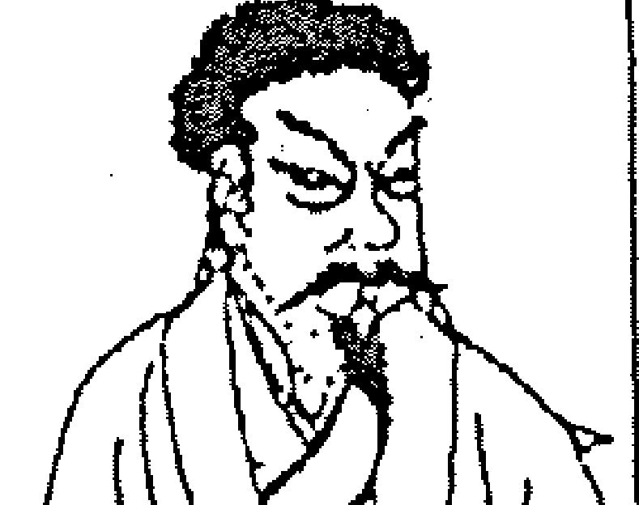

## 附录二

### 括囊赋

一气初判，二仪肇彰。设四时以成象，布六壬以配方。吉凶本末之端，生于好恶；祸福推移之始，造用柔刚。

原夫黄帝遭孽于蚩尤，玄女降灵于风后。以月将加于正时，用五行论其克贼。加临地局内外，别于阴阳；运转天盘逆顺，分为南北；所用稽疑，来方为准。

先立课体得何象，次观神将之是推。贵人小吉，传中皆云其吉；太乙螣蛇，始末咸谓乎危。如是则推索幽微之吉，惟详探深浅之辞。害挟太常，动止则尊亲有讶；德乘朱雀，谋谟而官吏无亏。

复有勾陈带剑，白虎持丧。青龙被克兮财寡，六合负喜兮婚良。武作浴盆，抱病魂归逝水；空持传送，望信仆造回廊。太阴巳午兮被辱，天后辰戌兮孕妨。月厌六丁，往往家招怪异；游神本命，频频梦主惊惶。

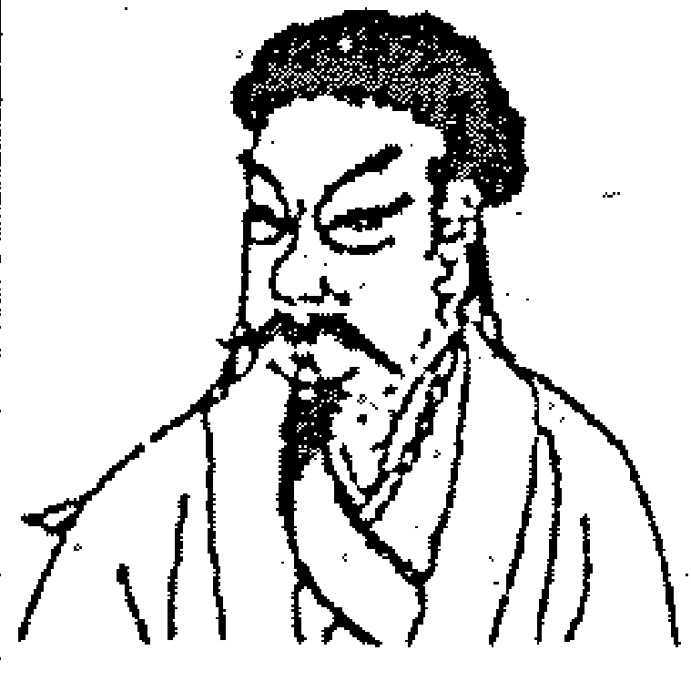

首视火鬼，次审金杀；宅中防火，事主破碎。直符、飞廉、天目、火光、天怪、天鬼、游魂、月宿，号为八妖，宅必见孽。贵人刑处，辰加孟而成妖；华盖到宫，知是岁而起复。时有休囚死衰，兄弟妻儿。旺相比则人是，休囚气则物为。

干禀长上，支云贱卑。支克干而尊祸，干制支而幼疲。上下相生，居处而内和外睦；将神遇合，访寻而主喜客怡。莫不课象渊源，在乎天乙传归。前理皆明显递，于后情多塞窒。贵临魁罡，论公而易换有司；复诣从冲，谒贵而动摇他室。

式体既定，来情多猜。任信多知动静，返吟况是往来。元首尊神，所作仰为领袖；空亡阴鬼，加谋转托梯媒。龙战不离于门户，玄胎欲卜于婴孩。不备无淫，必有阴私而起谮；拔茅连茹，何妨类聚以求财。天狱囚禁，三交暗灾。昴星归去而防险，游子商贾而未回。斩关逃窜拟速疾，乘轩宠招非徘徊。三奇六仪交重，连绵喜矣；四杀五墓相冲，不久哀哉。

爰及见机、察微、赘婿、乱首，见机取舍宜变通，察微暴进逢殃咎。日临辰位，招两姓以同居；支就干宫，寄一身而匹偶。必见灾生九丑，祸起二烦。得绝嗣兮妨父母，见无禄兮少子孙。奄奄枕席难痊，奈逢魄化；恍惚精神不定，必值飞魂。其有曲直、炎上、润下、从革，遇吉将而朋从，见凶杀而支折；或主公讼，或遭难厄，内出外而已求，阳入阴而彼索。用神得墓，长生末以无忧；吉将人传，帝旺终而有获。及乎弹射日克、蒿矢辰凌。望行人至有矣，想求事成罕曾。贵人顺治德扶，忠臣孝子；天乙逆行杀动，便佞交朋。

况夫课例极繁，究推奚尽？苟贵杀而可憑，乃神将之在神。时逢土旺，乘天后而失衣；气涉水休，带土神而伤

### 云霄赋

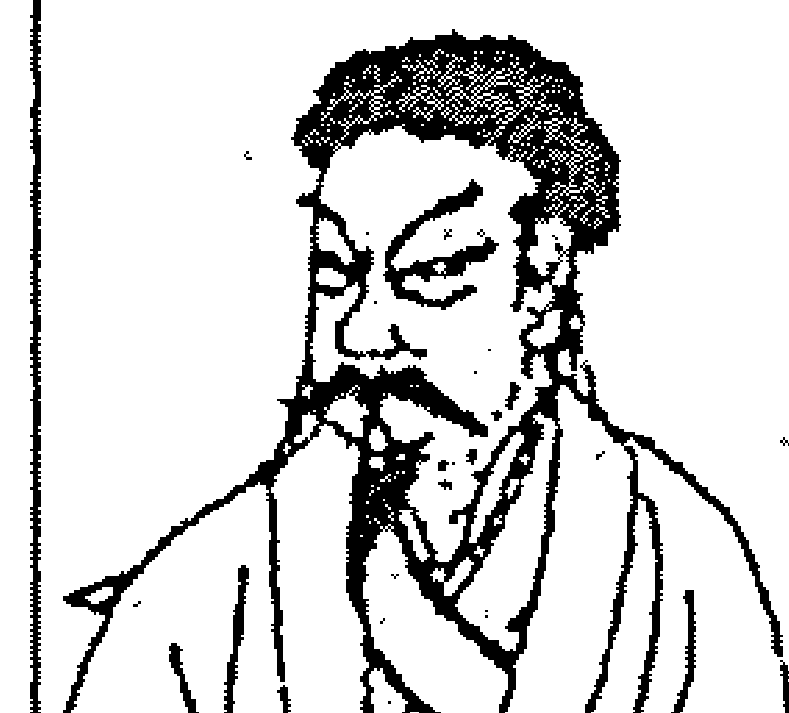

肾。玄武乘午兮职转，白虎申酉兮讼争。罡作太阴，奴婢乃非淳朴；申为朱雀，阴书必起途程。螣蛇巳午而怪梦，六合寅卯而亲情。水遇雀蛇，多横死于非命；木逢勾虎，必栋折于三刑。阴作大吉兮僧愿，戌为白虎兮犬惊。勾陈卯寅兮论讼，寡宿子午兮孤悍。龙带胜光，壬癸日妻怀妊娠；常携小吉，申酉辰首饰簪缨。丑到戌兮足疾，寅加巳兮灶更。土克水兮潺潺，金伐木兮丁丁。相生相克之元，视于衰旺；有吉有凶之本，分尔轻重。善恶有期，进退相庆。占宅兮忌克人，问疾兮怕入墓。论公讼兮恶狱留，迁官爵兮须印绶。关遐门远，占行客而未来；阳少阴多，产男儿应不惧。夺标望荐，卷策须合乎主文；越省登科，传末须逢于帝坐。

噫！术之至幽也，莫深乎课；道之至远也，只在乎心。心既达于玄妙，课亦通乎古今。无常德兮不为卜，有正己者乃可为。占欲求夫感应，志其在乎精严。

论人生五行之祸福，详课体克战之兴衰。相生则喜，克战为危。月将与地分分其高下，人元与贵神定其尊卑。臣犯于君，已欲侵人；君陵臣下，人来害己。人元克六阳之神，阳男有祸；天干战六阴之将，阴女逢凶。泉沈蛇马，定生眼目之灾；虎负冈嵎，必主羸瘦之症。红马登途，行商外病；赤蛇入户，闺妇内灾。西女来东户，狂病

伤蚕；白道映绿林，老翁损目。东方贼子，园中盗粟偷孳；未地勤儿，店内搬食弄酒。

产痨病患，因井宿入天门；鬼蛊气残，为土星填北海。土牛逢江猪，贼人自败；火宿遇波涛，阴妇井溺。南方赤鸟，怕北海之浮波；东地青龙，畏西方之恶吼。龙虎交加，老来伤害；邱坟倚迭，衰后独孤。天冢为僧道，犯阴后必主奸淫；金井饮牛羊，牧坟冈定然鳏寡。青龙入户，接脚老翁为夫；神树临池，应得阴人财宝。负水浇林木，徒养他人；扬波溢苑中，终伤自己。天门木户，相见两和；醴酒玄浆，相调两便。内室专权，有僊女跨云之象；行商得利，逢坤门洒酒之征。木象化天门，经营自变；白虎嫌黑水，祸患相仍。当途决水，享耄颐之遐龄；生地安坟，乐绵瓞之旺续。阴人疤面，赤蛇走入金门；美女失音，白雉飞来巽户。

玉女游斗宿之宫，阴权大富；牵牛至金门之路，血畜尫羸。仙女游园，乐生产充盈之兆。土牛奔火，恐亏负暗昧无言。土多乏嗣续，水盛好荒淫。木众枝繁，金多体折。火气炎炎，火多性躁。水形汩汩，性主必柔。五行大总结胎逢刑，四位切防无权交战。金临丑地，木人遇肢体不全；水至申宫，本命值飘泊无定。火炽伤金，边塞奔驰之子；卯荣破丑，田园耗散之人。独木遇三金剑刃，严防有鬼祸；一金遇二火铄销，切备值天灾。孤土入败绝之乡，见木多传尸久患；弱水临休囚之地，逢火常呕血之忧。五行最要相生，四位偏嫌杀战。果尔留心留意，自然无惑无差。

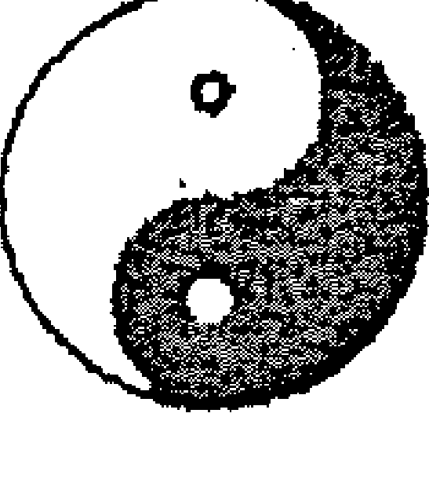

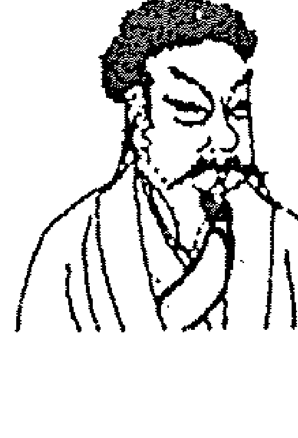

### 三才赋

金口玄妙，入式幽微。能决有疑之事，先知未见之情。指方定位，神将成课体之机；验煞推元，吉凶妙鬼神之用。干神将位，当立贵贱尊卑；四象三才，须分高低上下。干克神而剥官，人谋害己；神克干而进职，己欲侵人。将克神不求才当言身病，神克将非捕盗必主妻伤。位克干而神克位，病疾官灾；位生神而将生干，求财喜庆。将克干方，损妻妾而牛失马倒；干克神位，防盗贼而财散人离。位生干兮，印绶迁而子孙弱；干生位兮，嗣续旺而名位卑。本音全见，妻儿难保长年；妻旺官衰，父母恐防不寿。金纯而道途分异，木全而官事缠身。水多败散，主痔病儿童；火盛惊忧，应伤残妇女。纯土乃丑妇当权，孤立则尊人不利。土入木乡，争讼田宅之兆；火加水上，生育产难之惊。水入土乡，疮灾牢狱；火临金地，劳患缠萦。金加火上主销镕，木到水中为飘荡。水临火地，寒熟往来；木入金宫，口舌争辨。水加土上，争竞田畴；土入水中，多生肾病。

欲尽吉凶，再推神将。大抵功曹主文书木器，传送为信息行程。太冲盗贼及车船，从魁金银与奴婢。辰为斗讼兼主犯丧，戌乃奸欺或称印绶。登明征召，太乙非灾。胜光鬼怪连绵，神后奸淫牵惹。未为衣服筵席，丑为田园苑圃。大吉小吉为勾陈，争讼田宅；河魁从魁化六合，逃亡奴婢。寅辰若遇勾陈，官刑禁系；亥寅如逢白虎，疾病惊忧。子卯与玄武同传，当逢贼盗；巳亥逢驿马并驾，在路奔腾。丑未之临朱雀，口舌呪咀之非；未酉之加隔角，丑寅、辰巳、戌亥、未申入之者也，夫妇休离之患。魁罡临处，多生词讼；申午并交，常有狐疑。

原夫天乙所占官宦，遇克必定官嗔；螣蛇为卜惊忧，逢刑决然火怪。朱雀文书口舌，六合喜庆婚姻。勾陈主斗讼勾连，青龙应婚姻财宝。天后奸心暗昧，太阴隐晦阴私。玄武防盗贼之侵凌，太常有酒食之筵会。白虎主死丧之道路，天空主欺诈之逃亡。将神更忌刑冲，干位仍防带煞。将带神兮神带将，于中玄妙；干被刑兮位被煞，就里幽微。天上神将，有加临幽显之微；地下支元，有隐伏不明之意。

是故太岁受克，尊人有不测之灾；月建遭刑，兄长有沈溺之祸。凶神同居白虎，哭泣临门；丧吊相并鬼乡，哀戚动地。月建号曰青龙，遇吉将资财进益；月破名为白虎，逢凶神疾病崩催。枉横死于灭祸，淫乱发于奸私。破耗失畜亡财，青龙添人进口。邱墓丧车并煞，病者必临孝帏；德合解神诏赦，囚人定主脱灾。天医宜占疾病，丧门不免惊忧。游魂哭煞，非灾有准；亡神月厌，祸患难逃。星月为刑为煞，太岁为祸为奇。天马驿马入垣，所占迅速；孤虚死气同传，谋举逗遛。德合生神临用，占事有成；煞并天空四课，有像无依。五行衰败之乡加临，人情断绝；四位生荣之处相逢，事体光辉。将神沐浴之处，所占事为露机。功曹加毕昂之位，河魁属氐房之方，重关用锁于西方，见金则斩关不闭；设隔致防于东位，见木则毁隔无防。酉加卯上为锁称，上再见火破锁名。武与壬子窥户，当忧盗贼；白虎同传送临门，须防疾病。煞神既定，象类更详。合局则事从众起，分局则分劈支持。重迭则事多重迭，交互则宛转无依。若占脱走逃亡，别课体兴衰可见；如占求财见货，视将位有气方知。进表投书，详君臣察其善恶；战斗博戏，认主客定其输赢。贼盗若值孤虚，追之莫捕；死气加诸墓绝，病者不愈。详天禽地兽之形，察人间隐伏之状。明此祸福之原，细究五行之理。

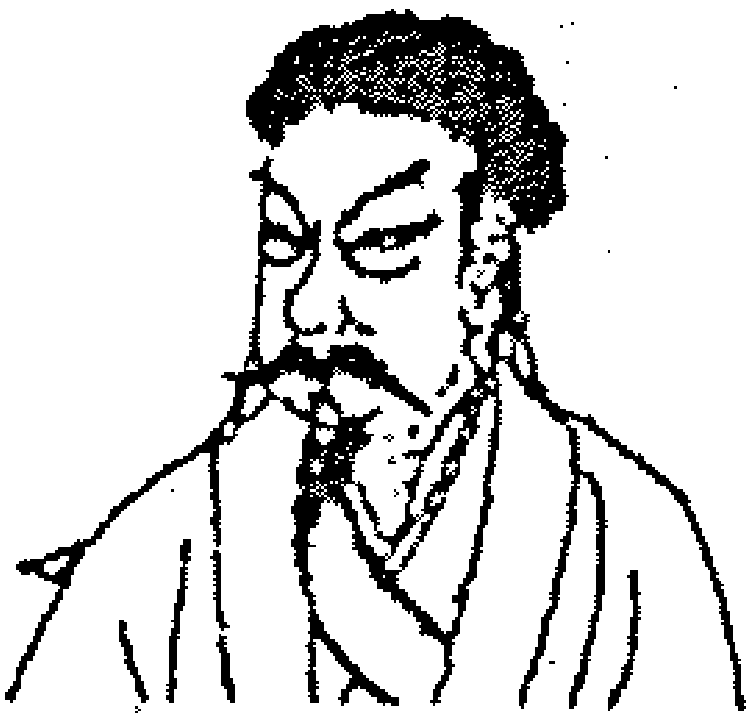

## 附录三

### 大六壬灵觉经

### 卷一 七体门

古经九宗门乃一贼克，二比用，三涉害，四遥克，五昴星，六八专，七别责，八伏吟，九返吟，今折返伏二体入下卷七体中，故上卷只有七体，似为的当。

#### 一、贼克体

此体有二体之殊，该分作二体，今从古，只作一体。元首课占内事，以日为己，辰为人；占外事以辰为己，日为人，出《六壬指南》。

象曰：四课一上克下，取贼克为初课，名曰元首，先吉后输，此释名义。日辰阴阳四课俱无下贼上，只有一上克下，则取克下者为用，名曰元首。以上能制下，得尊长制驭之权，宜居长上，故以元首名之，且为课体之首，亦名始人格。诸占吉多凶少，利先不利后。

占曰：四课阴阳一克下，课名元首是初神为课体之初也，忠臣孝子皆从顺，忧喜因男非女人。以上为男子，为外动，动以制静，故事因男子。上则为尊下卑小，所为正理悉皆真。以上制下事理甚正，真实无伪。官讼先发须当胜，后对之人理不伸。上克下，固利尊长制卑幼，利先动不利后应。但为上神旺相，天将无内战方吉。下旺上休囚则有反噬。

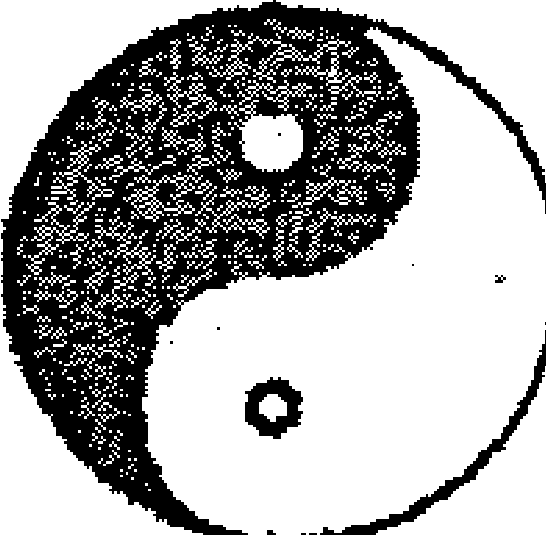

占曰：元首情理顺，克应亦易知。是岁年中事，月建月内吟。旬支旬内应，直日 日中期。节气半月等，今候五日移。诸课虽如此，独此更无移此克应之占。凡占壬者须书年月日旬节候于图中，看三传四课年命上神直何神，有年月等支神者，则应此时矣。诸课如此占法，但元首课更为顺应耳。

又曰：上克下为事顺，作顺事者，纵课传有凶，得忧亦浅，纵神将战忧易解。凡一切事利动不利静，利先不利后，利男不利女，加以上神旺相，天官顺治，发用吉将，不犯空刑等凶，又生日神年命，则为三光、三阳之课，则有臣忠子孝、妻顺弟恭、卑下怀服之美矣。若日干无气，发用又在日上为日之鬼，鬼交休囚，贵人逆治，凶将相并，则有动后之凶也。

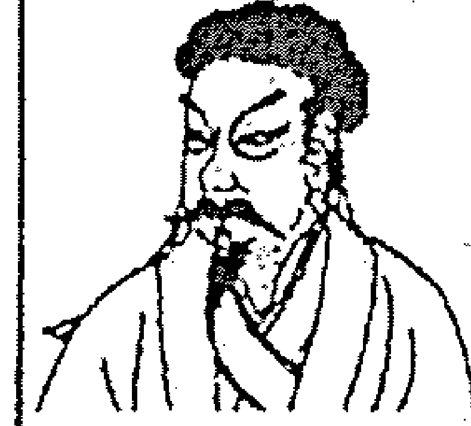

孔明曰：元首云者，如人以首为一身之元，身无元首则无以成其身矣。其尊卑之义可见。又君为臣庶之元首，尊长为卑之元首，是以利居元首者，但上非下莫载，今若克之，必思身世果是居长？果是先动？果是得旺相否？有一果于是，则吉矣。又思居下者情理可克乎，休囚者可胜乎，有可克胜，是吉矣。若有不合则先动者被后应者所乘矣。且以上克下中理之当然，但亦不可过当，思元首所以临下，乃一体无二之异，虽时势不得不克下，亦当使在下者有所倚赖，可为受克之地，庶元首有所共载，故壬中六处有一处扶地盘之辰为妙，不然亦不可使地盘受空、虚、刑、害、冲、破之境及在蓦越之位也。

邵子曰：“幼不占元首，忧尊长之损害，又主先喜而后忧。”是元首课亦有不吉处，况先事者任劳任怨，首事发端，祸集所伏，苟上神休囚，则有先动过劳致疲之灾深入，妄动之失，或贪小利而忘大害，或喜先胜而贻后悔，故其象树木之嫩条未硬，又如初生之婴儿学行也。言当此时，不可急遽戕贼，须当保护也。

袁天罡曰：“上之克下固利男子，占胎多是男子。若上神休囚，下神旺相，是克之不倒，反不利先举，占胎多女。如干上神发用，干为我，被克岂宜？但当主客未分、欲动不动之际，则日干为尚介于彼我之，一见上神来克，则先动者为上神，后动者为干神。在我者，当审其衰旺何者得气而乘之。此惟兵讼、斗殴及空手求财、问取功名之吉，余外鬼来侵身多凶，岂可以元首为纯吉乎？”

#### 占来意

元首课是贵人、岁君、将相，旺相生合行年神，来意是见大贵人，有生彩之庆。若是反吟等凶破，主暗昧，伸诉之事。

#### 占天文

主晴，必干上发用见朱、蛇、勾、空、贵、常方晴，若见合虎主风；支之二课发用，见玄后主雨，阴龙亦半阴晴。

#### 占地利

主阳地。

#### 占身命

宜居长，不利卑幼。好动少静，带丁马则迁移不定，有禄、马、贵人、龙、常者主居官显达，为正印之官，臣忠子孝，夫妇和顺。

#### 占六甲

若发用旺相则生男，加以青龙等吉将，则生贵子；贵人顺治利长子，生长孙。发用若休囚则男女未定。

#### 占婚姻

宜长男配长女，贵人顺治得龙、后、合、贵，主男求女，女亦喜婚姻，夫妻和合；若贵人逆治，加以凶将，有刑克，当不成。

#### 占疾病

主下部之疾，吉凶以神将之吉凶言之。

假如正月丙申日亥将午时占，四课中惟天盘卯木克地盘戌土，是一上克下，以卯为用，课名元首，三传得卯丑申，将作常合阴，卯为日之父母，乘太常主相见公卿有喜。申为日妻，则乘六合，主见贵得财物，有庆贺之事。丑为日子孙，乘太阴，主子孙因财物有相掩之事。正月木旺、火相、土死、金囚、水休，今卯木旺，丙火得相气，故以吉断之。

| 父 | 卯 | 常 |
|---|---|---|
| 才 | 申 | 六 |
| 子 | 丑 | 阴 |
| 龙 | 阴 | 常 | 蛇 |
| 午 | 丑 | 卯 | 戌 |
| 丑 | 申 | 戌 | 丙 |
| 戌 | 亥 | 子 | 丑 |
| 酉 |   |   | 寅 |
| 申 |   |   | 卯 |
| 未 | 午 | 巳 | 辰 |

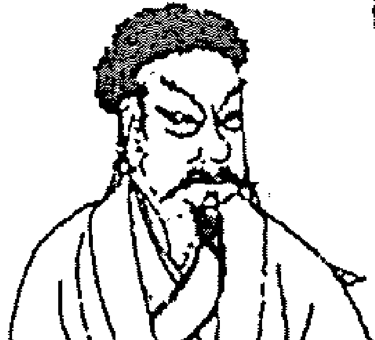

假如正月亥将甲戌日未时占，四课惟寅加戌为一上克下，以寅为用，为元首课。三传寅午戌，将得后虎元，乃六合体，会成火局；为天后发用，天后主妇女。正月寅中有火，火主妇女妊娠。天后水与寅中火并，主生子不育。又功曹乃月建，主县官，为忧县官，受旺气故也。中传胜光，主子孙乘白虎，主丧。加寅上为日之子孙泄气，主忧死丧，为人见闭遮。末传天魁乘六合加午上，为日之财，主阴私媒妁。六合为私门，亦曰天门。河魁为天阙，出天门登天阙见白虎，必忧死丧，为人见遮闭，当移徒，妇女逃亡不安，至县官。三传火局，忧失火，烧毁惊人、口舌。用起以所生为吉期，所畏者为凶期。功曹为用，喜在丙丁，忧在庚辛。用起阳神忧事发他人，用起阴神忧事起已身，传见父母为有救，见鬼重丧。

| 兄 | 寅 | 后 |
|---|---|---|
| 子 | 午 | 虎 |
| 财 | 戌 | 六 |
| 虎 | 后 | 六 | 虎 |
| 午 | 寅 | 戌 | 午 |
| 寅 | 戌 | 午 | 甲 |
| 酉 | 戌 | 亥 | 子 |
| 申 |   |   | 丑 |
| 未 |   |   | 寅 |
| 午 | 巳 | 辰 | 卯 |

假如十二月壬申日丑将卯时占，四课中惟午火克申金为一上克下，以午为用，课名元首，三传午辰寅，将得后蛇合，胜光为天后，并在金神，主忧妇女疾病，神将外战故也。若占怀孕，主堕胎，盖午火克申金，传送亦是白虎，属胎神故也。中传得天罡乘螣蛇，主惊恐事争斗，主三月内因女子事争斗也，以天罡主三月也；天后发用，故主因女子；水火搏击人魁罡，故主争斗。末传功曹乘六合加辰上，主来年正月当与吏议嫁，以寅为正月；末传为未来之事，六合主婚媾，功寅主吏故也。

| 才 | 午 | 后 |
|---|---|---|
| 寅 | 辰 | 蛇 |
| 子 | 寅 | 合 |
| 蛇 | 后 | 阴 | 常 |
| 辰 | 午 | 未 | 酉 |
| 午 | 申 | 酉 | 壬 |
| 卯 | 辰 | 巳 | 午 |
| 寅 |   |   | 未 |
| 丑 |   |   | 申 |
| 子 | 亥 | 戌 | 酉 |

##### 重审课体（下贼上）

四课观克贼，先寻贼为初，克贼或二见，舍克取贼呼，课名曰重审，吉凶勿泥拘。凡占课先观日辰四课，天盘与地盘有相克贼否，上克下曰克，下克上曰贼，先取下贼上者为用。如无下贼上，则取上克下为用。如克贼二见，则舍克取贼，取一下贼上者，课名重审，若有二贼上，则非重审课矣。一下贼其上，重审事多凶。顺行灾尚可，逆治祸还浓。入墓灾难脱，传生反为良。阴常及天后，六合和青龙。用并生日辰，福来祸不逢。勾玄与朱雀，蛇虎并天空。用在墓神上，福去祸来从。凡占得重审课，主一切事多艰难。卑上犯上，其天将顺治则灾祸轻，若天将逆治则灾祸重，谋事艰难，被凌辱更甚。加以发用传入墓乡，又是虎蛇朱勾元空等凶将，其祸甚深。受下凌迫者，轻则病危官灾，重则死亡。如发用传入长生旺相之乡，加以天将顺治，得贵青龙六合在常吉将入传，或加日辰之上生日辰，则反为吉矣。一下贼上，女子及已身，主人利后举，逆道患忧深。用得父母课，蛇虎与勾陈。临事来害己，其祸在尊亲。若得子孙动，将为贼上因。官动有灾恶，奸淫谋女姻。妻财得凶用，谋害在阴人。一下贼上义名始人课，言为人九宗之始课也。多主家内妇女事。凡事主后举。若发用是日之父母，父母受贼，加以虎蛇凶将，主家中卑幼或妇女害父母。若发用是子孙，子孙受下贼主，因妇人或祖父母及印信文书害子孙，加以凶将，其祸必矣。发用是官鬼，主因子孙淫媒人婚姻之事勾惹官司争财，加以凶将，定因财发祸，受阴人所害。一下贼其上，重审事可惊。父子情不顺，夫妻不敬恭。更逢贵人逆，虎蛇元并空，勾陈慕用发，善事翻恶情。亲者亦相害，先输后人赢。如发用是子孙，为地盘父母所克，故父母之情不顺。如发用是父母，为地盘妻财所克，父母动，必伤子孙，主父子贪财，或因妻妾之事致父子不和。发传是妻财，为地盘所克，乃兄弟争财，主因卑幼弟妹争财而害及身与耗财，或因兄弟有私淫妻妾之事而妻妾致怒，反不敬夫主也，更逢凶将及墓神发用，虽善事亦反为凶矣。况凶事乎？凡课中发用或是支神，或是日上神，或是日干三合六合之神，皆主亲人相害，祸其身，非此类则主妇人卑幼及妇人相害也。用下贼上名重审，子逆臣乖弟不恭。事起女人忧稍重，奴害主兮奸主娘。万般作事皆不顺，官灾病厄祸患重。论讼后应须得理，先告虽直后及凶。发用是子孙，已是父母所克；是父母先有疾恶之心，使子孙无容身之地，故子孙反害父母。又如地盘为月建，是岁日之子孙，而天盘之神加于子孙，为岁日之官鬼，或作天乙，而地盘之子孙又冲克刑害岁干，主属下叛君上也。事起女人者，凡事重审，是以内制外，以静制动。若发用是妻才，作六合、太阴、太阳、天后加子戌亥，又与才爻相合，主奴欺妻或妻妾之财。

孔明曰：“壬式中先取贼上者为用，用即发动初传也。贼亦克也，然不谓之克而谓之贼，言下之克上，犹贼也。夫上之克下，如帝王、君公、父兄、尊长之人制驭四夷及臣宰、子弟、卑幼之人，纵过于刑罚亦势分所易为也，未为变故；较之以下克上，则有四夷之侵凌中国、臣下之犯君上、子弟之贼父兄、妻奴之害夫主，势分之难为，情理之所不堪，故名重审，言事之较深重也。祸机之重者，必先主之；是以先取有贼者为用，虽克贼二鬼，亦舍克取贼矣，故曰贼上之课多凶也。且初发传之神，是人首事，名曰发端，初既受贼，则事之根基已伏暗贼于内，有几分不善矣。加以凶将与发用内外相战，事是有七分不好了。若发用是旺相，尚可观其传变。若中传吉生拱初传，无下贼之嫌，则主先阻后顺，事终有成。若发用之神休囚，传变又凶，或带凶将克初，或是用神之墓、日干之绝，或生初而中传自坐于克制之支，皆为无救，则事已无始矣，虽末传吉亦何益乎？此贼上之深，果然是不美。然亦不可执一，倘国家当阳九百六之厄，会天人压居上者之不仁，喜在下者之圣哲而察相其革旧鼎新之机，则下之犯上多在理势之不容，已有应天顺人之举。情否为泰，虽首事重大，发端艰难，正合重审之义，则重审岂专主凶乎？然必察用神果是旺相否，果是生日乎，果作吉将乎，初之传变中传又能生初传否，末传又能生初或生中否。如有干支吉将作生神生日辰，初传旺相带吉将，末生中之生初，初生日，三传皆吉将，则课体有反凶为吉之美。又自审天人之际从违何如；果天心人事应吉，与课体相合，则虽首事艰难，终克有济，是必审之又审，故曰重审，亦是戒人不可轻易犯上也。如克初传者旺相克初，初又克日辰，又加凶将变墓传绝，则不但事之不成，反主害及其身，是一审已起其祸之重也。此重审之义也。

夫上者，动也，有先举之义；下者，静也，有后应之义。先动制人，后应者制于人。今欲以静制动，以主制客，势力所难，故必审之详而计之熟，方得变难为易也。欲决者吉凶顺逆之事，先以贵神逆转之善恶言之，如课本凶又贵人逆治，愈是反背乖逆之事，加以虎蛇勾元凶将，则后应者凶祸必重矣。若当贵人居东北阳明之地，天将顺布，则吉神助顺而不助逆，而居下犯上者必受殃矣。

如被贼者是日之阳神，是我之后动制彼之先动，二动之间必审天乙之顺逆、发用所乘之将。如将又克神，是将与日干同类，是为争财格，主内外夺财，天将顺则居上得势，顺者胜；天乙逆则居下虽处世逆者胜也。

如日干贼上神，干上神是当今旺神，则日干休囚矣。事势重大，但谋者心慵或失辅，必待日干旺相之月方成矣。

如日上神发用，日干无气，又见日之阴神生扶日上神，则泄日之气，主事势是我党倡成，或子孙女人之事，但患赖为炎之，求人相帮，或候旺月为之，吉。

如日干制日上神，又有辰之阳神或中末传有一处反克日干而制救日上神，纵为日者有先胜，终被他人所并矣。

如辰上神被支辰所贼，是以静制动，以内制外，其吉凶如上审之。如日之阴或辰之阴神被贼，此以阴谋害上者，其凶亦同上推。

刘诚意曰：重审之课多凶少吉，以发用观事之始，始既受贼，如树之伐根焉，能生长乎？更传入墓鬼之地，纵有吉将亦不能免祸。更逢贵人逆治，凶甚矣。若得吉神良将，逢旺相，更又生年命，其象改成新之喜。若用神是日辰之阴神，又为日干之鬼，加以凶将逆治，主人居下以讪上，妇人执事以谋夫，婢仆欺主以行奸，臣叛子逆，阴邪害正，卑幼害长，故曰尊长不占重审，恐卑幼之仇怨也。其象如内明外黑，进前有悔，退后难凭，心虚犹豫，举动无措。

邵子曰：“重则不一，审则有疑。事有不一伏一起理，或疑似必审之又审。凡事主间隔不一，不可忽略处之。”

袁天罡曰：“重审之课，以下犯上，非顺，逆也。从辰上发用者，事多起于女子，其吉凶当以天将决之。传及勾蛇虎作父母者，其人被父母杀害。传是勾虎作子孙者，其人杀害父母也。其人欲谋害阴人妻子也。传是勾蛇虎作妻财者，其人反被妻妾所害也。亦以休囚推其成败也。”

> 《悬解赋》云：“重审象地，象地者先迷而后利。”

主阴云。日之阴神发用，主阴暗；辰之阴发用，主阴雨；日辰之阳发用，有数日风云，然必参以将神五行生旺休囚言之。

主卑下、阴暗、污湿之地，高陵崩塌，但亦必参以上下衰旺言之。

不利尊长，阳不利父，阴不利母。兄弟动，衰则克兄弟，旺则克妻妾。父母动，衰则克父母，旺则克子孙。官鬼动则论衰旺，作龙常禄马贵人主有官贵，如身衰鬼衰作凶将，主多官衰灾疾病；或鬼旺克兄弟。如妻财动，衰主克妻，旺则克父母。如子孙动，衰则克子孙，旺则退职伤官，但有病者愈。以上俱是因卑幼阴人起祸，兼天将吉凶言之。

论人性质主多疑多思，或好色作乱，或受卑下凌迫，柔弱不振。若旺相及日逢吉将则能详审制宜，以静制动，则无可失。虽刑克尊长、孤立，于名利亦不虚也。居卑幼若加凶将，主重拜父母，兄弟失力，妻子重刑重创，功业得失不一。属卑幼则好犯上，处臣子而逆君父；处尊长者，所行暗昧，故下人篡弑、妻奴所害也。

利主不利客，不利为应，兵不利先起，亦以上下衰旺详之。

主犹豫不决，详审方求之，上衰女人不利男家，上旺夫家不爱女家，以贵人顺逆、将之吉凶断之。得凶将克干，决主男家重妻；得凶将克辰，决主妻家重婚。

若下旺相主生女，若上神旺相生男。易生难生，以贵人顺逆、将之吉凶言之。

主后求，但彼我迟疑，必重求方得，亦看才爻及青龙入传否。若龙与才财爻生旺入传，课虽下人干上，亦可再求有财矣，反之无财。

首长病，主被下贼人克剥，或婢妾事致病多灾，反复不宁。贵人逆治，血气不顺，症甚重，卑幼人不妨，病症主上部、头项、心肺之疾，亦看上下衰旺言之，最忌虎蛇发动。

主经易官司，利后动，必重诉重审，方可结果。

假如子将壬辰日辰时占，以子将加辰时，顺布十二神将，三合体，壬日干课在亥，亥上得未为一上克下，未上得卯为二上克下，辰上得子为一下贼上，子上得申无贼，此四课，课中惟一下贼上，舍未卯二神二上克下，只取子神被下贼者为用。用即初传也，是初传得子，又观地盘子上得申为中传，又观地盘申上辰为末传，三传子申辰也。是日辰时贵人在巳，巳将在酉，于酉上起贵人，逆治，布前五后六之将于十二神上，则初传得青龙，中传得元武，末传得螣蛇也。课名重审、润下格，但冬月子水当旺，辰土无气，虽下克上不倒，亦不为凶，兼子为太阳，可以解祸，阳星破墓，故不为凶也。

| 六亲 | 地支 | 天将 |
|:---|:---|:---|
| 兄 | 子 | 青 |
| 父 | 申 | 元 |
| 官 | 辰 | 螣 |
| 元 | 申 | |
| 青 | 子 | |
| 朱 | 卯 | |
| 阴 | 未 | |
| | 子 | |
| | 辰 | |
| | 未 | |
| | 壬 | |
| 丑 | 寅 | 卯 |
| 辰 | 子 | 巳 |
| 亥 | 午 | |
| 戌 | 酉 | 申 |
| 未 | | |

#### 二、比用课（又名知一）

歌曰：“比用课如何，贼上有两位。无贼有两克，先别阴阳类。阳日比阳神，阴日阴神随。比者为用初。不比弃不为。”

四课中有二三位下贼上，或二三位上克下者，必取何者与日辰相比，取其相比者为用，其不比者弃之。比者，同也。阳神与阳干同类，阴神与阴干同类，如君子与君子同类，小人与小人同类，则一气相通，故因其同类而用之，是以名曰比用。课又曰知一课，盖于克贼众多之中知其一比而用之也。

断曰：知一是如何，用神今日比，婚姻失和谐，事缘同类起。逃走不远去，失物邻人取，论讼和允好，为事尚狐疑。

又曰：二上来克下，盗贼在逡巡。小心须防备，简慢祸惹连。若言失脱去，闭口课中寻。

又曰：知一之课比处用，事来多起在亲邻。用将相寻于伴侣，亦有遗亡逃走因。四课若还见不备，阴私伏匿不干身。占人有伴意不动，财物双双有合论。结交朋友无两心，求谋何必再三伸。

孔明曰：“比者忧在内，不比者忧在外。比者，事近而速；不比者，事远而迟。故取其内近者占之，舍其外远者后图焉。”经曰：“知一则二事不成。”是不可图贪二事也。所谓二事者，非仅两件事。凡事物纷至，及众论什投要之，不过两端耳。必乘其明知独见得，是择取其一者而用之，不为二三所惑，方是知之之义也。则一之机自我执矣。”又经曰：“比者为忧”，言祸福之切于身，不专言忧也。不比者为喜，言祸福之不关己，不是不比为可喜而趋之也。上克下同类相妒，朋友谗佞，祸从外来，利害不利主，夫妻相妒，或因妻财妒讼，诅咒不利，贼不出邑里，利主不利客。

李卫公曰：“上为外，下为内，二上克下，主外人谋害。事起于内，凶将加临，主男子盗贼侵掠、失脱等事。吉事将败，凶事渐深。象易之需课九三曰‘需于泥，致寇至。’之凶也。”

袁天罡曰：“知亦有偏知生奸之敝，一亦有执一不通之弊。或恂利忘害，则是执迷，居安忘危，谓不逢变，或执滞多门，昧于取舍，首鼠两端，不知所从，知一昧二，虑此昧彼，偏见蔽明，察近失远，如狐之涉水，鹿之生疑，则失知一之义，其凶必矣。”故凡事必合一心帮力而求，知权变，有定守而始得顺遂。凡事缘亲友兄弟上事，不论吉凶皆涉此等人。又主狐疑，不能达权通变也。

邵氏曰：“知一而不知二。知者，喜我之知见，不知者，嫉我为仇雠。主恩中生害，凡事宜舍远就近，舍疏就亲，事贵和同，多观于同类，又主吉凶之事皆有两端。”

> 经曰：“二克二贼，知一总名。神将凶而祸不单行，神将吉而福祥又至。”

《观月经》以三上克下为长幼课，三下贼上为度厄课，虽有二课之异，但取一亦必依知一课而取三传也。长幼度厄课详于凶吉门课，此不及详。大略所谓发用子孙忧小幼，发用父母忧尊长，发用妻财忧妻妾，传入长生则吉，传入休囚死墓则凶。

主君臣彼此不定，上下纷纭，互持其说，必审其是非，定其所适从，君不自是，舍己从人，专制裁折，弃一用一，审其亲昵，察其疏远者，知其孰邪而取舍之，知其吉凶而趋避之。又观神将之吉凶，以决庶政之利害罔违，道以干百姓之誉罔，引百姓以从己之欲，方是知一，而事可成，功可就，贤人可专征也。

比阳上克晴数日，比阴下贼主雨数日，以神将所属决之。

上克比阳主高亢地，贼上比阴主低下地。

比阳上克不利卑幼，妻子有伤；比阴贼上难为尊长，多好结朋友；有知识，得人相济。

主重迭不一，或二三物合一。

有伴侣，须知同类而皈依之，惧遗忘。

主朋辈之财，重进可得，或有二三项财，取舍得宜方得。

失物主朋辈，阳得男人，阴是姊妹亲知，或是亲邻，贼不出邑里，或是家人。

宜舍远就近，结邻为援。

去不远，不出邑里，或被亲人所在。

主不和谐。若是远方必有不谐。若是近邻，或因亲得亲，则谐矣。若婚已成，亦主有亲邻之女煽惑私比，而欲离间其成者，未成主多婚未能主，其一而配之，宜决其比者娶之。但神将凶，二上克下，主先有二妻，重婚再娶；二下贼上，主妻有二夫，或经妆聘定，又再许人，或失节再醮。

二克主卑幼有亏，二贼主尊长受亏。但和允好，不然重迭艰结，重送衙门。

主有遗失、逃亡、走脱之灾。二克主妻子不安；一贼主夫妇不和，长上有灾；又主有阴私隐匿、伏藏不明之事，心事狐疑，欲弃远就，或欲亲邻居住。

#### 三、涉害课

歌曰：涉害为何起，两比两不比。受贼与受克，数至本痊止。历涉地盘位，克贼深者取。行涉多被害，是为涉害矣。

又曰：涉害课相争，还从比用生。前头有回路，涉害何难呈？有克难重数，偏多得用情。忽然涉害起，先举莫相争。

又曰：涉害原因比用加，地盘孟仲季求他，先看孟神次仲季，路涉有克到本家，孟深仲浅季无取，复等柔辰阳日查。

又曰：涉害孟仲季，一课分两名，见机起四孟，仲季察奸生，总是涉害体，占得事岂宁？

四课二三克贼，与日俱比，或受俱不比，则分孟仲季取之，所谓孟深仲浅季又浅是也。以其害有深浅，故以深者为用，此系捷法，不必数涉历地盘位数，只论孟仲季以为深浅者也。一说无仲只有季上神克贼，亦取季上神之，以上法虽便捷，终不若涉归本家，以克贼之多寡为受害之浅害为正法也。见《六壬示斯》，其说最详，今不录。用孟上神一名见机课，用仲季上神一名察微课，此涉害一课而分两名也。何谓见机？盖孟长也，事之先发者，凡事之先起，乃祸福之端，故名见机。何谓察微？盖仲中也，事行至中半而吉凶已微着，当审察而知所进止也。如有两孟两伸，必择先见者为用，课名曰复等，如先遇战，不得不竞也。长者受敌，而不受其小也。

断曰：见机起四孟，求事须难成。用起季与仲，察奸产妇惊。魁罡加四孟，产儿定不成，二下贼其上，体乃是比邻以比用课取利。亦名知一课，失盗乃乡邻，小小须防备，昏执祸多门。四孟主有多机多端，吉凶不止一路。

又曰：见机涉害见上克，数到本家方始休，但看何方神力最，所为先难后易求。凡事艰难多阻难，魁罡加日县官忧，察微涉害用下贼，在事艰难多滞留，幽暗不明当见了，官事缠绵产妇忧，若更日辰魁罡立，妇人产难亦当愁。假如涉害皆复等，先见之神为用传。事主艰难无首尾，枝条蔓引作牵连。两军交争不相伏，经时岁月更留连。凶神恶将来相见，官灾疾病两缠绵。月逢吉神并有气，事虽迟迟却有缘。若值凶神皆无气，无情无绪事多端。

又曰：事有两比两不比，上天垂象要知机。涉害发用为初传，行事稽迟多忧疑。忧患难消知见日，占胎伤孕忌当时。失物家中邻里窃，逃亡必定隐亲知。

孔明曰：“涉害之象，如琴瑟不调，鸢在天关，存亡速焉。若遇见机则以合宜变通，不可执一，当知事机括而乘机早图之。若遇察微，则宜防微杜渐，精察细微，不可忽略，暴进终逢殃咎。用辰主灾害己，用日主家祸延人。一二课为用是用日，三四课为用是用辰。”

刘伯温曰：“涉害者，涉害，须审其宜而行之。见机者，已自审视，谓之见微不妄动，谓之机，察其微辨以机言之。一曰机者，犹弩之机牙也。务见机之兆，百发百中，万举万全，始谓之见。又曰，机者动之微吉凶之先见者也。事在未然，须早见察之则不至害。若见于机已然之后，或轻举妄动，则机括一差，而千里之失起于毫厘之谬，其害也深矣。”

邵氏曰：“涉害课，凡事主欲用不用，欲言不言，事有两而取一也。事主迟疑艰难，进退不定之意，用上克下，百事为浅。若得凶神恶将，则灾祸难解，百事阻滞，作事稽留，多有疑，惟忧患难消，宜舍轻就重，趋安避危，方为不害。”

袁天罡曰：“用在四孟，事多反复。凡事迟疑。”经曰：“见机则情有变，事主艰难，而两求主事有两重。用在仲季主反复无定，凡事未萌，须预察其吉凶。”

主建议商之，既欲于此，又欲于彼，不知适从，当审其事之是非、理之长短，方可取舍。若魁罡加四孟，则遣将提师深入，吉。

不可深入贼境及渡江水战，以水火土木金辨其何者为害。如水神涉害，则因水为害；火神涉害，则因火为害之类。又主两军交争，不肯相伏，经岁月迟久，迟疑进退不决。

如得天神下临壬亥子癸，主水路有隔，其祸深，不可渡水，只宜陆行。得凶将克身命，出行远涉最跋涉艰难，远行受害，有吉将主行途中有得。

主产妇忧惊产难，魁罡加寅申巳亥发用，产儿难养，魁罡覆日辰更凶。

主产妇因远涉或动土移动伤胎，有妨其产母。

见机课，魁罡加日辰，主官事欲起；察微课，魁罡加日辰，主有牵连干涉之事，久延不决。

主犯触受染，病不止一端，沉重日久，难以起止，反复不定，或远行涉水所致，魁罡加四仲主哀伤。

主多刑害，流移不定，加凶将则孤贱卑微，惟多迟疑不决。嫉妒害人，或受人所害。

有害，二家不和，反复不定。

主干涉害人而求，吉将旺相有得，但多反复延迟；凶将休囚克日，主干涉反复破财。

主自家不谨慎，乃乡邻为盗。若与日辰合不比者是远人也。主贼涉水来，或逾墙来。加凶将凶神主害人，或连众而来，内外通引。

假如四月将辛酉日卯时占，得三下贼上课。寅、卯、未加子。辛酉日，寅之上被俱下贼，不与日比。卯、未俱与日比，虽以比用取课，则入涉害课。卯加辛，戌是季也；未加寅是孟也，当以孟上神为用。若欲何者涉害深，则卯加辛之历至卯位，惟一克之；若未在寅历至本位，则有甲寅、乙卯克之。巽五位克之，是为涉害深也，余仿此推。

此谓未加寅入墓，所谓仰见其仇，俯见其丘也。小吉主妇人，将得螣蛇忧死人入墓故也，女子惊恐，蛇主女人惊恐、有怪异血光亦是螣蛇所致，小吉人鬼门，主见鬼。中传神后作天空加未，主妇人欲欺其夫而有二心天空主欺诈，未为神后之夫。末传太乙作天后加子，主忧妇女，水克火日。

| 父 | 未 | 白 |
|---|---|---|
| 子 | 子 | 朱 |
| 官 | 巳 | 元 |
| 白 | 贵 | 勾 | 后 |
| 未 | 寅 | 申 | 卯 |
| 寅 | 酉 | 卯 | 辛 |
| 戌 | 亥 | 子 | 丑 |
| 酉 | | | 寅 |
| 申 | | | 卯 |
| 未 | 午 | 巳 | 辰 |

#### 四、遥克课（蒿矢格、弹射格）

歌曰：四课无克贼，如何取用神？先取神克日，蒿矢课之名。如是日克神，弹射课之名。总名为遥克，祸患此中生。

又曰：阴阳上下无相克，其中择取遥相贼，贼日之神为用初，课名蒿矢似无力。如无神遥于今日，日有克神是弹射。有如日遥克于神，后有两神亦克日。用比用涉是为良，依此课之情不失。

四课上下并无克贼，则前四体俱不入，须看四课之神有克今日干否，以有克者为用，课名蒿矢。如无神克日，看今日干有克四课之神，如有克，则以受克者为用，课名弹射。如有神克日,又有日克神,则取神克日为用。如有二三神克日,则如前比用取用,俱比俱不比者,则以涉害取用。其日克神,亦依此例。总名曰遥克课。遥者,远也。神所加临处为近,视日干则远矣。日之阳为近,于二三课之视日又益远矣。此遥之谓也。

断曰：蒿矢有吉凶，先看吉凶神。吉将朝天，去得吉将生身，主功名远利；上谓朝觐，远求财利吉。凶将祸到，身材从外来。弹射得吉将，求财得相亲。若值凶将加，出人值仇人。利动，阴谋窃、刑害并则主阴谋窃害伤人矣，相生各有伸。凶刑劫盗贼，合成喜自频，相合则吉。分明是两课，休断一般陈。吉合主允欢喜，凶将勿来迎。三刑妨贼害，六害杀伤人，交射乃伤人之物，加以刑害金土则刑伤必重矣。

又曰：神遥克日名蒿矢，射我虽端必当畏。日克天神名弹射，纵饶得中还无利。贵人逆治子无良，天乙顺行臣不义。家有客来不可容，每忧口舌西南至。起事因外至本身，心意悠悠无所止。比用他意非本心，用力向前须得喜。中间尤恐有防人，暗箭伤残祸不已。喜得或同岁上并，经涉朝迁岁月计。若见凶神多诡诈，外事收来知谨备。吉凶皆主艰辛事，若将言将祸庶几此蒿矢弹射总断也。

又曰：弹射之课日克神，事从内起干他人。凡事艰难须勉力，虽成不免有争嗔。望信不来人未至，出行一去没回音。弹射蒿矢同断。三传终始干支合，吉将来并喜事新。三刑又见诸凶将，劫盗须防祸及身。若是庚辛而得吉，信来行人却欣欣。

又曰：弹射有丸伤痛苦，占病死人伤命焚。三传辰戌丑未土，有土诸事皆有阻。

孔明曰：“神遥克日，缓而轻。其象如蒿矢之轻，远射则力弱也。蒿者，草之杆。矢者，箭。持蒿草之杆而作之箭，直指射物也。虽有射物之心，却无射物之名；虽有中物之具，而无获物之功。纵射虽中而轻不入也。故祸福俱轻，主外人欺己，祸从外来，其始如雷之吼，未免惊忧，后却无事，愈远愈小，渐久渐消也。神为客，日为主，神遥克日，是客来欺主，故言客来不可容之，必有是非及身也。但以蒿为矢，虽射中不深入者，以其无镞也。若见传送白虎发动，则有金加于矢上，必能伤人，故曰仍忧口舌西南起。传送白虎乃西南隅，申地之神。经曰：‘蒿矢见金为利镞。’是见金之为凶也。或有金而金落空，一名空矢，亦曰亡矢，一曰弃矢，亦不能为凶也。”

李卫公曰：“蒿矢之课，主有不测之忧忽来相干。若有吉将，主不虞之喜不期而至。有金则主血光。经云：‘三传地下申酉是，公人持棒应无礼。’是也不论是金神，但发用是地下申酉上神者，亦有外来是非出于礼法之外相加。故曰：‘蒿矢有金，主蓦然有灾’也。不必金将，只有传送从魁河魁金神而作朱雀勾陈者，亦主有官非口舌从外蓦然而来也。大抵此课主利主而利客，利后动。不利他人，利小不利大，主人害己，事由官非斗讼之害，加以阴神贼日，则忧从外来，蓦然而至矣。水火神动加金将，主水火之厄，酉阴刑刃动主暗伤之灾，小心防备得吉。凡事不利己身。”

孔明曰：“日遥克神，其象如弹射之近，不射远，事则难中也。主自己谋害他人，事从内起。但有近射远射之异，所占势大者近射，凶重，忌先动；势小者远射，凶轻，但不可出头。一二课发动为近射，三四课发动为远射。又发用之神之将相克名近射，主有伤害，更阴虎乘金神，尤凶。若神将比和，名远射，虽有口舌恶意，亦不至伤害矣。”

又曰：“弹射见土为弹丸，则弹中有伤，蓦然有灾。若有土而土落空亡，谓之遗丸，纵弹皆不为凶。若是弹射又是知一课，尤为无力，虽凶无畏。但欲用事者遇之，其力轻，多费力不成也。经曰：‘弹射忧事立散，若见太阴元武天空发用，主虚诈欺诞之事，祸从内起。’”

袁天罡曰：“遥克课主事遥动不定，人情倒置，祸福皆轻，求事难成，吉凶皆主不实，来意虽有恶而不至伤残也。第二课为用，乃是日上两课相战，作事不力，外事不干，内事不可出头。第三课为用，是辰阴自战，两阴相竞，凶重有力，不可先动。第四课为用，尤为无力。若日干克两神，名曰一箭中两鸿，又名一箭射两鹿格。若两神遥克，一曰一鹿含两矢，皆主心贪望大，远交近攻，近交远攻，费力并取之兆。故曰：‘两神克日，主二事合为一事；日克两神，主一端分为两端。’”

#### 占行人
第一第二课为用，行人立归。第三第四课为用，行人未归。若三传冲克岁建，占行人主凶。一曰：“弹射不来，蒿矢课归矣。远出未归，或中途有阻。”

#### 占出行
若远出至不至所往之地而回，不可西南行，恐惹是非。

#### 占访人
弹射课主访人不见，蒿矢课主访人即出见矣。

#### 占公诉
蒿矢课利小不利大，利后不利先；弹射课利上不利下，利先不利后。蒿矢主人害己，事由官司斗讼之害也。

#### 占国朝
值蒿矢课主事自外来，草寇弄兵，边鄙生事，有使命来阙。值弹射课主有颁命远出。

#### 占身命
神克日害从外人，日克神身他人，有刑害受惊，带官贵禄马主武途出身，但福力不大，无长远之事业，多虚诈或夭折。

#### 占疾病
蒿矢有金见白虎，弹射见从魁有血光、脾胃之疾，其病难疗。歌曰：“占病小儿与老人，蒿矢弹射有灾速。一弹一矢俱不存，须知性命在逡巡。”

#### 占求财
弹射课是朱雀主争财口舌，或与妻争，轻求则遂心，重求则无矣。

假如甲午日申时将占，四课无克贼，先取神克干，惟取申金克甲木为用，课名蒿矢，三传巳申寅，将得白勾蛇，天乙顺行，主君臣不信，亦忧男子病。此时不可出行，有客不可纳，有内谗之事，祸从西南来，主有争斗来害，以蒿矢见金作虎勾也。加以年命见鬼，鬼置元武，定主贼盗谋杀也。

杀申白
子巳勾
兄寅螣
后朱白阴
子卯申亥
卯午亥甲
寅卯辰巳
丑午
子未
亥戌酉申

假如九月将己卯日午时占，四课并无克贼，先取神遥克日，四课上神又无遥克日；次取日遥克神，惟神后受己日所克，以神后为用，三传子酉午，将得贵元空，课名弹射，神后作天乙，作初传，主妇女事，有贵人征召之喜，但以死气所胜，主忧人死及官讼坟墓事。

财子贵
子酉元
父午空
玄贵螣勾
酉子丑辰
子卯辰已
寅卯辰巳
丑午
子未
亥戌酉申

#### 五、昴星课（仰视、伏视）

歌曰：无克又无遥，昴星理可知。阳日看酉上，发用立根基。辰作中传日，末传日上依。柔日看从魁，中日末辰支。

又曰：四课又无遥相克，须当仰伏观昴星。刚日酉上神为用，柔视酉下度何之。假令从魁居亥地，用神端的是登明。中传乃附日辰上，刚日先辰后日呈。柔日中日末辰上，虎视如何不免惊。

凡四课上下全无克贼，又克遥克，曰昴星课。夫昴星者，乃酉是昴日鸡之宿也。位镇西方，为日月之门户，分居兑极，作天地之关梁，其居心也虚灵，有以剖决事端之吉凶；其秉赋也英锐，有以擅掌杀伐之威仪。阳日则仰视酉上所见者为用，阳从地起，故中传用辰上，辰为地也；本乎天者亲上，故末传归日上，日者，天也。其象如虎之视转蓬而动也。阴日是伏视酉上所临者为用，阴从天降，故中传从日，日天也，本乎地者亲下，故末传归辰，辰为地也。其象如冬蛇掩目而匿也。是昴星一课而有四名也。但四名亦有时义，春曰虎视，夏曰转蓬，秋曰昴星，冬曰冬蛇掩目。春占白虎，与酉金逢，春令死绝，谓之死虎，卯月冲酉，辰月合酉，谓之死虎遭合，不能伤人，但以目视人而惊人耳。夏月金囚，如以草为蓬，随风不定也。秋月金旺，昴星主事，故曰昴星。冬月金休，如蛇掩目不能伤人也。

断曰：用起昴星为虎视，秋兮在西知生死，出入关梁日月门，举动稽留难进止。刚日出行自不归，柔日伏匿忧难起。女多淫泆问何因，此地私门难禁止。

又歌曰：昴星转蓬并虎视，冬蛇掩目异名求。刚日出头而闭塞，柔日藏身不自由。事多勾陈非本意，摇摆不定将出游。文字不明多恐感，关梁阻滞事多留。更变反复多不定，全家疾病传梁周。引惹官事皆失理，淫泆畏怖伏藏忧。

又曰：冬蛇掩目课，万事不相从。伏罪何须出，莫劳西与东。出行遭禁系，淫泆败家风。

又歌曰：转蓬柔日见螣蛇，冬蛇掩目有欺遮。不独忧疑有怪梦，屈指暗昧有怨嗟。事纵在内多淫泆，闭留在外不归家。刚日昴星见白虎，白虎耽耽定有惊。事从外来忧在内，勾牵刑狱有稽留。伏藏在外不欲出，疑悲文字不分明。

经曰：“昴星为用，孤立、狐疑、疾病、进退、囚系、文墨。”若值吉将，相亲可得。

孔明曰：“昴星课，若非春占，但值阳日如虎视不息、转蓬而已。阴日如冬蛇蛰藏伏身不动也。虎视者，虎以爪牙害人，视则觑我而有意也。苟无先见之知，而轻举妄动，无有不伤者，故行者宜止，动者宜静也。疑者宜精意思维，宽怀省事，则虎虽视我，亦安能害我哉？夏曰转蓬者，如以草为蓬，因风而起，旋转不定也，其断略与虎视同，若三传见白虎乘申酉克日辰及行年上神，名曰真虎视，来意主见凶祸伤损，见血光有火忧之事。若行年见神将吉，更见生旺，则不为凶。刚日虎视，静则有官灾病患暴惊，在家防火惊，动则有盗贼风涛虎兽惊恐。凡举事皆有忧惊，先有忧惊后有破家也，凡事又主稽留伏匿。柔日虎视主伏匿于内，事多暗昧，进退犹豫，静则有幽暗徒流逃匿，内有妇人小口灾病。”

袁天罡曰：“一课而有四名，虽有四时之名，但亦不可执一，其占惟通用，特有刚日柔日之异耳。阳掩阴，所以谓虎视；阴掩阳，所以为昴星，皆主有举动稽留、进退犹豫。刚日昴星不利男人，有渡越关梁、远行之事，事起于外。更值秋占，出行主不归。柔日昴星太阴主事，不利妇人，主隐匿伏藏，不欲见人，有忧惧之事。若后阴为用，则是倚其门，立其户，占妇人必淫邪不正之人。凡事多阻隔，主潜伏不欲见人而隔，或人心不相照而隔。刚日主道路关梁有阻而隔。春占主雨雪，冬占主霜雪阻隔。故曰昴星有闭塞，行者有稽留。若是稽留停止久者，则有复行之兆。”

又曰：“刚日男人远行未返，恐闹死于外。柔日伏藏女子淫泆，深忧不解，行者藏止不来，居者在家不欲见人。”

邵氏曰：“柔日昴星忧在妇女小口。又有空亡，主久病不起，或以事逃亡徒流。至若阴主静，宜藏伏也。又主事欲举终难起。占谋事有乱常废弱。若神将相战，主不正奸恶之事。又以日辰决之。水日防水灾，火日防火灾，金日防杀伤，木日防跌坠，土日主倾压。又主家亡男女奔逃，皆主死亡在外及门户闭塞不通也。发用在四孟主求事迟得，发用在仲季则阴少惊恐。”

刘诚意曰：“冬占名冬蛇掩目之暝而不能开，口含土而不能食，蟠侧而不能仲，伸而不能蟠，受气时也。名蛇者，凶之兆也。名冬蛇者，升腾变化未能出见，亦不能害人也。他人为蛇，或亦不惧，我若为蛇，又当隐形身晦也。若勉强趋走，必贻其咎也。凡占主伏匿潜藏，暗昧不明，人不能见，事因女子，乱从内起，主虚惊不明之事。但值刚日，亦有晴光不息，转蓬不已，欲动难动耳。柔日则主蛰藏掩目不动，宜持防，暗昧惊恐耳。若见空亡，则伏藏者出见也。”

李卫公曰：“柔日昴星名冬蛇掩目，忧在阴小，事主伏匿而暗昧多惊。在家则犹豫难动也。盖四课既无克又无遥克，是阴阳闭塞不通，故者皆主惊危，惟利空亡以解之。若虎视逢视，则至惊至危矣，故不拘刚日柔日，但传见白虎传送皆名虎视转蓬，传见太乙螣蛇皆名冬蛇掩目，若冬蛇无力，须防惊蛰后方有力。”

#### 占国事
未有涯际，狐疑无所适从，忽有刚毅果敢之人，出身为国，制裁急务，剖决不回。但势必至于伤，然后济事，或有不愿与论，特立独行，任怨举事，则事举矣，亦宜刚日方妙。

#### 占病
歌曰：“虎视传中有螣蛇，占病绝食事堪嗟。不是咽喉不相嗟，满口生疮火上奢。”刚日不利男子占，夏秋占男子外病者死，加凶将主杀伤，冬日占，柔日女子小口病将死。

#### 占六甲
刚日昴星生女，柔日虎视生男。

#### 六、八专课

歌曰：日辰同一位，此是八专名，五日阴阳见，三传顺逆存，阳日顺数去，阴日逆后奔，复看日辰上，终传此处轮。

又曰：八专之日是无淫，有克比并涉害深，无克须当涉害数，阴日还阴逆数寻，阳日便从阳起顺，顺逆三位用为真，中末传归日干上，依此用之是为精。有时顺到日辰上，三传飞散莫重临。正月己未酉时占，酉作三传独脚名。

六十甲子中有五日支干同位，及专禄日，名曰八专，乃丁未、癸丑、甲寅、己未、庚申是也。此五日干支同位，阴阳只有二课，其取用若有克贼，则依克贼、比用、涉害、遥克取用，如前例取三传；如无克贼则看日辰之阴阳，阳日就干上第一课上所得之神顺数三辰，看天盘得何神，为初传；中末俱于日上取。阴日就日后第二课上所得之神逆数三辰，看天盘上落得何神为用，中末俱在日上取也。此名八专课，有时逆到日辰上而中末与初传同空，则谓之独脚课，皆八专课内。又八专课一名帷簿不修课。

断曰：帷簿丑声乱，不修更难管，顺阳妻有谋，逆阴夫目反，阴邪惊怪起，出门须回转。

歌断曰：一神二神号八专，阴阳不备向乾坤，帷簿不修逆失理，妇怀他婿外人传，阳不备兮男不足，占身定是病相侵，公事不成灾自散，出入求财枉用心，事多驳什无分别，淫泆难明伪与真，阴日只为家法怀，悖乱乖违因妇人。

又曰：独脚八专皆丑课，阴阳并杂火淫泆，阴私出入无门户，淫泆交通事可嗟。乱欲于内外不见，独在无人便有邪。

又曰：日之阳神还不备，事有两头报君知。阳是男兮男不足，父占子息子不备。子若占父父不足，三心二意阿谁知？若然父子二俱足，莫须内有一人夷。若占家宅不完备，纵使德兮财无支。阴人坎坷阴私挠，谋望出入进退疑。无非狭隘必损害，人口奴婢啾唧悲。日辰年上添鬼贼，更加凶将祸难医。

又歌曰：日值八专帷簿课，阴阳并杂不分明。不修帷簿何为礼？内外占之总丑声。厌医合门元武当，嫂通于叔妹淫兄。人间察事难推测，元女留经鉴此情。

又曰：阴阳不备是芜淫，夫妇奸邪有二心。二女争男男不足，二男共女是单阴。上之克下缘夫过，反此诚为妇不仁。阳既不终阴取合，阴来阳处畏刑临。

孔明曰：“八专，日干支同位，彼此不分，阴阳混处，如男女合体之象。一名帷簿不修，课言房屋不备而破损，被人窥觑，有无耻不正之事。又名芜淫，课乃阳不与阴合，阴不与阳亲，外无不淫，奸生于内，发用阳神，终不见阴神。以此占人，必有淫泆。阳多阴少，起于男子；阳少阴多，起于女人。两阳夹阴，男争女；两阴夹阳，女争男。更见天后六合元武作初传，或合后传见元武，决主淫乱。元武又见夜神，则淫秽甚矣。若阴合在传，主室家不正，妇婢不顺理。阳不备事起于外，阴不备事起于内。凡事必干妇人，阻塞不通。居多淫泆，事多彰露，奸淫外暴，当谨厚修省，闭于家，而以理自律，远奸邪而勿狎于近小，则免贻羞辱之事矣。凡有占只于日辰上神将决之。”

邵氏曰：“八专之课，事多重迭。外不隔而内不遏，忧喜二来，干涉妇人，久而反蔽。若后合人传则男不知耻，女不知羞，淫秽之事尤恐太阴六合临日辰。”

刘伯温曰：“八专如人专执不分之意。无通变之义也。经曰：‘求望则不爱八专。’以人己不分，上下之情不通故也。刚日主进趋欲出，凡事机急速；柔日主退缩欲归，凡事机迟缓。”

独脚课断曰：课名独脚主忧惊，不宜占病问行人，占贼不来被人杀，任是险危三日平。主自己家之事，不能移，动之则费力，占逃亡去不远遭获，阴入自归家。

#### 占国朝
主臣下奸邪，阳不备是列职之长，阴不备是有司之属，更夜神加临，决非中正之事。若有克制，则有救，其奸必可隔。

#### 占兵事
主客不分，不宜出军，占贼不来。

#### 占婚姻
不宜出嫁，男女无耻淫乱，有口舌离别之事。

#### 占六甲
母子不分，必有一伤，或破伤独足，产未生，生亦险难。

#### 占来意
元武克日辰者，主重重走失、人情不和之事。若阴合在传，主室家不正、家奴悖乱之事。若日辰上神不利，来意主外人不同，欲改之事。阳不备则起于外，阴不备则起于内。

#### 占身命
淫乱不正，名利俱虚，休囚则寿命不久。

#### 占逃亡
吉不远自归，或家中人藏匿，或藏在屋下。

#### 占出行
主因家事牵惹，不得移步，去亦不利。

假如甲寅日未将卯时占，四课不全，只有二课，此阳日当从一课于日上顺数三位，至辰上见申为初传，中末二传以日干上午字取之，三传为申午午，此阳日八专。阳日与阳比为用。

| 官 | 申 | 青 |
|---|---|---|
| 子 | 午 | 白 |
| 子 | 午 | 白 |
| 六 | 白 | 六 | 白 |
| 戊 | 午 | 戊 | 午 |
| 午 | 寅 | 午 | 甲 |

假如丁未日丑将戌时占，四课不全，只有二课，此柔日，从第二课逆数三位为用神，从丑逆数至亥，以亥作初传，中末俱从日干戌字取之，此系阴日八专例。

假如己未日日亥将占，从辰上所乘之神酉，又就地盘酉位逆数三辰，就看天盘所乘之神为初传，中末皆从日干上酉为中末传是也。名为之独脚课。

#### 七、别责课

> 歌曰：四课不全三课成，无克无遥别责名，刚日先传干合传，支前三合柔日行，中末归于日干上，此是别责三传灵。

干支只有三课，无克贼，又无遥克，又不入昴星，不以昴星发用，非不入也。只以别责取用。阳日取干合处上神为用，如甲日合己，己在未，则取未上所得之神为用，为初传；中传末传俱在日上取。阴日以日支辰三合前一辰上所得神为初传。如乙巳日，巳酉丑三合也，酉在巳前，取上得之神为初传，中末之依日上取之，是名别责课。别责者，言不在干支之课之内取用，就日之阴阳别责他神而用之。阳日取干合者，阳主动，干常动，阳求阴合，故以干合之神为用。阴阳合则变化神明之道出矣。阴日取支前三合神为用者，阴主静，静以类聚，故以三合静极则动，而变化出矣。阴阳各以类聚相合，则不复别求志向，故中末传俱归于本身也。

> 断曰：别责暗昧多不足，与人先合后参差。一人二心为定托，屈己从人始为宜。又主他人之事，经曰：“别责事在他人！”

> 孔明曰：“别责课主荡泆、奸盗、不正之事。凡举不备，求谋不遂，欲动不动，留连之课。以支干皆取合神，故男妇皆有私合。”

假如丙辰日巳时未将占，阳取丙与辛合，辛课成之上见亥为初传，中末俱在日干午字取之，此是阳日别责例。

|  |  | 官亥贵 |  |
|---|---|---|---|
|  |  | 兄午青 |  |
|  |  | 兄午青 |  |
| 青午巳 | 空巳辰 | 勾未午 | 青午丙 |
|  | 午未申酉 |  |  |
|  | 巳 | 戌 |  |
|  | 辰 | 亥 |  |
|  | 卯寅丑子 |  |  |

假如辛丑日戌时未将，柔日取丑前巳三合为用，为初传，中末皆在日干上取，未为中末传也。一说三合巳上寅为用，为寻天盘上寅作初传。《神定经》云：“柔日取三合上神为卦首。”，则是寅是也。此是阴日别责例。

|  |  | 官巳蛇 |  |
|---|---|---|---|
|  |  | 印未后 |  |
|  |  | 印未后 |  |
| 后未戌 | 常戌丑 | 朱辰未 | 后未辛 |
|  | 寅卯辰巳 |  |  |
|  | 丑 | 午 |  |
|  | 子 | 未 |  |
|  | 亥戌酉申 |  |  |

#### 八、伏吟课

> 歌曰：六甲伏吟寅巳申，六丙六戊巳申寅，六乙更言辰未戌，六庚申寅巳为真，六癸便寻丑戌未，壬辰壬午亥巳申，惟有四壬别立法，日先辰次未取刑。六己丁辛临亥酉，辰先日次未取刑。丁未己未无相克，辰刑冲处三传明。以上伏吟十五法，刚日柔辰冲末分。

又曰：伏吟之课见相亲，便以克处为用神，亦如课中克者取，刚看日上柔看辰。迤逦刑之作传末，依此《玉历》作其真。若也用神当自刑，次传还与日辰并。次传刑取神为末，此课诸占最有灵。次者更复自刑者，从此冲取末为精。且如乙丑用天罡，天罡自刑在辰方，用取大吉为中次，刑取天魁为主场。乙木为缘木克上，所以次传居丑乡。余则自刑阴日上，阳日次传辰上张。

又曰：伏吟先用责三刑，若见三刑迤逦凭。有克初传相克应，先冲后刑用为真。无克柔辰刚所用，先刑后冲作初名。初传若犯自刑者，中传刚日柔辰冲。中传或又自刑次，先冲后作末刑星。刑冲或无往来处，末传或用刚三刑。

式中天盘诸神皆伏于本位，如其家，所谓登殿入垣者是也。如天盘神后加地盘子之例也。凡值此象名曰伏吟课，此时日辰阴阳不分，无相克制，刚日以干神为用，柔日以辰上神为用，以刚德在阳，柔德在阴故也。以日辰有阴阳之分也，故伏吟名曰自任，柔日伏吟名自信，如甲丙戊庚壬是刚日也，甲日用寅，丙戊日用巳，庚日用申，壬日用亥，此皆用自己所课之位，自恃有德有禄，是以自任事也。故名自任课，但未免将德禄以刑人，故中末传用三刑也。但用神偶有自刑而不能刑人者，则中末传杜塞不行矣，理必取支神为中传而末传用支之刑也，或偶有中传自刑，则末传杜矣，却以中传所冲者为末传，此刚日取三传之法也。乙丁己辛癸是柔也，惟乙癸日有天罡被贼克下为用，亦非比肩德禄，乃是财官之神，其余皆用本支辰或信人，或自信而用之，故名自信课。

如丁卯日用卯，丁巳日用巳之类，皆取相刑为中末传，若初传是自刑，则是杜传，用日者中传投于辰，用辰者中传投于日，如乙酉、乙亥、丁酉、丁亥日皆是自刑，须用此法相刑而作中末传也。如中传又是自刑，须以中传所冲者为末传，此五阴日取三传之法也。

愚按：前七言歌中十千伏吟十五法乃出于《玉历》者，及查钤法中，伏吟三传与歌中不同，《玉历》言“六乙辰未戌”，而钤中惟乙丑是无辰丑未戌，若乙亥日则辰亥巳，乙酉日则辰酉卯，乙未日则辰未丑，乙巳日则辰巳申，乙卯日则辰卯子，《玉历》言“壬辰壬午亥巳中”，而钤中壬午则亥午子，壬辰则亥辰戌，《玉历》言“六己丁辛临亥酉，辰先曰次末取刑”，而钤中己巳日则巳申寅，己卯日则卯子卯，己丑日则丑戌未，己亥日亥未丑，己酉日酉未丑，己未日未丑戌，丁巳日巳申寅，辛未日未丑戌，辛巳日巳申寅，辛卯日卯子午，辛丑日丑戌未，辛亥日亥戌未，辛酉日酉戌未，此《玉历》与钤法不同者，如此当以钤法为正，可依钤法而占也。丁卯日卯子卯，丁丑日丑戌未，丁亥日亥未丑，丁酉日酉未丑，丁未日未丑戌。

阳日伏吟名自任，阴日伏吟名自信，阴阳各伏归根本，伏吟体静不安宁。

> 歌曰：自信伏吟体，阴阳归本家，刚以日为用，刑处作中程，末向刑冲处，三传为弟兄，忽逢凶恶将，破敌别离情，刚日行中止，柔辰伏内惊，居者将离析，逃亡不远程。

又曰：自任伏吟体，行人主到门，失物家内盗，逃者隐乡邻，病人难言语，占胎聋哑人，访人藏不出，行者却回轮。

又曰：自任伏吟体，诏召人到门，失物主者盗，逃逋隐亲邻，有病难得好，言语缄默人，求人舌卷缩，城守勿逡巡。

又断曰：自任刚日得伏吟，行止迁移根本深，出行中道须回返，关梁杜绝未归心，居者得移逃者去，迫而后动不自任，或言三刑俱得用，事多害物反沈吟。

又曰：自信乘日伏吟课，危者获安动者宁，伏藏于内不相见，行人立归出不成，逃亡应不出邑里，盗贼审察家里人，深根固蒂多劳苦，吉将乘之求望荣，若值凶将来人课，咨嗟不动难见形。

> 孔明曰：“伏吟者屈伏而不得伸，伏藏而不安，久静欲动，故伏而呻吟也。吟乃咨嗟呻吟之声有可闻者。盖其体用阳则害阴，用阴则舍阳，是天地不备，阴阳偏枯，实为不足之体，是以有吟声也。其为用也，有克无克，刑人自刑，一体之中有不一者。有如六乙日财多害己，六己日否极泰来，甲丙庚日有禄无马，六戊日有丙三奇，六壬日自刑，壬午壬辰日重犯，壬申日不为空亡，丁己辛日无德，此十干有不一如此，阳日先刑后冲，以见伏外。阴日刑害破冲，以见伏内。皆是刑中有害，破中有合，凶中有吉，吉处藏凶，祸福倚伏，不可一概而推之，更有助刑伐德，岁月冲空亡者，全在天神煞刑冲破害评之。”

> 邵子曰：“伏吟之体，阴阳各还本位，天地各合元神，各归根复命矣。自阴阳伏位未动言之，则远本乎静；自天地复合言之，则动极而静也。虽静亦将动也，是以伏吟主静而有静中之动，虽三传刑冲而成，亦造化当然之理也。”

> 袁天罡：“伏者，伏俯于人，为人所役，甘伏而从者也。俯伏则不能举首也，呻吟则有忧叹之声矣。象曰‘如浮萍之无根，自聚自散’也。阳日伏吟名自任课，任者，委用也，用则必动矣。盖阳日发用在干，干处外，又是四神生旺禄马之乡，有刑有冲，安得不动？岂可概言静守伏藏哉？更见丁马发用，则决动矣。阴日伏吟曰自信课，惟信乎己，不敢委任他人也。既仅自信，则安静自守矣。盖阴日发用在支，支辰属内，又传入四季库墓之地，终不见阳神，安得不伏哉？虽丁马入用，亦难行动矣。大抵此课不论日之阴阳，总是不可信用他人，只宜自信自任自知，伏匿于深处，裁度于自己。若谋用于他人，则变诈生，任使于他人，则奸慝至，当在反思之。

刘伯温曰：‘伏吟课不可轻用，诸神不易位，不可妄动，能尽意自守，则吉。妄动则忧喜交并，可不谨哉？’凡事主近，又主进退不宁，进不能遂，退不能通。三传日辰见虎，加辰戌巳亥作贵人临于卯酉上者，主因不足而生疑忧，欲行动而未决者，欲行动而不能致远也。又如刚日木神临木，忧木器，男子欲远行；火神临火，主男子口舌，至县官；金神临金，主忧迁移分异；土神临土，主忧女子讼田宅分异；水神临水，主忧财物走失。刚日外事挠，或缘动作，事多难了，牵连累及人；凡举动未能遂心，在内将出，在外将移，合者将离，皆以神将言之。

#### 占来意

若刚日得此课，行年上值六合，来意主成合事，喜须有阻隔，成不成以天将言之。又卯酉日卯酉为用，将得蛇虎雀，或行年或立丑未，来意主阴人欺诈不明之事。若子午巳亥日得此课，并行年上，来意主为讼之忧也。若寅申日占得青龙神后，主占望小儿疾病，祭祀方安。柔日得此课，主阴人病及失血，六戊六癸日伏吟占。

#### 占谋望

用是孟神，主暗托人谋外事，欲言不言，欲举不举，举亦未成，占事动则宜，静则宜动。

#### 占功名

惟六戊六癸日吉。歌曰：六戊六癸日伏吟，官旺三奇有禄神，何堪传又入三刑，四十五日贺天恩。

##### 占家宅

主宅不变动，有不宁之事。辰上若作墓神，作天后，主家有伏尸鬼，家不振发，人口刑并，若得辰上见六合，必主已下子孙振发及凶中进人口。卯酉上见蛇虎，主有丧服至，卯主外服，酉主内服，事速则应六日或十二日，迟则应六十日或一百六十日。又主家藏盗贼，家小不宁，万状皆不能遂。值丁马，有人出外，或修改，或迁移之事。

#### 占疾病

主病难愈，支干见死神者死，或休囚死绝亦死。无凶将死气，主伏枕。冬淹，病者面向内卧，朝阴背阳，至危至重。若太阴入传，主不能言语；螣蛇加日辰，亦主见子眼目有疾；白虎加日辰，主见子有唇口喉舌之患；余不妨，亦主血病。

#### 占行人

若天驿二马入传，占远行则日立至。无马亦主信来。占近人阳日主归家，但身不安宁。经曰“刚日行人到户庭。”以用神是孟，或见马故也。若是千余里之行人，则不回矣。缘天方不动故也。又经曰“刚日伏吟时会间”者，是言近出约回之人，占得此则可以倚门相会。若阴日亦主迟归矣。

#### 占出行

刚日主中道有再回之象，在内将出，在出将移，合者将离，一曰阳日欲行中止，有丁马始可言动。若无马，纵行程已备，亦不成行。柔日虽行，亦不能致远也。

#### 占逃亡

主逃亡不出邑里，有丁马方欲远逃，无马主伏匿深处，离家不远也。

#### 占盗失

壬子日卯为贵，丙子日酉为贵，乙亥日申为贵，辛酉日午为贵，壬申日巳为贵，此五日不可言家中盗贼，可言邻近也。自信主家藏盗贼，或不出邑里，其盗伏而不动，捕捉则不获。

#### 占访人

主其人藏伏不欲见人，刚日其人暂出不在家，可以倚门候见。

有伏吟体六十日有六十课，共有十例，今录于后。

子加子，未动故无，顺逆之忧。

丑加丑，重山，暗过默视。诗曰：远望无真信，目下便虚惊。东北多惊惧，鹊音难分明。

寅加寅：相得，春旺有力。诗曰：趋北又趋东，旋转路必通。就远尊礼法，成始又成终。

卯加卯，迟骤，外神内塞。诗曰：重重微锁钥，挠聒合提防。不患不能成，因循大成殃。

辰加辰，老驿。利动不张。诗曰：秘策莫轻宣，谨身必静立。一朝风雨动，功业便掀天。

巳加巳，忧喜。两事并立。诗曰：疑中起烦劳，无风起波涛。向南求利益，东北乃难逃。

午加午，不入传。未加未，暗陈。远望信音。诗曰：家属不用疑，一簇车粮肥。已得东风便，扬益亲马蹄。申加申酉加酉，重金。媚妇灾后。诗曰：吉将又无喜，凶神临更凶。金风门墙蛰，人事止难通。戌加戌亥加亥，重阴。事复归根。诗曰：吉将天休命，凶神凶暗生。阴动主忧患，老皆却通亨。右十二支，惟子午戌不立课传，故无诗断。其解九支用大意皆以动静不出于域中，远谋多是亲近，朕将萌，谋计不定，不出一堂而见千万里，虽在异方遐域之远，自相孚于措昼指顾之间。但防室塞不伸，下情壅塞不明，吉凶之应须以天官言之。

#### 九、反吟课

> 歌曰：反吟冲击势，坎户入离宫。刚日阳为用，如无阴日通。反吟有不克，柔日以辰冲。冲处为初传，临神却在中。虽然看日上，所见乃为终。此是课中法，学人莫乱攻。

诗曰：反吟有克为初生，理在先冲而后刑，次传若在自刑者，须求破法是原因。

又诗曰：反吟课传有相克，比与涉害为用初。次传还与初神并，末传却来初上居。来去相冲初共末，此理灵通定不虚。假令辛亥是反吟，太乙加亥用初传。冲看登明为次将，未传反冲太乙宫。六己丁亥照己卯，辰刑冲末作三传。辰破丑兮午破卯，亥破寅兮酉破子。惟有无克六个神，丑未配于丁巳辛。辛巳辛丑与丁丑，取用刑冲为课首。甲辰未反吟名丁未，己未八专取。

孔明曰：反吟之体，天地各易其位，阴阳反易其方，南北互交，东西反背，水火相射，金木交并，十二神各安其所，昼是刑冲克贼之地，此时天地神明尚避其反复，况于人乎？当其反常变动之际，虽列于动，然反而吟，是反而不安者，况彼此相反，则性情不合，安得久于反而不移乎？且阴阳递至七变而上，变动则必运动，极则必静，反极则必复，逆极则必顺，此自然之理也。故动中有静之极，否极有反泰之时，振者必蛰，屈者必伸，周而复始，睽而复合，反而更往，欲动不动，疑而不决，事从内起，臣慢其君，子逆其父，夫妻反情，朋友失信。凡动无德，何以依倚？故名曰无依课，惟当反动息静也。柔日非一事，虽有二事，亦随成随格。若是子午乘蛇，官病灾凶。卯酉乘合，人离财散。寅申乘龙，隔角有祸。巳亥乘白虎以下脱漏数字。辰戌为动凶，不论空亡。丑未不吉，惟癸日期约不爽。又卯酉上发用，主门户动摇。若值四下克上，名曰孤单课，主幼无父，独立无依，妻杀夫，奴叛主。若四上克下，名曰革羁课，夫无妻妾，亦少儿孙，辅从乖离，独夫无情，若遇吉将，事尚可为。

反吟者，天盘诸神各加于对冲之宫是也。如神后加于午宫，卯太冲加于酉宫之类，三传以有克贼者为用，克贼多者依比用例取动，俱比俱不比者依涉害例取动，课名曰反吟，其中末传以先冲后刑取之。若无相克贼，柔日以辰冲处作初传，中传归辰，末传归日。若中传是自刑，则以中传破处作末传矣。

> 断诗曰：反吟事反处，百为皆有妨。征途多阻遏，寇盗暗中攻。课凶遭盗贼，远去路难通。父子不和睦，婚姻无始终。三传如有救，莫过是青龙。

又曰：无依是反吟，逃走远追寻。合者将应散，安居别改邻。官守须易位，辅弼多殊心。臣子俱怀背，夫妻有外心。所为多反复，占病百般侵。己未连丁未，复是两般吟。臣子背君意，子起怨父心。无端须绝后，有罪自相侵。更若逢凶将，虎蛇祸尤深。

邵子曰：反吟之课，阳日无所依，阴日无所亲，祸生于外，殃及其身，其凶甚矣。占事阳日动扰不安，反复进退；阴日迟滞犹豫，不明迷乱，惊忧。若得旺相气，亦有吉者。若是休废加以凶将，则受敌者必遇其仇对。凡君臣父子夫妇兄弟朋友并不宜占，必有离异、逃亡、背叛、迁移、失意、剥落等事。或二三其德，反复不定，驰逐不宁。

刘氏曰：反者，反复；吟者，叹息。无依则难以立身，是无辅助，无可倚靠者。此因坎离相错，喜怒不常，金木交差，是非并乱，虽有谨静之君子，亦有是非、动作不宁之意。经曰：反吟占事休言定，往复双双二事因。

#### 占身命

主身心不定，移东徙西，沉吟不决，心性无常，贼上凌下，邪而不正者，有残疾，否则心肾交攻。又主刑伤，六亲孤独无倚。得旺长生长逢吉将生身命行年者，先凶后吉。

#### 占家

主宜修改，不然人口不宁。牧畜不旺，或南北易向，反照三厅，不可居住。

#### 占坟墓

主山水反背，伤丁破财，亡魂不安，出奴人反背。

#### 占疾病

主吐逆反复不宁，外感内伤，加虎蛇死气，主死亡，久病者死。

#### 占逃亡

主远去，但久亦反归，或与同逃者攻击终被获。

#### 占词讼

主两三衙门，反复难结，事多不顺，问多枉断，终失和气。

#### 占行人

主关梁阻滞，久出者回家，其人多动，不安其居，路中恐有疾、盗贼之扰。

#### 占出门

忌远行，有阻滞，或去而复返，防恶人盗贼谋害，童仆欺诈背叛，若近出即回者无妨。

#### 占婚姻

主反复迟疑，不成。因欺诈不实，亦主妻孤克，性气反常，异日亦有背离，亦多无子。

#### 占生产

主胎不安，或难产反逆之凶。若当临盆易产，以冲击故也。但子母多刑，宜别养，否则子母不全。

#### 占功名

主失意不遂，经旨反背，主司不悦，居官失职，君臣不和。

#### 占行兵

主不可，去之则受困遭败。

# 壬归

中国古代传统哲学名篇

### 卷二 隐匿门

三交、斩关、游子、闭口、刑德、解散、乱首、度厄、无禄、残下、凌犯、孤寡、龙战、励德、赘婿、无淫、泆女、冲破

#### 一、三交格

象曰：卯酉加日辰，六合太阴并。用起四仲神，三交是课名。释课名义。

又曰：四仲发用谁可先？其中若有克，三交得此篇。

又曰：昴宿房星加日辰，太阴六合又并臻。今日复临子午，三传四仲类相寻。

又曰：三传日辰俱四仲，太冲从魁加日辰。四三阴合相并见，三交为课主交神。

《金匮》曰：卯酉之位，日月所从；子午之辰，阴阳所起；皆幽暗，谓之私门。若四仲加四仲，是门户相通，阴阳交媾，私奸聚党，而中末又兼之，故名三交。太阴、六合皆主阴私蔽匿，更见此二神加之，愈是三交。

又曰：卯酉加日辰为一交，作太阴六合为二交，传中四仲为三交。

又曰：子午卯酉，四仲神也。太冲为天私门，从魁为地私门，六合为地私门，太阴为地私户。更日辰见四仲，三传又是四仲，太阴六合入课传，名曰三交格。

又曰：凡四仲日加传用为一交，四仲时加传用为二交，上乘朱雀、阴合、后为三交。一曰三交课有二例，三传俱仲是为一例；又仲日四仲发用，又得仲时，传有雀合阴后，亦为三交。

象曰：三交主匿罪，女子外交连。占人当六月，丁卯之时寅。秋仲加夏仲，被克是姻缘。有救除高盖，凡此罪梦延。

又曰：三交家隐奸私客，不是自逃将避违。螣蛇防火勾陈斗，武盗白虎杀伤人。或幽或明公私绊，门户开阖事屈伸。谋望远行皆伏匿，关隔阻滞谋不成。阴私交加有淫泆，室女深闺也逐迎。若因死囚传恶将，贵人居向戌与辰。二仇定战不相伏，定因官讼缠其身。更若四正加四仲，人家妨得不分明。年月日时加四仲，所谋之事徒用情。有禄贵人临四仲，迁移却有阴私名。

阴合乘卯酉之神，则为伏匿罪人，或为女子牵连之事，主交加，事休交连，未能得脱。为人好勾惹结交，多私情而不择精粗美恶，私易不定，更换住场，离乡异井。或重拜双亲，多妻妾，养螟蛉，内外惊而外施仁义也。终必为犯，被罪外窜矣。

《曾门经》曰：三交相因，家匿罪人。人或公讼，或明晦，或出入受害，伏匿关留，又主逃隐不及。凡事被人阻破，求财无得，谋望无成，占病沉重，或日轻夜重，或日重夜轻，多是犯色二三感。占官不吉，六阴日先阻后遂，但多疑，事不归一。女人得此刑克迭并，多淫乱或偏宠。

孔明曰：三交课，来意主自疑惑，家欲匿罪人。又须阴合并，方名三交。若无此二神，则不为交。又子午为二至，卯酉为二门，若四仲相交，更天将得白虎，并主望行人音信。又若传不和，有交加难解不明之忧。又带白虎克日辰行年上神者，来意主杀伤见血之祸。占来贼有战，或三路来，勾引合交而来，或三路或三迭，阵中有埋伏，须防之。占行人游神动必来，否则主行者勾留牵惹，他事不得来；或来，半路被朋友或妇女引去他方矣。

袁天罡曰：此可知四仲纯全，前无孟之可就，后无季之可奔，是谓四平，互刑互破，前不能进，后不能退，交加之旬。凡事失节阻碍，谋则被人破矣。后合又入传，主阴私违法之事。虎勾入传，主事争斗丧孝之事，或杀伤逃亡之事。

李淳风曰：孟神加孟，仲神加仲，季神加季，故曰三交。孟主未来，课名玄胎；仲主现在，课名三交；季主已往，课名稼穑游子。

子加卯，子卯相刑，举错不吉。诗曰：变异谋还远，须访卑下凌。阴亡阳始虚，贱否贵方荣。

子加酉，子酉遇破，举事多端。诗曰：事因多闭起，变异及灾亡。暗昧无分晓，蹇过后方亨。

卯加午，卯午递志，老凶幼喜。诗曰：病凶讼不利，怀主欲登坡。暑天炎凉日，秋来始发辉。

午加酉，午酉光置，灾福二虑。诗曰：小荣倾否日，老病事难言。火死金当旺，秋老生墓天。

午加卯，午卯沐浴，言好动逐。诗曰：事应言在位，便见后迁移。户口多逢破，效治失多歧。

酉加子，酉子遇破，可禳灾祸。诗曰：天祸终难解，金水来伤多。火燥其阴内，空木转春和。

酉加午，酉午变应，事有凶证。诗曰：水力方行衣，樽节当日持。事后阴小败，火力不相依。

卯加子，高盖乘轩，紫微华盖。诗曰：太冲为天驷，胜光为天马。更得龙常将，禄位喜重重。

概见高盖乘轩内。

又曰：凡课入三交体，则以三交宫时断之，绛宫时孟也。

诗曰：三神入仲是绛宫，此法幽微是经踪。绛宫时得登明人，更有六神相随从。天罡是德得生气，辰午申上宜见进。功曹只是名华盖，有恐居之可免凶。魁罡加孟丑为煞，行人不到渡江风。占贼未来亡叛获，病痊囚徒凶犯重。人情不实行宜止，路若迷时左道通。见怪身通妖不出，孕主生男财主空。

大吉居仲是玉堂，轸星是德生天梁，申酉卯同名为德，神后之位华盖方，天罡加仲亥为煞，贼人来路战俱伤。上者遭系追逃获，天乙无风可渡江。谒人相见胎生女，若问人归半路傍。

神后人仲明堂时，从魁为德未申随，功曹别立为生气，丑是华盖避凶进。魁罡加季河魁煞，囚人得出病难医。看人不出上无见，占贼即来急防之。逃亡不获得人到，纳财惟上类须迟。

阳日三交课，日前四仲因。交刃天罗体，阴私来上门。有金断伤杀，无金缠绕论。更值三交重，勾连事亦昏。如在三阴日，则为交禄云。倘乘元武将，阴私失禄存。若得乘吉将，高盖格为尊。

如在六阳日，逢三交，则为交刃罗网之格，主刑克迭迭，因罪被刑，因阴私逃匿，破败危亡，杀伤缠绕事。有金主杀伤损害，无金主阴私是非缠绕事。如在六阴日则为交禄格，主交接印信，私求官禄，则若乘元武凶神，则为阴私而失禄。如馈遗贿赂私托漏泄，被人毁谤害，因之而失禄矣。

如子午卯酉逆加三位，名破交愁课，凡事不免阻破，见后合主欲奸邪之事，被人阻破不成。

又三交内有伏殃格，寅午戌月酉，亥卯未月午，申子辰月卯，巳酉丑月子是也。

假如正月己未日卯时占事，太冲为六合，加日辰上，上克下为用，太冲发动为一交；将得六合为二交；发用其中为三交。

假如正月乙酉日寅时占事，胜光临酉上克下为用，传见太冲，终于神后，皆四仲，以终传决之，中见白虎，主煞人，终见勾陈，主有斗伤者。

#### 二、斩关课

象曰：魁罡日辰上，发用斩关名。出行应吉利，居住暗相通。三传阴合见，地户太阴中。功曹与小吉，天梁玉女同。青龙万里翼，华盖紫微宫。避罪宜逃走，追人永无踪。乙酉正月占，午时是此宗。亡人华盖下，避罪此中通。终向太阴上，私门万里忙。若言不飞走，浊乱在家中。

又曰：日辰上见魁罡立，此课是为斩关名。厌翳神光参玉女，天梁地户太阴间。更加青龙并六合，紫微天驷可乘闲。逃亡最利难逃隐，去住亨嘉信不还。

又曰：魁罡加日辰，传见天上寅，斩关有逃遁，不角远行人。传得子与未，吉贵来相因，道路独通远，天地藏着身。

孔明曰：魁罡乃天关也，太阴乃地户也，六合乃私门也；功曹乃天梁也，高不可及；小吉为玉女也，乃天之使者；青龙为万里翼也，可以致远；华盖乃紫微覆上帝所居者，有天乙为神光，有今旬六丁为玉女。此数者加日辰而发用，如人逾关梁而得神光拥护，又辰戌为急烈之神，故名斩关。更中末传见此，最利私，以出行、逃走、避罪、隐形，独入独出，逃走远方，无所触碍，如有神助也。若在家中而求隐匿，如夜地奸私盗贼而畏人知也。

袁天罡曰：天梁天关天门六合，此三天若动，更天罡覆日，主逃者不可寻，必天乙神光引导，六丁玉女来扶，青龙飞腾万里，太阴地户闭形，逃亡适占，捕亡难追。占谒见难会面。占遗失难寻。占远行利。占久出者必归。占身命，主人阴私不可测度，多动少静，离乡异井。占人品为术士师巫，不利六亲居家。

若日辰见魁罡，将得阴虎，来意占行人之事。又用神或传内冲克行年者，来意又欲终身逃避之事。又传见螣蛇白虎玄武，来意主捕盗之事，行者必动。

以上俱欲六处有阴虎，更见螣蛇为胜光，方是断斩关得断。如无金则不断。经曰：斩关不见阴虎不断，难逃避是也。行者不动，逃者不远，占盗获应。

邵氏曰：课得斩关，不有逃遁，必有远行。神后、小吉、龙、常、天后、六合、太阴、贵人等人课传。此乃天道独通时，又为天藏地盖时，最利逃亡。又曰斩关官鬼来人传，凶神凶将又相逢。此名斩关逢吏课，幽行逃遁定会愁。此斩关逢吏格，乃魁罡作日之鬼，又作勾蛇合，更逢锁钥关隔等煞，必主被捕遭刑。

如正月乙巳日午时亥将占，亥将加午，辰临亥，为逾天关，功曹为用，为越天梁，将得太阴为人地户，中传未为参玉女，将得青龙是乘青龙，终传子，得天乙为人天任引道。一说是乙亥日，非乙巳日也。

| 兄 | 寅 | 阴 |
|---|---|---|
| 才 | 巳 | 青 |
| 父 | 子 | 贵 |
| 元 | 朱 | 阴 | 六 |
| 卯 | 戌 | 寅 | 酉 |
| 戌 | 巳 | 酉 | 乙 |
| 戌 | 亥 | 子 | 丑 |
| 酉 | 寅 |
| 申 | 卯 |
| 未 | 午 | 巳 | 辰 |

如正月庚寅日卯时占，天罡临申，初传戌，将得六合，为逾天关；中传午，将得白虎，必杀伤；终传寅，将得天后，忧妇女。六合临寅为天乙，三天俱动，以此占人，必主伏匿逃亡，其事始阴私终连妇人有伤。甲申庚寅己丑癸未，范蠡去越入五湖，用此日也。

| 印 | 戌 | 六 |
|---|---|---|
| 官 | 午 | 白 |
| 才 | 寅 | 后 |
| 白 | 午 | 戌 |
| 六 | 戌 | 寅 |
| 螣 | 子 | 辰 |
| 元 | 辰 | 庚 |
| 丑 | 寅 | 卯 | 辰 |
| 子 |   |   | 巳 |
| 亥 |   |   | 午 |
| 戌 | 酉 | 申 | 未 |

#### 三、游子课（绝迹课）

象曰：何类为游子，五坟稼穑同。三传皆四季，恶事竞相攻。病者应难瘥，逃走西与东。破败三年内，官灾在岁中。三传如有救，翻祸却为通。

又曰：三传皆是土，天马与之并，有丁为游子，主人当远行，阴幽之他邑，阳德变旧程，不然当远适，方见课之名。

又曰：四季三传有六丁，不然天马又相并，占身欲出为游子，逃者天涯地解停。乙巳午时三月课，用神小吉未为丁，申为天魁为天马，终于在吉例斯成。若值墓神并杀害，恐有冤家来迫刑。

又曰：三传四季名游子，四三之内有旬丁，占人必定身远出，吉神良将必安宁。传入阴时必回里，传出阳来必远程。年月日时都逢季，求名难遂物非真。

又曰：三传四季不逢丁，凶神恶将莫相并，五墓四煞名又恶，行藏出入祸相仍。路逢仇恶并巡吏，恶横相冲官病萦。

孔明曰：经云“四季入传，六丁相倚，天驿加之，其名游子。”盖辰戌丑未，四季之终，五行之墓神，在外游，故三传皆季，课名游子。若会丁马在传，必有逃亡游行之事，宜在外不宜在家；见天马为地角格，占身命逢此，主性质迟滞不通，作为暗昧。旬首三奇，亦主晚发福寿，终多刑克。有丁马，则身心劳役，晚始安宁，出祖继房。主日干利于稼穑，或外方创业。克日干则因田土相争，破耗四绝。传出阳者，欲远行；传入阴者欲匿藏。

袁天罡曰：游子课，主出游不返之象。或有丁无马，或有马无丁，皆为游子，不必丁马并也。若值天驿龙合者，主万里奋飞。未丑戌是阴传入阳，主动而往；丑戌未是阳传入阴，主动而归；丑加辰为破游，戌加未为衰游，反吟为复游。

经曰：三传俱季，春曰稼穑，夏曰游子，秋曰地角，冬曰五墓。与斩关并，则为绝迹课，如范蠡去越，张良归隐，而不见迹。与泆女狡童并，有淫欲私逃之事，欲远逃也。与天寇并，主盗贼逃亡之事。如在行年，则欲逃亡，故问也。占行人来，占行者出，主迟滞；主求望有阻；占婚不成；五行墓地，占病讼俱凶；占晴雨天阴不雨。

外有五墓四煞课，不利远行，路逢仇恶巡吏。贵在用前，前路见事速成；或贵顺亦速；用在贵前凶将起，贵逆主迟。

如诗中乙巳日午时三月占，未临乙，为旬中六丁使者为用，中传天魁为传出阳，将得朱雀主于文章口舌，将欲远行，日墓覆日多凶少吉。

#### 四、闭口课

象曰：凡占闭口课，其理二般陈，六甲当旬上，要推度四辰。阳日作玄武，阴逆四同旬。子为玄武上，从魁作阴神。假令河魁上，阴君小吉神。忽然临传送，太乙为使臣。阳位胜光上，太冲隐去人。天罡若作主，大吉是其宾。功曹居武下，登明无处伸。

孔明曰：《金匮》云“开口闭阴居阳后，度四而同。如从神后逆四至酉从魁，相合丑阴之位。”又曰“旬尾加旬首，闭口课。”又真盖，凡事有头必有尾，若头尾相加，谓之首不可，谓之尾不可，如环之圆，匿其首尾，故名闭口。如坤之六四，括囊结口而不出也。阴阳云者，以六甲之支为阳神，六癸之支为阴神，癸支则旬尾也，甲支则首尾也。旬首至后旬尾，隔四位。所谓度四是终阴也，终印尾也。但用起阳神作玄武，名闭口课；用起阴神作元武，名察奸课；用起阳神作武贼不正；六甲旬首，但是用起则一位阴神作武，亦是。

象曰：闭口可逃亡，追捕可知方，男女阴下去，妇逃玄武当。贼在阴神下，搜寻可知踪。假令正月占，卯时甲子旬，武天罡下，天罡申上逢。玄往西南去，隐走在邻坊。度四是大吉临巳，逃亡贼盗亦同此，引类可旁通。

| 才 | 戌 | 六 |
|---|---|---|
| 子 | 午 | 白 |
| 兄 | 寅 | 后 |
| 元 | 青 | 白 | 六 |
| 辰 | 申 | 午 | 戌 |
| 申 | 子 | 戌 | 甲 |
| 丑 | 寅 | 卯 | 辰 |
| 子 |   |   | 巳 |
| 亥 |   |   | 午 |
| 戌 | 酉 | 申 | 未 |

又曰：不见六旬日，阴居下德真。上简推旬首，此法又兼阴。正月乙卯日，子时课太壬。卯为元武用，传送本是阴。女往西北去，男往正东问。凶神若相恶，去人贼子擒。三传不相克，吉将难逃遁。财藏处，阴神去处寻。金来在水下，水生在高林。木神在灶处，炎火隐高林。土藏坑壑内，空墓窑里沉。若讼看得真，玄武怕自擒。此法随身宝，捕贼若通神。

| 兄 | 寅 | 阴 |
|---|---|---|
| 才 | 未 | 青 |
| 父 | 子 | 贵 |
| 后 | 勾 | 阴 | 六 |
| 丑 | 申 | 寅 | 酉 |
| 申 | 卯 | 酉 | 乙 |
| 戌 | 亥 | 子 | 丑 |
| 酉 |   |   | 寅 |
| 申 |   |   | 卯 |
| 未 | 午 | 巳 | 辰 |

又曰：阳神作玄武，度四是终阴。此名闭口课，逃者远追寻。亡人随武匿，盗神往终擒。顺行阳所起，逆行阴所临。婢走求阳处，奴走责在阴。

孔明曰：用闭口课，逃者往玄武方捕，盗者于度四终阴处捕之。用察奸课，逃者亦从玄武方；捕盗者，只就玄武阴神捕之。

一曰：亡人盗贼责元武，追藏发伏皆在阴。

一法：阳日男亡贵阴，女亡贵阳，阴阳相求，自然之理。若阴神作元武，用常术第三传作元武阴神也。元武阴神为贼来处，元武阳神为贼去处。

袁天罡曰：
- 占得闭口课，事多闭匿，不能测其机关。更值初末上下六处有土，则气塞于中。
- 占病，主哑口昏迷，或禁口痢，或咽喉壅塞，或厥阴症，不思饮食。
- 占胎孕，定是哑儿。
- 占失脱，纵有旁人见，竟不肯言。凡求事闭口不语。乘朱雀，占讼枉屈而难伸；乘白虎，不明而作罪。
- 占病，遇日禄作闭口，必绝食而饿死。以天将言其事类，余详见追捕逃亡盗贼内。

假令四月乙巳日子时占捉盗贼，神后为勾陈临乙，其阴在子，得申为贵人，太乙为元武临酉为用，夏月太乙旺气，大吉为青龙，为太乙阴，夏月大吉相气。捉盗贼责阴上之神，是大吉，大吉受相气，不敢行盗。当责大吉本家阴上神，得从魁，为日鬼，夏日死气。酉金生亥水，生乙木，是母家亲为盗。系贵人之族，乃是母家之婢也。酉来加丑，是俯见其丘，仰见螣蛇之仇，法忧惊恐。盗者从西方来，从东去，藏在陵墓之傍。

课象：

|  | 鬼 | 酉 | 蛇 |
|---|---|---|---|
|  | 子 | 巳 | 元 |
|  | 才 | 丑 | 青 |
| 滕 | 青 | 贵 | 勾 |
| 酉 | 丑 | 申 | 子 |
| 丑 | 巳 | 子 | 乙 |
|  | 丑 | 寅 | 卯 | 辰 |
|  | 子 |   | 巳 |
|  | 亥 |   | 午 |
|  | 戌 | 酉 | 申 | 未 |

#### 五、刑德课

象曰：五阳德自取，阴来亲者论。乙日庚为德，丁日壬为门。己土居阳甲，辛金丙为云。癸来归戊土，刑为辰上论。贤士去德下，奴婢走刑村。德若克其刑，逃走无路门。

又曰：贤德追亡不一分，德在日兮刑课辰。阴德在阳阳自处，乙人随庚妨好人。辛居丙兮丁壬位，癸向戊中求其真。寅午戌兮刑在火，申子辰兮在水邻。巳酉丑日西方是，亥卯未日北方侵。

孔明曰：天地之道，阳为德，阴为刑，故日为有德，辰为有刑。德主美，刑主恶。德主君子，刑主小人。君子之所往所亲者，德之所在也。小人之所向所近者，刑之所在也。故君子小人之怀德怀刑之异，是以好者贵德，恶者贵刑，贤者责德，恶者贵刑，尊贵君子贵德，卑贱奴婢贵刑。发用于德，公私皆美；发用支刑，公私不成。

甲子日，德寅刑卯；乙丑日德申刑戌；丙寅日德巳刑巳；丁卯日德亥刑子；戊辰日德巳刑辰；己巳日德寅刑子；庚午日德申刑午；辛未日德巳刑戌；壬申日德亥刑寅；癸酉日德巳刑酉；甲戌日德寅刑未；乙亥日德申刑亥；丙子日德巳刑卯；丁丑日德亥刑戌；戊寅日德巳刑巳；己卯日德寅刑子；庚辰日德申刑辰；辛巳日德巳刑申；癸未日德巳刑戌；甲申日德寅刑寅；乙酉日德申刑酉；丙戌日德巳刑未；丁亥日德亥刑亥；戊子日德巳刑卯；己丑日德寅刑戌；庚寅日德申刑巳；辛卯日德巳刑子；壬辰日德亥刑辰；癸巳日德巳刑酉；甲午日德寅刑午；乙未日德申刑戌；丙申日德巳刑寅；丁酉日德亥刑酉；戊戌日德巳刑丑；己亥日德寅刑亥；庚子日德申刑卯；辛丑日德巳刑未；壬寅日德亥刑巳；癸卯日德巳刑子；甲辰日德寅刑辰；乙巳日德申刑申；丙午日德巳刑午；丁未日德亥刑戌；戊申日德巳刑寅；己酉日德寅刑酉；庚戌日德申刑未；辛亥日德巳刑亥；壬子日德亥刑卯；癸丑日德巳刑戌；甲寅日德寅刑巳；乙卯日德申刑子；丙辰日德巳刑辰；丁巳日德亥刑申；戊午日德巳刑午；己未日德寅刑戌；庚申日德申刑寅；辛酉日德巳刑酉；壬戌日德亥刑未；癸亥日德巳刑亥。

象曰：德若克其刑，逃人失路魂。刑者克其德，走者道逢恩。刑德不相克，闭口上跟寻。或有刑德同，贵贱同隐身。德胜刑易获，反之捉无因。正月甲戌日，辰时发刑云。贤士西南去，未地有灾迍。奴婢正北走，刑地蓦墙垣。此名德刑课，走者得逢冤。

六月己巳日，卯时走失看。贤士西北去，亥地有遮拦。奴婢东南窜，巳地恋情欣。此为刑克德，走人要见难。或有德刑同一位，贵贱皆因德隐身。德若胜刑容易获，刑若制德捉无因。

正月戌日辰时占案

## 附录三

| 官 | 酉 | 勾 |
|---|---|---|
| 才 | 辰 | 元 |
| 父 | 亥 | 朱 |

| 蛇 | 常 | 元 | 勾 |
|---|---|---|---|
| 子 | 巳 | 辰 | 酉 |
| 巳 | 戌 | 酉 | 甲 |

| 子 | 丑 | 寅 | 卯 |
|---|---|---|---|
| 亥 |   |   | 辰 |
| 戌 |   |   | 巳 |
| 酉 | 申 | 未 | 午 |

## 六月己巳日卯时占案

| 子 | 申 | 勾 |
|---|---|---|
| 才 | 亥 | 蛇 |
| 官 | 寅 | 阴 |

| 蛇 | 勾 | 后 | 朱 |
|---|---|---|---|
| 亥 | 申 | 丑 | 戌 |
| 申 | 巳 | 戌 | 己 |

| 申 | 酉 | 戌 | 亥 |
|---|---|---|---|
| 未 |   |   | 子 |
| 午 |   |   | 丑 |
| 巳 | 辰 | 卯 | 寅 |

孔明曰：亡人以刑德为命，得德者昌，得刑者亡。德在传，诸凶皆除，不论公干私谋，皆成。阴刑在传，人情不美，彼此不相持，公私皆不成。若占求隐士，或君子逃亡所在，只看日德所临，则知其方。若小人、奴婢、隶妾、盗贼逃亡，则观辰上所临，可知其方。若尊贵君子，欲追捕卑贱盗贼，则欲德神克刑神，捕之必获。若刑神反克德神，则捕之不获，反受其制辱矣。如德刑同是一位，是美恶贤愚贵贱同居，则有天地之分。经曰：“在天为德，在地为刑。刑者如甲日以地下甲者为阴刑，故曰阴刑也。”如甲日以天上寅为阳德，地下寅为阴刑。天上寅为阳刑，寅刑在巳。丙德亦在巳，是刑德同一位也。然巳临酉，则德神成金，寅木临午是阴刑属火，但寅之刑在巳，卑贱不敢与尊者同，德乃退而安于地，刑之寅则金德克之，捕捉可向寅位获之；占君子利，小人不利，又以五行衰旺决之。

袁天罡曰：刑在木，亡人在水乡；刑在水，亡人在木乡；刑在土，亡人在火乡；刑在火，亡人在土乡。此刑德一位占也。又观今日刑与勾陈并否，上下相克，与刑遇，则斗勾陈和合。又不与刑关，是不相遇，即不斗争。然刑德之课，亦可以定人品。若德神所临，上下相生，和合旺相生身命，能制其刑，则为有德君子，尊贵好人，或得贵人扶持。若德神受空破刑克休囚克身命，纵是世族，多懦弱不振，受制卑贱；若刑旺德衰，则是奴隶小人也。

#### 六、解离课

象曰：夫妻天匹配，有难解离频。年来相交克，终始一同陈。妻年行至午，夫运定于寅，午将申时占，妻运配夫嗔。夫年上临子，妻运见乎辰，辰来克子水，的有解离矣。夫年反有克，与子一般陈。递相深情起，暗地使媒人。

又曰：解离之卦在行年，先须看地后看天。夫妻终始互相克，二月寅时课请看。妻年立子夫年午，神后须知克胜光。年上功曹子传送，递相残疾相安子。水本年来先克午，子上申金怕胜光。午上功曹被申克，此为终始互相残。金盆覆子皆斯类，玉轸音稀号断弦。

孔明曰：《金匮》云：“夫妇和好，人之大伦。若夫妇行年上相克，在下相贼，终始云者，妻以阴年为始，阳年为终；夫以阳年为始，阴年为终。天上行年阳，地下行年为阴，终始相生为和合，终始相克为解离。若彼此交互遥克，则为天地解离，各有他心。”主凡事不和，必有睽而生外心。谋事不成，投谒不遂，朋友二心，家宅离叛，夫妻反心，各有私淫，出行、出师不吉，上下二心，各有离叛。若无恶事逢之，主解散脱离。

占身命，主夫妻离散，家庭退败。如遇淫女狡童课，则夫妻因淫淫而分离也。如遇年上神克支上神，支上神克干上神，乃名真解离课。如妻年在子，夫年在午，是妻先克夫矣，及以月将加时，午上得寅木，子上得申金，申克寅，而午又克占，定主夫妻相克而妻死矣。

假如夫年立辰，妻年立午，以四月卯时占，以申加卯，辰上得从魁金，午上得登明水，先以夫年上神始者，天罡也；妻以地年上神为始者，登明也。天罡克登明为始相克；夫以地上神为终者，是从魁也。妻以阳年上为终者，胜光也。胜克从魁，此是始终相克。妻之阳年胜光在丑，上下私和，是妻有二心，与东北丑地人有私情。夫以阳年胜光临亥，是夫有二心，与西北地人有私情。故曰各有他心。若始相生，终相克，前虽和合，后有解散。若始相克，转相生，前虽不合，后必和好。

#### 七、乱首课（反常课）

象曰：日为尊长父，辰作卑幼儿。尊者来加子，少者反克之。此名为乱首，老者必低蕤。家内应无礼，官心不喜之。先宗或外姓，上祖别人儿。从此家和顺，官私免被欺。年上功曹木，妻年魁罡悲。壬癸日值上，今后必分离。

又曰：日德加辰辰克日，发用当为乱首名。臣叛君兮子害父，妻背夫兮弟凌兄。奴婢反心欺凌主，将军出塞失其兵。日为尊长辰卑幼，犯上之时忌此刑。正月酉时庚午日，传送临支午克庚，略举一课须取识，他占仿此例须明。

##### 乱首课案

| 申朱 | 戌勾 | 子空 | 勾朱空勾 | 戊申子戌 | 申午戌庚 | 未申酉戌 | 午 | 亥 | 巳 | 子 | 辰卯寅丑 |
|---|---|---|---|---|---|---|---|---|---|---|---|

又曰：辰克日而日加辰，或将日贼作初因。此为乱首无头尾，条理纵横事不分。岁墓逢凶多墓弑，月建若逢有逆臣。更看亲疏详用起，酉戌奴婢害主人。若为异姓或僧道，可以终身免祸迍。

又曰：辰克日而日克辰，反常作事不相宜。小来作大皆紊逆，此际人情不顺时。下夺上权少压长，百事凶灾不可量。又于乱首课消息，气类初传立见危。

孔明曰：日往加辰被支辰所克，名乱首格。或支辰克日又相加为用，亦名乱首。或辰上神克日上神，亦名乱首者，无纪纲也。首者指尊长言也。尊长无纪纲而不持重，卑下有欺瞒侮慢，因上之不正，故在下凌犯乱上之纪纲也。经曰：“日克其辰，辰又克日，乱首殃深，君臣反侧。”

又《金匮》云：日为长为身，辰为卑为家为眷属。干神临支被支克，为自取祸，是我为尊长不合，自去受幼所克犯，事体稍轻。若支神临干克干，为上门乱首，此卑下自来犯上，事体稍重。日临辰受克者，谓自挟以临其辰，如丙子日太乙挟丙加子，乙酉日太冲挟乙加酉，壬戌日登明挟壬加戌，癸未日神后挟癸加未，丁亥日胜光挟丁加亥，甲申日功曹挟甲加申，辛巳日从魁挟辛加巳，己卯日小吉挟己加卯，戊寅日天罡挟戊加寅，此伐日义用下克上，统临之体，乃凤入鸡群之象。

象曰：臣子不道，悖逆纲常，或上失礼，或下为殃，家宅不吉，累世不昌。偷营劫寨，多主刑伤。如逢凶将，死囚大凶。若得吉将旺相，可也。

将得青龙，一来，来意因阴小不和，别藉异居之事。若得元武等凶将，必有叛逆，臣杀其君，子弑其父，妻谋其夫，奴害其主，百事俱凶。

袁天罡曰：尊去临卑而卑贱之，是客去临主而主克之，事因内而起于外，用兵不宜作客，惟宜固守解围，安营不利。若辰来加日而日被辰克，主卑下着意谋叛，犯上作乱，此尊不惹卑，卑自害之；客不干主，主来胜之，事伏外而起于内，用兵不利主。更四课俱是下贼上，不免窝犯丑声，祸自内出也。上下无礼，家作乱贼，来去不宜，攻掠干伤。占官不吉，支伤谋望不成，占身主家主受制，卑幼休囚则柔懦不振，致下人欺侮。旺相带凶将，主刚狠横逆，欲侵凌卑下，反被卑下所害；或入赘而被妻所欺，或淫狎奴婢，反为奴婢所害。日往加辰被辰克，不利出外；日往见日克不利守祖，或因祖业败害惹祸。又主下克上，不利子息，主忤逆，或是螟蛉，又主奴婢犯主。若占君国，主臣无忠节，谋欺君上。若天官见龙常，当是文过饰非之人。如见阴后合，则阴佞奸邪。如见朱勾，是伪直道以求容之人。如白虎与死神并者，见于日辰年上，又值魁罡相并，其危尤重。

#### 八、度厄课

象曰：三下贼其上，六亲事不虞。日干分贵贱，我克是婕好。同类为宰相，我生是比间。生我皇宗族，克我乃刑余。吉气仍欣乐，凶神岂自如？虑患厚贵早，免得费逐驱。

又曰：三下贼其上，六亲事不虞。事还同长幼，凶即暗嗟吁。生气逢欣乐，休囚下泪珠。五行皆如此，消息用工夫。

又曰：四课之中三贼来，课名度厄甚为凶。事多不顺忧疑重，患难迁延节节逢。子孙犯上妻奴逆，后应偏宜作主翁。更逢一课上克下，上下相侵事斗推。

孔明曰：三下贼上名度厄课，主纲常不正，卑幼凌长。

象曰：卑幼害长，病患重来，家门不吉，骨肉尤乖，出军失利，行者多灾，将神旺相，祸去福来。如发用阳神乘凶将，主伯叔尊长有灾，阴神发用乘凶将，主姑姨姆姐妹小有灾。应剥上九“不利攸往”之象。三上制其下，根源长幼推。子孙先发动，小者必依蕤。父母相连用，凶神入墓悲。且看末传位，人生福可期。

四课之中三克下，课名长幼事须知。须得下势先通利，上无承接下不随。居上自如不利下，虽望远方不见归。若还长幼来相问，用起亲疏说祸机。此系长幼课。

孔明曰：《金匮》云：“课有三上克下，名长幼课。主长来欺幼，亦名幼度厄，主祸自外来。”经云：“长伤卑幼灾网布。”又曰：“长幼不利于小。”此度厄课，亦不可以全凶目之。若日用旺相乘吉将，主幼得长力，长得幼力，则应“君子得舆”之象。

#### 九、无禄课（无路课 绝嗣课）

象曰：四课克其上，名为绝嗣凶。中年多子息，墓岁灭先宗。有救同前例，无依传后宗。专看发用类，年月日时同。

四课俱克下，男鳏女寡孤。三传如有救，子必胜于吾。首尾俱相制，临年子失途。切须看族类，到老如无忧。

又曰：四课下神俱贼上，孤立如何保二亲？妻叛夫兮奴叛主，子杀父兮臣弑君。占胎长忧遭刑害，定是萦独失业人。欲拟争讼忌先起，却被翻之难雪陈。若占朝廷下生叛，关隔九族不能亲。凡事切忌乎先举，为主不利之为宾。

又曰：四课并来皆克下，占人无禄主孤穷。自信当权不信人，下无承顺应不忠。内穷势迫难为遂，仆从俱无屋内空。虽有吉将还何用，刑以尊上卑下凶。

又曰：四课并皆来贼上，绝嗣之课甚不好。中年之前禄昌盛，脱岁之后颇衰病。若为人从事由己，居首之时僭逆多。利以为主莫为客，卑犯尊兮其奈何。

孔明曰：四课俱贼上，名绝嗣课。是下逆而上伤，是上失其威，为下所乱，岂能有其妻子，故曰绝嗣。凡得此课，若遇神将吉，主分财异居；神将凶，主骨肉分离。又主静而必动，暗中生灾。病者必死，逃者转匿。凡事宜后施，主身命主克双亲，幼为孤子。此时若生男女多克父母。又主子孙悖逆，灭毁祖先，虽父母已亡，不备祭祀之礼。

杂占主阳亏阴盛，卑害尊居，上位者未免有困笃之忧。在下位者则无不吉，福神所佑也。忌占盈，罡加孟，伤胎子病，主丧讼罪；在先起之人，占此更值天空旬空，主来占者孤独，名曰单孤课。若不空，亦主小人无礼，讼宜后举，中年有子，晚亦无。

袁天罡曰：绝嗣乃群下贼上，臣轻其君，子逆其父，弟贼兄，妻悖夫，奴悖，主娘宜谨婢。反吟之课，亦照此推。若末传见子孙，为有救。

孔明曰：四上克下，名无禄，谓十干之禄皆寄地盘之支，今上克之则禄不存矣。取第四课为用，又曰下供上食，谓之禄之为养命之本，无禄则上下不食也。是上慢而贱下，岂能保佑其禄位？故曰无禄。主动而不静，室家孤独，病不久退，讼不久散，囚者出，逃者获。凡事宜先举，但举事不得下情，又主虚人不禄，有官罢职，轻者罚俸，重者削权。盖以上制也，臣子受灾。屈者难伸，对敌利客，讼宜先起，罪在后举之人，占病不利少者，天不佑，地不容。凡事动于外，起因男子，空室无人，老必孤独。臣子受殃，六亲死亡。彼此离散，客胜主负。经曰：“无禄是上骄而下残。”

袁天罡曰：四上克下曰无禄课，神将俱吉，来意主分财异居。若神将凶，主骨肉分离。又名单羁课，必无妻妾，又无男儿，若遇吉将，乃尚可为，若末传得父母，可解此凶。

又曰：绝嗣无禄总名无路。盖日阴阳既相克制，不得其所依，不免投辰上二课，辰之阴阳又相克，则无所投之路，故总名曰无路课。统否之体，乃上下僭乱之课也。占曰：上克无禄，下贼无嗣，君臣悖义，父子分离，求谋不遂，动作忧疑。三传有救，方免灾危。如神将凶，则应否卦之三爻，有“包羞”之象也。要发用有救者，如用是水，末传是金，用是金，末传是土之类。此名救神，不可克初，又不可克末，欲断何人受灾，以发用之神看所属何六亲言之。

假令正月庚辰日辰时占，四下贼上，课名绝嗣课。以寅为用，将得白虎占妇人始于死亡，连及贵人争及财物而绝嗣也。

| 官午白 | 父丑贵 | 兄申青 |
|---|---|---|
| 白 | 朱 | 六 | 阴 |
| 午 | 亥 | 戌 | 卯 |
| 亥 | 辰 | 卯 | 庚 |

| 子 | 丑 | 寅 | 卯 |
|---|---|---|---|
| 亥 |   |   | 辰 |
| 戌 |   |   | 巳 |
| 酉 | 申 | 未 | 午 |

假如六月癸丑日未时占，神后临丑，下贼上为用，是首制也。末传见河魁临亥，是尾制也。其神后受制，欲望功曹为子来救，又被地神是火去脱之，欲观从魁为母，又被天罡土压之，此天不容，地不载也。

| 兄子元 | 兄亥常 | 官戌白 |
|---|---|---|
| 常 | 元 | 常 | 元 |
| 亥 | 子 | 亥 | 子 |
| 子 | 丑 | 子 | 癸 |

| 辰 | 巳 | 午 | 未 |
|---|---|---|---|
| 卯 |   |   | 申 |
| 寅 |   |   | 酉 |
| 丑 | 子 | 亥 | 戌 |

假如正月己巳日辰时占，四上克下，惟从魁加寅为涉害深为用，得六合将；中传天罡，将得太常；终得登明，将得螣蛇，主始因财物田宅，终有死丧惊恐，为无禄之象也。

| 子 | 酉 | 六 |
|---|---|---|
| 兄 | 辰 | 常 |
| 才 | 亥 | 螣 |
| 青 | 贵 | 六 | 阴 |
| 未 | 子 | 酉 | 寅 |
| 子 | 巳 | 寅 | 己 |

| 子 | 丑 | 寅 | 卯 |
|---|---|---|---|
| 亥 |   |   | 辰 |
| 戌 |   |   | 巳 |
| 酉 | 申 | 未 | 午 |

#### 十、残下课

日加辰而日克辰，或作上克或初因。残下不宜居上位，客胜难为作主人。倚傍他人威势重，却成事济荣其身。

日为尊长，临支而克支，残害无已。若又四上克下为用，主上无慈悲，卑小受剥，为客宜防外祸，恶人入宅，行人将至，夫害妇，婚姻不宜，虽不日加辰为用，而得上克下，亦是。

#### 十一、凌犯课

日克辰而下用残，辰克日而上克初，此等皆为凌犯课，二强相遇不相容。上凌下犯名悖逆，父子相猜君臣疑。凡生我德神、喜神、生煞、解神、吉将空，吉为凶，当应恒卦上九“振恒，凶”之象。若甲乙日戌旬占，忧功名；丙丁日忧妻财；或初传上下俱空，忆喜俱不成，托人多诈，谋望不成，近事出旬可图，远事经难时空，事亦难成；或传中空亡，为空亡折腰，主事中止，谋难就；或中末俱空，是移远就近，动中不动，寻近人而在近也。初中空，取末传；末传空，取初传，以不空者言其吉凶。若盗我、克我、墓神及遥克日神，凶将，定凶变为吉。或值三奇六仪为救神，及遇太岁月建月将填实，为孤寡再醮，反祸为福，先破后成。日辰年命不论空亡，填实空者次之，时又次之。又有纯空反实，或运岁月日时冲起，为逢冲暗动，祸福皆成。当应恒“无咎”之象。

《金匮》云：孤寡者，谓前后不得相望，阴阳不得相合，如孤阳寡阴之义也。假令十月阳始萌于三阴之中，十一月阳始生于二阴之中，十二月阳始生于一阴之中，阳生阴降，皆有互变之理，至于寅卯三阳即出，三阴渐绝，所以冬因寅卯为孤，如男子之无妇也。至于酉戌三阴渐成，三阳已绝，所以冬用酉戌为寡，如女子之无夫也。此阴阳之道，不比诸煞之不经者。此课皆主孤独。若为今日空亡，则为孤寡，父子分离，夫妻失散，骨肉分散之象。

《龙辖经》云：占遇寡宿，懦居孤独。言四课阴阳中用起传送，遇寡宿，男子妇人皆合懦弱也。求寡宿法，甲子旬室壁，甲戌旬昴毕，甲申旬井鬼，甲午旬翼轸，甲辰旬房心，甲寅旬斗牛。

假令十二月乙丑日寅时占事，登明临丑，将元武，此为发用寡宿；中传从魁，将得天后；末传小吉，将得螣蛇，以此占人，始因亡盗，中连妇人而惊恐，后当孤独。

| 父 | 亥 | 元 |
|---|---|---|
| 官 | 酉 | 后 |
| 才 | 未 | 腾 |
| 后 | 元 | 常 | 空 |
| 酉 | 亥 | 子 | 寅 |
| 亥 | 丑 | 寅 | 乙 |

| 寅 | 卯 | 辰 | 巳 |
|---|---|---|---|
| 丑 |   |   | 午 |
| 子 |   |   | 未 |
| 亥 | 戌 | 酉 | 申 |

又如乙巳日申时丑将占，寅为旬空会孤寡课，又为冬令孤辰。

| 兄 | 寅 | 阴 |
|---|---|---|
| 才 | 未 | 龙 |
| 父 | 子 | 贵 |
| 玄 | 朱 | 阴 | 六 |
| 卯 | 戌 | 寅 | 酉 |
| 戌 | 巳 | 酉 | 乙 |

| 戌 | 亥 | 子 | 丑 |
|---|---|---|---|
| 酉 |   |   | 寅 |
| 申 |   |   | 卯 |
| 未 | 午 | 巳 | 辰 |

大抵发用天盘空亡，又合当季之寡宿，为寡宿课，主夫妻分散，男女孤单，妻妨妇，婚姻妨幼，女新病，新病久，久病死。凡用起地下空亡为孤辰，并当季之孤辰课，主父子相克，占人孤独，财物虚耗，无官改动，出入防盗。

#### 十三、龙战课

歌曰：日辰是卯酉，所临作用神，名为龙战课，进退事逡巡。父子难同室，夫妻亦不亲。分财争明外，偷盗在北邻。立秋乙卯日，辰时登明云。天罡临卯上，若用正合嗔。人命合卯酉，正是涉歧津。

又曰：龙战玄黄二八门，春生秋杀决于分。燕去燕归合离兆，雷收雷现见潜因。假如卯酉日占事，行年用起立斯辰。刑德二途俱合此，出南入北亦遭迍。行人进退多疑惑，兄弟乖张心不亲。

《金匮》云：卯之月，阳气南出，故万物生，阴气北入，故迭榆落。建酉之月，阳气北入，万物遭伤，阴气南出，以断其狱也。此时阴阳俱合于门，阴为刑主杀伤，阳为德主生。其象如二龙，一生一杀，相战，故曰龙战。人年立卯酉，卯酉日占事，用其卯酉是也。此时天地离散，欲行不行，欲止不止，家室人离，兄弟移居，相贪克战，老病者死，克妻相刑起迭，迁移不利，事无果决。

又曰：卯酉东西也，合者将离，成者将移，夫妻不同室，兄弟不同居，君臣不同道，朋友不相信也。

经曰：二八之门，用占俱起，欲行不得行，欲止不得止，人年立之，或分或异，刑德集俱会于门，天地分离，不可复合。盖二月建卯，出万物之门；八月建酉，入万物之门。占行人欲行不得行，欲止不得止，刑德俱合于门，出者切勿南，入者勿北；占人摇动不安；夫妻行年立之，室家离散；兄弟行年立之，争财异居；合者将离，居者将移。经曰：龙战改更，狐疑不定。

又曰：小人无况，年上卯酉，用居其门，龙战之兆，进退不能。盖二月建卯春分，万物立为至以象；八月建酉秋分，肃杀万物，立象以去以象。二月雷发声，龙现；八月雷收## 壬归

中国古代传统哲学名篇

辰，龙战课。以应离隐之课。又二月万物生，主德，复有杀气盗行而榆荚落。八月秋分杀万物，主刑，复有德气盗施而荞麦生，故云刑德二途。此言卯酉日占课，用起卯酉，名龙战课。主身心疑惑，进寸退尺。又有卯酉之位，行年立其上，又发用加之，亦是此课，主行止不定，东西俱凶，南北上得吉将，南北亦吉。

孔明曰：凡卯酉日为用，又人年立卯酉，为龙战课。如卯日占课，遇卯为用，人年复立卯上云云。统离卦之体，乃门户不宁之课也。

象曰：合者将离，居者将徙。欲行不行，欲止不止。出路迍邅，求婚莫娶。胎孕不安，财物不聚。如传入主贼来必战，游神相加，游人不来，游神春子夏丑秋亥冬戌是也。求财不得，占官改动，或夫家行年立其上，室家离散。将得天后，事涉妇女；乘蛇虎玄龙，主惊恐；秋冬占必有死丧，家有重病无痊也。又主事无决断，进退犹豫，南北二方去则有祸，东西行或东西居者，其祸惨。纵有吉神将，不免其咎，当应离卦九三“大耋嗟，凶。”之象也。

假如正月丁卯日辰时占，男行年辛卯，二十六岁，河魁临卯为用，是为天门与用俱动，将得天后，事起妇人，传得天罡，必相欺，终末于螣蛇，后有惊恐。

诗曰：卯酉日辰年共立，与用相刑龙战时。事至飞离多撼动，进退行止不安居。官狱连疾如减，斯为缠绵不伸舒。

| 子 | 戌 | 后 |
|---|---|---|
| 兄 | 巳 | 空 |
| 官 | 子 | 螣 |
| 空 | 后 | 阴六 |
| 巳 | 戌 | 酉寅 |
| 戌 | 卯 | 寅丁 |

# 壬归

中国古代传统哲学名篇

诗曰：天乙立二八，卯酉日月门。贵神当其上，励德课根基。六月甲子日，寅时得此门。辰午阳在后，申戌阴前存。小吏犯剥退，大吏位更尊。忽然申时末，微服别一般。阴阳俱在后，君子赐珠因。小人逢此课，四大不能安。更攻蹉跎体，阴阳翻在前，君子灾连闪，小人喜津津，

诗曰：励德阴阳何以分，卯酉将为日月门。天乙此时居上位，尊卑贵贱位各陈。阴神立前阳处后，大吏升迁小吏连。庶人身宅忧移动，魂梦匪安后土神。

孔明曰：凡天乙立卯酉，为励德课。盖卯酉为阴阳交易之位，贵人由之而迁。如日辰阴神在天乙前，贵人不得引从，则退阴，主小吏退剥。盖小人恃势，不知谨身修德则凶。若日辰阳神在天乙后，则贵人前引后从，则进阳，主君子进用。盖君子知机而能行仁布德，则吉。此天道祸善淫，奖励有德，故名励德课。利君子不利小人，统随之体，乃反复不定之象也。

象曰：阳神前引，阴神后随。君子则吉，小人则危。阴神前立，阳神后居。小人得志，君子失机。

如阳则贵人接引，阴则贵人继之，阴在贵前，讼则卑幼遭责，阳则在贵后，灾则修德自愈。若贵立卯酉，阳前阴后，当应随之六三“随丈夫，失小子。”之象。若阴前阳后，当应随之六二“失丈夫”之凶象也。

《金匮经》云“日月之门，天乙临之，励德之名。”看阴阳将，君子荣迁，忌魁罡年凶。又忌远行，道路多盗，见元武、太阴多有暗昧者。阴者是日辰之阴，乃第二第四课，属卑，不合妄居贵人前，必黜退。阳者，是日辰之阳，乃第一第二课，属尊，不合居贵人后，必迁进。

义曰：天乙立二八之门，阴阳失德。卯春分，气交加，阴易其阳之气；酉秋分气，交加，阳易其阴之气。此二八之门，阴阳易位，贵神加之作发用，其贵亦因阴阳而迁易也。夫小吏乃食工之人也，若日辰之阴神俱在天乙前外之地，贵人不得引从，谓之贵退，故主小吏退剥；君子乃食禄之人也，若日辰之阳神俱在天乙内之地，而贵人前引，谓之贵进，故主君子迁进，小吏进必待其时，执而不知修省，惟落退，然后修省，君子退则卷而怀之，进则布德行仁，而愈加修省，故阴在前，阳在后，名励德课。亦主庶人居不安。

气以日月之门户，乃阴阳进退之路，利阳而不利阴也。其开阖无时，则利动而不利静也。公明之所，正大之域，则利公而不利私也。天乙贵人至尊，立于死生进退之位，有德者进之，无德者退之，甚至有恶者死之，且与君子同德，小人见之，自厌然退藏矣。夫贵人在前，而日辰之阳在贵人之后，是尊卑实位，在我有尊君退让之德，是有摅谦可敬者，则贵人必引而进之于正大光明之域。若小人居贵人之前，是妄自尊大，悖逆之祸至矣。何止于黜退乎？况小吏之位已满其限，安有不退？不但小吏无德而有犯上，又在极位，则贵人亦必退之矣。总之俱是欲有德者，方可居贵人二八之门，故课名励德，是奖励有德者，则必在所惩矣。占者遇之，君子吉小人凶，阴在贵前，则卑幼受责，阳在贵后，则病则修德自愈。

# 壬归

中国古代传统哲学名篇

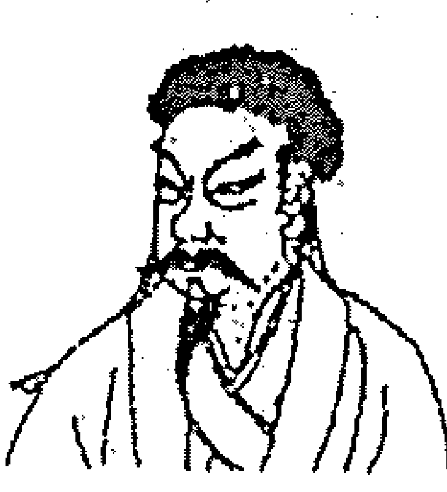

# 壬归

中国古代传统哲学名篇

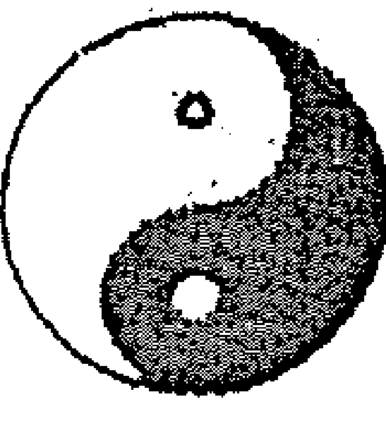

又曰：天乙后为门内，乃君子处事之所，小吏不得到之处也。若小吏犯罪方到此。如日辰阴阳俱在天乙后，为门之内，天命之义也。主君子迁官、小人伺候之所也。若日辰阴阳俱在天乙前，则贵人不得引从，名蹉跎课，亦不遇之义也。小人与君子同群，故小吏进取，君子退职。凡事自卑小处干则可，倘骤干尊大，则不可。主事体君子不安其居。

袁天罡曰：日辰阴阳在天乙后，名微服课。君子迁官，小吏退职，事体稍迟，大干则可，小干则不可。

诗曰：天乙来临二八门，日辰阴在门前奔。干阳支阳俱立后，励德之时难固存。上下动摇不安处。进退贵贱利为尊，有势求名利成就。亦须身足动迁行。

又曰：天乙来加二八门，日辰阴阳俱后存，此为卑微服事象，惟利阴私从贵人。更将天将来消息，在意推详次第分。

阴者，第二第四课也。阳者，第一第三课也。阴为卑，不可妄立贵人之前，必退黜也。阳为尊，不可居贵人之后，必迁进也。主庶人身宅忧疑，魂梦惊恐，宜祀土神，以二八为祭祀之月故也。如日辰阴阳俱在前，如贵人游行，皆前奔之象。此有蹉跎不遇之兆。君子闷，小人喜。若误便速望为之小吉，不然卑下处求望之事，亦小吉。若其人下贱当直之类，求之亦吉。或事体起于高大，即无成。

如正月辛亥日寅时占事，小吉临辛，天罡为阴临未，传送加亥，太乙为阴临申为用，天乙居胜光在酉上。小吉传送为日辰之阳神，居天乙后；天罡太乙为日辰之阴神，居天乙前；前为阴而居之，后为阴而阳居之，阴阳易位，不安其居，故有进阳抑阴也。

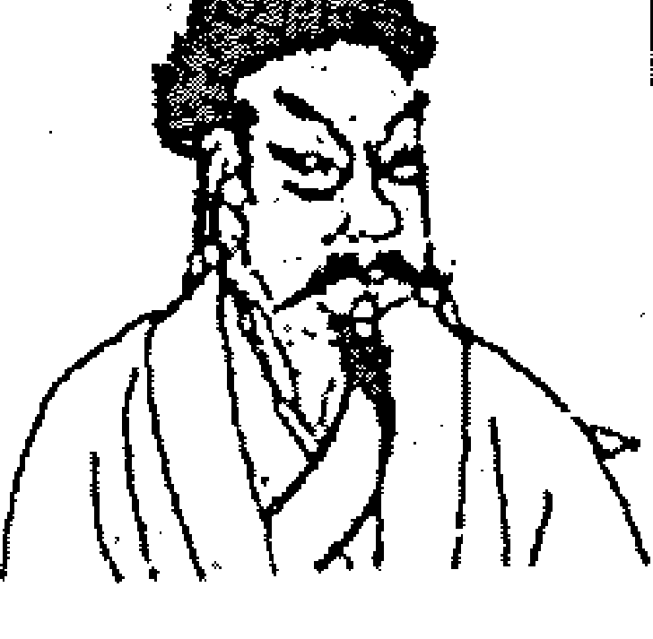

# 附录三

| 传 | 干支 | 天将 |
|---|---|---|
| 印 | 巳 | 螣 |
| 才 | 寅 | 勾 |
| 子 | 亥 | 白 |
| 滕阴 | 朱后 |  |
| 巳 | 申 | 戌 | 丑 |
| 申 | 亥 | 丑 | 乙 |
| 寅 | 卯 | 辰 | 巳 |
| 丑 | 午 |  |  |
| 子 | 未 |  |  |
| 亥 | 戌 | 酉 | 申 |

# 中国古代传统哲学名篇

# 壬归

#### 十五、赘婿课

欲知赘婿课，将身就妻家。辰往临其日，被克妄称邪。上下交相引，行年作爪牙。妇女带子嫁，次及后荣华。假令五月占，甲戌卯时加，辰来临日上，被克更无差。此课名赘婿，仔细自吁嗟。

赘婿日干遥克辰，辰来加日制其身。如男寄在妻家住，欲嫁携儿就适人。意欲所为他不肯，心怀屈抑未能伸。恰似舍儿来就位，作事由妻不在君。凶灾吉庆皆主内，即详天官决事因。

辰加日兮日克辰，辰受下克为初显。占人赘婿不由己，事系他人从外期。不是将身随母嫁，定因就聘他人妻。出入不快多牵制，总然力求亦虚信。

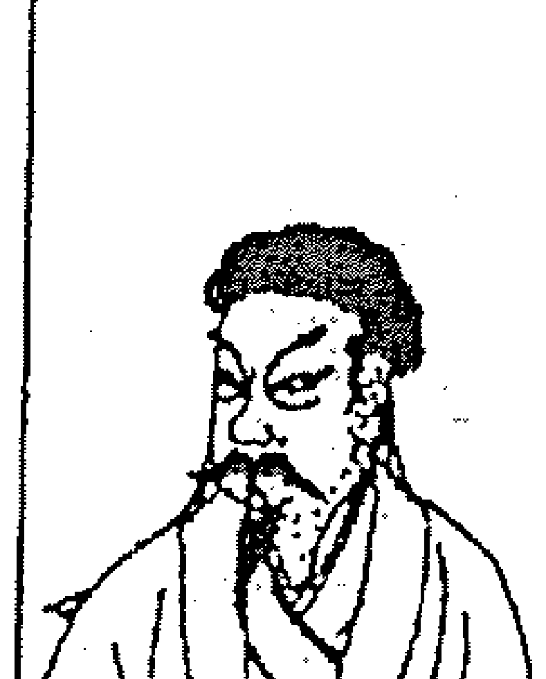

> 孔明曰：凡值日干克辰，辰又加日为用，名赘婿课。盖干为夫，辰为妻，干克皆为妻，此占婚姻及常占身命之事皆依此法。惟占嫁娶则不然，以动者为夫，属干，以静者为妻，守宅之义，属支。今支之静反来就干之动，如男赘于妻家，故曰赘婿，主兄弟不快，寓居他室，身不由己，统旅之卦，乃为客求财之课也。

占曰:屈意从人,多被牵制。胎孕迟延,行人淹滞。财名可成,病讼未济。用兵利客,先动胜计。如日德加辰,千克支,以上取下,男就于女,利尊长而不利卑幼,宜动而不宜静,用兵利为客,见阵利先动。若辰来加日,支就千克干,以小加长,女就于男,凌尊长而尊长不容,用兵利客反为主,他来干我,我能胜之,更遇白虎主杀伤,勾陈主争斗,朱雀主口舌,腾蛇主惊恐,或日用休囚,病人传染不离,则应旅九三“丧其僮仆”之象。遇天后恩泽,遇天乙主官长,遇六合主阴私,遇太常主酒食。及日用旺相,凡事谋为可就,则应旅之六二“得僮仆”之象也。

袁天罡曰:赘婚课主身寄居不得自专。若辰脱气必无正屋可居。若中末有救,兼行年有气,无刑害,有吉神良将,则为赘婚课当权格,所占不同。

假如甲戌日天魁临甲，乙未日小吉临乙，丙申日传送临酉。甲辰日天罡临甲，乙丑日大吉临乙。此皆辰加日为下克下，以此占吉凶，少将害老，室家相克，中外淫泆，内乱之道。臣谋其君，子谋其父，奴谋其主，但甲戌日天罡临甲，有争女子衣服事。甲戌日天罡临甲，有酒食言语相争事。癸巳日天乙临癸有争衣服事。己亥日登明临巳有女子惊逃事。丁酉日从魁临丁有分离事。壬午日胜光临壬有田宅相连相争事。戊子日神后临戌有子疾病就人财物事。丙子日传送临丙有言他人事。辛卯日太冲临辛有大器伤败事。一日天魁加甲出行之人斗讼，小吉加乙忧女子酒食。太乙加癸女子争讼衣服事。登明加已女子钱帛争竞事。从魁加丁有欲分异事。胜光加壬有讼田宅女子之喜及火惊事。神后加戊，女子病死淫泆，将得天后淫于亲戚事。

壬归

中国古代传统哲学名篇

380

[PAGE 403]

如二月甲戌日寅时占，主少将害老，室家相克，臣谋君，子欺父，奴谋主，内逢之道。

| 才 | 戌 | 六 |  |
|---|---|---|---|
| 子 | 午 | 白 |  |
| 兄 | 寅 | 后 |  |
| 后 | 白 | 白 | 六 |
| 寅 | 午 | 午 | 戌 |
| 午 | 戌 | 戌 | 甲 |
| 丑 | 寅 | 卯 | 辰 |
| 子 |  |  | 巳 |
| 亥 |  |  | 午 |
| 戌 | 酉 | 申 | 未 |

甲辰日天罡临甲带六合，六合主衣服。春占木旺主少，土死主老，下克上主少怨老，辰主家室，干克主内乱相争。六合亦主妇女谋合之状。

| 才 | 辰 | 六 |  |
|---|---|---|---|
| 子 | 午 | 青 |  |
| 官 | 申 | 白 |  |
| 白 | 青 | 青 | 六 |
| 申 | 午 | 午 | 辰 |
| 午 | 辰 | 辰 | 甲 |
| 未 | 申 | 酉 | 戌 |
| 午 |  |  | 亥 |
| 巳 |  |  | 子 |
| 辰 | 卯 | 寅 | 丑 |

已上二课案式，主有少犯老，又主有女子争竞衣服等事。

[PAGE 404]

壬归

> 邵氏曰:辰加日被日与天将克,若传将不和,来意主因不见喜疑,动而又不由自己。若占囚系,终必出狱。若三传贵人居卯酉,必迁居。

##### 赘婿当权格

赘婿若来临课象,中传末位得救神。行年有煞无刑克,却与吉神良将亲。此名赘婿当权课,为人谋事有权伦。虽然有事不干己,在我专恣有区分。大体不明而自得,与人干事最为精。若下自身多不济,纵得成时无益身。

右言赘婿不由己,见财求财见不遂。天官若也土神值,万般作事成淹滞。

赘婿当权格,将相青龙旺相,主有贵人酒食相迎,得太阴有阴私之事,得天后太常有亲属财物相通事,得朱雀勾陈有口舌斗讼,得螣蛇白虎有死亡惊恐之事。

假如十月甲戌日午时占事,甲遥克戌,戌为天魁,临甲,下贼上,彼此俱是日克,主不得自安,故名赘婿,主寄居携子行嫁,以身从人,不得自专。各以神将言其祸福。若见朱雀内相害,见白虎内相杀,见勾陈内相讼。又曰将得虎蛇勾主凶事迫抑,后阴武主阴私不明事迫抑。

#### 十六、无淫课

四课俱不备,其课号无淫。乙卯时加午,五月丑时临。阳神见天罡,太乙作阴神。日上无阳类,二女争男心。假令乙亥日二月巳时占。午为辰之阳,丑作午上兼。日阳还得亥,日阴无午添。此名为不备,双又男把妇缠。主有奸私事,逢时心不嫌。有救应血事,凶神刑狱淹。

男女不备号无淫,阴阳奸邪有二心。二女争男男不足,二男争女女单阴。上之克下缘太过,反此诚为妇不仁。阳即不将阴处合,阴来阳处畏刑临。要知其例看正月, 甲子时加卯课寻, 申上天魁子传送, 甲子将就子忧申, 金近甲时魁必侵, 干支上神交互见, 则名夫妇失调琴。心怀内有私情切, 甲子相生水合金。

| 六 | 戌 | 才 |
|---|---|---|
| 白 | 午 | 子 |
| 后 | 寅 | 兄 |
| 六 | 戌 | 元 |
| 甲 | 申 | 辰 |
| 戊 | 申 | 申 |

丑寅卯辰
子    巳
亥    午
戌酉申未

传见阳神终不见阴神, 曰无淫。

日辰上下交相克, 三四阴阳不相得, 此课立名为淫泆, 则有奸淫内伏匿, 事多乖违不相约。各有邪心相诡贼, 一二人心恩不备。二相交战难任职, 后合武阴用人传, 奸淫内乱相侵逼。

凡四课不备, 名曰无淫课。诸葛孔明曰: 阳不与阴合, 阴不与阳合, 三传相传, 如仿此为法, 曰无淫, 奸生其中。又曰: 四课缺一, 为不备; 及日辰交互相克, 为无淫课。又曰: 上辰克辰辰克日。

邵氏曰: 刚日从口上起一课, 柔日从辰上起一课, 凡见二阳一阴为阴不备, 此二男争一女。若二阴一阳为阳不备, 为二女争一男, 及日辰交互相克, 各不相生是也。阳不与阴合, 阴不与阳亲, 谓日为阳, 辰为阴, 辰上神克日上神, 为阴不与阳亲; 日上神克辰上神, 为阳不与阴合。

《金匮经》曰: 四课不备为无淫。若从日起第一课,

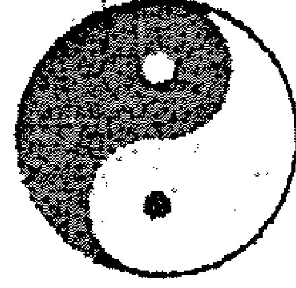

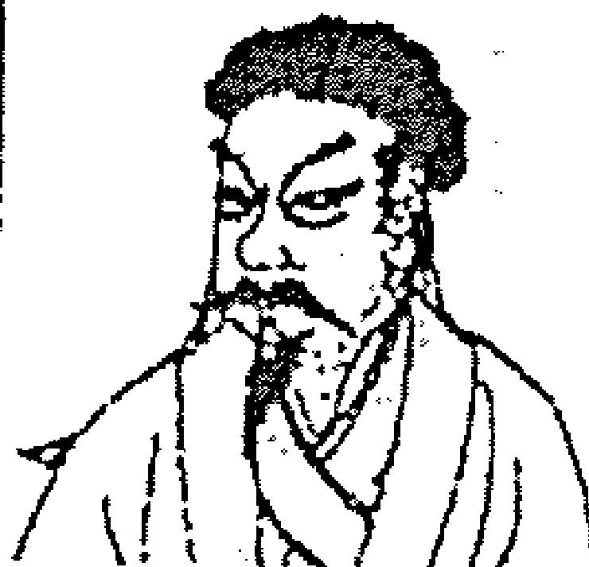

383

[PAGE 406]

阴不备占事多有失误。须知刚日先有日，日上起第一课；柔日先有辰，辰上起第一课。三传如往比尊者，言三传之神自比同类也。谓三金三木三火也，此言用河魁传出胜光，皆火类也。

此课主臣下奸邪，阳不备是列职之长，阴不备是有司之属；更夜神加临，决非中正之事。若有克制，则有救。其奸邪可隔，主夫妇各有私通，二情相背。贪淫无度，家门不正，事多淫乱，统小畜之体，乃琴瑟不调之课也。

传见阳神终，不见阴神也。阳多阴不备，事起男子；阴多阳不备，事起妇人。下克上责在女人。夹阳女争男，夹阴男争女，占他事不成，成亦破。盖不备课，事主不全耳。无淫课主阴私起祸。

象曰：阴阳不备，交克最嫌。名利碌碌，狱病淹延。阴微晴久，阳少雨添。行人未至，征战愁占。如阳不备，用兵利为主，贼不来。如阴不备，用兵利为客，贼来皆不战。凡得三课，又逢日辰交互相克，最凶，将凶尤甚。则应小畜九三爻“夫妻反目”之象。若课不备，无克亦不为凶，只是事有迟延，夫妇拆散，终复团圆，则应小畜二爻“牵复同心”之象也。

上克下，祸由男子；下克上，祸由女人。三传相得阳多，事起男子；三传而得阴多，事起女人。阳不备男不足，二女相争；阴不备，女不足，二男相争。此荒淫无度之象也。经曰：阴阳不备家丑陋。又曰：荒淫兮琴瑟不调，求谋不得病难痊，身物有缺。

假令十月甲子日午时占事，天魁临甲，传送临子，甲为阳，阳为夫，子为阴，阴为妇。甲欲从子，畏传送金，子欲从甲，畏河魁土，是为阳不与阴合，阴不与阳亲者。子内怀奸喜，欲传送相通，是妇有私情而欺其夫。发用天魁，中传得胜光，终于功曹，寅午戌火也，三辰三合，异姓各亲。三传比甲，夫有他意，以背其妇。上生下不顺，内外生奸。此占人内外皆不正矣，应妻与西南方人有私情。余仿此。

# 壬归

# 中国古代传统哲学名篇

[PAGE 407]

| 才 | 戌 | 六 |  |
|---|---|---|---|
| :--- | :--- | :--- | :--- |
| 子 | 午 | 白 |  |
| 兄 | 寅 | 后 |  |
| 元 | 青 | 白 | 六 |
| 辰 | 申 | 午 | 戌 |
| 申 | 子 | 戌 | 甲 |
|  | 丑 | 寅 | 卯 |
|  | 子 |  | 巳 |
|  | 亥 |  | 午 |
|  | 戌 | 酉 | 申 | 未 |

假令十月甲子日午时，即阳不与阴合二旬之占，“三传相得，各往比尊”者，言三传之神自相比同类也。占人皆主淫邪之心事将危败也。

假如庚申日申时，天罡加庚，神后加辰，天罡土神克神后水，亦是阳不与阴合，神后水畏天罡土，是阴不与阳亲，用起神后，传见申辰，是三传也。皆得其类，故比。此言阴阳不和，而用三传同类，内自相得，内将有私亲，有奸谋之意。盖神后既为天罡阴，又为起用，阳一神有二从，故知人有二心淫泆之意，言无淫此时御淫妇，必有祸起。

| 子 | 子 | 螣 |
|---|---|---|
| :--- | :--- | :--- |
| 兄 | 申 | 青 |
| 父 | 辰 | 元 |
| 青 | 螣 | 螣 | 元 |
| 申 | 子 | 子 | 辰 |

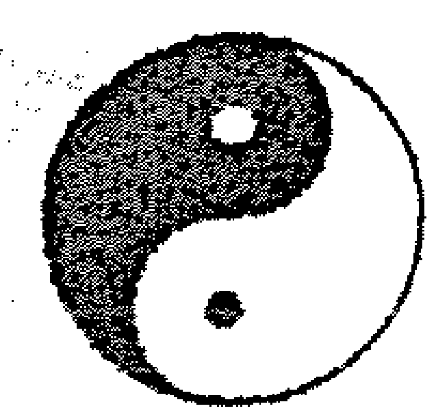

# 壬归

# 中国古代传统哲学名篇

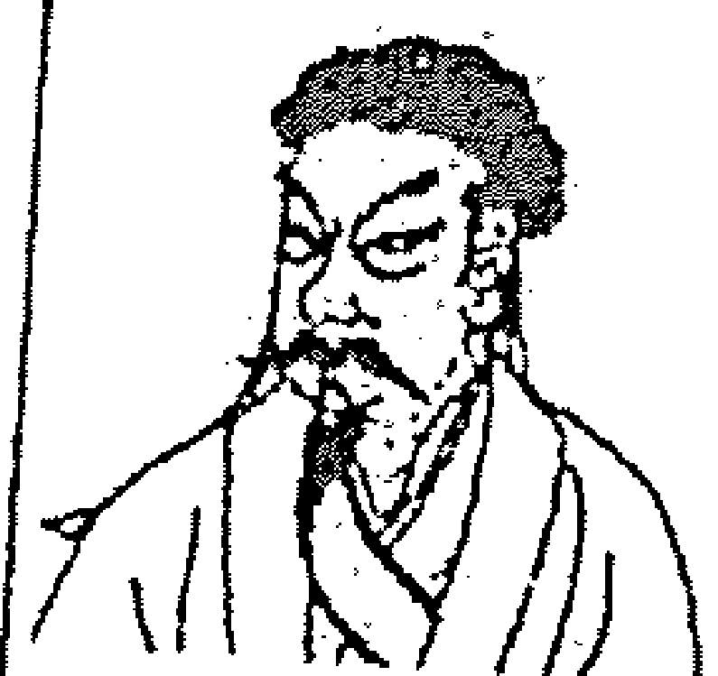

[PAGE 408]

| 子 | 辰 | 辰 | 庚 |
|---|---|---|---|
| 丑 | 寅 | 卯 | 辰 |
| 子 |  |  | 巳 |
| 亥 |  |  | 午 |
| 戌 | 酉 | 申 | 未 |

#### 十七、泆女课

初传见卯酉，六合天后来。末传二相应，泆人暗门开。天后入六合，妇人暗使媒。背夫欲逃走，从此降成灾。六合入天后，此是狡童排。男诱他人妇，商量走去来。二辰同一将，反复二徘徊。尽意思量看，不觉笑颜开。

天后常为厌翳神，须知六合是私门。二将相传名泆女，夫妻失友毕情思。欲知男女须淫荡，更向传中辨将论。六合即为男诱女，天后女携男子奔。

天后六合在传中，更并卯酉为狡童。泆女阴私相诱逐，事多嫌疑有淫通。所作中末多狡诈，淫乱相欺心不公。纯阳除不备，家道不整私相通。

孔明曰：日出乎卯而奸盗所由入，日入于酉而奸盗所由出，此卯酉为私门，六合天后皆私淫之物也。六合主男，天后主女，此二物临于二八私门之上，为之泆女课。用起六合终于天后，为之狡童课。狡者，狡猾也。獞者，童獞兽好淫也。用起天后，终于六合，谓之泆女课，主女随男也。皆主男女淫奔之象也。经曰：用起天后，中见六合，泆女之课，阴私频作，主有暗昧私情，淫乱不正之事。占者得之，宜善驭童仆，谨其出入，否则小人猖狂欺我，所不见不关有难言者。盖天后主妇女，女子不可倚门当户而立，其意必有私望耳。占家宅宜谨慎家门，以杜阴私之乱。如丙丁日六合为天后，则男诱女；壬癸日元武为天后则女诱男；故经曰：发传六合终传元武为狡童课，是元武亦主阴私窃奸拐之事。

袁天罡曰：泆女课与天后并，主男子遭杀，与地烦并，主女子遭杀；利私谋不利公干，访人不遂，捉贼难获；与三交会，浊滥淫泆，所私非止一处一人，不论在卯酉皆然。经曰：天后主厌翳六合为私门，若无逃女，必有淫妇，忌嫁娶婚配之事。或合后乘卯酉，或乘神入卯为淫泆课。

#### 十八、冲破课

孔明曰：凡日辰六冲神，加破为用，曰冲破课。冲者，动摇也。初虽有得，后必有倾覆。如子午冲相加，主道路驰逐，男女争斗变动。卯酉冲主门户相冲，或改移，或逃亡失脱，外人淫乱奸私。寅申冲主人鬼相伤，夫妇异心。巳亥冲主人事反复无实，重求轻得。丑未冲主兄弟兴替相衰，谋心不同，干事不遂。辰戌冲主奴婢离异，贵贱不明，不义之事。

破者，解散也。主事更动，中有多辍。若午破酉，酉破子，主门户破败，阴小灾病。辰破丑，主丘墓寺观破损。戌破未主先破后刑。亥破寅，申破巳，主先破后合。盖冲主反复，破主损害，冲破合一，乃雪上加霜之象。

# 壬归

中国古代传统哲学名篇

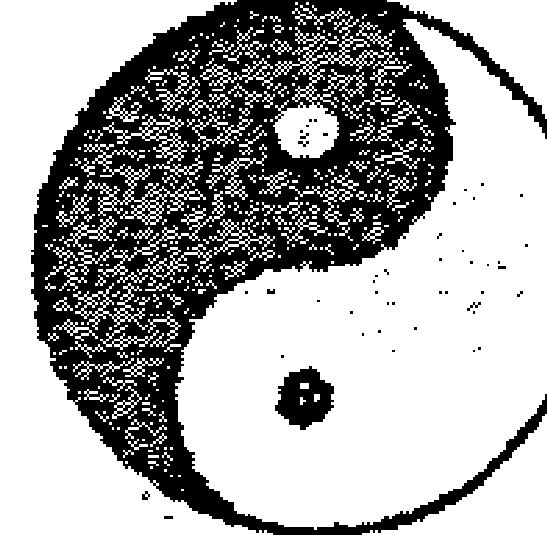

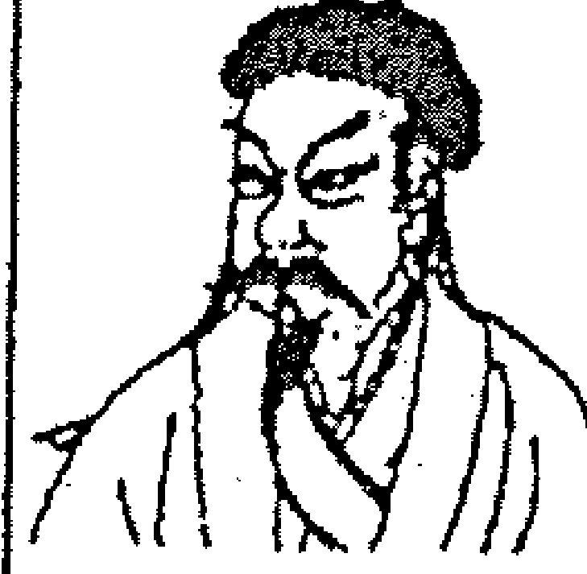

387

### 卷三 凶咎门

#### 一、迍福课（八迍课 五福课）

正月癸酉日，午时亥加午，甲子旬。小吉临功曹，为囚四土中。此之为墓气，是为第一迍；旺气之所聚，是为第二迍；丘墓怕木位，此为第三迍；朱雀与刑合，算来是五迍；中传子临未，名为第六迍；星传虚宿同宿，是在七迍；胜光临癸位，下克是八迍；此名八迍课，凶咎不可论。

| 六亲 | 天盘 | 天将 |
| :--- | :--- | :--- |
| 官鬼 | 未 | 朱雀 |
| 兄弟 | 子 | 白虎 |
| 妻财 | 巳 | 贵人 |

天盘：
| | | | |
| :--- | :--- | :--- | :--- |
| 戌 | 亥 | 子 | 丑 |
| 酉 | | | 寅 |
| 申 | | | 卯 |
| 未 | 午 | 巳 | 辰 |

地盘：
| | | | |
| :--- | :--- | :--- | :--- |
| 寅 | 酉 | 午 | 癸 |
| 朱 | 元 | 空 | 螣 |
| 未 | 寅 | 亥 | 午 |

用死终生为一福，子母相生二福。天乙为用为三福，用得救神解祸冤。德临日为五福，五福兼全福禄宽。八迍五福详凶吉，以意推之无定论。欲别凶吉微有力，不为八五是详文。冲克休囚刑墓杀，恶将都看有几迍。旺相相生吉神救，又视福之多寡均。福力均时灾渐退，病瘥遭官理自伸。用起死囚旺相全，俯见其仇仰见丘。初传克贼终无救，凶将恶神日辰头。中末得凶而自战，时贼行年八迍愁。事无大小皆不泰，出入连遭是滞留。所作百事皆不可，居行必有大殃仇。

五福起生处，旺相为一福。子母相生处，便为第二福。用传是天乙，吉将第三福。天乙亥子水，三宿为四福。发用戊寄丙，中传是五福。癸日利于未，中用功曹复。此之为成例，故名曰五福。

孔明曰：八迍者，加死气为用，旺相所胜，俯仰丘仇，带凶将刑害，传逢坟墓，下贼上，杀临日辰相克，为八迍课。用起初死终旺，子母相生，始凶终吉，年神制初，旺相临日，为五福课。此八凶为迍，五吉为福，故曰迍福课。

又曰：时令死气发用，为一迍；下为旺气所胜，为二迍；上见丘墓，为三迍；见囚克，为四迍；乘凶将，为五迍；刑害为凶星，其主死亡，为六迍；下贼上，为七迍；凶神临日辰，为八迍。

一曰用得死气，二曰为旺相所胜，三曰仰见其丘，四曰用得凶将，五曰刑与害合，六曰传得下贼，七曰星得凶宿，八曰凶将临日辰。

若用起死气，末传旺相，为一福。子逢母凶，带德神救解，为二福。始虽凶将，终有吉将，为三福。初传贼日，末传为克制，为四福。日辰有吉将临，为五福。

又曰：一用始终旺，二日子母相生，三日始凶终吉，四曰用得生救，五曰德神临日。

经曰：八迍课大凶，应屯卦“泣血涟如”之象。如得五福，则先凶后吉，统屯之体，乃雷雨解灾之课也。

象曰：八迍并用，忧患将至，得病倾危，遭官坐死，营干不成，举动殃累。五福相逢，变忧为喜。外有八迍变五福格，主先忧后喜，始难终易，应屯卦初九“居贞”之象也。

假令正月癸酉日午时占，四课阴阳见小吉临寅与日比为用，春占土死，用得死气，为一迍；未加寅被木旺相胜，为二迍；木墓在未，仰见其丘，未土畏木，为俯见其仇，为三迍、四迍；将得朱雀与刑合，为五迍；中传神后临未，下贼上，乘白虎，为六迍；子有虚宿，主坟墓哭泣之事，白虎与坟墓哭泣相并，为七迍；癸上见螣蛇，酉上见元武，皆凶将，为八迍。

| 六亲 | 天盘 | 天将 |
| :--- | :--- | :--- |
| 官鬼 | 未 | 朱雀 |
| 兄弟 | 子 | 白虎 |
| 妻财 | 巳 | 贵人 |

天盘：
| | | | |
| :--- | :--- | :--- | :--- |
| 戌 | 亥 | 子 | 丑 |
| 酉 | | | 寅 |
| 申 | | | 卯 |
| 未 | 午 | 巳 | 辰 |

地盘：
| | | | |
| :--- | :--- | :--- | :--- |
| 寅 | 酉 | 午 | 癸 |
| 朱 | 元 | 空 | 螣 |
| 未 | 寅 | 亥 | 午 |

又如正月癸酉日午时占，用未，终见太乙，火神乘相气，为一福；始终相生，有子母之义，为二福；用起朱雀，终见天乙，为三福；以火临水，得将天乙为救，为四福。癸德在戊，巳中有戊加日，为五福。

#### 二、二烦课

日宿加四仲，发用在其中。斗罡丑兼未，天烦课本宫。愆招男子罪，如何走西东。兵甲将诛戮，加刑命必终。月宿加四仲，地烦发用名，天罡临丑未，女子血光惊。产妇多忧惧，胎成子不成。传中虽有救，父子泪淋淋。

日月宿行临四仲，此课名为天地烦。又被罡星加丑未，复以兼称为杜传。男行抵日女冲月，举事灾殃为汝言。祸散更生欢复恐，仇人和了又成冤。弦望晦朔天烦合，男犯刑伤被吏缠。子午卯酉地烦会，女主血流还又还。神临四仲虽天烦，斗系丑未丈夫愆。月宿临仲名地烦，斗系丑未女人颠。日宿月宿俱临仲，斗系丑未为妄传。地烦金气为凶咎，不独妇人忧产厄，男儿亦自惧争喧。此时课传名杜塞，无门无户鬼相逢。天意为灾不可避，惟宜谨守把门关。

孔明曰：凡四仲遇四正及四平日，占得日月宿加四仲，斗罡系丑未，为二烦课。四仲者，子午卯酉也；宿者，躔宫神也。正月起亥，逆行十二宫神也。月宿者，太阴躔宫神也。正月起虚逆行十二神也。正月初一日移一宿，逐二十八宿，遇奎张井室氐斗宿，重留一算，数尽月宿住处，为太阴所在宫神，更详七政历细度为准。斗罡者，辰也；四正者，朔望弦晦也。初一日为朔，八日为上弦，十五日为望，二十三日为下弦，月终为晦；四平者，即四仲也，子平卯，卯平午，午平酉，酉平子也。如日月经仲宿度数，多有稽留，及天罡凶神交系丑未，贵人不得理事，则三光不明，德气在内，刑气在外，此二者天地烦相并之，故名之。

又曰：日宿加仲为天烦，月宿加仲为地烦；日宿者，天将也；月宿者，太阴行度是也。正月起室，二月起奎，三月胃，四月娄，五月参，六月魁，七月张，八月轸，九月氐，十月心，十一月斗，十二月虚。如正月十五占，从室宿数起，值奎井张重算，得张宿加四仲，即名地烦课。

《金匮》云：子午卯酉为四极，其四极之辰，每多一宿度数，日月到此未免杜塞，留久而后出其宫。丑未十干贵人之首也，天罡者凶神也，若系之故贵人不得理事，故名二烦。

经曰：若见地烦，无天烦，日月异宫，不在一处，其弦望二日，是仲在上发用，方可言烦。夫天覆于上，地载于下，人住于中，故为三才，人受天地覆载以生者也。烦者，乱也，厌憎之意。天烦为天厌憎而不知，盖地烦如地厌憎之而不知，载之地即如此，人将何求哉？

占者得此，主家有灾祸，统明夷之体，乃荆棘满途之课也。象曰：男遇天烦，命遭刑戮；女遭地烦，身受荼毒；征占伤亡，疾病号哭；刑狱徒流，胎孕不育。

经曰：日月二宿若加在仲，天烦之课，男人无用；罡入丑未地烦之课，立命当之，伤残淫佚。

又曰：得天烦者，百事未遂，当见讼狱，义本命在四季上，四仲在本命上，大凶，纵有吉将在传，亦不可免。男行年抵日宿，主被吏执；天地烦并，男女俱有患难。春夏可生，秋冬必死，当此之时，利居家，不利出行及干求举事。凡有谋为造作，决招凶祸，则应明夷卦上六“后人于地，失明。”之象也。

又曰：天烦主男人犯法而死，刀兵血光，兵刃诛戮，纵有解救，亦作徒配；地烦女子血光产厄，或犯法而死。春夏天烦灾罪立生，秋冬则死。卯午，春夏也；酉子，秋冬也。若日月临四仲，天罡不系丑未，名杜传，利居家不利远行。凡举皆凶，若与三交、龙战并，其凶尤甚。

假如九月初一丙午日午时卯将占，寅命，行年在午，月将为日宿，躔氏二度，月宿躔氏五度，日月俱在卯宫，加午为仲，辰为斗罡，临未，二者为天地烦课。

| 六亲 | 天盘 | 天将 |
| :--- | :--- | :--- |
| 父母 | 寅 | 丙 |
| 官鬼 | 亥 | 贵人 |
| 妻财 | 申 | |
| 兄弟 | 巳 | |
| 官鬼 | 卯 | 勾陈 |
| 兄弟 | 子 | 螣蛇 |

天盘：
| | | | |
| :--- | :--- | :--- | :--- |
| 寅 | 卯 | 辰 | 巳 |
| 丑 | | | 午 |
| 子 | | | 未 |
| 亥 | 戌 | 酉 | 申 |

地盘：
| | | | |
| :--- | :--- | :--- | :--- |
| 卯 | 寅 | 丑 | 子 |

假如三月十五日己卯子时酉将占，男命，行年在子，月宿是酉，加子为加仲，罡加未为地烦课。又女命行年在午，月宿卯临午为加仲，罡加未为地烦课。

| 六亲 | 天盘 | 天将 |
| :--- | :--- | :--- |
| 妻财 | 子 | 酉 |
| 官鬼 | 酉 | |
| 父母 | 午 | 青龙 |
| 兄弟 | 丑 | 螣蛇 |
| 官鬼 | 子 | 勾陈 |

天盘：
| | | | |
| :--- | :--- | :--- | :--- |
| 辰 | 巳 | 午 | 未 |
| 卯 | | | 申 |
| 寅 | | | 酉 |
| 丑 | 子 | 亥 | 戌 |

地盘：
| | | | |
| :--- | :--- | :--- | :--- |
| 子 | 丑 | 寅 | 卯 |

假如六月壬子日卯时午将，胜光临卯，日遥克神为用，日月宿俱临午加卯，斗加丑，晦朔弦望为四正，男行年抵日，主被吏执，子午卯酉为四仲；女行年抵月宿，主被盗贼。一云男行年忌宿；女行年忌抵月宿。一云日宿加卯午，为春夏天烦；加酉子为秋冬天烦，男人忌之；月宿加卯午为春夏地烦；加酉子为秋冬地烦，女人忌之。

#### 三、九丑课

四辰临五日，九丑恶声名，大吉时加仲，天灾莫举兵。远行人必死，嫁娶起哀声，修造妨家长，迁移人口惊，埋葬绝后裔，买卖不顺成。大小二时并，凶神生四平，三年与三月，不出大凶星。乙戊己辛壬，四仲上加临。大吉与支干，九丑不堪论。

《协纪辨方书·奏议》：九丑本于壬遁，其法以乙卯、己卯、辛卯、乙酉、己酉、辛酉、戊午、戊子、壬午、壬子十日，丑临于支上，则其时为九丑课。推其理，以此十课魁罡及日干皆落败地，故谓之丑。乙己辛壬戊五日干加子午卯酉四支，共为九，故曰九丑。

乙戊己辛壬五日，四仲相并九丑神。大吉临其干支上，值此凶灾将入人。大小二时相济会，刚日男凶柔女迍。重阳害父阴害母，测其天官决事因。不但纳妻并嫁女，最忌行游及出军。日干乙戊己辛壬，子午卯酉支来寻，大吉还加日辰上，四仲加时九丑淫。秽恶声闻为不肖，百体杂乱家阴沈。月建大时来人课，必有丧祸哭呻吟。

经曰：大吉乘乙戊己辛壬之日，配子午卯酉之神，是谓天地之道归殃九丑，谓五干四神合为九也。大吉乃天帝之大杀，居其上行其杀，故曰丑。四仲之日时加四仲，在占临日辰，举百事大凶。大吉加日害长，加辰害幼，刚日害男，柔日害女。在日阳伤夫，在月阴伤妇，重阴害母，重阳害父。天乙前为阳，天乙后为阴，日辰皆在天乙前为重阳，日辰皆在天乙后为重阴。以四时为旺相期三年，囚死期三月。以大吉并将言其形状，四辰与天将大吉与凶并，如加九者大凶，祸重至，必有刑戮、死亡、流血千里，万无全者。经言“乙者，雷霆之始；戊己，北辰下降之日；辛乃秋金，断刑之日；壬乃三光所不照之日。四仲之日，万物存亡所系，子午为易气，子为冬至，阳气所生，以阳易其阴之气；午为夏至，阴气始生，以阴易其阳之气。卯乃春分气交，阳盛阴绝；酉乃秋分气交，阴盛阳绝。大吉乃日月五星所始也，故合则为害，即乙卯、乙酉、己卯、己酉、辛卯、辛酉、戊子、戊午、壬子、壬午十日是也。”

孔明曰：天地之道，赏善罚恶，故以九丑之归，四时成功，诸神奏书，集会明堂，以考生杀，建丑之九。大吉为众会之首，更兼大小二时在四仲之时，与日辰俱会，则主杀伤悖逆之祸。

如二月壬子日酉时，大吉临子，刚日当杀长男，期六月戊辰、戊戌、己丑、己未日应，所以然者，壬子恶土，故寺月之日期之。四土月十二月时加四仲，亦是大吉加子，此谓加阳神，男人主之。二月大吉在子，春日土死，此为大凶，决知所主，以大吉所得将言之，太常并，定主父无，鬼神为败；螣蛇并为惊死；朱雀并主祠寺烧死；六合并主女子淫佚；勾陈并主路斗死；青龙并主领会酒食财钱死；天乙并与贵人同贵死；天后并主妇人怀他人子死；玄武并主盗贼诈为败。

如十一月乙卯日辰时，大吉加乙为用，将得螣蛇，忧妇女争田宅，长女主之。又如戊子日卯时，大吉加子阴，功曹为用，大吉虽不为用，亦名九丑，少男主之。大吉课家冢动。如四仲占，丑临日辰，加四仲时发用，亦为九丑课。夫丑纽也，岁终物欲归而未舒，尚纽也。占事多凶，统小过之体，乃上连遭之课也。

象曰：刚日男凶，柔日女凶，重阳害父，重阴害母，婚姻有灾，造葬无补，诸事难为，徒劳辛苦。此时不可举兵、远行、移徒、嫁娶、造葬、求谋，百事灾祸，更与大小时并，祸不出月。或神将吉灭凶神将，一切事皆不可就，且多凶咎，应小过上六“灾眚”之凶。

如二月乙卯日子时占，大吉临卯，下克上为用，时加四仲，大吉乘白虎带死气而临旺乡，在小时杀上，以此占人，有暴死。三年与三月者，四仲每隔三辰也。

#### 四、三阴课

课名号三阴，灾患迭来侵。天乙逆行治，丘墓加日辰。用爻值囚死，上下相克刑。贼来贼年上，是课名三阴。

天乙逆行为不顺，元白二神日前立。用终囚死又相克，贼行年凶必残破。三阴任如能施作，课主精神入墓间。百事总乖家业散，纵使登科位不迁。

正时克年天乙逆，元武白虎加日辰。初传更往克末传，或终囚死又克贼。此曰三阴事不明，阴暗灾危事非一。居官之人年入墓，纵得为官不迁职。

天乙逆行，三五加日辰，一阴也；用终囚死，上下相克，二阴也；时克行年，三阴也。斗月照今日之本，为殃；用在其中，名曰重阴。一曰凡天乙逆行，日辰在后，用起囚死，将乘玄虎，时克行年，阴气不利三也。此三者，主暗味阴危，故名三阴。

一曰天乙逆治，日辰在后立，白虎居前，是名三阴。占者得此，凡谋不通，多有悔滞，统中孚之体，乃群阴党恶之课也。

象曰：动作困苦，百事沉沦，见官屈伏，占病多违，士忧禄位，男亡婚姻，求财破散，孕主女娠。又主终日祸患困穷，系者虽解身属灾，病者虽起精魂入棺，居家理耗破败忧愁，万事大凶，所谓入九地之下。夫三阴者，如日辰三传始终囚死，带墓鬼克行年，最凶，主公私事皆不成，或丧魄、五鬼、伏殃诸煞并临，祸尤甚。丧魄正月起未，逆行四季。游魂天鬼伏殃正杀，正月起亥顺行十二辰。此诸煞有一并临日辰年命者，占病必死，行兵多败，谋为反复。

##### 占家宅

主破财人离，百事凶殃，则应中孚六三“得敌，或鼓或罢”之凶象。若六处有救解，末传旺相，主败中反成，始则凶。

假令三十四岁，行年立亥。七月乙亥日丑时，小吉临卯为用，乙木入墓中得又带死，丑时克行年是也。未加卯为初传，发用之神囚死，又入墓中传，又是死气，丑时又克行年，亥水天乙又逆行，名为三阴。

| 六亲 | 天盘 | 天将 |
| :--- | :--- | :--- |
| 兄弟 | 卯 | |
| 父母 | 未 | 天后 |
| 官鬼 | 卯 | 白虎 |
| 妻财 | 申 | 勾陈 |
| 兄弟 | 巳 | 贵人 |

天盘：
| | | | |
| :--- | :--- | :--- | :--- |
| 酉 | 戌 | 亥 | 子 |
| 申 | | | 丑 |
| 未 | | | 寅 |
| 午 | 巳 | 辰 | 卯 |

#### 五、天寇课

分至四神前，蟾光月正临。名为天寇课，百祸皆来侵。君臣无义合，夫妻有离心。传中虽有救，父子泪淋淋。

阴阳生煞言分至，前之一日是离神，假令春分今日卯，离神昨日是居寅。占时月宿在寅上，详其多少患灾殃。八月积阴为杀气，离上逢之天寇逆。岂但行人去遭劫，所事修营害及身。分至之神月宿度，来加作支今日辰。天寇必因神愿动，事无多至患败群。资财耗散皆凶恶，故宜守旧勿逡巡。

孔明曰：四离日者，春分秋分冬至夏至各前一日是也。春分，阴气在卯，盗杀百草，荞麦死；秋分阳气在西，秋主刑煞而有秋华之美；冬至阳气在子，万物蛰藏，荞麦之类冬至始生，皆非正气，故曰寇。加以月宿乃积阴之精，主刑杀暗昧，与四离之日盯临，而加于日辰及发用者，其祸之惨胜于寇盗之劫掠矣，岂但窃取乎？

又按：《金匮》云：二月春分，阳气始出，先一日谓之阴离；八月秋分，阴气始出，先一日谓之阳离；冬至阳气始至，先一日谓之阴离；夏至阴气始生，先一日谓之阳离。

假令寅日春分，先一日丑，丑便为春分之离神，此离神之上见月宿加之作发用，故名天寇。盖月者积阴之精，其气主刑主盗贼，离为阴阳衰盛之地，未离而月宿加之，未为无凶，即离而蟾光照之，不免有盗。经曰：四离之神望见月，是谓不祥，不祥灾多，天寇所遇主有寇盗暴至，不出日中，亦不可远行，必逢盗贼，却死道路，又主事破坏，多值乱离，统蹇之体，乃时事多艰辛之课也。

象曰：阴阳分离，气不得反，盗贼恣生，军兵惰懒，病者即亡，孕者当产，出路死伤，婚姻拆散。如月宿加离神发用，祸事尤速。若乘元武作游都盗神，定主盗贼来，必战，或乘白虎作鬼劫，为真天寇，其凶尤甚。如年命见月宿加离神，主己身欲为盗来问也。如是真天寇，则不可出行及市贾，主劫盗丧亡，百事不遂，应蹇卦九三曰“往蹇，来连。”之凶。或月宿值太阳，谓之日月交明，主盗贼败露，为败寇课。当应蹇卦之上六，曰“往蹇来硕，利见大人，以济蹇”之象也。

袁天罡曰：天寇课，在家吉，出外凶，占孕主女，占产子母分离，占婚不成，离神见月，病主死，天寇临身，出行逢盗，谋望无成。如月宿乘元白勾，或作游都，或作月内之死气，主死于非命。

如二月五日春分是卯，前一日是寅。二月四日是丙寅卯时占课，倍正月得二加四，更添一日，得七数，以室顺到七个星宿，得酉毕宿在酉发用，或将加卯时，室上得酉，见月宿加四离日，名天寇。

二月五日春分卯，先一日是四日是丙寅，为春分前一日，系四离日，卯时占课，以月将戌加卯时数去，以室为亥宫星首，亥属天门，故以亥宫室星为法。

子 丑 寅 卯
亥     辰
戌     巳
酉  申  未  午
丑 寅 卯 辰
子     巳
亥     午
戌 酉 申 未

月宿者，乃子午卯酉宫之十二月宿也。法以室宿加占时上，详其倍上之月为数，再加四离日数，又添一日为数，共凑多少，即数多少星宿至何宫辰，看四离日所加之辰，有月宿者，即天寇也。

#### 六、天祸课

四立干神上，分明末日临。此名天祸课，乖觉更相侵。火动烧人死，水临劫盗侵。木囚梁屋折，土动重悬檩。金则兵戈乱，闹处主衰声。

四立日占为百事，切忌干临四绝辰。此名曰为天祸课，殃咎之灾四立旬。今日立春当乙酉，昨暮穹各是甲申，假令乙酉戌时课，乙将临申害凌人。欲知祸患缘何起，以将推之决事因。白虎死亡元武赋，官追朱雀闹勾陈。天官凡事主欺诈，可依此法立灾迍。四立七日干属阳，加往昨日干欲亡。此名天祸多凶恶，祸起多因庙废伤。不出一节事必至，定见家亡后死丧。

孔明曰：四立前一日为死绝，立春日少阳气始，立夏日太阳气始立，秋日少阴气始，立冬日太阴气始立。春日水绝，立夏日木绝，立秋日火绝，立冬日金绝，时变四始，以先一日相临悲哀，相去决绝，故曰四绝。如辛亥日立克，先之一日庚戌，月将临庚是也，故曰天祸。得此日而临之，万事莫为。一曰凡四立日占得今日干支临昨日干支，或昨日干支临今日干支，为天祸课。又四立日干支神加绝神干支，或绝神干支加四立干支神。此四时之气德绝用刑，如天刑时灾，人受其祸，故名天祸。

《金匮》云：四立之日，五行正旺，立前一辰，其德既绝。如今日立春，是甲申，前一日是癸未，便为绝神。如绝神临今日发用，则为天祸课。

邵氏曰：四立干支忌加时，曰天祸，将来殃凶必极。如今日癸亥，后一日甲子，甲加癸上，亦是天祸，定主血伤，祸不出一节，四十五日内也。主暴祸在门，流血。至临官不失其时，女子逆生，月神正立，其祸愈速。月生者，月将也。又主暴死道路，不出月中，占者动有凶咎，不可妄为。统大过之体，乃嫩草遭霜之课。

象曰：以新易旧，天有灾咎。事莫乱为，身宜谨守。战斗流血，葬丧凶祸。出行死亡，干谒空走。如四立日是金，前一日是火神，相加又发用，占者主火灾，或雷震天灾。水主水灾，或盗贼淫乱。木主屋梁折。金主戈兵战斗。土主土瘟，或墙壁陷塌，主官司阴暗，遭罪而死。更乘白虎，主死丧；元武主失脱；朱雀主口舌；勾陈主争斗；带德煞必有不意之殃，不出九十日也。或四立日值朔望先一日，月穷为四废，并此四绝之日，止望见月宿，其凶尤甚。当此之时，不可出行造作等事，犯者大凶，当应大过九三“栋桡，凶。”之象也。一年之间只有四课。

假令日立干神发用，亦谓之天祸课。今日干临昨日干，为绝神，祸不出户。如甲日立春，前一日癸，甲日占，甲上见丑是绝神；庚日立夏，前一日己未，庚日占，庚上见未是也。余例推。

甲日立春，前一日癸，甲占甲上是丑，是绝神，丑好癸，癸为绝神也。庚日立夏，前一日己未，庚日占庚上见未是也，未为绝神。

| 辰 | 巳 | 午 | 未 |
|---|---|---|---|
| 卯 |    |    | 申 |
| 寅 |    |    | 酉 |
| 丑 | 子 | 亥 | 戌 |

#### 七、天狱课

欲知天狱格，发用死囚神。斗系加日本，相临犯法人。传中灾劫煞，刑害转生嗔。正墓加同类，灾迷受灾深。

占课用神当死囚，仰见其丘俯见仇，更值斗罡加日本。四凶天狱是其由。正月乙酉午时课，小吉临寅故曰丘。春占土死未为墓，土畏于寅又是仇。乙木生亥将为木，斗系当为父母忧。临仲已身兄弟患，加季儿孙妻妾愁。登明小吉例推定，如火如木忌逢秋。行人不可此时出，有事莫为则免忧。天狱贵人临戌辰，日辰斗上得子孙，德神基德乘良将，天狱清平可释迍。厄难之中逢解救，官讼无凶主鬼神。用起死囚当亡日，中传日上旺墓生。天狱外忧凶祸发，多忧动土及登程。狱讼疾病有神责，若见丘仇更可惊。生为父母墓卑下，旺是自身及弟兄。要使天将断其事，所作百事总无成。

> 孔明曰：囚死墓神发用者，为天狱，主死丧囚系之事。囚者，时令囚气也。墓者，日之暗库也。我克者为死，克我者为囚，囚死发用，又斗加日本。斗者，天罡也。日本者，长生位也。罡压日本，则失其所生，故有囚禁之灾。若日本不犯斗而生旺，虽囚死可解。若斗系日本，中末再遇灾劫刑害，则真天狱，乃致死之地也。占者忧患相仍难解，统噬嗑之体，萎靡不振之课也。

象曰：日月迍遭，刑狱之愆。犯法难解，染病未痊。出门凶也，谋事徒然。兵家大忌，出军祸缠。如用神囚死，俯仰丘仇，斗系日本，又带刑煞灾劫，虽有青龙，莫能救止；或为魄化、死奇，系日本凶祸尤速，不可出行及造作，百事皆凶，应噬嗑卦上九曰“何校灭耳”，凶之甚也。然辰为天罡，戌为地网，若囚罪入狱，喜见贵人临辰戌，有贵人审狱录囚之义。兼日辰行年得生气、子孙、德合、解神加之，为天狱清平课，危中有救，忧中有喜，官讼理，贼围可解，噬嗑卦九四曰“得金矢”之吉也。若魄化为用神，死囚系日本，凶倍于天狱，为之绞斩卦，大凶，占贼不来，被围无救，人在狱中必死。

袁天罡曰：天狱课，公用则惊忧生，私用则丧乱至。虽天之灵祗，地之岳渎，无不惟惧此，而况人乎？若带劫杀刑害，刑年命，无救则不能久居人世矣。如得贵人、龙、常，来意主望天恩赦宥也。

#### 八、天网课

时辰俱克日，万祸竞相逢。事及因争斗，人伤祸必从。传中灾劫杀，犯法的难容。旺相凌囚死，连有数千章。乙酉六月课，同时第二人。颠狂偏僻害，免得法伤凶。管钥论孤寡，相逢灾更浓。

用起并辰同克日，四张天网有灾临。庚辛占值日中课，火作初传火克金。甲乙申时得传送，他皆仿此例推寻。问其忧事缘何发，消息天官服众心。时辰及用俱克日，课为天网四张名。动多抵障不通泰，斗争鬼贼相交迎。必有官灾刑狱事，凶恶相传祸患并。天网却逢中末救，日上之神克初传。二处有一逢良将，此为天网解网篇。先凶后吉终凶猛。不须忧患不为僭，囚系囚空逢天赦，疾病须遭太乙丹。天网课中有胜光，逃盗原来在目前。

> 《金匮》经曰：凡事原始可以要终，时为目前，用为事初，二处既为日鬼，则主至近之处，先有阻。其像有天网之在头，不能踊跃而去。与日前一辰之网，辰为天之网戍为地之网不同，所主与天狱、死奇一致，死亡尤甚。传见灾劫，为之入网，凶祸难脱，旺相凌囚死，为之天网四张，万物尽伤，占贼不来，不利先举，解围难出，占讼入狱，时克日，孕产损子，求望难成。

孔明曰：时克其日，用又助之，所治之事，上下为忧，神将内战，天网四张，如今日甲乙时加庚辛，是时克日也。若用起又是传送，从魁又克甲乙木，是用去助时，得克日也。神将内战者，申酉上见龙合也。故凶祸难救，凡事不能踊跃，登高致远，统蒙之体，乃罗网在头之课也。

先凶有救，后获吉祥。如占时及用神俱克日干，并天网煞正月起亥，逆地四孟。及天刑煞，或天网地网入传，多凶愈甚。主官灾口舌难消，出军被围难出，则应蒙卦六四“困蒙，吝。”之占，若末传及年命有救神，克初传为解网课，反凶为吉，应蒙卦二爻“子克家”之吉占也。

> 歌曰：天网却逢中末救，日上之神克初传。三处有逢良将者，名为解网不为愁。君子得之宜谨言、节事、屈己、敛意，始免其咎，苟为不然。如鸟之投网，必遭折羽亡身之殃。

> 袁天罡曰：正时及用神克日，下克上神，谓之天网。若阴龙合入传，来意主捕盗。若中传克末，和占来杀贼。

> 《玉关歌》曰：天网时用来阳，死亡凑集必颠狂。言用神克日时又助之，惟利捕盗、行刑，若中末传见财，主捕盗有财。

##### 天罗地网课

日辰前一天罗杀，对冲名为地网神。发用行年支干上，官灾病厄是其迍，朱雀吏追白虎病，螣蛇主怪梦惊人。从魁发用殃方甚，天魁临干祸不移。

> 孔明曰：凡日辰前一辰为天罗，对冲为地网，并行年日辰发用，为罗网课。遇丁马主官灾疾病，更以神将言之，以天罗课同断。

#### 九、死奇课

式家死奇课，天罡日月轮。死亡推斗下，忧患月中陈。日至能除祸，诸家课备均。所生为父母，同类兄弟亲。墓处为妻妾，三奇谁苦辛。斗临遭死损，月至忧更频。日到深殃散，思量课有神。

天有三奇日月星，日为福德月为刑。星为死奇为死系，更互加之各有灵。加孟所生忧父母，临仲为身及兄弟。季上见之妻与子，看其藏否与谁并。日主旬中辰月里，岁上一年之内。星月独临当子患，其中日照免灾殃。

> 孔明曰：三奇者，日月星也。日为福德奇，日出则奸盗止，鬼神潜，恶兽伏，病者开口。月为刑奇，盖月夜则奸盗横行，鬼寇从生，恶兽不伏，病者多剧。星为死奇，谓北斗之光，不及日月之耀。处暗之中，奸盗邪鬼恶物为害，故曰死奇课。如今日甲子斗加寅，是孟，忧父母；加午仲，忧兄弟；加戌季，忧妻子奴婢。虽星奇主死，月奇主患。若日辰太岁上，或有日奇，则星月不能为殃。盖日出则星月没故也。日奇者，日宿也。月奇者，月宿也。如二烦课，加日则吉凶在旬内，奇加辰则吉凶在月内，加太岁则去吉凶在今年内。又曰：斗罡系日辰阴阳发用，为死奇课，斗罡者，凶恶之神，贵人不临之地，所指者殃。如罡加四课之神，决主死亡奇怪之事。月星虽为死奇，但为刑未甚，特主疾病忧患而已。日奇为福德，主奸盗屏息，反凶为吉。统未济之体，忧中望喜之课也。

象曰：辰为天罡，刑狱之曜。疾病死期，征伐凶兆。论讼被囚，干贵失靠。婚嫁出行，祸福自招。如罡带日鬼、日墓、灾煞、劫煞相并克及乘白虎，为死亡之兆，大凶。更乘岁月之上，为三奇死课，其祸尤甚。经云：“三者尽伤，岁必受殃。”当应未济卦初六“濡尾”之凶象也。若斗旺相德合相生，遇吉将，或六处有克冲救神，及有日奇反吉，更辰为月将，尤美，为死奇回生课，除祸为福，应未济卦六五爻“有孕”吉之象也。经曰：“三者太阳，岁中无殃。”又曰：“死奇主五官无主，四大不收。云为措置，多恐亡失，有类行尸也。”

星月临日，凶在一旬；星月临辰，凶在一月；星月临岁，凶在一岁；若日辰太岁上见日奇，则救之。如五月初八甲子寅时，天罡加亥，忧父母。月守元，此为星月二奇皆系日本，为大凶也。却得太阳在井临甲者，倾危矣。

#### 十、魄化课

死囚为白虎，来临日用中。魄化魂消散，亡神病者愁。行年同一位，患者命难留。细言看年月，凶神祸病由。

白虎西方性属金，性硬刑杀忌加临。若与死神相合并，日辰年上见灾侵。值此课名为涂改，假若无病亦昏沉。二月寅时甲戌日，胜光为虎是真阴。死神正已二居午，只怕相乘作害深。六月未时壬戌课，天魁为虎又加壬。六月死神未临戌，下迫行年依此寻。贼上为内下为外，阳为男子女为阴。行年若值魁罡上，身须逢害必灾迍。魄化贵人为鬼门，日辰年上吉神存。白虎更受诸处制，此为魄化得归魂。事主先难而后易，须图终吉勿忧心。举尸入棺还再活，刀临头上亦无痕。白虎乘神入墓中，墓加神宅亦难容。或乘月厌加年命，魄化魂归事休凶。

《金匮》云“白虎并死神，上迫日辰为魄化课。病主死亡，常人得之，官司血光。”盖白虎乃凶恶之将，若乘旺则自贪其旺，不能为害。如值死囚，又并死神死气，即是饿虎，定主伤人。如人魄受化而散飞，故名魄化，又死神死气乘虎，克日主己之灾，克辰主门户之灾。

孔明曰：魄化之课，不利老人占，病讼最凶，占家宅不利，统蛊之体，乃阴害相连之课。

象曰：人身丧魄，忧患相仍。病多丧死，讼有忧惊。产孕伤子，征战损兵。谋为招祸。切莫远行。如日墓乘白虎，或斗罡作日墓带死神发用，为虎衔尸课，极凶。在年月又为日鬼，乃自己丧魄，动则自寻死也。或是墓虎，鬼临干，身受殃，其祸甚速。若日墓乘虎临宅，主宅有伏尸作鬼，或有形响，虎在阳忧在男，虎在阴忧在女，上克下与日主外丧，下克下与辰主内丧。或人年命在魁罡蛇虎之下，无冲克解救，决主死亡。当应蛊三爻之象。若贵人加鬼门，虎阴制虎神，日辰年命六处有冲克，及有吉神救争，为魄化魂归课，主先忧后喜，则应蛊卦上九“高尚其志”之占也。

袁天罡曰：魄化课，虎在死气休囚，临人年命日辰发用，为衔尸，其凶尤甚。在人年命上，谓之魄之，极凶。如年命囚死，为死墓，乘虎，谓之丧。占者无病防病有病必死。又白虎为递牒，论讼凶，出战必被围。惟冲散，则为救解。占兵初凶后吉，遇围有解救得苏，行人来。君子占遇魄化，宜存诚定志，以待方来，庶无大咎。若白虎在曰前，神后加行年，必占官灾疾病之事，若甲乙日主满宅有灾。

#### 十一、殃咎课

三传克日，神将相战，或日干乘墓，为殃咎课。如己巳日三传巳申寅，初传克中传，中传克末传，末传克日干。又如丙子日三传子未寅，末克中，中克初，初克日，为之递克，主他人欺凌，互相战害，宜自损，防合台交章论劾，常人有凶损之祸，或被邻人雷状交攻。如丁酉日亥卯未，将得贵常勾；如庚午日戌午寅夜将合后虎，将克神为外战，祸患易解。或壬子日午加亥为用，将乘元武，上下夹克，主身不由己，上下夹攻之。或受人有拘束，财不由己费。若上下夹克为鬼煞，反吉。如己酉日三传酉丑巳，昼将合后虎，神克将，为内战，祸患难解。又如丁巳日乘六合，初传下克上，又克将，为内战，主谋事将成被人搅扰。天后内战，主多病。又如壬申日亥加辰，申加丑，为干支坐墓，乃心肯意甘受祸。又如丙寅日，干加戌，支加未，亦为干支坐墓，人宅皆不亨通。此例非殃必有过失之咎。故名殃咎课。统解卦之体，乃内外凌辱之课也。

象曰：五行克贼，征战灾祸。疾病遭厄，论讼反坐。官遭弹劾，人罹罪过。营干不宜，出行有阻。如三传遥克日干为凶，如末传助之，主他人发唆贼害。如三传下贼上及日辰内战，主家法不正，致争窝犯，丑声于外。出占病讼极危，惟占官自慎，从微至着迤逦转迁则吉。舍之皆凶。如墓神覆日之为天罗自裹，主命运衰弱，作事昏迷，被人抑揄亏算，宜本醮祷本命星辰。如干支逢墓，二处逢空，可解。如三传皆鬼，虽制无畏。鬼自荣贪，无意兴灾，主囚死之月，祸方发。如传财大旺，财反倾危。或冬占水旺克火，主大灾，但财自贪生旺，身弱难管。至身旺财衰生时可取。凡相克又递遇刑害更凶，应解卦六三“致寇至”之凶也。

#### 十二、灾厄课

游魂与凶将，加年及日辰。飞魂神不定，鬼祟欲牵人。

游魂来加日干上，用起兼之悉所并。但见飞魂魂不定，行逢鬼祟梦神惊。若问煞居何处所，顺行正月起登明，丧门三月未为是，四季逆行数逆推。用在行年支干上，病人必死健人危。白虎若临愈凶恶，依将决之必无疑，天罡若临四仲神。建寅居酉逆相巡，行年日上来并用，伏殃兵火乱杀人。

> 孔明曰：凡丧车、游魂、伏殃、病符、丧吊、丘墓、岁虎发用，为灾厄课。丧车一名丧门，为恶鬼临门，主病忧死，妇人产死，非病必有厄困。游魂鬼主妖怪不祥，精神惊恐，病患灾凶。伏殃为天魁杀，主殃祸所侵，伏兵杀伤，病符临支克支，主合家病，并天鬼主时疫，并白虎主死丧甚凶，或临干支相生带日财贵人，即合成就旧岁之事。丧吊全加支干年命，动身披孝服，并死气绝神白虎主身死灾中，人挂孝；并鬼，愈出病不可疗，并岁作鬼亦然。并五墓亦凶，并虎雀丧门有葬埋之事；临丑有墓田之事；或丘墓入传，季神逢丁神，将又凶，主恶祸官病之灾。此等凶煞皆主灾殃危厄，故名曰灾厄课。统归妹之体，乃鬼祟作孽之象也。

象曰：家门厄会，妖孽为害，疾病死亡，财喜破坏，婚姻多凶，征人大败，行人不归，访人不出。如绝神申子辰用巳之类，为墓门，主女灾，占孕凶，宜绝旧事，血支血忌剑刺，并天空沐浴为产候，血支忌破胎，主伤产妇，羊刃主兵刃凶，有血支，或值日用囚死，将并诸丧车等恶煞，大凶；或青龙作日鬼，为幸中不幸，则应归妹“征凶”之象。若诸凶煞值日辰年命，中有冲克，及天地医解救，反凶为吉，占病可疗；或白虎作长生，为不幸中有幸，应归妹“跛能履”之象也。或发用丧魄，或临日辰年命，为丧魄课，病人将死，健者将病；更加白虎，并诸恶煞，其人必死无疑，或发用游魂，或加日辰行年者，为飞魂课。

#### 十三、鬼墓课

> 孔明曰：凡日辰墓神及日鬼发用，为鬼墓课。主凡事多不美，谋事不成，灾凶及己；阳鬼主讼庭，阴鬼主神祇。墓者，朦昧也。凡鬼入传及传墓，不吉甚矣，非官灾必有疾病。辰未入墓，暗中有明；及夜墓生日亦吉。丑戌为夜墓，昏昧愈甚；日墓人夜，亦然。辰戌墓主得刚猛，逢速速之祸；丑未墓主事业迟延。统困卦之体，乃守已待人之课也。

象曰：五行克贼，死墓之乡。人丁多耗，家宅不昌。行人可至，病者颠狂。谋为迟滞，捕盗深藏。如鬼在日上发用，常人多。或内有德神旺气，求官大利。或辰戌丑未作日鬼，为魁罡，占科举必高中；鬼带恶煞，多主怪祸。鬼墓俱发用无气，占病大忌，乘虎必死。或财禄神官星长生发用，中末见墓，仕人不利，应六三“困于石”之凶象。若日鬼盗气，中末逢墓，常人占之喜；或鬼墓临日辰作生气，或自墓传生，或鬼墓有克制冲破，则反凶为吉，先忧后喜，应困“亨贞，大人吉。”之象。

外有日辰墓神乘蛇虎加卯酉，并行年，为墓门开格。如日墓加卯为外丧，支墓加卯为内丧出外，宜迁葬以禳之。日墓加酉为内丧，支墓加酉为真墓门开，或是丧吊死神死煞尤的。更看发用囚死克贼归墓何类神，以主何人丧也。

假如壬戌日巳时丑月子将占，子命，又是戊子日七月二十六日卯时生，行年未交占尚在西，上见辰墓，将得螣蛇，为墓门开格，主内丧。

#### 十四、六纯课

> 孔明曰：凡四课三传俱阳神，或四课三传俱阴神，皆名六纯课。六阳课宜占天庭尊长之事，若初传中传逢空，君子畏之减福。常人赖之有力，未事得理。六阴课宜占女流卑贱之事，乃天渊悬隔之课也。

象曰：六阳动达，乃登三天。私凶公吉，官遇升迁。

六阴朦胧，似涉重渊。公凶私利，患病缠绵。如甲子日干上子，三传戌申寅，是六阳课，是退间传，一名拔蛇，一名悖戾，兼初传戌财引入中末鬼乡。凡事艰辛，不免公劳。虽夜传，主事有明白，或遇五阳，以年命定之。亦是六阳课，或六阴课，值丑卯巳为出户课，值卯巳未为盈阳课，值酉未巳为励明课，值未巳卯为回明课，亦未可以昏昧断之，凶中有吉之课也。应革卦九五爻曰“大人虎变”之象也。如乙卯日酉加未，六阴课，且将人夜，昏迷尤甚。将得合后玄，支干盗气发用，弹射坐空费力，不可占病，必死，占求谋主虚耗。或只有五阴，以年命定之，亦是六阴课。夫五阴相续盗气，迤逦脱去，为消源断本，占病不摄而死，占事皆主脱耗，应革卦“小人革面，征凶。”之象也。

#### 十五、四逆课

用吉终凶昧未衰，天乙逆行转阴归，四逆事主多怯恶，隔滞难成亡复莱。有头无尾意俱拙，始知遂称终无为。不特求谋并无益，更定防慎妻与儿。

#### 十六、鬼呼课

日鬼用加墓中兼，兼之年上有神凶。鬼呼为课忧官病，被人牵累入牢中。病人有鬼相缠绕，事多罪病作奸雄。

#### 十七、死绝课

日之死绝为用神，更逢绝处立其身。此象名曰死绝课，纲纪败紊祸及身。壮者将病病将死，百事衰微不可论。