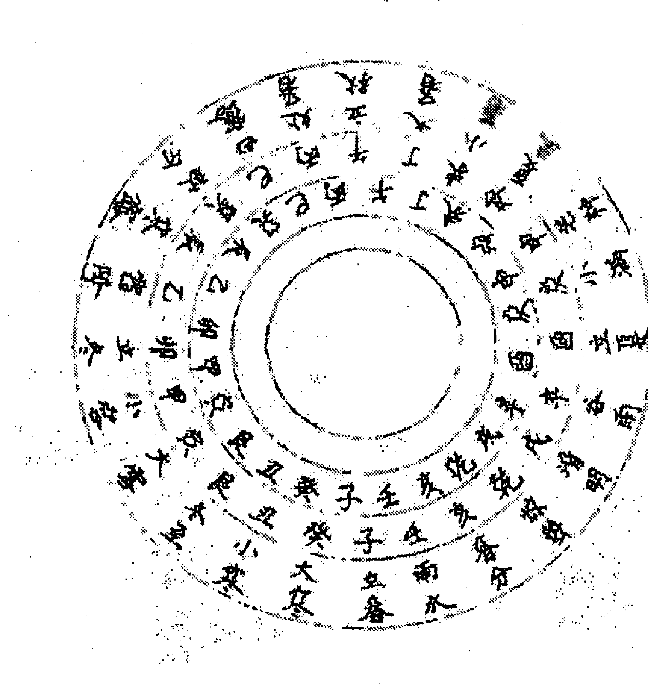
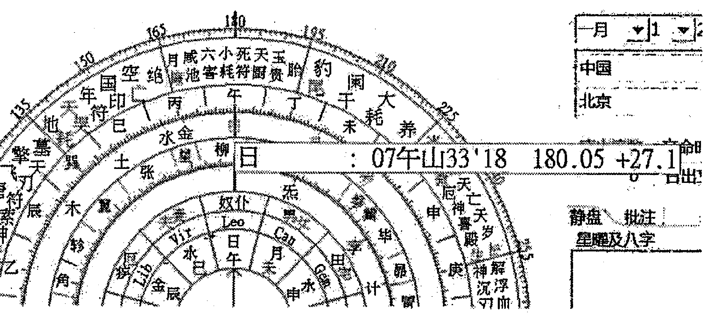
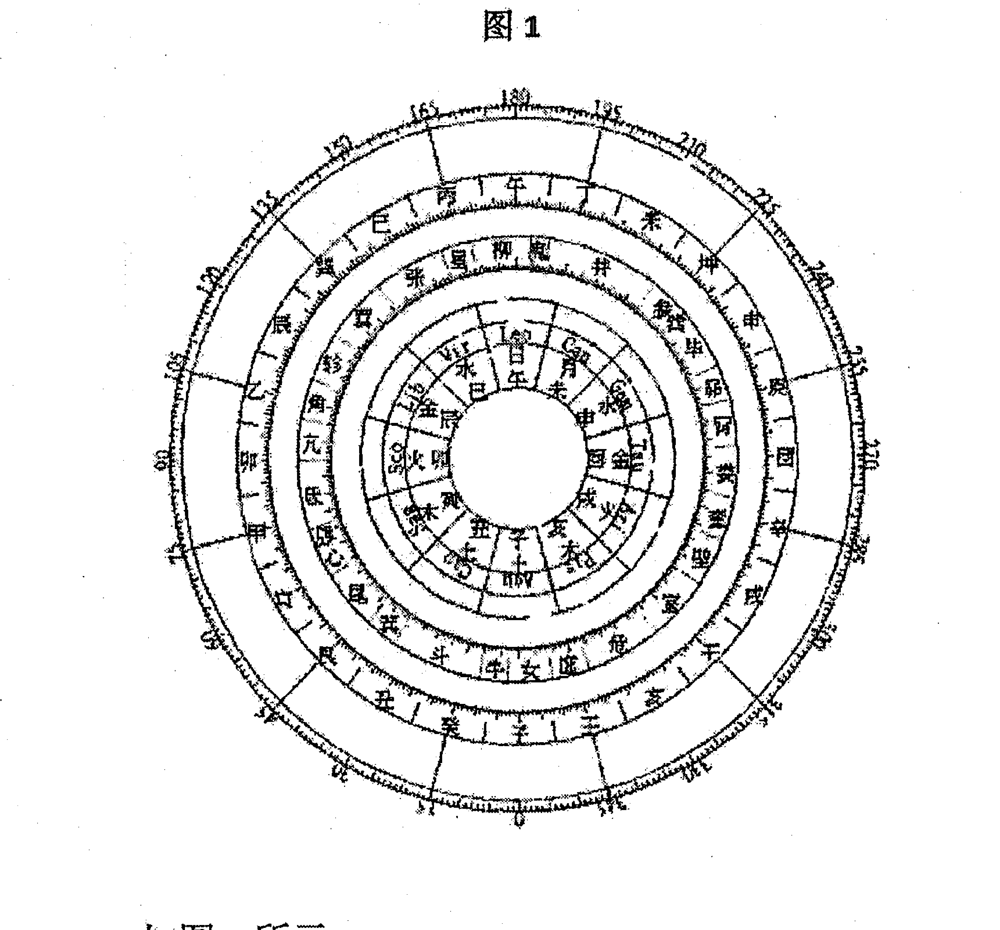
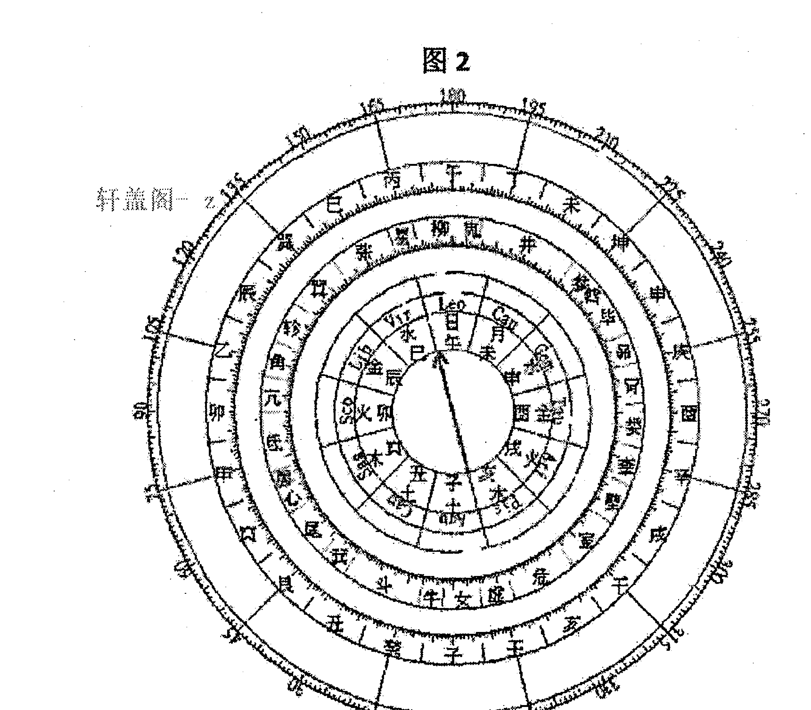

# 大六壬探源

林峰

## 目录

第一章 择日前记
第二章 六壬择吉注意事项
第三章 六壬日课基本要领
第四章 太阳行度过宫
第五章 六壬风水择日要领
第六章 六壬择日步骤
第七章 风水时空日课补充要点
第八章 古今日课选摘

## 第一章 择日前记

例1, 此课是青岛的几位朋友约着笔者去看看捐助的药师佛塔，后来在药师佛塔一楼给药师佛上香的一个正时课，此时间是偶然巧合所遇，事属偶然，课例如下同例2, 均在同一时间。

例2, 在上完香回去的路上，吴总问了一个事：关于新建的公司股东配比不合理的事情，看看能否重组成功？

| 公历: 2021年10月12日 | 阴历: 九月初七 |
|---|---|
| 四柱: 辛丑 戊戌 癸巳 庚申 | 月将: 辰将甲申旬午未空 |
| 天地盘 | 四课 | 三传 |
| 勾合朱蛇 | 常勾贵常 | 财 癸巳 贵 |
| 丑寅卯辰 | 酉丑巳酉 | 官 己丑 勾 |
| 青子 巳贵 | 丑巳酉癸 | 父 乙酉 常 |
| 空亥 午后 | | |
| 戌酉申未 | | |
| 虎常玄阴 | | |

笔者按: 秋天的金局旺相，从革就是重组象，旺相从革局，重组是有利的，非常好，说明肯定要重组，得时有力，肯定能成功，而且三传递生到日干，末传又归干上，酉金是沐浴局，代表革故鼎新的象，所以这课重组没问题的，气势非常好，后果然如笔者所测。例1是给药师佛塔烧香的正时课，此课应吃饭、得财之事。大家此次前去烧香本身是没计划的，想晚上回去再忙点别的事，然后同行的领导说一起吃个晚饭吧，于是笔者欣然赴约。申时烧香，邀请我做顾问的公司，突然在酉时付了半年的费用，给了几万，刚好也是吃饭的时候，旺相酉太常生干，既主吃饭又主钱财。

笔者举这个例子为引，就是想说明我们做任何事情，都会有相关联的事情产生。这就相当于是某个时机窗口，某个时间段做了某些事情，哪怕我们没去起课预测，但是你做事的时候肯定是有时间的，既然在这个时空点做了，就会有相应的事产生。当然能选择在好的时空范围内做一些好的事情，效果就会更好，能利用有利的时空能量。六壬择吉的意义在于开启新的时空，就像卫星发射一样，在这个时间点发射就是有利的。

### 第二章 六壬择吉注意事项

六壬择日的意义在于开启新的时空，在指定的时空范围内去做特定的事情，就如同卫星发射一样，择机发射升空，精确到分秒。

1.  六壬择吉是人为开启新的时空，既然是“择机行事”，因此就需要背负一定的因果，这跟剖腹产择日是一样，不同的时间而命运迥异。六壬预测的课是没法选择的，而择日的课是可以任意挑选的，这就要充分利用课象的吉处为我们办好事，因此我们可以选择用更好的时机去做合适的事，当然更有意义。

其实我们做任何事情都是有因果的，比如在墙上安一幅画，不同的时间安装，后续引发的事情也是不一样的。而实际上，我们在特定时间里所做的任何事情，都会应事的，但是有些事情属于鸡毛蒜皮的小事，我们就没有去择日，比如说某天你要出门去拿一个快递，也或者要去某个彩票店买一张彩票等等，这些日常的小事，我们都不太可能去选一个时间去“办事”，但实际上这些时间点，看似比较偶然，其实都包含着必然！比如哪天你买彩票，突然中大奖了，那买彩票的那个时间的正时课必然是一个利于得财的吉课，这点毋庸置疑，这就是偶然中存在必然。再比如，我们在风水中用鱼缸催财，那么我们肯定要选一个有利于财运的日课，而不会选择一个破财的课，所以大事肯定要择日的，而且要尽可能选择一个有利的时空窗口。

2.  因为日课而产生了不好的结果或凶性，是需要承担责任的，也需要背负相应的因果。替别人择吉，是要背负因果的，比如剖腹产，孩子剖出来的时间不同，命运也就不同，所以帮别人选剖腹产时间也背负了因果，会造成后天命运的差异性。谁择的日，谁就要背负因果，如果选的时间不好，比如孩子生下来之后死了，那肯定要承担责任和因果的。再比如阴宅下葬、宗祠进火，选的不好会产生很凶的后果。

如下例，此日课是广西北流市新荣镇育山村黄福宗祠日课，进火当日亿万富翁的老婆扭伤脚去医院住了十几天，此富翁当年年底在广州全部败光了所有财产，从2010年庚寅年开始至2018年每年至少意外死去3人，最多的是2015年死了7人，至2018年为止共死去46人，在2018年急聘高手来从新立向选择吉课重建，经考察此祠堂是丙午龙入首，坐丙壬兼午子，乾亥来水，走癸丑口。

公历：2009年2月18日 阴历：正月廿四
四柱：己丑 丙寅 甲午 丙寅 月将：子将甲午旬辰巳空
勾 合 朱 蛇
卯 辰 巳 午 青 合 玄 虎 财 戊戌 玄
青 寅 未 贵 寅 辰 戌 子 官 丙申 后
空 丑 申 后 辰 午 子 甲 子 甲午 蛇
子 亥 戌 酉
虎 常 玄 阴

再如，自称中国预测一流的“易坛泰斗”给广西玉林某大型农机厂选的开业日课，工厂坐丁向癸兼午子，日课四柱为“庚辰 戊寅 癸卯 丁巳”，时间是2000年正月十一早上10点左右，谁知用后才20天，工厂就出安全事故死2人伤4人，再过几天又有4人因过马路发生意外，直到农机厂领导被停职检查，这件事在玉林择日界是众所皆知的。

公历：2000年2月15日 阴历：正月十一
四柱：庚辰 戊寅 癸卯 丁巳 月将：子将甲午旬辰巳空
青 勾 合 朱
子 丑 寅 卯 贵 虎 朱 玄 子 癸卯 朱
空 亥 辰 蛇 巳 戊 卯 申 官 戊戌 虎
虎 戌 巳 贵 戊 卯 申 癸 财 巳 贵 ◎
酉 申 未 午
常 玄 阴 后

此两个日课姑且摘录于此，不作解析，供大家参考，等大家把后面日课内容学好再回头看此课便会明朗。

3.  择吉是为了锦上添花，比如有的时候某些事情是不得不做的，择吉是为了更好的促成事情达成，使其锦上添花，但对于不成的事情，择吉也不能“扭转乾坤”。比如买彩票，能不能中要看命上有没有这个财运，有这个中彩票的命再去选时间。假如命上见玄武，三传又是全鬼，是中不了奖的，择日也改变不了。一命二运三风水，能不能通过摸彩票中奖是既定事实，也是命中所定，命中不占就不能强求，如果命中能中奖，就可以择个日，使其锦上添花。

## 第三章 六壬日课基本要领

**1，课体为重点；**《壬学琐记》云：凡占事之重大者，课体最重。若课体不吉，即有一二吉神，无补于课体之疵也。因此课体是课象的高度浓缩，所以择日首重课体，课体不吉，那就最好不用要此日课。比如占求财、店面开业，不喜天网课、龙战课、连茹课（太短暂）等。可以选择四方宫位相加临，可持久得利，比如寅申巳亥，子午卯酉等等，反吟课一般主财运不稳定。

**2，本命最为紧要，只因本命切乎己身；**本命如果沾不着三传四课的好处，再好的日课和事主也没关系。因此选择日课本命不能落下，课是好课，但如果本命上见凶神也不行，就如同你挣到钱了，但是跟别人打了一架进医院一样。

**3，类神为次，配合神煞：**如占婚姻不喜破碎日或者破碎六合临身，求财不宜月破、岁破临身、临干。

**4，虎蛇凶神不要在支上；**不宜在命上相见或者夹拱本命；凶神拱命事必凶。

**5，不宜鬼临三四；**

**6，太阳为六壬至尊之神，**太阳系核心之主宰，也是地球热量之来源，六壬之核心，太阳为尊，太阳一出，诸煞隐藏；故择日最喜太阳临身临命，其次太阳三合本命或者命上神，用太阳最喜白天。月将太阳主名气，是好东西，择日一定不能忽视，太阳可以制服诸煞。

**7，贵人：**喜贵人合身、合干，临身临干，贵人三合六合本命日干也可以。

### 六壬择日细节要点：

1.  不宜岁破、月破日；
2.  风水择日宜忌讳下三煞日，特殊情况下可以使用；
3.  风水择日不宜太岁月建冲坐山、宫位；
4.  四柱当中不宜年月日时对冲，尤其是太岁不可犯；
5.  最喜干支同位，干支相生，最忌干支克战、截脚；
6.  最喜干支拱贵、拱本命、拱禄、三合本命；
    *   比如甲子日，干支拱贵；再如己酉日，干支拱申贵，申命更佳；
    *   己巳日干支拱禄格；癸亥日，干支拱子禄；丁巳日，干支拱午禄；
    *   丁亥、丁酉自坐贵人；癸巳、癸卯自坐贵人；
    *   乙日贵人在申子，三合贵人；辛日贵人在寅午，三合贵人局；
    *   庚辰日，三合子，如为本命更佳；癸巳日拱酉，酉为本命更佳，癸巳日巳为贵人又合本命酉，诸如此类。

### 例1, 峨眉山金顶法事择吉日课。

事情背景：做法都是早晨起床就得做法，一般时间是在五点前后，寅时、卯时，同时日子控制在一个星期范围内，时间有限，所以就选了这个课。

公历：2021年3月7日 | 阴历：正月廿四
四柱：辛丑 辛卯 甲寅 丙寅 | 月将：亥将甲寅旬子丑空

青 勾 合 朱
寅 卯 辰 巳 | 后 常 后 常 | 财 丑 空 ◎
空 丑 | 午 蛇 | 申 亥 申 亥 | 父 癸亥 常
虎 子 | 未 贵 | 亥 寅 亥 甲 | 父 癸亥 常
亥 戌 酉 申
常 玄 阴 后

#### 笔者按：

1.  甲寅日，旬仪之首，又干支一气同位。
2.  交车相合，月将临身，天空化出中末两传长生生干。亥水阴神申金给亥水加力的，做法事的公司是做水稻的，水稻是亥水，月将亥水在四课三传，干支上都有，很好，法事的类神又是天空，化出中末传月将生干为吉。
3.  法事类神天空，入传阴神生干，闭口主待时而生，应在未丑之月；
4.  初中初末拱本命子，利于属相辰丑未子之人；主要公司代表是子、辰、未、戌命，戌顾不上了，戌命上未是幕贵，冲发用，和三传关联起来了，戌陷空在丑，也关联上了。亥为六壬、水稻、九天玄女；为玄学、水稻、文化，寅就是文书。
5.  丑乘天空作财空亡主花钱，前后花了差不多五万块钱，又做太岁、空亡，应了丑为五数。唯一不好，本命乘白虎，虎蛇不能临命上或者夹拱本命，子命上又见太阴做官鬼，这个课是大家都要用的课，这个要兼顾很多人，所以所有的本命不能一一兼顾。如果是我个人的事，用这个肯定不太好，月破临身做官鬼，对我来说肯定不好的事，没做法之前就应了，在峨眉山寺院里，摔了一跤，从楼梯摔下来，当天下雪鞋子沾水了很滑，下楼的时候摔了，养了好几天，还好是木质楼梯，在做法的头一天就应了，主要是冲这个课去的，肯定要应事，不过还好三传拱了本命子，能够占一点便宜，没有十全十美的事，毕竟中未来生，化泄驿马官鬼克干。

#### 做完法事后案验：

1.  丑为川，亥为四，岂不是四川呼？
2.  丑为牛，做完法事后下山路上，说到乐山了，去吃本地特色——跷脚牛肉，丑为牛肉，亥太常为吃喝（此事是即兴说起，但在课象有信息呈现），大家把此事委托给我（丑亥夹拱我的本命之故），结果我托朋友找到一个酒店，他们说没必要去酒店，最好去苍蝇馆子，后来换了一家网红店，应了癸亥闭口（丁神主更改冲破闭口太常，闭口太常主没吃成饭，丁主换）；
3.  当日下午一行人到我姐家摘橘子、吃晚饭（中传见亥太常，亥为水果，太常为吃喝，初中拱我本命子，所以我牵头做此事，夹拱了两次，所以中午和晚饭都由我来承办），四课干支交车合，大家也玩的很开心，其中有位朋友说这么多年来难得今天这么放松，好久没有亲自下地摘橘子了。
4.  第二天下午去黄龙溪游玩，天空为休闲，张总请我吃了烤五花，四川特色，我跟张总说你看课象多形象，请我吃个烤五花都能看出，张总大笑，说道太神奇了。张总本命丙辰，辰上见丑发用，丑财空主花钱，化出亥太常（猪肉），夹拱我本命子，不就是游玩吃烤五花的细节吗？大六壬真的太神奇了！
5.  其余还有很多细节等，就不在这里赘述了。

择日的课就是这样，事后一星期把三传走遍，长期还要走一遍。

### 例2，普陀山法事择日日课。

-   公历：2021年3月13日
-   阴历：二月初一
-   四柱：辛丑 辛卯 庚申 戊寅
-   月将：亥将甲寅旬子丑空

青 勾 合 朱
寅 卯 辰 巳      青 朱 青 朱      官 丁巳 朱
空 丑      午 蛇      寅 巳 寅 巳      财 甲寅 青
虎 子      未 贵      巳 申 巳 庚      子 癸亥 常
亥 戌 酉 申
常 玄 阴 后

#### 笔者按：

1.  此课干支一气，交车相合，缺点明暗两鬼发用，好处是三传逆生，末传太阴为月将太阳，此课做法事还是前面的一批人，寅为文书，青龙也为文，又是驿马，申也是道路，末传是要用的水稻类神，亥水又是六壬、研究院，甲为甲醇、为氢气，青龙为动力、能源、腾飞，此课主要为地铁、氢能祈福，故月将加驿马上，寅为驿马，甲为甲醇、氢，乘青龙主腾飞、动力、能源；
2.  三传逆生比顺生更好一些，由于时间紧迫，又要挑周末，这个课朱雀发用，也有不好的事，朱雀为口舌又是官鬼，这个课丁神驿马发用，明暗两贵，朱雀发用，有些小插曲，修改了四次参事人员名单，搞的接待的方丈都不想搭理我们了，干上发用源自我方问题。
3.  选择好了这个课，就会应事情，人员名单改来改去的，过年因为有疫情，参会人员不能超过四十个，里面三十多位僧人，只能有七八个人参加法事，名单改了好几次，前面几次方丈还比较乐意，后面还要加人，不停的改很麻烦，方丈有点不乐意不想搭理了，搞得很尴尬。干上神朱雀发用，朱雀就是名单，朱雀代表争议、不愉快，丁火代表更改。
4.  想开启这个时空就会应这些事，测事情遇到这种课就比较难，好的课不一定遇得到。这个课测发展还是不错的。四场法事都是用的都是亥将，一个月四个星期，把亥将用完了，很有意思。此课亥月还是比较好的，学到不少东西，日干坐末传回头生未传，末传的阴神如果是日干本命，能得到未传的吉。

案验：国家发改委于2021年9月6日（辛丑年丙申月丁巳日戊申时）批复了青岛市城市轨道交通第三期建设规划的文件，规划共计7个项目，全国仅此一家。

后按：此课应在未传旺相之时，应在末传阴神给未传加力之时。

## 第四章 太阳行度过宫

太阳到山到向，究其根源，是来自七政四余占星术。根据古籍，造葬择吉不但要推查太阳到山到向，还要详审太阴（月亮）到山到向。太阳为万宿之主、诸吉之宗，号星中天子，有人君之象，至尊至贵，太阳所照之方，善宿遇之而增辉，恶曜逢之而敛伏。太阳到山、到向、到方，大可修造安葬，然到向为上，到方次之，到山又次之。因到向则照我，使我有光辉，向荣之意；到方则照我，到山惟帝王修造宫殿则宜，士庶家反不吉，恐难当其尊也。故《疑龙经》曰“请君专用太阳照，三合对宫福禄坚；金水二星并紫气，月孛同用又无嫌！”。《千金歌》曰：“三要明星入向来”，皆取到向、到方之义，未取到山也。

太阳能降一切凶杀，凡山向方有凶杀，得太阳到或对照，则百杀潜伏不为凶矣。若山方即得诸吉星到，而又取太阳同到，则众吉不敢敌太阳之尊而退避矣，故曰不可专贪太阳也。凡用太阳，宜昼不宜夜，昼则有光，夜则无光，到午宫为归垣（太阳到午宫最强大，是本家，一般择日用上午比较好，因为上午是太阳升起的一个状态，是上升阶段，到了午方太阳往下落，称之为下沉）。在实践中看，阴宅多用到山，阳宅多用到向。

现在市面上流传的太阳到山到向以及三合照表如下，而实际上真实的太阳到山到向并非是如此，存在较大的偏差，所以仍用此表来查，真是差之毫厘，谬以千里！轩辕阁-2

### 表1

| 廿四山 | 太阳到山 | 太阳到向 | 太阳三合照 |   |
|---|---|---|---|---|
| 壬 | 立春到山 | 立秋到向 | 芒种到坤 | 寒露到乙 |
| 子 | 大寒到山 | 大暑到向 | 小满到申 | 秋分到辰 |
| 癸 | 小寒到山 | 小暑到向 | 立夏到庚 | 白露到巽 |
| 丑 | 冬至到山 | 夏至到向 | 谷雨到酉 | 处暑到巳 |
| 艮 | 大雪到山 | 芒种到向 | 清明到辛 | 立秋到丙 |
| 寅 | 小雪到山 | 小满到向 | 春分到戌 | 大暑到午 |
| 甲 | 立冬到山 | 立夏到向 | 惊蛰到干 | 小暑到丁 |
| 卯 | 霜降到山 | 谷雨到向 | 雨水到亥 | 夏至到未 |
| 乙 | 寒露到山 | 清明到向 | 立春到壬 | 芒种到坤 |
| 辰 | 秋分到山 | 春分到向 | 大寒到子 | 小满到申 |
| 巽 | 白露到山 | 惊蛰到向 | 小寒到癸 | 立夏到庚 |
| 巳 | 处暑到山 | 雨水到向 | 冬至到丑 | 谷雨到酉 |
| 丙 | 立秋到山 | 立春到向 | 大雪到艮 | 清明到辛 |
| 午 | 大暑到山 | 大寒到向 | 小雪到寅 | 春分到戌 |
| 丁 | 小暑到山 | 小寒到向 | 立冬到甲 | 惊蛰到干 |
| 未 | 夏至到山 | 冬至到向 | 霜降到卯 | 雨水到亥 |
| 坤 | 芒种到山 | 大雪到向 | 寒露到乙 | 立春到壬 |
| 申 | 小满到山 | 小雪到向 | 秋分到辰 | 大寒到子 |
| 庚 | 立夏到山 | 立冬到向 | 白露到巽 | 小寒到癸 |
| 酉 | 谷雨到山 | 霜降到向 | 处暑到巳 | 冬至到丑 |
| 辛 | 清明到山 | 寒露到向 | 立秋到丙 | 大雪到艮 |
| 戌 | 春分到山 | 秋分到向 | 大暑到午 | 小雪到寅 |
| 乾 | 惊蛰到山 | 白露到向 | 小暑到丁 | 立冬到甲 |
| 亥 | 雨水到山 | 处暑到向 | 夏至到未 | 霜降到卯 |

如图1所示，太阳12宫位图，大寒以后月将进入子将，立春时太阳在子将正中，在子山正针，此时太阳度数为0°，15天之后到雨水，雨水时起用亥将，而亥将在壬山之中，也即雨水时太阳在壬山正针345°，此为太阳到24山的度数。

> 《授时历》中提到：每月中气，前后各七日，共十五日，为天干之位。月中后七日之外，太阳改躔之日，方为地支。如正月雨水中气前后各七日为壬（此处意为雨水时太阳在壬山正针），雨水后八九日，改躔之次，方为支（进入亥山）。

### 太阳行度过宫歌诀

*   立春太阳子上行，雨水惊蛰壬亥寻。
*   春分清明乾戌上，谷雨立夏酉辛临。
*   小满芒种庚申定，夏至小暑坤未分。
*   大暑觅丁未巽至，宫定内上得因根。
*   白露排来归巳关，寒露秋分在巽辰。
*   霜降奇冬临乙卯，大雪巽中冬至寅。
*   小寒丑宫大寒癸，二十四气定其真。

所以正确的太阳到山到向表如下图以及表2所示，需要注意的是：表2为太阳到正山正向，比如立春太阳到子山正山，也就是太阳在7天半之前进入子山，立春在子山正山，七天半之后出子山进入壬山，以此类推。

太阳到山图



#### 表2

| 廿四山 | 太阳到山 | 太阳到向 | 太阳三合照 |
|--------|----------|----------|------------|
| 子 | 立春到山 | 立秋到向 | 芒种到坤 寒露到乙 |
| 癸 | 大寒到山 | 大暑到向 | 小满到申 秋分到辰 |
| 丑 | 小寒到山 | 小暑到向 | 立夏到庚 白露到巽 |
| 艮 | 冬至到山 | 夏至到向 | 谷雨到酉 处暑到巳 |
| 寅 | 大雪到山 | 芒种到向 | 清明到辛 立秋到丙 |
| 甲 | 小雪到山 | 小满到向 | 春分到戌 大暑到午 |
| 卯 | 立冬到山 | 立夏到向 | 惊蛰到乾 小暑到丁 |
| 乙 | 霜降到山 | 谷雨到向 | 雨水到亥 夏至到未 |
| 辰 | 寒露到山 | 清明到向 | 立春到壬 芒种到坤 |
| 巽 | 秋分到山 | 春分到向 | 大寒到子 小满到申 |
| 巳 | 白露到山 | 惊蛰到向 | 小寒到癸 立夏到庚 |
| 丙 | 处暑到山 | 雨水到向 | 冬至到丑 谷雨到酉 |
| 午 | 立秋到山 | 立春到向 | 大雪到艮 清明到辛 |
| 丁 | 大暑到山 | 大寒到向 | 小雪到寅 春分到戌 |
| 未 | 小暑到山 | 小寒到向 | 立冬到甲 惊蛰到乾 |
| 坤 | 夏至到山 | 冬至到向 | 霜降到卯 雨水到亥 |
| 申 | 芒种到山 | 大雪到向 | 寒露到乙 立春到壬 |
| 庚 | 小满到山 | 小雪到向 | 秋分到辰 大寒到子 |
| 酉 | 立夏到山 | 立冬到向 | 白露到巽 小寒到癸 |
| 辛 | 谷雨到山 | 霜降到向 | 处暑到巳 冬至到丑 |
| 戌 | 清明到山 | 寒露到向 | 立秋到丙 大雪到艮 |
| 乾 | 春分到山 | 秋分到向 | 大暑到午 小雪到寅 |
| 亥 | 惊蛰到山 | 白露到向 | 小暑到丁 立冬到甲 |
| 壬 | 雨水到山 | 处暑到向 | 夏至到未 霜降到卯 |

如下图2所示，北京时间2022年1月1日上午12点18分，换算成北京当地时为12:00，太阳到地轴北午山180°，正午位，实际上这是地轴北的度数，并非罗盘度数，而在罗盘上的度数实际上是187.5°，也就是说还要把磁偏角的度数加进去，这才是当地时间在罗盘上的精确度数，所以归根到底，太阳只是日晷上的日影度数而已，并非罗盘度数，而日晷上的日影，每个地方都是不一样的，并且每个地方的磁偏角也是不一样的。所以择日既要考虑地方真太阳时，还要考虑当地纬度以及每个地方的磁偏角才是正确的。

#### 图2



### 补录：太阳到向实测捷法

垂直竖杆，观测日影，假如立壬山丙向，首先用罗盘定准线位，固定线绳，在丙位垂直竖立一杆，观察日影投射角度（左右相差不超 3°），当日光投影完全与线绳重合之时，便是标准的太阳到向（此实测法与上图推算相差不大）。

### 日食月食禁忌

一般大事都要避开这个日子，开业、搬家、下葬等，都要避开。一般出现日月食都会出现灾，天有异象，必然应在人世间，天星择日非常忌讳这个。

姚廷銮在《阳宅集成》曾引述餐霞道人对日月食择日禁忌的论述，并且记录了两则日月食用事，事后发凶的例子：

> 餐霞道人曰：凡遇日蚀月蚀之日，造葬无不大败，即嫁娶各项，亦俱不利，遇日蚀则损男，月蚀则损女，生产男女俱不育……当蚀之日，固当查明而避，而蚀之前后一二日，亦不宜用，此屡见必应，克择家不可误犯害人也。

> 即如己巳岁，浦东瓦屑墩张别驾，号凤英，延余择定葬地，其族人忽于隔河案上预砌一塘，张恐有碍，邀余复看，余曰：“案上之塘，与将来所造穴地，一无关碍，但伊塘作于十一月十五日，是日系月蚀之辰，其家凶祸难免。”张戚因不换地，届期竟自作坟，岂知至明年四月中，案上造塘之家，丧一长孙一孙女。又华亭余邑尊，于乾隆十四年十二月初一清晨上任，是日恰值日蚀，余曰：“日蚀之辰，上任不特功名有碍，抑且身命堪虞。”至十五年六月，忽得暴疾而亡。

《阳宅集成》的观念，日月食前后二日也不能用事，即日月食五日内不得用事，还有一种观念认为日月食七日内都不可用事，可见古人择日对日月食的忌讳程度。

> > 掩蚀者，主伤残父母，日蚀者，父早丧；月蚀者，母早亡”、“日月掩蚀之时，忌坐命日月之度，如日蚀怕坐命日度，月蚀怕坐命月度，有此者，非贫即夭，或主盲、聋、喑、哑残疾之人。”

天星择日中经常讲太阳到山到向，三合拱照亦可，日食太阳无光，月食月亮无光，日月无光谓之“晦”，日月既无光，又何来照山照向？果老云：尊莫尊乎日月，日乃人君帝王之象，六壬择日学中也讲究“贵登天门”，属于吉时，即因为贵人处于最有利，最有权的位置。而日月食的时候先天的最大贵人日月被罗计所侵蚀无光，不能发挥其正面的能量，这就好像帝王权力真空的时候，自然牛鬼蛇神都大行其道，任意妄为，自非吉利。所以只重视后天干支的择吉，不关注先天星体的能量，这样的择吉是不健全的，正所谓“在天成象，在地成形，在人成运”也。

2021年 11月 日历安排 返回今天

| 一 | 二 | 三 | 四 | 五 | 六 | 日 |
|---|---|---|---|---|---|---|
| 1 万圣节 | 2 廿八 | 3 廿九 | 4 三十 | 5 初一 | 6 初二 | 7 立冬 |
| 8 初四 | 9 初五 | 10 初六 | 11 初七 | 12 初八 | 13 初九 | 14 初十 |
| 15 十一 | 16 十二 | 17 十三 | 18 十四 | 19 十五 | 20 十六 | 21 十七 |
| 22 小雪 | 23 十九 | 24 二十 | 25 感恩节 | 26 廿二 | 27 廿三 | 28 廿四 |
| 29 廿五 | 30 廿六 | | | | | |

举个例子，比如今年2021年11月19日的月偏食，但是你翻黄历的话，上面会写着“宜结婚嫁娶”，但是如果考虑星体的状态，这天是月偏食，按天星择日的理论是不可以嫁娶的。

因此日食月食日不可用事，日月无光之象，日月俱晦，选择剖腹产更要注意，这比四绝日更重。因此在日月食的时候，先天星体的贵人力量不佳，即使选择了干支中的贵人临身、贵登天门等等好课，其力量也未必如意。

### 第五章 六壬风水择日要领

在地球上：太阳东升西落，故太阳顺时针运动，故天盘是顺时针运行（地球自转且在地球上观察）。

在太阳系：实际上是地球围绕太阳在黄道平面上逆时针公转的，故在地球上看起来太阳是在黄道平面上逆时针运行的。人们把太阳周年视运行线路平面划分为12宫，每宫用指定的月将名字命名，所以我们看到太阳即月将是在六壬地盘逆时针换将的（公转且在地球上观察）。

所以地球上看起来太阳是在黄道面上每一年转一圈，即365天走360°，折合每天1°左右，每个月走30°，一年12个月将，每个月将30°管30天。

- 1. 两个盘都有月将，地盘月将最宜到山到向，三合拱也可以，这个比较难，也很难等，静盘上月将到山到向很难取到，因为一年只有15天时间到山，15天时间到向。比如太阳在丑，太阳只有十五天在丑山，比较难取到，如果时间等不起，就要考虑三合太阳，比如立丑山未向，太阳在巳宫，也算拱到了；也或者太阳在卯，丑山未向也算拱到了，再加上天盘太阳在山向更好。静盘的特点是能到山到向最好，如果取不到就考虑三合山向，如果实在是取不到三合山向就考虑动盘太阳到山到向。

- 2. 最宜动盘太阳加临坐山、到向（北方到向吉利一些，因为北方都是坐北朝南，白天可以到向）、到宫（用事宫位，比如坤宫要放鱼缸，太阳到用事宫位就可以了）；其次无法到山、到向的情况下，到本命也可以，到日支也可以，为到宅；到不了山向，三合山向也可以，六合也行但不如三合。

- 3，太阳一出，诸煞俱藏，用太阳最宜白天见之。

月将太阳为万宿之主，诸吉之宗，号“星中天子，有人君之象，至尊至贵，照临万方”，善宿遇之而增辉，恶曜逢之而敛伏。到山到向到方，大可修造安葬，然到向为上，到方次之，到山又次之。盖到向则照我，而我有光辉向荣之意，到三合方则拱我（若修方则到方也吉），到山唯帝王修造宫殿则宜（到山往往是晚上，搬家造葬也不太合适），士庶家反不吉，恐难当其尊也。

笔者按：太阳能降一切凶杀，凡山向方有凶杀，得太阳到或对照，则百杀潜伏不为凶矣。若山方即得诸吉星到，而又取太阳同到，则众吉不敢视太阳之尊而退避矣，故曰不可专贪太阳也。凡用太阳，宜昼不宜夜，昼则有光，夜则无光，到午宫为归垣（太阳到午宫最强大，是本家，一般择日用上午比较好，因为上午是太阳升起的一个状态，是上升阶段，到了午方太阳往下落，称之为下沉）。

- 4，本山的禄马贵到本山或发传，到向亦然。

如坐山甲兼寅，甲山的贵人为未、丑，甲禄为寅，如取天盘之未、丑或寅加于地盘的甲寅方（坐山禄到山）为吉；同时要发传，就是要在三传中，如丑未在干上，又加在坐山寅上，叫到干又到山。

再如甲兼卯，取天盘之未、丑或寅加于地盘的甲方卯，为吉，进而得三传发用的，这样便化机灵发福。如没有发传，只有禄马、贵人暗加，发福便减轻，禄马、贵人到向的，同论。

如本山的禄马贵人到本山、发用，本山的禄马贵恰好是用事人（或子孙）本命，对该人大吉，叫做旺山又旺命。

> 张九仪在《仪度六壬选日要诀》中指出：“第一要取本山禄马贵人到本山或发传，则化机灵，方能发福。如不发传，只为禄贵暗加力减轻本山福。贵人到向方亦然。”又云：“六壬的选择，十二支神须与山命相生，或本山禄马贵人到山到向，或太岁、日干（还有本命）的禄马贵人到山到向，并发传，上吉；不发传或发传而不到山到向，次之。若上官、迁徒、嫁娶、出行等事，尤重禄、马、贵人发传，命盘取不克而已（命上神不要见官鬼）。”

意为优先取本山，次取四时、本命，一般可以兼顾，条件是必须发传，发传的意思就是显露出来，起作用了（如不发传则减力）。

- 5，①如能取本命、本日或年月的禄马贵人到山到向，及发传的，大吉（本命的贵人用天干取的，比如庚午命，取丑、未为贵人）。

例如坤山艮向，戊子年戊午月丙戌日戊戌时，三传为亥、申、巳，天盘巳加临坤山，此为年禄、月禄、日禄、时禄共四禄加临坐山，又入传，主速发富贵。

| 青 空 虎 常 | 虎 阴 朱 青 | 官 丁 亥 朱 |
| :--- | :--- | :--- |
| 寅 卯 辰 巳 | 辰 未 亥 寅 | 财 甲 申 后 |
| 勾 丑 | 未 戌 寅 丙 | 兄 癸 巳 常 |
| 合 子 | 未 阴 | |
| 亥 戌 酉 申 | | |
| 朱 蛇 贵 后 | | |

- ②本命的禄、马、贵加临山向也可以，如辛酉命，寅、午为贵人加临山向又发用，亥为驿马星加临山向又发用，酉为禄星加临山向发用也可以；

- ③本命作贵人、禄马到山到向发传者，亦大吉。如丙丁日，酉、亥为本命作贵，如丁酉日，则亥命为贵、马，如果是坤艮向山，取本命禄马贵加临也可以。

> 张九仪云：日之禄马贵人天转在何方，天旋在何位，吾即因其位，因其方而用之，禄马贵人有不照拂我者乎？如乙日卯禄在子贵方，癸山用之，自然子卯人发福，非卯年应即子年应矣。如丙日酉贵在巳禄方，巳山用之自然巳酉人发，巳酉年应，即巳年应矣。此非切实求之而不为泛泛者哉？天机泄尽此所以百用而百应也。

- 6，如前两点中的禄、马、贵人即为太岁或太阳，又到本山向并入传的，其力量重大。

#### 例：戊子年乙丑月乙卯日癸未时子将

```
朱 蛇 贵 后
戊 亥 子 丑    后 勾 阴 合    兄 甲 寅 阴
合 酉          寅 阴          丑 申 寅 酉    财 己 未 青
勾 申          卯 玄          申 卯 酉 乙    父  子 贵 ◎
未 午 巳 辰
青 空 虎 常
```

例如，癸山丁向，癸山禄子，戊子年乙丑月乙卯日癸未时，三传为寅、未、子。初传“寅”，为太岁的驿马，中传“未”，为太岁的贵人，末传“子”竟做太岁加在丁未向上。大寒后期，太阳在子（太岁、太阳、禄、马、贵占全了三传），子为太岁又作乙丑月、乙卯日之贵及癸时之禄，这样太岁、太阳带乙贵，癸禄会聚到三传，其福力又倍增。

### 第六章 六壬择日步骤

1，确定山向，相关年命，何年月用事，列出坐山、年命以及用事时间的禄、马、贵；便于取用。

2，确定日干支，避开岁破、月破日，尽量取干支拱贵、拱本命、拱禄、三合本命的日子，拱坐山更好。

3，再看能否取本山、事主、本年月日的禄马贵人到山向。

4，再看三传当中是否有本山、本命、本年的禄马贵（也就是要发用，突出用事效果，发用发用就是“发生作用”，入传为发力，有效果。）

5，看太阳的位置，是否到山到向，三合拱照山向，以到向为最吉，照命、临干、照宅也大吉，三合向、本命次之，到坐又次之，三合坐最次。第五点需要兼顾前面4点，如果只有前4点，没有第5点，发福也不大。没有光，怎么光宗耀祖？日食、月食的日子要避开，容易五弊三缺。

#### 图1



- 1>风水中有24山，一周是360°，每山是15°；
2>在地球上看，太阳是每天24小时转一圈，一共有24山，实际上太阳是每小时移一个山，一山是15°合计60分钟，太阳每4分钟移动1°；
3>所以择日中太阳到某山，时间只能在1小时以内，如果遇到坐山跨界的，只能在半小时以内。
4>择日要用真太阳时，比如午时有三个宫位，有半个小时在丙，一个小时在午，还有半个小时在丁。

#### 图2



如图2所示，壬山丙向正针，坐山在地盘亥、子之间，向在巳、午之间，丙向有一半在巳一半在午，如取太阳到丙，则有巳、午两时辰。所以要看哪个课更好，巳好取巳时尾（巳时的最后半小时），午好取午时初（午时最初的30分钟以内），一般壬山丙向，午时好一些，午为太阳本家，同时也是上升点，这个也要考虑当地真太阳时。

## 择日注意事项：

- 1，必须要用当地真太阳时，主要是取太阳照的角度，失之毫厘差之千里。
2，太阳照可以精确到4分钟以内，也就是取太阳照到罗盘360°上的每一度分金上，吉度分金更佳，因为太阳每4分钟移1°，所以择日是可以精确到分钟的，并非是时辰（参考第八章例10）。
3，如地盘太阳到山到向，三合六合拱照山向，而天盘太阳又到山到向，六合三合到山向更佳。一般受择日时间所限，地盘太阳比较难到山到向。一般受择日时间所限，地盘黄道太阳比较难到山到向，因为全年只有15天时间到山，15天时间到向。
4，六壬择日就是要补龙、扶山、相主以达到葬乘生气的目的（月建不要跟坐山有克战，和坐山相生合为好，月建不能克坐山或克龙气），因此择日要干支三传要有生旺之气，要日干旺盛。

笔者注：理论上是太阳每4分钟移动1°，但实际上并非如此，一是因为太阳运行的轨道（公转轨道即黄道）不是正圆而是椭圆，地球与太阳有远近不同（近日点远日点），而引起的季节变化；二是地球本身也不是正圆形的，自转平面和绕太阳公转的平面有夹角，也就是说地球是倾斜于公转轨道平面，一边在自转一边在作绕太阳公转，轨迹呈螺线型，所以会存在一定的误差成分。

## 日课评价：

- 1，三传无禄、马、贵人者不算合格。
2，初传即凶，中末传吉也无用（初传凶，择日一开始就容易出问题）。
3，最宜避开魁、罡、虎、蛇，鬼临三四凶课；《龙首经》曰：“凡欲修造移成者，以宅长（家长）行年加太岁，本命上见魁罡蛇虎不可修造，余神皆吉”。又曰：“欲造宅合门户者，若人行年及太岁上神克今日日辰者，大凶。若行年太岁上见勾虎朱为忧，见功曹、传送者吉。”《七十二占》曰：谓修宅者，视家长（家里的主人，房主）行年以决之，当以家长行年加太岁，视地上见功曹传送，即可以修之。
4，刘日新在六壬择日日课里强调：又以月将加正时所造之年上神，生日并家长行年本命为利。太岁如克害刑冲破者凶。无此及有救不妨，月日同时。要知何事妨害，以所克害刑冲破害位上决之。

> 《龙首经》曰：“凡欲修造移成者，以宅长（家长）行年加太岁，本命上见魁罡蛇虎不可修造，余神皆吉”。又曰：“欲造宅合门户者，若人行年及太岁上神克今日日辰者，大凶。若行年太岁上见勾虎朱为忧，见功曹、传送者吉。”
《七十二占》曰：谓修宅者，视家长（家里的主人，房主）行年以决之，当以家长行年加太岁，视地上见功曹传送，即可以修之。

## 例1：刘日新《大六壬玉藻金英》案例：

庚辰年庚辰月庚辰日庚辰时，戌将。薛姓坟，庚山甲向造葬。

朱 蛇 贵 后
亥 子 丑 寅
合戌 卯阴
勾酉 辰玄
申 未 午 巳
青 空 虎 常

玄 合 青 后
辰 戌 申 寅
戌 辰 寅 庚

财 戊寅 后 ◎
兄 申 青 ◎
财 戊寅 后 ◎

刘日新曰：四元得养，戊将加辰反吟，三传寅申寅，申做四庚得禄，寅做四马，又庚山禄在申，甲向禄在寅，禄马齐发传，所以壬午、癸未二年联捷；演禽尾火、毕月互相比旺，故葬后二子登科。

笔者按：此课坐山庚禄在申，向方甲禄在寅，又是四建皆庚，坐山禄在申，四建禄到向，驿马到山，四建的马也在山，坐山禄、马在山向上，戊为太阳加支在宅，戊将在天地盘都合寅，天盘合了坐山，地盘合了向。寅代表公门，庚为禄乘青龙，青龙和寅都为文书，青龙又为腾飞，故葬后儿子登科，反吟课应事比较快。

支上见月将，不过幸好是月将有化解，不然是四破，主不聚财，三传又是寅申寅。飞黄腾达也可以，反吟课也不稳定，这个也代表多婚，全是天后太阴、六合，一看就是孩子二婚的象，当然也是财来财去之象，也能发财，天后被反吟——老婆来老婆去。太阳临宅，门庭显赫，光宗耀祖。

## 例2：张九仪《仪度六壬择日要诀》

如辛山乙向，用甲午日，三传寅午戌

勾 合 朱 蛇
酉 戌 亥 子 | 后 合 合 虎 | 兄 壬寅 后
青 申 | 丑 贵 | 寅 戌 戌 午 | 子 甲午 虎
空 未 | 寅 后 | 戌 午 午 甲 | 财 戌戌 合
午 巳 辰 卯
虎 常 玄 阴

注：春夏乘旺之气用之发福速，秋则慢，冬则破局宜忌之。

原案解析：坐山辛以寅为贵人，亦即甲日之禄神，以本日禄神带本山贵人到山且发用，是为吉课矣。

笔者按：三传寅午戌，坐山辛金，贵人在寅午，刚好一个是日干一个是日支，寅在坐山戌，是坐山的贵人，又是日干的禄，坐山合了一个午贵人。这种课有利有弊，寅发用，本山禄贵发用，又合了寅午，午火也是幕贵，带了白虎，如果冬占，则不得时，属于破局，发的慢，况且白虎作脱气局也不是很理想。

例3，例如坤山艮向，用戊子年戊午月丙戌日戊戌时未将，三传亥申巳；

| 勾 | 青 | 空 |   | 青 | 常 | 贵 | 合 | 官 | 丁亥 | 贵 |
| 寅 | 卯 | 辰 | 巳 | 辰 | 未 | 亥 | 寅 | 财 | 甲申 | 玄 |
| 朱 | 丑 |   | 午虎 | 未 | 戌 | 寅 | 丙 | 兄 | 癸巳 | 空 |
| 蛇 | 子 |   | 未常 |   |   |   |   |   |   |   |
| 亥 | 戌 | 酉 | 申 |   |   |   |   |   |   |   |
| 贵 | 后 | 阴 | 玄 |   |   |   |   |   |   |   |

原案解析：巳为日禄加临坤（申）山，寅为长生并入向上，又年月日时禄皆为巳，四禄神聚集坤山，福力讵重。且巳火禄神入传，又能生坤山，必主巳命人立发富贵。

笔者按：贵人在向，禄在山，也发传了，向在干上生干，三传禄马贵都出来了，月将在支上，也在坤方，但是没有在坐山，只是入了坤宫位，向方亥拱照太阳未，向方作长生在干上，属于旺文的日课，寅是青龙本家为书籍，长生为学堂，亥为文书。

### 第七章 风水时空日课补充要点

- 每天的真太阳时到山到向的方位是以地球的地轴为南北的，不是地磁南北，因此要想太阳到罗盘的度数，需要加减磁偏角。
- 风水择日的重点是禄马贵到山到向，以山向为重点，然后考虑发传，日干并不是重点（但是次重点，山向为重，然后才是日干，然后要发传），这是普通择日与风水择日的差别所在，风水择日以山向为重。
- 太阳本家在午，丙戊日日刃在午，太阳带刃不可到山、向，可以三合向方即可，丙午年也是一样，考虑太阳，也要考虑羊刃的问题，太阳带刀就不是很好，可以合到太阳。
- 阳宅重太阳到向，阴宅重到山；阳宅优先考虑禄、马、贵到向，但需考虑经纬度测算当地真太阳到山到向时间。
- 不宜取日刃到山到向，比如子山午向，丙日羊刃在午，到向不吉，壬日日刃在山，羊刃、劫杀到山、向要避开。
- 秘法：太阳到正交方催贵，到反交方催财。如子山午向，太阳照巽为49正交催贵，其余类推。
- 山向及其上神发传是必须的，入传为显为起作用。
- 山向以及禄马贵入传后，不能在末传空亡，空为不吉（最好不要空到山向的禄马贵，最终空，就是最后这些好东西没有了，禄马贵入传不能空）。

### 例1，王雷之案例

本县鞭炮厂厂长陈老板父亲辞世了，陈老板特地来请笔者为其点穴安葬。笔者欣然答应。穴点好后，就择吉选课安葬其父。定于2012年三月初二辰时动土开金，定于三月初三下午未时安葬，午山子向。

公历：2012年3月24日    阴历：三月初三
四柱：壬辰 癸卯 甲申 辛未    月将：戊将甲申旬午未空

| 青 勾 合 朱 | 后 朱 青 常 | 官 甲申 青 |
| :--- | :--- | :--- |
| 申 酉 戌 亥 | 寅 亥 申 巳 | 父 丁亥 朱 |
| 空未           子蛇           | 亥 申 巳 甲 | 兄 庚寅 后 |
| 虎午           丑贵           | | |
| 巳 辰 卯 寅 | | |
| 常 玄 阴 后 | | |

王雷之按：此课笔者选德禄驿马入传，三传递生日命（陈先生壬寅命），朱雀文星作长生学堂入中传，年禄马、命禄马作仪神发用，如此，德禄驿马长生文昌皆入课传，用之必大利。又用先天课法旺财（用了另一种方法确认），从而达到趋吉避凶、增福旺财为目的。此一日课真正做到了又扶山又旺主，趋吉避凶。用事后，至今一切平安顺遂。

笔者按：午山子向，在壬辰年是犯三煞的，申子辰合局冲山。午上见酉勾，向方见卯，甲申日，首先交车相合，甲的禄在寅，马在申，贵人在丑未，丑未没到山向，也没入课传。年柱壬辰年，壬癸蛇兔藏，年干贵人到了子向上，蛇在干上，年月贵人在向和干上，同时日干的马发用，同时又是陈老板本命寅在末传，三传递生到末传，三传顺生格，日干禄马入传了，同时日主本命入传在末传被三传递生。

顺生格，是长生坐长生上，戊将和午山是三合的关系，拱照坐山。三传见了禄马，癸卯月，末传寅也是旺相的，虽然山向上神不怎么好，但是福主的本命上传了也是不错的，申日是有些犯三煞的，申和辰拱子，课象好也是可用，也可能择日时间紧迫，也是可以用的。

再如壬寅命在壬辰年庚戌月丁巳日造艮山坤向宅，午时用事，卯将。

| 合 勾 青 空 | 贵 合 朱 青 | 官 癸亥 贵 |
| :--- | :--- | :--- |
| 寅 卯 辰 巳 | 亥 寅 丑 辰 | 财 庚申 玄 |
| 朱丑 午虎 | 寅 巳 辰 丁 | 兄 丁巳 空 |
| 蛇子 未常 | | |
| 亥 戌 酉 申 | | |
| 贵 后 阴 玄 | | |

原案解析：三传为亥申巳，亥为年禄、命禄，又为丁日之贵，巳日之马，加临艮寅山上，乃禄马贵人到山发用也，用之后，寅亥命人必发富贵无疑矣！

### 例2，催贵古案

一池阳庄心田，戊戌生，乾符三年，托天人家在丑方做横庭，系丙申年 辛丑月 辛酉日 己丑时，太阳躔丑，丑正初刻列伯还位。记云：年命二禄聚在巳，何须明见是，酉丑三合喜逢，巳禄在其中。亥年趣升，光启元年。乙巳岁转户部，其子巳生人，官督粮。

| 合 勾 青 空 | 虎 虎 常 常 | 兄 辛酉 虎 |
| :--- | :--- | :--- |
| 巳 午 未 申 | 酉 酉 戌 戌 | 父 壬戌 常 |
| 朱辰 西虎 | 酉 酉 戌 辛 | 父 己未 青 |
| 蛇卯 戌常 | | |
| 寅 丑 子 亥 | | |
| 贵 后 阴 玄 | | |

笔者按：太岁和本命的禄在巳，巳和日月、日时三合，拱了两次，月日，日时夹拱巳火禄。太阳照丑，是伏吟课，年合禄，月日时拱到了日禄，禄为俸禄。太岁的贵人在酉，所以日支也是太岁的贵人，戌的贵人也是丑月和丑时，两个丑带了本命的贵人，丑还是方，也是贵人到方。日支带了一个太岁的贵人，同时拱本命禄巳火。辛酉日，禄乘白虎，主武职，太常也为武职，四课皆是武职。

本命是戊戌，戌在干上相生，乘太常、武职，又入传，又化冲方的未，冲丑生干，未入传且加命上生，中末两传生。本命在干上生干，命中所必得，又入传，向方（以用事宫为坐）入传加命上生干。其子巳年生，也是一个当官的。

山向入传化出好东西是最好的，如果山向在末传空，就是最后落空没好结局，丑山是月将又是占时，日支和山方丑半三合，拱巳火，三合局，乙巳岁引动，转户部，本命还入传了。伏吟课应事迟慢，所以中间隔了四年，亥年升迁，到乙巳年差不多九年。

### 例3，宅为卯兼乙山，己亥主，择用辛巳年庚子月戊午日己未时下砖脚，看吉凶如何？

注：卯山兼乙，己亥日主。下砖脚，就是下砖砌墙，卯山兼乙，主要看卯酉。

公历：2001年 12月 21日
阴历：冬月初七
四柱：辛巳 庚子 戊午 己未
月将：寅将甲寅旬子丑空

| 蛇 贵 后 阴 | 青 贵 空 蛇 | 财 子蛇 ⊙ |
| :--- | :--- | :--- |
| 子 丑 寅 卯 | 申 丑 未 子 | 兄 己未 空 ⊙ |
| 朱亥 辰玄 | 丑 午 子 戊 | 官 甲寅 后 |
| 合戌 已常 | | |
| 酉 申 未 午 | | |
| 勾 青 空 虎 | | |

笔者按：月破日午日，己亥日主，主人的禄在午，子午破，禄都破了。午火既是日支又是禄，子午冲，这个日子就不好。卯酉山向上见辰戌，日墓玄武，辰戌都是日墓，没有禄马贵，辰还是病符星到向。贵人在午上，午和卯没有关系，又没入传。月将寅在未上，跟坐山有三合拱照，还可以，寅午戌，坐山上神和月将，命上神三合，还行。但是午火是命主禄，又带了午日羊刃，命上见羊刃、白虎，向方又见玄武、病符，破财、倒霉、得病、血光的象。

三传递克，虽空亡，可填实递克。支上的象还可以，贵人坐长生，日支临羊刃、白虎、月破，干支上神相合，还可以。三传子未寅，初末夹拱丑贵，命上神又是羊刃、白虎、月破。此课三传没联系上坐山，又递克，本命的禄月破首先就不好，禄乘白虎也是破财受伤的象。

赖大师：癸未年十月下旬，笔者到广西容县为唐易友勘宅造福。唐易友自述其宅竖造日课是其胞弟所择，用的是跟台湾五术首座钟大师学习的弧角天星选择法，并经钟大师评鉴为大吉课才放心使用，宅为卯兼乙，己亥主，择用辛巳年庚子月戊午日己未时下砖脚，壬午年入居后，夫妻身体有病，屡屡失败，未见有什么福应。看来钟大师那一套也是假货！笔者笑对：这不一定是假货，只不过中国出版的地图册多只列出县一级的经纬度，而一个县的管辖范围约有三千平方公里，实在广阔了些，用地坐标定不准，则十二天宫度亦跟着错，算法虽然对，但星光却没有真实到位。就这一点而言，还比不上中国的古法，因为它从稳定大局出发，而少了这种“博彩”的意思。

### 例4，钟义明《天星择日实务》书中案例：庚山甲向下葬日课

| 项目 | 内容 | 项目 | 内容 |
| :--- | :--- | :--- | :--- |
| 公历 | 1980年10月6日 | 阴历 | 八月廿八 |
| 四柱 | 庚申 乙酉 壬子 己酉 | 月将 | 辰将甲辰旬寅卯空 |

| 合 朱 蛇 贵 | 蛇 常 朱 玄 | 财 丙午 玄 |
| :--- | :--- | :--- |
| 子 丑 寅 卯 | 寅 未 丑 午 | 官 癸丑 朱 |
| 勾亥    辰后 | 未 子 午 壬 | 父 戊申 虎 |
| 青戌    巳阴 | | |
| 酉 未 午 | | |
| 空 虎 常 玄 | | |

笔者按：庚的禄在申，向的禄在寅，把山向的禄马贵先写出来，庚甲的贵人丑未。壬癸日，贵人在卯、巳，禄在亥，马在寅。

庚山甲向，先看三传有没有禄马贵，再看贵人有没有到山向。贵人卯在庚山，庚山正针是一半在申一半在酉，贵人到山了，下葬的课一般重坐山。

申是庚向的禄，上见卯贵，寅山上见酉金，寅为驿马，禄马贵都有了，再看有没有发传。三传午丑申，申在末传，是坐山的禄，三传递生到日干，符合第七点，山向入传了，而且末传乘白虎，是太岁，酉月旺相，末传既是太岁又是坐山的禄。支阴见禄、马，符合山向要见禄马贵，且要发传。酉上见辰，辰是月将跟向上酉六合，与山申三合。

庚山有一半在申，一半在酉，辰是太阳加在酉，取的是五点二十之前，太阳还在庚山。

卯为贵人，相当于子孙爻到山，催贵又催丁，六壬课其实也可以催丁催财的。卯在震宫，震为长子，代表儿子的象，符合葬后生子，酉年，酉冲实卯，得了贵子。

> 书载一「当时本人曾预批：葬时太阳到山，葬后大雨，二、五、八房周年生子。」

后按：据说五房确实生了一名为苏柏源的儿子，不过并不是钟义明所说的「周年生子」，书内言其子八字是：辛酉·戊戌·丙寅·辛卯，用课时为乙酉月，生子于戊戌月，略有误差。因此六壬课玩好了，再配合天星择日，就比较无敌了，这是两个最高级的择日体系。

### 例5，王雷之给唐老板选的开业时间：壬山丙向兼子午，周天347°，2015年11月17号上午11点30分开业

公历：2015年11月17日 阴历：十月初六
四柱：乙未 丁亥 丁酉 丙午 月将：卯将甲午旬辰巳空

| 合 勾 青 空 | 勾 虎 朱 青 | 兄 甲午 虎 |
| :--- | :--- | :--- |
| 寅 卯 辰 巳 | 卯 午 丑 辰 | 父 癸卯 勾 |
| 朱丑 午虎 | | |
| 蛇子 未常 | 午 酉 辰 丁 | 官 庚子 蛇 |
| 亥 戌 酉 申 | | |
| 贵 后 阴 玄 | | |

笔者按：子午已经在三传中，壬山丙向，本在子午当中，且子午已入传。卯将在向方，取的是11点30分，属于午时前面的时辰，太阳应该在丙方，还没有到午。真太阳时到丙，但三传全是凶神，这种课虽然考虑太阳到向，但是三传不好。

个人认为这种开业不是很好，虽然发传了，但子午都在三传当中，都是凶神，虽然月将到方可以压一下，但是虎化蛇，病符禄乘白虎在支上，被末传冲破，是破财的象。丁贵在酉亥，幕贵到山，这个还可以，但是三传不好，午火克酉金发用，酉是破碎煞，虎禄加支，这种课不知道怎么选出来的，午还是向方丙的羊刃。

这种课是破财的课，虽然符合第七点，但是全是凶神，子午虎蛇是凶神，子午上神阴勾也是凶神，六壬里的凶神被占完了。

这个课目前没有反馈，估计肯定不好，给别人选一定要注意，三传得看一下。所以只考虑太阳到向还是不行的，事体环境最好不要见虎蛇，酉金是幕贵也是事体作财正好被虎蛇夹击，赚钱岂能安心呼？

### 例6，国外客户房子，壬山丙向略兼子午，想择日入宅，两个主人都属鸡，1月10以后，一月份内看看有没有合适时间？1981辛酉属鸡

公历：2022年1月28日 阴历：腊月廿六
四柱：辛丑 辛丑 辛巳 甲午 月将：子将甲戌旬申酉空

| 青 空 虎 常 | 后 青 勾 阴 | |
| :--- | :--- | :--- |
| 亥 子 丑 寅 | 巳 亥 戌 辰 | |
| 勾戌 卯玄 | 亥 巳 辰 辛 | |
| 合酉 辰阴 | | |
| 申 未 午 巳 | | |
| 朱 蛇 贵 后 | | |

笔者按：六辛逢马虎，五个辛，年、月、日、两人本命的辛，贵人在马、虎，壬山丙向，一半在子一半在亥。贵人午取在子上，同时是占时、坐山，月将是子，年月日本命贵人到山，月将天盘到向方，太阳照向，且地盘午火也是贵人，坐山是子将，子上见午贵，月将在地盘到山，午贵也到山。向方是午贵，天盘见月将，所以贵人和月将在山向。

辛酉和丑、巳驿马在亥，入传了，三个辛的禄又是本命，丑、巳拱酉，丑是太岁月建拱了本命，禄马贵都有了。亥入传了，巳、亥就是禄马，壬山一半在亥，一半在子，巳、亥为山向的禄都发传了，亥是驿马，在丑月旺相，支上青龙得令旺相，干上太阴生日。巳火还是坐山壬山的贵人，到山，禄、马、贵在山全见了。地盘子、亥上都布上好东西更好，巳亥相加，龙后相当于夫妻相加，子孙制鬼，这个课主要以催财为主，安全第一，只要平安不出事就是好的，其他都是小问题，旺财最好。

下面是我给客户的回复：你好，根据择日范围看，1月份是丑月，太阳还在子丑之间变化，坐山是壬山丙向，基本上是正向，所以在1月份太阳在地盘很难到山，只能取太阳在动盘到向照之为吉，所以经考虑择日如下：择日2022年1月28日午时，四柱：辛丑 辛丑 辛巳 甲午，辛丑年辛丑月辛巳日辛酉命，辛年月日命的贵人在寅午，壬山丙向，坐山在子与亥之间，辛日阳贵人在午，午为向，所以年月日和本命的贵人到向，太阳在丙照向，又到午宫拱照，丑年丑月巳日，地支拱合本命酉以合成三合局。这里选择的甲午时，并非整个午时都可以用，因为正午时候太阳是在正午宫位，并没有在24山的丙向，所以要求时间必须要是当地真太阳时，且当地时为上午的11点25分到11点45分之间，主要卡的是太阳到丙向，且在午宫之内，所以最佳时间是当地时间1月28日上午11点35分前后入宅点火为佳！

### 例7，谢一园：乾山巽向建魁星阁

咸丰辛亥年（1851年），取四月二十一日卯时初二刻八分动工下石，此刻太阳昂二度到甲，太阴虚五度到丁，日月三合乾山，太微三台临山，室壁到向，太微诸神考节之所，三台升降，文苑之阶，室主土功，壁主文章道术吉。

公历：1851年5月21日		阴历：四月二十一
四柱：辛亥 癸巳 丁丑 癸卯		月将：酉将甲戌旬申酉空

| 贵 后 阴 玄 | 阴 勾 勾 阴 | 官 乙亥 贵 |
| :--- | :--- | :--- |
| 亥 子 丑 寅 | 丑 未 未 丑 | 子 癸未 勾 |
| 蛇戌 卯常 | 未 丑 丑 丁 | 子 丁丑 阴 |
| 朱酉 辰虎 | | |
| 申 未 午 巳 | | |
| 合 勾 青 空 | | |

笔者按：乾山巽向，在六壬地盘中一半在亥巳，一半在辰戌，这个课取巳亥坐向。丁贵在酉亥，亥贵到向又发用，亥又是驿马，丁五行禄在巳，禄马贵都有，禄马贵在山向全了，亥又发传。亥贵人到向，酉又做月将。日月拱坐山。三传马贵入传，中末两个子孙克一下，问题不大，贵人是太岁，大贵人，魁星阁，贵登天门是不错，坐向上神一个是月建，一个是太岁。魁星阁是催文的，坐山上见天空就是文书，又是月建旺神。亥发传可以理解为坐，也可以理解为向的上神，日月拱照坐山，巳酉丑三合。

所以风水择日，一定要以山向为重，然后发传，好东西不要在末传空，也不要克日干就行了。

### 例8，网上案例选摘：开业择吉案例

择日主人：1986年7月15日生人，丙寅年乙未月庚申日，开业择日如下：

公历：2016年3月30日  阴历：二月廿二
四柱：丙申 辛卯 辛亥 壬辰  月将：戊将甲辰旬寅卯空

| 青 空 虎 常 | 青 后 勾 阴 | 官 乙巳 后 |
| :--- | :--- | :--- |
| 亥 子 丑 寅 | 亥 巳 戌 辰 | 子 辛亥 青 |
| 勾戌 卯玄 | 巳 亥 辰 辛 | 官 乙巳 后 |
| 合酉 辰阴 | | |
| 申 未 午 巳 | | |
| 朱 蛇 贵 后 | | |

笔者按：寅命上见太岁克本命，这是一个缺点，不过好在未传巳火可以合一下。三传巳亥巳，生意可能不是太稳定，卯月巳火偏旺一些，这个课没提供山向。三传看也可以，巳亥巳可以解决问题，但是反吟课主生意不稳定，亥乘青龙做财，但是反吟不稳定，如果是壬山丙向，还是可以的，但是财运不是很旺，只能说勉强可用。

### 例9，地点：广东省东莞市常平镇陈某

用事：入宅
坐向：卯山西向兼乙辛
择用：公历2002年12月10日北京时4点48分

公历：2002年12月10日
阴历：冬月初七
四柱：壬午 壬子 壬子 壬寅
月将：寅将甲辰旬寅卯空

| 朱 合 勾 青 | 玄 玄 常 常 | 兄 辛亥 常 |
| :--- | :--- | :--- |
| 巳 午 未 申 | 子 子 亥 亥 | 兄 壬子 玄 |
| 蛇 辰 酉 空 | 子 子 亥 壬 | 子 卯 贵 ◎◎ |
| 贵 卯 戌 虎 | | |
| 寅 丑 子 亥 | | |
| 后 阴 玄 常 | | |

笔者按：卯山西向兼乙辛，午年子月子日，岁破日岁破月，这是重点。壬贵在卯，贵人在坐山，马在寅，马没入课传。禄在干上，有禄。年月日的禄在干上，卯山的马在巳火没入传。支上羊刃、玄武是劫财，又是大耗，破财象。月将在寅，没入课传，和山向也没关系。

三传禄入课传，中传杜传课归支，是兄弟爻，末传贵空，坐山也空了，是很大的败笔，大忌。禄化大耗、劫财，末传化空，也能看出家内人偷盗破财，兄弟是自己人，破财的象。太常化岁破，大耗劫财。

一般择日的话，入宅卯时寅时也不是太合适，太早了，非常不便。太阳要出来之后，月将用起来才好，天不亮都不知道太阳在哪，而且大半夜的，要是在北方你让别人寅时入宅，要是下大雪，还能入宅吗？早让雪堵在半道上了，这个课还是冬至前十天择的，要是北方估计会被人骂。

反馈：用后丑月，百万元钜款被妍居二奶偷走，至今未有破案。

### 第八章 古今日课选摘

**例10，地点：广西区玉林市罗某**

用事：造宅
坐向：子山午向兼壬丙
公历：1987年5月6日 阴历：四月初九
四柱：丁卯 乙巳 乙卯 癸未 月将：酉将甲寅旬子丑空

青 勾 合 朱
未 申 酉 戌 青 虎 勾 空 官 庚申 勾
空午 亥蛇 未 巳 申 午 财 壬戌 朱
虎巳 子贵 巳 午 乙 父 子贵 ◎
辰 卯 寅 丑
常 玄 阴 后

原作者按：为什么偷走他钜款的是与他姘居的姘头，而不是外来的盗贼？从六壬的四课中就可以轻易地知道。你看：初传兄弟发动，自干课上传，这个亥兄弟带的是太常，太常是吉神，是光明正大来向你要钱的那类，不会偷盗你的财物。这个日课兄弟旺而太过，兄弟本性克财，可以断定会破财。支神中有子上传，子为兄弟居于中传。子这个兄弟带的是元武，元武为阴险之神，为偷盗之神。主破财之兄弟和主偷盗的元武跑到一块去了，肯定有偷盗财物之事发生。所说子兄弟才是令陈先生破财之原因。由于是由支课中发出，故必是家里盗贼偷的钱。

笔者按：此课坐山与贵人子在末传空了，这就是大不吉，这个课就打折扣了，况末传空的是坐山、贵人，还是化发用官鬼的东西，勾朱同传多讼伤，主口舌官司打斗，财生鬼克干，外事门发用，外来灾祸。

反馈：用后当年十月，事主因与人争吵进而打斗，竟失手将别人打死，后抓去，判刑十年。

原作者按：为什么会应牢狱？因课中申传官鬼是由干课发出，故主灾祸。申官鬼为凶神且又居于向首，作用力大也，故必犯官事。为什么杀人不致死罪？申金官杀不当旺之故。不旺自然犯凶不大，故不致于死罪也。

笔者后按：此课还好见天赦午临干，所以没有判死刑，罪不至死，是因为干上见午火，天赦为子孙救星。初末申子拱了日干辰。贵人坐山在末传空了，贵人拱干本来不错，但是末传贵人到山是空的，向方上神的勾陈鬼发用，被中传财去生起为凶，此课如果末传不空，这种课事肯定会有，打死判刑，末传见贵人，可能会花钱解决摆平，或化解，但打架这个事还是要发生，末传不空是见贵人给化了。风水择吉的课，发用不能是凶神。而且此课中传又财去生发用官鬼，择日忌发用凶，择日发用非常关键，哪怕此课末传贵人不空，发用是凶，贵人在末，一样会发凶，会把人打死，而且申是向方发出来的，所以不可避免。山向发出来的东西非常厉害，应吉凶很明显。这课贵人不空也不能用，发用就是凶的，如果末传不空，发用凶能解。涉三渊，先凶后吉，这种课尽量不要用，支阴还是日墓。卯禄临玄，破财，支阴日墓，贵人在末传空亡，白虎临支，月将太阳用不起来。择日发用很关键，尤其造葬、入宅，不管末传有多好，也是发凶后的事了。禄、马、贵在山向入传发用后，在三传不空之后，就要考虑月将太阳的位置，比如是否到山到向，三合山方、向方等等，考虑月将也要考虑当地真太阳时，然后加减磁偏角换算到罗盘的度数。

## 最后总结，风水中择日要点：

1.  山向为重，日干其次；考虑坐山、本命、年月日时的禄马贵到山向，好东西要到位。
2.  再看山向与禄、马、贵是否发传，发传就是这种“吉象”得到了体现和发挥，产生了“催发”作用，然后再考虑三传对日干的作用。
3.  最后再考虑月将太阳，能否借到太阳光，月将主显赫、名气、名声。

### 第八章 古今日课选摘

**例1，壬山丙向兼子午，宗祠行墙上梁日课。**
公历：1812年9月25日 阴历：八月二十
四柱：壬申 己酉 庚申 甲申 月将：辰将甲寅旬子丑空

贵后阴玄
丑寅卯辰
蛇子 已常
朱亥 午虎
戌酉申未
合勾青空
蛇玄蛇玄
子辰子辰
辰申辰庚
子 子蛇◎
兄庚申 青◎
父丙辰 玄

笔者按：坐山在子，子上见申，申是禄，驿马寅在向方，禄马入山向了，贵人没在山向，这个是缺点；月将太阳跟坐山相三合，坐山子发用，发出蛇化龙，末传玄武生干，又是月将，月将临干在末传生干，干支上神以及末传都是月将，同时又发传，坐向发用是好事。禄马均入山向，月将也是入传了，跟坐山相三合，唯独贵人没在山向是一个缺点，坐山和太岁的贵人都没在三传，也没在山向，也是一个缺陷，不是很理想，有禄有马但是没贵人。三传大象不错，坐向发用，又化出蛇化龙，小变大，对于家族的宗祠，蛇化龙有利于旺后代文书发展。因青龙代表文化，申是太岁，辰又是月将加在干上又是末传，支为祠，光宗耀祖，秋天水局旺相也不错。申金是太岁、日建、占时，玄武生日不是很好，但是带了月将，可以化一下玄武的凶性。月将为光明显达，但是乘神不是太好，假设末传是青龙乘月将生干，这个课层次一下就上来了。月将乘青龙，家里会出大官，玄武乘月将不显达，层次就降低了，宗祠要光宗耀祖，月将确实也光宗耀祖，但是乘玄武，不是特别明朗，也不是那么好。回环课见了一下蛇化龙，是反复进取的象，也是反复小变大的象，到末传又到发用，不停的蛇化龙，这是一个进取的意思。唯一遗憾是贵人没有在山向和上传，后人要发贵就要光宗耀祖，还有玄武乘月将生干有点降低层次，没贵人就很难取贵，没贵人扶持的意思。壬山丙向线在子午宫内，因为兼子午，所以看子午就可以，不用看亥巳，壬山丙向的正针在子午和巳亥之间，因为兼子午，所以看子午就可以了，贵人稍微不沾边，不在子午范围内。

反馈：进火后丁财大旺，数年间文武进庠数人，中式一人（中举）。

**例2，房子壬山丙向兼子午，巳位砸墙装修；注：2021年五黄在辰巽巳。**
公历：2022年1月7日 阴历：腊月初五
四柱：辛丑 辛丑 庚申 辛巳 月将：丑将甲寅旬子丑空

| 贵 后 阴 玄 | 蛇 玄 蛇 玄 |
| :--- | :--- |
| 丑 寅 卯 辰 | 子 辰 子 辰 |
| 蛇 子 已 常 | 辰 申 辰 庚 |
| 朱 亥 午 虎 | |
| 戌 酉 申 未 | |
| 合 勾 青 空 | |

-   子 子蛇◎
-   兄 庚申 青 ◎
-   父 丙辰 玄

笔者按：五黄位动工一般不建议大家择日，很容易出事。在巳位砸，优先考虑宫位，取巳上贵人月将，贵人、月将到方（修方），要动的这个宫位。这个课也是时间有限，所以挑了这个一个时间出来，三传其实坐向是没发用的，方位巳火没发用，坐山发用了，发出一个蛇化龙出来，然后末传一个玄武生日，这个课缺点在于子是病符星，今年巳是五黄位，没办法，也要用，其实五黄位也是可以动，课选好了一样的可以用，我这个是时间紧迫没办法，选了这么个时间。病符星发用不是很好，蛇化龙化玄武，子是本命，被玄武所克发用，辰为土斩关就是动土的意思，就是对福主不是太好，用了以后问题不是很大，但是用课之前感冒发烧了，空亡就应这个过去之事，感冒发烧这个事也是在选这个日课之前发生的，甚为神奇。

案验：这个课用完之后，一切都比较顺利。

后按：五黄方是可以动土的，但前提条件是选择时间的范围比较大，并且动工方位不能关联到本命才可以。这个课没办法，时间太有限，巳亥方没有入课传的，只取了一个贵人、月将到方，方没有入传，只是房子的坐向入传，不是很理想，本命入传被克，是缺点之一，此课如果本命是巳或者亥，就千万不要动五黄的巳位，动必发凶无疑，因为巳位关联上了本命，凡是五黄关联上本命的，动了必发凶。此课宫位巳，与本命子之间并无五行上的刑冲合害关联，所以影响不大。

### 例 3

无锡某朋友，祖坟是八运丙山壬向下卦，家中孩子 1989 年己巳年出生，2021 年 10 月 7 日午时，孩子父亲把其爷爷祖坟巽位的两颗死树铲掉（此时间并未择日，没有请人看），犯五黄大煞，巳位犯本命，致使己巳命孩子10日内猝死，五黄犯动本命，其凶可见一斑。

公历：2021年10月7日 阴历：九月初二
四柱：辛丑 丁酉 戊子 戊午 月将：辰将甲申旬午未空

```
朱 合 勾 青           虎 玄 贵 朱
卯 辰 巳 午           兄 己 丑 贵
蛇 寅                 财 丁 亥 阴
未 空                 子 乙 酉 常
贵 丑                 戌 子 卯 戌
申 虎
子 亥 戌 酉
后 阴 玄 常
```

笔者按：此课巳位上见卯，卯克阴神丑贵发用，卯为树，太岁丑为死气，正有“死树”之象，卯克丑贵太岁为动树犯太岁死气煞，卯为丧门，亥为吊客，丑死气又被丧、吊所夹，动必引发孝服之事，三传丑亥酉极阴课，阴神未是生气，但逢空又空亡，三传丑亥酉也关联上本命巳，末传子孙化生气空也为不吉。实际上巳位之树自然死亡，实为巳命挡灾之象，不该铲掉，应该在来年清明节处理，可惜福主不知五黄在巽，自行处理以至于出现人丁伤亡之象，实在令人惋惜。

### 例 4

地点：广东省罗定市围底镇陈某天
用事：造宅
从向：戌山辰向兼乾巽
择用：

公历：1998年2月12日　　阴历：正月十六
四柱：戊寅 甲寅 庚寅 戊寅　　月将：子将甲申旬午未空

| 勾合朱蛇 |   | 玄虎合蛇 | 官 午蛇◎ |
| 卯辰巳午 |   | 戌子辰午 | 父 壬辰 合 ◎ |
| 青寅 | 未贵 | 子寅午庚 | 财 庚寅 青 |
| 空丑 | 申后 |   |   |
| 子亥戌酉 |   |   |   |
| 虎常玄阴 |   |   |   |

笔者按：戊上见申，向方见寅，禄、马入山向，月将子三合坐向，贵人未在卯酉上，没有见到贵人，见了一个禄马青龙，中传是辰是向方，青龙坐财，年月日时都在三传中，末传财挺旺，缺点没用到贵人，代表贵人的东西没有，求人帮忙就得用贵人。四课互冲，干上见腾蛇，支上见白虎，干上腾蛇发用，虎蛇冲不太好。发用鬼克干，末传财生鬼克干，经过曲折才能求到财，发用有问题。发用克干是官鬼，辰乘六合，末传又是财，末传财是好东西，是四建财坐禄，生发用腾蛇，所以会有些不太好的事情发生，因财致祸之象。腾蛇代表缠绕、捆绑、生活琐事，会有一些细小的事发生争执，六合在三传中，会有一些上火争执、不和谐，好在化退能平息下去，化进则难平息。这课四课互冲不是很好，好在是在蛇化龙，又是青龙月建也不错，主要发用太差，四课虎蛇相冲，没借到贵人的光，还是有缺点的。其实这些课都没有考虑福主的本命，实际中给别人选，肯定考虑本命，这个课如果本命午火就麻烦了，如果本命是子被玄武所克，也不能用。这个课不是很好，蛇鬼发用，末传见财，财是个绝财，但是已经错过发用，末传财虽然要生发用腾蛇，但是气势化退，所以得财会有小麻烦，问题不是很大，哪怕末传生发用的蛇鬼，大象蛇化龙还可以，化退，末传生鬼产生的问题也不是太大。

“日课用后会有一场不小的口舌，是和别人发生的，家庭却相反很和睦不出口舌。有没有？”
“对！用后第四天和别人因田土问题发生过一场争吵，是较为激烈。家庭确实用事后更为和睦，夫妻至今都很少有争吵事。”事主说。

**例 5，地点：广西区玉林市南木黎某**
用事：建宅
坐向：壬山丙向兼子午
择用：
公历：1993年4月5日 阴历：三月十四
四柱：癸酉 丙辰 丙辰 甲午 月将：戌将甲寅旬子丑空，

| 朱 | 蛇 | 贵 | 后 | 财 | 辛酉 | 朱 |
| :--- | :--- | :--- | :--- | :--- | :--- | :--- |
| 酉 | 戌 | 亥 | 子 | 后 | 合 | 阴 | 朱 |
| 合 | 丑 | 阴 | 子 | 申 | 丑 | 酉 | 子 | 丑 | 阴 | ◎ |
| 勾 | 未 | 寅 | 玄 | 申 | 辰 | 酉 | 丙 | 兄 | 丁巳 | 空 | ◎ |
| 午 | 巳 | 辰 | 卯 | | | |
| 青 | 空 | 虎 | 常 | | | |

笔者按：这个坐向看子午，辰戌虎蛇魁罡加在山向上，这就是凶课，凑齐了凶神，干上太岁酉被夹克发用，巳酉丑和坐向没什么关系，也没看到贵人在哪，酉是墓贵，太阳戌到向了，能化解一点，但是用处不大，贵人不见，辰戌是贵人不到之地，所以是凶地，因此要避开辰戌，再加虎蛇，凶上加凶。支上申子辰合到一个辰，子是坐山，但是没有发传，申还是病符星入宅，辰又是白虎，支又是宅，鬼临三四是一个得病的课，三传又是金局，金局又生水，是财生鬼局不吉。

原案反馈：
“日课对老人不利。”（墓贵化空，老人就可以看墓贵，老人年轻时候就是家里一把手，老了就是墓贵，墓贵化空，应老人去世）外事门化空，死在外面。 “老人会在外面溺水而死。”

笔者后按：此课应了支上水鬼局，三传财又来助，故应溺水而死。

**例6，地点：广东省新兴县天堂镇黄某**
用事：造宅
坐向：戌山辰向兼乾巽

公历：2001年2月6日        阴历：正月十四
四柱：辛巳 庚寅 庚子 丁亥        月将：子将甲午旬辰巳空

蛇 贵 后 阴
午 未 申 酉        青 空 玄 阴        财 壬 寅 青
朱 巳        戌 玄        寅 丑 戌 酉        财 癸 卯 勾
合 辰        亥 常        丑 子 酉 庚        父  辰 合 ◎
卯 寅 丑 子
勾 青 空 虎

笔者按：此课戌上见亥，辰上见巳，乘了朱雀、太常，不是禄马也不是贵人，只是一个太岁而已。坐向上什么都没有，朱雀坐官鬼临向方旺相，看起来象犯口舌，三传贵人在午方，发用是驿马，马发传，支上见幕贵，月将子在地盘亥上，跟坐向也没关系，月将在天盘也没有任何联系，在地盘和辰有个半三合，末传有个辰是向，但是向入传空了，空了就生不到干，这个课一看就不是好课，当然如果末传不空，至少生干还好一点，空亡这个生就没有了，向本身能有利于日干，但是空了，因此占不到便宜。中传勾陈，末传辰加之是真勾陈，六合空就是不和谐，为了财起争执，干上又是羊刃，辰的阴神又见太岁在向方乘朱雀，是犯口舌的一个象，巳火朱雀还是一个破碎煞，因此人际关系不和谐，也是离婚的象。

原案作者：此课财为凶神，旺而上传，必有破财之应。今财从支课发出为传，是否破财在亲人身上呢？对！用后卯月，事主大儿子与小婶吵架，一气之下大儿子打了一拳小婶，小婶趁机勒索钱财。就这一拳赔了二万多元的医药费，小婶从医院出来后比以前不知胖白了多少。

笔者按：所有的应事在六壬课里都能找到，六壬课真的是非常神奇！所以要想催发别人就得给别人挑一个好课，只要时间足够长，肯定能找到好课，就看怎么挑选，一定要把关键点考虑进去。

## 例7，开国大典时间日课。

公历：1949年10月1日　　　阴历：八月初十
四柱：己丑 癸酉 甲子 壬申　　月将：辰将甲子旬戌亥空

```
贵 后 阴 玄
丑 寅 卯 辰　　玄 青 虎 合　　　财　戊 合 ◎
蛇子　　巳常　　辰 申 午 戌　　　子 庚午 虎 ⊙
朱亥　　午虎　　申 子 戌 甲　　　兄 丙寅 后
戌 酉 申 未
合 勾 青 空
```

笔者按：这是国运盘，首先三传是一个火局，在酉月不旺，气势不旺，比较弱，属于四时返本之课，说明这个局要通过很长的时间才能好起来。支上鬼临三四，财生鬼克干，辰财生鬼克干，内部有问题，所以我们国家一到子年就不怎么好，因为于上见官鬼，又是青龙官鬼，辰财临玄，要破财。2008年戊子年四川512地震，申为西南，子为子年，2008年发生了五件大事。2020年庚子年又遇到疫情，19年12月开始，整个庚子年上半年受疫情影响，很多地方关门，所以我国一到子年就非常差。2020 年是病符加腾蛇，蛇也有病毒的象，加上病符星为疾病，2020 年上半年我们国家经济形势不是很好，因此我国一到子年就得破财，这是国运决定的。选这个时间就相当于这个时间开业一样，鬼临三四相当于多灾多难，申金得月建很旺。两局互冲，所以我国在国外的形象一直不怎么好，我们给一些国家钱，有些国家还会恩将仇报，经常花很多钱支援很多非洲小国家，别人还不认可，这就是内外相冲的缘故，不得力。三传火弱，因此发展比较迟缓，经过很多年才能强大起来，差不多将近五十年，发用戌就是五数，又被夹克，花费很多资金建设国家，之后才进入中传白虎，快速发展起来，白虎主爆发之象，所以 2000 年以后我国经济增速在世界上都是遥遥领先的。三合火局，也是生财局，递生发用的财，要经过很长时间国家才会富裕起来，所以不容易，日支又是腾蛇，午火又是白虎，所以国家多灾多难非常不容易，此课缺点在于这个局力量不旺。以发用土为财，土为房地产，所以国家大力发展跟土地相关的财，靠房地产拉动经济增长。午火为高，白虎为快，代表迅速增长，99 年以后，刚好 50 年后，经济快速增长，白虎也代表快速发展过程中存在一些毛病和问题。

## 例8，八运戌山辰向，阴宅下葬时间。

-   仙命：己卯； 孝子：甲辰、庚戌；
公历：2010年2月6日
阴历：腊月廿三
四柱：庚寅 戊寅 丁亥 丙午
月将：子将甲申旬午未空

| 贵后阴亥 | 贵空勾阴 | 兄癸巳空 |
|----------|----------|----------|
| 亥子丑寅 | 亥巳未丑 | 官丁亥贵 |
| 蛇戌卯常 | 巳亥丑丁 | 兄癸巳空 |
| 朱酉辰虎 |          |          |
| 申未午巳 |          |          |
| 合勾青空 |          |          |

原作者按：

1.  此日课应全家不顺，卯为门，卯上西乘朱雀，朱雀临门，酉中有毕月乌，故取象为乌鸦叫门，乌鸦叫门容易出死丧之事，口舌官司，家门不安。
2.  戌山辰向，天地盘时空，白虎到山，蛇墓到向，立山朝向，蛇虎加临，主出意外凶灾。辰戌向一般不能随便立，因为辰为天罡，戌为河魁，辰戌向用好了出武职、将军，征战好斗之人，用不好出恶匪，如毛泽东的祖坟即时戌山辰向。六壬比较忌讳魁罡虎蛇。贵人禄马没有落山向，和山向没关系，凶神被两个本命占了。
3.  亥日巳为马，马星发用化鬼，为跌倒煞，有跌扑、车祸之伤。丁火五行禄在巳，坐绝地，被驿马阴神所冲，出车祸的课。巳火为日干羊刃，又是驿马、死气，驿马死气乘天空发用，是很凶的课，坐向带了白虎腾蛇两大凶神。
4.  取象：第一，死气化生气，恐葬后，家内有人成“植物人”或者出车祸把别人撞成植物人等；第二，也可以应车祸，一死一伤（生）。
5.  天地时空信息如此，动土下葬，到底应谁，命硬者可挡，命衰者必应凶。若以日课信息来看庚戌命更凶，甲辰命运也不吉，不破身，就破家财！以上仅从日课，孝子：甲辰、庚戌；日课天地盘中，俱乘凶神。孝子：庚戌命上，天罡白虎加临，其灾尤重，甲辰命上蛇墓绳索，亦是不吉。此课用之主出官讼，死丧、伤病之不顺。实际上是：今年正月甲辰孝子车祸伤头死亡，孝子骑摩托车载一人，撞在前面停住的大货车尾角上，当场死亡，另一人头部受重伤，现已平安。

笔者按：此课辰命乘白虎凶神，辰上蛇为意外，阴神戌为日墓，蛇墓临身为凶象，所以甲辰人应灾最大！入宅造葬最忌魁、罡、虎、蛇，魁罡为戊辰，魁罡是至凶之神，又乘了虎蛇，求财虎蛇生日是可以的，下葬要避开虎蛇，哪怕生日干也有很多问题。

## 例9，笔者给某领导戊乾位安屏风日课：

公历：2021年5月30日    阴历：四月十九
四柱：辛丑 癸巳 戊寅 丁巳    月将：申将甲戌旬申酉空

```
青 勾 合 朱
申 酉 戌 亥    青 常 朱 青    子 申 青 ◎
空 未          子 蛇          申 巳 亥 申    财 乙 亥 朱 ◎
虎 午          丑 贵          巳 寅 申 戌    官 戊 寅 后
巳 辰 卯 寅
常 玄 阴 后
```

笔者按：此课戊上见丑为贵人，三传递生到寅，乾宫亥参与递生，是戊上见贵，亥入传递生，此课因为时间急迫，所以选了这个么时间，此课末传寅虽克干，但是却生支上寄宫巳，转生日干，所以仍为三传递生格！此课贵人到戊宫，干上驿马发用，且递生到日禄，日禄归支阴受生，亦为吉课，来年寅生必应吉亦！

课验：后事主于2022年5月当选为市人大副主任，由副厅升任正厅，正应末传生日禄之时！

## 例 10, 赌王何鸿燊葬课（1921 辛酉命）

-   立向：午山子向兼丁癸
-   地点：香港
-   日期：公元 2021 年 5 月 30 日巳时出殡，下葬时间——北京时间 12:18:00

公历：2021年5月30日 阴历：四月十九
四柱：辛丑 癸巳 戊寅 戊午 月将：申将甲戌旬申酉空

```
空 虎 常 玄
未 申 酉 戌     青 合 常 空     兄 庚辰 合
青 午     亥 阴     午 辰 酉 未     父 壬午 青
勾 巳     子 后     辰 寅 未 戌     子 申 虎 ◎
辰 卯 寅 丑
合 朱 蛇 贵
```

笔者按：何鸿燊于 2020 年 5 月 26 日去世，2020庚子年与坐山相冲犯三煞，所以 2020 年未下葬，择吉于 2021 年 5 月 30 日午时下葬，与该课同一天。5 月 30 日太阳黄道静盘到申，申与向方三合照，月亮到子向对照坐山，择时午时太阳到坐，北京时间 12 点 18 分，香港当地时为 11 点 57 分，太阳在 180° 正山，加 3.2° 磁偏角，太阳照罗盘 183°，是庚午分金，可见这位风水师是比较精通天星择日术的，不仅风水精湛，而且对天星择日有一定的研究。

我们一起来看看这个日课，此课月将申为长生、驿马到方，贵人到亥位，没有入山向，三传辰午申，坐山以及驿马带月将长生入山向，还是不错的日课，至少坐山入传，月将、驿马、长生入传，又化进，不过空亡了，还好月将可以弥补不足，但末传空虽为月将，多少有些影响，不过三传的大象还是不错的，日墓发用化进。此课末传长生为子孙，空亡带白虎，又是死神，不足之处就是不利于子孙寿元，长生也主持久，白虎是爆发，阴神化出玄武，是后续子孙的发展有限，没有那么多爆发的机会了，只是未传空主迟晚，可能会体现在后面几代人身上。

### 例 11，这是王彦宾老师给孟老师选的开门择日之课，孟老师乙卯命。

- 公历：2011年2月4日
- 阴历：正月初二
- 四柱：庚寅 己丑 庚寅 壬午
- 月将：子将甲申旬午未空

| 朱 蛇 贵 后 | 后 青 青 后 | 财 庚寅 后 |
| --- | --- | --- |
| 亥 子 丑 寅 | 寅 申 申 寅 | 兄 甲申 青 |
| 合戌   卯阴 | 申 寅 寅 庚 | 财 庚寅 后 |
| 勾酉   辰玄 |  |  |
| 申 未 午 巳 |  |  |
| 青 空 虎 常 |  |  |

> 笔者按：此课支来加干作财，又是太岁、进神，是财来求人之象，干又加支，是人去求财之象，乃是人财互加，三传寅申寅是财禄互化，皆是财利之象，不足之处就是甲申为大耗作禄乘青龙，乃是钱财耗费之象，禄又作兄弟劫了财，是禄克财，财化禄，财来财去之象，不利于钱财积蓄，赚钱的同时又花钱之象，反吟课也主生意财运不稳定，卯命上又见勾陈鬼克本命，是略有不妥，可惜缺少坐向，无法参照。

### 例 12，这是孟老师2015年在北京开业的日课，孟老师自选日课，乙卯命。

公历：2015年2月20日 阴历：正月初二
四柱：乙未 戊寅 丁卯 乙巳 月将：亥将甲子旬戌亥空

```
贵后阴玄
蛇戌      卯常      常朱勾阴      父丁卯常
朱酉      辰虎      卯酉未丑      财癸酉朱
申未午巳            酉卯丑丁      父丁卯常
合勾青空
```

笔者按：此课三传卯酉卯，与上课雷同，此课也为反吟课，优点是干上见丑为财库，支上见酉为财，是财库逢财爻，财入库之象，只是本命卯被酉财所克，干上丑来助财酉克本命卯是课中之不足，本命被反吟所克，实为不利，再者为龙战课，反吟课主财运不稳，龙战课主不聚财，干上大耗、太岁来作脱气，卯酉卯为门户变动之象，本命卯为沐浴太常，后期有换地方之象。

后按：孟老师于2015年下半年去了厦门发展。

### 例 13，丁亥年正月初四开门时间，事主乙卯男命，大六壬择吉日课（王彦宾老师择日）

公历：2007年2月21日 阴历：正月初四 四柱：丁亥 壬寅 丙戌 丙申 月将：亥将甲申旬午未空

| 合朱蛇贵 |      |      |      |
| --- | --- | --- | --- |
| 申酉戌亥 | 虎阴贵合 | 财甲申合 |      |
| 勾未     | 子后     | 辰丑亥申 | 官丁亥贵 |
| 青午     | 丑阴     | 丑戌申丙 | 父庚寅玄 |
| 巳辰卯寅 |      |      |      |
| 空虎常玄 |      |      |      |

笔者按：此课三传递生到日干，中传亥为图书，寅为书籍为文化，玄武生日利于玄学，此课是比较旺文的日课，对财运来说很一般，虽然支上见丑为财库，干上见财但是为月破，太岁入传登天门乘贵人，阴神玄武来生助，是得贵人帮助利于学习提升的象，对生意来讲，月破财发用，虽递生但末传是玄武生日，主生意冷清之象，末传见玄武也主花费，事体环境又是一个脱耗的环境，付出多收获少，属于旺文而不旺财的日课。

日课外应：放鞭炮后，一妇女送经书三本！寅为书籍，正时驿马发用，应吉快，传出亥水太岁临贵人是佛经，带丁神，是变更，是以前我送她的，当日开门后又送回来，寅木为三数！

自述反馈：本命卯上午火旺神乘龙，喜庆之年，行年在戌，又为支宅，支上丑辰脱日，一年花销很大，因为房子花销最大，亥加寅上为楼，当年五月出现机会买楼房，到年底房子共花销 14 万，妻子补交养老保险金 7000元，支又为妻也。
中传亥水转生末传父母长生，寅木临玄，是玄学，下半年受王老师的影响及指点主攻六壬，水平长进很快。财运不错楼房买进，买后当年增值最少3万。

### 例14，福地艮山坤向安葬择取二〇二二年农历四月廿三丙子日巳时进金登穴大吉，即当日上午十点二十五分，福主乙卯命（此课为风水师所择日课让笔者点评）；

公历：2022年5月23日 阴历：四月廿三
四柱：壬寅 乙巳 丙子 癸巳 月将：申将甲戌旬申酉空

合 朱 蛇 贵 | 青 常 贵 合
--- | ---
申 酉 戌 亥 | 午 卯 亥 申
勾未 子后 | 卯 子 申 丙
青午 丑阴 | 
巳 辰 卯 寅 | 
空 虎 常 玄 | 财 申 合 ◎
| 官 乙亥 贵 ◎
| 父 戊寅 玄

> 笔者按：此课为学员母亲下葬日课让我点评，为别人选取，此课山向、月将、贵人、驿马俱入传，又生日，三传又递生到日干，末传是太岁乘玄武来生日，支上本命卯太常坐沐浴之地，命上又见旺相青龙临身，此日课还不错，不是太旺财运但旺文书，只因岁破作财发用，化出贵人，末传太岁玄武生日，利于后人从事玄学文化事业以及旺文书学业，因亥为图书文字，寅为文书，贵人为老师之故也。

后验：下葬后财运一般，反而花费很多，福主一度怀疑日课有问题。此课不旺财是真，但实则为平稳之课，三传递生到日干，太岁来助，日禄又坐未传玄武之上，求安稳之福亦；本命坐沐浴，本命又是沐浴太常，支上皆是桃花沐浴之地，对感情略有不利。

### 例 15，王彦宾老师给赵先生的爷爷择的下葬日课。

- 公历：2012 年 4 月 28 日
- 阴历：四月初八
- 四柱：壬辰 甲辰 己未 甲戌
- 月将：酉将甲寅旬子丑空

```
勾 合 朱 蛇
辰 巳 午 未 	 合 朱 合 朱 	 官 乙卯 青
青 卯 	 申 贵 	 巳 午 巳 午 	 父 戊午 朱
空 寅 	 酉 后 	 午 未 午 巳 	 父 戊午 朱
丑 子 亥 戌
虎 常 玄 阴
```

原作者断：干支上生下，发用官乘青龙，禄乘朱雀生日，巳为驿马，身下申为子孙乘贵人，官贵禄马都入课，月建为月亮，月亮以月建为主，太阴为月亮的象，月建是月亮阴晴圆缺一个月的周期，下葬前多烧纸钱暖穴，下葬时棺材地下放七枚硬币，取申贵人之象数应之。

笔者按：此盘月亮在未宫，月躔井宿，并非月建就是月亮，月建与月亮是两码事，月亮一个月阴晴圆缺一周，并不代表月建就是月亮，月亮一个月一小周天，每天大约行走约 12°，每 2.5 天一个过宫，此课唯一不足就是没有提供坐向，只能以课传来论。

首先此课交车相合比较平稳，干上又见旺禄临身，三传旺相青龙入传，化出中末日禄生干，三传只有日禄入传，贵人在日干坐下，驿马在四课，不见月将，仅从三传看，是比较旺财旺文的日课。