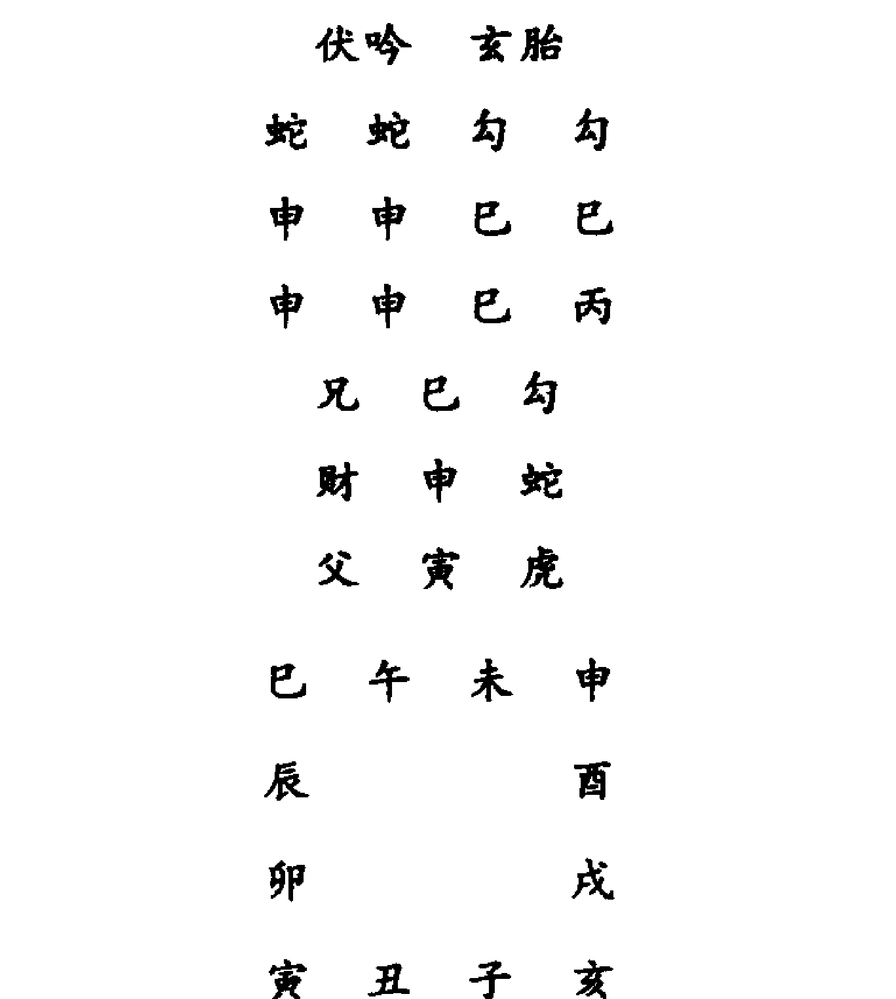

# 大六壬指南

《大六壬指南》成书于明末清初，着录于《清史稿·艺文志》，由[明]陈公献、程起鸾、庄公远等数人编撰而成，最后由清陈公献定稿。全书共分为五卷，立意高远，举重若轻；理论简约，言简意赅；课例精妙，字字珠玑。是书乃是继宋代邵彦和《六壬断案》之后，又一部集六壬学大成之巨著，乃六壬学者之圭臬。学者深入研习，自有所获。

## 大六壬指南序

世之谈壬式者，靡不自矜神哲，口吐长河，验①征其应验，不能无相左焉！余潜心此术几二十载，恒叹其奥妙难穷；虽占断之后颇有奇中，每以未获异人指点为歉。凡君子至斯，未尝不造庭相谒，叩其所长。庚寅仲春，因访公献陈君于邗②上。公献纵口而谈，悉本于理；及考其事应，③ 如左券④然。洵当世之管、郭，⑤ 后起之李、袁、詹⑥欤！因语之曰：“与其藏之匮中，无宁悬之国门乎？”公献曰：“唯唯。” 爱简占验廿余条，与所作之《分门会纂》，播诸梨枣。⑦ 其所增注先贤之《心印》、《指掌》二赋，易知简能；及公远庄君所著之《神煞图位》，辟讹定误，皆指南捷径，仍因合并梓，公之同好，亦吉凶同患之遗意云尔。噫！斯道久湮，绝学难继，神而明之，则存乎其人矣。

顺治壬辰阳月
新安程起鸾翔云氏
题于白下之崇德堂

+   ① 验，古同“然”。
② 邗，春秋时扬州古称。
③ 事应，事后应验。《新唐书·五行志》：“孔子于《春秋》，记灾异而不著其事应，盖慎之也。以谓天道远，非谆谆以谕人，而君子见其变，则知天之所以谴告，恐惧修省而已。若推其事应，则有合有不合，有同有不同。至于不合不同，则将使君子怠焉。以为偶然而不惧。此其深意也。”
④ 古代称契约为券，用竹做成，分左右两片，立约的各拿一片，左券常用做索偿的凭证。后来说有把握叫操左券。此处指陈公献先生的百占百应，非常有把握。
⑤ 管辂（公元209~256年），三国时魏术士。字公明，平原（今山东平原）人。年八九岁，便喜仰观星辰。成人后，精通《周易》，善于卜筮、相术，习鸟语，相传每言辄中，出神入化，被后世奉为卜卦观相的祖师。郭璞（公元276~324年），字景纯，河东闻喜县人（今山西省闻喜县），道学术数大师和游仙诗的祖师，风水学鼻祖。
⑥ 李淳风（公元602年～670年）唐代杰出的天文学家、数学家，岐州雍人（今陕西省岐山县）。袁天罡，唐初天文学家、星象学家、预测家，益州成都（今四川成都）人。隋时为盐官令，入唐为火山令。著有《六壬课》《五行相书》《推背图》《袁天罡称骨歌》等。《通志》著录其有《易镜玄要》一卷，久佚。詹体仁，北宋理学家，曾从学朱熹于建阳。詹体仁深于理学，除潜经训，属意星历。著有《象数总义》、《历学启蒙》等。
⑦ 梨枣，旧时刻版印书多用杜梨木或枣木，故以“梨枣”为书版的代称。清方文《赠毛卓人学博》诗：“虞山汲古阁，梨枣灿春云。”

1

## 小引

余初习制举业，先大人谕以八股，投时美技也。然而窥天人奥、崇帝王师，非异书不为功。每有奇闻，辄欣赏之。以故阅九流陈言，间废寝食。一日读三式帙，知自九天玄女，为灭蚩尤，授之轩辕，内六壬更饶繁剧，非九年面壁，莫竟其源，食精蕴可以养性全身，吐余绪可以料敌知胜，上六千百年，周有子牙，越有少伯，汉有子房，三国迄今，仅蜀孔明、明青田而已。岂寻常章句之士，随处不立人哉！

崇祯甲申，督师史元辅羽檄征余，再及而应，置之礼贤前席，题授中州司理，取道淮阴，得逅陈子公献，印证所学，相叹伯乐不常有也。公献以维扬将家子，自祖父及昆季，文苑武虎，著声海内；又生而膂勇，耽习奇技，《太公》、《阴符》诸篇以及黄老之术，了然胸次。向请缨于大司马王霁宇先生，出门上书屯田，见知受任，劳有成效。忽为谗阻，功志未竟，识者惜之。潜究六壬，寒暑不辍；访学燕京，与凉松亭、何半鹤二公齐名。

由是冠盖问奇者，日无虚晷，纵口而谈，无不翩翩奇中。好事者为嘉赏，分类纂编，摘计百数有奇。乞以尽事之概，外《心印赋》、《指掌赋》为之注解，更历试诸经，编成《会纂》一册，并付剞劂，以广其传。加阅《心镜》、《毕法》、《五变中黄》，约而可一，管而能远，指南捷径，无逾于此。此盖迷津之筏、夜行之炬也，精而研之，理人牛毛，响应桴鼓，又奚必泛求诸篇，以兹惑也耶？特为首引。

今上元仲夏谷旦
南州吾弟周元曙龙随氏
题于邗之甓湖社

# 六壬指南卷一
大六壬心印赋

广陵陈良谟公献增注
新安程起鸾翔云删定
古歙庄广之公远校正

六壬如人，先明日辰。

六壬运式，先以日辰为根本也。日尊，故曰天干；辰卑，故曰地支。亥子丑应于北方，寅卯辰应于东方，巳午未应于南方，申酉戌应于西方，即地盘也。天干者，甲乙东方木，丙丁南方火，戊己中央土，庚辛西方金，壬癸北方水。入式之法：甲课在寅，乙课在辰，丙戊课在巳，丁己课在未，庚课在申，辛课在戌，壬课在亥，癸课在丑。而不居卯午酉子者，以正位不敢当。故阳干居禄神所在，而阴干居禄神前一位也。

以月将加占时之上，

月将，即日宿太阳也。正月雨水后，日躔娵訾之次，入亥宫，乃登明将也；二月春分后，日躔降娄之次，入戌宫，乃河魁将也；三月谷雨后，日躔大梁之次，入酉宫，乃从魁将也；四月小满后，日躔实沈之次，入申宫，乃传送将也；五月夏至后，日躔鹑首之次，入未宫，乃小吉将也；六月大暑后，日躔鹑火之次，入午宫，乃胜光将也；七月处暑后，日躔鹑尾之次，入巳宫，乃太乙将也；八月秋分后，日躔寿星之次，入辰宫，乃天罡将也；九月霜降后，日躔大火之次，入卯宫，乃太冲将也；十月小雪后，日躔析木之次，入寅宫，乃功曹将也；十一月冬至后，日躔星纪之次，入丑宫，乃大吉将也；十二月大寒后，日躔玄枵之次，入子宫，乃神后将也。每以此值月之将，而加来人所占之正时上，顺布十二宫辰，即天盘也。①

假令正月雨水后，日躔娵訾，乃亥将登明也。如午时，则用亥加午，子加未，顺行十二辰是也。余仿此。

> ① 原尾批：月将随中气而迁，以太阳过宫而得名也。其布于地盘上，于辰为顺，于将为逆。

视阴阳为四课之分。

天干阳也，干上得者曰“日”。干上阳神为第一课，乃阳中之阳也。地支阴也，支上得者曰“辰”。支上阳神为第三课，乃阴中之阳也。干上阴神为第二课，乃阳中之阴也。支上阴神为第四课，乃阴中之阴也。夫月将加时，则无极而太极也。加时而有天盘动而生阳、地盘静而生阴，乃太极生两仪也。至于干支分而四课布，非两仪生四象乎！故曰：“一阴一阳之谓道”，“阴阳不测之谓神”。①

贼克为初用之始，相因作中末之身。

四课既布，则八卦生矣。四课阴阳既具，须求三传以为发用，则以四课上下审之。若有一下克其上神者，虽有二三之上克下不论矣，名曰“重审课”。若四课中并无下克，唯一上神克下，取而用之，名曰“元首课”。重审者，重复审详也。元首者，别无下克而亭亭然有“首出庶物”之象也。俱以所得发用为初传，以初传地盘上所乘者为中传，以中传地盘上所乘者为末传，故曰“相因”也。

克多比用涉害，②

重审不过一下贼，若四课中有二三四下贼者，非审矣。元首不过一上克，若四课中有二三四上克者，非首矣。上克下曰“克”，下克上曰“贼”。今贼克纷纷，则以甲丙戊庚壬为阳日，而用一子寅辰午申戌之神，阳与阳比，虽二三四阴勿论也。若乙丁己辛癸为阴日，而用一丑卯巳未酉亥之神，阴与阴比，虽二三阳勿论也，故曰“比用”也。然又曰“知一”者，何也？盖阳知用一阳爻而不知有阴也，阴知用一阴爻而不知有阳也。若夫阴日只知用一阴，今而有二阴三阴四阴矣；阳日止用一阳，今而有二阳三阳四阳矣，则名之曰“涉害课”。先以寅申巳亥上乘之神为用，则涉之深而建名曰“见机”。盖有害者不可不见机，明哲保身之义也。若孟神上无克贼，则以子午卯酉上乘之神为用，名曰“察微”。盖微者不可不察，谨小慎微之义也。若孟仲神上俱无克贼，则以辰戌丑未上乘之神为用，名曰“缀瑕”。盖瑕者不可不缀，言仍其旧，不事更张之义也。

> ② 下克上多，而阴阳多不比日干。上克下多，而阴阳多不比日干。局多同上，取传法亦同上。

为用，此涉之浅而又名曰“察微”。盖见于明者，不可不究其精微，“履霜坚冰”之意也。其中末亦如贼克之相因。①

## 无克是以遥克。

若四课上下全不相克贼，则以日干为主，而与第二、三、四课上神相对较之。若有一上神克日干者，取以为用，名神遥克日，曰“蒿矢课”，以彼能遥伤于我而似矢也。何以“蒿”名之？盖上下相克，力勇而有贼克之称，斯遥远力绵，虽克而犹蒿而已。若无克日干者，则视日干遥克彼三上神矣。若有一上神被日干克者，取以为用，名曰“遥克神”，曰“弹射课”，以我能遥伤于彼而似射也。何以“弹”名之？盖亦因其射远力薄，取象于弹丸而已。如有二克或克二者，亦如比用之法。三传相因，亦如贼克之例。

## 夫昴星当俯仰于酉上，②

若四课上下既无克而复无遥克日干，则为昴星矣。盖遥克力轻，取象于蒿，取象于弹，况无遥克，而独天盘地盘之酉金作用，其力尤轻之至，而应事则未免明之微矣。故以酉中之昴星为名，言其明之微，虽七星相聚，非至明之目不能辨也。阳日则取酉上所得之神为发用，有日将出而鸡鸣仰首之义也。阴日则取酉下所得之神为发用，有日将暮而虎视俯首之意也。阴则日作中传，辰作末传。阳则辰作中传，日作末传。不惟阴阳迭迁，而终有返本之象也。

## 若别责取干支之合神。

如四课有首尾相同为三课者，有二三课相同为三课者，名曰“不备”，言四课不全，不完备也。其不备课中，无贼克无遥克，不可以昴星例取。四课昴星，三课别责也。若阳日得之，以天干之合位上乘者取为用神。合者，甲己、乙庚、丙辛、丁壬、戊癸，六合也，无阳尚有动用之机也。若阴日得之，以地支之三合前一位用之，而不用乘神矣，静之机也。三合前一位者，如巳酉丑、亥卯未，酉日用丑，丑日用巳，未日用亥是也。中末不问阴日阳日，并以干上所乘者为之。

## 伏返以刑冲为定，③

① 下克上，或上克下，与日干阴阳皆比。一在干上，一在支上。阳干则初传取于干上，阴干则初传取于支上，亦名涉害。或在干者比，在支者一比一否，外不比者勿论。
② 阳日以地盘之酉，取初传于天盘。阴日以天盘之酉，取初传于地盘。
③ 癸干者，中传从初传递数，隔二取之。末传从中传递数，亦隔二取之。故传皆不定。乙干者，中传取看支，末传取中传之所刑。如自刑，法见后。

若诸神归于本位，如子加子、午加午之类，乃伏吟之象也。有克者取克，不过癸乙二干而已。无克者阳日自干上发传，阴日自支上发传，迤逦三刑而为三传也。若初传值自刑，则中传阳日用支、阴日用干，仍取刑为末传也。倘逢中传自刑者，末传以冲神为之矣。夫刑有三者：一字刑乃午刑午、辰刑辰、酉刑酉、亥刑亥，自刑也。二字刑乃卯刑子、子刑卯也。三字刑乃丑刑戌、戌刑未、未刑丑也，寅刑巳、巳刑申、申刑寅也。反吟乃子加午、卯加酉，十二神各临冲射之位也。克之少者重审、元首取之，多则知一、涉害取之。三传初末相同而冲乎中传。若夫丁未、己未、辛未、丁丑、己丑、辛丑，四课无克，乃名“无依”，以支神之井栏冲射上所得之神以为初用，而日支所乘为中传，日干所乘为末传。夫井栏者，丑冲巳、未冲亥也。①

### 八专以逆顺为真。②

若干支同处一位，则四课中只得二课矣。有克仍从贼克、比用、涉害三法取用，无克不复取遥矣。盖遥者，远也，干支同位何远耶？止用八专之法而用之。如阳日则顺，从干上阳神得三而止；阴日则逆，从支上阴神得三而止，是为发用也。中末二传，概用干上所乘神为之。

### 天乙居中，后六前五。③

天乙乃贵人也，此神居紫微垣之门，主持上帝征伐，以行令于人间，应己丑之土，有止戈之武，统驭十二神。在天门之前、地户之后则顺行，若居地户之前、天门之后则逆行。其神后有六位，乃天空、白虎、太常、玄武、太阴、天后也；前有五位，乃螣蛇、朱雀、六合、勾陈、青龙也。

### 解纷必嘱事于童仆，

贵人居子名曰“解纷”，言解除纷纭扰攘也。盖子乃夜半安居之神，故得解去纷扰而坦腹。然既为至贵，日有万机，虽无君象，贵臣宰辅，代天宣化事，亦同天子之劳，恐其繁芜脱漏，故嘱委于有用之童仆，庶不负国瘳民矣。

### 升堂宜投书于公府。

> > ① 寅刑巳上巳刑申，丑戌相刑未与丑。申刑寅兮戌刑未，子刑卯兮卯刑子，辰午酉亥自相刑。
> > ② 阳日，阴干上神，起于地盘上顺数，即在地盘上得三而止。阴日，从支上神起，于地盘上逆数，取天盘得三而止，以为用。
> > ③ 贵常土兮合龙木，阴金后水吉神属。蛇朱火兮勾空土，虎金武水凶神属。

贵人居丑曰“升堂”，乃本位属己丑故也。升堂则有“泰山岩岩”①之象，非可私干。必欲见之，宜持书或移文，必以正大光明，然后可于公堂府第见之。

凭几可谒见于家，
贵人居寅曰“凭几”。盖功曹乃案牍碎琐之象，贵人有暇，必亲于典籍也。当此有可乘之机，虽细务亦可相干，可就私第谒之，而非公堂之比也。

登车宜诉词于路。
贵人居卯曰“登车”。卯乃轩车之象，既升车，则非私家，又非公署，若非急紧之事，岂可唐突于贵人之前耶？若误被屈，或遭豪暴，非陈诉于有位之正人，何得雪斯沉辱哉？不得不俯于路而哀达其情也。

巳午受贡兮，君喜臣欢，
贵人居巳午曰“受贡”，乃相生助，而非不遂之方。既贡则以贱事贵，以贵下贱，君喜臣悦，忘其授受之私。贡者受者，俱不越度之象也。

辰戌怀怒兮，下忧上辱。
贵人居辰曰“天牢”，居戌曰“地狱”。非法之地，必非法之人，而后入之。何贵人而居此乎？文王羑里，亦莫非天所使耳。在上者有此非常之辱，则俯仰于彼者，乌得不忧乎？

移途则有求干之荣，
贵人居申曰“移途”。盖传送乃道路之神，贵人在道嬉戏游衍时也，因而获便，以求其进用之私，乘间而行，必荣遂矣。

列席则有酒筵之娱。
贵人居未曰“列席”。盖未乃夜贵，二贵相会，贵入贵家，故有宴会之象。托贵以干贵，事无不遂矣。

还绛宫坦然安居，
贵人居亥曰“还绛宫”，又曰“登天门”。此时六凶俱藏。盖螣蛇朱雀之火而伏于水，勾陈天空之土而伏于木，白虎之金而伏于火，玄武之水而伏于土，且亥乃夜方，日之劳扰者至此而坦然安居矣。

> ① 点校者注：典出《诗经·鲁颂·閟宫》：“泰山岩岩，鲁邦所詹。奄有龟蒙，遂荒大东。至于海邦，淮夷来同。莫不率从，鲁侯之功。”

### 入私室不遑宁处。

贵人居酉曰“入私室”。盖酉为日月出入之门，有“私门”之号也。夫贵人达而在上，致君泽民，律身行已，自当持以至公，难进易退。趋谒于私门则律已不正，而清论所不容矣，岂遑宁处耶？

### 但见螣蛇，惊疑扰乱。

前一螣蛇，乃丁巳火神也，主火光惊疑忧恐怪异，盖凶神也。以其离贵人前一位，故曰“前一”也。

### 掩目则无患无忧，

螣蛇居子曰“掩目”。不惟子水克螣蛇之巳火，而居夜方，有掩目之象。蟠伏栖息之时，其凶焰无所施，无患无忧矣。

### 蟠龟则祸消福善。

螣蛇居丑曰“蟠龟”，盖丑中有暗禽星龟也。夫蛇与龟姤，亦离坎交济之象，岂复有祸心于人哉？是以祸消。占者修善以立身，斯福不穷也。

### 生角露齿，祸福两途。

螣蛇居寅曰“生角”。盖火生于寅，荣旺之极；化蛟化龙，此为之基；贪荣不祸，是以为福。螣蛇居酉曰“露齿”。盖火制金乡，猖獗得志之地，且金石空地无食，彼蛇肆毒贪饕，求口腹之计，为祸岂浅？得此者退藏于密可也。

### 乘雾飞空，休祥不辨。

螣蛇居巳曰“乘雾”。以雾为隐，虽毒目无所见，毒不得肆，占①得此者，仍宜避之。盖雾之蒙，彼固目迷矣，而我至此独不迷哉？倘误犯之，为其所噬，悔何及矣。

螣蛇居午曰“飞空”，以蛇飞空，化龙化蜃之象也。彼有此大志，始有此大为，岂复毒人？纵彼不毒，在我仍宜避之，斯不失为明哲。

### 入林兮锋不可砍，

螣蛇居未曰“入林”。未乃木墓，以土有木，非林之象乎？林麓栖止，既有所蔽，其穴必深，虽有刀锋，无所施其利也。彼螣蛇有此优游之乐，必无肆祸之心，占者无所忌矣。然逢林有蛇，还当莫入。

### 坠水兮从心无患。

### 螣蛇居亥曰“坠水”。

蛇能水居，则随波逐流，鱼虾为食，似无横路毒人之欲也。在我则任其往返周旋，岂不从心所欲哉？

### 当门而衔剑，总是成灾。

螣蛇居卯曰“当门”。卯乃日月之门，蛇当门，则出门即被其害。然有备者无害也。得此者预为之计，则不待彼奋起而攻其不意。若趋而不顾，斯堕其害矣。

### 螣蛇居申曰“衔剑”。

申，金刃之象也。金刃乃斩彼之物，而胡为彼所衔哉？盖火能克金，得以猖獗逞妖，“衔剑”盖异且妖之象。占得者惟退潜而避之，彼凶不能久，妖氛息，而吾复何患哉？

### 入冢而象龙，并为释难。

螣蛇居戌曰“入冢”。戌乃火库墓也，有蛇入墓之象。彼深居而简出，吾往过虽不免小心惴惴，而彼非蟠伏路途之比也。

### 螣蛇居辰曰“象龙”。

蛇乃龙之从也，有化之机，若入龙之窟，有随进化之义。夫彼贪上达必热于中，岂复深为我患哉？故可释难。

### 朱雀南方，文书可防。

前二朱雀，乃丙午火神也，故曰“南方”，主文书、司讼、章奏、口舌之神，火光、怪异。去贵人二位，故曰“前二”。

### 损羽也自伤难进，

朱雀居子曰“损羽”。朱雀乃丙午火，而加临水乡，有损羽之象。羽翼不成，进飞必难矣。占得此者，文书无气，而口舌词讼不凶也。

### 掩目也动静得昌。

朱雀居丑曰“掩目”。丑亦北方水气之余，制朱雀之火，有投江破头之喻。盖彼既目瞑，吾得有为矣。动静俱吉，无口舌之扰，讼息而文书不行也。

### 安巢兮迟滞沉溺，

朱雀居寅居卯，曰“安巢”。盖二木皆火生助之神，且有山林之象。雀至山林，结巢砌垒，育子贪荣。占者所喜，有口舌消亡之义。而曰迟滞沉溺者，盖卜文书章奏之事，则未免之淹滞而沉溺也。

### 投网兮乖错遗忘。

朱雀居辰居戌，曰“投网”。辰戌名“天罗地网”，而戌为朱雀火之库，而辰与戌对宫，有丘墓之象，故曰“投网”。夫朱雀之凶，入此不得飞扬，占者之所喜也，故曰“乖错遗忘”，亦指文书之事言之耳。

励嘴衔符怪异，经官语讼。

雀居申曰“励嘴”。申，金也，朱雀至此能克制其方，得志之处也。励嘴奋啄，所以口舌尤旺也。望文书固有气，而他占则讼诉之象，凶不可免矣。

朱雀居午曰“衔符”，古名真朱雀，有非细①之讼，常人之忧也，若士子入场，斯高中矣。

临坟入水悲哀，且在鸡窗。

朱雀居未曰“临坟”，言其结巢于古墓之象。夫巳午未申俱在上，有飞空而翱翔之义，朱雀得肆时也。主口舌不细，故曰“悲哀”，妻孥乌有不悲者哉？

朱雀居亥曰“入水”。火入水乡，有投江之象，乃甚喜矣。凶神无气，何曰悲哀？盖亦指文书动用而言耳。若有急用文词不能得用，亦悲也。

官灾起盖因夜噪，

朱雀居酉曰“夜噪”。亦火制金乡，得以奋志为恶。其性好乱，便生口舌，得此者必官非不免。又且酉为门户，口舌入门，非官灾而何？

音信至都缘昼翔。

朱雀居巳曰“昼翔”。以巳未交午，乃白昼之象。雀至此，最为有气，占凶则口舌词讼，占喜则起用文书，望人信息俱至。

粤有六合之神，婚姻佳会。

前三六合，乃乙卯木神也，主和合、成就、宴会、婚姻。又名私门，以其离贵人三位，故曰“前三”。

待命和同，

六合居亥曰“待命”。亥乃天门也，我欲成就公私事端，而来天门之下，待命必成，故曰“和同”。

不谐惊悖。

六合居巳曰“不谐”。盖六合木也，入于火乡，烟灭灰飞，不吉甚矣。凡占忧惧不免。

反目兮无礼之事端，

六合居子曰“反目”。子，水也，六合木本相生助，何乃曰“反目”也？盖子卯无礼之刑也。凡事必起于无礼，以致彼此不投而有反目之失。

### 私窜兮不明之囚地。

六合居酉曰“私窜”。以卯酉为私门，而六合又乙卯之属，以私并私，以门复门，乃出入私门逃窜之象。且六合之木而临从魁之金，木受金伤，故曰“囚地”。重复私阴，故曰“不明”。得此者惟奸淫阴私是利，而正大反殃也。

### 乘轩结发，从媒妁而成欢。

六合居寅曰“乘轩”，居申曰“结发”。盖寅木乃轩车之象，故曰“乘轩”。申乃庚也，卯乃乙也，乙庚相合，故曰“结发”。以从媒妁之言而有欢成之庆矣。

### 违理亡羞，因妄冒而加罪。

六合居辰曰“违理”，居戌曰“亡羞”。盖六合本属乙卯，卯辰有六害之凶，故曰“违理”。若临戌，则以己之私门而自就戌，以为六合苟求合会，“亡羞”之似。占得此者，必因自不检约，以招罪愆，非干人之害我也。

### 升堂入室，并为已就之占。

六合居午曰“升堂”，居卯曰“入室”。午乃离位，似为“升堂”。卯则六合之本位，故似“入室”。二者合于堂、合于室，岂非已就乎？凡占得此，皆可成遂。

### 纳采妆严，总是欲成之例。

六合居未曰“纳采”，居丑曰“妆严”。六合临丑，乃贵之本垣也。以贱谒贵，妆饰不得不严，所以事上也。居未乃卯未有相合之庆，且太常酒食帛物之乡，似纳采之喜也。占得之者，何事不可成耶！

### 或逢勾陈发用，必然斗讼争官。

前四勾陈，乃戊辰土神也，主征伐、战斗、词讼、争论、田土之事。以其去贵人四辰，故曰“前四”。

### 更遇受越投机，被辱暗遭毒害。

勾陈居丑曰“受越”，居子曰“投机”。丑乃贵人之乡，以争神而入贵地，乃受其迈越之讼诉，而勾陈得肆其侮于人也。若至子，乃土能克制之，适所以投其狂妄之机，尤可以展布其奋忿之心。占得之者，亦惟忍而已矣。

### 遭囚兮宜上书，

# 大六壬指南

勾陈居寅曰“遭囚”。勾陈遇寅，乃克制之方，故有遭囚之象。“宜上书”者，彼凶既囚，而我得以上言，告发其积害成愆之状。若不于此时制之，则过此仍肆虐，而物受其害矣。

捧印兮有封拜。

勾陈居巳曰“捧印”。巳乃铸印之方，而勾陈铸印之模范也。印铸而成，捧以奉上，非封拜之象乎？君子见之，迁擢必速；常人见之，反为可忧。自非有不法等情，何干于印信也？

临门兮家不和，

勾陈居卯曰“临门”。卯本日月之门，而勾陈争斗之神入之，是争神进门矣。必家不和，以致抢攘纷更，人眷非宁，盖亦破败之征矣。

披刃兮身遭责。

勾陈居酉曰“披刃”。以酉金似为凶器矣，况又阴爻肃煞之气，与勾陈之戊辰生合，彼凶斗之神而持此器，岂有善念哉？然非理之举，法所不容，终于遭责。占者惟避其凶可也。

升堂有狱吏以勾连，

勾陈居辰曰“升堂”。勾陈本属戊辰而入辰，非升堂而何？其神主斗讼勾连，故至辰地则有狱吏勾连之应。知机君子，生平无非礼之举，不过因他人之不法而及之耳。

反目因他人而逆庚。

勾陈居午曰“反目”。午火生勾陈，而何曰“反目”耶？以勾陈好斗讼，而午火真朱雀，尤讼之最者也。彼此皆反面相贼之神，孰肯相容耶？故有反目之象。君子占之，必被他人之逆庚，余波以及之耳。

入驿下狱，往来词讼稽留。

勾陈居未曰“入驿”，居戌曰“下狱”。未乃垣途，如驿道也，故曰“入驿”。戌乃地网，又曰“地狱”，况与勾陈之戊辰对相冲射，乃“下狱”之象也，非词讼之往来而何？占者惟退避则吉。

趋户褰裳，反复勾连改革。

勾陈居申曰“趋户”，居亥曰“褰裳”。夫申非门户之神，何以趋户目之？盖申前即酉户也，立此可以入门，故曰“趋户”。至亥而“褰裳”者，亥方夜静更阑，必褰衣而酣息。然曰“勾连”、“反复”者，申为坤地户也，亥为干天门也，门户之前，何立此等凶神？君子至此，即返而抽身，稍迟则被彼勾执矣。

## 青龙财喜，虽主亨通。

青龙前五，甲寅木神也，主财帛米谷、喜庆亨通。十二神中，惟此神最吉，增福解祸。以其去贵人五位，故曰“前五”也。

### 在陆蟠泥，所谋未遂。

青龙居未曰“在陆”，居丑曰“蟠泥”。未近南离之火，故为“陆”。丑近北坎之水，故为“泥”。夫龙飞于九天，潜于九渊，神变化而莫测也。若失地，亦厄且困矣。蟠于泥，在于陆非失地而何？欲望其遂也难矣。

### 登魁兮小人争财，

青龙居戌曰“登魁”。戌乃河魁也，以青龙之吉神而入网罗之地，则小人争财之象矣。由财喜之神落此，所以致小人之争也。

### 飞天兮君子欲动。

青龙居辰曰“飞天”，以辰乃龙庭也。而曰“天”者，戌亥子丑象地在下也，辰巳午未象天在上也，故曰“飞天”也。青龙吉神，飞腾在上，君子有为之时也，非欲动乎？

### 乘云驱雷，利以经营。

在寅曰“乘云”，居卯曰“驱雷”。寅乃青龙之宫，有乘云出入之象，古谓“云从龙”也。卯乃震卦，震为雷也，龙得云雷，非经营之时乎？故驱雷乘云而得以施为展布。

### 伤鳞摧角，宜乎安静。

青龙居申曰“伤鳞”，居酉曰“摧角”。申乃阳金，酉乃阴金，金能克木，青龙之甲寅所深畏也，至此有退鳞折角之象。吉神遭厄，岂福佑于我也？惟安居守静而已。

### 烧身掩目，因财有不测之忧。

青龙居午曰“烧身”，居巳曰“掩目”。以青龙之木，得水为喜，而见火为仇，巳上入蛇穴，尤为不吉，故有“掩目”之象。午乃南离真火，故曰“烧身”，青龙有此不足，尚可赖之为财神欤？若求谋财物，则有莫测之忧矣。

### 入海游江，因动有非常之庆。

青龙居子曰“入海”，居亥曰“游江”。盖俱水也，青龙得水，何吉不生？吉福斯民，占者动则有非常之庆矣。

### 后有天后之神，蔽匿阴私之妇。

后一天后，壬子水神也，主阴私暧昧之事，蔽匿秽污之神，性似柔而实刚。以其后贵一位，故曰“后一”。

### 守闺治事，动止多宜。

天后居子曰“守闺”，居亥曰“治事”。天后妇人之象也，壬子乃天后之本家，故象守闺阁也。亥乃乾健自强不息之地，有治事持家克勤之道也。二者动止相宜，得其道之正也。如当旺相，其庆深矣。

### 倚户临门，好淫未足。

天后居酉曰“倚户”，居卯曰“临门”，以秽污之神而人卯酉之私门，非淫奔之象乎？除奸私之外，而正大之举反见为殃。

### 褰帷伏枕，非叹息而呻吟。

天后居戌曰“褰帷”，居午曰“伏枕”。盖戌土克水病之象也，且戌昏黑之时，有“褰帷”之象；午乃昼长午寐之时，故曰“伏枕”。二者皆卧而不快，故曰“叹息”、“呻吟”，非病即事不遂也。

### 裸体毁妆，不悲哭而羞辱。

天后居巳曰“裸体”，居辰曰“毁妆”。壬子遇巳，有露暴之伤，刑克之地，故曰“裸体”。辰为水之克贼，天后至此而毁妆，形体裸露而见伤，毁妆易容而不饰，非羞辱而何也？占得此者，悲灾必矣。

### 优游闲暇，盖因理发修容。

天后居寅曰“理发”，居申曰“修容”。平旦而早起，理发时也；申晡而容残，妆褪时也，故有“理发”、“修容”之义。二者非不遂也，且水与木金不克，故主优游闲暇，乐其平和也。

### 悚惧惊惶，缘为偷窥沐浴。

天后居丑曰“偷窥”，居未曰“沐浴”。以天后之子与丑六合也，有私匿之情，窥之恐人知，是以“偷窥”。未有井宿，而壬子水人之有浴之象，浴则畏人至矣。二者皆有惧疑之心，故曰“悚惧”、“惊惶”。

### 太阴所为蔽匿，祸福其来不明。

后二太阴，辛酉金神也，主阴私、蔽匿、奸邪、淫乱、暗昧不明，又为冥冥中之默助。以其后于贵人二位，故曰“后二”。

### 垂帘则妾妇相侮，

太阴居子曰“垂帘”。子正北也，端门向明垂帘，昏夜无见，所以妾妇居阴位，得肆其慢上之心而欺侮之，不过群小别地生非而已。

### 入内则尊贵相蒙。

太阴居丑曰“入内”。丑乃斗牛之墟，天乙贵人之位也，至尊而受此阴蒙，则蔽其明矣，乱之始也，君子必谨焉。

### 被察兮当忧怪异，

太阴居戌曰“被察”。盖太阴之辛酉与戌六害，且河魁刑狱之方，非被纠象乎？欲饰其非，则愈怪且异矣，故当忧也。

### 造庭兮宜备乖事。

太阴居辰曰“造庭”。夫辰乃龙庭也，且与酉合，而太阴之妖媚，必与天罡相得；然彼刚之眷宠必夙，亦水常无也，乌得不争宠而乖变哉？

### 跷足脱巾，财物文书暗动。

太阴居寅曰“跷足”，居午曰“脱巾”。盖寅方平旦晨起之时，有跷足之象；午则长昼昼眠，亦必有脱巾者矣。然太阴之金能克寅木为财，而午则朱雀反制太阴，二者乃财物文书，俱暗中动也。

### 裸形伏枕，盗贼口舌忧惊。

太阴居亥曰“裸形”，居巳曰“伏枕”。亥乃夜深就榻，有裸形之象；而已则克制太阴，必伏不起，乃有“伏枕”卧病之义，并主忧疑口舌盗贼。盖巳乃螣蛇，主口舌惊恐；亥乃玄武，主贼盗忧疑也。

### 闭户观书，雅称士人之政。

太阴居酉曰“闭户”，居未曰“观书”。酉乃太阴之本家，阴好静，故“闭户”。未乃离明之次舍，土金生养，故有涵泳优游之象。二者安且吉也。

### 微行执政，偏宜君子之贞。

太阴居卯曰“微行”，居申曰“执政”。卯乃私门，必袒裸之象，以人之，非微行乎？申乃太阴之旺地，得志行权之所，有执政之象焉。君子占之，非阴神之比时，当微行也，持以贞一之操；或当执政也，亦持以贞一之操而已。

### 玄武遗亡，阴贼走失。

后三玄武，乃癸亥水神也，主贼盗阴私、走失遗亡、兵戈抢攘。以其后天乙三位，故曰“后三”。

六壬指南卷一
大六壬心印赋

# 大六壬指南

### 撒发有畏捕之心

玄武居子曰“撒发”。子乃夜半，其睡未醒，而子鼠乃虚惊之神，况玄武贼神，自多怀疑，被惊而夜起，有撒发之象，怀畏捕之心，不过虚疑不害耳。

### 升堂有干求之意

玄武居丑曰“升堂”。丑乃天乙贵人之位，土能制水，玄武不能行盗，以礼谒见，实怀穿窬之心，有所干求，不以实对也。

### 爱寅兮入林难寻

玄武居寅曰“入林”。寅卯山林之地，盗贼有所凭依，捕者难于追寻，非穿窬得志乎？

### 愁辰兮失路自制

玄武居辰曰“失路”。辰土能制玄武之水神也，至此非失路之象乎？盗贼消亡，君子坦腹之时也。

### 窥户也家有盗贼

玄武居卯曰“窥户”，盗贼入门之象，亦惟谨之于预而已。

### 反顾也虚获惊悸

玄武居巳曰“反顾”。巳乃昼方，非盗贼之利也。纵无人追逐，亦必反顾，既无追者，岂非虚惊也？

### 伏藏则隐于深邃之乡

玄武居亥曰“伏藏”。亥乃夜方，又属玄武本位，深邃之象，捕贼者必难获也。

### 不成必败于酒食之地

玄武居未曰“不成”。未乃土也，克制玄神之水，所以欲盗不成。又未，太常之家，酒食之地，必因酒而败，盗易获也。君子之庆，小人之忧。

### 截路拔剑，贼怀恶攻之而反伤

玄武居午曰“截路”，居酉曰“拔剑”。午乃天地之道路，故取象于“截路”。酉阴金剑锋之象，故曰“拔剑”。贼势至此，猖獗已甚，岂宜攻之？攻之必反伤矣。

### 折足遭囚，贼失势擒之而可得

玄武居申曰“折足”，居戌曰“遭囚”。申乃坤土，制玄神之水，且昼方，贼所深畏，有“折足”之象，刚金斩贼也。戌乃地狱，又土克水，故曰“遭囚”。二者贼失利矣，故捕盗贼者擒之最易。

### 太常筵会，酒食相奉

后四太常，己未土神也，主筵会酒食、衣冠物帛，又曰安常吉庆之神。以其后天乙之四位，故曰“后四”。

### 遭枷必值决罚

太常居子曰“遭枷”。土值水乡，有崩陷之象；又子未六害，以害而陷，有枷锁之象，所以必值决罚。

### 侧目须遭谗佞

太常居寅曰“侧目”。寅木克制太常之土，有虎豹在山之势，而太常之土何敢与为敌耶？况未羊逢虎，受其制伏，敢怒不敢言，亦惟侧目而已矣。尚畏有谗佞于傍谮之，则凶仍不免。

### 遗冠也财物遭伤

太常居卯曰“遗冠”。以冠裳之神而入私门，有冠不正之象，故曰“遗冠”。然何以曰“财物遭伤”？太常亦主财物衣帛，主失去者，以土被卯木之克也。

### 逆命也尊卑起讼

太常居戌曰“逆命”。未与戌相刑，且河魁为狱网之凶，故曰“逆命”。未在上，其位为尊；戌在下，其位甚卑，二者相刑，非尊卑相讼乎？

### 衔杯受爵，不转职而迁官

太常居申曰“衔杯”，居丑曰“受爵”。申为传送，太常酒食之神，二义详之，似“衔杯”矣，庆冠裳之象，而非转职之吉乎？丑乃天乙之宫，以太常而拜至尊，非“受爵”乎？故曰“迁官”也。

### 铸印捧觞，不征召而喜庆

太常居巳曰“铸印”，居未曰“捧觞”。太常为印绶之神，见巳火乃铸印之位，公器非征召不用也。未乃太常之位，宴会之宫也，捧觞酬酢有喜庆也。

### 乘轩有改拜之封

太常居午曰“乘轩”。午乃天地之道路，乘轩之象也。又立南向北，面君之义，故有改拜之封，君子大庆也。

### 佩印有用迁之命

太常居辰曰“佩印”。辰乃天罡首领之神，而与太常印绶并之，乃佩印之义，必主迁除。

### 亥为征召，虽喜而必下憎

太常居亥曰“征召”。亥乃天门，有征召冠裳之象；但未土在上，亥水在下，水必惮土之克也，故虽喜而下憎也。

### 酉作券书，虽顺而防后竞

太常居酉曰“券书”。太常之未土生从魁之酉，金得助于魁则锋刃成功，宜书之左券，有何不顺耶？但酉金强自刑其方，终有后竞，勿以身贵而贱人，勿以独断而违众则吉。

### 白虎道路，官灾病丧

后五白虎，庚申金神也，主道路、刀剑、血光、官灾、疾病、死亡，至凶之神也。以其后天乙五位，故曰“后五”。

### 溺水音书不至

白虎居子曰“溺水”，居亥亦然。白虎喜山林，主道路，今溺陷于水，则道路不通，不凶矣。盖至凶之神而陷没，有何不利？勿以道路阻而音不达为忌。

### 焚身祸害反昌

白虎居午曰“焚身”，居巳亦然。在彼白虎之金，固所畏忌，而占者反昌矣。何则？白虎丧凶血光之神，既已焚身，何能为患？

### 临门兮伤折人口

白虎居卯曰“临门”，居酉亦然。白虎守卯酉之门，则一家惊惧不宁矣。轻出无备者，莫不为之噬矣，故伤折人口也。

### 在野兮损坏牛羊

白虎居丑曰“在野”，居未亦然。丑未田野之象，白虎在此固似无威，而丑中之牛，未中之羊，为虎所噬，贪哺啜无复凶矣。

### 登山掌生杀之柄

白虎居寅曰“登山”，其威自倍。仕途占之，当有生杀之重柄。常人占之，凶不可当。

### 落阱脱桎梏之殃

白虎居戌曰“落井”。戌乃地狱，吉神入之则占者必凶，凶神入之则凶焰猖衰，不复孔炽，占者不被其殃。往返无虎截路，犹桎梏之脱也。

### 衔牒无凶，主可持其喜信

白虎居申曰“衔牒”。申乃白虎之本宫，彼贪其巢穴之荣，而无复肆噬之心，故有喜信可持。而曰“衔牒”者，传送乃往来之神，牒信之象也。

### 咥人有害，终不见乎休祥

白虎居辰曰“咥人”。辰山有尸，乃虎噬尸，既曰“咥人”，岂复有吉祥于人耶？得此凶占，亦惟避之而已矣。

### 天空奏书之神，以天乙尊者无对

天空后六，戊戌土神也。其神无形无影，由正对天乙至尊，即空亡也。由无敢对至尊而虚其位，故曰“天空”，专主诈伪不实。曰“奏书”者，言惟执书以奏，则此片时可对至尊耳。

### 神虽所主休征，必察卦名之义

元首象天，重审法地。象天者先喜而后忧，法地者先迷而后利。象天者，上位之动用也。法地者，下位之动用也。以其上克下，故先喜后忧。以其下贼上，故先迷后利。

### 知一则得一为宜

比用卦，又名“知一卦”。知一不知其它，惟一得则永得也。

### 见机则不俟终日

涉害之深者曰“见机”。不俟终日，言机贵速时者，难密而易失也。

### 遥克所卜难成

遥克者，神遥克日曰“蒿矢卦”，日遥克神曰“弹射卦”，二者皆力不雄也，故所卜难成，观蒿与弹之意自明。

### 别责所占罔济

四课不备而无遥曰“别责”，尤无力之甚也。故凡占罔济，不过利守而已矣。

### 冬蛇掩目，虚惊而终不伤人

昴星卦有螣蛇发用，曰“冬蛇掩目卦”。既曰掩目之蛇，则人得而害彼，彼不得而害人，不过虚凶不成实害也。

### 虎视转蓬，出外而稽留不起

昂星卦有白虎发用，曰“虎视转蓬卦”，既曰虎视，则凶不可当，即犹蓬转而避之可也，出外必稽留不回。

### 伏吟任信宜用静，去盗非遥

伏吟，刚日自任卦，柔日自信卦，主静也。逃去之人及盗贼失物，俱不远也。贵顺支前一位寻之，贵逆支后一位寻之。

### 返吟无依则复旧，往来不一

返吟来去不定，故曰“无依”，无依倚也。凡事不定，且主于远。

### 八专之意，不宜男子波波。帷薄之名，不利妇人嘻嘻

八专卦支干同位，内有怨女，外有旷夫，故曰“帷簿不修之卦”，多淫泆之意也。

### 龙首累逢，君命恩赐频加

太岁、月建、月将、贵人，同为发用，曰“龙首卦”。君子则有恩命出自天子，常人利见大人。

### 龙战屡见，改革灾祸不定

卯酉日辰，行年发用，又值此者，名“龙战卦”。不问君子常人，俱主更革，灾祸不一。

### 官爵改拜升迁

驿马发用，名“官爵卦”，主改拜升迁。常人得之，反摇动不宁。

### 富贵增财吉庆

贵人发用，主增财喜庆，君子常人皆吉。

### 斫轮铸印，官职须迁

卯加申发用曰“斫轮卦”，戌加巳发用曰“铸印卦”。有官者必迁，无官者反不能当，而有官非口舌。

### 高盖乘轩，鼎席必致

午卯子三传，曰“高盖乘轩卦”，亦同斫轮、铸印断。

### 芜淫主琴瑟不调

夫干也，妻支也，上神互克干支名曰“芜淫卦”，主夫妻异心。

### 浃女必渎乱太甚

初传天后，末传六合，更传见卯酉，曰“浃女卦”，主淫奔不正。

### 是知三交为藏匿

子午卯酉仲神，全见于三传曰“三交”，主藏匿阴私不明之人。盖此神皆五行之败气，主人昏晦，收留此人，异日不利。

### 九丑定灾殃

乙己戊辛壬日，更得四仲相并，而又大吉加仲上，曰“九丑卦”，主占者家长有灾。

### 斩关不利安居，波波不定

罡魁加干支上，更得六合青龙，名“斩关卦”，主不能安居而奔波不定。

### 游子不遑宁处，碌碌无常

辰戌丑未全四季在三传本静，而丁神驿马入之，曰“游子”，主动而碌碌奔波不免。

### 天狱忧刑罪责

凡用神囚死，更天罡加日本之上，曰“天狱卦”，主官非口舌刑罚及身。

### 天网囚系灾伤

凡时与地支并克天干而发用，曰“天网卦”，词讼必遭囚系，常占多主病凶。

### 悬胎主隐匿，藏怀为胎孕

寅申巳亥全在三传，曰“玄胎卦”。主隐慝藏怀，或为胎孕。

### 赘婿主伏潜，屈辱或相将

支辰加天干之上，被克为用，曰“赘婿卦”。主屈身于人而支辱，必依栖于人而相傍。

### 无禄之名，是上骄而下弱

凡四上克下，曰“无禄卦”。上皆得意故骄，下皆受制故弱，无禄犹无路，最凶之占也。

### 绝嗣之意，乃下逆而上伤

凡四下克四上，曰“绝嗣卦”。下皆得志而逾逆，上皆受制而全伤，尤凶之甚也。

### 又为励德以动摇为意

贵人当卯酉之上，曰“励德卦”，贵人不自安而动摇也。

### 乱首以悖逆为心

日加辰而被辰克，曰“乱首卦”，悖逆之象也。

### 稼穑定自微而至著

辰戌丑未全在三传，曰“稼穑卦”。土有生物之功而日渐增长，故自微至著。

### 曲直必福善而祸淫

三传亥卯未，曰“曲直卦”。为福者愈增其福，有祸者愈益其祸，乃木日渐长象也。

### 巳酉丑俱逢，则伤情革故

三传巳酉丑全者，曰“从革卦”，主革故鼎新之象。且金乃破物之神，主刑伤之凶也。

### 寅午戌全见，则意欲成亲

三传寅午戌全者，曰“炎上卦”，主气焰熏天，上进之象，而急于进用，有相亲傍之义焉。

### 缘夫润下之道，惟宜施惠于人

三传申子辰全者，曰“润下卦”，主恩泽下流。惟宜施惠于人，不可独利而招尤。

### 凡断吉凶，占从将意

大抵功曹为用，木器文书；功曹，寅也。寅乃木神，功曹乃奏书之神，故主文书。
传送加临，行程信息。传送乃邮驿之象，故主信息行程。
太冲盗贼及车船，从魁金银与奴婢。
辰为斗讼，兼主丧亡，天罡主斗争词讼，亦名“天牢”，又名“天罗”，主死亡。
戌为欺诈，或称印绶。天魁主欺诈，亦名地狱，又主印绶之神。
登明征召，太乙非灾。
胜光火怪丝绵，午主光明怪异，又主丝绵布帛。
神后阴私妇女。子水天后之宫，主阴私不明，事干妇女。
未为衣物筵宾，小吉乃太常之宫也，主衣冠、物帛、筵会、宾客。
丑号田宅园圃。大吉土神，主田宅园圃之事。
大吉小吉会勾陈，因田宅而争讼。丑未主田宅，见勾陈斗讼之神，必因争田宅而起讼。
从魁河魁乘六合，为奴仆之逃亡。酉主婢，戌主奴，乘六合之私门，乃奴仆逃亡之象。
文宜青龙不战，武欲太常无争。文看青龙为类神，武看太常为类神。旺相相生必吉，上下克战则凶。
登科者禄马扶会，登科者，禄神驿马临于干支之上，富贵干支乘禄马是也。马主前程远大，禄乃临官之神。
不第者刑害俱并。三刑六害，并临干支之上。刑主有缺，害主阻隔难成。
投书宜虎勾无气，投书献策，见上贵也。若白虎勾陈无气，自然无阻也。
捕贼欲玄武相侵。捕贼以玄武为类神，若玄武临克地，自然得捉也。
若候雨占风，须看青龙白虎。白虎主风，青龙主雨，有气旺相，有风有雨；囚死空亡，风雨必微。
若迁官进职，宜观天吏天城。寅为天吏，卯为天城。若加年命相生，必主变。
动望行人，观二八卯酉之限。占东南行人，以酉为中途，子上神为至期。若西北行人，以卯为中途，午上神为至期。
追逃亡盗，捕四六玄武之阴。占捕盗贼，看玄武之阴神上，所得何神，便知其在何处，捕之必获。
失伴必详胜光而可见，胜光在目前则向前追必见，在日后则稍等立见矣。
亡财则察玄武而可寻。失财物以玄武之阴神上见，乃知方所，寻之必获。
此皆略举其纲要，在智者临时而审情。

| 课名 | 释义 |
| :--- | :--- |
| 若夫旺气求就官职 | 旺气发用利求官 |
| 相气经营利禄 | 相气发用利求财 |
| 囚气囚系呻吟 | 囚气发用，讼则囚系呻吟 |
| 死气死亡悲哭 | 死气发用，病必死亡哭泣 |
| 休气疾病淹延 | 休气发用，疾病淹缠 |
| 详在囚时丘墓 | 若日墓同之必凶 |
| 相加孟仲，万事新鲜 | 孟仲之神发用主新事动 |
| 季上逢之，互为故旧 | 季神发用为旧事矣 |
| 欢欣在旺相之中 | 旺相发用皆主喜 |
| 悲哀在死囚之处 | 休囚发用皆主忧 |
| 凡见火加水上，亡遗口舌非宁 | 乃巳午临亥子也，火乃朱雀主口舌，水乃玄武主亡遗 |
| 火入金乡，淫佚奸邪未息 | 火则螣蛇朱雀，金乃白虎太阴，淫佚奸邪，皆太阴为火所逼致也 |
| 水加土位逢财 | 水加土上受土之克则为财 |
| 若在火宫迁职 | 水加火上受水之克则为官 |
| 木逢水则流落他乡 | 以木之少而见水多，有水多木漂之象，故曰“流落他乡” |
| 水遇土则人财散失 | 水加土，木为财而主散失者，亦水为玄武之位也 |
| 金居火上则病疾死亡 | 金加火上，白虎入朱雀螣蛇之位，故主疾病死亡也 |
| 土临木地则田宅讼起 | 土加木，乃勾陈受制之象，故主因田宅争斗而兴词讼 |
| 金加火位，中传有水无妨 | 若金加火为发用，而中末见水，则有救矣 |
| 火入水乡，末得镇星复喜 | 若火加水上为发用，而中末有土则不凶矣 |
| 贵人顺行，凶将少降祸殃 | 天乙贵人，顺则凡事顺，逆则凡事逆。顺贵，虽凶将降祸必轻 |
| 天乙逆行，吉将聊施恩惠 | 逆贵，虽吉将赐福不重 |
| 逢灾遇恼，上下皆凶 | 三传中全无吉将吉神者，灾恼并见 |
| 招利求祥，始终俱吉 | 三传中全吉者，主招财利，可求吉祥 |
| 凶神刑害，灾祸连绵 | 三传中凶将更乘刑害，灾祸愈重 |
| 吉将相生，欢欣不已 | 三传中吉将更生助者，喜庆愈多 |
| 凶神和合，逢灾不至深危 | 三传中凶将见生合，虽凶不甚 |
| 吉将逢伤，赐福终非全美 | 三传中吉将见伤克，虽吉不甚 |
| 日辰有彼此之殊 | 日干为自己，支辰为他人 |
| 神将有尊卑之异 | 贵神在上尊，月将在下卑 |
| 辰来克日，诸事难成 | 支辰来克日干，乃我受人制也 |
| 日往克辰，所谋皆遂 | 日干去克支辰，乃人听命于我也 |
| 男逢灾厄，须以日上推穷 | 日干又曰天干，故看男子之灾祥 |
| 女遇迍迍，但向辰宫寻觅 | 支辰又曰地支，故看女人之祸福 |
| 先凶后吉，终成喜庆之征 | 初传凶，末吉，终于吉也 |
| 始吉终凶，终见悲哀之兆 | 初传吉，末凶，终于凶也 |

# 六壬指南卷一
大六壬心印赋

时生日，下报上；日生时，上惠下。时生支宅吉，时克支宅灾。
所以遇子遇午，若往若来。值卯值酉，为门为户。
子午天地之道路也，往来之象。
更宜视以用及传终，又可察其生及畏惧。
大抵克多则事繁，克少则事一。
涉害比用主繁，元首重审事一，克者动也。
鬼临所畏，当忧而不忧。财在鬼乡，闻喜而不喜。
因财而变鬼祸矣。
神将互克，占及夫妻。同类来伤，事因兄弟。
鬼乃夫也，鬼动事起夫。财乃妻也，财动事起妻。比肩爻动，事起兄弟朋友也。
财遇天空兮，产业须伤。鬼临旬尾兮，官灾不起。
财爻乘空，求妻财不得也。官爻空有，官非不妨也。
吉神临凶卦之中，无咎争之道。恶煞临吉卦之内，无欢欣之理。
煞虽恶，生我则其喜终至。将虽良，克我则忧难不已。
如虎勾生我，其力尤雄。龙合克我，其凶亦至。
凶神无吉也，合干则讼休。吉神无凶也，克日则祸起。
与日合，虽朱雀之口舌亦休。
更若识其通变，举一隅而不复三矣。

# 六壬指南卷二
## 大六壬九天玄女指掌赋

广陵陈良谟公献增注
新安程起鸾翔云删定
古歙庄广之公远校正

九，天数。玄，天色。女，阴象。《黄帝阴符》亦如此解，言阴与之符也。故：九天之数，以玄女名，包于阴而阴与符合意。《赋》敷其事而直言，言一见而始终无余蕴也。

六壬通万变之机，大为国而小为家。日辰定动静之位，日为人而辰为事。

变即穷、变、通、久之变机，发动所由也。家国要从地盘分野处看。若单论家宅则惟在支上看可也。

月将加时，局图顺节。日二课而辰二课，合成四象。生主和而克发用，义法三才。

日上神为太阳，日阴为少阳。辰上神为太阴，辰阴为少阴。阴阳生合比和处吉凶之端倪不露，惟于相克处一逗杀机而吉凶遂尔见形。盖不杀不成其为生，而取克，正所以观五行相生之妙也。

上克为元首，理势顺而百事攸宜。

上天下地，天克地，理势皆顺，故百事宜。

一下贼为重审，人事逆而谋为不利。

地克天是下凌乎上，故逆。

二三克贼，知一总名。神将凶而祸不单行，神将吉而福祥双至。

如二三克贼，则看克处与本干有益无益而福祸之来可决矣。

用孟名曰见机，当因时以致宜。仲季号为察微，事未萌而预

料。克贼重重，比用涉害，用辰主外灾害己，用日主我祸延人。

涉害取地盘孟仲季发用，涉四孟乃见机课，涉仲季为察微课是也。涉害比用复等，则刚用日比，柔用辰比。盖人我以支干分，日上发用乃我先发端，辰上发用是人先发端也。

蒿矢神遥克日，二克主两事而合为一事。弹射日遥克神，一克主一端而分作两端。

日止一日，克有两克，是两事合来作一事。一克互观自见，二课若见金土二煞，为有镞有丸，能伤人也。

昴星如虎对立，视俯仰以卜远近之忧危。

俯视忧近，仰忧远。杀气至酉而盛，故将曰太阴，俯仰皆以酉位言，阴阳无克乃从至阴处讨出消息来也。正君子履霜之渐多忧惧之时也。

别责如花待时，合日辰以定人事之巧拙。

课名不备，事属有待，如花待时象可知矣。玩别责字言尊见端于此，而成就于彼之义也。

八专士女怀春，一名不修帏箔。

凡阴阳施化以别，而神今干支同位，阴阳不分，客未辨，故取象若此。

丁巳辛同丑未，井栏射主灾深。

井栏射亦主前途忧危。

伏吟任信，用刑而做事忧疑。

诸课有加临皆可信任，独伏吟上无加爻，止堪自立主张，尽多忧疑之兆。

反吟无依，迭传而事多反复。

无依谓十二神各居冲位，无可依倚，主反复不宁也。

凡上克则事起男子，或属他人。若下贼则事由女人，或因自己。

大凡克处是动机，上克动在客在阳，故为男子为他人，下贼反观可知。

将克神为外战，灾自外来。神克将为内战，祸由内起。

将谓月将，神即贵神。将克神相战在外，神克将相战在内。灾外来是因彼而有克也。祸内起以其克加于我也。

用在日前事情已过，用居日后事起将来。日辰发用应在今时，

辰日刑冲事成恍惚。年月节旬发用，事应年月节旬。

如甲课在寅，则卯为后而丑为前。盖前为已往，后为未来故也。日谓今日，辰主十日言，日干发用，事应在今时。凡日寄辰，辰仰于日，要合德禄比合相生，乃为足贵。刑则人情不美，冲则反复不宁，故事多恍惚也。年主一年，月主一月，节主半月，作气字看。如立春为节，雨水为气，节字论气，非无谓月也。此二句论克应之理，最为绝妙。方朔克应歌云：起岁年华问，逢蟾月里寻，占旬旬日应，值日日前辰，气动蟾分体，候来旬折身，诸门从此起，万类若通神。苗公云：七位克应诀，季神总用同，墓中见的实，吉凶取合冲，阴阳分墓绝，七位应须通。又云：看发用是何季之神，如见寅卯，则应在辰月辰日辰时，如见巳午，则应在未月未日未时，故言与日同也。

吉神旺相事皆吉，凶神旺相事必凶。

-   旺气求官吉，争财相气亲，死言丧祸起，囚动见官刑，休来忧病患，五气仔细寻。

此皆以克日论也。吉凶二神，谓三传日干年命兼岁月建正时来支辰上神，非搜尽此十一处也，须要视何处生我克我，还是生我者多，克我者多。助我生者多或助我克者多，生我者得地，还是克我者得地，宜详察。

已上九门定式，次观附卦加临。

-   日临辰而受克为乱首，主行悖逆之道。
-   辰临日而受克为赘婿，不能自立其身。
-   辰临日而生日名自在，有恢拓之志。
-   辰来生我，可云安享。
-   日临辰而受生名俸就，有荣显之机。
-   我就他生，一何荣显。
-   日临辰而生辰名历虚，主无措之语笑。
-   我去生他，他为脱气。
-   辰临日而受生名归福，主福履之来崇。
-   辰是我所履之境，加我之上，而与我合体生辰，岂非福履之崇乎。
-   同类相加，同谐和合。

# 大六壬指南

### 培植和合，言比肩之妙。

日辰交生，名为脱骨，主彼我舒情多实。

日辰交克，号曰芜淫，主内外疑忌生猜。

交生不认我而认人，故为脱骨，乃相信之诚也，交克反看。

传课皆在年月日时名天心，忧不成忧而喜中加喜。

三传不离四课名回环，吉不全吉而凶不全凶。

天地大化不离是在天之心也，名回环，意不宜占捧散事。三传所以变化，四课不离殊少变动之意，故吉凶不全。

三上克为幼度厄，腐绳维臣室之象。

三下贼为长度厄，越海无舟楫之形。

凡长幼课看发用才官父子何如，是财则伤财，余可例推。又看余一课，或是上克必主上下不安争斗。若生日干则凶可解，上下相生凶亦稍解。

四上克为无禄主孤单，得救神亦能免祸。

四下贼为绝嗣主贫苦，虽吉将到底成空。

救神如三传年命有一处生干即是，若四下贼，则是我所遇皆仇敌，吉将其奈我何。

日辰见辰戌又发用为斩关，阳逃亡而阴主伏匿。

辰戌动神，中传更遇寅为天梁，主万里飞腾，故阳日为逃亡。阴日为伏匿，总无踪迹可寻也。凡传遇寅卯未，干乘贵阴合，为天地独通，出行吉。

贵人临卯酉分前后为励德，庶人吝而君子亨通。

视干支阴神，如立贵人前是小人恃势当强。如阳神立贵人后是君子谦冲当进。此励德之卦。盖日阴辰阴为卑，不合妄居于前。日阳辰阳为尊，不合退居于后也。

天乙在卯酉立私门，名微服而各怀异志。

天乙来临主人门，日辰阴阳俱后存，即此是为微服象，惟利阴私。贵后存，谓居贵人后，卯酉为日月门，阴私之象，惟利安居，不利有为。

夫妇若年神交相克，作芜淫，主琴瑟不调。

夫妇年若相克，日神更与日辰互克，乃乖戾之象。

用卯为龙战，用酉为虎斗，主思改而忧疑不定。

凡卯日发用，行年又在卯上为龙战卦，虎斗仿此。盖卯日阳气南出，阴气北入。酉日阳气北入，阴气南出，阴主刑杀，阳主德生，相战于门，故名。主事疑惑，反复不定。

后合为泆女，合后为狡童，主厌翳而男女有淫。

卯为六合私门也，酉为太阴私户也。凡卯酉作传，而前见天后、后见六合，为阴往求阳，非泆女而何？前见六合，后见天后，为阳往求阴，非狡童而何？

### 三传四孟名曰玄胎，非怀孕则有移旧更新之意。

四孟五行生地，故曰胎。玄，水色黑，言方胎于中，男女未分，不可见也，主事有根蒂，日渐长进之意。如人胎于母腹，铸成五官之象，所以说移旧。

### 三传四仲谓之三交，加日辰则主隐匿罪人之名。

凡仲日四仲相加一交，有克发用二交，课传又见阴合，三交卦也。子午卯酉所藏乃乙丁己辛癸五阴干，阴为刑，偏阴无阳，故太公立课将五阴干移于四季，正此谓也。盖四仲当阴干之旺，如乙禄到卯，丁己禄居午，则极气盛矣。而五阳干生于四孟者，以四仲为沐浴败地，是这仲位刑旺而德衰也。若课传年命全逢乎此，诸事不吉，

> 故武侯云：德气在内，刑气在外之日，不可出兵。

### 四仲亦名二烦，主杀伤而更遭刑讼。

凡太阳加仲，斗系丑未为天烦。太阴加仲，斗系丑未为地烦。是天地大小吉之气俱为天罡所伤，而太阳加仲是德为刑也。月宿加仲刑气大旺，故主杀伤狱讼之象。如斗不系丑未名杜传，德在内刑在外，凡占利静不利动。

### 四季名为游子，乘天马而将欲远行。

四土是游行之地，天马是游行之象，故名游子课。不止远行，凡事主游移不定，踪迹无凭。

### 用天马而中卯末子名为高盖，主公卿爵位。

正月午为天马，卯天车，子华盖，私见大人之象。

### 卯发用而中戊末巳号曰斫轮，为印绶俱全。

卯加庚辛，木就金雕，中传戊，又是辛之寄宫，未传巳火炼辛金，而金又断卯木成器，且戊中辛金得巳火，又为铸印，而戊又为印绶，所以说印绶俱全，爵禄崇高之象。

戊卯为铸印乘轩，驷马六合而升官爵。

丙辛合为铸印，卯戌合为乘轩，驷房星谓卯也，如卯发用升官之兆。

若逢真破，得罪于帝王之象。害气交加，远涉有江湖之患。

凡刑冲破坏皆谓之破，于仕宦则为得罪，于贾人则为江湖之患，以卯为舟车故也。

时逢太岁作贵人兼发用而乘月将，名时泰，有赐宝升官之庆。

日时月建会青龙而用岁气作初传，名富贵，主利见大人之征。

天乙发用，又日辰月建名青龙，岁支作天乙是为用岁气，言一时而诸吉臻合也。

四离前一日为天寇，利居家而不利远行。

四绝前一日为天祸，事体绝而又复重兴。

分至前一日为四离，已非远行吉兆，那堪月宿极阴，玄武阴私重加，故主遇盗贼。四立前一日为四绝，乃阴阳交卸之日，那堪立绝互交，是乘权卸肩，两不得力，所以主事体绝而复兴。

四时前孤后寡，或值旬空，苦楚无依。

闭口旬尾加首，乘玄发用，病危讼失。

如寅卯日，当春之时，则巳为孤丑为寡，若无别吉象，则为孤寡课。闭口有二格，如玄武加天地盘，六甲合此成两般。病逢闭口则不进饮食，讼逢闭口则枉屈难伸。

时克日而用又助之，名曰天网，有死丧之危。

用死囚而斗加日本，名曰天狱，主囚系之灾。

时用克日为天网，如春占，甲干，用土金死囚神，而辰复加日本亥，则木之根本受伤，运用不旺，囚系可知。

上下旺相为三光，始终迪吉。

神将顺布为三阳，作事皆成。

用旺相一光，吉神临用二光，干支当令三光。用旺相一阳，日在天乙前二阳，贵顺三阳，忌克破刑冲害。

传见六仪，病将瘥而狱囚出。

三奇发用，疑惑解而喜气生。

旬首发用为六仪，子戌旬中奇在丑，申午旬中奇在子，寅辰旬中奇在亥，丑为玉堂，鸡鸣于丑而日精备。子为明堂，鹤鸣于子而月精备。亥为绛宫，斗转于亥而星精备。

用起天魁为伏殃，有杀伤之厄。

传虎死神为魄化，主死丧之忧。

用乘丧魄，健者衰而病者死。

传起飞魂，家有咎而人有灾。

天魁正西逆四仲，非河魁也。死神正巳顺十二，是虎乘死神加日主死，加辰主丧，有吉可解。丧魄正未逆四季，飞魂正亥逆十二。

卦曰始终，视神将玩克战以方知。

课名新故，用刚柔察死生而始见。

始终要兼旺相休囚，细细推寻，然亦就三传说，三传原该本事始终，或始克终生，或始生终克，或始生终墓，或始墓终生，皆始终之义。视神将者，神将以生我为吉，不生则虽吉将亦减力。凡阳干发用得阴为故，得阳为新。阴干发用得阳为故，得阴为新。阳主生事之方生而未艾也，阴主死事之已去而不乘权也。死生即得令不得令义。

八迍立见忧危将至，五福必主福禄骈臻。

八迍五福，不是定然八件五件。八是阴数，一切恶神凶将克贼日辰兼带刑害者，是阴惨之极，故名。五乃天之中数，极阳明之象，如传逢生旺贵人日德，即有凶亦解救矣。

若顺相加之卦，传列巳申亥寅。

春玄胎者，生意已萌于中。夏励阳者，机关略见于外。

秋占四牡驱驰不息，冬占全福行止亨通。

凡三传顺加，以巳上加申起算，四孟是五行长生之地，顺加则水火木金各就所生，是四生之神复各居长生之位也。如春令寅木乘权，勾萌甲坼，生意方蒙，乃生生之始也，故曰胎。四孟至于夏则生气日长日盛，曰励阳者，谓阳气盛中伏衰，君子当勉励勿纵，犹退藏意。秋时生气渐微，杀气渐盛，且言申位何为传送？天地之化至七月是生杀之转关，是送往迎来之会也。盖巳为海角，巳酉丑三合为宽大，坤为马，即四牡，即传送也。以申加巳行宽大之地，正驱驰不息意。至于冬万物归根，四生各归生处，是全福而无害，行止有不亨快者乎？

### 四仲相加，子卯午酉。

- 春占关隔，若羝羊之触藩。
- 夏占观澜，似游鱼之吞饵。
- 秋占四平，逢望弦晦朔，名曰三光不仁。
- 冬占匿阳，时遇日月辰戌，号为四门俱闭。

四仲乃四败地，以卯加子算，四仲相加在卯为阴不备，以日出于卯离太阴也，在酉为阳不备，以日入于酉离太阳也。在子一阳初复，阳气不壮，在午一阴始生，阴气不壮。玩课体名义，重阴互换，知无一吉占矣。春曰触藩言为阴所缚，进退不得自如。观澜意同，盖午生于寅，败于卯，前见辰是水库，乃观澜而不敢进意。弦月渐进，望月已满，晦月既尽，朔月初生，重阴相加，又逢弦望晦朔，更加四仲天官，如六合太阴，总是阴翳之象，故曰三光不仁。日月，卯酉也，四仲相加更卯酉上见辰戌总是阴阳闭塞意。又子乃一阳初生，今加于酉方，向闭塞之路，那见生机，故云匿阳。

### 四季相传，丑辰未戌。

- 春稼穑而生长以时，夏游子而漂流不定。
- 秋地角据一隅而忘天下，冬五墓舍朝市而守丘墟。

稼穑者，以辰加丑起算，为顺土生万物故在春为稼穑，且辰加于丑，土气乍开，生生之虑初动。又土盛于夏，乘巳午之生，有千万里之势，故云游子。至秋则土气渐衰，生物之功灭矣，曰据一隅而忘天下，便与夏之通达不同，四土皆库独以冬为墓者，休囚故也。

若逆相加，势情为悖。三传亥申巳寅，六合一名六害。

- 春亢毓有始勤终怠之形，夏洪钓秉中正权衡之象。
- 秋含义而无中生有，冬待庆而暗事将明。

逆相加谓以亥上加申起算，六合六害在加处见。寅盛于春已毓矣。又值亥生则毓之太过，故曰亢毓，且亥加于寅为休气用事，故云始勤终怠。寅加于巳，木火通明，是为洪钓，巳加于申，正火旺于夏，亨嘉之会，谓之中正权衡，固宜申金断制为义。已加申是金生于巳，含义之意，故曰无中生有。申加于亥，天乙生水，得申金之光相涵相生，是为将明，从此而春、而夏、而秋，生长万物之庆皆为有待。

### 四仲逆传，子酉午卯。

- 春占陷井，如鸟投笼。
- 夏占正烦，若牛受刃。
- 秋失友，既散离而复合。
- 冬出渐，名阴极而阳生。

四仲以酉加子起算，则皆相逆，为五行死地，如金库于丑，则酉死于子，余可类推，投笼正表其象。正烦或作二烦，以日宿月宿临四仲分，曰受刃则生气尽矣，金主杀，酉加于子为泄杀气，气既衰故为失友。酉未为离隔之神，加于一阳初生之地，为阴静而阳复，乃离而复合之象。

### 逆传四季，丑戌未辰。

- 春占越库，散财不以其道。
- 夏曰转魁，委任不得其人。
- 秋杀墓势将兴而将起，冬伏阴机渐收而渐藏。

四季以辰加未起算，春季辰土受未中乙木之克，是发越库财已散矣，曰不以其道者，顺则合道，逆则不以其道也。戌为天魁，中藏辛金，夏季未土木库加戌，而为戌中辛金所克，又戌为火库泄木之气，是木转魁上，为委托非人也。戌火库，丑金库，火加金则杀金，金阴象，原伏而不动，遇火炼之，将有发越之势。丑金库，辰水库，丑加辰则金水相涵，象重阴，又子见母，故云收藏。

### 若顺相合，理势自然。

申子辰为润下，以和顺为义。寅午戌为炎上，以发达为名。亥卯未为曲直，当举直错枉。巳酉丑为从革，宜革故鼎新。三传稼穑，田土稽留。

子为水，申为生地，辰水库，自申而子而辰，理势自然，有不和顺者乎？甲乙日为生气炎上，顺其次序，自然烈焰弥天，与和顺同解。更得驿马真位，为倚权，利奏对也。凡木之生，先曲后直，举直错枉，正去徇向直意。金有革故之义，才言革故，自有鼎新之势。凡占得四土，虽当作稼穑，须玩顺逆，玩四时，参上文方备耳。

### 若逆三合，事主乖违。

- 子辰申为出奇，自新改过。
- 午戌寅为间魁，舍窦从庭。
- 卯未亥为合纵，彼我各怀其忿。
- 酉丑巳为献刃，远近俱被其伤。
- 辰申子为呈斗，玩阴阳于天象。
- 戌寅午为顶墓，会消息于方舆。
- 丑巳酉为藏金，因事而韬。
- 未亥卯为从吉，待时而动。

- 辰子申为循顺，贵勿躐等。
- 戌午寅为就燥，行合中庸。
- 未卯亥为正阳，遵发生之意。
- 丑酉巳为法罡，防肃杀之威。

四土逆行，尚宜守正。

水局逆行言勿躐等者，欲其以顺正之也。火不顺则燥，故正之以中庸。玩“遵”之一字，言当依木生生之理而毋毗乎阳也。罡杀气，金逆而杀气愈盛，故肃杀宜防。土能生金，若逆生恐犹未出于正，故特用戒之。

- 子申辰为仰玄，守凝寒之困。
- 午寅戌为正义，显朱夏之形。
- 卯亥未为先春，未萌先动非时过。
- 酉巳丑为操会，已过受时岂失宜。

- 申辰子为闾十，聚秀气于怀中。
- 寅戌午为华明，彰精光于天表。
- 亥未卯为转轮，因颠蹑而自反。
- 巳丑酉为反射，怀杀伐以酬恩。

天罡加四仲为关隔，人事昭违。

登明加日辰为萃茹，事情和美。

卯酉日月门也，子午为阴阳之门，辰戌为网罗之煞，辰加四仲则门被阻隔，人事何由通快？子午为关，卯酉为隔，卯酉既为日出而作，日入而息之门户，子午既为阳死阴生阴死阳生之地，则人事一动一静，能离此阴阳，离此门户乎？今被此网罗煞阻隔，人事岂得亨快？亥为干位，加日辰是统天之德聚于日辰也，天德昭临人情自然和美矣。

用为发端之门，中为移易之府，末为归计之宫。

太公立三传，极重在发端，归结在末传。

孟为神之在室，仲为神之在门，季乃在外之应。

孟仲季乃泛论，其理不在传之例。孟为生地，仲为旺地，季为结果之地，此正由微至著，由小而大意。

- 初生中，中生末，名遗失而事久凌夷。
- 末生中，中生用，名荣盛而多人推荐。
- 初克中，中克末，为迭噬而受众辈之欺。
- 末克中，中克用，为僭亡而致外人之侮。

> 《毕法》云：三传递生人举荐，重下生上，不重上生下，大凡发用之气要无所分折，一心聚于干上方好。若初生中末则益我之气薄矣，所以事久凌夷。惟从末生上传，专益我，故荣盛耳。又上吞下为迭噬，下贼上为僭亡，众辈侵欺，即毕法众人欺意，然中初，初中，缓急有辨。

- 三传生日百事宜，日生三传财源耗。
- 日克三传求财可美，三传克日众鬼难堪。
- 初传克末成者罕，末克初传事可成。
- 传见妻财利益多，传见父母饶生意。
- 传见兄弟口舌生，传见子孙福禄满。
- 传见官鬼有两途，病讼畏兮官位显。
- 子传父兮逆且疑，母传子兮顺且便。
- 干支吉兮三传凶，谋事不成终不著。
- 三传吉兮干支凶，事吉而成无少悭。
- 支若传干人求我，干若传支我求人。

课连茹传递逆速而顺则迟，越三间向阳明而向阴暗。故顺三间之课：

- 亥丑卯为溟蒙，而事多暗昧。
- 子寅辰向三阳，而渐望光明。
- 丑卯巳为出户，春雷震蛰。
- 寅辰午出三阳，金鲤波中。
- 卯巳未迎阳者，鸣高冈之鸾凤。
- 辰午申登三天，得云雨之蛟龙。
- 巳未酉变盈者，名秋场之登稼。
- 午申戌出三天，似鸣鹤之在天。
- 未酉亥为入扃，主心劳而日拙。
- 申戌子涉三渊，当隐于山林。
- 酉亥丑乃凝阴，而忧不可解。
- 戌子寅入三渊，而屈不能伸。

天地之气，东南为阳，西北为阴，自寅至酉为日，自酉至丑为夜。凡人日出而作，与阳俱开，故向阳则明。日入而息，与阴俱闭，故向阴则暗。凡人逆则归，归则速。顺则游，游则远，自然之理也。若三传俱在夜方，岂不暗昧？寅为三阳，而传之前后拱向之，岂不光明？卯为门户，出门而向阳，正如雷之震蛰，阳起地下也。寅三阳之地，出乎此，一路向东南辰午之旺气，可知亨快，鱼得水之象。午为阳而卯巳者迎之，正高冈鸣凤之象，占事宜速就，稍迟则无气矣。午申在南，先天干位，固曰天，而辰在东南亦是阳明之位，合之曰三天，登之故有蛟龙云雨之象。只一巳字在午之前，而未酉则向西去矣，阳终阴始，肃杀初进，万宝告成，故曰登稼。午当阳极，而申戌已流于酉矣。在阴子和，言闻其声不见其形也。未酉亥阴气盛矣，凡人心劳不休，皆属于阴。书云：为善心逸，日休为恶，心劳日拙，善恶之际，阴阳之别也。申子水局，有林之象，戌土山象，言人夜方，似幽人之守正也。酉亥丑皆在夜位，阴气所凝，何忧如之？戌寅火局，而子水居北乘旺为渊，则火亦化而为水矣，故曰入三渊，屈不能伸，无非幽暗之意。

### 至若逆三间之课：

- 亥酉未为时遁，无出潜之意。
- 戊申午曰悖戾，有追悔之心。
- 酉未巳励明者，出入从其所便。
- 申午辰凝阳者，动止罔戾于心。
- 未巳卯为回明，而利有攸往。
- 午辰寅为顾祖，而喜气和平。
- 巳卯丑为转悖，当吉凶二者之间。
- 辰寅子为涉疑，入祸福双关之道。
- 卯丑亥名断涧，义利分明。
- 寅子戌为冥阳，善人是宝。
- 丑亥酉为极阴，如月隐西山。
- 子戌申名偃蹇，似马驰栈道。

亥酉未逆传，亥遁于酉，酉遁于未，有退而归隐之意。戊午火局中间一申反成克象，不和同矣，故曰悖戾。酉至未，酉有背暗投明意，曰励明者，言策励以从明也。申午辰俱东南阳位，故曰凝聚于阳，所以行止如意。午为明，未巳卯回绕而向之，故利有攸往。午火生于寅，三传午辰寅，有顾母之意。和平者，谓得所生而安也。巳丑酉金局为杀机之悖令，中传不用酉而用卯，是悖之转，转则吉。然犹木离于杀也，亦主凶，故为二者之间。辰子水局，中传见寅，虽涉于疑而不沉于渊，但两局不纯，故曰祸福双关。经曰：断涧如何涉，失前忘后时。君子宜退位，小人须有悲。盖亥为水，丑卯有桥梁意，言难进也。高高下下，义利岂不分明？寅戌火局，中传见子，阳入于溟，乃怀宝不出意，丑亥酉皆是夜方，不见光明。子申水局，间一戊土在中，坎水见险，岂是坦道？

### 若顺连茹亥将顺行：

- 亥子丑为龙潜，阳光在下，空怀宝以迷邦。
- 子丑寅为含春，和气积中，勿炫玉而求售。
- 丑寅卯为将泰，有声名而未蒙实惠。
- 寅卯辰为正和，展经略而果浴恩光。
- 卯辰巳名离渐，利用宾于王家。
- 辰巳午为升阶，亲观光于上国。
- 巳午未为近阳，名实相须。
- 午未申为丽明，威权独盛。
- 未申酉为回春，若午夜残灯。
- 申酉戌曰流金，似霜桥走马。
- 酉戌亥革故从新，小人进而君子退。
- 戌亥子隐明就暗，私事吉而公事凶。

亥子丑俱在夜方，全无阳气，故云，即《易》“乾龙勿用”义。子丑寅得阳气而未畅，仍宜韬养勿用。寅为三阳开泰，此时从丑初履之，虽有将兴之誉而功业仍未成就。寅卯辰为日之始，正君子向明图治之会。卯辰巳逼近离火之位，是君子作宾于王朝也。午正阳有泰阶之象，从辰巳升之岂非观光乎？午阳明君位，巳未近之，君臣合德，功成名就之象也。午未申是圣主当阳揽权御下之象。未申酉东南之气灭矣，是以比之残灯励之也。申酉戌乃金地肃杀，何险如之？曰霜桥走马危之也。酉戌亥纯是夜方，乃小人道长，君子道消之时。戌亥子以公私分明暗，若占逃亡盗贼，又当用夜方也。

### 若逆连茹亥位逆推：

- 亥戌酉曰回阴，心怀暗昧之私。
- 戌酉申为返驾，主行肃杀之道。
- 酉申未名出狱，主离丑出群，疏者亲而亲者疏。
- 申未午名凌阴，主行险侥幸，安者危而危者安。
- 未午巳为渐烯，脱凡俗而渐入高明。
- 午巳辰名登庸，舍井蛙而旋登月阙。
- 巳辰卯名正己，人物咸亨。
- 辰卯寅为返照，行藏攸利。
- 卯寅丑联芳，悔吝须知否极泰来。
- 寅丑子游魂，乘凶坐见事成立败。
- 丑子亥为入墓，有收藏之态，仕进无心。
- 子亥戌为重阴，安嘉遁之形，宁甘没齿。

自亥而回戌，自戌而回酉，一团阴气用事，可以卜其心之所藏矣。戌酉申肃杀之地，昔孙膑占此，不满期而出，刖足而返，故名。戌为狱，酉不向戌而向申，是为出狱不与戌之群丑为伍，而往西南，是平昔之亲类反疏，而疏属反亲矣。申为阴而未午凌之，阴阳交战，安危之机也。媾指午未渐而入之，是脱凡境入高明意。午已辰逆转，又未中有井宿，午逆向巳，巳中有蟾，月阙是也，巳宽大有正己之象。从巳至辰卯，正己而正物，人物皆归于通达。寅中有生火，辰卯返而从之，是返照也。阳明相比，行藏自利，发泄太过，中藏乌有，反为吝象。今归寅卯于丑，披枝归根，方是泰来之兆，寅之阳气正好发舒，反入于丑子极阴之位，诸事不利。魂阳魄阴，向晦宴息，百事收藏，占者宁矢志没齿，静俟不敢进也。

### 局有进退之意，气有旺绝之殊。

衰墓总同退断，胎生进气无虞。
退气则吉事成凶，凶事反吉。
进气则安者益安，危者益危。

长生等十二位所以象人之始终也，要从胎处说起，胎在母腹中，养在始生之时，长生则从始生，渐渐长了，宜竟接冠带，何为有沐浴一位？盖五行之气，不郁不舒，不凝聚不发散，正复卦安静以养微阳意。这一点生意不得沐浴处一番闭藏，如何得冠带而临官而帝旺也？到帝旺处一生事业尽矣，衰病死理势必然。至墓之后胎可言矣，又加一绝字者，五行之气不绝，不生，不有，十月之纯阴何以得一阳之生，绝正死生互换之交，人鬼转关之路也。课义虽言五行，实字字切着人事，细玩自见，进退二字，全在旺相休囚死五字中分别。大抵吉气进则聚，若散则吉者不吉矣。凶气退则散，若散则凶者不凶矣。

### 顺连茹空，名曰声传空谷，退吉而进则不宜。

逆连茹空，名曰踏脚空亡，进宜而退则不可。
三间之课，亦有缘由。
课传六阳利于公干，课传六阴利用阴谋。
半阴半阳原情审势，阴多阳少以理推求。
阳为德而阴为刑，阴从夫而阳自处。

# 六壬指南卷二 大六壬九天玄女指掌赋

# 大六壬指南

癸为闭而丁为动，闭主死而动主生。
子午卯酉多是五阴所寄，而日德从于阳干，在四孟位上，如甲禄在寅，乙禄在卯，甲则合己而以寅为德禄，乙则合庚而从庚之申以为德也。余例推。癸水润下之性，干逢旬尾曰闭口者，言水气在上不能开口也。假如人在水中，一开口便不能生矣。丁火之性主阳主动，是生之象，正与癸相反。

空亡乃耗散之神，初斩首、中折腰而末刖足。
辰戌为网罗之煞，辰覆巢、日毁卯而用置迕。
空亡为天中煞，人只知旬空为十干不到处，不知惟虚能起化，此正天之中也，故曰天中煞。数中凡遇空亡不可便说不好，要细察始见端的。天罡之气鼓万物而出，天魁之气收万物而入，为四时网罗之杀，言一网无余也。在日辰上是静位，所以为覆巢为毁卯。在用上是动机，所以为置迕，言一往便留碍也。

年命若立，魁罡动者静而静者动。
日辰加临，卯酉离者合而合者离。
立是年命所乘神，立于地盘辰戌之上，非辰戌作年命也。

三传纯子孙，不求财而财自至。
三传纯父母，勿虑身而身自安。
三传纯妻财而父母克害，三传纯官鬼而兄弟成灾。《毕法》云“六爻现卦防其克”，即此意也。

见克不克从其鬼贼，崖岸迫而勒马收缰。
见生不生不若无生，鸟兔尽而藏弓烹犬。
见救不救灾须自受，当如燕雀处堂。
见盗不盗本根无耗，须识荆棘巢凤。
凡见克神要细看他立处，若是生地，他自恋生不来克我。若是他之克地，他自受制不能克我矣。下三句俱如此看，如人之临于危崖尚可收缰，危而不危也。鸟兔尽言人之施恩于我者，今已尽矣。燕雀处堂而不知危机将至，救神无力也。荆棘解盗字，巢凤则盗而不盗之意。

合中带煞蜜里藏砒，煞遇空亡饥食甘李。
交车入长生之位，苦尽甘来。

## 交车坐刑害之宫，幸中不幸。
吉中凶，凶中吉，须详之干支门路，止在上下照射处，故曰交车。此处刑冲破害极有关系，盖交车二句似指交车立地盘长生刑害也，玩位字宫字自见，不然与下节重复矣。

## 先生后克乐极生悲，劫煞入辰萧墙祸起。
乐极生悲即毕法乐里悲意，劫煞如亥卯未则在申，其应极速，萧墙应辰之一字。

## 日辰神将交生，龙虎聚明良之会。
## 日辰神将交克，猿鹤争风月之巢。
龙虎是合气的状，猿鹤是不合气的状，交生交克可谓极切。

## 交车入墓喑哑双盲，交车冲刑风瘫痴隔。
喑盲俱切墓字，风瘫切刑冲字，可见凡断当各从其类。

## 乙戊己辛壬同四仲名曰九丑，天地归殃。
## 死绝休囚气加日辰号为二难，夫妻反目。
凡戊子、戊午、壬子、壬午、乙卯、己卯、辛卯、乙酉、己酉、辛酉日，而大吉又临日辰子午卯酉上者，为真九丑卦也。盖乙是雷电始动之日，震而不安。戊己是诸神下位之日，又戊己为坤，诸神清虚之气合德于干，转入坤维，曰下位是也。壬是三光不照之位，壬禄在亥，六阴俱足，日月之光至此损照。辛是西方杀物之位，如何又居在四仲极阴位上。大吉是十二宫神之主，为贵人本家，所以为星纪，言诸星朝会于斗也，今又临四仲极阴之位，是为九丑。九，阳数，九丑，言阳之丑也。二难正配夫妻两字。

## 上下六合主客合同，上下刑害冤仇相见。
## 引从日辰名曰用媒，家必兴而人必旺。
## 干首支尾名曰回环，成事吉而散事凶。
## 男年支而女年干，合后成婚。
## 辰加罗而日加网，巧中反拙。
## 太阳照武宜擒贼盗，月将加辰宅舍光辉，
## 魁度天门行多阻隔，罡填鬼户事任谋为。

## 既定课传，次观神将。
- 贵人为百神之主，得位为福，失位为殃。
- 腾蛇为卑贱之神，旺相怪异，休囚亦主忧惊。
- 朱雀文书，亦主刑戮奸谗口舌。
- 白虎道路，又为官灾疾病死亡。
- 勾陈主迟滞勾连之事，囚主讼而旺主争。
- 玄武为盗贼虚耗之神，休失人而旺失物。
- 六合为婚姻和合，妇女得之则为私门。
- 大常主酒食衣裳，武职占之则为擢任。
- 青龙所主财物，文官见之光为恩宠。
- 天后虽为妇人，庶人得之亦主亨嘉。
- 天空奴婢妄诞，太阴暗昧不明。

太公前只用天将十二，后见丑位为己土之精，北斗之枢，是十二宫气化拱照之地，因而加一名曰天乙贵人，贵人即丑也。前五位引之，后六位从之，其间分文武贵贱男女，如天后贵人之妻，太阴贵人之妾，空螣武皆贵人奴婢，龙朱文臣，常勾虎武将，所不可不知也。螣属巽，风火摇动不宁，故主惊疑，离火外明内暗，故曰奸谗，火色赤，故主刑戮。虎处坤方，故主道路，又申金杀物，故主官灾疾病。勾陈辰也，万物至此，勾萌甲坼未舒，迟滞勾连之象也。玄武为亥水，阴私暗昧，故主虚耗。六合和合之意，妇人岂宜私和。未，味也，言物至此月而始成味也，故曰酒食。衣裳者，谓麻絮丝绵都于是月就绪。曰武职者，言巳午所生之金，得未土而刚锐之气毕聚，至申位方显出纯金来，可见未中之金自旺干，故为武职。寅为三阳开泰，号曰青龙，正文武之德，世间财物吉凶，嘉宾生死丧祭，贵贱尊卑男女长幼，哪一事少得？所以属青龙，言其变化莫测也。天后有恩泽意，故亦云亨佳。天空诞诈，太阴阴私是也。

- 寅功曹主木器文书，申传送主行程消息。
- 卯太冲主林木舟车，酉从魁主金刀奴婢。
- 辰天罡为词讼，兼主死丧。戌天魁为欺诈，或称印绶。
- 巳太乙惊怪癫狂，亥登明阴私哭泣。
- 午胜光官讼连绵，子神后奸淫妇女。丑大吉咒诅冤仇，未小吉酣歌医药。

- 辰乘贵人，合禄公门役吏，遇马而为奔走公人。
- 戊逢空禄，临孟瞭哨边军，见丁而为逃窜落阵。
- 大吉小吉作勾陈，斗争田地。
- 天魁从魁为六合，奴婢逃亡。
- 从魁若乘武合，妻妾怀娠。
- 传送上会青龙，子孙财损。
- 胜光如逢天马，必问行人。
- 太乙若逢白虎，家多疾病。
- 未逢天后，妇人奸淫。丑合贵常，欲添财喜。
- 天空临酉，走失家奴。常遇登明，亲朋酒食。
- 辰戌上见空武，奴婢逃亡。
- 小吉单逢六合，婚姻聘礼。

辰上原无贵人，若天乙立地盘辰上则贵而不贵，若合日禄主为公门役吏，但食其公食而已，更带日马则为奔走公人。戊加天空，军人之象，临孟而为了哨者，言去路方赊也。丁者壮也，惟壮盛善走，所以落阵中亦能逃出。从魁是妻妾，玄武为胎，合是怀孕。子孙历代相传，传送之意。青龙为财，居申受克，非财损而何？胜光离火为日之精，行游之象也，更乘天马，岂非问行人？太乙在紫微垣内，家室之象，家遇疾病刑煞之神，则抱恙可知。未地始离于阳，渐进于阴，再乘天后，奸淫必矣。丑为贵人本家，太常为财为田，合而得之，则财产之事，添进无疑。天空为奴，酉门户也，奴临门户，背主逆行。亥卯未三合，故未亥为亲朋也，又未中酒食与亥共之。辰戌动而不静，有奔逃之象，空是奴，武是婢，临于辰戌，故云。小吉主礼仪酒食，又见六合牙媒之神，其为婚聘可知。

- 辰逢勾虎，必问田坟。丑作虎勾，墓田破损。
- 太岁龙常，来占官职。子乘龙合，女受皇恩，
- 寅乘龙合，儿孙欢庆。

# 大六壬指南

- 二八如同阴武，私通门户摇动。
- 巳亥若逢阴后，二女奔淫不已。
- 子作六合为荡妇，见亥亦作孩儿。
- 丑遇天空为矮子，会申名为和尚。
- 寅作朱雀，会卯为文章之士。
- 寅乘玄武，见巳为炼丹道人。
- 卯上乘传送为匠斫，辰上见白虎是屠人。
- 巳入酉宫为犯刑远配，会太阴亦作淫娼。
- 酉加午上为宠婢登堂，会六合必主淫乱。
- 未加酉为继母，申乘合作医人。
- 戌作天空健奴军吏，亥乘玄武乞丐鬼神。

天罡主动，勾陈属辰为田坟之象，更见白虎凶丧之神，则动问必在田与坟矣。丑土主静，遇勾虎凶神必主墓田破损事。太岁君象，文视青龙武视太常，二者如近太岁岂非问官职之事乎？子为天后，龙为恩宠，女与龙合，自是膺受皇恩之象。寅即青龙喜神，六合为儿孙，所主必喜庆事。二八谓卯酉，如乘太阴玄武蔽匿阴私之神，则门户污淫必矣。巳为双女，亥为双鱼，都是淫乱之象。子为妇女，见阴私六合之神，自然所主淫荡。亥为幼子，乘六合儿孙之神，其为孩儿无疑。天空是戌为足，而加于丑，足为丑刑，不能大长，故为矮子。天空亦作和尚，申解作身，身会空则身入空门矣。寅为书籍文章，卯为木，朱雀文明之象，课象值此，自是文人声誉。寅为道士，玄武不正之神，乃窃取财物者也，巳为鼎灶，相会为一，炼丹可知。一说寅属艮，成言乎艮，道在是矣。上玄武下巳火，水上火下，正丹经所云“取将坎位中心实，点化离中腹里虚”也。申者，身也，身琢木，为匠作，又卯加申琢成器物。罡乘虎杀气太旺，故为屠人。酉主杀，是天地之刑宫，巳从巽入兑相克，犯刑之义也，又巳加酉为配，所刑必属远配。巳双女，见太阴私蔽匿之将，所主必淫邪事。午正阳，有堂之象，从魁为婢，加午为登堂，若见六合阴私之象，其淫污可知。土生金者也，金旺于酉，土败于酉，以败气生旺金，如子已长成，而母又生之，故为继母。申身也，身入六合药材之中，岂非医流？戌者，戌也，天空戌之本位，故为军奴。玄武脱耗，亥为天门，故云乞丐鬼神。

虎踞二八之门，八难兴而三灾发。
贵立天门之地，四煞没而六神藏。
卯酉为二八门，诸事所必由。今为虎踞，灾难自兴。惟丑贵加亥方，说得四煞没六神藏，四煞即辰戌丑未而加四孟也，则化凶为吉。六神藏者，蛇临子，朱临丑，勾临卯，空临巳，虎临午，玄临申是也。

太常乘破碎为孝服，加天狱螣蛇，生灾致讼。
天空会勾陈为斗争，并伏殃化鬼，家破人离。
天后临卯酉，一举成名。
月将乘贵龙，片言入相。
勾龙同居旺地，财宝如田。
常贵共入官乡，当朝执政。
四孟金鸡四仲蛇，四季丑日是红砂，此破碎煞也。太常主衣服而遇破碎，岂非孝服之象？天狱即天狱煞也，或值天狱卦亦是，常乘此，更会螣蛇惊恐之将，灾讼必矣。天空即戌，勾陈即辰，辰戌相争又魁罡动摇，岂非斗争？伏殃正酉逆四仲，凡四仲为五阴之地，阴盛化鬼，家破人离之兆也。又天后为恩泽之神，月将，君将之象，又青龙为恩宠，太阴属金乃财帛之神，勾陈积聚之神，妙在同居旺地四字，问功名一事，大抵要官星得地，若太常天乙共入官乡而他处更无克害，便是升官迁职吉兆。

年临孤寡，自甘半世孤灯。
日遇空亡，多主首阳饿死。
太阳加神后之位，有水火之灾。
太阴临胜光之宫，主自缢之患。
财遇绝宫而上乘旺气，定因白手成家。
子作白虎而下见离明，多主螟蛉承嗣。
年命加临卯酉，作事朝移暮改。
龙合下临丑未，为人佛口蛇心。
武会太阴，嘲风弄月。
虎同天后，恋酒迷花。
财同朱雀，主口舌上生财。
武见官鬼，因奸伪中成事。
财为天后，主宅主妻。
财作太阴，为奴为婢。
年作卯酉而入空中，随娘再嫁。
时逢酉未而乘刃绝，市井呼卢。
合武乘旺临酉寅，非雷惊必主沉溺。
虎蛇带煞临未巳，非虎咬必主蛇伤。
子午卯酉为关格，谋望多主难成。
辰戌丑未为墓神，发用多因掩蔽。

四时前孤后寡，或值旬空，皆为孤寡。若人年临孤寡地，占婚最忌。日遇空亡，非日干上见空亡，单言日干落空，则主空乏之事。水火相激而成灾，午火克干金，干为首，火为心，心自害其首，故有自缢之象。财物遇绝是白手之象，上乘旺气则绝而复兴。虎伤子息本应无儿，幸离火克虎则绝而不绝。卯酉为日月往来之门，故主移动不一。六合青龙乃东方主气，主慈，而临于丑未上，又主克，是口慈而心毒。阴金主阴，水象淫泆，又金水相涵，风月有情。白虎为传送之神，会天后则闺门哪得贞静？大凡事之成否要视官鬼，苗公云不克不成事者此也。申为坤为母，申空而母不安室矣，人年又加卯酉，必主变动，故云。凡酉为歌喉，未为酒肆，又乘刃绝，故不事正业，但日趋于败耗也。六合属震，玄武属水，水雷屯正雷雨之动满盈也，故云。又蛇虎凶神带杀，乘巳未之生，其凶愈甚，故主受伤掩蔽。要论旺相休囚。

- 占天看云龙风虎，察水火升降以辨阴晴。
- 占地看玉藻金英，视神将生克以知凶吉。
- 占宅占人，看日辰而次详课义。
- 占狱占病，视勾虎而解救同论。
- 捕亡三奸之下可得，鬼祟烦神之位推详。
- 占婚姻视天后，妻财与日辰比合。
- 占胎孕看夫妻，年上方判阴阳。
- 占谋望要成神合气，占求财看旺相龙常。
- 占功名先看吉神吉将，占官职当明天吏天城。

占地，支之阳神是墓，支之阴神是穴，玉藻金英有之。勾主狱，虎主病，见此宜视救神。凡亥子丑有一位加于地盘仲上，则对冲处便为三奸。对冲视天盘，天后妻财日辰比合俱重。若一处并吉便可言吉，男女自夫妻年上推来方的。成神正已顺四孟，合气是合旺相之气，言成神有气不休囚也。龙常是财神。
出行日为陆而辰为水，视神将之生克以辨吉凶。
经商辰为主而日为客，视神将之衰旺以卜合宜。
子孙动而求官不吉，官鬼动则兄弟迍邅。
兄弟动则妻财有损，妻财动则父母灾危，
父母动则子孙受克，官鬼动亦忧及己身。
吉神宜旺宜相，凶煞要墓要空。
吉神空吉中不吉，凶煞空凶内不凶。
吉居德禄之宫，出潜离隐而招祥致福。
凶居生克之地，恋生解克而无暇害人。
贵人顺治，凶神少降灾殃。
天乙逆行，吉将聊施恩泽。
盖子至巳为阳，亥至午为阴，乃天地一大开辟也。贵人顺治向南诸事吉，逆治向阴位去则诸事主少吉。
凶神刑害日辰，连绵灾患。
吉将交加传课，不绝欢忻。
凶神和合，虽灾而不致深危。
吉将刑伤，有庆而终难全美。
日辰有彼我之分，神将有尊卑之别。
克日则灾及己身，刑辰主祸延家宅。
男推日而女推辰，于中玄妙。
阳课明而阴课暗，此际幽微。
孟仲发用，事应尊亲。季作初传，定应卑幼。
用神验人事，比和为亲为近，不合为远为疏。

六壬指南卷二
大六壬九天玄女指掌赋

# 大六壬指南

神将断吉凶，旺则日新月盛，衰则渐退旋颓。
贵神带印克今日，有位有禄。
申午相合乘天后，为保为媒。
虎克日辰，官灾痨病。勾刑卯酉，路死扛尸。
白虎会旺相之金而克害年命，难免一刀之患。
勾陈合太岁之神而刑冲日辰，定遭尸解之厄。
年逢阴鬼，魅地生灾。日遇阳官，明中致福。

大凡合处为来之有路，带印非生我之印，乃巳加戌为铸印也。又戌为印绶，皆所谓带印。经云：带印皆指遁干生贵人，说此大有道理。传送象媒保，午为朱雀，乃口舌上生财是也。又传送于道路而发用在天后，日主讼，辰主疾。勾主死尸，卯酉主道路，金旺虎愈旺，其凶愈甚。岁君合勾陈刑冲日辰，凶不可解。专言勾虎者，以二煞原极刑极阴之气故也。阴鬼是建干遁来之鬼，阳官则实见于上矣。

要见分类形状，当视州野区分。
子列青州，亦主江湖沟涧。
丑为扬地，更为宫殿桥梁。
寅主幽燕，亦主栋梁寺观。
卯为豫州，更为棺椁门窗。
辰为兖州，亦主井泉坟墓。
巳定荆楚，兼为弓弩筐筐。
午主三河，亦主山林书画。
未为雍地，亦主酒肆茶房。
申主晋分，更主神祠鬼屋。
酉为冀地，又为仓廪山冈。
戌主徐州，亦主州城牢狱。
亥为邠地，更为居榭厩房。
此特举其大略，于中仔细推详。

子作内房妇女，鬼神兼泄泻。
丑为庭院秃头，病腹患脾肠。
寅主道路，入长生则为道士，主须发而病疯疥。
卯为门户，会玄武而为经纪，主手背而病在膏肓。
辰为墙垣书簿，主皮毛痈肿之灾。
巳为窑灶小口，主咽喉面齿血光。
午为堂屋，主心目吐泻瘟瘄。
未为井院，主头胃膈噎脊梁。
申为驿递，主骸骨心胸脉络不利。
酉为门户，主口耳小肠喘嗽难当。
戌为墙院足腿，亦主梦魂颠倒。
亥为侧间虐痢，定应脾疝膀胱。
自兹触类而长，当遵此例推详。

天后为妇女，天乙生水，鬼神变化之始。丑为星纪，寒土不生毛，故云秃头。木主肝，又膏上肓下，肝之表也。巽为风，主人，螣蛇火主血光，未井宿，先天午未属干，为首。未者，味也，故言胃。魂藏辰戌，魄藏丑未，虐痢寒热往来。

先贤时察来情，端倪无不应验。
时遇空亡，必主侵欺诈伪。
时乘驿马，必主动改迁移。
冲日冲辰，彼我流离颠沛。
同辰同日，事情偃蹇迟疑。
时日相生，迭为恩泽。日时克害，互作仇寇。
日克时则为财，时克日则为鬼。
遇子遇午，时往时来。值卯值酉，为门为户。
时乘日墓，虽冲而终成蒙昧。
日得夜时，见贵而反为不祥。
日逢时破，主走失之灾。
辰遇时刑，应讼狱之祸。

# 六壬指南卷二 大六壬九天玄女指掌赋

## # 大六壬指南

- 时干日干相合，外事和同。
- 时支日支相合，婚姻和会。
- 日辰俱合明时，内外见一团和气。
- 正时冲刑月将，顷刻有不测灾来。

古人以时为先锋门，故未得课传，先视正时与日干禄墓生克何如，又以天上正时所乘神为直事，而事之原委已可知矣。如申日巳时，巳作螣便知其为子孙忧疑事也。

- 大抵四课三传，
- 克多则事烦，克少则事一。
- 生多则虚诞，生少则理明。
- 三传内有克日，子孙名为救神，无克则为脱气。
- 日辰交相入墓，冲神号作天恩，遇墓终成破损。
- 天地务致中和，阴阳不宜偏胜。
- 鬼临畏地，当忧不忧。财入鬼乡，闻喜不喜。
- 神将交克，占及夫妻。同类相伤，事因昆季。
- 财遇天中，产业倾颓。鬼临旬尾，官灾不起，
- 吉凶神其神将，生死辨其安危。
- 条例多而同归一理，举一隅当反三隅。
天中谓空亡也，旬尾谓闭口也。

# 六壬指南卷三

## 大六壬会纂指南

广陵陈良谟公献著
古歙庄广之公远注
当涂祝世伟璧公校
新安程起鸾翔云定
荆楚周元曙龙潇参
郜都汪 松宗梓阅

### 天时

天象先占大角星①，指阴主雨指阳晴。
贵登绛明②时雨沛，预卜阴晴此法精。

龙人庙③晴升天④雨，虎出山林⑤主烈风。
水运乎天叹霖泽，火离于地仰晴空。

风雨之方看龙虎，风雨之期寻羊鼠。
螣蛇朱雀加卯丁，电雹霹雳空中见。

壬癸亥子临寅卯，甲乙之日见淋漓。

① 辰。
② 亥子二宫。
③ 龙加寅。
④ 龙临辰巳午未。
⑤ 虎加寅卯。

若加季位寻戊己，巳午丙丁依例推。

课传不见亥子临，或见空亡可类寻。 子乘龙神丑上准，青龙合处雨期霾①。

衰旺空刑须细辨，克日有气滂沱见。 无气空亡微雨来，如响应声真可羡。

风雷煞动大风起，云雨神临骤雨来。 猛烈惟下真足畏，迅速飞符疾雨雷。

雨师②会毕③雨满天，风伯④会箕⑤风满谷。 干在贵后雨倒河，干在贵前风拔木。

罡加四季天无云，去日几位是其候。 月将加时再一看，丙丁之下晴光透。

金为水母⑥巽⑦风从，震⑧为雷兮兑⑨为泽。 更加神煞旺相推，晴雨掌中端可索。

阳备⑩晴兮阴备⑪雨，曲直生风炎上旱。 从革主晦润下阴，稼穑是土晴可断。

① 如子乘青龙，以地盘合处上神断雨期。
② 丑。
③ 酉。
④ 未。
⑤ 寅。
⑥ 申。
⑦ 巳。
⑧ 卯。
⑨ 酉。
⑩ 即阴不备。
⑪ 即阳不备。

占雪之法何以云，太阴寅卯值用神。
青龙暂时天后久，戌未白虎六合真。

太乙翼蛇头有雪，天干遁起丙辛加。
雨水人传无克战，玄后龙阴布六花。

### 阳宅

支来干位宅就人，干来支位人入宅。
刑冲克害生旺看，否则二者有损益。

初末引从支贵神，肯堂肯构气维新。
周遍循环宜守旧，外战内争动有迍。

三传脱支生日干，人多屋少从此断。
三传盗干生支辰，屋旺人衰何必算。

三传生支克日干，卖屋偿人免灾晦。
三传生干克支辰，屋假他人弃家退。

三传作财生两鬼①，官非疾病一时生。
支干相加被脱克，居无正屋自然明。

内顺外助三合格，最嫌蜜里暗藏砒。
神合道相六合局，切忌丫叉②为害之③。

1. 鬼临三四。
2. 丫叉：交叉。
3. 合中带刑冲破害也。

# 大六壬指南

日禄加支被脱克，造房修屋防耗厄。
墓神临支少欢娱，如逢月将高明宅。

太阳生辰显者至，宝藏麟儿喜庆来。
干支禄马加逢吉，身动家迁事事偕。

罗网来乘身宅下，颓垣败栋不堪居。
干支乘鬼伤人宅，遇日刑冲凶岂虚？

三四遇官灾讼起，若逢岁破少安宁。
干支上神如五脱，防脱防偷事不停。

虎入宅凶蛇冲吉，龙乘生气家日昌。
居金谷兮龙虎拱，卧陋巷兮邻兽伤①。

寅木虎伤崩摧见，支乘常死孝服招。
死虎丧绝阴司去，火鬼带丁天火烧。

午克身凶忌见蛇，丁伤支动须防虎。
血忌支厌煞入宅，更防呕血堕胎苦。

丧吊干支两处逢，姻亲啼哭恨无穷。
旧岁更乘天鬼煞，克支灾疫一家中。

三交九丑妨白发，远在三年近三月。
全财化鬼亲无妨，无鬼父母眉寿竭。

传官太旺伤兄弟，透印之时方得安。

> ① 虎冲支上神也。

兄弟重逢妻财损，子爻出现反成欢。

父母乘传嗣息忧，比肩若透反多子。
传中盗气本伤官，六处有财偏吉喜。

支之左右是旁邻，辰上正冲即对门。
金见螣蛇釜鸣怪，木逢白虎栋摧论。

卯作门兮酉为户，须防官讼盗来侵。
未为泉井巳推灶，要得平安吉宿临。

震巽木星为栋宇，艮坤土宿作墙垣。
乘凶乘吉须先定，安宅安人继后言。

### 阴地

辰阴主山看坐落，生合冲刑定吉凶。
冲位对山防克害，旺生德合最宜从。

上下皆合风气踞，干支受克沙水去。
青龙左辅空陷忧，白虎右扶刑破虑。

伏尸支上临墓虎，朱雀空刑山案差。
土神旺处龙不错¹，螣蛇落处穴应佳。

玄神乘水²水之玄，土宿临山³山势抱。

- ① 龙神春辰夏未秋戌冬丑。
- ② 玄临壬癸亥子上。
- ③ 贵常勾空临四季土。

- 阴后水口蛇罗城，勾陈明堂阴阳考①。
甲乙木神树株森，丙丁火宿岗峦叠。
庚辛冲刑路歪斜，戊己古冢休旺别。②
壬癸加临水不谬，旺相休囚仔细详。
祸乱相见为祸乱，祯祥如遇断祯祥。

### 迁移

- 周遍循环内外战，占逢此课莫更移。
前空后盗同魁度，迁动家中悔吝随。

- 不利移居是何课，初生末墓罗无破。
墓刃临身若动移，吉庆无兮有大过。

- 旺禄不空当守旧，返吟空动亦如之。
昴星如遇传蛇虎，旧宅迍邅新不宜。

- 干支乘旺莫图迁，迁遭罗网祸忧连。
两仪③但乘死绝气，最利更新获福全。

- 贵坐干宫罡入艮，自墓传生新宅良。
伏吟丁马迁居吉，九丑如移未免殃。

- 斩关发用远移近，众虎入传守旧安。
两蛇夹墓无冲破，毁旧更新作咎看。

- ① 勾之阳神为内明堂，勾之阴神为外明堂。
- ② 水火土金木俱分休旺。
- ③ 干支。

### 香火

天乙乘鬼断神祇，天空作官评佛位。绘画诸真当看玄，塑成众圣土星类。

木将见金雕刻像，金神遇火炼熔成。相生相合祯祥断，逢克逢冲祸患明。

### 婚姻

夫卜妻姻成不成，财居旬后①总无情。女推夫婿将何断，鬼坐天中②同此评。

传将生合百年配，干支刑克朝夕背。男女年命孰相加，欲其事遂两法对。

欲知偕老是何术，全凭财官虚与实。财乘旬后凤孤飞，官坐空亡鸾失匹。

中不虚兮初末虚，冰人脱骗两相欺。递生干兮傍人赞，末传合处验成期。

财常日本必占姻③，水逢丁马吉祥新。河魁度亥风波动，牛女乘常晋合秦。

- 1. 空亡。
- 2. 旬空。
- 3. 财乘太常或常加日本来意皆占婚。

# 大六壬指南

传财生鬼必贪淫，财克生支侮悍情①。
财乘暗鬼②官讼起，财克明生③夫命倾。

日辰逢引两不良，后合干支丑行扬。
龙伤支兮妇先损，后克干兮夫早亡。

印绶公姑安可犯，子孙嗣息忌刑临。
女貌妍媸寻后次④，男才修短看龙阴⑤。

四课无遥婚必舛，九丑有克定忧临。
芜淫⑥解离⑦心腹祸，外争凶浅内争深。

阳课不足女争夫，阴课不备男竟女⑧。
孤辰寡宿多克刑，狡童佚女奸淫许。

传将见妻复入空，中年弦断无续妪。
空于其妻又见妻，初虽有伤复再娶。

### 孕产

受胎之期长生看，妻年上神此处算。
月归生年日归月，时又归日再一玩⑨。

- ① 谓背逆公姑之意。
- ② 即遁鬼。
- ③ 财克生爻。
- ④ 天后阴神。
- ⑤ 青龙阴神。
- ⑥ 阴阳不备。
- ⑦ 干上神克支，支上神克干。
- ⑧ 二课婚后主有词讼。
- ⑨ 假如妇命乘木为胎神，看木之长生落何地盘，即知其月叶孕。又看月之长生落何地盘，即知其日叶孕。又看日之长生落何地盘，即知其时叶孕也。

妇孕申加天命上，妇行年上一详推。
阴神生女端可必，阳曜生男却莫疑。

男女须观日上神，刚干阳比是男身。
若还阴比知为女，不比阴阳两处巡。

传合西北为弄瓦①，传合东南是弄璋②。
二阳包阴女衣裼，二阴包阳男衣裳。

纯阳之课多生女，课传阴极复生男。
罡加比日为男喜，不比端然作女参。

阴阳昴星两课举，阴俯是男阳仰女。
不备何能十月全，阳备③为男阴备④女。

一乳二子理甚约，年命课传须审确。
重逢建将⑤是双胎，男女阴阳再思索。

建阴为女建阳男，卦象阴阳一法参⑥。
男女双生何处断，干支胎位两重探。

欲识产期何者善，胜光所临最为便。
又有冲胎一法看，女命纳音冲处验。

生养之下究产期，胎乘鬼死堕胎推。

# 六壬指南卷三

## 大六壬会纂指南

- ① 即从革润下局。
- ② 即曲直炎上局。
- ③ 即阴不备。
- ④ 即阳不备。
- ⑤ 日月建也。
- ⑥ 如酉胎为兑少女也，卯胎为震长男也。以此卦象参断。

- 年命①冲克胎神者，生儿不育令人悲。

怀胎凶吉古今难，全凭落处地盘看。
生旺比和祥可知，刑害克绝凶立验。

子母平安最为要，须用支干细参照。
支伤损母干损儿，两处无伤子母笑。

又审盘中合后神，死生克制细详论。
合受下克伤儿命，下制天后危母身。

生儿顺逆理通玄，卯戌相加细细研。
卯加戌上手指地，戌加卯位足朝天。

干加支上子恋母，支临干位儿生运。
胎加生方子生艰，两仪②夹传产门塞。

罗网日墓母多忧，蛇夹月厌亦同求。
年命乘神若冲破，转凶为吉又何尤。

贵传俱逆生颇难，贵传俱顺生最易。
魁度天门阻滞多，煞没神藏应快利。

胎逢偏鬼及玄神，种子私妊断却灵。
天乙发传名富贵，可知儿是石麒麟。

恋胎五等详宜忌，寅加亥上家禄利。
临子为败巳病推，申辰衰绝君须记。

- 1. 夫妇。
- 2. 即干支。

### 疾病

病症之源寻虎鬼，沉疴之际看生龙①。
须防虎鬼驾马恶，死墓绝空为最凶。

福德②加临名解厄，贵医年命病全安。
丧吊死常分内外，病符亡鬼死生看。

引鬼为生忌收魂③，因妻致病嫌冢墓。
全然脱败身衰羸，鬼死两逢症愈痼。

鬼户宜关人恶人④，天门魁忌贵登嘉。
生空退茹寻死格，逆间迟痊倒拔蛇⑤。

身尸入棺亡可断⑥，两蛇夹墓疾难除。
忌支血症多崩呕，常后婚筵起病初。

金水逢丁须两论，旧新疾病验空亡⑦。
岁墓干墓并蛇虎，如临卯酉犯重丧。

网罗日墓覆支干，善神冲克危即安。
闭口绝禄忌合绝，华盖孝吊命年难。

- 1.  龙乘生气。
- 2.  即子孙爻。
- 3.  玄乘日墓。
- 4.  日下年命加寅。
- 5.  空连茹死格，逆间传难痊。
- 6.  庚日申加卯。
- 7.  新病应上字，久病应下字。

蒿矢见金亦甚凶，浴盆①有水还须忌。
自墓传生危化安，初生末墓多忧事。

虎头蛇尾重还轻，龙末虎初凶变吉。
庸医杀人官鬼乘，子爻丸散能疗疾。

德丧禄绝最为凶，贵临福集祸转福②。
循环周遍二课名，占病逢之多反复。

卯加戌逆主风搐，子临巳位定死亡。
六处还常逐类看，课占大吉③两端详。

### 出行

出行先看天干踪④，务求地道五成逢⑤。
中末两仪玩其义，七战当须断是凶⑥。

中末逢空初不空，游人半路欲回踪。
初中空陷末传助，在此艰难在彼丰。

更忌驿马居天中，劝君不必似萍踪。
若逢台士⑦及关隔⑧，道路四塞何时通。

逼迫令人难进退，干前之神测何因。

- ① 神煞。
- ② 福集子孙爻也。
- ③ 大吉课占官则宜，占病主大凶。
- ④ 即天上日干所临处也。
- ⑤ 天干临地盘生旺德合相也。
- ⑥ 谓刑冲克害空墓绝也。
- ⑦ 月建。
- ⑧ 天罡加四仲。

狐假虎威休妄动，若还强动有忧辛。

远行谁不渡江河，发用支干要合和。
干逢生旺宜行陆，支上无伤听棹歌。

河井相加不可往，卯辰覆立死不爽。
太岁遭虚①宜避之，登明加季须放桨。

干乘玄劫克命年，陆路提防盗贼连。
白虎临干克年命，断然抱病客中眠。

年命加支三与六，吾爱吾庐乐潜伏。
驿马居夜静中看，必俟天明方驾辕。

灭没②飞符去不宜，长生日德遇合奇。
方神最忌年相克，丑酉未寅③一探之。

干乘凶将支上吉，急往他乡应有益。
支见恶煞干上无，若安本分忧疑释。

斗系日本利家栖，天网张时急避宜。
庶人占得大吉课，出门有益在家危。

初传旺相末传否，前去行藏叹不偶。
初传囚死末传旺，彼处机缘真个有。

- 1. 子中有虚宿。
- 2. 谓四季旺方也。
- 3. 丑加酉未加寅主有风雨。

丁马加季奔走吉，传阴传阳两法推①。
传阳宜动传阴静，须求数理不须猜。

丧亡道路死绝临，羁绊旅程财墓见。
善恶课体细推详，神煞乘之吉凶验。

旺禄出门罗网加，墓空登路雾云遮。
虎蛇遁鬼凶重至，贵德登门吉事夸。

### 行人

行人占法实多门，学者还当仔细论。
二马命年人传课，归期有法后诗存。

传递逆贵逆日用前，白虎催程返故园。
更求未足②抵辰日，干支互临又何延。

支上传干人固来，干传支上亦同测。
干若克支离彼方，反此卜归归未得。

刚日伏吟丁马见，立刻游人到草堂。
柔日丁马逢刑战，关河虽远亦还乡。

初传若是逢空陷，有阻还当逐类推。
末遇天中邻近滞，仍详神将为何迟。

中传空亡途路阻，详察何神知为谁。
返吟四绝人必至，虽见天中亦不羁。

- ① 谓二阳包阴二阴包阳。
- ② 即末传。

四季玄临法最奇，六三合用地盘宜①。
玄神乘季传未入，更在支辰下位知②。

正时天乙入支干，湖海行人会不难。
久去不知踪迹处，游年分野细推看③。

天上行年遇陷空，游人染患客帏中。
行年加孟他乡吉，加仲为灾加季凶。

年居生旺比和喜，刑克墓绝悲哀拟。
吉凶好向课传看，此法从来为正理。

遥遥年命离支辰，地角天涯几度春。
巳亥若临归日近，无期因是在寅申。

不识行年何以分，又当辰上致殷勤。
相生旺相俱为吉，恶煞刑冲作晦云。

日与年神生合吉，日上年神刑害凶。
支水干陆宜乘吉，玄劫并河祸事重。

年临三四来期速，日止二课到时迟。
书信几番人未至，支前四位上神知。

孟迟仲中罡季速，用神墓绝日归来④。

- ① 以用神合处断来期，近用六合，远用三合。
- ② 断来期。
- ③ 以行人天上行年所加之分野测之。
- ④ 阳日墓所临之下来，阴日绝所临之下来。

# 六壬指南卷三
大六壬会集指南

- 游神加孟归期远，仲在途间季速回。

- 所占若入课传中，逐其类兮天盘探。将神之司各有门，子父财官须一勘。

- 发用前于本日支，便观天上日临时。若还发用居他处，旅次盘桓未动移。

- 三千里外卜将军，千里须令看岁支。五百之遥看月建，百里干临五十时。

- 须度门限与二至，不度何须望遥征。更逢游戏二马到，生日之神定何程。

- 传墓入墓不须疑，征途揽辔归心迫。间进间退两课名，他乡阻隔分明白。

- 末传与支会日干，三会归时早晚间。魁罡二将乘二马，虽不人传回故山。

- 天罡加在日辰前，千里迢迢必着鞭。若要居在日辰后，纵然咫尺不思旋。

- 卯酉为隔子午关，魁罡加处事多艰。津梁风雨时时阻，中路行人未得还。

- 朱雀天鸡及信神，课传乘马信音频。三神若或逢空陷，鱼雁寥寥尺素沦。

- 克日生合书必来，干克用神书不寄。

天日临时有便鸿，逐类求之识何事。

循环周遍两课名，旦夕游人抵家下。
初克末兮旌已还，末克初兮车未驾。

传将若合三六中，眷恋他乡资斧丰。
支干上逢罗网罩，淹留客舍叹漂蓬。

游子斩关退作传，丁马再动归旧处。
游杀丁马行不停，退则来兮进则去。

更详年月节旬候，日辰正时鳞次透。
应期再向此中求，诸法精奇无注漏。

### 趋谒

干谒之利三六合，彼我两仪欲相洽。
六阳公事和谐看，六阴私谋素亲狎。

舍益就损忌动用，根断源消防耗失。
逼迫旺禄守旧宜，周遍循环所求得。

初空末吉终有获，首上尾加①干何益。
度亥蹇鬼二者推，有阻无阻此处绎。

引从告谒往必唔，任信寻访必难谐。
二贵合害分轻重，六亲生克吉凶排。

# 六壬指南卷三
大六壬会纂指南

- ① 句尾加句首。

日德阴神见长短，末传合处是成期。
研轮空亡须图改，昴星蛇虎安旧宜。

### 选举

帘幕贵逢黄榜策，魁罡将遇青云客。
鬼斗临干魁可抢，文华克岁犯时责。

从魁生扶亚魁中，辰未来临解首逢。
万里风云看龙奋①，一生泉石有蛇封②。

六阳月将生光辉，两贵拱夹荣名遂。
墓神覆日文理差，罗网缠身书旨晦。

德入天门中必崇，河魁度亥失登庸。
旬首冠群详五甲③，真朱超众忌三凶④。

格见天心贵异常，源消根断⑤费商量。
雨露润泽⑥中无虑，刑害空亡取次详。

### 武事

蛇蚓⑦象弓空最忌，觜参⑧属矢要如意。
仲为中垛孟角花，午贯正鹄季落地。

- 1. 即蛇化龙。
- 2. 即龙化蛇。
- 3. 甲戌甲子甲寅甲辰甲午也。
- 4. 一克太岁，一克幕贵，一榜将出忌乘丁马。
- 5. 谓四下生上也。
- 6. 谓四上生下也。
- 7. 巳。
- 8. 申。

一课一矢二课二，三课三矢四课四。
用箭数课中详，旺相休囚加减记。

### 仕宦

- 欲问前程有与无，日辰虚实定荣枯。
- 临官帝旺干支遇，爵禄峥嵘任帝都。
- 六阳数足功名显，前后引从卿相荐。
- 传神互克防诤章，课将遍生声誉遍。
- 三传退间蛇倒拔，三传引进龙飞天。
- 将逢内战官超转，德禄天门名显传。
- 鬼曜逢虎号催官，禄神临支当替役。
- 凶丧罗网返遭迟，富贵日辰丁见疾。
- 魁度天门龙化蛇，贵临鬼户蛇成龙。
- 吉课殊情分仕庶，大格异用别贤庸。
- 天乙卯酉号蹉①微②，朱雀值鬼防黜落。
- 六处生旺远大推，凡占墓绝亏官爵。
- 武视太常文视龙，二神切记怕逢空。
- 龙常克下驾班懵，丁克龙常灾废丛。

- 1. 蹉跎格。
- 2. 微服格。

帝旺临官日辰上，城①吏②龙常仕途畅。
迁期千年支月推，内外日用生克量③。

### 求财

财明休旺生官忌，彼我干支害合论。
旺禄受脱名偿债，干财传助号还魂。

顺克非凶递生吉，妻防生计兄争力④。
末助初财暗助多，支干相加彼我益。

艰难⑤避难⑥详坐末，塞户度门验发端。
贵坐生合求财吉，财逢空墓最为难。

交车十法损益配⑦，喜遇生合愁破碎。
财乘丁马忌庚辛，壬癸见丁看事类。

鬼财险出须急求，绝财了结入墓忧。
玄武防失内争畏，龙生值喜徐徐收。

奇仪周遍枯木荣，闭口昴星皆不成。
网罗任信空费力，成期须将末合详。

- ① 天城。
- ② 天吏。
- ③ 龙常生日比日克日升有内，日生龙常克龙常迁在外。
- ④ 比肩大旺。
- ⑤ 谓初中空陷也，要末传见财德长生。
- ⑥ 谓财坐空绝克脱处也，如是便看，日干下坐财，此谓避难之财坐身下也。
- ⑦ 三吉七凶。

### 买卖

交车生合动无迷，末助三般递生奇。
互相生旺愁罗网，死墓如逢怕关妻①。

进步艰难喜末吉②，病符遇生旧更新。
生涯遂意两贵拱，禄神乘旺静无迍。

登天度门分善恶，内战外战察重轻。
生气青龙财叠叠，常乘财印喜盈盈。

龙背兴舟独足利，虎头觅利九丑忌。
闭口源消自不佳，天心周遍财如意。

传进当行间退止，有防生计为财多。
损耗资财因劫众，财爻空绝必蹉跎。

### 占讼

占讼日辰分主客③，课传官鬼断输赢④。
勾陈带木虎壬并⑤，庭讯须如犯有刑。

子孙制鬼患有救，父母化官祸无伤。

- ① 财墓并关。
- ② 谓初中空末不空要见财德长生。
- ③ 日为客，辰为主，先动为客，后应为主。
- ④ 日上有鬼不利客，支上有鬼不利主。发用克日客输，克支主输。如干支上神受克及干支上下交互相克亦然。
- ⑤ 谓白虎带旬遁或元遁中之壬也。

害合区分窥解结①，仍观旺败定灾祥②。
空亡喜俱推亨息，墓库欣桧分结散。
传互克干有众欺，用神内战窝相犯。

末初三般仔细论③，将传间逆祸难伸。
贵罡杜户知殃退，虎鬼乘骐④识祸频。

朱勾克日莫兴词，妄举轻为自投死。
二将若也生日干，勘官昭雪人欣喜。

虎头蛇尾⑤祸不凶，雀入勾乡⑥讼为最⑦。
若犯岁君坐死推⑧，滕蛇夹墓小翻大。

丁动刃逢⑨遭缧绁，龙阳生遇祸消时⑩。
五行决罪⑪明天将，二赦⑫解凶分地支。

兔犬⑬相加防吊拷，鸡蛇⑭发用定成徒。
循环周遍日缠继，根断源消终罄无。

- ① 逢合事解，逢害事结。
- ② 逢旺者祥，逢败者灾。
- ③ 忌末生初鬼。
- ④ 即马载虎鬼。
- ⑤ 初虎末蛇。
- ⑥ 午加辰也。
- ⑦ 事情重大。
- ⑧ 朱雀克太岁也。
- ⑨ 即禄前羊刃煞也。
- ⑩ 青龙太阳生气也。
- ⑪ 木主笞杖，火主流血，金主针刃，土主徒禁，水主流罚。
- ⑫ 即四季天赦及皇恩。
- ⑬ 卯手戌足。
- ⑭ 酉巳相加为配。

勾陈白虎同克日，犯法之人遭刑戮。
太岁贵人作恩星①，罪虽至重还轻逐。

格凶定当以凶断，课吉还须作吉推。
鬼贼绝处讼了解②，末传冲处定散期③。

### 隐遁

天罗地网欲何之，塞鬼登天可遁驰。
传将见凶干上吉，逃生无困不须疑。

干上子孙传鬼贼，患门有救便无伤。
丁马最喜加年命，虎鬼临身祸急防。

有墓昏迷忌两蛇，无遥混沌防蛇虎④。
长生月德避之佳，天目直符逃者苦。

暗鬼克日灾患侵，明犬当门⑤祸自深。
斩关游子天涯去，内战天心途路禁。

远近发用凭休旺⑥，传将最嫌逢墓空。
天地两仪须细玩，避凶趋吉用无穷。

### 逃亡

追寻达士详日德，捕捉逃奴看支刑。

德克刑神必易获，刑克日德定难寻。

父子夫妻属六亲，还将逐类细详因。
酉婢戌奴观异姓，空阴两魁落处真。

盗窃奸淫论贼邪，伏吟主近无依遏。
里数多寡测魁坐①，谁格善恶定凶嘉。

### 贼盗

占贼行藏须视鬼，玄神生克看加临。
卜赃失得凭财断，子孙休旺定追寻。

玄武来方看所仁，地支临处知贼去②。
穿户越窗是悬绳③，凿壁逾墙因马御④。

玄居夜地越关梁，午在昼方⑤身莫藏。
丁马交加遁必远，太阳照曜捉还乡。

旬首乘玄度四获，河魁度亥隔难捕。
游都之下访贼人，公胜盗时官克武。

宅逢盗脱家人窃，鬼乘生气去来频。
子孙出现为赶贼，鬼遇刑冲自败擒。

发用为偷即贼身，中传为赃末捕人。

- ① 看戌临何宫以上下数乘之。
- ② 谓玄武所临地盘之支游于何方也。
- ③ 神煞。
- ④ 玄乘驿马。
- ⑤ 申。

一数至阴详数目，五行生处物藏真。

岁月克玄弥年月，日时伤彼期日时。
首尾相加问不说，财爻空陷赃难追。

六处无武难妄拟，贵顺玄藏自失忧。
课见腾蛇乡邑寇，年乘玄武宦人偷。

循环周遍去复来，罗网破败失资财。
鬼脱乘玄遭盗窃，伏支前后返冲排①。

贵人顺治终玄捉②，天乙逆行初武寻③。
初将比和贼安处，玄神内战分赃争。

岁勾朱虎应自首④，龙合阴丁助有神。
玄武三传日辰土，贼人还归莫告陈。

三传玄神贼居处，初中有克末神寻。
行年上神伤武盗，发使追求早见擒。

盗神未虎勾蛇合，不死遭官被吏绑。
更将玄武三传算，上克下贼即败旋。

天乙顺行贼游走，逆行方识贼藏瞒。
里数但知玄武上，上下相乘数若干。

# 六壬指南卷三
大六壬会纂指南

- 1. 伏吟贵顺支前一位捕，贵逆支后一位寻。返吟贼在玄武对冲处也。
- 2. 玄武末传。
- 3. 玄武初传。
- 4. 如玄阴见太岁勾雀虎主自首官。

# 大六壬指南

大贼亡神天目星①，贼居其下莫教惊。
亡神旬内甲居乙，天目春辰顺季行。

### 田蚕

金宜二麦不宜他，水本稻粱须种禾。
火防亢旱宜黍豆，土生万物自温和。

早中晚田三传别，旺相空亡刑害详。
胜光蚕命忌见子，太乙加午忧自僵。

戌黄亥死丑则危，寅茧卯絮申为丝。
辰薄相生本是吉，妇命伤午凶随之。

### 六畜

楚鱼②周鹿③伏星糈，宋兔④秦鹰⑤暗曜栖。
捕捉狼⑥熊⑦分鲁卫，猎亩狐⑧雉⑨看东西。

戌为犬兮寅属猫，鸡是酉兮马在午。
丑牛未羊喜逢龙，卯骡亥猪怕见虎。
旺相为吉绝墓凶，六畜繁生可日睹。

- ① 如捕大贼须视此二神。
- ② 巳。
- ③ 午。
- ④ 卯。
- ⑤ 未。
- ⑥ 戌。
- ⑦ 亥。
- ⑧ 卯。
- ⑨ 酉。

# 六壬指南卷四

## 大六壬占验指南

广陵陈良谟公献著 江都张翥云我校阅
无城倪长发苏门选集 新安程起鸾翔云参定
古歙庄广之公远编次 鸠兹凌先昭令校阅

### 天时

#### 占验一

○戊寅三月己巳日乙丑时，天气亢旱，莱阳台中迟父师因思宗祈雨，占何日有雨。

| 遥克 | 玄胎 |  |  |
| --- | --- | --- | --- |
| 六 | 空 | 青 | 常 |
| 亥 | 寅 | 丑 | 辰 |
| 寅 | 巳 | 辰 | 巳 |
| 官 | 寅 | 空 |  |
| 财 | 亥 | 六 |  |
| 子 | 申 | 贵 |  |
| 寅 | 卯 | 辰 | 巳 |
| 丑 |  | 午 |  |
| 子 |  | 未 |  |
| 亥 | 戌 | 酉 | 申 |

○断曰：巳午之日先有狂风起，出旬甲日小雨，乙日大雨。盖斗罡加未为风伯，发用功曹，劫杀克日，故主有狂风。又贵登天门，龙神飞天，皆行雨之象。因中末亥申空亡，故言出旬有验。甲日小雨者，乘休气空亡也。乙日大雨者，子卯相刑也。

#### 占验二

○丁丑十二月丁酉日癸卯时，江西前刑部兵长垣讳应遴曾先生，因畜后天气昏沉，自将禽数断云：“明日必雷。”予以六壬断。

#### 别责

| 空 | 常 | 勾 | 空 |
| :--- | :--- | :--- | :--- |
| 巳 | 未 | 卯 | 巳 |
| 未 | 酉 | 巳 | 丁 |
| 子 | 丑 | 朱 |  |
| 比 | 巳 | 空 |  |
| 比 | 巳 | 空 |  |
| 卯 | 辰 | 巳 | 午 |
| 寅 |  | 未 |  |
| 丑 |  | 申 |  |
| 子 | 亥 | 戌 | 酉 |

○断曰：明日无雪且有日色。太阳发用，乘朱雀乃南方火之精也。且三传四课纯阴，阴极阳生，必有日色。至庚日未时有暴风起，酉为风杀，未为风伯，酉与未会故也。又日禄乘白虎加庚，上下克战，故有此应。

#### 占验三

○甲申十二月甲申日癸酉时，予住淮阴时，凤阳施挥使相召守岁，见天气昏沉，占元旦有雪否。

| 虎 | 勾 | 蛇 | 阴 |
| :--- | :--- | :--- | :--- |
| 寅 | 亥 | 申 | 巳 |
| 亥 | 申 | 巳 | 甲 |
| 鬼 | 申 | 蛇 |  |
| 父 | 亥 | 勾 |  |
| 兄 | 寅 | 虎 |  |
| 申 | 酉 | 戌 | 亥 |
| 未 |  | 子 |  |
| 午 |  | 丑 |  |
| 巳 | 辰 | 卯 | 寅 |

○断曰：不但元旦有雪，今晚亦雪。因斗罡加丑，阴象也。况申为水母发用，生中传亥水，又乘螣蛇，乃双雪头弯曲之形，是以断今晚、明日有雪。

#### 占验四

○庚寅五月甲戌日辛未时，途中偶遇一人因天气亢旱问何日有雨，日报未时。

| 比用 | 连茹 |
| --- | --- |
| 后 | 阴 | 六 | 朱 |
| 子 | 亥 | 辰 | 卯 |
| 亥 | 戌 | 卯 | 甲 |
| 财 | 辰 | 六 |  |
| 子 | 巳 | 勾 |  |
| 子 | 午 | 龙 |  |
| 午 | 未 | 申 | 酉 |
| 巳 |  | 戌 |  |
| 辰 |  | 亥 |  |
| 卯 | 寅 | 丑 | 子 |

○断曰：明日必雨，六日后连雨。天罡加卯，日居贵前，虽三传火土亦主大雨。况龙神飞天，贵人居子，皆行雨之象。第神后加亥，故知明日必雨。辛巳居中传，壬午临巳位，巳中丙火暗与辛金作合，化而为水。又辛壬上见亥子，壬癸加临巳午，果六日后连雨。

#### 占验五

○庚寅五月甲寅日丁卯时，因天气亢旱，闻鸠鸣，遂占一课，看有雨否。

| 绝嗣 | 八专 |
| --- | --- |
| 蛇 | 空 | 蛇 | 空 |
| 子 | 未 | 子 | 未 |
| 未 | 寅 | 未 | 甲 |
| 父 | 子 | 蛇 |  |
| 子 | 巳 | 虎 |  |
| 财 | 戌 | 六 |  |
| 戌 | 亥 | 子 | 丑 |
| 酉 |  | 寅 |  |
| 申 |  | 卯 |  |
| 未 | 午 | 巳 | 辰 |

○断曰：鸠虽唤雨，此课乃风大雨小之象。盖以神后发用旬空，中传白虎风杀旬丁，又风伯临干支、会寅，寅中有箕宿好风。岂不今日有风？夜子时填实旬空，岂不微雨？因休废空亡，故略洒尘而已。

#### 占验六

○甲申五月己丑日庚午时，偶见有大星围绕，众皆曰此祥瑞之气，应于福济，予袖传一课。

| 元首 | 迎阳 |
| --- | --- |
| 白 | 玄 | 蛇 | 六 |
| 巳 | 卯 | 亥 | 酉 |
| 卯 | 丑 | 酉 | 己 |
| 鬼 | 卯 | 玄 |  |
| 父 | 巳 | 白 |  |
| 兄 | 未 | 龙 |  |
| 未 | 申 | 酉 | 戌 |
| 午 | 亥 |  |  |
| 巳 | 子 |  |  |
| 辰 | 卯 | 寅 | 丑 |

○断曰：发用玄武贼符，克干克支，盖干为天位而乘败气，支为社稷而见死神，且岁君临灭没之方，贵人又不得地，中州吴越必失封疆，君国败亡之象。后福藩登位一载而失国，此其应也。

### 地理

#### 占验七

○庚寅五月乙酉日戊寅时，庠友刘二兄占风水吉凶。

| 乱首 | 涉害 | 不备 |
| --- | --- | --- |
| 龙 | 阴 | 阴 | 六 |
| 未 | 寅 | 寅 | 酉 |
| 寅 | 酉 | 酉 | 乙 |
| 财 | 未 | 龙 |  |
| 父 | 子 | 贵 |  |
| 子 | 巳 | 虎 |  |
| 戌 | 亥 | 子 | 丑 |
| 酉 |  | 寅 |  |
| 申 |  | 卯 |  |
| 未 | 午 | 巳 | 辰 |

○断曰：此风水在西山，无真龙正穴。然不备之中，亦有好处。何以论之？玄武为风水，临卯加戌，是西北山岗也。未为来龙，虽空，乘进气。螣蛇为穴，加亥落空，喜乘旬丁、长生，主穴活泼有情。然美中不全，亦有可取。喜贵人左旋，逆水之局。四课下寅之对冲为对案是申，理合艮山坤向，兼丑未分金也。勾陈主明堂，阴阳二将，见财官幕贵。朱雀河魁建丙临巳，是对案山，出文明富贵，利于中房也。但嫌子爻空战，定艰于子息。酉为日之胎神，阴见寅木生巳火子爻，辰年十一月酉日，主婢妾有妊，连生两儿。因巳为双义故也。但玄武建辛，主坟边小路克比肩，与兄弟宫有碍。况龙虎空战，长季房分人财不旺。后阴为水口，螣蛇作罗城，喜与紧关包固，但初中两传财贵逢空，一二代虚利虚名。末传子爻为支之长生学堂，阴神河魁乃文明之宿，三代中房长房子孙，必出青衿科甲之贵，又兼武权之职。存此一案，以俟后学依而断之。

### 婚姻

#### 占验八

○己丑五月癸酉日辛酉时，相知友人李庚，自占续弦婚姻成否。

| 蒿矢 | 退茹 |
| --- | --- |
| 阴 | 玄 | 空 | 龙 |
| 未 | 申 | 亥 | 子 |
| 申 | 酉 | 子 | 癸 |
| 鬼 | 未 | 阴 |  |
| 财 | 午 | 后 |  |
| 财 | 巳 | 贵 |  |
| 辰 | 巳 | 午 | 未 |
| 卯 |  |  | 申 |
| 寅 |  |  | 酉 |
| 丑 | 子 | 亥 | 戌 |

○断曰：占婚必成，成后必有讼。盖因干支上下相合，支上神又生干，女愿与男连姻。喜财官旺相，夫妇偕老，有子之象也。有讼者何？中末生助初鬼，克害日上龙神。又财乘旬鬼，必主因妻致讼。娶月余，前夫之弟告理，破财百金。庚寅岁果生佳儿。

### 孕产

#### 占验九

○丁丑十月癸丑日辛酉时，大司理讳化溥曾公奉上传令，灵台牌子太监陈国用，占东宫田妃六甲。

| 元首 | 反吟 |
| --- | --- |
| 朱 | 常 | 朱 | 常 |
| 丑 | 未 | 丑 | 未 |
| 未 | 丑 | 未 | 癸 |
| 鬼 | 未 | 常 |  |
| 鬼 | 丑 | 未 |  |
| 鬼 | 未 | 常 |  |
| 亥 | 子 | 丑 | 寅 |
| 戌 |  |  | 卯 |
| 酉 |  |  | 辰 |
| 申 | 未 | 午 | 巳 |

○断曰：此男子之祥也，然生而难育，应在卯年。盖因纯阴返阳，支上神与支相比，故主男必矣。然而卯年不育者何也？胎神夹克无气，此追魂之魔，卯为东宫子宿，受酉将阴杀冲克，是以知其卯年不育。未几，田妃生第六子，卯年命殒。

#### 占验十

○庚辰三月辛卯日丙戌时，予寓埂子街，邻人江右侮姓者求占六甲。

| 蛇 | 蛇 | 常 | 常 |
| :--- | :--- | :--- | :--- |
| 卯 | 卯 | 戌 | 戌 |
| 卯 | 卯 | 戌 | 辛 |
| 财 | 卯 | 蛇 |  |
| 子 | 子 | 阴 |  |
| 财 | 卯 | 蛇 |  |
| 巳 | 午 | 未 | 申 |
| 辰 |  |  | 酉 |
| 卯 |  |  | 戌 |
| 寅 | 丑 | 子 | 亥 |

○断曰：此必双胎，皆男子也，主八月戊日辰时生，母子清吉。何以知为双胎？以月建重叠，作胎神乘旺气故也。何以知为两男？卯属震为长男，日上河魁，干宫所属，亦男也。何以知八月生？酉冲卯胎。戊日辰时者，戊为养神，俟辰来冲干上戊也。

#### 占验十一

○丁丑年四月乙酉日乙酉时，嘉兴冯尔忠占六甲。

| 重审 | 斩关 | 伏吟 |
| --- | --- | --- |
| 后 | 后 | 勾 | 勾 |
| 酉 | 酉 | 辰 | 辰 |
| 酉 | 酉 | 辰 | 乙 |
| 财 | 辰 | 勾 |  |
| 鬼 | 酉 | 后 |  |
| 兄 | 卯 | 青 |  |
| 巳 | 午 | 未 | 申 |
| 辰 |  |  | 酉 |
| 卯 |  |  | 戌 |
| 寅 | 丑 | 子 | 亥 |

○断曰：产必双胎，一男一女，然男必生而女必死。何也？酉为日之胎鬼死气，偏房婢室之孕不言矣。但末传卯作支之胎神生气，中传酉兑为少阴，末传卯震为长男。其男子生者，胎财生气也。女子死者，作死气日鬼也。

#### 占验十二

○己丑二月辛丑日己亥时，偶有一回子烦庠友孙石渠占生育，将所占课与予断看吉凶。

| 天狱 | 重审 | 退茹 |
| --- | --- | --- |
| 玄 | 阴 | 空 | 虎 |
| 亥 | 子 | 申 | 酉 |
| 子 | 丑 | 酉 | 辛 |
| 子 | 子 | 阴 |  |
| 子 | 亥 | 玄 |  |
| 父 | 戌 | 常 |  |
| 辰 | 巳 | 午 | 未 |
| 卯 |  |  | 申 |
| 寅 |  |  | 酉 |
| 丑 | 子 | 亥 | 戌 |

○断曰：占产难生，子母皆亡。友人曰：一手先出矣，据课子必难保。予曰：不然。先母生子时，先一日晚手出，次早脚出，母子无恙。此课河魁渡亥子被阻隔，天狱无冲，其子何由而出？日干上虎乘遁鬼，支上子乘游魂。天后象母，受寅贵劫煞制克，是以子母不保。未几，子未出母已死矣。

#### 占验十三

○甲子四月癸卯日戊午时，予同公明长兄访徽州戚薇宇占课。

| 蒿矢 | 不备 |
| --- | --- |
| 朱 | 贵 | 贵 | 阴 |
| 未 | 巳 | 巳 | 卯 |
| 巳 | 卯 | 卯 | 癸 |
| 鬼 | 未 | 朱 |  |
| 父 | 酉 | 勾 |  |
| 兄 | 亥 | 空 |  |
| 未 | 申 | 酉 | 戌 |
| 午 |  |  | 亥 |
| 巳 |  |  | 子 |
| 辰 | 卯 | 寅 | 丑 |

余问戴曰：“知来意否？”戴曰：“时为日之胎神，必为六甲占也。”余曰：“然，男乎？抑女也？”曰：“干上卯属震，长男之象。又是幕贵，三传四课纯阴，阴极阳生，生贵儿必矣。且支加干，俯首见子，生必顺利。但四课不备，未能足月。”“生于何时？”曰：“六月生。”后果一一如所断。余又细看之，子冲胎神，子上见寅，子日寅时生。

### 考试

#### 占验十四

○庚寅七月甲申日丙寅时，宜陵銀兄占府院试可入泮否。

| 交车 | 重审 | 玄胎 |
| --- | --- | --- |
| 后 | 朱 | 龙 | 常 |
| 寅 | 亥 | 申 | 巳 |
| 亥 | 申 | 巳 | 甲 |
| 鬼 | 申 | 龙 |  |
| 父 | 亥 | 朱 |  |
| 兄 | 寅 | 后 |  |
| 申 | 酉 | 戌 | 亥 |
| 未 |  |  | 子 |
| 午 |  |  | 丑 |
| 巳 | 辰 | 卯 | 寅 |

○断曰：不但府试高取，院考定然首荐。盖因月建旬首发用。龙朱乘旺相，现于初中，末传德禄驿马，又干支交车生合，传将进引，斗罡天喜加行年，朱雀乘丁神进气，文字必贴主司之意。且格合天心，主非常喜庆，掀天揭地也，是以首荐无疑。又问：该就府送考，该就司送考？予曰：六合加于辰未，商籍稳妥，后果首进。

#### 占验十五

○壬午五月丙戌日己丑时，予住淮安都府前，有江阴六壬袁友，为宿迁陆庠友讳奋翼者占考试。

| 不备 | 知一 | 度厄 |
| --- | --- | --- |
| 蛇 | 空 | 常 | 蛇 |
| 子 | 巳 | 未 | 子 |
| 巳 | 戌 | 子 | 丙 |
| 鬼 | 子 | 蛇 |  |
| 兄 | 未 | 常 |  |
| 父 | 寅 | 六 |  |
| 子 | 丑 | 寅 | 卯 |
| 亥 |  |  | 辰 |
| 戌 |  |  | 巳 |
| 酉 | 申 | 未 | 午 |

○断曰：院试必取，科举省试未能遂志。问曰：史抚台已升凤督去否？余曰：必不能去。盖因驿马坐墓，干神归支，静象也。又问女病，余曰：胎鬼发用，血忌加支，又四课不备，病主脉息虚弱，心胸不利，以致失血，必因胎产所致，冬月不保。又问：宿迁合战，安堵否？余曰：贼符加干支，冬月必有兵警，然日之阴阳自是中传制初，来兵败怯而退。干神生支，居守保固，无破城之患。后四事皆验。

### 乡试

#### 占验十六

○癸酉七月辛卯日庚寅时，扬州明经宗开先先生偕张向之来占科场事，报寅时。

| 涉害 | 曲直 |
| --- | --- |
| 龙 | 蛇 | 贵 | 常 |
| 亥 | 未 | 午 | 寅 |
| 未 | 卯 | 寅 | 辛 |
| 父 | 未 | 蛇 |  |
| 子 | 亥 | 龙 |  |
| 财 | 卯 | 玄 |  |
| 酉 | 戌 | 亥 | 子 |
| 申 |  |  | 丑 |
| 未 |  |  | 寅 |
| 午 | 巳 | 辰 | 卯 |

即今中矣。曰：何以报一时即知其中。盖因先锋为幕贵，且临日上。月将官贵又加寅命，是以必中无疑。然发用未作旬空，必俟未年太岁填实，方中甲榜。

#### 占验十七

○戊子八月丙辰日，余住金陵时，右方伯东省孙兴功老师写本日辰时，又写酉时，占两人乡试。

| 玄胎 | 斩关 | 伏吟 |
| --- | --- | --- |
| 青 | 青 | 空 | 空 |
| 辰 | 辰 | 巳 | 巳 |
| 辰 | 辰 | 巳 | 丙 |
| 比 | 巳 | 空 |  |
| 财 | 申 | 玄 |  |
| 父 | 寅 | 六 |  |
| 巳 | 午 | 未 | 申 |
| 辰 |  |  | 酉 |
| 卯 |  |  | 戌 |
| 寅 | 丑 | 子 | 亥 |

○断曰：辰时者前，列酉时者次之。盖缘天罡为领袖之神，从魁幕贵在后，故云。及排辰时课，三传巳申寅，干乘德禄，支见月将青龙，又禄马入传，凡士子已试后得伏吟，必中。酉时三传子未寅也。初传太岁空战，幕贵，又入墓库，故次之。发榜时，辰时者陆可球中二十二名，酉时者常熟赵姓中副卷，此二者俱以时断中也。

#### 占验十八

○丁卯八月乙巳日甲申时，浙金华何伴鹤来扬相访，予老母求占，汝兄弟乡场中否？

| 蒿矢 | 从革 |
| --- | --- |
| 玄 | 蛇 | 常 | 贵 |
| 酉 | 丑 | 申 | 子 |
| 丑 | 巳 | 子 | 乙 |
| 鬼 | 酉 | 玄 |  |
| 子 | 巳 | 龙 |  |
| 财 | 丑 | 蛇 |  |
| 丑 | 寅 | 卯 | 辰 |
| 子 |  |  | 巳 |
| 亥 |  |  | 午 |
| 戌 | 酉 | 申 | 未 |

○断曰：昆弟皆中，午命在前，亥命在后。盖因蒿矢见金，如箭有簇，自四发用，箭数合式。朱雀翱翔，文事武备皆得之矣。且贵临贵位，必得两贵周旋推荐而中，发榜后结果前后一一不爽。问曰，何以分前后？因三传逆合，又午命甲寅，亥命丁未，故知之。

### 会试

#### 占验十九

○丁丑正月己巳日己巳时，滕县讳盛美张公祖有八门生会试，诣六壬诸友所昕之课持出与余占。

| 无禄 |
| --- |
| 青 | 贵 | 六 | 阴 |
| 未 | 子 | 酉 | 寅 |
| 子 | 巳 | 寅 | 己 |
| 子 | 酉 | 六 |  |
| 比 | 辰 | 常 |  |
| 财 | 亥 | 蛇 |  |
| 子 | 丑 | 寅 | 卯 |
| 亥 |  |  | 辰 |
| 戌 |  |  | 巳 |
| 酉 | 申 | 未 | 午 |

○断曰：惟戊戌者必中，余皆不然。众友与余争云，属牛属虎者中。予云：发榜时自验。张公曰：公之断即与众不同，此乃吾本房首卷，亦望其中，然昨阅其文，恐未必然。余曰：初末暗拱戌命，月将甲贵临年，是以中甲无疑，朱雀又生幕贵，其文甚贴试官之意。及发榜果中，始知为常熟蒋腕仙也。

#### 占验二十

○甲戌二月戊辰日丙辰时，长兴前刑垣礼部讳继廉王公祖，令小童持字来占。

| 反吟 | 玄胎 |
| --- | --- |
| 玄 | 六 | 常 | 朱 |
| 辰 | 戌 | 巳 | 亥 |
| 戌 | 辰 | 亥 | 戌 |
| 父 | 巳 | 常 |  |
| 财 | 亥 | 朱 |  |
| 父 | 巳 | 常 |  |
| 亥 | 子 | 丑 | 寅 |
| 戌 |  |  | 卯 |
| 酉 |  |  | 辰 |
| 申 | 未 | 午 | 巳 |

○断曰：素所占者皆不许中，惟此君必中高魁。曰：何也？盖因戊日返吟，是德入天门发用，又丑未两贵相加，斗鬼合为魁字，是以必中高魁，不须疑虑，冲克生空，必荷圣恩之象。及放榜后，王公祖三公子偕来相顾，乃长兴周仲琏先生也。

#### 占验二十一

○癸未二月乙丑日己卯时，何九叙为泰州孝廉宫子玄占会试。

| 从革 | 周遍 |
| --- | --- |
| 青 | 玄 | 常 | 贵 |
| 巳 | 酉 | 申 | 子 |
| 酉 | 丑 | 子 | 乙 |
| 子 | 巳 | 青 |  |
| 财 | 丑 | 蛇 |  |
| 鬼 | 酉 | 玄 |  |
| 丑 | 寅 | 卯 | 辰 |
| 子 |  |  | 巳 |
| 亥 |  |  | 午 |
| 戌 | 酉 | 申 | 未 |

○断曰：此课占会试，必中无疑。缘传将递生，格合周遍，且干支交车生合，文思滔滔，题目合举干之意。又喜朱雀遁丙乘旺，主文章华藻，正合时宜。主试官推荐高甲，当寄声卓翁。

#### 占验二十二

○丁丑二月癸未日戊午时，同乡孝廉孙大宜先生口报午时，占会试中否，予袖传一课。

| 涉害 | 从革 |
| --- | --- |
| 阴 | 空 | 勾 | 贵 |
| 卯 | 亥 | 酉 | 巳 |
| 亥 | 未 | 巳 | 癸 |
| 印 | 酉 | 勾 |  |
| 官 | 丑 | 常 |  |
| 财 | 巳 | 贵 |  |
| 酉 | 戌 | 亥 | 子 |
| 申 |  |  | 丑 |
| 未 |  |  | 寅 |
| 午 | 巳 | 辰 | 卯 |

○断曰：贵德财马临身，且居太岁之位，必应今年甲榜。况年上月将青龙，主片言入相，又旬首河魁为官，乃文明之宿，二者会于行年，定是今年甲榜。后果然。

#### 占验二十三

○戊辰八月甲戌日丁亥时，占长兄公明进京会试。

| 炎上 | 重审 | 斩关 |
| --- | --- | --- |
| 后 | 虎 | 虎 | 六 |
| 寅 | 午 | 午 | 戌 |
| 午 | 戌 | 戌 | 甲 |
| 财 | 戌 | 六 |  |
| 子 | 午 | 虎 |  |
| 兄 | 寅 | 后 |  |
| 丑 | 寅 | 卯 | 辰 |
| 子 |  |  | 巳 |
| 亥 |  |  | 午 |
| 戌 | 酉 | 申 | 未 |

○断曰：吾兄必联捷而去。盖因河魁临干发用，贵居命年上下。又太阴临卯，传将递生，格合盘珠，喜朱雀遁乙奇乘长生旺气，文字甚贴试官之意，传送加子箭中中垛，是以中甲无疑。发榜时果中三十九名。后官至大元戎，晋官衔，封治安伯。

#### 占验二十四

○丁丑二月乙未日丙戌时，安庆保举明经，阮实夫代刘若宜先生占会试。

| 蒿矢 | 连茹 |
| --- | --- |
| 后 | 常 | 朱 | 六 |
| 酉 | 申 | 午 | 巳 |
| 申 | 未 | 巳 | 乙 |
| 鬼 | 酉 | 后 |  |
| 财 | 戌 | 阴 |  |
| 父 | 亥 | 玄 |  |
| 午 | 未 | 申 | 酉 |
| 巳 |  |  | 戌 |
| 辰 |  |  | 亥 |
| 卯 | 寅 | 丑 | 子 |

○断曰：为人代占，今年必中。盖发用日鬼皇恩，中传河魁天喜，末见长生太阳，最利试场之象，支见幕贵官星。又朱雀生太岁，文字华藻合时。课名革故从新，更乡科而中甲榜，必无疑矣。但嫌干支上乘互绝，居官未能远大。后补刑部主政，恬退不仕。又为代占会武会中两名亦此课。予曾占病亦死二人。

#### 占验二十五

○丁丑二月乙未日辛巳时，太仓吴孝廉讳克孝者，偶至安庆阮实夫寓中，相晤间占会试。

| 稼穑 | 反吟 | 斩关 |
| --- | --- | --- |
| 龙 | 后 | 常 | 朱 |
| 未 | 丑 | 辰 | 戌 |
| 丑 | 未 | 戌 | 乙 |
| 财 | 戌 | 未 |  |
| 财 | 辰 | 常 |  |
| 财 | 戌 | 未 |  |
| 亥 | 子 | 丑 | 寅 |
| 戌 |  |  | 卯 |
| 酉 |  |  | 辰 |
| 申 | 未 | 午 | 巳 |

○断曰：三传年命魁罡俱空，如何敢许甲榜？但丑未年丑未日丑未合而为魁，又是必中之象。但中后居官未能满任，即有丁艰之事。盖传课纯财，则印爻被克矣，吾乡阎和阳先生辛未会试，乙丑日占得返吟而中，亦此课也。

### 仕宦

#### 占验二十六

○辛未三月甲申日辛未时，莱阳运芝莱、吉安王旋官两父师代占升迁。

| 重审 | 玄胎 |
| --- | --- |
| 后 | 朱 | 龙 | 常 |
| 寅 | 亥 | 申 | 巳 |
| 亥 | 申 | 已 | 甲 |
| 鬼 | 申 | 龙 |  |
| 父 | 亥 | 朱 |  |
| 兄 | 寅 | 后 |  |
| 申 | 酉 | 戌 | 亥 |
| 未 |  |  | 子 |
| 午 |  |  | 丑 |
| 巳 | 辰 | 卯 | 寅 |

○断曰：此课大吉，推升官爵必的。何以言之？课中龙常并见，城吏全逢，初传青龙内战，必有奇遇趋迁。中传朱雀生日，中有公卿交誉。未传驿马德禄俱入天门，居官定然显赫。寅为天吏，天后为恩泽，非天官而何？后屡旨另推七次，终点闵总宪为家宰。然式中贵履地网，龙神下贼，主自欲退位，次年夏，果请告归里。

#### 占验二十七

○丁丑七月戊辰日丁巳时，淮阴蔡熙阳任北京中府时，占楚省杨大司马何日罢官。

| 连茹 | 别责 |
| :--- | :--- |
| 龙 | 勾 | 空 | 龙 |
| 午 | 巳 | 未 | 午 |
| 巳 | 辰 | 午 | 戌 |
| 鬼 | 寅 | 蛇 |  |
| 印 | 午 | 龙 |  |
| 印 | 午 | 龙 |  |
| 午 | 未 | 申 | 酉 |
| 巳 |  |  | 戌 |
| 辰 |  |  | 亥 |
| 卯 | 寅 | 丑 | 子 |

○断曰：司马寻入相出将矣。而以去任卜之，可乎？盖因发用驿马螣蛇，中未月将青龙，生日辰年命。又蛇化为龙，太岁作贵居命，皆入相之征也。天罡加卯，静有动机，况课传天吏二马全逢，干支上乘羊刃勾陈，出入将相无疑。戊寅六月，思宗召对称旨，果入相。己卯岁督师剿贼，果出将。

#### 占验二十八

○戊辰年十二月庚寅日庚辰时，徽州汪仙民、邵无奇在京，占少宗伯马康庄能拜相否。

| 涉害 | 顾祖 |
| --- | --- |
| 玄 | 后 | 六 | 龙 |
| 戌 | 子 | 辰 | 午 |
| 子 | 寅 | 午 | 庚 |
| 鬼 | 午 | 龙 |  |
| 印 | 辰 | 六 |  |
| 财 | 寅 | 蛇 |  |
| 卯 | 辰 | 巳 | 午 |
| 寅 |  |  | 未 |
| 丑 |  |  | 申 |
| 子 | 亥 | 戌 | 酉 |

○断曰：马宗伯不但不能大拜，且不日还乡矣。何也？凡在朝为官占得顾祖，多不满任。又初中空亡，龙化为蛇，急宜猛省退步，且龙神克下，倘欲强进，定遭不足。后果枚卜不就，次年察处回里。未久弃人间事从赤松子游矣。

#### 占验二十九

○丁卯十一月甲子日己巳时，云间杨方壶太史自燕京抵扬索占。

| 三交 | 元首 | 高盖 |   |
| :--- | :--- | :--- | :--- |
| 龙   | 常   | 白   | 阴 |
| 午   | 酉   | 申   | 亥 |
| 酉   | 子   | 亥   | 甲 |
| 子   | 午   | 龙   |   |
| 比   | 卯   | 朱   |   |
| 父   | 子   | 后   |   |
| 寅   | 卯   | 辰   | 巳 |
| 丑   |      | 午   |   |
| 子   |      | 未   |   |
| 亥   | 戌   | 酉   | 申 |

○断曰：龙神发用无气，又上克下，是以暂归林下。明春禄马生龙神，定然出山，由此位践公卿。太史曰：“星家云，十二月久利日，更有当涂雅荐。”曰：“前此何月不利？”余曰：“勾龙刑克申酉，七八月间不利。”曰：“因何不利？”答：“嫌德蛇相加，有邪正同处之非耳。”又问何如，曰：“传中太岁朱雀遥克年上贵人，必为门户是非。”太史遂默然。次年春初果起官，历转宫詹。

#### 占验三十

○庚午十二月丁未日庚戌时，迟王两父师偕予入觐，时行至东门请占之课。

八专 斩关
常 后 常 后
丑 戌 丑 戌
戌 未 戌 丁
丑 亥 阴
子 戌 后
子 戌 后
申 酉 戌 亥
未 子
午 丑
巳 辰 卯 寅

○断曰：所占必是显宦。何以知之？盖发用官贵日德，而式中贵人又居岁君日禄旺位，断非寻常之官。曰：“此公将来若何？”答曰：“不能久任。”何也？干支乘墓，禄马空陷，又太阳入山，岂能久居庙堂乎？次年三月因言请归。后知为大冢宰王射斗先生也。

#### 占验三十一

○丁丑四月丙申日丁酉时，安庆阮实夫在燕京索占，不意所忌。



○断曰：仕途得此，主有台省参劾，秋解任去。“然系何命？”曰：“癸酉。”余曰：“此公必居相位，但不久留矣。”何以知之？太阳日贵临命，非宰相而何？独嫌三传递克，伏吟丁马，定有参劾行动之事。况太阳西坠，挥戈返景，能几人乎？后知为乌程温首揆，占后果被论，秋月准驰驿而归。

# 大六壬指南

#### 占验三十二

○丙子二月辛巳日辛卯时，湖州陆金吾占总镇陈东明奉命出师江东。

元首 炎上
玄 青 勾 贵
酉 丑 寅 午
丑 巳 午 辛
官 午 贵
财 寅 勾
印 戊 常
丑 寅 卯 辰
子 巳
亥 午
戌 酉 申 未

○断曰：春得炎上进气，又合元首三奇，高爵宰官不复言矣。但干败支墓且乘火鬼，天魁合中犯煞，透易旅之九三旅焚其次，丧其童仆，贞厉。不惟兴师无济，且有他虞。即官至卯年亦不见利。由卯上乘白虎驿马，名为回马。虽是剥官之煞，幸结木局，生起初传官星，故仅撤回剿贼。庚辰太岁受克，子水司令制伤火局，退位俱验。

#### 占验三十三

○丁丑八月己未日戊辰时，经筵讲官安庆阮胤平太史云：“先日吴门申相公以八年讲官拜相，吾今亦八年，枚卜如何。”

八专

|     |     |     |     |
| :-- | :-- | :-- | :-- |
| 玄  | 常  | 玄  | 常  |
| 酉  | 申  | 酉  | 申  |
| 申  | 未  | 申  | 己  |
| 比  | 未  | 虎  |     |
| 子  | 申  | 常  |     |
| 子  | 申  | 常  |     |
| 午  | 未  | 申  | 酉  |
| 巳  |     | 戌  |     |
| 辰  |     | 亥  |     |
| 卯  | 寅  | 丑  | 子  |

○断曰：太史虽有公卿推荐，恐不能也。曰：何以见之？盖因日比虎刃自他处发用，突有秦人，任风宪兵刑之职者，不由词馆入阁。且中末干支年命俱见罗网，是秦晋梁益之人在中阻隔。又夜贵居本命，太史必赋归来矣。后果点秦中薛国观先生、蜀中刘宗伯入阁。

#### 占验三十四

○辛未四月己未日戊辰时，东省兵长垣仇廪足先生占。

八专 曲直

| 天盘   | 地盘 | 四课   | 三传   |
| :----- | :--- | :----- | :----- |
| 玄 蛇 玄 蛇 | 卯 亥 卯 亥 | 亥 未 亥 己 | 财 亥 蛇 |
|        |      |        | 鬼 卯 玄 |
|        |      |        | 足 未 龙 |
| 酉 戌 亥 子 | 申 丑 | 未 寅 | 午 巳 辰 卯 |

○断曰：此课占功名，将来远大，非常格也。曰：何以论之？传将木局，官星峥嵘，喜本命丁马恩星以化之，为逢凶化吉，遇难呈祥之象。且木逢初夏，正在荣旺之际，又蛇化为龙，将来事业日新，功名显赫，不待言矣。后历任通州，操重南大司农、大司马，请告归里。

#### 占验三十五

○癸酉七月甲寅日壬申时，浙嘉善讳龙正陈先生在京会试时，占同乡少宗伯讳士升钱太史可能入相否。

元首

| 玄 | 后 | 玄 | 后 |
| :--- | :--- | :--- | :--- |
| 戌 | 子 | 戌 | 子 |
| 子 | 寅 | 子 | 甲 |
| 财 | 戌 | 玄 |   |
| 鬼 | 申 | 虎 |   |
| 子 | 午 | 龙 |   |
| 卯 | 辰 | 巳 | 午 |
| 寅 |   | 未 |   |
| 丑 |   | 申 |   |
| 子 | 亥 | 戌 | 酉 |

○断曰：发用干支旬空日败，本不许人相。然余终以人相许之。何也？因中传驿马皇诏，末传月将青龙，又岁建乘太常作官星加临年命。《经》曰：太常入官乡，当朝执政。月将乘青龙，片言入相。非宰执而何？但嫌龙神克岁君，将来必不获意于君上而退位。后如其占。

#### 占验三十六

○癸酉二月甲子日己巳时，丹阳贺中怜先生居大寅台时请占。

反吟 玄胎 见机
蛇 虎 后 龙
子 午 寅 申
午 子 申 甲
兄 寅 后
鬼 申 龙
兄 寅 后
亥 子 丑 寅
戌     卯
酉     辰
申 未 午 巳

○断曰：“朝官占此，必主去位。”贺曰：“未去。”曰：“是何年生。”曰：“己丑日。”“此必会状之命，但不能久居于朝堂矣。盖见任得夜贵即为不仕闲官也。况干支乘死绝，又德丧禄绝，四月尚有温旨相留，交秋必驰驿而去。朱雀月将加巳生日，我知其四月有温旨相留。课传二马冲我，知其交秋驰驿而去。”后知为宜兴周首揆占。

#### 占验三十七

○戊子四月丙子日壬辰时，予住金陵时，东省孙兴功老师，占左方伯赵福星公祖何日升迁。

知一 反吟
后 龙 空 贵
子 午 巳 亥
午 子 亥 丙
比 午 龙
鬼 子 后
比 午 龙
亥 子 丑 寅
戌      卯
酉      辰
申 未 午 巳

○断曰：在仕占得此课，不惟官难满任，且有意外之忧。何言之？龙神乘旺气发用，理应升迁，但恶太岁作鬼，冲克青龙，惊灾所不免。且财官禄马俱入空绝，意外之虞必应。六月升扬州抚台，余自叹所占不验，未几疽发于背而死。余然后信其数之莫能逃也。

#### 占验三十八

○丁丑七月甲戌日己巳时，浣中阮胤平太史，占经筵讲官曲沃李括苍太史枚卜果否。

重审 升阶
后 阴 六 朱
子 亥 辰 卯
亥 戌 卯 甲
财 辰 六
子 已 勾
比 午 龙
午 未 申 酉
已    戌
辰    亥
卯 寅 丑 子

○断曰：太史将来大拜，目今尚未可得，还有丁艰之事。刘太史曰：“括苍无父母，如何丁艰。”答曰：“仕宦逢罗网，主有此应。目下未得入相者，盖嫌初传辰卯相害，中传勾陈脱气，喜末传月将青龙，是以将来大拜。”后屡次枚卜，未点入阁，己卯丁庶艰，至癸未冬月始拜相，奉命督师剿贼。

#### 占验三十九

○丁丑八月丙申日癸巳时，浣中刘胤平太史，占楚省袁副院鲸及同乡大司空郑玄岳两先生枚卜果否。

伏吟 玄胎
玄 玄 空 空
申 申 已 已
申 申 已 丙
比 已 空
财 申 玄
父 寅 六
已 午 未 申
辰 酉
卯 戌
寅 丑 子 亥

○断曰：两公俱不能入相，且主台省弹劾而回。何也？盖三传递互刑克，全无和洽之气，刚日伏吟见马，归象已兆。此非台省有言而回乎？后两公枚卜不果，袁公当被参去，郑公为钦件下狱拟罪而归。因郑命见地网日墓，是以罹祸尤重。

#### 占验四十

○甲申十二月辛亥日丁亥时，予住无为州时，长兄公身占藩镇黄虎山功名。

知一 曲直
虎 后 常 乙
未 卯 午 寅
卯 亥 寅 辛
父 未 虎
子 亥 六
财 卯 后
酉 戌 亥 子
中      丑
未      寅
午 巳 辰 卯

> ○断曰：据此课象，藩台不得善后矣。何以明其然也？课中干乘绝气，支见死神，两贵空亡，禄神受制，功名安得久长。且官星空矣，谁与居位？营垒空矣，谁与御侮？财星空矣，谁与生官？况太阳西坠，桑榆之返照无多。冬木逢空，腐朽之折伤必应。岁在大梁，余言必验。曰：“以何故不利？”曰：“明岁行年酉为自刑，破坏木局矣。”次年五月御敌自刎。

#### 占验四十一

○辛未四月丁酉日癸卯时，同乡彭城卫经历刘一纯，占梁大司马今推冢宰可允否。

重审 斩关
贵 龙 阴 六
亥 辰 酉 寅
辰 酉 寅 丁
鬼 亥 贵
比 午 虎
子 丑 朱
子 丑 寅 卯
亥      辰
戌      巳
酉 申 未 午

○断曰：不惟不迁，寻常退位。何也？日马坐墓库，禄神临绝地，传将又逆行故耳。况命上官贵履天罗，年上螣蛇做日鬼，交夏月应有一番风波。幸官鬼俱空，官禄退位却无大咎。后以浙省大行水公参劾，请告而退。东省万公名应斗者，在辰时壬申又占此，亦逮问拟罪而回。

#### 占验四十二

○戊寅三月丙寅日辛卯时，东省沂州讳昌时王大行来燕京寓中索占。

| 青 | 阴 | 常 | 蛇 |
| :--- | :--- | :--- | :--- |
| 辰 | 酉 | 未 | 子 |
| 酉 | 寅 | 子 | 丙 |
| 官 | 子 | 蛇 |   |
| 子 | 未 | 常 |   |
| 父 | 寅 | 六 |   |

子 丑 寅 卯
亥 辰
戌 巳
酉 申 未 午

> ○断曰：在朝官占得此课，主有台省参劾。盖因官贵履天罗之地，禄马入空墓之乡。且身宅坐墓，必自甘受人欺，终难解脱。又传将逆行，仕途得此理应请告而退，否则必挂弹章矣。后知为田大家宰而占。果如其言，伊子仍被逮下狱。

#### 占验四十三

○壬午九月丁亥日丁未时，予住埂子街，一佃人借十余人相顾，丙午命人索占。

元首 玄胎
空 玄 朱 龙
巳 申 丑 辰
申 亥 辰 丁
比 已 空
父 寅 六
鬼 亥 贵
寅 卯 辰 巳
丑     午
子     未
亥 戌 酉 申

○断曰：“来意必为功名，公乃未年甲榜。”曰：“然。”盖因贵德官星临年，月将青龙居干，且羊角相加，故应未年高第。曰：“该做京官做外官。”曰：“岁居干后，日生青龙，理宜先京职而后外任。嫌身禄不得地。此去身不安而禄不养，况岁君临嗔怒之所，此番当为国家起见耳。”后知吴门钱大鹤先生也。李贼破京遂归。

# 大六壬指南

#### 占验四十四

○壬午十二月甲午日辛未时，江西南大司马熊潭石先生，因河北声息紧急，聘予上金陵，随占一课。

知一 铸印
玄 朱 蛇 空
辰 亥 子 未
亥 午 未 甲
父 子 蛇
子 巳 常
财 戌 六
戌 亥 子 丑
酉     寅
申     卯
未 午 巳 辰

> ○断曰：熊司马功名非久远之象，来年秋初，必解任去。盖初传岁破内战，命上龙马克下，必因宰执招非，上台不足，燕京有奏，自欲请退。且斗系日本，幕贵临干，为仰丘俯仇，干墓支绝，种种不佳。惟喜奇仪天赦发用，朱雀皇诏作恩，定然好旨归里。后果如所占。

#### 占验四十五

○戊寅二月辛丑日癸巳时，东省刘太史讳正宗者相召，座间索占，余袖传课以答之。

重审、周遍，辰巳空、酉戌落空
龙 贵 朱 玄
亥 午 申 卯
午 丑 卯 辛
财 卯 玄
比 申 朱
父 丑 虎
戌 亥 子 丑
酉         寅
申         卯
未 午 巳 辰

○断曰：“太史所占是一外官，曾经降罚者。”曰：“何以知之？因日生青龙，又上克下故也。”曰：“家兄任太平知府，为钱粮降罚，看有碍迁升否。”余曰：“支首干尾，格合周遍，何碍升迁。”“在何时？”余曰：“青龙离支六位，初传月建催官，中传天马，传送为驿邮，为兵马，为直符，七月内必升吴分兵宪。”后果升嘉湖驿传兵宪。

# 大六壬指南

#### 占验四十六

○癸酉八月壬戌日戊申时，丹阳贺中铃先生任大宾台时，占升迁吉凶若何。

元首 玄胎
蛇 阴 贵 空
辰 未 巳 申
未 戌 申 壬
财 已 贵
子 寅 六
比 亥 空

寅 卯 辰 巳
丑        午
子        未
亥 戌 酉 申

○断曰：目今必然荣转，日后因他人之事请告。盖因传将递互相生，城吏二马出现，定有公卿推荐，但嫌鬼临三四，必主他非退位。曰：“应于何年？”曰：“丁丑行年蛇墓克日，必自惊忧而退。”月内升天津巡抚，后以标官劫皇销事发，请告回里。

#### 占验四十七

○戊子六月乙未日癸未时，山右司化南在淮阴占得此课。己丑正月写出，求断何官所占。

重审 曲直
玄 蛇 贵 勾
卯 亥 子 申
亥 未 申 乙
父 亥 蛇
兄 卯 玄
财 未 青
酉 戌 亥 子
申     丑
未     寅
午 巳 辰 卯

> > ○断曰：此是林木舟车官也，非科甲中人，却作科甲之官。将来功名远大。何以论之？夏占木局，枝叶正见茂盛，况蛇化为龙，定然居官荣耀。因幕贵坐空，是以不由科甲也。卯为林木舟车，见于中传，故知为舟车之官。曰：“果何官？”曰：“印爻发用，末传皇恩，必是恩荫之官。”曰：“可能升兵宪否。”曰：“正官在日，偏印居支，先升知府，后转司道。”曰：“此清江刘工部所占也。”后果升镇江太守。

#### 占验四十八

○丁卯正月丁巳日癸卯时，京营参将涂松亭先生，为彭南溟占升迁。

蒿矢 玄胎
贵 六 常 青
亥 寅 丑 辰
寅 巳 辰 丁
鬼 亥 贵
财 申 玄
兄 巳 空
寅 卯 辰 巳
丑       午
子       未
亥 戌 酉 申

○断曰：太岁月建生日，目今必然迁擢，多是山环水绕之地。盖支为任所，寅艮为山，与亥水相合，故应此地。发用蒿矢建金即箭有簇，又贵德驿马入传，财官城吏全逢，催官迅速之兆。但忌日之阴阳制官，须防陈王田姓人为祟。癸亥日随授南京巡捕营都司，未几，田大司马以添注参将罢之。

#### 占验四十九

○庚辰正月丁丑日癸卯时，同乡潘云从占安庆抚台郑潜庵公祖升迁。

元首 从革

空 阴 贵 勾

巳 酉 亥 卯

酉 丑 卯 丁

比 已 空

子 丑 朱

财 酉 阴

丑 寅 卯 辰

子 已

亥 午

戌 酉 申 未

> ○断曰：不惟难以迁转，且当请退。盖传将递生空亡，太岁龙神落陷，互乘死气。诸事只宜休息，况春得金局名四时返本，定然官难满任。一交巳年即宜请告。巳年果被安庆缙绅参劾而回，又被徐抚台接参，奉旨逮问，李贼破燕方归。

#### 占验五十

○庚寅二月癸卯日壬子时，偶会徽友程孝延程翔云，因引部孙杨二公京师议论未定，占看未否。

重审 乱首 回环
勾 朱 空 勾
亥 丑 酉 亥
丑 卯 亥 癸
鬼 丑 未
兄 亥 勾
父 酉 空
卯 辰 巳 午
寅 未
丑 申
子 亥 戌 酉

○断曰：引部四月必来赴任，但居官不久耳。以两贵旺相，且虚巳贵以合三传之局，故知其四月赴任也。但嫌太岁克战，三贵空陷，虚喜而已。况传将退入极阴，格合回环，必主来而复去。故知其居官不久也。又干神临支，被支所克，纵来亦失意之象。果五月奉旨撤回，六月驿马加未行矣。

#### 占验五十一

○辛未四月己未日戊辰时，东省吏科宋太斗先生，在仇兵科宅中占功名。

八专 绝嗣 铸印
白 贵 虎 贵
巳 子 巳 子
子 未 子 己
父 巳 虎
兄 戌 朱
鬼 卯 玄
戌 亥 子 丑
酉 寅
申 卯
未 午 巳 辰

○断曰：月内定转长垣，居官难以久任。盖因月建虎马发用，其力更见雄矣。又铸印乘轩，定应迁转。但嫌贵临空害，故难久任耳。果随转吏长垣，后因提武场事，降大行。

#### 占验五十二

○辛巳十月己未日癸酉时，东省莘县工部孙兴功父师仕扬刻文时占功名。

- 八专
- 铸印
- 绝嗣

| 虎 | 贵 | 虎 | 贵 |
| :--- | :--- | :--- | :--- |
| 巳 | 子 | 巳 | 子 |
| 子 | 未 | 子 | 巳 |

| 父 | 已 | 虎 |
| :--- | :--- | :--- |
| 兄 | 戌 | 朱 |
| 鬼 | 卯 | 阴 |

| 戌 | 亥 | 子 | 丑 |
| :--- | :--- | :--- | :--- |
| 酉 |   | 寅 |   |
| 申 |   | 卯 |   |
| 未 | 午 | 巳 | 辰 |

○断曰：“仲冬月令，必有起官之征。”曰：“何以见之？”“子上贵人虽空，幸乘进气，交仲冬子水司令，填实旬空矣。且喜虎马丁神发用，作岁君生日，又四墓覆生，已废复兴之象。起官何疑乎？”后果然。凡有官君子得此，定主迁官转职，面君奏事。次年冬，推补兵部车驾司。

#### 占验五十三

○戊子年七月丙寅日己亥时，扬州兵盐道胡公祖相召，未去，随令乔中军来占，指一晚字，算十二笔，用亥时。

涉害 周遍
白 贵 阴 六
辰 酉 未 子
酉 寅 子 丙
鬼 子 六
子 未 阴
父 寅 龙
子 丑 寅 卯
亥        辰
戌        巳
酉 申 未 午

○断曰：“日得夜时，见官贵旬空，返为不祥之占。”曰：“何也？”“盖因太岁发用克日，传将递互相克，提防台谏封章。且龙神克下，主君上台谏不喜。况干支俱伤，日禄空墓，秋末冬初定有他忧。”后请告未久，随被北台参劾勘问。

#### 占验五十四

○戊寅二月丙午日戊戌时，淮阴蔡熙阳任汉中府时，占推吴淞总戎可得否。

涉害 斩关
白 贵 常 蛇
辰 亥 卯 戌
亥 午 戌 丙
子 辰 白
财 酉 朱
父 寅 玄
戌 亥 子 丑
酉      寅
申      卯
未 午 巳 辰

○断曰：“先推吾兄后推翁也。”曰：“何以见之？”“盖因亥贵作官星临支，乃吾兄之命，辰乃翁之命，入辰阴发用，是以先推亥命者，且辰自亥发传，与陈同姓同音，故知如此。”果未及旬日推吾兄吴淞总镇，两月后，推蔡狼山提督。

#### 占验五十五

○丁丑六月己未日甲戌时，浣中刘胤平太史，占会推浣抚成否，日后结局若何。

直曲 八专
后 六 后 六
亥 卯 亥 卯
卯 未 卯 己
鬼 卯 六
财 亥 后
比 未 虎
丑 寅 卯 辰
子     巳
亥     午
戌 酉 申 未

○断曰：目今会推必遂，但结局不佳耳。何也？用合干支，传成官局，推升必矣。但干支死伤丧吊全逢，又贵履天罗，斗系日本，且行年酉金冲破官局，未免大有不如意事，若出兵击贼，必有被围失利之应。其后流贼犯界，统副将程龙、潘可大御之，全军覆没。己卯岁抚军丁艰而归。

#### 占验五十六

○辛卯三月癸酉日乙卯时，偶有扬州府粮厅周公祖相召占课。

| 涉害 | 斩关 |
| --- | --- |
| 空 蛇 朱 玄 | 亥 辰 卯 申 |
| 辰 酉 申 癸 | 子 卯 朱 |
| 官 戌 虎 | 财 巳 贵 |
| 子 丑 寅 卯 | 亥 辰 |
| 戌 巳 | 酉 申 未 午 |

○断曰：太岁乘朱雀发用，主有文书动事于朝廷，嫌中末财官空陷，占功名必有始无终。第支上月建蛇墓克日，主上台不足，幸初末两贵拱支，中传虎鬼冲螣蛇，以凶制凶，目今修为少解。然贵人空墓，龙禄克绝，终非善后之象。且太岁坐克方，玄申临日上，必有喜里成嗔，贪污败名之事。后果被总漕吴公祖参罢。

#### 占验五十七

○癸未正月己亥日辛未时，予在金陵卞圣瑞书房，偶有两客进坐索占。

```
涉害 曲直 回环
龙 玄 玄 蛇
未 卯 卯 亥
卯 亥 亥 己
比 未 青
财 亥 蛇
鬼 卯 玄
酉 戌 亥 子
申 丑
未 寅
午 巳 辰 卯
```

○断曰：龙神发用，传课结成官局，来意必占今年功名事。六月即有钦召之应。盖春得进旺之木，遇夏则枝叶茂密，将来事业远大。曰：六月之说何也？缘岁建皇恩发用，中传天诏，是以六月定有佳音。后知来占者，即赵忻城昆弟也。果于是月奉诏进京授京营提督，甲申又升京营戎政。

#### 占验五十八

○壬午十月辛未日甲午时，桐城大中丞方潜夫先生奉诏进京，住杨柳巷罗宅占。

```
无路 无禄
六 常 空 后
酉 寅 子 巳
寅 未 巳 辛
兄 酉 六
印 辰 阴
子 亥 贵
子 丑 寅 卯
亥 辰
戌 巳
酉 申 未 午
```

○断曰：此去必不得意而归，前途且遇大兵侵界。盖游都临支，贼符克干，课格无禄无路，安能得意乎？曰：病乎？余曰：病符坐空，阴神又制之，何虑乎病。所患者，老母病耳，然母年生于甲子，寿合九九之数。因子命行年到申见财，则母被克矣。果至青州遇兵不能进，反至京，授天津屯田巡抚。李贼破京遂归，母乙酉寿终。

#### 占验五十九

○庚午十一月己丑日辛未时寅将，予谒山阳父师宦平朱西昆，占入觐考选何官。

```
重审  斫轮
玄  勾  六  阴
卯  申  酉  寅
申  丑  寅  己
官  卯  玄
兄  戌  朱
父  巳  虎
子  丑  寅  卯
玄  辰
戌  巳
酉  申  未  午
```

○断曰：考选不得铨部词林，定是风宪言官，且有贵子由科甲入翰院。盖因日上天吏官德空墓，阴神又制之，必有明暗相政不得铨部也。发用卯乘玄武为官，中传朱雀，末见白虎，是以主黄门金琐、风宪言官。果后考入垣中，历转山海巡抚，都御史。因支上子乘帘幕贵人，又作辰生学堂，应子由科甲入内院也。

#### 占验六十

○壬午十月己亥日辛未时，徽友程孝延东省沂州明经、任秦中州首王米山先生，至埂子街访顾。

```
涉害 回环 直曲
六 虎 后 六
卯 未 亥 卯
未 亥 卯 己
兄 未 虎
鬼 卯 六
财 亥 后
丑 寅 卯 辰
子      巳
亥      午
戌 酉 申 未
```

玉米山携子某，来提谒陈东明求官，过小斋访道。余曰：“先生少问，须刻有三客至，内必杨姓者。”果如言。余曰：“干神归支，传将逆行，郎君理应回东省取功名。且贵地不日兵动，且有攻城破邑之事，眷属宜迁他处避之。”曰：“祝老母九十寿，方可迁。”曰：“尊堂寿止八十有九，因乙发用与地盘己字合断为八九之数也。此皆日后事，日今须防失脱。”米山接住湾子街旧同寅陈宅书房，果被盗。复来，余曰：“玄武脱气居丑命，所盗者郎君物耳。”曰：“然。还防贼复来。”果三日又来，将父子衣物尽盗去，曰：“何以明其然也？”余曰：“课传回环，故知其改之复来。”米山问曰：“山东兵动者何？”“盖因三传纯官鬼，又鲁都虎鬼克支，贼符将星克干，是以知贵省中外兵动，攻城破邑也。”果冬月一一如占。米山迁居淮安新安镇，其母未度九十而作。

#### 占验六十一

○甲申二月乙丑日亥将申时，如皋铨部季大生先生，持丹阳孙友所占进京课与余攉。

|  |  |  |  |
|---|---|---|---|
| 重审 | 稼穑 | 不备 |  |
| 龙 | 常 | 未 | 龙 |
| 未 | 辰 | 戌 | 未 |
| 辰 | 丑 | 木 | 乙 |
| 财 | 未 | 龙 |  |
| 财 | 戌 | 未 |  |
| 财 | 丑 | 后 |  |
| 申 | 酉 | 戌 | 亥 |
| 未 |  | 子 |  |
| 午 |  | 丑 |  |
| 巳 | 辰 | 卯 | 寅 |

○断曰：必不能北行，即行亦必半途而旋也。盖因干支乘墓，所为不通。况传课年命未见二马，干神归支，利静而不利动。又中末二传空亡，主半道言旋。青龙居干发用，今年却要起官，必补尚宝之职。因年上酉乃印也，阴神见贵生日，岂非司明乎？弘光时果官尚宝。

#### 占验六十二

○癸酉六月戊寅日巳未时，余往昌平会陈东明生总镇府时，寇道台拜东明，言及六壬，寇公索占。

```
伏吟 玄胎
蛇 蛇 勾 勾
寅 寅 巳 巳
寅 寅 巳 戌
印 已 勾
子 申 虎
鬼 寅 蛇
巳 午 未 申
辰 酉
卯 戌
寅 丑 子 亥
```

○断曰：仕途占得此课，当防台谏封章所劾，必解任而去。左右骇然，寇公随进后衙相唔，曰：旧事乎，未来事乎？曰：成君在日后，斗罡居支前，异日定有劾者。盖因传课互相刑克，且蛇雀官鬼入宅临门，龙神又克岁建，今秋余言必应。后果被侯大司农参劾解任。庚寅冬或占总漕吴公祖亦得此课，辛卯春被台省参劾退位。

##### 钦差

#### 占验六十三

○己巳二月乙巳日辛巳时，楚黄洪半石先生占差出，一成课巳为何姓者批定大同饷部。

```
重审 斩关
玄 朱 阴 六
卯 戌 巳 酉
戌 巳 酉 乙
兄 寅 阴
财 未 龙
父 子 贵
戌 亥 子 丑
酉       寅
申       卯
未 午 巳 辰
```

○断曰：此南行数也。彼以禄临戌上，故云北差，不知守土官则论禄，钦差官只论马。今驿马长生居午，必是南差。曰：明日堂上阄定，看该先拈该后拈？予云：后拈利。盖以初传中传空亡，末见贵人生日故也。次早关中张主政先拈得大同差，暴存九江钞关洪先生得之。

#### 占验六十四

○辛卯二月戊子日戊午时，同乡亲友胡尹二兄：占淮阳巡按差可复，吏书缺可照旧否？

```
重审 铸印
| 六 | 常 | 阴 | 六 |
|---|---|---|---|
| 戌 | 巳 | 卯 | 戌 |
| 巳 | 子 | 戌 | 戌 |
| 父 | 巳 | 常 |
| 比 | 戌 | 六 |
| 官 | 卯 | 阴 |
| 戌 | 亥 | 子 | 丑 |
| 酉 | | 寅 |
| 申 | | 卯 |
| 未 | 午 | 巳 | 辰 |
```

○断曰：巡方官必复，吏书缺未能如旧。何也？盖因铸印乘轩，主迁官转职而君奏事。喜日禄临支发用，末传太岁作官，定有差遣，代天子巡件之官也，且官居奎娄，是凤庐有官之兆。又格合回环，四墓加生，去而复来、已废复兴之象，未几工科上疏题复。其不复吏书者，以四课不全，故占二得一也。

##### 章奏

#### 占验六十五

○己巳正月己未日庚午时，闽中张少司空讳维枢者索占。

```
无禄 无路
六 阴 六 阴
酉 寅 酉 寅
寅 未 寅 己
  子 酉 六
  兄 辰 常
  财 亥 蛇
子 丑 寅 卯
亥     辰
戌     巳
酉 申 未 午
```

○断曰：正时胜光，值事天空，此为章奏而占。曰：“吉凶若何？”余曰：“四课克下，名为无禄，况贵乘旬空，龙神克下，主在上者不足，轻则降罚，重则削权。又财官禄马俱入墓绝之乡，急流勇退为佳，否则必有意外之虞。”曰：“上书旨意若何？”余曰：“朱雀乘天喜，阴神见丁马，还得好旨归里，后唯冠带闲住。”回家未久仙游矣。

#### 占验六十六

○癸酉七月庚子日丙戌时，云间笪兑之为乃祖笪玄宰太史辞大宗伯课。

```
重审 润下
玄 蛇 龙 玄
辰 申 子 辰
申 子 辰 庚
子 子 龙
兄 申 蛇
印 辰 玄
丑 寅 卯 辰
子 巳
亥 午
戌 酉 申 未
```

○断曰：此课不能升迁，请告亦不能退位，却有加衔恩荫之兆，何用辞为？盖因三传全脱，递生空亡，虽有公卿推荐，不受已头虚誉，且日禄归支，印绶逢空，故不得掌篆正官。惟喜皇诏德禄居申乘旺，必有加衔恩荫之征。又课传回环，进旺之气，岂退位之象，明年春末，龙禄传墓，则当请告。次年春，晋官衔，驰驿归里。

#### 占验六十七

○丁丑八月壬寅日癸卯时，浣中刘退斋太史索占：“汝看此是何如人？”

```
重审 斩关
+   蛇 后 阴 常
午 辰 卯 丑
辰 寅 丑 壬

+   鬼 辰 后
财 午 蛇
印 申 六

+   未 申 酉 戌
午 亥
巳 子
辰 卯 寅 丑
```

○余玩之良久，断曰：“此近君阴贵人也。太岁常官临日，阴见夜贵，太阴又居岁位，此必近君之阴贵人也。”曰：“此公主也。然有何事？曷一决之。”曰：“此必请封荫子之事。盖末传皇诏长生，六合为孩儿，是以知之。”“倘旨意不允？”余曰：“传将六阳登天，必事达天廷至尊之前。但嫌初中空亡，必须两次方许封荫。”果如其言。

#### 占验六十八

○戊寅三月丙寅日丙申时，予谒兵垣孙鲁山先生，有工垣姚永言先生、户垣讳朝荐皋父母在座，鲁山先生占请告。

```
重审　登天

青　虎　朱　勾
午　辰　酉　未
辰　寅　未　丙

子　辰　白
比　午　青
财　申　六

未　申　酉　戌
午　　　　　亥
巳　　　　　子
辰　卯　寅　丑
```

○断曰：请告不允，更主升迁。盖因官登三天，又传将进引，安得退居林下乎？况龙神乘相气，太岁卯行年又生青龙、日干，将来功名远大。到后吏部复疏，旨意不允，旋历任宣大制台。

#### 占验六十九

○丁丑六月乙未日甲申时，安庆张庠友占九江职方赵光忭先生请缨行边。

```
昴星 周遍
青 空 朱 六
巳 午 寅 卯
午 未 卯 乙
财 戌 阴
兄 卯 六
子 午 空
辰 巳 午 未
卯 申
寅 酉
丑 子 亥 戌
```

○断曰：凡阴阳昂星，虽无蛇虎入传，只宜静守，不利动用。盖因贵居本位，驿马旬空，守旧为上。况河魁渡亥，中传断桥，凡事阻隔难行。且赤鸟犯岁君，上疏必撄上怒。后果谪戍，壬午岁授蓟辽总督，失机逮问典刑。如占词讼，名达朝廷，坐死。

#### 占验七十

○辛未六月癸卯日乙卯时，台中王旋宫父师占上疏。

```
从革 绝嗣
空 朱 勾 贵
亥 未 酉 巳
未 卯 巳 癸
父 酉 勾
鬼 丑 常
财 巳 贵
酉 戌 亥 子
申 丑
未 寅
午 巳 辰 卯
```

○断曰：“传将递生，有疏荐人乎？”曰：“非也，有疏参入耳。”余曰：“虽三传递生，嫌初末逢空，独存中传，岁破为鬼。又朱雀乘太岁克日。太岁，君也，岁破，相也，恐得罪于君相，于公不利。”后果以上章荐人，下狱拟配。

#### 占验七十一

○丁丑四月丁酉日乙巳时，浣中刘退斋太史请假省亲之占。

| 元首 | 九丑 | 曲直 |
| :--- | :--- | :--- |
| 空 | 阴 | 常 | 贵 |
| 巳 | 丑 | 卯 | 亥 |
| 丑 | 酉 | 亥 | 丁 |
| 鬼 | 亥 | 贵 |
| 父 | 卯 | 常 |
| 子 | 未 | 勾 |
| 酉 | 戌 | 亥 | 子 |
| 申 | 丑 |
| 未 | 寅 |
| 午 | 巳 | 辰 | 卯 |

○断曰：此奏不允所请，必有温旨相留。何以知之？盖天驿二马加临年命，理应行动之象。但发用官贵，德马夹克，天马又恋长生，主不由己而动。且朱雀又空，为文书不就，中传卯与支上太岁相克，主君上隔阻，有温旨相留也。后果不允假旋。

#### 占验七十二

○癸酉二月丁丑丙午时，松江太仆沈云生先生，被京营留大司礼参劾，占回奏吉凶。

| 重审 | 铸印 |
| :--- | :--- |
| 贵 青 空 后 | 比 已 空 |
| 亥 午 已 子 | 子 戌 蛇 |
| 午 丑 子 丁 | 印 卯 常 |
| 戌 亥 子 丑 | |
| 酉 | 寅 |
| 申 | 卯 |
| 未 午 已 辰 | |

○断曰：“天空发用，主为章奏而占。”曰：“何以知之？”“盖有官君子占得铸印，必面君奏事、迁官转职。”曰：“看回奏如何？”余曰：“日禄之阴制禄，罚俸止矣，官何碍乎？交仲秋时，天吏皇诏生日，青龙日禄居丑，必然荣擢吴越斗牛之分。虽嫌四课上下冲害，又喜交车合禄，先虽参差，而后和好。”及回奏，果罚俸，秋升闽抚，有功，寻授两广总督。

#### 占验七十三

○丁丑十一月丁亥日戊申时，东省户垣讳三杰孙科长，代同乡丁科长占守科失红本回奏。

```
重审 反吟
贵 空 勾 阴
亥 巳 未 丑
巳 亥 丑 丁
比 巳 空
鬼 亥 贵
比 巳 空
亥 子 丑 寅
戌     卯
酉     辰
申 未 午 巳
```

○断曰：官必降罚，职必更改。曰：今朝廷责之，已过当矣，矧又重其责乎？曰：龙神克战，课将返吟，居官定难满任，况巳为驿马，上乘皇诏，主一任未了，二任又临。曰：比更职无疑。及以降三级，回旨不准。以降五级，又不准。拟降别衙门，然后依拟。

#### 占验七十四

○戊辰十二月戊申日庚申时，予在燕京会高仁斋、夏客还、张环玉，邀蜀中礼部李载溪先生座索占。

```
元首 斩关
白 贵 阴 六
午 丑 卯 戌
丑 申 戌 戌
官 卯 阴
子 申 龙
兄 丑 贵
戌 亥 子 丑
酉 寅
申 卯
未 午 巳 辰
```

○仁斋断曰：卯与戌合，为大六合，六合加戌为小六合，喜末传月将贵人，定然片言入相。予反其意曰：太阴临卯，空即不能成名，此乃旧事又举行者，二月还宜慎重。曰：何以知其旧事？予曰：旧太岁发用，且四墓覆生，主已废复行，沉而又举也。嫌初中龙官空战，朱雀阴见玄墓，若上疏，旨意不佳。果后以改授上疏见驳，几至察处。

##### 公讼

#### 占验七十五

○辛未四月丙辰日甲午时，莱阳迟芝莱父师在京考选相会时偶占。

| 重审 | 玄胎 |
|------|------|
| 蛇 | 勾 | 贵 | 六 |
| 戌 | 未 | 亥 | 申 |
| 未 | 辰 | 申 | 丙 |
| 财 | 申 | 六 |
| 官 | 亥 | 贵 |
| 父 | 寅 | 玄 |
| 申 | 酉 | 戌 | 亥 |
| 未 | | 子 |
| 午 | | 丑 |
| 巳 | 辰 | 卯 | 寅 |

○断曰：“传将财官驿马，城吏递互相生，大吉之兆。”芝翁曰：“此公已撄重戮，付刑部狱，生全即出望外，矧敢非分求乎？”曰：“月德发传，中传贵绝，末见长生，此为绝处逢生，支上皇恩化戌，斗罡居命，指日出狱，难免谪戌，然后来仕途显远。”思宗因早祈雨，壬戌日赦文武大臣七人，此公在赦内。后知为张蓬玄先生也。十二年后，果历仕显要，今为少冢宰，寻转大司空。

#### 占验七十六

○丙子三月乙未日己卯时，御马监太监冯允升被逮，刑部已定重辟，求占。

```
重审
六 阴 空 蛇
酉 寅 午 亥
寅 未 亥 乙
子 午 空
财 丑 后
官 申 勾
子 丑 寅 卯
亥 辰
戌 巳
酉 申 未 午
```

○断曰：此课必遇恩宥，仍拔重用之兆。盖以日主皇恩，支见天赦，又太岁贵人生日，罪虽至重，亦能转凶为吉。传将递生，初末引从子命，定主上台推荐。果五月奉热审，开豁谪戍，发京营立功，后监洪黑二将及予，追剿有功复职。

#### 占验七十七

○丙子三月己酉日丁卯时，粤东少宗伯陈秋桃太史，为宗藩建言被逮刑部，占出狱。

| 墓越 | 重审 |||
|---|---|---|---|
| 蛇 | 常 | 六 | 阴 |
| 亥 | 辰 | 酉 | 寅 |
| 辰 | 酉 | 寅 | 己 ||
| 财 | 亥 | 蛇 ||
| 印 | 午 | 空 ||
| 兄 | 丑 | 后 ||

```
子 丑 寅 卯
亥     戌
酉     申
未 午 巳 辰
```

○断曰：“目今不能脱难，交四月甲戌日巳时方出狱也。”同难诸缙绅皆曰：“指日即出。”予曰：“不然。发用驿马坐墓，且赤鸟犯岁君，如上疏旨意必驳。”众不然其说，三月冯大司寇上疏，旨意驳下。四月上疏，依拟脱离。因四月建巳冲初传墓中驿马，方有出狱之应也。

#### 占验七十八

○壬午七月甲午日庚午时，偶有一客至埂子街寓中，坐定时，予为之袖传一课。

```
鬼 退茹
六 勾 后 贵
辰 巳 子 丑
巳 午 丑 甲
父 子 后
父 亥 阴
财 戌 玄
辰 巳 午 未
卯 申
寅 酉
丑 子 亥 戌
```

○断曰：“公科第中人，非田姓即王姓也，然有朝廷之事连累。盖贵人临身，必科第中人。然贵被干克，岁破发用，课传退茹，是以有获罪朝廷之事。喜初中后阴为恩，然而无大咎也。”后知为荆州知府王承曾，甲戌进士，以失城逮问，贼破燕京始出。

#### 占验七十九

○癸酉四月癸亥日丙辰时，宜兴周首辅因陈科长弹论，命医者周诚生来占。

```
重审
勾 后 空 蛇
酉 辰 亥 午
辰 亥 午 癸
财 午 蛇
兄 亥 空
官 辰 后
戌 亥 子 丑
酉       寅
申       卯
未 午 巳 辰
```

○断曰：朝官占此，必主去位。盖因传将递克，德不胜刑，主小人进用而君子退位。且贵禄财马俱逢空陷，岂能善后乎。又夜贵临行年，即不仕闲官也。交六月后，年上日禄天马冲动身命，是其行期矣。喜四墓覆生，仍有复起之兆。果六月准辞，驰驿回里。

#### 占验八十

○丙子二月乙未日己卯时，东省登州戚都司讳司宗者，因失机，已定重辟八载，占吉凶若何。

```
重审
| 六 | 阴 | 空 | 蛇 |
|---|---|---|---|
| 酉 | 寅 | 午 | 亥 |
| 寅 | 未 | 亥 | 乙 |
| 子 | 午 | 空 |  |
| 财 | 丑 | 后 |  |
| 官 | 申 | 勾 |  |
| 子 | 丑 | 寅 | 卯 |
| 亥 |  |  | 辰 |
| 戌 |  |  | 巳 |
| 酉 | 申 | 未 | 午 |
```

○断曰：六月遇赦，转凶为吉之象。缘长生临身，天赦加支，况太岁贵人俱作恩星，罪虽重，亦减轻矣。尤可喜者，传将递生，初末暗拱未命，仍有公卿推荐，他日出仕之兆也。果六月奉命热审，豁罪谪戍，发京营立功自赎，后辛巳年升甘肃镇中军参将。

#### 占验八十一

○辛未四月戊午日辛酉时，山东吏垣宋太斗告主相召占课，云非己占，代占。

```
玄胎 伏吟
蛇 蛇 朱 朱
午 午 巳 巳
午 午 巳 戌

父 已 朱
子 申 后
鬼 寅 龙

巳 午 未 申
辰        酉
卯        戌
寅 丑 子 亥
```

○断曰：“在朝官占此，提防台谏封章而回，还得好旨归里。”曰：“何以知之？”“盖因传将互克，伏吟丁马，且太阳无光矣，岂能久居廊庙乎？然喜朱雀德禄生日，故得好旨归里。”后知为四明讳象坤钱相公所占，果因人言请告而去。

#### 占验八十二

○丙子二月乙酉日辛巳时，淮安巡按讳振缨浙湖吴公祖，因喊冤犯人被逮，刑部已定重辟，索占吉凶。

| 涉害 天狱 |
| :--- |
| 龙 阴 阴 六 |
| 未 寅 寅 酉 |
| 寅 酉 酉 乙 |
| 财 未 龙 |
| 父 子 贵 |
| 子 巳 虎 |
| 戌 亥 子 丑 |
| 酉    寅 |
| 申    卯 |
| 未 午 巳 辰 |

○断曰：“目今必遇赦，在六月便有出狱之征。”曰：“何以言之？”“盖因皇恩临干，天赦居支，又中传太岁作贵人生日，罪虽至重，亦能转凶为吉。但嫌戌临孟位，又为本命，谪戍未能免。”占后因曹大司礼奉命热审，开豁改戌。

#### 占验八十三

○癸未七月丁未日丁未时，丹阳茸村盛顺白被逮进京，舟泊邦关请占。

| 八专 斩关 |
| :--- |
| 朱 龙 朱 龙 |
| 丑 辰 丑 辰 |
| 辰 未 辰 丁 |
| 鬼 亥 贵 |
| 子 辰 龙 |
| 子 辰 龙 |
| 寅 卯 辰 巳 |
| 丑       午 |
| 子       未 |
| 亥 戌 酉 申 |

○断曰：其事定然辨雪，到京公讼前休。盖因月将青龙加临干支，勾陈生日，官鬼空陷，是以公讼辨雪且休息矣。自为周相公占课何如？手取棋子三十二枚，以十二除之，余八枚，亦是此课。曰：“己丑命见日墓，年乘三刑，与寅命相去甚远，焉能无罪？”后相国赐死，李贼破燕，盛脱自归。

#### 占验八十四

○丁丑五月甲子日巳时申将，浙上虞顾友与徽友吴子逵为人代占吉凶。

| 重审 玄胎 |
| :--- |
| 虎 阴 龙 常 |
| 午 卯 申 巳 |
| 卯 子 巳 甲 |
| 鬼 申 龙 |
| 父 亥 朱 |
| 比 寅 后 |
| 申 酉 戌 亥 |
| 未 子 |
| 午 丑 |
| 巳 辰 卯 寅 |

○断曰：月将龙官内战，必因宰辅窝里生非而败事有阻。龙官与年神生合，断非寻常可比，嫌干上飞符，支见游魂，目今人宅必有灾非之事。且年命勾神为祟，又丁动刃逢，贵履地网，公讼拘系必见。喜勾阴生日，事可辨雪。曰：日后何如？予云：喜德神禄马会入天门，定然位居显要，忌见旬空，难以久远。后知为常熟钱牧斋太史占也，甲戌岁官至大宗伯。

#### 占验八十五

○丁丑七月丁亥日甲辰时，太仓中输钱言是庵占常熟陈南洲速问讼事。

| 重审 进茹 |
| :--- |
| 阴 后 朱 六 |
| 丑 子 酉 申 |
| 子 亥 申 丁 |
| 财 申 六 |
| 财 酉 朱 |
| 子 戌 蛇 |
| 午 未 申 酉 |
| 巳         戌 |
| 辰         亥 |
| 卯 寅 丑 子 |

○断曰：占讼最凶，全无救解。盖因发用皇诏坐空，又蛇虎二墓加临卯酉，此为冢墓门开，必主重重死丧也。又传将纯劫杀，丁火病死墓绝俱见，如何有救？且年上勾刃带木，是用刑人执杖，定遭凶死。其后奉旨廷杖，枷死三人。

#### 占验八十六

○丁丑十一月丁亥日戊申时，山东抚台讳懋芳与兴化李父母，被总镇刘泽清参劾逮问，占何日脱难。

| 元首 |
| :--- |
| 勾 蛇 阴 虎 |
| 丑 辰 未 戌 |
| 辰 未 戌 癸 |
| 官 戌 虎 |
| 鬼 未 阴 |
| 官 辰 蛇 |
| 寅 卯 辰 巳 |
| 丑     午 |
| 子     未 |
| 亥 戌 酉 申 |

○断曰：占讼最难辨雪，后却虎头蛇尾。盖课传蛇虎鬼贼，又太岁岁破克日，主君相见责。所喜支上皇恩，命乘天赦。又以初末观之，以凶制凶，返无凶矣。但只今行年恩星泄鬼之气，明春太岁为救，脱难出禁当在彼时。丑年冬月上疏，新正旨下谪戍。

#### 占验八十七

○辛未四月癸亥日戊午时，商城讳奋渭熊兵长垣为戊寅命人代占。

| 斩关 稼穑 |
| :--- |
| 贵 玄 朱 后 |
| 巳 寅 未 辰 |
| 寅 亥 辰 癸 |
| 官 辰 后 |
| 鬼 未 朱 |
| 官 戌 龙 |
| 申 酉 戌 亥 |
| 未 子 |
| 午 丑 |
| 巳 辰 卯 寅 |

○断曰：“课象虽凶，终不为畏。”曰：“较张逢玄课何如？”予曰：“张公课好。此课太岁克日，君上不喜，须得木姓人求解，方可消释。”“何也？”“三传纯官鬼，又关墓覆日，岂不为凶？喜两贵拱身，福德仪神临支。又丁马贵德居命，且是皇书天诏，定转凶为吉。”其后刑长垣讳觉斯李先生上疏救之，减死谪戍，后知为云间钱相公也。

### 走失

#### 占验八十八

○庚寅十月癸卯日庚申时，同乡王怀荫占失马向何方找寻、何日可得。

| 知一  研轮 |
| :--- |
| 贵  虎  朱  玄 |
| 已  戌  卯  申 |
| 戌  卯  申  癸 |
| 子  卯  朱 |
| 官  戌  白 |
| 财  已  贵 |
| 子  丑  寅  卯 |
| 亥         辰 |
| 戌         已 |
| 酉  申  未  午 |

○断曰：“此马黑青色，在西北山岗，三日内必获。”曰：“何以见之？”“盖因未传之马而乘旬中之空，必俟出旬乙巳日填实，方能得马也。”“何以知其色为黑青？”“因马之阴神见子水乘青龙，故知之。”“何以知其在西北山岗？”“因马居戌地也。”果后三日自刘家集寻得。

### 贼盗

#### 占验八十九

○丙寅四月丙寅日庚寅时，维扬北关外建龙寺僧丽天在蓝园住静，偶晤间求占。

| 涉害   周遍 |
| :--- |
| 虎   贵   常   蛇 |
| 辰   酉   未   子 |
| 酉   寅   子   丙 |
| 鬼   子   蛇 |
| 子   未   常 |
| 父   寅   六 |
| 子   丑   寅   卯 |
| 亥         辰 |
| 戌         巳 |
| 酉   申   未   午 |

○断曰：“神后蛇鬼临干发用，必有阴人往来缠扰。”僧默色久之，曰：“凶吉若何？”曰：“干支首尾相见，一时不能拆离。且河魁加卯命，驿马临行年，必有相携而逃之意。然而传将互克，提防有人攻讦之事。”因而众施主送僧渡江，后复来扬，携妇而去。

### 隐遁

#### 占验九十

○甲申五月乙未日癸未时，东省费县讳四知张相公，因高镇兵马屯北城外，借住府河厅公署，占进退行止。

| 蒿矢 连茹 |
| :--- |
| 玄 常 空 龙 |
| 酉 申 午 巳 |
| 申 未 巳 乙 |
| 鬼 酉 玄 |
| 财 戌 阴 |
| 父 亥 后 |
| 午 未 申 酉 |
| 巳 戌 |
| 辰 亥 |
| 卯 寅 丑 子 |

○断曰：东南水乡居住安稳。盖因岁贵劫杀临支，贼符驿马加干，此地异日还有兵戈扰攘。幸日上罗网逢空，相公必当解脱而去。然昴星乘玄武克日，作来年太岁，革故从新，应在酉年必矣。相公遂渡江而南。

#### 占验九十一

○乙酉四月癸亥日戊午时，予住淮阴，欲回扬掇冢眷，田百原恩师命占课订该城住乡住。

| 元首 斩关 |
| :--- |
| 贵 玄 朱 后 |
| 巳 寅 未 辰 |
| 寅 亥 辰 癸 |
| 官 辰 后 |
| 鬼 未 朱 |
| 官 戌 龙 |
| 申 酉 戌 亥 |
| 未 子 |
| 午 丑 |
| 巳 辰 卯 寅 |

○断曰：此课正宜归隐住乡安稳，住城虽有众贼飞攻，亦不足畏。何也？因游子斩关发用，阳将传入阴位，理应归隐之象。住城虽有贼攻，实赖支上寅木以敌之，不若就西北水乡卜居安稳。及到邦关，船被兵据，入城，史阁部命守西城，城破，一家投水，未死。

### 逃亡

#### 占验九十二

○庚寅四月乙酉日辛巳时，弯子街二人来占子逃，看何方找寻，何日得见？

| 元首 九丑 |
| :--- |
| 虎 后 贵 勾 |
| 巳 丑 子 申 |
| 丑 酉 申 乙 |
| 官 申 勾 |
| 父 子 贵 |
| 财 辰 常 |
| 酉 戌 亥 子 |
| 申 丑 |
| 未 寅 |
| 午 巳 辰 卯 |

○断曰：此子逃于西南四十八里亲戚之家，其家近水楼房，门前有羊二只，柳数株，尔子与金山僧往来，寻之丙丁日可见。盖申为金，加辰为山，又水局围绕，岂非金山乎？玄卯居亥即近水楼房，亥支居未，上下相乘，即西南四十八里。玄阴未加卯，门内有鬼柳二宿，故言门前有羊有柳。后四日，其子方自金山回，于所云处见之。

### 兵斗

#### 占验九十三

○甲申四月庚申日庚辰时，如皋铨部李大生先生占燕京安危。

| 八专 |
| :--- |
| 白 贵 白 贵 |
| 午 丑 午 丑 |
| 丑 申 丑 庚 |
| 财 卯 阴 |
| 父 丑 贵 |
| 父 丑 贵 |
| 戌 亥 子 丑 |
| 酉     寅 |
| 申     卯 |
| 未 午 巳 辰 |

○断曰：贼自西山出奇，用骡车木辎，先攻西南后攻东北，且有凶变之虞。盖贼符自戌发用，克中末干支贵人，而天空临寅，此地疏虞，贼必乘虚而入，两阴神虎鬼克干支及岁君，左右献城之象。后闻李贼明攻张掖，暗逾东直，城中鼎沸，开门出降，先帝自缢。

#### 占验九十四

○乙酉正月戊午日丙申时，总漕部院田百原老师，住淮洧江闻高镇，睢州被许定国围困，占吉凶若何？

| 重审 从革 |
| :--- |
| 玄 蛇 阴 朱 |
| 寅 戌 丑 酉 |
| 戌 午 酉 丙 |
| 财 酉 朱 |
| 子 丑 阴 |
| 比 巳 空 |
| 酉 戌 亥 子 |
| 申      丑 |
| 未      寅 |
| 午 巳 辰 卯 |

○断曰：兴平公必被戮。课传从革，合中刑干害支。春占金局乃返射肃杀之气。戊命长生被其克尽，全无一点化解，况干乘死气，支乘干支之墓，不惟主堕客计，而主亦自被其愚矣。又干支命年上神俱遭刑克墓害，死又何疑乎？三日后应。

#### 占验九十五

○乙酉年四月丁丑日甲辰时，大兵用铣攻扬州，守西门将士索占吉凶。

| 重审 铸印 |
| :--- |
| 贵 青 空 后 |
| 亥 午 巳 子 |
| 午 丑 子 丁 |
| 兄 巳 空 |
| 子 戌 蛇 |
| 父 卯 常 |
| 戌 亥 子 丑 |
| 酉   寅 |
| 申   卯 |
| 未 午 巳 辰 |

○断曰：游都建旺发用，忌临畏地，主敌人迫于不得已而死战也。今日干支虽旺相，然旺相之气在于外，休囚之气在内，城安能保乎？嫌中传被支所刑，辰时又来冲破，铸印见刑冲则为破印矣。且戌为州城牢狱，勾陈又克日上神，屠城放狱，应在咫尺。饭后步入旧城，城已破。

#### 占验九十六

○戊子二月乙亥日癸未时，兴化台中李少文先生相召汪宁牛湾园，虑金兵东下占。

| 重审 曲直 |
| :--- |
| 龙 玄 贵 勾 |
| 未 卯 子 申 |
| 卯 亥 申 乙 |
| 财 未 贵 |
| 父 亥 蛇 |
| 兄 卯 空 |
| 酉 戌 亥 子 |
| 申 丑 |
| 未 寅 |
| 午 巳 辰 卯 |

○断曰：金兵不但不能东下，且不能待久。游都居西南恋生，且离日辰远。贼符临干支，水陆布有伏兵。然乘死绝之气，且初传休囚夹克，末传建旺制初，是守坚敌弱，故知其必不东下而又不能持久也。但太岁合木局以生春夏之木，只今颇能坚守，一交丑年，巳酉丑金局破坏传中之木，即难支吾矣。次年正月果验。

#### 占验九十七

○己丑正月辛巳日辛卯时，榆林王总兵讳朴者，其子金吾官在扬，闻大同姜总兵乱，占吉凶。

| 元首 | 炎上 |
| :--- | :--- |
| 玄 | 青 | 勾 | 贵 |
| 酉 | 丑 | 寅 | 午 |
| 丑 | 巳 | 午 | 辛 |
| 官 | 午 | 贵 | |
| 财 | 寅 | 勾 | |
| 印 | 戌 | 常 | |
| 丑 | 寅 | 卯 | 辰 |
| 子 | | 巳 | |
| 亥 | | 午 | |
| 戌 | 酉 | 申 | 未 |

○断曰：游都居支前，贼符侵酉地，且贵人克干发用，又合中犯煞，西北兵动，据城无疑。初传旺相生合末传，定主内外奸人勾连，中传月建克末传，必然破城杀将。又旬遁丁神临辰阳入辰阴，更有当地边界盗贼蜂起，后来终于归降。盖因游都临合处也。但火局旺相于春夏，死绝于秋冬，又大吉日墓临支，是主受客愚而坠客计，交秋冬事败归降矣。

#### 占验九十八

○己丑三月偶有六壬诸友相晤，间持有丁亥日寅将子时课与予断，云：有贼兵攻武昌，看城池安危。

| 重审 极阴 |
| :--- |
| 空 常 阴 贵 |
| 卯 丑 亥 酉 |
| 丑 亥 酉 丁 |
| 财 酉 贵 |
| 鬼 亥 阴 |
| 子 丑 常 |
| 未 申 酉 戌 |
| 午     亥 |
| 巳     子 |
| 辰 卯 寅 丑 |

○断曰：“贼自西南而来，城必无虞。”曰：“游都离日辰甚远，何以知贼之必来？”曰：“酉贵临干发用，故知其来而自西南也。”曰：“有众几何？”曰：“游都临日辰远，干上贵又空，惟以正时上下合断，约有七九六千三百。”曰：“城无虞者何？”曰：“贵临干受克，故知贼之不攻城而退也。”此课乃晋元帝时因毛宝叛兵屯邾城，命宰相戴洋占，后载之于史。予初不知，不意断法竟与古事相合。然纯阴之课，干之阴神鲁都克日，主贼有埋伏，又支为城，上神克之，而上神又被阴神所克，主居守不仁，且欲自相攻击。又未传生合初贵，主内有暗降之人。此数事皆前人未尽之秘，予不惜笔之于书，以授后之学者。

#### 占验九十九

○甲申五月庚子日辛巳时，高兵自黄河北来，围困扬城近半月，江都令讳日成李父师占城池安危。

| 蒿矢 | 三交 |
| :--- | :--- |
| 白 | 阴 | 后 | 朱 |
| 午 | 卯 | 寅 | 亥 |
| 卯 | 子 | 亥 | 庚 |
| 鬼 | 午 | 白 |
| 兄 | 酉 | 勾 |
| 子 | 子 | 蛇 |
| 申 | 酉 | 戌 | 亥 |
| 未 | | | 子 |
| 午 | | | 丑 |
| 巳 | 辰 | 卯 | 寅 |

○断曰：凶必无虞，不日围困可解。盖因干支休囚，旺气在内，故曰此城无虞。格合罗网，初传鲁都虎鬼月建，彼兵虽凶，然末传游都将星，又系螣蛇冲克初传，此为以凶制凶，不过虎头蛇尾而已，故曰不日围解。

#### 占验一百

○甲申三月丙午日甲午时，同乡友卞孟井闻真定被贼围困，占城池安危。

| 知一 玄胎 |
| :--- |
| 后 朱 贵 六 |
| 子 酉 亥 申 |
| 酉 午 申 丙 |
| 财 申 六 |
| 官 亥 贵 |
| 父 寅 玄 |
| 申 酉 戌 亥 |
| 未     子 |
| 午     丑 |
| 巳 辰 卯 寅 |

○断曰：不惟真定内变城破，即燕京亦有他虞。盖因初传财爻内战，又乘相气冲克旬空之末传，干支又被两阴神所克，支又克支上神，主居民心散，兵马为钱粮内变，左右献城弑主之象。且末传寅为幽燕，被初传申马冲克，燕京安能无虞？即此日京城亦被贼所破，月余闻报，余言皆验矣。

#### 占验一百〇一

○乙酉四月辛酉日丙申时，左藩南侵，总漕田百原恩师奉命勤王，已进发矣，诸将士索占吉凶。

| 重审 进茹 |
| :--- |
| 虎 常 空 虎 |
| 亥 戌 子 亥 |
| 戌 酉 亥 辛 |
| 子 亥 虎 |
| 子 子 空 |
| 父 丑 龙 |
| 午 未 申 酉 |
| 巳 戌 |
| 辰 亥 |
| 卯 寅 丑 子 |

○断曰：此行不吉，主至半途而回。何也？白虎驿马临干，虽有狐假虎威之势，赖戊土实能克制，如彼猖狂妄动，定有阻塞。但我兵此行，中末俱空，岂能前进？况辛日南征为灭没旺方，于军不利，干神临支，恐有锐卒前扰。后至扬州，高兵出城抢船，遂与阁部商议，抽兵而退。

#### 占验一百〇二

○己丑十一月戊辰日甲戌时，山西同化南占得此时课，持来问予看地方有事无事否。

| 弹射 润下 |
| :--- |
| 龙 蛇 空 朱 |
| 子 申 丑 酉 |
| 申 辰 酉 戌 |
| 财 子 龙 |
| 比 辰 玄 |
| 子 申 蛇 |
| 酉 戌 亥 子 |
| 申 丑 |
| 未 寅 |
| 午 巳 辰 卯 |

○断曰：此地如何得无事？盖游都乘螣蛇临支，定有兵戈扰攘，但城中人民尚结居守，粮草器械无一不备。因支生支上神，建壬为财，且初传子乃北方轻剽之兵，必自北面来。幸中传辰土山岗所隔，干上昴星作日之败气，来兵必败怯而退，城中人民终于归顺。盖龙化为蛇，不能成其大，传将三六相合，末传又生合初传，居守必然归顺。曰：此敝地泽州也。果一一如占。

#### 占验一百〇三

○乙酉五月乙酉日庚辰时，予避难福终庵，同盟副帅杨九苞督舟师随征时，修书差官相召同事。予因幼儿随身固辞，乃占一课寄之。

| 元首 | 九丑 | 润下 |
| :---: | :---: | :---: |
| 白 | 后 | 贵 | 勾 |
| 巳 | 丑 | 子 | 申 |
| 丑 | 酉 | 申 | 乙 |
| 官 | 申 | 勾 |
| 父 | 子 | 贵 |
| 财 | 辰 | 常 |
| 酉 | 戌 | 亥 | 子 |
| 申 | 丑 |
| 未 | 寅 |
| 午 | 巳 | 辰 | 卯 |

○断曰：南都定然归顺，放心前行，但防东南有兵变之虞。盖因末传旺相，财爻生合初传官贵，且结水局生日，又合中无煞，是为主者必归顺而贡降也。且干支休囚，则旺气在内，其城不可拔，亦无屠戮之惨。辰阴见太乙，白虎建旺，合克酉支，因而提防东南兵变也。后果如其占。

#### 占验一百〇四

○辛未四月丙子日丁酉时，莱阳迟父师与同乡宋氏昆弟相召，占东省地方安否。

| 伏吟 玄胎 |
| :--- |
| 玄 玄 勾 勾 |
| 子 子 巳 巳 |
| 子 子 巳 丙 |
| 比 已 勾 |
| 财 申 蛇 |
| 父 寅 虎 |
| 巳 午 未 申 |
| 辰       酉 |
| 卯       戌 |
| 寅 丑 子 亥 |

○断曰：东省齐分，主有伏地兵将作乱，两军敌战，尽遭伤也。日上勾陈月建被支之玄武将星克制，且乘天鬼凶煞，是以有伏地兵将屠杀破城之虞。又传将递克，伏吟见丁马，官防参劾，大民流亡。冬月水旺时，玄武得令，孔耿李三将兵起破登府七州县，人民逃窜，总兵张可大自缢，孙巡抚逮问典刑。

#### 占验一百〇五

○甲申正月丁亥日己酉时，程翔云居广陵，报闻兵警，占岁内吉凶。

| 昴星 | 炎上 |
| :--- | :--- |
| 勾 虎 常 后 | 巳 寅 丑 戌 |
| 寅 亥 戌 丁 | 兄 午 六 |
| 子 戌 后 | 印 寅 虎 |
| 申 酉 戌 亥 | 未 子 |
| 午 丑 | 巳 辰 卯 寅 |

○翔云断曰：墓神覆日，虎符朝支，又丧吊人传，末见岁刑白虎，定有兵丧不测之虞。勾陈游都入辰阴幽燕之地，又见死神阴煞，是以兵戈难免，且干支乘脱，内外空虚，支阴游都刑克太岁，于君不利，日阴克辰，西北有兵变急进之虞，支又克辰阴，城东边将兵民必生离异。其后果犯燕京，城中内变，而有三月十九日之事。

### 出行

#### 占验一百〇六

○庚寅五月庚申日丁丑时，徐盟鹿占得此课问远行，携有妻子同往，看吉凶若何。

| 八专 | 绝嗣 |
| :--- | :--- |
| 六 | 阴 | 六 | 阴 |
| 戊 | 卯 | 戊 | 卯 |
| 卯 | 申 | 卯 | 庚 |
| 父 | 戊 | 六 | |
| 官 | 已 | 常 | |
| 子 | 子 | 蛇 | |
| 子 | 丑 | 寅 | 卯 |
| 亥 | | 辰 | |
| 戌 | | 已 | |
| 酉 | 申 | 未 | 午 |

○断曰：男女远行俱不得意，中途被劫，死于他乡，有沉溺破舟之虞。盖因男干女支，行人空墓之地，中传劫煞旬丁刑克支干，末传日死加巳，是阳生临于阳绝，合为死字。且壬戌加卯发用，是河井相加，卯受干克，主车船破坏，其祸必矣。近江西百余里，男女五人被盗而死。

### 行人

#### 占验一百〇七

○乙酉七月庚子日甲申时，扬州兵盐道讳汉式刘公祖占课，不言某事。

| 涉害 顾祖 |
| :--- |
| 白 玄 六 龙 |
| 申 戌 辰 午 |
| 戊 子 午 庚 |
| 鬼 午 龙 |
| 父 辰 六 |
| 财 寅 蛇 |
| 卯 辰 巳 午 |
| 寅 未 |
| 丑 申 |
| 子 亥 戌 酉 |

○断曰：“胜光同天马，来意问行人。过月望赤龙，眷属到门庭。”曰：“然。”“盖因中末空亡，是以月内不来，过月驿马临辰，故应丙辰日。”曰：“此课看功名能复旧缺否？”余曰：“顾祖中末空，有初必无终。龙化为蛇例，请告始得荣。”盖因初龙末蛇，止于兵宪；龙神克下，上官不足。复任月余，被劾逮问。

#### 占验一百〇八

○戊辰十一月壬戌日乙巳时，余在燕京，江都倪子玄占父何日到京，路途平安否。

| 元首 玄胎 |
| :--- |
| 蛇 阴 贵 玄 |
| 辰 未 巳 申 |
| 未 戌 申 壬 |
| 财 已 贵 |
| 子 寅 六 |
| 比 亥 空 |
| 寅 卯 辰 巳 |
| 丑     午 |
| 子     未 |
| 亥 戌 酉 申 |

○断曰：行人已抵燕界，丙寅日方到，但途遇马贼劫夺。盖二马见于课传，末足临寅，乃幽燕之分，二阴夹阳，中传见寅，故主寅日到。玄武驿马临干，遥克庚午命神，主大路有马贼劫夺之应。果寅日至平子门外，雪中遇马贼，劫银四十两。

占验一百〇九

○庚寅七月丁丑日午将巳时，江西吉水少司马李梅公先生住扬时，占行人。

重审 连茹
常 玄 朱 六
卯 寅 酉 申
寅 丑 申 丁
财 申 六
财 酉 朱
子 戌 蛇
午 未 申 酉
巳 戌
辰 亥
卯 寅 丑 子

○断曰：行人尚未起程，九月节后子丑日方能到扬。曰：何以迟来？盖因连茹逢空，玄武劫杀入辰之阴阳，主当地及交界有兵戈盗贼扰害，宅中眷属退避山水之间，迟来必矣。果九月公郎同亲家刘左车临扬。

占验一百一十

○辛卯九月辛巳日辛卯时，庄公远在江宁，占看东翁程翔云先生何日到省。

蒿矢
后 贵 空 白
未 午 子 亥
午 巳 亥 辛
鬼 午 贵
印 未 后
兄 申 阴
午 未 申 酉
巳   戌
辰   亥
卯 寅 丑 子

○公远断曰：“行人自宅中已起程矣，应于丙戌日到。”“何也？”“驿马临干，贵人入辰。又蒿矢为用，行人速来，故知其起程。丙戌日者，因马临戌地，又为发用之墓绝，且寅为本命，午为用神，与戌作三合也。”后果以丙戌日到。

疾病

占验一百一十一

○辛巳九月丁亥日辛丑时，庠友张辇初为乃弟观初占病吉凶，予遂袖传一课以答之。

重审 铸印
朱 白 空 后
酉 辰 巳 子
辰 亥 子 丁
比 巳 空
子 戌 蛇
印 卯 常
戌 亥 子 丑
酉 寅
申 卯
未 午 巳 辰

○断曰：“课得铸印，占病不吉，三日内必死。”张友不言而去。顷焉，一人至，占得未亥卯三传，白虎发用，丧吊全逢，且木空则折，病主风寒，三日内死。占者曰：“适家伯先已来占矣，因不吉，故复占之。”张友又请仙，吕纯阳下降，判曰：“数合于数，吾无问耳。”果三日死。

占验一百一十二

○己卯六月己酉日戊辰时，维扬埂子街六如斋扇店，浙杭张澹宁，相会，占病。

蒿矢 三交
玄 乙 辰 朱
卯 子 丑 戌
子 酉 戌 己
鬼 卯 父 午 空
子 酉 六
申 酉 戌 亥
未 子
午 丑
巳 辰 卯 寅

○断曰：“当年病无妨，何须再三详。黑马自夷来，跨上往西方。早觅玄空径，教尔接命长。宅上见胎喜，一阴并两阳。盖太岁发用作日破勾空，日今无妨。但嫌医神发用克日，主医人用药不当，但木火为虎鬼，脾肺受病，未能脱体，须东南钱刘之医，平肝清心，其病渐愈。”曰：“何以言之？”“门卯乃死我，门酉为生我，先玄空，长生在传，宜避初鬼就末生，须向玄空之门求接命延年之术。否则，壬午春必有他虑矣。”曰：“有胎者何？”余曰：“支上见胎神。”曰：“三儿妇俱怀妊矣。”余曰：“试言何命。”曰：“丁未、壬子、甲寅。”余以行年推之，丁未生女，余二皆男。后果然，澹宁壬午春死。

占验一百一十三

○乙酉正月己亥己巳时，总漕溧官、召贤参将卢承山盟见占病吉凶。

重审 交车
后 空 六 阴
丑 午 酉 寅
午 亥 寅 己
父 午 空
兄 丑 后
子 申 勾
子 丑 寅 卯
亥 辰
戌 巳
酉 申 未 午

○断曰：脾土受症，日今无虑。盖木为官鬼，则脾经受症矣。必以平脾清心为上，切勿健脾理肺，七月恐有不测之忧。盖禄临绝地，马入墓乡，且子巳相加为阳临阳绝，又卯临申位是木被金离，病人非宜，且年带二死克日，故断其七月必死。已而果然。

大六壬指南

占验一百一十四

○辛卯二月丁未日癸卯时，偶有楠姓者，为苣晋侯占病。

八专

| 阴 | 六 | 阴 | 六 |
| :---: | :---: | :---: | :---: |
| 酉 | 寅 | 酉 | 寅 |
| 寅 | 未 | 寅 | 丁 |
| 财 | 酉 | 阴 | |
| 子 | 辰 | 青 | |
| 鬼 | 亥 | 贵 | |
| 子 | 丑 | 寅 | 卯 |
| 亥 | | | 辰 |
| 戌 | | | 巳 |
| 酉 | 申 | 未 | 午 |

○断曰：此病主手足不举，全无一点生气，因日禄临绝地，驿马投墓乡，又行年游魂，子巳相加，合为死字，三传死墓绝，安能有救乎？何以知病在手足不举？因卯加申、戌加卯，故主风癫发搐之症。在何日？久病，应卯字，卯加申，申日子时死矣。

占验一百一十五

○乙丑十月辛亥日甲午时，予往金陵成贤街会六壬王养吾索占之课。

元首 玄胎
蛇阴朱后
巳申辰未
申亥未辛
鬼巳蛇
财寅勾
子亥白
寅卯辰巳
丑午
子未
亥戌酉申

○断曰：公为阴人占病。主胸膈不宽，饮食少进。曰：果妇病，其症若何？日传得病玄胎，又四课德鬼发用，巳作闭口，食神乘空，以知病在胸膈，不能饮食。且禄临绝地，何以养生？目今子爻制鬼无妨，恐来年初夏，太岁生鬼可虑。况夫占妻岂宜财空，主半路断弦，所以续弦也。辛日亦不宜占病，因辛作亡神故也。

占验一百一十六

○辛未正月戊申日己未时，同乡亲彭城卫幕刘一纯占病。

元首 润下
玄 蛇 贵 勾
辰 子 丑 酉
子 申 酉 戌
兄 辰 玄
子 申 龙
财 子 蛇
酉 戌 亥 子
申 丑
未 寅
午 巳 辰 卯

○断曰：“病起少阴，目今无虑，但绵缠难脱体耳。微独病也，且防贼至。”“病起少阴者何？”“但从魁临干，为日之败气，是因少阴而败身也。”“病难脱体者何？”“传将合成财局，生起日之官鬼也。”“占病而言贼至者何？”“玄武发用，传归支上，主贼入我内室也。”“医当如何？”曰：“木为官鬼，火作白虎，心脾二经受症，当觅东方之医，理肝清心，切勿健脾补肺。”“何时当愈？”曰：“甲戌流年，方且不保，遑问愈乎？缘戊日玄墓发用，是为收魂杀。又纯财生卯木，死气克日，故是年冬可虑。”果后三月一贼入室，刘复来言及。余乃以原数断云：“贼北方道路往来，陈姓年少人也。作贼无伴，一人耳，然必告官方获，玄辰乘相气，主年少，在子为道路，辰与陈姓同音，玄阴生水，水合一数也。官鬼遥克玄武，公命上神又制盗神，必告官而后捕捉也。”“何日可获？”曰：“告官三日即获。”后果然，及询其姓名，则陈忠也。

占验一百一十七

○己丑八月庚戌日壬午时，陈惟一占扬州道台陈公祖病。

伏吟 玄胎
玄 玄 虎 虎
戌 戌 申 申
戌 戌 申 庚
兄 申 虎
财 寅 蛇
官 巳 勾
巳 午 未 申
辰 酉
卯 戌
寅 丑 子 亥

○断曰：此课不利占病，丁巳日必死。盖因禄马发用入传，中空绝之乡，病人见驿马，乃神气出游之象。课传玄胎，主别处投胎之象。虎鬼临处为畏期。课传既无天医而末传巳火克日，故以是日决之。

占验一百一十八

○己丑八月乙未日辛巳时，徽友程孝延为同乡郑姓者占病。

蒿矢 连茹
玄 常 空 龙
酉 申 午 巳
申 未 巳 乙
鬼 酉 玄
财 戌 阴
父 亥 后
午 未 申 酉
巳 戌
辰 亥
卯 寅 丑 子

○断曰：占病不治，且临于床，八九月之会是其死期乎！何以知其病之不起？干支互乘绝气，课传革故从新，且二马临身宅，乘青龙太常，谓之孝服纸钱杀也。病人见驿马又非所宜。何以知其卧床？因身加卯上，为床为棺也。何以知其死期？二阴一阳，中传戌加酉位，是八九交会之时。果交九月节日死矣。

岁占

占验一百一十九

○辛巳正月乙酉日癸未时，程翔云在新安，见宵寒极甚，途多冻馁，因有感而占。

知一 不备 乱首
青 阴 阴 六
未 寅 寅 酉
寅 酉 酉 乙
财 未 龙
印 子 贵
子 巳 虎
戌 亥 子 丑
酉 寅
申 卯
未 午 巳 辰

○翔云断曰：据此课象，今岁天气亢旱，风大雨少，田禾欠熟，且有疫疠死亡之患。盖因初传风伯会箕，神后空陷，末传虎乘遁鬼。又因未为田园，自四课发用，即田庄交界，子属稻谷，亦空，故知田禾欠熟，又天鬼支来克干，此为上门乱首，种种凶象，而况劫煞入辰，三传递克，全无和气，凶荒之征也。后果如占。

应候

占验一百二十

○己巳年十一月丁酉日庚戌时偶有扣门声，随占一课。

蒿矢
空 玄 常 后
卯 子 丑 戌
子 酉 戌 丁
官 子 玄
父 卯 空
比 午 六
申 酉 戌 亥
未 子
午 丑
巳 辰 卯 寅

○断曰：来扣门者必因盗贼之事。及开门时，是迟王两父师相召，随往见之，坐下即云：彼乡有一举人做乱。予袖传一课答之：指日败擒，无烦过虑。盖因干支上乘死墓，玄鬼临于败地，日上神又制之，是以不能持久，一交土旺时，自休息矣。又问家宅安否？曰：然系何命？曰：乙亥、戊子者。予云：亥年驿马贵人，子年乘河魁，又二贵拱夹亥命，有功名而未成，子乃科第中人，俱迁居他处矣。曰：亥命家兄是秀才，子命舍弟是举人。果十二月，为乱者事败，家中安堵。

占验一百二十一

○己丑三月乙丑日丁亥时，广储门外普贤庵僧敏若，半夜亥时，因鸦鸣占此课，来问主何吉凶。

重审 退茹
玄 常 空 青
亥 子 寅 卯
子 丑 卯 乙
父 子 常
父 亥 玄
财 戌 阴
辰 巳 午 未
卯 申
寅 酉
丑 子 亥 戌

○断曰：主有贼八九人，自东北来劫邻人衣物银钱，遂渡河而去，汝庵无妨也。曰：亥时右邻木客被劫。盖因游都贼符临干支，右见驿马玄武，左见劫杀贼符，故有此象，提防复至，然五日后必获。但子发用，贼必东北而来，因子加丑乃八九之数，五日获者，因勾陈居支前五辰，遥克玄武，又魁渡玄阴，贼何所逃乎？果次日北关门外行劫，遂获二名。

占验一百二十二

○己丑六月乙未日丁亥时，天宁寺半夜内外人惊，江南吴一三占此课，问予主何应候。

元首 曲直
六 白 贵 勾
亥 卯 申 子
卯 未 子 乙
鬼 卯 白
父 亥 六
财 未 后
丑 寅 卯 辰
子 巳
亥 午
戌 酉 申 未

○断曰：主有贼船东来，无攻城破邑之虞。盖因游都贼符临干支，自支发用，故主东有贼船至。初中二传休囚，末传太阳月建，故主城邑无虞。己亥日报贼自东方来，水陆并进，人民惊走，余以申时占课，三传戌酉申为返驾，初旺生末，虽有奸人勾引，不战自退。官兵出，贼遂奔散。

占验一百二十三

○庚寅十月辛巳朔甲午时，日有食之，庄公远占当主何应。

弹射 病胎 励德
白 勾 朱 后
亥 寅 辰 未
寅 巳 未 辛
财 寅 勾
子 亥 虎
兄 申 阴
寅 卯 辰 巳
丑 午
子 未
亥 戌 酉 申

○公远断曰：太岁做游都临翼轸发用，且乘勾陈，披刑带煞，楚地当有战争之象。弹射有丸，忧惊必重，中传虎马居支，阴冲克日支，末传太阴拔刀乘岁破冲克太岁，然是旬空，阴谋必败。又河覆井、玄入穴、虎出林、来年定主风多涝患，奈何雷公雷煞并见，以作病胎，气不收敛，民生多病之征也。越次日，雷电大作，次年水涝为灾。余占亦验。

射覆

占验一百二十四

○辛巳八月甲寅日壬申时，浙绍范玄同袖咙包有物件，占问何物？予遂袖传一课以射之。

八专
| 虎 | 阴 | 虎 | 阴 |
| :---: | :---: | :---: | :---: |
| 申 | 亥 | 申 | 亥 |
| 亥 | 寅 | 亥 | 甲 |
| 财 | 丑 | 贵 | |
| 父 | 亥 | 阴 | |
| 父 | 亥 | 阴 | |
| 寅 | 卯 | 辰 | 巳 |
| 丑 | | | 午 |
| 子 | | | 未 |
| 亥 | 戌 | 酉 | 申 |

○断曰：刚日发用，兼日上神射之发用，丑为牛，其色黄兼黑，亥为双义，必是黄黑二件。又为日贵，必贵重之物，乘天医必能医病，其数四八。范大服，开咙视之，是牛黄二块，每块约重四分七八厘。

占验一百二十五

○庚寅五月甲申日癸酉时，南京陈开子、山右司化南相顾间，相问彼袖中是何物件，予袖传一课以射之。

涉害 顾祖
六 龙 玄 后
辰 午 戌 子
午 申 子 甲
子 午 龙
财 辰 六
兄 寅 蛇
卯 辰 巳 午
寅 未
丑 申
子 亥 戌 酉

○断曰：“此必文书之类。”化南云：“何以知是文书，乞讲一理。”予曰：“用《东方朔射覆》断本课。三传纯阳取遁甲丁卯，仰视丑字，阴神是亥，故取亥为初传，三传亥酉未，亥主图书，又甲日文书爻。”果透易书一册。予曰：“八十四页。”果然《袁天罡本课》。

六壬指南卷五
大六壬神煞指南

古歙庄广之公远　著
新安程起鸾翔云参定
广陵陈良谟公献校正

神煞全图

上位圆图，一起太岁、二起岁驿，余则直列于旁，而岁煞备矣。三起仪神、四起奇神，而旬煞备矣。下位圆图，一起天喜、二起月建、三起月合、四起月驿、五起成神、六起天马、七起圣心。余则方列于右，而月煞备矣。日煞列于方图，而干支煞备矣。

| 月 | 正 | 二 | 三 | 四 | 五 | 六 | 七 | 八 | 九 | 十 | 十一 | 十二 |
| :--- | :--- | :--- | :--- | :--- | :--- | :--- | :--- | :--- | :--- | :--- | :--- | :--- |
| 天德 | 丁 | 坤 | 壬 | 辛 | 乾 | 甲 | 癸 | 艮 | 丙 | 乙 | 巽 | 庚 |
| 天德合 | 壬 | | 丁 | 丙 | | 己 | 戊 | | 辛 | 庚 | | 乙 |
| 月德 | 丙 | 甲 | 壬 | 庚 | 丙 | 甲 | 壬 | 庚 | 丙 | 甲 | 壬 | 庚 |
| 月德合 | 辛 | 己 | 丁 | 乙 | 辛 | 己 | 丁 | 乙 | 辛 | 己 | 丁 | 乙 |

凡看神煞，须干支神将刑克，其事乃发。

天解 见圆图内

| 地解 | 申 | 申 | 酉 | 酉 | 戌 | 戌 | 亥 | 亥 | 午 | 午 | 未 | 未 |
| --- | --- | --- | --- | --- | --- | --- | --- | --- | --- | --- | --- | --- |
| 解神 | 申 | 申 | 戌 | 戌 | 子 | 子 | 寅 | 寅 | 辰 | 辰 | 午 | 午 |
| 皇恩 | 戌 | 丑 | 辰 | 未 | 酉 | 卯 | 子 | 午 | 寅 | 巳 | 申 | 亥 |
| 会神 | 未 | 戌 | 寅 | 亥 | 酉 | 子 | 丑 | 午 | 巳 | 卯 | 申 | 辰 |
| 信神 | 申 | 戌 | 寅 | 丑 | 亥 | 辰 | 巳 | 未 | 巳 | 未 | 申 | 戌 |
| 大德 | 午 | 午 | 午 | 辰 | 辰 | 辰 | 子 | 子 | 子 | 寅 | 寅 | 寅 |
| 游神 | 丑 | 丑 | 丑 | 子 | 子 | 子 | 亥 | 亥 | 亥 | 戌 | 戌 | 戌 |
| 戏神 | 巳 | 巳 | 巳 | 子 | 子 | 子 | 酉 | 酉 | 酉 | 辰 | 辰 | 辰 |
| 天车 | 巳 | 巳 | 巳 | 辰 | 辰 | 辰 | 未 | 未 | 未 | 酉 | 酉 | 酉 |
| 死别 | 戌 | 戌 | 戌 | 未 | 未 | 未 | 辰 | 辰 | 辰 | 丑 | 丑 | 丑 |
| 奸神 | 寅 | 寅 | 寅 | 亥 | 亥 | 亥 | 申 | 申 | 申 | 巳 | 巳 | 巳 |
| 飞祸 | 申 | 申 | 申 | 寅 | 寅 | 寅 | 巳 | 巳 | 巳 | 亥 | 亥 | 亥 |
| 时盗 | 巳 | 巳 | 巳 | 卯 | 卯 | 卯 | 酉 | 酉 | 酉 | 子 | 子 | 子 |
| 破碎 | 酉 | 巳 | 丑 | 酉 | 巳 | 丑 | 酉 | 巳 | 丑 | 酉 | 巳 | 丑 |
| 日表 | 未 | 辰 | 丑 | 未 | 辰 | 丑 | 未 | 辰 | 丑 | 未 | 辰 | 丑 |
| 归忌 | 丑 | 寅 | 子 | 丑 | 寅 | 子 | 丑 | 寅 | 子 | 丑 | 寅 | 子 |
| 飞廉 | 戌 | 巳 | 午 | 未 | 寅 | 卯 | 辰 | 亥 | 子 | 丑 | 申 | 酉 |
| 往亡 | 寅 | 巳 | 申 | 亥 | 卯 | 午 | 酉 | 子 | 辰 | 未 | 戌 | 丑 |
| 月刑 | 巳 | 子 | 辰 | 申 | 午 | 丑 | 寅 | 酉 | 未 | 亥 | 卯 | 戌 |
| 天贼 | 辰 | 酉 | 寅 | 未 | 子 | 巳 | 戌 | 卯 | 申 | 丑 | 午 | 亥 |

| | 午 | 辰 | 寅 | 酉 | 卯 | 申 | 丑 | 巳 | 子 | 亥 | 未 | 戌 |
| :--- | :---: | :---: | :---: | :---: | :---: | :---: | :---: | :---: | :---: | :---: | :---: | :---: |
| 五鬼 | 午 | 辰 | 寅 | 酉 | 卯 | 申 | 丑 | 巳 | 子 | 亥 | 未 | 戌 |
| 泰神 | 丑 | 丑 | 丑 | 子 | 子 | 子 | 戌 | 戌 | 戌 | 亥 | 亥 | 亥 |
| 忧神 | 辰 | 戌 | 丑 | 未 | 辰 | 戌 | 丑 | 未 | 辰 | 戌 | 丑 | 未 |
| 天赦 | 戊 | 寅 | | | 甲 | 午 | | 戊 | 申 | | 甲 | 子 |
| 相负 | 亥 | 亥 | 丑 | 丑 | 卯 | 卯 | 巳 | 巳 | 未 | 未 | 酉 | 酉 |
| 枉屈 | 巳 | 巳 | 未 | 未 | 酉 | 酉 | 亥 | 亥 | 丑 | 丑 | 卯 | 卯 |
| 瓦煞 | 巳 | 子 | 丑 | 寅 | 卯 | 辰 | 亥 | 午 | 未 | 申 | 酉 | 戌 |
| 门煞 | 戌 | 酉 | 辰 | 卯 | 戌 | 酉 | 辰 | 卯 | 戌 | 酉 | 戌 | 亥 |

| | 甲 | 乙 | 丙 | 丁 | 戊 | 己 | 庚 | 辛 | 壬 | 癸 |
| :--- | :---: | :---: | :---: | :---: | :---: | :---: | :---: | :---: | :---: | :---: |
| 年 | 甲 | 乙 | 丙 | 丁 | 戊 | 己 | 庚 | 辛 | 壬 | 癸 |
| 天庭 | 丑 | 寅 | 辰 | 巳 | 辰 | 巳 | 未 | 申 | 戌 | 亥 |
| 死符 | 申 | 申 | 亥 | 亥 | 寅 | 寅 | 巳 | 巳 | 辰 | 辰 |

| | 子 | 丑 | 寅 | 卯 | 辰 | 巳 | 午 | 未 | 申 | 酉 | 戌 | 亥 |
| :--- | :---: | :---: | :---: | :---: | :---: | :---: | :---: | :---: | :---: | :---: | :---: | :---: |
| 年 | 子 | 丑 | 寅 | 卯 | 辰 | 巳 | 午 | 未 | 申 | 酉 | 戌 | 亥 |
| 岁刑 | 卯 | 戌 | 巳 | 子 | 辰 | 申 | 午 | 丑 | 寅 | 酉 | 未 | 亥 |
| 大将军 | 酉 | 酉 | 子 | 子 | 子 | 卯 | 卯 | 卯 | 午 | 午 | 午 | 酉 |

| | 甲 | 乙 | 丙 | 丁 | 戊 | 己 | 庚 | 辛 | 壬 | 癸 |
| :--- | :---: | :---: | :---: | :---: | :---: | :---: | :---: | :---: | :---: | :---: |
| 日 | 甲 | 乙 | 丙 | 丁 | 戊 | 己 | 庚 | 辛 | 壬 | 癸 |
| 干德 | 寅 | 申 | 巳 | 亥 | 巳 | 寅 | 申 | 巳 | 亥 | 巳 |
| 干合 | 未 | 申 | 戌 | 亥 | 丑 | 寅 | 辰 | 巳 | 未 | 巳 |
| 日官 | 酉 | 申 | 壬 | 亥 | 卯 | 寅 | 午 | 巳 | 丑未 | 戌辰 |## 大六壬指南

| 项目 | 列1 | 列2 | 列3 | 列4 | 列5 | 列6 | 列7 | 列8 | 列9 | 列10 |
|---|---|---|---|---|---|---|---|---|---|---|
| 日禄 | 寅 | 卯 | 巳 | 午 | 巳 | 午 | 申 | 酉 | 亥 | 子 |
| 长生 | 亥 | 午 | 寅 | 酉 | 寅 | 酉 | 巳 | 子 | 申 | 卯 |
| 恩赦 | 寅 | 辰 | 巳 | 未 | 巳 | 未 | 申 | 戌 | 亥 | 丑 |
| 干奇 | 午 | 巳 | 辰 | 卯 | 寅 | 丑 | 未 | 申 | 酉 | 戌 |
| 日解 | 亥 | 申 | 未 | 丑 | 酉 | 亥 | 申 | 未 | 丑 | 酉 |
| 日医 | 卯 | 亥 | 丑 | 未 | 巳 | 卯 | 亥 | 丑 | 未 | 巳 |
| 贤贵 | 丑 | 申 | 寅 | 寅 | 午 | 丑 | 申 | 寅 | 寅 | 午 |
| 福星 | 子 | 丑 | 子 | 子 | 未 | 未 | 丑 | 丑 | 巳 | 巳 |
| 文星 | 亥 | 亥 | 寅 | 寅 | 午 | 午 | 巳 | 巳 | 申 | 申 |
| 进神 | 子 | 子 | 子 | 子 | 子 | 卯 | 卯 | 卯 | 卯 | 卯 |
|  | 午 | 午 | 午 | 午 | 午 | 酉 | 酉 | 酉 | 酉 | 酉 |
| 退神 | 丑 | 丑 | 丑 | 丑 | 丑 | 辰 | 辰 | 辰 | 辰 | 辰 |
|  | 未 | 未 | 未 | 未 | 未 | 戌 | 戌 | 戌 | 戌 | 戌 |
| 日鬼 | 申 | 酉 | 亥 | 子 | 寅 | 卯 | 巳 | 午 | 辰戌 | 丑未 |
| 日冲 | 申 | 戌 | 亥 | 丑 | 亥 | 丑 | 寅 | 辰 | 巳 | 未 |
| 日刑 | 巳 | 辰 | 申 | 丑 | 申 | 丑 | 寅 | 未 | 亥 | 戌 |
| 日墓 | 未 | 戌 | 戌 | 丑 | 戌 | 丑 | 丑 | 辰 | 辰 | 未 |
| 飞符 | 巳 | 辰 | 卯 | 寅 | 丑 | 午 | 未 | 申 | 酉 | 戌 |
| 羊刃 | 卯 | 辰 | 午 | 未 | 午 | 未 | 酉 | 戌 | 子 | 丑 |
| 飞刃 | 酉 | 戌 | 子 | 丑 | 子 | 丑 | 卯 | 辰 | 午 | 未 |
| 旱大煞 | 亥 | 亥 | 未 | 未 | 戌 | 戌 | 寅 | 寅 | 巳 | 巳 |

| 游都 | 丑 | 子 | 寅 | 巳 | 申 | 丑 | 子 | 寅 | 巳 | 申 |
|---|---|---|---|---|---|---|---|---|---|---|
| 鲁都 | 未 | 午 | 申 | 亥 | 寅 | 未 | 午 | 申 | 亥 | 寅 |
| 日贼 | 辰 | 午 | 申 | 亥 | 寅 | 辰 | 午 | 申 | 亥 | 寅 |
| 日盗 | 子 | 亥 | 卯 | 申 | 巳 | 子 | 亥 | 卯 | 申 | 巳 |
| 日奸 | 亥 | 酉 | 辰 | 申 | 巳 | 亥 | 酉 | 辰 | 申 | 巳 |
| 日淫 | 午 | 午 | 未 | 未 | 戌 | 戌 | 寅 | 寅 | 巳 | 巳 |

| 日 | 子 | 丑 | 寅 | 卯 | 辰 | 巳 | 午 | 未 | 申 | 酉 | 戌 | 亥 |
|---|---|---|---|---|---|---|---|---|---|---|---|---|
| 支德 | 巳 | 午 | 未 | 申 | 酉 | 戌 | 亥 | 子 | 丑 | 寅 | 卯 | 辰 |
| 三合 | 申 | 巳 | 午 | 亥 | 申 | 酉 | 寅 | 卯 | 子 | 巳 | 寅 | 卯 |
|  | 辰 | 酉 | 戌 | 未 | 子 | 丑 | 戌 | 亥 | 辰 | 丑 | 午 | 未 |
| 六合 | 丑 | 子 | 亥 | 戌 | 酉 | 申 | 未 | 午 | 巳 | 辰 | 卯 | 寅 |
| 支仪 | 午 | 巳 | 辰 | 卯 | 寅 | 丑 | 未 | 申 | 酉 | 戌 | 亥 | 子 |
| 支破 | 酉 | 辰 | 亥 | 午 | 丑 | 申 | 卯 | 戌 | 巳 | 子 | 未 | 寅 |
| 破碎 | 巳 | 丑 | 酉 | 巳 | 丑 | 酉 | 巳 | 丑 | 酉 | 巳 | 丑 | 酉 |
| 六害 | 未 | 午 | 巳 | 辰 | 卯 | 寅 | 丑 | 子 | 亥 | 戌 | 酉 | 申 |
| 三刑 | 卯 | 戌 | 巳 | 子 | 辰 | 申 | 午 | 丑 | 寅 | 酉 | 未 | 亥 |
| 支冲 | 午 | 未 | 申 | 酉 | 戌 | 亥 | 子 | 丑 | 寅 | 卯 | 辰 | 巳 |
| 支鬼 | 戌辰 | 卯 | 申 | 酉 | 寅 | 亥 | 子 | 卯 | 午 | 巳 | 寅 | 未丑 |
| 支墓 | 辰 | 辰 | 未 | 未 | 辰 | 戌 | 戌 | 辰 | 丑 | 丑 | 辰 | 辰 |
| 死神 | 卯 | 辰 | 巳 | 午 | 未 | 申 | 酉 | 戌 | 亥 | 子 | 丑 | 寅 |
| 病符 | 亥 | 子 | 丑 | 寅 | 卯 | 辰 | 巳 | 午 | 未 | 申 | 酉 | 戌 |
| 勾神 | 卯 | 戌 | 巳 | 子 | 未 | 寅 | 酉 | 辰 | 亥 | 午 | 丑 | 申 |
| 绞神 | 酉 | 辰 | 亥 | 午 | 丑 | 申 | 卯 | 戌 | 巳 | 子 | 未 | 寅 |
| 驿马 | 寅 | 亥 | 申 | 巳 | 寅 | 亥 | 申 | 巳 | 寅 | 亥 | 申 | 巳 |
| 华盖 | 辰 | 丑 | 戌 | 未 | 辰 | 丑 | 戌 | 未 | 辰 | 丑 | 戌 | 未 |
| 劫煞 | 巳 | 寅 | 亥 | 申 | 巳 | 寅 | 亥 | 申 | 巳 | 寅 | 亥 | 申 |
| 灾煞 | 午 | 卯 | 子 | 酉 | 午 | 卯 | 子 | 酉 | 午 | 卯 | 子 | 酉 |
| 咸池 | 酉 | 午 | 卯 | 子 | 酉 | 午 | 卯 | 子 | 酉 | 午 | 卯 | 子 |
| 四煞 | 未 | 辰 | 丑 | 戌 | 未 | 辰 | 丑 | 戌 | 未 | 辰 | 丑 | 戌 |
| 支亡 | 亥 | 申 | 巳 | 寅 | 亥 | 申 | 巳 | 寅 | 亥 | 申 | 巳 | 寅 |
| 雷电 | 辰 | 辰 | 未 | 未 | 戌 | 戌 | 丑 | 丑 | 寅 | 寅 | 卯 | 卯 |
| 雨师 | 申 | 酉 | 戌 | 亥 | 子 | 丑 | 寅 | 卯 | 辰 | 巳 | 午 | 未 |
| 晴朗 | 午 | 未 | 申 | 酉 | 戌 | 亥 | 子 | 丑 | 寅 | 卯 | 辰 | 巳 |
| 白衣翰林 | 酉 | 未 | 巳 | 卯 | 丑 | 亥 | 酉 | 未 | 巳 | 卯 | 丑 | 亥 |

### 岁煞

岁君阳赶及丧门。

太岁为天子之权，主事于朝廷及岁内，吉凶应在一年。

太阳至尊之神，士人得权贵显。又为青龙，凡事有喜无忧。又为赶煞，若克干支，死人败家。

丧门主死丧，占病凶。

六合官符小耗宅。

六合主会合，凡事有成无破。

官符主官非勾连。

小耗主破耗财物，又为岁宅，占家宅用之，若并鬼主灾病讼。

#### 破迫蓦龙白虎神。

岁破为宰辅主司，又主半年事，又为大耗，主破耗财物，又为迫煞。若克干支，死人败家。

岁墓主坟墓病讼宅灾，又为龙德，加吉神将生干支，功名诸事吉，反此诸事不成，又为朱雀，主文书口舌。

白虎主凶灾血光惊恐。

#### 福德吊阴病符测。

福德贵人难中有救。

吊客主吊送姻亲。初传见主骨肉灾，中末传见主外服，又为太阴，大将宜居之方，作吉神将主婚姻，作凶神将主阴谋口舌。

病符主疾病，又主去年旧事。

#### 驿马六害华盖蟠。

驿马主行动。

六害凡事阻滞。华盖作事昏晦。黄蟠兵占用。

#### 劫煞灾兮天岁看。

三煞凶速，诸占不喜。

#### 地煞桃花兼豹尾。

三位诸占不喜。

豹尾大将宜居之方。

#### 亡神将星迄攀鞍。

亡神病讼大凶。

将星兵占用。攀鞍婚姻喜见。

以上二论载圆图内。

#### 岁干禄后号天庭，死符申亥寅巳辰，岁刑太岁所刑者，亥子丑顺酉将军。

天庭主朝廷事。

死符占病多凶。

岁刑主官非刑责。

大将军主头目领兵权，又占行人用之。

以上四位载直图内。

### 月煞

| 春夏秋冬 |  |  |
|----------|--------------------------------------------------|--------------------------------------------------------------------------------------------------|
| 戌丑辰未 | 春戌夏丑喜耳加，秋辰冬未顺无差。 | 天喜主喜庆恩泽官迁财喜。○天耳主信息察探追捕。 |
| 亥寅巳申 子卯午酉 | 返魂俱是刀砧煞。 | 第二位与第三位同。○返魂病复生。○刀砧六畜忌。 |
| 丑辰未戌 | 寡宿三丘关管家。 | 寡宿信虚忧喜无成失物凶婚娶忌。○三丘坟崩病凶。○关神动处身灾滞。○管神讼遭禁。 |
| 寅巳申亥 | 拜命皇书雄吏至。 | 皇书主拜命功名，词讼喜之。○战雄战胜。○吏神并吉神吉，并朱勾蛇追呼速。 |
| 卯午酉子 | 贼神奸盗转丝麻。 | 贼神、奸盗主奸私盗贼。○旺连天干为天转，春乙卯夏丙午秋辛酉冬壬子，旺连纳音为地转，春辛卯夏戊午秋癸酉冬丙子，百事凶，出行大忌，君子赴朝则可。○丝麻煞主缢绞。 |
| 辰未戌丑 | 浴盆天目龙神位。 | 浴盆坠水病凶，产吉，地盘忌亥子，天盘忌乘辰，主小儿病死。天目主鬼祟，宜捕盗寻人。○龙神占地。 |
| 巳申亥寅 | 喝散孤辰梁钥查。 | 喝散讼解散，求事成。○孤辰占同寡宿。○梁神行人阻。○钥神闪释。 |
| 午酉子卯 | 火鬼伤支蛇雀忌。 | 火鬼乘蛇雀克支主火厄。 |
| 未戌丑辰 | 哭神五墓狱为嗟。 | 哭神作虎有哭声，亥子上见为哭神下泪，大凶。○五墓坟崩病凶。○地狱并朱勾主囚系。 |
| 申亥寅巳 | 煞神绝气战雌败。 | 煞神、绝气病凶。○战雌战败。 |
| 酉子卯午 | 四废无成即丧车。 | 四废百事无成。○丧车克日病死。 |
| 正起顺行 |  |  |

| 第一列 | 第二列 | 第三列 |
|--------|--------|--------|
| 寅顺十二 | 月建小时龙虎木。 | ○月建主月内休咎，应在一月。○小时煞主阻滞忌行师，蛇加惊恐。○龙加为青龙煞吉。○天虎虎狼害。○木煞主树木怪。 |
| 卯顺十二 | 天龙游煞草蛇伏。 | 天龙利求名禄。○游神忌出行。入传年命主行动。蛇加为草煞。 |
| 辰顺十二 | 天医雌虎瘟天巫。 | 天医病用。○雌虎虎狼害。○瘟煞主疫。○天巫宜作福。 |
| 巳顺十二 | 厄杖死神电乌烛。 | 厄煞家事损。○孝杖忌见子孙传内。○死神病凶，若并虎名白虎啮尸大凶。○电煞有电。○朱加为鸟煞。火烛并蛇雀克日身灾克辰宅毁。 |
| 午顺十二 | 死气官符孝谩花。 | 死气病产最忌。○官符有官事。○孝服有孝。○谩语并天空言不实。○朱加为花煞。 |
| 未顺十二 | 井枯小耗印羊福。 | 井煞并虎克害主落井。○枯看病凶诸事不利。○大小耗忌开库求财，入宅加墓为用百不利。○天印利仕进。○天羊占羊。○福神吉利。 |
| 申顺十二 | 破兵虎耗路阳缠。 | 月破主破坏离散，却可解冤，忧喜不成，产易生，婚娶忌。○兵煞主兵事。○虎加为白虎煞凶。○大耗见前。○道路神主道路事。○阳年占为缠绕病讼忌。 |
| 酉顺十二 | 书信天机钱聚卜。 | 书信并雀有信临门，并贵有来音。○天机主口舌是非。○天钱主钱怪或有钱堆积。 |
| 戌顺十二 | 戌顺天书愿地医。 | 天书官迁财喜。○愿神占病有愿未还。○地医病用。 |
| 亥顺十二 | 飞魂伏诏病儿哭。 | 飞魂临年命或日辰发用为飞魂卦，主神魂不定、夜多凶梦、鬼祟相侵。○伏连诸占皆忌。○天诏并二马受恩。○病煞恩同墓虎。○儿煞小儿灾。○哭忌有哭声。 |
| 子顺十二 | 生气子正雨煞来。 | 生气解凶增吉，成就新事，乘后合有孕，乘龙财婚。○雨煞加旺相有雨。 |
| 丑顺十二 | 支坑佛煞牛坟墓。 | 血支主血光产孕，病忌针灸。○天坑忌出行，主损蹄轮。○佛煞主佛像事。○天牛加六奇牛怪病。○坟墓加宅，有尸未葬。 |
| 正起逆行 | | |

| 第一列 | 第二列 | 第三列 |
|--------|--------|--------|
| 亥逆十二 | 神猪月合方。 | 神煞主神像事。○天猪加六丁猪怪病。○月合有吉庆。 |
| 子逆十二 | 鼠视捕追良。 | 天鼠主鼠耗。○天视之下可捕贼。 |
| 丑逆十二 | 天怪占天变。 | 天怪主天变。 |
| 寅逆十二 | 风煞卜风飓。 | 风煞有风。 |
| 卯逆十二 | 忧焚看烛命。 | 烛命防火。 |
| 辰逆十二 | 非灾对血光。 | 厌对忌婚娶。○血光有血灾。 |
| 巳逆十二 | 月害阴空竹。 | 月害忌婚医纳财畜。○阴煞主阴人口舌病凶。○空加为竹煞。 |
| 午逆十二 | 破化地咒防。 | 破器主破器，为怪，病忌。○化神事消化，不喜见之。○地咒主咒诅。 |
| 未逆十二 | 阴奸邪床卯。 | 阴奸主私通。邪神有邪气。○卯加为床煞。 |
| 申逆十二 | 绕猴风解详。 | 阴年占为缠绕病讼忌。○天猴忌出行主损蹄轮。○风伯有风。○天解化凶为吉。 |
| 酉逆十二 | 轩辕天鸡折。 | 轩辕主兵戈。○天鸡主信息，行人至。○折伤六畜走失忌见。 |
| 戌逆十二 | 狗足厌石光。 | 天狗孕产不宜。○四足主四足怪。○月厌妨嫁娶，为用百事不成，加玄盗贼，加蛇怪梦，加虎克日病死，加朱勾忧禁逃者忌向此方。○石煞主石怪。○火光并蛇雀刑克日身灾，克辰宅毁。 |
| 正二七四 五六冬八 九十三腊 申巳寅亥 | 正申驿马孟神游。 | 马临初传又逢生旺人至，行利，名吉。中传稍迟，末又稍迟。其吉凶决于天将。 |

## 六壬指南卷五 大六壬神煞指南

| 地支 | 煞神 | 解释 |
| :--- | :--- | :--- |
| 酉午卯子 | 鬼吏长绳天咒接。 | 天鬼临年命日辰发用为伏殃卦，主兵亡产死病患。○天吏占同吏神。○长绳见鬼有缢死鬼。○天咒主咒诅。 |
| 戌未辰丑 | 光影黄幡火怪神。 | 光影火怪主火光鬼怪。○黄幡即华盖覆日人昏暗。 |
| 亥申巳寅 | 狱门酒网女雷劫。 | 天狱并朱勾主囚系。○墓门主坟动。○酉加为酒煞。○天网宜捕猎。○女灾阴人病。○雷煞占同雷公。○劫煞有劫盗病凶灾速诸占不喜。士人应举作魁。 |
| 子酉午卯 | 坎魁灾煞镜披麻。 | 坑坎煞主坑坎怪。○山魈主山怪。○灾煞凶速诸占不喜。○镜煞主镜怪。○披麻煞主孝服。 |
| 丑戌未辰 | 五盗小天迷惑月。 | 五盗主盗。○小煞小口灾。○天煞凶速。○迷惑煞主痴迷失记。○月煞忌移造病患。 |
| 寅亥申巳 | 天盗雷公下逆寅。 | 天盗主盗。○雷公并后阴雨，并贵空晴，并蛇雀雷电，并常勾不定。 |
| 卯子酉午 | 桃池悬索火时煞。 | 桃花咸池主淫乱口舌。○悬索见鬼有缢死鬼，占贼必自屋而下。○大时煞忌出行，兵捕必获。 |
| 辰丑戌未 | 正辰邪鬼逆三轮。 | 邪鬼有连灾。 |
| 巳寅亥申 | 月德亡神游祸说。 | 月德化凶为吉。○亡神防亡失。○游祸动有灾祸。 |
| 午卯子酉 | 大煞午正伏骨同。 | 大煞灾速家长凶君子加官小人凶事。○伏骨病凶。 |
| 未辰丑戌 | 下丧月鬼秽丧魄。 | 下丧主下人服。○月鬼病讼凶。○秽煞主污秽物。○丧魄临年命日辰发用为丧魄卦，主病死，若并虎，健人亦衰。 |
| 巳申亥申 | 驿合旺成梯。 | 天旺官迁进。○成神旺相生合作事成。○卯加为梯煞。 |
| 午酉子卯 | 病占天破宜。 | 天破病吉。 |
| 未戌丑辰 | 炉煞丧门狱。 | 香炉煞主香炉怪。○丧门病忌。○狱神讼忌。 |

| 第一列 | 第二列 | 第三列 |
|---|---|---|
| 申亥寅巳 | 奸门申孟移。 | 奸门主奸淫。 |
| 酉子卯午 | 酉顺占天信。 | 天信主信息。 |
| 戍丑辰未 | 戍正反激为。 | 反激怨仇互报。 |
| 亥寅巳申 | 阳煞亥轮孟。 | 阳煞主阳人口舌。 |
| 子卯午酉 | 邪怪火雨师。 | 邪督阳灾。○天火忌同蛇雀。○雨师加旺相有雨。 |
| 丑辰未戍 | 月奸丑顺季。 | 月奸阴私内乱。 |
| 寅巳申亥 | 釜产厕奸私。 | 釜神主锅叫。○产煞见后阴立应，见勾虎产难。○天厕主尊果不正。○奸私主隐慝。 |
| 卯午酉子 | 盗神卯顺仲。 | 盗神防盗。 |
| 辰未戍丑 | 天械上丧诗。 | 天械官事凶。○上丧主上人服。 |

以上五章俱依次顺行十二支位。

| 第一列 | 第二列 | 第三列 |
|---|---|---|
| 正二三四五六七八九十冬腊午申戍子寅辰未酉亥丑卯巳 | 午未天马受皇恩。 | 天马正七起午，主朝廷印信之喜，加犬煞尤速，宜占迁动更改事，见传送白虎必动，若克日主失脱。○皇恩正七起未，主诏命迁转之喜。 |
| 辰午申戍子寅 | 天财正七辰阳遘。 | 宜求财。 |
| 寅辰午申戍子卯巳未酉亥丑 | 天刑怪煞先寅卯。 | 天刑起寅，忧囚系。○怪煞起卯，有凶事。 |
| 戍子寅辰午申 | 兽煞戍宫以例论。 | 主走兽。 |

## 六壬指南卷五 大六壬神煞指南

| 正 | 二 | 三 | 四 | 五 | 六 | 七 | 八 | 九 | 十 | 冬 | 腊 |
|---|---|---|---|---|---|---|---|---|---|---|---|
| 亥 | 巳 | 子 | 午 | 丑 | 未 | 寅 | 申 | 卯 | 酉 | 辰 | 戌 | 圣心正月起亥宫，单月顺行双月冲。○和合富神最宜运营。 |
| 卯 | 酉 | 辰 | 戌 | 巳 | 亥 | 午 | 子 | 未 | 丑 | 申 | 寅 | 玉宇卯正依例取。○二神更逢龙贵。 |
| 辰 | 戌 | 巳 | 亥 | 午 | 子 | 未 | 丑 | 申 | 寅 | 酉 | 卯 | 金堂辰上亦正逢。○日德主有贵。 |
| 戌 | 辰 | 亥 | 巳 | 子 | 午 | 丑 | 未 | 寅 | 申 | 卯 | 酉 | 受死戊正行斗忌。○一切大凶。 |
| 午 | 子 | 未 | 丑 | 申 | 寅 | 酉 | 卯 | 戌 | 辰 | 亥 | 巳 | 午正罪至讼招凶。○占讼忌之。 |
| 丑 | 未 | 寅 | 申 | 卯 | 酉 | 辰 | 戌 | 巳 | 亥 | 午 | 子 | 丑正血忌母针灸，单顺双冲法亦同。○血灾产难。 |

以上七论载圆图内。

天德正丁官，二坤三壬同，辛干甲癸艮，丙乙巽庚从，月德逆行孟，丙甲壬庚询，二德合俱良，凶消而福进。

天德百福助佑之神，月德五行生气之神，天德合月德合干神五合者是俱改祸成福。

天解正申逆十二，地解申申酉酉次，戌亥午未俱重临，申申顺阳解神是。

忧喜无成诸恶逢之皆减。

皇恩天赦戊丑罡，未酉卯兮子午当，寅巳申亥是其方。

会神春占未戌寅，亥酉子为夏月神，丑午巳兮卯申辰。

事成行至。

信神正二居申戌，寅丑亥辰半年率，巳未巳未还甲戌。

主有恩信。

壬占须识四时神，天德午辰迄子寅，天赦戊寅夏甲午，戊申甲子秋冬云。

游神丑子亥兼戌，巳子酉辰戏神临。丑子戊亥忧泰决，巳辰未酉天车惊。

春戌逆回为死别，春寅退孟是奸神。申寅巳亥为飞祸，巳卯酉子时盗寻。

此十一位以四时例起之。○天德官迁求望大吉。○天赦灾散百事吉。○游戏二神加孟行人未来，加仲在途，加季即至。○泰忧二神加季信实，加孟信虚，旺相信实，空亡信虚。○天车忌出行，主车败马亡兵覆。○死别不利四季。○奸神并合后主淫。○飞祸所为皆忌。○时盗主有盗贼。

金神破碎鸡蛇牛，未辰丑上白衣愁。归忌丑寅子便休。

此三位以孟仲季例起之。金神破碎即红沙，财损病不利，凶速。占坟并空，子孙败绝。凡物破损不完。白衣煞忌加子孙六亲上。归忌家神为祟，忌出行还家。

飞廉起戌、巳、午、未、申、酉、亥、子、丑、寅、卯、辰，此法最，亥子丑兮申酉畏。求事迅速，行人立至，有非常不测事，凶速。

正寅五卯九天罡，隔二顺行小往亡，军行还娶悉为殃，百事不利。

产婚官病月刑忌，巳子辰申午丑值，寅酉未亥卯戌记。乃月建所刑之位也，诸占不吉。

满破开兮天贼速，辰酉寅未子巳在，戌卯申兮丑午亥，举动招盗。

五鬼之星忌出行，午辰寅共酉卯申，丑巳子亥未戌寻，出行大凶。

正二登明三四丑，依例顺阴人相负，冤枉屈情冲位有。相负煞主被人负，枉屈煞有冤枉。

阳日瓦煞阴冲出，正巳子丑寅卯辰，七亥午未申酉戌。此阳日之瓦煞也，阴日干冲位取之。

正五九兮三合轮，戌酉辰卯煞曰门，辰戌丑未梦神论。此二位以正五九例起之。门煞主门户事。梦神主梦寐事。以上诸煞载方图内。

### 旬煞

丑子亥为日月星，甲旬之内三奇名。六仪用起旬中甲，二者解凶化吉神。

子戌二旬丑奇，申午二旬子奇，辰寅二旬亥奇，此旬奇也。外有遁奇，三传全值甲戊庚或乙丙丁者忌。旬甲即旬仪也。奇仪发用或入传为三奇六仪之卦，逢凶化吉，惟仪克行年凶。

旬乙盗神庚响动，丁神动处六亲详。旬辛便是五亡煞，癸闭空为孤寡方。

旬乙为盗神，主盗贼。旬庚为响动，官病忌。旬丁须视六亲，如壬癸日见丁卯，则因数动而有财之例。旬辛为五亡七煞，出逢盗贼，若并空亡主走失。旬癸为闭口，主机关莫测，病不食，人不言。空亡十干不到之地也，主失脱忧喜不成。凡凶神将喜空，吉神将忌空。以上九位载圆图内。

### 干煞

阳德自居阴在合，克偏为鬼正为官。长生顺逆宜详取，禄墓须教此处看。

天月干支四德，为百福佑助之神，临日入传，转凶为吉。干德尤良，俱宜生旺，不窒休囚，忌逢空落空，与神将外战。干合者甲己中正合，乙庚仁义合，丙辛威制合，丁壬淫佚合，戊癸无情合。凡合以干合为主，支合次之，行合又次之。凡德合同入传，百事皆吉。若乘凶神全无吉助则反凶矣。昼鬼主公讼是非，夜鬼主神祗妖祟。凡鬼恋生受制陷空皆不能为害。若鬼空无制则大凶。日官功名喜。长生诸事吉。日禄主食禄事。墓主暗昧不通。辰未为日墓，主刚速。戌丑为夜墓，主柔延。凡墓逢冲则吉，逢合则凶。若年命上神能冲制亦可救。庄按：火生寅，金生巳，木生亥，水土生申，有顺无逆，此五行长生也。甲生亥，乙生午，丙戊生寅，丁己生酉，庚生巳，辛生子，壬生申，癸生卯，阳顺阴逆，此十干长生也。五行家土寄于坤，故土行与水行同也。六壬家丙戊同宫，丁己同宫，故土干与火干同也。土干既与火干同位而复袭水行之生败墓绝可乎？且临官即禄，顺逆得之。既为壬式所用，而墓绝等项何独不然？今改正如前图内。

干奇甲日午行逆，庚日还于未顺行。飞符甲日已逆转，己日胜光复顺征。

干奇消祸增吉。飞符百事勿举，出行忌，走避出入不可抵向。如日德入传，凶中生吉，若并朱勾凶尤甚。游都牛鼠虎蛇猴，游都冲处鲁都求。亥申未丑酉日解，卯亥丑未日医流。游都主逢盗贼，加大煞来速。占贼来路，出行忌之。鲁都不可漏税，占贼去路，出行忌之。日解解凶。日医病用。

亥酉辰申巳奸言，子亥卯申巳盗伍。日贼辰午申亥寅，贤贵丑申寅寅午。

奸淫盗贼俱不吉。贤贵立天门，其人可传道。二章以甲己同例起之。

大煞亥未戌寅巳，日淫午未戌寅巳。文星亥寅午巳申，两两言之此法是。

日下大煞凡事忌。文星并龙加子大贵。此章以甲乙同例起之。

甲乙福星子丑取，子未丑巳双双语。刑冲支位寄官论，癸干亥逆兼务举。

福星求望吉。刑主人情不美。冲主反复不宁。举主兼务官职双行。恩赦之星本十干，禄前羊刃对飞安。进神子午卯兼酉，丑未戌辰退莫难。

恩赦吉占。羊刃静吉动凶，又主血光。飞刃血光凶事。进神不可退，退则可惜。退神不可进，进则多阻。以上干煞载方图上列。

### 支煞

支德解凶已顺支，六三合事有成期。支仪子日午行逆，午日未宫又顺之。

支德解凶增吉。支合者，寅合亥破，亥合寅就，卯合戌新，戌合卯旧，辰合酉合，酉合辰离，巳合申刑，申合巳疑，午合未虚，未合午晦，丑合子空，子合丑实。行合者，亥卯未繁冗驳杂，巳酉丑矫革离异，寅午戌党侣不正，申子辰流动无滞。凡合临日人传和合成就，惟不宜占病讼。又当视其进退，传进利进，传退利退。支仪解凶增吉。

酉子卯午门户败，丑辰未戌墙坟坏。亥寅巳申破终欣，鸡孟蛇中季牛碎。

支破人情暗中不顺，事多中败不完全，宜散凶，不宜成吉。破碎见月煞内。

寅巳巳申申刑寅，丑戌戌未未丑寻。子刑卯上卯刑子，辰午酉亥自相刑。

寅刑巳，官灾动阻事复起。巳刑申，仇将恩报事终成。申刑寅，人鬼相残各不宁。丑刑戌，尊伤卑贱忧囚桎。戌刑未，少凌长上妻财畏。未刑丑，大小不利丧孝有。子刑卯，门户败淫尊卑扰。卯刑子，水路不通子不轨。自刑，自逞其才妄更改。

穿心六害暗相伤，对位支冲散事良。戌火丑金木墓未，辰坟水土顺支详。

六害暗相伤克，子加未官非口舌，未加子阻塞有殃，丑加午官病不睦，午加丑不就不明，巳加寅口舌疑阻，寅加巳进滞退良，申加亥先得后阻，亥加申谋事不长，卯辰相加虚诈争财有阻，酉戌两害病凶阴小逃亡。支冲子午道路宾士，卯酉门户改易，寅申人鬼伤残，巳亥反复无实，丑未兄弟相持，辰戌奴婢离异。凡冲月卦动，冲辰宅移，生旺忌冲，凶旺宜冲。墓主暗昧不通。

阳克阳兮阴克阴，明伤支鬼宅中侵。死神卯顺病符亥，绞即破兮勾对神。

支鬼明相伤克。死神病凶。病符主疾病。勾绞二神俱主缢绞。

雨师申顺滂沱落，晴朗午宫日影灼。辰未戌丑寅卯排，双双雷电空中作。

申为水母，故雨师起焉，此与月煞不同。三位占天时用。

驿马诸神同岁月，白衣人翰情欣悦。从魁逆转六阴方，庄氏图歌掌内诀。

驿马等详见岁月煞内。白衣人翰林，上下吉祥之星。以上支煞载方图下列。

### 神煞辨讹

岁月日煞，壬式所需，然百家异同，杂驳尤甚。予因遍访青囊，详搜秘史，删芜就简，去谬标真，复参稽之星家历纪，选日阴阳，期在合符有征，斯能用之不爽。如天喜为四季养神。

春戊顺四季者是，顺十二者非。大煞为三合旺气。正午逆四仲者是，正戊逆四季者非。雷公风伯，位起先天之震巽。雷公正寅逆四孟者是。风伯正申逆十二者是，余说非。

雨师晴朗，位起后天之坎离。

雨师正子顺四仲者是，晴朗子日午顺十二者是，余说非。

雷动风散，自下及上以逆行。雨润日暄，由上及下而顺转。又娵訾次有霹雳雷电之星，析木次有南箕好风之宿，此雷风二煞所从起也。

雷煞正亥逆四孟者是，风煞正寅逆十二者是。

然雷公风伯，神之号也，是以居乎先天之位。而雷煞风煞，化之行也，是以占于有象之星。坎阳陷阴中，故天耳起先天坎位而居支，离阴丽阳中，故天目起先天离位而居干，此耳目二司所由附也。

天耳春戊夏丑秋辰冬未，天目春乙夏丁秋辛冬癸，相对者是。

然坎离正卦，虽定例于东西，而耳目傍官，不得行乎仲位。转煞云者，言物极则必反也。

春卯顺四仲者是，顺十二者非。

四废云者，言囚死而无用也。

春酉顺四仲者是，正申顺十二者非。

秦野有舆鬼尸气，故枯骨起焉。

正未顺十二者是，正申正胡俱非。

赵次有卷舌天谗，故天机主焉。

正酉顺十二者是，正丑逆十二者非。

四孟玄胎逢三合绝地，非女之灾乎。

正亥逆四孟者是，正未顺十二者非。

登明幼子作哭忌飞魂，非儿之厄乎。
儿煞正亥顺十二者是，正巳亥非。
四土之神令人昏暗，故日逢之而迷，
迷惑正丑逆四季者是，逆十二者非。
夜逢之而梦也。
梦神辰戌丑未三轮者是，正丑顺十二者不用。
狴犴之司不敢当阳，故天狱居三合绝位。
正亥逆四孟者是，余说不用。
地狱居四时墓乡也。
春未顺四季者是，余说不用。
驿马不同天猴，吉凶异焉。
驿马正申逆四孟，天猴正申逆十二不同。
天车不同关锁，占候殊为。
天车春巳夏辰秋未冬酉，关锁春丑夏辰秋未冬戌不同。
以至于天鼠起子，天牛起丑，莫不以类相从。然鼠畏缩，猴柔贪，故退而逆行。
逆行者非。
牛驯顺，羊刚躁，故进而顺转。
逆行者非。
聊举数端，可推其概。斯理既明，厥数亦符。此皆天地万物自然之化，非有牵强附会于其间也。考订十稔，始获小成。爱次第为韵语，既可运轮于掌上。
将前歌于掌上一句一位移读便是。
复层叠作旋图，更可了彻乎目中。
转法如子年正月甲午旬甲子日，先将上位圆图太乙岁加子，岁驿加寅，仪神加子，奇神加丑，次将下位圆图以天喜加戍，月建加寅，月合加亥，月驿加申，成神加巳，天马加午，圣心加亥。而圆图所不能载者，则于前列方图内视之，即此时之岁月旬煞也。其日煞则于后列方图内视之，即此日之干支煞也，余仿此。
虽不免金根之诮，或可辟三豕之讹，其于壬式未必无小补焉。云岳山人庄广之再识。

（全卷终）

六壬指南卷五
大六壬神煞指南

## 新书目录

| 书名 | 定价 | 备注 |
| --- | --- | --- |
| 奇门鸣法（宣纸线装，一函二册） | 680.00 | [清] 龙伏山人撰 |
| 奇门衍象（宣纸线装，一函二册） | 480.00 | [清] 龙伏山人撰 |
| 奇门枢要（宣纸线装，一函二册） | 480.00 | [清] 龙伏山人撰 |
| 订正六壬金口诀（宣纸线装，一函六册） | 1280.00 | [清] 巫国匡辑 |
| 奇门秘诀（宣纸线装，一函三册） | 680.00 | [清] 湖海居士辑 |
| 奇门仙机（宣纸线装，一函三册） | 298.00 | 影印版 |
| 奇门心法秘纂（宣纸线装，一函三册） | 298.00 | 影印版 |
| 阳宅三要（宣纸线装，一函三册） | 298.00 | 影印版 |
| 六壬神课金口诀（宣纸线装，一函三册） | 298.00 | 影印版 |
| 改良三命通会（宣纸线装，二函六册） | 980.00 | 影印版 |
| 奇门旨归 | 48.00 | [清] 朱星源撰 |
| 奇门遁甲秘笈大全 | 48.00 | [明] 刘伯温注 |
| 玉函通秘 | 48.00 | 紫霞散人撰 |
| 大六壬指南 | 28.00 | [明] 陈公献撰 |
| 六壬辨疑·毕法案录 | 28.00 | [清] 张官德撰 |
| 壬占汇选 | 58.00 | [清] 程树勋辑 |
| 官板六壬金口诀指玄 | 28.00 | 郑同编校 |
| 大六壬寻源编（全三册） | 180.00 | 肖岱宗、应海春点校 |
| 奇门探索录 | 38.00 | 郑同编订 |
| 奇门庐中阐秘·四季开门：奇门秘占合编 | 68.00 | 刘金亮、王力军点校 |
| 白话梅花易数 | 30.00 | 郑同编著 |
| 地理点穴撼龙经 | 32.00 | 郑同点校 |
| 绘图全本玉匣记 | 32.00 | 许真君 |
| 奇门法窍 | 48.00 | 郑同点校 |
| 风水罗盘全解——三元三合罗盘实用指南 | 58.00 | 傅洪光著 |
| 御定子平 | 48.00 | 郑同点校 |
| 绘图人地眼全书 | 28.00 | 郑同点校 |
| 地理五诀 | 48.00 | 郑同点校 |
| 大六壬通解（全三册） | 168.00 | 叶飘然著 |
| 堪奥精论 | 29.80 | 胡一鸣著 |
| 增补星平会海全书 | 68.00 | 郑同点校 |
| 周易象数学（精装） | 98.00 | 冯昭仁著 |
| 中国风水学初探 | 58.00 | 曾涌哲 |
| 五行精纪一命理通考五行渊微 | 38.00 | 郑同点校 |
| 京氏易精粹1：《京氏易传》·《火珠林》《黄金策》 | 98.00 | 郑同点校 |
| 京氏易精粹2：《易林补遗》、《增注神应百章海底眼》 | 98.00 | 郑同点校 |
| 京氏易精粹3：《校正增删卜易》、《周易尚占》 | 98.00 | 郑同点校 |
| 京氏易精粹4：《野鹤老人占卜全书》 | 98.00 | 郑同点校 |
| 京氏易精粹5：《易隐》、《易冒》 | 98.00 | 郑同点校 |
| 子平精粹1：《五行大义》、《官板音义详注渊海子平》 | 98.00 | 郑同点校 |
| 子平精粹2：《秘授滴天髓阐微》 | 98.00 | 郑同点校 |
| 子平精粹3：《命理秘本穷通宝鉴》 | 98.00 | 郑同点校 |
| 子平精粹4：《神峰通考命理正宗》 | 98.00 | 郑同点校 |
| 子平精粹5：《子平真诠》、《命理约言》 | 98.00 | 郑同点校 |
| 一本书读懂易经 | 38.00 | 郑同著 |
| 一本书弄懂风水 | 48.00 | 郑同著 |
| 知易术数学——开启术数之门（修订版） | 48.00 | 赵知易著 |
| 御定奇门宝鉴——奇门遁甲皇家秘典 | 58.00 | 郑同点校 |
| 御定奇门阳遁九局 | 78.00 | 郑同点校 |
| 御定奇门阳遁九局 | 78.00 | 郑同点校 |
| 周易正解——小成图预测学讲义 | 58.00 | 霍斐然著 |
| 梅花易数讲义 | 58.00 | 郑同著 |
| 术数入门——奇门遁甲与京氏易学 | 48.00 | 王居恭著 |
| 奇门精粹——奇门遁甲典籍大全 | 68.00 | 郑同点校 |
| 增广沈氏玄空学 | 68.00 | 郑同点校 |
| 古今图书集成术数丛刊一卜筮（全二册） | 80.00 | 郑同点校 |
| 古今图书集成术数丛刊一堪舆（全二册） | 120.00 | 郑同点校 |
| 古今图书集成术数丛刊一相术（全一册） | 60.00 | 郑同点校 |
| 古今图书集成术数丛刊一选择（全一册） | 50.00 | 郑同点校 |
| 古今图书集成术数丛刊一星命（全三册） | 180.00 | 郑同点校 |
| 古今图书集成术数丛刊一术数（全三册） | 200.00 | 郑同点校 |
| 四库全书术数初集（全四册） | 200.00 | 郑同点校 |
| 四库全书术数二集（全三册） | 150.00 | 郑同点校 |
| 四库全书术数三集：钦定协纪辨方书（全二册） | 98.00 | 郑同点校 |
| 二十一世纪易学家书系—周易初步 | 32.00 | 张绍金著 |
| 二十一世纪易学家书系—周易与中医养生 | 32.00 | 成铁智著 |

以上图书，全国各大新华书店有售。

如需邮购服务，请联系周易书斋（010）89360046，13716780854王老师。

欢迎您加入QQ群“周易书斋书友会”[140125362]，获得更多易学术数类图书出版资讯以及四千种易学术数类图书目录。