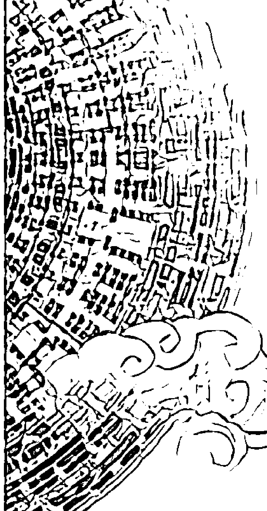
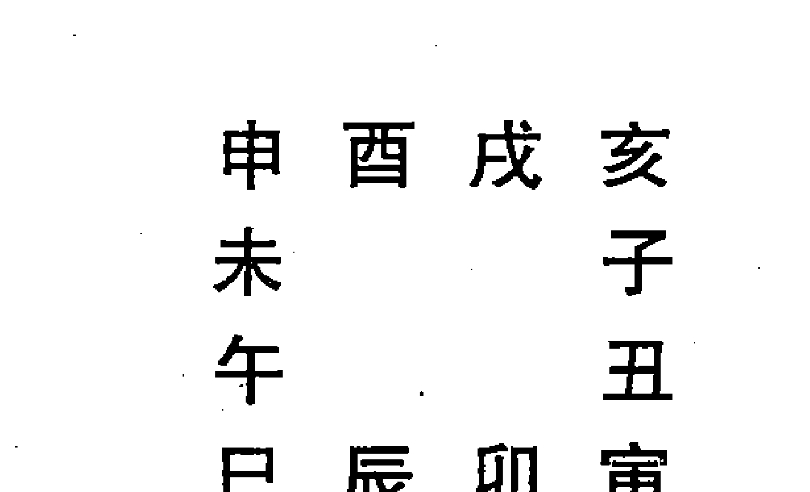
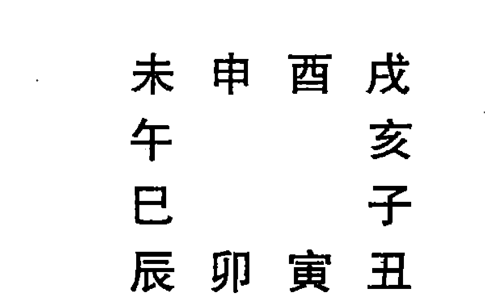
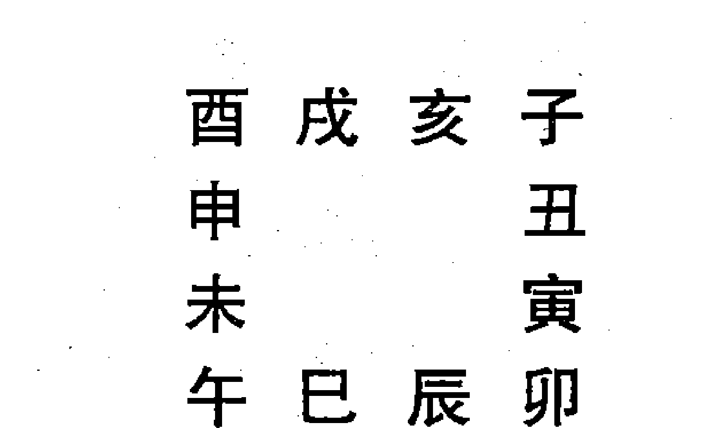

# 实用六壬预测学



杨景磐 编著

中国国际广播音像出版社


## 前言

《实用六壬预测学》写于 1992 年，原名《六壬预测学》。1993 年秋，经张志春先生介绍，原稿交由当时的安阳周易学院出版。谁知，正版书未能出版，盗版书却正式出版并发行了。书名被改为《实用六壬预测学》，作者被改为仙鹤居士。真令人无奈！

近几年来，有许多朋友建议笔者将被盗版的《实用六壬预测学》重新出版。笔者犹豫再三，还是接受了朋友们的建议，决定重新出版此书，书名只好将错就错，仍用《实用六壬预测学》。

这次重新出版，删掉了原第六章“《兵占》解”，因与第五章“《兵机百吉金》解”略嫌重复，附录中增加了《毕法赋》原文。

《毕法赋》是南宋凌福之的作品，是六壬学中的重要典籍。《毕法赋》问世后，受到广大六壬学者的重视。该文浅显易懂，不须诠释。相信初习六壬者读完《实用六壬预测学》之后，再读《毕法赋》是能够读懂弄清了的。

时隔近二十年之后，《实用六壬预测学》重新面世，希望此书对研习六壬的读者，尤其初习六壬者有所帮助。文中不当之处，敬请读者批评指正。

杨景磐

2009年2月10日于文新墨旧斋

## 第一章 推演方法

### 第一节 地盘

六壬式又称为六壬课，推演六壬课需先排地盘。地盘的排列方式是固定不变的。有人认为，天为阳、地为阴、阳主动、阴主静。所以六壬课的地盘静而为阴，以象征大地的贞静，而天盘则时时在变动，以象征天的旋转。天盘动而生阳，地盘静而生阴，上天下地，动静互根，阴阳交错，这就产生了变化。这种变化，就是《周易》中所说的“动”。有了这种变化，于是就有吉凶悔吝的区别了，也就是《周易》中讲的“吉凶悔吝生乎动者也”。

六壬课的地盘是以十二地支为次，按顺时针方向排列成正方形图式。

```
巳  午  未  申
辰            酉
卯            戌
寅  丑  子  亥
```

十二地支按五行分，寅卯属木，巳午属火，申酉属金，亥子属水，辰戌丑未属土；按方位分，子为正北，卯为正东，午为正南，酉为正西，丑寅为东北，辰巳为东南，未申为西南，戌亥为西北；按阴阳属性分，子、寅、辰、午、申、戌为阳支，丑、卯、巳、未、酉、亥为阴支。

而六壬地盘为什么要排列成方形呢？这是因为古人认为天是圆的，地是方的，地盘代表大地，所以要排列成方形。从现在能见到的汉、魏六壬式盘实物来看，地盘都是方形，而天盘是圆形。天盘于地盘之上，可以旋转。后世为了推演和操作的需要，渐渐发展到在手掌上起课，或是把天、地盘写在

### 第二节 天盘

月将加临地盘占时之上，按顺时针方向依次排完十二支，就组成了天盘。

月将的具体取法如下：

- 正月雨水后，日缠诹訾之次用登明亥将；
- 二月春分后，日缠降娄之次用河魁戌将；
- 三月谷雨后，日缠大梁之次用从魁酉将；
- 四月小满后，日缠实沈之次用传送申将；
- 五月夏至后，日缠鹑首之次用小吉未将；
- 六月大暑后，日缠鹑火之次用胜光午将；
- 七月处暑后，日缠鹑尾之次用太乙巳将；
- 八月秋分后，日缠寿星之次用天罡辰将；
- 九月霜降后，日缠大火之次用太冲卯将；
- 十月小雪后，日缠析木之次用功曹寅将；
- 十一月冬至后，日缠星纪之次用大吉丑将；
- 十二月大寒后，日缠元枵之次用神后子将。

取定月将之后，将月将加临地盘占时之上，仍按顺时针方向依次排完十二支，即成天盘。如正月雨水节后，用登明亥将，卯时占演，即以亥加临地盘卯位，子加辰位，丑加巳位，寅加午位，卯加未位，辰加申位，巳加酉位，午加戌位，未加亥位，申加子位，酉加丑位，戌加寅位。如下图：

卯时亥将天盘图

| 丑 | 寅 | 卯 | 辰 |
|---|---|---|---|
| 子 |  |  | 巳 |
| 亥 |  |  | 午 |
| 戌 | 酉 | 申 | 未 |

十二月将又称为十二支神，实际就是十二地支。

地盘的十二地支的位置是固定不变的。在推演时，只要记住地盘十二支的固定位置就行了，不必把它写出来。

天盘十二支的位置是不固定的。月将加临占时排天盘。一天有十二个时辰，每个时辰一个天盘，一天就可以排成十二个天盘。在推演时，需要把天盘写出来。

六壬古籍中有一首《起例歌》，是讲地盘、天盘排列的，歌曰：

天罡辰起顺行流，
正月从猪逆数周；
月建合辰为月将，
六壬从此是根由。

“无罡辰起顺行流”是说地盘的排列以天罡辰为首，顺布十二支。而天盘的排列，就要先取月将。月将以登明亥为首逆布。具体取月将法是“月建合辰为月将”。就是：

- 正月建寅，寅与亥合，以登明亥为正月将；
- 二月建卯，卯与戌合，以河魁戍为二月将；
- 三月建辰，辰与酉合，以从魁酉为三月将；
- 四月建巳，巳与申合，以传送申为四月将；
- 五月建午，午与未合，以小吉未为五月将；
- 六月建未，未与午合，以胜光午为六月将；
- 七月建申，申与巳合，以太乙巳为七月将；
- 八月建酉，酉与辰合，以天罡辰为八月将；
- 九月建戌，戌与卯合，以太冲卯为九月将；
- 十月建亥，亥与寅合，以功曹寅为十月将；
- 十一月建子，子与丑合，以大吉丑为十一月将；
- 十二月建丑，丑与子合，以神后子为十二月将。

从上述十二月将可以看出，十二支各有一个别名。对此，不可不知。它们是：

- 子——神后
- 丑——大吉
- 寅——功曹
- 卯——太冲
- 辰——天罡
- 巳——太乙
- 午——胜光
- 未——小吉
- 申——传送
- 酉——从魁
- 戌——河魁
- 亥——登明

这些别名，各有来历，同时也就都具有一定的含意，在分析判断时有一定的参考价值，在此作一简要介绍。

亥为正月将，正月阳气从地下上升，气候变暖，天下文明之象，所以称亥为登明。

戌为二月将，二月草木生根发芽，以类聚合，魁也是聚集的意思；又因河魁为斗魁第一星，抵戌宫，所以称戌为河魁。

酉为三月将，三月草木生枝长叶，枝叶相从而生；又因从魁为斗魁第二星，抵酉宫，所以称酉为从魁。

申为四月将，四月万木茂盛，阳盛极而退，阴衰极而生，传阴而送阳，所以称申为传送。

未为五月将，五月为夏至之气，大往小来，万物小有成就，所以称未为小吉。

午为六月将，六月气候炎热，阳火正当南方离位，大明之象，所以称午为胜光。

巳为十月将，十月五谷成实，等待收获；又太乙为天上星名，抵巳宫，所以称巳为太乙。

辰为十一月将，十一月草木支条坚刚；又天罡为北斗七星之柄，十一月斗柄抵辰宫，所以称辰为天罡。

卯为十二月将，十二月为季冬，万木凋零；又卯为日月五星所出之门户，为要冲之地，所以称卯为太冲。

寅为正月将，正月为收藏之月，万物大聚，一岁之功将成，所以称寅为功曹。

丑为二月将，二月为春分之气，小往大来，众阴将退，一阳始生，大吉之象，所以称为大吉。

子为三月将，三月为一年中最末一个月，岁毕酒醮蜡祭，以敬百神，所以称子为神后。

### 第三节 四课

排完地盘、天盘之后，就需起四课了。起四课，以日干定第一课和第二课，以日支定第三课和第四课。

日干是指的日天干，日支是指的日地支。如甲子日，甲为日干，子为日支；乙丑日，乙为日干，丑为日支等等。

天干共有十位，即甲、乙、丙、丁、戊、己、庚、辛、壬、癸。天干在奇数位的为阳干，在偶数位的为阴干。甲、丙、戊、庚、壬就是阳干，乙、丁、己、辛、癸就是阴干。十天干在地盘各有寄宫。

- 甲寄位于地盘寅宫；
- 乙寄位于地盘辰宫；
- 丙寄位于地盘巳宫；
- 丁寄位于地盘未宫；
- 戊寄位于地盘巳宫；
- 己寄位于地盘未宫；
- 庚寄位于地盘申宫；
- 辛寄位于地盘戌宫；
- 壬寄位于地盘亥宫；
- 癸寄位于地盘丑宫。

古有“十干寄宫歌”一首，便于记忆，今录于下：

> 甲课寅上乙课辰
> 丙戊在巳不须论
> 丁己在未庚申位
> 辛戌壬亥定其真
> 癸课由来丑上坐
> 分明不用四正辰

“四正辰”指的是子、午、卯、酉四支，为什么十天干不寄于子午卯酉四宫，而甲干一定要寄于寅宫，乙干一定要寄在辰宫等等，有待于进一步研究探讨。从现在能见到的古代六壬式盘实物看，汉代式盘只有甲乙丙丁庚辛壬癸八干的寄宫，没有戊巳二干的寄宫，魏朝铜制式盘对十干寄宫就完备起来了。

明确了十干的寄宫之后，就可以起四课了。

如甲子日卯时亥将占，先以月将亥加临地盘占时卯上定天盘。

| 丑 | 寅 | 卯 | 辰 |
|---|---|---|---|
| 子 | | | 巳 |
| 亥 | | | 午 |
| 戌 | 酉 | 申 | 未 |

日干为甲，甲寄位于地盘寅宫，地盘寅上为天盘戌，即：

| 戌 |
|---|
| 甲 |

戌在地盘本位上所加为天盘午，即：

第二课为

> 午
> 戌

日支为子，子在地盘本位上所加为申天盘，即：

第三课为

> 申
> 子

申在地盘本位上所加为天盘辰，即：

第四课为

> 辰
> 申

甲子日卯时亥将占天盘和四课的书写格式，应是：

> 丑 寅 卯 辰
> 子       巳
> 亥       午
> 戌 酉 申 未
>
> 辰 申 午 戌
> 申 子 戌 甲

四课之中，第一课上神戌称为日干的阳神，第二课上神午称为日干的阴神，第三课上神申称为日支的阳神，第四课上神辰称为日支的阴神。

### 第四节 三传

三传分为初传、中传和末传。在一般情况下，初传代表事物的开始阶段，中传代表事物中间的发展过程，末传表示事物的结局。传，又有传递的意思。传递什么？主要是传递信息。

取三传的方法主要根据四课中天盘神和地盘神的五行相克关系来确定。取三传的次序是先取初传，次取中传，最后取末传，大致有九个类型。

1.  先取四课中的下克上者为初传。如四课中无下克上，则取上克下为初传。初传即定，则取初传在地盘本位上所加天盘之将为中传。中传既定，则取中传在地盘本位上所加天盘之将为末传。

例：甲辰日午时酉将占。第一课 巳/甲 ，第二课 申/巳 ，第三课 未/辰 ，第四课 戌/未 。

第一课中巳属火，甲属木，不克；第二课中申属金，巳属火，有克；第三课中未属土，辰属土，不克；第四课中戌属土，未属土，不克。此例四课中只有第二课有克（巳火克申金），为下克上，则取受克者申为初传；申在地盘本位上所加为亥，取亥为中传；亥在地盘本位上所加为寅，取寅为末传。具体排盘方式如下：

甲辰日午时酉将

天盘

> 申 酉 戌 亥
>            未         子
>            午         丑
>            巳 辰 卯 寅

四课

> 戌 未 申 巳
>          未 辰 巳 甲

三传

> 申
> 亥
> 寅

例：壬戌日巳时寅将占。第一课 申/壬 ，第二课 巳/申 ，第三课 未/戌 ，第四课 辰/未 。

第一课申属金，壬属水，不克；第二课巳属火，申属金，有克（巳火克申金）；第三课未属土，戌属土，不克；第四课辰属土，未属土，不克。四课中只有第二课有克，为上克下，因申受克，申在地盘本位上所加为巳，则取巳为初传；巳在地盘本位上所加为寅，则取寅为中传；寅在地盘本位上所加为亥，则取亥为末传。此例具体排盘方式如下：

### 壬戌日巳时寅将

天盘

> 寅 卯 辰 巳
> 丑       午
> 子       未
> 亥 戌 酉 申

四课

> 辰 未 巳 申
> 未 戌 申 壬

三传

> 巳
> 寅
> 亥

如果四课中两课有克，一为上克下，一为下克上，则舍去上克下，取下克上者为初传。中传和末传的取法仿上述占例类推。

这种取三传的方法称为“贼克法”。在四课中，上克下称为“克”，下克上称为“贼”。有“贼克法”的古诀一首，诀曰：

> 取传先从下贼上
> 如无下贼上克初
> 初传本位名中次
> 中上因加是末传

2.  四课中或两课为下克上，或三课为下克上，或四课均为下克上，要以与日干相比和者取为初传，中传和末传的取法仍然不变。

所谓比和，是阳干与阳支为比和，阴干与阴支比和。十天干中，甲、丙、戊、庚、壬为阳干，乙、丁、己、辛、癸为阴干；十二地支，子、寅、辰、午、申、戌为阳支，丑、卯、巳、未、酉、亥为阴支。占日的天干属阳，则以四课中受克的阳支取为初传；占日的天干属阴，则以四课中受克的阴支取为初传。

例：甲戌日未时申将

天盘

> 午 未 申 酉
> 巳       戌
> 辰       亥
> 卯 寅 丑 子

四课

> 子 辰 卯
> 亥 戌 卯 甲

此例第二课辰卯、第三课亥戌均为下克上，因甲戌日日干甲属阳，第二课地支辰属阳，第三课地支亥属阴，所以舍去亥而用辰，取辰为初传；辰在地盘本位上所加为巳，取巳为中传；巳在地盘本位上所加为午，取午为末传。所以，甲戌日未时申将占，三传为：

- 辰
- 巳
- 午

例：辛亥日亥时卯将

天盘

> 酉 戌 亥 子
> 申       丑
> 未       寅
> 午 巳 辰 卯

四课

> 未 午 午 寅
> 卯 亥 寅 辛

四课中第一课寅辛、第四课未卯均为下克上，但是寅为阳支，未为阴支，占日为辛亥日，日干辛属阴，所以舍去寅而娶未为初传；未在地盘本位上所加为亥，取亥为中传；亥在地盘本位上所加为卯，取卯为末传。此例三传为：

- 未
- 亥
- 卯

如果四课中有两课为上克下，或三课为上克下，或四课均为上克下，取三传亦仿照上述法则类推。

这种取三传的方法称为“比用法”。“比用法”的口诀曰：

> 下贼或二三四侵
> 不然上克亦同论
> 择取比者以为用
> 阳日用阳阴用阴

3.  四课中有二课为下贼上，或三课为下贼上，或四课均为下贼上，并且受克的支神均与日干相比和或均与日干不相比和；或者四课中有二课为上克下，或三课为上克下，或四课均为上克下，并且受克的支神均与日干相比和或均与日干不相比和，这两种情况，用“贼克法”和“比用法”都无法取初传，可改用“涉害法”取初传，中传和末传的取法仍然不变。

例：丁丑日未时酉将

天盘

> 卯 辰 巳 午
> 寅       未
> 丑       申
> 子 亥 戌 酉

四课

> 亥 丑 卯 巳
> 丑 卯 巳 丁

第三课卯木克丑土，为下贼上；第四课丑土克亥水，为下贼上。受克的支神丑、亥俱为阴支，与日干丁俱相比和，无法用“比用法”取初传，则用“涉害法”取初传。即取受克多者为初传。此例中以丑和亥相比较。天盘丑加临地盘卯宫，前行，经辰、巳、午、未、申、酉、戌、亥、子九宫归本位，只受辰中一重乙木克。再看天盘亥加临地盘丑宫，前行经寅、卯、辰、巳、午、未、申、酉、戌九宫归本位，亥在前行中，要受辰土、戌土、己土、未土、戌土共五重土来克，亥与丑相比，亥受克多，可取亥为初传；亥上为酉，酉为中传；酉上为未，未为末传。所以三传为：

亥
酉
未

如果四课中受克的支神，受克相等，则取地盘寅申巳亥（四孟）位上受克的支神为初传；如受克的支神不在四孟位上，则取子午卯酉四仲位上受克的支神为初传；如受克的支神既不在四孟位上，又不在四仲位上，则取辰戌丑未四季位上受克的支神为初传。

如果受克的支神同在四孟位上，或同在四仲位上，或同在四季位上，阳日则取一、二课中受克的支神为初传；阴日则取三、四课中受克的支神为初传。不论那种情况，中传和末传的取法仍然不变。

“涉害法”的口诀是：

> 涉害原来是本家，路途多克最堪夸。
> 孟深仲浅季无取，复寻柔辰刚日查。

4.  四课之中既无下神克上神，又无上神克下神，为四课无克课。这种情况取初传，要以日干为主，与第二课，第三课和第四课的上神相比较，先取上神克日干者为初传。如第二课、第三课，第四课中，无上神克日干者，即取第二课、第三课和第四课中上神被日干克者为初传。如第二课、第三课和第四课中，有两个上神或三个上神克日干；或有两个上神，或有三个上神被日干克者，取与日干相比和者为初传。取中传和末传如前法。

例：甲戌日寅时亥将

天盘

> 寅 卯 辰 巳
> 丑       午
> 子       未
> 亥 戌 酉 申

四课

> 辰 未 申 亥
> 未 戌 亥 甲

四课之中俱无克，以日干甲木与第二课、第三课和第四课的上神相比较，只有第二课的上神申金克日干甲木，则取申为初传；申在地盘本位上所加是巳，取巳为中传；巳在地盘本位上所加是寅，取寅为末传。所以，此课三传为：

申
巳
寅

例：庚戌日申时亥将

天盘

> 申 酉 戌 亥
> 未       子
> 午       丑
> 巳 辰 卯 寅

四课

> 辰 丑 寅 亥
> 丑 戌 亥 庚

四课之中俱无克，以日干庚金与第二课、第三课、第四课的上神相比较，此三课的上神均不克日干，只有第二课的上神寅木被日干庚金克，故取寅为初传；寅在地盘本位上所加为巳，取巳为中传；巳在地盘本位上所加为申，取申为末传。所以，此课三传为：

寅
巳
申

这种取三传的方法为“遥克法”。“遥克法”的口诀是：

> 四课无克号为遥，日与神兮递乎招。
> 先取神遥克其日，如无方取日来遥。
> 或有日克乎两神，或有两神来克日。
> 择与日干比者用，阳日用阳阴用阴。

5.  四课之中既无下克上，又无上克下；既无“神遥克日”，又无“日遥克神”，这种情况怎样取三传呢？阳日则取地盘酉位上所加天盘支为初传；取日支在地盘本位上所加天盘之支为中传；取日干在地盘本位上所加天盘之支为末传。阴日则取天盘酉位落于地盘所临之支为初传；取日干在地盘本位上所加天盘之支为中传；取日支在地盘本位上所加天盘之支为末传。

例：戊寅日寅时午将

天盘

> 酉 戌 亥 子
> 申       丑
> 未       寅
> 午 巳 辰 卯

四课

> 戌 午 丑 酉
> 午 寅 酉 戊

占日戊寅日，日干戊为阳，阳日则视地盘酉上所加天盘之支为丑，所以取丑为初传；日支寅在地盘本位上所加天盘之支为午，所以取午为中传；日干戊寄位于巳宫，巳在地盘本位上所加天盘之支为酉，所以取酉为末传，故此例三传为：

丑
午
酉

例：乙未日子时亥将

天盘

> 辰 巳 午 未
> 卯       申
> 寅       酉
> 丑 子 亥 戌

四课

> 己 午 寅 卯
> 午 未 卯 乙

占日乙未日，日干乙为阴，阴日则看天盘酉在地盘落处所临之支为初传，此课酉落地盘戌上，所以取戌为初传；日干乙寄位于辰宫，此课地盘辰位上所加天盘之支为卯，所以取卯为中传；日支未在地盘本位上所加天盘之支为午，取午为末传。所以，此例三传为：

戌
卯
午

这种取三传的方法为“昴星法”，酉为西方白虎，是二十八宿中昴宿所临之宫，所以叫做“昴星”。“昴星法”的口诀是：

> 无遥无克昴星穷
> 阳仰阴俯酉位中
> 刚日先辰而后日
> 柔日先日而后辰

6.  天盘神与地盘神重叠在一起，即天盘和地盘相同，称为伏吟。伏吟是伏藏不动的意思。不管四课之中上下有克无克，都应按照固定格式取三传：

- 六甲日三传为寅巳申；
- 六丙日和六戊日三传为巳申寅；
- 六庚日三传为申寅巳；
- 壬申日三传为亥申寅；
- 壬午日三传为亥午子；
- 壬辰日三传为亥辰戌；
- 壬寅日三传为亥寅巳；
- 壬子日三传为子卯子；
- 壬戌日三传为亥戌未；
- 六癸日三传为丑戌未；
- 丁巳日、己巳日三传为巳申寅；
- 丁酉日、己酉日三传为寅未丑；
- 丁亥日、己亥日三传为亥未丑；
- 丁丑日、己丑日三传为丑戌未；
- 辛亥日三传为亥戌未；
- 辛酉日三传为酉戌未；
- 乙丑日三传为辰丑戌；
- 乙亥日三传为辰亥巳；
- 乙酉日三传为辰酉卯；
- 乙未日三传为辰未丑；
- 乙巳日三传为辰巳申；
- 乙卯日三传为辰卯子。

伏吟也是按照一定的规律取三传的，其口诀如下：

> 伏吟有克还为用
> 无克刚干柔取辰
> 迤逦刑之作中末
> 从兹玉历识其真
> 若也自刑为发用
> 次传颠倒日辰并
> 次传更复自刑者
> 冲取末传不论刑

7.  天盘十二支与地盘十二支相冲，称为反吟。十二地支的相冲是：子午相冲，丑未相冲，寅申相冲，卯酉相冲，辰戌相冲，巳亥相冲。如下面这个天盘就是反吟课：

> 亥 子 丑 寅
> 戌       卯
> 酉       辰
> 申 未 午 巳

反吟课的四课之中，如果有克，即以前面所述的1、2、3种类型取三传。只有丁丑日、己丑日、辛丑日、丁未日、己未日、辛未日共六个占日的反吟课，四课之中无克。四课之中无克的反吟课怎样取三传呢？

先说丁丑日、己丑日、辛丑日这三日的反吟课。这三日的反吟课都以亥为初传；以日支在地盘本位上所加天盘之支为中传；以日干所寄之宫在地盘本位上所加天盘之支为末传。如：

### 辛丑日巳时亥将

天盘

> 亥 子 丑 寅
> 戌       卯
> 酉       辰
> 申 未 午 巳

四课

> 丑 未 戌 辰
> 未 丑 辰 辛

天盘十二支加临地盘十二支冲处，是反吟课；并且四课中上神和下神俱无克。按照规定，以亥为初传；日支是丑，地盘丑上是未，以未为中传；日干是辛，辛寄位于戌宫，地盘戌上是辰，以辰为末传。所以此例三传为：

亥
未
辰

再说丁未日、己未日、辛未日这三日的反吟课。这三日的反吟课，四课之中的上神与下神也都无克，按照规定以巳为初传；取日支在地盘本位上所加天盘之支为中传；取日干所寄之宫在地盘本位上所加天盘之支为末传。如：

### 辛未日申时寅将

天盘

> 亥 子 丑 寅
> 戌       卯
> 酉       辰
> 申 未 午 巳

四课

> 未 丑 戌 辰
> 丑 未 辰 辛

天盘十二支与地盘十二支一一相冲，无疑这是反吟课，并且四课之中的上神与下神均无克。按照规定，占日是未日，以巳为初传；日支未在地盘本位上所加天盘之支是辰，以辰为中传；日干辛寄位于戌宫，地盘戌上是辰，以辰为末传。所以此例三传为：

巳
丑
辰

反吟课取三传的口诀是：

> 反吟有克亦为用
> 无克别有井栏名
> 若论六个无克日
> 丑未配干丁己辛
> 丑用登明未太乙
> 辰中日末上乘神

8.  四课中有两课相同，实际只有三课，并且三课均无克，又无遥克。这又是一个特殊的类型。取三传的方法有别于上述各例。这里先介绍天干相合、地支相合的内容，这是取三传时必不可少的基本知识。

天干相合：甲与己合，乙与庚合，丙与辛合，丁与壬合，戊与癸合。

地支相合有三合与六合的区别。地支的六合前面已作了介绍，地支的三合是：亥卯未合成木局；寅午戌合成火局；巳酉丑合成金局；申子辰合成水局。

四课中只有三课，并且无克，取三传阳日和阴日也有区别。

阳日以日干的合神为初传，以日干寄宫在地盘本位上所加天盘之支为中传和末传。例如：

戊午日卯时辰将

天盘

> 午 未 申 酉
> 巳       戌
> 辰       亥
> 卯 寅 丑 子

四课

> 申 未 未 午
> 未 午 午 戊

此例日干为戊，戊与癸合，癸寄位于丑宫，地盘丑上为寅，所以取寅为初传。日干戊寄位于巳宫，地盘巳上为午，所以取午为中传和末传。戊午日卯时辰将占的三传为：

寅
午
午

阴日以日支三合前一位为初传，以日干寄宫在地盘本位上所加天盘之支为中传和末传。例如：

辛丑日申时亥将

天盘

> 申 酉 戌 亥
> 未       子
> 午       丑
> 巳 辰 卯 寅

四课

> 未 辰 辰 丑
> 辰 丑 丑 辛

此例四课中只有三课，并且无克，日干辛为阴日，阴日以日支三合前一位为初传，日支为丑，三合巳酉丑，丑前一位为巳（按地盘顺时针数），故取巳为初传。日干辛寄位于戌宫，地盘戌上为丑，故取丑为中、末传。辛丑日申时亥将占，三传为：

巳
丑
丑

四课中实际只有三课，内中伏藏一课，称为“别责”。别责课取三传的口诀是：

> 三课无克别责名
> 刚日先传干合神
> 柔日支前三合取
> 中末都求日上行

9.  四课之中实际只有两课，并且无克，阳日从日干寄宫位上顺数三位，取天盘之支为初传；阴日从日干寄宫位上逆数三位，以天盘之支复其地盘本位上，以其本位上所加天盘之支为初传。阳日和阴日都以日干寄位上所加天盘之支定为中、末传。

例：甲寅日寅时亥将

天盘

> 寅 卯 辰 巳
> 丑       午
> 子       未
> 亥 戌 酉 申

四课

> 申 亥 申 亥
> 亥 寅 亥 甲

四课之中第一课与第三课相同（因甲寄位于寅宫）；第二课与第四课相同。实际只有两课，并且无克。日干为甲，甲为阳干，寄位于寅，寅上为亥，从天盘亥位顺数三位是丑，取丑为初传。亥为中、末传。所以此例三传为：

丑
亥
亥

例：己未日申时亥将

天盘

> 申 酉 戌 亥
> 未       子
> 午       丑
> 巳 辰 卯 寅

四课

> 丑 戌 丑 戌
> 戌 未 戌 己

第一课与第三课相同，第二课与第四课相同，实际只有两课，并且无克，日干己为阴，己寄位于未宫，从地盘未宫逆数三位为天盘申，申在地盘本位上所加为亥，取亥为初传。日干己寄位于未宫，地盘未上所加为戌，取戌为中、末传。所以，此例三传为：

亥
戌
戌

四课中实际只有两课，并且无克，称为“八专”。八专课取三传的口诀是：

> 两课无克号八专
> 阳日 日阳顺行三
> 阴日从支逆三位
> 中末总向日上眠## 第五节 贵神

贵神，是十二天将的通称。

十二天将的排列顺序是：
- 贵人
- 螣蛇
- 朱雀
- 六合
- 勾陈
- 青龙
- 天空
- 白虎
- 太常
- 玄武
- 太阴
- 天后

十二天将是怎么回事？还有待探讨。《颐旨经》说，十二天将“在天应十二神，在地表十二分野，在岁为十二月，在人为十二经”。在六壬课中，十二天将并没有那么神秘，也没有那么多的作用和用途，只能作为判断吉凶的参考。

起贵神的方法就是给四课、三传配上十二天将的方法。因为贵人为十二天将之首，这种方法又称为起贵人。

### 贵人方位歌

- 甲戊庚牛羊
- 乙己鼠猴乡
- 丙丁猪鸡位
- 壬癸蛇兔藏
- 六辛逢马虎
- 此是贵人方

这首歌诀的意思是说：甲日、戊日和庚日，丑（牛）为昼贵人，未（羊）为夜贵人；乙日和己日、子（鼠）为昼贵人，申（猴）为夜贵人；丙日和丁日亥（猪）为昼贵人，酉（鸡）为夜贵人；壬日和癸日，巳（蛇）为昼贵人，卯（兔）为夜贵人；辛日午（马）为昼贵人，寅（虎）为夜贵人。

古人对昼夜的划分，一般以卯、辰、巳、午、未、申六个时辰为昼，以酉、戌、亥、子、丑、寅六个时辰为夜。

### 贵人顺逆歌

- 贵人在亥子为先
- 戌上神行鸡（酉）引前
- 天乙在辰蛇（巳）复位
- 神居巳上龙（辰）在前

这首歌诀是说贵人顺行和逆行的。如果贵人居地盘的亥、子、丑、寅、卯、辰六宫，就顺行，如果贵人居地盘巳、午、未、申、酉、戌六宫，就行。歌诀中的“天乙”和“神”都是贵人的代名词。

起贵人的方法举例如下：

### 甲辰日午时酉将占（贵人逆行例）

| 勾 | 六 |    |    |
| :--- | :--- | :--- | :--- |
| 青 | 申 | 酉 | 戌 | 亥 | 朱 |
| 空 | 未 |    | 子 | 蛇 |
| 白 | 午 |    | 丑 | 贵 |
| 常 | 巳 | 辰 | 卯 | 寅 | 后 |
|    |    | 玄 | 阴 |

| 六 | 空 | 青 | 常 |
| :--- | :--- | :--- | :--- |
| 戌 | 未 | 申 | 巳 |
| 未 | 辰 | 巳 | 甲 |

| 申 | 龙 |
| :--- | :--- |
| 亥 | 朱 |
| 寅 | 后 |

甲辰日午时酉将占，根据口诀“甲戊庚牛羊”，甲日以丑（牛）为昼贵，未（羊）为夜贵，占时为午时，应用昼贵丑，天盘丑加临地盘戌宫，贵人逆行，所以天盘丑为贵人，子为螣蛇，亥为朱雀，戌为六合，酉为勾陈，申为青龙，未为天空，午为白虎，巳为太常，辰为玄武，卯为太阴，寅为天后。

### 乙丑日戌时巳将（贵人顺行例）

青空
勾子丑寅卯白
六亥  辰常
朱戌  巳玄
蛇酉申未午阴
  贵后
白贵阴六
卯申午亥
申丑亥乙
卯白
戌朱
巳玄

乙丑日戌时巳将占，根据口诀“乙己鼠猴乡”，乙丑日昼贵为子（鼠），夜贵为申（猴），今占时为戌时，应用夜贵申，天盘申加临地盘丑宫，贵人顺行，天盘申为贵人，酉为螣蛇，戌为朱雀，亥为六合，子为勾陈，丑为青龙，寅为天空，卯为白虎，辰为太常，巳为玄武，午为太阴，未为天后。

## 第六节 六亲

六亲，指人的亲属关系。具体说，就是父母、兄弟、妻子（妻财）、官鬼、子孙和“我”共称为六亲。

六亲之间的关系是：

- 生我者为父母
- 我生者为子孙
- 克我者为官鬼
- 我克者为妻财
- 同我者为兄弟

以日干的五行为“我”，以我与三传的生克比和关系，确定六亲的名称。

如日干为甲，甲属木，则木为“我”。三传为寅巳亥，则初传寅木与日干甲木比和为兄弟；中传巳火为甲木所生，我生者为子孙；末传亥水生甲木，生我者为父母。

## 附录

小说《镜花缘》中关于六壬课推演方法的叙述

清代著名章回小说《镜花缘》第六十五回、第七十五回、第七十六回都提到六壬课的推演方法。其中对地盘、天盘、月将、四课的叙述很是详细，今摘录有关原文，以供参考。

紫芝走到芍药轩。房内并无一人，窗外倒象有人说话。轻轻走到纱窗跟前，朝外一望，原来再芳同芸芝紧靠窗子，坐在那里说话。只听芸芝道：“这有什么要紧，怎说拜起老师来了？”再芳道：“此话倒出我的本心：妹子这个念头，并非一朝一夕，已存心中几年了。向日闻得古人有‘袖占一课’之说，真是神乎其神，我只当总是神仙所为，凡人不能会的；后来才知袖占一课，就是如今世上所传大六壬课。妹子听了，四处购求课书，日日学习，再也不能入门。要访一位精于此道的求他指教，访来访去，比访神仙还难，今幸遇姐姐，岂不是我心上老师么？妹子并非求精，只要姐姐指点，能够入门，起得‘三传四课’，心愿也就足了。”芸芝道：“若能会起三传四课，底下功夫，自然容易。可惜妹子所著《大六壬指南》尚未脱稿，姐姐如将此书一看，登时就能了然。至于古人之书。精微奥妙则有之，若讲入门，倒是罕见的。”

再芳道：“请问姐姐，何谓‘地盘’？妹子再也弄不明白。”芸芝道：“世人学课，往往半途而废者，皆因‘天地盘’分不明白之故。其所以然者，总由前人于入门一条，未能分晰指明，学者又不能细心体察，所以易于忽略。妹子今将地盘写一样式，再细细注解，自然易于领略。”随命丫环设个小几，摆下笔砚，登时写就。再芳接过，只见上面写着：

| 巳 | 午 | 未 | 申 |
| :--- | :--- | :--- | :--- |
| 辰 |    | 酉 |    |
| 卯 |    | 戌 |    |
| 寅 | 丑 | 子 | 亥 |

> “此地盘式，有从左手起的，有以右手起的。以左手而论：于无名指第四节起子时；中指第四节丑；食指第四节寅，第三节卯，第二节辰，第一节巳；中指第一节午；无名指第一节未；禁指第一节申，第二节酉，第三节戌，第四节亥。以右手而论：于中指第四节起子时；无名指第四节丑；禁指第四节寅，第三节卯……照前顺排，至食指第四节为亥时。此式必须细心摹拟，须将地盘十二时所列方位个个记得烂熟，然后再讲天盘。若地盘未熟，即讲天盘，势必上下不分，徒乱人意。盖地盘千载不移，天盘随时流转。今以随时流转之盘，加于千载不移盘上，若不记清，何能上下分得明白？即如你以右手五指，合于我之右手五指上，你若问我大指之上，是汝何指，我必说是禁指；食指之上，是你无名指。盖上下十指，是胸中滚熟的，所以不看亦能了然。姐姐要明天地盘，只须记熟就能领会了。”

紫芝在窗内看的明白，不觉喜道：“原来地盘却是如此。”

再芳道：“妹子适观此式，地盘业已明白。请教天盘式子呢？”芸芝道：“天盘随十二时流转，每日式子十二。要明天盘，先记月将。——月将者，太阳也。正月春分后在戌，三月谷雨后在酉，四月小满后在申，五月夏至后在未，六月大暑后在午，七月处暑后在巳，八月秋分后在辰，九月霜降后在卯，十月小雪后在寅，十一月冬至后在丑，十二月大寒后在子。逆行十二时。假如正月雨水后起课，应用亥将，来人口报寅时，即以亥将加在地盘寅时之上，依次排去，就是天盘。今写个样儿请看。”

### 正月雨水后亥将寅时天盘式

| 寅 | 卯 | 辰 | 巳 |
| :--- | :--- | :--- | :--- |
| 丑 |    | 午 |    |
| 子 |    | 未 |    |
| 亥 | 戌 | 酉 | 申 |

### 二月春分后戌将寅时天盘式

| 丑 | 寅 | 卯 | 辰 |
| :--- | :--- | :--- | :--- |
| 子 |    |    | 巳 |
| 亥 |    |    | 午 |
| 戌 | 酉 | 申 | 未 |

紫芝看了，只管暗暗点头，记在心里。

再芳道：“这天盘式子，妹子也明白了。请教‘四课’呢？”芸芝道：“凡起四课，有六句歌诀须要读熟：‘甲课在寅乙课辰，丙戊在巳不须论，丁已在未庚申上，辛戌壬亥是其真，癸课由来丑上坐，分明不用四正辰。’此诀皆指地盘而言，切须牢记。今以甲课在寅而论；即如甲日占数，须在地盘寅上起第一课。——寅上者，即天盘所加之时。假今三月谷雨后占课，应用酉将，来人口报丑时，本日系甲子日，今将先排日干，后起四课样子写来你看。”

子 甲

| 丑 | 寅 | 卯 | 辰 |
| :--- | :--- | :--- | :--- |
| 子 |    |    | 巳 |
| 亥 |    |    | 午 |
| 戌 | 酉 | 申 | 未 |

紫芝看了忖道：“原来未起四课，先将本日干支排在两处，倒要看他怎样起法。”

未知如何，下回分解。

话说紫芝正在思忖，只听芸芝对再芳道：“天盘排完，先将本日干支从中空一格写在两处，再起四课。今把一课、二课、三课、四课写来你看。此是起课入门，最为切要，向来各书从未指出，以至初学无从入手。这是妹子因姐姐学课心切，所以独出心裁，特将门户指出，姐姐从此追寻，可以得其概了。”

```
丑 寅 卯 辰
子     巳
亥     午
戌 酉 申 未

辰 申 午 戌
申 子 戌 甲
```

紫芝忖道：“向来课书只讲三传，从未讲到四课，令人无从下手，非口授不能明白；今既晓得天盘、四课，再将课书三传合参，自能知其来路，何必不要口授。他向来不肯教我，那知我倒会了。”

芸芝道：“我把这个式子一层一层分开讲给你听：即如甲子日起课歌诀是‘甲课在寅’，即看地盘寅上所加之时，如所加是戊，即日干甲上写一戊字，支干中间所空之处亦写一戊，——凡课皆如此。——此是第一课。一课起后，再看地盘戊上所加之时，如所加是午，即于戊上写一午字，此是第二课，——盖寅上得戊，戊得午也。二课起后，再看地盘子上所加之时，如所加是申，即于日支上写一申字，子字之旁也写一申，亦如第一课戊字一样，——凡占皆如此。——此是第三课。三课起后，再看地盘申上所加之时，如所加是辰，即于申上写一辰字，此是第四课。你把这话同式子对看，无不了然。古人起课歌诀都是‘甲课在寅乙课辰’，必须改为‘甲课寅上乙课辰’，初学始无舛错之虞。四课起毕，然后照著古法再起三传，如‘元首’、‘重审’之类，课经所载甚详。三传明后，再将《毕法赋》以及《指掌占验》不时细玩，自能领会。”

再芳道：“即如起贵人‘甲戊庚牛羊，乙己鼠猴乡，丙丁猪鸡位，壬癸兔蛇藏，六辛逢马虎，此是贵人方’。这六句歌诀虽然记得，至如何起法，尚不明白。”

芸芝道：“所谓甲戊庚牛羊者，谓甲日或戊日或庚日占课，贵人总在天盘丑未之上，——盖丑属牛，未属羊也。”

再芳道：“妹子闻得贵人有昼贵、夜贵、阳贵、阴贵之分，上一字为昼为阳，下一字为夜为阴。即以首句而论，丑为甲戊庚昼贵，未为甲戊庚夜贵。但每日既有两贵，为何往往占课却写一个贵人呢？”

芸芝道：“贵人虽二，要看来人所报之时：如所报之时是子、丑、寅、卯、辰、巳，则用昼贵，夜贵不论；是午、未、申、酉、戌、亥，则用夜贵，昼贵不论。或以卯酉分昼夜者，或以日出日没分阴阳者，议论不一。据妹子愚见：似以子至巳为昼为阳，用昼贵为是；午至亥为夜为阴，用夜贵为是。如此用法，恰与古人所谓 ‘天干相合处，便是贵人方’其义甚合。姐姐久后自知。”

再芳道：“课传一切，蒙姐姐指教，略知一二。至于怎样断法，还求姐姐讲讲。”芸芝道：“课体不一，事务纷纭，虽云课止七百有二，但时有不同，命有不同，断法岂能一定。若摄其大略，总不外乎‘生、克、衰、旺、喜、忌’六字，苟能透彻此理，无论所占何事，莫不一望而知。姐姐细心体察，慢慢自能领会。”再芳道：“姐姐何不将这六字大略谈谈呢？”芸芝道：“妹子新著一部《大六壬类纂》，上面无一不备，将来拿去，姐姐一看就明白了。”

紫芝在窗内喊道：“我明白了！”把二人吓了一跳。芸芝回过头来，见是紫芝，不觉变色道：“这里空空的，我们坐在此处，就是没人惊吓心里也觉胆怯，那里禁得冒冒失失这一声！此时心里跳个不住。要象这样玩法，不顾人死活，这可了不得了！”紫芝道：“姐姐你不怪自己，反来怪人！”芸芝道：“为何倒怪我自己？”紫芝道：“你的课既灵，刚才在此坐时，为何预先不起一课？若课中知我躲在窗内，岂不省此一惊么？”芸芝道：“要象这样处处起课，将来喝碗茶、吃袋烟，还要问问吉凶哩。”……

## 第二章 六十四课

六壬术数学，共可推演出 8640 课。这 8640 课的来历是，每六十甲子日为一个循环周，每日有十二个时辰，每年有十二个月将，60×12×12=8640。这样，每一个循环周就有 8640 课。通常把这 8640 课分成六十四个类型，每个类型都有一个名称，称为“课体”，又称为“课经”，实际就是课名。六十四课分别与《周易》的六十四卦相对应。

每个循环周既然有 8640 课，为什么一定要分成六十四个类型呢？大概这主要是为了与《周易》六十四卦相对应的缘故吧，以此来提高六壬学说的地位，以增加它的神秘性。实际推演起来，远远不止这六十四个类型，每个类型中又有许多变化。有的本子，如《六壬经纬》就分成九十一种类型，称为九十一格局，名称也与六十四课的名称不同。这说明六壬学中的六十四课并不是原来就有的，与《周易》六十四卦并没有必然的、内在的联系，也不象《周易》六十四卦那么固定和整齐。

### 第一节 元首课

四课之中，只有一课有克，并且是上克下，其余三课均无克，称为元首课。如甲子日卯时子将

| 寅 | 卯 | 辰 | 巳 |
| :--- | :--- | :--- | :--- |
| 丑 |    |    | 午 |
| 子 |    |    | 未 |
| 亥 | 戌 | 酉 | 申 |

| 午 | 酉 | 申 | 亥 |
| :--- | :--- | :--- | :--- |
| 酉 | 子 | 亥 | 甲 |

| 午 |
| :--- |
| 卯 |
| 子 |

第一课亥加甲，无克；第二课申加亥，无克；第三课酉加子，无克；第四课午加酉，午火克酉金，上克下，为元首课。

元首课为九宗之元，六十四课之首，相当于《周易》六十四卦中的第一卦——乾卦。

乾卦，乾下乾上，六爻皆阳，代表天，为纯阳之体，主刚健，“天行健，君子以自强不息”。表示有地位，品德高尚的人，应效法“天行健”，以自强不息的精神和行动创建事业，可以获得成功。

元首课为第一吉课，与《周易》乾卦的意义相同。元首课的卦辞说：“天地得位，品物咸新，事用君子，忧喜俱真，君臣和合，父子慈亲，婚谐鸾凤，孕育麒麟，用兵客胜，论讼先陈，市贾出色，名利超群，官职首擢，柱石元勋，门庭喜溢，利见大人。”我们中华民族的传统观念是上为天，下为地，上为尊下为卑。元首课一上克下，为君克臣，尊制卑之象，这是顺理成章的事，符合我们民族的传统观念，因此占得元首课主万事顺利，应主动进取，不可消极等待。

元首课虽为第一吉课，若三传乘凶神恶煞，天乙贵人逆行，为下有意服从上，而上反怀异心，凡事不得顺利。元首课一上克下为发用（初传），若上神休囚无气，下神旺相有气，为上虽制下，而下不受制，尊卑不顺，是非颠倒。元首课大体为吉，但也要看具体条件，在分析判断时要灵活掌握，不可一概而论。

### 第二节 重审课

四课中只有一课有克，并且是下克上，其余三课无克，为重审课。
如丙戌日巳时申将

申 酉 戌 亥
未     子
午     丑
巳 辰 卯 寅

辰 丑 亥 申
丑 戌 申 丙

申
亥
寅

第一课申加丙，丙火克申金；第二课亥加申，无克；第三课丑加戌，无克；第四课辰加丑，无克。四课中只有一课有克，为下克上，其余三课无克，所以此课为重审课。

重审课一下克上为发用，为以下犯上之象，如以臣诤君，不敢冒然对上提出建议，必再三斟酌，故名重审。

重审课相当于《周易》第二卦——坤卦。坤卦，坤下坤上，六爻皆阴，纯阴之体，代表地。阳刚阴柔，坤为纯阴，主阴柔，坤的性质就是柔顺。乾为天，坤为地，坤要服从乾，地要服从天，下要服从上，这也是《周易》留给我们民族的传统思想。重审课相当于坤卦，与坤卦的意义相同，而重审课以下克上，象是臣民向君王提意见，也许是吉，也许是凶，所以重审课可吉可凶。

> 重审课的卦辞说：“顺天厚载，柔顺利贞，一下逆上，岂无忧惊，贵顺福至，贵逆乱兴，事宜后起，祸从内生，用兵主胜，受孕女形，诸般谋望，先难后成。”重审课本来应象坤卦一样，代表地，厚以载物，顺承天命，但重审课呈现下克上，卑制尊，贱制贵之象，所以有危险和惊恐。占得此课，宜谨慎行事，以贞静守旧为吉。

重审课卦辞中虽有“诸般谋望，先难后成”一语，但应具体分析。先难后成是有条件的。以三传而论，若初传墓绝，末传旺相，主事先难后易，先败后成；若初传旺相，末传墓绝，主事先易后难，先得后失；若初传克末传，凶；末传克初传，吉。以天将而论，若末传乘青龙、太常、六合、太阴、天后等吉将，可化凶为吉，转危为安。

重审课大端不顺，尤不利上，一下克上，若上神旺相有气，下神休囚无气，为下虽乖违，终不能加害于上。

### 第三节 比用课

四课中有二课俱为上克下，或四课中有二课俱为下克上，取课中与日干相比和者作初传，为比用课。
如壬辰日巳时辰将

第一课戌加壬，戌土克壬水；第三课卯加辰，卯木克辰土；第二课和第四课无克。第一课和第三课均为上克下。日干壬属阳干，阳与阳为比，阴与阴为比。第一课戌加壬，戌为阳支，第三课卯加辰，卯为阴支，所以此课取阳支戌为初传。为比用课。

比用课又名知一课、比邻课，相当于《周易》的水地比卦。

水地比卦，坤下坎上，一阳于五阴之间，水在地上，象物之亲比。知一课或二上克下，或二下克上，选择与日干比者为用神，阳日阳支为比，阴日阴支为比，二爻皆动，事主两歧，须选择与日干比和者为初传。占物占事皆在近处。

> 知一课的卦辞说：“比者为喜，不比为忧，讼宜和允，兵利主谋，祸从外起，事向朋谋，寻人寻物，近处堪求。”

比用课大端为舍远就近，舍疏就亲，恩中生忧，凡事狐疑，若下克上为用，日辰在天乙贵人之后，凡事迟疑未决。若上克下为用，日辰在天乙贵人前，主事顺。

### 第四节 涉害课

四课之中有二课、三课或四课俱为上克下，或俱为下克上，并且有二课或四课俱与日干相比，则取受克多者为初传，为涉害课。

如丁卯日丑时亥将

卯 辰 巳 午
寅       未
丑       申
子 亥 戌 酉

亥 丑 卯 巳
丑 卯 巳 丁

亥
酉
未

第一课巳加丁，无克；第二课卯加巳，无克。第三课丑加卯，卯木克丑土，为下克上；第四课亥加丑，丑土克亥水，为下克上。丑和亥均为阴支，与日干丁俱比。天盘丑前行，历乙木一位归地盘丑宫；天盘亥前行历辰土、戊土、己土、未土，戊土五位归地盘亥宫。丑与亥比较，亥受克多，则取亥为初传。此为涉害课。

涉害课为涉度艰难，必有稽迟，然历经风霜，必有所得，为苦尽甜来之象，与《周易》坎卦相对应。

坎卦，坎下坎上，从卦画来看，阳居阴中，“阳居阴中则为陷”，坎为水，坎卦的本意则为陷，为险。这与涉害课的意义是相通的。但是，事物总是要发展的，发展到一定的程度就会发生质的变化。物极必反，否极泰来，这是贯穿在《周易》中的一个基本观点。坎为水，水是流动的，所以坎卦中又包含着发展变化，这一点与涉害课的苦尽甜来之象也是相通的。

涉害课的卦辞说：“风波险恶，度涉艰难，谋为利名，多费机关，婚姻有阻，疾病难安，胎孕迟滞，行人未还。”如涉害三传神将凶，受克多，灾深难解；如三传神将吉，日辰旺相，受克少，灾浅易解，事虽艰难，终必有成。

涉害课如取寅、申、巳、亥四孟位上神作初传，为见机格。

如庚子日戌时申将

```
卯 辰 巳 午
寅       未
丑       申
子 亥 戌 酉

申 戌 辰 午
戌 子 午 庚

午
辰
寅
```

见机格的卦辞说：“利涉大川，有孚贞吉，动作知机，不俟终日，名利难遂，胎孕未实，疑事急改，犹豫有失。”盖事初起，或祸或福，或得或失，须见机而作，宜行则行，宜止则止，如盲目行动，就会把事办坏。见机格的另一含意是，凡事有疑，急宜改变原来计划，若守旧，则有稽留难解之患。

涉害课取子、午、卯、酉四仲位上神，或取辰、戌、丑、未四季位上神作初传，为察微格。

如庚戌日辰时申将

| 酉 | 戌 | 亥 | 子 |
|---|---|---|---|
| 申 |   |   | 丑 |
| 未 |   |   | 寅 |
| 午 | 巳 | 辰 | 卯 |

| 午 | 寅 | 辰 | 子 |
|---|---|---|---|
| 寅 | 戌 | 子 | 庚 |

辰
申
子

察微格的卦辞说：“笑中有刀，蜜中有砒，大人利见，旧德微施，人情浅薄，世事难披，防范机密，物欲必齐。”涉害课无四孟位上神可取，必审仲、季位上神，所以名察微。察微格为占者恐有小人暗算，必谨慎提防，方可无患。

如甲午日辰时午将

| 未 | 申 | 酉 | 戌 |
|---|---|---|---|
| 午 |   |   | 亥 |
| 巳 |   |   | 子 |
| 辰 | 卯 | 寅 | 丑 |

| 戌 | 申 | 午 | 辰 |
|---|---|---|---|
| 申 | 午 | 辰 | 甲 |

辰
午
申

第一课辰加甲，下克上；第三课申加午，下克上；第二课和第四课均无克。天盘辰归地盘辰宫，历卯木一位受克；天盘申归地盘申宫，历丁火一位受克。辰与申涉害相等。甲日为阳日，取日上神辰作初传，为缀瑕格。

缀瑕格的卦辞说：“两雄交争，经延岁月，人众牵连，灾耗不绝，君子宜亲，小人可缀，胎孕逾期，行人失缺。”此课主事艰难。

涉害课为舍轻就重，趋安避危之象，凡事宜见机而行。孟神发用，事多反复，仲神、季神发用，进退不定，其吉凶得失，应以五行生克和天将定之。

### 第五节 遥克课

四课无克，取日干与四课上神相克者为初传，为遥克课。遥克课为遥向克贼（日干与四课上神遥遥相克），相当于《周易》的火泽睽卦。

火泽睽卦，兑下离上，兑为泽，泽从水，水性润下；离为火，火性炎上，兑和离同处一卦，但二者的发展方向不同，所以睽是乖异的意思，小事吉，遥克课与睽卦相近。

遥克课又分为蒿矢格和弹射格，遥克课中，取四课上神遥克日干作初传，为蒿矢格。

如壬辰日巳时申将

| 申 | 酉 | 戌 | 亥 |
|---|---|---|---|
| 未 |   |   | 子 |
| 午 |   |   | 丑 |
| 巳 | 辰 | 卯 | 寅 |

| 戌 | 未 | 巳 | 寅 |
|---|---|---|---|
| 未 | 辰 | 寅 | 壬 |

戊
丑
辰

此例四课之中上下俱不克，取第四课上神戌土遥克日干壬水作初传，为蒿矢格。

始有凶势，愈久愈休，忧喜未实，文书虚谋，外祸干己，有客为仇，兵利为主，不利他求。

蒿矢格是表示折蒿草作矢，当然难以伤人，主开始时如雷吼，惊恐，结果无妨，乃狐假虎威之象。蒿矢格如三传神将凶，天乙贵人逆行，日辰和用神休囚无气，主盗贼阴谋，有“载鬼一车”（睽卦上九爻辞）之凶象。若三传神将吉，天乙贵人顺行，日辰和用神旺相有气，主谋望可成，有“婚媾遇雨”（睽卦上九爻辞）之吉象。

遥克课四课上下不克，取日干遥克四课上神作初传，为弹射格。

如壬申日申时亥将

| 申 | 酉 | 戌 | 亥 |
|---|---|---|---|
| 未 |   |   | 子 |
| 午 |   |   | 丑 |
| 巳 | 辰 | 卯 | 寅 |

| 寅 | 亥 | 巳 | 寅 |
|---|---|---|---|
| 亥 | 申 | 寅 | 壬 |

| 巳 |
|---|
| 申 |
| 亥 |

此例四课上下俱无克，取日干壬水遥克第二课上神巳火作初传，为弹射格。

已谋他事，祸从内施，兵用客利，事宜后为，访人不见，行人未归，空亡发用，动作尤虚。

弹射格是以弹丸当箭，射物难中，主事远难就，不得实用。若日干克两神，为箭中双鹿，主事有两歧，心有二意。

蒿矢和弹射俱主事远不实，动摇不定，纵有成就，也是虚名虚利，不得实用。若蒿矢课三传带金，为有金镞，足以伤杀；弹射课三传带土，为有弹，也足以伤杀，主蓦然有灾难。若三传空亡，为遗镞失弹，则不能杀伤，祸福俱轻。

遥克课中有远射和近射之分。第一课和第二课发用为近射，主外事，凶势较大。第三课和第四课发用，为远射，凶势较小。

### 第六节 昴星课

四课之中上下俱无克，也无“神遥克日”或“日遥克神”，则刚日取地盘酉上神作初传，柔日取天盘酉下神作初传，为昴星课。

酉为西方白虎金位，主刑杀。昴星为天上二十八宿之一，居于酉位，所以此课以昴星命名，应天泽履卦。

天泽履卦，兑下乾上，乾为天，兑为泽，大泽茫茫，与天相接，上下难辨，尊卑不分，当此之时，不宜主动进取。

昴星课分为刚日昴星和柔日昴星。

刚日昴星为虎视转蓬格。

如戊申日卯时辰将

| 午 | 未 | 申 | 酉 |
|---|---|---|---|
| 巳 |   |   | 戌 |
| 辰 |   |   | 亥 |
| 卯 | 寅 | 丑 | 子 |

| 戌 | 酉 | 未 | 午 |
|---|---|---|---|
| 酉 | 申 | 午 | 戌 |

戌
酉
午

戊为阳干，戊申日为刚日，刚日取地盘酉上神成为初传，取日支申上神酉为中传，取日干戊上神午为末传。此例为虎视转蓬格。

虎视转蓬格为阳日昴星课。阳性从天，所以仰视地盘酉上神为用。

虎视转蓬格的卦辞说：“关梁闭塞，越度稽留，行人作禁，孕男无忧，事恐唯外，祸起无由，家居守静，方免闲忧。”虎视转蓬格乃蛇虎当道之象，如用神囚死，天罡乘死气，螣蛇、白虎入传，大凶之兆，占病主死，占讼入狱，应天泽履卦六三爻“履虎尾，咥人凶”象。若用神旺相，青龙入传，为吉，占科举主高中，应天泽履卦上九爻“视履考祥，其旋元吉”之象。

柔日昴星课为冬蛇掩目格。

如丁丑日辰时丑将

| 寅 | 卯 | 辰 | 巳 |
|---|---|---|---|
| 丑 |   |   | 午 |
| 子 |   |   | 未 |
| 亥 | 戌 | 酉 | 申 |

| 未 | 戌 | 丑 | 辰 |
|---|---|---|---|
| 戌 | 丑 | 辰 | 丁 |

子
辰
戌

丁为阴干，丁丑日为柔日，取天盘酉下神子为初传，取日干上神辰为中传，取日支上神戌为末传。此例为冬蛇掩目格。

冬蛇掩目格为阴日昴星课，阴性从地，则伏视天盘酉下神为初传，中传取日上神，末传取支上神。

冬蛇掩目格的卦辞说：“人情失意，进退无凭，女多淫佚，内有忧惊，访人不见，作事难成，行者淹滞，逃亡隐形。”冬蛇掩目格如螣蛇入传，主多怪梦忧疑，玄武入传更凶，惟午加卯为用，午为离明，卯为天驷房心明堂之宿，主万事昌隆，可逢凶化吉。

昴星课大端不吉。昴星居西方酉位，阴气用事，时令则为秋天，微霜始降，草木枯槁，此为收敛精神之时，占事多暗昧，犹豫难行，守静潜藏为宜。

### 第七节 别责课

四课之中有两课相同，实际只有三课，并且无克，另取一合神为初传，责任旁代，为别责课，应山泽损卦。

山泽损卦，兑下艮上，是“损上益下”的意思，别责课四课中缺一课，只有三课，所以与山泽损卦相应，实际上二者并无内在联系。

别责课的卦辞说：“谋为欠正，财物不全，临兵选将，欲渡寻船，求婚别取，胎孕多延，损而能益，事遇神仙。”

占得此课，凡事不备，主留连滞迟，如神将凶，日辰，用神休囚，则应凶象；神将吉，日辰，用神旺相，则应吉象。

如丙辰日卯时辰将

| 午 | 未 | 申 | 酉 |
|---|---|---|---|
| 巳 |   |   | 戌 |
| 辰 |   |   | 亥 |
| 卯 | 寅 | 丑 | 子 |

| 午 | 巳 | 未 | 午 |
|---|---|---|---|
| 巳 | 辰 | 午 | 丙 |

亥
午
午

此例第一课午加丙（巳）与第四课午加巳相同，实际只有一课，而且无克，取干合上神为初传，取日干上神为中传和末传，为别责课。

别责课四课不完备，另取一合神为用，凡事须倚仗他人，借径而行，吉凶多系于他人，求婚另娶，占家宅，夫妻事当以淫断。

### 第八节 八专课

干支同位，四课之中只有二课，并且无克，为八专课，应天火同人卦。
天火同人卦，离下乾上，八专课干支同位，四课中共八个字而第一课与第三课相同，第二课与第四课相同，干支又同居一位，如八家同井，乃大众会盟之象。

八专课的卦辞说：“二人同心，其利断金，阳进男喜，阴进女淫，兵资众捷，物失内寻，成功异路，显耀士林。”八专为二课，日干阳神与日支阳神相并，日干阴神与日支阴神相并，凡事以二课判断。阳日八专为尊长欺卑幼，阴日八专为夫妻反背，奴婢反主。占婚姻进人口，主口舌分离。八专课若逢青龙、太常、天乙等吉将入传，则又有同人协力，重轻易举之象。

八专课遇天后、六合、玄武一将入传，为惟簿不修格。

如丁未日丑时辰将

| 申 | 酉 | 戌 | 亥 |
|---|---|---|---|
| 未 |   |   | 子 |
| 午 |   |   | 丑 |
| 巳 | 辰 | 卯 | 寅 |

| 丑 | 戌 | 丑 | 戌 |
|---|---|---|---|
| 戌 | 未 | 戌 | 丁 |

亥 阴
戌 后
戌 后

此例天后乘中、末传，为惟簿不修格。主阴阳共处，男女混杂，又遇天后阴私之将，内失其礼，私暗不明。

如己未日未时酉将

| 未 | 申 | 酉 | 戌 |
|---|---|---|---|
| 午 |   |   | 亥 |
| 巳 |   |   | 子 |
| 辰 | 卯 | 寅 | 丑 |

| 亥 | 酉 | 亥 | 酉 |
|---|---|---|---|
| 酉 | 未 | 酉 | 己 |

酉
酉
酉

此三传酉、酉、酉，为独足格。

独足格三传共为一神，如路途遥远，独展一足，难行，凡事不能动移，极是费力，商贾不可行，占胎不成，远行宜乘舟。

### 第九节 伏吟课

天盘十二神各居地盘本宫，为伏吟课，应艮卦。

艮卦，艮下艮上。艮卦是止的意思。伏吟课天地支神各居本家，日辰阴阳伏而不动，也是止的意思。伏吟课主呻吟愁叹，但又静中寓动，有守旧待新之象。

伏吟课又有伏吟有克、伏吟刚日无克、伏吟柔日无克和传行杜塞的区别。

伏吟有克课的卦辞说：“科举高中，求名荣归，病忧土怪，讼争田庐，春冬灾浅，秋夏势危，律身谨慎，动作无虞。”

如癸巳日午时午将

| 巳 | 午 | 未 | 申 |
|---|---|---|---|
| 辰 |   |   | 酉 |
| 卯 |   |   | 戌 |
| 寅 | 丑 | 子 | 亥 |

| 丑 | 丑 | 丑 | 丑 |
|---|---|---|---|
| 丑 | 丑 | 丑 | 癸 |

丑
戌
未

第一课丑土克癸水，以丑为初传，丑刑戌，以戌为中传，戌刑未，以未为末传，此例为伏吟有克课。

伏吟有克课，如天马、天喜、恩德吉神人传，日辰旺相，占科举主高中，利求官职等事，则应艮卦上九爻“敦艮吉”之象。反之，日干受克，更加日干囚死，则应艮卦九三爻“厉薰心”之凶象。

伏吟刚日无克课为自任格。如丙辰日申时申将

| 巳 | 午 | 未 | 申 |
|---|---|---|---|
| 辰 |   |   | 酉 |
| 卯 |   |   | 戌 |
| 寅 | 丑 | 子 | 亥 |

| 辰 | 辰 | 巳 | 巳 |
|---|---|---|---|
| 辰 | 辰 | 巳 | 丙 |

巳
申
寅

伏吟刚日无克，天地神不动不克，无所取用，刚日取日上神为用，所以称为自任。

自任格的卦辞说：“任己刚暴，必成过愆，行人近至，逃亡眼前，胎孕哑聋，祸患留连，干谒不出，株守吉言。”若三传有气，为守旧待新，或动中有成；三传乘凶将，无气，则应凶象。

伏吟柔日无克为自信格

如丁丑日未时未将

| 巳 | 午 | 未 | 申 |
|---|---|---|---|
| 辰 |   |   | 酉 |
| 卯 |   |   | 戌 |
| 寅 | 丑 | 子 | 亥 |

| 丑 | 丑 | 未 | 未 |
|---|---|---|---|
| 丑 | 丑 | 未 | 丁 |

丑
戌
未

自信格的卦辞说：“潜藏伏匿，身不自由，逃亡近寻，盗贼内搜，病者喑哑，行者滞留，检身谨恪，无不忧悠。”自信格主凡事不得动身，自己没有主动权。如日辰旺相有气，三传旺相，则有吉象。

伏吟课用起自刑之神，传行杜塞，为杜传格。

如壬辰日酉时酉将

| 巳 | 午 | 未 | 申 |
|---|---|---|---|
| 辰 |   |   | 酉 |
| 卯 |   |   | 戌 |
| 寅 | 丑 | 子 | 亥 |

| 辰 | 辰 | 亥 | 亥 |
|---|---|---|---|
| 辰 | 辰 | 亥 | 壬 |

亥
辰
戌

此例初传亥，亥为自刑；中传用支，支为辰，辰又为自刑，末传取辰所冲，辰与戌相冲，所以取戌为末传。伏吟课三传用刑，今初传自刑，中、末取支相冲，所以为传行杜塞，简称杜传格。

“居者将移，合者将离，道山中止、事宜改为，传阳人至，传阴未归，占人求物，不出庭除。”

杜传格的卦辞说：杜传格占事主中途而止，改求则可成。若初传乘青龙、太常、天乙贵人坐吉地而获喜。初传乘白虎、天马、驿马、主静中有动，人、信到门。初传乘勾陈，屈不得申，动止稽留。初传乘太阴。主阴私难明。初传乘天空，主虚诈。

伏吟课天盘十二支神，地盘十二支神各居本位，干支各居本位，日辰只有两课，用刑以起传，刚日为自任，柔日为自信，占事宜静，不宜动，伏吟为藏匿不动之象，主事屈不得伸，伏吟课虽大体如此，但也要具体分析。刑中有害，破中有合，静中有动，凶中藏吉，祸福倚伏，应以五行生克，旺相休囚而定，不可一概而论。

### 第十节 返吟课

天盘十二神各居地盘冲位，为返吟课，应震卦。

震卦，震下震上，震为雷，震动惊恐的意思，返吟课诸神反其位，日辰阴阳往来克贼，反复呻吟，重重震惊之象。

返吟课又有返吟有克和返吟无克的区别。

返吟课四课中有克，以克取初传，为无依格。

“高岸为谷，深谷为陵，得物犹失，败物反成，安营离散，出阵虚惊，得生于外，害人自承。”

无依格的卦辞说：返吟无依格主事带两途，往返无常，祸自外来，事从下起，背道分离，有疑莫决，来者思去，去者思来，有重重烦恼之象。

返吟课四课中无克，以支辰傍射冲位上神作初传，为无亲格，又名井栏射格。

如辛丑日巳时亥将

四课中无克，以支丑斜射巳上亥为用，中传取丑上神未，末传取日上神辰，为井栏射格。卦辞说：“行人阻遇，盗贼相攻，内外多怪，上下不恭，傍求事就，直求道穷，三传救护，喜见青龙。”井栏射格为井上架木，基础不牢固，易欹易斜，不能长久之象。如遇吉神吉将，凡事半遂，青龙入传为救，可得吉。

返吟课阴阳各异其位，天地乖隔，南北相违之象，占事宜动，不宜静，又主反复不定，病主两症。

### 第十一节 三光课

凡课日辰旺相，用神旺相，又乘吉将，为三光课。
如六月戊寅日寅时午将

| 酉 | 戌 | 亥 | 子 |
|:---|:---|:---|:---|
| 申 |   |   | 丑 |
| 未 |   |   | 寅 |
| 午 | 已 | 辰 | 卯 |
| 戌 | 午 | 丑 | 酉 |
| 午 | 寅 | 酉 | 戌 |
| 兄 | 丑 | 贵 |
| 父 | 午 | 白 |
| 子 | 酉 | 勾 |

此课虽是昂星课虎视转蓬格，但却又是三光课，六月为季月，旺土当令司权，日干戊土为旺气，戊寄巳宫，巳火生戊土，戊干得助为有气；日支寅上加午，木火相生不相克，为日支有气；初传丑土发用，六月为旺土当权；昼贵人乘初传丑，为吉将，所以此课是三光课。

三光课为吉课，日干为人，若旺相，诸煞不得凌犯，人可争荣，此为一光；日支为宅，乘旺相气，为宅宽广，诸邪不得相侵，此为二光；用神旺相有气，动作无阻，又乘吉将，做事可得光辉，此为三光。三光课又光其身，又光其宅，又光其事，三者皆有光华，为光明通达之象，应山火贲卦。

三光课的卦辞说：“课入三光，万事吉昌，刑囚释放，疾病安康，市贾得利，谋干俱良，福佑自至，凶祸消亡。”三光课神将和合相生，主有迁官进职之荣，凡事吉昌，纵年命凶杀，亦不为凶，应山火贲五爻“束帛戋戋，吝，终吉”之象。若日辰居天乙贵人之后，中传和末传乘囚死气，则应三光失明之象，前有功德，后却抑塞，或先祖有财，后来家道贫穷。

### 第十二节 三阳课

凡课天乙贵人顺行，日辰居天乙前，初传乘旺相气，为三阳课。

天乙贵人左行为正治，阳气顺；日辰居天乙之前，阳气伸；初传旺相阳气进，此三者为三阳开泰，万物光辉，故名为三阳课，主凡事吉庆，所求皆遂，为龙剑呈祥之象，应火地晋卦。

三阳课的卦辞说：“课入三阳，官爵翱翔，讼狱得释，疾病无妨，财喜遂意，行人还乡，贼来不战，孕产贤郎。”如三传神将相生，营谋皆利，有官者职位高迁，病者虽危无妨，应火地晋六五爻“往吉，无不利”之象。如天乙贵人坐地盘辰、戌宫，为贵人坐狱，辰、戌为牢狱之地，更兼初传克日干为鬼，中传和末传无救神，则为三阳不泰，凡事暗昧难就，未免先吉后否，应火地晋九四爻“晋如鼫鼠，贞厉”之象。

二月乙丑日酉时戌将

| 午 | 未 | 申 | 酉 |
|---|---|---|---|
| 巳 |   |   | 戌 |
| 辰 |   |   | 亥 |
| 卯 | 寅 | 丑 | 子 |

| 卯 | 寅 | 午 | 巳 |
|---|---|---|---|
| 寅 | 丑 | 巳 | 乙 |

寅
卯
辰

天乙贵人为子临亥宫，顺行；日辰在天乙前；春占寅木为旺气加丑发用，为三阳课。

### 第十三节 三奇课

凡课六甲旬奇发用或入传，或日奇发用或入传，为三奇课。

甲子旬、甲戌旬以丑为旬奇；甲申旬、甲午旬以子为旬奇；甲辰旬、甲寅旬以亥为旬奇。亥、子、丑为旬三奇。

甲日午为奇，乙日巳为奇，丙日辰为奇，丁日卯为奇，戊日寅为奇，己日丑为奇，庚日未为奇，辛日申为奇，壬日酉为奇，癸日戌为奇。
古以丑为玉堂，鸡鸣于丑，日精已备；子为明堂，鹤鸣于子，月精已备；亥为绛宫，斗转于亥，星精已备。亥、子、丑为日、月、星精，为旬奇，所以称三奇。三奇课主百祸消散，凡事吉利，乃上下悦怡之象，应雷地豫卦。

三奇课的卦辞说：“万事和合，千殃解除，婚求淑女，孕育贤儿，士有奇遇，病获良医，纵乘恶将，凶去来吉。”旬奇和日奇皆入传为上吉，有旬奇无日奇亦为三奇吉课。如遇亥、子、丑兼全，为三奇联珠大吉，更遇天上三传乙、丙、丁，或地下三奇甲、戊、庚入传更吉，主居官受到提拔，出军利用奇兵取胜，凡事逢凶化吉，应雷地豫卦六二爻“贞吉”之象，若有干奇无旬奇，神将凶，则应雷地豫初六“鸣豫”之象。

如乙酉日未时申将

| 午 | 未 | 申 | 酉 |
|---|---|---|---|
| 巳 |   |   | 戌 |
| 辰 |   |   | 亥 |
| 卯 | 寅 | 丑 | 子 |

| 亥 | 戌 | 午 | 巳 |
|---|---|---|---|
| 戌 | 酉 | 巳 | 乙 |

亥
子
丑

三传亥、子、丑皆为奇入传，为三奇课。

三奇课如奇作空亡，未免奇精有损，其福减半，先明后暗。

### 第十四节 六仪课

凡课旬仪发用或入传，或支仪发用或入传，为六仪课。

句仪：
- 甲子旬子；
- 甲戌旬戌；
- 甲申旬申；
- 甲午旬午；
- 甲辰旬辰；
- 甲寅旬寅。

支仪：
- 子日午；
- 丑日巳；
- 寅日辰；
- 卯日卯；
- 辰日寅；
- 巳日丑；
- 午日未；
- 未日申；
- 申日酉；
- 酉日戌；
- 戌日亥；
- 亥日子。

六仪课凡事吉庆，家积千祥，乃喜气溢眉之象，应兑卦。

六仪课的卦辞说：“兆多喜庆，求旺相宜，罪逢赦宥，病遇良医，投书见喜，干贵逢时，煞神回避，喜转愁眉。”河魁、天罡加临日辰年命为凶课，若逢六仪课，则可变凶为吉。若旬仪、支仪俱入传，更乘天乙贵人，为富贵六仪，主人宅皆吉。六仪课初传和末传神将俱吉，主始终有庆，则应兑卦初九爻“和兑吉”之象；如传中只有支仪无旬仪，神将又凶，则应兑卦九五爻“有厉”之凶象。六仪课初传克行年者凶。

如丙辰日寅时未将

| 戌 | 亥 | 子 | 丑 |
|---|---|---|---|
| 酉 |   |   | 寅 |
| 申 |   |   | 卯 |
| 未 | 午 | 巳 | 辰 |
| 寅 | 酉 | 卯 | 戌 |
| 酉 | 辰 | 戌 | 丙 |
| 寅 | 未 | 子 |  |

丙辰日为甲寅旬，寅为旬仪又为支仪，发用作初传，为六仪课。

六仪课旬仪、支仪相并，临初传，或入传为吉；若只有旬仪无支仪也是吉课，若无旬仪，只有支仪临初传或入传，就不为六仪课了。

### 第十五节 时泰课

太岁发用作初传，月建乘青龙，六合又带财德入传为时泰课。

太岁为天子之象，月建为诸侯之象，青龙为尊贵之人，为钱财喜庆，六合为利禄谋干、婚姻和合，此四者并入传为用，更为日 辰财德，如人时运通泰，万事亨利，乃天地和畅之象，应地天泰卦。

时泰课的卦辞说：

课入时泰，皇恩欲拜，灾患潜消，谋为无碍，逃亡必归，盗贼自败，孕育贵儿，前程浩大。

时泰课如初传青龙，末传六合，或初传六合，末传青龙，为福神相助，利见大人，仕宦则逢荣宠，常人主获财喜庆，当应地天泰卦六五爻“帝乙归妹，以祉元吉”之象。

如子年戌月戌寅日戌时卯将

- 戌亥子丑
- 酉　　寅
- 申　　卯
- 未午巳辰

- 子未卯戌
- 未寅戌戌

- 妻子青
- 父巳阴
- 兄戌六

初传子为太岁乘青龙，又为日财，末传戊库月建乘六合，为时泰课。

### 第十六节 龙德课

太岁与月将相并乘天乙贵人作初传，或太岁乘天乙贵人作初传，月将又入传，为龙德课。

太岁乃人君之象，万人之首，德施天下；月将为一月之主宰，月将为太阳，悬象在空，光照四方；天乙贵人为吉将之首，消灾致祥，去苦救贫，此三者并入传，如龙行雨施，德及万物，所以叫龙德课。

龙德课主天子降恩，福神相助，乃云龙际会之象，应泽地萃卦。

龙德课的卦辞说：“君恩及下，万姓欢忻，罪囚出狱，财喜临身，和名易萃，争讼休陈，官爵超擢，利见大人。”龙德课利于卑下求尊贵，传中纵逢凶将，亦不为害，应泽地萃九四爻“大吉，无咎”之象，如尊贵求卑下，更带凶杀为日鬼，占讼则事关朝廷，应泽地萃初六爻“有孚不终，乃乱”之象。

如癸巳年七月癸酉日酉时巳将## 第十七节 官爵课

凡课太岁、月建、本命、行年的驿马发用，天魁、太常入传，为官爵课。

太岁，年支为太岁。如甲子年子为太岁，乙丑年丑为太岁。

月建，月支为月建。如丙寅月寅为月建，丁卯月卯为月建。

驿马，与地支三合的第一位相冲的支神，取为驿马，如亥卯未三合，第一位是亥，巳与亥相冲，取巳为驿马；寅午戌三合中，第一位是寅，申与寅相冲，取申为驿马；巳酉丑三合中，第一位是巳，亥与巳相冲，取亥为驿马；申子辰三合中，第一位是申，寅与申相冲，取寅为驿马。

本命，本人生年的年支为本命。如乙丑年生人，丑为本命，丙寅年生人，寅为本命。

行年，就是行运之年。六壬式起行年的规定是，男一岁起丙寅，顺行；女一岁起壬申，逆行。如男四十九岁，他的行年为甲寅，女三十四岁，她的行年就是己亥。

天魁，戌为天魁，又称河魁。

太常，十二天将的第九位是太常。

官爵课为大吉之课。驿马为驿递之神，传达命令的使者，本命、行年、太岁、月建共用之驿马，华丽异常，又更加天魁为印、太常为绶入传，驿马奔驰，传递加官晋升的信息，当然非常吉利。

官爵课凡事吉庆，仕宦升擢，为鸿鹄冲霄之象，应风雷益卦。

官爵课的卦辞说：

> 官爵印绶，得之荣华，财名吉利，病讼堪嗟，访人不在，行者还家，孕生贵子，仕宦尤佳。

官爵课若日辰、用神旺相，主事速成，仕宦有迁官进爵之庆，常人有见贵财利之喜，则应风雷益卦初九爻“利用为大作，元吉”之象。若初传驿马被冲破，天魁、太常值空亡，日用休囚，主事迟滞，官爵失印，谋为不成，变喜为忧，则应风雷益卦上九爻“立心勿恒”之凶象。

如未年二月丁亥日巳时戊将，本命癸亥，行年在午。

| 戌 | 亥 | 子 | 丑 |
|----|----|----|----|
| 酉 |    |    | 寅 |
| 申 |    |    | 卯 |
| 未 | 午 | 巳 | 辰 |
| 酉 | 辰 | 巳 | 子 |
| 辰 | 亥 | 子 | 丁 |
| 巳 | 空 |    |    |
| 戊 | 蛇 |    |    |
| 卯 | 常 |    |    |

此课初传为巳，未年（三合亥卯未）以巳为驿马；二月建卯，巳为驿马；亥日，巳为驿马；本命癸亥，巳为驿马。太岁、月建、日支、本命俱驿马为巳，中传戊为天魁，末传卯乘太常，所以此课为官爵课。

若年、月、日、时构成三合局，驿马归于一处，乘初传发用，为四路驿马齐出动，更是大吉之兆。若末传是驿马合神，如寅为驿马乘初传，末传为亥，寅与亥合，更吉。若初传寅为驿马，末传为合神，中传为申，寅申相冲，申亥相害，这就要变喜为忧，不是吉课了。

## 第十八节 富贵课

凡课初传乘旺相气，又乘天乙贵人，又临日辰年命，为富贵课。

如二月辛巳日丑时戌将，寅为本命，行年在巳。

```
      寅 卯 辰 巳
      丑       午
      子       未
      亥 戌 酉 申

      亥 寅 辰 未
      寅 巳 未 辛

      寅 贵
      亥 六
      申 空
```

初传寅木，二月为旺气；寅加巳，巳为行年；天乙贵人临寅，所以此课为富贵课。

富贵课主家道荣昌，官职显耀，乃金玉满堂之象，应火天大有卦。

> “天降福德，万事新鲜，财喜双美，富贵两全，孕生贵子，婚配婵娟，狱讼得理，谋望胜前。”

富贵课如戊加巳入传，富贵权印之象，更吉。若太常乘戊，为印绶，驿马乘青龙入传，主累代富贵，无官者加官，有官者高升。

富贵课若天乙贵人临辰、戌（指地盘辰、戌）为入狱，又名势消课，告贵不允，所占皆凶。

势消课如逢乙、辛、辰、戌日，及辰、戌年命之人，又不以入狱论，仍亦富贵课断。

富贵课中如有旦暮二贵入传，主告贵求事必于两处贵人成就。若四课、三传皆为旦暮贵人，名遍地贵人，贵人太多，反不为贵，告贵求事难成。

若昼贵临地盘酉、戌、亥、子、丑、寅六支，或夜贵临卯、辰、巳、午、未、申六支，为贵人蹉跎，不可往求贵人。

若昼贵加临地盘夜贵之宫，夜贵加临地盘昼贵之宫，为贵人外出，贵人去访贵人，此时往求贵人必不得见。

若贵人坐克方，为贵人受制，不可告贵求事。

若传中贵人空亡，喜讯为虚，凡事不成。

## 第十九节 轩盖课

凡课胜光发用，太冲、神后入传，为轩盖课。

如甲子日卯时子将

此课初传午为胜光，中传为太冲卯，末传为神后子，所以此课为轩盖课。

胜光午为天马，太冲卯为天驷天车，神后子为紫微华盖，此三神相遇，如乘驷马轩车，高张华盖，为仕子发达，加官荣显之象，应地风升卦。

轩盖课的卦辞说：“课遇高轩，车马皆全，朱轮稳上，诏用荣宣，求财大获，疾病难延，干贵允会，行者必旋。”

轩盖课若车马为日干之财，主财自来；若日辰和用神乘旺相气，三传乘天乙贵人、青龙、太常、六合、天后吉将，为出入见君拜官，有喜庆宠禄十全之荣，应地风升初六爻“允升、大吉”之象。

轩盖课若三传带凶煞，乘白虎、螣蛇等凶将，或卯作丧车，或三传克日辰年命，或三传空亡，主身弱人衰，变吉为凶，望事无成，则应地风升上六爻“冥升在上，消不富”之凶象。

## 第二十节 铸印课

三传巳、戌、卯为铸印课。

如丙子日未时子将

```
戊 亥 子 丑
酉       寅
申       卯
未 午 巳 辰

戌 巳 卯 戌
巳 子 戌 丙

巳 空
戌 蛇
卯 常
```

课中巳为炉，戌为印，卯为车。戌中有辛金，巳中有丙火，天干丙与辛合，火炼金铸成贵器为印符，所以称为铸印课。此为官增权柄之象，应火风鼎卦。

> 铸印课的卦辞说：“顽金铸篆，藉火功全，官职高擢，诏金重宣，产孕大吉，干谒良缘，庶人不吉，疾病官愆。”

铸印课若遇太常入传，为印绶双全，铸印乘轩之象，主官爵高迁，所求遂意，当有印信喜庆，三传更乘吉将，日辰旺相，更吉，则应火风鼎上九爻“鼎玉铉，大吉”之象。若春夏巳午日时火旺，戌土空亡，日辰无气，则有破印损模之象，主先成后破，徒劳心力，事终无成，若常人占得，反主官灾刑害之事，则应火风鼎九四爻“鼎折足，覆公餗，其形渥，凶”之象。

此课多主事成迟晚，利有职之人，常人不吉，尤其不利于病、讼等忧愁事。

戊、巳日占得此课，为生日之印，大吉。若夏三月丙、丁日占得此课，三传乘螣蛇、朱雀火神，为火太过，五行不备，必有所伤，反为凶兆。

## 第二十一节 斫轮课

卯加庚或卯加辛作初传，为斫轮课。

如辛丑日辰时亥将

| 地盘 | 天将 | 三传 |
|------|------|------|
| 子 丑 寅 卯<BR>亥 辰<BR>戌 巳<BR>酉 申 未 午 | 卯 申 子 巳<BR>申 丑 巳 辛 | 卯<BR>戌<BR>巳 |

卯为车轮，庚辛为刀斧，木就金斫方能成器，有革旧成新的意思，应山雷颐卦。

> 斫轮课的卦辞说：“木欲成器，须假金斫，孕病凶险，财喜光耀，禄位加增，官职超擢，戊印常绥，遇之光乐。”

斫轮课卯中乙木与申中庚金作合，乃成贵器，更遇天乙贵人、青龙、太常、太阴、六合、天后诸吉将入传，或壬癸日卯木为舟楫，或初传、末传有驿马引从，为轩车能任重致远，有除授官职之喜，则应山雷颐卦上九爻“利涉大川”之吉象。

斫轮课若初传休囚无气，乘白虎为棺椁；初传空亡，为朽木难雕；春季甲乙日寅卯时，木太旺为伤斧；秋季课如庚辛日申酉时金太旺为伤轮，皆为凶兆。

若斫轮课为辛卯日卯加辛，主财就他人，宜急取之可得；乙未日未加乙，亦同此断。

斫轮课多主事成迟晚，占孕与病讼忌之。若三传中有本日墓神，宜改弦易辙，另作计划。

## 第二十二节 引从课

日干或日支在地盘位的前后上神，分别为初传和末传，为引从课。

引从课前引后从，似贵人出行，前有仪仗队作引导，后有护卫队随从，车马蜂拥，雍容华贵之象，应风水涣卦。

> 引从课的卦辞说：“拱夹支干，仕人佳兆，官职升迁，名利荣耀，孕生英儿，婚招金玉，出行取财，干贵欢笑。”

引从课又有拱干格和拱支格。

如壬子日巳时戊将

| 戌 | 亥 | 子 | 丑 |
|---|---|---|---|
| 酉 |   |   | 寅 |
| 申 |   |   | 卯 |
| 未 | 午 | 巳 | 辰 |

| 戌 | 巳 | 酉 | 辰 |
|---|---|---|---|
| 巳 | 子 | 辰 | 壬 |

- 巳
- 戌
- 卯

此课壬干寄亥宫，初传巳加子在干前一位，末传卯加戌在干后一位，为拱干格。

拱支格。初传在支前一位，末传在支后一位，为拱支格。

如甲午日申时丑将

此课日支为午，初传子加未在支前一位，末传戌加巳在支后一位，为拱支格。

另外，引从课还有昼夜贵人拱干格和昼夜贵人拱支格。

拱干格主有人提携相助，官职晋升；拱支格主家宅吉庆。

## 第二十三节 亨通课

三传递生日干，初传生中传，中传生末传，末传生日干；末传生中传，中传生初传，初传生日干；干支互生，干上神生支，支上神生干；干支俱生，干上神生干，支上神生支；干支互旺，干上神为支之旺神，支上神为干之旺神；干支俱旺，干上神为干之旺神，支上神为支之旺神，皆为亨通课。

亨通课主人亨利，时运开通，乃福禄来临之象，应风山渐卦。

> “三传相生，干支有情，官逢荐擢，士获科名，婚姻和合，财利生成，经营诸事，贵人欢迎。”

#### 三传递生格

如丙戌日申时亥将

```
申 酉 戌 亥
未     子
午     丑
巳 辰 卯 寅
```

```
辰 丑 亥 申
丑 戌 申 丙
```

- 申
- 亥
- 寅

此课初传申金生中传亥水，中传亥水生末传寅木，末传寅木生日干丙火，三传递生日干。主有人重重举荐，终得成就，大吉之兆。

#### 干支互生格

如辛卯日巳时午将

```
午 未 申 酉
巳     戌
辰     亥
卯 寅 丑 子
```

```
巳 辰 子 亥
辰 卯 亥 辛
```

- 辰
- 巳
- 午

此课日干辛上为亥，亥水生日支卯木；日支卯上为辰，辰土生日干辛金，为干支互生，主彼此相助，两相有益。

#### 干支俱生格

如丙寅日申时巳将

```
寅 卯 辰 巳
丑     午
子     未
亥 戌 酉 申

甲 亥 亥 寅
亥 寅 寅 丙

亥
申
巳
```

此课日干丙上神为寅，寅木生日干丙火；日支寅上神为亥，亥水生日支寅木，为干支俱生，主人宅各安。

#### 干支互旺格

如甲申日辰时亥将

```
子 丑 寅 卯
亥     辰
戌     已
酉 申 未 午

戌 卯 辰 酉
卯 申 酉 甲

戌
已
子
```

此课日干甲上神为酉，酉为日支申金的旺神（金生在已，旺在酉，墓在丑）；日支申上神为卯，卯为日干甲木的旺神（木生在亥，旺在卯，墓在未），为干支互旺，主客两相投奔，互呈兴旺。

#### 干支俱旺格

如壬寅日子时丑将

| 午 | 未 | 申 | 酉 |
|---|---|---|---|
| 巳 |   |   | 戌 |
| 辰 |   |   | 亥 |
| 卯 | 寅 | 丑 | 子 |
| 辰 | 卯 | 丑 | 子 |
| 卯 | 寅 | 子 | 壬 |
| 辰 | 巳 | 午 |   |

此课日干壬上神为子，子为日干壬水的旺神（水生在申，旺在子，墓在辰）；日支寅上神为卯，卯为日支寅木的旺神（木生在亥，旺在卯，墓在未），为干支俱旺，主自在坐用，谋为省力。

另有末传生初传，初传生日干，主有人暗地对我进行帮助；或者末传生初传，初传为日干之财，主有人暗地以财助我；或者支加干生干，亦主有人来资助于我，此皆为大吉之兆。

亨通课三传递生值空亡，主吉事不成。若初传生中传，中传生末传，末传克日干，主作事美中致怨。

## 第二十四节 繁昌课

夫妻行年上神分别乘旺相气，夫妻行年的天干和地支又分别相合，为繁昌课。繁昌课为阴阳俱盛，运气交接，夫妇合好之象，主人丁旺相，孕生贵子，应泽山咸卦。

繁昌课的卦辞说：“阴阳和合，尤物生成，命招贵孕，娠必男形，谋为大利，家道日兴，如逢互克，分散零丁。”

如七月壬申日未时巳将，夫四十九岁，妻三十四岁

```
卯 辰 巳 午
寅      未
丑      申
子 亥 戌 酉

辰 午 未 酉
午 申 酉 壬

午
辰
寅
```

此课夫四十九岁，行年为甲寅，地盘寅上乘子；妻三十四岁，行年为己亥，地盘亥上乘酉。七月金旺水相，夫妻行年上神为旺相，酉金为旺气，子水为相气。夫行年的天干甲与妻行年的天干己作合（甲己合），夫行年的地支寅与妻行年的地支亥作合（寅亥合），所以此课为繁昌课。

怎样起行年呢？六壬式中规定，男一岁起丙寅，顺行十二支，女一岁起壬申，逆行十二支。为了方便，可在六十甲子顺序表中查取。

在繁昌课中，女行年位上乘神前三位为胎孕生月，冲位天干为生日，冲位前三位为生时。如女行年上乘酉，酉前三位为子，酉冲位为卯，卯前三位为午，主十一月乙日午时生子。

繁昌课中还以夫妻行年的天干来取定生子性情。如夫妻行年天干为甲己合，生子黄色，壮大，端厚，好读书，可得富；乙庚合生子白色，清俊，好音乐；丙辛合生子黑色，肥壮多力，好习武，可得官；丁壬合生子青色，且深黑，好文学，可得官；戊癸合生子赤色，爱畋游，喜伎艺，可得官。

若夫妻行年俱乘旺相气，亦为繁昌课，如夫行年立午，妻行年立寅，春占木旺火相，是夫妻行年俱立旺相之乡，主岁中必生贵子。

若夫妻行年俱乘衰败气，或互相克害，为胎孕不育，则应泽山咸卦上六爻“咸其辅，颊舌”凶象。

繁昌课只以夫妻行年来判断胎孕情况，不参看四课、三传，这是同其他课体不同之处。

## 第二十五节 荣华课

荣华课有三个条件：一、日禄、驿马、天乙贵人加临日干支；二、本命、行年乘旺相气；三、三传乘吉将，具备上述三个条件，就是荣华课。

荣华课为士众拥护，人荣光华之象，应地水师卦。

荣华课的卦辞说：“支干吉神，人宅俱利，经营俱亨，动止均美，孕育麟儿，婚成连理，用兵征讨，得地千里。”

如丙申日卯时子将，本命为寅、行年在巳

此课日干丙寄巳宫，巳上寅为驿马；日支申上巳为日禄；本命寅上为亥，亥乘贵人；行年在巳，巳为日禄，巳上乘寅，寅为驿马，三传俱吉，为荣华课。

荣华课若是昼夜贵人均逆行，或贵人坐辰戌上，为贵人入狱，不可访谒贵人。

如天乙贵人在日干前，事宜缓办，若急办，为贵人嗔怒，事不可成。

如天乙贵人在日干后，事宜急办，不宜缓办；宜催办，不宜坐等，若坐等，为贵人遗忘，失去良机，事不易成。

若昼夜贵人皆坐克方，为“尖担两头脱”，贵人受制，不能理事，不可告贵求事。

若两贵人俱空亡，为贵人休假不理事，出旬方可告贵求事。

荣华课若天乙贵人临日干作六害，则反吉为凶，占讼理直而作曲断，应地水师六五爻“弟子舆尸，贞凶”之象。

## 第二十六节 德庆课

德神乘初传发用，为德庆课。

什么是德神呢？

德神有四：干德、支德、天德、月德。

干德，即日德：

- 甲己日寅，
- 乙庚日申，
- 丙辛日巳，
- 丁壬日亥，
- 戊癸日巳。

干德的口诀是——

> 甲己德寅乙庚申，
> 丙辛戊癸在巳轮，
> 丁壬亥位取为德，
> 课若逢之万象新。

支德：

- 子日巳，
- 丑日午，
- 寅日未，
- 卯日申，
- 辰日酉，
- 巳日戌，
- 午日亥，
- 未日子，
- 申日丑，
- 酉日寅，
- 戌日卯，
- 亥日辰。

支德的规律是子日起巳，顺行十二支。

天德：

- 正月丁，
- 二月申，
- 三月壬，
- 四月辛，
- 五月亥，
- 六月甲，
- 七月癸，
- 八月寅，
- 九月丙，
- 十月乙，
- 十一月巳，
- 十二月庚。

天德的口诀是——

> 正丁二坤宫，三壬四辛同；
> 五乾六甲上，七癸八艮逢；
> 九丙十居乙，子巽丑庚中。

月德：

- 正月丙，
- 二月甲，
- 三月壬，
- 四月庚，
- 五月丙，
- 六月甲，
- 七月壬，
- 八月庚，
- 九月丙，
- 十月甲，
- 十一月壬，
- 十二月庚。

月德的口诀是——

> 正、五、九月丙，
> 二、六、十月甲，
> 三、七、十一壬，
> 四、八、十二庚。

德为福佑和气之神，善莫大于德，德能利物济人，掩凶作善，转祸为福，又为君子欢会之象，应水天需卦。

德庆课的卦辞说：“德神在位，诸煞潜藏，囚禁获释，病危无妨，婚成佳配，孕产贤郎，谋望可成，事事吉昌。”

德庆课若德神克日干为鬼，德神化为官星，占功名必能高中，有官者必受到提拔，若德神乘青龙更吉。

德庆课若天盘辰、戌、丑、未加临地盘四孟位上，为四煞没于四维，大吉，三传虽乘凶将亦不为害。当应水天需卦九五爻“贞吉”之象。

德庆课若德神乘白虎，或德神空亡，或神将外战，不吉。或德神受夹克，如子日巳德临亥乘玄武，亥水克巳火，玄武属水亦克巳火，巳德受夹克，为减德格，主事参差不顺。

戊子日戌时卯将占为德庆课

```
戌亥子丑
酉    寅
申    卯
未午巳辰
戌巳卯戌
巳子戌戌
    巳
    戌
    卯
```

此课初传巳为日德又为支德，所以是德庆课。

德神在位，诸煞潜藏，百事顺利；若德神空亡，或德将外战，德神被刑克，为减德格，吉事减半；若德化为日干之鬼（克日干）为德鬼格，四煞不没，就反吉为凶了。

## 第二十七节 合欢课

三传与日辰（日支）作三合；初传与日干上神作六合；日干上神的遁干与日干作合；求占者本命、行年上乘吉将，为合欢课。

合欢课为人欢事成，婚姻团圆，应水风井卦。

如戊申日子时申将占，本命为亥，行年在辰。

```
丑寅卯辰
子    巳
亥    午
戌酉申未
子辰酉丑
辰申丑戌
    子
    申
    辰
```

日干戊寄巳宫，巳上为丑，丑遁干为癸（今日是戊申日，顺排天干和地支，至丑宫为癸丑日，丑日的遁干为癸），戊与癸作合；日支为申，与三传子、申、辰为三合；日干戊寄位巳，巳上为丑，丑与初传子为六合；本命为亥，亥上乘未，为贵人；行年在辰，辰上乘子，子为青龙。此例日辰、阴阳上下作合，四煞没于四维，本命、行年上乘吉将，所以是合欢课。

合欢课虽吉，但不宜占病、占讼、占忧疑事，遇合难散，为不吉。若三合六合中带有刑冲破害，为蜜中藏砒，反为凶兆。若初传落空亡，喜事难成。

## 第二十八节 和美课

日干与支上神作合，或日支与干上神作合，或干支上下作合，或干支上神与三传作合，或干支下神与三传作合，称为和美课。

和美课为人情和悦，主客怡顺，上下欢悦，凡谋皆遂心如愿，故称和美，应雷火丰卦。

如壬午日巳时丑将

```
丑 寅 卯 辰
子       巳
亥       午
戌 酉 申 未

戊 寅 卯 未
寅 午 未 壬

戊
午
寅
```

日干壬寄亥宫，亥上为未，未与日支午为六合；三传戌午寅为三合，中传午与日干上神未作六合；日干壬寄亥宫，亥上乘未，未上乘卯，亥卯未为三合；日支上神为寅，日干壬寄位于亥，寅与亥合，干支上下神作六合，所以此课是和美课。和美课是吉课，但不宜占讼占病，也不宜占忧疑事。

## 第二十九节 斩关课

天魁（戌）、天罡（辰）加日辰为初传发用，为斩关课。魁罡为天关，日辰为人。魁罡加临日辰之上，犹如人遇凶神，戊辰五行属土，若重土闭塞，天关难越，欲通道路，必须斩开关门，方可前进。故名斩关。乃豹隐南山之课，应天山遁卦。

如甲寅日亥时未将

```
丑 寅 卯 辰
子     巳
亥     午
戌 酉 申 未

午 戌 午 戌
戌 寅 戌 甲

戌
午
寅
```

初传为戌，戌为天魁，加日辰发用，为斩关课。斩关课为豹隐南山，待时而动。加上例中戌为天关，加寅发用。寅为天梁，利于出行；又夜贵为未，未加亥宫，为贵登天门（亥为天门），螣蛇、朱雀、勾陈、天空、白虎、玄武六神俱伏藏，辰戌丑未四杀没于四维，凶将伏，四杀没，为大吉之时，万事俱为顺利。

螣蛇下临子宫名坠水，朱雀下临癸水名投江，勾陈临卯为入狱，天空临巳为被剥，白虎临午名烧身，玄武临申名折足。此为六神伏藏。

辰戌丑未四墓煞，临乾坤艮巽四宫，陷于四维，为四煞没。斩关课遇六神藏、四煞没时，方为斩关夺隘，利于出行。

## 第三十节 闭口课

旬尾加临旬首，或旬首乘玄武，或旬首位上神乘玄武发用，为闭口课。甲申日巳为旬尾，申为旬首，巳加申为旬尾加旬首；丙辰日，亥为旬尾，寅为旬首（丙辰日为甲寅旬），亥加寅为旬尾加旬首。余例仿此类推。首尾相加，环围无端，不见其口，所以称为闭口课，为上下朦胧之象，应地山谦卦。

如甲申日卯时子将

| 寅 | 卯 | 辰 | 巳 |
|---|---|---|---|
| 丑 |   |   | 午 |
| 子 |   |   | 未 |
| 亥 | 戌 | 酉 | 申 |
| 寅 | 巳 | 申 | 亥 |
| 巳 | 申 | 亥 | 甲 |
| 巳 |   |   |   |
| 寅 |   |   |   |
| 亥 |   |   |   |

甲申日为甲申旬，巳为旬尾，申为旬首，巳加申发用，为闭口课。若旬首加临支位，旬尾加临干位，为一旬周遍格。

如乙未日卯时寅将

```
辰 巳 午 未
卯    申
寅    酉
丑 子 亥 戌

巳 午 寅 卯
午 未 卯 乙

戊
卯
午
```

乙未日为甲午旬，旬首为午，午加未为旬首加支；旬尾为卯，卯加辰为旬尾加干（乙干寄辰宫），所以此例为一句周遍格。
闭口课主闭密，机关莫测，事迹难明，寻人没影，失物人见而不肯言。占病为痰气格塞，或禁口痢，或喉塞不食。占讼为有理难伸，有冤难诉。三传逢三合、六合，喜事成凶，难解难散。

闭口课句首乘玄武为玄武阳神，逆数四位（连本位逆数四位）为旬尾，为玄武阴神。玄武阳神其加临位下，可捕女盗；玄武阴神其加临位下，可捕男盗。

如甲辰日卯时亥将

```
丑 寅 卯 辰
子    巳
亥    午
戌 酉 申 未
```

甲辰日，辰为旬首，昼贵在天盘丑上起，玄武临辰，辰临地盘中申宫，捕女盗宜往西南申方；从玄武阳神逆数四位是丑临地盘巳宫，为玄武阴神，捕男盗宜往东南巳方。若玄武加临之处，上神与下神相克，贼可捕获；若上神与下神相生，则难捕获。

## 第三十一节 游子课

三传皆土（辰、戌、丑、未属土），再遇旬丁天马入传，为游子课。

旬丁，每旬丁干所加之支为旬丁，如甲子旬卯为旬丁，甲戌旬丑为旬丁。天马，正月起午，顺行六阳位，具体是，正月午为天马，二月申为天马，三月戌为天马，四月子为天马，五月寅为天马，六月辰为天马，七月午为天马，八月申为天马，九月戌为天马，十月子为天马，十一月寅为天马，十二月辰为天马。

辰戌丑未属土为季神，旬丁、天马主摇动，丁马加季，奔走西东，使人好游，家居者遇之欲外游，游者遇之欲还家，所以称为游子课，应风地观卦。

如三月乙巳日午时酉将

```
申 酉 戌 亥
未     子
午     丑
巳 辰 卯 寅

亥 申 戌 未
申 巳 未 乙

未
戌
丑
```

三传未戌丑皆土，初传未为旬丁（乙巳日为甲辰旬，未为旬丁），中传戌为天马（三月天马为戌），所以此课为游子课。

游子课三传未戌丑为自阴传阳（初传未为阴支，中传戌为阳支），为在家打算远出；三传戌未丑（初传戌为阳支，中传未为阴支）为自阳传阴，为在外欲私归。

游子课初传为丑，丑加临地盘辰宫为破游；初传为戌，戌加临地盘未宫为衰游；游子课与反吟课相并为复游。破游、衰游不吉，复游中平。
游子课与斩关课相并为绝迹，如范蠡离越，张良归山之象；游子课与淫佚课相并，因私事欲逃；游子课与天寇课相并，为因盗欲逃。
游子课为动摇不定之象，大体为凶，若值三奇、六仪入传，又乘吉将，可化凶为吉，外出遂心。

## 第三十二节 三交课

四仲日占，三传皆仲，太阴、六合入传，为三交课。
子、午、卯、酉为四仲，四仲日占为一交；三传皆仲神为二交；传逢太阴、六合为三交，此三者相遇、交加，故曰三交课。占得此课，主事体勾连，风云莫测，应天风姤卦。

如戊子日午时酉将

```
申 酉 戌 亥
未     子
午     丑
巳 辰 卯 寅

午 卯 亥 申
卯 子 申 戌

卯
午
酉
```

此课日支为仲神，三传皆仲神，太阴乘初传卯，所以是三交课。
三交课初传乘太阴、六合，主门户不利，有隐私事；初传乘天空，主虚诈事；初传乘玄武，主遗失被盗；初传乘腾蛇，主惊恐怪异；初传朱雀，主口舌是非；初传乘勾陈，主殴斗撕打；初传乘白虎，主损伤孝服。

太阴、六合不入传，为三交不交。若年月日时皆仲神，为死交。这两种情况，一为不及，一为太过，过与不及，更为凶课。
三交课，若本命、行年乘吉将，日辰、发用乘旺相气，或三传为午、卯、子，为高盖乘轩，占官大贵，不得以三交论。

## 第三十三节 乱首课

日干加临日支被支克；日支加临日干而克干，为乱首课。

干为尊为上为首，支为卑为下为足，尊临卑位被卑克，为自取乱首；卑就尊位克尊，为上门乱首。

如甲申日，寅临申宫，申金克寅木，为自取乱首；丙子日、子加巳宫，子水克巳火，为上门乱首。

乱首课，为下犯上，家门背逆，上下无礼。

自取乱首，为尊上无礼，为下所犯。

上门乱首，为上不制下，卑来犯尊。

## 第三十四节 赘婿课

日干临支克支，或日支临干被克，为赘婿课。

干为夫，支为妇，干临支以动就静，如男子赘婿妻家；支临干，以静就动，如妇人随男就嫁。这两种情况，都含有舍己从人，以身入赘之象，故名赘婿课。应火山旅卦。

如丙申日辰时丑将

[此处原文图片，暂无文字]

日干丙寄宿巳宫，巳加临地盘申位，申为日支，巳火克申金，干临支克支，为赘婿课。

如甲戌日卯时亥将

[此处原文图片，暂无文字]

日干甲寄位寅宫，日支戌临地盘寅，寅木克戌土，支临干被干克，也是赘婿课。

赘婿课主凡事没有自主权，屈意从人，事多牵制。日干加临日支，又克支，利尊不利卑，利上不利下，宜动不宜静。支临干被克，为卑凌尊，下凌上，而尊上不容。

## 第三十五节 冲破课

日干的冲神加破乘初传，或日支的冲神加破乘初传，为冲破课。
冲为动摇之象，事多反复。
破为解散之象，事多倾坏。
冲破课为霜上加雪之兆，应泽天夬卦。
如庚子日未时戌将

```
申 酉 戌 亥
未      子
午      丑
巳 辰 卯 寅

午 卯 寅 亥
卯 子 亥 庚

午
酉
子
```

日支为子，初传为午，子午相冲；午加卯位，午破卯，所以此课为冲破课。
凡占凶事，则直冲，冲则凶事可解，不为凶；凡占吉事，不宜冲，冲则吉事不成。
破与冲意义相同。

## 第三十六节 淫泆课

初传为卯，或初传为酉，三传中乘天后、六合，为淫泆课。
卯、酉为阴私之门户，天后、六合为淫佚之神将，所以卯、酉与天后、六合相逢，称为淫佚课。应水火既济卦。

如辛未日申时辰将

```
丑 寅 卯 辰
子     巳
亥     午
戌 酉 申 未

亥 卯 寅 午
卯 未 午 辛

卯六
亥白
末后
```

此课初传卯乘六合，末传未乘天后，为淫佚课。
初传乘六合，末传乘天后，为狡童格。此为男委于女，如狡童好色之徒，不顾廉耻，有私奔逃亡之事，故称为狡童格。
淫佚课如果初传乘天后，末传乘六合，为佚女格。佚女格，主淫佚奔佚欲自嫁之女，携男私奔。

## 第三十七节 芜淫课

四课只有三课，缺一课，为芜淫课。
四课中的第一课为干阳，第二课为干阴，第三课为支阳，第四课为支阴，在一般情况下，四课的顺序是这样安排。若四课中只有三课，刚日仍以干阳为第一课，干阴为第二课，支阳为第三课，支阴为第四课。如缺第四课支阴，为二阳一阴，阴不备；如缺第三课支阳，为二阴一阳，阳不备。柔日四课的排列顺序是，第一课支阳，第二课支阴，第三课干阳，第四课干阴。
如乙卯日午时未将

```
午 未 申 酉
巳       戌
辰       亥
卯 寅 丑 子

巳 辰 午 巳
辰 卯 巳 乙

辰
巳
午
```

日干为乙，是柔日，支阳辰/卯为第一课，支阴巳/辰为第二课，干阴午/巳为第四课。其中巳/辰与巳/乙相同（乙干寄位辰宫，所以巳/乙与巳/辰实际是一课）， 巳先作了第二课支阴，就不能再为第三课干阳了。此例四课中实际只有三课，缺第三课干阳，为二阴一阳，为阳不周全。

如乙亥日巳时子将

```
子 丑 寅 卯
亥       辰
戌       巳
酉 申 未 午

丑 午 午 亥
午 亥 亥 乙

午
丑
申
```

此例日干为乙，为柔日，支阳午亥为第一课，支阴丑午为第二课，干阳亥乙为第三课，干阴午亥为第四课。其中午亥先作了第一课支阳，就不能为第四课干阴了。所以此四课中只有三课，缺第四课干阴，为二阳一阴，阴不周全。

芜淫课中二阴一阳，为二女争一男之象；二阳一阴，为二男争一女之象。占得此课，为家门不正、事多淫乱，应“风天小畜”卦。

芜淫课中三传阳多，事起于男子；三传阴多，事起于女人。

若四课全备，但日上神克辰，辰上神克日，为日辰交克；日上神与日相生，辰上神与辰相生，为日辰自生，这种情况，也是芜淫课。

如甲子日卯时亥将

```
丑 寅 卯 辰
子      巳
亥      午
戌 酉 申 未

辰 申 午 戌
申 子 戌 甲

戊
午
寅
```

日干为甲，甲寄寅宫，寅上为戊，戊土克日支子水；日支为子，子上乘申，申金克日干甲木。日干甲为夫、日支子为妻。甲欲就子怕申克，子欲就甲怕戊克，为夫妻不和，相互提防。子上加申，申金生子水，为妻于西南方为有外夫相好。

## 第三十八节 繁昌课

夫妻二人的行年上神分别乘时令的旺相气，夫妻行年的天干和地支又分别相合，为繁昌课。此为阴阳俱胜，运气交换，夫妇合好之象，主人丁旺相，孕生贵子，与“泽山咸”卦相对应。

若夫妻行年乘衰败气，或互相克害，为胎孕不育，则应泽山咸上六爻“咸其辅，颊舌”之凶象。

如七月壬申日未时巳将占，夫四十九岁，行年为甲寅，妻三十四岁，行年为己亥。

```
卯 辰 巳 午
寅       未
丑       申
子 亥 戌 酉

辰 午 未 酉
午 申 酉 壬

午
辰
寅
```

夫行年甲寅，寅上乘子；妻行年己亥，亥上乘酉。七月金旺，水相。夫妻行年上神酉金为旺气，子水为相气；甲与己合，寅与亥合。夫妻行年上天干作合，地支作合，所以此课是繁昌课。

行年的起法，男一岁起丙寅，顺行十二支；女一岁起壬申，逆行十二支。

在繁昌课中，女行年位上乘神前三位为胎孕生月，冲位天干为生日，冲位前三位为生时。如上课女行年上乘酉，酉前三位为子，酉冲位为卯，卯前三位为午。

为子月（十一月）乙日午时生子。

生子性情，如夫妻行年甲己合生子黄色，壮大，端厚，好读书，得官；乙庚合生子白色，清俊，好音律；丙辛合生子黑色，肥壮多力，好习武，得官；丁壬合生子青色，目深黑，好文学，得官；戊癸合生子赤色，爱畋游，喜伎艺，得官。

## 第三十九节 度厄课

四课中有三课为上克下，或有三课下克上，为度厄课。

上为尊为长，下为卑为幼，三上克下为尊凌卑，长欺幼，主卑幼遭厄，故称幼度厄；三下克上为卑幼凌欺尊长，故称长度厄。占得此课主家宅不安，老幼见灾，应山地剥卦。

```
子 丑 寅 卯
亥       辰
戌       巳
酉 申 未 午

寅 未 辰 酉
未 子 酉 甲

寅
酉
辰
```

第一课酉金克甲木；第二课辰土与酉金不克；第三课未土克子水，第四课寅木克未土。四课中三课有克，均是上克下，所以此课是幼度厄课。

又如壬申日子时未将

```
子 丑 寅 卯
亥       辰
戌       巳
酉 申 未 午

戌 卯 丑 午
卯 申 午 壬

午
丑
申
```

第一课壬水克午水；第二课丑土午火不克；第三课申金克卯水；第四课卯木克戌土。四课中三课有克，都是下克上，所以此例是长度厄。

幼度厄若是子孙乘初传发用，凶神入墓，幼者凶更大。

长度厄若是父母乘初传发用，凶神入墓，尊长更凶。

度厄课如日辰和初传乘旺相气，更乘吉将，或未传为救神，则凶势见小，或不以凶论。

## 第四十节 无禄绝嗣课

四课中俱有克，都是上克下，或都是下克上，为无禄绝嗣课。
四课中四上克下，是上不容下，为不恕；四下克上，是下不忠不孝。占得此课，主上下淆乱，父子、夫妇离散，兄弟反目，应天地否卦。

| 子 | 丑 | 寅 | 卯 |
|----|----|----|----|
| 亥 |    |    | 辰 |
| 戌 |    |    | 巳 |
| 酉 | 申 | 未 | 午 |

| 未 | 子 | 酉 | 寅 |
|----|----|----|----|
| 子 | 巳 | 寅 | 己 |

| 酉 |
|----|
| 辰 |
| 亥 |

四课都是上克下，为尊上无礼，下难自存，对于卑小不利。占得此课主怀孕伤胎，有病易死。如因子孙有病来占问，得此课，必死无疑。

| 子 | 丑 | 寅 | 卯 |
|----|----|----|----|
| 亥 |    |    | 辰 |
| 戌 |    |    | 巳 |
| 酉 | 申 | 未 | 午 |

| 午 | 亥 | 戌 | 卯 |
|----|----|----|----|
| 亥 | 辰 | 卯 | 庚 |

| 午 |
|----|
| 丑 |
| 申 |

四课都是下克上，以下犯上，被上夺禄。又主孤独，生男则伤父，生女伤母，亡其先人，是为孤独子。占得此课利静不利动，利居家，不利外出。无禄绝嗣课，大端如此，若三传中有救神，又不以凶论。如己未日辰时亥将

```
子 丑 寅 卯
亥       辰
戌       巳
酉 申 未 午

酉 寅 酉 寅
寅 未 寅 己

酉
辰
亥
```

四课中均是上克下，为无禄绝嗣课。但初传酉金，中传辰土，末传亥水，三传中有救神，中传辰土生酉金，生我者为父母，末传亥水，对初传酉金来说，既有父母护佑，又有子孙侍奉，此例不以无禄绝嗣论。

无禄绝嗣课，初传下克上，又被末传克制为首尾相制，见灾更甚。如甲寅日未时午将

```
辰 巳 午 未
卯       申
寅       酉
丑 子 亥 戌

子 丑 子 丑
丑 寅 丑 甲

子
亥
戌
```

此例四课中四下克上，为无禄绝嗣课。三传子、亥、戌，初传子加丑发用。

## 第四十一节 迍福课

八迍课又遇五福，为迍福课。

八迍课：死气发用为一迍；下为旺气所克为二迍；上见丘墓为三迍；下见仇克为四迍；乘凶将为五迍；下克上又乘白虎为六迍；见坟墓哭泣星为七迍；凶将临日辰为八迍。

五福：末传旺相为一福；末传生初传（母救子）为二福；初传乘凶将，末传乘吉将为三福；末传被克，有贵人解救为四福；日干乘德神为五福。

八迍为大凶之象，如遇五福，为先凶后吉，先忧后喜，应水雷屯卦。

如癸酉日午时亥将

```
戌 亥 子 丑
酉 寅
申 卯
未 午 巳 辰

未 寅 亥 午
寅 酉 午 癸

未
子
巳
```

三传未、子、巳，初传乘朱雀，中传乘天乙贵人。

春占初传未乘死气发用为一迍；未加寅宫，寅木克未土为二迍；春为木，木墓在未，仰见丘墓，土畏木克，俯见仇克为三迍；初传未乘朱雀凶将为四迍；未刑丑，未上乘子、子与丑合为五迍；子临未，下克上，又乘白虎凶将为六迍；子宫为虚宿，内有哭泣二星为七迍；癸干寄丑宫临螣蛇凶将，日支酉宫临玄武凶将为八迍。 末传巳乘相气为一福；末传巳火生初传未土为二福；末传乘天乙贵人吉 将为三福；末传巳加子宫，巳火被子水克制，得天乙贵人解救为四福；日干 癸德在午、午加丑宫临日为五福。八迍逢五福，为屯（凶）中见福（吉）， 故为迍福课。

## 第四十二节 侵害课

日干上害神加临，或日支上害神加临，并且害神作初传发用，为侵害 课。

害神即六害。子未相害，丑午相害，寅巳相害，卯辰相害，申亥相害， 酉戌相害。

子未相害又称势家害。子加未（天盘子临地盘未宫，下同）。主办事有 始无终，官非口舌。未加子，主营谋阻塞，有灾难。

丑午相害、卯辰相害为少凌长害。丑如午，主身心多病，夫妻不合，事 多忧愁惊恐；午加丑，主事不分明，难以得出结论。卯加辰、辰加卵、主事 不实，争财有阻。

寅巳相害、申亥相害为竞强争进害。寅加巳主计划出行，忽然临时又改 变计划，遇事后退有利，前进必然遇到阻力。巳加寅，凡事往往要遇到困难 和阻力，容易发生口舌。申加亥，办事先顺后逆，先易后难，有始无终。亥 加申，计划往往落空。

酉戌相害为鬼害。酉加戌，主奴婢外逃，占病为病情加重。戌加酉，办 事有阻力，占病为病情加重。

六害为侵损相害，宜防人陷害、谋算。应山泽损卦。

如丙子日申时卯将

[此处原文图片，暂无文字]

日支为子，子上乘未，子未相害，所以此课是侵害课。

侵害课为凶课。凡占得此课，为六亲失靠，骨肉刑伤之象。办事主有人从中作梗，难以成就。

害神临日辰发用，又乘凶将恶煞，受害更甚，应山泽损九二爻“贞凶”之象（虽然正确，也得不到好结果）。

侵害课若三传乘吉将，或德神临初传发用，主开始有困难，或困难重重，或有人作硬、破坏，但事终可成，则应“山泽损”上九爻“利有攸往”之象。

## 第四十三节 刑伤课

凡干刑发用临支，或支刑发用临干，或三刑作三传，为刑伤课。

寅巳申为无恩刑。为什么寅巳申为无恩刑呢？因为寅中有木、火，木生火，木为父，火为子；巳中有土、金，土生金，土为父，金为子；申中有金、水，金生水，金为父，水为子。父子在位又相刑，所以就成了无恩刑。

寅刑巳，主举动有险阻，彼刑我斗，前事生发；巳刑申为长幼不顺，先犯后成，彼刑我解，先有仇，后有恩，化仇为恩，那自然就和解了；申刑寅为人鬼相残，男女相制，彼刑我动，难以和解。

丑戌未为三刑。丑戌未皆为土，为恃势刑。兄弟以力相伤。丑刑戌为尊贵伤卑贱；戌刑未为少小欺凌尊长；未刑丑为大小不和。

子卯为互刑，又称无礼刑。子为水，卯为木，水生木，子为母，卯为子，子卯互刑，为母子改节相伤，所以为无礼刑。子刑卯主门户淫乱，尊卑不睦；卯刑子，为子女不守规矩，家风不正。

辰、午、酉、亥为自刑。

害莫大于刑，刑必有伤，乃上下不和，大小不睦之象，故名刑伤，应天水讼卦。

如庚午日寅时子将

```
卯 辰 已 午
寅        未
丑        申
子 亥 戌 酉

寅 辰 辰 午
辰 午 午 庚

午
辰
寅
```

初传午为支，自刑，临日发用，为刑伤课。

## 第四十四节 天地二烦课

月将为四仲，占日为四正日或四平日，日宿和月宿又同加四仲，斗罡加丑、未为天地二烦课。

子、午、卯、酉为四仲。

辰为天罡，又称斗罡。

日宿指太阳缠度，即月将。正月起亥，逆行十二辰。

## 第二章 六十四课

月宿指太阴缠度，正月初一起室，二月初一起奎，三月初一起胃，四月初一起毕，五月初一起参，六月初一起鬼，七月初一起张，八月初一起角，九月初一起氐，十月初一起尾，十一月初一起斗，十二月初一起虚，二十八宿的排列顺序是：角亢氐房心尾箕斗牛女虚危室壁奎娄胃昴毕觜参井鬼柳星张翼轸。二十八宿从每月初一起，每日移一宿，按二十八宿的排列顺序数去，遇奎、张、井、翼、氐、斗六宿，重留一日，数至占日，即太阴所在。以正月为例，初一室，初二壁，初三奎，初四奎，初五娄，初六胃，初七昴，初八毕，初九觜，初十参，十一井，十二井，十三鬼，十四柳，十五星，十六张，十七张，十八翼，十九翼，二十轸，二十一角，二十二亢，二十三氐，二十四氐，二十五房，二十六心，二十七尾，二十八箕，二十九斗，三十斗。

四正日是指朔、望、晦、弦日。每月初一为朔，初八为上弦，十五为望，二十三为下弦，月终（二十九日或三十日）为晦。

四平日是指子、午、卯、酉日，即四仲日。

月宿（二十八宿）与十二辰（支）的关系是：辰宫为角、亢二宿；卯宫为氐、房、心三宿；寅宫为尾、箕二宿；丑宫为斗、牛二宿；子宫为女、虚、危三宿；亥宫为室、壁二宿；戌宫为奎、娄二宿；酉宫为胃、昴、毕三宿；申宫为觜、参二宿；未宫为井、鬼二宿；午宫为柳、星、张三宿；巳宫为翼、轸二宿。

日宿为太阳；
月宿为太阴（月亮）；
日、月临四仲为稽留。难以前进。
四仲即子、午、卯、酉。子时阴极阳生；午时阳极阴生；卯时太阴极而太阳生；酉时太阳极而太阴生。古人称子、午、卯、酉时为天地关格，又称为四极之地。物极必反，子、午、卯、酉是阳阳的转折点。

辰为天罡，天罡为凶神。
丑、未为贵人治事之始。天罡临丑、未，贵人退避，不得理事。

二烦课遇到很多不吉利的条件，天地关格，门户闭塞，日月无光，贵人隐避，阴阳交接，莫大忧烦，乃荆棘满途之象，所以称天地二烦，应地火明夷卦。

如九月初三日丙午日午时卯将

| 寅 | 卯 | 辰 | 巳 |
| --- | --- | --- | --- |
| 丑 | | | 午 |
| 子 | | | 未 |
| 亥 | 戌 | 酉 | 申 |

| 子 | 卯 | 亥 | 寅 |
| --- | --- | --- | --- |
| 卯 | 午 | 寅 | 丙 |

| 子 |
| --- |
| 酉 |
| 午 |

按照二烦课的定义，月将为四仲（卯将）；占日是四平日（午日）；日宿加临四仲（卯加午）；月宿加临四仲（九月初一起氐，初二氐，初三房，房宿值卯宫）；天罡（辰）临未，所以此例为天地二烦课。

## 第四十五节 天祸课

四立日占，今日（占日）干支加临昨日干支，或者昨日干支加临今日（占日）干支，为天祸课。

四立日指立春、立夏、立秋、立冬，为四立日。

- 立春日木旺水绝；
- 立夏日火旺木绝；
- 立秋日金旺火绝；
- 立冬日水旺金绝。

一年之内立春前一日，立夏前一日，立秋前一日，立冬前一日，为四绝日。

如正月甲申日立春，甲申日戌时亥将

| 午 | 未 | 申 | 酉 |
| --- | --- | --- | --- |
| 巳 | | | 戌 |
| 辰 | | | 亥 |
| 卯 | 寅 | 丑 | 子 |

| 戊 | 酉 | 辰 | 卯 |
| --- | --- | --- | --- |
| 酉 | 申 | 卯 | 甲 |

- 辰
- 巳
- 午

甲申日立春，甲申前一日为癸未日，甲申日戌时亥将占，日干甲寄寅宫，天盘寅加丑宫；日支申加未宫。甲申日干支分别加临癸未日干支，所以是天祸课。

如癸丑日立秋，癸丑日未时巳将

| 卯 | 辰 | 巳 | 午 |
| --- | --- | --- | --- |
| 寅 | | | 未 |
| 丑 | | | 申 |
| 子 | 亥 | 戌 | 酉 |

| 酉 | 亥 | 酉 | 亥 |
| --- | --- | --- | --- |
| 亥 | 丑 | 亥 | 癸 |

- 亥
- 酉
- 未

癸丑日立秋，前一日是壬子日。癸干寄丑宫，壬干寄亥宫，现在地盘丑上为亥。立秋前一日为火绝，绝日干临今日干，也称为天祸课。

天祸课为德绝用刑，如天行时灾，人受其祸，所以称为天祸。

占得此课，宜静不宜动，动必有凶，乃嫩草遭霜之象，应泽风大过卦。

如四立日是朔（初一）、望（十五）日，前一日为月穷，又为四废日，四废、四绝相并，占得天祸课，凶更甚。当应泽风大过九三爻“栋挠凶”象。

天祸课绝神乘初传发用，各有所主：

- 绝神为火，主有火灾；
- 绝神为水，主有水灾；
- 绝神为木，主屋梁毁折；
- 绝神为金，主兵戈战斗；
- 绝神为土，主墙壁险陷。

若初传乘白虎，主死丧；
若初传乘玄武，主失盗；
若初传乘朱雀，主口舌；
若初传乘勾陈，主斗争。

## 第四十六节 天狱课

初传为死囚气，天罡又临日干长生之宫，为天狱课。

- 春木旺土死金囚；
- 夏火旺金死水囚；
- 秋金旺木死火囚；
- 冬水旺火死土囚；
- 四季月土旺水死木囚。

- 木长生于亥，旺于卯，墓于未；
- 火长生于寅，旺于午、墓于戌；
- 金长生于巳，旺于酉，墓于丑；
- 水土长生于申，旺于子，墓于辰。

天狱课死囚气乘初传发用，天罡乃凶神又临日干长生之地，如天降灾祸，人难逃避，故名天狱。占得此课，主忧患难解，为委靡不振之象，应火雷噬嗑卦。

如春占乙酉日午时亥将

| 戊 | 亥 | 子 | 丑 |
| --- | --- | --- | --- |
| 酉 | | | 寅 |
| 申 | | | 卯 |
| 未 | 午 | 巳 | 辰 |

| 未 | 寅 | 寅 | 酉 |
| --- | --- | --- | --- |
| 寅 | 酉 | 酉 | 乙 |

| 未 |
| --- |
| 子 |
| 巳 |

初传未土春占土死，为死气乘初传发用。天罡辰临亥宫，日干乙木，木长生于亥，为天罡临日干长生之地，所以此例为天狱课。

天狱课如果初传地盘上乘神为日干之墓，天盘上初传被地盘神克制，为仰见其丘，俯见其仇，凶灾尤甚。

如七月乙丑日子时巳将

| 戊 | 亥 | 子 | 丑 |
| --- | --- | --- | --- |
| 酉 | | | 寅 |
| 申 | | | 卯 |
| 未 | 午 | 巳 | 辰 |

| 亥 | 午 | 寅 | 酉 |
| --- | --- | --- | --- |
| 午 | 丑 | 酉 | 乙 |

| 寅 |
| --- |
| 未 |
| 子 |

七月为金秋之时，寅木为死气，天罡加临亥宫，为日干长生之地，所以此例为天狱课。初传寅上乘未，未为日干之墓，为仰见其丘墓（丘也是墓的意思），寅在天盘下临酉宫，酉金克寅木，为俯见其仇（相克为仇），占得此课百事皆凶，应火雷噬嗑卦上九爻“何校灭耳凶”象。

天狱课若日辰和行年临旺相气，又遇德神、合神，则危中有救，忧中有喜，应“火雷噬嗑”卦九四爻“得金矢利艰贞吉”之象。

## 第四十七节 天寇课

春分、秋分、夏至、冬至的前一日为四离日。若遇四离日占，月宿加离辰，为天寇课。

春分、秋分为阴阳分开，所以春分前一日和秋分前一日称为离日；夏至、冬至为阴阳俱至而分离，夏至前一日和冬至前一日也称为离日。四离日为阴阳离析的界限。月宿即太阴缠度，与天地二烦课相同，即正月初一起室，逆行二十八宿，每日约行十三度，二十八宿所到之宫辰，为月宿阴精，主刑杀，主盗贼。月宿临四离日之辰，如天降凶寇，人受其灾，所以称天寇课。占得此课，乃时事多艰，乱离破坏之象，应水山蹇卦。

| 未 | 申 | 酉 | 戌 |
| --- | --- | --- | --- |
| 午 | | | 亥 |
| 巳 | | | 子 |
| 辰 | 卯 | 寅 | 丑 |

| 未 | 巳 | 巳 | 卯 |
| --- | --- | --- | --- |
| 巳 | 卯 | 卯 | 癸 |

| 未 |
| --- |
| 酉 |
| 亥 |

如月宿在辰，天盘辰加临地盘寅，为天寇课。

又如八月初五日秋分，初五日为丁酉日，初四日丙申为离日，如八月初五日丁酉日酉时辰将

| 子 | 丑 | 寅 | 卯 |
| --- | --- | --- | --- |
| 亥 | | | 辰 |
| 戌 | | | 巳 |
| 酉 | 申 | 未 | 午 |

| 亥 | 辰 | 酉 | 寅 |
| --- | --- | --- | --- |
| 辰 | 酉 | 寅 | 丁 |

| 亥 |
| --- |
| 午 |
| 丑 |

八月初一月宿起角，初二亢，初三氐，初四氐，初五房，房宿在卯，天盘卯加临地盘申宫，申为离日，申上望见月宿，为天寇课。

占得天寇课宜静不宜动，动必有凶。如月宿加离日又同月将并，为日月并明，主盗贼败露，可转凶为吉，应水山蹇见险能止、大人济蹇之吉象。

## 第四十八节 天网课

占时与用神同克日干，为天网课。

时为目前，用神为事的开始，时与用神同克日干，为近处先有阻碍，如人举目见网，所以称为天网课。占得此课，凡事不能踊跃向前，罗网在头，更难登高致远，应山水蒙卦。

又一说：辰为天网，成为地网。若天网课遇辰、戌入传，更凶。应山水蒙卦六四爻“困蒙吝”之凶象。若末传克初传，为解网，可反凶为吉，应山水蒙卦九二爻“子克家”之吉象。

如庚辰日午时辰将

| 卯 | 辰 | 巳 | 午 |
| :---: | :---: | :---: | :---: |
| 寅 | | | 未 |
| 丑 | | | 申 |
| 子 | 亥 | 戌 | 酉 |

| 子 | 寅 | 辰 | 午 |
| :---: | :---: | :---: | :---: |
| 寅 | 辰 | 午 | 庚 |

| 午 |
| :---: |
| 辰 |
| 寅 |

占时为午，初传也是午，午火克庚金，时与初传（用神）俱克日干，所以是天网课。

## 第四十九节 魄化课

白虎带死神、死气临日干或日支发用，为魄化课。

死神，正月在巳，二月在午，三月在未，四月在申，五月在酉，六月在戌，七月在亥，八月在子，九月在丑，十月在寅，十一月在卯，十二月在辰。

死气，正月在午，二月在未，三月在申，四月在酉，五月在戌，六月在亥，七月在子，八月在丑，九月在寅，十月在卯，十一月在辰，十二月在巳。

白虎为凶将，虎遇死神、死气则为饿虎，定能伤人。若虎乘死神、死气克日干为己身之灾；克日支为家庭之灾。占得此课，如人受惊，失魂落魄，所以称为魄化课，应山风蛊卦。

魄化课大抵虎克日干防自身灾；虎克日支防家宅灾；初传上克下发用，为丧事在外；初传下克上发用，为内有丧事；初传为阳支，忧在男子；初传为阴支，忧在女子。

如六月壬戌日未时午将

| 辰 | 巳 | 午 | 未 |
| --- | --- | --- | --- |
| 卯 | | | 申 |
| 寅 | | | 酉 |
| 丑 | 子 | 亥 | 戌 |

| 申 | 酉 | 酉 | 戌 |
| --- | --- | --- | --- |
| 酉 | 戌 | 戌 | 壬 |

| 戌 |
| --- |
| 酉 |
| 申 |

此课初传为戌，白虎乘戌，六月戌为死神，所以是魄化课。戌为阳忧在男子。第一课戌壬上克下发用，丧事在外，占得此课，切莫远行。

魄化课若白虎加临地盘寅宫，为白虎入鬼门。白虎入鬼门又被日辰冲克，为魄化魂归，先忧后喜，则应山风蛊卦上九爻“高尚其事”之吉象。

#### 附：丧魄课

丧魄煞加临日干发用为初传，为丧魄课。

丧魄煞的规定是：正月为未，二月为辰，三月为丑，四月为戌，五月为未，六月为辰，七月为丑，八月为戌，九月为未，十月为辰，十一月为丑，十二月为戌。

丧魄煞为四土凶神，能丧人魄。占得此课，主病将要死，无病将要发病，也是极凶之兆。

#### 附：飞魂课

飞魂煞加临日干发用为初传，为飞魂课。

飞魂煞的规定是，正月为亥，二月为子，三月为丑，四月为寅，五月为卯，六月为辰，七月为巳，八月为午，九月为未，十月为申，十一月为酉，十二月为戌。

飞魂煞也是凶煞。占得此课，主人夜多凶梦，精神恍惚，心神不宁。

## 第五十节 三阴课

天乙贵人逆行，日干寄宫在天乙贵人之后；初传囚休无气；白虎、玄武乘初传发用，为三阴课。

我国古代的传统思想，以顺为阳，逆为阴；前为阳，后为阴；光亮为阳，晦暗为阴；通利为阳，阻滞为阴。大概这就是三阴课名称的来历。

三阴课为晦昧幽暗之象，占得此课，事多不顺，公事、私事皆难成就，应风泽中孚卦。

三阴课若遇天鬼伏殃煞加临日干，凶更甚，占病必死，占家宅主家破人离，应风泽中孚卦六三爻“得敌或鼓或罢或泣或歌”之凶象。

三阴课中若末传乘旺相气，为有救神，则应风泽中孚九二爻“鸣鹤在阴，其子和之”之吉象。

- 正月酉
- 二月午
- 三月卯
- 四月子
- 五月酉
- 六月午
- 七月卯
- 八月子
- 九月酉
- 十月午
- 十一月卯
- 十二月子

如正月癸丑日卯时子将

| 朱 | 蛇 |
| :---: | :---: |
| 六 | 寅 | 卯 | 辰 | 已 | 贵 |
| 勾 | 丑 | | | | 午 | 后 |
| 青 | 子 | | | | 未 | 阴 |
| 空 | 亥 | 戌 | 酉 | 申 | 玄 |
| | 白 | 常 |

| 未 | 戌 | 未 | 戌 |
| --- | --- | --- | --- |
| 戌 | 丑 | 戌 | 癸 |

| 戌 | 白 |
| --- | --- |
| 未 | 阴 |
| 辰 | 蛇 |

天乙贵人乘巳加临申宫，为逆行；日干癸寄丑宫，在天乙贵人之后；正月木旺，木克土，戌土为死气，戌乘初传发用；白虎为凶神加临戌上，所以此课为三阴课。

#### 附：四逆课

初传乘吉将，末传乘凶将；初传旺相，末传死囚；天乙贵人逆行；初传在天乙贵人后，为四逆课。

四逆课主事体隔阻，有头无尾，意志不遂，妻儿不顺，家庭不和。

## 第五十一节 龙战课

卯、酉日占事，卯、酉为初传发用，为龙战课。

> 《周易·坤》上六：“龙战于野，其血玄黄。”大概这就是龙战课课名的来历。古人认为，二月建卯，卯月阳气由南方来，气候开始变暖，所以万物得阳气开始生发。卯月气候开始变暖，驱赶阴气，阴气（寒气）北移。八月建酉，酉月阴气开始来了，而阴气要驱赶阳气，所以万木开始凋零。二、八月为阴阳分离之时，时气分离，不可复合。阳气主生，阴气主杀，一生一杀，其体如龙，相战于野，所以称为龙战。

龙战课主事疑惑，反复不定，门户不安宁之象，应离卦。

如丁卯日辰时戊将

| 亥 | 子 | 丑 | 寅 |
| --- | --- | --- | --- |
| 戌 | | | 卯 |
| 酉 | | | 辰 |
| 申 | 未 | 午 | 巳 |

| 卯 | 酉 | 未 | 丑 |
| --- | --- | --- | --- |
| 酉 | 卯 | 丑 | 丁 |

| 卯 |
| --- |
| 酉 |
| 卯 |

又一说：卯、酉日占事，地盘卯、酉上神发用作初传，亦为龙战课。卯时日出而月入，酉时日入而月出，卯酉为日月出入之门户，为进寸退尺，动则有乖离之象。占得此课，欲行难行，欲止难止，家室分离，兄弟异居。

如乙卯日辰时巳将

| 午 | 未 | 申 | 酉 |
| --- | --- | --- | --- |
| 巳 | | | 戌 |
| 辰 | | | 亥 |
| 卯 | 寅 | 丑 | 子 |

| 巳 | 辰 | 午 | 巳 |
| --- | --- | --- | --- |
| 辰 | 卯 | 巳 | 乙 |

| 辰 |
| --- |
| 巳 |
| 午 |

乙卯日占课，辰加临地盘卯发用作初传，也称为龙战课。

## 第五十二节 死奇课

斗罡（辰为斗罡，又称天罡）加临日干或日支，发用作初传，为死奇课。日、月、星为天上三奇。

日奇为德奇，最吉。因为日奇为白昼，万物光辉，神藏鬼没，奸盗并息，所以日奇为吉。
月奇为刑奇，主刑杀。因为月为夜晚，夜晚鬼神不潜，奸盗为害，恶兽猖狂，所以月奇主刑杀，不吉。
星奇是死奇，更凶。因为星斗的光亮不及日，也不及月，幽暗之处，奸盗不止，所以星奇为死奇，为凶。

死奇课主死亡奇怪之事，应火水未济卦。

死奇课如果初传辰克日干，或为日干之墓，或乘白虎凶将，为大凶之兆，应火水未济卦初六爻“濡其尾吝”之凶象。

死奇课如果初传辰为月将（月将为日宿太阳，月将发用作初传为日奇），为死奇返光，主忧中见喜，反凶为吉，除祸为福。应火水未济卦六五爻“有孚吉”之象。

如甲子日丑时已将

| 酉 | 戌 | 亥 | 子 |
| --- | --- | --- | --- |
| 申 | | | 丑 |
| 未 | | | 寅 |
| 午 | 已 | 辰 | 卯 |

| 申 | 辰 | 戌 | 午 |
| --- | --- | --- | --- |
| 辰 | 子 | 午 | 甲 |

| 辰 |
| --- |
| 申 |
| 子 |

初传辰加临子宫，子为日支，所以此课为死奇课。

## 第五十三节 灾厄课

凡丧车、游魂、伏殃、病符、丧吊发用作初传，为灾厄课。

丧车正月为未、二月为辰、三月为丑、四月为戌、五月为未、六月为辰、七月为丑、八月为戌、九月为未、十月为辰、十一月为丑、十二月为戌。丧车为恶鬼临门，为凶煞，主精神惊恐，病患凶灾。

游魂正月亥、二月子、三月丑、四月寅、五月卯、六月辰、七月巳、八月午、九月未、十月申、十一月酉、十二月戌。游魂为鬼祟妖怪，为凶煞，主惊恐、病患凶灾。

伏殃正月为酉，二月为午、三月为卯、四月为子、五月为酉、六月为午、七月为卯、八月为子、九月为酉、十月为午、十一月为卯、十二月为子。伏殃为天鬼凶煞，主灾祸加临。

病符，太岁（年支）加临日支，同时又克日支，为病符，病符也是凶煞，主合家病患。

丧吊是丧门和吊客的合称。太岁（年支）前二辰为丧门，如午为太岁，申为丧门；申为太岁，戌为丧门等等。太岁后二辰为吊客，如午为太岁，辰为吊客；申为太岁，午为吊客，依此类推。丧门和吊客也是凶煞，若全临日干、日支又发用作初传，主身披孝服，有丧亡之事。

灾厄课主凶灾相侵，鬼祟作孽，应雷泽归妹卦。

灾厄课如果初传乘囚死气，或青龙克日干，凶灾更甚，应雷泽归妹卦“征凶，无攸利”之凶象。若日干或日支与初传相冲，或白虎临日干长生之地，为不幸中有幸，凶散为吉，应雷泽归妹卦初九爻“跛能履，征吉”之象。

如正月乙亥日卯时亥将

| 丑 | 寅 | 卯 | 辰 |
| --- | --- | --- | --- |
| 子 | | | 巳 |
| 亥 | | | 午 |
| 戌 | 酉 | 申 | 未 |

| 卯 | 未 | 申 | 子 |
| --- | --- | --- | --- |
| 未 | 亥 | 子 | 乙 |

| 未 |
| --- |
| 卯 |
| 亥 |

正月未为丧车，此课未作初传，所以是灾厄课。

## 第五十四节 殃咎课

三传递克日干，为殃咎课。

三传递克日干也有两种情况。一是初传克中传，中传克末传，末传克日干；一是末传克中传，中传克初传，初传克日干。
殃咎课为殃祸灾咎，内外凌辱之象，应雷水解卦。
殃咎课三传递克日干，同时末传生初传克日干，或初传生末传克日干，主受他人教唆，加害于我。
殃咎课若日干逢墓而空亡，凶灾可解。

如辛酉日卯时申将

| 戊 | 亥 | 子 | 丑 |
| --- | --- | --- | --- |
| 酉 | | | 寅 |
| 申 | | | 卯 |
| 未 | 午 | 已 | 辰 |

| 未 | 寅 | 申 | 卯 |
| --- | --- | --- | --- |
| 寅 | 酉 | 卯 | 辛 |

| 未 |
| --- |
| 子 |
| 已 |

此课初传未土克中传子水；中传子水克末传已火；末传已火克日干辛金，为三传递克日干，所以是殃咎课。

## 第五十五节 九醜课

戊子、戊午、壬子、壬午、乙卯、乙酉、己卯、己酉、辛卯、辛酉此十日为九醜日。九醜日，遇子、午、卯、酉四仲时占卦，丑临日干或日支发用作初传，为九醜课。

如乙卯日子时戊将

乙卯日是九醜日，四仲时占，丑临日支卯上九月发用作初传，所以是九醜课。

九醜课的名称是怎样来的？古人认为，冬至为子，以阳易阴；夏至为午，以阴易阳；春分为卯，阳盛阴绝；秋分为酉，阴盛阳绝。子午卯酉乃阴阳分离之时，有生杀之道，这是很不吉利的。古人还认为，乙为雷始震之日，戊己为北斗星下降之日，辛为万物断绝之日，壬为三光不照之日，这也是很不吉利的。所以子、午、卯、酉四支，与乙、戊、己、辛、壬五干相配的九日，称为九醜日。丑为十二月，是一年中最末一个月，岁功既毕，诸神奏事，会集于明，以考善恶。九醜日遇着丑临四仲，乃凶祸不免之兆。应雷山小过上六爻“弗遇过之，飞鸟离之，凶，是谓灾眚”之凶象。

## 第五十六节 鬼墓课

日干墓神，或日支墓神，或日鬼发用作初传，为鬼墓课。

甲乙寅卯以未为墓，丙丁巳午以戌为墓，戊己辰戌丑未以辰为墓，壬癸亥子以辰为墓，庚辛申酉以丑为墓。
辰戌丑未为四墓，辰未为昼墓，丑戌为夜墓。
日鬼又称日贼，阳支克阳干为鬼，阴支克阴干为鬼。

- 甲日申为鬼，乙日酉为鬼，丙日子为鬼，丁日亥为鬼，戊日寅为鬼，己日卯为鬼，庚日午为鬼，辛日巳为鬼，壬日辰戌为鬼，癸日丑未为鬼。

鬼为初传，主谋望不成，多生是非。
墓为初传，主蒙昧不明，如人在云雾中行走，难辨方向。
鬼墓课不吉，乃守已待时之象，应泽水困卦。

如壬申日丑时午将

| 戊 | 亥 | 子 | 丑 |
| --- | --- | --- | --- |
| 酉 | | | 寅 |
| 申 | | | 卯 |
| 未 | 午 | 巳 | 辰 |

| 午 | 丑 | 酉 | 辰 |
| --- | --- | --- | --- |
| 丑 | 申 | 辰 | 壬 |

| 辰 |
| --- |
| 酉 |
| 寅 |

初传辰为日干壬水之墓，同时又是日干之鬼，所以此课是鬼墓课。

鬼墓课初传休囚无气，占病大忌，更乘白虎凶将，病者必死；或初传为财神、禄神、官星长生，中、末见墓，应泽水困卦六三爻“困于石、据于蒺藜”之凶象。

鬼墓课若初传鬼、墓临日为日之长生，或三传自墓传生，或鬼、墓逢克、逢冲，主变凶为吉，先忧后喜，应泽水困卦“亨贞，大人吉，无咎”之象。

## 第五十七节 励德课

天乙贵人加临地盘卯、酉宫、为励德课。

如戊子日申时午将## 第五十八节 盘珠课

年月日时及三传皆在四课之中，为盘珠课。

如庚戌年丑月甲子日丑时子将

辰 巳 午 未
卯      申
寅      酉
丑 子 亥 戌

戌 亥 子 丑
亥 子 丑 甲

子
亥
戌

盘珠课似盘中走珠，珠不得外出，占吉事则成福，占凶事则成殃，应雷天大壮卦。

年月日时在四课之中（三传不在四课之中），为天心格。主大事可成。

如甲子年申月乙丑日酉时巳将

丑 寅 卯 辰
子        巳
亥        午
戌 酉 申 未

巳 酉 申 子
酉 丑 子 乙

+   巳
丑
酉

三传皆在四课之中，为回还格，主谋为皆可遂心。

如戊子日子时未将

子 丑 寅 卯
亥        辰
戌        巳
酉 申 未 午

寅 未 未 子
未 子 子 戊

+   子
未
寅

盘珠课占病、占讼等忧疑事，主忧疑难解。若初传休囚无气，更乘凶将，灾更大，则应雷天大壮九三爻“羝羊触藩，羸其角”之凶象。若初传旺相，更乘吉将，则应雷天大壮九二爻“贞吉之象”。

## 第五十九节 全局课

地支三合作三传，为全局课。

全局课为同类一局，乃同类欢会之象，应山天大畜卦。

全局课有以下九种情况：

三传申子辰三合水局，为润下格。
水生于申，旺于子，墓于辰，所以申子辰合成水局。水性润泽就下，故称润下格。
润下主浮游不安。古人有“智者乐水”的话，润下有润泽之象，宜施惠于人。

三传寅午戌三合火局，为炎上格。
火生于寅，旺于午，墓于戌，所以寅午戌合成火局。火性蒸腾上行，故称炎上格。
炎上为火，炎性为动，主事急速，枉图不遂，虚多实少，事不持久。

三传亥卯未三合木局，为曲直格。
木生于亥，旺于卯，墓于未，所以亥卯未合成木局。木性曲折又直，故名曲直。
曲直为木，木主动，占事为进退未决。动则如意，不动多不宁。木以水为根（水生木），占人主先屈后伸。

三传巳酉丑合成金局，为从革格。
金生于巳，旺于酉，墓于丑，所以巳酉丑合成金局。金曰从革，故为从革格。
从革主变动，革故从新，或将有兵戈金铁之事，利于求财及远行。

三传辰戌丑未皆土，为稼穑格。
稼穑主沉滞。戊己日占，又遇辰戌丑未作三传，土气重，主艰难之象。
壬癸日，辰戌丑未作三传，为艰难解散之象。

另外，三传为寅卯辰也称曲直，三传为巳午未也称炎上，三传为申酉戌也称从革，三传为亥子丑也称润下。

## 第六十节 玄胎课

四孟作三传，为玄胎课。
寅申巳亥为四孟。四孟为四大长生之地，五行受气之乡，如木生于亥，火子受气；水生于申，木子受气；金生于巳，水子受气；火生于寅，土子受气；土生于申，金子受气。玄胎为胎孕结子之象，应风火家人卦。

如甲寅日寅时巳将

申 酉 戌 亥
未     子
午     丑
巳 辰 卯 寅

申 巳 申 巳
巳 寅 巳 甲

申
亥
寅

三传申亥寅，俱为孟神，所以此课是玄胎课。
玄胎课若寅加临巳宫，巳加临申宫，申加临亥宫，亥加临寅宫，为病胎格。主怀胎有忧，事远而伏，暗昧不明，触则成祸。
玄胎课若寅加临亥宫，亥加临申宫，申加临巳宫，巳加临寅宫，为生胎格。主怀胎大吉之兆，百事皆吉。

## 第六十一节 连珠课

三传孟仲季相连（如寅卯辰之类），为连珠课。
连珠课三传相连如珠，所以称为连珠。连珠又称为连茹。
茹是茹菜。成语有“拔茅连茹”，也是相互牵连的意思。

如乙丑日酉时戌将

午 未 申 酉
巳       戌
辰       亥
卯 寅 丑 子

卯 寅 午 巳
寅 丑 巳 乙

+   寅
卯
辰

连珠课主重叠相连，山外有山之象，吉凶各重叠不已，应地雷复卦。

## 第六十二节 间传课

初传与中传相隔一位，中传与末传相隔一位，为间传课。间传课乃阴阳升降之课，应巽卦。

间传课中又分为顺十二格和逆十二格。

### 顺十二格：

三传辰午申为登三天格，主吉。六壬中以巳午未申四宫为天，三传辰午申巳登上三天，所以为吉。

龙登天则行雨，官登天为高升，唯占病不吉。

三传午申戌为出三天格。戌为天头，三传午申戌有超三天之象，“亢龙有悔”，做事超出了自己的范围，所以不吉。

三传申戌子为涉三渊格。亥子丑寅四宫属地，所以有三渊之称。涉三渊为困难重重之象，做事不易成功，不吉。

三传子寅辰为向阳格。子属北方幽暗之地，寅辰为日出之方，由子至辰有向三阳之象，自暗入明，初凶后吉。

三传寅辰午为出阳格。午阳极阴生，三传自寅传午，将要由阳至阴，当然不吉。

三传丑卯巳为出户格。巳为地户，卯为门户，三传由丑至巳有出户之象，占访人不得见，利外出做事。

三传卯巳未为盈阳格。卯巳居东方为阳，未为阴之始，阳至未而阴生，物极必反之象，凡事急就则吉，迟则为凶。

三传巳未酉为变盈格。阳由盈而消，阴由生而长。三传自巳传酉，为物满而缺，势过人衰，凡谋望不得成功。

三传未酉亥为入冥格。日入于酉，至亥而暗，三传自未至亥，为明消暗长之象，凡事速办则可成，缓办则不可成，占病占讼皆不吉。

三传酉亥丑为凝阴格。亥属北方，属冬天，阴气凝结，有严霜坚冰之象。凡占主幽暗不明，或主淫欲奸盗之事。

三传亥丑卯为溟蒙格。亥丑为二阴，卯居东方为一阳，三传亥丑卯为一阳生于二阴之下，有明在溟蒙时之象，主事体不真，忧惧不宁，进退不决。

### 逆十二格：

三传寅子戌为冥阴格。寅为日出晓方，子、戌阴气旺盛，自寅传戌，有阳入阴、由明转暗之象。主事自明入暗。

三传子戌申为偃蹇格。申也为阴方，三传自子传申，为阴入阴，暗入暗之象，为历尽艰难又重遭荆棘，当然为凶。

三传戌申午为悖戾格。午为阴气之初始，申、戌为阴盛，三传戌申午，自深退浅，有勉强后退之象，不吉。

三传申午辰为凝阳格。申午为阴，辰为阳，三传申午辰为一阳凝于二阴之下，主留连迟滞，不吉。

三传午辰寅为顾祖格。午火为寅木之子孙，寅为午火长生之地，三传自午传寅，为子回首顾母，有恢复旧庐之象，主吉。

三传辰寅子为涉凝格。阳为前进为光明，三传自辰传子，为后退，而且由明而退入暗处，有涉尽艰难莫知深浅之象，占事主进退不决，谋为不成。

三传丑亥酉为极阴格。阴为后退为暗昧，三传自丑传酉，为由阴入阴，所以称为极阴。亥为淫乱，酉为酒色，三传丑亥酉为淫佚酒色奸乱事。

三传亥酉未为时遁格。酉为太阴，未为玉女，太阴和玉女利隐遁潜形，三传自亥传未，如人入幽暗之地，有隐遁之象，不宜外出，在家守静为吉。

三传酉未巳为励明格。酉未为阴暗之地，巳为阳明之地，自酉、未传至巳，为自阴入阳，由暗而明，宜奋力争取，方可获得成功。

三传未巳卯为回明格。未为一阴，巳、卯为二阳，三传由未传卯，为由阴至阳，有缺月渐圆之象，为吉事渐成，凶事渐消，凡事不可急躁骤进，宜顺势利导。

三传巳卯丑为转悖格。巳、卯为阳，丑为纯阴，三传自巳传丑，为避明向暗，以巧就拙，弃正归邪之象，占主不知检点，好出风头，好事也会出现坏的结果。

三传卯丑亥为断阳格。卯为阳，丑、亥为阴，一阳深入二阴之中为阳明渐断，渐入深涧水底，有暗长明消之象，主凶。

在六壬中，阴阳并不是固定不变的。或者以昼为阳，夜为阴，或者以子丑寅卯辰巳为阳，午未申酉戌亥为阴，或者以寅辰午申戌为阳，丑卯巳未酉亥为阴。

在间传课中，如果日辰旺相，用神旺相，乘吉将，凡事吉利，应巽卦“小亨，利有攸往，利见大人”之象；如果日辰囚休无气，用神休囚无气，乘凶将，主事不吉，则应巽卦上九“丧其资斧，贞凶”之象。

## 第六十三节 六纯课

四课、三传俱属阳，或四课、三传俱属阴，为六纯课。

六纯课若四课、三传俱属阳，为六阳格。
如甲午日寅时子将

```
卯 辰 巳 午
寅      未
丑      申
子 亥 戌 酉

寅 辰 戌 子
辰 午 子 甲

戌
申
午
```

四课中的子、戌、辰、寅，三传戌、申、午，皆属阳，为六阳格。

六纯课若四课、三传俱属阴，为六阴格。
如己卯日未时酉将

```
未 申 酉 戌
午      亥
巳      子
辰 卯 寅 丑

未 巳 亥 酉
巳 卯 酉 己

亥
丑
卯
```

四课中的酉、亥、巳、未，三传亥、丑、卯，俱属阴，为六阴格。

六阳格宜占公事，不宜占私事，公事吉，私事凶。应“泽火革”卦九五爻“大人虎变”之象。

六阴格私事吉，公事凶，宜占私事，不宜占公事，应“泽火革”卦上六爻“小人革面，征凶”之象。

## 第六十四节 解离课

夫妻行年互相冲克，上神互相冲克，为解离课。主夫妻反目，各有异心，应“风天小畜”九三爻“舆脱辐，夫妻反目”之凶象。

如三月丁巳日未时酉将占，夫行年在午，妻行年在子。

未 申 酉 戌
午     亥
巳     子
辰 卯 寅 丑

酉 未 亥 酉
未 巳 酉 丁

酉
亥
丑

夫妻行年子、午互相冲克，夫行年上神申与妻行年上神寅互相冲克，是解离课，主夫有外妻，妻有外夫之兆。

#### 附：孤寡课

初传空亡（阳空为孤，阴空为寡），或初传落空，为孤寡课。十干不到之地，五行藏脱之乡，称为孤辰寡宿，所以称为孤寡课。占主虚假，忧喜皆不成。谋望近事，出旬可图。谋望远事，终难成就。若中传逢旬空或落空，主事中途阻滞；若末传空亡，主事最终落空。占新病，逢孤寡课主病将愈；占久病，逢孤寡课主病者将死。占吉事，逢孤寡课主事不吉；占凶事，逢孤寡课主凶中化吉。

## 第三章 神煞宜忌

六壬式占断，用途最广泛的就是八种德煞。它们是：德、合、鬼、墓、破、害、刑、冲，通称为八种德煞。兹分别作一介绍。

### 第一节 德

德为福佑之神，是最吉利的。德神加临日干之上，或德神入传发用，既是凶课，也可转凶为吉；若是吉课，那就吉上加吉，一切顺利。

德，有岁德、天德、月德、日德、支德五种。在实际推演中，日德和支德取用最多。

日德，又称干德。它们是：

- 甲己德在寅；
- 乙庚德在申；
- 丙辛戊癸德在巳；
- 丁壬德在亥。

支德：

- 子日德在巳；
- 丑日德在午；
- 寅日德在未；
- 卯日德在申；
- 辰日德在酉；
- 巳日德在戌；
- 午日德在亥；
- 未日德在子；
- 申日德在丑；
- 酉日德在寅；
- 戌日德在卯；
- 亥日德在辰。

凡德神加临日干，又作天乙贵人，主有意外之喜，但占病、占讼不可作吉断。

如丁酉日巳时酉将

| 酉 | 戌 | 亥 | 子 |
|----|----|----|----|
| 申 |    | 丑 |    |
| 未 |    | 寅 |    |
| 午 | 巳 | 辰 | 卯 |

| 巳 | 丑 | 卯 | 亥 |
|----|----|----|----|
| 丑 | 酉 | 亥 | 丁 |
| 亥 |    |    |    |
| 卯 |    |    |    |
| 未 |    |    |    |

日干为丁，丁德在亥。天盘亥加临地盘丁干之上，亥又为昼贵人，主有意外之喜。

凡德神加临日干发用作初传，又为日干之鬼（克日干），仍作德断，不可作鬼断。因为德神能化鬼为吉。

凡德神发用作初传，又与下神同克日干，为化德为鬼，称鬼德格，主邪正同途，这就不吉了。

如乙酉日卯时寅将

辰 巳 午 未
卯       申
寅       酉
丑 子 亥 戌

未 申 寅 卯
申 酉 卯 乙

申
未
午

日干为乙，乙德在申。天盘申加临地盘酉位，为申被酉挟，化德为鬼，同克日干，为正邪同途，凡事难以如愿。

凡德神发用作初传，被下神克制，主喜处生忧；若有天乙贵人生扶，仍作吉断。

如乙未日酉时亥将

未 申 酉 戌
午       亥
巳       子
辰 卯 寅 丑

亥 酉 申 午
酉 未 午 乙

申
戌
子

日干为乙，乙德在申。申加临午发用作初传，申金被下神午火克制，主喜处生忧；但此课昼贵人子临戌宫，戌土生申金，为申受到天乙贵人生扶，仍作吉断。

凡德神发用作初传，又为官星，又乘朱雀，为文德格，主考试得中，职务受到提拔。

因为朱雀为南方火神，文明之象，专主文书信息。朱雀乘德神，又临官星，发用作初传，大吉之兆，所以主考试得中，有职务者必受到提拔重用。

如己巳日辰时丑将

| 寅 | 卯 | 辰 | 巳 |
|---|---|---|---|
| 丑 |   |   | 午 |
| 子 |   |   | 未 |
| 亥 | 戌 | 酉 | 申 |

| 亥 | 寅 | 丑 | 辰 |
|---|---|---|---|
| 寅 | 巳 | 辰 | 己 |

+   寅
亥
申

日干为己，己德在寅。课中日德发用作初传，又为官星（寅木克己土，克我者为官鬼，官鬼可看作官星）；昼贵人为子，寅乘朱雀，文书信息发动，文明之象，所以为吉。

上述情况表明，德的作用是很大的，但具体情况还要作具体分析。古人说“筮无定法”，就是这个意思。

支德可仿上述几例类推。

### 第二节 合

合为和顺之神。合是阴阳配合，奇偶交迭的意思。所以，合神临日入传，主有和合成 就之喜。这是就大体情况来说的，具体推演起来，还有些具体规定。

合，有三合，五合、六合，还有长生合、财合、脱合、害合、空合、刑合、冲合、克合、三交合、交会合等，许多名堂。现择要作一介绍。

三合，又叫行合。具体内容是：

- 亥卯未合木，主繁冗驳杂；
- 寅午戌合火，主党侣不正；
- 巳酉丑合金，主矫革离异；
- 申子辰合水，主流动无滞。

三合入传，为亲识朋侪众多之象，主事关牵连，必过月方能了结；三合入传，若缺一神，名虚一待用格，占事必待缺神值日时，方能成就。

五合，即天干合，它们的内容是：

- 甲己为中正合；
- 乙庚为仁义合；
- 丙辛为威权合；
- 丁壬为淫佚合；
- 戊癸为无情合。

五合之中，若中正合乘天乙贵人，主事有贵人成就；合神与德神相并，能解诸凶；合神乘太阴、天后、玄武、六合，又加临地盘卯酉位上，主有奸邪不正之事。

仁义合乘吉将，主内外和合，心地端正；若乘太阴、天后、玄武、六合，又加临地盘卯酉位上，主假仁假义。

威权合乘吉将，为行施威德，发布号令；若乘凶将，主挟令欺下。

淫佚合乘吉将，谋事可成；若乘太阴、天后、玄武、六合，又加临地盘卯酉位上，主女子淫奔，家门丑行。

无情合乘吉将，主事半虚半实；若乘凶将，主外合中离，凡承顺皆是假意。

六合，即地支两两相合，它们是：

- 子与丑合；
- 寅与亥合；
- 卯与戌合；
- 辰与酉合；
- 巳与申合；
- 午与未合。

六合与日德同入传，百事皆吉，即乘凶神也无妨碍，主凶中和合。六合入传，谋事皆成，但不能即时了结，尤不宜占病、占讼。

凡三合作三传，若干上神克支，支上神克干者，主外合中离，各怀疑忌，或受人挑唆，以致不和。

如甲子日卯时亥将

```
丑 寅 卯 辰
子         巳
亥         午
戌 酉 申 未

辰 申 午 戌
申 子 戌 甲

      戌
      午
      寅
```

凡干与支相合，干上神与支上神又相合，为同心格，主一切谋望皆同心协力，必有成就。

如乙酉日午时子将

```
亥 子 丑 寅
戌         卯
酉         辰
申 未 午 巳
```

日干乙寄宫在辰，辰与日支酉相合；日干上神为戌，戌与日支上神卯相合。

凡支加干，支上神与干上神邻近相合，主彼此变换，同力谋事，必有成就。

如壬子日亥时子将

- 午 未 申 酉
- 巳      戌
- 辰      亥
- 卯 寅 丑 子

日支子加临日干（壬干寄宫在亥位），干上神为子，支上神为丑，子与丑为邻近相合。

凡支加干，支上神与干上神相合；或干加支，干上神与支上神相合，也可与人共同谋事，必有成就。

如丙寅日巳时寅将

- 寅 卯 辰 巳
- 丑      午
- 子      未
- 亥 戌 酉 申

日支寅加临日干巳（日干丙寄巳宫）上，支上神为亥，亥与干上神寅合。

又如丙寅日寅时巳将

- 申 酉 戌 亥
- 未      子
- 午      丑
- 巳 辰 卯 寅

日干寄宫在巳，巳加日支寅上，地盘巳上为申，巳与申合。

凡支上神与干上神相合又相破，而支与干自相害者，主外合中离。

如壬申日午时卯将

- 寅 卯 辰 巳
- 丑      午
- 子      未
- 亥 戌 酉 申

日干壬寄宫在亥，亥与日支申相害；日干上神为申，申与日支上神巳相合。

合又相害。

凡日干与支上神相合，日支与干上神相合，为交车格，主宜合伙经营，不宜解散。交车格有十种情况。

一是长生合。干上神为支长生，与支合；支上神为干长生，与干合，为长生合，宜合伙经营。

如甲申日子时将



二是财合。干上神为支财，与支合；支上神为干财，与干合，为财合，宜交互取财，或因财相交涉。

如辛丑日辰时午将



三是脱合。干上神脱支，与支合；支上神脱干，与干合，为脱合。主彼此各有相脱之意，不宜合伙营为。

如戊辰日卯时未将



日干为戊，戊寄巳宫，巳上神为酉，酉与日支辰相合；日支辰上神为申，申与日干戊（巳）相合。酉金受日支辰土所生，为相脱；申金受日干戊土所生，为相脱。

四是害合。干上神与干相害，同时与支相合；支上神与支相害，同时与干相合，称为害合。主彼此合谋，暗中相害。

如丁丑日巳时戌将

| 戌 | 亥 | 子 | 丑 |
|----|----|----|----|
| 酉 |    | 寅 |    |
| 申 |    | 卯 |    |
| 未 | 午 | 巳 | 辰 |

丁干寄未宫，干上子与未相害，同时子与日支丑相合；日支丑上为午，午与丑相害，同时午与未合。

五是空合。干上神空亡与支合，支上神空亡与干合，为空合。主彼此先好后恶，有始无终。

如辛亥日子时酉将

| 酉 | 戌 | 亥 | 子 |
|----|----|----|----|
| 申 |    | 丑 |    |
| 未 |    | 寅 |    |
| 午 | 巳 | 辰 | 卯 |

辛亥日为甲辰旬，寅卯空亡。日干在戌，戌上为寅，寅为空亡，寅与日支亥相合；日支为亥，亥上为卯，卯空亡，卯与戌（指日干）相合。

六是刑合。干上神刑干与支合，支上神刑支与干合，是刑合。主和美中生出争竞，彼此各不循理。

如癸卯日寅时亥将

| 寅 | 卯 | 辰 | 巳 |
|----|----|----|----|
| 丑 |    | 午 |    |
| 子 |    | 未 |    |
| 亥 | 戌 | 酉 | 申 |

日干上为戌，戌为丑相刑，但戌与日支卯相合；日支卯上为子，子与卯相刑，但子与丑（日干寄宫）相合。

七是冲合。干上神与支合，支上神与干合，同时干上神与支上神又相冲，称为冲合。彼此先合后离。

#### 如甲申日午时酉将

| 申 | 酉 | 戌 | 亥 |
|---|---|---|---|
| 未 |   | 子 |   |
| 午 |   | 丑 |   |
| 巳 | 辰 | 卯 | 寅 |

日干甲寄寅宫，寅上巳与日支申相合；日支申上为亥，亥与寅（日干寄宫）相合，同时干上神巳与支上神亥又相冲。

#### 八是克合

干上神克支与支合，支上神克干与干合，称为克合。主交涉中生出争讼，或匿怨相交，笑里藏刀。

#### 如庚子日午时亥将

| 戌 | 亥 | 子 | 丑 |
|---|---|---|---|
| 酉 |   | 寅 |   |
| 申 |   | 卯 |   |
| 未 | 午 | 巳 | 辰 |

日干庚寄宫在申，申上神为丑，丑土克日支子水，同时丑与日支子相合；日支子上神为巳，巳克日干庚金，同时巳与申（日干庚的寄宫）相合。

#### 九是三交合

孟神、仲神、季神分别加临孟神、仲神、季神为三交合。主交关用事，必有奸私，或相交涉二、三事。

#### 如丁卯日巳时申将

| 申 | 酉 | 戌 | 亥 |
|---|---|---|---|
| 未 |   | 子 |   |
| 午 |   | 丑 |   |
| 巳 | 辰 | 卯 | 寅 |

寅、巳、申、亥为孟神，子、卯、午、酉为仲神，丑、辰、未、戌为季神。四孟神加临四孟位，四仲神加临四仲位，四季神加临四季位为三交合。

#### 十是交会合

干上神与支合，支上神与干合，三传又是三合局，为交会合。主内外彼此相合，凡事有成，唯忌空亡。

如乙丑日未时卯将

| 丑 | 寅 | 卯 | 辰 |
|---|---|---|---|
| 子 |   |   | 巳 |
| 亥 |   |   | 午 |
| 戌 | 酉 | 申 | 未 |

三传为巳、丑、酉三合金局。日干上神子与日支丑合，日支上神酉与干（日干乙寄辰宫）合，所以此例是交会合。

### 第三节 鬼

鬼为贼害之神，是最不吉利的。干支之中，阳克阳为鬼，阴克阴为鬼。

古经曰：“传中多鬼，事事不美，谋望不成，凶灾及身。”

凡昼鬼主公讼是非，夜鬼主神祗妖祟。

凡鬼入传，若日干旺相及传中见子孙，亦不为凶。

凡占讼占病，忌鬼入传临日。若传中或日干上神见子孙，为救神，可以减凶。

凡占盗贼，鬼入传自相冲，或鬼与盗神相冲，其盗自败露。若鬼落空、带合，反难扑获。

凡日干上神为鬼，发用，事多不美；若发用为日鬼，又为德、合，可求官。

凡鬼宜衰败，不宜生旺，若鬼当时，亦不为凶，如甲为戊鬼，若在仲春，木贪生发，反不能制土，防过时为凶。

#### 如庚辰日寅时卯将

凡鬼发用作初传，又临克日之乡，名攒眉格。占事主有两重不美，即遇救神，唯解其一。

| 午 | 未 | 申 | 酉 |
|---|---|---|---|
| 巳 |   |   | 戌 |
| 辰 |   |   | 亥 |
| 卯 | 寅 | 丑 | 子 |

日干为庚金，地盘巳、午为克庚金之乡，此例初传午加临巳宫，午火为日干庚金之鬼，名攒眉格。

凡支上神发用作初传，又为日干之鬼，占事主自家人暗害。

鬼虽多但有制，反不为凶。占事主先有惊危，终乃无畏。

#### 如壬辰日卯时午将

| 申 | 酉 | 戌 | 亥 |
|---|---|---|---|
| 未 |   | 子 |   |
| 午 |   | 丑 |   |
| 巳 | 辰 | 卯 | 寅 |

初传戌加未、中传丑加戌，末传辰加丑，三传上下六鬼，鬼虽多，但不能为害，因为日干壬寄亥宫，亥上为寅，寅木能制土鬼。

凡支上神发用作初传，又是日鬼，又引中传、末传入鬼乡，是家鬼弄家神。此课日干上神有救无妨，无救有灾。

如己丑日午时未将占：

| 午 | 未 | 申 | 酉 |
|---|---|---|---|
| 巳 |   |   | 戌 |
| 辰 |   |   | 亥 |
| 卯 | 寅 | 丑 | 子 |

| 卯 | 寅 | 酉 | 申 |
|---|---|---|---|
| 寅 | 丑 | 申 | 己 |

| 寅 |   |   |   |
|---|---|---|---|
| 卯 |   |   |   |
| 辰 |   |   |   |

日干为己土，寅、卯为鬼乡，日支丑上寅为日干之鬼，并发用作初传，中传卯和末传辰分别加临寅、卯宫，中、末传皆入日干之鬼乡，为家里弄家神。但日干上神为申金，申金克制寅木，为制鬼之神，为有救，课传虽凶，但无妨害。

凡鬼临日干，支上有救神者，主事自外来，要家中人解救。

如癸亥日申时亥将

| 申 | 酉 | 戌 | 亥 |
|---|---|---|---|
| 未 |   |   | 子 |
| 午 |   |   | 丑 |
| 巳 | 辰 | 卯 | 寅 |

| 巳 | 寅 | 未 | 辰 |
|---|---|---|---|
| 寅 | 亥 | 辰 | 癸 |

| 辰 |   |   |   |
|---|---|---|---|
| 未 |   |   |   |
| 戌 |   |   |   |

初传辰土为日干之鬼，辰加干发用作初传，三传辰、未、戌皆为日干之鬼，但日支亥上神为寅木，能克制土鬼，主祸自外来，家内人可解救。

凡鬼发用作初传，生起末传，末传又为日干长生之地，名脱鬼格。主先凶后吉。

#### 如丙子日酉时辰将

| 子 | 丑 | 寅 | 卯 |
|---|---|---|---|
| 亥 |   |   | 辰 |
| 戌 |   |   | 巳 |
| 酉 | 申 | 未 | 午 |

| 寅 | 未 | 未 | 子 |
|---|---|---|---|
| 未 | 子 | 子 | 丙 |

初传子为日干之鬼，初传子水生末传寅木，寅木为日干丙火长生之地。故此例为脱鬼格。主先凶后吉。

凡三传为三合局，又为日干之鬼，又生日干上神，同时，日干上神又生日干，主一切反凶为吉。

## 如庚午日酉时已将

| 丑 | 寅 | 卯 | 辰 |
|---|---|---|---|
| 子 |   |   | 巳 |
| 亥 |   |   | 午 |
| 戌 | 酉 | 申 | 未 |

| 戌 | 寅 | 子 | 辰 |
|---|---|---|---|
| 寅 | 午 | 辰 | 庚 |

三传戌午寅三合火局，为日干之鬼，火生日干上神辰土，辰土又生日干庚金，主反凶为吉。

凡三传为三合局，又为日干之鬼；同时天乙贵人、德神加临日干；初传所乘贵神制鬼，破其合局；末传反为救神者，反凶为吉。

如乙丑日戊时寅将

| 酉 | 戌 | 亥 | 子 |
|---|---|---|---|
| 申 |   |   | 丑 |
| 未 |   |   | 寅 |
| 午 | 巳 | 辰 | 卯 |

| 酉 | 巳 | 子 | 申 |
|---|---|---|---|
| 巳 | 丑 | 申 | 乙 |

| 酉 |   |   |   |
|---|---|---|---|
| 丑 |   |   |   |
| 巳 |   |   |   |

### 第四节 墓

墓为伏没之神。金木水火土五行分别墓于辰戌丑未四季，但这对于十天干来说，又有阴阳生死之分。阳干死地即是阴干生地，所以，以十天干所属五行论，则是：

- 未为甲、癸之墓；
- 戌为丙、戊、乙之墓；
- 丑为庚、丁、己之墓；
- 辰为壬、辛之墓。

单论五行，则是：

- 未为木墓；
- 戌为火墓；
- 丑为金墓；
- 辰为水、土墓。

因为六壬注重日干，所以多以十干论墓，但有时也以五行论墓。

墓神入传、临日，主一切闭塞、暗味、壅蔽不通。

辰、未为昼墓，戌、丑为夜墓。昼墓刚速，夜墓迟延。若夜墓临昼，为自暗投明，诸事尚有解救；若昼墓临夜，为自明投暗，一切愈见模糊。

寅加戌，巳加丑，申加辰，亥加未，为自生入墓，如人堕井中，呼天不应，呼地不灵，占病必死。

日干长生位上乘墓神，主旧事发。如甲乙日未临亥；丙丁日戌临寅；戊己壬癸日辰临申；庚辛日丑临巳。

长生位自乘墓神，主新事废。如甲乙日辰加亥；丙丁日未加寅；戊己壬癸日丑加申；庚辛日戌加巳。

天上长生坐墓，主不能生，凡事皆凶。如甲乙日亥临辰；丙丁日寅临未；戊己壬癸日申临丑；庚辛日巳临戌。

凡生旺入墓，成而后败；若墓人生旺，败而后成。

凡墓神发用作初传，宜日干有气。若日干无气，占病防死，占讼防屈。

凡中传见墓，百事不顺，进退有悔。

凡末传见墓，百事终难成就。

凡墓逢冲则吉，逢合则凶。

### 第五节 破

破，是解散、更改、不完全的意思。以日支的阴阳而论，阳支破后四辰（如子为阳支，子破酉），阴支破前四辰（如丑为阴支，丑破辰）。

凡破临日入传，主凶事易散，吉事难成。

- 午破卯、卯破午，主门户破败；
- 辰破丑、丑破辰，主墙垣颓圮；
- 子破酉、酉破子，主幼小有灾；
- 戌破未、未破戌，主人物刑伤；
- 寅破亥、亥破寅；申破巳、巳破申，主破中有合，败而后成。

### 第六节 害

害是阻隔、争斗的意思。十二地支的相害共有六种情况，称为六害。它们是：

- 子未相害；
- 丑午相害；
- 寅巳相害；
- 卯辰相害；
- 申亥相害；
- 酉戌相害。

凡害加临日辰，或三传中有六害，占事多阻隔难成。具体情况是：

- 子加未主官灾口舌，事无终始；
- 未加子主谋阻滞，暗里生灾；
- 丑加午主公讼不利，夫妻不和；
- 午加丑主事不分明，终难成就；
- 寅加巳主出行改动，退利进阻；
- 巳加寅主谋事阻难，口舌忧疑；
- 卯加辰主事有虚争，好中生斗；
- 辰加卯主求谋多阻，干事无终；
- 酉加戌主门户损伤，幼小灾疾；
- 戌加酉主暗中不美，奴婢邪谋；
- 申加亥主先阻后得，事必有终；
- 亥加申主图谋未遂，事必有始。

总之，凡害必无和气，只宜守旧，动即有失。

### 第七节 刑

刑是伤、残的意思。十二地支共有三刑，就是：

- 子刑卯，卯刑子；
- 寅刑巳，巳刑申，申刑寅；
- 丑刑戌，戌刑未，未刑丑；
- 辰刑辰，午刑午，酉刑酉，亥刑亥。

子与卯为互刑；寅巳申、丑戌未为朋刑；辰、午、酉、亥为自刑。

凡刑临日入传必主伤残。自刑为自逞自作，以致落败，事非顺成，死非正命；互刑主无礼无义，大荡小淫；朋刑主无恩无情，威凌势挟。

- 子刑卯为死败相刑，门户不正，尊卑不睦。
- 卯刑子为明入晦出，子息不律，水陆不通。
- 寅刑巳刑中有害，举动艰难，灾讼并至。
- 丑刑戌刑中有鬼，贵贱相侮，病狱交加。
- 巳刑申，戌刑未刑中有破，长幼不和，身家零落。

- 凡刑发用作初传，必见刑伤。刑干忧男，刑支忧女，刑时忧事。
- 凡时刑日干，忧在小人；日干刑时，忧在君子。
- 凡旺刑衰为福已过；衰刑旺为祸将起。
- 凡上下相刑发用作初传，又为日干之鬼，主反复乖戾，公私两忧。

### 第八节 冲

十二地支中，阳支和阴支各相对为冲，共有六冲，就是：

- 子午相冲；
- 丑未相冲；
- 寅申相冲；
- 卯酉相冲；
- 辰戌相冲；
- 巳亥相冲。

冲是互相冲激，互不相容的意思。冲主动移、反复，不能安宁。

- 子午相加为道路驱逐，男女争交，谋为变迁，举动有失；
- 卯酉相加，分异失脱，更改门户，若更乘天将太阴、六合，主淫乱奸私；
- 寅申相加，邪鬼作祟，夫妇异心；
- 巳亥相加，顺去逆来，重求轻得；
- 丑未相加，弟兄两意，谋望无成；
- 辰戌相加，悲喜不明，奴仆逃走。

凡岁、月、日干、日支皆不宜冲。冲岁，岁中不足；冲月，月中不足；冲日，主身有攸往；冲支，主宅有动移。如甲子岁寅上申、子上午为冲岁，月、日仿此类推。

凡吉神不宜冲，冲则不吉；凶神宜冲，冲则不凶。

## 第四章 占断辑要

### 第一节 日辰所主

日辰指日干和日支。日干又称为日，日支又称为辰。

日辰对判断吉凶祸福有着重要的作用。

- 日上神生日干，百事吉利；
- 日上神克日干，百事不利；
- 日生上神，主耗费钱财；
- 日克上神，主事抑塞不利；
- 日上神生辰，辰上神生日，主两家和顺；
- 日上神克辰，辰上神克日，主两败俱伤；
- 日上神脱辰，辰上神脱日，主彼此相脱离，不得和合。
- 日上神为辰的旺神，辰上神为日的旺神，主静则有吉，动则有殃；
- 天盘日干加临地盘辰上，又被辰克，主幼凌长；上克下，为辰上自取凌辱；
- 天盘辰临地盘日干又克日干，主幼凌长，下欺上，为上门侵犯，卑幼不规；
- 天盘日干加临地盘辰上，又受辰生，主尊就卑，上就下，为卑下包容尊上，吉；
- 天盘辰加临地盘日干，又生日干，为上门来周济，吉；
- 天盘日干加临地盘日支又生日支，主宅旺人衰；
- 天盘日支加临地盘日干又受日干生，主耗费钱财；
- 天盘日干加临地盘日支又克日支，主费力而可得财；
- 天盘日支加临地盘日干又被日干克，主尊长得财；
- 日上神为日禄，主加官进职；
- 辰上神为日禄，主权摄不正，必受屈辱；
- 日上神为日德，支上神为支德，或日上神为支德，支上神为日德，凡事主吉；
- 日干上神为墓，称为乘墓，天盘日干下神为墓，称为坐墓。日干乘墓或坐墓；日支乘墓或坐墓，俱主昏迷，事不明。
- 日上神刑支，支上神刑日，主宾主互相猜忌，互不信任；
- 日辰落空，乘空，主虚假不实；
- 一、二课不完备，为日课不足，主心焦意乱；
- 三、四课不完备，为辰课不足，主家宅不宁。

### 第二节 发用所主

初传称为发用，又称为用神，是作出判断的主要依据。

- 日上两课（一、二课）发用，主外事，或事从外发；
- 辰上两课（三、四课）发用，主内事，或事从内起；
- 日上两课发用，贵人顺行，主事速；
- 辰上两课发用，贵人逆行，主事迟；
- 初传为上克下，主事从外来，利尊长，利先动；
- 初传为下克上，主事从内起，利卑幼，利后动；
- 初传为下克上，初传支神又克天将，为神将内战，主事将结又生出支节；
- 初传被下神克，又被天将克，主身不自由，凡事没有主动权；
- 初传为日干长生之地，凡事顺利；
- 初传为日干长生，长生又坐墓，主旧事将发；
- 初传为日干的败神、死神，主事毁坏，不可收拾；
- 初传为日干的绝神，主事了结；
- 初传为日干的墓神，主事迟缓，占病凶；
- 初传与日干相刑，相冲，相破，相害，主事阻隔不顺；
- 初传空亡，忧喜皆不实；
- 初传克日干，主长上有灾；
- 初传克日支，主家宅不安宁；
- 初传克时支，主恐惧惊扰；
- 初传克末传，主事有始无终；
- 初传是太岁，其吉凶应期在一年之内；
- 初传是月建，其吉凶应期在一月之内；
- 初传是日支，其吉凶应期在一旬之内；
- 初传是日干，其吉凶应期在当日之内。

### 第三节 三传所主

三传是判断吉凶祸福的关键。在一般情况下，三传递生为喜，三传递克为忧。将克神忧患易解，神克将灾福必多；初传克末传不吉，末传克初传灾消。

初传为金加临火上，受克凶；若末传为水，水制火而救初传，不以凶论；若末传为土，生初传，为得助，不以凶论。

三传中无救神，又乘凶将，当以凶论。若行年上有救神，也可用。

如癸未日寅时亥将

| 寅 | 卯 | 辰 | 巳 |
|---|---|---|---|
| 丑 |   |   | 午 |
| 子 |   |   | 未 |
| 亥 | 戌 | 酉 | 申 |

| 丑 | 辰 | 未 | 戌 |
|---|---|---|---|
| 辰 | 未 | 戌 | 癸 |

三传俱克日干，日辰上和三传中俱无救神，是为凶课。若本人二十八岁，行年在癸巳，上乘功曹寅木遥克三传土神，可转凶为吉。寅木为日干的救神。如本人三十一岁，行年在丙申，申上乘巳，为天乙贵人，亦可救日干。天乙贵人为至尊之位，贵人理事，神藏煞没，可转凶为吉。天乙贵人临行年亦为日干的救神。

初传为日干的长生，末传为日干的死地，灾祸深重；初传为日干死地，末传为日干的长生，由凶转吉。

初传生末传，初传为母，末传为子，此是顺道，和合之象。如初传为寅木，末传为午火，寅木生午火，为顺道。

末传生初传，末传为母，初传为子，此是逆道，悖乱之象。如初传为子水，末传为申金，金生水，为逆道。

三传中有德神、生神，卦虽凶亦可救，其凶可解。

三传卦凶，更犯三刑者，其凶更甚。

如癸巳日午时酉将

| 申 | 酉 | 戌 | 亥 |
|---|---|---|---|
| 未 |   |   | 子 |
| 午 |   |   | 丑 |
| 巳 | 辰 | 卯 | 寅 |

| 亥 | 申 | 未 | 辰 |
|---|---|---|---|
| 申 | 巳 | 辰 | 癸 |

初传申加巳发用，下克上为逆，巳刑申，初传被刑为犯三刑，凶灾更重。

三传俱凶，日辰上有救神，其事缓慢。

如丙辰日辰时亥将

| 子 | 丑 | 寅 | 卯 |
|---|---|---|---|
| 亥 |   |   | 辰 |
| 戌 |   |   | 巳 |
| 酉 | 申 | 未 | 午 |

| 午 | 亥 | 未 | 子 |
|---|---|---|---|
| 亥 | 辰 | 子 | 丙 |

初传午乘白虎，中传丑乘朱雀，末传申乘玄武，三传俱乘凶将。日上神为子，辰上神为亥，亥子水遥克初传午火，为救神，但事属缓慢，最终可有转机。

三传乘凶将，若三传中有救神，即变凶为吉。

用神及三传带旺相气为多数，用神及三传带休囚气为少数。

如寅加辰为初传，带旺相气，寅为7数，辰为5数，7×5=35。或350。或3500。或35×2=70。

如寅加辰为初传，带休囚气，寅为7数，辰为5数，7+5=12。或和数减半（7+5）÷2=6。

三传俱为孟神，主新事将发；三传俱仲神，主旧事将发。

三传俱带旺相气，主吉事。

三传中有三合、六合出现，主喜庆事。

三传中一神冲日干，主人有灾难；三传中有一神冲日支，主宅动人病。

日干和日支同入三传，太岁和月建同入三传，俱主事速成。

### 第四节 四课所主

四课分别是由日干和日支推演出来的。第一课为日干的阳神，第二课为日干的阴神；第三课为日支的阳神，第四课为日支的阴神。

- 一、二课作初传，主事从外来；三、四课作初传，主事从内起。
- 一、二课作初传，主外事；事关于自己；又主明损财物；三、四课作初传，主内事；事关于他人；主暗损财物；
- 日干阴神（第二课）克日干，日干戴墓，主暗昧、屈伏，抑塞不通；
- 日支阴神（第四课）克日支，天罡加临四孟位，主卑幼惊恐不宁；
- 日干阳神（第一课）克日支阳神（第三课）；日支阴神（第四课）克日干阴神（第二课），为阴阳间克，主内外杂滥不宁；
- 日干阳神克日支阴神，日支阳神克日干阴神，为阴阳互克，主家庭不睦，夫妻不合；
- 第一课克第二课，或第三课克第四课，为阳神克阴神，主退散人口；
- 第一课与第二课间隔一位，第三课与第四课间隔一位，为四课相间。四课相间主内外不宁；
- 第三课或第四课发用，又为日干之财，主外财入内，求财必得；日干生第三、四课，主进人口。

### 第五节 占时所主

占时对于判断吉凶祸福也有一定的作用。时克日干不吉，日干克时吉，又需要参考占时所乘天将进行综合分析。

#### 子时

占时为子时，天盘子加临地盘辰戌丑未四季神，又乘白虎凶将，主家中子孙有病灾。子为水，为子孙，四季土克水，又乘白虎凶将，所以不吉。

子加巳为极阳，乘吉将则吉，乘凶将则凶。子为一阳，巳为六阳，所以子加巳称为极阳。子中有癸水，巳中有戊土，戊与癸合，子加巳为吉。子乘凶将为凶。

子加丑为吉，谋事可成。因子与丑合，主和合成就。

#### 丑时

丑加巳乘六合、青龙，主有贵人举荐；巳为六阳，阳极阴生，若丑加巳乘凶将，则有父辈病危。

#### 寅时

寅临申酉为有病来占。寅为木，申酉为金，寅临申酉，为木被损折，所以主疾病，求名求利皆不遂心。

#### 卯时

卯临申酉，为木被金雕，利于成器。

#### 辰时

辰为天罡，天罡作初传，利占旧事，消灾，利见贵人。

天罡克日干为官魁，主迁官转职。但不利于占病。

#### 巳时

巳加子为铸印，主迁官进职；占讼不吉。

巳加亥主两事俱动，皆吉。

午时
午作初传克日干，又乘螣蛇凶将，主妇人离散，或淫佚不正；
午加酉开始惊怕，结果为吉；
午加亥为火临绝地，占事不成，占病必死。

未时
未加亥为病患。

申时
申属金，金生在巳，申加巳为长生玄胎，主婚姻可成。

酉时
酉加巳，乘朱雀，主音信将至；
酉加巳，乘青龙，宜求财；
酉加巳，乘贵人，宜谒见贵人。

戌时
戌加寅、卯、辰为有酒食宴乐之喜；若戌乘白虎加临寅、卯、辰，主足有病。

亥时
亥为天门，亥乘贵人为贵登天门，宜谒见贵人；
亥又为极阴之位，若乘白虎、朱雀，勾陈，必有讼狱之灾；
亥为十月，万物收藏之时，凡欲谋求多不成。

### 第六节 月将所主
十二月将又称为十二支神，实际就是十二地支。
十二地支以天罡为首，顺布十二宫，就构成六壬式的地盘。
十二地支以登明为首，逆布十二宫，就是十二月的月将。
月将加临地盘占时之上，依次顺布十二支，就构成六壬式的天盘。
天盘为上，地盘为下。天盘神克地盘神，为上克下；地盘神克天盘神，为下克上。

#### 登明亥
亥属水，正月雨水节后，太阳过亥宫，以亥为正月将。
正月阳气由地下上升，气候开始变暖，象征大地光明，所以又称亥为登明。
壬干寄亥宫，木生于亥宫，天将玄武居亥宫，数为四。

#### 河魁戌
戌属土，二月春分后，太阳过戌宫，成为二月将。
河魁又称天魁，为斗魁第一星，抵戌宫，所以称戌为河魁。
二月草木生根，以类聚合。魁是聚合的意思。
辛干寄于戌宫，火墓于戌宫，天空居于戌宫，数为五。

#### 从魁酉
酉属金，三月谷雨后，太阳过酉宫，以酉为三月将。
从魁为斗魁第二星，抵酉宫，所以称酉为从魁。
太阴居酉宫，为数六。

#### 传送申
申属金，四月小满后，太阳过申宫，以申为四月将。
四月万物茂盛，阳盛极将退，阴衰极将生，四月传阴送阳，所以称申为传送。
庚干寄申宫，水生于申宫，白虎居申宫，为数七。

#### 小吉未
未属土，五月夏至后，太阳过未宫，以未为五月将。
五月万物小成之义，所以称未为小吉。
丁干、己干寄未宫，木墓于未宫，太常居未宫，为数八。

#### 胜光午
午属火，六月大暑后，太阳过午宫，以午为六月将。
午为阳火，正当离位，大明之象，所以称午为胜光。
朱雀居午宫，为数九。

#### 太乙巳
巳属火，七月处暑后，太阳过巳宫，巳为七月将。
太乙为紫微垣星名。七月百谷成实，自能任持，与太乙星相应。
丙、戊寄巳宫，金生于巳宫，螣蛇居巳宫为数四。

#### 天罡辰
辰属土，八月秋分后，太阳过辰宫，辰为八月将。
天罡为北斗斗杓。八月草木条支坚刚，与天罡星相应。
乙干寄辰宫，水、土墓于辰宫，勾陈居辰宫，为数五。

#### 太冲卯
卯属木，九月霜降后，太阳过卯宫，卯为九月将。
太冲为日月五星所出之门户。九月草木凋零剥毁，与太冲星相应。
太冲卯正东方位，六合居卯宫，为数六。

#### 功曹寅
寅属木，十月大雪后，太阳过寅宫，寅为十月将。
十月万物聚集，一年之功劳即将结束，功曹为会集庆功的意思。
甲干寄于寅宫，火生于寅宫，为数七。

#### 大吉丑
丑属土，十一月冬至后，太阳过丑宫，丑为十一月将。
冬至后阴消阳长，大人之吉象，故名大吉。
癸干寄于丑宫，金墓于丑宫，为数八。

#### 神后子
子属水，十二月大寒后，太阳过子宫，子为十二月将。
子为十二地支之首，位居正北方。十二月一岁之功劳已毕，酒蘸蜡祭，以教百神，故名神后。为数九。

### 第七节 天将所主
十二天将以天乙贵人为主，前一为螣蛇，前二为朱雀，前三为六合，前四为勾陈，前五为青龙；后一为天后，后二为太阴，后三为玄武，后四为太常，后五为白虎，后六为天空。

#### 贵人
天乙贵人，居己丑土，吉将，为数八。
贵人旺主贵人官爵印信，相主贵人赠赐财物，休主贵人忧病，死主贵人死丧；
贵人空亡，忧不为忧，喜不为喜，忧事、喜事皆不能成；
贵人临太岁，不必入传，有凶皆可救助，不以为凶；吉事更吉。
贵人临辰、戌为入狱，主贵人自有忧烦事，占谒见贵人，即相见亦不利。
贵人乘旺相气作初传，为富贵卦；太岁作贵人，月将作初传，为龙德卦。此二卦为大吉之兆，主升官晋职，所谋皆遂。

#### 螣蛇
螣蛇居丁巳火位，凶将，数四。
螣蛇主文字，虚名虚利，惊恐怪异，官司口舌等事；
螣蛇乘旺相气，若与日干相生，主胎产或婚姻之喜；
螣蛇乘死囚气，若披刑带煞，主灾病立至；
螣蛇临火乡（巳、午为火乡），主因火烛惊恐；
螣蛇临财星，乘旺相气，主因贱货而得财；若乘死囚气，必因财而惊恐，财不可得；
螣蛇临日干或日支，占贸易必得下贱货，亏财。

#### 朱雀
朱雀居丙午火位，凶将，数九。
- 朱雀主文章，信息，口舌，病讼，损失财物，六畜灾伤；
- 朱雀刑克日干，占公事为官嗔责；
- 朱雀乘旺相气，又与太岁或月建、日支相合，占考试必中；
- 朱雀临子为投江，主灾退；
- 朱雀临丑为掩目，宜静不宜动；
- 朱雀临寅为安巢，主有文字之喜；
- 朱雀临卯为坐林，主怨愤；
- 朱雀临辰戌为投网，主文字遗失，或信息口舌，狱讼；
- 朱雀临巳为昼翔，主文字信息将至；
- 朱雀临午为衔符，主狱讼；
- 朱雀临未为啄食，求财可得；
- 朱雀临申为厉嘴，主惊怪；
- 朱雀临酉为夜噪，主官灾口舌；
- 朱雀临亥为入水，宜守静。

#### 六合
- 六合居乙卯木位，吉将，数六。
- 六合为和合之神，主婚姻、喜庆、信息、求望、交易、胎产、媒妁、隐私、财物。
- 六合乘酉戌，主奴婢走失；占盗若六合入传，难获；
- 六合与天后同入传，为狡童佚女卦，主人不正派，所为奸私；
- 六合乘金神为神将内战，主阴私，或因妇人而生口舌是非；
- 六合乘土神为神将外战，主事在外发；
- 六合乘亥，亥为木生之地，百事均吉；
- 六合乘巳，巳为贼乡，主失盗；
- 六合乘子，子卯相刑，主恩中有怨，婚姻不成，夫妻不睦；
- 六合乘酉，酉为私门，主男子淫奔；
- 六合乘寅，万事皆通；
- 六合乘戌，卯与戌合，主奸淫私通；
- 六合乘辰为持巾，婚事可成；
- 六合乘午，午为正位，主半遂；
- 六合乘未，亥卯未为三合，主纳彩礼，婚姻可成；
- 六合乘丑为临金，丑为金墓，主妆奁。

#### 勾陈
勾陈居戌辰土位，凶将，数五。
勾陈主兵戈、官讼、印信、或争田宅、财帛。
占诉讼先看勾陈，勾陈克日干，讼诉有理难伸；日干克勾陈，理可伸；
占捕捉盗贼，勾陈乘神克玄武乘神，盗贼可获；勾陈加临日干，可获；
占晴雨，勾陈入传，加临日干或支，又克玄武，主天晴无雨；
占兵戈，勾陈克玄武，必战，战必胜；
勾陈临子为沉戟，子为暗室，主遭暗害；
勾陈临丑为受钺，丑为斧钺，主被凌辱；
勾陈临寅为受克，主囚杖危身；
勾陈临卯为鬼克，主迁移居住，家宅不宁；
勾陈临辰为升厅，主因讼而牵缠；
勾陈临巳为捧印，主迁升官职；
勾陈临午为反目，主受他人连累；
勾陈临未为入驿，主吉；
勾陈临申为稽迟，主留连；
勾陈临酉，主刑责，不吉；
勾陈临戌为下狱，主诉讼稽迟；
勾陈临亥为趋户，宜求财。

#### 青龙
青龙居甲寅木位，吉将，数七。
青龙主文字，财帛，舟车，林木，衣服，书契，官府，职务升迁，婚姻喜庆等等。
凡占求财，以青龙为主，青龙乘旺相气与日辰相生，或与日辰作三合、六合为吉，求财必得；
占捕捉盗贼，忌青龙入传，因青龙为万里骥，主贼远遁难捕；
占病，青龙入传，主因酒食致病，或因会见亲朋喜极而致病；
占文官则视青龙，与日干比和为吉；太岁作青龙主迁升；
青龙临子为入海，主有非常之喜；
青龙临丑为蟠泥，主事不称心如意；
青龙临寅为乘云，主子孙欢庆；
青龙临卯为驱雷，又名戏水，宜经营运输；
青龙临辰为掩目，主因财致忧；
青龙临巳为飞天，利于进谒；
青龙临午为焚身，主损失财物；
青龙临未为无鳞，不宜动，动则有忧；
青龙临申酉为折角，主斗讼，凶；
青龙临戌为登魁，主小人争财；
青龙临亥为游江，主有舟车财帛之喜。

#### 天空
天空居戌戌土位，凶将，数五。
天空主奴婢，公吏，市井小人，财帛，私言契约。
- 占诉讼，若天空发用作初传，主讼解；
- 占求财，若天空发用作初传，求财不成；
- 占婚姻，若天空发用作初传，其家必有孤寡之人；
- 占考试，若天空发用作初传，必被录取；
- 天空乘子，子为房室，主患生于妇女；
- 天空乘丑为侍侧，主诈称尊长之言以欺人；
- 天空乘寅为受制，动作不顺，公私口舌；
- 天空乘卯为受侮，主暴客欺侵；
- 天空乘辰戌丑未为处机，可成小事；
- 天空乘巳为投绝地，主血痢之疾；
- 天空乘午为文明，主读书识字；
- 天空乘申为鼓舌，主巧言奸诈；
- 天空乘酉为蔽匿，主奴婢走失；
- 天空乘亥为濡冠，主口舌是非。

#### 白虎
白虎居庚申金位，凶将，数七。
白虎主道路，信息，兵戈，威权，财帛，犬马等。
凡占做大事，成大功，俱要白虎入传，因白虎为威权之将；
占病若白虎克日干，病难愈；
占行人白虎作初传，人立至；白虎作中传，在途中；白虎作末传，失约不来；
占天时，白虎主大风；
白虎临亥子为溺水，占音书不至；
白虎临巳午为烧身，主反灾为福；
白虎临卯酉为临门，主折伤人口；
白虎临丑未为伏野，主损失牛羊；
白虎临寅为登山，主生财；
白虎临戌为落井，主脱灾消祸；
白虎临申为衔牒，主有喜信；
白虎临辰为咥人，主人口丧亡。

#### 太常
太常居己未土位，吉将，数八。
太常主文章，印绶，服饰，信息，酒食，宴乐，绢帛，田地，五谷等。
占官最喜太常入传。若河魁（戌）与太常同入传，为印绶卦，主有印绶文字之喜。
太常临子为遭枷，主受责罚；
太常临丑为受爵，主迁官进职；
太常临寅为侧目，主遭嫉妒；
太常临卯为遗冠，主损失财物；
太常临辰为佩印，主有升官之喜；
太常临巳为铸印，临午为乘轩，临未为捧觞，主有喜庆事；
太常临申为衔盂，主喜庆；
太常临戌为逆命，主长幼不和；
太常临亥为聘诏，上人重用，宜防下人嫉妒；
太常临酉为券书，主作事开始顺利，后有人竞争。

#### 玄武
玄武居癸亥水位，凶将，数四。
玄武主聪明多智，文章巧伎，求望谋财，谒见贵人。
玄武又主盗贼。凡占盗贼，以玄武所乘之神为初传，初传所临地盘之神为中传，中传上所临地盘之神为末传。如玄武临天盘巳，巳为初传；天盘巳临地盘申，申为中传；天盘申临地盘亥，亥为末传。这是专占盗贼定三传的方法。若三传相生，盗贼难获；若三传相克，盗贼败露，可获。
- 玄武临子为过海，可出入进退；
- 玄武临丑为升堂，主有干求之意；
- 玄武临寅为人林，捕盗难寻；
- 玄武临卯为窥户，主家有盗贼；
- 玄武临辰为失路，主事不顺利；
- 玄武临巳为跣足，主有人举荐；
- 玄武临午为截路，主损官罢职；
- 玄武临申为折足，主遭囚困；
- 玄武临酉为拔剑，不宜攻贼；
- 玄武临戌为遭囚，主贼败，可获。

#### 太阴
太阴居辛酉金位，吉将，数六。
太阴主妇女，财帛，金银钱物，阴私，喜庆，婚姻等。
太阴临子为垂簾，主妇女互相欺侮；

#### 天后
天后居壬子水位，吉将，数九。
天后主宫庭，阴私，喜庆，妇人，财物，婚姻，胎产，赏赦，庆贺，恩泽。
天后乘太岁临日干，主恩赦立至；
天后乘神，若下克上，主有小人凌辱之事；
占婚姻若天后乘神与日干相生，婚姻必成；反此不成。天后克日干，男方不允；日干克天后，女方不允；
天后临子为守闺，宜静；
天后临亥为治事，宜动；
天后临卯为临门，临酉为倚户，主家事不宁；
天后临戌为幕帷，临午为伏枕，主叹息呻吟，多病；
天后临巳为裸体，临辰为毁桩，主悲忧羞辱；
天后临寅为理发，临申为修容，主奸私；
天后临丑为偷窥，临未为沐浴，主婚姻喜庆。

### 第八节 类神所主
什么是类神呢？类神就是指与人和事物相对应的天干、地支、天将、六亲等等。
六壬学中共有 8640 课，用此概括万事万物，回答各种问题，只能采用取象比类的方法，所以类神就显得非常重要了。如占问父母病况，就取父母爻作为类神，父母爻乘吉神、吉将，加临旺相之地，主病情好转，有救；父母爻乘凶神、恶将，在地盘上加临死、绝之地，主病情恶化，难以医治。
对于类神的规定，主要有下列几种：

#### 天文类神
寅卯为东方木星，巳午为南方火星，申酉为西方金星，亥子为北方水星，辰戌丑未为中央土星；
辰属角、亢宿；卯属氐、房、心宿；寅属箕、尾宿；丑属斗、牛宿；子属女、虚、危宿；亥属室、壁宿；戌属奎、娄宿；酉属胃、昴、毕宿；申属觜、参宿；未属井、鬼宿；午属柳、星、张宿；巳属翼、轸宿；
申与白虎属风；寅与青龙属云；卯与六合属雷；午与螣蛇属虹霓，亥子壬癸与玄武、天后属雨泽；亥子申酉与白虎、太阴属雪、雹。

#### 地理类神
申属地，寅属山，亥子属水，辰戌丑未属田亩；
卯属正东方，氐、房、心所照处，林木舟车地；
午属正南方，柳、星、张所照处，市道旌旗地；
酉属正西方，胃、昴、毕所照处，岗城街巷地；
子属正北方，女、虚、危所照处，湖海塘池地；
辰属东南方，角、亢所照处，茔墓山岭地；
巳属东南方，轸宿所照处，炉冶窑灶地；
未属西南方，井、鬼所照处，村寨井泉地；
申属西南方，觜、参所照处，驿铺石径地；
丑属东北方，斗、牛所照处，园囿田坟地；
寅属东北方，箕、尾所照处，山林桥梁地；
戌属西北方，奎、娄所照处，江河港涧地。

#### 宫室类神
- 子属后宫，后殿，内房，内室；
- 丑属圣殿，神祠，官署，宦地；
- 寅属客馆，山房，草庐，茅舍；
- 卯属行室，雷庙，船行，木厂；
- 辰属龙庙，星宫，天牢，帅府；
- 巳属方店，炉店，炕房，厨房；
- 午属大堂，马厩，命馆，书斋；
- 未属酒店，茶房，典槽，仓库；
- 申属碾磨碓房，递铺，驿馆；
- 酉属金银珠玉，铜锡钱铺；
- 戌属佛殿，禅堂，营房，牢狱；
- 亥属道院，仙宫，戏园、楼阁。
- 贵人，官宦宅；
- 螣蛇，火怪宅；
- 朱雀，是非宅；
- 六合，和合宅；
- 勾陈，争讼宅；
- 青龙，喜庆宅；
- 白虎，灾丧宅；
- 太常，安乐宅；
- 玄武，耗费宅；
- 太阴，暗昧宅；
- 天后，淫佚宅。

#### 人物类神
- 子，丫环，妇女；
- 丑，牧筑耕夫；
- 寅，隐樵，书史；
- 卯，船户，车夫；
- 辰，渔翁，禁子；
- 巳，炉灶，窑工；
- 午，马夫，蚕妇；
- 未，机匠，裁缝；
- 申，捕兵，驿卒；
- 酉，婢妾，娼妓；
- 戌，军丁，奴仆；
- 亥，道士，优伶。
- 贵人，王侯，绅士；
- 螣蛇，怪异，小人；
- 朱雀，医卜星相；
- 六合，朋稚牙媒；
- 勾陈，将军，捕快；
- 青龙，木客，茶商；
- 天空，尼姑，和尚；
- 白虎，病者，屠夫；
- 太常，业衣，业食；
- 玄武，盗贼，逃亡；
- 太阴，老妪，嫉妬；
- 天后，姬后，少女。

#### 脏腑类神
- 午，心；
- 酉，肺；
- 卯，肝；
- 寅，胆；
- 申，大肠；
- 子，膀胱；
- 巳，三焦，小肠；
- 亥，阴，肾；
- 辰戌，脾；
- 丑未，胃。

#### 饮食类神
- 寅、卯，主青色，春季所生；
- 巳、午，主赤色，夏季所生，或蒸、烧、妙、炙；
- 申、酉，主白色，秋季所生，或碾磨所出；
- 辰、戌、丑、未，主黄色，四季月所生，或田园所长。
- 贵人，珍重物；
- 螣蛇，怪异物；
- 朱雀，羽毛物；
- 六合，联合物；
- 勾陈，牵连物；
- 青龙，鳞甲物；
- 天空，中空物；
- 白虎，凶恶物；
- 太常，米谷物；
- 玄武，盗来物；
- 太阴，糊涂物；
- 天后，女制物。

#### 器物类神
- 寅，桌、椅、凳、杌；
- 卯，橱、柜、舟；
- 巳，炉、扇、弓，弩；
- 午，书画，旌、旗；
- 申，干女，碾磨；
- 酉，珠，玉、金、银；
- 亥，符、图、伞、笠；
- 子，胭粉、戡、环；
- 辰，戡、称、尺、网；
- 戌，盔、甲、印、绶；
- 丑，斛、冠、带、翎；
- 未，盘、盏、布、帛。

#### 数目类神
- 亥、子，一数；
- 巳、午，二数；
- 寅、卯，三数；
- 申、酉，四数；
- 辰、戌、丑、未，五数；
此为五行数。
- 子、午，九数；
- 丑、未，八数；
- 寅、申，七数；
- 卯、酉，六数；
- 辰、戌，五数；
- 巳、亥，四数；
此为先天数。

#### 飞潜动植类神
- 子，鼠燕蝠类；
- 丑，牛象类；
- 寅，虎彪豹狸类；
- 卯，兔狐驴骡类；
- 辰，龙蛟鱼鳖类；
- 巳，蛇蟒蚓蝉类；
- 午，马鹿獐蚕类；
- 未，羊雁犴类；
- 申，猴猩猿猱类；
- 酉，鸡雉鹑鸭类；
- 戌，犬狼獾类；
- 亥，猪熊类。
寅卯相加，花竹树草。

## 第五章 《兵机百吉金》解
### 第一节 卦体宜忌
用兵先卦体，宜知九课情六。
按：《兵机百吉金》为六壬古籍，分为原文、原注和笔者所加按语，请读者注意分辨。
六壬数术学按六十甲子日、十二时辰、十二月将，可推演出八千六百四十课，分成九个大类型，称为宗门九课。即，
- 贼克课
- 知一课
- 涉害课
- 遥克课
- 昂星课
- 伏吟课
- 返吟课
- 八专课
- 别责课
这九种类型，又称为九种卦体或课题，各有宜忌。

#### 元首利客事皆实。
> 原注：凡一上克下为用卦名元首，主臣忠子孝，问事皆实，此时行军利客不利主。
> 按：贼克课中一上克下作初传的为元首课。元首课对客有利，对主不利。两军对垒，先举兵进攻的为客，后举兵相应的为主。

#### 重审利主后举亨。
> 原注：凡一下克上为用，卦名重审。下凌上，事多不顺，此时行军利主不利客。
> 按：贼克课中一下克上为初传的为重审课。重审课对主有利，对客不利。

#### 知一贼近宜和好。
> 原注：凡比用者卦名知一。比者近也。占贼占人皆在近邑。此时出兵，进退狐疑，事当和允。
按：知一课又名比用课，是指四课中有二课或三课或四课上克下，或四课中有二课或三课或四课下克上，取与日干相比和者作初传。知一课宜讲和不宜战斗。因为敌人在我附近，战斗对我不利。

#### 涉害忧疑机要明。
> 原注：凡涉害为用，卦名涉害，谓察其微也。作事稽留，忧患难解，此时出军，当审机而动。
按：四课中不论上克下或下克上，取受克多者作初传，为涉害课。凡遇涉害课，当作详细观察，谨慎行事，把握时机，宜进则进，宜退则退，所以称涉害课为察微课和见机课。

#### 蒿矢宜主弹宜客，彼此无功祸亦轻。
> 原注：凡神遥克日卦名蒿矢，日遥克神卦名弹射，皆无所中，凡事皆轻。此时出兵虽凶无畏，我欲攻彼，亦不能中，大抵蒿矢利主，弹射利客。
按：遥克课中神遥克日作初传，卦名蒿矢；日遥克神，卦名弹射。蒿矢、弹射都指兵器，是战争的代名。蒿矢是指以蒿草为箭，弹射是指以土为弹丸，这样当然没有杀伤力，所以称“彼此无功祸亦轻”。但是蒿矢卦、弹射卦中三传有金（庚、辛、申、酉为金），就足以杀伤人命，战斗双方必有伤亡。就大体而言，蒿矢卦宜先举兵，主动进攻；弹射卦宜后举兵以对付敌军。

#### 虎视关隔蛇潜伏。
> 原注：凡昴星为用，卦名虎视，刚日主动，柔日为伏，此时出兵，刚日防忌关梁，柔日利于藏伏，若攻讨，彼亦潜伏。
按：刚日（日干为甲、丙、戊、庚、壬为刚日）昴星课为虎视转蓬，主动，在进攻中宜防关梁阻隔。柔日（日干为乙、丁、己、辛、癸的为柔日）昴课为冬蛇掩目，主伏，宜藏伏，若进攻敌人，敌人也会潜伏起来。

#### 昴宿课为冬蛇掩目，冬天蛇要蛰伏起来，所以主潜藏，即使我去进攻，敌也会潜伏不动，找不到进攻的目标。

#### 任行信止各安兵。

> 原注：凡天地伏吟，诸神各归其位，刚日欲行中止，柔日伏藏不起，此时出兵，关梁杜塞，贼不出境，合者将离，居者将移，各安其境之象。

> 按：伏吟课天地盘诸神各归本位，刚日伏吟课为自任卦，柔日伏吟课为自信卦，天地伏吟不动，关梁闭塞，凡遇此课不宜出兵。

#### 由来返吟多反复。

> 原注：凡天地返吟诸神各易其位，祸福从外来，子逆臣奸之象，此时出兵，事多反复，尤宜审计。

> 按：天盘神与地盘神两两相冲，为返吟课。返吟课主反复无常，祸福宜从外来，也可从内起，遇此课最宜谨慎。

#### 八专奸邪敌必争。

> 原注：凡八专为用，阴阳共处，主客不分，此时出兵，遇敌必战，要当持正为吉。

> 按：八专课四课中只有两课，尚缺两课，阴阳相混，敌我相交，必有激战。

#### 别责借途宜外援。

> 原注：凡别责为用，借径而行，倚仗别物，此时出兵要有外助方可，否则怯弱。

> 按：别责四课中只有三课，阴阳不完全，主我的力量不足以拒敌，需借助外援方可取胜。

#### 此般大要最须明。

按：以上是就卦体的情况来论述战争的宜忌，是就大概情况来说的，没有涉及具体细节。

#### 乙合龙常为用吉。

原注：天乙、六合、青龙、太常发用者，为吉。

按：十二天将中的天乙、六合、青龙、太常四将为吉将，若此四将中有一将乘初传，发用，为大吉之占。

#### 更兼旺相必成功。

原注：课体最要旺相。

按：课体旺相与否是按五行分的。春木旺火相，夏火旺土相，秋金旺水相，冬水旺木相，四季月土旺金相。吉将乘初传发用，更兼课体旺相有气，必然大获全胜。

### 第二节 发用吉凶

偶闻惊报，即以月将加时起。

原注：四课，看发用吉凶，便知胜败，或战或守，在为将者秘之而已。

- 用起天乙，将兵大捷，辟地千里，敌人畏伏；
- 用起螣蛇，兵将惊骇，上下相克，士卒死伤；
- 用起朱雀，士卒惊恐，妄作口舌；
- 用起六合，将兵战胜，得女子玉帛；
- 用起勾陈，士卒战死，车折马伤；
- 用起青龙，将兵大胜，得敌人邦国府库；
- 用起天后，将不战自败；
- 用起太阴，士卒怯弱；
- 用起玄武，军兵遗失，战斗不利；
- 用起太常，将兵大胜；
- 用起白虎，士卒死亡；
- 用起天空，为敌欺诈，士卒不利。

原注：以上更看所乘之神，若吉将者，但相生为吉，凶将不利。若神将相克，灭祸，是谓内战，不暇害我也。即前乙、合、龙、常为用吉也。

按：发用吉凶是指初传而说的。此法是按报警的时间——即得到信息的时间，以月将加临正时排天盘，按日干支推演成四课、三传，初传为发用，称为用传。大体说来，初传神将吉为吉，神将凶为凶，神与将相生为吉，神与将相克为凶。初传神与将俱吉，神与将又相生，方为全吉。初传神与将俱凶，神与将又相生，为凶中有吉，或可化凶为吉。初传神与将俱吉，但神与将相克，为吉中藏凶，但神与将相克，为神将内战，我可化凶为吉。因为神与将自相战斗，无力加害于我，所以反主我吉。

### 第三节 出军择日

原注：此法天罡加月建，亥、子、申、酉、寅五神所临之日为吉，定、执、危、成、闭五日是也。丑、戌二神所临者，非也。经云：建、破、平、收俱不用。今丑、戌所临乃破、收也。

择日天罡加月建，看其神覆用其军。

原注：视十二神所临之处断休咎。

岁对登明神后下。

原注：以亥、子下为岁对。

岁前头下酉兼申。

原注：以申、酉下为岁前。

河魁临处为天府，岁后仍须仰见寅。

原注：功曹下为岁后。

天仓大吉加堪用。

原注：大吉下为天仓。日辰在上神，所临之下并宜。

余神相逢不利人。

原注：余神者，卯、辰、巳、午、未五神所临处俱凶。

按：出军择日之法，以天罡加月建，亥、子、申、酉、寅五神所临之日为吉，卯、辰、巳、午、未五神所临之日为凶，丑、戌二神所临之日是吉，是凶？文中自相矛盾，不知孰是。

### 第四节 出军忌日

乙巳丙辰丁巳日，癸亥宜令莫出军。建寅逢六卯当七，累数加之是恶神。

原注：天乙绝气正月初六、二月七、三月八、四月九，数至十二月是十七日，每月忌之。

每月四朝并十九，二十八行皆有屯。更有往亡须若避，不忌前途伤害人。

原注：六穷日，每月忌初四、十九、二十八。往亡日，正寅、二巳、三申、四亥、五卯、六午、七酉、八子、九辰、十未、十一戌、十二丑。

莫犯章光四绝日。

原注：章光日，孟月乙丑，仲月丙寅，季月甲子，即归忌煞也。四绝日，春庚辛、甲申、乙亥，夏壬癸、丙寅、丁亥，秋甲乙辛亥，冬丙丁壬辰癸亥，亦名四穷。

无用空亡五帝辰。

原注：空亡者，截路是也。五帝者，即五帝死葬日，乙卯、丁巳、戊午、己卯、辛酉、壬子、壬午、壬戌是也。忌辰者，乙巳、丙辰、丁巳、癸亥日是也。

按：出军忌日，各有说道，但终令人莫名其妙，姑存之，待考。

### 第五节 出军择时

兴兵须要选时辰，
唯有神藏煞没真，
孟月甲丙庚主取，
仲月艮巽及乾坤，
季月乙丁与辛癸，
即此择时煞不论。

原注：谓四煞没于四维也。

何谓神藏最为利，
贵人要须登天门。

原注：贵人临地盘亥宫，则螣蛇落水，朱雀破头，勾陈入狱，天空被戳，白虎烧身，玄武折足，是六神藏于六合，又最为吉也。

螣蛇出穴缘非吉，
白虎登山是凶横，
截路拔刀凶可畏，
飞扬反戾总难容，
暗金伏断为凶曜，
截路空亡也莫逢，
都将月将加时看，
更得吉神最为功。

原注：暗金、伏断煞在禽遁书内、雷廷书内。

按：出军择时比较复杂。四煞没时为吉时，正月、四月、七月、十月为四孟月，取甲、丙、庚、壬时为四煞没时；三月、六月、九月、十二月为四季月，取癸、乙、丁、辛时为四煞没时；二月、五月、八月、十一月为四仲月，取乾、坤、艮、巽（亥、申、寅、巳）时为四煞没时。以月将加临占时，顺布十二支辰，排定天盘，天乙贵人加临地盘亥宫，为贵登天门吉时。甲己日申酉时，乙庚日午未时，丙辛日辰巳时，丁壬日寅卯时，戊癸日子丑时为截路空亡，皆不吉。伏断暗金为凶煞，但无实际意义。《协纪辨方书》载有《伏断时立成》可参考。

### 第六节 闻惊应敌

闻惊之日切须记，兵朝即在本日存，时日果何择，即用其子孙。

原注：如甲乙日闻惊，即用丙丁巳午时出兵，大胜。甲乙木畏金，为贼，故用火制之，是用今日之子孙是也。

按：甲乙日闻惊，日干为我，克我者官鬼为敌，故敌人为金。木生火，火克金，故用丙丁巳午时出兵可克敌制胜。

若用贼我者，其军必主奔。

> 原注：如甲乙日闻惊，用庚辛申酉时出兵，必主败亡，是用贼我也。

> 按：贼我者，即克我者。

### 第七节 宿野安营

日晚行疲欲建营，支干逢墓不安宁。

> 原注：日辰上有辰戌丑未加之日为逢墓，当夜有贼兵至，宜防之。若当季之墓神加之，尤甚。春未、夏戌、秋丑、冬辰是也。逢此或空营设伏以待之，或别寻吉地以迁之。

卯辰巳等宜防贼，兵书说此是三刑。

若见魁罡为恐怖。

> 原注：辰为天罡，戌为河魁，二神临日辰，当夜有惊怖。

将乘龙虎虚遭惊。

> 原注：辰为龙，寅为虎，二神加日辰，主夜遭虚惊。螣蛇、白虎亦是龙虎，加日辰夜亦贼至。

大吉临干宜急去。

> 原注：丑为大吉，若加临本日干，不宜安营，急宜移之。

不逢斯时即堪宁。

> 原注：不逢三刑、五墓、蛇虎、魁罡及丑不临干，安营大吉，旦暮安营也。

### 第八节 行择吉道

遇寇途中择路行，胜光为武休北征。

原注：凡行兵择路，先看玄武所乘之神。如胜光火玄武乘之，不可北向。北方水乡用兵，谓之火畏水故也。

见木为之忌申酉。

原注：玄武乘寅卯不可西征，谓木畏金克故也。

庚辛南征不宜兵。

原注：玄武乘金神，不宜南征，金畏火克故也。水不宜向土，土不向木。

玄武畏方为危地。

原注：玄武所畏之方，为受危之地，不可征进。又《出军择道》云：是日辰、行年上神能制玄武，攻贼不敢敌。

军师须得会其情。

原注：当审察五行之情状。

军师择路实多途，更以阴阳作岁复。

原注：亥、卯、未、巳、酉、丑为阴岁，申、子、辰、寅、午、戌阳岁也。

阳岁大吉来加上。

原注：阳年以丑加阳岁君。

### 第五章《兵机百吉金》解

阴岁远将小吉铺。

原注：阴岁以未加阴岁君，顺行。

壬丙之下为人道。

原注：丙属巳、壬属亥，天盘巳、亥所临之下为人道。

甲庚之下是天居。

原注：即天盘寅申之下是天道也，宜往之。
按：六壬式中十干寄宫，甲干寄寅宫，丙干寄巳宫，壬干寄亥宫，庚干寄申宫。

### 第九节 察贼所在

闻贼未知贼所在，加时春乙夏居丁。

原注：乙干寄辰宫，丁干寄未宫。

秋辛冬癸名天目。

原注：辛干寄戌宫，癸干寄丑宫。

贼当在下伏其形。

原注：闻贼以月将加时视天目所加之方，贼在其下。天目者，春辰，夏未，秋戌，冬丑是也。春占寻辰，余仿此。

### 第十节 途中察贼

途中前后疑逢寇，大吉所临知贼程。

原注：丑为大吉。月将加时，大吉临处，即知贼驻向。

临于子午太冲下。

原注：丑临子、午，贼在卯下。

若加辰戌伏登明。

原注：丑加辰、戌，贼在亥下。

寅申定是居参宿。

原注：参者，申中宿也。丑加寅、申，贼在传送下。

丑未必应藏轸星。

原注：大吉加丑未，贼在巳下。轸者，巳中宿也。

卯酉河魁下潜伏。

原注：大吉在卯酉，贼在戌下。

巳亥还在大吉停。

原注：丑加巳亥，贼在丑下。

带刑旺相难冲击。

原注：贼在处，或刑日辰，或旺相，不可攻击。

设法抽军别路行。

原注：既不可击。当卜吉路而行也。

按：十二支神各有一个别称，即子为神后，丑为大吉，寅为功曹，卯为太冲，辰为天罡，巳为太乙，午为胜光，未为小吉，申为传送，酉为从魁，戌为河魁，亥为登明。

### 第十一节 疑贼前后

闻惊之日切须记。

> 原注：出兵临敌，不知贼在前后，或阴雾夜间，不可不占也。

加时占测用防奸。

> 原注：以月将加时，方知敌奸，便于进退也。

巳申子卯临支后。

> 原注：巳、申、子、卯四神内，有一神临于支辰者，贼在我后，当反营以待之。

立在干头已去前。

> 原注：上四神有一神加在干上，贼已前去，当备前。不临干支，前后无贼。

干若居支寇当道。

> 原注：日干加辰上，主贼在当道，急宜备之。

支若居干随我辕。

> 原注：辰加日上，主贼随我后，急宜回营以待之。

恐寇埋伏军要程。

> 原注：军欲行程，恐有伏兵，以月将加时占之。

#### 支干上诀最灵通。

> 原注：干支手上一诀，鬼神通其灵验。

#### 巳申子卯支干伏。

> 原注：四神有一神加临支干者，是为鬼神，通其吉凶。

#### 敌寇奸邪布伏兵。

> 原注：即知敌寇有伏兵，宜严谨防之，四神不临，无伏兵。

#### 旺相带刑逢必战。

> 原注：旺者，春占得卯，夏占得巳，秋占得申，冬占得子；相者，春火，夏土，秋水，冬木，季金是也；刑者，子刑卯之类。逢旺带刑必战。

#### 休囚空亡不敢征。

> 原注：休者，春水，夏木，秋土，冬金，四季火；囚者，春金，夏水，秋火，冬土，四季木是也；空亡者，甲子旬戌亥空，余仿此。逢此，我不敢战，宜严肃固守。

#### 干伤前伏支伤后。

> 原注：支上神克干，并干上神，为干受伤，伏兵在我前；干上神克支，并支上神，为支伤，贼在我后。

#### 支干俱损莫冲惊。

> 原注：若干上神克干，支上神克支，为支干俱损，前后俱有伏兵，固守吉，战则凶。

### 第十二节 抽军避寇

贼势平凌我未强。

原注：若途中逢贼，他强我弱。

抽军回避看天罡。

原注：以月将加时，看天罡落在何字上，以避其强猛。

四孟直须从右隐。

原注：辰为天罡，如加寅申巳亥四孟神，从右道隐而避之则吉。

仲季还宜向左藏。

原注：子午卯酉为四仲，辰戌丑未为四季，天罡加此八神之一位者，向左藏之无咎。

从魁小吉太冲地。

原注：酉为从魁，未为小吉，卯为太冲，此三神者，为天之三门。

天上加临为好方。

原注：以月将加时看天盘卯酉未三字落在何方，可避难也。

### 第十三节 渡关觇贼

觇贼行程渡彼关。

原注：两国相战，不知彼情虚实，欲差人越渡关以觇之。

行年岁月日冲难。

原注：忌去人行年并太阳月建日时冲破之方，不可去。诀曰：凶不凶，视破冲。

支干上将休囚恶。

原注：如春三月差人，日辰上见水神将，谓之休；见金神将，谓之囚，逢此不可往，主凶恶。

旺相相生去即安。

原注：若秋三月，日辰上见金神将，谓之旺，见水神将，谓之相，逢此旺相，渡关即安矣。

### 第十四节 游都占贼来否

贼欲相凌切要知，游都作限用占之，游都甲己当在丑，乙庚在子丙辛箕。

原注：甲己二日丑为游都，以月将加时寻丑，余仿此。乙庚二日子为游都，丙辛二日寅为游都。箕者，是申宿也。

丁壬居巳言非谬，戊癸向申更莫疑，游都伏日今将到，前支一日在明期。

原注：丁壬二日巳为游都，戊癸二日申为游都。假如甲午日占，以月将加时，寻丑，丑加本日甲，为游都伏日，主贼今日来。如丑加午支，亦然。如游都加支前一神，贼明日来也。

二三依次须防御，若临前四不侵围，游都旺相支干畏，贼势平凌难守持。

原注：如游都加支前二神，第二日贼来；加支前三神，第三日贼来；加支前四神，主贼过去，不来也。假如春三月丙辛日占，寅为游都，是旺。丁壬日占，巳为游都，是相。加日本支干，贼势甚强，宜避之则吉。游都旺相，主贼必来胜我。若加死囚之地，贼必败。若勾陈克游都，贼亦败。不然，主难守持，则宜急避之方可也。

游都和处喜降卒，畏下难侵大战时，居在东南灾稍重，临之西北祸当微。

原注：游都落处上下相生，必有降卒。游都临所畏之方，主彼父子相亲，中外不相信，贼不敢侵，我应大战，我胜彼负。若以游都临受制之方为彼胜，则谬矣。若游都属木、火，在东方猛烈兮宜坚城垒，南面兮速渡关津，得旺相气也。游都临西，其贼迟疑未进，可息兵劳士，若临北方，贼归本家宜安息。

不见游都视天乙，临日还如都将推，子辰巳未加今日，贼到猖狂疾似飞。

原注：如游都离日辰远，谓之不见游都，当视天乙贵人加日辰否。如天乙加日辰贼亦来，不临不来也。子为神后，辰为天罡，巳为太乙，未为小吉，若加日辰，主贼来疾而去速也。

### 第十五节 占贼去否

传闻贼去向疑奸。

原注：报闻贼去，恐奸谋作诱，不可不占。

专主斗系处占看。

原注：斗者，天罡也。以月将加时，看天罡落十二时辰何字上。

加孟未行加仲发。

原注：天罡加孟贼尚在，加仲已发半路行。

加季如今向远山。

原注：若天罡加季神，贼已远去矣。

大吉临干将出界。

原注：一法，视大吉，临干，主贼出界，不论于天罡也。又一法，大吉，贼出界者，临午也。

未到犹自在吾关。

原注：如大吉不临干，不遇午，贼犹在吾关驻也。

### 第十六节 突围出处

或被兵围不要忙。

原注：若陡然遇贼围，不必惊忙，东走西奔，乱撞取害，当凝神以占之。

加时出路望天罡。

原注：太公曰：“兵围千里，斗到必通”。斗者，天罡也。以月将加时，寻天罡下一突而出。若天罡方无路可通，寻三宫。三宫者，亥、子、丑是也。

若值绛宫申酉地。

原注：以月将加时，若亥临子、午、卯、酉为绛宫，宜向天上申酉下出。

明堂时往太冲方。

> 原注：子临子、午、卯、酉为明堂，宜向天盘卯方出。

玉堂宜出天魁下。

> 原注：如遇丑临子、午、卯、酉为玉堂，宜向戌字下出。

利若锋芒人极张。

> 原注：谓军履险危之地，忽逢豪强之贼，势雄不可当，向天罡可出，此谓人极张也。

日辰上将相生吉。

> 原注：伤不伤，视阴阳。若被兵围，日辰上将神相生者吉。

相克如今有损伤。

> 原注：若日辰上将神制克，又制日辰，必损伤，用兵者，宜审之。

### 第十七节 占今日战否

两军相守已经时，今朝忧战始占之。

> 原注：谓两军相持，安营极久，以月将加时，战不战，占之则吉凶可知矣。

勾陈克日刑并斗，不克无刑各护持。

> 原注：如勾陈乘神克日辰，又逢刑冲日辰，主战。刑者，如甲子日，勾陈乘卯是也。经曰：“斗不斗，勾陈辏，杀不杀，相刑压。”有刑则战，否则不战。

大吉小吉支干上，两军俱解固疆围。

原注：丑为大吉，未为小吉，二神有一神加支干上，主两军俱解，不战也。

斗罡加孟须坚守，加仲相伤彼此疲。

原注：天罡加孟宜坚守营垒，天罡加仲不利出军，宜急谨备。

临季出军攻击好，得胜名之是顺机。

原注：若天罡加季，宜出兵急攻，主大得胜回，是用兵取胜之顺机也。

六害来加年命上，此时攻占自遭刑。

原注：六害者，寅巳、卯辰、丑午、子未、酉戌、申亥是也。若主将行年本命上见六害，再与凶神并者，当日时必败。遇此刑害，必遭刑伤，为将者，不可不审也。

白虎若并凶更甚，日辰还忌切须明。

原注：若白虎再乘刑害，临将军年命者，凶尤甚也。日辰上亦不可逢六害、白虎也。慎之，慎之！“败不败，视六害”，经言也。

战雄用起春寅胜，夏巳秋申冬亥升。

原注：雄者乃是春寅、夏巳、秋申、冬亥是也。其法专分主客，雄临日干客胜，雄临支辰主胜。

对冲为雌值凶恶，此术标题龙首经。

原注：雌者春申、夏亥、秋寅、冬巳是也。雌临干客败，雌临支主败。昔黄帝得此术破蚩尤，后乘龙升天之日，传于三子明，受龙前，故名曰龙首经。

### 第十八节 占定胜否

两军交战谁当胜，主客后先看日辰，先起为客后为主，上将明之不陷军。

> 原注：其法以日辰分主客，以先起兵为客，后起兵为主，为将者，先明主客，主知胜败。

干害支兼上克下，利害反斯宜主人，本将行年宜制虎，不然虽见克勾陈。

> 原注：干克支利客，宜先起兵，用得上克下，亦然。干克支，上克下，利客。若支克干，下贼上，是为反斯，宜主人，宜后起兵胜。主将本命行年克白虎，吉。若白虎克主将年命者，凶。若白虎不相克制，却宜主将年命克勾陈，如主将年命属木、勾陈乘土，是克勾陈，余仿此。

无此即须勾克武，勾陈利克贼方神，贼方之上勾陈立，天乙遥能制下神。

> 原注：若主将本命行年不克勾陈，却宜勾陈克玄武，即胜。勾陈克贼方上神，亦能取胜也。假若贼在午地而上加勾陈是也。若天乙贵神属水，是为遥克贼方之午火也，亦能取胜。

遇此名为天灭寇，佑我行师得大勋。

> 原注：遇此课是上天欲我灭贼，佑助我用兵获大功劳，显著于当时，扬名于后世也。

### 第十九节 敌使虚实（传报通用）

敌有使来看日辰，日上为客辰主人，日干上神克辰上，其言虚谬不可闻，若是辰上克干上，彼必畏我言词真，若日上神克辰上神，其言是实可信。朱空太阴日辰上，彼此欺诈机亦深。

> 原注：朱、空、阴乘日上神，主彼诈，乘辰上神，主我诈。彼以诈来，我以诈往，应其机已深，用兵者宜审也。

> 按：敌派使者来我方，或敌有书报传来，取月将加时占之。日干为客，为敌，日支为主为我，若日干上神克日支上神，敌使所言皆虚诈，不可信；若日支上神克日干上神，为敌畏我，其使所言为实，可信。日辰上乘朱雀、天空、天阴，主敌我双主方皆欺诈。

### 第二十节 劫粮觅水

我军欲劫粮，大小吉下方，军意欲求水，小吉太冲访。

> 原注：寻大吉、小吉下得粮；小吉、太冲为井泉之神，此二神下觅水则得。

### 第二十一节 奸匿

月将加时向如求，神后之下万人伏，千人须藏河龙下，百人阴精是良图。

> 原注：奸者，神后是也，其下可伏击万人。河龙者，太冲即河龙也。阴精者，从魁是也，其下可伏百人。

### 第二十二节 行险

三河九江天道通，欲行间谍切要明，除定危开二神加，出入敌营任纵横。

原注：太冲为三河，从魁为九江，二神有一神加四位者，出入其下，无人知者。又曰，卯酉为天二门，覆地四户除、危、定、开之门，出奇制胜，万夫难当，神鬼佑护。

按：奇门遁甲书中有天三门、地四户之说，与六壬式大体相同，《烟波钓叟歌》有云：“天三门兮地四户，问君此法归何处。太冲、小吉与从魁，此是天门私出路。地户除危定与开，举事皆从此方去。”此即指卯、未、酉为天三门，除、危、定、开为地四户，六壬中称卯、酉为天二门，除、危、定、开为地四户，与奇门遁甲中的意义是一样的。天二门的推演方法是以月将加时顺排十二支，天盘上卯、酉加临地盘何神，即是天二门。地四户的推演方法，是以月建加时，顺寻除，危、定、开所临，即是地四户。如正月建寅，所用为子时，则寅加子上，丑、未、辰、戌为除，危、定、开，是地四户。

### 第二十三节 访密

欲得贼消息，天耳下听之，要访机密事，地耳不须疑。

原注：天耳者，大、小吉是也。地耳者，太冲、从魁是也，于二神下密听之，即可得矣。

按：天耳在天盘丑、未下，地耳在天盘卯、酉下。

### 第二十四节 劫掠（攻城通用）

若入他境为客兵，劫掠须详三传情。初中旺相我军胜，未传有气彼定赢。

原注：初、中传主我军。如攻城亦看初、中为我，末传为彼，以旺相休囚分吉凶。

按：若我主动进攻，则我为客为初、中传，彼为主为末传；若彼主动进攻，则彼为客为初、中传，我为主为末传。

### 第二十五节 渡河

天有三河壬子癸，地有三井卯酉辰，月将加时看三河，一河临井必覆舟。

原注：太冲、天罡加日辰主风雨，神后加太岁主舟沉，神后加季，急渡则吉。

按：亥、子、丑为天三河，卯、酉、辰为地三井。天三河加临地三井，主覆舟，渡河大凶。

### 第二十六节 金凤歌

贵神为我干为卒，将位二神是贼兵，我克他时我必胜，他来克我彼还赢。游都贼将兵居处，冲处鲁都游贼攻，方克贵神防细作，贵刑方处急宜冲，将刑地分贼须动，方克将神虏寨宁，贵若克干多便益，干来克贵叛离兴。

原注：此贵神即游都上神天将是也，不是专指天乙贵人。干者，游都落地盘上之遁干也。如丁酉日午时酉将，丁日游都在巳，酉加午，巳落寅上，巳上乘六合，遁干寅上见壬。此起贵人法只用地盘昼贵，故寅是六合，为我之将，与游都巳并地盘寅，相生，是我之将不制贼，两相和解。遁干见壬水，为之士卒，于我却克游都之巳火，定主我士卒能擒贼也。方与贵相生，占细作无；将与地方不刑，占贼不动；干生贵占士卒爱戴其主将。亥为鲁都在申上，贼有游兵在于申地，余仿此。

### 第二十七节 金凤战干歌

占贼之法妙难穷，起成课法自通灵，要知贼寇藏人马，游都鲁都两干称。方为贼居将为寇，贵神为我主人兵，干是我军为里数，更知贼数百和零，又言我财为我利，干若受克利须倾。四课之中将克将，不须劳力用辛勤，若更行兵能用计，寇兵一扫荡胡尘，课爻将若来克贵，我当谨备莫强征，方来克贵主细作，必有奸谋诱我军，贵神下克地方位，将军攻战莫消停，将若刑方贼移动，晚间逃走似飞星，方若克将败守塞，故然不动亦难通。干克将兮兴兵马，速速前行贼可平，将若刑干贼必胜，我当防备不宜兴。方来克干贼坚固，干若刑方我得赢。神若克干军易使，干反克贵下不听。贵神为我干为使，将位二神为贼兵，我克他时宜战斗，他来克我不须行。地方名属游都将，鲁都对位贼游兵。有人精学游都法，何用六韬三略文。

### 第二十八节 论盗贼方路

甲寅乙卯丙巳宫，丁午戊辰己戌同，庚申辛酉壬亥上，癸子十干定吉凶。天地相合为去路，暗藏人马捉贼兵，若人会得鲁游法，擒寇如同在掌中。

原注：假令十一月丑将戊辰日寅时，占贼人去方，丑加寅顺数，至巳上见辰，论此贼人在东南巳地方上去。何以知之？曰：“以天地相合，正是贼人所去之方。”余仿此。假令八月辰将己亥日巳时，占贼人去方，以月将加时，数至亥上见戌，此贼人在西北亥方向去也。何以知之？曰：戊己原加辰戌间，故知之。如此占之，万无一失，余仿此。

### 第二十九节 行军占异

凡行军偶遇变，主将心惊者，必占。不异不疑，则不占。其法，以月将加正时，视天上类神所临何神，以所临地分之神，与日干较其生克，以定吉凶，更以天将计之，则休咎见之矣。

天变异之类神：日、卯也；月，酉也；风，寅也；瘴气，申也；雷电，巳也。

杂占之类神：子，鼠、蝠、燕；丑，犀、牛、龟；寅，虎、豹、狐狸；卯，兔；辰，龙；巳，蛇、虺；午，獐、鹿、马；未，羊、雁、鹰；申，猴、猿；酉，鸡、鹅、雉；戌，狗、狼；亥，猪、熊、象。若地分之神生日干者，文书、诏、赦之事；克日干者，有盗贼战争之事。日生地分者，有战胜，有降人；日克地分者，为粮草财帛之事；相比和，主有添兵之事，或敌来求和之象。

又卜地见子，主途中暗昧之事，丑主关桥路阻，寅主文书勾呼，卯主迁移出入，辰主争斗之事，巳主火烛惊怪，午主显明通泰，未主相合酒食，申主路途信息，酉主阴私金帛，戌主虚诈相欺之事，亥主盗贼，若有贵人，主征召改动之象也。

又以天上类神所带天将决之，若是贵人，主财帛庆贺，及诏命升迁之事；腾蛇，主惊恐怪异；朱雀，主文书、口舌；六合，主爵赏酒食；勾陈，主田宅争斗；青龙，主升迁财喜；天空，主奸诈欺诳；白虎，主疾病杀伤；太常，主迁职赐赏；玄武，主盗贼遗忘；太阴，主阴私金帛；天后，主隐匿阴私，各以旺相休囚论之。凡吉神喜旺相，怕落空亡；凶神遇休囚、空亡而不能为祸矣。

假令正月乙巳日亥将寅时，日忽变异，月将加时，日类卯临午，昼占将得六合，盖卜地午，主显明通泰。乃曰：干所战胜，又乘相气带六合，主爵赏。六合属木，亦旺，所战得胜而获爵赏也。余仿此。

按：《六壬捷录·怪异占》中说：“大要以不常见、不常闻者为怪异。故见疑似之间，即以正时占之。视三传中有螣蛇则轻异，无螣蛇不为怪，勿疑。若螣蛇入传，或主灾病，或主分居，当以吉凶详之。若年日上乘玄武，准应盗贼。又神后主鬼神，视其所临之神，与日相生为吉，与日相克为凶。”
这段话虽不专为行军占异，但与行军占异也有相通之处，可供参考。

### 第三十节 斗柄所指

- 天罡指巳天地开。
  - 原注：以月将加时寻天罡，指巳为天地初开。
- 出军行师任徘徊。
  - 原注：用兵大胜，开地千里。
- 指午坐帐宜弹琴。
  - 原注：天罡指午为天地纵横，不可出军，坐帐弹琴则妙。
- 指未小通亦可栽。
  - 原注：天罡加未，为天地小通，出军亦吉。
- 加申迫争君须忌。
  - 原注：天罡指申，为天地迫争之时，用兵者须忌之。
- 指酉人马受惊骇。
  - 原注：天罡指酉，天地闭塞，车伤马死，战斗大凶。
- 返来戌土主乖隔。
  - 原注：天罡指戌，出军主士卒伤和也。
- 加亥天窄不称怀。
  - 原注：天罡指亥为天窄，用军主损伤惊怕。
- 指子半路魂魄散。
  - 原注：当此之时出军为地迫，行者半路，魂魄不安。
- 指丑途宿待明来。
  - 原注：天罡指丑为天地小通，出军三十里可止，待来朝任意而行，必获大胜。
- 临寅有喜战获胜。
  - 原注：天罡指寅，行者有喜，战必大捷。
- 到卯闭塞宜藏埋。
  - 原注：天罡指卯，天地闭塞，宜藏匿避之，他事皆不宜。
- 复临辰地关梁塞。
  - 原注：天罡临本位为关梁闭塞，只可安营下寨，不可妄动。
- 掌上兵机仔细排。

## 第六章 古代占例分析

### 第一节 《六壬大全》中的占例分析

**【例一】** 正月甲子日卯时子将，寅命人，行年在未。

| 寅 | 卯 | 辰 | 巳 |
| --- | --- | --- | --- |
| 丑 |   | 午 |   |
| 子 |   | 未 |   |
| 亥 | 戌 | 酉 | 申 |

| 午 | 酉 | 申 | 亥 |
| --- | --- | --- | --- |
| 酉 | 子 | 亥 | 甲 |

| 午 |
| --- |
| 卯 |
| 子 |

此课占问本身及子孙前程、家宅事。

术者判断说，这一课非常吉利，父子二人均可升高官，儿子午年发科，未年及第，于寅、午火旺年月转升；父亲现在任，可于寅年应诏，巳、丑年月升迁；家宅吉利，有女聪俊，可得配武官，将来对母家有利。

术者对此课又进一步作了分析：从课体上说，四课中只有第四课午加酉为火克金，其余三课均无克，所以是元首课。元首课为九宗之元，六十四课之首，与乾卦相应，为第一吉课。三传为午、卯、子，又为高盖乘轩课。高盖乘轩，象征仕途发达，主有公卿之贵。正月甲子日，午为用神，上乘青龙，日辰、用神旺相，乘吉将，又是三光课，主有加官进爵，庆贺之荣。元首、高盖乘轩、三光都是吉课的名称，所以此课非常吉利。

从天盘十二地支所乘天将来来看，也很得地。甲日卯时，天乙贵人乘天盘丑，顺行。天盘丑乘贵人，寅乘腾蛇，卯乘朱雀，辰乘六合，巳乘勾陈，午乘青龙，未乘天空；申乘白虎，酉乘太常，戌乘玄武，亥乘太阴，子乘天后。

三传午、卯、子，用神（初传）午为甲日的子孙（甲木生午火），乘吉将青龙发用，主文职。午上遁干为庚金，庚金克甲木为官星。从初传来看，主文职官员。

行年未（看地盘未）上为辰，辰乘天将六合，六合主儿子，亦主为儿子求官。朱雀主文字、信息，朱雀乘卯加午，卯木与午火相生，主文字发科。未上见辰为亚魁，乘吉将六合，为及第佳兆。又，火为威仪，主礼部，午为九数，青龙为七数，庚为八数，相加为二十四，主二十四年。火又为二数，主二品，尚书之位。

三传午、卯、子，卯为阴支，午、子为阳支，三传为一阴二阳，以阴为主。卯乘朱雀为文明之象，日干甲为本身，卯木和甲木正值旺气，为本身现任官职。甲寄寅宫，寅上为亥，亥为甲木长生之地，主应诏升官。卯为六数，朱雀为九数，相加为十五，主十五年升迁。

末传为归宿。末传子为一数，又为月将、乘天后，为恩泽，主退休时有加一品之恩。子又为九数，天后九数，相乘，主寿八十一岁。

日支子为家宅，子上见酉，主女，乘太常吉将，主聪俊，配武官，酉金生子水，所以此女将来对母家有益。

从术者的判断和分析可以看出，日干为占者本人，日支为家宅，课体的类型可确定总的情况；发用三传，神将加临，本命行年等，可分析细致的过程。虽然术者讲的头头是道，是否儿子二十四年后能登上尚书之位，老子十五年后有恩加一品之荣，寿八十一岁等等，这些情况我们就不得而知了。

**【例二】** 郑妃快要生孩子了，越王让范蠡占卜。范蠡用六壬课占卜如下：

四月丁丑日子时申将

| 丑 | 寅 | 卯 | 辰 |
| --- | --- | --- | --- |
| 子 |   | 巳 |   |
| 亥 |   | 午 |   |
| 戌 | 酉 | 申 | 未 |

| 巳 | 酉 | 亥 | 卯 |
| --- | --- | --- | --- |
| 酉 | 丑 | 卯 | 丁 |

| 巳 |
| --- |
| 丑 |
| 酉 |

范蠡以月将加临占时，推演出四课、三传，见是一上克下元首课，初传巳加酉为用，上是旺火巳，下克死金酉，上强而下弱，判断说，郑妃当生男孩。郑妃果然下一个男孩。

对此，《六壬大全》引用《袖中金》一书的话说：

如《心镜》占孕歌云，‘用神克下生男子’，若执此例，不以上下胜负推之，第恐有误。昔越有郑妃当产，于四月丁丑日子时，令范蠡占之，月将申加子时，用得巳加酉，上克下，是旺火克死金，此上强下弱，故生男也。如秋月占得此课，则不然矣。切在详审，不可执一也。

为什么秋月占得此课，不能断定生男孩呢？因为秋月金旺，火囚，同样初传是巳加酉，囚火无力克制旺金，上弱下强，就断生女孩了。由此可见，在判断时，需灵活地看待五行生克制化，不可执一而论。

**【例三】** 四月丙戌日巳时申将，子命，行年在酉。

| 申 | 酉 | 戌 | 亥 |
| --- | --- | --- | --- |
| 未 |   | 子 |   |
| 午 |   | 丑 |   |
| 巳 | 辰 | 卯 | 寅 |

| 辰 | 丑 | 亥 | 申 |
| --- | --- | --- | --- |
| 丑 | 戌 | 申 | 丙 |

| 申 |
| --- |
| 亥 |
| 寅 |

术者判断说，申加巳，上克下发用，是重审课。此课申为相气，又为妻财，乘天将六合，加巳发用作初传，说明这是占问发财和升官的。中传亥为官鬼，乘天乙贵人，贵人亥登天门，主以财纳官。末传寅为母，乘玄武，主发财兼能发身。三传申金生亥水，亥水生寅木，寅木生日干丙火，为递生日干，大吉之象，主上人举荐，始终能成就，为子求官亦不免用财取贵。三传俱为孟神，为玄胎课，日支戌上见丑为丙火之子，丑又为天喜，主妻怀孕。三传二阳一阴，阴为主，生女孩。

四月，为什么申为相气呢？因为按五行寄生于十二宫之说，水、土长生在申，四月火旺、土相，申为土的长生宫，所以称为相气。

三传申、亥、寅，二阳一阴，以阴为主，这是仿《周易》的卦象来说的。一卦有三爻，三爻中如二个阳爻一个阴爻，则以阴爻为卦主，三爻中有两个阴爻一个阳爻，则以阳爻为卦主，六壬的三传也象一卦的三个爻画一样，也取卦主。

**【例四】** 乙亥日辰时酉将，申命人，行年在亥。

| 戌 | 亥 | 子 | 丑 |
| --- | --- | --- | --- |
| 酉 |   | 寅 |   |
| 申 |   | 卯 |   |
| 未 | 午 | 巳 | 辰 |

| 酉 | 辰 | 寅 | 酉 |
| --- | --- | --- | --- |
| 辰 | 亥 | 酉 | 乙 |

| 寅 |
| --- |
| 未 |
| 子 |

此课季司马占求官职，因为旺气发用，日辰旺相，三传乘太阴、青龙、天乙贵人吉将，为三光课，所以主有升迁庆贺之喜。果然应验了。

日辰旺相，发用旺相，吉将在中，为三光吉课，有官职的人占得此课，主有升官之喜，平常人占得主有喜庆事。

**【例五】** 八月壬辰日巳时辰将

| 辰 | 巳 | 午 | 未 |
| --- | --- | --- | --- |
| 卯 |   | 申 |   |
| 寅 |   | 酉 |   |
| 丑 | 子 | 亥 | 戌 |

| 卯 | 辰 | 酉 | 戌 |
| --- | --- | --- | --- |
| 卯 | 辰 | 戌 | 壬 |

| 戌 |
| --- |
| 酉 |
| 申 |

术者判断说，此课天魁为官鬼，乘白虎发用，主事由家奴起祸，致衣服、食物失盗，在西邻可以捕获。三传中初传戌为奴仆，中传酉乘太常，酉为妇女，太常为衣服、食物，末传申乘玄武，申加酉为西方，玄武为失盗。

课体为比用，为近邻。秋月占，初传戌加亥，亥水为旺相气，失物可获得。

**【例六】** 五月甲申日丁卯时未将，乙巳人，行年在申，占病。

| 酉 | 戌 | 亥 | 子 |
| --- | --- | --- | --- |
| 申 |   | 丑 |   |
| 未 |   | 寅 |   |
| 午 | 巳 | 辰 | 卯 |

| 辰 | 子 | 戌 | 午 |
| --- | --- | --- | --- |
| 子 | 申 | 午 | 甲 |

| 辰 |
| --- |
| 申 |
| 子 |

此课占小儿病，行年在申，上乘螣蛇，凶。白虎乘午，遁干为庚，庚金克日干甲木，主死。白虎阴神为戌，时遁得庚戌，庚金仍克日干甲木，主死。此课行年乘螣蛇，白虎阳神遁干克日，病儿不能得救。又日干寄宫为寅，寅加戌，自生入墓，病儿必死无疑。

**【例七】** 十一月癸丑日壬子时丑将，丁酉人，占病。

| 午 | 未 | 申 | 酉 |
| --- | --- | --- | --- |
| 巳 |   | 戌 |   |
| 辰 |   | 亥 |   |
| 卯 | 寅 | 丑 | 子 |

| 卯 | 寅 | 卯 | 寅 |
| --- | --- | --- | --- |
| 寅 | 丑 | 寅 | 癸 |

| 寅 |
| --- |
| 卯 |
| 辰 |

此课白虎乘戌加酉，酉为本命，上乘白虎凶将，有病死的危险。但日干上神为寅，寅木克戌土（戌乘白虎），寅为救神，能克制白虎，主病虽凶可解。此名“患门有救”。

### 第二节 《六壬捷录》中的占例分析

**【例一】** 庚申年五月庚申日丁丑时申将，徐姓携妻远行。

| 子 | 丑 | 寅 | 卯 |
| --- | --- | --- | --- |
| 亥 |   | 辰 |   |
| 戌 |   | 巳 |   |
| 酉 | 申 | 未 | 午 |

| 戌 | 卯 | 戌 | 卯 |
| --- | --- | --- | --- |
| 卯 | 申 | 卯 | 庚 |

| 戌 |
| --- |
| 巳 |
| 子 |

术者判断说：“男女远行俱不得所，中途被劫，死于他乡，有沉溺破舟之祸。”

这一课是大凶之兆，结论是怎样得出的呢？

先看日干支，日干为男，日支为女，干支俱行入空墓之乡，主凶。次看旬丁，巳为旬丁，刑克日辰，不吉。再看日干庚金，长生在巳，死在子，子加巳，合为死字，大凶。综观三传，初传戌加卯发用，为河井相加，主有覆舟之祸；中传巳为旬丁，刑克日辰，巳加申受克，又主船舟破坏；末传子为日辰死地，子加巳，水克火，凶祸更大。果然，徐姓携妻在江中遇盗，男女五人俱死。

**【例二】** 庚寅年四月乙酉日辛巳时酉将，湾子街二人来占，其子外逃，看往何方寻找，何日得见。

| 酉 | 戌 | 亥 | 子 |
| --- | --- | --- | --- |
| 申 |   | 丑 |   |
| 未 |   | 寅 |   |
| 午 | 巳 | 辰 | 卯 |

| 巳 | 丑 | 子 | 申 |
| --- | --- | --- | --- |
| 丑 | 酉 | 申 | 乙 |

| 申 |
| --- |
| 子 |
| 辰 |

术者判断说：“此子逃于西南四十八里亲戚之家，其家近水楼台，门前有羊二只，树数株。其子与金山僧往来，寻之，丙丁日可见。”接看，《六壬捷录》分析说：“盖申为金加辰为山，又水局围绕，岂非金山乎！亥卯居亥，即近水楼房；亥支居未，上下相乘，即西南四十八里。玄阴未加卯，门内有鬼、柳二宿，故言门前有羊、有柳。后四日，其子方自金山回，于所云处见之。”

此课占问子孙逃亡，以登明亥为类神。天盘亥加未，所以可定其子逃到西南方。亥为四数，未为八数，亥加未，上下相乘为三十二里（疑原文中四十八里有误）。三传申子辰为三合水局。三合局入传主藏匿于亲戚朋友之家。三传为水局，其藏匿之处为水环绕。玄武为盗贼，玄武乘卯临亥，可知其子因盗而逃。玄武阴神未加卯，卯宫有鬼、柳二宿，所以其门前有羊、有柳。其子四日后由金山回，于西南四十八里亲戚家相见。

原文中说：“盖申为金，加辰为山，又水局围绕，岂非金山乎？”此句出处不明，待考。

**【例三】** 十二月甲午日午时丑将，占行人，行年为寅。

| 子 | 丑 | 寅 | 卯 |
| --- | --- | --- | --- |
| 亥 |   | 辰 |   |
| 戌 |   | 巳 |   |
| 酉 | 申 | 未 | 午 |

| 申 | 丑 | 辰 | 酉 |
| --- | --- | --- | --- |
| 丑 | 午 | 酉 | 甲 |

| 酉 |
| --- |
| 辰 |
| 亥 |

此课日干为甲，甲寄寅宫，寅又为行年。贵神为丑，逆行。天盘寅逆转到地盘寅位，从卯门过，卯上丙戌，戌为辛干寄宫，辛金克寅木。地盘寅上神为酉，酉金又克寅木。由此可断定行人不归。

卯、酉为门户，日及行年随贵人顺逆归本位，过卯或酉，如受克制，主行人不归，如不受克制，主行人归家。又看日干，上神克日干，行人不归，不克日干，行人归。此断法详见《六壬捷录·行人占》。

**【例四】** 甲子日丑时亥将，占行人，行年在辰。

| 卯 | 辰 | 巳 | 午 |
| --- | --- | --- | --- |
| 寅 |   | 未 |   |
| 丑 |   | 申 |   |
| 子 | 亥 | 戌 | 酉 |

| 申 | 戌 | 戌 | 子 |
| --- | --- | --- | --- |
| 戌 | 子 | 子 | 甲 |

| 戌 |
| --- |
| 申 |
| 午 |

此课行年辰加午，日干寄寅宫，寅加辰，贵神为未，逆转。天盘寅归地盘寅，过卯宫，卯上神为丑，不克日，而地盘寅上神为子，子水生寅木，子水又为行年之财，主行人在外得财归来。

**【例五】** 戊寅年三月己巳日己丑时戊将。

| 寅 | 卯 | 辰 | 巳 |
| --- | --- | --- | --- |
| 丑 |   | 午 |   |
| 子 |   | 未 |   |
| 亥 | 戌 | 酉 | 申 |

| 亥 | 寅 | 丑 | 辰 |
| --- | --- | --- | --- |
| 寅 | 巳 | 辰 | 己 |

| 寅 |
| --- |
| 亥 |
| 申 |

此课为晴雨占。夜贵乘申加亥，为贵登天门，昼贵青龙临巳为飞天。贵登天门，龙神飞天，皆为有雨之象。三传寅亥申，中传亥空亡，末传申落空，虽主有雨，但出旬方应。本旬为甲子旬，待甲戌旬，水神亥、子加临之日有雨。亥加寅，因亥空亡主小雨，子加卯，子与卯相刑，主大雨。

**【例六】** 己巳年三月甲午日辰时酉将，风抚差官邮亭索占。

| 戌 | 亥 | 子 | 丑 |
| --- | --- | --- | --- |
| 酉 |   | 寅 |   |
| 申 |   | 卯 |   |
| 未 | 午 | 巳 | 辰 |

| 辰 | 亥 | 子 | 未 |
| --- | --- | --- | --- |
| 亥 | 午 | 未 | 甲 |

| 子 |
| --- |
| 巳 |
| 戊 |

此课为失物占。占者丢失一件贵重衣服，问贼是何人，能否找回？
术者判断说，偷衣服的是一仆人，姓氏带三点水，衣服就藏在本人卧房内，速寻可得。
这一结论是怎样得出的呢？因为玄武为盗贼，正时为辰，辰乘玄武，是失物占。玄武入第四课，乘辰加亥，第四课为日支的阴神，主内，亥为家奴，所以可定盗者为家仆。天将太常入传，太常为衣服，乘巳加子，子为卧房，所以称藏于卧房之中。日干为甲，甲干克制玄武，主当日可得。果从仆人潘三卧房内寻得。

**【例七】** 戊子年癸未日申时立春子将。

| 酉 | 戌 | 亥 | 子 |
| --- | --- | --- | --- |
| 申 |   | 丑 |   |
| 未 |   | 寅 |   |
| 午 | 巳 | 辰 | 卯 |

| 卯 | 亥 | 酉 | 巳 |
| --- | --- | --- | --- |
| 亥 | 未 | 巳 | 癸 |

| 酉 |
| --- |
| 丑 |
| 巳 |

此课是岁时占，即占全年丰歉等情况的，原断辞说：“三下贼上，涉害也。太岁上天罡乘后，其年宜麦麻，米谷则不丰登。西南半熟，东北全荒，米价涌贵，金银铜铁物贱。盖太岁空，天罡临岁，故民饥而多疫多盗也。西南方有亥、子、丑水神加之，与立春日干无伤为吉，但将得虎、空凶神，故主半熟；东北方有巳、午、未火神加之，与立春日干克战为凶，故主全荒。”
岁时占的推演方法，是以月将加临立春时，以立春日的干支定四课、三传。以太岁加临、三传克害、相生等定一岁之吉凶。

#### 【例八】庚寅年五月甲戌日辛未时申将。

| 午 | 未 | 申 | 酉 |
|---|---|---|---|
| 巳 | 　 | 戌 | 　 |
| 辰 | 　 | 亥 | 　 |
| 卯 | 寅 | 丑 | 子 |

| 子 | 亥 | 辰 | 卯 |
|---|---|---|---|
| 亥 | 戌 | 卯 | 甲 |
| 　 | 　 | 　 | 辰 |
| 　 | 　 | 　 | 巳 |
| 　 | 　 | 　 | 午 |

此课为晴雨占。天乙贵人乘丑临地盘子宫水神，青龙乘午加巳为龙神飞天，主雨象。天后临亥，亥为劫煞，主明日有雨。辛巳居中传，巳中丙火与辛金作合而为水，主六日后连雨不止。果验。

#### 【例九】辛巳年正月乙酉日未时子将。

| 戌 | 亥 | 子 | 丑 |
|---|---|---|---|
| 酉 | 　 | 寅 | 　 |
| 申 | 　 | 卯 | 　 |
| 未 | 午 | 巳 | 辰 |

| 未 | 寅 | 寅 | 酉 |
|---|---|---|---|
| 寅 | 酉 | 酉 | 乙 |
| 　 | 　 | 　 | 未 |
| 　 | 　 | 　 | 子 |
| 　 | 　 | 　 | 巳 |

此课是岁时占。原文断辞说：“今岁亢旱，风大雨小，田禾欠熟，且有疫病死亡之患。盖初、中风伯会箕，神后空陷，末传虎乘遁鬼，且未为田园，即田庄交界，子属稻谷，亦空，故为不熟也。又，天鬼支来克干，是上门乱首，况劫煞入支，三传递克，全无和气，凶荒之征也。果验。”此课也是以月将加立春时，以立春日干支定四课、三传，以神将加临和五行生克制化关系来定一岁之吉凶。

#### 【例十】庚寅年五月乙酉日寅时未将。卜地占验。

| 戌 | 亥 | 子 | 丑 |
|---|---|---|---|
| 酉 | 　 | 寅 | 　 |
| 申 | 　 | 卯 | 　 |
| 未 | 午 | 巳 | 辰 |

| 未 | 寅 | 寅 | 酉 |
|---|---|---|---|
| 寅 | 酉 | 酉 | 乙 |
| 　 | 　 | 　 | 未 |
| 　 | 　 | 　 | 子 |
| 　 | 　 | 　 | 巳 |

断辞说：“此地风水在西山，无真龙正穴，然不备中亦有好处。盖玄武为风水，临卯加戌，是西北山岗也。青龙为来龙，临未，虽空而乘进气；蛇为穴，临亥落空，喜乘旬丁，长生，则主穴活泼有情。然美中不全，亦有可取。喜天乙左旋，则是逆水之局。第四课下神寅之对冲为对案，是申，则理合艮山坤向，兼丑未分金也。勾陈为明堂，阴阳二将见财官墓贵。朱雀河魁建丙临巳是对案山，则出文明富贵，利于中房，但嫌子孙爻午火乘空，巳火受克，则艰子息。酉为日干之胎神，阴见寅木生巳火之子爻，当在辰年十一月酉日，主婢妾怀孕生两儿，因巳为双义也，酉加辰，巳加子，故主辰年子月酉日婢妾孕而生双子也。玄武建辛，则坟边有小路，克卯比肩，则有碍兄弟，况龙空虎战，长季房分，人财不旺。天后、太阴为水口，螣蛇为罗城，喜其紧关包固。但初、中两传，则贵逢空，一、二代虚名虚利。末传巳为支之长生学堂，阴神河魁，乃文明之宿，则第三代长房、中房子孙，出青衿科甲之贵。白虎临巳火，主文兼武权之职。”

《六壬捷录》有茔地占专章，对风水论述颇详，可作参考。

### 第三节 《周易古筮考》中的占例分析

易学大家尚秉和先生在《周易古筮考》一书中，辑录了上自先秦下至清末的筮案一百余例。遗憾的是，这些筮案没有提供具体的年、月、日、时，因此，不具备六壬占的条件，只在该书卷十《筮验辑存》中，尚氏自占例二十五则，其中只有一例提供了具体的年月日时，特摘此例与六壬课占相比较。

【例】筮于总长就职：（民国十四年）十一月二十四日，内务部总长于右任订是日到任，乃侯至日哺未到。同曹言简斋等令余卦之，得离☰，曰：离者，去也。二到四互巽，巽，进退不果；三至五互兑，兑为决。而巽为内互，兑为外互，是其初进退不果，最后则决不就职也。未几，改订二十六日。余曰：“恐仍不来。果至二十六日又未到，且函内阁他觅人。盖卦象既显，著其事之曲折，而纳甲又为六冲，故敢断言也。”

据上文提供的时间，为1926年1月8日，即农历乙丑年十一月二十四日（丁酉日）酉时。改为六壬式推演，则为：

丁酉日酉时丑将

| 酉 | 戌 | 亥 | 子 |
|---|---|---|---|
| 申 | 　 | 丑 | 　 |
| 未 | 　 | 寅 | 　 |
| 午 | 巳 | 辰 | 卯 |

| 巳 | 丑 | 卯 | 亥 |
|---|---|---|---|
| 丑 | 酉 | 亥 | 丁 |
| 　 | 　 | 　 | 亥 |
| 　 | 　 | 　 | 卯 |
| 　 | 　 | 　 | 未 |

按六壬式规定，部院台省级官员以太常为类神。课中太常临丑，丑为墓库，为类神伏藏，因而可断于右任不会前来任职。三传亥、卯、未为三合木局，为曲直卦。亥加未，自上传下为曲，进退未决之象；木主风，风性浮动，风传事多不实；末传为事之终结，末传为未，未为墓库；三传亥、卯、未自生入墓。可断于右任开始有就职之意，但犹豫未决，经过反复（卦象为曲直）思考，决心已定，坚不就职。

尚秉和是按《周易》筮法进行布卦，今按尚氏书中提供的具体时间，改用六壬式推演，同一筮案，用两种不同的推演方法，最后得出的结果是相同的。

## 第七章 现代例题分析

### 第一节 《周易与预测学》中的例题分析

【例一】我国女排技压群芳，在洛杉矶奥运会夺冠之后，世界排联组织明星联队于1985年12月28日在北京一决雌雄。邵伟华于当天下午3点35分进行了预测，断定这场比赛我女排必胜。他用“梅花易”取的是“水山蹇”、“水地比”卦（见《周易与预测学》388页）。按邵伟华的预测时间，我改为六壬预测。查《新编万年历》1985年12月28日下午3点35分，是1985年农历十一月十七日申时，按六壬起课传，就是：

辛丑日申时丑将

| 戌 | 亥 | 子 | 丑 |
|---|---|---|---|
| 酉 | 　 | 寅 | 　 |
| 申 | 　 | 卯 | 　 |
| 未 | 午 | 巳 | 辰 |

| 亥 | 午 | 申 | 卯 |
|---|---|---|---|
| 午 | 丑 | 卯 | 辛 |
| 　 | 　 | 　 | 卯 |
| 　 | 　 | 　 | 申 |
| 　 | 　 | 　 | 丑 |

六壬古籍中以干为尊，以支为卑；以中国为尊，以外夷为卑；以中国为干，以外夷为支。现在我们同外国和平共处，讲友好，不能称人家为夷狄，也不能把外国说成是卑贱的。但是在六壬预测中以我为干，以彼为支，这个原则不能变。如果颠倒过来，就预测不准了。所以，日干为辛金，为我女排，辛干寄位于戌宫；日支为丑土，为世界明星联队，还是得这样对待。

先说三传。日干辛金克初传卯木，为主动权在我女排手中，技术水平是能发挥好的；日干辛金与中传申金相比和，比和者为兄弟，为我女排有帮手，这是有利的；末传丑土生日干辛金，生我者为父母，为我女排有父母做主，教练的指挥不致有误，这更是有利的。从三传看，我女排有三个方面的有利条件，拿下三局是没问题的。打排球能胜三局，我女排还不是胜利在握吗？

日支为丑，丑为明星联队，初传卯木就克了丑土，明星联队就失去主动了；丑土生中传申金，生我者为助我，我生者为泄气，明星队就消耗力量了；末传丑土与日支相比和，但初、中俱失利，末传也就孤单了。从三传看，世界明星联队也是胜利无望的。

再说地盘和天盘。辛干寄位于戌宫，地盘戌上加卯，卯木克戌土，我女排会失掉一局，接着为天盘戌下临巳位，巳火生戌土，我女排由不利转化为有利，转败为胜。日支丑上为天盘午，午火生丑土，明星队得势，是要夺一局的，接着为失利，因为天盘丑下临申位，丑土生申金，生申金为泄气，暂时的得势转化为失利，再也不见有好的转机了，最后当然失败了。

最后说月将。月将为丑，丑为日支，为明星联队。月将丑土入传（为末传），世界明星联队是有后盾的，但是，丑土生日干辛金，日干为我女排，明星队的后盾，最终转化为我女排的后盾，那么胜利最终属于我女排了。

综观全局，我女排必胜，世界明星联队必败，这是毫无疑问的。排球决赛以五局为满，我女排虽始终不失主动权，但也不可能给对方“剃光头”。我要失掉一局，彼要夺走一局，最终以3比2罢战，这在卦象中是有迹可寻的。

【例二】国防科工委副主任张震寰于1985年2月2日在西安接见邵伟华时说，苏联的党中央总书记契尔年科有病住院治疗，我们国家只知道契尔年科70多岁，不知道他出生的年月日时，要邵伟华预测契尔年科的病什么时间好，或者什么时间去世。邵伟华根据张震寰问卦的时间（1984年古历十二月十三日申时），用《梅花易数》起的是“泽火革”之“雷火丰”卦，断定契尔年科于1985年正月去世。契尔年科果然死于1985年正月十九日，正符合主卦、互卦、变卦之全数36。也就是从邵伟华预测到契尔年科死的时间，正好是36天（见《周易与预测学》380页）。

根据张震寰要邵伟华预测的具体时间，是1984年古历十二月十三日申时，查《新编万年历》1984年十二月十三日的日干支是壬申，现在笔者将此例改为六壬预测，就是下面这个课体。

#### 壬申日申时子将

| 酉 | 戌 | 亥 | 子 |
|---|---|---|---|
| 申 | 　 | 丑 | 　 |
| 未 | 　 | 寅 | 　 |
| 午 | 巳 | 辰 | 卯 |

| 辰 | 子 | 未 | 卯 |
|---|---|---|---|
| 子 | 申 | 卯 | 壬 |
| 　 | 　 | 　 | 未 |
| 　 | 　 | 　 | 亥 |
| 　 | 　 | 　 | 卯 |

张震寰问的是苏联契尔年科的病什么时间好，或者什么时间死，那么就应先推断契尔年科的病是好还是死，然后再断病好或死的时间。笔者按前而起的六壬课进行分析：壬为日干，为水，为契尔年科，壬干寄位于亥宫；十二月为季月，旺土当令司权；土是克制水的，壬水受旺土克制；契尔年科本身受克，在本月（十二月）是不会好的。既然壬水被旺土来克，为什么契尔年科不死于土月（十二月）呢？

请再看地盘和天盘。壬寄亥宫，地盘亥位上为天盘卯，亥水生卯木，壬干亦随之转化为卯木，木是克土的，这个转化当然有利。为什么在有利的情况下契尔年科还不能病愈呢？因为从时令上是土旺木衰之季，木企图克土，可惜，力弱难以奏效，要等新的转机，就要看来年木旺之春了。

春月旺木司当权，对契尔年科当然是很好的际遇。但是，大事不妙，壬干寄位的亥宫，在天盘上又进入末地，亥水被未土屯了。

再看三传。未、亥、卯为三合木局，木生于亥，旺于卯，墓于未，三传未、亥、卯，生、旺、墓俱全，而首当其冲的初传是未墓，天盘亥下临未墓，水由生而入墓，未土又为壬干之鬼（克我者为官鬼），人进入墓地变为鬼，那么，苏联国家的医疗水平再高，对契尔年科也难施回春之术了。

为什么契尔年科死于正月，而不死于二月，而在正月要死于正月十九呢？因为三传是亥卯未三合木局，在六壬中称为全局课，全局课取数就要取全局之数了。请看下而数式：

```
初传 未加卵=8+6=14
中传 亥加未=4+8=12
末传 卵加亥=6+4=10
14++12+10=36
```

邵伟华按“梅花易”的本卦、互卦取全数是36，笔者按六壬课取三传的全局数也是36。由此可见，中国古代的术数学，尽管推演方法千差万别，最后得出的结论往往是不谋而合的。

【例三】1987年5月17日酉时，有两位同志请邵伟华预测我国东北森林大火何时扑灭。邵伟华用“六爻纳甲法”摇卦，得“地泽临”之“地雷复”卦，断定5月18日火势大增，20日、21日火势还旺，5月26日（乙亥日）火势将灭。后果然应验（见《周易与预测学》387页）。据邵伟华在《周易与预测学》一书中提供的确切时间为1987年5月17日酉时，笔者按六壬布课就是：丙寅日酉时酉将

| 巳 | 午 | 未 | 申 |
|---|---|---|---|
| 辰 | 　 | 酉 | 　 |
| 卯 | 　 | 戌 | 　 |
| 寅 | 丑 | 子 | 亥 |

| 寅 | 寅 | 巳 | 巳 |
|---|---|---|---|
| 寅 | 寅 | 巳 | 丙 |
| 　 | 　 | 　 | 巳 |
| 　 | 　 | 　 | 申 |
| 　 | 　 | 　 | 寅 |

课名为伏吟。伏吟课天盘十二支加临地盘原位不动，是伏藏的意思，东北森林大火已经走向末日，不久即能扑灭。从课体看，应当这样判断。

日干为丙火，丙火生于寅，丙干寄位于巳宫，巳亦为火。四课是一片火象，四课与占问之事是相符的。

三传巳、申、寅为递刑格，初传巳刑中传申，中传申刑末传寅。寅宫居东北方位，在三传中居末传，又被刑伤，丙火的生地被刑伤，东北森林大火还不被扑灭吗？

日干丙火生于寅，旺于午，衰于未，病于申，死于酉，墓于戌，绝于亥。这是古人创造的固定的格局，不是现在那个人随意编排的。

1987年5月17日占，正是丙寅日，到5月21日庚午日，火势可能有发展，因为火旺于午，从5月22日辛未日就开始衰败了（火衰于未），至5月26日乙亥日为火之绝地（火绝于亥），东北森林大火就要灭绝了。

邵伟华用“六爻纳甲”推演，断定东北森林大火于5月26日被扑灭，笔者取用邵伟华的占时，按六壬推演，与邵伟华得出同样的结论，恐怕这不仅仅是一种偶然的巧合。六壬课占与《梅花易数》、“六爻纳甲”虽都源于《周易》，在判断时也都采取五行生克制化的原理，其理论基础大致相同，但是它们运用的推演工具和具体的推演方法，那是有很大差别的，而得出的结论往往是非常一致。这种同源异流，而又同归于一处的现象，其中的奥理是值得我们探讨的。

### 第二节 《周易预测学指南》中的占例分析

《周易预测学指南》（廖墨香著·中国华侨出版公司出版）在第二章“现代生活预测实例分析”中，共四十五例筮案，其中仅有一例具备六壬占的条件，摘取如下：

【例】1990年8月18日上午9点半，大港油田气管处处长张xx忧心忡忡地找到廖墨香说，最近有好几位气功师预测油田将在阴历八月十七、十八、十九三天之内发生重大事故，特别是其中一位颇有名气的高级气功师xxx也说在上述时间内，会有爆炸事故发生，弄得人心惶惶，影响了正常生产，请问应该采取何种防范措施？廖墨香告诉这位处长，油田不会发生大事故，请他放心，但是，作为领导，任何时候都不可麻痹大意。后来验证，该单位于八月份没有发生任何事故，一直安然无恙。

根据廖墨香在《周易预测学指南》一书提供的时间，1990年8月18日上午9点半，是1990年阴历的六月二十八日乙卯日巳时。按六壬预测就可得出下面的课传：

乙卯日巳时午将

| 午 | 未 | 申 | 酉 |
|---|---|---|---|
| 巳 | 　 | 戌 | 　 |
| 辰 | 　 | 亥 | 　 |
| 卯 | 寅 | 丑 | 子 |

| 巳 | 辰 | 午 | 巳 |
|---|---|---|---|
| 辰 | 卯 | 巳 | 乙 |
| 　 | 　 | 　 | 辰 |
| 　 | 　 | 　 | 巳 |
| 　 | 　 | 　 | 午 |

四课中一课有克，为下克上，其余三课无克，为重审课。阴历六月为季月，初传辰土乘旺气。初传辰土为日干乙木之财，又乘旺气，为财旺，当前该油田的生产经营形势一定很好，经济效益也好。三传辰巳午为进连茹课，该油田呈前进趋势。日干乙，昼贵人为子，子临亥宫，为贵人登天门，该油田的领导班子坚强有力；贵人顺行，为领导工作顺利。
综观全局，该单位于八月份不会发生事故，生产经营方面不会受到挫折，干部和工人也不会出现异常问题。
廖墨香在当时用“六爻纳甲”法预测的结果，与笔者现在用六壬预测的结果是完全一致的。

### 第三节 自测例题分析

【例一】1990年9月27日下午5时，中央电视台播出消息说，当晚8时，中国男子足球队同南朝鲜男子足球队进行小组赛。笔者根据这信息，预测我国男足在比赛中的胜负情况。

乙未日戌时辰将

| 亥 | 子 | 丑 | 寅 |
|---|---|---|---|
| 戌 | 　 | 卯 | 　 |
| 酉 | 　 | 辰 | 　 |
| 申 | 未 | 午 | 巳 |

| 未 | 丑 | 辰 | 戌 |
|---|---|---|---|
| 丑 | 未 | 戌 | 乙 |
| 　 | 　 | 　 | 戊 |
| 　 | 　 | 　 | 辰 |
| 　 | 　 | 　 | 戊 |

此课为返吟课，返吟为反复呻吟之象，不吉。从课体看，我队取胜是困难的。

日干乙木为我队。秋令木呈死气无力，四课中有七重土包围乙木，三传又皆为土，虽然木能克土，但处于死囚状态的乙木，孤立无助，难克堆积如山的重土，最终要被群土埋没。

从课体、四课、三传综合分析，我男足是败北无疑，晚8时后看完电视台的现场直播，我国男足果然败给南朝鲜足球队。

#### 【例二】

1990年10月2日晚8时，中央电视台播出消息说，当晚8时30分，在北京朝阳体育馆现场直播中国男排同日本男排比赛实况。据此消息，预测如下：

庚子日戌时辰将

| 亥 | 子 | 丑 | 寅 |
|---|---|---|---|
| 戌 | 　 | 卯 | 　 |
| 酉 | 　 | 辰 | 　 |
| 申 | 未 | 午 | 巳 |

| 子 | 午 | 申 | 寅 |
|---|---|---|---|
| 午 | 子 | 寅 | 庚 |
| 　 | 　 | 　 | 寅 |
| 　 | 　 | 　 | 申 |
| 　 | 　 | 　 | 寅 |

此课天盘十二支与地盘十二支一一对冲，为返吟课，返吟为反复多变，两队谁取得胜利，都不那么容易。但日干庚金为我男排，初传和末传两重寅木为对方，日干庚金既克初传，又克末传，中传申金与日干庚金相比和，为我男排始终能克制对方，虽然会有反复过程，我队不会失掉主动权，所以笔者当即断定我队必胜。当晚8点钟，看中央电视台实况直播，两队打满五局，我男排终以三比二获胜。

#### 【例三】

1990年10月3日晚中央电视台的亚运会金牌榜节目中，公布了中国运动员在亚运会上已夺得155枚金牌，到亚运会比赛项目结束，还有43枚金牌尚未决出。根据这一信息，笔者于当晚12时预测中国运动员在亚运会上总共夺取金牌总数。

##### 壬寅日子时辰将

| 酉 | 戌 | 亥 | 子 |
|---|---|---|---|
| 申 | 　 | 　 | 丑 |
| 未 | 　 | 　 | 寅 |
| 午 | 巳 | 辰 | 卯 |

| 戌 | 午 | 未 | 卯 |
|---|---|---|---|
| 午 | 寅 | 卯 | 壬 |
| 　 | 　 | 　 | - 未 |
| 　 | 　 | 　 | - 亥 |
| 　 | 　 | 　 | - 卯 |

解：此课一下克上为重审课，未加卯发用，未为8数，卯为6数，三传未、亥、卯为三合木局，日干为壬为水，水生木，三传为相气，相气可加倍，因此，可以列成这样一个数式：

```
115+ (8+6) =183
```

根据这个式子笔者断定，中国运动员在本届亚运会上，夺得金牌总数可能是183块，第二天上午，把这个预测结果，寄给人民日报体育部。1990年10月6日晚，第十一届亚运会全部赛事结束后，中央电视台公布中国运动员夺取的金牌总数就是183块。

#### 【例四】1990年10月4日下午1时，中央电视台播出消息说，当日下午4时，中国男子篮球队将同南朝鲜篮球队进行争夺决赛权比赛。

根据这一信息，预测如下：

##### 壬寅日申时辰将

| 丑 | 寅 | 卯 | 辰 |
|---|---|---|---|
| 子 | 　 | 巳 | 　 |
| 亥 | 　 | 午 | 　 |
| 戌 | 酉 | 申 | 未 |

| 午 | 戌 | 卯 | 未 |
|---|---|---|---|
| 戌 | 寅 | 未 | 壬 |
| 　 | 　 | 　 | 戍 |
| 　 | 　 | 　 | 午 |
| 　 | 　 | 　 | 寅 |

此课三传戍、午、寅为全局课，即三合火局，又名炎上课。

日于壬为水，为我队，秋令壬水呈相气，火呈囚气，水能克火，主我队胜。

当日下午，看完中央电视台现场直播，我男篮险胜，获第十一届亚运会男篮决赛权。

#### 【例五】1990年10月4日晚上10时30分，中央电视台在亚运会《明日热点》节目中播出消息：中国男排将于10月5日同南朝鲜男排进行冠亚军决赛，笔者当晚进行了预测。

壬寅日亥时辰将

| 戍 | 亥 | 子 | 丑 |
|---|---|---|---|
| 酉 | 　 | 寅 | 　 |
| 申 | 　 | 卯 | 　 |
| 未 | 午 | 巳 | 辰 |

| 子 | 未 | 酉 | 辰 |
|---|---|---|---|
| 未 | 寅 | 辰 | 壬 |
| 　 | 　 | 　 | 子 |
| 　 | 　 | 　 | 巳 |
| 　 | 　 | 　 | 戌 |

解：日干为壬水，壬德在亥，日支为寅，寅刑在巳，亥水克巳火，此课为德克刑格，对我队有利。日干为我队，初传和末传为对方。初传子水与日干壬水为同类，相互比和，末传戌土虽克日干壬水，但戌为墓库，不起克制作用。如果戌土乘初传，当断为我队败北，今戌土乘末传，末传入墓，对方必败无疑。

第二天晚7时30分，看中央电视台实况直播，我男排以三比一胜，获第十一届亚运会冠军。

#### 【例六】1990年10月6日晚10时30分，中央电视台现场直播亚运会羽毛球男子双打决赛实况，出场的运动员是中国的李、田二人，迎占南朝鲜的朴，金二人。正式比赛前进行预测。

甲辰日亥时辰将

| 戌 | 亥 | 子 | 丑 |
|---|---|---|---|
| 酉 | 　 | 　 | 寅 |
| 申 | 　 | 　 | 卯 |
| 未 | 午 | 巳 | 辰 |

| 寅 | 酉 | 子 | 未 |
|---|---|---|---|
| 酉 | 辰 | 未 | 甲 |
| 　 | 　 | 　 | 子 |
| 　 | 　 | 　 | 巳 |
| 　 | 　 | 　 | 戌 |

解：日干甲木为我队，初传和末传为对方。初传子水生日干甲木，为他来助我；末传戌土被日干甲木克制，为我制他。因此，利在我，不利在他。末传乘墓，尤对他不利。故主我队获胜。

正式比赛开始后，中央电视台的主持人介绍说，我队的田、李两名运动员年龄较大，并且在训练中身上有伤。结果我队第一局以15比8获胜，第二局以15比4获胜。我羽毛球男双终以2比0夺冠。

#### 【例七】

1990年10月6日晚，第十届亚运会决出的最后一块金牌是羽毛球男子单打比赛。出场的运动员是中国队的扬扬和赵建华。中央电视台进行了现场直播。开赛的时间是晚上11时40分。赵建华先发球。笔者立即进行了预测：

乙巳日子时辰将

| 酉 | 戌 | 亥 | 子 |
|---|---|---|---|
| 申 | 　 | 丑 | 　 |
| 未 | 　 | 寅 | 　 |
| 午 | 巳 | 辰 | 卯 |

| 丑 | 酉 | 子 | 申 |
|---|---|---|---|
| 酉 | 巳 | 申 | 乙 |
| 　 | 　 | 　 | 酉 |
| 　 | 　 | 　 | 丑 |
| 　 | 　 | 　 | 巳 |

解：同队的两名运动员比赛，先举者为主为日支，后应者为客为日干。赵建华先发球，为主；扬扬后应，为客。课体中如果伤日干，为客败；课体中如果伤日支，为主败。

此课日干为乙木，乙寄位于辰宫，地盘辰上乘申，申金克乙木，为日干被伤；日支为巳火，地盘巳上乘酉，巳火克酉金。故此课应断为客败主胜，即扬扬败，赵建华胜。看完中央电视台的现场直播，结果赵建华以15比10和15比11直落两局获胜。

#### 【例八】

1990年10月25日晚8时，笔者邻居的一个同志对笔者说，今天早晨他弟弟去邢台取卖摩托车的款，让笔者预测一下，能否把款取回来。这个同志没有告诉笔者卖摩托车的款数和具体情况。笔者立即进行预测：

癸亥日戌时卯将

## 例八

| 戌 | 亥 | 子 | 丑 |
|---|---|---|---|
| 酉 |  |  | 寅 |
| 申 |  |  | 卯 |
| 未 | 午 | 巳 | 辰 |

| 酉 | 辰 | 亥 | 午 |
|---|---|---|---|
| 辰 | 亥 | 午 | 癸 |

玄武 午 妻
勾陈 亥 兄
天后 辰 官

解：日干癸水长生于卯，卯加戌宫，为日干坐墓；日支亥上乘辰为戴墓；末传为辰，亦为墓，事难成就。初传午加丑，丑午相害。凡害临日入传，为事多阻塞，不通之象。末传见墓，主事不分明。玄武为盗贼，乘初传发用；勾陈为牵连，乘中传，主事情的中间过程有停滞之象；末传为官鬼，为司法部门干预。因此，笔者综合天干、地支、四课和三传的卦象，进行分析后对该同志说：“你弟弟这次取不回款来，中间有些麻烦事情，短时间不会有结局。很可能牵连上小偷，司法部门已经干预了。”这个同志当时很不相信。他说，他弟弟卖摩托车时没有证人，他只担心这一点，怕买方少给钱。他问笔者：“最后的结局如何？”笔者回答说：“最后结局可获4500元。”

五天以后，这个同志又来问笔者：“你是怎么预测出来的？”他告诉笔者，邢台的买主把摩托车借给熟人骑到沙河市，他这个熟人因偷盗案发，被公安局拘留，经查明情况后，才把摩托车还给买主，车也坏了，送到大修厂修理。买主也变了卦，不承认购买此事，他弟弟在邢台市住了四天，现在托朋友交涉此事。

一个半月以后，该同志又来告诉笔者，买主原议定了8000元购买此车，因为车出了毛病，又不是新车，买主变了卦，最后愿出4500元购买，修理费由他担负。就这样结了局。他这辆摩托车是日本进口，因是旧车，又修过几次，实际价值为4000元至5000元。

他问这4500元是怎样测出的，笔者告诉他六壬课重视初传，初传午加临日干癸，午为9数，癸为5数，9×5=45，故断为4500元。

## 例九

1990年11月2日晚上8时40分，莫斯科电台华语广播消息时，苏联最高苏维埃主席团作出决定，指出11月7日在莫斯科举行两种游行是不适宜的。消息称、在苏联出现了一股否定十月革命的逆流，在庆祝十月革命73周年之际，对抗最高苏维埃庆祝会和游行。因此最高苏维埃作出决议，并责成莫斯科市政府通知反对派负责人。就此信息预测：

```
辛未日戌时卯将

戌 亥 子 丑
酉      寅
申      卯
未 午 巳 辰

巳 子 卯 卯
子 未 卯 辛

玄 巳 官
勾 戌 父
后 卯 妻
```

解：四课中三下克上，一上克下，下克上为逆，说明反对派相当有势力。但日干为辛，辛德在巳为初传，虽乘玄武，不为深害。又未传卯木生初传巳火，为日德得助，所以可断定不会出现大的问题。

11月7日晚收听莫斯科电台华语广播：上午10时，苏联总统戈尔巴乔夫在红场庆祝会议上讲话，举行阅兵式，后举行成千上万人游行，阻止了另一种游行，并未发生冲突。

## 例十

1990年11月5日下午6时，有一位作经济工作的同志来找笔者。他说天津市某大公司的经理昨天到我县城，已经同某公司初步商定，双方签订为期一年的销售山羊绒的合同，月销售量为30吨。要笔者预测一下这份合同能否签成。

```
甲戌日酉时卯将

亥 子 丑 寅
戌       卯
酉       辰
申 未 午 巳

戌 辰 寅 申
辰 戌 申 甲

寅
申
寅
```

解：此课初传寅为日德，是很有利的，但中传为旬空，主事情中途梗塞，事不可成，后来双方果然没有签成合同。

## 例十一

1990年11月14日早晨6时30分，收听中央电台广播，在日本举行的世界女排四强赛，中国队和苏联队分别战胜美国队和日本队，取得决赛权。据此信息，预测中国女排在决赛中胜负情况。

```
癸未日卯时卯将

巳 午 未 申
辰       酉
卯       戌
寅 丑 子 亥

未 未 丑 丑
未 未 丑 癸

丑
戌
未
```

解：此课天地盘不动，为伏吟。伏吟为呻吟，三传丑、戌、未三重土克制日干癸水。时为古历九月，土旺水衰。综观此课，我女排败北无疑。

1990年11月14日晚10时后，中央电视台《体育新闻》中报道，苏联女排以3比1胜中国女排。

## 例十二

1990年11月14日晚6时50分，中央电视台现场直播在日本举行的第十一届世界杯乒乓球男单决赛实况，出场的运动员是中国的马文革和瑞典的瓦尔格内尔。在正式开赛前进行预测：

```
癸未日酉时卯将

亥 子 丑 寅
戌       卯
酉       辰
申 未 午 巳

未 丑 丑 未
丑 未 未 癸

丑
未
未
```

解：此课天地盘十二宫一一对应，为返吟。返吟主反复多变。日干为我运动员，日干癸水被三传三重土克制，主我运动员败北。接着观比赛的实况，第一局马文革以13比21负；第二局马文革以21比13胜；第三局马文革以19比21负；第四局马文革以21比12胜；第五局马文革以17比21负。结果马文革以2比3败北。

## 例十三

1990年11月30日（古历十月十四日）晚10时，中央电视台晚间新闻播出消息说，日本一官员在讲话中透露，联合国安理会作出的678号决议，要求伊拉克于1991年1月15日前撤出科威特，否则，可对伊拉克采取一切必要措施。就此信息，预测海湾战争是否爆发。

```
己亥日亥时寅将

| 申 | 酉 | 戌 | 亥 |
|----|----|----|----|
| 未 |    |    | 子 |
| 午 |    |    | 丑 |
| 巳 | 辰 | 卯 | 寅 |

| 巳 | 寅 | 丑 | 戌 |
|----|----|----|----|
| 寅 | 亥 | 戌 | 己 |

| 寅 |
|----|
| 己 |
| 申 |
```

解：课体为遥克，神遥克日为蒿矢，第三课寅发用为远射。三传寅巳申为三刑，三刑发用为刑伤。

从课体、课名、三传综合分析，蒿矢是战争的代名词，中国古代进行战争，弓箭是主要武器之一。蒿矢是说以蒿草为矢（箭），是不会有杀伤力的，这意味着战争不会发生，即使发生战争也不会伤人。但是三传的五行有金，蒿矢就转化为金镞，就起了质的变化，战争就会发生，而且杀伤力很大。此课三传中有申金，表明海湾局势要转化成战争。

第三课发用为远射（远射一词源于《六壬大全》对蒿矢课的注解，非笔者臆撰），古今中外的战争都是残酷的，在六壬中称为凶事，远射的含意是凶势见小，向非战争方面转化，如果三传中没有五行金，远射就是虚张声势，狐假虎威（此义来源于《六壬大全》对蒿矢课的注解）。结合当时我们已知的海湾战局来看，科威特已被伊拉克吞没，科威特政府已流亡到国外，海湾战争一旦爆发，也是以美国为主的多国部队同伊拉克作战，这样看来远射的含意也是同海湾战局丝丝入扣的。

《六壬大全》对蒿矢课的注解中，有“忧在西南，喜在西北”的话，以方位论，海湾地区居西南申宫，当然忧在西南，三传寅、巳、申为三刑，三刑为刑伤。初传寅刑中传巳，中传巳刑末传申，末传为事情的终结，当然最终申宫受害；以三传的五行生克论，初传寅木生中传巳火，中传巳火得初传寅木之助为有力，而克末传申金，最终还是申受其害，伊拉克在战争中最终要失败是毫无疑问的。

从“神遥克日”（遥克）的课体，对“蒿矢”课的课名，以及三刑发用作三传，再结合海湾局势进行分析之后，周易六壬的奇妙之处，真是令人拍案叫绝，我们不知道我们的祖先是怎样发明出六壬这种术数学的。但是，海湾局势竟向那里发展，在当时还是一个难解之谜。

## 例十四

1990年11月25日晚8时，收听中央台新闻联播，中国领导人在同外国领导人的会谈中指出，希望成立以西哈努克亲王为主席的柬埔寨最高委员会，就此信息预测西哈努克能否当选柬埔寨最高委员会主席。

```
甲申日戊时卯将

| 戌 | 亥 | 子 | 丑 |
|---|---|---|---|
| 酉 |   |   | 寅 |
| 申 |   |   | 卯 |
| 未 | 午 | 巳 | 辰 |
|   |   |   |   |
| 午 | 丑 | 子 | 未 |
| 丑 | 申 | 未 | 甲 |
|   |   | 子 |   |
|   |   | 巳 |   |
|   |   | 戌 |   |
```

解：初传子为紫微华盖，河魁（戌）加巳为铸印，卯为轩车，虽未入传，但卯加末传戌上。三传中暗含铸印乘轩之意，西哈努克的任职必成。根据初传子加临地盘未，未为六月，即断1991年未月可成。（1991年7月17日，中央电视台新闻联播报道说，柬埔寨最高委员会工作会议在北京召开，同意西哈努克为柬埔寨最高委员会主席）

## 例十五

1991年1月10日（古历十一月二十五日）晚8时，收听中央台的新闻联播，其中一则消息说，联合国秘书长去日内瓦，然后由日内瓦去伊拉克的巴格达，为和平解决海湾危机作努力。据此信息，笔者再次预测海湾战争战局。

```
庚辰日戊时丑将

申 酉 戌 亥
未      子
午      丑
巳 辰 卯 寅

戌 未 寅 亥
未 辰 亥 庚

寅
巳
申
```

解：此课是“遥克”中的“日遥克神”，为弹射课。三传寅、巳、申为三刑发用，主刑伤。

弹射同蒿矢一样，也是战争的代词，弹是弹丸，原意是用土做成弹丸，当然没有杀伤力，若是三传的五行有金，土做的弹丸就变成真枪实弹，足以杀人。

第二课寅加亥发用为初传，为近射，战争的爆发已经临近了。

遥克课中的神遥克日，或日遥克神，都含有“事远难就，纵成亦是虚名虚利，不得实用”，此意正应联合国秘书长去巴格达一行，只能是徒劳一场了。

结合前例关于海湾局势的预测，当时笔者断定海湾战争的爆发是不可避免的，联合国秘书长此行不可能取得任何成效。

## 例十六

1991年1月13日（古历十一月二十八日）晚7时，中央电视台在新闻联播节目中报告国际新闻说，美国国会批准布什对伊拉克可动武的决议。据此信息，笔者第三次预测海湾战局。

```
癸未日戊时丑将

申 酉 戌 亥
未     子
午     丑
已 辰 卯 寅

丑 戌 未 辰
戌 未 辰 癸

辰
未
戌
```

解：这是一个非常特殊的课体。日干为癸水，日支为未土，占时为戊土，月将为丑土；四课中的上神和下神，除日干癸水以外，其他全是土；三傅辰、未、戌在四课之中，也皆为土；三传在天盘的位置，初传辰加临地盘丑，中传未加临地盘辰，末传戌加临地盘未，天盘土与地盘土相重叠。五行中的土是来克制水的。孤立无助的癸水上下左右，四面八方，被群土重重包围起来，那么，癸水也只好伏首就擒了。

中国旧历的十一月为水旺土衰，癸水虽孤立无援，处于群土包围之中，但衰土难制旺水，一旦进入十二月（十二月为季月），就转化为土旺水死了（我克者死），旺土当令司权，必然要克制死水，一场恶战必然要爆发了。

癸水衰于戌，病于酉，死于申，而地盘戌、酉、申三宫分别为天盘丑、子、亥，当时我断定海湾战争爆发的日期为十二月上旬的丑日、子日和亥日。由于笔者对六壬术数学研究得很肤浅，没有判断出海湾战争爆发确切日时。事后验证，1991年1月17日上午7时50分（北京时间）多国部队对伊拉克首都巴格达进行空袭，打响了海湾战争的这一个时间，是我国古历的十二月初二丁亥日辰时。

中外的政治家和军事家们，也许自1990年8月2日伊拉克入侵科威科后，通过国际上政治力量和军事力量的分析，对海湾局势早就有所预料，尤其是通过联合国作出对伊拉克可以动武的决议后，伊拉克仍然持强硬态度的分析，可能会进一步作出更准确的估计，但是，这样的预料、估计，对于像笔者这样长期生活和工作在基层的一个普通人来说，是很难做到的。笔者对海湾战局的三次预测，是按照固定的程序和规律，通过推演周易六壬来进行分析判断的，而且三次推演中出现的课体（卦象），并没有出现相互矛盾的现象。这种术数的推演，不是随着人们的意志为转移的。

## 例十七

1991年4月11日晚7时，中央电视台新闻联播中播出消息说，中国申办2000年奥运会委员会在京举行新闻发布会，不久将向世界奥委会提出承办2000年奥运会的申请。就此信息，预测如下：

```
辛亥日戌时戊将

巳 午 未 申
辰       酉
卯       戌
寅 丑 子 亥

亥 亥 戌 戌
亥 亥 戌 辛

亥
戌
未
```

解：此为伏吟课，天地盘相同，伏俯不动，用神休囚无力。我国申办2000年奥运会难以如愿。

## 例十八

申办2000年奥运会，是全国人民的愿望，因此，笔者再次进行了预测。

1992年7月12日晚7时，中央电视台新闻联播中说，江泽民、李鹏听取北京申办2000年奥运会的汇报，表示全力支持申办一事。

```
己丑日戌时未将

寅 卯 辰 巳
丑       午
子       未
亥 戌 酉 申

未 戌 丑 辰
戌 丑 辰 己

子
辰
戌
```

解：课体为阴日昴星课，墓神覆日，初传无力，中传和末传俱为墓神，主我国申办奥运会难以实现。

炎黄子孙都希望北京申办2000年奥运会能以实现，但这件事不是以我们的意志为转移的。但愿笔者两次对申办一事的预测成为错案。让我们翘首以待吧。

## 例十九

1991年6月2日下午6时40分，有一个同志告诉笔者说，笔者过去在县政府家属院居住时的一个老邻居，今天下午在路上被摩托车撞伤，县医院诊断为脑内出血，现已转送聊城地区第二人民医院医疗。笔者听到这个情况后对老邻居的伤势担心，立即进行了预测：

```
癸卯日酉时申将

辰 巳 午 未
卯       申
寅       酉
丑 子 亥 戌

丑 寅 亥 子
寅 卯 子 癸

丑
子
亥
```

解：四课一下克上，为重审课，三传丑、子、亥，为退连茹课，恐怕病情不会好转。初传丑土克日干癸水，为日干之鬼，是大凶之兆；中传子水，末传亥水，为日干兄弟，不见救神入传，也是凶兆。

日干癸寄位于丑宫，天盘丑坐地盘寅上，寅木克丑土，6月13日（古历五月初二日）为甲寅日恐怕就是凶期。

第二天上午9点30分，笔者乘车到医院去探视，因担心老邻居的病情，途中再起一课：

```
甲辰日巳时申将

申 酉 戌 亥
未     子
午     丑
巳 辰 卯 寅
戊 未 申 已
未 辰 巳 甲

申
亥
寅
```

解：四课中一下克上，为重审课。初传申金乘官鬼克日干甲木，中传亥水为父母，末传寅木为兄弟，救神子孙仍不入传。甲辰旬寅为空亡，待到甲寅日为出空，地盘寅上加天盘已，为相害。恐怕甲寅日是凶期。

笔者曾三次到医院探视，老邻居的病情一直不见好转，后又从省二院请来高级大夫，也无济于事。笔者这个老邻居果然死于6月13日（甲寅日）早晨6时40分。

## 例二十

1991年5月26日晚10时35分，中央电视台现场直播红塔山杯世界女排四强赛，中国女排以3比1胜日本队，将于明晚7时40分同美国队争夺冠军，据此信息预测中国队同美国队在决赛中谁胜谁负。

```
丙申日亥时申将
```

（注：原文此处只有标题，无具体课式图，保留原文形式）

解：日干为丙火为我女排，日支为申为金为美国女排。初传为巳，巳为日之德神，德神发用，诸煞潜藏，我女排定胜无疑。中传寅木为日干之父母（生我者为父母），我女排有父母做主，调兵遣将不会有误，说明教练的指挥得力。末传亥水克日干丙火，初看对我队不利，但亥加寅为未传，亥水生寅木，亥水贪生忘克，我女排就可化险为夷。

日干丙寄位于巳宫，巳加天盘寅，寅木生巳火，我女排受生得助，天盘巳临地盘申宫，巳火克申金，为我女排能克制对方。

日支申在地盘上所乘为天盘巳，美国队开始就被对方克制；天盘申下临亥位，申金生亥水谓泄气，美国队最终要消耗力量（开始也不占有主动权），只有招架之功，无还手之力了。

综观全局，我女排有多利而无一害，美国队有多害而无一利，排球决赛以打五局为满，笔者当时断言我女排以3比0胜。

与笔者同时看电视的人，对笔者的预测都不赞同。理由是我女排以3比1胜日本队，美国队也胜了日本队，说明美国队技术水平要高于日本队，我们既然同日本队打了3比1，同美国队打3比2还差不多，不可能打成3比0。笔者说，笔者是按六壬课来进行判断的，不是按双方的技术水平来进行推测的。

第二天晚7时40分，中央电视台对决赛实况进行现场直播。结果我女排以3比0胜美国队。

## 例二十一

1991年7月6日晚10时看中央电视台晚间新闻，继看体育新闻，约于10时25分，中央电视台现场直播香港四国女排邀请赛中、苏女排比赛实况，于开赛前进行预测。

```
丁丑日亥时未将

丑 寅 卯 辰
子      巳
亥      午
戌 酉 申 未

巳 酉 亥 卯
酉 丑 卯 丁

巳
丑
酉
```

解：此例为元首课，我女排必胜，当晚零点40分比赛结束，我女排终以3比1获胜。

## 例二十二

1991年8月1日中午12时35分，有一同志对笔者说，今晚中央电视二台将现场直播北京女足同美国女足比赛实况，要笔者预测两队谁胜谁负。

```
癸卯日午时午将

巳 午 未 申
辰      酉
卯      戌
寅 丑 子 亥

丑
戌
未
```

解：此例为伏吟课。伏吟课是一个特殊的课体，天盘和地盘相同，代表伏俯不动的意思。足球比赛是动，而课体是不动，究竟谁胜谁负？笔者在体育比赛的预测实践中，从未遇到过这种情况，因此不敢妄断。

当晚7时，笔者特意看中央2台的现场直播，前半场北京女足以1比0胜，后半场美国女足踢进一球，两队终以1比1握手言和。

## 例二十三

1992年3月22日晚6时35分，中央电视台现场直播澳星发射情况。预测如下：

```
丁酉日酉时戊将

| 午 | 未 | 申 | 酉 |
|---|---|---|---|
| 巳 |  | 戌 |  |
| 辰 |  | 亥 |  |
| 卯 | 寅 | 丑 | 子 |
| 亥 | 戌 | 酉 | 申 |
| 戌 | 酉 | 申 | 丁 |
| 亥 |  |  |  |
| 子 |  |  |  |
| 丑 |  |  |  |
```

解：此课三传亥子丑，为顺连茹三奇联珠课，虽为吉课，但初传亥休囚无力，又克日为鬼；初传亥虽乘天乙贵人，但亥加戌，为贵人入狱，这就不吉了。

中传子水克日干，为官鬼。末传丑土虽为日干丁火之子孙，为救神，但难挡初、中两重官鬼之克制；末传丑为终结，丑为金库，这就决定澳星不能升天了。

再看四课。四课上神按顺序排列为申、酉、戌、亥，日干阳神申与日支阴神亥相害，日干阴神酉与日支阳神戌相害，干二课与支二课相伤害，互不协调，事难成功之兆。

又：亥、子、丑三神相连作三传，又为三合水局，日干为丁火，水克火。日干为人为我，受制于水；四课互害互伤，不相协调，末传为墓为库，收敛伏藏，此澳星发射不得成功。

1992年3月22日晚6时40分，中国长城工业公司发射美制澳大利亚通信卫星的长征二号捆绑火箭点火后，果然出现故障，致使发射未能成功。

《六壬大全》对顺连茹课三传亥、子、丑的卦辞是“阳光在下，空怀宝以迷邦”。对这句话虽然我们还不能确切地破译出来，但是用它来解释这次澳星发射，是可以得出发射不能成功的结论的。

## 例二十四

1994年7月22日晚上11时，笔者正在院中乘凉，有一同志敲门来笔者家中说，他母亲于中午发病，经乡医院治疗不见好转，现已住进县医院内科病房，医治大夫未能确诊是什么病，要笔者找一名高级大夫再诊断一下。笔者到县医院找到了大夫，进行了输液治疗，回到家中已是晚12时20分。笔者看到该同志之母病情严重，立即进行了预测。

```
甲午日子时未将

子 丑 寅 卯
亥        辰
戌        巳
酉 申 未 午

申 丑 辰 酉
丑 午 酉 甲

酉
辰
亥
```

解：初传酉金为日干甲木之鬼，占病为大忌。天盘酉加临日干寅木之上，宜防本月31日病逝。该同志之母经住院治疗无效，果然死于本月31日。

## 例二十五

《新华文摘》1990年第9期载：我国大推力运载火箭于1990年7月16日9时40分发射成功。我国长城工业公司发射澳星失败后，一个偶然的机会，笔者查阅到《新华文摘》的上述资料。于是，按资料中提供的时间，用六壬式进行补测如下：

壬午日巳时未将

| 未 | 申 | 酉 | 戌 |
| :---: | :---: | :---: | :---: |
| 午 |  |  | 亥 |
| 巳 |  |  | 子 |
| 辰 | 卯 | 寅 | 丑 |

戌 申 卯 丑
申 午 丑 壬

申
戌
子

解：此课三传申、戌、子为顺间传课“龙涉三渊”格。申为相气。用神有力。“龙涉三渊”，顾名思义，我国大推力运载火箭的发射是能获成功的。当然，这是补测，目的是以此来验证六壬式预测的应验率。

#### 【例二十六】

1992年5月3日晚查阅《万年历》，本月5日未正一刻十四分交立夏节，据此预测5月5日晴雨情况。

辛巳日未时酉将

| 未 | 申 | 酉 | 戌 |
| :---: | :---: | :---: | :---: |
| 午 |  |  | 亥 |
| 巳 |  |  | 子 |
| 辰 | 卯 | 寅 | 丑 |

酉 未 寅 子
未 巳 子 辛

寅
辰
午

解：此例三传寅、辰、午，为顺间传出阳格。

十二地支子、丑、寅、卯、辰、巳为阳，巳为极阳，至午为阳尽阴生。三传自寅传午，故为出阳。而三传皆为阳支，至午为阳极阴生，故主雨。

十二地支亥、子为水神，日干为辛，辛寄戊宫，天盘子加地盘戊宫，为水神临日，亦主有雨。初传寅为发用，天盘寅加子宫，为初传临水神，亦为有雨之象，并主寅时有雨。

三传寅、辰、午，顺间传，主有阵雨。末传为午，午为一阴初生，主午后仍有阵雨。

到5月5日这天，笔者记录气象如下：“凌晨阵雨，兼小阵雨，至晚小雨未停。”

#### 【例二十七】笔者于1992年5月3日预测本月6日的气象如下：

壬午日未时酉将

| 未 | 申 | 酉 | 戌 |
| :---: | :---: | :---: | :---: |
| 午 |  | 亥 |  |
| 巳 |  | 子 |  |
| 辰 | 卯 | 寅 | 丑 |

| 戌 | 申 | 卯 | 丑 |
| :---: | :---: | :---: | :---: |
| 申 | 午 | 丑 | 壬 |

申
戌
子

解：此例三传申、戌、子为顺间传龙涉三渊格。“龙涉三渊不雨”（《六壬大全》）但三传申、戌、子为三阳支，而却居地盘阴位（申加午位，子加戌位），阳入阴中，不雨则有阴云。

到5月6日，笔者记录的实际气象如下：“晨阴，上午仍阴云密布。午后三点钟，太阳露脸，很快又被云遮没。晚饭后阴，晚9点钟后见星斗，仍有阴云。”

#### 【例二十八】

1992年7月11日晚10时中央电视台体育新闻节目中说，生产“娃哈哈”的公司和《北京日报》将联合举办奥运会金牌预猜活动。预猜的题目将登在《北京日报》上。笔者据此信息，预测了我国运动员在1992年夏季奥运会上所获金牌总数。

戊子日亥时未将

```
丑 寅 卯 辰
子   巳
亥   午
戌 酉 申 未
辰 申 酉 丑
申 子 子 戌
巳
申
丑
```

解：此为刚日昴星课，昴星为西方酉金。第二十五届奥运会在西班牙巴塞罗那举行，在我国西方，预测题目是我运动员所获金牌数，课体与测题相符。

初传巳火乘休气，巳加酉，上乘天将太阴。巳为4数，酉为6数，太阴为6数，故可列二式：

+   (1) 4+6=10
(2) 4+6+6=16

第二十五届夏季奥运会于1992年7月25在西班牙巴塞罗那开幕。8月10日闭幕，我运动员共夺得16枚金牌，应第二式。第二式为什么准，第一式为什么不准？尚有待进一步探讨。

#### 【例二十九】

1992年8月1日10时30分，邻居的一名女业务员找笔者要求预测，她准备去南方（上海、广州一带）签订销售山羊绒的合同，问此次外出是否顺利？

##### 己酉日巳时午将

午 未 申 酉
巳　　　戌
辰　　　亥
卯 寅 丑 子

亥 戌 酉 申
戌 酉 申 己

亥
子
丑

解：四课中一下克上，为重审课。三传亥、子、丑为三奇联珠，吉课。三传亥、子、丑为北方水位。农历七月金旺水相，三传乘旺相气。初传、中传俱为日干之财，合同可以签定。据此，笔者作出如下判断：

此次外出顺利、吉利，合同能够签定，而且还可以获利。但不一定去南方。

这位女业务员说，她已同南方通电话联系过，决定去南方。笔者回答说：“可以按你自己的意志办事。”

约一个月以后，这位女业务员外出归来，对笔者说，她外出前又接到北京朋友的电话，销售价格比南主高，因此，临时改变主意，去了北京，签定了销售合同，很顺利。

业务员一般都不把合同的具体数字告诉别人。她这次签定合同的数字，能赚多少就不便验证了。

#### 【例三十】1992年8月1日晚7时，中央电视台在新闻联播中说，昨天（7月31日）下午15时6分，由南京飞往厦门的民航机在南京机场起飞时失事，机上乘客116人，机组工作人员10人，截止今天（8月1日）下午已死亡106人，有20人正在医院抢救。这是一起非常不幸的空难事件。对此，笔者进行了补测。

##### 戊申日申时午将

```
卯 辰 巳 午
寅       未
丑       申
子 亥 戌 酉

辰 午 丑 卯
午 申 卯 戌

丑
亥
酉
```

解：初传丑为金墓，飞机为金，金墓发用；甲辰旬寅、卯空亡，金墓（丑）发用，又陷入空亡之地；日干戊寄巳宫，巳入未墓，日支申入戌墓，卯木加临日干，克干；午火加临日支，克支；三传丑、亥、酉极阴无阳。日干、日支、四课、三传、课体（卦象）一派阴凶之象，故为大凶之兆。

#### 【例三十一】笔者于 1992 年 8 月 13 日出差到珠海市，当晚看珠海特区报登载的新华社 8 月 12 日消息，中国卫星发射测检系统部发言人宣布，预定 8 月 14 日清晨 7 时在西昌卫星发射中心发射“澳星”。预测如下：

##### 壬戌日辰时午将

```
未 申 酉 戌
午       亥
巳       子
辰 卯 寅 丑

寅 子 卯 丑
子 戌 丑 壬

子
寅
辰
```

解：初传子属水，七月（农历）水为相气，用神（初传）有力；三传子、寅、辰为顺间传课向阳格，“澳星”由三级传导射向太阳，可定这次发射必然成功。这次预测，果然应验。

#### 【例三十二】

《读者文摘》（1992 年 9 期）载有《写在蓝天的“人”字》一文（作者徐建生）。文中说：“1986 年 1 月 28 日 11 时 38 分，美国‘挑战者号’航天飞机升空仅 74 秒，随着砰然一团烈焰，顿时化作两道青烟，大西洋上湛然的晴空留下了一个巨大的“人”字，七名宇航员和携带着大助推器的航天飞机全部化为乌有……”这是写的举世震惊的美国宇航员的殉难事件。据文中提供的殉难时间，补测如下：

##### 壬申日午时子将

亥 子 丑 寅
戌       卯
酉       辰
申 未 午 巳

申 寅 亥 已
寅 申 已 壬

寅
申
寅

解：此课天盘十二支分别加临地盘十二支对冲处，十二支神互换其位，为返吟课，返吟为反复呻吟。

返吟课应震䷲卦，在六壬式为重重震惊之课。

初传寅与日支申相冲，与日干壬（壬寄亥宫）相破，又为冲破课。冲为动摇，破主倾覆。

冲破课应夬䷪卦，在六壬式为雪上加霜之象。

初传为寅，寅属木，季月（十二月。1986 年 1 月 28 日为农历乙丑年十二月十九日）寅木为囚死气。

日干壬寄亥宫，亥属水，天盘亥加巳，为壬水步入绝地（五行寄生十二宫，火绝于巳）。

日支申属金，天盘申加寅，金绝在寅，日支亦步入绝地。

三传寅、申、寅相冲、相刑、相克；寅（指初传）与亥（指日干）相合、相破、合而又破。

初传寅加申，寅属木，火长生在寅，木助火而下克申金，申金被火化而为水，木助火威在上，金化为水在下，上有火下有水，人与机焚于火而葬于水，正应此象。

> 《洪范先天数》：甲己子午九，乙庚丑未八，丙辛寅申七，丁壬卯酉六，戊癸戌辰五，巳亥四数终。

初传为寅，寅加申，申亦为七数。寅乘囚气，取本数。寅本数为七，而宇航员也正是七人，亦正应初传本数。

美国的高科技屈指于全球，而也不可避免地出现了航天悲剧，实为憾事。

#### 【例三十三】1992年12月17日晚，笔者过去的一名同事来找笔者，该同事现已在北京开办贸易公司，要求预测两件事。

第一件事。笔者这位同事已派出业务员带山西太原某单位的人员去东北某地购汽油，事先已同东北某炼油厂联系好，购买汽油数量为2000吨。问此事能否办成？

丁卯日寅时寅将

```
巳 午 未 申
辰       酉
卯       戌
寅 丑 子 亥

卯 卯 未 未
卯 卯 未 丁

卯
子
午
```

解：此为伏吟课。卦体伏吟为伏俯不动之象，虽然人已行动，而事未见动，主购油事不能办成。

第二件事。该同事已同北京某银行联系，为某造纸厂贷款 5000 万元，用于发展生产。造纸厂一方正在办理有关手续，问此事能否办成？

##### 丁卯日未时寅将

```
子 丑 寅 卯
亥       辰
戌       巳
酉 申 未 午

巳 戌 酉 寅
戌 卯 寅 丁

戌
巳
子
```

解：戌巳子为三传，丁卯日甲子旬，戌为旬空，初传空亡。

初传戌土，冬令水旺土衰，戌为囚气，用神无力；初传戌又为日干丁火之墓，墓神发用，戌加卯，卯木克戌土，又为用神被制。

综观全局，此项贷款万难成功。笔者这位同事第二天即返回北京直至春节前，虽经多方努力，上述二事均未成功。

#### 【例三十四】

1993 年 3 月 26 日笔者出差到北京去，第二天晚 8 时笔者去拜访一位在北京工作（现已离休）的老同志。这位老同志告诉笔者，由他牵头正在做三件事：

+   一是正在为某橡胶厂拆借一笔资金，用于发展该厂生产；
二是已同英国某公司的代表谈过两次，让我国三家工厂为英国某公司分别生产三种包装袋；
三是筹建一家小型（或与大厂联营）轧钢厂。

这位老同志要笔者预测一下这三件事各有什么结局。

笔者预测后对他说，前两件事都有一个环节或一个方面出问题，第三件事能够成功，但目前办不成，至五月有具体信息，落实下来要到八月，投产要到冬季。

今以第二件事的预测加以具体分析。

丁未日巳时戌将

```
戌 亥 子 丑
酉     寅
申     卯
未 午 巳 辰
巳 子 巳 子
子 未 子 丁
巳
戌
卯
```

解：从这位老同志谈话中可以看出，他对第二件事信心最大，他感到把握也最大，这是因为他已经聘请英语翻译，已同外商进行了两次接触，把外商的要求、条件等已经摸清了底码，并且也同国内三家工厂的代表进行了具体协商，从第二天（3月28日）起，连续三天，一天一个工厂，分别同外商具体谈条件。这一切他都作了日程安排。因为他已经掌握了三家工厂所持的态度，所以，他充满信心，感到把握性很大。当笔者告诉他，这件事在一个环节或一个方面容易出问题时，他对笔者的预测结论是不以为然，同时笔者也说明了这种预测不一定准确，如果单纯依赖这种预测，就成了迷信，本来能成功的事，如果不努力去办，最后还是不能成功，事在人为。这位老同志是抗日战争时期参加部队工作的，经验丰富，思维敏捷，他是成熟和老练的。当时由于笔者有别的任务，关于这件事的具体情况，笔者就不知道了。

两个半月以后，即1993年6月中旬，笔者参加在张家口召开的一个会议，回来路过北京时，再次去拜访了这位老同志，他很有感慨的说：“上次请你推的三件事，前二件事全都应验了！他正着手做第三件事。”笔者对他说：“第三件事定会成功，请您充满信心，抓紧抓好。”

前两件事的大致情况是：某橡胶厂急需资金3000万元，但拆借资金需要有当地银行单位进行担保，该厂没有办妥此担保手续，因而事未成。

第二件事是国内三家工厂同外商的一切条件都谈妥，就等盖章签字，为慎重起见，这位老同志让翻译人员向外商所属国家的驻华大使进行咨询，由于翻译用词不策略，引起对方有反感，拒绝在合同书上签字。时隔不久，该外商同我国某市的一家大厂签订了这笔合同。

笔者在预测，为什么能判断这件事不能成功呢？三传巳、戌、卯，为“铸印乘轩”课，课体与事件相符。初传巳火乘休气，用神无力，事不易成。第一课子加丁为日干阳神，第二课巳加子为日干阴神，第三课与第一课相同，第四课与第二课相同。

四课之中实际只有二课，按顺序而论，只有日干阳神和阴神，而无日支的阳种和阴种。干为我，支为彼。这份合同要由双方来签订，只有我方，而无彼方，所以，这份合同是不会签订下来的。

## 附录

### 毕法赋

**前后引从升迁吉** 引干宜进职，引支宜迁宅

夫前引后从格者，有二等，如遇初传居干前为引，末传居干后为从。值此格者必升擢官职。又如遇初传居支前为引，末传居支后为从，值此格者，必迁修家宅。二事皆吉。

**拱贵格** 引从天干格内，如庚辰日寅加酉为初传，子加未为末传，此乃初末引从庚干，在内干上丑为昼贵人，兼三传下贼上，岂不应升擢官职也。夜占乃墓神覆日，亦无畏，缘中传未作天乙，冲破丑墓，仍为吉课也。

**两贵引从天干格** 如壬子日，初传巳加子为昼贵，末传卯加戌为夜贵，亦是墓神覆日，赖中传之戌冲辰，不畏墓也。凡值此例，必得上人提携，或两处贵人引荐成事，如辰为月将，尤妙也。

**初末引从地支格** 如己亥日，初传巳加子，末传卯加戌，亦系引从地支格。虽初末加其干墓覆支，赖中传之戌冲辰，亦无畏，宜迁修家宅则吉。又如丁亥日，初传巳加子，末传卯加戌，亦初末引从地支格。奈昼夜天将皆是白虎，居于支上，岂宜迁修宅舍乎？殊不知亦赖中传戌蛇冲辰虎，不为害也。如用辰为月将，尤为妙也。或占人行年本命又居巳位，以巳上二戌冲辰，众凶皆散矣。

**昼夜贵人临干支上** 拱其年命在内者 宜告贵用事，必得两贵人成就。如丁酉日酉加丁，亥加酉，占人年命在申。丁巳日亥加丁，酉加巳，占人年命在午。癸亥日巳加癸，卯加亥，占人行年在子。凡干支夹拱在下层，惟甲子、甲辰、癸亥、癸卯。在上层，惟庚午、庚戌、丁巳、己未、己酉。

#### 二贵拱年命格

如癸未日，初传巳加子，末传卯加戌，占人行年本命在亥，宣告贵成事，名末助初财、初德，亦贵人助贵人也。

#### 干支拱定日禄格

惟伏吟卦为的。如丁巳、己巳、癸亥，皆伏吟，宜占食禄事，癸亥为嫌禄空。

#### 干支拱夜贵昼贵格

惟伏吟卦为的。如庚午、己酉，支干拱夜贵。甲子支干拱昼贵，皆伏吟卦，宣告贵人求事。

#### 初中拱地盘贵人格

如庚午日，干上戌，支上申，乃支干并初中拱夜贵也。又庚午日干上酉、支上未，又庚午日干上午、支上辰，乃支干初中皆拱地盘之夜贵，皆宣告贵而成合事，余皆仿此。

#### 首尾相见始终宜 攻必取战必胜

谓干上有旬尾，支上有旬首，名周而复始格，亦名一句周遍格。凡值此者，占事不脱，所谋者成，占赴试宜代工，占讼宣换司易局，占交加用事，去而复来，惟不宜占释散事。如有忧疑，其事尽在，未能决断。惟乙未、辛丑、丙申、壬寅、戊申五日有之。干支隔四位方有。前四日俱甲午旬，惟戊申乃甲辰旬。

干上有旬首，支上有旬尾，惟乙丑、辛未、丙寅、戊寅、壬申五日有之，诸占亦照前断。惟戊寅乃甲戌旬，其余四日俱甲子旬。

#### 天心格

乃年月日时皆在四课之内，凡占乃非常之事，即日而成，或干天庭之事，定然成就。如占阴私常用鄙俚之事，反成咎也。

#### 回还格

乃三传在四课之中，如辛亥日干上酉、亥上戌，三传戌酉申是也。此以不备言之。至于干支自作三合者，内多回还格，乃干支相会，不可作不备言之。如丁卯、丁亥、己卯、己亥，皆干上卯，或干上亥，诸如此类，占凶凶成，占吉吉就，凡事只宜守旧，不能动作。如占病，其病难退，讼不解，如女命占得干加支，男命占得支加干，来意占婚，尤验。宜详其生克空脱刑冲破害墓言也。

#### 簾幕贵人高甲第　班超封万里之候

簾幕官者，如昼占乃夜贵，夜占乃昼贵，如占科目，专视此神临于占人年命之上，或临日干上，试必高中矣。凡庶人占得簾幕，得林下官扶持，如有官人占得之，为休官之象。

旬首作簾幕官者，临年命日干之上尤的，惟乙己辛日有之。

又辰戌作旬首临年命日干者，必中魁元，乃甲辰、甲戌两旬二十日有之。

#### 斗鬼相加格

或丑加未，或未加丑，作年命日干者，亦中魁元。缘丑有斗，未中有鬼，斗鬼二字合而为魁故也。

亚魁星，天盘酉临年命日干者，占试必高中，缘酉为从魁也。以上诸说忌空亡。

#### 德入天门格

乃日德加亥为用，士人占占之必高中，亥为天门，德者得也。

##### 真朱雀格

如六己日于四季年占，用夜贵逆布，乃朱雀乘午，占春闱，其文贴上意，必得高中，缘朱雀主文书，生太岁，又生日干。如真朱雀克太岁，占讼必达朝廷，罪必致死，惟申酉岁的。

朱雀乘神克簾幕官，占试其文不贴主文意。

朱雀乘丁马，榜将出忌。

昼夜贵人拱年命者，赴试必中，如丁酉日，干上酉、支上亥，占人年命在申，大宜占试，缘干支上神作昼夜贵人，拱年命上河魁。

#### 源消根断格

如癸卯日干上卯、支上巳，年命在寅，大宜占试，不在此论。缘只取二贵拱年命也。但高中矣，恐以不摄，终成劳瘵。

簾幕贵人尤分喜畏，细具于后。甲日不喜未墓为之，庚日不喜丑墓为之；又甲寅日不喜丑空为之；庚寅日不喜未空为之；丙寅、丁卯日，不喜亥空为之；己卯、乙亥日，不喜申空为之；壬子、癸丑日，不喜卯空为之；壬寅、癸卯日，不喜巳空为之；六辛日，不喜午克为之；辛亥日，不喜寅空为之。空亡尤甚，使试官置卷不视，徒劳一次。

占武举法，以巳为弓弩，申为矢箭，申加午必箭中红心。如申加寅申巳亥为四脚花，以第几课发用，言其箭中之数，四墓脱垛。

#### 催官使者赴官期 惟将赴任宜见

凡占上官赴任，见日鬼乘白虎，加临日干或年命之上，乃名催官使者。纵是远缺，必催速赴任也。如催官使者空亡，又是虚信，或被遣差。

催官符，如官星临日干年命者，其三传上神生其官星是也。

恩主举荐例，传年日辰有父母爻者是，亦为食禄之地。如值长生作贵人，亦如之。如乙日见日贵为父母，己日见夜贵为长生，外乙卯日昼贵空，己卯日夜贵空，不用。

四时返本煞，占赴任极迟。夫返本煞者，春得金局，夏得水局，秋得火局，冬得土局是也。如赴任占得返吟，多不满任。

#### 六阳数足须公用 随六三：系丈夫，失小子，随有求得利居贞。扬兵于九天之上

六阳格 谓支干四课三传皆居六阳之位是也。凡占皆利公干，而不利私谋，假令庚子日，第一课戌加庚，第二课子加戌，第三课寅加子，第四课辰加寅作初传，其中传午加辰，末传申加午，卦名登三天，宜占天庭事，有动，达高尊之象。如君子占之，稍畏初中空亡而减力，如常人占之，赖初中空却省力也，尤未免公干明白事理。

悖戾格 亦名倒拔蛇。如甲午日干上干，虽四课三传皆处六阳之地，缘三传退间，主事间阻艰难，兼被初传戌财引入中末鬼乡，凡占事皆艰辛，尤不免公用也。如甲戌日干上子，四课三传亦皆处六阳位，以上是自夜传出昼，尤明白。

五阳格 课传居五阳之上者，或占人年命填之，亦名六阳，事主公用明白，利公不利私也。此例极多，不暇细具。

#### 六阴相继尽昏迷 随六二：系小子，失丈夫。伏兵于九地之下

六阴格 谓课传皆居六阴之位是也。凡占利阴谋私干，不利公闻，尤尽昏迷也。或自昼传夜，昏迷愈甚。如己卯日，第一课酉加巳，第二课亥加酉作初传，第三课巳加卯，第四课未加巳，中传丑加亥，末传卯加丑，课名溟漾，凡占事必是阴谋奸私之象，兼天将天后螣蛇六合元武，支干上皆乘盗炁，又是弹射发用，坐于空乡，至费力而不可言也。占病必死，求望皆为脱耗。又己亥日干上巳同。

#### 五阴格

课传止五阴者，占人年命填之，凡占利私不利公，利小人不利君子。

#### 源消根断格

如癸卯、癸未、癸巳，干上卯，课传俱在五阴之位，又是下生上神，迤逦而脱去，占病缘不摄而致病，岂不危绝乎。凡占皆脱耗，其法如神，切宜秘之。又如辛卯日干上子，自干至支，及初中末，迤逦下生上神，尽被脱盗，虽不系五阴位全，其理一同以上例。除占病外，诸占未免脱耗，日渐消烁也。

#### 旺禄临身徒妄作 不战而屈人之兵

谓日之禄神又作日之旺神，临于干上者，切不可舍此而别谋动作。如乙卯日干上卯，幸得乘日之旺禄，何不守此，乃舍而就初传之财、中末之生，殊不知皆是旬内空亡，既逢干空，不免啰唕，再归干上，就禄就旺，诚所谓到处去来，不如在此之语也。又乙酉、乙亥日干上卯，癸巳、癸丑日干上子，辛卯、辛丑、辛酉日干上酉，己亥、己酉、己巳日干上午，虽不系己土旺神，亦可用也。巳上皆在铃内。又如辛巳日，虽干上酉为日之旺禄，奈是旬空，既旺禄空亡，必所得不偿所费，反不宜坐用，未免弃禄而就三传之财，及别谋改业，遂致亨旺，切不可如前论之。又如癸亥日，干上虽乘子为日之旺禄，亦是旬空，未免弃禄而就初传之戌，乃值日鬼，乘白虎，又不免向前投中传酉，又值败炁，又坐鬼乡，酉加戌为鬼乡也。迤逦至于末传申，始逢日之长生，凡值此课，未免舍空禄而就艰难中，更进一步始得如意，此意法奇妙。丁亥日干上午，乙巳日干上卯，同。外有乙未日干上卯，缘是闭口之禄，而不可守，遂投初传，奈是昴星不入之财，不免中传再归干上，受其旺禄，又不能守，致于末传，弃禄而归于末传宅上，受其干墓之乡，以此占之，乃见食于人，把捉不定，终处于家中受困厄而已。

#### 禄被元夺格
如辛卯日干上酉，为日旺禄，缘昼乘元而夜乘虎，遂不可守，未免投初传丑，又是日墓，中传子又是脱气，末传又是丁亥乘虎，而遥伤日干，自末传至干，虽欠一位，终不能复投其旺禄也。此例尚有，皆在铃内，甚详。又辛未日干上酉，夜乘虎，支上午火，初巳，中归巳乡，末丁卯。

#### 权摄不正禄临支　不为邻国之游士，亦作幕府之客臣
谓日干禄神加临支辰上者，凡占不自尊大，受屈折于他人。如占差遣，主权摄不正，或遥授职禄，或正宜食宅上之禄，或将本身之职禄替于儿男者，斯占尤的。且夫此例每日有一课，可逐类而言之。假令甲子日，寅加子，乙丑日卯加丑之类，不暇细具，皆仿此。

禄被支墓克脱，外有日干之禄加支上，被支辰墓其禄，或被支克其禄神者，必因起盖房宅而失其禄，或被支辰脱其禄神者，必因起盖房宅而以禄偿债。假令辛丑日酉加丑，乃禄神受墓。又乙酉日卯加酉，乃禄神受宅克。乙巳日卯加巳，乃禄神受脱。此例极多，不暇细具，余仿此。

#### 避难逃生须弃旧　四面受敌，亦有无故之处

##### 避难逃生格
如甲子日，戌加子作初传，虽曰日财，乃是旬空，中传申金又是日鬼，末传午火作日之脱气，且三传既无所益，不免只就干上子水而受生，乃应避难而逃生之语。丁卯日干上亥，乙亥日干上酉，戊寅日干上申，庚戌日干上午，辛未日干上丑，戊午日干上辰，己巳日干上酉，辛酉日干上亥，壬申日干上寅，庚辰日干上子。

避难逃生，如甲子日辰加寅为初传，虽曰日财，奈昼夜天将皆是六合，其财受上下夹克，终不可得。中传午火乃日之脱气，末传申金又是日鬼，三传既无所益，不免日干就子支上而受生，亦谓之避难而逃生。又如庚子日子加申，此乃支神上门而脱干，兼三传水局，皆作脱气，及昼夜天将蛇龙武皆是水中之兽也。愈击其水而蚀庚金，诚所谓脱耗迍邅，而不可逃，熟视之，天盘申金坐于辰土之上就生，子水坐于申金之上长生，岂能蚀天上之申金，亦为避难逃生也？

占人本命作丁神，动摇不安，而坐长生之上，亦为避难逃生。

避难逃生而终不能逃生者，例如丁亥日干上戌，夜占昴星，三传午戌寅，缘始弃干上之墓，遂投初传之禄，奈是旬空，不免弃空禄而再归干上，中传戌墓终不可受其久困，又投末之长生，奈值白虎，未免止居宅中，受惊危之长生尔。

##### 避难逃生得财格
如壬午日辰加亥作初传，乃是墓神覆日为用，三传辰酉寅，不免弃墓而投中传酉金之生，又是旬空，遂再投末传寅木，又是脱气，然后弃其三传，而壬干加午而取财也。如丙寅日，寅加丙，申财加亥乘元，三传亥申巳，缘申见在之财落空，又焉能求外来之财也。

##### 舍益就损格
亦名不受福德，贲初九贲其趾，舍车而徒，如壬寅日，不就干上之申金为长生，愿以壬干加寅木而受脱。

##### 舍就皆不可格
如乙酉日干上亥，辛丑日干上未，惟有庚子日干上辰，乃空亡，庚午日干上戌，乃空亡。

##### 墓作太阳格
谓墓神覆日，却作太阳，处难中得上人提携，共有五等：一就干上之生；二就支上之生；三日干坐地盘之生；四本命乘丁坐地盘长生；五日干下临财乡。

##### 朽木难雕别作为
谓研轮课中卯为空亡者，故名朽木不可雕也。凡值此例，宜改科易业，而别作营生。如庚戌日卯加申，辛亥日卯加辛，此二者尤的，余有癸丑日卯加申发用。

##### 斧斤不利格
如丁丑日卯加申为发用，乃申酉空亡，卯木加空地，非朽木难雕之例也。凡谋不遂。

##### 众鬼虽彰全不畏
虽有乌合之敌，难当虎豹之雄师。

假令壬辰日戌加未为初传，丑加戌为中传，辰加丑为末传，三传戌丑辰皆是日鬼，诚为凶也。殊不知干上先有寅木，可以敌其三传之土，制鬼贼，不能为害，兼是蒿矢，择比为用，又坐空乡，鬼力至轻也。凡占未免先慎惊危，下稍无畏，但言必有人相谋害，终不能为祸也。如用夜贵，初乘白虎，尚可畏焉，如用日贵，全无畏矣。且论寅木论，切不可作脱气言之，实为救神，其寅木论，如孔氏门下有子路，能御侮者也。又如壬戌日干上寅，丙子、丙申、丙辰干上丑皆是。己亥日干上申，夜贵，必得贵人力。

家鬼取家人，如己丑日干上申，支上寅为用，三传寅卯辰，如用夜贵，必得贵人解救，自支寅木发用，中末传俱归木乡。凡值支上有鬼，引入鬼乡者，皆如此说。如丙申日干上丑，丙寅日干上辰，从支阴发用为鬼，亦以家鬼断，赖干上有救，有官人可，病讼凶。

##### 家人解祸格
如癸亥日辰加癸为用，三传辰未戌，皆是土神，并来伤干，兼夜天将皆是蛇勾虎，诚为凶也，殊不知支上有寅木，可以敌鬼，不为凶咎。此例必得宅中之人解祸，余仿此。

##### 引鬼为生格
谓初传日鬼，而生其末传，来育干者是也。如丙子日，并干上子为初传，虽是鬼，却生末传寅木，作丙火之长生，反不畏干上之子水，亦赖宅土未为救，是丙子日是也。丙午日亦有丑土为救也。余不为救，己丑日卯加申，甲寅、甲午日酉加寅，乃先凶后吉。

##### 传鬼为生格
三传皆作日鬼，反生起干上之神，而育干者是也。如庚午日干上辰，三传戌午寅火局，虽全伤日干，殊不知三传反生干上辰土而育养庚金也。又癸巳日巳加酉，用昼将皆土克日，殊不知土将生三传金局，三传金局生干，乃凶返吉也。

##### 贵德临身消除万祸格
如乙丑、乙巳日，并酉加巳为初传，三传金局，并来伤其乙干，如用昼贵，凶不可遏，设用夜贵，反为吉言。初传酉金，上被螣蛇克，下被巳火伤，又被中传丑土来墓，末传巳火来克，其酉金全无力来克干，纵然干上乘申金，又为贵人，又为日之德神临身，能伏诸煞。

##### 天将为救神格
如辛巳日午加辛为用，三传火局，并来伤干，诚为凶也。如观天将，昼夜皆是贵常勾土神，而窃其火气，生其日干，亦宜免祸。

##### 脱气为救格
如壬子日，未加卯为用，三传木局并来脱干，且此例既无日鬼，岂宜处于众鬼虽彰全不畏者之例。三传木局，切不可作脱气言之，如用夜将，缘三传天将皆是勾常贵人士神，并来伤壬干，反赖三传木局去其土将，岂不应斯格也。余五壬日干上卯，夜贵，并如其说。壬戌、壬子、癸卯、癸亥，三传未卯亥，夜同。

##### 虽忧狐假虎威仪
夫仗他人之力，乞凶向火，何倚冰山之徒。

狐假虎威格 如丁未日干上子，其丁火实畏子水所克，反倚赖支属土，却能制其子水，不敢来伤丁干也。疑丁火喻狐，未土喻虎，故名为狐假虎威仪之例也。凡占切不可动谋，如动用离其未土，其子水随迹而伤丁火也。又辛亥日干上亥，昼虎夜元，皆乘脱气，尤赖亥水坐于戌土之上，尚惧戌土，不致辛金全脱，尤不宜动作，稍如前例，余五辛日亦可如此说。

##### 鬼贼当时无畏忌
吴释越而终为越灭吴。

假令戊子日干上午，三传寅卯辰，皆是日鬼，如春占木旺，诚所畏也。殊不知木至春令而荣旺，既贪荣盛，而无意克土，故戊土不畏木克也。此例虽春占无畏，防至夏秋，其祸仍发。如有祸时，便宜断绝，免致后患。其余传内全逢日鬼者，各详四季天令而言之。

三合为鬼格，亦如前说。

##### 传财太旺反财亏
汉黩武而海内空虚。

假令戊申日干上丑，三传子申辰，皆作日之财，兼昼夜天将皆是水中之兽，又于秋冬水生旺之月，占求财事，即无财也。如取其财，切防反费己财，缘水自贪其生旺，不能与我作财，只待身旺之月，财气稍衰之月令，方可取其财，例尤多，余亦仿此。

进退连如为财格 如网江鱼之谕求财，不宜坐财墓，亦忌财加鬼墓。

财神空亡格 求财反费己财，缘见在之财已空，求外来之财岂有得也？如辛亥日，干上寅，支上卯，二财皆空，庚戌日同。

##### 脱上逢脱防虚诈
金以议和愚宋，而宋以议和自愚。

谓日干生其上神，上神又生天将者，故名脱上脱，凡占尽被脱耗，多虚诈不实之象也。假令六庚日干上子，夜将上乘青龙，此乃庚干生上神子水，又生青龙木将，那更三传皆是水局，并来盗日，凡占岂不遭虚诈乎。内有庚子日子加庚，乃支上门来脱干，三传又来脱之，并三传天将，夜昼俱是蛇龙元，尽被脱盗，倘熟视之，其庚居天盘坐辰土之上，受生，子水居申金之上受长生，终不致脱尽，不可不知。六甲日干上巳，昼占上乘太常；六乙日干上午，昼占上乘天空；六丁日干上丑，昼占上乘太阴。

##### 无依脱耗格
惟丁未日返吟昼中，乃干生丑，丑将生一火；逢九土，如忧事不止一伴，若止见一件，别项又来，必有大灾。六己日干上酉，夜占上乘天后。

##### 脱盗格
乃干上逢脱气，天将作元武者例，亦如前说。六辛日干上亥，夜占乘元武；六壬日干上寅，昼占乘元武；六癸日干上寅，昼占上乘元武。余有甲午日，午加甲，三传又是火局，并支来盗干，虚诈尤甚。内辛亥日干上亥，尤可恶，缘支干上皆脱，初墓又坐脱方，中末空亡，昼虎夜玄之将日上俱值，其凶可见。

##### 空上乘空事莫追
陈隋基业于唐，五代收功于宋。

谓上见旬空，乘天空者，凡占指空话空，全无实象，如甲申日干上未，昼占上乘天空，余占日上空亡，上乘天空，皆仿此。

##### 脱空格
谓干上有脱，乘天空，亦名脱空神。凡占皆无中生有，昼是脱空，全无实迹，不足取信也。如辛卯日干上子，昼占上乘天空，初传又是遥克，中末皆空亡，凡占尽被脱空。六辛日干上子，昼占乘空。六乙日干上午，昼占乘空。余日皆仿此。

但凡遥克为用，作空亡，或坐空乡，或乘天空者，凡占皆虚无不实也。

##### 进茹空亡宜退步
坎初六，习坎，入于坎窞，凶。遇此课宜班师。

假令壬子日干上子，三传寅卯辰，皆是空亡，既向前值三空亡，即宜退步，抽身缩首却就支，干上子与丑合，反有所得，庶使壬水不被传木全脱，可以全身远害，不利托人。如甲午日干上卯，三传辰巳午，亦皆是空亡，亦宜退步，庶乎甲木不被传火脱尽，奈支干前后夹定脱气在内，尽被脱空而无穷也，如遇丑为年命，始宜退步，就其禄神。

##### 脱空格
如癸丑日干上寅，自是空亡，那更寅卯辰为三传，使癸水生其脱空，虽有干金亦不周其足，如昼占乘元武，在干上尤甚，占讼费而不直，占病脱而虚甚，终不能退步。

##### 踏脚空亡进用宜
四课三传俱退连茹，丁巳日干上午，三传卯寅丑，宜深入重地。谓退步传全值空亡者，故名踏脚空亡，既退后遇空，宜进而不宜退也。如戊申日干上辰，三传卯寅丑皆作日之鬼，幸遇鬼空，足可以脱灾避难，惟不宜守旧，缘干上乘墓，反宜于三传之外向前一步，便逢禄神，此却不利有官人占之，缘官爻空亡，故也。

##### 寻死格
如丙午日干上辰，三传卯寅丑，虽三传生日，岂宜皆空。如占病乃寻死格也，占父母病死尤急，如占子息病无畏。占讼理亏，必官人不主张，缘生我者空亡故也。如乙卯日干上卯，亦若寻死格。以上例如背后有三竁塞坑，岂宜退乎？如退则脚下踏空，反陷其身，凡占宜催督。

##### 踏脚空亡格
惟不宜进前者例，但占事虚声而无成就耳。如甲子日戌加子为初传，乃是本旬之空，申加戌为中传，乃后旬之空，午加申为末传，乃外后旬之空亡，故向后全无实意，尽无成就。甲申日午加申，乙卯日丑加卯，丙辰日丑加卯，丁巳日丑加卯。

##### 胎财生气妻怀孕
谓日干之胎神作日之妻财，又逢月内之生气者，如占妻必孕也。如壬寅日干上午，七月占，午加亥为发用，壬水胎在午，又是日之妻财，及七月生气在午，占妻必有孕而无疑。五壬日干上午，七月占皆同。六庚六辛日干上卯，四月占皆然。六戊六己日干上子，正月占亦主孕喜。何故言戊己土神胎亦在子，或有用午为胎神者，不可不知，未免略具拟土神歌于后，歌云：“戊己当绝在亥怀，明知子上是胞胎”云云。支之胎神作月内生气，占妻有胎孕亦确，不必作干之财，惟此胎神临妻之年命尤好，或临支上亦同。妻财作生气，纵不作胎神，亦可用。

##### 损胎格
如壬辰日干上午为发用，又七月占，虽妻财作胎神乘生气，必后有损孕，缘午作空亡故也。余仿此。

##### 妄孕格
如辛癸巳日胎神为生气，乃妻妾之妹有孕，尤验。如丙丁日胎神在子，如正月占，非妻有孕，即是偏房也。

##### 私孕格
如辛癸日乘元有私，外有甲乙日胎神在酉，十月占，丙丁日胎神在子，正月占，非妻有孕，必是偏室婢妾有胎孕也。如作空乘死气，必是鬼胎也。

##### 互胎格
如戊寅日干上酉，乃支之胎神，支上午乃干之胎神，又作夫妻之行年本命，必然妻怀孕喜，不必寻生气及财神也。乙丑、己未、癸未，干上子，己未、癸丑、己丑、辛未、丁丑，干上午，甲申干上卯，庚寅干上酉，以上并是干上得支之胎神，支上得干之胎神也。

##### 忧子格
论孕产乃六合，三月占加申，四月占加酉，乃月之死气克六合，至产则忧子凶。此二例乃天后、六合为子母之类也。

##### 忧母格
如十一月占，天后乘辰，五月占天后乘戌，八月占天后乘丑，二月占天后乘未，以上者乃月内死气克天后也，如至产期，必忧母凶。

##### 子恋母腹格
如干加支、支加干，而互相生者，乃名子恋母腹，利占孕，则保育不利，占产如至产期占之，迟生则吉。外有支加干而克干者，主产速，或无克亦产。支为母，俯首已见其子也。

##### 损孕格
如壬辰日午加亥，癸巳日午加丑，庚戌日卯加申，辛亥日卯加戌，戊午日，子加巳，己未日，子加未，甲戌、乙亥日酉加巳午；丙辰、丁巳日，子加辰戌丑未，巳上例缘胎神作空受克，占产当日便生，占孕必损。

月厌煞，如三月占，不宜申加母年命上，九月占不宜寅加母年命上，缘死气作月厌，占产必凶。六月占，巳加母年命，十二月占，亥加母年命上，缘生气作月厌，占产必速生。

养神二血法，如丙丁戊己日胎神在子，养神在丑，如在正月占，言血支、血忌皆在丑，并养神而克胎神，如占产生速，如或占孕有损无疑。如在十二月占，言血支、血忌皆在子作胎神，如占产亦生速，如占孕亦防损。以上血忌作空亡或坐空乡，占孕占产亦无妨也。

三元胎格 如寅加亥为生元胎，怀孕之时渐有生意，生下男女必兴旺家门也。如寅加巳为病元胎，如值此怀孕之时，母常有病，生下男女多病，不甚长进。寅加辰为衰元胎卦，惟乙未日亥加丑昴星一课是也，怀孕之时家道日渐衰替，生下男女身躯衰弱，全无生意。

昴星格 刚日生女，或柔日虎视生男，取俯仰而生故也。

胎受克绝格 胎神临本日及临绝受克，六壬日午加亥，六庚日卯加申，乃胎临本日，占产可言当日便生，且安好，或六癸日午加亥，六辛日卯加申，乃胎神临绝受克，占孕占产俱畏。六戊日子加巳同，六甲日亦如前说，且占产稍不畏矣。

小产法 如母之年命上神冲克胎神者，纵作生气，必是小产，此法极验。

胎神坐长生格 如丙丁戊己日子加申，庚辛日卯加亥，壬癸日午加寅，甲乙日酉加巳，大宜占孕，惟不利占产，占得此者反凶。

腹胎格 腹加胎神，丑为腹也，如甲乙日丑加酉，丙丁戊己日丑加子，庚辛日丑加卯，戊己壬癸日丑加午，如值此，来意妻必有孕，缘胎在腹内，丑为腹之类加临胎神故也。

腹空格 如天盘之丑作空或落空，如占产则生速，缘腹空而必已诞其子，占孕必损孕。

全伤格 支干全伤，子母俱凶。独支受伤害母，独干受伤害子，如产期，以本月之内破胎之日生，或害胎之日生，或刑胎之日生，或月内生气之日生，或以子息爻中长生之日生，或以五行养处生，如甲乙日以戊为养神，或以逐季之天喜神所临之日生，妙矣。夫天喜者，乃逐季养神也。以上不利占孕，反有损。

纳音法，又妻本命纳音之胎神冲破之日生产，尤验。

##### 夹定三传格
如干支夹定三传，或初末六合，如占产，子母俱不可保，缘气塞于中故也。如约母之年命透出支干之外，可免母之凶也。

##### 胎财死气损胎推
戊己日子为胎财，七月死气在子；庚辛日卯为胎财，十月死气在卯；壬癸日午为胎财，正月死气在午；甲乙日酉为胎财，四月死气在酉；甲戌旬鬼胎空亡，余亦仿此，全如前篇论。但凡胎神作月内之死气，妇孕不育。

##### 交车相合交关利
临机应变，或占或守，或退或和，视课体而行焉

- 交车长生，大宜合本而作营生。庚寅干上亥支上巳，甲申干上巳支上亥，戊申伏吟，戊寅返吟。
- 交车合财，惟宜交关取财，以财交涉最好。辛丑干上子支上卯，辛巳干上申支上卯，壬申返吟，辛卯伏吟，癸未午加癸，子加未。
- 交车脱，虽相交涉而用事，彼此各怀相脱之意，如壬午干上未支上寅，乙亥寅乙、戊辰酉戊、丁卯戊丁、甲申巳甲、庚寅亥庚，各自脱。壬辰酉壬、乙未午乙自脱。
- 交车害，彼此各相谋害，但不宜相交用事，各有戾害。辛酉伏吟，乙卯伏吟，丁丑午丁、己丑午己。
- 交车空，如占事始初相交之时极和极美，后总成画饼，靡不有初，鲜克有终也。
- 交车刑，如结交朋友正和美中，必致争竞，各无礼也。丙寅、戊寅伏吟，辛未、辛丑伏吟。
- 交车冲，不论亲疎先合而后离，夫妇父子兄弟客主皆然。丁丑、癸未、甲申、庚寅俱伏吟。
- 交车克，乃蜜里砒，笑里刀之验也。匿怨而友其人，如相交涉，必至争讼，庚子丑庚、庚戌卯庚、辛未午辛自克。
- 交车三交，乃三交为三传，凡因交关用事，必有奸私，或相交涉二三事，己酉辰己、丁卯戌丁、丁酉辰丁、己卯戌己，子午日无。
- 交车三合，乃三合为三传，又支干交车相合，亦名交合格。凡值此者，家合仁义，外人相助而有成合，惟忌空亡。乙丑子乙，三传巳丑酉；辛未午辛，三传卯亥未之类。以上谓日干与支上神作六合，地支与干上神作六合，故名交车合。凡占皆主交关、交易、交加、交换而成合也。惟不利占解散诸事矣。此例如六十日内，除甲寅、庚申、丁未、己未、癸丑五日系八专日，干支不分，交车无合，其余五十五日每日一课，更宜详其相合凶吉而言之。内有伏吟相会合者，亦同其说。内辛未日干上午支上卯，三传卯亥未，如占交易后必龃龉，始见龃龉后却和合，因发用乘丁也。又丙寅日返吟亦同。

##### 上下皆合两心齐
上下同心，三军协力。

谓支干上神作六合，地盘支干亦作六合，如乙酉、丙申、戊申、辛卯、壬寅，此五日伏吟者是也。

##### 干支相会格
如乙酉日酉加乙，或乙加酉，丙申日申加丙，或巳加申，戊申日申加戊，或巳加申，辛卯日卯加辛，或戌加卯，壬寅日寅加亥，或壬加寅，缘上下作六合也。

##### 上下俱合格
如日干与上神作六合，地支亦与上神作六合者，例如，甲申日干上亥与甲干作六合，支上巳与地支申作六合中；丁丑日干上午支上子；己丑日同。癸未日干上子支上午；庚寅日干上巳支上亥。

##### 独支干上神作六合格
如戊辰日干上丑与支上子作六合，又戊辰日干上未与支上午作六合，辛未日干上寅，又干上申，乙亥日干上酉，又干上卯，丙子日干上卯，又干上酉，戊子日干上卯，又干上酉。

##### 交互六合格
如干上神与支作六合，支上神与干作六合。如乙丑日干上子支上酉，丙寅日干上亥支上申，戊辰日干上丑，戊寅日干上亥，每日皆有。内有一字空亡，反为凶咎。已上相合，凡占主客相顺，神合道合之象。

##### 外好里槎芽格
凡占皆如其言，缘支干上神虽作六合，奈何地盘支干上神却作六害也。如壬申日支上寅与支上亥作六合，殊不知壬干与申支作六害。乙卯日干上丑与支上子作六合，其支干辰卯却作六害，况合空亡而害实在，凡事空喜而实害。辛酉日干上丑与支上子作六合，俱空，独留支干酉戌六害。又辛酉日干上未与支上午作六合，支干酉戌自作六害。乙卯日干上未与支上午作六合，卯辰支干自作六害。丙寅日干上寅与支上亥作六合，干巳与支寅却作六害。戊寅日干上寅与支上亥作六合，干巳与寅支作六害。

##### 日辰邻近格
缘干支相会，上神作六合者，凡占皆主有变换，彼我共谋求合之事也。如壬子日子加亥与支上丑作六合，又是支加干兼支干相邻近也。戊午日干上午与支上未作六合，又是支加干兼支干相邻近。丙午日同。值此例者，客主相顺神和道合。

##### 干支相会格
缘上神相合而不相邻近者例，亦可相共谋而成合事。丙寅日寅加巳亥加寅，丙戌日戌加巳及卯加戌，戊戌日戌加巳及卯加戌，壬辰日辰加亥及酉加辰。

##### 彼求我事支传干
彼有事必来求于我者。

谓初传从支上起，末传归干上者，凡占必主他人委托我干谋事体，吉凶皆成，故占吉则吉遂，占凶则凶成，行人至，求取得，如癸酉日初传从支上巳起，末传至干上酉止，乃三传巳酉丑也。

##### 我求彼事干传支
谓初传从干上起，末传归在支上者，凡事勉强，不免俯求于人，亦为人抑勒难自屈伸，旺相尤吉，死囚不安，又主为卑下所屈，兼礼下求人之意，只宜低心下意，不宜高上，百事不举，家宅不和，行人未来，病者难愈。如丁亥日，自干上酉作初传起，至支上丑作末传止也。

##### 金日逢丁凶祸动
海内方宁，不料盗贼蜂起。

如有官人占之，则赴任极速，不欲占人行年上神克去六丁所乘之神，常人占之反宜制丁乘神，谓庚辛二干、三传年命日辰逢旬内六丁神者，必主凶动。如乘勾陈，必被官词勾追，如乘月之死气，必亲族在外府郡报死亡而动往，乘贵人必贵人差往，乘元武主逃，或妻有血灾，蛇雀尤的。如庚午、辛未二日见卯是丁神，则因妻而凶动，不然取财而祸起，或先得财而后凶。庚辰、辛巳二日见丑是丁神，则因父母之墓田而凶动，尤分旺相为田，死因为墓。内辛巳日昼将顺行，丑乘白虎作丁神，而遥伤日干，其凶动尤速。庚寅、辛卯二日见亥是丁神，则因子息而凶动。内辛卯日昼将逆行，亥乘白虎，凶动尤速。庚子、辛丑二日见酉是丁神，则因兄弟或己身而凶动，尤分庚日是兄，辛日是弟及己身及禄有动摇，内辛丑日夜将顺行，酉乘白虎，其凶尤速。庚戌、辛亥二日见未是丁神，则因父母长上而凶动，内辛亥日夜将逆行，未乘白虎，其凶亦速。庚申、辛酉二日见巳是丁神，则因官鬼及长上而凶动，尤分庚日主鬼动，辛日主官摇动。

##### 火鬼蛇雀克宅格

缘火鬼乘朱雀而克宅神，其末传又乘丁而遥克日干者例，惟庚辰日卯加辰冬占用昼将是也。如值此课，必遭天火焚伐而无怨也。余有火鬼乘蛇雀而克宅者例，春占火鬼是午，如甲申、戊申、庚申三日并午加申，用夜将乘螣蛇，而克宅，宜以井泥涂灶禳之，后例亦同。夏占火鬼是酉，如甲寅、庚寅、戊寅三日酉加寅，用夜将乘朱雀而克宅。乙卯、己卯二日酉加卯，用夜将乘螣蛇而克宅。丁卯日酉加卯，用昼将乘朱雀而克宅。秋占火鬼是子，如甲午、庚午、戊午三日并子加午，用昼将乘螣蛇而克宅。丁巳日子加巳，昼将乘螣蛇而克宅。辛巳日子加巳，夜将乘朱雀而克宅。冬占火鬼是卯，如甲辰、戊辰、庚辰三日并卯加辰，昼将乘朱雀而克宅。癸未日卯加未，昼将乘朱雀而克宅。辛丑日卯加丑，夜将乘螣蛇而克宅。壬辰日卯加辰，昼将乘朱雀而克宅。

##### 人宅罹难格

缘日上神克日，而辰上神乘丁又克日，主身宅皆凶，人且灾而宅必动摇。惟有官人占赴任极速，宜乎昼将，凡六庚日巳加庚，六辛日午加辛者，皆丁神临宅。

##### 蛇虎遁鬼格

专论蛇虎二爻，谓六甲日遁旬内之庚乘白虎，在六处，并辛日遁旬内之丁，乘螣蛇在六处者，凡占至凶至危至怪至动，纵空亡不能解救。如甲子日庚午加戌，三传戌午寅，又庚午加子返吟，又庚午加丑，三传辰申子，并用昼将，此乃遁旬内之庚，乘白虎而遥伤日干者例。辛巳日丁丑乘蛇加巳临宅，三传午寅戌，又丁丑加申，三传卯申丑，丁在末传，又丁丑加酉，三传酉丑巳，丁在中传，并用夜将，此乃遁旬内之丁乘螣蛇而遥伤日干者例。

**凶怪格** 谓月厌、大煞、天目、墓神、丁神，皆主怪异凶灾并临年命日辰。如乙巳日干上未，四月占。庚辰、辛巳日干上丑，十月占，此主极怪极凶。

**马载虎鬼格** 如甲寅日申加午，为末传，昼将又乘白虎，又伏吟，又申加戌，又申加亥，并用昼将。戊午日寅加未，昼将。戊辰日寅加未，又寅加酉，又寅加亥，并用夜将，白虎克干。余甲戌及戊申此二日虽有此例，赖鬼空亡，不能为害。其余日辰极多，不暇细具，凡占主凶速。

**蛇虎乘丁格** 如乙亥日丑加亥，辛亥日未加亥者，乃丁作白虎而克支辰，必因家宅而有动，不然屋宇塌倒，以致损人口，或染灾病而不可免。余日鬼乘丁作螣蛇尤凶尤怪。乙未日干上酉，夜乘螣蛇，亦凶。外有丁神作日鬼乘白虎而克日干者，未免本身有凶动也。惟有己巳一日卯加巳，夜将乘白虎而克干者是也。

##### 水日逢丁财动之 掠敌人之粮必得

惟畏占人行年上神克去六丁所乘之神，则财不动，谓壬癸二日三传年命日辰之六处，逢旬内之丁神者，必主财动，及远方封寄财物付本身之象。如未有妻，则有娶妻之喜。如已有妻，同主别妻之忧。如壬申、癸酉二日，见卯是丁，则因子息动而有财，内癸酉日因门户之财动，或为子息而得财。壬午癸未二日，见丑是丁，则因官鬼之财动，内癸未日伏吟，与癸丑日同说。壬辰、癸巳二日，见亥为丁，则因己身或兄弟之财动。内有癸巳日见亥，丁马交加，财动又速。壬寅、癸卯二日，见酉是丁，则因父母或长上而财动，内癸卯日又因门户之财动。壬子、癸丑二日，见未是丁，则因官鬼之财动。内癸丑日干上未并初传是丁，缘三传皆鬼，不可取财。壬戌、癸亥二日，见巳是丁，则因妻之财动，内有癸亥巳为丁马交加，财动尤速，离妻娶妻更的。

**财乘丁马格** 缘财神乘丁，或为驿马者，必因出入求财，或因妻动用者，如丁马交加，必因妻财而非细之动。如己丑日亥为财乘丁马，甲辰、乙巳见未，丙申、丁酉见酉，戊子日见亥，甲戌、乙亥日见丑，太常乘日长生临日干上者，来人必占婚姻之喜，或有锡赐物帛之事，如六甲日亥加寅，夜将乘太常，六己申加未，昼将乘太常，癸亥日干上亥，夜常，未巳卯皆财。

太常乘日之长生临支上者，宅中必有婚礼之喜，或宜开采帛铺，或开酒食店肆，后有长进。如甲子日夜占，亥加子作太常，为日长生，又是交车合，并甲戌日亥加戌，夜将亦是交车合，乘太常作日之长生，斯二例占婚尤的。甲寅日亥加寅夜，己未日申加未昼。

##### 牛女相会格

缘丑中有牛宿，子中有女宿，子与丑合，乘太常为用。如乙丑、己丑，子加丑。丙子、壬子丑加子，乘太常，大宜占婚姻，内壬子日是芜淫体，后必不成。

##### 传财化鬼财休觅 不宜掠军粮，不可爱敌贿赂

谓三传皆作日之财，而生起干上日鬼而伤其日干者，必因取财而致祸，及防妻与鬼交而损失。余生支上鬼者，主破家。如辛亥日干上午，三传未卯亥皆作木局，为日之财，其财且不可取，欲待不取，奈财在目前，争忍舍之，设取其财，即生起干上之午火而伤辛金，难免其凶祸也。此财如在虎口，又喻如刀上蜜，焉可舐，稍识事君子，见其财自祸，而出必不取之，庶得全身远害。此例虽不利取财，惟宜以己财而告贵人成其事，言用昼贵，乃以财生贵，必宜侥求关节，事可谐也。余辛卯、辛未二日，干上午，同前说。丁巳、丁丑二日，干上亥，若丁酉日干上亥，三传亥卯未全生，但日上见鬼耳，幸为贵德，宣告贵得益，宜为长上占之。若壬戌日干上未，夜乘太常，三传全脱，占病则因伤食以致邪祟侵缠，尤恐不救。如得占人年命去其干上之鬼，稍轻。内有丁丑日干上亥，三传酉丑巳，其金财不能生亥水，言初中空陷，末作天空，夜占三传天将皆土，能克去亥鬼，致使财亦不可取，祸亦不伤身，未免经繇此二事后始无一成，并丁巳、丁酉二日，各视天将言之。

##### 传财化鬼格

缘三传作日之财，反生起支上神而来伤日干者，此等祸害必自宅中而发，惟要行年本命上神克制其鬼，庶不致深害。如乙巳未乙，三传未戌丑，支上申。乙亥丑乙，三传丑戌未，支上申，丁亥申丁，三传申酉戌，支上子。惟宜纳粟得官，或以财告贵，买恩泽而补授极妙。但有官人占之则吉，必升擢官职也。又如四己日己卯己亥己酉己未，干上亥，虽为日财，奈三传曲直木局，并来伤干，亦宜纳粟求官。

##### 因财致祸格

或畏妻室，如带凶将，或被妻伤者，缘财爻反克干上之神者是也。如庚辰日干上丑初传寅木为财，乘白虎而伤干上丑土，必被妻伤其命，又被丑旬中之丁作墓而覆日，亦是命运灾衰以致然耳。不然娶恶妻而不孝于父母。

##### 财遁鬼格

缘日上神作财，却遁旬中干鬼，必因财致祸，为食丧身，因妻成讼。如甲戌日干上庚辰，甲辰日干上庚戌，乙丑日干上辛未，乙未日干上辛丑，丙寅日干上壬申，壬戌日干上戊午，癸酉日干上己巳，丁卯日干上癸酉，戊辰日干上甲子。

##### 借钱还债格

如辛酉日干上卯支上寅，壬子日干上巳，丙午日干上申，外有乙未日伏吟，凡干支相同者，不宜求财耳，此曰借钱还债不明也。

##### 传鬼化财钱险危 占兵同前

谓三传俱鬼，则能去比肩，既无夺财之神于传内，有一作财现其财安稳而无破也。谓三合课中虽作日之鬼，两课俱空，独存一字中间为财者，乃名全鬼变为财，其财终是危险中出，纵得之亦不安稳。倘君子识事，必不取其财也。如占人命年上乘日鬼，其祸仍发，亦不为财也。如丙申、丙子、丙辰三日，并干上丑土可以敌其水局，独存申金为财，如用昼将，少畏龙蛇元皆水兽，恐为祸也。

##### 取还魂债格

缘三传全为脱气，反生干上财神者例。如己丑干上亥，三传酉丑巳，虽为日之脱炁，殊不知金局生起干上亥水作日之财，己巳干上亥空亡尤为的验，壬寅日返吟，甲戌甲午甲申甲辰甲寅日干上戌，又如丁丑日酉加巳用墓土将生空亡之财，亦如前说。有三传为脱炁，生起支上财神者，如壬寅壬戌二日并支上午，甲午日支上戌，亦为取还魂债。

##### 求财急取格

如乙未日未加乙，虽曰财就人格，惟宜速去取之，如缓则财反被未来墓其乙木，却恐为祸。又如辛卯日卯加辛，虽名财就人格，亦宜速取其财，如少缓，亦被卯木克其戌土，反有害也。

##### 空财格

如丙子日酉加巳，乃空财，如用夜将反生三传之财，亦宜索债。

##### 危中取财格

缘干克支辰为财，支上神为鬼者，不免自惊危中取财。如甲辰日乃甲木克辰土为财，如辰上乘申是也。甲戌日支上申空亡，似乎无畏。乙丑乙未二日支上酉，丙申日支上亥，丁酉日支上子，戊子日支上寅，己亥日支上卯，庚寅日支上巳，辛卯日支上午，作空亡，不可畏之。

##### 眷属丰盈居侠宅 凡占兵利先举

谓三传生其日干，反脱其支辰者是也。值此必人口丰隆而居宅窄狭也。如甲申日干上午，三传辰申子水局，全来生日，乃应人口丰盈也，申金为支辰，反生三传之水局，乃应屋舍，恐反生灾咎，此乃造化使然，不可逆天理而妄作也。其余占别事，即我盛而他衰，我胜而他负，后例准此。乙酉日干上申，三传申子辰，又支上巳，三传亥子丑。

##### 人旺弃宅格

缘三传生其日干而克其支辰者，占人虽亨旺，而无正屋可居，纵为官多是寄居，或欲逃亡而弃其家尤的。如丁未日卯加未，又亥加未用，癸卯日酉加巳用，甲午日子加丑，丙戌日卯加辰用。

赘婿卦，缘支加干而被干克者，其支上又乘脱炁或克支者，必无正屋可居。如丙申日申加丙亥脱申，丁酉日酉加丁亥脱酉，戊子日子加戊未克子，己亥日亥加巳卯脱亥。

##### 屋宅宽广致人衰 占兵利为主而后应，或营空虚

谓三传窃盗日干，反生支辰者是也。凡值此课，必宅不容人居止，不然人口少而居宽广之屋舍，致使人口日渐衰羸，患难俱生，惟互弃此住场而别迁居止，庶免此患。余占事皆我衰他旺，我负他胜，后例准此。如甲辰日戌加寅，甲戌日寅加戌，又壬午日未加卯。

##### 卖宅备患格

缘三传生支克干，惟宜兑卖宅舍，以钱预备灾患之费。如癸酉日辰加丑用，己巳日卯加未，丙寅日子加丑，癸酉日伏吟。

##### 狮兽冲宅格

缘对邻兽头吻冲其本家，或有狮子道路冲宅，以致家道衰替，如对邻空亡，不足畏也。如壬辰日申加戌，作白虎冲支上寅。辛巳日伏吟，亥作虎冲支上巳。甲午庚午二日伏吟，子作虎冲支上午。辛丑日酉加未，作虎冲支上卯。

##### 血厌克宅格

缘天后乘血支血忌作月厌，临支克支，凡交易买卖铺店皆宜忌此。如七月癸亥日辰作天后加亥，乃夜占，缘七月血忌在辰，月厌亦在辰，又墓克其宅神故也。止有七月占有血忌与月厌同处，余只有天后临血支血忌之例。

##### 三传递生人举荐 生干客胜，生支主胜

此格有二等：一自初传生中，中生末传，末传生日干；一自末生中传，中传生初传，初传生日干。凡占值二例，必隔三隔四有人于上位推荐之意，所谓皆赖众人之说，如欲干官及请举文状，皆宜得之，必得始终成就也。惟宜详初末空亡，如值空亡者，虽有举荐之心，终无成就之实，乃便作闲话多、赤心少之语也。如辛丑日卯加丑为初传，生其中传巳，中传巳生末传未，未土生辛干，此中空，末未落空。如年月并干事人命填实可成。又辛酉日支上寅，癸未日干上卯，甲子壬申壬辰甲申壬寅壬子壬戌并于上午，丙子丙寅丙辰丙午丙申丙戌干上申，三传申亥寅，此数日内有传空者，有传不空者，如丙子初中空，丙寅中未空。

##### 将生财神格

缘三传作财，其天将又生财神者，大宜取财。如六丙日酉加巳夜。

##### 支干相生格

如壬戌日干上申支上未，土生申金，金来生日，可无畏，未为鬼，然后作福。

##### 两面刀格

如六戊日伏吟巳申寅，末传寅能助初生干，又能克干，俗谚云：“成也萧何，败也萧何。”作两面刀。

外有三传生干，天将又生传者例，如六癸日三传酉丑巳，或巳丑酉，昼占天将贵常勾。

##### 三传互克众人欺 克干客败，克支主败

此例亦有二等：一初克中，中克末，末克日干；一末克中，中克初，初克日干。凡占值此二例，必有人递互而相克害我也。或使众口一词，总相欺凌，或如常人所为凶横，遂被他人雷攻状论，如或见在朝官占得此课，宜自检束隄防，恐有台阁上言之患。如丙辰日初传寅加酉，克中传未，其中传未克末传子，末传子克日干丙火。辛酉日干上卯，己巳日伏吟，六戊日伏吟，如丙子日末传寅加未克中传未，中传未克初传子，初传子克丙火日干。

##### 求财大获格

如庚辰日干上丑，三传寅未子，自庚金克初传寅为财，初传寅木克中传未土，中传未土克末传子水，总为财，故求财可以大获。此法极好，他课例推。又如乙酉日未加寅，或如乙丑日干上酉，三传寅未子，俱同。

##### 土将助财格

如六丙日酉加巳，三传皆财，夜将又皆土神，尽生起财神，大宜求财事，尤宜成合万事，却不利父母占病死，兼此人不义多贪横发。

##### 雀鬼格

朱雀作日鬼加干，如在朝宫防弹章及不宜上书献策，反受责黜。六丙日干上亥夜，六庚日干上巳昼，六甲日干上酉夜，六戊日干上卯昼，壬癸日未乘雀，昼贵顺行有之，但不临干，如临年命亦可用。

##### 三传内战格

缘三传俱下贼上，迤逦克去，递相侵伐，乃名三传内战。凡占必是有窝犯，讼自家庭而出。如癸酉日未加寅下克上，中传子加未受克，末传巳加子亦受克，且天盘未克子，子克巳，地盘寅克未，未克子，尽相伤伐而无穷也。又如戊辰日寅加酉为发用，亦同。

##### 有始无终难变易 占兵有先后，互为胜负

此一句乃是二项事体。夫有始无终者，乃因初传是日之长生，末传为干之墓是也。夫难变易者，乃初为干墓，末为干之长生是也。如乙未日初传亥加未，为干之长生，末传未加卯为干墓，占得此例者，如初起谋事之时，如花似锦，后将必无成合。又如乙丑日亥加丑，初传亥末传未皆自生传墓也，亦如前说。又如丙寅日戌加寅，初传戌为干墓，末传寅乃丙火长生之地，占事先难后易。又如壬子、壬寅二日，辰加寅为初传，申加午为末传，此乃自墓传生，先迷后醒，如占得此例，谋事之初虽值艰难，已后却有成合，凡占未免先暗后明。

##### 舍损就益格

如甲辰日丑加甲，丑乃日之破碎，支上卯又作六害，又是干之羊刃，宜弃此而就三传子亥戌为生干，凡占不免舍无益而就亨旺也。占得此例，一则有寿，二则自微至显。又如甲子日亥加甲，六月占，乃父母爻作空亡，又是死炁，又为木之长生，主父母灾。如父母殁，后不论，余极多仿此。

##### 苦去甘来乐里悲 不成功处反成功

此一句亦宜分为二项说，且夫苦去甘来者，如戊午日末传申生中传亥水，中传水生初传寅木，而克日干之戊土，诚为被寅木之苦，殊不知反赖末之申金冲克其寅，又为戊土之长生，乃应苦去甘来之喻也，凡占未免先受折磨，后却安逸。又如六戊日伏吟，乃初克中、中克末、末克日干，亦是先被寅苦，殊不知又赖寅径生其巳火，而生戊干也。以上二例，亦可作成败萧何。

##### 一喜一悲格

如癸亥日干上戊乘龙克日，乃幸中不幸，支上申乘虎生日，乃不幸中幸。又癸卯日干上申乘虎，支上戊乘龙。又壬寅、壬子，戊加子发用，夜将同。如干上长生于月令无炁，却喜传中见鬼，乃甲日上见亥，月令无炁，传中见申酉为可生亥水也，亦名不幸中幸。

##### 乐里生忧格

如庚寅日干上巳，乃庚金之长生，支上亥乃寅木之长生，此乃先各有长生之意，然后递互相参，其庚金反被亥水脱，寅木又被巳火脱，却反为两边脱盗，凡占皆然。又甲申日干上亥、支上巳同前。又庚辰日干上戌生干，支上午生辰，此例止宜坐待用事，尽有其益，如若动，其支干皆坐于克乡。如庚午日干上辰土生庚金，支上寅木生午火，亦宜坐用，倘动，其支干坐于脱炁乡。如庚子日干上巳作干之长生，殊不知巳火亦能克庚金，且支上酉生支，殊不知水败于酉。如癸酉、癸丑、癸巳三日，酉加癸昼占，三传虽金生日，其天将皆来伤日，虽有面前之生，背后反为深害，占病死，占讼刑，乃应俗谚云：“贪得一粒粟，失却半年粮。”凡占俱如是。如庚辰日干上巳，虽曰日之长生，却被末传生中传，中传生初传之巳火而克庚干。丙申日夜占干上申，三传申亥寅，初传申加巳作日之财，受上下夹克而无用，中传为日之鬼，末传乘虎遁壬水克干，先是初生中、中生末、末生日干，后却变出许多不美，亦如前说。以上诸例，变宫商薤露。

##### 恩多怨深格

缘干生初恩也，初生中，中生末，末却克日干，反成仇是也。如己巳日申加巳，生中传之亥水，中传水生末传之寅木，反克日干之己土。乙亥、乙未、乙巳、乙卯四日，午加亥用。

##### 不幸中幸 幸中不幸格

缘白虎却作长生，青龙却乘日鬼是也。凡占皆然。如六戊日伏吟，昼占三重白虎作长生，乃不幸中幸。如夜占三重青龙作日干之鬼，乃幸中不幸。外有戊己日返吟，三月占生炁克日主病，死炁生日主生。

##### 人宅受脱俱招益 占兵主客俱不利

此例亦有二等：一则支上干上皆乘脱炁；一则干上脱支、支上脱干。以上二例，凡占人被脱赚，家宅必被盗窃财物。如占病，定然起。盖屋宅费用，以致心气脱弱而成虚惫，宜服补元气饵获愈。内有支干递互相脱者，及相交涉，必是我欲脱漏彼，彼亦早办脱漏我也。既各怀脱漏之意，故应道典云：“天网恢恢，疏而不漏。”遥克、昴星、别责，乘空落空为初传发用，将乘元武者，凡占定主失脱。此法极验。如乙亥日蒿矢，酉元加亥用。丙子日弹射，申元加子用昼将。己巳日弹射，亥元加酉。辛丑日别责，巳元加申夜将。庚午日昴宿戌加酉，昼将、夜将有之。又有庚子日元首，辰空元加子，昼将皆乘元武。辛亥卯加戌昼将。此等日乃空亡乘元武为用，但初传不系遥克并昴星。

##### 财空乘元格

或临支发用，亦防失脱。如甲子日戌加子昼占，上乘元武，此例极多。

##### 鬼脱乘元格

缘日鬼或脱炁乘元武，来意占失脱，为发用尤的。如己酉日卯加酉昼，辛丑日亥加丑夜。

##### 干支皆败势倾颓　占兵同前

谓干支上皆逢败炁者，占身气血衰败，占宅屋舍崩颓，日渐狼狈，全无长进，更不可捕捉奸私，告诉他人阴事。倘若到官，必牵连我之旧过，同时败露，各获非也。其余占用，彼此皆值衰败，乃应俗谚云“杀人一万，自损三千”之意也。如甲申日干上子支上午，庚寅日干上午支上子，丙申、丙寅日干上卯。

##### 破败神临宅格

缘支上有败炁，又为破碎煞，必宅中有人不利，而致日渐衰残，家道破败，宜详其破败者类神是何人。如己巳、己亥二日，干上乘酉乃干之败气，又作支之破碎，故总名为破败神也，以类推之，昼占必家中有破败之子，缘酉为己土之子息故也。夜乘天后因妾败。又戊申、戊寅日干上酉，壬寅、壬申、癸巳、癸亥四日干上酉，并同。其酉为婢类，亦隶酒色而败家。其余破败神临之同说。一说破败神临干主凶，非临支。

##### 末助初兮三等论　占兵视其或利主或利客

谓末传助其初传，而生日干者，亦有末助初而克干者，亦有末助初传而作日之财神者，此三等皆是旁有相助而各成。其上说内末助初生日者，欲年命制末，始可言吉，年命生末反凶。如庚午日干上午，三传午辰寅，末传寅加辰生起初传午火而克伐庚金，末传之寅木乃教唆词讼之人也，其为公曹吏、道士、为胡须人，或属虎人，或姓从木，详天将逐类而言之，尤不宜求财取财，反为祸也。又庚辰、庚申二日寅加辰。辛未日卯加戌。甲辰日辰加子。

##### 抱鸡不斗格

缘己亥、己酉，卯丑亥为传，庚寅日午辰寅为传，癸亥日丑卯巳为传，虽末助初而克干者，因初传或空亡或落空，木无意克其日干，其末传徒为冤憎，奈初传无力，终不能克干，故取喻于抱鸡不斗之例也。

##### 枉做恶人格

如庚戌日午辰寅为三传，末空，干上午。又庚子日午辰寅为三传，末传落空亦是。末助初传而克日干者，缘末传空亡不能助其初传，其教唆人必自败露，所以喻为枉做恶人也。

##### 谒求祸出格

乃支上神作财，生干上神为鬼者，大不利谒贵求财，犯之即有祸出。如甲子、甲午日干上酉，甲辰、甲戌日干上申，乙亥、乙巳日干上上酉，乙卯、乙酉日干上申，丙寅日干上子，助其初传之未土生日干者，例必旁有人暗地相助推荐，而致亨旺，如值末传空亡，亦名闲话多赤心少也。六戊日伏吟，己巳日伏吟，己丑、辛亥、己巳、己卯、己亥、己未、辛酉七日，并干上子。

三等者，如甲辰日干上子，三传戊申午，末传午加申，助其初传之戊土而作甲干之财者，凡占值此必暗有人以财相助也。如占博弈宜此。末助初为财者例，来意占婚尤的。如甲寅、甲午、癸未日，干上子。

末助初传作日财，反克干上神者，如甲子日干上子，三传戊申午。又壬申日干上酉，三传午辰寅同。

##### 自招其祸格
缘年命自助其初传而克干者，乃自招其祸，必致危害也。

##### 闭口卦体两般推 捕盗亦可察
> 心镜云：“阳神作元武，度四是终阴。”

闭口卦止宜捕盗贼而追逃亡。此课纵值目前，时师多未尝拈出，故立成法于后。

地盘旬首上神乘元武者，每日有一二课推之。如甲子旬中甲子日，辰戌加子，昼夜皆乘元武。戊辰戌加子，昼夜。乙丑日卯加子，昼。己巳日亥加子，夜。丙寅日伏吟，夜。丙寅日申加子，昼。丙寅日寅加子，昼。丁卯伏吟，夜。丁卯日返吟，夜。

甲申旬中甲申日，辰戌加申，昼夜。戊子日辰加申，昼夜，又戌加申昼夜。庚寅日辰戌加申，昼夜。乙酉亥加申夜，卯加申昼。丙戌日子午加申，夜，又返吟伏吟昼。丁亥日午子加申，夜，返吟伏吟昼。壬辰日子午加申，夜，返吟伏吟昼。己卯日卯酉加戌昼，巳亥加戌夜。

甲午、甲辰、甲寅三旬，止有天盘之旬首乘元武，无地盘旬首乘元武，因元武不到东南方也，亦可如其说。凡旬尾加旬首作元武者，惟甲子、甲申二旬；甲戌旬无之。

旬尾加旬首为发用者例，更值初末上下六合，则气塞于中，如占病即是哑重，或患禁口痢，不然咽喉肿塞，或痰厥症，不纳饮食。如占胎产，定是哑儿。如占失脱，纵有旁人见其贼盗窃物，竟不肯言之。凡求人说事，人但闭口而不语，有无之意。余占更详天将而言其事类，且如上乘贵人，告贵不允，上乘朱雀，占讼屈枉难伸，乘白虎占讼使人不明而伏罪，余皆仿此。但不免应闭口之意，此法尤好。如甲申、丙戌、丁亥、壬辰、庚寅日，并巳加申用，甲寅、戊午、癸亥、丙辰、丁巳、己未、庚申日，并亥加寅，内惟丙辰、丁巳为闭口发用。若甲午、庚子、丁酉日，卯加午，甲辰日丑加辰，乙巳日丑加辰，甲子、丁卯日酉加子，甲戌、乙亥未加戌，以上不必皆属闭口发用，但旬尾加旬首即有闭口之意，六旬中皆有。

禄作闭口，缘辛未日酉加寅，大不利占病，缘日禄作闭口，非旬尾加旬首。如乙未日卯加申酉，夜又乘白虎，或乘元武，不在传课，就天盘言也，亦非旬尾加旬首。辛未日酉加戌，夜亦乘白虎，外有丙戌、戊子日巳为闭口，禄神但不乘虎。壬戌日亥为闭口，亦无白虎。

财作闭口，或食神空亡，皆如前说。丙寅日干支上酉，丁卯日干支上酉，甲戌日干支上未，壬辰、癸巳日干支上巳，庚子、辛丑日干上卯，甲辰、乙巳日干支上丑，戊午、己未日干支上亥。

##### 太阳照武宜擒贼 不利劫营截路
谓元武坐于太阳月将之上，占贼必败。缘贼人喜夜而可以隐形，岂宜被太阳之光照耀以致盗贼之形现露，不劳捕捉，必然自败，纵太阳月将乘天空，或作空亡，及坐空亡，尤好，缘太阳不被翳，更光明也。惟畏占时在夜，贼反大幸也。尤宜逐季推寻日出日入之时，极准。如止以卯为日出，酉为日人，则元武止有临地盘之申上者为昼，缘不临地盘寅卯辰巳午未故也。如推究节气日出日人，则元武纵临酉戌，尚可作太阳照武之用也。如壬申日返吟卦，十月占，且支上寅木，乃是日之盗炁，上又乘元武，必是家中人作盗，后必败露，缘寅为月将，照破元武故也。如辛亥日亥将戌时，三传丑寅卯，此课所合主失脱而无疑也，缘干上亥是日之盗神，又乘元武，又初传是日之墓神，中传虽寅卯为日财，又是旬空，虽是太阳照武，奈是戌时太阳已归地下，其贼难获。此例极多，余皆仿此。至元武虽不临太阳之上，如加于卯辰巳午申天盘之上者，尚可捕盗，或元武临天马六丁更临酉戌亥子丑上，其贼终不败露，必至远窜。如占失财，其财坐长生之上者，终不致失，或所失物类坐于长生之上者，亦不至失也。

##### 天网四张格
最宜占贼必获，谓用神与正时同克日是也。惟在破网卦反难捉贼矣。破网者，有神克其初传者是也。

贼向防连坐者例，缘元武所临之神有神作六合是也。如元武加子临丑，子与丑作六合故也。

##### 捉贼不如赶贼格
假令甲日占，以申为贼，不可便以丙火去克之，虽去其鬼贼，亦窃甲干之炁，尤忧所费，以此推之，不如以壬水暗窃其申金。尤生其甲木为妙。

游都下捉贼必获。游都煞者，甲己日丑，乙庚日子，丙辛日寅，丁壬日巳，戊癸日申。

元武加丁主失脱。

##### 贼捉贼格
如壬癸日辰戌未丑等为传，三传自相刑冲，可以凶制凶，又内有四金字，可以化鬼也。又元之本家上神能制元亦是。

鬼作生炁，贼来不已，如日之劫财，或占失财，亦以此为贼，或鬼贼本家与元武本家上神乘太阳，占盗贼立获。

##### 后合占婚岂用媒

##### 大过九五枯杨生花。家人九三嗃嗃嘻嘻。占兵有敌与臣下私谋者
谓干为夫支为妻，凡占婚全看此，岂宜支干上乘天后六合以应私情，那更女之行年居在干上，男之行年居在支上，此乃私情先相交通，至嫁娶之意也。如丁卯日干上寅，昼乘六合，支上戌乘天后。又干上子夜乘六合，支上申乘天后。又干上戌乘天后，支上午乘六合，夜。更看那边空亡，审其真伪，如值空亡，则虽乘天后六合，既巳坐空乃止怀虚意也。

##### 富贵干支逢禄马

##### 功成受赏
谓干上有支驿马，支上有干禄神者，故名真富贵卦。凡君子占之，加官添俸，富贵双全，常人占之，病讼俱凶，宅移身动。如丙寅日干上申，乃支驿马，支上巳乃干禄神，余仿此。

##### 尊崇传内遇三奇 如占大吉，有成功封拜之喜
且夫三奇者有二等：有三传全遇甲庚戊者，有三传全遇乙丙丁者，其法亦有二：有遁旬中之干者，有遁五子元建之法者。凡值此二例，君子占之官居一品之尊，贵人岩廊，纵使常人占之，虽无吉泰之兆，亦可消除灾祸。

遁旬中之干者，如己卯日干上午，第四课发用，初传丁丑加寅，中传丙子，末传乙亥。又己巳日丁卯加辰，丙寅加卯，乙丑加寅。又壬申日初传乙丑加子，中传丙寅，末传丁卯。戊辰日初传丁卯加辰，中传丙寅，末传乙丑。

遁甲已还生甲者，如辛巳日干上午，初传甲午加戌，中传庚寅，末传戊戌。乙酉日初传乙亥加戌，中传丙子，末传丁丑，余仿此。

##### 害贵讼直作屈断 虽有深谋密计，终主败露无成
如甲申日未加申为夜贵，乃日之墓神，丑作昼贵又受寅木克，又作天空，初传子与未为害，如占讼，理虽直而必致曲断，事小而必大凶。余占皆弄巧成拙，止宜识时而屑就，庶不为大祸。其余五甲日未加寅用夜贵，亦如其说。又如乙酉日未加寅作初传，害中传之昼贵，其象稍相类，占亦如前说。曲直作四鬼枷锁，如六己日逢曲直课是也。卯加亥先曲后直，卯加未先直后曲，凡申加午为白虎投朱雀，午加辰为朱雀投勾陈，皆主讼。

##### 课传俱贵转无依 李广不封侯，乐毅见疑
如丁酉日第一课干上酉，乃夜贵，第二课酉上见亥乃昼贵，第三课酉亥相加，第四课又归亥乡，然后三传酉亥丑，此四课三传皆是昼夜贵人所聚，名曰遍地贵人，贵多者不贵，凡占不归其一，反无依倚，或权摄所委不一，托事无成。如用夜贵，乃名咄目煞，如贵人咄目专视，反坐罪也，大不利告贵。占讼尤凶。外有三传皆是贵人者，亦可用。辛巳日干上午，丁卯日干上酉，乙亥日干上子，又干上午。

##### 昼夜贵加求两贵 亦可请谒于诸侯
谓六处有旦暮天乙相加者，如占告贵求事，必干涉两贵人而成就，或占谒贵，必不得见其贵人。缘贵人往见别贵，多不在宅，纵然在宅，必会贵客而排筵，盖贵临贵位，乃官人见官人也。如是同官占之，反宜谒见。已后虽值昼夜贵人相加，在传视其合用之贵，如值空亡，不可照前说。如六丁日亥加酉，昼。丁巳、丁亥、丁卯、丁丑日酉加亥，夜。六丙日酉加亥，夜。六癸日巳加卯，昼。癸未、癸亥、癸巳、癸酉日卯加巳，夜。辛酉日午加寅，昼。辛巳日寅加午，夜。乙酉日子加申，昼，申加子夜。甲戊庚日返吟。余虽有之，缘不在传课，故不具载。

##### 贵覆干支格
缘干支上皆乘昼夜贵人例，凡占亦得两贵人周全而成事。如甲申日干上丑、支上未；庚寅日干上未、支上丑；己卯日干上子、支上申；己亥日干上申、支上子；丁巳日干上亥，支上酉；丁酉日干上酉、支上亥。

##### 两贵空害格
如己卯日干上子，支上申，用夜贵，乃空亡之贵加宅上，又克宅，干上之昼贵却作勾陈，又为六害，凡占必家庭神位不齐，尊卑相厌，邪正同处，以致人口灾患，又不宜告贵，告则反逢其怒。或夜贵人加在昼贵人上，宜求关节也。

##### 贵人差迭事参差 权臣在内，忠臣不能在外立功
谓昼贵临于夜地，夜贵却临昼方，故名贵人差迭。如占告贵人求事，多不归一。如俗谚所云“尖担两头脱”也。此例极多，不暇细具。或每日有二课者，但仿此而言之。如甲子日丑为昼贵，坐在酉上，未为夜贵却坐在卯上是也。

##### 贵人顺治格
缘一日内全无逆贵人者，凡告贵皆顺，竟无阻，却兼宜催督频复进取，惟有巳为月将，甲戊庚日有之，内有空亡贵人乃无用。如丑未坐于辰戌上，贵人恝嗔。

##### 贵人逆治格
缘一日内全无顺贵人者，凡告贵竟无相允，意止宜退步，不宜进前，如进则反受挫。惟亥为月将，甲戊庚日有之，内忌空亡。

日贵在夜，开眼作暗。
夜贵在日，自暗而明。
贵在干前，事不宜迫，迫则反为贵所怒，事必无成。
贵在日后，事宜速催，不催事反被散漫，久必有灾。

##### 贵虽在狱宜临干
谓天乙贵人加临地盘辰戌上者，虽名入狱，如是乙辛二日占，却名贵人临身，反宜干投贵人周全成事。其余八干昼夜贵人坐地盘辰戌之上，始名天乙入狱，干官贵怒，惟宜私谋阴祷，亦名贵人受贿。如辰戌一日占之，乃为贵人入宅，非坐狱论也。

##### 鬼乘天乙乃神祇　当行反间可得敌人之助
如六辛日午加干，如用昼占，虽是日鬼临身，缘为贵人，切不可作鬼祟看，占病必是神祇为害，如临宅上者，必是家堂神像不肃而致病患，宜修设功德安慰宅神，庶得无咎。又六丙日昼将亥加巳，或亥加支，六丁日昼将亥加未，或亥加支，六乙日申加乙或申加支。

##### 空亡贵人格
缘贵人作空亡者，亦是神祇挠害，占讼大凶，亦为之闲贵人，尤忌。

##### 贵人作墓格
六甲日丑为夜贵，作墓神加干，六庚日丑为昼贵作墓神加干。

##### 贵人脱气格
如六壬六癸日以卯为夜贵作脱炁，必被贵人脱赚，或神祇降殃，以致脱耗。

##### 两贵受克难干贵　栖栖皇皇，终身不遇知己之主
凡昼夜贵人皆立受克之方者，切不可告贵用事。缘二贵逢受克制，必自怒而不能成就我也。不论在传不在传，皆可用之。占得此课，不如不告，天乙谩被怒阻也。如六乙六己日申加午、子加戌，六丙六丁日亥加未、酉加巳，六辛日午加子、寅加申，六壬六癸日巳加亥、卯加酉，惟甲戊庚三干无此例。

##### 白虎或乘临丑格
乃贵人怒恶之貌，凡占干贵官值此必招贵人嗔怒，占讼尤忌。缘丑乃天乙之本家，不宜见白虎也。或欲告贵人求文书事吉。

##### 贵人忌惮格
缘朱雀乘神克贵人，不可告贵求托，必贵人忌惮而不肯用事。如甲日丑加寅，乃昼贵临身，如占用文书之事不吉。缘朱雀乘卯克天乙之丑土，故也。又六己日申为夜贵临身，朱雀乘戌而克贵。

##### 真朱雀格
缘朱雀临午，惟可求文书于朝廷，或达于至尊之前，最宜戊己年或辰戌丑未年占之，以真朱雀生太岁故也。若申酉年占之大忌。

##### 二贵皆空虚喜期
> 咸象曰：“山上有泽，咸，君子以虚受人。”功无成，而终多不见用

凡昼夜贵人皆空亡者，如干投贵人事已蒙许允，后却被人搀越。凡占若值此事事成拙，或有人报喜，且勿信，恐为同名姓人，后非我喜，诚为虚喜而已，反有所费也。故俗谚云：“争似不来还不往，亦无欢喜亦无忧”。如丁丑日酉加未作空，亥加酉又落空之类，主告贵先允而事未决，后换旬始可有望。

##### 魁度天门关隔定
> 贲六五“贲于丘园，束帛戋戋，吝，终吉。”犹驾舟楫而登剑阁，如御辎重而过江津

谓戌为天魁，亥为天门，凡戌加亥为用者，占谋用皆被阻隔，或壬癸日占旦暮皆乘白虎，占病多是隔气，或食积，或是邪祟为灾，服药宜下之为佳。如占盗贼难获，访人不见，诸占总不免关隔二字也。如壬午、壬辰、壬子、壬戌、癸亥五日，并戌加亥为用，旦暮天将皆是白虎。又乙亥、丙子、丁亥、戊子、乙未、己亥、庚子、己酉、辛亥此九日，亦见戌加亥为用者，宜观昼夜之天将以定其吉凶之兆。

##### 罡塞鬼户任谋为

##### 当行周文仁义之师
谓辰为天罡，寅为鬼户，凡辰加寅为罡塞鬼门，不论在传不在传，皆名贵塞鬼户格。

##### 贵塞鬼户格
缘三传作日鬼，赖贵人塞鬼户也，亦任谋为。如壬戊、壬辰日巳加寅，癸丑、癸亥、癸未、癸酉四日，亦巳加寅，三传辰未戌皆鬼，如用昼贵乃名贵人临寅鬼门，杜鬼贼不出，万事皆宽。以上例如不在传上，或占人行年本命在寅亦是也。

##### 神藏煞没格
如甲戊庚三日以丑未临亥者尤的。余日有神藏无煞没，有煞没无神藏，缘贵人登天门，百煞拱护，凡谋亨利。且夫六神藏者，如甲戊庚日丑未为昼夜贵加地盘亥，乃名贵登天门，腾蛇临地盘子名坠水，朱雀临地盘癸丑名投江，勾陈临地盘卯名受制，天空临地盘巳名投绝，白虎临地盘午名烧身，元武临地盘申名现形，此乃六神藏也。夫四煞没者，缘辰戌丑未五墓煞陷于四维而没故也。于四孟月内占尤的。缘四维为月将故也。余月尚未可用。

##### 两蛇夹墓凶难免 兵战流血，视其主客，孰先预定
谓丙戊日戊加巳，及支辰来墓日干，兼昼夜天将皆乘蛇及地盘之巳亦是腾蛇之位，故名为两蛇夹墓也。如占病，必有积块在腹中，因此疾以至不救，或行年本命是戊，其死尤速。如年命居亥上乘天罡，可用辰虎冲戌蛇，故名破墓，庶得少延。如丙申日得此，终不能为救，缘辰作空虎无力冲其戌蛇也。外四丙日亦然，但不得如丙戊日例。以上占讼必被囚禁。凡占事已见凶祸，卒难脱免，转昏转晦，不能亨快，占病难愈，占产凶。此例邵师为抱石投江之喻，外有六己日辰加未，夜占乃两蛇夹墓。辰加辰伏吟，两勾夹墓。六壬日辰加亥，乃两后夹墓。六辛日丑加申，两虎夹墓。六甲日未加丑，夜贵。两贵夹墓，未加戌，昼贵，两空夹墓。六乙日未加巳，两蛇夹墓。六壬、六癸日辰加巳，两蛇夹墓。六庚日丑加丑，两贵夹墓，丑加戌，两空夹墓。六丁日戊加巳，两蛇夹墓。六己日辰加辰，两勾夹墓。

##### 虎视逢虎力难施 颐六四“颐虎视眈眈，其欲逐逐，无咎。”项羽临垓下，韩信入未央
谓虎视课者，乃柔日也。昴星课者，乃刚日也。缘鸡鸣则仰首，虎视则俯首也。如柔日虎视卦中，天将又乘白虎者，譬如前后皆有猛虎，纵勇夫至于此时，亦难施力，凡占岂免至惊至危乎。如丁亥日夜将，寅加亥作白虎在未传。丁丑日辰加未夜将，又辰加丑昼将。辛卯日子加卯夜将。辛未日亥加戌昼将，虽白虎临戌亥，是空亡，缘临干上，乃白虎临身，兼中传并干上是两重虎，又支上乘申及初末申亦作白虎之本位，乃支干三传乘其虎五。凡值此课，惊天动地而凶祸难免也。及有戊寅日丑加酉，且占虽是刚日，亦如前说。俗谚云：“双拳不敌四手。”何况逢两猛虎乎？履六三“咥人凶”，九四“愬愬终吉”外有己巳日干上申，初传申、中传申，又是虎视卦，凡占既历四重虎穴，岂免至惊至危。又己酉日第四课白虎未加申，末传又是申，又是虎视卦体，凡占亦如值三虎。又癸未日乃虎视卦，初传申，中传寅，亦是虎，末传又是申，一如四虎。乙未日寅加辰亦是虎，又是虎视卦，未乘白虎临酉，酉为年命者更凶。

##### 所谋多拙逢罗网 犹瞽者纳诸陷阱之中
谓干上乘干前一辰，支上乘支前一辰，故名天罗地网，凡得此卦，网罗兜裹身宅，诸占岂能亨快？此例如进连茹课中多有，不必细具。如甲申日干上卯、支上酉，余仿此。凡占止利守己则为支干乘旺，倘若动谋，变为罗网，缠其身宅及作羊刃之煞，伤其身而毁其宅，又乘凶将，其祸尤甚。如占人年命上神冲破支干之网，始无咎也。或遇空亡，亦名破罗破网。

干上乘支之网，支上乘干之罗者例，凡占事我欲网罗他，他已网罗我，互相暗昧，如庚寅日干上卯、支上酉，余干四绝体中多有，值干之天罗地网，有官人主丁父服，值支之天罗地网，主丁母服。丁丑日干上寅为互网，又干上申为皆网。癸未日干上寅申，己丑日干上寅申，庚寅日干上卯酉，丙申日干上午，庚申日干上酉，戊申日干上午，壬寅日干上子。

##### 天网自裹已招非 霍光有废立之功，卒招夷族之祸
如甲申日未加寅，乃墓神覆日，如占人本命又是未生，乃名天网自裹，凡值此课必是自招其祸，非干他人暗算，所作昏晦，如处云雾，常破掷揄，必是命运灾衰，星辰不顺，惟宜醮谢本命星位，庶免前殃。余干仿此。或是用起并时同克日课，又值本命作日墓神，尤为凶甚。

##### 丁神厌目格
如乙巳日未加乙，乃墓神覆日，如夜占上乘螣蛇，如四月占，又为月厌，亦是飞廉大煞，亦是天目煞，又乘旬内之丁神，如占人未为本命，必是夜多怪梦，而至身位灾衰，亦宜祷禳上天星煞，庶免极凶。余甲辰旬中遇未加支，于四月占，皆如前说，必宅中多怪现形，盖未为丁神乘厌目等凶煞故也。

##### 费有余而得不足 四夷虽服，而海内空虚矣
如丙午日干上寅，支上卯，此支干全生，岂宜俱空，其第二第四课却全见鬼贼。如壬午日干上申，虽为日之长生，奈是旬空，既见生不生，不如无生，不免寻初传巳火为财，又坐空乡，又为破碎，反至破费钱财，岂宜中传见寅为脱炁，及支上卯木并力而盗脱其日干之气，以此推之，得之不足，费之有余，亦喻所得不偿所费。又如癸未日干上申金，乃长生作空，支上寅木乃脱气却实。又戊子日干上午虽是生气，奈是旬空，既生我者空亡，岂宜三传寅卯辰皆鬼，引起干午反为羊刃，其凶难免，如亥子本命稍缓。又癸未日丑加巳，三传金局生日，岂可初末空亡，独留中传丑土不空，并昼将贵勾常土将，尽来克干。又乙巳日干上卯空亡，情愿以干加支而受脱也。以上总皆生空，脱与鬼皆实论耳。

##### 得少失多格
如甲寅日干上卯，乃日之旺神，三传辰巳午，彼此引入初传辰乃干上卯之六害，中末盗气，此所谓贪他一粒米，失却半年粮也。

##### 用破身心无所归 志决身藏，三军务劳
如戊申日干上未，三传子寅辰，初传虽是日财，奈坐戊土之上受克，又乘白虎，缘恋此惊危之财，引入中末鬼乡，尤幸鬼亦空亡，凡占应俗谚云：“争似不来还不往，亦无欢笑亦无愁。”又丙寅日申加巳，夜乘蛇夹克财，中末空陷。丁卯日酉加丁昼乘朱雀夹克财，中末鬼空。癸未日巳加子作财，乃传墓入墓，中末虽是日鬼，缘贪墓其巳火，不能为鬼。己酉日亥加巳作财受克，虽三传克干，奈中末空亡。壬寅日返吟，弃干上空财，就初末脱炁，幸受申生干也。壬寅日伏吟，干上虽逢日之禄，如昼占乃乘天空，中值脱，末财又空。以上财禄俱作空被克，总无实得之意也。

##### 华盖覆日人昏晦 君有羁靡之令，将有无用之功
谓辰之华盖作干之墓神，临于干上为发用是也。凡占身位，多昏多晦，卒难明白，或遭冤枉，难以分诉，占行人不归，尽在彼处，不如意也。如壬申、壬辰二日，辰加壬为用。乙亥、乙未二日，未加乙为用。

##### 太阳射宅屋光辉 无邀正正之旗，无击堂堂之阵
如丙午日戌加午，乃是支墓，如占家宅诚为宅舍不亨快，如用戌为月将，反名太阳辉照家宅，其屋必向阳面明朗，不然常有上人光饰尤胜，如太岁贵人入宅更美。其余占彼我，乃我不利而利于他人，以支属他人也。又如乙卯日子将卯时，此乃太阳作贵人而生宅，如占宅下必有宝藏，或是子年占之，其年必产贵子，其子虽是旬空，缘太阳乃悬空之象，不畏空亡故也。余论太阳，惟忌坐于夜方，而不可用，或太阳临身，甚宜辩明雪恨。

##### 干乘墓虎无占病 不利交兵接刃
谓六辛日丑加戌，昼将乘白虎作墓神。辛酉日丑为空亡，尤可畏也。至辛巳日可畏愈甚，缘丑作丁神乘虎作墓，占病必死，诸占且昏且迷，又且凶恶，提防雠人冤执而遭捶楚。如冬占稍轻，缘丑至冬旺，可作库说。外有六乙日昼贵顺行，虽是未乘白虎，止有临行年本命上者，即无加干者也。

稍轻，缘未旺亦为库也。其余干无此例。

虎鬼加干格 如六己日卯加己，夜。六壬日戌加壬，昼夜。六癸日戌加癸，昼。除乙辛二日及甲丙戊庚壬丁己癸八日无之。

支乘墓虎有伏尸 大过九三“栋挠凶”，不利深沟高垒

此例有二等：一者干墓临支；二者支墓临支。以上二例占宅必有伏尸鬼为祸，或有形响。如又克宅者为的。假令乙亥日未为干墓临支，而克支，如昼占上乘白虎，其余乙未日伏吟，并乙酉日未加酉，虽是墓虎临支而不克支。外有辛未、辛酉二日，虽是丑加支，缘不克支，稍轻。其墓作月将，不在此限。第二等者，假令丙子日辰加子昼占，乃支墓临支而克支，乘虎，如占家宅，值此课者，必家中有孝服动，或有丧吊，其年内必有停丧。尤详其墓属何类而言其人死，又丁亥日辰加亥夜。

虎鬼克支格 缘支鬼乘白虎而克支者例，如壬子日戌加子昼，丁丑日寅加丑夜，壬寅日返吟夜，癸卯日申加卯夜，壬午日返吟昼，乙未己未日卯加未夜，丙申日午加申昼，癸亥日戌加亥，昼夜皆乘白虎。

墓门开格 如卯酉日占，干墓乘蛇虎加支，主重重有丧。

蛇墓克支格 缘干墓乘螣蛇而加支，又克支者，必宅内怪异见。如丙子日戌加子夜，壬子日辰加子夜，余有虽临支而不克者，稍轻，然亦未免怪异。外有三十三日例，不欲细具，以上例宜召法官行。或安镇之吉。此乃墓门开，占病主死三两口，乘白虎者亦的也。

彼此全伤防两损 鹬蚌相争，渔人坐收其利

谓支干各被上神克伐者，故名。此例如占讼，必两家皆被扑责，诸占必两边各有所亏，如占身被伤，占宅崩损。如丁亥日干上子水克丁火，支上辰土克亥水之类是也。诸例欲去其所克者，内辛未日干上午、支上卯，如占交易等，后必龃龉，如先有龃龉，后却和合。

夫妇芜淫各有私 两敌阴相图议

谓干被支上神克，支却被干上神克者，为芜淫卦。既名芜淫，何又云夫妇各有私乎？缘夫妇乃人之大伦，既无夫妇好合之情，必有奸私不协之意，却详何处有情，而言夫妇之私情也。如《心镜》中以甲子日干上戌，支上申，一课为例，乃“甲将就子受申克，子近甲兮魁必侵，妻怀内喜私情有，申子相生水合金”是也。余有癸巳、壬午干上子，庚子、乙亥干上丑诸例，凡占不可执为芜淫卦，非专言夫妇而已。如先有人相允许，后各不相顾接，非独无情，尤彼此各怀恶意。

真解离卦，缘干克支上神，支克干上神，或夫妇行年又值此者尤的。如甲子日干上午、支上辰，干克支上辰土，支克干上午火，如男命年在支上，女命年在干上，此时占人必占争离事，已后例内唯详空亡而言之。小畜九三“舆说辐，夫妻反目”。

干墓并关人宅废 关即寡也

谓日干之墓作四季之关神发用者是也。宜分干支发用，如日干之两课上作发用者，主人衰。如支辰之两课上作发用者，主宅废。

夫关神者，春丑、夏辰、秋未、冬戌。如乙丑、乙未、乙酉、乙亥四日，于秋季占之，未乃干之墓作关神为发用，临于干上，乃应人口灾衰。余六甲日除甲辰秋占未作丁更凶，其余各占皆如前说。如丁卯日戌加卯为发用，冬占乃干墓临支上，乃应宅隳废，余仿此。

墓神覆日作生气格

如占作库务差遣必得，勿作墓看之。

支坟财并旅程稽 钟邓终没于蜀

谓地支之墓，却作日干之财者，必主商贩折本，在路阻程，凡谋蹇滞不亨通也。如甲子日辰加子，乃支之墓神而作干之财为发用。甲午日戌加寅用。甲午日戌加子用。乙酉日丑加辰用。

疑惑格

卯酉日占事，如行年又在卯酉之上者，必主行人进退疑惑，此《心镜》内龙战卦中具载，尤忌天车煞。天车煞者，春丑、夏辰、秋未、冬戌也。

受虎克神为病证 受虎克之国，民流兵疫

- 金神乘白虎，必是肝经受病，可治肺而不可治肝；
- 木神乘白虎，必是脾经受病，可治肝而不可治脾；
- 水神乘白虎，必是心经受病，可治肾而不可治心；
- 火神乘白虎，必是肺经受病，可治心而不可治肺；
- 土神乘白虎，必是肾经受病，可治脾而不可治肾；

以上诸法常得灵验，惟虎受克及空亡不必治也。

运粮神格

占治病专视日干之食神尤妙，干行年乘之乃名运粮神，忌空。

禄粮神格

禄宜观干之禄神，亦名禄粮神，唯不可落空亡及作闭口受克。如占入病，值此必绝食而饿死。如辛未日酉加寅，乃是禄坐绝乡，又作闭口，又名无禄卦，占病必死，占食禄事亦忌。

绝体卦乃是柔干之禄受绝，返吟卦乃是刚干之禄受绝，绝嗣体先亡为祟。

生死格

宜观生炁、死炁尤验。如正月生炁在子，死炁在午，乃生炁克死炁也。如在甲寅旬中占之，乃生炁空亡，而死炁实在，占病可畏，如行年上神是亥水，尚可医疗，缘亥水克其午之死炁故也。如死炁克生炁，又落空亡，或行年上神生其死炁者必死，如生炁与死炁不相克者，占病虽无妨，但迁延而未即痊瘳也。

虎墓格

缘日干之墓乘白虎在六处者，如占病必是积块病，宜以破积药治之。如六乙日昼将顺行，乃未乘白虎，内乙酉日未空亡无畏，或易疗，非年深积块也。又六辛日昼将顺行，亦丑乘白虎，辛酉日丑空亡，亦容易治疗。

虎乘丁鬼格

如六辛日有白虎乘丁者，占病必知所患疼痛之处也。如辛卯日亥加丑作中传，昼占乃亥乘白虎作丁神，必为头疼，以致不救。余观丁虎乘类而言之。丑为脾疼或腹疼，卯手疼或目疼，巳齿疼或咽喉疼，未胃疼或积瘕疼，酉大肠，亥临戌亥子丑寅卯为头，亥临辰巳午未申酉为肾，余逐类言之。如日鬼临于六处不乘白虎，但拟其鬼亦为病证。如火为鬼，便言肺病，水为鬼便言心病，金为鬼便言肝病，土为鬼肾病，木为鬼脾病。如鬼受克并空亡，不必疗亦瘥。

蒿矢卦亦宣言有疼痛处，金加火上筋骨疼痛，惟庚日申酉加巳午尤的。

连茹卦作日之财，占病必因伤食而得，如人年命上神能制其财神者，可医疗。如年命上神生其财神者，必致死亡。

研轮格

如卯加申、戌加卯，占病必手足不举，或有伤。

空禄格

缘日之禄神作空亡，又坐克方，占病必绝食而饿死。如甲辰日寅加酉，做又乘白虎，返吟夜。乙巳日卯加申夜，返吟夜。丁亥日午加亥夜。日之食神在禁方，与前课同。

禄神闭口格

缘禄神作闭口为旬尾乘白虎者是也。如乙未卯加申，又返吟夜。丙戌、戊子，巳为禄神闭口。辛未日酉加戌夜，壬戌日亥为闭口禄。

六片板格

缘六合乘申临卯为尸入棺，占病必死，尤宜详其类神而言之。或申加卯不乘六合，于九月占，但病在床而未愈，缘申是生气，卯为木床。癸卯日申加卯占父母，长生病死尤速，缘父母爻入棺故也。又如丙戌、丁卯二日，申加卯昼将上乘六合，如占妻病必死，缘妻财爻亦入棺故也。以上皆三月占尤验。

白虎入丧车格

缘申加巳发用为的，占病可畏。

人入鬼门格

如庚日申为本命，返吟课占病必死。

收魂神

乃戌日辰为元武者是，夜顺昼逆有之，于十一月占尤的，缘辰为死炁故也。

浴盆煞

缘忌浴盆有水，夫浴盆者，春辰、夏未、秋戌、冬丑是也。如地盘见浴盆，上忌乘亥子水，天盘见浴盆，上忌天后、元武二将。如占小儿病死尤速，缘亥为孩，子为子息，故不要见水也。天后亦是子，元武亦是亥。

寒热格

如巳午加亥子，如或克日主痨病，十干返吟，必心患店疱。

宴喜致病格

如癸酉、癸亥、癸丑三日，并支上未作太常为用，夜将有之。壬戊子寅日，并支上未作太常，夜贵有之。以上六日例，缘未为太常克干，居于宅上，或为发用，如占病必因喜事及宴饮。或往亲戚家带病而归，若是官人占之，必因赴宴席过觞而得病，余占皆因前事而致不美。

因妻致病格

如壬子、癸丑二日，未遁旬丁者，必往妻家得病极验。惟宜占人行年本命上有卯木为救，如乘寅木必得神护，尤宜命法官治之为妙。倘少缓，寅木反被未墓，便难救也。

血厌病虎作鬼格

白虎乘病符克干，尤可畏。或年命上乘血支、血忌者，必是血病，或女命占病，又带月厌作血支、血忌，病必是血崩或堕胎，尤验。

制鬼之位乃良医 访贤求救于制鬼

凡鬼喜见者，惟妻占夫与有官人为宜，其余皆凶。巳午作虎鬼，不宜灸，申酉作虎鬼不宜鍼。如乙丑日酉加乙，乃日之鬼，却赖支上有午火而克其酉金，此午火便是良医，或是本家亲人能医，或得家堂祖宗神位保护，其余可逐类而言之。除占病外，凡占虽值危难灾患之中，必得人解纷，诚为救神也。其神临于占人行年本命之上者，宜雪理辩明，自解其祸。如制鬼之神上乘贵人，必得上人除释过愆。如见被囚禁必有救援而可免祸，或乘蛇虎必得神护，更详神类而还谢。且制鬼之神即是良医，缘皆是日之食神故也。赶贼神，宜占捕盗，即制鬼之神，如甲戌日干上酉，虽为日鬼，奈是旬中空亡，不足为畏，兼支上巳火坐于墓上，亦不能为救，似此一例求医，其医虽言病证甚的，其实庸愚不能治疗，奈何有福而成功也，毕竟巳火克空鬼。又己丑日干上卯、支上酉。壬辰日干上戌、支上卯。其余救神不在支上，而临三传之上，及临行年本命亦可为救。

虎鬼临处为畏期。且如制鬼之神加亥子，宜服汤药，加寅卯并四土之上宜服丸散。如巳午宜灸，加申酉宜针砭，其余制鬼神空亡者，乃言不副行之，喻医神所生为瘥期，所克为死期，乃天地医也。

天医作虎鬼格

不宜医治者，虎乘干鬼必有不明之人作祸。

病体难担荷格

如丁巳日干上申，三传申酉戌俱日财，占病必因伤食而得致不救，缘丁火逢病死墓，更于秋冬占之无疑也。如求财春夏二季却有，缘干强之故，尤宜详空而忧喜俱无。如占病三传俱财，无制财者必死，有制财者可救。丁丑、丁未、丁亥日干上申用。

虎乘遁鬼殃非浅　入崄蛾之敌境，遇伏藏之强卒

谓白虎加临旬内之干为日鬼者例，此法应验如神。凡占皆畏，其咎弥深，难以消除，纵空亡亦不能为救。如甲子日昼占，乃虎加庚午临戌为用，又旦占虎加庚午临子在支上，又旦占庚午作虎加干或返吟。乙丑日昼占虎临辛未加戌，戊辰日夜占虎临甲子加戌。

明暗二鬼格

乃干上神作日干明鬼，又支上神遁旬干作日干暗鬼。如六甲日申加甲、庚加支。六乙日酉加乙，亦庚加支。六丙日亥加丙，即壬加支。六丁日子加丁，即壬加支。六戊日寅加戊，即乙加支。六己日卯加己，即乙加支。六壬日未加壬，即戊加支。六癸日占无。

鬼临三四讼灾随　先和好而后有兵谋

谓日干之鬼临于第三四课全者，官词病患继踵而至，虽宜修德作福及归正道，庶得稍轻，犹未免于病词二事也。如或全值空亡，始能免此，然亦且先见此而后无虑。如乙未日申加未为第三课，酉加申为第四课之类。如甲戌日酉加戌为第三课，申加酉为第四课，虽曰日鬼加临辰两课，尤幸皆作空亡，不能为害，似可无畏也。

岁破作鬼临支格

如再克支辰，讼灾免难。

天鬼作日鬼格

在六处占病必是疫炁，如天鬼作日鬼空亡者，病虽似疫，旋即无事，但未免头疼发热而已。

朱勾相会格

如丙辰午加辰，乃朱雀入勾陈，必有非常之讼。

病符克宅全家患　兵疲师老，为主将者宜深忌焉

夫病符者，每年旧太岁是也。且如子年亥为病符，丑年子为病符，余年仿此。若病符临支又克支者，乃主合家病患，更乘天鬼定遭时疫而无疑也。病符乘白虎而临支克支尤凶。如病符作月之生炁，尤主合家病，或作月之死炁必死。以上乘天鬼尤凶。天鬼者，正月酉逆行四仲。涉害深者必久病。

宜成合旧诸事格

缘病符临宅反来生宅，或生日干，或作日财，或作贵人者，却宜成合残年旧事，一切事宜逐类而推之，勿作病符论。

丧吊全逢挂缟衣

谓岁前二辰为丧门，岁后二辰为吊客，如支干上全逢此二位凶煞，主凶。又于占人行年本命上神乘之，其年必哭送亲姻，身披孝服也。若论支干上全逢丧吊者，唯甲午、丁亥、己亥、庚子、癸巳，乃干上乘吊客，支上乘丧门。甲戌、丁卯、己卯、庚辰、癸酉，乃干上乘丧门支上乘吊客。

内外孝服格

如日鬼作死炁而乘太常加干上，必主有外孝服至。如六辛日午加戌，正月夜占为死炁作太常。六壬日未加亥，二月夜占。又六壬日丑加亥，八月旦占。六癸日未加丑夜占。二月为死炁。内辛亥日太常临午加戌，支上未亦为太常。上又乘白虎作丁神而克支。此必有内外孝服。内壬子日太常临未加亥，支上申又乘白虎，三月占又是死炁乘虎入宅，亦主内外孝服。又壬戌日太常临丑而克亥，干支上子为白虎作空亡羊刃入宅。

孝白盖妻头格

如癸亥卯未三日干上未，夜将，酉年二月丑为年命，如是妻占夫病必死，缘妻之年命上乘华盖作太常为日鬼，又是死炁为吊客故也。如八月内占之，乃未为生炁，尚有孝服未已。又如日干之鬼作死炁太常，加于支上，主有内服，至再见丧吊更凶。又乙未日申加未，三月占用昼将作死炁，乘太常入宅，又戊戌日卯加戌十月占用夜将，乃卯作死炁乘太常入宅，而又克宅，凶尤甚也。又戊子日卯加子作太常死炁入宅刑宅，亦十月占用夜将有之。又壬子日丑加子八月占用昼将，乃日鬼乘太常作死炁入宅克宅。又辛酉日午加酉正月占用夜将乃死炁作日鬼乘太常入宅克宅凶甚。又壬戌日未加戌二月占夜将乃死炁作鬼乘太常入宅。又癸亥日未加亥二月夜将，乃死气作日鬼乘太常入宅又克宅凶。又癸酉日未加酉二月夜将乃死炁作日鬼乘太常入宅。辛未日九月昼将，寅加未作死炁乘太常入宅又克宅。甲戌、庚戌二日卯加戌，十月占夜将乃死炁作太常入宅又克宅。己亥日戌加亥，十一月占昼夜将乃死炁作太常入宅又克宅。辛亥日戌加亥五月占昼夜将乃死炁作太常入宅又克宅。

墓门开格

如岁后五墓又为干墓，临卯酉作蛇，又作月厌，必主重丧。如子年四月乙酉日未加酉夜乘蛇，同上。又午年十月辛酉日丑加酉乘蛇作月厌为岁后五墓，而又作干墓。

前后逼迫难进退 前有强敌后有追兵

假令壬寅日干上子，三传辰巳午皆空，而不可进，欲退后一步，逢地下寅盗炁，又退一步逢丑为干鬼，乃前不可进后不可退，以此推之，惟宜守干上之旺，切不可轻举妄动，如动则虚耗百出。又癸巳日干上子，乙巳日干上卯，三传卯寅丑。甲寅日干上卯，三传辰巳午。壬申日干上子，三传丑寅卯。癸卯日干上寅，三传辰巳午。此于逼迫二字不合，若克处回归，受克还似。初传被下克，继归地盘之本宫，又被上神所克格。此例乃克处回归，又受克，虽虎贲之勇，亦不可为。如癸巳卯丑亥四日，午加癸为初传，乃午火受癸水所克，乃归本家午上，又被亥水所克，使其午火去住不能也。且午火之类神为日之财，主财聚散，如用夜将元武加午，主失财，其午火之上亥亦为元武，主重重失财，亦为日干之妻，主妻常病，亦为马类，或有马而常被人挠，亦为屋类，主频迁徙，而耗费用，亦为心类，主心病，亦为眼类，主常患眼目，以上之类皆不宜占。

全伤坐克格

如支干各受上神克，又坐被克方者，假令甲午寅、丙寅午辰戌、癸卯巳，并是返吟、顾祖格，并回环格，止宜守旧，亦进退不能也。

空空如也事休追 不可受降盟约

谓三传皆空亡者是也。于进退连茹课中多有。如三合课两传空亡，纵有一传不空，而上乘天空将者，亦系此例，不必细具。凡值此等例，占事皆主指空话空，全无实象，惟宜解散忧疑，欲成事而不可得也。或鬼空尤妙。如遇占病，久病者死，新病者安，欲望事成合，须待改旬再谋之方可也。凡鬼空亦宜制之，不然尤有虚挠之凶，为我难见彼之象。

四课全空格

四课无形，事不出名，纵然出也，也是虚声。如乙巳日干上寅为空亡，第二课又入空亡乡，支上卯作空亡，第四课又入空亡乡，此乃四课皆空，故应前言。丙午日干上寅，戊辰日返吟，戊戌日返吟，以上前例内，如年命上乘空亡，但非成事，或替他人占事，或初传遥克作空亡坐空乡，尤无力也。

宾主不投刑在上 犹金宋之和议，而毕竟相侵

凡支干上乘刑者，有三等，凡占未免相刑之意，所谋交涉事，必各有异心。一字刑者，乃四课上神全逢辰午酉亥者是也。甲辰日第一课酉加寅，第二课辰加酉，第三课亥加辰，第四课午加亥，此乃四课上神全逢辰午酉亥者也。又癸亥日干上午同。又乙酉日第一课亥加辰，第二课午加亥，第三课辰加酉，第四课复亥加辰，支干上乘辰午酉亥，又克支干者，尤可畏也。壬午日干上辰克干壬，支上亥克支午。又己酉日辰加巳上为墓覆干，午加酉而克支。丙戌日干上亥克干，支上辰墓支。如甲子日支上辰其三传辰申子，乃名自刑在干支上。又如乙丑日支上酉，其三传巳丑酉，亦支上重逢自刑。又丙寅日干上酉，其三传酉丑巳，乃干上重逢自刑之酉也。余并仿此。二字刑者，乃支干上全乘子卯者是也。子卯相刑者，两边无礼，乙未、丙寅、戊寅、辛未、壬申、辛丑五日，干上子支上卯。乙丑、丙寅、戊寅、辛未、壬申五日，干上卯支上子。以上十日，乃支干上神各无礼之刑也。三字刑者，乃三传寅巳申或丑戌未是也。寅巳申三刑者未免无恩之义，凡占必恩反怨也。如丑戌未者，凡占多恃势而凌弱，尤宜观干上之神，带生旺不空乘吉将，乃名能刑于他人也。三传寅巳申、巳申寅，或申寅巳、丑戌未、戌未丑，或未丑戌，俱是也。

金刚格

巳酉丑三合为三传，支干上复见酉者，乃应金刚自刑其方，缘巳刑申、丑刑戌，惟酉不能刑，故自刑其西方也。

火强格

寅午戌三合为三传，支干上复见午者，乃应火强自刑其主，缘寅能刑巳、戌能刑未，惟午不能刑，故自刑其南方也。

水流趋东格

申子辰为三传，干支上复见辰者，乃应木流趋东也。缘子能刑卯，申能刑寅，惟辰不能刑，故趋其辰之本宫，以辰为水之墓库故也。

木落归根格

亥卯未为三传，干支上复见亥字者，乃应木落归根也。缘卯能刑子，未能刑丑，惟亥不能刑，故归其亥之本宫也。兼亥为水局之本，夫本者，乃木之父母乡也。以上皆不宜值之，如占讼不论一字刑、二字刑、三字刑，皆被刑责。如乘凶将，其凶尤甚。惟空亡及皇恩或天赦可解，亦宜问罪犯轻重而言赦宥。如犯重，但刑稍轻而未免遭刑，如情轻则无刑也。皇恩者，正月起未，顺行六阴位。天赦者，春戊寅、夏甲午、秋戊申、冬甲子。

四胜煞格

乃干上酉支上午，或支上酉干上午者，皆是。又就自刑中单言酉午为四胜煞。凡占各逞其能，或皆邀功逞俊之意。如乙丑、丙寅、戊寅、辛未、壬申五日，干上酉支上午。又壬寅、乙未、丙申、戊申、辛丑五日，干上午支上酉。以前无恩刑等中，如甲子日寅刑干上巳，子刑支上卯。丙子日干上甲日刑干上申，子刑支上卯。辛丑日戌刑干上未，丑刑支上戌。癸卯日丑刑干上戌，卯刑支上子。辛卯日戌刑干上未，卯刑支上子。于前例中如此五日，乃支干相刑其上神，又是子卯无礼刑，外有甲寅、庚申、己未、丁未、癸丑五日，或干上乘辰午酉亥，亦作自刑例。

助刑伐德格

乃六处有神作支之自刑，又作干鬼、又结连三传为鬼是也。庚午午加庚发用，又午加未墓，将天乙临干本身，可以解凶。

彼此猜忌害相随

威振人主者，身危；功盖天下者，不赏

此例有五等：一者干支上下皆各作六害，凡值此者，彼此各相猜忌，主客不相顾接，乃两意相谋，各有戾害。如甲申日干上巳，与干为六害，支上亥与支为六害。外有庚寅、丁丑、己丑、癸未等日，皆干支上下作六害者。二者支干上神作六害，亦主各相猜忌。如乙亥日干上子支上未。三者支干天盘地盘皆作六害，此等戾害尤甚。如辛酉日返吟，支干戌酉为六害、上神辰卯六害。又壬申、乙卯、丙寅返吟。又乙卯、戊寅、丙寅、壬申、辛酉伏吟皆有之。四者干支三传皆作六害，此局全无和气。如辛卯日干上未支上子，三传又子未子皆作六害。辛未日干上亥支上申，三传又申亥申皆作六害。五者支干上下交互作六害，如我方动念害人，人已早思害我，此局更为危难。如乙未日干上子与地支未作六害，支上卯与干作六害，而支干上子卯又复相刑，展转为害，无从解免。外如甲申日干上亥、支上巳。庚寅日干上巳、支上亥。丁卯、己卯日干上辰。

人喜我忧格

如辛丑日干上酉与干上作六害，支上子与丑却作六合也。外有乙未、乙丑日并干上卯，辛未日干上酉。

互生俱生凡事益 南唐有顺正之忠，宋祖有褒封之惠

虽有生而作墓败空亡者，知其人宅盛衰，彼此旺败。

互生格

干上神生支，支上神生干是也。此例两相有益，各有生意。如辛卯日干上亥生支，支上辰生干。庚戌日干上巳生支，支上未生干。庚子日干上酉虽生支而却败其支，支上丑虽生干而却是干之墓。庚午日干上卯虽生支而却败其支，支上丑虽生干而却墓其干。丁酉日干上丑虽生支而却墓其支，支上卯虽生干而却败其干。己酉日干上辰虽生支而却墓其干，支上午虽生干而却克其支。辛巳日干上卯虽生支而却败其支，支上戌虽生干而却墓其支。辛亥日干上酉虽生支而却败其支，支上戌虽生干而自克其支。壬午日干上寅生支，支上酉虽生干而作空亡，又为败炁也。如值此等例，虽有生旺之名，反作衰败空耗论矣。

俱生格

乃干上神生干，支上神生支是也。此例各有生意，彼此和顺，或两家合本作营生，尤应也。如逢月生炁尤的。支干全受上神生，丙寅、丁酉日并干上寅。庚午子戌申日并干乘辰。丙寅日干上卯虽生干，而亦败其干，支上子虽生支而亦败其支。丁卯日干上卯虽生干而亦败其干，支上亥虽生支而奈作旬空。乙卯日干上子虽生支而作空败，支上亥为长生，此一课乃利宅不利人，利彼不利己。己巳日干上巳生干，支上卯虽生支而反败支，此一课乃利己不利彼，利人不利宅。丙子日干上寅实生其干，支上酉虽生支而反败其支，又作旬空。丙午日干上寅支上卯皆作空亡。

自在格

如甲子、乙亥、丙寅、丁卯、戊午、己巳、庚辰辛未、壬申、癸酉十日，并干上之支与支上之干，两相生成，乃名自在，惟宜坐享，凡事不劳而成。如甲子日干上亥，乃支之长生，支上丑乃干之贵人，此例宜告贵成合，余皆仿此。

癸酉十日，并支加干上而生日也。

##### 互旺皆旺坐谋宜 运筹于帷幄之中，决胜于千里之外

##### 互旺格

止甲申、庚寅二日有之。甲申日干上酉乃是支之旺神，支上卯乃是干之旺神。凡值此者，惟宜两相投奔，各有兴旺，客旺主而主旺客，人旺宅而宅旺人，夫旺妻而妻旺夫，父旺子而子旺父，兄旺弟而弟旺兄，朋友彼此助益。

##### 皆旺格

支干上皆乘旺神者，乃彼我客主夫妇父子皆然兴旺，凡谋事顺利，不劳其力，惟一宜坐待不利谋动，止可就本身之宅职而静听迁转，或已遭失而欲复旧事极妙，倘若意外之求或远谋而动用，则变为网罗缠绕身宅，乃作羊刃，反为灾祸。如或坐待，则人口通泰，宅复兴隆，并无心中得人扶持，而发旺，斯占最的。甲申日干上卯支上酉，庚寅日干上酉，壬申、壬寅日干上子，丙申、丙寅日干上午，忌空亡。

##### 干支值绝凡谋决 立三穴而欲晋室，终不能遂其谋

如甲申、甲寅日返吟，乃支干上皆乘绝神。又丙申、丙寅日亦是返吟，绝神作鬼，止宜结绝凶事，亦宜释解官讼，占病痊。丙辰、丙戌日如昼占，亦宜贵结绝凶吉二事皆可。戊寅、庚寅、壬寅、戊申、庚申、壬申六日返吟，缘绝神作日之财神，止宜结绝财物事，惟不利占妻病，值此必死，又作月内之死炁者，妻死尤速。壬辰、壬戌日如旦占，亦宜贵结绝财物事。以上返吟结绝事极速，缘绝神投绝乡故也。亦不宜占食禄事，缘禄神投绝，如占病又作死炁，必绝食而死。外有乙未日干上申，为乙木之绝，支上亥乃未上之绝，如夜占却宜贵结绝事理。又辛未日干上寅支上亥，如夜占亦宜结绝告贵之事。又癸未日干上巳支上亥，昼占亦宜贵结绝事理。丁未日干支上皆乘亥，己未日干上亥又干上巳，以上皆宜结绝，亦不宜占食禄事。此言土内有寄寅者，故以亥为绝也。

##### 绝神加生格

如庚辰寅加亥为用是也。凡巳加寅、申加巳、亥加申、寅加亥，最不宜占结绝事，缘绝神反坐长生之上，凡占事卒未了当，必止了又兴，或年命乘之。

##### 递互作绝神格

最宜两相退换屋宇，或兑替差遣，交代职任等事。如甲申、庚寅二日伏吟，又癸未日干上亥支上巳。丁丑日干上亥支上巳。丁未日干上亥，癸丑日干上巳。

##### 人宅皆死各衰羸 全师皆没

##### 干支上互乘死炁格

如戊申日干上子支上卯，庚申日干上子，庚寅日干上午支上子，甲寅日干支上午，诸例惟不宜吊丧问病，如乘月内之死炁尤的，如占病必死。

##### 支干全乘死炁格

如庚寅、庚申、辛丑日，并干上子。乙丑、甲申、甲寅日，干上午。己未、壬申、壬寅，并干上卯。丙寅、丙申、丁丑日，并干上酉。此例止宜休息，万事不利谋动。

##### 传墓入墓分憎爱 当知主客，孰憎孰爱

此等例详初传是何类神而言之，如是日之财神、禄神、长生、官星等，不可值中末之墓，如是日之鬼及盗炁等，却喜中末墓也。细具于后。

生我者传墓入墓，如辛未日三传巳戌卯，巳加子作初传，乃日之长生，岂宜中传戌来墓巳，末传又入戌乡。己巳卯未亥丑日，并巳加子为用，大不利占生计及长上之事。如辛未日有官人占之，缘官星德神长生入墓，如常人占之反喜鬼入墓也。

##### 德禄传墓格

如丙子日巳加子为用，癸未、壬子日巳加子为用，乃财神入墓，戊子日巳加子用，乃德禄并生炁入墓。

##### 长生入墓格

如庚子巳加子用，常人占之喜鬼入墓。

##### 脱炁入墓格

乙未日巳加子用。

##### 财神传墓格

丙戌日申加卯，庚辰日寅加酉用，乃财入墓。庚戌日申加卯用，乃德入墓格。

长生脱炁入墓，戊戌日申加卯用。

##### 鬼入墓格

戊辰日寅加酉用。以上如占行人来迟。

##### 不行传者考初时

夫不行传者，乃中末空亡是也。中末既空，但只以初传断其凶吉，言其事类。此例极多，不必细具。或一日内有三五课者，如甲子日干上巳，初传申是日之鬼，中传亥是日之长生，末传寅是日之德禄，既长生德禄皆空，岂宜独存初传之申金为日之鬼，而坐实地，若以初传用事，必好事无而恶事有也。已后如值初传凶者，若是遥克者，好恶俱无，皆仿此，亦名守株待兔。

##### 独足卦

己未日干上酉，凡占万事皆不可行，此一例乃初中末并支干皆在未上，于七百二十课中止有此一课，故名独足。既止有一足，焉可行乎？如欲商贩利行舟，而不利陆路，如欲逃亡者亦然。占病死。虽众皆知有独足例，殊不曾稽考。己未伏吟卦，亦名独足，且己未伏吟虽有未丑戌为三传，缘中传乃旬内空亡，既中传空亡，岂能刑其末传之戌乎，且中末既无，惟支干与初传皆在未上，与独足何异耶！凡谋皆不能成也。

##### 万事喜忻三六合 民安物阜，君明臣良

谓三传寅午戌等，或干支上见未，三传亥卯未等，或干支上见戌，三传申子辰等，或干支上见丑，三传巳酉丑等，或干支上见辰皆名为三合课，又与中间一字作六合者也。故经云：三六相呼见喜忻，纵然带恶不成嗔。且夫带恶者，乃金日得寅午戌，土日得亥卯未，木日得巳酉丑，火日得申子辰，纵然三传克干，亦不能为祸，尚可成合，其余占虽曰未尽善，究竟事亦可成就也。何况三传生日，或作日之财，又三六相呼，凡谋皆遂，全无障碍，不然有人在中相助而成合事，惟不宜占解释忧疑事。如占病，其势弥笃。如占行人，忻喜而来，如乙酉日申加辰用，三传申子辰水局，并来生干，又支上见丑。乃名三合中有六合，为全吉之课，兼三传之天将昼夜皆是贵勾常土神，并作日之财，尽可求财，舍占财外，大不宜尊长，及不利占作生计，缘天将上神克生炁故也。又如丙申、丙子、丙辰三日，干上丑，三传皆水局来伤日干，殊不知三合六合相呼之格，带恶不成嗔之义也。兼干上丑亦可以敌其传水，凡谋虽有成意，终是可畏，但顾目下成合，余畏拨置事也。又辛未日干上寅，壬午日干上卯，辛亥日干上午，壬寅日干上未，戊申日干上丑，三合课中又逢天将六合居干支上者，亦可用，但力稍轻。

##### 合中犯杀蜜中砒 饵兵勿食

谓三传寅午戌，如支干上有午为自刑，见丑为六害，见子为冲；三传亥卯未，如支干上有子为无礼刑，见辰为六害，见酉为冲；三传申子辰，如干支上有卯为无礼刑，见未为六害，见午为冲；三传巳酉丑，如干支上有酉为自刑，见戌为六害，见卯为冲。凡值此例，所谓‘三合犯杀少人知，惟防好里定相欺，笑里有刀谁会得，事将成合失便宜’。占得此者，必至恩中变怨，合中有破，虽是属我之事，亦被人在中阻隔。俗谚云‘笑里刀蜜裹砒’，正此意也。其中犯杀空亡，徒为冤憎，下稍成阻，不免先应其事。

##### 初遭夹克不由己 指日克汴，而班师之诏屡颂

谓初传坐于克方，又被天将所伤，故取名夹克。凡占必身不由己，及受人驱策，尤宜详其受克者是何类而言之。且如夹克者是财，必财不由已费用。或是日之同类，受夹克者乃自身不由己。惟是日鬼受夹克者为妙，乃当忧不忧之义也。如六甲日戌加寅为初传，昼夜天将皆乘六合木神，此乃夹克其财。六壬日午加亥为初传，昼夜天将元武水神及天后水神，此乃夹克日财，必财不由已而费用。外有甲辰日辰加卯为初传，昼夜天将皆是六合木神，夹克其财。又甲申日戌加卯同上，或妻常病。

##### 家法不正格

缘三传皆受夹克例，惟乙丑、乙卯、乙亥日，并寅加酉旦占有之。

##### 俯丘仰仇格

甲子日夜将寅加未为用，乃俯见丘仰见仇。乙巳日酉加丑，乙未日卯加未夜。

##### 将逢内战所谋危 不知祸起萧墙内，空筑防胡万里城

六合内战为发用者，凡用事将成合而被人搅扰也。如癸巳日昼占，六合加申，申金加巳火之上。天后内战为发用者，如丁卯戌加卯旦占，必要妻常作闹而多病。

夜贵内战格 六癸日卯临申为用。
螣蛇内战格 丙辰日旦占，子临辰为用。
朱雀内战格 丁丑日夜占，乃朱雀乘亥临丑为用。
勾陈内战格 丁丑日昼占，乃勾陈乘卯临申为用。
青龙内战格 壬寅日夜占，乃青龙乘申临巳为用。
白虎内战格 丁亥日昼占，乃白虎乘午临亥为用。
太常内战格 丁酉日昼占，乃太常乘卯临酉为用。
元武无内战
天空内战格 如丁丑日卯加申为用，夜占。
太阴内战格 壬辰、壬戌日返吟夜占，乃太阴乘巳临亥为用。夫十一天将皆有内战，此例余向有之，不暇细具，今略具一例余皆仿此而逐类言其内战之意也。

##### 三传日辰内战格

支干三传皆下克上者，凡占皆是家法不正，或自窝犯，或丑声出于堂中，以致争竞。斯占极验。如癸酉日，癸水克上神之午火，酉金克上神之寅木，初传未加寅，中传子加未，末传巳加子，皆下贼上。凡占全无和气，占讼被刑，占病必死，吉事不成，惟宜占官，从卑贱而迍邅迁转，大为兴旺，舍此皆凶。己酉、辛酉日未加寅。戊辰日寅加酉，皆如前说。

##### 人宅坐墓甘招晦 鲁酒薄而邯郸围

谓天盘支干皆坐于地盘墓上者，乃心肯意肯情愿受其暗昧，凡事皆自招其祸，切不可怨天尤人也。不惟本身甘招其祸，犹且将家宅亦情愿假借与他人作践，欲兑赁终不能出脱也。如壬寅日亥加辰、寅加未。壬申日亥加辰、申加丑。己未日未加辰。丁丑日未加戌、丑加辰。庚寅日申加丑、寅加未。庚申日申加丑，刚日四绝体也。

##### 互坐丘墓格

干坐于支墓之上，支坐于干墓之上者，乃彼此各招其昏晦，惟不宜两相投奔，必是愚蠢人也。如丁丑日未加辰、丑加戌。戊寅日巳加未、寅加辰。甲申日寅加丑、申加未。庚寅日申加未、寅加丑。戊申日巳加未、申加丑。

##### 干支乘墓各昏迷

如支干全被上神墓者，其人如云雾中行，其家宅敝而日尘暗，凡彼此占不享快。经云：“墓覆日辰，人宅昏沉。”壬申日干上辰、支上丑。壬寅日干上辰、支上未，己未日干支上辰。丙寅日干上戌、支上未。丙申日干上戌、支上丑。乙丑日干上未。以上诸例，乃干支两课皆见墓神。经云：干支墓全逢，所为皆不通，两处欲克害，犹忌合墓神。如甲申日干上未，如用夜贵，则两处皆通，可以解疑。

##### 互乘墓神格

干乘支之墓，支乘干之墓者，此例我欲昏昧他，却被他已昏昧我也。道典云：“天网恢恢，疏而不漏。”戊寅日干上未、支上辰。戊申日干上丑、支上辰。辛未日干上辰、支上丑。甲申日干上丑实、支上未空。庚寅日干上未空、支上丑实。己未日干上辰空、支上未实。

##### 欲弃屋宇格

凡干加支，求宅必得，缘己身入宅故也，或被支所克，或被脱，虽目下强得其屋，后无益也。凡支加干得之尤不费力，缘宅来就人故也。亦不可受宅克墓脱。如我有屋宅，欲出兑者，如值干加支，乃人尚恋宅，或支加干，乃屋尚恋人，二项皆不能脱也。其支干相加，宅生其人，切不可弃之，后有长进，如被克脱墓者，终被屋所累矣。

##### 任信丁马须言动

如占访人虽不藏匿，必在他处相见，有仓卒之军旅。夫任信者，伏吟卦也。如刚日名自任，可委任于他人；柔日名自信，可取信于自己。凡值伏吟卦，切不可便言伏匿而不动，于传中及支干上有旬内丁神，或乘天马、驿马者，必静而求动，不可不知。如壬辰、戊午、丙辰、甲寅、庚申、癸未、癸丑、己酉、辛亥，以上俱丁神在传，如占访人必出外干事，如先允许后必改易，故名无任无信也。天马，逐月推之，如卦内无天马、驿马、旬丁者，如始欲谋事，尽伏尽匿，终不可动谋矣。如已尝得人先蒙允许，后必有信也。凡占静中求动，终是静。或动中求静，终是动。诸占不易之故也。

伏吟卦内无丁马，却占人本命行年上乘魁罡及丁马者，亦主动尤速。又乙酉、己丑、癸巳三日伏吟，如占人年命是亥乃丁马，又如占身动最速。又乙卯、己未、癸亥三日伏吟，如占人年命是巳亦丁马交加，身动尤速。

非伏吟而乘丁马者，亦主动。如癸亥日干上巳，为财动，余同。又癸酉、己未、丙子、戊寅、辛巳、丁亥、甲午、庚戌九日伏吟，占行人必中路被阻，缘中传空亡，而不能刑至末传，故前后难进退耳。余占必先虽允许，后却无实惠也。

六丁加天马，或天马加六丁，必非小动也。如甲子日卯加甲，十一月占是也。余皆仿此言之。如值丑为本命，乃名本命恋宅，全无动意，此法极验。

伏吟卦六丙日吉，缘初传为德禄，中传为财，末传为长生，各忌空亡。

伏吟卦六戊日伏吟凶，缘初传巳火克中传申金，中传克末传寅木，而伤日干，似乎无和气也。且戊日伏吟，切不可被时人惑作甲戊庚三奇言之，且初传天盘乃巳火，地盘乃戊土，岂可言三传甲戊庚耶，此之不可不知者也。

##### 来去俱空岂动宜 复七日来复，虚张攻势

夫来去者，返吟卦也。缘初传与末传初中末往来交互也，故凡占得返吟卦，切不可便言凡事往来动移，内有三传皆空亡者，虽有动意，实不动也。尤详其空亡有用及无用言之。己酉返吟，三传卯酉卯，此乃鬼皆空亡，正宜处难中解祸，余占空空然。乙丑日三传戌辰戌，此传财俱空亡，止宜占病，不宜问婚妻及财凶。戊辰日返吟，三传巳亥巳，此乃生炁落空亡，不利长上，或六月十二日占之，尊长病死尤的。戊寅、戊午、戊戌、戊申、戊子、己亥、庚戌、甲辰等日返吟皆空，更宜逐类推之。

##### 德丧禄绝格

乃阳日返吟者是，若阴日子加巳，乃四绝体也。

##### 移远就近格

天罡乘青龙、六合，在日上乃真斩关卦。如占时为发用，名动中不动，寻远在近处，兼中末空亦然。如初见太岁，中末见月建或日辰，亦名移远就近，将缓为速。又如己丑日干上辰、支上戌，虽干支上全乘魁罡，缘干上墓覆，又是柔日昴星，伏匿万状，终不能动。庚寅日干上辰、支上戌，亦是真斩关卦，必主动，缘中末空亡，反不能动。又干上戌、支上辰同后二假令，乃言斩关卦之义，非返吟也，须知之。似返吟卦，癸未日干上寅，虽不系返吟卦，缘三传申寅申，往来皆在支干上，似乎与返吟相类也。如占事虽不免往来交通，下稍全无一事，缘始末皆空，又是柔日昴星，故伏匿也。如用昼贵，三传合元后阴私万状，兼支干上皆乘脱炁，占事不出旋窝，诸返吟卦占事难成而覆破，访人差迭，复被诱差迭。

##### 虎临干鬼凶速速 克干客败，伤支主败

谓日干之鬼乘白虎者，凡占凶祸速中又速。如六己日卯加未夜占。六壬日戌加亥旦夜占。六癸日戌加丑昼占。此三干乃虎鬼临干者。六甲日申乘白虎，旦将顺行有之，但不临干，而在五处。六戊日寅乘白虎，夜将顺行有之，亦不临干。六庚日午乘白虎，旦将逆行，不临干而在五处。若乙丙丁辛四干无此例，惟宜详其虎鬼或空亡，或鬼坐鬼方，或坐生方，及虎之阴神能制虎者，虽目前值其灾祸，后却无畏也。如甲子日申加戌，昼将上乘白虎作中传，诚为可畏，殊不知申坐戌空，又赖虎之阴神上乘午火而制虎鬼。经云：“虎之阴神还制虎，生者安宁病者愈。”此虎鬼论如小人，稍得其势即为祸患极速，倘受制伏，随即缩首拘捉灰飞烟灭而不能为害也。又如甲子日申加午，昼将上乘白虎作末传，其申不空，诚为可畏，尤赖申金坐于午火之上，经云：“鬼坐鬼方无所畏。”又如戊寅日寅加亥，夜将上乘白虎作中传，纵干上有申金，缘作空亡，而不能克其寅鬼，诚为凶也，殊不知寅木坐于亥水之上，寅木受亥水作长生，不来为害，经云：“鬼自就生来来侵。”其余虎鬼无制不空等，占讼被刑，占病作死炁必死，所占万事不可逃。难有官人占赴任，却名催官符，赴任极速，反不宜受制及空。余仿此而推之。

##### 马载虎鬼格

乃虎鬼作日之驿马是也，凶祸尤速，占讼必得罪于远方，极妙。如戊辰日夜将，得寅加未作末传，乃鬼乘白虎又是驿马。又戊辰日寅加酉夜。又戊辰日寅加亥夜。戊子日寅加未夜。甲寅日申加午昼。甲戌、戊申二日，虽有因虎鬼空亡，不足论也。

##### 龙加生炁吉迟迟

谓青龙乘生干之神，又作月内之生炁者，虽目下未足峥嵘，却徐徐而发福也。此例喻君子欲施惠于人，未尝启齿，缓而作吉，尤奈岁寒尔。如六丙日寅加巳，夜将乘青龙，三月占尤的。六丁日干上寅，夜将三月占。内丙午、丁未日空亡不中用。六戊日干上申昼将乘青龙，九月占。内戊寅日申空。六己日干上巳昼将六月占。内己亥日巳空，余干无例。

##### 妄用三传灾福异

时人起三传尚有错误，想灾福应无的验也。且问三传错误者何如？辛酉日干上亥，既是辛日，岂可便以亥加戌为初传乎；又如乙酉日亥加辰，既是乙日岂可便以亥加辰为初传乎；乙巳日干上卯，既是乙日岂可便以卯加辰为初传乎；戊寅日第四课申加巳有克；又如甲辰日干上戌，时人皆以戌加寅涉害为用，三传戌午寅，皆作脱炁，凡占谋用无成，有忧皆散，殊不知乃择比为用，非涉害也，何故？缘甲木与子水比和，戌土畏甲木而不比，乃子申辰作三传，皆来生日，凡占欲成合而不利解释灾祸，但凶吉二事皆成也，后学何得以知之？又甲戌日干上辰，乃子加戌为用，非辰加寅用也。又戊辰、戊戌日返吟，丙子、戊辰日干上卯。壬戌、甲申日干上辰，庚子日干上午。乙卯日干上申。又乙卯日干上寅。庚辰、丁亥二日干上卯。壬戌、甲申日干上辰，庚子日干上午。乙卯日干上申。又乙卯日干上寅。庚寅日干上午。甲申日干上戌。各有其说也。

##### 喜惧空亡乃妙机 强敌宜落空亡

凡空亡有要见有不要见者，后学不辩，一例而言之，诚为可欺。盖天盘作空亡者，谓之游行空亡，其吉凶有七八分。如地盘作空亡者，谓之落底空亡，其吉凶有十分，此不可不知者也。且夫要空亡者，乃克盗墓神用及神遥克日，已上皆要空亡，惟生我者及救神并天德、生炁、财官及日遥克神，不宜空亡，皆返为凶兆。尤有遇不遇者，共列五等于后。

##### 见生不生格

甲乙日以亥为生。其亥水居申上，他自恋生，不来生我，或是亥水居于辰戌丑未之上为土所制，纵日辰行年上见之，亦不能生我，至于亥入空亡则大凶，如生我者空亡，占父母上人病主不救，占干上位亦是徒然。略举一例，十干仿此，各令占之，亦如上说。

##### 见克不克格

如甲乙日以申酉为克，其金居巳午火上，他自受克，何暇克我？又申酉坐辰戌丑未上，他自恋生，亦不来克我。鬼陷空亡亦不能为害，惟鬼作空亡加日辰传年命上无制伏者，极凶，或失人口，或犯官司，费用百出，十干仿此。

##### 见财无财格

如甲乙日以辰戌丑未为财，其财居寅卯上，不可取财也，或财作空亡，虽得反有所费。财陷空亡亦不得，尤费财。如财居申酉脱气之上，反有所费。十干仿此。戊辰日干上酉，壬午日干上未，壬寅日干上子，庚子日干上酉，丙午日干上午，己酉日干上申。

##### 见救不救格

如甲乙日传内先有申酉金，于日辰上见巳午火，乃为救神，其巳午火居亥子上，或作空亡，或陷空亡，或在寅卯上，他自贪生，此不能为救也。如此反为灾咎。如不见日鬼，其救神即盗神也。余八干仿此。

##### 见盗不盗格

如甲乙日见巳午火居亥子之乡，或入空亡之内，皆是盗我之气不得也，反变成吉。十干日同。今人不看如何，见生便言生，见财便说财，见鬼便言有鬼，有救便言救，至于所立之地，所行之方，不少为分别，惜哉。

##### 德贵合局生身格，亦贵德临身消除祸患格

如乙酉日干上申，昼占虽三传水局生日，缘天将昼夜皆贵勾常土神，使水局不能生其乙木，如用夜贵尚赖贵临本身，犹能勉强倚贵而求生计。

##### 长上灾凶格

乃长生空亡之例。戊寅日申为长生作空亡，庚子日巳为长生作空亡，壬午日申为长生作空亡，甲子日亥为长生作空亡，丙午日寅为长生作空亡，月内生气亦忌空亡。

##### 喜惧格

一则以喜，一则以惧之例，谓干上长生，三传皆鬼。

##### 六爻现卦防其克

财爻现卦必忧父母，歌云：“三传俱作日之财，得此须忧长上灾，年命日辰乘干鬼，争知此类不为乖。”如辛未日干上午，三传卯亥未木局，三传皆作日之财，虽忧父母，赖干上先有午火生其父母爻，窃其财爻，此名传财化鬼，人但知言父母等类，而不知言传财化鬼，如欲占财则有灾祸耳。余日辰年命上无官鬼爻者，乃可言父母灾也，亦必支干年命上先有父母爻，后被传财克者，始可言父母长上灾。如无父母爻则亦不言。此例如丁丑日干上先见卯为父母爻，岂应三传金局之财来伤卯木，此方可言长上灾，或求财而妨生计，或被恶妻逆其翁姑。此二事尤的。又有己丑日干上午，庚辰日干上未，丁酉日干上卯，戊戌日干上午，皆如前说。必待财旺月乃忧长上，其财休囚却为财也。外有乙亥日欲赖支上申生父母爻，而窃其财爻，殊不知申空亡，仍主父母之灾。

父母爻现卦必忧子息。歌云：“父母现卦子孙忧，日辰年命细参求，同类比肩居在上，儿男昌盛不为雠。”如戊寅日干上丑，三传戌午寅火局，皆作父母爻，虽忧子息，赖干上先有丑土生其子息，窃其父母。

若子息爻现卦，必忧官事。歌云：“子息见时官事无，古法流传实不虚，岂知四处财爻现，官迁讼罪病难甦。”己巳日干上亥，三传酉丑巳金局，皆作子息爻，虽忧官职，缘干上先有亥水生其官鬼，窃其子息爻，余如前说，官讼则忌。

官鬼爻现卦忧己身及兄弟，歌云：“官星鬼贼作三传，本身兄弟不宜占，父母之爻如透出，己身昆仲总安然。”如乙丑日干上子，三传巳丑酉金局皆鬼爻，虽忧己身及兄弟，奈干上先有子水生其己身兄弟，窃其官鬼爻也。余仿此。

同类现卦必忧妻及去财。歌云：“干支同类在传中，钱财耗散及妻凶，支干上神乘子息，妻宫无恙反财丰。”如丙寅日干上丑，三传戌午寅皆是日之同类，虽忧妻位及损耗钱财，奈干上先有丑土生其财爻，窃其比肩，余仿此。

六爻相生而成类，乃三传生起干上之爻象者。

##### 支干同类格

难求财，谓支干各相争夺，惟有十二日甲寅、乙卯、庚申、辛酉、丙午、丁巳、壬子、癸亥、己丑、己未、戊辰、戊戌。

##### 白蚁食尸格

壬癸日申坐丑上，夜将上乘白虎，此乃父母爻乘白虎坐墓，必父母墓中生白蚁，或与祸端，如父母在主病灾，更作月内死气死神，占父母病必死。又六戊日午加戌，昼将上乘白虎。六己日巳坐戌，旦将上乘白虎，皆如前说。余干逐类而推之。

##### 懒去取财格

六甲日干上寅或卯，纵传内见财爻，如求财必心多退悔，懒去取财，恐争夺也。余日逐类看所乘何神而言其事类。

##### 德丧禄绝格

阳日返吟，阴日四绝体。

##### 旬内空亡逐类推

**财空军储乏，鬼空敌人遁，救空谋策拙，比空赞佐慵，生空防失惠**

甲子旬戌亥空亡。甲子、乙丑日妻财爻父母空。丙寅、丁卯日墓贵及官鬼空。戊辰、己巳日兄弟及妻财空。庚午、辛未日父母及子息空。壬申、癸酉日官鬼及兄弟空。又壬日德禄皆空。以上纵戌亥在六处，亦不可用。

甲戌旬申酉空亡。甲戌、乙亥日官鬼空。丙子、丁丑日妻财空。戊寅、己卯日子息空。庚辰日德禄空。辛巳日兄弟己身空。壬午、癸未日父母空。以上纵申酉在三传年命日辰上，亦不可用。

甲申旬午未空亡。甲申、乙酉日子息墓妻财空。丙戌、丁亥日兄弟弟子息空，戊子、己丑日父母兄弟空，内己日禄空，庚寅，辛卯日官鬼父母空，辛日旦贵空，壬辰、癸巳日妻财官鬼空，内甲戊庚三日夜贵空。

甲午旬辰巳空亡。甲午、乙未日妻财子息空。丙申、丁酉日子息兄弟空。戊戌、己亥日兄弟父母空。庚子、辛丑日父母官鬼空，及长生空。辛日官德空。壬寅、癸卯日墓及官鬼妻财空，并昼贵尤不得力，内丙戊日德禄空。

甲辰旬寅卯空亡。甲辰、乙巳日兄弟己身并禄空。甲日德空。丙午、丁未日父母空。戊申、己酉日官鬼空，内巳日德空。庚戌、辛亥日妻财空，内辛日夜贵空壬子、癸丑日子息空。止宜脱祸。

甲寅旬子丑空亡。甲寅、乙卯日父母妻财空。丙辰、丁巳日官鬼子息空。戊午、己未日妻财兄弟空。庚申、辛酉日子息及父母或墓空。壬戌、癸亥日兄弟官鬼空。甲戊庚乙己五日旦贵空。

十恶大败日，乃无禄之日也。盖甲辰、乙巳、壬申、丙申、丁亥、庚辰、戊戌、癸亥、辛巳、己丑此十日内禄神空亡，故为无禄之日。

##### 所筮不入仍凭类

如占失脱，虽元武并脱气、日鬼不在六处，亦宜用此类而言其方所色目也。余所占万类皆如其法。

##### 非占现类勿言之 凡行师之日以干为三军，支为营垒

如前贤有诸秘法，用之极灵，且如白虎临寅在支上发用者，必宅中有栋折榱崩之惊，斯法极验。设有占课君子问求财事，卜得此课，切不可言其梁栋摧折，大抵与求财异。如此条贯犯之极多，时人不可不为自警，举此一法其余可知。

##### 常问不应逢吉象

贵课利贵人，不利小人，太平时虽有破敌之策，而无所用之日

诸龙德、铸印、高盖、乘轩、斫轮、官爵、富贵、三光、三奇、三阳之吉泰卦，但有官君子占之则为吉兆，或迁官转职，或面君而奏事也。如常人占得上项吉卦，恐致灾咎临身，大难相压，盖常流百姓既不事贵，兼以本身无官无禄，岂宜占得面君及见贵之卦乎？必因讼而名达朝廷，不然必到讼庭面见太守而遭罪，占病必见阴司，如得远干出处，可免病讼。

##### 已灾凶逃返无疑

凡值丧魂、魄化、天祸、天寇、伏殃、天狱、天网四张、天地二烦诸凶否卦，如已见病讼灾迍之后，占得前项诸凶卦，其灾却可消除，不足为虑。如未见病讼之前占得此者，必病讼丧祸并至，更无疑也。至天罡之神临身命行年，静者主动，动者主静，如占讼入狱者即出狱也。及问罪会犯与不犯，然后言之，其余占凶者却吉，占吉者却凶。

##### 结绝格

六丙日干上亥，或常问必主病讼，如已见凶灾，反宜结绝旧事，又作昼贵，尤宜贵人而结绝凶事。

##### 以凶制凶格

六癸日辰加丑，此乃墓神覆克日，诚为凶也，如夜将又乘蛇尤凶，以未戌乘白虎冲辰，谓之破墓冲鬼，以凶制凶，凶即散而无咎也。又四癸日戌加丑，昼将亦赖末之蛇冲虎、辰冲戌，尤宜解忧，外无癸酉、癸亥日也。

## 后记

《实用六壬预测学》一书初版于1993年12月，署名为仙鹤居士，中州古籍出版社出版，是被盗印发行。这次再版，我作了全面校订，删掉《兵占》解，加上《毕法赋》，这将对读者掌握和运用六壬式会更有帮助。

前人认为，六壬式“最切合人事之用”，我以自己的实践验证，确实如此。故数十年来，我编写了除本书之外，还有《六壬指南例题解》、《六壬捷录新解》、《六壬断案详解》、《历代六壬占验选注》等书。我写的《重大事件卦象探秘》中，也以六壬式测案为多。我还编辑、校点一部《六壬断法辑要》，再整理一本《易数随述》，其中也涉及一些有关六壬预测的内容。

我编写的六壬著作中，坚持运用古代起贵人的口诀，即：甲戊庚牛羊，乙己鼠猴乡，丙丁猪鸡位，壬癸蛇兔藏，六辛逢马虎，此是贵人方。若改用“庚戊见牛羊，甲贵未丑详”（第一、二句）的口诀，就无法读懂许多六壬古籍。尤其是《毕法赋》、《六壬直指》等非常有指导价值的古籍。我们没有权力和资格去改变古籍的原文。因此，改变古代起贵人的方法，这样的离经叛道和标新立异是不可取的。

这次再版《实用六壬预测学》，虽然经过校改，也还会存在许多错误和不足之处，敬请读者批评指正。

联系电话：13313197798。

杨景磐
2009年5月11日于文新墨旧斋