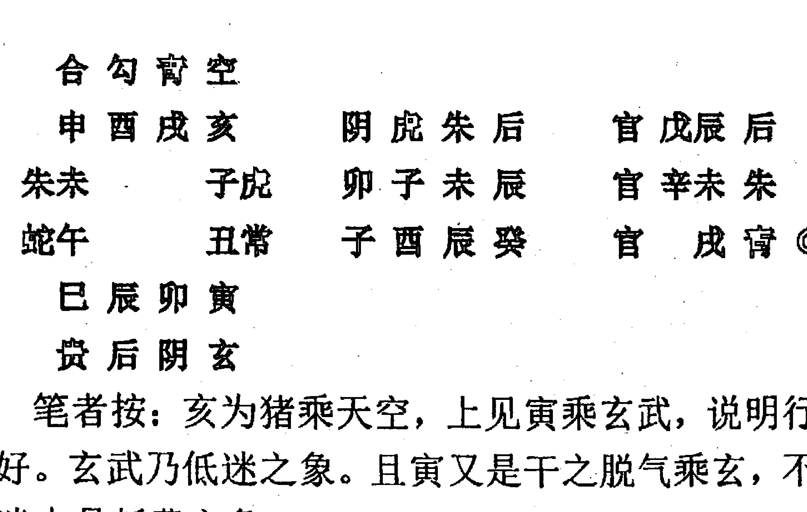

# 专利权保护指南（下）

专利局

# 六壬实战进阶精髓

林烽 著

内部资料    切勿外传

## 前言

此书根据笔者2015年函授班讲义整理而成，书中保留了学员提问，同时也加入了一些函授班没有讲到位的理论进行补充，该书采用400余实践案例进行辅助阐述讲解，力求所讲的理论都符合实践，不写纯理论教材。

此书得以出版和定稿，需要感谢以下学员对此书的编辑整理：南山、乐王秉澜、兴月、元、灵山使者、光军、南华兰泽、柔门流、小城（排名不分先后），感谢你们的辛苦整理，使此书得以如愿出版。

书中不仅采用大量的实践案例，也讲解了很多适用的理论与实践经验，笔者敢肯定，有一定六壬基础的人若能仔细研读此书，再加上自己的不断实践，便能轻松进入六壬中层次。经过一年多的函授教学发现，大多数努力的学员都能轻松达到中层次。

此书所讲内容是笔者若干年的研壬总结和结晶，有缘之人得到此书，切勿等闲视之，需认真研读方能有所收获。希望读者能珍惜此书，此书成书不易，切勿传于无德之人！

林烽
丙申年仲夏

## 目录

- 第十七章 分类占断 ………………………………………………………… 848
  第二节 测婚姻 ………………………………………………………… 848
  第三节 测财运 ………………………………………………………… 896
  第四节 测工作 ………………………………………………………… 964
  第五节 测考试 ………………………………………………………… 999
  第六节 测孕产 ………………………………………………………… 1015
  第七节 测阳宅与阴宅 ………………………………………………… 1041
  第八节 测失物 ………………………………………………………… 1067
  第九节 测行人与失人 ………………………………………………… 1092
  第十节 测出行 ………………………………………………………… 1106
  第十一节 测官讼 ……………………………………………………… 1117
  第十二节 六壬趋避与躲灾 …………………………………………… 1130
  第十三节 测天气 ……………………………………………………… 1139
  第十四节 断来意 ……………………………………………………… 1147
  第十五节 测年运 ……………………………………………………… 1159
- 第十八章 支上虎蛇与行善积德 ………………………………………… 1171
- 第十九章 闭口与丁神的案例 …………………………………………… 1178
- 第二十章 专题与经验讲解 ……………………………………………… 1201
- 第二十一章 综合理论讲解 ……………………………………………… 1236

# 第十七章 分类占断

### 第二节 测婚姻

**婚情：未婚，已婚；**

婚姻的看一般分为两种，未婚（离婚）、已婚。
未婚、离婚的，看何时能找到合适的，看跟对方能不能成。已婚看婚姻走势，是否会离婚，感情发展如何。
实践中大多数是这些情况。

**干支定位：干己，支彼；**

未婚、离异、丧偶看何时找到合适的，能不能成的定位，以干为自己，支为对方。因为没有确定婚姻关系，当今社会不比以往，没有所谓的男尊女卑，大家谈恋爱都是公平的，无所谓尊卑，故以干为求测者，支为对方。
古代是男尊女卑，现在男女平等，观念变了，定位就要变化。

**已婚干支：干男支女**

已婚的，多数情况下还是要以干男支女来定位，有时也是干为求测者支为对方，看情况而定。婚姻关系已经确立，男主外女主内的这个观念还是有些存在。课象有多复杂，感情就有多复杂，一切皆在课象之中，把象取出来，关系就理清楚了。

还有些人来测，本身已经结婚的，又喜欢另外一个，这些都是感情比较复杂的。

学员：小三来测的也好多。师父，四角恋的也遇到过。

笔者：是的，不备课多数情况都是三角关系，都容易出现这些情况，阴阳不平衡，男女失衡，就会出现三个人，有些偏偏喜欢已婚的，关系多了就看本命，所以这里的定位要弄清楚，未婚都是以干为自己。

学员：看感情课好晕，有的一女脚踏几条船。

笔者：身强能抗财抗官，身强力壮当然喜欢异性，所以断课仔细看课象表达即可。断感情比断求财要复杂一些，因为你要分析双方对感情的态度，想法，还要分析双方的性格，取象上要比求财难，对神将象的要求较高。

首先讲一下测感情的类神

#### 1、六合忌空

六合是感情的纽带，它可以是媒人、小孩，也可以是感情发展的纽带。六合空亡，陷空，是感情没有，不然就是感情不稳。六合空、陷空，本身就代表没有感情，如果没有谈恋爱那么正好符合六合空，无感情，如果谈恋爱了而六合空，那么这个感情就会朝着六合空的方向发展，故就会出现感情不稳、有口舌、分居，空之象即是如此。

注：太阴、酉为小三，太阴、酉，是第三者女性之象。男三爷这个目前没有遇到过，情况很少，也可以官鬼代表，泛指男性，财爻泛指女性。

兴月：奇门中有划分，丙为男三，戊为小四。

笔者：六壬需要我们去完善的，不是没有，而是需要去探索研究，寅也可以指男性，寅是青龙本家，同时也是顶梁柱。

已婚的，遇到六合空亡，陷空也是感情不稳、或者分居之象，一方经常不在家。这是六合空的象。六合不空但阴神克日，已婚者也代表感情不顺。

注：青龙、六合遁丁、闭口。六合遁丁主感情更改、更换、变化。六合遁闭口，是感情结束或者对方没开口不答应之象。

注：旬辛、三传金局。旬辛有革故鼎新之象，测感情最忌“三传金局”。金局皆主“革故鼎新，改革变化，换人”，感情换人就麻烦了，亡神同时也是辛金，也主革故，亡神也有心死了一样。

#### 2、青龙

青龙是男友、老公的类神。谈恋爱，青龙是男友，结婚了就是老公。官鬼泛指男性，财爻泛指女性。就如同对方来测感情，出现了3个财爻，而实际上有3个女性，他要选择一位，所以财爻泛指女性，也许跟日干没有直接的联系。男友与老公确实差的远，未婚是男友，已婚就是老公，这个容易分辨的，多个青龙，那就是感情不顺了，无论是未婚还是已婚，皆主不顺。青龙是男友、老公的代表符号，一个人不可能很多个老公吧？

感情和谐就不会来找咱预测了，无事不登三宝殿，面测的基本上很难遇到没问题又来测事的，除非钱多。

学员：想起一个前段时间的新闻，有个小子，车祸受伤进院，结果来了二、三十个女友的。

笔者：有这种情况但是都是极个别的，谁没事整天泡妞，这种人就算有也不会找咱算。

学员：师父，还遇到过兄弟共妻的事。

笔者：这些就不扯了，特殊的情况太多，咱这里讲大众的，符合大众情况的。也就是面测的时候，大多数情况。

青龙是男友、老公的代表符号，不宜多现，多现不是现在有多个，就是未来还会有。多现就是多个的意思，不是现在多个，就是未来还有，总之就是要符合多字。

青龙临驿马、丁马，也是更换之象。龙之阴也不宜刑害日干及干上神，青龙空、陷空，不是没有就是有了会变没，其实很多人来测感情，多是感情上遇到问题、难题、纠结，不知该怎么办或者寻求一个安慰等。

看课即知对方是什么心态，感情没啥问题，不会没事找事做，对方来求测，无非就是让咱给预测一下结果，好了解下发展走势，或者让预测师给指点指点。还有些是没地倾诉，找个人倾诉下，感情这种隐私，一般不会对别人说，除了知心朋友以外，但有些人没有知心朋友，所以就寻求预测师，看看怎么办，然后讲讲释放下，这对很多人来说其实也是一种心理负担。

#### 3、天后

天后与青龙同理，也是女友、妻子的类神。已经有的，不宜空亡陷空，遁丁是更改，驿马是走动多，出差多、变动之象，天后之阴不宜与本命、日干、干上神刑冲破害。

#### 4、太常

太常为宴席、酒席、聘礼，送的礼金也属于太常。

#### 5、朱雀、印绶

朱雀、印绶为结婚证。成为印，未为绶。太常也为绶。朱雀多数时候是证件，戌、未、太常也看。实践中我很少看结婚证，感情这个东西太复杂了，有些人不要这个证的。现在测感情不比以往，现在未婚同居的多的很，这是与时俱进的产物，学六壬也要与时俱进，否者就要落后。

#### 相亲断法

测婚准则：干支三传，六合本命行年。

下面说下相亲的断法：以干为自己，支为对方，六合为感情的结合类神，三传为恋爱的发展过程。同时参考双方的本命、行年。相亲的这种情况，根据实践统计90%是不成的，这是经验数据。

**例1：兴月案例，丁卯男问这次相亲成否？**
公历：2015年5月7日 阴历：三月十九
四柱：乙未 辛巳 癸未 癸亥 月将：酉将甲戌旬中酉空

```
贵后阴玄
卯辰巳午
蛇寅 未常
朱丑 申虎
子亥戌酉
合勾青空
```

笔者：这个还能成么？四课互冲，连谈恋爱的基础都没有！

兴月反馈：没成，癸巳日不联系了，谈了下不适合就没联系了。

**例2：男，庚申本命，行年，辛丑。问何时婚？有一心仪女丁卯年。**

公历：2015年4月20日 阴历：三月初二
四柱：乙未 庚辰 丙寅 癸巳 月将：戊将甲子旬戌亥空

```
蛇贵后阴
戌亥子丑
朱酉 寅玄
合申 卯常
未午巳辰
勾青空虎

后勾常蛇
子未卯戌
未寅戌丙
于 戌蛇◎

官 甲子后
兄 己巳空
于 戌蛇◎
```

兴月：80年的还没女友。

笔者：谁让他内向，没话说，还腼腆呢。谈恋爱这事，就得双方多交流。没话说，无法交流基本没戏。

兴月：那女的一来就住他家里不走了，把他吓死了。

笔者：本命上神见丑临太阴，太阴就是不好意思，腼腆，太阴也是话少，谈恋爱最怕就是话少、冷场、缺少沟通。太阴是话少、内向，性格决定一切，测感情你把双方的性格分析一遍，基本上就清楚了。

**例3：兴月的案例，男问：她是我的正缘吗？年命丙寅，行年乙未。**

公历：2015年3月23日 阴历：二月初四
四柱：乙未 己卯 戊戌 庚申 月将：戊将甲午旬辰巳空

```
空 虎 常 玄
未 申 酉 戌    蛇 后 常 空    财 庚子 后
膏午        亥阴    寅 子 酉 未    官 壬寅 蛇
勾巳        子后    子 戌 未 戌    兄   辰 合 ◎
辰 卯 寅 丑
合 朱 蛇 贵
```

兴月：这个课也有最终结果了，师父。

笔者：这个我上次说，最终不成。

兴月：次日己亥第一次见面就同居了，入午月正式分手了，女孩喜欢上另一个男的了。

林烽：戊是月将，加干是人不错，光明磊落，乘蛇是心里活动多。天后之阴是寅乘蛇作鬼，蛇主变化，后财化鬼，克干对我不利，最终末传六合空。
然支阴上传了，这种心里想法就展现出来了。支阴不入传，是不会流露出来的，暗藏的东西。
子未相害，未为兄弟为同性又在巳之上，故巳月有情敌出现而不合，害就是矛盾。未加干，是女命加干，男命以静就动，子未相害，她的做法是自我矛盾。未为本命，支又是她，自己害自己的上神，心里还是有些纠结的。

兴月：她之前也处过男友，分了几个，她79年的到现在也没婚。

笔者：测感情，分析性格很重要，性格解析出来了，就会知道对方对待感情的态度、做法。因为感情是需要双方交流的，性格和谐程度就很重要。不像求财，无需分析性格，直接看财的类神，测感情其实复杂在于要想仔细分析四课关系，因为干为自己，支为对方，还要考虑各种感情类神。还要分析双方的性格特点，本命是分析性格的重点。本命才是真正的自己，是自己不变的性格，而干上也许是自己对待这次感情的做法，此次的态度等等。

兴月：师父，这个干上是女命。那么可以看做测主的性格么？

林烽：此课干阴的，破败神，既是日干的，也是女命的，看性格双方有共同的地方。叠加都是有共同点，要么性格差不多，要么兴趣有一致的地方，本命相加，也是一样的。总有相同的地方，也就是说谈得来。

兴月：都是好道的人。男全真，女正一。男也是搞预测的。本命乘蛇，所以这个四课很有意思，寅未本命都上传了。

笔者：此课有个重点的地方在于，干上子未相害，但未陷空无法害，所以之前没有表现出来，因为日干已是空的，巳月填实之后就出现了子未害，属于待时而出的，相害如果都是实的，一开始就会出现矛盾。
未土出现在了干上，与支上相害，是女方做法，有些矛盾。未为女命，为兄弟，又是干上神，与支上相害，组合起来的象就是，女的喜欢了别的男人，这个行为我受不了，因此就出现了矛盾。
未传兄弟乘六合空亡，也可以理解为，因为竞争者出现了而结束，寅蛇克支，又克干上神，是对女命要求严格，但寅蛇也在支阴，也会带来女命心里克干。
可以这么定位第三者男性，一是刚刚说的子未害，未是同类；二是戌未刑，戌是同类，戌未刑；三是天后之阴化鬼，官鬼主男性；三个象指向一点，咱就可以断容易出现第三者男性。
此课的重点是研究事主与女性的关系，第三者与女性的关系，不属于这里的重点。第三者的存在是重点，但第三者与女性的关系不是重点，不然第三者和女性，为何臭味相投呢？他俩如何就不是这里的重点。
上次讲到了相亲的断法。下面举例，既然讲了如何断相亲，下面就要实践。相亲类的断法，按照我的统计数据来看，断100个课成功率不足5%，上次断了40个相亲的课，最后结婚的只有1个。唯一的那个成功的课，还是本命上传相加，一眼就知道必成，两人本命上传，相加，必成。
但如果一个在初传，一个在末传就难成，中传间隔着，就如同有人插足，感情这种东西需要缘分。

学员：老师，今天学生我看了大六壬指南：如果年命相加，但如果二者刑克，则难以成为一家人。

笔者：是的，有条件的，但如果上传相加则必成。在天地盘，四课相加，未必成，指南的这个不够精确。我说的这种情况绝对比指南更完善，俩人本命上传相加必成，不上传如果在四课、天地盘相加，则未必成，上传刑克但相加，照样能成。这就如同两人感情虽有磕磕碰碰，但是没有大碍，没有十全十美的婚姻。

**例4：打电话来给我介绍对象，这个缘分如何？求测人女命戌，对方未男。**

公历：2011年7月1日  阴历：六月初一
四柱：辛卯 甲午 丁巳 丁未  月将：未将甲寅旬子丑空

```
空 虎 常 玄
巳 午 未 申
青辰  酉阴
勾卯  戌后
寅 丑 子 亥
合 朱 蛇 贵

空 空 常 常
巳 巳 未 未
巳 巳 未 丁

兄 丁巳 空
财 庚申 玄
父 甲寅 合
```

笔者按：
1.  首先此课是伏吟课，三传是三刑。这个大象就是，感情发展缓慢，刑主艰难痛苦。
2.  发用又是天空，事情一开始就空，遁丁神主更改，丁神就是变化、更改、转移，又在发用是事情的开始，一开始就拐弯，又是伏吟三传见刑，支上天空，故主难成。
3.  空在发用，不会谈，测相亲，不喜伏吟、反吟课。伏吟课主静，感情发展缓慢，不利谈恋爱，感情需要双方相互交流，一方如果不想动，就难成。反吟则又是反反复复，初次恋爱经不起反复折腾。另外如果四课互冲，也是不成的象，干支互冲，冲主散、分离。四课互冲，也就是双方性格不和，没法谈下去。交车相合，主彼此相投，投就是有共同的地方，而四课互冲就是彼此不投、不合。另外发用天空、空亡，相亲皆主不会谈下去，一开始就空故主感情不会发展。

这是几点小结论：
① 伏吟；
② 反吟；
③ 四课互冲；
④ 发用空亡、乘天空；
⑤ 六合入传空亡、陷空或乘破碎煞。
这五点，相亲的遇到基本不成，固定的结论，可以记住。

此课既是伏吟课又是发用遁丁且乘天空，还有相亲也不宜四课交车刑害，主彼此不投。

学员：我发现一个问题，师父常用破碎煞。

笔者：破碎煞是常用神煞之一，高频率使用神煞。丁马、闭口、破碎煞、岁破、月破、病符、驿马这些都是高频率神煞。

这些案例，只要简单的去判断就知道行不行，不成的案例断的再多也是俩字——不成，我们所要做的就是抓住要点，要点抓住了，就知道此事能否成。

**例5：昨天经人介绍认识一女，能否成？**

公历：2009年10月5日 阴历：八月十七
四柱：己丑 癸酉 癸未 乙卯 月将：辰将甲戌旬申酉空

```
蛇 贵 合 勾
午 未 申 酉
勾 合 阴 玄
父 申 合 ◎
贵巳 戊青
酉 申 卯 寅
子 戊寅 玄
后辰 亥空
申 未 寅 癸
父 申 合 ◎
卯 寅 丑 子
阴 玄 常 虎
```

笔者按：此课比较明显难成，有这么几个要点：①四课互冲；②发用空亡且是六合空亡；③支上空亡；④初末空亡；
干为男支为女，四课是双方的动作与心理，互冲主气场不和，彼此不投。干上玄武，支阴贼神奸盗，都有些问题。此课又是昴星之课，冬蛇掩目格，闭目不视，双方相互瞧不起之象。
又可以以初为男，末为女，中为媒人，中传不空两头空，这个象就是媒人热情的介绍，而双方却没有谈的想法。
古书以初传为男，中传为媒人，末传为女，我们除了参考四课干支以外，还可以这样来参考三传，实践证明也是非常准的。此课初末相同皆空，干上玄武阴神太阴，支上六合，支阴贼神奸盗，所以双方都差不多，皆是不实之人。
这个课，初学六壬的话，还需要注意一个问题。此课的发用的阴神，不是中传，中传的阴神也不是末传，因为此课是昴星课，发用是取酉下，中传取干上，末传取支上。这个三传不是传出来的，而是根据规律取出来的，但这个三传代表着事情的发展。
反馈没成，但没有反馈是谁拒绝谁。
四课互冲，有双方谈不来之象，这种情况基本上见面之后就知道了。

学员：酉在支阴下见发用归支上，末又归支上，冲战干上。

笔者：是冲也是绝，都含有彼此，相比而言，支上六合空，女方更缺少诚意，空就是不实、缺少。六合主谈感情，支上直接是六合空，压根不想谈。

**例6：订婚后女方又退回财礼，问此婚能否成？**

男命戊午，女命辛酉。
- 公历：2005年10月4日
- 阴历：九月初二
- 四柱：乙酉 乙酉 辛酉 己丑
- 月将：辰将甲寅旬子丑空

```
空虎常玄 | 蛇阴朱后 | 财 乙卯 蛇 ⊙
申酉戌亥 | 卯子辰丑 | 官 戌午 勾
酉未 | 子阴 | 兄 辛酉 虎
勾午 | 丑后 | 子酉丑辛
已辰卯寅 | |
合朱蛇贵 | |
```

> 笔者按：不知道我讲过这个结论没？如果本命上传，又在空亡之后且不陷空，则此空亡可以填实。
也就是说此空亡不空，此课即是本命互加，本命相加上传，比其他什么都重要，而且女命在末传。此课本命在中传，而发用陷空，故空亡可以填实，所以子丑可以填实。
事情的原委就这样的：这个女生与男生初见面后，就定下来了。后来，男方送去了财物，竟然让退回来了。此女变卦了，问她什么原因？她竟然说，当初与男的见面，因为害羞，所以男的脸都没有看清，想想要定婚了，有点后悔，就让人退了财物。男方听了这样原因，就来找张，张看了课就说，那还不好办？重新让中间人牵线，再去见运面吧。结果男女双方再见了面，相亲到此成功，到了乙酉年底，两人就结婚了。
此课的重点在于：断课需要灵活，干支是大体，年命方切于身，此为断课要点。此课是徐伟刚智者乐水203页的案例，就只有一个课和一个反馈没过程。

**例7：女命测感情，不知道我的感情将要走向何方，女命癸亥命测感情，男命辛酉，目前谈恋爱，看最终结局、是分手还是结婚？**

- 公历：2009年3月24日
- 阴历：二月廿八
- 四柱：己丑 丁卯 戊辰 壬子
- 月将：戊将甲子旬戌亥空

```
勾合朱蛇
卯辰巳午
虎青空勾
兄乙丑空
官寅 未贵
子寅丑卯
财亥常◎
空丑 申后
寅辰卯戌
子癸酉阴◎
子亥戌酉
虎常玄阴
```

笔者：此课最终也结婚了。还是那句：本命上传相加必成。虽然此课四课交车相害，但始终敌不过本命上传相加，因此我们在断课时，要分清主要矛盾和次要矛盾。

我个人的理解是这样的，断课重本命，本命是切身重点，而此课既然本命互相又上传，这就告诉我们：重点出来了，其他的就不要考虑了！

2011-12-1反馈：刚结婚了，辛卯年。同时反馈：没有闹过分手，当时测的时候是心里比较纠结的时候，纠结要不要在一起。

未婚类神：干我支彼，青龙为男友，天后为女友，财为女性，官为男性，三传是感情的发展方向和过程，六合为感情的结合之神，这是未婚的断法中可能能用到的类神。

##### 例8：占感情发展？能否结婚？何时结婚？
男女都是属鼠，都是84年甲子年的，现在正在谈恋爱，问感情的发展情况。

公历：2012年8月22日 阴历：七月初六
四柱：壬辰 戊申 乙卯 辛巳 月将：午将甲寅旬子丑空

| 空 | 虎 | 常 | 玄 |
| :--- | :--- | :--- | :--- |
| 午 | 未 | 申 | 酉 |
| 青 | 巳 | 戌 | 阴 |
| 勾 | 辰 | 亥 | 后 |
| 卯 | 寅 | 丑 | 子 |
| 合 | 朱 | 蛇 | 贵 |

青勾空青 财丙辰勾
已辰午已 子丁巳青
辰卯巳乙 子戊午空

学员：老师，这是男的求测吧？

笔者：这是别人帮其代测的课，我们就以干男支女来定位，干为男，支为女，不备课，阴日备支上两课，干阳不备，阳缺少了，故四课是两阴一阳。故就有一男两女之象。如果现在没有第三者那么未来就会出现，这是不备课的特性。

再来看干支关系，乙干寄宫在辰，今辰加卯上，被克而发用，又卯辰相害，故主彼此不合，有矛盾、猜忌。

卯为门，辰为斗讼，勾陈为打斗，是门户之争，主两人有争斗、口舌。干上见丁巳，阴神为午火，皆为子孙脱气，干上的巳火，干阴的午火，皆来脱日干乙，主脱气太重，感情太累。

干辰加卯，男主动追求女，干上又遁丁神，主动摇、更改，巳为火为精神，午为心，是精神上，心理上已经动摇，决定改变，然干上之丁神已经入传，故不可逆转。

支卯克辰发用，是自取其辱。因为是日干加支又被克，是主动上门去结果被克，自取其辱，然后发用，于是出现了丁巳。

行年不相加，也证明有隔阂，尤其是一个在发用，一个在末传，中间间隔着。中传遁丁是更改，又是破碎煞，主破裂，男方一变心，感情就发生了改变，然后破裂、结束。此课是进连茹课，本朝前走，但中传见丁，末传见天空，丁主变，故感情的发展就是变空，发用又是太岁，太岁发用应在本年，故此段感情应在本年结束。

反馈：事情是这样的：男在云南和一个温州这边的女子网聊了一段时间，觉得可以见面就起程返回家中去见面。起先双方感觉都还可以，甚至都定好日子要去提亲了。那天晚上前女友（癸亥命）打电话来想要复合，这个男的就放弃了温州的女子，回云南去找前女友了。

笔者：云南的这个女友，是癸亥命，大家看能否成？
学员：老师，我都挺糊涂了，刚开始男的是和云南的女孩子吗？
笔者：刚开始是男的和温州的女孩谈，俩本命都是甲子，完了前女友跑出来，想复合。
学员：这就是说，再看男的和癸亥年的女孩子？
笔者：前女友是癸亥的，我这里问，男的和这个跑出来的前女友能否成？因为前面我们已经断出先谈的已经不成了，所以这里出来了一个前女友，而男命却从温州回到云南。

根据反馈，我们再整理下思路，此课主要测的是，此男和温州女子的感情发展。而此课不备，一阳两阴，是一男两女之象。辰为网，勾陈主勾引、勾搭，是事主在网上勾搭到的，辰加卯，是事主主动去找对方，然卯辰相害，是彼此不合，不是太谈得来，巳为电丁主动，故中间出现了转机。青龙主走动，干为事主，支为女方，支上发用传干上，是事主主动去找女方，然后又回到干上，就象从云南去，结果又回到云南。男命子加前女友亥命，其意在亥命女。本命相加，说明更投机一些，性格更合适。亥命上子，子命上丑，子丑相合，为牛女相会，这是男命和前女友的第二个有利之处，本命上神相合。

三传不离四课，为回环课，转了一圈又回来之象。

本命就是命里注定的东西，男命和前女友具备的这两个条件：①本命相加；②本命上神相合；就说明缘分很深。

再来看发用，支上斩关发用，是外地回来，丁神主变更、变化，青龙主动、喜事，末传空亡是结束。整个象就是：男命改变主意，从温州回来结婚之象，最终他俩的此段感情就结束了，所以此男和前女友最终结婚了。

- ①本命相加；②本命上神相合；③日干加女命行年
这是三个相对有利地方。

通过此课，我们要明白这么几点结论：

- 1. 干支是男女双方的代表，如果测感情，干支相加作用，关系就特别的明显，如干加支或支加干作合，就说明彼此相投，雷同于四课交车相合；如果干支相刑害，雷同于四课交车相害，主彼此不投、有矛盾。
- 2. 本命相加，主彼此性格谈得来，有共同的兴趣爱好的地方。
- 3. 本命为命里的缘分，命中所注定的，多个人求测，就用本命来考察这里面的缘分。

##### 例9：现在女方已提出分手，请看看，能否和好？能否走到结婚的那步？
男命庚申，行年在未，女命乙丑，行年在申。

公历：2009年5月4日 阴历：四月初十
四柱：己丑 戊辰 己酉 壬申 月将：酉将甲辰旬寅卯空

| 空 | 虎 | 常 | 玄 |
| :--- | :--- | :--- | :--- |
| 午 | 未 | 申 | 酉 |
| 勾 | 辰 | 戌 | 阴 |
| 合 | 卯 | 亥 | 后 |
| 朱 | 寅 | 子 | 贵 |
| 蛇 | 丑 | | |

| 后 | 阴 | 玄 | 常 |
| :--- | :--- | :--- | :--- |
| 亥 | 戌 | 酉 | 申 |
| 戌 | 酉 | 申 | 己 |
财 辛亥 后
财 壬子 贵
兄 癸丑 蛇

笔者按：男命庚申，行年在未，女命乙丑，行年在申。干为男支为女，支上戌刑干未，是女方对男方有猜忌，不信任。此课只有支上刑干，而干上不刑支。只是女方对男方有些不信任，而男方对女方没有意见。

互刑，是彼此互不信任，相互有矛盾。此课是支上刑干，是对方不信任，而干阴是支，心里有对方，玄武主糊涂不明，暧昧。

学员：老师，这里的申亥关系要考虑否？

笔者：要考虑的，因为支阴发用了，与干上相害。支上戌乘太阴，太阴乃心思细腻，内向敏感，支上太阴，支又乘玄，说明对方提分手之事让事主有些捉摸不透。干阴是酉乘玄，玄主迷糊，酉是对方，这里同样是对对方有些糊涂。

此课支阴斩关发用，第四课发用，事出突然，支上发用说明对方起主要作用，三传亥子丑，末传丑是月破碎，也是女命乘闭口。女命在末传乘闭口，来刑冲日干，墓申命。这个象有些不利，被墓就是被蒙在鼓里，不知道咋回事。

再来看本命：女命丑上见寅，男命申上见酉。寅酉相绝，是命里注定分离的象，且寅来绝酉，是对方主动来绝我，寅绝酉，寅是金之绝地，而酉却是木之胎地，故是对方绝我。

这里的12长生关系，要分清。绝主分离，命上带的。而此课说女方已经提出分手，却见女命在末传乘闭口，又是破碎煞，符合末传之象，而末传又是事情的结局，所以此事已经走到了结尾。

反馈：她说我有点骄傲，应该她觉得她受了委屈吧，但我觉得是出现了第三者才导致分手的：会不会由于去她家没送礼的原因？因为她爸过生日，我由于经常加班，人恍惚把银行卡放在银行，身上没带钱，没有买礼物硬起头皮去的，真是糊涂！

后按：根据前面所推，此事已经到了末传，而根据反馈，我们就明白了此事的经过。所以根据此反馈，就知道怎么回事了。干上申乘太常，太常主工作，申是本命，长生是生存。长生也是持久的利益，工作之象，脱干是工作累，干阴见酉乘玄，也是本命上神见酉玄，酉为钱又是银行卡，玄武主遗忘、记忆差，故是把银行卡遗忘在了银行。支酉也是干阴，支酉上见戌，戌为天喜，为支之父母爻，故是女方父亲过生日之象。戌克亥财发用，天后主情义，是因为钱财情义之事而发用。

申亥相害，这里做的不妥，然后出现了中传的子贵。子贵传出癸丑，明显就是女方父亲不乐意了，给女方说此男的做法不妥。或者说女方父亲的心里，不愿意女儿嫁给事主，因为贵之阴是闭口，子丑相合，父女关系止。

好着，而支上戌乘太阴，也正应女方父亲是个细心之人，太阴主心思细腻。

学员：老师，戌克亥财发用，亥为表象，戌为地盘，这就说明女孩子听父母的话。

笔者：是的，这也是一个象，此课的天后也可以为女友，支上戌父母爻刑干，贵人之阴冲干，事情的主动权在父亲手里。所以要对方配合反馈，我们才能断出此事，事情的背景特别的重要。而此课干阴乘酉玄，自己还迷糊为何对方突然提出分手。

过生日带礼物是必须的，未婚空手去就不好了，尤其是去了之后又不解释。太常之阴见玄，加班都加晕了，玄主黑暗、晚上，说不定还有晚班，就是当事人当时不知道咋想的。此课干临白虎，虎主错误，已经显示了事主犯了错。

通过此课要明白这个结论：支上刑干，而干上不刑支，不同于干支互刑，可以单边刑。还有测未婚感情发展，一方年命上传，一方年命不上传，多主难成。层次不同之故，这是此课所要讲的要点。

今晚上讲一讲断婚姻的参考经验，以及贵神代表的性格。

性格：分析感情发展，性格很重要。性格包含一个人的脾气秉性以及对待感情的态度。

#### 贵神与性格

- 1、贵人：测性格多为好面子，摆架子，倔。
- 2、腾蛇：虚情假意，不踏实，心理活动多，想象力丰富，有创新能力，时髦。
- 3、朱雀：能说会道，口语表达能力，乐观，能说，话多。
- 4、六合：人缘好，脾气佳，跟谁都谈得来，缺点是具有阴私之情。
- 5、勾陈：成熟稳重，话少，性格倔，思念，勾陈克干之人，多是在感情上受过伤。
- 6、青龙：有事业心，有奋斗精神，聪明有天赋，有钱财，缺点是酒色。
- 7、天空：爱好五行玄术，能忽悠吹牛，口才好，虚情假意，空虚寂寞。
- 8、白虎：脾气不好或身体不好，病态的，变态的，有问题的，皮肤白的。白虎测感情，也为打斗，家暴。
- 9、太常：会打扮，会烧菜做饭，好吃喝，好穿着，注重仪表。在生活上会关心人，会照顾人。
- 10、玄武：感情不专，贪财好色，虚情假意，骗子，高深摸不透的人。
- 11、太阴：内向的，话不多的，优雅，害羞，腼腆，不好意思，保密的，有故事的人，捉摸不透的人，缺点是老谋深算，狠毒。
- 12、天后：有情义，会照顾照看，温柔的，睁只眼闭只眼的。

每一个贵神皆有其优点和缺点，实践中根据具体情况酌情判断。

## 下面讲一讲，参考判断经验：

- 1. 占感情，男看天后，女看青龙，男忌天后之阴克干，女忌青龙之阴神克干，克主不利，不是不喜欢难成，就是结婚之后，会出现克妻克夫的情况。这种克性，在结婚之后表现为婚灾，比如结婚之后一方身体弱或者出现离婚、丧偶的情况。
- 2. 测感情最忌从革之课，从革主革故鼎新，主变化更改，未婚已婚测感情遇到从革多主不吉。如果再有其他不好的信息，就要注意了，未婚者多主难成，已婚者分离，但从革出现空亡、陷空，也有从革不成之象，也或者待时而变从革。
- 3. 六合陷空与六合传空。六合陷空，六合本身不空，而掉进空亡，主感情不稳定。六合传空，六合不空而其阴神空亡，是实变虚，感情从有变没有之象。六合传空，未婚主分离，已婚主离婚。
- 4. 本命在天地盘相加，说明性格谈得来，有共同的地方，本命上传相加者必成。本命在天地盘相加，课传不吉就不能成，而本命上传相加是必成的象，已婚者不会离婚，未婚者必成。已婚者夫妻本命一个在发用，一个在末传，则有第三者插足之象。这种情况，不是现在感情出现了危机，就是以后会出现危机，这种情况我遇到过几次，确实是这样的。

未婚测感情，一个年命在三传，一个年命在四课、天地盘则有难成之象。层次高低不一样，就如同地位、说话权不一样，故主难成。婚姻感情是建立在男女平等的基础上的，一方太强势一般难成。

## 5，干支各自成局多主难成：
在古代，男尊女卑，以干男支女定位，这是固定的，能否成就结合，年命三传综合看，定位不一样而已，其他一样。测感情干、支是彼此的定位，而现在各自成局，也就是彼此之间失去了联系，独自组成一个局，就象彼此之间各自成家之象。

三合局也有插足的象，两人谈的正好，有新的人加进来把其中一人合走，使其成局。三合局本身就有人多，众人参与之象。感情这事众人参加肯定有问题，俩人世界变成了多人世界，尤其是干支各自成局却又互冲的。

比如干上两课申子辰水局，支上两课寅午戌火局，各自成局又互冲，未婚已婚皆主不吉。

还有干支相冲而致使四课互冲，测感情多主矛盾多、不和，没有共同语言，无法谈拢、商量。未婚者不成，已婚者看课象而定，尤其是四课互冲，干支又交车相合，又见刑，就很复杂了。

## 6，课传中不宜出现多个青龙，多个天后。
男命测感情，多个天后就是多个女人，不是现在多个就是以后有多个，已婚者有二婚之象，女命同理不宜见多个青龙。

青龙、天后是丈夫、妻子的名份。一个男人多个天后，不就是多个妻子吗？现在一个的话以后肯定还会有，这种情况多是二婚，但三传如果是多个财爻，对男命而言，也许就是女人玩的多，但未必会二婚，财爻主女性。

测感情，龙后不入式也要看的，这是丈夫、妻子的类神。未婚的，龙后不入式，就看干支、三传。

## 7，青龙、天后之阴神不宜克龙、后
龙、后之阴神见自身之鬼，多是自身带灾。自己阴神回头克自己，官鬼主灾祸、疾病，不是身体不好就是容易遭灾。阴神就是当自己处在地盘时，其对应的“天盘”就是其阴神。

学员：龙后阴神空呢？
笔者：龙后本身不空，阴神空，就是由“实”变“虚”。就如同一个人，从“有”变到“没有”。空也可以待时而实，填实之时，就是应期。阴神的克，来的很直接。

##### 例10：请各位老师看下婚姻，看看什么时候结婚，会不会二婚，甲子男命。
四柱：丁亥 辛亥 戊午 庚申 月将：卯将甲寅旬子丑空

| 蛇 | 贵 | 后 | 阴 |
| :--- | :--- | :--- | :--- |
| 子 | 丑 | 寅 | 卯 |
| 朱 | 亥 | 辰 | 玄 |
| 合 | 戌 | 巳 | 常 |
| 勾 | 酉 | 午 | 虎 |
| 青 | 申 | 未 | 空 |

贵 贵 空 蛇
申 丑 贵 子
丑 午 子 戌

财 子 蛇 ◎
兄 己未 空 ◎
官 甲 贵 后

笔者：本命作财空，还没有对象呢，此课一看应期，二看女方情况，三看是否会二婚？首先看应期，完了看媳妇的情况，最后看是否会二婚，这个课是测终身的婚姻状况。

子发用空亡，填实本为应期，但支上是空的，所以还需要丑填实，所以此课的应期是丑年，子年在谈恋爱。

本命发用，又是自己克自己发用，故事主很主动，日干克财发用，犹如我主动去取财之象，财是女性，蛇是联络。子是财，蛇主虚幻、网络，实际是子年在网上恋爱，支上丑空，才会落实，支上丑空，丑填实了，才会落实。

蛇有网络之象，弯弯曲曲的，还是虚拟的。蛇有弯曲、虚拟之象，也主想象力、思考。干上子蛇，也是本命，是心里想，干阴未空，是心里空虚无聊，子是戊子流年，子上见未乘天空克财，也是感情不稳，流年阴神见兄弟了，克神主矛盾口舌。就如同八字中的比劫克财，男命不利婚姻一样。

此课支午乘虎作日刃，对方脾气或者身体不好，且寅后之上下神，是俯见其丘，仰见其仇，且后之阴神克后，故这两个象，可以断定女方身体不好。

支午为眼，乘虎主问题，毛病，也可以断是个戴眼镜的，支上丑贵，丑合子，午丑害，这个象就复杂了。支上的贵人，可以断对方长辈。午丑相害，午是日刃乘虎，来害贵，可以断女方长辈身体不好。午是对方，且为贵人，可以断对方与长辈有矛盾、不和，且子相合。

是干支上神互合，可以断双方是牛女相合，也可以断对方长辈与事主谈得来。贵之阴申合戊干，也是此意。

此课唯一的不足，就是末传，寅后克干。发用子蛇空亡，填实后不空，未乘天空、是口舌，完了之后到末传，寅后克干就不吉了。末传见寅后，天后在末传，有再婚之象，所以二婚跑不掉，且后作孤神。末传见天后，末传主后面，天后主妻子，是后面再娶之象。

此课后之阴神见克神，天后自带灾；且日支又是午虎日刃。这两个象就有对方妻子命带疾病手术，或者意外之灾之象，此课也反应了，男命命里克妻的象。

本命作财，是命中之妻，命上见未克本命，不就是命里克妻吗？这个象也反映了，事主命里带灾。末传寅后克干，妻子也克事主，但子上见未鬼，寅又制未鬼，却又是救神。

学员：老师，在此顺便提一个问题：本命在末传做鬼克干？何像？

笔者：如果是测一般的事情，本命在末传作鬼克干，多数不吉。今天就遇到了一个本命在末传作鬼克干的课。是此事不吉，命里不该去干此事，因为你去干了此事，就走三传了，结果最后却是自己克自己，那不就是自己找死吗？自己作鬼克自己，也就是自己搬石头砸自己的脚。

但也有特殊情况，比如本命在末传乘白虎作鬼，为催官符，反利于升职选举。上次遇到一个，测选举，末传在本命乘虎作鬼，结果选中了。多数情况，最好不要本命作鬼。不然是命里带灾的象。

## 行年虚岁问题
学员：老师，计算行年以虚岁为准吧？
答：是的，虚岁算。男命不满一岁是寅，满一岁了就是卯。邵彦和的课，就是论虚岁，且与生日有关系。多看看便知。

学员：男甲子年5月1日生人，则行年1岁丙寅要到乙丑年的5月1日才结束？
答：是的。

## 8、课体经验
测感情最忌反吟课、四课相冲、合中犯煞蜜中砒、解离课、不备课、芜淫课、八专课。

**四课互冲**：昨晚讲了，是彼此没有语言，无法交流。
**合中犯煞**：三传三合局中神与干上两课有害。
**反吟课**：主要是反反复复，动荡不安，感情不稳。
**解离课**：干支互克其上神，主两情相背。
**不备课**：主四课不全，阴阳不调，男女比例不一样。容易有人插足。
**芜淫课**：不备课加干支交相互克。也主两情相背。
**八专课**：干支不分，卑尊不分，男女叠加之象。古代男尊女卑，八专课却不分卑尊，有失体统。干被支占或者支被干占，有男女叠加之象，本来是下支，现在是一个，两个变一个，叠加在一起，现在则有同居之象，八专是合二为一，男女共处。

## 9、墓神
墓神测感情最忌支上见墓，干上带墓。

- 1）墓主欺骗
支上见墓：尤其是支阴见墓，对方有感情欺骗之嫌。
干上带墓：是自己迷糊，一厢情愿。
支加干墓干：则是对方的做法让自己一厢情愿，自己蒙在鼓里。
干加支墓支：也有事主欺骗对方之象。

- 2）墓除了欺骗之外，也有笼罩、控制、掌握的意思，盯得紧、看的紧的意思，说白了就是要把你墓着，控制着。

干墓支：也有我盯得紧的意思，我可以出轨，而你不行，这就是墓的象。上次遇到一个就是干加支墓支。男命来测的，而日干恰好又是女方本命。

##### 例11：男命甲子，女命戊辰，男命测女友是否会出轨？
公历：2014年6月23日 阴历：五月廿六
四柱：甲午 庚午 乙丑 庚辰 月将：未将甲子旬戌亥空

| 勾 | 合 | 朱 | 蛇 |
| :--- | :--- | :--- | :--- |
| 申 | 酉 | 戌 | 亥 |
| 空 | 午 | 子 | 贵 |
| 虎 | 巳 | 丑 | 后 |
| 常 | 辰 | 寅 | 阴 |
| 玄 | 卯 | | |

背常朱背 财辛未背
未辰戌未 财戌朱◎
辰丑未乙 财乙丑后◎

笔者按：

此课干加支墓支，同时墓神也是女方本命，说明男方盯女方盯得紧，而女方自己也墓自己，说明自身也有自控力。

课传全财，说明男方女人多，婚后容易外遇，这里举此课是为了说明事主心态：我出轨可以，你出轨不行。

墓就是盯着的意思，控制欲望。笼罩的欲望，欺骗也是一种控制于己身之下。这是墓的特性。

本命子上见卯玄，子加酉败地之上，上见玄，干上青龙，感情上很好那一口，本命上神见玄，除了感情不顺以外，还比较敏感。

因为子命的桃花在酉，自坐桃花又败命。玄武也是比较敏感的，就如同贼的警惕性比较强一样。玄武就是贼，可以偷东西，当然也可以偷情，都是见不得光的。

此课三传全财，主婚姻感情上女性多，又不备课，所以最终还是会以事主外遇而分手。墓神发用乘青龙，是稀里糊涂的结婚，戊戌年填实，上见丑后，冲开了发用，这时候就是醒悟了。

不备课一阳两阴，课传全财，男方本命上见玄武，故是男方出轨，多个象指向事主。多象定一象，一般都是准的，还有此课青龙、天后多现。

## 10，人宅皆死
测感情遇到人宅皆死，即干支上神为死地，有死心之象，俱脱、俱败为灰心丧气。

## 11，干支相加干支相加的课，是一方比较主动。尤其是谈恋爱，支加干一般是对方特别主动，干以静就动。

学员：加而乱首呢？师父。

笔者：那就是自找没趣了。加了被克，上门被对方羞辱一样，干加支被克是自取其辱，支加干被克，是对方自取其辱，支加干克干，就是上门乱首了。这样就对事主不利了，克有控制、挑剔的意思。

## 12，常见的类象

巳为花烛，午为红花、堂屋，卯为床、子为卧室、午为心。亥子为水，亥为吟，子为哭泣，子丑为牛女相会，巳丑相加为洞房花烛。午为红，午为离为喜，也为鞭炮。

## 13，末传空亡

测感情最不宜见末传空亡，这是结局，空主离去、失去、逝去，感情这个东西，离开了谁都不好。

## 14，伤妻伤夫，多妻多夫

男命占婚不宜三传皆兄弟，女命占婚不宜三传三合子孙局。兄弟局克财，子孙局克官鬼，男命占婚课传纯财则是女性众多，女命占婚课传全官鬼，也是男友众多。伤妻伤夫，多财多官，皆不好。

###### 例 12，兴月案例，某男求测追某女如何？

| 公历 | 2015年4月12日 | 阴历 | 二月廿四 |
| 四柱 | 乙未 庚辰 戊午 癸亥 | 月将 | 戊将甲寅旬子丑空 |

合朱蛇贵
辰巳午未
勾卯 申后
青寅 酉阴
丑子亥戌
空虎常玄
合朱勾合
辰巳卯辰
巳午辰戌
官乙卯勾
官甲寅青
兄丑空◎

笔者：不备之课，三角关系。干上带墓是一厢情愿之象，干又加支，自己主动。然不备课，干上斩关发用，退茹，末传岁破、破碎煞并空亡。

学员：我是这样断的，不备课，干加支男主动，桃花乘勾克六合发用传出鬼克之，末空空。支上兄弟乘蛇，此女有对象了不会同意。

反馈：没进展，她有男朋友了。

###### 例13：我的年命85年，属牛，我女友90年属马。我跟女友分手了，这段时间我经常一个人发呆到一二点，我根本就忘不了她，求各位老师给点意见，看我跟她之间还有复合的可能性不？

公历：2014年4月24日 阴历：三月廿五
四柱：甲午 戊辰 乙丑 丁丑 月将：酉将甲子旬戌亥空

青空虎常
丑寅卯辰
勾子 已玄
合亥 午阴
戌酉申未
朱蛇贵后
玄蛇贵勾
巳酉申子
酉丑子乙
子己巳玄
财乙丑青
官癸酉蛇

笔者：既然是练手课，大家就要多练手，不要稳着不动，只看结果不去思考只看过程，虽理解了但是不是自己想出来的。只有多断课才会进步。理论学完了，剩下的就是看自己如何去实践了，而自己水平的高低，就看自己的实践量的大小，思路是练出来的。只有在实践中不断的摸索、总结，才是提高的捷径，六壬玩理论永远没有出路。

+   此课的吉凶判断要点：
①干支各自成局；
②三传从革局主变革；
③末传见蛇鬼克干；
④上方本命上神酉寅相绝；
⑤支上见闭口作鬼；
把这个五个不利的要点综合起来考虑，就是没有戏了。

这是我判断吉凶的过程，是通过这么几个要点。你们可以参考下，吉凶出来了，剩下的就是取象了。

干上见勾陈败干，辰月子死，败干，勾陈是思念、想念，而本命上神见蛇鬼，说明自己成熟稳重，同时也思念着对方，而且还有些想不通。这个感情的事，自己也没对别人说，只是自己没事的时候寻思。

因为命上神见闭口，蛇是心理活动，闭着嘴在心里想。蛇作鬼，是想不通。蛇鬼，有时候也是自杀的象，想不通当然就容易自杀了，在邵公的课里就出现过。女命行年在申，日干寄宫辰加申上，主一年之缘分。

支为对方，只是见蛇鬼作闭口，克是不喜欢之象，闭口主不说或拒绝之象，蛇主变化，支阴玄武主不靠谱，巳为心，综合起来就有对方变心之象，本命丑上见酉，午上见寅，寅来绝酉，是对方来绝我。

支第四课发用，一主事出突然，二主对方掌握主动权。发用是动作的开始，层次也比四课高，病符乘玄武发用，玄武主暧昧，巳为旧太岁为旧事，有点象是旧事再发之象。

中传是青龙末传是蛇，龙化蛇，事情先大后小，虎头蛇尾之象。青龙主喜庆，丑为破碎煞，喜庆破裂之象，又是本命，命中的喜事没了。

末传蛇鬼，既是末传也是本命上神，且酉又是四废无成煞，故主自己在思念中结束。

春占金局不逢时，四时返本，好事难成，况又是从革金局主变革、变化，故最终不吉。

反馈：我们是老家相亲才开始认识的，2014年1月21号才开始接触，交往的这段时间我跟她直接没有吵过架，关系还是挺和谐的，也见过双方的父母，本来是打算年底结婚的，后来因为她妈身体不好，她清明节要回去，让我清明节一起跟她回去订婚，我没答应，然后事态就变成这样了。

本来清明节她等着我回去订婚的，但是我有我的顾虑就没有回家，然后她四月九号就跟她以前的男友复合订婚了，我们在一起感情还是很好，没有争吵过，可能是他爸住院，她心里压力很大，所以就这样才这么快订婚。

###### 例 14：某女占夫妻感情。此课是已婚女士占，年命未知，测感情发展

公历：2009年2月20日
阴历：正月廿六
四柱：己丑 丙寅 丙申 乙未
月将：亥将甲午旬辰巳空

朱 蛇 贵 后
酉 戌 亥 子 | 虎 后 阴 朱 | 财 丁酉 朱 ⊙
合申 | 丑阴 | 辰 子 丑 酉 | 子 辛丑 阴
勾未 | 寅玄 | 子 申 酉 丙 | 兄 已 空 ⊙
午 巳 辰 卯
青 空 虎 常

笔者按：这个课不知道是王老师还是孟老师的面测课，也许忘了记录双方本命。
此课也是一个从革之课。以干为自己，支为对方。干上酉子相破，主不和谐，酉为四废无成煞，巳申本合奈何日干空亡，事主无心相合。支上见天后作鬼克干，是对方无情，支阴辰乘虎，辰为打斗，虎主爆脾气，说明对方脾气不好，容易动手动脚的。

支申乘六合，六合主感情，化出阴神子鬼，又是在支上，说明感情的主要问题来自对方。六合是感情的结合之神，已婚的必看。

干上酉为四废无成煞，又是破碎煞，且夹克乘朱雀发用，朱雀代表口舌，且酉为兑为口，乘朱雀就更像是口舌了，夹克不是一个人的事情，被逼无奈之象。

发用酉，刑干上，破支上，这个口舌对彼此都没有利。干上朱雀，朱雀也主气恼，说明事主也会为感情之事而气恼，支阴太阴，心里又没地方去述说。

发用酉，刑干上是酉酉自刑，自刑也有自己所做不利自己之象。酉为口为兑，朱雀为吵架，夹克为逼迫，干上发用是女方，发用朱雀既为口舌，也为证件之象，破碎煞，有吵架而说离婚之象。而中传丑为太岁，末传巳乘天空，今年太岁之阴神为空，三传又是从革主变化变革，有今年感情就变空之象。

反馈：夫妻二人经常吵架，丑月大打了一架，此女被打伤，回了娘家，寅年春天正式办了离婚手续。

后按：此课中传丑为太岁，也为丑月，末传禄双空，丑年丑月身心皆空之象，巳为心，死神死心了。

此课还有象，很值得研讨，象无止境，此课跟上一课的相同点在于，都是金局，水局，三传皆是从革之课，且都是在春季，金局属于不逢时。

此课干上酉为四废无成，酉为兑为口，乘朱雀，与支上子相破，从而产生鬼克干，是经常说话，好唠叨，导致对方厌烦。酉生败子水克干，自找的。申为支，酉是申之刃，刃主打斗，酉在干上乘朱雀，事主的唠叨正式对方伤人的原因。正是对方伤人的原因。酉为破碎煞，兑乘朱雀，有破嘴之象。

酉败子，子乘天后克干，对方做法也让事主伤心。于是干上酉夹克发用，破碎乘朱雀，末传、也是日干双空，是女方不想继续此婚之象。最后的这句话，是两个象。

学员：离婚象，好理解，还有一个什么象？终身不嫁吗？

笔者：空就是结束了，散了。

学员：因干空而酉陷空，干双空是何像？师父，空亡乘空？

笔者：双空就是不想继续了呗，时间都没法填实，天空是和尚为单身之象，是不想继续了回到单身状态。
干上发用酉乘朱雀，是口舌争吵在先，酉酉自刑，酉子破，子水克干，是日干受伤，因此出现了中传的丑乘太阴，丑为宅，太阴乃母，故是回娘家了，丑墓中，对方不好意思来找，最终巳乘双空，然后才是丁酉乘朱雀，酉为破碎煞，朱雀乃结婚证，所以离婚了。

酉乘朱雀，这个离婚证，是末传的阴神，是本质也是最终的象，象是同一个象，而离婚却是第二次取的象。

最终巳乘双空，巳也是日干，空就是死心，想结束，于是才是发用的酉雀，离婚证。

学员：干上酉发用，末传又传回干吗？

笔者：是的，末传又传归干上，末传巳是日干，但阴神是干上。

笔者：巳为香火，天空乃和尚，也是五行玄术，最好去寺庙里上上香，阴神是破碎煞乘朱雀遁丁，好转変下这个离婚的阴影。巳乘天空特别象香火上天之象，天空乃空中，天。

学员：这里的遁丁，也比较复杂。

笔者：是的，一切都在丁神中，丁就是丁字路口，是继续走还是拐弯，必须选择。实践中发现，当出现丁神这个丁字路口时，基本上都会拐弯，不会直接往前走。

因为丁神就是改变，转变，拐弯之象。丁是丁字路口，多了一条可以选择的道路。

丑，还可以是丑事、丑闻、丑话、也是牛，在干阴，雀之阴，也是话说的不怎么好听，且人也倔。

上神酉子破，丑辰破，酉是丙之死地，子是申之死地。这是人宅皆死，测感情有彼此不想继续之象，死也是结束的意思。

主要还是干上金局，生支上水局，自招来克。且三传又是金局生支上子水，大的趋势，对事主不利。

好的，今晚把测婚姻剩下的部分讲完，还有些结论没有讲。

#### 14，测婚姻

+   玄武：主偷情、暧昧、淫乱。
+   六合：主交合、交往、人际关系、暗昧。
+   太阴：主秘密，不明之事，保密之事，小蜜、情人。
+   螣蛇：主虚情假意，心思，想法。

这些测婚姻不好的贵神不宜出现在阴神。阴神主内心，暗地里的想法，在阳神出现则是明显的，能够看得到，打听的到情况。在贵神体系中，玄武与六合是对冲的，这就是说一方出现偷情、淫乱，必然感情会出问题。玄武与六合是对立的，就如同感情容不得背叛和偷情。

#### 15，双方父母的判断

干的父母爻，干上两课的贵人，干德等为干之父母，支的父母爻，支上的贵人，为支之父母，寅有时候也是父母、长辈。测婚姻，有时候父母的态度也很重要，父母不同意有时候也难成。

#### 16，男命测感情

男命测感情，忌三传兄弟局，三传纯财爻。兄弟克妻财，纯财女性多。女命忌三传子孙局，三传纯官鬼。

> 学员：师父，汇财方官方同论么？如戊日，传上亥子丑。
笔者：一般不论。六壬没有合化一说，财局以各自的六亲论即可，这样的也是财多，这样的以各自的六亲论，戊日传上亥子丑，则是两财一兄弟。

> 学员：申子辰合财局呢？
笔者：这样的就论各自的六亲，申是长生，子是财，辰是兄弟。

男命测感情，三传纯财，即乙日稼穑格，主异性多，也容易出现婆媳不和的情况，因纯财必然克父母。男命测感情，只要课传中出现了财爻克父母，都容易出现婆媳不和的情况。

#### 17、子丑牛女会

子丑相加发用，为牛女相会利于占婚。戌加亥，为魁渡天门，以阻隔论，戌加亥，是退连茹盘，测感情宜进不宜退，倒退走的结果就是分走，玩完了。

#### 18，孤寡临干命

孤寡临干、命有时候不是单身就是离异、丧偶，要么就是有跟没有一样。这些结论，记住了对我们判断有好处，都是经验总结，比较适用的，可以减少自己摸索总结的过程。大家把这些结论多看几遍最好记住再去断课，就会好一些。

##### 例15: 兴月案例，老婆下午有没出轨？整天去酒吧混，最近都不理我，师父这个课有意思。

公历：2015年6月21日       阴历：五月初六四柱：乙未 壬午 戊辰 辛酉       月将：申将甲子旬戌亥空

合 朱 蛇 贵
辰 巳 午 未     青 勾 勾 合     官 丁卯 勾
勾卯     申后     寅 卯 卯 辰     官 丙寅 青
青寅     酉阴     卯 辰 辰 戌     兄 乙丑 空
丑 亥 戌
空 虎 常 玄

笔者：我看十有八九是出轨了。支上一片官鬼。卯又是桃花，勾陈是勾引。

兴月：先锋妻加桃花，不备课，支加干墓干，支阴见龙。其妻有外遇了！还欺骗测主，酉作桃花又乘太阴为暧昧隐秘之桃花事，辰乘六合，由支来墓干。辰也是兄弟爻，有人取而代之。天后作奸门主奸邪之事，支上又见邪神发用。

笔者：阴神是驿马乘龙，驿马主更换，青龙主男人。支加干墓干，干支卯辰害，是怀疑，支墓干是自己还不知道，墓本身就是欺骗。

兴月：师父，像这样没有年命的会有偏差么？

笔者：课传是大象、大趋势，没有本命也是基本正确的，只是有了本命象会更丰富，细腻些。但本命对课传吉凶的决定性更重些，如果测成败就必须要看本命。

##### 例16：我属猪，女方属鸡，同事亲戚帮我介绍的，看看能不能成？

公历：2011年4月7日 阴历：三月初五
四柱：辛卯 壬辰 壬辰 己酉 月将：戌将甲申旬午未空

合 勾 贵 空
午 未 申 酉    合 朱 阴 玄    官 己丑 阴
朱 巳    戌 虎    午 巳 丑 子    子 庚寅 后
蛇 辰    亥 常    巳 辰 子 壬    子 辛卯 贵
卯 寅 丑 子
贵 后 阴 玄

笔者按：六合在支阴空，是对方没心想谈，支墓干，干上神，男的比较愿意，干命一体，上见子玄有所图。
辰墓临蛇，蛇主虚假，墓主吸引，支上见癸巳，闭口朱雀，说明对方不怎么爱说话，不爱搭理。癸巳冲干，绝干上子，阴神又是六合空，说明对方压根没看上事主。
支阴六合空，不想谈，干上癸巳乘朱雀，没啥说的，朱雀乃信息、消息，没有消息沟通之象，也有关机或者不回信息之象。

丑加子发用，本为吉，但发用丑又是破碎煞，主破裂之象，太阴乃不明不白，不知道咋回事。但末传卯转煞遁辛，卯辰害，子卯刑，卯转煞辛为亡神，最终还是会变化。

这里还有两点象，第一点就是末传为女，干为男，卯克丑，女的不喜欢男的；第二点就是酉上戌虎克亥命上子，也是女的不喜欢男的；多个象的结果都是一致的，酉上见虎鬼，脾气还比较大，加上支上火神急性子，支辰命上见戌，还倔。辰、戌皆作干鬼，支乘蛇，恐心另有所属。

反馈：见面两周后就没有联系了。

后按：连茹课课象不吉，测恋爱一般结果都比较快。

学员：但末传卯转煞遁辛，卯辰害，子卯刑，卯转煞辛为亡神。请问辛作亡神，怎么回事？

答：亡神是死亡的意思，对人来说死亡意味着结束，亡神也可以为感情的结束，同时旬辛也有改革、变化的意思。

##### 例 17：1981 男，前几天我相亲了，对方 83 年生人，现在我们很谈得来，不知最终能否走到一起？酉男亥女。

| 公历：2008年2月13日 | 阴历：正月初七 |
|---|---|
| 四柱：戊子 甲寅 癸未 丁巳 | 月将：子将甲戌旬申酉空 |

六 勾 合 朱
子 丑 寅 卯　　常 合 朱 玄　　子 己 卯 朱 ◎
空 亥　　　辰 蛇　　酉 寅 卯 申　　官 甲 戌 虎
戌 戌　　　巳 贵　　寅 未 申 奸　　财 辛 巳 贵
酉 申 未 午
常 玄 阴 后

兴月：四绝，斫轮废了，成不了，干支上神互冲，六 合阴神空了，末传男行年遁亡神绝干冲女命，家长也不认同。

笔者：兴月断的一针见血。此课测感情，男命求测，以干为事主，支为对方。四课不好的地方，主要在于四课互冲。

男本命为酉，在支阴空亡，支上寅绝酉，说明对方心里没有事主。支上寅乘六合，寅是支之官鬼，青龙之本家，且六合为人际关系，又为多，有男性多之象，有跟很多人谈之象，选择的对象多之象。

这里还有一种象，就是支上见六合，阴神本命空，也就是对方跟事主不成之象。因为这是六合传空，六合是感情的结合之神，传空就有变没之象，而且是这是支上的象，就有对方表现出来的情况，且寅也有家长之象。

干上见申，支上见寅，寅申相冲，也是相绝之象，寅是家长，申是干长生，有双方父母也有不和之象。测感情四课互冲就是双方没有商量的余地，谈不来。未婚主难成，已婚主双方不和，没有语言。未婚测感情，课得四绝，也有分离之象。朱雀发用陷空遁暗鬼，说明信息少，交流少。中传戊虎克干刑支，中途会出现麻烦、阻扰、拦路虎或者犯错。末传干之绝神巳乘贵，绝主分离，贵人主尊长，有因长辈而分离之象，哪方的长辈呢？巳为支之父母爻，是女方长辈。巳为日德乘贵人作支之父母爻，是女方家中之德高望重者，与干作绝且生鬼克干，是看不上之意。

这是 2008 年正月的课，一年之后 2009-3-15 反馈：过年时提礼到女方家去了，因自己表现欠佳，女方父母不同意这门婚事，前几天该女和他人结婚了，该女家境好，她父亲是他们村的大富豪。

最后一点的课理：巳贵上见子乘青龙，子是太岁作禄，乘青龙是钱财。
禄真是好东西，大财、资产的浓缩。财与禄，根本没法比，不是一个档次的东西。

## 这个课，还需要补充说明几点实践经验：

+   第一，古书说男家富裕否看干之阴旺衰，女家富裕否看支之阴神旺衰，旺则富衰者贫。

+   实践根本行不通。大家可以在实践中多检验便知，拿此课来说，此课干阴卯为旺，支阴酉为休囚为弱，按照此理是男家好。古书中的结论，不可轻易信，也不可轻易怀疑。

> 笔者：一切都要拿自己的实践来检验，要辩证来看待和检验。

古书说的是看阴神。我想问题在于：课传表达了成或者不成的信息，也许有时候并未表现出家境的好与差，除非一方有所图。

课传表达的是事情的吉凶成败，有时候双方谈恋爱，与家境一点联系也没有。现在测恋爱，比如课传反应了这么一个象：对方同居出现打闹最后分手。这种情况就是双方不和最后分手，难到课还要反应，男的家境如何，女的家境如何吗？我觉得课象表达了其皆凶成败的意思即可，未必会反应与此段感情没有多大联系的家境。

家境的象有时候会反应，有时候也许就不明显。信息有一个主次,什么信息是主要的,什么信息是次要的,我想这个课会传达出来,我们抓住主要的信息即可,也就是课传表达的主线,要弄清楚。

## 第二个结论：如果六合在干支的某一方出现空亡、陷空、传空，那么六合在的那一方容易是感情不成的地方。

今晚讲的两个课，六合都在支上，一个空亡，一个传空。

## 第三：测感情，把干支的绝神找出来或者说留意下。

绝主分离，断绝关系，还有破碎煞，主感情破裂，家庭破裂。岁破、月破都要看，感情宜合不宜破，见破就会出现破裂、不完整、破碎。破是冲击之象，有散的象，就如同一个完整的碗，掉地上被冲击而破，四分五裂。

尤其是已婚的，支上见破碎煞，就是离婚、分家的象。支为宅为家庭，上见破碎煞，就是分家、离婚。这个结论，用起来非常灵。所以你们要记住，无需自己去摸索。

##### 例 18: 某男, 1971 辛亥年出生, 虚岁 39 行年在卯, 问婚姻如何? 这是杜松泰老师的课, 原案事由起因: 一位作律师的朋友昨晚打电话约我聚会, 饭后谈到大六壬的神奇, 他的一位朋友不信这个, 要求验证, 说要我测他婚姻如何, 如果测对了, 就信! 还要给我介绍市上的领导认识, 还有商界大亨云云! 按常理, 心诚则灵, 试探性的卦一般我是不会测的! 经他再三请求, 我也不好推辞, 也就勉为其难了!

公历: 2009年4月7日    阴历: 三月十二
四柱: 己丑 戊辰 壬午 辛亥    月将: 戊将甲戌旬申酉空
蛇 朱 合 勾
辰 巳 午 未     蛇 朱 空 虎     官 甲戌 虎
贵卯      申酉     辰 巳 酉 戌     父   酉 空 ◎
后寅      酉空     巳 午 戌 壬     父   申 青 ◎◎
丑 子 亥 戌
阴 玄 常 虎

> 笔者按: 干上戌虎斩关发用。日干壬, 寄宫在亥, 也是本命, 干上见戌虎, 辰戌乃魁罡主倔, 乘虎乃脾气不好, 虎鬼还是急性子。

#### 身命十二宫

讲婚姻的时候，忘了跟大家讲一讲大六壬的身命12宫。测婚姻，要看看妻宫。可以补充参照一下，有时候也很准，以年命来取。这里先讲下六壬身命12宫，身命12宫判断的方式比较简单。

以本命所在的地盘，男顺数，女逆数。与紫微斗数的身命12宫是一样的。活时身命12宫：一命宫，二兄弟，三夫妻，四子女，五财帛，六田宅，七奴仆，八林地，九迁移，十官禄，十一福德（祖父母），十二父母（相貌）。简记：命兄妻财田奴疾迁官福父

用法：以本命所在地盘安命宫，男顺行，女逆行。12宫，就是12个地支，每个一个宫位。这个测终身的时候才会用的，只是测婚姻时会用到夫妻宫。此课男数到夫妻宫见子玄，六壬测终身配上身命12宫，会增加一些信息取象。

### 第三节 测财运

#### 一、求财类神

首先我们将财的类神，求财要抓住类神。

- 财的类神：财爻、父母爻、青龙、太常、白虎、禄、财库、暗财、申、酉。

- 1、财爻，一次性财。

我克者为财爻，多是一次性的，一笔一笔的，一次性的，拿了就没了，重在财爻。比打麻将、打牌、赌博、摸彩票重财爻，这是一次性得的财。

- 2、父母爻：则是长久的利益。

财爻克父母：卖的太贵了，就损害了长久的利益。财爻不宜陷空、空亡，陷空、空亡则是花费、破财之象。也不宜自坐克地，阴神克之。也就说不宜坐下兄弟，阴神是兄弟，因为兄弟是财爻之克星。财乘破碎煞、玄武、大耗、月破均主破财。财乘白虎，是财被虎吃或者财上的爆发。财遁暗鬼，财生鬼，因妻财而遭灾。求财不宜财生鬼，因财致祸。父母爻为长久的利益，为进益，为得来容易之财。财爻需要消耗我之力，父母爻则是生我者，所以得来轻松。对方来找你给你送钱来。财爻则是我费力所求取之财，需要从别人那里克过来。父母爻是生爻，是对方来找你，就如同开店一样，顾客自己来买，给你送钱来。

- 3、青龙：为喜庆、为钱财，属于财帛类神。
4、太常：为衣食住行，为生活，生活离不开钱财。
青龙克日，赚钱困难，或者资金紧张、困难。财、生爻临青龙，最宜，临太常也是吉利。

- 5、白虎：为凶猛之神，庚申金，也为白花花的银子。

财可以养人，也可害人。人为财死，鸟为食亡即此意。生爻临白虎，为持久的大量利益。生爻乘蛇，小利益，凶神乘生爻，有吉也有不吉之处，毕竟是凶神，有不利的一面。

- 6、禄：是俸禄，为轻松得来之物，也是大财，但禄不宜乘天空、白虎、玄武，主禄有损。禄乘破碎也一样，空亡也不好，禄空是十恶大败日，不宜求财。

> 学员：老师说，凶神乘生爻，不知是吉中藏凶还是凶中藏吉？

> 答：凶中带吉，吉中含凶，吉稍多些。比如壬日见申乘白虎生日，财上不错，大财，申是父母爻，父母乘虎，不利长辈健康，长生乘虎不利生殖系统，父母克子孙，则不利于孩子，申是身也不利自己的健康。

- 7、生爻：主利益，虎主错误，在求财的同时，也会犯点错误。因为生意太好了，难免出点错，利弊同存。虎主风险，求财也会有风险，凶神难免给你添乱子，让你不爽。

> 学员：老师，刚才开公司那个例子，为啥取禄做类神？

> 答：禄是公司的类神，生爻是长久的利益。禄是资产，故是公司是自己的事业。

> 学员：装饰却取太常做类神？

> 答：太常，就是穿衣打扮，化妆，装修，装饰。按照这个思路去延伸，就是装修，实践中确实是装修。太常也代表一个人打扮的化妆打扮能力。也代表一个人的厨艺，人打扮叫化妆，给房间打扮打扮就叫做装修。

##### 8、财库：

财库也是求财的重要信息。经营求财，投资求财，要看财库。邵公经常看财库，财库临命，是好事，命理有财库，发财能装。支上有财库，为宅上有财库，发财也能装。干上有财库，是人有财库，财库不可被冲破，则为破库，乘破碎煞不吉。月破、岁破都是破库。

##### 9、遁干，

是暗财，是不容易察觉之财，为意外之财。也就是偶然中得，也是一次性的。比如子孙遁暗财克鬼，鬼被子孙所制，也遁财，体系的信息之象就是，困难解决的同时，也能得一比小财。再比如，别人把金项链拿去打造新的项链，对方在打造的时候，也会偷你一点黄金，对他来说就是完成任务的同时也得了一点意外之财，像这样的情况，都是暗财，美其名曰打造时候的磨损，少个1g、2g是很正常的，不然为何很多首饰店，都写着 “免费”给你打造，这就是猫腻，天下没有免费的午餐，无商不好。

##### 10、申酉金：

也是财爻类神。申为金玉，酉为金银首饰珠宝的类神。你看很多小偷看到没有现金，也会偷金银首饰。这些东西也是值钱的。故申、酉也是钱财的类神，酉是首饰珠宝，女性穿戴首饰的类神。申是银，酉是金，酉更值钱些，银不怎么值钱，因为多，相比黄金就值钱了，浓缩了很多人工技术。

#### 二、取用原则

##### 1、入式

取用原则，有明先看明，无明方看暗。先看财之类神是否入式，入式则易得，不入式则难得。入式为明，入式即四课三传者见之。本命、行年为暗处，容易忽略的地方，这两处也要看。

问：老师，如果年命不入式也要看吗？

答：求财必须抓类神，比如前面讲的那个案例，装修装饰为太常，年命不入式也要看，这是变体门，必看，求财乃人生大事，大事者必看本命，所求财类的类神，要抓出来。

有时候问两类事情，这个破财，那个赚钱，就是类神吉凶不一之故。

##### 2、干支定位

求财，个人单干，干为人，支为地方为求财环境。合伙求财，干为自己支为对方。

自己单干，支为地方为求财环境，为客观环境，不是以人的意志为转移的，所以很重要，忌见鬼，见鬼为鬼临三四，求财环境有麻烦，忌见凶神重重，求财不吉，麻烦多。忌见岁破、月破，主环境破财，忌四课互冲，求财动荡不安，和气生财，四课互冲就是没有和气，气场不稳有冲突。交车相刑害，也是有麻烦，不顺，课象吉也有财可求，这是看在钱的份上，有点麻烦也可以求财。

合伙类神：六合。不宜六合空亡、陷空、传空。这些是合作的类神不吉，难以合作之象，合作难成之象。不同的求财方式，断法也有差别。

##### 3、求财方式

求财的方式比较复杂。有长期求财，短期求财。也有合作求财，交易求财，借钱、放贷、讨债。还有空手求财的。靠体力求财，就是空手求财，也或者靠技术赚钱，也是空手求财，不需要投资。长期求财支上很重要，三传也重要。求财三传是一个限运，就如同八字中的大运，一步一步的走。一步也有限时，要管一段时间，长期传以来计，短期以月计。

终身课：初传管到20多岁，中传管到50岁左右等等，这就是一个限运。我说的是固定命盘的终身课，八字排的六壬盘。

> 例1，测养鸡，看养鸡行不行？

| 项目 | 内容 |
| :--- | :--- |
| 公历 | 2010年9月26日 |
| 阴历 | 八月十九 |
| 四柱 | 庚寅 乙酉 己卯 戊辰 |
| 月将 | 辰将甲戌旬申酉空 |

```
常空虎常
巳午未申 合合虎虎 官己卯合
勾辰 酉玄 卯卯未未 财丙子贵
合卯 戌阴 卯卯未巳 父壬午空
寅丑子亥
朱蛇贵后
```

##### 笔者按：

- 1. 酉是旺空但乘玄武，说明行情低迷不好。玄武就是这样的，低迷、不好。支上卯为月破作鬼，事体不吉，六合是多，也是同行，说明养的人多。未为饲料，乘白虎作兄弟，是价格高。
- 2. 支上鬼发用，中传见财，财却生鬼克干，末传午为禄，本为吉但休囚乘天空，是空禄，所以不吉。三传不吉生爻空亡，支上见鬼，不宜动。未也是兄弟，乘白虎，竞争激烈之象。
- 3. 未就是饲料的类神。未是茶叶、草、草包，草混合物。未也是食物吃食，所以是饲料的类神，测养殖要看，未也主胃，太常本家，食物之故。
- 4. 支上全鬼一片鬼，见不得财，一见财就去生鬼了。末传的化神空了，不好，唯一的化鬼之神也是禄，但空了。

问：老师，如果末传午火不空呢，结果如何？

答：不空看乘神，一般来说伏吟课，末传见化神不空，四课不吉，也是先不好在前，这样的课也不建议投资。伏吟课，走到末传需要很久。长期来说，不划算，伏吟课即是此意。

学员：师父，刑一般什么时候用？刑能提取什么象？

笔者：刑在四课三传中，就论，此课即是三传见刑冲不好。刑之象有刑法、受刑、煎熬、不顺、矛盾、不和。

###### 例2：陈先生特来占成立一家装修公司可否获利？癸丑命辰年。大家看看，开公司行不行，能否赚钱？

公历：2012年3月19日 阴历：二月廿七
四柱：壬辰 癸卯 己卯 壬申 月将：亥将甲戌旬申酉空

| 勾合朱蛇 | 合空后朱 | 子 酉合◎ |
|---|---|---|
| 申酉戌亥 | 酉午丑戌 | 财 丙子贵◎ |
| 酉未 子贵 | 午卯戌己 | 官 己卯 玄 |
| 空午 丑后 |  |  |
| 已辰卯寅 |  |  |
| 虎常玄阴 |  |  |

笔者按：

- 1. 首先定位，干为自己，支为事体、为环境、为公司。以前讲过开公司看禄，装修的类神是太常。
2. 禄在支上乘天空，是个空禄，禄克酉发用，酉也是空的，阴神子贵空，也就是禄的阴神空，酉为月破，且是四废无成煞。干上岁破乘雀，岁破乃大耗，大耗就是折腾、累、破费，戌刑干，又刑命，容易有口舌。
3. 太常是装修的类神，今加本命丑上作墓，墓干、本命，这个象就是自己一心想开装修公司之象，发用四废无成，又是败神且作月破，又内战发用事从内起，原神太弱自身难保又空，且来败子水，所以发用也就是一开始，就处于不利的状态，说明开公司的话要投钱进去，脱气之故。且财爻陷空，就是花钱，最后就剩下末传乘玄武作鬼了，这个卯乘玄武，在末传作鬼最不好。

学员：子孙酉金表示投资？

答：子孙是脱气，脱气就是消耗，酉是钱财，组合之象就是此意。

4，卯为门户，为单位之象，今乘玄武，有门户暗淡，生意不好之象，卯为门户，玄武为贼，不是生意不好，就是有贼光临。求财不喜末传见鬼，一见财就去生鬼，反遭灾。末传归支宅，玄武作鬼克人，所以最终不吉，铁定破财。不知道大家理清这个顺序没？

> **首先看干支定位，然后分析干上是什么，支上是什么？然抓类神看三传，最后综合判定。**

学员：老师，为什么还要提到末传归住宅呢？

答：末传卯在支，支为宅，这里就是公司之象。末传卯也是月建，作鬼旺相，且是贼神奸盗，凶神旺相克日不吉。

反馈：来年春反馈，去年因为朋友事迫牵连是非，被人告法，招致破财20多万元才解决，公司生意不景气而停滞。

学员：老师，支卯的像在没有成立公司之前要考虑吗？

答：不懂你说的意思，如果成立公司，就要考虑卯的象。不成立就是没去做这件事，就走不到末传了。

学员：公司如果不成立，那么就没有支卯吧？
答：是的，不成立公司就是没去做这件事，没做事就不会走三传的。三传是我们动作的结果，不动作就没有事。

昨天讲了财的类神，接着讲分类占断的求财部分，这里先把《六壬说约》的求财篇讲一讲。

#### 《六壬说约》求财篇

- 1、求财须日干旺相。旺相，得时之人也，获财易而且多。更须年命上见吉神吉将，有福之人也，五分财可作十分财断。大富贵人进财必成千成万，岂有十百者乎？
说明求财，需要日干旺相，年命上需见吉神，身旺方能胜任。年命见吉神吉将说明运气佳，状态好。

- 2、财加命，为我命中合得之财。财加行年，为我本年应进之财，求财必获。
财加命，我克者为财，本命上神为财爻。财临命，也就是本命作财，日干所克者为财为本命。
财加命，上神是动态的，财加本命，是财在天盘，本命在地盘，此时财是变动的，到你头上了，所以是财来找你。本命作财是命里有钱，因为本命在地盘是固定不变的，就如用坐着就有财来了。
上次见过一个女命，本命辰作财，家里有几十亿。本命作财是命里有钱之象，但不宜空亡、陷空、乘破碎。
还有本命作鬼，求财也容易，因为财来生本命，是财来找我之象，但本命作鬼却又有不吉之处，有得有失。

- 3、财加干，为财来就我，求财甚易。支作财爻加干，为人愿馈财于我，求财更易，兼主人送来。

这句话说的非常正确，财加干与财加命是一个道理，但这里注意财不可被夹克，财被夹克反而是破费不由自己。注意：断语的使用是有条件的。

支作财加干，是对方给我送钱来。支加干被我克，是我在美处。因为是被动我静，最后还得财，坐享其成，岂不美哉？

- 4、财居干阴与干上合者，求财必得。但须逢冲，始克到手。如：戊午日干上寅，寅阴亥作财，但须逢申冲寅，则合散而财到手矣。

这个是作者的一个经验，合待冲故也，大家可以在实践中运用看看，我用过一次，是比较准的。

| 合 | 贵 | 常 | 青 |
|----|----|----|----|
| 辰 | 未 | 亥 | 寅 |
| 未 | 戌 | 寅 | 戊 |

假如:有这样一个四课，亥财在干阴与干上寅相合。就是第四点所说的，财居干阴与干上合者，求财必得，但须逢冲。亥寅相合，需要冲开才可以得财。这句话的意思是只要跟财合，就得冲。

- 5、财在支上，有两说：一为财自到家，易得，支为家也。一为在他人手中，难得，支为他人也。临占，按其所指斟酌断之。

财在支，是财临门易得或者财在对方手里难得，具体怎么用看测事背景。合伙求财，就是财在对方手里。

- 6、传中见财，为干之正合者，求财甚易。如甲日见未，癸日见巳，五合也。丙日见申，辛日见卯，六合也。

这个实践中，有时候对有时候不对。甲见未要速取，慢了就没了，财作墓之故。癸见巳，是财作绝，一次性的财，拿了就没了。

> > 问：甲日见未为五合？
> 答：甲日见未，甲寄宫寅，寅克未，甲以未为财，己寄宫未，故有甲日见未为甲己合。所以即是甲克未，又甲己合，称之谓五合。癸日见巳，戊寄宫巳，戊癸相合，再癸克巳，以巳为财，此财为与干相之财。丙日见申，辛日见卯，六合也。

- 7、三传三合结为财局者，其财太旺。干入局者，可得。如丙戊日干上丑，三传酉巳丑，巳即干也。支入局者难得，如：壬午日干上未，三传戌午寅，午即支也。

三合财局日干在其中，是财与我有联系之意，故易得。

##### 例3：问朋友，借钱何时能还！

公历：2006年10月29日 阴历：九月初八
四柱：丙戌 戊戌 辛卯 乙未 月将：卯将甲申旬午未空

```
青勾合朱
丑寅卯辰     后虎勾贵     父 未后◎
空子     巳蛇     未亥寅午     财辛卯合◎
虎亥     午贵     亥卯午辛     子丁亥虎
戌酉申未
常玄阴后
```

##### 笔者按：

- 1. 首先定位干为自己，支为对方。其次借钱、讨债，支上是关键，对方的态度是事情的关键环节所在。
- 2. 干为辛支为卯，作财也是对方，卯财、月将、陷空，花光象征。月将乃太阳，太阳乃转动之象，钱财动了就是消耗。支作财、陷空也就是没钱。支阴未空亡生日。未空如何生得了亥，卯陷亥也生不了啊。上乘白虎对方脾气不好，遁丁克干作鬼，是一说还钱对方就来脾气。未天后是想一直欠着，天后有拖拉之象。况亥也是脱日的，也有拖之象。
- 3. 再次三传三合财局，支入局中难得。此课应支之象为财在他人之手，支入局者难得。

反馈：对方姓林，当时说的很好，说放在他哪里，一年给个一千两千的，什么时候用，什么时候还。

卯即林姓，支上丁亥，脱气遁丁，丁主更改，脱有拖之象，拖到一定时候又变了。末传见丁亥，明年丁亥年，走到末传了，前面的财出来了，说明还是会还。但末传遁丁还有些变化。

实际情况反馈：丁亥年命主买房子，催了很多次，迟迟不给，后来催急了还2千，戊子年因为交房租，多次催要，还2千。

反馈：09年己丑，林出车祸，腿部受伤严重，车辆几乎报废，没法还账。09年丑上酉冲支卯，酉是秋之旺神，卯是车是支为对方，故是对方有车祸。况卯乘六合，也是车之意，遁辛是错误、惩罚之象。

后续反馈：2010年寅、2011年辛卯，对方声称自己太紧张，都没有还钱，辛卯年过节过年连过来表示一下都没有做，2012年壬辰又多次催要，还是一拖再拖，当时一共借了一万，快六年了，还有6千没有还。

卯财作月将是陷空的，是对方花费了之象。

> > 学员：老师，学生认为日干辛金上神官鬼，坐下绝地，也是求财不利的因素，这个索取还款，也是一个长期求财的过程。

> > 答：是的，财生鬼克自己，要钱艰难，但主要问题在支上，支阴空亡生日。卯财陷空，只有支上遁丁脱干要的累，对方还变来变去的。

> > 学员：看来对方的状况才是关键。

> > 答：是的，借钱、讨债，支上是关键，对方的态度是事情的关键环节所在。借钱就看对方愿不愿意借给你，讨债也是对方想不想还，所以支上是关键点，是重点。

> > 学员：这是一个回环课吧？

答:三合局基本都是回环。就如同你刚刚问的问题，丁亥在末传，而辛卯，为何不还，就是因为走到了末传之后，又回到支阴，也就是发用，然后又到了辛卯，此时的辛卯又陷空了，三传三合局有时候是一直在循环的，出不来，一直在里面转。

###### 例4: 黄先生占问其子在家开班移动交费网点兼卖手机与烟花爆竹销售店，看生意如何？本命辰。

- - 公历: 2011年11月5日
- 阴历: 十月初十
- 四柱: 辛卯 戊戌 甲子 己巳
- 月将: 卯将甲子旬戌亥空

```
朱 合 勾 胄
卯 辰 巳 午    虎 玄 玄 后    财 戌 玄 ◎
蛇 寅          未 空          申 戌 戌 子    官 壬 申 虎 ◎
贵 丑          申 虎          戌 子 子 甲    子 庚 午 胄
子 亥 戌 酉
后 阴 玄 常
```

### 笔者按:

- 1. 此课是不备课、斩关课，财爻临玄武而发用。戌为网申为传送，为输送，组合起来就是移动网络之象。实践中戌有网络之象，但戌作财临玄武、陷空，就是移动网络，赚不到钱之象。
2. 末传午为离为火，又为花，为烟花之象，在末传乘青龙生发用，末传助初传之象，是可以赚钱的。但玄武乘财，有非法之财，似乎是没证的卖烟花爆竹。
3. 本命辰，作财，但月破，上见寅蛇克日，命里带的就是破财的象。正应求财须要日干旺相，更须年命上见吉神吉将。有福之人也，五分财可作十分财断。寅是禄乘蛇，是得小财，此正应财加命，为我命中合得之财。寅克财则又是破财。巳为店的类神，上见丁卯，卯为手，朱雀为电话，也是有手机之象。卯为日刃，巳上见日刃，是手机店多，赚不到钱。巳为破碎煞上见丁卯，丁主更改，破碎主破裂，所以最终还是会变化。
4，未传遁鬼，暗中不利，烟花爆竹没麻烦，就是只能卖一段时间。未传午的阴神也是本命，未传生本命。

反馈：仲东开店，到次年正月底约两个来月，仅春节期间个把月，卖烟花赚钱8千多。移动网点及卖手机未能获利，后于2013年下半年关门停业而外出广东打工。

学员：老师，四课是不是如同哲学里讲的内因呀？内因不好即使三传好，也美中不足。

答：是的，三传也是内因，不仅仅是四课，长期的事情，四课一定要吉，否者要出事。

学员：那么说，外因就是行年和流年了？

答：是的，流年一变，进入四课三传，就会起作用。内因吉不好的流年就无法起作用。内因不吉有鬼，到了鬼的流年，就会有灾祸、麻烦。这就是流年在变化，但是它会通过课传来作用。所以不要看他弱，一旦他当位就厉害了。就算是子孙制鬼，到了鬼所在的流年，照样不吉。因为他是太岁，他值班了，如果是子孙之年，那就好了，鬼被制了这年反而有喜。

此课还有一点，就是2013年关门外出打工，已为破碎煞，上见丁卯，丁主更改，卯主门户，是关店更改门户之象。

8、三传三合结为官、父、兄、子等局，中有日财者，极难得，须俟局散。局散者，二神空落，财乃出现也。如己亥日干上亥，三传亥卯未，俟至甲辰旬，则卯未皆落空，财斯到手矣。官鬼局中之财，得之必有不宁。父母局中之财，得之平平无虑。比肩、子孙局中之财，得之反有耗资，入不敷出。

此条比较复杂，三合局除了父母局容易得以外，其余的几种合局，财难得。惟父母局生助我，有时候是财局也未必能得。

> 古云：“三传纯子孙，不求财而财自至。”

余细推之，财即三合中者，殊难得。如甲午日干上午，三传寅午戌，戌虽为财，然化为脱气，岂易得乎？惟三传纯子孙，年命上见日财者，可望大获。如庚申日干上辰，三传子申辰，命在未，上见卯财。己酉日干上卯，三传巳丑酉，命在辰见子财。或三传纯子而传中青龙为财，天将为财者，亦可大获。

此虽可望大获，终不免于脱耗，或喜应财而先资己财，或得财而随即资用，否则声名不美，脱气则誉望减也。

如己酉日干上卯，三传巳酉丑金局，为子孙局，辰命上见子财，金局生命上财。这个我在实践中没有遇到过，大家自行在实践中检验下。子孙局干上卯鬼也是被制的，两局是互冲的。

10、三传纯子孙，干上见财而值空亡者，古名为蜜还魂债，得不偿失。如己巳日干上亥，三传酉丑巳，亥财空亡，三传生之。

子孙局干上财爻空，为得不偿失。因为想得之财空亡，子孙局不生财反脱耗我之元气。财没有得到，反被三传金局来脱，付出了没有收获之象。

11、遁干为财，皆偏财也。然财为正合亦易得。甲日见己，丙日见辛，戊日见癸，庚日见乙，壬日见丁，五合也。遁干为财，财在官鬼身边者，难得，如甲辰日申遁戊。在父母身边者，易得，如丙戌日寅遁庚。在兄弟身边者难得，兄弟值衰令者尤难，彼已失时，获借其资，如冬占丙寅日，午遁庚财。在子孙身边者难得，子孙值衰令者无望，即或得之，亦必不得，彼已失时，不能生财也。

遁干之财属于暗财，也称为偏财。性质：不经意得的、暗地里、非明面上，与日干相合易得。如何查？天干所合之干为财是也，如甲日，甲己合，戊日戊癸合。

己为甲日之暗财，且己与甲合，暗中有联系，故易得。合是一种联系，拥抱之象，关系好之象。财与你关系好，当然你就甩不掉了。就如同八字里面，日干合财一样，男命则是与妻子、女性、钱财的关系好。

问：遁干为财，财在兄弟身边者，此财难得，兄弟值衰令者尤难？

答：旺衰都难得，这是作者的经验，大概是兄弟弱穷凶恶极，吝惜钱财。旺兄弟，则遁财被克了，兄弟即同行、同事、竞争者，财在对方那里，对方不可能把财拱手相让吧？兄弟弱他们弱了，他们赚钱艰难，能力不行，就会更珍惜自己的钱财。

在子孙身边之财，如果子孙制鬼，也可以得的。子孙要制鬼时，这个暗财就容易得。实践中遇到这样的情况，子孙遁暗财制发用鬼，结果最后在解决问题的同时，得到了财。

13、长生为财，为有源之财，主源源而至。

长生和财，是一个东西。如：巳命人戊日，申为长生，也是本命巳的财。再如：辰命人甲日，亥为长生，也是本命辰的财，主易得，因为本命之财，作为日干的长生，来生日干，财来生人。

还有一种情况，也很有意思，是自己创造财。比如戊申日（如下天盘），戊寄宫在巳，已是申的长生，申又是亥的长生，而亥还是戊之财，你看这一路之财，是自己创造出来的。这种情况说明命主有财源，一生不愁钱。如果是占终身的话，因为财爻的长生的长生，是日干，作用路线长。这种情况就是自己是财源的长生，所以财源多能赚钱，也或者自己干的事业都赚钱，所以不愁钱。实践中这种情况很少遇到，但实际生活中有几个人是这样的呢，是吧？

当然这个结论，是我在实践中遇到后，总结出来的，实践出真知。

```
寅 卯 辰 巳
丑 午
子 未
亥 戌 酉 申
```

比如戊申日得此盘，戊寄宫巳，戊作申的长生，申作亥的长生，戊见亥，亥为戊所克，即亥为戊之财，所以戊（寄宫巳）为申之长生，且亥为戊之财，即日干戊（干为自己），作财亥的长生（申）的长生（巳）。

14、墓神为财，大不吉。无论不能得；即或得之，已入尽头路矣。

比如甲乙日，未作财要速得，慢了就得不到，得了就结束了。慢了就没有了，上次有个课，末传见墓作财，是可以得到的，对方说钱没有拿够，要回去拿，还问这个钱要不要先给，结果事主没有要，对方后来回去后就改主意了不要了。所以这个财，应该要的。要了就得到了，对方跑不掉。这些是实践经验，如果我们在断课，看见末传见墓作财，一定要告诫事主，有多少要多少。不要嫌少有就要着。总之这种状况下，要快，缓不得。

15、绝神为财，一得不能复得。

绝神作财，只能得一次。比如：壬癸日见巳，辛庚日见寅，求财最忌末传见财作绝，见之就是得一次，最后就结束了，不干了，长久的求财，见此最忌。

例5：刘先生测投资几万买几台机器切割大理石板行不行？本命丁未。

公历：2013年11月13日      阴历：十月十一

四柱：癸巳 癸亥 癸未 庚申      月将：卯将甲戌旬申酉空

```
青 勾 合 朱
子 丑 寅 卯      常 合 朱 玄      子 己卯 朱 ⊙
空亥      辰蛇      酉 寅 卯 申      官 甲戌 虎
虎戌      巳贵      寅 未 申 癸      财 辛巳 贵
酉 申 未 午
常 玄 阴 后
```

##### 笔者按：

1.  此课卯木发用，卯加申发用，为研轮课，申空为斧斤不利格。末传见财作绝，一得不能复得。测生意长久之财，这个不利。末传见财，最终还是可以得财的，但有两弊，一是财生中传虎鬼，钱与风险并存，二是财作绝，得了财就结束了。
2.  此课申空，斧斤不利格，实际上加工大理石板也会对机器刀头产生磨损，真是斧斤不利！
3.  大理石板的类神是申，申乘玄武，不景气，行情低迷之象。申为长生为基础，所以是加工大理石的基本工具，故申为机器。长生就是基础工具，基本的东西。申空说明目前没有机器，玄武临干，想投机一下、试一下。干上见玄武，也说明运气比较背，申乘玄武，玄武主花费，申为机器，说明买机器要花费，所以玄武在这里的象，就是运气背、投机倒把、花费。
4.  支未是本命，上见六合克命，四课互冲，环境不顺。本命上神寅冲干上申，自己冲自己，说明自己做的不太妥，人际上不是太好，况六合乘寅克命，也是此意，人际不和。支上六合，也是一个合伙的环境，寅为子孙，六合为多，也需要很多下手。求财最忌四课互冲，冲就是不和谐，不和谐能干多久，冲主气散不聚。

问：有没有干互冲，支互冲的？

答：也有，反吟课就是干互冲，支互冲。这个时候，冲多是自己心里比较矛盾、纠结。阳神与阴神互冲，做法与想法矛盾、纠结、不统一。冲就是冲突、矛盾、不和谐、不统一。

求测此课时，其实当事人心里也没有底，因为干上空亡，本命上神冲干上神，心里没底还有些矛盾。长久求财三传不见生爻却见末传财绝，财还生鬼，且四课互冲，所以干不长。

案验：后来对方自行买机器投资，干了个把月就把机器卖了，虽然没有亏但是真的不想再继续干下去了，原因一是因为切割大理石板所产生的粉尘太大，对身体有害，带面罩也不行，二是活不算太多，机器有闲置的时候，经常是干两天休两天。此课就是末传见财作绝，绝者分离之象，所以不久。

16、胎神为财，为暗财，一时不能得，在有日增月益之象，总可至九十分者。

如壬日见午为胎作财，待时而得。

17、财之阴神生之者，亦为有源之财。如财阴见克脱者，财源已获，求财不能如意。

如戊见亥为财，亥之阴为申，则是财之阴生财，也就是说财有来源。

18、太阳为财，光明正大之财也。临干而不为用者大吉。若为则太阳升天，岂可得乎？只邀其末光而已。

太阳作财，为光明正大之财，临干为吉，但不宜作为用，因为四课主静，三传主动，发用见财作月将，是财在变化、变动。四柱里面也讲究，财宜藏不宜透，就是此意。因为干主动支主静之故，透出了就要花费、消费。六壬里面是三传主动，四课主静，所以财爻入传，空亡陷空，都是变没之象。

19、财乘太阴、元武，必是暗财，或赃私之财。若克伤生气者，声名败坏。生起官鬼者，祸殃即至，最宜慎之。朋友尤宜自闲。

太阴、玄武乃阴私之财或主不为人知或主赃私。都是暗地里得的财。得了别人未必就知道，比如受贿之财，再比如遗产，但如果财克生爻，也就是贪财坏印，则就容易败坏名声，也容易出现婆媳不和。财主妻子，印主父母，相战故不和。

20、干支相同者，求财最难。财在干二课为用，可以得半。支二课为用，竟不能得。

干支相同，求财难得，什么叫干支相同者？如今天丙午日占财就是，后面两句大家可以在实践中检验下，我平时断课也没注意，所以不知道是否正确。

> 兴月：与兄弟为伍，见钱分夺。

21、财逢夹克者，求财最难。干旺或可得半，若干值衰令，竟不能得。

财逢夹克，破财不由己。财被夹克者难得，也就是财坐下兄弟，乘神又克之。其实也有争夺、破财之象。日干旺点我能抢一点过来，弱了本事差，就抢不过来了，若是夹克发用，更应注意。

##### 实践经验讲解

1.  求财忌财禄相战，禄也是财，如果禄克到财，得财之时也会花费、破财。
2.  青龙入传，龙阴生日者，利求财。青龙或者财之阴神生日、合日，是与财关系好，易得。
3.  禄临支，被支克、脱、墓，这是破资本。这叫以禄偿债，比如工作上犯错了，扣工资。禄，就是工资、俸禄。
4.  财乘玄武、天空、白虎者，不吉，主有损。
5.  卯、酉、巳乘玄武，加干支上或 在中末传，皆不利。卯、酉乃门户，巳乃店面，玄武加之，乃盗贼入门入店之象，多主损耗失财。经济预测尤忌。卯、酉、巳作闭口也不利，有关门、倒闭之象。尤其是巳、酉 又乘破碎煞，极验。
6.  旺禄、日刃临干宜静守不宜动谋。禄空或乘白虎、玄武、天空，则又不宜守。
7.  末助初财人暗助。初中两空末见财，艰难之财终可得。末传子孙生助发用之财，为末助初兮三等论。

求财是有利的。主暗地里有人以财相助。比如车遇车祸，需要修理，有保险公司赔付，这就是有人以财相助。但如果末传子孙乘天空、空亡，这个就没法助了，因为助财的财源，已经空了，没法助了。

##### 例 6：文先生占问投资或者入股与人开锰矿生意如何？本命甲辰，丑年

补充：此课占问，投资入股开锰矿，把资金借给对方，然后对方按月支付利息，看此事能否行得通？

公历：2011年8月28日 阴历：七月廿九
四柱：辛卯 丙申 乙卯 庚辰 月将：巳将甲寅旬子丑空

| 空 虎 常 玄 | 青 勾 空 青 | 财 丙辰 勾 |
|---|---|---|
| 午 未 申 酉 | 已 辰 午 已 | 子 丁已 青 |
| 青已 戌阴 | | |
| 勾辰 亥后 | 辰 卯 已 乙 | 子 戊午 空 |
| 卯 寅 丑 子 | | |
| 合 朱 蛇 贵 | | |

学员：不可行。本命作财被克发用，中传破碎遁丁，末传又脱空。

笔者：对，末传本助初传之财，空了。就是我刚说的，末助初兮，末传的子孙空了，没法生助，得不到这个利，此课是斩关课，干为自己，支为对方，卯禄乘合作本命之鬼克而发用，今本命加支，被支克害而发用，勾陈乃田土之神，乘本命作财是田土之财，不利合作。
中传已乘青龙生发用之财，但中传是破碎煞又遁丁，最后空了，生了一下就改变了，最后变空。三传上没有破财的信息，但是有没有利息的信息，末传戌午，遁的暗财，也是乘天空。卯乘六合是跟朋友合作，只是六合克财而发用，进而传出破碎啥遁丁，末传空亡，所以也是不长久。进茹末传空进不了，宜退守不动为好。
此课本命作财，被支克害发用，有拿着自己的钱去找对方，然后自取其辱之象。自己没事找事做。跟干加支被支克一个道理，只是这里是本命，本命就是自己。
反馈：没有去投资，但有个朋友入股投资了，起初对方按月付了利息，后就言而无信，至今朋友才勉强要回本钱。卯辰相害，也是彼此不信任，有矛盾或者反背之象。干上见丁巳，破碎遁丁，是自己有更改变化之象，其原因是因为午乘天空，午乃心，天空乃空，是心里没底。此课四课不备，且是青龙不备，不备就是欠缺、不足等等。

8.  **财爻克生爻，为贪财坏印，不利长期求财。**
    此为重一时之财而轻长久之计，财是钱财，印是生计，不宜相战。
9.  **日刃、旺禄、长生临身不宜动谋，禄空乘玄武、白虎者，则不可守，反利动谋求财。**
    旺禄、日刃临身不宜妄动，长生临身也是不宜动。
    但禄乘天空，空亡，玄武，白虎者，则禄破，反利动谋。
10. **财乘破碎煞、岁破、小耗、月破、玄武、空亡、陷空皆不利求财。**

这些神煞并财，则是破财之象。

学员：老师，禄不空，乘玄武或者白虎。吉凶如何？
答：禄乘玄武、白虎，为破禄，不可守，实践中有负债之象或者入不敷出之象。财乘天后，有拖欠、欠债之象。财乘勾陈，是抵押之财，官司之财，贷款之财。田土土地之财，竞争对抗之财，也为打斗之财，比如酉乘勾陈，就是斗鸡之财。财乘玄武为来历不明之财，贪污之财或财入贼手或暗中之财，投机取巧之财。

11. 财乘墓、坐墓或者财作墓，宜急取之，稍缓则被墓而难得也。

财作墓要速取。

12. 财之阴神生合日，求财吉无不利。财阴伤财，当防争夺或者破财；财阴克日，后必有灾。

财阴合日干、本命，是与财关系好，所以易得。
财阴伤财，则是财的阴神是干之兄弟爻克财，故防破财、争夺。
财阴克日，是财之阴神是日鬼，财生鬼而克干，故得财有祸。

13. 虎蛇作财，是风险之财。

这里的意思是财乘白虎、或腾蛇。得财的同时，也伴随着不顺和麻烦。

例7：70年男子，因为事业的资金压力，想去养猪，问有效益吗？
公历：2011年3月19日  阴历：二月十五
四柱：辛卯 辛卯 癸酉 庚申  月将：亥将甲子旬戌亥空



笔者按：亥为猪乘天空，上见寅乘玄武，说明行情不好。玄武乃低迷之象。且寅又是干之脱气乘玄，不仅低迷也是耗费之象。

干上带墓，乘天后为拖欠，正应现在拖欠且运气阻滞之象。墓主困顿、困境、不得意，天后主拖欠。现干上发用斩关而出，是我想摆脱这种处境。因为干上发用，是自己的做法、想法。发用墓神刚开始养也是不利，没有经验，脑袋发晕之象。墓主稀里糊涂，天后主水，发用主头，脑子里稀里糊涂的。

中传未为饲料，作鬼克日是不利，又冲干带雀，最后末传本命、财库空亡，是赚不到钱之象。其实此课本命在末传空亡，也就是心里没底，最终没去做之象。因为本命直接空在了末传，这个结果上，本命入式一定要看。

再看支上，子禄临支被酉败，权摄不正禄临支。酉是支是事体，为岁破加月破，休囚无力为败神败干，支是环境，乘勾陈是对抗、竞争，子是兄弟，虎主大，整个之象就是竞争大。虎也是竞争激烈之象。

+   1, 亥上见寅为病符，玄武主破财；2, 支上子禄乘虎，是病；综合这两个象断就是猪容易生病。

所以综合看来，禄乘虎，课传无财，本命作财库空，唯一的生爻带两破，因此不宜养。

##### 例 8: 某人测投资资金给福建老板在海南承包开发卫星基地的土方工程，看能否盈利？本命壬寅丑年

公历：2009年9月26日  阴历：八月初八

四柱：己丑 癸酉 甲戌 己巳  月将：辰将甲戌旬申酉空

合 勾 青 空
辰 巳 午 未
朱 卯 申 戊
蛇 寅 酉 常
丑 子 亥 戌
贵 后 阴 玄

虎 常 后 贵
申 酉 子 丑
酉 戌 丑 甲

父 丙子 后
父 乙亥 阴
财 甲戌 玄

笔者按：首先看四课，干为自己支为事体，干为自己支为对方。干临蛇说明心里担忧，干上见丑贵，是靠贵人、关系、老板求财。支为事体，乘玄武并财，戌为聚集，财为资金，玄武乃欺骗，说明在资金上有些猫腻，不是太安全。

①干上贵人临丑，丑是太岁，丑又是破碎煞并财；
②支戌临玄武，支上酉为金钱乘太常，太常乃钱财，今空亡；这两个象说明对方缺少资金、缺钱；

支临玄武，支上金局，鬼临三四，怎么看都是对方有诈。干上之财，克生爻发用，子乘天后败干，天后主拖欠，这个象就是钱出去了最后就被拖欠着。

中传生爻乘太阴，却被末传玄武财所克，三传的两个水皆被土神所克，是财星坏印之象。

学员：支戌代表福建老板，干上贵代表帮求测者的贵人吧？

答：支是事体，也是对方，贵人也是老板，这是多个角度定位。甲成为旬仪，也可以说明对方是个小头目。甲戌并玄武，是旬首见旬尾，为闭口之课。贵人是关系的意思，今作日干之财，也就是说靠关系求财之意，然而此课对方是靠福建老板求财，那么贵人就是对方。贵人的角度，是站在日干论的，甲日丑是贵人，当然就是事主的贵人

此课三传中的子亥，皆被两土所课，末传戌加亥，为魁渡天门为阻隔之象，也就说投了钱，最后被挡住了，末传见玄武作财，最后破财了。况三传退连茹，末传旬首见旬尾为闭口之课，皆不利求财。末传是最终结局，财乘玄武在末，不吉，况财会生起支上的两鬼，所以最终不利。

元：此课三传中的子亥，皆被两土所课，是哪两土了？

兴月：发用与末传。

##### 例9：某男占问，财运如何？能否合伙求财？

公历：2010年5月7日 阴历：三月廿四

四柱：庚寅 辛巳 丁巳 戊申 月将：酉将甲寅旬子丑空

| 青 勾 合 朱 |          |          |          |
| 午 未 申 酉 | 勾 青 朱 合 | 财 庚申 合 |          |
| 空 巳       | 戌 蛇     | 未 午 酉 申 | 财 辛酉 朱 |
| 虎 辰       | 亥 贵     | 午 巳 申 丁 | 子 壬戌 蛇 |
| 卯 寅 丑 子 |          |          |          |
| 常 玄 阴 后 |          |          |          |

学员：师父，这个利润主要取什么呢？

答：最终能否有财可求，看课传的整体气势。利润也是综合看的，也就是最终能否获利。利润多是长生、子孙，利润一般都是小利益。利润一般都是投资后获得的钱财，也就是要投钱，就跟炒股一样，本金赚钱，长生则是长期利益呀，借钱给别人得利益，有时候也是长期的。

此课合伙取六合为类神，干上申财内战发用，申是大耗、岁破乘财，中传酉是破碎煞又并朱雀，岁破并财有破财之象，破碎煞并财，也是破财。况朱雀为丙午火，乘酉财，酉又是破碎煞、月将，故合伙求财必然伴随着破财、口舌，末传蛇作墓，来墓干，还得防欺诈。

实际上：合伙求财被合伙人暗算

四课交车相合，干上申财被支所合，中传酉财又与支半三合，午禄乘青龙临支，怎么看钱财都是对方得的多。

学员：老师，这个课丁干旺于月令，而且传合金局，求测者可以胜财呀？

答：干旺财可以胜，但是这里测的是合伙求财。就要考虑干、支关系，以及合伙的类神，财的情况。自己求财也不好虽日干旺相，但三传不吉。

学员：支上午禄乘青龙临支。这里的午禄代表合作者而不是丁干吧？

答：支上见午禄临支，也是权摄不正，自己被动。在支上是对方控制，但生合日干，干又坐禄上，自己也能得一些。

此课主要是支巳是月建，巳申合财，巳酉半三合，把干上的财爻合走了。大头在对方那里。实际上事主合伙被对方暗算，对方拿了七成多，末传见墓合作的时间越长越不利。

此人所做生意与铁器有关，且在西南方向做生意。从革局，最终会分离、变化。三传金局，就是冲克木的，三会财局，当然就损生计了。长久求财不宜三传全财，因为财会克生爻，破坏长久利益。

学员：老师，支阴未土乘勾，什么意思？

答：未是日干寄宫，也是支阴，且午未相合，勾陈主联络联系，也说明对方想跟事主搞好关系。支阴就是对方的心里想法，同时也是日干寄宫，午未合，勾陈是拉关系，想搞好，支上午也是贼神奸盗。干上见财发用，我去克财，也是想赚钱而动。

学员：平常对名家的课要多多思考。

答：是的，一定要揣摩对方的断课思路，但一定要首先自己断一遍，然后再去跟对方的思路进行对比。

有些人的课他敢这样断，而你不敢这样断，就说明有问题。要么是对方事后润色，要么就是你的断课思路还有欠缺。不要直接去看对方的思路，自己却又不加思索，自己一定要建立自己的断课思路。有些人的课就是断的玄乎，以证高明之处。真正的六壬断课过程，都是根据课传来进行推理取象。

课上找不到课理的，或者根本不给你解释课理的案例，都是扯淡的，事后润色的大多是课上找不到课理，而自己又不知道如何去解释，索性就直接敷衍塞责。

干是自己，支是对方，三传则反映了合伙过程，六合是交易、合作类神。四课反映了双方的合作关系。无论是长期，还是短期的合伙、交易，支上不宜见官鬼、墓。六合为合作类神，不宜空亡陷空，传空，传鬼墓。此为合作不成，不长久之象。

借钱、贷款、放贷、讨债，干为自己，支为对方，支上两课的态度尤为重要。这是判断时的重点。

借钱、要债，对方愿不愿意是重点。对方可以借给你，还给你。也可以不借，不还。这年头，欠债的才是黄世仁。

兴月案例，别人想借钱，怕借了不还，这课借出去还不，戌命男？师父看下这个，原先以房子帮他带的款，后来到了还款期，还不上，借的高利贷，还银行，这又想借。

| 公历：2015年6月1日 | 阴历：四月十五 |
| :--- | :--- |
| 四柱：乙未 辛巳 戊申 己未 | 月将：申将甲辰旬寅卯空 |

常 空 虎 玄
午 未 申 酉
勾巳    戌亥
合辰    亥阴
卯 寅 丑 子
朱 蛇 贵 后
    玄 常 空 青
    戌 酉 未 午
    酉 申 午 戌
    兄 庚戌 玄
    子 己酉 常
    父 丙午 青

笔者：支阴是玄武，支上是破碎煞，对方没钱。日刃乘青龙临身不宜动，贷款都换不上，那也太差了。

兴月：他借的高利贷没还，用他的房子抵押，贷款还高利贷。他有企业，用我朋友的房子抵押，贷了钱办企业，到还款期没钱了，借的高利贷，还上银行，我朋友不想借给他，怕他还不上，本命乘玄就是犯傻迷糊。

笔者：支上破碎煞，支阴是玄武，水太深不要借。支阴是玄武的人，都不是好人。上见亥阴为财，下见破败来害，阴神是内心深处的想法，玄武就是骗子、大盗。

兴月：但又说不借怕对方害他。

笔者：巳月，申、酉是死地，长生乘白虎，问题很大。酉是破碎煞并败神，桃花。可见对方人品，败家子、酒色人事。酉桃花加玄武，借给他被他败光，别想要回来。

兴月：长生可看着房子么？师父

笔者：是的，长生是房子，长生乘白虎，生爻受伤，本源受伤。支乘虎也有对方脾气不好之象，急性子，火爆脾气。虎主急测性格是急性、火爆，测病是急性病，而且是要命的，支虎在月建处于死地是饿虎。

###### 例 10: 我开店已经6年了，一直是加盟的牌子，现加盟公司改变策略需要增加加盟费，这样我就不打算要他的牌子了，打算自己另起品牌看看如何？本命：甲寅男命

公历：2010年3月15日        阴历：正月三十
四柱：庚寅 己卯 甲子 癸酉        月将：亥将甲子旬戌亥空

| 贵 后 阴 玄 | 合 青 蛇 合 | 财 戊辰 合 |
| :--- | :--- | :--- |
| 未 申 酉 戌 | 辰 寅 午 辰 | 子 庚午 蛇 |
| 蛇 午 | 亥 常 | 寅 子 辰 甲 |
| 朱 巳 | 子 虎 | 官 壬申 后 |
| 辰 卯 寅 丑 | | |
| 合 勾 青 空 | | |

笔者按:

-   自己干好不好，其实就是看三传，三传是变化的结果。因为三传是动谋的结果，变化的结果。
-   此课干上辰乘六合发用，辰是日干、本命之财，财被夹克发用。四课为目前，三传为变动后的情况。
-   首先是财被夹克发用，中末传没有生爻，也没有财爻，却见官鬼且是岁破，有最终破灭之象，申为路又作绝，且是岁破，有走入绝路后破产之象。
-   上次说了：末传见绝，做事多不长久，且此课中传午是干的死地，末传是绝路，死绝皆逢也不吉。
-   再看四课，是干加支受生，干是我，支是加盟，干加支受生，坐享其成。
> > 问：老师，末传鬼乘天后有啥意思？
> 答：求财怎么能见鬼，鬼克干乘天后，是伤心欲绝之象。天后是哭，申是绝神。天后壬子水，子冲午心，心被伤，当然就是伤心，哭。
-   此课干阴见午乘蛇，心里还是有些畏惧的，只是干加支受生，支上旺禄，禄临支，虽有些被动但是还是很好的。本命是寅在支上作禄，乘青龙，受支生但也有些败，利弊同存，子水在月建属于休，当属于败神。不好之处就是要交钱，好处就是给你这个牌子。
-   支上禄乘青龙是大财，这个禄也克到了支阴的财，且财乘六合，六合是合作、加盟之象，夹克就是被动的出钱。
干投支上是唯一的出路，所以还是要加盟，当然这个败神，虽不好那也至少比戊见酉好些。戊见酉才是一点没好处，脱败，这里至少还有点生。就如同卯乘太常，败丁火，就象你胃口不好，食欲不佳，但吃饭对你还是有好处，不吃就得死，这里面的道理是一样的。
此课不备课，如果自己干，条件也是不具备。三传辰午申，登三天末传见岁破，说明自己干比登天还难。
反馈：2010-3-22 上午 11 点半与公司重新签了合同，我是最早加盟的店不用补交加盟费，所以续签成功，合同截止日期 2011-12-31；
此课干加支，受生做败神，长期则不利。六阳相继须公用，公开合作宜、私干不利。发用辰为5数，乘六合是加盟，5年之后到丙申年，在末传做绝，最终可能就不干了。
实践发现，三传虽是动谋的过程，如果不去动谋，三传也是未来事情的发展过程。所以我先会说，丙申年到末传之后就容易不签了，传不白发。
> 兴月：不走三传何又应？
笔者：上传的年份，照样会应，你要知道三传是事情的发展过程，你签了这也是事情的发展过程。三传是事情的发展过程，这句话永远是对的，就看你怎么去取象。一件事，三传可能会取多种象，就如同刚刚这个课，三传既是自己单独动谋后的过程，也是加盟之后的发展过程，这就是两遍象。
你们记住我说的话慢慢的在实践中去理解，这些是深层次的东西，或许跟你们目前的理论有冲突，但是它究竟是正确的。
> 兴月：三传可以选择不走，但上传的流年必会与课盘作用而连接到事体事件上。
> 笔者：是的，差不多是这个意思。三传不是白发的，不是你不动就不应事，那还不如不要三传了。

###### 例 11：到外地办厂？2007年阴历7月戊戌日酉时已将，一个人经过朋友介绍找我处预测，占去外地办厂吉凶如何？

公历：2007年9月1日
阴历：七月二十
四柱：丁亥 戊申 戊戌 辛酉
月将：巳将甲午旬辰巳空

空 虎 常 玄
丑 寅 卯 辰
膏子 已阴
虎 后 朱 空
官 壬 寅 虎
勾亥 午后
寅 午 酉 丑
兄 戌 戌 合
戌 酉 申 未
午 戌 丑 戌
父 甲 午 后
合 朱 蛇 贵

学员：事成局克干，炎上末遁鬼，龙入墓且空，长生阴神空。

-   分析的不错，大家要多自己分析，掌握断课要点和思路，如果是完全的听我断课，还是走不出来的。
-   我们来看看此课，测的是去外地办厂如何？白虎带死神、死气、飞魂丧魄临日辰年命发用，此课测去外地办厂，支上就是所去之地，所以支上两课就显得特别重要。戊戌日辰巳空亡，禄空属于十恶大败日，这是首先不利的地方。
-   我们看支上这是要去的地方，支戌上见午日刃乘天后生日，但阴神见寅乘白虎，寅是月破，白虎主打斗、血光、病伤，在支阴是暗藏的。
-   关键又是遥克发用，遥克主远距离，克主不利，现在过去则刚好被克，午是日刃，也是火主红，有打斗流血之象。再看干上，丑是破碎煞，酉是月破碎也是败神。支上午与干上丑相害，午是日刃，害有不和、矛盾之象，所以去办厂必然有打斗、矛盾、口舌之事。况三合火局，末传午与干上丑相害，是合中犯煞。
-   四课支上火局，干上金局，两局相克也是说明矛盾较多，三合局主人多事杂。外出看驿马，戊日驿马在申，也是日之长生，申上见辰，辰是日墓乘玄，外出必然困窘、破财。
-   蒿矢，支阴虎发用，传出中传戌乘六合，成为兄弟主同行，六合主多，说明有竞争之象，支上日刃、阴神白虎，也是此意。末传午虽乘天后生日，但是与干上相害，阴神是虎鬼，不吉。我们以前说过末传之阴在四课出现，就要看。末传午之阴，在四课是虎鬼，所以末传生日是一个假象。
> 学员：遁鬼还。暗中不吉。
> 笔者：是的，暗中不利。三合火局申月占休囚，属于四时返本不吉。因为合局弱成事就难，三合火局炎上局，也主不久，火能烧多久？
反馈信息：昨天（9月26号）打电话来说，事主已经把对方的设备和厂房买下，结果厂房是租别人的，出租方又收回厂房，不外租了，经多方协商也没达成协议，白白投进去了几万元钱！
后按：中传戌乘六合，就是合同、交易，阴神午与干上丑相害，交易上有矛盾。这里是一个三角关系，对方有两方，一方是房东，另外一方是租地开厂房的。
事主买的是：租地开厂房的设备，买了之后房东不想出租了。所以事主就没法开厂了，设备又无法卖出去。所以对方也有欺骗之象，驿马申上见辰墓临玄武，贸然前往必然有诈。支阴虎鬼发用，也是对方比较急之象。
所以做大事时，还需要冷静，仔细考察，不可心急。支上虎鬼遥克日干，对方也有让事主快点，慢了别人就租了之意。
为何六壬取克发用，因为克就是杀机，矛盾的产生之处。当然这个课事主问的是去外地办厂如何，并没有说要租对方的设备开厂，所以判断上有差别，面测就是这样的，面测很多人就是这样的，很多信息不会告诉你，故意考你。
如果是直接告诉了租对方的，那就要看六合这个类神，因为涉及到交易。此课支临六合，其实也有交易、合伙的性质。这课没有本命，这是王老师早期的课，都没记录本命。

###### 例 12: 外出进货？测外出进货如何，能否赚到钱？

公历：2007年9月5日           阴历：七月廿四
四柱：丁亥 戊申 壬寅 庚戌     月将：巳将甲午旬辰巳空
```
合 朱 蛇 贵
子 丑 寅 卯     后 空 朱 玄     财 甲午 玄
勾亥       辰后     辰 酉 丑 午     官 辛丑 朱
肓戌       巳阴     酉 寅 午 壬     父 丙申 虎
酉 申 未 午
空 虎 常 玄
```
> > 有个结论我上次讲过，可能你们忘了，末传长生不入中传之理。
首先定位，干为自己，支为所去之地，三传为事情发展过程。干上财临玄武，说明自己要花费，因为是进货，肯定得花一笔钱。
支上寅乘蛇，是对方有虚假之象，酉乘天空，破碎煞并败神生日无益，支阴是辰墓，说明对方有欺骗有诈。所以要去那边进货，那边的供货方肯定靠不住。一看就有问题，支上没有一点好处。
干上玄武作财发用，有花费、破财之象。中传丑乘朱雀克干，财生鬼克干，说明中间过程艰难、曲折，还有口舌。唯一的好处就是末传白虎并月建生日，说明最终获得了钱。
末传长生，不入中传之墓，上次王老师那个测丢鸡腿药死狗的课，三传是酉辰亥，末传见亥也是没有入中传辰之墓，甲日自鬼传生，所以最终盗贼没得逞。
此课也是末传见虎生日，转鬼为生，乘虎是爆发的意思，白虎也代表犯错，说明犯点错但也赚钱。
末传见长生，不论中传是否是墓、克长生都行，因为他是末传是结局。比如丙日伏吟，三传巳申寅，末传长生被中传所克，如果寅不空，最终也是不错的。这样的课我也遇到过，确实是这样的。虽然艰苦，但是也是有成，就如同一个人很辛苦的努力着，最后他成功了。
课有时候是矛盾的，但是我们并没有考虑到实际的情况，所以就容易判断出错。我有时候遇到这样的课，对方问这个事情能不能办成？初中传吉，但末传空亡，说明这个事情能办成但是最终不吉。我们这样断，是不是很矛盾？表面上看是矛盾，实际上却不矛盾。因为实际的事情，就是这样的。但我们不能说，你这个事情不成。事情成了但最终不吉，跟断事情不成，是两码事。我经常遇到这样的课，不得不感叹主课的复杂，课复杂事情就很复杂。
反馈：对方打来电话说有货，结果去了之后才发现货源少得可怜！没办法只好四处联系货源，消耗了大量的财物！而中间过程确实是困难重重，最后得一田姓之人帮忙凑足了货物，比预测时的发货时间早了七八天就回来了，刚回来又有客户打电话让回去装货，事后直后悔提前早回来了！
有利在末传，较晚，所以越晚回来越好，可惜那么早回来。
这几天发现一个结论，特别有意思，丁马的结论：丁就是丁字路口，见到了丁马，就如同到了丁字路口，这个时候你就要选择一下，到底是往前继续走呢，还是拐弯换条路走，拐弯了就是丁神，变更了下。有趣的地方在这里，如果丁马在中传，末传不吉的话，这个时候走到了中传，就会发现末传不好，然后就变更了，没有继续往下做这件事。所以这个象就是，最终没去做这件事，中途变化了。因为已经发现末传不吉了，事情的结局不好，所以就不作了，所以事情走到中传，还是可以看见和预知末传的。
学员：丁马在末呢？
答：丁马在末传，是最终取消了；在中传，是中间取消了；在末传，是最终取消。
学员：在初呢？
答：在初传，就是一开始就变化。
在末传，就是你干这件事的最后不想干了，丁马就是事情的丁字路口，可以变化、拐弯，不再往前接着走。
**一般都会拐弯，不然怎么叫丁马？**
但末传闭口，事情最终还是闭口，所以还要再次发用，才可以打开末传闭口。这个发用的丁马，多是发生在事情失败之后。
末是本命，也需要再次发用，冲开，也就是说再来一次，闭口是可以冲开的。

###### 例 13：网络案例：看好市区一门面房，现在销售衣服，正在转让中。大体问了一下房子的情况，觉得价位合适，唯一美中不足的就是此处客流稀少。问：转租下该店铺，开一家专门搞周易预测的门店如何？子命未年

公历：2013年3月4日 阴历：正月廿三
四柱：癸巳 甲寅 己巳 癸酉 月将：亥将甲子旬戌亥空

| 左列 | 中列 | 右列 |
| :--- | :--- | :--- |
| 蛇 贵 后 阴 | | |
| 未 申 酉 戌 | 后 蛇 玄 后 | 财 亥 玄 ◎ |
| 朱午 | 亥玄 | 兄 乙丑 虎 ◎ |
| 合巳 | 子常 | 官 丁卯 育 |
| 辰 卯 寅 丑 | | |
| 勾 育 空 虎 | | |

笔者按:

-   弹射之课，我欲求取此财，但财爻乘玄武空亡发用，又坐败神之上，传出兄弟乘白虎克财冲干。末传卯乘青龙克日，冲干上破碎煞，是钱财难赚，最终更改之象。末传的卯是贼神奸盗，春季很旺，干上是四废无成煞、太弱，转煞遁丁，最终更改。
-   发用的亥还是岁破并玄武，干加支受太岁生，四课吉但三传不吉，且三传与日干合成三合鬼局，巳为店，未为衣服，蛇为小，故是小孩衣服店，巳乘六合，六合也主孩童，巳坐卯上。巳为父母爻，六合是孩子，俩并一起了，亲子装之象。
-   支上见未蛇，按照古书说，就是对面有煞气。因为巳对面是亥，亥上见丑乘白虎，白虎主煞气。发用正冲支呢，破财之煞，丑乘虎克财，巳上见蛇，也是此意，蛇主稀少。未为衣服，蛇主卑贱，卖的都是不怎么值钱的衣服。
-   子孙并破败神，巳为日刃乘六合，支上见兄弟，周围卖衣服的还比较多。其他的就不扯了，反馈下。
反馈如下:
-   目前，该店面是做儿童服装所用，现在店主正在向外转让。我已去咨询过转让的有关细节，发现价格合适。但位置较为偏僻，生意较为冷清。所以基本不打算承租。
-   如果我同意转租的话，马上就可以转到手。
-   确实是打算租下该房屋业余时间作为周易预测之用。
另外，此处风水有些欠缺，这也是我不打算承租的原因之一。
后按：其实还可以仔细分析下本命：子陷空，自上见日德乘空，心里没底，天空也主业餘、闲暇，但不宜克日，但作旬仪还是不错的，天空也主玄学爱好者。但求财不宜见鬼，本命作财又生日德克干不好，乘太常人品也可以，本命上见脱气，干上见脱上逢脱，自己也过的累。

###### 例 14: 问开办酒厂，发展前景如何？ 男命丁酉命癸丑年

公历：2004年2月27日    阴历：二月初八
四柱：甲申 丙寅 丙子 乙未    月将：亥将甲戌旬申酉空

朱 蛇 贵 后
酉 戌 亥 子    合 虎 阴 朱    财  酉 朱 ◎
合申      丑阴    申 辰 丑 酉    子 丁 丑 阴 ◎
勾未      寅玄    辰 子 酉 丙    兄 辛 巳 空
午 巳 辰 卯
育 空 虎 常

学员：老师，学生我先讲一下自己看法：首先，标出破碎煞，月破碎酉金，日破碎巳火。其次标明旬空干支（包括日干）。接着分析干课（干阳和干阴）。再者解析支课，当然主要是支阳和支阴。最后再看发用及中末传。乃至于年命。
笔者：对的，求财要标出破碎煞，这是一个重要的参考神煞。四课基本情况，应当首先分析，还有剩下的就还有所测之事的类神和五行旺衰了，那按照这个思路，看看此课能否获利？
学员：干丙火在月建寅长生，这是有利条件，但干丙火临天空，如同空亡也。
笔者：嗯，火在寅与处于相，巳也是月之死神。是的，天空就是空无，干临之，说明心里没底，条件能力不具备。因为干就是自己，空无说明自身尚有欠缺。
学员：且干临破碎，不利条件，干上酉命做财星，说明命里有财，但酉金月破碎，说明命主得财又破。
笔者：嗯，本命在干上且被日干所克，又发用。这里还有一个象，就是本命作财空亡，又被夹克发用。酉作财，坐下是日干丙，乘朱雀，丙午火，故是夹克发用。我们以前讲过，财被夹克发用，是被动不由己。
学员：财遭夹克发用，破财身不由己。
笔者：财被夹克，就是破财不由己，况又是本命作财空亡，也就是一开始就要破费，也就是要花费自己的财，因为办厂一开始肯定会需要钱这也符合实际。酉在寅月，也属于四废无成煞。酉就是酒的类神，作财发用空亡，也就是开酒厂需要花费，乘朱雀说明还需要办证，手续，跟厂这一系列的东西，都得花钱，但朱雀也代表口舌、官非。口舌官非之象，是结合整个课的气势而论的。
朱雀就是证件，办厂首先得有证件，这个证件之象是很容易取出来的。再者课传不吉，支上见白虎，虎主风波、错误，本命乘朱雀空亡，三传不吉，就说明这个事情带的有口舌，课传不吉就容易出现这种麻烦事。
> 学员：支子水做鬼乘天后，似乎也不吉。
> 笔者：支子就是环境的事体，子乘天后乃水，符合酒水这个象，支上见白虎，说明有毛病问题，会犯错，同时这个辰乘白虎生日，辰为子孙生合干上酉财，是财之来源，是需求量，乘白虎，虎主猛烈、烈性，白主白酒，故说明市场对白酒的需求量还是很大的，毕竟是辰酉合生财。
> 笔者：辰临白虎，辰是监查，虎主毛病、问题、犯错，容易在这些方面出事，支阴申乘六合，六合主交易、销售，空亡就是销售不好，导致财空难得，这个申还是月破且空亡。
> 学员：老师的意思是，酒厂办了之后疏于监查？这就导致了酒厂倒闭亏本？
> 笔者：虎主毛病、问题，支上白虎之象就是：办了酒厂容易犯错误，所以导致阴神空亡，无法销售。这个错误也可以说酒有问题，这是支上表达的象，就是犯错、风波、毛病、问题之象。具体是啥情况，就看实际，这是我们能取出来的象。我们不可能在断课之时就知道未来发生具体的事情，但我们能根据课象去告诉对方，这是支上所传达的信息。
> 学员：老师，这里支阴申金本来就有传送之意，进申金月破，也可以表示不能传送（推销）酒水吧？
笔者：申有传送之意，但这里销售的象是六合，因为六合是交易、合作、销售，六合就是向别人推销，这个大家可以去看六合之象，以前讲过了六合就是推销、销售，基础的象要记住，不然无法取象。
我们再来看三传：干上酉财发用，夹克发用且空亡，说明我想去赚钱，首先得自己破费。发用的这个财，是自己需要花费的，并非所得，因为是被夹克且空亡，这个财是得不到的，实践中也是这样，不投入就想得财，你觉得现实吗？因为这里测的是开办酒厂，前期肯定有个投资过程，所以发用就是一个投资过程，告诉你这个财得花。
我们在给别测财运时，尤其是投资求财，一定要分析出哪里是投资的钱，哪里是赚的钱。不要把对方投资的钱，看成是对方没有赚到的钱，样断的话就会出错。
既然发用是破费，我们就看中传、末传是否能得财？中传丑乘太阴，生发用之财，又遁丁，丁神是转折之象，但乘太阴，太阴主阴暗，难有光明之象，在中传也主中间过程，太阴乃不显，说明中间过程并不好。
再来看末传，巳为禄，禄本为大财，但乘破碎煞并天空。巳为禄，禄为公司、厂矿，是自己的资产代表，今作破碎乘天空，就有破财之象，就有破产之象；况乘天空，空无之象，所以末传不吉，这是最终的结果，所以通过三传这个象，我们就可以分析出，这个过程是不好的。但此课本命被夹克发用，三传全财，本命被夹克发用，自己还是会去试试。

##### 例15：合伙投资办厂？占与某人合伙投资开办加工厂前景如何？甲午命丙辰年

学员：老师，这是个回环课，所以末传之后，又回到起点赶上课的状态了？

笔者：嗯，是的，末传归干，又回到原来的起点。

这里还有两点很重要：其一，三传金局是从革之局，从革主革故鼎新，去办厂必然会最终不干，因为从革之局不利求财，必然有变！不然也不至于出现从革之局，从革最不利求财。其二，寅月从革金局乃四废，处于休囚，属于四时返本煞，成功太难，这是三传的两点重要的象。

另外支上三合水局，干上乃金局，三传也是金局，故金局生水局，克干之丙火，所以大的气势、气场对日干不利。此乃财生鬼之象，因财得祸。这样的仔细分析下来，大家是不是就清楚了呢？

反馈：该老板对所占之课半信半疑，自以为可以赚钱，最终集资数百万开办酒厂，次年立冬之后，由于内部有人告状说该厂生产的“雄鞭酒”掺假，导致了官非破财，其被省监督部门限制其酒不能到外省销售。这样导致了该老板生产出的酒销路不畅，于2006年酒厂停止生产，趋向倒闭。

甲申年占课，酉发用，阴神是丁丑，也就是乙酉年丑月，丁神主更改变化，太阴乃不显，从此变得不显，最后倒闭，这也是三传表达的象。

公历：2004年9月23日    阴历：八月初十

四柱：甲申 癸酉 乙巳 己卯    月将：辰将甲辰旬寅卯空

| 朱 蛇 贵 后 | | 蛇 朱 朱 合 | 财 丁未 蛇 |
| :--- | :--- | :--- | :--- |
| 午 未 申 酉 | | 未 午 午 巳 | 官 戊申 贵 |
| 合巳 戌阴 | | 午 巳 巳 乙 | 官 己酉 后 |
| 勾辰 亥玄 | | | |
| 卯 寅 丑 子 | | | |
| 青 空 虎 常 | | | |

学员：罗网，弹射，不备，回春。我意向财而干上破脱乘合，支上本命脱气又汇方脱气而不吉，准备不充足而劳心劳力，不宜合作。干寄行年之上陷空，又自坐破碎之上，皆是费财。传上未财乘蛇遁丁发用而不利长远求财且利润小，况长生又乘玄。中传贵人作鬼遁财而是亡神不吉。末传更是月建鬼作破财乘后而不利。总觉得有挣有亏。

笔者按：

- 1，断的不错，首先我们看看四课：支乘六合加干，干为我支为彼，说明对方主动来找我，寻求合作，本命午加支，我也有意向跟其合作。
- 2，日干遥克支上之财发用。发用却是日墓作财，又在支阴。阴神作墓，说明要防对方欺骗，乘蛇对方有些虚假、不实际。所以要预防，以备不测。这个墓也在本命之上，说明自身也有些稀里糊涂。财来墓干，乘蛇赚钱上要预防麻烦，蛇主缠绕。我们以前说过，财作墓要速取，不然就被其墓。
- 3, 此课本命上神作财遁丁，是自己稀里糊涂的就拿出自己的钱来合作。蛇主麻烦，乘蛇，也会有些麻烦事。进而传出申、酉鬼，是财生鬼，因为钱财而生出麻烦之事。申是太岁，是今年作鬼，如果合伙今年必然不顺，因太岁已入传作鬼，当年合作必然有麻烦。
- 4, 末传酉是月建，在末传又作鬼，乘天后是拖欠，所以钱进去了未必能回本。且酉是破碎煞，也就说最终合伙破裂，乘天后克干，也未必能拿回来，这是三传的象，酉与干绝，乘天后，伤心欲绝。
- 5, 支上午乘朱雀作脱气，午又是火神，朱雀乃口舌，朱雀之本家，故容易引起口舌之争。此课酉年最差，因为酉年在末传作破碎煞并绝神，行年巳上见午乘朱雀，也是在四课，所以口舌重重，流年、行年皆入课传，吉凶异常明显。干上子孙，对三传之鬼制化有限。

虽然毕法赋说，众鬼虽彰全不畏，但实践有时候不对，不去做就没事。做了还是会受中末之克。但你不去争取，就没财了，别人得了，有时候课很矛盾，其实也是人的心里很矛盾。

> 学员：不见财而无忧，见则生鬼克身，是么？

> 笔者：是的，干上有子孙，静者鬼有所畏，动者失其子孙。我的理论里面是，中末见鬼，干上子孙制的话有限，毕竟是鬼，尤其是末传见鬼，根本制不住。当然如果四课互冲，干上子孙能够冲到官鬼，也可以制，但冲制含有不吉的因素。

反馈：事主最终与对方合作，进行投资，由于厂内开销较大，资金来源不足，以至于双方矛盾重重，因经济问题造成双方口舌争执不休，后不得已拆伙散场。

##### 例16：兴月案例，师父才看到个事我测了下真假？看到龙婴的图片，真的假的？

公历：2015年6月5日          阴历：四月十九
四柱：乙未 辛巳 壬子 辛亥     月将：申将甲辰旬寅卯空

| 蛇 贵 后 阴 | 玄 空 阴 虎 | 财 丙午 玄 |
| 寅 卯 辰 巳 | 午 酉 巳 申 | 子 卯 贵 ⊙ |
| 朱丑   午玄 |              | 兄 壬子 合 ⊙ |
| 合子   未常 |              |              |
| 亥 戌 酉 申 |              |              |
| 勾 青 空 虎 |              |              |

笔者：假的！支阴玄武是实质，午乃离，离乃画、图片，事体子乘六合，子、六合皆是孩童的类神，故是小孩，午乃离，乃图片，乘玄就是虚假，酉乘天空，天空乃五行玄术、修行，阴神乃玄武，就是假的。

兴月：果然是个假的！这是一位深山出生的婴儿，头发还是湿的，出生的时候在场所有人都吃惊了。头上有一对龙的麟角，还有龙尾盘在腿上！

笔者：辰有角宿，就是角之意，子乘六合，合是组合，子是孩子，上见天空说明其与神佛有缘，阴神午乘玄，实际是假的。辰作墓也是欺骗之象，这个角，是假的。

兴月：辰中角木蛟没上课传。

笔者：嗯，但它是角的类神，可以看看。类神可以不入课传，就如同测失物一样，失物的类神不入课传也要看。

中末空亡，就剩下一个午玄，虚假的画，玄就是假，胎就是孩。阴神发用，实质已漏。

兴月：还是内事发用，取课很急，看到就取课看真假了。

笔者：是的，阴神发用是事情的本质露出来了，也说明对方露出了马脚，有明显的虚假之处，不然也不至于阴神发用，如果支阴不发用，这个本质是看不到的，始终隐藏着，发用是露出来的，大家都知道的，这点大家要知道。

##### 例17：与人合作推销产品？雷某夫妇求占与人合作投资推销安利保健品，能否获利？辛亥命辛丑年

公历：2006年4月23日	阴历：三月廿六

四柱：丙戌 壬辰 壬午 辛亥	月将：酉将甲戌旬申酉空

贵后阴玄
卯辰巳午	蛇后常空	子戌寅蛇
蛇寅	未常	寅辰未酉	兄丙子合
朱丑	申虎	辰午酉壬	官甲戌青
子亥戌酉
合勾青空

笔者按：

- 1, 首先分析四课，亥命，日干为壬，日干与本命同位。干上空亡，自身没底，且是空上逢空。毕法云：空上逢空事莫追。酉为兑为口，天空乃吹嘘，生干是想靠口推销为生之象。奈何空亡败干，不仅自己心里没底，表达也不行。
- 2，支是事情的本体环境，支午乘玄武，乃虚假求财之象。这个事体本身就有问题，虚假的环境。上见辰乘天后作墓，辰乃聚集，天后乃服务，墓主欺骗，支上之象就如被一帮聚集的人欺骗了一样。支阴是寅乘蛇，蛇主推销，也主虚，支上没有一点好处。也就说明所做的这件事有问题。
- 3，支阴寅乘蛇发用，寅乃骨干，蛇主提拔、引荐，说明是被人推荐进去的。然后才出现了中传的六合，六合主合伙，而此课问的是合伙推销能否赚钱？所以类神出现了，阴神乃本质，所以就非常的重要了，而此课的阴神是戊乘青龙克干。丙戊年，戊是太岁，在末传乘青龙克日，青龙乃钱财、流动，这里有几个象，一是钱财难赚，尤其是今年，二是戊乃聚集又是土，青龙乃运营，今克日就是运营不畅，卖不出去之象。
- 4，末传戊本害干上酉，如果酉实不空，则还是可以得一些利润，但干上酉空上逢空，就剩下酉戌相害了。末传戊也冲开了支上的墓，这下醒悟了，不在被墓，不再糊涂了，可惜已经晚了，因为走到末传了，只有经历过才会体会到痛。所以这样的课，咱可以告诉对方，别去做，否则被对方欺骗了后悔都来不及。破财的象。支午作财乘玄，本身就是一个破财的环境，干上月将，只是自己光明正大的，支上蛇、玄、墓，很黑暗，三传不吉已明。

反馈：事主不听劝，结果反亏了3千多。

笔者后按：其实安利这个东西就是自己买产品来推销，卖的多提成就多，卖不出去就自己掏钱，口才不好，积压货物就只有自认倒霉。安利这个东西跟传销差不多，我也被拉去听过好几次课，吹得天花乱坠的，整天给你说谁谁谁又赚了多少，其实就是洗脑，真正赚钱的那是少数。

##### 例18：昨晚上别人在群里发的，我觉得不错，就拿过来讲讲，求测投资项目。顾先生求测，有一投资项目，是否可做？

公历：2015年6月4日 | 阴历：四月十八
四柱：乙未 辛巳 辛亥 甲午 | 月将：申将甲辰旬寅卯空
蛇 朱 合 勾
未 申 酉 戌 | 玄 虎 常 空 | 父 癸丑 虎
贵 午 | 亥 青 | 卯 丑 寅 子 | 财 卯 玄 ⊙
后 巳 | 子 空 | 丑 亥 子 辛 | 官 乙巳 后 ⊙
辰 卯 寅 丑
阴 玄 常 虎

> 笔者：此课没有本命，大家根据课看，行不行

> 兴月：脱空，不可做。子丑合又墓干，支阴见玄。有欺骗之像。支月破上神岁破，这个项目根本就不行。虎也是问题毛病。干脱空，支上墓干，支阴带玄。都是骗局之像。

小欢子：支上岁破乘虎发用，末传鬼虽然是长生，但是做鬼乘后空亡，三传没好事。

灵山使者：绝对不行。

笔者：是的，这俩课很相似，所以拿回来放在一起研究，你们说的都对，反馈：是传销！

支亥乘青龙，是一个钱财的环境，支上见岁破乘虎墓，支阴是玄，明显就是虚假，有骗。这个青龙是月破，况财爻是空亡，无利可投。发用见墓，中传玄武作财空，末传巳是月建作长生陷空。

此课干上子乘天空，干阴寅作财空，驿马陷空，发用闭口，最终没去。大家断的不错，大方向对了，剩下的就是如何取象的问题了。

酉是口、窍，窍门窍门，都是口眼门，不过酉是私窍、后门，象多首先要记住，然后才是去选择合适的象，选择的次数多了就会取象了，这是取象的磨练过程，任何人都无法逃避。

##### 例19，家里有80多吨硅锰，目前价格处于低潮，心里担忧，于是前来求测何时出售能获利？女命，甲辰命辛卯年

公历：2005年11月8日　　阴历：十月初七
四柱：乙酉 丁亥 丙申 己丑　　月将：卯将甲午旬辰巳空

朱蛇贵后
未申酉戌
合午　亥阴
勾巳　子玄
辰卯寅丑
青空虎常

玄后贵朱
子戌酉未
戊申未丙

官庚子玄
父壬寅虎
子　辰酉◎

笔者按：此课问的是行情，大家还记得我以前讲过的那个养鸡的课吗？首先类神？类神为酉。酉是稀有金属，此课不要类神，也可以断出的。酉乘贵人，酉为金属，贵人乃贵重、稀有，这是类神。

测何时卖出好，其实就是测行情高低？跟我们上次测养鸡的行情，是一样的判断方法。行情高，你卖出去，就赚钱，行情低卖就亏本，跟股票是一样的，无非就是赚个差价。

测行情的判断方法，与普通课有些不一样。因为行情高低的判断，需要结合三传并且到天地盘上去找，发用子乘玄武作鬼克干，说明刚开始行情不好，低迷。玄武乃低迷之象。

三传是事情的发展过程，行情的走势在天地盘上去看。中传长生乘白虎生日，且化发用之鬼，转鬼为生，说明过了初传，行情就会变高。至于末传空亡是何象，这里先放着一会再论。

学员：中传长生乘白虎生日，中传驿马并虎，说明行情涨的快，是吧，老师？

笔者：是的，白虎生日都是比较猛烈的，白虎是烈性的。六壬中，地盘是时空方位，代表时间量和方位，所测事之月，是亥月，亥上见丑乘太常，冲干上神，脱日说明不高，子月上见寅乘白虎生日，丑月上见卯乘天空生日，但是败神乘天空，寅月上见辰，是脱气，卯上见已禄。

刚刚分析到卯月，我们再来结合三传看。子上白虎入传，转鬼为生，又是白虎乘长生，变态的生干，所以结合前面几个月断，应该子月卖出去。此课本命辰在末传乘青龙空亡，大家想想是何象？

学员：末传辰命被青龙上下夹克，青龙为财又空，是不是说明命主与大财无缘分哦？

笔者：是的，本命在末传乘青龙空，最终自己没赚到钱。末传是结局，本命在末传乘青龙空就代表结局不好。因为青龙空了，好事变没了、钱没了。

此课课主是囤货，硅锰，找个合适的时间卖。原案反馈：求测时3500元每吨，子月上涨到4千一吨，结果没卖，次年春跌倒3500以下，最后亏本卖，损失了4、5万。

这个课对方亏本其实也跟预测师有关系，没有正确的指点对方，此课也证明一个理论，子月上传，子是阳，寅是阴，阳主其表，情归于阴，虽克但本质是生！

我们再来看下支上，支申是财，上见戌作墓，戌为土，又是聚集，有囤积之象，作墓，自己有点稀里糊涂。支阴是子乘玄武克干，阴神克日，鬼临四，事情不吉。毕法赋：鬼临三四讼灾随。玄武克日，投机不成，反被克！玄武就是投机倒把，玄武生日，投机下有收获，克日就是枉费心机。酉是类神，可以看成鸡，真应：偷鸡不成蚀把米。此课验证了阴神的重要性，子月虽克干，但阴神是生日的。上次我也讲过末传的阴神在四课出现，必看，上次邵公的那个案例，就是最好的证明。此课本命在末传乘青龙空，行年败干，行年上神禄空，所以最终破财，也就是说，错过了。如果卖了，反而不应课。行年卯还是岁破。我当时看课，扫了一眼天盘，就看到寅生日，寅下是子，故是子月，然后看反馈：果然是子月。我根本就没看原案是如何断的，如何找到关键点才是重点。只有自己断的对就行，不必看别人是如何断的。我看案例一般都是看课，加原案反馈。没有反馈的案例，一概不看，没有反馈的案例，都是作者的理论推导。测行情都是这样测的，没啥诀窍，掌握要点就行。

##### 例20：求测购车财运？江女士测购买一台客运车，能否赚钱？条件：请司机开客运车，甲寅女命辛丑年。

四柱：乙酉 丁亥 乙巳 戊寅     月将：卯将甲辰旬寅卯空

| 朱 蛇 贵 后 | 蛇 朱 朱 合 | 财 丁未 蛇 |
| 午 未 申 酉 | 未 午 午 巳 | 官 戊申 贵 |
| 合 巳       | 午 巳 巳 乙 | 官 己酉 后 |
| 勾 辰       |            |            |
| 卯 寅 丑 子 |            |            |
| 宀 空 虎 常 |            |            |

笔者按：

- 此课的要点：
- 1. 支上见墓
- 2. 三传财化鬼，且岁鬼在末
- 3. 甲辰旬，寅卯空，寅命上卯乘禄，空亡又陷空，故断命中与卯车作禄求财无缘；末传酉是日、月之破碎煞，克干冲卯，故最终不吉。求财种类虽多，但是类别不一样，类神就有差别。

学员：此课，最容易迷糊人的地方就是墓财发用了，没有上过当的人还以为有小财可求。

课虽一样，不同的时间测，神煞不一样，且旺衰也有差别。比如：三传是申子辰水局，冬占水局与夏占水局，完全是两码事，旺弱不一样，一定程度上会影响到事情成败的程度，六壬喜旺不喜衰，成事喜旺相，说的这些希望对大家有用。

#### 求财方式判断

在预测中，经常会问到，我适合哪种求财方式？今晚讲一讲求财方式、种类的判别。

1、种类与判断
种类：适合的求财方式，目前从事的求财方式两种。
注意：问适合哪种求财方式，与判断对方目前从事什么求财方式，这两种的判断方法是不一样的。
前者是最适合的哪种求财方式，后者是已经从事目前这个行业，或许并一定就适合他。如：目前在上班，虽然我不喜欢，但是为了生活还是得干下去。目前干的，也许未必就是最适合事主的。

问：适合的求财方式？看三传中，对日干有利的神将，或本命上神对本命有利的神将。
对日干、本命有利，就是比较适合的方式，因为这些神将对我有利，当然我从事这些行业就有益。

问：那么如何判断对方目前正在从事何种行业呢？
一、看本命及其上神，二、看干上支上，三、看财爻、禄神。看本命，干上的时候居多。

这里我们讲一下行业的分类，这里也涉及到工作事业部分，其实工作事业，也属于求财的一部分。

#### 二、十二神测与工作行业：

- 1、贵人：领导能力、关系、领导职位、头、厂长、亲自去干。
- 2、腾蛇：保险业、风险行业、探子、侦探、助理。预测也属于腾蛇的范畴，职业上多属于保险业，近贵的行业，前线跑腿的。
- 3、朱雀：口语表达类，文书类，信息技术类，文职等。
- 4、六合：媒体、记者、媒人、红娘、小孩、交易、合伙、经商、商人，这是六合所代表的行业，非常的多。我们在预测时，可以让对方根据自己的兴趣爱好，选一个行业。
- 5、勾陈：土建，土木工程，机械技术，工科，工程技术，对抗，拳击，武术，律师，警察，检察人员。
- 6、青龙：文书，文职，公务员，婚庆类，钱财类。
- 7、天空：口语表达，和尚，休闲类，文书，打工，跑腿的。天空用的最多的行业，就是打工，跑腿，天空乃戊戌土，戊乃奴，又是狗腿，所以引申为普通打工的。天空也是五行玄术，可以从事易学。
- 8、白虎：屠宰、屠杀、丧事、收破烂、收废品、武职人员，还有修理行业，治病行业。
- 9、太常：饮食、搞餐饮、卖衣服、开酒店、卖化妆品、装修、装饰、司仪。
- 10、玄武：投机取巧，一般遇到玄武临身，说明人运气比较背，人懒散，玄武代表盗贼、抢劫犯、黑社会。玄武也代表间谍，搞情报窃取、收集的。一般来说遇到玄武临身，都是运气背，目前运气不畅，需要待时而择机，玄武本身没有合适的行业，咱不可能让对方去偷、抢吧？乞讨可以，这个要看对方是否愿意了。玄武也是昧良心的，乞讨也属于玄武类，卑贱的卑微的。
- 11、太阴：服务类行业，保密单位，女性饰品，化妆，秘书，第三者。
- 12、天后：服务类行业，后勤，售后服务，休闲娱乐，保洁，保姆，护理，照顾。

其实就是根据这些象去找行业，是行业，不是具体工作。这些神将代表的行业，现在社会分工很细，不像古代就那么几种职业。所以现在预测难度比古代大。人事太细东西繁多，有些东西你都想都想不到，更别说预测了，这是可以从事行业的种类，剩下的咱等讲工作事业的时候再讲。

#### 三、借钱讨债

下面说下借钱、讨债。这类案例特点，都是重支上。因为干为自己，支为对方，借钱要看对方脸色，讨债也要看对方是否愿意还给你。三传则是事情的发展演变过程。也很重要。但相比而言，还是支上重要，对方的态度是事情的关键所在，这就是我们判断的重点所在。

测打麻将、摸彩票，则重三传，赌博类，都重三传。也就是看三传是否出现“利益”。凡是“一时之财”都重三传。

##### 例1，能否跟对方借到钱，他能答应吗？未命男

公历：2009年7月18日 阴历：闰五廿六

四柱：己丑 辛未 甲子 癸酉 月将：未将甲子旬戌亥空

```
勾合朱蛇
卯辰巳午 后玄玄虎 财 戌玄 ◎
青寅 未贵 申戌戌子 官 壬申 后 ◎
空丑 申后 戌子子甲 子 庚午 蛇
子亥戌酉
虎常玄阴
```

笔者：大家看看，能不能借到钱？这个课是六壬详解P194页的案例。

- 1. 支加干生干，未月子死，属于败神，且阴神空亡。戊克子发用，乘玄武，支上也是，财爻陷空，说明对方不是说没钱就是不想借。然支阴又是日鬼作绝，冲干日干，心里其实是不想借的，鬼临第四课，克就是看不起，瞧不起，也是不愿意。
- 2. 生就是愿意，喜欢，情缘，克与生是相反的性格。天后代表着恩情，天后陷空就是无情。又是不备课，支上不备，对方有不足的地方，所以这样的课，就是借不到。

测感情也差不多是这样的，支上克干，对方不喜欢你。支上见生爻，则是喜欢、愿意。若见合也是不错，合是两性之间的吸引力，测感情、合作、借钱，见四课相合都是比较融洽的，比如午未合，子丑合，都是阴阳相合，犹如两性之间的吸引力，故合就是关系好的表现，生合更好，克合则是欢喜冤家。

午未合就是生合，午生未，子丑合就是克合，丑克子，也有时候生合也不好，比如甲辰日干上酉，交车相合，支上辰却生合干上酉来克干，支辰却生合干上酉来克干，壬课的情况也是非常复杂。

刚讲的这个案例，只是为了让大家知道，支上是判断的重点。

##### 例2：测打麻将能否赢钱？本命乙未男命

公历：2014年1月10日 阴历：腊月初十

四柱：癸巳 乙丑 辛巳 戊子 月将：丑将甲戌旬申酉空例3：测打麻将？再来一个，测打麻将能否赢钱？

壬戌女命

公历：2014年2月3日
阴历：正月初四
四柱：癸巳 乙丑 乙巳 戊寅
月将：子将甲辰旬寅卯空

青 勾 合 朱
卯 辰 巳 午
空 寅 未 蛇
虎 丑 申 贵
子 亥 戌 酉
常 玄 阴 后

虎 青 常 空
丑 卯 子 寅
卯 巳 寅 乙

财 癸丑 虎 ◎
父 辛亥 玄
官 己酉 后

学员：师父，这课是否用乙木为我，初传丑土，我克丑土，但白虎为凶，不利，中传亥水，水生我，但是为玄武，也不是很吉。末传为酉，酉金克我，又为天后，主有服务性质，送钱性质。
笔者：是的，以乙木为我，支为对方。干上两课为我，支上两课为对方。干为我，支为对方，干上是我的状态、运气；支上是对方的状态，运气，此课日禄加支，被支所脱，发用财爻陷空，无法填实卯，属于破财的象，卯空如果不能填实则财爻陷空，财陷空就是破财的象。
发用财陷空就是破财之象，乘白虎是被虎吃，中传岁破乘玄不吉，末传酉鬼克干，更不利，三传极阴运气晦暗之象。
三传对干不利是我不行，对我无益，末传酉是支之财，最终钱都到对方那里去了，且日禄临支生支，就是一种我的钱生对方之象，但是日禄空亡，说明我没去而已，这个象是一个虚的，一旦去了必破财。此课四课皆空，发用陷空，最终没去，我看此课不吉，就告诉对方别去。
巳是太岁，对方力量强旺，巳酉半三合，最终的这个酉，克我却合支，对对方有利对我不利。酉就是钱财的类神，三传极阴，也是运气晦暗之象。
反馈：事主中间上去试了一把，输了5块，于是赶紧就下来了，果然运气不好。
打麻将，末传很关键，最喜末传见财爻乘青龙，生爻乘青龙、白虎都行，末传是结局，最后的情况，见财爻、生爻都行，但不能并破财的类神。
对于这种打麻将的课，一般很好判断的，一锤子买卖，三传很重要。简单点看，就看三传是否对日干有益。再仔细点，就看干支的情况，三传的情况是否有益，这是判断打牌输赢的法则，掌握好了基本八九不离十。还有个绝招，12地支是12个方位，如果可以选择方位，你还可以选择一个更有利的位置。
最好选择地盘上神是青龙、财爻、长生、日禄之地，但三传如果是破财，那么无论坐哪个方位都会破财。因为天地盘属于低层次，三传属于高层次，低层次的方位决策改变不了高层次的发展趋势，所以三传吉选择好的方位就是如虎添翼。
不过选择方位可以在一定程度上减少数目，这个我试过，确实是这样的。去年大年初二，我爸让我测看看打麻将能否赢钱，因为一家人都在一起，打麻将肯定是跑不掉的，就看输赢了，当时课上显示是输，然后我给选了一个好的方位，这是没办法的选择，我爸吃完饭一上去就把那个位置给抢了。后来真输了，但不多，最后小姨没要我爸的钱，选择有利的位置确实有一定的帮助。打麻将尤其是位置，很重要的，上水，下水是不一样，能赢钱最好再选个好位置，锦上添花。

##### 例 4：买足球彩票能否中奖？

**公历：** 2013年11月14日 　　**阴历：** 十月十二
**四柱：** 癸巳 癸亥 甲申 辛未 　　**月将：** 卯将甲申旬午未空

```
贵 后 阴 玄
丑 寅 卯 辰	蛇 玄 虎 合	财 丙戌 合
螣子	巳常	子 辰 午 戌	子	午 虎 ◎
朱亥	午虎	辰 申 戌 甲	兄 庚寅 后 ⊙
戌 酉 申 未
合 勾 青 空
```

学员：这个好像是涉害课，辰土克子为三重涉害。
笔者：是的，此课子受克害严重一些，论深浅选子，论孟仲选戌。我一般用孟仲法，不用深浅，子受5次克害，戌是4次，涉害之法，深浅重事情的过程，孟仲法重事情的结果，这是诀窍。我断课只追求结果，所以不取深浅之法。因为我们断课，就是为了想知道结果，我想结果比过程更为重要，所以选择孟仲法。
此课干上之财发用，夹克发用，戌为足，作财有足球之财之象，财爻夹克发用，说明这个财是花费买足彩的钱。发用的财是投资的钱，买彩票的钱，课象已明，中传空亡，财爻化空，实变虚，就是有变没有之象，所以是钱变没了。夹克就是破费的财，这里破费的财，就是买彩票的财，况是戌作财，然化空就是钱变没，所以最终不中，支申是绝地，一次性的地方，支上辰玄武作财，也是一个赌博的环境，玄武主投机取巧、赌博、投机。
反馈：买了 2 柱 4 元，结果没中。
赌博这个东西，也要靠运气。中传不吉有时候也需要看末传，此课比较明显，中传是空的，财变没有之象，所以无需看末传。
此课四课互冲也是不利，冲有矛盾、错误之象。此课干也可以为大众，支上辰临玄武作财，辰主聚集，玄武主投机、博弈，作财是众人之财，支阴腾蛇生日，则是返利之象，蛇主小，生主利益，支上获得的大部分财只是有一部分返给大众。
支申作绝乘青龙，绝主一次性，青龙主钱财，这样一个环境。三合局循环而已，如此往复。所以我一般不买彩票，尤其是体彩、福彩，只是对方玩的一种把戏，上次的那个课，都显示的非常清楚了，但足彩测胜负，可以买一买，这个没法作假。
国外踢球赛的胜负，是做不了假的，股票也可以测，但需要活时，我没有测过股票，准确率不清楚。

### 第四节 测工作

工作部分求测率也是很高的，一般来讲可以分为这么几种情况：工作面试、工作前程、找工作应期。
面试一般都是测能否成功、行不行、工作好则测前程如何，工作不好测能干多久、何时走，工作不好或者测另一份工作如何，没工作何时找到工作等等，这些都是常见的占断。

#### 一、测工作面试

首先讲下面试的判断，支是面试单位，然后看三传，支上的态度很重要，三传也重要，成与不成，基本上是对方说了算，工作的类神多为：禄、太常、长生；禄是俸禄，按时领取的，多是正式的工作；太常乃吃喝口食之意，求口食，养家糊口，故太常也为工作，太常代表的工作多是非正式的，所谓正式多是国家事业单位，非正式多是合同工，临时工；长生是持久的利益，一种基础来源，为工作单位的代表。
对于面试的占断，在《六壬详解》195页有详细的论述，这里提下重点，就是看支上的态度以及三传是否出现工作的类神，支上配合三传，工作类神为吉则易成，工作类神不吉则难成。

##### 例1，人在多伦多，按面试时间起课，本命己酉女命，面试能否通过？

公历：2013年5月15日 　　　　　阴历：四月初六
四柱：癸巳 丁巳 辛巳 己亥 　　　月将：酉将甲戌旬申酉空

| 蛇 朱 合 勾 | 后 蛇 勾 空 | 父 丁 丑 后 |
| :--- | :--- | :--- |
| 卯 辰 已 午 | 丑 卯 午 申 | 子 乙 亥 玄 |
| 贵 寅　　　 未 青 | 卯 已 申 辛 | 兄 　酉 虎 ◎ |
| 后 丑　　　 申 空 | | |
| 子 亥 戌 酉 | | |
| 阴 玄 常 虎 | | |

笔者按：四课相合，但干上申空，是空合之象，此课的重点在于，末传本命作禄空亡带破碎，是命里不占此工作，末传是结局，这是最终结果。
三传极阴之课，不利占工作，除非走关系，极阴之故，主阴私不明之事，三传的信息比较明显，所以判断基本上就有了定论。
其他的信息可以作为补充比如支阴见墓遁丁，墓主欺骗，丁主更改、变化四课相合但干上空亡，见合不合，干支上神申卯相绝，绝主分离之象，此为不利，三传极阴之课见玄武，主隐私不明，有内幕之象。
反馈：没成，对方招了个内部的人！
极阴之课即是如此，走关系，不是自己走关系就是对方走关系，黑暗不明之象，上次测个课也是极阴课，是自己走关系。
实践中退连茹见丁神，有取消的意思，此课主要三传极阴带玄武有内幕。
公开招聘如何见得此课?

##### 例 2，丁卯女命问去建设银行的面试工作能否成功?

公历：2010年5月7日 阴历：三月廿四
四柱：庚寅 辛巳 丁巳 辛亥 月将：酉将甲寅旬子丑空

| 空 戊 常 玄 | 勾 空 空 常 | 子 丑 勾 ⊙ |
| :--- | :--- | :--- |
| 卯 辰 已 午 | 丑 卯 卯 已 | 官 癸 亥 朱 ⊙ |
| 育 寅 | 未 阴 | |
| 勾 丑 | 申 后 | 卯 已 已 丁 | 财 辛 酉 贵 |
| 子 亥 戌 酉 | | |
| 合 朱 蛇 贵 | | |

笔者按：卯为本命，卯加支生支是事主喜欢这份工作，丑为金库为银行，勾陈乃田土之神，有建设银行之象，丑带州字，卯克丑发用，发用空，中传的驿马陷空，带闭口，干上见丁，卯是本命，上见银行类神空亡，有点命里不占之象，中传的驿马带闭口，干上见丁马相呼应，有自己改变主意之象，末传破碎乘贵，三传极阴，成功必须走关系，这样的课没关系就别去了，极阴之课你没关系，必然是对方有关系，不然也不至于是极阴课，课不虚发。
反馈：没去面试，因为要直接去杭州面试。因此没有去。
有时候本命入传，本命之阴神空亡或者乘天空，这个时候我们就看本命的吉凶即可，如果本命在末传空则不行，我上次有个课测考试分数，发用本命作生爻，中末空亡，本命乘蛇生干，我当时断能过，勉强可过，后来考了60几分，本命有时候可以作截断用，空了就不看了。
关于面试的课，大家结合195页书上讲的内容，加上我上课补充的，再多去实践，基本就能掌握，面试类的课经常遇到，实践几次就知道了。

#### 二、十二神与工作、职业

贵人加命、干上多是自己有职位或者得领导赏识或者领导能力强，但贵人不能空，贵空乃虚贵，泡影之象，贵人也主脸面的，加干上多是有脸面的工作。
腾蛇为多助理、司机、秘书，近贵的人，也有提携、提拔的意思，也可以为联络人，蛇主卑贱，加命干之上，工作中容易犯小人。
玄武、腾蛇加命、干之上，工作上都容易犯小人，太阴有时候也是，玄武乃龟蛇合体，本身有蛇的特性，卑贱、低贱，本命临玄武，则是自己容易给自己抹黑，也有倒霉之象，干上、本命临玄武，测工作不仅犯小人，也主运气背。
腾蛇，测工作多为有风险，蛇也主毒，测工作有时候也为环境有毒，比如焊接有辐射，复合材料工作有毒气，白虎则是大风险，大错误，禄乘白虎是工作犯错之象，蛇是小错误，也主纠缠，遇到小人跟你斗，让人心烦意乱，蛇这个东西，测工作遇到了很讨厌，甩不掉还闹心，尤忌蛇鬼，就象遇到蛇，越缠越紧。
虎是大错、暴力、爆炸、血光、意外灾祸，工作遇到这些东西就危险了，不是要别人命，就是要自己命，大风险即是如此。
朱雀测工作多是文书、口语表达类行业，也主口舌争讼，也主消息、口舌，吵闹、绯闻，也主宣传部门、广告部。
六合是人际关系，也主朋友、同事，通过六合可以判断事主的人际关系，六合是阴私之神，不背后说人坏话、有耐心、脾气好，这样的人人际关系都比较好，做事睁只眼闭只眼，不好的我知道了也不说，懂得分寸，六合就是多面体，哪面都是方的，都可以应付。干上见六合不作鬼，人缘基本都好，本命临六合，本命上见六合也是此意，六合作鬼有被群殴之象，六合主同行同事，作鬼是不喜欢、揍，同事来揍你就不好，被群殴之象，即便不被揍，也有同事关系不好之象。
勾陈为考察、监察，勾陈有面试之象，面试官需要考察面试者的情况，因此勾陈有面试的意思，勾陈有监察、监察之意，因此测工作有面试之象，也为实习期的考察，故勾陈也有试用、实习之象，勾陈测工作也有管理的意思，行业多是工科、工程技术类、田土、土木工程、管理类。
青龙为事业心，为努力程度，青龙为钱财，肯努力有事业的人就能收获更多的钱财，肯奋斗必定会有钱，故青龙代表着一个人的奋斗能力、事业心，女命上见青龙，则容易象男人一样，有着男性一样的事业心和奋斗精神，也容易通过男性而成功，因青龙主男性，测工作青龙为腾飞、升迁、升职，也主走人、闪人，总之就是一个动字，青龙是好东西，测工作最喜见之，当然也主钱财。
天空是服务类行业、打工者，有时候也为地位卑贱者，也有内空之象，单位是个空壳子，也有本身没本事，话却一堆又一堆，这就是吹牛，内空故也，本应寡言少语，天空主高僧，你看哪个高僧废话多的，都惜字如金，一针见血。
白虎刚刚讲了，主风险、错误、犯错，也主真本事、能力强，做事情说话有魄力，虎主实权，白虎的特性就是脾气不好，但有能力，说话做事有魄力，能管的住人，缺点就是容易出错，白虎是实力派，不怕事。白虎是实战派，实权派，有能力，威望，脾气不佳，说话办事有魄力，但也代表犯错，所以也经常见很多实战派的人士断错，纯属正常，因为虎主实战，也主错误，因为没有人的实战理论能经得起100%的实践检验。实践与理论，总是会存在差距的，虎主错误，有时候也为大的过错，虎主血光、手术、恶性疾病、突如其来的灾祸、爆炸、车祸、碰撞、癌症，这些都是猛烈的且突如其来，虎之性为急，所以虎鬼为催官符，主速之故，驿马临虎，有时候也为车开得快，驿马是车，虎主快。
太常占工作多是职位、证书，太常为绶，故主权力、印绶、职称、职位，评职称，类神是太常，带章的东西、印证之类的与太常有关，太常所主的行业，多是吃穿，比如酒店、餐饮、服装，还主娱乐、KTV等等，职称、印绶类的课，要看下太常。
玄武测工作多主倒霉、涂抹、抹黑、破财、犯小人、被人整、人抹黑、运气背等等，也有脑袋晕，不在状态的特点，在支上则容易出现单位管理混乱，单位铺张浪费严重或者贪污受贿严重，以及单位负债、有欺诈等等。表面上跟实际上不一样等等，因为玄武主暗处，不容易看到的地方，所以表面上看是看不到的，所以支上两课见玄武，这样的单位就要仔细打听打听，我当初所在的学校，起的课支阴就是见玄武，暗地里的情况就是不好，学校管理混乱，腐败严重，上一任书记贪污了几千万走了，目前的这一任书记上来，学校就亏空1千多万，目前又贷款修新校区，贷款近1亿，拿到钱之后又开始乱花，都没见过钱，反正都说，这个钱不是你的也不是我的，反正要用，用就用吧。在支阴的玄武，外人一般不知道，暗地里的腐败、制度乱，举个简单的例子，领导吃顿饭就几万，我们老师一年报销一次回家的车票几百块钱，要找6个人盖6次章，基本上报销一个车票，就得几个星期，一个人一个人的等，完了一个一个签字，有些人出差好几个星期，没回来你也得等。
玄武这个东西就是浪费、破财，玄武就如同贼性，偷鸡摸狗。
想起来一个结论，断没去的组合：驿马空亡、陷空、遁闭口加丁马就是没去的组合。驿马是动，驿马空亡陷空闭口就是没动，丁神是更改、变化，这两者组合，就是没去，实践过几个，确实是这样的。注意这里的驿马是空亡或者、陷空或者遁闭口，没动加更改，就是没去之象。
太阴测工作，也是容易犯小人，太阴也可以理解为太阴险，尤其是测人际关系时，太阴所临之人，阴险狠毒，暗地里整人很厉害，太阴的工作类型，多是服务类行业，保密部门，太阴是有苦难言，没有合适的地方去倾诉，太阴测工作，容易犯小人，为保密部门，比如档案管理，临本命时有时候则是内心话不多，腼腆、绅士、内向等等。
天后也是服务类行业，售后服务、家政服务。

#### 三、看工作职业类型

看工作看这么几个点，首先看本命及本命上神所临，大多数情况下，以此断事主的行业，基本都正确；其次看干上两课的信息，最次看支上两课的信息，本命及上神所临，多是事主的职业，多数情况是对的，我实践过确实是这样的。
没有本命，就看干上两课或者支上两课。
问：那么供参考的就有四个了，本命、本命上神、干、干上以哪一个为重呢？师父
答：以本命为重，本命乘神或者本命上神所乘，兼看干上。

##### 例3，己巳男，目前已经通过面试，求测在单位的前程？

四柱：甲午 甲戌 丁卯 戊申 月将：辰将甲子旬戌亥空

| 朱 合 勾 青 | 常 贵 贵 勾 | 子 辛未 常 ◎ |
| :--- | :--- | :--- |
| 丑 寅 卯 辰 | 未 亥 亥 卯 | 父 丁卯 勾 |
| 蛇子 已 空 | 亥 卯 卯 丁 | 官 亥 贵 ◎ |
| 贵亥 午 虎 | | |
| 戌 酉 申 未 | | |
| 后 阴 玄 常 | | |

大家看看，是干什么工作的？断一断大概的行业类型即可
笔者按：此课我看本命已乘天空，天空为打工的，这是命里所带的信息，干上见卯乘勾陈，勾陈为工程技术、工科、技术，所以断工程技术类工作或者服务类工作。
反馈：徐工，工程设备售后
天空是服务类行业，干上乘贵人的时候就是公务员，公务员也是服务类行业，此课支上亥为空亡，太常陷空，工作不稳，发用又是太常陷空，故断干不了多久，后来碰到他，他说干了20几天就没干了，应在下月月建亥填实之时，所以这样的课，贵人作日德空亡，太常陷空，没有关系工作不稳定之象，发用太常陷空，没有前程可言，干上遁丁，本身就是摇摆不定。

##### 例4，各位看看，我是做什么工作的？占人庚戌命

四柱: 己丑 戊辰 辛卯 壬辰      月将: 戌将甲申旬午未空

```
青 空 虎 常
亥 子 丑 寅    玄 合 勾 阴    财 辛卯 玄
勾 戌          卯 玄          卯 酉 戌 辰    兄 乙酉 合
合 酉          辰 阴          酉 卯 辰 辛    财 辛卯 玄
申 未 午 巳
朱 蛇 贵 后
```

笔者按: 此课本命戌临勾陈，勾陈为工科、工程技术、土建类、管理类，干上太阴为服务类行业，故断土建工程或者管理或者服务类行业。
反馈: 本人学的建筑工程管理专业，毕业后一直从事建筑工程的技术和管理工作。
求测人直接来问的工作类型，此课干上一片旺土，土也是一种象，支上金木相战，有技术活之象，斧头劈木之象，支上卯酉门户之争，金木相战有技术活木匠之象，勾陈低级是泥瓦匠，高级点就是土木工程，也为公检法、管理、工程技术。

##### 例5，大家猜猜我的工作是什么？最近起了几课六壬，已知道的事情各位高手断的比较准，因此对大六壬有较大的兴趣，就已最近的工作起了一课，大家猜猜我的工作是什么？

公历：2009年3月8日      阴历：二月十二
四柱：己丑 丁卯 壬子 己酉      月将：亥将甲辰旬寅卯空

| 勾 青 空 虎 | 蛇 后 贵 阴 | 官 甲辰 蛇 ⊙ |
| :--- | :--- | :--- |
| 未 申 酉 戌 | 辰 寅 卯 丑 | 财 丙午 合 |
| 合午 | 亥常 | 父 戊申 青 |
| 朱巳 | 子玄 | 寅 子 丑 壬 |
| 辰 卯 寅 丑 | 蛇 贵 后 阴 | |
| 蛇 贵 后 阴 | | |

反馈：我从事计划生育协会的相关工作，目前还在试用期。
笔者：此课断服务类行业就对了，具体做什么的不好断，工作种类多，断对大类就行，比如服务类行业、工程技术工科类、管理类等等。
丑为腹部，乘太阴乃阴部，卯为孩子，也为子宫，当然我这是马后炮，反馈之前谁也不敢这样断，我当时断的是服务类行业或者秘书助理，干上丑乘太阴为服务类，干阴是贵人乃领导，支上天后为服务类，支阴蛇是近贵，蛇也有秘书之象，所以干上和支上的信息，都有点象服务类行业、近贵的，实际上是这个人跟领导一个办公室，非秘书、非助理，蛇与贵相邻，蛇就是近贵呢。
别人问工作前程如何，课象以前程为主，但也会捎带行业的一些信息，除非对方直接来问：你看我是干啥的？这个时候课象就是对方的职业信息，问什么就以什么为主。这里举的几个例子，两个问职业类型的课，符合这里判断职业的类型。

#### 四、测工作动谋测换工作，比如目前干着一份工作，又有另外一份工作，哪个好？我应该干哪个？

三传好就事宜去换，三传不好就不宜换，因为四课乃静，三传乃动，三传好宜动，静则守四课，动则发三传，所以毕法赋说，旺禄临身徒妄作。

例 6，男 1983 年生，我现在是有工作的，但收入不理想，一位邻居要给我介绍工作，请看看他介绍的这份工作如何，最终我会去吗？

公历：2010年11月5日　阴历：九月廿九
四柱：庚寅 丙戌 己未 壬申　月将：卯将甲寅旬子丑空

贵后阴玄
子丑寅卯　合阴合阴　子辛酉合
蛇亥　辰常　酉寅酉寅　兄丙辰常
朱戌　巳虎　寅未寅己　财癸亥蛇
酉申未午
合勾青空

咱看看三传便知，这是动作的结果，末传财乘蛇，是得小利，这是最终结果，完了亥来生合干上寅来克干。本命在末传遁闭口，故最终没去，干上见太岁作日德克干，是今年工作压力大，艰辛之象，三传发用败神，中传日墓月破，末传本命闭口带蛇，末传是结果，本命在末传带闭口，就是最终没去，乘蛇是被此事扰，此课末传本命作财来生干上的鬼克干，去了自己做不好且对自己也不利，去了压力更大。

反馈：联系了下邻居，发现他介绍的那份工作，待遇只比我现在的稍高一些，又是一个我比较生疏的行业，所以决定还是不去了。

此课四课四上克下，为无禄之课，凡谋不遂，凡动谋之课，看三传吉凶即可，吉则动，不吉则静守。

是否适宜去动谋，看三传吉凶，动则发三传，所以三传是动谋后的吉凶，静则守四课，所以毕法赋云，旺禄临身徒妄作，就是干上旺禄的时候，切不可弃干上之禄而谋求三传，言下之意就是正在好处，有时候干上见长生、日刃也是不宜动。

例7，老板找到我，说公司有个职位空缺，是销售部门经理，问我有没有兴趣，由于对老板的人品心存芥蒂，所以没有直接答复，大家看看此次是机会还是？1975乙卯女命

公历：2009年10月9日 阴历：八月廿一
四柱：己丑 甲戌 丁亥 己酉 月将：辰将甲申旬午未空

| 合 | 勾 | 青 | 空 |
| :---: | :---: | :---: | :---: |
| 子 | 丑 | 寅 | 卯 |
| 朱亥 | | 辰虎 | |
| 蛇戌 | | 已常 | |
| 酉 | 申 | 未 | 午 |
| 贵 | 后 | 阴 | 玄 |

| 勾 | 玄 | 贵 | 青 |
| :---: | :---: | :---: | :---: |
| 丑 | 午 | 酉 | 寅 |
| 午 | 亥 | 寅 | 丁 |

| 兄 | 午玄 | ◎ |
| :---: | :---: | :---: |
| 子 | 己丑勾 | ◎ |
| 财 | 甲申 | 后 |

此课干上见长生乘青龙生干，是正在好处，青龙乃钱财，长生乃稳定的长久利益，是正在好处，稳定的象，支上午乘玄发用，午乃禄是禄临支，权摄不正，且禄被夹克发用，支上见玄武说明有这么几种象：玄武主忽悠、欺骗，一可能对方有欺骗，二是禄被夹克，有可能工资有问题，玄武乃欺骗、破耗、盗骗之象，中传太岁乘勾，勾陈为管理，正应管理职位之象。

又见末传申金财来冲干上的长生，财星坏印之象，长生被破，主不长久之象，长生是好东西，持久的利益，不可被破，稳定的既得利益，况此课的寅乘的是青龙。

本命卯上见蛇墓，有些犯小人，发用空亡事情虚起，发用空亡事不实或者没有去动作。

反馈：没去，去了会降薪，级别更低，工资也没有现在的高，于是放弃了，去了相当于降薪降职。

##### 例8，丙辰女命，现在为医院会计，副科级，今年面临工作变动，问是在现在的单位发展好还是去新单位好？

公历：2009年4月18日 阴历：三月廿三
四柱：己丑 戊辰 癸巳 癸亥 月将：戊将甲申旬午未空

```
蛇 朱 合 勾
辰 巳 午 未     贵 蛇 常 玄     子 辛 卯 贵
贵卯          申背          卯 辰 亥 子     子 庚寅 后
后寅          酉空          辰 巳 子 癸     官 己丑 阴
丑 子 亥 戌
阴 玄 常 虎
```

三传是去了之后的情况，故是新单位，禄乘玄武也是禄，带玄武是犯小人，运气不佳而已，但此课三传是从支上发出来的，故支也可以看做新单位，这个课我当初断的不宜去，但恐怕最后自己还是得去，必动之象，自己迷糊而已。

主要考虑到这么几点动向：一是斩关课，主极动；二是本命加支，身已入新单位；三是太常乘驿马，带丁神，又在干阴，故是心里已想动；四是发用为转煞，又在本命之上，主动，本命又在支上带墓，是自己迷糊，分辨不清，所以还是得动，后果如此。

我当初主要是看的了末传是太岁作鬼，又是退连茹课，末传丑又是月之破碎煞，故主不久，所以不宜去最终不吉，但此课却又是不得不动之象，课象很神，动意已现，不宜动，却不得不动，是此课的特点。

反馈：5月26号就要去新单位了

主要去了不利，卯贵克本命辰而发用的，是命鬼发用，亥在四课出现，遁丁神、驿马，乘太常是工作，所以此年有工作变动，事主反馈：如果呆在现在的单位要改行，新单位离家近一点，职务可能就没有了。

这是测工作变动的案例，通过这几个案例，相信大家对是否适合去动谋已大体掌握，这里就不再举例了，三传好则宜动，不好则不宜动，但有时候三传好，却也不宜动，这里举个特殊案例，世事太复杂，课象表达的就很复杂，所以我们断起课来，就要仔细辨别，当然大多数情况下，三传是动谋的结果，特殊情况除外。

问：好为何不动呢？师父

答：初中不好，末传好，那已是10年之后了或者变动之后压根就不好，再变来变去最后又好了，课象复杂。

##### 例 9，自占辞职回家从事养殖致富如何？好像是特种养殖，男命子

公历：2011年3月22日 阴历：二月十八
四柱：辛卯 辛卯 丙子 癸巳 月将：戊将甲戌旬申酉空

```
蛇贵后阴
戊亥子丑 蛇空常蛇 兄辛已空
朱酉 寅玄 戊已卯戊 子甲戌蛇
合申 卯常 已子戊丙 父己卯常
未午已辰
勾青空虎
```

此课的末传好，初中不好，末传是太岁、月建乘太常生日。首先看四课，辛卯年行年在巳，巳是日干又是行年，上见日墓带蛇，是两蛇夹墓主困顿，蛇主犯小人、烦恼、时运不佳，干上带墓，干阴来生干，虽带墓但也还是可以，毕竟阴神是太常生日。回去之象就是巳加子，子为支为宅，丙火怕戌之蛇墓，又转归支上，正应在外不顺，回归宅上之象。

子是本命克自己，这里有几个象：一是宅克干，宅不容人，不宜回去；二是不备课，又是本命克自己，是自己没准备充分，回去必然自讨苦吃，子加巳为死，自己克自己，回去是自己找死，所以这样的象，根本不宜回去，定位非常明确，象也非常明确。丙就是我，干归支上就是回去之象，主要是三传是铸印之课，代表变动，末传的卯乃是变动之后的事情了，普通人遇铸印之课，为官非口舌。

当初起课的时候，工作上犯小人，也有些小口舌，跟领导关系不好，同事关系也不怎么好，有的好有的不好，基本上都是拉帮结伙的，反正心里太累，我这个太直接，不会拐弯也没有心计，不是爱整人的人，比较直，心累所以才起此课，有辞职的打算，干上带月将，我经常是怎么被人整的都不知道，所以心里难受，才起此课，蛇墓，是困扰、困顿。此事虽然没有走三传，没有去选择，最终是静守干上的墓神了。

#### 五、工作的选择

有时候两份工作败在我们眼前，我们需要选择其中的一份工作，那么这样的课，如何去分辨哪些工作好呢，有时甚至三选一，这种情况我们就要抓工作的类神了，课乃神课，往往会告诉我们所需要的信息，就看我们如何去取象来分辨。

例 10，回国找工作，以前学建筑学，有建筑学学士学位，国外学的是酒店管理，英语比较熟练，但回国不知道做什么比较合适，大家帮忙看看

- 公历：2010年8月24日 阴历：七月十五
- 四柱：庚寅 甲申 丙午 戊戌 月将：巳将甲辰旬寅卯空

| 合 | 勾 | 青 | 空 | 后 | 勾 | 阴 | 合 | 官 | 壬子 | 合 |
| :---: | :---: | :---: | :---: | :---: | :---: | :---: | :---: | :---: | :---: | :---: |
| 子 | 丑 | 寅 | 卯 | 申 | 丑 | 未 | 子 | 子 | 丁未 | 阴 |
| 朱亥 | | | | 丑 | 午 | 子 | 丙 | 父 | 寅 | 青 ② |
| 蛇戌 | | | | | | | | | | |
| 酉 | 申 | 未 | 午 | | | | | | | |
| 贵 | 后 | 阴 | 玄 | | | | | | | |

此课测是从事酒店管理还是建筑，相比较哪个更好呢？

我们看四课，干临太常，太常主酒店，正应酒店管理之象，支上丑临勾陈，丑为土，勾陈乃工程、建筑，干上子合来克干，六合乃人事，如果干酒店管理，人事上容易不顺，人际关系上容易紧张。

支上丑来合干上子，丑又是子孙，子丑合忧解了，丑勾乃建筑，如果搞建筑则好一些，至少人际上好些，丑乃财库，丑阴又见财是财爻，财库皆见，乃库中有财，待遇方面至少要比酒店管理好，申财又来合干巳，主财易得，只是支午乘玄，午乃日刃主竞争，同行多，搞建筑这行的人多。

干的人多了，就容易犯小人，午玄害丑克申，财方面有损，竞争大了人才多了就是这样的，干上子合发用，传出丁未乘太阴，最后太岁作长生空了，子合是六合作鬼，人际上不顺。

子合午刃，都是同事同行，子合克干，又是自己所发，又冲午，是自己为了压制午，却又招自来克，说明自己在人际上做的不好，也许在钱财方面，有为了钱财而争之象，太常发用传出于合，未遁丁，末传长生空，干酒店的话，必然会转变，最后不干了，中传见丁神了，丁神主转变、变动。

主要是末传寅龙空，没多少钱，有时候丁之阴神是我们转变的原因！实践过几次，确实是这样的，所以此课看来，酒店管理这行，是不宜去做的，收入赶不上建筑行业，这是我们分析四课三传得出的结果，最好选择建筑业。

反馈：去了建筑行业，晚上吃饭的时候，我爸的朋友说有很多设计院的熟人会帮我再找个效益好的设计院。

此课有个问题，我们前面分析了，最好选择建筑行业，而此课又是从干上发用的，因此这个三传也代表着事主去了新单位之后的发展情况，传不白发，发了就要应事，所以此课的三传，我们应该分析两遍，第一遍是酒店管理的前途，第二遍是从事建筑工作之后的发展情况。

后续反馈：我从九月份开始干到现在1月底，我很不满意，领导也很不满意。

此课的太常，有两个象：一个是酒店行业，另一个是工作，最终干的这个单位还是不长久，此课反馈是去了建筑行业，那么三传就是去这个单位干的情况，动作就是去了这个单位，三传就是显示这个动作，这个动作就是不久之象。

##### 例11，庚申女命，最近有两家单位面试，一家地产公司，一家学校，最终会去哪家单位？已知条件：地产公司已经面试完毕，对方说对我还比较满意，学校通过了初试，复试比例2:1，我暂时初试成绩是第一，还要经过复试后排名才能确定是否录取；复试是试讲，大家看看，最终会去哪家单位？

公历：2010年11月7日 阴历：十月初二
四柱：庚寅 丙戌 辛酉 戊戌 月将：卯将甲寅旬子丑空

勾合朱蛇
戌亥子丑 虎贵空后 父己未虎
青酉 寅贵 未寅申卯 子子朱◎
空申 卯后 寅酉卯辛 官丁巳玄◎
未午巳辰
虎常玄阴

本命庚申，也要考虑进去，入四课了，此课干临勾陈，勾陈是土建，干上卯为木，正为土木工程之象，辛为金，斧斤劈木之象，主技术活。

支上寅为文书，贵人为老师，正应教书先生，寅为太岁，在支上是国家单位，支禄乘青龙，酉为钱币作禄，青龙乃钱财，说明对方此学校有钱，支阴发用，三传是学校的情况，未虎生日在发用是开始，虎主实力，正应初试第一之象。论实力，白虎是第一，朱雀是演讲，正面试讲之象，未子巳，三传递克，朱雀之阴神遁丁，遁暗鬼，巳又是日德克干，因此这个象就是，不是没去试讲就是去了面试专家看不上，日德乃学术专家，试讲一般都是学校的教授听课，末传的这个已就是学校的教授、专家。玄也有暗中之象、猫腻，而本命申加卯上，是身已入其门，有身在房地产工作之象。

反馈：去学校参加了试讲，感觉已经内定好了，复试成绩低的离谱，地产公司今天上午回复，已经被录用了下周到岗。

此课行年在寅克未发用，传出不好的象，也是此行年表达出老师的单位去不成的象，此课支上的条件不错，比干上好，但是没去的了，而且本命已入干上，支上寅贵作财乘太岁，支是酉禄乘青龙大单位，赚钱体面多好，贵人多主体面。这里补充一点象：本命申加卯，一是在干上，有身入地产公司之象；二是申加卯，是相绝带空，也有干不久的象。

#### 六、工作类占断经验讲解

工作类的判断经验比较少，占工作把工作的几个类神掌握好，再把我前面讲的贵神代表的工作种类掌握好，基本上就断的差不多。工作也是生活，下面讲占断经验。

1. 长生是工作单位，研究了很多案例，发生这个长生，确实是工作单位。
2. 占工作需要参考的三个类神：长生、禄、太常，长生刚讲了是工作单位，禄是薪水、工资，也代表工作，太常乃工作。
3. 贵人为领导、为关系、为上司，贵人临身有时候是自己有职位，如果没有职位则是得领导赏识，要么就是在工作上有贵人帮助，这个贵人也通指能够给我带来帮助的人。旬首有时候也为班长、小领导，级别比贵人低一些。
4. 月将为太阳，最喜月将加干、加命。测工作不喜太阳加酉，有日落西山之象，即将退位；太阳加卯日出东方，加午如日中天，月将加干主显赫，让人羡慕。评职称最喜月将并太常加干，类神带月将加干临身是好事。支上见太阳，则是工作单位好，主单位显赫，大家都知道的单位，但不意味效益好，若月将临玄武，则是表面上好，实际上内部黑暗，这种情况要多打听打听。支上见岁破、月破，是单位效益不好。
5. 评职称看太常，太常主绶，为职位、职称的类神。
6. 六阳课主功名显达，三传递生人举荐，丑亥酉极阴之课，占前程主暗淡无光，不显达之象，测前程一般都是测自己的发展，最怕遇到四墓覆生、极阴课。测前程遇到四墓覆生，主无生机之象，长生带墓，我同学测公务员前程找我测过好几次，都是四墓覆生盘，每次都是本命上神带墓，想提升难。测前程四墓覆生盘也有升迁的，比如三传巳戌卯铸印课，因此四墓覆生是大象，具体的课要看课传气势。

斫轮也是有利的，成器之象，斧斤劈木，成形的过程是痛苦的，但最终是有利的，忌斧斤、木空。就如同给树木修剪枝叶，成才的过程是伴随着痛苦的，就如同成功总是在艰苦的付出后才会得到的。

测前程最喜进连茹课，最忌退连茹，退连茹功名见之有倒退、后退之象。因为测前程，三传展现了事业的发展过程，三传是必须要走的，空亡会填实，这个跟我们测事情不一样。退连茹与进连茹有点象六爻中的化退、化进，壬课连茹，就是连续的朝前或者朝后发展。六壬中的阴神有点象变爻，阳神则象动爻，阳神化出阴神回头克阳神，则不利，是自己导致的或者自身有问题、毛病、疾病。

如果是人，不是自己做的不利己就是自己身体不好；是物体则是这个物体自身有毛病、问题，比如卯之阴见鬼克卯，卯为车，也许车有问题，或许你开到半路上车坏了，自身有毛病、问题。

7. 勾陈主考察、监察，测工作有试用之象。测提升、升职最不喜见勾陈临命、干，勾陈主拖拉迟滞、慢，土神主厚重、迟滞。
8. 测工作变动、调动、升迁，需要看三马和转煞，因为如果工作上要动，动则需见动作类神，因此驿马、丁马、天马、转煞就成了这里的动作类神，所以变动，就是看三马和转煞，转煞大家都知道吧，季节之仲神，春卯夏午秋酉冬子就是贼神奸盗转丝麻，其中转就是转煞，主转变、变动。

例 12，乙丑女命，我能跟领导提出回原来的科室吗？

公历：2010年3月17日　阴历：二月初二
四柱：庚寅 己卯 丙寅 癸巳　月将：亥将甲子旬戌亥空

贵后阴玄
亥子丑寅　玄合空贵　父丙寅玄
蛇戌　卯常　寅申巳亥　财壬申合
朱酉　辰虎　申寅亥丙　父丙寅玄
申未午巳
合勾青空

干为人，支为工作单位，此课支又是长生，亦主工作单位，支上见驿马，驿马又克寅长生发用，亥贵空亡，是领导不知其所想，但亥为月将，月将并贵人加干，与干相绝，绝主分离，阴神见丁神，转煞乘太常，是想说工作一事。

干上见亥贵加干，亥是月将，亥与干相冲绝，主与领导分离之象；支上见驿马，是工作单位变动之象；此课又是反吟课主动，三传寅申寅，寅乃长生，是工作单位，寅申寅，是从一个单位变动到另一个单位之象，只是都是寅，一个公司而已。

反馈：我没有去主动找领导，今天我们局长找我谈话了，说单位要来新人，问我愿不愿意回原来的科室，我同意回去了。

后来发现是反吟课主动，又驿马上传冲绝支，驿马一动有离开单位之象。此课主要是驿马破了四课的交车合，又冲绝支，三传又是长生驿马长生，一个单位变动到另一个单位，有时候交车合不被破，也有难动之象。

合主难分。相冲最利分别、分离之事，合主纠缠，难舍难分，此课还有个象，就是事主反馈的，就是驿马带合加支，是来新人之象，合主同事、同僚，驿马是动，驿马加支是两个象，一个是加，另一个是冲绝，加就是来，冲绝主分离、离开，坐绝带合，有单位人事变动复杂之象。反吟课主反复不止一次变动，后续变动未反馈。

##### 例 13，测这次工作调整，工作地点是否会变动？女命

- 辛酉
- 公历：2010年4月2日
- 阴历：二月十八
- 四柱：庚寅 己卯 壬午 丁未
- 月将：戊将甲戌旬申酉空

| 合 | 勾 | 青 | 空 |
| :--- | :--- | :--- | :--- |
| 申 | 酉 | 戌 | 亥 |
| 朱未 | | 子虎 | |
| 蛇午 | | 丑常 | |
| 已 | 辰 | 卯 | 寅 |
| 贵 | 后 | 阴 | 玄 |

| | 虎 | 勾 | 贵 | 玄 |
| :--- | :--- | :--- | :--- | :--- |
| | 子 | 酉 | 已 | 寅 |
| | 酉 | 午 | 寅 | 壬 |
| 父 | 酋 | 勾 | ◎ |
| 兄 | 丙子 | 虎 | ◎ |
| 子 | 己卯 | 阴 | |

变动就是看课传的三马和转煞，加本命的信息，有时候反吟课，本命作墓也主难动，墓主止之故，本命不同，课相同情况也不一样。

禄坐下驿马、天马，空了，本命带勾陈被支克发用，发用本为发动，有了动作，但又是空亡，酋为四废无成煞，月破败神发用主事败，丁丑是工作调整，阴神见墓则止，本命带勾，也是滞留之象，末传卯是转煞又是明年太岁，等明年吧，本命发动了本应动，但是空了是目前未动，反吟课，工作调整，本命酉被日冲，本命动了，被日冲主动，但课传不见动，只有丁丑发用，丑为日干壬之墓，主事情有牵绊，停止，事情不能成。下不成，末传的月建带转煞，就是后续之事了，卯是明年太岁。主要是坐下驿马空了，日干恋马，本命发动空亡带勾陈，是不利动作的信息。

##### 例 14，庚戌命，测找关系能不能调到我们厂管理科室去？

公历：2008年9月27日 阴历：八月廿八
四柱：戊子 辛酉 庚午 癸未 月将：辰将甲子旬戌亥空

蛇 朱 合 勾
寅 卯 辰 巳 后 朱 蛇 勾 官 己巳 勾
贵丑 午青 子 卯 寅 巳 财 丙寅 蛇
后子 未空 卯 午 巳 庚 子 亥阴 ◎
亥 戌 酉 申
阴 玄 常 虎

干为人支为事体为环境，关系一般看贵人。本命戌被两贵所夹，丑贵坐狱，未贵乘天空，又跟着本命陷空。

干上长生并勾陈发用，长生是工作单位，勾陈是拖拉迟滞、阻滞。此课行年辰上见丑贵，也是干墓，不算贵人入狱，被墓阴神本命空，也有不想帮之象。

再看课传，长生带勾发用，勾陈是阻滞之象，长生是单位，带勾发用，有工作单位不变之象，这里是测工作变动，勾陈就是阻滞难动。当然这个巳乘勾，也可以为这里的管理科室，发用破碎就有希望破灭之象。

支上见月破财，青龙克干，三传财又生鬼来克干，事情是需要花费的，中传见财，生勾陈之鬼克干，末传却又空，无力制鬼，三传递生末传空无法举荐，中传财爻化空，是钱财变没，末传又是结局空亡，故主钱花了没法举荐，最后难成之象，并且本命临玄武，也是有运气不好，破耗之象。

此课测的是此事能否找关系调动，因此支上就是事情的环境所在，支上见财爻乘月破就是事体需要花钱，当然支上见月破，也有单位效益不佳之象，这是两个象，我们所有的象一切都要围绕所问事的背景来取象，其他的象就是次要的象，非主象，主象就是问事的象。此课驿马也陷空，难有动意，最主要的是本命这关过不去，贵人靠不上。

反馈：没调动

##### 例15，乙卯男命，联系调动，接受单位已找好，只是不知道原单位领导是否会放我走，故来求测。
公历：2011年11月11日          阴历：十月十六
四柱：辛卯 己亥 庚午 壬午       月将：卯将甲子旬戌亥空
蛇 朱 合 勾
寅 卯 辰 巳      后 朱 蛇 勾       官 己巳 勾
贵丑          午青      子 卯 寅 巳       财 丙寅 蛇
后子          未空      卯 午 巳 庚       子   亥 阴 ◎
亥 戌 酉 申
阴 玄 常 虎

##### 课相同，时间不同，本命不同，看看此课，领导会不会放人？

笔者按：

1.  本命在支上遁丁，支为单位，本命在支上遁丁有变化之象；
2.  本命是支的沐浴；
3.  本命上见子为转煞；
4.  卯岁上见子为转煞，年内有动意；故综合断能动；

此课的反馈是：最终开会同意放人

这里重点讲一下沐浴，上次有个课，发用酉为本命是日干的沐浴，空亡了，最后没去成，最后没变动成。沐浴就是洗澡，去旧迎新，有离开旧单位，迎来新单位之象，所以沐浴败神空亡，有去旧迎新失败之象，此课本命来沐浴支，就有单位革故之象，况遁丁。支是单位，沐浴就去旧迎新，太常乘沐浴，有时候也是工作变动之象或者三传从革金局虽无马，也有动象，此课我当时断的能动，后反馈也是动了。

这说明本命变体门比日干重要，本命入课传，必须要重视。大家还记得那个日本海啸的课吗，辛日未命，天鬼煞午发用，克干但生本命，有了天灾，但午未相合，最终事主没事。还有兴月上次的一个课也是这样的，午贵克干，但生本命，最后事情也成了。

所以这个干就是公共的，如果不是未命，我看死定了，因为本命是变体门，吉凶变化全靠本命来变，所以咱以后断课重要的事情，必须要本命，变体门不可少，所以这个课相同，看本命即可，本命不动，铁定不动，本命有动意，就会动。

我们再总结下变动的信息：三马、转煞、沐浴、从革局都是变动的信息。

##### 例 16，我帮我老公求测，看他2012年调动工作能否成功，老公庚申本命腊月出生
公历：2012年1月16日
阴历：腊月廿三
四柱：辛卯 辛丑 丙子 丙申
月将：丑将甲戌旬申酉空

| 蛇 | 贵 | 后 | 阴 |
| :--- | :--- | :--- | :--- |
| 戌 | 亥 | 子 | 丑 |
| 朱酉 | 寅玄 | 戊巳卯戌 | 子甲戌蛇 |
| 合申 | 卯常 | 已子戌丙 | 父己卯常 |
| 未午巳辰 | | | |
| 勾胃空虎 | | | |

辛卯年的课，测2012壬辰年内工作是否会变动，本命庚申，大家看看，能否调动成功？调动的课，就是找是否有动意，你把动意找到了，是否会动，事情的重点就抓住了，看课就是找其中的要点。

此课四墓覆生盘，干上带墓，干加支虽不利变动，但支克干发用了，相克绝，有分离之象，三传铸印课，有官人占之为转职升迁之象，铸印课就是转职升迁变动之象，末传太常乘沐浴，也是工作有变化之象，这是大象。

申为本命，上见丁丑，丑是月将，不是本命的墓，命上见丁马，也是动意，只是本命空亡待填。壬辰年辰来冲开干上，中传的墓，行年在戌，入传上见卯太常沐浴，皆是有利的象，申月填实本命，不空又见丁神，酉月上见驿马，故断申月、酉月有变动。

庚戌月丁未日（阴历8月28日）反馈：最后调动成功了，只是时间晚了些，本来以为没希望，谁知道后来有峰回路转；

##### 例 17，公司从下周开始，进行人事调整，我想测下自己是否调整到理想的职位？是否能在这里继续工作？
1985，乙丑命
公历：2011年12月24日           阴历：冬月三十
四柱：辛卯 庚子 癸丑 庚申           月将：丑将甲辰旬寅卯空

青 空 虎 常       财 丙午 蛇
戌 亥 子 丑       空 蛇 空 蛇
勾 酉     寅 玄   亥 午 亥 午   兄 辛亥 空
合 申     卯 阴   午 丑 午 癸   官 甲辰 后
未 午 巳 辰
朱 蛇 贵 后

干上午蛇，午为心，蛇是困扰和担心，午丑交车相害，干上午蛇发用，又与干支上神相刑，说明工作环境不顺利，心里担心、煎熬、工作上犯小人。此课又问能否变动，找马星，亥马在中传出现，乘天空，有空无之象，且辰又来墓马，墓主止之象，故断难动，但末传辰又是日墓，墓主困顿。再加上前面的环境不顺，末传又见墓，断还会继续干，就是没啥前途。

反馈：我最终没被裁掉，但我时隔数月之后，我和这个公司说拜拜了，我提出来要走的，因为那里呆着是在是每况愈下，人际关系不好，老板心胸狭隘。

此课的正确答案是：没动，但没长干

此课断的有些偏差，是我理解错了事主的问法，事主问的是，能否在这里继续工作，我以为是会不会被裁掉，而不是事主内心想的，不想继续干了，也许事主的第二问，是两者兼有。

第二年变动的，至于哪个月没反馈，这个反馈是2012年8月9号反馈的，课上看巳午月离职的可能性大，巳上见戌龙，破了末传之墓，马出来了故走了，青龙本身有动象

主要还是交车相害，干上见蛇，心里纠结、犯小人、心里受困扰，丑午相害，自己害自己，也有心结解不开之象。墓在末传，末传主结局，况墓也有结束的意思，辰年到了末传是结束了，又为墓，不走的话很困难。

##### 例18，老家的市属单位招聘，打算报考，能否应聘上？
男命乙丑年生
公历：2009年6月29日 阴历：闰五初七
四柱：己丑 庚午 乙巳 癸未 月将：未将甲辰旬寅卯空

| 课体 | 天将 | 地支 | 六亲 |
| :--- | :--- | :--- | :--- |
| 青龙 | 青 | 巳 | |
| 空亡 | 空 | 午 | |
| 白虎 | 虎 | 未 | |
| 太常 | 常 | 申 | |
| 勾陈 | 勾 | 辰 | 财 甲辰 勾 |
| 勾陈 | 勾 | 巳 | 子 乙巳 青 |
| 勾陈 | 勾 | 辰 | 官 戊申 常 |
| 勾陈 | 勾 | 巳 | |
| 朱雀 | 朱 | 寅 | |
| 螣蛇 | 蛇 | 丑 | |
| 天乙贵人 | 贵 | 子 | |
| 天后 | 后 | 亥 | |
| 太阴 | 阴 | 戌 | |
| 玄武 | 玄 | 酉 | |

辰是天罡，发用则为斩关之课，辰成为魁罡之神，乃动摇之神，加干人动，加支宅动，此课斩关之课，干上斩关发用是动向，说明事主动了，也就是去参加招聘了。

伏吟课本为静，但此课斩关发用必动，三传则是动作过程，干上发用，辰辰自行，转取支上发用，为杜传之课，支为单位，支上巳传出申乘太常，太常主工作，今申乘太常来克干，又与干相绝，故为工作难成之象。

这里有三点象：一是支传出的太常作鬼，是对方否决之象；二是太常作鬼，工作克干；三是申与干相绝，绝主无缘。

我上次讲过了，德也主“得”，作鬼也有“不得”之象。

反馈：初审不合格，无缘面试。

##### 例19，测公务员仕途如何？男命丙寅
| 项目 | 内容 | 项目 | 内容 |
| :--- | :--- | :--- | :--- |
| 公历 | 2015年7月16日 | 阴历 | 六月初一 |
| 四柱 | 乙未 癸未 癸巳 辛酉 | 月将 | 未将甲申旬午未空 |

贵后阴玄
卯辰巳午
蛇寅 未常
朱丑 申虎
子亥戌酉
合勾青空

朱贵空勾
丑卯酉亥
卯巳亥癸

官己丑朱
兄丁亥勾
父乙酉空

极阴课，末传酉乘太常陷空，且酉为败神，前程暗淡。此课极阴之课，月将加酉日落西山，我跟事主说，课上显示：跟领导处不好，工作上犯口舌，勾心斗角，己亥年变动，后一份工作不错。

癸寄宫在丑，丑加卯上，被克发用，自作日干之鬼，丑是干自己被克发用，是自身的问题，主要是自己克干，因此问题来自于自身；

与领导相处不好者，一是干上亥冲巳贵，二是巳传卯，卯克丑而发用；犯口舌者，丑勾克干是自招，勾乃勾心斗角，支上卯为朱雀，卯克丑也是犯口舌之象

事主反馈：这两点均对，确实如此。

公务员跟领导关系处不好，没关系的话，提升基本就没戏。而此课又是岁破月破并破碎煞带勾陈发用，勾陈乃阻滞之象，克干所以五年之内都没啥动静，测提升、变动，最不喜欢见勾陈，勾陈就是阻滞，出行见勾陈就是晚点、堵车，测变动提升，也是堵，上不去动不了，此课又是月将加酉，日落西山之象，课传纯阴，三传极阴，光明的前程变得阴暗和暗淡。发用丑为五数带勾是阻滞，加上今年乙未，到己亥年进入中传丁亥，亥又来冲已支，支乃单位，马又是干上的，驿马主动，说明动的话，就是离开这个单位了,所以己亥年走到中传丁亥，双马冲支，相绝故主离去，天空是主不在了走了。

断中传亥是己亥年，这里用了两个参考:一是太岁是亥，二是丑为5数，加上乙未，到己亥刚好是5年，亥岁上传并两马，天空主离开离去，所以己亥年走。

##### 例20，请问事业，何时能找到工作？是否能考上公务员？癸亥女命
公历：2009年8月3日　　　阴历：六月十三
四柱：己丑 辛未 庚辰 甲申　　　月将：午将甲戌旬申酉空

| 朱 | 合 | 勾 | 青 |  |  |
| :--- | :--- | :--- | :--- | :--- | :--- |
| 卯 | 辰 | 巳 | 午 | 后 蛇 合 青 | 官 壬午 青 ⊙ |
| 蛇寅 | 未空 |  |  | 子 寅 辰 午 | 父 庚辰 合 |
| 贵丑 | 申虎 |  |  | 寅 辰 午 庚 | 财 戊寅 蛇 |
| 子 亥 戌 酉 |  |  |  |  |  |
| 后 阴 玄 常 |  |  |  |  |  |

此课我这样断的：公务员考不上，申月或戌月会有工作，但干不久。

我们先看公务员，公务员考试，重贵人、青龙，此课青龙克干，干又空亡，青龙陷空，干空说明自身能力不佳，腾飞升迁无望，而本命坐下丑贵，是岁贵克命，故断公务员无望。

未月占课，申月日干就会出空，申月上见午龙，有出空赴任之象，亥命上见酉太常空亡，正应没有工作之象，申月日干出空了，但酉没有出空，所以还要等到酉月之后才行，戌月三传三合待一成局，且戌上见申禄，因此戌月也符合应期

第二年反馈，是戌月找到工作。
我断干不久的原因是因为末传见财作绝，未传见绝，多主事不长久，不过后续反馈未提供。

### 第五节 测考试
考试类预测分为升学考试、公务员考试和普通的考核。

升学考试包含中高考、硕博研究生入学考试。其中中高考，以青龙为升学第一用神，青龙乃腾飞升迁之神，科考类必看，以朱雀为试卷、通知书，驿马为赴任之神；硕士博士研究生考试，以幕贵为重，兼看贵人、青龙、驿马。硕士、博士入学考试，导师的比重权很大，尤其是博士入学，考试前不联系导师，考上了也没用，博士考试每位导师都有固定名额，而这些名额又是导致自主招生的，博士的名额是划归到导师名下的，不联系导师等于白考，考上了导师看不上你没有用的，导师想要你考试就是走过场，考博水太深。博士生就是给导师打工的，所以导师都喜欢肯干的聪明的，导师的项目由手下的博士生干的，一个项目几十万，导师只给博士生一点工资，一个月几千块。博士生既可以有生活来源，又可以获得实践的过程，这种事一举两得，各取所需。所以能力好不好，导师跟你一交流，看你以前做什么，专业对不对口，导师心里就知道了，是不是他的菜，他就知道了，硕士研究生考试还好一些，但导师的比重权也是很大的，所以墓贵对硕士博士入学考试太重要，硕士研究生考试是全国统考，难度很大，通过笔试之后才是面试，所以笔试、面试都得看，对方如果问能否通过笔试，跟能否考上还是有些小差别的，通过笔试了也就有资格参加面试。

中高考，幕贵则是阅卷老师，高考可以以三传为三个志愿或者三种院校，发用为一志愿或者一本，中传为二志愿或者二本，末传为三志愿或者三本、大专，测升学考试，驿马、天马代表升迁与变动。

公务员考试，这种就重贵人、青龙，贵人就是关系，勾陈是检查、考察、面试，这两个贵人就是笔试面试两方面，各监一事，勾陈没有面试官的象。测公务员考试，需要参考的神将有贵人、幕贵、朱雀、青龙、驿马。

测普通的考试，一般都是测能否考过，比如考驾照、笔试、路考，再比如某专业考试，职称考试能否通过，这种能否通过的考试，是综合看的。本命及其本命上神的状态很重要，课传气势也重要，驾照考试，比较重视印绶．戌印太常未绶

#### 一、12贵神在考试中的象
-   贵人为关系、为面试官、为能力，贵德临身利于占考试。
-   腾蛇为低贱、为勉强、为提拔、为引荐、为推荐，有时候也为失败，蛇化龙，低贱到高贵，一般前期都会经历失败和卑微，最后才会成功。
-   朱雀为书籍、为材料、为试卷，为录取通知书。
-   六合为同行同类、为竞争、为多。
-   勾陈为考察、检查、面试、阻碍。
-   青龙为腾飞、为升迁、为高、为动，临干、本命时也代表聪明、努力、肯学习。
-   天空代表懒散、脑袋发空、空无。
-   白虎代表实力、能力，也代表犯错，白虎也代表竞争，白热化，白虎是高手，加命上，课象好也是高分，实力之故，虎乃兽中之王，王者风范，捕捉动物的能力，无人能敌，故为高手、专家。
-   太常为职位、职称、为优良、为中上等。测终身遇到太常临命，课象吉则富贵层次为中上等，考试遇到太常也是优良，这是太常的象。
-   测职称考试，驾照考试，太常上课传必看，太常临干一般都容易过，这是类神临身，测职位也是容易过的象。因为太常加干了，类神临身了，再并月将者，更吉。
-   玄武、太阴、天后这几个黑暗之神，就不好了，玄武是脑袋晕，天阴是搞不清，天后是靠后、落后，天后是最后一位，倒数第一之象，所以天后可以取落后，倒数。
-   测考试状态很重要，玄武加干多是状态不好，考试脑袋犯晕，所以成绩就课象而知了，所以成绩就可想而知了。玄武为龟蛇合体，也主低贱，所以课象好的时候，玄武临身考出来的成绩也会一般。

#### 二、占断经验参考
1.  辰、戌、酉三者最喜加临干上、命上：
辰为天罡为28宿之首，故为首领、头领，最喜加本命、干上，测考试不喜见鬼和墓，鬼主阻碍，墓主迷糊不在状态，本命既入墓，说明状态不佳了。戌是河魁，为斗鬼之才，为魁星，故也喜河魁临命、干。酉是从魁，为亚魁星，比河魁低一个档次。

有时候我们经常测某易学老师与某易学老师相比，哪个更有本事，如果河魁临老师的本命之上，就证明其人学问多、水平好，当然也可以用于自测。比如测自己在易学上的水平如何，戌加命、干，就是一流水平，白虎也是实战，专家，一流水平。

> > 问：测学一段时间的提升呢？
> 答：那就看生爻，生爻就是收获、成果，这就是提升，有了收获，我们就提高了，如果白虎加河魁临命，就是一流的实战派专家了。

酉是从魁，层次低于河魁，从魁临命、干也是不错的。从魁酉临命干也是不错的，亚魁星，级别上比河魁稍低一些，但也是很不错的。

大家自测的时候，别忘了看腾蛇，测自学腾蛇是个好东西，腾蛇是提升，探索、创新、领悟、提高，藤栽之物的象，不断的往上爬，你看藤栽之物就知道了，只会往上走，不会往下走，学易最好是命、干临蛇或者本命、日干上见腾蛇。

学员案例，老师昨天我收到一则信息，说有可能我的QQ号码被盗，学生我于是起了一课。我记得老师说的，戊代表网络，但不知道QQ号码是不是用戊代表？

公历：2015年7月18日　　阴历：六月初三
四柱：乙未 癸未 乙未 戊寅　　月将：未将甲午旬辰巳空

| 朱合勾青 | 玄勾空蛇 | 子 巳玄◎ |
| :--- | :--- | :--- |
| 戊亥子丑 | 巳子寅酉 | 财戌戌朱◎ |
| 蛇酉 寅空 | 子未酉乙 | 兄癸卯虎 |
| 贵申 卯虎 |  |  |
| 未午巳辰 |  |  |
| 后阴玄常 |  |  |

笔者：发用空亡，朱雀陷空，消息不实，玄武空不会被盗，干上蛇鬼，是自己担心的厉害；

学员：哈哈，是的老师，我确实很担心自己这个宝号被盗，因为她跟随我几年，相依为命，风雨同舟。

##### 例1，2009年6月9日高考结束的第二天，6月9日考生问自己考分如何，可否录取？
公历：2009年6月9日　　阴历：五月十七
四柱：己丑 庚午 乙酉 甲申　　月将：申将甲申旬午未空

| 背空虎常 | 玄玄勾勾 | 财壬辰勾 |
| :--- | :--- | :--- |
| 巳午未申 | 酉酉辰辰 | 官乙酉玄 |
| 勾辰 酉玄 | 酉酉辰乙 | 兄辛卯合 |
| 合卯 戌阴 |  |  |
| 寅丑子亥 |  |  |
| 朱蛇贵后 |  |  |

此课天罡临干，辰是首领之神，斩关发用，故是成绩较好，测考试最喜辰加临干上，只是支上玄武作胎鬼，
玄武乃昏迷之神，犯迷糊之象，玄武也主丢失、失去，故考试状态不佳，有失分的情况。考试比较忌玄武，但此课天罡加干，又斩关发用，自身本身是不错的，只是考的不理想，末传见卯禄乘合，卯为门，是入校门之象，测考试卯是校门，卯临雀是入学考试，测考试六合有合格的意思或者及格的意思，合格就是及格。六合乃乙卯之木，本身有门的象，故门内就是合格，这里卯是门，作兄弟克发用之财是花钱上学，中传的玄武克禄，也是此意，禄被劫了所以此课能考上。

反馈：考分在通知下来为551分，最后报考了财经大学金融专业，后被录取，报考的是本省的财经大学。伏吟课有不远之象，测考试最忌玄武出现，玄武主丢分、迷糊、状态不佳，此课天罡辰临干，就是比较好的象，辰、戌、酉可以看作等级类神。

##### 例2，张先生来给儿子测考大学之案例，其儿子19岁，本命癸酉，行年申。
公历：2011年6月25日 阴历：五月廿四
四柱：辛卯 甲午 辛亥 丙申 月将：未将甲辰旬寅卯空

朱 蛇 贵 后
辰 巳 午 未
合 卯 申 阴
勾 寅 酉 玄
丑 子 亥 戌
青 空 虎 常

玄 常 阴 玄
酉 戌 申 酉
戌 亥 酉 辛

父 庚戌 常
兄 己酉 玄
兄 戊申 阴

干加支，斩关发用，不备课，干上临的是从魁酉，又是本命，本命乘玄武，作从魁酉，本命玄武，说明考的不好，没有完全发挥出，而日干斩关发用，又是魁星，乘太常生日，太常主优良，而传出了本命酉乘玄武，魁星加支，本命从魁加干，本命又入传，说明还是可以考上的，发用太常乃优良之神生干，行年申上神又见未月将乘天后生日，象是好的。三传退连茹，戌酉申是返驾、进取之事，见退连茹之课不好，有以退为进之象，本身是退的，现在能考上，那么是一种什么象呢？考了 630 分，比平时考试低了很多，被西北工业大学录取了，他的分数超过了山东大学的录取分数线，后悔没敢报“山大”。这说明本身是河魁发用，三传是退连茹，本命在戌之后，本是河魁，现今却退而求其次。

升学考试，对方都关心能否考上，所以我们的判断焦点也要锁定在是否能考上，这个问题上，这两个课都遇到了玄武，一个是支上，一个是干上又是本命，所以都没有发挥好。

占考试考生的状态很重要，最忌出现：败神、墓、太阴、玄武、天后。测考试，长生是学堂，学堂就是学校，读书的地方，因此测升学类的考试，长生入式要看，这是学校的类神。

##### 例 3，7 月份女儿上学，学校要面试，女儿 05 年属鸡的，问：女儿的面试能通过吗？

公历：2011年6月23日 阴历：五月廿二

四柱：辛卯 甲午 己酉 壬申 月将：未将甲辰旬寅卯空

```
勾 胄 空 虎
辰 巳 午 未     虎 常 胄 空     兄 庚戌 阴
合卯     申常     未 申 巳 午     父 丙午 空
朱寅     酉玄     申 酉 午 己     子 戊申 常
丑 子 亥 戌
蛇 贵 后 阴
```

此课把类神抓住了，判断就很简单，结果就是硬道理：末传见长生。

此课长生学堂临命，又作幕贵为老师加命，干加申上，是人入学堂，末传长生最终上学去了，长生就是学校，幕贵是老师，长生乘太常，说明学校好，所以才面试，此课主要在于长生为学校之类神临命上，而日干又在长生之阴神，是人入学堂。阴神是在阳神发展之后的情况，因此日干加长生之阴，是在学校里面了，而支见兄弟乘虎，是竞争激烈。

反馈：250 个人录取 40 人，最终录取了。

例 4，星期六雅思考试，多次写作都因为分数低而不过而没通过，请问这次能过吗？1979 己未男

公历：2009年9月1日 阴历：七月十三

四柱：己丑 壬申 己酉 庚午 月将：巳将甲辰旬寅卯空

| 勾 胄 空 虎 | 虎 常 胄 空 | 兄 庚戌 阴 |
| 辰 巳 午 未 | 未 申 已 午 | 父 丙午 空 |
| 合卯 申常 | 申 酉 午 已 | 子 戌申 常 |
| 朱寅 酉玄 |  |  |
| 丑 子 亥 戌 |  |  |
| 蛇 贵 后 阴 |  |  |

这两个课是一样的，但时间不同，本命不同，所测的内容不同，此课测的是，雅思考试能否通过？

考试就得看朱雀这个类神了，跟试卷文书挂钩。此课关键字：雅思考试，多次写作都因为分数低。

朱雀是试卷，写作就是文字，今朱雀空亡，上见癸丑闭口乘蛇，丑是太岁，朱雀又克太岁，雀又是月破，干上午为离为火为文字，正应写作之象，乘天空，天空是内空之物，肚子里没货，此课午临天空加干，发用戌又来墓午，是脑袋里没有东西或者没有思路之象。

干上神直接与干作用，不看阴神的，这里的午就是写作的类神，午又来克支上的申幕贵，本身既乘天空写的不好，又克幕贵不合意，当然就是写作差了，此课午乘天空在中传出现，被发用墓，克末传的幕贵，朱雀空亡，又克太岁，本命日干乘虎是自身有能力有实力，恐怕最终还是要栽在写作上。

干上午空克幕贵，是写作不得老师的意，而朱雀空亡冲幕贵、克太岁，朱雀阴神冲本命，因此考试最终难过，此课所要讲的就是，写作为文字，兼看胜光午，考试要看朱雀，午可以为写作、为文书、为离、为文字、为语文。

反馈如下：这次考试总分比之前任何一次都要高，以为铁定考砸的口语也高得出奇（估计考官打分的时候被鬼迷），但写作依然差少许，结果就是总分很好，但实际上还是不过。

第一课，也是此意，竞争太大心里没底，所以来测，问的东西不一样，类神有差别。

因此测工作面试，也要注意下长生，长生是工作单位，第一个课申是长生为学堂是学校，第二个课要以幕贵论，把类神抓住才行，这样就有重点了，主要是第二课未命上见午空，是命里带的，第一课是酉命上见申为学堂。这样对比，结果就明显了吧？

##### 例5，丁巳女命，测考试能否通过，是职业资格考试4门都通过的话才能拿到证书，这此能通过考试领取资格证书吗？

```
公历：2010年11月1日    阴历：九月廿五
四柱：庚寅 丙戌 乙卯 丁亥    月将：卯将甲寅旬子丑空
蛇 朱 合 勾
酉 戌 亥 子
贵申 丑青
后未 寅空
午 巳 辰 卯
阴 玄 常 虎
合后勾贵 财 己未 后
亥未子申 父 癸亥 合
未卯申乙 兄 乙卯 虎
```

此课的类神，我们可以看朱雀、太常、未，朱雀是考试，戌太常未是印绶的类神，此课戌临朱雀，戌为印，朱雀为试卷，正是印绶考试，朱雀之阴见太岁克朱雀，是不利之象且冲日干。
本命巳上见酉作鬼克干带蛇，不利之二，日干乘太常陷空，是绶空，发用见未作墓，中传见癸亥乘合，前面讲了合有合格的意思，亥为4数，闭口乘合，是4门不会全部合格，末传禄乘虎，是工作上迫切需要这个证书，且又克发用之财，综合看本命不利，类神朱雀、印绶不利，三传不吉因此难过，考驾照也是这样的，笔试看朱雀，最终拿证看印绶。

反馈：考试没通过；

+   2，占考试以干为考生，干上可以为考生的考试状态，喜干上见贵人、禄贵、青龙、长生学堂、月将，不宜见空亡、败神、天空、墓、太阴、玄武、天后。
+   3，测考试喜三传化进，有进取之意，忌三传化退。斩关课也比较有利于考试，因为多数情况下是辰戌发用，临干最宜，也喜驿马入课传，赴任就读之象，长生乃学堂、学校，也喜见之。最喜驿马并长生，读书之象。驿马乃四孟，长生也是四孟，因此容易相并，忌青龙入传空亡陷空，三传化退，干支带墓，干支皆败，败神墓神发用，这些象不利于升学考试。

##### 例6，某女士占问侄女今年高考如何？侄女甲戌命卯年
公历：2012年4月11日 阴历：三月廿一
四柱：壬辰 甲辰 壬寅 甲辰 月将：戌将甲午旬辰巳空

```
空虎常玄
亥子丑寅 玄合空贵 子壬寅玄
酉戌 卯阴 寅申亥巳 父丙申合
勾酉 辰后 申寅巳壬 子壬寅玄
申未午巳
合朱蛇贵
```

我们这里要抓住对方所问的问题，就是是否能考上大学，此课是反吟之课，长生被冲，说明成绩不稳定，反吟课测考试即是如此，不稳定或者反复考，而此课朱雀被幕贵所克，玄武又发用，说明考的不好。

本命戊并月将天喜，上见天罡之神但空亡作减力论，发用玄武，反吟课发用为一本重本，故重本是没希望了，发用不好的，基本上重本无戏，这是测高考的规律，本命戊临青龙，支临寅玄武，上见六合，命上见鬼，行年见桃花，说明考试前后有谈恋爱之象，戊临青龙，青龙代表男性，也代表事主努力，聪明有天赋，支临玄武，是考试的环境，玄武主暧昧，支上见六合，六合主感情，为恋爱。

本命上见官鬼，官鬼主男性，行年见卯为桃花，主感情之事，所以这些象，就代表事主在考试前后有恋爱的象，并且恋爱不顺，所以也会影响学业、考试，是这些象共同定位的恋爱。而此课反吟课，学业不稳，感情不稳，发用玄武重本无望，卯酉卯是门户变动之意，是外出之象，多个象定出一个恋爱的象，此课发用见玄武，反吟课，重本是没有希望了，中传见长生并驿马，驿马乃动意，长生乃学校，这个象就是赴任读书之象，驿马申是冲寅宅的，有离家之象。

贵人加干，行年三传卯酉卯是门户变动的象，驿马在中传，中传主第二志愿或者二本，因此录取的院校，不是第二志愿就是二本院校，六合有门之意，长生并六合，是入校门的象，升学考试，三传带马，有动身之象，带马的课，考试容易有动意，动作类神出现了，有了动作类神，人就会有动意。

反馈：考了个二本

有时候测考试能否通过，朱雀不入式在课传空亡，课传吉也是能通过的象，根据实践，测升学考试，本命或日干上的辰戌之神空亡，课象吉也是能考上的象因此空亡，只是减力。

有时候测考试，朱雀不入式也可以不看，这是我实践过很多次得出的结论，我也断错过很多课，发现这个朱雀空亡、陷空，有时候考试也可以过，课传的象，太重要了，这是主要的象，类神入年命也算入式，跟入课传一样，在实践中你会发现，课相同本命不同，考试结果不同，朱雀这个类神的状态是一样的，但一个能过，一个不能过，我经常遇到这样的情况，所以考试能否通过的象，本命与课传是很重要的，朱雀入式必看，不入式可以兼看，不是必看的，这是我总结出来的规律。

##### 例7，男命1993，癸酉命，测自己十多天后的中考能否考上重点高中？

| 公历 | 2010年6月3日 | 阴历 | 四月廿一 |
| :--- | :--- | :--- | :--- |
| 四柱 | 庚寅 辛巳 甲申 癸酉 | 月将 | 申将甲申旬午未空 |

```
合勾青空
辰巳午未        青空后贵        父戊子后
朱卯        申虎        午未子丑        父丁亥阴
蛇寅        酉常        未申丑甲        财丙戌玄
丑子亥戌
贵后阴玄
```

你看到了中传的长生，生干是吉的，长生是学校，本是好事，但三传化退，戌加亥是魁渡天门，是学校被阻，支上青龙陷空，四课互冲，本命带鬼，故难以考上。

# 此课的大象有以下几点

+   ①四课互冲，环境不顺；
②支上幕贵空亡，青龙喜庆之神陷空；
③败神发用；
④三传化退，末传戌加亥，长生学校被阻隔；
⑤本命及上神见双鬼

末传魁渡天门，是长生被阻隔了，所以难成，此课末传财临玄武，中传遁丁，最终是换了个学校花钱读书；要么就是花钱读此重点高中，这是末传的象，最终的结果。
反馈是读了普通的高中，所以答案就是考不上重点，长生遁丁，有更改学校之象，因为戌加亥，被阻隔了，所以更改，丁之阴是更改的原因，测考试四课冲是考试的这个环境不顺。就如同求财见四课互冲，环境不顺是一样的，冲是气场不聚，矛盾重重，我们说了测考试要看青龙，此课青龙入式了就要重点看，而此课恰好青龙空亡，因此腾飞无望，酉命，行年在未，恰好在支上，干支两神互入上神之墓，且发用又见败神带后，因此是考试状态欠佳。

##### 例 8，女命 1972 年生，即将参加明年 1 月份的研究生考试，能否考上？

+   公历：2009年8月15日
阴历：六月廿五
四柱：己丑 壬申 壬辰 辛亥
月将：午将甲申旬午未空

```
合 朱 蛇 贵
子 丑 寅 卯
玄 勾 朱 玄
财 午 玄 ◎
勾亥 辰后 午 亥 丑 午
官 己丑 朱 ◎
青戌 巳阴 亥 辰 午 壬
父 甲申 虎
酉 申 未 午
空 虎 常 玄
```

此课干加支，被克墓，是本身不吉，有问题，不自由的象，身处困境之象，又是不备课，准备不充分，不备课，测考试多是不完备，准备不足之象，干上玄武发用，主发挥的不好，中传太岁并朱雀，是全国统一考试，午玄生雀，雀坐生地，干带玄又不备课，说明考的不怎么好，本命子上见岁破太常克日，太常主工作，岁破主劳碌，克本命是工作上压力大。

测考试干为人，支为考试环境，也可以为报考院校，此课干加支被克墓，支阴见午玄，这两个象就说明有内幕，墓主欺骗，玄武主盗骗，支上见勾陈临干，勾陈主面试，亥入其上为禄，被夹克，禄临支上被动之象，支上又见亥，与干上午相绝，主分离。

所以纵观来讲不吉，综合象就是：自己工作生活压力大，准备的不好，发挥的也不好，报考的学校有内幕，水太深，恐难如愿，太常主工作、生活。

反馈：过了笔试，面试被刷了。此课支上亥乘勾加支，是事主去面试，亥克干上午，是自己没做好，亥加辰上被克墓，是对方没看得上，午为火为理论，玄武主迷糊，理论上有些没弄清楚，所以事主在这方面需要多加强。

### 第六节 测孕产

#### 一、何谓胎与产？

+   1. **胎与产**
胎，就是怀胎，测是否怀孕，测保孕。产就是生产，测怀孕性别，生产顺利否，孩子健康问题等。
2. **占产**
占产，以干为子，支为产妇，干为动，支为静之故。又以天后为母，胎神为胎儿，三传为生产过程。
3. **占子与胎的类神**
占胎，以干胎、支胎为类神。
胎神：甲乙胎神在酉，丙丁胎神在子，戊己壬癸胎神在午，庚辛胎神在卯。取日干五行12长生之胎为胎神。

占胎不看子孙爻，只看胎爻，是孕育之物，子孙是成形之物，子孙爻是生下来，变成了你的“子孙”，这是“胎”与“子孙”的差别。

#### 二、测是否怀孕的参考经验

+   1. **丑与阴神**：丑为腹部，丑逢空亡则为腹部空，没有怀孕之象；丑阴神空，也同此理。
2. **胎神**：干之胎神没有入式或入式而逢空、陷空、阴神空亡者；也主未怀孕。
+   3、破碎丑闭口胎无：丑作破碎煞者，胎神闭口者，也是未怀孕之象。
+   4、癸亥经闭：测孕见癸亥，可能没来月经，亥主经血，癸主闭口主没到，待丁神冲开。
+   5、亥虎丑虎：亥克日，月经问题，亥临虎月经有问题，丑临白虎腹部有问题。
+   6、胎财生气死气：胎财生气妻怀孕，胎财死气损胎推。
+   7、女命行年本命：女命行年上见胎神，本命上见胎神，也主怀孕之象。
+   8、子孙爻：子孙爻空亡、闭口、传空、陷空，主不利之象。
+   9、发用空：不想怀，发用空、陷空，凶不成凶。想怀孕，发用空、陷空，吉不成吉。怕怀上了，发用空，不是凶事，因为怕怀上，会去做人流，当然是凶事，但发用空亡、陷空，有解忧之象。而想怀上而发用空、陷空，吉不成吉。

这是大体的几点判断方式。

#### 三、测保胎

有孕测保胎，看能否保住的看法：

+   1、胎爻：最喜胎爻旺相，坐生地，阴神不克之，不空，不乘死气。

胎爻忌克，胎爻逢克地，阴神克之，或阴神见墓；

冲克：胎爻受女命行年、行年上神冲克，有损胎之象；
+   - 空：胎爻逢空者，容易损胎；
- 化空：胎爻化空也同此论，化空也即胎爻阴神空；
- 冲：忌反吟课，胎爻逢冲，也忌绝嗣课；
- 死气：胎爻忌逢死气，主堕胎之象；
- 破碎：胎爻乘破碎者，也主不吉；胎爻阴神破碎，也不吉

一般以干胎为主，本命胎神、支胎可以参考下。男占是代测课，还是以干胎来看，这就如同儿子来占父母病一样，以干来看。保胎的方法，除了看胎爻是否受克，是否乘破碎，是否临两死以外，还要看子孙的类神，胎儿发育成人形，生下来就是子孙，如果子孙类神受克严重，也是难以变成子孙之象，所以保胎除了看胎神，还要看子孙的类神是否不吉，如果不吉也是难保！

#### 四、测性别

禁忌：性别的判断，如果是对方想要男孩，我们应该坚决拒绝。因为这这其中涉及到，因果报应。如果我们为钱财，而致使损胎，会留下恶业，属于间接杀人。所以预测胎儿性别，要观察对方预测真实目的，以免造此恶业。

预测性别参考经验如下：

+   - 原则：阳男阴女
1. 孕妇行年上神：上神为阳为男，反之为女。
2. 辰加阳地阴地：辰加阳地孕男，辰加阴地孕女；
+   3. 发用贼克：看发用，上克下发用为男孩，下克上发用者为女孩；
4. 不备课：阴备阳不备为女，阳备阴不备为男
5. 三传阴阳：三传两阳包阴为女，两阴包阳为男。
6. 三传三合局：三传从革局、炎上局为女；润下格、曲直格为男。
7. 昴星课：阳日昴星为女，阴日昴星为男。
8. 伏吟课：以胎爻乘神决之。
9. 六阳课六阴课：六阳课生女，六阴课生男。

为何看辰？辰者娠之象，故女性，妊娠需要参考“辰”。有时课传上见天罡“辰”，辰乘天后，也有孕女之象。妊娠，为天后之象。

上克下，为外、为阳主事，故主男孩。下克上为阴，为内、为阴主事，故主女孩，准确率经孟老师实践在80%左右，经笔者实践似乎没有这么高，当然这只是参考经验。

三合局者，因为从革局，酉为兑，兑为女，午为离为女，子为坎为男，卯为震为男，注意三会不是三合局。
六阳课，阳极阴生，则孕女。

实例：我遇到过一个凝阴课，两个案例占性别，结果一个是男，一个是女。还有占产兼占性别，准确率会下降。如果直接来占性别则准确率最高。占产兼占性别就属于第二层面了。

#### 五、生产吉凶

下面讲占生产的吉凶信息判断。占生产顺利否，无非就是剖腹产、顺产，还有剖腹时是否严重，古代课不吉，容易难产而死。现在医学技术发达，难产可以剖腹，甚至有些医院为了钱顺产的也要求剖腹，这种情况也常见，赚钱不要脸的事有很多。

# 是否剖腹产的判断经验参考。

+   1、伏吟反吟：快生产时忌伏吟课，伏吟课反主难动之象，为不吉；若见反吟课，反主快速之象为吉；占生产岂能静？反吟课就是快速的意思，冲主动。不是保胎。
2、上神克下：干支上神互克干支，主母子俱伤。
3、辛：以辛为尖刀，手术刀，三传逢辛容易手术
4、丑空：丑为腹部，占产逢丑空亡，为腹部空，利于产子之象。
5、白虎：占产逢白虎，虎主血光，又主急速，占产逢白虎为吉，主顺产之象。占产逢白虎是吉象，切不可看做凶神。
6、卯酉亥太阴：以酉为内门，卯为外门，亥为产道，太阴为阴部、腹部，丑也为腹部，三传见辛亥、辛卯、辛酉是容易手术之象。卯也为子宫，见辛卯，很可能是剖腹产。测生产忌逢 癸卯、癸酉、癸亥，主门不开之象，容易闭塞。
7、刃破丁：日刃、破碎煞、丁神也是手术之象。

这是大体上的参考经验。

#### 六、生产快慢

另外占产迟速快慢的判断标准：

+   1. 三传连茹课，主快。不分进课与退课。
2. 四课不备，多不足月而生。
3. 四课互冲，主产速或者早产。
4. 干支相加而互生，主母子留恋之象。干支相加而相克，主产速。支加干，为母俯首而见子，也主产速。
5. 贵人逆行，三传逆行，不利生产。
6. 卯为手，戌为足，卯加戌足产逆，戌加卯主产顺。

这里是指“卯”或者“戌”发用。从天地盘上看，戌为足，加卯上，为足在上，故而主头在下，先见头为顺生。发用主上部主头部，也主先发，先出来的。

#### 七、其他

1. 还有些不常见的占问，比如占命中有无孩子？这种情况直接看课传中是否有子孙爻，或者命上是否有子孙爻，也即有无成形的“子孙”。子孙空亡尤其在末传空，难有，或者命上神子孙空也是难有。

2. 胎爻乘玄武者，容易是私胎。玄武主来历不明。生胎盘，生子成人，家道兴旺，病胎盘，胎儿有病或者所生孩子有病之象，这是盘式提供的信息。

3. 还有对方主要来占什么兼占什么，比如占顺产顺利否，兼占性别，兼占的准确率不如直接来占。这个如同在面测中，对方首先问财运如何，再问婚姻如何，最后问孩子学习如何？问多了准确率就会变化，课象的表达有主次，六壬课是突出重点，突显该事件的最主要的问题。或许你问的有时候课根本没有显示，很多时候，对方的问法，也会将我们带入一个误区。比如：占这个令人厌恶的下属啥时候离职？这种问法也不尽然全对，或许你离开了，对方还没有离开等等，所以在实践中，不要被对方的问题带到了误区中。我说这么多，主要是为了说明“占问方式与准确”的问题，“兼占”不如“主占”。

##### 5、未孕能怀上吗？

因为问题是：问能否怀上孩子？那就要看胎爻在哪里，有可能是几月怀，再看课传组合之象而言。

##### 例 1，女命辰，问是否怀孕？

公历：2012年7月12日 阴历：五月廿四
四柱：壬辰 丁未 甲戌 甲子 月将：未将甲戌旬申酉空

| 胄 空 虎 常 | 胄 阴 玄 朱 | 父 丙子 胄 |
| :--- | :--- | :--- |
| 子 丑 寅 卯 | 子 已 辰 酉 | 财 癸未 贵 |
| 勾亥 辰玄 | | 兄 戊寅 虎 |
| 合戌 已阴 | 已 戌 酉 甲 | |
| 酉 申 未 午 | | |
| 朱 蛇 贵 后 | | |

# 分析判断：

+   1，此课重点在于胎神加干，问事出现，类神出现了；
2，酉胎神空亡，胎神入式空，多是未怀之象；
3，辰女命，壬辰年，行年在申，申为身，坐丑上，丑乘天空，有腹空身空之象；
4，此课主要是所问类神加干，空亡；再抓住行年上的象，故断未怀；

反馈：没怀孕

##### 例 2，测女友是否怀孕，我是 1989 年人，她是 1990 年人；

| 公历：2013 年 10 月 31 日 | 阴历：九月廿七 |
| 四柱：癸巳 壬戌 庚午 甲申 | 月将：卯将甲子旬戌亥空 |
| 蛇 贵 后 阴 | |
| 子 丑 寅 卯 | 育 贵 合 阴 | 父 戌 合 ⊙ |
| 朱亥 | 辰玄 | 申 丑 戌 卯 | 官 己巳 常 ⊙ |
| 合戌 | 已常 | 丑 午 卯 庚 | 子 甲子 蛇 |
| 酉 申 未 午 | | |
| 勾 青 空 虎 | | |

此课支上丑为破碎煞、死神，卯为胎神加干，且阴神空亡而发用，斩关空亡而难动之象，又行年在酉，酉为血支，上乘玄武主不明之象，况末传乘蛇而动，旬仪有开始之象，子为精血，故断未怀孕。

第二日辛未日反馈：今天早晨女友说来例假。

胎神加干，要看是否空亡、阴神情况，是否胎神乘破碎，这几种情况都是难孕，此两课胎神入式，一个是空亡，一个是阴神空亡。

##### 例 3，女命 29 周岁测是否怀孕？ 年命庚申，行年在卯

| 公历：2009 年 12 月 11 日 | 阴历：十月廿五 |
| 四柱：己丑 丙子 庚寅 壬午 | 月将：寅将甲申旬午未空 |

##### 例4，妻子怀孕戊午女命，行年在丑，问生男女，顺利否？

公历：2009年9月25日    阴历：八月初七

四柱：己丑 癸酉 癸酉 戊午    月将：辰将甲子旬戌亥空

```
朱 蛇 贵 后
卯 辰 已 午  贵 阴 常 空  官 辛未 阴
合寅  未阴  已 未 酉 亥  财 己巳 贵
勾丑  申玄  未 酉 亥 癸  子 丁卯 朱
子 亥 戌 酉
官 空 虎 常
```

看下此课，癸日五行胎神在午，刚好是本命，正好符合怀胎一事，乘神为天后，有女孩之象，行年上见丑为亥，也是阴，也有女性之象，跟事主相关的信息指向女孩。

遥克为用，有男孩象，课传六阴课，占孕为男，占产为女；物极必反，物已成形则难返。孕是未成形之物，故可以反，但如果占产，不久出生，物成形难返。

此课占时为午，是胎爻乘天后，占时有女孩的信息。

问：师父，癸的胎巳怎么对待呢？

答：六壬以五行长生为主，因子午卯酉乃阴阳运化之地，比较符合胎象

学员补充：师父以前说过子午为阴阳之极，卯酉乃日月之门，气纯交感地。

此课行年在丑，丑为腹部，上见亥空，丑阴见空，又是占产，生产还算不错，能速出之象，此课遁辛发用，太阴有阴部之象，中传见破碎，末传遁丁而动，卯为子宫，也为子孙在末传，手术是难免的。

反馈：顺产侧切，女孩。

干上亥为日刃，亥是产道，辛在太阴，阴神破碎，辛、破碎都是手术之象，主要看位置，此课发用是太阴，因此最终侧切。一般见亥要知道这个是产道，亥阴见丁神、破碎，容易是侧切之象。

还有断孩子性别，一定要看孕妇本命和行年。同一个课，孩子性别也不一样，年命不同，我在实践中也曾遇到一样的课，唯一的差别就是年命，最终生的孩子也不同。

不一样，所以年命还是很重要的，尤其是行年上神阴阳。

##### 例5，癸亥女命，怀孕9个月，占产顺利否，以及性别？

-   公历：2011年7月14日
-   阴历：六月十四

-   四柱：辛卯 乙未 庚午 乙酉
-   月将：未将甲子旬戌亥空

```
勾 合 朱 蛇
卯 辰 巳 午
酉 合 合 蛇
官 庚午 蛇
酉 寅
未贵
寅 辰 辰 午
父 戊辰 合
空丑
申后
辰 午 午 庚
财 丙寅 酉
子 亥 戌 酉
虎 常 玄 阴
```

卯为胎，阴神见丑空，这是易产之象；行年在辰，上见寅为阳，青龙为男，有男孩之象，不备课，支阳不备，课传皆阳，占产难返，也有男性之象；

支加干相克，支为母，干为子，母俯首见子，支克干发用，主分离之象，三传无手术之象，故断顺产，男孩。

反馈：丙申月戊申日 凌晨顺产一男孩

生产的时间：大致以天喜、白虎、冲胎动之日配合我们平时讲的断应期来断。占生产的时间，除了我们平时讲的占应期方法以外，也要看下天喜、白虎、冲胎之日，占产血支、血忌也不为忌，流血之事遇到这些是正常的，不见血之事，遇到白虎反主流血，这是思维的变换。

##### 例6，孩子马上即将出生，看生男女，顺产还是剖腹产？

公历：2013年8月17日  阴历：七月十一
四柱：癸巳 庚申 乙卯 辛巳  月将：午将甲寅旬子丑空

```
空虎常玄 | 胥勾空胥 | 财 丙辰 勾
午未申酉 | 巳辰午巳 | 子 丁巳 胥
胥巳 戌阴 | 辰卯巳乙 | 子 戌午 空
勾辰 亥后 |  | 
卯寅丑子 |  | 
合朱蛇贵 |  | 
```

说下当时的断法：辰加卯，卯为子宫，辰为天罡，天罡加四仲有阻隔之象，带勾陈主拖拉，显然发用主不顺阻滞，中传见丁巳，丁主更改，也主动，巳为破碎煞，为动手术之象，卯化辰化丁巳，故断剖腹产；下克上发用，辰加阴，三传两阳加阴，故断生女孩；

时间：辰发用，阴神见丁，又从支上发用，故断辰日辰时或者辰日巳时；

反馈：第二日丙辰日上午8点46分剖腹生 一女孩，5斤6两，新生儿肺炎现在在温箱里。

前面的断法没有一点润色，后来看反馈果然全部命中，就是孩子肺炎一事没看出。

主要是：支为母，干为孩子，干是辰为病符，干上脱气重，且太岁作脱气，火旺克金。

此课当时直觉是不顺，阻隔了，丁有更改之象，丁主动，故断顺产不顺改为手术，况巳为日破碎很有此象，

断课有时直觉也很重要，这是第一印象。

##### 例7，母亲测女儿生产，女儿1978年生，测生产顺利否，顺产还是剖腹，所生孩子是否健康，生男还是女？

公历：2009年3月9日 阴历：二月十三
四柱：己丑 丁卯 癸丑 壬戌 月将：亥将甲辰旬寅卯空

```
合 勾 青 空
午 未 申 酉      贵后贵后      子 寅后 ◎
朱巳     戌虎      卯 寅卯 寅      子 卯 贵 ◎◎
蛇辰     亥常      寅 丑 寅 癸      官 甲辰 蛇 ◎
卯 寅 丑 子
贵后阴玄
```

此课课传皆空，空亡是在等待填实，但也有些象。干癸支丑，丑是破碎煞，并闭口破碎，腹部有手术之象，这是其一；其二，本命上神未来冲破丑，也主命中手术之象；其三，卯阴见甲辰，卯为子宫，见阻隔之象，故断剖腹产，本命为午，为胎神，乘六合为孩子，阴神为未，有女性之象，行年丑上见寅后，三传两阳夹阴，末传辰加卯，断女孩。

干上见子孙为脱气，支上寅后克支为用，课传皆木克支，支不吉，三传皆支之鬼墓，不利母之象，这是其一；其二，天后为母，阴神空亡有母亲化空之象，且卯为丧门，不利之二；其三，戊午本命，午是月之死神，未为月之死气，两死并见不吉；况未冲丑，死气冲支为凶象；

反馈：剖腹产女孩，产妇因麻药过敏不幸死亡；
此课支的信息不吉较为明显，克支为用，其次是天后入式化空，其三是本命信息最为紧要但不吉，两死并见。

> 古书云：魁罡加日辰，妇人难产；意思就是辰戌加支，主阻隔难产之象，在古代是难产之象，现在则多为剖腹。

此课的空，是在等待填实，而天后阴神空，则是化空。

学员问：老师，这个课传皆空，为甚没有解忧？
答：此课事先也没有忧呢，只是填实之后，支就受克了，就如同没有生产，支哪里会受克呢，一旦生产，凶险就来了，空是在等待填实，等待机会填实了再克支，大象不利支，课传皆克支，三传也是支的鬼墓之地，本命两死并见，这两个象很不吉，癸日的空亡，又连茹课，三传很快会填实，进茹课三传气势朝前走，发用空多数会填实。

占产生死气得看下，看看在哪，占孕也得看生死气。

##### 例8，女命，属相为鸡，不知道是否怀孕，大家看看是否怀孕？

公历：2011年8月15日 | 阴历：七月十六
四柱：辛卯 丙申 壬寅 丙午 | 月将：午将甲午旬辰巳空

```
贵后阴玄 巳午未申 合合空空 兄己亥空
蛇辰 酉常 寅寅亥亥 子壬寅合
朱卯 戌虎 寅寅亥壬 财 巳贵 ◎◎
寅丑子亥
合勾青空
```

此课干胎在午遁甲，午乃生气作日财，胎财生气妻怀孕，又遁甲，有身怀六甲之象，断怀孕；

反馈：后检查怀孕了；

大家看看能否顺利生产，也就是说能否保住这个孩子，直到生产？

此课胎神没有问题，主要是子孙的类神上有问题，干上亥是子孙类神，并死神又乘天空，而且还发用，中传子孙爻乘六合，皆孩子之象，又是月破，传出空亡，有子孙化空之象，本命酉为破碎煞，作父母爻易克子孙，故断难保！

后事主反馈因为情绪生气激动，自然流产了

伏吟课，又无马，伏吟大象主静，原来没有，怀了之后也变为没有，伏吟本利于保孕，但课象不吉，所以体现了伏吟的静象。

##### 例9，妹妹1985年生，目前和丈夫闹矛盾，想做掉已经怀孕快三个月的孩子； 大家看看这个孩子能否保住？

公历：2011年1月9日 阴历：腊月初六
四柱：庚寅 己丑 甲子 己巳 月将：丑将甲子旬戌亥空

```
贵 后 阴 玄
丑 寅 卯 辰 玄 青 虎 合 财 戌 合 ⊙
蛇子 已常 辰 申 午 戌 子 庚午 虎 ⊙
朱亥 午虎 申 子 戌 甲 兄 丙寅 后
戌 酉 申 未
合 勾 青 空
```

此课胎爻酉作鬼，加本命丑上，坐墓地，阴神已为死气，并破碎煞乘太常克制胎爻，不利之一，最怕胎爻见两死，此课死气还克胎，胎爻上见克下见墓。

中传子孙乘虎，陷空在发用，而发用又是夹克的六合，六合主感情，明显因为感情逼迫而致使堕胎之象，故综合以上多象断难保，必然会堕胎！并且还是干上发用，六合夹克，自己被感情所逼迫的象，支上水局，干上火局，水火不相容，不仅孩子不保，离婚也难免。

反馈：正月前后孩子已经被做掉，春节男方没有到女方家里闹，也没有叫女方。后续反馈：后女方出去苏州打工

问：师父，此课末传寅后何象？
答：你问的很对，子孙打掉之后，寅乃驿马为禄，又在外事门，是正月外出打工之象，乘后，后乃壬子水，加干也是伤心之象。

##### 例10，刚怀孕，看看这个孩子能否保住？

公历：2011年3月19日
阴历：二月十五
四柱：辛卯 辛卯 癸酉 丁巳
月将：亥将甲子旬戌亥空

```
勾合朱蛇
亥子丑寅    空贵朱常    子丁卯贵
青戌  ·  卯贵    酉卯丑未    父癸酉空
空酉        辰后    卯酉未癸    子丁卯贵
申未午巳
虎常玄阴
```

事主后续反馈：尽管一直很小心，但还是没保住；

我把大家看的综合一下，基本就差不多了：

-   1，龙战课主不稳之象，胎爻午乘死神坐财，胎财死气损胎推；况乘玄武，坐下子地，胎爻被夹克；
-   2，子孙被克而发用，丁卯，卯是子宫，作子孙爻，有子宫内的子孙之象，然化中传天空，是变没有了之象；
-   3，末传又见丁卯，中传闭口天空，是子孙没有了，而末传丁神又破中传闭口，有后来又怀孕之象
-   4，反吟课大象主动荡不安，利产不利孕

##### 例11，妹妹检查胎儿，大夫说情况不好，看看能否保住胎儿？本命乙丑年

公历：2012年1月18日
阴历：腊月廿五
四柱：辛卯 辛丑 戊寅 庚申
月将：丑将甲戌旬申酉空

```
合 朱 蛇 贵
戌亥子丑    蛇 空 阴 合    财 丙子 蛇
勾酉       寅后       子 未 卯 戌    父 辛巳 常
胄申       卯阴       未 寅 戌 戌    兄 甲戌 合
未午巳辰
空 虎 常 玄
```

反馈：保住了，后于己酉月乙亥日生下一男孩。

此课我当时断没多大问题，丑命上见午胎乘虎，是命上所带此胎，午丑害是有些不利，但午阴是亥为生气，能够发育生长之象，乘虎是有点问题，但阴神见生气，还是能发育，三传又见旬仪，旬仪乃甲，在末传有身怀六甲到最后之象，况乘六合为孩子。

唯一有矛盾的地方在于，内战之子蛇发用，阴神见巳为死气，辛为亡神，子加巳又是死象，但我想如果不是行年午上见亥生气，不是丑命人占，恐怕早已流产，但行年上见吉，这就是其人的吉处，所以课象吉凶因人而异，丑命上见午年的午胎，阴神为生气，命中所带此胎为生，这是命上的吉象，所以若不是丑命此胎难保，还有占胎喜六仪课，因六仪乃甲，始之意，身怀六甲，且六仪课有吉象

##### 例12，女命乙丑，上次做试管婴儿失败，测下看看是否命中无子？其人女命乙丑，丈夫壬戌命

-   公历：2015年7月6日 阴历：五月廿一
-   四柱：乙未 壬午 癸未 己未 月将：未将甲戌旬申酉空

| 贵后阴玄 | 巳午未申 | 阴阴勾勾 | 官丁丑勾 |
| 蛇辰 | 酉常 | 未未丑丑 | 官甲戌虎 |
| 朱卯 | 戌虎 | 未未丑癸 | 官癸未阴 |
| 寅丑子亥 | 合勾青空 |   |   |

大家看看此课，是否命中无子，自己生的那种；

此课课传皆鬼，鬼为阻力，想要孩子重重险阻之象，又癸日，属于“六甲穷日”，癸又为闭口，也意味着怀孕很难。

支上是事体，乘闭口，太岁作鬼相克，冲本命，癸为闭，也未无，冲干丑腹，支上这个环境不利于胎儿受孕的环境——腹部，本命相克发用，水日逢丁财动之，又本命大耗发用，为此花费不少钱财之象，传出戌命，戌是死气相克，很绝望的象。

末传癸未，这是结果，癸主无、闭，未主不、未成功、没，又归支上，结果就是没有，另外子孙乃肾水之产物，此课课传皆土，克尽日干癸水，也是不利，且三传三刑，过程艰难困苦，土旺克水。课传、命上又不见子孙爻，故主难有子孙

学员：这又是一个新结论，土重，水难成形

事主反馈为此也花费不少，看遍了上海的各大医院，也吃药调理，结果第一次做试管婴儿竟没有成功，主要是事主身体的原因，医生说如果第二次再不能成功，就没有办法了。

问：师父，这个末传的闭口就是最终没有是么
答：对啊，这是伏吟课的闭口，不是咱以前讲的回环课的闭口，回环的闭口也许还有机会冲开，伏吟的闭口这就是结果，终是闭口。

伏吟课，大象主静，现在没有，课象不吉，以后也没有。此课是第一次没成功来测的，干上丁丑本命发用，中传见甲，又是新开始，再做试管之象，结果末传又是闭口，新的开始仍然难成功，所以课传也体现了第二次做的象，仍然不行

丑破碎，又被太岁冲，腹部不稳，保不住胎，主要支上是个不利胎孕的环境，太岁冲丑腹，午是病符胎，作财生合干支鬼，这个问题主要在事主身上，四课又是互冲的，最为不利。

##### 例13，事主占问此次去做试管婴儿能否成功？命中是否有子？妻子：壬戌命

| 公历：2011年12月1日 | 阴历：冬月初七 |
| 四柱：辛卯 己亥 庚寅 辛巳 | 月将：寅将甲申旬午未空 |
| 蛇 | 朱 | 合 | 勾 | 虎 阴 蛇 勾 | 官 癸巳 勾 |
| 寅 | 卯 | 辰 | 巳 | 申 亥 寅 巳 | 财 庚寅 蛇 |
| 贵丑 | 午青 | 亥 | 寅 | 巳 庚 | 子 丁亥 阴 |
| 后子 | 未空 | 酉 | 申 |   |   |
| 亥 | 戌 | 常 | 虎 |   |   |
| 阴 | 玄 | 常 | 虎 |   |   |

断课的思路，问做试管婴儿能否成功，直接看课传之象即可，问有无子孙，看子孙爻受克严重否以及有无子孙类神。

此课是闭口课，发用闭口，末传见丁，而又见子孙在末传，最终肯定有子，发用闭口，末传见丁的案例，大家还记得吧，这种情况是何象？

> 学员：再来一次吗？
答：对啊，再来一次

反馈：第一次做试管婴儿没成功，后于 2012 年夏再次做试管婴儿成功，于 2013 年春正月壬申日产下一男孩，大家把大象把握好了，结果就能断出，其他的东西，都是细象。

##### 例14，乙丑女命测命中有无孩子？若有何时可以怀孕？命中有无孩子？若有什么时候能怀孕？

公历：2013 年 9 月 22 日 阴历：八月十八
四柱：癸巳 辛酉 辛卯 壬辰 月将：巳将甲申旬午未空

```
贵 后 阴 玄
午 未 申 酉
蛇 巳     戌 常
朱 辰     亥 虎
卯 寅 丑 子
合 勾 青 空

蛇 朱 空 虎
巳 辰 子 亥
辰 卯 亥 辛

父 壬辰 朱
官 癸巳 蛇
官   午 贵 ◎
```

有这么几点看法

-   1. 支为事体，为卯为胎，符合事主所问怀胎一事，但卯为月破，上见辰为天罡病符，辰加卯为天罡加四仲，阻隔难孕之象；
-   2，干上子孙爻亥，乘白虎，是大耗岁破，乘虎脱干，主自己要付出很多，亥之阴神子为死神，天空，子阴又见丑命克之
-   3，干上见子孙本为吉象，但为大耗且支上又见辰克墓之，不吉；
-   4，卯胎上斩关发用，是胎动之象，然化出阴神闭口，末传空亡，是进茹化闭口、化空亡，胎动难进之象；
-   5，中传巳谐音为“嗣”，闭口，阴神空亡，难有子嗣。
-   6，本命丑合克子，是命中克子，且丑为死气，子为死神，亥、子之阴皆见死，又亥坐戌地、子化丑回头克不吉，子孙的类神乘两死，且受克，课象不好，故断无子。

此课事主乙丑命，此课事主与例12的事主，两人是同一个人，此课是2013年测的，例12是2015年测的，事隔两年，课象一致。

##### 例15，怀孕了能保住胎吗？

公历：2010年6月30日    阴历：五月十九
四柱：庚寅 壬午 辛亥 丙申    月将：未将甲辰旬寅卯空

```
朱 蛇 贵 后
辰 巳 午 未     玄 常 阴 玄     父 庚戌 常
合卯     申阴     酉 戌 申 酉     兄 己酉 玄
勾寅     酉玄     戌 亥 酉 辛     兄 戊申 阴
丑 子 亥 戌
育 空 虎 常
```

这个课大家都断对了，结果是流掉了！看法：围绕胎神和子孙的类神来看。

-   1，胎神在卯，空亡，阴神是寅也是空亡，有变空之象，测保胎不宜见胎神空亡，本来有了胎，结果胎神空亡，本应该是胎神实，现在却空，有最终会变没之象，所以结果难免会朝空的方向转变。
-   2，支亥为子孙类神，戌加亥发用，亥被克制，魁渡天门之象，戌又是死气，类神不吉，中传酉为死神，又冲胎神卯，也是不利因素。
-   3，戌酉申为返驾课，主来了又走之象。

所以综合判定：保不住

> 返驾课，在陈公献《六壬指南》上，测军队最后返回去了，来了最后又走了，返回去之象，此课占胎，返驾也是有了之后又变没，来了又走，上次一人测购物，课象不吉得返驾课，断东西收到之后还会退还给卖家，后果如此，买家收到东西之后，与卖家描述不符，有欺骗之象，最后退给了卖家，搞得双方不愉快，事主心里还闹了一肚子火，返驾之课，就是来了又走的象，留不住。上次一个案例测怀孕否，得返驾课，断没怀孕，且月经不久会来，来了还会走，返驾之象。

##### 例16，1980 女，目前已怀孕好几周，看看能否顺利完成怀胎并生产？

公历：2011年6月29日 阴历：五月廿八
四柱：辛卯 甲午 乙卯 丙戌 月将：未将甲寅旬子丑空

```
空 虎 常 玄
寅 卯 辰 巳 | 蛇 勾 朱 青 | 财 丑 青 ◎
青丑 午 阴 | 酉 子 戌 丑 | 财 壬戌 朱 ◎
勾子 未 后 | 子 卯 丑 乙 | 财 己未 后
亥 戌 酉 申
合 朱 蛇 贵
```

-   1，胎神酉是死神，作岁破，且陷空在子，阴神又见午月建相克，不吉；
-   2，支上子为子孙类神，月破且三传见稼穑格重土相克，又干上丑腹空亡，末传见墓，也是不吉；
-   3，申命上见子孙巳作破碎煞遁丁，阴神甲寅天空，也是化空之象；

反馈：乙未月癸巳日未时孩子自己流掉了，后做了刮宫手术。

##### 例17，这几天准备怀孕，能怀上吗？这类课的时间仅仅限定在这几天之内，看看能否怀孕？

-   公历：2010年8月30日
-   阴历：七月廿一

-   四柱：庚寅 甲申 壬子 甲辰
-   月将：巳将甲辰旬寅卯空

```
蛇 朱 合 勾
午 未 申 酉 | 玄 常 常 虎 | 子 寅 玄 ◎
贵巳 戌 青 | 寅 丑 丑 子 | 子 卯 阴 ◎◎
后辰 亥 空 | 丑 子 子 壬 | 官 甲辰 后 ◎
卯 寅 丑 子
阴 玄 常 虎
```这种课的断课方式咱也没讲过，主要还是看课传之象，并结合胎神。午为胎神为生气，上见丁神相合，胎神本身没有问题，干上见子，支上见丑，子丑又是紧邻，相合有合作之象，干支作合有彼此谋求合之事，怀孕也是彼此合作的事，单人不行的。

支上丑乘闭口，有腹部闭口之象，阴神见空，有孕难进腹部之象，干上子为日刃死神乘白虎，冲胎神午，所做有不利胎之象，三传进连茹逢空，末传见甲辰乘天后，甲为始，辰乘后，后为女，有开始妊娠之象，而却作墓，又有止之象，故断恐难怀孕。

后反馈：造人没成功；后来有人有疑问，问事主你怎么知道一晚上就成没成功？后来事主补充说明：晚上没做成。原因：子丑相合而见支上闭口之故，没合成；

###### 例 17，丙辰男问妻子本月能怀孕吗？

公历：2010年12月12日 阴历：冬月初七
四柱：庚寅 戊子 丙申 戊戌 月将：寅将甲午旬辰巳空

贵 后 阴 玄
酉 戌 亥 子 肴 玄 常 贵 财 丁酉 贵 ◎
蛇 申 丑 常 辰 子 丑 酉 子 辛丑 常
朱 未 寅 虎 子 申 酉 丙 兄 已 勾 ◎
午 已 辰 卯
合 勾 肴 空

胎神在子，作鬼乘玄为月建，就是本月想怀胎之象，上见本命辰，空亡，是本月命中不占之象，且辰为死神，纵填实也是克墓胎神，干上财爻为破碎煞，传出辛丑为腹部作子孙爻，阴神空亡，为日禄为日干，丑腹部化空的原因在于禄空，身体的缘故，所以此课还是比较明显的，难怀上！

反馈：没有怀孕。

丑还是病符，加酉财上，妻子腹部容易有问题，因为胎神加支财上，阴神空，问题在对方那边，后事主反馈当年8月妻子做过输卵管手术，这几个月来一直计划怀孕。

岁破有冲击之象，也有破裂、破损之象，胎神入课来克干作鬼，也是这个胎对人有压力，上次讲过一个伏吟课，乙酉日伏吟课，酉乘玄，胎神在支上作鬼乘玄，实际上这个胎是私胎，背地里怀的，所以对事主压力很大，此课胎乘玄，是不知道什么时候有胎，玄武主迷茫、摸不清看不透。

### 第七节 测阳宅与阴宅

占家宅，也即阳宅风水占断，在壬占汇选以及六壬断案中，有很多占宅的案例，家宅是我们居住的地方，我们住进去的吉凶不仅与房子周围的风水有关，也与宅内摆件的布置有关，另外还与家庭成员的总业力有关，所以不同的人住进同一房子，其吉凶不一。

比如某家闹鬼，晚上有哭声，有的人能听见，而有的人听不见，不同的人住进去之后的感知能力是不一样的，对方来测家宅，就是看这个房子是否适合他，他住进去之后吉凶如何。

六壬占家宅风水，不仅能够反映家宅内外的吉凶情况，还反应了住进去之后数年的情况，甚至能够反应出风水学知识不能够看到的凶处，就如同我们之前讲过的一个例子，房子风水本身没问题，孩子住进去之后跟邻居家孩子一起游泳淹死了，我想六壬也反应了人的福报，这种情况我们运用风水学的知识是看不到，因此一个合格的风水师，必须得懂预测术，确切的说，是要会奇门或者六壬。六壬占宅，如果是对方请你去堪宅，建议来电的正时课起课。

家宅的断法：以干为人，支为宅，占宅最宜干支交车相合或支上神生日，最忌支上见鬼，即鬼临三四，支为宅，宅上见鬼，便是宅不利人，宅克人，哪怕是青龙克干，照样不吉，鬼就是灾祸。

陈爱涵占宅的一个课，支上天后作鬼，后来妻子死了，子被克严重，也丧子了，血淋漓的教训，我在实践中也曾遇到青龙相克，照样有灾，支是家宅，是你长期居住的地方，也是一个气场，见鬼，那么人长期在这个气场里面住肯定就会有不顺。

问：师父，如果辛干见巳支呢？论长生还是论鬼？
答：巳是日德相克，一般要看巳与辛，哪个更旺，巳弱些好，巳月那肯定就旺了，是官鬼，火旺了金就烧没了。

支上忌见病符、天鬼煞、血支、血忌、月厌、日刃、鬼、墓。病符在支或者在支上克支，或克干，住进去人容易得病，也不宜见破碎煞、大耗、玄武，支上见破碎煞，分家之象，家庭破碎；大耗、玄武主破财，也不宜见白虎病神，凶神恶煞，支上忌见。

六亲类神被克严重，不利六亲，比如天后乘墓，天后作鬼，财遭夹克，财来助鬼等等，三传见父母局克子孙等。

宅内、宅外景物，以支上、干上来断住宅内外对人影响最大的景物，相对来讲，支上多为宅内景物，干上多为宅外之物，但有时候支上也为宅外，因此在使用时要活用。

#### 一、神将所类

子代表的景物有卧室、静水
丑为厨房，空地，空亡时为坑，丑有时也为沙发。

寅为家具，书房，有腿的家具，家中尊长，当然也为树木，我在实践中曾遇寅乘白虎，是容易让人受伤的树，比如树上掉那种细小的灰，人遇到后身上容易起脓或发痒，不好惹，一般人看到都躲得远。

卯为大门、前门、窗、床、炕，有时为低矮型的家具和植物，卯乘蛇为花椒树，乘蛇也不好惹的，带刺，弄不好就容易受伤。

辰为墙、浴缸、饮水机、水库、池塘。

巳为厨灶，香火，店面，也为家中电器。

午为客厅，高处

未为阳台，为井，为田地，为书房

申是过道、走廊、道路、金属器具、石头，申为道路，申所加临地盘为道路所在方向，一课既出，你断对方哪方有道路，这个肯定对。实践中曾遇申遁甲，为甲申，是主干道，大道。

酉为后门，为镜子

戌为鞋柜，为香火坛，神坛，供香火的地方，寺庙，市场，戌乘玄武、天空为垃圾场

亥为画像，为浴室，为厕所，为流动之水，为河流
贵人为珍贵，宝贵，高档，支上见贵人，不空，房子高档或者在高档小区

蛇主弯曲，辐射，毒气，有毒物质，蛇也主慢性的，支上见蛇，要注意家宅中是否有有害物质或者宅周围是否有有害工厂，蛇主看不见的东西，虎是实在的能看见的，什么辐射、毒气，比如甲醛这些你根本看不到，尤其是刚装修的房子，甲醛都很重，如果超标严重人住进去容易得白血病，以前有位师兄占宅，支上见蛇，是家宅周围有个家具厂，喷的漆有味，对人有害还有辐射，这个也不好查找，射线人眼看不见。

朱雀，为吵闹，吵杂，口舌，欢笑，文书，曾见一占宅课，支上见申雀，实际上门前有轨道，申是铁道，雀为声音，辛日占课，申为日刃，此铁路破财不聚，其实有火车经过，也犯风水学上的音煞，住房靠马路、轨道太近，车经过会产生噪音，对人睡眠产生影响，长久肯定会对身体健康造成影响，大家若住宾馆、酒店，肯定就会有印象，尤其是靠路的房间，一晚上睡不好，所以长久居住，健康会受影响。

- 六合为门窗，盒子，多面体，车。
- 勾陈为竞争，官司，厚重，土。
- 青龙为新的，豪华的，高档的。
- 天空为旧的，二手，闲置的，没人居住的，也为废弃物，有时支上见天空，房子是个旧房子，或者没有居住的房子，闲置房。天空也主空，有时也主房子太大，空的多，比如一两个人住个三室一厅

问：病符也表示旧的东西，勾陈也表示旧东西？

答：嗯，勾陈也有陈旧之象，陈年的，旧的，二手的，翻新的。

白虎是实体的，石狮子，石物，金属物，煞气。

太常为中上等，衣食吃喝，装修。

玄武为厕所，脏的，垃圾，废水，暧昧不明的，外遇，支上见玄武，也主房子阴冷或者潮湿。

太阴为阴暗，背光的，光线不足，不明朗，暗中玄机。

天后为后人，为水，为服务，为照顾，为后面。

#### 二，宅内、宅外景物的方向辨别

很多书上用左青龙，右白虎，前朱雀，后玄武来看宅之景物，但实践中却行不通，六壬中这样用是不符合实践的，这是风水中理论，风水中可以用，但壬占风水中不可用，实践中，以干为左，支为右，干为左，支为右的准确率只能算一般，但也不是符合所有的情况，实践中，以地盘代表方位，这个肯定是没错的。
地盘上神，则为该方位之景物，比如地盘午上神，为南方之景物。宅内或宅外景物，地盘上神之上神，是该景物的吉凶影响，这种方法是非常符合实践的，地盘代表着方位是完全正确的。

那么宅的山向能否看出呢？实践中来看，没有确切的方法来判定山向，我给大家讲下大家就知道了，在我现在住的地方，山东东部这块，家宅坐向全是子山午向，坐北朝南，断了很多个课，课都不一样，你说怎么断山向，课都能清一色的反应坐北朝南吗？根本不现实！我觉得，干课是反应住宅吉凶，山向其实都是次要信息，六壬表达的是重点，咱不能说谁断出山向了，就觉得他多么厉害。

所以断家宅风水，山向不是重点，也有南方的六壬学者给出了断山向的参考方法，供大家参考下：以支上或者支阴为住宅的山向，大家可在实践中验证下，这个结论我没用过，比如支上为申，上为丑，可以断坐西南向东北，也可能是坐东北向西南，反正就是这两个方向。所以断山向还是要“见机行事”，合适就断下，拿不准就别说了，就象山东东部，都是清一色坐北朝南。

##### 学员自测案例！

公历：2015年11月28日	阴历：十月十七
四柱：乙未 丁亥 戊申 辛酉	月将：寅将甲辰旬寅卯空

合 勾 青 空
戌 亥 子 丑	后 空 常 合	官 卯 常 ◎
朱 酉	寅 虎	午 丑 卯 戌	子 戌 申 蛇 ◎
蛇 申	卯 常	丑 申 戌 戌	兄 癸丑 空
未 午 巳 辰
贵 后 阴 玄

学员：是的，宅在申，酉是宅旁，带朱雀，有噪音、吵杂
笔者：刚刚说了，宅的景物与方向辨别，下面讲地势高低判断，一般空亡所临，基本上都是低洼的地方或者有坑的地方。
学员：房子买的时候，买的高，寅卯方，刚好低。

笔者：这个课就是很好的验证，所以有时候见到空亡，空的是吉神，就要用土来填实，地势高低的地方，一般是巳午所临或者空亡的对面。

学员：真理，巳午方为新修的房子，楼层还要高些，内里也是房方，填实之的处，更高一些的房子。

笔者：这里要补充下，如果辰巳空，午未空，则巳午所临为低，还有有时亥所临地方，也容易是低处，亥是河流，水流经之地，当然也是低处。

学员：是的，符合，完全正确，景观水池刚好是亥之所临，非常合符师傅所讲的。

笔者：当然我们这里讲的是地势高低走向，不是比房子高。

六壬占家宅，大体的判断就是看支上是否有凶神恶煞，以及六亲的类神受克的情况，类神受克多住进去也不利六亲。

例1，占理发店风水，今年农历四月份新开张的理发店，坐丁向癸，在一楼，房子后面是鱼塘，鱼塘后面是工厂，前面是路，东北有一路直冲。

四柱：戊寅 丁亥 丁亥 乙巳

月将：寅将甲申旬午未空

| 合 勾 　空 | 　 | 　 | 　 |
| --- | --- | --- | --- |
| 寅 卯 辰 巳 | 空 玄 朱 雀 | 兄 癸 巳 空 | 　 |
| 朱 丑 | 午 虎 | 巳 申 丑 辰 | 父 戊 寅 合 |
| 蛇 子 | 未 常 | 申 亥 辰 丁 | 官 丁 亥 贵 |
| 亥 戌 酉 申 | 　 | 　 | 　 |
| 贵 后 阴 玄 | 　 | 　 | 　 |

占理发店风水与占家宅风水大同小异，基本差别不大，大家看看生意如何，是否适合长久干下去？

房后有塘，风水学上叫背水一战，大家都说对了，此店破财，稳定的开下去一般看是否有利益，一般都看长生，长生是源源不断的来源。

干是人，支是店面，支上见申，为岁破大耗并玄武，作日财，申是道路，说明此店前之路破财不聚，巳为店面，乘天空为店面冷清，巳又是月破，两个破神加在支上，巳为日禄并天空，也是没有财之象，四月份开店，巳就是四月。现在是亥月，在末传，遁丁，是何象呢？末传亥归支辰，遁丁，表示亥月倒闭，末传是丁亥，月建与日干作绝，绝是分离之象，贵人乃老板之象，今遁丁冲巳，是此月有动摇，不想干了之象，末传见绝神，事多不久，虽三传递生，但禄空，长生之阴神绝干，支上两破耗神，此课占时发用，也是应事较快，况第四课发用。

当事人反馈：开业四个月生意一直差，老板已贴出转让。

像这样的课，课传的象就比较明显，我们断起来把握就比较大，不好就是不好，一句话：破财干不久！支上见两破耗神就是破财不聚，末传见绝神就是干不久。抓住重点的信息，一句话就断完了，其实有时候我们不在断对多少，而是抓住要点。

##### 例 2，测要买的房子风水吉凶如何？

公历：2013年6月9日 阴历：五月初一
四柱：癸巳 戊午 丙午 丙申 月将：申将甲辰旬寅卯空

| 空虎常玄 | 虎虎空空 | 兄乙巳空 |
| --- | --- | --- |
| 巳午未申 | 午午巳巳 | 财戊申玄 |
| 辰酉阴 | 午午巳丙 | 父寅合◎◎ |
| 勾卯戌后 | | |
| 寅丑子亥 | | |
| 合朱蛇贵 | | |

此课信息也是比较明朗，支上见月建作日刃乘白虎，住进去容易有血光之灾，干上太岁作禄乘天空，禄空不利寿元，不利钱财，阴阳宅风水中，禄空是短寿之象，禄是身体、积蓄，乘天空，就是空无之象，禄也是俸禄、钱财，空了就是没有，存不下、费禄。

三传自干上发用，传出财爻乘玄武，末传长生空亡，财是钱财带玄武，主破耗多，况且财爻坐克地。

巳火传出的申玄，三传当中有克战，中传申玄，可以类妻、财，末传寅长生可以类尊长，六合主感情、孩子，没看到一点好处。

干为左，乘天空，左边低，支上见月建午，前面高，所以此房不可买，后事主经过预测而放弃购买，后来事主打电话说，前些日子有人租走了，刚交定金没几天，家中就出了事故，结果租的那个人就放弃了，不敢租了。

##### 例3，一客户打电话说要购买某小区的楼房，让看看风水好坏？

公历：2013年6月1日    阴历：四月廿三

四柱：癸巳 丁巳 戊戌 丙辰    月将：申将甲午旬辰巳空

| 勾 舍 朱 蛇 | | |
|---|---|---|
| 酉 戌 亥 子 | 虎 后 贵 勾 | 官 壬 寅 后 |
| 申 丑 贵 | 午 寅 丑 酉 | 父 甲 午 虎 |
| 未 寅 后 | 寅 戌 酉 戌 | 兄 戊 戌 合 |
| 午 巳 辰 卯 | | |
| 虎 常 玄 阴 | | |

戊戌日占课，属于禄空之日，四柱上称十恶大败日，此课支上见天后作鬼，火局，干上金局，属于支上见鬼的课，支上旺火之局，又在巳月，属于火当旺，三传又是火局，所以干上的金就要受克了，金是哪个六亲呢？酉是子孙，被日刃乘虎所劫克，支上、三传父母局，明显不利孩子。

况支上又见天后作鬼，不利妻，四课交车相害，占家宅风水忌干支交车相害，害就代表不稳定、有矛盾、气场不和，这是长期居住的地方，最喜交车合，支上寅刑干巳，戌合主感情，阴神寅又克干，住进去夫妻感情不好，寅后是妻，刑克日干，只是寅后加宅，妻子比较中意此房。

支戌合来害干上的酉子孙，也是宅对孩子不利，况支上父母局克酉，支上见鬼，宅主不吉，阴神是午虎，加寅后上，妻子也容易有血光手术，父母局也有父母的象，日刃带虎在支上的课，都容易犯血光手术，酉为子孙，作月破碎，阴神见丑是日破碎，巳月酉是死气加干，干是人，人上见死气不吉，尤其是孩子。

酉戌害，鸡犬不宁，住进去闹心，三传父母局伤子孙，合局就是这样的一方气势旺了，必然另一方会受伤，何况干支两课，各自成局相克战，还彼此相害。

测宅最忌三合局，三传什么局都不行，五行气势过旺势必会压倒其他五行，父母局伤子孙，财局伤父母，兄弟局伤妻财，官鬼局灾殃多，子孙局脱气太重，也不好，容易为孩子所累，三合局是偏重一方，容易产生克战，被克的五行最受伤。

此课反馈如下（王老师的案例）：本人（王老师）把预测结果告知事主，事主当面答应不再购买此楼，但两天后又打电话，让我去实地看看，经过实地勘察，与原来的判断情况基本吻合，我劝事主还是放弃为好，但事主之妻非常中意此楼，再三让我看看有无化解之法，我告之其妻，局成三合，无法化解；其妻还是不死心，说是别人在此小区都住的好好的，怎么我们就不行呢？

我告诉其妻：别人是别人，你们是你们，别人也许住在这里没事，但你们就不行，每个人、每个家庭都不一样，同样的风水，适合别人的，未必就适合你，同样我的判断也不一定是对的，只能供你们参考，具体的主意还得你们自己决定。事后事主又听别人也说此地的风水遭到破坏，考虑再三，终于确定不再购买此楼。

后来又有一家与此楼房东商谈楼房交易，因一时无法交清全部款项而交易未成，房东又找事主询问是否还愿意购买此楼房，由于事主之妻十分中意此楼，事主再次打电话询问此楼是否可买，到底有没有化解的方法，我再三审查此课，考虑了很久，发现要破此格局，必须要用辰来冲破合局状态，同时要用申来冲破支上之寅鬼，方能破此凶局，但亦难免破财消灾。
距离事主求测时间不到两个月，楼房的买卖还没成交，原房主不满周岁的儿子因发热误治而导致肺炎住院，一度住进了重病监控室，虽然后来终于治愈，但也是花费许多，且让人惊怕不已。时至2013年12月，此楼房已经成了事主夫妻的一个心病，不买吧，已经交了定金，买吧，又烦心事多多，可以说是鸡犬不宁吧。

此课禄空，阴神见子孙酉作破碎，容易因子孙而花费、破费！

##### 例 4，癸卯男命占宅风水如何？

| 项目 | 内容 |
|---|---|
| 公历 | 2002年1月19日 |
| 阴历 | 腊月初七 |
| 四柱 | 辛巳 辛丑 丁亥 乙巳 |
| 月将 | 丑将甲申旬午未空 |

朱合勾青
丑寅卯辰
蛇子 已空
贵亥 午虎
戍酉申未
后阴玄常

勾常贵勾
卯未亥卯
未亥卯丁

子 未常 ◎
父 辛卯勾 ◎
官 丁亥 贵

干加支克支发用，事主对宅不满意，克就是挑剔、不满意，但又是干支相加，有留恋之处，卯命未是卯命之财，支是亥为大耗，未为月破，两破神加宅，又命财空亡，说明不利财，住在里面花费多。

干支都是三合父母局，亥生卯，卯克未，故未受伤严重，未是命财，又是日干子孙爻，不利钱财、孩子、妻子，未是子孙爻，克亥贵，贵人可以为家长，卯父母又克制，贵人主功名，子孙克之，说明孩子没功名，卯又克未，事主也有些克着孩子了或者父子不和等等。

未太常，未主胃，太常主饮食克宅，说明家人住在里面胃口容易不好，未太常之阴见卯鬼，尤其是孩子的胃口较差，支亥乘贵人，作日德，又是生气，且作本命之长生，且贵登天门，适合搞六壬，以亥为长生，有以六壬为生的象。

太常主工作，作卯命之财克宅，在这个房子里面赚钱不容易，贵人克干，有难以取贵之意，好在生本命，本命在干上生干，自己也很努力，只是卯为日之败神，为沐浴之神，且本命阴神为丁亥，作宅绝干，有变动之想法，沐浴有革新、改革变化之象。

贵人生本命作长生，可以以此为生，克干是难以取贵，意思就是说，虽然刚开始研究六壬没什么名声或地位但仍然可以以此为生。

王反馈说：刚开始看课的时候生意并不好，收费也不高，有时曾20元看一课，谁不是这样一步一步走过来的呢？他说还好，在这个房子里面出了几本六壬的书籍。

此课末传见绝神遁丁，住不久是肯定的，迟早会搬，此课午禄乘虎，加与戌后之上，妻子身体容易不好，反馈：丙戌年酉月搬家。

丙戌行年在酉，酉上驿马巳冲宅亥，断丁亥比较接近，末传就是丁亥，又遁丁神主更改，支为亥水的房子，不是房子近水，就是房子潮湿，这是个结论。

王反馈说：孩子读书一般般，父子不和，有争执，孩子长不胖，在这个房子里妻子患了两次大病，一次是风湿，自己晚上睡多梦，自己也有风湿。

##### 例 5，壬寅男命占家宅如何？

公历：2010年6月30日          阴历：五月十九

四柱：庚寅 壬午 辛亥 癸巳        月将：未将甲辰旬寅卯空

| 列1 | 列2 | 列3 | 列4 |
|------|------|------|------|
| 蛇 朱 合 勾 |  |  |  |
| 未 申 酉 戌 | 玄 虎 常 空 | 父 癸丑 虎 |  |
| 贵午 | 亥酉 | 卯 丑 寅 子 | 财 卯玄 ◎ |
| 后巳 | 子空 | 丑 亥 子 辛 | 官 乙巳 后 ◎ |
| 辰 卯 寅 丑 |  |  |  |
| 阴 玄 常 虎 |  |  |  |

此课病符乘虎克宅还作墓，病符克宅，家人身体不好，病符克宅全家患，病符作父母，克子孙亥青龙，青龙主事业心，阴神克制，不利子孙身体、事业，实践中病符乘白虎，有变态的意思，病符主毛病、问题，虎主大、非正常，实践过几次，确实有这个意思，太过于偏## 例 6，戊子男命测家宅风水如何？

已知：家宅主人男命戊子命，此事主是小学老师，有三个儿子，老大己酉，老二年命未知，老三甲寅。

公历：2014年5月11日 阴历：四月十三
四柱：甲午 己巳 壬午 丙午 月将：酉将甲戌旬申酉空

盲 空 虎 常
申 酉 戌 亥 玄 空 朱 后 父 酉 空 ⊙
勾未 子玄 子 酉 已 寅 兄 丙子 玄 ◎
合午 丑阴 酉 午 寅 壬 子 己卯 贵
巳 辰 卯 寅
朱 蛇 贵 后

此课酉被午克发用，午是太岁，又旺于月建，子命带玄武，陷空于酉，午年子是大耗，巳月酉死气，卯生气，既然宅来克酉，自然就对酉命不利，事主又陷空于酉，说明为酉付出的多，酉阴是大耗，又是事主本命，作日刃劫财，说明酉命花费多，本命子上见卯贵，卯是日干之子孙，也是事主本命子之子孙。

同时卯贵加事主本命，说明事主当家做主，有贵气，性格倔点，但讲究脸面，体面，也说明事主得贵子，也即孩子中会有功名。

问：当时学生我也考虑到：末传是出贵人之象，但是考虑到此宅环境不好，所以子孙出贵人的的像就没有断，这是不是末传的迹象应在宅主的孙子上？
答：宅虽不好，但三传有吉的象，此课有好也有不好！

宅午为太岁，临月建为旺相，午为太岁为大，合主众多，是个大家庭，午为高，临太岁月建，地势也高，午上见酉空，又申酉空，南方地势较低。干为左，支为右，右边空亡，右边也低，干上见寅为子孙爻，寅上见巳为病符，孩子身体容易不好，脱干容易为孩子所累，为孩子付出的多，巳为破碎煞，加临寅后之上，孩子容易二婚，此课午太岁克酉发用，酉是双空，并死气，酉阴神子冲宅，子是天马，此课发用又起于老大，恐老大今年不利，且今年老大花费不少，午克酉发用，酉阴见大耗冲宅。巳月酉是破碎煞，又午上相见，家宅有分离之象。

事主后来反馈：老大今年巳月去世，因病去世，此课当年甲午年己巳月，老大死了后来测的，此课的信息还是比较明显的，是事主的大儿子己酉命去世。

酉是双空，被午岁所克，破碎带死气，酉乘天空，无业之象，天空主五术，有爱好玄学之象，中传见子冲宅，子主子孙，有子孙离宅之象，末传见卯贵，离宅后有功名，宅上风水不好，离宅或许会好些，建议搬出去住为好，利于功名、事业。

事主反馈：二儿子、三儿子都在外面，没在家住，老二是体育老师，老三在国企现在是处级干部，唯一在家的老大，这10多年来一直有病在身，所以一直在家呆，今年熬不过去走了。

大家看看，老大有可能是哪种病？

学员：终于明白了，离家后的小孩有出息，才有末传的像，从逻辑上住在这个房子的小孩不会有有出息。

老大病主要在肺上，其次泌尿系统、心脏，午合克，多种病，日刃加酉命，还得手术，实际上老大在88年左右，得的是肺结核，后来经庸医误诊，错过了治疗时机，后肺结核扩散到心、肾，整个人经过这次误诊就废了，从90年代初就一直吃药养身体，为此花费很多

事主作日刃冲宅，子是大耗乘玄，一是自己花费多之象，二是为孩子花费多之象，乘玄武对研究玄学有利，普通人占就是运气差，运气背之象，暗耗多，投机心理，其实事主也是经常喜欢打牌，逢打必输，牌瘾还大，夫妻俩也为此口舌。

午合化空，午乃财，合是感情、孩子，化空宅不利感情、孩子，午上见天空，咱以前讲过，支上见天空的，容易是闲置房、或者空房子，也或者空的多，此宅因为孩子多，也经常回家，所以修的大，还有老大去世之后，就剩下老大的孩子，和事主夫妻俩住这个房子，老大的孩子现在也在城里读书，所以房子空的太多，五个房间空了4间，支上见死气，死气沉沉的，缺少了人气，支阴见玄，房子偏寒，酉为月将，采光还可以。

##### 例7，壬寅男命测房子风水如何？

公历：2014年5月16日
阴历：四月十八
四柱：甲午 己巳 丁亥 丙午
月将：酉将甲申旬午未空

| 蛇贵后阴 | 申酉戌亥 | 朱未 | 子玄 | 合午 | 丑常 | 巳辰卯寅 | 勾青空虎 | 勾虎常后 | 已寅丑戌 | 寅亥戊丁 | 兄 午合 ◎ |
|---|---|---|---|---|---|---|---|---|---|---|---|
| | | | | | | | | | | | 子 丙戊 后 ◎ |
| | | | | | | | | | | | 父 庚寅 虎 |

此课昂星课，主凶险之事，三传凑出了火局，大家都说了，此宅不利身体，不利妻子、孩子，本命寅乘虎，阴神见病符临寅命上，事主住这个房子身体肯定不好，虎本是疾病之神，又病符临命，身体好不起来，但是亥为宅合本命，是本命的长生，恋宅之象，一时半会儿难搬出去。

干上戌为子孙，之神寅虎克之，孩子身体也不好，

况且寅虎在末传，克制中传的戌后，病符就是旧房，天后主妻乘子孙，也主子孙和子孙之妻，被寅虎所克，皆不利。

亥方见寅虎，寅主树，说明西北方方有树木，午未空亡，南面较低，午未在东南，东南也低。寅乘虎，也是大树，不利人之树，巳上见申蛇，东南方有小路，此树乘白虎生日，有利有弊，但毕竟是长生，砍不得，好在白虎生日，干上带墓，墓主坟墓，坟墓的位置在房子的左面或者未方。

事主反馈：房子是坐北朝南，左面是东面，东面确实有坟，西南方也有坟墓。

酉下午合发用，午为日禄，乘合主感情、孩子，酉财贵下，午合空，财禄皆空，不利财，六合空不利感情、孩子，午合与干上、支上形成三合局，今空不利，也无法转化支上克干上，所以是个不利感情之宅，家宅不和谐。

在三传上看，有点像是戌后陷空在发用，阴神又克制之。这个昴星课，就是这样的，有点象是伏吟课，但实际上这个戌后，陷空于未，阴神是丑，既然戌后入传形成如此的关系，那么这种克制关系显然是存在的，也即末传寅虎，能够克制戌后，若能克制，必然孩子、妻子、孩子之妻身体皆不好，实际上确实如此。三者身体皆不好，事主妻子神经上不好，有过精神病史，寅乃神经，乘白虎主毛病、问题，丁、午火也主精神，为戌所墓，容易不好使。

学员：老师，今晚学生我看了刚才昂星课的三传，有一种不成熟想法：昂星课，因为三传怪异，所以所体现的事情总是常常出人意料，不知这种理解可以否？

答：昂星课是凶险之课，发传是酉，中末取自干支上神，是不同寻常的发传，因而事情也有变化多端，不符合寻常也对。

亥为水，宅近水或者潮湿，此宅克子孙和儿媳妇，事主反馈说孩子媳妇一回来就生病，支上的父母乘虎在末传出现，克性太强，这个宅真奇怪，回来只要不在宅住，儿媳妇没问题，若住里面必定会得病，不是邪，是支上父母乘虎克戌后，又在末传克，出现了两遍，此宅上见父母为长生，又三合火局，最利文书。空亡是过去或者未来，事主反馈说他姐姐从以前这个老房子中读书出去了，事主有两个姐姐，大姐读书不行，二姐读书出去了；但事主的儿子、大姐的儿子、二姐的儿子都考上了大学，是村里唯一的一户孩子都是大学生，白虎生日，以后定有爆发之象，只是在末传比较晚，干上子孙作脱气作墓，为孩子付出很多。

最后反馈下，事主本身有残疾在身，脚不好使，有麻痹后遗症，妻子有精神病史，有时精神不好使到处走，事主从小到大，家庭都很差，现在也在拿低保，曾经一贫如洗，孩子读书都是事主的爸帮忙缴费，后事主的爸壬午年去世后，孩子学费靠学校减免，后孩子读大学，事主又卖菜，总算走过来了，事主辛卯年又开始开商店直到现在，生意尚可。

学员:病马带勾也符合脚不好使,一拖一拖的走路;
答:是的,驿马带病符,不好走路

#### 测阴宅

占阴宅与占阳宅大体上差不多，对周围景物的判断，以及阴宅左右的断法和阴宅地势的断法是一样的，不同的地方在于，阴宅关系到子孙后代的情况，占阴宅以初传为第一代人，中传为第二代人，末传为第三代人，这是大体的划分，也有特殊的情况，比如第二代人的本命在初传出现，这个时候初传也为第二代人。也就是说子孙后代的本命上传，则重点体现或者影响了这位子孙，凡是入传的子孙本命，则阴宅对其影响较大。

问：师父子孙入四课作用不大吧？

答：这个时候就要看入传的本命的上下关系，没有入传的本命，就按正常论，哪传好就是哪代人好。

辈分的区别，以寅申巳亥为老大，以子午卯酉为中房，以辰戌丑未为三、六、九房，老大，就是长房，为一、四、七，中房，为二、五、八，这是家中辈分的排行。占阴宅最好把对应的属相都要过来，这样容易知道哪些本命上传了，如果不提供本命，就只能按课来讲一讲了。

除了讲的这些内容，其他的与占家宅差不多，六亲的类神要看下，看看不利于几房，或者不利于哪代人。这里补充说下，有时候这个几代人也未必正确，末传有时也未必就是第三代，但是三传肯定是后人，所以看三传说出什么样的后人这个不会错，四课之间的作用关系也会影响到后人，干就是后人，活着的人，是所有人的代表。

##### 例1，一老人问阴宅风水如何？大家看看此地风水好不好，出什么样的后人？

公历：2007年7月30日 阴历：六月十七
四柱：丁亥 丁未 乙丑 辛巳 月将：午将甲子旬戌亥空

| 空 虎 常 玄 | 合 朱 空 贲 | 兄 丙寅 朱 |
|---|---|---|
| 午 未 申 酉 | 卯 寅 午 巳 | 兄 丁卯 合 |
| 青 巳 戌 阴 | 寅 丑 巳 乙 | 财 戊辰 勾 |
| 勾 辰 亥 后 | | |
| 卯 寅 丑 子 | | |
| 合 朱 蛇 贵 | | |

三传进连茹向阳，是一代比一代强，步伐朝前走。支丑是月破作财，又被发用克，确实有些耗财，三传木局，辰受克，也是不利财，旺干比较旺后人，支上皆见兄弟木来克支辰之财，花费多，但支阴见日禄，三传也见日禄，禄主俸禄，大财，也是能赚到大钱的，六合者经商之象，所以子孙如果有经商的，定能赚钱，禄也主俸禄，国家单位，六合主孩子，如果有在国家单位工作的之象，禄就是正式工作、国家单位。

寅带朱雀，为文书，后人中也有能读书的，支上发用，末传传出四课之外，末传主晚辈，说明晚辈容易不在本地发展，且干上见子孙青龙，干主外，青龙主腾飞，也是子孙在外发展较好，末传归干干主外，利于文书，三传化进子孙越来越强之象，已为生气乘青龙，也是利于钱财之象，生气主增长，青龙主财。干上一片脱气，也主辛苦赚钱，干为人，脱气太重过的累。

此课支上旺干，就是旺后人之象，三传也是木局旺干，都是旺人之象，发用克支辰，不是阴宅位置低下，就是过于窄小。

此课反馈:此老人答曰:我们家原来不在这个村子，老家没有正式墓地，墓地只是在别人家的田地里，人家把墓地周围都种上了庄稼，狭小得不能再狭小了！除了二儿子和两个闺女家经商外，大儿子、三儿子及小儿子都在外做官，其中有两个儿子在省城做官，一个儿子在县上任职，另有一女婿在教育局任职，孙子、外孙大都已考上大学，有的在读研究生。

##### 例 2，占祖坟风水如何？

公历: 2013年10月27日 阴历: 九月廿三

四柱: 癸巳 壬戌 丙寅 戊戌 月将: 卯将甲子旬戌亥空

```
蛇 朱 合 勾
戌 亥 子 丑 合 阴 空 蛇 官 甲子 合
贵酉 寅宵 子 未 卯 戌 兄 己巳 常
后申 卯空 未 寅 戌 丙 子 戌 蛇 ⊙
未 午 已 辰
阴 玄 常 虎
```

占的这个坟墓，三代人都有了，大家看看吉凶与后人如何。

大家说的差不多，此课有利有弊，总体不吉占多数，毕竟鬼临三四，四墓覆生。支为坟墓，支上见墓，墓主阴暗，又乘太阴，主光线不充足，未为坤位，太阴为女性，支克之不利女性，未克子，子合作鬼发用，合主感情，子孙婚姻不好。

子为孩子，合主车，作鬼容易有车灾，这是其一；干上见戌为子孙，阴神卯鬼克子孙戌，车灾其二；故后人容易有车灾，巳为太岁为日禄，太常主钱财，在中传出现，后人中出有钱之人，巳虽为太岁，但被月建所冲，坐下克地也容易失禄，禄其实也有身体之象，坐于合上，容易感情上受伤或者车祸伤身，毕竟这个日禄，是日干原身，巳禄还化空。

戌为子孙，在末传空，主缺少第三辈人之象，尤其是第二辈人容易无子，癸巳年占课，卯未为丧吊，此课丧吊俱全，卯为死气克干上子孙戌，不宜在外发展，且在外容易出车祸。

问：老师，这个第二代人无子，体现在末传，那么干上子孙受克也是子孙缺乏之象？

答：末传子孙空是无子的意思，而干上子孙受克，是活着的子孙容易有灾，尤其是在外。

这里大家要注意，末传的这个戌没法填实，而干上的戌可以填实，同样的字差别就在这，干上的填实后不为空。

此课反馈如下：

第一辈人确实寿不足，两人没过65，第二辈人有两辈人无后，且第二辈人婚姻差，没有一个好的，但第二辈人有钱，两个无后的，都是有钱的，资产几百万，无后就是无儿无女，第二辈有后的但没钱，有钱的但没后，第三辈有的已经结婚，目前第三辈婚姻状况未知，第二辈人中有出车祸死的，反馈的都比较符合课象。

### 第八节 测失物

#### 一、丢失定位与类神

- 1、占失物常见：狗、猫、首饰、手机、钱夹、钥匙，以及其他等等。
- 2、干支定位，占失物以日为人，辰为失物。
- 3、类神，主要看失物类神，所以一般要知道丢失了什么东西，这样我们好去找类神。而不是问我们，你看我丢了什么东西？这种问纯属找茬，世间万物，鬼知道你丢了什么东西？就算断对也是课象明显，占失物首要知道丢了什么，然后再去找其对应的类神。

#### 二、失物所处环境

类神的乘神以及上下加临，是失物所处的环境。支上两课也是失物所处的一个环境。

#### 三、经验参考

- 1、一般干支相加，类神加命、干，不空者，失物可寻。
- 2、三传是寻找的过程，类神在发用，不化空，很容易找到。末传不空，找到较迟。
- 3、发用至干传支，支为宅为家，失物易找。

问：干传支，则失物易找，干代表什么呀？

答：干为人，支为失物，人找物之象，两者之间能扯上联系

- 4. 类神坐宅、在宅上，在支上两课，一般失物在家中，在干上两课，一般在外面。公司属于干上，支是家宅。
- 5. 类神如从支上发用，传到干上，可能从家中带出去。
- 6. 回环课，丢了容易转回来；测狗丢了，狗类神吉，回环课会自己跑回来。测动物遇顾祖课，也是能够归家之象。
- 7. 伏吟课，失物没有动过，多在原处。
- 8. 反吟课，有失而复得之象。
- 9. 墓主包围、夹住、覆盖之象。
- 10. 类神空在末传，失物丢失或难寻。
- 11. 本命空在末传，失物丢失或者难寻。
- 12. 类神化空，有丢失之象。从实到空，就是从有到没有。类神陷空，也容易是掉在某个地方或者难寻的象。
- 13. 重要的东西丢失，看下财的类神。破财严重，也是难找回的象。
- 14. 三传是个寻找的过程，所以三传还是很重要的，三传递生到干，很好找的。
- 15. 类神只要在支上两课，不管空不空，还是化空，都能找到，只是早与迟的问题，类神在支是比较特殊的情况。但如果在干上两课化空，可能丢失在外面，毕竟

##### 变空了

- 16、类神入墓，被东西包起来了。墓也有盖住、遮住、挡住的象。
问：入墓不一定是找不到吧？
答：对，现时看不见。但有可能找到，有可能找不到。
- 17、三传从革局，容易是失物易主之象。辛为亡神，主变革，也容易是易主之象，易主也就是失物变成别人的了。
- 18、沐浴之地，也是主变易，为易主，沐浴也代表是更新。
- 19、占动物，不喜乘白虎，容易被杀害之象。寅为木棒，卯为车为砧板，申酉为刀，亥、午为汤。

#### 四、天将所类

- 1、贵人，一般是贵重的东西、尊长。
- 2、蛇主杂乱之处、捆绑、缠绕。
- 3、朱雀，主文书、火电类。
- 4、六合，主包中、家具中、柜子、门窗床附近、方形器物。

问：师父，卯是否也有绳索的意思？
答：课理呢？你如果觉得某个东西有什么象，你要找出，有这个象的理由。
回：以前觉得卯为弯曲的细木质之类。
答：这就是你的延伸象意的，依据所在。卯是小型木制器具，卯乘蛇确实有绳索之象。卯蛇，有时也有花椒树。主要是象理能够说的通。有很多象，你们自己去挖掘的时候，符合象理，就行。

- 5、勾陈主不灵活的、死板的、不灵敏的、沉重的。
- 6、青龙主水、文书、木器、新的、变动、丈夫。
- 7、天空，主升天了、没有了、内空的、见天的、废弃。
- 8、白虎主白色的、破损的、有瑕疵的、私吞、有毛病的。
- 9、太常主衣服、包袱、包、穿戴之物
- 10、玄武主黑暗的、遗忘的、被偷、丢失、遗弃、垃圾堆、废旧东西、杂乱。
- 11、太阴主阴暗之地、暗处、光线不足之处。
- 12、天后主水边、妇人用品、妻子、在什么东西的后面。

#### 五、十二地支所主

- 1、子为卧室、内室、为水、为可变化之物、袋子。
- 2、丑为卧室、沙发、坐凳、抽屉、方形物体。
- 3、寅为家具、木器、柜子、书本。
- 4、卯为车门窗、大门、茶几、门户、单位公司。
- 5、辰为水库，有盆、缸、浴缸、鱼缸、饮水机、墙、热水器。

问：U盘？
答：酉可以，巳也可以。

- 6、巳为电器之物，常用的家电、通电的东西、用电的东西。
- 7、午为火为客厅、高柜、高处、文书。
- 8、未为木器、书桌、阳台、花园、书房、衣服、包袱、包。
- 9、申为过道、走廊、抽屉。
- 10、酉为门户、盒子、抽屉、杯、盆、盛装之器。
- 11、戌为杂物、垃圾、夹杂、汇聚、墙、市场、袋子、口袋、包袱。
- 12、亥为柔软之物、衣服、水边、厕所、暗处。

#### 六、类神与玄武

- 1、类神化空，且乘玄武，容易是被偷。
- 2、类神化空，空的玄武，也是去了贼手。
- 3、干上见玄武，日干空亡，这是自己遗忘了，没想的起来。干上见玄武，玄武空亡，不是被偷，而是自己忘记了。干上玄武发用，多是自己忘记了，遗忘了或者脑袋发昏没想起来。
- 4、有时候玄武乘神也是失物所依附的环境。

#### 七、空亡与环境

- 1、支上见空亡，多是失物在一个空地方，有空隙的地方，有空间的地方。
- 2、墓主覆盖遮挡，连茹课主夹带、夹杂。

#### 八、测失物流程

测失物一般是先判断能否找回，然后再看大致在哪里。

例1，结婚戒指发现不见了，也不常戴，不知道放哪里去了，大家看看在哪里？丢了没有？女命丁卯命

# 公历：2013年11月28日    阴历：十月廿六

# 四柱：癸巳 癸亥 戊戌 丙辰    月将：寅将甲午旬辰巳空

朱 合 勾 青
卯 辰 巳 午      育 虎 贵 朱      兄 辛丑 贵
蛇寅        未空      午 申 丑 卯      财 己亥 阴
贵丑        申虎      申 戌 卯 戌      子 丁酉 常
子 亥 戌 酉
后 阴 玄 常

- 1. 首先大家看看，戒指的类神是什么？酉为戒指。
- 2. 大家看看丢失没有，在哪里？

此类神在末传不为凶，主物不失，类神酉乘太常。

又干上丑发用，丑为卧室、抽屉之象，亥为柔软衣服，酉乘太常，太常乃衣物，阴神未也为衣物。支戌为包，玄武主暗处，申乘驿马为可动的东西，午乃柜、高处。

因为支上两课是失物所处的环境，故有此判断。

综合以上断：应该在抽屉中或者衣柜、衣物中。

反馈：在男友房间里（家中是西北方的房子）衣柜中，我睡衣的口袋里。

这里的天空，就是休闲、休息的意思，未乃衣物，合而断之为睡衣。申为可动的抽屉、衣柜，午为柜子。申有伸缩之象，乘驿马为可动，类神所加之地，多是该物品的方向。

三传极阴，又见玄武太阴，东西容易在黑暗之处，不见光的地方。

##### 例2，看看朋友的狗能不能找回来？

公历：2012年10月26日    阴历：九月十二
四柱：壬辰 庚戌 庚申 甲申    月将：卯将甲寅旬子丑空

| 蛇 | 贵 | 后 | 阴 |
|----|----|----|----|
| 子 | 丑 | 寅 | 卯 |
| 朱亥 | 辰亥 | 戌 卯 戌 卯 | 父 壬戌 合 |
| 合戌 | 巳常 | 卯 申 卯 庚 | 官 丁巳 常 |
| 酉 申 未 午 | | | 子  子 蛇 ◎ |
| 勾 青 空 虎 | | | |

此课发用见类神，阳日气势在干，应为外事门的戌发用，戌为狗，符合狗在外丢失之象。

戌被夹克发用，类神处于不吉状态。阴神见长生加戌上，长生遁丁，末传空亡。三传戌巳子，戌为狗，巳加子为死，有狗死之象。戌坐卯地被夹克，卯加申，申为道路，有路上的车压之象。长生化空主寿无之象。所以断可能被车压死了，难寻。太常主饮食，长生化空于此，又金日逢丁，也有可能是被吃了。

反馈：狗一直没有消息。

大家还记得上次发的一个课，三传子巳戌，死狗之象，最终也是没找到。这次是戌巳子，狗死之象。这两个三传都有着类象：死和狗，不利寻狗。

##### 例3，狗放出去玩了，邻居先会还见它在门口溜达，回家却没有看到狗，问能否找到？死还是活？

公历：2016年2月25日 阴历：正月十八
四柱：丙申 庚寅 丁丑 甲辰 月将：亥将甲戌旬申酉空

| 蛇 | 朱 | 合 | 勾 |
|----|----|----|----|
| 子丑寅卯 | 勾玄阴合 | 父己卯勾⊙ | |
| 贵亥 | 辰青 | 卯申酉寅 | 子甲戌后 |
| 后戌 | 巳空 | 申丑寅丁 | 兄辛巳空 |
| 酉申未午 | | | |
| 阴玄常虎 | | | |

大家看看，狗能否回来？

此课狗的类神在中传，类神入三传，事情正在发生，就要以类神为重。三传主动，戌入传，也是狗在变化、运动。支上卯发用，卯为门，戌加卯有离家不远之象，戌为日墓乘天后，有不利之象。

类神如同人的本命一般，入墓主不吉，犹如人本命入墓。戌也可以看做狗的本命，所以作日墓是不利的状态，有迷糊或者死亡之象，戌的阴神辛巳，巳为禄为身体，巳为死神并天空。辛为亡神。所以阴神也不吉，三传空墓空，又长生加干，故告诉事主：别找了，找不到，恐怕已死。

问：干支定位，干为人，支为事体吗？为什么干可以看作是狗狗？

答：占失狗，如同占失踪的人一样，动物都会变化、走动。静物，就不一样了，没腿。干主动，支为静。失动物，多以干来定位，失静物，多以支来定位失物。

反馈：邻居说垃圾堆有条死狗好像事主的狗，于是事主去看，果然是自己家的狗，尸体在垃圾堆附近。事主说主要是看着狗有病的样子，于是放它出去溜达下。

# 结论：失物活时课

占测失物，大家尽量用活时课占测。这是我总结出来的经验，供大家参考。事情不大，又是单项预测，正好符合活时课的特点，即有针对性的预测某件小事，上面发的这个课，就是活时课，很明显，类神入三传，吉凶表达清晰。

我还特意看了下正时课，正时课上生气临戌，即戌的阴神是子，为生气，断没死乎？且戌还不入式，不是没死的象但不如活时课那么明显。生气临命，一般都有活力，不敢直接下结论就是死了。

自测的话一般用活时课好些，别人打电话问你，就用正时课，当然也可以用活时课。

活时课一般针对：单项或者特定的某个东西，进行预测。

正时起课，大家一定要考虑真太阳时的问题。正时不准，课就有误差。所以大家起课尽量注意下：正时是否准确。我每次起课都考虑了，这个因素，时辰跨界的时候，最容易有误差。

##### 例4，狗走失了能否找回来？1984年女

公历：2009年5月13日 阴历：四月十九
四柱：己丑 己巳 戊午 癸亥 月将：酉将甲寅旬子丑空

| 勾 | 合 | 朱 | 蛇 |
|----|----|----|----|
| 卯 | 辰 | 巳 | 午 |
| 胥寅 | 未贵 | 寅辰丑卯 | 兄  丑空◎ |
| 空丑 | 申后 | 辰午卯戌 | 财 癸亥常◎ |
| 子亥戌酉 | | | 子 辛酉阴 |

大家看看能否找回？

类神戊乘玄武，加本命子，是命上见类神，故断狗不失，能找到；当时就这么断的，类神加命了，物不失。死了也能找到，毕竟加本命。缘分深是你的就是你的，干上见勾相克，末传见辛酉月将子孙能制。

2009-11-12 反馈：狗狗走丢后，已经买了一只狗狗了，就在 10 月 30 日老妈去超市买东西，那个店家原来给我家送过奶，知道我家丢了的狗狗，老板说在西营送货的时候见过一只狗狗特像丢哦那只（具体方位在我家的东北方向），于是 31 号老爸老妈就去找了，最后竟然找到了，而且真的是丢的狗狗，跟那个主家商量后花了 350 元大洋买回来了，真的好奇迹啊，狗狗是京巴狗，身上是黄色，肚皮和四个爪爪是白色的，胖胖的。

结论很重要，就看大家运用的熟练否。10 月 31 日，是甲戌月己酉日，酉在末传，戌在命上，乘玄武作兄弟，克本命子虎财。

##### 例5，1985 女命，帮我看看我的狗能否找回？乙丑

###### 女命

公历：2011年3月20日
阴历：二月十六
四柱：辛卯 辛卯 甲戌 乙亥
月将：亥将甲戌旬申酉空

| 朱 | 蛇 | 贵 | 后 |
|----|----|----|----|
| 巳 | 午 | 未 | 申 |
| 合辰 | 酉阴 | | |
| 勾卯 | 戌玄 | | |
| 寅丑子亥 | | | |
| 青空虎常 | | | |

玄 玄 青 青
戊 戊 寅 寅
戊 戊 寅 甲

兄 戊 寅 青
子 辛 巳 朱
官 申 后 ◎◎

类神戌加宅，主物不失，伏吟课主在近处，故断能找到，不远，戌在支上空，也是加宅。如果戌为日墓加宅，就有可能找不到，这个特殊。不过还是要综合课象来断，类神虽为主要，但还是要结合课传之象，此课末传官鬼为不利作绝，但空在末传，有益之象。

反馈：第二日晚上得到狗的消息，第三日找回。

后按：巳在中传作子孙乘朱雀，亥日冲动，伏吟课，冲的应期居多。

结论：正时要用地方真时，这里需要说明的是：择吉、开店、上梁、动土，必须用地方真时，你选好了一个时辰，却没有用当地真时，这下完蛋了。这些重要的东西，开店、动土、上梁都必须要用当地真时。因为这些东西都是在，本地确切的发生了的，务必考虑当地真时，不要因为误差，而误用了另外一个时辰，否则择吉效果会打折扣。

一个课起错了算错了都没啥，但择吉出行、上梁、动土涉及到人身安全，不得不谨慎，所以择吉一定要用真太阳时。

##### 例5, 1986丙寅男, 占事: 身份证在哪里? 是否丢失?

公历: 2011年6月8日 阴历: 五月初七
四柱: 辛卯 甲午 甲午 辛未 月将: 申将甲午旬辰巳空

| 宵 | 空 | 虎 | 常 |
|----|----|----|----|
| 午 | 未 | 申 | 酉 |
| 勾巳 | 戌玄 | 申未辰卯 | 财 辰 合 ◎ |
| 合辰 | 亥阴 | 未午卯甲 | 子 巳 勾 ◎◎ |
| 卯寅丑子 | | | 子甲午宵 ◎ |
| 朱蛇贵后 | | | |

大家看看, 此课身份证的类神应该是什么? 类神是卯雀。

身份证的类象, 我以前讲的都是我从孟老师那里学过来的, 但经过最近的几十个寻身份证的案例发现, 身份证的类神, 最常见的是: 朱雀、天空。看来很多东西不经过大量实践是不行的, 天空乃文书、证明, 孟老师以卯、酉为类神, 经过实践, 这两个类神站不住脚, 根本不行, 所以这里更正下, 身份证类神为朱雀、天空。

所以这里对大家也是一种告诫, 我所讲的也不是100%正确, 更多的是大家需要去实践, 我讲的只是我认为正确的、符合实践的, 但也许多不完全符合实践, 因为个人的实践水平是有限的。

朱雀类神加干、加本命，说明物不失，说明东西没丢。能够找到，干乃人，干上乃近人之处，也很容易找到。支是失物所处的环境，朱雀所乘也是失物环境，

- 卯：门、窗、床、盒、小型家具
- 支为午：客厅、柜子
- 未：桌子、衣物、阳台
- 申：抽屉、柜子

所以应该在这些地方找找，尤其是客厅的柜子或者柜子、抽屉、或者衣服中找找。这是咱根据课象得出的大致地方，由于实际情况很复杂，你不了解对方的情况，只能推出这么些地方，咱只能按象说话。

反馈：当日未时妻子在客厅茶几的抽屉里面找到。

问：干属外？

答：是啊，类神加干有时候也未必在外，所以找失物很复杂。知道了位置之后，支上的象就很明了了，午为客厅，未为桌子，申为抽屉，且为驿马能动，但没找到之前，却有很多象，所以找失物靠的是，对“象”的发散思维。

问：三传空？不是找不到吗？

答：这是为了找身份证而发用，不是类神发用。

##### 例6，1982男，我的身份证去哪里了？

公历：2010年5月5日 阴历：三月廿二
四柱：庚寅 庚辰 乙卯 壬午 月将：酉将甲寅旬子丑空

| 勾 | 合 | 朱 | 蛇 |
|----|----|----|----|
| 申 | 酉 | 戌 | 亥 |
| 青未 | 子贵 | 酉 午 戌 未 | 官 辛酉 合 |
| 空午 | 丑后 | 午 卯 未 乙 | 父 子贵 ◎ |
| 巳辰卯寅 | | | 兄 乙卯 玄 ◎ |
| 虎常玄阴 | | | |

大家看看丢了没，大概在哪里？

此课干上见墓，墓主糊涂之象，支又见玄武，恐怕是自己忘记了，不记得放在哪里了，本命戌入式，乘朱雀，天空加支是物不失之象。

一般有朱雀出现，优先看朱雀，此课朱雀临本命，又在墓神之阴，正是自己，遗忘了自己的身份证之象。

朱雀乘戌，戌在杂物，加未地，阴神为丑，未为衣物，未代表的类象很多，吃的穿的睡的都是。又加干说明是经常用的东西，手能够经常接触到的东西，雀阴丑空，丑有抽屉、沙发之象，支上卯、午空、酉合，都有箱、盒、柜之象，卯也为床、门、窗。

所以应该在靠近门窗床的箱、盒、柜、抽屉、衣物中找找。

反馈：是我自己忘记了，后于当日未时在家里东面的储物间里，在被子下面找到，是我放那里的，但忘记了。

此课未即被子，又作墓，自己忘在被子里了，阴神见本命朱雀，正是自己的身份证。

所以找失物，类神加干，也许是近人之物，干乃人之故，有时未必为在外，所以要结合失物的背景来取，干是人，还是干主外。一般失物在干上两课，如果在家里，都是近人之物，就是你经常用的东西，经常接触的。

还有在干阳不作墓，能看到，作墓、在干阴不容易看见。阳主外主明，阴主内主暗。

结论1：失物类神发用，失物在动、变化当中。

结论2：动的象，失物类神乘驿马、丁马、或者阴神见马，失物类神入三传。

结论3：失物在支阳、干阳，不作墓，一般易找，在支阴、干阴，相对难找一些，类神在阴神，就是在不容易察觉到的地方。

记忆口诀：类神乘马入三传，必定不在原处寻，类神阴暗看不清。

##### 例7，今天下午六点多，在公交车上钱包丢了，里面有银行卡、身份证等，钱包有希望找回来吗？

| 公历：2012年4月30日 | 阴历：四月初十 |
| --- | --- |
| 四柱：壬辰 甲辰 辛酉 戊子 | 月将：酉将甲寅旬子丑空 |

| 贵 | 后 | 阴 | 玄 |
| --- | --- | --- | --- |
| 寅 | 卯 | 辰 | 巳 |
| 蛇丑 | 午常 | 卯 午 辰 未 | 官 戊午 常 |
| 朱子 | 未虎 | 午 酉 未 辛 | 财 乙卯 后 |
| 亥戌酉申 | | | 子 子 朱 ◎ |
| 合勾青空 | | | |

此课酉为私为禄为钱币，阴神午乘太常，太常为包、印证，有私人钱包之象，卯为公为车，有公交车之象，卯为贼神奸盗，卯作财，有财被盗窃之象，传出子雀在末传空亡，朱雀主证件、身份证，故断钱包被偷，证件恐难找回！干上见白虎，午未合，钱包丢了是自己大意、马虎了。

反馈：确实是被偷了，真倒霉，花钱买教训；后续反馈，没有找回。

太常除了为包以外，有时候也有证件之象，包括身份证。古代属于印绶中的绶，本身有印证之象。此课主要是朱雀空在末传，类神发用，动向发展看中末传，尤其是末传。

##### 例8，计算器去哪里了？无缘无故就失踪了

公历：2010年9月30日 阴历：八月廿三
四柱：庚寅 乙酉 癸未 庚申 月将：辰将甲戌旬申酉空

| 勾 | 合 | 朱 | 蛇 |
|----|----|----|----|
| 丑 | 寅 | 卯 | 辰 |
| 背子 | 已贵 | 亥 卯 已 酉 | 财 辛巳 责 ⊙ |
| 空亥 | 午后 | 卯 未 酉 癸 | 官 丁丑 勾 |
| 戌酉申未 | | | 父 酋 常 ⊗ |
| 虎常玄阴 | | | |

大家看看大概在哪里，有没有丢？计算器的类神是什么？

此课计算器类神是：巳。

巳坐酉常上，阴神丁丑，又发用了，说明动过。阴神遁丁，丁主动，说明可能在一个能动的东西里面；坐下酉常，可以取象为酒、盘、碗、方形物、抽屉；丑为沙发、抽屉，乘勾陈为柜子、抽屉；支上未为桌子，卯也是桌子、低矮型家具；亥空，内有空间的家具、木器。所以应该在木器中找找，抽屉中找找，或沙发、茶几处或书桌处。

反馈：在别人的抽屉中。

##### 例9，钥匙去哪里了？

公历：2009年11月12日      阴历：九月廿六
四柱：己丑 乙亥 辛酉 乙未      月将：卯将甲寅旬子丑空

| 胥 | 勾 | 合 | 朱 |
|----|----|----|----|
| 丑 | 寅 | 卯 | 辰 |
| 空子 | 巳蛇 | 丑 巳 寅 午 | 官 丁巳 蛇 |
| 虎亥 | 午贵 | 巳 酉 午 辛 | 父  丑 胥 ◎ |
| 戌酉申未 | | | 兄 辛酉 玄 ◎ |
| 常玄阴后 | | | |

大家看看此课钥匙的类神应该是什么？钥匙的类神是酉、巳。

丑是以前资料里面的，是以前老师传授给我的，实践中也不对，根据我的实践，以酉为钥匙类神。

巳有时也为钥匙，巳者匙也，又是酉的长生。奇门中辛是钥匙，六壬中用“酉”是对的，符合很多实践案例。

判断：恐难找到。

###### 课理：

- 1. 巳为匙之象，遁丁化空；
- 2. 酉为钥匙，乘玄武主遗失，遁辛主易主、变革，又陷空在末传；
- 3. 日干辛有钥匙之象，阴神见午为沐浴，沐浴主更改变化之象。
- 4. 最后一点象，就是蛇化龙，蛇在前，变数多。

反馈：完全找不到了，也没有办法配钥匙。

##### 例 10，丁卯男，昨晚突然发现我一个钥匙不见了，单个的，大概有半个月没用了，昨晚上找了很久没找到，估计就在我的房间里，也有可能是我骑车出去的时候从口袋里掉出去了，还能找回来吗？在哪里？

公历：2009年5月15日 阴历：四月廿一
四柱：己丑 己巳 庚申 癸未 月将：酉将甲寅旬子丑空

| 空 | 虎 | 常 | 玄 |
|----|----|----|----|
| 未 | 申 | 酉 | 戌 |
| 守午 | 亥阴 | 子 戌 子 戌 | 子 子 后 @ |
| 勾巳 | 子后 | 戌 申 戌 庚 | 财 甲寅 蛇 @ |
| 辰卯寅丑 | | | 父 丙辰 合 |
| 合朱蛇贵 | | | |

类八专课、顾祖课，大家看看能否找到？在哪里？首先，钥匙类神？此课类神是酉，下加癸亥太常，上见未贵。亥太常主衣物，未为太常本家也主衣物。未也可以为桌子；申为柜子、抽屉，午为柜子为客厅，辰合为柜、箱；具体衣服是否放在桌子上，柜子里。太常也有经常的意思，常穿的，遁闭口，就是不常。此课我断的在衣服或者包里面，也可能是桌子中或者衣柜里面的衣物。太常有时候不仅是衣服，还是包，比如钱包、手提袋。

反馈：5 个月后在一个不常穿的衣服兜里面找到，戌月找到的。

酉是小型金属，加工过的，申是粗大的、粗糙的，类象上看还是酉比较符合。酉是经过雕琢、修理过的，精细的，比如首饰、金戒子。

钥匙最常用的是酉、巳。丑为锁是对的，墓酉，容纳“酉”，墓有装、容纳的意思。我们一般找的是“钥匙”，一般钥匙类神不吉，支又被冲，多是找不到钥匙而撬门之象。

##### 例 11，平时在家里时，手机都在上衣口袋里，去平房顶翻豆子，出来的路上手机不见了，问手机那里去了？

公历：2010 年 9 月 30 日 阴历：八月廿三
四柱：庚寅 乙酉 癸未 戊午 月将：辰将甲戌旬申酉空

| 朱 | 蛇 | 贵 | 后 |
|----|----|----|----|
| 卯 | 辰 | 巳 | 午 |
| 合寅 | 未阴 | 卯巳酉亥 | 财辛巳贵 |
| 勾丑 | 申玄 | 已未亥癸 | 子己卯朱 |
| 子亥戌酉 | | | 官丁丑勾 |
| 有空虎常 | | | |

此课手机类神是巳，手机多以电器来看，用巳、蛇、午、雀的时候多，但最常用的是：巳。巳是驿马加支，支是宅，巳又发用，手机动过，加宅不失；未为平台、阳台，巳乘贵人为贵重之物。上见卯雀，卯为门户，末传见丁丑。丑勾也有“土象”。

反馈：下午回家，用邻居家的电话拨响号，听到手机在平房上响，结果从平房顶上，在堆起来的豆秸最底下找到了！

卯就是秸秆，丁丑就是最底层的，能翻动的。

##### 例 12，老爸需要找到和老妈的结婚证，可是老妈不记得把它们藏在哪里了，请看看结婚证在哪里？爸爸是 1950 年生的

| 公历：2009年4月17日 | 阴历：三月廿二 |
| 四柱：己丑 戊辰 壬辰 辛亥 | 月将：戊将甲申旬午未空 |

| 蛇 | 朱 | 合 | 勾 |
|----|----|----|----|
| 辰 | 巳 | 午 | 未 |
| 贵卯 | 申青 | 寅 卯 酉 戌 | 官 丙戌 虎 |
| 后寅 | 酉空 | 卯 辰 戌 壬 | 父 乙酉 空 |
| 丑子亥戌 | | | 父 甲申 青 |
| 阴玄常虎 | | | |

- 1. 结婚证是否丢失？
- 2. 如果没丢，大致在哪里？

这个课找爸妈的结婚证。我取天空为类，酉为父母，天空为证件，有父母结婚证之象。白虎斩关而动，是突然想找，酉空是结婚证。三传金局返驾，末传长生带青龙生日，能找到之象。

戌为夹杂，申为抽屉为柜，青龙为木器；支上辰蛇为墓库为夹杂、盖住，支上见卯、寅为木器、文书；所以应该在木器、衣柜中找找，并且被其他东西夹住了；木制的家具中找、抽屉中找，一般不会错，支上皆见寅、卯加墓库。

反馈: 后来在爸妈房间的衣柜里面的一本旧相册里面找到。

##### 例13, 朋友的单反丢了，能否找回？朋友卯命男

公历: 2009年8月21日 阴历: 七月初二
四柱: 己丑 壬申 戊戌 己未 月将: 午将甲午旬辰巳空

| 合 | 勾 | 青 | 空 |
|----|----|----|----|
| 辰 | 巳 | 午 | 未 |
| 朱卯 | 申虎 | 申 酉 卯 辰 | 官 癸卯 朱 ○ |
| 蛇寅 | 酉常 | 酉 戌 辰 戌 | 官 壬寅 蛇 |
| 丑子亥戌 | | | 兄 辛丑 贵 |
| 贵后阴玄 | | | |

注意此课的问法: 能否找回。所以我们的回答是: 能或者不能。

此课课象不吉, 以朱雀为类, 乘本命遁闭口, 陷空在日墓上; 日墓加干主糊涂、遗忘, 本命又陷空于此; 三传官鬼又退连茹, 末传太岁遁辛乘贵人, 辛主革新、易主, 最终贵重之物变成别人的了。

支上酉太常为破碎, 酉是沐浴, 破败神遁太常, 破财之象。事体戌乘玄武主遗失, 酉是破碎煞并败神主破财, 阴神见驿马乘虎。干上卯辰相害, 干上害本命, 自己所做不利自己。

反馈: 后续因为遇到问题, 就没有再继续找下去了。

##### 例 14，女儿的书本是掉在家里还是外面，是否能找回？

公历：2010年5月2日 阴历：三月十九

四柱：庚寅 庚辰 壬子 甲辰 月将：酉将甲辰旬寅卯空

```
青 空 虎 常
戌 亥 子 丑     青 贵 勾 后     财 乙巳 贵
勾酉     寅玄     戌 巳 酉 辰     官 庚戌 青
合申     卯阴     巳 子 辰 壬     子   卯阴 ⊙
未 午 巳 辰
朱 蛇 贵 后
```

-   1. 干见日墓乘天后主糊涂，子是事体乘白虎，有孩子马虎之象；
-   2. 以朱雀为类神，陷空在寅玄上，寅乃驿马为走动，玄主遗失，恐遗失在车上、路上；
-   3. 支上巳为破碎煞乘贵发用，贵主父亲，坐克又被墓，又传出日鬼相克，末传制鬼之神子孙又空亡，三传课象不好；故断失物恐已分离，难以找回。

反馈：家里翻了个遍，没有找到

支上见破碎煞是个不利因素，有破损、分离的象。支可以是失物，也可以是事体环境。支若为失物，见破碎则是破损；若支为求测的环境，见破碎也许就是分别了。占失物，支上多是事体环境，即支上为失物的情况，所处的环境。

问：测失物，都可以支辰为失物吧？

答：一般多为失物环境，失物多以类神为主，支上是环境。问：如果类神不是很明确的话，可以用支作失物吧？还是以干为主呢？答：支上见类神当然好，不见类神就是失物所处的环境，以支为失物这个结论经不起检验，但支上两课是失物的环境。

-   1. 失物还是要找失物类神，这才是它。
-   2. 类神吉，三传课象也好，说明能找的到，支上是失物所处的位置环境。
-   3. 如果找不到，支上就是该失物丢失的信息情况，这是我们占失物的环境。

占测失物，首先要看失物类神吉凶，然后是三传这个找失物的过程好坏，配合四课来判断。

##### 例15，车钥匙在哪里？再找不到，我就要撬锁了

| 公历：2009年8月14日 | 阴历：六月廿四 | 官 癸巳 后 |
| :--- | :--- | :--- |
| 四柱：己丑 壬申 辛卯 壬辰 | 月将：午将甲申旬午未空 | 父 未 蛇 ◎ |
| 蛇 朱 合 勾 | 蛇 后 常 空 | 兄 乙酉 合 ◎ |
| 未 申 酉 戌 | 亥 青 |  |
| 贵 午 | 子 空 |  |
| 后 巳 | 辰 卯 寅 丑 |  |
| 辰 卯 寅 丑 |  |  |
| 阴 玄 常 虎 |  |  |

判断：此课我看有撬锁之象，又钥匙类神不吉，断恐遗失难寻，最后得撬开。

反馈：没找到，下午就撬锁了。

分析：卯为车为门，阴神见驿马闭口，巳为匙之象，乘闭口是难寻，又化空，末传酉类也陷空，故断难寻。支上见闭口，也是车门不开之象。

巳作破碎煞有破损、破坏之象，这是其一；其二，巳化空在中传，找不到钥匙，未蛇主更改，末传酉合支卯门，撬锁之象，阴神丁亥冲开癸巳。

# 学员问：

-   1. 找寻失物逢闭口，这个象，应该是类神说我在在这，这找我，闭口就是不告诉的意思吧？
-   2. 未蛇主改更，这个不是太理解？

# 答：

-   1. 类神乘闭口，一般不好找。
-   2. 蛇为丁巳火，本身有丁之象，动摇、摇摆不定、更改、变化。就如同玄武，本家癸亥，有闭口、难言、不说、糊弄之象。

闭口课，也有旬仪乘玄武，闭口课，旬仪乃甲，取玄武为癸；所以蛇有丁火之象，更改、变化；鬼火之象，惊悚、恐怖、心惊胆战。

此课主要是看有撬锁之象，此课支上就是一个闭口的环境，也是一个破碎的环境，找不到钥匙，打不开而破坏的象。

**所以找失物，支上是个“失物环境”，找的到失物，就是失物位置环境，找不到失物，就是另外一种环境。** 而失物类神与乘神及其上下加临，则是失物所依附的东西、所处的位置，三传则是失物的寻找过程，若找不到三传就是另外一种过程，比如此课的更改为撬锁。

# 加临相冲结论：

类神与本命的加临、相冲，表明了失物与人的缘分情况。失物类神不宜与“本命及其上神”相冲，冲则宜散、缘分薄，难寻或者遗失。

加临则是缘深；相冲、相绝，也是一种缘份。

### 第九节 测行人与失人

下面讲失踪行人，失踪人口与行人，比如人不见了，走失了或者行人何时来，路途安全否，失人与丢失动物差不多，因为两者都是会动的。

#### 一、类神与类神吉凶

以类神、本命和日干为主。

-   1. 比如占长辈，以贵人、父母爻为类神；占孩子，就要找子孙的类神；首先类神的状态不吉，再看日干为失人，看其禄、长生吉凶；有本命的，本命必看，严格的说，占失人，本命必看，因为关系生死。

所以占失人，应该三看，一看其类神状态的吉凶，二以日干为失人看课象的吉凶；三看本命的吉凶。

失人，是丢失的人、走失的人、失踪的人。也包括：电话打不通或异常行为等。由于现在科技发达，有手机、监控，人失踪了除非手机打不通，或者有异常行为等等，这本身就说明问题了。

#### 二、失踪人口，也有些规律，这也是经验常识。

比如小男孩失踪了，或许是被拐卖了，被骗了，自己走丢了，失足淹死等等；小女孩，除了上述可能外，还容易被强奸；年轻女性，容易被劫色、劫财，因为女性，相对不如男性强壮，劫匪一般喜欢跳女性下手；年轻男性，多是被劫财、打架打斗，还有些喝酒喝多了出事的；老人，多是容易病灾、走失、意外居多。老人，腿脚不好居多，或者脑袋不好。

#### 三、安全、应期

占行人，多是涉及到安全、何时的问题，何时基本上就是应期问题，按照应期的规律断即可。

-   1. 占失人、行人，人在动，驿马是必看的，驿马乘凶或者化出凶神，就有凶的信号；
-   2. 类神状态吉凶，这个之前在讲类神的时候讲过了；
-   3. 本命吉凶，一般看是否见两死，丧吊临命，见官鬼、墓神临命；以日干为失人的时候，要看禄、长生；禄是身体，不宜乘白虎，禄乘虎主破禄，虎主恶性、非正常死亡、凶杀。虎禄真不是好东西，求财时虎禄是破财，测病是身体有恶性病，测失踪禄乘虎容易遇到凶杀之事，重者丢命，轻者伤身。禄乃身体，遇虎，是被老虎啃了一口。
-   4. 占失人，也不喜玄武，玄武就是被骗、失踪，也有冷之象；天后也忌，课象不吉为后事；太常多为孝服煞；
-   5. 从革局，多主骨肉隔离之象，失人最忌；
-   6. 占失人，两死，丧、吊，驿马、禄、长生是必看的。
-   7. 虎蛇临门户多主，凶事临门，也忌：巳戌卯，子巳戌，这类铸印课。
-   8. 失踪女性，注意下桃花、财爻、玄武太阴。三传纯财，容易是被劫财、劫色，纯财又克长生，课象不好容易丢命。就如用占求财一样，纯财克长生，干不久。总体上就是前面讲的三看，再配合神煞。

##### 例1，乙丑女命失踪，问吉凶如何，能否回来？

| 项目 | 值 | 项目 | 值 |
| :--- | :--- | :--- | :--- |
| 公历 | 2015年6月19日 | 阴历 | 五月初四 |
| 四柱 | 乙未 壬午 丙寅 壬辰 | 月将 | 申将甲子旬戌亥空 |

|  |  |  |
| :--- | :--- | :--- |
| 朱 蛇 贵 后 | 蛇 肴 阴 朱 | 财 癸酉 朱 |
| 酉 戌 亥 子 | 戌 午 丑 酉 | 子 乙丑 阴 |
| 合申 丑阴 | 午 寅 酉 丙 | 兄 己巳 空 |
| 勾未 寅玄 |  |  |
| 午 巳 辰 卯 |  |  |
| 肴 空 虎 常 |  |  |

大家看看，是吉是凶？这个课我没有提供背景，我是想让大家断吉凶？是吉，还是凶呢？断完了，我再提供背景和反馈

兴月：传上丧吊夹命为凶！

事情背景：义乌30岁辣妈晨练离奇失踪，事发前父亲刚刚去世。17号六点半左右，小潘起床，发现老婆已经下楼，看手机、钥匙、钱包都没带，他猜测老婆可能出去晨练了。老婆是1985年出生。2015年6月17日早上5点出门晨练。

随后民警调看了附近的监控，发现李晓庆在4:55出现在家附近的一个监控里，上身穿蓝色T恤，下身穿着黑色短裙，粉红色的拖鞋，正在慢跑。

西关田靠近 103 省道，靠近省道附近的一个监控在5:09 再次拍到李晓庆，此时她正慢慢往省道方向行走，之后就再也没有她的身影，人也没有重新出现在监控里

反馈：19 日上午，很多人在朋友圈发了一些图片，称婺江里漂着一具女尸，身上穿着黑色内衣，疑似失踪的辣妈。 当天下午，金华金东公安发表微博称，6 月19 日 10 点 12 分，多湖派出所接到 110 指令，称义乌江靠近东关大桥处看到有尸体漂着。接到报警后，多湖派出所民警迅速出警，后尸体在通济桥附近被打捞上岸。经确认，该尸体为女性，系6 月17 日在义乌失踪的山西籍女子李某，李某 1985 年 5 月出生，现居住于义乌市后宅街道。6 月17 日，其家属报警称当天早上 5 时许，李某从家中外出后未归。警方表示，目前，死者死亡原因正在进一步调查中，义乌市公安局已对李某失踪案进行调查。

笔者按：此课之前讲过了，就不细讲了，这里重新发出来研究，此课丧吊夹命，丑命上禄空，酉死神临干。此课本命、行年皆在课传。寅是行年，上见日刃乘青龙；支上是个日刃局，劫财局。玄武，青龙也有色象。干上是财局，总体看，是个劫财劫色之课，课象凶已成大局，禄空。

兴月断的发给大家参考下：
分析：顺三合传上献刃，看走失情况，然三合问灾祸不单行，大象不吉。
此课女 85 年乙丑，那么就以本命为类神看下吉凶：

-   1. 乙丑女今年岁破，行年寅做飞祸乘玄做本命克神，大凶！行年乘玄传死气做干墓乘蛇传空，问走失大凶。况本命上见吊客下临死神遁闭口做丧门，凶极！
-   2. 出行看马，申马乘合做死符加辰为生气乘虎，大凶！辰天罡为水库为孝服煞又是本命之墓，本命长生为身加之，有身入水库之像。身乘合又入棺之像又其阴神月破做丧车，大凶！马传命墓乘虎作关神，凶极！出行则死！多像定一像，此中可看出女命外出已逝于水中之像。

再看下课传，凶课无疑，死神乘雀遁闭口临干，干阴见本命作大耗，行年做命鬼，又是干之长生乘玄。事局克人局不吉。刃局克伤，勾魂使者临门遁亡神下见桃花败干做阴奸为命鬼。干禄空破长生又陷，生气做墓。支寅为事为行年又是干之长生做的飞祸，有今年飞来横祸之像，上见午刃乘龙害本命，断其被别的男人看上引发的灾难，传上吊丧全逢挂缟衣，人已遇害了！干上死神遁闭口做丧门发用为灾厄课，本命又被丧吊夹于传上，真是难逃灾劫！余不详论！

##### 例2，庚午女命，失联，问吉凶如何？此课留给大家断吉凶

公历：2015年6月25日 阴历：五月初十

四柱：乙未 壬午 壬申 庚戌 月将：未将甲子旬戌亥空

| 蛇 贵 后 阴 | 蛇 阴 阴 虎 | 财 己巳 阴 |
| :--- | :--- | :--- |
| 寅 卯 辰 巳 | 寅 巳 巳 申 | 子 丙寅 蛇 |
| 朱丑 午玄 | 巳 申 申 壬 | 兄 亥 勾 ㊀ |
| 合子 未常 |  |  |
| 亥 戌 酉 申 |  |  |
| 勾 青 空 危 |  |  |

这个课，巳为吊客发用，为灾厄课；巳克长生发用，末传禄空亡；本命午乘玄，玄有消失、失踪之象，也为劫匪之象；行年在未，上见日墓，恐有不吉之象；发用巳为为劫煞，又作破碎，在长生之阴，也在事体见破碎；所以课象不怎么好，恐已丢命，日干作禄，空在了末传。

事情的背景：彭女：我们的班长彭芸莉，6月25号晚上7:20在南宁失联了大家一起找到她！

她身高167cm，体重不到一百，出门时扎着马尾，身上穿着粉色中袖雪纺衫和黑色短裤，脚穿百色高帮帆布鞋，右手戴有手表，左手带有银手镯，在南宁瑞康附属医院实习，身上没有带手机和现金，晚上倒垃圾至今未归，家里听到这个消息犹如晴天霹雳，恳请有见过她朋友请马上和我们联系

(13539955680;15817187265;15977484550)PS:图一是失联穿衣服，图二、三是生活照。1990年的

反馈：非常感谢这几天大家都帮忙扩散我妹妹失联的信息，根据有心人提供的线索，我们今天去水上派出所核对从清川码头打捞上来的一具女尸，她就是我妹。

##### 例3,2名初中女生进入KTV后离开失联,问吉凶?

公历：2015年6月25日 阴历：五月初十

四柱：乙未 壬午 壬申 己酉 月将：未将甲子旬戌亥空

```
贵 后 阴 玄
卯 辰 巳 午      后 玄 常 空      财 庚午 玄
蛇 寅      未 常      辰 午 未 酉      官 戊辰 后
朱 丑      申 虎      午 申 酉 壬      子 丙寅 蛇
子 亥 戌 酉
合 勾 青 空
```

反馈：29号找到。

此课驿马在末传作子孙乘蛇，克制辰鬼墓，又顾祖课：驿马失人是类神，上次讲的课，驿马在末传空，最终没有出行。走失的人，也要看驿马，人是走动的；此课驿马在末传为子孙，克制中传鬼墓，墓主消失、失踪；墓主关押或者失去了联系；

干上酉加壬，有酒象，阴神未太常，吃喝之象，酉又是桃花。又外战发用，事从外来，因为这事而发用，中传见墓，因此失踪了几天，辰5数。

##### 例 4，男命，53岁，酉命，与常人有异，此月初十庚戌日走失，至今未有音讯，问吉凶与下落

公历：2009年3月18日 阴历：二月廿二
四柱：己丑 丁卯 壬戌 辛亥 月将：亥将甲寅旬子丑空

| 朱合勾青 | | |
| :--- | :--- | :--- |
| 巳午未申 | 虎虎常常 | 兄癸亥常 |
| 蛇辰 酉空 | 戌戌亥亥 | 官壬戌虎 |
| 贵卯 戌虎 | 戌戌亥壬 | 官己未勾 |
| 寅丑子亥 | | |
| 后阴玄常 | | |

大家断的对，此课为凶。支上戌虎，鬼临三四，为凶，干上癸亥太常，为闭口，太常主实物，禄主粮食，恐没食物之象。行年午为死神，干禄闭口发用，中归支上戌虎，末传见未勾，未为死气，在末传相克；本年酉乘天空，不吉之象。此课亥也是吊客，所以断人恐有饿死之象

反馈: 此人已死尸体于家西北出约5公里处河里被一桔农发现！尸体被人发现的时候是仰着的，据说少了一个眼睛。本来公安局介入要验尸的，我姨夫一再不同意，认为不会有人谋害，即日火化就此事了。

伏吟课，失物失人，俱不远，伏吟课看支上三传即可，阴神多是传着走的，用刑冲来传，此课日干亥禄，皆被群土来围攻，也是不吉的象。

此人听力或者言语上有些毛病，戌虎克亥，戌亥皆乾，乘虎主有病，乾为金主声音，听力或者言语上有点问题。并且戌乾亥又是头部，问题多在头上，脑袋不正常也对。亥水受克，一般听力也不是太好，比如耳鸣，耳鸣多与肾水有关。

上次兴月发过一个课，也是此课，是个测病的课，大家还记得吗？当时我断的若不是残疾，定是病难治愈。伏吟课之故，又鬼临三四，无法克制戌虎，伏吟又主久远，故断非残疾，定是难治愈，后反馈是个聋哑人。跟这个课一样，壬戌日支上见戌虎，只是四建不同。戌乾亥之故，乾为金主声音，又亥水受克严重，听力系统受损，伏吟课有先天的，与生俱来的。案例附录如下：

# 一小儿05年出生，现在有何种问题？

公历：2008年9月19日 阴历：八月二十

四柱：戊子 辛酉 壬戌 巳巳 月将：巳将甲寅旬子丑空

```
贵后阴玄 | 虎虎空空 | 兄癸亥空
巳午未申 | 戌戌亥亥 | 官壬戌虎
蛇辰酉常 | 戌戌亥亥 | 官己未阴
朱卯戌虎 | |
寅丑子亥 | |
合勾青空 | |
```

> 六壬《心镜》云：信任伏吟神，行人立至门。失物家内盗，逃者隐乡邻。病合难言语，占胎聋哑人。访人藏不出，行者却回轮。病合难言语，占胎聋哑人。

伏吟有久远之象，也有与生俱来的。持久的、长远的、先天的。

##### 例5，某女士来电占问其丈夫，其丈夫有精神病，目前已经外出一天时间了还没有找到，不知吉凶如何，问到何处才能找到其夫？大致方向？其夫庚子命未年

公历：2013年3月6日 阴历：正月廿五

四柱：癸巳 乙卯 辛未 己亥 月将：亥将甲子旬戌亥空

| 合勾青空 | 青青常常 | 父辛未青 |
| :--- | :--- | :--- |
| 巳午未申 | 未未戌戌 | 父乙丑后 |
| 朱辰 酉虎 | 未未戌辛 | 父 戌常◎◎ |
| 蛇卯 戌常 |  |  |
| 寅丑子亥 |  |  |
| 贵后阴玄 |  |  |

大家先思考下，看看吉凶如何？大概哪个方向？所在地方大致有什么特点或者特征。

反馈：次日早，事主与其妹妹离家约28里的北面的“木梓圩”镇公路转角处的一个米粉店里找到了丈夫。

此课是灾厄课，比较有利的地方，是支上、三传生日，死气生日，本命无忧，生气、死气克日一般为凶，如果生日、生本命则有利，死气传生气，死气的阴神传出了生气，是没死，阴神太常空，是没吃的，死气的阴神，如果是生气，这个事物好似死了，但实际没死，生气主活着，阳主表阴主内，大家还记得以前讲过一个案例吗，三传寅申寅，生死互化，如同冬天的葡萄藤，表面死了，实际是活的，只是叶子掉了，假死之象，此课自死传生，末传太常空，没吃食

所去之地，应该综合看这么几个地方：本命坐支、支上以及驿马，本命在天盘是人在动，去了哪里看坐下，这是事主去的地方。支上是去的地方信息，就如同测失物，失物的所在环境一样。驿马主人在走动，有时也为去的方位，所以此课行人方位应该在子、未、巳其中一个

支上未为味为胃，有饮食之象，上乘青龙主动，干上又见太常，故最后在饮食店找到，未乘青龙，未是木库，青龙为木，日干为辛，木加辛为梓，课传俱土，有圩之象，“木梓圩”镇。

> 问: 师父, 第二天找到, 这么快, 这个应期如何看?
> 答: 这个跟兴月上次发的找牛的课一样的原理, 为何这么快, 看看什么发用即知, 日支发用, 应在当日, 只是当日是亥时占课, 第二日找到符合应期, 上次兴月发的找牛的课, 也是戌时没找到, 我说第二天应该没问题能找到, 后来也是第二天找到, 伏吟课日支发用, 算是较快的, 三传一样的, 日干不同, 所以大家就要思考下了, 并非所有的伏吟课都慢, 日支发用, 比较特殊。
>
> 学员: 以前伏都较慢;
> 答: 是的, 看发用, 有时占时发用, 也快。

##### 例6, 母亲问孩子走失, 女孩壬午命, 去哪了何时能找回?

| 公历: 2014年10月27日 | 阴历: 闰九初四 |
| 四柱: 甲午 甲戌 辛未 辛卯 | 月将: 卯将甲子旬戌亥空 |

```
蛇 贵 后 阴
巳 午 未 申   后 后 常 常   父 辛未 后
朱辰        酉玄   未 未 戌 戌   父 乙丑 育
合卯        戌常   未 未 戌 辛   父  戌 常 ◎◎
寅 丑 子 亥
勾 阴 空 虎
```

支上天后发用，干上太常，太常主吃喝感情，三传又是天后青龙太常，娱乐酒色吃喝恋爱之象。

反馈：和网友在一起，甲戌日找回，谈恋爱去了，是网恋。

学员：师父，同样的课，怎么应期不一呀
答：这两个课是不同的人，应期略有差别，人不同事不同，应期就会有差别，一个是精神状态不好的男性，一个是年轻女性，并非一个课，应期就一样，看事类来取应期，徐伟刚以前说，同一个课测病，不同的人来测，病肯定是一样的，也会一样的时间治愈，如果都一样那为何还称本命为变体们？前一个课，申日找到与本命子有半合关系，后一个课午命戌日，也有半合关系，同一课应期与本命还是有一点联系，本命是变体门，课因人而异，我想应期或许也会有这样的规律，不同的人遇到同样遇到的情况就不一样，同样的事。

##### 例7，欠款能否要回，已经要回一千，问剩下的能否要回？事主甲子男命，对方年命未知；

公历：2015年12月21日 阴历：冬月十一
四柱：乙未 戊子 辛未 庚寅 月将：寅将甲子旬戌亥空

|  |  |  |
| :--- | :--- | :--- |
| 合勾酉空 | 青青常常 | 父辛未青 |
| 巳午未申 | 未未戌戌 | 父乙丑后 |
| 朱辰 酉虎 | 未未戌辛 | 父 戌常 ⊙⊙ |
| 蛇卯 戌常 | | |
| 寅丑子亥 | | |
| 贵后阴玄 | | |这个课我断的既然拿了一部分，后续的恐怕就难要了，对方就是不想给，未年丑月即知，支上发用带青龙相生，是给一部分，又太岁发用应在当年，中传见丑，为进气作墓，丑月入墓难要，末传归干上，又是日干之生爻，空在末传，故断难要，故断当年未年、丑月之后恐怕难要了，中传日墓，末传是日干生爻带太常空，见生不生，唯独发用好，伏吟课，又是日支发用，所以尽快要把，别拖到丑月，丑月后就没戏了。

后事主反馈：后续一直没要到钱，丑月没给，寅月与其断绝朋友关系，剩下的几千也不再追究了，末传主结果，空就是没有，后主拖欠，太常主钱财。

这个课要钱就是要赶紧要，发用好，中末不吉，越早要越好，晚了没戏，是的，末传是结果、结局。

## 一点经验：

有时候实践中也发现一个问题，不知道大家平时考虑过没有，末传是结果，但它却代表不了过程，有时候过程好，后续的有点不好，但有时也不差。打个比方，比如打牌，先赢钱，中间又赢，最后输了点，在三传上显示，也许末传会有些不利，但最后综合起来，还是赢了点，这就是过程与结果的问题，所以我们断课，要考虑这种情况，实践中我就发现过这样的情况，这种课比较少，没有合适的例子，我只能用语言描述下，但实际中是存在的，但三传始终是起因、经过、结果，代表着事情的三个阶段，也即三传反应事情的过程。大多数情况下，我们追求结果，这也是我们做很多事情的目的，课如人，少数情况过程仍然不可忽视，我说的这些都是我的个人想法。

### 第十节 测出行

古代出行，基本靠两腿，且路途遥远，所以路上容易被匪寇抢劫，人身财产安全相对要低一些。

出行关系到人身与财产安全，也是常测的类占。现在出行大多是这么几种：坐公交车、公共汽车、自己开车、坐火车飞机。一般的交通工具都还算比较安全，比如火车、飞机，很少发生事故。一般而言节假日出行发生事故的几率要比平常高一些，所以占出行，我们首先看会不会涉及到人身安全，首先看会不会有事故，安全有无保障。只要安全没有问题，其他问题相对安全问题，都不是那么重要。生命只有一次，长途跋涉出游，还是测一测为好，尤其是自驾。

#### 一、干支定位

占出行，以日干为人，辰为所去之地。宜日干旺相上乘吉将，为人吉；辰旺相上乘吉将，为地吉。若有水陆可以选择，以干为陆路，辰为水路，干上吉宜陆，支上吉宜水。

现在出行，大多数为陆路，以干为人，支为行车环境看即可。如果外出要去很多地方，比如旅游、自驾游。那么就以干为人，支为行车环境。

#### 二、类神

占出行，人是动态的，以驿马为出行的类神。

需要看的神煞：死神、死气、玄武、劫煞、日刃、驿马，另外注意下暗鬼。

#### 三、类神所主

- 1、外出不宜驿马作鬼，驿马阴神作鬼，克害伤及日干、本命。
- 2、两死并临有死亡、凶象之象；尤其是两死并六合、卯发用。卯、合主车、船，不宜乘两死，发用更甚，主凶灾、死亡。两死在卯、合的阴神也不行，这是出行的车船类神，见两死。
- 3、飞机可以看青龙、天空。
- 4、出行见玄武，容易有破费、被偷盗之象或暗中花费，超出预算，尤其是玄武发用，容易被骗、被偷、花费定是少不了。另外出行的时候，玄武也主遗忘，容易丢三落四的，这个时候一定要提醒“事主”不要丢东西。一般在支上、三传中出现，容易是外来的，比如偷窃、被骗、花费。干上见、命上见，容易是自己遗忘，落下东西。
- 5、劫煞，是被抢，不过现在出行被抢的几率也是比较小的。
- 6、日刃，容易受伤、流血，日刃有时候也是车灾或者车有刮擦之类的，尤其是在车的类神或者阴神。
- 7、除了刚讲的这些神煞外，一般如果课象凶又出现丧吊，就要注意。
- 8、关于驿马刚刚讲了，这是出行的类神，外出要看下驿马与驿马阴神。

#### 四、其他问题

- 1、除交通安全，别的问题都不算大问题，不过也值得我们注意。如出行到某个地方的饮食卫生安全，比如去了之后饮食不习惯。如坐飞机、火车的时候，有晚点、滞留、交通阻塞。
- 2、马空，也要看是否克干、克命。有时候马空是没有准备好，马都还没有准备，怎么走？所以马空，也要看下是否克干、命。或许填实了会行动，也或者会取消，具体看课象。
- 3、另外出行，由于是到异地，有一部分人容易因为交通不适而产生健康问题。
- 4、驿马实，其阴神空？阴神空，就是本质上是空的，也要等到填实。不是难去，就是去要等到填实。

健康问题，视白虎，以及“暗鬼”。如金日逢丁，又见虎，暗鬼乘虎，健康不可忽视。虎也主风波，暗中产生风波、麻烦，尤其是年龄大的长辈一起出行，长辈很容易出现健康问题。

我们以前办公室的同事50多岁，暑假台湾7日游，旅游的时候马不停蹄的奔波，途中心脏病翻了差点丢了命，年龄大的容易经不起折腾，尤其是跟团旅游。

#### 五、判断问题类别

断出行，并不盲目，要从最常见的问题入手考虑

- 1、首先是交通安全问题。
- 2、其次是财产安全，是否被偷被盗，丢三落四，贵重的东西丢了等等。
- 3、然后就是健康问题、饮食问题。也有些容易遇到的问题：飞机火车晚点滞留、交通阻塞、口舌争执等等。

主要看课传之象，都表达了些什么内容。有时候大家会觉得很盲目，不知道怎么看。出行复杂，上面讲的只是经常会遇到的问题。

- 4、出行遇斩关课，一般基本都会行动。斩关被夹克，不想动也得动，事属逼迫。饮食看未、太常。申为道路，也为驿站、旅馆。酉太常，也为酒店。虎蛇乘遁鬼，容易有道路惊险之事，另外虎、蛇主疾病。勾陈主滞留、晚点、拖拉、交通阻塞，遇交警。勾陈就是交警、检查人员，酒后驾驶看能否遇到交警，就看勾陈，但建议大家不要“酒驾”，酒驾不仅仅是不珍惜自己的生命，也危害到别人的生命安全，生命只有一次，且行且珍惜。

例1，请大家看看这趟出行是否顺利？准备去外地的医院，去检查的项目比较多，估计要逗留几天，顺不顺利？要注意什么？

公历：2012年9月24日          阴历：八月初九
四柱：壬辰 己酉 戊子 丁巳       月将：辰将甲申旬午未空

```
合 勾 贵 空
辰 巳 午 未
朱 卯      申 虎
蛇 寅      酉 常
丑 子 亥 戌
贵 后 阴 玄
```

```
玄 阴 朱 合
戌 亥 卯 辰
亥 子 辰 戌
```

```
兄 丙戌 玄
子 乙酉 常
子 甲申 虎
```

笔者按：斩关课，动意很明显，是肯定得动的，返驾课最终还要返回来。出行主要看支上、三传有没有官鬼相克。干上的鬼自己要注意，是自己引来的。干阴的鬼，多是事主心里担忧的。

出行喜三传三合三会子孙局，见子孙能制鬼，暗鬼多主病、暗中麻烦，但不为灾。此课戌酉申，中末子孙，出行及回程没有安全问题。

支为天后为水神，亥为月之天医，太阴主蹊跷，阴神是戌亥，相克而发用。一主要花费；二主防被医生或者医院骗财。干上带墓，是自己运气差，也是自己有些不明之象，幸乘月将，又被发用冲破。

脱气有时候也主费劲、花费、消耗。酉常说明吃要花钱，太常主饮食，作脱气。申是驿站，主宾馆、旅馆，也是脱气为花费，申也是长生，申也是身，乘白虎遁暗鬼，也说明身体有病在身之象。辰合，合、卯主车，阴神见之，朱雀作鬼，也要防口舌。

反馈：来回皆顺利，就是花费不少，去了好几家医院，第二天上午去的是大医院挺好的，下午去了那家跟上午只有一字之差，医生老吓我，我怀疑是骗子医院，第三天去了省医院重新挂号看妇科，结果检查没什么问题，并把我昨天下午在那家医院听到的和我觉得疑惑的事说给那两个医生听，医生说以前这家医院被曝光过的。暂时我被判定健康状态良好，然后我取消了不吃医嘱药的念头，可能以后会吃几年的药丸。

笔者后按：此课支上子后，上神亥阴，皆是肾水、妇科之象。干阴卯病符乘朱雀，卯为子宫，朱雀为炎症，克干是心中为此担心。不过事主说，口舌是避免了，没与人争，自己很注意口舌。不过就是被那个骗子医院骗了点钱，检查费什么的。

此课驿马寅乘蛇，蛇主更改，出行有变化之象。虽克干，但好在三传见子孙，问题不大。

实际上事主事先在考虑到底是当晚走还是第二天早走，后经过预测师建议，选择当晚走的，蛇是预测、更改，阴神见贵。

例2，壬子男命，占问春节出行安全否？

一家三口驾车出行，事主驾龄比较短，又路途不熟，格外担心出行安全，身关全家性命，故来占问，此次出行安全否？

公历：2012年1月14日       阴历：腊月廿一
四柱：辛卯 辛丑 甲戌 癸酉       月将：丑将甲戌旬申酉空

| 朱 合 勾 青 | 后 虎 合 后 | 兄 戊寅 虎 |
| 西 戌 亥 子 | 午 寅 戌 午 | 子 壬 午 后 |
| 蛇 申       | 寅 戌 午 甲 | 财 甲 戌 合 |
| 贵 未       |             |             |
| 午 巳 辰 卯 |             |             |
| 后 阴 玄 常 |             |             |

- 笔者按：
1. 此课三传子孙局，测出行喜子孙局，能克制官鬼；但不足之处就是脱耗，出行比较累。
2. 此课干加支相克发用，干加支戌合，戌主聚集，合主团聚会合之象，恐有团聚之象；合又主车，戌主聚集，恐车较多；又见禄临支，比较被动，又外战为用，恐不得行；
- 3、发用禄乘白虎主破禄，在戌合阴神发用，此行会有所破费之象；虎禄主破费，并且克了戌合这个财。三传递生到末，又六仪课，故问题不大；就是花费多些，行车较累。

反馈：此行平安，但中途也有些小麻烦：一是堵车，大概堵了半小时；二是中途没油了，进加油站耗时40分钟；戌合为车多之象，阴神见兄弟乘虎，也是车多；戌是油库、油箱，上见寅虎，犯了点毛病问题；同时寅也是日干，出现的这个毛病与自己有关；外战白虎为用，事多是外来的；但也是日干，与事主多少也有点联系。

戌合即车的油箱，戌合阴神见寅虎相克，确实车容易出问题；合即是车，虎是故障、问题，出点问题，让你花点钱，虎禄即破费、花钱；更多的时候，虎禄是破财；三传见凶神，课象吉，虽然大体没事，但也会折腾下；比如堵车、晕车、呕吐、中暑；凶神就是这样，惊吓、折腾、担心。

例3，明天单位约30多人集体出行，乘船前往某地办事，测往返路途安全否？

公历：2012年8月10日	阴历：六月廿三
四柱：壬辰 戊申 癸卯 戊午	月将：午将甲午旬辰巳空

| 贵后阴玄 |        |        |
| 巳午未申 | 朱朱勾勾 | 官辛丑勾 |
| 蛇辰 酉常 | 卯卯丑丑 | 官戊戌虎 |
| 朱卯 戌虎 | 卯卯丑癸 | 官乙未阴 |
| 寅丑子亥 |        |        |
| 合勾青空 |        |        |

首先大家看来回安全否?其次看有无问题，大概是何类问题？

占出行多以干为陆路，支为水路，也为行车环境；干上发用见三刑，支上见子孙卯雀；干为癸为水，支卯为船之象，伏吟课支上卯重叠，有来回坐船之象；伏吟本主重叠、再见，有双之象。

今船在支上作子孙，三传见干上发用三刑，说明船本身是没事的，来回是安全的，只是三传三刑见鬼，来回的过程并不顺利；况三传皆见凶神作鬼，过程会遇到些问题；勾陈发用，勾陈有阻滞、滞留之象，说明可能会有些滞留，干乘勾发用，同时也是一种担心之象；中传戌虎相克，虎主狂风，克干是不利，中途可能有大风；末传未太阴，作日墓克干，太阴主不明，恐还有些难明之事；难以预料的，难以解释的。

反馈：来回安全，大家是去给单位一同事送殡。早上4点30准点发车前往码头，6点许开船，7点5分到达，中午饭后因风浪大，临时改码头行船，一行人步行车载约半个小时后到达，船行20分钟后遇鱼排网绳缠绕，动力全无，船在海上随风狼摇摆，多人呕吐，几分钟后正常。此行虽小有波折，应算一帆风顺，多人晕船呕吐，2人轻度中暑，当天下午4点50分顺利返城。

后按：末传是癸日干之墓，墓主糊涂、发晕，未主胃，太阴主难言，相克是难受，故有胃难受、呕吐之象。稼穑格，测出行多有阻滞。此课支上吉，三传俱凶神相克。安全没问题，就是有诸多不顺、波折。

例4：测见面安全？明天去见某女，安全吗？

公历：2012年3月14日 阴历：二月廿二
四柱：壬辰 癸卯 甲戌 癸酉 月将：亥将甲戌旬申酉空

```
贵 后 阴 玄
未 申 酉 戌
蛇午 亥常
朱巳 子虎
辰 卯 寅 丑
合 勾 青 空
```

```
青 虎 蛇 合
寅 子 午 辰
子 戌 辰 甲
```

```
财 庚辰 合
子 壬午 蛇
官 申 后 ⊙
```

笔者按：斩关被夹克，乘六合发用，似乎有约会，不得不行动之象；中传午蛇有心中生变，末传又见驿马空亡，马空难行，恐又心中生变而难行。

过了几天反馈：最终没去，此女人品不好，其母人品也不好。

后按：支上是其女的信息，戌乘玄，固执且不靠谱，子虎脾气不佳；子为父母爻也主其母；子乃沐浴之神，日干坐其上，故有更改、变化。午蛇是心中生变，又在中传相见，传出驿马空；午蛇冲子虎，心变也与这个沐浴神有关。

一般类神在末传空亡：事多难成。测出行，若驿马空在末传，则难行。测结婚，六合空在末传则难结。合作合伙，六合空在末传，合作合伙不成。

例5，男1982年生，明天即将出行，一个人出去旅游几天，特来求测出行吉凶，有没有什么特别需要注意的问题？本命壬戌，行年在午。

公历：2010年8月9日 阴历：六月廿九
四柱：庚寅 甲申 辛卯 乙未 月将：午将甲申旬午未空
```
朱 蛇 贵 后
辰 巳 午 未
合 卯      申 阴
勾 寅      酉 玄
丑 子 亥 戌
胥 空 虎 常
```

```
胥 勾 阴 玄
丑 寅 申 酉
寅 卯 酉 辛
```

```
父 己丑 胥
子 戊子 空
子 丁亥 虎
```

- 1、命上、干上见酉为禄，乘玄武月破碎煞冲支；支是卯合、又是本地，卯合为车；日干是本命，又乘太常，太常主休闲、休假、游玩、旅游；阴神是酉玄，这就说明旅游会有所花费；
- 2、禄破乘玄武之故；冲支是想离开一段时间，同时也说明交通上要有所花费；卯合阴见勾，有滞留、晚点之象；寅是太岁，被月冲，也有财动之象；寅克丑发用，青龙墓之，刑命干，主财上不足；寅为太岁不为月破，但有动的意思；中传天空主度假，这里就是游玩了，见天了、没压力了；末传丁亥乘白虎，虎主疾病，辛日逢丁，恐要注意身体健康；戌太常阴神见破碎禄，也是有此意，禄破，主身体健康受影响；太常也主吃喝，阴神见玄武破碎，花点钱；太常是吃喝住行；玄武，住的地方也不是太好；
- 3、安全上只有辛日逢丁，有个暗鬼白虎，本命生干，除了健康上和花费上问题不大，没有安全方面的问题。

反馈：终于回来了，宾馆住宿为生不是很好，伤了皮肤引起过敏；一路上没有遇到贵人，认识了个不知道好坏的老阿姨，另外花费比较大，比预算翻倍。

笔者后按：玄武临干，有时候也是丢东西、落下东西，被骗、被偷、运气背。此课驿马乘蛇作长生，阴神生日，有点小问题，长生不宜乘虎蛇。青龙主高贵、钱财，墓干，就有缺钱、财上紧张、低贱卑微之象。

### 第十一节 测官讼

官司诉讼类案例比较少，面测函测也不常见，但不常见并不代表不会遇到，所以还是顺带着讲一讲，对于这类案例，大家首先要了解官讼的分类，现在官讼分为民事诉讼和刑事诉讼，一般很少遇到行政诉讼，最常见的是民事和刑事，民事诉讼最常见，就是民事纠纷、经济纠纷、保险等等，这种可以和解、调节，赔偿解决。刑事诉讼就是犯罪了，需要判刑：死刑、无期徒刑、有期徒刑、缓刑，还有些是兼带民事加刑事的，既要赔钱还要判刑；

判断官讼案例，首先是要定好位，民事诉讼，干为原告支为被告，干主动支为静。刑事诉讼，干为被公诉人，即罪犯，支则是官讼环境，官讼以勾陈为第一类神，勾陈可以代表法官，贵人一般是关系，有时也为受理人。

民事诉讼，一般就是得财、失财或者和解。刑事有可能会被判刑、拘押，古代的官讼案例，多数是刑事案例，比如带枷锁、挨棍子、砍头、发配等等。现在相对没有这么复杂，顶多就是被刑讯逼供、判刑；

#### 一、占断经验参考

- 1. 勾陈为审判官，朱雀为起诉书或者判决书，两者都克干，切不可发起官讼，如果是民事官讼，就不宜去当原告，对己不利，勾陈、朱雀生干，利于原告。
- 2. 虎头蛇尾祸不凶，发用虎末传蛇，为虎头蛇尾，大事化小之象。
- 3. 测官讼最忌化进，进有升级之象，比如辰午申登三天，测官讼主升级，惊天官讼，辰巳午升阶也有这种象，升阶谐音升级；
- 4. 两蛇夹墓，主牢狱之象，蛇主捆绑、枷锁，墓主牢狱
- 5. 铸印课，常人遇之主官非口舌
- 6. 占官讼不喜回环课，转来转去，始终出不来，打完又打，反吟课主快，但可能会反复拖延。
- 7. 对于民事诉讼，勾陈乘闭口或者勾陈阴神空亡，一般是双方能谈好，不会对簿公堂，这是官讼不起的信息。
- 8. 占官讼最忌干支上各见鬼，谁见鬼，自身所做有问题，做的不对，理亏，或者自招其祸，问题在于自身身上，在古代，木主棍杖、火主流血、金主针刃、土主徒刑、水主流罚，比如勾陈乘木，审理时容易被杖责，克日尤甚，白虎也为流血之象，在古代官讼忌白虎，白虎主流血、丧亡、也为刽子手，现在有刑讯逼供，比较忌日刃，以及辛日逢丁等，日刃主暴力、流血、伤害，丁神主暗中，丁为火主血。
- 9、占官讼，见极阴课、凝阴课，定是幕后走关系、找熟人
- 10、古书云：卯戌相加为吊打，酉巳相加为发配，一旬周遍、回环课有官讼长久、拖延之象。源消根断，为官讼倾家荡产，冤屈之事，最喜三传寅午戌火局，火能照明，为亮光，能雪名皂白，月将为公开之象，加命上也为光明正大，日克勾陈，讼词得理，勾陈克日，讼词失理，刑事诉讼，最喜天赦、天解加临命、干相生，主赦免、解散，天赦，春寅夏午秋申冬子。天解：正月起申，顺行六阳神，申戌子寅辰午，罪重有减免或免除之象，太岁作贵人生日，不入课传也有恩赦之象，占官讼喜雨露恩泽，忌源消根断。
- 11、三传自墓传生，先关押后放人，自生传墓，终必入狱。已经坐牢了，占后续如何，遇贵人履狱是好事，容易因关系而出狱，贵人入狱言指有贵人光临监狱。
- 12、勾陈为法官，朱雀为判决书，喜阴神生日，若勾陈克干，阴神生日，则先不利而后吉。
- 13、占是否判死刑，一般不宜见两死临命干，见两死临命、干多主死刑，再逢丧吊俱全，必死无疑，生气临命干不死，官讼这种东西，背后看不见摸不到，容易有勾结、幕后、走关系。
- 14、六阴课、极阴、凝阴都容易有幕后、内幕，六阳课、月将、火局多是正大光明，容易把掩盖的揭示出来。水局呢？水主黑、深、持久，火主光、光明、短暂。绝神有判决之象，讲了这么多，相信大家大体上有个了解。最后用《指南》的一句话概括下：格凶定当以凶断，课吉还须作吉推！鬼贼绝处讼了解，末传冲处定散期。绝，就是了解、判决，官讼凶事以末传所冲为散期，这是指南上所讲的地盘本是静态，人在天盘为动态，人所做不利，有触犯、违规之象。

例1，某老板测对方欠自己工程款一事，准备打官司，问官司结果如何？事主癸丑男命

公历：2014年12月27日 阴历：冬月初六
四柱：甲午 丙子 壬申 丁未 月将：丑将甲子旬戌亥空

```
空 虎 常 玄
亥 子 丑 寅
宵戌      卯阴
勾酉      辰后
申 未 午 巳
合 朱 蛇 贵
```

```
合 玄 空 贵
申 寅 亥 巳
寅 申 巳 壬
```

```
子 丙 寅 玄
父 壬 申 合
子 丙 寅 玄
```

大家看看，能否追回欠款？结局如何，是否会打官司，能否追回欠款？这个课是个面测正时课

笔者按：占时未加命上，占时又主目下，很明显的眼下遇到口舌官非之事来预测，所以我说你目下是不是有口舌官非之事，对方说是的，有个官司准备打下，然后就大致说了下情况，问结果如何，合作交易之事产生的经济纠纷。

此课本命乘太常主鬼相克，太常主钱财，有经济紧张之象，又亥禄空亡临干，干为原告，支为被告，交合。

相合，又见反吟课，故主拖拉、反复之象，纠缠难解，支上见玄武相脱，是个骗子，支之财又乘玄武，对方根本没钱，也不想给，寅是支财乘玄武，没钱。
又在六合之阴，六合又是多面体，玄武主聪明狡诈，我说这个人狡猾，官讼忌交合相合，三传不见财禄，又反吟，断钱财难要，纠缠难解，明年又是未年，在本命支上相克恐不利，申年见寅玄，也主不利，这个课就是明显的占时在命上，延伸到命里了，是个久远的事，恰好未又是来年太岁，申又入课传，又反吟课，所以反复、拖拉难解，三传无利，没有财、禄。
民事诉讼，是赔偿、补偿，要见财禄才行，必须是要一次性支付的钱财、禄，又勾陈闭口，阴神见丁，摇摆不定的，所以断对方是个无赖、骗子，不会给钱。
这事我在年底的时候遇到他了，他说对方都消失了，人都找不到，没法了，就是今年2月份过年的时候问他时反馈的。
玄武，果真就是消失、失踪，影子都看不到。这个课末传见玄武，又见破碎煞作财加干，且禄空空，本命作命里的破碎太常，破财的象。

##### 例2，测某涉黑案主犯是否会被判死刑？男命庚子，行年酉

公历：2003年12月19日 阴历：冬月廿六
四柱：癸未 甲子 丙寅 戊戌 月将：寅将甲子旬戌亥空

| 贵后阴玄 | 后合常贵 | 财癸酉贵 |
| :---: | :---: | :---: |
| 酉戌亥子 | 戊午丑酉 | 子乙丑常 |
| 蛇申 丑常 | 午寅酉丙 | 兄己巳勾 |
| 朱未 寅虎 |  |  |
| 午巳辰卯 |  |  |
| 合勾青空 |  |  |

笔者按：

1.  此课本命子上见辰为死气，命上见死主死象；
2.  干上、三传俱见丧吊，为死象；
3.  禄乘勾陈，阴神闭口且作日的死地；
4.  从革局，有革故之象，金局又是白色，且破碎并太常有孝服之象，故断死刑无疑；

反馈：己巳日开庭审理，巳时宣判死刑，马上立即注射毒液而死，立刻火化，午时妻子领回骨灰盒

问：老师，这课怎么本命坐下长生救不了？况且长生没有受伤，本命子，坐下申金

答：是的，阴神死气克命，这是一种凶象，阴神回头克阳神则阳神不吉，阳神的阴神，关乎阳神的本质，坐下仅是一种处境和状态，不是本质，本命子的长生是申，日干有长生，本命也有长生，可能两者不一样，昨天也讲了些断死刑的特点，死就是要见两死加命，再并丧吊更凶，命干见死主死象。

坐下是一种处境、环境，这是立命之地，阴神是自己的状态，坐下克你，你在天盘，可以动可以走，但你在地盘，天盘克你，地盘主静，你哪里逃啊？那是你的阴神克你，凶无可逃，阴神最重要，是本质、实质，阳主表，阴主内心、本质。

问：若克坐下呢？另坐下与阴神是否相生克？

答：克坐下，就是坐财上，人找钱之象；坐下与阴神如果有联系，一般单独看，坐下与阴神对本命的关心才是重点，他们对本命是直接的，至于他们之间的关系，相对本命就没那么重要，就如同你有两个朋友，他们对你的好与坏是直接的，你能感受到，至于他俩的关系，有时与你无关！

大家还记得上次讲过的一个案例吗？测一女命是否判死刑，年命辛酉

-   公历：2012年2月8日
-   阴历：正月十七
-   四柱：壬辰 壬寅 己亥 辛未
-   月将：子将甲午旬辰巳空

```
朱 蛇 贵 后          合 常 虎 贵
戌 亥 子 丑          酉 辰 巳 子
合 酉     寅 阴      辰 亥 子 己
勾 申     卯 玄      父 巳 虎 ⊙
未 午 巳 辰          兄 戌 朱 ⊙
背 空 虎 常          官 癸 卯 玄
```

大家看看上面这个课，是否会判死刑？

笔者按：此课以前讲过，主要是干上见生气主生，罪不至死，干上子加巳本为死字，已死神发用空了，合不成死字，支上见辰作墓，是牢狱之象，这个女命是吴英！此人非法集资7亿多，生气主生，死气死神主死，这个很常用。

##### 例3，看看这个致使多人死亡的“神医”会不会判死刑？男命己丑

公历：1999年12月30日
阴历：冬月廿三
四柱：己卯 丙子 丙辰 丙申
月将：丑将甲寅旬子丑空

```
蛇 贵 后 阴
戌亥子丑  玄朱常蛇  父甲寅玄
朱酉      寅玄      寅酉卯戌  子己未勾
合申      卯常      酉辰戌丙  官子后◎
未午巳辰
勾青空虎
```

大家看看是否会被判死刑？

笔者按：还是那个结论，干上见生气，罪不至死，两蛇夹墓，牢狱难免，支上死气死神，是个死人的环境，但干上，是自己的状态，支是个环境，本命月将，是公开、公布之象，这个人是胡万林，只不过生气带蛇作墓，套的很牢固，生气本主增加、增长，三传的象，长生入勾陈之墓，长时间的在监狱待了，未传鬼空，尚不至于太凶。

这个课测的是99年胡万林被抓时候的判刑，结果没有判死刑，判有期徒刑15年，罚金15万，此人在1982年因杀人罪入狱，被判无期徒刑，出狱后又冒充神医行骗，害死几十人，2000年判刑15年；出狱后，又当神医，2015年又被判刑15年。
生气为两蛇夹墓，不断的有牢狱。

##### 例 4，兴月案例，我们的才没几天跳楼案，就是贪的太多了，会计做了替死鬼，恐吓逼至跳楼，财政的会计，跳楼事件在 13 号下午；起课看微信上这起跳楼事件是真实的么？死者四十多岁；

-   公历：2016年4月14日
-   阴历：三月初八
-   四柱：丙申 壬辰 丙寅 戊戌
-   月将：戊将甲子旬戌亥空

```
勾 合 朱 蛇
巳 午 未 申 | 虎 虎 勾 勾 | 兄 己巳 勾
青 辰 | 酉 贵 | 寅 寅 巳 巳 | 责 壬申 蛇
空 卯 | 戌 后 | 寅 寅 巳 丙 | 父 丙寅 虎
寅 丑 子 亥
虎 常 玄 阴
```

笔者按：此课消息真实否看朱雀，此课朱雀作死神是死人消息，阴神见未为实，消息为真！
反馈：贪污替罪，事情是真实的

##### 例 5，壬戌男命，因车祸致人死亡，问是否会被判刑？

事情背景：致人死亡之前，就已经发生了事故，事主驾车本想超车，没想到刮碰到了救援车，而救援车又撞死了那个救援的人，责任认定事主负主要责任，目前已经入狱关押三个月，等待开庭审理，问是否会被判刑？

公历：2014年10月26日  阴历：闰九月初三

四柱：甲午 甲戌 庚午 丙戌  月将：卯将甲子旬戌亥空

```
合 勾 青 空
戌 亥 子 丑
朱 酉  寅 蛇 申  卯
未 午 已 辰
贵 后 阴 玄

玄 勾 后 空
辰 亥 午 丑
亥 午 丑 庚

父 戊辰 玄 ◎
兄 癸酉 朱
财 丙寅 虎
```

笔者按：此课是一个求测课，当时给对方的结论：此课破大财方可解决，等官司消息吧，不会坐牢的

课理有这么几点：

1.  本命戌合，合有车象，阴神见丁卯合克本命主不吉，但鬼遁丁，有转变之象，不会一直克；
2.  日干申为驿马，上见日墓，驿马主车，墓主牢狱，因车被拘押之象；
3.  支乘天后有服务之象，支上亥勾空，是没有开始审理，勾陈主审判，阴神见辰亥相生，结果有利；
4.  中传癸酉闭口，朱雀是判决书，尚未判决；
5.  待到本命上神丁卯，冲开闭口，就是判决之时；判决的结果，就是末传，寅虎，寅又是死气作财，白虎主大财，所以结果就是赔付大量的死人财，此时命上丁神已解，鬼转变，出狱之象；

后求测者子月反馈：结果出来了，赔偿共计 54 万，保险赔了 46 万，事主这边找人以及律师、赔偿一共花了 17 万左右。

此课同时也测了一个案例，乙酉命人占病，问病情如何？此课当时忘了记录男女，只记录了个本命，不过酉命已经入传了，比较明显；酉作日刃闭口，阴神见死气白虎，断绝症，离死不远了，本命的阴神，见死且死气又在末传，又见白虎，故有此断，后反馈确实为绝症，本命入传，事多已定且明显！

##### 例 6，事主所做的工程欠混凝土公司90多万元，因建设单位决算没有完成，故有此拖欠，现上午收到法院传票，故求测结果如何？混凝土公司把事主告了，因为欠款的原因，测结果如何？事主壬子男命

| 公历：2014年7月18日 | 阴历：六月廿二 |
|----------------------|----------------|
| 四柱：甲午 辛未 庚寅 辛巳 | 月将：未将甲申旬午未空 |

```
空 虎 常 玄
未 申 酉 戌    青 后 玄    父 壬辰 合
青午    亥阴    午 辰 子 戌    官 午青 ⊙
勾巳    子后    辰 寅 戌 庚    兄 甲申 虎 ⊙
辰 卯 寅 丑
合 朱 蛇 贵
```

笔者按：大家说的对，调解之象，此课末传见禄虎，最终得破财，这是调解的最终结果，本命子后，脱气乘天后，天后主拖拉之象，上见寅蛇财，蛇主困扰，是财上的困扰，事主是被告，以支为事主，夹克发用，逼迫之象，六合主调解，被迫调解。

结果就是中末传，午龙，是财上带来的麻烦、困扰，末传虎禄，破禄之象，破财的象，事后反馈也是如此。
刚发的这个课，四课互冲，打官司最喜见之，冲主散，迅速了解，打官司最怕四课合，合主纠缠，没完没了，测感情最喜四课合，官司喜四课冲，测感情遇四课互冲那就完了，最终得拜拜，此课测官司互冲是好事，冲主散。

事主亥月反馈：乙亥月癸卯日，法院开庭调解，判决事主除了支付本金以外，另外赔付了11万的违约金和律师费，加上法院诉讼费和保全费，多支出了12、13万左右，就是多支付12、3万的钱。

此课干上戌亥，克子后，也是对方对事主不利，此课是个涉害课，孟仲法支上发用的是结果，玄武克命，不破费也得花费巨大，测运气、年运，最怕玄武作鬼，尤其是在支或者支上作鬼，见之必破财、被盗，测过几个案例，一个是测年运，结果年中家里被偷了价值好几万的东西，玄武就是贼、倒霉、运气差，再来克命干很凶，还有个案例，也是破了10多万，这个可以作为一个结论记住：玄武在支作鬼，必破财被盗！

##### 例7，事由：一妇女因搞迷信诈骗被拘传，问有否被关押？
公历：1987年4月12日          阴历：三月十五
四柱：丁卯 甲辰 辛卯 辛卯      月将： 戌将甲申旬午未空

```
父 丙戌 勾 | 官 癸巳 后 | 子 戊子 空
--- | --- | ---
后 勾 空 后 | 巳 戊 子 巳 | 戊 卯 巳 辛
```

笔者按：干加支被克发用，干为事主，支为卯玄，为玄学，为弄虚作假之象，因此而发用，勾陈有拘捕之象，也有警察之象，阴神闭口，天后主妇女，有不会关押此妇女之象，子空克巳后，天空主大道理、理论。

反馈：被传训教育，具结不再犯而释放。

问：老师，末传子乘天空，子水脱干，是不是被训话？

答：这里子空有两层意思，一层是子空克巳后，天空主妄言、吹嘘，克是自招其祸；二是勾阴传出来的，也有对其批评教育之象，天空讲理论，天空就是理论，肚子里没货的就是吹嘘，有货的比如和尚，就是讲大道理，人不同，说出来的话就不一样，天空主内空之故，普通人就是肚子里没货，和尚就不一样，有修行！

### 第十二节　六壬趋避与躲灾

六壬趋吉避凶与躲避灾祸。
古人出行经常会遇到土匪、盗贼、强盗。尤其是战乱年代，容易发生起义军与朝廷军队的交战，当地居民就会受害。外地经商，或常年在外，要归家一路安全否。
现在交通发达，外出看安全或是否被抢、被偷。

#### 一、盗贼的类神

##### 1、贼人

类神：劫煞、游都、鲁都、盗神、贼神。

劫煞：日支三合局所冲方的前一位，比如寅午戌在亥。

游都、鲁都：甲己日丑乙庚子，丙辛在寅丁壬巳，戊癸逢中有寇侵，游都冲处鲁都安；

甲己日见丑，乙庚日见子，丙辛日见寅，丁壬见巳，戊癸日见申，为游都煞。

游都冲处为鲁都。

盗神：旬乙为盗神。

贼神：季节之仲神，比如春占见卯，也就是我们前面讲的：贼神奸盗转丝麻中的贼神。

盗神：正月在卯，二月在午，三月在酉，等，这个不常用。

象意：劫煞主打劫、土匪、抢劫犯。官鬼爻不是贼，这点要与六爻区别开。鲁都为贼窝，兵家所住之处、窝点。游都主兵家、军队。盗神、贼人主偷盗、贼人。

##### 2、灾祸

当然外出除了容易遭遇：抢劫、偷盗以外，还容易有意外灾祸。

灾祸类神：官鬼、灾煞、天鬼煞。

灾煞：是冲日支三合局的仲神的地支。比如寅午戌日见子，子为灾煞。

天鬼煞：月份地支三合局的死地之位，比如寅午戌月，天鬼煞在酉。

象意：灾煞主灾祸，天鬼煞主天灾人祸、大劫难，意外灾祸，也主瘟疫，天上之鬼要灭人。

另外：飞魂、丧魄，也可以参考看下，主惊吓、病灾。

##### 3、死亡

类神：死气、死神。

凶险的灾难、灾祸，可能有办法躲过去，但见两死加临，很可能会死亡。

##### 4、干鬼

干上见鬼一定要注意自己的言行，干上是直接相克的，也是自己的言行导致的，克自己，自己的言行对自己不利。比如说风凉话被人打，偷东西进派出所等等，干也主外，如果不是自己引来的灾祸，定是在外见灾。

##### 5、支鬼

鬼临三四的课，一般为地方性灾难，本地有灾。宜搬迁外出，方向可选择制鬼的子孙所临之方，子孙空可以找父母之方。

在古代，很容易出现地方性灾难，比如起义军与朝廷军交战，百姓容易流亡。再如饥荒年代，土匪破城抢劫。现在国内环境相对稳定，一般地方性灾难多是些自然灾害，比如地震、海啸。国外的话也容易是恐怖袭击、局部战争什么的。总之灾祸在内，出外避之；灾祸在外，不应外出。

##### 6、三传

三传是事情的发展情况或者变动后的结果，所以变动后的情况，要看三传。三传吉者，最利：变动、走动。

###### 例1，张四知兵占进退行，甲申五月乙未癸未时，东省费县讳四知张相公因高镇兵马屯北城外，借住府河厅公署，占进退行

```
空  后  常  玄
午  未  申  酉
巳      戌    酉  申  午  巳    官 丁酉 玄
勾辰    亥后    申  未  巳  乙    财 戊戌 阴
卯  寅  丑  子                      父 己亥 后
合  朱  蛇  贵
```

山东省费县张四知在扬州，李自成起义军成员高杰，率兵路过扬州，扬州军民拒绝其入境，就驻兵城北外。李自成为人残暴，扬言屠城，人心惶惶，张四知在城内，问是留还是走？

陈公：东南水乡居住安稳。盖因岁贵劫杀临支，贼符驿马加干，此地异日还有兵戈扰攘。幸日上罗网逢空，相公必当解脱而去。然昂星乘玄武克日来年太岁，革故从新，应在酉年必矣。相公遂渡江而南。

笔者按：1，申是太岁，酉是死神，玄武又是贼寇，申为劫煞。支是所占之地，鬼临三四，已不吉。三传遥克发用，自鬼传生，应该变动。此地不可留，所以走是正道。 2，应在酉年必矣，就是来年酉年还有贼寇。当年是甲申年，酉发用主来年，乘玄主贼人。又发用作鬼，来年还有贼人。也就是陈公献说的“此地异日还有兵戈扰攘” 3，东南方有巳午克制日鬼，又末传见长生为水，故居住在东南方向有水的地方可保平安。巳午为子孙，所临为辰巳之地，干上空亡是暂时不能动，填充即动，四课驿马加干，阴神是他的心里想法，没底。 4，自鬼传生，变危为安，且长生有居所之意，发用鬼要与末传亥联系起来。这就是动作后的结果，干上见驿马，那是自己变动的缘故，制鬼是解了灾。

案验：高杰攻扬不遂而退，乙酉年清军攻破扬州，正应“兵戈扰攘”。

后验：只可惜明朝灭亡后，而张四知却不甘寂寞，在亡国后投降了清王朝，出仕为官，成为人生的一大败笔，后于1646丙戌年，张四知为清王朝服务三年，就被砍掉脑袋。

此课初传酉为死神，戌为死气，亥长生坐克地，死在了丙戌年。戌克制了长生，生起了支上和发用的官鬼。此课所问的事来看，灾是解了，但从长久的来看，有不利寿之象，长生被克制，不利寿元。
干上巳乘青龙逢空，传午火天空，张四知明朝首辅，迷恋官场，迷恋权势，清王朝对他不认可，不重用。

干上巳乘青龙逢空，传午火天空，张四知明朝首辅，迷恋官场，迷恋权势，清王朝对他不认可，不重用。

###### 例2，道光乙巳年卯月己酉日丑时，省垣书店王青云占回籍。己未命卯年

```
空 虎 常 玄
寅 卯 辰 巳    虎 阴 青 常    父 丙午 阴
青丑    午阴    卯 午 丑 辰    官    卯 虎 ⊖
勾子    未后    午 酉 辰 己    财 壬子 勾 ⊖
亥 戌 酉 申
合 朱 蛇 贵
```

这是一个在外地开书店的人，占测回家，能否回家，安全否？

大家首先看看，这个课吉凶如何？应不应该回去？

1.  此课发用午为天鬼煞，既克上又克下，为隔将，事有阻隔。午又是月之死神，也为凶象。中传卯为日鬼，乘白虎是虎鬼，卯为车为船，冲动酉，有离开之象，但车船作鬼乘虎，难免途中有危险，末传又见财生中传虎鬼，害本命未，鬼又得生，难免惊恐。三传很凶，不宜去走。不宜回家之象。
2.  不回家，再看四课，日干为己，即为本命未，未为月之死气，干上、命上皆见日墓辰。辰又是月之丧魄煞，丧魄加命，健者亦衰。干上的信息不吉，尤其是本命乘死气主死象，又被墓。
3.  支上又见午天鬼死神，支阴卯为虎鬼空亡，支上也不吉。

这个就没法趋避了，因为四课三传没有吉象。进退皆死，回不回去都是“死”象。日干本命裹墓，带丧魄，辰又是病符主病，主要是自己身体原因，丧吊俱全的课，况日禄临支，禄为工作，支为当地，是工作事业在当地，禄临支很不自由。四课交车相合，也是一种相恋之象。

轩盖课，午卯子，车马俱全本主动向，此课卯空缺车，自身裹墓，禄临支，自己对自己的动向也有些糊涂，况本身并不是很自由。

4.  张官德断：还是继续合伙经营书店为妙。

三传凶，四课交车合，支上禄神生合日干，宜静受禄生，不宜走三传。但四课的信息也不吉，尤其是日干、命上。禄午还是死神，本命未死气，还带墓，静坐也是等死的象。

案验：次年身故，以婿入赘，伙开书铺，其眷属仍留楚省，壬子年，粤匪破城，劫散财物。

笔者后按：第二年丙午年事主身故，事主是赘婿，合伙开书谱，其亲戚眷属妻子仍留在该地，壬子年，土匪破城后，财物破散。

人死了三传还是会应死后之事。壬子年，子在末传，冲破支上午禄。又生起中传卯虎鬼，卯为贼神。午火胜光作禄，以书铺为生。这个课三传四课皆不吉，本命也不吉，所以没法趋避。

###### 案例 3：某位国外的亲戚测家宅情况，准备要搬家
不知好不好，觉得奇怪，于是起课测下；

2006年3月8日二月初九
丙戌 辛卯 丙申 癸巳
亥将甲午旬辰巳空

| 贵后阴玄 | 合玄空贵 | 父壬寅玄 |
|----------|----------|----------|
| 亥子丑寅 | 申寅巳亥 | 财丙申合 |
| 蛇戌 卯常 | 寅申亥丙 | 父壬寅玄 |
| 朱酉 辰虎 | | |
| 申未午巳 | | |
| 合勾青空 | | |

大家看看：为何搬家？反馈：上个月强盗到他们家抢劫去了。

看看这些劫匪会不会对人有伤害，来了几人？干上贵人克干是何象？事主最终会不会搬家？

1.  寅为驿马，玄武为贼人、劫匪，有开车来之象。巳为劫煞，在外事门。劫煞也有打劫、劫匪的意思。巳为四数，寅为三数，故断不是三个就是四个。
2.  玄武生日，阴神为日财为宅，目的就是为了宅内之钱财，况巳申相合。寅玄之阴是日财是宅，又加宅，又是反吟课，两加宅上，恐怕事先有踩过点。三传两见寅玄，也是多次之象，踩过点之象。况寅玄之阴，也是日财是宅，又加宅，有反复之象。干上贵人克干，是有人对事主不利，有惊恐之象。
3.  玄武生日，有惊无险，不会对人有伤害。天后主妇女，也有妇女得生之象。但玄武克命，还是有破财之象。事主最终会搬家。

### 第十三节 测天气

这个分类占有时也会用到，不过现在有天气预报，这个相对用的比较少。但作为研究，我们还是要讲讲。我占天气的案例不多，不到十例。

#### 一、定位

占天气，以干为天，支为所测地，三传为天气的变化过程，这是定位。

#### 二、类象

主要是看晴、雨、阴的类象。

- 1. 五行晴雨
  一般而言，火神火将主晴。水神水将主雨。土多阴晦。木主生发，为雷为风。金为水源，为寒、为冷。水为雨、为冷、为凉、为雪。火为晴、为热。土主云、阴。

- 2. 雨的类神
  亥、子、玄武、天后、青龙：龙神登天，三合水局主雨，丑为雨师，未为风伯，青龙为雨神，白虎为风神，太阴主阴雨，又有水生火降，有雨之象。
  龙神登天，指青龙在地盘的天位时。尤其是青龙乘亥子加临巳午未申，为龙神登天主雨。在六壬地盘中，巳午未申为天，亥子丑寅为地，中间的为人。这是地盘天地人的划分，而青龙乘亥、子更甚。
  水升，指亥子加巳午未申之地；
  火伏，指巳午火加亥子丑寅。

- 3. 晴的类神
  巳、午、螣蛇、朱雀、太阳，另外三合三会火局也主晴。

- 4. 阴
  其他的神将，多主阴晦。

- 5. 其他
  辅助参考：天罡辰加阳主晴；辰加阴主雨。
  三传俱空，晴则不晴，雨则不雨或者填实之后应事。
  有时候火神火将空亡，也主不晴。水神水将空亡，也主无雨。但填实，有可能有雨。
  卯为震为雷，夏天有打雷之象，卯乘青龙，有雷雨之象。
  勾陈，为连绵、连续。
  螣蛇主多变、变化、诡异、意外。
  丁神为更改、转变，多为天气发生变化。
  白虎乘申酉金发用者，冬占主雪。白虎登山，主大风，即虎临寅卯，虎多主狂风。
  太阴乘申酉发用者，冬占主霜。
  三传土多或者稼穑格多主阴晦。
  戊主燥，辰主湿，燥有时为闷热。
  上次去捡海带一课，就是白虎乘寅生日，风特别大，最后也捡了很多。没风就捡不到了，因为有风才能刮到岸边。课象的反应也是特别的到位，而且是个退连茹课，退潮的象，一般捡东西都是退潮，所以象很到位。白虎生日，主爆发、猛烈，最后捡的装不了，剩的多。
  上次有个案例，就是白虎作鬼为害。测种植葡萄，收益如何？结果遭遇狂风，葡萄掉一地，损失惨重。

#### 三、常用的神煞

1，雨煞：与生气同位。
2，雨师：正月起子顺行四仲。
3，晴朗煞：日支所冲为晴朗煞，即日破之辰。
4，风伯：正月起申逆行十二辰。
5，风煞：正月起寅逆行十二辰。
6，雷煞：正月起亥逆行四孟。

#### 四、起课法则

正时课：一般测天气，多以心动之时起课或者别人发问、讨论之正时起课。
禁忌：平时无念不测。六壬测异不测常，有外应，也可起课，因为你测天气，必须要有外应或别人所问才可以对应起课，不然全国那么大，你这个课对应哪个地方呢？而且多数测天气，都是本地的，所以要有感才能起课。
活时课：如果要测指定某一天的天气，建议活时起课。指定的某天建议最好活时，活时课针对性比较强。
正时课以近期的几天为多，也就是正时课，一般都显示最近的好几天的天气，这个在古人的案例中就有体现。

例1，明天出门办事，看天气如何？
公历：2012年6月18日 阴历：闰四廿九
四柱：壬辰 丙午 庚戌 癸未 月将：申将甲辰旬寅卯空

青 空 虎 常
午 未 申 酉
勾 巳 戌 玄
合 辰 亥 阴
卯 寅 丑 子
朱 螣 贵 后

后 阴 玄 常
子 亥 戌 酉
亥 戌 酉 庚

子 辛亥 阴
子 壬子 后
父 癸丑 贵

辛亥日天气如何，亥发用，乘太阴，有阴云之象，三传会水局，又见天后，三传化进，水去之象，定主有雨。又龙神登天，天罡加阴，皆主雨象，断：先阴后雨。
反馈：早上阴，巳时大雨，中午大雨转小雨，下个不停。

例 2，久晴干旱，两个多月未下雨，测何日有雨？
公历：2009年9月9日 阴历：七月廿一
四柱：己丑 癸酉 丁巳 戊申 月将：巳将甲寅旬子丑空

合 勾 青 空
寅 卯 辰 巳
朱 丑 午 虎
螣 子 未 常
亥 戌 酉 申
贵 后 阴 玄

贵 合 朱 青
亥 寅 丑 辰
寅 巳 辰 丁

官 癸亥 贵
财 庚申 玄
兄 丁巳 空

干为人，支为本地，干上见龙神，希望下雨，支临太阳，主晴，阴神又见回头生主增力。阴神闭口癸亥遥克发用。癸为闭口加甲寅上发用，为闭口课，亥为水，
贵主重要的，又为土，主雨水难有之象。申水母乘玄，玄主水，阴神见丁巳破癸亥；又亥发用，阴见申玄，断：申或亥日可能有雨。末传丁巳又是月将遁丁，可能雨后不久，还会转变为晴天，因巳为月将，又乘天空，太阳当空之象。
实际：癸亥日天气转阴，傍晚下了半小时小阵雨，三日后又高温久晴。

例3，和朋友买好了14号去三亚的机票，计划19日回来，看到14号天气预报海南都是暴雨，问14~19日的天气，是不是会遭遇暴雨阻碍游玩啊？

| 公历：2013年6月10日 | 阴历：五月初二 |
| --- | --- |
| 四柱：癸巳 戊午 丁未 丁未 | 月将：申将甲辰旬寅卯空 |

| 左侧 | 中间 | 右侧 |
| :--- | :--- | :--- |
| 青 勾 合 朱 | 朱 合 朱 合 | 财 戊申 合 |
| 午 未 申 酉 | 酉 申 酉 申 | 财 己酉 朱 |
| 空 巳 戌 螣 | 申 未 申 丁 | 子 庚戌 螣 |
| 戌 辰 | | |
| 卯 寅 丑 子 | | |
| 常 玄 阴 后 | | |

类八专课，干支同位，干被支占乘勾陈，为此事担忧。干上六合发用，又是月将，月将主转动之象，六合有多之象，也主朋友，发用主动，有和朋友出去游玩之象；申酉戌，是顺连茹课，顺传接连朝前走，有事情顺利之象，故断此行较为顺利；支是该地，上见申为月将，且申月将又发用，月将主太阳之象，中传见雀主晴，末传见蛇主晴，故断多以晴为主，尤其是后面几天。断：无雨。
有时三合水局也无雨，乘神很关键，《指南》中陈公献说，乘神之功大于天将，如亥子乘蛇，断晴却不断雨；但有时也有晴雨交替之象，这一点徐伟刚在《六壬当代案例》里占天气中也有描述：乘神大于天将。
反馈：14 号阴、15 号阴，16 日多云，17 日晴、18 日晴，19 日早晨登机的时候为多云，旅行没有因雨而耽误，玩的很愉快。
六壬中出现的地支，都叫天将，月将月将，本身就是将，只是当值的叫月将，不当值就是天将。贵神体系，是神。
这里大家可能有疑问，为何不看该日地盘及其上神？这个问题，大家在实践中多去验证验证，连续的多天天气，很少用看该日的地盘及其上神。若按照看该日的地盘及其上神，10 日内必定有雨，为何？顺数 10 日，肯定要遇到天后、玄武，但是三传是天气过程，是主要的，不要置之不顾。如果是问某天的天气，可以看三传的同时，参考该日及其地盘上神。
三传主动，也更像天气变化过程，支是静态的，支上乘月将，也有该地晴之象。所以问近段时间有无雨，重点看三传，三传是你问事的重点。

例 4
本县 4 月 28 日举行某大型活动，到时有省委、州县的领导出席，人员很多，看看那天的天气如何？
公历：2010年3月25日 阴历：二月初十
四柱：庚寅 己卯 甲戌 壬申 月将：戌将甲戌旬申酉空

空 虎 常 玄
未 申 酉 戌
青 午 亥 阴
勾 巳 子 后
辰 卯 寅 丑
合 朱 螣 贵

螣 后 贵 合
寅 子 午 辰
子 戌 辰 甲
财 庚辰 合
子 壬午 青
官 申 虎 ◎

这个案例，就是测某天的天气如何？象这样的，建议大家平时多用活时课。因为活时针对性更强，此课是正时课。
支就是本地，乘月将、玄武，上见子水乘天后；干加支上坐沐浴之地；支上的这个象，貌似有雨；三传主过程，干上夹克发用，又见青龙，青龙主雨；辰合为有云之象，而青龙主雨。4月28日为戊申，在末传乘白虎，上见戌玄；又在日支；以戊申日及其上神，也是有雨之象；故根据此三象断，此日应该有雨，可能该节日活动会变更；因干加支上，又坐天后沐浴之上，沐浴主更改，又乘后，故有此断，有因雨而变更之象。
反馈：该天阴天有多次小阵雨，有大风，气温比较低感觉冷。由于干旱严重，所以政府决定将开办此次活动的资金用来抗旱救灾，所以没有举办此次活动。

例5，今日天气阴沉，看何日天晴？
公历：2009年4月8日
阴历：三月十三
四柱：己丑 戊辰 癸未 庚申
月将：戌将甲戌旬申酉空

朱 合 勾 青
未 申 酉 戌
螣 午 亥 空
贵 巳 子 戊
辰 卯 寅 丑
后 阴 玄 常

空 勾 贵 阴
亥 酉 巳 卯
酉 未 卯 癸
财 辛巳 贵
官 癸未 朱
父 酉 勾 ◎

反馈：亥日大晴
发用巳为4，贵人主阴云之象。中传癸未朱雀，有晴之象，但是乘闭口。从未到亥日，间隔4天，又恰亥上丁丑冲开癸未，故有亥日之象。第二个断亥日的象，就是亥上见丁丑，丑为晴朗煞，有转变为晴之象。

### 第十四节 断来意

断来意面测相对容易些，网络预测看不到人，他又不花钱，可能是戏占。反正不花钱，占着玩的占多数；面测的要花钱，不是重要的事一般不来测；不花钱的，找你测有时没诚意，糊弄你。面测多以占时为主，兼顾发用、本命。
一字诀玉连环也是讲断来意的古籍，多以占时为重。占时，指目下、眼前、近事。作鬼定有麻烦，运气不畅，再与占时相并，为天网课。所以天网课，也是取了占时的，可见占时的重要性。
实践中，占时是面测来意的信息点之一；其次是发用，发用乃事情的动作起点，事情的起始。因此看发用，可以看起于何事；然后就是看本命。本命附带了其人的信息，求测人的本命，附带了所测事情的性质、情况，支上两课，是事体环境，也代表所测事情的一个环境信息。
所以测来意，主要看这四个方面：一占时，二发用，三本命，四支上两课。
而玉连环，仅讲述了：“占时”，这里为了研究方便，我把玉连环中的内容精简出来，供大家参考学习。

- 1. 占时为日干之财。
  凡时为日干之财，更乘旺气，得吉神良将，上下相生，定主干财之事；占时为日之财爻者，多主与财相关之事。

- 2，占时为日之驿马者，驿马传送之神也，占主道路出入之事。

- 3，占时为贵、德、禄，主官贵之象，享禄之象。

- 4，占时为日干三合六合者，因日为阳为尊，主外事，正时与日干三合六合者，定主外事和合。

- 5，占时为日支三合六合者，为内和合之事。
  > 原文：若式中见子孙爻乘旺相气而带吉神者，添进子孙，或子孙上有和合事。若支神合中带鬼，上见勾陈、朱雀，卦得乱首、绝嗣，定主眷属仇雠，为内事争竞。

- 6，占时为日干之六害，有刑害之象，主外忧也。

- 7，占时为日支之六害，辰为阴，主内事，时既害之，定主内忧也。

- 8，时为空亡者，主占无用事，或者虚诈之事，实践中有可能确有此事，但事多难成。

- 9，占时为日墓者，墓者万物所归也，古占多主田土坟墓之事，今占多主被骗、倒霉、官非讼狱之事。

- 10，占时冲日干，为外动。

- 11，占时冲日支，为内动。
  实践中，也有占时冲支上神的，一般冲主动，比如目下有搬家之象，或者家宅附近有变动、动工之象。
  占时冲支，支是事体，代表目下家宅、事体有变动。
  实践中，就是事体变动，比如你在这个单位上班，遇到冲，或许就离开这个单位了，单位有变。再比如开店的，遇到三传冲支，也许就是关门、换店之象，事体有变。
12，白天抽得夜时，玉连环说占事不明，占病重，这个实践中根本行不通。
13，占时得劫煞者，多主紧速之事。
玉连环，重视的是占时本身的五行属性与日干支的刑冲克害。实践中不仅仅要看占时的五行属性，还要看其所乘之神。
前面说的五行属性，是指占时五行与日干的六亲关系，比如为财为官为子孙爻。实践中不仅要看与日干的六亲关系，与日干支、本命关系，也要看乘神。比如乘太常，太常主感情、吃喝喜庆、钱财、工作；当然也主孝服，因此具体的来意，还要结合本命、发用，支上。
一般断来意，多数都以常占来考虑。就是立足于实践中最常见的占断，来断其来意。大多数人来面占，多是比较常见的类型，当然也有些稀奇古怪的，比如来考你，来让你出丑的。
最常见的占断，就是测工作、感情、婚姻、财运，这些是人生大事，子嗣、官非口舌、考试这些相对较次。凡是占时见玄武或者对方本命及其上神见玄武的人，就要小心。我也遇到过本命乘玄武的人，怎么说都不对，面测中遇到过。这类人你跟他没缘分。可能是骗子，但也有可能对方给出的事情背景，是错误的、不对的。或者给你提供的事情背景，本身就是误导你的，这样你算当然就不对了，因为背景不正确。
乘太阴的人来占，多数时候，此人是有秘密的人，预测的时候也许很多东西不会告诉你。太阴多数时候也主难言之隐，比如养小三什么的，心里怕出事，但又不好明说，所以来求测看看发展情况。
占断来意主要有四看：一占时；二发用；三本命；四支上。
还有常见的占问，比如对方刚刚给我说了什么，对方刚刚给我打电话，为何事？这类事，朱雀入式，看朱雀阴神即可。阴神即所问所说之事；朱雀主消息、传递信息、手机、话语；朱雀阴神空，消息、话语不实。朱雀不入式，可以看午，午乃朱雀本家，也主信息消息。
大多数面测课，都从以上四点入手。面测课，你看的到人，对方基本是无事不登三宝殿，并且花钱的事情，不是闹着玩的。正时往往能够显露天机。网测课，相对没有面测那么正式；甚至有些就是故意让你出丑，糊弄你；所以不认识的人找我免费帮看看课，一概不看，我自己的课都看不过来，谁知道对方怀着什么心理，尤其是同行攻击，这类人往往心怀鬼胎。
有次有个群里说找我看课，说我看的跟诸葛东方看的一模一样，这些人纯属抹黑我俩，谁没事花钱找这么多人看课？还断的一模一样，真是笑话，他不是人傻就是抹黑别人，不知其寓意何在？找我测的付费的，我都做了记录，任何一个课，都有记录，希望你们以后成为职业预测师了，也要盯防下，免费课找你测的，有好多是抹黑你的，糊弄你，所以我不免费测课，这点经验分享给大家。
面测课，占断来意相对容易些，因为两者之间会见面，正时往往很应，只要掌握了前面讲的所看要点，再加上自身实践，大致就能掌握断来意的要领。

例1，同事女命辛酉，此课占问何事？
公历：2011年9月24日 阴历：八月廿七
四柱：辛卯 丁酉 壬午 己酉 月将：辰将甲戌旬申酉空

合 朱 螣 贵
子 丑 寅 卯
勾 亥 辰 后
膏 戌 巳 阴
酉 申 未 午
空 虎 常 玄

虎 朱 朱 玄
申 丑 丑 午
丑 午 午 壬
财 壬午 玄
官 丁丑 朱
父 申 虎 ◎

反馈：第三者男人，让事主上当受骗，搞了一晚一夜情。
此课主要围绕玄武，因为玄武多次出现，还有命上带墓。玄武主破耗，骗子，被骗被盗，墓主昏迷。此课午玄作财发用，又命上见墓，我断破费或被骗，引发的口舌官非之事，因中传支上见朱雀作鬼，朱雀作鬼，多主口舌之争。此课丑作鬼带雀，也有丑事、丑闻之意。朱雀有气恼之意，丑为肚，死气，一肚子火气；玄武加干的，都是自己迷糊、糊涂，午就是命桃花。最终此事丁丑雀，化空在末传，会过去。酉天空上见墓，天空主妄言，墓主被骗，被花言巧语骗了。

例2，今天倒霉了，本也感觉状态不好，没想到后果那么严重，具体何事？
公历：2011年10月15日 阴历：九月十九
四柱：辛卯 戊戌 癸卯 辛酉 月将：辰将甲午旬辰巳空

合 朱 螣 贵
子 丑 寅 卯
勾 亥 辰 后
肓 戌 巳 阴
酉 申 未 午
空 虎 常 玄

阴 青 贵 虎
巳 戊 卯 申
戍 卯 申 癸
子 癸卯 贵
官 戍成 育
财 巳 阴 ②

此课没有本命，大家就课而论，看看大概有哪些可能？
此课是遇到了问题，倒霉了，有事发生。此课子孙发用，官鬼坐克地，官鬼之阴又空亡，官鬼坐克阴空，有麻烦，问题也不是很凶，因为官鬼无力。
此课占为酉，冲支卯，支是事体、家宅，似乎与门户有关。申为道路，卯有车象，又阴神相克，带青龙主钱财，末传驿马作财空亡作破碎，驿马主动，破碎作财有破财之象，似乎有与车辆相关、或破财之象。又外事门发用，卯为事体为支发用，外事居多。
事情反馈：开车去搬家，结果同事倒车把车给刮伤了。那个车从上周2修到周五，不到24小时，又挨一次，真不知道到底是哪方倒霉。
卯被克发用，作太岁，阴神见成为月建，上见青龙克干，所以此年月内车多破费。巳为双，两次破费，太岁发用，应在当年，戌月建，巳主双。
此课占时冲支的象，大家要看到才行，卯酉冲主门户、事体有推。

例 3，刚刚同事打电话来为何事？同事是男命，本命没有。
| 项目 | 内容 | 项目 | 内容 |
| :--- | :--- | :--- | :--- |
| 公历 | 2012年5月17日 | 阴历 | 四月廿七 |
| 四柱 | 壬辰 乙巳 戊寅 乙卯 | 月将 | 酉将甲戌旬申酉空 |

打电话看朱雀，阴神见巳太常，太常主工作、饮食、感情，又绝干上，禄主工作坐绝。支上龙后相见，多主情义、感情之事。占时卯乘太阴克干，似乎不吉，又阴神见酉勾，卯酉主门户之事。
又发用天后，内事发用，恐多事起女性。日支为用，宅发用多主宅内之事。况内事为用。故断恐是女性之事，感情之事。
朱雀阴神见禄、太常，皆主工作，也有工作的象，但看支上，似乎是感情之事，本身太常，也有感情之象。
实际：昨天女友因骑车撞了花台，有些伤，特请假陪其女友。

例 4，今天上午有客来访，请问何人何事？事主己酉女。

##### 例5，右眼皮跳，不知近来有何事发生？癸亥女命

- 公历：2010年9月10日
- 阴历：八月初三

- 四柱：庚寅 乙酉 癸亥 壬戌
- 月将：巳将甲寅旬子丑空

| 合 | 朱 | 蛇 | 贵 |
| :---: | :---: | :---: | :---: |
| 子 | 丑 | 寅 | 卯 |
| 勾 | 亥 | 辰 | 后 |
| 胄 | 戌 | 巳 | 阴 |
| 酉 | 申 | 未 | 午 |
| 空 | 虎 | 常 | 玄 |

| 朱 | 玄 | 贵 | 虎 |
| :---: | :---: | :---: | :---: |
| 丑 | 午 | 卯 | 申 |
| 午 | 亥 | 申 | 癸 |
| 子 | 乙 | 卯 | 贵 |
| 官 | 壬 | 戌 | 青 |
| 财 | 丁 | 巳 | 阴 |

大家看看此课，大致可能会发生哪些事？

大家说的差不多，此课是右眼皮跳，干为左，支为右，支上见午为离为眼，玄武主莫名、未知，故有右眼皮莫名跳之象，阴神见丑乘朱雀，又是日干相克，故需防口舌之争，申克卯发用，为斫轮课，斧斤劈轮造车之象，此课申虎加干，虎主错误、鲁莽，克贵发用，故防与领导、长辈之争或得罪之象，又午为眼作财乘玄，中传又见青龙克干，末传见财作破碎煞，也防财上有损，支为亥勾也有争执，末传冲支似乎事体有变动。

事主反馈说：因为在群里吵架，被群主踢了出来；亥在支主右，上见午主眼，阴神见日干丑雀相克，自己造成的口舌，对于这种有外应而起的课，得看下外应是否入式，如果入式则看其阴神即知其本质。

> 问：师父外应入式就是指眼皮跳的象是否入课传吧？
> 答：此课的话，外应是右眼皮跳，看午是否入式，再如做梦，看蛇！

支上往往是事体所在环境，干主外，支主内，外也许表面，内是本质、内心，这就是为什么支上比干重要，为何毕法赋说鬼临三四，为何不说鬼临一二，支上是客观的事体环境，非人为可以左右的，支上见鬼，事体有灾之象，这个灾是事体带来的，干上的鬼，灾是自己造成的，癸日寄宫在丑，丑如果在支上出现克干，多数是自己造成的麻烦，事体环境出现了自己寄宫克自己，事情的麻烦是自己带来的。

##### 例6，中午12点40左右，我发生了何事？

公历：2012年8月6日 阴历：六月十九
四柱：壬辰 丁未 己亥 壬申 月将：午将甲午旬辰巳空

| 合 | 勾 | 青 | 空 |
| :--- | :--- | :--- | :--- |
| 卯 | 辰 | 巳 | 午 |
| 朱 | 寅 | 未 | 虎 |
| 蛇 | 丑 | 申 | 常 |
| 子 | 亥 | 戌 | 酉 |
| 贵 | 后 | 阴 | 玄 |

| 虎 | 玄 | 合 | 青 |
| :--- | :--- | :--- | :--- |
| 未 | 酉 | 卯 | 巳 |
| 酉 | 亥 | 巳 | 己 |
| 官 | 癸 | 卯 | 合⊙ |
| 兄 | 辛 | 丑 | 蛇 |
| 财 | 己 | 亥 | 后 |

12点40分为午时，午乘天空，阴神辰勾，勾有争斗争执碰撞之象，事体亥乘天后，支上见酉为破碎煞带玄，有事体破碎之象，日干乘虎加之，虎主风波、血光、病伤。

干上见巳为驿马，作日刃乘青龙，有变动之伤之象，阴神见卯合发用，遥克，卯合皆主车，合也主感情，中见阴神丑蛇冲干，蛇主惊扰、惊险，末传亥后作财被克，断：车灾或者车辆刮擦，不然则感情破裂。

事主反馈：我中午下班骑摩托车回家，在城区十字路口被一辆从侧面飞驰过来的摩托车撞翻，我的车外壳损坏严重，我只是擦破了点皮，对方出钱把车给我修好了。

##### 例7，刚才与何人何事大动肝火？

公历：2012年7月26日
阴历：六月初八
四柱：壬辰 丁未 戊子 辛酉
月将：午将甲申旬午未空

```
青 勾 合 朱
寅 卯 辰 巳    蛇 阴 常 青    官 庚寅 青
空 丑    午 蛇    午 酉 亥 寅    财 丁亥 常
虎 子    未 贵    酉 子 寅 戌    子 甲申 后
亥 戌 酉 申
常 玄 阴 后
```

大致为何事？男、女？

- A 跟老婆吵架动怒
- B 跟女同事因为文书材料之事吵架；
- C 跟领导长辈因工作之事动肝火；
- D 跟女性因财务问题吵架

课理：干上寅青龙克干，青龙主钱财，寅属木乃肝，克干是动肝火之象；阴神亥是财，太常主工作、钱财，财生起干上的寅鬼，支子虎，是个财上有问题、毛病的环境，酉阴主女性之象，又是占时，乘太阴也有没弄明白之象，此课工作之象比较明显，干鬼阴神是太常，支阴午蛇，午日刃主劫夺争斗，又虎蛇俱见主风波之象。

此课答案：D；事主反馈：因为财务的女人们屁事不懂，业务不熟悉，还到处说大话，找我麻烦，我怒了直接找他们领导来骂，后来我的直接领导过来，我连他一起骂了，事主说总之概括就是因女人，财务问题。

### 第十五节 测年运

年运就是一年之运势如何，比如丙申年即将到来，测丙申年运势如何就是年运，年运课时间虽是一年，但每月的运势我们都能根据地盘及其上神测出来，一般入传的月份是此年当中重要的月份。

断年运课，首看课传气势如何，再配合本命、行年及其上神，断年运课，行年必看，不可不看，因为这是涉及一年之事，所以行年是必看的，其次就是干上、支上，干为外、为人为，支为本地、家庭，最怕鬼临三、四，支上有鬼必然会有灾殃和麻烦，支上见鬼是内鬼，内主家庭、内地本地，内凶外吉，此年最宜在外，内吉外凶，不宜在外。干上两个是外鬼，外主外地、外面、人为、自作，支上干上也不宜见墓，墓主困顿，有志难伸，支上见日墓，不破必主在内地在家一年不得志。

一年运势三传很重要，一年中的大事都体现在三传上，把大象、大事把握好了，年运就算差不多了，断年运神煞得多查一查，一个年运课包含了一年的财运、感情、事业、六亲，所以是比较复杂的，但这些事项，有哪些会发生就要看三传，三传反应了一年之中的大事。

##### 例 1，乾隆甲戌年十月壬子日卯将申时，未命男占流年

```
合 朱 蛇 贵
子 丑 寅 卯	蛇 常 朱 玄	财 丙午 玄
勾亥	辰后	寅 未 丑 午	官 癸丑 朱
青戌	巳阴	未 子 午 壬	父 戊申 虎
酉 申 未 午
空 戊 常 玄
```

十月份占流年，一年都快过去了来占，必定是眼下遇到事情，大家看看，此人究竟有何事？

此课本命未在宅上作鬼，干支上午未相合，财生鬼之象，本命在支上作鬼，问题在于自身，且是家内之事，干上之财临身，又合本命未，这些象也是与自身有关联，成为太岁乘青龙克干，上见破碎巳太阴，巳乃财，行年在巳，巳上见子合，日刃乃争执、争斗，合乃感情、人际。

行年上神子合在支害本命未，显然这一年感情、人际上对自己不利，巳是财作破碎，干上见财被夹克发用，这两个象是破费之象，又财合本命，财主钱财、女性，合本命，本命未又克干，玄武临身又主奸盗之事，未本命乘太常，太常乃感情，午玄化出朱雀，冲本命克干，容易引来口舌、争执，幸末传长生乘虎，转生日干。

> 王牧夫曰：此课虽干支上神作合，然大象颇有事，故心甚不宁，恐有私情口舌也，初传午为日财被夹克，玄武逼迫，论财有失而无得，况财与鬼互相穿害，长生作虎，本源受伤，年景何能得佳？以支辰论，支子冲干上午，午为心，本命又立支上穿害，又午未相合，干上为妻，主妻宫口舌不安，牵连父母亦不安；

这里还有一个外出之象，在三传上，大家看看哪个象体现了离家？

午玄冲宅子，因为阴私不正之事而离家，支上见鬼的课，最宜外出相避，本命在支上作鬼，事由自己引发，寅为驿马空，是鬼化空，外出走动麻烦就去了。此课未太常就是眷属，未乃坤，子乃乳，乳母之象。

##### 例2, 乾隆己巳年五月壬寅日申将辰时, 庚午命六十岁, 男命庚午, 60岁行年在丑占流年

空 虎 常 玄
酉 戌 亥 子
申     丑
未     寅
午 巳 辰 卯
合 朱 蛇 贵

| 虎 | 勾 | 贵 |
| :--- | :--- | :--- |
| 戌 | 午 | 未 | 卯 |
| 午 | 寅 | 卯 | 壬 |
| 官 | 乙 | 未 | 勾 |
| 兄 | 己 | 亥 | 常 |
| 子 | 癸 | 卯 | 贵 |

丧吊俱全之课，本命午在宅上见戌虎，戌是死气克干，凶象难免，虎主丧亡、血光，又勾陈鬼发用，未传子孙相制，三传木局，行年在丑冲发用，丑上见巳破，巳上见酉，乃金局冲三传木局，此课显然是支上不利，命带凶灾，在支上，行年又见朱雀，发用见勾陈，入传的反而有未传制化，此课三传的象就是先凶后有制化，末传卯合戌，其实也是有制的。

行年又见朱雀，发用又见勾陈，古书云：勾雀同传多讼伤，就是争执、打斗、口舌、官非，又丧吊俱全，死气白虎相见，说不定还会有死丧，三传卯木局，是子孙之局，行年酉金局，是父母局，卯酉冲乃门户之争，父母子孙之冲。而此课干上子孙相克发用，也有可能是事主或者孩子引发的，发用仅是事情的起点，干上，有可能是外事引发，也有可能是自己或者六亲之类引发。

> > 王牧夫曰：此课主多子，木局子孙旺，故也。凡三合之局气聚最好，但以年命推之，又有不好之处，其行年在丑，丑上巳，巳上酉，用木局而年见从革，与用相冲，卯酉主门户，恐有乖乱事也，须慎之。支为家宅，旺火而脱用传之气，恐有狂惑之人在宅生乱也，七月可畏，因申上子乃刑卯之月也。后果于七月门内有杀伤事。因此课式中方知年命为要耳，若以干支三传视之，木火相生旺相，安能知之？凡占流年当以年为紧切也，存此以俟高明。

案验：七月门内有杀伤事。至于是否死人，伤几人，没有详细反馈。

> 问：相对来说，四课为阴为静为暗地里，而三传为阳为动为明显？
> 答：可以这样理解，四课是相对静态的，但这个静态的环境见鬼，就意味着这个环境不吉，会出现麻烦、灾厄、是非，三传是相对动态的，就会变化、改变、运动，干上发用或者干阴发用，有时候也是事主自身引发的这件事，而支上发用，则是客观环境引发的，往往事情的发展并非来自人为，比如支上发用，来自家庭、本地等等，干与支相比，干是动态的，支是家宅也为客观环境，相对静态，干是人，人可以到处走动，支是家宅，不能动

> 问：老师，测终身课，支课见鬼的课，与命上见鬼（支课无鬼），有区别不？
> 答：命上见鬼更凶，命上见鬼，是鬼随身，走到哪里，哪里都会出现灾祸麻烦，支上见鬼，你可以去外地发展。尤其是那种本命阴神克制本命的鬼，基本无解，比如酉命，阴神见午蛇相克，自己克制自己，这个真的是鬼临身，走到哪里都犯小人，断终身，支上不吉，可以去外地发展，干上不吉，就要注意自身的言行了，另外支上吉的话不宜去外地发展

比如这样一个课，己酉男命测终身；

## 四柱：甲午 己巳 甲辰 甲子 月将：酉将甲辰旬寅卯空

| 贵 | 勾 | 合 | 朱 |
| :--- | :--- | :--- | :--- |
| 寅 | 卯 | 辰 | 巳 |
| 空 | 丑 | 午 | 蛇 |
| 虎 | 子 | 未 | 贵 |
| 亥 | 戌 | 酉 | 申 |
| 常 | 玄 | 阴 | 后 |

| 玄 | 空 | 后 | 常 |
| :--- | :--- | :--- | :--- |
| 戌 | 丑 | 申 | 亥 |
| 丑 | 辰 | 亥 | 甲 |
| 官 | 戊 | 申 | 后 |
| 子 | 乙 | 巳 | 朱 |
| 兄 | 寅 | 贵 | ◎ |

酉命上见午蛇相克，甲日主，见午是子孙带蛇相克自己，实际上是事主弟子在事主背后给他抹黑，命带的，还逃不了，本命作将，还是很有名的。此课支上全财，克干上长生，财坏印了。

断一年之事，包含此年当中的财运、感情、健康、子嗣、父母，所以比较复杂，干是当事人，支是事体、家宅、妻子、工作单位。六亲的情况，就要看对应的六亲类神，流月的应事吉凶，要看月份对应的地盘及其上神，另外上神的阴神，也可以看看上神的阴神，就是天盘之阴神，上神之阴神反应了上神的情况。

一般来说，测年运，本命上传，事主一年都会主动去做一些事情，去开创一些业务，哪怕是四墓覆生盘，本命上传，都会积极主动的去做事，本命不入课传，则相对较为平静，本命入传了，人就会动，动了就会去做事。

测年运比较喜四课交车合，忌交车刑害，合主平稳，冲刑害主不稳、难受，本命上下见鬼也不好，被克制，断年运课是比较复杂的，我们要通过本命，课传来查看一年当中的主要事项，人生最主要的几个方面要看看，比如财运、感情、事业、健康、六亲，这些一般也是求测者最关心的问题，同时也是我们预测的重点方向，把握好了很多事项都能测出来，基本上也没多大差错。

##### 例 3，申命男占流年财运

公历：2005 年 2 月 17 日 阴历：正月初九
四柱：乙酉 戊寅 壬申 丁未 月将：子将甲子旬戌亥空

| 青 | 空 | 虎 | 常 |
| :--- | :--- | :--- | :--- |
| 勾 | 酉 | 合 | 申 |
| 戌 | 亥 | 子 | 丑 |
| 寅 | 玄 | 卯 | 阴 |
| 未 | 午 | 巳 | 辰 |
| 朱 | 蛇 | 贵 | 后 |

| 蛇 | 常 | 勾 | 后 |
| :--- | :--- | :--- | :--- |
| 午 | 丑 | 酉 | 辰 |
| 丑 | 申 | 辰 | 壬 |
| 官 | 戊 | 辰 | 后◎ |
| 父 | 癸 | 酉 | 勾 |
| 子 | 丙 | 寅 | 玄 |

这个课大家方向基本都把握对了，就是运气不佳，赚钱艰难又少。

此课干上见日墓，支上见支墓，又是本命之墓，属于四墓覆生盘，但四墓覆生盘，并不意味着运气就差，主要看本命的位置在哪里，此课本命在墓下，上神丑刚好为本命之墓，所以事主运气难免就好不起来，并且这个墓，又来作日鬼，所以运气不仅不好，还会有不好的事情，申是长生，长生主单位，又在宅上，故申可以为家、单位，上见丑太常来克干，墓命，日干寄宫在亥，亥为日禄，阴神又见日墓，太常墓命，禄空阴神又见日墓，这就说明工作上不怎么有利，恐怕没有正式工作，而且干的还不顺利，没前途之象。

太常克日墓命，没啥前途，且工作压力大、累，太常阴神又见午蛇，午作财来生丑克干，钱赚的不容易，因为财生鬼了，或者赚的有压力。太常阴神见蛇，蛇主心扰，乱子和麻烦，也主工作上犯小人，蛇又主变化，工作上也有些不稳，干上见日墓乘后，克干而发用，发用同样是日墓，说明年运一开始就不顺，墓主困境，还好中传见太岁酉来转生日干。这个象就如以前运气不好，今年稍微有所改观，因为三传是一传一传的传下去的。太岁引墓，以前运气不好，今年稍微好些，毕竟是太岁作引墓神，但末传又是寅玄。

末传寅玄，是月建又是驿马乘玄，冲本命申，申是宅，有这么几个象：

1. 一是说明正月花费；
2. 二是说明正月会有走动、离家或换工作单位之类的，因为冲申宅了；
3. 三是说明年底之前还会有走动，因为在末传主年前几个月；
4. 四说明会为走动花费，毕竟脱干乘玄；

还有些小象补充下说到财运，行年岁破，上见本命月破，中传见破碎煞并败，说明是花费较多的一年，并且酉太岁上见寅玄了，也是此意，耗费之年。

但太岁酉上见寅，是驿马，又冲宅，说明这一年走动多，工作单位或许有变动，三传不见财，长生带墓，中传败神，唯一的财在支阴上，且是末传寅玄所生，说明下半年能得些小财，午乃死气，是固定的财，午乃2、9之数，故得财数可能是2、9，本命申合，申是病符，合主感情、孩子、人际关系。

干上见日鬼相克墓，申合又见丑常克，说明身体不佳，一家人身体也不好，毕竟是病符在宅上，感情上不利，人际关系上也不好，如果有孩子，身体也不好，还会花费，毕竟是病符乘合，阴神相克，所以六合代表的象，就不好。

测年运有个特点，如果哪个字在课传中吉，大家在此年中可以多跟此字代表的姓氏之人接触，比如此课中的酉岁，转生日干，阴神寅来生财，可以多跟酉有关的姓氏人接触，此课酉可以为刘姓、吕姓、赵姓，关于姓氏的内容，在《六壬多重信息取象》红皮书149页有介绍，此课酉还可以为金字旁，刀旁，石姓等等，酉命人也算。

年运课也可以做一些指点和指引，比如与什么姓氏的人接触，什么属相的人接触，会对你有帮助和助益，如果出现了这样的人，还可以把对方的属相和姓氏，搬到课中进行对应和对照，不仅年运课如此，普通的课也可以这样作，找个什么样属相的人，找个什么样姓氏的人来助你，这就是运筹了，从课中来找，大家可以根据自己的八字命盘来看看，哪些人助你，哪些姓氏对你有帮助，把对方属相放入你的命盘中看其阴神，阴神对日干的生克，就是对方对你的影响，夫妻之间，也可以这样，所以这样你就可以通过八字命盘，找到最适合你的配偶属相，命即如此。

还有对你有益的吉神，代表什么着什么姓氏，都可以把生活中的人对照下；我一个好哥们，我属相子，他属相寅，而他的日干上神就是子乘青龙，所以我们平常常联系，他经常给我打电话，有时候一天打好几次，我有时候都嫌烦了，我说你应该给你媳妇这样打电话，咱俩大老爷们别打得这么频繁；

> 问：不在干呢，师父，是否作用不大？
> 答：一般来说，入四课的影响要比天地盘的大些，入课传的影响，比天地盘更大一些，还有日干上下神，对应的五行对日干影响很大，干上的影响着日干，日干坐下也影响着日干，日干的上神和坐下对日干的影响是直接的

比如丙日干，坐下子鬼，上次讲了几个课，一个死在了子年，一个死在了行年子，坐下影响不容忽视，日干坐下是其处境，是否得地很重要。

接着看这个课，此课干上、支上皆见鬼，干阴是败神，支阴是死气财，内外皆不理想，哪里都不容易，走到哪里都容易有问题。

此课反馈如下：

1. 占课后不久，一朋友来约去板厂打工，本人极不情愿去，但家人受朋友教唆，逼迫本人去板厂，实属被迫而行！
2. 去后板厂老板特意宴请打工人员到高级的酒店喝了一场，但事后老板受另一帮人的挑拨，在安排工作时不得当，本人和朋友辞工不干。
3. 辞工后认识姓吕的一位女子，是搞美容理发的，白天出去找工作，晚上在她那里住，理发店的老板姓王，此间得到他们不少照顾。
4. 在找工作的期间，一直是大雾弥漫，本人受寒得病，不得已回家，就把行李放在理发店里了。朋友留在那里继续找工作。直到半个月后病才痊愈，朋友打电话说已找到工作，且把本人的行李也搬到厂子里去了。

本人先是跟机组（前两年是做晾晒工作的），由于厂子里的晾晒人员不会干，朋友又鼓吹本人的晾晒是怎样怎样的好，老板娘就商量本人做晾晒工作，本人虽极不情愿再做晾晒工作，但碍于老板娘的特殊照顾，只得接受了。干了两个月后本人去上海玩了一圈，回家后由于那个厂子就缺晾晒人员，又把本人叫了回去，之后就一直做到年底。工作之余，本人常到姓吕的那个理发店去玩，与她有点暧昧关系。在厂子里有一姓王的女子对本人也是暧昧非常！

除去到上海玩的那段时间，共得工资8900元，（正好是7200+1700），此课中的一些信息：与吕姓女性有暧昧关系，此课酉乃吕，酉是桃花，勾陈是联系、来往，酉阴神见寅玄合干。

后按：酉吕丑王，一年赚了9000元，挺少的，丑是王姓，墓命克干，王的喜欢测主，吕的测主喜欢的！

学员：也不知为其破费没；
答：玄武这种事，事主肯定不会说的，所以末传是玄武，有没有始终是个迷，但看课酉阴寅玄来合干，肯定有事，不然怎么会经常去玩。

辰为头，酉为金刀，加工之金器，故是剪头理法的，沐浴败神，桃花，玄武相见，又合日干，三传都是些暗昧之神，一年运气不好不说，暗昧事挺多的，人运气好了都忙着赚钱，没那么多闲工夫，运气不好，课传都是些合玄阴后，不明朗，暧昧多。
寅玄，也可以理解为出去走动、花费，克制了命上鬼墓，解压之象，就如同人心情不好出去旅游旅游，压力就过去了，工作压力大，有了麻烦，可以转移下注意力或通过另外一种方式化解下。
测病也是这样的，比如长生之阴神空，不利寿元，就多去找空的这个东西，看看能否通过后天之物来填实弥补，即是不能填实，也能有缓和之功效，上次一个课，测卵巢囊肿，医生建议切除子宫和卵巢，我看课上申是长生，阴神见卯阴空，卯阴，刚好是子宫，建议不要切除，不然不利寿元，空了，就是切除了，你不切，它还是实的，但是这个卯阴空，事主不听劝，最后还是切除了，所以啊最后还是变空了，女性没有了卵巢，衰老的很快，死的早。
课象如此，咱尽力即可，听得进去听不进去是事主的事，咱尽力了，那个课我记得好像还是三传递克到本命，本命见鬼，没底走了，又投于墓上，结果被墓了，听信了医生的话，课象表达的很清晰，本命自找墓，是甘愿受晦，自己作践自己，也是心甘情愿的，这就是毕法赋说的，人宅坐墓甘招晦，所以有时候我们的建议，事主未必就会采纳。

# 第十八章 支上虎蛇与行善积德

今天讲的占断经验是：反吟课中支上见虎蛇两大凶神，若虎蛇不空，则事体为凶，也就是所测的事情不吉，为凶事，如见虎蛇空亡，则有化解之象，多数无凶。

### 案例：《壬学琐记》

歙有叔侄二人，交相为恶，唆讼诈财，欺孤灭寡，不可胜数。其侄尤多淫恶，里人畏之如虎。戊午年夏月有常遭其凌虐者，占此二人为何结局，得甲寅日返吟，干叔支侄，此定位也。各受申克，既为死神，又兼暗鬼，德丧禄绝，蛇虎纷纷，岂能久乎？后二年其侄患病，众鬼凭之，而言内有一女鬼尤厉。盖此女遭其淫后，被乃夫知之，推滋于河中死也。又其亡兄亦来索命，盖乾隆五十七年汪里太为人回家葬祖，其兄分办酒席，兼有资财，乃唆其兄与人争讼，藉此卷入己囊，致其兄抱恨而卒，后凌虐兄之子，是以其兄不甘也。患病月余，藉草卧地，木盘盛食，伏而啜之，哼哼作豕声而卒。其叔见乃侄如此，次年往九华山进香，殆将忏悔，至羊叉，忽顾谓同伴之万官曰：“人人说我是黑心，不能进香，今我何为？”语毕仆地而僵，天大雷电，以风尸即溃腐，其家既得凶信，扛梓往迎，而路途相左，仍以尸舁于背现青紫痕一道，人以为灵官鞭此击云。

| 勾胥空虎 |      |      |      |
| 亥子丑寅 | 虎蛇虎蛇 | 兄甲寅虎 |      |
| 合戌     | 卯常 | 寅申寅申 | 官庚申蛇 |
| 朱酉     | 辰玄 | 申寅申甲 | 兄甲寅虎 |
| 申未午巳 |      |      |      |
| 蛇贵后阴 |      |      |      |

学员：虎蛇群聚，一片交恶。
答：是的。叔侄二人，琐记中以干为叔，支为侄，两人同位，说明彼此都是作恶多端行为一致，巳月占申是死神，干支上见死神克干支，是两者俱伤，临死神已是不吉，又带凶神和明暗两鬼来克之，德丧禄绝，德主品德，既无品德，又绝禄，禄德乘虎，又见申蛇来克，所以凶神全聚，反吟课主快，故命不久已。
申是神也是生，寅为庙，其叔死在了去九华山进香的路上，两个人死的不一样，但课象反应就是人神共愤，命不久已，申是人门，也是神，作死神克干支，都想他俩死，其侄患病月余，藉草卧地，木盘盛食，伏而啜之，哼哼作豕声而卒。 其叔见乃侄如此，次年往九华山进香，殆将忏悔，至羊叉，忽顾谓同伴之万官曰：“人人说我是黑心，不能进香，今我何为？”语毕仆地而僵，天大雷电，以风尸即溃腐，其家既得凶信，扛梓往迎，而路途相左，仍以尸舁于背现青紫痕一道，人以为灵官鞭此击云，这就是作恶多端的后果。
德丧禄绝，有时候就是缺德事做多了而绝了禄，禄主身体，有克确实论克，但此课干支上见明暗鬼作死神，干上的鬼作用比较直接。德就是德行、品德。也主恩德，在古代，以德为先，举孝者、廉者为官，品德的重要性不言而喻。古代传统思想重，重视品德，不象现在，缺德的太多，跌倒了扶不起。
虽然有时候我们积德了，也避免不了自身的灾难，但我们不能否者积德有用。积德肯定是有用的，积德就是一种福报，不是不报，而是时候未到。有些人，缺德事做多了，照样升官发财，这种也是不是不报，时候未到，时候一到，全部回报。

### 学员提问

学员：老师，在此，学生表达个人的观点：对于那些作恶多端却屡次死里逃生者，估计是他们上辈子做的好事太多。功过相抵嘛，但缺德事干多了，真不好。
笔者：其实我们积德，也要抱着不图回报的心态，是啊，有这种因素。

### 案例：支上见虎蛇但空亡

下面这个案例也是支上见虎蛇，但是虎蛇空了，却照样应灾。
例，戊申年戊寅日午将子时，应解元辛未生三十八岁占前程，行年卯。

| 勾青空虎 | 亥子丑寅 | 虎蛇阴勾 | 官 戊寅 虎 ◎ |
| :--- | :--- | :--- | :--- |
| 合戌 | 卯常 | 寅申巳亥 | 子 申 蛇 ◎ |
| 朱酉 | 辰玄 | 申寅亥戌 | 官 戊寅 虎 ◎ |
| 蛇贵后阴 | | | |

邵彦和曰：此课主人脱空乱语，侮弄神祗，绝德丧身，命将不久。宜速祷神修德，前程未料，否则丧无日矣。应字仲敏，为人轻狂，贪酒色，家中姬妾最多，常携妓于祠庙中饮宴又侵数象人造寺院之财，以为酒色之乐。故先生戒之，应遂修身斋戒改过，尽将田产变卖，修造寺院，后至庚戌年十二月二十九夜死，冥君以其修省放还阳间，应尝自述于人不讳，此人在寺院祠庙与妓女、姬妾行淫宴乐，又侵吞修造寺院之财，以酒色为乐。

学员：以师所言，末传鬼临白虎，凶不可免也，戊日德为巳，加绝位，为绝德，师父此传空可解否？中传子孙申金为长生乘蛇，吉中藏凶长生都空了，有何吉？
笔者：我先会说的空多数可解，但此课邵公也说了，改过可解，但此人执意为恶，所以凶不可免。
岁、建均入传，空只是在等待时机而异，若有悔改或许可解，所以邵公说，宜速祷神修德，前程未料，否则丧无日矣。而前一课，虎蛇实在，没有悔改一说，其叔去进香也死在了路上。
学员：前一课无救可能。
笔者：是的，我实践中遇到的支上虎蛇课，确实可以避凶。虎蛇空亡课，确实可以避凶，我们来看一看邵公是如何分析的。
学员：干上见财，勾是思念，天天想女的。
笔者：是的，财也是钱财，不仅想女的，还想钱；亥乘勾作财，勾陈主田土、工程，也为修造之财，亥勾之阴是，日德乘太阴，日德乘阴就是阴德之象，这个亥勾之钱有涉阴德之嫌，却又绝禄，亥勾生寅作长生，寅乃庙，故为修造寺庙之财，申是僧也是神，申来害亥，长生申空，长生就是寿之源，长寿之象，但空了。

学员：老师，这里有一个像：干之德被坐下勾财所绝克，说明是是因为修造之财而丧失阴德的。
答：是的，申有神灵之象，作长生，掌握着寿元，干上的亥财，也生着支阴的虎鬼。
学员：寅为庙宇也为鬼，正是庙宇鬼怪之象也。
笔者：是的，作鬼克干，干上又见财生， 德丧禄绝，所以邵公说，绝德丧身。
学员:师父,这人门鬼户互加,有身入鬼户之像吧?
笔者：是的，德、禄就是巳，巳乘太阴，太阴就是阴间、阴德的意思，太阴是暗中的东西，在壬学琐记中，有个案例，太阴生日，是有阴德之佑，结果多活了几年，讲完这个案例，一会我发上来，太阴生日是暗中得庇佑之象，此课邵公说了化解之法。宜速祷神修德，前程未料，否则丧无日矣。申空亡，填实即可制虎鬼，祷神修德填实申，干上见亥财，要散干上之财 同时修身修德，方可避免。
有时候测终身，见财生干上鬼。这个时候，就要把钱花掉，有钱了，这个财就会去生鬼，从而产生灾祸，没有钱，财就空了，无力生鬼，所以灾就可以避免， 这就是化解之法。
学员：亥生寅，鬼无生为衰，不是旺为鬼， 鬼旺相有生助为神，可是很多人宁愿死，也不愿意花钱消灾。

## 衰鬼旺官

笔者：是的，所以灾就难免了。前面讲的这个化解之法，我思考过很久，确实是这样的。实践中总结出来的，象有些人，他有钱，干上见鬼，财生之产生灾祸，实际生活中的表现就是如此，有钱了他就会去找女人，结果染病，或者把自己的身体搞坏。鬼，就是疾病、灾祸、麻烦。当然我说的散财，可以用在积德上面。我说的散财，是多积功德，比如捐钱，放生、行善等等。干上见鬼多是自己造成的，干上见财，财生鬼，多是因为钱财、女性而造成的。
我们看下刚刚说的这个太阴的案例，下面引用《壬学琐记》的原文：
予屏山大兄往年亦习六壬，己未岁在金华时，曾为家云友先生占寿并终身，得干上亥水作太阴生壬，断其得冥冥中之默佑。云友因云：“十六岁时，梦至一处，遍堆书籍，随手抽阅，恰见己名上下注程起隆，字云友，国学生，妻祝氏，三子一女，寿六十一。”寤后告人，疑信相半，迨后一一不爽。然则寿止六十有一矣。果至六十一岁患痢甚危，自以为必死，坚不服药，一日请其堂弟寄巢先生至床前，曰：“适见一人，手执片纸，上书程起隆有施药施棺施阴骘文之小善，准延年一季，然则今可不死矣？夫一季为三个月，今云延年一季者，意岂其三年乎？”次日其痢渐止，服药乃痊。果延三年而寿终，可见果报之不爽，而太阴生干得冥冥中之默助，信而有征也。
学员：小德小报，大德大报，古书聊斋志异所言不虚也，此人多加了三年寿，但来真是做了好事。
学员：这是占课，是占到事主的梦了吗？
笔者：不是呢，此课是为家云友先生占寿并终身，见干上亥乘太阴生干，也就是长生乘太阴，太阴乃阴德之象，生日者，得庇佑、福报之象，然而事主却说了他16岁时候的一场梦，梦见一处书籍上写着他的名字，老婆姓什么，有三子一女，寿元61，后来一一应验，61岁得了痢疾，以为必死，自以为必死，坚不服药。
学员：16岁做梦时见见到这样的事情，看来冥冥之中一切皆有定数，16岁梦，61岁寿。
学员：由此看来，宇宙间阴阳两个世界确实存在着。
这几个案例都跟行善积德有关，由此看来，还是多积德行善为好！

# 第十九章 闭口与丁神的案例

接下来的课程，咱把癸与丁这两个神煞讲一讲。直接看案例。

### 例1：年终奖少钱

最近发年终奖，去银行柜员机存钱，发现少了 100 元，是财物发少了，还是自己数错了还是夹在信封里一张？或者撞了不干净的东西？问题 2：年终奖发了多少？甲子，男命

| 公历：2015年2月13日 | 阴历：腊月廿五 |
| --- | --- |
| 四柱：乙未 戊寅 庚申 己卯 | 月将：子将甲寅旬子丑空 |

| 蛇 朱 合 勾 | 蛇 勾 蛇 勾 | 官 丁 已 勾 |
| 寅 卯 辰 已 | 寅 已 寅 已 | 财 甲 寅 蛇 |
| 贵 丑 | 午 青 | 已 申 已 庚 | 子 癸 亥 阴 |
| 后 子 | 未 空 | 亥 戌 酉 申 |
| 阴 玄 常 虎 |

大家先把三传的象读一遍。长生遁丁发用，传出寅财，是单位发钱，寅是驿马作财有动用之意。末传闭口，乘太阴，太阴主不明，不明白为何事情少钱了，太阴又主阴邪之物，又是蛇之阴，正是事主怀疑撞邪一事，财乘蛇，钱上的怀疑、疑问。
阴神是太阴，怀疑撞邪，但末传闭口，既闭口，如何有撞邪一说？干临虎，是马虎，勾陈主粗大，然虎上发用传蛇，正是自己粗心大意、马虎一象，而末传又归干，回到原态，干上见丁，勾陈主检查，所以我说你回去再检查下信封。这个时候，丁就冲了末传闭口，破了这个癸。这下解决了这个疑问，不是阴神作祟，又破了这个闭口。
第二天事主反馈：找到了，还在信封里面。
问：干上已遁丁，是不是要重走一次三传？
答：不是重走三传，而是三传继续走到干上，因为三传之阴在四课中，所以可以接着往下走。亥阴归干，三传接着往下走，就是第一次不成，要再来一次，问题解决。
学员：这类型的得重来一次才冲开闭口。
笔者：若是一次性的事则不成，有机会重来的则可成。

### 例2：乙卯女占投标

乙卯女，占此月能否中标。
四柱: 甲午 丙子 庚申 辛巳      月将: 寅将甲寅旬子丑空

| 蛇 | 朱 | 合 | 勾 |
| 寅 | 卯 | 辰 | 巳 |
| 贵丑 | 午青 |   |   |
| 后子 | 未空 |   |   |
| 亥 | 戌 | 酉 | 申 |
| 阴 | 玄 | 常 | 虎 |

| 蛇 | 勾 | 蛇 | 勾 |
| 寅 | 巳 | 寅 | 巳 |
| 巳 | 申 | 巳 | 庚 |

| 官 | 丁巳 | 勾 |
| 财 | 甲寅 | 蛇 |
| 子 | 癸亥 | 阴 |

末传见闭口，一次性的事就不好通过，但还有个问题，行年在巳，为何没有冲开呢？原因在于发用，与末传所归。另外，还有参考一个因素，就是事主所问之事，本月投标，子月上见酉，为破碎煞，日刃。
中标一般这样来参考，午为红心，申为箭头，三传见午申申，或者见午申，都是中之象。这是中标的取象，实践遇到过几次，六壬都是这样传递的信息，子月上见破碎煞，这个也可以参考下。行年发用了，这点关键，是本年之事，传出了闭口，末传归干，所以没机会。从干上发用，末传所归也是干，与事体无缘，事情回到了原来的起点。有句说法是，末传归干，凡事依旧，转了一圈，又回到起点。比如求财，课象不吉，末传归干，意思是这事别干。

### 例3：手机退货

将刚买不久的问题手机退货给了京东，对方进行检测，然后或修理或直接原货返给我，占情况后续发展如何？大家看看，此事后续如何解决：①换手机？②返回原手机？③退钱？
四柱：辛卯 庚子 丙辰 丁酉      月将：丑将甲寅旬子丑空

| 朱 | 蛇 | 贵 | 后 | 后 | 合 | 阴 | 朱 |
| 酉 | 戌 | 亥 | 子 | 子 | 申 | 丑 | 酉 |
| 合 | 申 | 丑 | 阴 | 申 | 辰 | 酉 | 丙 |
| 勾 | 未 | 寅 | 玄 | | | | |
| | 午 | 巳 | 辰 | 卯 | | | |
| | 青 | 空 | 虎 | 常 | | | |
| | | | | 财 | 辛酉 | 朱 | |
| | | | | 子 | 丑 | 阴 | ◎ |
| | | | | 兄 | 丁巳 | 空 | ◎ |

反馈：③退钱。
此课主要在于，发用辛酉雀就是类神，毛病手机，辛主错误、毛病、问题，又主革新、变换。酉雀，是手机，酉是方向之物，还带镜面，雀主声音信息，故主手机。酉是方形之物，发用为手机类神，传空，就是变没，正应寄出一事，中末空亡，末传遁丁，更改而结束。中传生发用财，是生财之象，末传遁丁，只是中传的一个状态。
空亡是时机未到，填实后即生，末传丁，只是中传的一个补充说明。天空是结束的意思。朱雀化空，是手机变没之象，这个象是重点，中末俱空，回不来。三传递生到财，只是财被夹克发用，财上不足，会损些，酉酉自刑，财被夹克，自招其祸。这里容易想到，就是需要填实才行。因为实际中就是对方要收到手机了才行。酉是镜面之象，现在的手机基本上就是一个屏幕，酉又是方形之物，这个象得取好，玻璃也是酉，脆、硬，巳有时候也是手机，巳为电器，家用电器都可以用巳来代表。还有酉为手机最符合，巳为长生，巳为电，手机的长生之故。正如亥为水，卯为舟，舟之长生亥也。长生就是基础、来源、需求。朱雀有时候也是手机，所以这里的发用就是类神。

### 例4：占工作变动

占工作变动，到底考研离开还是继续留下来？本命甲子。
公历：2008年11月12日 阴历：十月十五
四柱：戊子 癸亥 丙辰 己亥 月将：卯将甲寅旬子丑空

```
贵 后 阴 玄
酉 戌 亥 子      玄 蛇 常 贵      财 辛 酉 贵
蛇 申      丑 常      子 申 丑 酉      子 丑 常 ◎
朱 未      寅 虎      申 辰 酉 丙      兄 丁 已 勾 ◎
午 已 辰 卯
合 勾 背 空
```

两课一样，大家对比下，只有贵神不一样。

### 灵山使者断

1.  先分析事主目前的状态:
    a. 干上酉财乘贵临破碎坐墓，说明这个人干的是正规工作，薪水不多；
    b 干阴丑乘常临破碎，说明这份工作没有让事主目前没有结余；
    c. 支辰临青龙，也说明干的事正规作业，支阳申财乘蛇，表明因工作得小财；
    d. 支阴子水乘玄并太岁做干鬼，这个单位内部黑暗。

2.  如果事主继续留在这个单位的发展:
    a. 三传似乎递生干上酉贵，但中传丑常破碎，太常为工作也，丑为财库，说明继续工作积蓄不了钱财，末传干禄已火乘丁，已火月破，勾主竞争，丁主变换，说明单这份工作最终保不住；
    b 末传已禄陷空，此为工作单位不在之象；
    c. 初传酉贵遁辛主变化，三传已酉丑金局表革故鼎新，也是最后迫不得已要离开现有单位之象。

3.  再分析事主的潜力:
    甲子命乘玄，人聪明，坐下申金长生，先天素质高；子命上神天罡辰土临青龙,又合于干上酉，说明命主非常适合读书，且以后会读书上大有文上成就；行年寅木临驿马，上神午刃乘合，说明此人现在非常具有实力；子命空亡，恰好太岁子填实，正是展翅高飞之象。

4.  补充说一下，对于命主目前的工作性质：干上酉财，支辰上神申财做支的长生，工作应该是管理财务的工作。

> 笔者：断的很好，大体也是这样的。
> 第一条是对的，情况就是这样的。
> 第二条，留着继续干，干上见财作月破碎，干阴丑财库空，有财无库。财作破碎煞不好。交车合，工作环境还算顺利，支上见蛇，蛇主乱子，阴神见玄武作鬼，是单位乱，暗中腐败。坐下本命长生带蛇，自己也能在乱中得点好处。
> 子玄上见辰，辰酉合贵，酉贵临财。这是个喜欢钱的领导，加干，玄武主给好处。所问问题是，考研离开好还是呆着继续干。继续干的情况，咱也分析了，破碎作财加干，财库空亡作日之破碎。因此不怎么好，但交车合，环境还算平稳顺利。看看三传辛酉乘贵人发用，辛为亡神主革新、变化之象。子上见青龙，青龙主事业心，这是事主的状态。只是中传太常空亡，填实之后是从革局，说明最终还是会变动。况且太常之阴见丁，太常主工作，丁主动，也是变动之意。大家看应期在何时。
> 反馈：癸巳年考上硕士后离开。
> 此课主要是酉为4、6之数。戊子年到癸巳年，刚好6数。之后太常空亡，阴神遁丁主变动，丑年行年在卯值天空，到了癸巳年，恰好太岁在巳，上神酉贵。此课应期有点特殊，此课本命子上见辰临青龙，辰酉合贵，也主辰年有提升和变化。本命上的流年太岁到位，对本命的影响较大。但辰也克命，阴神申蛇生本命，因此有利有弊。蛇生日，小提升，毕竟青龙是克干的，大提升不现实，毕竟青龙是克本命的，大提升不现实。测终身尤甚。
> 本命上的流年太岁到位，吉凶明显，见凶神作鬼，此年必凶，本命坐下，也是此理。日干上神、坐下，也是此理。这些都是小窍门很关键，但很容易疏忽。支上的日鬼到位，也是凶的，这些都是鬼到位不吉。存在就是内因，只是需要时间来引发。

问：本命上下在相应的年份，假如这些不上课传也算吗？
答：是的，不必入传，因为这些是命上带的。
问：若是看本命的话，主看天盘，还是看地盘本命位？
答：两个都要看的，本命在地盘，看其上神，本命在天盘，看其坐下。这个阴神与坐下，古人称为 地利与天时。本命坐下看其对本命的生克，也即是否得地利，是否受其管束。这个有点象奇门的八门与落宫的关系，是否相生，还是受制。

问：本命子水，上神辰土做墓即使乘吉神，事主在测考试时或者当官时，虽能如意，但负面的影响还是有的，不知对否？

答：对，有的，只要是贵神作鬼，负面影响肯定都会有，只是多与少的问题，就如同凶神生干，同样会有负面效应，吉神作鬼，凶神生干，都会有不利之处。墓就是限制，发挥不出之意，青龙主事业心，墓着命，作墓权力有限。

### 例 5：2010 年研究生考试能否考上？本命甲子，男命。

公历：2009年3月1日 阴历：二月初五
四柱：己丑 丙寅 乙巳 癸未 月将：亥将甲辰旬寅卯空

合 朱 蛇 贵
酉 戌 亥 子 后 合 贵 勾 官 己酉 合
勾申 丑后 丑 酉 子 申 财 癸丑 后
青未 寅阴 酉 巳 申 乙 子 乙巳 虎
午 巳 辰 卯
空 虎 常 玄

此课的矛盾在于，发用见鬼，末传见子孙，子孙可以制鬼，但中传是闭口，三传从革局，关键点在于能否走到末传。若子孙制鬼，必然为吉，若走不到末传，结果很显然。

问：是否三传见鬼，这个鬼都需要制？

答：多数情况要被制才好，因此传中最喜见子孙，但有时发用见鬼，末传无制，三传化进也可以成。此课的重点在于，若能走到末传，子孙制了发用的鬼，必然吉，走不到末传，鬼无制，阻碍重重，必不中。

> 反馈：过了初试，面试被刷。

申也是幕贵，为导师，克干，看不上。勾陈是竞争、阻滞，发用酉合，合主门，合主合格，阴神见闭口，没门、不合格，发用克干，一开始事情就不利，但此课还有末传，此课末传是否还会继续走？也就是说，是否会走到末传上来？实践证明，这个中传闭口，最终还是被时间冲开了，最终到达末传，最后考取。

> 反馈：2010年1月考试笔试过，面试没过。2011年1月份没去考。2012年1月份，笔试过，面试没去。2013年1月，笔试第二，综合面试第一，录取。

> 学员：可以重复的事情，遇到闭口，终究可以冲开。

> 笔者：是的，再来，只是需要时间。不重复恐怕就没戏，只不过无丁，需要时间来冲开。

> 学员：2013年，行年未带丁神，上神亥水长生，中传闭口被冲开，考取必然。

> 笔者：子孙带虎制鬼，虎是实力，命上见子为天罡辰为首，但实际中有时候，中传闭口，就象手机打不通一样，你等会打，或者第二天再打，也许就通了。末传巳，克制发用鬼，巳申合干上鬼，申日德克干，也不是什么好事。申克干，生本命，这是何象？大家想一想。这个问题想明白了，收获不小，一克一生。

> 学员：干是大众的，本命是自己，就是导师看中自己。

> 笔者：但为何第一次没看中？主要就在于，克在第一课，生在第二课。第一次面试，看不上，第二次面试，看上了。第一课是克，第二课是生。有个顺序问题，第一课主第一次，第二课主第二次，实践中有时候也很有意思。

勾陈就是考察、面试之意。此课闭口在中传，末传不空，还是会走到末传的，只是需要时间。上次有个课，我这边没记录，也是中传闭口是对方不接电话，第二天再打就接了。

学员：类似这种情况都会到末传么？
笔者：未必，比如末传见空亡、天空，就没戏了，再比如不去重复，没机会重复，也没戏了。一次性的事，闭口总是会阻挡你一下，拒绝你一下。闭口既然出现，肯定有其象。

学员：闭口遇空或陷空，是不成吗？
笔者：你说的这个就复杂了，不是我们这里讲的了，具体要看课，比如测选举能否选上，一次性的事，遇到闭口，没戏。

### 例6：丙寅男，测考三副证（船员证），年前已经考完了，就只有两门课没有及格，年后开学补考，3月中旬开学，开学后一个月补考一次，看能否考到手？

公历：2010年4月13日 阴历：二月廿九
四柱：庚寅 庚辰 癸巳 戊午 月将：戊将甲申旬午未空

| 第一列 | 第二列 | 第三列 |
| --- | --- | --- |
| 勾 胄 空 虎 | 常 勾 勾 贵 | 父 乙 酉 勾 |
| 酉 戌 亥 子 | 丑 酉 酉 巳 | 官 己 丑 常 |
| 合 申 丑 常 | 酉 巳 巳 癸 | 财 癸 巳 贵 |
| 朱 未 寅 玄 |  |  |
| 午 巳 辰 卯 |  |  |
| 蛇 贵 后 阴 |  |  |

反馈：最终没考到手，2010年补考过几次，后来考着考着就不想考了，没去了，现在也没到手。

此课主要在于太常类神并月破碎，末传闭口乘贵人。太常是绶、印证，在这里是类神。类神并破碎煞，阴神贵人闭口。末传的闭口，多数时候都难以打开。末传是事情的结果、结局，冲主散象。

寅玄是自己懒，本命阴神空。闭口都要考虑年命，末传闭口，多验不成，这是我的实践总结。验证过很多案例，确实如此。此课还有个特性，从革局，主变化，想拿证变成不想要了。对了，考研的课，考了三次，三次学校都不一样，也有从革的意味。还有告诉大家一个经验，从革局占考试，多主难成，为何难成，这其中的意味，大家多品味。

### 例7：某乙属鸡虚岁43，她开饭店如何？目前想租门面开饭店。酉命，行年在寅。

公历：2011年8月24日 阴历：七月廿五 四柱：辛卯 丙申 辛亥 戊戌 月将：巳将甲辰旬寅卯空

```
朱 蛇 贵 后
子 丑 寅 卯     蛇 常 朱 玄     官 丙 午 常
合 亥          辰 阴          丑 午 子 巳          父 癸 丑 蛇
勾 戌          巳 玄          午 亥 巳 辛          兄 戊 申 空
酉 申 未 午
青 空 虎 常
```

这个课比较简单，相信大家都能断到不开为好，因为三传没有收益，本命行年上的信息都是不吉的。综合此课来看，有如下的不利信息。

- 1. 支上太常作官鬼发用，太常是饭店的类神，作鬼发用不吉，且又是败神，开饭店失败之象。
- 2. 干上巳为店，乘玄，又是长生，以店面为生意持久之源，但乘玄，玄主冷、黑，故店面不是位置不好，就是生意冷清，客源不足；
- 3. 支是环境，事体，类神午与支绝，绝有分离、不久之象，也是不利的点，况支阴是墓；若干必不久，最忌类神与事体相绝。
- 4. 本命酉乘青龙，禄与青龙均是钱财，今酉禄乘龙作破碎煞，主破财之象，况禄坐绝地，寅财空亡，酉又是本命，向下是人动求财，空，主难得，还会破财；况寅是月破，也是不吉。
- 5. 三传来看，发用见午常作败，中见墓，末见空，中传墓带闭口乘蛇，开饭店必然陷入困境，关门倒闭之象；午常阴神见闭口，本命陷空难动，因此此课也有没开之象。此课不吉之处太多，支上、干上、三传的信息均不吉，大象趋势不吉。

反馈：一是所需资金太多，二是拟租的门市房有些问题，所以最终偃旗息鼓了。此课类神传闭口，事情没办成，即便开，末传不吉，中传生爻被冲也不好。

### 例8：今天交了报名表，单位营业经理的职位要双聘，不知道我能不能成功。这个职位以后对我来说应该算是不大有了的机会，因为年龄，81年。酉命卯年。

公历：2010年7月8日 阴历：五月廿七
四柱：庚寅 癸未 己未 乙亥 月将：未将甲寅旬子丑空

青空虎常
丑寅卯辰 合虎合虎 官乙卯虎
勾子 巳亥 亥卯亥卯 财癸亥合
合亥 午阴 卯未卯己 兄己未后
戌酉申未
朱蛇贵后

此课有个问题，本命为酉，上见丁巳，发用为卯，中传闭口。本命上见丁马，能否冲开这个闭口？

反馈：没面试上。

此课我断的也是不中，虽然知道本命可以冲开闭口。原因有这么几点：

- 1. 酉坐空墓之地，作败神，不吉；
- 2. 干被支占，被人顶替之象，被动，不吉之二；
- 3. 鬼多阻碍多，卯是门，阴神是闭口作禄，没门之象，本命上丁巳虽冲，但是破干禄了；末传兄乘后月将，加中传之上，是别人得之象，故断难成。

学员：月将是否有头领之象？

笔者：月将主名气，让人羡慕之象，也主乐观、积极、热情，没有头领之象。

学员：末传未土，乘后，天后主最后之事？

笔者：可以这样说，天后主最后、最终。阴日干被支占，做事比较被动，最适合卖东西，出货，因为支占干，占有我的，所以利于卖，最终成他的了。

学员：末传未土也为太常，太常职位也，末传兄占，职位最后他人占有？

笔者：也可以这样论，这是神将一元论的论法，干被支占，最不利谋事，占感情，自己也很被动。

学员：干被支占，最不利谋事。如果为阳日占，这个结论要反过来说吗？

笔者：是的，阳日占就利于日干了。

### 例 9：与昨晚相亲的女孩缘分如何？ 甲子男命占。

大家看看行不行，能否追到。

公历：2011年10月19日 阴历：九月廿三
四柱：辛卯 戊戌 丁未 庚戌 月将：辰将甲辰旬寅卯空

```
朱合勾青
亥子丑寅  阴勾阴勾  兄乙巳常
蛇戌  卯空  未丑未丑  子癸丑勾
贵酉  辰虎  丑未丑丁  子癸丑勾
申未午巳
后阴玄常
```

相亲，没有任何关系，只能以干为事主，支为对方来定位，男女朋友，则可以以青龙、天后来代表男女朋友。已婚的青龙为夫，天后为妻。

此课干被支占，以对方的气场为主。反吟井栏射格，主不稳易变，交相互冲，中末闭口，中传是支上闭口，末传是干上闭口，闭口主不理睬之象，干占支以支气场为主，故主对方不理睬之象。

末传归干闭口，看到对方闭口，自己也闭口了，你不理睬我，就算了，我也不理睬你了。

反馈：约了两次都没成功，不再联系她了。正应两次闭口之象，最终的闭口是干上的。勾就是牵连、联系、联络，这里再次验证，勾陈就是联络的意思，勾结、勾引、上钩等等。驿马发用太常主感情，去追之象。

学员：初传兄弟乘常是何象？

笔者：太常也可以是娱乐、吃饭，也许这是事主的计划，但传闭口，没戏了。发用，就是事情的起点，事情的发展过程。

井栏射格是驿马发用，当然谁都可以主动，但中传是支上闭口，这样的课咱看了直接说没戏就行，对方不理睬即可。干被支占，事主迁就对方，气场在支。六壬课表达的结果是简单明了的，无需我们多说废话。一般说来如果事主看不上是不会来测的，来测也是想看下行不行，自己若看不上，心里自然有数。子命带合，上见财玄，也是想投机下，暧昧下，测感情带玄武的人，都是不老实的，水很深，看不透，不是感情不实，就是骗子。

### 例10：一丙戌男孩失踪；

公历：2015年10月30日 阴历：九月十八
四柱：乙未 丙戌 己卯 乙亥 月将：卯将甲戌旬申酉空

蛇朱合勾
酉戌亥子 合后虎合 兄癸未后
贵申 丑酉 亥未卯亥 财乙亥合
后未 寅空 未卯亥巳 官己卯虎
午巳辰卯
阴玄常虎

一般这种失人之课，要看下驿马，及其阴神，因为人在动，无论是绑架，还是出走，都是动态的，人动了，也就不见了。驿马之阴凶，再见课传一片凶神，年命无救，则为凶。

此课戌命，坐下午阴，上见寅死气乘天空，反不死之象。本命局三合火，坐下午禄生本命。占生死，重点看禄、长生，除了年命之外。禄是身体，长生是寿元，入课必看。此课禄生本命，三合火局反主吉。如果是卯命，在末传作鬼，阴神见墓，反而必死。命不同，吉凶不同。六壬很复杂，假象也多，学不好，就会把假象当真象，因此我们要学会辨别真假。

灵山：此课事主不是绑架，学生我想：
1. 末传卯鬼并月将，月将，光明之象也，故不是绑架
2. 玄武没有入传。
不知对否？

笔者：你断的对，而且亥合正是孩子，且阴神见月将。所以我们断课，看到课象凶，这是凶象的第一反应，然后要看本命是否有解。月将作鬼，一般还好，不是恶意的凶。实践中，月将就是月将，就如同我们这边黑夜，太阳也是存在的，并非无光。

学员：测行人失踪的吉凶，本命比行年更重要吧。

笔者：对，本命太重要了。此课的驿马巳之阴见酉蛇空，反主没到处走动之象，乘玄武，玄武主不明，带驿马，失踪之象，然阴神空，并非劫匪所劫持，又有不动之象，干加支自宅上发用，人从宅走，发用的这个闭口，真是闭口，啥都不说就走了，本命戌雀阴神乘天空，没有消息，寅为日德，长辈乘天空，也是不知道。一般课象见丧吊俱全、两死、本命不吉，多是死象，找人跟找失物差不多，需要根据课传来取象。尤其是人所在的地点，有何物，何特征。支上一般是失物、失踪之人所处的地点。干是人，支是环境，干加支受克，是这个环境对人不利，去了容易出问题。卯为草，虎主多，未为空旷之地，亥为河，合住包围，多在这些地方找找。未有时候也是木库，草木、花丛中等等。干加支被克的课，做事也是自取其辱，以尊就卑，结果被克，测感情就是，对方不喜欢你，你还死皮赖脸的贴上去，结果就是自讨没趣，自取羞辱，占感情，干加支，支加干，都不吉，因为这种课，是不备课，任何一方太迁就一方，都不好。

我这边也有这种案例，测感情，支加干作长生生日，日干不动，享受支的长生来生，很美，最后也成了，结婚了，但这样的课，干还是三心二意的，婚后小三插足难免，所以不备与否，与结婚与否没有联系，重要的看课传发展趋势。

反馈：丙戌月辛巳日丙子时被家人找到，距家里的西南方民工棚里，九龙湖附近，工棚里到处是水泥砖，三个小孩子正在工棚里睡觉。

学员：未是否有水泥之象？
笔者：我觉得未这个字，很符合水泥的象，未就是井，也是井中之泥。古代人化解之术，见未生日，用井泥来化解，所以未非常符合水泥的象，这些都是有古书出处的。

### 例 11：本人男，癸丑年，请各位老师帮忙看看明年去东北方向发展装修的事情可行否？财运如何？

| 公历：2012年1月6日 | 阴历：腊月十三 |
| :--- | :--- |
| 四柱：辛卯 辛丑 丙寅 丁酉 | 月将：丑将甲子旬戌亥空 |

贵后阴玄 | 后合常贵 | 财癸酉贵
酉戌亥子 | 戌午丑酉 | 子乙丑常
蛇申丑常 | 午寅酉丙 | 兄己巳勾
朱末寅虎 | |
午巳辰卯 | |
合勾青空 | |

反馈：没去。

三传从革局金局，是日干的财局，贵神是贵常勾。古书云：贵常勾皆是土将，又课得金局作财，利于求财，因为土将可以助财。但三传从革局，又是主变动、变革，就如同此课，财不求了，谈何助财。从革局，主变动之象，占事多不长久，求财也是。所以有时候，看古书还是要多想一想，此课三传递生到发用作财，是经人举荐求财，然最终没去。

> 学员：支上三合火局为何象？
> 笔者：火局是兄弟局，求财必有争夺、竞争，非自己所得。

> 学员：以为三传财局可为干用，且传回干上，原来此为从革局，改变最初之意。
> 笔者：是的，重点就在于从革局。
> 从革局，变数最多，若从革空亡，则从革空，反主不变，所以占事，最忌从革实，多主变动。从革空亡之课，多是填实后动，不实不会动，所以大家也别一见从革就动，还有戌酉申，申酉戌，也是金局主变动。

### 例12：我的一个自家叔叔。远方自家。他现在在北京，曾经在部队，据说是团级，后来专业到北京某单位，现在好像已经退二线了。我现在主管招商引资，想和他联系联系，看能不能联系企业在我们本县或者本乡镇投资。由于平时不联系，今年春节聊了一次。很平淡。想和他联系，不知道会不会有结果？有没有必要联系呢？我属羊，己未。

| 公历：2011年10月13日 | 阴历：九月十七 |
| :--- | :--- |
| 四柱：辛卯 戊戌 辛丑 己亥 | 月将：辰将甲午旬辰巳空 |

```
勾 合 朱 蛇
戌 亥 子 丑      合 常 空 后      财 癸卯 后
酉          寅 贵      亥 午 申 卯      兄 丙申 空
申          卯 后      午 丑 卯 辛      父 辛丑 蛇
未 午 已 辰
虎 常 玄 阴
```

> 反馈：我决定不联系他了，本来人家就对我很淡，自己也就不自找没趣了。
> 学员：日上闭口，丁神陷空。
> 笔者：对，而且还发用。干阳、干阴发用的闭口，多数是自己不想去或者动。很多实践的课，发用闭口，除非本命或者时间冲开，多数是不动、不去。此课虽没开口，但课象不吉明显，干上闭口发用。此课有个特点，就是中传空亡、中传见天空的课，多是半途而废，或者初传就是事情的结果，中传就结束了，所以看发用即可，天空主结束之意，拿着这个结论来套，此课就简单了。

学员：古例常以天空为奏书之神，现代的话在什么情况下用这个象呢？

笔者：天空旺相的时候，比如作太岁、月建的时候，为奏书神。

此课有个象很有意思，就是支上的午常。太常为武职，午是幕贵，正应退休人士。午为烽火，为战马，这个是军事之象。古代以烽火为传递战争信号，午生支丑，对方有权、钱，干上发用，末传归支，正应我求对方之象，但发用闭口，中传天空，所以最终没传到支上。还有个特点，看下本命未命，上见朱雀，正是探讨一事，但雀之阴空，本命冲事体了，事有变，所以这样课容易断准结果。

这个课是一个活时课，原局之课，是昼贵占得夜时，用的是昼贵排法。我这个课，用的是夜贵。通过两个课的对比来看，还是第一个课的信息更为明显，而且第一个课中传见天空，半途而废。所以昼占用昼贵，夜占用夜贵，这也是邵彦和的用法，我也常用这种用法，对比过多次，确实如此。

支丑也是破碎煞，可以读象为：丑为宅作破碎，有分家之象，正是原本是一家人，分出去的亲戚之象。而此人是事主远方自家人，远方亲戚。在邵公的课里，破碎煞在支或加支，多是分家的象。一个大家庭分成若干个小家庭，然后又继续繁衍，各自为家。支阴的亥合是何象呢？这里大家就要充分的发挥想象了，结合背景来取象。亥合是干的子孙爻，生干上之财，给我带来利益，因此这里的合，就是合作的类神，同时也是支丑之财，合主朋友，也可以为支的朋友，对方有钱的朋友。但支阴是对方的想法，亥合与干上午常作绝，绝主分离，亥合之阴又是辰空亡，因此对方不愿意帮忙，即便是去，合作也是化空，不开口，是明智的选择。三传的象是事情发展过程，四课是静态的，有时候是心里的想法，刚刚分析的就是对方的心里想法。

### 例13：刚才接到组织部电话。说我符合竞选团市委副书记的条件。我该不该报名竞选呢？竞选的结果如何呢，己未男。

公历：2011年8月12日 阴历：七月十三
四柱：辛卯 丙申 己亥 壬申 月将：午将甲午旬辰巳空

```
合 勾 青 空
卯 辰 巳 午      虎 玄 合 青     官 癸 卯 合 ⊙
朱 寅     未 虎     未 酉 卯 巳     兄 辛 丑 蛇
蛇 丑     申 常     酉 亥 巳 己     财 己 亥 后
子 亥 戌 酉
贵 后 阴 玄
```

> 学员：闭口陷空，还是好事。
> 笔者：我可没有讲过闭口陷空是好事这个结论，此结论的逆命题，是不正确的。这里面有个结论，大家要认真分析此课。此课我断：自己不会去，理由如下：
- 1. 六阴课，不利公；
- 2. 支上事体见酉私门临玄武，有内幕；
- 3. 命上、干上驿马空亡，阴神闭口；
- 4. 退间传课，干上空，主不成。

以上 4 点综合看，不会去。此课重点在于，最后一点是个结论，退间传之课，发用陷空或者空亡，多主难成。这是个结论，大家想一想为何？

退间传之课，有很强的特性。以此课为例，干上已空亡，那么填实之后，下一句又是何空？（寅卯空）对了，那大家看看发用是什么，是不是卯？（发用再空）对，本来填实了已，可以继续走了，没想到又空了，咋走啊，没法传下去。这就是退间传的特点，这个技巧很重要，关键时刻能起到一针见血的效果。这种连续旬空，只有退间传课里面有，因为退间传，刚好是隔一位。

> 学员：能否这样理解，辰巳旬空，填实后是寅卯空，寅卯填实是子丑空…
> 笔者：是的。

> 学员：可能另外一种情况，也要注意，中传空，退间传，也是有问题的。
> 笔者：是的，中传空，中传填实了，末传就空了。那是不是初传旬空的退间传课都不成呢？那也未必就不成，本命在末传的时候，这种退间传课即是发用旬空，事情也可以成，本命跳出了旬空，可以不受此结论限制，这就是变体门。注意是本命，不是行年。

> 反馈：我放弃报名了。最后成功的是一个曾经是某县的团委书记，都是有背景的人！

# 第二十章 专题与经验讲解

今晚讲案例与经验总结。接下来的课程，讲解一些专题和经验总结。

专题就是针对一些特殊类型的案例进行讲解，因为此类案例也许实践中比较容易断错。经验总结，就是讲解一些适用的诀窍和技巧。这些专题和经验总结，都是我个人的总结。

### 案例1：丁未男命，占问：我想在寺庙里面弄个佛品店能赚钱吗？

公历：2013年3月10日    阴历：正月廿九
四柱：癸巳 乙卯 乙亥 丙戌    月将：亥将甲戌旬申酉空

朱蛇贵后
午未申酉    虎常朱合    财丁丑虎
合巳      戌阴      丑子午巳    兄戊寅空
勾辰      亥亥      子亥巳乙    兄己卯膏
卯寅丑子
膏空戌常

大家看看，能否赚钱？

此课我断恐事情有变而放弃。反馈：最后因故没有开店。

此课末传作月建乘青龙作禄，禄旺相又乘青龙，本主财之象，实际上这个象，是课外之象，这个财此事是得不到的，中传天空，就是此课的重点。

中传空事折腰，发用又遁丁神，故断事有变更而折腰。以前讲过，中传天空的课，比较特殊，要留意下。事情多到中传就完了，这个时候发用是重点。这个空填不实，掌握了这个结论，此课就比较好断了，一般看下三传，就知道了。

还有些象，比如事体支临亥，干上巳为店相冲，这个地方其实跟事主想开的店，有些不适合。巳店又作破碎煞，开店忌破。只要结果出来了，要点命中了，其他的象都是补充和细化。此案主要就是：此事有变更而不成。

末传不用看了。如果对方问，就要说下，不问不用看，因为那是课外之象。就是与此事无关的，别是事情。

### 案例2：戊辰男命，测开淘宝网店一事，能否赚钱？

公历：2010年8月14日 阴历：七月初五

四柱：庚寅 甲申 丙申 甲午 月将：午将甲午旬辰巳空

| 空 虎 常 玄 | 玄 玄 空 空 | 兄 已 空 ◎◎ |
|---|---|---|
| 巳 午 未 申 | 申 申 已 已 | 财 丙 申 玄 |
| 青 辰 酉 阴 | 申 申 已 丙 | 父 壬 寅 合 |
| 勾 卯 戌 后 | | |
| 寅 丑 子 亥 | | |
| 合 朱 蛇 贵 | | |

大家看一看此课？

开店赚不到钱之象。此课就没有好的象，唯一好的象，在末传却又是冲支，事体变换，只有变了才会好，不然开店还是赚不到钱。

事主后来反馈：经营了半年，一个子都没赚到，不做了。

此课就是课象不吉，末传好些，但是又是课外之象，这两个课都是这样。此课末传冲绝支，为变，事体变化之象。

末传主结局，如果为吉，就代表结果吉吗？这些课就是很好的验证：末传吉，并不意味着结果就好，也不意味着此事就行，所以要综合课象来定夺。

### 结论：仅凭末传之象，来定夺结果是不行的。

### 案例3：男命甲子，已离婚，想与妻子复婚，看能成否？妻子丁卯命

- 公历：2016年1月13日
- 阴历：腊月初四
- 四柱：乙未 己丑 甲午 己巳
- 月将：丑将甲午旬辰巳空

贵后阴玄
丑寅卯辰 合后虎合 财戌戌合
蛇子 已常 戌寅午戌 子甲午虎
朱亥 午虎 寅午戌甲 兄壬寅后
戌酉申未
合勾青空

笔者按：此课干加支，被支脱，干为男为尊，支为卑，以尊就卑，放下男人的尊严去求对方复婚。

支为病符乘虎，一主脾气不佳，二主身体不佳；干加支，被脱，又三传脱气局，看着这个就让人很累，课传皆脱气局，干上财被夹克发用；所以这个男的也是费尽了心思、财物。此事成了一大心病，午虎之故，病符乘白虎。

此课最关键的地方在于：本命甲子，冲事体午，就是与对方无缘。而干又加支，干主动，动的目的，是为了支，而本命又冲支。这是一种什么象？这是一种，既想主动去得到、复合，而命里却无缘之象，同时也反应了事主的矛盾心态，有合，有冲。我说事主说：你想复合但是心里又很矛盾，有时想复合，有时候又不想复合。

事主反馈，我这种心思你都能测出来！实际就是这样，事主有矛盾心态。既想去合，本命又冲。最终的结果，还是本命为主，冲支，主命中无缘。这是命里的缘分。因此建议事主，不要强求，此事建议放弃为好。

六合斩关而动，又财遭夹克，费了不少钱财。为复合而花费。实际就是，对方不放弃。

通过这个案例，我想要说明的是：本命冲支与事体缘分分，与此事无缘。若已经与事体接触，则最终会分离。比如你已经在这个单位上班了，测工作如何，而本命冲支，恐最终会离开这个单位。再比如你已经与对方谈恋爱了，遇到本命冲支，必定分离。

### 案例4：男命丙寅，测感情，对方戊辰女命，看此断恋爱如何？

公历：2016年4月8日      阴历：三月初二
四柱：丙申 壬辰 庚申 丁亥      月将：戌将甲寅旬子丑空

| 合朱蛇贵 | 蛇贵蛇贵 | 兄辛酉阴 |
|---|---|---|
| 辰巳午未 | 午未午未 | 父己未贵 |
| 勾卯 申后 | 未申未庚 | 父己未贵 |
| 青寅 酉阴 | | |
| 丑子亥戌 | | |
| 空虎常玄 | | |

本命冲支，命中没缘分，迟早会分，把这个结论一套，课都不用看，直说：没戏，成不了，至于原因嘛，可以再细看。

事主对此段感情很看重，所以才来预测的，很希望成，但最后还是没成，谈了两个月，最后拉倒了，之后又来预测了两次，都是本命冲支，或者本命上神冲支，事主后来因为此事伤心了好久。

本命阴神冲支，雷同于本命冲支。举这两个案例，都是为了说明：本命冲支或者本命阴神冲支，是与事体无缘、分离之象，这些结论希望大家记住，实践中用起来很方便直接。

### 案例5：有一家贸易公司，昨晚上跟我说要做样品，说明一早财务部上班就打钱过来，今天收到他的消息，说是要等客户确认下此事，看看此交易事能否成？

公历：2010年7月23日      阴历：六月十二
四柱：庚寅 癸未 甲戌 己巳      月将：午将甲戌旬申酉空

| 育 空 虎 常 | 后 阴 合 朱 | 财 庚辰 合 |
|---|---|---|
| 勾巳 戌玄 | 子 亥 辰 卯 | 子 辛巳 勾 |
| 合辰 亥阴 | 亥 戌 卯 甲 | 子 壬午 育 |
| 卯 寅 丑 子 | | |
| 朱 蛇 贵 后 | | |

此课四课交车相合，交易之事喜合。

发用被夹克，六合乃合作之事，夹克为用，交易合作之事不由己，很被动，自己说了不算；且发用又冲支，破了原来的交车合；支乃对方，也是事体，被冲必定有变动。辛是亡神，革新之事，勾陈又为阻隔，因为变化而有阻。末传乘青龙助初财，又三传化进，似乎有吉象，但此课破事体在先，故交易之事已有变化，难成，末传午为转煞乘青龙，午为转煞为心，又在中传之阴，末传只是有阻的原因而已，是对方心生变化之象；支上本有生干之象，无奈支阴是沐浴乘天后，天后主拖拉，沐浴主变化，拖着拖着，最后就变了。

事主后来反馈：没成，贸易公司说客户改变了注意，嫌价格太贵，谈崩了；

此课主要是：发用冲事体。

前面上讲了：本命冲事体是命中与此事缘分薄，哪怕拥有最终会离别，工作如此，感情如此，而三传冲事体，是此事有变。三传冲事体，就是初中末传，任何一传冲支，都主事体有变更、更改。

三传冲支，与本命冲支，是有差别的。大家想一想，大概有什么样的差别？三传冲支，是此事不行，兴许别的事也许可能，因为此课就是测的是这件事，没有测其他事。本命冲支，就是命里的缘分了。

冲，是最明显的象，易分散、分离。

合，则主有缘，缘分深。

同样除了合冲以外，事体会与本命产生刑害以及生克。但是刑害，没有冲那么明显。

支来刑命，比如测感情，双方之间有矛盾，但也许并不一定意味着分离，六合关系大于三合。测工作，支来刑命，你不喜欢这个单位，也不意味着你会离开。但是冲就不一样了，合冲最明显，其他几种危害没有这么直接。

讲了这么多，主要内容就是：本命与支会产生“刑冲合害生克”的关系，但是以“合冲”最为明显。

### 案例6：丁卯男命，测事业发展情况，目前无业，看看哪种行业适合自己

公历：2016年3月13日 阴历：二月初五

四柱：丙申 辛卯 甲午 丙寅 月将：亥将甲午旬辰巳空

| 青 勾 合 朱 | 虎 勾 后 常 | 官 丙申 后 |
|---|---|---|
| 寅 卯 辰 巳 | 子 卯 申 亥 | 子 巳 朱 ◎ |
| 空 丑 午 蛇 | 卯 午 亥 甲 | 兄 壬寅 青 ◎ |
| 虎 子 未 贵 | | |
| 亥 戌 酉 申 | | |
| 常 玄 阴 后 | | |

此课测工作，但有个矛盾组合。本命加支，本命阴神冲支，本命作刃乘勾遁闭口，有竞争事非、自己不愿意之像。卯命作日支的沐浴神，沐浴主更改、变化。支乃事体，为工作单位；自己来作支的沐浴神，阴神又冲支；但本命又加支，加支，主得到，但本命为沐浴神，为换单位之象，经常换工作，又本命阴神冲支，分离之象，这就是经常换工作的象，在哪都干不久。得到了上班了，又想换想走。

事主反馈：工作5年，换了10多家公司，这是“命上带”的这个象。

而且三传还有个象，干上长生生日乘太常，本主吉。但阴神遥克日干，日阴又是心里，心里觉得不行，又申亥相害，似乎有压力。中传巳冲干上亥，长生被冲，单位有变，末传见禄，冲动长生的同时又见禄出现。末传又回到干上，再次回环，这也是一种不断变动之象。

究竟什么适合他呢？首先本命在支上的象很不好，干上长生乘太常生日，宜外出工作，因干主外；太常生日，干上有长生生日乘太常，其实最好就是“太常”这类工作。

本命带勾陈，勾陈主工程技术、技术类、管理类的；太常主餐饮、装潢、装饰、服饰；勾陈，多是技术活。

根据自己的喜好，根据上面讲的去选择一份适合自己的工作，其次就是“见好就收”，心态放宽，追求不要太高，只有在一个地方稳扎稳打才能做得更好。老换工作，怎么可能好的起来。这点心态就不对。

阴神见马星克干，在太常之阴克干，申亥相害，老觉得工作不好。干阴是心里，老想着变动。至于三传的象，是找到工作的时间。

此课主要是为了说明：本命在支上，除了与日支形成生克关系以外，还会形成“12长生关系”。这些象，是命中带的，非普通的支上与支的12长生关系。

此课本命作支的沐浴神，沐浴主更改变化，命中喜欢换工作；因支乃事体、工作单位。

上次我们讲过一个结论，其实就是这个原理，这个结论是：本命加支作绝，加支是得到，作绝是会分离。也就是说，得到之后，会分离。测感情就是相处一段时间后分离；有的一夜情也是这样的，一晚上的缘分。这是本命在支上出现的时候，除了与支有刑冲合害外，还有12长生关系，只要有绝的关系存在，就有这种象，不管是谁来绝谁。

这种12长生关系，本命如果没有与支接触，一般不看，日支如果在本命阴神，也要看12长生关系，这是事体与命上产生了接触，有接触就有关系。只有相互接触才有，也就是具有上下关系时才论。

本命相加测感情缘分深，有刑冲害，就有矛盾之处，这种象要配合课传大象来一起看。

本命加支，除了看本命与支的关系以外，一般还要看支阴对本命的影响。就如同你去讨好对方，结果支阴克你，实际上人家是不喜欢你的。这也叫“自取其辱”。

虽然我们称：干加支被克，为自取其辱，但是“本命加支，支阴克本命，也同等于自取其辱”，只是这种象相对隐晦些。

有个古案例：就是干加支，被支阴所克墓。其实就是去了之后，中了对方的计谋，被对方算计，最后被杀了，付出了生命的代价。

我前面说了这种象比较隐晦，你不去压根不知道，其隐晦之处，就是因为它在支阴，你看不到，这个时候，是对方心里想的，对方计划的、盘算的，而且你去了之后，它就在你的本命阴神，直接克，你哪里逃？本命很重要，但这些关系，不理解透彻，哪里能断好课呢？

《断案》中完整的保留了本命，凡是本命入式，就会产生作用，这个时候我们更要重视入式的本命，命干可以转换乘寄宫，这个命干转换的寄宫，占终身中要看看，普通事情一般都没看，人不一样，应验就会有差别，但多数占课，普通的事情，属相还是够用的。

### 案例7：一朋友说某高官官司即将宣判，于是起课测结果如何？高官本命己丑男命，午年。

公历：2013年8月6日          阴历：六月三十

四柱：癸巳 己未 甲辰 辛未          月将：午将甲辰旬寅卯空

合 勾 青 空
辰 巳 午 未   蛇 朱 后 贵   父 壬子 后
朱卯       申虎     寅 卯 子 丑   父 辛亥 阴
蛇寅       酉常     卯 辰 丑 甲   财 庚戌 玄
丑 子 亥 戌
贵 后 阴 玄

就是看是否会被判刑？判多久？

此课主要是日干为甲，寄宫在寅，乘蛇克本命丑，是自己克自己，带蛇，即便有牢狱也是自己所做对自己不利造成的。

本命丑带贵人加干，一主自己是贵人，有职位之象；二主得罪了贵人，因本命克丑贵，因此而殃及自己。支上本命两鬼相见，虽不作干鬼，但是作命鬼，虽空亡，但是本命陷空于空亡之中。支辰加巳上，巳为国家，辰为勾陈，为审判，卯空带雀，没有宣判，等到填实宣判，卯雀实了之后就是寅蛇克丑命，蛇主枷锁，有牢狱之象。

三传长生被阻，魁渡天门，也是牢狱之象。以前讲过一个课体，辰加长生，发用死囚为天狱课，其实戌加长生，发用死囚，尤其是戌加亥，也是差不多是这个象，因为戌加亥，为魁渡天门，此课亥恰好是日长生，辰戌皆是天牢。

此高官最后判了无期，戌加亥，魁渡天门，长生被压了，自己克自己，很多时候是自己造成的。

- **问：** 行年不是月将天解呀？咋一点作用也没呢？
- **答：** 是的，午还是天赦，没判死刑就算好的了，反正是得罪了贵人，事因自己而引发，这一切都是他自己造成的。卯雀阴神见寅蛇克命，就是判刑之象。

此课主要想说明的是：**本命在干上出现了，这个时候本命对日干会产生作用，这种作用是直接的**，就如同此课，日干克命自己所做对自己不利。以前讲过一个案例，就是大姨隔壁家邻居把大姨家围墙弄倒一事，事主本命在干上生日干，其实是事主想帮大姨家讨个公道。

本命在三传，一般就看上下神对本命的影响，因为已经入传了，本命的处境就很关键。本命不入式，一般也要看干支及其上神对本命的克冲刑害。

本命在干上两课，易与日干产生作用关系。本命克干，若不在课传，这种作用方式没那么直接，如果在干上相克，就很直接了。本命作财，干上见鬼，财生鬼克干，很多时候是自己取财而遭殃，这种相对来说，是间接的，不如本命加干相克那么直接。比如：戊日上见寅相克，本命亥，这就是本命生鬼克干。

此课与上例讲的，本命加支，基本上是一样的，会产生作用、生克、12长生关系，唯一的差别就是干是人，多数情况下是就是求测者本人；而支是事体环境。

### 断课与因果关系

接下来讲的这种，也许对于业余的问题不大，但如果大家以后要从事职业的，就必须要注意。咱要讲的就是：断课与因果关系。断课就是你给别人断这个课，给别人解课、策划和建议，以及对未来的事情结果进行预测。

因果关系就是：你收了钱，给别人建议、策划，而未来事情的结果却对你产生了影响。这种因果关系，其实在课中是有体现的，不收钱的也有因果关系。比如：实践中有这么一种情况，别人测这个项目能否赚钱，要投资一千万，你测对方能赚钱，让对方去投资，结果你测错了，让对方血本无归，对方因为你而破财，家破人亡，于是人家把你弄死了，这就是一种因果关系。

再如前个月报道的，别人请风水师看风水，结果风水师在路上遭遇不测死了。这也是一种因果牵扯。

六壬课属于高层次预测术，这种因果关系在课中是存在的，很多时候我们把这个课断完了，就没事了，很少去研究这种因果关系。再如对方测孩子性别，你测对了，对方私自瞒着你打胎，这其实也有因果，再如这件事，让你感触很深，让你震撼很深，你的感受，课中也是有的。再如你再次去研究某个课时，你突然弄清了很多你没弄清楚的“课理”，这个课象也会有显示的，其他预测术没有六壬这么细腻。

**看这种因果关系，一般看：预测师的本命是否入式。** 预测师本命不入式，影响不大，如果预测师本命入式，可能就有些影响。所以大家以后测课时，要看看自己本命在哪里，尤其是大事，得看下自己在哪里。

这些都需要大家在实践中慢慢的揣摩，谁去断课，谁的本命入式，被克肯定不好。被克就有影响，或大或小，包括生死。业余的话课少，就不觉得有什么问题。职业的你什么都得面对，自己的情况还是要看下，说了这么多，就是希望大家在以后断课过程中，不要因为此事而把自己牵扯进去。自己本命状态不吉，可以不断，就说这事我也做不了主，您可以另寻高明。你不去断，不去给他策划，他出事了，也不会找你。很多人就是很二，啥都不懂，出了问题尽怪你，生活中经常遇到这样的怪物。比如某个婚姻不好的人找你择日，你结婚的日子选的好，他就不会二婚吗？可是有些比较二的人，尤其不讲理的，就会找你的麻烦。如果择日能避免二婚，我想当择日师肯定就能发财了。

这些关系，在六壬课中，都会有体现的，需要大家在实践中慢慢揣摩。你测错了这个课，课中也有象显示，你可以事后去看看你的本命及其上神的乘神是什么。你的一举一动，因果影响，心情心态影响，壬课中都有显示。再如你算的很准，对方跟你有缘，对方本命加你本命上，或许以后对方还会找你看。大家如果想搞职业预测，这其中的因果关系一定要注意。君子爱财取之有道，不要为了贪图钱财而把自己牵扯进去，也不要因为对方没钱就不给对方预测，谁都有困难的那天，不困难有时对方也不会找你看。这其中的因果关系很复杂，需要大家在实践中去揣摩，种因得果。

### 案例8：退休股份拿的了吗？父亲今年9月21日退休，在集团公司有股本几万元，不知道能否顺利返还给个人，父亲1951年9月21日生。

公历：2011年9月5日       阴历：八月初八
四柱：辛卯 丙申 癸亥 丙辰    月将：巳将甲寅旬子丑空

| 蛇 朱 合 勾 | 常 虎 阴 玄 | 官  丑 常 ◎◎ |
|---|---|---|
| 午 未 申 酉 | 丑 子 卯 寅 | 子  甲 寅 玄 ◎ |
| 贵 己 戌 青 | 子 亥 寅 癸 | 子  乙 卯 阴 |
| 后 辰 亥 空 | | |
| 卯 寅 丑 子 | | |
| 阴 玄 常 虎 | | |

此课本命卯为幕贵，正应事主父亲退休之象，又是进连茹课，日干加支上克禄神发用。

丑乘太常，主钱财，作本命的财爻，是命中所得之财，克干是事有麻烦。好在丑克干在先，说明麻烦在先，又中末两重子孙解之，本命在末传，三传化进，故最终麻烦能解决。

发用空亡应在填实，断丑月可能有结果，只是丑太常，被中末两重子孙克之，卯命坐寅地，是劫财，两者克丑，恐财有被劫夺、争夺之象，恐有缺失，难以得全。

反馈：辛丑月丙子日，拿到9万中的7万。断能得到财，是对的，只是还要完善下，得不全。

结论：本命上下见兄弟，不利占财。这个课主要想说的就是，本命上下见兄弟，不利占财，因见本命兄弟之故，有劫夺之患。

- 本命上下见兄弟，不利占财，因见本命兄弟之故，有劫夺之患。比如测求财，三传见财，兴许你干这个能赚钱，但如果本命上见兄弟，那么这个财自己留不住，赚了就花了。命上的东西，才是重要的，命上见兄弟，自己手脚多，手脚大。所谓手脚多，指兄弟如手足，兄弟多了当然手脚就多了，跟你借钱用钱啥的。
- 如果命上见财，三传又见生爻，那就生意好，你也能存得住钱。
- 同样是测求财，本命上神的“六亲”不同，其实在生活中，表现出来的结果是不同的。

### 案例9：戊辰男命，打算在ebay上买减肥中药，问能赚钱吗？

公历：2015年3月15日          阴历：正月廿五
四柱：乙未 己卯 庚寅 辛巳        月将：亥将甲申旬午未空

朱 蛇 贵 后
亥 子 丑 寅     后 青 青 后     财 庚寅 后
合戌     卯阴     寅 申 申 寅     兄 甲申 青
勾酉     辰玄     申 寅 寅 庚     财 庚寅 后
申 未 午 巳
青 空 虎 常

- 此课中药的类神是巳常，交易的类神是六合。
- 辰命上见兄弟戌合，冲本命，自己不适合这个买卖。又见兄弟带六合，说明干这个的多，竞争激烈。
- 干支四课互冲，事体不顺，但好在干支互加，只是财受禄克，干上见财作绝，财作绝，是财难得之象，因财与干关系不好，冲绝日干。财作绝神，求财多难得，因为作生意的长期的，绝主一次性的。
- 又反吟课，末传见绝神，干不久的象。巳常遁闭口，巳为店，作医星乘太常，为开药店之象，坐绝地。

巳又是行年，阴神遁丁，恐最终有变。

5、本命上下皆见兄弟，为劫财，命中无财，课传中显示赚的也不多，不开为好。

这个课主要是想说明一个问题：此课干支上见财（干上与支见财），发用见财，说明一开始就能赚钱，但是一赚到钱之后就要小心了，因为命上是兄弟劫财，容易花费掉，攒不下。因为命上没有本命之财；此课命上是劫财，兄弟又入传，容易一场空。

**总结：命上无财，课传见财，容易财来财去。**

测求财，本命之财比日干之财，更为重要。日干为众本命为己，本命上见兄弟，虽三传见日干之财，即便此财可得，只是命上无财，最终只是财来财去一场空罢了，赚的钱命上攒不住。

**本例就是：日干之财，作本命之鬼，赚钱不易。**

1、日干之财，作本命之鬼，赚钱不易。
2、日干之财，作本命生爻，是财来生人，赚钱轻松。
3、命财生干，也是财来生人，赚钱也轻松。
4、日干之财与本命相冲：冲，就是一种无缘的象。比如：本命寅，日干丁，见申为财，冲命是连冲带克的。再如本命申，辛日占，见寅，寅冲申命，不带克稍好些。再如：本命戌，甲日占，甲上见辰，就是单纯的冲了。
5、日干之财，克本命，有时候主赚钱艰难，有时候主得此财有灾。
6、本命之财比日干之财更为重要。因为测求财本命上的信息是命上带的。
7、测终身，命财生干，一生赚钱轻松。所谓命财生干，命上见干财。也主财来寻人之象，因上神为天盘主动，本命在地盘主静，是财来寻人，只是不宜克命。

问：师父本命上神也与此论吧，还是本命重于其阴神？

答：上神就是阴神，是天盘，为动为财，即财来寻人。

8、我们经常看的两种财，就是命财、干财，但是命财，重于干财。
9、干上财与本命相同，就是本命的兄弟了，同时本命也是日财，这说明赚的轻松，但也花的多。
10、同样本命长生，也重于日干长生。

说白了，本命的六亲，比日干的六亲更重要。日干为众，本命才是独一无二的你。就如同多人来测多件事，只有本命才是你。日干可以代表你，也可以代表别人。
11、日干之财，作本命的长生，为财源源不断的生干，最好是在命上见之。
12、三传见之，仅是过眼云烟。三传是动态的，不是持久的，它是动态的，会变。命上见之，不入传，是相对静态的。

我们很多时候都看：三传与日干的关系，而且多数时候都标注了“六亲”关系。实际上三传与支，也是有六亲关系的，而且与本命也是有六亲关系的。只是我们用日干来代表求测者，所以就标出来了。但没有标出来的，是本命与三传的六亲关系。

三传与本命，是有联系的，所以是存在六亲关系的，这个关系也很重要。
13、占求财要分析本命与干财的关系。如果财在三传吉的话但与本命作用凶，有时主财得起来困难。比如发用为日干之财，却作本命的生爻，财为女性但生我，说明这个女性在一定程度上会助我，当然这只是一个举例。

又如三传上见，日干生爻来生日干，但却与本命相害，说明我得到这个利益的同时，我心里也不是太满意的。但有时候又不得不迫于现实，接受这种生。
14、三传的作用，不仅仅限于干、支、本命。也包括天地盘的神将，都会被三传所作用，类神也会被三传所作用。

当然我们标出日干与三传的关系，是为了更好的分析事情的过程与事主的关系。因为我们通常默认，日干就是事主。哪怕没有本命，也可以以日干为事主分析事情的过程，对事主的影响。

当然有了本命，就要看三传与本命的“六亲”关系了，这是一个基本用法。最好慢慢的来尝试。刚开始可能有些不习惯，因为用的少，大家可以在实践中慢慢的尝试。如果大家有测比赛的经验，干支为双方的时候，这个时候三传对干支的作用关系，就比较明显了。

我们讲了这么多次专题与案例，讲的都是本命。本命真的太重要。这是唯一的能够与自己扯上关系的东西。

本命重要，还是本命上神重要，还是两者都重要？本命及其上下神都重要。相对而言，本命阴神比本命坐下更重要。

固定命盘，多重日干，兼看本命。而活时命盘，重本命兼看日干。课相同唯一不同的就是求测人。同样是求财，课相同人不同，结果也有差异，求财的方式以及财的用法，就有差异。

我们为什么花这么多次课讲本命专题，其实就是因为它很重要，而且断课过程中，我们很容易忽视。

尤其是本命与支、支上、三传的关系。当然本命及其上下神的关系，多数人都会用。如果忽视了日干与干、干上、支、支上、三传的关系，就会缺少很多象。而这些关系，恰恰只有不同的人来测，才会产生的，这些象我们应该称之为“变体象”。

所以一课既出，除了原本的课象以外，我们更要重视：这种独特的“变体象”。大家断课可能没有仔细的去研究过，变体象是存在的。这种象很微妙，其微妙之处在于，只有这种本命才会产生。

最近的几次讲的都是与本命有关的。其重要性不言而喻，希望大家下来多思考思考。

例10，妻子在6月份初的基层选举中，能否当选为副书记或者书记？妻子丁巳命酉年

公历：2012年4月11日  阴历：三月廿一
四柱：壬辰 甲辰 壬寅 癸卯  月将：戌将甲午旬辰巳空

```
青 勾 合 朱
子 丑 寅 卯 蛇 常 勾 后 财 甲午 后
空亥 辰蛇 辰 酉 丑 午 官 辛丑 勾
虎戌 巳贵 酉 寅 午 壬 父 丙申 玄
酉 申 未 午
常 玄 阴 后
```

此课我断的选不上，但工作上会有变动。

有两个象，一个是末传冲支，另一个是行年加支上遁丁乘太常，此课虽三传递生，但是末传冲支，又青龙作日刃克命，青龙日刃是竞选竞争大，对己不利，又行年上遁丁，阴神见日墓，所以运势稍差些，选不上的象较明显，但是还有个象，就是有变动，一个是末传冲支，支是单位，冲则变，另一个是支是单位，上见行年遁丁乘太常，一主单位有变动，二主此年工作有变。

后事主反馈：选举是基层的事，她7月份初的时候分配到了上级部门做工作人员，不在基层了；

此课7月初是丙午月，正应发用夹克之时，并且午月末传也是冲支的，事体有变，正应离开，这个课断的时候，似乎就会有些不好断，但仔细研究，也是不难。

比如此课，问事是一回事，变动是另外一件事，但课象都会告诉咱，还有些实践中也经常遇到的，比如以前讲的，开手机店，在店外卖烟花爆竹，能否赚钱，都是与工作相关联的；都会显示，象刚刚讲的，两个一起干，开个手机店，再卖烟花爆竹，结果手机不赚钱，卖烟花赚钱，这些课象都会显示，就看咱能不能抓出来！

例 11，己未女命测工作，2006 年 4 月法学研究生毕业，找工作一直不顺利，公务员、事业单位也考过很多次，都未中。现在一个私人小单位做文员，收入很少，都羞于见以前的同学。时刻都想换工作，还在到处投简历，但是目前可投的机会也很少，今年还想考公务员之类。请看看何时能找到合适的工作？或者何时才能好起来？

公历：2009年4月7日        阴历：三月十二
四柱：己丑 戊辰 壬午 己酉        月将：戊将甲戌旬申酉空

```
合 勾 贵 空
午 未 申 酉       贵 勾 阴 玄       官 丁丑 阴
朱巳         戌虎       申 未 丑 子       子 戊寅 后
蛇辰         亥常       未 午 子 壬       子 己卯 贵
卯 寅 丑 子
贵 后 阴 玄
```

此课干支上见罗网，为罗网裹身之象，干上见玄武主运势低迷，又见本命在支上作大耗克干带勾陈，为运气阻滞之象，又干支自害，自身比较迷茫，所做也很矛盾；发用太岁克干，冲命，今年运气也不会太好，而命上又见长生空亡，本可以转鬼为生，只是是空亡，故时机未到，长生为单位，乘青龙似乎有好单位，又作驿马，也即命中单位多变，发用太岁克干，阴神子孙制之，末传又见卯贵，三传又化进，所以今年运气不好在先，之后事业会连续朝前发展，最迟卯年，便会有好的变化，测事业最喜三传化进。

实际 2011 辛卯年事主考上了公务员，事主说之前的两年为了工作备受折磨，卯贵加寅，贵塞鬼户，发用太阴，有阴暗不明之象，传出贵人，贵人主显达，有从迷茫到高贵显达之象，本命未害干上子，其实是自己所做很矛盾纠结。鬼遁丁，不会一直克着，还是应丑之动。

实践中有经验，就是太岁发用，如果接连化进，那么这近几年的情况都会显示在课中，太岁发用化退，也有显示过去的事，月建发用化进、化退也是这样，上次五月的风，有个案例，就差不多类似于此，克月建发用，连续化退，卯克辰发用，化出卯寅丑，末传丁丑，辰月的课，见寅、丑入传，也代表了过去曾发生过的事，后验证也是，一般来说，月建、太岁发用，或者克太岁、月建发用的进连茹课、退连茹课，都会捎带过去的事情，或者未来的事情，退茹课基本上是过去的月建、太岁，多是过去曾有发生的事，化进多是未来的，一般是后面的、未来的。

只有连茹课，才有这种象，这个需要大家断课时注意！六壬断课的技巧挺多的，大家要尽可能多的掌握小窍门！

案例 12，壬戌女命求测：家里的三轮拖拉机坏了，让表哥拿去修了，都修了一个月了，也没有个信息，问啥时候能修好？

公历：2015年1月21日 阴历：腊月初二
四柱：甲午 丁丑 丁酉 壬寅 月将：子将甲午旬辰巳空

```
      |       |          |          |
|---|---|---|---|
| 空 虎 常 玄 | 常 阴 空 常 | 子 辛丑 勾 | |
| 卯 辰 巳 午 | 巳 未 卯 巳 | 兄 已 常 ◎ | |
| 育 寅 未 阴 | 未 酉 已 丁 | 兄 已 常 ◎ | |
| 勾 丑 申 后 | | | |
| 子 亥 戌 酉 | | | |
| 合 朱 蛇 贵 | | | |
```

卯为车类神，支是事情环境，也可以为车。干上已见破碎煞，卯空陷空于此；卯是车，天空有陈旧、破旧之象，有旧车的象；已作破碎煞，又是酉的长生，貌似是基础东西损坏；干加支受脱，又不备课，人被车所脱，有为其所累之象；丑月建发用，应在本月，中传空应填实、冲空之时，断丑月巳日、亥日。
实际：丑月乙巳日把车修好送过来。
此课有个问题：中末传两传相同，有何意向？是否中末传同时出空？
三传的每一传都是有一定的时间段的，中末传相同的两个字都空亡了，填实是按照顺序和时间来的，并非中末传两个一起填实。一起填实，那就不叫三传了，传就是要发展下去，要按照顺序，经过一段的时间，才会到末传。
丑月巳日，只是走到中传，中传此时填实了；已填实了，卯出现了，乘太常，正常工作了。而末传又见已空，卯又陷空了，实际上是此车又坏了！其实这个卯，陷空在巳，走到末传的时候，它还是要陷空，中传填实后它出现了，但走到末传，它还是要陷空。时间不好把握，但象存在。三传是动态的，每一传要经过一定的时间段才会走到下一传；这就是事情的变化过程，并非静态的空亡，直接填实后就没事。

三传如果遇到空亡，比如戌酉申，中末空亡。按照常理，申填实应该在酉之前，但是中传是酉，而末传是申，这样的填实，也是先实中传酉。

而末传要等到一定的时机，才会填实申。有可能永远也等不到这样的时机。三传空亡填实，都是要排队的，一传一传的来，每一传都要经过一定的时间。

而申酉戌，这样的三传，如果初中申酉空，有可能申日填实发用后，第二日酉日填实中传酉。但并非都是如此，也有可能等到下一个酉日才可以填实中传酉。这样的案例比较少，但也会遇到。虽少但不代表不会遇到。

实践中曾遇到，三传子亥戌，戌亥空亡，填实最终还是以先实亥，然后再实戌。

**结论：中末空，先实中！**

案例 13，帮朋友问考试，朋友 1988 戊辰女命，能否考上研究生？初试分数已经出来了，不是太理想，目前国家线还没有出来，现在每天都在等国家线，看朋友最终能否考上研究生？

- 公历：2011年3月9日
- 阴历：二月初五
- 四柱：辛卯 辛卯 癸亥 壬戌
- 月将：亥将甲寅旬子丑空

```
合 勾 育 空
午 未 申 酉     阴 玄 贵 后     官  丑 阴 ◎◎
朱 巳          戊 戌     丑 子 卯 寅     子 甲 寅 后 ◎
蛇 辰          亥 常     子 亥 寅 癸     子 乙 卯 贵
卯 寅 丑 子
贵 后 阴 玄
```

反馈：没考上。

主要原因：本命阴神冲支，与事体无缘，即与此事无缘，且冲破了原局的交车合。本命上神冲支，与此事无缘。这是主要的象。

三传进，都是假象了，并且末传贵人害本命辰，一切都要以本命为前提来看，这个课很容易断错，如果没注意到本命阴神冲支的话，命中与此事无缘。

这个课也是两贵拱命的课，初末拱干上，干支拱禄，驿马加命，似乎都是好的，但一看本命，就不吉了，又丑干空亡，陷空在子，自己能力上稍有欠缺。

测考试，最忌朱雀遁丁。此课还是要运用以前讲的那个结论，本命、本命阴神冲支，与此事无缘。与支代表的人事物缘分都很薄。

结论：测考试，忌朱雀遁丁。
结论：本命与上神冲支，与此事无缘。

案例 14，我们公司准备和某个公司谈转包高速公路施工的事情，能签下来合同吗？

公历：2011年3月19日 阴历：二月十五
四柱：辛卯 辛卯 癸酉 壬子 月将：亥将甲子旬戌亥空

```
蛇朱合勾
辰巳午未 勾青常玄 官 辛未 勾
贵卯 申青 未申亥子 财 庚午 合
后寅 酉空 申酉子癸 财 己巳 朱
丑子亥戌
阴玄常虎
```

此课支上申为道路，青龙有腾飞之象，阴神未乘勾陈，勾陈有工程之象，遥克日干发用；三传化退，中传见合作、合同类神，阴神见巳为破碎煞且与日干作绝，绝是分离，六合阴神见破碎朱雀，有合作破灭之象，恐因文书证件之事而难成。

财与日干作绝，与此财无缘。此课主要是类神阴神见破碎，有破灭之象。绝也是一个象，事体酉见岁月二破，冲破事体，其实也不好。支阴未勾克干，说明对方内部人员有人排斥，支阴冲干就是看不上。

后反馈：此事没成，让给别的企业做去了！

此课主要就是想说：破碎煞。破碎多主分裂、分离、破坏、损坏、破灭，比如支或支上见破碎煞，主事体分离，测感情主家庭破裂。六合见破碎，主感情、合作破灭。末传见破碎，事情最终有破灭或者希望破灭之象。

问：月破碎、日破碎，以哪个破碎煞为准？
答：都要看，一般短期看日破碎，长期看月破碎。
上次一个客户，测看自己是否适合做律师，我看末传破碎乘朱雀，我说恐怕证件拿不到手，最终想做律师的希望也会破灭。

后过了几天反馈：刚看到国家律师资格考试改革指导意见，非法学本科不得参加考试，大该17年施行，看来我真考不了了。

事主其实是个成人高考生学历相差甚远，所以此事最终没戏，希望破灭。

破碎煞，是个很不好的神煞。玉成歌云：金神四煞占来凶，凶将相并祸重重；金神，即破碎煞。再与凶将相并，加年命，入传者主凶祸多，其实有时未必是凶祸，只是说不好。四煞：亥卯未月在戌，巳酉丑月在辰，申子辰月在未，寅午戌月在丑。

在古文歌诀中有很多实用的断语。这些赋文，其实都是古人断语的一种高度总结、浓缩，代表着古人的实践观。

大家要多理解记忆，多看几遍，自然就记住了，没事的时候，拿书琢磨理解，很好记的，怕的就是没时间看，业余的时间不是太充足。既要实践，又要专研，相对业余的来说，压力大些。

例15，某男打来电话，其父亲又去世，看看是什么原因？事情背景：家中弟弟先去世，接着父亲又去世；
公历：2013年1月25日       阴历：腊月十四
四柱：壬辰 癸丑 辛卯 癸巳   月将：子将甲申旬午未空

```
| 空虎常玄 | 后勾空后 | 父丙戌勾 |
| 子丑寅卯 | 已戌子已 | 官癸巳后 |
| 宵亥 辰阴 | 戌卯巳辛 | 子戌子空 |
| 勾戌 已后 | | |
| 酉申未午 | | |
| 合朱蛇贵 | | |
```

学员：问题主要在卯引起！

答：是的，玄武克干，多有倒霉破财之事。

干加支,被支所克发用,日干变到支上又是父母爻,被克制发用,斩关而动,死气长生加其上,不利父母之象比较明显,卯为门户,又作宅,房子不利父母的象,卯为车,阴神驿马死气夹之,也容易车灾,卯乘玄武,作财,支上又见大耗戌,此宅破财,卯玄克干发用,玄武主看不见的,肮脏的,这些东西对人不利。

卯遁辛,辛为亡神,又主放射、射线,恐怕有这些看不见的元素,丧魄发用,健者衰,病者死,巳为日德,阴神见天空,又作长生,没有德,也没有寿元,短寿之象,巳作日德、长生并死气,加干克干,又在支阴相克,死气带天后,多主后事,末传子乘天空,子又是孩子,作子孙爻,并天空,不利子嗣。长生带死气,闭口,不利寿元,况阴神见空,又父母爻被斩关而动,宅来克人,人发用,多主人被克出去,有不利而搬出去,测风水人来加宅,多主人宅留恋,干支互加相生多是留恋。相克就要看情况,此课干被克发用,支来加干,被干克发用,也是人弃宅之象,又阴不备课,阳不足也,戌发用作父母,戌亥属乾宫,不利男性长辈。

实际：房子周围一圈全是大片大花岗岩，花岗岩含有大量辐射元素，不能居住。

建议尽快将房子处理，搬走为好，玄武也主暗中，看不到的，成为聚集，又主山石，阴神见癸为包围、一圈，又乘巳，巳乃蛇本家，作死气克干，又作长生，哪里有利寿元呢？戌阴见死气、巳+子，勾陈又主田土，戌乃聚集、山石，勾有阻碍、阻塞的象，厚重、大的，戌巳子，戌是父母爻，末传巳加子，死长辈之象，以前咱说子巳戌，戌巳子为死狗，戌作父母爻，这里又死长辈。

末传脱干生支，不利人丁之象，子加巳，子孙与长辈相绝，病符克干，又病符在宅，人也多病，卯遁辛克干戌，又戌阴神见巳为破碎，其实也是容易多手术、伤灾的房子，辛是手术刀，破碎也主流血、伤口、手术开刀，这个宅克人，人斩关而动，是宅不利人，最终人离开之象，斩关就有动的意思，且是日干作斩关，辛有变革的意思，支上的象其实就是一个铸印的象，卯戌巳，炼尸的象，卯是棺材，戌乃地狱，勾陈乃地狱使者，巳乃火化炉，所以宜搬出去，离开为好。

从三传来看，支上发用，传归干上，有自内向外之象，从一个地方搬到另一个地方，而三传又回环在四课之中，仍然有戌巳子的象，似乎搬出去的这种做法，似乎没有起到多大的改善作用！

这个课事主的弟弟，2012年出车祸死了，我刚刚才看的反馈，其父亲又去世，于是才来测，前面也讲了，确实有车灾的象，果然如此！宅之凶象如此。

问：老师，这课干戊加支，说明人自己喜欢搬进去住吧？

答：戊加卯相合，但又被克发用，说明喜欢这个地方，但也因为受宅之伤而离开，测感情男女关系好，但干容易受伤，因为被克发用，最终也是被支所弃，或者被支伤害而离去。克就有看不上，有矛盾之象，被克的也是受伤的。

问：老师，从课看发用后，至少说明人有动向，但三传回环，是不是即使搬迁，也没有走远？

答：我觉得此课的回环，是没有摆脱不好的厄运，也就是搬家了没起到多大的效果，我觉得应该跟一些未知的东西有关联，比如干上鬼德，三传又见鬼德，而阴神又见天空，天空主无，也主玄术，我觉得倒是适合修行，卯乃佛珠，戊乃香火库、寺庙，巳乃香火，天空又是修行人。

# 六壬中的大局六亲与小局六亲

六壬活时课中的大局六亲与小局六亲，所谓大局六亲，就是指大环境，小局六亲，就是占课当日与三传的六亲关系，也即占课日干，与三传的关系，称为小局六亲。

大局六亲，就是占课当日日干与三传的六亲关系；小局六亲，就是我们用活时课时，抽得的日干，与三传的关系。比如今天癸卯日，而我们用活时课，抽得己亥日，就用己亥日起的四课，然后根据四课起三传，最后标上三传与己的六亲关系，其实还有一个关系，就是我们在“癸日”这个大环境下，取得的己日，所以癸与三传的关系，称为大局六亲。

癸日，是当天日干，这是我们起课的环境，而抽得己，是这件事它抽到了己，所以起课仍然用己亥，己与三传的关系为小局六亲，癸与三传的关系称为大局六亲。大局就是大环境，是大家共同遵守的氛围、秩序、叫法，小局又称小我，是自己的亲身利益，是和自己最密切的关系，大局六亲与小局六亲，只有在换天干的时候，才有的。

断课以小局六亲为主，大局六亲为辅，大局就是大环境，是大家共同遵守的氛围、秩序、叫法。小局又称小我，是自己的亲身利益，是所测之事和自己最密切的关系。大局六亲一般是社会六亲，小局六亲是自己的六亲，差不多是这样理解的。比如年龄大的，大家可能都称呼为老人家，这是社会六亲，按照年龄大小排的自然属性；大局就是大趋势，大环境，社会环境，但如果按照家族辈分来叫，也许可能会叫你是叔，虽然可能你比他还小，因为辈分是他和你的最直接关系；小局，就是直接的、最密切的。
再比如，大局作官鬼，小局是父母或者财。小局就是对我而言的，大家觉得认为是官鬼，对我而言，确实父母、财爻，对我有利，实践中可能就是对方有麻烦（大环境的官鬼）了，来送点东西给我（父母、财爻主利益）办事。在这个官鬼的大环境下，我取得了利益，当然如果你是测当日日运如何，而你又是预测师，那么日干就是自己，就是别人遇到麻烦，找你算命、解难，那就是你得利。再比如，大局的财爻，作小局的官鬼，大环境下，大家认为的，这就是钱，而对我却是官鬼，对我不利，而我因为害怕或者怕引发祸端，这个钱就对我不利，实际中比如贪污受贿，这个钱对事主来说未必是好事，说不定以后就会产生祸患。

下面举个案例，这是孟老师的案例，测当日日运如何？

公历：2011年9月16日  占日课，三柱：辛卯  丁酉  甲戌，活时起课：换时辰，再本旬内换日子，先得11数，为戌时，再得5数，得天干为戊，因为本旬为甲戌旬，为戊寅日

```
青空虎常               小局            大局
子丑寅卯    玄朱贵青    财  丙子  青    父
勾亥        辰玄        兄  癸未  贵    财
合戌        巳阴        官  戊寅  虎    兄
酉申未午
朱蛇贵后
```

起课仍然用戊寅日起，以戊起六亲是小局六亲，以甲是大局六亲，发用，大局父母爻，却作 日干的财爻并青龙，对日干来说，是得财，因为小局是财爻并青龙。

大局是大环境，是父母爻，又子加巳上发用，实际上巳时一中年男子来给他儿子起名字，大局父母，为人父母，子青龙，青龙主喜，喜得龙子，变日干之财，因取名而得财；

学员：这个也算的到，真有意思！

答：大局加小局，就是多一点象，其实真正有用的还是小局六亲，这是测事的切身利益所在。

前面只是对大局、小局六亲的一种比喻。大局一般就是没多大关系的，普通的，社会认为的，大环境。小局是切身利益，好与坏，能够感知，这种大小局六亲，只有在换日子时候能够用到，如果要实践，也是活时起课了，想必大家用的时候也比较少。

这里给大家讲，权当了解，有兴趣的可以再深入去研究，当然还有一种，没有用过，也不知道对不对，就是命干与三传形成的六亲关系，会不会是另外一种六亲关系呢？这个有待我们进一步的探索！一般我们说的本命都默认用命支，很少用命干，兴许命干也是一种六亲关系，有待我们去探索，这个大家下来研究研究，说不定又是一种新方式。

问：有个问题，命干是？

兴月：如庚申命，庚是命干则申是命支，丙申命命干是丙，虽同是申命，命干区别大，更精准的占断，命干也是关键！

# 第二十一章 综合理论讲解

### 1. 变体神煞

所谓变体神煞，就是以本命来查神煞，这是很独特的神煞，在邵案中经常遇见，比如本命为申，以酉为命桃花，以寅为命驿马，以酉为破碎煞，比如末传见酉，你寅申巳亥的人来占，它就是破碎煞，也许不行，这是以本命为来查的神煞，本命又称变体门，因此这种独特的神煞称为变体神煞，这个在邵彦和的案例中很常见，邵公很擅长用此法，本命多用这几种：桃花、驿马、破碎；

徐教授丙子命十一月二十一日丑时生，三十三岁占前程，建炎戊申年二月丙寅日亥将申时

```
合 朱 蛇 贵
申 酉 戌 亥     合 空 贵 合     财 壬申 合
勾未     子后     申 巳 亥 申     官  亥贵 ◎
酉午     丑阴     巳 寅 申 丙     父 丙寅 玄 ◎
巳 辰 卯 寅
空 虎 常 玄
```

徐教授丙子命十一月二十一日丑时生，三十三岁占前程，建炎戊申年二月丙寅日亥将申时，此人丙子命，

命马在寅，干加支，受生，干上见驿马，坐下又见寅，为命马。

> 邵公说：申乘今日之马，干又坐本命之马而得长生，主为官至老不倦也。

此课标准的亨通课，三传递生到日干，又贵登天门乘月将，本人又是有职位之人，大利前程，又日干被两马所夹，以马为长生，在变动中前进，故邵公断为官到老，这是变体神煞，在邵案中的其中一课。

案验：辛亥年宣抚使刘大中保举，得诸王府教授，李氏又亡，又娶毛氏，此应中传之亥，自绛帐而入绛帐，从此达于天庭也

补注：亥年填实，即登天门之时！

### 2. 丁与癸

> 古书云：丁主动，癸主死。

丁神多主变动、更改、变化、变更、打开、翻开，这是一种动作，也主事情的转机、转变，丁之所在，事情转机、转折变化点所在，水之见丁是财动，金日见丁是凶动，支上见丁，事体有变化，三传见丁，事情有变更、变化之处。干上见日墓，最喜遁丁，为墓将要转变，不会一直墓着，命上鬼遁丁，也是会变化的意思，不会一直克着，坏的喜遁丁，好的不易遁丁，好的遁丁，就是好的变化了，坏事会过去，好事也会过去，丁神主变化，事情的变化时机，多是丁所乘之天将，或者巳午月。丁为火，旺于巳午月，虎遁暗鬼，明鬼会伤人，丁之象除了有更改、变化外，还有其他的一些象，比如丁主动，测病遇之，就有动手术之象，只是我们平常少以观察它们，比如古书说的土将助财，丁神的其他象，再比如在邵案中，又以丁神，来断人“独足”，实际中，还可以取象为丁字路口，丁还有孤少单薄的像，又是男丁小孩。

《玉藻金英》里面，讲丁神，写了很多，比如丁神灵灵，入居宅门，神户移改，欲宁不宁。丁神灵灵，二死相侵，家门不幸，必有死人。丁神带两死相克，主死人之事，丁就是人丁，人口。

丁神灵灵，鬼压入门，人财俱损，何日可宁？诸如此类

丁神灵灵，带鬼不宁，败子生祸，如何得停？丁神旺相乘千克支带劫煞破耗，是子之败家生祸也。这些都是讲丁神的，书中用了很大篇幅，说白了，丁神入式是很重要的信息，为何？丁主动也，神兆基于动！

在《壬学琐记》中记载，吴稼云很重丁神，此乃事情转机之处，事情变化之处，吴稼云水平比《琐记》作者水平高很多，丁之所在，事情变化之所在！

《琐记》原文：予友吴稼云先生尝云：“《周易》言象而不言生克，故六壬家亦宜观象定吉凶，而不可以生克定吉凶。”此稼云先生一家之言也。夫《周易》不尽言五行，故不论生克；六壬专言五行，则不能离生克。十二神将之所属，即象也。或生焉，或克焉，即象之吉凶者也。古人又患人之情伪，事之变幻，非生克两字可

> > “《周易》言象而不言生克，故六壬家亦宜观象定吉凶，而不可以生克定吉凶。”

尽也，于是曰德，曰合，曰刑，曰冲，曰破，曰官，曰禄，曰刃，曰旺，曰墓，曰死，曰绝，曰胎，曰养，曰败，所以参其象而尽其变也。然后吉凶悔吝无所逃于三传四课中矣。稼云先生学问渊博，深于古文，尝与予谈六壬，经日不倦，其法重初传，重丁神，以神机兆于动，既得其动，然后融会全课体象而断之，不可枝枝节节。蓋初传与丁神皆课中之动者也。先生此言，最为微妙，是佛家上乘工夫，予愧未能造到此境也。庚午春，予自维扬回，见先生于崖市，送寓言谈，侃侃仍如往年，今则宿草凄凄矣，悲夫！

另外退连茹见丁神，多主取消、更改，见丁主变，又退茹课，打起了退堂鼓，测面试遇到就是没去，开店面就是没开，也就是事情变化了，没去干。

句尾就是癸，癸就是闭口，拒绝、不让、不说的意思，另外实践中还有包围、一圈的意思，癸乃旬尾，为人事之尽头，故在《指南》中有癸主死一说，癸本主尾端，有“终结”、“结尾”、“封闭”、“锁住”的意思。

尤其怕支上见癸，为事体见闭口，测事多是对方不允，事体不行，此路不通，此路不行，末传见闭口，事到最后，又不通，以至难成，此时需要干上或者发用、中传见丁，方可破此闭口，不见丁神入式，末传闭口难破。

问：如果丁在前，癸在后也能破吗？

答：也能，只是需要再来一遍，比如研究生没考上再考；有时候有些事再来一遍也不行，有些东西没有再来一次的机会！

占产逢之，多主闭塞不通，吉神不喜闭口，凶神喜闭口，占病不喜闭口，闭口不进食之象，死象，闭口要先经历才需要打开，末传的闭口，必须要先遇到，才能打开，因此需要重来、再来，至于原因还是上次讲的，有时候有些东西没有再来一次的机会。

学员：师父，好像说过是癸是六极日还是六绝日来着，忘了。

笔者：六癸日，六甲穷日，不利怀孕，闭口难孕之象

最后一句话概括：丁主生，癸主死；生者动也，死者静也、闭也；

### 3. 马亡禄绝

这个只有在反吟课中才会遇到，阳日反吟课，经常是“德丧禄绝”，而我们这里讲的是“马亡禄绝”，有差别，马者驿马也，代表交通工具，古代是达官贵人才能乘坐的，禄者俸禄也，多主正式职业，古人多为食俸禄，朝廷食禄。

马逢空、陷空，或马坐墓、绝，皆马衰而不能行，禄逢空、陷空，入墓、坐绝，为禄受损，有官职的为官不久之象，式中“马亡禄绝”不利仕途、有官职之人士，有职位的，也主不久变化。

有个结论：禄坐绝地，工作不久之象！无论什么工作，只要禄坐绝地，绝就是分离，不久会变之象。

占疾病马是行动之神，禄主身体、禄粮食，“马亡禄绝”预示着病人难以行动自如，禄粮已尽，病者必死之象，占出行 “马亡禄绝”难以出行，占地理，“马亡禄绝”此地不发。

下面利用剩下的时间，讲点《琐记》上面的案例，《琐记》上有很多经典的案例，一些是陈树勋先生的错案录，还有些是各名家的案例，都值得我们去研究。

丙辰年五月丁巳日，予卜丙寅命人怙恶不悛，收成若何。得干上申，三传申酉戌，合朱蛇，从申酉金而入火库，命上又见败神，知其必败，兼带火鬼、火煞、死神、死气，命上卯为血忌，以为不出七年，当患火痰血光而亡。

```
青 勾 合 朱 |
午 未 申 酉 | 勾 青 朱 合 | 财 庚申 合
空巳 | 戌蛇 | 未 午 酉 申 | 财 辛酉 朱
虎辰 | 亥贵 | 午 巳 申 丁 | 子 壬戌 蛇
卯 寅 丑 子 |
常 玄 阴 后 |
```

此课是占卜丙寅命人好恶的结果如何？

此课干上见命鬼，与干上相冲，三传又是金局，冲克本命及其命上神，中传见死神，末传见死气乘蛇作日墓，三传又化进，内战为用，当不久之年会死，况三传作命鬼之局。

又干上申冲克本命寅，自己所做导致，不利自己，这叫自相矛盾，凡是干上冲克自己本命及命上神的，做事都有点自相矛盾，冲就是矛盾，干上本命又是自己，所以做事矛盾，如果是相害，也是自己做的不利自己，自己害了自己，命上又是血忌，三传皆火神，有血光之象，又冲命，又血光、火灾之患。

案验：谁知是持刀将手足划破，向一汪姓者讹作，至经官理论，大耗其财，而划破之处，血流不止，精神逐日消乏，恹恹而亡。予始悟申金发用，刀也；酉为小刀，亦为血也；酉戌相害，酉卯相冲，戌为足，卯为手，手足受伤也。

初传从干上发出，引出许多不美，自戕也。六合而变蛇雀也。申为官符杀，故具讼也。更异者，未没之前数月好蹲于地，仰首视人，如犬之状。每一外出，群犬尝吠而啮之。此非戌为末传墓干之故欤？因备记之，即作果报观可也。

这个课，不仅记载了案验，也有些因果报应记录，自己将手足划破，来讹诈别人，结果没成，反破财、流血，干上申为刀，发用，冲本命，用刀划破自己，是事情的起点，申又是财，申为刀，想得财，坏本命印，也伤害了自己，酉为血为死神，又朱雀为口舌、官司，冲克命上卯太常，流了血破了财，伤了四肢，卯有上肢之象，戌为足有下肢之象，酉戌相害，也有用刀害足之象，末传见戌蛇死气作墓，蛇主怪异、异常，死气主死去。之前数月好蹲于地，仰首视人，如犬之状。每一外出，群犬尝吠而啮之；死之前，蹲在地上，仰头看人，如狗一样，每外出，都有一群狗咬他，死状如狗，应末传戌蛇作死气，故陈树勋最后说，此乃因果报应；此乃：积善之家必有余庆，积恶之家必有余殃；善有善报，恶有恶报；不是不报，而是时候未到！

大家还记得，《壬学琐记》中的那个叔侄二人暴毙的反吟课吗？甲寅日，反吟课，德丧禄绝，课传群凶见虎蛇，也是坏事做多了遭报应，人为恶多，而丧德，必遭报应也！这些都是《琐记》中所记载的因果报应，恶人有恶报

例，辛亥男命午年，测与人合伙承包饭店如何？大家看看此课，能否赚钱，有无利弊之处？

公历：2011年3月7日       阴历：二月初三
四柱：辛卯 辛卯 辛酉 乙未    月将：亥将甲寅旬子丑空

```
合 勾 青 空
酉 戌 亥 子    后 虎 贵 常    财 甲 寅 常
朱 申    丑 虎    巳 丑 午 寅    官 戊 午 贵
蛇 未    寅 常    丑 酉 寅 辛    父 壬 戌 勾
午 巳 辰 卯
贵 后 阴 玄
```

此课饭店的类神加干作财，又三传递生到日干，为亨通课，貌似有利，再细看，本命阴神冲支，且支乘六合为月破岁破，支上又见日墓，恐合作有骗，干上又是火局，支上金局，三传也火局，两局相战，支阴见巳为店，为破碎煞，又遁丁，辛日逢丁恐有凶动，所以干的话，肯定干不久，又支上不吉，见破碎长生，日墓，大耗月破在支，命上又见玄武作财，恐有破财之处，虽三传递生，太常作财发用在先，克干在后，末传归干，又回环，是赚钱在先，麻烦在后，最后回到起点，午为月火鬼、天鬼煞，午又是朱雀，为火神，恐有火患、灾祸！

干上见类神作财发用，又合命，似乎有为财而动之象，此课当时的建议是不干为好，不然破财也干不久，因为寅太常，类神与干相绝，又命上冲支为分离，所以不干为好。

开店，要么一直干下去，定能赚钱，如果半途不干，必定是有问题，谁会好端端的干到一半不干了，不然投进去的钱也会打水漂，所以此课建议不动为好。

反馈：后事主抱着侥幸心理与人合作，后反馈接店之后刚开始的两月，纯赚3、4万，但店内厨房发生火灾，后又重新装修，花费大概3万左右，再加上合伙人买菜乱报价，以至账目不清，暗中坑人，最终事主退出了，拿回本钱，不干了。

此课三传递生到日干，但事体不吉，命上不吉，命上的组合决定了此事，干不久，因本命阴神冲支，而支上是个合作破费，被骗的环境，丑墓干，阴神店遁丁，因为欺骗而退出，金日逢丁为凶动，凶动多指不好的变化、变动，所以此课仅看三传似乎是有利的，实际上断课最终的还是事体、本命。

### 技巧点窍：三传的发用，有这么几类：

-   ①干上两课发用；
-   ②支上两课发用；
-   ③不走四课发用；

干上两课发用，三传凶并不一定就是事情凶；而支上发用，是事情的客观环境延伸出来的，此凶多半是凶，所以毕法赋说：鬼临三四讼灾随，而不说鬼临一二，可见支两课比干两课更加重要，干上两课发用，三传多是人自身的因素、心情、心态导致的；支上两课，则是客观的，见凶可能是事情本身存在问题、麻烦，这就是差别。

问：人容易改变，但环境很难改变，是吧？

答：人是主观的，环境是客观的；就跟上次讲出行的课，干上发用，三传俱鬼，支上见子孙，三传虽凶，都是人的情况，比如走路啊、晕船啊、呕吐啊，而船本身没什么问题，没有翻船，这就是客观的东西没出问题。

### 4. 阴神与阳神

下面再讲讲阳神、阴神，阴阳学说在六壬中运用的是最多的，也是最有意思，最重要的内容，阳之有阴，如物之有影，动之有静，行之有止，阳主其象，阴主其情，阳主表象，阴主内心，犹如一个人，外貌是个人，实际上可能是个抢劫犯、杀人犯，根据表象你是无法判断他是一个什么样的人，六壬也是如此，阳神就是我们能看到的，而阴神却是我们看不到的，而阴神恰恰是我们最关注的、最关心的，因为阴神就如同人的内心一般，阴神是事物的实质、本质。

照胆秘诀：传凶阴吉惊无实，传吉阴凶吉不真；这句话言下之意就是阐述了阴神的重要性，阳主现，多主我们能够看得到的东西，阴主藏，多主我们看不到的东西，阴神虽然看不到，但是我们能够感知到，就如同你与某个人接触多了，他是个什么样的人，日久见人心，你就能感知到，所以阴神，是可以感知的，能体验出来，阳主人阴如鬼，阳主发生，我们能看到，阴主未来发生了的，未来的你看不到。

在四课中，第一、第三课为干阳、支阳，第二、四课为干阴、支阴，故二、四课阴神最为重要，测是否是赝品，支阳吉，支阴玄武，就是赝品，支阳吉，支阴凶，这个事情，或者就是存在危险的地方，有存在危险之处，但是这个危险，你看不到的，但如果你去做，出事了，你就能感知到了，在支阴是看不到的，也有可能你不去做，它不会发生，阴神前面讲了，也代表着未来，如果是支阴是空亡的鬼，更是如此，一旦填实，马上就有难防！

就如同前几次讲的古例，干加支，而支阴克干，中了对方的计谋，这个计谋你也看不到，去了就中招，阴神是隐藏的，也是未来的，你不去没事，你去了它就会发生，三传有鬼会走过去，最怕事体见鬼，一直守着你，直到事情结束，支阳支阴，其实也有相对性，当然这个是针对干加支而言的，比如戊日干，加支，变成了巳，

这是日干在五行上，发生了变化，这种在实际中有什么象呢？大家猜猜看，日干五行变化后，有什么样的象？

-   寅 巳 亥 寅
-   巳 申 寅 戌

其实这种象，测不同的事情象不太一样，但相同点都是日干在动，因为加支了，比如戊申日，干加支变已合申，而申日，支阴是寅，原本支阴寅，是克干的，因为戊加支，日干变成了已，寅却变成了日干的长生，这种情况就是支阴由原本的克干，变成生干，那么就说明，当事主主动去接近事体、或者去做事情这件事时，会有好处，变不利为有利，如果远离事体，就不会有好处，接近事体，就有好处，远离就是日干不动，接近就是干加支，变成已。

打个比方，有份工作让你干，并且这份工作可能与你现在干的工作不同，但去干的条件是你要辞掉现在的工作，而你现在的工作又过的不如意，不如去得到这份工作，而你去了之后，你的工作发生了变化（五行改变），待遇又好起来了，前面的一个课，辛卯日，辛加支变为戊，被卯克发用，辛是日干为人，干加支上，支为门户为宅，变成了父母爻被克，其实这个宅主要不利父母。

干加支，五行如果发生了变化，实际中确实也有变化，比如加支追求某个人，就会放下自己的身份，自己的身份地位，发生了改变，再比如你为了某个喜欢的人（加支），放弃了很多（变化），这种象很微妙，但并不是所有的日干都存在，阳日干，除了戊，其他五行都不会变化，甲寄宫在寅、丙在巳、庚在申、壬在亥，阴日干，乙在辰、丁在未、戊在巳、辛在戌、癸在丑，己在未没变，阳日如男性，要想我改变，没门；阴日，多柔，如女性，多易变化；阳日偏向刚性，柔日偏向柔性，这里再提一下，以前讲过一个结论。

即：
①末传的阴神为凶，在四课中，事多不吉；
②末传阴神为本命，为本命恰为凶，事多不吉；

> > 问：末传阴神不在四课之中呢？
> > 答：那就不看

> > 问：老师，学生有个问题，想问一下？老师上面讲过：三传有鬼，就会过去，最怕事体见鬼；
> > 答：是的，当然末传见鬼，事情也不见得就吉，末传见鬼，也有可能这件事到最后没成，我这句话的意思是，三传是动态的，有鬼只是在某一传而已。

> > 再问：三传有鬼，事体无鬼；与三传有鬼，事体有鬼，二者区别在哪里？
> > 答：三传是动态的，三传见鬼，是事情在发展变化的过程中遇到了阻碍、麻烦，而事体不见鬼，也就说你克服了，或许就解决了，事情可能办成，三传无鬼，事体见鬼，这个客观的环境中始终存在不利因素，你只要处在其中，就会受其影响，三传，是事情变化过程，短期无碍，长期必定见灾！短期还要看课象组合，陈树勋的案例就是，鬼临三四，三传长生化鬼，住了 20 多年，遇到长生空亡之年或者鬼到位之年，灾就来了，静态的就是一直等着你。

### 5. 六壬中的象法、理法、技法问题

六壬理法，就是六壬中的作用关系，比如生克合冲刑害、墓空刑害、旺衰；

象法，就是取象：比如十二神将之象、神煞之象、六亲之象、十二长生宫之象、课体之象。

技法就是在理法和象法的基础上产生的对事物吉凶环节的定夺，包括事情发生的应期。理法与象法是我们讨论最多的东西，究竟哪个更重，很多人看了《断案》这本书，就会觉得断案重象，而生克次之，实际上断案中，邵公已将理法熟烂于心，而我们看到的只是邵公提取的象而已，却忽视了这其中本应存在的理法。但若仔细研究，其实理法与象是并重的，没有谁轻谁重一说，理法之中也包含着象法，其实我们也有很多理法的结论，比如本命冲支，本命阴神冲支，这些就是理法，但是确实非常实用的技巧，再如交车合，交车刑害，在干支双方作用的同时，也会产生有利的象（合），不利的象（刑害），其实理法也是我们提取象的一个重要来源，如果理法不重要，那为何还有鬼临三四讼灾随呢？为何不说白虎临支讼灾随呢？

> 玉成歌云：恶将从来只说凶，若逢生合却欢欣；这句话也是说恶将虽凶，但若生合日干，也有吉处，这句也是说明理法的重要性，恶将如果克命干，肯定不好，可见合冲刑害生克理法在壬课中的重要性，简而言之，理法与象法是并重的，不可轻视其一。

而我们只看到了断案中象法的过人之处，却忽视了其中存在的理法，如果片面的认为重象法，轻生克，那就错了，象法、理法是六壬的两条腿，缺一不可，技法是凌驾于这两条腿上的上身，因为它综合了理法和象法所表达的信息，来判断事情的吉凶成败及事情的发生应期，是判断最关键的部分，也是最难掌握的环节。

这三者组成了一个完整的判断体系，过份的重视其中一条腿都是瘸子，有时候一个课我们难以定夺，就是象法和理法还没有协调好，或者说还在权衡利弊当中，其实这些都是正常的，次数多了，就好把握了。

> > 学员：有时断课太纠结了；
> 答：是的，纠结就还说明有些关键处还要仔细看，说明应该多想一想，想多了，你下次就不纠结了，没想明白，下次还要纠结！

### 古例讲解

下面咱讲案例，首先介绍事情背景，当然这些背景都是文言文

- 1. 伍子胥占楚平王拘父

楚国的伍奢为太子太傅，因费无忌的谗毁而遭楚平王系狱三年。公元前522年己卯，平王又因费无忌之言，令伍奢召其二子伍尚、伍子胥去与父亲相会，伍奢说长子伍尚为人慈温信仁，闻召即来，次子伍子胥少好于文，长习于武，文能治邦国，武能定天下，能成大事，为前知之士，岂能召来？使者至伍尚及伍子胥处，云伍奢已免罪，因久囚系而忧思二子，王欲封二人为侯，奉进印绶，要二人速往见父。书载伍尚、伍子胥闻使者至：

伍子胥的父亲伍奢，被楚平王囚系，想召见其两个孩子，分别是伍尚、伍子胥，伍尚为人慈温信仁，闻召即来，老二伍子胥，能文会武，文能治邦国，武能定天下，能成大事，为前知之士，恐怕招不来，前知之士，也就是拥有预测能力，于是派使者召见其两个孩子，说楚王想封二人为侯，奉进印绶，要二人速往见父。

尚乃入报子胥，曰：“父幸免死，二子为侯，使者在门，兼封印绶，汝可见使。”子胥曰：“尚且安坐，为兄卦之。今日甲子，时加於巳，支伤日下，气不相受。君欺其臣，父欺其子。今往方死，何侯之有？”尚曰：“岂贪於侯，思见父耳。一面而别，虽死而生。”子胥曰：“尚且无往。父当我活，楚畏我勇，势不敢杀；兄若误往，必死不脱。”

大家看兄弟俩的对话皆知，老大是想去的，虽死而生，伍子胥说：兄若误往，必死不脱，如果去死难脱。

伍尚欲去，伍子胥占课知为大凶，必被加害，不去，伍尚不听子胥之劝，随使行数百里往见父，立即被平王执而囚之，伍子胥已潜逃，伍奢闻之，说：“楚国君臣，将来必遭兵戈杀戮之苦！”楚平王遂杀伍奢、伍尚。伍子胥先至宋国，后逃至吴国。老大伍尚最后去了，后楚平王杀害伍奢、伍尚，而伍子胥因为占课而没去，逃过一劫，据伍子胥之言，推知此课为甲子日巳时丑将

空 虎 常 玄
丑 寅 卯 辰    玄 蛇 后 合    财 戌 合 ⊖
青子       已阴    辰 申 午 戌    子 庚午 后 ⊙
勾亥       午后    申 子 戌 甲    兄 丙寅 虎
戌 酉 申 未
合 朱 蛇 贵

干己支彼，此课干支各自成局，支上水局，干上火局，两局相克，又支上见日鬼冲干，带蛇，有拘捕之象，此课干上神戊克支，支上神申克甲，日辰交互相克，为“芜淫课”，主两情相背，故伍子胥有“君欺其臣，父欺其子”之语。

支上申蛇冲克干，有拘捕之象，支阴见玄武，辰又生申克干，辰乃杀伤，玄武主隐匿、暗藏、欺瞒，不说别的，支阴见玄武，就知道这事肯定有假。玄武就是假货、隐瞒、欺瞒，干上又夹克发用，戌乃聚集，六合乃车，戌又是足，斩关而动，是出行之象，此课支上不吉，鬼临三，就不该去，而其兄弟执意去，结果被杀，子乃是父母爻，阴神见蛇鬼，被拘捕之象，冲干，干乘马，想让日干动了，此课支上不吉不利前往，又斩关逢六合，中传冲支主离去，末传驿马乘虎，只利于逃亡。

> > 古书云：斩关逢六合，六合为私门，主隐匿潜藏，逃亡出行，有如神助，永不获矣，后伍子胥亡命逃至吴国，助阖闾杀吴王僚，阖闾为王，伍子胥将兵复仇，与孙武大破楚军，攻入楚国国都，楚国几乎被灭。伍子胥掘楚平王之墓，鞭其尸三百。

##### 2. 范蠡占吴王救勾践

公元前494年丁未，吴越相争，越国战败，越王勾践降吴，带范蠡等300余人入吴称臣为奴。吴王夫差未采伍子胥之谏，不杀勾践，令其为奴仆，三年后，听太宰嚭之言，欲赦勾践。勾践闻之，心下不宁，虑事有变，召范蠡，范蠡占课后，知吴王不赦，反为凶兆。

> > 范蠡曰：“大王安心，事将有意，在《玉门》第一。今年十二月，戊寅之日，时加日出。戊，囚日也；寅，阴後之辰也，合庚辰岁後会也。夫以戊寅日闻喜，不以其罪罚日也。时加卯而贼戊，功曹为腾蛇而临戊，谋利事，在青龙，青龙在胜先而临酉，死气也；而克寅，是时克其日，用又助之。所求之事，上下有忧。此岂非天网四张，万物尽伤者乎？王何喜焉？

此案是戊寅日，干上寅蛇克干；

蛇 朱 合 勾
寅 卯 辰 巳
贵丑 午青
后子 未空
亥 戌 酉 申
阴 玄 常 眬
虎 阴 阴 蛇
申 亥 亥 寅
亥 寅 寅 戌
官 戊寅 蛇
财 乙亥 阴
子 申 昽 ⊙

大家看此课吉凶如何？占赦免

此课压根没有赦免的象，寅蛇加干相克，蛇主缠绕、枷锁，继续带枷锁、囚系之象，中传又亥财生寅鬼，末传子孙空亡，赦免不了，况占时卯克日，发用克日，为天网课。赦免不了，此课压根没有赦免的象，寅蛇加干，相克，蛇主缠绕、枷锁，继续带枷锁、囚系之象，中传又亥财生寅鬼，末传子孙空亡，赦免不了，况占时卯克日，发用克日，为天网课。

> 范蠡曰：此岂非天网四张，万物尽伤者乎？王何喜焉？

范蠡说，天网四张，没有喜，后果伍子胥谏吴王，吴王听从，不赦勾践，复拘勾践于石室。此课范蠡知道吴王不会赦免勾践，没有赦免之象，此课比较简单，一看没有好事，但此古案背后却牵扯者很多历史人物。

##### 3. 公孙圣为吴王占梦

公孙圣，吴国东掖门亭长越公弟子，少而好游，长而好学，多见博观，能知鬼神之情状。吴王夫差欲伐齐国，忽做一梦，未知吉凶，先令太宰伯嚭解梦；

这个梦是在讨伐齐国之前做的，所以很有必要知道此梦吉凶，以定夺是否可行，这是一种外应，不得不重视！

伯嚭曾受勾践贿赂，在夫差面前诽谤伍子胥，极力怂恿夫差伐齐，于是将此梦大大吹嘘了一番，说是大吉之兆，吴破齐国、四夷将服、诸侯朝见、邻国贡献，钱财无数云云，令夫差大悦，意犹未尽，又令王孙骆召公孙圣来占梦。王孙骆至公孙圣处，书载：公孙圣伏地而泣，有顷而起。其妻从旁谓圣曰：“子何性鄙！希睹人主，卒得急召，涕泣如雨？”公孙圣仰天叹曰：“悲哉！非子所知也。今日壬午，时加南方，命属上天，不得逃亡。非但自哀，诚伤吴王。”公孙圣知若不说实话，则身名可保全，若对吴王实言，必死于吴王之前。至姑胥台，仍不顾性命对夫差直言之，据吴王之梦，解说一幅幅吴亡的凄惨图象，又说好战者必亡，吴将兵败，夫差将无烟火之食，越军入吴国伐宗庙、掘社稷，夫差身死。公孙圣又劝夫差按兵修德，切勿伐齐。言毕，夫差大怒，认为自己天之所生，神之所使，叫力士以铁锤击杀公孙圣。公孙圣被杀后，夫差乃使太宰嚭为右校司马，王孙骆为左校，及从勾践之师伐齐。

伯嚭，其实是被勾践贿赂了的，极力怂恿吴王伐齐

公孙圣的建议是：奉劝夫差按兵修德，切勿伐齐。

言毕，夫差大怒，认为自己天之所生，神之所使，公孙圣的话激怒了夫差，于是被杀。按照文中所提供的信息，得壬午日午时课

| 左列 | 中列 | 右列 |
|------|------|------|
| 青 空 虎 常 | 后 空 勾 后 | 官 庚 辰 后 |
| 戊 亥 子 丑 | 辰 亥 酉 辰 | 父 酋 勾 ◎ |
| 勾 酉 寅 玄 | 亥 午 辰 壬 | 子 戌 寅 玄 ◎ |
| 合 申 卯 阴 |  |  |
| 未 午 已 辰 |  |  |
| 朱 蛇 贵 后 |  |  |

此课干加支克制，有攻打对方之象，又不备课，似乎有不足之处，准备不充分，干来加支是主动，克支是攻打对方，对方被克，当然是能打赢，但是这其中隐藏的很大的问题，因为支阴会克墓日干，又转为凶象，后必惨败，这里包含着干加支克支，当然也有支阴克干凶象，冒然出击，必然是凶象，并且此课又是彼此全伤，两不利，日干前去，虽耗己之力，也灭了对方，但恐难免有陷自己于不利之中，难以摆脱，带墓的，就是稀里糊涂的，对方阴神墓干，自己也带墓，双重因素。

根据历史记载：公元前 486 年，夫差在邗（今江苏扬州附近）筑城，又开凿邗沟，连结了长江、淮河，在艾陵之战中全歼 10 万齐军，公元前 485 年（十一年），夫差又一次北伐齐国，勾践带领越国群臣朝拜夫差，献上丰厚贡礼，夫差大喜。只有伍子胥心中担忧，说：“这是要让吴国灭亡啊。”于是劝谏吴王说：“越国近在腹心之地，现在我国虽能战胜齐国，好比石头田地，没有用处。而且《盘庚之诰》说，乱妄之人只有消灭干净，商王朝才能兴旺。”

夫差不听，派伍子胥出使齐国，伍子胥把自己的儿子委托给齐国鲍氏，回报夫差王。夫差闻说，大怒，赐给子胥属镂之剑令其自杀。伍子胥临死时说：“你们在我坟上种上梓树，让他们生长到可以制器的时候吴国就要灭亡了。把我的眼睛挖出来放在吴都东门上，让我看到越国怎样灭掉吴国。”

齐国大夫鲍氏杀死齐悼公。夫差闻说，在军门外痛哭三日，乃从海上运兵攻齐。齐人打败吴军，夫差才领兵回国

实际上就是先灭了10万齐军，后齐人打败吴军，夫差又领兵回国，然后夫差又领军北上，结果被越兵偷袭，这一偷袭，就几乎灭了吴国，越兵就是越王勾践。

所以吴国打齐国消耗了自己大量的兵力，最后被越王来个偷袭，至此吴国太子被杀，又元气大伤，最终被越兵围困，后吴王自杀，吴国灭亡！

这个课干加支克支，阴神却隐藏着辰墓，而辰墓阴神，就是酉勾，勾就有勾践，还是伍子胥聪明：越国近在腹心之地，现在我国虽能战胜齐国，好比石头田地，没有用处。干上见鬼墓，最终自己自刭。

四课皆自刑，辰亥午酉，都是自己为是，辰就是这样的，凶恶、固执，亥有双之象，两次攻打齐国，这些都被公孙圣预言，可带墓一般听不见去，吴国人才不少，都被吴王弄死了。

子胥屡谏吴王，说伐齐无用，“越不为沼，吴其泯矣！”越国不可不除。吴差对伍子胥没完没了的谏诤十分不满，在古书中，还有越王灭了吴王之后的事情，且还有很多六壬神煞之说。

越王灭吴后，范蠡看出越王长颈鸟啄，鹰视狼步，可与共患难，不能同享乐，久之必被加害，就劝文种离开，文种不听，于是范蠡乘扁舟，出入三江五湖烟水之中，莫知其所之。范蠡后游齐国，改称陶朱公，经商大富。书载：范蠡既去，越王愀然变色，召大夫种曰：“蠡可追乎？”种曰：“不及也。”王曰：“奈何？”种曰：“蠡去时，阴画六，阳画三，日前之神，莫能制者。玄武天空威行，孰敢止者？度天关，涉天梁，後入天一。前翳神光，言之者死，视之者狂。臣愿大王勿复追也。蠡终不还矣。”

文中的玄武、天空、天关、天梁等皆在六壬中常见，看来范蠡是择时而走的，看样子，是个斩关课，度天关，涉天梁，後入天一！

> >《六壬课经集》云：“（游子）或并斩关，为‘绝迹课’，犹如范蠡去越，张良归山，不欲露迹之态。”
次年，正如范蠡所说：“狡兔以死，良犬就烹，敌国如灭，谋臣必亡”，勾践赐文种以属镂之剑，文种伏剑自杀。

所以会六壬，关键时候可以救自己一条命，所以大家还是要尽量学好六壬，关键时候为自己出谋划策，若能救己于关键时刻，六壬就没白学，人生的关键时候，或者做抉择的时候，给自己寻求一个好路！

### 总结语

通过一年的函授教学，也该到了考核的时候。此次出题特意省去了很简单的案例，目的是为了加大考试难度，试卷中容易的题目只有1~2道，中等难度题目有6~7道，只有2道难题，经考核，考试结果基本符合预期。此次考核考试平均分为63.4，若减去2道难题，则最终平均为79.25，也就是说大部分学员对中等难度及以下案例的判断准确率接近80%，这个结果我觉得已经很不错了，毕竟是平均值，也有个别学员十道题的准确率能达到100%，我想这就是个人努力的因素了，同样的老师传授，有努力的有不努力的，有好的当然也有差的，就如同一个班级里有第一名，也会有倒数第一名，当然这其中全凭自己的努力程度与天赋。当然，这个成绩只是代表着教学告一个段落，未来的道路还很长，我只是尽自己的努力让各位学员走向正道，而剩下的路则需要靠你们自己去走了。同时我也希望各位学员能在此测试中找到自己的不足，发现自身存在的问题，测试仅代表了过去你的努力程度，并不代表着未来！同时希望大家在以后的壬学之路上不断的学习、实践、探索，只有这样才能不断进步，以上总结语与各位学员共勉。