## 袖里乾坤（大六壬新探）
中国古代哲学研究文萃（9）

徐伟刚 著

新疆人民出版社

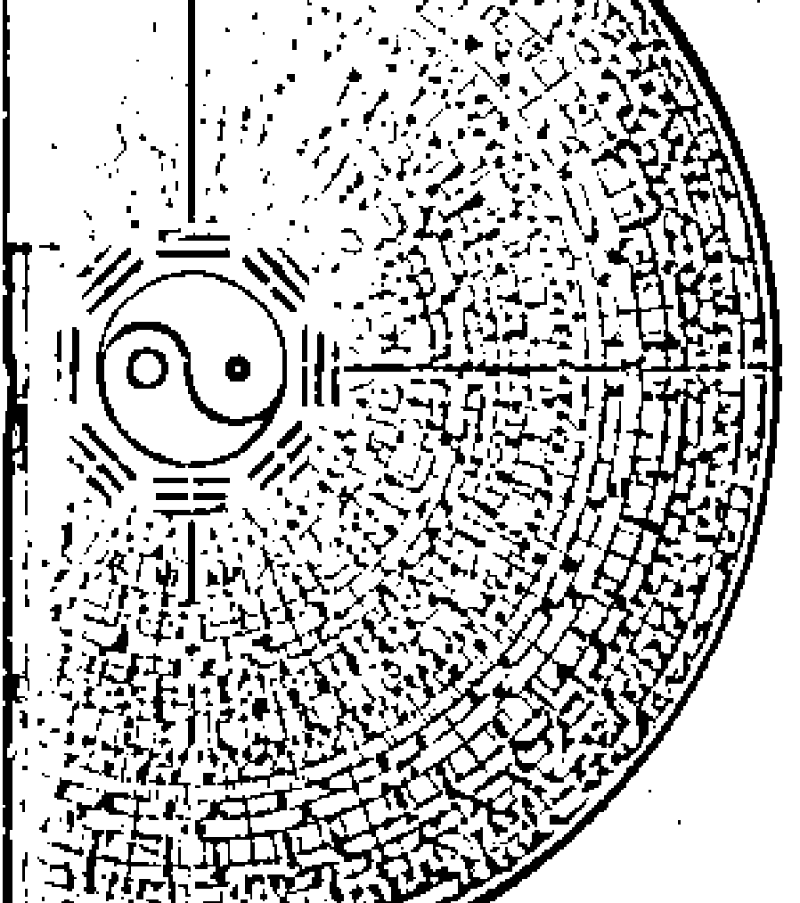

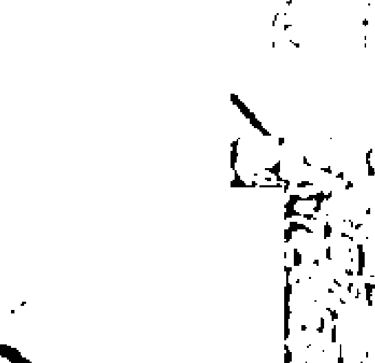

中国古代哲学研究文萃

主编：张志春
编著：徐伟刚

新疆人民出版社

# 图书在版编目（CIP）数据
袖里乾坤 / 张志春主编. - 乌鲁木齐: 新疆人民出版社,2004.6
（中国古代哲学研究文萃）
ISBN 7-228-08794-1
Ⅰ. 袖... Ⅱ. 张... Ⅲ. 周易 - 研究 Ⅳ. B221.5
中国版本图书馆 CIP 数据核字(2004)第 046846 号

| 项目 | 内容 |
| :--- | :--- |
| 责任编辑 | 丁 璇 |
| 责任校对 | 鹿 坤 |
| 封面设计 | 流 野 |
| 出版 | 新疆人民出版社 |
| 地址 | 乌鲁木齐市解放南路 348 号 |
| 邮编 | 830001 |
| 发行 | 新疆人民出版社 |
| 印刷 | 广东科普印刷厂 |
| 开本 | 880×1230 毫米 1/32 |
| 印张 | 54.75 |
| 字数 | 200 千字 |
| 版次 | 2004 年 6 月第一版 |
| 印次 | 2004 年 6 月第一次印刷 |
| 印数 | 1-8000 |
| ISBN | 7-228-08794-1 (全四册)总定价:120.00元 |

（如有印装质量问题影响阅读请与销售书店调换）

▷ 2001年9月26日在安阳甲骨文石碑遗址处留影。

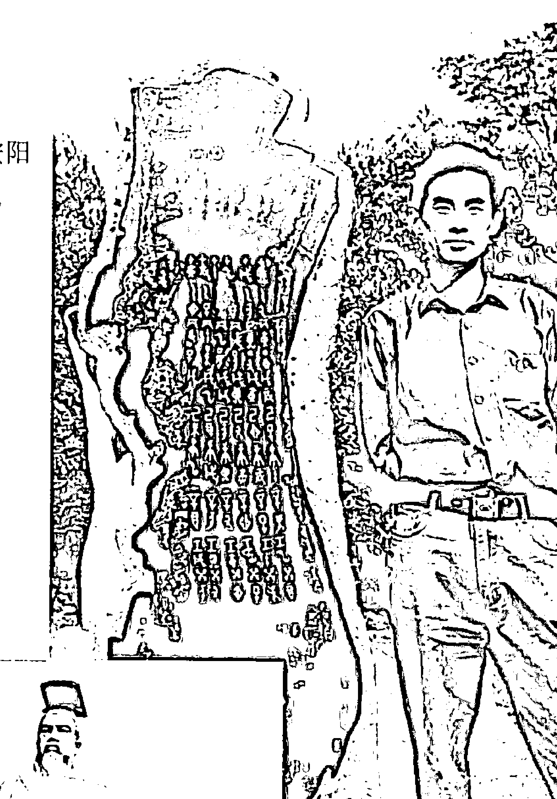

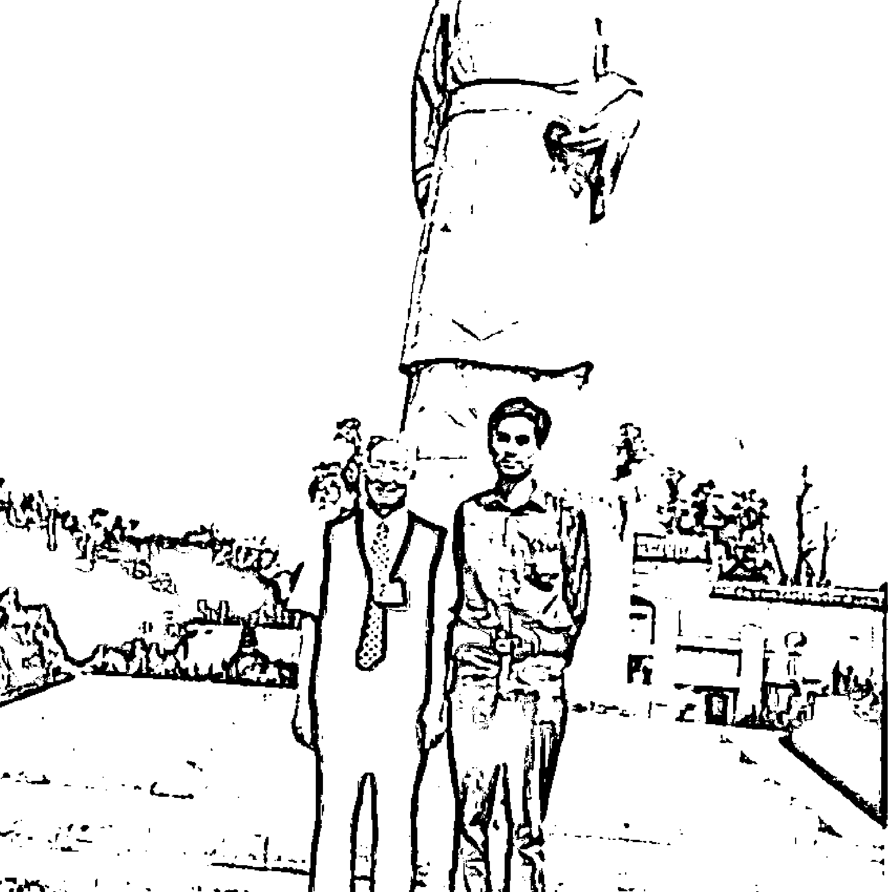

◁ 2001年9月27号与原中国周易研究会会长唐明邦教授在安阳周文王像前合影留念。

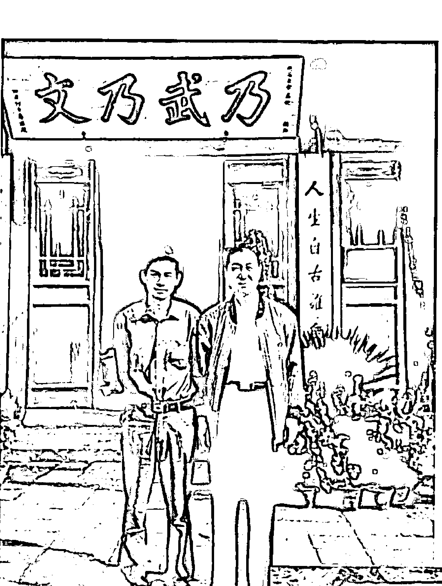

◁ 作者与中国作家协会会员、河北省周易研究会会长张志春先生合影。

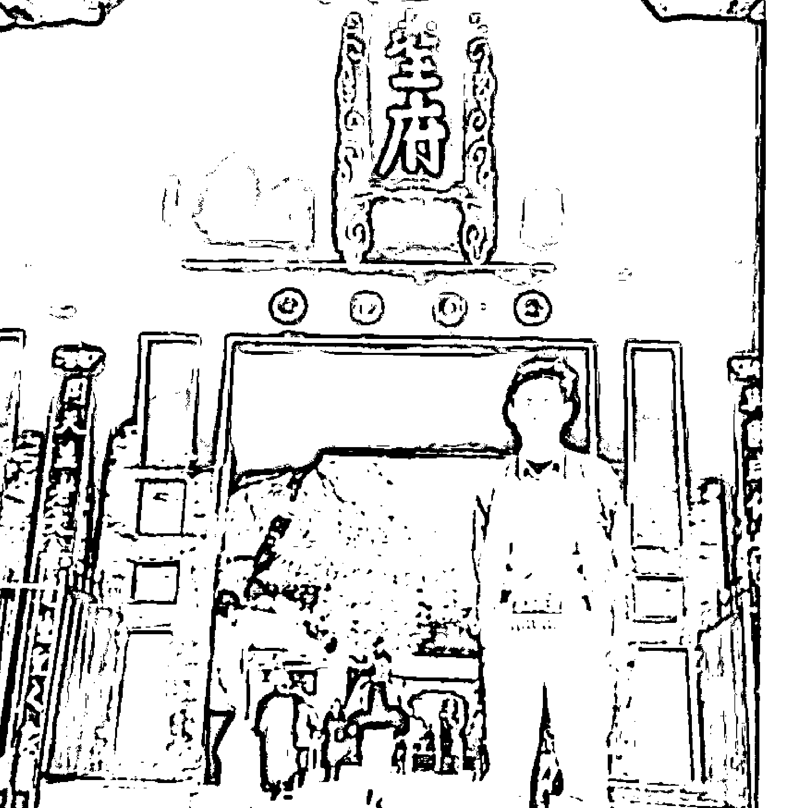

▷ 2001年10月9日摄于孔府。

# 中国古代哲学研究文萃

## 主编导言

党中央、国务院提出在二十一世纪实现中华民族伟大复兴的口号，许多专家都认为，伟大复兴不仅仅是在经济上、科技上、社会管理的进步上，首先应是民族文化的复兴上。因为文化是一个民族区别于另一个民族最稳定、最能体现民族性格的主要特征。而作为自然科学与社会科学高度概括与抽象的哲学，正是一个民族文化的灵魂和智慧的结晶。故而要复兴中华民族的优秀文化，必须首先弘扬中国古代哲学中的精华。

中国古代哲学的主干，是以《周易》为代表几千年来形成的易学思维科学体系。这种思维科学，或叫思维哲学，不仅从理论上作为指导思想，作为世界观、方法论，曾经在中国古代社会大的政治实践、经济实践、军事实践、科技文化实践等各个领域发挥过重要作用；同时，我们的祖先还依据象、数、理、用的独特思维方式，构建了许多预测思维模型，用于老百姓日常生活百事，以检验易学思辨理论的正确程度和准确率。这不能不说中国古代哲学或直接叫易学思维科学的一个重要特征。

二十世纪八十年代改革开放以来，在中国大地上掀起了学习、研究中国古代哲学、中国易学思维科学的热潮，出版了大量研究、用易的新作、新著，为了向海内外展示这二十余年来，中华民族批判继承传统优秀文化，研易、用易的新成果、新水平，我特地选择了九部有代表性的学术论著，编成《中国古代哲学研究文萃》，供广大读者学习、研究和收藏。

张志春
2003年9月

# 自序

在中国源远流长的传统数术文化中，大六壬无疑是其中闪耀着灿烂光辉的奇葩之一。六壬以占验人事而著名风行于世，自先秦战国时代一直到清末民国初期乃至当今社会，历朝历代的一般术数爱好者、江湖术士、知识分子、世外高人、仕宦、文化名人等无数人士对六壬这一学术青睐有加，并倾注心力去作研究。

大六壬作为一门融易经及所有数术精华为一身的集大成者，要接触它去认识它，首先要了解这一学术所建立的基本思想观点。我择其要点，将其归纳为以下六个主要方面：

- （一）六壬是传统“三式”中的一员，与遁甲、太乙齐名，为中国传统数术的顶峰之一。所谓的“式”，是古人模仿天圆地方而制作的一种木质器具，用于壬占的实践。壬式的基本建筑思想是借天道来言人事。它认为天道、人道、地道作为三才之道是一个整体，从现象上看三才之道的表现形式千变万化各有其特殊性；但在其原理和演变规律上，三才之道是一致的。因此，借用天地自然现象的变化来总结若干天地之道，利用三才之道的同一性，去推测可能相应的人事变化现象。这就是壬学立式的基石之一。
- （二）壬式模型的物化与符号化。壬式模型的固定，提供了一整套天地人三才系统所构建的基本宇宙框架与程序。这一体系在符号方面有很大的抽象性、包容性与概括性，古人力图借此用来“究天人之际，通古今之变”。
- （三）壬式模型的五变与十二分。在现实世界之中，万物蠢动，极尽变幻之能事。壬式利用传统阴阳五行学说来描述之概括之：造化之奇，不过五变而已（即五行生克的五种基本关系）。物事物数无穷无尽，壬式用十二地支语言来分类辨方，一览而无余蕴矣！细言之，在天之象，天盘十二将描之尽矣；在地之形，地盘十二神描之尽矣；在人之事，将盘十二天官描之尽矣。
- （四）壬式揭示事变的九种规律。万事万物之演化各有其规律，人事与社会同样有其规律。壬式法天则地，用九大课法则来笼统概括一切事物之基本演化模式。任何一类具体人事物之变迁放入壬式中去作运筹，其基本变化过程不出九大课法则与样式之外，人事亦不例外；一身、一家、一国乃至天下，莫不其然！
- （五）壬式对“物以类聚，方以群分”思想的广泛运用。任何事物之演化，究其原因，都是与周遭事物相互作用相互影响的互动变化过程而已。壬式的课传、年命、正时、天地盘等皆为事物“类”和“群”的聚合，不同事物的类聚与群分，则变化见矣，吉凶生矣！
- （六）壬式实践的灵魂在于对式中“万象”的认识与把握之上。现实世界万事之变化，其表现皆以现象为展示方式。壬占重在“观象”，“观象”之变化旨在对应现实人事物之现象变化，通过由此及彼，从而提前了解推测此类之事物的可能变化趋势与结果。

对以上六个方面壬学立论立式的基本建筑思想，每个六壬研究者务要明白透彻，此为六壬大旨所在！

早在 1990 年，我有缘接触六壬，自此开始了长达十余年来的自学研究之路。1998 年开始着手写作本书，数易其稿。同年，有缘结识张志春先生，张先生对本书的写作提出了不少中肯的意见，对本书的写作思路与定稿有很大的帮助。2000 年底，张先生又审阅了本书稿，给予了充分的肯定。在此书出版之际，谨向张先生的真挚关爱之情表示衷心的感谢！

徐伟刚
2003 年 10 月 28 日于北京

# 目录

主编导言 ··························································· 张志春(1)

自 序 ··························································· 徐伟刚(3)

## 上编：大六壬纵横

第一章 六壬源流与嬗变 ··································· (3)

第二章 六壬的古天文学背景 ··································· (17)

第三章 六壬的易学原理 ··································· (28)

第四章 “三式”关系简论 ··································· (40)

第五章 一些重要壬学问题的讨论 ··································· (59)

第一节 关于昼夜贵人的讨论 ··································· (59)

第二节 课式变化与特征 ··································· (65)

第六章 六壬和纳甲筮法的关系 ··································· (71)

第七章 六壬与八字命学的关系 ··································· (80)

## 中编：大六壬概论

第一章 壬学常识与运算程序 ··································· (87)

第二章 九宗门——排传的九种方法

第一节 贼克法 ........................................ (104)

第二节 比用法 ........................................ (107)

第三节 涉害法 ........................................ (109)

第四节 遥克法 ........................................ (112)

第五节 昴星法 ........................................ (115)

第六节 别责法 ........................................ (118)

第七节 八专法 ........................................ (121)

第八节 伏吟法 ........................................ (124)

第九节 反吟法 ........................................ (127)

第三章 十二局天地盘面概论

第一节 伏吟盘 ........................................ (132)

第二节 退连茹盘 ........................................ (133)

第三节 退间传盘 ........................................ (134)

第四节 病胎盘 ........................................ (136)

第五节 逆三合盘 ........................................ (137)

第六节 四绝体 ........................................ (138)

第七节 反吟盘 ........................................ (140)

第八节 四墓覆生盘 ........................................ (141)

第九节 顺三合盘 ........................................ (142)

第十节 生胎盘 ........................................ (144)

第十一节 顺间传盘 ........................................ (145)

第十二节 罗网盘 ........................................ (146)

第四章 三传总汇 ………………………………………………… (148)

第五章 月将释论 ………………………………………………… (159)

- 一、登明亥 ………………………………………………… (163)
- 二、河魁戌 ………………………………………………… (164)
- 三、从魁酉 ………………………………………………… (166)
- 四、传送申 ………………………………………………… (168)
- 五、小吉未 ………………………………………………… (169)
- 六、胜光午 ………………………………………………… (171)
- 七、太乙巳 ………………………………………………… (173)
- 八、天罡辰 ………………………………………………… (174)
- 九、太冲卯 ………………………………………………… (176)
- 十、功曹寅 ………………………………………………… (177)
- 十一、大吉丑 ……………………………………………… (178)
- 十二、神后子 ……………………………………………… (180)

第六章 月将的理论基础 ………………………………………… (182)

第七章 天将释解大全 ………………………………………… (190)

第一节 天将设置原理初探 ………………………………… (190)

第二节 天将概释 …………………………………………… (194)

- 一、释论贵人 ……………………………………………… (196)
- 二、释论螣蛇 ……………………………………………… (202)
- 三、释论朱雀 ……………………………………………… (208)
- 四、释论六合 ……………………………………………… (213)
- 五、释论勾陈 ……………………………………………… (216)
- 六、释论青龙 .................... (218)
- 七、释论天空 .................... (222)
- 八、释论白虎 .................... (224)
- 九、释论太常 .................... (230)
- 十、释论玄武 .................... (233)
- 十一、释论太阴 .................... (237)
- 十二、释论天后 .................... (238)
- 十三、小结 .................... (240)

第八章 神煞概述 .................... (241)

第一节 简述 .................... (241)

第二节 岁煞 .................... (246)

第三节 季煞 .................... (252)

第四节 月煞 .................... (253)

第五节 干煞 .................... (258)

第六节 支煞 .................... (260)

第七节 旬煞 .................... (263)

第八节 神煞小结 .................... (266)

第九章 壬式六亲性质 .................... (270)

第一节 论禄元 .................... (272)

第二节 论财 .................... (275)

第三节 论官鬼 .................... (281)

第四节 论父母生气 .................... (285)

第五节 论子孙脱气 ........................... (288)

第十章 四课三传概论 ........................... (292)

第一节 日辰四课 ........................... (295)

第二节 发用三传 ........................... (313)

第三节 课传关系 ........................... (319)

第四节 论太阳正时 ........................... (326)

第五节 年命简论 ........................... (330)

第六节 课体简析 ........................... (333)

## 下编：大六壬现代运用

第一章 六壬入占准备 ........................... (341)

第一节 六壬类象及占法汇总 ........................... (341)

第二节 六壬断应期的一些方法 ........................... (354)

第三节 六壬趋避方法 ........................... (357)

第四节 六壬方法论现代化漫谈 ........................... (362)

第五节 关于实例研究的说明 ........................... (365)

第二章 六壬占法及实例研究 ........................... (368)

第一节 天气占测方法及实例研究 ........................... (368)

第二节 家宅占测方法及实例研究 ........................... (377)

第三节 婚姻占测方法及实例研究 ........................... (389)

第四节 胎孕生产占测方法及实例研究 ........................... (398)

第五节 考试占测方法及实例研究 …………………… (406)

第六节 工作占测方法及实例研究 …………………… (412)

第七节 经济占测方法及实例研究 …………………… (417)

第八节 官讼占测方法及实例研究 …………………… (424)

第九节 盗失占测方法及实例研究 …………………… (433)

第十节 出行占测方法及实例研究 …………………… (441)

第十一节 行人占测方法及实例研究 ………………… (447)

第十二节 疾病占测方法及实例研究 ………………… (453)

第十三节 体育占测方法及实例研究 ………………… (462)

第十四节 战争占测方法及实例研究 ………………… (470)

第十五节 射覆占测方法及实例研究 ………………… (478)

第十六节 时事占测方法及实例研究 ………………… (483)

第十七节 阴宅占测方法及实例研究 ………………… (487)

第十八节 终身占测方法及实例研究 ………………… (489)

后 记 ………………………………………………… 徐伟刚(497)

## 上编

## 大六壬纵横

## 第一章 六壬源流及嬗变

六壬是中国历史上最悠久的古典术数之一。秦汉以来，六壬风行于世，对后代的易学及术数研究造成了深远的影响。

关于六壬的名称界定和起始创作，前代学人作过不少的探索与研究，清人俞正燮和纪晓岚在此方面认识显得较为突出，颇值得学者重视。俞正燮在《癸巳类稿·六壬古式考》中对六壬的起始、名称作了详尽的考究。纪晓岚则在《四库全书·六壬大全提要》中不仅对六壬的起源、名称作了考证，并且更对六壬运式的特征、衍变、传承等多方面的历史脉络作了说明，颇为周详。俞纪两人对六壬古式的考证与辨正，对于我们今人了解六壬的来龙去脉大有裨益之功。

俞氏工于考据，但往往失之过繁。不过，他对历代六壬古式的详考，却是要言不烦，采掇颇有道理。其以为：
六壬之起，《道藏》谓自黄帝，名六壬者，神机制胜。《太白阴经》云：“玄女式者，一名六壬式，玄女所造，主北方万物之始，因六甲之壬，故曰六壬。”《武经总要》云：“六壬之说，大衍数谓天一生水，始于北方。”许慎《说文》言水者，准也。生数一，成数六，以水数配之成六壬也。是唐宋人有二说。祝泌《六壬大占》云：周官瞽族氏方书即壬盘。今案壬盘无二十八数。祝说盖迂曲。壬术主北方阴。《白虎通》云：“亥者，阴之始。”又亥位为《易》乾，为盖天之门。壬寄于亥，名六壬宜也。其法以日在加时所临之方为断。

作为《四库全书》的总纂官，有“大手笔”之誉的纪晓岚在《四库全书·六壬大全提要》中也对六壬古式作了考辩，其以为：

> 六壬与遁甲太乙，世谓之之式，而六壬其传尤古。或谓出于黄帝玄女，固属无稽。要其方术，固非后世方技家所能造。大抵数根于五行，而五行始于水，举阴以起阳，故称壬焉。举成以该生，故用六焉。其有天地盘与神将加临，虽渐近奇遁九宫之式，而由干支而有四课，则亦两仪四象也。由发用三传，则亦一生二、二生三、三生万物也。以六十四课，莫不原本爻。盖亦易象之支流推而衍之者矣。

考《国语》伶州鸠对七律以所特夷，则上官大吕上官推之，皆有合于六壬之义。然特以五音十二律定数，未可指为六壬之源。《吴越春秋》载伍员及范蠡鸡鸣日出日映禺中四术，则时将加乘与龙蛇刑德之用，一如今世所传。而《越绝书》载公孙圣亦有今日壬午时加南方之语，其事虽不见经传，似出依托，然越煜哀康皆后汉人，知其原著于汉代也。

对于大六壬的创始作者，俞正燮承袭旧说，以唐人李筌的《太白阴经》（兵书）说是，以为六壬由黄帝玄女所造。这种观点自然不足为信，更被纪晓岚斥之为“无稽”。当然最始立六壬式者，只能是不得而知。笔者猜想，像六壬这般精密精妙的术数，恐非一人一时所能造出，很有可能是春秋战国时代以前乃至商夏期间古人积累创造发展的结果。

虽然六壬到底起于何时，已不可确考。但据古人著述和近代考古发现，六壬术成熟盛行于东汉之前是可以大致肯定的。这里有几个理由：其一，在汉赵晔《吴越春秋》及袁康的《越绝书》中都有相关六壬术的记载，可知在他们之前六壬术已开始流传；其二，在1978年安徽阜阳汝阴侯墓（汉代）就出土了六壬式盘实物，这就证明汉朝（两汉）时人们已经造出完整的式盘来运用了；其三，《汉书·艺文志》“五行家”有《转位十二神》一书，此书中的“转位十二神”实际上就是六壬中的十二神将。因此，《转位十二神》就是当时的六壬著作，是则六壬流行的年代不迟于西汉。基于上述三种理由，将六壬术的流行年代界定在东汉之前大抵上是不会错的。

- 一种观点就是以《太白阴经》之说为主，认为“玄女式者，一名六壬式，玄女所造。主北方万物之始，因六甲之壬，故曰六壬。”这里的“六甲之壬”，就是指六十花甲子中带有壬干的干支组合有壬子、壬午、壬寅、壬申、壬辰、壬戌六种，故称六壬，以六壬支干作“万物之始”来涵盖统率“万物”的六十甲子。这种用“六甲之壬”来解释六壬名目的古老说法，在今人李零主编的《中国方术概观·六壬大全题解》中仍被采用。
- 另外一种观点就是《武经总要》的讲法，这种讲法大概是依据河图天一生水地六成之的道理，认为水的生数成数相加即为“六”焉。纪晓岚所认为的“大抵数根于五行，而五行始于水，举阴以起阳，故称壬焉；举成以该生，故用六焉”，与此颇为相近，粗略可归为一类。
- 第三种观点就是俞正燮自己提出来的：壬寄于亥，亥为乾。以洛书来看，乾数六，乾为卦首，以六壬来命名作课之始、数之首、卜之端，此说亦通。今人李渊在《大六壬浅析》中就持此论。

从六壬术本身来看，跟这三种观点阐释都似乎不太搭界。“六甲之壬”作为六十甲子的六分之一，在六壬运用中跟其他干支一般推演，并无特别之处；而以“生成之数”来言六壬，跟六壬运用基本无关系，就是六壬中支干数目的确定，也是跟河图、洛书的整体相关，跟“水”单独一行的生数成数无必然联系。至于以壬寄于乾来名六壬作课之始、数之首、占之端，则似乎有抬高六壬术数地位的意味。固然六壬中的亥乾天门有重要意义，即亥乾天门是式中贵神顺治逆治的分界标志，但其分界意义的确定跟六壬名目也牵扯不了多大关系。因此，笔者对此三种传统说法，一直抱着质疑的态度。

六壬作为一种古老的方术，纪晓岚认为其是“易象之支流推而衍之者矣”。它的推演方法就是以“日在加时”，转出天盘地盘。这儿的“日在”就是指黄道上太阳所在的位置（星次），“时”就是指求占时辰，将“日在”代表的月将加上地盘占时之上顺时针旋出的活动盘即是天盘；然后依占日干支借天盘地盘的寄宫来布出四课，对照四课上下的生克关系定出发用，由发用作初传，依次求出中传末传，即“一生二、二生三、三生万物”的模拟过程。很明白，六壬的基础就在于“日在加时”，即天盘地盘的叠加之上，这种天地盘的叠加转运由固定的格式组成。古人曾将它们化为器具，即今日发现的古代六壬式盘。六壬之所以称之“壬式”，就是指刻有文字图形的天地盘组合成的器具，专用于六壬占卜。

六壬式盘分为天盘地盘两部分，天圆地方，天盘嵌在地盘当中，中有木轴可自由转动。北宋杨维德《景祐六壬神定经》云：

> 造式：天中作斗杓，指天罡，次作十二辰，中列二十八宿，四维局，地列十二辰、八干、五行、三十六禽、天门、地户、人门、鬼路四隅讫。

即天盘中央为北斗七星，次列十二辰，外列二十八宿，代表列星；地盘列天干，代表五行：东方甲乙木、南方丙丁火、西方庚辛金、北方壬癸水、中央戊己土，分属于天地人鬼四隅，列十二辰，象征八方及日出人之位，地盘上的二十八宿，主十二州，象征地上的分野。

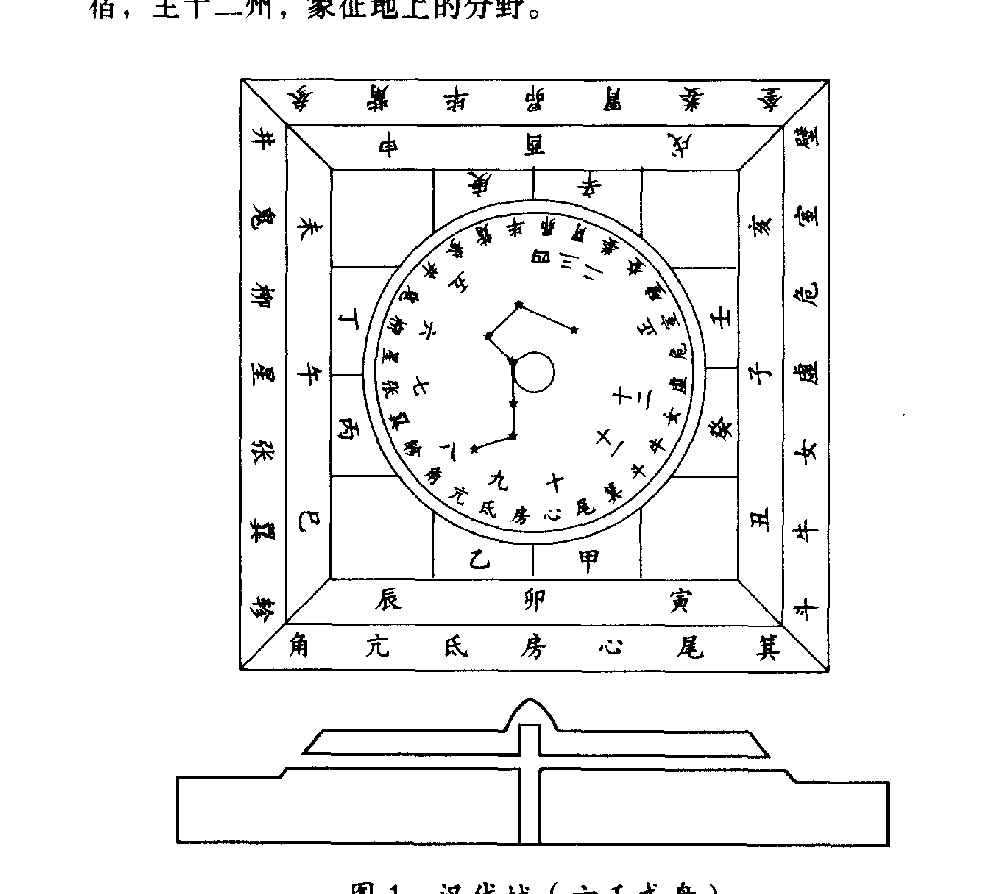

这里笔者引用《考古》（1978年5月）所载的汉代六壬式盘实物的简化图，以管窥古代六壬式盘的特点。

## 说明：

- 1. 天盘为圆形盘，盘中为北斗七星，斗杓指向天罡角宿。
- 2. 天盘周缘有两圈篆文，内圈是正月到十二月的月份，以数字表示。十二月将又名十二神，它们是“登明亥正月将、从魁戌二月将、从魁三月将、传送申四月将、小吉未五月将、胜光午六月将、太乙巳七月将、天罡辰八月将、太冲卯九月将、功曹寅十月将、大吉丑十一月将、神后子十二月将。外圈是二十八宿。所谓月将即“日在”星宿的代表，比如正月雨水后太阳在黄道上进入壁室星宿，即以对应的登明亥为正月将。余仿此。
- 3. 此盘四周为三层篆文：内层为八干四维。由于此为汉代式盘，故尚未写入戊己二干及天地人鬼门名目，至魏代（三国）的六壬式盘始有补上。中层为十二支，代表地盘十二辰；外层仍为二十八宿，代表分野。

近代考古中已多次出土六壬式盘，现尚存原物七具，藏于上海博物馆、故宫博物宫、中国历史博物馆内。原壬盘用法具体推衍，可参见 1978 年第 5 期《考古》严敦杰先生《关于西汉初期的式盘和占盘》一文。

现代不少学者通过对古代六壬式盘、汉代司南和后世的风水罗盘的比较研究，得出了六壬式（包括太乙占盘）是风水罗盘的原始形态或者前身的推测结论，以为六壬式盘和司南的结合是风水罗盘诞生时的雏形。这种看法在今人何晓昕的《风水择源》及程建军的《中国风水罗盘》书中都曾提及过的。

从六壬式盘来看，天盘是圆形的，地盘是方形的。但随着时代的推移，后世为了推演和操作的需要，渐渐地脱离了式盘实物，乃至发展到直接在手掌上排盘起课，或是把天盘地盘写在图2手盘图上，不仅地盘排成方形，连天盘为了书写方便亦渐写成方形了。同时，由于地盘（即十二支辰的排列图）千载不移，古人的壬学书中简略到了只写天盘式子了。地盘在手掌上的排列古人称之为手盘，手盘的发明不仅对推演六壬，更对地支学的研究与掌握提供了方便之门。

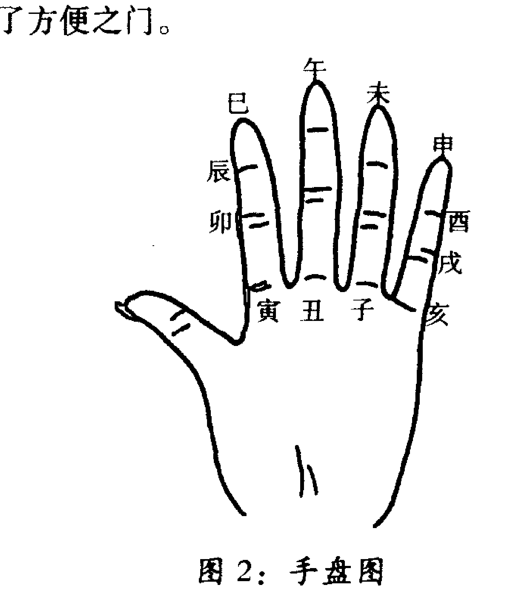

## 图2：手盘图

从历史上看，六壬的风行不仅仅限于东汉西汉，更多地是流行于后世。这种风靡历朝历代的术数，不仅体现在纪晓岚所谓的“其书之见于史者，隋志二家，唐志六家，宋志三十多家，而焦竑经籍志所列多至八十三家”方面，更可散见于各类正史、野史、笔记、小说等著述当中。

像《晋书·戴洋传》中就记载了晋元帝因毛宝叛兵屯邾城命戴洋用六壬占一事。后人钱大昕在《十驾斋养新录》中对此戴洋兵占一课作了解析，钱氏同时意为此六壬首见正史者。而明人陈公献在《大六壬指南》一书中恰巧占得兵斗一课与戴洋所占课相同，以至陈公献感慨“竟与古事相合”。又如因作《颜氏家训》而对隋唐以后中国文化产生巨大影响的北齐大学问家颜之推在《颜氏家训·杂艺篇》中云：“吾尝学六壬式，亦值世间好匠，聚得《龙首》、《金匮玉轮》、《五变》、《玉历》十许种书。”颜之推所讲《龙》、《金》、《五变》、《玉历》都是古传六壬书，这就表明了颜氏对六壬的热衷，花大精力去聚集六壬书作研究。还如唐代著名诗人王健更有“近来身不健，时就六壬占”诗句（见于《贫居》诗），记录了唐代文人就曾广泛地运用六壬测病的情况。在笔记之中，沈括的《梦溪笔谈》也讲到了六壬，沈括对六壬月将的意义、月将的名称、天将的含义都作了精辟的论述，篇幅虽然不多，却都是真知灼见，颇受后人重视。清人吴炽昌在《客窗闲话》续集记有其乡人张君用六壬术为人占卜吉凶的故事，将六壬渲染的十分神奇。古代小说当中，也有述及六壬术的。此方面最典型的要算清人李汝珍在其名著章回体小说《镜花缘》中借孟芸芝之口来大谈特谈六壬的地盘、天盘、四课起例，贵人选择与加乘方法，十分具体详明。这从侧面表明李汝珍对六壬术还是十分的内行。民国文人袁树珊在《命谱·王肯堂》一节中全录了王肯堂对《吴越春秋》中范蠡伍员四术（壬占）的排课研究，对于今人了解六壬古法也有帮助。另外，《古今图书集成·术数名流》中大量记载了精通六壬的历代著名术数人士及其逸事，数量之多，颇令人惊诧……凡此种种，都充分说明了六壬在中国封建时代的盛行程度。

六壬在古代的盛行，就自然导致了六壬学研究的深入与发展，这方面的成果集中体现在各类六壬著作的不断涌现。可惜的是，纪晓岚所谓的六壬其书见之于史者的已经“多散佚不传”，尤其是隋唐以前的六壬古著留传下来的更是寥寥无几，只有《黄帝龙首经》二卷、《黄帝授三子玄女经》一卷、《黄帝金匮玉衡经》二卷，数部书而已。到了北宋，杨维德编撰了《景佑六壬神定经》十卷，宋仁宗亲为作序，是书可能在宋代未加以印行，故流传不广，鲜有引用。直至清同治（1865年），才由会稽赵之谦之叔从书肆中购得明抄本残帙二卷，始刊刻于仰视千七百二十九鹤斋丛书中得以流传于世。另外，宋代还有徐次宾的《六壬一字诀玉连环》一卷、《口鉴》二卷等书。宋元改朝换代之际，祝泌著有《六壬大占》和《壬易会元》二书，前者尚留传至今，后者已失传。明代是中国术数学最为蓬勃发展的一个历史时期，六壬书籍层出不穷。其中以郭载騧的《六壬大全》、松鹤道人的《大六壬秘本》、洞春道人的《六壬神课金口诀》、陈公献的《大六壬指南》、张松源的《大六壬银河棹》、尹希吉的《六壬捷录》几部书影响最大，且都有善本刊行流传后世。清代的六壬专著甚多，出现的多是壬学方面的重要书藉，像纪大奎的《大六壬类集》、毛志道的《六壬经纬》、周宗林的《六壬纂要》、戴辅美的《六壬缉略》、张鋐江的《六壬说约》、刘赤江的《六壬粹言》、李佃的《六壬摘要》、张官德的《六壬辨疑》、徐端华的《六壬直指》等书无疑都为六壬中的大部头作品，分量较重，颇富研究价值。民国时期，文人研究术数成为时髦，韦千里写了《六壬秘笈》，袁树珊作了《大六壬探原》、徐养浩著有《大六壬金铰剪》等书，这些壬学著作在当时也颇有影响。

解放以后，六壬乃至易学术数的研究发展在大陆曾一度中断。改革开放之后，学术界始以较平和客观的目光来重新审视易学及术数学，其中尤以易学研究为主，术数学及六壬仍处于冷落境地，鲜有人去作真正地研究。令人不解感到奇怪的是，虽然国内真正懂六壬的人很少，但有意无意或直接或间接批驳六壬的人倒有不少。比如，卫绍生先生在《中国古代占卜术》一书也曾对六壬术作过一番浮光掠影式的介绍。可惜的是，这些介绍是错讹百出，令人不堪卒读。像卫先生在介绍六壬中的“天乙所在，甲戊庚旦大吉、夕小吉”时认为，六壬中的“天乙”即“太岁”，这种解释显然是个很无知的错误。懂六壬的人都知道，六壬中的“天一”即“天乙贵人”，而决非什么“太岁”，“天乙”是“天乙”为十二天将之首，“太岁”是“大岁”是一年神煞之首，两者完全是两码事。“甲戊庚旦大吉，夕小吉”之意就是指甲戊庚三日白天占课天乙贵人就在天盘丑字之上，若在夜晚占课天乙贵人就在天盘未字之上。卫先生这种见解无疑表明了其对六壬常识性的概念是真的不懂。另外，卫先生还以为六壬术是用来择日择时的，是以月建六合来作为择吉日良辰的标准。事实上，六壬根本不是什么择日学，只能是占卜学。古代的择日学和占卜学虽有联系，但其间尚有清晰的分界。将六壬术的性质搞错而大发厥词，这种虚妄的学术作风令人不肯恭维。又如夏炜先生在《六壬神课金口诀》点校本的前言中，将六壬古法与金口诀法混为一谈来述其历史脉络，对其进行批驳，也是空穴来风，空中楼阁。六壬古法跟金口诀法是完全不同的壬学流派，不可一概而论。不了解这些基本常识，却去对之指手划脚品头论足，则就难免荒谬了。

古传六壬作为一门传统学术，无疑具有预测学的某些特征。如果六壬术真的是十分荒谬全是迷信糟粕的话，那它也不太可能会传承数千年。毕竟古人不是笨蛋，古人也会考虑此种学术是否真有价值？是否值得研究？是否要传之后人？对于诸如此类问题的清醒认识，这就要求我们今天研究六壬，首先要有一种比较客观理性的学术作风。我们既不能提倡古人渲染的什么“六壬神课”之类的称谓；也不走极端，在不了解六壬的情况下轻举妄言，乱下结论，一棍子打死。对于六壬，我们要深入研究它的理论乃至方法论，且要在运用中去实践，是否能够占测事体？占测率有多高？哪些东西的确有道理？哪些是垃圾？一一辩证看待。换言之，我们研究六壬，是将指它当作一种学术乃至文化现象，既不盲目抬高它，也不一味地贬抑它，尽最大可能去探索符合时代精神和科学精神的理论精髓。

“其传尤古”资历甚老的六壬，一方面与太乙、遁甲并驾齐驱，号称“三式”共享盛名；另一方面更成为“孕育”后世一些术数流派的“老祖宗”。
古人对太乙六壬遁甲一直颇为重视，以为此“三式”为我国三大传统秘术，是术数学发展的顶峰。古人甚至以“精通三式谓之神”明显过头的说法来评价“三式”，这里边夸张吹嘘的意味很浓，显然不足为学者所取。传统术数中的“三式”一直是良莠不齐，本来就争议颇大，研究者若再以浮夸的学术态度来对待，必然会滑入错误的泥潭之中。关于六壬与遁甲、太乙“三式”之间的关系研究，笔者下文有专论，这里就作一伏笔了，留于后边再讲。
从秦汉算起直到现在，六壬的存在与发展已将近二千五百多年的漫长历史。这么一门如此源远流长的古老术数，在其历史沿革与嬗变的过程中产生一些学术上的分支与流派，自然也不是什么奇怪之事。就笔者所知来看，六壬的盛行无疑是天罡时课、小六壬、六壬金口诀法、纳甲筮法（今有人美誉为六爻预测法）、八字命学（今有人美誉为四柱预测法）等术数产生的渊薮。就跟六壬的亲缘姓来讲，民间俗传的天罡时课、小六壬、六壬金口诀法无疑是六壬的“近亲”，而纳甲筮法和八字命学则无疑是六壬的“远亲”，前者三种“近亲”术数因六壬在历史上的盛名而使它们沾光不少，后者两种“远亲”术数由六壬发韧乃至自立门户，六壬的影响与功劳不可抹杀。此二种术数作为“后起之秀”，在中国易学史和术数学史上更造成了巨大的影响，成为中国古代最重要的几门传统术数之一。

所谓的天罡时课及小六壬，是附丽于六壬名目的民间小道术数，在理论构建、方法推演上都十分粗鄙浅陋，毫无深义可表征。像天罡时课，实际上就是依照求占者所报的年月日时，按照月上起日、日上起时的方法轮转于手盘之上，查寻占时之际天罡所临手盘地位，以天罡所临的孟仲季不同性质来判定事体吉凶。再如小六壬与天罡时课大致相类来轮排求占年月日时，不过它先把占事结果排于掌上，看占时数到何位，就以何位来断事体情况。其法大致是：阳年正月初一日起小吉，阴年正月初一起留连，按日顺数至占日，再以占日位顺数至占时，看占时停留何位。比如庚辰年正月初八巳时人问求财事，依小六壬法就可这样计算：庚辰年为阳年，则正月初一起小吉，初二在空亡，初三在大安，初四在留连，初五在速喜，实六在赤口，初七又回到小吉，初八则在空亡，既查到初八之位，就以该位上起子顺数轮周六位（与起日法一般），看占时落在什么位置。本例则从初八空亡位作子时，则丑时在大安，依次到占时巳，巳时落在小吉位，就以小吉意义来断求财事，

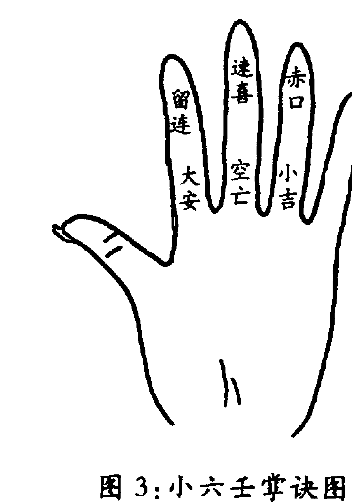

表明求财小吉，必能有所进账。余仿此。这种名叫小六壬的术数，民间有称李淳风时课，或者孔明马前课的，名称不一。后人为了区别这种术数跟六壬古法之间的不同，不得已将正宗的六壬古法称之为“大六壬”以有所区别吧。很明显，天罡时课和“小六壬”跟六壬的天地盘运转有类似的地方。六壬中的天盘是以地盘为基础转出来的，这种一层层的转运叠加方法被小六壬和天罡时课借鉴仿用，化为年上起月、月上起日、日上起时的叠运方法，从而来推测事体情况。小六壬和天罡时课因跟着大六壬而沾光不少，故而在历史上也有不小名气，为江湖术士所钟爱。但两术毕竟十分粗率低劣，无多大道理，因此真正研究易学术数的古人今人对此二术是根本不屑一顾的。

金口诀法无疑是六壬术的一大分支。它以地分为基础（即来人方位），依次转出月将、贵神再遁出人元（地分遁干），以人元、贵神、月将、地分立成课体，以月将贵神神煞的组合作为信息材料，观察四者之间生克刑冲化合关系，结合求占者的年命，从而来推演事体情况。六壬金口诀法又称孙膑占课法，之所以称作金口诀法，主要此一占课方法源自一本叫《六壬金口诀》的书名而已，此法大约于明代开始流行于世。至于金口诀法到底创于何人（讲孙膑发明此法，显然依据不可信）创于何时，已经不可确考。六壬古法与金口诀法的亲缘性最近，运用的信息材料都是以十二月将和贵神为主，连大部分神煞也基本雷同，但两者入式和运算程序、机制却是大相径庭。相对而言，金口诀法的起课形式运算机制及判断范围稍微简单一些，学起来也不是十分困难。而正宗的六壬古法讲四课三传，就排课传的程序及推演方法已是复杂多端，更别说其六十四课体及各类方法论了。六壬古法由星象学、易学、神煞学和支干学四大学说运筹而成，它的复杂程度在所有术数中首屈一指，以至有的学者认为，六壬古法是中国术数中最难学习者。今人对金口诀法研究的人不在少数，但至今尚未见到较具学术功力的专著问世。

纳甲筮法又称金钱代蓍法，是古人在《易经》大衍筮法基础上发展出来的。所谓的纳甲，就是指干支与易卦六爻的组合搭配形式。纳甲筮法跟六壬有很多相类共性的地方，它们都是支干学（阴阳五行说）与易学知识八卦理论结合的产物，它们都主要以地支、六亲、六兽（天将）作为计算时的信息材料和运算符号；它们的运算法则也大多相同。它们仅是在运算形式和运算机制上存在着复杂与简单的程度差异而已。以笔者的研究认知来看，纳甲筮法的整个运算体系都明显地印着大六壬的痕迹。关于此点，基本是可以肯定的。

六壬和八字命学的关系比较明朗，我们这里不说八字命学的是非曲直，只是将此两种学术来作比较看待。很显然，两术都是运用阴阳五行干支学来大做文章的。从早期的八字命学著作如《玉照定真经》、《珞琭子赋注》、《珞琭子三命消息赋注》、《三命指迷赋》来看，八字学的最始研究，普遍采用了六壬古法中的贵神、月将，神煞等术语、概念、乃至种种六壬理论，故而原始形态的八字学，与其说是从六壬中吸取“养料”借鉴运用而成，还不如说是从六壬中分流出来更为贴切。当然，随着明清时期八字命学的不断完善成熟，它的推命理论受六壬的影响似乎越来越少，乃至自立门户，独成一家。不过，八字学毕竟跟六壬有着一脉相承的关系，后世成熟的八字命学中，尚有格局理论和神煞说两大块仍脱离不了六壬学说的影子。因此，对八字命学进行追根溯源的话，一定会撞入六壬术中去。关于纳甲筮法、八字命学与六壬的关系研究，笔者将于后文详论，这里只好点到为止。

## 第二章 六壬的古天文学背景

据传：六壬以占卜人事著称，主要用来推测日常生活百事。六壬的构建原理和理论基础与遁甲、太乙一般，都有广阔的古天文学和历法学为其背景，强调宇宙自然和人类社会作为同一整体的秩序性与和谐性，认为宇宙、自然和人类社会的变化发展都遵循最基本的统一（共性）规律。徐养浩在《大六壬金铰剪》里认为：“壬学根于天学，应于人事，为三式之最。”讲的就是指六壬固以古天文学和历法学为建筑基础，但它的运算体系主要致于民用来推测人生事体。

六壬运式，就是拨动天盘在地盘之上叠加转运的过程。从古代式盘实物来看，天盘地盘上的刻度、文字、图形有着丰富的层次与内涵。仔细研究这些一圈圈的信息，就会发现古天文学与历法学在六壬式盘上得到了广泛的显示与运用。可以这样讲，六壬式盘为六壬跟古天文学、历法学构建了一道联系的桥梁。

中国古天文中的“天文”，系指天上的文彩就是日月星辰乃至云气所构成的种种形象。而古天文学的含义，《汉书·艺文志》天文类序是解释为：“天文者，序二十八宿，步五星日月，以纪吉凶之象，圣王所参政。”《易》曰：“观乎天文，以察时变。”意思是说，天文学就是通过排定周天的星区顺序（二十八宿），推步计算日月五星的运行路线、位置和周期，来记录与人事吉凶祸福相对应的星象异变，圣王据于参政。观测天文的目的，是为了察知时事的变化。六壬既以古天文学为根，自然就要引用其“序二十八宿”和“步五星日月”的内容。关于前者，在六壬的天地盘的刻度就体现出来了；至于后者，牵扯到十二次、十二辰、北斗及日月运行规律等，仅在六壬式盘上得到了部分的反映。

随着古天文学的产生发展与完善，历法学也随之相应建立定型乃至成熟。可以讲，六壬式盘熔古天文学与历法学于一炉，反映了天上星辰运转与地上物候节令的迁变，成为一具实在的宇宙象数理模型。

谈古天文学，首先要讲到北斗。北斗是古天文学中最重要的内容之一。

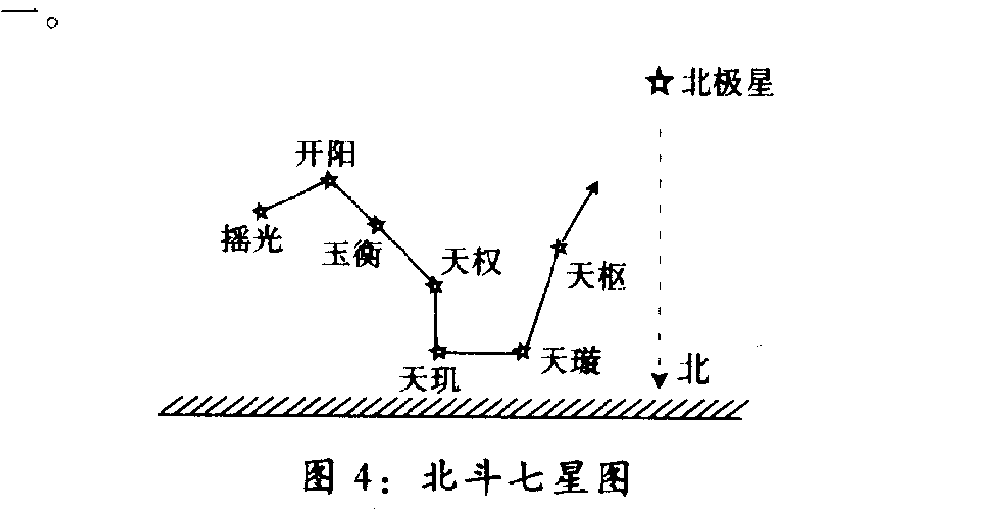

### 图 4：北斗七星图

> ——引自《天文历法通书》P92·黄世平编著

北斗，就是在北方天空中聚集在一起的七颗星体。形象就如斗一样，挂在天边。第一颗星叫天枢，第二颗星叫天璇，第三颗星叫天玑，第四颗星叫天权，第五颗叫玉衡，第六颗星叫开阳，第七颗星叫摇光（此七星名称源自《尚书·尧典》）。一至四为斗魁，五至七为斗柄，合起来就是斗。另外有的也把第一颗叫魁，第五颗星叫衡，第七颗星叫杓，三颗星合起来叫斗纲。关于北斗七星在古天文学上的意义，司马迁在《史记·天官书》中阐发为：

北斗七星，所谓“璇玑玉衡，以齐七政”。杓携龙角，衡殷南斗，魁枕参首。用昏建者杓。杓，自华以西南。夜半建者衡，衡，殷中州河济之间。平旦建者魁；魁，海岱次东北也。

斗为帝车，运于中央，临制四乡。分阴阳，建四时，均五行，移节度，定诸纪，皆系于斗。

司马迁对北斗七星的古天文学意义阐发的话虽然简略，但其意思多重，十分复杂。并且牵涉到四象、十二辰、十二次和二十八宿等，容笔者一一道来。

司马迁所谓的“璇玑玉衡，以齐七政”，就是指北斗七星来整理统一日月五星（七政）的运转次序、位置与规律。至于如何“以齐七政”？就是通过“杓携龙角、衡殷南斗、魁枕参首”来实现的。此三句话就是指古人利用北斗七星来作天体的纵横坐标，以观察天象。

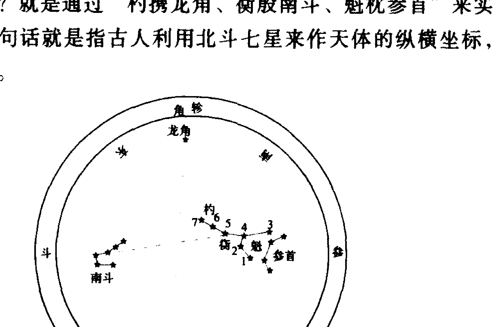

从北斗第一星“杓”引伸一条线上与二十八宿中的角宿相连，下与北极帝星相连，刚好在一直线上，则形成了天体的纵坐标。这就是“杓携龙角，由此二十八宿自东向西轮排于周天，则角宿成为二十八宿之首。这也就是六壬式盘之所以斗杓对准角宿的原因，它是作为二十八宿的始位来看的。以北斗七星的玉衡引伸一条线与南斗相连；以斗魁左右两星两引两条线与参宿左右两肩之星相连，则形成天体的横坐标。斗杓与角宿刚好处于一直线之时，北斗的玉衡则刚好与南斗（二十八宿）在东边与中央处相对，这就是“衡殷南斗”。至于北魁在中央与西侧的参宿头上略高一些，则似乎“魁枕参首”了。北斗七星运于中央，与龙角、南斗、参宿相协，就可以“临制四乡”了，即可依据北斗来辨别方位和季节时令。

大概而言，用北斗来确定方位和季节，主要有三种方法：一种方法就是“用昏建者杓”。就是讲在黄昏时分，观察斗杓（斗柄）所指的方位，就知道什么季节了。所谓的“斗柄指东，天下皆春；斗柄指南，天下皆夏；斗柄指西，天下皆秋；斗柄指北，天下皆冬”。就是指这一方法。如果在半夜里靠北斗位置来辨别方位季节，就要看玉衡所指，玉衡指东，天下皆春了，这就是“夜半建者衡”。如果在黎明时分靠北斗位置来辨别方向季节，就要北斗斗魁所指，斗魁指北，天下皆冬。这就是“平旦建者魁”。一般情况下，人们常用斗柄（杓）的指向来辨别方位季节。如果在上面所述的“斗柄指东，天下皆春……”的基础之上细细分出来，就有形成“斗建”月令说。一年有四季，斗柄指四方，四季有十二个月，则斗柄就自然指向十二方位。天上北斗斗柄所指的十二方位，就是天上的十二辰十二次，也是地上历法建立十二月建的天文基础和天象依据，而天上十二辰、十二次又跟太阳、岁星在周天的运行周期有关，又和二十八宿相关，这些东西在六壬中都有重要运用，不可不作详细介绍。

北斗七星位于北极天顶附近处旋转，斗柄就指向周天四遭一圈的恒星群落。古人由斗柄指向转运通过长期观察发现，这些周天的星座分布跟月亮的运行位置、周期有着密切的对应。月亮每晚进入一个星座，二十八天环绕一周，好像月体每天晚上在这些星座留宿一样，故把这些星座称为“列宿”或“二十八宿”。据天文史专家考证。二十八宿在周初就基本确定下来了。古人在发明确定二十八宿之后，发现岁星和太阳的运行路线与位置、周期跟二十八宿相关。但运行周期各有不同，于是十二辰十二星次就发明出来了。十二星次跟岁星（即木星）的运行周期有关。古人发现，岁星在周天二十八宿上运行一周需要十二年，十二年行一周天，便把岁星一年在周天的运行路线称之为“次”，这样二十八宿便依岁星划分入十二次之内了。看岁星行到哪一次，就知道为哪一年，由此而创建了把周天划分为十二段的岁星纪年法。十二次的名称由西向东，依次为：

- 星纪、玄枵、娵訾、降娄、大梁、实沈、鹑首、鹑火、鹑尾、寿星、大火、析木。

由于岁星纪年法主要观察岁星由西向东的运行方向与位置，与人们视运动天上星辰由东向西的方向不协调，古人在岁星纪年法的基础上发明了太岁纪年法，就是设想一个与岁君运行方向相反的“太岁”在天空中自东向西移行，速度与岁星相同，只是方向相反，太岁移动一周天也是十二年，每年一段。古人把这十二段用十二支来表示，叫做十二辰：子丑寅卯辰巳午未申酉戌亥。这两种纪年法一一对应，如“岁在鹑火”时则“太岁在午”。古人把这两套方法结合使用，所以“岁在某次”又可表示为“岁在某辰”。其配合如下图：

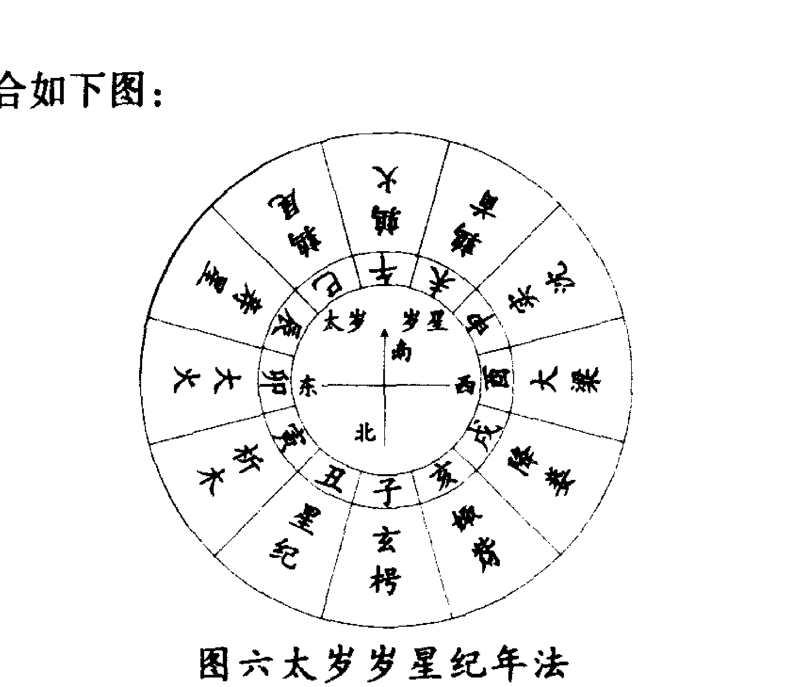

古人发明十二辰十二次之后，发现太阳的运行周期为一年一周天，一月刚好换一“次”，不过太阳也是由西向东道行，与斗柄指向刚好相反。斗柄在中央旋转指向一周，与太阳逆行十二次一周刚好合成一岁，由此前者则形成了历法中的太阳历，斗柄指向十二辰，地面上就相应进入十二辰的月建时令，斗柄指向十二辰后半个多月，太阳才会换星次，由此形成十二中气，古人把斗柄顺转与太阳逆行结合起来作为历法的天象依据，前者为十二节，后者为十二中气，结合成就是二十四节气，二十四节气一圈就是一年。这样下来就是观察地面上的物候跟节气的关系，就形成了历法中的七十二候说。

至此我们明白，二十八宿跟月亮的运行周期有关；十二次跟岁星纪年法有关，也可描述太阳运行位置、周期；十二辰跟太岁纪年法有关，斗柄指合十二辰就是十二月令的转换。十二辰和十二次是不同方向（前者自东而西，后者是由西而东）的周天划分十二段法，周天二十八宿可以单独使用，也可包含于十二辰十二次之中。十二星次包含在二十八宿，实际上形成了周天的双重坐标系，应不同五星日月来采取衡量。

| 辰 | 子 | 丑 | 寅 | 卯 | 辰 | 巳 | 午 | 未 | 申 | 酉 | 戌 | 亥 |
|---|---|---|---|---|---|---|---|---|---|---|---|---|
| 次 | 玄枵 | 星纪 | 析木 | 大火 | 寿星 | 鹑尾 | 鹑火 | 鹑首 | 实沈 | 大梁 | 降楼 | 娵訾 |
| 宿 | 女虚危 | 斗牛 | 尾箕 | 氐房心 | 角亢 | 轸 | 柳星张 | 井鬼 | 觜参 | 胃昴毕 | 奎娄 | 室壁 |

**十二辰次二十八宿对应表**

如此繁杂的古天文学，那么六壬到底是如何运用十二次、太阳和二十八宿的呢？

古人讲“天上十二辰分野，谓之天盘；地上十二方位，谓之地盘；天盘则随时转运，地盘则千载不移”。又讲“六壬用月将者，日躔所在之辰也。斗建顺指十二辰，日逆行十二辰，相会而成岁。斗柄指丑，则日必躔子；斗柄指寅，则日必躔亥。故子与丑合，寅与亥合，推之六合皆然，言日躔与斗柄相应也以月将加时，即日临地盘，子位则为子时，临午位则为午时也。如正月日躔在亥用午时，则是天盘之亥加地盘之午也。视日所加临，遂以其日所值支干在天盘上者，视其加地盘何辰，以起上克、下克、则时之吉凶可知矣。此六壬以日躔为用也”。这段话表明，六壬中的天盘就是指天上十二星次十二辰。它的转运则以月将为首来转的。月将就是每月中气后太阳进入的星次。比如雨水后太阳进入娵訾星次，就是十二辰中的亥宫，即以亥为月将来率领十二辰转动。十二辰一旦转动，二十八宿、斗柄、日月五星也跟着转动。由此一来，六壬中的天盘式子便有了天象活动坐标的作用。按照历法学以天文象为依据的关系，任何一定的天盘转运于上（即天象的转运于上），地面上都有相应的物候节令与之迁变。当然，这里单纯讲六盘转运，是立足于假定地球不动来言的。这种观察结果，我们现在知道，特别是太阳的逆行，实是地球上人们视运动观察太阳的结果。它的本质是由于地球的公转而成，所谓的天盘转，实际上是地球在公球。这种认识跟古人的认识刚好次序颠倒过来了。乍看之下，六壬中的地盘似乎跟古天文学关系不大。其实不然，古人所谓的地盘，以一昼夜的时辰来描述，显然是讲的地球自转。假定天体不动，地球自转一周，那么天上的十二辰十二次二十八宿斗柄都相对于地球也绕了一周。古人讲取时辰作为地盘始位，就是讲地球自转一周中到了何种时段，亦即与天上的星象关系处于何种对应状态。无论是假定天体不动或者地球不动，地球的公转可以等同于太阳围着地球在公转；同样，地球的自转也可以等同太阳等星象在围着地球自转一样，都是一回事。

通过以上分析，我们可以初步洞察古人设置六壬天盘地盘相互叠加的原始用意，那就是天盘可以视作为地球公转跟天象的对应图式，地盘可以视作为地球自转跟天象的对应图式，天盘地盘的叠加可以视作为地球在作公转自转复合运动时跟天象的对应图式。在这个对应图式中，蕴含了十二辰十二次、日月五星、斗柄跟地面上物候、节令之间纷繁复杂的对应交变关系。地球上的万事万物，在承受着地球自转公转的复合运动之时，便笼罩在天上地下无穷无尽的对应交变关系之中，伟大的人类也是概未能免。仔细想想也是，人类再伟大再有能耐，也只能跟着地球去公转去自转，去承受四时节令推移给人类的影响，去承受天象变异给人类的影响……人类再自负，都脱离不了地球这一舞台。换六壬的语言讲，就是脱离不了天盘地盘的制约及其造出的生存背景。

六壬“根于天学”，主要目的是“应于人事”，如何将“天象”“天文”与“人事”对应联系起来？这是古天文学（包含星象学）的“拿手好戏”。古人研究古天文学，主要目的为了揭示“天文”跟“人事”的关系，所谓“明于天之道而察于民之故”是也。从较客观的角度看，天象对人事活动的影响的确是有的。比如“日出而作日入而息”就是此方面的一个典型例证。当然，古人对天象跟人事之间相互影响的关系，决不会停留于“日出而作日入而息”这样肤浅的论断上。比如六壬课经中对日月星三光对人事的影响关系方面描述得相当符合实际中的大致情况。如果不吹毛求疵的话，这些古人的认识还是有一定的道理。六壬以为“日为福德”（给人类赐福），是这样解释的：“日为福德者，日出则奸盗止、鬼神潜、恶兽伏、病者愈，故为福也。”这种对日出跟地面上动植飞走、物候和人类变化的影响关系笼统地讲还是对头的。一到大白天，作奸犯科偷鸡摸狗的坏事的确会明显减少，大多数的动物特别是猛兽就藏伏起来，比如老虎、豹子等都是日伏夜游。这样一来，野兽伤人的可能性就会大大降低。另外，大多数的病人在白天病情会转轻转好，这也基本符合中医理论和事实的大多数情况。由此分析，古人讲日出对地上的万事万物的影响大多是不错的，并没有什么玄乎迷信的成分。至于古人讲的“鬼神潜”，也是古人局于时代见识的想当然，我们后人也不能因古人此点上的荒唐而来苛求古人。另外六壬对月星的认识也是以此思路来展开的。“月为刑者，月夜曜也，则奸盗不止，鬼神不潜，恶兽不伏，病则剧也，故主刑也。星是死奇，谓北斗星也，星斗之光不及日月之曜，处暗之中，奸盗不止也。”很明显，这些论述大多是对的。

天地盘左旋右转，万事万物都在承受着地球自身的公转自转的复合运动。那么，用什么语言或者理论来代表概括万事万物所承受的此一总规律呢？此时，阴阳五行学说和干支学说就派上了用场。阴阳五行学说本身是对天、地、人、物的普遍概括，而干支说则又是阴阳五行学说的深化与细分；因此顺理成章，干支说便替代阴阳五行说用来概括万事万物。六壬视六十甲子作为地球上万事万物的六十类典型代表，用六十甲子跟地盘的寄宫关系来表明个中关系：

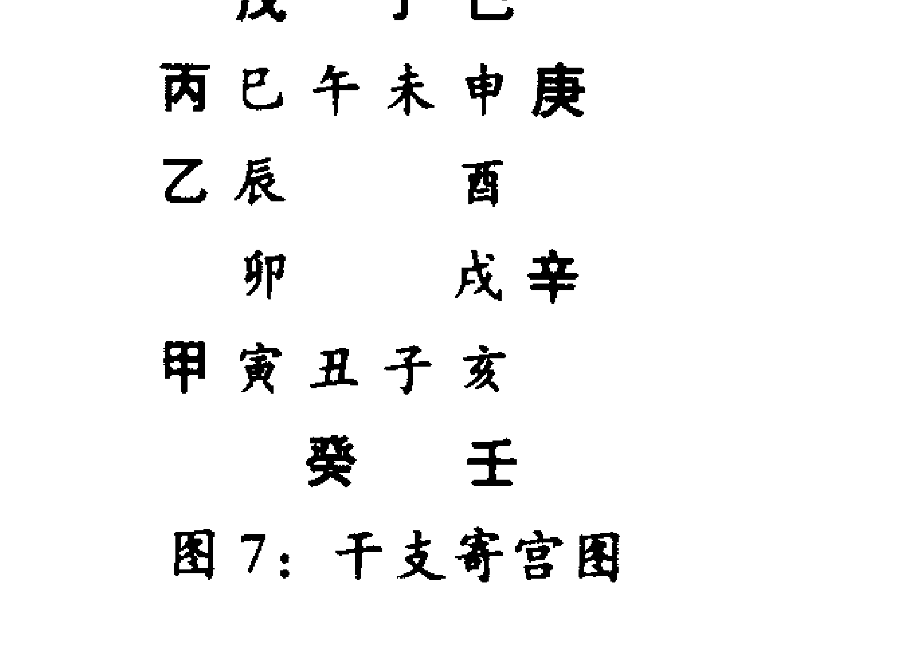

六十甲子分寄在地盘之上，比如“甲子”类，甲寄放于寅上，子则居于地盘子上，表示出“甲子”类事物存在于地球之上。一旦天盘转地盘转，“甲子”类事物跟着天地盘一起转，一方面承受地球自转公转复合运动，另一方面也同时参与天文与人事 物候节令之间的交变关系。由于阴阳五行上应日月星辰，下应万物生灵，故而这样一来，天盘地盘跟六十甲子的交变关系可以臻于无穷，那么再复杂的人类社会也会在此关系交变中有所显示体现。固然六十甲子类事物跟天盘地盘的转运交变会生生不已，没有穷尽。但其两者的关系形式却有一定数量：天盘地盘的叠加效应共有十二类，假以六十甲子，就可以化为60×12=720式，此七百二十式就成为六壬中描述万事万物生变不已的基本关系模式，遂此构成了大六壬的运算体系。

大六壬不仅在构制原理上依赖以古天文学和历法学，在其运算体系的研究上也充分借鉴古天文学（包含星象学）的积极成果，其中堆积了浓厚的民俗意识。比如六壬中天盘地盘丑子两宫相加，六壬借丑宫有牛宿（即民间传说的牛郎星），子宫有女宿（即传说中的织女星），依据子丑六合原理，拟此象为牛郎织女相会吉格，用来类指婚嫁必成，很有意味。又如魁星说，由于北斗第一星抵于十二辰中的戌宫，即以戌名为河魁天魁（第一星名为魁），如考试占逢戌加临日干年命，六壬以为逢此象必中魁元，诸如此类很多。大概而言，十二将的原始含义基本取材于二十八宿的星象意义。另外，九宗门中的昴星课就是借据天上酉宫昴宿来作课排三传的。课经中的二烦课、天寇课则是考虑日月两曜加子午卯酉四宫对课传的影响来作课体的。总而言之，古天文学是六壬学建立的基础学说之一，古人在此方面的研究曾经很深。

## 第三章 六壬的易学原理

按照古人的传统看法，太乙、六壬和遁甲“三式”都视认为是仿效《易经》而作成的。《岩栖幽事》云“太乙六壬遁甲，此三部书原本于《易》”即是专指此意。太乙遁甲姑且不论，六壬是否仿效《易经》而成？又是如何取仿取效？六壬跟《易经》到底有啥关系？六壬是否确为“易象之支流推而衍之者？”等等。这些问题作为学术研究，是不能也不应该回避的。

一般人都认为《周易》就等于《易经》，《易经》就等于易学，这是不确切的。笔者本节中所述及的“易学”，是比较广义的。它包含了《易经》本身及后人对《易经》研究的一切成果。古往今来，搞易学研究大概都走“义理”和“象数”两条路子。“义理”派大搞“经院哲学”，空洞无物，大而无当。比如笔者早期就接触了大量的此方面的东西，看了以后不知到底有啥用场，若讲从中领悟人生哲理，未免过于牵强，要真的学点为人处世的道理，还不如去读《颜氏家训》、《呻吟语》、《围炉夜话》等书来得直截了当，去看《易经》反会搞糊涂。所谓的“义理”派即是此方面最典型的代表了。总而言之，学习“义理”派易学，仅能了解一些易学常识而已，真正能对人生有啥作用就很难讲了。

“象数”派易学固然有神秘玄乎的一面，但它的“学以致用”的效果却是实实在在的。“象数派”易学直接衍生出中医学、养生学和占筮学。“象数”学对中医学养生学的深入研究无疑具有重要的理论指导意义。占筮学最是体现“象数”神秘色彩的一门传统学术，历史上的争议一直很大，到二十世纪基本被戴上“迷信”的大帽子，占筮学落得这般境地似乎甚为难堪。可是看着中医在本世纪的遭遇就会心态平和了，传承数千年造福无数中国人的中医学，在二十世纪却遭到了不少充满“科学意识”的学者的轮番攻击与批驳，甚至被谬为“大毒草”不亦悲乎？谁叫你中医学搞阴阳五行呀，搞精气神呀！占筮学也讲阴阳五行、乾坤八卦，活生生的有效果的中医学尚且会如此，占筮学就自然更惨了。当然，无有必要为占筮学抱不平或者去正名，占筮学之所以会落到这种结局，跟它的学术流弊是分不开的。我们研究占筮学乃至太乙六壬遁甲“三式”等，是将它们视作一门学术或者文化现象加以探讨，并不是去想抬举它们或者去贬抑它们，只是去想真正了解它们的如实面目。

《易经》为“万占之祖”，是专指它的象数理论而言的。六壬作为一门占测术数，跟象数理论联系到一起是很自然的了。象数学的范畴，大致包括了太极说、河图、洛书、先天八卦、后天八卦、六十四重卦、卦气说、纳甲说等主要理论。这些理论集中地体现了象数学所以为的宇宙本体论、宇宙生成论和宇宙秩序论等。象数学综合运筹这些理论，力图构建一个能够描述“万物迁变、穷尽造化、终始古今、囊括天地”的宇宙模型。六壬充分借鉴了这个模型中的先天八卦、后天八卦和卦气说，作为诠释运算体系的理论依据之一。

下面来先谈一下先天八卦，卦图见下。先天八卦据传是伏羲## 先天八卦图

> 《周易·说卦传》是这样阐释先天八卦的：“天地定位，山泽通气，雷风相薄，水火不相射，八卦相错。数往者顺，知来者逆，是故易逆数也。”又说：“雷以动之，风以散之；雨以润之，日以烜之；艮以止之，兑以悦之；乾以君之，坤以藏之。”

历代易学研究者对先天八卦图有种种解释不可详述，其中不乏虚妄繁琐之说，讲来讲去说不清问题。笔者不揣卑陋，试着提出自己浅薄的见解。窃以为：先天八卦是象数易学对地球自转规律及相应现象的图像描述。

这个描述过程是这样的：圣人站在地球上长时间观察，发现总是天在上，地在下，“法象莫大乎天地，”于是便把“天地定位”了。“天地定位”之后，圣人又发现，日从东升，从视运动角度看“往者顺”，日顺转从西落山；月从西升，以视运动角度看“来者逆”，月逆转从东落下。日月在定位的天地当中不断地一顺一逆相错运行，逐此便以“日月为易”成逆数了，圣人同时也发现，在“天地定位”中“日月运行”形成的昼夜交替现象之中，还有风云雷电雨泽夹杂在其中，于是将此四象作为隅卦排于四正卦之中。至于先天八卦的卦爻组合图像，则完全是对日月运行过程中造成“昼夜之象”的阴阳消长的描述与表达。比如日月由天主宰即“乾以君之”，运行至上方天中央，皆成纯阳纯光明之物，此象便用“☰”三划阳爻来表示，日月运行至地下全无光辉，此象便用“☷”三划阴爻来表示，同时也表示日月被“地以藏之”了；震巽艮兑的卦爻图像是对日月运行中阴阳消长的图示，这种图示圣人又作了另外阐释，同时被成为雷风山泽象了。总而言之，笔者以为：先天八卦是用来描述地球自转规律及现象的。

下面再谈后天八卦，卦图如下。后天八卦据传由文王所作，故又称文王八卦。

《周易·说卦》是这样解释后天八卦的：“帝出乎震，齐乎巽，相见乎离，致役乎坤，说言乎兑，战乎乾，劳乎坎，成言乎艮。”又说：“万物出乎震，震东方也；齐乎巽，巽东南也；齐也者，言万物之吉齐也；离也者，明也，万物皆相见；南方之卦也；圣人南面而听天下，向明而治，盖取诸此也。坤也者，地也，万物皆致养也；故致役乎坤。兑，正秋也，万物之所悦也，故曰说言乎兑。战乎乾，乾西北之卦也，言阴阳相薄也。坎者，水也，正北方之卦也，劳卦也，万物之所归也，故曰劳乎坎。艮，东北之卦也，万物之所成终而所成始也，故曰成言乎艮。”

如按笔者对先天八卦阐释的思路来看，后天八卦显然是对地球公转规律及现象的图像描述。

先天八卦和后天八卦被“圣人”排成图形，明显是欲表达地球自转公转的周期的循环特征。另外，先天八卦和后天八卦的八个卦次方位，则完全是“圣人”依据一定时令下相应空间现象的状况来布置的。因此，先天八卦和后天八卦，既可看作地球自转公转周期规律的时间流转图，也可看作地球自转公转过程中现象“法象”的空间分布层次图。如果统一起来看，便成为时空规律与现象的统一图。

古人针对先天后天八卦，大讲体用关系，以为体生用、用蕴体，体中有用、用中有体，令人迷惑不解，邵雍更将体现宇宙化生及秩序的八卦生成关系用家庭关系模式来作论证，神秘莫测，玄乎异常，令人迷惑不解。如果依笔者的想法来看待体用说，就很明白了。地球的自转运动之中配合着公转运动，地球的公转运动中融合着自转运动，相应的自转现象“昼夜更替”的循环也就交融在公转现象“四季轮回”的变化之中。

了解到了先天八卦和后天八卦的意旨之后，对照六壬的天盘地盘，就会了解六壬是如何运用先天八卦后天八卦理论的。

六壬中的地盘，是以一昼夜十二时辰的地支排成的，它是地球自转规律的地支表述：

先天八卦则是地球自转规律的卦象表达，此二者完全可以匹配相互诠释运用。

先天八卦跟地盘相配：子配坤，丑寅配震，卯配离，辰巳配兑，午配乾，未申配巽，酉配坎，戌亥配艮。这样一来，六壬地盘中的十二支辰的意义可用先天八卦的卦象卦名等意义来阐释了。比如六壬取卯酉跟坎离匹配象，认为卯酉为日月出入之门，又取子午跟乾坤匹配象，认为子午为天地之门，等等。

另外，依据先天八卦所描述的昼夜交替现象，以太阳出离入坎所包含的六个支辰为白昼，以太阳入坎出离包含的六个支辰为黑夜。也就是讲依先天八卦坎离之间即六壬地盘卯酉中间画一直线可作为地平线。

地平线之上的时辰太阳运于上面为白昼，地平线之下的时辰太阳运于下而为夜晚。当然，由于后天八卦的作用，太阳出入的实际时刻并不严格遵循出卯入酉规律的。冬至时白昼最短，夜晚最长；太阳出辰入申；随后白昼渐长，到夏至白昼最长，夜晚最短；太阳出寅入戌；随后白昼渐短，夜晚最长。这就是地球自转过程中太阳日照时间长短受公转的影响。关于个中规律，请看如下日行三道图：

## 日行三道图

——引自《易学图解》P36·邹学熹编

日行三道图，实际上表明了不同季节太阳不同的出入方位和时间，这些日出日入的时间不同，在六壬的运算中颇具重要意义，这决定壬式中贵人的昼夜选择。比如同样是寅时占课，若是在夏天占测，则起课排将盘要依是日天干昼贵来转；若是在冬天占测，则起课排将盘要依是日天干夜贵来转。夏天寅时取昼贵是因为太阳已升起算白天了，冬天寅时取夜贵是因为太阳尚未升出还算夜里看。

六壬中的天盘，是以天上十二辰次排列而成的。天上斗柄所指十二辰顺转，则地面时令也跟着迁变，春夏秋冬随之轮回。因此，六壬中的天盘事实上是跟地面上表述地球公转现象的后天八卦是相对应的。

## 后天八卦配天盘图

后天八卦跟六壬相配：子配坎，丑寅配艮、卯配震、辰巳配巽、午配离、未申配坤、酉配兑、戌亥配乾。这样一来，六壬中天盘十二支辰的含义也可用后天八卦中卦象卦名来阐释了。比如卯可类指长男、雷、取卯震相配象，酉可类指少女、泽，取酉兑相配象。从先天八卦跟地盘相配到后天八卦跟天盘相配，可以看出，六壬中的天盘地盘都是用十二地支的轮转表达的。故而，先天八卦和后天八卦在对六壬天地盘十二支辰的诠释上并无清晰的分野，两者混合应用。比如六壬中对地盘意义的看法上，子午卯酉取先天八卦中的日月之门、天地之门象。而地盘中的四隅又取后天八卦的四隅卦来解释。比如地盘中的亥宫取乾象，被称之“天门”，地盘中的寅宫取艮象，被称之“鬼门”；地盘中的巳宫取巽象，被称之“地户”；地盘中的申宫取坤象，被称之为“人门”。

我们知道，易学中的八卦，既是时间的指代，也是空间的表达，更是万物的象征与类指，八卦相荡、模拟万物相互作用发生关系，占筮学就利用一定方法获得卦象，利用卦象和时空表述信息来类指事物吉凶。六壬用地支替代八卦，以地支的“生克刑冲化合害”的数学语言来模拟描述八卦之间错综的万象，力图在对事物的推测中将占筮学中的卦象语言描述转化为用地支语言来替代的数学描述，这就是六壬运算跟占筮学运算的主要联系和区别。

汉人创造发明的十二辟卦学说在六壬的天地盘中得到了实在的运用。凡十二卦配十二月，每一卦为一月之主。辟者，君也，主也，主十二月。

## 六壬地盘十二支与十二辟卦是这样匹配的：

- 子配复卦，为一阳初生一位；
- 丑配临卦，为二阳四阴之位；
- 寅配泰卦，为三阳三阴之位；
- 卯配豫卦，为四阳二阴之位；
- 辰配夬卦，为五阳一阴之位；
- 巳配乾卦，为纯阳之位。

从上可以看出，自子位到巳位，阳渐生盛而阴渐消失，有“君子道长，小人道消”之象。巳位纯阳，其数已终，所谓“阴绝于巳”是也。

- 午配姤卦，为一阴初生之地；
- 未配遁卦，为二阴四阳之地；
- 申配否卦，为三阴三阳之地；
- 酉配观卦，为四阴二阳之地；
- 戌配剥卦，为五阴一阳之地；
- 亥配坤卦，为纯阴之位。

以上可以看出，自午到亥位，阴渐生盛而阳渐消灭，有“君子道消，小人道长”之象。亥位纯阴，阳数已终，所谓“阳绝于亥”是也。

对于十二辟卦的运用，六壬作了些微调整。其认为：亥虽为纯阴之地，但阴极必生阳，是以亥中阳气已生，至子位一阳始蔚然成象；是以六壬视亥子丑寅卯辰为六阳位。巳虽为纯阳之地，阳极必生阴，是此巳中阴气已生，至午地一阴始蔚然成象；是以六壬视巳午未申酉戌为六阴位。六壬式中贵人排治事政，必遵循“扶阳抑阴”之大原则，故而天盘贵人加临六阳位，顺治以“扶阳”；天盘贵人加临六阴位逆治以“抑阴”，此就是六壬设式中天盘贵人十二天将顺治逆治的理论依据。

通过以上的综合可以看出，六壬的天盘地盘虽然形式极其简单，用地支十二个字就表达出来了。但它的内涵与层次十分丰富，既可表征天上十二辰次二十八宿，又可表征地上十二方位，还可用于纪年、纪月、纪日、纪时，包含古天文学、历法学和易学的象数理气，真可谓讲“天地都在一盘中”了。

六壬运式仿效《易经》而作，主要是体现在天地盘的叠加转运与占日干支排出四课、三传起例的运算程式上。纪晓岚认为六壬由“支干而有四课，则亦两仪四象也”。陈公献在《大六壬指南》中以为：“夫月将加时，则无极而太极也；加时而有天盘动而生阳，地盘静而生阴，乃太极生两仪也，至于干支分四课布，非两仪生四象？故曰一阴一阳之谓道，阴阳不测之谓神。”从六壬的运算程序来看，先确定月将和占时，然后把月将加到地盘占时之上转出天盘，再依据占日干支，利用干支寄宫地盘之上所加临的天盘支辰，化出二课。干上加临神为第一课，为干阳神，支上加临神为第三课，为支阳神；后再在干支阳神的地盘本家再得天盘支辰来作支干阴神；干阳神地盘之上加临神为干阴神，支阳神地盘之上加临神为支阴神。由此下来，干化出干阳神和干阴神两课，支化出支阳神和支阴神两课，即两仪（支干）生四象的过程，四课作四象是这样的：干阳为阳中阳，干阴为阳中阴；支阳为阴中阳，支阴为阴中阴，这就与太极生二仪、二仪生四象形同一辙了。

> “支干而有四课，则亦两仪四象也”。陈公献在《大六壬指南》中以为：“夫月将加时，则无极而太极也；加时而有天盘动而生阳，地盘静而生阴，乃太极生两仪也，至于干支分四课布，非两仪生四象？故曰一阴一阳之谓道，阴阳不测之谓神。”

至于根据“九宗门”的方法来研究四课以排演三传，即纪晓岚所以为的“由发用而有三传，则亦一生二、二生三、三生万物也”的过程。此一六壬排三传的方法，其显然源于《道德经》的宇宙生成论思想。而看四课分布，其又显然源于《易经》太极生二仪、二仪生四象、四象生八卦，八卦成大业的宇宙生成论思想。六壬排课传融合《易经》、《道德经》的两种宇宙生成论思想，其运算程式也就可想而是怎样的复杂了。

纪晓岚等在《六壬大全·提要》还讲到六壬的“六十四课，莫不原本義爻”，考察《六壬大全·课经》中的六十四课，的确有取仿《易经》形式的样子。

《易经》的六十四卦的表述形式是：先列卦名，再列卦象，次列卦辞，后列爻辞，共卦有六十四卦。六壬课经专仿此，先列课名、再列课象，次列课辞，后列对应卦中的典型吉凶爻辞两种，以作佐断。比如“课经”中的“龙德课”，对应《易经》中的“萃卦，”并引“萃九四大吉无咎”之象和“萃初六有孚不终”之象来论证课象。正因为《易经》有六十四卦，六壬专列了六十四课跟易卦对应。另外，古人更把“课卦”两名，“传”“爻”两名相淆概称，不作区别。像“龙德课”也可叫作“龙德卦”，“铸印课”也可叫做“铸印卦”，再如六壬课中的三传，壬学中也叫“爻”，如初传为官鬼，则称为“官鬼爻”，如日辰上见父母，则称为“父母爻”“长生爻”等等。这两种情况在六壬中比较普遍，仔细追究下来也无特别意义，大概可能是古人为了抬高六壬地位特意去跟《易经》“套近乎”吧。

六壬大量援引象数易学的主要理论和方法，从而要将其本身捆绑到象数易学当中去了，对六壬的易学理论要作出评价，就要集中到象数易学身上。象数易学有何道理，这是个老话题，笔者这里不想展开此方面的讨论。反正六壬作为一门占测术数，能够攀上《易经》这根“高枝”确是殊为不易，且在历史长河中可与《易》共浮沉共荣辱了。

## 第四章

### “三式”关系简论

太乙六壬和遁甲是中国历史上最有影响力的被古人视为最高深的三门经典术数，概称“三式”。关于此“三式”，《中国方术大辞典》是这样注释的：“指太乙、六壬和奇门遁甲。”《唐六典》卷一四：“太卜令掌卜筮之法，以占邦家动用之事……凡式占，辨三式之同异。注：一曰雷公式，二曰太乙式，并禁私家畜；三曰六壬式，士庶通用之；雷公式，即遁甲……”《四库全书·术数二·六壬大全》：“六壬与遁甲太乙，世谓之三式，而六壬其传尤古。”这里的“三式”中的“式”，即“栻”字，也即太乙六壬遁甲之术占卜所用的器具即式盘。三式“式盘”结构大致相类，皆由圆形天盘嵌在方形地盘之上叠加而成。

太乙六壬遁甲“三式”，实际上是不同模式的术数运算体系。关于它们的不同占测用途，明代著名学者万民英在《三命通会·论支干源流》中曾谈到：

> 古今高人达士稽考天数，推察阴阳，以太乙数而推天运吉凶；以六壬而推人事吉凶，以奇门而推地方吉凶；以年月日时而推人一生吉凶。

太乙数能推天运，六壬能推人事，奇门遁甲能推地方，由此天道地道人道三才之变化可赖“三式”测算而知，“三式”用途之大，很是了得，这也难怪古人要讲“精通三式谓之神”之类的话了。

太乙、六壬和遁甲之所以当作“三式”被古人联系起来一道讲，除了“三式”都用式盘来占卜此一主要原因之外，还有一些其他的重要原因。

首先，“三式”都宣称其术是由九天玄女传授给黄帝的，黄帝赖此三术打败了蚩尤始平定天下。

> 清人李自明在《太乙数统宗大全·总序》里讲：“昔黄帝与蚩尤战于涿鹿之野，天作大雾，以雾尽昏，风后相帝造指南车，尽取诸太乙之法也。传袭至今，上下三千年除年例目，以为术数。”

自诩太乙数上承黄帝风后。

> 《奇门遁甲统宗大全·遁甲穿壬》里讲：“详推六甲所由起，创置乃自于轩辕，得玄女阴符之术，战蚩尤涿鹿之野。”

也自吹遁甲由玄女黄帝传授创置。

> 《太白阴经》云：“玄女式，一名六壬式，玄女所造。”

则直接称六壬术由玄女亲造。考玄女黄帝风后数人，皆是中华民族中的传说人物，谓之“子虚乌有”也未尝不可。古人硬把“三式”攀上玄女黄帝，显然出自自神其术或粉饰三式出身尊贵的心理，完全是自抬身价的做法。这些种种虚空的说法，早被纪晓岚斥之“无稽”，习者毋当真。如果客观地看“三式”创始一事，按常理推测，“三式”最有可能是上古时期能“稽考天数推察阴阳”即万民英所以为的“高人达士”不断研究积累发展出来的，而决非什么玄女黄帝类的人物。

另外，“三式”都渲染历史上一些据传能掐会算无所不知无所不晓的著名人物，比如姜太公、黄石公、张良、东方朔、李淳风、袁天罡、诸葛亮、刘伯温等人在“三式”的发展过程中都参与了研究与运用。如六壬的古典赋文《指掌赋》再三提到姜太公，讲：“太公立三传，极重在发端，归结在末传。”又讲：“太公前止用天将十一，后见丑位，为己土之精，北斗之枢，是十二宫气化拱照之地，因而加一名，曰天乙贵人，贵人即丑也。”还讲：“子午卯酉所藏乙丁己辛癸五阴干，阴为刑，偏阴为极；故太公立课将五阴干移于四季，正此谓也。”似乎六壬中的立课规律、三传发用关系、十二天将贵人的确立等都是由“姜太公”来前定“拍板”的。另外《指掌赋》中对应期的论述还有所谓的“东方朔克应歌”之类的东西。再如《奇门统宗大全·烟波钓叟歌》中讲：“因命风后演成文，遁甲奇门从此始；一千八十当时制，太公删成七十二；逮于汉代张子房，一十八局为精艺。”认为在遁甲一千八十种硬局转化到十八种活局的过程中，姜太公、张良都参与了，有不少功劳。更有甚者，后世盛传的《奇门统宗大全》、《奇门遁甲全书》二部奇门典籍则直接署为诸葛武侯原著刘伯温先生校订，将诸刘两人变成了著述奇门遁甲的术数大家。《太乙金镜式经》中的“推冬至太乙加时变行”、“推八门用法”、“推九宫所主法”等等都依张良“所云”，另外的“推八门占岁计法”、“推提挟法”等都依李淳风“所云”……“三式”之中运用这些似真似假的说法，还有很多。但基本上都不可信。要知道，历史上的张良、诸葛亮、刘伯温等人辅佐帝王建功立业来夺取天下，都是依据各种各样的战略决策，这些可信的事实可见于正史。这些人物的运筹帷幄神机妙算完全建立在对时势的正确观察与分析之上，而决非依赖什么“三式”中的神数神课之类。这样一个比较客观的历史事实，对于今天研究“三式”的学者来讲必须要有清醒的认识。说到底，古人（特别是不知名的术士们）拉姜、张、李、袁、诸、刘等人到“三式”乃至其他术数当中，动机无非是欲扯虎皮作大旗来招摇欺世。

导致“三式”联系在一起讲的最重要原因，大概是在“三式”都效仿《易经》而作成此一点上。对于“三式”造式方面的共性，就必须深入“三式”中去探讨。这些探讨不仅有助于了解历史上“三式”的真实面目，另一方面也是评价“三式”历史和现实双重意义的依据所在，并且对于探讨“三式的相互关系也是不可或缺的。

下面先来展开对太乙数的研究，天地人三才三元之中天元为第一，故而太乙被视为“三式”之首。

大乙仿易理而作，大抵本于《易纬乾凿度》太乙行九宫法太乙的数值，依时辰推算成局。太乙每一元为七十二局，太乙三年游一宫，二十四年而游九宫毕，不过太乙行九宫的次序是

| 九 巽 | 二 离 | 七 坤 |
| :---: | :---: | :---: |
| 四 震 | 五 | 六 兑 |
| 三 艮 | 八 坎 | 一 乾 |

以乾巽为一九，与后天八卦九宫位置相差一位（此点与遁甲布局相异，遁甲飞布以洛书九宫而依归），就是将八卦九宫宫位逆时针旋转45度，以乾为一宫、巽为九宫、震为四宫、艮为三宫、坎为八宫、兑为六宫、坤为七宫、离为二宫。关于这种逆转一宫的立意，郭璞在《太乙灵曜经》里以为：“地缺东南，宫数多者，不出于九，故差九以填之。”《太乙淘金歌》则称：“太乙寄理，以明人事，后王得之，以统一天下，所以差一宫以就乾位。”

> 《太乙金镜式经》云：“太乙统人事，以知未来之道，故圣人特差一宫，以明先知之义也。”这几种解释似是而非，很难讲有甚深道理，极令人迷惑。

太乙数一方面赖此改变后天八卦洛书九宫数理为其行宫之基础，另一方面更取仿《易经》太极生二仪、二仪生四象、四象生八卦的宇宙生成论和结构论，在形式结构的布置上与《易》如同一辙，以太乙仿太极，然后类推。太乙而生天目（文昌）地目（始击）两目，两目生主客大小四将，四将再生太乙、临将、计神定将、主大将、客大将、主上将、客上将、主参将、客参将等具体八将，一如四象化生八卦样。太乙有了上述的行宫和行宫“角色”，就可以进入实际的布局计算之中。太乙数以岁月日时为纲，以太乙八将为纬，以三基（君民臣基）五福十精为位，以太乙八将所临十八间神方位而推“掩拍囚击关格”等格局，用来占国政内外祸福。又推四神之分野，以占水旱兵丧、饥馑疾病，再推三基五福大小游二限等，用来推算古今治乱。

太乙数虽然全力借助《易经》形式来苦心经营它的运算理论体系。但是毋庸讳言，太乙数的荒诞无稽臆测附会在“三式”中莫此为甚，太乙数的很多东西难禁推敲，缺乏易理的有力支撑。

比如太乙的概念，《太乙金镜式经》对此的诠释为：“太乙者，天帝之神也。主使十六神，知风雨水旱、兵革饥馑、疫疾灾害之国也。”太乙数以太乙为天帝之神，完全是臆测之词，既无事实之可征，更无易理上的支撑，仅是单纯星象学所附会的“其星在紫微垣门南”来断言，不由不令人疑窦横生。

太乙行宫的纪年积岁问题，是涉及太乙年计行九宫（三年一迁，二十四一周毕）的最根本者。由于太乙（岁计）行宫和跟所在年份支干相关，年份决定着太乙所行宫位，而年份又跟六元甲子相关。太乙数宣称，太乙行乾一宫等一年应从上元甲子七曜齐元之法算去，然后每一年往后逆增一数，以三年留一宫，而后运行八宫，循环无穷。这里所谓的七曜齐元之法，乃指上古甲子年甲子月甲子日甲子时，天正冬至，日月合壁，五星联珠，皆合于子，是为上元始点，太乙（年月日计）由此始位开行游行九宫，由此可顺逆推算任何年份的太乙所在行宫。这里问题就出来了，太乙数所规定的太乙行宫始位标准时间，在天文历法上都没有任何方法来精确地推定，即所谓的“七曜齐元”是没有依据的空穴来风。那么，若依一些虚幻不实的积岁数来推今岁太乙所行之宫，岂不是成了空中楼阁？况且，就是各种太乙书，各自讲各自的自“七曜齐元”以来的积岁数字，大不相同，令人如何取用？依《太乙金镜式经》来推，现今的甲子（1984~2043 年）为第六纪下元，但又如何取信呢？此中的缺陷是太乙数最致命的一处。

其次，关于太乙三年一宫的行宫规定，文昌、始击、主客将、三基五福的行宫法则大都是人为的主观硬性规定，或者讲是些想当然的东西，难以叫人理解信服。

比如主目（天目）文昌，《太乙淘金歌》以为：

> > 天目者，文昌也，照鉴万物，故名天目；居斗魁之前；为台辅之象；在天为阳，号文昌，居主将之首；乃荧惑之星，建南方，旺夏三月，上元甲子岁起申、顺行十八神、阳遁到乾坤，重留一算；阳局至艮巽，重留一算，俱十八年一周六。

太乙数中十六间神，就是太乙所指挥的十六神，此十六间神就是在太乙九宫基础结合十二地支所组合而成的局盘，太乙乃至八将、三基、五福都在十六间神位中游行。

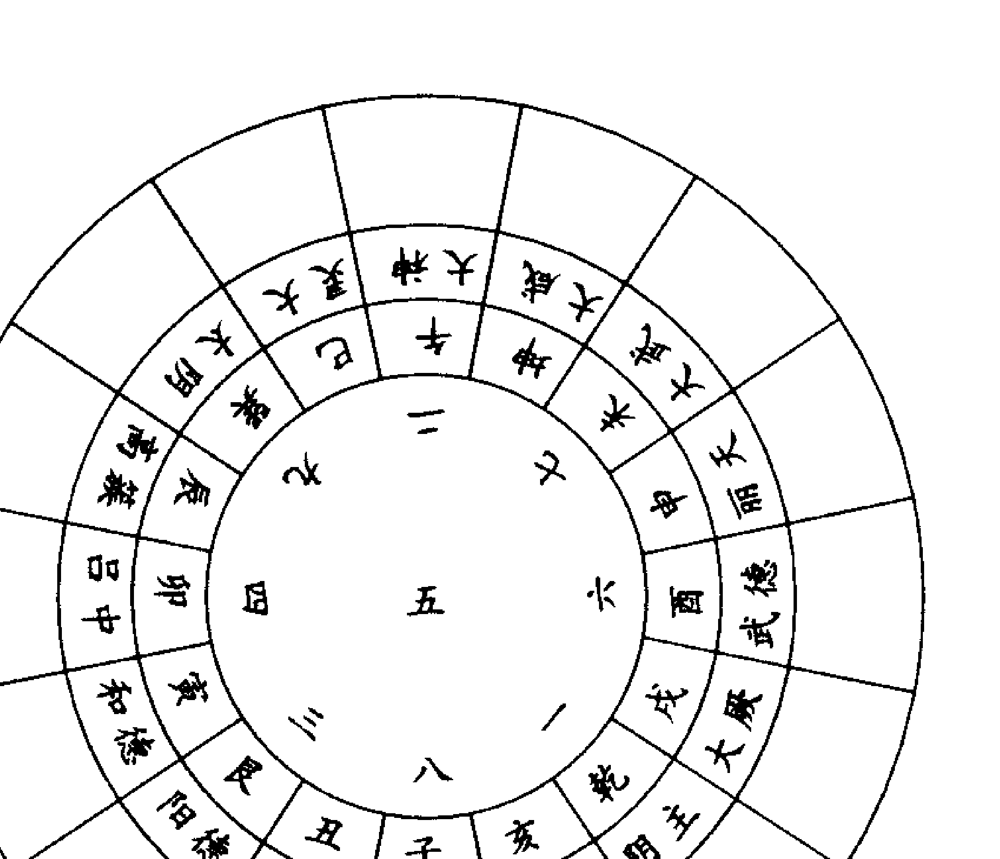

## 十六间神图

## 说明：

-   1. 内圈为太乙九宫数，其中乾亥戌为一宫，子为八宫，丑艮寅为三宫，卯为四宫，巽辰巳为九宫，午为二宫，坤未申为七宫，酉为六宫。
-   2. 子亥戌乾一圈为十六间神组合图。
-   3. 外圈为十六间神在太乙数中的名称。
-   4. 外空圈用于写入各类行宫的“角色”名目。

假定上元丁卯年算文昌所在宫分：甲子年起申，顺行乙丑年在酉，丙寅年则在戌，到丁卯年文昌便行入乾位阴德宫。余皆仿此。

再如岁计计神，子年起寅，丑年起丑，逆行地支十二宫位，不入乾坤艮巽四宫。看了这些行宫法则，我们不禁要问，太乙数为何一定要主目文昌从申武德起行呢？而计神却要从寅位算起呢？诸如此类的问题，在太乙数中不可枚举。当然，太乙书中对此都有一番解释，如计神加寅起算例，《太乙统宗大全》认为：“计神者，岁星之始，天机之神，原属于火，为太乙之烛笼，所司幽冥而能照烛计度也。”既是天机神，又作火烛照计，此神又有何能；岂不为笑话了？至于计神加寅宫者，其书释为：“寅为积德，和德属艮，艮为鬼，明所事幽冥吉凶之数，故命以加之。”更是荒唐迁腐，不值一驳。

由于太乙数所关注的是国运兴衰，大有“究天人之际，通古今之变”的气势，所以它在两宋以前一直颇受历代统治者的重视。同时，由于大量术士的大肆渲染，推波助澜，太乙数曾在汉朝宋朝的确风光热闹过一番。后世尚有一些术者还受其蛊惑，不辨是非，也对太乙数妄加赞许乃至吹捧，造成极恶劣的影响。此点尤以《太乙数统宗大全》中的序言里显得至为露骨，牛皮吹翻天，其竟以为：“太乙大可以治国安邦，小可以获福救贫，用之建州府，则民安物泰；用之于立宗室，则福集人康；用之作庙宇，则神灵境妥；用之出行避难，则人起敬畏；用之制煞，则诸凶化消；用之则行，合之则藏，总要发明十二法则祸福于掌上。”看到这种不顾一切无以复加的吹捧，真是令人不禁失笑万分。

太乙数自两宋之后，直呈衰落之势，一日不如一日。究其原因，首先在其理论体系的缺陷，全凭“天神”来推国运兴衰，水旱饥馑、兵革离乱，能令人信吗？其次，按照其理论推演来印证历史事实，大多牵强附会，不乏臆测荒唐；用之推测未来，则是百无一验，全是瞎扯一通。因此，历史上不乏明哲对太乙数提出尖锐的批驳，四库编臣是这般指责太乙数的：“其术殊不可通，且凶神吉神所会皆以分野为凭，割裂牵配，尤为渺茫无据。”又讲：“乃祆祥小数之曲说，不衷于正，宜为圣人所必斥。”笔者对四库编臣们的见解深以为然。

由此看来，太乙数虽然号称“三式”之首，但是盛名之下其实难相符，理论上穿凿附会漏洞百出，印证之中更是难经考检。可以讲，太乙数的流变已逐渐成为彻头彻尾的伪学伪术了。故笔者以为，太乙数已基本不具任何学术价值，是“三式”中的糟粕，不值得易学界再去花精力研究了。

太乙数在历史的长河中逐渐淘汰下来，而“其传尤古”的六壬恰恰相反，一直是不绝如缕。秦汉之后，历经南北朝隋唐直至宋元明清，六壬不仅未曾衰微，反而“盛行”兴旺活跃于中国的整个封建时期，个中原因颇能令学人深思了。

六壬固然在构建上也是仿效《易经》而作成，但它在方法论及运算机制的研究之上却深得《易经》八卦理论和阴阳五行理论两大传统学说的精髓，相当深刻极富系统。就依笔者对整个六壬的研究与运用来看，六壬术完善的运算机制在中国传统术数中显得尤为突出，颇能言之成理。比如在研究主客关系方面，六壬用“刑冲化合害”的运算机制来描述。若支干上逢子卯无礼刑，主客双方必然反目成仇而恶言相向；若支干上逢交互生合，主客双方必然内外相合而一团和气，最利合作联手；若支干上逢六害，主客双方必然互相猜忌而不相信任。再如“空亡”一法，也有多种运用好处。比如脱灾避难，最要空亡来加临官鬼白虎爻之上来解释之；再如现代社会中的经济犯罪，术数中称之为“贪财惹祸”，六壬就用“传财化鬼”来描述之，一贪其财，其财就化为“官鬼”祸患，便成了吃经济官司象。再如现在的炒股票套牢或货物压库卖不出去，六壬中认为此类经济为“墓财”，“财爻”作“墓”来拖着事主了，像六甲日逢未，未为甲财又为墓神，日干（事主）被财神墓住（即套住象），相当形象贴切。经笔者试验，多能印证事实。从这些论述可以粗知，六壬的盛行应该跟它的占验程度有关系。古人以为六壬占卜相当灵验，故誉之为“神课”。六壬到底是不是“神课”？我们现代人当然不能轻易相信古人之说，而是要把它拿来试验实践。毋庸讳言，六壬即使“再神”，也不会百占百验，这是基本可以肯定的。不过从历史上来看，古人对六壬的肯定占了大多数，这也是笔者之所以心仪且去研究六壬的一个重要原因。

为了研究六壬跟奇门遁甲的关系，下面简述一下六壬的运算体系概况。

六壬是地支学，主要是它的运算体系都是由十二地支作为运算符号的。六壬的运算形式由三部分组成：第一块是由地盘、天盘、将盘构成的活动盘面，天地盘中的地支又称“月将”，将盘中的地支又称“天将”；第二块是由占日干支结合盘面列出的四课分布形式，由七个地支和一个天干组成四组上下地支叠加样式；第三块是由四课结合盘面排出的三传组合形式，三传由三个地支表述，且在三传上标出其所系天将和六亲信息特征，三传所系天将可在盘面中对应着取用，三传的六亲特征则由占日天干比较跟三传地支的生克关系来列出“官鬼”、“父母”、“子孙”、“兄弟”、“妻财”类信息。六壬的运算机制主要结合形式特征用地支的“刑冲化合害破”的生克手段及干支“长生十二诀”法来综合运筹。大概而言，六壬所推测的信息材料由月将、天将、六亲和神煞四大类组成。六壬的具体运算方法就是依据求占事体，对课传盘面中截取相关模拟信息材料（六壬称类神），然后依据运算机制的两种方法结合形式特征规律来对“类神”分析判断，推测事体的大致变化趋势。

我们已详述了太乙数，简述了六壬，下面重点来讲奇门遁甲。

翻开《辞源》，对“奇门”一词的解释是：“古代术数名，其术依十干中乙丙丁为三奇，故称奇门，也称遁甲。”对“遁甲”的解释是：“古代方士术数之一，起于《易纬·乾度》太乙行九宫法，盛于南北朝，神其说者，以为出自黄帝风后及九天玄女，皆妄诞。其法以十干的乙丙丁为三奇，依戊己庚辛壬癸为六仪。三奇六仪分置九宫，而以甲统之，视其加临吉凶，以为趋避，故称遁甲……说遁甲当循甲，以六甲循环推数。”奇门是遁甲之中的，合称奇门遁甲。

奇门遁甲虽然与太乙、六壬并列“三式”之中，有的术者以为其说出自黄帝玄女，这样一来，遁甲的历史便和太乙、六壬一般古老了。其实不然，据纪晓岚等人考证，以为奇门遁甲大致开始盛行于南北朝，是“三式”中的“后起者”。《四库全书·遁甲演义提要》中认为：“考《汉志》所列，惟‘风鼓六甲’风后孤虚而已，于遁尚无明文，至梁简文帝‘乐府’始有‘三门应遁甲’语，《陈书·武帝纪》遁甲之名逐见于史，则其学殆盛于南北朝。”是以从中可以看出，在南北朝之前，奇门遁甲尚处于发展伊始，不太可能已经成熟。故而后世小说家们或术者将南北朝以前三国西蜀的诸葛亮描绘成一个因精通奇门遁甲而上知天文下知地理无所不晓的术数大家，显然是不太可信的。

奇门遁甲以洛书九宫后天八卦为基础，着眼于地球一年之内四时迁变与后天八卦洛书九宫的对应协调性，以戊己庚辛壬癸乙丙丁作为一年之中阴阳两气消长的符号，以九宫数理作为阴阳消长的尺度。冬至之后，一阳初生，遁甲以戊己庚辛壬癸乙丙丁从九宫低数位向高数位顺行飞布，以效象阳渐长阴渐消的理气动态过程；夏至之后，一阴初生，遁甲以戊己庚辛壬癸乙丙丁从九宫高数位向低数位逆行飞布，以效象阴渐长阳渐消的理气动态过程。遁甲依此造式思想，立成了奇门遁甲中的地盘。一年之中阴阳两气消长的动态过程固然由天干的飞布表达出来了。但地球一年四季的轮回，还是毕竟通过一个时辰一个时辰一个昼夜一个昼夜的累积完成的。于是遁甲在地盘的基础上，以时辰为最小单位，以时旬作为基本单位，逐个飞布地盘的天干逐个时辰来顺时针旋转，以拟象地球无穷尽的自转，逐此便加乘出天盘天干，人事天时因地球每日每时的转运也不断发生改变，故而代表人事的八门和代表天时的九星随天盘天干的飞布同步顺时针运转，于是便形成遁甲中的人盘、天盘。

由此我们可以看出，遁甲以地盘代表地球公转，立天盘于上代表地球自转，布人盘纬于地球自转公转之中代表人事的变迁。很明显，遁甲造式立盘的用意跟六壬布天地盘的用意有着相类似的地方。不同的是，六壬用天盘来描述地球公转，立地盘代表地球自转，跟奇门遁甲的天地立盘刚好相反。究其“两式“设置的差异，主要是在于遁甲六壬的创制者们仰观俯察天地的不同角度而成。大六壬以仰观天象为主，天上斗柄转一圈太阳逆行周天一圈便成一岁，地下昼夜相应更替三百六十次而成一岁，于是便立天盘于上地盘于下。遁甲则以俯察物候为主，一年四季七十二候年年如此，相应北斗太阳顺行转行一圈一年之中要有三百六十次，于是便立地盘为下而立天盘于上。对于壬遁在此最根本原理上的一致性，即遁甲六壬皆重地球公转自转此一特点来作为普遍规律。古人早有察觉，《遁甲演义》就认为：“壬遁人门各有不同，要其极致，则无二理也。”

正是由于奇门遁甲和大六壬在构建原理与形式上的相似，它们各自用天干和地支语言建立起来的运算体系及运算机制就有许多联系了。

-   第一，遁甲布局和六壬起课都依时间为准，它们从不同角度对同一时段内的事物信息作出述象，可以相互补充印证。

比如笔者行文至此，为己卯年六月壬午日戊申时，欲求解此时辰内的气象信息，可以遁甲和六壬分别起算。

## 一、遁甲布局

这一时辰处于大暑上元，以己卯为符头。以大暑上元阴遁七局来布地盘，以甲辰壬所在宫天冲为符星，伤门为直使，加临时干戊七宫之上，形成活动盘。

|      |       |       |
| :---: | :---: | :---: |
| 己心合<br>辛景 | 丁蓬阴<br>丙死 | 乙任蛇<br>癸惊 |
| 戊柱虎<br>壬杜 | 庚 | 壬冲符<br>戊开 |
| 癸芮玄<br>乙伤 | 丙芮地<br>丁生 | 辛辅天<br>己休 |

分析：
天盘时干戊加三宫，下临壬、柱、虎、杜，地盘时干在七宫，上加壬冲、开、符、天柱为雨师，天冲为惊雷，白虎为风煞、今皆游于震兑两宫，又逢时干，乃惊雷逢雨之象。此时遁甲的反应气象信息实在准确，因为这时的天气正是惊雷阵阵，狂风大作，暴雨肆虐，一片昏暗无光。

## 二、六壬起课

据六壬式规定，小暑之后大暑之前用月将胜光午，壬癸日取昼贵巳。

### 重审 涉三渊

```
子 寅 合
兄 子 龙
鬼 戌 虎
酉 未 辰 寅
壬 酉 午 辰
卯 辰 巳 午
寅     未
丑     申
子 亥 戌 酉
```

## 分析：

发用功曹为风伯又为日干雨煞，风雪飘摇之象；中传子水乘龙神，龙主雨，雨象更明；末传天魁乘虎克日，虎主风，克日更甚，加上壬日占水木旺相，功曹神后俱有力于传中，风雨暴虐难免矣。更三传名为涉三渊，又皆为夜时幽暗之象，更可证天地昏暗如同深夜一般。

由此上述遁甲六壬随机对照局课来看，两术对时空信息的述象是较吻合且应于所测天象的。可能有的人以为此时遁甲六壬局课所推恰好与天象碰巧契合，有附会之嫌疑，非也。笔者为学术研究起见，完全是按照壬遁古法的规定，于心动有感的方式来起课起卦测算试验，随机写到这些内容想到来印证壬遁是否能够相应，便排出了遁甲六壬盘面来试着研究的，不料的确不出古人所说，看来这些东西当中是有一定的道理在内。

## 第二，遁甲和六壬的很多概念和术语可对应，甚至一致。

-   一、遁甲是天干学，最重三奇六仪，用天干来代表；六壬是地支学，也有三奇六仪，用地支来代表

| 式名 | 日奇 | 月奇 | 星奇 | 甲子 | 甲戌 | 甲申 | 甲午 | 甲辰 | 甲寅 |
| :---: | :---: | :---: | :---: | :---: | :---: | :---: | :---: | :---: | :---: |
| 遁甲 | 乙 | 丙 | 丁 | 戊 | 己 | 庚 | 辛 | 壬 | 癸 |
| 六壬 | 丑 | 子 | 亥 | 子 | 戌 | 申 | 午 | 辰 | 寅 |

### 壬遁奇仪天干对照表

-   二、壬遁中的天门、地户、天网、天牢、天福等术语相同，各有表述符号
    -   遁甲中的六己为地户，六壬中以巳为地户；
    -   遁甲中的六戊为天门，六壬中以亥为天门；
    -   遁甲中的六壬为天牢，六壬中以辰为天牢；
    -   遁甲中的六庚为天狱，六壬中以戌为天狱；
    -   遁甲中的六癸为天网，六壬中的六癸为闭口，以支干前辰为天网；
    -   遁甲以丁奇为玉女，六壬中以未为玉女。

## 三、壬遁在方法论运用上的相同或相类

伏吟、反吟、干支的刑冲化合害、旬空、关格等方法论在壬遁两术之中都有运用，但运算方式和表述符号形式不尽相同。

比如遁甲六甲时辰皆为门伏、星伏、干伏之盘，六壬中则以月将与时辰相同时，十二地支天盘地盘皆伏于本位是谓伏吟盘。

又如奇门遁甲以占日支干推有日家空亡，按占时干支推有时家空亡；六壬中则完全依占日支干推，有日家空亡，但此空亡游于天盘地盘则又有“落底空亡”和“游行空亡”两类异同。

## 第三，壬遁两术的一些主要区别。

六壬是地支学，重点讲六亲、支神、天将；奇门遁甲是天干学，重点讲天干组合、八门、九星。遁甲不讲六亲概念，以年月日时干来替代六亲，遁甲基本不讲神煞，而六壬极其重之。

六壬构建形式较之遁甲简单，但其方法论之深邃完善恐怕遁甲相形见绌。

六壬遁甲皆讲年命，但遁甲重命干，省略年干，看命干加临之宫论吉凶；六壬重年支命支，年命地支皆重不可舍其一者，看盘中年命之支加临天盘支辰来论吉凶。

六壬基本运算形式有七百二十种课式，遁甲（时家）基本运算形式有一千零捌十局。

当然，壬遁联系的东西很多，并不是一二个篇幅所能述尽的。比如六壬遁甲的趋避之上，两术就有相互借鉴的地方。比如遁甲择方上就借六壬术中“天三门”、“地四户”、“太冲天马”说等。上文论及仅是笔者粗线条对壬遁关系的大致看法，立足于如实说，不肯加于臆测附会。对于壬遁两术比较的评价，笔者想引纪晓岚等四库编臣对此的看法：

> > “遁通于壬，壬于人事为切，遁于天文为优，实亦未有轩轻也。”可谓一语中的。

由于太乙六壬和遁甲都传说由九天玄女传给黄帝，黄帝就是依靠此几门“神术”打败了蚩尤。故而“三式”从一开始就与战争结下了不解之缘，成为一定程度上的“兵书”。在流传下来的“三式”古籍中，关于运用“三式”指导战争预测胜负的种种理论方法比比皆是，不可胜数。比如《太乙数统宗大全》从作战阵法、选将选兵到地形择取、骑兵伏兵、分兵合兵、安营扎塞等军事方面作了术数上的研究。又如大六壬的《军帐赋》也对战略决策、指挥机构设立、军事情报来源、后勤供应、攻守等具体战术都作了研究，并提出了各种预测战争进程的各类方法，洋洋大观。奇门遁甲跟行军打仗更有关系，经学者张志春先生考证研究，认为奇门遁甲的发明始源于古代军事上的行军排阵上，可属一家之说。惜遁甲形成较晚，前贤未留下来任何预测军事上的各类实用方法论，殊为遗憾。

既然“三式”跟军事有着密切关系，那么这些诞生于冷兵器时代的“军事遗产”在今天是否还有价值呢？对于这个问题，我们要一分为二来看。首先要承认，“三式”古籍中所保留的这些军事占卜学说还是有其史料价值的，后人可以从中一窥中国古代战争的一些特点。其次，在这些军事占卜学说当中，大量不实玄乎近乎猜测般的指导方略无疑是主要的，是不足后人所效法的。比如行军过程中发生迷路，六壬就运用当时天罡所指来觅出路，这一方法就玄乎得很了。再如宿营扎塞中寻找水源，六壬就用当时天盘未加临方位来去找，认为此方位易取得水，此种方法是取象未小吉上应天象井宿，以为相对应地上就有“井”水了；这种方法今人看来也较玄乎，令人不太肯相信。另外，大六壬在《军帐赋》中也留下了一些预测战争进程、变化、胜负的方法，似乎也有研究价值。因为从明人陈公献的实践来看，这些方法是相当有效的。陈公献在《大六壬指南·兵斗》中记录了明末官兵与李自成农民义军交战的不少占例，据说都得到了验证；其中尚包括崇祯皇帝煤山自尽的历史惨事，颇有价值。笔者曾运用六壬的这些军事占卜学说，试着针对国内外的军事冲突或战争进行过不少占测研究，有些测例较理想又多应验，而有些测例只占对了部分，全然不对头的占例则很少。笔者由此感到，六壬占测军事还是有一定的研究价值，可以借鉴到今用。

“三式”作为传统三门经典术数，古人对它们的青睐热衷是可以理解的。在今天，了解“三式”的人很少，盲目批驳“三式”却不少；对“三式”感兴趣的人不少，真正精通搞懂“三式”的人却不多；跟着古人夸耀抬高“三式”的人不少，真正客观评价“三式”的人却不多。笔者以为：今人研究“三式”，首先不能与古人一样瞎起哄，什么太乙为“神数”啦，六壬为“神课”啦、遁甲为“帝王之学”、“方术之王”啦，世间从来没有什么“神术神数”，这是今日学人研究者应有的态度。其次，我们要反对古人在术数及其他神秘文化上的保守虚妄学风。古人一直视术数为泄露“天机”的大道，认为不当泄露者去触穿“天机”，会犯“天谴”的。要知道，凡人所能认识到的都不是什么“天机”，真正的“天机”只能是人类局限于认识能力而尚未能了解掌握的大自然规律。至于“天谴”之说更是不当，比如《颜氏家训》里据“世传”云：“解阴阳者，为鬼所嫉，坎壈贫穷，大多不泰。”就是“天谴”之说的最好注脚。古人常泥于“天机不可泄露”、“天谴”说等，有意无意将术数神秘化乃至自以为是坐井观天，个中流弊在今日研究者之中不乏有之。刘大钧教授在《纳甲筮法·后记》中对今人研究术数应取的态度作了论述，颇为精当。他认为，研究者既要破除迷信，又要尊重古人的探索精神，在科学的实事求是的态度下，去芜存菁，披沙拣金。笔者深以为然。

刘教授认为：“我们研究筮法，绝对不能仅仅以一个明白占筮之道的术士标准要求自己，而要以一个‘善世而不伐，德博而化’的君子德风去探索其渊蕴，研究其人事之终始，并进而体验‘生生之谓易’的博大境界。我认为易学正是以其卦体的生生不已，而不是以万古不朽阐释了我们的世界，这就是它的眼睛为什么永远是警醒的缘故。我们就能以老实客观的态度去仔细认真地研究易理，求索其占筮的运算机制，进而对这一文化现象作出发古人所未发的全新探讨——这是时代对我们的需求，也是学术良心对我们的要求。”

另外，对“三式”的定性上，我们要有自己的主见。“三式”作为三门术数，本质上是预测未来的技术与理论，故而今有人美其名曰为“古典预测学”或“古典预测术”。“三式”是否是真的“古典预测术”，这仍尚待研究确认。如果确认成立，那么对于今日研究者来讲，如何将这些“古典预测术”改革变通成“现代预测术”？这中间就有个古典预测占法如何现代化的问题，这是对古典术数持肯定者应当加以关注的一个方面。最后在“三式”特别是大六壬和遁甲的研究过程当中，一定要注意理论与试验两条路线的并行。只懂理论高谈阔论无非是“清谈”，只懂技术试验运用无非是“术士”，走偏颇路线都不会有多大的出息，更别奢望有什么学术成果了。

### 第五章 一些重要壬学问题的讨论

在六壬长达二千五百多年的历史发展中，难免一些壬学理论会百家争鸣，各有歧见。如十干昼夜贵人的确定与区分，涉害课的取用排法、课式与课体孰轻孰重等等。下面笔者择取其中最要紧的昼夜贵人的确立以及课式特征两个方面的问题作一探索，还望各界同仁斧正。

#### 第一节 关于昼夜贵人的讨论

大六壬起课排传，最最注重十二天将。十二天将以贵人为首，前有螣蛇、朱雀、六合、勾陈、青龙五位引之，后有天后、太阴、玄武、太常、白虎、天空六位从之。按六壬占日占时择取昼贵和夜贵，日出之后用昼贵人领头，日入之后用夜贵人领头，依天盘贵人立地位置来定十二天将的顺逆转运次序，贵人加临乾亥至震辰六位地盘，则十二天将顺转；贵人加临巽巳至乾戌六位地盘，则十二天将逆转。

本来关于十干昼夜贵人的分别在明朝以前并无多大争议。一般都以“甲戊庚牛羊、乙己鼠猴乡、丙丁猪鸡位、壬癸蛇兔藏、六辛逢马虎，此是贵人方”的古传口诀为准。此一口诀中的“甲戊庚”类的天干指六壬占日日干，口诀里的“牛羊”“猪鸡”字指十干贵人所在地支的生肖，也即贵人地支，其间前一个字如“牛”“猪”类为天干昼贵，后一个字如“羊”“鸡”类为天干夜贵。比如正月甲子日庚午时中午占课，甲日贵人分“牛”（丑）字“羊”（未）字，由于庚午时为白天，则取昼贵人了，就依“丑”字作式中贵人，其他九干仿此来取。这种十干贵人的确定和昼夜贵人的分别都是古传方法，在古籍《玄女经》、《六壬神定经》中都明确无误地记载着。比如《玄女经》中讲：“天乙所在，甲戊庚，旦大吉，夕小吉。乙己，昼神后，夜传送；丙丁，旦登明，暮从魁。六辛，昼胜光、夜功曹；壬癸，昼太乙，夜太冲。”这里《玄女经》中讲的“天乙”就是指式中的“天乙贵人”也即简称为“贵人”，“大吉”“小吉”等名称是六壬课式中对十二地支的另一称谓，它的具体叫法大致这样：子为神后、丑为大吉、寅为功曹、卯为太冲、辰为天罡、巳为太乙、午为胜光、未为小吉、申为传送、酉为从魁、戌为天魁、亥为登明。另外，《六壬大全》《龙首经》《大六壬指南》等壬学名著也皆以此古传口诀来排贵人天将测事的。

不料，到了清代，钦定的《星历考原》和《协纪辨方书》两书对十干贵人、昼夜贵人的起法作了原理的探索，导致后世在十干贵人的确定之上众说纷纭，莫衷一是。比如“甲戊庚牛羊”一句吧。有把“甲”跟“庚戊”分开来的，以为“戊庚在牛羊，甲贵未丑详”，有的把“庚”跟“甲戊”分开，认为“甲戊为牛羊”，将“庚”并到“辛”一块会，称之“庚辛为马虎”。还如“壬癸蛇兔藏”一句吧，有窜改为“壬癸兔蛇藏”的来颠倒一下的，也有干脆将“壬”“癸”分开来讲，说什么“壬贵兔蛇藏，癸贵寻巳卯”的。此者只是在十干昼夜贵人确定之上的一端聚讼，另外在昼贵夜贵的取用上也是说法不一，或以卯酉分昼夜取昼贵夜贵，或以实际日出日入分昼夜取贵人，或以子丑寅卯辰巳时取昼贵，以午未申酉戌亥时取夜贵的；更有的是冬至之后取昼贵，夏至之后取夜贵，起法多端。这些混乱的种种说法足以迷惑学者了。

《星历考原》、《协纪辨方书》认为十干昼夜贵人的起例是取材于先天八卦和后天八卦内坤卦卦德，是以易理为演绎基础的。这种理论要点是：“十干贵人为吉神之首，至静能制众动，至尊能镇飞浮，以其为坤，黄中通理乃贵人之德，是以阳贵人出于先天之坤而顺，阴贵人出于后天之坤而逆，天干之德未足为贵，而干德之合气乃为贵也。”

# 阳贵人顺行图

按照这种方法可以推演如下十干阳贵人。先天坤卦在北，故子上起甲，甲德在子，甲合在己，则己以子为阳贵，为次顺行，乙德在丑乙合在庚，则庚以丑为阳贵，丙德在寅，丙合在辛则辛以寅为阳贵；丁德在卯，丁合在壬，则壬以卯为阳贵；辰为天罗，贵人不居，故戊跨过辰，戊德在巳，戊合在癸，则癸以巳为阳贵，午与先天坤卦相对故曰天空，贵人有独无对，故阳贵人不入于午，己德在未，己合在甲，则甲以未为阳贵；庚德在申，庚合在乙，则乙以申为阳贵；辛德在酉，辛合在丙，则丙以酉为阳贵，戌为地网，贵人不居，故壬跨过戌，壬德在亥，壬合在丁，则丁以亥为阳贵；子为贵人始位，故癸跨过子，癸德在丑，癸合在戊，则戊以丑为阳贵。如此这般下来，可排出十干阳贵人：甲在未、乙在申、丙在酉、丁在亥、戊在丑、己在子、庚在丑、辛在寅、壬在卯、癸在巳。

同理可推演出如下阴贵人：后天八卦坤在西南，故以申上起甲，甲德在申，甲合在己，由己以申为阴贵人；以次逆行，乙德在未，乙合在庚，则庚以未为阴贵人，由此类推，可排出十干阴贵人：甲在丑、乙在子、丙在亥、丁在酉、戊在未、己在申、庚在未、辛在午、壬在巳、癸在卯。

按《星》和《协》两书所提供方法推演出来的十干昼夜（阴阳）贵人的分法，其中的丁、戊、己、庚、癸五干的阳贵（昼贵）阴贵（夜贵）与古传口诀是完全一致的，自无疑义，不必再讨论。惟是甲、乙、丙、辛、壬五干而言，它们的阴阳贵人刚好与古传口诀来了个颠倒，遂造成了历史上的争论。

《协纪辨方书》认为导致这种矛盾的原因，是由《玄女经》始作俑，认为《玄女经》所传“其理良不可通”，不可“经有其文而遂信也”，以为《玄女经》记载中的“旦大吉、夕小吉”之文中的“大”、“小”两字“易以淆伪”，会被“浅学”之人转以俗说改窜，遂传刻“袭谬”。很明显，《协纪辨方书》为了自证本身对阳贵阴贵的理论解释，对于《玄女经》所载的古传口诀加以了否定，不过这种否定却靠了它本身所不屑的“改窜”方式来完成的，并且这种否定是建立在纯粹的主观推测之上，很难有说服力。

当然，我们不能认为《协纪辨方书》依先天后天八卦轮排十干昼夜贵人的方法一无是处，这种方法在很大程度上相当完美，可以自圆其说。可是，叫人伤脑筋的是，对于十干昼夜贵人的划分缘由能作妥善解释的并不限于《协》书独此一家，明人万民英在《三命通会·论天乙贵人》里，就提到了分别天乙贵人的昼贵夜贵属性的天星转运说。尽管万民英讲这种天星说是从术士嘴里听来的，但依这种天星转运来分十干阴贵阳贵所在的方法，也是头头是道，言之成理的。

万民英原先认为，十干依八卦来起贵人，则天乙贵人是“十干之秀气，非天上之星也”。后来他听来了天星转运说，对照着《天官书》所云的“天乙在紫微宫门在星南，天帝之神也，主斗战，知人之吉凶者也”传统论调，遂以为依天星转运来起十干阳贵阴贵“尤为有理”，而“甲戊庚牛羊”之歌则混而不通矣。万民英道听途说来的术士之论是这般的：日出于寅，众星皆落，日沉于申，众星皆出，故昼贵起于寅，夜贵起于申，数至丑未是天乙之家，合十干见天乙为贵。如甲禄寅，以寅加寅，顺数至丑，即为本家，故甲贵在丑；乙禄卯，以卯加寅，数至子见丑，故乙贵在子；丙禄巳，以巳加寅，数至戌为丑，戌为恶弱之地，天乙不临则进一位，故丙贵在亥；丁禄午，以午加寅，数至酉见丑，故丁贵在酉；戊寄位于艮，故戊亦以寅起与甲同，己寄位于坤，以未加寅，数至申见丑，故己贵在申；庚禄申，以申加寅，数至未见丑，故庚贵在未；辛禄酉，以酉加寅，数至午见丑，故辛贵在午；壬禄亥，以亥加寅，数至辰见丑，辰为恶弱之地，天乙不临，则进一位故壬贵在巳；癸禄子，以子加寅，数至卯见丑，故癸贵在卯。夜贵以申起，一如寅法，见未与丑同。

就万民英听来的古法来论十干阴阳贵人，不仅与古传口诀相悖，同时也与《协》书所推不同，这三种方法可讲是各执一词的“公说”、“婆说”，真是见仁见智各有千秋了。笔者不想去加入这种笔墨官司之中，也不愿从中和稀泥一番拉倒。套用经典话来讲“实践是检验真理的惟一标准”，不论“公说”、“婆说”，只要能够印证六壬占测事实就是对的。依据这种指导思想来看，《六壬指南》中的大量占测实例表明，以古传口诀似乎最为妥当。比如六甲日以丑作阳贵未作阴贵，陈公献在“甲申十二月甲申日癸酉时”的占雪课，“庚寅七月甲申日丙寅时”的占试课中都采用之，据说都占验了。比如六乙日以子为阳贵申为阴贵，陈公献在“丙子三月乙未日己卯时”及“丙子二月乙未日己卯时”两例占讼课都采用之来排传，据说也都占验了。另外，丙日以亥酉作阳贵阴贵，辛日以午寅作阳贵阴贵；壬日用巳卯作阳贵阴贵来占事且有验的课例，陈公献逢到了不少。故以《指南》一书来看，古传口诀似乎应验事实的比率较高。

依笔者的经验来看，用古传口诀来排传测事也蛮准的。因而在实践当中，笔者普遍采用了古传口诀一法。

至于依占时来分定昼夜的择取上，笔者遵循日入日出来作依据，凡日出之后日入之前不论任何时辰，皆取昼贵人；凡日入之后日出之前不论任何时辰，皆取夜贵人。不拘于以卯酉时辰分定昼夜，而于依节令不同，视太阳的实际出入时间来定。另外冬至后取昼贵、夏至后取夜贵一法，以及子丑寅卯辰巳时取昼贵、午未申酉戌亥时取夜贵一法，一概不取。后者两法曾被不少人附会到八字命学中去。依笔者意见，这种胶柱鼓瑟的做法很不对劲，未必会有效果。

#### 第二节 课式变化与特征

六壬的运算形式共有七百二十种，此七百二十种在六壬中专称为课式。此数目是由：60（甲子）x12局（天盘活动式子）=720课式计算而出。任何课式从形式结构上皆可分为：

1.  特定的天盘式子；
2.  一定的占日支干四课分布组合；
3.  三传组合类型。

特定的天盘式子由月将加正时（占时）于地盘上转出来，一共有十二类；四课分布组合由六十甲子跟十二局天盘式子相配，可化出七百二十类四课组合型式；三传组合类型依“九宗门”方法分析四课型式得出，只有四百一十五条，课式当中常会逢到不同占日布课而导出三传相同的形式。

现依占日天干结合天盘变化式子，列出三传样式数目。

| 序号 | 项目 |
| :--- | :--- |
| 1 | 特定的天盘式子 |
| 2 | 一定的占日支干四课分布组合 |
| 3 | 三传组合类型 |

六甲日配12局天盘式子，可配出72类四课形式，得出25类三传。

六乙日配12局天盘式子，可配出72类四课形式，得出44类三传；

六丙日配12局天盘式子，可配出72类四课形式，得出36类三传；

六丁日配12局天盘式子，可配出72类四课形式，得出56类三传；

六戊日配12局天盘式子，可配出72类四课形式，得出37类三传；

六己日配12局天盘式子，可配出72类四课形式，得出55类三传；

六庚日配12局天盘式子，可配出72类四课形式，得出35类三传；

六辛日配12局天盘式子，可配出72类四课形式，得出58类三传；

六壬日配12局天盘式子，可配出72类四课形式，得出38类三传；

六癸日配12局天盘式子，可配出72类四课形式，得出37类三传。

以上可以看出，十二局天盘式子是一样的，天干组成的七十二类四课分布形式的数目也是相同的，惟有不同的是十干各自导出的三传类型。五阳干的三传变化共有一百七十一种，五阴干的三传变化共二百四十四种，这说明六壬中阴干的变化较之阳干的变化相对要复杂一些。

七百二十种课式是六壬中较稳定的静态测算程序，但在实践运算之中，课式会跟着求测人年命、求测人性別、求测年月日时的不同而发生动态变化。这些动态变化可以从理论上计算出具体数字：

    2×60³×12×720 = 3,732,480,000 （活动式）

其中：
*   2 为阴阳类，表征男女；
*   60 的三次方由求占人年命，行年和具体测算年份；
*   12 为求占月份；
*   720 为固定课式。

如果以上求测人年命、求测年份不以六十甲子周期来代入，而以简化的十二地支周期代入，那么六壬的动态变化课式也将有近三千多万种，它的计算过程如下：

    2×12⁴×720 = 29,859,840 （活动式）

其中：
*   2 为阴阳类，表征男女；
*   12 的 4 次方由求占人本命地支，行年地支；求测具体的年支，日支组成；
*   720 为固定课式。

六壬将近三十多万种的活动测算程式，数目之大，令人瞠目。如果将之与中国其他也须程式运算的术数来比较，我们会从数字上发现六壬有可能是中国术数中的最复杂者。

揲蓍法的活动测算程序为：

    64×64 = 4,096 （卦变式）

其中：
*   64 为《易卦》六十四重卦

纳甲筮法的活动测算程序为：

    64×64×12×12 = 5,898,240 （卦变式）

其中：
*   64 为纳甲六十四卦。
*   12 为占测月支和日支。

奇门遁甲的活动测算程序为：

    2×10³×1080 = 216,000 （局式）

其中：
*   2 为阴阳，表征男女
*   10 的三次方由求占人的命干，求测年干，月干三部分组成；
*   1080 为奇门遁甲基本图式。

虽然六壬的活动课式有将近三十多万种变化，但它们都可以归结到静态的七百二十种课式中去作研究，就四课分布而言，就有以下规律与特征：

1.  占日干支上神一日之内皆会轮转十二长生神及天将一周；
2.  一日之内必有干加支、支加干两课，此二课即为不备课；
3.  一日之内必有伏吟、反吟两课；
4.  一日之中支干长生十二神皆会相互加临而轮转一周；
5.  干支上神基本取决于干支关系；
6.  干支与上神皆发生交错关系。

### 就课式中的三传组合，也有一定的传变规律：

1.  一般初传为事始，中传为事变，末传为事尾；
2.  三传传变同步体现事变脉络；
3.  三传传变可针对占日支干作主客分论；
4.  三传传变既可表述事变时态，又可表述事变空间分布状态；
5.  三传传变中可自行生克关系；
6.  大多事体要决于三传之中；
7.  三传传变要论传变顺逆方向。

从七百二十种固定式子到三十多万种活动式子，结合事体，专于活动式子上的日上、三传、年命六处取事类神和人类神来决断。所事决断也有一定的规律与特征：

1.  课传的判断意义，应跟不同求测事体的变化从不同层面、角度去作阐释。此如六甲日干上酉，占孕以酉作胎神看，占试则以酉为亚魁看，占病以酉作鬼看，占人则以酉为妾、少女看，占信息以酉为信神看，取各类象随事类言之。
2.  课传的旺相休囚及意义，要放到岁月流转中去看。比如六甲日干上酉，酉年占测酉为太岁临身，卯年占则为岁破临身，酉月占则酉为月建，在秋令占则酉神旺相，在夏令占则酉神休囚，随岁月的变化而变化。
3.  课传所系的神煞，应跟岁月事类联系去论。如六甲日干上酉七月占，如占行人，酉则为戏神，必在外游乐；如占盗失，酉则为天盗、时盗、盗神、盗神作鬼克日，失物定是人盗而非遗失。如占婚姻，酉则为桃花煞，防女子风流妨害本身，等等。
4.  课传的吉凶程度，会随年命的变化而变化。比如六甲日干上酉，如占病日鬼临身堪虞，年命上若见巳午子孙爻作救星，则巳午制酉，病终无妨后愈。如年命上反见辰戌财爻作营养之神，则辰戌来生助酉鬼，病必贪食而加剧，甚忧。如占孕年命上见卯，以卯冲干上酉胎神，多有可能小产；随事类年命而变化着论述。

## 第六章 六壬和纳甲筮法的关系

纳甲筮法是今人运用《易经》原理进行术数预测活动所采取的主要方法之一。纳甲筮法古称以钱代卜法金钱代蓍法，民间俗称火珠林法、文王课等。纳甲筮法作为中国传统易学、术数学中的占测方法之一，自西汉京房发明出来以后，备受历代易学研究者的重视。

纳甲筮法的构建原理与大六壬相似，也是以天文学为其理论背景，巧妙地将天干地支纳入八卦之内，组成六十四卦三百八十四爻支干相配的运算系统。这个运算系统分为八宫，由八经卦统领，一宫之内包含七个别卦，依本宫五行性质以定六爻相配六亲性质，然后按自初爻向上至五爻再退回三爻的逐次变卦方法，列出每卦的“世应”位置，再依据占日天干自初至上轮排青龙、朱雀、勾陈、螣蛇、白虎、玄武等六兽，结合占测月日，以衡量卦中各爻情况，结合事体择取相应爻象进行推测变化。理论上虽然纳甲筮法也将天干纳入卦中六爻之上，但是在排卦断卦中只重地支，所以后世的卦书中和习其术者在实际操作时往往会把天干省略掉了，因此一定程度上，纳甲筮法可视为地支学和易卦的统一体，这点极似六壬，六壬可以讲是易学与地支学的统一体。

另外，纳甲筮法和大六壬在运算机制方面也有较多类似的法则，两者之间的相关程度极高。笔者通过深入研究发现，纳甲筮法很有可能是在六壬基础之上发展出来的，是对六壬术运算机制的简化和形式更新。所以要想学习大六壬，最好是先学习纳甲筮法，这样先有点基础再去学习六壬也会比较轻松。要知道六壬的复杂程度较之号称“帝王之学”的奇门遁甲有过之而无不及，六壬的排课排传就变化多端，比遁甲起局要困难得多。故而有的学者就认为，六壬是中国术数中最难学习的。关于纳甲筮法有可能是大六壬基础之上发展出来的此一论断，笔者是有一定的证据可以来佐证的。

首先，六壬诞生发展于春秋战国时期甚至更早，成熟盛行于汉代。而纳甲筮法创之于西汉京房，因而六壬术较之纳甲筮法的历史更为古老悠久，这是可以肯定的。其次，京房是西汉时期有名的术数专家，应该会明了风行于世的古传六壬，因而京房在创制纳甲筮法时，将六壬或者其他一些术数理论借鉴引入到纳甲筮法之中是极有可能的。这方面有些例证可以说明。纳甲筮法中的“六兽”说，与六壬术中的“青龙”、“螣蛇”、“勾陈”、“白虎”、“玄武”、“朱雀”六位天将完全相同，表明“六兽”说极有可能源于六壬中的“天将”，此是其一。纳甲筮法运算时主要依据月建、日建来评判爻象的盛衰。而古人把“月建”也叫作“月令”和“月将”，“月令”、“月建”的概念我们多好理解，但是“月将”就不一样了。考古传术数，“月将”此一概念与称谓仅出自六壬术一家之中，六壬术中的月将专指太阳而非月建。纳甲筮法显然就是从六壬中引入“月将”此一称谓来等同于其术中的“月令”、“月建”，不然纳甲筮法不会凭空无故地造出个“月将”。历来是其二。还有一个最重要的原因是：最初传承下来的纳甲筮法颇重神煞，这些神煞包括“贵人”、“禄马”、“丧车”、“天鬼”、“往亡”、“天喜”、“天赫”、“羊刃”、“吊客”、“丧门”、“病符”、“劫煞”、“官符”等，不胜枚举。后来习纳甲筮者在运用过程中发现上述神煞不太应验，于是便指责这些神煞的荒诞无稽，而不明其中的缘由。这种指责尤以《卜筮正宗》历来最为起劲，王洪绪在是书中作了“辩贵人禄马之谬”、“辩《卜筮全书》神煞之谬”、“辩贵人禄马之谬”、“辟妄论本命之谬”四节，认为：“盖古书神煞至京房先生作易，乱留吉凶星曜以迷后学，如天喜、往亡、大煞、大白虎、大玄武类皆是。”《增删卜易》则认为“伏羲观奇偶以判吉凶，文王以爻辞而断吉凶，周公之后决祸福于五行，易道穷矣。今兼吉凶星煞不知起自何人，丧门、五墓、大煞、飞廉、加此险语惊人，往往全无应验”，以为“星煞章”中反增许多神煞，出前反尔，后学何从？当应该“吉凶神煞之多端，何如生克制化之一理”。

由上述文字可以看出，《卜筮正宗》或《增删卜易》等卦书皆有可能未去探究纳甲筮法创制、沿革之来龙去脉，因而误解为吉凶神煞是京房先生为迷惑后人而搞的“把戏”。显然，这种看法是不妥当的。《卜筮正宗》、《增删卜易》两书所提及到的神煞，莫不与大六壬中的重要神煞雷同，而这些神煞在六壬的运算当中极为重要，应验率甚高（依笔者经验和古书所记载得出此一结论），绝不是古人“故作险语惊人”。由此笔者猜想，京房始创纳甲筮法及至后人发展完善纳甲筮法的过程当中，如果去借鉴大六壬，自然会把壬式中的神煞引到纳甲筮法里来传之后人。可惜的是，京房等人犯了不小的错误，硬将只适合六壬运算体系的神煞信息材料不分青红皂白地引入形式体系皆不同的纳甲筮法里，就难免胶柱鼓瑟了，想要其应验（乃至神验、奇验）岂不故意为难乎？正是六壬中的神煞在纳甲筮法中“碰车”的历史误会，遂造成了习纳甲筮法诸多后人的迷惑与误解。这种情况不应该出现，只要简单查找一下纳甲筮法的创始源头、历史背景就会清楚，可惜的是王洪绪等人孤陋寡闻，执己一隅之见大放厥词，就难免贻笑大方了。

还有作比较价值的是六壬和纳甲筮法的运算方法，前者显得相对复杂系统，后者则未免失之过简肤浅，对照着看有纳甲筮法似是六壬术简化的感觉。

### 一、在用神的择取方面

六壬和纳甲筮法在占测事物时，专取事物相关信息作研究对象，六壬术将此相关信息称为“类神”，纳甲筮法则称之为“用神”。六壬中的类神大致包含六亲、天将、月将、神煞四层信息，纳甲筮法中的用神一般仅包含六亲一层信息。比如占测父母事，纳甲筮法只能取卦中父母爻看。而以六壬来测算，既可取父母爻来看，还可看长生爻、天后（天将）、日德等信息，天后是天将层次上所描述的母象，而日德是在神煞层次所描述的父象。大概而言，两术皆重六亲层面上的信息指征，财运、妻运专以妻财爻为主，文运、父母缘专以文书爻为主，官运、夫运、公家集体等事专以官爻为主，恶运倒霉事专以鬼爻为主，其余事以兄弟爻、子孙爻来代表。

### 二、在地支学方法论的繁简运用方面

照理讲六壬和纳甲筮法皆是运用十二地支来作为运算符号的，基本的地支“刑冲化合害”等方法论在实际运算中都应该派上用场。可遗憾的是，地支学里极其重要的“三刑六害”竟被纳甲筮法视为无用。如《卜筮正宗》就以为“卦中三刑俱全不动，用神不伤损而有生扶，从无有验。六害屡失无验”。《增删卜易》则认为“独犯三刑验者少”。“占过数十年只验得一卦”。六壬术则不然，不仅认为三刑六害的方法甚是有验，并且对“三刑大害”析为九种情形加以细述，十分完整深刻。至于“三合”、“六合”、“六冲”等方法两术都有运用，但六壬所运用发挥的程度是纳甲筮法所无法比拟的。

一些术者（包括学者）认为地支学中的“刑冲化合害破”等方法论有矛盾的地方。比如刘大钧教授在《纳甲筮法》一书中就认为：像地支中的“巳”、“申”，既相刑而又相合，其说自相矛盾。笔者窃以为地支学中所描述的地支既生克又相犯“刑冲化合害”的多重关系，正是古人对客观事物之间关系复杂性的描述。像“巳”、“申”既相合又相刑，就表示“巳”、“申”两类事物的双重关系：刑中有合，合中有刑；以此象占主客关系，必双方合作中有对抗，竞争中有合作。若占婚姻逢巳申刑合，男女主角必是一对既吵吵闹闹又恩恩爱爱的欢喜冤家。按此思想来认识其他地支之间的复杂关系，有助于在实占中深入了解事物的种种错综关系。

### 三、在“长生十二诀”上的取用方面

“长生十二诀”是古人把五行配合十二地支，将五行的周期循环分为“长生”、“沐浴”、“冠带”、“临官”、“帝旺”、“衰”、“病”、“死”、“墓”、“绝”、“胎”、“养”十二种生态以模写事物变化发展中的动态状况。“长生十二诀”法在八字命学、风水学和奇门遁甲中都有重要应用，六壬和纳甲筮法对此也不例外。在“长生十二诀”法的运用之上，纳甲筮法的表现较之六壬术又要逊色得多。《增删卜易》认为“长生十二诀”中可验的只有“生旺墓绝，其余不验不必用之”。《卜筮正宗》持同论。纳甲筮法截取“长生十二诀”中的片断生态用于三种情况：其一，卦中诸爻可生旺墓绝于月令日辰；其二，卦中动爻可生旺墓绝于化爻；其三，卦中伏爻可生旺墓绝于飞爻。六壬术认为“长生十二诀”法特别重要，不可漏用其中任何一位。如用“长生”来占父母、产业事；如用“沐浴”来占酒色和不法隐私事，如用“禄神”来占职禄事，如用“胎神”来占胎孕生育事；等等。六壬将“长生十二诀”法用于四种情况：其一，占日干支上皆要用“长生十二诀”法来评论吉凶，如支干上见墓神、败神则凶，见生旺神则吉。其二，三传干支关系也要用这衡量。如测病，忌三传皆为日干死绝墓神。像六丁日干上申，三传申酉戌，丁火生寅病申死酉墓戌，今日干病死墓俱见，占病则大凶无疑。其三，年命上神也要与日干论“长生十二诀”关系，如测病测讼事皆忌命上见墓神病主死、讼主人狱，多作凶论。又再如测考试，年命上喜见禄神驿马长生，多应聪明善学高中象。其四，天盘上神加临地盘要论“长生十二诀”法，式中凶神要坐地盘死败墓绝之地，则凶不为凶；式中吉神要坐生旺之地，则锦上添花。

### 四、旬空方法的应用方面

旬空是中国术数学中最重要的运算法则之一。纳甲筮法运用旬空较简单，专论卦中所排地支，细分为“静空”、“动空”、“冲空”、“化空”等名目。六壬把旬空分为三大类：一者天盘“游行空亡”其法如纳甲筮法一般，比如甲子旬中戌亥空，天盘上“戌亥”字就作游行空亡类；二者地盘“落地空亡”，比如甲子旬中戌亥空，则地盘戌亥上所加临支辰作“落地空亡”论，假定申酉加临地盘戌亥处，则申酉落空，难以发挥作用了。三者天将中的“天空”将，取贵人相冲之辰为“天空”将，比如乙己日昼占子为贵人，子冲午，则午乘天空将，跟午逢空陷空一般论。“天空”将在不同占例中有其他运用效果，比如占上报待批文书事，则最喜“天空”将来作日干禄马，必被上级批准同意，所求必遂。毫不夸张地讲，大六壬对旬空的运用与研究是所有传统术数中进行得最深者，连奇门遁甲在此方面也相形见绌，更别说纳甲筮法了。

### 五、进神退神方法的运用方面

《卜筮正宗》称：“凡卦中亥变子、丑变辰、寅变卯、辰变未、巳变午、未变戌、申变酉、戌变丑，乃进神也。进神者，吉凶倍增其势也。凡卦中子变亥，戌变未、酉变申、未变辰、午变巳、辰变丑、卯变寅、丑变戌、乃退神也。退神者，吉凶渐减其威也。”

这里的进神退神共有十六类情形，进神退神的六亲性质，所系六兽不变，甚易把握。六壬中也有进神退神说，主要由三传传变顺逆方面来体现，分为“连茹”和“间传”两大类。连茹又分为顺连茹如三传亥子丑、丑寅卯三类；退连茹如三传丑子亥、卯寅丑之类。间传也分顺三传和逆间三传，顺间三传如子寅辰三类，逆间三传如戌申午之类。六壬中的连茹和间传总共有二十四类情形，进退顺逆传变中所系天将六亲性质皆会变换，甚是复杂。

### 六、在伏吟反吟方法运用方面

纳甲筮法中爻伏吟、爻反吟和卦伏吟、卦反吟四类，共有二十七类内卦外卦伏吟象，共有九类卦反吟象。六壬中的伏吟反吟课式共有一百二十式，伏吟尤有特别意义。

纳甲筮法和六壬可以作比较作联系的地方还很多。这里就不再详谈下去了。纳甲筮法到底是不是会在以六壬术的基础上发展出来？是否确为六壬术的简化？这些问题还有待深入研究，作出结论，上述所论及的仅是笔者的管窥之见，还望大家斧正。不过有一点可以肯定的是，如果懂了纳甲筮法再去学六壬，会更加容易。

纳甲筮法经今人邵伟华先生的推崇，故而风靡流行于当今社会，颇受一般易学爱好者的欢迎。相对而言，六壬就显得曲高和寡了，懂的人较少。究其个中原因，首先是六壬作为经典术数，其复杂程度与难度非一般人可轻易掌握，很难满足时人急功近利的心理，时人就难免要把它束之高阁了。另外，壬学典籍的缺乏，也是造成六壬流行不广的一个主要原因。从留传下来的六壬古书来看，精品著作较少见，比较说的上也不过《六壬口鉴》、《大六壬类集》、《六壬直指》、《六壬集应录》、《六壬断案》、《壬学琐记》、《六壬指南》数部而已。而这些壬学典籍却各有缺陷，极不利初学者的全面研究。比如说《六壬大全》吧，所谓的《六壬大全》是根本“不全”，既缺乏排课传转天地盘的常识，更缺乏争议颇大的贵人口诀，令初学者很难真正入门。就算初学者挖空心思，搞清了《大全》一字未提省略的九宗门（即排课传的全部法则），也恐怕无法去实占。因为《六壬大全》把六壬实占中最关键的方法论根本未收录进去，叫习者只能望“占”兴叹，落得个会起课式却不会占断的尴尬境地。又如《大六壬指南》一书，起点太高，一般有些易学基础的人去看也如读“天书”，也不利于初习者。凡此种种，都是六壬术难于普及流行的重要原因。

## 第七章 六壬与八字命学的关系

大六壬不仅与纳甲筮法关系紧密，而且它与八字命学也血肉相联。可以讲，五代人徐子平等创立的八字命学，肯定受到了古老的六壬术的影响，只要我们稍微对照一下八字命学和六壬，就可以得出这个结论。

六壬和八字命学，它们的取用工具都是干支系统，都可以在一定程度上脱离《易经》而自身独立。虽然干支系统在六壬和八字命学中得到了不同形式的运用，但是由支干所表述的六壬结构和八字学结构是大致相仿的，并且在天干地支的关系取用上是可相逆联系的。

六壬由天盘地盘加临旋转，结合占日干及排出四课，再从四课上找出初传，再由初传来依次求出中传末传，将三传作为四课的辅佐，形成了四课立体三传发用的基本结构形式，八字学由纪年方法，排出年月日时四柱，再把月柱作为运元，排出若干大运干支，将大运取为评判四柱的辅佐，形成了四柱为体大运为用的基本结构形式。这样一来，六壬和八字学在形式上有了相似性。再从意义上看，六壬对四课三传的关系论述与八字学中对四柱跟大运时关系论述也较接近。六壬通过三传来体现四课过去未来的变化情况，八字学则通过大运来体现四柱在人一生中的动态变化。再讲六壬占测命运，就是依生日支干，用生月月将加上生时排出天盘，以生日干支定其四课三传，四课类比四柱，三传类比大运，所谓的“大命攸关于一日，终身所履尽三传”就是这个意思。

六壬和八字命学都是以天干地支语言来分析详述课命情况的。所不同的是，六壬中的天干变化为地支来看，八字学刚好相反，是要将地支化为天干来看。前者是通过十干寄宫的方法来实现，后者则是利用地支藏干的方法来指示，而这二者本质是一致的，都体现了干支的同一性与可逆性。六壬和八字学中的干支互化现象，从一个侧面说明了两术的亲缘性。

六壬对八字命学造成绵远影响的痕迹主要体现在八字命学中的格局理论和种种神煞说。

八字命学创立了名目繁多令人眼花缭乱的格局理论，从十八正格到五十多种外格、变格，“花色”之多，不可思议；其中的不少格局说则直接顺承六壬中的内容。比如井栏斜义、丑遥巳禄两格，就是取材于六壬中的“井栏射”的反吟法而来的。六乙鼠贵格，则是取六乙日的昼贵于一义来的。拱禄拱贵一格，则是取仿大六壬中的引从课体。至于六壬趋艮、六甲趋乾两格，又是仿六壬中的“贵登天门，罡塞鬼户”转化而来的。还有二德扶身、将星扶德、日贵、日德、魁罡等格也大多是参照六壬所云而云来定义定例的。另外的曲直、炎上、从革、润下、稼穑、支干双连、天干连珠、地支连茹则是取象于大六壬中的三传组合特点而言的。这些八字学中的一些格局，不仅名目、术语从六壬中直接拿来用，而且其间的立意也十分相近。两术之间的这些显而易见的联系，充分说明徐子平等人在创立发展八字命学的过程当中，肯定借鉴了六壬术成果。

八字命学基本全盘接受了壬式中的主要神煞，从禄马贵人、天月二德到劫煞亡煞、羊刃亡神，从勾绞空亡到孤辰寡宿、从天罗地网到病符吊客、从桃花华盖到将星学堂……范围涵盖了大六壬年月日时所缠的各类神煞，将六壬中描述各类事象状态及吉凶结果的大小神煞一古脑儿地移植到八字学中去，作为测算人生命运的依据之一。

就壬学和八字命学的关系而言，壬学无疑是八字学之滥觞，八字命学则是壬学基础之上发展出来的“后起之秀”。八字命学与壬学互为表里可相互印证，从不同角度和视野范围内来对人和事占测。八字命学能大体推测人一生的趋势（剔除国运影响和环境因素），六壬则主要用来占测具体事体，二术各有所长亦各有所短。八字命学固然可推人一生大势，但在某些细事之上却力所难及，六壬推测事件固然精妙，但欲凭它来讲人一生全面情况非其所能。正是由于这种情况的存在，多数易学术数的研究者多是博览众术的，其中就包括八字命学和六壬术等其他术数。

八字命学是宋元之后对中国人影响最深最广的一门术数，关于它的争议与研究在历史上一直是风风雨雨。八字命学强调人一生命运起始点的重要性，这是可以肯定的，很多人以为出生时间跟人命运无啥关系，这是显而易见的浅薄。但八字命学的一些先天缺陷也是研究者难以回避的。比如八字学中以日元代表己身，那么这个己身（日元）到底有什么样的内涵与外延呢？如从字面上来理解，己身应代表本人，那到底代表本人的身体呢？还是精神心理呢？八字学对此是含糊的。又如，八字学中的“用神”也是一个虚幻不实的指代，很难讲“用神”有什么具体内涵，可偏偏八字命学就是依据这个面目不清的“用神”来推测命运的。又再如一些术者将八字命学渲染到了极致，认为人生一切都难脱八字的“拘束”，这显然也是不对头的；至少八字不能拘束你出生的时代、环境，也不能拘束人的心灵世界，心灵世界千变万化无有穷尽，岂是区区八字所能蔽之？从笔者的经验来看，八字命学推测人生有较大的参考价值，但其价值并不是绝对惟一的，毕竟人的一生不知会有多少风云变幻起落沉浮，不是单纯靠八个字可以说得清道得明的。换言之，八字命学一般仅可推断人生大象而已，在一些细节的探讨上恐非其所能。

# 中编 大六壬概论

## 第一章 壬学常识与运算程序

六壬作为中国传统经典术数之一，在历史上久享盛名。虽然六壬的理论基础、哲学思想和推演方法相当丰富复杂多变，但它作为一门旨在占测未来的术数，还是有其一定的脉络可循，我们要入手学习研究批判大六壬，可以直接跟着六壬的系列运算程序来逐步展开深入。

### 一、确定占时

占时的确定是大六壬中的最根本者，一般采取正时、报时、抓数的方法来进行。所谓正时，就是求测人问事体的实际时间，以古时子丑寅卯辰巳午未申酉戌亥十二个时辰来代表。比如有人下午3点钟问测天气变化，就以申时来代表正时。古人称“正时”为先锋门，认为通过观察正时与日干的关系以及正时所乘天将、神煞的象意，就可以推断出求测人的来意。《心印赋》云“先贤时察来情，端倪无不应验。”就是讲的此意。比如癸巳日午时有人问测，午时为日干胎神妻财爻，则来人就有可能为胎孕事来问吉凶。

另外的报时，就是要求问事人直接任意指定或报出一个时辰，术者就依报时来作为占时起课排传测事。

至于抓数者，就是通过问事人任意指定（或抓定）一个数字，将此数字化为时辰数来作为占时的方法，只不过抓数须明白所抓数字跟十二时辰的换算关系。首先要了解十二时辰的基数：子为一、丑为二、寅为三、卯为四、辰为五、巳为六、午为七、未为八、申为九、酉为十、戌为十一、亥为十二。凡抓数（或报数）超过十二者，以十二周除之，以余数来作为具体占时。比如求占者抓一把围棋子来取占时，点围棋子有十六枚，那么就以十六除以十二，尚余四数；相应地支为卯，就可以把卯作为占时来起课了。当然如果抓数在十二数范围之内，就可依直接数目取对应的地支来作占时了。假若有人以翻书页来取定占时，其翻到第八页，为八数，则就取未（对应八）来作占时起课。

要说明的是，六壬中的报时，抓数法可相当随意，意之所至，成数皆可。或指一字以笔画数取之，或报个人幸运或爱好数取之，或以电话号码数取之，种种数目，随机设定。

一般而言，正时起占在六壬卜占中最为普遍。若是碰到多人在同一时辰来问事预测，那么就要依报时或抓数两法来进行了。

### 二、确定月将加临占时转出天盘

所谓月将者，乃指每月中气后太阳在黄道上运行所进入星次所配对的十二辰（次）。古人把一年中太阳周天一圈的视运动轨迹称之为“黄道”，并将黄道分为十二个区域（古人谓之“星次”），十二星次包含二十八宿，此十二星次和十二地支相配，太阳所在的星次，其相应的地支就作为月将的代表符号。

对于月将，《协纪辩方书》阐述的较为明显，其云“按月将即是日，月无光受日之光，月行与日合而成岁纪，则是日者月之将也，故曰月将”。

| 序号 | 节气时间 | 太阳运入星次 | 对应地支 | 月将名 |
|------|----------|--------------|----------|--------|
| 1 | 正月雨水后 | 娵訾之次 | 亥 | 登明 |
| 2 | 二月春分后 | 降娄之次 | 戌 | 河魁 |
| 3 | 三月谷雨后 | 大梁之次 | 酉 | 从魁 |
| 4 | 四月小满后 | 实沈之次 | 申 | 传送 |
| 5 | 五月夏至后 | 鹑首之次 | 未 | 小吉 |
| 6 | 六月大暑后 | 鹑火之次 | 午 | 胜光 |
| 7 | 七月处暑后 | 鹑尾之次 | 巳 | 太乙 |
| 8 | 八月秋分后 | 寿星之次 | 辰 | 天罡 |
| 9 | 九月霜降后 | 大火之次 | 卯 | 太冲 |
| 10 | 十月小雪后 | 析木之次 | 寅 | 功曹 |
| 11 | 十一月冬至后 | 星纪之次 | 丑 | 大吉 |
| 12 | 十二月大寒后 | 玄枵之次 | 子 | 神后 |

这里的“娵訾”、“降娄”……等十二星次的名称，皆跟周天二十八宿的星象有关，不必特别记住。只要记住相应星次的地支及将名名称。如正月雨水后有人求占，就用亥将（正规称登明将）来加临占时之上。为了方便记忆月将，只要在每月中气后论月建合神就是了。此如二月春分后，二月月建在卯，卯合戌，则戌就是二月春分后的月将。又如夏至后，五月建午，午合未，则未小吉就是五月夏至之后到六月中气大暑之前的月将，其余仿此。

月将与月建不同，月建由天上斗柄所指顺时针的十二辰方向而来，月将则由太阳一年周天黄道逆时针逐次运移而来。月建决定五行的旺相休囚，月将则不论。月将虽与月建六合，但月将的含义与用法不可以月建合神来解释的。这一点沈括在《梦溪笔谈》中就指出过，颇有道理。具体内容将放到后面去详论。六壬运式，首先要明确地盘和寄宫二类内容，方可把月将加临占时之上转出天盘。

### 六壬地盘式

```
      巳  午  未  申
      辰            酉
      卯            戌
      寅  丑  子  亥
```
亥子丑应于北方，寅卯辰应于东方；
巳午未应于南方，申酉戌应于西方。

### 十干寄宫式

```
      戊  丁  己
丙    巳  午  未  申    庚
乙    辰            酉
卯                  戌    辛
甲    寅  丑  子  亥
      癸      壬
```

### 寄宫诀

甲寄居寅乙寄辰，还将丙戊巳宫寻；
未支丁己藏功用，申地庚金作主盟；
辛在戌宫癸寄丑，壬干原寄在登明；
二盘四正无差错，运式通灵动鬼神。

六壬中的天盘式子就是把月将加临地盘占时之上顺时针转出十二地支的活动盘面。

### 三、排四课定三传

大六壬占课，主要由占日干支、月将和占时之要件来组合排出课传。占日干支就是问课当日干支，可查万年历即知。

下面我们来排四课，比如正月雨水后甲子日庚午时问课：

（1）先列天盘图：

（2）再写出日干支字来排四课

①先以占日干支“甲”“子”两字横排间书于上；
②查占月日干甲，甲寄于寅，今地盘寅上加临“未”字，即以“未”字书于“甲”字之上，为第一课；
③将干上“未”字间书于“甲”“子”字中间，看地盘未上加临“子”字，即以“子”字书于“未”字之上，为第二课；
④日支“子”字地盘上加临“巳”字，即书“巳”字于“子”上，为第三课；
⑤书“巳”字于“子”傍侧，查“巳”地盘上加临“戌”字，即书“戌”字于“巳”上，为第四课，余仿此。

四课一旦排出，上下两层对照共有四组关系，三传的排法就是研究这四组之间的相互关系。六壬中研究四课关系排三传的方法相当复杂，共有贼克、比用、涉害、遥克、昴星、别责、八专、伏吟、反吟九种方法，古人称此为“九宗门”。关于九宗门这里一笔带过，将另立专题详讲起例。像本课就可依比用法则排出初传子、中传巳、末传戌了。

六壬中的三传，主要是描述事变的脉络与结果。大概而言，初传陈述事伊始，中传陈述事之中间变化，末传陈述事结果；三传之间的传变同步反映事变。

### 四、起十二天将

六壬排课传测事，最注重十二天将。十二天将以天乙贵人为首，前有螣蛇、朱雀、六合、勾陈、青龙五位引之，后有天后、太阴、玄武、太常、白虎、天空从之。此十二天将是用来加乘天盘十二月将之上的。

贵人的取用主要决于占日天干和占时昼夜的分别之上。一日之内有两贵：昼贵和夜贵。凡在卯辰巳午未申六个时辰内占课取昼贵，凡在酉戌亥子丑寅六个时辰内占课取夜贵。

贵人口诀：

- 甲戊庚牛羊，乙己鼠猴乡；
- 丙丁猪鸡位，壬癸蛇兔藏；
- 六辛在马虎，此是贵人方。

口诀中“牛羊”乃地支生肖，前一字为昼贵，后一字为夜贵。

| 天干日期 | 昼贵 | 夜贵 |
| :--- | :--- | :--- |
| 甲戊庚日 | 丑 | 未 |
| 乙己日 | 子 | 申 |
| 丙丁日 | 亥 | 酉 |
| 壬癸日 | 巳 | 卯 |
| 六辛日 | 午 | 寅 |

例如甲子日辰将辰时占，甲为日干，贵人在丑未，辰时为白天，则取天盘之上的“丑”字作贵人来排十二天将。

例如乙丑日辰将亥时占，乙为日干，贵人在子申，亥时为夜里，则取天盘之上的“申”字作贵人来排十二天将。

既定天盘贵人所在，那么依十二天将的排列顺序来分布天盘之上，就有顺时针逆时针两种转运方法。大六壬中规定，凡天盘贵人立在地盘亥子丑寅卯辰巳六位之上，那么十二天将就顺排；凡天盘贵人立在地盘巳午未申酉戌六位之上，那么十二天将就逆排。

### 例如甲子日辰将辰时占

```
伏吟 玄胎
兄 寅 蛇
子 巳 勾
鬼 申 虎
蛇 蛇 后 后
寅 寅 子 子
甲 寅 子 子
```

此为伏吟课，三传寅巳申。甲日辰时占取昼贵丑字，现天盘丑字立在地盘丑位之上，正处于地盘亥到辰之间，那么十二天将就以丑字从贵人为首顺时针排出：

- 丑乘贵人、寅乘螣蛇、卯乘朱雀；
- 辰乘六合、巳乘勾陈、午乘青龙；
- 未乘天空、申乘白虎、酉乘太常；
- 戌乘玄武、亥乘太阴、子乘天后。

排出天盘十二天将所在之后，就将它们逐个注明到四课三传之上。

### 再又例如子将亥时庚午日占

```
昂星
父戌亥
父未贵
兄酉阴
阴玄贵后
酉戌未申
庚酉午未
蛇贵后
午未申酉阴
雀巳　戌玄
合辰　亥常
勾卯寅丑子虎
龙空
```

此课四课俱全又无克处，以阳日昴星取用，三传为戌未酉。庚日亥时占取夜贵未字，今天盘未字加在地盘午上，午字处于地盘巳字到戌之间，那么就依未字为贵人，十二天将就应逆排出来：

- 未乘贵人、午乘螣蛇、巳乘朱雀，
- 辰乘六合、卯乘勾陈、寅乘青龙，
- 丑乘天空、子乘白虎、亥乘太常，
- 戌乘玄武、酉乘太阴、申乘天后。

由于时令和地区的不同，太阳日出日入来划分昼夜并不限于卯酉两个时辰。比如冬至后太阳迟至辰时始出，早在申时就入，夏至后太阳早早在寅时就出，迟到戌时始入。这两个节令太阳出入时间就不能用卯酉来划分了，此时占课取昼贵夜贵就要看日出日入为准了。凡日出之后日入之前皆取昼贵作式中天将之首，凡日入之后日出之前皆取夜贵作式中天将之首。另外，各地区时差的不同，太阳出入的时间各地也不相同，占课人就要依所在地日出日入的实际时间来分昼夜来取贵人了。

《六壬大全·天将总论》中讲：

> 十二天将，以天乙贵人居中，前有五位，一蛇二雀三合四勾五龙，此木火土之神在左方者；后有五位，一后二阴三玄四常五虎，此金水土之神在右方者。天空虽云六位，有名而无实，缘贵人相对无物冲之，犹月杀有月空，以遇之事皆空也。以课之天盘起贵人之例，地盘定顺逆之序。顺布者则背天门，逆布者则向地户（笔者注：天门在地盘戌亥之间，地户在地盘辰巳之间）。这段话对十二将的名称、位置、次序、五行属性、运转规律作了阐述，可以视作排列天将的大纲。

### 五、定六亲寻年命排旬干

六壬术中的六亲，是以占日天干为主，比较四课三传的生克关系来得出。以日干为我为己身，克日干者为官鬼，同姓克我者为鬼，异姓克我者为官，我克者为妻财；生我者为父母；我生者为子孙，与我同类者为兄弟。六壬排出四课三传的六亲信息特征，主要是为了研究课传之间的复杂关系。

例如丙寅日子将丑时占课：

```
重审     连茹
鬼 子 玄
官 亥 阴
子 戌 后
龙 空 常 玄
辰 卯 丑 子
丙 辰 寅 丑
辰 巳 午 未
卯     申
寅     酉
丑 子 亥 戌
```

### 分析：

此课以“九宗门”中的贼克法排出三传子亥戌。

先看初传，子水克日干丙火，同性相克，故为鬼爻；中传亥水克日干丙火，异性相克，故为官爻；末传戌土脱日干丙火，故为子孙爻。将此“鬼官子孙”六亲写于三传左侧，与三传右侧天将相对。另外四课上神的六亲性质同论，干上辰为日干子孙爻，支上丑也为日干子孙爻。

既然课传六亲天将悉已排出，就可对此作分析推断了。初传子水作鬼乘玄武发用，玄武为贼象，鬼为害人之物，多主遭逢盗贼事，然初传鬼爻被干上辰土子孙爻所制克，贼必败擒。又初传子水为日干胎爻，并鬼象，乘玄武，多为私孕之鬼胎，不为人知，胎孕必损。缘玄武为暗昧之象，故知私孕；胎儿作鬼，死胎无疑。假若本课占病，亥子水作鬼克日干丙火，火主心脏血液象，多病在心脏循环，病势虽危，终必无妨，缘干上子孙爻能制鬼爻，惟防病根难断，下次再犯。缘三传鬼爻连茹，有重复缠绵之象。假若本课占婚，子丑相加夜逢太常，为牛女相会吉格，是以大吉必成，惟三传克干生支，婚后难免男夭女寿。假若本课占天气，三传皆水退向空乡，先大雨倾盆后转小雨绵绵，乃至多云。缘水神发用克日，大雨象，三传退，雨势化小，退向空乡见戌土爻，土主阴云是以雨转云论。

大六壬和奇门遁甲都要考虑“年命”在式中的情况。六壬和遁甲所注重的“年命”，包括“本命”和“行年”两块。“本命”指本人（占测人）出生年份的干支。奇门遁甲是天干学，故而取生年年干来代表“本命”；六壬是地支学，故而取生年年支来代表“本命”。比如乙丑年生人，以奇门占测，则当察本命乙干落宫来论其休咎，以六壬来占事，则要看年支丑上加临神将来论述情况。

另外的“行年”是指本人所在岁数的干支。男命一岁起丙寅，二岁起丁卯，三岁戊辰，以次顺推六十甲子、周而复始，女命一岁起壬申，二岁辛未、三岁庚午……以此类推逆转六十甲子，循环往复。奇门遁甲一般忽略行年，六壬术则特别重之。一般以行年年支来代表，与本命一般论。

古人把本命行年日上和三传称为式中的“六处”，认为大多数的事体于此这六个要紧地方来决断。

六壬排旬干主要是针对四课三传来展开的，它主要依据每旬干支的组合搭配，从而确定式中旬首、旬尾、丁神、闭口、暗鬼等之所在，也颇为重要。

例如庚午日寅将卯时占课，三传为午巳辰、庚午日处于甲子旬中，那么本旬十位支干组合就是：甲子、乙丑、丙寅、丁卯、戊辰、己巳、庚午、辛未、壬申、癸酉。今三传为午巳辰，配旬内支干一看，可知午即庚午、巳即己巳、辰即戊辰，这就是三传排旬干。四课上神仿三传同论排旬干。

凡课传中排逢甲干者为旬首，排逢丁干者为丁神，排逢癸干者为旬尾闭口，排逢天干为日鬼者为暗鬼。比如此课之中，子为旬首，酉为旬尾闭口，卯为丁神，寅为暗鬼。余旬干支仿此。

另外，六壬中还有依五鼠遁法来排课传所配天干，以日干论时旬支干组合。比如甲子日干上丑；三传子亥戌，依“甲己还生甲”口诀排出甲子、乙丑、丙寅、丁卯、戊辰、己巳、庚午辛未、壬申、癸酉十个时辰。则干上丑遁时干乙，初传子遁时干甲，亥戌则无干配置，作旬空论。

时遁排干法一般较为少用，初学者可以略之不计。

### 六、利用干支学运算求出所要信息

利用所占课传求出所要信息，必须考虑到天盘地盘、四课三传、月将占时、太岁月建、年命神将、六亲神煞等所有关系及其相应类神，且要放到“长生十二诀”的动态流程中进行统盘把握，最后利用地支学的“刑冲化合害”等生克制化原理来衡量轻重作出判断。就占测事体本身的复杂程度来分，六壬可用不同判断方式来简析分别之。

(1) 事之简单者，可查找式中一、二者类神就可决之。比如射覆，只要研究初传即可。再如盼望信息，只要看式中朱雀所在就可以判断了。

(2) 事之涉及主客关系者，可以干支四课上决之。比如合作、婚姻、体育比赛、战争胜负等事可依支干加临神将来判断。

(3) 事出常规常理者，可直接从式盘中去查找。比如出走，大违常理，其占测类神往往不现于四课三传当中，那么只好从天盘盘面上去寻其人象类神，以加临方位及所系神煞来判别吉凶。

(4) 事之涉及过去未来或三方关系者，当究于三传当中。由于三传是六壬占测事体的一条主线，故而大多数事皆要论述三传。比如求财官讼、事业、学业、疾病等种种事。

(5) 事之涉及本身者，也可究于年命二处决断。比如自占事者皆是。

以上五法只是针对不同层面事物占测而作出的粗略划分，在实践中不可执一而论，在更多情况下，此五法是要融会贯通的。

掌握六壬的运算程序，是六壬入门和研习甚深境地的必经之路。从表面上看，这套程序比较复杂，令人可畏。实际上也无非是转天盘排课传起贵人三步而已，也较简单。如果能够熟练掌握，就是不书于纸上，直接心算，在数分钟之内也能将课传起于心中，迅速对事物作占测判断。

## 第二章 九宗门——排传的九种方法

九宗门，就是六壬筹算事物运动变化排演三传的九种方法。壬学可排六十四种课体，七百二十种静态课式，四百一十五类三传，乃至三千多万的活动课式，但是无论课体课式如何千变万化，都是由九宗门推演而出。掌握了九宗门，壬学就可拾阶而上，随之而来的一切深入问题，亦可迎刃而解了。

九宗门包括贼克、比用、涉害、遥克、昴星、八专、别责、伏吟、反吟等九种排传方法。此九种方法只是笼统而言，其中细分下来尚有不少推演法则。贼克法可分为“贼（重审）”“克”（元首）两小法；比用法可分为“阳日比用法”和“阴日比用法”两类；涉害法可依“孟仲季”位来分为三小法；遥克法粗分为“蒿矢”“弹射”两法；若再加上比用法则深化，则可分为“阳日”“阴日”蒿矢法及“阳日”“阴日”弹射四小法，昴星法可分为“阳日昴星”和“阴日昴星”两小法；八专法按“阳日”“阴日”也可分为两小法；别责法也可分为“阴阳”两小法；伏吟反吟依十干来言可粗分为二十多种细法。这样统计下来，九宗门中实际包含了三十七种起课排传的具体方法，相当复杂。当然，只要仔细弄清每一推算形式，掌握这些东西也不是太难的。

九宗门中的推演方法是相互联系和有其内在规律的。其中的“贼克法”为九宗门中之基础和最简单者，其他的“比用”“涉害”“遥克”三法都是依之而深化的。“贼克”法所起课式共有三百四十九种之多，其中元首课“克”法有一百一十五课，重审“贼”法有二百三十四课，两者占全部七百二十种课式的百分之四十八点四。可以讲，掌握了“贼克”法，六壬的一半起课排法已会了。

昴星、八专、别责之法是九宗门中的特别法则，所起课式虽数目不多，但它们往往揭示一些特殊事象，故甚有研究价值，不容忽缺。

伏吟、反吟两法天盘式子上较简单，但就占日干支而言来推三传却较为复杂，判断起来也不容易。这二法是壬式中的重要内容。

壬式起课发用取传的九种方法，主要是依日辰干支为基础排出四课，以仿效四象；观察四课上下、内外、远近、表里的生克关系来进行对比研究，取四课上下相克不和之处为事体的发端（即初传），而弃相生处不用。古人曾对此解释为：“日上为太阳，日阴为少阳，辰上为太阴，辰阳为少阴，阴阳生合比和处，吉凶之端倪不露，惟于相克处一逗杀机，而吉凶遂尔见形。”六壬对“相克处”的认识拣取是要分轻重的，一般皆取相克分量最深最重的地方作初传来描述事始。一般以下克上为“贼”为重，上克下为轻，此“克处”轻重便成“贼克”法。如果四课上下相克多端不一，则依跟本身（日干）利害关系重者近者来作事端初传，遂此就成“比用法”。若各切身关系皆重者，则以事机先发动者为初传，由此成为“涉害法”。四课上下皆相生和平，则以日干为主，寻彼四课间交涉关系不和相克来作事端，遂此便成“遥克法。”可见从贼克到比用、涉害、遥克、皆从事物变化的相克矛盾点起手，步步深入引人为路子，相当辩正，有一定的深义。

四课之中上下、左右、远近交涉皆无利害冲突，则事成暖味混沌不明之象，则要从事之忧疑处来察机，由此而成“昴星法”。四课当中两课雷同，则事有重叠，难免事有双岐，则另寻起端，则“别责”“八专”两法随运而生。四课皆伏本位，天地无转运生化之机，事体皆伏藏，则成“伏吟法”。若四课上下冲战不宁，动变至于极端，则寻“反吟法”判之。下面笔者将逐次一一讲解九宗门，务请读者明了其中的变化规律来一一熟记，做到心中有数，这样才能迅速步入壬学殿堂。

### 第一节 贼克法

口诀
取课先以下贼呼，如无下贼上克初；
初传之上名中次，中上加临是末属；
三传既定天盘将，此是入式法第一。

释：六壬取课，凡天盘上克下，谓之“克”；地盘下克上，谓之“贼”。确定三传，首先要看四课之中有无下克上，如有则取下克上的上神为初传，初传地盘上神为中传，中传地盘上神为末传。若四课之中并无下贼，则取上克下；以上神为初传，初传地盘上神为中传，中传地盘上神为末传。《大全》云“凡一贼上，余课无克为重审课；凡一克下，余课无克为元首课。”

#### 重审举例

四月丙戌日巳时申将

```
财 申 合
官 亥 贵
父 寅 玄
申 亥 丑 辰
丙 申 戌 丑
申 酉 戌 亥
未     子
午     丑
巳 辰 卯 寅
```

丙戌日，巳时申将。申丙为第一课下贼上，亥申为第二课下生上，丑戌为第三课上下比和，辰丑为第四课上下比和。四课之中仅有第一课下贼上，则以重审取用，以申为初传，申地盘上见亥为中传，亥地盘上神寅为末传。本课三传就是申亥寅。

#### 元首举例

正月甲子日卯时子将

```
子 午 龙
兄 卯 雀
父 子 合
亥 申 酉 午
甲 亥 子 酉
寅 卯 辰 巳
丑     午
子     未
亥 戌 酉 申
```

甲子日，子将卯时。亥甲为一课上生下，申亥为二课上生下，酉子为三课上生下，四课午酉为上克下。四课之中惟第四课有一上克下，则以上神午为初传，午地盘上神现卯为中传，中传卯地盘上神子为末传。本课三传就是午卯子。

元首课象一上制下，以尊制卑，大顺之征，为诸课首，故名元首。占主天地得位，品物咸亨，事从外来，起男子，忧喜皆实，臣忠子孝，婚谐谋益，讼先者胜。如日辰年命发用正时六处值旺相乘吉将，更逢富贵、官爵、三光、三阳等吉课，仕人贵显不可言。

此课大象十分顺利，然得凶神恶将，三传不顺，反主下顺上而上下安；又如一上克下，而上休囚死气，下却旺相德合岁月建，反主上虽制下而下不受制，未可执一也。

重审亦名始人，一下贼上，以下犯上为逆征，事有可虞，须再三详审，故名重审。然止于一下克上为发难之端，故名始人。占主不忠不孝，事以内起，女人孕生，兵讼后胜，谋望先难后成，大抵贵顺吉，贵逆凶；墓绝传生旺吉，生旺传墓绝凶；初克末吉，末克初凶；全要末传得吉将天月德等，可化凶为吉也。

此课利下不利上，然或一下贼上而下休囚上旺相，则下虽乖违，终不能肆害，如生金不畏死火之类。

贼克一法于壬占中最为多见，大抵占课测事须视三传六亲性质天将凶吉支干关系来综合判定，不可执课象大体来言之。

> 《心印赋》云：“元首象天，重审法地，象天者，先喜而后忧；法地者，先迷而后利。”《指掌赋》云：“一上克为元首，理势顺而百事攸宜；一下贼为重审，凡事逆而谋为不利。”《课目》云：“元首一上克其下，天地得位品物享；重审一下贼乎上，以臣诤君详审行。”

### 第二节 比用法

- 下贼或三二四侵，若逢上克亦同云；
- 常将天日比神用，阳日用阳阴日阴；
- 若还俱比俱不比，立法别有涉害陈。

释：所谓比用者，乃指课中有二组以上的上下克贼者，则跟日干比较着取用发传。阳日以阳神为同类为比取用，阴日以阴神为同类为比取用，两者异性之神皆不能利用。何谓阳日？甲丙戊庚壬是也，何谓阳神？子寅辰午申戌是也；何谓阴日？乙丁己辛癸是也，何谓阴神？丑卯巳未酉亥是也。既比用取初传，则初传地盘上神为中传，中传地盘上神为末传。

#### 阳日比用取例

八月壬辰日辰将巳时

```
鬼 戌 虎
父 酉 常
父 申 玄
戌 酉 卯 寅
壬 戌 辰 卯
辰 巳 午 未
卯     申
寅     酉
丑 子 亥 戌
```

壬辰日，壬为阳，辰将巳时。戊壬为一课上克下，酉戌为二课下生上，卯辰为三课上克下，寅卯为四课上下比和。四课之中第一课、第三课皆上克下，壬为阳日，戊为阳神，卯为阴神，则当依阳日比用法取戊为初传，戊地盘上神酉为中传，酉地盘上神申为末传。本课三传就是戊酉申。

## 阴日取用举例：

十月辛巳日寅将戌时

兄 酉 龙
父 丑 蛇
鬼 巳 玄
寅 午 酉 丑
辛 寅 巳 酉
酉 戌 亥 子
申 丑
未 寅
午 巳 辰 卯

辛巳日，辛为阴，寅将戌时。寅辛为一课上贼上，午寅为二课下生上，酉巳为三课下贼上，丑酉为四课上生下。四课之中第一课、第三课俱下神贼日，辛为阴日，寅为阳神、酉为阴神，则当依阴日比用取酉为初传，酉地盘上神丑为中传，丑地盘上神巳为末传。本课三传就是酉丑巳。比用法中，若二上克上或二下克上则为知一课；若三上克下或三下克上则为度厄课，若四上克下为无禄卦，四下克上为绝嗣卦。此三课课必不尽相同。

我们这里主要谈的是二下克上或二上克下的知一课的规律。

知一亦名近邻，择课之阴阳与日干比者为用神，阳日阳比取阳神，阴日阴比取阴神，二爻皆动，事有双岐，必若择而定一，故名知一卦。占主事起同类，祸从外来，失物寻人，俱在邻近，兵讼宜和，凡事狐疑不决，若是吉神比者为吉，不比为凶，若是凶神比者为优，不比为喜。

此课大端舍远就近，舍疏就亲，恩中有害之象。

知一卦，测盗贼失物寻人皆左邻近处，事皆近应速应，求二事则能成就一件。测孕阴比为女胎，阳比为男胎，万事皆于择合吾心意者为急。

> 《心印赋》云：“比用卦，又名知一卦，知一不知其他也；惟一得则永得也。”《指掌赋》云：“二三贼克，知一总名，神将凶而祸不单行，神将吉则福祥双至。”《玉成歌》云：“知一每事须云近。”《课目》云：“知一上下两相克，择比而用允执中。”

### 第三节 涉害法

口诀：
涉害本家行来止，路途多克为用取，
孟深仲浅季当休，复等柔日刚日宜。

释：凡课中二三四上下克贼之神，与日干俱比或俱不比，就要看天盘上神顺时针奔回本家地盘过程中所受地盘同类之神侵克的次数。取受克最重者为初传，如果受克数一样，则刚（阳）日取日上神为用，柔日（阴）取支上神为用。初传地盘上神为中传，中传地盘上神为末传。

### 例一：正月丁卯日亥将丑时

```
鬼 亥 雀
财 酉 贵
子 未 阴
已 卯 丑 亥
丁 已 卯 丑
卯 辰 巳 午
寅     未
丑     申
子 亥 戌 酉
```

丁卯日，亥将丑时。巳丁为一课比和不论，卯巳二课上下比和不论，三课丑卯下贼上，四课亥丑下贼上，今丁卯日为柔月、丑、亥俱为阴神，与日干俱阴比，难依比用法取之，只好用涉害法取之。三课上神丑受下卯木制克，丑顺时针涉回地盘丑宫，中途受到辰宫所寄乙木一重克害，受克一次。四课上神亥下丑坐制克，亥时针涉回地盘亥宫，中途受到辰宫，已宫所寄戊土，未宫及所寄己土，戌宫五重土的克害，受克涉害五次，较之亥丑二神，亥涉害深，则当取亥为初传，亥地盘上神酉为中传，酉地盘上神未为末传。本课三传就是亥酉未。

### 例二：六月甲午日午将辰时

```
财 辰 合
子 午 龙
鬼 申 虎
辰 午 申 戌
甲 辰 午 申
未 申 酉 戌
午     亥
巳     子
辰 卯 寅 丑
```

甲午日，辰时午将。辰甲为一课下贼上，二课午辰相生，申午为三课下贼上，戌申为四课相生。四课当中第一课辰甲、第三课申午皆下贼上，甲为刚日，辰、申俱阳神，悉与日干比，难以比用法取之，则依涉害论。辰涉回本家辰宫，受地盘乙木克害一次，申涉回本家地盘申宫，受地盘未宫所寄丁火克害一次。较之辰、申涉害受克一样，甲日为刚日，则取干上神辰为初传，辰地盘上神午为中传，午地盘上神申为末传。本课三传就是辰午申。

涉害课占主疑难迟滞，欲行不行，事有两而取一，历尽风霜而后吉，乃苦尽甜来之兆也。上克下为忧轻，下贼上为忧重，二克又神将吉忧轻，三四克又神将凶忧重。

凡涉害课用起四孟上神者为见机课。盖孟为时令之首，一季之气候悉胚胎，如事之初起，祸福藏焉，行者须见机详慎可也，故名见机。占主事有疑急须改变，若守旧则愈稽留难解。此多算胜少算，趋安避凶，先难后易之兆也。若魁罡加日辰害讼事将起，更须防范。

凡涉害用地盘仲季上神者为察微课，涉害课无孟则取仲季上神发用，孟为四生之地，生处见克，受害独深，由孟及仲，害浅渐而微亏，无孟必审仲季而察微，故名察微。占主恐人不仁，或有谋害计算，必思虑提防，可无患也；此少算胜无算，乃思预防之兆。若魁罡加日辰，妇人产难。

关于涉害一法，历来多有歧见。古传六壬以为，凡四课出现俱比俱不比者，则先以四孟上神为用；若无四孟上神，则取仲季上神作用发传，勿论地盘涉回事。此法甚为简易，流传较广，不少术士都运用本法。依照笔者经验，一般先取四孟上神为用，再察涉害浅深，两法参合着用，较为妥当。

> > 《指掌赋》云：“用孟名见机，当因时而致宜，仲季号察微，事未萌而预料，克贼重重比涉，用辰主外灾害己，用日主我祸延人。” 《指掌赋》云：“见机取舍宜变通，察微暴进逢殃咎。” 《课目》云：“涉害但比但不比，渡难归家深浅逢。” 《心印赋》云：“见机则不俟终日。”

### 第四节 遥克法

口诀：

+   四课无克号为遥，日与神兮递互招；
- 先取神遥克其日，如无方取日来遥；
- 或有日克乎两神，复有两神来克日；
- 择与日干比者用，阳日用阳阴日阴。

释：四课之中，无一上下克贼之处，则看二三四课上神与日干较量关系。先取遥神克日者为用作初传，依初传递次求出中传末传，若二三四课上神无遥制日干者，则取日所遥克神作发用，依次求出中末传。若遥克神有二三类，则用比用法来套取，阳日取阳神，阴日取阴神，四课上神来遥克日干者，谓之蒿矢卦，日遥克四课上神者，谓之弹射卦。

### 蒿矢卦举例：

四月份壬辰日巳时申将

```
鬼 戊 龙
鬼 丑 常
鬼 辰 后
寅 巳 未 戌
壬 寅 辰 未
申 酉 戌 亥
未 子
午 丑
巳 辰 卯 寅
```

壬辰日，巳时申将。寅壬为一课，巳寅为二课上下皆相生，三课未辰四课戌未上下皆比和。四课上下神皆无战斗不和处，则以遥克法来取用。今三四课上神未戌两神皆遥克日干，壬为阳水，未为阴土，戌为阳土，阳日取阳神为用，是以戌作初传，依次求得丑辰为中末传。

蒿矢卦者，乃远神克日，缓而且轻，比如折蒿为矢，力弱难伤，故名蒿矢。远神遥克，多是日鬼；惟路远，鬼贼力量有限，难以施虐。若日干有气，子孙爻见于干上或三传当中，或初传鬼贼，中末传空，占事始而雷吼惊恐，终却无妨，一场虚惊而已。二课距离较近，凶势略大；三课辰阳与日干相竞，尚觉凶重有力，不可先动，若第四课则全无力也。

### 弹射卦举例：

十月庚戌日亥将申时

```
财 寅 后
鬼 巳 虎
兄 申 勾
亥 寅 丑 辰
庚 亥 戌 丑
申 酉 戌 亥
未     子
午     丑
巳 辰 卯 寅
```

庚戌日，亥将申时。亥庚为一课上下相生，寅亥为二课上下相生，三课丑戌四课辰丑俱上下比和，察二三四课上神悉无遥克日干庚金者，则以日干遥克者取用，二课上神寅为日遥克伤，四课之中仅此一端，则依寅为初传，寅地盘上神巳为中传，巳地盘上神申为末传，本课三传就是寅巳申。

弹射卦者，乃我去克彼以致远，如弹丸为剪，遥射傍物难中，故名弹射。遥射之物，多是财物。惟财爻远隔，力轻，纵成恐虚名虚利不得实惠；若中末传生助更于月令有气，则财可获，不过较费力而已。太凡谋事，恐情势远隔，难望遂也。

神遥克日名蒿矢，日遥克神为弹射。事多动摇不定，主人情倒置。若带金土煞，足能伤人。此二课皆主远事，虚惊不定，纵有成就，亦虚名虚利。若蒿矢带金为箭之有镞，弹射见土为丸，主蓦然有灾。若传空又名遗镞失矢，不能成事，大端祸福俱轻，若见太阴玄武天空当有欺诈之事而祸起。

> 《课目》云“遥克神日互相克，蒿矢弹射势亦轻”《指掌赋》云：“蒿矢神遥克日，主两事合为一事，弹射日遥克神，主一端而分作两端。”《心印赋》云：“遥克所卜难成。”《指掌赋》云：“弹射日克，蒿矢辰凌，望行人至有矣，想求事成罕鲁。” 《玉成歌》云：“遥克当传主远寻。”

### 第五节 昴星法

**口诀：** 无遥无克昴星穷， 阳仰阴俯酉位中； 刚日先辰而后日， 柔日先日而后辰。

**释：** 四课上下无相克又无遥克处，则以式中天地盘酉位上下神为用作初传。刚日以地盘酉位上神作初传，中传取支上神，末传取干上神。柔日以天盘酉位下神为初传，中传取干上神，末传取支上神。

### 昴星阳日举例：

八月戊申日辰将卯时

```
兄 戌 玄
子 酉 常
父 午 龙
午 未 酉 戌
戊 午 申 酉
午 未 申 酉
巳     戌
辰     亥
卯 寅 丑 子
```

戊申日，辰将卯时。四课上下非比和即相生，查又无遥克处寻觅，则依阳日昴星法排传；

（1）戊为刚日，以地盘酉位上神戌为初传；
（2）中传取支上神酉;
（3）末传归结取干上神午。

### 昴星阴日举例：

十-日丁丑日辰时丑将

| 鬼 | 子 | 蛇 |   |
|---|---|---|---|
| 子 | 辰 | 龙 |   |
| 子 | 戌 | 后 |   |
| 辰 | 丑 | 戌 | 未 |
| 丁 | 辰 | 丑 | 戌 |
| 寅 | 卯 | 辰 | 巳 |
| 丑 |   | 午 |   |
| 子 |   | 未 |   |
| 亥 | 戌 | 酉 | 申 |

丁丑日，辰时丑将。四课上下左右俱无相克不和战斗处，则依阴日昴星法来排传。

+   （1）丁为柔日，取天盘酉位下神子为初传；
（2）中传取干上神辰；
（3）末传取支上神戌。

凡昴星共计十六课，其中刚日昴星卦有四课，阴日昴星虎视卦有十二课。

甲子旬己庚辛日有之；己巳日干上巳，庚午日干上酉，辛未日干上亥。

甲戌旬丁戊癸日有之；丁丑日干上辰戌，戊寅日干上酉，癸未日干上寅。

甲申旬丁戊己辛日有之，丁亥日干上戌，戊子日干上丑，己丑日干上辰戌，辛卯日干上未。

甲辰旬乙戊己日有之；乙未日干上卯寅，戊申日干上午，己酉日干上午。

甲午、甲寅二旬无昴星课。

昴星者，酉中有昴宿也。酉位西方白虎金位，性主刑杀、义司决、断死生、出入之门户，此从酉立传，从魁酉之神名，故名昴星。

阳日之所以取酉位上神者，缘阳性从天，如男子气浮则仰视之，如虎视转蓬而动。占主惊恐，关梁闭塞，津渡稽留，出行身不得归，恐死于外。大抵祸从外起，推家居静守则吉。此课如日用囚死，罡乘死气，蛇虎入传大凶，病者死，讼者狱。若日用旺相又不在此评。

阴日之所以取天盘酉位下神者，缘阴性属地，若女子气沉则俯视之，如冬日蛇之掩目。占主事之暗昧不明，进止两难，女多遥佚，祸从内发，访人不见，行者淹滞，逃亡隐刑。此课若螣蛇入传，大多怪梦忧疑或申加卯为车轮倒斫，传见玄武凶甚，惟午加卯为明堂，主万事昌隆。盖午为离明，卯为天驷为房心明堂之宿，纵遇衰败凶神，亦主吉象也。

上二课刚日本乎天者亲上，传终归干上从天类也；柔日本乎地者亲下，传终归支上从地类也。以天道言昴星阴气用事，微霜始降，枯槁皆死，此决断万物收敛精神之时也；以人事言昴星，于五行为金，五常为义，当其言不必信，行不必果，惟义所在，然后决之，故以昴星作课，然虽决断于义气，亦归责于己斯可矣，故终未从其日辰也。酉为天狱，二课最忌刑狱，大端惟潜藏稍吉耳。

大凡实际占课，皆以刚日才谓之真昴星卦；缘阳日取酉位上神，酉为鸡，鸡鸣而仰首见天下昴星而始有之。阴日之昴星谓之虎视卦；缘酉为白虎，阴日取酉位下神，如虎俯视垂首，下神发用而始有之。然而不论刚日柔日之昴星，由于初传皆于酉宫白虎上下取用作传，白虎凶猛，令人惊悚，故而本课悉主惊恐忧惧，忐忑不安，祸殃随时而来。刚日之初传可拟谓骑于虎背上做事，柔日之初传可拟谓虎口下用事，岂不危绝乎？虎视卦中更见天将白虎入传，或虎生肖寅神，虎本家申神于课传中叠叠出现，则似众虎纵横来回驰骋，惊天动地之凶祸不远矣。比如己巳日干上申，初传申、中传申，又是虎视卦，凡占既历四重虎穴，岂免至惊至危！

> 《指掌赋》云：“昂星如虎对立，视俯仰以下远近之忧危。”《心印赋》云：“冬蛇掩目，虚惊而终不伤人，虎视转蓬，出外而稽留不起。”《玉成歌》云：“昂星蛇虎定凶危”《课目》云：“昂宿四课无克遥，阴伏掩目阳转蓬。”

### 第六节 别责法

口诀：
四课不全三课备，无遥无克别责例；
刚日干合上头神，柔日支前三合取；
皆以天上作初传，阴阳中末干中寄。

释：贼克、比用、涉害、遥克、昴星五法中，四课上神皆不相同，谓之四课俱备。若所起课中有两组课上下神一般相同，则谓之四课不全为三课。假若三课之中有贼克比涉遥克处，则依前五法取传。若三课中上下和平无战斗处，只能用特殊方法于别处取一用神为初传。阳日取干合上神为初传，阴日取克支前三合之神为初传，阴阳二日皆以干上神作中末传。

别责一法，务要明白干合和地支三合。
天干五合：甲己合、乙庚合、丙辛合、丁壬合、戊癸合。
地支三合：申子辰三合、巳酉丑三合、亥卯未三合、寅午戌三合。

六壬中讲“前辰”“前位”者，皆依地盘支辰顺时针方向计其次序。比如丑为子前，子为丑后。申子辰三合，子为申前，辰为申前，辰为子前推依此类推。

### 阳日别责举例：

六月戊午日午将巳时

```
鬼 寅 蛇
父 午 龙
父 午 龙
午 未 未 申
戊 午 午 未
午 未 申 酉
巳    戌
辰    亥
卯 寅 丑 子
```

戊午日，午将巳时，四课上下俱无克，也无遥克，欲以昴星取传，不料未午二三课俱同，乃四课不全之象，只好用别责法取之。戊为刚日，戊合癸，癸寄丑，丑上神为寅，则依日干合神上位神寅来作初传，中末传皆依干上神午。本课三传就是寅午午。

### 阴日别责举例：

七月丁酉日巳将未时

```
子 丑 雀
兄 巳 空
兄 巳 空
巳 卯 未 巳
丁 巳 酉 未
卯 辰 巳 午
寅       未
丑       申
子 亥 戌 酉
```

丁酉日，巳时卯将。四课无克贼，又无遥克，且一课巳丁与四课巳未相同作三课看。丁为阴，刚依阴日别责法取传，酉为占日地支，巳酉丑三合，顺时针看地盘，丑在酉前，则取地支三合前字丑作初传，中末传皆归干上巳。本课三传就是丑巳巳。

凡三课无克，别取一神为用，名别责卦。盖阳干常动而易位，故刚日初传用干合上神；如戊癸合，癸寄丑，即丑上神为用；阴支常静而守位，故柔日以克三合前一辰，如未日三合前一辰亥为初传，中末俱并日上，此三课不备，别从其类，责取一合神为用，故名别责。占者凡事不备，主有留连之体。

别责占主事不备，谋为不正，且合神事主留连，临兵欲进不进，胎孕多延。凡事借仗他人，借径而行，吉凶多系于人，不干己也。求婚另聚，占家宅夫妻事，当依淫断。

别责卦三课阴阳全无克制，二阳一阴如两男争一女，二阴一阳如二女争一男，舍正而求别合，夫妇各得无淫泆之意乎？故亦名芜淫。

别责卦共有九课，刚日三课，阴日六课。戊午、戊辰、丙辰三日干上午，辛丑未二日干上丑未，丁酉日干上巳，辛酉日干上酉。

> > 《指掌赋》云：“别责如花待时，合日辰以定人事之巧拙，”《心印赋》云：“别责所占罔济，”《括囊赋》云：“不备芙淫，必有阴私以起谮，”《课目》云：“别责无克三课备，刚三柔六九为宗。”

### 第七节 八专法

口诀：
两课无克号八专， 阳日日阳顺行三；
阴日辰阴逆三位， 中末总向干上眠。

释：壬学把天干寄宫与地支相并在一的干支组合称为八专日，一共有甲寅、庚申、癸丑、丁未、己未五日。八专日支干同位，故起课时只有两课相异，干阳支阳同一课，干阴支阴同课，若此两课有克贼，则依贼克比用涉害来起三传。假若此两课无相克，则当用八专法来排三传。刚日依干上顺行第三神为初传，柔日依支阴上逆行第三位为初传，刚柔两日皆取干上神为中末传。

### 阳日八专举例：

十月甲寅日亥将寅时

```
财 丑 空
父 亥 常
父 亥 常
亥 申 亥 申
甲 亥 寅 亥
寅 卯 辰 巳
3 ↑ 丑 午
2 子 未
1 亥 戌 酉 申
```

甲寅日，寅时亥将。四课当中只有两课亥甲、亥申异类，此异类悉无不和战斗处，则依八专法来取用排法。

（1）甲寅日为阳日，则依干上神亥顺行数三位所得之神为初传，亥为1.子为2.丑为3.初传即是丑。
（2）中末传皆归干上神亥。

本课三传就是丑亥亥。

### 阴日八专举例：

六月丁未日午将卯时

| 鬼 | 亥 | 贵 |   |
|---|---|---|---|
| 子 | 戌 | 蛇 |   |
| 子 | 戌 | 蛇 |   |
| 戌 | 丑 | 戌 | 丑 |
| 丁 | 戌 | 未 | 戌 |
| 申 | 酉 | 戌 | 亥 |
| 未 |   | 子 |   |
| 午 |   | 丑 |   |
| 已 | 辰 | 卯 | 寅 |

丁未日，午将卯时。四课之中仅两课又无矛盾处，则依八专法取用

（1）丁未为阴日，以支阴第四课上神丑逆行数至第三位为亥，丑为1，子为2，亥为3，则亥作为初传。
（2）中末传俱归于干上神戌。

本课三传就是亥戌戌。

八专日式中两课相克，照常以克贼比涉诸法取传，惟不可用遥克法取用，为何？支干同位，间隔不远，安可论遥乎？

八专占主二人同心，其利断金，兵资众捷，物失内寻。阳日尊长欺卑幼，主事超进迅速；阴日妻奴背夫主，主事迟缩退缓。占婚及进人口，主口舌分离。占忧喜事俱重叠叠。

此课若逢龙常，天乙吉将及天月二德，则又有同心协力，众轻易举之象。

八专课中以己未日干上酉加乘最为特别，三传皆归一处，俱是酉酉酉三重作初中末传，如路遥驿遁，无人传送，独展一足难行，故名之为独足课。七百二十种课式中独此一课，占主不能动移，极是费力，商贾不可行，占胎不孕，远行宜舟。另外，八专课传中末俱空亡，亦可依独足课义析事。

> 《指掌赋》云：“八专，士女怀春，一名不修帏薄。”

> 《心印赋》云：“八专之意，不宜男子波波，帏薄之名，不利妇人嬉嬉。”

> 《课目》云：“八专二课俱无克，日阳支阴顺逆从。”

### 第八节 伏吟法

口诀：
伏吟有克还为用，无克刚干柔取辰；
逦通刑之作中末，从兹玉历职更真；
若也自刑为发用，次传颠倒日辰并；
次传更复自刑者，冲取末传不论刑。

释：凡月将与占时相同，所转出的天盘与地盘重合，此时所占之课悉为伏吟卦。伏吟卦主要依刑冲来排传。

三刑：子卯刑，寅巳申相刑，丑戌未相刑，辰午酉亥自刑。
六冲：子午冲，丑未冲，寅申冲，卯酉冲，辰戌冲，巳亥冲。

伏吟排三传较复杂，大凡阳日以干上神为初传，以初传所刑之物为中传，中传所刑为末传。若初传自刑，则依支为中传。中传所刑为末传，中传再自刑，则取中传所冲之物为末传。大凡阴日以支上神为初传，以初传所刑为中传，中传所刑为末传，若初传自刑，则依干为中传，中传所刑为末传，中传再自刑，则以中传所冲之物为末传。

六甲日伏吟三传为寅巳申；
六丙日伏吟三传为巳申寅；
六戊日伏吟三传为巳申寅；
六庚日伏吟三传为申寅巳；
六癸日伏吟三传为丑戌未。

六壬日伏吟三传如下:

+   壬寅日三传亥寅巳，壬申日三传亥申寅；
- 壬子日三传亥子卯，壬午日三传亥午子；
- 壬辰日三传亥辰戌，壬戌日三传亥戌丑。

六乙日干上辰伏吟下贼上，则取辰为初传，辰为自刑之物，则中传于支上来取，取支刑为末传。若中传也为自刑物，则取中传冲辰为末传。

+   乙丑日三传辰丑戌，乙巳日三传辰巳申；
- 乙未日三传辰未丑，乙酉日三传辰酉卯；
- 乙亥日三传辰亥巳，乙卯日三传辰卯子。

六丁日悉以支辰所刑来排传:

+   丁卯日三传卯子午，丁巳日三传巳申寅；
- 丁未日三传未丑戌，丁酉日三传酉未丑；
- 丁亥日三传亥未丑，丁丑日三传丑戌未。

六己日伏吟三传与六丁日伏吟相同。

六辛日伏吟三传:

+   辛酉日三传酉戌未，辛亥日三传亥戌未；
- 辛丑日三传丑戌未，辛卯日三传卯子午；
- 辛巳日三传巳申寅，辛未日三传未丑戌。

六癸日干上丑伏吟，上克下，则取丑作初传，依丑所刑取中传为戌，取中传戌所刑未为末传。故而六癸日伏吟三传悉为丑戌未。

天盘十二神伏居本位，不能变动，只有愁叹呻吟而已，故名伏吟，乃有心无力之象，占主屈不得伸，静中思动。

伏吟课乃特殊课式，都主静象，要分阳日阴日区别，阳日发用于干上，乃个人于静中不甘，任性肆意，强横作事，终不免无功而返反有殃咎，“烦恼皆因强出头”也。阴日发用支上，支为家宅，支传作刑，家居不安。凡谋事创业，占得伏吟卦，仅是纸上谈兵而已，终不能化之于行动。若传中丁马皆现，则静中求动，庶几有所希望。

伏吟卦大体不吉，但也有几等好处，随各类事体应之。

占行人，阳日则行人立至，阴日则无期可望。占出行，伏吟皆主不成，喜逢三马则静中致动。占失物盗贼走失人口，俱在近处。凡谋事已完，不知成败，占得伏吟卦无三马，定能如愿。考试后占则必然高中，以五阳日尤验，缘干支禄马长生皆上课传矣。

凡占天气逢伏吟卦，三传刑冲，肃杀之气流行不已，必然风沙飞扬，气候不和。

伏吟卦支干皆伏本位，若支干相隔拱日禄拱日贵，则又宜求禄求贵事。如己巳日、丁巳日、癸亥日伏吟支干拱夹日禄，大宜占职禄。如庚午、己酉日伏吟支干拱夹夜贵，尤宜靠贵成事。

《玉成歌》云：“伏吟举动心无遂，刚主行人到户废。”
《心印赋》云：“伏吟任信宜用静，去盗非遥。”
《指掌赋》云：“伏吟任信用刑而作事犹豫。”

### 第九节 返吟法

**口诀：**
返吟有克亦为用， 无克别有井栏名；
若知六日该无克， 丑未同干丁己辛；
丑日登明未太巳， 辰申日未识原因。

**释：** 凡月将与占时六冲转出的天盘十二神，谓之反吟盘；所起课体悉为反吟课。反吟卦四课大多有贼克之神，依贼克比用涉害法取用。其中丁未、己未、辛未、丁丑、己丑、辛丑六日返吟四课无克，未日以亥上神巳火作初传，丑日以巳上神亥作初传。此六日中传皆取支上神、末传则取干上神。

**例一：丁未日申将寅时**

| 六亲 | 天盘 | 天将 |
| :--- | :--- | :--- |
| 兄 | 已 | 常 |
| 子 | 丑 | 勾 |
| 子 | 丑 | 勾 |
| 四课 | 丑 未 | 丑 未 |
| 日干 | 丁 丑 | 未 丑 |
| 天地盘 | 亥 子 丑 寅 | |
| | 戌 卯 | |
| | 酉 辰 | |
| | 申 未 午 已 | |

丁未日，申将寅时。返吟四课俱无克贼，未日取斜射亥宫上神巳火作初传，中传取支上神丑，末传取干上神丑。本课三传就是巳丑丑。

## 例二：丁丑日卯将酉时

| 六亲 | 天盘 | 天将 |
| :--- | :--- | :--- |
| 鬼 | 亥 | 雀 |
| 子 | 未 | 阴 |
| 子 | 丑 | 勾 |
| 四课 | 丑 未 | 未 丑 |
| 日干 | 丁 丑 | 丑 未 |
| 天地盘 | 亥 子 丑 寅 | |
| | 戌 卯 | |
| | 酉 辰 | |
| | 申 未 午 已 | |

丁丑日，卯将酉时。返吟四课无克贼，丑日取斜射巳宫上神亥水作初传，中传取支上神未，末传取干上神丑，本课三传就是亥未丑。

井栏射主要取未象地盘十二辰和十干寄宫排布十二方，而辰申、寅戌、丑巳、亥正着相对，将它们联起来形成“井”形架，丑巳、未亥连线正为“井栏”象，以丑宫癸水遥射巳宫丙火，以未宫之土遥射亥宫壬水，故丑日以巳上亥神为用，未日以亥上巳神为用；如傍井倚栏，斜冲射之，不出井外，故名井栏射。

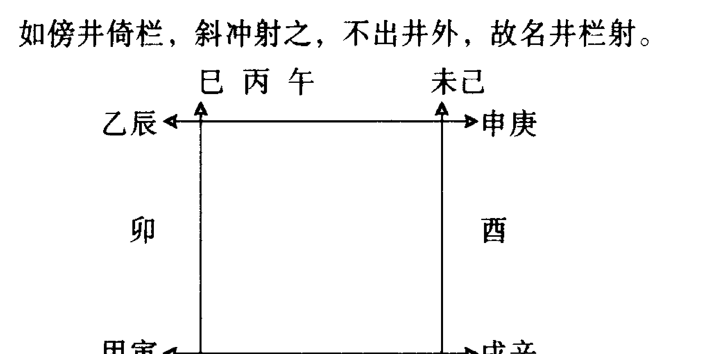

地支井栏图

辛丑未、己丑未、丁丑未六日返吟固可依井栏射作用取传，然不如取日马发传更易记牢。

巳酉丑日驿马在亥。故辛巳丁丑日返吟初传取马星亥水，亥卯未日驿马在巳，故辛巳丁未日返初传马星巳火。此六日返吟依马星发传，十分简捷，值得推广。另外，此六日返吟初传也可依阴日八专逆行数至第三位来求取初传。

## 例三：十月亥将巳时己未日

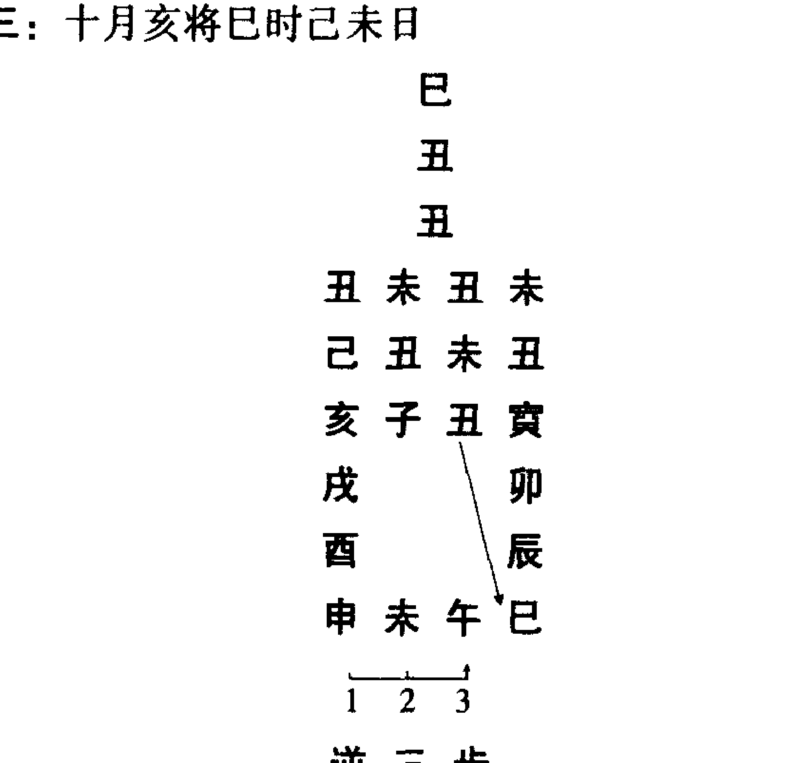

(1) 依井栏射取初传，凭未宫己土遥射亥宫壬水，故以亥宫上神巳火作初传。
(2) 用马星发传，亥卯未日马星在巳，故以驿马巳火作初传。
(3) 依阴日八专法则取用，阴日八专以支阴，逆行三步，现支阴上神为未，逆数未为一、午为二、巳为三，故取第三步巳火为初传。

返吟亦名无依，十二神互换其位，彼此相冲，往来咨嗟不宁，故名返吟。且十二神各易本位，无所凭藉依附，故名无依。占主事带二途，远近系心，往返无常，欲动不动，福自外来，事从下起，背逆分离，有疑莫决，安营离散，出阵败奔，来者思去，去者复来，往来得失未有一定，巢穴改，官易位，亲情无始终，病亦两症相侵，往多反复，惟利反旧事。大都凡动无依，但当久动思静而已。此课多主动，若来去三传俱空，又不依动论。

返吟不细论，诸占少吉祥。凡占得反吟卦，多凶少吉。占病反复难愈，日干无气大凶；出行半路而回，谋事白忙一场终落空；婚姻不成，夫妻反目分离；占产速生；占胎孕凶；占职禄，中途落职。返吟卦利占旧事，占失物，多主失而复得之兆。若物类神空亡，又未必然。占考试禄马入传，高中却恐难完学业。占讼反复，一审二审未能速了。

阳日返吟卦，亦为德丧禄绝卦。甲日德禄在寅加申为德禄灭绝之地，丙戊日德禄在巳加亥为德禄丧绝之地，庚日德禄在申加寅为德禄绝地，壬日德禄在亥加巳为德禄绝地，五阳干德禄俱陷死丧之地，故名德丧禄绝卦。

《玉成歌》云：“返吟占事休言定，不动人情有怨欺，往往复复双事因，常占须主身离动。”
《心印赋》云：“返吟无依迭复旧事往来不一。”
《指掌赋》云：“返吟无依迭传而来多反复。”
《课目》云：“返吟有克往来取，井栏丑未丁己辛。”

## 第三章 十二局天地盘面概论

大六壬的静态课式共有七百二十多种，这些课式皆是建筑在天盘地盘的加临转运之上，脱离天盘地盘地叠加，则六壬的四课三传就根本无法排出版列。因此，天地盘作为壬学的基石，其重要性非同一般。天盘是依月将加临地盘占时地支之上顺时针方向转出来的活动盘。天盘之所以要从顺时针方向来旋转，主要是依据太阳出东入西的视运动方向来定的。

天盘的转运首先要确定月将，月将代表太阳，它体现了地球公转过程中太阳与地球的不同相对位置。古人依据十二星次的划分规定一年之中有十二位月将，把天盘月将十二位加临地盘占时十二位地支之上，就会组成月将与占时的叠加组合：12×12=144种类，这一百四十四种类的将时组合转运出来的天地盘面共有十二局。这十二局天地活动组合盘对于课式、课体的形成及特征规律都有决定性的作用。仔细研究这些盘面，不仅可以提高袖占一课的速度，而且还可以帮助课式的实际解析。所以，对这些盘面作一概括性的研究颇有必要。

由于地盘千载不移，故而十二局天地活动盘面组合实际上就是十二局天盘的活动式子。这十二局天盘活动式子大致包括了伏吟盘、退连茹盘、退间盘、病胎盘、逆三合盘、四绝盘反吟盘、四墓覆生盘、顺三合盘、衰胎盘、顺间盘、顺连茹盘等。这些盘面的列出，仍旧遵循上南下北左东右西的传统卦图模式，只书出天盘样式，地盘则省略不写出了。

### 第一节 伏吟盘

```
巳午未申
辰    酉
卯    戌
寅丑子亥
```

凡月将与占时相同，转出的天盘重合于地盘，称之为伏吟盘。伏吟盘中天盘十二神皆伏于地盘本位，为天地未分太极混沌，表征静象。伏吟盘所起课传非刑即冲，大端不吉，多主静伏，忧愁呻吟，不能动弹。若课传中见天马、驿马、丁马，则又主静中生动，事有变易。

亥为天门，巳为地户：凡式中贵人加临天门之前地户之后，则十二天将顺转；凡式中贵人加临天门之后地户之前，则十二天将逆转。天门最喜贵人加临为当权，代天宣化，有权柄。占天时逢之，多主有雨，甚验。德禄加临天门，最利考试。已亥为堂庙之宫。

子配坤，午配乾；子位阳生，午位阴生；子为冬至，午为夏至，故子午为天地门户，子午为阴阳双至。

丑为天乙本位，为昼贵始位，未为夜贵始位。丑未为天厨之所。

寅为鬼户、申为人门：鬼户喜贵人天罡堵塞，大利谋事。占病忌类神加临，为“人人鬼门关”，最凶。寅为天吏、申为天城，考试仕途占皆宜逢之，多有升迁之喜。寅申为道路之神。

卯为日出之门，酉为月出之门，人事随此二门阖辟而作息。若天后、六合、玄武、太阴等淫佚之神加乘，淫奔之事难免。最喜吉将神加临，为“福禄临户”。大忌凶神恶煞加临，为“晦气入门”。卯酉为日月之门。

辰为天牢、戌为地狱，悉主刑狱事。贵人加临辰戌之乡，为贵人入狱，主不正、失势、受贿等事象。辰戌为牢狱之地。

### 第二节 退连茹盘

```
辰巳午未
卯　　申
寅　　酉
丑子亥戌
```

凡占时居月将前一位相邻，转出的天盘移地盘一位，称之为退连茹盘。

退连茹盘所起三传皆逆时针顺排连排三位，三传相连且逆后退，故名退连茹。占逢此盘，事多先进后退，以退为进，以逆为顺，以反为正，万事宜随缘后退，不宜进步。

子加丑：子中有女宿，丑中有牛宿，子丑相加相合乘太常，为牛郎织女相会吉格，大利占婚。丑日子命人占出行，丑为宅，子丑六合为本命恋宅，反不能行。以子发用，三传子亥戌卦名重阴。六癸日子为日禄，为旺禄临身。

丑加寅：六甲日为昼贵临身，大宜求贵成事，寅日为贵人人宅。以丑发用三传丑子亥，卦名入墓。

卯加辰：卯辰六害相克。六乙日旺禄临身，卯作丁神、闭口则禄神害身，因禄忧心。

辰加巳：六戊日墓神覆日，犯“墓库运”，主人昏晦倒霉。庚辛日为天罡压日本。日本者，日干长生之位。日本被罡压制，不能生日。

午加未：午未六合。己丁日旺禄临身，六己日生气并旺禄，更吉。

未加申：六庚日夜贵临身，宜求贵。

酉加戌：酉戌六害，丙丁日夜贵入狱，求贵无靠。六辛日旺禄临身，酉乘虎玄凶将，职禄恼怀。

戌加亥：戌发用为魁渡天门，万事阻隔。以戌发用三传戌酉申，卦名返驾。

### 第三节 退间传盘

```
卯辰巳午
寅   未
丑   申
子亥戌酉
```

凡占时位于月将前隔二位，转出的天盘活动式子与地盘的组合盘，称之为退间传体。

退间传体所起三传皆逆行相间一位退后，故名退间传。传退主事退，传间主事阻，退间传主事体艰难勉力退回之象。

- 子加寅: 六甲日子生子败，悉由子为，爱恨不一，爱其生气，恨其败身。
- 丑加卯: 以丑发用三传丑亥酉，卦名极阴，专主淫佚酒色奸乱等事，病主死，讼至省部，或淫乱而生疾。盖亥主淫乱，酉主酒色耳。
- 寅加辰: 六辛日夜贵人狱，求贵无依。以寅发用三传寅子戌，卦名冥阴。寅为日出晓方，子戌阴气旺盛，自寅传戌，有阳退入阴之象。凡占事自明人暗凶，暗在前犹防暗损，占官最为凶也。
- 卯加巳: 壬癸日两贵相加，求事必得两贵人扶助而成。六丙日卯为生气，亦为败神，吉凶不一。卯旺相乘吉将，生多败少；卯休囚乘凶将，生少败多。
- 午加申: 午为雀申为虎，雀虎相会恶斗主大讼，纵空亡亦不能解矣！六庚日午加日上，三传午辰寅，卦名顾祖，宜防他人暗中教唆而有害，更防因财致祸。
- 未加酉: 六乙日夜占螣蛇系未墓之上，为“开墓门”格，主重重死丧。甲戊庚日夜贵临门户，动摇不定。
- 酉加亥: 丙丁日昼夜贵聚，谋事得两贵成就。六壬日酉作生气，亦作败神，多贪恋少女酒色而败身。丙丁日夜贵加天门，占官事天子，禀持大权。

### 第四节 病胎盘

```
寅卯辰巳
丑 午
子 未
亥戌酉申
```

凡占时前于月将三位，转出来的天盘式子与地盘的叠加样式，称之为病胎盘。

病胎盘实际是移方盘，北移东、东移南、南移西、西移北，天盘四孟皆加临五行地盘病处，故名病胎。天盘四孟神皆处病胎，发用三传皆四孟神，课名玄胎。天盘四仲神皆处死地，发用三传，课名三交。天盘四季神皆处墓地，发用三传皆四季神，课名游子稼穑课。玄胎课事有生意；三交课阴私不明，多凶少吉；游子课天涯海角，最利出行逃亡。

- 子加卯：子卯无礼刑，门户有忧。乙己日昼贵立刑地，贵人不安，靠贵有忧。
- 丑加辰：甲戊庚日昼贵入狱。六乙日财临身，乙未日丑遁辛金暗鬼，因妻成讼、因食致病、因财生祸。
- 寅加巳：六丙日长生临身，守业昌盛。寅巳相害，害中有生，吉凶不一。
- 辰加未：六己日夜占两常夹墓覆日，“墓库运”大忌，昏晦霉气尤甚。日月宿临四仲，天罡加未，为天地二烦课。
- 巳加申：巳加庚上，丁神必然入宅，为人宅俱祸。巳乘勾陈作日干长生看，已乘朱雀作日干官鬼看；长生吉，官鬼凶。
- 午加酉: 午加酉发用三传午卯子，卦名轩盖课，大宜有官人占。
- 未加戌: 未戌相刑，甲戌庚日夜贵履狱，贵人失势无权，故靠贵无依。
- 申加亥: 六壬日长生临身，最利守业生计。六庚日德人天门，考试必高中。
- 戌加丑: 六癸日鬼爻临身，昼占戌乘虎克日，所谓“虎临干鬼凶速速”，凡占大祸大难。六辛日天盘日干坐墓乡，病人非宜。
- 亥加寅: 六甲日夜占长生乘太常吉将，来人必占婚姻之喜，或有赏赐财帛之事。

### 第五节 逆三合盘

```
丑寅卯辰
子    巳
亥    午
戌酉申未
```

凡占时位于月将前四位且与月将作三合，转出来的天盘式子与地盘组合的样式，称之为逆三合盘。
逆三合盘所起三传皆是逆转三传结成三合局，成事吉而散事凶，为众人参与扶持成就之象，喜合成财官局、生气局，忌合成脱气局、鬼局等。

- 子加辰: 六乙日昼贵临身，不作入狱看。
- 寅加午: 六辛日昼夜贵聚，又夜贵临昼地，昼贵临夜地，为贵人蹉跎，权摄不一。
- 巳加酉：巳酉合成“配”字，刑讼不利，发配异乡。四仲日见巳为破碎煞，酉见巳破碎克神尤凶。
- 午加戌：六辛日昼贵临身，求贵成事大吉，不作贵人入狱看。六戊日昼将午乘白虎坐墓地，午为父母爻，如父母在主病灾，更作月内死气死神，占父母病必死。如父母没，必父母墓中生白蚁，或兴祸端。古人称此格为“白蚁食尸格”。今日中国大多数地方已实行火化，无有什么尸体可被白蚁所食，故本格应作变通来看。
- 未加亥：甲戊庚日夜贵登天门，其时大吉。乙亥、乙卯日未发用三传未卯亥，初传为日墓末传为日长生，三传自墓传生，凡事失迷后醒先难后易，皇天不负有心人，终有成就亨通。
- 酉加丑：六癸日败神临身，忌贪恋酒色事。
- 戌加寅：戌为天魁发用为斩关课，大利出行奔走逃亡。甲午戊寅子四日三传戌午寅，三传合成火局脱日干甲木，生起戌土财神，为失财复得之兆，故古人喻此为“还魂财”，尤利索债求财。
- 申加子：乙己日两贵相会，靠贵最利。夜贵加临子宫，占天气主雨，尤验。

### 第六节 四绝体

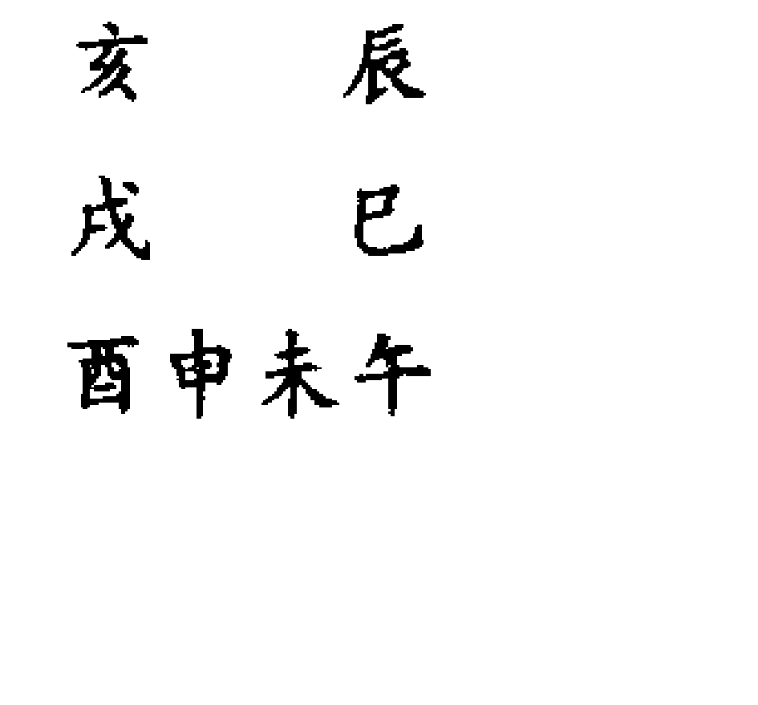

凡占时与月将距六位，转出来的天盘式子与地盘的组合样式，称之为四绝体（盘）。

四绝体指五行正位之神皆临于绝地，子水绝巳，卯木绝申，午火绝亥，酉金绝寅，故名四绝。四绝体所起三传相互克贼甚多，事体大端不顺，宜结绝旧事，新事无成。占病见四绝体，九死一生。

**子加巳：** 子巳合成“死”字，子巳年命人占病逢之大凶。子加巳发用三位子未寅，末克中，中克初，三传递克，必犯众怒。四丙日（丙午戊寅子）见之尤的。戊日逢子发用，子受戊克，又被中传未土制，难为子水，进退两难，伤害重重。子为财，妻多病，财多破，无疑矣！

**寅加未：** 寅上克未，下未墓寅，仰丘俯仇，凶恶甚极。

**卯加申：** 以卯发用三位卯戊巳，卦名斩轮。革故鼎新，大利功名，病讼大忌，削木为棺，凶兆已露。

**辰加酉：** 壬癸日作日墓乘蛇虎凶丧之神加临门户，正为“墓门开”象，占病死二、三口。癸酉日尤的。

**巳加戌：** 壬癸日昼贵入狱，贵人不贵。

**午加亥：** 以午发用三传午丑申，末传申金坐丑墓之地，又被中传天盘丑来墓，初传午火来制克，申金衰弱，全无气象。取申金作类神占，不宜。

**申加丑：** 申金坐墓，六癸日长生临身，宜守，不可妄动。壬癸日夜占申乘虎生墓，父母病灾，必矣。

**酉加寅：** 六甲日见酉，占孕胎鬼，不育。占试亚魁，颇吉。

**戌加卯：** 丙丁日戌乘蛇虎加门户之上，墓门大开，必收众尸。以戌发用三传戌巳子，中传巳火被初墓末克，受伤独重。

### 第七节 反吟盘

```
亥子丑寅
戌 卯
酉 辰
申未午巳
```

凡占时与月将作六冲，转出的天盘式子与地盘组合样式，称为反吟盘。

返吟盘所起三传相互刑冲，反复往来，事体都主动，反复不定，终无结果。

子加午、午加子：天翻地覆，道路驱遂，男女争交，谋为举迁，举动差失。

丑加未、未加丑：丑中有斗宿，未中有鬼宿，丑未相加“斗”“鬼”合成“魁”字，考试高中。丑未相冲，弟兄两意，谋为无成。

寅加申、申加寅：甲庚日俱德丧禄绝，寅为鬼户，六庚日申（身）入鬼户绝地，占病必死尤急。古人虽拟寅为鬼户，然也依五行受克始论之。若神将加临受寅相生旺相，鬼户不论宜矣。

卯加酉、酉加卯：卯为龙，酉为虎，卯酉相加相冲，“龙虎斗”象，两强之间，难为弱者。卯酉为日月出入之门，阴合临门户，淫佚奸私。

辰加戌、戌加辰：悲喜不明，奴仆逃走。

巳加亥、亥加巳：丙戊壬日德丧禄绝，占禄不宜。戊日德人天门，试中金榜。亥为“孩”音，小儿病不宜。

### 第八节 四墓覆生盘

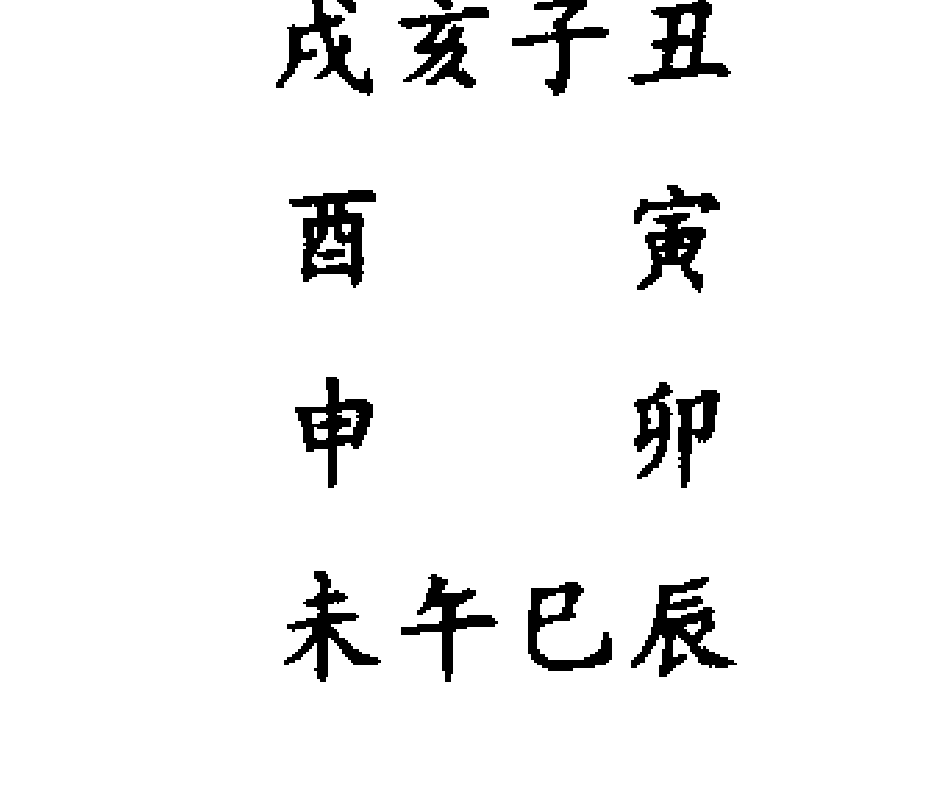

凡占时位于月将后六位，转出来的天盘式子与地盘叠合的样式，称之为四墓覆生盘。

天盘之中四墓神俱加临地盘四生之处，地无生机，天运不济。寅生火，被未墓，无力生火；巳生金，被戌墓，无力生金；申生水，被丑墓，无力生水；亥生木，被辰墓，无力生木；故名四墓覆生。四墓覆生，生气全灭，全发墓葬之气，只利旧事，不利新生。

- **子加未：** 丁己日昼贵作财临身，告贵求财大利。六丁日子加日上，赖坐下未土所制，为“狐假虎仪格”，丁实畏子水，喻“狐”，子水畏未土以“虎”喻“未”，最利坐守，动用则子水随逝丁火受克，祸殃生矣。
- **丑加申：** 六庚日墓神覆日，虽作昼贵亦不利，主被贵人欺瞒致咎。若丑作月将，难中有救。
- **寅加酉：** 以寅发用三传寅未子，三传皆地盘下神贼上神，为“窝里斗”象，必家中不和，争讼至官，丑名远扬，戊辰，癸酉日支干皆下克上，尤验如神。
- **卯加戌：** 壬癸日夜贵入狱，靠贵乏力。辛卯日财就人，宜速取；迟则卯木克戌土，因财反伤身。
- **辰加亥：** 六壬日墓神作鬼覆克，灾祸尤甚。甲乙日为罡压日本，若再囚死墓神发用，为的天狱课，祸从天降，悉主牢狱之事。
- **巳加子：** 以巳发用三传巳戌卯，卦名铸印乘轩，工作调动之象，若巳戌卯中并月将太岁贵人青龙者，大利竞选；病讼则不宜之。常占巳火被中传墓灭，不利巳火类神诸占。
- **午加丑：** 六癸日以午作初传传亥辰，午受亥制癸贼，两面夹攻，破财妻病，眼目有灾。
- **未加寅：** 仰见其丘（墓），俯见其仇（寅克未），凶恶之极。六甲日夜占贵神作墓，发用子水来害未贵，讼小而罪大，弄巧成拙，有苦难言，有理难伸。
- **申加卯：** 申乘六合加卯，为“申”（身）入六片板棺材中，占病大忌。
- **酉加辰：** 丙丁日夜贵入狱。六乙日胎鬼恶煞临身，必有祸患。
- **戌加巳上：** 巳为螣蛇本家，六丙日昼占戌墓乘螣蛇，为“双蛇夹墓”，大凶，病人必死，讼必入狱，万事晦滞，可恨可叹而难解脱。“墓库运”中凶恶莫此为甚。

### 第九节 顺三合盘


凡占时位于月将后四位与月将作三合神，转出来的天盘活动式子与地盘组成的样式，称之为顺三合盘。

顺三合盘所起三传皆是顺转三传结合之合局，成事吉而散事凶，与逆三合盘一样，喜合成财官局、生气局，忌合成脱气局、鬼局等。顺三合诸事顺当而作合，逆三合诸事退转而作合。

- **子加申：** 乙己日昼夜贵聚相会，官官相护，惺惺相惜。庚日夜占子乘龙神居干上，子水脱庚，天将龙神脱子水，是“脱上脱”象，诸事防虚诈失财。
- **丑加酉：** 辛酉日昼占丑墓乘虎居宅上，必宅中伏尸古坟作怪，以致室家道衰替，宜法官安镇行遣。
- **寅加戌：** 六辛日夜贵作财作绝神临身，大宜告贵结绝财物事，不作入狱论。
- **卯加亥：** 壬日夜贵作脱气临干，宜防被贵人脱赚。卦中现鬼爻，见卯贵子孙爻作救星看，必有贵人护持消灾脱难，不再作脱气看。
- **巳加丑：** 六癸日昼贵作财神作绝气，宜靠贵了结财物事。
- **午加寅：** 壬癸日午作胎神妻财，胎神临长生之乡，保胎大吉。六辛日昼夜贵人相晤，以官访官，必见。
- **申加辰：** 六乙日夜贵作日德，可伏一切鬼煞劫难，夜贵日德亦为绝神，宜赖贵人断绝祸殃。
- **酉加巳：** 酉巳合成“配”字，刑狱发配异乡。酉为巳日破碎煞，己巳日逢之，宅中定有“败家子”。酉为己干子孙爻，又为日干败神，再并破碎煞，此儿破败不堪言矣。

### 第十节 生胎盘

申酉戌亥
未　子
午　丑
巳辰卯寅

凡占时位于月将后三，转出来的天盘式子与地盘的叠加样式，称之为生胎课。

生胎课实际是逆移方体，东移北、北移西、西移南、南移东。天盘四孟神悉临地方长生之乡，故名生胎，大概生胎与病胎意义相似，不过三传有顺逆区别而已。生胎三传皆顺传，病胎三传皆逆传。

**子加酉**：乙己日昼贵处于门户败地，贵人不谨，志忑不安。
**丑加戌**：六辛日墓神覆日，昼乘虎神，夜乘蛇神，凶不可遏。
**寅加亥**：六壬日昼占寅乘玄武，失盗必矣。甲日德人天门，试举魁甲，仕任京城。
**辰加丑**：六癸日墓鬼覆日克日，祸尤惨。
**巳加寅**：壬癸日昼贵塞鬼户，万事大利大吉，有祸无惧，定有贵人释难。六甲日昼将巳乘太常，为“脱上脱”象。
**未加辰**：六乙日墓神作财覆日，因财受害祸殃不浅。甲戊庚日昼贵人戌地，夜贵人辰地，昼夜贵人悉入网罗之地，贵人失势。
**申加巳**：六丙日以申发用，三传申亥寅，初生中，中生末，末生日干，三传递生日干，多主众人推荐相助以成大事。若占生意，源远流长，无有穷尽。

戌加未：六丁日墓神压日无光，昏晦。六己日戌土重压，迟滞。

亥加申：亥申六害，六庚日因害而脱，失财之象。甲乙日亥为父母爻，临长生之乡，父母高寿。

### 第十一节 顺间传盘

| 未 | 申 | 酉 | 戌 |
|---|---|---|---|
| 午 |  |  | 亥 |
| 巳 |  |  | 子 |
| 辰 | 卯 | 寅 | 丑 |

凡占时位于月将后二，转出的天盘式子与地盘地叠加样式，称之为顺间传。

顺间传所起三传皆顺转相间，三传顺转主事顺，传间主事阻，事体大致顺利发展，中间不免有阻隔。

子加戌：乙己日昼夜入狱临夜地受制，夜贵加昼乡受制，两贵俱受下制，告贵贵人自有忧烦，难靠。六辛日昼占子乘天空，为“脱空”格钱财耗失殆尽。

丑加亥：甲戊庚日昼贵登天门，天罡塞鬼户，凡谋无不亨利。
辰加寅：天罡塞鬼户，神藏煞没，万事无阻，任意谋为。
巳加卯：壬癸日昼夜贵人相会，告贵最利。
午加辰：六乙日昼占午乘天空，为“脱空”格。

申加午：申为虎，午为雀，两神相逢，恶斗难免，故主大讼。

酉加未：六丁日夜贵作财，求贵谋财，无不如意。六己日酉为脱败临身，昼占因“败家子”破身，夜占因女人败身。酉作破碎煞，更甚更的。

### 第十二节 罗网盘

午未申酉
巳　戌
辰　亥
卯寅丑子

凡占时位于月将后一位，转出来的天盘活动式子与地盘的叠加样式，称之为罗网盘。

天盘十二神皆处于地盘本位后一位，所有干支皆被前辰作网覆盖，故名罗网。罗网所起三传皆为顺连茹，三传皆连相顺传出，事顺而速。

子加亥：六壬日静守为旺神，大兴大发；动用则为羊刃，伤身之灾难免。

丑加子：子丑六合作牛女相会论，婚姻天赐良缘。

寅加丑：六癸日昼将寅乘玄武，失财必定。

卯加寅：六甲日静守为旺，动用为刃。

巳加辰：壬癸日昼贵入狱，求贵不如不告。

午加巳：六丙六戊日静守为旺神而大发，动用为羊刃，大难。

**申加未**：六己日夜占申贵子孙爻乘太常作长生，孝子贤孙，养老欢悦。六丁日三传申酉戌，春夏身旺求财大获；秋冬身弱，反失资财，病必贪食而亡。

**酉加申**：六庚日静守旺神，动用羊刃，吉凶天渊之别。

**戌加酉**：丙丁日墓门开，死丧多人，病讼最忌见之。

**亥加戌**：六辛日宜静守，假虎威，不致失脱。

以上十二局在地叠加盘情况，皆由太阳占时相加旋转而出。从太阳加占时到天地盘面，从天地盘面再到四课分布，从四课分布再到三传排演，其中的规律是一脉相承的。太阳与占时的关系决定了天地盘面、四课分布、三传组合的特征与规律。如太阳占时互为三合神，则天地盘面定是顺逆三合体，日辰二课上下各自互相三合，三传则肯定是三合成局，此规律自始至终是相同的，且是可逆的。因此，从三传关系特征可以逆推四课分布情况、天地盘面特点乃至太阳占时之关系。如三传是顺连茹卦，那么，四课支干必是罗网笼罩于前一辰之下，天地盘则又必是罗网体，太阳与占时相邻。了解和掌握此四者关系特征的一致性，可以印证所起课传是否准略，这对于提高起课速度也有帮助。

## 第四章 三传总汇

大六壬起课占事，先把月将置于占时之上，转出天盘，再依占日干支布出四课，最后依九宗门推出三传，三传是六壬测事信息的主要载体，现将六十甲子日跟十二局天地盘配合排演的所有三传汇总出来，以资参阅。

## 说明：

依十干统领十二地支，分为六甲日，六乙日、六丙日、六丁日、六戊日、六己日、六庚日、六辛日、六壬日、六癸日十张表。其中只写干上加临之神以定第一课，第一课既定，其他三课也随之而定。

所定第一课列出干上，地支分列以下，不同占日干支所起三传并列出来。所有三传皆由九宗门起出。

### 六甲日三传总汇

| 巳甲 | 申亥寅 | 午甲 | 子申 辰申子；辰 申子辰；戊午 寅午戊；寅 申午午 | 未甲 | 五甲 子巳戊；辰 寅未子 | 申甲 | 寅申寅 |
| --- | --- | --- | --- | --- | --- | --- | --- |
| 辰甲 | 辰午申 |  |  |  |  | 酉甲 | 子 寅酉辰；午寅 酉辰亥；戊子 子未寅；申戌 戊巳子；辰 午丑申 |
| 卯甲 | 辰巳午 |  |  |  |  | 戊甲 | 四甲 戊午寅；辰申 子申辰 |
| 寅甲 | 寅巳申 | 丑甲 | 子亥戌 | 子甲 | 戊申 午辰寅；四甲 戊申午 | 亥甲 | 子 午卯子；申 已寅亥；三甲 申巳寅；寅 丑亥亥 |

### 六乙日三传总汇

| 巳乙 | 丑 寅卯辰<br>未 酉戌亥<br>亥 丑寅卯<br>巳 未申酉<br>酉 亥子丑<br>卯 辰巳午 | 午乙 | 申戊子 | 未乙 | 五乙 未戊丑<br>卯 酉子卯 | 申乙 | 丑巳 酉丑已<br>亥卯 未亥卯<br>酉 申子辰<br>未 亥卯未 |
| --- | --- | --- | --- | --- | --- | --- | --- |
| 辰乙 | 丑 辰丑戌<br>未 辰未丑<br>亥 辰亥巳<br>巳 辰巳申<br>酉 辰酉卯<br>卯 辰卯子 |  |  |  |  | 酉乙 | 四乙 寅未子<br>酉 未子巳<br>未 已戊卯 |
| 卯乙 | 丑 子亥戌<br>未 戌卯午<br>酉 申未午<br>巳 卯寅丑<br>亥 戌酉申<br>卯 丑子亥 |  |  |  |  | 戌乙 | 丑未 戌辰戌<br>亥巳 已亥巳<br>酉卯 卯酉卯 |
| 寅乙 | 丑卯 亥酉未<br>未 亥寅巳<br>亥 酉未巳<br>酉 未巳卯<br>丑 丑亥酉 | 丑乙 | 丑戊未 | 子乙 | 丑酉 已丑酉<br>未 卯亥未<br>亥卯 未卯亥<br>已 酉巳丑 | 亥乙 | 丑 卯戊巳<br>酉 亥午丑<br>四乙 午丑申 |

### 六丙日三传总汇

| 巳丙 | 巳申寅 | 午丙 | 寅<br>申<br>子<br>午<br>戌<br>辰 | 未丙 | 寅子<br>戌申<br>午辰 | 申丙 | 申亥寅 |
| --- | --- | --- | --- | --- | --- | --- | --- |
| 辰丙 | 寅 子 戌<br>子 戌 酉<br>四丙 卯 寅 丑 |  |  |  |  | 酉丙 | 酉丑巳 |
| 卯丙 | 丑亥酉 |  |  |  |  | 戌丙 | 寅 子 已 戌<br>申 卯 申 丑<br>子 已 戊 卯<br>午 辰 酉 寅<br>戌 申 丑 午<br>辰 寅 未 子 |
| 寅丙 | 三丙 亥 申 已<br>申 已 寅 亥<br>子 午 卯 子<br>午 子 酉 午 | 丑丙 | 寅午 戌午寅<br>戊 酉已丑<br>子 申辰子<br>申辰 子申辰 | 子丙 | 四丙 子未寅<br>辰 午丑申<br>申 戊已子 | 亥丙 | 寅申 寅申寅<br>戊辰 已亥已<br>子午 午子午 |

### 六丁日三传总汇

| 巳丁 | 巳 丑亥酉<br>亥 酉未巳<br>丑卯 亥酉未<br>酉未 丑巳巳 | 午丁 | 卯 丑子亥<br>酉 申未午<br>丑 子亥戌<br>未 卯午午<br>亥 戌酉申<br>巳 卯寅丑 | 未丁 | 卯 卯子午<br>酉 酉未丑<br>丑 丑戌未<br>未 未丑戌<br>亥 亥未丑<br>巳 巳申寅 | 申丁 | 卯 辰巳午<br>四丁 申酉戌<br>酉 亥子丑 |
| --- | --- | --- | --- | --- | --- | --- | --- |
| 辰丁 | 卯 子酉午<br>酉 午卯子<br>丑 子辰戌<br>未 亥辰辰<br>亥 巳寅亥<br>巳 亥申巳 |  |  |  |  | 酉丁 | 酉亥丑 |
| 卯丁 | 卯亥 未卯亥<br>未 卯亥未<br>丑酉 巳丑酉<br>巳 亥未卯 |  |  |  |  | 戌丁 | 卯 酉子卯<br>酉 子卯午<br>丑 午戌辰<br>未 亥戌戌<br>亥 午戌寅<br>巳 申亥寅 |
| 寅丁 | 卯 戌巳子<br>酉 亥午丑<br>丑 卯戌巳<br>亥 午丑申<br>未巳 酉辰亥 | 丑丁 | 卯酉 卯酉卯<br>巳亥 巳亥巳<br>未丑 巳未丑 | 子丁 | 五丁 巳戌卯<br>酉 未子巳 | 亥丁 | 卯亥 未亥卯<br>巳丑 酉丑巳<br>未酉 亥卯未 |

### 六戊日三传总汇

| 巳戊 | 巳申寅 | 午戊 | 子 子寅辰<br>寅午 辰巳午<br>辰 寅午午<br>申 戌酉午<br>戌 亥子丑 | 未戊 | 申戌 子寅辰<br>子寅 辰午申<br>午辰 申戌子 | 申戊 | 子 卯午酉<br>寅戌 申亥寅<br>辰 亥寅巳<br>午 酉子卯<br>申 寅巳申 |
| --- | --- | --- | --- | --- | --- | --- | --- |
| 辰戊 | 四戊 卯寅丑<br>寅戌 子亥戌<br>子 戌酉申 |  |  |  |  | 酉戊 | 寅 丑午酉<br>辰 子辰申<br>午戌 寅午戌<br>申辰 辰申子 |
| 卯戊 | 丑亥酉 |  |  |  |  | 戌戊 | 子 巳戌卯<br>寅 子巳戌<br>辰 寅未子<br>午 辰酉寅<br>申 卯申丑<br>戌 申丑午 |
| 寅戊 | 寅亥申 | 丑戊 | 申辰 子申辰<br>子 巳申丑<br>寅午 戌午寅<br>戌 寅戌午 | 子戊 | 子未寅 | 亥戊 | 午子 午子午<br>申寅 寅申寅<br>辰戌 巳亥巳 |

### 六己日三传总汇

| 巳己 | 卯丑 亥丙未<br>巳 丑亥酉<br>未 丑巳巳<br>酉亥 卯丑亥 | 午己 | 丑 子亥戊<br>卯 丑子亥<br>巳 卯寅丑<br>未 卯午午<br>酉 戊午申<br>亥 戊酉申 | 未己 | 丑 丑戊未<br>未 未丑亥<br>卯 卯子午<br>酉 酉未丑<br>巳 巳申寅<br>亥 亥未丑 | 申己 | 丑 寅卯辰<br>未 未申申<br>卯 辰巳午<br>酉 亥子丑<br>巳 申中午<br>亥 丑寅卯 |
| --- | --- | --- | --- | --- | --- | --- | --- |
| 辰己 | 丑 子辰戌<br>未 亥辰辰<br>卯 子酉午<br>酉 午卯子<br>巳 寅亥申<br>亥 巳寅亥 |  |  |  |  | 酉己 | 丑 卯巳未<br>未 酉酉酉<br>卯巳 亥丑卯<br>酉亥 丑卯己 |
| 卯己 | 酉丑 巳丑酉<br>亥卯 未卯亥<br>未巳 卯亥未 |  |  |  |  | 戌己 | 丑 午戌辰<br>未 亥戊戊<br>卯 酉子卯<br>酉 卯午酉<br>巳 申亥寅<br>亥 寅巳申 |
| 寅己 | 丑 卯戌巳<br>卯戌 戊巳子<br>未巳 酉辰亥<br>酉 亥午丑<br>亥 午丑申 | 丑己 | 卯酉 卯酉卯<br>亥巳 巳亥巳<br>未 巳丑丑<br>丑 亥未丑 | 子己 | 己 巳戊卯<br>酉 未子巳 | 亥己 | 未酉 亥卯未<br>亥卯 未亥卯<br>丑巳 酉丑己 |

### 六庚日三传总汇

| 巳庚 | 五庚 巳寅亥<br>子 午卯子 | 午庚 | 午辰寅 | 未庚 | 午戊子辰申寅 | 申庚 | 申寅巳 |
| --- | --- | --- | --- | --- | --- | --- | --- |
| 辰庚 | 寅午 戊午寅<br>四庚 子申辰 |  |  |  |  | 酉庚 | 午 戌未酉<br>子 寅卯辰<br>辰 午未申<br>戌 亥子丑<br>寅 辰巳午<br>申 亥酉酉 |
| 卯庚 | 五庚 戊巳子<br>辰 午丑申 |  |  |  |  | 戌庚 | 辰午 申戊子<br>子寅 辰午申<br>戌申 子寅辰 |
| 寅庚 | 寅申寅 | 丑庚 | 午 辰酉寅<br>子 巳戊卯<br>辰 寅未子<br>戌 申丑午<br>寅 子巳戊<br>申 卯丑丑 | 子庚 | 辰申子 | 亥庚 | 午 酉子卯<br>子 午酉子<br>辰戌 寅巳申<br>申 丑亥亥<br>寅 申亥寅 |

### 六辛日三传总汇

| 巳辛 | 未 酉辰亥<br>丑 卯戌巳<br>巳 未寅酉<br>亥 午丑申<br>卯 戌巳子<br>酉 亥午丑 | 午辛 | 未 卯亥未<br>卯亥 未卯亥<br>巳 午寅戌<br>丑酉 巳丑酉 | 未辛 | 未 亥未未<br>丑 巳未未<br>巳 寅亥申<br>亥 巳寅亥<br>卯 子未子<br>酉 午卯子 | 申辛 | 三辛 午辰寅<br>巳 丑亥酉<br>丑卯 亥酉未 |
| --- | --- | --- | --- | --- | --- | --- | --- |
| 辰辛 | 未 巳丑辰<br>卯酉 卯酉卯<br>巳亥 巳亥巳<br>丑 亥未辰 |  |  |  |  | 酉辛 | 未 巳辰卯<br>丑 子亥戌<br>巳 卯寅丑<br>亥 戌酉申<br>卯 丑子亥<br>酉 丑酉酉 |
| 卯辛 | 未 巳戌卯<br>四辛 卯申丑<br>酉 未子巳 |  |  |  |  | 戌辛 | 未 未丑戌<br>丑 丑戌未<br>巳 巳申寅<br>亥 亥戌未<br>卯 卯子午<br>酉 酉戌未 |
| 寅辛 | 未 亥卯未<br>卯亥 未亥酉<br>巳丑 酉丑巳<br>酉 寅午戌 | 丑辛 | 未 亥丑丑<br>丑 巳丑丑<br>巳 申亥寅<br>亥 巳申亥<br>卯 酉子卯<br>酉 卯午酉 | 子辛 | 未巳 寅辰午<br>丑 卯巳未<br>卯 巳未酉<br>亥酉 丑卯巳 | 亥辛 | 未 申亥申<br>丑 寅卯辰<br>巳 午未申<br>亥 丑寅卯<br>卯 辰巳午<br>酉 亥子丑 |

### 六壬日三传总汇

| 巳壬 | 申寅 寅申寅<br>巳亥 巳亥巳<br>子午 午子午 | 午壬 | 午丑申 | 未壬 | 申辰 子中辰<br>午寅 戊午寅<br>子戌 未卯亥 | 申壬 | 五壬 已寅亥<br>子 午卯子 |
| --- | --- | --- | --- | --- | --- | --- | --- |
| 辰壬 | 三壬 辰酉寅<br>寅 子巳戌<br>辰 寅未子<br>子 巳戌卯 |  |  |  |  | 酉壬 | 申戌 午辰寅<br>午辰 寅子戊<br>子寅 戌申午 |
| 卯壬 | 未亥卯 |  |  |  |  | 戌壬 | 五壬 戌酉申<br>寅 子亥戌 |
| 寅壬 | 申 已申亥<br>寅 申亥寅<br>午 酉子卯<br>子 午酉子<br>辰 戌丑辰<br>戌 辰未戌 | 丑壬 | 申戌 子寅辰<br>午辰 申戌子<br>子寅 辰午申 | 子壬 | 三壬 丑寅卯<br>子 寅卯辰<br>寅 辰巳午<br>戌 亥子丑 | 亥壬 | 申 亥申寅<br>寅 亥寅巳<br>午 亥午子<br>子 亥子卯<br>辰 亥辰戌<br>戌 亥戌未 |

### 六癸日三传总汇

| 巳癸 | 酉丑巳 | 午癸 | 酉 未子巳<br>未 巳戌卯<br>四癸 午亥辰 | 未癸 | 卯酉 卯酉卯<br>未丑 未丑未<br>巳亥 已亥巳 | 申癸 | 卯戌巳 |
| --- | --- | --- | --- | --- | --- | --- | --- |
| 辰癸 | 四癸 辰未戌<br>巳 申亥寅<br>卯 酉子卯 |  |  |  |  | 酉癸 | 四癸 已丑酉<br>卯亥 未卯亥 |
| 卯癸 | 酉亥 丑卯巳<br>已卯 未酉亥<br>未 已未酉<br>丑 卯已未 |  |  |  |  | 戌癸 | 酉 午卯子<br>四癸 戌未辰<br>亥 已寅亥 |
| 寅癸 | 酉 亥子丑<br>卯 辰巳午<br>未 申寅申<br>丑 寅卯辰<br>已 未申酉<br>亥 丑寅卯 | 丑癸 | 丑戌未 | 子癸 | 酉 未午巳<br>卯 丑子亥<br>未 已辰卯<br>丑 子亥戌<br>已 卯寅丑<br>亥 戌酉申 | 亥癸 | 酉亥 未已卯<br>已卯 丑亥酉<br>未 已卯丑<br>丑 亥酉未 |

## 第五章 月将释论

十二月将就是壬学古籍中通称的十二支神，这里的“神”决非“鬼神”之“神”，不存在任何玄乎迷信色彩，仅是六壬对月将地支的另一称谓而已，这是研究者首先要明白的。为了阐述的方便，笔者把“月将”和“支神”名称混和着用，不作严格区别，比如四课上神、类神、阳神、阴神之类皆是月将的别称。

十二月将包括正月将登明亥、二月将河魁戌、三月将从魁酉、四月将传送申、五月将小吉未、六月将胜光午、七月将太乙巳、八月将天罡辰、九月将太冲卯、十月将功曹寅、十一月将大吉丑、十二月将神后子。此十二月将的将名实际也是六壬对十二地支的阐述，十二月将在天文上看是每月中气以后太阳运入的星次。关于十二月将跟月建的关系、月将命名的本义、发课取用的依据等，沈括在《梦溪笔谈》中曾经有过详论，颇为中肯有理，值得参考。沈括认为：

六壬天十二辰，亥曰登明为正月将；戌曰天魁为二月将。古人谓之合神，又谓之太阳过宫。合神者，正月建寅合在亥，二月建卯合在戌之类。太阳过宫者，正月日躔诹訾，二月日躔降娄之类，二说一也。此以颛帝历言之也。今则分为二说者，盖日度随黄道岁差，今太阳至雨水后方躔娵訾，春分后方躔降娄；若用合神，则须立春日便用亥将，惊蛰便用戌将，今若用合神，则不应名太阳，用太阳则不应合神。以理推之，发课皆用月将加正时，如此须当从太阳过宫。若不用太阳躔次，则当日当时日月、五星、干支、二十八宿皆不应天行，以此决知须用太阳也。

六壬天十二辰之名，古人释其义曰：“正月阳气始建，呼召万物，故曰登明。二月物生根魁，故曰天魁。三月华叶从根而生，故曰从魁。四月阳极无承传，故曰传送。五月草木茂盛，愈于初生，故曰胜光。六月万物小盛，故曰小吉。七月百谷成实，自能任持，故曰太乙。八月枝条坚刚，故曰天罡。九月木可为枝干，故曰太冲。十月万物登成，可以会计，故曰功曹。十一月月建在子，君复其位，故曰大吉。十二月为酒酿以报百神，故曰神后。此说极无稽。据义理，予按登明者，正月三阳始兆于地上，见龙在田，天下文明，故曰登明。天魁者，斗魁第一星也，斗魁第一星抵于戌，故曰天魁。从魁者，斗魁第二星也，斗魁第二星抵于酉，故曰从魁（斗杓一星建方斗魁二星建方一星抵戌二星抵酉）。传送者，四月阳极将退，一阴欲生，故传阴而送阳也。小吉，夏至之气，大往小来，小人道长，小人之吉也，故为婚姻酒食之亨。胜光者，王者向明而治，万物相见乎此，莫胜莫先也。太乙者，太微垣所在，太乙所居也。天罡者，斗刚之所建也（斗杓谓之刚，苍龙等一星亦谓之刚，与斗刚相直）。太冲者，日月五星所出之门户，天之冲也。功曹者，十月岁功成而会计也。大吉者，冬至之气，小往大来，君子道长，大人之吉也，故主文武大臣之亨。十二月子位，北方之中，上帝所居也。天十二辰也，故皆以天事名之。”

从上沈括的记述中可以看出，六壬起课，必要用月将太阳来加正时发传，而不是月建合神。现今港台一些术者仍沿历史老调，取月建合神在立节之后以加正时排课，显然是不对的。

另外，沈括虽然讲“天十二辰也，皆以天事名之”，但细详内容，这些“天十二辰也”的月将，都是取材于地球上相应的物候、人事变化的情况来命名的，十二月将根源还是在地上。

事实上，六壬中的十二月将的概念、象意、事意、类神特征等所包含的信息十分丰富，天文地理人事无所不包无所不纳。《六壬大全》在卷二“大神总论”中对此描述：

十二支神有阴阳之分，各司其事。依十二宫论之，凡五行五方之次序，四时四季之循环，三垣二十八宿之次度，七政四余之星辰，九州万国之分野，阴阳生克之体用，莫不包罗于内，经纬于其间，斯天神之大概也。故以天上斗罡旋而言，则天罡为首顺布，以太阳缠度过宫而言，则登明为首逆布。逆布者，谓之月将，其实，即十二神也。壬课取用配合皆曰神，不曰将。祝其加于日辰年命，或生或克或刑或合，而休咎判矣。凡十二神相加，上克下，与上下生比者，俱取天盘言之；下克上者，取地盘言之。

又总说：

- 子午为阴阳两至
- 卯酉为日月之门
- 寅申为道路之神
- 辰戌为守狱之地
- 丑未为天厨之所
- 巳亥为堂庙之宫

《六壬大全》对十二月将全景式的论述，颇为简要。现依据其说法，绘出十二月将与星次地支、时令、二十八宿、分野、太阳过宫、十二辟卦的细致组合图，更可一目了然。

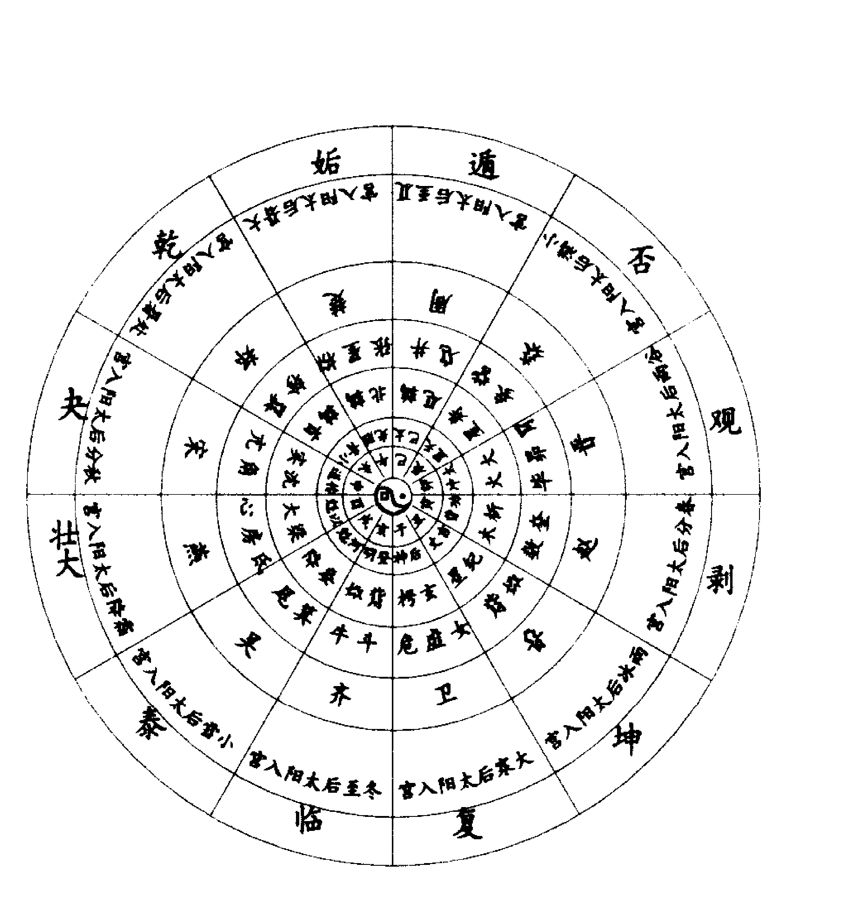

## 月将全景图

- 注：（由内而外）
- 第一圈：太极天心图——即太极图
- 第二圈：十二支辰
- 第三圈：十二月将
- 第四圈：十二星次
- 第五圈：二十八宿
- 第六圈：九国分野
- 第七圈：太阳过宫
- 第八圈：十二辟卦

### 十二神释

### 一、登明亥

水神雨水后日缠娵訾，正月将。

登明云者，正月三阳始兆于地上，见龙在田，天下文明，《易·明夷》有曰：“初登于天。”照万国也。又亥为天门，故曰登明。

壬寄其上，木生其下，玄武之象，畜豕、数四、味咸、星室壁、禽猪踰熊、宫双鱼、分野卫、并州、属猪、位天门。

所主祯祥、征召、阴私事、为自刑、为极阴之位。又主争讼、狱囚、沉溺、主取索亡失不净。

阳主德，阴主刑。亥为十月建，六阴卦，阴气盛极，正当极刑位。又地支中亥为自刑之物，拟之人事亥可表征刑狱象。亥乘白虎、朱雀、勾陈等讼神，必有讼狱事应。

从一日来看亥正为“人定”时辰，夜深人寂，万物伏藏，惟奸淫窃盗暗昧事乘时而动，拟之人事亥遂有“阴私”象。亥乘玄武盗神主盗贼事，亥乘太阴暗昧之神，主阴私不正事。诸占逢夜时尤的。

亥为娵訾，中有室壁两宿。室壁两星宿形似室台楼阁，故亥可拟为营室房屋。亥乘贵人加寅为宝殿，亥乘龙神加寅为楼阁，又壁宿主图书之府，故亥也表图书象。

六壬以亥为天门，巳为地户，以表中国西北高东南低的地理特征，“天门”还有“高位”象意，拟之人事，人间地位尊贵莫过于帝王；拟之地方，地理尊贵重要莫高于一国首地，古人便依此拟亥可象征朝廷帝王征召事以及京城首地。凡占考试，最喜日德加入天门，为“德入天门”格，有“皇家栋梁，荣耀京城”象，往往高中魁甲。凡占天时，贵人加临天门，多主有雨。经笔者实践，古人此一结论甚的，极验，十占九中。惟贵作空亡，则又不必尽然。仕宦占逢贵登天门，必事天子，操持大权。

“亥”与“孩”谐音，可归为一类事物，壬学遂以“亥”可代表小儿，占小儿病甚忌亥加四季地盘浴盆煞之地，主凶。四季浴盆煞春辰秋戌夏未冬丑是也。亥作小儿论，笔者验过一课。以亥作驿马，主小儿动行。

亥居后天乾位，乾为头，可拟亥为首。惟亥临戌亥子丑寅卯为首始的，亥加辰巳午未申酉则以肾论。如辛卯日亥加丑作中传且占，乃亥乘白虎作丁神，必为头痛以至不救。

类为天雨师，又为鬼神、天马、天耳。
为幼子，将军、夫人、醉人、乞丐。
为肝肾、为头、为足。
为病哭、眼斜、青丑、坏头面、病泻。
为盗、杀神、奸神。
为殿、楼、台、院、廷、坑狱。
为图书、笔墨、伞盖、梅花、麦、稻、盐酢酱。

诗云：登明天柱廪楼台，贼盗伤人幼子哀，狱厕积猪忧溺死，阴私管龠召征来。

### 二、河魁戌

土神春分后日缠降娄，二月将。
河魁即天魁，斗魁第一星抵于戌，故名建卯之月，万物皆生根本，以类聚合；魁者，聚之义也。
辛寄其上，火墓其下，天空之象，音商，数五，味甘，星奎娄，禽狼狗豺，宫白羊，分野鲁卫，徐州，属犬、位西北。

所主诈欺、印绶及奴婢逃亡。若发用，旧事重新之象，又主虚耗、失钱物、带众。

从天象上看，戌为北斗第一星。又为降娄星次，中有奎、娄两宿。奎为文运，为文明之宿，故戌可作魁星论，占试最宜魁星加临日干年命，主高中甲榜。依笔者理解，当代考试已大大迥异于古代科举，故不可把古人的魁星论不作变通就引入当代的考试占中。大致而言，魁是第一名之意，今人高考逢魁星则可断定为名次前列，始为妥当。另魁星非同一般学子，多指学业异常出众之人，故而魁星也可类拟高学历（比如博士、教授级人物）人士。娄宿主聚众，故戌也可表征兴师动众，以类相聚之事象。依笔者实践，戊河魁可代表组织，协会、团队、联盟等象。比如欧盟、北约等国际组织皆可依戊取类看，甚有的验，颇为稀奇。

辰为天罡三月建，成为河魁九月建。三月“天罡之气鼓万物而出，”九月“河魁之气收万物而入”，为“四时网罗之杀”。所以辰戌有“罗网”象，拟之人事，辰为天罗，戌为地狱，有牢狱事。又辰戌为牢狱之地，贵人不临，只出贱人、奴仆，故戌作奴仆看。现代社会人人平等，戌可变通作下人、员工、打工仔看。

河魁为火库、藏有辛金，逢巳中丙火相锻炼合辛金，有铸印之象，故三传巳戌卯作铸印乘轩课论。大凡此课在古代为仕子转职迁官之象，经古人实践，颇为有验。现代人测工作逢此课多主工作调动变动事，若巳戌卯三字更逢驿马、天马、丁马，乘朱雀、贵人、龙神者，必应。铸印乘轩为贵重之课，固利事业占，然极不利病讼忧产四事，凶多吉少。

戌配先天卦为艮，艮为山，山为重土，重土多有挡阻象，故古人称“魁渡天门关隔定。”凡事逢河魁加天门亥发用，凡事不免“阻隔”两字。古人此一结论，经笔者三例课占检验，十分准确，基本可以采用。

又六壬中视戌为足，卯为手。卯戌相加上下颇有一些应用价值，卯加戌为手在足上，占产必是先出，戌加卯为足在手上，占讼被吊打，占病病人手脚抽搐，占产足先出。古人的这些经验、结论还须实践中去作验证。

辰戌为牢狱恶弱之地，贵人加临，必是贵人不法而失势，无权之象。告贵逢之，不如不靠，贵人无力，安能助我？

类为天斗魁、都辖、官长、僧道、长者、小童、奴仆、强盗、屠恶。
为命门、膀胱、足腿。
为城廊、寺观、冈岭、守狱、仆室、坟墓。
为朝服、印绶、瓦器、铲枪、剑仗、数珠、扭枷、军器、鞋履。
为五谷、田丝。

诗云：
天魁印绶吏都官，垒土高坟集众揽；
德合奴婢兼长者，犬豺狼畜悉为欢。

### 三、从魁酉

金神谷雨后日躔大梁，三月将。
从魁者、斗魁第二星也。星抵于酉，故名。又三月，草木枝叶从根而出之义也。
正禄不受所寄，太阴之象，音羽，数六，味辛，星胃昴毕，禽雉鸡鸟，宫金牛，分野赵冀州，属鸡，位正西。
所主阴私、解散、赏赐，又主金刀，奴婢、信息。
卯酉为日月之私门，故卯酉太冲从魁悉主阴私暗昧之事。

酉配后天卦兑，兑为少女，故六壬中常用酉来类推女性。酉旺为少女，酉衰为老妇，酉乘贵为阴贵人即女性有地位者。酉乘太阴为妾，变通到当代社会，酉乘太阴可表拟情妇、二奶、小蜜等人物。酉乘天空、螣蛇等卑贱之神，悉主奴婢，现在可理解为员工、下级、保姆或打工妹类。酉乘太常宴会欢娱之神，多可表娱乐行业中的欢场女子。

从魁酉为鸡，鸡为五德之禽，鸣不失信；故而古人拟酉为信息之神，酉乘朱雀主信。神煞中的信神、天鸡就是依此象意而设计出来的。信神正月从酉顺行十二辰，天鸡正月从酉逆行十二辰。关于酉乘雀主信，笔者验过多例。关于信神笔者验过一例，庚辰岁四月辛卯日申将亥时占信息，三传子未子，其中子为信神见为天马更乘朱雀，主有两封信来。后果然。至于天鸡，尚须在实践中进行验证。

从魁酉为西方金之正位，酉旺则为金玉珠宝之物，衰则为刀剑铜铁之物。李渊先生曾依酉作类神来占失金戒指一事，后依酉金加临之位寻得。由此一例可证明酉作金玉珠宝看是对的。

酉为从魁，从魁者，从天魁魁星也；故六壬视酉为亚魁星，凡考试天盘酉临年命日干者试必高中。将古人此象变通到现在，亚魁星可类指一些比如硕士、本科研究生的人士，层次比魁星略低些。

占天时，酉作雨师，取兑泽意。酉巳丑三合金局入课传，多主有雨。秋冬占逢酉可作霜雪冰冻之神看。

类为霖雨、霜、雪、海、江、私门。
为妇人、婊女、外妾、婢妾、酒人、小奴、尼姑、乐妓、老婢。
为皮毛、耳目、精血、唇舌、小肠。
为劳瘵、目疾作、赤眼、为刀伤、小陌仓廪、祠庙。
为碑碣、金银首饰、珍珠、盘镜、钥铅、铁石、皮划、毡条。
为酒水、菜食、姜蒜。

诗云：
从魁金玉小刀钱，奴婢私通近水边；
小麦九江并赏赐，鸡鸟解散不为嫌。

### 四、传送申

金神小满后日躔实沈，四月将。

传送者，四月万物茂盛，阳极将退，一阴欲生，传阴而送阳也。

庚寄其上，水生其下；白虎之象，音徵、数七、味辛、星觜参、禽猿猴猱、宫阴阳、分野晋、益州、属猴、位西南。所主道路、疾病、信托事。

申为坤、坤为地，传送之地则有“道路”象。课传年命见传送发用，更逢三马，必主身动。当代社会涉及到相关线路、传输、管道方面的事物，皆可取申传送作类神来大致观察。

传送申为天将白虎本家，故而虎视卦中常把月将申与白虎一般论，现一申则为现一虎，现二申则为现两虎，以此类推。白虎主凶丧疾病，故申亦可同论。

“申”与“身”谐音，可以归为一类事物。申乘六合加卯，古人谓之为“身入棺”象，占病极凶；以申之类神来定何人丧也，于三月占尤的，申为死气，乃是死身，即死尸也。如丙戌、丁卯二日申加卯且将乘六合，如占妻病必死，缘妻财爻入棺故也。又如癸卯日申加卯占父母尊长病死尤急，缘父母爻入棺故也。古人以为申身上有六合，下有卯木，上下合成棺象，身入棺，病必死矣。如果申加卯不乘六合，则不能持此论调。若申加卯不乘六合于九月占，申为生气，卯为木床，只能言病人在床而未愈也。

三传内现类而传自墓克者，专指午丑申三传而言。如乙亥日午加亥为用，如有官人占之，不可占官。如常人占之，返宜却难除病。缘末传申金为官鬼，被初传午火伤克，又被中传丑来墓申，兼末传申金自坐丑墓之上，其申金全无气象。又如丙辰、丁亥二日，亦是午丑申为三传，乃申金财全无气象，亦缘初克中墓也。己亥日长生无气，庚辰日德禄无气，辛亥日兄爻无气，六壬日长生无气。

申为七月建，酉为八月建。七月大麦八月小麦先后成熟，故农业占中，常以申来拟大麦酉来拟小麦来分析。七月八月三阴四阴当权，杀气渐盛，故白虎凶神相并申酉之上，多主凶灾，颇的。拟之于物，申酉可表武器枪刃等不祥之物。

类为天医、行人、公人、征夫、猎师、银匠、商贾、屠户。
为肺、大肠、骸骨、死尸。
为疾病、表孝。
为产乳、水厄、攻劫、失脱、淫。
为祠庙、庵堂、城宇、池湖、灵柩。
为绢帛、绵絮、经文、毛羽、药物、刀兵、大麦。

诗云：
传送刀兵僧及医，冤仇道路税湖池；
大麦守城丧碓磨，市贾劫攻田猎师。

### 五、小吉未

土神夏至后日躔鹑首，五月将。

小吉者，夏至之气，大往小来，小人之道长，小人之吉也。又为万物小成之义。

丁寄其上，木墓其下，太常之象，音徵，数八，味甘，星井鬼，禽犴羊麈，宫巨蟹，分野秦、雍州、属羊、位西南方。

所主酒食、婚姻，祠祀事。未为小吉，十二星次为鹑首，中有井鬼二宿。井宿主水事，鬼宿主祭祀事，相应小吉就有此二者象意。丑为大吉，十二星次在星纪中有斗牛两宿。丑未相加，则“斗”宿与“鬼”宿合成“魁”字，占试高中。

关于魁星说，古人有五经魁和“五经魁首”之细说。明代科举分五经考试士子，五经即《诗》、《书》、《礼》、《易》、《春秋》五部儒家经典。每经所取头一名称之“经魁”。“魁”即是“首”、“第一”之意。乡试中每科前五名必须分别是某一经的经魁，故称“五经魁”。后来，五经试士的制度虽然废弃，但习惯上仍然称乡试所取的前五名为“五经魁”，简称“五魁”，而经魁、五魁之“魁”，则源于古人的奎宿崇拜。

奎宿为西方白虎第一宿，奎星被古人视会为主管文运。因“魁”与“奎”同音，所以科举取得高第也称为“魁”。由于魁星主文运，古人对“魁”字望文生义，因词起意，将“魁”字附会为“鬼抱斗”，“鬼之脚右转如踢北斗”，形成了“魁星点斗，独占鳌头”的民俗说。六壬就此民俗取类，以丑未宫相叠则斗鬼两宿合成“魁”字象来随声唱和“鬼抱斗”，以为丑未相加会临日干年命者会独得“魁元”。

未居坤，坤为老妇。故六壬中把未都类推为中年以上的女性。未乘后为母，未乘太阴为姑姨妹，未乘六合为媒婆，未为寡宿为寡妇，未也可类指继母。

占天时，未为风伯，未入课传必主有风。白虎为风煞，白虎加未，必起大风。功曹寅，寅中有箕宿，箕好风。风伯会箕宿，狂风扬矣。依笔者经验，三传寅申寅或者风伯会箕宿，乃至白虎乘寅卯，此三者悉主台风来临，屡占屡验。

未为太常，专主酒食宴会欢庆之事。如未乘太常在支干上作鬼发用克日，占病必因喜事及宴饮，或往亲家带病而归。古人称此为“宴喜致病格”。余占皆因前事而致不美。

因妻致病格，如壬子、癸丑二日未遁旬丁者，必往妻家得病。（古人称此极验，当重视之）惟宜占人行年本命上有卯木为救，如乘寅木，必得神护（古人称此“神护”，当存疑），尤宜命法官治之为妙。倘少缓，寅木还被未墓，反难救也。

类为风伯、鬼神、老人、继母、姑婶、姨妹、寡妇、道人、酒匠、帽匠。
为请召、庆贺、筵会、离别。
为旱烧、蝗虫。
为肝、脱脊。
为廷院、墙垣、园林、土物、井泉、坟地、茶房、酒肆、赛场。
为海鲜、印信、冠裳、医药、苗帘。

诗云：
小吉姨姑婚礼仪，羊酒祠祷祭神祗；
白头争讼公婆母，井泉天耳墓风师。

### 六、胜光午

火神大暑后日躔鹑火，六月将。
胜光者，午为阳光，正当离位，光被四表，所谓大明当天，爝火不熄，难乎其为光者，故曰胜。

正禄无寄，朱雀之象，音宫、数九、味苦、星柳星张，禽獐马鹿，宫狮子，分野周，西河属马，位正南。

所主光怪丝绵，又主文书官事。

午配离卦，故而午胜光较多意义取材于离卦。离为火，主文明，午遂可代表图书、文书，又离为中女，为心神，为眼目，午之象意皆可依此类取。

午乘朱雀为真朱雀，占文极美矣。乙己日夜占贵人逆治有之，大宜求文书干朝廷，或达于至尊之前，惟宜戊己之年或辰戌丑未占之，乃真朱雀生太岁故也。如真朱雀克太岁，占讼必达朝廷，罪必致死，惟申酉岁的。

正七月占，午作天马发用，必主行人事。三传午卯子为轩盖课。午为天马，卯为天车，子为华盖，为仕人发达之象。更逢太阳、太岁贵人、青龙者，仕途贵显不可言。

类为霞、雷、日。
为宫妃、使君、娼妇、善人、僧巫、骑者、蚕姑、为惊恐、疑惑、诚信、文书、口舌、咒诅、胎孕、为兵、词讼、信息、光彩。
为心、目、口。
为血光、心虚、小肠。
为城门、宫室、堂宇、田宅、道路、厨。
为火烛、旌旗、丝绣、衣服、书画、衣架。
为马、小豆、蚕丝。

诗云：
胜光宫女信诚妃，善人通语惊恐遗；
土工田宅巫天目，使君亭长巷兵持。

### 七、太乙巳

火神处暑后日躔鹑首，七月将。

丙戊寄于上，金生其下，螣蛇之象，音角，数四，味苦，星翼轸，禽蛇蚓蝉，宫双女，分野楚，荆州，属蛇，位东南方。

所主斗争，口舌、忧惊，怪异事。又主飞祸赏赐事。

太乙属巽，风火摇动不宁，故主惊恐，怪异事。太乙为天将螣蛇本家，螣蛇妖神，专主异象；故太乙也有蛇妖异象。

太乙为丧车煞，占病逢申加巳发用，名曰白虎入丧车，大凶。

六丙日戌墓加巳，昼将戌墓上乘螣蛇，下坐巳乡蛇妖本家，双蛇夹墓，凶无敌矣！占病必死，占讼必禁。惟亥命人上见天罡乘虎恶兽相冲，以凶制凶，庶可救解。甲午旬中辰巳空亡，则又不救。以辰虎空亡无力相敌戌蛇相缠。

三传巳戌卯为铸印乘轩贵课，常占则依传墓入墓论。初传巳传戌墓，又被中传来墓其巳，故名。巳火传墓入墓，全无生机。如辛未日三传巳戌卯，巳加子作初传为日之长生，岂宜中传戌来墓巳，末传又入戌乡，大不利占生计及长上之事。有官人占此，为官星德神长生入墓。常人占之，返喜鬼入墓也。

类为太乙星，冬至后巳为雪。
为车骑，姑、女妇、术人、画工、木匠、厨夫、店人、书客、歌儿。
为孕、忧、毁骂、轻狂、徒配。
为心、胞胳、三焦、咽喉、面齿、斑点。
为车乘、金铁、珠玉、乐器、磁器、砖瓦、弓弩、花果、斧、炉冶、窑皂、火光。
为飞虫、飞鸟、蟾蜍、蛇。

诗云：
太乙蝉鸣虫散解，宾姑詈詈弩丧车；
赏赐鱼炉管龠等，非横之灾吊客蛇。

### 八、天罡辰

土神秋分后日躔寿星，八月将。

天罡者，斗柄之所建也。又八月枝条坚刚之义。

乙寄其上，水土墓其下，勾陈之象，音商、数五、味甘、星角亢、禽蛟鱼龙、宫天秤、分野郑、襄州、属龙、位东南方、近东多。

所主官讼、死丧、田宅、旧事。又曰辰天牢，戌地狱，专主狱讼官府。

辰为天罡，天罡即北斗也。北斗主死，南斗主生。因而六壬中把天罡称之为“日月星”三光中的星奇，亦称死奇。天罡为凶恶、厌医、刑狱之曜，发用都主不吉，名为死奇课。天罡如带日鬼日墓灾劫恶煞白虎螣蛇凶神，为凶死之兆。更临岁月之上，为三死课，祸尤凶。

天罡之神临身命行年者，静者主动，动者主静。如占讼入狱者，即出狱也；及问罪犯曾与不曾，然后言之。余占凶者却吉，占吉者却凶。

辰逢勾虎，必问田坟。天罡主动，勾陈居辰为田坟之象，更见白虎凶丧之神，则动问必在田与坟矣。

辰为天罡，寅为鬼户。凡辰加寅为罡塞鬼户，不论在传不在，皆名罡塞鬼户，使众鬼（灾祸、不利人事物象，非真鬼神矣）不能窥觎，惟宜避灾避难阴谋私祷，或吊丧问病合药书符。如甲戊庚日尤的。缘旦贵登天门，天罡塞鬼户，凡占无不亨利。如己丑日卯加丑为初传，乃是日之鬼，中传巳又入鬼乡，末传未空诚为凶课。如用辰为月将尤妙，名天网四张。赖天罡塞鬼户万鬼潜恶兽伏，所作任意谋为无阻无障碍也。

男病求医，当用天罡加上行年，视功曹之下为求医方向。女病求医，则用天罡加上行年，视传送加临之位为求医之方。

天罡在天星次为寿星，中有角亢两宿，角为二十八宿之首，寿星又为十二宫之首，故天罡为领袖之神。

天罡为辰，“辰”为“陈”谐音。根据“辰”来推定占人姓氏有奇验。笔者验过一例，陈公献在《大六壬指南》中验过三例，十分精妙，诚堪玩味。大凡六壬占课，可依月将字形、字音、字意去旁通类推，甚有准的。

十二月将之中，以罡魁（辰戌）为两大凶神，十二天官之中，以蛇虎为两大凶将；若罡魁蛇虎相会，多主病讼意外之灾，克日年命者，尤准。

- 类为天狱、天目、天罗。
- 为大将军、屠杀、官事、动摇、悲惊、娘自缢、邪梦。
- 为肠胸、又为死尸，为偏盲、能视。
- 为寺观、圹墓、田园、麦地、海水、井、山坡。
- 为甲胄、网罟、杻、械、缸翁、钱物、皮毛，破衣、胶漆、灰盆。
- 为五谷、米、麦、荤腥、鱼食。

> 诗云：
天罡本是鱼龙物，欺诈网罗为恶人；
战斗陂池二千石，右目虞官宰杀神。

## 九、太冲卯

木神霜降后日躔大火，九月将。

太冲者，日月五星所出之门户，天之冲也。又万物离散剥毁，若冲之义。

正禄无寄，六合之象，音羽、数六、味酸、星氐房心、禽貉兔狐、宫天蝎、分野宋、豫州属兔，位正东。

所主驿马，船车。

卯配震，故卯大多事象取材于震卦。震为长男为雷为动为车为船，卯一概类取。

凡出行行人，皆以卯为车辆。干为陆，支为水，卯加干为车，卯加支为船；颇忌卯被下神所克，舟车有损。占车辆，悉取卯为类神。比如购车，卯乘贵常吉将为高档车，卯乘螣蛇为贱货，卯乘白虎宜防车祸，卯乘玄武恐人来窃。又卯中有房宿，房宿为天驷，天驷即天马故卯变通到现在可类化为飞机象。

卯为震，震为长男。酉为兑，兑为少女。凡胎产占，见年命日干上有卯者，多主孕男；若年命日干上有酉者，多主孕女；颇验。

卯震为雷，春夏占天时逢卯乘蛇雀并天马丁马者，皆主雷电交加，有水神者雨无水神者雷电而晴。卯可类化为长男、房东、门卫、驾驶员、东宫（接班人）等人。

凡卯加庚辛为用，名斩轮。卯为车轮，庚辛为刀斧，木就金断，故名斩轮；占者禄位高迁。若课中卯作空，谓之朽木不可雕也。凡值此例，宜改科易业而别作营生。如庚戌日辛亥日此二者尤的。斩轮课多主事成迟晚，占孕及病讼忌之。卯木休囚乘白虎为棺椁。

- 类为雷、雨水、天心、地耳。
- 为长子、公主、大夫、兄弟、沙门、艺术。
- 为逃、出人门户、不宁。
- 为大肠、血、声、目疾。
- 为桥梁、竹木、池泻、车船、梯椅、衣架床、鼓笛、刀、木器、箱、棒、竹篙。
- 为羝羊、驴、骡。

> 诗云：
太冲术土沙门类，行往舟车水陆因；
战木江河雷电雨，兄弟私门匿妇人。

## 十、功曹寅

木神大雪后日躔析木，十月将。
功曹者，十月万物大聚，岁功成就，而会计于曹也。
甲寄其上，火生其下，青龙之象，音徵，数七，味酸、星尾箕，禽虎豺猫，宫人马、分野燕、幽州、属虎、位东北。
所主水器、文书、婚姻、财帛、官吏之事。
寅为功曹，仰观天文，寅为析木星次，中有尾箕二宿。《春秋纬》云：“月离于箕风沙扬，故知风师箕也。”箕好风，毕好雨。凡占天时逢寅功曹入课传，必然起风；逢从魁酉入课传，必然有雨。
功曹为寅，俯察地理，寅为鬼户。占病切忌年命日干加入鬼户，必凶。六庚日反吟，申（身）禄加入鬼户绝地，必死。鬼户最要罡塞鬼户，可压一切邪，万事任谋为，全无阻碍。远取诸物，寅为阳木，天然栋梁之材，占学业前途者，最喜见之。寅为天吏，申加天城，两者常一起论。

近取诸身、寅为青龙本家，专主财帛、婚姻喜事。寅为发、脉、胆、筋等象。

- 类为天三台星为风。
- 为丞相、宾客、家长、夫婿、官吏、医生、丹客，僧道。为谒见、征召、喜庆、文章。
- 为三焦、胆、发、胡子、口、眼。
- 为社稷、公衙、庵观、树林、山林。
- 为栋柱、花木、屏风、宝剑、棺椁、火盆、香炉、桥梁、竹箱，食物。

> 诗云：
功曹道士兼书籍，杂合斑文火炬红；
从事信诚征召吏，虎豺猫狸居木丛。

### 十一、大吉丑

土神冬至后日躔星纪，十一月将。

大吉者，冬至之气，小往大来，君子道长，大人之吉也。又一阳始生，上帝复位之义。

癸寄其上，金墓其下，贵人之象，音徵、数八、味甘、星斗牛、禽獬牛龟、宫磨蝎、分野吴、杨州、属牛、位北方。

所主田宅、园圃、及争事。又总论丑未专主田宅、财帛、晏喜。

大吉为丑，仰观天文，丑为星纪，中有斗牛二宿；子为玄枵，中有女虚危三宿。子丑相加，则“牛”郎宿与织“女”宿鹊桥相会，再加天将太常欢娱之神，大利占婚。牛女相会格实质为子丑六合而成，拟民间传说来喻此一婚姻合象，意趣生矣！

占天时，丑为雨师又为风伯。丑乘天后主雨。酉（毕）好雨，丑酉相会，大雨滂沱。虎乘丑多主狂风。

丑为天乙贵人本家，凡天盘贵人加临地盘丑宫，为贵人入家，十二天将则不理事，占官则休矣；惟宜私谒贵人打点。凡靠求贵人办事，不宜天盘丑乘白虎，或白虎乘神加临地盘丑宫，多主贵人嗔怒，大发雷霆象。缘白虎为凶恶狰狞之神，贵人本家狰狞，岂不为怒乎？惟六辛日昼占，六乙己日夜占有之。

近取诸身，丑为腹类。丑加胎神之上，占者妻必有孕。缘此组合有胎在腹内之象，比如丙丁日丑加子之类。如天盘之丑作空或落空，如占产则生速，缘腹空而必已诞其子；占孕必损孕，古人认为此者较验，当重视之。

丑为田宅，变通到现在可类化为房产、门面、店面、柜台等场所，做生意者须视丑大吉来定，务要丑作财爻，或作生气，或丑阴神三传现财爻者，大吉大利。丑作脱气、兄爻劫财鬼爻者，皆不利也。

- 占人丑多为矮子，面多丑陋难看。
- 类为天牛郎星，风伯、雨师、雷雨。
- 为人君、宰执、将军、长者、父母、神佛、尼僧、矮子、瘸子。
- 为表奏、举荐、福德、冤仇、咒诅。
- 为腹、脾、肺、小肠、秃发、腹泄。
- 为宝殿、室阁、社坛、僧舍、仓库、桑园、田圃、桥、井、墙。
- 为车轿、珍珠、首饰、鞋履。
- 为六畜、龟鳖、蜈蚣。

> 诗云：
大吉将军主荐贤，桥梁长者地祇冤；
风伯雨师贵人召，车畜牛登宅与田。

## 十二、神后子

水神大寒后日躔玄枵，十二月将。

子者，十二支之首，有君道焉。十二月子位北方之中，上帝所居。神后者，帝君之称也。岁毕酒醮蜡祭，以报百神故名。

正禄无寄，天后之象，音宫、数九、味咸、星女虚危、禽福鼠燕、宫宝瓶、分野齐、青州属鼠、位正北。

所主阴私暗昧妇女之事。

凡卜小儿，固以子孙爻或六合为类神，同时也要参考亥子来作类神。缘“亥”与“孩”儿，“子”与“子息”谐音，可归为一类事物。小儿病，甚忌天盘亥子坐地盘浴盆煞之上，病死尤急。如天盘浴盆煞上忌乘天后、玄武二将，亦凶。天后亦是子，玄武亦是亥。

六壬占事，颇重字相学法则，多验。

合成字类：丑未两宫叠加“斗”、“鬼”两宿字合成“魁”字，为中魁元象，最利考试。辰未两宫叠加“羊”、“角”两宿字合成“解”字，为中“解元”象，也利考试。式中天盘子加巳位，“子”、“巳”合成“死”字，子巳年命占病逢之必死，式中“巳”、“酉”合成“配”字，占讼发配异乡。

以字谐音推类：“未”作“味”类，“子”作“子息”类；“亥”作“孩”儿类；“申”作“身”类，“辰”作“陈”类，“德”作“得”类。亥子忌坐浴盆煞，小儿病死。申乘六合加卯；为“身人棺”象。“辰”作“陈”姓人看。“德”为“得”，占试日德加天门，人得入天门，地位大显，高中。

以字形相近者推类：“丑”字作“田”、“王”字类；“巳”作“巴”，“己”字类，“申”作“甲”、“田”、“由”字类，“午”作“干”、“年”类推。此字类形最多，各依式中所现及所断事体作类应分别。

子配先天卦坤，多代表女性，但其所表女性大多不正，专主阴私暗昧奸邪事。子乘六合幼女、媒婆、淫女，子乘太阴为媚妇，子乘太常娟妇。

子配后天卦坎，坎主盗。子为鼠，鼠为偷耗之物；拟之于人，多为小偷象。玄武加子，盗贼尤的。

神后为子，仰观天文，子为玄枵星次，中有女虚危三宿。虚为水宿，专主空虚哭泣之事。凡出行逢太岁加子地，必逢水厄之难，所谓“大岁遭虚而祸起”是也。

- 类为华盖星，阴天、大雨、冬至后加巳午为雪。
- 为后妃、老妇、军妇、乐工、染匠、盗贼、驼子、僧尼、溺死。
- 为奸邪、阴小、胎产、女经、淫佚、聪明、悲忧。
- 为肾、膀胱、血病。
- 为江湖、沟渠、沙石、道路、池塘。
- 为石灰、木灰、珠玉、图书、文墨、首饰、绳索、瓶盏、浴盆、冰物。
- 为丝、布帛、大豆、糖、燕窝、鱼类。

> 诗云：
神后阴私女奸淫，亡遗鬼贼盗神言；
土公悲泣浴盆事，燕鼠行人取类看。

## 第六章 月将的理论基础

十二月将作为六壬中的基本信息材料，它的原义、象意与意象是十分丰富多彩的。十二月将是古人遵循《易经》原理进行仰观天文、俯察地理、远取诸物、近取诸身的综合产物，六壬用它们来类万物之情，通神明之德。《六壬大全》曾对十二月将作过阐释，但究其内容，无非是对历代壬占家们在实践中运用月将的一些经验和心得作了罗列与汇总，并没有从理论上作系统的研究。从笔者上文的月将释解中可以看出，月将所具备的数理气象，十分复杂，可谓洋洋大观，初学者很难一下子全面把握和理解。笔者对此深有体会，十二月将虽然是十二地支的“翻版”，但它们的特征与规律不是单纯仅靠地支学所能涵盖的。并且，月将的基本意义、属象类神等都不是凭空而来杂乱无章的，它们还是有一定的内在脉络可循。

大体而言，可以从这三条路线上去认识把握十二月将：

1.  从古天文学、星象学、历法学的路子上去看
2.  从先天八卦、后天八卦、十二辟卦等理论中去看
3.  从阴阳五行支干学的路子上去认识

这三条路线上的各种理论充实了月将的基本内容，也为壬占提供择取类神的理论依据。因此这些东西作为月将的根源，相当重要，不可轻忽。

古天文学、星象学、历法学是六壬运式的基石。对于它们的理论采信与应用，六壬中主要集中在十二星次、二十八宿及日月星、北斗等三块内容上。

十二星次是古天文学中用来纪岁的一种天象依据。同时，通过北斗天罡的转运顺指十二辰，就可用来纪月建节，利用太阳的逆运十二次，就可用来建中气。因此，十二星次所系的十二月将相应就可顺计月令和逆计太阳位置了。同时，天上十二星次分野的转运更成为六壬天盘式的原始立意（请详见上文《六壬的古天文学背景》章节）。另外，由十二星次所对应的地盘分野理论也可一览。

子宫玄枵、齐分野、属青州。今日大致包括山东省的济南、泰安、莱武、登州、淄博、莱阳、青岛，河北的沧州、天津等区域。

丑宫星纪，吴越分野，属扬州。今日大致包括江苏省的淮阴、扬州、苏锡常、上海、镇江、南京、福建省、广东全省、江西全省、浙江省、广西省的梧州、安徽省的安庆、池州、滁州等区域。

寅宫析木、燕分野，属幽州。今日大致包括北京、保定、东北三省、渤海、朝鲜半岛等区域。

卯宫大火，宋分野，属豫州。今日大约包括山东省的济宁、河南省的睢州、江苏的徐州、安徽省的宿州、亳州等区域。

辰宫寿星、郑分野，属梁州。今日大约包括河南省的开封、洛阳、汝宁、陈光、颍州等区域。

巳宫鹑尾，楚分野，属荆州。今日大约包括湖南、湖北、广东省的韶州、廉州、四川省的夔州、贵州省的黎平等区域。

- 午宫鹑火，周分野，属三河，今日大约包括河南省的郑州、南阳、汝阳、许昌，湖北的随州、均州，贵州省的铜仁等区域。
- 未宫鹑首，秦分野，属雍州。今日大致包括陕西省、云南省、四川省等区域。
- 申宫实沈，晋分野，属并州。今日大致包括山西全省、四川省的东川、松潘、贵州省的贵阳等区域。
- 酉宫大梁、赵分野、属冀州。今日大致包括河北省的顺德（开治），广平，河南的磁州，山西省的大同、朔州、应州等区域。
- 戌宫降娄，鲁分野、属兖州。今日大致包括江苏省的泗洪、邳县、山东省的兖州、营州、朔州等区域。
- 亥宫娵訾，卫分野，属河北。今日大致包括山东省的濮州、东平，河南的（安阳），怀庆开州等区域。

以上分野说，是笔者参考了《六壬大全》、《奇门法窍》、《太乙神数》、《星学大成》诸书分野理论的粗略总结，其中并不十分精确，只是星次对应的大致区域。

现在看来，六壬运用分野说，至少有两种用场。第一是历史上的主流看法，即利用星次分野来推测事变地方。第二是利用六壬天地两盘对应特性推导出的时空置换来占测不同区域的气候和环境变化。比如要预测一日内全国不同地方的主要气象，就可以利用天地盘时空置换来起课推测。若要测北京地区的气象，就用寅时来占课；若要测南方气象，就用丑时来占测。这是因为具体时辰与地盘分野存在信息的相互置换特性。目前，国内不少人认为测每日不同地方的气候要考虑地名，这种方法甚属不当，远不如利用分野配置转化为时辰来计算为佳。当然，如果要占测每地天气，就依正时或抓数（活时）的常规方法来起课排传，最为妥当。

二十八宿体系是我国古天文学的重大创造，它是把全天连续通过南中天的恒星分为二十八群，各以一个字命名，这就是角、亢、氐、房、心、尾、箕、斗、牛、女、虚、危、室、壁、奎、娄、胃、昴、毕、觜、参、井、鬼、柳、星、张、翼、轸。二十八宿是沿黄道和赤道间划分的。二十八宿又分四个大星区各，用动物命名叫做四象，就是东方苍龙、北方玄武、西方白虎、南方朱雀。每一大星区各有七宿，各自分配于十二星次内，对应地上分野，载天覆地。

东方七宿：角、亢、氐、房、心、尾、箕，是谓苍龙七宿。十二星次中，辰宫有角、亢二宿，卯宫有氐、房、心三宿，寅宫有尾，箕二宿。

辰宫有角、亢二宿。《五行大义》云：“角，二星是苍龙之首。”《天官书》云：“摄提者，直斗杓所指，以建时节，故曰‘摄提’格。”壬学拟之象意，以为辰为十二宫之首，角为二十八宿之首，故谓辰天罡为领袖之神，也有把天罡辰称之为“龙头”的。

卯宫有氐、房、心三宿。《天官书》云：“心为明堂”，“房为府，曰天驷。”《五行大义》云：“房六星，为明堂，政教之道。”故而六壬也把卯太冲视为明堂、天马。比如轩盖课午卯子三传中，卯就取房宿天驷之象意来阐释的。又心宿中第二星为大火，故卯宫星次叫做大火。大凡十二星次的名称跟二十八宿星象相关。

寅宫有尾、箕二宿。东汉应劭《风俗通义·祀典》云：“风师者，箕星。箕主簸扬，能至风气。”《龙鱼河图》云：“风者，天之使也。”六壬据此以为寅主风，可代表天（吏）使。

北方七宿：斗、牛、女、虚、危、室、壁、是谓玄武七宿。

丑宫有斗、牛二宿。《五行大义》云：“斗，量器也，斟酌爵禄。”“斗主爵禄，褒贤进士。”“牵牛六星，为主桥梁，七政之始。”《天官书》云：“牵牛为牺牲，其北河鼓，河鼓大星，上将；左右，左右将。”六壬拟之天象，以为丑大吉主荐贤（丑乘雀），丑又可为将军（丑乘勾陈），丑又可表桥梁（丑乘龙），丑又可代表宰执、爵禄、贤士等。

子宫有女、虚、危三宿。《天官书》云：“危为虚室，虚为哭泣之事。”《五行大义》云：“女，方正，裁割之象，婢妾之类。”“虚，耗也，其间空虚，庙堂之象。”六壬拟之天象，以为神后子多可代表女性，又表哭泣之事，或者虚耗物。

亥宫有室、壁二宿。《五行大义》云：“营室，有六星，为离宫，似宫室。壁有立似壁，孔子藏书于壁，放此义也。”“东壁二星，为文章、图书之府。”六壬拟之天象，以为亥可代表宫室，也代表图书。陈公献在《大六壬指南》射覆一课中，就是取亥有图书象来断中物品的。

西方七宿：奎、娄、胃、昴、毕、觜、参是谓白虎七宿。

戌宫有奎、娄二宿。《天官书》云：“娄主聚众。”《六壬大全》也以为“戌为部属之众”，事多动众。

酉宫有胃、昴、毕三宿。《五行大义》云：“胃三星，为仓廪，五谷所变。”“昴，卒聚，如囚之在狱。”“昴七星，为主狱事，典治决断。”六壬拟之天象，以为从魁酉可类指仓库，或者刑狱事。大昂星课之所以忌占讼狱，以其类应天星故也。《诗经》云：“月离于毕，俾滂沱矣。”后人将之附会为毕好雨，六壬随之取类，以为从魁酉入课发用多主雨水。

申宫有参、觜二宿。《五行大义》云：“参，共也，杂金土之气，共行杀罚。"六壬随之多取申主刑杀斩罚事。

南方七宿：井、鬼、柳、星、张、翼、轸是谓朱雀七宿。

未宫有井、鬼二宿。《天官书》云："车井为水事"，"舆鬼，鬼祠事。"六壬拟之认为未小吉可代表水井，祈祷事。

午宫有柳、星、张三宿。六壬不取此三宿星象意义。

巳宫有翼、轸二宿。《五行大义》云：“翼，如六翮，似鸟两翅之飞。

能评判“生死”。任何学术只能由实践的事实给予评价始是标准，对于星象学、六壬术的研究与评判也应持标准。

关于天地盘中的十二月将与先天八卦、后天八卦、十二辟卦的关系，由于前文“六壬易学原理”中已有述及，这里不再赘述，只作十二月将的阴阳五行、干支理论上的研究。

十二月将的阴阳性质分别，比较复杂，不可一概而论。大致来讲，十二月将有四种阴阴性质的分别法则，在实占中相当派用场。

1.  第一、依昼夜时辰来分别。六昼时卯辰巳午未申为阳，六夜时酉戌亥子丑寅为阴，这是六壬据于昼夜现象而对月将作的阴阳判别。这种法则各有不同应用价值。比如月将为太阳光明之物，昼占六阳时，则太阳当权，光被天下。夜占六阴时，则太阳入山，全无丝微光明影踪了。又如墓神覆日，主人昏晦糊涂。若昼占，昏晦中也有几分明了清醒；若夜占，则纯粹是糊涂虫了。再如占盗，玄武乘六昼时，多表贼徒在白天作案，容易被人撞见，易获；玄武乘六夜时，多表贼在深夜作案，不易被人发觉，难获。占病则昼占病轻，夜占病重。
2.  第二、依一年中气温升降（即十二辟卦）来分别。以冬至后子丑寅卯辰巳六个字的月将为阳，以夏至后午未申酉戌亥六个字的月将为阴，这是六壬据于阴阳两气消长的程度来作的分别。此一方法主要用于确定天将的顺逆转运次序，也可用于判断一些特别事象。比如测占内练人的功力层次，就可以式中贵人立地来观察。若贵人立在地盘寅上，说明其人体内三阳开泰，功力正在上升。若贵人立在地盘巳上，说明其人已是纯阳之体了，最宜练习沐浴，洗心涤虑，以防一阴生而走漏元气。
3.  第三、依数之奇偶来分别阴阳。以子寅辰午申戌为阳，以丑卯巳未酉亥为阴这一方法六壬中用的最多。比如甲日以亥子为父母爻，何者为父？何者为母？子为阳则为父，亥为阴则为母其他财官兄子也仿此类惟。再如六壬中的六纯课就是依月将的数理阴阳来作分别的，以子寅辰午申戌六字全现于课传中为六阳课，宜光明正大，大利公干；以丑卯巳未酉亥六字全现于课传中为六阴课，利私下阴谋，窃窃作议最好。

第四、依类神的不同位置来分别阴阳。大凡天盘月将为类类神的阳神，月将本家上神为阴神。比如占梦见怪，就取螣蛇为类神，若螣蛇乘巳加寅，则巳为螣蛇神的阳神，巳本家见申，则为螣蛇的阴神，具体判断就看此二神情况了。

十二月将的五行性质是依地支来论述的寅卯为木、巳午为火，申酉为金、亥子为水、辰戌丑未为土。要指出的是，六壬中的月将论述长生十二诀，只从五行分，不从十干分（奇门遁甲则须要从十干分）。《六壬大全》卷一以为壬学长生十二诀要以十干分，是十分错误的观点。甲乙寅卯木悉以亥为长生，未为墓库，申为绝地；丙丁巳午火悉以寅为长生，戌为墓库，亥为绝地；庚辛申酉金悉以巳为长生，丑为墓库，寅为绝地；戊己辰戌丑未土随壬癸亥子水悉凭依申为长生，辰为墓库，巳为绝地，另六壬中的戊己辰戌丑未土跟随火论，也有一定的准略率（但较少用）。

十二月将的相互关系主要是通过地支学的“刑冲化合害破”等生克制化法则来体现的，其中的“生扶”与“制克”是所有关系的基础，地支的“刑冲害破化合”等关系则是生克制化法则的深化。“刑冲害破”此四者可归人“制克”范畴，“化合”此二者则可归结于“生扶”范畴里。破、害、冲、刑是制克关系的逐次深入，化合是生扶关系的逐次深入。六壬运筹十二月将，就是综合地支学的全部关系。

## 第七章
天将释解大全

### 第一节　天将设置原理初探

六壬运式，除了天盘地盘之外，尚有将盘一圈。所谓的将盘，是指缠于天盘之上的十二天将组成的活动盘。历代壬占家们对十二天将的具体含义、象意、运用规律都作了十分深刻的研究，可偏偏基本上都回避了十二天将的设置、次序、转运方式等原理性问题的探讨，这不仅使初学者在整体上会对此产生迷惑的感觉，同时也给当代学者们留下了非难指责术数的许多空间。因此，在学术研究的角度上，对十二天将的设置原理作一研究，就显得十分迫切重要。这里笔者在此问题上的解析，仅是笔者一些不甚成熟的想法，提出来供大家参考，是否圆满有道理，还要打上问号。

六壬的构建比较复杂，气势磅礴，充分体现了中国古人传统的“天人合一”、“万物一体”的整体观思想。壬学从日月运行四时叠运入手，通过仰观俯察，远取近求，将天地家国万物变化的主要现象及规律全部浓缩到天盘地盘的叠加转运之中，做成了一个描述客观世界动态变化的象数模型，从而完成了对世界整体性的全息把握。

六壬主要研究人事变化。因而，对人类社会的普遍认识就一定要置放于天地盘所构成的客观世界之中。顺理成章，对人类社会的普遍认识就成为六壬继天地盘之后的重要内容。可以讲，十二天将所构成的将盘基本充当了这个角色。这样一来，壬学力图通过天盘地盘（客观环境）与将盘（人类社会）的交织转运来描述不同环境不同时代人类社会的万千变象。

十二天将的名称、性质、位置、次序与转运方式是六壬眼里对人类社会活动现象的概括性认识。六壬以为，一个国家一个社会，最大最主要的影响最广泛的人类活动现象莫过于国家执政；十二天将的最初构建理念就是对国家执政大象的取类模拟。

壬学以贵人为式中天子，表执政者，其他十一天将为其部属。天子代天宣化，替天行道，以刑德并施为其执政基本手段，以扶阳抑阴、扬善惩恶为其执政宗旨，结合时势环境实施顺治逆治不同的执政方略。

太平盛世社会兴旺发展之际（按易学语言讲，就是君子道长小人道消时代），执政者以德仁之政为主，刑政为副；扶阳抑阴，发展民生。六壬借式中地盘亥子丑寅卯辰阳长阴消六位来拟盛世时代，贵人加乘盛世，就顺阳施仁政，十二天将顺治来扶阳发展，德政为主，刑政为次。像今日之中国，正当太平盛世国运昌隆蒸蒸日上之际，最高领导层自然来实施扶阳抑阴之大政，抓住机遇，深化改革，促进发展（扶阳）保持稳定（抑阴），为中国在二十一世纪的全面复兴作努力（按邵雍皇极经世书的原理来类推，今日我国之国运，革故鼎新，类同于康乾盛世之气势，汹涌不可挡。二十一世纪中华民族的全面复兴定会实现）！乱世衰世之际（按易学语言讲，就是君子道消小人道长之时），执政者“乱世当用重典”，先除暴后安良，先惩恶后扬善，安定天下利济苍生，六壬借式中地盘巳午未申酉戌阴长阳消六位来拟衰世时代，贵人加乘衰世，就逆阴施重政，十二天将逆治来抑阴除乱象，刑政为主，德政为次，策应时势。

从上论述可以明显看出，六壬术中的十二天将的运转基础、原理、方式完全是取仿于国家执政的大象。它是壬学对现实世界的一种反映，有一定的道理在内。至于六壬用“天将”来言述人间执政，这与中国史官、道家立论由天道来阐释人道，天道与人道贯通一体的传统思维路数是有紧密关系的；也与《易经》“观乎天文，以察时变；观乎人文，以化成天下”的思想有联系。

六壬通过式中地盘十二位的阴阳消长来模拟社会盛衰变化的大趋势，以贵人加乘来表明执政者所处时势与环境，以十二天将的顺治逆治来体现执政方略因时而变的特征规律。这三步模拟执政的方式，立意颇具价值，可以类推适合一切时代之一切国家。十二天将的具体设置与排列次序，是一个比较复杂很难讲清的重要问题。大概而言，六壬中的十二天将排列组合，是对古老中国周朝，其中以“天子”为中心的领导班子、政治架构的模拟，其中也掺杂了对“天子”个人生态的描述。这种模拟运程是以天子为中心（式中所现为贵人），春官、夏官、地官列于前，为贵人左班文武；秋官、冬官，地官列于后，为贵人右班文武；左右两班文武大巨辅佐天子展开治国方略，代天牧民。同时，贵人居中最尊，前一位为螣蛇，车骑都尉，为贵人贴身侍卫；前二位朱雀，羽林将军，为仪驾仗传承皇命；前三位六合，光禄大夫；前四位勾陈，大将军；前五位青龙，左丞相。后一为天后，为贵人之妻；后二为太阴，为贵人之妃嫔；一云为御史中丞，后三为玄武，职将军；后四为太常，为太常卿；后五为白虎，为延尉卿；后六天空，与贵人相对，专主奏书。古人曾对此也作过论述：

> “天乙贵人即丑也，前五位引之，后六位从之；其间分文武、贵贱、男女，如天后为贵人之妻，太阴贵人之妾，腾空武皆贵人奴婢，龙朱文臣，常勾虎武将，不可不知也。”

六壬通过十二天将完成了对国家执政、贵人生态的模拟之后，按照中国人一贯的修身齐家治国平天下的传统思想，就把十二天将顺势引导到修身及治家等小事体当中。中国人历来以为修齐治平其中的道理是一脉相通的，“治大国如烹小鲜”。十二天将既然可以来模拟描述国家执政，自然也可以用来概述身家等人生诸事，十二天将的所有规律都可以贯穿适用于修齐治平的所有人事活动中去。因此十二天将在一定程度上可用来概括人类社会的万象变化。比如贵人顺治施仁政扶阳抑阴的执政大象拟之变通到身家小事中，就有贵人顺治诸事顺遂的相应结论。同理，贵人逆治诸事逆碍的结论也可相应揭出。再如取象贵人生态，天后为贵人之妻，占婚姻就可取式中天后来类指妻子情况等等。

从式盘中去看，十二天将是附丽于天盘之上的。天将与天盘加乘叠运可形成四十多种将盘，颇为复杂。将盘、天盘、地盘作为六壬运式中的三个基本盘面，是大六壬占课的基石。固然六壬占课有时仅取月将就可断事，但绝大多数情况下还是要依参考天将为主的。天将的设置与建立是壬学对人事的观察总结，其中的道理很难用现代人的思维逻辑去理清的了；它只是古人思想上的一种认知形态，今人并不能够从根本上去完全推翻或证实之，这大概也可算作中国传统术数的一种特色吧！笔者这里对天将设置原理的粗略探讨，估计也不能出其窠臼了。

### 第二节 天将概释

按六壬立十二天将的用意来看，的确与月将一般，也是以星象学（天道）为其理论渊源。这种渊源虽然大多不经，但将之理解为古人借参天道来阐发人道（人事）也未尝不可。实际上，十二天将意义的引申与运用，大多已剥离了其原本星象学的神秘色彩，更多的是以易理为其支撑，从而使壬占的运用能力大为增强，笔者对十二天将的研究，也是以易理为主的；涉及的星象理论，仅是为了保留古人之说，以资参考，并无他意。

十二天将包括在贵人、螣蛇、朱雀、六合、勾陈、青龙、天空、白虎、太常、玄武、太阴、天后等。关于此十二位天将，古人曾一度以为只有十一位。

> > 《指掌赋》所讲：“太公前只用天将十一，后见丑位为己土之精，北斗之枢，是十二宫气化拱照之地，因而加一，名天乙贵人，贵人即丑也。”

> > 沈括在《梦溪笔谈》里宣称：“六壬十二神将，以义求之，止合有十一神将，贵人为之主，其前有五将，谓腾蛇、朱雀、六合、勾陈、青龙也，此木火三神在方左者。其后有五将，谓天后、太阴、玄武、太常、白虎也，此金水之神在方右者。惟贵人对相无物，如日之在天，月对则亏，五星对则逆行避之，莫肯当其对，贵人亦然，莫有对者，故谓之天空。空者，无所有也，非神将也，犹月杀之有月空也。以之占事，吉凶皆空，惟求对见及有所伸理于君者，遇之属吉。”

《六壬大全》取沈括之说以为十二天将确实只有十一位。但是在一般情况下，没有必要将“天空”特地提出，将之混同为十二天将也较方便，无甚紧要。

> 《六壬大全·天将总论》对十二天将的五行属性、位置次序、运转规律、判断要点、喜忌辩证，类神相应等都作了简明扼要的介绍，十分精当。现录以下，以资参考。

十二天将，天乙贵人为主居中。前有五位，一蛇二雀三合四勾五龙，此木火之神在左右者，后有五位，一后二阴三玄四常五虎，此金水土之物在右方者。天空虽云后六位，有名而无物，缘贵人相对无物冲之，犹月杀之有月空，以遇之孛皆空也。以课之天盘起贵神之例，地盘定顺逆之序，顺布者则背天门，逆布者则向地户。凡壬课吉凶，系于天将，五行虽各有所属，而用者专取天盘乘神决之。如贵人属土，若乘亥子则属水矣；生克皆以水论。生日为吉，虽凶将亦为吉；克日为凶，虽吉将亦为凶；紧要不离生克二字，吉将喜生扶忌克制，凶将反此。更察乘神所加盘之神生克旺相休囚，喜则宜旺相，忌则宜休囚也。

关于十二天将的所主事象，现结合《鬼撮脚》一书概释如下：

- 贵人者，黄帝之象，家在己丑，旺于四季，其将近贵求名，官禄诏命，升迁珍宝等事。
- 螣蛇者，荧惑之象，家在丁巳，旺于孟夏，其将惊怪、怪异、梦寐、火光等不安事。
- 朱雀者，南方火德之象，家在丙午，旺于仲夏，其将主文书、远信、口舌、刑戮等事。
- 六合者，天乙和合之象，家在乙卯，旺于仲春，其将主婚姻、喜庆、交易、成就等事。
- 勾陈者，天乙将军之象，家在戊辰，旺于四季，其将主兵器、争斗、狱讼，刑杀等事。
- 青龙者，天乙大丞相之象，家在甲寅，旺于孟春，其将主官禄，财禄，婚姻，庆贺等事。
- 天后者，天乙彩女母后之象，家在壬子，旺于仲冬，其将主妇人阴私，暗昧、隐晦等事。
- 太阴者，妇人之象，家在辛酉，旺于仲秋，其将主欺蔽、私情、奸淫、阴暗不明、妇人等事。
- 玄武者，水神凶将，家在癸亥，旺于孟冬，其将主盗贼、遗亡、奴私、离别，走脱、失囚等事。
- 太常者，光禄卿相，家在己未，旺于四季，其将主印绶、欢宴、衣服、田宅、赏赐等事。
- 白虎者，金神凶将，家在庚申，旺于孟秋，其将主凶丧、道路、病患，出入等事。
- 天空者，土神凶将，家在戊戌，旺于四季，其将主虚惊、欺诈、多伪少实、奴婢逃亡等事。

### 一、释论贵人

《大全》论：天官书云：天乙在紫微宫，门外右星，天帝之神，主战斗，知人吉凶。曰：天乙闾阖门外，事天皇大帝下游十二辰，家于艮丑斗牛之次，执玉衡校量世间之事，乃壬式中天子也。

天乙贵人为己丑吉将，为神将之主。古人讲天乙是“天帝之神”显然是迷信无稽之说，不足为凭。贵人在现实生活中大多是有些地位权力的官员而已，并不是什么“神灵下凡”。贵人顺治事顺，贵人逆治事逆。贵人顺治，更与日干相生，虽遇前一蛇、前四勾，不为深害，逆治虽前三合、前五龙、不为深喜，兼克日干定主贵人嗔责。

天乙贵人为吉将之首，降福致祥而消苦超贫，专主财喜官爵等事。天乙乃官贵之象，一日两贵，一贵当权（昼占昼贵当权，夜占夜贵当权），则另一贵为帘幕贵人。帘幕贵人为贵人之幕僚，近贵人物，或云幕后官贵。贵人任满，多于幕僚近贵人物中择其后任，故帘幕贵人多作未出仕贵人看。帘幕贵人隐于幕后，为贵人出谋划策，故多为文贵象。壬式以帘幕贵人为科举之主考官，占考试逢此贵加临占人年命日干之上，试必高中矣。帘幕贵人为未仕官吏，并不真正执事，故也代表退休卸任之官员。在任者占得帘幕贵人临身命，反而不吉，为休官去职反失仕途权柄象。占官员退休事，喜逢此贵，功成身退，德高望重，大吉。常人占得幕贵必得林下官（退休卸任官员）扶持帮忙成事。

昼夜贵人更验于东西半球贵人象。东半球昼贵当权，则西半球夜贵当权，西半球昼贵当权，则东半球夜贵当权。预测东西半球国家关系，可观昼夜两贵来定两国首脑关系。若两贵相加，则为首脑会晤象。以占时和昼夜两贵加临情况来判断何为客何为主，也可依昼夜贵人来预测东西方贵人交往关系。

占干贵处事，则不必细分昼夜贵人之细致区别，须视两贵加临与日干年命关系而言其成败。

- 两贵引从天干格。如壬子日初传巳加子为昼贵，末传卯加戌为夜贵，辰加亥为墓神覆日赖中传之戌冲辰不畏墓也。凡值此例，必得上人提携，或两处贵人引荐成事，如辰为月将尤妙也。
- 昼夜贵人临支干拱其年命在内者，宜宣告贵用事，必得两贵人成就。如丁酉日，亥加酉，酉加丁，占人年命在申，丁巳日亥加丁，酉加巳，占人年命在午类皆是。
- 二贵拱年命者。如癸未日初传巳加子，末传卯加戌，占人行年命在亥，宜宣告贵成事，名末助初传财德，亦贵人助贵人也。
- 干支拱昼贵夜贵格。惟伏吟卦为的，如庚午、己酉支干拱夜贵，甲子支干拱昼贵，皆伏吟卦，宜告贵人成事。
- 初中传拱地盘贵人格。如庚午日干上戌，支上申，乃支干并初中拱夜贵也。又庚午日干上酉支上未，又庚午日干上午支上辰，乃支干初中皆拱地盘之夜贵，皆宜告贵而成合事。
- 害贵讼直作屈断。如甲申日未加甲为夜贵，乃日之墓神，丑作昼贵其又被寅木克，又作天空，初传子与未又为六害，如占讼理虽直（发用生气子水为理）而必致曲断（未贵来墓干也），事小而必大凶。余占皆弄巧成拙，止宜识时而屑就庶不为大祸。其余五甲日未加寅用夜贵，亦如其说。又如乙酉日未加寅作初传，乃害中传之旦贵人，其象稍相类，占亦如前说。
- 课传俱贵转无依。如丁酉第一课干上酉乃夜贵，第二课酉上见亥乃昼贵，第三课酉亥相加，第四课又归亥乡，然后三传酉亥丑，此四课三传皆是昼夜贵人，名曰遍地贵人，贵多者不贵。凡占不归其一，反无依倚，或权摄所委不一，托事无成，如用夜贵，乃名咄目煞。如贵人咄目专视，反坐罪也，大不利告贵，占讼尤凶。外有三传皆是贵人者，亦可用。辛巳日干上午，丁卯日干上酉，乙亥日干上子或干上午。课传俱贵不可一例而推，当今地区国家首脑部长等大人物会议，皆为贵人遍地团聚之象。且太岁、月建、青龙、岁破也皆贵人，凡此四者合聚课传，也作课传俱贵论。
- 昼夜贵加求两贵。谓六处有旦暮天乙相加者。如占告贵求事，必干涉两贵人而成就。或占谒贵，必不得面其贵人，缘贵人往见别贵，多不在宅；虽然在宅，必会贵客而排筵。盖贵临贵位，乃官人见官人也。如是同官占之，反宜谒见。如贵人作空亡，则不可论。
- 贵履干支格。缘支干皆乘旦夜贵人例。凡占亦得两贵人周全而成合事。如甲申干上丑支上未，庚寅日干上未支上丑类。
- 两贵空害格。如己卯日干上子支上申用夜贵，乃空亡之贵加宅上又克宅，干上之旦贵却作勾陈，又为日干六害，凡占必家庭神位尊卑相厌，邪正同处，以致人口灾患；又不宜告贵，反有怒心。
- 贵虽在狱宜临干。谓天乙贵人加临地盘辰戌上者，虽名人狱；如是乙辛二日占，却名贵人临身，反宜干投贵人周全成事。余者八干旦暮贵人坐地盘辰戌之上，始名天乙入狱，干官贵怒，惟宜私谋阴祷，亦名贵人受贿。如辰戌二日，占之乃为贵人入宅，却非坐狱论也。
- 贵人脱气格。如六壬日和六癸日，以卯为夜贵作脱气，必被贵人脱赚，或被神祗以致脱耗。
- 贵神墓日格。六甲日夜贵墓神加干，六庚日丑为旦贵作墓神加干，必被贵人致晦滞之祸。
- 两贵受克难干贵。凡昼夜贵人皆立受克之方者，切不可告贵用事。缘二贵自受克制，必自怒而不能成就我也。不论在传不在传，皆可用之。占得此课，不如不告天乙，漫被怒阻也。如六乙六己日申加午子加戌，六丙丁日亥加未酉加巳，六辛日午加子寅加申，六壬癸日巳加亥卯加酉，惟甲戊庚三干全无此例。
- 白虎或乘临丑格，乃贵人怒恶之貌，凡占干贵官值此，必招贵人嗔怒，占讼尤宜详此。缘丑乃天乙之本家，不宜见白虎也。
- 贵人忌惮文书格。缘朱雀乘神克贵人，不可告贵求托，必贵人忌惮而不肯用事。如甲日丑加寅乃旦贵临身，如占用文书之事，缘朱雀乘卯克天乙之丑土故也。又六己日申为夜贵临身，朱雀乘午而克贵，又六己日昼贵人是子临身，朱雀乘戌克贵。
- 二贵皆空虚喜期。如旦墓贵人皆空亡者，如干投贵人事已蒙许允，后却被搀越。凡占不免有此却终成拙；或有人报喜，且勿信，或同名姓人，而非我喜，诚为虚喜而已反有所费也。如丁丑日酉加未作空，亥加酉又落空之类，主如告贵先则已允，但事未决，后换旬始有望。
- 贵塞鬼户格。缘三传作日鬼，赖贵人塞鬼户也，亦任谋为。如壬戌、壬辰日巳加寅，癸丑亥酉未四日，亦巳加寅，三传辰未戌皆鬼，如用旦贵，乃名贵人临寅鬼门，杜鬼贼不出万事宽。已上者例不在传上，或行年本命在寅是也。
- 神藏杀没格。缘甲戊庚之日，以丑未临亥者尤的。余日有神藏无杀没，有杀没无神藏。缘贵人登天门，百杀拱护。凡谋亨利。且夫六神藏者，如甲戊庚日，丑未为旦墓贵加地盘亥属名贵登天门、螣蛇临地盘子名坠水；朱雀临地盘癸丑名投江；勾陈临地盘卯名受制；天空临地盘巳名投绝；白虎临地盘午名烧身，玄武临地盘申名现形；此乃六神藏也。夫四杀没者，缘辰戌丑未五墓杀，陷于四维而没故也。惟四孟月内占尤的，缘四维为月将故也。余月尚未可用。
- 贵德合局生身格。亦名贵德临身消除万祸格。如乙酉日干上申昼占，虽三传水局生日，缘天将昼夜皆贵勾常土将，使水局不能生其乙木；如用夜贵，尚赖贵临本身，尤能勉强倚贵而求生计。又如乙丑、乙巳日并酉加巳为初传，三传金局并来伤其乙干，如用昼贵，凶不可遇。若用夜贵返为吉，言初传酉金上被螣蛇克，下临巳火伤，又被中传丑土来墓，末传巳火来克，其酉金鬼爻全无力来克干，且干上乘申金又为贵，又为日之德神临身能伏诸煞。
- 夜贵内战格。六癸日卯加申为用，必因贵人作而乱。六丙日昼而得干上亥返吟，宜告贵结绝凶事。六辛日寅加辛夜占，宜告贵结绝财物事。

太岁作贵人，不必入传，皆为救助，多为“通天人物”占有之。若占讼得太岁作贵人生日，罪虽至重犹能转凶为吉，占官，为天子之宠。

凡告贵，须要察贵人立地。贵在干前，事不宜迫，迫则反为贵怒。贵在干后，宜催，不催事被漫矣。又日贵临于夜地，开眼作暗，夜贵临于日地，自暗而明。此又名贵人差迭。如占告贵人事多不归一，反无所依。

- 贵人顺治格。缘一日内全无逆贵人者，凡告贵皆顺竟无阻却，兼宜催督频复进取。惟有巳为月将，甲戊庚日有之，有空亡贵人乃无用，如丑未坐于辰戌上，贵人怒嗔。
- 贵人逆治格。缘一日内全无顺贵人者，凡告贵意无相允意，止宜退步，不宜进前，如进而反挫。惟亥为月将，甲戊庚日有之，忘空亡。

贵人顺逆为吉凶之分。又看待从之神，在吉则吉，在凶则凶。诸神将仿此。

贵人得地则贵，失地则贱。加小人之命则生殃，在君子之身则降福。爱尤常合，不立魁罡。在卯酉为关，子午为格，在日辰前则动，在后则宁。贵人从十干，分昼治暮治，独不居辰戌之地，以辰为宰杀，戌为牢狱也。

贵人临旺相气发用，及加日辰年命者，曰富贵卦，太岁并月将作日干贵人发用者，曰龙德卦，皆主升迁，所求遂。太岁月将并贵人者加临日干年命者，为天子卦。竞选总统、元首总理必然高票当选。

贵人临二八门，曰励德卦，利君子迁转与动移事，不利小人，主忧；身宅移动不宁。
贵人入狱，主君子烦躁不宁。凡谒贵遇人狱乃励德，必阻滞相见亦欠利，或贵人自有忧烦。
类为官禄、文章、首饰、珍宝、谷麻、龟獬、牛、变异为水、木之精，鳞角之物，包黄白、数八。

诗： 天乙神中是贵人， 利为干谒庆财因。
君子拜官迁禄秩， 小人争讼入公庭。
旺相相生尊者召， 死囚刑克忌官嗔。
病名寒热头目痛， 崇非凡鬼庙宗神。

> 《释十二将》云：“贵神斗战莫论官，克日名为四闲看，若与日辰相生利，便得荣华万事安。”《照胆秘诀集》：“岁月为用天乙将，来占必定于君王”、“传包两贵并天德，见君干责任南北”、“贵朱空亡文书失，贵常龙马望官职。”《轩辕肘后经》：“用神若还害天乙，名为四闭凶不轻；应喜反怒解复结，用兹三事安消停”、“假令欲去见君王，须寻天乙为何方。”《玉成歌》：“昼夜贵人传共见，或同日德动高尊。”《心印赋》：“贵人用起卜时辰，干贵图谋取百事成；常人官府喜重重；求利求迁可以荣”、“贵人临命喜非常，有喜无忧百事昌，凶中尚能免灾殃，吉事占来尤福祥，求官先须看所乘，贵上神与命上神，三刑克害事难成，德合相生便可亲。”“昼夜贵人临命宫，夜得日贵互相同；壬癸最宜用太冲，大宜干贵有相以”、“五行遥合或德乡，贵人合处两相当，癸中弹射太乙方，动望须知有吉祥。”

### 二、释论螣蛇

《六壬大全》论：螣蛇在天事天乙，为车骑都尉，雷部鞭驭之神。位居前一，家丁巳，火旺六十日，凶将也。螣蛇为太乙，顺则福生，过则祸生。凡事造衅发端者，此神也。既过之后，烽火、刀兵、大劫、小盗、流灾、凶旱、风水、虫毒、疾疫，多行暗道，私匿妇人，妊孕不明事，爱阴虎龙玄，畏戊。

螣蛇者，乃传说为一种能兴迷雾飞腾于天的神蛇，实乃妖神也。又蛇为毒物，性凉，人蓦见蛇，莫不心惊肉跳。所以，壬学拟此二意来喻螣蛇表惊恐、怪异、妖异、疑难、迷惑等事象，常主火灾、怪梦、官司、口舌、血光等事，应在丙丁巳午日。若相生比和则吉，休囚则转灾，空亡减半，披刑带杀，灾病立至。

> >《禽星易见》认为：“蛇乃地禽也，藏于地穴之中，其心毒口恶，势猛，老而成精，亦能兴云致雾，牛以鼻听，蛇以眼听，蛇聋虎吠，其以此乎？记曰，凡龙有龙珠，蛇有蛇珠，乃龙蛇之所吐也。喜猛风雨。”

壬学中的螣蛇作为一种事象、意象、类象的代表符号，其所表述的惊恐、怪异、疑惑等意义较合乎实占验证的事实，因而有一定的价值。古代壬学对螣蛇的研究也基本上是围绕这几个主要象意展开的，虽然其间的表述语言与方式不乏神秘色彩，但只要真实理解古人所表达的具体事意，也无可厚非。

六辛日遁旬内丁神乘螣蛇，凡占至凶至怪至危至动。螣蛇妖神，丁马动神，再并月厌、大煞、天目、墓神等凶神恶煞，悉主怪异凶灾，并临日辰，主极怪极凶，占症，多凶猛恶疾，病因难明。

两蛇夹墓凶难免。独有丙戊日戊加巳及支辰来墓日干，兼旦夜天将皆乘蛇，及地盘之巳亦是螣蛇之位，故名两蛇夹墓之例也。如占病，必有积块在腹中（多癌症肿瘤），因此疾而不救，或年命是戊死而尤急。如年命居亥上乘天罡，可用辰虎冲戌蛇，故名破墓，庶得少延。如丙申日得此，终不能为救。缘辰在空虎无法冲其戊蛇也。外四丙日亦然，但不得如丙戌日例。

已上占讼，必被囚禁。凡占事已见凶祸，卒难脱免，转昏转晦，不能亨快。占病难愈，占产凶。

丁神覆日格。如乙巳日未加乙乃墓神覆日，如夜占上乘螣蛇，如四月占，又为月厌，亦是飞廉、大煞、亦是天目杀，又乘旬内之丁神，如占人未为本命，必是夜多怪梦，而至身位灾衰，亦宜祷禳上天星杀，庶免极凶。余甲辰旬中遇未加支，于四月占皆如前说，必宅中多怪现形，未为丁神乘厌目等凶故也。曾于十一月占得此课，奇验也；梦中常被蛇神缠绕，不能解脱也。

蛇墓克支格。缘干墓乘螣蛇而加支又克支者，必宅内怪异频见。如丙子日戊加子夜，壬子日辰加子夜，余有虽临支而不克者，稍轻；未免怪异。外有三十三例，不欲细具。已上例不免召法官行遣，或安镇之吉。

墓门开格，如卯酉日占，干墓乘蛇虎加支，主重重有丧（如火灾、水灾、地震、车祸多人丧生事），如丙子日戊加子，壬辰日辰加支，癸卯日辰加卯，丁酉日戊加酉，皆为墓门开，占病主死三两口。乘白虎者，亦的也。

蛇虎乘丁格。如乙亥日丑加亥，辛亥日未加亥，乃丁作白虎而克支辰，必因家宅而有动，不然屋宇塌倒，以致损人口，或染灾病而不可免，余日鬼乘丁作螣蛇尤凶尤怪。乙未日干上酉夜乘蛇亦凶。外有丁神作日鬼乘白虎而克日干者，未免本身有凶动也，惟有己巳一日，卯加巳夜将乘虎而克干者是也。

螣蛇内战格。丙辰日子加辰为用，主下人妇女作乱。占人，蛇临日干年命，其人多身形瘦弱，生性多疑。发用初传青龙，末传螣蛇，占试不能取，占功名宜退步，发用蛇爻，末传青龙，为蛇进化龙，为飞龙在天，占试必高中，占功名前程远大。凡占凶事，初传为白虎，末传为蛇，为虎头蛇尾格；必主凶事先重后轻，不了了之，无大妨也。

以凶制凶格。六癸日辰加丑此乃墓神覆日，诚为凶也，夜将又乘蛇尤凶；以末戊乘白虎冲辰为之破墓冲鬼，以凶制凶，凶即散而无咎也（如罪犯以揭露捡举之功来免本身之罪）。又四癸日戊加丑昼将，亦赖末之蛇冲虎，辰冲戊，尤宜解忧。外癸酉、癸亥日无此例也。

占天时，蛇附木火神发用，天晴。蛇乘亥子，古人谓之蛇入江湖有化龙之象，主雨，甚验（实际上蛇为火神为热气流，亥子水为冷气流，今蛇乘亥子为冷热气流交融，凝而为雨也。古人不明此理，故神以为蛇化龙神。另外，雀乘亥子，玄武乘巳午，天后乘巳午，皆水神火神交融，常多有雨）。若蛇雀并丁神太冲，则主雷电交加。

蛇为丁巳火将，故每旬六丁神皆有动摇疑惑象。庚辛日逢丁神，必有凶动。壬癸日逢丁神必有财。

金日逢丁凶祸动。如有官人占之，则赴任极速，不欲占人行年上神克去六丁所乘之神，常人占之反宜制丁乘神。谓庚辛二干三传年命日辰逢旬内六丁神者，必主凶动。如乘勾陈，必被官司勾追，如乘月内死气，必亲族在外府郡报死亡而动往。乘贵人，必贵人差往。如乘玄武，作贼而逃。乘蛇雀，则妻有血灾。

庚午辛未二日见卯是丁神，则因妻而凶动，不然取财则祸起，或先得财而后凶。

庚辰辛巳二日见丑是丁，则因父母之墓田而凶动，尤分旺相为田死囚为墓。内辛巳日昼夜贵人顺行，丑乘白虎作丁神而遥伤日干，其凶动尤速。

庚寅辛卯二日见亥是丁神，则因子息而凶动；内辛卯日昼将逆行，亥乘白虎凶动尤速。

庚子辛丑二日见酉是丁神，因兄弟或己身而凶动，尤分庚日是兄，辛日是弟及己身，及禄有动摇。辛丑日夜将顺行酉乘白虎。

庚戌辛亥二日见未是丁神，则因父母长上而凶动。内辛亥日夜将逆行，未乘白虎，其凶亦速。

庚申辛酉二日见巳是丁神，则因官鬼或长上凶动，庚日主鬼动，辛日主官摇动。

人宅俱祸格。缘日上神克日，而辰上神又乘丁克日，主身宅皆凶，人且灾而宅必动摇。惟有官人占赴任，极速，宜乎乘昼将。凡六庚日巳加庚，六辛日午加辛者，皆丁神临宅。

水日逢丁财动之。惟畏占人行年上神克去六丁所乘之神，则财不动。谓壬癸二日，三传年命日辰之六处，逢旬内之丁神者，必主财动，及远方封寄财物付本身之象。如未有妻，则有聚妻之喜，如已有妻，则主别妻之忧。

壬申癸酉二日，见卯是丁，则因子息动而有财，内癸酉日因门户之财动，或为子息而得财。

壬午癸未二日，见丑是丁，则因官鬼之财动，内癸未日伏吟与癸丑日同说。

壬辰癸巳二日，见亥为丁，则因自身或兄弟之财动，内有癸巳日见亥，丁马交加，财动更速。

壬寅癸卯二日，见酉为丁，则因父母或长上而财动，内癸卯日，因门内之财动。

壬子癸丑二日，见未是丁，则因官鬼之财动，内癸丑日干上未并初传是丁，缘三传皆鬼，不可取财。

壬戌癸亥二日，见巳是丁，则因妻之财动，内有癸亥巳为丁马交加，财动尤速，离妻聚妻尤的。

蛇附旺相神更相生者，主胎产与婚姻之喜，以其为阴私血光之神也。在君子主威权之相，以其将厉车骑威武也。若附血忌带刑煞，占胎必坠，当产即生。蛇附旺相神乃有气，占怪必生气之类，附死囚则为死物，或有声无形。占梦与见怪，先责螣蛇及阴神，日辰之传次之。凡蛇附火神居火乡，及值时下见火，决主火烛惊恐，不然有口舌、公事。求财，蛇附财星旺相相生，必因贱货而得财；反此者，主惊恐。凡蛇临日辰，占货必得下贱之物。

类为文华金火，每物变异为金火之精，于人为惊狂妇人，或作荧惑小人；于病为头目，四肢、痈肿、见血；于五谷为豆黍，于兽为蛇蛟。味甘美食物，色红赤，数四。

> 诗：前一螣蛇车骑尉，火神惊恐怪非安。
君子居官忧失位，小人争斗病灾缠。
旺相相生灾未发，死囚刑克祸连绵。
病者四肢头目痛，水木神来作祟冤。

> 《释十二将》：“蛇日相生喜气至，战克状惊在小儿，初传怪变心无定，未传火烛卦中推。”《照胆秘诀集》：“三刑六害同传日，蛇虎疾病朱官方。”《玉成歌》：“本日墓与蛇虎并，棺椁坟灾欲动哭”、“天鬼或与蛇雀并，宅舍须忧火烛惊。”《心印赋》：“螣蛇所主告君知，本命逢来大端疑，十分干事九分时，常怀犹豫言迟迟，螣蛇玄武用初传，专主朝朝事必然，午加亥上意同缘，五行受气孕胎言。”“螣蛇玄武作初中，须知终处见青龙，用临支上定其言，失财失物与灾凶，螣蛇玄武共青龙，三传俱见不为凶，玄武象龟龙蛇同，龙蛇物类喜重重。”

### 三、释论朱雀

《六壬大全》论：朱雀在天事天乙，为羽林将军，在雷部行火，亦名招风神。位居前二，家丙午，火夏旺春相，凶将也。阴火寄于重离，阳极反阴，不足之神，又名飞火流金。爱虎阴畏后空，不立亥子戌。

朱雀吉而得地，主文章、印信、任命书、档案、考卷、文件、报刊、布告、书籍等文字著作信息事。失地则凶，主火烛、口舌、生病、讼事文字、财物损物、马畜灾伤等事。若旺相披刑带杀，为害必深。

朱雀为传说中居于南方的神禽，壬学以之拟飞翔之物，类似信鸽，故古人谓之“信物”。凡信息、文书、口舌为其主象也。

占考试，以朱雀为试卷文章，纵不入传，亦须以天盘中去寻讨，以之为类神，观其旺相休囚。若朱雀并太岁月建月将德禄驿马生气皇书皇恩诸吉神，必然书面成绩大佳。若朱雀休囚无气并死神死气落陷空亡者，必然书面成绩大劣。以帘幕贵人为主考官，忌朱雀刑克，主考官不喜也。如演讲比赛、报考公务员、面试等，尤为要紧。

占投稿，或向上级部门领导进言建议，喜朱雀生旺加并太岁月将，必真知灼见而被发表采纳。若被刑克及落空或无气，则为庸俗之见，庸俗之文，难望期中。若朱雀刑克太岁，则文章建议必有反时政倾向，必被当局上级驳斥，谓之“赤乌犯岁君”也。朱雀乘午名为真朱雀，宜求文书事干朝廷中央政府，或元首至尊之前，惟宜戊己之年或辰戌丑未年，占之乃真朱雀生太岁故也。又真朱雀犯克申酉岁君，占讼必达中央，大案象，罪必致死。六壬中以巳午未申为天，朱雀乘临，谓之“朱雀翱翔”，文字大显。

朱雀内战格，丁丑日夜占，乃朱雀乘亥临为用。

占财，财乘朱雀，或主口舌中生财，或主文字之财，信息之财，比如稿费、中介费、咨询费等。

占天时，雀乘巳午为入巢。经云，穴居知雨，巢居知风，故主大风也。朱雀乘月将发用，必有太阳日色，晴朗之象。凡久雨天晴，看巳午朱雀螣蛇所临之地为晴期。

占信函，当依朱雀为主象。缘朱雀为音信之神，且有飞腾之象。如朱雀临门户入课传发用，即到。如居末传更乘天马驿马，主有远信；此朱雀并信神信煞更的。信神正月起酉顺行十二辰，信煞正月起酉逆行十二辰。朱雀并天喜生气德禄皇书多为喜信；朱雀并死气死神官符灾煞劫煞多为凶信；朱雀作桃花煞者，情书之象；朱雀为日干财爻者，经济信函；以朱雀乘神性质细断信件情况。

火鬼蛇雀克宅格。缘火鬼乘朱雀而克宅神，其末传又乘丁而遥克日干例，惟庚辰日卯加辰，冬占用昼将是也。如值此课，必遭天火（雷击）灾伐而无怨也，余有火鬼乘蛇雀而克宅者例。

-   春占火鬼是午，如甲申、戊申、庚申三日并午加申夜将乘螣蛇而克宅。
-   夏占火鬼是酉，如甲寅、庚寅、戊庚三日，酉加寅用夜将乘朱雀而克宅；乙卯、己卯二日酉加卯夜将春蛇克宅，丁卯酉加卯昼将乘朱雀克宅。
-   秋占火鬼是子，如甲午、庚午、戊午三日，并子加午昼将乘螣蛇而克宅，丁巳日子加巳昼将乘螣蛇而克宅，辛巳日子加巳夜将乘朱雀而克宅。
-   冬占火鬼是卯，如甲辰、戊辰、庚辰三日，并卯加辰昼乘将朱雀克宅，癸未日卯加未昼将乘朱雀克宅，辛丑日卯加丑夜将乘蛇克宅，壬辰日卯加辰昼将乘朱雀克宅。

由于古人生活水平落后，火灾频繁，所以，壬学对预测火灾极为重视，除了火鬼蛇雀克宅格一法之外，还有“火恶”一法，用于预测火灾。“火恶从戌逆十二，蛇鬼来克日辰会，火烛从巳顺十二，火厄宅身与谁是”。火恶煞即月厌煞，正月在戌，二月在酉，三月在申，四月在未，五月在午，六月在巳，七月在辰，八月在卯，九月在寅，十月在丑，十一月在子，十二月在亥。火烛煞正月在巳，二月在午，三月在未，四月在申，五月在酉，六月在戌，七月在亥，八月在子，九月在丑，十月在寅，十一月在卯，十二月在辰。此二火煞（火种，火灾源头）并蛇雀来刑克日辰干支，则火灾起矣。克日伤身，克支伤宅。若更逢墓门开格，或吊丧临支干，不仅宅毁于大火，且更会烧死烧伤多人。中国一切术数，惟大六壬研究预测火灾最为完备精细，此壬学一大长处。

雀附火神，临火乡，并值火时，占决主火烛。尝正月己卯日占季卦，雀乘午火居南方，春得相气，逆理三传卯子午四仲冲杀，当主火烛，幸课名伏吟，神杀不动，雀不贼日干，后不为灾。

## 正月己卯日占季卦

伏吟

-   - 鬼卯龙
-   财子常
-   父午雀
-   未未卯卯
-   己未卯卯
-   巳午未申
-   辰     酉
-   卯     戌
-   寅丑子亥

此课乃正月亥将亥时，或子将子时占一季内吉凶。夜将贵人逆布，雀加临午为真朱雀，又为火鬼死气，火烛之惊难免。幸亏此火鬼未刑克日辰干支，所以虽有火惊尚不为灾也。

凡失文书、信息、文件、身份证等文字书面东西，皆以朱雀为类神。要朱雀生旺与日干相生，或者朱雀乘神遁干与日干五合，物必不失，终能找回。若朱雀乘神死绝又加临墓绝空亡之地，则难觅也。

朱雀，羽虫之长，为文书、信息、口舌之神，其为印信，亦分大小；或天戒，或朝廷公文，或行人私信。尝夏见山蛇戏路中，占得丑雀附天喜临门户发用，合主朝廷文字，不然则天惊也。当有骤风雨，几旬而止。盖丑为太岁为风伯雨师，附天喜临门户，果应天戒。又旬日中有御牍至。凡将惊动仿此断之。

真朱雀格。如六己日于四季年占用夜贵逆布，乃朱雀乘午，占春闱其文贴上意，必得高中。缘朱雀主文书，生太岁又生日干，如真朱雀克太岁，占讼必达朝廷，罪必致死，惟申酉岁的。朱雀乘神克帘幕官，占试其文不贴上意。朱雀乘丁马榜将出忌（录取名单恐有变化）。雀鬼格，朱雀作日鬼加干，如在朝官防弹章，及不宜上书献策，反受责黜。六丙日干上亥夜，六庚日干上巳暮，六甲日干上酉夜，六戊日干上卯旦，壬癸日未乘雀贵顺行有之，但不临干，如临年命可以用。

大六壬占课，最重类神用爻。凡占考试。固然以朱雀为用神，亦不必尽拘也。同时也可看父母文书爻，特别是学生平常考试、小考、中考、期终大考等。只要干上三传旺相生合，朱雀文书爻俱有力，则成绩必佳也。另外，报考公务员，要朱雀、禄马、印绶、城吏（寅申）官星并看也。

类为羽毛、文章、于人与蛇略同，于病在心腹上窍，或见血呕吐阴肿，于五谷为果谷，于兽为飞禽獐马之类，变异为火气烧灼之属，色赤黑、数九。

> 诗：前二朱雀号羽林，灾殃霹雳火星辰。
大人文卷忱察考，庶土妻财兢苦辛。
旺气相持情解释，衰空克制事逡巡。
病伤心腹还发呕，瘥日宜看子午辰。

> 《释十二将》“朱雀相生印信权，克日口舌定难安，初传祸发官事急，末传身须有远音”《照胆秘诀集》：“金雀同刑方失火，建破魁星定折伤”“雀临小吉为飞望，德同龙合喜婚良”“勾陈狱上囚追系，朱雀临狱哭泣扬。”《玉成歌》：“卯乘前二招唇吻，罡加朱雀狱讼因”“荧惑加寅音信至，太阴为用主阴谋”“天鬼或与蛇雀并，宅舍须忧火烛惊。”《心印赋》：“时逢朱雀象文书，或求信息或同途，丙丁巳午又同居，秘密流转法不虚”“朱雀克日事纷纭，望事求财总不成，妇人为挠不合情，百《章诀》内见其真”“朱雀临神克日支，定知宅上祸殃临，不然门户讼官司，此法微妙更幽奇”“朱雀来乘卯临申，多因信息在他程，三传和合期有成，门前问信有来真”“占人命上见朱禽，象主文书及信音，旺相相生作加临，合处须知事称心。”《括囊赋》云：“德乘朱雀谋谟而官吏无亏；申为朱雀阴书必起途程。”

### 四、释论六合

《六壬大全》论：六合在天为光禄大夫，雷部中雨师也。家乙卯，木位，居前三，旺春三月六乙日，吉将也。六合乃和合之神，柔顺能通委曲，和合人事，位居东方，是青帝五阴之长女。职居辅弼，得地则文儒九流之官，失地则暗昧虚诈僧道尼之类，爱龙常，畏阴后虎空，不利四仲。

六合主婚姻、喜庆、信息、求望交易、胎产、媒妁、牙保、中间商、经纪商、财物；交契、木植、船车之象。其庚，主阴刑不明，先喜后忧，小人女子之过，伤失六畜之象。又云六合主门户，道路更改变迁。

凡六合乘旺相气相生，顺理而入用传者则主婚姻，或胎产阴私财物，若死囚刑克，则主财物、口舌、阴人烦挠。

后合占婚岂用媒。谓干为夫，支为妻，凡占婚全看此，岂宜支干上乘天后六合以应私情，那更女之行年在干上，男之行年在支上，此乃私情先相交通，至嫁娶之期，何用媒伐乎！如占婚值此者，必有先奸后聚之意也。如丁卯日干上寅昼乘六合支上戌乘天后，又干上子夜乘六合支上申乘天后，又干上戌乘天后支上午乘六合夜，更看那边空亡，审其真伪，如值空亡，则虽乘天后六合，既已坐空，乃止怀虚意也。

凡课初传卯酉为用，将乘后合为淫泆课。如用起六合，终于天后，主男诱乎女，有逃亡之事。如用起天后，终于六合，如淫泆自嫁之女，主女随于男，有私通奔走之事。此课占婚姻，必有不正之事，或三角恋，或婚外恋，或男女私通。天后六合为终始传，不居卯酉，虽无奔忙逃走（私奔）丑事，不正男女私通却恐难免。

六合内战为发用者，凡用事将成合而被人搅扰也，主阴私、妇人、兄弟口舌。六合附土神，谓之外战；事在外发谋起不安，宜私求暗祷。六合附金神，谓之内战。

六片板格。缘六合乘申加卯，为之尸入棺，缘申者身也，于三月占尤的，乃是死身即死尸也。且上六合，下有卯木，是为棺也，尸入棺占病必死，尤宜详其类神而言之。或有申加卯不乘六合于九月占，但在床而未愈，缘申是生气，卯为木床也。癸卯日申加卯占父母长生病死尤急，缘父母爻入棺板也。又如丙戌、丁卯二日申加卯，旦将上乘六合，如占妻病必死，缘妻财爻入棺故也。已上例皆三月占尤验。

占孕产，以天后为母之类神，以六合为子之类神。若三月占六合加申，四月占六合加酉，乃月之死气克六合内战，至产则忧子凶。若十一月占天后乘辰，五月占天后乘戌，八月占天后乘丑，二月占天后乘未，以上乃月之死气克天后内战，至产则忧母凶。以上观六合天后类神判断母子凶吉，须干支刑冲破害的前提下方能成立；若干支生旺则又不论也。

三传俱合课，若支干上见一神与三合中一字作六合，凡谋必遂，全无阻滞，亦有人于中相助成合。但求解事，则不能散。若见天将六合，亦妙，同论。

六合居乙卯位，卯为日出之门，太阴居辛酉位，酉为月出之门，故六合太阴为日月之门户也。用神加临卯酉乘六合太阴，必主动摇进退逃亡事。六合乘酉戌，多主奴婢走失。常见鸦窥天井，占得六合乘戌临门，旬内果有奴走，以六合为天地之私门也。占盗切忌六合入卦，以私门逃亡难获。出行逢斩关课，六合加临支干上，必然远走高飞。

占婚以六合为媒人。六合生干，媒人向男家，六合生支，媒人向女方，六合干支三合成局，必然成就婚姻，若发用六合，传中并天喜成神者，婚成亦吉。天喜春在戌、夏在丑、秋在辰，冬在未，成神者正月起巳顺行四孟。若有闻媒之议合而未必其言之虚实，则月将加时据六合所临之神，以孟仲季视之，合临孟实，合临仲半实虚，临季虚，六合入课传不落空亡者实，六合不入课传且陷空亡者虚。

占买卖贸易，以六合为中间人、经纪人，视其生克干支，以察其心之所向。若六合空亡者，必主不成也。若六合不入课传，则以中传为中间人，与六合一论。

类为竹木金石所伤之属，变异食盐、羽毛，于人为工巧、儿子、或术士、或仕宦、又为隐逸之士。于祟丈人身命，于疾阴阳不调心腹虚，于五谷盐栗，于兽兔之类，味可食物。色光彩，数六。

> 诗：前三六合大夫位， 和会婚姻吉兆扶。
君子升迁增俸禄， 小人饮食更欢娱。
相生谋产多吉庆， 受制奸私用暗图。
问疾阴阳必腹痛， 丈人司命祭当苏。

> 《释十二将》：“六合从来福遂佳，相克夫妇见乖差，用在门户奸邪事，乘于巳亥远天涯。” 《玉成歌》：“日阴辰阴用六合，更乘吉将待求成” “三传带合须求事，类就其干众所占。” 《奇门法窍》：“六合者，甲木之化气也，东方之阴木也。其神性和平，专司婚姻交易，媒人和合之事，乃六甲之妹，配于庚金为妻，怀庚之胎，归妹于家，位镇东方，震纳庚，自甲至己，其数六，故名之曰六合。”

### 五、释论勾陈

> > 《六壬大全》论：勾陈在天为大将军，雷部中作唤云神，位居前四，家戊辰，土旺四季，凶将也。勾陈乃宫中杀气，职任将军。得地则上令兵威，失地则兵卒不利。持重威权，又为兵用守门之吏。大好争论，多蓄二心，若伏丧带吊，则为不孝之神。爱玄空，畏龙后，不立四孟。

勾陈，主兵戈、官讼、公事、印信、虎符、留连、皮革、或争田土、土舍、财帛，占望信息、财帛、出行俱主留滞。其庚，主病蹇厄牵财物损失。庶人得之如此，若官员见之，乃为印绶。盛则吉，衰则凶也。

勾陈主要事意为争斗、斗讼、打架受伤、公事牵连、事体迟滞等，为十二天官中一大凶将也。

凡占官司，以勾陈为主要类神，以月建贵人为主审官，以官鬼为对手或公诉机关，以父母爻为律师。若民事诉讼，则干为我，支为彼，初传为我为原告，末传为彼为被告；中传为法院。干长生为我方律师，支长生为彼方律师。占讼最忌勾陈贼日，理难伸雪；日克勾陈，讼得理伸；忌勾陈之阴神附蛇虎雀整带杀克日最凶，勾阴若带青龙和贵人吉将生日，必得贵人相助，为吉可救。若勾陈为日干墓神临日，必被囚禁关押。勾墓空亡，则不久释放。若官司涉及原被告方者，则视勾陈干支同论。勾陈克干我不利。勾陈克支彼不利，凡常占，勾陈作日鬼加临日干年命发用者，必主官司缠身，灾殃来临；最喜末传子孙爻出现旺相冲克勾## 六、释论白龙

《六壬大全》论：青龙在天为左丞相，雷部中作甘雨之神。位居前五，家甲寅，木旺春三月，吉将也。青龙水木神也，东方青帝，九阳五，所居禄首甲寅之地，高贵、端雅、方正、廉平执生气为辅弼大臣。得地则富贵尊崇；失地则财宝外耗。畏阴虎，爱后合，不立申酉。

青龙、主文字、财帛、舟车、林木、官府、僧道、婚姻、喜庆、胎产、宴会、果药之属。其庚，主哭泣、病疾、公讼、货财走蓄、陷溺舟车。

青龙为我国古代传说的祥物，常代表官禄、财富、喜庆等事。壬学拟之意义，认为青龙是至吉之神。《禽星易见》将龙分为独角龙和八爪双角金龙，认为龙：“四时兴云致雨，润泽万物，变化升天，藏于大海之中，或隐深潭净处，吐露泛波，非人所见。”现在看来，壬学中的青龙作一种吉祥信息符号，其引申意义可表征变化莫测非常能耐的各类人事物等内容。

占前途者，以贵人为贵象，以青龙为官象。凡禄与青龙、寅天吏、申天城、官爻相并者，多是有官之人。凡文官宜视青龙为主象，立于旺相地为吉，立于休囚地凶。青龙生旺，迁宫进职；青龙休囚，失落佳职。青龙乘神克下，上司不喜；青龙乘神受克，自欲退位。青龙临日辰年命为官势显赫，不临为晦。青龙与日辰相生，官运长久；相克，官运短暂。逢蛇化龙，前程远大；逢龙化蛇，退居二线。东方寅卯辰为龙之本家，若青龙并寅卯辰作太岁，则有“真龙天子”象，更与日禄德马月将加临日干年命之上，竞选者必能荣任国家元首。青龙并其他地支作太岁者，亦可作“天子”象看，其吉利程度稍逊于“真龙天子”象。在任者占得青龙临于绝地旬空、落空、人墓者，俱主为官不久之兆。

占考试，最喜青龙并生气德禄加临日干年命之上，为“成龙”之象，前程远大。若长辈占子孙考试事，最喜此加临子孙本命之上，为“望子成龙”期望得遂之象，若青龙再并天马驿马，为“龙马”精神，子孙能耐非凡惊人，前程不可限量。

占雨以青龙为主，若在巳午未申之上，则龙飞天必雨矣。若在亥子江湖之内，则无雨。若贵人加临亥子二宫，再龙神飞天，则雨期可候也，此者极验。须要说明的是，古人所谓龙神飞天，实际是指乌云密布的天象，乌云既布雨下自然难免也。壬学占天时云“龙”者，实言云势形象也，学者须明。所谓“云龙风虎”说应如此理解方能无误，若拘泥“青龙”为传说之物来指责发难者，全不懂灵活变通之道，蠢矣！

壬学中“青龙”之所以吉者，取其生气象矣；“白虎”之所以凶者，取其杀气象矣；实非指青龙白虎真物，不过借其名称来拟事物方位性情而已，不可以词害意。

龙加生气吉迟迟。谓青龙乘生干之神，又作月内生气者，虽目下未足峥嵘，却徐徐而发福。此例喻君子欲施惠于人，未尝启齿，缓而作吉，尤奈岁寒尔。如六丙日寅巳相加夜将乘青龙，三月占尤的。六丁日干上寅夜将三月占，内丙午丁未日空亡，不中用。六戊日干上中昼乘青龙九月占，内戊寅日申空，六己日干上巳昼将六月占，内己亥日巳空，余干无例。生气者，月内最吉之神，万事喜见。正月在子，二月在丑，三月在寅，四月在卯，五月在辰，六月在巳，七月在午，八月在未，九月在申，十月在酉，十一月在戌，十二月在亥，月建后二之辰也。

一喜一悲格。如癸亥干上戊乘龙克日，乃幸中不幸格，支上申乘生日，乃不幸中幸格。又癸卯日干上申乘虎支上戊乘龙，又壬寅壬子戊加子发用夜将同。如干上长生于月令无气，却喜传中见鬼，如甲日上见亥月令无气，传中见申酉为鬼生亥水也，亦名不幸中幸。

不幸中幸，幸中不幸格。缘白虎却作长生，青龙却乘日鬼是也，凡占皆然。如六戊日伏吟旦占三重白虎作长生，乃不幸中幸。如夜占三重青龙作日干之鬼，乃幸中不幸。外有戊己日返吟之月占生气克日主病，死气生日主生。

占婚姻，以天后为妻子类神，以青龙为丈夫类神。以天后青龙乘神言其长相品性。女占婚，青龙官爻旬空，不成。男占婚，财爻天后旬空，亦不成。若青龙天后乘神与日干支三合六合者，大吉必成。若男命上乘天后，女命上乘青龙，婚姻速成。

求财，以禄、财爻、青龙为主要类神。青龙乘旺相气临旺相乡，与日辰相生或作三合六合者，吉利；亦须入日辰三传，不然亦为闲地求财，难矣。日干长生乘青龙加临日干者，求财大获。青龙乘神加年命生年命者，也利求财。求财之方，须视青龙乘神。如青龙乘午，宜往南方求财。若青龙不入课传，则专以课传中财爻论，不必刻意去觅青龙。

占病，龙入传必因酒食，不然因会亲情喜好得病。若青龙并日马，谓之“游魂”，多主死亡。

占盗贼，忌龙入卦，以龙为万里之冀也。占行人，亦主转往他方。青龙乘卯，或青龙并天马者，皆有“天马行空”象。可拟为“飞机”象。斩关课游子课逢龙入传，多主万里远行出国事。

类为于人贵官族僧道高人，于病头目心痛四肢寒热痛肿，于五谷草木之精可食之物，于兽龙虎豺狸猫之属，变异文章羽毛钱物之类。又为棺椁枷棒之类。色黄赤、数七。

> 诗： 前五青龙丞相位， 酒食财钱婚礼仪。
> 君子奏官迁远职， 小人财物送乡耆。
> 旺相相生媒妁吉， 死囚刑克是私通。
> 病者沉热心肠疾， 崇关司命且堪医。

> 《释十二将》：“青龙相生事皆和，更逢旺相事皆和，若与日干交相克，疾病伤财祸转恶。”《释疾病形状章》：“功曹青龙逢，肝胆胃须仇。”《照胆秘诀集》“龙入天罗问父来”“盗人青龙防喜贼，日刑时破血灾推”“青龙折足为财神”。《心印赋》：“占财紧要视青龙，用起或加在命宫，加临旺相相生处，须知财利喜重重”，“五行生处见青龙，财帛如意事相容；壬癸日占申上逢，丙丁火日功曹同。”《括囊赋》云：“龙带胜光，壬癸日妻怀姙孕。”

### 七、释论天空

《六壬大全》论：天空在天为司直官，雷部中为黄埃尘雾之神。又为渴雨神，位居后六，家戊戌。土旺四季，凶将也。天空乃阳土之神，燥灰之土，为中央最卑之位，列奴婢之行，为天地之杂气，作人间之诈神。得地，则当直之吏，非多是少，妄起事谋；失地，则奴辱婢舌，或显或隐，动无济物之心，静有妖氛之气，爱元后，畏龙合阴雀，不立四孟。

天空主奴婢口舌、脱空不实、虚伪巧诈，是非毁败之事，以其为空亡寂灭之神，即空亡之类也。若在辰戌丑未，谓之“天空闭口”，可以成小事，不可成大事。其或顺理旺气相生，主财帛喜，奴婢小人同心，更带财星天喜者，必因小人获财也；不然因僧道获财，或因虚诈有功。缘天空为空亡之神，喜事见之败，凶事见之散，喜忌不同也。天空缘取象于天乙贵人对冲之位，贵人驾临，无人肯挡象。惟有事求贵奏议上书面呈进言，较宜；取天空对贵人之立意。古人因此又称天空为奏书之神也。

今人表现、演讲、求职、面试评定职称，占得天空当以吉论。

天空一般作旬空意义论，凡德禄生气官星皆不宜乘天空，凶神如鬼脱白虎则又喜天空加临也。吉神逢空，吉而不吉；凶神逢空，忧而不忧。

空上乘空事莫追。谓上见旬空，又乘天空者。凡占指空话空，全无实象。如甲申日干上未昼占，上乘天空。余占日上空亡，上乘天空，皆仿此。

脱空格。谓干上有脱乘天空，亦名脱空神，凡占皆无中生有，尽是脱空，全无实迹，不足取信也。如辛卯日干上子昼占上乘天空，初传又是遥克，中末皆空亡，凡占尽被脱空。六辛日干上子昼乘空，六乙日干上午昼占乘空，余日皆仿此。

但凡遥克为用作空亡，或坐空乡，或乘天空者；凡占皆虚无实也。

占官司，最喜天空发用或居末传，必然讼解谋不成，凡事先忧后喜，若求财物，财爻乘天空、旬空、落空，皆主失财。禄乘天空，主失禄。干上逢此，不宜守。干上逢空禄，多为今人停薪留职象或下岗象；凡职禄有名无实，颇为苦矣。

占婚，天空发用及临日辰，其家必有孤寡之人，不然祖业迁移而来。丑乘天空，必是矮子。天空是戌为足而加于丑，足为丑刑，不能长大，多为矮子，甚的。申会天空为和尚，天空为单身孤寡象，申解作身，身会空，则身入空门矣。

占奴河魁婢从魁，皆以天空为主星，要天空乘神，与干支生合无克贼，则吉；不然主逃走。更值魁罡，其仆不良。

类于人丑妇贫人，于病胁腹中气并下痢，于兽狼狗之属，又为印绶金铁空虚之物，变异为虚臭恶神。色黄，数五。

> 诗： 后六天空司直官， 奸谋诡诈事多端。
> 君子迁转防谗诳， 俗辈孤单被欺瞒。
> 比助相扶奴婢喜， 刑伤不睦是非挽。
> 疾关气胀疼胸胁， 井龟为殃岂得安。

> 《释十二将》：“天空上下共相讼，得出狱兮病沉重。支神与日相克战，死亡奴惊小女害。” 《心印赋》：“贵人冲处是天空，常人虚诈却难容。君子文书有始终，利占奏对必遭逢。” 《玉成歌》：“天空在未井多怪，兼主人遭疾病索。”

### 八、释论白虎

《六壬大全》论：白虎在天为廷尉卿，雷部中霹雳之神，又为风伯。位居后五，家庚申，金旺秋三月，凶将也。虎乃西方白帝凶神，四气阴柔之五女也。刚金专主权煞，九天玄女下执法神也。貌若妇人，多与人为凶器丧服，能损骨肉，亦为胎孕，多行暗道，好作阴私，浸淫浊滥。与后妇同好暗室，操行不良。职居大将运，得地则气雄威猛，失地则狼狈而凶。冬至主霜冻大风，夏主暴雷害物。

白虎主道路、信息、兵戈、动众、威权、财帛、犬马、金银、宝物。其庚主孝服、哭泣死丧、疾病、怪异、凶恶、杀伐、灾害、口舌、狱禁、斗闹、暗昧、血光、怨仇、惊恐、刑戮之事。披刑带杀，灾祸立至。《禽星易见》认为：“虎为地禽，在深山岩谷之中，威降百兽，动则以爪画地，观奇偶而卜食。盖蛇蟠向壬，鹊巢面岁，燕伏戊己，虎奋冲破。故兵法曰，将之衙门，背建向破，其与此欤！此亦鸟兽之灵也。畏日出，天寒则威勇，日伏夜游，虎啸风生，乃火星之精也。”壬学借此传统意义，以“白虎”一词来拟人间不幸、灾祸、疾病、死丧、刑囚、官讼等事象，最要死墓绝空，则不能为祸矣。

白虎作恶，亦要乘鬼墓死囚气方能逞凶。若临长生德神，虽主惊危，害则浅矣。虎临干鬼凶速速。谓十干之鬼，上乘白虎凡占凶祸速中又速。如六己日卯加未夜，六壬日戌加亥旦夜占，六癸日戌加丑昼占，此三干乃虎鬼临干者。六甲日申乘白虎，旦将有之，但不临干在五处。六戊日寅乘白虎夜将顺行有之，亦不临干。六庚日干乘白虎旦将逆行不临干而在五处。若乙丙丁辛四干无此例。惟宜详其虎鬼，或空亡，或鬼坐鬼方，或坐生方，及虎之阴神能制虎者，虽目前值其灾祸，后却无畏也。如甲子日申加戊昼将上乘白虎作中传，诚为可畏，殊不知申坐戊空，又赖虎之阴神上乘午火而制虎鬼。经云：虎之阴神还制虎，生者安宁病者愈。此虎鬼论如小人，稍得其势即为祸患极速，倘受制伏，随即缩首拘捉，灰飞烟灭，而不能为害也。又如甲子日申加午昼将上乘白虎为末传，其申不空诚为可畏，尤赖申金坐于午火之上。经云：鬼坐鬼方无所畏。又如戊寅日寅加亥夜将，上乘白虎作中传，纵干上有申金，缘作空亡而不能克其寅鬼，诚为凶也。殊不知寅木坐于亥水之上，寅木受亥水作长生不来为害。经云：鬼自就生不来侵。其余虎鬼无制不空等，占讼被刑，占病作死气必死，所占万事祸不可逃。

### 马载虎鬼格

乃虎鬼作日之驿马是也，凶祸尤速。占讼必得罪于远方极妙。如戊辰日夜将得寅加未作末传，乃鬼乘白虎，又是驿马。又戊辰日寅加酉夜，又戊辰日寅加亥夜，戊子日寅加未夜，甲寅日申加午昼，甲寅日伏吟昼甲寅日申加戊昼，甲午日申加午昼，甲戊戊申二日，虽有虎鬼空亡不足论也。

### 受虎克神为病症

金神乘白虎，必是肝经受病，可治肺而不可治肝。木神乘白虎，必是脾经受病，可治肝而不可治脾。水神乘白虎，必是心经受病，可治肾而不可治心。火神乘白虎，必是肺经受病，可治心而不可治肺。土神乘白虎，必是肾经受病，可治脾而不可治肾。已上五法，常为得验，惟虎受克及空亡不必治之。

### 虎墓格

缘日干之墓，乘白虎在六处者。如占病必是积块病，宜以破积药治之。如六乙日旦将顺行，乃未乘白虎，内乙酉日未空亡无畏，或易疗，非年深积块尔。又六辛日旦将顺行，亦丑乘白虎，辛酉日丑空亡，亦容易治疗。

### 虎乘丁鬼格

如六辛日有白虎乘丁者，占病必知所患疼痛之处也。如辛卯日亥加丑作中传旦占，乃亥乘白虎作丁神，必因头疼以致不救。余观丁虎乘类而言之，丑为脾疼或腹疼，卯手疼或目疼，巳齿疼或咽喉疼，未胃疼或积瘕疼，酉肾肠疼。亥临戌亥子丑寅卯为头，亥临辰巳午未申酉为肾，余逐类言之。

白虎入丧车格。缘申加巳发用为的，占病亦畏。

干乘墓虎无占病。惟六辛日丑加戌旦将乘白虎作墓神。内辛酉日丑为空墓，尤可畏也，及辛巳日尤可畏，缘丑作丁神乘虎作墓，占病必死，诸占昏且迷，又且凶恶，提防仇人冤执而遭捶楚。如冬占稍轻，缘丑至冬旺，可作库说。外有六乙日昼贵顺行，虽是未乘白虎，止有临行年本命上者，即无加干者也。夏占稍轻缘未旺，亦为库也。其余干无此例。

支乘墓虎有伏尸。此例有二等，一者干墓临支，二者支墓临支。以上二例，占宅必有伏尸鬼为祸，或有形响，如又克宅者，为的。假令乙亥日未为干墓临支而克支，如旦占上乘白虎；其余乙未日伏吟，并乙酉日未加酉，虽是未虎临支而不克支外，有辛未辛酉二日，虽是丑加支，缘不克支稍轻；其墓作月将不在其限。第二等者，假令丙子日辰加子旦占，乃支墓临支而克支乘虎。如占家宅，值此课者，必家中有孝服动，或又丧吊，其年内必有停丧，尤详其墓属何类，而言其人死。又丁亥日辰加亥夜。

鬼虎克支格。缘支鬼乘白虎而克支者。假若壬子日戌加子旦，丁丑日寅加丑夜，壬寅日返吟夜，癸卯日申加卯夜，壬午日返吟昼，乙未、己未日卯加未夜，丙申日午加申昼，癸亥日戌加亥旦墓皆乘虎。

凡日辰墓神乘蛇虎加卯酉，并人行年为墓门开煞。如日墓加卯为外丧，支墓加卯为内丧，出外宜迁葬以禳之；日墓加酉为内丧，支墓加酉为外丧，入内宜合寿木以禳之；惟不可纳人。此水火木日辰有之外，有丁癸卯酉四日，墓临卯酉真墓门开格；或见丧吊死神死气尤的。更发用囚死克贼归墓何类神，以定何人丧也。

如壬戌日巳时丑月子将，命在戊子七月二十六卯时生，行年未交生，在酉上见辰墓将乘螣蛇为墓门开格。

|   |   |   |   |
|---|---|---|---|
| 财 | 午 | 后 |   |
| 鬼 | 丑 | 勾 |   |
| 父 | 申 | 玄 |   |
| 后 | 勾 | 贵 | 龙 |
| 午 | 丑 | 巳 | 子 |
| 壬 | 午 | 戌 | 巳 |
| 子 | 丑 | 寅 | 卯 |
| 亥 |   | 辰 |   |
| 戌 |   | 巳 |   |
| 酉 | 申 | 未 | 午 |

此课得一下贼上，为重审课，主女人祸从内起。三传递生为亨通课。主举荐，初传午加壬下克上，将逢天后，上克下，为财受夹克格，主财不由已费用。盖日为我，子命水旺冬令，喜戌支冲辰凶散，交生前四月内生疔，服药危自可救。壬日以午为妻，乘时死气，火以戌为墓加卯，将乘白虎，妻辛卯六月命，交生后行年并临卯，正墓门开格。故因时患饮水，不药身亡。予初以课传夹克妻财，财生官，官生印，印转生身，只谓破财加纳，岂果妻病不服调理而死，财仍浪费，何其验效；如是之神哉，录此以为记云。

催官使者赴官期。凡占官上任，见日鬼乘白虎加临日干，或年命之上，乃名催官使者，纵是远缺，必催速赴任也。如催官使者空亡，又是虚信，或被遣差。

虎视虎逢力难施。谓虎视课，乃柔日也。昴星课者，乃刚日也。缘鸡鸣而仰首，虎视而俯首也。如柔日虎视卦中，天将又乘白虎者，论如前后皆有猛虎，纵勇夫至于此时，亦难施力。凡占岂免至惊至危乎！如丁亥日夜将寅加亥作白虎在未传，丁丑日辰加未夜将，又辰加丑旦将，辛卯日子加卯夜将；辛未日亥加戌旦将，虽白虎临戌亥是空亡，缘临干上，乃白虎临身，兼中传并干上，是两重虎，又支上乘申及初末申，亦作白虎之本位，乃支干三传乘其虎五，凡值此课，惊天动地，而凶祸难免也。及有戊寅日丑加酉旦占，虽是刚日，亦可如说。俗谚云：双拳不敌四手，何况逢两猛虎乎。履六三：咥人凶，九四朔朔终吉。外有己巳日干上申，初传申，中传申，又是虎视卦，凡占既历四重虎穴，岂免至惊至危！又己酉日第四课白虎未加申，未传又是申，又是虎视卦体，凡占亦如值三虎。又癸未日乃虎视卦，初传申，中传寅，亦是虎，未传又是申，喻如四虎，乙未日寅加辰亦是虎，又是虎视卦，未乘白虎临酉，酉为年命者更凶。

凡占施大动作大事，最要虎人课发用，其功立成，虎乃威权之将也。占官爵，亦要白虎乃为威权，更带杀尤美，所谓不刑则不发也。公事忌蛇虎克日干，以二将为血光之神也。

占病，切忌白虎贼日，兼虎带杀贼日，斗魁作虎克日克行年，虎阳克日克年命皆凶，最喜虎空附德神者吉。有白虎落空亡，或有德与日相生，不损人，惟凶煞重，亦不能救。

虎鬼发用并白虎煞加临行年本命克日，入山林动物园，防被虎咥。

> “凶神正月起于辰，白虎交加克我身，行年又加雌虎煞，有刃须教虎咥人”（注曰：白虎煞，正月辰起顺行十二。雌虎煞亦然。若与白虎并方应）。

占墓宅，看白虎临何方，断其方有岩石神庙之象。

占行人，以虎为准。初传立至，中传在途，末传失约未来。

占天时，白虎为风神，所谓“云从龙，虎从风”也。白虎若在寅卯辰巳，则为跨山出林而风恶矣；在午未申酉戌小风而已。白虎乘神逢劫杀飞廉大杀，并未寅巳诸支，旺相刑克日辰，或虎有气又加旺相之乡，下贱上者，皆主大风暴骤起。若大风从何方来，看白虎加临何神定之。如虎乘亥加酉，正酉风，虎乘寅加未，西南风。余仿此。

占财利生计，逢财爻德禄长生父母爻上乘白虎，皆为凶险惊危之利；不仅难取，勉力取之恐生祸殃矣。财乘虎为险财，禄乘虎为危禄，皆宜识相勇猛决心弃之而后无害也。长生爻乘白虎临干生日，虽有生意恐难安逸而担心受惊。如占父母，长生爻乘白虎，父母病灾象。

类为于人孝子病人，于病痛肿头目见血忧惊，于五谷麦麻，于兽猿猴虎之属。又为金铜铁之器，变异为剑伤形。色白，数七。

> 诗： 后五白虎廷尉宰， 孝服疾病狱囚萦。
> 君子失官流血恐， 小人杀伤致身倾。
> 旺相相生惟损失， 死囚刑克虎沉溟。
> 病者目头痛痛苦， 崇犯伤鬼祭乃宁。

> 《释十二将》：“白虎皆凶须见详，男女分占断死亡，复有其神临卯酉，免死须归道路旁。”《释疾病形状章》：“传送与白虎，肢体也须忧。”《照胆秘诀集》：“血神挟虎同刑害，日干年逢官病会”“虎来地网定官灾”“虎同丧吊临年谋，挟墓殃人情思惰”“白虎猖狂满屋伤，青龙折足损财粮。”《玉成歌》：从## 九、释论太常

○ 《六壬大全》论：太常在天为太常卿，雷部中养物之雨，淑气之风。位居后四，家己未，土旺四季名十八日，吉将也。太常己未燥土，为四时之喜神，和八节之嘉会。动遵礼乐，为习察之官，职在礼乐谷帛之权。得地则为衣物财帛田园宝货；失地则退藏屯剥牙保媒人。爱贵合后，畏蛇空。

太常主文章、印绶、公裳、服饰、信息、交关、酒食、宴乐、绢帛、田地、五谷之属。其庚主乘违失，公私、文字、窃盗、衣裳、哭泣不美，公私牢系。太常为十二天将中一大喜神，多主剪彩、宴会、礼仪、开幕式、就职、招待会等喜庆事。若太常刑克日辰年命，则喜中生殃矣。

占官最喜此将，终始传见太常天驿二马印绶卦，所求遂意，如传见河魁太常，主双重印绶。盖河魁为印，太常为绶也。占得太常发用更临日辰门户者。为印绶星动，君子遇之，决主印绶文字之喜，旺相相生，迁官转职；即小人亦主媒妁婚姻。休囚刑克，财帛不安，货物不足。

太常乘日之长生临日干上者，来人必占婚姻之喜，或有赏赐物帛之事。如六甲日亥加寅夜将乘太常，六己日申加未昼将乘太常，癸亥日干上酉夜常。太常乘日之长生临支上者，宅中必有婚礼之喜；或宜开采帛铺，或开酒食店肆，后有长进。如甲子日夜占亥作太常为日长生，又是交车合。并甲戌日亥加戌夜将，亦是交车合作日之长生。斯二例，占婚尤的。甲寅日亥加寅夜，己未日申加未昼。

### 牛女相会格
缘丑中有牛宿，子中有女宿，子与丑合乘太常为用，如乙丑、己丑日子加丑，丙子、壬子日丑加子乘太常，大宜占婚姻。内壬子日芜淫体，后必不成。另外，财乘太常加干或者发用，男命占得支加干，女命占得干加支，末传助初传为财者，来意皆主占婚，极验。

### 宴喜致病格
如癸酉、亥、丑三日，并支上未作太常为用，夜贵有之；壬戌、子、寅日，并支上未作太常夜贵有之。已上六日例，缘未为太常克干居干宅上，或为发用，如占病必因喜事及宴饮，或往亲家带病而归。或是大官占之，必因赴宴席觞而得病；余占皆因前事而致不美。

### 因妻致病格
如壬子、癸丑二日未遁旬丁者，必往妻家得病，极验。惟宜占人行年本命上有卯木为救，如乘寅木，必得神护，尤宜命法官治之，为妙。倘少缓，寅木返被未墓，反难救也。

### 内外孝服格
如月鬼作死气而乘太常加干上，必主有外孝服至。且如六辛日午加戌正月夜占，为死气作太常，六壬日未加亥二月夜占，又六壬日丑加亥八月旦占，六癸日未加夜占二月为死气。内辛亥日太常临午加戌，支上未亦为太常，上又乘白虎作丁神而克支，此例必有内外孝服。内壬子日太常临未加亥，支上申又乘白虎，三月占又是死气乘虎入宅，亦主内外孝服；又壬戌日太常临丑而克亥干，支上子为白虎作空亡羊刃人宅。

### 孝白盖妻头格
如癸亥卯未三日干上未夜将，酉年二月，丑为年命，如是妻占夫病，必死。缘妻之年命上乘华盖作太常为日鬼，又是死气为吊客故也。如八月内占之，乃未为生气，尚有孝服未已。

又如日干之鬼作死气乘太常加于支上，主有内服至，再见丧吊更凶。又乙未日申加未三月占，用旦将作死气乘太常入宅，又戊戌日卯加戌十月占，用夜将乃卯作死气乘太常入宅而宅又克宅，凶尤甚也。又戊子日卯加子作太常死气入宅刑宅，亦十月占用夜将有之。又壬子日丑加子八月占用旦将，乃日鬼乘太常作死气入宅克宅。又辛酉日午加酉正月占用夜将，乃死气日鬼乘太常入宅克宅凶甚。又壬戌日未加戌二月占夜将，乃死气作日鬼乘太常入宅。又癸亥日未加亥二月夜将，乃死气作日鬼乘太常入宅又克宅凶，又癸酉日未加酉二月夜将，乃死气作日鬼乘太常入宅，辛未日九月旦将寅加未作死气乘太常入宅又克宅。己亥日辰加亥十一月昼夜将乃死气作太常入宅克宅。甲戊庚戌三日卯加戌十月占夜将，乃死气作太常入宅又克宅。辛亥日戌加亥五月旦夜将，乃死气作太常入宅又克宅。

### 太常内战格
丁酉日昼占，乃太常乘卯临酉为用。六己日辰加未夜乘太常，为两常夹墓昏晦尤甚。

类于为贵人、贫妇，于病四肢头腹不宁，于五谷为麻，于兽为麈羊之属，变异为金石文华耳目毛发之类。味可食，形圆、色黄、数八。

> 诗：后四官为太常卿，田园财帛彩鲜明。君子迁官荣爵贵，小人媒嫂酒逢迎。旺相相生婚吉庆，死囚刑克失财惊。病者四肢头腹疾，崇缘新鬼可求亲。

> > 《释十二将》：“太常无克欢事宁，小吉同逢宾客迎。勾与日辰同聚会，事因酒食起官刑。”《心机独悟》：“牛女乘常利谐秦晋，财常加日宜向冠棠”“生气会青龙，重重喜至，印财带常宿，屡屡兴隆”“丧吊哭送姻亲殂，常加而分内分外”。

### 十、释论玄武

> > 《六壬大全》论：玄武在天为后军，一云又将军。雷部中为苦雨神，位居后三，家癸亥，水旺冬三月，凶将也。玄武纯阴之水，倚乾辅坎阴极之位，北方至阴之邪气也。能终万物，职将军。得地，则御侮之官，专耗散之权；失地，则奴盗贼害不祥，抱不正之气，妖邪六穷之鬼，气当六甲之穷，位在四时之尽。爱龙蛇雀，畏空勾，恶丑魁罡。

> > 《奇门秘笈全书》云：“玄武者，水之精也，统辖北方之气，其神好阴谋贼害，专司盗贼逃亡之事。水主黑色，得中央黄土而成，故名之玄武。”玄武主聪明、多智、文章、巧伎、救望财物，干谒贵人。其戾主失脱，盗贼、奴诈、小人、女子、阴私、不明、走失、疾病、鬼魅、梦想离别等事。玄武主鬼扇，其为事多浮泛难成。玄武主要象意为失脱、盗贼、奸淫、好色、诈伪等，乃十二天官之盗神也。人间破财、失脱、不法奸淫、阴谋悉其所为。玄武凶多吉少，居于财星则失财，居于日禄则夺禄，居于脱气则骗财，居于日鬼则做贼，居于比肩则破财，居于生气则贪财好色。若玄武顺理旺相相生支干，则主交易财物，或作牙伶断之。

凡占盗贼，须责玄武三传。先以玄武为本传，次看玄武之阴为第二传，谓之盗神（盗神为玄武阴神，潜于玄武之后，为贼盗主谋），而盗神有所生，为藏物潜居之处。又须责盗神之阴为第三传。此三处神将相生，上得吉将，其贼难获。若三传神将相克有凶，当主败露。又看人年上神与日克制玄武者亦获。以玄武乘神定盗之男女老少，阳神为男，阴神为女，旺相为少壮，无气为老弱。乘寅为公吏、道士、有胡须人，卯为经纪，车夫、长男、军警、辰戌为罪犯、军人；巳为手艺人、女子，午为炉冶人，皆以十二月将人物类神而推。又以玄武乘神与阴神相差数，言其贼盗人数，旺相倍计囚减之；远近以盗神上下相乘论之。

### 太阳照武宜擒贼
谓玄武坐于太阳月将之上，占贼必败。缘贼人喜夜而可以隐形，岂宜被太阳之光照耀，以致盗贼之形现露，不劳捕捉，必然自败。纵太阳月将乘天空，或作空亡，及坐空亡尤好。缘太阳不被云翳光明也。惟畏占时在夜，贼反幸也。尤宜逐季推寻日出日入之时，极准。如止以卯为日出酉为日入者，其玄武止有临地盘之申上者，为旦也。缘玄武不临地盘寅卯辰巳午未故也。如推究节气日出日入者，玄武纵临酉戌，尚可作太阳照武之用也。如壬申日返吟十月占，且支上寅木乃是日之盗气，上又乘玄武，必是家中人作盗，后必败露，缘寅为月将照破玄武是也。如辛亥日将戌时三传丑寅卯，此课所合主失脱而无疑也。缘干上亥是日之盗神，又乘玄武，又初传日之墓神，中传虽寅卯为日财，又是旬空，虽是太阳照武，奈是戌时太阳已归地下，其贼难获。此例极多，余皆仿此也。

玄武虽不临太阳之上，如加于卯辰巳午未申天盘之上者，尚可捕盗。或玄武临天马六丁更临酉戌亥子丑上，其贼终不败露，必然远去。如占失财，其财坐长生之上者，其财终不致失，或所失者物类坐于长生之上，亦不失矣。

### 禄被玄夺格
如辛卯日干上酉为日旺禄，缘昼乘玄而夜乘虎，遂不可守，未免投初传丑又是日墓，中传子又是脱气，末传又是丁亥乘虎而遥伤日干，自末传至干，虽欠一位，终不能复投其旺禄也。

### 脱盗格
乃干上逢脱气，天将作玄武者。凡占尽被脱耗多虚诈不实之象。六辛日干上亥夜占乘玄武，六壬日干上寅昼占乘玄武，六癸日干上寅昼占上乘玄武，余有甲午日午加甲，三传又是火局并支来盗干，虚诈尤甚。

### 财空乘玄格
或临发用，亦防失脱。如甲子日戌加子旦占上玄武，此例极多。

### 鬼脱乘玄格
缘日鬼或脱气乘玄武；来意占失脱，为发用尤的。如己酉日卯加酉昼，辛丑日亥加丑夜。

遥克昴星别责乘空落空为初传发用，将乘玄武，凡占定主失脱，此法极验。如乙亥日蒿矢酉玄加亥用，丙子日弹射申玄加子用旦将，己巳日弹射亥玄加酉，辛丑日别责巳玄加申夜将，庚午日昴宿戌加酉昼将夜将有之，又有庚子日元首辰空玄加子旦将皆乘玄武，辛亥卯加戌旦此等日乃空亡乘玄武为用，但初传不系遥克并昴星。

### 收魂神
乃戊日辰为玄武是也。夜顺昼逆有之，于十一月占之，缘辰为死气尤的。收魂神者，缘戊辰本为一家之物，辰为戊墓，又乘玄武癸亥，玄武来合戊干入墓，真收魂矣。

玄武家在癸亥，癸者十干之尾，亥者十二支之尾，今癸亥相并为玄武，为六十甲子终尾之象。故凡旬首乘玄武，或旬首上神乘玄武发用者为闭口课。缘旬首为头，旬尾为尾，玄武为尾，两者并首尾相加，似物闭塞，环园无端，不见其口，故曰闭口课。占人求事，人多不语，闭口不谈许与不许之意。占产必产哑儿，由癸亥玄武六甲旬尾象。壬学又将六癸统取为闭口意象。凡财禄长生皆忌闭口，闭口禄、闭口财，占财占禄占病堪忧。鬼作闭口，乃危而不危，忧而不忧也。如乙未日干上卯，为日干旺禄，本许吉利，不料排遁旬干，卯逢癸，真为闭口之禄。禄既闭口，我又岂能食之依赖之，反吉为凶也。

### 私孕格
如辛癸日胎神乘玄武，必主非法私孕，不为人知，未婚先孕象。此例于生活中，甚验。

凡卦忌玄武临日辰，或日辰作玄武逆理克日辰者，俱防盗贼失脱，亦不宜与小人交易，恐有脱赚，不然其宅有阴人乘门户不利也。如顺理旺相相生，不在此限。占走失人物，玄武附德，更临日辰，逃归获。玄武临门户，更值昴星者，必主失脱。官家当主牢狱走失，若值刑害，罪人自犯。

类于人为盗贼邪视小人，于病心腹胀满，一云患腰，于五谷为豆。于兽偷猪之属，又为虫。于水涟鳞甲文章之物。变异为内虚，女子之物，色黑，数四。

> > 诗： 后三玄武后将军， 盗贼奸邪狱讼陈。君子奴逃车马失， 常人家破门淫。相生健旺伤财畜， 互克衰绝丧系逑。病者患腹并胀满， 崇殃河伯溺潭神。

> > 《释十二将》：“玄武相刑忌贼伤，破财官事主逃亡，类与日辰无战克，凶中就吉却无妨。”《照胆秘诀集》：“鬼逐阴后临财上，密意私谋鬼播场”“合后玄阴与卯酉，加临课传遭贼强”“玄武有权为走失，后三生气孕妻娘”“玄武盗神贼人居，后合私门淫泱彰”“玄武持刀忧神劫，螣蛇人干牛马伤，武入私门人欲走，后常逢空损衣裳”，《玉成歌》：“玄空值财遭贼盗，财伤年命斗争因。”《心印赋》：“玄武传来暗遗财，盗贼淫泱事须乖，惟见功曹得和谐，寅亥相合不为灾。”《肘后神书》：“逃亡但寻玄本位，盗贼当求玄武终”“贵顺玄藏物非盗，十二支辰逐类分”。

### 十一、释论太阴

> 《六壬大全》论：太阴在天为御史大夫中丞，又云天乙嫔妃彩女也。雷部中霜雪冰冻之神。位居后二，家辛酉，金旺秋三月，吉将也。太阴乘金，西方白帝之少女，辅后宫，处人臣之位。有肃杀之权，严重有威貌。得地，则正直无私，主台垣谏府刑章典宪，操天下是非，故于人为信气，禀少阴嫔妃之职；失地，则为婢为妾，三十六怪之主，爱龙常后，畏雀蛇空，不立卯午子。

> 《奇门秘笈全书》云：“太阴者，西方之阴金也。其神好阴匿暗昧欺蔽，妾妇之事，离纳辛，配于西方，位镇兑宫，兑为少女，阴阳至此而化育不成，自甲至癸，其数终，自子至酉，其气穷，故名之曰太阴。”太阴主妇女、才帛、金银财物、阴私、喜庆、婚姻。其戾，为阴私，损失，谋事迟滞未成，远信未至，病疾未痊。旺相相生，主阴人财喜，或为胎产。囚死刑克，阴小病患，及阴私口舌，婢蔽，不正之事。

-   占公讼，太阴人卦与日辰相生者，宜首罪。
- 占病，太阴人卦刑克者，主有神佛愿。
- 占盗贼，切忌太阴人卦，或临日辰，主难获，天地之私门也。失物物类上乘太阴者，必被隐藏，恐难觅矣。
- 占墓宅，太阴人卦，所临之方断其有佛寺，及奇美好物名。
- 占婚，见太阴并酉亥未发用加日辰，其女必不正，或神佛阻妇人间阻，加日本克日，主淫乱。丙午日见之有财。

凡太阴所为，虽福亦是蔽匿之事。

类于人与天后同，或云贱妾，于病心腹腰脚损；于五谷为小麦，于兽鸡雉飞鸟之属，又为金铁刀针。变异为野外水中物。色黄、白，数六。

> 诗:
- 后二太阴内史丞，阴私蔽匿事相仍。
- 君子罪名将出入，小人脏奸致忧惊。
- 乘旺相生婚礼验，逢衰刑克祀神微。
- 病者足疾腰伤损，有崇须祈龟有灵。

> 《释十二将》: “太阴克日起奸私，终有阴人挠讼词；更同卯酉为全类，同凶为恶定不疑。”《释疾病形状章》: “太阴从魁上，肠痛肺中愁。”《心印赋》: “用起阴武何所宜，阴私得助暗扶持，常人见处有忧疑，君子托人见贵奇。”

### 十二、释论天后

《六壬大全》论：天后在天事天乙，为后妃。雷部中阴霖雾雨之神。位居前一，家壬子。水旺冬三月，吉将也。天后六阴之极，北方黑帝之五女，处人臣之位。任用财物，为阴户之事。掌握后宫，配贵人多柔顺，主迟滞。体天地之至位，作众侯之慈母。得地，则清真廉洁高贵尊崇；失地，则淫滥奸邪，寻乱人伦，爱龙常贵合，畏勾空土神，不立四季。

天后主宫廷阴私、喜庆、妇人、财物、婚姻、胎产、赏教、庆贺、恩泽。其戾，主帷薄不修、阴私不明、欺诈不实、口舌走失。

天后为恩泽之神，如乘太岁加日临门户，主有恩赫之兆立至，更值三光、三阳尤准，更见皇恩天赫天喜等神尤的，有官人及被禁人俱喜得之。如不临门户，但人课传者，则主迟慢，天后不作太岁，但传用来生日干，凡事吉利。见天喜，主家有婚姻、胎孕喜事。惟不宜克日，如亥子酉卯传用克日，多主奸私事。

占婚，宜后与日相生，及三合六合者，成；反此不成。天后克日干，女贪男不肯，日干克天后，男贪女而女不肯。若卦传大吉，主先阻后成；天后乘神，可以定女子性情容貌。

天后常与六合并论，有忧子格忧母格及后合占婚岂用媒、淫浃课等；详见“释论六合”节里。

### 血厌克宅格
缘天后乘血支血忌作月厌临支克支，凡交易买卖铺店，皆宜忌此。如七月癸亥日辰作加天后亥乃夜占，缘七月血忌在辰，月厌亦在辰，又墓克其宅神故也。止有七月占，有血忌与月厌同处，余只有天后临血支血忌者，占宅逢之，名血厌入宅，有血光之应，因宅惹祸。血支正月起丑顺行十二辰，血忌正月丑二月未顺对冲轮排十二辰。月厌煞正月起戌逆行十二辰。

天后所乘神切忌下贼上，必有小人凌辱事。盖后是皇后星，女弱之象，不宜为下所制也。天后乘马，命见解神，主阴人离别。后阴作玄，暗昧不明。后阴作虎，主妻病凶。罡为后加妇年，主堕胎。

类于人为贵妇人，病阴阳不调，大小便不利，脏腑之疾。于五谷稻谷，于兽鼠蝠，又为女人用物，变异为金石草木之属。色洁白，数九。

> 诗： 后一天后彩女娱， 惟须禁锢莫因循。君子迁官会宾客， 小人陈仪议婚姻。旺相维持妻妾产， 休囚伤害暗私淫。病成痫疾腰肢患， 崇犯河官溺死神。

> 《释十二将》：“天后相刑暗昧杀，不逢战克比婚成，子亥卯酉同传者，必定奸邪在狱庭。”《释疾病形状章》：“子用天后位，男子本根曲。”《照胆秘诀集》：“岁后临初年将良，遭囚得此教者扬”“罡乘天后阴人恶，有孕切虑伤胎气”。《心印赋》天后受克死绝乡，母及妇女灾病伤。若不离逃病在床，已加亥上未卯当。

### 十三、小结

贵人、螣蛇、朱雀、六合、勾陈、青龙、天空、白虎、太常、玄武、太阴、天后，此十二天官，又名十二天将，或十二贵神。（《金口诀》称谓），古人常取称为“十二天将”名，本书则混用此三种名称，不作严格区别。

《六壬大全》的“天官诸论”，太多是立足于古天文学和星象学而展开的。因此，千言万语不离“天神”、“雷神”、“天官”之事。事实上，一眼就可以看出《大全》这些论述，实际就是人事的描述。“善言天者必验于人”，我们也因此无有必要来指责壬学所披着的“迷信”、“鬼神”色彩，壬学所言十二天官，决非虚无缥缈的天上事，而恰恰是人间万事。

笔者这里对十二天将的阐述，主要是立足于《六壬大全》的“天将总论”、“分论”、“毕法赋”、“照胆秘诀集”，旁及《大六壬类集》中的“心印赋”，结合笔者的理解经验，尽量作一系统上的研究与材料上的整合会聚。由于笔者对天将的认识主要是紧紧围绕于“致用”此一目的；故而，天将月将叠加形成的事意象意则略之不论，有关这方面的内容有兴趣者可研读《六壬大全》。

## 第八章 神煞概述

### 第一节 简述

大六壬的预测活动，是把天官、月将、神煞等信息材料置于四课三传的预测形式之上，结合时空变化及环境，通过阴阳五行的生克制化来对事物发展趋势进行模拟化的判断过程。天官、月将、神煞作为壬学预测的信息材料，缺一不可。其中的神煞更为关键，这是因为神煞不仅是壬学预测的信息材料，在一定程度上，神煞也成为壬学预测的重要方法之一。

何谓神煞？大多数人（包括一些疑古者、科学万能者）浅薄地认为，“神”就是神仙，“煞”就是凶神恶煞，就如《西游记》中的“神仙”、“妖怪”之类一般。依研究易学的眼光来看，这种见解无疑是小儿见识不值一驳。早在三百多年以前，乾隆时代的纪晓岚等编纂《四库全书》的馆臣们对传承已久的神煞说就有比较客观清醒的认识，他们认为：“则神煞之说，自汉代已盛行矣。夫鬼神本乎二气，化为五行，以相生相克为用；得其相生之气则其神吉，得其相克之气则其神凶，此亦自然之理。至其神各命名，虽似乎无稽，然物本无名，凡名皆人之所加，如周天列宿各有其名，亦人所加，非所本有。则所谓某神某神，不过假以记其方位，别其性情而已，不必以词害意也”（《御定星历考原·提要》）。这种古人对神煞的看法，有三个比较明显的特点：一是古人原始的客观唯物主义倾向，他们认为“神煞”是由阴阳两气演化而来的，是五行运动相互作用的衍生物，并非是凭空想像的神仙鬼怪。神煞是以阴阳二气作为物质基础的，这与中医学以阴阳二气作为理论基础如同一辙；二是古人认为神煞所表述的是“自然之理”。古人头脑中的“自然之理”范围极广，包括了人们司空见惯的天地人、事、物的日常道理等，这些“自然之理”决非是虚无缥缈的神仙鬼怪之事；三者是古人对神煞名谓神秘色彩的看法。他们认为，神煞仅是对事物“别其方位，别其性情”的表述符号而已，不能“因词害意”。

> 《御定星历考原·提要》

纪晓岚等对神煞的精辟认识中最关键处，就是神煞所要表述的事物变化活动的常规道理，神煞说的意义也即在此。实际上，神煞说究其内容的确是古人对部分常见事物变化规律的描述。古人设制种种神煞的最终目的，就是为了借万事万物之理来拟喻人事之理。这种“拟喻”方法本质上跟《易经》通过八卦卦象来象征万事万物描述人事变化是根本一致的。只要明白古人设制神煞的用心，我们就没有必要来对神煞大加指责非难，而是要去对古人所确立的种种神煞原本事理作考察，去看看它们是否言之有理？是否可用来拟喻人事？是否适用不同预测学科？《星历考原》和《协纪辨方书》对神煞的设制原理作了较多的探索，使我们后人在研究神煞之时就轻松得多了。

> 《易经》

古人所设置的神煞中的大多数，是对天文、地理、物候、气象、动植飞走、四时运转、日月循环等万事万物变化规律中的零散描述。

碎认识，范围极其广泛。对神煞本原的认识，就是对这些事物的重要认识。在此意义上讲，我们去研究神煞，不失为一种“致知”之道。

神煞作为描述人事变化的信息比喻模拟符号，大六壬运用的数目较多，范围较广，但并不是全盘吸收。大六壬中的神煞种种，按神煞所系的时间范畴去划分，可分为年煞、季煞、月煞、日煞、时煞、干煞、支煞、旬煞等等。按神煞所表述的内容去划分，涉及喜丧、财物官讼、凶厄、寿夭、出人、盗贼等方面。按神煞的吉凶来看，神煞可分为吉神和凶神两类。下文笔者对壬学神煞的介绍，是以时间所系神煞为经，纬以各类内容的神煞阐述。对重要神煞述其原本取材道理，次要神煞只讲明其事象及记忆规律，其原理就省略不谈了。另外，笔者对神煞的引申意义也作一些探索，以适合实际运用的需要。

在笔者正式开讲以前，让我们先来饱览一下古人对壬学运用神煞的概说。《大六壬类集》的“神煞赋”对此作了全景式的论述，面面俱到，议论较为精详，有一定的参考价值。

## 神煞赋

三传吉凶有狐疑，全凭煞到解心迷。德解二神能解祸，仪奇生气亦如之。月德正已运行孟，日德阳居阴合食。天德正丁二坤位，三壬四辛五乾明，六甲七癸八艮逢，九丙十月居于乙，十一巽上腊月庚，逐月逢之凶变吉。解神两月行一位，正申九五逆分交，仪神六甲当旬首，奇神三从二宫移，子戌牛头申午鼠，寅辰两甲共居猪。正子顺流生气在，更乘吉将福偏滋。天诏皇书君命至，圣心天喜乐无迟，四时养宫承天喜，临官地上接皇书。天诏正猪顺十二，并乘二马赴皇都，圣心阴阳分南北，双月逢蛇单月猪，俱是顺行十二上，庶人利动官迁除，天赫皇恩同到课，为官免罪复兴隆。六阴正未皇恩顺，天赫须知四日逢，春戊寅来夏甲午，戊申甲子记秋冬。天龙专利求名禄，卯顺春王十二终。月合所谋皆就遂，亥宫逆对庆非空，天庭专主朝堂事，天吏为官最喜临。三合仲鸡天吏逆，岁干禄后号天庭，文福二星吉庆来，文占贵客福占财，文星亥寅午巳申，两两行之此法精，甲乙福星子丑取，子未丑巳双双语。天财上课求财吉，课望成神真有益。天财六阳正顺午，成神正巳临官逆。占病须寻天地医，课传有救瘥痒时，天医寅月辰宫顺，正戌前行属地医。天马六阳正顺午，驿马三合顶头冲，传中若不临空陷，行客迁官最喜逢。天鸡天信主信音，宴会须知有会神，天鸡天信正从酉，鸡逆飞来信顺奔，会神正羊二月犬，三寅四亥五鸡轮，六鼠七牛八在马，九蛇十兔不须寻，十一逢猴龙遇腊，人生惟喜会姻亲。天耳天目四时均，捕盗寻人易现身，天耳墓神春戊顺，乙丁辛癸目方真。三个游煞同二马，在家思出外思归，春正自卯安游煞，顺行十二不须猜，游神春丑逆到戌，四时相配分端的。游戏春蛇夏鼠依，秋鸡冬向龙宫立。红沙三煞在小煞，灾如其类定无差，四仲金鸡四孟蛇，四季丑日是红沙，三合墓前为劫杀，灾煞天煞次第加，大煞春逆午，小煞丑逆查，俱同三合看。欲问灾危病体深，死符死气死神侵，三丘五墓兼亡哭，吊客丧门及墓门，白虎丧车皆可畏，病符尤忌伏殃临，死符顺孟增辰土，甲乙重申克岁干，生气对冲为死气，生前五位死神看，三丘四季牛先顺，五墓随时作库安，未戌丑辰尤主哭，哭神见泪猪鼠间，伏殃原来即月破，旧年太岁病符名，岁后二辰为吊客，岁前二位作丧门，岁后四辰为白虎，四生正巳逆之神，丧车四仲春从酉，墓门三合绝宫嗔，血支血忌血光见，女灾羊刃产胎危，血支旧月顺，血忌两分之，正月当从丑，二月未冲之，血光正起辰，逆行十二支，女灾寻绝地，羊刃禄前奇。天贼外有诸盗神，乘时乘鬼暗伤人，游鲁二都行客忌，路途难免遇灾屯。天贼阴阳分两处，单从龙起六阳辰，六阴酉上逢双月，不论阴阳总逆行。天盗正寅逆四孟，时盗四时旺宫真，旬盗六甲前一位，须知六乙劫旬神。日盗鼠宫甲己妒，乙庚猪上丙辛兔，猴来却忌在丁辰，蛇见应知戊癸恶，游都己甲常居丑，乙庚在子丙辛寅，丁壬居巳言非谬，戊癸逢申有寇侵。游都冲处鲁都见，更主兵家探贼情。天刑天狱讼多忧，喝散官符两熟筹，天狱孟神正亥逆，天刑寅行六阳求。官符十二正顺午，喝散春蛇孟顺流。大耗小耗钱财损，五鬼之星忌出行，大耗正申顺十二，小耗正未顺前轮，五鬼午辰寅卯酉，甲丑巳子亥未戌，正月起午顺推移，数到戌宫岁已毕。孤辰寡宿恶联姻，春夏秋冬仔细寻，寡宿丑辰兼未戌，孤辰巳顺孟神行。飞符方上难逃避，飞谦诸事速招凶；飞符甲日蛇光逆，逆到午宫配戌终，己日又以马上起，顺行到犬癸干穷，飞廉正戌二在巳，三午四未五寅记，六卯七辰八亥临，九子十丑真难易，十一逢猴十二鸡，见之单主行人至。阴阳二煞口舌起，阳主男人阴主女，阴煞正亥进孟神，阴煞正蛇退十二。月厌妨婚聚，关神阻滞多，往亡行客忌，火怪火灾罗，火鬼乘蛇雀，惊焚可奈何？天巫宜祷告，迷惑似痴魔，谩语多虚诞，天机口舌窝。月厌正戌逆十二，关神春牛顺墓行。往亡正虎先行孟，仲季挨随次第寻，光怪季神正犬逆，火鬼春午顺仲行，天巫龙顺全支数，迷惑春牛逆季奔，谩语马行正顺逆，天鸡正酉逆飞奔，天坑天破损蹄轮，华盖黄幡覆日昏，悬索长绳连累甚，桃咸淫乱并奸门，天坑牛顺一轮转，天破正驹顺仲穷。华幡正戌同季逆，正中进孟即奸门，悬索正卯逆四伸，长绳正酉逆仲行，更有桃花咸池煞，并同悬索一齐轮。阴奸可卜私通事。四废无成免进趋。游祸动为皆不利，返魂危病转生机，正羊逆岁阴奸是，顺神春鸡四废期，蛇逆孟神游祸看，四时生沐返魂依，支旬两煞出逢凶，兼遗失并逃走，支亡四生从蛇逆，三合孟神回头走，旬亡六甲在于辛，庚向亲丁癸闭口，进神凡事莫婴心，进神子午见卯酉，退神强作亦徒然，退神丑未戌辰守。天怪占天变，风雷雨不同，雨师兼雨煞，雷煞及雷公，风煞偕风伯，推求各有崇。一逢晴朗煞，红日照虚空，天怪正午逆十二，雨师仲顺鼠先求，原来雨煞同生气，雷煞正猪逆孟流，虎逆雷公四孟取，一轮风煞虎回头，欲安风后从猴逆，逆到鸡窠藏已休，晴朗子辰冲在午，日支冲处好开愁。神煞便有百余名，其他无验皆检出，只此临传用熟精，祸福阴阳随手得。

### 第二节 岁煞

壬学运用岁煞，主要是以年支为主的太岁神煞系统，包括太岁、岁破、丧门、吊客，病符五类重要神煞，以及太阳、六合、官符、小耗、破迫、白虎、福德等次要神煞。

## 太岁

《神枢经》曰：“太岁人君之象，率领诸神，统正方位，斡运时序，总成岁功。”《大六壬金口诀》云：“岁神者，太岁也，如子年见子类。若遇年干同者，为真太岁也。主人君大臣太师头领家长，若仕人遇之，利见大人；常人遇之，主有干于朝廷官府之事。”《六壬大全》云：“大岁：子年见子之类，利仕人不利常人，受克尊长凶。如六月以前见旧年太岁，旧年事；七月以后，见来年大岁，来年事。”《大六壬指南》云：“太岁为天子之权，主事于朝廷及岁内吉凶，应在一年。”

关于太岁最初的起源，是来自“太岁纪年法”，而“太岁纪年法”又源自周人的“岁星纪年法”。关于此二种纪年方法，刘韶军先生在《古代占星术注评》书中有个简介：“古人把天空一周分为十二段称作十二次，各有具体名称。岁星（木星）的运行，刚好是每年运行一次，十二年运行一周天，回到原来的位置。古人又根据岁星走在十二次的情况来纪年，就叫岁星纪年法。古人又假想出一个与岁星运行方向相反而运行速度相同的天体，叫做太岁（又叫岁阴、太阴），同时把十二次按反方向命名为十二辰，以纪岁阴每年运行所在位置，这叫太岁纪年法。”

| 十二次 由西向东 | 玄枵降大实鹑鹑鹑寿大火析星 榖觜娄梁沈首火尾星火木纪 |
| 十二辰 由东向西 | 子亥戌酉申午未巳辰卯寅丑 |

岁星以丑位开始，按逆时针方向，从丑至子、亥、戌、酉，直至寅，太岁以寅位开始，按顺时针方向，从寅到卯、辰、巳直至丑。子丑寅卯等，是太岁纪年的十二辰名称，星纪、玄枵、娵訾等，是岁星纪年的十二次名称。太岁纪年法跟岁星纪年法是相对应的。如岁星在丑次，则太岁在寅，如太岁在卯，岁星就在子次了。

周人之所以要在岁星纪年法的基础上，再搞出个太岁纪年法，主要是岁星由西向东而行和人们熟悉的十二辰方向和顺序刚好相反，所以在实际生活中应用起来并不方便。为此，周人便设想出一个假岁星——太岁（李约瑟博士称之为“反木星”）来跟真岁星“背道而驰”，这样就和十二辰的方向顺序相一致，并用它来纪年。

从上面的介绍可以看出，太岁只是纪年的一个代表符号。这个符号虽然是据木星凭空想象出来虚设的“反木星”，但它所具的内涵却是实在的，它可以说明地球的公转规律、年周期以及其内涵变化（地球上四季变化，十二个月令等），这个符号完全可以由虚求实。当代不少学者对以太岁为基础的传统阴阳五行干支学说持全面否定的态度，也是据于太岁本身是“子虚乌有”的一类东西而来的。客观地讲，这种学者们的否定不能讲没有道理。但是要指出的是，研究符号本身是否实体化并没有意义，问题的根本在于符号是否具备运用价值及在本身理论体系内的适用范围。只要此一符号在运用上能够解决达到本身建立之初的目的，就不必去对符号再作什么“实体”、“本质”、“属性”等本身问题作研究。符号就是符号，它的意义在于它所指代和表述的对象及内涵。这如同数学中的复数一般。复数理论首先规定 i²=-1，然后依据此一主观规定符号去作种种运算，如果用看待“反木星”的目光去看待这个 i²=-1，那么一切任何复数理论就显得空洞虚幻了。可是，事实上，复数理论的大厦就是建筑在此一主观规定之上，也是一个由虚求实的过程。“太岁”此一概念规定跟 i²=-1 的命运大致相同，学者们何苦要厚此薄彼呢？

太岁作为一种指代性的符号，并不存在“实体化”的星辰或“虚幻化”的神，太岁是以其所包含的内容来凸现本身意义。因此太岁可以代表一年、四季、十二月、十二四节气等。同时，太岁也因为具有包含整体的特性，古人就此拟太岁为天子首领象。实践证明，用太岁来表征“时间”和“统领”象意是十分准略的。

一般而言，太岁可拟作任何体系、环境、范畴，区域等内的领导性代表性的人、事、物。以一国言之，太岁可拟为总统、元首、主席、皇帝等人象。以一地区言之，太岁可拟为地区内的最高人物，如省长、州长、市长、县长、乡长、村长等。以单位言之，太岁可拟为经理、董事长、总裁等人象。现代民主国家，竞选总统宝座者，太岁加于占人年命日上之上，定然高票当选。预测官职者，太岁相加，必被提升，任领导主持一方。

最后要说明的是，在古人的脑子里“太岁”的确是个神祇。如果我们把太岁凸现万千内涵此一功能去作想像为神祇，也未尝不可；这样似乎也转接近古人的原始立意，但如果不顾一切地硬讲太岁为某某神祇则难免荒唐可笑了。

## 岁破

《大六壬指南》云：“岁破为宰辅主司，又主半年事；又为大耗，主破耗财物，又为迫煞，若克干支，死入敛家。”《六壬金口诀》云：“岁冲又名岁破，又名大耗，太岁相对是也。入课主道路音信，财物破散，家宅损耗。上半年间事，岁之半也。”《星历考原》云：“岁破者，太岁所冲之辰也。”又云：“岁破者，子年在午顺行十二辰是也。”

## 病符

《协纪辨方》云：“病符主灾病，常居岁后一辰。”又云：“居岁后一辰，是言旧岁也，新岁将旺，旧岁必衰，衰则病也。”《六壬指南》云：“病符主疾病，又主去年旧事。”《六壬大全·毕法赋》云：“病符克宅全家患”、“夫病符者，每年旧太岁是也。且如子年亥为病符，丑年子为病符，余年仿此。若病符临支又克支者，乃主合家病患，更乘天鬼，定遭时疫而无疑也。病符乘白虎而临支克支尤凶，如病符作月之生气，尤主合家病。或作月内死气，必死。巳上乘天鬼尤凶。天鬼者，正月酉逆行四仲，涉害深者必久病。宜成合旧诸事格，缘病符临宅反生宅者，或生日干或作日财，或作贵人者，却宜成合残年旧事。逐类而言之，一切勿作病符论之。”

## 丧门

《协纪辨方》云：“丧门者，岁之凶神也。主死丧哭泣之事，常居岁前二辰。”《指南》云：“丧门主死丧，占病凶。”

## 吊客

《协纪辨方》云：“吊客者，岁之凶神也。主疾病哀泣之事，常居岁后二辰。”《指南》云：“吊客主吊送姻亲，初传见主骨肉灾，中末见主外孝服；又为太阴，大将宜居之方，作吉神将主婚姻，作凶神将主阴谋口舌。”关于丧门吊客的立意，《协纪辨方》有一番解释：“盖岁后二辰与岁前二位必属三合。如太岁在午，则后二辰、前二申，申与辰必暗拱子以克太岁矣。太岁在丑，则后二亥、前二卯，卯与亥必暗拱未以冲太岁矣。为太岁所冲克者与冲克太岁者，皆死地也。然则扶助者，非丧门吊客之象欤？门必在前，故前为丧门；客者自他方至者也，故后为吊客。”

## 官符白虎

《协纪辨方》云：“官符者，岁之凶神也，主官府词讼之事”“白虎者，岁中凶神也，主丧服之灾”“官符白虎岁三合也，太岁之引从也，引为文，曰官符，从为武，曰白虎，前阳后阴也”。《指南》云：“官符主官非口舌勾连”“白虎主凶定血光惊恐”。

按官符者，太岁三合前辰也，白虎者，太岁三合后辰也。如太岁在辰，申子辰三合，辰前者为申，申为官符；子在辰岁后，子为白虎也。

## 岁墓

岁墓，太岁后五辰也，专主坟墓、病讼、宅灾。又为龙德，加吉神将生支干，功名诸事吉，反此诸事不成。又为朱雀，主文书口舌。

## 小耗

小耗者，病符所冲之辰也，主破耗财物，又为岁宅，占家宅用之，若并鬼主灾病讼。

### 第三节 季煞

季煞是以春、夏、秋、冬来分别神煞的，季煞包括天喜、天耳、寡宿、关神、皇书、浴盆、天目、寡宿、火鬼、丧车、天鬼等神煞。

### 天喜天耳

《指南》云：“春戌夏丑喜耳加，秋辰冬未顺无差”“天喜主喜庆、恩泽、官迁、财喜”“天耳主信息，察探追捕”。

### 寡宿关神

春在丑、夏在辰、秋在未、冬在戌。

《指南》云：“寡宿信虚，忧吉无成，物失亡婚”“关神动处身灾滞”。

### 皇书战雄

春寅夏巳秋申冬亥，四季孟月之辰也。

《指南》云：“皇书主拜命，功名词讼喜之”“战雄战胜”。

### 浴盆天目

春辰夏未秋戌冬丑，四季季月之辰也。

《指南》云：“浴盆堕水，病凶产吉。地盘忌亥子，天盘忌乘辰，主小儿病死”“天目主鬼祟”，宜捕盗寻人。

### 孤辰

春巳夏申秋亥冬寅，孤辰意义与寡宿同。

## 火鬼

春午夏酉秋子冬卯，四季五行死神也。春木死在午，夏火死在酉也。火鬼乘蛇雀克支主火厄。

## 丧车

春酉夏子秋卯冬午，四季仲月冲辰也。丧车克日病死。季煞中以天喜、皇书、天目、火鬼、天鬼最为重要，务必记牢，方能应用无误。

### 第四节 月煞

月煞按月令顺行、逆行、三合支辰三类起之。依月建顺行的神煞有天医、死神、死气、月破、书信、地医、飞魂、生气、血支等。按月建逆行的神煞有风煞、天鸡、月厌等。按月逢三合来取的神煞有驿马、天鬼、月德等。按月建六合取用的神煞有天马、皇恩等。

## 生气

《协纪辨方》云：“生气者，常居月建后二辰，极福之神也”“月建乃当王之气，不可以衰言也。且生气亦不专在四维之位，亦不可专以五行长生言也。大抵月建者，当正王之位，而前二辰已有生气，是未旺而将旺者也。如正月为三阳之月，而子则一阳已生，是为生气也”。《指南》云：“生气解凶增吉，成就新事，乘后合有孕，乘龙财婚。

## 死气

《协纪辨方》云：“死气者，无气之辰也”“生气所冲辰也，常与生气相对”。《指南》云：“死气病产最忌。”

## 天医

《协纪辨方》云：“天医者，天之巫医也”“天医者，正月起戌顺行十二辰”“按月建后二辰生气也，又后二辰，即生气之生气也，故曰天医”。《指南》云：“天医病用。”

## 死神

《协纪辨方》云：“死神者，月中凶神也，常居月建前三辰”“大抵死气之前，必有死神”。《指南》云：“死神病凶，若并虎名白虎衔尸，大凶。”

## 月破

《星历考原》云：“月破者，月建所冲之日也，与岁破义同。”《指南》云：“月破主破坏离散，却可解冤，忧喜不成，产易生，婚聚忌。”

## 飞魂天诏

飞魂者，正月起亥顺行十二辰。天诏同。《指南》云：“飞魂临年命或日辰发用为飞魂卦，主神魂不定，夜多凶梦，鬼祟相侵”“天诏主受恩”。

## 血支

《星历考原》云：“血支者，气血之支流也。故起于旺建之后，生气之前，如人生之后，自有血脉畅于四肢也。”《指南》云：“血支主血光，产孕病忌针灸。”

## 月厌

《星历考原》云：“月厌者，厌魅之神也，其性暗昧、私邪不正”“月厌者，正月在戌逆行十二辰”“月厌者，阴建之神也”“按月建，斗柄所建也，象见于天，仰而望之而莫不见者；月厌者二气消息之原，运于太无而出万有者也，按建可以知厌”。《指南》云：“月厌妨嫁娶，为用百事不成，加玄盗贼，加蛇怪梦，加虎加日病死，加朱勾忧禁，逃者忌向此方。”

## 天马

《协纪辨方》云：“天马者，天之驿骑也”“天马者，正月起午顺行六阳辰”“天马者，是乾体六阳用事之神也，易曰乾为马。”“按乾卦纳子寅辰午申戌，天马则四十月在子，四月乾卦，十月建亥又乾宫也，午为马。诗曰，吉日庚午既差我。马说者，谓午为马祖之神，寅申为道路，午起寅顺历六阳辰则申又得午，取象于马之用也。”

天马行空，天马可类化为“飞机”象，若天马并螣蛇、朱雀飞禽、青龙万里翼尤可证验，妙哉！《指南》云：“天马正七起午，主朝廷即信之喜。加火煞尤速，宜占迁动更改事，见传送白虎必动，若克日主失脱。”

## 恩

正七月起未，顺行六阴辰，主诏命迁转之喜。占讼占试尤喜见之。

## 天鬼

正月起酉逆行四仲，周而复始。天鬼临年命日辰发用为伏殃卦，主兵亡、产死、病患。

## 风煞

天月起寅逆行十二辰。占天时用之，并辰巳未寅主有大风，不并小风。

## 天鸡

正月起酉逆行十二辰。天鸡主信息，行人至。并朱雀、父母爻尤主信音。

## 天德

《星历考原》云：“天德者，天之福德也。正月丁、二月坤、三月壬、四月辛、五月乾、六月甲，七月癸、八月艮、九月丙、十月乙、十一月巽、十二月庚。”“按天德者，三合之气也。如正五九月建寅午戌合火局，故以火为德，正月丁、九月丙、五月乾戌，火墓在乾宫也。二六十月建卯未亥合木局，故以木为德，六月甲，十月乙，二月坤未，木墓在坤宫也。三七十一月建辰申子合水局，故以水为德。三月壬、七月癸，十一月在巽辰，水墓在巽宫也。四八十二月建巳酉丑合金属，故以金为德，四月辛，十二月庚，八月艮丑，金墓在艮宫也。寅申巳亥月乃五行长生之位，故配阴干，辰戌丑未乃五行墓库之位，故配阳干，子午卯酉乃五行当王之位，故以配墓辰，本宫之卦不用支而用干者，支地也，干天也，名曰天德，故用天干。又用四卦以代辰戌丑未者，有用地支故也。”

## 月德

《星历考原》云：“月德者，月之德神也。正五九在丙巳，二六十月在甲寅，三七十一月在壬亥，四八十二月在庚申”“月德者，月中之阳德也。故干为尊，枝为卑，是臣求君德也。以三合五行阳干为德。假令寅午戌三合为火，以丙为德，是各求自旺之干为应助也。余仿此。”《指南》云：“天德百福助祐之神，月德五行生气之神，天德合月德干神互会是俱致福成福。”

## 天赫

《星历考原》：“天赫者，赫过宥罪之辰也，天之生育甲与戊，地之成立，子午寅申，故以甲戊配成天赫”“春戊寅，夏甲午、秋戊申、冬甲子是也。”“天赫者，天之赫过宥罪之辰也。生万物者土也。土之所居者，四季也。助土而成功甲己也，子午者阴阳气争之辰，是其罪也；寅申者阴阳否泰之辰，是其过也。至此四辰，天道悯其罪过，故以甲己配合而助以赫之。辰戌者阳土也，以甲配之，春起甲戌，秋起甲辰；丑未者阴土也，以己配之，夏起己丑，冬起己未皆四时生长前一辰，顺数至当旺之阳辰是也。”

壬学运用年季月神煞之中，吉神莫过于生气、天德、月德、天赫、天喜五类，皆以地支论。如春占以寅为天赫、戊为天喜、一月天德在丁，丁寄未，则以未为天德，月德仿天德论。凶神莫过于死气、死神、月厌、天鬼、飞魂、丧门吊客、岁破八类，也皆以地支论。这些吉凶神煞皆以类神、四课三传、年命上神并看。如占父病，病人类神为父爻，父爻并死气死神空亡且坐墓绝## 第五节 干煞

壬学中的所用干煞，皆以日干为主取用。包括日德、干奇、游都三类。

> 《五行大义·论德》云：“德者，得也。有益于物，各随所欲，无悔吝，故谓之为德也。”《五行书》云：“若有一德，能禳百灾。凡阴阳用事，遇德为善，谓之福德。为有救助，万事皆吉，灾害消亡”“干德者，甲德自在，乙德在庚，丙德自在，丁德在壬，戊德自在，己德在甲，庚德自在，辛德在丙，壬德自在，癸德在戊。此十干者，甲丙戊庚壬为阳，故德自处；乙丁己辛癸为阴卑，故配德于阳，有从夫之义，所以不自为德。”

壬学应用干德，为甲己德在寅，乙庚德在申、丙辛德在巳，丁壬德在亥，戊癸德在巳。阳干之德在禄位，阴干从阳，以阳干之德为德也。

《六壬大全》论：

> 德者，福禧之神也。凡临日入传，能转凶为吉，其名有四。（干支、天月）凡四德入传皆吉，日德尤吉，俱宜生旺，不宜休囚。凡德入传，忌逢空落空，及神将外战。凡德加干发用为鬼，仍作德断，不可作鬼断。盖德能化鬼为吉也。（惟寅己、申乙、巳辛、亥丁四课）。

凡德下贼发用，得贵神生扶，仍作全吉断。若无生扶，又见克泄，主喜处生忧（如乙未日申加午发用，申为乙德，申受制于午，但阴阳贵神属土，脱午生申，仍作全吉之例）。

凡德神归日，又会合带贵，主有意外之喜，惟不宜占病讼（如丁酉日阳贵干上亥之例）。

凡德临死绝，又值凶神，减力十之七。

凡日德发用，又同下神克日，名鬼德格，主邪正同途（如乙酉日遥克，申加酉发用，申为酉化德为鬼例）。

凡德作官星，又临朱雀，名文德格，主应举得官，在官得荐（如己巳日寅加巳发用作官星，顺贵朱临寅之例）。

### 干奇

干奇者，干之奇神也，能化凶为吉，一般较少论到。甲奇在午，乙奇在巳，丙奇在辰，丁奇在卯，戊奇在寅，己奇在丑，庚奇在未，辛奇在申，壬奇在酉，癸奇在戌。

### 游都

甲已在丑，乙庚在子，丙辛在寅，丁壬在巳，戊癸在申。游都较为重要，定要记住。

> > 《指南》云：“游都主逢盗贼，加火煞来速。占贼来，出行忌。”《大全·毕法赋》云：“游都之下，捉贼获矣。”《大全·占兵》云：“欲识贼来切要推，游都作限用占之，游都加日今将到，前之一位在明朝，二三依次须防御，若临前四不侵围。”

壬学运用游都一煞，主要用于预测战争。

### 第六节 支煞

支煞皆以占日地支来取用，包括支德、支仪、破碎、驿马、劫煞、咸池、灾煞、雨师、雷电、晴朗、华盖等。

### 驿马

驿马者，三合头冲之辰也，申子辰在寅，寅午戌在申，亥卯未在巳，巳酉丑在亥。驿马为壬学中最重要神煞，卦卦要推，课课要看。

驿马主出门、行动、传递诸事意。马与禄并，谓之“禄马同乡”。马作财星，出入求财，马星作鬼，凶祸速。年命乘马，出门远行。驿马陷空、旬空、夹克、入墓、被合、皆主虽有出门之意，实不行也。驿马可类化为当代交通工具，如汽车、摩托车、火车等。

驿马也同以年、月、命年支同论，然皆以日支为主。若年月之马、年命之马，并日马，为众马交加，主速动大动。

占出行，最要驿马发用人传生旺，必主远行成功。若驿马空墓，则行而不行矣。

驿马要与月日天马、旬内丁马、魁罡、传送、白虎同论，若课传中三马、魁罡、虎等叠叠重见，行动必矣。

> >《大六壬指南》云：“马临初传，又逢生旺，人至，利名吉，中传稍迟，末又稍迟，其吉凶决于天将。”

### 破碎

破碎煞又名红沙煞，又名金神煞。四孟金鸡四仲蛇，四季丑日是红沙。寅申巳亥日煞在酉，子午卯酉日煞在巳，丑戌辰未煞在丑。此煞主物事破碎形如散沙，红者，血光之应，金神者，丧亡破碎于刀剑象，其凶如此！

> 《指南》云：“金神破碎即红沙，财损，病不利，凶速，占坟并空，子孙败绝，凡物破损不完。”

《六壬大全·毕法赋》论“破败神临宅格”：

> “缘支上有败气，又为破碎煞，必宅中有人不利而致日渐衰残，家道破败，宜详其破败者，类神是何人。如己巳、己亥二日干上乘酉，乃干之败气，又作支之破碎，故总名为破败神也。以类推之，凡占必家中有破败之子，缘酉为己土之子息故也。夜乘天后因妾败。又戊申戊寅日干上酉同，又壬寅、壬申、癸巳、癸亥四日干上酉亦然，其酉亦为婢类，亦缘酒色而败家。其余破败神临之同说。”

### 华盖

华盖又是黄幡煞。

> 《协纪辨方》云：“黄幡者，旌旗也，常居三合墓辰，寅午戌日在戌，亥卯未在未，巳酉丑日在丑，申子辰日在辰。”

> 《六壬大全·毕法赋》论“华盖覆日人昏晦”：

> “谓辰之华盖作干之墓神，临于干上为发用者是也。凡占身位，多昏多晦，卒难明白；或遭冤枉，难以分诉。占行人不归，尽在彼处，不如意也。如壬申、壬辰日辰加壬为用，乙亥乙未二日未加为用。”

### 劫煞灾煞金神煞

> 《协纪辨方》：“劫煞者，主有劫盗伤杀之事”“寅午戌日劫在亥，亥卯未日劫煞申，申子辰日劫煞在巳，巳酉丑日劫煞在寅”。

> > 《六壬神定经》云：“阴气尤毒，谓之杀也。”

巳酉丑，劫杀在寅，寅中有阴气生火也。灾煞在卯，卯为日门，阴气所入。天杀在辰，辰为四季阴气，能游于天上也。

申子辰，劫杀在巳，巳中有阴气生土也，灾杀在午，言气生于午也。天杀在未，言四季阴气，能游于天上也。

寅午戌，劫杀在亥，亥中有阴水也。灾杀在子，子为阴水，言阴气生子也。天杀在丑，言四季阴气能游天上也。

亥卯未，劫杀在申，申中有阴金也，灾杀在酉，酉为月门，阴门所出也。天杀在戌，言四季阴气能游于天上也。

金神三杀者，寅申巳亥三杀在酉，子午卯酉三杀在巳，辰戌丑未三杀在丑。

若占病并官事，白虎与朱雀并者，皆大凶也。

年月三杀者，申子辰杀在未，谓水太阴之位，杀在太阳之上。亥卯未杀在戌，谓木少阳之位，杀在少阴之上。寅午戌杀在丑，谓火太阳之位，杀在太阴之上。巳酉丑杀在辰，谓金少阴之位，杀在少阳之上。凡上三传，吉将与杀并者吉，事速。凶将与杀并者，甚凶尤重。金神三杀，最恶。若乘三杀气来克日辰人年者，大凶也。

### 咸池

咸池又名桃花煞。

申子辰月日在酉，巳酉丑月日在午。

寅午戌月日在卯，亥卯未月日在子。

> > 《指南》云：“桃花咸池大时煞。”

认为“桃花主口舌，淫乱”。又为悬索煞“见鬼有缢死鬼，占贼必自屋上而下”。又为大时煞“大时煞忌出行，兵捕必获”。

### 支德、支仪

支德子在巳、丑在午、寅在未、卯在申、辰在酉、巳在戌、午在亥、未在子、申在丑、酉在寅、戌在卯、亥在辰。

支仪子在午、丑在巳、寅在辰、卯在卯、辰在寅、巳在丑、午在未。未在申、申在酉、酉在戌、戌在亥，亥在子。

支德、支仪皆解凶增吉，一般皆少用。

### 雨师、晴朗

雨师子日起申顺行十二辰也。晴朗子日起午顺行十二辰也。申为水母，故雨师以子起也；午为晴火，故晴朗以午起也。此二位占天时用之。

### 第七节 旬煞

旬煞就是以六甲之旬来取用的神煞，包括旬奇、旬仪、遁奇、盗神、响动、旬丁、五亡、七煞、旬癸闭口等。

### 旬奇

甲子甲戌两旬旬奇在亥，甲申甲午两旬旬奇在子，甲辰甲寅两旬旬奇在丑。

> > 《六壬大全·三奇课》云：“甲子甲戌旬用丑，甲申甲午旬用子，甲辰甲寅旬用丑，此为旬三奇。盖丑为玉堂，鸡鸣于丑而日精备；子为明堂，鹤鸣于子而月精备；亥为绛宫，斗转亥而星精备。日月星三者之精，为六旬之奇，故名三奇。占主凡事逢凶化吉，不忌刑杀，士有奇遇，官以异政超擢，出军奇兵取胜，婚谐，孕产贵子，病讼解。

### 旬仪

> > 《六壬大全·六仪课》云：“凡课得旬首之仪发用或入传为六仪课。甲子旬用子，甲戌旬用戌，甲申旬用申，甲午旬用午，甲辰旬用辰，甲寅旬用寅，此为旬六仪。盖旬首为六阳支神，星官之长，直符之使，有礼仪之尊也。占者凡事吉庆，家积千祥，乃事气溢洋之课。”

### 三奇

三奇有二等：一者人间三奇甲戊庚；二者天上三奇乙丙丁，三传遁旬干时干逢天上三奇或人间三奇者，大利官爵。

> > 《三命通会》云：“奇为贵也，奇为异也；谓物以贵为奇也。”认为：“古人以正月为岁之始，日出于乙，故乙为日奇，老人星见为瑞，见于丁位，故以丁为星奇；月照夜到丙位，而天下明，故以丙为月奇。”故而乙丙丁为天上三奇也，此理与遁甲三奇意义类同。《三命通会》又认为：“甲戊庚亦以为天上之奇，以甲戊庚俱临丑未乃贵人家，在斗牛之次，出乎井鬼之舍，先后天起贵而三干适临之，与别干不同，异也。”《三命通会》对三奇解释颇有道理，诚不易矣。

《六壬大全·毕法赋》论“尊崇传内遇三奇”讲道：

> > “且夫三奇者，有二等：有三传全遇甲庚戊者，有三传全遇乙丙丁者，其法亦有二：有遁旬中之干者，有遁五子之建之法者。凡值此二例，君子占之，官居一品之尊，贵人岩廊。纵使常人占之，虽无吉泰之兆，亦可消除灾祸。

“遁旬中之干者，如己卯日干上午等四课发用，初传丁丑加寅，中传丙子，末传乙亥，又己巳日丁卯加辰，丙寅加卯，乙丑加寅，又壬申初传乙丑加子，中传丙寅，末传丁卯；戊辰日初传丁卯加辰，中传丙寅，末传乙丑。

“遁甲还甲者，如辛巳日干上午初传，甲午加戌，中传庚寅，末传戊戌。己酉日初传乙亥加戌，中传丙子，末传丁丑。余仿此。”

### 丁马

-   丁马又名六丁，每旬之中六丁之辰也；
-   甲子旬中丁卯，甲戌旬中丁丑；
-   甲申旬中丁亥，甲午旬中丁酉；
-   甲辰旬中丁未，甲寅旬中丁巳。

丁马，旬内六丁神，主摇动、出行之事。同时，六丁亦为妖神，主凶怪、疑异、凶恶之事。凡长生禄神乘丁，皆主生意食禄变动不安，恐难作福。本命逢丁马，主心惊不安，坐于地盘长生之上，可作避难逃生论。

丁马主动，缘丁为心，火为动，心动化为行动，故主动也。较之天马、驿马，丁马动尤速尤快尤急。

丁马要看日元。如《大全·毕法赋》云“庚辛逢丁凶祸动”“水日逢丁财动之”详论。丁神并天目、月厌，大杀乘蛇神，皆主怪异。丁神临宅，宅内怪异频出，祸矣。惟六庚日巳加申，六辛日午加戌有之，尤凶尤怪，人宅俱灾。

### 旬癸闭口

旬癸又名闭口，每旬之中六癸之辰也；

-   甲子旬中癸酉，甲戌旬中癸未；
-   甲申旬中癸巳，甲午旬中癸卯；
-   甲辰旬中癸丑，甲寅旬中癸亥。

> > 《六壬指南》云：“旬癸为闭口，主机关莫测，病不食，人不言。”

旬癸为闭口，大忌禄神、长生、财神逢之，最喜鬼爻相逢。占病逢禄神作闭口，又空亡受克，或乘白虎者，必绝食而饿死。占食禄事也忌之。凡鬼爻逢闭口，凡事忍认闭口不言，则自然逐渐散祸矣。

### 盗神响动五亡七煞

-   旬乙为盗神，主盗贼。
-   旬庚为响动，官病忌。
-   旬辛为五亡七煞，出逢盗贼。若逢空玄，主走失；占病尤忌之。

### 第八节 神煞小结

六壬之中，以天官、月将、六亲来作用神类神，以神煞、长生十二诀、刑冲化合害来判断吉凶。故而，依神煞决事也较为关键，所谓“吉凶由神，克应由煞”是也。大概而言，壬学中神煞众多，名目不一，不同的事体有不同的神煞系统，总计不下上百种。依笔者经验，最重要的也要有上文所述及的四十多种左右，须时时记诵，方能断课。现作小结如下，以一览概况。

-   **太岁：** 天子、元首、总统、佛祖、教主、头头、统乾之象，有第一号人物之义。同时，也可表示父母、长辈、祖上。占病拟之为“阎王”、“祖宗”象，大忌见之。太岁亦代表中央政府、朝廷之事，及岁内吉凶，应在一年之内。
-   **岁破：** 太岁所冲之辰，代表阁魁、首相、总理、主司、宰辅等等第二号人物。又主半年事（岁之一半）又为大耗，并财神主破耗财物。岁破作鬼主讼，为上达中央政府的全国大案。
-   **丧门吊客：** 太岁前后二辰，主死亡、吊丧、占病最忌类神并之，必死。加于年命之上，为人披麻带孝也。
-   **病符：** 旧年太岁，表示病气。作鬼克日主疾病，甚验。亦代表陈年旧事，作财神合日干，陈年老帐结算而进财，也作“太上皇”看。
-   **日德：** 德性品性，高尚人格。占人年命上见日德，为人必正，君子象。占婚尤喜见于财官男女年命之上，多主对象品性大佳，女多为贤妻良母象。又主福德，一分德则享一分福，并禄马，享用颇丰，前程远大。
-   **羊刃：** 五阳干帝旺位、主凶厄不测之灾。羊刃乘虎入宅大凶，加临命上并血忌血支，血光之灾必应。
-   **天赫：** 赦免解祸之神。占讼占灾逢天赫，主有意外之喜；囚禁者必出牢狱，重罪者轻判。
-   **天喜：** 四时和气喜神，四季逢养地为天喜。春木逢戌为养地，为天喜，拟之人事物理、逢养者皆为喜事。动植飞走莫不如是。人养子、畜养崽、喜事也。最喜加临本命，主喜事来临，或结婚、养子、发财、升官、迁职人生种种乐事。
-   **天鬼：** 流行疫气，传染病症，占病见之入课传刑克日干，必患流行性疾病；人宅主全家人共患时病。天鬼并火鬼表示天火，实自燃之象。
-   **皇书：** 上级文件、中央通告、调职书，任命书、嘉奖书、委任状；得皇书生日，必有文书信息之喜。考生见之，通知书象，乘朱雀尤的。
-   **皇恩：** 上级看重人情恩庇之象。占讼逢之与天赫同论。
-   **飞魂：** 正月起亥顺行十二辰、魂飞千里之象，精神不安。并蛇墓覆日，必恶梦连连致灾厄，病人年命逢之，尤忌，加临墓地，为“魂入地狱”象，不久身亡。
-   **丧魄：** 正月起未逆行四季，与飞魂同论；为魂飞魄消象意。又名伏殃杀，并金神血忌血支加临年命刑克日干者，主刀下凶灾。
-   **生气：** 壬学中最吉之物，喜财爻、父母爻、龙、贵、合并之；唯占盗贼，鬼作生气，恐贼再来。
-   **死气：** 生气冲所之辰，死物也。占病颇忌用神并之、或加临年命之上，死不远矣。死气并飞魂、丧魄、天鬼、病符、丧门、吊客，尤为凶象，更的；不可不防。
-   **劫煞：** 强盗之象。劫煞作鬼克日，主横祸不测，作比劫兄弟爻，失财。凡事极速。
-   **驿马：** 交通工具象，凡卖车买车，课不入传，以驿马可代替论之。马旺乘贵，高档车辆，质量上乘；马休囚乘蛇，蹩脚车。马乘虎防车惊车祸，马驮玄武，必被人窃。此马星应出门远行事，最为得验。
-   **血支血忌：** 主血病、血光。女命上逢之，主堕胎崩血。血支血忌作鬼乘螣蛇，又并月厌天鬼诸凶神者，多主血液方面的恶疾。

以上神煞相当要紧，其中的驿马、丁马、劫煞、天马、生气、死气、破碎煞更是重点中的重点。“三传吉凶有狐疑，全凭煞到解心迷”。神煞多端，惟有触类旁通；神而明之，存乎其人；运用之妙，则又存乎一心也。

## 第九章 壬式六亲性质

六亲乃指财、官、父、兄、子、己身六类，是中国术数学里对人事关系的拟喻描述。六亲在在八字命学和六爻卦中都有广泛的应用。壬学支流金口诀法将六亲拓展到财、妻、官、鬼、贼、父、兄、子八类；八字命学将六亲拓展到正官、杀（偏官）、正印、枭印、正财、偏财、比肩、劫财、食神、伤官十类。一般而言，壬学还是据于父母、官鬼、兄弟、子孙、妻财、己身六类来展开研究的，并且旁及长生、禄神、败神、羊刃等。

壬学之所以被古人誉为“六壬神课”，固然是与它的占验程度大有关系。然而，仔细考虑一下，壬学的“神验”的原因又到底在哪里呢？笔者认为，中国各类传统术数学，骨子里都是借据各种相类事物规律来模拟预测事物，从而类比近似地得出预测对象的可能变化。如果借据的相类事物愈多，那么对所测事物的描述就愈会精确。换言之，对事物研究采取的不同研究参考系愈多，就愈能对事物本质有更透彻的了解，当不同的模拟参考系（物）在对特定对象同时进行“仿真”研究时，往往会达到“以假求真”的精密程度。当然，不同的模拟参考系（物）的“概括性”、“全息性”、“仿真性”的层次决定着该系统的模拟价值。

只有当多个（普通事物）模拟参考系的相互叠加组成综合参考系时，对事物的模拟认识才会逐渐清晰明朗，壬学就是这样一个模拟万事万物变化的综合参考系统。壬学建立了天官、月将、神煞、六亲四个基本的事物模拟参考系，来对各类研究对象从不同角度进行“模拟写真”。当这些模拟参考系会聚到一处的时候，预测对象的“写真”就会活灵活现了。譬若在对“财物”的预测时，当月将、天官、神煞、六亲所各自描述的“财物”对象及属性聚到同一处时，那么所确立的“财物”模拟符号完全可以真实“财物”一般了。假令六月份庚戌伏吟夜占，三传中寅为中传且乘天将青龙。测财物事，那么“寅”代表的财物符号完全“写真”，为何？在天官参考系中，常以青龙代表财气；在月将参考系中，寅为功曹也代表财物的会聚；在神煞中，六月份“天财”刚好居于“寅”字；在六亲参考系中，寅为木，庚为金，金克木，“寅”正为干之财。这四个不同参照系的相关“财物”指代符号现全部聚焦到“寅”字身上，以“寅”来论求测之财，无疑可以“以假求真”了。

由此可以讲，壬学中的六亲系统纯粹是壬学预测事物建立的又一个模拟参考系。这个参考系以月将参照系为基础，以天官参考系辅佐，如虎添翼，对事物的“写真”性模拟预测更精确惊人。只要看看六爻卦法，单纯运用“六亲”此一事物模拟参考系，就在中国易学史上“浪得虚名”，那么又该怎样去评价大六壬学呢？当然，这些都是题外话，我们的重点是研究认识六亲参考系的本身。

就六亲本身而言，六亲是个相生相克类似五行生克关系的系统。这个系统一旦落实到月将地支之上，就会体现出相当具体复杂多变的生克关系。壬学的预测形式是四课三传，六亲参考系的所有演化生克运算关系也是附着在四课三传此一预测形式之上来展开的。

### 第一节 论禄元

禄者，官禄也，多指古代官吏的俸给。俸者，旧时官员等所得的薪金（统称俸禄、薪俸等）。薪者，薪水、薪金、工资、也简称薪、如月薪，发薪。由“禄”一意引申至当代社会，“禄”皆可代表工薪阶层，固定职业的工资，报酬待遇奖金等。又可同时代表职业，尤其是官职。

六壬学中的禄元禄神皆以日干论，甲禄在寅、乙禄在卯，丙戊禄在巳，丁己禄在午，庚禄在申，辛禄在酉，壬禄在亥，癸禄在子；壬学的禄神确有“薪水”工资“报酬”等象意。后人将禄神引入到八字学和六爻卦学中，以致“禄神”本义失去，甚至八字学和六爻卦学妄诬“禄神”为无稽之谈，以至八字学对“禄”重作阐释，以为“禄”即为“官”，实是误解，犯胶柱鼓瑟病矣。“禄神”只能在壬学中成立有意义，岂可妄议到其他术数理论中去？

禄神于工作、学业、疾病、官职多种事体上是主要类神。禄常与日德、日马，并称“德禄”、“禄马”。如甲子日见寅，寅为日干德禄驿马，德与禄马皆并一处，最吉之象。五阳干的禄神皆为“德禄”共处。禄神最喜生旺，乘吉将青龙六合等，皆主食禄丰裕，职业称心如意，有权有势象。禄神忌休囚、空亡、陷空、乘天空、白虎、玄武、腾蛇、丁神、闭口、破碎、遁日鬼克干等凶神恶煞，皆主禄元受损有失，失业、降职、降薪、丢官去职皆有可能，禄乘丁神刑害日干者，皆主禄神动摇不安，饭碗不稳，因禄（工作）而烦恼。如乙丑日干上丁卯，禄乘丁，卯与日寄官辰作六害；又如辛丑日干上丁酉，禄乘丁神刑克日干，且酉禄与日干戊寄宫作六害，尤为不利。

日禄为日干旺神临日干之上，不空不破，不带凶神，主自在现状享旺，不可别谋妄动，恐反而有失。此旺禄乃专指五阴干之禄，五阳干干上逢禄不仅非干之旺神，且多为伏吟课，禄神作传不守变动象。若五阴干禄神乘青龙，必定是有官君子。如癸日干上逢子，昼贵逆转子禄乘龙。如乙卯日干上卯，为日干旺禄，昼乘六合，夜乘青龙吉将，最宜守之保持现状，不可舍此谋初传财及中末生气，缘初财中末生气皆是旬内空亡。既逢于空，又岂能谋求成遂？不免再归干上就禄就旺，诚所谓到处去来，不如在此之语也。乙酉、乙亥日干上卯，癸巳、癸丑日干上子；辛卯、辛丑、辛酉日干上酉，己亥、己酉、己巳日干上午，虽不系己土旺神，亦可作旺禄论。

又如辛巳日虽干上酉，为日之旺禄，奈是旬空，既旺禄空之，必有名无实，所得不偿所费，反不宜维持现状坐用，最好弃却禄神而谋就三传之财，及时谋改业，遂致享旺。又如癸亥日干上虽乘子为日之旺禄，亦是旬空，未免弃禄而就初传之戌，乃值日鬼乘白虎，又不免向前进谋中传酉，又值败气，又坐鬼乡，酉加戌为鬼乡也，迤逦至于末传申始逢日之长生。凡值此课，未免舍空禄而就艰难中，更进一步始得如意。丁亥日干上午，乙巳日干上卯同。外有乙未日干上卯，缘是闭口之禄而不可守，遂投初传，奈是昂星不入之财，不免中传再归干上，受其旺禄，又不能守，致于末传，弃禄而归于末传宅上，受其干墓之乡。以此占之，乃是食于人，把心不定，终处于家中受困厄而已。

### 第二节 论 财

财者，金钱也，钞票也，值钱东西皆是。财为养命之源，壬学以日干所克者为财，男性之财还可代表配偶、妻妾。占病中则以财为饮食营养。另外壬学中又把支所克为“支财”，命克者为“命财”。干财、支财、命财为“三财”，所谓求财紧切视“三财”是也，然皆以日干所克者始为真财，禄也可作财看，所谓“一禄胜千财”是也。

天下熙熙，皆为利来；天下攘攘，皆为利往；利往利来皆为财。财之变化，为财与官、父、子、劫、己身之间的关系。
- 财化鬼，忌矣；
- 财克父，忌矣；
- 财被劫，忌矣；
- 财受生，喜矣；
- 财旺身旺，喜矣。
财之变化，为财处不同的位置而变，财在干上为临身之财，财在三传为传财，末传之财为艰难之财，财为支辰是谓避难财。财之变化，随财乘天将时空而变，有旬空财、夹克财、落陷财、还魂财等；现综合财之所有变化而作一概论。

三传皆财者有三种情况：
- 一者三传连茹作日财者，如丁未日干上申三传申酉戌例；
- 二者三传作三合财局者，如戊申日干上丑三传子申辰为日财；
- 三者三传皆财组合者，如乙未日干上未三传未戌丑为日财例。
三传皆财要视日干盛衰来定能否得财。日干于月令旺相，则求获大财；若日干休囚，则无财也，如取其财，切防反费己财。假令戊申日干上丑三传子申辰，皆作日之财，兼昼夜天将皆是水中之兽，又于秋冬水生旺之月，占求财事，即无财也。如取其财，切防反费己财，缘水自贪其生旺，不能与我作财，只待身旺之月，财气稍衰之月令，方可取财。连茹卦作日之财，占病必因伤食而得，如行年命上神能制其财神者，尚可医疗，如年命上神生其财神必死。《六壬大全·毕法赋》称此格为“传财太旺返财亏”，颇验。

三传皆作日财而生起干上日鬼而伤其日干者，必因取财而致祸；及防妻与鬼交而损失。如辛亥日干上午，三传未卯亥皆作木局为日之财，其财且不可取，欲待不取，奈财在目前，争忍舍之。设取其财，即生起干上午火而伤金，难免其凶祸也。此财如在虎口，又喻如刃上蜜，焉可舐？稍识事君子见其财自祸而出，必不取之，庶得全身远害。此例占不利取财，惟宜以己财而靠贵人成事，言用昼贵乃以财生贵，大宜侥倖求关节事，必谐也。余辛卯、辛未二日干上午同论。丁巳、丁丑二日午上亥，若丁酉日干上亥，三传亥卯未全生，但日上见鬼耳，幸为贵德，宜告贵得益，宜为长上占之。若壬戌日干上未夜乘太常三传全脱，占病则因伤食以致邪祟侵缠，尤恐不救；如得占人年命去其干上之鬼，稍轻。内有丁丑日干上亥，酉丑巳三传，其金财不能生亥水，言初中空陷，末作天空，夜占三传天将皆土能克去亥鬼，致使财亦不取，祸亦不伤身，未免经此二事后作无一成。并丁巳、丁酉二日各视天将言之。

三传皆作日财而生起支上神而来伤日干者，此等祸害必有宅中而发，惟要行年本命上神克制其鬼，庶不致深害。如乙巳日干上未，三传未戌丑生支上申；乙亥日干上丑，三传丑戌未生支上申；丁亥日干上申，三传申酉戌生支上子；惟宜纳粟得官，或以财告官，买恩泽而补授极妙，但有官人占之则吉，必升擢官职。又如己卯、亥、酉、未四日干上亥虽为日财，奈三传曲直木局并来伤干，亦宜纳粟求官。

财爻现卦，必忧父母。歌云：三传俱作日之财，得此须忧长上灾，年命日辰乘干鬼，兼知此类不为乖。如辛未日干上午三传卯亥未木局，三传皆作日财，虽忧父母，赖干上先有午火，生其父母爻，窃其财爻，此名传财传化鬼。如欲占财，则有灾祸；余日辰年命上无官鬼爻者，乃可言父母长上灾，亦必支干年命上先有父母爻后被传财克者，始可言父母长上灾，如无父母爻，则亦不言此。例如丁丑日干上卯为父母爻，岂应三传金局之财来伤卯木，此例方可言长上灾，或求财而妨生计，或被恶妻逆其翁姑，此二事尤的。又有己丑日干上午，庚辰日干上未，丁酉日干上卯，戊戌日干上午如前说，必待财旺月乃忧长上，其财休囚却为财也。外有乙亥日欲赖支上申生父母爻而窃其财爻，殊不知申空亡，仍主父母之灾。

因财致祸格。或畏妻室，如带凶将或被妻伤者，缘财爻反克干上之神是也。如庚辰日干上丑，初传寅木为财乘白虎而伤干上丑土，必被妻伤其命，又被丑旬中之丁作墓而覆日，亦是命运灾衰以致然耳，不然聚恶妻而不孝父母。财爻乘虎，妻真“雌老虎”矣。

财遁鬼格。缘日上神作财却遁旬中干鬼，必因财致祸，为食伤身，因妻致讼。如甲戌日干上庚辰，甲辰日干上庚戌，乙丑日干上辛未，乙未日干上辛丑，丙寅日干上壬申，壬戌日干上戊午，癸酉日干上己巳，丁卯日干上癸酉，戊辰日干上甲子。

传鬼化财财险危。谓三传俱鬼则能去比肩，既无夺财之神，于传内有一作财现，其财安稳而无破也。谓三合课中虽作日鬼，两传俱空，独存一字中间为财者，乃名全鬼变财，其财终是危险中出，纵得之亦不安稳。倘君子识事，必不取其财。如占人年命上乘日鬼，其祸仍发，亦不为财也。如丙申、丙子、丙辰三日并干上丑土可以敌其水局，独存申金为财，如用昼将少畏，夜皆龙蛇玄为水兽，恐为祸也。

### 取还魂债格

取还魂债格。缘三传全为脱气反生干上财神者，例如己丑干上亥，三传酉丑巳虽为日之脱气，殊不知金局生起干上亥水作日之财。己巳干上亥空亡尤的验。壬寅日返吟，甲戌、午、申、辰、寅日干上戌。又如丁丑日酉加巳用夜土将生空亡之财，亦如前说。有三传为脱气生起支上财神者，如壬寅、壬戌二日并支上午，甲午日支上戌亦为取还魂债。经济占中，还魂财多为“死账、呆账”等已失之财或债务等意外之财。惟三传脱气生支上财爻者，由支属他人，可以理解为家中取钱还债于他人。还魂债格，最宜讨账索债。如丙子日酉加巳乃空财，如用夜将，反生三传之财，亦宜索债。

### 求财大获格

求财大获格。如庚辰日干上丑，三传寅未子，自庚金克初传寅为财，初传寅木克中传未土，中传未土克末传子水为财也。此法极妙，其他课莫及也。又乙酉日未加寅，又如乙丑日干上酉，三传寅未子，乙干仗干上酉，依次克去初传，初传寅克中传未土，中传克末传子水，末传子水来生日干，为凶里得财格。干上酉伤干，凶也；借此凶事依次递克得财也。如车祸获财赔偿之例皆是。

### 土将助财格

土将助财格。如六丙日酉加巳三传皆财，夜将又皆土神勾常贵尽生起财神，大宜求财事，尤宜成合万事；却不利父母占病，兼此人不义多贪横发。

### 求财急取格

求财急取格。如乙未日未加乙虽为财就人格，惟宜速去取之，如缓则反被未来墓其乙木，却恐为祸。又如辛卯日卯加辛虽名财就人格，亦宜速取其财，如少缓亦被卯木克其戌土，反有害也。

财神空亡格。求财反费己财，缘见在之财已空，求外来之财，岂有得也？如辛亥日干上寅上支上卯二财皆空，庚戌日同。

危中取财格。缘干克支辰为财，支上神为鬼者，不免自惊危中取财。如甲辰日乃甲木克辰为财，如辰上乘申是也。甲戌日支上申空亡，似乎无畏。乙丑乙未日支上酉，丙申日支上亥，丁酉日支上子，戊子日支上寅，己亥日支上卯，庚寅日支上巳，辛卯日支上午作空亡不可畏之。

末传助财格，如甲辰日干上子，三传戌申午，末传午助其初传之戌而作甲干之财者。凡占值此，必暗有人以财相助也。如占博弈，宜此。末助初为财者例，来意占婚尤的。如甲寅、甲午、癸未日干上子，末助初传作日财反克干上神，则又不宜求财矣。

支坟财并旅程稽。谓地支之墓，却作日干之财，必主贩商折本，在路阻程，凡谋蹇滞不亨通也。如甲子日辰子加子，乃支之墓神而作干之财为发用；甲午日戌加寅用，甲午日戌加子用，乙酉日丑加辰用。

避难逃生得财格。如壬午日辰加亥作初传，乃是墓神覆日为用，三传辰酉寅，不免弃墓投何中传酉金求生，又是旬空，遂再投末传寅木，又是脱气，然后弃其三传而壬干加午而取财也。

初传作财坐克方又被天将所伤，谓财逢夹克不由己费用。如六甲日戌加寅为初传，昼夜皆乘天将六合木神，此乃夹克其财。六壬日午加亥为初传，昼夜天将为天后玄武水神，此乃夹克日财，必财不由己而费用，或妻常病。

谒求祸出格，乃支上神作财生干上神为鬼者，大不利谒贵求财，即有祸出。如甲子甲午由干上酉，甲辰甲戌干上申。

财乘丁马格，缘财神乘丁或为驿马者，必因出人求财，或因妻动，如丁马交加，必因妻财而非细之动，如己丑日亥，甲戌、乙亥见丑。

懒出取财格。六甲日干上寅或卯，纵传内见财爻，如求财必多退悔，懒去取财，恐争夺也；余日逐类看所乘神而言其事类。

借错还债格。如辛酉日干上卯支上寅，壬子日支上巳，丙午日干上申，外有乙未日伏吟；凡支干相同者，不宜求财，难求财。缘支干各相争夺，惟有十二日，甲寅、乙卯、庚申、辛酉、壬子、癸亥、丙午、丁巳、戊辰、戊戌、己丑、己未。

水日逢丁财动之。谓壬癸二日，三传年命日辰六处，逢旬内之丁神者，必主财动，及远方封寄财物付本身之象。如未有妻，则有娶妻之喜；如已有妻，则主别妻之忧，尤宜详丁神各类而言财动事象。

凡财爻旬空、陷空、乘天空、皆主失财；财乘玄武，财被人窃，财爻乘虎、遁鬼、坐鬼乡、皆为“鬼财”，为凶险之财，不仅难取，取则生祸矣。财爻夹克，财坐死绝、入墓皆求财反费己财，皆不宜逢。求财视财爻旺相休囚来断财之多少，视所乘天将来定何人何类之财。财神作破碎者，最忌求财。

财爻大旺，固利求财，但克生气。所以占生意生计前途者，大忌见财爻来克父母爻，必因取财后妨生意。

男性以财神为配偶，若财神作日干胎爻逢月内生气者，必主妻妾怀孕。若财爻胎神并死气旬空者，主堕胎不育。另外，只要财爻作生气也可云配偶有孕，不必专寻胎爻也。

### 第三节 论官鬼

官鬼者，克制贼害之神也，五行之精气。引申出来，凡一切损我、祸我、殃我、伤我，害我之人、事、物皆为“官鬼”象。“官鬼”决非幽冥神话中的鬼怪。大概而言，官鬼多为疾病、横祸、灾厄、官讼、是非、官职、上级、奸贼、强盗、敌人、对手、怨家、罪犯、杀手、邪气、军警、司法、公检、士兵、执法人员、女性为丈夫，武将、武职、武力、刑杀、宰割、杀生、危机、困难、急性、暴躁、性刚、逆反、权威、权势、魄力、长官、政府、恶势力、雷电、风暴、骤雨、天地不平之气、绝地、死地、害虫、自然灾害、法律、规章制度、压力、难关、制裁、凶相、尸体、神像、成功、本领、技术等事象、意象、象意。

壬学认定，阳克阳为鬼，阴克阴为鬼；阳克阴、阴克阳为官。经云“传中多鬼，事事不美，谋望不成，凶灾及己”，常占逢鬼多主疾病灾难。凡官鬼惟有官人及女性占夫喜见，其余一切事体皆忌其现形四课三传年命之上。官鬼旺相作官论，官鬼衰败始为真鬼祸殃来伤人。鬼喜与白虎、螣蛇、丁神、墓神、月厌、天鬼、死气、死神、破碎相并，方能逗威杀机；尤以鬼乘白虎最凶最烈，六处无子孙爻救神，则灾患必重，祸不可逃。鬼爻虽凶，若旬空、落空、夹克、坐克受制、坐生恋生则鬼终不能肆害矣。

鬼爻与财爻一般，有传鬼、临身之鬼、临命之鬼、初传鬼、末传鬼、支上鬼等种种，鬼随不同位置而作祸殃。细析以下：传鬼有四等；
- 一者三合鬼局，
- 二者连茹作鬼，
- 三者三传组合作鬼，
- 四者三传天将皆为日干之鬼。
初传鬼为鬼动，主祸事发。支上鬼谓之家鬼，干上鬼为临身之鬼，最凶最恶，必受祸殃。命上鬼为遥射之鬼，跟日上鬼一般，凶恶尤甚。

众鬼虽彰全不畏。谓三传皆鬼来克日干，诚为凶也，若干上先有子孙敌其鬼贼，则有“一夫当关”雄象，凡占未免先值惊危，下稍无畏，但言有人相谋害，终不能为祸也。如壬辰日戌加未为初传，丑加戌为中传，辰加丑为末传，三传戌丑辰皆是日鬼，诚为凶也；殊不知干上先有寅木，可以敌其三传之土，制鬼贼不能为害，兼是蒿矢择比为用，又坐空乡，鬼力至轻也，无必惧也。如用夜贵，初乘白虎，尚可畏焉。如用日贵，全无畏矣。且论寅木，切不作脱气言之，实为救神。其寅木论如孔氏门下有子路能御侮者也。又如壬戌日干上寅，丙子、丙申、丙辰干上丑皆是，己亥日干上申夜贵，必得贵人力。

凡鬼从支上发用，引人中末鬼乡者，谓之家鬼害家人也，以支辰作家宅看也。如己丑日干上申，支上寅为用，三传寅卯辰皆为鬼爻，如用夜将必得贵人解救，自支发用寅木，中末传俱归木乡。如丙申干上丑，丙寅日干上辰从支阴发用为鬼，亦以家鬼断，赖干上有救，有官人可，病讼凶。

### 家人解祸格

家人解祸格。如癸亥日辰加癸为用，三传辰未戌皆是土神并来伤干，兼夜天将皆是蛇勾虎，诚为凶也，殊不知支上有寅木可以敌其鬼，不为凶咎。此例必得宅中之人解祸，余仿此。

### 引鬼为生格

引鬼为生格。谓初传日鬼而生末传来育干者是也。如丙子日并干上子为初传，虽是鬼却生末传寅木作丙火之长生，返不畏干上之子水，亦赖宅上未土为救，是也。丙午日亦有丑土为救，余为不救。己丑日卯加申，甲寅、甲午日酉加寅乃先凶后吉。

### 传鬼为生格

传鬼为生格。如庚午日干上辰，三传戊午寅火局虽全作日干鬼，殊不知三传返生干上辰土而育养庚金也。又癸巳日巳加酉用昼将皆土克日，殊不知土将生三传金局，三传金局生干，转凶为吉也。

### 贵德临身消除万祸格

贵德临身消除万祸格。如乙丑、乙巳日并酉加巳为初传，三传金局并来伤乙干，如用昼贵凶不可遏；若用夜贵，返为吉利；言初传酉金上被螣蛇克，下被巳火伤，又被中传丑土来墓，末传巳火来克，其酉金全无力来克干，纵然干上乘申金，又为贵人，又为日之德神，临身能伏诸煞。

### 天将为救神格

天将为救神格。如辛巳日午加辛为用，三传火局并来伤干，诚为凶也，如观天将昼夜皆是贵勾常土神，窃其火气而生日干，亦宜免祸。

### 脱气为救格

脱气为救格。如壬子日未加卯为用，三传木局并来脱干，且此例既无日鬼，岂宜处于“众鬼虽彰全不畏”之例。三传木局切不作脱气言之，如用夜将，缘三传天将皆是贵勾常土神，并来伤壬干，返赖三传木局，去其土将，岂不应斯格也。余五壬日干上卯夜贵，并如其说。壬戌壬子、癸卯、癸亥三传未卯亥夜同，皆作返祸为福看。

### 鬼贼当时无畏忌

鬼贼当时无畏忌，假令戊子日干上午，三传寅卯辰皆是日鬼，如春占木旺，诚所畏也。殊不知木至春令而荣旺，既贪荣盛而无意克土，故戊土不畏木克也。此例春占无畏防，至夏秋其祸仍发。如有祸时，便宜断绝，免除后患；其余传内全逢日鬼者，各详四季时令而言之。三合为鬼格，亦如此说。

幸皆作空亡，不能为害，未免虚挠而已，似乎可畏。

岁破作鬼临支又克支，主讼灾。

天鬼作日鬼格。在六气占病必是疫气，如天鬼作日鬼空亡者，未免似其疫随即无事，但未免头疼发热而已。

官鬼爻现卦，忧己身及兄弟。

歌云：官星鬼贼作三传，本身兄弟不宜占；父母之爻如透出，己身昆仲总安然。

如乙丑日干上子，三传巳丑酉金局皆鬼爻，虽忧己身及兄弟，奈干上先有子水，生其乙木己身兄弟，窃其鬼爻也。余仿此。

另外，金日逢丁凶祸动，火鬼乘蛇雀克宅格，马载虎鬼格，蛇虎遁鬼格，蛇虎乘丁格，鬼乘天乙乃神抵，传财化鬼格，传鬼化财财险危，财遁鬼格，危中取财格，血厌克宅格，雀鬼格，一喜一悲格，鬼脱乘玄格，谒求祸出格，抱鸡不斗格，枉作恶人格，贵塞鬼户格，神藏杀没格，鬼虎克支格，蛇墓克支格，受虎克神为病症，虎乘丁鬼格，宴喜致病格，因妻致病格，天医作虎鬼格，病符克宅格，内外孝服格，鬼入墓格，鬼爻夹克格，虎临干鬼凶速速等相关鬼爻情况的诸格，请参见上文相应事类各节里，这儿不再重复。

最后讲一下，相关民俗中的“鬼神”说。中国各地的民俗一般都认为“鬼神”来自“阴间”，这种信仰完全是由道教教化的影响而来。而佛教则是认为，“鬼神”来自六道轮回中的“饿鬼道”和“阿修罗道”，跟道家和民俗观念大不相同。究其“鬼神”种种之说，皆是人们头脑里臆想出来的“生命异类”，不入人类正确认识的感观范围内。事实上，鬼神不能讲其无，也不能讲其有，这两者到目前都没有充分的理论、证据、事实去作证明或者驳斥，这跟人类的认识能力大有关系。人类的认识介于生后死前一段内，对于生前死后的事谁也搞不清，这是一个人类的永恒之谜。从认识的有限性来讲，生命之谜、宇宙之谜、意识之谜人类到目前都远远无能力去作破解，种种宗教的相关阐释和理论大多是依信仰作为支撑的，也缺乏有力的事实或科学证据去证明。但是，毕竟“鬼神说”等种种世界之谜太过于缥缈，我们最好遵从孔老夫子的教诲“敬鬼神而远之”就是了。壬学作为道家人物关注的一门术数，其中的“鬼神”说自然不免道家民俗的影响，其间确有“鬼祟”种种之说，且多与灾厄、病患相连。作为文明时代的研究壬学者，必须认识到此点。为避迷信之嫌，笔者这里不再详谈。不过要说明的，笔者行文中可能有所涉及的“迷信”色彩，也是据于需要而作的拟喻，这些拟喻大多取材于古人之说。在笔者意识里，“鬼神”形似海市蜃楼，若有若无也莫解其奥秘玄乎了。

### 第四节 论父母生气

父母者，生我育我之神，大有恩情于己身，万事万物之生育长成，莫不赖此生气一片。引而伸之，一切惠我、恩我、育我、我所依赖之人、事、物皆可谓之生气父母也。父母爻随不同事体而应不同象意，占人前途者以之为生意生计，要父母爻三合成局，则生意兴旺，大忌财爻相克，生意不久退矣。占病以父母爻为生气，生气旺盛，自然不畏病势，最忌生气陷空旬空，课传中既不现鬼贼爻，也作寻死格论；生气一空，死不远矣！占父母长辈，以父母爻为类神，大要生旺，则尊长父母自然安康；若父母爻衰败乘虎，作空亡，坐死绝宫，或课传中财爻旺盛，则父母灾矣。常占父母爻为代表他人助力，尤为喜见，又为文书，考生最宜。

避难逃走应弃旧，即为避难逃生格。谓三传皆为日干困境之处，幸得一处逢生，可谓避难逃生，遇难呈祥，共有五等情况；
- 一就干上之生，
- 二就支上生，
- 三日干坐地盘之生；
- 四本命乘丁坐地盘长生，
- 五日干下临财乡。

如甲子日戌加子作初传，虽为日财，乃是旬空，中传申金又是日鬼，末传午火作日之脱气，且三传既无所益，不免只就干上子水而受生，乃应避难逃生之语。丁卯日干上亥、乙亥日干上酉、戊酉日干上申，庚戌日干上午，辛未日干上丑，戊午日干上辰，己巳日干上酉，辛酉日干上亥，壬日干上寅，庚辰日干上子。

避难逃生，如甲子日辰加寅加初传，虽曰日财，奈昼夜天将皆是六合，其财受上下夹克，终不可得；中传午火乃日之脱气；末传申金又是日鬼，三传既无所益，不免日干就子支上而受生，亦谓之避难而逃生。

又如庚子日子加申，此乃支神上门而脱干，兼三传水局皆作脱气，及昼夜天将蛇龙玄皆是水中之兽也，愈击其水而蚀其金，诚所谓脱耗屯遭而不可逃。熟视之，天盘申金坐于辰土之上就生，子水坐于申金之上长生，岂能蚀天上之申金，亦为避难逃生也。

占人本命作丁神动摇不安而坐地盘长生之上，亦为避难逃生。

避难逃生而终不能逃生者，例如丁亥日干上戊夜占昴宿，三传午戌寅，缘始弃干上之墓，遂投初传之禄，奈是旬空，不免弃空禄而再归干上中传戌墓，终不可受其久困，又投末之长生，奈值白虎，未免止居宅中，受惊危之长生尔。

舍益就损格。亦名不受福德，责初九责其趾，舍车而徒。如壬寅日不就干上之申金为长生，愿以壬干加寅木而受脱。

舍就皆不可格。如乙酉日干上亥，辛丑日干上未，惟有庚子日干上辰乃空亡，庚午日干上戌空亡。

寻死格，如丙午日干上辰三传卯寅丑，虽三传生日，岂宜皆空，如占病，乃寻死格也。占父母病死，尤急；如占子息，病无畏。占讼理亏，必官人不主张，缘生我者空亡故也。如乙卯日干上卯亦若寻死格。

舍损就益格。如甲辰日丑加甲，丑乃日之破碎，支上卯又作六害又是干之羊刃，宜弃此而就三传子亥戌为生干；凡占不免舍无益而就享旺也。此例一则有寿，二则自微至显。

末助初生格，如辛酉末传巳加子助其初传之未土生日干者例，必傍有人暗地相助推荐而有享旺，惟欲年命制末传可言吉，年命生末传反凶。如值末传空亡，亦名闲话多赤心少也。

长上灾凶格，乃长生空亡者例。戊寅日申为长生作空亡，庚子日巳为长生作空亡，壬午日申为长生作空亡，甲子日亥为长生作空亡，丙午日寅为长生作空亡。月内生气，亦忌空亡。

德贵合局生身格。如乙酉日干上申昼占，虽三传水局生日，缘天将昼夜皆贵勾常土神使其水局不能生其乙木；如用夜贵，尚赖贵临本身，尤能勉强倚贵而求生计。

父母爻现卦，必忧子息。歌云：父母现卦子孙忧，日辰年命细参求；同类比肩居在上，儿男俱盛不为仇。如戊寅日干上丑，三传戌午寅火局，皆作父母爻，虽忧子息，赖干上先有丑土生其子息，窃其父母。

另外，白蚁食尸格，龙加生气吉迟迟，长生入墓格，病符生支格，太常临支干长生格，散见于各类专题小节里，这儿不再重复。

凡四课皆上神生下神，名“雨露润泽”；占考试必然高中，常人多得父母长辈上人宠爱庇护，福气深厚。

占生计生意，务要以父母爻为主，不可觅财爻。求财当以财爻论，若占生意，逢财爻旺克父母爻，虽然目下财盛一时，但不久生意就会败退。又以父母为进账，脱气为开销甚用，父母旺克子孙，必有利润；子孙旺相而父母休囚，生意亏本。若课传中父母爻皆空，而鬼脱频见俱实，乃应“费有余而得不足”也。

占父母以父母爻为类神，以阳支为父，阴支为母；同时父兼看德神，母兼看天后。父母旬空，必主父母早丧或远离，难有怙恃。父母爻旺相乘天空，主父母不能白头到老，父母多为孤寡人。大凡父母年迈，子女占病，逢父母爻并死气死神旬空落空又坐墓绝地，皆主必死；应验甚多。

### 第五节 论子孙脱气

脱气者，日干所生之神；又名子孙爻。脱气为泄我之物，故多主损耗、耗散、散失、解脱、分离等事象意。一般而言，壬学中的脱神多表征财物消耗散失及精力衰退两象。若课传中见官鬼，则脱气化为子孙为救神，多应破财消灾事。占病则子孙爻三传叠见，多作泄气论。若一位子孙爻，则当救神医生论。占子女，则也以子孙爻为类神，要其生旺乘吉将则喜，若其休囚乘凶将则凶。

脱上逢脱防虚诈。谓日干生其上神，上神又生天将，故名脱上脱。凡占尽被脱耗浪费多虚耗，不实之象也。假令六庚日干上子夜将乘青龙，此乃庚干生上神，子水又生青龙木将，那更三传皆是水局并来盗日，凡占岂不遭虚诈乎？另有庚子日干加庚乃支上门求脱干，三传又来脱之，并三传天将夜昼俱是龙蛇玄，尽被脱盗。倘熟视之，庚居天盘坐辰土之上受生，子水属申金之上受长生，终不至脱尽，不可不知。六甲日干上巳昼乘太常，六乙日干上午昼占上乘天空，六丁日干上丑昼占上乘太阴。

### 无依脱耗者

惟丁未日反吟，昼占乃干生丑，丑生将，一火逢九土，如忧事不止一件，若止见一件，别项又来，必有大灾。六己日干上酉，夜占上乘天后。

### 脱盗格

乃干上逢脱气，天将作玄武者例，亦如前说。六辛日干上亥夜占乘玄武，六壬日干上寅昼占乘玄武，六癸日干上寅昼占上乘玄武，余有甲午日午加甲三传又是火局，并支来盗干虚诈尤甚。内辛亥日干上亥尤可恶，缘支干上皆脱，初墓又坐脱方，中末空亡，昼虎夜玄之将，日上俱值，其凶可见，赖亥水坐于戌土之上，尚惧戌土，不致辛金全脱，此也作狐假虎威看。

### 脱空格

谓干上有脱，乘天空，亦名脱空神。凡占皆无中生有，尽是脱空，全无实迹。不足取信也。如辛卯日干上子昼占，上乘天空，初传又是遥克，中末皆空亡，凡占尽被脱空。六辛日干上子昼乘空，六乙日干上午昼占乘空，余日皆仿此。

### 脱空格

如癸丑日干上寅自是空亡，那更寅卯辰为三传，使癸水生其脱空，虽有千金，亦不周其足。如昼占乘玄武，在干上尤甚。占讼费而不值，占病脱而虚甚。

### 三传皆为日干脱气，反生育干上支上财爻者，为取还魂债格，大利索债，也主有意外之财。

### 眷属丰盈居狭窄

谓三传生其日干，反脱其支辰者是也。值此必人口丰隆，而居宅窄狭也。如甲申日干上午，三传辰申子水局金来生日乃应人口丰盈也，申金为支辰反生三传水局，乃应屋舍窄狭也。如得此课，切不可迁居宽广之屋舍，恐反生灾咎。此乃造化使然，不可逆天理而作为也（此支辰实乃生气兴旺之源也）。其余占别事，即我盛而他衰，我胜而他负。乙酉日干上申三传申子辰，又干上巳三传亥子丑皆是斯例。

屋宅宽广致人衰。谓三传窃盗日干反生支辰者是也。凡值此课，必宅不容人居止，不然人口少而居宽广之屋舍，致使人口日渐衰羸，患难俱生，惟宜弃此住场而别迁居止，庶免此事。余占事皆我衰而他旺，我负他胜。后例准之，如甲辰日戌加寅，甲戌日寅加戌，又壬午日未加卯。

子息爻现卦，必忧官事。
歌云：子息见时官事无，古法流转实不虚；岂知四处财爻现，官迁讼罪病难煺。
己巳日干上亥三传酉丑巳金局，皆作子息爻，虽忧官职，缘干上先有亥水生其官鬼，窃其子息爻。余如前说，病讼则忌。

源消根断格。如癸卯、癸未、癸巳干上卯，课传俱在五阴之位，又是下生上神迤逦而脱去，占病缘不摄（不注意保养）而致病，岂不危绝乎！凡占皆脱耗，其法如神，切宜秘之。又如辛卯日干上子，自干至支及初中末迤逦下生上神，尽被脱盗，虽不系五阴位，其理一同已上例，除占病外，诸占不免损耗，日渐消烁也。四课皆下生上例，皆名“源消根断”。凡占主财物日渐消耗，以至贫穷不堪。占企业生计经济事逢之，主蚀本亏尽，老本吃尽，真凶也。占病逢之，多缘平时不注意保养身体，肆意伐生而致病患，日趋严重，以致丧亡。占人前途，表示个人尽心竭力为上级服务而不被赏识，竹篮子打水一场空，付出无尽，回报无望。

凡占祸患官讼忧疑之事，以“官鬼”为事态类神，最要子孙爻来解脱，则自然忧疑尽释，官司必了，人被赫放。若子孙爻遁干为暗鬼，则救而不救，救神助纣为虐，凶难脱矣。

制鬼之位乃良医。凡鬼喜见者，惟妻占夫与有官人为宜，其余凶。巳午作虎鬼不宜灸，申酉作虎鬼不宜铖，如乙丑日酉加乙乃日之鬼，却赖支上有午火而克其酉金，此午火便是良医或是本家亲人善医，其余可逐类而言之。除占病外，凡占虽值危难灾患之中，必得人解释，诚为救神也。救神临于占人年命之上者，宜雪理辨明，乃自解其祸也。如制鬼之神上乘贵人，必得上人除释过衍；如被禁囚，必有赫原而可免祸。且夫制鬼之神，如占病即是良医，缘皆是日之食神也。

## 第十章 四课三传概论

四课三传是六壬的预测形式，任何预测的主要信息都由四课三传上求解而来。这个求解主要是运用地支学的生克制化及干支的“长生十二诀”状态图两类方法，来对月将、天官、神煞、六亲种种信息材料结合四课三传的预测形式及变化规律进行综合运筹的判断过程。四课三传从形式上看可分成二块：四课和三传。从关系上看，分为日辰四课之间的相互关系，三传之间的相互关系，四课与三传之间的相互关系。这三个方面的相互关系都要用地支学的生克制化手段和干支“长生十二诀”状态图来衡量评判，如果再考虑年命跟四课三传的关系，将会十分复杂。当然年命作为断课的主要内容之一，也是作辅佐四课三传而来的。

地支学的生克制化手段包括三刑、六害、六冲、六破、六合、三合六类具体方法。

三刑包括辰酉午亥自刑，就是辰刑辰、亥刑亥、午刑午、酉刑酉，自刑主自我伤残不足。三刑还包括互刑、朋刑二大类。互刑指子卯互刑，子刑卯、卯刑子为无礼之刑。朋刑指寅巳申刑及丑戌未刑，其中寅刑巳、巳刑申、申刑寅，丑刑戌、戌刑未、未刑丑相互循环。寅巳申刑又名无恩之刑，丑戌未刑又名恃势刑。

凡互刑主无礼、无义、大荡、小淫。凡朋刑主无情、无恩、威凌、势挟。

六害包括子未、丑午、寅巳、卯辰、申亥、酉戌六组互害。害者，谋害、阻也、斗也。凡害临日入传，事多阻隔，必无和气，只宜守旧，动即有失。

六冲包括子午、卯酉、丑未、寅申、巳亥、辰戌六组互冲。冲者，动也，格也。凡冲日主身有攸往，冲辰主宅有动移。凡岁月日支干皆不宜冲；冲岁岁中不足，冲月月中不足。凡吉神不宜冲，冲则不吉；凶神宜冲，冲则不凶。

三合包括申子辰合水局、巳丑酉合金局、寅午戌合火局、亥卯未合木局四组。凡三合人位，主事关牵连，必过月方能了结。又主亲识朋侪众多之应。

六合包括子丑、寅亥、卯戌、辰酉、巳申、午未六组相合。凡合与德同入传，百事皆吉；即会凶神，亦主凶中和合。凡合人传，视其进退；传进利进，传退利退，百事如意。凡合带刑害，虽乘吉神，主和中藏祸，有德可解。

六破包括午卯、辰丑、酉子、戌未、寅亥、巳申六组相破。凡破临月入传，惟宜散凶事，不宜成吉事。凡破占，事多中辍有更改，一切主不完全。凡破冲，主人情暗中不顺。占婚虽强成难久；占产胎动难生；若乘吉神喜神，凡事艰难后遂，若逢空落空，有声无形。凡年命上见破，主有伤损。

干支“长生十二诀”状态包括“长生、败、冠带、临官、帝旺、衰、病、死、墓、绝、胎、养”十二位。壬学运用长生十二诀“只从五行论，不从十干论”，即不从“阳生阴死”、“阳死阴生”、“阳顺阴逆”的理论。该理论只适合奇门遁甲，也不适合八字学。另外，五行之中土随水论。

### 五行长生十二位状态表

| 天干\地支\五行 | 十二位 | 长生 | 败地 | 冠带 | 禄地 | 旺地 | 衰地 | 病乡 | 死地 | 墓乡 | 绝地 | 胎乡 | 养地 |
| :--- | :--- | :--- | :--- | :--- | :--- | :--- | :--- | :--- | :--- | :--- | :--- | :--- | :--- |
| 甲乙 | 寅卯 | 木 | 亥 | 子 | 丑 | 寅 | 卯 | 辰 | 巳 | 午 | 未 | 申 | 酉 | 戌 |
| 丙丁 | 巳午 | 火 | 寅 | 卯 | 辰 | 巳 | 午 | 未 | 申 | 酉 | 戌 | 亥 | 子 | 丑 |
| 庚辛 | 申酉 | 金 | 巳 | 午 | 未 | 申 | 酉 | 戌 | 亥 | 子 | 丑 | 寅 | 卯 | 辰 |
| 壬癸 | 亥子 | 水 | 申 | 酉 | 戌 | 亥 | 子 | 丑 | 寅 | 卯 | 辰 | 巳 | 午 | 未 |
| 戊己 | 辰戌丑未 | 土 | 申 | 酉 | 戌 | 亥 | 子 | 丑 | 寅 | 卯 | 辰 | 巳 | 午 | 未 |

另外，旬空一法也是壬学中断事的一大法则。甲子旬中戌亥空，甲戌旬中申酉空，甲午旬中辰巳空，甲辰旬中寅卯空，甲寅旬中子丑空。

《六壬大全·毕法赋》在论“喜惧空亡乃妙机”里讲：“凡空亡有要见有不要见者，后学不辨一例而言，诚可惜哉！且夫天盘作空亡者，谓之游行空亡，其吉凶有七八分；如地盘作空亡者，谓落底空亡，其吉凶有十分，此不可不知之。且言要空亡者，乃克盗墓神神遥克日，已上皆要空亡，惟生我者及救神，并天德生气财官及日遥克神，并不宜空亡，皆反为凶兆。”又《大全·毕法赋》在“旬内空亡逐类推”中详述六十甲子所对应空亡神的性质来细论，分为六亲、德禄、昼夜贵人、墓神等。颇为细密周到。

《大全·毕法赋》中对空亡还有较多阐述，如“来去俱空岂动宜”、“空空如也事休追”、“两贵皆空虚喜期”、“踏脚空亡进用宜”、“连茹空亡宜退步”、“空上乘空事莫追”等各项论述，这些内容将放在四课三传各细目中作论。

行年本命是六壬断事的两个要紧地方。行年男一岁起丙寅顺行，一岁移一辰，十一岁丙子，二十一岁丙戌，余皆仿此，终而复始，顺行而数。女一岁从以壬申逆行，移一辰一岁，壬申一岁，壬午十一岁，余皆仿此，终而复始，逆行而数；皆以地支入课传论。关于这种行年安排的道理，《五行大义·论人游年年立》认为：“男从丙寅数，何者？日生于寅，日为阳精；男从阳，故取日；丙为太阳，故取丙以配寅。女从壬申数，何者？月生于申，月为阴数，女从阴，故取月；壬为太阴，故取壬以配申。阳故左行，阴故右转。”本命指求测人出生年支，即生肖所在。如甲子年生人就以子为本命，丙戌年生人就以戌为本命，余六十甲子年皆仿此。行年本命一般以加临上神论吉凶；同时，亦以行年本命地支直接入课传论。一般而言，命跟日一般，为日之主要参考因素，年跟发用初传一般，为初传之主要参考因素。比如，占病，日上天鬼而命上见日鬼，作临身临命鬼论一般，皆主病势迫人。又如考试，帘幕贵人加临日干固然作高中论，若帘幕贵人不加临日干却加临本命行年之上，则跟幕贵人加临日干一样，多作高中论。又再如课传之中有吉神吉将，却被年命上神冲克而去，皆主自身不愿纳福矣。

正时作为成课第一因素，古人称之为“先锋门”。正时入课传皆主事应目前，发用更的。另外，太阳也会进入四课三传年命之上，也各具不同其意，这些东西都将在下文详述。

### 第一节 日辰四课

日辰者，四课之根本。日辰就是占日干支，干尊故曰日，支卑故曰辰。日上为干阳神，干阳神化出干阴神；辰上为支阳神，支阳神化出支阴神。干支阴阳四神为四象，三传依次遁出皆要从四课上去研探判定。

日辰为壬学占课设制的体用之位，日为体辰为用，故而天将六亲旬空旺相休囚皆以日干来定夺。在不同的占例中，日辰干支就有不同的象征和指代，以来摹写分别事物的主宾、主次、动静、尊卑、上下、内外、远近等相对关系。《大六壬玉成歌》云：“日主尊外并人类，辰为卑内宅兼身。”《肘后经》更分的特别明白：“大要先须别日辰，次辨尊长卑幼分，官人百姓从头记，贤德奸邪次第陈，舟车水陆夫妻定，病鬼人宅表里寻。既往即依寻至处，为客方知有主人，出入但依南路，左右须详男女身，使作往往知的当，有求人物见虚真。”现将此段诗诀及相关事例结合起来，列出不同事体中干支日辰所指代的人事物，以便参考运用。

- **天时**：干为天为阳为白天，支为地为阴为黑夜。干为所占之天时，支为所占之地方。
- **地理**：干为陆地，支为水路。干为天空，支为大地；干为高岗，支为平原。
- **人物**：干为君为尊为官为男为夫为客为父为上级为长上，支为臣为卑为民为女为妻为主为母为下级为小辈。
- **生产**：干为子息，支为母亲。
- **家宅**：干为人口，支为房宅。
- **婚姻**：干为男为夫，支为女为妻。
- **出行**：干为行人，支为交通工具。干为陆路，支为水路。
- **行人**：干为行人，支为外乡。
- **贸易**：干为卖主，支为买主。干为货主，支为货物。
- **官讼**：干为原告，支为被告。
- **逃亡**：干为逃人，支为场所。
- **农事**：干为农人，支为田园。
- **禽兽**：干为主人，支为禽兽。
- **病症**：干为病人，支为寝室。
- **国事**：干为君主，支为国家。
- **仕宦**：干为人，支为官场。
- **考试**：干为考生，支为考场。
- **贼盗**：干为失主，支为盗贼。
- **失物**：干为主人，支为失物。
- **奴婢**：干为主人，支为奴仆。
- **求财**：干为主人，支为对象。
- **谒见**：干为客人，支为主人。
- **征战**：干为客军，支为主军。
- **企业**：干为主人，支为单位。
- **方所**：干为外为左为上为表为前为大为远，支为内为右为下为里为后为小为近。

大概而言，日辰是为分别事类主次而设定的。由于实占千变万化，要根据事体来灵活分别日辰的不同指代，这样才能运用无穷。

分别日辰体用之后，就要来分析日辰及其上神之间的相互关系。这些关系包括三组：日与日上、支与支上的上下关系；日上与支上的相互关系，日上与支辰，支上与日干的交错关系。

第一组：日上与日跟支上与支的上下关系是相关的，日干情况由日上来体现，支辰情况由支上来体现；各自反映自身情况。
第二组：日上与支上体现主客外在关系，日与支体现内在关系。
第三组：日上与支辰、日干与辰上的交错关系，体现双方交往之情况。

对此三组关系，都可以用六亲和地支学的生克制化及干支“长生十二诀”状态表来衡量，《六壬大全·日辰》对此作了全景式的论述：

### 日辰

1. 日上生日百事吉，昼将人助夜神庇。
2. 日上克日百不利，昼将人害夜鬼魅。
3. 日生上神百费出，日克上神事抑塞。
1. 日上之神去生辰，辰上之神来生日。
2. 日辰各受上神生，两家顺利有生意。
3. 日上之神去克辰，辰上之神来克日。
4. 日辰各受上神克，两家俱伤都不利。
5. 日上脱辰我脱他，辰上脱日他脱我。
6. 日辰各受上神脱，彼此防脱俱蹉跎。
7. 日上之辰见辰旺，辰上之神见日旺。
8. 日辰上各见旺神，静则为禄动遭网。
9. 日往临辰遭下克，自取卑幼凌犯推。
10. 辰来临日又克日，卑幼上门肆侵欺。
11. 二者皆名为乱首，父子兄弟各离析。
12. 日临辰上去受生，以尊就卑受包容。
辰临日上来生日，彼自上门来周济。
日临辰上去生辰，宅旺人衰虚耗频。
辰临日上来脱日，亦主虚耗钱财是。
日临辰上去克辰，事虽费力得财云。
辰来临日受日克，尊长得财卑幼悲。
二者皆名为赘婿，日辰比和吉将吉。
日上禄马主荣迁，日见辰马宅动言。
辰上日禄受屈抑，权摄不正此为占。
日辰上各见德神，再将吉将进发真。
若见六合和合事，不宜解散忧病侵。
乘墓坐墓日辰同，俱主昏迷云雾中。
宾主不投怀猜忌，日辰互见害与刑。
日辰逢败人宅颓，绝神结绝旧事宜。
死气死神宜休息，若值空亡虚无实。
日课不足心意焦，辰课不足家宅忧。
若见卯酉为阴隔，魁罡蛇虎有伤折。

《六壬大全·毕法赋》对此三组关系也有较多论述：如“互生俱生凡事益”、“人宅受脱俱招盗”、“彼此全伤防两损”、“夫妻芜淫各有私”、“富贵干支逢禄马”、“干支皆败势倾颓”、“人宅皆死各衰羸”、“人宅坐墓甘招晦”、“干支乘墓各昏迷”、“互旺坐旺坐谋宜”、“干支值绝凡谋决”、“丧吊全逢持缟衣”、“交车相合交关利”、“上下相合两心齐”、“万事喜忻三六合”、“宾主不投刑在上”、“彼此猜忌祸相随”、“合中犯杀蜜中砒”等，都是对日辰关系的描述，极富参考价值。笔者将按此脉络逐步对此展开，作一有条理的具体研究。

### 互生俱生凡事益

虽有生而作墓败空亡者，知其人宅盛衰，彼此旺败。
互生格。干上神生支，支上神生干是也。此例两相有益，各有生意。如辛卯日干上亥生支，支上辰生干。庚子日干上酉生支却败支，支上丑生干却墓干。庚午日干上卯生支却败支，支上丑生干却墓干。丁酉日干上丑生支却墓支，支上卯生干却败干。己酉日干上辰生支却墓干，支上午虽生干却克支。辛巳日干上卯生支却败支，支上戌生却墓支。壬午日干上寅生支，支上酉生干却作空亡败气。如值此等例，虽有生旺之名，返作衰败空耗矣。
俱生格。乃干上神生干，支上神生支是也。此例各有生意，彼此和顺，或两家合本作营生尤应也，如逢月内生气尤的。支干全受上神生，丙寅丁酉日并干上寅，庚午子戌申日并干乘辰，丙寅日干上卯生干却败其干，支上子生支亦败其支。乙卯日干上子虽生干而作空败，支上亥为长生，此一课乃利宅不利人，利彼不利己。丙子日干上寅实生其干，支上酉生支返败其支，又作旬空。丙午日干上寅支上卯皆作空亡。
自在格。惟甲子、乙亥、丙寅、丁卯、戊午、己巳、庚辰、辛未、壬申、癸酉并支加干上而生日也。

### 彼此全伤防两损

谓支干各被上乘克伐者，故名此例。如占讼必两家皆被罪责，诸占必两边各有所亏。如占身被伤，占宅崩损。如丁亥日干上子水克丁火，支上辰土克亥水者是也。内辛未日干上午支上卯，如占交易等，后必龃龉，如先有龃龉，后却和合。

## 夫妇芜淫各有私
谓干被支上神克，支被干上神克者为芜淫卦。既名芜淫卦，何故夫妇各有私乎？缘夫妇乃人之大伦，既无夫妇好合之情，必有奸私不协之意，却详甚处有情而言夫妇之私情也。假令心境中以甲子日干上戊支上申一课为例，乃“甲将就子受申克，子近甲合魁必侵。妻怀内喜私情有，申子相生水合金”是也。余有癸巳、壬午干上子，庚子、乙亥干上丑诸例，凡占不可执为芜淫卦，非专言夫妇而已，如先有人相允许，后各不相顾接，似乎无情也，尤彼此各怀恶意。
真解离卦。缘干克支上神，支克干上神；或夫妇行年又值此者尤的。如甲子日干上午支上辰，干克支上辰，支子克干上午火，如男命年在支上，女命年在干，此时占人必占解离事。已后例内，惟详空亡而言之，小畜九三舆脱辐，夫妻反目。

## 人宅受脱俱招盗
此例有二等：一者，支上干上皆乘脱气；二者，干上脱支，支上脱干。已上二例，凡占人被脱赚，家宅必被盗窃财物。如占病，定然起盖屋宅费用而致心气脱弱，而成虚惫；宜服补元气药饵获愈。内有支干递互相脱者，及相交涉，必是我欲脱漏彼，彼已辨脱漏我之意也，既各怀脱漏之意。故应道典云：天网恢恢，疏而不漏。

## 干支皆败势倾颓
谓支干上皆逢败气者，占身血气衰败，占宅屋舍崩颓，日渐狼狈，全无长进，更不可捕捉奸私告诉他人阴事。倘若到官，必牵连我之旧过同时败露，各获罪也。其余彼此皆值衰败也。乃应俗说谚：杀人一万，自损三千之意也。如甲申日干上子、支上午，庚寅日干午支子，丙申丙寅干上卯。

## 人宅皆死各衰点
干支上互死气格。如戊申日干上子支上卯，庚申日干上子，庚寅日干上午支上子，甲寅日干上午，已上例惟不宜吊丧问病，如乘月内之死气尤的，如占病必死。
支干全乘死气格。如庚寅申、辛丑日并干上子，乙丑、甲申、甲寅日干上午，己未、壬申、寅并干上卯，丙寅申、丁丑日并干上酉。此例止宜休息万事，不利动谋。

## 干支值绝凡谋决
如甲申、甲寅日返吟乃支干上皆乘绝神，又丙申、丙寅亦是返吟绝神作鬼，止宜结绝凶事，亦宜释解官讼；占病痊。丙辰、丙戌日如昼占，亦宜告贵结绝凶吉两事皆可。戊庚壬寅，戊庚壬申六日返吟，缘绝神作日之财神，只宜结绝财物事，惟不利占妻病必死，又作月内死气者，妻死尤速。壬辰、壬戌日如昼占，亦宜告贵结绝财事。已上返吟结绝事极速，缘绝神投绝乡故也；亦不宜占食禄事，缘禄神投绝；如占病，又作死气，必绝食而死。外有乙未日干上申为乙木之绝，支上亥乃未土之绝，如夜占却宜告贵结绝事理。又辛未日干上寅支上亥，如夜占亦宜结绝告贵之事理。又癸未日干上巳支上亥昼占，亦宜告贵结绝事理。丁未日支干上皆乘亥，己未日干上又支上巳，已上皆宜结绝，亦不宜占食禄事。此内言土有言寄寅者，故以亥为绝也。
遵互作绝神格。最宜两相退换屋宇，或竞替差遣交代职任等事。如甲申、庚寅日伏吟，又癸未日干上亥支上巳，丁丑日干上亥支上巳，丁未日干上亥，癸丑日干上巳。
绝神加生格。如庚辰寅加亥为用是也。凡已加寅、申加巳、亥加申、寅加亥，最不宜占结绝事，缘绝神返坐长生之上。凡占事卒未了，当必止了又兴，或年命乘之。

## 干支乘墓各昏迷
如支干全被上神墓者，其人如云雾中行，其家宅弊而自尘暗。凡彼此占不享快。经云：墓覆日辰，人宅昏沉。壬申日干上辰支上丑，壬寅日干上辰支上未，丙申日干上戌支上丑。已上诸例，乃支干两课皆见墓神。经云：干支墓全逢，所为皆不通；两处欲克害，犹忌合墓神。如甲申日干上未如用夜贵，则两处皆空，足可解忧。
互乘墓神格。干乘支之墓，支乘干之墓者此例，我欲昏昧他却被他已昏昧也。戊寅日干上未支上辰，戊申日干上丑支上辰。

## 人宅坐墓甘招晦
谓天盘支干皆坐于地盘墓上者，乃心肯意肯情愿受其暗昧；凡事皆自招其祸，切不可怨天尤人；不惟本身甘招其祸，犹且将家宅亦情愿假借与他人作贱，欲兑货终不能出脱也。如壬寅日亥加辰寅加未，壬申、己未、丁丑、庚寅、庚申日刚日四绝体也。
互坐邱墓格，干坐于支墓之上，支坐于干墓之上者，乃彼此各招其昏晦，惟不宜两相投奔，必是愚蠢人也。如丁丑日未加辰丑加戌，戊寅日巳加未寅加辰，甲申日寅加丑申加未，庚寅日申加未寅加丑，戊申日巳加丑申加辰，余传内虽有所喜之神，其年命上却克去者，乃心多退懒，自不肯向前。

## 互旺皆旺坐谋宜
互旺格。止甲申、庚寅二日有之。甲申日干上酉乃是支之旺神，支上卯乃是干之旺神，庚寅日干上卯乃是支之旺神，支上酉是干之旺神。凡值此者，惟宜两相投奔，各有兴旺。客旺主而主旺客，人旺宅而宅旺人，夫旺妻而妻旺夫，父旺子而子旺父，兄旺弟而弟旺兄，朋友彼已皆然。支干上皆乘旺神者，乃彼己主客夫妇父子皆然兴旺。凡谋事顺利自在，不劳其力，惟宜坐待，不利谋动，止可就本身之官职，而静听迁转，或已遭失而欲复旧事极妙。倘若意外之求，或远动而谋用，则变为罗网缠绕身宅，乃作羊刃杀反作灾祸，如或坐待，则人口通泰，宅又兴旺大利，无心中得人照扶而兴发，所占尤的。甲申日干上卯支上酉，庚寅日干上酉，壬申寅日干上子，丙申寅日干上午，忌空亡。

## 上下皆合两心齐
谓支干上神作六合，地盘支干亦作六合，如乙酉、丙申、戊申、辛卯、壬寅此五日伏吟者是也。
干支相会格，如乙酉日酉加乙或乙加酉，丙申日申加丙或巳加申、戊申、辛卯、壬寅干支相会上下作六合者。
上下俱合格，如日干与上神作六合，地支亦与上神作六合者。如甲申日干上亥与甲干作合，支上巳与支申作合。丁丑日干上午支上子。己丑日同。癸未日干上子支上午，庚寅日干上巳支上亥。
独支干上神作六合格。如戊辰日干上丑与支上子作六合。又戊辰日干上未与支上午作六合。另辛未、乙亥、丙子、戊子日有之。
交互六合格，如干上神与支作合，支上神与干作六合。如乙丑日干上子支上酉。
已上相合，凡占主客相顺，神合道合之象。
日辰邻近格。缘支干相会，上神又作六合者，凡占皆主有变换，彼我共谋求合之事也。如壬子日子加干上，支上丑与子作六合，又是支加干兼支干相近也。戊午日丙午日干上午同例，客主相顺，神和道合。
干支相会格。缘上神相合而不邻近者例，亦可相共谋而成合事。丙寅日寅加巳、亥加寅，丙戌日戌加巳卯加戊，戊戌日戌加巳卯加戊，壬辰日辰加亥酉加辰。
外好里槎芽格，凡占皆如其言。缘支干上神，虽作六合，奈何地盘支干却作六害故也。如壬申日干上寅与支上亥作六合，殊不知壬干与申支作六害；乙卯日干上丑与支上子作六合，其支干辰卯却作六害，奈合空亡而害实在，凡事乃空喜而实害。辛酉干上丑与支上子作六合俱空，独留支干酉戌六害；辛酉干上未与支上午作六合，支干酉戌自作六害；乙卯干上未与支上午作六合，卯辰支干自作六害；丙寅日干上寅与支上亥作六合，干巳与支寅作六害，戊寅日干上寅与支上亥作六合，干巳与寅支作六害。

## 交车相合交关利
凡日干与支上神相合，支辰与干上神相合，名交车格，主交关、交易、交加、交换成合之事。凡值此课，惟利合谋，不利解散。此例除甲寅、庚申、丁未、己未、癸丑五日支干同处交车不合，余则一日一课，有十种分别占用，各随所宜。
- 一长生合，宜合本营为。如甲申日干为巳为支长生与支合，支上亥为干长生与干合之例。
- 二财合，宜交关取财，或财相交涉。如辛丑日干上子为支财与支合，支上卯为干财与干合之例。
- 三脱合，不宜交涉，主彼此各怀相脱之意。如戊辰日干上酉脱支与支合，支上申脱干与干合之例。
- 四害合，主彼此合谋，暗中相害。如丁丑日干上午害未与未合，支上子害干与支合之例。
- 五空合，主先好后恶，有初无终。如辛亥日干上寅空与支合，支上卯空与干合之例。
- 六刑合，主和美中生出争竞，及彼此各不拘理。如癸卯日干上戌刑干与支合，支上子刑支与干合之例。
- 七冲合，主先合后离，不论亲疏，五伦皆然。如甲申日干上巳与支合，支上亥与干合，巳亥寅申又相冲之例。
- 八克合，主交涉中生出争讼，或匿怨相友，笑里藏刀。如庚子日干上丑克支与支合，支上巳克干与干合之例。
- 九三交合，凡交关事，必有奸私，或相交涉二三事。三交者孟仲季各临孟仲季也。惟己酉日辰加干，丁卯日戌加干二课。
- 十交会合，主内外相合，或世代义门更有外人相助。凡占事有成，惟忌空亡。如乙丑日干上子与支合，支上酉与干合，三传巳丑酉三合之例。

## 万事喜忻三六合
谓三传寅午戌等，或干支上见未；三传亥卯未等，或干支上见戌，三传申子辰，或干支上见丑，三传巳酉丑等，或干支上见辰。已上乃三合课，又与中间一字作六合者也。故经云：三六相呼见喜忻，纵然带恶不成嗔。且夫带恶者，乃金日得寅午戌，土日得亥卯未，木日得巳酉丑，火日得申子辰，纵然三传克干，亦不能为祸，尚可成合。其余占虽曰不可行事者，事亦可成熟也。何况三传生日，或作日之财，又三六相呼，凡谋全遂，全无阻碍，不然有人在中相助而成合事。惟不宜占解释忧疑事，如占病，其势弥笃，如占行人喜忻而来。如乙酉日申加辰用三传申子辰水局并来生干，又支上见丑，乃名三合中有六合，为全吉之课，兼三传之天将，昼夜皆是贵勾常土神，并作日之财，尽可求财。舍求财外，大不宜尊长，及不利占作生计，缘天将土神克生气故也。又如丙申子辰三日干上丑，皆三传水局来伤日干，殊不知三合六合相呼之格，带恶不成嗔之义也，兼干上丑亦可以敌其传水，凡谋皆有成意；终是可畏，但顾目下成合，余畏拔置事也。又辛未日干上寅，壬午日干上卯，辛亥日干上午，壬寅日干上未，戊申日干上丑。三合课中，又逢天将六合居干支上者，亦可用，但力稍轻。

## 彼此猜忌祸相随
此例有五等：
- 一者乃支干上下皆各作六害，凡值此者，彼此各相猜忌，主客不相顾接，乃两意相谋，各有戾害。如甲申日干上巳与干为六害，支上亥与支为六害之例。
- 二者支干上神作六害者，亦各相猜忌而言，如乙亥日干上子与支上未作六害之例。
- 三者支干天盘地盘皆作六害，此等戾害尤甚。如辛酉日返吟支干酉戌为害，上神辰卯又作六害之例。
- 四者支干三传皆作六害，此例所作全无和气。如辛未日干上未支上子，又三传子未子皆作六害之例。
- 五者支干上下交互作六害者，必我先立意害于他人，他人已辨我意而相害我也。如乙未日干上子与地支未作六害，支上卯与干作六害。然后支干上子卯相刑，其例深可恶也。
自身熬煎，他人逸乐格，如辛丑日干上酉作干上作六害，支上子与丑却作六合也。乙未、乙丑日并干上卯，辛未日干上酉。

## 宾主不投刑在上
凡支干上乘刑者有三等，凡占未免相刑之意，所谋交涉事，必各有异心。
一字刑者，乃四课上神全逢辰午酉亥是也。甲辰日第一课酉加寅，第二课辰加酉，第三课亥加辰，第四课午加亥，此乃四课上神全逢辰午酉亥者也。又癸亥日干上午同。又乙酉日第一课亥加辰，第二课午加亥，第三课辰加酉，第四课复亥加辰，支干上乘辰午酉亥又克支干者，尤可畏也。壬午日干上辰克干壬，支上亥克支午。又己酉日辰加己上为墓覆干，午加酉而克支，丙戌日干上亥克干，支上辰墓支。如甲子日支上辰，其三传辰申子乃名自刑在干支上。又如乙丑日支上酉，其三传巳丑酉亦支上重逢自刑。又丙寅日干上酉，其三传酉丑巳，乃干上重逢自刑之酉也。余皆仿此。
二字刑者，乃支干上全乘子卯者是也。子卯相刑者，两边无礼。乙未、丙申、戊申、壬申、辛丑五日干上子支上卯；乙丑、丙寅、戊寅、辛未、壬寅五日干上卯支上子。已上十日，乃支干上神各无礼之刑也。
三字刑者，乃三传寅巳申或丑戌未是也。寅巳申三刑者，未免无恩之刑，凡占必恩返怨也。如丑戌未者，凡占多恃势而凌弱。尤宜观干上之神带生旺不空乘吉将，乃名能刑于他人也。三传寅巳申、巳申寅、或申寅巳，或丑戌未、未戌丑、戌未丑俱是也。
金刚格，巳酉丑三合为三传，支干上复见酉，乃应金刚自刑其方，缘巳刑申、丑刑戌，惟酉不能刑，故自刑西方也。
火强格，寅午戌三合为三传，支上复见午者，乃应火强自刑其方，缘寅能刑巳，戌能刑未，惟午不能刑，故自刑南方也。
水流趋东格，申子辰为三传，支干上复见辰者，乃应水流趋东格。缘子能刑卯，申能刑寅，惟辰不能刑，故趋其辰之本宫也，以辰为水之墓库耳。
木落归根格，亥卯未为三传，于支干上复见亥字者，乃应木落归本也，缘卯能刑子，未能刑丑，惟亥不能刑，故归其亥之本宫也，兼亥为木局之本，夫水者乃木之父母乡故也。
四胜杀格，乃干上酉支上午或干上午支上酉者皆是。又就自刑中单言酉午为四胜煞。凡占各逞其能，或被邀功逞俊之意。如乙丑日、丙寅、戊寅、辛未、壬申五日干上酉支上午；又壬寅、乙未、丙申、戊申、辛丑五日干上午支上酉等。
助刑伐德格，乃六处有神作支之自刑又作干鬼，又结连三传为鬼是也。庚午日午加庚发用，又午加未，暮将天乙临于本身可以解凶。

## 合中犯杀密中砒
- 三传寅午戌，如支或干上见午为自刑，见丑为六害，见子为冲。
- 三传亥卯未，如支或干上见子为无礼刑，见辰为六害，见酉为冲。
- 三传申子辰，如支或干上见卯为无礼刑，见未为六害，见午为冲。
- 三传巳酉丑，如支或干上见酉为自刑，见戌为六害，见卯为冲。
已上乃三合犯杀少人知，惟防好里定相欺，笑里有刀谁会得，事将成合失便宜。凡占值此者，必至恩中变冤，合中有破，虽是属我之事，亦被人在中阻隔，俗谚云：笑里刀，蜜里砒，正此意也。其中犯杀空亡，徒为冤憎下稍成阻，不免先应其事。

## 所谋多拙遁罗网
谓干上乘干前一辰，支上乘支前一辰，故名天罗地网。凡得此卦，网罗兜里身宅，诸占岂以享快？此例如进连茹课中多有不欲细具，如甲申日干上卯支上酉余仿此。凡占止利守己则为支干乘旺，倘若动谋，变为罗网缠其身宅又作羊刃之杀伤其身而毁其宅，又乘凶将，凶祸尤甚。如占身欲年命上神冲破支干之网，始无咎也；或遇空亡，亦名破网破罗。
干上乘支之网，支上乘干之罗者例，凡占事我欲网罗他他已网罗我，互相暗昧。如庚寅日干上卯支上酉。余干四绝体中多有。值干之天罗地网，有官人主丁父服，值支之天罗地网，主丁母服。丁丑日干上寅为互网，又干上申为皆网，癸未日干上寅申，己丑日干上寅申，庚寅日干上卯酉，丙申日干上午，庚申日干上酉戊申日干上午，壬寅日干上子。

## 富贵干支逢禄马
谓干上有支驿马，支上有干禄神者，故名真富贵卦。凡君子占之，加官添俸，富贵双全。常人占之，病讼俱凶，宅移身动。如丙寅日干上申乃支之驿马，支上巳乃干禄神。余仿此。

## 首尾相见始终宜
谓干上有旬尾，支上有旬首，名周而复始格，亦名一句周遍格。凡值此者，占事不脱，所谋皆成。占赴试宜代工，占讼宜换司易局。占交加用事，去而复来，惟不宜占释散事。如有忧疑其事，尽在未能决断。惟乙未、辛丑、丙申、壬寅、戊申五日有之。
干上有旬首，支上有旬尾，惟乙丑、辛未、丙寅、戊寅、壬申五日有之，诸占亦照前断。
以上诸节皆是对日辰干支相生相克、生旺死墓败绝、三合六合、三刑六害等各种关系或状态的诠释。《六壬大全·毕法赋》中尚有不少论述干上神与干、支上神与支关系的单节。笔者在前各章都有所涉及。如“旺禄临身徒妄作”、“权摄不正禄临支”、“避难逃生须弃旧”、“脱上逢脱防虚诈”、“空上乘空事莫追”、“两蛇夹墓凶难免”、“华盖覆日人昏晦”、“干乘墓虎莫占病”、“支乘墓虎有伏尸”、“支坟财并旅程稽”、“鬼临三四病讼随”、“病符克宅全家患”、“龙加生气吉迟迟”、“虎临干鬼凶速速”等。除了这些重要内容之外，还有一些如“朽木难雕别作为”、“虽忧狐假虎威仪”、“天罗自裹己招非”、“太阳射宅屋光辉”、“干墓并关人宅废”还未谈到，这里补充以下，以资完整。

## 朽木难雕别作为
谓斩轮课中，卯为空亡者，故名朽木不可雕也。凡值此例，宜改科易业而别作营生。如庚戌日卯加申、辛亥日卯加戌，此二者尤的。余有癸丑日卯加申发用。
斧斤不利格。如丁丑日卯加申为发用，乃申酉空亡，卯木加空地，非朽木难雕之例也。凡谋不遂。

## 虽忧狐假虎威仪
狐假虎威仪格，如丁未日干上子，其丁火实畏子水所克，返倚赖支属土却能制其子水不敢来伤丁干也· 拟丁火喻狐，未土喻虎，故名为为狐假虎威仪之例也。凡占切不可动谋，如动用离其未土，其子水随迹而伤丁火也。又辛亥日干上亥昼夜虎玄皆乘脱气，尤赖亥水坐于戌土之上尚惧戌土，不致辛金全脱，尤不宜动作。稍如前例，余五辛日亦可如说。

## 天罗自裹己招非
如甲申日未加寅乃墓神覆日，如占人本命又是未生，乃名天罗自裹。凡值此课，必是自招其祸，非干他人亏算暗昧，不免所作昏晦；如处云雾之中，常被挪揄，必是命运灾衰星辰不顺。惟宜醮谢本命星位，庶免前殃。余干仿此。或是用起并时同克日课，又值本命作日墓神，尤为凶甚。

## 太阳射宅屋光辉
如丙午日戌加午乃是支墓，如占家宅，诚为宅舍不享快。如用戌为月将，返名太阳照辉家宅，其屋必向阳而明朗，不然常有上人光饰尤胜。
如太岁贵人入宅多美，其余占彼我，乃我不利而利于他人，以支属他人也。如乙卯日子将卯时，此乃太阳作贵人而生宅；如占宅，下必有宝藏。或又是子年占之，其年必产贵子，其子虽是旬空，缘太阳乃悬空之象，不畏空亡故也。余论太阳唯忌坐于夜方而不可用。或太阳临身，甚宜辨明雪恨。

## 干墓并关人宅废
谓日干之墓作四季之关神发用是也，宜分干支发用，如日干之两课上作发用者，主人衰，如支辰之两课上发用者，主宅废。
夫关神者，春丑夏辰秋未冬戌。如乙丑乙未乙酉、乙亥四时于秋季占之，未乃干之墓作关神为发用临于干上，乃应人口灾衰。余六甲日除甲辰秋占未作丁更凶，其余各占皆如前说。如丁卯日戌加卯为发用，诸占乃干墓临支上，乃应宅骤废。余仿此。墓神覆日作生气格。如占作库务差遣，必得；勿作墓看之。

### 第二节 发用三传
壬学由四课来求出三传，主要目的是寻找四课之所揭示的事机（矛盾）于后的变化发展。一般初传都由四课而来，为事体事机之始应，吉凶祸福从此而发，故称初传为发用为“发端门”；由初传遁得中传，即中传来否定初传，体现事端初发之后的逐渐变化，或趋于吉，或趋于凶，使初传向不同方向发展，中传遂成为体现这种变化的“移易门”；由中传遁得末传，即由末传否定中传，体现事体变化的最终趋势所向，由此称“末传”为归计门。壬学设制三传的目的完全是为了模拟描述事物的动态变化过程。
初传作为体现事体的开头，因而在壬式中显得特别重要，末传作为体现事体的结尾，同样在壬式中相当重要。初传与末传的不同关系就体现出事体始终的变化。初传吉，末传吉，事体一帆风顺，始终俱吉；初传凶，末传凶；事体艰难，始终俱凶。初传吉，末传凶，则表示事体先易后难；初传凶，末传吉；则表示事体先难后易。
当然，实际事体的变化因素和涉及面是相当复杂的。以初传末传来拟言之，初传吉，末传凶，却被初传克制末传，事体虽先易后难尚可成就一番。若初传吉却被末传凶来克制破坏，则事体显然是空欢喜一场，终不成遂。初传吉得末传生助，则事体是锦上添花，大吉必成。初传吉却去生助末传凶神，则事体主福中致祸殃，乐里成愁。初传凶得末传吉神制克，则事体是苦去甘来，辛苦有归。初传凶去克制末传吉神，则事体功败一篑。初传凶恶得末传吉神生助，则事体为不幸中之幸；初传凶神去生助末传吉神，事体为幸中不幸。凡此种种变化，因不同事例而呈现不同形态。大致而言，初传吉要末传生助，初传凶要末传克制；末传吉要初传生助，末传凶要初传克制。最忌讳的是，初传吉偏末传来克制，初传凶却末传来生助，末传凶却初传去生助，末传吉却初传去制克。
这里讲的初中末三传吉凶都是针对日干而言的。若涉及主客，则初中末三传的吉凶会跟干支的不同而产生变化。如三传对日干来讲大吉，对支辰来讲可能会大凶。反之，三传对日干是大凶，对支辰来讲却可能是大吉。至于三传凶吉变化跟支干来分论更会呈现不同态势。
三传除了在事体所体现的时态上有先后区别之外，在空间、次序、位置、动静等方面也有分别。这种分别有二种法则：一者以初传跟末传来对待论述，这时初传与末传的关系类同于支干关系一般。比如初传为客为男，末传为主为女等细分。二者以初中末三传来区别三方关系。比如在中国举办中、日、韩三国围棋团体赛，那么就可以直接从三传去分别代表中、日、韩三国，观察三传旺衰及生克来定名次前后。
由于初传为三传之本，它的性质壬学研究的最为透彻，将初传跟中传、末传、日干、支辰、行年、本年、正时都作联系起来论。《六壬大全·发用》对此作了扼要的阐述，颇具价值。

# 发用

日主外兮辰主内，四课各就日辰推。
一二发用贵顺行，用在贵前事速成。
三四发用天乙逆，用在贵后吉凶迟。
四课发用名蓦逢，事主偶然或蓦成。
用上克下事外来，利男利先卑小灾。
用下克上事起内，利女利后尊长悲。
下贼上兮神克官，事将成合搅拢言。
用遭夹克多逼迫，身不自由受驱策。
用克上下为隔将，隔断难合事不昌。
用起长生凡谋遂，长生临墓发旧事。
用败与死事坏毁，用绝事了人信至。
用墓事缓病者悲，物在人归凶事微。
刑冲破害事阻隔，用空忧喜无实遮。
克日忧身长上讼，克辰家宅不安宁。
克时心动惊忧起，克末有始必无终。
克命上神主得财，克年上神事必乖。
丧吊事干有服人，休主疾病囚主刑。
天将入庙喜愈喜，凶将归家亦不虑。
用岁中末或月日，移远就近急速是。

> 《六壬大全·毕法赋》对初传及中末传的关系也作了不少探索，如“末助初兮三等论”、“不行传者考初者”、“初遭夹克不由己”、“传墓入墓分憎爱”、“将逢内战所谋危”、“用破身心无所归”等小节，议论精湛。

# 末助初兮三等论

谓末传助其初传而生日干者，如辛酉日末传巳加子助其初传之未土生日干例，必傍有人暗地相助推荐而有亨旺；如值空亡，亦名闲话多赤心少也。六戊日伏吟，己巳日伏吟，己丑、辛亥、己巳、己卯、己亥、己未、辛酉七日并干上子，此例欲年命制末始可言吉，年命生末反凶。

亦有未助初而克干者，如庚午日干上午，三传午辰寅，末传寅加辰生起初传午火而克伐庚金，末传之寅木乃教唆词讼之人也。其为公曹史、道士、为胡须人、或属虎人，或姓从木，详天将逐类而言之，尤不宜求财取财，反为祸也。

# 抱鸡不斗格

如己亥、己酉日卯丑亥为传，虽未助初而克干者，因初传或空亡或落空，本无意克其日干，其末传徒为冤憎，奈初传无力终不能克干也；故喻名抱鸡不斗例也。

# 枉做恶人格式

如庚子日午辰寅，末传落空，亦是未助初传而克日干者，缘末传空亡不能助其初传，其教唆人必自败露。俗云：枉做恶人之喻也。

亦有未助初传而作日之财神者，凡占值此必暗有人以财相助也，如占博弈宜此。未助初为财者例，来意占婚尤的。如甲辰日干上子，三传戌申午，末午助其初传戊土而作甲干之财。

# 自招其祸格

缘年命自助其初传而克干者，乃自招其祸，必失理也。

# 不行传者考初时

夫不行传者，乃中末空亡是也；中末既空，但只以初传断其凶吉，言其事类。此例极多，不欲细具；或一日内有三五课者。

如甲子日干上巳初传申是日之鬼，中传亥是日之长生，末传寅是日之德禄，既长生德禄皆空，岂宜独荐初传之申金为日六鬼而坐实地，若以初传用事，必好事无而恶事有也。已后如值初传凶者，若是遥克者，好恶俱无。余皆仿此，亦名守株待兔。

# 初遭夹克不由己

谓初传坐于克方，又被天将所伤，故取名夹克。凡夹克身不由己，及受人驱策，尤宜详其夹克者是何类而言之。且如夹克者是财，必财不由已费用，或是日之同类受夹克者，乃自身不由己；惟是日鬼受夹克者为妙，乃当忧不忧之义也。如六甲日戊加寅为初传，昼夜天将皆乘六合木神，此乃夹克其财。六壬日午加亥为初传，昼夜天将玄武水神及天后水神，此乃夹克日财，必财不由已而费用。外有甲辰日辰加卯为初传，昼夜将皆是六合木神夹克其财。又甲申日戊加卯同上，或妻常病。
家法不正格。缘三传皆受夹克例，惟乙丑、亥、卯日并寅加酉旦占有之。
俯邱仰仇格。甲子日夜将寅加未为用，乃俯见邱，仰见仇。乙巳日酉加丑，乙未日卯加未夜。

# 将逢内战所谋危

六合内战为发用者，凡用事将成合而被人搅扰也。如癸巳日昼占六合加申，申金加于巳火之上。
六后内战为发用者，如丁卯戊加卯旦占，必要妻常作闹而不足，或妻多病。
夜贵内战格，六癸日卯加申为用，必因贵人而作为乱。
腾蛇内战格，丙辰日旦子临辰为用。

朱雀内战格，丁丑日夜占，乃雀乘亥加丑为用。勾陈内战格，丁丑日夜占，乃勾陈乘卯临申为用。青龙内战格，壬寅日夜占，乃青龙乘申临巳发用。白虎内战格，丁亥日昼占，乃白虎乘午临亥为用。太常内战格，丁酉日昼占，乃太常乘卯临酉为用。玄武无内战。

天空内战格，如丁丑日卯加申为用夜占。太阴内战格，壬辰戌日返吟夜占乃太阴乘巳临亥为用。且夫十一天将皆有内战，此例余尚有之，不暇细具。未免略具一例，余皆仿此，而逐类言其内战之意也。

三传日辰内战格。支干三传皆下克上者，凡占皆是家法不正，或自窝犯，或丑声出于堂中，斯占极验。如癸酉日癸水克上神午火，酉金克上神寅木，初传未加寅，中传子加未，末传巳加子皆下贼上，凡占全无和气，占讼被刑，占病必死，吉事不成。惟宜占官，从微而迤逦迁转，大有兴盛，舍此皆凶。己酉辛酉日未加寅，戊辰日寅加酉皆如前说。

# 传墓入墓分憎爱

此等例详初传是何类神而言之，如是日之财神禄神长生官星等，不可值中末之墓；如是日之鬼及盗气，却喜中末墓也。细具于后：

生我者传墓入墓，如辛未日三传巳戌卯，巳加子作初传乃日之长生，岂宜中传戌来墓巳，末传又入戌乡，又己巳、卯、未、亥、丑日并巳加子为用，大不利生计及长上之事。如辛未日有官人占之，缘官星德神长生入墓；如常人占之，返喜鬼入墓也。

德禄传墓格。如丙子日巳加子为用，癸未、壬子日巳加子为用，乃财神入墓。戊子日巳加子为用，乃德禄并生气入墓。
长生入墓格，如庚子巳加子用，常人占之，喜鬼入墓。脱气入墓格，乙未日巳加子用。
财神传墓格，丙戌日申加卯，庚辰日寅加酉用，乃财入墓。
庚戌日申加卯用，乃德入墓。
长生脱气入墓，戊戌日申加卯用。
鬼入墓格，戊辰日寅加酉用。已上如占行人来迟。

# 用破身心无所归

如戊申日干上未三传子寅辰，初传虽是日财，奈坐戌土之上受克，又乘白虎，缘恋此惊危之财，引入中末鬼乡，尤幸鬼亦空亡。凡占乃应俗谚云：争似不来还不住，亦无欢笑亦无愁。又丙寅日申加巳夜乘蛇夹克财，中末空陷，丁卯日酉加丁旦乘朱雀夹克财，中末鬼空；癸未日巳加子作财，乃传墓入墓，中末虽是日鬼缘贪墓其巳火不能为鬼。己酉日亥加己作财受克，虽三传克干，奈中末空亡。壬寅日返吟弃干上空财，就初末脱气，幸受申生干也。壬寅日伏吟干上虽逢日之禄，如昼占乃乘天空，中值脱，末财又空。已上皆财禄俱作空被克，无实得之意耳。

### 第三节 课传关系

严格地讲，四课和三传是不能分开来的。四课是三传之本，三传为四课变化之后续。四课用来判断主客盛衰吉凶的不同情况，三传用来描述主客相应的动态变化。依实际运用来看，四课三传的吉凶判断会随不同事体、不同求测年月、不同求测人年命的变化而变化。所以，对四课三传关系及规律的研究只能是原则性的比较笼统的。

四课三传是壬式预测形式，古人曾针对四课关系、三传关系、四课三传相互关系以及特点作为较深的专题研究，这些理论的研究成果集中地体现在“课经”之中。当然，笔者不可能在此课传关系的小节中对其详加阐述。笔者这里只是依据《六壬大全·毕法赋》中的相关篇幅作一点到为止的尝试，适当展开而已。《六壬指南·心印赋》曾有述及对三传四课关系的原则性看法“干支吉兮三传凶，谋事不成终不善，三传吉兮干支凶，事吉而成无少惮”。对这种原则我们要一分为二来看待，事体可决于四课者，则三传次之；事体可决于三传者，则四课次之。大凡个人之事，以三传为主；涉及主客关系之事，则以四课为主。况且，四课三传在体现事体变化的前因后果上也是可逆的。三传所表述的事体变化，其最初原因皆由四课而来。就是讲，造成三传的如此局面，是由四课始作俑；有如是四课，则有如是三传。相反，三传所表述的事体变化，其往往是对四课现状的原因说明。就是讲，造成四课的现状局面，可按步三传逆求原因，有如是三传，则有如是四课。四课三传的循环论证模式，为我们研究事物的前因或后果提供了有力的线索。可以讲，六壬学所建构构成的四课三传模式，对事物的动态变化描述达到所有术数学中的顶峰。

《六壬大全·毕法赋》中对课传关系的原则性论述有“前后引从迁升吉”“彼求我事支传干”“我求彼事干传支”“三传递生人举荐”“三传递克众人欺”“连茹空亡宜退步”“脚踏空亡进用宜”“前后逼返难进退”“空空如也事休追”“来去俱空岂动移”“六阳数足须公用”“六阴相继尽昏迷”等，都是壬占的要点，十分重要。

# 前后引从升迁吉

夫前引后从格者有二等。如遇初传居干前为引，末传居干后为从，值此格者必升擢官职。如庚辰日寅加酉为初传，子加未为末传，此乃初末引从庚干在内，干上丑为昼贵人，兼三传下贼上，岂不应升官职也！夜占乃墓神覆日，亦无畏，缘中传未作天乙冲破丑墓，仍为吉课也。
如遇初传居支前为引，末传居支后为从，值此格者必迁修家宅。如己亥日初传巳加子，末传卯加戌亦系引从地支，虽初末加其干墓覆支，赖中传之戌冲亦无畏，宜迁修家宅，则吉。又如丁亥日，初传巳加子，末传卯加戌，亦初末引从地支，奈昼夜天将皆是白虎居于干支上，岂宜迁修宅舍乎？殊不知亦赖中传戌蛇冲辰虎不为害也。如用辰为月将，尤为妙也。或占行年本命又居巳位，以巳上两戌冲辰，众凶皆散矣。

# 彼求我事支传干

谓初传从支上起，末传归干上者。凡占必主他人委托我干谋事体，凶吉皆成。故占吉则吉遂，占凶则凶成。行人至，求职得。如癸酉日初传从支上巳起末传至干上酉止，乃三传巳酉丑也。

# 我求彼事干传支

谓初传从干上起，末传归在支上者。凡事勉强不免俯求于人，亦为人抑勒，难自屈伸，旺相尤吉，死囚不安，又主为卑下所屈，兼礼下求人之意，只宜低心下意，不宜高上，百事不举，家宅不和，行人未来，病者难愈死。如丁亥日自干上酉作初传至支上丑作末传。

# 三传递生人举荐

此格有二等：一者自初传生中，中生末传，末传生日干；二者自末生中传，中传生末传，初传生日干；凡占值二例，必隔三隔四，有人于上位推荐之意，所谓皆赖众人之说，如欲干官及请举文状，皆宜得之，必能始终成就也。惟其详看末空亡，如值空亡者，虽有举荐之心，终无成就之实；乃便作闲话多赤心少之语也。如辛丑日卯加丑为初传生其中传巳，中传巳生末传未，未土生辛干，此中空末落空；如年月并干事人命填实可成。

支上相生格。如壬戌日干上申支上未，未土生申金，金又生日，可无畏未为鬼然后作福。

两面刀格。如六戊日伏吟巳申寅，末传寅能助初生干，又能克干。俗谚：成也萧何，败也萧何，作两面刀。外有三传生干，天将生传又克干者，如六癸日三传酉丑巳或巳丑酉，且占天将贵常勾。

三传递生生干客胜，生支主胜。

# 三传互克众人欺

此例亦有二等：一者初克中，中克末，末克日干；二者末克中，中克初，初克日干。凡占此二例，必有人递互而相克害我也，遂使众口一词，总相欺凌。或如常人所为凶横，遂被他人连攻状论，如或见在朝官占得此课，宜自检束提防合台阁上言之意，斯占尤的。如丙辰日初传寅加酉克中传未，其中传未克末传子，末传子克日干丙火。

三传递克克干客败，克支主败。

# 空空如也莫休追

谓三传皆空亡者是也，于进退茹课中有多，三合课两传空亡，纵有一传不空而上乘天空将者；亦系此例，不欲细具。凡值此例，占事皆主指空话空，全无实迹。惟宜解散忧疑，欲成事而不可得也，如鬼空尤妙，如遇占病，久病者死，新病者安；欲望事成合，须待改旬，再谋之方可也。凡鬼空亦宜制之，不然亦有虚扰之凶，为我难见彼之象。
四课全空格。四课无形，事不出名，纵然出也，也是虚声。如乙巳日干上寅空亡，等二课又入空亡乡，支上卯作空亡，第四课又入空亡乡，此乃四课皆空，故应前言。丙午日干上寅，戊辰日返吟，戊戌日返吟，已上前例内如年命上乘空亡，但非成事，或替他人占事，或初传遥克作空亡坐空乡，尤无力也。

# 进茹空亡宜退步

假令壬子日干上子，三传寅卯辰皆是空亡，既向前值三空亡，即宜退步抽身缩首，却就支干上子与丑合返有所得，庶使壬水不被传木全脱，可以全身远害，不利托人。
如甲午日干上卯三传辰巳午，亦皆是空亡，亦宜退步，庶乎甲木不被火脱尽，奈支干前后夹定脱气在内，尽被脱空而无穷矣。如遇丑为年命，始宜退步就其禄神。

# 踏脚空亡进用宜

谓退步传全值空亡者，故名踏脚空亡，既退后遇空，宜进而不宜退也。如戊申日干上丑，三传卯寅丑皆作日之鬼，幸遇鬼空，是可以脱灾避难，惟不宜守旧。缘干上乘墓，返宜于三传之外向前一步，便逢禄神。此却不利有官人占之，缘官爻空之故也。

# 踏脚空亡格

惟不宜进前者，但占事虚声，而无成就耳。如甲子日戌加子为初传乃是本旬之空，申加戌中传乃后旬之空，午加申为末传乃外后旬之空亡，故向后全无实意，尽无成就。甲申日午加申，乙卯日丑加卯，丙辰日丑加卯，丁巳日丑加卯。

# 前后逼迫难进退

假令壬寅日干上子三传辰巳午皆空而不可进，欲退后一步，逢地下寅盗气，又退一步逢丑为干鬼，乃前不可进，后不可退；以此推之，惟宜守干上之旺，切不可往谋动用则虚耗百出。又癸巳日干上子，乙巳日干上卯三传卯寅丑，甲寅日干上卯三传辰巳午，壬申日干上子三传丑寅卯，癸卯日干上寅三传辰巳午。

初传被下克归地盘之本宫，又被上神所克格，此例乃克处回归又受克，虽虎贲之勇，亦不可为。如癸巳、卯、丑、亥四日，午加癸为初传，乃午火受癸水所克，及归本家午上，又被亥水所克，使其午火去住不能也。且午火之类神为日之财，主财聚散；如用夜将玄武加午，主失财。其午火之上，亥亦为玄武，主重重失财；亦为日干之妻，主要妻常病；亦为马，或有马常被人挠，亦为屋类主频迁徙而作费用；亦为心类，主心病；亦为眼，主常患眼目。已上之类，皆不宜占。

全伤坐克格，如支干各上神克又坐被克方者。假令甲午、寅、丙寅、午、辰、戊，癸卯、巳并是返吟。

- 甲午
- 寅
- 丙寅
- 午
- 辰
- 戊
- 癸卯
- 巳

顾祖格并回环格，止宜守旧，亦进退不能也。

# 来去俱空岂动宜

夫来去者，返吟卦也。缘初传与末传，初中末往来交互也。故凡占返吟卦，切不可便言凡事往来动移，内有三传皆空亡者，虽有动意，实不动也；尤详其空亡有用及无用言之。己酉返吟三传卯酉卯，此乃鬼皆空亡，正宜处难中解祸，余占空空然。乙丑日三传戌辰戌，此传财俱空亡，止宜占病，不宜问婚、妻及财凶。戊辰日返吟三传巳亥巳，此乃生气落空亡，不利长上。或六月十二日占之，尊长病死尤的。戊寅、午、戌、申、子、辰，庚戌、甲辰日返吟皆空，更宜逐类推之。

德丧禄绝格。乃阳日返吟者是，若阴日子加巳乃四绝体也。

移远就近格。天罡乘青龙六合在日上，乃真斩关卦。如占时发用者，名动中不动，寻远在近处，兼中末空亦然。如初见太岁，中末上月建或日辰，亦名移远就近，将缓为速。又如己丑日干上辰支上戌，虽支干上全乘魁罡，缘干上墓覆，又是柔日昴星伏匿万状，终不能动。庚寅日干上辰支上戌亦是真斩关卦必主动，缘中末空空返不能动。又干上戌支上辰同。假令乃言斩关卦之义，非返吟存须知。

似返吟卦，癸未日干上寅虽不系返吟卦，缘三传申寅申往来皆在支干上，似乎与返吟相类也，如占事，虽不免往来交通下稍全无一事，缘始末皆空，又是柔日昴星，故伏匿也；如用昼贵三传合玄合，阴私万状，兼支干上皆乘脱气，占事不出旋窝。诸返吟卦，望事难成而覆破，访人差迭复被差迭。

# 六阳数足须公用

六阳格。谓支干四课三传皆居六阳之位是也；凡占皆利公干而不利私谋。假令庚子日等一课戌加庚，第二课子加戌，第三课寅加子，第四课辰加寅作初传，其中传午加辰，末传申加午，卦名登三天，宜占天庭事，有动达高尊之象，如君子占之，稍畏初中空亡而减力。如常人占之，赖初中空却省力也，尤未免公干明白事理。

悖庚格，亦名倒拔蛇。如甲午日干上子，虽四课三传皆处六阳之地，缘三传退间主事退阻艰难，兼被初传戊财引入中末鬼乡；凡占事皆艰辛，尤不免公用也。如甲戌日干上子，四课三传亦皆处六阳位，以上是自夜传出昼尤明白。

五阳格，课传居五阳之上者，或占年命填之，亦命六阳，事主公用明白，利公不利私也。此例极多，不暇细具。

# 六阴相经述昏迷

六阴格。谓课传皆居六阴之位是也。凡占利阴谋私干，不利公闻，尤尽昏迷也；或自昼传夜昏迷愈甚。如己卯日等一课酉加己，等二课亥加酉作初传，等三课巳加卯，等四课未加巳，中传丑加亥，未传卯加丑；课名溟蒙，凡占事必是阴谋奸私之象，兼天将天后螣蛇六合玄武支干上皆乘盗气，又是弹射发用坐于空乡，至费力而不可言也。占病必死，求望皆为脱耗，又己亥日干上巳同。

五阴格，课传止五阴者，占人年命填之，凡占利私不利公，利小人不利君子。

### 第四节 论太阳正时

壬学中的太阳乃专指太阳所在星次，非实指太阳本体，太阳运转十二星次，为十二月建二十四节气变化的领头之将。太阳为光辉之象，加日主福德，临宅屋光辉，照武贼必败，乘命宜雪理辨明。太阳悬象在空，明照四方，不忌空亡及陷空，惟忌加临夜时夜方，则光辉失色也。

> 《紫微斗数全书》云：“太阳星属火，日之精也；乃造化之表仪，在数主人有贵气。”“太阳司权，为文为武，在寅卯为初升，在辰巳为升殿，在午为日丽中天，主大富贵。在未申为偏垣，在酉为西沉，在戌亥子丑失辉”。

现在看来，太阳可代表“光明”、“著名”、“显赫”、“生气”、“温暖”、“热烈”、“富贵”、“聪明”、“曝光”、“明亮”等象意。太阳并太岁贵人发用为龙德卦，主天子之权，恩泽天下象。太阳能当政六昼时，失权六夜时。一日十二时辰的光明黑暗，皆由日月运行造成，而六昼时六夜时在壬占有重要意义。

| 情况 | 阐述 |
| :--- | :--- |
| (1) | 白虎鬼爻旺相昼时贪荣，难以施威。一旦衰败，方为真虎真鬼肆恶；再逢夜时，虎出穴，鬼现形，其凶猛烈。 |
| (2) | 墓神暗昧不通，覆日皆主昏迷凶晦。若干昼时得太阳加临照耀，主难中得上人提携。辰未为昼时，故为日墓，暗中有明。夜墓坐日地昼时，稍吉。丑戌为夜时，故为夜墓，昏昧尤甚，日墓坐夜地夜时，亦然。 |
| (3) | 六阳课课传中太阳入传，更得昼时占，尤要明白公干，更的。六阴课课传中太阴入传，更得夜时占，尤尽昏迷阴私。 |
| (4) | 天后六合玄武太阴并卯酉神，悉主奸淫盗贼阴私事体，若干夜占尤的尤甚，昼时稍轻。 |
| (5) | 人间万事悉喜光明忌黑暗，三传自夜传昼吉，三传自昼传夜凶。病人更宜详之，自昼明传夜暗凶，自夜传昼则吉。 |

太阳射宅屋光辉。太阳加临支辰，必然屋房向阳而明朗，不然常有贵人光饰。太岁贵人并太阳入宅多美，其余占彼我，乃我不利而利于他人，以支属他人也。太阳作贵人生宅，宅下必有宝藏。

太阳临身，颇宜辨明雪恨，占讼最喜也。太阳不忌空亡，缘太阳为悬空之象不畏空亡故也。太阳最宜卯辰巳午未申六时为昼方，太阳加临酉戌亥子丑寅六时为夜方。冬至太阳出辰入申，当政仅五个时辰；夏至太阳出寅入戌，当政有九个时辰；其余二十二个节气，太阳由卯入酉，基本当政六个时辰。占官逢太阳加临酉戌位，谓之“桑榆晚照”，居任不久之象。太阳逢墓，使墓由暗变明，主难中有救，亦可作“避难逃生”论。占天时逢太阳发用，必有日色多晴朗象，若居辰戌丑未四土云雾，亦为云中见日也。太阳光明之神，考试最喜，必主职明高中。占终身太阳临身命，多富贵名气人物。

用正时则时为先锋门，成课第一要素；或为日之德合鬼墓，或为支辰之刑伤冲破，课体未成，吉凶已先露，故为先锋门。

古人以时为先锋门，故未得课传，先视正时与日干禄墓生克何如；又以天上正时所乘神为值事，而事之原委已可知矣。

《六壬指南·指掌赋》云：“先贤时察来情，端倪无不应验。时虽空亡，必主侵欺诈伪。时乘驿马，必主动改迁移。冲日冲辰，彼我流离颠沛。同辰同日，事情偃蹇迟疑。时日相生，迭为恩泽；生克其辰，宅有灾祥。日克时则为财，时克日则为鬼。遇子遇午，时往时来；值卯值酉，为门为户。时乘日墓，虽冲而终成蒙昧。日得夜时，见贵而反为不祥。日逢时破，主走失之灾，辰遇时刑，应讼狱之祸。时干日干相合，外事和同；时支日支相合，婚姻和会。日辰俱合正时，内外见一团和气；正时冲刑月将，顷刻有不测灾来。”

用时克日多暗钝，欲谋可定为灾厄。时为目前，用为事始，时用俱克日辰，为天网课。凡事不能踊跃登高至远，为罗网在头之象。假如甲日申时又为发用，更乘囚死凶将，谋望不成。发用占时两生日，百事有求从意觅。假如甲得亥时更亥子发用乘吉将旺相大佳，主得尊长之惠，有合德更的。

### 第五节 年命简论

凡用六壬预测，以六处决断：日上、三传、行年、本命；另外可兼顾支上、太岁、月建、正时四处；年命就成为壬学运用的二处要紧地方。古人又称年命为“变体门”。所谓的“变体门”实是传统壬学中的八门之一：时为先锋门，月将为值事门，日为外事门，辰为内事门，初传为发端门，中传为移易门，末传为归计门，年命为变体门。由此看出，年命的重要性不言而喻。

那么，到底年命的“变体门”是什么意思呢？实际上就是讲年命及年命上神对四课三传的吉凶倾向可以“扭转乾坤”。课传凶，年命可化之其凶而趋吉；课传吉，年命可化之其吉而趋凶；年命可使课传体现的“事体”吉凶发生变化，这就是年命为“变体门”的意思。

当然，在实际运用中年命跟课传的关系不是可以单纯用“变体门”来尽所概括的。年命要放在天地盘中，看其在时令内的旺衰，看其加乘上神的吉凶，看其前后神的相互关系，看其加乘地盘落宫的休咎等等，较为复杂。

年命的旺相休囚主要是在占病、占孕产时须考虑之。占病时，课传虽凶只要年命于时令旺相，后终无妨；若课传大凶再加年命休囚衰败，则恐难逃厄运。占孕产时，夫妻年命旺相生合，主年内怀孕；若年命休囚冲克，则不孕或孕而不育，求子难矣。

年命最重加乘之神，加乘上神可与课传中的神将发生关系。

课传中吉将吉神若被年命上神冲克而去，则主自身退懒，不肯向前。如丁卯日干上寅长生临身，生意无穷，如年命在丑，丑上申去冲克干上长生，乃是自坏生意，不肯纳福。课传中凶将凶神若被年命上神或年命本身冲克而去，则遇难呈祥先凶后吉。如丙戌日干上戌为两蛇夹墓覆日，病讼大凶，若年命在亥，得年命上神辰虎去冲克戌墓；则病苏讼宽，渐渐化凶为吉。

年命直接可入课传论吉凶，与年命上神大致相同。如癸丑日干上辰，三传辰未戌俱是鬼贼，实在可畏。若年命在辰，凶祸尤甚，为天罗自裹，实在可畏。若年命在寅卯制其众鬼，则重祸随后消散。再如辛丑日干上丑乘虎，病讼大凶，年命在寅卯制克丑墓可先凶后吉；若年命在丑，凶恶尤甚。又如甲辰昼占伏吟三传寅巳申，末传申乘虎作鬼刑克日干，祸殃必发。若年命在巳午制申则后可免祸；若年命在辰戌丑未四季生助申鬼，乃自招其祸，祸殃更重。

年命若遇两贵入课传拱夹，则必得两贵人周全，尤利考试提升。如丁酉日干上酉支上亥，若年命在申，则为两贵覆干支拱年命，试登魁甲。又如癸卯日干上卯支上巳，年命在寅上乘天罡，为昼夜贵人临支干拱定魁星，仕必高甲。此格以丙丁日亥、酉，壬癸日巳、卯两贵有之。另外，年命者逢两贵相加者，也主两贵人相助。如壬寅日干上丑，三传辰午申，自墓传生，历尽艰难方遂心意，如卯为年命上乘巳贵，昼夜贵加，必得两贵相合，周全而成事。

凡干支拱传虚一位逢年命补足者，所谋皆成。如乙亥日干上巳支上亥，三传丑寅卯，干支拱夹三传，但其中缺其一位，所欠者财神，如占人年命在卯宫或属龙，补完其缺，方得遂意。再如己卯日干上申支上辰，三传辰巳午，支干拱夹三传，尚缺一位午火日禄，求禄难遂；如得占人年命在午补实，可问求禄，否则凡谋不成。

凡课传在五阳五阴之位，逢年命补充一阴或一阳完全，则可作六阳课六阴课论。如甲辰日干上子，三传戌申午为五阳课，若年命在午上乘罡补充一阳，则依六阳课看，尤利公干不利私谋。又如癸卯日干上巳，三传酉丑巳为五阴课，若年命在未上乘亥登明补充一阴，则为完全六阴课，事多昏晦，尤利阴私。

若占测行人走失，尤当以年命落宫言之出走藏处之地。如丑命人出走，天盘丑加临辰地人必在东南方所。若在四季夏令占之，丑命旺相，其人在外必然平安；辰为丑命墓库，其人必藏。

讨论男女关系，要看年命，或皆以行年论，或皆以本命论。干支上神两边乘天后六合，则主男女私通。如丁卯日干上寅乘六合，支上戌乘天后，女时年三十一岁，行年在寅，男时年三十三岁，行年在戌，此时课男年居支上，女年居干上，必主男女私通不正。再如解离卦，男女年命加临支干上神，必占解离事。如甲子干上午支上辰，男命在午，女命在辰，今时课男女本命皆临支干上神上下交克，男女双方必主分离解脱。若占夫妇关系，男女年命上下交车六合，必主白头偕老。如己亥日干上酉支上丑，干上六合支上天后，必主有男女私通事。若妻命在亥，夫命在子，妻命上神为丑，夫命上神为寅，夫妻本命上下神皆交车六合，纵夫外有私情，夫妇终不能分手离婚。若再男行年在午，女行年在巳，此时行年上神也应交车六合，纵然夫君荒淫无度，夫妇终不能分手。

另外，龙战课，三阴课，墓门开格要兼看行年，方有准的。卯酉日占行年卯酉人得卯酉上神发用为的。龙战课，主占事疑惑不定，反复，门户不宁。夫妻年立其上，主家室离散，兄弟年立其上，主争财分居。

凡日辰墓神乘蛇虎加卯酉并人行年为墓门开格，主重重死丧。如癸卯日干上寅夜占病，男时年三十八岁，行年立卯，卯为支宅，辰为蛇墓加卯人宅又并占人行年，正为墓门开格象，其人必死。

总之，年命及上神为课传中的吉神吉将，必主福德；年命及上神为课传中的凶神凶将，必主灾殃。

### 第六节 课体简析

大六壬用六十甲子跟十二局天地大盘合成七百二十种课式，对于这些课式的研究，古人总结六十四课体为概括。用六十四课体来仔细研究与发掘七百二十种课式的共同性质与规律，全面拓宽壬式的理论深度与广度，力图使壬式进一步向事实层面靠拢统一，尽量保证壬学此一预测系统的有效范围和预测边际的清晰。

《六壬大全》将课体与《易经》六十四卦相联系对应统一，用卦象爻辞来对课体大象作诠释。现在看来，这种勉强拉壬易会合的作法，并不是十分合拍和谐，对于运用壬式预测也是可有可无，因此笔者研究壬式课体时对此是不以为然的。

《六壬大全》对课体名称作了“课目”的简括，颇有会聚便于研究的价值。现录以下，再作分析。

## 课目

- 元首一上克其下，天地得位品物享。（一乾）
- 重审一下贼乎上，以臣诤君详审行。（二坤）
- 知一上下两相克，择比而用允执中。（三比）
- 涉害俱比俱不比，度难深浅归家逢。（四坎）
- 遥克神日互相克，蒿矢弹射势为轻。（五月睽）
- 昴宿四课无克遥，阴伏掩日阳转蓬。（六履）
- 别责无克三课备，刚三柔六九为宗。（七）
- 八专二课俱无克，日阳辰阴顺逆从。（八同人）
- 伏吟天地俱不动，乙癸有克法不同。（九艮）
- 返吟有克往来取，井栏丑未丁己辛。（十震）
- 三光用神与日辰，时旺将吉万事通。（十一贲）
- 三阳日辰与用旺，日辰贵前贵顺登。（十二晋）
- 三奇子戌寻大吉，申午辰寅子亥顺。（十三豫）
- 六仪六甲旬头发，日仪午逆未顺宫。（十四兑）
- 时泰发用岁月方，龙合财德最为强。（十五泰）
- 龙德太岁与月将，天乙发用致富祥。（十六萃）
- 官爵岁月与年命，驿马魁常发用香。（十七益）
- 富贵天乙乘旺相，日辰年命相生良。（十八大有）
- 轩盖三传午卯子，正七二月正相当。（十九升）
- 铸印发用戌加巳，戌卯巳炉经太常。（二十鼎）
- 斩轮太冲申上传，卯轮庚斧乙庚欢。（二一颐）
- 引从二传引干支，又有贵引千年言。（二二涣）
- 亨通三传递生日，天生地生有两般。（二三渐）
- 繁昌夫妻年为用，德合旺相卦应成。（二四咸）
- 荣华贵旺禄马发，干支年命吉将傅。（二五师）
- 德庆天德与月德，干支二德用为先。（二六需）
- 合欢日上遁干合，吉将三六合用兼。（二七井）
- 和美专言四课事，各合互合皆为欢。（二八丰）
- 斩关魁罡日辰用，重土塞门斩关行。（二六遁）
- 闭口旬尾加旬首，又有武阴逆四从。（三十谦）
- 游子季用又乘丁，再遇天马走西东。（三一观）
- 三交四仲来加仲，三传皆仲阴合逢。（三二姤）
- 乱首支加干克干，干加支上被克同。（三三）
- 赘婿支临干被克，干加支上克支通。（三四旅）
- 冲破日辰冲为用，更兼岁月破神并。（三五）
- 淫泆后合乘卯酉，狡童泆女此中情。（三六既济）
- 芜淫三课有克取，交车克下男女争。（三七小畜）
- 解离日辰互克上，年命互克亦同称。（三八）
- 孤寡四季之前后，如春巳孤丑寡星。（三九）
- 地盘为孤天盘寡，阳孤阴寡三般呈。（四十）
- 度厄三课上下克，上下相克长幼惊。（四一剥）
- 无禄四上来临下，以尊制卑臣子凶。（四二否）
- 绝嗣四下贼乎上，小人无礼肆纵横。（四三）
- 屯福八屯兼五福，吉凶参驳此为名。（四四屯）
- 侵害日辰六害兼，年命发用最凶残。（四五损）
- 刑伤干支三刑用，又兼本命与行年。（四六讼）
- 二烦日月加四仲，斗系丑末此言凶。（四七明夷）
- 三祸三立绝神用，昨日之干加今干。（四八大过）
- 天狱墓作死囚用，天罡日本之宫躔。（四九噬嗑）
- 天寇分至前一日，月加离辰发用先。（五十蹇）
- 天网时用俱克日，物孕有损病缠绵。（五一蒙）
- 三阴贵逆日辰后，死囚玄虎时克年。（五二中孚）
- 魄化死囚带白虎，干支年用凶祸连。（五三）
- 龙战卯酉日兼用，年立卯酉事屯遭。（五四离）
- 死奇用蹑天罡用，再遇鬼墓事熬煎。（五五）
- 灾厄丧吊游魂用，丘墓岁虎伏殃边。（五六归妹）
- 殃咎三传克日因，神将克战乘墓真。（五七解）
- 九丑子午与卯酉，配合乙戊己辛壬。（五八小过）
- 鬼墓日辰鬼作墓，鬼克墓复祸宅身。（五九困）
- 励德日辰看前后，天乙立在二八门。（六十随）
- 盘珠岁月与日辰，传课俱全此为云。（六一大壮）
- 全局三合之课是，水火木金土中荐。（六二大畜）
- 玄胎三传皆是孟，玄中有胎名义深。（六三家人）
- 连珠联茹兼进退，间传顺逆此中论。（六四复）

六纯十杂兼物类，三课之说最纷纭。

《六壬大全》课目对课体的囊括，纯粹是作课体定义的会集，并没有明确的划分界限，缺乏课体之间的内在联系和课体的整体统一性，对于今人学习壬式易造成混乱的印象，依笔者的经验来认识，《大全》的六十四课体大致可以划为以下几个框框来界定：

### 一、依九宗门方法来作课体分析

《六壬大全》借九宗门来讲述起三传的九种方法，并作课体分析，共有九课。这些内容笔者已在九宗门中早有详述。

### 二、依四课关系来定课体

比如别责、芜淫、无禄、绝嗣、度厄、乱首、赘婿、和美、盘珠等课。

### 三、依三传组合特征来定课体

比如引从、享通、鬼墓、三交、玄胎、轩盖、斫轮、铸印、游子、三合、连珠等课。

### 四、依初传发用性质来定课体

比如三光、三奇、六仪、时泰、龙德、富贵、官爵、龙战、魄化、死奇、斩关等课。

### 五、依干支三传刑冲化合害关系来定课传

比如合欢、和美、刑伤、冲破、三合等课。

### 六、依神煞来定课体

比如灾厄、九丑、屯福、德庆等课。

### 七、依日月加临星次来综合确定课体

比如天狱、天祸、天冠、天网、二烦等课。

### 八、依壬式起课所循惯例排课传方法来确定课体

比如物类课、杂状课等。

古人对课体看法的划分并不是完全一致的，如《大全》将课体析为六十四类，而《六壬经纬》则把课体分成九十二类之多。这些不同课体类型的划分，固然跟古人对课体的不同认识有关，同时也跟古人著书编排上的考虑也有关系。按照今天的眼光来看《大全》和《经纬》二书，对壬学的内容介绍和编排，都显得较繁琐重复，缺乏系统的条理和秩序，难于适合当代人的认知方式和学习习惯，对于今人继承和光大壬学都有莫大的阻碍，这些困惑在笔者学习壬式的过程中深有感触。比如《六壬大全》一书，全书共分十二卷，不仅全书布局编排次序混乱，内容前后较多重复不分主次，而且连最重要的天地盘起例、月将起例、九宗门起例、贵人起例多没有充分清晰的说明，令初学者很难真正入门。更要命的是，所谓的《六壬大全》并不全面，把最关键的实际运用部分——实占方法论弃之不说。这样一来，就算你十分聪明花大精力逐一摸清何为地盘？何为天盘？十干昼夜贵人的分法及加运方法，以及复杂多变的九宗门，最后却只能读了《大全》一书后纸上谈兵起课传而已，对于如何运用各类实占方法来占断事物却是一头雾水糊里糊涂！就是讲，研读《六壬大全》一书，很难从根本上掌握壬学占测的诀窍。比如占天气，《大全》并没有讲如何具体地看课传来进行占测的各种方法；再又如占考试，《大全》虽然在“毕法赋”中有所论及数种具体方法，但很不全面，叫人一知半解。这些缺陷使《大全》美中不足，也使笔者在研习中深有切肤之痛。

从实用技术的角度来观察课体，课体显得并不重要。课体大部分是壬学理论的研究，只是从大局上来概括课体所具有的事象意义，当中也夹杂了四课三传天官月将之间错综复杂的种种关系研究，因此一定程度上，课体并不能完全抛下，在一些实占中课体还是有较强的参考价值。比如占病逢玄胎课、游子课多凶，缘前者为投胎卦，后者为五坟四杀卦之故。再如斩关课，逢出行事占之大吉，必主出行千里远行，一帆风顺。又再如占婚姻逢解离课，必主夫妇分手，也是十分准验的。《六壬大全》的课体研究跟“毕法赋”关系密切，内容多前后照应有所重叠，对于这些笔者已在前文阐释中点出，这里不再重复了。

## 下编

## 大六壬现代应用

## 第一章 六壬入占准备

### 第一节 六壬类象及占法汇总

六壬在占测事体过程中，首先是要确立参与事件的不同主体和相关因素，然后根据不同主体和因素之间的时空关系来作出合乎逻辑与情理的推论。壬学运用自身的模型来确定事件的不同参与主体和涉及因素，就是六壬占测之际择取“类象”、“类神”的过程。这种择取类象类神的正确与否、复杂程度，在很大程度上决定着占测的成败及占测的深度、广度。

类象是壬学对事物主体、性质、状态、变化等种种关系的模拟描述。细析之，类与象既有联系又有区别。《壬归·理气象类说》认为：“万象者，天地之化体也。天地虽大，咸有一理。况化体乎？起于一，终于十者，干之数，天象也。起于一，终于十二者，支之数，地象也。扩而充之，象则弥沦天地间而无一物之遗。天尊地卑、天动地静，而尊者为君为父，卑者为臣为子，动者为客、静者为主，动而客者，为身为人；静而主者，为宅为物。种种非一，皆类也。谓非类生于象不可。”因此，《壬归》对类象关系作了总结，以为“类本象分，象因类著”。就此原则，六壬中的类神、类象由兹而分，比如占测男女交往之婚姻，干为男类男象，支为女类女象，支干可分析男女关系。财为妻象，官为夫象，支干生合，财官旺相可断婚姻必成。若支干虽然生合，偏财官旬空落空，则男女只能是有缘无分之情而已，不完婚配。这是因为占事之成败，关键要看事象之变化。干为单身男子象，若婚配成就，则未婚男象化为夫象，支为单身女子象；同理，婚成则未婚女象化为妻象。若财官落空逢空，变象不化，自然可知婚配不就。依此类推，六壬各种事体之占法可统统推出。比如测高考，干为考生，欲考入高等学府，就须观其身象之变化，其考生多为中学生要化入新校高校生，则要从课象中寻类分析。长生为学堂校院，禄为临官高等学府之象，马星为就学赴读之象，若长生禄马临考生日干年命就断必然考取大学。若魁星幕贵临年命，大学生之象更是明显，尤属无疑。反之，长生禄马或幕贵魁星不现或居闲地，或加临日干年命却逢旬空落空者，不第必然也。

大六壬为了全面预测人事，建立起相对独立又可作统盘考虑的四个类象参考系，利用此四个参考系，就可以从不同视角依不同标准来全面衡量推测事类事象之变化发展，以确保对占测事物的全面“写真”性描述。

所谓的四个类象参考系，就是天官类象，月将类象、六亲类象、神煞类象四大系统。此四个类象系统相互为表里，相互论证，占事就从此四个类象系统中抓类抓象分析，综合运筹以断验事体。

天官类象包括贵人、滕蛇、朱雀、六合、勾陈、青龙、天空、白虎、太常、玄武、太阴、天后等十二天官。它们各有不同的人象、事象、物象、意象等模拟指代。大概而言，干贵干官要看贵人，忧疑惊怪与占梦要看螣蛇，文书口舌信息火灾事要看朱雀，交易和合婚姻事要看六合，争斗官讼牢狱事要看勾陈，官禄前途财物喜庆事要看青龙，虚诈奏书奴仆事看天空，疾病灾厄出行事看白虎，衣食欢庆生活事要看太常，奸盗非法欺诈事要看玄武，阴私不正和合事要看太阴，人情妇女恩赫事要看天后。

六亲类象包括官鬼、父母、兄弟、子孙、妻财、己身六类。同时，父母亦称为生气，兄弟亦称为比肩、同类，子孙亦称作子息、脱气、盗气、救星、救神等。六壬式中的六亲类象，是依式中日干为原点，依据生我、克我、我生、我克、同类的五条路线来对照四课三传作出划分的。一般布课排传中，只列出三传的六亲性质，四课的六亲性质并不排出。三传之六亲可概称为“爻”，如初传为父母，可称作父母爻。大概而言，六亲类象是依式中五行生克关系定出的，它的类象程度较之天官类象更为贴切，最接近于人事人象的“写真”模拟。比如测婚，青龙固可代表男象夫象，天后亦可代表女象妻象，但青龙之夫象远不如官星之夫象来得亲切；同样，天后之妻象也不如妻财之妻象来的贴切。大概而言，财官实是夫妻之正象，财官空亡纵龙后不空，也可直断婚配不成功。假若支干生合，龙后加临占人年命不空且并天喜成神，财官却是空亡，婚配虽成，却是半路夫妻象，必然中年丧偶。支干生合，男女相得，龙后夫象妻象加临男女年命，其夫其妇必得，故可断必成；但财官空亡，则应在中途生离死别之事象上了。再如占财，青龙固有财象，但妻财爻之财象更为贴切确实。四课三传年命中现出财爻无须再寻青龙，可直接依财爻加临所乘来断吉凶好了。总的来讲，六亲乃事物之正象，可透露较明显较客观事态之信息；天官乃事物之通象，较笼统模糊缺乏定性，不够六亲类象之“专注”。

六亲也有本身的人象、物象、事象、意象等。一般而言，占六亲事必看六亲爻，天官次之。另外，生计、文书、馆室、行李等庇护一切之事物皆可取父母爻为类象；功名、学业、鬼神、灾厄、盗贼、小人、疾病、尸首等一切事物皆可取官鬼爻为类象；兄弟、同辈、同学、友人均可取兄弟爻为类象；财物、珠玉、器皿、情人均可取妻财爻为类象；凡门生、医生、耗失、小辈、下级均可取子孙爻为类象。

月将类象包括登明亥、河魁戌、从魁酉、传送申、小吉未、胜光午、太乙巳、天罡辰、太冲卯、功曹寅、大吉丑、神后子等十二神。此十二月将也有不同的人象、事象、物象、意象等。

由于十二月将为十二天官本家之象，故而神将一体，遂有变通之法，神即将将即神。如占贵人尊长，本当专责天乙贵人，若或课传无天乙而大吉出现，则视大吉之三传以断吉凶，不必更求天乙矣。再如占财帛，本应专寻青龙，如无青龙而功曹出现，则视功曹之三传来断事，无须再寻青龙，是即所谓变通也。

古人针对十二月将的人象作了概括，这种概括并不是围绕日干所作出的。

- 子为子息渔屠儿，丑为贤者又僧尼。
- 寅婿道士更胥吏，卯术沙门长子宜。
- 辰为魁卒为顽恶，巳朋长女为窑皂。
- 妇人宫女蚕姑午，姑姨舅妹小吉时。
- 申猎医巫银铁匠，少女婢妇姐从魁。
- 卒奴吏官仆凶戌，幼子寇盗亥宫推。

此口诀在占测涉及第三者事中可以派上用场。另外，关于十二月将的意象、事象可参考上文“月将评论”中。

神煞类象是大六壬类象系统中最丰富者。大凡神煞上百，各有定象所主，因不同事体而呈不同面目。就最重要之神煞，也有四十多种。笔者将之简单罗列如下，以资览阅：

太岁、岁破、病符、丧吊、白虎、官符、天马、天赫、天喜、天车、皇恩、天书、皇书、生气、死气、死神、丧魄、游魂、天鬼、火鬼、成神、驿马、闭口、劫煞、丁神、羊刃、破碎、天目、浴盆、天医、游都、月厌、血支、血忌、胎神、天鸡、信神、寡宿、天诏、战雄、战雌、华盖、关神、孤辰、飞廉、游神、戏神、天德、月德、败神、雨师、风伯、雷公、灾煞。

神煞类象中亦有人象、物象、意象、事象等不同指代。

比如太岁可代表天子、总统、元首等人象，岁破可代表首相、总理、内阁人象，月建可代表省市县长等人象，日德可代表贤人、高人、学者、专家，天医地医可代表医生，大将军可代表国防部长等人象。

比如皇书、天诏、天书、信神、天鸡皆可代表文书信息等象。

总而言之，神煞类象最杂最丰富，随不同事例随应取之。神煞类象一方面可弥补天官、月将、六亲类象之不足，比如测占竞选事，就当以太岁来作类象指代，太岁加临年命日干者，必可胜出。若依天官、六亲、月将来抓类寻象则必无从入手了。另一方面，神煞类象更是断事之重要依据，成事谋事要成神、月合、天喜，凶事则忌天鬼、死气、死神等等。诸如此类，不胜枚举。

天官、月将、六亲、神煞四个类象参照系用来选择抓类取象时，一般不作严格细致的区别。古人大多是将它们统盘考虑，仅在“人事”上作了“人类神”和“事类神”的简单分别。

## 人类神

- 父母生气与日本，父兼德神母天后；
- 妻责天后并财爻，神后之神亦为取；
- 兄弟姐妹责太阴，及兼兄弟之爻神；
- 子孙六合子孙爻，太冲登明亦可寻；
- 奴责河魁并天空，婢责从魁太阴中；
- 朋友单来责六合，以上人之类神从。

## 事类神

- 求官龙常及官星，求名文书朱雀中；
- 干责贵人婚天后，求财青龙财爻通；
- 衣服酒食责太常，雨责青龙晴天空；
- 田土勾陈路白虎，以上事之类神名；
- 人事类神皆二三，以入传课为取用；
- 若是皆入皆不入，不用兼神责将神；
- 如妻止去责天后，财爻神后不须论；
- 不在课内为局外，所临地位看原因；
- 有气亦远无气难，旺相德合终可亲。

就个别类神而言，任何类神都具有九件基本信息。任何个别类神都包括月将、天官、六亲、地位、气数、遁干、态势、神煞、阴神九件。其中月将即类神之主体，天官乃所系天将，六亲由日干较量关系析出，地位即下临之地盘，气数即旺相休囚，遁干包括旬遁和时遁排干，态势指长生十二诀中的形态，神煞就事而论所定，阴神即月将本家上神。六壬对类神的破译解析，都是在此九件中切入运筹出来的。在实际运算中，只要抓住“九件”信息中的任一项作为取象标志进行切入，那么就可以相应知晓其他八件信息，然后将此九件信息中的若干个信息单元进行组合形成明确的信息链从而作出占断结论。

一般而言，抓类取象的切入点往往是通过天官和六亲两类来实现的。比如测占父母疾病事，就以式中的父母爻来类取，以父母爻所载的其他八件信息来断凶吉，若父母爻乘白虎带死气坐于地盘墓乡，那么就可依“白虎”天官、“死气”神煞、“墓乡”地位三件信息来表述为：父母病凶而死，入土（墓）为安。因为是测占疾病，就以白虎官鬼为类来取病象，若白虎乘亥，即以亥推，可知病在头部或足部，亥旺则病旺凶，亥囚则病轻，将此二类父母爻象乃白虎爻象综合起来就是：父母之病，病在头部（亥象），极凶（白虎），以至死亡入墓（死气象、墓乡象）。

用类神占断事体，主要是决于“九件”信息中的若干，未有一定，随各类事体应验。

比如己卯岁八月庚子日占测工作事，占得子申辰作三传，来年太岁天罡旬空加临干上，明表来年工作无着落，无生计之象。此决于生气并旬空、太岁三象来言的。

比如庚辰岁二月庚辰日因楼上水滴声不断，疑是水箱漏水，占得申子辰三传水局脱漏日干。庚金为体表水箱，三传水局来脱体，正是水箱漏水象。后请人一看，果然是水筏冻坏封闭不着而漏水，何其验哉！此决于六亲脱气之象意也。

比如庚辰岁四月丁丑日夜占河北有信否，朱雀作类切入，雀乘未遁癸作闭口，又陷申地空乡，明表无信之象，至为显然。又如丁丑日夜占天气得伏吟，发用丁丑雨师，丁神主暴雨，夜里大雨如注。辛巳日占天气得卯寅丑三传，由初中知天晴大风，末传雨师又为丁神刑克日干，来日必有暴雨，后果然。此数例俱依遁干来断中取验的。

比如戊申日测占车臣战事，发用青龙将星夹克，而知俄将损折高级军事将领。再如正月壬戌日测中欧世贸谈判，得巳寅亥三传递生发用已火作成神，故知农历四月始能达成协议。此二例俱主要取神煞来断验的。

单凭类神九件信息（小象）来测事，固然易简精妙。然而不论类神与类神之间的关系，测事未免单薄而不全面具体。就壬式而言，论类神关系者一般方法有三：一者类神之间生克关系；二者类神之间刑冲化合害关系；三者类神之间互为“长生十二诀”生态关系。一般研究者，论事物关系见生只言生，见克只言克，犯判断简单化和教条化的毛病。其实论述类神关系，必须将上述三法融会贯通来统一论述，方见辩正全面，比如辛丑日丑乘白虎加临日干之上，不应单论墓神覆日，人处暗室，如痴如醉。应全面论为：墓神作虎来刑生日干。这里的“丑”跟“辛”干就有四层关系：第一层关系丑土可生辛金；二层关系丑是辛金正墓；第三层关系丑带虎来咥辛金；第四层关系丑来刑害辛寄宫戌支。由此可看出：相生小吉，虎墓刑为三凶，是知丑墓乘虎来覆辛干的确是凶多吉少；占病逢之，病人昏迷（墓象），病情痛楚难忍且会大动手术（刑象），仅有丝微生机希望（生象），必死（虎象）。

五行相生相克之间，须融合刑冲化合害和长生十二诀来看取。

比如甲乙日见子水，丙丁日见卯木，壬癸日见酉金，皆逢父母爻，又为败神。此中关系是为：败中有生，生中有败，吉凶不一。若生气父母爻旺相乘吉将，自然生意多、败意少，作吉论，若生气父母爻休囚乘凶将，自然败意多生意少作凶论。像庚辰岁正月丁巳日测占美国会众议院表决中国人世协议事，得卯木乘天空发用，卯为旧太岁，天空为奏书（待批表决文字）之神，此正应一九九九年中美达成协议待表事象。今卯木发用，既为日干生气，又为日干败神，吉凶不一。幸用神旺相，生意多于败意，必然美众议院支持者略多反对者略少之象。占逢此课以后，笔者自知此一法案在众院通过必无问题，不会再旁生枝节。后到今年五月中旬，美国国内为之争吵不休，热闹非凡。五月二十四日，美众院以二百三十票支持，一百九十七票反对的表决结果通过了此一法案。

庚辛日逢巳火，既为官鬼爻，又为长生爻，也要视巳火盛衰及加乘天将言之。巳火乘天将勾陈作生意多克意少看，巳火乘朱雀作克意多生意少论。甲乙见亥为父母来作长生之源，父母荫护之福无穷。丙丁见寅、壬癸见申同论。甲乙日见午、庚辛日见子、壬癸日见卯、皆为子孙爻，又为死地、有为子息脱耗劳碌而死之境象。甲乙日见申、丙丁日见亥，为绝乡见鬼，最宜结绝凶事。壬癸日见巳、庚辛日见寅，为绝乡见财，最宜结绝财物事，妻不利，占病必凶。甲乙日见未，墓乡作财、财被套牢。

刑冲化合之间，也要结合相生相克及长生十二态势来言。

比如六合之中，子丑合、卯戌合、巳申合合中带克象，合欢之中尚有不足，未为全美。巳申之合，合中有克，合中有刑，合中有长生病象，巳申关系颇为复杂。如占夫妇逢巳申作合，必是“欢喜冤家”，吵吵闹闹却又恩恩爱爱，一言难尽。凡事皆如此类推来看。辰酉合，寅亥合、午未合，合中带有生意，合中也有败象、长生象、脱象，合欢虽佳，一方终有不足。

再如三合之中，合中有生有克，关系更为复杂。像寅午戌三合，支干上见丑字，为合中犯杀，美中不足，恩中成怨，不仅丑与午关系搞僵，连带寅戌与丑不睦。若干支上见未为三合六合，不仅午未欢合，连带寅戌与未作合论，刑克之意甚浅。大凡三合六合，占事必重重关系项目作合，异常复杂。如占婚逢此，不仅男女作合成双成对，连带双方父母亲朋好友等人际关系也合成朋友成亲家，内外一团和气，大吉大利。占双方谈判合作成交，必主各种项目条款多宗生意成合成交，达成一揽子协议之象，决非单纯一项之事物成合象。万事皆宜如此类推。

至于刑冲害三者，较之相克更重，故而一般不再论相生或相克之象。冲主分离，害主猜忌，作三刑更凶，必冤仇重重。比如子卯无礼刑，占主客逢此，口舌恶斗难免，无礼反目，必成冤家。凡事皆应逐类而推。

《大六壬类集》曾对天官、月将、六亲、神煞诸等类象结合占测事体作了“百事分类责神歌”，对实际运用颇具价值，现选择性摘录如下，以供研读。

## 天文

> 雨责天后狗掩阳，黑云蔽日虎风狂；
> 课内青龙宜责取，升天坠水细消详。

## 考试

> 若占考试责何神，日命文昌与贵人；
> 武观白虎文观雀，德立天门喜更新。

## 官禄

> 官禄还须责正官，并将日禄马来看；
> 青问文兮常问武，现求阳贵未阴通。

## 家宅

> 家宅占来却问辰，看他落处吉凶分；
> 二才阴后言妻妾，玄后从何仆婢论；
> 父责长生儿责子，命神惟与自身云。

## 婚姻

> 婚姻天喜合神兼，媒妁须从六合看；
> 男若占时责天后，女占直去向龙言。

## 胎产

> 胎产之神天喜临，忌支二血也相亲；
> 占胎生气胎神并，母腹胞胎一并征；
> 产责子孙之驿马，浴盆白虎共占云。

## 疾病

> 疾病原来责类神，天医生气及丧门；
> 病符死气同干鬼，白虎还加吊客论。

## 词讼

> 讼寻官鬼识来情，最紧干支与贵人；
> 两盘生克兼刑害，逆顺都来喜忽评；
> 原被须分辰与日，再将白虎皆神亲。

## 出行

> 出行命马要生扶，劫煞须看亲与疏，
> 若问行人并信息，信神类马细踌躇。

## 求财

> 求财甲乙责青龙，余日当知责不同；
> 但看财爻方是准，还凭劫煞类神通；
> 偏财空手求财责，详鬼如何识利丰；
> 有本营谋应责正，论官断利允为中。

## 买卖

> 如求谋望责成神，买卖兼看六合灵。
> 细推生克分成否，得诀通神不误人。

## 捕盗

> 捕盗勾陈即捕人，与玄相制或相亲；
> 玄来克捕终难获，捕若伤玄贼易擒；
> 赃物武星分类取，窝家生武得其情。

## 流年

> 占命流年看六亲，行年到处上神快；
> 命中禄马分生害，还与干支一共陈。

## 失物

> 问君失物更何凭，只在支神十二经；
> 水木火金兼土位，各分物类与谁亲；
> 比如金铁寻申酉，衣服太常木器寅；
> 此是课中真秘诀，潜心搜究得通神。

## 田禾

> 田家气象不相同，种谷须知各有宗；
> 早稻寅兮晚稻卯，还凭六合共青龙；
> 申为大麦酉小麦，太阴更与太常工；
> 胜光责处宜寻豆，小吉从来瓜果隆；
> 玄责水荒旱朱雀，螣蛇荒歉是蝗虫。

须要说明的是，《大六壬类集》所述及的“百事分类责神歌”仅是古人对古代社会主要人事方面六壬占法的简括，并不能完全不变地搬入现代社会来运用，主要是古代与现代的社会生态人事内容已发生了根本之变化。比如考试，古代科举与现代考试制度在形式、内容上已完全不同，占法就要随时代变化而改进。再如官禄、词讼、胎产、出行、求财都有了变化发展，古代六壬家提出上述人事内容的占法与责类，都应变通。还有，时代的发展，很多社会形态新的人事内容不断涌现变化，就要求六壬推出相应的不同占法应之。比如股票、彩票、体育比赛、政治竞选等新生事物的占测，都是当代壬学研究的新课题。

在不同事体的占测过程中，各种各样的“类”、“象”及类神会在课传上纷至沓来，呈现不同面目与组合，此时就必须有个取舍的选择。《六壬大全·毕法赋》对此总结为“专筮不入仍凭类”和“分占现类勿言之”的原则。这就是讲，预测不同事体就应责取不同类神，不可以把不同非关之类神穿插于各种事体当中混为一谈。比如占测失盗，就要看玄武类神，如果此类不在六处局中，也要到天盘中去抓类而言其方位数目颜色，至于课传中所体现的其他类神则应一概不取。当然“分占现类勿言之”仅是原则，不可拘泥教条化。更多时候，分占现类可言之，特别是一些天官、月将、六亲、神煞相并之类象加临年命入局者，言之必的，多有奇验。大六壬作为一门占测学术，不仅能对已发生或正发生事体进行占测结果，更可对未兆之事作出前瞻性预测。由于大六壬的类神是多重象类之全息符号，所起课式是全息模型，故而多能一课多断、一事多测。关于六壬式一局可推测多事的范例，古人早已有之，可详见于《六壬口鉴》一书中。就笔者经验而言，往往一个时辰内所起课局可以应付多种事体，不拘泥于一事一课之程式。关于此点，将在课例实占研究中会涉及。

### 第二节 六壬断应期的一些方法

大六壬断应期是壬学占测事体的最重要一环，由于断验应期几乎涉及壬学的所有方面，因此，应期的确定较之对事物定性定量定位判断上要困难得多。幸运的是，古人在应期问题作过一些探索，为我们后人留下了一些断应期的原则和方法，对我们今天研究此一问题提供了有益的启示。

现在，依据古人提出的一些原则、思路、方法，结合笔者的认知与经验来作一番综述。

事体变化发展有迟速快慢之区别，也有过去、现在、未来之区别，六壬是这样考虑的：

一、先依据九宗门课体特点、天乙顺逆、发用气数、发用地 位四个方面来大致判断事应的发生。比用、反吟、元首、阳日八专、天乙顺理发用旺相，发用日辰俱在天乙前，悉主事应必速。遥克、伏吟、昴星、别责、阴日八专、天乙逆理、发用休囚、发用日辰俱处天乙后，悉主事应甚缓。

二、依据发用来跟日干、年支、月支作顺序上的对比，以作出事之过去、未来、现在的大致分别。
①寅日占课，发用卯为未来一日事，发用丑为昨日事，发用寅为今日事。
②寅月占课，发用卯为未来一月事，发用丑为前一月事，发用寅事应本月。
③寅年占课，发用卯为将来一年事，发用丑为旧年事，发用寅事应本年度。

三、依据发用来定事应期限。《肘后经》云：“用起太岁一年中，斗建发时当月见，传辰旬内应期详，用日克期在朝晚，气首难过半月间，应休休言五日远，得时不出八刻中，仔细记之心莫倦。”

比如丁未年占事，小吉发用，事不出一年之期限。
比如三月建辰，天罡发用，事应一月之内。
比如甲子日发用神后，事应一旬十日之内。
比如丙寅日立春，太乙巳或功曹寅发用，吉凶应在一气十五日之中。
比如庚午日鱼负水为候，发用传送或胜光，吉凶事应在一候五日之中。

四、依据所测事体来灵活辨别吉凶应验时间。
①是依天盘类神来直接定吉凶应期，如甲日占病，发用酉鬼，就可断为八月或酉日时见灾。
②是依天盘类神加乘地位直接定吉凶应期。如乙丑日干上午，发用申戌子，初传申鬼加午发用，可断为午年月日时病发，申月见凶。
③是依天盘类神之阴神来言吉凶应期。
④是依天盘类神旬空应空法来取验应期。如甲子旬内戌亥空，则依戌亥为类神者，必戌亥年月日时应空。
⑤马星主动，多以合马之日时断发动期。
⑥类神长生旺相时日应期。
⑦类神休囚死绝时日应期。
⑧间传课以三合缺辰年月轮流到时为事应期限。如三传午辰寅，则依戌合午寅缺辰时月断之。
⑨以末传冲合三时断应期。如末传申金，测凶事则当以末传冲寅时日断之。测吉事，则当以末传合巳时日断之。

以上断应期的一些原则与细法，是六壬断验事体应期最实用方法。

大概而言，占事务寻类抓象，以类象类神之时间属性来断验最为贴切。比如占病，若官鬼发用，则以发用地盘之辰为病发时，以官鬼爻定病凶之时。此官鬼爻不作发用而入其他六处，也可依此类推。古人所云的一些发用断事应前后及期限，仅是原则，绝不可拘泥。若发用作事类神，方可言之。若发用非事类象，则又不可胶柱鼓瑟也。再如年月相同共并发用，若拘于古法，则又该断应年呢？还是应月呢？是以古法当要变通来看取。

从三传来看，三传传变体现了事变之自然次序，初传（作事类神）则应事初，中传则应事中，末传则应事尾。若类神现于中传取用，则此中传应事初，末传应事中，末传之阴（即再传）为事尾，其余类神现于六处局中者，皆宜如此类推。

就各类事体而言，各有不同的断应期的方法。这些内容将在下文各章节中会论述到。

### 第三节 六壬趋避方法

六壬趋避，就是应用壬术进行趋吉避凶的选择活动。六壬作为一个描述事物时空关系的模型，按照它的理论构建，的确可以预先推断出未来某一时空的吉凶情况。因此具体地讲，六壬中的趋避方法，就是利用六壬术的理论去择时择方，选择最佳时间、最佳方位去做事的整个过程。

从中国人的传统来看，趋避在民间影响最大的莫过于“黄道吉日”的选择和“风水宝地”的追逐。前者的选择对象是时间（年、月、日、时），后者的选择对象是空间（方位、方向），其价值取向是吉利或吉祥，即有利无害，其动机和目的是趋吉避凶，祈福禳祸。

从趋避选择的项目上看，古人一般较重视人生大事的动作上面，比如祀神祭祖、婚丧嫁娶、修造营建、开张营业、出门远行、当权执政、上官赴任、播种收割等事情上。但不管这些人事内容如何复杂与不同，在选择上都是考量时空的吉凶变化。

时空统一论历来是中国《易经》及术数学所持的基本观点，六壬中的地盘和奇门遁甲中的九宫都是这种时空统一论的反映与运用。传统时空统一论的核心内容是任何时间属性都需要特定的空间体现出来，同样，任何空间内容都需要特定的时间展现出来。时空是事物的最基本属性，是事物的两面。事物的变化就是依此两面表现出来的。因此，选择趋避说穿了就是控制事物在未来时空内向吉利方面发展，即所谓能够上得天时下得地利之功。

就具体选择来讲，择时包括择年、择月、择日之不同。择方就有择不同方向的区别。传统观点认为，年吉不如月吉，月吉不如日吉，日吉不如时吉，故而古人一般较重视吉日与吉时的选择之上。择方就是选择不同方向及全向的不同。比如出行就是重视一方之向的吉凶，而修造阳宅阴宅的风水时，就要九个方位及全向的吉凶，一般择方主要是指前者，即选择一方之向。后者全向地理之选择，已形成较系统的风水理论，地理风水完全可以视作中国人追寻地利选择空间造命改运的趋避活动，其价值不言而喻，所谓“地灵人杰”是也。关于风水，这里不作赘述，仅重点说方向的选择。

一般而言，选择吉时（吉日）和吉方（吉方），必须遵循三个原则：一者当事人年命（出生年支干），古人谓之为“相主”，二者用事内容，三者择用年月日时方位间五行生克和经纬神煞，古人谓之为“补龙”和“扶山”。此三原则上还可以加上兆象，即预兆之象；古人谓之“克应”。大凡真正选择吉时吉向利于年命者，都有吉兆。反之，若非真吉时吉向利用者，未必会有吉象预兆；若不当预选凶时凶向者，则反而有凶兆出现。凡此种种，不可尽述。择时择方当较于预兆来衡量佐断。

关于择日择时，《协纪辨方书》早有专论，这里摘其精要会合六壬进行简述一番，以资实用。

大凡人生大事，重在择时，而非择方。所择年月日时忌与本命冲克，最喜生合以聚类。比如修造动土甲子命人，则忌庚午年月日时动作，喜己丑年月日时。一般而言，择年择月要不与本命冲克就行。至于择日，则重在与所在月份较量。从日辰上看，一天二十四小时地球都是自转一周，不存在吉凶之分别。而一旦结合月份，因地球公转位置之不同，每日地球自转而呈现的万象变化就大大不同了，日辰吉凶由兹生出。一般来讲，择日首重日辰干支五行之旺相休囚，旺相之日皆吉，休囚之日皆凶。其中日辰干支以天干为主、地支为辅。支干皆旺大吉，支干皆囚大凶。再论支干生克，干支生合即吉，支干刑克即凶。支干旺相生合年命，吉日无疑。支干休囚冲克年命，凶日无疑。择日以所择是日干支来类代人事物类，这与六壬术推算以日辰为四课为物类之主是一样的。壬式中以支干为类，所寄地盘运转，宛似跟地球自转一般，皆喜生旺甚忌休囚。故而择日一定要取干支旺相日，且是本命年合财合官之日或贵人禄马之日，大忌休囚；另采撮神煞以佐吉。大凡吉凶神煞之中，以天德、月德之日最吉，一月之内必有多日、可以尽量取用，其余凶神可以不论。天德正月在丁日、二月在申日、三月在壬四月在辛、五月在亥六月在甲、七月在癸、八月在寅、九月在丙、十月在巳、十一月在巳、十二月在庚。月德正、五、九月在丙日，二、六、十月在甲日，三、七、十一月在壬日，四、八、十二月在庚日。另外择日尚有建除法则，以成、开日最吉，以闭破日最凶；此法也要参考。

根据选择家年吉不如月吉、月吉不如日吉，日吉不如时吉的传统观点。对时辰（用时）的选择是择吉的头等大事。关于择取时辰，也各有不同方法，或以贵人禄马神煞来作论证的，或以五行旺衰支干刑冲克来论证的，或以日辰来作主定论的，种种名堂不一。《协纪辨方书》认为，时辰之吉，莫过于贵登天门。所谓贵登天门之吉利时辰，就是用壬式排课转盘，用昼夜贵人加临地盘亥宫（天门）处，观察月将所临之辰作为吉时辰。其中昼贵人要取昼时，夜贵人要取夜时。昼贵逢夜时，或夜贵逢昼时都不算数。比如六月份甲戊庚日月将在午，用昼贵丑加天门，则丑加亥、寅加子、到午加辰，午为月将临地盘辰宫，则辰为贵登天门时辰。

关于吉日吉时之兆象，要依赖于天时之验证。白昼要求风和日丽且气温宜人；夜晚则要求风清云淡且星月交辉；若逢狂风暴雨、严寒酷暑，皆非佳兆，最好避之；好日必要好天气。故而择日择时者，最好再参考天气预报以定之。若选择未来时日时间较长者，天气预报不能求知，则求占测家预先卜之。

吉日吉时，固有定数，然杂于年命、方向、人事之混，则吉凶万象不一矣。依据时空统一原理，时空相互影响制约而统一。比如正月丁卯日为天德日，支干旺相相生，其日甚吉。依时空统一论，卯日支必冲西方，此乃时间冲克空间象，故而丁卯日动用西方则吉又不吉了。卯日支合戌亥，此乃时间合空间象，此日动作西北方则吉利。故而择方，首要择日择时，然合再抓择日支干跟空间动方相应综合判断之。大凡吉时生合方所者，方为真正吉利空间，凶时冲克方所者，多为凶时凶位。上述所举诸例，皆忌年命与时方冲克不和，比如癸酉年命人，用正月丁卯日，年命与日辰冲克，再动作西方，凶日再临冲战之方，方位时日之不利可想而知了。大凡选择时日方位，先以年命为主，后择其年月日时，要求年月日时生旺本命，然后再论日时，要日时旺相与年月无冲克，用时确定再参与方位，一一辩证论到，始为妥当。

倘若事体仓促，当即动作，来不及择时，则择方以趋避。则依六壬术，用月将加正时，视不同来取向。逃难避祸则从天盘太冲卯所临之辰去，比如辰将巳时转天盘，太冲加辰，宜奔东南方出。此法在遁甲中称为“骑天马”。若日常生活百事，则月将加时，向从魁、小吉所临之辰去。比如辰将巳时，小吉加申，可向西南方出，此法在遁甲中亦称作为“登天门”。

大凡择方克应之兆象必有，须用心验证。比如出行办事，一路绿灯，其事必顺；一路红灯或交通阻塞，则事体有阻，寻人不在，求财不得，当属无疑，此者甚有验。

以上所有综述，皆是当事人主动提前为未来事作安排择取吉利时空以求好的发展结果，重在“趋吉”的一个方面。但是一旦问题已经出现，如何求解？这就是“避凶”的一个方面。《六壬大全·毕法赋》对“避凶”一事有所涉及，即运用道家禳解方式来进行，是否有效，尚待于实践检验。这里姑且言之，若占宅逢火鬼蛇雀克宅，主有火灾，六壬术强调要用井底泥涂灶禳之。占宅逢蛇虎乘墓加支，主宅有伏尸作怪，宜法官行遣或安镇。若占身得天乙作鬼临干，病宜求神，天乙鬼爻加临宅上者，则宜修饰功德，安慰宅神；占身逢本命作墓覆日为天罗自裹，宜醮谢本命星位，祈禳上天星杀。若壬子癸丑日占病逢丁未在六处作鬼，待寅木制克，宜求法官治之，必得神护。

从六壬数理看，占得凶课即四课三传俱凶，年命未入式者，尚可寻找天盘日干所临之地去求发展，谓之“出局”远干，此法较为实在。若年命入式凶恶神将悉归年命，纵然远干出局，其祸不能断根，日后必然会再发。比如开店经商者，占得凶课不利，年命未入课式，则可弃课传（店里生意、店面）而出局，则为避凶良法也。若年命入局，不仅本身难动且不想动，欲想出局是有心无力；即使出局，事情尾巴难了。若占得凶课，天盘日干本命入四课三传者，事不可解难以脱逃。

关于传统经典趋避与选择方法体系，重在日家和山家的“造命”理论。“造命”理论以“天光下临，地德上载；神迎鬼避，藏神合朔”为理论依据，以“补龙”、“扶山”、“相主”为三大原则，力求“旺丁”、“救贫”、“催官”之趋吉的良善结果。关于这些内容，已非本书所讨论之范围了。

### 第四节 六壬方法论现代化漫谈

用六壬测算人事，首先要掌握测算的种种技术要领，即测占方法论。不同人事内容的占测，各有不同的占测方法。古人大致把六壬测占方法论的研究集中在天时、地理、家宅、婚姻、胎产、考试、官禄、经济、出行、行人、走失、官讼、病疾等项目之上，留下了丰富的内容，为我们今天的研究提供了方便之门。

六壬占测方法论的现代化，首先要对古今人事现象的异同进行考量比较，以方便创造出适合当今时代规律与特点的新类神新类象。大概言之，新类象新类神的来源有三条路子：一条是古象的直接借鉴与运用。比如六亲作为眷属之象，古今都是一样的，可以不变，依旧适合现代社会，就无须更改了。二条是古象的重拟与调整，比如青龙、天后在古代婚姻中被视为“夫”象“妻”象。现代看来，实不精确，财官始是夫妻之正象，青龙天后的类象在现代就要重拟调整。事实上，青龙、天后拟为“男友”、“女友”之象才为贴切，有所准的。又如神煞中的岁破，古代一概视为内阁人员（左右丞相象），现代看来则不然，岁破只应代表类似总理、首相等人物才是较妥之象。还有大将军此一神煞，古代代表武将方面的最高级别人物象，将此调整重拟为现代社会人物象就应是国防部长，等等。三条是新象的创造发明。新象的发明是为了模拟古代没有现代社会出现的新事物新现象。比如可以取青龙来拟象飞行器、包括飞机、火箭、导弹等；可以取日德来拟专家、学者、著名人物等；可以依玄武来取拟违法乱纪之人事、物象，玄武可拟之物为非法生产之物，玄武可拟之人为不法之人，玄武所拟之事为非法不正事。又妖言惑众之人事尽可取象螣蛇，比如李洪志之流。诸如此类，不胜枚举，尽可类推拟象。

由于古代六壬的种种方法论，是古人根据古代人事现象及特点而作出来的。因此我们不能一成不变原封不动地搬入现代社会中来运用，必须加以改进、推陈出新。将古传六壬占测方法论现代化，以适合新的人事现象及规律。而新类神的创造发明，为六壬方法论的现代化提供了最基本的元素。我们可以根据现代人事的现象、层次、特点、关系作种种分析、分解，使它们符合六壬运式的计算特征，并结合古代方法论，创造出新六壬占测方法论。

比如考试之测算，古代科举与现代考试制度在形式、内容上已有翻天覆地的变化，因而就不能单纯运用古代方法来测算现代社会的各类考试。但古今考试之间也有相同之处，也不能全面抛弃古代方法论而去认为它们都没用了。正确的做法应该是认真考量古今考试现象之间异同变化，在古代考试占测方法论的基础上摸索出一套适合占测现代考试的新方法论。古代科举大致有童子试（小试）、乡试、省试、会试、殿试之区别。现代考试则有小考（平日期中、期末考试等皆是）、中考、高考、专业考试等区别。古人测算科举，最重幕贵，认为幕贵加临年命日干者必然高第。现代考试的测算则不同，小考仅在成绩之好坏；则当以朱雀、文书爻为主象来言之。中考、高考则重在长生禄马；长生禄神皆有学堂学院之象，马星有赴读就学之象。若禄马长生加临年命日干，中考高考必中。中考高考之所以不重朱雀文书爻者，是因为朱雀文书爻之旺相休囚非是录取之关键，朱雀、文书爻旺相固然成绩好，休囚固然成绩差，但休囚只要上分数线就行了。换言之，则要禄马长生临年命日干不空者，考试必被录取；局中朱雀文书爻之旺相休囚，仅是反映分数线之上的程度而已。朱雀旺，高分数录取，朱雀囚，低分录取。另外，朱雀空亡则又显然不取之象。朱雀主考试成绩之优劣，今朱雀空亡明表跟未考一般，成绩之劣可想而知，务必细算了。至于现代社会的考研考博或考职称者，则喜魁星、印绶幕贵，幕贵有导师之象，魁星有学业精专出众之象，印绶者文书职称证件之象，考研考博逢幕贵，导师临身，不中可乎？考职称者，魁星印绶临年命日干，学业精湛，证书随求可得，不须劳力。

又如工作之测算，古人的研究集中在仕途方面，极重龙神、官星、贵人。现代人工作则重在禄马，仕途则兼取青龙、贵神及财官诸象。平常人的工作测算，专重禄神，取禄有职位之象。凡求职位谋升迁者，最要禄马入课传临年命日干旺相不空者，所求必遂。其中求职者尤注重禄神；谋升迁者，则注重于驿马；两者之间稍有区别，略有侧重。

至于在新类神的基础上，结合现代人事的新现象如何运筹研究出新方法论，这里也有大致的路数。任何事物的产生发展都是跟周围事物作“类聚”或“群分”的结果。六壬占测方法论就是遵循此一原则展开的。大概而言，式中的日干年命为占事人本身之象（为一类事物），所加临的神将即是类聚之事物的拟象，生命者则类聚，冲克者则群分。人有所求，则要所求物象类神加临生合日干年命以类聚，所求必遂。求财要财神青龙临日干年命类聚则必得，求学要长生禄马临日干年命类聚则必中；求婚要天后财爻，临日干年命类聚则必成。人有所弃，则要所弃物象类神居闲地冲克年命日干则群分；或已类聚年命日干之上者则要空亡来解脱。比如官灾病讼，要白虎鬼爻临闲地空亡冲克则无忧，卖货脱物要物象类神冲克年命，或居闲地生合空亡，则所望必成。因此，吉神吉将加临日干命年者，谓之“类聚”吉神，则吉；要其神将生合日干；凶神凶将加临日干年命者，谓之“类聚”凶神，则凶；要其神将空亡，则必群分。吉神吉将加临日干年命，已呈类聚之象，故而求之省力；若吉神吉将居中末传、支上则追寻之较费力，若更不入局中居闲地，则寻之甚难。再加上居闲地生合其他者，则所求已被他人类聚，我必无望矣！总而言之，吉神吉将喜类聚本身，凶神凶将喜群分本身。吉神类聚则吉，群分则凶。凶神群分则吉，凶神类聚则凶。

六壬方法论的现代化，必须要紧紧抓住现代社会人事的新现象、新特点、新规律来创造。按《壬归》的说法，六壬本身就是“象”学，就是抓着事物现象变化从而推测其变化的一门学术。从此意义上讲，任何事物（包括任何新生事物）都可以放到大六壬中去运筹研究。

### 第五节 关于实例研究的说明

大六壬作为中国古代最为流行的一门经典术数，它的主要功用就是为了占测人事未来。学要致用，因此我们对它的研究不应是口若悬河纸上谈兵，仅仅停留在理论层面，更应该付之行动，在实践中探索此一术数模式的真正奥秘。

六壬式法作为古人设计出来的描述人事变化现象及规律的模拟系统，用它来推测人事变化，就是用它的系统来模拟事物进行解析的过程。无论是正时占、还是随报时占、抓数占，笔者发现所起课式和课象绝大多数跟所测事体是正相关的，是对应的；甚至有些课式和课象跟所测事体模拟的丝丝入扣而惟妙惟肖，真令人有“神课”之感。这其中到底有啥道理，一时也很难说清楚。当然，毋庸讳言，也有所起课式跟推测的事体之间是“文不对题”，甚至有“离题万里”之嫌，但这部分却是极少数（在笔者的印象里）。

一般而言，所起课式对所算事体的模拟程度跟推算结果的正确率（即应验率）有很大关系。有的文章称六壬的推算准确率可达百分之九十七左右，笔者不敢苟同。这是因为，用六壬来推算不同事体，各有不同的应验率，因此很难笼统地讲六壬运算有多高的准确率、应验率。况且，如何评价应验程度、正确程度本身就很灵活，这里边周旋的余地很大，难以讲清。从根本上讲，六壬毕竟是个模拟系统。它再精密，它的所有推演计算结果都是模拟出来的，毕竟不等同于事物本身的演化及结果。这种理论上的模拟推演跟事物实际演化之间的差异，决定了六壬推算（包括其他术数）绝不可能有百分之百的准确率或应验率。

至今，笔者对六壬术持基本肯定的态度，觉得六壬术颇值得重视及研究。由于现实世界万事万物的演化没有穷尽，其中规律更是一言难尽，而六壬却把事物的演化规律笼统地概括为九大类型。即六壬术利用九宗门——九种排课传的形式来表达概括所有事物必然遵循的演变规律。换言之，在六壬看来，任何事物不管如何变化，但其演变规律是有限的，不出于“九宗门”（即九个演变规律所体现的事变方式——四课三传）的法则之外。这个基本立论是否成立，尚有待于时日来证明。

最后，要说明的是，笔者对六壬占测课例的解析，力图做到规范、客观。所谓规范，专指形式上的整齐，所有课例一律详注年月日时、课名、四课三传的天将加乘等也全部标出。所谓客观，就是对实例的解析遵循“占以理求”的原则，力戒附会臆测，对所有课例一视同仁，能用壬占之理解释的尽量圆满一点，一些不能够作解析的则不去强词，仅留案例或笔者疑虑，以供研究。另外，对古人课例的研究一律先录下原文，然后按上笔者的评注，所有评注仅作学术讨论，不作任何主观上的贬褒。

## 第二章 六壬占法及实例研究

### 第一节 天气占测方法及实例研究

中国是个以农业立国的传统社会，气象的变化对农业生产的影响十分巨大。因此，古人对气象的认识、研究，预测活动十分重视。最初，由于科学水平低下和认识的局限，古人对气象的成因及变化各方面的认识不尽相同：有依赖长期观察气象的经验总结来认识预测天气变化的；也有对气象的形成原因作神话形式上的探索；还有依据原始唯物论——五行学说和运气学说来推测气象变化。这些不同角度对气象成因，变化及其预测的各类理论成果在六壬的占测天时一项中都得到了反映。

一年四季中的风雨雷电、冰霜雪雾的气象万千，变化无穷，古人对此种种气象的成因作了各种探索。有从阴阳两气交感来阐发的，有从五行运气变化来论述的，也有从自然崇拜的神话角度来寻找原因的。壬学将此三个方面作了总结，通过雨师、雨煞、风伯、风煞、风神、雷公、雷公煞等等道教册封的神仙名目拟人化地指代各类气象变化的“主宰者”（成因），将它们与规律性地支分配组合起来作为占测风雨雷电的信息符号，看它们加临课传的情况来分析天气的变化。同时，六壬更依民间流行的龙王降雨的传说为依据，将天官中的青龙类化为行雨之神，认为龙神飞天（龙乘巳午未申）就会下雨，相当有趣。还依虎啸山林此一现象来附会取类白虎主风，以为白虎登山跨林（虎乘寅卯）必然会狂风大起，也颇有意思。

### 占雨之法

- 雨师: 正月起子顺行十二月。又子日起申顺行十二支辰。
- 雨煞: 正月起子顺行四仲。
- 风伯: 正月起申逆十二支。
- 风煞: 正月起寅逆十二支。
- 雷煞: 正月起亥逆行四孟。
- 雷公: 正月起寅逆行四孟。
- 晴朗: 子日起午顺行十二辰。

以上这些风雨雷电的神煞，若从表面上看似乎是民间传说的依附与反映，十分荒唐可笑。其实不然，这些神煞名目上虽然不乏民俗（迷信）式的意味，但它们的起法都是古人依据一定的易理（易象）作为演绎基础的，而不是纯粹依民间传说或说法（古代）来作推测依据的。这些作为六壬占测气象变化的信息符号，在实行占测中也能常常得到较高（大约百分之九十）程度的验证。比如雷公和风伯这两种神煞，起自先天八卦中的震巽位，雨师晴朗起自后天之坎离。对于此四种神煞的起位与运转，古人有一定的解释。庄公远在《大六壬指南》中的“神煞辩论”就认为：“雷动风散自下及上以逆行，雨润日暄由上及下而顺转。”“又娵訾次有霹雳雷电之星，析木次有南箕好风之宿，此雷风二煞所从起也”。然雷公、风伯，神之号也。“是以居乎先天之位而雷煞风煞化之行也”。再又如龙神飞天主雨的说法，从形式和内容上的确有迷信色彩，毫无道理。但从本质上来看，古人所谓的龙神飞天并非真指龙王升天，而实际上是描述的天上云势翻滚聚合的形态，所谓“云从龙”是也。天上云势翻合，就有可能下雨。从此角度上去理解古人所谓的“龙神飞天”，才能真正透彻古人的原意，若望文生义，则难免会“嗤笑”古人了。

六壬也把古人长期观察天象变化跟气象变化的经验认识来作为占测天气的依据之一，这就是“毕星好雨，箕星好风”一说。《诗经》讲：“月离于毕，俾滂沱矣。”（离（lì）读作丽，当“落人”讲）。汉代毛亨《传》说“月离阴星则雨”，这儿的阴星就是毕星。清代顾玄武说：“三代之上，人人皆知天象知识。七月流火，农夫之辞也；三星在户，妇人之语也；月离于毕，戍卒之作也；龙尾伏辰，儿童之谣也。”都认为月亮运行进入毕宿区域是天将下雨的征兆。壬学遂此经验认识，依代表包含毕宿的大梁星次（从魁酉）来借代指示毕宿雨星，认为从魁加临课传发用都将有雨。

早在《书经》就有“星有好风”的说法。孔颖达认为此星就是“箕星”，箕星是二十八宿中东方苍龙七宿之一。《春秋纬》说：“月离于箕风沙场，故知风师其也。”东汉应劭《风俗通义·祀典》对此进一步解释道：“风师者，箕星也。箕主簸扬，能致风气。”都认为月亮进入箕宿区域会将有大风。壬学遂此经验认识，依代表包含箕宿的析木星次（功曹寅）来借代指示箕宿风师，认为功曹寅加临课传发用皆将有大风起。

《大六壬指南·天时》认为：“雨师（丑）会毕（酉）雨满天，风伯（未）会箕（寅）风满谷。”这一认识在占测气象变化中屡屡得到验证，实在宝贵。由此看来，古人所谓的风伯、雨师、毕好雨、箕好风等传统说法并非皆是虚语，当值得研究重视。

大六壬式法占测天气变化，最主要的依据还是原始唯物论，从五行的原义来推定天气的阴晴。

- 甲乙寅卯龙合五行为木，代表风，晴象。
- 丙丁巳午蛇雀五行为火，代表热，晴象。
- 庚辛申酉阴虎五行为金，代表阴，寒象。秋占主晴明，春冬主冰雪霜冻，夏占主浓雾。
- 戊己辰戌丑未贵勾空常五行为土，代表云晦象。夏占亢热。
- 壬癸亥子后玄五行为水，代表雨，阴象。

- 天乙贵人属土，加临亥子两宫（地盘）为当权，主行雨，甚验。
- 朱雀火将，又名招风神，朱雀乘巳午为“巢居知风”，将起大风，也是热极生风之象。
- 螣蛇火将，主晴。蛇乘寅、辰有化龙之象，主雨。蛇乘亥、子，亦主雨象。
- 六合木将，亦名求雨师，勾陈亦名唤云神，青龙又名甘雨神，天空又名黄埃尘雾之神，占天时，必有风沙飞扬。白虎又名风伯，玄武又名苦雨师，玄武乘亥子为“穴居知雨”，天将有雨。太阴又名霜雪冰冻之神。天后又名“阴霖雾雨之神”。
- 天罡（北斗）为造化之源。凡决天象，先观天罡，天罡指阳（子、寅、辰、午、申、戌）主晴；天罡指阴（丑、卯、巳、未、酉、亥）主雨。

### 占雨之法

凡天罡加临阴神者；贵人加临地盘亥子宫者；龙神飞天者；坎类加临日辰发用者；三合成水局金局者；六阳课者（阳热生阴）；阴备者；蛇乘亥子寅辰者，玄武乘亥子者；丑会酉，子加卯在课传者；水升火降入课传者；悉主有雨。以上信息符号叠现于课传中更的。

### 占晴之法

凡天罡加临阳神者；离类加临课传发用者；三传合成火局木局者；阳备者，六阴课者；太阳入课传者；皆主天晴。以上信息符号叠加于课传中更的。

### 占风云法

凡辰巳勾蛇加临课传者；朱雀乘巳午者；白虎乘未或寅卯加临课传者；三传反吟伏吟者；未寅相会者，寅申入传者；风伯风煞入传者；悉主有风。以上信息符号叠加于课传中更的。

凡春夏占，火神并丁马、天马、太冲蛇雀雷公雷煞发用者，皆主雷电交加。

凡秋冬占，子酉申发用，阴蛇后武乘寅卯戌未发用者，皆主霜雪浓雾。依不同气候节令和地域细断之。

凡丁马、飞符、天马、驿马、天目诸神煞并风雨雷电诸煞，必主狂风、暴雨、惊雷等风云大变之象。

上述诸等类神入课传空亡或陷空亡者，皆主天有不测风云，多呈不雨不晴阴晦气象。若干三传上见之，可断出旬后应验。

决断雨期晴期，悉以进入课传的主事类神而定。若亥子神入传，则断于壬癸亥子日应之有雨；若巳午神入传，则断于丙丁巳午日应之天晴。

### 例1：自测天气变化。

1999年10月17号下午3点多钟，天气阴晦。有感而测占天气近日如何变化。

己卯岁九月壬寅日戊申时寅将

返吟 贼克

```
子 寅 玄
父 申 合
子 寅 玄
贵 空 合 玄
巳 亥 申 寅
壬 巳 寅 申
亥 子 丑 寅
戌     卯
酉     辰
申 未 午 巳
```

### 断象：

- 贵登天门，主雨之象。但贵空亡，则又不然。天罡加戊指阳主晴象。
- 寅为箕宿，主风；申为虎，主风；今箕宿会虎，反复刑冲，当有狂风起。
- 又寅为太阳，更为晴朗煞，三传俱阳，必有日色太阳。
- 甲寄于寅，至甲辰日寅值空亡，太阳最喜空亡，届时天将大晴。

### 后引：

是日深夜强冷空气降临我市，狂风四起，第二日一日大风惊人。至第三天甲辰日一早，天大晴，阳光万里，一碧如洗。

## 例 2：自测天晴。

2000 年 1 月 24 日早晨，在家过节。因天气一直阴寒，电台又报下午有雪，遂袖占一课看天气到底如何变化。

己卯岁十二月辛巳日甲辰时子将

元首 炎上

| 官 | 午 | 贵 |   |
| 财 | 寅 | 勾 |   |
| 父 | 戌 | 常 |   |
| 贵 | 勾 | 龙 | 玄 |
| 午 | 寅 | 丑 | 酉 |
| 辛 | 午 | 巳 | 丑 |
| 丑 | 寅 | 卯 | 辰 |
| 子 |   |   | 巳 |
| 亥 |   |   | 午 |
| 戌 | 酉 | 申 | 未 |

## 断象：

- 1. 天罡加申指阳主晴。
- 2. 发用胜光火神乘贵，主晴。且三传合成火局，不但天晴更会气温上升。
- 3. 明天壬午日刚好应午火发用，明日见验。

## 后引：

> 第二天一早，太阳喷薄而出，万里无云，一扫数星期阴霾之气，气温明显上升。

## 例 3：自测天雨。

1999 年 11 月 20 日中午，自测近日天气。

己卯岁十月丙子日庚戌时子将

## 贼克 登三天

```
鬼 辰 蛇
财 午 合
父 申 龙
阴 贵 蛇 合
丑 卯 辰 午
壬 丑 寅 辰
未 申 酉 戌
午     亥
巳     子
辰 卯 寅 丑
```

## 断象:

- 1. 天罡乘蛇发用，辰为龙象，蛇附辰有化龙之象，主雨；又传申乘龙，又有龙神飞天，也表有雨。更以三传观之，初蛇末龙，蛇化龙，示雨兆。
- 2. 三传卦名登三天，龙登三天，必雨。
- 3. 初中传旬空陷空，出空后甲辰日或丙午日将有雨。

> 后引：连续几天阴云密布，正符龙神飞天之气象。到甲辰日尚未下雨，直到丙午日一整天大雨如注。甲辰日不雨者，缘甲辰旬中辰土坐空，故后应于丙午日。丙午日大雨者，因龙神内战之故也。

## 例 4：庚辰年六月一号下午，笔者在京城潘家园古玩市场办事，天气炎热，心动有感占出一课以观气象风云。

庚辰岁五月庚寅日申将申时

## 伏吟

```
兄 申 龙
财 寅 后
官 巳 常
龙 龙 后 后
申 申 寅 寅
庚 申 寅 寅
巳 午 未 申
辰 酉
卯 戌
寅 丑 子 亥
```

> 断象：此课贵人逆缠，灵断错课之例。

- 1. 正时申发用，必应当下气象。申为太阳又为晴朗煞，必主当天下大晴阳光灿烂。
- 2. 正时申又为龙神飞天，又为水母发动，主风云际会之象于当天气。
- 3. 申又为旬尾，末传旬尾，十日内必然有雨，当应于壬辰、癸巳日为准。

后引：此课甚奇，正时应奇异天象。当时一刻北京城，以潘家园上空为中线，北京西南方天空太阳照耀万里无云；而东北之京城上空，却是乌云密布翻腾压顶，形成一半乌云黑暗一半太阳火灼之奇异天象。壬辰日酉时大雨。

### 第二节 家宅占测方法及实例研究

家宅者，个人所居安住之宅也。孰凶孰吉，于人关系最紧。大概而言，家宅之事不外几件：造房、装修、搬家（古称迁移）、买房、卖房、出租、租住、换房、家中人事关系等情况。

六壬学对家宅极其重视，颇有研究，论述在诸术数学中也最为有理。壬式观之，以干为人，支为干所寄，故支为家宅。依干上神论人之吉凶，以支上神论家宅吉凶，又通观干支干支上神的交错关系而述人宅关系，更可借助三传传变来言宅舍变化及人事。壬学以支辰对冲为对门人家，又依支之左右为左邻右舍。

《六壬大全·毕法赋》对家宅的论述俯拾皆是，惟零零碎碎，不成条理，今择要梳理成系统一篇；再参考《大六壬指南·家宅》、《壬归》、《大六壬类集》等书，以概家宅之要。

### 一、买卖修造

凡求宅（求租）或购买房宅，干加支必得；缘己身已入宅也；支加干得之尤不费力，缘宅来就人也。依支干相加的关系来言吉凶。支来加干生干或干临支受生，得此住宅日后必因宅兴旺利益长进。支来加干墓克脱干者，目前虽可强得其房，后却不利。必被房屋拖累。支来脱干，因宅破财；支来克干，因宅惹祸，疾病官讼破家。支来墓干，因宅致晦。另外求宅者，逢支干生合者，求之必成。

凡出租卖房，最宜支干刑冲，则易出手租外。要支上神作财作生气，则因宅获益，支上神作鬼作脱，则因宅破费。又干支得解离、芜淫课象者，亦主出脱成功。又支上神空亡者，亦主成。

最不宜支干相加，为人宅相恋，不能出手。干加支，人尚恋宅，支加干，宅恋人。若支干坐地盘墓乡，则是将家宅房屋借住于他人，任其作贱而心甘情愿。

凡初末引从地支者，或支上驿马，必主迁修家宅吉利。支上见丁马则不利，主宅摇动，恐有争夺易手之忧。

### 二、家宅环境

单纯论家宅吉凶，主要依支上神及乘天官来跟支较量。支上神作生气、比肩带贵合常龙跟地支生旺比和者，主家宅安稳且富有生气，家道兴旺之象。若支上神来墓克脱败刑冲破害且带虎蛇勾玄凶将来为害地支者，主宅舍破败，家道不振，灾厄患难俱生。

凡太阳临支辰为太阳照宅，其屋必向阳明朗，充满生气；且时常有上人光顾，可谓吉庆。

凡干支之墓乘蛇虎临支克支者，当主宅下有坟墓作殃。若丁神、天目、月厌、并腾蛇天鬼加临支辰作支墓鬼者，主宅中怪异频见，影响家运人气。日干贵人作鬼加临支辰，必家中所供神像不洁而致人口灾患，宜修设功德，安慰宅神，庶得无咎。

三传脱支生干为人丁兴旺家舍狭窄象，不利迁居。三传脱干生支为人衰屋广象，速迁免难。三传生支克干，速宜卖宅备患。三传生干克支，人口虽然兴旺必无房屋可住，都是借居租住家。支加干受克而克上又脱或克者，俱主无正屋可住。

### 三、家宅人丁

日禄居支上跟支生旺比和者，宜食宅上之禄。日干长生乘太常居支上者，宅中必有婚礼酒宴之喜，或宜家中开布帛酒肆店，后有长进。

干支交互生旺，主人宅俱安兴旺；禄马在干支，主人宅荣华。干支互脱或交脱，人宅俱招盗贼脱赚。支干互克或交克，人宅俱灾。六庚日巳加干，六辛日午加干，为了神临宅，宅动人灾，更凶恶。支干互乘死气或各乘死气，主人宅俱衰赢。支干各乘墓或互乘墓，人宅昏沉，家宅憋尘暗。干支罗网，家破人伤，罗网生支干带吉将尚可支撑；罗网作耗脱带凶将，定见灾难；罗网被年命上神冲破，有救。

支上有鬼发用并引人中末传鬼乡，主家里人害人。干上鬼或三传作鬼，支上有子孙爻，主祸从外来，要家里人救解方可。支上鬼脱乘玄武，防家里失盗。

天后乘血支、血忌、月厌临支克支墓支者，名血厌人宅，主堕胎血光之灾。凡店铺，家宅皆忌之。

火鬼乘蛇雀临支克支者，主有火灾。

病符临支克支者，主全家病。病符合天鬼者，主全家患病病患；更带死气者，防人死。病符临支生支者，或作日干财爻、生气、贵人者，宜了结残年旧事。

丧吊俱临支干者，或支上带太常死气者作支鬼者，或支上神作鬼乘白虎者，俱主年内家里人有死亡之厄。墓临卯酉作支辰者，更的。

凡支上逢败气又作破碎煞者，必然家有不肖人而致家运破败；宜观其类神而细言之。

日辰三传俱下克上者，呈现“内战”形势，必是家里人内乱争讼，以至闹到官府，家丑外扬，此乃“窝里斗”象，甚凶。公司、单位、家宅皆忌见之。

支辰三四课俱鬼爻者，非病即讼灾。支上逢岁破作鬼，一年因病讼大破家财。三传作财爻生支干之鬼者，主疾病破家。四课俱下生上，源消根断，必一家破败贫穷不堪。支辰上神颇忌对冲上神乘虎冲克，主对邻兽头吻冲本家，或有道路狮子冲宅，以致家道衰替；如对邻空亡则不畏也。

禄临支辰被支辰墓者克者，必主盖起房宅而失禄；禄被支脱者，必因起盖房宅而以禄偿债。

家中六亲，悉以课传中六亲爻所带天官、神煞、地位及九件细言之。六亲乘贵、龙、常生旺即以贵断。子孙、父母、妻财乘白虎，皆主有损。父母爻乘虎坐墓，或父母爻空亡，俱主父母有灾。又空亡为隐没之神，父母落空亡，非早丧，必主远离。六亲亦然。大概而言，印绶乘旺，祖父豪华过伦；盗气逢生，子孙贤淑拔类。妻带咸池，不闲礼义之守。子乘劫煞，子多悖逆之行。父子刑害发用，非损克必至相夷。财官相合入传，非姻亲定由指腹。子乘白虎多刑克，父落空亡是死离。财逢夹克难偕白发之缘，官遇长生，必显青云之器。无禄定防夭折之患，绝嗣恐成继续之忧。六亲长短，按生旺而即见；五伦贵贱，观神将而即知。

六亲现卦防其克。财爻现卦防克父母，父母现卦，必忧子息；子息现卦必忧官位；官爻现卦，必忧己身兄弟；兄弟现卦必忧妻财；宜遂言之，又观式中有救无救来细言之。

### 四、其他

家宅之占，除人宅之事外，尚有其他。大致还有香火、六畜等事项，务要述及。

香火之推占，看支上神。支上鬼作贵，供神祇。天空作官，供佛。支上神乘玄武，供神佛图像；支上神为土将土神，供塑像及土地神；支上神为木将木神乘金者，主木像雕刻而成；金神乘火炼熔成；巳午火神为朱书篆符。支上神宜生干合干，大吉；时时冥府降祯祥；忌刑干害干，必犯祸乱。

六畜之推占，看六畜之类神加乘及旺休而言之。犬为戌，猫为寅，猪为亥，牛为丑，羊为未，兔为卯，鱼为辰，鸡为酉，马为午。大致言之，丑牛未羊喜逢龙，卯骡亥猪怕见虎，旺相为吉不墓凶，六畜繁生可目睹。

## 例 1：测兄长购买房子。

1999年5月29日一早，兄长打我传呼，叫我一起去看套房子。因兄嫂皆在市区工作，租房住，经常车搬西移，不稳定，一直想买套房子。笔者动身前往看了，感觉不错。晚上，兄长与笔者又谈起这套房子，笔者起了一课，想推测一下此事到底如何。

> 己卯岁四月辛巳日戊戌时申将

重 审

```
父 丑 后
子 亥 玄
兄 酉 虎
空 勾 蛇 后
申 午 卯 丑
辛 申 巳 卯
卯 辰 巳 午
寅 未
丑 申
子 亥 戌 酉
```

### 断象：

- 1. 双方买卖要看干支。干为我兄长，支为房子，亦为房主之象。
- 2. 干上申为支财，旬空乘空，多虚少实，钱财不足。支上卯为月内生气亦为败神，房子虽旧尚有好处，平安之象。干申为式中比肩，事必涉及同事朋友兄弟姐妹。
- 3. 今干支交错相合，干以卯为财，支以申为财，最利以财交涉；成交成合之象甚是明显。
- 4. 丁丑发用作天喜，中传驿马，三论传退必然会以此处退步再寻其他田宅房子（丑象）。但三传传空，初鬼中脱末空，再寻其他房子必无结果，徒劳一场；后必再归干支之上以成交。

## 后引：

此事之起，缘于兄嫂同学，从市报上获知此一信息，始寻去干涉。这段房子位居泰安新村四楼，可谓闹市边缘，地段不错。房子建筑时间已很长，面积仅五十多平方米。但房主在客厅在搞了个小阁楼，扩大了不少，倒也精致，三口之家居住尚可。兄嫂看了此房后，印象不错，与房主口头成交。后嫂又四处看房，欲寻更理想房子，看了不少，多有不足。综合比较还是这套房子的地段、价格、面积、楼层各方较能接受。最后，兄嫂重找房主，正式达成协议，交了钱，于元月中旬搬了进去。

## 例 2：2000年12月1日中午，姨夫写了“转让”两个大字贴在门面的玻璃窗上，询问笔者能否把此一店面转让出去，遂袖占一课以答之。

庚辰年十月癸巳日午时寅将

## 元首 回还

```
财 巳 贵
鬼 丑 勾
父 酉 常
常 贵 勾 常
酉 巳 丑 酉
癸 酉 巳 丑
丑 寅 卯 辰
子    巳
亥    午
戌 酉 申 未
```

## 断象：

干为人，支为宅为店面。今干加支巳财地，人尚恋宅。且支辰为巳作来年太岁，日干坐于来年太岁之上，明表房子明年一年难于出转。且回还循环，如何转让得出去。来年太岁三传合成生气局生日，明年生计尚可。惜三传天将皆土神克日干，可谓喜忧参半。

## 后引：

此套店面姨父一直要转出去，到元旦时有人要，姨父考虑再三，又不肯了。至今为此，此一店面未能转出去，前几日姨妈来电讲姨父又想要让出去了。笔者对她讲，别瞎费心思，今年不可能真正转上此一店面的。

## 例 3：辛巳年十二月二十九号丙寅日小艳占问其家庭关系，自云有大姐、二姐、自己和弟弟四兄妹，闻之遂占出一课以观其一家怕形。

辛巳年十一月丙寅日丑将亥时

## 贼克 登三天

```
子 辰 龙
兄 午 合
财 申 蛇
子(戌)后
雀 贵 龙 合
未 酉 辰 午
丙 未 寅 辰
未 申 酉 戌
午      亥
巳      子
辰 卯 寅 丑
```

## 断象：

干为乾代表父位，支为坤代表母位；初传为大姐，中传为二姐，末传为本身，小弟四课三传中无定位，逐由三传求出第四传作小弟之定象。

- 1. 干为父位又为今年太岁之位，上乘未朱雀脱气，干阴又见酉贵，可知父亲有一定文化，有能力可挣钱，颇受人尊重。但未雀脱日干之气，未为眷属妇女又为坤象，又带吊客，今年要防父之母氏辈人过世。支为母位，上见辰龙，辰为天罡，可知母亲贤慧聪明能干，但性刚强。支为宅，三四课天将叠见龙合财星之神，可知家庭大象小康，温馨和睦。
- 2. 以初传辰龙为大姐，辰罡性刚，又带病符，身常有病；辰为肚腹，常有胃痛之疾。辰为姐，龙为夫，恰龙之本家甲寅又为辰土之官鬼，辰土受寅龙夹克，龙为财，姐与姐夫必常为经济吵闹战斗，且姐命戊为寡宿，恐有婚变之虞。辰受丙火泄受寅木克，父疼大姐而母亲必时常呵责大姐。
- 3. 以中传午为二姐，午为离为中女，极契二姐之象。午为胖为圆，二姐不高偏胖，午乘合，脾气温顺实在，有好人缘。但午为刃又临病符脱耗之乡，二姐只能是常人之命。但六合为财星有利姻缘，二姐婚姻必然和睦恩爱，午受寅生跟丙火比和，二姐最得父母宠爱照顾，且会耗费父母资财。
- 4. 小艳为三女，以未传申金代表，又恰为本命，呈象极为贴切。申带蛇，知性情多变不稳易情绪化。但申命为驿马又为财神，谓之驿马驮财，至吉之象。可知小艳必然自强有上进心，但会外出离乡发展。惜驿马受午蛇夹克，成就有限。申命与丙火刑合，父女情深，申与寅支六冲，母女必然时有对立冲突。申为日干财星，父母可得申命小艳孝敬之财，申辰半三合，大姐对其很好。
- 5. 末传戌为小弟带天后逢生气，戌为河魁，时常性躁，但天后又主文静老实。寅午戌三合，小弟最得二姐母亲之欢。戌为动神又临马乡，小弟也必外出。天后为妻星，加临戌上，将来姻缘亦佳……

## 后引：

辛巳岁祖母病故，家中耗财不少。壬午岁大姐婚变离异，二姐也患病（肺结核）。小弟和小艳俱在外地北京工作。家中条件良好，在故乡颇有名声。

## 例 4：2003年2月26号在六壬面授课上，常州学员老薛问占房屋拆迁一事如何，占出一课以应之。

癸未年正月庚午日亥将午时占家宅

## 比 用

| 列1 | 列2 | 列3 | 列4 |
|-----|-----|-----|-----|
| 父  | 辰  | 玄  |     |
| 兄  | 酉  | 勾  |     |
| 財  | 寅  | 后  |     |
| 贵  | 虎  | 雀  | 玄  |
| 丑  | 午  | 亥  | 辰  |
| 庚  | 丑  | 午  | 亥  |
| 戊  | 亥  | 子  | 丑  |
| 酉  |     | 寅  |     |
| 申  |     | 卯  |     |
| 未  | 午  | 巳  | 辰  |

## 断象：

占宅，首视地支。今正时作日支，太阳亥将加临克之，正应拆迁屋宅之象。但亥将空亡，克而不克，仅是虚传而已。其午为旧太岁，可知此房屋拆迁一说去年已开始传闻，但一直落实不下来。亥为太阳照宅，宅居闹市黄金地段，且必是富贵人家。

- 1. 干为老薛，上见丑贵，必有公职有一定权力威信，富贵人士。丑贵代表房产管理部门，可知与房管领导十分熟络且可得到关照。丑为牛，一生必得属牛人帮忙。但支上亥水乘雀脱日干之气，个人所赚钱财大半耗于子女身上，且子女家中口舌不断。支阳为儿，支阴为媳，支阳亥将太阳朱雀，儿子必有大专学历以上文凭，但亥空亡，恐平生多不如意不聚财，支阴辰玄落空，儿媳性刚。玄武主破财，又主私情风流，辰亥相克，防儿婚变，且儿媳恐有外遇之兆。
- 2. 以三传观之，初辰玄空亡，可知老薛出身农村，少年贫寒；中传旺神，中年兴家，但刃作传，必多祸殃不测，末传财星又带天后，晚年最为发达，心宽体胖，财聚小富。天后守财，可知钱财必交夫人掌管。寅后又为老薛妻子，临天时旺气，可知也是进取之人，但惜失地，有才华也不遇终归常人……

## 后引：

以上判断，全部一一符合实际情况，且其女婿属牛，丑作贵人临干，小婿极孝老丈人，且有大学学历有好工作。但丑贵与支阳亥支阴辰克破，儿女、女婿与儿子、儿媳之间矛盾不断，是非日有，令老薛烦恼不已。

## 例 5：张计华测兄家宅。

张计华是北京郊县延庆人，去年开始跟笔者学习大六壬，认真谦虚，为人老实，初步掌握了壬占的要领，一些壬占课例也颇精彩。故而本书将恰当收录其数个占例，以飨读者。

2002 年 9 月 20 号深夜，张与妻兄闲谈，其妻兄突问，让其占断一下修造之新房如何。（张妻为四川人，故而张对妻兄新住宅情况并不了解）

壬午年八月壬辰日巳将子时

## 贼克 不备

| 子 | 寅 | 蛇 |  |
| 官 | 未 | 常 |  |
| 兄 | 子 | 合 |  |
| 后 | 空 | 空 | 蛇 |
| 辰 | 酉 | 酉 | 寅 |
| 壬 | 辰 | 辰 | 酉 |
| 戌 | 亥 | 子 | 丑 |
| 酉 |  |  | 寅 |
| 申 |  |  | 卯 |
| 未 | 午 | 巳 | 辰 |

## 断象：

占宅，以干为人，以支为房为宅基。今支辰加干又为日干鬼墓乘后发用，主房子原宅基为坟地，动土时必挖出一其女性尸骨，辰墓阴神见酉空，尸骨挖出之后就被随便扔了，天空为裸露，连埋都未埋。

- 1. 以支为房，支上酉为后门，酉上加寅，后门必然正对有树，寅木乘蛇受克，必是小树且树长怪模怪样，十分不吉，宜去除为安。
- 2. 以支辰为自家，干阳为左，左边必是一片空地；支阴为右，上见寅蛇，寅为驿马又为龙神本家主财帛；驿马主发达，右边人家必发大财，但寅乘蛇，必然个性非横，人品不正。

## 后引：

张氏妻兄闻其占断，大吃一惊。特别是建房时的确挖出一具尸骨，才发现原宅基是一坟地。其后门确对着一棵花椒树，奇形怪状。左边是一大片空地，右邻一家发大财，修了五楼，离过婚，有些小偷小摸，手脚不太干净。

笔者按：张计华此课占断，颇为到位。在对宅基房舍环境上尤其精彩，但其未对房宅与人事的具体作出判断。

干为其妻兄，天后为其妻，辰后克干，妻必欺夫，不和。且天后辰阴上神见酉空作桃花煞，妻必在外有情人。但支干上神相合，必不致离异。看人宅关系，以干跟支上神关系来确定，支上神酉空虽作日干败气，住此房后经济必然不振，但酉带旺气作月令，败中尚有生机，尚可作平安吉象。且酉作父母，必得父母荫护，寅为子息乘驿马，孩子聪明，但受酉制又乘蛇，必然多病……

这些分析笔者对着课体跟张谈起，全部符合其妻兄的实际情况。

### 第三节 婚姻占测方法及实例研究

婚姻是人伦第一等大事，世俗社会极其重视。中国民间社会经过数千年的漫长发展，逐渐形成了一整套约定俗成的婚姻“规程”：通过“父母之命、媒妁之言”的安排，在“门当户对、郎才女貌”的客观条件相匹配的前提下，男女双方才能组成男主外女主内的传统婚姻家庭模式。虽然现代社会日新月异光怪陆离，但是大多数中国人的婚姻还是按照传统“规程”在进行组合；完全的自由恋爱走入婚姻殿堂的人在现实当中尚是少数，这种情况在农村尤为突出。

传统婚姻跟现代婚姻的最大区别是从一夫多妻制过渡为一夫一妻制，从男尊女卑、夫为妻纲的传统夫妇关系转为为男女平等的夫妻新关系，这两种文明进化并不妨碍大六壬套用古代占测婚姻方法来测占现代人的婚姻。这是因为六壬对古代婚姻的研究是针对男女正配形式展开的，这跟现代人一夫一妻相配的婚姻形式并无本质区别。另外是古代现代夫妻关系虽然在伦理、政治地位上存在着“平等”与“不平等”之区别，但是这种表面的差异并不影响夫妻关系的实质。夫妻关系的实质所在不会因时代的变化而发生根本性的变化。任何一对夫妇，都是依靠感情、心理、生理等多组关系维系的，这些关系就是夫妻关系的实质。六壬学就是一贯依据这些夫妇的基本关系来进行占测古代婚姻，因此运用古代六壬婚占方法来占测现代人的婚姻是完全可以的。

事实上，六壬式法对婚姻夫妇关系的研究最为深刻完备，在中国所有数术中独树一帜。它包括了对正常婚姻关系的阐述，也包括了一些婚姻种种变异情况的研究，涉及到分居、离婚、婚外恋、私通、私奔等婚姻变象，十分丰富。

六壬对占测婚姻的男女主角首先进行了定位。干为阳为天，表男性；支为阴为地，表女性。已婚者干可表夫象，支可表妻象。干为阳主动，故而多男子主动追求女性，支为阴主静，故而多女子被动接受男性。干加支，男追女；支加干，女追男；此象甚明。六壬以干支及上神关系来描述男女感情交往之关系。干支相生合，男女情深，彼此相爱；干支刑冲破害，感情破裂。又以干支空亡与否，来言真情或假意。男女恋爱，仅是“缘”象；欲成眷属，尚要“分”象。财官为夫妻正象，财为妻象，官为夫象。财官旺相不空，有情人终成眷属。财官空亡无气，有“缘”恐无“分”。男婚女嫁，尚有选择对象。青龙男象之通类，天后女象之通类，故龙可视为男友，后可视为女友。龙后空亡，勿说姻缘。男女年命实表男女本身，可表肌肤之爱。男女年命相加，同居之象，婚姻必成。年命旺相生合，相会欢愉。年命冲克，无缘无分。

研究占测男女关系，首先要了解男女品貌、德性、条件诸等情况。大概而言，以干支上神言其现况及婚姻态度；年上神言相貌，命上神言德性，以青龙天后言其一生概况；以财官言夫妇缘分深浅。

干支上神要旺相生合带吉将，主兴旺亨通，正视婚姻敢负责任。干支上神休囚且带凶将，困蹇，易视婚姻为儿戏。

青龙旺相，男为佳婿，一生通达；休囚则相反。天后旺相，女为佳偶，一生亨通，休囚则相反。

长相逐气运变化而改变，故男女长相品貌皆要急视年上神。依木瘦、金方、水肥、火尖、土浊结合时令盛衰及所乘天官来细言之。

性情皆由天赋，故男女品性须观命上神。依金义、木仁、水智、火礼、土信类结合时令盛衰及所乘天官来细言之。正邪也要依命上神言之。凡天德、月德、支干德、贵常龙合主正；凡月厌、桃花、奸门、玄武主邪。

眷属缘分，皆在财官。财官旺相，白头偕老；财官一空，半路别离。

男女情感的好坏主要依据干支及上神来看。干支生合互合，男欢女爱。干支刑冲破害，男女不睦。

占测婚配成否？先看支干，专重财官、年命。男女年命相加，财官不空、支干生合、课传中成神、会神、天喜、月合并见，子丑相加发用，课传三合六合年命、天后、青龙、财官并入者，皆主必成。干支冲克，财官空亡，年命相加而又空亡，课传中月破、月厌、岁破、孤寡并见，河魁渡亥，皆主不成。

占测婚后吉凶，也视支干；兼看财官年命。支干上神生合，行年生合，夫妇必好；支干上神刑害，行年冲克，夫妇必恶。男占兄弟爻现卦克妻，女占子孙爻现卦克夫。男女命年上神冲克财官者同论。男占财爻空亡，女占官爻空亡，半世夫妻。天后克干女伤夫，青龙克支男伤妻。财爻现卦，必媳犯翁姑，逆礼抗上。天后刑克父母爻者，同论。天后刑克子孙爻者，伤子息。

三传引干夫不良，三传引支妻不淑。二阳一阴，妻有外夫。二阴一阳，夫有外妻。干支呈解离芜淫卦者，夫妇分居离婚。发用六合，末传天后，夫欲私奔；发用天后，末传六合，妻欲私奔。干支上神见后合，主男女有私通事。女年在干，男年在支，或女年在男命，男年在女命，先奸后聚。

男婚女嫁，不仅限于双方当事人，还涉及媒人及双方父母，逐类而言之。六合为媒人象，六合不入课传年命主自由恋爱，六合入课传年命主有中间人介绍。六合生干或干上神，媒人吹嘘男方；六合生支或支上神，媒人吹嘘女方。干为男，故干之长生类为男方家长；支为女，故支之长生类为女方家长，干长生冲克天后、支上神或支辰，父母不喜女方；生合天后、支上神及支辰，父母颇为赞成。支长生冲克青龙、干上神或干，岳父母反对；生合青龙、干上神或干；父母娘看女婿，越看越欢喜。

古代六壬为了精研推占婚姻，又以三传变象来论证。初传为男、中传为媒、末传为女。取初传发动追逐而末传相应之象，要初末旺相带吉将生合，则男女相得。初凶末吉，女旺男衰，初吉末凶，男强女弱。初克末，男图女而性刚；末克初，女图男而不淑。夫男欠佳，初见虎勾；妇女不良；末乘玄合。因亲缔眷，三合旺相作传。

万事变化，追根总因天罡。天罡加孟，婚姻不成；天罡加仲，婚姻不定；天罡加季，婚姻必成；此又一诀法也。另外闻媒之议合，而未必其言之虚实，则月将加时而据六合所临之神，以孟、仲、季视之。合临孟，虚；合临仲半虚实；合临季，实。

最后再谈一下牛女相会格。牛指丑宿，女指子宿，子丑相加乃有牛女相会欢合之象。十二天官中，天后妻星象，贵神夫星象，若子丑逢贵后相叠重逢，为牛女之交欢，可取象比类为夫妻之好合，惟甲戊庚日，神后子作天后，大吉作贵人，无论丑加子或子加丑，三传或进连茹或退连茹，皆有其象。占婚者得之，吉无不利。

### 例1：2002年8月12号在六壬面授课上，学员汪某测某美籍华人（男性）之婚姻情况，遂占出一课，以解析之。

壬午岁七月壬子日午将未时

### 元首 不备

| 六亲 | 天干 | 天将 |
|------|------|------|
| 官   | 戊   | 虎   |
| 父   | 酉   | 常   |
| 父   | 申   | 玄   |

| 虎 | 常 | 空 | 虎 |
|----|----|----|----|
| 戌 | 酉 | 亥 | 戌 |
| 壬 | 戌 | 子 | 亥 |

| 辰 | 巳 | 午 | 未 |
|----|----|----|----|
| 卵 |    | 申 |    |
| 寅 |    | 酉 |    |
| 丑 | 子 | 亥 | 戌 |

### 断象：
测婚以干为男，以支为女，此乃一定之法。今干壬水加支子水之上，可知此男与此女已同居在一起。干为国外，支为国内，干加支象亦同时说明此美籍华人认识女友是在国内结缘的。

但此课为阳备阴不备，为一女两男之象。此一女友必然同时脚踏两只船，且支上神亥水为天空，有虚情假意之象。以支亥为乾为男，带天空，其另一男友恐有宗教出世之倾向。

以干看男，干上神戌土官鬼白虎，为鬼临身，非病即讼。壬午岁成为官符，此男在国外必有官讼随身。且戌酉申三传名为返驾，此男必不会长期在中国居住，必会回美国发展。

发用魁渡天门，万事有阻。且干支上神相克，此婚必阻而难成。所阻者何？必此男官讼事矣。

此三传父母爻旺相从干上发用，可知此男必不欲再要孩子，而“亥”、“子”象谐音加临支位，此女友定想要小孩。

此婚目前虽恐有阻，但中传酉乘太常，又有喜庆婚宴之象，预计此婚至申酉年方有希望成功。

### 后引：
此课在面授班上一一断出，全部符合实际情况。此一女友，缘暗恋单恋一神父，无奈神父不肯不能与其结连理；无奈之下与此美籍华人认识同居，希望随其出国。不料此男回国之前，早与美国妻子大打离婚官司，讼事缠身且有败诉之可能。而美国法律在离异之上的财产分割会明显倾斜于有理一方，此男因恐离异财产损失太大而顾虑重重，国外之婚不离成，就难于与此一女友成婚，导致目前之僵局。

### 例2：2002年1月16号傍晚，王某询问其姐之婚姻，口报丑时占断，其姐庚戌命生人。

辛巳年十二月甲申日丑将丑时

### 伏吟

| 六亲 | 地支 | 天将 |
|------|------|------|
| 兄   | 寅   | 龙   |
| 子   | 巳   | 雀   |
| 官   | 申   | 后   |

| 龙 | 龙 | 后 | 后 |
|----|----|----|----|
| 寅 | 寅 | 申 | 申 |
| 甲 | 寅 | 申 | 申 |

| 巳 | 午 | 未 | 申 |
|----|----|----|----|
| 辰 |    | 酉 |    |
| 卯 |    | 戌 |    |
| 寅 | 丑 | 子 | 亥 |

### 断象：
干为夫，支为妻；龙为夫象，后为妻象。今干支伏吟六冲，夫妇不和已形同水火两不相容，终成冤家对头之象。

支干互绝，夫妻缘分已到尽头，再难维系。且干上见孤辰，女命上见寡宿，目前必然分居单住。

中传巳火为子孙爻为阴，可知有一女孩，乘雀，女儿瘦长多能言善谈。寅巳相害、巳申刑合，对女儿伤害最甚。孩子夹在初龙末后父母之间左右为难，但巳申有相合之象，故必终归属于母亲生活。

三传以干传支，男家受抑于女家，无可奈何。

壬午年立秋之后，申金官鬼介人冲克干支，当知是月法院涉入终会判决离异。

### 后引：
女方提出离婚要求，男方本想委曲求全，但女方不依不饶。后果然在立秋后数日判离婚，女儿随母。推断全部应验，丝毫不差。

### 例3：朋友杨杰（女）带其老乡李某来我家拜访，李某占与男友之关系如何，遂按正时排课以占之。

壬午年六月乙巳日午将酉时

| 六亲 | 地支 | 天将 |
|------|------|------|
| 财   | 丑   | 龙   |
| 财   | 戌   | 雀   |
| 财   | 未   | 后   |

| 龙 | 雀 | 空 | 合 |
|----|----|----|----|
| 丑 | 戌 | 寅 | 亥 |
| 乙 | 丑 | 巳 | 寅 |

| 寅 | 卯 | 辰 | 巳 |
|----|----|----|----|
| 丑 |    | 午 |    |
| 子 |    | 未 |    |
| 亥 | 戌 | 酉 | 申 |

### 断象：
干上神丑财龙神，明表男友素质高，聪明能干，必有一定职位和良好之经济收入。以支代表李某，上乘寅空劫杀，性格偏急又恐失业无收入。且支寅为式中兄弟爻，其兄弟姐妹中必有人离异。但寅木为巳火之长生，必得父母荫护与照顾。

占婚固宜干支代表男女，但又可取财爻为妻宫来论。大凡财爻加干，必有离间之恨。今丑财加干，又被乙木龙神夹克，主男友有抛弃己身之象。且中末传叠叠财爻，必有另外女性来争夺其男友，末传财爻乘后，男友必倾心于此一女子。末后冲初龙，丑未相冲，明表男友要抛弃旧爱另寻新欢。

支上寅木为支之父母，直接干上丑财，此事李某父母定会涉及，要求贴钱赔财。以干来看，中传戌财乘雀又为官符，恐有官司讼事交缠。

末传财爻乘后又为天喜，且为来年太岁，明年男友定会结婚。

### 后引：
李某谈起此事详情，泪光盈盈。原来男友与其认识同居已有三年了，不料半路杀出“程咬金”，北京本地一女孩主动追求其男友，此女长相、学历、条件远胜于李某。其男友见异思变，与此女一拍即合“暗渡陈仓”，遂提出分手要求，想费钱了事，但在钱款数目上讨价还价，李某父母特从东北赶至北京，要起诉此前男友。原来其男友为一保险公司主管，收入颇丰……

### 例4：2002年8月26号深夜，王小艳谈及其门面刘老板之婚姻，因刘自吹有女友“小蜜”来京游玩。王小艳等人十分同怕老板娘，但又不便从中传递消息，故而占断其婚是否会有变化。

辛巳年七月丁卯日巳将子时

### 贼克 铸印

| 六亲 | 地支 | 天将 |
|------|------|------|
| 兄   | 巳   | 常   |
| 子   | 戌   | 蛇   |
| 父   | 卯   | 空   |

| 合 | 常 | 后 | 勾 |
|----|----|----|----|
| 子 | 巳 | 申 | 丑 |
| 丁  | 子 | 卯 | 申 |

| 戌 | 亥 | 子 | 丑 |
|----|----|----|----|
| 酉 |    | 寅 |    |
| 申 |    | 卯 |    |
| 未 | 午 | 巳 | 辰 |

### 断象：
课象一定，事体必露其机。今干上子合，支上申后，正符合毕法所云“后合占婚岂用谋”，刘老板必然与其“小蜜”早已勾搭偷情，早成苟合之事。申为支上神临旺气劫杀，其“小蜜”必然肤白娇媚，但性刚毅，肯作肯为。支阴又见勾陈带墓，其家中必有战斗之事。

初传巳马发动，必然会来京。马乘太常，必是为旅行游玩而来。马作日干劫财，必会耗费刘老板不少钱财，太常为衣服、美食之类，会花费钱财在服装之上。马作初传，中末传空会在京城附近游玩而已。

干支上神固然合私通，但支干皆受克制，又三传传空，刘老板与其“小蜜”仅是情人关系而已，不会真正“玩火”双方离异。

### 后引：
数日之后，刘之小情人果从东北而来，刘伴其游玩一个礼拜左右，后小情人笑纳刘所送钞票、高档服装、首饰一大批东西，打道回府。而刘面对夫人，依然从容，仍是一幅好丈夫样，老老实实做生意。

### 第四节 胎孕生产占测方法及实例研究

在医学技术相对落后的古代，由于怀孕生产造成母子丧亡的人间悲剧不胜其数，胎孕生育便成为人们生活中相当重要的事体；再加上中国人一贯的多子多福的传统心理，于是古人便把胎育事跟家运联系起来，将人丁兴旺作为家运兴旺发达的一个象征。这种世俗的心理习惯与社会认同感直到今天仍影响着人们的生活观念。

今天的医学已经相对比较发达，但就我国的实际情况而言，因遗传、难产、医疗事故造成的新生儿死亡率仍旧还有百分之五至百分之六左右的比例，给人们的心灵造成了巨大的伤害。另外还有已婚夫妇不孕不育的比例高的惊人，达至百分之十三左右。再加上计划生育的限制，当代中国人对胎孕生产的重视程度较之古人有过之而无不及。因此直到今天，运用六壬等传统数术理论来对怀孕胎儿、生产事宜进行提前占测仍显得颇有必要，确保有备无患。

大六壬学对怀孕的占测，是把胎神、生气、妻财三要素的结合作为受孕的典型信息标志。胎神以“十二长生诀”来排出：甲乙日胎神为酉，丙丁戊己日胎神为子，庚辛日胎神为卯，壬癸戊己日胎神为午；地支胎神跟同类五行天干一般看。当式中妻财胎神生气并在一处时可许有孕。比如壬寅日七月占，午火居壬干之上，此时就可断定其妻有身孕。午为壬干之妻财，有妻象，亦为日干之胎神；七月生气在午，今妻财并生气胎神于一身，不正是妻子怀孕之象吗？一般而言，支胎神临支上或妻年命之上逢生气，妻财作生气，支干胎神交互加乘支干之上者，俱主妻孕。

要占测何时受孕成功，观察课传中各种类神来定。这些类神包括干胎神、支胎神、妻财爻、女本命胎神等，皆依这些类神相逢生气之月可许受孕成功。如三月庚辛日占何时方能怀孕，卯作干胎神出现于六处，四月份生气为卵，可判断下个月便可受孕。

受孕之后要保胎，胎儿是否健康发育，事关重大。这就要观察式中的胎爻，胎爻坐地盘长生比和处最好，得时令旺相气更佳。胎爻甚忌坐墓绝空乡，或更并死气死神血忌血支月厌天鬼等凶神恶煞，悉主损胎。胎爻受妻年命上神冲克，则主小产。

占测胎儿性别有多种方法：阳日干上阳神者、三传二阴夹阳者、阳备课者、胎神为卯者、阴日昴星者、曲直润下课者，六阴课者、妻行年上神为阳神者，皆主孕男。阴日干上阴神者、三传二阳夹阴者、阴备者、胎神为酉者、阳日昴星者、炎上从革课者，六阳课者、妻年上神为阴神者，皆主孕女。以上孕男孕女信息在课传中重叠出现，则断男断女必准。若孕男孕女信息在课传中混淆出现，则以孕妇行年上神决之。

胎神作日干鬼爻且乘玄武者，主非法怀胎，不为人知，多有不名誉之事，可谓“珠胎暗结”象。

玄胎课体可同步反映怀胎时的一些家境变化。如寅加亥为生玄胎，怀孕之时渐有生意，生下男女旺家门，如寅加巳为病玄胎，怀孕之时母常有病，生下男女多病，不甚长进。寅加辰为衰玄胎，生下男女衰弱。惟乙未日亥加丑昴星一课，怀孕之时，家道日渐衰替，生下男女身躯衰弱全无生意。

预测生产有三种情况：一者正常时间分娩；二者早产；三者迟产晚产。一般情况下，医院给予产妇的预产期是较准的，当然也有例外。早产和晚产都对产妇、胎儿极大害处。早产胎儿往往会脑部、器官发育不完全而导致智力低下，先天不足。迟产胎儿则往往会因胎盘老化、羊水减少而致胎儿营养不良，甚至有生命危险。占产课逢不备课，孕妇年神上冲克胎神，三传俱旺支干冲克者，支加干者，皆主早产。占产课逢胎神坐长生地，干加支者，伏吟课无丁马者，阴日昴星课，皆主迟产。

正常生产的测占以干为子女，以支为产妇。天后为母类神，六合为子孙类神，生产中母子的凶吉就是看支干上神及母子类神。干支上神乘旺相气生合带吉将者则主母子平安、顺利，支干上神来克制干支者，母子俱伤。干上神制支上神，六合克天后，墓覆地支，三传克支，支上乘死气游魂丧魄，母年命上见月厌死神死气者，天后类神并死气加入克墓绝空乡，俱主临产母凶。支上神制干上神，墓覆日干，干上见鬼煞凶神，六合类神并死气入克制之地，皆主临产子危。

凡支干生旺，贵顺传顺，戊加卯上，支干相加相克，返吟卦，胎神空亡临绝，丑腹旬空落空，占产速而顺。

凡支干休囚，传递贵逆，卯加戌上，魁度天门，支干夹定三传，伏吟卦，卯加戌上，皆主生产逆而迟。

现代人的生产有剖腹产，当变通取象来决断。大凡课传中合中带煞且逢刑逢申酉者，俱主剖腹产。

预测产期方法多端，依胎神刑冲破害之日来定。或者依月内生气日生、天喜日生、子孙爻长生日生，或妻命纳音胎神冲破之日生产。

占产课又可兼看产下胎儿如何？贵合龙常加临日干之上者，六合旺相者，子孙爻旺相乘吉将者，则产下男女贤良。勾虎蛇玄加临日上，六合休囚又并凶神恶煞，子孙爻休囚又加墓绝之乡，则生下男女不肖。

占测胎孕又有双胞胎之例，若干支胎神并月建旺气，或支干胎神并见于三传之中，多主双胞胎。双胞胎性别可借据震男兑女离女坎男卦象来参研。

### 例1：2000年11月4号晚，高某谈起怀孕生产一事，因她第一个是女儿，故而这次第二胎特希望生个儿子，预产期是4号，马上就要生产，让笔者推算一下生产过程及吉凶情况。

庚辰岁九月丙寅日己亥时卯将。甲辰命行年在申。

### 贼克 从革

| 六亲 | 地支 | 天将 |
|------|------|------|
| 财   | 酉   | 贵   |
| 子   | 丑   | 常   |
| 兄   | 巳   | 勾   |

| 贵 | 常 | 合 | 后 |
|----|----|----|----|
| 酉 | 丑 | 午 | 戌 |
| 丙 | 酉 | 寅 | 午 |

| 酉 | 戌 | 亥 | 子 |
|----|----|----|----|
| 申 |    | 丑 |    |
| 未 |    | 寅 |    |
| 午 | 巳 | 辰 | 卯 |

### 分析：
1.  占产干为子，支为母。今干上酉为支胎神，丙为阳日酉为阴神不比，三传从革，女胎之象极其明显。
2.  占产吉凶，天后在戌，六合在午俱临生地，母子类神皆得地，必有吉无凶。
3.  三传从革跟干支上神酉为合中犯杀，酉酉金神自刑且为血支，酉为刃，刃上见血，干阴见丑腹，剖腹产象。
4.  产期以冲胎之日算，明日丁卯日冲胎有可能生；后天戊辰日为月内天喜日也有可能生，故而产期必在明天或后天，不会再延期。

又高某因怀孕怕工作变更，原来高某担任村里大市场的出纳会计，工作轻松又待遇丰厚，故而又问工作是否会被人顶替，笔者据此课占之。

课传三合财局，又是土将生财格；符合高某经手大量市场门面之租金的回笼与收取。且本命三合六合财局，生产之后必然仍任出纳一职，依然手中流通大量现金。

### 后引：
第二天一早，高某就住进了济南五院，到六号中午由剖腹产分娩，是个女娃。生产过程顺利，母女平安。生产一个月之后高某匆匆上班，领导对其关怀有加，仍然让其担任原职，工作未有变动。

关于高某生产一事，笔者以前推过两课，皆是女胎、平安之象。

### 例2：2003年3月6号午后，笔者正在写壬书。突然间电话响起，原来是北京郊县六壬学员张某打来的电话，其自云与妻病回家，妻全身难受不知为何，让老师推占一下，就挂上了电话。笔者闻之，遂袖占一课以答之。

癸未年二月戊寅日亥将未时

| 六亲 | 地支 | 天将 |
|------|------|------|
| 兄   | 丑   | 贵   |
| 父   | 午   | 虎   |
| 子   | 酉   | 勾   |

| 勾 | 贵 | 虎 | 合 |
|----|----|----|----|
| 酉 | 丑 | 午 | 戌 |
| 戌 | 酉 | 寅 | 午 |

| 酉 | 戌 | 亥 | 子 |
|----|----|----|----|
| 申 |    | 丑 |    |
| 未 |    | 寅 |    |
| 午 | 巳 | 辰 | 卯 |

### 断象：
张某未讲测具体何事就挂上了电话，这就涉及到测来意。笔者观干支互胎，又发用丑腹，支上午乘虎又为病符，断定张妻定是因感恶心怀孕而去医院的。但干上神酉胎空亡，必然是虚喜而已，不会真正怀胎受孕。

十分钟后，张又打来电话，笔者询其是否妻子因怀孕征兆而去医院的，果然不错，且诊断下来未真正受孕。张妻心烦胡乱想象，担心身体有大灾。笔者见是昴星卦，仅主虚惊而已。又问其妻本命，竟然是甲寅命生人，妻命与地支相并，支上神即命上神午为病符白虎，确是病象；但支上神脱耗本命，仅主身体虚弱心神不宁之象，无妨大事。

占出此课以后，笔者有感详观课象，发现课中“天机”所在。第二天晚上给张去电话，认为其家西边当有空房，且会养六只鸡，但酉金空亡，鸡必然不再满六数，定会死掉几只。一问张某，果然其家西边有空房，本养六只鸡，但已死掉两只，只剩下四只。笔者见判断已全部印证，遂嘱其买鸡补足六数，且要关起来圈养。但声明在先，此六只鸡恐会全部死掉。

又嘱其在乙酉日酉时，在家西方位，摆上一桌子，点七根白蜡烛，且要放一只肉鸡，祈祷上天“昴星”，希望早日怀孕。笔者许其辰、酉月受孕成真。

张某闻诉之后，一切照办。后果然在辰月怀孕，预产期在十二月份（在校对之际，张妻已生下一男孩，吉祥平安）。

### 附注：
此课占断奇验，且依一些“特殊”手段来帮助事主。要说明的是，这些“手段”的采用，仅是笔者借鉴壬学先贤的一些做法而已，并不具备广泛的意义和特殊功效，希望研究者们引起注意，切勿模仿。

### 例3：张计华测人胎孕

2003年9月29号下午五点多，北京一易友给张计华打电话，让其占断一下其妻什么时候有孩子，家庭情况如何等等。张计华按正时排课起占。

癸未岁八月乙巳日巳将酉时## 第五节 考试占测方法及实例研究

在“万般皆下品，惟有读书高”的封建社会，科举是古代莘莘学子们出人头地飞黄腾达的必经之路。中国封建社会的科举制度，自隋唐开科设考取士起至清末取消，前后历史长达上千年之久，对中国传统社会造成了深远的影响。

依明清两代来讲，整个科举制度大致包括了小试、乡试、会试、殿试四个层次的考试选举程式。小试也称童子试、初试、岁考，是县道、府等地区范围内的考试。一般三年之内举行两次，小试合格者（古称“中式”）称作秀才。乡试也叫大比、省试，通常每四年举行一次，称为正科。另外还有所谓的恩科（指国家因庆祝而开科取士。如皇帝登基、太后生日、皇帝大婚、太子诞生等），恩科举行的时间和次数并不限定。省试是属于省级范围内的考试选拔，参加者必须是各地的秀才。省试合格者称之为举人。会试是聚集各省举人在北京贡院（考场）进行的全国范围内的选拔，亦分正科和恩科两种。会试合格者称为进士，学子们取得“进士”学历后，就有了参加殿试和出仕的资格。一般而言，乡试和会试一样，考试皆分三场。第一场考《四书》，作诗一首；第二场考《五经》，第三场考策五题。殿试是由皇帝亲自来面考会试合格的进士们。由皇帝亲自来考制策（制策就是一些关于时政的命题作文）。殿试一、二、三名称之为一甲，赐进士及第。第一名为状元，第二名为榜眼，第三名为探花，其余分二甲三甲，皆赐进士出身。从上可以看出，古代学子只有通过层层选拔，过五关斩六将，才有希望取得一番功名。古代学子们若无点真本事想读书成名也是不十分容易的。

将古代的封建的科举制度跟现代考试制度相比较，两者的考试形式、内容、范围、项目都大相径庭，似乎难以相提并论。但是，两者毕竟都是考试，它们的录取方法和对人生命运的影响方面却又是大致类似的。古今考试制度都是依名次前后，名额限制作为录取的基本标准。另外，古今考试的金榜题名都会彻底改变人生命运。这两处的共同特点，使传统六壬式占测科举考试的经验理论借鉴运用到占测现代考试中去成为一种可能。

从我国来看，范围较大的考试有中考、高考及各类专业技术职称考试等。用六壬占测这三大类考试，在方法论上并没有原则性的差别，大同小异。

按照壬占科举的经验，我们可以对涉及考试的各个相关因素进行定象。

日干为考生，日干寄宫为座位、学位，地支为班级，长生为学校，禄神为院校。父母爻为试卷文书，亦为老师人象。驿马为就学赴读之神，朱雀为文章之主，亦取作通知书看。天罡为首领之神，天魁为文明之宿，罡魁皆作考试魁元首象，亚魁酉同论。幕贵为招考官、丑未相加亦有魁元（第一名）象。六甲可分考试成绩高低次序象，按顺时针方向轮排分六等。未为绥，戌为印，皆有奖杯证书之象。

中小学平常考试（包括期中、期末考试），依日干为考生，地支为班级。以朱雀、父母爻为试卷，幕贵为主考老师。测平常考试，只要朱雀、父母爻旺相生合日干年命者，主高分；朱雀、父母爻休囚刑冲日干命者，则主成绩低劣。若魁元加临日干年命则主第一名，幕贵亚魁加临则主前几名，成绩排名次依六甲次序论。

中考、高考的占测则极重长生禄马、幕贵。凡长生禄马加临年命日干旺相不空者，则录取；初传蛇末传龙，德禄加入天门，魁元加临年命日干，俱中。另外，可兼看朱雀、父母爻。

考研、考博专重幕贵、魁星，要其加临年命日干旺相不空者，必考上；空亡则不然。

职称考试占测者，则重印绶、太常。印绶、太常加临年命日干者，俱主过关取得职称，易如反掌。另外，铸印课、斩轮课、轩盖课俱中。

专业考试占测者，最要看幕贵。幕贵为主考官，要幕贵临身生合者，必中。报考公务员，尚须要看朱雀。另外，昼夜贵人临支干拱年命者，或作三传引从日干者，必主两贵推荐而成名。学生中高考逢之，皆为保送生象。

各类竞赛考试，一看魁星；二看印绶太常。

成人高考，自费就学，皆取财生官象。

上述各类考试的好坏，固然有临场发挥的运气问题，但更在平常学习的积累。大凡而言，长生必然好学，生气龙神太阳俱主聪明过人，死气败神定是荒废，月厌墓神愚鲁不免，蛇勾虎玄，粗俗不堪。四上生下（课），学习非凡，实力不俗；四下生上（课），荒怠平庸，胸无点墨。

考试占测可分为考前测与考后测二种。考后测占略有不同，主要是以朱雀为录取书象。若朱雀加入课传生合日干年命者，肯定会取。朱雀作初传，首批录取，朱雀作中传末传，主二、三批次录取。凡考后测占，伏吟课（阳日）多主高中，缘德禄驿马长生皆入课传矣。返吟亦主高中，但恐录取后难以顺利完成学业。

总而言之，按照壬占取象的思想，任何考试皆在重点观象，尤其是观察身象的变动，即驿马所在。驿马临年命日干不空旺相者，必取；驿马空亡，则不取又是必然矣！

### 例 1：2002年5月5日，在石家庄举办的大六壬面授班上，洛阳的学员王先生要求当场预测一下其女儿考研的情况，遂占出一课当场判断。

壬午年三月癸酉日酉将巳时

从革 三合

```
+   父 酉 勾
官 丑 常
财 巳 贵
贵 勾 常 贵
巳 酉 丑 巳
癸 巳 酉 丑
酉 戌 亥 子
申 丑
未 寅
午 巳 辰 卯
```

> 断象：干为考生，今干上贵德财加临；又发用酉金从魁太阳，三合金局，官印俱全，必主成绩出众异常，当在前三名之内。今天干加临地支，干支三合，儿女目今正待在家，丑常入宅，主有喜庆宴席之象。朱雀乘未加卯临门，一个礼拜之内必有通知书到。课传俱填满吉将，又酉为父母爻发用作太阳乘勾陈，父必公检法系统工作，且有声名。

后引：王先生当即承认，儿女考研成绩已出来，在其报考专业中成绩为第一名，导师为国内某著名教授，估计一个礼拜内通知书就会到家。其本人为在洛阳某检察院内工作任职。

### 例2：2002年4月4号，笔者与北京认识的张先生第一次会晤，其夫人谈及其丈夫刚参加完今年人大的考博，不知能否录取，遂袖传一课以应之。男命在戊申。

壬午年二月壬寅日戊将申时

贼克 登三天

```
官 辰 后
财 午 蛇
父 申 合
常 雀 后 蛇
丑 卯 辰 午
壬 丑 寅 辰
未 申 酉 戌
午 亥
巳 子
辰 卯 寅 丑
```

断象：考研考博，当重魁星、贵人、旬首、太阳等吉神吉将。今三传为登三天，正为张先生努力拼搏进取之象。但惜辰土天罡旬空，中传太岁旬首乘蛇又落空，今年必然无望。末传申金本命作驿马长生，又龙神天喜太阳加临本命，惟在甲申年当有希望。既使明年再考，未上加临酉金丁神破碎，也恐徒劳。笔者观课传不吉，就讲要有思想准备，来年再考，要尽人事而听天命，绝不可半途而废。

后引：当年考博不成，今年癸未集中精力再次拼搏，又是无功而返。笔者因其为良友，总是正面鼓励他，要拼努力。但课象一定，难逃其数；奈何！奈何！

### 例 3：2002 年 8 月 8 日，在北京举办的六壬面授班上，北京学员汪某提出要测占某一学生如何，遂占出一课当众解析之。

壬午年七月癸丑日午将未时

贼克 连茹

```
禄 子 龙
马 亥 空
官 戌 虎
龙 空 龙 空
子 亥 子 亥
癸 子 丑 子
辰 巳 午 未
卯      申
寅      酉
丑 子 亥 戌
```

断象：干为学生，上神旺禄加临，可知此学生就读于重点中学，且学习专注好胜，极富上进心；龙神加临，聪明出众学业非凡，定是人中龙凤前程远大，可达研究生学历之上。

龙为万里翼加临子水，为龙游大海象，必有出国留学之象。

此一学生固然聪明，但子龙为岁破大耗，必然耗费长辈大量精力与财力。

此一学生将来决非常人，初传龙禄，出身富贵人家少年得意，中传驿马奔天门，中年大发达，惜乘天空，事业可观但六亲寂寞，不免有劳命天涯之感；且必有宗教爱好倾向。戊土末传白虎官鬼渡天门，晚年不免多灾多难。三传退连茹，出国之后中年必回国发展。

后引：汪某当下承认，此一学生乃其外甥女，聪明出众，连老师都讲数十年来少见之学生。其父已在美国定居，已入美国籍。辛巳年此女孩已出国读书……

### 第六节 工作占测方法及实例研究

古代六壬式法从人们从事职业工作的占测，偏重于仕宦上面。从一些资料来看，古代六壬家对仕宦前途占测方法论的研究十分具体细致，这对于我们今天研究创新当代仕途测占测方法颇为有益。

古代所谓有“三百六十行”来形容工作职业之多，今天的社会生活人事内容较之古代更是丰富。任何人都从事着一定的职业工作，安身立命。

从中国现阶段看，无非有农民和城镇居民两大块人群。农民的工作无非是农业生产，古人也有研究，可用农业占法来套取。至于城镇居民的工作则是繁芜不一。有工人、知识分子、公务员、军警、商人等等，对这些人的工作测占就不能一概而论了。再加上现代的农民打工潮，工作之变更不可胜计。壬式对工作事业的占测，也要立足对人事现象的观象与把握之上。

一般人生活，皆依赖某一工作职业来养家糊口。因此任何人的工作测占看重生气（父母类），特别是常人（工人、打工仔、打工爻等）；次重禄神，禄神有职禄之象，对于工薪阶层、公务人员特别要紧。经商人员则是做生意谋利益，既重生气（父母爻），又重财神（财爻）；生气爻可观前途，财神可察具体利益交易。官吏的最大的特点是有权能管人，能力非凡。因此对他们的职业占测要重在官星、龙神，官星、龙神皆有权柄之象。总而言之，任何人的工作皆是谋利图生存，因此大凡六壬式中的生气、财禄、官星等益人之物在工作占测中可以一一观察。至于就业、升迁、调动、变换等职业工作之动象，皆以式中驿马来模拟写意。

常人找寻单位去工作，是为养活自己生计打算，则重生气；要父母爻临年命日干三传六处，则有生路可投，工作有着落。以日干为占人，地支为所寻单位；以朱雀为其学历象，未绶戊绶为技术职称象；要干支上神旺相生合，则能就业此单位。干支上神相互冲克，则求职不遂。另外，可就所谋职业之类来取象言之，如打工者要求从魁天魁天空神将加临年命日干，则打工必成。求作业务员，要三马中临年命日干人式且不空亡，则大有希望。如求作餐饮行业工作，要太常小吉临命年日干六处。如求作医药行业，要天医、地医加临日干年命。如求作保安、经警行业，要太常、传送、天魁、白虎诸类神临身不空。要投身艺术表演行业，要从魁太阴临身旺相；要从事开口饭行当，要朱雀临命年日干……各以工作类象来推测。

大学生就业分配测占，不同于一般人。以朱雀拟其学历，以日干为大学生，以地支为所涉单位，以所谋工作类型取类神，以禄神为其所谋职禄；最喜三传递生日干、干支拱定日禄、二贵拱年命、初末引从日干，必主毕业分配有上人推荐，一帆风顺，心想事成。

在职人员的测占，以日干为求测之人，地支为所属单位。干上两课示外职，支上两课示内务；禄神为其薪水工资之象，印绶为其职称之象；龙神代表文职工作，太常代表武职工作，以驿马、寅申为工作动变之象。以太岁为其上级领导，月令为公司头头，式中贵人为顶头上司，以六合为同事，以从魁天魁天空为下级，以日德为单位元老或顾问，以三传传变来言工作变化。

日干与地支可论个人跟单位的关系，喜相互生旺生合，彼此有益，忌刑冲克害，彼此有损。又以干上为外事门，支为内事门。干上旺相支上休囚，宜从外务；干上休囚刑害支上生旺，宜从内务。干上生日却害地支，必为私利损害单位。支上生支却克害日干，单位虽佳却恐难分享。干上有鬼，支上有财，或三传以支发用作鬼克冲日干，必主单位内部有人相害。三传生支克干，利单位害个人，三传脱支生干，单位虽窘个人如意，“旧庙富方丈”象。日干受克工作有碍，子孙发用，有救无妨。三传递克日干，必被人攻。德禄驿马财官空亡墓绝，恐有离职去位之忧。返吟课、四时返本煞、三传化退、龙神化蛇，魁度天门、龙神内外战，工作俱难如意而艰苦度日。日干受生，工作称心安享，三传递生日干、三传传进、蛇化龙、贵登天门、支干生旺、寅申作德禄驿马贵人、太岁作龙常、虎作官星、三传内战传出，俱主工作顺手，前途看好而有升迁之喜。

职称评定，最要戌印未绶、太常、天喜、皇恩、皇书、皇诏相并临年命日干不空旺相，俱主得遂；依幕贵为评定官，可借选举考试方法相参。

升迁之事，专看驿马。驿马并德禄贵人长生官星龙常，太阳太岁月建天喜皇诏皇书朱雀，临日干年命，俱主高升；驿马空亡，定然不成。

现代社会尚有竞争上岗或竞选一事，则专责各职位类神来言。竞争正职者，看四仲神；要四仲神并天乙贵人德禄天马临年命日干。竞争副职者，看四孟神、四季神；要仲孟神并月将、月建、太岁、龙常贵人加临年命日干生合旺相者，必遂。国外竞选总统或首相位置者，则视太岁、岁破两神；竞选省、州、市、县、乡一把手者，皆视月建；接班人则视太冲神。政坛人物，最忌三传递克，必有弹劾之危。军界人物，皆喜羊刃、勾陈、白虎、太常、终能出将入相。

### 例 1：2002 年 3 月 16 号夜，北京王先生谈及其欲与国内某一著名教授之长子合作成立一民间团体组织，发起“绿色长城”的保护工作，诉占断民政部能否批复成功，口报辰时起课

壬午年二月癸未日亥将辰时

贼克 铸印

```
子卯雀
官戌虎
财巳贵
玄雀合常
申卯寅酉
癸申未寅
子丑寅卯
亥 辰
戌 巳
酉申未午
```

断象：占断上级批文，专重朱雀，今朱雀临卯作月建发用，可知此事动于本月，但卯雀空亡又被地盘申金劫杀制克，恐难批准。河魁中传作团体之象，河魁加卯受制，团体也恐难真正成立。且支干罗网又互相刑冲，双方合作也怕成“画饼”，仅是空谈而已。末传贵人德财驿马又入戌墓，团体必乏资金而难真正运作。又格合四绝体，创业之事十无一成。

后引：王先生颇为自信，以为其申请成立国家一类民间团体组织必成。不料报告上去之后，久久不见动静回复。后在七月份驳回，以为人员，资金、场地等各方面因素不太妥当到位，宜暂搁置。

### 例2：张计华测其外甥女工作

2003年7月29号，张外甥女给其打来电话，讲其刚刚参加了延庆燕水商场的应聘，不知能否去成，工作如何，工资如何，让其小舅预测一下。

癸未年七月癸卯日午将午时

伏吟

```
官 丑 勾
官 戌 虎
官 未 阴
勾 勾 雀 雀
丑 丑 卯 卯
癸 丑 卯 卯
巳 午 未 申
辰     酉
卯     戌
寅 丑 子 亥
```

断象：打工者专视天空、河魁、从魁。今干上发用天喜，中传河魁人传，且乘白虎，虎主催官迅速，必主很快就能去上班。

打工重在求财，今财星不入课传，巳财旬空，午财自刑伏吟又失时，所以工资不高，仅400-500元左右。

支卯为工作单位又为柜台之象，卯乘朱雀代表信息、眼睛（忽闪忽闪），但雀闭口，所以可能是照相机类的柜台。

> 后引：其侄女果然在第二天去参加培训，接受筛选。八月二号正式上班，在照相机柜上班。

> 笔者注：张计华此例断工作柜台十分精确，令其外甥女十分信服。研究术数之人，务要有真功夫，方可取信于家人、朋友，方可真正服务于社会。

### 第七节 经济占测方法及实例研究

人类社会离不开经济活动，经济历来是国计民生的命脉。就算在过去的中国农业社会，民间贸易买卖的活动也特别繁荣。进入经济全球化的今天，经济活动日益成为人类社会中的主要内容。我国经过二十多年的改革开放，综合国力已跃升世界第六位，国民生产总值居世界第七位，我国的国际地位大幅度提升，这一切都赖于国民经济的蓬勃发展。

就我国而言，第一、二、三产业全面发展，巨大的物质流、资金流、信息流相互交织流通，焕发出勃勃生机，处身于这样的时代环境之中，各种各样的经济行为层出不穷，都在为“钱”途打拼。这其中的众生相真形如“万花筒”：有的日进千金大发横财，有的小本经营有声有色，有的则苟延残喘举步维艰，有的则因经营不善而倾家荡产，有的步步为营苦去甘来……商海风云变幻莫测，是非成败转头空。壬学作为中国传统经典数术之一，对经济活动的占测也分外重视。

传统壬学把经济活动的占测研究粗略地分为“求财”和“买卖”二大类，此二类经济活动之间并无实质性的区别，在运用之中常要融会贯通地来看取。

求财类事体，大都涉及钱财本身，都指近期内实在的收益，或者个人创业谋求发展等经济活动。它直接跟钱打交道，比如投资求财、借贷、索债、博彩等经济活动。

买卖类事体，大都涉及主客及多方利益的交易活动。比如买货、卖货、中间商谋利、合作创业等具体经济活动。

任何经济活动都是为谋利益，故而壬式中测占经济专责财神和生气爻两类，涉及到具体钱财，则视财神为主；涉及到前景生意，则视生气爻为主。另外还可兼看青龙、太常、贵神、禄马等类。

六壬占测经济，一般依日干为当事人，支辰代表所涉对待人物或事象。如交易、合伙、买卖悉依日干为我，支辰为彼，要其旺相生合，忌其刑冲克害；且要视交易合伙买卖商品之类神来细言。购进要物类生合日干，售出要物类冲克日干；依物类阴神三传来言购售利益得出。比如买货求财，以日干为买主，地支为卖主；干支生合，交易成功。物类旺价高，物类囚价贱。类神生合日干，将来有利可图，类神空亡死绝，恐后不利。

创办投资公司企业工厂商店店面，以日干为创始之人，以地支为所寻地方；要地支逢生，日干加临地支之上，三传来生助地支及支上神，则可以开办成功。若地支受克，支上神来冲日干，三传克害支及支上神，或支上神作支刑害空亡墓绝神，则难以创业。

公司企业单位占测前途者，以日干为集体老板，以支辰为公司集体员工及固定资产场所。最要干支皆生旺，三传来递生或作财神，则前景看好，大有发展空间。最忌支辰上神为支刑害墓鬼死绝等物，则前景堪忧，三传冲克支辰则主单位倒闭。

下列一些古传“求财”和“卖买”的决断细则。

凡传财太旺，求之不得。若传见财天将生助之，则大利也。传全财生起日干之鬼，则因财致祸。

干已支彼，宜乘合、互合、上下合，则主客相投。若合中犯煞，又乘六害者，不可求也。卖买专视干支交车，交车生合，合作最利，交车克害刑冲空墓脱气则不吉。干支互生，宜合本生意，干支乘旺，守之为宜。所忌者，干支罗网。干支乘死气，互乘死气，不可谋生意。墓神在传中，传墓入墓，在干支上为乘墓，在干支下为坐墓，必昏晦折本。干墓并关神，主废弛。支墓作日财主折本。

末助初传作父财，主有人暗助享旺或进财。末助初作官鬼则不吉，支传干上利求谋。

初中空亡，末传为生为财者，于艰难中两进步，定有结果。二贵引从，三传引从，主有人提拔。三传官鬼脱气而干坐财爻之上，乃避难求财也。

三传全鬼则无劫夺之患，若见一财则变为真财，宜急取，稍迟，恐鬼伤人。财就干上曰财就人。财临绝地，宜结绝财事。财若乘墓作墓，亦宜亟取。

旧太岁临干生干，临支生支，或为财爻，或为贵人，宜成合旧事也，乘月内生气更妙。求财专视财爻，财爻入课传六处不落空者，有财。财爻隐藏或虽现反旬空落空未填实者，无财可求，且防破费。

求财多少专视财神，财神旺则多，财神囚则少。以财神加临以先天数计算之。太岁月建作财神，大旺发财。时日作财神者，小财微利。财从何处来？要看财神所乘天官。财乘贵人，为贵人尊长之财；财乘青龙，为富豪官吏之财；财乘六合，为和合牙僧之财。财；财乘玄武，主资贼不明之财。引而伸之，融类长之，可以大致断定财从何人手里来。

财为何等之物？也视天官。财乘天后，是水利酒醋之财，财乘天乙为田宅桥梁之财，财乘太常为衣服酒食之财；也宜各类推之。

总而言之，财爻、生气爻之所有情况可参考前文“壬式”性质中“论财”和“论父母爻”二小节。

现代社会尚有许多古代未曾产生过的经济新现象，比如股票、期货、博彩等新型行业。按照笔者的理解，运用壬式分类拟象的原理来占测这些经济现象，似乎也是可以的。比如股票，占测大盘走势，就以干类为股市指数，以支类为投资者及市场环境。又如测个股走势涨跌，就可以干类为个股，支为股市大盘。观察支干关系来论述大盘变化过程中个股的表现。再如占测所持个股，则依干类为持股者，支可类为个股，讨论干支关系来讲投资效益，也同时须看朱雀。要朱雀类神生旺生合日干年命，庶几有利可图。还如博彩，或购买体彩或购买福彩，专责朱雀。要朱雀乘旺相气（月建、太岁、太阳）作日干生气财禄禄马加临年命生合人式者，方许奖可拿。若朱雀休囚又刑冲日干年命或作脱气兄弟爻者，希望甚微。

例 1：1997 年 1 月 21 日深夜，小戈与笔者谈起工厂前途堪虞，要求卜占一课看看到底如何，以作个人去留打算。
丙子年十二月癸亥日癸亥时子将

元首 连茹

```
鬼 丑 阴
子 贵 后
子 卯 贵
后 贵 玄 阴
寅 卯 子 丑
癸 寅 亥 子
午 未 申 酉
巳      戌
辰      亥
卯 寅 丑 子
```

分析：

- 1. 占断公司企业，以干为人、支为单位。最要支上神来生旺日干。今本课支上子水为日干旺禄，子为今年太岁，可知今年一年生意尚为兴旺，但旺禄乘玄，又为旬空，兴旺仅是表象，工厂收入多虚少实，更有遭骗损失之象。
- 2. 发用丑作来年太岁作鬼克日克支，明年将有关门之可能，但干赖支上寅木克制，鬼爻又空，工厂并不会彻底倒闭。
- 3. 初传鬼乡引入中末寅卯作干支脱气，再后二年工厂耗脱亏本之象难免。且回还，工厂必然进退两难。

验证：

本课所断极验。因笔者供职在厂（业务员），对厂子了解得相当透彻。今年一年生意虽大不如前二年，但尚可支撑，略有利润。但今年在外款物被骗损失相当惨重，有六十多万元之巨。工厂不能关门了事，由于老板开厂所聚资金为集资款尚未还清，外面几处还有被他人诈骗嫌疑的十多万元未追回，如一关工厂，这些货款就难有名目去打官司追讨去了。因此，无路可退，只有硬撑下去。

过了新年，小戈和笔者一起辞职。1997~1998年两年工厂名存实亡，仅留一打工仔看厂；追回些微货款悉以还集资款，一无所有。到1999年下半年，工厂基本停止运作。老板利用厂房，另起炉灶，与他人合作生产电子配件，欲东山再起。

例2：1998年11月25日辰，因与朋友谈起股票。笔者逖袖传一课，研测今日股市大盘变化。

戊寅十月丙子日辛卯时寅将

元首 比用

```
子 戌 后
财 酉 阴
财 申 玄
龙 勾 贵 后
辰 卯 亥 戌
丙 辰 子 亥
辰 巳 午 未
卯     申
寅     酉
丑 子 亥 戌
```

分析：

- 1. 干上天罡龙神为脱气，天罡为龙头，今龙头股空亡脱气休囚，显示大盘底气不足，龙头股无力上冲。
- 2. 三传财爻化退，今日股指跌势显然。幸三传退空，且魁加天门有阻，表明股指下跌将遇明显阻力线，下降空间有限。
- 3. 发用戊数5，天后数九，亥数中，下降幅度当有9～14～18点之间范围振荡。此处断数只取天地将三盘相加数，不可取相乘数，因发行天魁休气之故。

验证：

上午开盘股指1283点，上午收盘1275点，下午收盘1268点，成交量四十个亿左右。全日大盘呈小幅持续下跌之势。市场观望气氛浓郁，股市处于小幅度调整过程中。

例3：2000年10月26号下午，小汪谈起她本人选了十多个山东福彩号码，要求笔者计算一下有无中奖的可能。命在壬戌，行年在寅。

庚辰岁九月丁巳日戊申时卯将

涉害 幼厄

```
财 酉 阴
子 辰 龙
官 亥 贵
合 阴 蛇 常
寅 酉 子 未
丁 寅 巳 子
子 丑 寅 卯
亥     辰
戌     巳
酉 申 未 午
```

分析：

- 1. 博彩专责朱雀，今式中朱雀乘丑旺气作日干脱气又为旬空又居闲地，获奖希望甚微。
- 2. 三张彩票可观朱雀三传来讨论：第一张雀乘丑句空无望，第二张彩票雀阴为申乘玄武，申为日财又乘玄武坐空墓之乡，表明第二张彩票也是浪费钱财；第三张彩票视雀第三传为卯乘勾神，卯为月将，希望颇大，但卯为日干败神又居绝地，最大可能会获末等奖。
- 3. 发用酉从魁为日财居行年之上，眼前就有钱财进账。

验证：当晚，汪某拿了9月份工资（酉月）。夜里开奖，三张彩票没有一张中彩。

同一时段内，曹军询问深夜中日足球亚洲杯增决赛结果如何。从本课上看，干类日本队，支类中国队。干受生，支受克。干支比和，实力相防。三传自刑，可知引场比赛将相当激烈，中国队将会小比分败于日本队。第二天看报了解，中国队以二比三惜败。

第八节 官讼占测方法及实例研究

中国人历来是十分害怕官司缠身的，将打官司视作为人生的灾难。特别是在封建专制时代，老百姓对打官司更是深为忌讳。其中原因，一方面固然因为打官司会劳命伤财，另一方面，更怕会打冤枉官司。所谓的“八字衙门朝南开，有理无钱莫进来”将中国人传统认知官司的心理十分清楚地表露出来。

随着时代的发展，古人深畏的官司在今天社会中不是减少而是更多，之所以会出现这种情况，主要是社会法制的健全和个人自我维护权益意识的觉醒。虽然现代社会的冤枉官司已经大大减少，但是打官司毕竟不是什么好事体，公说公理，婆说婆理，闹到法院，浪费人力物力财力，搞不好还会打输官司。因此，在打官司之前，在进行专业法律咨询之前，通过传统的数术学（包括六壬式）来占测一下官司的过程及胜负，也是未尝不可。

古今的司法制度虽然有着根本的区别，但是进行诉讼的一些基本形式都是大致类似的。一般的官司案件涉及都可分民事诉讼和刑事诉讼两大类。任何诉讼中原告（或公诉人）、被告、审判机关作为“出演”一场官司的三个基本角色，古今中外都是一样的；这就在一定程度上说明运用六壬式来占测古今形式相类似而内容不一的现代官司是可以的。

一般打官司，首先要起诉。要将起诉书送至法院，法院受理立案，那么一桩官司才能成立，否则官司之事无从谈起。六壬占测官司能否打成？专视朱雀。依朱雀来作为代表起诉书（古称状纸）的类神，将官鬼作为法院，以式中贵人作为具体受理人。朱雀旺相生合贵人官鬼，主法院受理立案；朱雀休囚冲克贵人官鬼，必被嗔责，不准立案。依朱雀类神所并神煞及旺相休囚来言具体状纸情况，朱雀并天月德旺相气与乘神生合，主理正辞严；朱雀并月厌或邪神与乘神内外战，主无理非分，奸邪不正。

法院受理官司，那么原告、被告、审判人员及第三者等方方面面的关系就相应成立。一般而言，民事诉讼中干为原告，支为被告，官鬼为法院审判机关，勾陈为审判长。日干子孙为己律师，支辰子孙为彼律师，日干父母爻为已文卷证据，支辰父母爻为彼文卷证据，日干兄弟爻为己证人，支辰兄弟爻为彼证人。刑事诉讼专以官鬼为公诉机关（检察院），勾陈为法院审判庭，日干为犯法之人，日干子孙爻为律师救星。

法院受理民事诉讼之后，首先要调解。专视支干，干上空亡、贵人、青龙、生气天后并父母爻入课临传生合日干，俱主救解得理。子孙爻临年命，宜雪理辨明，自解其祸。子孙爻上乘贵人，必得上人除释过愆，如见被禁囚，必有赫原而可免祸。

轻微犯罪者而被拘关押，专视天赫、皇恩。勾陈克日、自生传墓、关神克日、墓神覆日、伏吟卦俱主囚系时间较长。若自墓传生、墓作生气空亡、反吟卦、斩关卦、辰戌加日干年命且传中见天赫皇恩者，必主即日速放。

另外，占课逢奇门遁甲中的天辅时也可参考，皆主有罪赫免，若逢“五不遇时”则颇不利。

天辅时：

- 甲己日在己巳时；乙庚日在甲戌时；
- 丙辛日在甲申时；丁壬日在甲午时；
- 戊癸日在甲辰时。

五不遇时：

- 六甲日逢庚午时，六乙日逢辛巳时；
- 六丙日逢壬辰时，六丁日逢癸卯时；
- 六戊日逢甲寅时，六己日逢乙丑时；
- 六庚日逢丙子时，六辛日逢丁酉时；
- 六壬日逢戊申时，六癸日逢己未时。

例1: 1999年12月30日下午，看中央台新闻了解河南商丘市人民法院开始正式审理胡万林非法行医案。胡案在国内传得沸沸扬扬，广受媒体关注。笔者对此颇为关心，遂占一课想看看胡氏最终下场。

己卯岁十一月丙辰日丙申时丑将

重审 斩关

```
父 寅 玄
子 未 勾
鬼 子 后
蛇 常 雀 玄
戊 卯 酉 寅
丙 戊 辰 酉
戊 亥 子 丑
酉     寅
申     卯
未 午 巳 辰
```

分析：

- 1. 丙火日干上见戌蛇，为两蛇夹墓。《毕法赋》云“两蛇夹墓凶难免，”占讼必被囚禁；凡事已见凶祸，卒难脱免，转昏转晦，不能亨快。
- 2. 三传递克日干，《毕法赋》云“三传递克人欺凌”，必然平日为不法之事，遂被众口一词雷攻论讼，千夫所指。且末传更是勾阴贼日，罪责难逃。
- 3. 胡氏行医，当看天医。今发用寅作日干长生乘玄武不法之神，正是胡氏行医做贼象，不法行医显然。占讼父爻为理由，今初传天医作长生生旺日干，为胡氏申诉行医理由，初传坐于酉位受制，胡氏所述医理明显站不住脚，且中传来墓，道理显然不通，定为人驳。
- 4. 三传递克见末传水子乘后贼日，祸从外来，由女子或属鼠人或北方人发难象。
- 5. 干墓支败，颇为凶险。幸墓作生气，又末传天赫生助初传，罪不致死，多为有期徒刑象。
- 6. 支上财爻制生爻助鬼，因财致祸。朱雀乘酉害干上戌墓，舆论围攻之象。

验证：

从此课象上看，胡氏非法行医确是事实。2000年9月份，商丘市人民法院宣判胡氏有期徒刑十二年。

以下四例录自《大六壬指南》。

例2：丙子二月乙酉日辛巳时。淮扬巡抚讳振纪浙湖吴公祖因贼焚风灵，被逮刑部，已定廷辟。索占吉凶。

涉害 天狱

| 财 | 未 | 龙 |
| 父 | 子 | 贵 |
| 子 | 巳 | 虎 |
| 合 | 阴 | 阴 | 龙 |
| 酉 | 寅 | 寅 | 未 |
| 乙 | 酉 | 酉 | 寅 |
| 戌 | 亥 | 子 | 丑 |
| 酉 | | 寅 |
| 申 | | 卯 |
| 未 | 午 | 巳 | 辰 |

断曰：目今必遇忍，在六月便有出狱之征。曰，何以言之？盖因皇恩临干，天赫居支，又中传太岁作贵人生日，罪虽至重，亦能转凶为吉。但嫌戌临孟位又为本命，滴戌未能免。占后因曹大司礼奉命热审开豁改戌。

笔者按：

- 1. 罡系日本，未墓囚死俯丘仰仇发用，为真天狱卦，罪致死刑事。正是亦为五不遇时颇凶。
- 2. 皇恩、天赫为占讼中的最有力救神。现皆加临支干，灾重犹能转凶为吉。
- 3. 六乙日占讼逢太岁作贵人入课传生日，占讼必能化凶趋吉，主天子开恩赫免。
- 4. 中传子水加未生日，故可断六月出狱。
- 5. “戌”与“戊”字形相类，戌为军奴，临孟位为从军之象。今戌为本命加临四孟巳位，充军发配象。

例3：癸未七月丁未日丁未时。丹阳茸村盛顾白拔逖进京，舟泊邦闾讼占。

```
八专  斩关
鬼 亥 贵
子 辰 龙
子 辰 龙
龙 雀 龙 雀
辰 丑 辰 丑
丁 辰 未 辰
寅 卯 辰 巳
丑      午
子      未
亥 戌 酉 申
```

断曰：其事定然辩雪，到京公讼自休矣。盖因月将青龙加临支干，勾陈生日，官鬼空陷，是公讼辩雪自休息矣。自为周相公占课何如，手取棋子三十二枚，以十二除三余八枚。亦是此课。

巳丑命见日墓，年乘三刑，与寅命相去甚远，乌能无罪？后相国赐死，李贼破京。盛脱自归。

笔者按：

- 1. 占讼见月将青龙生气，必能辨明是非，真相大白，最喜，六阳课同论。
- 2. 己丑命上见戌为日墓、入禁之象，己丑命推到癸未岁，行年在申上见巳空，巳申相刑，故有“年乘三刑”云云。
- 3. 《大六壬指南》所举占例，大都涉及明末政坛风云人物，如钱谦益、曹化淳、周元辅、温体仁等。考之史料，皆有事实可征；因而陈公献所占课例的可信程度较高，可以援引来作研究材料。
- 4. 本课所涉及到的“相国赐死、李贼破京”，乃指周元辅被崇祯帝赐死事和崇祯十七年甲申李自成农民军攻克北京一事。

例4：辛未四月癸亥日戊午时，商城讳奋泗蕉兵长垣为戊寅命人代占。

斩关  稷穑

|   | 辰 | 后 |   |
|   | 未 | 朱 |   |
|   | 戌 | 龙 |   |
| 后 | 雀 | 玄 | 贵 |
| 辰 | 未 | 丑 | 巳 |
| 癸 | 辰 | 亥 | 丑 |
| 申 | 酉 | 戌 | 亥 |
| 未 |   |   | 子 |
| 午 |   |   | 丑 |
| 巳 | 辰 | 卯 | 寅 |

断曰：课象虽凶，终不为畏，曰，较张逢立课何如？予曰：张公课好，此课太岁克日，君上不喜。须得木姓人救解，方可消释可也。何也？三传纯官鬼又关墓覆日，岂不为凶？喜两贵拱身，福德仪神临支，又丁马贵德居命，且是皇书天诏，定转凶为吉，其后刑长垣讳觉斯李先生上疏救之，减死改戌。后知为云间钱相公也。

例5：丁丑七月丁亥日甲辰时。太仓中翰钱是庵占常熟陈南洲邈问讼事。

重审 进茹

| 合 | 雀 | 后 | 阴 |
| :--- | :--- | :--- | :--- |
| 申 | 酉 | 子 | 丑 |
| 丁 | 申 | 亥 | 子 |
| 午 | 未 | 申 | 酉 |
| 已 | | 戌 | |
| 辰 | | 亥 | |
| 卯 | 寅 | 丑 | 子 |

断曰：占讼最凶，全无救解，盖因发用皇诏坐空，又蛇虎二墓加临卯酉，此为冢开门，必主重重死丧也。又传将劫杀丁火病死墓绝俱见，原何有救？且年上勾刃带木是用刑人执杖，定遭凶死。其后奉旨延杖枷死三人。

笔者按：

- 1. 发用皇诏又为天赫，今坐陷空亡，何来皇恩诏书赫免？
- 2. 三传传财生助支上子水死气刑克日干，定因财惹祸，连茹卦占讼动众，连绵不绝。干上六合支上天后，更主奸邪私谋事败。
- 3. 丁日逢申酉戌作三传，大都凶论。缘丁火病申死酉墓戌，全无气象。传财太旺必生暗鬼，遭人妒忌生祸。春夏占尚恃时令身强，勉强求财有望，但不免疲于奔命；秋冬占无一吉课，因财致祸，因食生灾。
- 4. 蛇虎乘日墓加临卯酉之上为墓门开格。墓门一开，必收众尸，多主众死众伤之事。墓门开临宅（卯酉日占），占病必连死多人，凶不可言。蛇虎凶丧死亡之神，墓库收天地万物生灵，卯酉为门户，蛇虎守墓开门再并死气死神丧吊，凶应必见。
- 5. 占讼见课传中犯自刑、二字刑、三字刑者，不遭皮肉之苦则必犯病患，理所至然。

第九节 盗失占测方法及实例研究

一般情况下，人们可以根据掌握的一些情况来对事体作出主观性的预测。比如对考试成绩的好坏、天气一二日内的变化、经济效益近期变化等等，都可以作一定程度上的估计（或谓预测）。但是，这种依据事体已知情况来推测未来事体变化走向的方法往往失之偏颇，难于真正有效。像股票未来行情，股评家们讲起来头头是道，实际上通常是谬以千里，令投资者们叫苦不迭，大失所望；股评家误导的事例可谓层出不穷。又再像台湾地方选举，一半人话一半鬼话的“美国之音”请了许多所谓的“台湾问题”、“中国问题”专家来大谈特谈竞选形势，及至请他们预测一下何人可以胜出，都哑口无言，认为形势不可估计。笔者对此例事件极其“感冒”，什么“专家”，讲起来一套一套，牛皮吹破天，要他们研究形势问题就是要对未来做出估计预测，既然在最关键的场处讲不出来，那么所有的大发厥词岂不是空谈？对于这几类事体例子，笔者特别敏感深思，为什么很多问题不能依据已知情况来作出有效的推测呢？《皇极经世书》给了我们很好的答案：“不识庐山真面目，只缘身在此山中。”《经世书》认为，一般根据已知情况来对未来事物作出估测都是“以我观物，情也；情偏而暗，任我则情，情则蔽，蔽则昏也”。这里的“情”就是指个人的主观认识，《经世书》强调个人凭“情”观“物”必至“昏也”，不能彻底正确认识事物。《经世书》指出，只有“以物观物”才能认知事物可能的变化，所谓就是“以物观物，性也”；性公而明，因物则性，性则神，神则明矣。以为“性则神于无我之天而明，乃能类物而顺其宜”。《皇极经世书》这种“以物观物”的思想在六壬等数术中就成为“以类度类”的方法论。不少事实证明，许多事体都可依同类事物来类比推出未来走向，问题的关键是如何找到一个相类的已知事物来模拟。比如美国在职副总参与竞选总统宝座，从历史情况看，在职副总当选的比例很小；那么依这种情况来类比美国副总统戈尔参选一事，可想而知其结果了。当然，这种将个体事例情况来跟普遍事例情况来类比不免有所失误或不对，但其正确率却是会绝对高于主观估计的。任何事物的发展都会遵循历史的逻辑，大六壬、奇门遁甲等中国数术就是提供了一个关于历史性普遍事例的数理模型，通过一定程序的运算，从体现普遍事例情况的数理模型中捡出特殊个例来类比所测事例（个体），就会作出惊人的“以物观物”的准略占例。

在已知部分情况下，人类的主观认识尚且不能有效地对事物未来作判断，那么在一些突发毫无征兆的事体上，人们的认识更如同遭遇“黑洞”，一片茫然，更别说作出估测了。这时候，六壬等数术模型可以派上一定用场。数术学对突发事件和未知信息的占测是一强项，例如失物、盗窃、走失、刑事案件等事件，六壬术都有一定的信息占测认知方法，通过这些方法的运算，可以方向性地帮助掌握一些可能的信息与线索。

平常生活中，失盗是最为多见的小灾难（个别是大灾难）。古往今来，莫不如此。然而一旦发生失物事，究竟是自己不慎掉失或者还是被人盗走，有些情况连本人都会搞不清楚，这时就可以用六壬来计算了。

六壬式对失物是否是个人遗失或被人盗有明确地认识方法，可以根据失物发现时间或具体问课时间来测算推知。主要是看四课三传是中否有玄武及官鬼类神出现的情况。假若天乙顺行，日辰上下相生无鬼爻，玄武不现六处则主自失而非人窃，或者玄武入课传却相生日干或陷空亡；同论，多主个人粗心大意遗忘或遗失。

至于自失之物能否找回？要看式中物品类神情形。失钱财以财爻龙神为类，失衣服布匹以太常为类，失金饰品珍宝以酉金从魁为类，失书籍以功曹为类，失文字信息以朱雀为类，失交通工具则以卯车来为类，皆依不同物品来套取不同类神。如果占测相关类神生旺有气生合日干，类神遁旬干与日干相合，类神坐地盘长生之上，类神临年命日干之上，类神三传传至日干之上，反吟课类神不空亡者，皆主失物可觅，失而复得之兆。若类神休囚无气陷墓绝空亡之地，类神乘玄武者，类神休囚与日干冲克者，皆主失物难找。

寻找失物的地方，要看类神加临地盘字面的象意来推。伏吟课、比用课、天乙顺行皆主失物不远，宜近处寻处；反吟课、斩关课、天乙逆行皆主失物已远，可远处找寻。类神加临支辰三四课，个人失物都主尚在家里，单位失物皆主在单位里，宜细寻。

先依类神加临何字来定寻找方向。如类加子北寻，类加酉西找，宜结合个人是否活动到这一方来定之。假若不曾活动到其方所，则以地方环境场所来类比地盘字象意。如子可寻卧室、或水沟池塘、或瓶盏之方；如卯则寻车、床门，树木方所，如酉则寻窗户附近、金属制品处；如辰戌则寻土堆、库房、地下室、缸体罐瓶瓦器地方；如未则寻庭院、酒店、布匹处等。各依类神环境象意细推，必能发现有价值线索。

占测课传内天乙逆行，玄武作鬼爻、脱爻、财爻或并在物品类神上且不空亡，皆主物失由盗贼所为。

既定贼盗，必查贼情。由课传中观之，无不明了心中。依式中玄武为盗，玄武阴神为盗神（主谋）。以子孙爻、勾陈爻为捕盗之人。贼偷物品必隐其身，故要从玄武阴神（隐处）去观其踪迹，狡兔三窟，有时还要查盗神之阴神，以求盗贼大本营。

推玄武乘神可晓作贼者性情长相职业之大概。玄武乘阳为男盗，玄武乘阴为女窃，乘神旺相气且为季神者，必为少年人；乘神休囚且为孟神者，必为老年人；乘神为仲神盛衰中和者，必为中年人。玄乘寅，胡须人、道士、小官吏、属虎人、东北方向人、木姓人、身长面方青色。玄乘卯，乐师、开车人、长男、门工身材细长、面长青色、属兔人、东方人、木姓人等，十二神各依类推之。

盗贼作案情况课中也可窥其端倪。玄武乘神立方为来处，立方地支加临为去处。比如玄武乘申加亥，则示贼西北方来；天盘亥加寅，则贼作案后必向东北方逃窜。玄武乘天马由屋上而下入室为盗，玄武乘长绳煞（与桃花煞同）多持绳窗牖中而入。玄武乘卯辰巳午未申多主贼白天作案，定由人见其踪迹而易获，玄武乘酉戌亥子丑寅多主贼夜晚作案，不易为人知而难擒。玄武三传顺贼去远，玄武三传逆贼近伏。玄武乘丁马驿马必远走高飞，逃窜他乡。玄武乘太岁，贼逃京城；玄武乘月建，贼逃省市县城。玄武与阴神相距数推作案人数，盗神上下数相乘可定失物盗贼远处。失物方所依盗神所生处寻找，如玄武二传为阴神是亥，则亥水生木，失物宜从树林、草柴、木器下、家具物品中找。

追捕盗贼，首定方向。男贼寻玄武天盘乘神字方，女贼寻玄武乘神所临之方。如玄武乘卯加巳，男从东方寻，女从东南方擒。另外还视盗神，盗神乘太阴六合必深藏，盗神与地盘六合，必有人助藏隐。盗神乘吉将，贼之大幸；盗神乘凶将，贼之大难，必败。盗神与地盘相克，贼必不久留此地，要查玄武第三传。总而言之，寻贼方所，要视玄武三传。三传与地盘相生处，贼定以为安全而久留，三传与地盘相克，贼必忑不安而速遁。

根据古人经验，游都之下擒贼也颇具价值。游都煞者，甲己日在丑、乙庚日在子、丙辛日在寅、丁壬日在巳、戊癸日在申。

追捕盗贼能否成功？有两种情况：一种是贼自讧自首贼捉贼者。如壬癸日辰戌丑未等为传，三传自刑冲刑，可以凶制凶，又内有四金字可以化鬼也。又玄武本家上神（即盗神）能制玄武者亦是。另外还有一种是公安人员追捕有力，式中以子孙爻、勾陈为公安缉捕人员，要子孙爻及勾陈制克玄武及其盗神，则必获。又玄武乘太阳或盗神乘太阳者，玄武乘神临申地者，玄武乘辰戌者，皆主贼自败而露。另外六旬旬首乘玄武，宜逆转四位处擒贼容易。天网课最宜占捕盗，必获。惟破网卦，反难捉贼矣。破网者，有神克其初传者是也。

还有，古人对捕盗情况依三传作了论证。初传为贼，中传为赃物，末传为捕人。初克末难捉，末克初易擒。初空贼不可得，中空赃物不在，末空捕人不用心。初生末，捕人受贿；末生初，捕人纵贼。勾陈与盗神相生，同论。玄贼鬼爻作生气、回还循环课、周遍格、玄武三传传至日辰上，皆主贼回重新作案，切宜预防之。

凡课中已露出贼可擒信息，则可预定捉贼破案时间，皆依勾陈、子孙爻制鬼玄武盗神字面来定。又勾陈、子孙爻旺相时日可大力追捕盗贼。

占测破案，皆与计算捕盗原理一般论，不过要区别各等罪犯类型。贪污受贿等经济犯罪，悉以玄武为罪犯（玄武为违法乱纪不正人、事、物类的总代表）。若刑事案件杀人伤人者，则依白虎为罪犯；若流氓斗殴滋事者，则以勾陈为罪犯；若以妖言惑众生非者，如李洪志、胡万林之类，则以腾蛇妖神为罪犯，诈骗奸商者则依天空为罪犯；上述这等不法之人，皆要日干及干上神，三传中有字制克之，则即日可擒。尤依干上神制其类神及阴神者，终能捕获，真乃“天网恢恢，疏而不漏”象。

> 以下例录自《大六壬指南》。

### 例 1：庚寅十月癸卯日庚申时。同乡王怀萌占失马，向何方找寻，何日可得。

### 知一 研轮

|    |    |    |    |
|----|----|----|----|
| 子 | 卯 | 雀 |    |
| 官 | 戊 | 虎 |    |
| 财 | 已 | 贵 |    |
| 玄 | 雀 | 虎 | 贵 |
| 申 | 卯 | 戊 | 已 |
| 癸 | 申 | 卯 | 戊 |
| 子 | 丑 | 寅 | 卯 |
| 亥 |    | 辰 |    |
| 戊 |    | 已 |    |
| 酉 | 申 | 未 | 午 |

### 断曰：
此马黑青色，在西北山岗，三日内必获。曰，何以见之？盖因末传之马而乘旬中之空，必俟出旬乙巳日填实方能得马也。何以知其之为黑青？因马之阴神见子水乘青龙故知之。何以知其西北山岗？因马居戊地也。果后三日自刘家集寻得。

### 笔者按：
- 1. 此例以“驿马”神煞来代替午马，竟有准的；颇令人深思，甚有研究价值。
- 2. 大概而言，数术学中的“神煞”并非古人一概伪造杜撰，实际上“神煞”也是古人观象拟类的结果，也是模拟系统下的产物；所谓“吉凶由神克应由煞”是也。

### 例2：己丑巳月乙丑丁亥时，广储门外普贤庵伯敏若半夜亥时，因鸦鸣占此课来问主何吉凶。

### 重审 退茹

|    |    |    |
|----|----|----|
| 父 | 子 | 常 |
| 父 | 亥 | 玄 |
| 财 | 戌 | 阴 |
| 龙 | 空 | 常 | 玄 |
| 卯 | 寅 | 子 | 亥 |
| 乙 | 卯 | 丑 | 子 |
| 辰 | 巳 | 午 | 未 |
| 卯 |      | 申 |    |
| 寅 |      | 酉 |    |
| 丑 | 子 | 亥 | 戌 |

### 断曰：
主有贼八九人，自东北来劫邻人衣物银钱，遂渡河而去，汝庵无妨也。曰：亥时右邻香客被劫。盖因游都贼符临子支，右见驿马玄武，左见劫杀贼符，故有此象；提防再来，然五日后必获。但子发用，贼必东北而来，因子加丑乃八九之数；五日获者，因勾陈居支前五辰遥克玄武，又魁渡玄阴，贼何逃乎？果次日北关外行劫，遂获二名。

### 笔者按：
- 1. 神煞类象十分准略，贼符者：子卯巳申四神；游都者：贼兵之象；劫杀者，强盗之象。
- 2. 断课以支为住宅单位环境，以支辰左右为左邻右舍，占家宅时可用之。
- 3. 由本课可充分看出，六壬断课，皆在取象。子为贼符游都加丑发用，丑为东北方，从丑而发，故主来自东北方；子丑先天数为八九，故断八九人；支左右有劫杀玄武，故知左右有贼来夺劫；子乘大常，故知掠夺财服；三传退连茹象，故防贼退再来抢掠。

### 第十节 出行占测方法及实例研究

交通极其落后的古代社会，出行远游成为人生大事之一。因而大六壬学对出行课题作了研究，包括出行能否成行、路途吉凶、水陆之行的选择、伴侣吉凶、资本情况、投宿吉凶、出行办事成败等，十分全面。这些内容对于占测现代人出差、旅游、出国等远干事务都有帮助。

原定计划出行，也有可能因故不行或者推迟出行，或者顺利动身，这几种情况皆会发生，六壬中对此类各有分别。未动身之前，以干为行人，支为家宅。干上逢丁马驿马魁罡天马不空亡者，必行。干上逢关神墓神空亡鬼爻皆主不能成行；干支相克、三马发用，白虎传送临日发用、斩关课、游子课、伏吟课逢马者，皆主会按计划出行。若干加支上、伏吟课无马者，三马空陷者、三传空亡、移近就近格、自干传支、魁度天门、年命加支三六合者，皆主有变故不能出行；三传退连茹、勾陈作用入传，驿马逢合者，主推迟出行。反吟课，初传不空中未空者，皆主半路而返。

凡有变故不能出行者，专视阻神。鬼爻克日分旺相休囚而两言之，休囚之鬼谓之“鬼缠身”，旺相之鬼谓之“鬼禁日”，视天官来详阻滞缘由。若发用子孙旺相能制克干上鬼，虽有阻滞之嫌，仍可行矣。关墓临身，不能动身。关有阻格之义，墓有敛藏之义，皆静象也，所以难动。若年上神力能冲关破墓，则仍可以动言，否则必待冲关破墓月日，方能动也。空亡临日，亦主难动，若用传年命见有冲神，亦当动言。旺空逢冲，始为真象。休囚之空，则冲无益矣。天官入庙加日干者，难以言动。盖神将同体变化无端，欲动无路也。

魁罡动神加临日干之上，则势不由己而动。乘吉带旺则以吉言而为速，乘凶带死则以凶论而为迟，披刑带杀而有气则当也以速言。故曰：旺如乘车得马，可以掣雷而追风。

预定必要出行者，又有动身迟速之分。课传俱阳，事必显而多功，其动必速。课传俱阴，事必阴私而多晦，其动必迟。课阳用阴，速中有迟，日阴用阳，迟中有速。日上阳旺而用阴休墓，则虽动复止，日上阴休而用阳旺相，则虽迟必行。初传阳中传阴，当防中道之阻；初传阴而中传阳，则必履坦无虞。惟用带丁马旺相不空不受下克者，动尤速也。

凡占出行，必欲知其吉凶，首视日上。日为行者之身，次视辰上，辰为所往之地。又次视用传，初中末有道路之象。又次视年命。命为固有，年主流行。吉于行人者，惟禄马生气日德天喜之类，附吉乘旺而无损伤则其行也，即非因喜而动，将来必喜庆之事，随所遇而自见者也。其所凶于行人者，则为鬼墓脱败之类以所乘天将及五气言之。

出行又有水路陆路之分，现代社会还有飞机之行，专责干支。凡以日干为陆，视其上神以言休咎，日干之象为天为阳，陆之位也。日支为水，视其上神以言吉凶，日支之象为地为阴，水陆之位也。地面之行跟空中之行又可以干支来分。支为地，地面之行专视支；干为天，空中旅行专视之。干上之神乘者吉生干，则陆路可行，乘凶克干，则陆行不利。支上乘吉带旺生支，水路可行，乘凶克支，水行必凶。支干俱生旺则取旺相一方来趋吉。

出门远行，皆赖车马，陆路水路之旅行专视太冲，空中飞行专责青龙。龙神太冲旺相则宽固而宽容，休囚则破毁而疲陋。卯乘辰合，象为灭下，沉溺堪虞；卯带车坑，象为折轮，倾危可虑。上见魁罡，则舟车定多阻隔，更带月厌，则道路时有忧惊。卯作隔神，宁无阻滞；卯逢夹克，必有损伤。卯上空亡，水则无忧，陆防倾陷。

出行远行，必了解天气阴晴以作安排，则依三传之阴阳为主以言时地之克应。日上见者应在本地，支上者应在彼地，初传者应出发伊始，中传者应在中途，末传者应在末路。阳主晴、阴主雨、木主风、火主晴、水主雨、金主晦、土主云、专依各类神将来言之。

出门万里远游，皆为谋事谋利；六壬中也可预观其谋事成败。以干为行者，支为彼地。要三传来生合日干或作财神者，俱主大利，只要支上神作日干生气财神必有所利、支上神作日干之鬼，大凶。支上神脱害日干，不利，支上神作日干墓神财爻者，必滞留他乡，经营折本，进退两难。

出行吉凶，身所动作，吉凶所系，全在天盘日干下游之地，为之大纲。日干加临生旺之地神将悉吉，方堪进取；日干加临死绝墓地空乡，不可向往，往则多凶，无攸利也。

凡出行尚有其他事项，以子孙为其旅伴，以财爻为其资本，以父爻为其行李。论旅伴吉凶，专视六处子孙爻象跟日干上神较量。财爻旺相，资本充盈，财爻休囚，资本微薄。父母见旺，行李富盛；父母休囚，行李凋残。

投宿旅店欲占吉凶，干为行人，支为旅店；观干支关系来言休咎。

身处异乡，欲知家内吉凶，则依日辰为主。以日为人，以辰为家，以支上神及三传天官来言家中情况，再查六亲类象三传，无不知晓于心。

### 例1：2000 年 8 月 12 号辰，笔者电话联系前往济南一○，袖占一课看能否按计划于 15 号顺利出行。

庚辰岁七月壬寅日癸卯时午将

重审 玄胎

父 申 合
兄 亥 空
子 寅 玄
玄 贵 贵 后
寅 巳 巳 申
壬 寅 寅 巳
申 酉 戌 亥
未 子
午 丑
巳 辰 卯 寅

### 分析：
- 1. 出行动否前往？先看式中动象。
- 2. 支为静位，干为动位，今支来加干，以静随动；此是动象之一。驿马临月建旺气发动，月内必动，此是动象之二。行年上见戌天魁动神；此是动象之三。由此三者观之，必定成行。
- 3. 初传驿马临月建旺气，月内必行。但坐空地，甲午旬内必不能成行，出旬之后方有机会；今15号刚好是乙巳日，日马临巳发用，正是从15号出发之象。据此象，15号会按计划出门。
- 4. 初传马传至干上，即从支阴传至干阳，支为本家，干为外地，自内传外象甚明。
- 5. 三传递生，一路顺利，天盘日干加临申地受生，行动无妨。

惟初传内战，申马乘六合，申马有车象，车逢内战受克，汽车会故障叠出。

### 验证：
15号晚上，笔者与姨父随车一起前往济南。一路上还算顺利，可车子连连出些小毛病，以至延搁了五个多小时。

### 例2：2000年10月23号辰，姨父询问何日前往聊城催款为好，要求计算一课。

庚辰岁九月甲寅日丁卯时辰将

八专 贼克

| 财 | 辰 | 合 |
| 子 | 巳 | 勾 |
| 子 | 午 | 龙 |
| 雀 | 合 | 雀 | 合 |
| 卯 | 辰 | 卯 | 辰 |
| 甲 | 卯 | 寅 | 卯 |
| 午 | 未 | 申 | 酉 |
| 巳 |     | 戌 |    |
| 辰 |     | 亥 |    |
| 卯 | 寅 | 丑 | 子 |

### 分析：
- 1. 占出行干支逢前一辰罗网，不吉。
- 2. 今干支上见丁神动摇，天罡发用，势逼而动。喜行年上神酉从魁冲破干上罗网，终能出门。
- 3. 出门求财，专视财爻。初传财爻发动，正是追寻钱财之象。可财爻上下夹克，钱财被人把持之象，难求。八专日支干相同，也不利求财。初财克害干上神，因财而恼；中末脱气，求财不获，反滋破费。
- 4. 明天羊刃罗网笼日，不吉不宜动，后天天罡发动乘六合私门，则利。

### 验证:
据此课象，笔者建议姨父后天前往动身，但催款恐怕会落空，要有思想准备。后第三天姨父前往聊城，一个星期后失望而归，未能要回货款。

### 例3:2002年7月20日中午,北京贾大姐打来电话,讲她们一家准备外出施行,请占一课以定之。

壬午年六月己丑日未将午时

元首 连茹

|    |    |    |    |
|----|----|----|----|
| 官 | 寅 | 雀 |    |
| 官 | 卯 | 合 |    |
| 兄 | 辰 | 勾 |    |
| 常 | 玄 | 雀 | 合 |
| 申 | 酉 | 寅 | 卯 |
| 己 | 丑 | 寅 |    |
| 午 | 未 | 申 | 酉 |
| 巳 |    | 戌 |    |
| 辰 |    | 亥 |    |
| 卯 | 寅 | 丑 | 子 |

### 断象:
一家人出行，以干为长辈，以支为小辈。今寅木乘雀作支鬼发用，恐小辈中人有口舌或疾病阻碍而难于成行，尤以属牛人为应。干上神申常作长生，长辈必然一帆风顺。尤以属羊人吉利。三传木局，末辰为天马，必乘飞机而行，至东方或林木茂盛之地去。但寅雀辰勾作官鬼局刑克日干，恐欲与航空公司或旅行团有口舌争斗之事。干阴见酉玄，在外宜防盗贼。

### 后引:
贾大姐讲，她们一家人已订了五张机票，准备老头、自己、朋友和儿媳、小孙子五个人去。但这两天小孙子突然发烧，一家人颇为忧虑，恐小孩出去吃力，故而考虑儿媳和小孙子不去了。巧的是，儿媳、小孙子皆属牛，课象奇准。欲找航空公司退票，航空公司不肯退票，谎称卖出机票无特殊原因不能退，逐至双方产生口舌。后贾大姐与老头等人乘机往西双版纳大森林去游玩了一次，尚算顺利。但出行前抱孙子去医院途中看病，被小偷盗去了钱包，损失三百元钱。回家后又开始与航空公司扯皮，争执不定。另外大姐老头刚属羊，其玩得最畅快，课象对应十分贴切。

### 第十一节 行人占测方法及实例研究

占测行人在外情况、何时回转、旅途平安与否等问题都是与出行相对应的事体，测行人和测出行在占测方法上并不雷同。现代社会交通发达快捷，信息联系方便频繁，相关出门送行的亲人在数天内都会互通消息，故而现代研究行人专题已无多大意义。只有在一些特殊情况下才有特殊价值，比如行人走失或家人出走往往会令全家人牵肠挂肚提心吊胆。这些事情用六壬来测占似乎还有必要。

占测行人，以干为行人，支为行人所在地。以三马、魁罡、传送白虎为动象，依三传为路途：初传彼乡、中传为中途、末传为近乡。又依末传为足象，取三传上中下直排取象人身之人；初传居上象首，中传居中为身，末传居下象足。不同行人占测兼看类神及行人本命行年，家人依六亲类来取用，其余人依十二天将及天神或神煞来取用。

行人奔忙在外谋吉凶，专视干支。干为己身，一体休咎在于日上，谋事成败在于支上，同时参究三传年命细推，事无不验。干支生旺乘财神父爻生气龙神贵神并年命者，在外得意必成事体。干上吉，己身安；干上凶，己身不安。支上吉，谋事成，支上凶，望难遂。干支休囚乘脱气鬼爻白虎腾蛇病符墓神败神，在外困蹇事体难成。

干支年命发用处见动神，行人必动。三传传递、贵人逆治、干支相加相克、游子课、斩关课、年命人传逆传、类神逆转，皆主行人有回转之象。行人回转又有迟速快慢之分，也要推定具体时日，专视式中动神与类神来决定。魁罡旺相发用、三马交并临日年命、类神发用中末逢墓绝、返吟课、四绝体、支加干上末传又居干上三会格、初传动神旺相，皆主行人速归。干支相会相生、动神现于中末传、动神发用休囚、三马受制、伏吟课未见丁马、类神现中末传，行人皆主迟归。行人归期专以日干类神、发用（动神）死绝之日来定。

凡课传中类神年命三马空亡、三传传递、马夹克恋生、关神墓神华盖覆日者、发用空亡者、伏吟课无马者、昂星课、河魁度亥发用者，皆主行人难归。

行人不归故里，必有原因。类神临地盘生合者，必被人稽留，各依地盘字类象来言何人留。类神并病符，年命上有白虎病符鬼爻，必因病而不得归。类神作戏神游神者，在外奔波不休而不愿归。财墓临干支发用者，皆主生意折本而难归。财爻父爻临干为年命上空亡无气者，必无钱财路费而不归。魁度天门发用、关神发用、中传空亡、天罡加四仲、初末空亡者、刚日昴星卦，皆主路途有阻。未寅丑酉相加作鬼刑害日干者，必主风雨阻程而不能归。

无论测占出行与行人，皆依课传中的天鸡、朱雀、信神为信息符号，以日干为行人，以支为占者。干支生合有信息来，支干相克则主无信息。又概依三传来决，天鸡、朱雀、信神入三传中不空亡者必主有信，不现三传者主无。三传中虽现而空亡者，行人虽有信息发出终不能到家。

当代占测行人最有价值者，莫过于对走失人员的测占。大六壬式占测走失人员专重类神和本命，尤依本命为主。最要本命生旺于月令，必在外无妨，若本命休囚无气在外颇凶。以本命、类神加临地盘言其停留所在。课传中类神本命现者主近，不现者主远。伏吟课近，反吟课远，具体距离则依天魁加临上下数相乘来定，旺则加倍，囚则减之。本命于时令得旺相气，再并吉将吉煞加临地盘生旺德合之方，必在外得意逍遥；本命旺相乘凶将加临凶杀之地，目前尚平安但恐时间一长必有凶厄，最要速寻；本命作三马戏神游神者，必东奔西走，不会长久停留一处，本命休囚又乘凶将加临死墓绝空之地，恐在外大凶；本命休囚却坐旺相之乡，在外虽不如意尚能平安，渐有兴旺之象。又依本命类神所乘天将来言在外事状，命乘龙贵太常，衣食无忧；乘玄武恐有不法，乘太阴六合恐有阴私缠扰或伏藏；乘天空孤寂；乘白虎疾病凶险；乘螣蛇不安；乘勾陈斗讼；各依类推之。

至于出走之人能否找回或自回，专须详看课式，以日干为占人，支为家宅。以类神、本命代表走失人员。类神本命入课传，皆主可寻回；类神本命未入课传皆主难寻。类神本命三传传至四课之上，主自回。类神本命现初传，速回；类神本命现中末传，迟回；类神本命临干支上最速。观察出走之人有无回转之心，也视类神。类神本命刑克日辰，不想回归；日辰刑克类神本命，忌归。类神本命生合日辰，必想回转。回转时日，专以类神本命生合日辰或作三六合之时日定之。类神本命之三传传至四课之上者，则依传之字面来定。

根据古人经验，凡出门久而地近者，则依月将视天罡加临来决断。罡加孟神，行人未发；罡加仲神，行人半路，罡加季神，行人即至。请人不知来否？以月将加时，天罡加日上者必至，罡加日前亦至，罡加日后则不至。其人路远，则如占行人例。与人期会不知遇否，以月将加时，天罡加日干支，必遇。加干前已去，加干后未来。唤下人不知来否，以月将加今日之辰上，视正时上神决之。正时上见辰戌子午即来，寅申丑来少顷，见卯酉在道而转见，见巳亥必不来。

### 例 1：2000 年 7 月 27 号辰，因父母告假已过一个多月，尚未来常熟，袖占一课占父母近日是否会来常熟。 庚辰岁六月丙戊日壬辰时午将

# 重审 励德

鬼 子 后
父 寅 玄
子 辰 虎
勾 雀 后 玄
未 酉 子 寅
丙 未 戌 子
未 申 酉 戌
午      亥
巳      子
辰 卯 寅 丑

### 分析：

- 1. 占父母，以干代表父，以支代表母。又依干为外，支为家。
- 2. 干上空亡脱气，主父母目前无意来常熟。
- 3. 支为母为家，支上发用神后乘天后作初传，天后母象。示母亲将动从家中出发，三传传进为来常熟之象。
- 4. 中传长生为阳爻，示父亲。初传之后传父亲，表母亲先来，父亲随后会再来。

### 验证：

过了几天，笔者到长兄家，果然母亲在兄长家里，问她，是28号来的。一个礼拜之后，母亲回家。到8月7号，笔者估计父亲已来常，到泰和小区兄长家里去吃中饭，一看果然人在。原来父亲是在母亲回家之后接着来的，是在昨日6号。

### 例2:2000年10月28号晚，笔者乘车回家。途中想起湖北朋友赵先生讲近日将来济南，心动有感袖占一课看其情况。

# 庚辰岁九月己未日乙亥时辰将

比用 铸印

- 父 巳 玄
- 兄 戌 雀
- 鬼 卯 虎
- 勾 玄 勾 玄
- 子 巳 子 巳
- 己 子 未 子
- 戌 亥 子 丑
- 酉    寅
- 申    卯
- 未 午 巳 辰

### 分析：

- 1. 占行人，以干为行者，支为家宅。今支干上皆逢空亡，神后财爻空害干支，目前现况不佳。
- 2. 发用巳马休囚，陷空又上下夹克，又传入墓乡，虽有动意，却难有动象。成为九月建，立冬之前必不会来。巳马逢玄武天将制，地盘神后克，神后为子，玄武为亥，不仅九月不会动身，恐怕立冬之后亥子二月也不会来。

### 验证：

过了几天，笔者与赵先生电话联系，共同讨论了一些壬学问题，电话中赵先生讲暂时不会前来。又过了一段时间，赵先生来电告知，准备前来济南，但至今尚未成行。

### 例 3：2000 年 10 月 29 号晚，因跟邻居谈起姨父到聊城已一段时间，遂袖传一课看其何日回转。

# 庚辰岁九月庚申日丙戌时辰将

# 返吟　贼克

- 财 寅 虎
- 兄 申 蛇
- 财 寅 虎
- 虎 蛇 虎 蛇
- 寅 申 寅 申
- 庚 寅 申 寅
- 亥 子 丑 寅
- 戌　　　卯
- 酉　　　辰
- 申 未 午 巳

### 分析：

- 1. 返吟卦应动象，今支干上逢驿马又发用，中传申传送又冲初末二马，回来必速。
- 2. 回来时日，支干返吟不应今日，此后癸亥。应今日者，驿马临日辰绝地。应癸亥回者，癸亥为笔者命合起驿马之故。

### 验证：

当天晚上，姨父未归，到第三天下午申时，姨父果然从聊城回转了。

### 第十二节　疾病占测方法及实例研究

阴阳五行学说和八卦学说作为中华文明的渊源之一，对中华文明的形成有着巨大的影响。其间直接运行阴阳五行学说和八卦学说构建成，就致于民用莫过于中医学、养生学和数术学三大类。传统中医学、养生学在现代文明社会，依旧被中国人广泛接受，认为都是古老的科学。而大多数人却对与中医学、养生学同根同亲同一理论模式构建的数术学知之不深，甚至受误导影响曲解数术学为迷信愚昧之类的“货色”。这种认识上的差异不免有厚此薄彼之嫌，导致数术学在今日中国落得个十分尴尬的局面。

事实上，数术学与中医学一般，都是土生土长中国人的智慧发明，正像中医学较之西医一般毫无逊色；传统数术学校之现代种种预测学则完全是有过之而无不及。特别是一些经典数术门类，比如大六壬、奇门遁甲等在某些事件的模拟预测之上达到了令人惊奇的程度，这些事实应该引起学界的注意和重视。

六壬式作为唐宋以来士庶通用的一门占测技术，它对疾病的占测在广度深度都作了全方位的探索：包括病因测占、病情测占、治疗效果测占、求医指导等方面。不少实践证明，运用六壬来预测疾病在一定范围程度内的确是有效的。

万事皆有起因，疾病更是如此。六壬式对病因的测占，主要依局中鬼爻所带天将来定夺推象。日干为病人，官鬼为病症，乃自然之象。鬼带贵人，神祇为害；鬼带螣蛇，惊吓忧疑作梦所致；雀乘鬼爻，口舌相争气出病来；龙作鬼爻，多贪酒色乐事而致病；太常天后作鬼，因宴喜赴亲家而病。如壬癸因逢丁未在课传，必往丈母娘家得病，宜逐类来细推。

病因既视鬼爻，亦宜搜寻四课三传。干支互败乘败，主由酒色而致虚弱；干支互脱俱脱，多因造房操劳而致疾患；三传俱财，病由暴饮食贪食；课传源消根断，本命不摄而致病；支加干脱支，禀赋不足；支加干克干，操劳过度。

病因既知，再查症状。六壬中专视鬼爻、白虎为病源，鬼爻、白虎所克为病象，所谓“受虎克神为病症”是也。金神乘白虎，必是肝经受病，可治肺而不可治肝。木神乘白虎，必是脾经受病可治肝的不可治脾；水神乘白虎，必是心经受病，可治肾而不可治心；火神乘白虎，必是肺经受病，可治心而不可治肺，土神乘白虎，必是肾经受病，可治脾而不可治肾。

日干墓神乘白虎，六丙日六乙日有之，占病多是积块病。六辛日虎乘丁鬼，病必疼痛。亥为头疼，丑为脾疼或腹疼；卯手疼或目疼；巳为齿疼或咽喉病；未为胃疼，酉为肾肠疼，宜观丁虎乘类而言之。

日鬼临于六处不乘白虎，但拟其鬼，亦为病症。如火为鬼使言肺病，水为鬼使为心病；金为鬼使言肝病，土为鬼使为肾病，土为鬼肾病，木为鬼脾病。

蒿矢卦亦宣言有疼痛处，金加火上筋骨疼，惟庚日申酉加巳午尤的。斩轮格如卯加申戌加卯，占病必手足不举或有伤。寒热格如巳午加亥子，如或克日生痨病。十干返吟必心患疮疤。白虎乘血支血忌病符必是血病。女命占病逢月厌作血支血忌，病是血崩或堕胎，尤验。天鬼专主流行病。

以上所论病象，皆是古人经验。现代社会气候环境饮食习惯已大大不同于古人，因此新疾病之象层出不穷，恐非古人思想所能把握，比如癌症、艾滋病、结石、心血管疾病。六壬家当结合时代病象来推类分析，而不可拘泥古人之论矣。大概而言，式中“克处”皆成“病象”，“弱处”同论。比如式中木神受制衰弱无气，纵木神不为虎鬼，亦当言肝胆之病。再如申酉受火克制，当言肺病或热伤风咳嗽，宜逐类言之。如三传戌巳子，中传巳火受初墓末制，巳为火，火象衰弱，全无气象，当言心病弱病，亦宜逐类言之。推类细言。

现代社会疾病之凶，莫过于癌症。癌症之厄在于癌细胞扩散吞食其他健康细胞，乃至不救，以六壬式取象古格“白蚁食尸”；凡白虎作鬼，皆象癌症之疾，宜推白虎乘神来细言具体病象。

细论病象，首推支辰象位及四课三传位象。鬼虎居日上两课，多主浅表层病症；鬼虎居支辰两课，多主身内部病症。鬼虎居初传，头面上半身之病；鬼虎居中传，身体腰部腹部胸部之病；鬼虎居末传；脚腿下半身之病。

支辰天干类象，《大全》有诀一首，堪读。

> 甲胆乙肝丙小肠，丁心戊胃己脾乡。
庚是大肠辛主肺，壬癸膀胱癸肾藏。
子肾膀胱耳腰液，丑脾腹兮与两足。
寅胆风门筋脉发，卯肝血筋手背目。
辰皮肤肩暨背肠，巳焦小肠面齿股。
午心目神气与舌，未胃腹口唇齿户。
申为大肠筋骨间，酉肺口臭声血路。
戌乃命门膝肋胸，亥膀头随两便呼。

疾病之厄，百祸之首。疾病既起，必欲治救。鬼虎为病，制鬼制虎则为治病之象，则当以救神论。病之救神，医生之象矣！六壬式以子孙爻、天医、地医为医生正象，要天地医子孙爻不空亡制克鬼虎，则病必有救，无烦忧虑。子孙爻空亡或天地医生助鬼乃至作鬼者，医者误诊反来伤身，大忌。天地医乘贵人青龙名医专家；乘勾蛇，庸医之象；乘玄武，非法医生。归根到底，不论天地医如何形象，只要其制鬼制虎即可。反之，天地医再旺再兴不来制虎克鬼，也只能“望病兴叹”。

痼疾难去，专家束手，难免病急乱投医。若依六壬，则有求医方指导。“男用天罡女用魁，加上行年是天机。功曹之下男取药，传送之下女求医，欲当针灸及丸散，五行五脏待医知”。民间治病尚有“外修里补”和“神手接凡手”之法。外修者，看病服药；里补者，祈祷求治。

人既犯病，必有凶吉。六壬专重病情吉凶生死之测，干支生旺，类神生旺，病必生；干支死绝，类神空墓，病必死；两言尽之矣！

人病而有生理象，式中尽可一览。干支生旺，生气旺气临年命，死气死神虎鬼空亡，三传引鬼为生，三传自墓传生，三传虎头蛇尾，为人代占类神生旺者，皆为生象，凡病无忧。

人病而有死象，课中也可看出。干支死绝，生气旺气空亡，死气死神虎鬼丧魄飞魂岁虎丘墓丧吊加临支干年命，三传自生传墓，三传蛇化龙神，玄武作收魂神发用，小儿逢浴盆煞，尸入棺象，人入鬼门，白虎入丧车，墓门开格，支干丧吊，太常乘死气日鬼加临支干，五坟四杀卦，老幼逢玄胎卦，德禄食神空亡者，皆成死象；以虎鬼发凶时日断凶期。大六壬产生于中国古代封建社会，对于一些病因病情概称为“邪病”，认为邪病之因多在“鬼祟”，“鬼祟”都为民间传说中的一些凶神恶煞。在中国民间影响最大的鬼崇莫过于“南五圣”和“北狐仙”二大类。六壬占鬼祟以课传中的鬼爻来言，下面列一些壬学的传统看法，作为批判研究之用。

- 鬼乘天乙，为土地山神；
- 鬼乘螣蛇为淫祠真武，雀鬼灶君火神；
- 乘合家先祠神；
- 乘勾孤魂野鬼；
- 乘龙香火口愿；
- 乘天空古庙神祇；
- 乘虎凶死之鬼；
- 乘大常新化亡灵；
- 乘玄武五圣不安；
- 乘太阴女姑阴降，乘后水亡老妇，旺相则为观音愿。

这些“鬼祟”可谓洋洋大观，难于证伪难于证实。笔者姑妄言之，学者当灵活郑重对待之。古人称六壬式为象学数学理学，依笔者理解，所谓六壬式的象学数学理学，实际应该是指一定时代内的事物现象、事物数据及事物变化道理。六壬式并不是抽象的理论模型。它的象数和理学应该是跟具体事物挂钩的。因此，在疾病的专题研究之中，所有的观点、方法都是据于实际疾病的种种万象变化来作出来的。时代的不同，导致了病象的变化。比如古人测病情吉凶有“尸入棺”一象一格。在今天火葬地区已基本没有死尸装入棺材此一收殓现象，因此“尸入棺”此一种取象丧失了断测意义，就可弃之不用。现代社会大多为火葬，那么六壬式的巳支炉冶之象就可以派上用场，大忌命年类神加入巳宫，因其有火焚人之象故。凡此种种，皆要观察实际现象来定夺模拟。

### 例1：1996年12月14日早上10点钟左右，笔者在老家。家人言及文明姑父病凶险，医生估计患的食道癌，颇不乐观。笔者闻此，颇为动容，就时起了一课看其情况变化。

丙子年十月乙酉日辛巳时寅将

| 项目 | 值 |
| :--- | :--- |
| 课格 | 重审 游子 |
| 上三传 | 财丑 蛇；财戌 阴；财未 虎 |
| 天将 | 蛇 阴 空 合 |
| 四课 | 丑 戌 午 卯；乙 丑 酉 午；寅 卯 辰 巳；丑 午；子 未；亥 戌 酉 申 |

### 断象：

占病逢游子课，作五坟四杀卦看。今三传皆土，丘墓入传（冬占三丘在丑，五墓在未），有动土垒坟葬人之象，病必大凶。

三传皆财，病由食伤而起。财盛生鬼，病难脱体。且三四课食神禄神并死气皆陷空亡，饮食不纳必矣；最后可能会由绝食而死，与食道癌相符。

今年太岁作贵人生日，祖宗阴偌之象。日干时令旺相，体质尚未全跨，今年静养滋补可维系，年关可过。

发用丑作来年太岁，末传白虎守墓乡；病见太岁不宜，恐怕来年春令不测，取卯禄应空之象时日。

> 后引：过了一段时间，父母亦去探望了文明姑夫，病情逐渐严重，勉强过了年关。果然在，1997 年农历二月份病亡。

### 例2：2002年10月10号晚，张计华打来电话讲，他昨天因焱子提问，占了一课观其岳母身体状况。他于此课打不出端倪，希望老师给予帮忙判断。现将此课排出，以供研究应用，其岳母为申命。

```
壬午岁九月庚戌日辰将亥时
兄  申  蛇
父  丑  空
官  午  后
空  后  常  蛇
丑  午  卯  申
庚  丑  戌  卯
戌  亥  子  丑
酉          寅
申          卯
未  午  巳  辰
```

### 断象：

断岳母长辈疾病，一般皆以干、父母爻来取象，但是当事人本命出现之际，本命之象高于一切。今申金岳母本命乘蛇发用，明表其岳母难受、头昏、全身酸痛、无力、多梦失眠。且恐上医院上查不出具体病症，以蛇为疑难杂症，多为病因不明怪异之病，恐有“犯邪”之嫌。

申金乘蛇发用又作驿马，可知此病此蛇所缠身必因行动出门有关（申加卯，卯为门），初传申金自支阴发出，传至中传丑、末传午，中末传俱在干上；干为外，支为内为家，自支阴传至干阳干阴，更可佐证其岳母必定外出过。

初传申金传中，逢中传丑墓，丑为干墓又为本命之墓，丑为东北方，可知其岳母必去了东北方坟墓之地。末传午后作鬼坐于丑墓来克申命，可知招犯“墓中之鬼”而致病。此午后为鬼为当年太岁，此坟墓必是当年新坟，且是南方老年妇人之墓。申命被丑墓午克，乃至元气衰弱，螣蛇缠身。

占出如此结论之后，张妻随即打电话给母亲，一问果然。原来其母前些日子到城中看望大儿女，而东北方一片坟墓，且是必经之路；回家后就犯病四肢无力头昏脑沉，到医院又查不出具体毛病来。

像此典型的“撞邪”致病，笔者当时惊骇不已。课之显象如此神奇，令人不得不深思。然而既占出如此致病之过程，笔者就按古人所传一些“禳灾”方法，嘱其家人在某日某时在某方准备某些东西来祈祷一番，以解无心冲犯之过。

后来，其岳父母按笔者所嘱一一照办，办后竟第二日神智清爽基本恢复，令人不可思议。

此一占验课例，的确证明世间不乏怪异之事。但是作为现代研究者，对于疾病的治疗，必须还是要重视现代医学的诊治方法与手段。当然，在接受正规医治之际，采取一些数千年来老祖宗传下来的民间方法也未尝不可，但不可绝对化。在病急乱投医或现代医术宣告无能为力之际，不妨一试。

### 例3:2003年10月9号，贵州一易友曾先生给张计华打去电话，询问其一位朋友母亲的疾病，张计华遂按正时起课以来应之。

癸未年九月乙卯日辰将巳时

- 财丑蛇
- 父子贵
- 父亥后
- 合雀雀蛇
- 卯寅寅丑
- 乙卯卯寅
- 辰巳午未
- 卯申
- 寅酉
- 丑子亥戌

### 断象：

测父母病，以父母爻为类神。今三传生气俱属空亡，即“毕法”所云“寻死格”，“占父母病死尤急”。可知，其母必死，今年立冬之后必亡。

课传皆木水，木主风，水主肾，肾虚不能滋肝，肝燥生风，恐中风已瘫痪在床。

此位朋友的父亲必是当官之人，且今已经退休，以子为父爻带贵人而空亡。此位朋友今年必破大财，以发用丑财作大耗之象。

又丑财为朋友之妻，乘蛇而旺，朋友之妻行为怪异；穿着另类，有工作，恐喜欢术数等神秘事物。

又蛇为香烛之火，丑为神佛之象，丑蛇加寅，东北位必曾供给神佛香火。但空亡，至亡空着……

### 后引：

曾先生当即承认朋友母亲之病，确是瘫痪；其妻和其父情况也如所断，但今年此友破大财不清楚。曾随即打电话去问了一下，果然这位朋友今年破了大财。

### 第十三节 体育占测方法及实例研究

体育活动是人类社会发展的新产物，对于体育活动和赛事的预测，古代虽没有明确地占测方法。但对研易家和数术专家来讲这不是什么难题，任何新生事物的占测与研究，我们只要依据《易经》的传统思维方法，善用比类取象的方法论，那么任何新生事物都可运用易卦、六壬和奇门遁甲等预测模拟系统来计算其可能的变化趋势。

目前国内数术界对体育的预测，仅仅停留于一些具体场次的比赛之上，尚未对体育相关事体或活动（比如申办运动会、明星的选评、裁判的确定、教练的上岗下课等）和体育赛事作出综合性的真正预测。毋庸讳言，当今数术界和易学界对体育的预测是较低层次和狭窄的。

事实上大多数人感兴趣的是一场盛大的体育赛事的终极目标冠军究竟会“花落谁家”，而不是过程中的每一场具体比赛（冠亚军决战当然例外）。任何一场大规模的体育赛事，都是由数量不同的各类参赛团队通过各种场次的赛程来逐步决出冠亚军和具体名次。笔者强调的是：我们不仅要重视每一场赛程的占测，更要对赛事作出宏观的综合性测占。比如世界杯足球赛中二十四强组成，那么在开赛之前，我们就要有理由和能力模拟占测出冠亚军及前三名的可能所在。这些综合测占不包括具体赛事就要断出，而决不是跟着比赛进程事亦步亦趋地测占，这不仅费力麻烦更难测难事体。

对一场具体场次的比赛的最终胜负，运用六壬和遁甲来占测相对容易的，准确率也是较高。真正的难题是：比赛过程的占测和最终比分的确定之上，这其中又随不同的比赛而有所不同。比如测一场排球赛，重要的是比分，而不是每局双方的具体得分。再如足球占测，既要重视上下半场的比赛过程，同时其比分的确定也相当要紧，不容省略。再如一场乒乓球赛，主要占测五局的不同胜负结果，而不是去占测每局的比分到底多少。至于围棋象棋的番棋战，则也同样要注重于番棋每局胜负及总比分，而不应去研钻每局的具体过程。这些不同项目的体育比赛在数术占测中应要逐类区别。

大六壬作为中国传统经典数术之一，它在方法论上突破了纳甲八卦也应主客、梅花易体用主宾的二元变化模式（这些模式囿于二元主体范围内，占测面大为缩小），建立起多元主体参与变化的预测体系。这些多元主体的层次包括了二元主体、三元主体、四元主体乃至更多元主体等。运用六壬占测体育，最常用的是二元、三元、四元主体的预测模式。

一般仅涉及主客双方，就可用日辰模拟的二元占测模式去作论证。对于二元主体的分法，六壬式中有三种具体方法：一种是干为客，支为主；二种是初传为客，末传为主；三种是天盘为客，地盘为主。其中依干支分主客最为正宗有效。凡中国与外国比赛，悉以地支代表中国，天干代表外国。此乃一定法则。大概而言，干为尊为外为动为客为男，支为卑为内为静为主为女。二元主体的确定分别之象，要根据实践情况来取舍。比如男女决战，干代表男，支代表女。又如挑战赛，则干为上届冠军，支为挑战者。比如中国与外国比赛，支为主，干为客，则支代表有中国，干代表外国。中国人到外国去比赛，则干为客可指象中国，支为主代表他国。总而言之，以主客动静内外来判别不同的二元主体。如果二元主体的“角色”日辰定位搞错，所有比赛结果就会彻底一错到底，这是原则！

如果涉及三方主体的体育赛事，就可用三传模拟的三元预测模式去作论证。初传为客为外为远，末传为主为里为近，中传为中间事物。比如测占婚姻，初传为男、末传为女、中传为媒人。再如打官司，初传原告、中传法院、末传被告。又如占测中、日、韩三国围棋擂台赛，初传为日本队、末传为中国队、韩国在地理上处于中日两国一衣带水之间，就自然该把中传视作韩国之象。三元主体的划分主要是来研究三角关系的。

如果涉及四元主体的事体，就可用四课模拟的四元预测模式去作论证。四元主体的划分就是在二元主体划分方法上的细化：分为客中客、客中主、主中客、主中主四象。比如男女混合对抗乒乓赛，就以干代表客队男队员，干阴代表女队员；依支阳代表主队男队员，支阴代表主体女队员。再如测家庭关系，以干代表长辈，干阳为父，干阴为母；支代表小辈，支阳代表儿子；支阴代表儿媳。凡四元主体的复杂关系按四象来类推。

实际上的体育赛事，都是多元主体参与的共同事件，涉及参赛团队（或个人）都会达数十个，这时就要化繁就简，拣出其中的“种子”主体，用二元、三元、四元模式去套用，也能应用不爽。比如二十四强的世界杯足球赛，我们只要抓出显而易见的几个“种子队”，用二元、三元或四元去作占测，自然就可在赛事以前先知先觉了。

无论是二元、三元或四元主体关系的判断，都是依据主体的类似之象的旺相休囚及所系神煞吉凶程度、五行生克关系来决定。我们将重点研究二元主体及三元主体之间的关系判断方法。

主客队对抗竞赛结果只有三种：一客队胜，二主队胜出，三主客队打平。这三种结果皆依干支及上神来综合研判。由于比赛是面对面来干支的，所以比赛结果专视支干上神的关系。干上神制支上神、客胜；支上神克干上神，主胜。比赛相互交错，干支交错之象也要论述到。一般而言，干上神得月建、战雄、旺相气，客胜；支上神得之，主胜。干上神得月破、战雌、休囚气，客败；支上神得之，主败。干支比和或旺相休囚难分伯仲者，作平局论看。战雄者，春寅夏巳秋申冬亥也；战雌者，春申夏亥秋寅冬巳也。以干支上下神来论各家情况吉凶，皆喜生合生旺，皆忌死败墓绝空亡。

论述三元主体关系主要从三传中去看。先看三传旺相休囚之象，次看三传之生克，再看三传上乘天将下临地盘字的情况；一层一层深入下去，三传的吉凶胜负之象可轻易判断出来了。

就一场具体赛事而言，干支别主客之后，胜负一般就可看出来了。这时须看三传来占测赛程变化：初传开赛伊始，中传为中场，末传代表收尾一段，宜别三传跟支干的具体关系来细言之。如壬申日三传丑寅卯，必是客队衰弱疲于奔命主队控制场面一边倒的过程。同时可观干支上下神来言主客队状况。干为队员，干阳为客教练；支为队员，支阴为主教练。干支上神见魁罡蛇虎相生必凶悍难敌；支干上见龙合常必沉稳，实力非凡，各依类推之。再穷神煞来取验，生气取捷，死气迟钝，驿马奔动、丁马心神不宁、月厌墓神昏头转向，必失误昏招屡出，破碎失误多多，败神定见大意、劫杀急于求成性急，也宜逐类细言。

赛程已知，胜负可决，比分焉能不察？或依支干先天数言之，或依五行数言之，随类而断。足球比赛对比分最为重视，大概而言，先天数五行数似乎皆不管用。笔者以为，阳爻为一，阴爻为二，旬空数为零，随旺相休囚灵活加减之。

除了赛事之外，对体育界的其他事体占测，都可用六壬来运筹把握，依不同事类择取不同占测方法来论证。比如申办各类运动会主办权，悉以日干为申办城市，支辰为竞争对手，以幕贵为评委会，以朱雀为投票数象。要此二神旺相作吉神吉将加临生合日干者始在希望，若此二者自他处发用或居闲地，全与日干无情，则明示其他竞争对手获申办权。依据这种方法，可预测出2008年中国申办奥运会的情况结果了。

例1：1998年12月11号晚上，笔者和朋友一起对第三届“三星杯”中韩棋手马晓春、李昌镐两位九段高手将再次角逐“三星杯”世界围棋个人赛冠军赛进行了占课预测研究。
戊寅年十月壬辰日己酉时

重审 不备

子 寅 蛇
鬼 未 常
兄 子 合
后 空 空 蛇
辰 酉 酉 寅
壬 辰 辰 酉
戌 亥 子 丑
酉 寅
申 卯
未 午 巳 辰

断象：

1. 以日辰干支来分主客，由于首场比赛在韩国进行，故而马九段为客，李九段为主了。

2. 干支相加，最易看出胜负。今支辰加日干作墓克日干，日干旺相于时令，马李两人恶战难免。支辰休囚于月令，似乎李昌镐棋力状态不如人意。但遗憾的是马九段为甲辰年生人，本命覆日，天罗自裹人昏晦，表明在决赛中将会出现大昏招致失败。

3. 从干上分析可知马九段有失败之象，但具体比分到底如何来定呢？今干上墓制，支见败神，李情况也不妙，竭尽心力苦拼之象。干支权衡，李较马可稍胜一筹，依此类推五番棋的比分很难是3:2，不太可能会出现3:0或3:1一边倒的情况。

验证：经过几个月的时间，马李五番棋大战杀的如火如荼。到1999年春夏间，马终于2:3不敌李九段，再次败北。

例2：1999年5月2号晚上，笔者在家观看常熟台现场转播的上海申花队对深圳队的足球比赛。按此时间，起课计算比赛结果。

己卯岁三月甲寅日甲戌时酉将

八专 重审

| 父 | 子 | 虎 |
| 父 | 亥 | 常 |
| 财 | 戌 | 玄 |
| 空 | 虎 | 空 | 虎 |
| 丑 | 子 | 丑 | 子 |
| 甲 | 丑 | 寅 | 丑 |
| 辰 | 巳 | 午 | 未 |
| 卯 |      | 申 |
| 寅 |      | 酉 |
| 丑 | 子 | 亥 | 戌 |

分析：

1. 八专日支干相同，于时令盛衰一般。表明此二队实力相防，难分伯仲，多为平局打平之象。
2. 今支干上神皆为旬空，干支上丑又乘天空，显示双方将一无所得。一无所得者，零分之象；双方最有可能以0:0打平。
3. 三传退茹相生支干，表明赛程中双方打的尚有活力看头，惟退传，越看越没劲之象。

验证：

双方果然依0:0的比分握手打平言和。1999年10月29号，中韩国奥队比拼世界杯出线权比赛，其日刚好又是甲寅八专日，果中韩两队以1:1打平。2000年3月15号，米卢执掌中国足球队数练之后，将首战日本，引起球迷和传媒的极大关注。笔者依比赛时间占出一课，见支干休囚难分盛衰，就认为双方极有可能战成平局，且支上乘天空，比分甚有0:0的可能的。结果果然。

例3：2000年1月24号下午，棋迷小王询问首届农辛杯中、日、韩三国围棋擂台赛情况，笔者按问时袖占一课以答之。

己卯岁十二月辛巳日丙申时子将

重审 从革

```
寅 酉 合
父 丑 虎
鬼 巳 后
常 贵 合 虎
寅 午 酉 丑
辛 寅 巳 酉
酉 戌 亥 子
申     丑
未     寅
午 巳 辰 卯
```

分析：
1. 三国围棋擂台赛涉及三方，当依三传来划分三元主体论证。
2. 笔者为占课三传为中国人之所在，就当于末传代表我国。以中、日、韩三国地理关系来讲，韩国处在中日两国之间，则中传可代表类指韩国，初传可类指为日本队。
3. 初传旬空破碎，又被中传来墓，末传制克，日本队必会垫底大败之象。中传丁丑临月建最旺，中传又脱末传，显示中韩之间有决战。但韩国会胜出，中国次之。
4. 依三传旺相休囚来论，初传旬空无气，成绩最差；中传月建最旺，成绩最好；末传休囚则处于两者之中。按此类推，也是韩国获冠军、中国居老二，日本垫底之象。

验证：2000年3月28号，韩国李昌镐决战战胜中国队马晓春九段，最终胜出捧杯。中国屈居亚军，日本队垫底。

### 第十四节 战争占测方法及实例研究

太乙、六壬和遁甲作中国传统三大经典式法，从其创立伊始就与军事有密切关系。《周礼·春官·大史》说大兴师役的时候，“太史”要抱天时与大师同车，“天时”就是式的别名。古代兵家要学习式法，一直是个传统。式经也往往讲用兵，有些书甚至是专门为军人而写。例如《武经总要》、《武备志》、《太白阴经》都包含这种内容。古代式法以六壬最为流行，六壬式的别名又叫“玄女式”（见《太白有经》卷十《杂式》），古人对式法与军事的研究也往往集中在六壬式法之上。因此，六壬中的军事占卜学说在“三式”中最为丰富，也最具研究价值。

《大六壬指南》卷四“六壬占验·兵斗”章节中记载了相关军事战争的课式共有十三个，都是作者陈公献运用传统壬式军事占卜学说对明末清初期间一些重大战争历史事件的占测，比较可信翔实。可惜的是《大六壬指南》一书中未提及六壬军事占卜的具体方法与技巧，因此理解这些古例有一定的难度。现笔者结合明代刊本《六壬大全》中有关“兵占”的论述，参考《大六壬类集》中的相关内容，加以恰当的整理，择要介绍一下六壬在军事占卜方面的一些具体方法论。

战争是政治的延续。一旦政治方面搞僵，对立双方难免会兵戎相见。如何测敌方是否真的调兵遣将？以月将加正时，视天罡临处来决断。天罡加四孟，敌军不动不犯；天罡加四仲，敌军正在迟疑之中；天罡加季，敌军必动必犯。另外，也可参考另外一法，以神后加正时，同样视天罡孟仲季之象来言之。

六壬测占敌军，最重游都一煞，将其视为“来敌”的正象。若游都加临四课或发用入传，皆示敌军来犯。若游都不入课传且距地支四辰之遥，则示敌军不侵。六壬占兵固重游都一煞，同时也要参考式中其他象类，比如玄武、贼符（子卯巳申）、白虎、勾陈、官鬼、天鬼等凶神恶煞，皆可以视作“敌”象。假若这些“敌”象入课传不空亡的话，也示敌方大军行动，随时会来侵犯。“敌”象不现，则自可高枕无忧。

敌人侵犯，必要测其来势。来势有三：一者兵种；二者兵力；三者战斗力；式中可细细判明。来兵兵种专视发用，比如子为轻兵，丑为步兵，卯为车兵，午为骑兵之类，各依类推之。来敌兵力，当以游都计量。游都入课传，则依游都上下盘以决之。若游都不入日辰则依日干上下神决之；若再日干上逢空之，则依正时上下盘决之。旺相则加倍，休言本数，死囚则减半。又观亥子两神，临日敌多，临辰敌少。敌军战斗力专视“敌”象，若敌象旺相刑克日辰，则贼势强大可畏；若空亡，则敌众而无战斗力。敌象休囚，贼势衰弱。大概而言，游都作鬼爻乘蛇虎勾并天鬼等凶神者，俱主敌凶；游都作生气或脱气乘合后龙等吉神者，俱主敌衰。敌象空亡，则人马再多战斗力再强也无惧矣。

一方大军侵犯，另一方必起策应；两军相持，箭在弦上，到底会否爆发战争？急视课式。凡课式中呈犯刑杀害冲战克之象，皆示战事必起。凡课式中呈生合德和之象，皆示战事不起。

战事一开，必要预知战争进程。攻城掠地最为重要，也事关最终胜负，六壬式中也有明确分别法则。以干支和初末传来判断攻城掠地之战。干支旺相，囚气在内，宜攻方，守必失。干支休囚，旺气在内，宜守方，攻方必败。初为攻方之象，末为守方之象。初制末，客胜主；末克初，主胜客。空亡临初，初最终必败，空亡临末，主最终必亡。初末相生，网开一面之象。初生末，客让主；末生初，主让客。初末相生乘阴合，主内部双方有勾结暗降之人。凡局部一场战斗胜负依初末传来作论证，初中克来，客军胜；末制初中，主军胜；此乃一定之理。

战争大局则要视干支来论，以干支二元主体模式去作议论。干上制支上，客胜主败；支上制干上，主胜客败。

一场战争，事关国运。上至天子，中至将领，下至三军，皆有干系；式中测占都要视正象来论。天子以太岁看，将领依大将军或将星来看，三军则依发用来论。

上述所论，是古传六壬军事占卜学说的大纲。古籍中尚有许多关于军事行动方面占测的细目，比如“寻贼消息”、“来使虚实”、“大将居方”、“迷路寻出”、“抽军避寇”、“突围出外”等都有不同占测方法，这里限于篇幅，就不再详述了。

最后要说明的是，六壬的军事占卜学说仅是中国古人针对冷兵器时代战争作出模拟研究理论，很难全面适应描述现代战争的新现象和新特点。现代人运用六壬军事占卜学说来类推现代战争，必须要考虑古今战事的异同取类，进行一定的变通，庶几有可能推准一些战争情况。

以下五例录自《大六壬指南》。

- 例1：甲申四月庚申日庚辰时。如皋铨部李大生先生占燕京安危。

八专

| 财 | 卯 | 阴 |
| 父 | 丑 | 贵 |
| 父 | 丑 | 贵 |
| 贵 | 白 | 贵 | 白 |
| 丑 | 午 | 丑 | 午 |
| 庚 | 丑 | 申 | 丑 |
| 戌 | 亥 | 子 | 丑 |
| 酉 |      | 寅 |
| 申 |      | 卯 |
| 未 | 午 | 巳 | 辰 |

断曰：贼自西山出奇，用骡车木棍先攻西南，后攻东北，且有凶变之虞。盖贼符自戊发用克中末干支贵人，而天空临寅，此地疏虞，贼必乘虚而入。两阴神虎鬼克干支及岁君，左右献城之象。后闻李贼明攻，张贼，暗逾东直。城中鼎沸，开门出降，先帝自缢。

笔者按：

1. 此一课例是占测明末李自成农民军攻破北京城一事。
2. 进攻方专视初传，初传居戊又是八专发用，故李贼奇兵从西北山岗进攻，制克中末传，攻城池必陷。
3. 干支为城池守军之象，今干支皆逢阴神午鬼制克，城破人亡之象显出。申为太岁代表天子崇祯皇帝，遭受克制，大凶之象。

例2：辛未四月丙子日丁酉时。莱阳迟父师与同乡宋氏昆弟相召占东省地方安否。

伏吟 玄胎

| 比 | 巳 | 勾 |
| 财 | 申 | 蛇 |
| 父 | 寅 | 虎 |
| 勾 | 勾 | 玄 | 玄 |
| 巳 | 巳 | 子 | 子 |
| 丙 | 巳 | 子 | 子 |
| 巳 | 午 | 未 | 申 |
| 辰 | 酉 |
| 卯 | 戌 |
| 寅 | 丑 | 子 | 亥 |

断曰：东省齐分主有伏地兵将作乱，两军敌战，尽遁伤也。日上勾陈月建被支之玄武将星克制，且乘天鬼凶煞，是以伏城兵将屠杀破城之虞。又传将递克伏吟见丁马，官防参劾，人民流亡。冬月水旺时玄武得令，孔耿李三将兵起，破登府七州县，人民逃窜，总兵张可大自缢，孙巡抚逮问兴刑。

例3：己丑正月辛巳日辛卯时。榆林王总兵讳朴者其予金吾官在杨闯大同兵乱占吉凶。

元首 炎上

| 官 | 午 | 贵 |
| 财 | 寅 | 勾 |
| 父 | 戌 | 常 |
| 贵 | 勾 | 龙 | 玄 |
| 午 | 寅 | 丑 | 酉 |
| 辛 | 午 | 巳 | 丑 |
| 丑 | 寅 | 卯 | 辰 |
| 子 | 巳 |
| 亥 | 午 |
| 戌 | 酉 | 申 | 未 |

断曰：游都居支前，贼符侵酉地。且贵人克干发用，又合中犯煞，西北兵动据城无疑。初传旺相生合末传，定主内外奸人勾连；中传月建克末传，必然破城杀将。又旬遁丁神临辰阳入辰阴，更有当地边界盗贼蜂起，后来归降。盖因游都临合处也，但火局旺相于春夏，死绝于秋冬，又大吉日墓临支，是主受客愚而堕客计，交秋冬事败归降矣。

例4：甲申五月庚子日辛巳时，高兵自黄河北来围困杨城近半月。江都令讳日成父师占城池安危。

蒿矢 三交

| 鬼 | 午 | 虎 |
| 兄 | 酉 | 勾 |
| 子 | 子 | 蛇 |
| 雀 | 阴 | 玄 | 虎 |
| 亥 | 寅 | 卯 | 午 |
| 庚 | 亥 | 子 | 卯 |
| 申 | 酉 | 戌 | 亥 |
| 未 | | 子 | |
| 午 | | 丑 | |
| 巳 | 辰 | 卯 | 寅 |

断曰：城必无虞，不日围困可解。盖因干支休囚，旺气在内，故曰此城无虞。格合罗网，初传鲁都虎鬼月建，彼兵虽凶，然末传游都将星又系螣蛇冲克初传，此为以凶制凶，不过虎头蛇尾而已。故曰不日解围。

例5：己丑十一月戊辰日甲戌时。山西同化南占得此时课特来问予砈地方有亨否。

弹射 润下

| 财 | 子 | 龙 |
| 兄 | 辰 | 玄 |
| 子 | 申 | 蛇 |
| 朱 | 空 | 蛇 | 龙 |
| 酉 | 丑 | 申 | 子 |
| 戌 | 酉 | 辰 | 申 |
| 酉 | 戌 | 亥 | 子 |
| 申 |  | 丑 | |
| 未 |  | 寅 | |
| 午 | 已 | 辰 | 卯 |

断曰：此地如何无事；盖游都乘螣蛇临支，定有兵戈扰攘，但城中人民尚结，居守粮草器械无一不备。因支生支上神逢壬为财，且初传子乃北方轻剽之兵，必自北面而来。幸中传辰土山岗所隔，干上昴星作日之败气，来兵必败怯而退，城中人民终于归顺。盖龙化为蛇不能成其大，传将三六相合，末传又生合初传，居守必然归顺。曰：此敝地泽州也。果一—如占。

1. 凡占守城池安否？急视支辰。支辰逢生，居守无虞；支辰脱气，守城空虚；支辰受刑克，城池必毁；支辰克上神，乃弃城而逃之象。此乃一般原则，尚须结合三传来定。
2. 本课支辰受申长生，城池可保；壬为日财支财，军事占中视财为粮草，申金为器械；支上皆逢斯象，是以城中粮草器械全备。
3. 视初传来定来敌，亥子发用北方之敌；巳午发用南方之敌；申酉发用西方之敌；寅卯发用东方之敌。

### 第十五节 射覆占测方法及实例研究

六壬作为“三式”之最，在一定时期内，古人也曾运用它来进行射覆，作为“验数”的游戏活动。《大六壬指南》中就记载了两例，颇有价值。但是一些传统的六壬典籍中都未讲利用壬式射覆的具体方法，笔者仅在《大六壬苗公射覆鬼撮脚》一书中看到了一些。现经过精心整理，将其中的宝贵经验尽量保留下来，以作研究之用。

六壬式射覆，通常要占测物品的性质、数目、色泽、形态、用途、名称、价值等多方面，十分详尽具体，运用起来也相对不易。

壬式射覆，先看到底是否有物覆藏？若发用空亡或落空或乘天空，且日上空亡，正时空亡陷空，皆可判断其中无物，来人仅是以“无物之空”来戏弄人矣！假若射覆明明无物，却来大谈其物如何怎样，岂不是要出尽洋相乎？比如《中国当代预测家》一书中所渲染的西安某些“大师”去给人表演射覆，就碰到了这种尴尬事体，不亦羞乎？

若实有其物覆藏，则有一定的射法。刚日先看日上神，柔日先看支上神，更依发用初传为主象，可以不论中传末传。六壬射覆之所以着重于发用者，因为初传就是日干开手即遇物事之象矣！

先以发用初传五行来别藏物之性。水神是属水近水物类，木神为花果木器布帛物类；金神是五金首饰兵刃等物类，土神是土石泥土瓦器物类，火神是近火羽毛炭灰物类；可细推十二神物类之象来别。又须分休旺来言之。旺相木神为林园、竹树、草木之物；休囚则为薪樵棺椁朽株等物；旺相火神为含火含明灯烛之物，休囚则为炭烬灰烟之物；旺相土神为瓷器盆盒之物，休囚则为田宅墙垣瓦砖之物；旺相金神则为金玉珠宝利刃之物，休囚则为废铜烂铁之物；旺相水神则为洒水饮用水、水中活物等，休囚则为水中死物、酸醋等物；要灵活应用之。

又看物品纯杂组成，子午卯酉都为纯净之物；辰丑戌未和寅申巳亥皆为合成复杂之物。再参于天将而言之驳杂与否。

再看物品形态，旺相神加日辰，阴阳皆备，则所射之物必完整而新；若休囚不备，则物品必破旧不全。发用四孟，物品有角；发用四仲，物品平整；发用四季，物品破碎，用神旺，物品柔软；用神困，物品则硬。

次看物品所藏数量，依发用之神的先天数断之，又看卦体，涉害、昂星、八专、连茹课皆主所藏物品多件。凡八专课主成双之物，连茹课则主牵连之物。

接下来看色泽，主要从五行配色来断，再结合旺相休囚综合言之。以五行之色言其基本色，以旺相之神言其主要色相，如秋占发用寅，寅为青，青为基本色，主色为白，为青白相间之物，各依类推之。

六壬射覆可兼顾其物用途，旺相者可用，休囚者无用，生日者可食，克日者不可食用。

又兼看神煞断物用。三马多动物，生气活物，死气死神死物，月厌污秽之物，破碎不完之物，太阳明亮光洁之物，丧吊死丧之物，天地医药物，皇书信神文书类物，血支血忌带血之物，闭口环状之物……

又要看天将之象，贵人贵重之物，腾蛇弯曲或妖物，雀为飞禽之物，六合食物，勾陈连带之物，龙神欢宴之物，天空废弃之物，白虎兽物，太常服装之物，玄武不法之物，太阴阴私之物，天后女人之物；宜逐类推言。

还辨六亲，用神为父母爻，父母长辈所用之物；用神为财爻，女人所用之物；用神为子孙，子女之物；用神为兄弟爻，兄弟朋友之物；用神为鬼爻，丈夫公家之物。

总而言之，六壬射物，不外乎观察用神正象；妙在举一反三，更要随机应变，结合灵感，始见神奇。

以下二例录自《大六壬指南》。

例1：丙寅十二月甲申日癸酉时。南京陈开子山右司化南相顾问，相问彼袖中是何物件，予袖传一课以射之。

涉害 顾祖

```
子午龙
财辰合
兄寅蛇
后玄龙合
子戌午辰
甲子申午
卯辰巳午
寅未
丑申
子亥戌酉
```

断曰：此必文书之類。化南云，何以知是文书，乞一理。予曰：用东方朔射覆断本课。三传纯阳取遁甲丁卯，仰视丑字，阴神是亥，故取亥为初传，三传亥酉未。亥主图书，又甲日文书爻，果透易书一册。予曰八十四叶，果然袁天罡本课。

笔者按：

1. 此课断法竟完全不同于《鬼撮脚》，乃采用东方朔射覆法。惜笔者迄今未能找到相关资料，故无能力来对此作诠释。这里仅列出本课，以供同好欣赏，更希望饱学之士来赐教解释此课。
2. 历来射覆难度很大，无深厚术数功力者不能为之，更要有天赋异禀，所以历代精通此道者甚少。作为后学，我们要加强此方面的研究力度，莫使绝学失传。
3. 大六壬在流传之中，有“袖传一课”之美誉。笔者猜想，所谓“袖传一课”的本义出处可能跟六壬射覆有关。古人衣袖宽大，可在袖中笼物藏物。熟稔六壬的古人在暇戏之际，会用壬式射袖中之物来以乐验数，时间一长，“袖射一课”跟“袖传一课”相淆，以至演化成“袖传一课”来替代六壬占事，从而有可能以讹传讹来流行于世了。

例2：辛巳八月甲寅日壬申时，浙绍范玄同衣袖包有物件占问何物，予遂袖传一课以射之。

## 八专

财丑贵
父亥阴
父亥阴
阴虎阴虎
亥申亥申
甲亥寅亥
寅卯辰巳
丑午
子未
亥戌酉申

断曰：刚日发用兼日上神射之。发用丑为牛，其色黄兼黑，亥为不义，必是黄黑二件（缺三十二字）。又为日贵，必贵重之重；乘天医必能治病，其数四八。范大服，开脱视之，是牛黄二块，每块约重四分八厘。

笔者按：
1.  由于原著为石刻本，故而此课中间舛漏了三十二个字，不能全睹公献先生所断本课全部精义，甚为憾事。不过依笔者所辑之示也可对此一例作番解析。
2.  发用丑，丑为土，当然类为泥土之物。惟用休囚，自然为无气土物类。丑土色黄，丑中畜水，水色黑，又干上亥水也为黑色之象，是以物色必黄黑相综。
3.  八专课支干相同，物必重叠。又亥巳为双鱼双女之宫象，主不义两心成双之事。占物成双，占人三心二意，占孕双胎，占婚为多嫁娶之人，依此课体之象和干上神，可断其物有二者。
4.  发用财爻，其物可食。丑乘贵人，贵重之物无疑。惟依“天医”神煞来佐证其物用处，恐非一时灵感莫能决之。
5.  “其数四八”取亥、丑二神之先天数来判断出来的。

### 第十六节 时事占测方法及实例研究

六壬式法作为经典数术，在一定程度上利用它来推测一些重大时事是完全可以的。六壬研究的人事，包含两个部分：人与事。按六壬理论来讲，六亲者，人也；神将者，事也。时事就是人事，推时事即推人事矣！时事包括政治、经济、文化、科技、军事、卫生、体育、艺术、外交、法律界等各方面的重大事件。现笔者择要论述一下部分时事测占的主要方法。

总统、总理选战，专视大岁岁破。地方选战，专视月建。接班人掌权与否，专视太冲。选战涉及主客两元主体，则依干支来论证，涉及三元主体，则依三传来论证。凡所占正象之类加临选战者年命干支之位上者，悉主胜出，反之则负。接班人能否顺利掌握权力过渡，则以太冲（东宫）来评论。

经济合作或贸易谈判以正时测占为主，课传三合六合呈象者，合作必成；课传刑冲破害空亡呈象者，谈判必破。军事冲突、动乱，战争皆依六壬传统军事占卜学说进行变通处理之。

重大经济现象或事件，可依经济占测方法来运筹。

重大体育赛事，可依体育占测方法来研究。体育界人事变化（裁判上岗下岗、运动员转会、官员上任下任、申办运动会等）可按工作占测方法来变通类推。

重大诉讼事件，可依官讼方法来运筹。

自然灾害推算，火灾以火鬼作论，水灾以龙神水神作论，地震以土神勾陈作论，流行病以天鬼白虎作论，风灾以虎神箕宿作论。

### 例1：2000年3月26号晚上，因朋友邀请，对中、日、韩三国围棋擂台赛作占测。

庚辰岁二月癸未日壬戌时戊将

| 伏吟 |
| :---: |
| 鬼 丑 阴 |
| 鬼 戌 虎 |
| 鬼 未 勾 |
| 阴 阴 勾 勾 |
| 丑 丑 未 未 |
| 癸 丑 未 未 |
| 巳 午 未 申 |
| 辰 | 酉 |
| 卯 | 戌 |
| 寅 丑 子 亥 |

### 分析：

1.  初传日本、中传韩国、末传中国。今初传破碎乘丁动摇，失败垫底之象；中传月合旬首又是太阳天喜，韩国获胜之象；末传闭口死气冲初传，中国围棋队次之之象。

### 例2：7月17号，笔者与湖北赵先生在电话中讨论“旬空”一法则应用。笔者刚好早上占得一课来推测巴以美戴维营会谈结果，三传俱陷空亡，和谈必无戏矣。后来，从7月11号开始的戴维营会谈经过半个多月的时间，最终以谈判破裂失败告终。

庚辰岁六月丙子日辛卯时未时

重审 从革

```
财 酉 雀
子 丑 阴
兄 巳 空
雀 阴 虎 合
酉 丑 辰 申
丙 酉 子 辰
酉 戌 亥 子
申     丑
未     寅
午 巳 辰 卯
```

分析：

1.  干为以方，支为巴方。干支上神六合，正是巴以双方合作和谈之象。但干上酉金空亡，以方虚情而已；支上太岁虎鬼克支，今年巴方将会临巨大困境。
2.  三传可拟巴以美三方会谈之象，三传相合，会谈之象。三传俱空，白忙一场而已。且朱雀发用，雀可类指协议，雀既旬空，安能达成协议？
3.  合中犯杀，三传俱金流行肃杀之气，就是在阴历八月份即巴方规定在9月13号建国之时，也难达成协议，反有冲突战争之象。

### 例3：2000年4月3号，惊闻日本首相小渊惠三病倒，震惊世界。遂袖占一课以卜其病凶吉凶。

庚辰岁二月辛卯日丙申时戌将

蒿矢 龙战
鬼巳后
父未蛇
兄酉合
空寅后蛇
子寅巳未
辛子卯巳
未申酉戌
午 亥
巳 子
辰卯寅丑

### 分析：

1.  干支三传俱下脱上，为源消根断之格；占病多因五脏功能衰极虚脱而死。
2.  发用初传作鬼，中传生气空亡，末传酉金禄神又空，今吉神俱空，仅存初鬼刑克日干危极之甚。
3.  病凶之应时，必在巳火当权之年月日时，近则农历四月份，远则明年。
4.  又课传五阴，阴私重重，日本官方将会严密封锁小渊之病情。

### 例4：1999年10月23号，朋友小朱谈及车臣战争，要求占测一下情况。

己卯岁九月戊申月辛酉时辰将

| | | |
|---|---|---|
| 财 | 子 | 龙 |
| 兄 | 未 | 雀 |
| 鬼 | 寅 | 虎 |
| 龙 | 贵 | 常 | 合 |
| 子 | 未 | 卯 | 戌 |
| 戌 | 子 | 申 | 卯 |
| 子 | 丑 | 寅 | 卯 |
| 亥 | | 辰 |
| 戌 | | 巳 |
| 酉 | 申 | 未 | 午 |

### 分析：

1.  支干上神子卯贼符相刑，且四课上下俱相制克，车臣全境激战之象；干支互乘死气，又四绝体，战争不会持续数年。
2.  干支旺相，囚气在内，俄军攻取车臣最终定能成功。
3.  初传子水发用为俄军，子为精兵，囚气为兵少之象，子水又乘龙神为将星，今克处回归逢夹制，俄军推进艰难重重，更有损兵折将之患。幸立冬之后，子水得令有气，兵力增加，始时方能战局推进打开。末传虎鬼驿马，车臣叛军必凶悍善运动战，但寅鬼自坐墓乡又空亡，叛军陷于困境必败于来年正月，又初传生末传，俄军会软硬两手来招降敌军。

### 第十七节 阴宅占测方法及实例研究

对阴宅的占测，在大六壬中也有一些具体方法可以用来进行的。

一般而言，壬占阴宅，以干为生人，以支为死者坟地，以支阴为穴；以干支上神来言人坟、穴的情况。又有变通方法，以初传为生人，以中传为穴地，以末传为死者；以三传生克来言吉凶情况。

壬占阴宅，要分两种情况：一种是死者未葬之前，家人欲寻吉地，则以干为生人，以支为家死者暂居之处，以三传来言寻地找穴的事体变化过程。二种是已葬之地，事主欲占测坟地与人口的关系，大致要求干支相互生合，则以吉论；支干相互刑害，则以凶论。以干上两课言人之情形，以支上两课言坟地之情形，要干上见吉神吉将主人平安可发达，支上见吉神吉将主坟地藏风聚气，山川秀丽。最要支干相互生合，则生人护坟地，死者荫护生人，两相俱安；忌干支刑害，以生人坟地相损害也。

### 例1：2003年元月12日晚，山东的王小姐谈及风水，她十分感兴趣，遂谓占一坟地吉凶。笔者当时排出一课，以应之。

```
辛巳年十二月乙酉日丑将酉时
官 申 贵
父 子 勾
财 辰 常
贵 勾 龙 玄
申 子 丑 巳
乙 申 酉 丑
酉 戌 亥 子
申     丑
未     寅
午 巳 辰 卯
```

断象：此地乃一老坟，藏风聚气。坟高大坚实，向阳明郎，龙神加临，必得地脉正气；可以发贵致富。
三传水局脱支生支，且支干三传三合六合，此坟必近住宅附近，将来恐因造宅而会迁坟。申贵日德加干，必主富贵名望之家；三传水局生干，人丁兴旺众多；但贵勾常土将克水局，不利父母长辈。贵人发用，长辈中必有人当官。子为神后为小辈女性，女儿当中有人定有官讼缠身，未传太常财库，将来可聚大财……

### 第十八节 终身占测方法与实例研究

大六壬综合预测人生终身，自是一者强项，古人谓之“课命”从一些六壬古籍的记载来看，比如《口鉴》、《断案》、《集应录》等书，书中皆记录了先贤们用壬式占测终身的一些精彩课例，具备十分重要的文献与参考价值。今人运用壬式占测终身或是占测流年，大六壬是完全可以胜任的。在一定程度上，六壬占测终身较之八字命学更具实用价值。

六壬占测终身，特别强调随机问占，并不重视出生时间的固定六壬课式。换言之，六壬并不拘泥依赖于生辰八字此一信息来排课测终身，反而可以随时随地来占问终身财福。从古人的经验来看，壬占终身，运用最多的就是随机而占。

六壬占测终身，是一项综合性的预测。它涉及到出身、学业、家宅、六亲、姻缘、财禄、官运、身体、风水、寿元等人生专题内容，必须面面俱到。

六壬占测一生，以干为当事人，最重干上神。干上神代表一生天赋，人生主要事象皆系此一字。以支为妻宫为宅舍，以支上神来表示家宅、妻缘。以六亲代表家庭人员，又以六亲本命地支来代表六亲本身之原象。以六亲本命或六亲爻象加临天地盘及所乘天将及神煞等来讲六亲个人情况及相互关系。

六壬占测终身，又以干为外事门代表异国他乡，以支为内事门代表故里家乡。以三传来言终身履历：初传主少运，管二十四岁前；中传主中运，管四十八岁前，末传主晚运，管四十八岁以后人生。

- 个人性情，以干上神所系天将及本命来大致言之；
- 个人学业，以式中龙神、朱雀、长生、驿马来大致言之；
- 个人财禄，以式中龙神、六合、财星、父母爻、禄马来大致言之；
- 个人官运，以式中太岁、月令、太阳、贵人、青龙、禄马、太常来大致言之；
- 个人家宅，以式中支上神来大致言之；
- 个人灾厄，以式中腾蛇、白虎、天空、玄武、脱气、官鬼、财神、墓库来大致言之；
- 个人行运，以三传所系地支、六亲、天将、神煞来大致言之；
- 个人寿天，以末传或日干本命死绝字面来大致言之；
- ......

大凡而言，六壬课命占测终身，比较准略而全面，是壬占的集大成者，在现实应用中有巨大价值。

### 例1：2002年9月20号，在第二期北京六壬面授班上，为了让学员们见证六壬的占测功能与准确程度，笔者当场让贵州学员马某随机报一时辰用来预测一位他所熟识的老板终身。

壬午岁八月辛卯日已将亥时

反吟

```
财 卯 后
兄 酉 龙
财 卯 后
阴 勾 龙 后
辰 戌 酉 卯
辛 辰 卯 酉
亥 子 丑 寅
戌 卯
酉 辰
申 未 午 巳
```

断象：此人个不高偏矮，身体结实，脸圆满色微黄带黑，为人不爱多讲话，有主见，意志颇刚强。

出生农村，父母平常。母亲极勤劳，父亲多病虚弱，一生不得志，易有脾胃之病。

此人一生既得天时，又得地利。干上神辰土生日，谓之得天时，天盘日干辛（戌）加于辰宫受生，谓之得地利。辰戌勾阴生日，一生必与田土、房产打交道，可有大发展。

此人一生多交际，人缘佳，可得众人之助。辰戌为父母爻，必得长辈照顾关怀，小时可得到良好家庭教育，但是文化不高，至多初中学历而已。在社会上必与公检法、工商、税务等国家单位关系良好，常得这些单位的关照。又辰阴戌土生干，阴戌有奴婢之象，一生又必得员工效力而兴事业。

此人必娶贤妻，但妻长相不佳，且恐有肝胆疾病随身。夫妻感情和睦，妻必能助夫旺夫，结婚之后事业起步大发财禄。

1988年事业开始起步，但1989、1990年不成有亏，1991年人生低潮，1992年开始转机。1993年癸酉年大发，目今资金至少六百万元左右。丙子年开始担任公职，名气极大。但此公职多属挂名，仍然会从事私人事业。

此人一生财禄如意，中年大发，有名有利，可为富贵人士……

后引：马某讲出实际情况是，此人为一私人建筑公司老板，人在社会上吃得开，如今个人资产已有八百万元左右。发财之后，担任县里政协委员、工商联名誉会长等社会职务。其妻是马某见过的最贤慧聪明的女人，一心一意辅佐丈夫事业的发展。

### 例2：2003年8月18号中午，张计华拿出一课，让笔者判断此人的大致情况。此课缘张计华为占测贵阳曾某南方一朋友而起出的课式。

癸未年七月壬戌日午将亥时

```
财午玄
鬼丑雀
父申虎
玄雀阴合
午丑巳子
壬午戌巳
子丑寅卯
亥辰
戌巳
酉申未午
```

断象：此人必有公职在身，表面上光明磊落，有富贵有名声，但恐虚多实少，一生贪财好色，人品实质不佳。目前此人必然疾病缠身，一者为心神不宁，眼目有病；二者肾水亏虚，必有严重之肾脏疾病。

此人一生婚姻不佳，夫克妻，妻克夫，夫妇口舌不断，且大量耗其金钱。该人好色，一辈子至少有四个女人与其纠缠，但不会离异；平时必会找“小姐”寻开心，为女色耗费不少钱财。

此人子女不肖无工作无出息，令其烦恼不已。

此人住宅北方必是一片空地，导致其肾病。其人父母坟地必然多次迁移……其人此三年来运气极差，辛巳、壬午两年耗财尤甚；一破于疾病，二破于“小蜜”，三破于子女，四破于家宅……

此人寿元不久，明年即是关口，恐难过丙戌或丁亥年。

后引：经曾某证实，此人确为国家干部，一生多有富贵声名，但钱也无大积蓄。其人极喜女色，子女犯过牢狱，目前患有严重的糖尿病，前景不容乐观。

### 例3：2003年9月29号晚，广州一朋友到京与笔者会面。在席间，因其要求遂排出一课来占其平生。其人年命为庚戌生人

癸未年八月乙巳日辰将戌时

返吟

```
子巳玄
父亥合
子巳玄
雀常合玄
戌辰亥巳
乙戌巳亥
亥子丑寅
戌　　卯
酉　　辰
申未午巳
```

断象：

干上神为本命为戊，戊为印乘雀，主有高文化，至少有本科以上学历。太阳乘常作龙头旬首财神加命，大富之格，决非常人可比拟。

魁罡加临干上两课且作反吟，平生财禄必然大进大出，辰为财库，手头必有大笔现金存储。但辰又为本命墓神，太阳临戊，光辉渐退，一生又有非常之灾，尤以辰戌丑未年份会发生灾厄之事。

此人出身良好，祖上必大富贵。其父虽有才干，但必英年早逝。

此人今已有三位异性与其有非常关系。其妻聪明有学历，财运较好，对其丈夫也较真心内助；但其妻在外恐不乏有人追求而有绯闻。驿马临支，又天门地户相加，妻一生忙碌马不停蹄，必常奔波于国内外。又其妻恐会克子息，必有堕胎二次以上之经历。

此人一生虽然声名卓著，但恐中气不足时感劳累，寿元恐非高远。目今其人必有二处住宅，且居高层之上，采光较好。但恐厨房及卫生间两处有碍……

后引：

此位朋友承认，所有判断大致符合其人生情况。个中有些细节，也是非常到位。这些细节的判断，这里就简略不写了。

### 例4：2003年10月14号，山西大同一位六壬学员提出测亨且兼平生，笔者当场排出课传写于黑板之上，为其占测亨体及平生概括（本命壬寅生人）。

癸未年九月庚申日辰将午时

顾祖

| 地支 | 六亲 | 天将 | | 地支 | 六亲 | 天将 |
| :---: | :---: | :---: | :---: | :---: | :---: | :---: |
| 官 | 午 | 龙 | | | | |
| 父 | 辰 | 合 | | | | |
| 财 | 寅 | 蛇 | | | | |
| 龙 | 午 | 庚 | 龙 | 午 | 申 |
| 合 | 辰 | 卯 | 合 | 辰 | 巳 |
| | | 寅 | | | 未 |
| | | 丑 | | | 申 |
| | | 子 | | | 戌 |
| | | 亥 | | | 酉 |

断象：青龙临干发用，必有人请去任职位；中传辰合父母爻，会提供地方让其办公，末传本命加辰，此办公处定在西北或东南一条线上。寅命乘蛇，蛇主术数，会搞数术信息预测方面的公司。又寅午合戊月成官局，定会正规办理注册公司。末财助官，寅木为三，先天数为七，花费会在三千到七千元之间，本命为驿马日破，又为明年岁破，带死气凶煞，明年恐有交通之灾。本命作财休囚，可以获利但不丰厚。又以此课观其人一生大象，干上龙神，午为马，为“龙马”临身，一生必是聪明过人，定是富贵功名中人。午为病符日干败气又作鬼爻，一生有病终身相随。午火主炎，庚金主冷，必是上身发热下身寒冷之症。午为天医，必懂医术。

中传辰合太阳作印，中年必名声在外；但三传化退，恐于仕途有阻，自欲退步。末传螣蛇本命作驿马，中年之后会迷术数，且能取得成功。三传龙神化蛇，又名顾祖，寅命加临辰土，辰为日干生气为父母之邦，本命加之，必会叶落归根，晚年定居故乡。巧的是其人老家在“运城”，与中末传寅辰两字谐音相同，老来定居故乡，必矣！

现财乘蛇生助鬼爻克干，妻必凶悍；支上神乘龙，妻亦能干。中传辰为父母爻，辰作太阳又加临午地逢生，辰乘六合财星，父母必然康健，且生活安定经济良好。又以支为子位，支上龙神，主子贵；又六合为小儿，六合加辰太阳，太阳为福德，子必出名，富贵逼人。

此人一生自龙化蛇而退，少年读书成名，出仕做官，中年之后退归故里，会从事数术工作，以龙蛇化退之格也。

后引：这位学员承认，少年聪明出众，十八岁考入名牌大学而从军，官至团级，从事医疗工作。但由于身体不好，四十多岁就从部队退休。目前十分迷恋术数，欲与朋友创办一数术研究所。其婚姻、子女、父母各方面的情况也较理想，基本跟推断结果一致。

## 后记

《袖里乾坤》（大六壬新探）一书，是我自1998年开始动手撰写，前后历经七年时间至今方才定稿的一部六壬专著，这部专著也算是我研究壬学十三年来的一个基本总结。

如何看待传统文化中的数术一块？是当今学者所面临的一大课题。固然传统数术中龙蛇混杂良莠不齐，但数术之中的确不乏集中古人智慧结晶的数术精华，像大六壬就是其中的佼佼者。我对大六壬的研究，并不是完全将其作为一门占测术数（或小技）来看待的，基本是把它作为一种学术（文化现象）去作研究和实践的。同时，对六壬的研究，也不仅仅局限于六壬术本身的运算技巧上的探讨，更多的是对六壬中所蕴含的世界观、人生观和价值观方面的思想认知。通过深人的研究我发现，大六壬的构建依据和价值体系完全与传统儒家学说基本合一。在此意义上讲，六壬是可以经世致用的。因此十余年来我研壬用壬的最大收获，并不是在于算出几个极准极神的课例与个案，而在于个人世界观、历史观、人生观和价值观向儒家学说的回归之上；由此真正奠定了我“三十而立”所明白的安身立命的基本处世准则。

中国传统数术文化的历史发展与过程，大概可依南宋为一分水岭。南宋以前的先秦，汉魏、晋代、隋唐直到北宋，传统数术文化大体上是向上向前正面的发展与进步，使南宋成为数术文化的历史最高峰。南宋以后，数术文化进一步普及民间，整体水平逐渐走下坡路，元明清，基本上是一代不如一代。自民国到今天，当代研究者的整体水平距离古人曾经达到的高度已经差距很大。因此，当今数术文化的研究，主要的内容不在于创造或创新，而在于如何更好地整理与继承，只有继承者的水平堪与古人的最高成就可以比肩之时，方可真正有资格来讲创新。

传统数术文化种类繁多，流传下来的东西也不少。如何真正继承传统数术文化中的精华？这里有个选择的问题。大概而言，真正在当代社会值得重视的数术分科已不是太多，我以为也仅六壬、遁甲、子平、风鉴、地理五门大学科而已。一些历史上从未占据过数术主流的东西，比如斗数、星宗、神数之类完全可以忽略之。而一些较流行但又存在巨大缺陷的数术分科也可以搁置起来，比如纳甲筮法之类，以便于我们后人集中精力去研究最具价值的传统数术精华。

十三年来，我对六壬的研究一直未曾停止过，付出是很多，收获亦不少，主要是精神上的愉悦与自慰。这一段心路历程，大致可以分为三个阶段：1990年至1997年一段，开始人手研习六壬，颇受许多“瓶颈”制约而困惑不已，难于深入且可以真正运用自如。1998年至2000年，集中精力昼思夜想开始大范围突破，由此也动手写作本书，形成基本的研壬思路与框架，占断时有奇中。2000年以后至今，一直长居北京，视野与胸襟大开，对六壬的领悟进一步深入提高，开始向古人研壬用壬的最高水平（以邵彦和先生作品为代表）靠拢，占断基本上已经很少失手。这近三年的研究心得，在本书中略有涉及，但限于篇幅未能全面展开，只好留待下本著作了。回首漫漫十余年，曾经青春少年郎，如今刚过而立之年，竟有不少白发了……

徐伟刚
2003年10月28日于北京## 中国古代哲学研究文萃(19)

## 神算乾坤

### ——大六壬新探

大六壬作为古传“三式”之一，在中国传统数术文化中享有非常崇高的地位。大六壬依预测人事特别灵验而著名风行于世，自古以来备受历代知识分子社会精英们的青睐。作者积十余年研壬之力，用心良苦对这一传统数术瑰宝作了全面客观而又理性地深入研究。本书分为上中下三编：上编首先阐述六壬渊源与嬗变，洞察古人设式原理，纵横比较“三式”之异同长短，旁涉六壬及纳甲八字诸术的关系，全面厘清确定大六壬此一“中式”在中国传统文化中的历史价值与地位。中编从六壬运式常识谈起，全面解构六壬运筹预测的所有技术系统和要务，汇集历代六壬之理论精华，条分缕析六壬预测的所有法窍，使当代研习者学习六壬古式之际有法可依有章可循。下编着重六壬预测各类人事方法的专题研究，并且加进百余课六壬预测个案作为例证，所有占断思想丰富多彩可以发人神智，曲尽六壬预测之微妙，帮助广大读者迅速掌握六壬预测活动的根本与关键。本书秉承传统数术正脉，直探古人心印，发扬正知正见，是当代中国大陆六壬研究中最权威的著作之一。

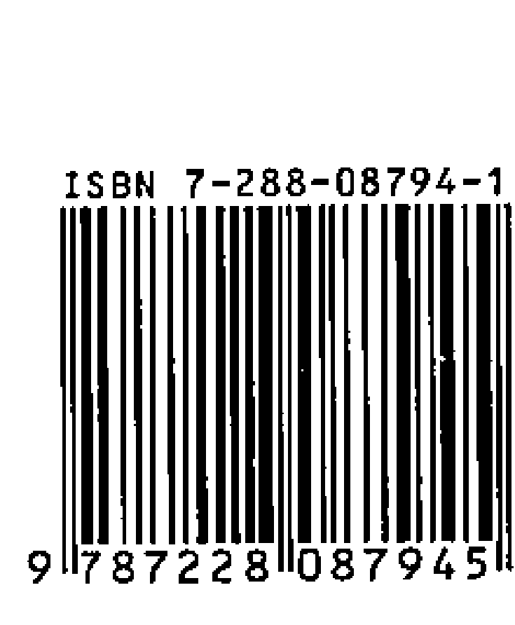

ISBN 7-288-08794-1
35.00
9 787228 087945 > 09

ISBN 7-288-08794-1
总定价：(全四册)120.00元