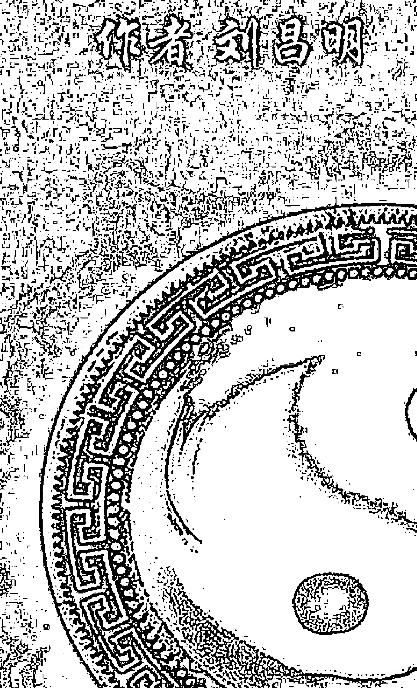
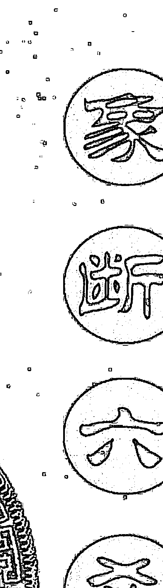

# 常德市周易研究会 立取象断卦思维
## 六壬断案实例评解
#### （第二集）

作者 刘昌明





湖南省常德市周易研究会主编

## 宗传统六爻古法 创取象断卦思维
## 象断六爻
### 网上断卦实例详解
#### （第二集）

刘昌明著

湖南省常德市易学研究会主编

# 目 录

## 己丑年网上断卦实例详解（二十九例）
- 用神旺相克世爻 财来就我出空得………………1
- 世应皆破鬼爻动 合作之事不看好………………2
- 用临日破兄弟空 出空受生购家具………………3
- 官爻生父冲应位 官司我方定能胜………………4
- 财墓破工作不熟 遭辞退财库相合………………5
- 财库旬空财临破 出行必然花钱多………………7
- 玄武兄弟回头生 骗子应该抓不到………………8
- 用神官下出公差 化出之爻为归期………………9
- 用神转化入二爻 票据应该在家中………………10
- 世空兄动化日破 合办公司不成功………………11
- 子动化兄合世爻 世临破散不会做………………12
- 原神冲破伏绝地 学习很难有收获………………14
- 世动化子冲应位 学术之上可提高………………15
- 用神虽破原神旺 忌神入墓无危险………………16
- 世入动墓遇月刑 事不如意调不动………………18
- 用神旬空入两墓 证书扔进字纸篓………………19
- 木爻衰弱临死地 肝胆之上有肿瘤………………20
- 应父临勾网有阻 世动化空账未到………………22
- 卦变六合鬼爻旺 手术会有后遗症………………23
- 财爻值日少学习 父爻受克难如愿………………24
- 随鬼入墓进医院 丑日病情有好转………………25
- 官库破意愿相背 世化空我心不悦………………26
- 原神被克用无气 此人已死定无疑………………27
- 子孙病于飞爻处 产品质量有问题………………28
- 用神化进事过激 冲父与师有争吵………………30
- 应持财库临月破 对方无力偿还钱………………31
- 财动合兄他人财 原生空世也枉然………………33
- 兄弟旺动化进神 对方肯定要压格………………34
- 父兄同动临应方 对方出钱解麻烦………………35

### 庚寅年网上断卦实例详解（五十三例）
- 一爻独发解卦象 多方取证断事物………………37
- 用神无气原神破 一无是处当反断………………39
- 乱动之卦看静爻 父爻安静未起诉………………40
- 独发之爻化亥水 十月婚姻有希望………………41
- 解卦象抽丝剥茧 断事物细致入微………………43
- 忌神克世婚不顺 大象化合定和好………………45
- 勾动合财断水源 冲飞会财来水时………………47
- 应墓于月他为难 世入变墓我被套………………49
- 逐爻分析解静卦 推断事物全过程………………50
- 世应相克难和好 立夏节后没指望………………52
- 用神强旺全无制 不转学校为上策………………54
- 父爻化空兄无制 儿子转校也枉然………………55
- 子财两爻全无气 当日有财应反断………………56
- 财绝动爻与日辰 原神化破当反断………………57
- 原神太过不吉利 大象六冲难长久………………58
- 官旺父空临世爻 空有学历不如愿………………59
- 用神入墓于日辰 日辰冲世另有主………………60
- 父爻月冲不合法 合办公司无底气………………61
- 申爻被合死日辰 颈椎一定有毛病………………64
- 五爻转角绝世爻 卦主工作难施展………………65
- 大象六冲财又破 以此为业不理想………………66
- 财源旬空又化绝 难赚钱财补家用………………67
- 分析卦象有失误 导致结果完全错………………69
- 世应俱动看变爻 六神参断定胜负………………70
- 财爻死卯绝于巳 此单很难接成功………………71
- 变爻冲克找事物 经营不离老本行………………72
- 子库旬空腹内空 当前应该没怀孕………………73
- 财爻克世子孙空 目前不会打款来………………74
- 应方临空又化空 房子七月应归你………………75
- 析卦象多方取象 测婚姻一卦多断………………77
- 应爻发动化墓地 此次相亲没成功………………80
- 应动化空被鬼冲 此病朱某也难治………………81
- 鬼爻伏藏临世下 衣服颜色难还原………………82
- 用神入墓被月合 工作一时调不动………………83
- 独发之爻收官鬼 明天不会有人闹………………85
- 妻财衰弱利进货 明年开春有价涨………………86
- 父爻旬空入动墓 工作应该难调动………………87
- 妻财旬空不受生 卦主财运难如愿………………88
- 财退必定花钱财 兄库克父了合同………………90
- 子孙持世事无忧 去包根本没危险………………91
- 忌神独发化进神 女孩今晚不会来………………92
- 忌神旬空日冲实 官虽值日亦难求………………93
- 官鬼临破父又空 目前升官难如愿………………94
- 原神月破化申金 未日巳时能收到………………96
- 世动收应入墓中 化出原神定应期………………97
- 岁破世爻空劳绿 官空工作无着落………………98
- 子孙合局冲官爻 世爻入墓婚难成………………99
- 应以财爻为用神 父爻只能做参断………………101
- 官鬼发动回头克 工资难涨才回来………………102
- 大象六冲忧事散 鬼动化财财必得………………103
- 世爻暗动生父为 官动化空难如愿………………104
- 时辰提起解神来 当天往返应无灾………………105
- 官鬼绝世去不成 父母旬空校未建………………107

## 辛卯年网上断卦实例详解（十四例）
- 权衡生克断吉凶 卦得平衡心安稳………………109
- 用神强旺猫走失 洩神临值是归期………………110
- 鬼爻独发测疾病 带动全身找信息………………111
- 旬空鬼动信息多 统观全卦断疾病………………112
- 病地克世母担心 动爻冲合查方向………………114
- 原神生世事必成 应期就在实空时………………116
- 久旱水稻无法播 网上占卦问天气………………117
- 兄弟旺相化衰鬼 此为风吹乌云散………………118
- 用神入墓临青龙 先去吃饭后唱歌………………119
- 值日财爻来生世 想换单位多赚钱………………121
- 世动难合月破爻 值日合破为应期………………122
- 官库空难控对方 财死应小心损失………………123
- 独发之爻化还原 若是强去难发展………………124
- 应爻月破动化空 此次送礼难如愿………………125

## 壬辰年网上断卦实例详解（四十七例）
- 病地冲突实手指爻 弹奏钢琴不理想………………127
- 用神旬空化鬼爻 心存疑虑占此卦………………128
- 世动应空无准实 工作调动难如愿………………130
- 鬼临雀动生口角 子绝世位因学生………………132
- 巳午未结党旺相 肝肾肺湿热薰蒸………………133
- 遗传基因相冲突 所怀小孩非已出………………134
- 动爻合财化墓地 家中货物已转移………………135
- 用神旬空入动墓 冲用之时为应期………………136
- 鬼临火空财合局 虚张声势货上涨………………137
- 用神月破鬼来克 毛病出在大肠上………………138
- 三兄分别排名次 入墓只获第三名………………139
- 根据动变寻路线 确定小狗成食物………………140
- 父库临勾证不假 旬空财冲费精神………………142
- 化爻生克找关系 以理取象断事物………………143
- 世旺空心比天高 财绝破命如纸薄………………144
- 鬼爻入墓妻腹内 化子原神想投胎………………145
- 世动化合应位 自身想往高处攀………………147
- 父爻转折入变墓 鬼世入库难调动………………148
- 财化父爻临青龙 妻子愿意给新房………………149
- 用神入墓化绝地 出国事宜难办成………………150
- 用神旬空原神破 岳父出走无消息………………151
- 用神旬空临青龙 提职之事空欢喜………………152
- 用神空破原神墓 死期应该不远了………………153
- 应空世墓有牵挂 实空之日有消息………………154
- 用神日月相合去 此去恐怕难和好………………155
- 父母冲破子孙爻 风水影响生意差………………157
- 忧事大象喜逢冲 世爻临空无灾难………………158
- 据卦理判断吉凶 依卦象分析风水………………159
- 用神两动化不吉 世破公司难开成………………162
- 用神发动临旬空 工作恐怕难落实………………163
- 世动化财想投资 日合动爻难实现………………164
- 父爻合绊动不了 冲开合神可称心………………165
- 世鬼合起找男人 鬼动被合不成功………………166
- 世墓临父动化空 师父暂时难相见………………168
- 取用神必须辨证 说事理为友解惑………………169
- 世入墓中化六合 业务卦主感兴趣………………171
- 兄动化财合应位 世破子空可调离………………172
- 用神转角化死地 电动车辆找不回………………174
- 兄化官合财在应 升职位与我无缘………………175
- 变爻冲世又临绝 对方离婚很坚决………………177
- 解卦断事切事理 选用取象须辨证………………178
- 子动转进化旬空 当前工作难如愿………………179
- 用神旺相被日克 原神值年为应期………………181
- 鬼爻绝用原神空 巳午之年不利子………………181
- 日墓子世当前忧 蛇动入墓还有震………………183
- 分析六亲断吉凶 详查爻象解风水………………184
- 官爻化退又临破 升职今年无指望………………185

### 癸巳年网上断卦实例详解（八十五例）
- 冲破隔神财生官 私阴发生在此时………………187
- 子死兄克未怀孕 二爻克财无经血………………188
- 子合二爻妻有孕 世临子克要打掉………………189
- 变爻墓官合伏财 情况均在掌控中………………190
- 应化空对方反复 世方动白费力气………………191
- 预测工作能否动 两卦信息都一样………………193
- 鬼爻被克父爻空 只能学到纯理论………………194
- 用神休囚临反吟 房子出租不成功………………196
- 用居大象化反吟 丢失小孩难生还………………197
- 鬼动化用又还原 学习之后回乡村………………199
- 用神动化回头克 承接工程有难度………………200
- 用神入墓化进神 狗与主人相背去………………201
- 世应旬空用临破 此次出国难如愿………………204
- 用神旬空不受克 出空之时必判刑………………205
- 日辰冲空合成局 耗资花钱七十万………………207
- 世与变爻两相合 公司肯定能收你………………208
- 财化绝地入日墓 泥牛入海无消息………………210
- 原神暗动绝用神 动化原神易找回………………211
- 卦理事理相对应 一目了然解卦象………………213
- 连环动变解卦象 判断药物无疗效………………215
- 戌库遇破不藏财 追求此女没有戏………………217
- 世爻入墓化用神 遇合之时事落实………………219
- 财入日墓原神空 中介很难获利益………………221
- 世动化空少诚信 此次借钱借不到………………223
- 玄武财爻处旬空 所测茶叶非真货………………225
- 世带鬼爻同入墓 便是卦主二婚时………………226
- 鬼动克应有怀疑 产品当位货是真………………227
- 应动转角化财空 日冲财实能借到………………228
- 父库转角化空地 婚姻总是难成就………………230
- 事与卦紧密结合 断事物逐爻推断………………231
- 用神休囚遇反吟 媳妇应该没怀孕………………235
- 官空日墓无真克 传达精神要整改………………236
- 龙动合应追女子 临破化空无结果………………238
- 子孙持世用神空 冲空填实为婚期………………239
- 鬼空兄旺财无气 破财伤丁不能买………………241
- 兄冲虎财化官库 卖身求财担风险………………243
- 鬼空入墓可控制 破墓出空又复发………………244
- 财爻无气本为凶 原神合动以吉断………………245
- 鬼爻化进有毛病 机子卡纸不流畅………………246
- 日月刑用被克合 倚门卖春求生存………………248
- 应破间动世入墓 此次相亲不理想………………249
- 用神月破墓于财 化爻合破可过关………………250
- 用闭库财临空破 吉祥品摆放无效………………251
- 财化用神临月破 原神化酉上西天………………253
- 月合世应冲难解 若调离无所作为………………254
- 辰动收子化丑土 东北方位就学业………………257
- 用入墓中遇三刑 火土燥热癌扩散………………258
- 外卦辗转化用神 他人捷足先登去………………259
- 合官生世凭申金 申金旬空合不来………………261
- 龙动收世入墓中 动土招来龙附体………………262
- 大动土渴龙绝水 信佛道反惹龙精………………263
- 分析卦象找信息 前后两卦断工作………………264
- 五月病重劫难逃 九月应凶是定数………………266
- 用神遇刑逢生旺 疾病折磨好痛苦………………268
- 用父相合入墓中 女去西南无好事………………269
- 父动墓财又合财 资金投在项目中………………270
- 中介墓世生应爻 追回全款不现实………………271
- 鬼动生父遇三刑 股市运行不正常………………273
- 用神旺相旬空动 世衰克用难把捉………………274
- 世应双方看旺衰 足球胜负即刻定………………276
- 用神养世已怀孕 化破就怕不正常………………277
- 遥隔转化又还原 招聘面试不过关………………278
- 原神合起生世爻 克神伏藏挺得过………………280
- 鬼空兄静世不收 练功应该能入定………………281
- 卦象组合金水旺 身体应该湿气重………………283
- 父绝原神合忌神 弟妹失踪有危险………………284
- 世化官爻升了职 父遇三刑必丢权………………285
- 起卦求测问财运 原来却是测炒股………………286
- 世应相克婚难成 虎临兄库非处男………………288
- 为弟子解卦释疑 断生产辨证分析………………289
- 原神旬空化福神 答应投保是假意………………291
- 沉迷网络受人骗 出走之方在西北………………293
- 鬼下伏父冲世爻 对方有事要求你………………294
- 鬼破值日泄财气 财动化空股市跌………………295
- 龙蛇混杂交叉冲 网上交流会抬扛………………297
- 父局冲世辞工作 世入动墓心沉重………………298
- 原神合局是假象 用破原空狗必死………………300
- 用临世化墓被绊 姥有病恐有不测………………301
- 财伏鬼下伏生飞 想抽大奖没指望………………303
- 世入日墓原逢刑 用神临破买不成………………304
- 雀临子破口骂夫 不想离原动合官………………305
- 用合原墓化子库 妻子目前已怀孕………………306
- 内外两父齐发动 相亲家长不同意………………308
- 子动化空墓化绝 投资工程无回报………………309
- 地支逆数至世爻 收书应期在此日………………310## 己丑年网上断卦实例详解（二十九例）

### 用神旺相克世爻 财来就我出空得

己丑年五月一日，辽宁弟子“云×”贴出一卦，题为：“预测单位拖欠八年的工资，能要得回来吗？”

己巳月己巳日(戌亥空)

| 泽风大过 | 天风姤 |
| :--- | :--- |
| 勾陈 妻财未土 × | 妻财戌土 / |
| 朱雀 官鬼酉金 / | 官鬼申金 / |
| 子孙午火 青龙 父母亥水 / 世 | 子孙午火 / 应 |
| 玄武 官鬼酉金 / | 官鬼酉金 / |
| 兄弟寅木 白虎 父母亥水 / | 父母亥水 / |
| 螣蛇 妻财丑土 // 应 | 妻财丑土 // 世 |

预测单位拖欠的工资能否要回，以妻财爻为用神。

该卦妻财未土得日月之生旺相独发，化出妻财戌土，此为用神化进神，有利之象。

化出之爻妻财戌土旬空，待时作用。

用神妻财未土与世爻父母亥水相克，为财来就我，此财必得的信息，说明卦主的工资是可以得到的。

世爻父母亥水旬空，被日月相冲，此为破散之爻，当月破散，出月不破不散。

根据这一信息分析推断，卦主单位拖欠的工资必须出月之后才能得到。

后来“云×”反馈，卦主出月之后，果然分文不差的在单位把工资领了回来。

### 世应皆破鬼爻动 合作之事不看好

己丑年六月二十四日，甘肃弟子刘某贴出一卦，题为：“某人预测合伙经营的行业效益如何？”请我为其分析。

**辛未月辛卯日(午未空)**

| 地风升 | | 山风蛊 |
| :--- | :--- | :--- |
| 螣蛇 官鬼酉金 × | | 兄弟寅木 / 应 |
| 勾陈 父母癸亥 // | | 父母子水 // |
| 子孙庚午 朱雀 妻财丑土 // 世 | | 妻财丙戌 // |
| 青龙 官鬼酉金 / | | 官鬼酉金 / 世 |
| 兄弟寅木 玄武 父母亥水 / | | 父母亥水 / |
| 白虎 妻财丑土 // 应 | | 妻财丑土 // |

预测合伙经营，世应的旺衰，生克冲合一定要放在首要位置进行分析。

该卦世爻与应爻均为妻财丑土，被月建冲破，受日辰相克，日月为外界，为社会的大环境，冲破世应，说明当前有社会因素对其所经营的行业不利。

官鬼酉金独发，得月建相生，日冲明暗两动，虽化绝，但旺相无妨，盗泄妻财爻之气。

预测求财之卦，虽不能没有官鬼爻，但官鬼爻不能发动，如果一旦发动，就会导致未求财，而先有钱财耗失之举。

一个行业的效益如何，子孙爻应该作为重要分析因素。子孙爻为顾客，为财源，如果不旺，这也说明发展前景不佳。

卦中子孙午火不上卦，虽伏于世爻之下，但为旬空之爻，无力生起世爻与应爻，也不能与官鬼酉金相克，制止钱财上的耗失。

通过这些信息分析推断，卦主当前所经营的行业，不是很红火，而且往后发展前景也不令人乐观。

### 用临日破兄弟空 出空受生购家具

己丑年七月二十七日，辽宁弟子王某贴出一卦，题为：“朋友近期何时去省城购家具。”

| 火泽睽 | 山水蒙 |
| :--- | :--- |
| 白虎 父母巳火 / | 官鬼寅木 / |
| 妻财子水 螣蛇 兄弟未土 // | 妻财子水 // |
| 勾陈 子孙酉金 ○ 世 | 兄弟戌土 // 世 |
| 朱雀 兄弟丑土 // | 父母午火 // |
| 青龙 官鬼卯木 / | 兄弟辰土 / |
| 玄武 父母巳火 ○ 应 | 官鬼寅木 // 应 |

王某原断：

1、世爻发动，我心有动。化出兄弟戌土，上有兄弟未土，下有兄弟丑土，都是原神，可见卦主心思都放到了朋友身上。测行人，空为走不了，故选择丑土为其朋友。

2、酉金动，暗合巳火，应爻又表示要去的地方，临父母为家具。酉暗合化戌收入墓库，是搬回家之象。

3、今丑土空，出空可以走。巳火日冲破，化出长生合亥水，是解破之神。故推断丑日去，寅日回。

结果：丑日动身寅日回。

看了王某的分析之后，我又为其补充分析了以下信息。

卦中子孙酉金临勾陈持世发动，化出兄弟戌土为父母爻之库，勾陈为挂牵，世动为有所行动，化出原神为父库，为牵挂的是朋友家中的家具。

兄弟丑土旬空为用神，用神旬空，出空冲空方能走动，因此，当前朋友不会出行。

应爻临父母巳火发动与兄弟丑土相生，当前兄弟丑土旬空，不能受生，这也是用神没出空冲空不能购买到家具之象。

应爻父母巳火临日辰之破，化出官鬼寅木回头相生，寅日，合住日辰亥水，解了父母巳火之破，用神兄弟丑出空，受父母巳火相生，因此，寅日能够购回家具。

### 官爻生父冲应位 官司我方定能胜

己丑年八月十二日，辽宁弟子王某贴出一卦，题为：“某男预测老婆被打，官司何时了结。”

癸酉月戊寅日(申酉空)

| 火水未济 | 天雷无妄 |
| :--- | :--- |
| 朱雀 兄弟巳火 ／ 应 | 子孙戌土 ／ |
| 青龙 子孙未土 Ｘ | 妻财申金 ／ |
| 玄武 妻财酉金 ／ | 兄弟午火 ／ 世 |
| 官鬼亥水 白虎 兄弟午火 // 世 | 子孙辰土 // |
| 螣蛇 子孙辰土 ○ | 父母寅木 // |
| 勾陈 父母寅木 × | 官鬼子水 / 应 |

该卦应爻一方子孙未土发动，化出妻财申金旬空，子孙未土为应爻兄弟巳火所生之爻，为应爻一方的表现。

世爻兄弟午火被子孙未土相合而泄气，相合为绊，泄气为费心思，耗精力。

二者的交点就在这个爻之上，子孙未土动而化出妻财申金旬空，这里可以理解为官司是因钱财而起。

二爻子孙辰土发动，化出父母寅木，转角化入初爻官鬼子水。子孙辰土为世爻下泄之神，为卦主一方的表现，行动等，化出父母爻为在状纸上作文章，最终化入官鬼爻，为把状纸呈给官方，司法机关。

从这一信息分析推断，这场官司的原告应该是卦主一方。

主卦中官鬼爻不上卦，官鬼爻为司法机关，为打官司的法官，不上卦为当前官司还没有进行。

官鬼亥水与应爻为绝地相冲的关系，又与世爻一方父母寅木相合，表明了司法机关的最终判决，对世爻一方是有利的。

因此，这场官司最终应该世爻一方打赢。

反馈，老婆被打之后，目前还没有出院，世爻一方多方搜集证据，于九月十三日，对方已经被拘留。

### 财墓破工作不熟 遭辞退财库相合

己丑年八月十七日，辽宁弟子王某贴出一卦，题为：“某男当天为照顾四个月的小孩，和妻一起去找了个保姆，看此保姆能和我们有缘吗？”

癸酉月癸未日(申酉空)

| 火风鼎 | | | 山天大畜 | |
| :--- | :--- | :--- | :--- | :--- |
| 白虎 | 兄弟巳火 | / | 父母寅木 | / |
| 螣蛇 | 子孙未土 | // 应 | 官鬼子水 | // 应 |
| 勾陈 | 妻财酉金 | O | 子孙戌土 | // |
| 朱雀 | 妻财酉金 | / | 子孙辰土 | / |
| 青龙 | 官鬼亥水 | / 世 | 父母寅木 | / 世 |
| 玄武 | 子孙丑土 | X | 官鬼子水 | / |

预测顾请保姆照顾小孩，以妻财爻为用神。

卦中妻财酉金为月建入卦，日辰相生，发动化出子孙戌土回头相生有力，与世爻一方妻财酉金比扶，世爻官鬼亥水相生。比扶者，彼此同心同德，关系亲密。相生，体贴入微，关照细心。

信息表明，该保姆与卦主的妻子，以及卦主应该能够和睦相处。

不利初爻子孙丑土发动，将其收入墓中，用神入墓于子孙爻，说明该保姆在带孩子的事情上有些为难，或者以前没有带过孩子，对如何扶理，关照小孩不熟练。

子孙丑土发动，又被日辰相冲为破，化出官鬼子水为妻财酉金之死地。墓库逢破，不能收住妻财爻，化出财之死地，为妻财酉金的使命终结，子水回头相合，取象为将妻财酉金拒之门外。

此处的信息为该保姆在卦主家中因带孩子不熟练，或其它相关的一些事情，而被辞退之意。

故该保姆虽人品不错，但最终还是不能长期为卦主家中所用。

分析以上信息之后，王某反馈的信息是，保姆与妻子的关系确实处理得不错，一个多月之后，由于带孩子不熟练，做事情也不太会，就被辞退了。

### 财库旬空财临破 出行必然花钱多

己丑年八月十九日，辽宁弟子王某贴出一卦，题为：“15号去巴厘岛旅游安全吗，会发生一些什么事？”

癸酉月乙酉日(午未空)

| 风地观 | 风山渐 |
| :--- | :--- |
| 玄武 妻财卯木 / | 妻财卯木 / 应 |
| 兄弟申金 白虎 官鬼巳火 / | 官鬼巳火 / |
| 螣蛇 父母未土 // 世 | 父母未土 // |
| 勾陈 妻财卯木 × | 兄弟申金 / 世 |
| 朱雀 官鬼巳火 // | 官鬼午火 // |
| 子孙子水 青龙 父母未土 // 应 | 父母辰土 // |

预测外出旅游，安全是最重要的。世爻是否有其它爻与之相冲相克，五爻与应爻是否有不利因素，必须进行分析。

该卦五爻官鬼巳火与世爻父母未土相生，以及伏神兄弟申金同宫，并无其它爻与之相冲相克，道路平安。

应爻父母未土与世爻比扶，且临青龙，伏神子孙子水亦不伤害世爻，所去之地，也没有什么危险。

卦中间爻妻财卯木独发，与世爻父母未土相克。间爻，旅游的中间过程，相克，麻烦、烦恼，压力，不愉快。

信息表明，卦主在此次旅游的过程中，会因钱财的事情而带来压力，或心中不安。

世爻父母未土为妻财爻之库，旬空而不能藏财，钱包空空。妻财卯木被日月冲破，又自化兄弟申金回头相克，财爻无全根气，花钱无数。

虽世爻父母未土有避空不受克之象，但妻财爻临破又有破财之意。

这里的信息，可以取象为卦主此次外出旅游，虽无安全问题，但一路上花钱不少，造成了很大的经济损失。

分析了以上信息之后，王某反馈，卦主此次外出旅游平安无事，就是花钱太多。

### 玄武兄弟回头生 骗子应该抓不到

己丑年八月二十二日，辽宁弟子王某贴出一卦，题为：“某男求测抓骗子能否成功。”

甲戌月戊子日(午未空)

| 艮为山 | 雷山小过 |
| :--- | :--- |
| 朱雀 官鬼寅木 ○ 世 | 兄弟戌土 // |
| 青龙 妻财子水 // | 子孙申金 // |
| 玄武 兄弟戌土 × | 父母午火 / 世 |
| 白虎 子孙申金 / 应 | 子孙申金 / |
| 螣蛇 父母午火 // | 父母午火 // |
| 勾陈 兄弟辰土 // | 兄弟辰土 // 应 |

卦中官鬼寅木持世发动，与兄弟戌土临玄武相克。世动克兄，为抓捕。兄弟爻临玄武为骗子。

这里的信息与卦主抓捕骗子的举动，基本相符。

世爻官鬼寅木发动化出兄弟戌土，四爻兄弟戌土发动化出父母午火，此为世爻遥隔转化之象。

兄弟戌土为转化的中间过程，反复出现，其信息表明卦主对骗子反复捕捉，多方查找。

而最终四爻兄弟戌土，化出来的是父母午火，为世爻官鬼寅木之死地，又回头相生兄弟戌土，此为世爻死而兄弟生。

信息反应了，卦主最终没有抓到骗子。

分析了以上信息，王某反馈，卦主最终确实没有抓到骗子。

### 用伏官下出公差 化出之爻为归期

己丑年九月二日，辽宁弟子王某贴出一卦，题为：“老师出差了，求测哪天回来。已知一个星期内就会回。”

甲戌月丁酉日(辰巳空)

| 六神 | 水天需 | 地天泰 |
| :--- | :--- | :--- |
| 青龙 | 妻财子水 // | 子孙酉金 // 应 |
| 玄武 | 兄弟戌土 O | 妻财亥水 // |
| 白虎 | 子孙申金 // 世 | 兄弟丑土 // |
| 螣蛇 | 兄弟辰土 / | 兄弟辰土 / 世 |
| 勾陈 | 官鬼寅木 / | 官鬼寅木 / |
| 朱雀 | 妻财子水 / 应 | 妻财子水 / |

预测老师出差，以父母爻为用神，卦中父母爻不现，说明老师没有在卦主身边，卦象与所测事物完全相符。

用神父母巳火旬空伏于官鬼寅木之下，飞神为原神，取象为老师出差的事项，官鬼爻为单位，为公家，信息表明老师此次出差应该是公差。

五爻兄弟戌土发动，为用神之墓地，五爻为尊位，这里理解为学校，单位，兄弟爻为账目，为钱财。

用神墓于此处，表明了老师出差的事情一定与经济，钱财等有关。

兄弟戌土独爻发动，化出之爻妻财亥水，恰好与父母巳火为相冲的关系，可以冲实用神，因此，老师回来的日期应该就在亥日。

反馈，果于己亥日归来。

### 用神转化入二爻 票据应该在家中

己丑年九月四日，辽宁弟子王某贴出一卦，题为：“一男士问票据能否找到。”

甲戌月己亥日(辰巳空)

| 地山谦 | 雷风恒 |
| :--- | :--- |
| 勾陈 兄弟酉金 // | 父母戌土 // 应 |
| 朱雀 子孙亥水 // 世 | 兄弟申金 // |
| 青龙 父母丑土 × | 官鬼午火 / |
| 玄武 兄弟申金 / | 兄弟酉金 / 世 |
| 妻财卯木 白虎 官鬼午火 × 应 | 子孙亥水 / |
| 螣蛇 父母辰土 // | 父母丑土 // |

用神父母丑土发动，得月建比扶，化出官鬼午火回头相生，还有动爻官鬼午火动来相生，用神有力，此为票据不失之象。

父母丑土发动化出官鬼午火，主卦又有官鬼午火发动化出子孙亥水，此为用神遥隔转化。

用神发动转化，为事物的走向。

父母丑土被月建比扶带刑，刑为不规则，说明票据已经损坏，不太完好，官鬼午火为票据之原神，遥隔转化的走向是往内卦进行的，行至二爻为止，二爻为家中，亥水为父母丑土之禄地，此信息说明票据应该丢失在家中。

用神禄地临于日辰之上，该票据当天能够找到。

反馈，票据于当天在家里找到了。

### 世空兄动化日破 合办公司不成功

己丑年九月十六日，天津弟子王某贴出一卦，题为：“某男士预测合作前景。”

甲戌月辛亥日（寅卯空）

| 雷水解 | | 雷泽归妹 | |
| :--- | :--- | :--- | :--- |
| 螣蛇 妻财戌土 | // | 妻财戌土 | // 应 |
| 勾陈 官鬼申金 | // 应 | 官鬼申金 | // |
| 朱雀 子孙午火 | / | 子孙午火 | / |
| 青龙 子孙午火 | // | 妻财丑土 | // 世 |
| 玄武 妻财辰土 | / 世 | 兄弟卯木 | / |
| 父母子水 白虎 兄弟寅木 | × | 子孙巳火 | / |

预测合作前景，首看世应双方的生克情况。

该卦世爻妻财辰土与应爻官鬼申金相生，似合作可以成功，不利世爻妻财辰土被月建冲破，与应爻相生无功。兄弟寅木独发，这里理解为世爻一方的求财理念。虽发动与应爻官鬼申金相冲，对方因此而动心，却又被日辰相合为绊，化出之爻子孙巳火又临日破。

日辰为卦中父母爻，为其它的经营项目，合绊兄弟寅木，冲破变爻子孙巳火，表明了卦主因其它经营项目绊身，而将这一项目搁置，最终合作不成。

若以世爻为中心分析卦象，推断卦主合作的项目，世爻妻财辰土下生之爻在五爻应位官鬼申金之处，官鬼申金临勾陈，勾陈为固定办公场所，五爻为尊位，世爻相克之爻为父母子水，为公司、企业等义。

因此，此次合作的项目，应该是开办公司之类的业务。父母爻不临卦中，从这里也可以看出，此次合作尚未进行，场地、合作手续等均没有进行办理。

分析了以上信息之后，王某反馈，卦主是想合伙开办一家转手他人产品，加工之后再销售出去的公司，预测时，场地，手续没有进行办理。

直到年底，这一合作事项确实没有进行，原因是卦主当前还有其它经营项目，而难以脱手。

### 子动化兄合世爻 世临破散不会做

己丑年十一月五日，天津弟子王某贴出一卦，题为：“朋友谈了一个项目，此项目有国家政策扶持，低投入高回报，这是真的吗？”

丙子月己亥日(辰巳空)

| 泽地萃 | 水地比 |
| :--- | :--- |
| 勾陈 父母未土 // | 子孙子水 // 应 |
| 朱雀 兄弟酉金 / | 父母戌土 / |
| 青龙 子孙亥水 O | 兄弟申金 // |
| 玄武 妻财卯木 // | 妻财卯木 // 世 |
| 白虎 官鬼巳火 // 世 | 官鬼巳火 // |
| 螣蛇 父母未土 // | 父母未土 // |

该卦独爻发动，子孙亥水临青龙为日辰入卦发动与世爻相冲。应爻兄弟酉金为朋友，子孙亥水临青龙为消息，是应爻下泄之爻。

信息表明，此信息是朋友发给卦主的，子孙亥水临日辰，日辰为当天，这个项目消息应该是当天朋友给发来的。

子孙亥水化出兄弟申金回头相生，相生为助力，这里也可以看出朋友在这个消息中，有夸大其词的说法。

兄弟申金又与世爻官鬼巳火为相合的关系，相合为提起，为应合卦主心理，因此，朋友这种吹虚，夸大其词，无非是想卦主参与这一项目。

子孙亥水临青龙，得月建拱扶，为日辰入卦，说明这个消息不假，确实为国家支持的项目。

不利世爻官鬼巳火旬空被日辰冲破，此为破散之爻，又病于变爻兄弟申金，病者，有怀疑之象。

通过这些信息可以推断，卦主对这一项目持怀疑态度，最终不会进行。

后来反馈，项目是一种投资入股的形式，属于变象的传销类型，但卦主没有去做。

### 原神冲破伏绝地 学习很难有收获

己丑年十一月十五日上午，天津弟子王某贴出十一月十四日的一个卦象，说是一位朋友元旦想参加一个周易学习班，问对自己有帮助没有，有没有收获。

丙子月戊申日(寅卯空)

| 泽雷随 | 火雷噬嗑 |
| :--- | :--- |
| 朱雀 妻财未土 × 应 | 子孙巳火 / |
| 青龙 官鬼酉金 ○ | 妻财未土 // 世 |
| 子孙午火 玄武 父母亥水 / | 官鬼酉金 / |
| 白虎 妻财辰土 // 世 | 妻财辰土 // |
| 螣蛇 兄弟寅木 // | 兄弟寅木 // 应 |
| 勾陈 父母子水 / | 父母子水 / |

预测参加学习班，对自己的知识方面是否有帮助，以父母爻为用神。

该卦应爻一方有两个爻同时发动，官鬼酉金为某老师讲课的消息，发动与世爻妻财辰土相合，此为合起之象。

说明卦主听到了某老师开办学习班的消息，已经动心了，因而才有想参加学习班的举动。

世爻妻财辰土之原神，子孙午火伏在四爻父母亥水之下。原神为卦主的想法，四爻为中层，临玄武为术数方面的知识。说明卦主参加学习班，是想去听中级以上的术数知识的。

原神子孙午火被父母子水为月建入卦居初爻临勾陈相冲，父母爻为讲课内容，初爻为初级，勾陈为固定陈式。

通过以上信息分析推断，此次某老师所讲的内容不是中级或高级的周易理论。

世爻妻财辰土为父母爻之库，安静不动，难以收父母爻入库。外卦妻财未土与官鬼酉金同时发动，形成官鬼酉金转角化去之象，官鬼爻为讲课内容的中心思想，转角化去，且化去之爻又为世爻、父母爻之绝地，这种地支的组合之象，有卦主把老师讲课的内容，又回归给老师之意。

据此推断，这位朋友如果参加某老师的学习班，很难学到知识。

### 世动化子冲应位 学术之上可提高

己丑年十一月十七日，恰值元旦节，上午，天津弟子王某与我聊天时，贴出以前摇得的一个卦，题为“学习六爻预测可不可以达到高层次”，要我为其分析，讲解断卦思路。

癸酉月丁卯日(戌亥空)

| 天风姤 | 火天大有 |
| :--- | :--- |
| 青龙 父母戌土 / | 官鬼巳火 / 应 |
| 玄武 兄弟申金 ○ | 父母未土 // |
| 白虎 官鬼午火 / 应 | 兄弟酉金 / |
| 螣蛇 兄弟酉金 / | 父母辰土 / 世 |
| 勾陈 子孙亥水 / | 妻财寅木 / |
| 朱雀 父母丑土 × 世 | 子孙子水 / |

该卦父母丑土持世发动，化出子孙子水，发动为有所举动，为行动之意，父母爻临朱雀为学习，这一信息说明卦主当前正在加强术数知识方面的学习。

变爻子孙子水与主卦中应爻官鬼午火相冲，官鬼午火为世爻之原神，世爻动出变爻相冲，这里可以理解为自己对自己学习有一个严格的要求。

五爻兄弟申金临玄武，入世爻父母丑土之墓，且得世爻父母丑土墓中相生，兄弟爻为贪玩，为不爱学习，世爻收其入墓，为自己约束自己贪玩的举动。

玄武为玄学方面的知识，兄弟申金为世爻父母丑土长生之爻，世爻墓中与其相生，五爻为高层，说明卦主在学习术数知识方面，正在向高层次上努力。

兄弟申金发动化出父母未土，与世爻父母丑土在十二地支排序中相比，为进了一大步，且父母丑土居初爻，父母未土由五爻变出，这也是从低级到高级的一种象。

信息表明，卦主如果通过学习，一定能达到高层次。

二爻子孙亥水旬空，下伏妻财寅木引拔出现，与世爻父母丑土相克临勾陈，财为理，克父母爻为卦主当前在卦理上还有不通的地方。勾陈主呆板，为当前在生克之理上还没有达到活变的地步。

五爻化出之爻父母未土为妻财寅木之库，财爻入库，不克父母爻，这里理解为，当卦主进入高层次之后，就会应用自如。

### 用神虽破原神旺 忌神入墓无危险

己丑年十一月二十一日，天津弟子王某贴出一卦，题为：

“某女士求测，前提是丈夫因公司的事，与另外一家公司打官司，反被诬告，丈夫遭到公安局调查（因没有处理好与公安局的关系），姐夫也因此被对方陷害入狱，现在还被关押，丈夫也不大敢公开外出，想问丈夫还有什么危险？”

#### 丙子月乙卯日(子丑空)

| 天山遁 | |
| :--- | :--- |
| 玄武 父母戌土 / | |
| 白虎 兄弟申金 / | 应 |
| 螣蛇 官鬼午火 / | |
| 勾陈 兄弟申金 / | |
| 朱雀 官鬼午火 // | 世 |
| 青龙 父母辰土 × | |

| 天火同人 | |
| :--- | :--- |
| 父母戌土 / | 应 |
| 兄弟申金 / | |
| 官鬼午火 / | |
| 子孙亥水 / | 世 |
| 父母丑土 // | |
| 妻财卯木 / | |

妻财寅木 朱雀 官鬼午火 // 世 父母丑土 //
子孙子水 青龙 父母辰土 × 妻财卯木 /

该卦为独爻发动之卦，结合预测丈夫官司之事，父母辰土独发之爻可以作为切入点进行分析。

预测官司，父母爻为状纸，为官方掌握的证据材料，犯罪实事。卦中父母辰土化回头相克，又被日辰相克。

妻财爻在预测官司中，为理由，为证据，克伤父母爻说明官方目前所掌握的证据不足，对其丈夫没有威胁。

父母辰土发动，本有冲动六爻父母戌土之能，父母戌土为官鬼午火之墓，为牢房，这里反应了，官方的本意是想通过搜集有利证据材料，对其丈夫进行审查，或关进牢房。但父母辰土却被妻财爻之克，从这里也可以看出，官方当前没有抓住有利证据。

用神官鬼午火持世，被月建冲破，月建子水引入卦中为子孙爻，月建为上司，子孙爻为执法人员，冲破官鬼午火，为对其丈夫进行调查。

子孙子水居于初爻父母辰土之下，入飞神之墓，又受日辰妻财卯木相刑，刑主折磨，入墓为为难，这也表明了上级执法机关对于此事不好下手，难办。

官鬼午火临月建之破，得日辰相生，有待时得生之能，从这里可以看出，其丈夫应该不会有什么危险。

### 世入动墓遇月刑 事不如意调不动

己丑年十一月二十一日，天津弟子王某贴出一卦，题为：“某男士预测有换工作的必要吗？”并提示：“现在这个工作做起来感觉很是窝囊，我应立足现在的岗位老老实实工作，还是应寻求改变呢？”

丙子月乙卯日(子丑空)

水地比 风泽中孚

| 玄武 妻财子水 × 应 | 官鬼卯木 / |
| 白虎 兄弟戌土 / | 父母巳火 / |
| 螣蛇 孙孙申金 // | 兄弟未土 // 世 |
| 勾陈 官鬼卯木 // 世 | 兄弟丑土 // |
| 朱雀 父母巳火 × | 官鬼卯木 / |
| 青龙 兄弟未土 × | 父母巳火 / 应 |

预测工作换动，首看世爻旺衰情况，以此确定卦主当前工作到底处于什么状态。

该卦世爻官鬼卯木得月建相生，为日辰入卦，居于三爻之上临勾陈，三爻为基层，勾陈为办公室。信息说明卦主当前应该是一位单位的基层办事人员。

父母巳火临朱雀是世爻下泄之神，为卦主的工作职务，或行业。朱雀为文字，父母爻亦有文字，资料等意，这说明卦主是单位的文员。

兄弟未土为卦主通过工作后所产生的劳动价值，即收入，工资等。世爻入墓于此，从这里可以看出，卦主想换单位的想法，必定因工作待遇不如意所产生的。

妻财子水临月建，又为上司，旬空发动不与世爻相生，这也表明卦主的工作得不到上级认可或支持。

应爻妻财子水临玄武为月建入卦发动，化出官鬼卯木与世爻为相同的关系，妻财子水为世爻之原神，为身影，为思想，月建为当月之事，玄武为私下里，别人不知，化出官鬼爻为当前思想上或行动上有偷偷的，私下里寻找其它单位的举动。不利原神旬空。空，这里取象为空想，空行动，不能实现之意。

通过以上信息分析，卦主还是应该在原单位工作为宜，不适合换动，或换不动工作。

### 用神旬空入两墓 证书扔进字纸篓

己丑年十一月二十二日，天津弟子王某贴出一卦，题为：“某人是管理公司档案的，这几天发现有一张证书丢失，急得团团转，只好摇卦进行预测，看能否找到。”

丁丑月丙辰日(子丑空)
澤雷隨 天山遁
青龙 妻财未土 × 应 妻财戌土 /
玄武 官鬼酉金 / | 官鬼申金 / 应
子孙午火 白虎 父母亥水 / | 子孙午火 /
螣蛇 妻财辰土 × 世 | 官鬼申金 /
勾陈 兄弟寅木 // | 子孙午火 // 世
朱雀 父母子水 ○ | 妻财辰土 //

用神父母子水旬空，与世爻妻财辰土同时发动，构成三合局假象，父母子水临朱雀三合局假象，为很多不起作用的文字资料。

目前父母子水旬空，逆推上旬丙子月壬子日不空，三合局构成，被应爻妻财未土之克，入墓于日辰，从这里可以看出，应该是这一天把证书丢失了。

日辰妻财辰土入卦临于世爻，与初爻化出之爻，世爻为卦主，初爻为地下，父库为字纸篓。

从这一信息推断，卦主应该把证书与字纸一起扔进了字纸篓，难以找回。

### 木爻衰弱临死地 肝胆之上有肿瘤

己丑年十一月二十三日上午，天津弟子王某说是早上一位易友发给他丁亥年的一个卦，题为“儿子患的什么病，吉凶如何”，请我解析。

丁未月丁巳日(子丑空)

#### 风天小畜 山天大畜

青龙 兄弟卯木 / | 兄弟寅木 /
玄武 子孙巳火 ○ | 父母子水 // 应
+   - 白虎 妻财未土 // 应 妻财戌土 //
- 官鬼酉金 螣蛇 妻财辰土 / 妻财辰土 /
- 勾陈 兄弟寅木 / 兄弟寅木 / 世
- 朱雀 父母子水 / 世 父母子水 /

预测疾病,全观卦中地支的旺衰及地支的组合与卦宫所属,依此确定疾病的部位及所患何病。

该卦泽雷随, 属巽宫之卦, 巽为木, 木在人体的五脏中属肝胆。

从卦中的地支组合, 结合日月一并分析, 父母子水旬空,官鬼酉金不上卦, 寅卯木休囚病于日辰, 全卦之中, 只有火土强旺。

寅卯木病于日辰, 又病于卦中五爻用神子孙巳火。火炎土燥无水之卦, 多主内脏有块结之物, 癌症, 肿瘤等。

从这一信息推断, 其儿子的疾病应该在肝胆之上, 且有癌变, 肿瘤等现象。

预测疾病之卦, 官鬼爻不上卦, 疾病难医。信息表明卦主的儿子当前所患疾病, 应该为不治之症, 或病情难以治愈。

用神子孙巳火为日辰入卦发动, 化出父母子水旬空, 当前应该没有生命之危。

不利卦得小畜变大畜, 其意为大的停止, 即死象。

结合古代筮书中所言, 父化子, 子化父, 克子之象的断语一并推断, 其儿子日后定有生命之危。

忌神父母子水目前旬空, 待当年的子月, 或戌子年, 出空不空, 用神子孙巳火必受其克, 其子必有不测。

### 应父临勾网有阻 世动化空账未到

己丑年十一月二十三日，河北弟子季某贴出一卦，题为：

“某人说是对方汇钱来了，但查看账户时发现没有收到，看是什么问题没有收到的。”

#### 丁丑月丁巳日(子丑空)

| 巽为风 | 水风井 |
| :--- | :--- |
| 青龙 兄弟卯木 O 世 | 父母子水 // |
| 玄武 子孙巳火 / | 妻财戌土 / 世 |
| 白虎 妻财辛未 // | 官鬼戊申 // |
| 螣蛇 官鬼酉金 / 应 | 官鬼酉金 / |
| 勾陈 父母亥水 / | 父母亥水 / 应 |
| 朱雀 妻财丑土 // | 妻财丑土 // |

主卦中父母亥水被日辰相冲为破，结合现在网上汇款的现象，父母爻取象为网络，为消息，破为不正常。

世爻兄弟卯木发动，化出父母子水旬空，从对方父母亥水到世爻一方化出的父母子水，为进账的信息，旬空，表明账上是空的，没有钱汇来。

应爻一方父母亥水临勾陈，勾陈为堵塞，为阻隔。

信息表明，某人没有收到钱，应该是由于网络出现问题所致。

应爻方妻财丑土为汇来的钱，目前旬空不动，也是对方的钱还没的真正进入卦主的账上之意。

卦得巽为风之水风井，井卦有不动之义，这也说明现在对方的汇款还没有入账。

十月二十四日，卦主反馈，昨天对方汇的钱，收到的时间是今天上午，导致不能及时收到，可能是网络出现了问题。

### 卦变六合鬼爻旺 手术会有后遗症

己丑年十一月二十四日，天津弟子王某贴出一卦，题为：“某女预测如果老舅做手术成功之后，有没有后遗症（已知需要做头部手术）。”

#### 丁丑月戊午日(子丑空)

| | 雷山小过 | 雷地豫 |
| :--- | :--- | :--- |
| 朱雀 | 父母戌土 // | 父母戌土 // |
| 青龙 | 兄弟申金 // | 兄弟申金 // |
| 玄武 | 官鬼午火 / 世 (伏 子孙亥水) | 官鬼午火 / 应 |
| 白虎 | 兄弟申金 ○ | 妻财卯木 // |
| 螣蛇 | 官鬼午火 // (伏 妻财卯木) | 官鬼巳火 // |
| 勾陈 | 父母辰土 // 应 | 父母未土 // 世 |

卦主已经言明，其舅舅要做的是头部手术，那么，现在就应该先看头部之爻。

六爻父母戌土被月建相刑，得日辰相生。旺相之爻逢刑则动，与二爻官鬼午火下伏之爻妻财卯木相合。

妻财卯木为神经，被六爻父母戌土刑动而起相合，相合为压迫，合中带克又受刑，主难受，信息说明当前卦主的舅舅头部难受。

兄弟申金临白虎独爻发动，白虎为医生，又为血灾，化出妻财卯木为医生对病灶处进行神经方面的手术治疗。

父母辰土临勾陈也为有手术之象，旺于月建得日辰相生，说明手术对其舅舅身体影响不大。
只是官鬼爻值日，又卦化六合，疾病难除。
这一信息表明了，卦主的舅舅虽此次通过手术想把疾病治好，但事与愿违，肯定会有后遗症留下。

### 财爻值日少学习 父爻受克难如愿

己丑年十一月二十四日，辽宁弟子孙某贴出一卦，题为：“某男预测明天开题报告能否过关（前提是以前开题报告都不严，这次比较严，有人三次都还没有过关）。”

丁丑月戊午日(子丑空)

地水师 & 地泽临
朱雀 父母酉金 // 应 & 父母酉金 //
青龙 兄弟亥水 // & 兄弟亥水 // 应
玄武 官鬼丑土 // & 官鬼丑土 //
白虎 妻财午火 // 世 & 官鬼丑土 //
螣蛇 官鬼辰土 / & 子孙卯木 / 世
勾陈 孙孙寅木 × & 妻财巳火 /

该卦子孙寅木独发，与世爻妻财午火相生临日辰强旺，妻财爻持世，说明自己平时努力不够，疏于这方面的学习。
预测开题报告能否过关，以父母酉金为用神。
卦中父母酉金得月建相生，被日辰相克，独发之爻子孙寅木又为仇神。
卦中原神两现，官鬼丑土旬空，官鬼辰土安静不动，又受仇神相克，通过以上信息推断，卦主此次开题报告很难过关。

### 随鬼入墓进医院 丑日病情有好转

己丑年十一月二十五日，辽宁弟子王某贴出一卦，题为：“自测感冒何时好？”

丁丑月己未日(子丑空)
| 山天大畜 | 山泽损 |
| :--- | :--- |
| 勾陈 官鬼寅木 / | 官鬼寅木 / 应 |
| 朱雀 妻财子水 // 应 | 妻财子水 // |
| 青龙 兄弟戊土 // | 兄弟戊土 // |
| 子孙申金 玄武 兄弟辰土 O | 兄弟丑土 // 世 |
| 父母午火 白虎 官鬼寅木 / 世 | 官鬼卯木 / |
| 螣蛇 妻财子水 / | 父母巳火 / |

该卦为独爻发动之卦，据经验，应期大多数在变爻临值逢合的时间，因此，该卦的应期应该在丑日能够好转。

若分析卦主的病况，则以卦中各爻的旺衰进行判断。

卦中兄弟爻强旺，兄弟辰土独发，将五爻妻财子水收入库中，又被月日之克。五爻临朱雀为说话，为饮食，妻财爻也为饮食。受克为不正常。

这里的信息，说明卦主生病后，不思饮食，或支气管部位等有炎症。

世爻随鬼入墓于日辰临白虎，白虎为西医，随鬼入墓为带着病情进入医院之意。也表明了卦主进过医院，或进行过静脉注射。

初爻妻财子水入辰土之墓，又被月建之合临螣蛇，目前行走都感觉脚步沉重。

后来王某反馈，戌日病情减轻，丑日病愈。

### 官库破意愿相背 世化空我心不悦

己丑年十一月二十六日，江西弟子吉某贴出一卦，题为：“预测合作办厂，情况如何。”请我为其分析。

丁丑月 庚申日 (子丑空)

火泽睽 地泽临

| 神 | 本卦 | 动爻标记 | 变卦 |
| :--- | :--- | :--- | :--- |
| 螣蛇 | 父母巳火 | ○ | 子孙酉金 // |
| 勾陈 | 兄弟未土 // | | 妻财亥水 // 应 |
| 朱雀 | 子孙酉金 ○ | 世 | 兄弟丑土 // |
| 青龙 | 兄弟丑土 // | | 兄弟丑土 // |
| 玄武 | 官鬼卯木 / | | 官鬼卯木 / 世 |
| 白虎 | 父母巳火 / | 应 | 父母巳火 |

预测合作能否成功，首看世应的生克关系。

该卦应爻父母巳火与世爻子孙酉金为相克的关系。主克之爻为主动发起一方，且官鬼卯木又在应爻之方，为应爻父母巳火之原神。官鬼爻为主谋，为策划人。

信息表明，此次合作的事项应该是对方最先发起，或主动相邀卦主的。

世爻一方父母巳火与子孙酉金同时发动，看似为合局之象，但世爻动而化出兄弟丑土为旬空之爻，父母巳火又被日辰合绊，合局不成。

世动我心有变，世空我心懒动。
通过这一信息推断，此次合作卦主不会轻易同意。
五爻兄弟未土被月建相冲为破，未土为官库，卦中官鬼爻为应爻的策划等，官库临破，意为卦主不理应爻的这一套，或难以接受对方的建议。
世爻子孙酉金动而化空临朱雀，朱雀为说话，化空为空谈之义。
信息也表明了，卦主不会与对方合作。
反馈，因对方要求卦主现在就把接来的业务，加入到一起进行，卦主心底里不痛快，也不理睬这件事情。

### 原神被克用无气 此人已死定无疑

己丑年十一月二十八日，江西弟子吉某贴出一卦，前提是：“昨天中午上班的路上，听说有人跳河，过桥时看到下面河岸上躺着一个人，不知道是生是死，心里挂牵，故摇卦看此人的生死吉凶。”

| 丁丑月壬戌日(子丑空) | |
| :--- | :--- |
| **泽天夬** | **水风井** |
| 白虎 兄弟未土 // | 妻财子水 // |
| 螣蛇 子孙酉金 / 世 | 兄弟戌土 / 世 |
| 勾陈 妻财亥水 ○ | 子孙申金 // |
| 朱雀 兄弟辰土 / | 子孙酉金 / |
| 青龙 官鬼寅木 / 应 | 妻财亥水 / 应 |
| 玄武 妻财子水 ○ | 兄弟丑土 // |

预测与自身无关系之人，以应爻为用神。
卦中官鬼寅木居应爻，休囚于月建，日辰亦不处旺地。
原神四爻妻财亥水被日月相克，初爻妻财子水旬空，动空化空不生用神。妻财亥水被日月相克，虽化回头相生，此为克多生少之象，尽管与用神相生相合，但只是有相生之象，而无相生之能。

卦中信息表明，此人凶多吉少。
若按象断六爻相关断卦手法推断，河岸上躺着的应该是一名女性。
原神妻财亥水被日辰相克。
原神为思想，为想法，日月为外界，为他人，相克为压力。死因应该是由于外界因素引起，自身压力太大，而自寻短见。
若按六神与五行相配论，此为原神“勾陈探海”之格，土见水散之象，大凶。
后来吉某反馈，死者是一位女性，具体是什么原因寻死，不太清楚，也有说是因为婚姻问题引起的。

### 子孙病于飞爻处 产品质量有问题

己丑年十一月二十九日，辽宁弟子王某贴出一卦，题为：“自测这个项目能成功吗？”（某单位欲采购我公司产品，来调研，看看最终成功否？）

丁丑月癸亥日(子丑空)

| 山火贲 | 风火家人 |
| :--- | :--- |
| 白虎 官鬼寅木 / | 官鬼卯木 / |

六神 | 本卦 | 变卦
:--- | :--- | :---
螣蛇 | 妻财子水 × | 父母巳火 / 应
勾陈 | 兄弟戌土 // | 兄弟未土 //
子孙申金 朱雀 | 妻财亥水 / | 妻财亥水 /
父母午火 青龙 | 兄弟丑土 // | 兄弟丑土 // 世
玄武 | 官鬼卯木 / 世 | 官鬼卯木 /

该卦妻财子水独发，居于应爻一方，与世爻一方的父母午火相冲。

父母午火伏于兄弟丑土之下，由于飞神兄弟丑土旬空，伏神得以出现，临青龙为产品信息。

妻财子水冲父母午火，为对方此次前来，是冲着卦主一方所生产的产品信息而来的。

子孙申金为产品，伏于妻财亥水之下临朱雀，伏生飞泄气。根据地支十二长生的状态进行推断，子孙申金病于飞爻妻财亥水。

病者，为有毛病。朱雀为数据，参数等。且亥水临于日辰之下，日辰为当前。

通过以上多种信息取象推断，卦主一方当前所生产的产品，在质量或数据上还有一些毛病。

亥水临于日辰之上，与应爻一方妻财子水化出之爻父母巳火相冲为破，父母巳火为对方想签订购货的合同，被亥水冲破，为当前因产品的质量问题将会被终止，或不能马上进行。

明年，官鬼寅木临太岁，能合绊妻财亥水，生起父母巳火。

从这一信息推断，如果卦主一方明年能够在质量方面加以改进，则有签订合同的可能性，如果质量上不能改进，合同的签订就会成为泡影。

卦得山火贲，为六合之卦，这说明当前双方合作是比较愉快的。

官鬼爻为方案，为策划。卦中官鬼卯木临于世爻之上，此次项目的合作，整个计划的推动，是由世爻一方操控。

分析了以上信息，王某反馈，是一个部队的朋友，想购买本公司生产的雷达产品，当前质量与数据上确有不合格的地方。

对方能不能合作，还需要给上司打报告，如果上司批了才能进行，而且这种合作项目真能签下来，周期也比较长，最快也要两到三年才能有结果。

### 用神化进事过激 神父与师有争吵

己丑年十二月一日，江西弟子吉某贴出一卦，题为：“昨晚一位学生投河，看看原因，及吉凶如何？”请我为其分析。

丁丑月乙丑(戌亥空)

水雷屯      水泽节
玄武 兄弟子水 //      兄弟子水 //
白虎 官鬼戌土 / 应    官鬼戌土 /
螣蛇 父母申金 //      父母申金 // 应
妻财午火 勾陈 官鬼辰土 //  官鬼丑土 //
朱雀 孙孙寅木 × 世    孙孙卯木 /
青龙 兄弟子水 /       妻财巳火 / 世

该卦子孙寅木临朱雀独发，化出子孙卯木，此为用神化进神之象。

子孙寅木与卦中父母申金相冲，父母爻为学校，为师长。

朱雀主争吵，主顶嘴，化进神为情绪过激。

若按六神配五行而论，此为“朱雀禀林”之格，必起纷争。

父母申金墓于日月得生，为老师得校方的支持，或有校方的规章制度为准绳，对该学生进行批评，说明老师对其批评是正确的。

分析了以上信息，吉某反馈，该学生上课的时候玩弄手机，被老师批评了，因此，与老师发生了争吵。

根据吉某反馈的信息，又可以把父母申金临腾蛇当作手机对待进行分析。

父母爻为通信工具，腾蛇为色彩斑烂，为手机彩屏，入墓于日月，为老师意欲没收，或已经没收手机之义。

而用神子孙寅木与父母申金相冲，也显示了该学生与老师发生争吵，也是冲着手机的事情而来的。

若按象断六爻相关断卦手法推断，该学生应是一名女性。

子孙寅木日月又无气，原神兄弟子水两现，被日月合中带克，全无救助。

从这一信息推断，这名女生投河应该死亡了。

吉某反馈，实际该女生打捞上来，已经死亡。

### 应持财库临月破，对方无力偿还钱

己丑年十二月三日，天津弟子王某贴出一卦，题为：“某占问：此人明天会不会来我公司，能不能和老板碰面？”

前提条件是：“要来的这个人欠卦主所在公司 80 多万，一直没联系上，打电话说，有可能转天来，卦主不知能不能来，故问卦。”

#### 丁丑月丁卯日(戌亥空)

| 澤山咸 | | | 澤火革 | |
|--------|---|---|--------|---|
| 青龙 | 父母未土 | // 应 | 父母未土 | // |
| 玄武 | 兄弟酉金 | / | 兄弟酉金 | / |
| 白虎 | 子孙亥水 | / | 子孙亥水 | / 世 |
| 螣蛇 | 兄弟申金 | / 世 | 子孙亥水 | / |
| 勾陈 | 官鬼午火 | // | 父母丑土 | // |
| 朱雀 | 父母辰土 | × | 妻财卯木 | / 应 |

预测与自己没有关系之人，以应爻为用神。

卦中父母未土临应与世爻兄弟申金相生，又为同宫之爻，信息表明此人与卦主公司里有老乡，同事等关系之人。

月建丑土与应爻父母未土相冲，此为月破之爻，表面与世爻兄弟申金同宫相生。应爻与世爻相生，看似对方有来卦主公司的意象。

不利应爻父母未土被月建相冲为破，未土为妻财爻之库，财库临破，有不能藏住钱财之意。

从这里的信息取象分析，对方现在手头根本没有钱，也不可能为卦主的公司偿还所欠的这笔钱。

初爻父母辰土临朱雀发动，化出妻财卯木为日辰入卦回头相克。

父母爻为手续，朱雀为有文字的证据等，被财爻相克，表明卦主公司一方的手续或证据被钱财所困，不能与对方结账。

应爻父母未土月破也入墓于父母辰土，这也可以看出当前对方为了这笔钱财，想尽早了结有关手续，证据等感到很为难。

分析了以上信息之后，王某反馈，对方当前确实没钱，卦主公司现在持有对方的房屋产权证，汽车的产权证等。

### 财动合兄他人财 原生空世也枉然

己丑年十二月二十三日，四川弟子刘某贴出一卦，题为：“某男士预测财运如何。”请我为其分析。

#### 戊寅月丁亥日(午未空)

| 雷地豫 | 火地晋 |
|--------|--------|
| 青龙 妻财戊土 × | 子孙巳火 / |
| 玄武 官鬼申金 // | 妻财未土 // |
| 白虎 子孙午火 / 应 | 官鬼酉金 / 世 |
| 螣蛇 兄弟卯木 // | 兄弟卯木 // |
| 勾陈 子孙巳火 // | 子孙巳火 // |
| 父母子水 朱雀 妻财未土 // 世 | 妻财未土 // 应 |

预测财运如何，以妻财爻为用神。

该卦妻财戊土独发，化出子孙巳火回头相生，旺相有力，似财运不错。

但应用取象断卦的思路分析，动爻必然先与卦中相合之爻发生作用，然后才是相生，相克等。

卦中兄弟卯木居三爻，被妻财戊土发动相合，此处的意象，有财运虽好，但不是卦主，而是别人之意。

二爻子孙巳火暗动，同样看似与世爻相生。不利妻财戊土发动，将其收入墓中，世爻妻财未土旬空，不得原神相生，也不受独发之爻比扶。

从这些信息可以推断，卦主当前财运不好，别人能赚到钱财的事情，自己去做，却偏偏得不到利益。

### 兄弟旺动化进神 对方肯定要压价

己丑年十二月二十四日，辽宁弟子孙某贴出一卦，题为：“某预测栽种的土地今年能不能租出去。”

#### 戊寅月戊子日(午未空)

**风雷益** | **风泽中孚**
--- | ---
朱雀 兄弟卯木 / 应 | 兄弟卯木 /
青龙 子孙巳火 / | 子孙巳火 /
玄武 妻财未土 // | 妻财未土 // 世
官鬼酉金 白虎 妻财辰土 // 世 | 妻财丑土 //
螣蛇 兄弟寅木 × | 兄弟卯木 /
勾陈 父母子水 / | 子孙巳火 / 应

该卦妻财辰土持世，为父母爻之墓，此信息说明土地是卦主所有。

卦中父母子水为日辰入卦，病于动爻兄弟寅木，用神值于日辰，为此事提到了议事日程之上，病于兄弟爻，为租用土地之人会在租用土地时挑剔毛病，压价格。

这里的信息也表明，当前卦主已经把这件事情放到很重要的位置了，很想租出去。

兄弟寅木独发，化出兄弟卯木为进神。

此处进神的意象应该看成更进一步，表明目前所测的事情还在发展之中等。

再把兄弟卯木引到主卦之中进行对照，卯木居于应爻之上与世爻为相克的关系，这也说明对方会在租用价格之上进行打压。

通过这些信息分析推断，卦主的这块土地，近期很难租出去，原因是对方压价导致的。

### 父兄同动临应方 对方出钱解麻烦

己丑年十二月三十日，江西弟子吉某贴出一卦，题为：“某人预测儿子在学校被学生打了，看看赔偿结果。”请我为其分析。

#### 丁丑月甲子日(戌亥空)

| 火天大有 | 风火家人 |
| --- | --- |
| 玄武 官鬼巳火 / 应 | 妻财卯木 / |
| 白虎 父母未土 × | 官鬼巳火 / 应 |
| 螣蛇 兄弟酉金 O | 父母未土 // |
| 勾陈 父母辰土 / 世 | 子孙亥水 / |
| 朱雀 妻财寅木 O | 父母丑土 // 世 |
| 青龙 子孙子水 / | 妻财卯木 / |

该卦应爻为打卦主儿子的家长一方，应爻方父母未土为财库发动，财库动开，有将钱财拿出之义。又临于月建之破，月破者，当月破财。

财库发动化出官鬼巳火，又下生兄弟酉金。化绝者，有应爻一方出钱，实出无奈。下生兄弟酉金，与世爻父母辰土相合，解和之意。

化官者，为寻求官方帮忙。

此为对方将会通过官方调解，自愿破财出钱与世爻一方解和之象。

世爻一方妻财寅木临朱雀发动化出父母丑土，朱雀有为赔偿钱财之事与对方交涉之意。

父母丑土为应爻一方兄弟酉金之库。

结合应爻破财解和一并分析，也表明了世爻一方愿意接收这一方案。

通过这些动变之象分析，表明了此事卦主最终能够得到圆满的结果。

### 庚寅年网上断卦实例详解（五十三例）

#### 一爻独发解卦象 多方取证断事物

庚寅年正月十二日，易友“润×××”（男）在谈易说象QQ群中贴出一卦，题为：“给我看个找对象的卦”，请求大家预测。

##### 戊寅月丙午日(寅卯空)

| 六神 | 地水师 | 雷水解 |
|---|---|---|
| 青龙 | 父母酉金 // 应 | 官鬼戌土 // |
| 玄武 | 兄弟亥水 // | 父母申金 // 应 |
| 白虎 | 官鬼丑土 × | 妻财午火 / |
| 螣蛇 | 妻财午火 // 世 | 妻财午火 // |
| 勾陈 | 官鬼辰土 / | 官鬼辰土 / 世 |
| 朱雀 | 子孙寅木 // | 子孙寅木 // |

卦中动爻官鬼丑土居间爻为父母爻之库发动，化出妻财午火值日。父母爻为媒人，间爻也为媒人，化出妻财爻为众多媒人给卦主介绍对象。

妻财午火值日入卦持世，又官鬼丑土发动化出妻财午火值日。此处的信息表明，卦主不止当前有人介绍对象，以前一定还有人为其介绍过，且不止一次。

变爻妻财午火与动爻官鬼丑土回头相害，此为卦主婚姻没有谈成，女方责怪媒人的信息。

据此推断，以前卦主尽管有众多媒人为其介绍对象，但一个都没有相中。

妻财爻之原神子孙寅木居于初爻旬空，原神为所谈女友的身影，旬空为没有见到。进入正月，子孙寅木临太岁与月建不空，因此，春节期间应该有过相亲的举动。

独爻发动，化出之爻临值逢合为应期。今年阴历六月，或后逢乙未年，变爻妻财午火与世爻妻财午火均逢合，此时，应该是婚姻能够谈成，或可以成婚的日期。

分析了以上信息之后，“润辰××”反馈，以上推断完全正确，此卦是当天相亲之后所起得的。并请我对当天所相亲的女子情况进行分析。

妻财午火为四正星，为桃花之象，得月建相生，为日辰入卦。根据桃花主漂亮，旺相主个子高的取象分析，该女子人材应该可以，个子也不会太矮。

官鬼爻为妻财午火泄气之所。卦中官鬼爻两现，被月建之克，日辰相生。官鬼爻月建不旺，表明该女子没有正式的工作单位，应该是一名以打工形式求财的人员。

父母酉金日月亦不处旺地，学业文凭也不会太高。

六爻为头部，临青龙为头发秀美，父母爻酉金为理发剪，虚邀子孙卯木相冲，为对头发进行修剪，冲中带克，为打成了短发。

妻财午火临身持世，该女友现在已经与卦主有了交往。

财爻得月建相生，帝旺于日辰。帝旺为极盛之时，女友的年岁也不小了。

官鬼丑土独发，与世爻妻财午火相害，又化出妻财午火回头生中逢害。根据相害为关系不好的意象推断，该女子以前如果不是谈了一名男友吹了，就是一名离异之妇。

信息推断至此，“润×××”反馈，对方年岁比我大一岁，是离婚之妇。其它人材、身材、工作、文凭、发型都对。

因卦主说是当天相亲后起的卦，于是，我按卦中大象又简单地分析了女友当天所穿着的服装样式。

外为坤，为宽大、宽松。又时值正月，天气较冷。故相亲时，该女子所着服装，应该是一件很宽松的外衣。

“润×××”反馈，对。相亲时，对方所着服装颜色，为上灰下黑，很宽松。

分析卦象时，还有几名易友也参与了，大家对最后能不能谈成功，各有见解，但时间未到，不能得到证实，此卦只好留待以后应证。

#### 用神无气原神破 一无是处当反断

庚寅年正月二十四日晚，我在 QQ 教学群中，正为弟子们讲课，辽宁弟子王某贴出己丑年三月一日，某男预测明天考试的卦例，请教为何考试通过了。

##### 丁卯月辛未日（戌亥空）

##### 地风升

| 六神 | 六亲 | 干支 | 爻象 |
| :--- | :--- | :--- | :--- |
| 螣蛇 | 官鬼 | 酉金 | // |
| 勾陈 | 父母 | 亥水 | // |
| 朱雀 | 妻财 | 丑土 | // 世 |
| 青龙 | 官鬼 | 酉金 | / |
| 玄武 | 父母 | 亥水 | / |
| 白虎 | 妻财 | 丑土 | // 应 |

仔细分析了卦中信息之后，我说，预测考试能否通过，应以父母爻为用神，卦中父母亥水两现，日月休囚无气，又为空之爻。

原神官鬼酉金虽然两现于卦中，却又被月建卯木相冲为月破。

世、应妻财丑土，被月建之克，日辰相冲又为日破之爻。子孙午火伏藏于世爻妻财丑土之下，飞神日破，已经引拔出现于卦中，又被日辰合起，月建相生，直克原神官鬼酉金。统观全卦，两父、两官、两财，六个爻均为病爻，一无是处，只有子孙爻独旺，此为物极必反之象。因此，如果说卦主考试通过了，应该就是这个原因，即此卦应该反断才正确。

#### 乱动之卦看静爻 父爻安静未起诉

庚寅年二月三日，辽宁弟子王某在 QQ 教学群中贴出一卦，题为：“某人在己丑年三月十一日摇测的一个卦，问对方是否真的要起诉我？”

##### 戊辰月辛巳日（申酉空）

**乾为天** | **地山谦**
--- | ---
六神 | 左爻 | 动爻 | 世/应 | 右爻 | 爻象
螣蛇 | 父母戌土 | ○ | 世 | 兄弟酉金 | //
勾陈 | 兄弟申金 | ○ | | 子孙亥水 | // 世
朱雀 | 官鬼午火 | ○ | | 父母丑土 | //
青龙 | 父母辰土 | / | 应 | 兄弟申金 | /
玄武 | 妻财寅木 | ○ | | 官鬼午火 | // 应
白虎 | 子孙子水 | O | | 父母辰土 | //

该卦为五爻乱动之卦，如果按五行生克的断卦手法，判断事情吉凶，定要花费一番脑筋才能分析出来，且弄得不好还会被各种生克的旺衰等所缠绕，理不清头绪。

而按象断六爻的思维方式，对该卦进行分析，就会很容易把吉凶判断出来。

这种乱动之卦，属于地支动变的组合象，属于“卦象”之象。

它好比一件物体，如茶杯、笔记本电脑、书桌、电动车等，就摆在那里，落眼便见，很直观的可以辨认出来。

该卦主卦乾为天，初、二爻与四、五、六爻都已发动，唯独只有应爻父母辰土为月建入卦没有发动。

根据应为他人，为对方。月建入卦为当月、当前的事情。父母爻为状纸，为起诉书。不发动为没有动作，没有行动的取象思路进行分析，就可以马上作出判断，对方没有行动，或者对方不会起诉。

若按六神配五行而论，应爻父母辰土临青龙，为“见龙在田”之格，并非凶兆。

当我分析了该卦之后，王某便贴出了求测者的反馈：“对方确实要起诉我，但我及时把钱还了，最终没有起诉，只是虚惊一场。”

#### 独发之爻化亥水 十月婚姻有希望

庚寅年二月五日，网友“×××灵”（女）预测何时能找到对象结婚。

##### 己卯月己巳日（戌亥空）

| 六神 | 风山渐 | 巽为风 |
|------|--------|--------|
| 勾陈 | 官鬼卯木 / 应 | 官鬼卯木 / 世 |
| 朱雀 | 父母巳火 / | 父母巳火 / |
| 青龙 | 兄弟未土 // | 兄弟未土 // |
| 玄武 | 子孙申金 / 世 | 子孙酉金 / 应 |
| 白虎 | 父母午火 × | 妻财亥水 / |
| 螣蛇 | 兄弟辰土 // | 兄弟丑土 // |

女子预测婚姻，子孙爻持世，必主婚姻不顺。

卦中子孙申金持世，被日辰合起，日辰巳火为用神官鬼卯木之病地。官鬼爻病地之爻合世，说明卦主当前思想上正挂念着谈婚论嫁之事，且成了一块心病。

父母午火独发克世，化出妻财亥水旬空被日辰冲实，父母爻为家长，为介绍人。克制世爻，取象为制约、牵制卦主。

化出妻财亥水冲实为官鬼爻之原神。这里的信息表明了，当前，若不是家长着急，催促卦主的婚嫁之事，就是介绍人经常为卦主介绍对象。

主卦中官鬼爻之原神妻财子水不上卦，绝于飞神与日辰。原神不现，信息表明，卦主目前还没有一个合适的对象，仍然是孤独一人，单身独处。

独发之爻所化出之爻，多半为应期之字，结合卦中原神妻财子水伏于父母巳火之下分析。亥月，冲飞露伏，妻财子水得亥水拱扶有力，如果由家长或长辈、上司等提婚，或通过媒人介绍，应该能够找到一个理想的对象。

庚寅年十月二十六日晚，卦主反馈：“我难以启齿，实在找不到，又回去找那个已婚男了，不过他拒绝接受我，我还是很迷茫。……… 反正有他没他都习惯一个人了。但是，和他重逢依然感到淡淡的喜悦。”

#### 解卦象抽丝剥茧 断事物细致入微

庚寅年二月八日晚上，我与弟子们一起讨论预测实例时，“一X”说白天有一个陌生人打电话给他，而且还知道他的真实姓名，问这是怎么一回事。弟子吉某当即起得一卦，与大家一起进行分析。

##### 己卯月壬申日(戌亥空)

| 雷天大壮 | 水天需 |
| :--- | :--- |
| 白虎 兄弟戌土 // | 妻财子水 // |
| 螣蛇 子孙申金 X | 兄弟戌土 / |
| 勾陈 父母午火 O 世 | 子孙申金 // 世 |
| 朱雀 兄弟辰土 / | 兄弟辰土 / |
| 青龙 官鬼寅木 / | 官鬼寅木 / |
| 玄武 妻财子水 / 应 | 妻财子水 / 应 |

卦象贴出之后，大家一起进行了分析讨论，各抒己见。然后，由我为大家进行点评分析，并指出了在断卦思路上的不足之处。

该卦的形成，是由吉某起得，而问事的是“一X”，在用神的取舍上，不能说卦是吉某起出来的卦，世爻就是吉某，而应该把世爻当作“一X”对待。

道理何在？

此为有问之占，当对方在问事的时候，你为对方起出来的卦，这个信息便是对方的，此为其一。

古代占卜，是不由问事人摇卦的，都是由测卦人起卦来占断事情，此为其二。

因此，这个卦的世爻就应该是“一×”。

卦中世爻父母午火发动，化出子孙申金，与五爻子孙申金发动化出兄弟戌土，为世爻转角化墓之象。

父母午火持世，临阳爻发动，化出子孙申金为日辰入卦，五爻子孙申金临阴爻发动，化出兄弟戌土旬空。

从这两个六亲与爻位的动变进行取象分析，父母爻为信息、电话，持世为卦主接到信息、电话，阳爻发动的符号“O”，为卦主张嘴说话，与对方电话发出的声响、语言。

父母午火临勾陈化出之爻子孙申金，在这里视之为对方来电话所讲的内容。

子孙爻为财源，为娱乐，为剥官之神，勾陈为勾引，为牵制，为锁定。

这里的信息，可以理解为对方锁定卦主，进行电话交谈，电话的内容，带有娱乐性，开玩笑的因素在里面，也不排除是一种非法骗取钱财的手段。

五爻子孙申金，临螣蛇，为转角化的中神，取象为卦主与对方反复交谈，而谈的内容是不合常理的，是虚假的。

阴爻发动的符号“×”，为卦主把手机关上，或对方停止说话的信息，由于化出兄弟戌土旬空，无法收父母午火世爻入墓，这里可以看成，卦主没有进入对方设下的这个局，通电话的这个事情，也就因此而不了了之。

电话是什么人打来的呢？

原神是事物的根源所在，卦中官鬼寅木被日辰申金相冲暗动，与世爻父母午火相生，这里日辰申金为应爻妻财子水的原神，官鬼寅木又是应爻妻财子水下泄之爻，根据下泄之爻为卖力之处，为行动、动作的地方，主冲之爻为事物根源等进行取象分析，官鬼寅木临青龙，为通讯工具，是对方的手机，电话是由应爻妻财子水打来的。

应爻妻财子水临玄武，原神申金临日辰，冲动官鬼寅木，从这三个点进行分析，玄武为不正当的行为，日辰申金为财源，冲动官鬼寅木为对方因想得到金钱来源而驱使，才拨通了卦主的电话。

通过以上分信息分析，可以得出这样一个结论，对方来电虽然带有开玩笑的因素在里面，但不排除是一些不法份子想骗取卦主的钱财，而进行的这个举动。

#### 忌神克世婚不顺 大象化合定和好

庚寅年二月二十日，网友“踏×”（女）在网上贴出一卦，题为：“婚姻可以成功吗？”请我为其分析预测。

##### 己卯月甲申日(午未空)

| 雷水解 | 雷地豫 |
| :--- | :--- |
| 玄武 妻财戌土 // | 妻财戌土 // |
| 白虎 官鬼申金 // 应 | 官鬼申金 // |
| 螣蛇 子孙午火 / | 子孙午火 / 应 |
| 勾陈 子孙午火 // | 兄弟卯木 // |
| 朱雀 妻财辰土 ○ 世 | 子孙巳火 // |
| 父母子水 青龙 兄弟寅木 // | 妻财未土 // 世 |

该卦世爻临朱雀，应爻临白虎，世应恰好又是财官居于正位，形成虎据雀噪之象，信息表明卦主婚姻中必有口舌之争。

这个卦虽为独发之卦，但事物的源头，得从日辰申金入卦临应爻，与初爻兄弟寅木相冲暗动开始查找。

世爻妻财辰土与应爻官鬼申金为相生的关系，本为双方关系和好之象。

不利应爻官鬼申金为日辰入卦，冲动初爻兄弟寅木临青龙与世爻相克。日辰为当前，克世为压力。

信息表明，由于男方的一些举动，事物产生了很大的变化，给卦主在婚姻喜事上，带来了一定的压力。

世爻妻财辰土发动化出兄弟巳火临朱雀，与日辰申金入卦居应爻相合，相合者，和好之象。

主卦中子孙午火两现，有勾陈与螣蛇加临，均为旬空之爻。午火为世爻之原神，为卦主的思想，想法。旬空为没有付诸行动，勾陈为固执，螣蛇为摇摆不定，拿不定主意。加上世爻化出之爻子孙巳火引至官鬼申金处为病地。

从这些信息推断，虽然卦主想与男方重归于好，想付诸于行动，但由于种种原因，目前思想上还有顾虑，没有行动。

事情发生变化的源头又在哪里？

应爻方妻财戌土被月建合起为旺，与应爻官鬼申金相生，世爻妻财辰土相冲。月建这里取象为外界，为父母，为长辈，合起官鬼申金之原神，为男方的家长束缚了他的思想，因此，导致男方思想上产生变化，与卦主感情上发生了冲突。
该卦大象雷水解化雷地豫，大象化六合，说明关系还是不会断掉。立夏节以后，子孙巳火临旺，合起应爻官鬼申金，化掉兄弟寅木与世爻相克的时候，卦主会主动的与男方交心通气，两人的感情应该能够好。

分析了卦中信息之后，网友“踏×”反馈：“当前确实因为男方的家长反对，两人在感情上发生了变化。以前两人经常发生争吵，每次都是我主动与他和好，这次，我不想主动去找他了，现在思想上很犹豫，不知到底他会不会主动找我。”

### 勾动合财断水源 冲飞会财来水时

庚寅年三月六日晚上，江西弟子吉某贴出一卦与其它弟子一起讨论，说是已经有了反馈的卦，题为“自来水停了，何时来水，看看停水的原因”。

| 泽火革 | 天火同人 |
|--------|----------|
| 勾陈 官鬼未土 × | 官鬼戌土 / 应 |
| 朱雀 父母酉金 / | 父母申金 / |
| 青龙 兄弟亥水 / 世 | 妻财午火 / |
| 妻财午火 玄武 兄弟亥水 / | 兄弟亥水 / 世 |
| 白虎 官鬼丑土 // | 官鬼丑土 // |
| 螣蛇 子孙卯木 / 应 | 子孙卯木 / |

大家讨论了一会，意思好象是以兄弟亥水为用神进行分析的，很明显，这个思路有些不对，因为自来水是供居民饮用的，应该以妻财爻为用神才合乎事物之理。

我见妻财午火不上卦，取其意象，为卦主家中没有供应自来水了。
六爻官鬼未土发动临勾陈，有伐门之象，与妻财午火相合，为把伐门关掉之意。
此处若按六神配五行而论，此为“勾陈塞墓”之格，与用神相合，亦主堵塞。
而且官鬼未土又为子孙爻之库，发动收初爻子孙卯木入墓，也有把水源断掉的意象。
用神伏藏被合，必须冲飞露伏才能出现，巳时，冲开兄弟亥水，妻财午火得出，时辰与用神、动爻构成巳午未三会，此为流通之象。
因此，我推断应该是巳时来自来水。

断过之后，吉某反馈：“巳时来水。是水厂外面的高压线路坏了，停电无法送水。”

大家又提出问题，官鬼未土发动化出官鬼戌土临破，戌土为火库，为什么是高压线坏了呢？
为了使大家对墓库之爻有一定的理解，我又解释说，在取象断事的时候，墓库的是多层面的，不是单一的，应该多开动脑筋，仔细思考。
这个卦的官鬼未土发动，子孙卯木入库，与妻财午火相合，很明显，这是关掉自来水伐门的一种意象。
而官鬼未土发动化出的官鬼戌土，为关掉自来水伐门的原因，为什么关掉了的意象。
水厂，或水源理解，因为它不在主卦中，是事物发生变化的原因。
官鬼戌土根据反馈的信息分析，应该是变压器，电源的意象。
月建辰土冲破官鬼戌土，主冲之爻为事物的根源，辰土为兄弟之库，兄弟爻主纷争，结合高压线出问题分析，应该是线路分火的地方发生固障引起的。

### 应墓于月他为难 世入变墓我被套

庚寅年三月七日晚，江西弟子吉某贴出一卦，题为“朋友测对方领导，要在合同上的价钱上提价，如何处理。”请我为其分析点评。

#### 庚辰月庚子日(辰巳空)

| 离为火 | 山火贲 |
|--------|--------|
| 螣蛇 兄弟巳火 / 世 | 父母寅木 / |
| 勾陈 子孙未土 // | 官鬼子水 // |
| 朱雀 妻财酉金 O | 子孙戌土 // 应 |
| 青龙 官鬼亥水 / 应 | 官鬼亥水 / |
| 玄武 子孙丑土 // | 子孙丑土 // |
| 白虎 父母卯木 / | 父母卯木 / 世 |

并把自己的分析思路也一并贴了出来，看了他的分析之后，我认为大部分还是有一定道理，只是各别地方，从理论上有些不对，为了跟他指出错误，我对该卦进行了分析。
这个卦是妻财酉金独发，化出子孙戌土被月建冲破，此处意象有对方想打破原来商定的价钱之象。
而能够左右卦中动变之爻与应爻的是月建辰土。辰土引入卦中为子孙爻，子孙爻为原材料，为当前物价等。应爻入墓于此，为对方因当前物价的上涨，或原材料的价格上升而感到为难，故不得不重新制定价格。
在十二地支排序中，辰在前戌在后，前为提高，后为原来的价格，从辰到戌相差七位。故推断此次所谈的价格，要比原来的提高百分之零点七，或百分之七。
大象六冲化六合，信息也表明了，开始两人会有些谈不拢，但最后还是能够达成共识。
达到共识的时间，早就是卯日，但本旬中世爻没有出空，迟则为戌日，世爻出空入墓，卦主会被套进去，肯定会答应对方的条件。

### 逐爻分析解静卦 推断事物全过程

庚寅年三月十日，易友“我很××”在谈易说象 QQ 群中贴出一卦，题为：“楼下大爷寻找声音是哪里发出来的。是我家发出的吗？”

#### 庚辰月癸卯日（辰巳空）

##### 地水师

- 白虎 父母酉金 // 应
- 螣蛇 兄弟亥水 //
- 勾陈 官鬼丑土 //
- 朱雀 妻财午火 // 世
- 青龙 官鬼辰土 /
- 玄武 子孙寅木 //

卦中信息很明显，世爻妻财午火临朱雀，被应爻父母酉金所生之爻兄弟亥水临螣蛇相克。应爻下生之爻为这位大爷的举动，兄弟亥水绝世爻为把卦主往绝境上推，螣蛇为子虚乌有的事情。
这里的信息表明卦主因楼下大爷寻找发出声音的源头，带来了一定的压力。
世爻妻财午火所生之爻官鬼辰土旬空，不能收兄弟亥水入库，也不能与应爻父母酉金相合，世爻临朱雀，为说话，为口头表达，为声音的来源等，官鬼辰土为所表达的内容，旬空为说服力不强，没有有力的证据。
这里的信息，表明了卦主当前有口难辨，与这位大爷解释不清。
兄弟亥水与初爻子孙寅木相生临玄武，子孙寅木与世爻妻财午火相生，此为压力变动力，即大爷要找麻烦，我是不能接受的，我得暗暗帮助寻找这种声音到底发生在哪里，这样才能用证据来说话。
世爻妻财午火临朱雀，与应爻父母酉金相克，应爻父母酉金为大爷的房子，世爻临朱雀与之相克，为卦主在对方房子内查找声音的来源。应爻父母酉金居六爻临白虎，被月建相合，日辰相冲。白虎临金，为金属之类的物品，相合为依附，或与其它物件连为一个整体的物品。六爻为高处，为房子的顶部，日辰卯木为风，为摆动，相冲为撞击。从这里可以推断，楼下大爷家中发出的声音，应该在房子的顶部，是因为风吹动某种物品，与其它金属类物品相击而发出的。
目前官鬼辰土旬空，不能与应爻父母酉金相合，待辰日，官鬼辰土出旬，兄弟亥水受克，应爻被合绊，此时，卦主就会找到有力的证据，给楼下的大爷一个圆满的答复。

分析了该卦之后，“我很××”反馈，实际是这位大爷怀疑声音是他家发出的，这几天一直无理取闹，还破口骂人，真是有口难辨。
后来卦主反馈，一直没有找到发出声音的地方。

### 世应相克难和好 立夏节后没指望

庚寅年三月十二日上午，易友“××六爻”在谈易说象QQ群中贴出一卦，题为：“喜欢上一个女孩，问能和她有发展吗，对方现在对我什么态度？”

#### 庚辰月乙巳日(寅卯空)
##### 火泽睽

- 玄武 父母巳火 /
- 妻财子水 白虎 兄弟未土 //
- 螣蛇 子孙酉金 / 世
- 勾陈 兄弟丑土 //
- 朱雀 官鬼卯木 /
- 青龙 父母巳火 / 应

通过这个卦的标题，可以这样理解，当前卦主与这名女孩的婚恋关系还没有建立。因此，女孩的信息就应该从应爻上去寻找。
卦中应爻父母巳火临青龙，为日辰入卦与世爻子孙酉金相克，日辰为当前，为事情正在发展中，相克为排斥。
从这里的信息可以推断，当前这名女孩与卦主的关系，处理得不是很好，没有共同语言。
二爻官鬼卯木与世爻子孙酉金相冲，但由于旬空，其力几无。卯木是应爻的原神，原神为真实思想，为想法，为向往，旬空为不现实，无力冲世爻，为思想不在世爻之上，两人的交往产生不了火花。
世爻子孙酉金被月建合起旺相，月建为当月之事，说明卦主与这名女孩想确定婚恋关系，应该就是本月的事情，而不是很早以前就有这种想法。
世爻子孙酉金旺相，必与应爻一方的二爻官鬼卯木相冲，相冲为追求，为与对方思想上撞击火花。
从这一信息推断，卦主近期会对这名女孩进行主动追击。
不利官鬼卯木旬空，虽被世爻子孙酉金冲实，反而增加了应爻父母巳火之力，与世爻排斥的表现更会加剧。
世爻上下被兄弟丑土与兄弟未土相夹相生，此为卦主身边朋友众多。
该卦地支组合中，应爻父母巳火克世爻子孙酉金，非要兄弟爻动于卦中，才能通关解克，但目前两个兄弟爻均安静不动。那么，可以得知，卦主在此次婚恋中，朋友们都暗兵不动，没有人与其相助。
目前正值三月，兄弟爻临旺，如果有朋友主动相助，从中周旋，卦主就能追上这名女孩，如果本月没有朋友相助，进入立夏节之后，应爻父母巳火力度加大，与世爻子孙酉金相克之力加强，此事就会不了了之。若根据卦分两宫进行分析，应爻一方兄弟丑土为应爻所生，也是世爻子孙酉金的墓地，相生为给予，入墓为为难。信息表明这名女孩另有所爱，而卦主也会因这名女孩与别人相爱，而感到为难。

### 用神强旺全无制 不转学校为上策

庚寅年三月二十日，甘肃弟子刘某贴出一卦说：“师父，我遇到了一件难事，我妻子今天摇了一卦，问儿子转校好，还是不转好，请帮助分析一下。”

#### 庚辰月癸丑日(寅卯空)

| 天泽履 | 风泽中孚 |
|--------|----------|
| 白虎 兄弟戌土 / | 官鬼卯木 / |
| 妻财子水 螣蛇 子孙申金 / 世 | 父母巳火 / |
| 勾陈 父母午火 ○ | 兄弟未土 // 世 |
| 朱雀 兄弟丑土 // | 兄弟丑土 // |
| 青龙 官鬼卯木 / 应 | 官鬼卯木 / |
| 玄武 父母巳火 / | 父母巳火 / 应 |

该卦子孙申金持世，世爻为摇卦人，子孙爻为儿子，二者合为一体。信息很明显，说明该卦是妻子专门为了儿子转校之事而占。
子孙申金得月建相生，日辰墓中得生旺相。父母午火虽动于卦中，却日月无气，又化出兄弟未土反生子孙申金。父母午火对子孙申金相克，有其名而无其实。通常子孙爻旺相全无克制，小孩是属于不受约束，独来独往，比较玩皮性质的类型。以上信息表明其儿子是属于一种不受约束，比较调皮性质的学生。
父母午火发动，对子孙申金相克，也是妻子想为儿子转校的一种信息。其目的是想另外找一所学校，也好对儿子加强管教。
不利的是，父母午火发动之后，所变出之爻，却与子孙申金未申同宫相生，此为适得其反的一种现象。
也就是说，如果为儿子转了学校，其表现不但没有改变，反而还会变本加厉，与其它一些不受约束的学生混在一起，更不利于学习。
分析了以上信息之后，我说：“从卦中的信息分析，你儿子还是不转学校的为好。”

> 从卦中的信息分析，你儿子还是不转学校的为好。

### 父爻化空兄无制 儿子转校也枉然

测完以上卦象之后，甘肃弟子刘某又贴出自己摇的一个卦，题为：“占儿子去罗玉中学好不好”。

#### 庚辰月癸丑日 (寅卯空)

| 六神 | 风山渐 | 水天需 |
|------|--------|--------|
| 白虎 | 官鬼卯木 ○ 应 | 妻财子水 // |
| 螣蛇 | 妻财子水 父母巳火 / | 兄弟戌土 / |
| 勾陈 | 兄弟辛未 // | 子孙申金 // 世 |
| 朱雀 | 子孙申金 / 世 | 兄弟辰土 / |
| 青龙 | 父母午火 × | 官鬼甲寅 / |
| 玄武 | 兄弟辰土 × | 妻财子水 / 应 |

此卦的信息与上一卦的信息基本一致，卦中子孙申金持世，得日月相生旺相。
父母午火动而化出官鬼寅木旬空，无力克制子孙爻，初爻兄弟辰土为月建入卦，发动与子孙申金相生，虽化出妻财子水，有下泄子孙爻旺相之气的趋势，不利妻财子水又被日辰合绊，有泄子孙申金之名，而无泄子孙申金之实。
应爻官鬼卯木虽动于卦中，但为旬空之爻，又日月不临旺地，兄弟辰土不能被其所制，照生子孙申金不误。子孙申金全无制服，还是表明儿子不是一个受约束之人。
该卦的信息，还是表明转学不能起到对儿子加强管理，促进学习的作用。

### 子财两爻全无气 当日有财应反断

庚寅年三月二十日晚，江西弟子吉某贴出一卦，题为：“今天店里的生意如何”，和大家一起分析讨论。

#### 庚辰月癸丑日(寅卯空)

| 地火明夷 | 地天泰 |
|----------|----------|
| 白虎 父母酉金 // | 父母酉金 // 应 |
| 腾蛇 兄弟亥水 // | 兄弟亥水 // |
| 勾陈 官鬼丑土 // 世 | 官鬼丑土 // |
| 妻财午火 朱雀 兄弟亥水 / | 官鬼辰土 / 世 |
| 青龙 官鬼丑土 × | 子孙寅木 / |
| 玄武 子孙卯木 / 应 | 兄弟子水 / |

吉某开始提出疑问说，这个卦妻财午火伏在兄弟亥水之下，还有日月、官鬼爻丑土动来盗泄，为何卦主反馈，生意不错，当天进了八百“大洋”。
针对吉某的提问，我为其解释了该卦在进行预测时的分析思路。
预测当天店里的生意如何，以妻财爻为用神，卦中妻财午火不上卦，休囚于日月无根无气，伏于兄弟亥水之下处绝地，或者说绝于飞爻。
原神子孙卯木日月不旺，又为旬空之爻。官鬼丑土虽然发动，但化出之爻子孙寅木又为旬空。
整个卦中，妻财爻与子孙爻无半点生机，此为物极必反，故应该为有财可进的卦。

### 财绝动爻与日辰 原神化破当反断

分析了以上卦象之后，吉某觉得很有道理，并当即找出以前王某预测“朋友第二天去北京财运如何”的卦例，让我再分析一下。

#### 子月辛亥(寅卯空)

##### 地水师 &nbsp;&nbsp;&nbsp;&nbsp;&nbsp;&nbsp;&nbsp;&nbsp; 水泽节

| 地水师 | 水泽节 |
|--------|--------|
| 螣蛇 父母酉金 // 应 | 兄弟子水 // |
| 勾陈 兄弟亥水 × | 官鬼戌土 / |
| 朱雀 官鬼丑土 // | 父母申金 // 应 |
| 青龙 妻财午火 // 世 | 官鬼丑土 // |
| 玄武 官鬼辰土 / | 子孙卯木 / |
| 白虎 子孙寅木 × | 妻财巳火 / 世 |

该卦与上卦的道理相同，也是一个物极必反的实例。
预测外出求财，也是以妻财爻为用神，卦中妻财午火持世，被月建相冲为破，又绝于日辰，与五爻兄弟亥水。
原神子孙寅木旬空发动化出妻财巳火，被日辰亥水相冲为破。妻财爻日月无气，原神旬空化破，兄弟爻在该卦之中为最旺之爻，此所谓“兄弟太过，反不克财”。
故该卦也应该为反断之卦，断为此去有财可得。
分析了以上信息之后，吉某反馈，实际，据王某说，朋友此去北京，得了一万元。

### 原神太过不吉利 大象六冲难长久

庚寅年三月二十五日，易友“酒×”贴出一卦，问：“何时做生意，是否能做好？”
#### 辛巳月戊午日(子丑空)

| 六神 | 本卦 天雷无妄 | 变卦 风雷益 |
| :--- | :--- | :--- |
| 朱雀 | 妻财戌土 / | 兄弟卯木 / 应 |
| 青龙 | 官鬼申金 / | 子孙巳火 / |
| 玄武 | 子孙午火 ○ 世 | 妻财未土 // |
| 白虎 | 妻财辰土 // | 妻财辰土 // 世 |
| 螣蛇 | 兄弟寅木 // | 兄弟寅木 // |
| 勾陈 | 父母子水 / 应 | 父母子水 / |

该卦子孙午火持世发动，得月建拱扶，为日辰入卦旺相。
这里的信息，表明卦主是因为看好当前市场的生意来势不错，才动心想做这项生意的。
世爻临子孙午火发动，化出之爻妻财未土，为世爻下泄之爻，妻财未土在没有经营之前，为本钱，为资金，为投入。
该信息说明卦主当天有所行动，或想法强烈，打算投资经营此项生意。
书云：“旺之太过反为凶”，卦中子孙午火帝旺于日辰，已经处于即将衰退之地，又月日与化出之爻形成巳午未一片火局，全无克泄之爻，此为物极必反。
大象天雷无妄，为六冲卦。预测经营，卦遇六冲，开业不满年，这也是经营不利的一种信息。
通过以上多种信息分析推断，最好不要做，不然，会导致经营不长久，最终落得个亏本的结局。

### 官旺父空临世爻 空有学历不如愿

庚寅年三月二十五日，易友“酒×”贴出一卦，说是某男预测是否能从事金融行业。
#### 辛巳月戊午日（子丑空）
##### 天风姤

- 朱雀 父母戌土 /
- 青龙 兄弟申金 /
- 玄武 官鬼午火 / 应
- 白虎 兄弟酉金 /
- 妻财寅木 螣蛇 子孙亥水 /
- 勾陈 父母丑土 // 世

预测能否从事金融行业，以官鬼爻与父母爻同时兼看。
卦中父母丑土持世旬空，得日月为官鬼爻相生为旺，虽说旺不为空，但此处的父母爻旬空，表明了卦主空有高等学历和文凭，不能起到作用。
书云：“世空我心懒动”，这也说明卦主在找工作方面，不是太主动，或不太积极。
当今社会，找到工作就意味着有了生财之道，妻财爻的旺衰，一定要加以分析。
卦中妻财寅木不上卦，病死于日月，虽伏在子孙亥水之下，看似飞来生伏得长生，不利子孙亥水被月建冲破，妻财爻与子孙爻日月无气。
因此，卦主要想从事金融行业，只怕不会如愿。

### 用神入墓于日辰 日辰冲世另有主

庚寅年三月二十九日，天津弟子王某贴出一卦，题为：“某男预测别人给妻妹介绍的对象能否谈成。”

#### 庚寅年辛巳月壬戌日乙巳时(子丑空)

##### 火天大有

- 白虎 官鬼巳火 / 应
- 螣蛇 父母未土 //
- 勾陈 兄弟酉金 /
- 朱雀 父母辰土 / 世
- 青龙 妻财寅木 /
- 玄武 子孙子水 /

卦主的提示是某男测妻妹谈对象的事情。
古籍中早已说过，预测婚姻，不管是代测还是自己测，男测都是以妻财爻为用神，女测都是以官鬼爻为用神。
该卦应该以应爻官鬼巳火为用神，官鬼巳火为月建入卦，月建主当月之事，表明当前确有人为其妻妹介绍对象。
不利官鬼巳火入墓于日辰戌土，这里的墓，取象为对方有退却、推脱、躲避之意。
世爻父母辰土得月建相生，日冲暗动，如果把日辰戌土与世爻辰土做一比较，二者五行相同，可以视为与卦主妻妹同性别之人，即另外的女子。
通过这一比照，就可以理解为男方现在迷恋另一女子，与妻妹的交往不可能长久。
分析了以上信息之后，王某当时反馈，某男的妻妹与该男友确实没谈几天就吹了。

### 父爻月冲不合法 合办公司无底气

庚寅年三月三十日晚，重庆弟子张某贴出某男预测的卦例，题为：“占家里人和别人合伙办公司如何”，并把自己的分析思路贴了出来，请我点评。

#### 辛巳月癸亥日（子丑空）

##### 水风井

| 六神 | 爻位 | 爻辞 | 动变 | 伏神 |
| :--- | :--- | :--- | :--- | :--- |
| 白虎 | 父母子水 | // | | |
| 螣蛇 | 妻财戌土 | / | 世 | |
| 勾陈 | 官鬼申金 | // | | 子孙午火 |
| 朱雀 | 官鬼酉金 | / | | |
| 青龙 | 父母亥水 | / | 应 | 兄弟寅木 |
| 玄武 | 妻财丑土 | // | | |

张某分析思路如下：
世应同宫，合作者是老乡。财爻持世，卦主出钱，对方出关系。
初爻财空，对方出关系；也出一部分钱，还有第三方出纯关系。
子孙伏官下，官与月合，月为政策，必须冲，出月才出子，所以断有违法之事。
初爻旬空六爻旬空，首尾旬空，可能是不了了之。
井卦，做了些生意，也可能是进退两难。

看了张某的分析思路之后，我为其点评：略有一点象断的痕迹，但很不连贯，爻与爻之间没有产生关系，没有做到以点带面，还有待更进一步加强学习、练习才行。
为了启发张某的思路，我为其分析了该卦。
卦中六亲的相生相克取象，一定要应用，不能完全丢掉，该卦预测合作，首先必须要分析世应之间的生克关系，以此来推断双主合作的一些情况。
世爻妻财戌土与应爻父母亥水为相克的关系，根据主克者为先发起，被克者为被动的取象分析，此次合作应该由卦主一方主动相邀，或主动提议发起的。
卦中出现两个官鬼爻，官鬼申金居世爻一方，被月建合起，但又带克，官鬼酉金居应爻一方，与月建构成巳酉半合，也是合中带克，相合合起为扶持，带克制约为不允许。

父母爻月破又有日辰填实，破为与政策不相符的行业，日辰为当前，填实为目前时兴，或有人正在干的一种行业。

信息表明，卦主所预测的开办公司，应该是一种不合国家政策，但又可以干的一种行业。

子孙午火引到应爻父母亥水处，为十二长生之绝地，子孙爻为财源，为资金的来路，绝于应爻，表明合作的对方当前资金短缺，没有资金来源。

世爻妻财戌土得月建相生为旺，而卦主一方应该说资金不缺。

初爻妻财丑土临玄武为官鬼爻之墓，旬空之库，难藏官爻，也不能受月建之生。月生卦中之爻为上级保护之意，但旬空难以受之。

信息表明，应爻一方虽然上级有关系，但也不是完全保险的。

世爻妻财戌土为月建巳火之库，这只是一种形式，按常理而论，下级怎么能控制上级呢？比扶之爻妻财丑土，在应爻一方又旬空，不能与世爻相助，这也是卦主一方得不到保护的一种信息。

子孙爻为世爻的原神，为卦主的底气，动力等，卦中子孙午火虽旺于月建，但绝于日辰，伏于官鬼申金之下处病地，这也表明世爻一方对开办这种与政策打擦边球的公司，底气不足。

办公司是长久求财之占，子孙爻的旺衰直接影响到以后经营好坏，卦中子孙爻虽旺于月建，但绝于日辰，又伏于官鬼申金之下处病地，也是经营不景气，没有利益可图的一种信息。

从整个卦中的多种信息分析，可以得出一个结论，那就是最终由于对方资金短缺，世方底气不足，导致不能合作而告终。当时，张某反馈，实际卦主家里人是和一个牌友合伙想开办一个贷款公司，以提取高额利息为目的。目前卦主一方确实有点没底气，就怕贷出去的钱难以收回。

### 申爻被合死日辰 颈椎一定有毛病

庚寅年四月一日晚，江西弟子吉某贴出一卦，题为：“后脑勺有点胀，为何？请求分析。”

辛巳月甲子日(戌亥空)

雷天大壮

+   - 玄武 兄弟戌土 //
- 白虎 子孙申金 //
- 螣蛇 父母午火 / 世
- 勾陈 兄弟辰土 /
- 朱雀 官鬼寅木 /
- 青龙 妻财子水 / 应

后脑勺有点胀，为有病的一种症状，因此，分析该卦的切入点，应该以世爻为中心进行病爻的查找，来确定病点，病因等情况。

世爻父母午火的病爻，在五爻子孙申金处。子孙申金临白虎居五爻，被月建相合而带克，死于日辰妻财子水。

五爻为颈部，申金临白虎为骨，相合为重叠、压迫，财爻为血液，申金死于子水，为此处血液不通，不流畅。

世爻父母午火旺于月建，被五爻子孙申金的死地相冲暗动，这里的信息表明了，后脑勺有点胀，是因为五爻子孙申金被合克，死于妻财子水引起的。

六爻兄弟戌土旬空临玄武，玄武主昏眩，旬空难收父母午火入库，世爻父母午火临螣蛇，螣蛇为紧绷，入库为不能自制，因此，症状的表现就是头部不适。

从以上信息分析推断，后脑勺有点胀，应该是长时间工作，或上网，导致颈椎部位血液不流畅引起的。

预测之后，吉某反馈，平时颈椎毛病不大，就是备课、改作业的时候，会有点酸胀。

### 五爻转角绝世爻 卦主工作难施展

庚寅年四月七日，成都弟子刘某贴出一卦，题为：“公司马上准备上市，某员工对我的工作阻碍太大，我想开除她，会不会引起麻烦。”

庚寅年辛巳月庚午日庚辰时(戌亥空)

| 地水师 | 泽水困 |
|---|---|
| 螣蛇 父母酉金 // 应 | 官鬼未土 // |
| 勾陈 兄弟亥水 × | 父母酉金 / |
| 朱雀 官鬼丑土 × | 兄弟亥水 / 应 |
| 青龙 妻财午火 // 世 | 妻财午火 // |
| 玄武 官鬼辰土 / | 官鬼辰土 / |
| 白虎 子孙寅木 // | 子孙寅木 // 世 |

该卦四爻官鬼丑土与五爻兄弟亥水同时发动，形成官鬼丑土转角化入沐浴败地。官鬼丑土为世爻妻财午火下泄之爻，为卦主的工作，化出兄弟亥水旬空，为世爻之绝地，绝者，有拒绝，不执行之意，旬空，为无形的，不露痕迹的。

兄弟爻为某员工，转解化为反复不执行卦主所布置的工作任务，而使得世爻在父母酉金之地处死地，即工作不能即时完成，或不能按原计划进行。

五爻兄弟亥水发动化出父母酉金，父母爻为工作关系，回头生兄弟爻，表明当前这名员工的工作关系还保持着，暂时没有被开除。兄弟亥水旬空发动，又被月建相冲为破，月建为上级领导，冲破兄弟爻，比扶世爻，此处的信息为上级领导对这名员工的表现是不满意的，而对卦主的工作是支持的。

世爻妻财午火得月建比扶，为日辰入卦，兄弟亥水旬空月破，对世爻没有相克之能，因此，如果开除这名员工，对卦主根本没有什么麻烦。

兄弟亥水目前空破，待不空不破之时，必受卦中官鬼丑土之克，此时便是可以开除这名员工的时候。

四月十二日晚，刘某反馈，今天是亥日，该员工已经发来短信，要求离职，老师测的是对的。

### 大象六冲财又破 以此为业不理想

庚寅年四月十三日晚，易友“我很××”贴出一卦，题为：“学习阳宅风水,以后从事这个行业,是否合适,有发展没有?”

辛巳月丙子日(申酉空)

坤为地　　山地剥

青龙　子孙酉金 × 世　官鬼寅木 /

+   - 玄武 妻财亥水 //  妻财子水 // 世
- 白虎 兄弟丑土 //  兄弟戌土 //
- 螣蛇 官鬼卯木 // 应  官鬼卯木 //
- 勾陈 父母巳火 //  父母巳火 // 应
- 朱雀 兄弟未土 //  兄弟未土 //

世爻子孙酉金临青龙旬空发动，青龙为服务行业，子孙爻为技术，旬空为没有，日月均不临旺地。

通过以上信息分析推断，卦主目前对这一行业的技术还不完全具备。

世爻子孙酉金化出之爻官鬼寅木，为世爻所克之爻，官鬼爻为九流术士，世爻与之相克，为卦主想要从事这一行业，想掌握这方面的理论知识。这里的信息反映了卦主当前的想法。

世爻所生之爻妻财亥水，虽得日辰拱扶，但不利被月建冲破，世爻化出之爻官鬼寅木与之相合不能。此为卦主如果进行这一行业，要想以此为业，将不会有什么发展前途的暗示。

通过以上信息分析，可以确定，卦主要想学习阳宅风水，以此为业，不合适，也没有发展前途。

### 财源旬空文化绝 难赚钱财补家用

庚寅年四月十三日晚，易友“××需”贴出一卦，题为：“生活潦倒，看看给人算卦能挣点钱补贴家用否？”

辛巳月丙子日(申酉空)

地雷复       山泽损

```
青龙 子孙酉金 ×       官鬼寅木 / 应
```

| 六神 | 六亲（本卦） | 爻位 | 六亲（变卦） | 爻位 |
|------|--------------|------|--------------|------|
| 玄武 | 妻财亥水     | //   | 妻财子水     | //   |
| 白虎 | 兄弟丑土     | //   | 兄弟戌土     | //   |
| 螣蛇 | 兄弟辰土     | //   | 兄弟丑土     | //世 |
| 勾陈 | 官鬼寅木     | ×    | 官鬼卯木     | /    |
| 朱雀 | 妻财子水     | /世  | 父母巳火     | /    |

官鬼寅木发动化出官鬼卯木，为世爻妻财子水下泄之爻，为卦主发挥，表达之意。

官鬼爻为九流，泄世爻为卦主想以九流术士为业。

世爻妻财子水为日辰入卦临朱雀，朱雀为说话，为语言表达，妻财爻为卦理，值日为旺，表明卦主当前的卦理知识应该还是可以。

不利下泄之爻临勾陈，勾陈为固定，为死板，为不会变通。官鬼爻化进神为当前卦主对预测这一行正在进行之中。

变爻官鬼卯木与主卦中子孙酉金相冲，这是卦主当前进行这一行业的最终目的，冲起财源，与妻财相生，就是想通过这一手段来赚钱，补贴家用。

不利子孙酉金旬空，被月建之克，死于日辰，化出之爻为官鬼寅木，与内卦二爻官鬼寅木为相同的六亲，此为遥隔转化还原之象，其义有事情通过一个大的反复之后，然后又回归原位之意。

妻财亥水又被月建冲破，且原神旬空，虽有二爻官鬼寅木动合，也合之不来。

从这些信息推断，卦主要想以此为业，可能性不大，也很难赚取钱财补贴家用。

### 分析卦象有失误 导致结果完全错

庚寅年四月十三日晚，易友“××小道”贴出当月八日的一个卦，题为：“朋友问官司。”

辛巳月辛未日(戌亥空)

| 兑为泽 | 泽天夬 |
|--------|--------|
| 螣蛇 父母未土 // 世 | 父母未土 // |
| 勾陈 兄弟酉金 / | 兄弟酉金 / 世 |
| 朱雀 子孙亥水 / | 子孙亥水 / |
| 青龙 父母丑土 × 应 | 父母辰土 / |
| 玄武 妻财卯木 / | 妻财寅木 / 应 |
| 白虎 官鬼巳火 / | 子孙子水 / |

世爻父母未土，为应爻一方妻财卯木之库，值日入卦与应爻父母丑土相冲，说明卦主打这个官司，理由充足。

紧贴世爻之爻兄弟酉金临勾陈，得日辰相生有力，与应爻一方妻财卯木为相冲的关系，这也是卦主死死抓住对方的问题不放的表象。

不利应爻父母丑土发动，收兄弟酉金入墓，明暗两动与世爻相冲，此为对方反诉之意。

化出之爻父母辰土为最终的结果。父母辰土合主卦中的兄弟酉金，为将卦主提出的所谓问题给牵绊住了，收世爻父母未土入墓，为将卦主收拾得不能动弹，走入困境之意。

综合以上信息分析，此次卦主的官司最终将会以败诉而告终。

（该卦分析上出现错误，导致结果不对，后来反馈，世爻一方打赢了这场官司。重新审视该卦，发现世爻得日月之生合，而且是官鬼爻生合，因此，有法官提系世爻的倾向。）

### 世应俱动看变爻 六神参断定胜负

庚寅年四月十五日，江西弟子吉某贴出“朋友测老婆代表单位参加某项目比赛”的一卦，并提示，比赛已经于公历5月25日结束了。

辛巳月戊寅日(申酉空)

| 地风升 | 雷天大壮 |
|--------|----------|
| 朱雀 官鬼酉金 // | 妻财戌土 // |
| 青龙 父母亥水 // | 官鬼申金 // |
| 子孙午火 玄武 妻财丑土 × 世 | 子孙午火 / 世 |
| 白虎 官鬼酉金 / | 妻财辰土 / |
| 兄弟寅木 螣蛇 父母亥水 / | 兄弟寅木 / |
| 勾陈 妻财丑土 × 应 | 父母子水 / 应 |

该卦主卦地风升，世应所临六亲相同，官鬼酉金旬空，父母亥水月破，有日辰合破不破，世应妻财丑土均已发动，双方势均力敌，如果按提取用神手法进行分析，很容易限入彼此双方难分胜负的思路之中不能自拔。

根据卦象所生成的信息，现在只能以动爻入手对该卦进行分析了。

世应各持妻财丑土发动，表明在此次比赛中，世爻一方的实力，与参赛的其它单位实力旗鼓相当，不差上下。尽管如此，比赛总有一个胜负之分。

### 财爻死卯绝于巳 此单很难接成功

庚寅年四月十五日，江西弟子吉某贴出某人的一卦，题为：“我在工作室做音乐，帮我占一卦，现在有个不小的单，可否拿得下，已经报价了。”

辛巳月戊寅日(申酉空)
火泽睽
朱雀 父母巳火 /
妻财子水 青龙 兄弟未土 //
玄武 子孙酉金 / 世
白虎 兄弟丑土 //
螣蛇 官鬼卯木 /
勾陈 父母巳火 / 应

该卦应爻父母巳火的原神与世爻子孙酉金相冲，相冲为冲着某人，某事物而来之意，结合卦主预测此事，信息表明对方是有意把这个单交给卦主来做的。

不利妻财子水不上卦，伏在五爻兄弟未土之下，兄弟未土为世爻之原神，财伏其下，为卦主心中装着接单的报价。

将妻财子水引至应爻父母巳火处，为绝地，引至官鬼卯木处为死地，应爻为对方，绝有拒绝之意，官鬼卯木为对方的思想、想法，死于妻财爻，为对卦主的报价不满意。

从这里的信息可以看出，虽卦中妻财子水日月不临旺地，但通过应爻对照妻财爻十二长生状态，可以推断，报价是比较高的，并不是妻财爻不旺，就报价不高。

明天，己卯日，官鬼卯木临日辰，与世爻子孙酉金相冲为实，对方会与卦主进行面谈，至于能否谈成功，还得看卦主在价格上的调整，如果坚持自己的报价，这笔单就很难谈成。

### 变爻冲克找事物 经营不离老本行

庚寅年四月十九日晚，易友“××堂堂主”与我聊天时，提出让我为其预测一下，能不能利用现在的时间，搞点预测以外的事情，能不能做点其它生意，我按其提问时间起得卦象如下。

辛巳月壬午日(申酉空)

| 泽天夬 | 乾为天 |
| --- | --- |
| 白虎 兄弟未土 × | 兄弟戌土 / 世 |
| 螣蛇 子孙酉金 / 世 | 子孙申金 / |
| 勾陈 妻财亥水 / | 父母午火 / |
| 朱雀 兄弟辰土 / | 兄弟辰土 / 应 |
| 父母巳火 青龙 官鬼寅木 / 应 | 官鬼寅木 / |
| 玄武 妻财子水 / | 妻财子水 / |

兄弟未土独发，为世爻之原神，发动为当前正在考虑问题，考虑的什么问题，应该从化出之爻兄弟戌土，与主卦中相关的爻发生作用，来分析所要进行的事物。

兄弟戌土与主卦应爻一方的兄弟辰土相冲，妻财子水相克。根据妻财子水临玄武，与兄弟辰土财库临朱雀进行推断，玄武为玄学、术数方面的行业，财库临朱雀，也是与口头表达有关的行业。故所谓预测以外的事情，应该还是与玄学、术数分不开。

分析完以上信息之后，“××堂堂主”反馈，一个是想做风水产品，还有一个是汽车配件。

至于能不能做，从妻财爻与子孙爻的旺衰，一看便知，就不用多说了。

### 子库旬空腹内空 当前应该没怀孕

庚寅年四月十九日晚，成都弟子刘某贴出某女士三月二十二日摇卦的一卦，题为：“月经有半个月没来，是不是怀孕了？”

庚辰月乙卯日(子丑空)

| 地泽临 | 泽火革 |
| --- | --- |
| 玄武 子孙酉金 // | 兄弟未土 // |
| 白虎 妻财亥水 × 应 | 子孙酉金 / |
| 螣蛇 兄弟丑土 × | 妻财亥水 / 世 |
| 勾陈 兄弟丑土 × | 妻财亥水 / |
| 朱雀 官鬼卯木 ○ 世 | 兄弟丑土 // |
| 青龙 父母巳火 / | 官鬼卯木 / 应 |

女士预测月经为什么还没有来，一般都是以妻财爻，或者白虎为中心点进行分析，兼看卦中二爻或三爻在卦中处于什么状态。

该卦二爻官鬼卯木为日辰入卦发动，化出兄弟丑土旬空为子孙爻之库。

根据预测是否怀孕之占，子孙爻之库取象为卦主的子宫，旬空为腹内空空，为没有怀孕等。

而且卦中三爻与四爻均为子库旬空。故这里的信息很明显的表示，当前卦主没有怀孕。

妻财亥水临白虎发动，化出子孙酉金被月建辰土相合，白虎为血神，妻财爻为经血，相合者，为堵住，不流畅之意。

将妻财亥水引至三爻化出之爻，又临勾陈，勾陈亦有堵塞，不动之象，也是当前月经不正常的一种提示。

根据以上信息，我当即推断，应该不是怀孕了。

分析了以上信息，刘某反馈，确实不是，过了两、三天就来月经了。

### 财爻克世子孙空 目前不会打款来

庚寅年四月二十七日，天津弟子王某贴出一卦，题为：“某男士预测，对方说这两天把钱打过来，那天款能到。”

#### 壬午月庚寅日(午未空)

##### 乾为天

+   - 螣蛇 父母戌土 / 世
- 勾陈 兄弟申金 /
- 朱雀 官鬼午火 /
- 青龙 父母辰土 / 应
- 玄武 妻财寅木 /
- 白虎 子孙子水 /

卦主提示：“对方说这两天把钱打过来”，那么，应爻一方的三个爻应该进行重点分析。

应爻父母辰土得月建相生旺相，不利日辰寅木入卦临二爻与应爻贴近相克。

相克为压力，主克之爻为事物的源头，日辰为当前，妻财爻克应爻。这里的信息表明，当前对方正在为资金、款项而为难，对于付款一事压力很大。

初爻子孙子水被月建冲破，病于日辰，子孙爻为资金的来源，临月建之破，说明对方当前找不到资金来源。要想两天之内把款打过来，恐怕不能兑现。

推断了以上信息之后，王某反馈，对方两天内确实没有打款过来。

### 应方临空又化空 房子七月应归你

庚寅年五月十八日晚，易友“秦×君”因丁亥年买了当地供销社的门面房，合同期为 50 年，但中间又有人也交了钱，要买这间房，等于领导收了两家的钱。
现在领导要退给对方钱，而对方不要，因为，他也有与供销社订的买房合同，他的合同县里领导通不过，而我的是县里领导同意了的，并收了我一万元的礼金，房子今年阴历七月到期。

问房子到期后，我能不能住上此房，请我为其预测。

#### 壬午月庚戌日(寅卯空)

| 六神 | 地火明夷 | 地天泰 |
|------|----------|--------|
| 螣蛇 | 父母酉金 // | 父母酉金 // 应 |
| 勾陈 | 兄弟亥水 // | 兄弟亥水 // |
| 朱雀 | 官鬼丑土 // 世 | 官鬼丑土 // |
| 青龙 | 兄弟亥水 / | 官鬼辰土 / 世 |
| 玄武 | 官鬼丑土 × | 子孙寅木 / |
| 白虎 | 子孙卯木 / 应 | 兄弟子水 / |
| 妻财午火 | | |

该卦世爻所持官鬼丑土，应爻一方二爻官鬼丑土发动，均为父母爻之库。信息明显表示目前世应双方都持有房屋合同。

应爻一方官鬼丑土临玄武发动，收父母酉金入墓化出子孙寅木旬空，为父母爻之绝地。这也表明了对方私下订了合同，有意要把世爻一方的合同往绝地推，因而就产生了当前双方争执不下的局面。妻财爻为道理，伏于应爻一方三爻兄弟亥水之下，绝于飞爻。

从这一信息推断，应爻一方从道理上是说不过去的。而世爻官鬼寅木直接受月建之生有力，虽被日辰相刑有些不完善，或当时处理时留有后遗症，但道理还是比较充分的。

应爻子孙卯木旬空，休囚于月建，虽得日辰戌土相合，但旬空合之不起，因此，尽管上头有人相助，也是无济于事。

当前为五月，进入六月，世爻被冲而动，与应爻官鬼丑土比扶相争，六月，双方还会有争执。

进入七月之后，二爻官鬼丑土化出之爻子孙寅木被冲而破，鬼爻化空临破，力量全无，此时，世爻一方定会夺回该房的持有权。

分析了以上信息，卦主反馈，以上的预测分析非常正确。我昨天去县社办公室看到有我的名字，而对方没有名字。

### 析卦象多方取象 测婚姻一卦多断

庚寅年五月二十一日晚，网上一位名叫“×吃”的男士，付费请我预测婚姻及其它相关事项，当时我为其摇得乾为天之雷风恒卦。

壬午月癸丑日(寅卯空)

| 乾为天 | 雷风恒 |
| --- | --- |
| 白虎 父母戌土 O 世 | 父母戌土 // 应 |
| 螣蛇 兄弟申金 O | 兄弟申金 // |
| 勾陈 官鬼午火 / | 官鬼午火 / |
| 朱雀 父母辰土 / 应 | 兄弟酉金 / 世 |
| 青龙 妻财寅木 / | 子孙亥水 / |
| 玄武 子孙子水 O | 父母丑土 // |

排好卦象之后，我见世爻父母戌土与五爻兄弟申金同时发动，此为伏吟之象，结合预测婚姻一事，取象为婚姻一直没动，原地踏步，为此定有难言之隐。

二爻妻财寅木旬空日月不临旺地，原神子孙子水发动，被月建冲破，虽有日辰合破不破，但用神妻财寅木旬空亦不受生，从这一信息可以推断，卦主当前应该是未婚之人。

分析了以上信息，卦主反馈，当前确实尚未结婚。

后我问卦主，今年多大年岁，卦主说，今年已经四十岁了。并问，什么时候能有婚姻，对象是一个什么样子的人。

该卦乾为天，世临戌土，应临辰土，此为世应比扶相冲之象，按古代筮中的“世应比扶，须媒人从中作合”的论述推断，其婚姻必须有人从中作合才能谈成，自己恋爱成功的机率很小。

妻财寅木临青龙，寅木为结实，青龙主喜庆，下伏对宫官鬼巳火，信息表明，今后所找的对象，应该是一名离婚之妇，身体结实，性情开朗。妻财寅木日辰处冠带之地，年岁应该在三十岁左右。

兄弟申金发动入日墓，不克妻财爻，子孙子水日合不破，难生妻财爻，从这些信息推断，该妇应该没有正式工作，属打工阶层之人。

世应比扶相冲，应为对方家境，与世爻旺衰相同，可见对方家境与卦主家境相差无几。

今年太岁临财旬空，说明今年婚姻难就，且卦化雷风恒，恒者，持平久远之象，一时难以确定。

当时为了安慰卦主，有意说今年下半年抓紧机会。

断完有关婚姻的情况之外，卦主还想看看其它信息，于是，我便对该卦进行了一卦多断。

世爻父母戌土得月建相生，被日辰相刑，父母爻为学业，官鬼爻为功名。学业被刑，卦主没有正规文凭，不是大学生。

世爻下泄之爻兄弟申金临五爻，五爻为单位、公司，兄弟爻为以求财为目的的机构，结合现实生活取象，不是公司就是工厂。

世爻所克之爻为所获取的劳动报酬，卦中子孙子水为其劳动报酬，月破日合，破为不稳定，从此推断卦主应该是一名打工者，工资报酬不是很稳定。

大象六冲，前半生劳碌奔波，从庚辰年以来，财运婚姻一直处于不利状态。

世爻父母戌土临白虎，戌土主为人笃实，不善言词，白虎主性情刚直。

分析了以上信息，卦主反馈，本人是在某工厂流水线工作，以前不稳定，现在基本稳定了，就是很辛苦。没有大学文凭，只读了职业高中，学的机械专业，只有技术等级证，性格也测得很对。

分析了以上信息，卦主又要求预测一下身体方面的情况。

六爻父母戌土被日辰相刑，五爻兄弟申金受月建之克入日墓，六爻为头部，五爻为颈部，相刑受克为不正常。信息表明，卦主头部有不健康的情况。

二爻为腿部，妻财寅木旬空临青龙，旬空为软，青龙主疼痛，又初爻子孙子水月破被合，有提腿不起的信息，综合判断，卦主有腿部酸软的毛病。

五爻兄弟申金临腾蛇，为世爻所生，兄弟爻为手，冲二爻妻财寅木临青龙旬空，腾蛇为幻想，青龙为性生活，冲实二爻妻财寅木，取象为手淫的习惯。

断完以上信息，卦主反馈，皮肤严重过敏，耳朵后囊肿息肉。由于平时工作的原因，腿不好使，酸软。还有怕冷的毛病，手淫的事情我会注意的。

### 应爻发动化墓地 此次相亲没成功

庚寅年六月一日，网上一位易友“青×”（男），贴出一卦，题为“今天相亲了”。意思是说看看今天相亲的结果如何，请求预测。

癸未月癸亥日(子丑空)

兑为泽 　 　 泽天夬

白虎 父母未土 // 世 　 父母未土 //
螣蛇 兄弟酉金 / 　 　 兄弟酉金 / 世
勾陈 子孙亥水 / 　 　 子孙亥水 /
朱雀 父母丑土 × 应 　 父母辰土 /
青龙 妻财卯木 / 　 　 妻财寅木 / 应
玄武 官鬼巳火 / 　 　 子孙子水 /

预测相亲是否成功，因双方尚未确定婚恋关系，故还是以应爻为用神。

卦中父母丑土临应爻，旬空又被月建冲破，化出父母辰土入墓，此为对方退避三舍之象。从这一信息可以判断，此次相亲没有成功。

世爻父母未土为月建入卦临白虎，白虎为性急，威猛，刚直，与应爻构成相冲的关系。卦主此次相亲的心情是迫切的，有心急火燎之感。

卦得兑为泽，为六冲卦，预测相亲之事，卦遇六冲，为双方意见不统一，这也是没有成功的暗示。

断完了以上信息之后，卦主又要求预测一下对方身材，年龄等情况。

把父母丑土引到日辰上，进行十二长生的比照，为临官禄地，禄地，为年龄成熟，正当年之时，故判断对方年岁应该在三十以下，二十五、六岁以上。

应爻五行属土，土主肥厚，结合尚未婚配的女子进行取象，身材体型应该丰满，并不苗条。

预测了以上信息，卦主反馈，此次相亲，没有成功，不成功的原因在对方，所预测的年岁与身材都正确。

### 应动化空被鬼冲 此病朱某也难治

庚寅年六月一日，甘肃弟子刘某在 QQ 教学群中贴出一卦，
题为：“朱某能否治好我的病。”请求帮助分析预测。

癸未月癸亥日 (子丑空)

风雷益      水雷屯

白虎 兄弟卯木 ○ 应 父母子水 //
螣蛇 子孙巳火 /    妻财戌土 / 应
勾陈 妻财未土 //   官鬼申金 //
官鬼酉金 朱雀 妻财辰土 // 世 妻财辰土 //
青龙 兄弟寅木 //   兄弟寅木 // 世
玄武 父母子水 /    父母子水 /

预测疾病的治疗，以官鬼爻为用神进行分析。卦中官鬼酉金不上卦，伏于世爻之下，此为鬼伏世下，病根难除，信息表明卦主的疾病一时难以根治。

应爻为朱某，兄弟卯木发动，与伏神官鬼爻相冲，有朱某为卦主排除病痛之象，化出父母子水为旬空之爻，应动化空，束手无策，且父母爻旬空，表明了朱某也拿不出一个好的治疗方案。

兄弟卯木与日月构成三合中神旬空，冲空填实之时，应该有合象，三合为多处求医之意，逆推以往，去年的子月，午月，或子、午之年，卦主应该找其它医生治疗过此病。

世爻妻财辰土病在二爻兄弟寅木，兄弟寅木临青龙又被日辰相合提起，与世爻相克，相克为难受，青龙主疼痛。

初爻父母子水临玄武，为旬空之爻，初爻为足，玄武为走路打滑，不正常，旬空为腿软。官鬼爻伏于三爻之下，飞神妻财辰土为水库，为肾脏，泌尿系统。

从这些信息推断，卦主所患疾病，应该在腿部或下身。

分析了以上信息，刘某反馈，这个卦就是我自己占的，病情正于老师所测，是风寒类的腿痛，提腿不起，有时不能走路，而且非常怕冷，以前找过医生，但一直没有治好。

#### 鬼爻伏藏临世下 衣服颜色难还原

庚寅年六月十一日晚，易友“××朗月”贴出一卦，题为：“刚才我起了一卦，我媳妇新买的上衣，因不小心弄上点雪糕，她就用漂白水，不但没去除，反而把衣服的颜色都给改变了。他说要去干洗店处理一下，我于是就摇了一卦。占媳妇上衣去干洗店能否恢复原来的颜色？”

癸未月癸酉日（戌亥空）

| 风雷益 | 山天大畜 |
| :--- | :--- |
| 白虎 兄弟卯木 / 应 | 兄弟寅木 / |
| 螣蛇 子孙巳火 O | 父母子水 // 应 |
| 勾陈 妻财未土 // | 妻财戌土 // |
| 官鬼酉金 朱雀 妻财辰土 X 世 | 妻财辰土 / |
| 青龙 兄弟寅木 X | 兄弟寅木 / 世 |
| 玄武 父母子水 / | 父母子水 / |

该卦内卦兄弟寅木与妻财辰土同时发动，此为伏吟之象，且世爻居于伏吟之中，这里的意象很明显，表明了当前卦主为了此事而痛在深处之义。

信息反应其妻因衣服有污垢心里很不是滋味。

父母子水为衣服，月克入墓于世爻妻财辰土，用神墓于世爻，因世爻为卦主，故事情因自己不慎而导致。

官鬼爻为毛病，为衣服沾上的污垢，伏在世爻之下，子孙爻为剔除之物，漂白水，由于官鬼爻伏藏，病根难除，因此，要想重新恢复原样，可能性不大了。

当时“××朗月”反馈，现在已经送到清洗店去了，收了二十元的清洗费，过几天就可以反馈。

#### 用神入墓被月合 工作一时调不动

庚寅年六月二十九日晚，易友“××晋级中”贴出当月二十六日摇测的一个卦例，题为：“当前工作上有些心烦，想换一个岗位能否如愿”。

癸未月戊子日(午未空)

天山遁 　 　 泽山咸

| 六神 | 伏神 | 本卦 (天山遁) | 变卦 (泽山咸) |
| :--- | :--- | :--- | :--- |
| 朱雀 | | 父母戌土 ○ | 父母未土 // 应 |
| 青龙 | | 兄弟申金 / 应 | 兄弟酉金 / |
| 玄武 | | 官鬼午火 / | 子孙亥水 / |
| 白虎 | | 兄弟申金 / | 兄弟申金 / 世 |
| 螣蛇 | 妻财寅木 | 官鬼午火 // 世 | 官鬼午火 // |
| 勾陈 | 子孙子水 | 父母辰土 // | 父母辰土 // |

该卦官鬼午火持世旬空入六爻父母戌土之动墓，父母戌土发动化出父母未土为世爻相合之爻。

鬼临世爻旬空，工作有心没肠，入父母动墓，工作中心情不好。化退合世，想去另一工作环境。

官鬼爻原神妻财寅木伏于世下，原神为卦主的思想支配，随世爻进入戌墓化退未土，此为卦主的想法，认为自己才华只有在未土，即另一工作岗位上才能有所发挥。

不利世爻官鬼午火日辰冲实，月建合绊，月建为上司，合绊世爻，为上司不放人。

分析了以上换工作岗位的情况之后，我见官鬼午火下泄之爻父母辰土居初爻临勾陈，下泄之地为工作卖力之处，初爻为基层，勾陈为固定场所，办公室。信息表明，卦主应该在基层办公室工作。

世爻所克之爻为卦主通过劳动之后所产生的劳动价值，即工资报酬。卦中兄弟申金临应位居五爻，世爻下泄与相克之爻一个在初爻，一个在五爻，可见卦主工作在基层，劳动报酬却是在上层机构那里所获。

兄弟爻为劫财之神，居五爻为上级机构，卦主所在的工作单位，一定是一家以润利为目的的专门机构。
世爻官鬼午火与月建相合，未土与应爻兄弟申金为同宫之爻，相合为关系要好，同宫为老乡。
从这里的信息推断，卦主所供职的单位，上司以及同事里面，一定有自己的老乡。
分析预测了以上信息之后，卦主反馈，换工作岗位的事情，已经找新岗位的一个老乡说了，但没有明确表态。现在工作的岗位上，主管就是我的老乡，如果我要走，他肯定不会放人。
至于今后发展情况到底如何，得等一个月之后才有消息。
后来得知，卦主的工作一直没有调动。

#### 独发之爻收官鬼 明天不会有人闹

庚寅年七月二十五日晚，易友“××剑”在谈易说象QQ群中贴出一卦，题为“装空调外机，顺利不？主要是物业和邻居会不会生事”。

甲申月丙辰日(子丑空)

| 六神/伏神 | 山地剥 | 火地晋 |
| :--- | :--- | :--- |
| 青龙 | 妻财寅木 / | 官鬼巳火 / |
| 兄弟申金 玄武 | 子孙子水 // 世 | 父母未土 // |
| 白虎 | 父母戌土 × | 兄弟酉金 / 世 |
| 螣蛇 | 妻财卯木 // | 妻财卯木 // |
| 勾陈 | 官鬼巳火 // 应 | 官鬼巳火 // |
| 朱雀 | 父母未土 // | 父母未土 // 应 |

预测安装空调外机，有没有人从中阻止，或生事。此卦通常会以独发之爻克世而断，认为一定会出现不顺的事情，或有人阻止不让安装。

通过辨证取用的方法进行思考，物业和邻居，应该以应爻为用神，或以官鬼爻为用神。

应爻官鬼巳火休囚于日月，入墓于动爻父母戌土。根据用神入墓的取象，墓为躲开，避而不见，见不到等意进行分析，推断卦主在安装空调外机的时候，不会遇到这些人来干扰。

父母戌土虽动来与世爻子孙子水相克，但世爻子孙子水为旬空之爻，此为避空难克，也是不会受到物业与邻居干扰的旁证信息。

通过以上信息推断，卦主此次安装空调外机，不会受到物业和邻居的干扰。

二十七日晚，“××剑”反馈，空调安装顺利，没人来吵，老师神断。

#### 妻财衰弱利进货 明年开春有价涨

庚寅年八月八日晚，易友“××仙人”贴出一卦，题为：“莲子价钱。”后经询问，知道是问收购莲子之后，打算明年出售，是否有利可图。

乙酉月戊辰日(戌亥空)

| 雷火丰 | 水风井 |
| :--- | :--- |
| 朱雀 官鬼戌土 // | 兄弟子水 // |
| 青龙 父母申金 × 世 | 官鬼戌土 / 世 |
| 玄武 妻财午火 O | 父母申金 // |
| 白虎 兄弟亥水 / | 父母酉金 / |
| 螣蛇 官鬼丑土 × 应 | 兄弟亥水 / 应 |
| 勾陈 子孙卯木 O | 官鬼丑土 // |

预测莲子的收购价格，此为囤货之占，还是应以妻财爻为用神。
卦中妻财午火为当前收购莲子价格的信息，休囚于日月，自化父母申金处病地。病者，疲软，不能上升之意。
原神子孙卯木发动被月建冲破，卦中财官父同时发动，这说明当前莲子价格不能上升的原因，来自于各方面，或官方的牵制，或市场行情的竞争等。
以上信息表明，当前收购莲子，是最好时机。
子孙卯木原神逢破，待合破填实之时，妻财午火得生有力，价格就会上涨，到了那时，再把莲子出售出去，定会有利益可图。
时间近则今年九月，远则明年开春，莲子的价格肯定会上涨。
分析了以上信息之后，“××仙人”反馈，现在收购价为十二、三元，根据去年销售价格看，应该是有利可图的。

> 书云：“财衰积极买，财旺积极卖”。

#### 父爻旬空入动墓 工作应该难调动

庚寅年八月二十六日，网友“×蓝”预测近期工作能否调动。

乙酉月丙戌日 (午未空)

艮为山 　 　 火山旅

| 六神 | 本卦 | 变卦 |
| :--- | :--- | :--- |
| 青龙 | 官鬼寅木 / 世 | 父母巳火 / |
| 玄武 | 妻财子水 // | 兄弟未土 // |
| 白虎 | 兄弟戌土 × | 子孙酉金 / 应 |
| 螣蛇 | 子孙申金 / 应 | 子孙申金 / |
| 勾陈 | 父母午火 // | 父母午火 // |
| 朱雀 | 兄弟辰土 // | 兄弟辰土 // 世 |

预测近期工作能否调动，以父母爻为用神。

卦中父母午火旬空休囚于月建，入墓于日辰与动爻兄弟戌土。

父母爻为调令，旬空为难以落实。墓于日辰，日辰为上司，墓为控制，为压住。

信息表明卦主工作调动的事情，一定会受到上司的控制，不放人。

大象艮为山之火山旅，此为六冲化六合。预测工作调动之事，卦化六合也是不能调动的信息。

综合以上多种信息一并分析，卦主近期想要工作调动，是不可能的。

辛卯年二月四日，卦主反馈，果然没有调动。

#### 妻财旬空不受生 卦主财运难如愿

庚寅年九月一日晚上，网友“××玄”贴出一卦，问财运如何。

丙戌月辛卯日(午未空)

坎为水

螣蛇 兄弟子水 // 世
勾陈 官鬼戌土 /
朱雀 父母申金 //
青龙 妻财午火 // 应
玄武 官鬼辰土 /
白虎 子孙寅木 //

卦中官鬼戌土虽旺于月建，但被日辰合中带克，官鬼爻代表工作职务，编制等，被合克，说明不是国家工。

世爻兄弟子水被月建之克，死于日辰，还有五爻官鬼戌土为月建入卦贴身相克，官鬼爻克身，工作压力大。

兄弟持世，为求财心切，又受日辰子孙爻相刑，且卦中妻财午火居应爻旬空。

信息表明，尽管卦主成天想着如何多赚点钱，但总是时运不佳，找不到生财之道。

世爻所生之爻子孙寅木居初爻临白虎，初爻为基层，白虎为风险。

卦主当前所干的工作是最底层的工作，而且是很担风险的事情。

财爻为世爻所克之爻，为劳动报酬，卦中妻财午火旬空，世爻难以克到。

这也说明尽管卦主卖力的工作，但在获取报酬时，却是一场空欢喜，报酬不尽人意，吃力不讨好。

用神旬空，须等出空填实之时方能如愿。

甲午年，流年实空，妻财爻临太岁，此时方能如愿。

看过财运之后，我见卦中六爻兄弟子水月克日刑，六爻为头部，被克受刑临螣蛇，必有不适，有头部沉重之感。

三爻妻财午火旬空，二爻官鬼辰土月破被日辰相害，三爻为腰部，二爻为腿部，青龙为疼痛，玄武为暗疾。

据此推断，卦主应该肾气不足，腰部也有毛病。

在分析卦象时，卦主一一反馈，所预测判断的事情，都是正确的。

当前为打工人员，在某企业当仓库保管，工资不如意，工作确实担风险。

身体情况正如所断。

#### 财退必定花钱财 兄库克父了合同

庚寅年九月十四日晚，易友“××羽士”贴出一卦请求分析，题为：“自占贷款能成否”。

丙戌月甲辰日(寅卯空)

| 六神 | 天雷无妄 | 泽地萃 |
| :--- | :--- | :--- |
| 玄武 | 妻财戌土 ○ | 妻财未土 // |
| 白虎 | 官鬼申金 / | 官鬼酉金 / 应 |
| 螣蛇 | 子孙午火 / 世 | 父母亥水 / |
| 勾陈 | 妻财辰土 // | 兄弟卯木 // |
| 朱雀 | 兄弟寅木 // | 子孙巳火 // 世 |
| 青龙 | 父母子水 ○ 应 | 妻财未土 // |

> 并说出了自己的看法：“大象六冲，小象好似可成，我拿不定主意。

我见应爻父母子水被月建之克，入墓于日辰，发动化出妻财未土回头相克。

六爻妻财戌土为月建入卦，发动化出妻财未土，旺不为退。两个变爻都为妻财爻，且一爻化退不退，一爻化回头相克，其中必有隐情。

财退者，拿钱出去之意，回头克父，了结合同之象。根据墓库之爻取象，未土为兄弟爻之库。当即推断，贷款有可能进入别人的腰包，与你无缘。分析了这一信息，“××羽士”反馈，如果下来就是别人腰包里边的，直接划入房地产帐户，我一分都拿不到手。

#### 子孙持世事无忧 去包根本没危险

庚寅年九月十八日午时，网友“××怀念”贴出一卦，题为：“去医院把脸上的一个包去掉，安全吗？”

丙戌月戊申日(子丑空) 山水蒙

朱雀 父母寅木 /
青龙 官鬼子水 //
妻财酉金 玄武 子孙戌土 // 世
白虎 兄弟午火 //
螣蛇 子孙辰土 /
勾陈 父母寅木 // 应

预测手术安全问题，以子孙爻为用神。卦中子孙戌土持世，为月建入卦旺相，书云：“子孙持世事无忧。”从此可以判断，手术没有危险。

卦得山水蒙，蒙者，有遮盖之意，六爻父母寅木日冲暗动居于五爻官鬼子水旬空之上，这里取象为病根剔除之后，用纱布，或绷带贴在伤口上，加以保护之意。

山水蒙，上艮下坎，止于六。据此判断，手术后，伤口应该打了将近一周的绷带或贴有小块纱布。

分析完卦象之后，“××怀念”反馈，九月二十日做了个门诊手术，小疤一点，缝了几针贴了个小纱布，九月二十六日拆线，刚好七天，但纱布只贴了一天，医生说让它晾着，就没有贴了。病灶在鼻子旁边。

#### 忌神独发化进神 女孩今晚不会来

庚寅年十月二日晚上八点四十六分，易友“××先生”贴出一卦，题为：“我想测一个女孩今晚是否还会上线。”想预测一下一名女孩今晚能否上网与其交谈。

泽水困 　 　 天水讼

| 螣蛇 | 父母未土 × | 父母戌土 / |
| :--- | :--- | :--- |
| 勾陈 | 兄弟酉金 / | 兄弟申金 / |
| 朱雀 | 子孙亥水 / 应 | 官鬼午火 / 世 |
| 青龙 | 官鬼午火 // | 官鬼午火 // |
| 玄武 | 父母辰土 / | 父母辰土 / |
| 白虎 | 妻财寅木 // 世 | 妻财寅木 // 应 |

预测网上朋友，以应爻为用神，卦中应爻子孙亥水为月建入卦，沐浴在日辰，与世爻妻财寅木为相合的关系。月建为当月之事，沐浴取象为年轻人，相合为和好交往之意。说明这名女孩年纪不大，还很年轻，本月曾与卦主有过交往。
动爻父母未土临螣蛇发动，化进神与用神子孙亥水相克，收世爻妻财寅木入墓，螣蛇为虚幻，为色彩斑烂，未土化戌土，为木库化火库，为财官之库，受克为有事情管着或压住，抽不开身。据此分析，对方可能因看电视、上网看其它影视、文章，或者因公家有事情正忙。世爻入墓于此，也表明卦主因此事而不能与其相见。

晚上九点多钟，卦主反馈，此时尚未见到此人，很可能不会来了。但到底在做什么，不得而知。第二天卦主反馈，今天她对我说洗完澡后去理发了。

反思，原神临日辰沐浴，实则为洗澡，卦中信息已经显现，只是当时没有看出。

#### 忌神旬空日冲实 官虽值日亦难求

庚寅年十月十日戌时，易友“×升”在网上与我交谈，要我为他分析一卦，说是最近机关在提拔干部，他是候选人之一，问这次升迁有没有希望，我为其起得卦象为兑为泽之泽水困。

丁亥月己巳日(戌亥空)

兑为泽 　 　 水泽节

| 勾陈 | 父母未土 // 世 | 子孙子水 // |
| :--- | :--- | :--- |
| 朱雀 | 兄弟酉金 / | 父母戌土 / |
| 青龙 | 子孙亥水 ○ | 兄弟申金 // 应 |
| 玄武 | 父母丑土 // 应 | 父母丑土 // |
| 白虎 | 妻财卯木 / | 妻财卯木 / |
| 螣蛇 | 官鬼巳火 / | 官鬼巳火 / 世 |

预测干部提拔，以官鬼爻为用神。卦中官鬼巳火被月建相冲，为月破之爻，虽有日辰填实不破，且与世爻父母未土相生，看似有提拔的希望。

不利子孙亥水忌神独发，为月建入卦发动，虽为旬空之爻，但被日辰相冲为实，与用神相冲克。用神受冲克，很明显，此次选拔干部，卦主没有希望。

当月二十六日晚，“×升”反馈，果然没有被提拔。

#### 官鬼临破父又空 目前升官难如愿

庚寅年十月二十九日上午，吉林省白城市网友“×方”（七0年出生），在网上请我为其预测，什么时候能升官。

丁亥月戊子日(午未空)

澤地萃

朱雀 父母未土 //
青龙 兄弟酉金 / 应
玄武 子孙亥水 /
白虎 妻财卯木 //
螣蛇 官鬼巳火 // 世
勾陈 父母未土 //

预测官运，以官鬼爻为用神，卦中官鬼巳火持世，被月建相冲，为月破，又逢旬空。虽得日辰比扶，但父爻又空，目前升官难如愿。

相冲为破，主冲之爻为根源，月建为上司。信息很明显，卦主不得上司看好，目前难有升官的机会。

初爻父母未土为卦主下泄之爻，为工作，为权力。休囚于日月旬空，空者，为当前手中没有权力，只是一名单位的工作人员，说话不能算数，做不了主。而且世爻下泄之爻临初爻，也表明了职位低下，或在单位的最底层工作。

五爻兄弟酉金临青龙为世爻所克之爻，所克者为卦主获得经济利益之所。五爻为单位，兄弟爻为消费、消耗，青龙为政府机关。信息表明卦主所工作的单位，不是经营机构，是一个靠上面拨款的、纯消耗的机构。

父母未土两现，一爻临勾陈，一爻临朱雀，勾陈为衙门，为办公室，朱雀为文员，为与文字打交道的职业。信息表明，当前卦主在单位只不过是一名文员。

世爻官鬼巳火不得日月相生相合，也没有藏干相合，卦主在上级没有一个要好的关系人。

好在原神妻财卯木得日月相生，原神为卦主的工作能力，旺相，表明自己的工作能力还是相当不错。

卦主所预测的是“什么时候能升官”，这就是一个应期卦，目前官鬼持世临破，父母爻旬空，那么，就要等官鬼爻出破合破，父母爻出空冲空的时候，才有一线希望。癸巳年，虽用神临值，但父母爻仍在旬空之中，因此，推断如果有升官之望，必须到丙申年，父母爻出空，官鬼爻合破不破之时了。

当时卦主反馈，目前在本市市委工作，是一名科级工作人员，上面确实没有相好的关系人，到现在单位工作，都花了很多钱，预测的目的是想提升为副局级。当年年底，卦主反馈，

原神月破化申金 未日巳时能收到

庚寅年十一月二十五日晚，广东省湛江市易友，网名“×适”，男，贴出一卦，问购买了我的书，什么时间寄到，请我为其讲解一下。

戊子月甲寅日（子丑空）

|      | 天地否 |      | 水地比 |      |
| ---- | ------ | ---- | ------ | ---- |
| 玄武 | 父母戌土 | O 应 | 子孙子水 | // 应 |
| 白虎 | 兄弟申金 | /    | 父母戌土 | /    |
| 螣蛇 | 官鬼午火 | O    | 兄弟申金 | //   |
| 勾陈 | 妻财卯木 | // 世 | 妻财卯木 | // 世 |
| 朱雀 | 官鬼巳火 | //   | 官鬼巳火 | //   |
| 青龙 | 父母未土 | //   | 父母未土 | //   |

该卦以应爻为我方，父母戌土为我方寄出书籍的用神。卦中应爻父母戌土动而化空，空为没有实施之意，信息说明当时书籍还没有为其寄出。但应爻用神发动与世爻妻财卯木相合，此为卦主必得之意。

官鬼午火为父母爻之原神，发动被月建冲破，原神为书籍的包裹，临破有损坏之意，化出申金为道路，为马星，信息表明书籍包裹在路上有损坏的迹象。

原神月破，待逢合之日为应期，化出之爻兄弟申金为阻隔，隔神遇合之时也为应期，据此判断未日巳时，或午日巳时能够收到书籍包裹。

腊月初二（庚申）日，易友“×适”反馈，书籍于未日巳时已经收到。

世动收应入墓中 化出原神定应期

庚寅年腊月二日，易友“×适”与我聊天时，贴出一卦，题为：“今天能收到某某公司寄来的邮件吗？” 请求为其指导。

戊子月庚申日(子丑空)

| 火雷噬嗑 | 泽雷随   |
| -------- | -------- |
| 螣蛇 子孙巳火 O | 妻财未土 // 应 |
| 勾陈 妻财未土 × 世 | 官鬼酉金 /    |
| 朱雀 官鬼酉金 /    | 父母亥水 /    |
| 青龙 妻财辰土 //   | 妻财辰土 // 世 |
| 玄武 兄弟寅木 // 应 | 兄弟寅木 //   |
| 白虎 父母子水 /    | 父母子水 /    |

贴出卦象之后，“×适”问我，父母子水旬空，如果作为用神怎么断事。

针对“×适”的问话，我说，卦理就是事物之理，断卦应该结合实际情况，与所测事物密切联系才对。

卦中父母子水临于应爻一方旬空，这里明显的说明对方已经把邮件发出。空者，表明对方那里，现在没有你的这份邮件了。

应爻兄弟寅木临驿马，为当地的邮寄部门，暗动为邮车在路上跑。世爻妻财未土为兄弟寅木之墓，现已动开，可收兄弟寅木入墓。表明卦主一心想收到该邮件，或作好了投递员把邮件递到手上的准备。

世爻妻财未土化出官鬼酉金为父母爻之原神，原神者，邮件实物。酉金又为兄弟寅木之死地，死者，到此为止之意，信息表明邮差到了酉时，使命就已经完成，从此推断，当天酉时，或明天酉日辰时，是收到邮件的时候。

后来反馈，邮件于当天申时收到，应申时者，子孙巳火逢合，兄弟寅木时辰遇绝。

岁破世爻空劳禄 官空工作无着落

庚寅年十二月三日上午，易友“××果”（女）贴出一卦，题为：“测工作”，请我为其预测。

己丑月壬戌日（子丑空）

雷火丰

白虎 官鬼戌土 //
螣蛇 父母申金 // 世
勾陈 妻财午火 /
朱雀 兄弟亥水 /
青龙 官鬼丑土 // 应
玄武 子孙卯木 /

该卦官鬼爻两现，以应官鬼丑土为用神，官鬼丑土旺于日月旬空，世爻父母申金不能入其墓中，取象为当前工作没有着落，没有单位。

世爻父母申金居五爻，被今年太岁寅木相冲，此为年马星临破，取象为一年工作劳绿奔波，劳命伤财。

三爻兄弟亥水为世爻父母申金下泄之所，三爻为基层部门，朱雀为费口舌之意，信息表明以前的工作，应该是基层部门的工作，而且费尽口舌，吃力不讨好。

初爻子孙卯木为世爻父母申金获得劳动报酬之地，卯木被日辰戌土相合，合者，绊住，意为劳动报酬不能直接进入腰包，还要受上司、公司的控制。

当即“××果”反馈，的确如此，今年换了五个工作地点，当前财源困乏没赚钱。

子孙合局冲官爻 世爻入墓婚难成

庚寅年十二月十九日下午，北京某网友（女）在谈易说象QQ群中，贴出当月十八日摇得的一卦，问春节期间有人帮助介绍对象，能否成功。

己丑月丙子日(申酉空)

| 天山遁 | 泽雷随   |
| ------ | -------- |
| 青龙 父母戌土 ○ | 父母未土 // 应 |
| 玄武 兄弟申金 / 应 | 兄弟酉金 /    |
| 白虎 官鬼午火 /    | 子孙亥水 /    |
| 螣蛇 兄弟申金 ○   | 父母辰土 // 世 |
| 妻财寅木 勾陈 官鬼午火 // 世 | 妻财寅木 //   |
| 子孙子水 朱雀 父母辰土 × | 子孙子水 /    |

当卦象贴出之后，为了验证卦中信息，便开始为其分析以前所发生的一些事情。卦中官鬼午火持世，下伏妻财寅木，此为官鬼临身持世，为已经与男人发生两性关系的信息。

官下伏财，表明了卦主与所发生两性关系有男人，应该是有妇之夫。

初爻父母辰土，三爻兄弟申金同时发动，与日辰构成申子辰三合子孙局，直冲世爻官鬼午火。世爻官鬼午火入墓于六爻父母戌土。此为用神、世爻随鬼入墓，又被日辰合成子孙局相冲，结合合局冲克取象，判断其应该有多次恋爱之举，但都不成功。

初爻子孙子水墓于飞爻，胎于世爻官鬼午火临勾陈，又被日辰冲破，二爻为下身，为生殖器官部位，胎爻冲破临勾陈，必有刮胎流产之事。

卦得天山遁，遁者，隐遁，私下行动，暗地活动之象。结合官鬼临身持世分析，当前卦主还在继续找一些不明确婚姻关系的男人混。

变卦泽雷随，随，有随波逐流，放任自流，不加约束等义，结合预测婚姻取象分析，当前，在对待婚姻的态度上，是今日有酒今日醉，根本没有一个明确的目的。

应爻兄弟申金旬空，虽正月冲空不空，但世爻入墓，又被合局冲破，变卦泽雷随为归魂卦，有回归之意。

大象妻财爻不上卦，书云“卦逢两官无财，不死则离。”此卦又恰好为卦逢两官无财之卦。

种种信息表明，此次别人帮助介绍的对象不会成功，只不过通过一番周折之后，又将回归到原来的状态。

分析了以上信息之后，卦主反馈，分析以前所发生的事情，件件都是准的，至于相亲的事情，有待日后反馈。

后来卦主一直还在 QQ 群中多次预测婚姻之事，可见此次所谈的对象没有成功。

应以财爻为用神 父爻只能做参断

庚寅年十二月二十一日晚，我的一位旅居韩国学生孙某，贴出当年冬月九日摇得的一卦，题为：“看好了一套门市房，买了对我是否有利。”

戊子月戊戌日（辰巳空）

泽天夬

+   - 朱雀 兄弟未土 //
- 青龙 子孙酉金 / 世
- 玄武 妻财亥水 /
- 白虎 兄弟辰土 /
- 父母巳火 螣蛇 官鬼寅木 / 应
- 勾陈 妻财子水 /

该卦的测题一定要仔细分析，看好了一套门市房，是前提，并非测题。如果不弄清楚这个问题，就会把卦断错。测题是，买了是否对我有利，那么，用神的提取，应该以妻财爻为主。

卦中妻财爻两现，以应爻一方妻财子水为用神，妻财子水旺于月建，被日辰相克，虽三爻兄弟辰土旬空不克用神，但被日辰相冲为实，威胁财爻。

信息表明要想以该门市房求财，发展空间不大。门市房的情况，以父母爻为中心进行分析。

父母巳火不上卦，又为旬空之爻，这是当前卦主还没有购买该房的信息。父母巳火被月建之克，入墓于日辰，又不得飞神相生，从这里可以看出，该门市房不是新房。

分析了以上信息，孙某反馈，当前房子还没有买，房子确实不是新房，是二手的。

官鬼发动回头克 工资难涨才回来

庚寅年十二月二十一日晚，辽宁弟子孙某贴出当天摇得的一卦，题为：“一个多月前，一位同事辞职走了，今天又回来了，测是什么原因回来的。”

己丑月己卯日 (申酉空)

| 地火明夷 | 地天泰   |
| -------- | -------- |
| 勾陈 父母酉金 // | 父母酉金 // 应 |
| 朱雀 兄弟亥水 // | 兄弟亥水 //   |
| 青龙 官鬼丑土 // 世 | 官鬼丑土 //   |
| 玄武 兄弟亥水 / 妻财午火 | 官鬼辰土 / 世 |
| 白虎 官鬼丑土 ×   | 子孙寅木 /    |
| 螣蛇 子孙卯木 / 应 | 兄弟子水 /    |

贴出卦象之后，孙某首先以兄弟亥水为用神进行分析，说对方是因工作压力大，而自动辞职，然后又来上班的等。

为了让孙某明了辨证取用之法的妙用，我对该卦以辨证取用法提取用神进行了分析。

标题中所测的是一位同事，同事者，应该是与世爻相同之人，或者同为打工者。结合卦中四爻官鬼丑土持世，又二爻官鬼丑土独发，发动为有所行动等义。可见与世爻六亲相同之爻就是同事的用神，而并非兄弟爻为同事。

官鬼丑土居二爻独发，化出子孙寅木回头相克，还有日辰入卦居应爻相克，相克为压力，主克者为事物的源头，子孙爻为妻财爻之原神，卦中妻财午火不上卦，伏于兄弟亥水之下，飞来克伏。
从这些信息可以推断，这位同事是因为所去的地方工资加不起来，或没有发展空间，所以才返回来上班的。
应当天上班者，为六爻父母酉金旬空，日辰冲空不空，官鬼丑土可以与之相生，卖力工作。
分析完卦象之后，孙某反馈，如果以官鬼丑土为用神，正合此人今年春天，发生车祸的信息。

大象六冲忧事散 鬼动化财财必得

庚寅年腊月二十一日晚，我的一位旅居韩国学生孙某，在教学群中，贴出当月十六日某男摇得的一卦，题为：“他还会继续给我钱吗？”

| 己丑月甲戌日（申酉空） |            |
| :--------------------- | :--------- |
| 坎为水                 | 水地比     |
| 玄武 兄弟子水 // 世    | 兄弟子水 // 应 |
| 白虎 官鬼戌土 /        | 官鬼戌土 /    |
| 螣蛇 父母申金 //        | 父母申金 //   |
| 勾陈 妻财午火 // 应     | 子孙卯木 // 世 |
| 朱雀 官鬼辰土 O        | 妻财巳火 //   |
| 青龙 子孙寅木 //        | 官鬼未土 //   |

学生孙某问，此卦世应相冲，鬼动化财绝世，怎么今天钱却给了。

为了解惑，我对此卦进行了分析。看卦首看大象，该卦主卦坎为水，为六冲之卦，预测担心之事，卦遇六冲，为担心之事可解，不必担忧。

官鬼辰土独发，化出妻财巳火，此为鬼动化财，为有财之象。卦中信息确定了大的方向。再看卦中其它信息，官鬼辰土发动，必收世爻兄弟子水入卦，兄弟子水又被日月之克。

这里的信息表明，卦主当前为对方不给钱有些为难，压力很大。可喜官鬼辰土临朱雀，为应爻妻财午火下泄之神，辰土为兄弟之库，朱雀为账目，这里有应爻一方在账目上行动，动作之意。

应爻妻财午火与变爻妻财巳火相比，为退位，退者，有对方钱财减掉之意。这里的信息显示了应爻一方已经通过账面把钱转了出来。

世爻暗动生父为 官动化空难如愿

庚寅年十二月二十四日，甘肃弟子刘某贴出一卦，题为：“某女士预测调动科室能否如愿。”请我为其分析。

**戊寅月戊子日(午未空)**

**天雷无妄**                   **离为火**

朱雀 &nbsp;妻财戌土 &nbsp;/ &nbsp;&nbsp;&nbsp;&nbsp;&nbsp;&nbsp;&nbsp;&nbsp;&nbsp;&nbsp;子孙巳火 &nbsp;/ &nbsp;世

青龙 &nbsp;官鬼壬申 &nbsp;○ &nbsp;&nbsp;&nbsp;&nbsp;&nbsp;&nbsp;&nbsp;&nbsp;&nbsp;&nbsp;妻财未土 &nbsp;//

玄武 &nbsp;子孙午火 &nbsp;/ &nbsp;世 &nbsp;&nbsp;&nbsp;&nbsp;&nbsp;&nbsp;&nbsp;官鬼己酉 &nbsp;/

白虎 &nbsp;妻财辰土 &nbsp;× &nbsp;&nbsp;&nbsp;&nbsp;&nbsp;&nbsp;&nbsp;&nbsp;&nbsp;&nbsp;父母亥水 &nbsp;/ &nbsp;应

螣蛇 兄弟寅木 // 妻财丑土 //
勾陈 父母子水 / 应 兄弟卯木 /

该卦妻财辰土与官鬼申金同时发动，似有利于调动。

不利世爻子孙午火旬空日冲为实，临玄武。玄武为私下里进行，与妻财辰土相生，妻财辰土为官鬼爻之原神，为父母爻之库。

此处的信息表明了，卦主现在已经着手私下活动了，而活动的目的是想得到五爻官鬼申金，即所想调去的科室。

官鬼申金被月建冲破，死于日辰，动化出妻财未土旬空，此为用神无力，即使有动爻妻财辰土相生，也生之不起。

另外，该卦大象为天雷无妄之离为火，六冲化六冲，也是事情难以办成的信息。

通过以上信息的分析推断，某女士此次要想调动科室，不能如愿。

时辰提起解神来 当天往返应无灾

庚寅年十二月二十五日晚，江西弟子吉某在QQ教学群中贴出昨天摇得的一卦，题为：“上午开完教职工大会，几位同事一起去远郊玩。我坐的那辆车的司机是实习生，前几天提回的车，刚刚学会上路。而远郊的道路崎岖，担心路上安全问题。故测去的路上和回来的路上安全否？”

己丑月己卯日 (申酉空)

地天泰 地火明夷

勾陈 子孙酉金 // 应 子孙酉金 //
朱雀 妻财亥水 // ... 妻财亥水 //
青龙 兄弟丑土 // 兄弟丑土 // 世
玄武 兄弟辰土 / 世 妻财亥水 /
父母巳火 白虎 官鬼寅木 O 兄弟丑土 //
螣蛇 妻财子水 / 官鬼卯木 / 应

在讨论该卦的时候，大家都为应爻子孙酉金旬空，日辰相冲，到底是冲空则实，还是相冲则动产生疑问，并把应爻冲空则实看成有动象。认为官鬼独发，受子孙酉金克制，不克世爻，判断为路上没有危险。

看了卦象之后，我问，是不是当天巳时启程的，吉某说，是巳时启程，未时返回。

实际这个卦就是一个明显的测当天之事，时辰为重的典型卦例，如果不在巳时启程，卦象确实为有危险的信息。

由于巳时，父母巳火时辰临值出现，不再当作伏神对待，有通关解克世爻之能，故世爻不被官鬼寅木之克，还有日辰卯木之克。

五爻为道路，妻财亥水虽与父母巳火相冲，可喜官鬼寅木发动与之相合，此为牵绊之意，道路不冲父母爻这也是没有危险的信息。

至于六爻旬空被日辰冲实，那是显示所去之地的信息，应爻为地头，为所去的地方，旬空为地头冷落，但有日辰相冲为实，说明所去之地，还是不太冷落。

世爻兄弟辰土与应爻相合，且世爻兄弟辰土合中相生应爻子孙酉金，此为世爻在应爻消耗力量之意，说明此去必有消耗或消费。

应未时返程，乃独发之爻，变爻遇冲，又官鬼寅木忌神入墓。

官鬼绝世去不成 父母旬空校未建

庚寅年腊月二十六日，易友“刘××”贴出一卦，题为：“我在本镇一个小学工作已经19年，明年，我镇将再建一个小学就是我镇二小。明年面临新的选择，不知是继续在本校工作，还是到新校聘任。真是一个人生十字路口啊！”

己丑月甲申日 (午未空)

| 山地剥 | 艮为山   |
| :----- | :------- |
| 玄武 妻财寅木 / | 妻财寅木 / 世 |
| 兄弟申金 白虎 子孙子水 // 世 | 子孙子水 //   |
| 螣蛇 父母戌土 // | 父母戌土 //   |
| 勾陈 妻财卯木 ×   | 兄弟申金 / 应 |
| 朱雀 官鬼巳火 // 应 | 官鬼午火 //   |
| 青龙 父母未土 // | 父母辰土 //   |

作为一个预测者，遇到这们的问题，一般是很难对用神进行取舍的，而且所测的事情处于两难之间，很不好把握。好比一个人前脚踏在门内，后脚踏在门外问，你看我是走进门来，还是退出门外？如果死究用神，或死肯五行生克的旺衰等，是很难把这种卦判断正确的。当时，我对该卦是这样分析的。

该卦日辰申金与妻财卯木相克，合应爻官鬼巳火，卯木为世爻下泄之神，有工作之象。

巳火为新校，日辰为世爻子孙子水之原神，为卦主的想法。与卯木相克，合应爻官鬼巳火，取象为当前卦主很想去新学校工作。

能不能去该校？以世应的生克关系分析，世爻子孙子水绝于应爻官鬼巳火，为对方拒绝，下泄之神妻财卯木发动化回头相克，为卦主不能在这里发挥自身的才能。

且初爻父母未土旬空，也表明了当前该校还没有完全建好，明年六月才能正式建成。

当时“刘××”反馈，本人是想去该校，这一点很正确。但估计去不了，现在学校还没有正式建成是对的。

辛卯年网上占卦实例详解（十四例）

权衡生克断吉凶 卦得平衡心安稳

辛卯年三月十八日，宁夏某易友贴出一卦，题为：“测对象是不是怀孕了”请求分析预测。

壬辰月乙巳日(寅卯空)

风天小畜

玄武 兄弟卯木 /
白虎 子孙巳火 /
螣蛇 妻财未土 // 应
官鬼酉金 勾陈 妻财辰土 /
朱雀 兄弟寅木 /
青龙 父母子水 / 世

预测对象是不是怀孕，以子孙爻为用神，兼看卦中其它信息。该卦子孙巳火为日辰入卦，与卦中两个妻财爻相生，财爻旺相得生，直克世爻父母子水，给卦主带来很大压力。

从这一信息可以看出，当前卦主很担心，担心的是，要是对象怀孕了，可就不得了。很明显，这种信息暗示了，卦主当前还在热恋之中，而没有结婚。

可喜妻财爻之忌神兄弟寅木为旬空之爻，此为凶中有救之象。兄弟爻当前虽为旬空，但有出空冲空之时。申日，也就是四天之后，二爻兄弟寅木冲空不空，与妻财爻相克，卦主压力减轻。

据此推断，四天之后，卦主的对象一定会来月经，应该没有怀孕。

四天之后来，卦主反馈，对象果然四天后来月经了。

用神强旺猫走失 泄神临值是归期

辛卯年三月的某个晚上，一位易友在我的QQ群中，贴出当月二十三日某女士摇得的一卦，题为：“我的猫咪走了两天，还能回来吗”？与大家一起讨论。

壬辰月庚戌日（寅卯空）
泽天夬

螣蛇 兄弟未土 //
勾陈 子孙酉金 / 世
朱雀 妻财亥水 /
青龙 兄弟辰土 /
父母巳火 玄武 官鬼寅木 / 应
白虎 妻财子水 /

并反馈是亥日亥时猫咪回来了，问为什么应在这个时候，有些搞不懂，群里的很多易友也表示不好理解。

看了此卦，首先我对卦主所走失的小猫性别进行了分析。

卦中子孙酉金临身持世，被月建相合，占卦者为一女性，月建与世爻地支五行属性相异。

据此判断，卦主走失的猫咪应该是一只公猫。

用神子孙酉金得日月相生为旺，父母巳火不上卦，官鬼寅木旬空，与之克耗之爻全然无力。

这里的信息也显示这只小猫，是一只很玩皮的小猫。

卦中妻财爻两现，三爻妻财辰土为月建入卦临青龙，合起用神子孙酉金临勾陈。

妻财爻为母猫，青龙为母猫“发情”，合起用神为勾走了卦主的小猫。

这里的信息说明，卦主家的小猫走失，应该是别人家的母猫发情了，才导致出走的。

### 何时可以回来？

书云：“太过者，损之斯成”。目前卦中用神得日月相生相合，妻财爻被日月之克处死地，官鬼爻旬空休囚于日月，父母爻伏藏入墓于日辰，用神全无克泄耗。

太过者，必须寻求卦中的平衡点，而最快的平衡点，就是亥日亥时，卦中妻财亥水日时引动临值，用神子孙酉金有了下泄之处，有生有泄，此时，就是最佳的应期。

这位易友当时反馈，确实是一只公猫，如果按老师的这个思路去理解该卦，就想得通了。

### 鬼爻独发测疾病 带动全身找信息

辛卯年四月九日晚，宁夏易友“××在天”在我的QQ群中贴出一卦，求测自己的身体情况。

#### 癸巳月丙寅日（戌亥空）

##### 天火同人 天雷无妄

| 六神 | 本卦 | 变卦 |
|------|------|------|
| 青龙 | 子孙戌土 / 应 | 子孙戌土 / |
| 玄武 | 妻财申金 / | 妻财申金 / |
| 白虎 | 兄弟午火 / | 兄弟午火 / 世 |
| 螣蛇 | 官鬼亥水 ○ 世 | 子孙辰土 // |
| 勾陈 | 子孙丑土 // | 父母寅木 // |
| 朱雀 | 父母卯木 / | 官鬼子水 / 应 |

该卦官鬼亥水居三爻旬空持世，被月建冲破，虽有日辰与之相合，但破散之爻合之不实。

三爻为腰部，官鬼为疾病，螣蛇为软体部位，为紧绷。旬空月破为软而无力，化出之爻子孙辰土为水库，为肾脏。

根据以上信息分析推断，卦主现在应该腰部软而无力，有酸胀之感。

五爻妻财申金与日月构成寅巳申三刑临玄武。五爻为肩部、颈部。申金为骨，三刑为折磨，为不正常，玄武为血液。

这里的信息也表明了，卦主当前颈椎应该也有毛病。

六爻子孙戌土旬空临青龙，六爻为头部，旬空为记忆力差，容易忘事，青龙为疼痛，临土爻为沉重。

此处的信息也表明，卦主头部沉重，记忆力减退。

四爻兄弟午火旺相临白虎，四爻为胃，兄弟爻克财，吃了食物就胃不舒服，白虎为溃疡。

因此，卦主胃也有轻度溃疡的毛病。

分析了以上信息之后，卦主反馈，很正确，所断的疾病都有，早上还吃过胃病的药。

### 旬空鬼动信息多 统观全卦断疾病

辛卯年四月九日晚，广西易友“××玩卦”贴出二月十日，乙丑年出生某女，因身体不适，而求测的卦象。

#### 辛卯月戊辰日(戌亥空)

| 六神 | 泽火革 | 泽天夬 |
|------|--------|--------|
| 朱雀 | 官鬼未土 // | 官鬼未土 // |
| 青龙 | 父母酉金 / | 父母酉金 / 世 |
| 玄武 | 兄弟亥水 / 世 | 兄弟亥水 / |
| 白虎 | 兄弟亥水 / | 官鬼辰土 / |
| 螣蛇 | 官鬼丑土 × | 子孙寅木 / 应 |
| 勾陈 | 子孙卯木 / 应 | 兄弟子水 / |

该卦兄弟亥水居四爻旬空持世，三爻兄弟亥水亦为旬空之爻，三、四爻为卦主的身体主要部位，为腰部等，旬空取象为软弱无力。

根据以上信息分析推断，当前卦主外表症状，应该是觉得浑身无力。

二爻官鬼丑土发动化出子孙寅木临螣蛇，被月建之克入日墓。

二爻为下身，受克为有压迫感，化出子孙爻为生殖器官，入墓为不能自主、受困、不正常。

信息显示，卦主妇科上应该有病，或不正常。

五爻父母酉金临青龙被月建冲破，得日辰合破不破，入二爻官鬼丑土之墓。

五爻为头部、面部等。酉金为牙，为喉。破而得合为实，为虚火上升。入墓于二爻官鬼丑土，卦中没有动爻或日月与之相冲破墓，酉金入墓不能出现而被困。青龙为疼痛。

这里的信息表明，卦主有喉部疼痛，或牙齿虚火上扬的症状。

六爻官鬼未土临朱雀，被月建相克入墓于日辰，六爻为头部，相克入墓为不自在，有压力，未为木库，主风，朱雀为痒。信息表明，卦主头部有风气骚痒之症。

卦得泽火革，全卦土金水木四种五行地支均已入卦，唯独妻财午火不临卦中，时值二月，卦中无火，必主风寒湿热，故卦主的疾病与风寒湿热有很大的关系。

内卦离化乾，此为大象化墓绝之象，且官鬼发动化子孙，卦主下身的疾病应抓紧治疗，不然，以后会对生育产生影响。

分析了以上信息之后，“××玩卦”反馈，所分析的情况的确如此，现在头部骚痒，四肢无力，下身也有毛病，但西医检查说没病，卦主打算过段时间去某医院治疗。

### 病地克世母担心 动爻冲合查方向

辛卯年四月九日晚，易友“×××乘风”在我的 QQ 群中贴出一卦，题为：“母亲问儿子出走吉凶”，请求分析预测。

#### 癸巳月丙寅日 (戌亥空)

##### 火天大有 雷泽归妹

| 六神 | 本卦 | 变卦 |
|------|------|------|
| 青龙 | 官鬼巳火 ○ 应 | 父母戌土 // 应 |
| 玄武 | 父母未土 // | 兄弟申金 // |
| 白虎 | 兄弟酉金 / | 官鬼午火 / |
| 螣蛇 | 父母辰土 ○ 世 | 父母丑土 // 世 |
| 勾陈 | 妻财寅木 / | 妻财卯木 / |
| 朱雀 | 子孙子水 / | 官鬼巳火 / |

该卦子孙子水月建休囚病于日辰，日辰寅木为卦中妻财爻，由于官鬼巳火发动化墓，日辰与世爻父母辰土直接相克。

用神病于日辰者，病者，为毛病之意。财爻克父，不爱学习。克世者，给卦主带来麻烦与压力。

信息表明，卦主的儿子不太听话，学业没有长进，给卦主及家人带来了很大的压力。

世爻父母辰土发动，收子孙子水入墓。墓者，为管教约束。此为家长、学校对卦主的儿子进行教育、约束之意。不利父母辰土化出父母丑土，与子孙子水相合。

父母丑土为兄弟爻之墓，兄弟爻为消费，耗财，且主卦中兄弟酉金临白虎。

白虎为打打杀杀，合去子孙爻，为儿子不受约束，而喜欢去一些娱乐消费的电游场所，去玩一些打打杀杀的游戏。

世爻发动化出父母丑土，又为卦主已经去娱乐场所找过儿子的暗示，但原神兄弟酉金绝于日辰。

此处的信息，说明卦主在娱乐场所根本没有找到儿子。

变爻父母丑土合子孙爻，与主卦中父母未土临玄武为相冲的关系，相合为带动，冲未土为直奔此处而去，未土为妻财爻之墓，临玄武为不正当，居外卦为外地。

此处的信息暗示了，卦主的儿子现在应该不在本地，是从电游场所又出了外地，与一些不正当的人聚在一起。

原神兄弟酉金安静不动，又绝于日辰，当天肯定是找不到的。后至卯日，或辰日，兄弟酉金遇冲合之时，应该是找到儿子的时候。

分析以上信息之后，“××乘风”易友反馈，卦主的儿子是因为在学校上体操课的时候，与老师发生争吵，而出走的。

平时确实喜欢去电游场所，但卦主此次也去电游场所找过，没有找着。

第二天上午，“××乘风”易友反馈，当天下午大约酉时，其父在网络上就找到了，晚上，我与卦主的儿子接通了QQ，通过交流，得知卦主的儿子就在本市的一个网吧里上网，刚才我又通过电话联系，其儿子告知，现在他在离家大约八十至一百公里的沈河区，为居家的东北方位，现在还不想回来，还要玩几天之后，再回来上学，并保证说，现在没有和坏孩子在一起。

### 原神生世事必成 应期就在实空时

辛卯年四月九日晚，易友“×××世界”在我的QQ群中，贴出戊子年六月二十二日的一个卦，题为：“能不能升上局长”，请求分析预测。

#### 己未月乙丑日（戌亥空）

| 六神 | 地泽临 | 水泽节 |
|------|--------|--------|
| 玄武 | 子孙酉金 // | 妻财子水 // |
| 白虎 | 妻财亥水 × 应 | 兄弟戌土 / |
| 螣蛇 | 兄弟丑土 // | 子孙申金 // 应 |
| 勾陈 | 兄弟丑土 // | 兄弟丑土 // |
| 朱雀 | 官鬼卯木 / 世 | 官鬼卯木 / |
| 青龙 | 父母巳火 / | 父母巳火 / 世 |

预测升职之事，以官鬼爻与父母爻同时进行分析。

该卦妻财亥水独发临应爻，化出兄弟戌土与世爻官鬼卯木相合，应爻为所去任职的单位，与世爻相生，为所去的单位有利于卦主升迁，变爻合世，为留住，也是该单位需要卦主的信息。

只是当前妻财亥水动空化空，故必须等不空之时，冲动父母巳火，生起世爻官鬼卯木，调令下来，才有升迁的机会。

戌亥旬空，戌在前而亥在后，也就是说，戌先合世爻，而亥后生世爻，后冲父母巳火。

根据这一信息分析推断，卦主应该是先到职而后才下来升迁文件的。

分析了以上信息，“×××世界”反馈，此人确实十月升迁了，是不是先到职，后来下达的升迁令，就不得而知了。

### 久旱水稻无法播 网上占卦问天气

辛卯年六月十六日，江苏某易友在网上贴出一卦，题为：“各地都已洪水成灾，我们这里却是滴雨没下，无法播种水稻，问何日有雨。”

#### 甲午月癸卯日（辰巳空）

| 六神 | 天火同人 | 天雷无妄 |
|------|----------|----------|
| 白虎 | 子孙戌土 / 应 | 子孙戌土 / |
| 螣蛇 | 妻财申金 / | 妻财申金 / |
| 勾陈 | 兄弟午火 / | 兄弟午火 / 世 |
| 朱雀 | 官鬼亥水 ○ 世 | 子孙辰土 // |
| 青龙 | 子孙丑土 // | 父母寅木 // |
| 玄武 | 父母卯木 / | 官鬼子水 / 应 |

该卦父母卯木值日，虽原神发动，但化空无力生起用神，故当天虽有零星小雨，但不会长久。

原神发动化空，待出空填实之日，与独发之爻遇合之时，应该为应期。

因此，后遇辰日，申酉日，应该有雨。

庚戌日，这位易友反馈，本日下午2点下了2分钟小雨，亥时下雨，中等雨量，持续到辰日寅、卯时。辰日下小雨，不大，无法播种水稻。未日上午下起零星小雨，忽下、忽停。申日卯时下些小雨，辰时停。酉日，申时打雷，酉时下起大雨。直到戌日而停。戌日寅时下起大雨，断断续续下着，直到现在，旱情基本解决。

### 兄弟旺相化衰鬼 此为风吹乌云散

辛卯年七月三日晚，易友“××客”在网上贴出一个预测当天天气的卦象，请我为其分析。

#### 乙未月己丑日(午未空)

| 六神 | 风山渐 | 风火家人 |
|------|--------|----------|
| 勾陈 | 官鬼卯木 / 应 | 官鬼卯木 / |
| 朱雀 | 父母巳火 / | 父母巳火 / 应 |
| 青龙 | 兄弟未土 // | 兄弟未土 // |
| 玄武 | 子孙申金 / 世 | 妻财亥水 / |
| 白虎 | 父母午火 // | 兄弟丑土 // 世 |
| 螣蛇 | 兄弟辰土 × | 官鬼卯木 / |

看了卦象之后，我说，预测天气，因中国地域之大，多以预测本地天气为主。卦中世爻居内卦，初爻兄弟辰土发动，得日月拱扶强旺，化出官鬼卯木回头相克。

内卦者，卦主当地。兄弟爻为风，化出官鬼为雷电，为云雾。看似当天卦主所在地的天气，会有雷电云雾之象。

但根据五行的反克原理推断，此为土多木折之象，故该卦的兄弟发动化官鬼爻，谓之风吹乌云散。

世爻子孙申金得日月与动爻兄弟辰土相生，子孙爻为晴明，故当天卦主本地的天气应该为晴天，或开天见晴。

外卦妻财子水被日月之克，绝于飞神父母巳火，妻财爻为晴，父母爻为雨，外卦为外地。信息表明虽本地见晴，但外地仍然为雨天。

内卦父母午火旬空，当地无雨。午后，父母午火临值，但有兄弟辰土发动盗泄，故当天午时应该是转为晴明之时。

分析了以上信息之后，“××客”反馈，本地当天的天气是早上有点阴阴的，中午、下午属多云有太阳，但云很多，晚上似乎又阴。

我说，应晚上又阴，乃是妻财爻时辰临值，入兄弟辰土之墓所致。

### 用神入墓临青龙 先去吃饭后唱歌

辛卯年九月二十三日晚，河北沧州弟子苏某在象断六爻教学群中贴出一卦，为某人在九月二十一日所占，题为：“红没有消息，干什么去了”。（红是卦主的女友）

#### 戊戌月乙巳日(寅卯空)

##### 火地晋 风雷益

| 六神 | 本卦 | 变卦 |
|------|------|------|
| 玄武 | 官鬼巳火 / | 妻财卯木 / 应 |
| 白虎 | 父母未土 × | 官鬼巳火 / |
| 螣蛇 | 兄弟酉金 ○ 世 | 父母未土 // |
| 勾陈 | 妻财卯木 // | 父母辰土 // 世 |
| 朱雀 | 官鬼巳火 // | 妻财寅木 // |
| 青龙 | 父母未土 × 应 | 子孙子水 / |

预测女友消息，以妻财爻为用神。卦中妻财卯木旬空入墓于应爻父母未土。应爻为对方宫位，用神入墓于此化出子孙子水。根据青龙为饮食，父母爻、墓库为固定场所，归宿之地，化子孙爻为娱乐，为精神愉快等分析，卦主的女友应该是去了饮食、或娱乐的场所了。

一个多小时后，苏某外出办完事情后，回来反馈说，卦主的女友先去吃饭，后去唱歌。

有其它弟子问，世爻兄弟酉金与五爻父母未土发动，所指的是什么？

兄弟酉金持世，与用神妻财卯木为相冲的关系，这就说明了卦主在摇卦的时候，很想找到女友。五爻父母未土为世爻兄弟酉金之原神，根据原神为思维，为想法取象，表明卦主思想上现在很想把女友收到自己身边，为其所控。

不利父母未土发动化出官鬼巳火为妻财爻之病地，病者，毛病，心病。表明当前卦主总想着这件事，心里一时放不下，因此，才占卦预测女友的去向。

### 值日财爻来生世 想换单位多赚钱

辛卯年十月十三日酉时，在北京工作的朋友蒋女士，通过QQ与我联系，请我为其预测想换一个工作岗位的事情，起得卦象为天山遁之天地否。

#### 己亥月丁卯日(戌亥空)

| 六神 | 天山遁 | 天地否 |
|------|--------|--------|
| 青龙 | 父母戌土 / | 父母戌土 / 应 |
| 玄武 | 兄弟申金 / 应 | 兄弟申金 / |
| 白虎 | 官鬼午火 / | 官鬼午火 / |
| 螣蛇 | 兄弟申金 O | 妻财卯木 // 世 |
| 勾陈 | 官鬼午火 // 世 | 官鬼巳火 // |
| 朱雀 | 父母辰土 // | 父母未土 // |

该卦兄弟申金临于间爻独发，为世爻官鬼午火之病地，化出妻财卯木为日辰入卦，且与世爻官鬼午火相生，财爻生世，又为世爻之原神。

世爻病于兄弟爻，为卦主当前对单位的工资，报酬不满意。动为有所行动，动摇，思想产生变化。化出妻财卯木值日，为当前的想法，财来生世者，为想多求财，多一份工资来源。

从这里可以推断，卦主想换单位是为利益所驱使，想多赚点钱，或想去的地方工资、报酬比现在的地方要多一些。

应爻兄弟申金日月休囚无气临玄武。

应爻为所想去的地方，日月无气，不是正规机构。玄武者，经营不正当。

原神父母戌土旬空，父母爻为合法身份，旬空为没有合法身份。

据此推断，卦主想去的地方，应该是一个不很正规的机构，而且经营不合法。

预测了以上信息之后，卦主反馈，是一种“下海”的性质，如果做得好，收入肯定比现在高一些。对方确实不是正规单位，是个体的。并问我，到底去还是不去呢？

我答，请你自己慎重考虑一下，最好不要去。

### 世动难合月破爻 值日合破为应期

辛卯年十月二十日，易友“×光”在网上贴出某学生摇得的一卦，题为学校里面的讲义找不到了，以为带回家中，但家里总是找不到，问能否找到。并说，结果是在学校里找到的，问我如何解释。

#### 癸亥月辛未日（戌亥空）

| 六神 | 天泽履 | 火泽睽 |
|------|--------|--------|
| 螣蛇 | 兄弟戌土 / | 父母巳火 / |
| 勾陈 | 子孙申金 ○ 世 | 兄弟未土 // |
| 朱雀 | 父母午火 / | 子孙酉金 / 世 |
| 青龙 | 兄弟丑土 // | 兄弟丑土 // |
| 玄武 | 官鬼卯木 / 应 | 官鬼卯木 / |
| 白虎 | 父母巳火 / | 父母巳火 / 应 |

看了卦象之后，我问，卦主的讲义是不是第二天上午找到的？

易友“×光”回答，是的。并要求我为其说出理由。

于是，我对该卦作了如下分析。

卦中世爻子孙申金发动，为卦主寻找讲义的行动。化出兄弟未土值日，为应爻官鬼卯木之库，官鬼卯木为用神父母巳火之原神，值日为当天，化官库为想找到讲义。

用神父母巳火临月建之破，破者，世动难合。原神官鬼卯木入日辰之墓，当天不能找到。

明天，壬申日，世爻子孙申金值日，合用神父母巳火不破，巳时用神出现，原神官鬼卯木申日不临墓中，应该为找到讲义的时候。

卦中世爻居外卦而用神居内卦，用神与世爻不在一宫之中。

从这里可以看出，讲义不在家中。

解卦完毕之后，“×光”还问了一些有关断卦的常识，并表示感谢。

### 官库空难控对方 财死应小心损失

辛卯年十一月一日，上海易友“××清修”贴出一卦，题为：“去新疆经营煤炭相关生意，得失如何？”请我为其分析。

#### 己亥月甲申日(午未空)

| 六神 | 天泽履 | 火泽睽 |
|------|--------|--------|
| 玄武 | 兄弟戌土 / | 父母巳火 / |
| 白虎 | 子孙申金 ○ 世 | 兄弟未土 // |
| 螣蛇 | 父母午火 / | 子孙酉金 / 世 |
| 勾陈 | 兄弟丑土 // | 兄弟丑土 // |
| 朱雀 | 官鬼卯木 / 应 | 官鬼卯木 / |
| 青龙 | 父母巳火 / | 父母巳火 / 应 |

卦象贴出之后，我见世爻子孙申金值日发动，下伏妻财子水，与应爻官鬼卯木地支藏干相合分析。世动值日，为卦主当前有所行动，下伏财爻带本投资，藏干相合应爻，为卦主与对方有关系人，官鬼临应爻，计划由对方推动等。

于是，我问卦主，当前你很想去，而且对方有你关系较好的人，煤炭生意是要通过这个人帮助才能进财，是不是这么一回事？

易友“××清修”反馈，是的。

卦中妻财爻不上卦，妻财子水伏在世爻之下，引入应爻官鬼卯木为死地，世爻子孙申金发动化出兄弟未土为应爻之库旬空。

世下之财死于应爻，为卦主投资到对方之后，资金被控制。世化官库旬空，为卦主不能控制对方，无法把握住自己的投资，或所获取的利益。据此分析推断，建议卦主应该仔细考虑一下，不要急于行动，以免造成不必要的损失。

听了我的分析之后，“××清修”反馈，与合作方确有两个关系人，一个是铁路部门的，一个是副州长，新疆是运输经济，如果没有运输关系，就什么也做不成。没有对方优势，我们有钱也没用，事实就是这样。

### 独发之文化还原 若是强去难发展

辛卯年腊月十六日晚，江苏弟子朱某，预测老婆去招商银行发展情况如何，前提是：当前招商银行已经答应给予优惠待遇。

#### 辛丑月己巳日(戌亥空)

| 六神 | 风天小畜 | 水天需 |
|------|----------|--------|
| 勾陈 | 兄弟卯木 ○ | 父母子水 // |
| 朱雀 | 子孙巳火 / | 妻财戌土 / |
| 青龙 | 妻财未土 // 应 | 官鬼申金 // 世 |
| 玄武 | 妻财辰土 / | 妻财辰土 / |
| 白虎 | 兄弟寅木 / | 兄弟寅木 / |
| 螣蛇 | 父母子水 / 世 | 父母子水 / 应 |

该卦父母子水持世，被月建相合绝于日辰，原神官鬼酉金伏藏难生世爻，其信息明确的显示当前所处位置前景不佳。

应爻妻财未土被月建冲破，应爻为招商银行，临月建之破，为对方虽答应了此事，但当前不可能实施，难以兑现。

兄弟卯木独发，化出父母子水与世爻为相同之六亲，此为还原之象。

此处信息表明，当前若盲目辞职去招商银行，不可能有发展。

且大象风天小畜化水天需，畜者，停止不前，需，雷大雨小。

说明目前只能待时而动，而对方也不会马上兑现承诺。

### 应爻月破动化空 此次送礼难如愿

辛卯年十二月十七日申时，江苏某市公务员，预测今天晚上给上级领导送礼，能不能送出去。

辛丑月庚午日（戌亥空）
水地比
泽地萃

| 六亲 | 水地比 | 爻象 |   | 泽地萃 | 爻象 |
|---|---|---|---|---|---|
| 螣蛇 | 妻财子水 | // | 应 | 兄弟未土 | // |
| 勾陈 | 兄弟戌土 | / |   | 子孙酉金 | / | 应 |
| 朱雀 | 子孙申金 | × |   | 妻财亥水 | / |
| 青龙 | 官鬼卯木 | // | 世 | 官鬼卯木 | // |
| 玄武 | 父母巳火 | // |   | 父母巳火 | // | 世 |
| 白虎 | 兄弟未土 | // |   | 兄弟未土 | // |

卦中子孙申金独发，与世爻官鬼卯木相克，子孙爻为剥官之神，克世克官，说明当前卦主工作上有些不利，或有不顺心、不如意之事。

化出妻财亥水为卦主寻求解决办法。妻财亥水为世爻官鬼卯木之长生，意为寻求生存之机。妻财亥水与应爻比扶，应爻为被送礼的上级领导，比扶为相助，为用金钱、礼品打点。可惜长生之位旬空，不能与世爻相生，意为寻求不到生存之机。

应爻妻财子水月建合克，受日辰相冲为破，虽有动爻相生，但破不受生。主克之爻临月建为上级，兄弟爻为同事。主冲之爻为父母午火。

此处信息说明对方有因同事，单位等方面的事务、工作而不在家中。且子孙申金化出妻财亥水临空，亦不能比扶应爻，暗示这位上级领导收不到这份礼。

从这些信息分析推断，卦主此次送礼，不能如愿。

卦主第二天反馈，被送礼的上级领导果然不在家中，因时间问题，卦主不能久等，于晚上八点多就离开了上级领导的家，礼没有送出去。

壬辰年网上占卦实例详解（四十七例）
#### 病地冲实手指爻 弹奏钢琴不理想

壬辰年二月十七日晚，网友“××电脑”在谈易说象 QQ 群中贴出一卦，题为：“明天女儿参加市钢琴比赛，刚刚摇了一卦，请诸位看看，明晚反馈，内容包括名次，过程。”

癸卯月己日(戌亥空)

| 地水师 | 坎为水 |
|---|---|
| 勾陈 父母酉金 // 应 | 兄弟子水 // 世 |
| 朱雀 兄弟亥水 × | 官鬼戌土 / |
| 青龙 官鬼丑土 // | 父母申金 // |
| 玄武 妻财午火 // 世 | 妻财午火 // 应 |
| 白虎 官鬼辰土 / | 官鬼辰土 / |
| 螣蛇 子孙寅木 // | 子孙寅木 // |

该卦兄弟亥水临朱雀居五爻独发，动空化空。兄弟爻为手足，结合钢琴比赛，可以理解为手指头弹奏钢琴，朱雀为乐曲。水空则流，有弹奏的乐曲如行云流水一般之象。

不利子孙寅木所生之爻妻财巳火值日处病地，冲实兄弟亥水，化鬼临空。

子孙寅木所生之爻为卦主女儿的临场发挥，病地为弹奏技巧上有瑕疵、毛病，兄弟亥水冲实，这里可理解为弹奏乐曲不流畅，手指僵硬等，化鬼临空，名次难取。

应爻父母酉金临勾陈，父母爻为师长，勾陈为打分划勾，从这里也可以看出，此次比赛的名次评定，是通过评委打分进行的。

大象师之坎，归魂化六冲，这里的信息表明比赛的人很多，而卦主的女儿由于在弹奏钢琴的技巧上有毛病，很难取得好的名次。

师卦，大象有止于六之义，且变卦大坎，亦有六数之象，互卦雷地豫，止于四。

据此推断，明天卦主的女儿进行钢琴比赛，名次应该在四到六名前后。

预测了该卦之后，卦主当时反馈，参加钢琴比赛的可能有十多人，名次是通过评委评定的，至于最终情况如何，明天一定反馈。

第三天，“××电脑”在我的 QQ 中留言反馈：“我女儿钢琴赛的卦来反馈了。钢琴组共 22 人参赛，设二人一等奖，四人二等奖。三等奖六人。我女儿排第七名，获三等奖”

比赛过程中我女儿发挥还好，整个曲子能流畅、无间断地演奏完。

但比赛中时有一点可惜的是，抽签中我女儿抽到第五号签，上台有点早。因为比赛中不管是家长，还是指导老师都不能进入。所以，后来听指导老师了解到的情况说，和抽签还是有点关系的，因为比赛时是前五名选手弹完后开始评分，第六名时才逐个打分。

#### 用神旬空化鬼爻 心存疑虑占此卦

易友“×××道”在网上贴出壬辰年三月初一的一卦，题为某女问什么时候怀孕。

癸卯月壬午日 (申酉空)

| 风山渐 | 风地观 |
|---|---|
| 白虎 官鬼卯木 / 应 | 官鬼卯木 / |
| 螣蛇 父母巳火 / | 父母巳火 / |
| 勾陈 兄弟未土 // | 兄弟未土 // 世 |
| 朱雀 子孙申金 ○ 世 | 官鬼卯木 // |
| 青龙 父母午火 // | 父母巳火 // |
| 玄武 兄弟辰土 // | 兄弟未土 // 应 |

该卦子孙申金持世旬空发动，化出官鬼卯木值月。根据预测怀孕得“鬼化子，子化鬼”，必主流产，或胎儿不能存活的断语。这里的取象，应该是，子孙申金旬空临世化鬼，是因为卦主以前因怀孕流产，担心当前还能不能怀上，心中没底的一种信息，并非暗示今后所怀的胎儿不能存活。

卦主问的是什么时候怀孕，属于应期卦，独爻发动，一般以独发之爻或变爻遇冲合之时为应期。但该卦世爻持子孙申金旬空，就不能这样去断了，应以旬空之爻定应期。

子孙申金持世旬空，这里可以理解为当前卦主身上，尚不见胎儿身影，何时能见，当以子孙申金出空之时，用神临身持世，卦主与胎儿溶为一体。或用神出空临长生，即用神出空遇合之时，此为怀孕的应期。

二爻父母午火值日入卦为世爻与用神的沐浴之地，沐浴者，酝酿、打算、计划着等义，信息表明，当前卦主正打算，或者心想着再次怀孕。

当时“×××道”反馈，正是卦主因以前流过产，现在打算再次怀孕才占此卦的。并同意我的推断结果，可以怀上。

#### 世动应空无准实 工作调动难如愿

壬辰年四月三日，山东某网友贴出一卦说：“刘老师，学生想麻烦您老给指点一个卦，不知道可否？是我自己的卦，我看后仍觉得有些拿不定！”又说：“请帮忙看到另一个单位工作好吗？”

乙巳月甲申日(午未空)

| 六神 | 风天小畜 | 巽为风 |
|---|---|---|
| 玄武 | 兄弟卯木 / | 兄弟卯木 / 世 |
| 白虎 | 子孙巳火 / | 子孙巳火 / |
| 螣蛇 | 妻财未土 // 应 | 妻财未土 // |
| 勾陈 | 官鬼酉金 妻财辰土 / | 官鬼酉金 / 应 |
| 朱雀 | 兄弟寅木 / | 父母亥水 / |
| 青龙 | 父母子水 O 世 | 妻财丑土 // |

贴出卦象之后，又把自己分析的结果一并贴了出来：

> > “我当时看的是适合在本单位呆着，换另一个单位工作不是太好。”
> “我是用的应爻为用神，空化空，且与世爻是土克水，子未相害。官鬼爻内卦不上卦，临勾陈，我在现在这个单位半年了，但是一直没签合同，妻财辰土化官酉金，官酉金生世爻。现在内卦三爻全是回头合，被合住，且父母世爻独发化回头合，现在的单位有最近与我签合同之象。”

看了这位易友的分析之后，我便针对卦中信息，对该卦进行了分析讲解

该卦父母子水持世发动，父母爻为工作关系，持世发动，为你对工作关系，工作调动之事目前有所行动。

用神长生于日辰，长生者，渐渐生发之义，事情向前发展之意，这也说明当前你天天都在思考或活动工作调动之事。

世爻下生之爻，为你所工作、卖力之所。兄弟寅、卯木在卦中为兄弟爻，兄弟爻为劫财之神，有劫夺他人之财的功能。

据此分析，你现在所工作的单位，一定是一家以营利为目的的工作单位。

兄弟寅木与日月构成寅巳申三刑，刑者，扭曲，不正常。且世爻父母子水又绝于五爻子孙巳火，从这里也可以看出，你的工作，尽管努力，认真的去做，但也得不到上司的看好或偿识。

因而才有世爻动而化出妻财丑土，与应爻妻财未土旬空之爻相冲。应爻妻财未土为木库，也为你将要卖力之所，目前旬空，动而化丑与其相冲，意为你想去妻财未土这个单位去工作。

最终是否能够如愿以偿？

> 书云：“世空应动，事无准实。”该卦世爻发动，应爻旬空，也是同样的信息，表明事情很难有一个结果。

又大象为风天小畜，畜者，停留之义。

据此分析推断，你要想工作调动，恐怕一时难以如愿。

分析了以上信息之后，这位易友当时反馈：“想去的这个单位，我是在网上看了对方的网站了解情况的。我刚来当前这个单位的时候，摇了一卦是官鬼化退，后来工作中也是一直起不来，有此意已久。”

我现在的单位是纺织行业的佼佼者，但是我来了无用武之地。所有的环节都是分开的，我以前在小的外贸公司，随（虽）说不是太好，但外贸环节是统抓的。
刘老师一番话胜读十年书啊！学生钦佩之极，刘老的象断太厉害了。说到我心里去了。

#### 鬼临雀动生口角 子绝世位因学生

壬辰年四月三日下午，河北弟子牛某贴出一卦，题为：“事情能到什么程度”，并提示是他老婆占的卦，老婆现在幼儿园工作。

甲辰月甲寅日(子丑空)

| 天山遁 | 天风姤 |
|---|---|
| 玄武 父母戌土 / | 父母戌土 / |
| 白虎 兄弟申金 / 应 | 兄弟申金 / |
| 螣蛇 官鬼午火 / | 官鬼午火 / 应 |
| 勾陈 兄弟申金 / | 兄弟酉金 / |
| 朱雀 官鬼午火 × 世 | 子孙亥水 / |
| 青龙 父母辰土 // | 父母丑土 // 世 |
| 妻财寅木 | |
| 子孙子水 | |

卦象贴出之后，我见官鬼午火持世临朱雀发动，下伏妻财寅木临值于日辰，又冲动应爻兄弟申金临白虎，世爻病于应爻。必因钱财之事与别人发生不愉快的事情。

应爻兄弟申金为子孙爻之原神，为孩子的家长，临白虎主伤，主凶恶。取象为学生家长有因孩子受伤而激怒，闹得较凶。好在世爻自己发动，化出子孙亥水为世爻之绝地，且世爻官鬼午火得日辰相生，有绝处逢生之象。这里可直接读为事端定会“自动平息”。

不过，官鬼午火自己发动化子孙亥水，也可直接读为“名声扫地”，这也说明卦主的妻子会受到处分，或批评。

反馈，学校一学生跳皮，把手指弄破住院而发生口舌。最终结果，有待应证。

#### 巳午未结党旺相 肝肾肺湿热熏蒸

壬辰年闰四月二十三日晚，易友“×易先生”在与大家聊天的时候，突然说，现在正在为病人开处方，病人乃是陕西的一位女士。见状我随机起得卦象如下，与大家一起分析这位病人的病情，并说，大家测测“×易先生”为病人看的是什么病。

丙午月甲辰日(寅卯空)

| 风水涣 | 风泽中孚 |
|---|---|
| 玄武 父母卯木 ／ | 父母卯木 ／ |
| 白虎 兄弟巳火 ／ 世 | 兄弟巳火 ／ |
| 螣蛇 妻财酉金 子孙未土 ／／ | 子孙未土 ／／ 世 |
| 勾陈 官鬼亥水 兄弟午火 ／／ | 子孙丑土 ／／ |
| 朱雀 子孙辰土 ／ 应 | 父母卯木 ／ |
| 青龙 父母寅木 × | 兄弟巳火 ／ 应 |

卦中官鬼亥水不上卦，伏三爻之下，入墓于日辰，日辰又入卦居二爻之上。鬼不上卦者，隐伏之病，属慢性，不太好治。

应居二爻值鬼库，子孙为生殖系统，库鬼者，藏有疾病。卦主当前应该妇科、生殖系统不健康。

大象初爻与六爻均为旬空之爻，初爻为足，六爻为头，旬空为头重脚轻，乏力气短。三、四、五爻结党旺相，胸闷不适，五爻兄弟临之拒财，食饮不振，二爻子孙临朱雀，小便赤黄，三、四、五爻，巳午未结党，旺于月建，二爻辰土受旺火熏蒸，湿气上扬。巳午未又是木之病、死、墓地，木为肝，肝处病、死、墓地者，肝气不足。综合以上症状分析，卦主的疾病应该属于肝肾阴虚，虚火上扬之疾。因我不是医生，具体是什么病，叫不上名称。分析以上症状之后，“×易先生”反馈，你真是神仙了，说的八九不离十。

#### 遗传基因相冲突 所怀小孩非己出

壬辰年闰四月二十三日晚，某易友贴出一卦，题为：“请问我老婆怀的这个小孩是我的吗？”请我为其分析，并说，这样的卦他不会断。

丙午月甲辰日(寅卯空)

| 坎为水 | 火泽睽 |
|---|---|
| 玄武 兄弟子水 × 世 | 妻财巳火 / |
| 白虎 官鬼戌土 ○ | 官鬼未土 // |
| 螣蛇 父母申金 × | 父母酉金 / 世 |
| 勾陈 妻财午火 // 应 | 官鬼丑土 // |
| 朱雀 官鬼辰土 / | 子孙卯木 / |
| 青龙 子孙寅木 × | 妻财巳火 / 应 |

该卦兄弟子水持世，被月建午火冲破，入墓于日辰，化出妻财巳火。兄弟爻，子孙爻之精血。子水，寅木之沐浴，孕育之源。财破兄弟，夫妻不和，精血不能孕育小孩。日辰乃妻财所生之爻，老婆的表现。墓为发愁，心里不痛快。化出巳火为用神之病地，病者，思想上有一个结解不开，这个结就是小孩是不是自己的。

应爻妻财午火入墓于五爻官鬼戌土，因财库动开，财爻入墓随之化出官鬼未土而相合。应爻，妻位。妻财，老婆。入财墓临官鬼，倾情于他人，化未相合，另有相好。官鬼未土，子孙之库，寅木所出之所。

父母申金发动，由于世爻兄弟子水临破，不能转化与子孙寅木相冲之势。申金，卦主之精血、遗传基因。冲寅木，势不两立，基因不符。

若以寅化巳，结合申金推论，构成三刑，变易之象。

综合以上种种信息推断，卦主的老婆应该是与他人发生两性关系之后，而怀上了当前的小孩。

#### 动爻合财化墓地 家中货物已转移

壬辰年闰四月二十六日下午，易友“×侠”贴出戊寅年六月十九日预测的一个卦，题为：“因近来听说有大雨，妹妹是做小生意的，有货物在家，问家中是否会进水”。

庚申月己丑日 (午未空)

| 天地否 | 澤地萃 |
|---|---|
| 勾陈 父母戌土 ○ 应 | 父母未土 // |
| 朱雀 兄弟申金 / | 兄弟酉金 / 应 |
| 青龙 官鬼午火 / | 子孙亥水 / |
| 玄武 妻财卯木 // 世 | 妻财卯木 // |
| 白虎 官鬼巳火 // | 官鬼巳火 // 世 |
| 螣蛇 子孙子水 父母未土 // | 父母未土 // |

卦象贴出之后，我见该卦六爻父母戌土独发，与三爻妻财卯木相合，化出父母未土。妻财爻为货物，化出之爻父母未土为仓库，临六爻之上，有货物转移至高处的信息。

初爻子孙子水伏藏，得月建之生，被日辰合起，又飞神旬空，有涨水之象。

飞神父母未土被日辰冲实，子孙子水受克不得出，此处的信息好比“水涨船高”。

便问，你妹妹的货物都转移了吧。我看水好象还是涨了的，但货没有淹着，是不是。

“×侠”当时反馈，对货物进行了搬迁。我也去搬了，不过水没有进屋，还差一点点就进屋了。

#### 用神旬空入动墓 冲用之时为应期

壬辰年六月七日巳时，网友“×易”贴出一卦，题为：“求测我姑姑得食道癌，还有救吗？”

丁未月丁亥日(午未空)

| 艮为山 | 雷山小过 |
|---|---|
| 青龙 官鬼寅木 O 世 | 兄弟戌土 // |
| 玄武 妻财子水 // | 子孙申金 // |
| 白虎 兄弟戌土 X | 父母午火 / 世 |
| 螣蛇 子孙申金 / 应 | 子孙申金 / |
| 勾陈 父母午火 // | 父母午火 // |
| 朱雀 兄弟辰土 // | 兄弟辰土 // 应 |

我见该卦用神父母午火旬空，入墓于四爻兄弟戌土，又化出父母旬空临白虎。便说，你姑姑应该是上个月检查出来的疾病，或是上个月就住院了。有对疾病进行手术或化疗的可能，但效果不会很好。

> “×易”反馈，是六月初住的院。

世爻官鬼寅木发动化出兄弟戌土，又被日辰相合，日辰为用神之绝地，合绊世爻，原神，为难以医治。化出兄弟戌土是卦主行动的结果，兄弟戌土为医院。

说明卦主想通过其它手段，或转院对其姑姑进行治疗。

用神目前旬空，待冲空实空之时便是应期，从此可以推断，其姑姑近则今年冬月，远则甲午年可能就不行了。

此卦由于时间未到，还不能得到结果，有待验证。

#### 鬼临火空财合局 虚张声势货上涨

壬辰年六月十日，易友“旧×”在QQ群中，贴出昨天自己预测钢材期货生意是否有财。（实际是看期货的涨跌情况）

丁未月己丑日(午未空)

##### 雷山小过

勾陈 父母戌土 //
朱雀 兄弟申金 //
青龙 官鬼午火 / 世 子孙亥水
玄武 兄弟申金 /
白虎 官鬼午火 // 妻财卯木
螣蛇 父母辰土 // 应

这个卦有两种看法，一是官鬼午火旬空，因官鬼爻为掌控期货行情的庄家，临火旬空，有虚张声势之象。据此推断，出乎意料之外的上涨。

二是子孙亥水与妻财卯木均为伏藏之爻，可喜两个飞神旬空，书上说，飞神旬空，伏神易于引拔，六爻安静之卦，静爻与静爻可以发生作用，因此，就形成亥卯未三合财局，也是期货上涨之象。

当我说应该是出乎意料之外的上涨时，“旧×”反馈，是对的，测的是钢材期货，以前一直不看好，但昨天突然上涨了。

#### 用神月破鬼来克 毛病出在大肠上

壬辰年六月十一日，某易友贴出一卦，题为：“一个二十六岁的姐姐测弟弟为什么肚子疼？”

丁未月辛卯日(午未空)

| 六神 | 地泽临 | 地天泰 |
|---|---|---|
| 螣蛇 | 子孙酉金 // | 子孙酉金 // 应 |
| 勾陈 | 妻财亥水 // | 妻财亥水 // |
| 朱雀 | 兄弟丑土 // | 兄弟丑土 // |
| 青龙 | 兄弟丑土 × | 兄弟辰土 / 世 |
| 玄武 | 官鬼卯木 / 世 | 官鬼寅木 / |
| 白虎 | 父母巳火 / | 妻财子水 / |

兄弟丑土居三爻临青龙，月破又被日辰相克。三爻为肚子，青龙为疼痛，官鬼为疾病。以上信息与所测事物完全相符。
官鬼卯木持世居二爻，与兄弟丑土相克，卯木在子午流注中为大肠经。据此推断，其弟弟肚子痛应该是大肠上出了毛病。
结合五爻妻财亥水临勾陈推断，是因为吃了不消化的食物引起。
官鬼爻值日为帝旺，有即将衰败，消退之义。分析了以上信息，我说，大肠有毛病了，拉完肚子就会好的。
没过多大一会儿，某易友反馈，卦主是黑龙江人，在城里开了一家烧烤店，效益不是太好。
她雇了一个外地的烧烤师傅，现在这个师傅想走人，如果烧烤师傅走了，她的店就面临麻烦。
所以卦主，也就是姐姐，天天催促弟弟好好学烧烤手艺，但这个师傅根本不教，弟弟很为难，姐姐就压弟弟。弟弟连续几天肚子疼，到医院一检查，肠炎。

#### 三兄分别排名次 入墓只获第三名

壬辰年七月十一日晚上，易友“断××机”在QQ群中，贴出七月十日某老师占的一卦，题为：“卦主的学生，参加全国跳舞大赛，已经进入最后一轮，13人角逐，一等奖一人，二等奖二人，三等奖三人。问，该学生能获奖吗？”

戊申月己未日(子丑空)

| 山天大畜 | |
|---|---|
| 勾陈 官鬼寅木 / | |
| 朱雀 妻财子水 // 应 | |
| 青龙 兄弟戌土 // | |
| 玄武 兄弟辰土 / | 子孙申金 |
| 白虎 官鬼寅木 / 世 | 父母午火 |
| 螣蛇 妻财子水 / | |

卦象贴出之后，很多易友都纷纷发表自己的看法。有些易友以官鬼寅木持世为用神，说此次比赛该学生要落榜，评不上名次。

我看了该卦之后，以兄弟爻为用神进行分析，其原因是比赛为争夺，且卦中包括日辰，出现三个兄弟爻，结合实际情况，可以分别把它们做为三个名次对待。即未为一名，辰为二名，戌为三名。

世爻为所预测的学生，目前临月建之破而入墓于日辰未土，因未土为第一名次，世破入墓于此，可以推断第一名是没有指望了。

世爻官鬼寅木月破，下伏父母午火必现，虽有日辰相合，但入墓于四爻兄弟戌土，提之不起。

因戌为第三名次，入墓为归宿，据此分析推断，该学生最终只能获取第三名。

预测完毕之后，易友“断××机”反馈，比赛结果已经出来了，该学生获取第三名。

#### 根据动变寻路线 确定小狗成食物

壬辰年七月十三日晚，湖南常德弟子谭某，在QQ中贴出## 当月八日的一卦，题为：“街道上一种子农药部的老板儿媳，占问狗还能找到否？”

##### 戊申月丁巳日(子丑空)

| 水山蹇 | 泽火革 |
|--------|--------|
| 青龙 子孙子水 // | 父母未土 // |
| 玄武 父母戌土 / | 兄弟酉金 / |
| 白虎 兄弟申金 × 世 | 子孙亥水 / 世 |
| 螣蛇 兄弟申金 / | 子孙亥水 / |
| 妻财卯木 勾陈 官鬼午火 // | 父母丑土 // |
| 朱雀 父母辰土 × 应 | 妻财卯木 / 应 |

并把背景也一并贴了出来。

背景：昨天九点五十分左右跑出来后一直未归，在派出所的街道监控录像里显示，九点五十进入监控盲区后一直未见回走，此狗是宠物狗，抓野兔的那种。

目前反馈，庚申日还没有找到，请我为其分析。

我见该卦世爻兄弟申金为小狗的原神，临四爻门户发动，化出子孙亥水，临驿马被日辰相冲进行推断，小狗从门户中出走之后，四处乱跑。

应爻父母辰土临朱雀，为子孙爻之库，且已经发动，小狗必然归宿于此。

子库者，小狗集中之所。根据目前社会上的情况分析，要么就是收养流浪狗的场所，要么就是屠宰小狗的市场。

父母辰土发动化出妻财卯木，为子孙亥水之死地，用神由库中化出死地变财，又临朱雀，由此推断，小狗一定是被宰杀变成人们的食物了。

分析完了该卦之后，谭某说，有道理，老师的分析比我们全面好多了啊！

### 父库临勾陈不假 旬空财冲费精神

壬辰年七月十四日上午，易友“易×”在我的QQ群中，贴出本月二日某男摇的一卦，题为：“测房产证是真是假。”与大家一起分析预测，并说已经有了结果，待大家分析过后再反馈。

- 戊申月辛亥日(寅卯空)
- 火风鼎
- 螣蛇 兄弟巳火 /
- 勾陈 子孙未土 // 应
- 朱雀 妻财酉金 /
- 青龙 妻财酉金 /
- 玄武 官鬼亥水 / 世
- 父母卯木 白虎 子孙丑土 //

易友们有的说房产证是真的，有的说房产证是假的，象猜迷一样，也不说出自己的分析思路。

我见该卦父母卯木旬空伏藏，世爻官鬼亥水临玄武值日，与应爻子孙未土临勾陈，构成亥卯未三合局，而中神旬空伏藏合局不成。

世临玄武，卦主不放心，有疑虑。应为用神之库临勾陈，房产证发放者诚实，办事牢靠。由此可见，对方所发证书不可能做假。

目前中神父母卯木旬空，冲空之爻为卦中妻财酉金。由此可以看出，对方所持房产证尚须花钱，或费精力进行完善。

分析完该卦之后，我便贴出自己的判断：“应该是真的，但有各别小问题欠缺，需要补齐或完善。”

当我贴出结果之后，“易×”反馈：“房产局查了，是真的。”并把该卦的背景一并也贴了出来。

背景：昨天上午9点多，接到一个电话，是售楼部打来的，让我去取房产证。为房产证，我五月份去过一次，当时是我去询问，办证的人说下来了，然后当天办了手续。

当时身份证不在手上，后来我也把复印件给他们了。售楼部办这个房产证办了一年多。我2010年十一月拿去的材料，他们把材料弄得不全了，说我的过期了，让我补办。我找他们，让他们把过期的拿给我，他们见混不过去，才又进行查找，这才找到。

我现在很担心我手里的房产证的真假，这个事到底是个咋回事。

### 化爻生克找关系 以理取象断事物

壬辰年七月十四日上午，易友“易×”在我的QQ群中贴出当月十二日，某人占得的一卦，题为：“占明天去外地办事顺利否，办什么事。”

#### 戊申月辛酉日(子丑空)

火雷噬嗑 雷泽归妹

螣蛇 子孙巳火 ○ 妻财戌土 // 应

勾陈 妻财未土 // 世 官鬼申金 //

朱雀 官鬼酉金 / 子孙午火 /

青龙 妻财辰土 // 妻财丑土 // 世

玄武 兄弟寅木 × 应 兄弟卯木 /

白虎 父母子水 / 子孙巳火 /

经大家讨论之后，我便对该卦进行了分析。

该卦世爻妻财未土之原神子孙巳火发动，化出妻财戌土，与应爻兄弟寅木化出之爻兄弟卯木相合，冲妻财辰土，克父母子水。

原神者，为外出办事的起源，思想支配。

化出妻财戌土为子孙爻之库，子孙爻为执法机关，为管理部门。

冲妻财辰土，为打开父母子水之库，父母爻为与文字相关的物品。合兄弟卯木，为牵制住破财的源头。

克父母子水，为想得到，获取之义。

于是，我便在QQ群中贴出：“此为公家出外办事之占，目的是查处或制止、或传达有关物价，财利，经营或与文字相关的事情。”

易友“易×”看了我分析的结果之后反馈说，是私人去取证件，和文字证书有关系，取证就是为了查房产证书的真假。来去很顺利，没有耽误，没有啥损失。

### 世旺空心比天高 财绝破命如纸薄

壬辰年七月十五日凌晨子时，易友“×海××”在我的QQ群中聊天时，请求预测求财吉凶，并贴出自己所摇得的卦象。

#### 戊申月甲子日(戌亥空)

##### 泽火革 泽雷随

| 玄武 | 官鬼未土 // | 官鬼未土 // 应 |
| --- | --- | --- |
| 白虎 | 父母酉金 / | 父母酉金 / |
| 螣蛇 | 兄弟亥水 / 世 | 兄弟亥水 / |
| 勾陈 | 兄弟亥水 O | 官鬼辰土 // 世 |
| 朱雀 | 官鬼丑土 // | 子孙寅木 // |
| 青龙 | 子孙卯木 / 应 | 兄弟子水 / |

该卦兄弟亥水旬空持世，得月建之生，有日辰拱扶为旺。兄弟爻为劫财之神，持世为求财心切之义，旬空，为找不到生意来路，或空劳碌。

妻财午火不上卦，绝于飞神被日辰冲破。子孙卯木财源安静不动，世爻又无相克之爻发动来制。据此推断，卦主当前自由自在，无人约束，意指没有正当工作。

三爻兄弟亥水旬空独发，逆推今年四月应该有求财的机会，或有工作。

卦得泽火革之泽雷随。革，激进，超前之意。随，顺应潮流，随波逐流之义。卦主办事心路很大，求时髦，求气派。可命运不作主，每每不顺人意。

当我预测完毕，“×海××”反馈，一切均如所测。

### 鬼爻入墓妻腹内 化子原神想投胎

壬辰年七月十七日晚上，易友“风××××一”贴出一卦，题为“我老婆现在怀孕，老是看到乱七八糟的（东西），怎么办？”请求预测。

#### 戊申月丙寅日(戊亥空)

##### 风火家人 风天小畜

| 六神 | 风火家人 | 风天小畜 |
|------|----------|----------|
| 青龙 | 兄弟卯木 / | 兄弟卯木 / |
| 玄武 | 子孙巳火 / 应 | 子孙巳火 / |
| 白虎 | 妻财未土 // | 妻财未土 // 应 |
| 官鬼酉金 螣蛇 | 父母亥水 / | 妻财辰土 / |
| 勾陈 | 妻财丑土 × 世 | 兄弟寅木 / |
| 朱雀 | 兄弟卯木 / | 父母子水 / 世 |

该卦官鬼酉金不上卦，伏在父母亥水之下，飞神旬空，伏神引拔出现，入墓于二爻妻财丑土，化出兄弟寅木。

官鬼爻为邪祟，为不明阴性物质，鬼怪等。

巽宫官鬼爻纳干为辛酉，纳音五行为石榴木，为大树之象。加螣蛇为绳索，有自缢的信息。入墓于二爻妻财丑土为进入妻子小腹，化出兄弟寅木为子孙爻之原神，为小孩之胎。

根据以上信息分析推断，其妻子当前应该是招来了一个吊死鬼进入腹中，此鬼的目的是想投胎转世。所以，卦主的老婆才会见到这些邪崇东西。

当我分析了该卦之后，“风××××一”反馈，妻子已经怀孕七个多月了，从七月十五那天开始，就见到这些东西，而且妻子小时候也经常见到。

以前家中确有一名上吊死的人，那就是我叔父，丙戌年上吊的。

卦得风火家人，家人者，取象为内部人员，家中人等义。

该邪祟一定是其叔父的鬼魂，想借其老婆之腹，胎儿之躯投胎转世。

建议在适当的时候，为叔父多烧点纸钱，并在寺庙里请一本金刚经回来，要妻子念诵，并放在枕头下。

### 世动化合应位 自身想往高处攀

壬辰年九月三十日，四川某易友摇卦问：“我尽力参加成都的各大社团会有什么影响？”

#### 辛亥月戊寅日(申酉空)

| 山天大畜 | 山火贲 |
|----------|--------|
| 朱雀 官鬼寅木 / | 官鬼寅木 / |
| 青龙 妻财子水 // 应 | 妻财子水 // |
| 玄武 兄弟戊土 // | 兄弟戊土 // 应 |
| 子孙申金 白虎 兄弟辰土 / | 妻财亥水 / |
| 父母午火 螣蛇 官鬼寅木 O 世 | 兄弟丑土 // |
| 勾陈 妻财子水 / | 官鬼卯木 / 世 |

该卦官鬼寅木持世为日辰入卦发动，化出兄弟丑土与应爻妻财子水相合临青龙。

值日发动者，为当前卦主有所举动，或谋划。五爻妻财子水为君位，青龙为官贵，为各大社团组织等。

世动化合，是卦主想攀上这些社团，扩大自己的影响力，即而为自己今后的发展，求财等有利。

但世爻官鬼寅木发动，被月建相合而绊，月建为上司，为家长，为其它求财经营之事。

因此，就怕卦主因其它的事业，或上司、家长的原因，而不能实现。

世爻被合，冲开合神为应期，明年，进入癸巳年，冲破亥与寅合，如果努力去办，会有好的结果。

### 父爻转折入变墓 鬼世入库难调动

壬辰年十月二日晚，宁夏“冬××又来”网友，题出一卦，题为：“工作调动。”请求预测。

#### 辛亥月庚辰日(申酉空)

| 天火同人 | 风山渐 |
|----------|--------|
| 螣蛇 子孙戌土 / 应 | 父母卯木 / 应 |
| 勾陈 妻财申金 / | 兄弟巳火 / |
| 朱雀 兄弟午火 ○ | 子孙未土 // |
| 青龙 官鬼亥水 / 世 | 妻财申金 / 世 |
| 玄武 子孙丑土 // | 兄弟午火 // |
| 白虎 父母卯木 ○ | 子孙辰土 // |

由于当时忙于事务，没能及时为其预测。很长时间之后，我为其预测了以下几点。

当前看来，接收单位似乎有过接收人员的情况，或承诺过你，且接收单位有你的老熟人或同乡、同事。

你目前所做的工作，应该是基层工作，而且是直接面对大众的，或客户，百姓的，现在这个部门正需要你，单位不想放人。

你的想法是只想做一份安守本份的职业，不想这样去折腾。

后来卦主反馈，我是这样的情况，六月从一个地方调到银川一个单位，又从这个单位借调到现在工作的单位，但是太辛苦了。我胆子太小，人又太实在，不适应这样的工作。就想着急回到编制单位。正像你说的这边确实不放人。工作性质，算是我们行业中最最基层的了。原单位确实有我的同学、熟人。你测得太对了，太神了。后我又推断说，你的工作应该与财会、财务相关吧。卦主说，今年六月以前是做的财会行业，六月以后就不再担任财会职务了。

### 财化爻爻临青龙 妻子愿意给新房

壬辰年十月二日晚，甘肃弟子刘某贴出一卦，题为：“老婆已经正式找我离婚了，我们有一套旧房和一套新房，我到底要旧房还是要新房呢？”

#### 辛亥月庚辰日(申酉空)

| 神兽 | 天雷无妄 | 泽火革 |
|------|----------|--------|
| 螣蛇 | 妻财戌土 O | 妻财未土 // |
| 勾陈 | 官鬼申金 / | 官鬼酉金 / |
| 朱雀 | 子孙午火 / 世 | 父母亥水 / 世 |
| 青龙 | 妻财辰土 × | 父母亥水 / |
| 玄武 | 兄弟寅木 // | 妻财丑土 // |
| 白虎 | 父母子水 / 应 | 兄弟卯木 / 应 |

该卦所问的事情，在于两难之间，不好取舍。

卦中只有一个父母爻出现，因此，妻财辰土发动化出之爻父母亥水，也要当作用神对待。

应爻父母子水临白虎入墓于日辰为旧房，妻财辰土为日辰入卦发动，化出父母亥水临青龙为新房。

六爻妻财戌土发动，收世爻入墓，化出妻财未土与世爻相合，此为卦主当前为难之象，不知如何处理此事。

三爻妻财辰土发动，收应爻父母子水临白虎入墓，有妻子将旧房收归己有之意。化出父母亥水临青龙，为放手，让出来之意。也就是说，当前妻子应该会把新房让给卦主。

分析了以上信息之后，刘某反馈，妻子确实说给我新房。

### 用神入墓化绝地 出国事宜难办成

壬辰年十月七日上午，易友“×侠”贴出某论坛上的一个卦象，题为：“一九七九年出生某男，在辛卯年六月八日，占问经理能否帮我成功办理赴美工作事宜。”与大家一起讨论。

#### 乙未月甲子日(戌亥空)

| | 雷火丰 | 雷天大壮 |
|---|---|---|
| 玄武 | 官鬼戌土 // | 官鬼戌土 // |
| 白虎 | 父母申金 // 世 | 父母申金 // |
| 螣蛇 | 妻财午火 / | 妻财午火 / 世 |
| 勾陈 | 兄弟亥水 / | 官鬼辰土 / |
| 朱雀 | 官鬼丑土 × 应 | 子孙寅木 / |
| 青龙 | 子孙卯木 / | 兄弟子水 / 应 |

在讨论的过程中，我问，该卦有没有反馈。“×侠”说，这卦有反馈。于是，我说，如果有反馈，那我就断此事应该没有办成。

反馈：“到现在也没办成，经理看起来不想办了。”

我该卦的分析思路是这样的。

预测办理出国事宜，以父母爻为用神。

卦中父母申金持世，得月建之生，死于日辰，入墓于二爻官鬼丑土。墓者，控制不放。官鬼丑土月建冲破被日辰合破不破，化出子孙寅木为用神之绝地，绝者，拒绝推脱。

故有以上事宜应该没有办成之断。

### 用神旬空原神破 岳父走失无消息

壬辰年十月某日，易友“×光”贴出一个当月六日摇得的一卦，题为：“岳父走失能否平安。”

#### 辛亥月甲申日(午未空)

| | 兑为泽 | | | 天泽履 | |
|---|---|---|---|---|---|
| 玄武 | 父母未土 | × | 世 | 父母戌土 | / |
| 白虎 | 兄弟酉金 | / | | 兄弟申金 | / 世 |
| 螣蛇 | 子孙亥水 | / | | 官鬼午火 | / |
| 勾陈 | 父母丑土 | // | 应 | 父母丑土 | // |
| 朱雀 | 妻财卯木 | / | | 妻财卯木 | / 应 |
| 青龙 | 官鬼巳火 | / | | 官鬼巳火 | / |

该卦世持父母未土发动，化出父母戌土，此为用神化进，预测出走，化进者，为渐渐远离之象。

用神父母未土为旬空之爻，原神官鬼巳火被月建冲破，用神、原神均处休囚无气之地。日辰申金与卦中原神相合，与用神同宫。

据此推断，如果要找的话，应该去西南方向以前的同事，或老乡处打听。

又大象兑为泽为六冲卦，化出天泽履，为继续前行，四处奔波之义。

种种信息表明，其岳父应该很难找回。

十月二十一日，“×光”反馈，老人已有六十六岁了，患有帕金森病，但大脑一点问题都没有。自出走之后，直到今天为止没有消息，真是死不见尸，活不见人。

### 用神旬空临青龙 提职之事空欢喜

壬辰年十月十六日晚，易友“枫×”贴出一卦，题为：“母亲摇卦测儿子这次能否提职。”请大家进行分析。

#### 辛亥月甲午日(辰巳空)

| 天山遯 | 天火同人 |
| --- | --- |
| 玄武 父母戌土 / | 父母戌土 / 应 |
| 白虎 兄弟申金 / 应 | 兄弟申金 / |
| 螣蛇 官鬼午火 / | 官鬼午火 / |
| 勾陈 兄弟申金 / | 子孙亥水 / 世 |
| 妻财寅木 朱雀 官鬼午火 // 世 | 父母丑土 // |
| 子孙子水 青龙 父母辰土 × | 妻财卯木 / |

该卦父母辰土临青龙，旬空独发，化出妻财卯木。青龙主喜，父母爻为职位，旬空临龙，取象为空喜一场。

既使父母辰土出空或冲空，又化回头相克，也是不利之象。

据此信息分析推断，卦主的孩子此次提职希望不大。

当分析了这一吉凶之后，“枫×”又问，能否从这个卦中看出其子是什么职业。

子孙子水下生之爻妻财寅木居二爻，二爻为基层。因此，其工作应该为基层工作。

妻财寅木临朱雀，朱雀为与口头表达，文字，文化等相关的行业。

当时“枫×”反馈，卦主之子目前在部队里工作，为副连级干部，确实是做的是基层工作。

由于种种原因，卦主现在也不想去活动此事了。

### 用神空破原神墓 死期应该不远了

壬辰年十月十七日晚，易友“×火”在网上贴出一卦，说是一位朋友测母亲寿命，请我为其分析一下。

#### 辛亥月乙未日(辰巳空)
| | 风泽中孚 | 巽为风 |
|---|---|---|
| 玄武 | 官鬼卯木 / | 官鬼卯木 / 世 |
| 妻财子水 白虎 | 父母巳火 / | 父母巳火 / |
| 螣蛇 | 兄弟未土 // 世 | 兄弟未土 // |
| 子孙申金 勾陈 | 兄弟丑土 × | 子孙酉金 / 应 |
| 朱雀 | 官鬼卯木 / | 妻财亥水 / |
| 青龙 | 父母巳火 ○ 应 | 兄弟丑土 // |

预测母亲寿命吉凶，以父母爻为用神。卦中应爻父母巳火旬空发动，被月建相冲为破。

原神官鬼卯木安静，虽得月建相生，但入墓于日辰，此为入墓难生之象。

凡占寿命，不宜原神入墓，用神空破，遇此则寿命有期，表明将不久于人世。

另外，兄弟丑土发动，被日辰相冲暗动，伏子孙爻又化出子孙爻，此为多方转院治疗之意。

用神空破，明年实空实破之年，被月建之克，必有不测。

分析了以上信息之后，“×火”反馈，据老太太自己说，市里的医院都住遍了。现年七十七岁，近七年中患过两次大的脑出血，留有后遗症，有时糊涂，还骂人。现在腿也有些肿，

### 应空世墓有牵挂 实空之日有消息

壬辰年十月二十日，黑龙江网友“××顺”在QQ中贴出一卦，题为：“我在网上帮女儿买了一件羽绒服，已经付款20天了，卖家还不发货，联系他们也不回答，看中的衣服又舍不得退款，测一下到底什么时候能发货？”

#### 辛亥月戊戌日(辰巳空)

##### 雷山小过

- 朱雀 父母戌土 //
- 青龙 兄弟申金 //
- 子孙亥水 玄武 官鬼午火 / 世
- 白虎 兄弟申金 /
- 妻财卯木 螣蛇 官鬼午火 //
- 勾陈 父母辰土 // 应

世爻官鬼午火入墓于日辰，日辰戌土又与妻财卯木相合提起。墓者，担忧，墓库合绊财爻，牵挂的是羽绒服。

应爻父母辰土为网上售货点，休囚旬空。妻财卯木又伏于应爻一方官鬼午火之下。旬空，不给消息，飞神官鬼午火入墓，无人理事。

好在今天日辰冲实应爻父母辰土，对方会给你一个答复，但世爻官鬼午火仍在日墓之中。据此推断，待甲辰日，应爻实空，冲开世爻之墓，应该能够收到消息。

当月庚子日反馈，对方货物已经下架，只好退款。

应庚子日者，冲飞露伏，财爻出现，世爻墓中遇冲。

### 用神日月相合去 此去恐怕难和好

壬辰年十月二十三日，江苏弟子朱某在网上贴出当月二十一日某女占得的一卦，题为：“这次去能不能和好？”

#### 辛亥月己亥日壬申时(辰巳空)

| 六神 | 本卦: 山天大畜 | 动爻 | 变卦: 风天小畜 |
| :--- | :--- | :--- | :--- |
| 勾陈 | 官鬼寅木 / | . | 官鬼卯木 / |
| 朱雀 | 妻财子水 × | 应 | 父母巳火 / |
| 青龙 | 兄弟戌土 // | | 兄弟未土 // 应 |
| 玄武 | 兄弟辰土 / | | 兄弟辰土 / |
| 白虎 | 官鬼寅木 / | 世 | 官鬼寅木 / |
| 螣蛇 | 妻财子水 / | | 妻财子水 / 世 |

从测题来看，很难把卦主所要预测的事情分清楚，必须首先先要询问事由，然后才能针对所要预测的事情进行分析卦中信息。

经朱某说明之后，才清楚卦主是问婚姻之事。

通过卦中相关信息可以看出，当前卦主应该是一名未婚的女子。

官鬼寅木持世临白虎，又居二爻之上，白虎为血神，二爻为下身。官鬼与世爻重叠，信息很明显，卦主与男友已经发生了两性关系，而且还是处女之身给男友的。

官鬼寅木被日月亥水相合而起，日月为当前，亥水为妻财爻，用神被合起，或者说被合去。

此处的信息表明，当前卦主的男友已经与其它女子谈上了。

再看应爻，应爻为对象之位，妻财子水发动，化出父母巳火临日月之破。

妻财爻为官鬼爻之原神，为男友在对待与卦主婚姻的表现。化出父母爻临朱雀，为通讯，为联络，被日月妻财亥水冲破，也表明男友现在因和其它女子好上了，而再也不愿与卦主通讯来往，或纵有通讯来往也不太正常。

若把世爻官鬼寅木引至变爻处，进行十二长生的状态分析，为病地。世爻病在父母爻临朱雀处，也是卦主当前的心事，经常牵挂着对方没有与其正常联系之上。

卦得山天大畜之风天小畜，畜者，停滞不前，不能发展之义。

通过以上种种信息分析推断，卦主此次与男友相会，不可能和好。

### 父母冲破子孙爻 风水影响生意差

壬辰年十月二十四日上午，长沙某易友在网上与我交谈时，贴出一卦，题为：“我老婆开一店，近来生意不好，不知道是为什么，刚才我要她摇了一卦，卦象上有个问题看不出来，您帮我看看行不？”

壬子月壬寅日（辰巳空）

| 水风井 | 艮为山 |
| :--- | :--- |
| 白虎 父母子水 × | 兄弟寅木 / 世 |
| 螣蛇 妻财戌土 ○ 世 | 父母子水 // |
| 子孙午火 勾陈 官鬼申金 // | 妻财戌土 // |
| 朱雀 官鬼酉金 / | 官鬼申金 / 应 |
| 兄弟寅木 青龙 父母亥水 ○ 应 | 子孙午火 // |
| 玄武 妻财丑土 // | 妻财辰土 // |

卦象贴出之后，我见该卦六爻父母子水临白虎，为月建入卦发动，化出兄弟寅木为日辰入卦，与卦中世爻妻财戌土相克。父母爻临白虎为修建，化出寅木为东北方，兄弟爻克世，为生意不好。

推断其妻子的店面东北方，应该有工程修建，或房屋建造，而影响了生意。

这位易友听了我的判断之后，反馈说，东北方向距离大概是30米远的地方确有修建，那房子已经竣工2个多月了。

四爻官鬼申金被日辰冲破，伏神子孙午火引拔出现，却又被月建冲破，虽长生于日辰，但破不受生。子孙爻为顾客，为生意来源，临破为很少顾客光临。

主冲之爻为事物源头。月建父母子水入卦冲破财源，也很明显的表示，是因为房子的修建影响了其妻子的店面生意，尤其是进入冬季以来，生意肯定不会太好。

分析了以上信息，这位易友反馈，今年九月生意的确很火，差就差在十月。

接着又问我，应爻父母亥水发动，又表示什么呢，是不是与风水也有关系？

应爻父母亥水临青龙发动，化出子孙午火临破。应爻为别人的店面，青龙为饮食业，化出子孙爻为店内顾客往外走，临破为顾客稀少。

听了这一预测，这位易友说，我妻子店面的东边，隔壁就是一家饮食店。之后又问，有什么化解的方法没有？

卦中子孙午火临破居四爻，四爻为门，财源遇破，而兄弟爻直克妻财，根据合破不破的理论，建议在进门的地方摆放一只羊的装饰品，最好是深红色。

说到此处，这位易友突然说，还个有事情忘记告诉您了，上个月前我老婆买了一颗发财树摆在左边门口。估计那个位置不对吧？

我说，发财树五行属木，为卦中兄弟爻，子孙午火临破，兄弟爻必然克财，摆放发财树确有不利。并告之，大门口千万不可再摆五行属木、属水的物品。

### 忧事大象喜逢冲 世爻临空无灾难

壬辰年十月二十四日，易友“××坛”在我的 QQ 群中贴出一卦，题为：“12月21日地球是否有灾难降临。”请大家进行预测。

#### 壬子月壬寅日（辰巳空）

##### 离为火

-   白虎 兄弟巳火 / 世
-   螣蛇 子孙未土 //
-   勾陈 妻财酉金 /
-   朱雀 官鬼亥水 / 应
-   青龙 子孙丑土 //
-   玄武 父母卯木 /

该卦明眼人一看就清楚，预测担忧之事，大象喜六冲，遇冲表示忧事散去。

世爻兄弟巳火旬空，官鬼爻值应爻旺于月建，月建为大环境，与世爻相冲相克，本为不利之兆。

喜的是官鬼亥水被日辰相合，虽有合起之象，但也为牵制之意。

又世爻旬空，此为避空难克之象。

因此，所谓的灾难降临纯属谎言，根本不可信，也不会有什么大灾难发生。

### 据卦理判断吉凶 依卦象分析风水

壬辰年十月二十四日晚上，江苏弟子朱某打来电话，说是今天老家来了一个道士，先是夸讲其家的风水如何如何好，然后又说，但被别人破坏了，家中的东北方有人使了坏，弄得父母放心不下，非要摇卦预测一下。于是，其父摇得一卦，占问是否真的有这么一回事。

#### 壬子月壬寅日（辰巳空）

##### 泽火革

-   白虎 官鬼未土 //
-   螣蛇 父母酉金 /
-   勾陈 兄弟亥水 / 世
-   妻财午火 朱雀 兄弟亥水 /
-   青龙 官鬼丑土 //
-   玄武 子孙卯木 / 应

该卦以应爻子孙卯木为道士，应爻子孙卯木临玄武，被月建生中逢刑，得日辰拱扶，与世爻兄弟亥水之原神相冲，泄世爻之气。玄武主虚假，月刑为变象，日辰拱扶为道貌岸然，神气实足。冲世爻原神为对卦主思想有打击，泄世爻之气为使卦主感到不安。

妻财午火为应爻所生，临朱雀，可以看成是道士的话语。临月建之破，虽长生于日辰，但破不受生，又绝于飞爻。月破，为社会上早已揭穿的假把戏，伏藏绝于飞爻为见不得阳光的东西。

二爻官鬼丑土为道士所说的东北方。二爻官鬼丑土临青龙虽有月建提起，与世爻相克，墓官鬼酉金，但被日辰相克。于卦主、卦主的房子风水根本没有什么不利的现象。

只是世爻兄弟亥水病于日辰，表明当前卦主为了此事确实放心不下。

断完了以上情况之后，弟子朱某要求对家中的风水环境分析一下。

一个卦象的六个爻，就是卦主整个房子的风水环境。

卦中官鬼丑土临青龙居二爻为左方，二爻为低，但有月建合起，为高。官鬼未土临白虎居六爻为右方，六爻为高，但休囚又被日辰相克，为低。其家中的房子左右的外环境应该是左高右低。

初爻子孙卯木临玄武，玄武为后方，卯木为绿化，为小草，小树木。后方应该有小草或绿化之地。

三爻兄弟亥水临朱雀为前方，居世应之间，为明堂，与四爻自刑，又被日辰相合，虽旺相，但病于日辰而相合，前面虽宽敞，但也有树木遮挡，或有池塘、田地等。其家中的前方应该有水，或树木、水田。

二爻官鬼丑土临青龙，二爻为厅堂，灶房，青龙为整洁，为喜气洋洋。家中客厅或厨房整洁一新，有条有理。

三、四爻兄弟亥水自刑临勾陈与朱雀，三、四爻为门户，自刑为事情由家中人自己造成，勾陈为固执，朱雀为口角争吵。又三、四爻均被日辰相合，相合为双扇门，故家中应两处开有双扇门，或隔有两处玄关。其家中门户安装不合理，因此导致家中常有伴嘴，或争吵。

五爻父母酉金临螣蛇，父母爻为长辈，螣蛇主怪异，酉为酒。家中曾有长辈人服过农药。

妻财午火不上卦，临月建之破，绝于飞爻，长生于日辰。家中财运虽可以，但财来不聚，破耗较多。

又全卦地支均没有火象，火主阳光，火不上卦，亦主家中进入冬季，日照时间不会太长，湿气较重。

子孙卯木得月建刑中相生，有日辰拱扶为旺，后代子孙应该不错，惜妻财遇破，官鬼爻原神被损，不利后代官运与财运。

推断了以上信息之后，朱某反馈，家中风水环境基本相符。以前母亲与祖母是有伴嘴，也有过服农药的事情。

### 用神两动化不吉 世破公司难开成

壬辰年十月二十六日，湖南常德弟子谭某在网上问我昨天的一个卦，题为：“某男问开公司可否，前景如何。”

壬子月甲辰日（寅卯空）

| 六神 | 山水蒙 | 地泽临 |
| :--- | :--- | :--- |
| 玄武 | 父母寅木 ○ | 妻财酉金 // |
| 白虎 | 官鬼子水 // | 官鬼亥水 // 应 |
| 螣蛇 | 子孙戌土 // 世 (妻财酉金) | 子孙丑土 // |
| 勾陈 | 兄弟午火 // | 子孙丑土 // |
| 朱雀 | 子孙辰土 / | 父母卯木 / 世 |
| 青龙 | 父母寅木 × 应 | 兄弟巳火 / |

预测开公司的前景如何，以父母爻为用神。

该卦为父母爻两现之卦，初爻与六爻父母寅木旬空，且都已发动，看似可以成功。

不利世爻子孙戌土临日辰之破，原神又被月建冲破。应爻父母寅木旬空发动。此为世破应动之卦，表明事情不易成功。

官鬼爻为主谋，为策划，虽旺于月建，却入墓于日辰，策划爻入墓，表明此事不合时宜，或不现实。

另外，世爻今年临岁破，也说明了卦主今年一年财运上不是很好。

当时，谭某反馈，此人目前财运确实很不好。

### 用神发动临旬空 工作恐怕难落实

壬辰年十月二十九日，易友“×蓝”在网上贴出一卦，题为：“父母：预测为儿子找工作，给某局局长开车能否如愿。”

壬子月丁未日（寅卯空）

| 六神 | 地火明夷 | 变卦 | 山火贲 |
| :--- | :--- | :--- | :--- |
| 青龙 | 父母酉金 × | → | 子孙寅木 / |
| 玄武 | 兄弟亥水 // | → | 兄弟子水 // |
| 白虎 | 官鬼丑土 // 世 | → | 官鬼戌土 // 应 |
| 螣蛇 | 兄弟亥水 / （妻财午火 伏） | → | 兄弟亥水 / |
| 勾陈 | 官鬼丑土 // | → | 官鬼丑土 // |
| 朱雀 | 子孙卯木 / 应 | → | 子孙卯木 / 世 |

该卦父母酉金独发，化出子孙寅木旬空，日辰冲动世爻官鬼丑土，此为卦主为儿子活动工作的事情四处活动之象，但由于化出之爻旬空，直到现在尚未落实。

应爻子孙卯木旬空入墓于日辰未土，所生之爻妻财午火伏藏而临月破，表明了当前其儿子没有工作，没有卖力、发挥工作能力之所。

虽父母酉金发动可冲实子孙卯木，不利子孙卯木入墓遇冲，此为不吉之一。

父母酉金发动化出子孙寅木又处旬空，为父母爻之绝地，冲实子孙卯木之力几无，此为不利因素之二。

又世爻虽与月建相合、却又被日辰合处遇冲而开，表明了卦主上面没有很硬的关系人从中帮忙。据此推断，卦主此次为儿子活动为局长开车的工作，恐怕一时难以落实。

### 世动化财想投资 日合动爻难实现

壬辰年冬月八日晚，易友“道××然”与我在QQ中聊天时，问我，现在有好多老板在我们云南文山投资栽三七，我想预测这个三七高价还有几年。如果看好的话，我也打算栽三七去。并当即摇得卦象如下，请我预测。

壬子月乙卯日（子丑空）

山水蒙 火水未济
玄武 父母寅木 / 兄弟巳火 / 应
白虎 官鬼子水 // 子孙未土 //
妻财酉金 螣蛇 子孙戌土 × 世 妻财酉金 /
勾陈 兄弟午火 // 兄弟午火 // 世
朱雀 子孙辰土 / 子孙辰土 /
青龙 父母寅木 // 应 父母寅木 //

解卦之前，必须弄清楚一个问题。该卦名为占问三七的价格，实为预测自己栽种三七能否获利。如果这个问题不弄清楚，预测就会出现错误。

卦中子孙戌土持世发动，化出妻财酉金临螣蛇，被日辰父母卯木合绊，变爻又被日辰相冲。

此处的信息表明，卦主确有想投资栽种三七的想法，但因工作原因而牵绊，不能成为现实。

妻财爻不上卦，妻财酉金伏藏，休囚于月建，虽得飞神之生，飞神却又被日辰合绊，有相生之名，无相生之实。

且大象为山水蒙之未济，蒙者，前途渺茫，不懂行，外行，重新学习。未济，重生再造，初始等义。

综合以上多方面的信息分析，卦主如果想要进行三七的栽种，以此获利，是不可能的。

预测了以上情况之后，卦主反馈，厉害，本人确实因工作而绊，栽三七不可能成为现实。

### 父爻合绊动不了 冲开合神可称心

壬辰年十一月十六日晚，网友“冬×××来”贴出一卦，问工作能否调动，并说明自己现在不在原编制单位，预测的目的主要是想调回原编制单位去。

壬子月癸亥日（子丑空）

| 天水讼 | 风地观 |
| :--- | :--- |
| 白虎 子孙戌土 / | 父母卯木 / |
| 螣蛇 妻财申金 / | 兄弟巳火 / |
| 勾陈 兄弟午火 ○ 世 | 子孙未土 // 世 |
| 官鬼亥水 朱雀 兄弟午火 // | 父母卯木 // |
| 青龙 子孙辰土 ○ | 兄弟巳火 // |
| 玄武 父母寅木 // 应 | 子孙未土 // 应 |

该卦世爻兄弟午火发动化出子孙未土回头相合，被月建相冲为破。这里的信息直接可以看成，当前卦主因工作调动的事情，四处活动，焦头乱额。

世爻兄弟午火发动，其力向子孙辰土这个方向发出，而子孙辰土发动所化出之爻兄弟巳火临日破。此处兄弟巳火与世爻兄弟午火相比较，为退的关系，意为想回到原单位去，临破可以看成当前原单位没有卦主的位置。

应爻父母寅木被日辰合起，与世爻相生，不管世爻临破不临破，有生之象说明原单位的编制确实还在那里。可就是因为世破而不能受生，这也是当前不能回到原编制单位的信息。

若问何时可以回到原单位去，世爻冬月临破，腊月出月不破，变爻子孙未土被月建相冲解合，此时应该有调动的可能，此为第一应期。

三爻兄弟午火居应爻一方，官鬼亥水伏于其下，飞神月破而伏神出现，值日入卦合绊父母寅木，也是当前所在单位不放人的信息。

明年流年癸巳，冲开寅亥相合，也是可以调动之象，此为第二应期。

预测之后，卦主反馈，现在所工作的单位正缺人手，就死死把我卡住不放，我已经住院两个月了，确实也四处活动过，就看腊月能不能调回原单位了。

### 世鬼合起找男人 鬼动被合不成功

壬辰年十一月十七日下午，易友“跨××风”在QQ中贴出一卦，题为：“某女自己摇卦问，我要和外国人结婚出国。”并把前提也一并贴了出来，“前提是此女已经离婚多年，自己在涉外婚姻处登记了，准备找一个澳大利亚的外国人结婚，然后把孩子带出去，离开中国。

这个女人的八字是： 丙辰 戊戌 乙巳 丙子，大运： 甲午。

根据八字和奇门结合此卦断，此女涉外婚姻不能成功，不知刘老师根据此卦是否同意我的判断，另有那些高见，请指教，请在有闲的时候回复，谢谢！”

#### 壬子月甲子日（戌亥空）

##### 地火明夷 地天泰

| 六神 | 地火明夷 | 地天泰 |
| :--- | :--- | :--- |
| 玄武 | 父母酉金 // | 父母酉金 // 应 |
| 白虎 | 兄弟亥水 // | 兄弟亥水 // |
| 螣蛇 | 官鬼丑土 // 世 | 官鬼丑土 // |
| 勾陈 | 兄弟亥水 / (伏神： 妻财午火) | 官鬼辰土 / 世 |
| 朱雀 | 官鬼丑土 × | 子孙寅木 / |
| 青龙 | 子孙卯木 / 应 | 兄弟子水 / |

看了卦中信息之后，我为其分析推断如下。

该卦官鬼丑土持世临螣蛇，被日月子水合起有动象，螣蛇为不现实的想法，合起而动，为有所举动，临官鬼是为婚姻之事。

应爻一方官鬼丑土发动，此为外国男人，即想找的爱人。动而被合谓之绊住，又化回头相克。由此可以推断，此事很难如愿。

官鬼爻之原神妻财午火伏藏，飞神旬空，引拔出现在卦中，又被日月相冲为破，这一信息也表明当前卦主根本还没有找到合适的人选。

大象地火明夷之地天泰，游魂变六合，游魂者，糊思乱想，六合，一时放不下，始终牵挂。这也表明卦主对此有些痴迷。卦中又应爻与世爻为相克的关系，这也是不成功的象征。总的看来，正如你所推断的，卦主此事不会如愿。

### 世墓临父动化空 师父暂时难相见

壬辰年十一月十七日晚，易友“××六”在 QQ 群中突然问：“大家看看师父什么时候理我。”壬子月甲子日（戌亥空）

泽水困 | 天水讼
:--- | :---
玄武 父母未土 × | 父母戌土 /
白虎 兄弟酉金 / | 兄弟申金 /
螣蛇 子孙亥水 / 应 | 官鬼午火 / 世
勾陈 官鬼午火 // | 官鬼午火 //
朱雀 父母辰土 / | 父母辰土 /
青龙 妻财寅木 // 世 | 妻财寅木 // 应

该卦世爻妻财寅木入墓于六爻父母未土，墓主痴迷、迷惑不解等。信息表明当前卦主确实为师父不理他而感到迷惑。

六爻父母未土发动化出父母戌土为旬空之爻，发动为有所行动，化进神为还在进一步之中，旬空为没有消息。

应爻为师父之位，子孙亥水临之，也为旬空之爻，旬空为不在家中。

用神父母未土临玄武，这里也显示了，卦主的师父一定是从事术数行业的人士。

用神化空，出空填实为应期，据此推断，其师父近则辰、戊日会与卦主联系，远则明年三月才有可能与之联系。分析了以上信息之后，卦主当时反馈，现在确实感到很迷惑，也不知究竟何因对我置之不理，现在也不在家中，他四处流走，比较精通玄学。

### 取用神必须辩证 说事理为友解惑

壬辰年十一月十九日中午，易友“×蓝”贴出当月十一日的一个卦象，并说：“还想请您在百忙之中指点一下疑惑。”

壬子月戊午日（子丑空）

| 六神 | 天风姤 | 泽风大过 |
| :--- | :--- | :--- |
| 朱雀 | 父母戌土 ○ | 父母未土 // |
| 青龙 | 兄弟申金 / | 兄弟酉金 / |
| 玄武 | 官鬼午火 / 应 | 子孙亥水 / 世 |
| 白虎 | 兄弟酉金 / | 兄弟酉金 / |
| 螣蛇 | 子孙亥水 / | 子孙亥水 / |
| 勾陈 | 父母丑土 // 世 | 父母丑土 // 应 |

下面是易友“×蓝”的原文：

> 刘老师：新年好！
> 这个卦是某男测父亲的病情，70多啦，属鼠的，看看今年咋样，危险不。
> 我自己看不明白，心理面有很多疑惑不解之处：
> 1、以父母爻为用神，父母爻月子丑合，但是毕竟是克和不算旺，得日生，用爻还算有力，但是用神临旬空，这里就不知道怎么使用啦。
> 2、看用爻元神官鬼午火上卦在应爻，月破但临日填实，但是不美的是父母爻戌土动收元神午火入墓，元神入墓是否有迷糊的意思（看您的书墓的意向，收藏，不活跃，迷糊……），动爻戌为火库——火为心脏——朱雀主炎症，心脏有炎症的意思，另外是否也可以用官鬼看疾病，实际上老人是心衰（午火为心脏），六神玄武为北方、为坎、为医院，也为有病的意味。
> 3、变爻未土冲世爻丑土，也是不好，另外是否妻财也为饮食，这里变爻是未土，可以理解为财爻入库，吃不下饭，未土本身也有脾胃的意思。
> 4、卦变游魂也有不好的意味。
> 5、世爻本身临库，在勾陈，有坟墓的意思，还有水土入太岁辰库都有不吉利的意思。老人属鼠，子来冲元神午火，也为不美。
> 6、如果以子孙为医药为治疗手段，如果子孙制了官鬼，疾病，那么岂不是，治好了疾病的同时破坏了用神的元神吗？ 破了用神的元神对于人来说不是很不好的吗？ 是不是许多测疾病的如果以父母爻为用神的话，都面临这样的问题。
> 刘老师，这个课例应该怎么分析，下结论。
> 用爻动爻变爻，是否构成丑、戌、未三刑，如果构成三刑，那么应该有怎么变化的意向在里面？
> 爻在六爻动（主头部），临库，化游魂。估计头脑糊涂记不住什么东西啦！

看了“×蓝”针对该卦所提出的问题之后，我对这些问题为其解答如下：## 断事时，爻与爻之间的关系一定要理清楚。

这个卦父母丑土旬空持世，不能作为用神对待，而应该把他看成卦主当前正为父亲的疾病，或寿数心中没有数，临勾陈为挂牵，因此才来请求预测。

动爻父母戌土才是该卦的用神。父母戌土临朱雀发动，化出父母未土，此为用神化退，取象为当前其父亲的身体一天不如一天，抵抗力下降。

预测寿元，以原神的旺衰来看。卦中官鬼午火临月建之破，说明本月确实危险过。好在测卦当天原神临值不破，也是病情有所好转的迹象。

不思饮食的断法不是这样看的，五爻为嘴的部位，临兄弟申金，兄弟爻是克财的，与财爻互为绝地，妻财爻为饮食。口的部位绝财，才能断为不思饮食。

疾病的断法，以官鬼爻为用神。该卦的官鬼午火也为父母爻之原神，又为疾病，看似有矛盾，实际如果把子孙爻值月冲官鬼午火辨证的分析，就很清楚了。

子孙爻为医药，冲破官鬼爻，为药物直达病灶，对治疗这个疾病起到了效果。

故目前官鬼午火值日直接生用神，合变爻，以维持卦主父亲的生命。

### 世入墓中化六合 业务卦主感兴趣

壬辰年十一月二十一日，广东候先生预测明年经营矿泉水生意如何。

#### 壬子月戊辰日(戌亥空)

| 天水讼 | 泽风大过 |
|--------|----------|
| 朱雀 子孙戌土 ○ | 子孙未土 // |
| 青龙 妻财申金 / | 妻财酉金 / |
| 玄武 兄弟午火 / 世 | 官鬼亥水 / 世 |
| 白虎 兄弟午火 × | 妻财酉金 / |
| 螣蛇 子孙辰土 / | 官鬼亥水 / |
| 勾陈 父母寅木 // 应 | 子孙丑土 // 应 |

卦主摇得天水讼卦，为离宫游魂卦，根据游魂卦的意象判断，卦主以前根本没有经营过矿泉水，业务不熟。

兄弟午火持世临月建之破，入墓于六爻子孙戌土，戌土又动而化退，与世爻相合，这里的信息表明，卦主现在对这项生意很感兴趣。

三爻兄弟午火发动化出妻财酉金月建不旺，被日辰合起相生，此生意是经朋友介绍而起的，而这位朋友又着手做其他的生意去了。

妻财月建不旺，得日辰相生，子孙爻值日，生意应该可以做，但必须从明年阴历三月到四、五、六月生意才会看好。

分析了以上信息之后，卦主反馈，以上分析的都很正确，至于明年生意如何，现在还不能反馈，并对我为其预测表示感谢。

### 兄动化财合应位 世破子空可调离

壬辰年十二月二十三日晚，湖南常德弟子谭某贴出十月十四日某人问会不会调离中心药房的一个卦，请我为其分析。

#### 辛亥月壬辰日(午未空)

| 风水涣 | 巽为风 |
|--------|--------|
| 白虎 父母卯木 / | 父母卯木 / 世 |
| 螣蛇 兄弟巳火 / 世 | 兄弟巳火 / |
| 妻财酉金 勾陈 子孙未土 // | 子孙未土 // |
| 官鬼亥水 朱雀 兄弟午火 × | 妻财酉金 / 应 |
| 青龙 子孙辰土 / 应 | 官鬼亥水 / |
| 玄武 父母寅木 // | 子孙丑土 // |

通常在预测工作调动的时候，都会以父母爻为用神，兼看官鬼爻，其理论是父母爻为调动的通知、调令、个人工作关系、档案等。

该卦所问的是会不会调离中心药房，很明显，卦主没有调出所在单位，只是工种上的调整，无论是工作关系，还是个人档案都不会发生变化，因此，以父母爻为用神，显然不符事物之理。

卦中兄弟巳火持世，被月建亥水相冲为破，主冲之爻为事物的根源，亥水为卦中官鬼爻，居月建之上为该医院的上级领导。兄弟爻为克财之神，居于世爻之上，这里有卦主目前在医院的中心药房对药物上的支配、分销、管理等象。现被月建冲破，表明卦主的这项工作将被领导所破坏（换掉）。

再看世爻一方的三个爻中，子孙未土为卦主所生之爻，为卦主卖力、付出劳动之所，现在安静旬空，又入日辰之墓，这也是卦主不能在原工作地点工作的一种信息。

三爻兄弟午火旬空发动，化出妻财酉金与应爻为日辰入卦相合。

世爻兄弟巳火与三爻兄弟午火相比，为进神，这里可以取象为卦主后来工作的发展情况。

兄弟午火居应爻一方，动空不为空，有待时不空之象，化出妻财酉金合在应爻辰土值日之上，其意为卦主很快就会到新的工作之所上班。

也就是说，此次卦主所预测的会不会调离中心药房一事，应该很快就会得到应验，可以调离。

实际上谭×反馈，卦主被分配到急诊药房或门诊药房，只是现在中心药房人手不够，还要继续留任到公历1月24日之后，才能离开。

1月12日谭某反馈，卦主已经分配到门诊药房，1月21号正式上班。

### 用神转角化死地 电动车辆找不回

壬辰年十一月三十日，易友“易××机”贴出一卦，题为：“刚才朋友来电话，说是电动车丢了，问能不能找到。”请大家预测。

#### 癸丑月丁丑日(申酉空)

| 地风升 | 地火明夷 |
| :--- | :--- |
| 青龙 官鬼酉金 // | 官鬼酉金 // |
| 玄武 父母亥水 // | 父母亥水 // |
| 子孙午火 白虎 妻财丑土 // 世 | 妻财丑土 // 世 |
| 螣蛇 官鬼酉金 / | 父母亥水 / |
| 兄弟寅木 勾陈 父母亥水 ○ | 妻财丑土 // |
| 朱雀 妻财丑土 × 应 | 兄弟卯木 / 应 |

卦象贴出之后，大家纷纷发表各自的见解，有说电动车能找到的，也有说电动车不能找到的。

我见该卦用神父母亥水发动，化出妻财丑土，初爻妻财丑土发动化出兄弟卯木，为用神转角化入死地。

妻财丑土为官鬼之库，官鬼在这里取象为小偷，鬼库为小偷藏身之所。初、二爻转角化，变出用神之死地，为小偷将电动车多次转移地点，然后销赃卖了出去之象。根据以上信息推断，卦主的电动车已经被小偷卖了，很难找回来。

> 当我把预测结果说了之后，“易××机”反馈：“至今没找到，GPS已经没信号了。”

### 兄化官合财在应 升职位与我无续

壬辰年腊月三日，山东某易友在网上与我聊天时说：“一位朋友在冬月十二日，找我预测的单位调动一事，上面领导提出要跟几个单位轮换岗位。一个是本单位上面的公司，一个是跟自己单位并行的公司，看能否如愿。”

壬子月己未日(子丑空)

| 山雷颐 | 地雷复 |
|--------|--------|
| 勾陈 兄弟寅木 ○ | 官鬼酉金 // |
| 子孙巳火 朱雀 父母子水 // | 父母亥水 // |
| 青龙 妻财戌土 // 世 | 妻财丑土 // 应 |
| 官鬼酉金 玄武 妻财辰土 // | 妻财辰土 // |
| 白虎 兄弟寅木 // | 兄弟寅木 // |
| 螣蛇 父母子水 / 应 | 父母子水 / 世 |

并把自己分析思路一并贴了出来，请我为其指导：“在这里工作调动我看的是父母爻为用神，看动爻变化回头克，兼看官鬼，官鬼工作不上卦，也是现在没调动的意思。

父母爻为单位，但是旬空，也是单位还没确定的意思。工作藏在太岁下，太岁为总部，又合住工作，而且地支与世爻相冲。

-   (1) 卦主现在的工作并不舒心。领导介入跟卦主对着干。
-   (2) 又有藏在总部之意向，又在内卦，为自家，本单位。且世爻旺相安静，结果却是进神，代表有晋升之意，综合来看是去总部。

反馈： 公司在1月7日（丑月壬申日）开会说，提出调动换岗的那个老总被调离了，所以执行换岗调动的事情应该就没戏了，而且好几个同事得到了提拔。

实际反馈与预测不符。

看了这位易友的分析思路之后，我说，看卦不要死执用神，如果每一个卦都死执用神，往往会把卦分析错。

这个卦应该以动爻入手进行分析，六爻兄弟寅木发动，入墓于日辰，得月建相生，化出官鬼酉金，可以直接看成同事升官得职之象。

因为，日辰为兄弟爻之墓，墓为归宿，为同事必定要去的地方。

而化出的官鬼爻，不能死看为回头相克，原因就是有月建相生，月建为上司，相生者，为上司对其看好之意。

看卦有时候还要变换角度去看。兄弟寅木发动，得月建相生旺相，虽入日辰之墓，但亦有与世爻相克之力，此处兄弟爻克世，为事物的阻隔，为同行相争，表明了此次工作调动，会由于有同事的竞争，而给卦主带来压力之意。

变爻官鬼酉金与主卦中应爻一方妻财辰土相合，妻财辰土与世爻妻财戌土又为相冲的关系，这里也表明了升职、或工作调动之事，与己无缘。

分析了以上信息之后，这位易友感慨地说：“听你这么一分析，似乎有些明白了。看来象断六爻确实是一门大功夫，还需要长期不断地学习才行。”

### 变爻冲世又临绝 对方离婚很坚决

壬辰年十二月六日，易友“××弹”贴出本月三日某女士摇得的一卦，题为：“会离婚吗？”请我为其分析。

癸丑月庚辰日(申酉空)

| 六神 | 六亲 | 世应 | 卦爻 | 六亲 | 世应 | 卦爻 |
| --- | --- | --- | --- | --- | --- | --- |
| 螣蛇 | 官鬼戌土 | | // | 官鬼戌土 | | // |
| 勾陈 | 父母申金 | 世 | // | 父母申金 | | // |
| 朱雀 | 妻财午火 | | / | 妻财午火 | 世 | / |
| 青龙 | 兄弟亥水 | | / | 官鬼辰土 | | / |
| 玄武 | 官鬼丑土 | 应 | × | 子孙寅木 | | / |
| 白虎 | 子孙卯木 | | / | 兄弟子水 | 应 | / |

该卦应爻官鬼丑土发动，收世爻父母申金入墓，虽当前世爻旬空，但可以待时而用，进入立春之后，或下一旬中，不空之时，必然入墓。这里的墓，取象为卦主将随结婚证书一同步入对方困境之中。

应爻官鬼丑土发动临玄武，化出子孙寅木。应爻临官鬼发动，离婚之事，应该是对方主动提出，或对方的原因引起的。变爻寅木直冲世爻，且为世爻之绝，其意也很明显。

世爻原神官鬼戌土日冲暗动临螣蛇，螣蛇有忧思缠绕之意，取象为当前卦主拿不定把握，心思重重。

应爻官鬼丑土发动入墓于日辰，日辰为兄弟之库，为朋友，或家中亲戚，墓有为难之意。现在对方因朋友或家中亲戚的原因，也有些举棋不定。

进入明年，应爻得生，变爻与世爻、太岁构成三刑，离婚之事在所难免。

这是我的一点看法，不一定正确，请参考。

“××弹”看了我的预测后反馈，丑月，卦主在QQ上的聊天记录被老公发现，因而老公才提出离婚，而且态度很坚决。

### 解卦断事切事理 选用取象须辩证

壬辰年十二月六日下午，易友“××弹”在与我讨论了上一卦之后，又说还有一个卦，不太会看，请我与其一起讨论。卦是当月五日摇得的，标题为：“小舅子最近突然很多怪话，很不负责，测情况。”

```
癸丑月壬午日(申酉空)
雷水解 泽风大过
白虎 妻财戌土 // 妻财未土 //
```

+   螣蛇 官鬼申金 × 应 官鬼酉金 /
    勾陈 子孙午火 / 父母亥水 / 世
    朱雀 子孙午火 × 官鬼酉金 /
    青龙 妻财辰土 / 世 父母亥水 /
    父母子水 玄武 兄弟寅木 // 妻财丑土 // 应

> 并把自己的分析结果也贴了出来:“我看应化进神化空游魂，判断想离开。”

看了该卦之后，我为其分析如下。

这个卦应该这样看，把世爻作为小舅子，世爻之原神值日发动，与初爻下伏父母子水相冲，这里有厌倦当前所做的工作，或对当前单位所付给的报酬不满。

而世爻所生之爻为官鬼爻，为旬空之爻，也说明当前小舅子无心在工作上卖力气。

变爻化的是两个官鬼酉金，且都为旬空之爻，又是世爻所合之处，但由于酉金旬空，合之不来，取象为小舅子想去别的地方卖力，但当前还没有找好去处。

明年二月，怕是真的会要离开。

“××弹”看了我的分析结果之后说：“这个看世我觉得有道理，整个卦就是小舅子。”

### 子动转进化旬空 当前工作难如愿

壬辰年十二月七日，四川弟子王某贴出一卦，题为：“某人占孩子工作。”并提示：“目前有两个单位，一个是成都银行，一个是9院（9院是核武器研究院），不知道去哪个单位好？”请我为其看看。

#### 癸丑月甲申日(午未空)

| 火风鼎 | 天水讼 |
|--------|--------|
| 玄武 兄弟巳火 / | 子孙戌土 / |
| 白虎 子孙未土 × 应 | 妻财申金 / |
| 螣蛇 妻财酉金 / | 兄弟午火 / 世 |
| 勾陈 妻财酉金 O | 兄弟午火 // |
| 朱雀 官鬼亥水 / 世 | 子孙辰土 / |
| 父母卯木 青龙 子孙丑土 // | 父母寅木 // 应 |

看了该卦之后，我为其分析如下。

卦中子孙未土旬空发动，被月建相冲为破，化出妻财申金值日。子孙爻发动者，为卦主的孩子有所举动，有目前正在活动寻找工作之意。变爻妻财申金为官鬼爻之原神，即工作关系，或工作地点。变爻又为方向，故当前有去西南方位寻求工作的意愿。

三爻妻财酉金化出兄弟午火旬空，与应爻用神子孙未土相生相合。从子孙未土化出的妻财申金，到妻财酉金发动，化出兄弟午火相生，此处的意象为孩子反复寻求工作之意。

而妻财酉金化出之爻生合应爻子孙未土，表明最终的落脚处，应该在南方。

不过当前兄弟午火旬空，子孙未土又临空破，目前其孩子要想实现这一愿望，恐怕不能兑现。

当月十二日，王某来电话反馈，其子当前在九院实习，但已经接到了去成都银行上班的通知。

九院在居住地的西南方，成都银行在居住地的南方。

### 用神旺相被日克 原神值年为应期

壬辰年十二月十日，易友“火××”请我为其预测，贴出当年十月十一日的一个卦象，题为：“哪年哪月生小孩好？”

辛亥月己丑日(午未空)

| | 泽水困 | 坎为水 |
| :--- | :--- | :--- |
| 勾陈 | 父母未土 // | 子孙子水 // 世 |
| 朱雀 | 兄弟酉金 / | 父母戌土 / |
| 青龙 | 子孙亥水 ○ 应 | 兄弟申金 // |
| 玄武 | 官鬼午火 // | 官鬼午火 // 应 |
| 白虎 | 父母辰土 / | 父母辰土 / |
| 螣蛇 | 妻财寅木 // 世 | 妻财寅木 // |

用神子孙亥水值月发动化兄弟申金回头相生，妻财爻持世被子孙爻相合，本主当月有怀子之象。

不利用神子孙亥水被日辰相克，日辰又收变爻入墓。这里日辰克子孙爻，又墓原神者，取象为夫妻双方采取相关措施，制止了怀孕。

若按该卦分析，不利生子的信息全集于日辰丑土之上，用神原神处于不利的状态。

申年亥月，原神值太岁，用神得太岁相生，此时，应该为最佳时机。

### 鬼爻绝用原神空 巳午之年不利子

壬辰年十二月十日，易友“火××”请我为其预测，贴出当月初二的一个卦象，题为：“我家祖坟对我生子是属蛇的好，还是对属马的好？”

癸丑月己卯日(申酉空)

| 雷泽归妹 | |
| :--- | :--- |
| 勾陈 父母戌土 // 应 | 父母未土 // |
| 朱雀 兄弟申金 × | 兄弟酉金 / |
| 子孙亥水 青龙 官鬼午火 / | 子孙亥水 / 应 |
| 玄武 父母丑土 // 世 | 官鬼午火 // |
| 白虎 妻财卯木 / | 父母辰土 / |
| 螣蛇 官鬼巳火 ○ | 妻财寅木 // 世 |

该卦初爻官鬼巳火发动，化出妻财寅木，与子孙爻之原神五爻兄弟申金构成寅巳申三刑，又官鬼巳火与用神子孙亥水为互绝相冲。

这里有信息很明显，不利于癸巳年生子。

癸巳年，官鬼巳火值太岁，冲破子孙亥水也是祖坟不利子孙爻之时。

甲午年，为子孙亥水之胎地，进入秋季申、酉月原神不空，虽为有利之时，不利与官鬼巳火构成三刑不吉。

大象雷泽归妹之泽水困，化出六合，六合主迟。又原神旬空，须待临值不空之时为应期。

据此推断丙申年原神值太岁不空，冲破官鬼化出之爻妻财寅木，打破三刑格局，为生子最佳时机。

后为得知，卦主之妻于癸巳年怀孕，但怀疑胎儿发育有些不正常。

### 日墓子世当前忧 蛇动入墓还有震

壬辰年十二月十二日，易友“旭××升”贴出一卦，题为：“看看还会有地震吗？”前提是刚才本地已经发生五点一级地震了。

| 癸丑月己丑日(午未空) | |
| :--- | :--- |
| **水天需** | **坎为水** |
| 勾陈 妻财子水 // | 妻财子水 // 世 |
| 朱雀 兄弟戌土 / | 兄弟戌土 / |
| 青龙 子孙申金 // 世 | 子孙申金 // |
| 玄武 兄弟辰土 ○ | 父母午火 // 应 |
| 父母巳火 白虎 官鬼寅木 / | 兄弟辰土 / |
| 螣蛇 妻财子水 ○ 应 | 官鬼寅木 // |

该卦世爻一方为卦主的本地，世爻子孙申金墓于日月临青龙，子孙临龙为喜悦之象，入墓于日月，为不喜，为忧心忡忡，故当前卦主摇卦的时候，心情应该很不好，担心。

六爻妻财子水临勾陈被日月合中带克，妻财为百姓的财产，物资等，合克者，为损失之意。

五爻兄弟戌土被日月相刑而旺，对妻财爻亦有克损之象，也是财物损失的信息。

信息很明显，当前卦主本地应该因地震对百姓的财产，物资等有一定的破坏或损失。

三爻兄弟辰土发动，得日月拱扶为旺，收应爻妻财子水入墓，化出父母午火旬空，当前旬空，出空实空为应期，明年五月，冲破妻财子水，兄弟辰土得父母午火回头相生，卦主的南方，或东北方，应该有较大的地震，震级应该在六级以上，且对百姓的财产、物资的损失也不小。

初爻妻财子水发动自化官鬼寅木临螣蛇，应爻为远方，为外地，寅木为东北，蛇动主地震，这也是东北方地震的信息。

变爻官鬼寅木遇冲之时，申月，应该也是容易发生地震的时间。

当时卦主反馈，本地辽阳地区刚才发生了五点一级地震，路上的汽车晃了五、六次，十分钟之内电话打不出去，具体有没有损失，现在还没有看到报道。

以前很多老建筑，估计会有很多裂缝。

### 分析六亲断吉凶 详查爻象解风水

壬辰年十二月二十日晚上，广西一位网友请我为其预测家宅风水吉凶如何，并要求为其寻求化解方法。

#### 癸丑月丁酉日(辰巳空)

##### 水天需

-   青龙 妻财子水 //
    玄武 兄弟戌土 /
    白虎 子孙申金 // 世
    螣蛇 兄弟辰土 /
    父母巳火 勾陈 官鬼寅木 /
    朱雀 妻财子水 / 应

该卦为坤宫游魂卦，从风水角度分析，其家中之人多半在外地经商或打工。

父母巳火旬空，休囚于日月不旺，伏于原神官鬼寅木之下，官鬼寅木日月无气。从此可以推断其家中父母身体不太好。临勾陈居二爻，且有跌扑之灾。

妻财子水月克日生，又有五爻兄弟戌土被月建相刑而旺相克，卦主财运应该不佳。世爻子孙申金临白虎，帝旺于日辰，此为白虎唧刀之象，必主卦主有病伤之灾。

三爻兄弟辰土旬空临螣蛇，门户无故自空者，家无妻室，从此推断卦主还是一位未婚之人。

全卦之中，土金水居多，而火爻旬空不上卦，家中必然阴暗潮湿，日照时间不长。父母巳火伏而旬空在二爻，二爻为厨房，火爻旬空，也表明了家中很少生火。

若寻求化解之法，卦主今后打工，一定要往南方。家中应该改善日照采光的条件，经常生火，才对家人的身体、财运等各方面有所改善。

卦主听了我的预测之后反馈，姐妹与自己都在外地打工，不居家中，现在家里只有父亲一人居住，父亲身体很不好，以前确有跌扑之灾。自己一直以来财运不好，最近脚被扭伤，在家休息。婚姻虽谈了一个女友，但一直没有结婚。家里的采光条件确实不好，父亲在家也没有生火，预测相当正确。

### 官爻化退又临破 升职今年无指望

壬辰年十二月二十六日，黑龙江哈尔滨市某厅干部李先生，预测癸巳年官运情况，能否升职。

#### 甲寅月癸卯日(辰巳空)

| 泽风大过 | 雷天大壮 |
|----------|----------|
| 白虎 妻财未土 // | 妻财戌土 // |
| 螣蛇 官鬼酉金 O | 官鬼申金 // |
| 子孙午火 勾陈 父母亥水 / 世 | 子孙午火 / 世 |
| 朱雀 官鬼酉金 / | 妻财辰土 / |
| 兄弟寅木 青龙 父母亥水 / | 兄弟寅木 / |
| 玄武 妻财丑土 × 应 | 父母子水 / 应 |

该卦官鬼酉金发动入墓于应爻妻财丑土，日冲为破。化出官鬼申金为退神，又临月建之破。退神与太岁、月建构成寅巳申三刑。

世爻父母亥水临太岁之破，又被月建合绊，死于日辰。

大象泽风大过为震宫游魂卦，化出雷天大壮六冲。种种信息表明，卦主要想癸巳年升职是没有希望的。

且应爻妻财丑土墓官克世，又化出父母子水，说明壬辰年为职位的提升，还花了不少钱。

当时，卦主反馈，壬辰年确实为升职的事情花了不少钱。

后得知，卦主癸巳年确实没有提职。

### 癸巳年网上断卦实例详解（八十五例）

#### 冲破隔神财生官 私阴发生在此时

癸巳年正月二日，四川省巴中弟子王某在QQ中贴出一卦，题为某男士预测网友介绍的女友，是否与其它男人有不正当关系，如果有，具体发生在什么年月，以后还会不会发生这种情况。

并说明，卦主所怀疑的就是这位网友，因为网友与这个女友早就相识。

甲寅月戊申日(寅卯空)

雷泽归妹

+   朱雀 父母戌土 // 应
青龙 兄弟申金 //
子孙亥水 玄武 官鬼午火 /
白虎 父母丑土 // 世
螣蛇 妻财卯木 /
勾陈 官鬼巳火 /

该卦妻财卯木旺于月建，被日辰之克，为旬空之爻，与官鬼巳火、官鬼午火相生，且两个官鬼爻一个临勾陈，一个临玄武。勾陈者，勾搭成奸。玄武，阴私不明。财与官相生，主动示好，给予付出。财临螣蛇旬空克世，捕风捉影而使自己心中有压力。

大象雷泽归妹。归妹，转嫁之义。

种种信息表明卦主所谈女友，确有与其它男人发生过不正当关系的事情。

妻财卯木旬空与官鬼午火相生，但隔着世爻父母丑土，妻财卯木冲空实空，冲破世爻父母丑土之时，妻财卯木与官鬼午火直接相生无阻。信息表明，这位女友至少与一名男人发生过不正当关系，时间应该在卯年未月，或未年卯月。

卦得归魂，归魂者，重新找回自我，回归本位之象。这里的信息也说明了，这名女友现在有收心的表现，或想法。

只要两人谈得来，以后应该不会发生与其它男人有两性关系的事情了。

#### 子死兄克未怀孕 二爻克财无经血

癸巳年正月十五日，易友“南××”在网上贴出一卦，题为：“女占有孕没有？”

| 山雷頣 | 地雷复 |
| --- | --- |
| 螣蛇 兄弟寅木 ○ | 官鬼酉金 // |
| 子孙巳火 勾陈 父母子水 // | 父母亥水 // |
| 朱雀 妻财戌土 // 世 | 妻财丑土 // 应 |
| 官鬼酉金 青龙 妻财辰土 // | 妻财辰土 // |
| 玄武 兄弟寅木 // | 兄弟寅木 // |
| 白虎 父母子水 / 应 | 父母子水 / 世 |

预测有孕没有，以子孙爻为用神，兼看兄弟爻。该卦子孙巳火伏藏，由于飞神父母子水旬空，已经出现在卦中，得月建之生，死于日辰。

原神兄弟寅木独发，为月建入卦，化出官鬼酉金为日辰入卦回头相克。原神被克者，表明当前应该没有怀孕。

另外，从二爻兄弟寅木临玄武分析，二爻为卦主下身，兄弟爻为克财之神，财为血液，为女子经血。被克者，有制止，堵住，拦截等义。

这也表明了卦主占卦的原因，是因为当月月经还没有正常来潮，才有这一举动。

#### 子合二爻妻有孕 世临子克要打掉

分析了上卦之后，易友“南××”又贴出某人当年正月十一日，占妻子怀了孕没有的一个卦，请大家一起分析，并说明已经有了反馈。

甲寅月丁巳日(子丑空)

| 坤为地 | 地山谦 |
|--------|--------|
| 青龙 子孙酉金 // 世 | 子孙酉金 // |
| 玄武 妻财亥水 // | 妻财亥水 // 世 |
| 白虎 兄弟丑土 // | 兄弟丑土 // |
| 螣蛇 官鬼卯木 × 应 | 子孙申金 / |
| 勾陈 父母巳火 // | 父母午火 // 应 |
| 朱雀 兄弟未土 // | 兄弟辰土 // |

该卦为男士所占，应爻官鬼卯木独发，化出子孙申金与二爻父母巳火为日辰入卦相合，二爻又为子孙爻之长生，有正在孕育生长之义，此为妻子有了身孕的信息。

世爻子孙酉金休囚临青龙，被日辰相克。子孙临青龙本主喜事，高兴等，被日辰相克，为压力，为不开心。且主克之爻又为父母爻，父母爻为相关文件，政策。

据此信息分析推断，卦主的妻子虽然目前已经怀有身孕，但恐怕因政策不允许，有被作掉的可能。

当时，“南××”反馈，卦主的妻子确实有了身孕，但因政策的原因，要打掉。

#### 变爻墓官合伏财 情况均在掌控中

癸巳年正月十五日，易友“×易”在网上贴出正月十三日某女占的一卦，题为：“他骗了我没有，是否和别的女人在一起。”

甲寅月己未日(子丑空)

| 地山谦 | 水山蹇 |
|--------|--------|
| 勾陈 兄弟酉金 // | 子孙子水 // |
| 朱雀 子孙亥水 × 世 | 父母戌土 / |
| 青龙 父母丑土 // | 兄弟申金 // 世 |
| 玄武 兄弟申金 / | 兄弟申金 / |
| 妻财卯木 白虎 官鬼午火 // 应 | 官鬼午火 // |
| 螣蛇 父母辰土 // | 父母辰土 // 应 |

女性预测所谓的“他”，一定是与其相关的男性，因此，这里还是要以官鬼爻作为用神。

卦中应爻官鬼午火下伏妻财卯木，伏与飞相生，这里伏生飞，取象为给予，为爱护，为关爱。伏者，为形影不离，紧紧追随等义。

信息表明，卦主所预测的“他”当前肯定有别的女人。

妻财卯木旺于月建入基于日辰未土，官鬼午火得月建相生被日辰相合，未土起到了制约妻财爻与官鬼爻的作用。

这一信息，可以理解为卦主的“他”目前还有与情人相会的迹象。

子孙亥水持世发动，化出父母戌土收官鬼午火入墓，合官鬼午火下伏妻财卯木，又世爻子孙亥水为官鬼午火之绝地。

世动化出父爻收官入墓，为卦主的行动，或举动，想控制住“他”，戌合伏神妻财爻，为抓住、牵制“他”的别的女人，绝官为把“他”推向绝境。

通过以上信息分析推断，卦主所测的“他”，当前确实还在与别的女人在一起。

#### 应化空对方反复 世方动白费力气

癸巳年正月十八日晚，易友“道×××”在网上贴出一卦，题为：“占这20天有没有财。”说有点复杂，请我帮助分析。

##### 甲寅月甲子日(戌亥空)

| 六神 | 山地剥 | | 火风鼎 | |
| :--- | :--- | :---: | :--- | :---: |
| 玄武 | 妻财寅木 | / | 官鬼巳火 | / |
| 白虎 | 子孙子水 | // 世 | 父母未土 | // 应 |
| 螣蛇 | 父母戌土 | × | 兄弟酉金 | / |
| 勾陈 | 妻财卯木 | × | 兄弟酉金 | / |
| 朱雀 | 官鬼巳火 | × 应 | 子孙亥水 | / 世 |
| 青龙 | 父母未土 | // | 父母丑土 | // |

卦象贴出之后，我问，预测的是哪方面的财，是门面经营求财，还是测一笔生意的财。“道×××”说，是求测一笔生意的财。

预测一笔生意的求财，必有彼此双方，因此，卦象就要分宫来看。世爻为我方，应爻为对方。

该卦应爻官鬼巳火临朱雀发动，化出子孙亥水为旬空之爻。三爻妻财卯木旺于月建得日辰相生发动，化出兄弟酉金，此为应爻方反吟之象，反吟者，必主对方反复不定，出尔反尔。

官鬼临于应爻，官鬼取象为主谋，策划，主动权，发动化空，也为对方不能落实所承诺的方案。

世爻一方父母戌土发动，此为卦主一方的举动，有收应爻官鬼巳火入墓，合妻财卯木之象。化出兄弟酉金又冲克妻财卯木，为官鬼巳火之死地。

这里的信息表明，卦主与对方交易，似可以控制对方，将钱财收入囊中。

不利父母戌土为旬空之爻，既不能收官鬼入墓，也不能合绊妻财爻，有其名而无其实，卦主的举动根本不能起到控制对方的效果。

根据以上这些信息分析推断，卦主这20天内的财，应该是由于对方发生变化，事情反复不定，而导致求财不能成功。

当我把这些信息分析之后，“道×××”说，你分析得很透彻，对方的情况都让你看透了，好利害。说实话，这是我自己测的一个卦，这支股今天涨停，我买了15万元，所以就占了这个卦。

测完之后，“道×××”才说明真象，回过头来再看分析的思路，确实与炒股很相似，难怪“道×××”说，对方的情况都让我看透了。

#### 预测工作能否动 两卦信息都一样

癸巳年正月十六日，重庆弟子张某在 QQ 中贴出一卦，题为：“调动能成否。”请我为其分析。

甲寅月壬戌日（子丑空）

##### 水天需

+   白虎 妻财子水 //
+   螣蛇 兄弟戌土 /
+   勾陈 子孙申金 // 世
+   朱雀 兄弟辰土 /
+   父母巳火 青龙 官鬼寅木 /
+   玄武 妻财子水 / 应

该卦应爻妻财子水旬空，父母巳火伏于官鬼寅木之下，虽为飞来生伏得长生，不利入墓于日辰戌土，墓中难以受生。

应爻妻财子水为世爻子孙申金下泄之神，也为卦主将要调去的地方。

下泄者，付出劳动之所，旬空为当前没有落实。

父母爻为工作调令，个人档案，入墓于日辰，为上级把调令，工作档案藏起，迟迟不能下发。

卦得水天需，需者，密云不雨，雷大雨小之义，也是难以落实的信息。

弟子张某看了我的预测分析之后，还是有些不放心，接着又摇了一卦。

##### 甲寅月壬戌日(子丑空)

| 雷泽归妹 | 地泽临 |
| --- | --- |
| 白虎 父母戌土 // 应 | 兄弟酉金 // |
| 螣蛇 兄弟申金 // | 子孙亥水 // 应 |
| 子孙亥水 勾陈 官鬼午火 O | 父母丑土 // |
| 朱雀 父母丑土 // 世 | 父母丑土 // |
| 青龙 妻财卯木 / | 妻财卯木 / 世 |
| 玄武 官鬼巳火 / | 官鬼巳火 / |

看了该卦，我又对卦中的信息进行了分析。

世爻父母丑土安静，又值旬空，此为无故自空之象。

古代筮书中在预测出行时说：“世空去不成。”此卦虽不是预测出行，但调动也为行动，走动，有动作之义。况且用神持世旬空，为不吉之象。

原神官鬼午火发动，虽得生于月建，不利化出父母丑土旬空，又入墓于日辰。

原神化空入墓，也是工作调动没有希望的信息。

大象雷泽归妹为归魂卦，归魂，有回归，守旧，不动等义。

大象还是工作不能调动的信息。

该卦的信息与上卦信息大致相同，工作调动不能如愿。

后来得知，张某的工作一直没有调动。

#### 鬼爻被克父爻空 只能学到纯理论

癸巳年正月二十三日上午，易友“××丁”在网上贴出一卦，题为：“我想花钱跟某人学风水，是否能学到东西。”

##### 甲寅月己巳日(戊亥空)

| 地风升 | 坎为水 |
|--------|--------|
| 勾陈 官鬼酉金 // | 父母子水 // 世 |
| 朱雀 父母亥水 × | 妻财戌土 / |
| 子孙午火 青龙 妻财丑土 // 世 | 官鬼申金 // |
| 玄武 官鬼酉金 O | 子孙午火 // 应 |
| 兄弟寅木 白虎 父母亥水 / | 妻财辰土 / |
| 螣蛇 妻财丑土 // 应 | 兄弟寅木 // |

该卦世爻与应爻均为妻财丑土，彼此双方五行六亲相同，取象为某人的风水知识与卦主的风水知识不差上下，没有什么特别之处。

应爻一方官鬼酉金发动，被日辰之克，变爻之克。官鬼爻为父母爻之原神，原神者，风水理论的出处，个人名气等。受克者，为对方的风水理论出处尚有不明，或当前在国内名气不是太大。

世爻一方父母亥水发动，化出妻财戌土，此为动空化空之象。虽父母亥水日冲为实，但化出的妻财戌土仍然旬空，还是动而化空。

从这里的信息可以推断，卦主如果跟着学，还是能够得到一些理论上的东西。这里的旬空，取象为空谈理论，而不能得到实际操作的真东西。

分析了以上信息之后，卦主反馈，这位老师是一名专业风水师，实际上是在网上进行学习，确实不能实地进行操作，只能学一些理论上的东西。

#### 用神休囚临反吟 房子出租不成功

癸巳年正月二十三日，易友“深×”在网上与我联系，请求为其分析一个卦象。并提示说，有人给联系房子出租的事。

##### 甲寅月己巳日(戌亥空)

| 巽为风 | | | 风地观 | | |
|---|---|---|---|---|---|
| 勾陈 | 兄弟卯木 | / | 世 | 兄弟卯木 | / |
| 朱雀 | 子孙巳火 | / | | 子孙巳火 | / |
| 青龙 | 妻财未土 | // | | 妻财未土 | // 世 |
| 玄武 | 官鬼酉金 | ○ | 应 | 兄弟卯木 | // |
| 白虎 | 父母亥水 | ○ | | 子孙巳火 | // |
| 螣蛇 | 妻财丑土 | // | | 妻财未土 | // 应 |

看了该卦后，我为其分析了卦象。

预测房子出租，以父母爻为用神，卦中父母亥水临白虎旬空发动，被日辰相冲为实。这里的信息可以取象为，房子不是新的，有些陈旧，以前是空在那里的，没有人使用，但当前有人想要了，或有人正在联系出租。

能否租出去，就要以应爻为中心进行分析。

因为房子的出租必有彼此双方，应爻为承租房子的一方。

应爻官鬼酉金临玄武发动，化出兄弟卯木病于日辰。应爻发动，表明对方有变化。玄武者，狡猾，不实在。

且内卦二、三爻同时发动，形成内卦反吟。反吟者，事情反复不定，又用神、原神日月均处休囚。书云：“用神居反吟之中，旺相反复可成，休囚反复难成。”

大象巽为风之风地观，为六冲之卦，亦主事情不成功。

根据上信息分析推断，此次房子出租不会成功。

#### 用居大象化反吟 丢失小孩难生还

癸巳年正月二十四日上午，易友“深×”在QQ中贴出一卦，题为：“预测网上报道的随车丢失才两个月的孩子情况。”请我为其分析，以便学习断卦。

甲寅月庚午日(戌亥空)

| 六神 | 地雷复 | 变卦 | 山雷颐 |
| :--- | :--- | :--- | :--- |
| 螣蛇 | 子孙酉金 × | → | 官鬼寅木 / |
| 勾陈 | 妻财亥水 // | | 妻财子水 // |
| 朱雀 | 兄弟丑土 // 应 | | 兄弟戌土 // 世 |
| 青龙 | 兄弟辰土 // | | 兄弟辰土 // |
| 玄武 | 官鬼寅木 // | | 官鬼寅木 // |
| 白虎 | 妻财子水 / 世 | | 妻财子水 / 应 |

并提示：“我在网上看到一则消息说，有人把车和车里的孩子一起丢了，孩子现在还没找到。”

预测孩子丢失，以子孙爻为用神。卦中子孙酉金休囚被日辰之克，发动化出官鬼寅木，此为用神自化绝地，不吉。

大象地雷复之山雷颐，外卦由坤化艮，此为外卦大象反吟，不吉。

用神子孙酉金居坤宫发动，化出艮宫，也为用神随卦化墓绝，大凶。

种种信息表明，孩子已经呈凶象，很难生还。

地雷复卦，又为六合之卦，即使能够找到尸体，也会要花很长一段时间。

官鬼寅木临玄武，应该是盗车的小偷。

父母巳火伏藏其下，为所盗走的汽车。书云：“飞不推开，伏难作用。”说明现在汽车也没有找到，还在小偷手中。

官鬼寅木虽旺，但死于日辰，这里的信息表明，一是当前对汽车与小孩的去向，一点消息都没有。二是官鬼爻死于日辰，为当天小偷应该可以找到。

二十五日上午，“深×”反馈，当天下午申时，小偷自己投案了，小孩已经被其掐死后，埋在雪地里。

听到反馈之后，我便在网上查看到了相关报道。

报道原文如下：

##### 周喜军掐死婴儿埋于雪中

3月5日19时53分，警方发布消息称，犯罪嫌疑人周喜军于5日17时许到公安机关投案自首。周喜军，男，48岁，吉林省公主岭市人，住长春市经开区。

据周喜军交代，3月4日早上7时许，他将停放在长春市西四环路与隆化路交会处“为家超市”门前的一辆银灰色RAV4丰田越野车(车牌号吉A·MM102)盗走后，驾车直奔长春至双辽公路，途中发现被盗车后座上有一名婴儿。当车辆行驶到公主岭市怀德镇至永发乡公路旁时，周喜军将婴儿掐死埋于雪中。

上午8时20分许，周喜军将婴儿衣物和被盗车辆丢弃在公主岭市永发乡营城子村后潜逃。

警方称，目前，案件相关工作正在深入进行中。

2013年8月，我再次搜索相关报导时，发现该案犯于2013年7月，以故意杀人罪、盗窃罪被判取死刑。

#### 鬼动化用又还原 学习之后回乡村

癸巳年正月二十八日晚上，易友“×易”在QQ中与我联系，请我为其分析一个卦象，题为：“测儿子学习之事。”

乙卯月甲戌日(申酉空)

| 地山谦 | 地风升 |
|--------|--------|
| 玄武 兄弟酉金 // | 兄弟酉金 // |
| 白虎 子孙亥水 // 世 | 子孙亥水 // |
| 螣蛇 父母丑土 // | 父母丑土 // 世 |
| 勾陈 兄弟申金 / | 兄弟酉金 / |
| 妻财卯木 朱雀 官鬼午火 × 应 | 子孙亥水 / |
| 青龙 父母辰土 // | 父母丑土 // 应 |

卦象贴出之后，我问他，你儿子学习什么，他说学医。清楚了所预测之事的基本情况之后，我便根据卦象为其开始了以下分析。

该卦子孙亥水持世，日月休囚，原神兄弟酉金旬空又被月建冲破。子孙爻既是儿子，又为儿子的医学知识。原神空破，表明了当前其儿子根本没有这方面的基础。

初爻父母辰土被日辰相冲，由于有应爻官鬼午火发动，月建贪生忘克父母辰土，此处应以暗动对待。

父母辰土暗动，收世爻子孙亥水入墓，官鬼午火临应爻得月建相生，虽入日辰之墓无妨，化出子孙亥水与世爻子孙亥水相同。

用神入父母爻之墓者，其儿子已经被该学校录取。官动化用神与世爻相并，为回归原处。

这里的信息表明目前其儿子已经被某学校收录。且完成学业之后，还会仍然回到原地，不可能去其它地方工作。

分析完了以上信息之后，“×易”反馈，儿子以前没有这方面的知识，这次是当地领导同意让他去上学，学费由政府交，学业结束之后，仍然回当地做村里的乡医。

#### 用神动化回头克 承接工程有难度

癸巳年二月二日，易友“红××客”在网上与大家一起交流学习六爻预测理论的时候，贴出一卦，题为：“这个是一朋友发过来的，问今年财运如何，什么时候开始有业务。”并说明此人是预测承接工程项目能否接到。

乙卯月戊寅日(申酉空)

| 地风升 | 水风井 |
| :--- | :--- |
| 朱雀 官鬼酉金 // | 父母子水 // |
| 青龙 父母亥水 × | 妻财戌土 / 世 |
| 子孙午火 玄武 妻财丑土 // 世 | 官鬼申金 // |
| 白虎 官鬼酉金 / | 官鬼酉金 / |
| 兄弟寅木 螣蛇 父母亥水 / | 父母亥水 / 应 |
| 勾陈 妻财丑土 // 应 | 妻财丑土 // |

预测承接工程求财，首先必须以父母爻为用神，父母爻为工程合同，如果合同没签订，求财就是一句空话。

该卦父母亥水日月休囚无气，发动化出妻财戌土回头相克。原神官鬼酉金两现，旬空又被月建冲破。

从这一信息分析推断，卦主当前没有接到任何业务，开春一直以来都处于消费阶段，没有进项。

独爻发动，妻财戌土逢冲，原神官鬼酉金月破遇合，应该是能够接到业务的时候。据此推断，阴历三月应该能够接到业务。但是，由于世爻妻财丑土休囚被日月之克，随财入墓于当月，到时候很有可能因资金问题又会陷入困境。

求测一年之事，太岁必须加以考虑，卦中父母亥水临太岁之破，也表明一年中工程业务不易成功。

当我分析了以上信息之后，很多易友都发表了各自的看法，有说卦主今年财运不错的，有说卦主除了工程之外，应该还有其它钱财可进等等。由于时间未到，无法得到反馈，大家也只好留待验证。

### 用神入墓化进神 狗与主人相背去

癸巳年二月二日晚，易友“××××策划”在六爻命理解惑答疑QQ群中，贴出某男士正月二十六日摇得的一卦，题为“小狗丢失一个月，看还能找到不？”与大家一起讨论。并附言，打广告找小狗，谁找到付5000元。

乙卯月壬申日(戌亥空)

| 雷山小过 | 澤雷隨 |
|----------|--------|
| 白虎 父母戌土 // | 父母未土 // 应 |
| 螣蛇 兄弟申金 × | 兄弟酉金 / |
| 子孙亥水 勾陈 官鬼午火 / 世 | 子孙亥水 / |
| 朱雀 兄弟申金 ○ | 父母辰土 // 世 |
| 妻财卯木 青龙 官鬼午火 // | 妻财寅木 // |
| 玄武 父母辰土 × 应 | 子孙子水 / |

卦象贴出之后，大家都纷纷发表各自的看法，有易友说，动爻太多，不好分析。为了与大家一起共同交流，我便发表了自己的看法。

我认为，动爻再多，也不怕，关键是要抓主要矛盾，要把所预测之事的几个点进行重点分析。

该卦只要把用神子孙亥水旬空，又入墓于应爻父母辰土，然后化出子孙子水这三个点抓住进行分析，预测的主线就出来了。

子孙亥水旬空伏于世爻官鬼午火之下，此处用神伏世下，取象为以前小狗与主人形影不离，而现在由于旬空，可以看成已经不在主人身边了。

应爻父母辰土发动，收子孙亥水旬空入墓，父母爻临玄武为子孙之库，又可以看成是小狗的集散之所，这里可以取象为一个抱养小狗的地方。

子孙子水由父母辰土中化出，与主卦用神子孙亥水相比，为一种进神的意象，这里的进神，可以理解为小狗与主人相背而去，远离、走远等意。

主要信息点通过这三个点，已经基本找出，现在回过头来再看卦中两个申金发动的情况。

五爻兄弟申金发动值日，化出兄弟酉金被月建冲破，兄弟申金为小狗的原神，动而化月破，说明月内很难找到小狗的消息。

三爻兄弟申金发动，化出父母辰土，与初爻父母辰土化出子孙子水形成遥隔转化而去。

父母辰土主卦与变卦两现，这里的信息也告诉我们，小狗不止到过一个地方，或者一个归宿之所，应该有人把小狗转移过几次，或小狗自己跑到过几个有归宿的地方。

由于原神值日，有相生小狗之能，从此也可以判断，小狗目前没有生命之危。但用神旬空入墓，原神有生之心，无生之能，这也是主人不能找到小狗的原因。

大象雷山小过之泽雷随，小过为游魂卦，有游走四方，远离他乡之意。随，有尾随，跟着别人走了等义。

通过以上信息的分析，最后得出的结论应该是小狗进入了别人家中，然后被别人盗走。

分析完了以上信息之后，大家认为这种分析是较为合理的。

接着，我又在卦中寻找信息，分析了小狗的一些情况。

子孙亥水长生于日辰与两个动爻，根据长生取象，为小狗的出生时间推断，从申数到亥，为四位，故小狗应该已经有了四岁；而不是幼狗。

原神兄弟申金为子孙亥水的父母爻，父母爻取象为毛色，小狗的皮毛，金主白。因此，小狗身上应该是金黄色，或者是白色的皮毛。

二爻为小狗的生殖器官部位，伏妻财卯木临青龙，卯字，直接有“卯”字象，青龙，亦有公性之义，通过这一信息分析，小狗应该是一条公性狗。

分析了以上信息，当时“××××策划”反馈，确实是一条公性老狗，有四岁了，只是皮毛不是金黄色，是白色的。卦主很爱狗，想狗都想出病来了，打算花一年时间寻找，如果再找不到就放弃了。

看了“××××策划”的反馈，我又补充说，用神子孙亥水临太岁之破又入墓，今年一年恐怕也难以找到。由于这个QQ群是专门为购买本人书籍的易友所设，当我分析完以上信息之后，大家都说，老师今天晚上对该卦的分析，真是怎么都没跑出书里的东西，书里的知识看着是基础，其实真是万变不离其宗。最好的方法，也是最基础的东西。

### 世应旬空用临破 此次出国难如愿

癸巳年二月十日晚，易友“×栋”在谈易说象QQ群中贴出一卦，题为：“某女士预测老公何时出国。”与大家一起讨论。

乙卯月丙戌日(午未空)

| 天山遁 | 离为火 |
| --- | --- |
| 青龙 父母戌土 / | 官鬼巳火 / 世 |
| 玄武 兄弟申金 O 应 | 父母未土 // |
| 白虎 官鬼午火 / | 兄弟酉金 / |
| 螣蛇 兄弟申金 / | 子孙亥水 / 应 |
| 妻财寅木 勾陈 官鬼午火 // 世 | 父母丑土 // |
| 子孙子水 朱雀 父母辰土 × | 妻财卯木 / |

卦象贴出之后，大家讨论得很热烈。有说午月可以出国的，有说手续办不到出国不了的，各持己见。

看了卦象之后，我说，我的认为，卦主的老公此次出国，恐怕出不了，并对该进行了分析。

世爻官鬼午火为旬空之爻，入墓于日辰戌土，应爻兄弟申金发动，化出父母未土旬空。此为世应俱空之象，事无准实。

此其一也。

预测出国，也是出行之占。书云：“世空身难动。” 也是出去不了的信息，此其二也。

变卦为离为火，大象化六冲，事不如愿。此其三也。

官鬼午火旬空入墓于日辰，日辰为官库，为老公的直接管理机构，入墓为走不动。日辰冲破初爻父母辰土临朱雀，为直接管理机构打破了老公的出国梦，手续难以办好，或证件办不下来。

应爻兄弟申金临玄武发动，化出父母未土为妻财爻之墓，又处旬空。

应爻为老公要去的国家，临玄武兄弟爻化财库而旬空，应该是对方情况不真实，有诈骗行为。或者是因经济利益方面的原因引起。

应爻兄弟申金化父母未土，两个地支均在八卦圆图坤卦之方，从此也可以看出，卦主老公此次所去的国家，应该在本国的西南方位。

分析了以上信息之后，“×栋”反馈，卦主的老公是一个建筑单位的职工，这次出国，是单位统一出去的；属于劳务性质的出国。

具体方位不清楚，到底最后能否出去，现在还不能反馈。

### 用神旬空不受克 出空之时必判刑

癸巳年二月十日晚，易友“明××火”在谈易说象QQ群中贴出一卦，题为：“看我弟什么时候能放出来？”与大家一起讨论。

乙卯月壬午日(申酉空) 雷山小过

- 白虎 父母戌土 //
- 螣蛇 兄弟申金 //
- 子孙亥水 勾陈 官鬼午火 / 世
- 朱雀 兄弟申金 /
- 妻财卯木 青龙 官鬼午火 //
- 玄武 父母辰土 // 应

并提出疑问，卦中用神兄弟申金目前旬空，到底是出空就可以放出来，还是出空要被司法机关判刑呢？我见该卦兄弟爻两现，均处旬空之地，二者可以同时进行分析。用神兄弟申金目前旬空，不受日辰午火官鬼之克，待出空之时，必然被克。被克者，打击之象。因此，阴历七月，卦主的弟弟必然会受到法律的制裁。是什么事情被抓？大家纷纷发表了自己的看法。有的说，是拿了人家的钱财。有的说，是因经济事件引发的官司。结果，“明××火”反馈，是两个汽车修理厂争生意，其中一个老板雇他去损坏对方的机械设备而被抓，这个指使的老板现在在逃，没有归案。

### 日辰冲空合成局 耗资花钱七十万

癸巳年二月十二日，江苏弟子朱某预测打算买房子，看所测房子住进去吉凶如何。

乙卯月戊子日(午未空)

| 天水讼 | 泽天夬 |
|---|---|
| 朱雀 子孙戌土 ○ | 子孙未土 // |
| 青龙 妻财申金 / | 妻财酉金 / 世 |
| 玄武 兄弟午火 / 世 | 官鬼亥水 / |
| 官鬼亥水 白虎 兄弟午火 × | 子孙辰土 / |
| 螣蛇 子孙辰土 / | 父母寅木 / 应 |
| 勾陈 父母寅木 × 应 | 官鬼子水 / |

预测购买房子的吉凶，以父母爻为用神，卦中父母寅木旺于月建，得日辰相生，看似房子是新的，但日辰子水为用神沐浴之地，沐浴者，败象，有破败，不是新房等义。

世爻兄弟午火旬空，入墓于六爻子孙戌土，子孙戌土发动又化出子孙未土旬空，用神不能与世爻相生。很明显，现在房子还没有购买到手。

卦中初爻、三爻、六爻同时发动，虽兄弟午火旬空，但有日辰冲实不空，可以合局。世爻得合局比扶，可以看成就是世爻。

日辰子水为官鬼爻，冲实世爻与兄弟午火，这里可以理解为，购买房子是因为工作需要而不得不买。

父母爻为房子、兄弟午火为本人、子孙戌土为子女，三者合成一气，表明房子对自己与子女没有什么不利。不利的是官鬼爻不上卦，有钱财破损，妻子不利等信息。

初、三、六爻虽同时发动，目前中神冲空不空，但墓库之爻依然动而化空，且变爻子孙未土又为父母爻之库，与世爻兄弟午火也是相合之爻。父库旬空，目前所测的房子暂时不会进行交易，阴历六月，变爻子孙未土月建填实，有成交的可能。

另外，父母寅木发动化出官鬼子水值日，日辰冲实世爻与动爻兄弟午火，也说明本人对当前所测的房子动心了，想购买。卦中三爻兄弟午火旬空发动，亦被日辰冲实旺相。由于子孙戌土发动化空，不能收兄弟午火动爻入墓，也是花钱耗资之象。午火为二、七之数。书云：“地二生火，天七成之。”午为阳支，为天象，要想购买此房，所花钱数应该在七十万左右，时间阴历五月。

六月得知，朱某对该房正在进行装修。

### 世与变爻两相合 公司肯定能收你

癸巳年二月十四日晚，山东易友“高××阵”与我在谈易说象QQ群中聊天时，贴出本月十一日自己应聘某公司的一个预测卦例，并说今天来电话，通知前去进行体检，如果合格就可以进入这家公司，与大家一起讨论。

乙卯月丁亥日（午未空）

| 泽火革 | 水天需 |
| :--- | :--- |
| 青龙 官鬼未土 // | 兄弟子水 // |
| 玄武 父母酉金 / | 官鬼戌土 / |
| 白虎 兄弟亥水 ○ 世 | 父母申金 // 世 |
| 妻财午火 螣蛇 兄弟亥水 / | 官鬼辰土 / |
| 勾陈 官鬼丑土 × | 子孙寅木 / |
| 朱雀 子孙卯木 / 应 | 兄弟子水 / 应 |

卦象贴出之后，“高××阵”问我，象这种卦到底以什么为用神。我说，进行六爻预测，首先应该对测题进行思考。预测能不能进入这家公司，是找工作之卦，如果能够进入这家公司，就意味着有了一份工作，有了工作就有稳定收入。那么，能否落实工作，应该以父母爻为用神才对。

另外一位易友问，卦中妻财不上卦又处旬空，指的是什么？这一信息应该指的是当前卦主的经济现状。妻财午火旬空不上卦，伏于三爻兄弟亥水之下，绝于飞爻，也绝于世爻。妻财爻在世爻处绝地，说明当前卦主手头经济紧张，没有收入，这也是卦主当前还没有找到工作的旁证。

“高××阵”反馈，现在是没有工作，确实经济紧张，缺钱，不但借钱花，还有贷款压身。

还有的易友问，父母酉金临月破，是不是不能进入这家公司？父母酉金是工作关系，临月破指的是卦主以前是有工作的，但当前没有了，或辞去了以前的工作。破待合，逆推以往，壬辰年父母酉金合破不破，卦主应该是去年辞去的工作。冲破父母爻的主冲之爻为月建卯木，卯木引入卦中为子孙爻，子孙爻为技术，临月建为管理。这也表明辞去工作是因管理、技术方面的原因所导致的。

“高××阵”反馈，是去年辞去了以前的工作，这份工作是与技术为基础的管理工作。

世爻兄弟亥水值日发动，化出父母申金，这才是当前所找工作能否成功的用神。因为世爻值日发动，指的是当前卦主正在行动，而化出之爻父母申金，指的是行动的目的，是为了寻找一份新的工作。能否寻找成功，要看变爻与应爻一方的关系。变爻父母申金入墓于主卦三爻官鬼丑土，官鬼丑土收父母申金入墓之后，又化出子孙寅木，与世爻兄弟亥水相合。通过这些动变的关系，可以清楚的看出，卦主能够进入这家公司工作。

二月二十二日，“高××阵”反馈，我收到该公司的录用通知了，是18点得到电话通知的。

### 财化绝地入日墓 泥牛入海无消息

癸巳年三月二日晚，深圳弟子黎某在听课的时候，贴出壬辰年二月十六日单位某副院长，摇占能否近期提升为正院长的卦例。

癸卯月戊辰日（戌亥空）

| 山火贲 | 风火家人 |
|--------|----------|
| 朱雀 官鬼寅木 / | 官鬼卯木 / |
| 青龙 妻财子水 × | 父母巳火 / 应 |
| 玄武 兄弟戌土 // 应 | 兄弟未土 // |
| 子孙申金 白虎 妻财亥水 / | 妻财亥水 / |
| 父母午火 螣蛇 兄弟丑土 // | 兄弟丑土 // 世 |
| 勾陈 官鬼卯木 / 世 | 官鬼卯木 / |

并说，这个卦是去年找我进行预测过的，当时的断语是，活动没有结果，财化绝，泥牛入海，要求我为其讲解该卦。

该卦妻财子水独发，为世爻官鬼卯木之原神，化出父母巳火。原神者，卦主的思维、想法。化出父母爻，为权力，职务级别。将世爻官鬼卯木引至父母巳火处，进行十二长生状态的比对为病地。这里的信息表明，卦主当前正想努力向正院长的职位攀升，但又自己没有一定的把握。

官鬼爻之原神者，乃为官之人的仕途发展后劲。旺相生官，发展前途可观，休囚无气，仕途艰难。

卦中妻财子水休囚，入日辰辰土之墓，发动化出父母巳火，此为官之原神自化绝地。日墓者，上级部门不予提拔。化绝于父母巳火，难以得到职务提升的授权通知。

主卦中父母午火不上卦，伏于兄弟丑土之下。父母午火为世爻的工作表现，伏藏在兄弟爻之下，表明卦主虽做了一些工作，但上级却视而不见，业绩均被他人所取代。

且世爻官鬼卯木与日月无有相生相合之支，这也表明卦主上面主管部门没有关系要好的领导，这也是不能得到提拔的一种旁证信息。

讲解完了以上分析思路之后，黎某反馈：当年9月，空降了一位书记代院长，这位预测者还是副院长。

### 原神暗动绝用神 动化原神易找回

癸巳年三月六日，一网友“桔×”贴出一卦，题为：“问‘合作医疗证件在哪里？’请求预测。

丙辰月辛亥日（寅卯空）

| 雷地豫 | 雷山小过 |
|--------|----------|
| 螣蛇 妻财戊土 // | 妻财戊土 // |
| 勾陈 官鬼申金 // | 官鬼申金 // |
| 朱雀 子孙午火 / 应 | 子孙午火 / 世 |
| 青龙 兄弟卯木 × | 官鬼申金 / |
| 玄武 子孙巳火 // | 子孙午火 // |
| 父母子水 白虎 妻财未土 // 世 | 妻财辰土 // 应 |

此为失物之占，合作医疗证，为证件，为证明自己身份的一种物品，应该以父母爻为用神来对该卦进行分析。

卦中用神父母子水不上卦，伏在世爻妻财未土之下，得日辰比扶为旺。用神旺相，失物可回。

世爻妻财未土之原神子孙巳火临玄武，被日辰相冲暗动，为用神父母子水之绝地。原神者，记忆，回想。暗动绝用，想不起来。玄武，糊涂，模糊。

应爻子孙午火与世爻妻财未土为相生的关系。世应相生，自己遗忘。

以上信息表明，卦主的合作医疗证件，应该是自己放失了地方，并不是丢掉了。

用神伏藏，飞神是放失地方的方位。父母子水伏在妻财未土之下，未土为西南方。

卦得雷地豫之雷山小过，为独爻发动之卦。兄弟卯木发动化出官鬼申金，为父母子水之原神。原神被合之时，应该为找到合作医疗证件的时候。

分析了以上信息，我说，合作医疗证件应该就在身边，多在西南方放有消费品的地方去找，已时应该可以找到。

下午，“桔×”反馈，中午12点左右找到，今天早晨被儿子夹在书中带到学校去了。早晨，合作医疗证件是在东北角，那里有书、玩具，很多东西。证件放在那里，儿子也不知道。儿子的学校在西南方向。

### 卦理事理相对应 一目了然解卦象

癸巳年三月十一日晚，江西弟子吉某在QQ教学群中，贴出当月四日某人预测的一个实例，与大家一起讨论。其前提如下：

- A需要资金，B能够提供资金，而相互不认识。
- Q在其中做中间人，欲赚取佣金。故Q预测，该生意能成功否？

丙辰月己酉日(寅卯空)

| 水雷屯 | 地雷复 |
| --- | --- |
| 勾陈 兄弟子水 // | 父母酉金 // |
| 朱雀 官鬼戌土 ○ 应 | 兄弟亥水 // |
| 青龙 父母申金 // | 官鬼丑土 // 应 |
| 妻财午火 玄武 官鬼辰土 // | 官鬼辰土 // |
| 白虎 子孙寅木 // 世 | 子孙寅木 // |
| 螣蛇 兄弟子水 / | 兄弟子水 / 世 |

卦象贴出之后，大家都为如何提取A、B、Q三方用神，有点犯难。也不知该如何进行分析。

为了使大家对辨证取用之法有一定的理解，能够真正做到灵活应用辨证取用之法，我便对该卦进行了详尽的讲解。

对于这种实例的预测，破题是关键。这里的破题，指的是先要把 A、B、Q 分别放入卦中相应的六亲之上，然后才能进行分析。

怎样才能达到“相应”？这就需要把卦理与事物之理，紧密的结合起来一并思考。

卦主预测的目的，是“欲赚取双方佣金”。那么，要想赚取双方佣金，就必须有制约双方的能力，才能达到这一目的，这是事物之理。

卦中子孙寅木持世，子孙爻能够制约的六亲，就是官鬼爻。恰好该卦又出现了两个官鬼爻，一个是应爻官鬼戌土，一个是三爻官鬼辰土。

那么，这两个官鬼爻哪个是需要资金的一方，哪个又是能够提供资金的一方呢？

应爻官鬼戌土发动，被月建冲破，化出兄弟亥水。戌为妻财爻之库，临破不能藏财。化出兄弟亥水为妻财爻之绝地。很明显，这个官鬼爻就应该是需要资金的一方，即 A 方。

三爻官鬼辰土为月建入卦，被日辰合起，下伏妻财午火。旺相者，正当红火之时，日辰合起，运行正常。下伏妻财爻，为手头资金充实。不用说，这个官鬼爻就应该是能够提供资金的一方，即 B 方，这是卦理。

以上通过事物之理与卦理的辨证思考，已经把三个用神都确定下来了。

下面就可以对该卦的吉凶，以及事物成败做出具体的分析了。

卦主预测的最终目的是“该生意能成功否？”

而能否成功，完全取决于卦主自己能否起到制约双方的能力。

子孙寅木持世为卦主，休囚于月建，被日辰相克，又为空之爻。休囚者，能力不足，日辰酉金为父母爻，虽能合起官鬼辰土，但下伏妻财午火却死于日辰酉金，意为拿不到资金。旬空者，无力制约双方。

卦象分析至此，事物的吉凶成败很明显的显现出来了。

结论就是卦主要想作为中介，从B方获取资金，提供给A方，从中赚取佣金之举，是不可能成功的。

### 连环动变解卦象 判断药物无疗效

癸巳年三月十一日晚，四川弟子王某在QQ教学群中贴出一卦，题为：“求测今日所吃的药效果如何，病何日能好。”前提：感冒一个多月，吃了不少感冒药效果不好。今天早上给我一个好友打电话，他是当地有名的医生，告诉了我的病因，并且说了几种药让我吃。初步诊断为外感风寒，感冒引起的过敏性鼻炎。

丙辰月乙卯日 (子丑空)

| 风雷益 | 巽为风 |
|:------------------|:------------|
| 玄武 兄弟卯木 / 应 | 兄弟卯木 / 世 |
| 白虎 子孙巳火 / | 子孙巳火 / |## 成库遇破不藏财 追求此女没有戏

癸巳年三月十二日晚，四川弟子王某在 QQ 教学群中贴出当月十一日，某男起得的一个卦象，题为：“近期在追一个女孩，看有戏没有？”并附言如下：
她还有男朋友，但是不在她身边，听说这段时间他俩的感情不是太好，我是的的确确喜欢这个女孩。其实我也不想第三者插足，但遇见一个自己真心喜欢的女孩儿不容易，我也不想轻易放弃。现在我俩在一起玩了两个月左右了吧，我一直对她好，她不拒绝我，也没什么表示，我很纠结。

卦象贴出之后，王某把自己的分析思路也一并贴了上来，还提出了很多疑问。

#### 丙辰月丙辰日 (子丑空)

| 坎为水 | 水泽节 |
| :--- | :--- |
| 青龙 兄弟子水 // 世 | 兄弟子水 // |
| 玄武 官鬼戌土 / | 官鬼戌土 / |
| 白虎 父母申金 // | 父母申金 // 应 |
| 螣蛇 妻财午火 // 应 | 官鬼丑土 // |
| 勾陈 官鬼辰土 / | 子孙卯木 / |
| 朱雀 子孙寅木 × | 妻财巳火 / 世 |

针对王某所提出的疑问，我对此卦作了详尽的分析。

这个卦预测的开始，必须先从当前卦主的现状进入。

世爻兄弟子水为卦主，目前处旬空之地，被月建之克入墓于日辰。旬空，心中没有实底。入墓于日辰为当前，日辰辰土为卦中官鬼爻，官鬼爻为“她还有男朋友”的男人。

这里的信息所显示的，应该就是“她还有一个男友”，以及“她不拒绝我，也没有什么表示”。而使卦主感到有些不解的一种现状。

到底有没有戏呢？

这就需要对卦中的动变之爻，以及旬空、月破等相关信息进行仔细分析了。

该卦只有一个动爻，即子孙寅木。还有一个是官鬼戌土被日辰相冲为破。

那么，这两处的信息，分别表示的是什么？

现在，就只有通过卦理与事物之理进行分析。

初爻子孙寅木临朱雀，发动化出妻财巳火。寅木为妻财爻之原神，又是世爻兄弟子水下泄之神，临朱雀为卦主说话，讨好所追求的女孩。变爻妻财巳火为世爻兄弟子水之绝地，朱雀临绝，为不表示什么，好歹不说，不表态。

应爻妻财午火临螣蛇，为卦主所追求的女孩，与二爻官鬼辰土临勾陈，为日月入卦相生。相生者，付出，给予，关爱。勾陈与螣蛇相生。勾搭缠绵，若倚若离。应爻与官鬼辰土值日月同居一宫者，为这名女孩当前所谈之男友。

妻财午火临螣蛇，又入墓于五爻官鬼戌土临玄武之墓。五爻官鬼戌土与世爻同居一宫，为卦主这一方的信息。

螣蛇与玄武相生。虚与委蛇，敷衍应酬。

官鬼戌土遇破，其主冲之爻是事物的根源，日月辰土，为当前女孩的男朋友，冲破五爻官鬼戌土，使其不能收来妻财午火入墓，因此，导致卦主不能迎得该女孩子的真心相爱，其根本原因，就是由于她已经有了自己相好的男朋友。

卦象的分析，至此就可以终结了，而事物的吉凶，也随着卦理与事物之理的分析，迎刃而解。

### 世爻入墓化用神 遇合之时事落实

癸巳年三月十二日，河南弟子张某在网上贴出一卦，题为：“能否顺利找到工作。”并把卦主的事件背景也一并贴了出来。

“过年后托叔叔帮忙找工作，我叔叔刚从地方调到省城南京，想给我在南京找一份工作。已经找了快一个月了，但是进展很慢。

现在部队的研究所学历要求高，有点难进。我自身也不硬气，学的不扎实，学习态度也很消极，不过现在已经在好好看书了，说实话心里很慌。

#### 丙辰月 辛亥日 (寅卯空)

| 坤为地 | 雷地豫 |
| :--- | :--- |
| 螣蛇 子孙酉金 // 坤 | 兄弟戌土 // |
| 勾陈 妻财亥水 // | 子孙申金 // |
| 朱雀 兄弟丑土 x | 父母午火 / 应 |
| 青龙 官鬼卯木 // 应 | 官鬼卯木 // |
| 玄武 父母巳火 // | 父母巳火 // |
| 白虎 兄弟未土 // | 兄弟未土 // 震 |

该卦子孙酉金持世，被月建合起，病于日辰，与之相克之爻安静不动。这里的信息说明卦主当前确实没有工作，自由自在，全无约束。也表明卦主平时学习不太认真，喜欢贪玩。

四爻兄弟丑土发动，将世爻临螣蛇收入墓中，化出父母午火。墓者，困境之意，螣蛇，心思重重，忧思缠绕。父母爻，工作关系。

这里的信息表明，当前卦主正为寻找工作而担忧。

可喜墓库之爻发动，化出父母午火，此为柳暗花明之象。

主卦父母巳火被日辰相冲暗动，与兄弟丑土原神相生，原神根深蒂固。因此，今年应该能够找到工作。

独爻发动，变爻遇合之时，未月，或父母巳火暗动遇合之时，申月，应该能够把工作落实下来。

大象坤为地化为雷地豫，其意象有开始为难，而最后能够完满之意，且豫卦有分置机构之象。从这一信息可以推断，卦主所找的工作，应该是一家属于分置机构的单位。

六月某日晚上，张某反馈，卦主六月下旬已经上班，单位是研究所，编外事业单位，签的合同是劳务合同，结果还真是你说的不是正规单位，是分支机构。并说，卦主最后进了研究所，签订的是劳务合同，这和打工没啥区别，不是正式的。

### 财入日墓原神空 中介很难获利益

癸巳年三月十四日下午，江西弟子吉某在QQ教学群中贴出一卦，题为：“测介绍的海南(工程)项目月底前能签合同吗？”

丙辰月己未日(子丑空)

##### 火天大有

- 勾陈 官鬼巳火 / 应
- 朱雀 父母未土 //
- 青龙 兄弟酉金 /
- 玄武 父母辰土 / 世
- 白虎 妻财寅木 /
- 螣蛇 子孙子水 /

吉某贴出这个卦象，是想与大家一起进行讨论，但由于当时很少有师兄弟在群里与其交谈，只有一位师兄弟与其聊了一会儿，也没有理清什么头绪，然后就忙别的事情去了。

为了使大家对这类卦象的预测，有一个清楚的思路，我便抽时间把这个卦的分析思路，整理成了文字。

预测之前，首先要对预测的主题进行审视。该卦的主题是“测介绍的海南（工程）项目月底前能签合同吗？”主题的重点信息，要放在“介绍”二字之上。所谓介绍，其卦主必定是一位中介之人。而中介之人，就一定能够起到一手托两家的作用。

那么，所托的是哪两家，很有必要从卦中找到对应点。意为哪个爻是海南有工程项目的一方，哪个爻是想承包海南的工程项目一方。

应爻官鬼巳火临勾陈，与世爻父母辰土为同宫之爻，且世应相生。应爻为对方，官鬼为策划，勾陈为工程项目。与世爻同宫相生者，卦主与对方以前就是相好，或是一个地方上的朋友，而且愿意帮忙关照卦主。这应该就是海南持有工程项目的一家。

四爻兄弟酉金临青龙，与世爻父母辰土相合，而且为合中带生。兄弟爻为朋友，青龙为工程业务。世爻与其相生，为卦主帮助这位朋友，签订合同，使其从中获利。这应该就是承接工程项目的一家。

两家的对应点通过生克关系，以及六神的定性分析，就已经这样确定了。那么，卦主关心是月底能否签成合同。

下面就要对合同的签订能否成功进行分析了。

五爻父母未土临朱雀，为应爻官鬼巳火所生。官鬼爻为策划，父母爻临朱雀，为文件，为施工方案，为图纸等。未土又为妻财爻之库，也可以取象为资金预算方案。

世爻父母辰土为月建入卦，可收五爻父母未土入墓。这里可以理解为卦主已经收到，或得知工程项目方，即海南工程项目持有方的预算方案，或相关文件。

世爻父母辰土值月又将四爻兄弟酉金提起，这里可以看成卦主已经在当月催促承接工程项目的一方，赶快行动。

由于世爻父母辰土与四爻兄弟酉金相生，加强了兄弟爻之旺气，因此，这里也可以理解为卦主要求承接工程项目一方马上准备资金。

卦中妻财寅木入墓于五爻父母未土，且原神子孙水又为旬空之爻，未土为日辰入卦，日辰为当前，入墓为难，妻财爻原神旬空，为没有资金来源。

今天是公历4月23日，离月底只有一个星期了，这个星期中，28日为甲子日，原神填实出空，似可以筹到资金，但妻财爻卦中入墓，难以受生。

通过这一信息分析推断，工程项目承接一方，很有可能因工程项目方的预算方案问题，而不能接受，导致月底合同难以签订。

分析了以上信息之后，现在还可以从另外一个角度进行思考。

中介人介绍业务，无非是想从中获取中介费，那么，卦中妻财爻与世爻的关系，就是判断这一事物的关键点。

二爻妻财寅木休囚于月建，入墓于日辰未土，虽妻财爻与世爻相克，为财来就我之象，但墓中之财，难以到手，且原神旬空，取象为没有着落。

这也是月底工程项目合同签不成功的旁证信息。

### 世动化空少诚信 此次借钱借不到

癸巳年三月十五日下午，易友“阳×”在QQ中和我说：“有一个卦断错，不明白原因，请教一下老师。”并贴出甲申年七月二十日，某人预测向别人借钱，看能否借到的卦象，前提是对方已经答应，但是，能否最后得到，还没有把握。

#### 壬申月丙戌日(午未空)

| 雷风恒 | 雷水解 |
| :--- | :--- |
| 青龙 妻财戌土 // 应 | 妻财戌土 // |
| 玄武 官鬼申金 // | 官鬼申金 // 应 |
| 白虎 子孙午火 / | 子孙午火 / |
| 螣蛇 官鬼酉金 O 世 | 子孙午火 // |
| 勾陈 父母亥水 / | 妻财辰土 / 世 |
| 朱雀 妻财丑土 // | 兄弟寅木 // |

卦象贴出之后，“阳×”又说：“对方反馈，没有借到钱，不知是什么原因，我对有些卦有些不解。”并问我：“卦中妻财戌土值日，与世爻相生，为财来就我，怎么没有借到。官鬼酉金发动，化出子孙午火回头克，应该是克去身边之鬼，可以放心，居然是错误的。请教老师，为什么是借不到。”

看了卦象之后，我说：“其实这个卦很简单，世爻官鬼酉金发动，虽旺相得日辰相生，但不利化出子孙午火为旬空之爻。世动化空，妻财爻再旺，也不能受生，很明显，这就是借不到钱的信息。”

当我说出卦象中这种信息之后，“阳×”说：“卦主以前也找别人借过钱，但是，一直不还，信用度低。所以，这次不跟他借了。”

其实，卦主的这种情况，也是因为世爻动而化空的原因。

世动临鬼化空，就是不讲诚信的意象。

### 玄武财爻处旬空 所测茶叶非真货

癸巳年三月二十一日，重庆弟子张某，贴出一卦，问茶叶的真假。

#### 丙辰月丙寅日(戌亥空) 地雷复

- 青龙 子孙酉金 //
- 玄武 妻财亥水 //
- 白虎 兄弟丑土 // 应
- 螣蛇 兄弟辰土 //
- 勾陈 官鬼寅木 //
- 朱雀 妻财子水 / 世

预测所购买的茶叶真假，以妻财爻为用神，卦中妻财两现，以应爻一方的妻财亥水为用神。

妻财亥水旬空临玄武，旬空者，不实在，玄武，有假，不真实。

应爻一方原神子孙酉金月建合起有动象，与世爻妻财子水相生，妻财子水入三爻兄弟辰土之墓。子孙临青龙相生世爻，对方服务热情，其目前是兄弟辰土收世爻妻财子水入墓，赚取卦主钱财。而世爻妻财子水受生之后，入了兄弟辰土之墓，意为进入了对方的圈套。综合以上信息分析推断，卦主所预测的茶叶确实有假，不是真货。

张某当时反馈，茶叶泡出来的颜色确实有些不正常。

### 世带鬼爻同入墓 便是卦主二婚时

癸巳年三月二十五日，易友“潜龙××”在谈易说象QQ群中贴出一卦，题为：“女测何时有第二次婚姻？”请大家进行分析。

```
丙辰月庚午日(戌亥空)
火水未济        雷水解
螣蛇 兄弟巳火 ○ 应  子孙戌土 //
勾陈 子孙未土 //    妻财申金 // 应
朱雀 妻财酉金 /     兄弟午火 /
青龙 兄弟午火 // 世  兄弟午火 //
玄武 子孙辰土 /     子孙辰土 / 世
白虎 父母寅木 //    父母寅木 //
```

卦象贴出之后，我见世爻兄弟午火值日入卦，下伏官鬼亥水为旬空之爻。值日者，为当前，官伏世下为跟在身边，旬空为没有。便说，这个卦主以前应该有情人，但现在已经不在身边了。

应爻为夫位，为官鬼爻之绝地，发动化出子孙戌土旬空，被月建相冲破散。应位绝官者，不见丈夫。化出世爻之库而破，又为官鬼亥水同宫之地，此为当前卦主没有同床共枕之人。世库之破，为没有归宿之地，无所适从之意。

主冲之爻为事物的根源，月建辰土冲破了世爻之库，也冲破了官鬼亥水之宫，据此推断，卦主是壬辰年与丈夫离的婚。

七月合动爻兄弟巳火，冲父母寅木。时间应该在秋后。

分析推断了以上信息之后，“潜龙××”反馈，卦主以前确有情人，但由于家庭反对，而中断了。离婚时间是去年秋后，很正确。

何时可以再婚？卦中子孙戌土破散，待其出破实破之时，世爻兄弟午火，就可以带着伏神官鬼亥水，一同走入罗帷，同床共枕了。即戌年可以成婚。

但这之前，也不排除有人介绍对象，据卦象分析，是不可能长久的。

### 鬼动克应有怀疑 产品当位货是真

癸巳年三月二十七日上午，重庆弟子张某，又问在某网上购物的茶叶真假。因对方说，产品没有防伪标志，是从厂家直接进货的，心有疑虑，并贴出当月十二日摇占的一卦，请我为其分析。

丙辰月丁巳日(子丑空)

| 六神 | 火雷噬嗑 | 山雷颐 |
| :--- | :--- | :--- |
| 青龙 | 子孙巳火 / | 兄弟寅木 / |
| 玄武 | 妻财未土 // 世 | 父母子水 // |
| 白虎 | 官鬼酉金 O | 妻财戌土 // 世 |
| 螣蛇 | 妻财辰土 // | 妻财辰土 // |
| 勾陈 | 兄弟寅木 // 应 | 兄弟寅木 // |
| 朱雀 | 父母子水 / | 父母子水 / 应 |

这是一个辨证取用的实例，世爻一方官鬼酉金发动，直克应爻兄弟寅木，而官鬼酉金是世爻的下泄之神，表明这是世爻的举动，相克者，为卦主对对方的产品表示质疑。

根据这个思路，那么应爻一方的兄弟寅木就是产品。

这里应爻一方父母子水为旬空之爻，不能与兄弟寅木相生，也是对方产品没有防伪标志的信息。

官鬼酉金发动，化出妻财戌土，被月建冲破，这里取象为卦主虽对产品表示质疑，但没有一定依据。

而月建辰土入卦临三爻，又来与官鬼酉金相合，这里相合，有对方牵绊住卦主的质疑之意。

那么，到底对方的产品是不是真的，有没有掺假？

兄弟寅木临勾陈，居二爻当位。勾陈主诚信，当位为货真价实。从这里可以推断，对方所卖产品，应该没有掺假，值得信赖。

分析完了卦象之后，张某反馈，已经买来了，确实没有什么掺假成分。

### 应动转角化财空 日冲财实能借到

癸巳年三月二十七日，易友“紫××运”在网上贴出当月二十四日的一个卦，问去朋友家借钱，看能否借到，请我为其分析。并说，卦中妻财爻不上卦，又不旺，为什么借到了，有些不解。

```
丙辰月己巳日(戌亥空)
天泽履        天火同人
勾陈 兄弟戌土 /   兄弟戌土 / 应
朱雀 子孙申金 / 世 子孙申金 /
青龙 父母午火 /   父母午火 /
玄武 兄弟丑土 ×   妻财亥水 / 世
白虎 官鬼卯木 ○ 应 兄弟丑土 //
螣蛇 父母巳火 /   官鬼卯木 /
```

看了该卦之后，我为其分析如下。

该卦世爻子孙申金被日辰巳火提起，与应爻官鬼卯木相克，且地支藏干相合，说明卦主与对方是朋友，但借钱的时候，因为官鬼卯木在日辰处病地，也是卦主当前担心会不会借到的信息。

应爻一方官鬼卯木发动，表示对方会有所行动，而化出之爻为兄弟丑土，是世爻子孙申金之墓，行动的初始是有困难的，因为，为世爻之墓，表明会让卦主为难。好在应爻转角化出妻财亥水旬空，有日辰相冲为实，这里的转角化，有对方为帮助卦主，辗转寻找财源之意，最终，功夫不负有心人，还是为卦主找到了这笔钱财。而冲实钱财的是父母巳火，父母巳火取象为借据，可见对方是为别人写了借据的。

世爻之原神兄弟戌土，与化出之爻妻财亥水为同宫之爻，同宫者，应该是与卦主所想要借的钱数是一致的，没有减少半分。

分析了这个卦之后，“紫××运”反馈，对方确实一分没少，给我借了三万元，原以为对方条件也不太好，如果万一借不到三万，就降低到两万，结果还是如数借给我了。

该卦至于妻财爻旺衰的问题，实际与借钱没有什么关系。旺衰只能说明所借钱数多少，而并不能说明能不能借到。

### 父库转角化空地 婚姻总是难成就

癸巳年三月二十九日晚，常德弟子谭某在 QQ 中贴出一卦，题为：“某女问，什么时候才能找到如意郎君结婚成家。”并提示，卦主网络上认识了一位男友，虽交流不多，还是偶尔打招呼。

#### 丁巳月甲戌日(申酉空)

| 六神 | 离为火 | 泽火革 |
| :--- | :--- | :--- |
| 玄武 | 兄弟巳火 O 世 | 子孙未土 // |
| 白虎 | 子孙未土 × | 妻财酉金 / |
| 螣蛇 | 妻财酉金 / | 官鬼亥水 / 世 |
| 勾陈 | 官鬼亥水 / 应 | 官鬼亥水 / |
| 朱雀 | 子孙丑土 // | 子孙丑土 // |
| 青龙 | 父母卯木 / | 父母卯木 / 应 |

该卦世爻兄弟巳火，五爻子孙未土同时发动，形成了转角化财之象。妻财酉金为官鬼之原神，处旬空之地，应爻官鬼亥水又被月建相冲为破。

因子孙未土为父母爻之库，初爻父母卯木临青龙入库此地，父库动开，收父入库，有无所不纳之象，表明卦主曾接收过很多介绍人为其介绍男友。

不利化出妻财酉金旬空，财为官之原神，旬空者，不见身影。取象为其结果是一个都没有成功。

世爻兄弟巳火发动，又入墓于日辰戌土，戌土为网络，入墓为迷恋，戌亥又为同宫之爻。信息表明，现在卦主正在网上找男友。但同宫之爻官鬼亥水处月破，意为当前还是不能成功。

婚姻家庭得不到美满。

世爻入墓于戌土，还有一层意象。墓者，为难之象，不能自拔之意。墓又为归宿，而归宿之地，有戌无亥，意为单身独处，没有同床共枕的男人，这也是卦主当前的处境。

何时可以找到称心如意的男友？

目前财官一空一破，那么，必须要等到财官出空出破之时，才是婚姻美满之时。

由此推断，卦主的婚姻要等到申酉亥年月，才有机会达成心愿。

大象离之革，也反映了卦主以前婚姻的状况。离者，反目之象，革，激进之意。这里的信息说明，卦主以前择偶的条件太高，为了追求时髦，总是与男友谈不来，或对方达不到自己所想的标准，就不同意，因此，才导致现在急于求偶，成就婚姻。

### 事与卦紧密结合 断事物逐爻推断

癸巳年四月一日晚，江西弟子吉某在QQ中贴出一卦，题为：“女占，昨天女儿打车回家，至今未归，音信皆无。是否平安？何日有消息。”并把自己分析卦象的思路也一并贴了上来，请我点评。

| 左列 | 右列 |
|------|------|
| 庚寅月丁未日(寅卯空) | |
| 雷火丰 | 艮为山 |
| 青龙 官鬼戌土 × | 子孙寅木 / 世 |
| 玄武 父母申金 // 世 | 兄弟子水 // |
| 白虎 妻财午火 O | 官鬼戌土 // |
| 螣蛇 兄弟亥水 / | 父母申金 / 应 |
| 勾陈 官鬼丑土 // 应 | 妻财午火 // |
| 朱雀 子孙卯木 O | 官鬼辰土 // |

### 分析：

子孙卯木为小孩，旬空，入日建未土之库，父母申金月破，是女儿不见，音信皆无之象。

世爻方寅午戌三合克世爻申金，世爻申金又被月建子孙寅木冲破，临白虎，卦主因女儿没有回家又无音信，造成压力大而焦虑、着急。

子孙卯木被官鬼戌土合绊，临玄武，财爻午火为子孙的行动，入戌土之库，转角化退神寅木，入日建未土之库，说明女儿被不明身份的人带走了。

### 是否平安呢？

子孙卯木得月建寅木拱扶，旺相，元神兄弟亥水月合为旺相，说明女儿性命无忧。

### 何时回来呢？

变卦六冲，子孙寅卯旬空，世爻申金月破，到申日，冲实寅木、申金不破，卦主的女儿能够很快回来。

### 反馈：

2月22日寅月申日凌晨4点多，她女儿自己打车返回家中。

她回忆说，被打劫了，当日晚7点多，她在街口等车，一辆轿车（非出租车）停到她身边，未加防范的就把她拉进车内开走。（对方2人她没看清面目。）

等她醒来后已是凌晨，手脚也没有被捆绑。发现自己在一个空房间里（没有别人），手提电脑和手机被抢劫了。

她离开空屋到路口打车回到家中。

还好，人平安。

反思：

+   1.  二爻丑土日破，临朱雀，是否可以理解为卦主的女儿被性侵了？
    2.  世爻方寅午戌三合，而寅木旬空，是否就成了转角化了呢？财爻午火转角化空，倒也是可以理解为破财了。
    3.  初爻子孙卯木化辰土代表啥意象呢？

请师父斧正、指点迷津。

看了吉某对卦象的分析之后，发现他的思路还是可以，但在事物结合卦中六亲时，出现了差异，所以，才导致所提出的“3、初爻子孙卯木化辰土代表啥意象呢？”之问。

为了结合事理与卦中六亲的关系，理清思路，我对该卦重新调整思路进行了分析。

从标题来看，卦是由母亲所摇得，与母亲性别相同的子孙爻，应该是子孙寅木，而不是子孙卯木，因此，六爻官鬼戌土发动，化出的子孙寅木，应该是卦主的女儿。

官鬼戌土发动，化出子孙寅木，入墓于日辰。世爻父母申金被月建相冲为破。这里的信息很明显，官鬼戌土为卦主父母申金之原神，为想念，牵挂。牵挂的是什么？化出之爻便是事物源头，是由于子孙寅木旬空入墓，意为女儿还没有回家。

而冲破世爻父母申金的，也是月建寅木，还是子孙爻，也是卦主因女儿没有归家，心碎之象。

初爻子孙卯木为子孙寅木之进神，进者，取象为卦主的女儿儿在外向内行进，从出发点开始往家中行走。

而卯化辰，辰转角到午，午化戌，转角戌化寅，寅冲世爻申金，为回家与卦主相聚的路线。

不利子孙卯木发动，入日辰之墓，化出官鬼辰土。入墓者，倒霉之象。化辰土，兄弟之库，街口，人员众多，或人员聚集之所。时值戌时，引动卦中妻财午火所化出的官鬼戌土，合绊子孙卯木，冲动兄弟辰土，导致子孙卯木从官鬼辰土之所被劫持。

四爻妻财午火为子孙卯木的行动，被日辰合绊，入官鬼戌土临白虎之墓。用神被绊而入墓，意指子孙卯木被限制了人身自由，进入一个相当危险的境地。

月建寅木与四爻妻财午火，以及化出的官鬼戌土构成寅午戌三合局，为子孙卯木当前的处境。

月建寅为卦主的女儿，午火克世爻为卦主女儿急于回到家中，与家人团聚，或想给家人一个消息。不利寅木与午火一同化入官鬼戌土之墓，午火又被日辰合绊，不能达成心愿。

另外，虽古有“用神克世，或冲世人即回。”之说，但该卦子孙卯木旬空被官鬼戌土所合入日墓，子孙寅木旬空亦入墓于日辰，世爻父母申金又临破。因此，卦主要想马上得到女儿失踪的消息，恐怕不能实现。

申日，世爻父母申金临值不破，子孙寅木旬空冲实，丑时破墓，寅时，子孙卯木从官鬼戌土转角化退，还原自我，与世爻相冲，而可以回到家中，与卦主相聚。

应财物被劫，乃官鬼戌土为妻财之墓，而非子孙爻之库，故只劫财而不伤子孙寅、卯木。

应爻官鬼丑土被日辰相冲，世爻父母申金入墓于此，而用神子孙寅木与官鬼丑土又为同宫之爻。结合世爻之原神官鬼戌土一并取象，这里有卦主怀疑女儿是不是被男子所勾引，而导致不能归家。

补注：原卦排卦软件有问题，所排六神有误，把初爻定为青龙，因摇卦之日为丁未，明显不对。

### 用神休囚遇反吟 媳妇应该没怀孕

癸巳年四月三日，甘肃易友“火××”在QQ中贴出一卦，题为：“看我媳妇怀孕了吗，很着急，月经还没来。”请我预测。

丁巳月戊寅日(申酉空)

| 地天泰 | 巽为风 |
| :--- | :--- |
| 朱雀 子孙酉金 × 应 | 官鬼卯木 / 世 |
| 青龙 妻财亥水 × | 父母巳火 / |
| 玄武 兄弟丑土 // | 兄弟未土 // |
| 白虎 兄弟辰土 / 世 | 子孙酉金 / 应 |
| 螣蛇 官鬼寅木 / | 妻财亥水 / |
| 勾陈 妻财子水 ○ | 兄弟丑土 // |

预测媳妇是否怀孕，以子孙爻与妻财爻同时分析。

卦中五、六爻子孙酉金与妻财亥水同时发动，形成反吟之卦，主事情反复。

六爻子孙酉金旬空，月克日绝，五爻妻财亥水月破病于日辰。书云：“子孙爻旬空，水泡风灯。”妻财爻病于日辰，当前妻子身体有毛病。

用神休囚临于反吟之中，事情反复而后难成之象。根据以上信息分析推断，其老婆应该没有怀孕，目前是因身体有毛病，导致月经迟迟不来。

初爻妻财子水发动，临勾陈化出兄弟丑土回头相克。妻财子水为月经，勾陈为堵塞，回头克亦为闭塞不通。

后至午、未日，动爻与变爻遇冲之时，应该就会来月经。

丙戌日，“火××”在QQ中反馈：“刘老您好，算的很准，媳妇月经是癸未日来的，没有怀孕。感谢您！”

### 官空日墓无真克 传达精神要整改

癸巳年四月八日晚，河南弟子张某，在QQ教学群中贴出当月二日某人摇得的一卦，题为：“老大打电话要我九点钟去单位，有什么事情？”并说卦象是在某易学论坛上看到的，有反馈，与大家一起分析讨论。

| | 雷风恒 | 雷水解 |
| :--- | :--- | :--- |
| 青龙 | 妻财戌土 // 应 | 妻财戌土 // |
| 玄武 | 官鬼申金 // | 官鬼申金 // 应 |
| 白虎 | 子孙午火 / | 子孙午火 / |
| 螣蛇 | 官鬼酉金 O 世 | 子孙午火 // |
| 勾陈 | 父母亥水 / | 妻财辰土 / 世 |
| 朱雀 | 妻财丑土 // | 兄弟寅木 // |

卦象贴出之后，我见卦主所预测的命题为：“老大打电话要我九点钟去单位，有什么事情？”命题所指的人事不清，老大，不知所指的是什么人，是朋友，还是领导。张某回应，是领导。

根据张某所回应，老大指的是领导，那么，卦中官鬼申金居五爻应该就是用神。

五爻官鬼申金被月建合起，与世爻官鬼酉金比扶，同时入墓于日辰丑土。这里的意象为这位领导受顶头上司的约束与催促，才与卦主打电话，约其一同去单位。

去单位有什么事呢？这也是卦主所关心的事情。

世爻官鬼酉金旬空发动，化出子孙午火回头克入日辰之墓。五爻官鬼申金旬空，被月建合中带克，也入墓于日辰。喜二者处于旬空，避空而不能真受其克，故不可能有什么大的不利之事发生。

主克者为事物的根源。月建为上司，子孙爻为管官之官，为上面的政策，文件，管理规则等。合克官鬼申金，与午火回头克酉金，为上司对该单位以政策或文件精神为依据，进行管理与约束之意。

分析了以上信息之后，我说，从卦象看，老大来电话应该是传达上面有关对单位管理，约束相关的事情。

看了我的判断之后，张某反馈，好像是上级部门说啥东西不符合政策，要整改。并从该论坛中又找出了求测者的回贴：

> > “上级转下来反映本部门工作不符合实际的信访督办案件，老大找我去想办法解决。”

### 龙动合应追女子 临破化空无结果

癸巳年四月十七日晚，河南弟子张某在 QQ 教学群中贴出一男士摇得的一卦，题为：“各位老师，看看我能跟她在一起吗，有什么办法可以追到她。”与大家一起讨论。

丁巳月壬辰日(午未空)

| | 山风蛊 | | | 艮为山 | |
| :--- | :--- | :--- | :--- | :--- | :--- |
| | 兄弟寅木 | / | 应 | 兄弟寅木 | / 世 |
| 子孙巳火 | 父母子水 | // | | 父母子水 | // |
| | 妻财戌土 | // | | 妻财戌土 | // |
| 朱雀 | 官鬼酉金 | / | 世 | 官鬼申金 | / 应 |
| 青龙 | 父母亥水 | O | | 子孙午火 | // |
| 玄武 | 妻财丑土 | // | | 妻财辰土 | // |

该卦是某男士所摇得，问的是能不能追到所指的女子，在提取用神的时候，一定要思考一下。在未正式进行交往，没有确定婚恋关系的时候，我认为不应该以妻财爻为用神，应以应爻为用神才合乎情理。

当用神确定下来之后，再把世应之间的关系进行生克分析，事物的吉凶基本上就有了眉目。

世爻官鬼酉金被日辰提起有动象，与二爻父母亥水相生，二爻父母亥水临青龙与应爻兄弟寅木相生相合。

世爻为卦主，日辰提起为行动，生父母亥水生合应爻，为向女子示好，追求。此处的信息有卦主对所测女子主动发起追求之意。

不利父母亥水被月建相冲为破，入墓于日辰，又化子孙午火为旬空之爻。

主冲之爻为事物的根源，月建巳火为卦中子孙爻，父母爻发动化出的也是子孙爻。子孙爻为妻财爻之原神，取象为卦主向该女子关心、爱护、示好等，旬空为没有说到点子上，好心当作驴肝肺，一腔热情付之东流。

再看世应之间的关系，应爻兄弟寅木为世爻官鬼酉金之绝地，绝者，推脱、拒绝。加上变卦又为艮为山，大象六冲。据此分析推断，卦主要想追到所测的这名女子，恐怕很难如愿。

分析了以上信息之后，张某又问，卦中妻财爻两现，作何解释？

妻财丑土安静不动，可以不看。四爻妻财戌土被日辰相冲暗动，日辰又合起世爻官鬼酉金，使妻财戌土与世爻官鬼酉金相生相害。同样的道理，主冲主合之爻为事物的根源。

日辰辰土可以看成为卦主介绍对象的媒人。日辰为当前，为卦主的家中亲友，冲戌合酉为从中说和。信息也表明了，卦主当前也有人为其介绍对象。但不利戌与酉相害，两人谈不拢。

世爻官鬼酉金虽得妻财戌土相生，但世爻之力却往父母亥水上去使，去生合应爻兄弟寅木，另有所爱，心思根本不在妻财戌土之上。

分析了这里的信息之后，张某说，哦，原来这里的妻财爻还确有说法。

### 子孙持世用神空 冲空填实为婚期

癸巳年四月二十一日下午，江西弟子吉某，在网上贴出一位女子壬辰年九月三日所摇得的一卦，题为：“剩女问什么时候能找到男朋友结婚呢？”与大家一起交流讨论。

#### 庚戌月辛亥日(寅卯空)

| 水天需 | 山风蛊 |
| :--- | :--- |
| 螣蛇 妻财子水 × | 官鬼寅木 / 应 |
| 勾陈 兄弟戌土 O | 妻财子水 // |
| 朱雀 子孙申金 // 坤 | 兄弟戌土 // |
| 青龙 兄弟辰土 / | 子孙酉金 / 巽 |
| 玄武 官鬼寅木 / | 妻财亥水 / |
| 白虎 妻财子水 O 应 | 兄弟丑土 // |

该卦子孙申金持世，得月建戌土入卦临五爻发动相生，虽妻财爻两现发动，惜一爻化空一爻回头相克，用神官鬼寅木又处旬空之地，世爻全无克泄耗。

此处的信息，可以清楚的看出，卦主当前应该单身独处，孤家寡人一个。

五爻兄弟戌土发动，化出妻财子水，六爻妻财子水发动，化出官鬼寅木旬空，此为用神转角化去而临空之象。

兄弟戌土为父母爻之库，为媒人众多，妻财子水为官鬼爻之原神，转角为反反复复，化官旬空，为没有成功。

这里的信息很明显，卦主以前应该谈过很多男朋友，或通过很多人介绍过男朋友，可就是一个都没有谈成功。

二爻官鬼寅木旬空，伏神父母巳火引拔出现，被日辰相冲暗动，入墓于五爻兄弟戌土，与世爻子孙申金相合。

日辰为当前，亥水为官鬼爻之原神，冲父母爻为媒人有所行动，入墓于五爻兄弟戌土为媒人进入卦主家中，或工作单位等地，合世爻子孙申金为媒人提亲。

不利二爻官鬼寅木旬空，卦主只听到其人之信息，而不见其人之本来面貌，故当前所介绍的对象，也恐怕难以谈成。

应爻妻财子水发动，化出兄弟丑土回头克伤动爻，又为世爻子孙申金之墓。二爻官鬼寅木与初爻化出之爻兄弟丑土同宫，将世爻子孙申金引至此处，为墓绝之地。这也是当前婚姻没有谈成的信息。

##### 何时可以谈成？

用神旬空，冲空填实之年月，才有可能成就婚姻。

据此推断，卦主要想成就婚姻，恐怕要等到丙申年才有机会。

分析了以上信息之后，吉某反馈，卦主以前反反复复相亲，就是不成。今年正月，相亲了一个，觉得对方太强势，不谈了。看来只怕真的要到丙申年才能谈成。

### 鬼空兄旺财无气 破财伤丁不能买

癸巳年四月二十二日，易友“宇××心”在谈易说象QQ群中内贴出一卦，说是其人想买一套房子，看看风水如何，与大家一起讨论。看了该卦之后，我也参与了分析。

#### 丁巳月丁酉日(辰巳空)

| 火天大有 | 雷天大壮 |
| :--- | :--- |
| 青龙 官鬼巳火 ○ 应 | 父母戌土 // |
| 玄武 父母未土 // | 兄弟申金 // |
| 白虎 兄弟酉金 / | 官鬼午火 / 世 |
| 螣蛇 父母辰土 / 世 | 父母辰土 / |
| 勾陈 妻财寅木 / | 妻财寅木 / |
| 朱雀 子孙子水 / | 子孙子水 / 应 |

卦中父母辰土旬空持世，四爻兄弟酉金临白虎为日辰入卦，财爻日月无气，官鬼巳火旬空发动化入墓地。

父母爻为房屋，旬空为空荡，或空无一人。兄弟爻为门窗，白虎主破损。妻财无气，衰败之景。官鬼旬空入墓，房子无人打理。

通过以上信息分析推断，卦主所想购买的这幢房子，不是很好。

青龙爻官鬼巳火旬空入墓，白虎爻兄弟酉金值日旺相。房子地势左方稍低，而右方偏高。

五爻父母未土临玄武，四爻兄弟酉金临白虎。五爻为路，玄武主弯曲。兄弟爻为路，白虎也为路。从未到酉，有转弯之意，故道路应该是弯曲的。

二爻妻财寅木日月无气，初爻子水亦不是太旺，周边树木不多，且杂草丛生。

兄弟酉金日辰入卦旺相，兄弟爻为风，临白虎为肃杀之风，加上大象化出雷天大壮为六冲卦，此处从风水角度讲，是一个不藏风聚气之地。

白虎爻临兄弟旺相，官鬼旬空化墓，此房子必为破财伤丁之所，不能购买。

分析了以上信息之后，“宇××心”反馈，该房子为美国某地的一处别墅，所测环境与现在的情况完全一致，并把这套房子的图片也发了出来，供大家参照。

### 兄冲虎财化官库 卖身求财担风险

癸巳年四月二十二日，易友“盐×××乐”贴出庚寅年二月二十四日某女子摇得的一卦，问，这个女的是干什么的，财运如何，婚姻好不好。请大家进行分析预测。

庚辰月戊子日(午未空)

| 火地晋 | 山地剥 |
| :--- | :--- |
| 朱雀 官鬼巳火 / | 妻财寅木 / |
| 青龙 父母未土 // | 子孙子水 // 世 |
| 玄武 兄弟酉金 O 世 | 父母戌土 // |
| 白虎 妻财卯木 // | 妻财卯木 // |
| 螣蛇 官鬼巳火 // | 官鬼巳火 // 应 |
| 勾陈 父母未土 // 应 | 父母未土 // |

卦象贴出之后，很多易友都参与了分析。对于卦主的职业分析，有说是公务员的，有说是做生意的，有说是经商的，有说是卖酒的，有说是放高利贷的，等等。

我见该卦世爻兄弟酉金临玄武发动，化出父母戌土为官鬼之库。兄弟爻为贪财，官鬼之库临玄武为不正规男人聚集之所，推断这名女子所做的行业，不是正规行业。

兄弟酉金持世与三爻妻财卯木临白虎相冲，且化出之爻父母戌土又与之相合，这也表明卦主在父母戌土，即官鬼之库所求的钱财，是要担很大风险的。

子孙子水不上卦，伏于应爻父母未土之下，现已值日出现，子孙爻为财源，出现于卦中，说明当天卦主还做过这方面的生意，接过客。

以上种种信息表明，卦主应该是一名以出卖肉体为手段求财之人。至于财运，婚姻，可想而知，就不必再进行分析了。

分析了以上信息，“盐×××乐”反馈，老师实在是高，一语中的，此卦是一名卖淫女子所测的。

### 鬼空入墓可控制 破墓出空又复发

癸巳年四月二十三日晚，易友“××草”在我的QQ群中贴出一卦，题为：“测请某中医医师治疗糖尿病效果如何？”

丁巳月戊戌日(辰巳空)

| 雷泽归妹 | 雷水解 |
| :--- | :--- |
| 朱雀 父母戌土 // 应 | 父母戌土 // |
| 青龙 兄弟申金 // | 兄弟申金 // 应 |
| 玄武 官鬼午火 / | 官鬼午火 / |
| 白虎 父母丑土 // 世 | 官鬼午火 // |
| 螣蛇 妻财卯木 / | 父母辰土 / 世 |
| 勾陈 官鬼巳火 O | 妻财寅木 // |

预测请某医生治疗疾病，以父母爻为用神。卦中父母戌土为日辰入卦，临朱雀居于应爻。戌为鬼库，为医院，朱雀临土，为中医。信息与卦主所说的请某中医医师基本相符。

官鬼爻为疾病。卦中官鬼巳火旬空发动，旺于月建入墓于日辰戌土，日辰戌土入卦临于应爻。官鬼爻旬空，症状消失之象，墓于应爻与日辰，当前某中医医师所开出的药剂，可以控制疾病的发展。

不利日辰戌土与二爻妻财卯木相合，此为合起之义，又官鬼巳火自化妻财寅木回头相生。目前官鬼巳火旬空入墓，待官鬼巳火出空破墓之时，妻财寅木与妻财卯木对官鬼巳火照生不误。以上信息明显的表示，卦主的疾病虽然当前请这位中医医师为其治疗，有一些效果，但还是不能根治，日后还会复发。

### 财爻无气本为凶 原神合动以吉断

癸巳年四月二十三日晚，江西弟子吉某在 QQ 教学群中贴出四月二十日，某人预测的一卦，题为：“与某人合作农机店的财运如何？”

#### 丁巳月乙未日 (辰巳空)

| 水天需 |
| :--- |
| 玄武 妻财子水 // |
| 白虎 兄弟戌土 ./ |
| 螣蛇 子孙申金 //. 世 |
| 勾陈 兄弟辰土 / |
| 朱雀 官鬼寅木 / |
| 青龙 妻财子水 / 应 |

该卦乍看，妻财爻两现，日月无气，如果以预测求财而论，是没有什么财的。

可喜的是世爻子孙申金被月建合起，得日辰相生。财源合动生起妻财，反而使妻财爻根深蒂固，钱财源源不断，为有财可求之卦。

### 鬼文化进有毛病 机子卡纸不流畅

癸巳年五月四日下午，易友“××微笑”在网上贴出当天摇得的一个卦，问我，预测购买一台二手激光复印机的质量如何，以什么为用神。

戊午月戊申日(寅卯空)

| 雷水解 | 泽地萃 |
| --- | --- |
| 朱雀 妻财戌土 // | 妻财未土 // |
| 青龙 官鬼申金 × 应 | 官鬼酉金 / 应 |
| 玄武 子孙午火 / | 父母亥水 / |
| 白虎 子孙午火 // | 兄弟卯木 // |
| 螣蛇 妻财辰土 O 世 | 子孙巳火 // 世 |
| 勾陈 兄弟寅木 // | 妻财未土 // |

卦象贴出之后，很多易友要求我把断卦思路给大家讲一讲。于是，我对该卦进行了分析。

预测二手复印机的质量如何，其主要目的是想得知这台二手复印机是不是有毛病。病者，官鬼也。因此，卦中的官鬼爻就应该放到重点分析上来。

官鬼申金发动，得日辰相生，化出官鬼酉金为动而化进神，与初爻兄弟寅木相冲临勾陈。

这里的信息表明，卦主所要购买的这台二手复印机确实有毛病。兄弟寅木为耗材，临朱雀为与文字分不开的物品，寅木又为纸张，被冲克而临勾陈为纸张输送受阻，不流畅。官鬼爻化进神为毛病还会进一步发展，越来越严重。

父母子水为复印机，被月建相冲为破，日辰生之不起。破，取象为破旧、陈旧。很明显，复印机不是新的。

世爻妻财辰土发动，意欲将父母子水收入墓中，惜父母子水伏藏临破，收之不进。又世爻妻财辰土自化子孙巳火为父母子水之绝地。

从这一信息也可以看出，当前卦主还没有进行交易，二手复印机尚未买进。

卦象分析至此，“××微笑”反馈：“刚才打电话询问，对方说容易卡纸。这台复印机对方已经买了两年了，我现在还没有与对方进行交易。”

### 日月刑用被克合 倚门卖春求生存

癸巳年五月五日，易友“×××天涯”在网上贴出，辛卯年十一月十七日某男摇得的一卦，问妻子外出多年一直未归，到底做什么去了，何时得回，并请我为其进行分析。

#### 庚子月庚子日(辰巳空)

| 天地否 | 火地晋 |
|--------|--------|
| 螣蛇 父母戌土 / 应 | 官鬼巳火 / |
| 勾陈 兄弟申金 O | 父母未土 // |
| 朱雀 官鬼午火 / | 兄弟酉金 / 世 |
| 青龙 妻财卯木 // 世 | 妻财卯木 // |
| 玄武 官鬼巳火 // | 官鬼巳火 // |
| 白虎 父母未土 // | 父母未土 // 应 |

该卦兄弟申金临勾陈居五爻发动，化出父母未土为妻财爻之墓地。

五爻在地理环境上分析，为道路，申金在地理环境上取象，也为道路，兄弟爻在经营环境中为门面，临勾陈为转拐处。在人体部位上为嘴，为说话，临勾陈为勾引，为招揽顾客。父母爻为经营场所，临勾陈为地点固定。

兄弟申金临勾陈发动，与二爻官鬼巳火旬空临玄武相合。与四爻官鬼午火临朱雀，被日月冲破藏干相合。

官鬼临玄武，行为不正当。旬空者，无心此事。临朱雀，酒意正浓。日月冲破，浪荡子弟。

用神妻财卯木临青龙，被日月子水相刑，受五爻兄弟申金之克，又藏干相合，被上下官鬼爻相夹盗泄，一同进入变爻父母未土之中。

子卯相刑，行为不端。用神被刑，思想扭曲，行为过激。被兄弟爻相克藏干相合，为求财而身不由己。临青龙被两官盗泄，卖弄风骚，出卖肉体。

通过以上种种信息的取象进行分析，推断卦主的妻子，目前应该在某地为了生存，而倚门傍户，卖弄风骚，勾引男人，以出卖肉体为求财之道。

妻财卯木被兄弟申金相克而藏干相合，随申金化出父母未土。变爻为方位，为去处。其妻目前应该在西南方的某地。

大象天地否之火地晋，为六合化游魂。六合者，动弹不得，受到牵制。游魂，乐不思蜀，游足方休。信息表明，其妻不赚个够本，玩个痛快，是不会回来的。

当我分析了以上信息之后，“×××天涯”反馈，卦主的妻子直到现在都没有音信。我也怀疑其妻是做的这个方面的事情。

### 应破间动世入墓 此次相亲不理想

癸巳年五月二十二日中午，易友“××看客”在网上贴出一卦，题为：“某男问即将相亲成功吗？”

戊午月丙寅日 (戌亥空)

水地比
地雷复

| 爻位 | 主卦（水地比） | 变卦（地雷复） |
| :--- | :--- | :--- |
| 青龙 | 妻财子水 // 应 | 子孙酉金 // |
| 玄武 | 兄弟戌土 ○ | 妻财亥水 // |
| 白虎 | 子孙申金 // | 兄弟丑土 // 应 |
| 螣蛇 | 官鬼卯木 // 世 | 兄弟辰土 // |
| 勾陈 | 父母巳火 // | 官鬼寅木 // |
| 朱雀 | 兄弟未土 × | 妻财子水 / 世 |

预测相亲以世应的生克情况为重点进行分析。
该卦应爻妻财子水临青龙，被月建相冲为破，病于日辰。
世爻官鬼卯木月建休囚，得日辰拱扶有力，入墓于兄弟未土化破。
世爻与应爻看似相生，实则不能相生。
间爻兄弟戌土临玄武发动，化出妻财亥水为世爻之长生，与世爻官鬼卯木相合。
间爻为阻隔，合世化财，这里有其它朋友，熟人为卦主另外介绍对象之意。
从以上信息分析推断，卦主此次相亲，应该不会成功。
当月二十八日早上，“××看客”反馈，刘老师，如你所说，没有成功，双方都没有见面。

### 用神月破墓于财 化爻合破可过关

癸巳年五月二十四日上午，易友“××子”在网上贴出一卦，题为：“刚刚考完英语，麻烦各位看看能过不？”

戊午月戊辰日(戌亥空)

| 风天小畜 | 雷泽归妹 |
| --- | --- |
| 朱雀 兄弟卯木 O | 妻财戌土 // 应 |
| 青龙 子孙巳火 O | 官鬼申金 // |
| 玄武 妻财未土 × 应 | 子孙午火 / |
| 白虎 妻财辰土 O | 妻财丑土 // 世 |
| 螣蛇 兄弟寅木 / | 兄弟卯木 / |
| 勾陈 父母子水 / 世 | 子孙巳火 / |

这个卦我把官鬼酉金当作卦主所学英语看待，官鬼酉金不上卦，为卦主没有英语特长。

世爻父母子水月破入墓于妻财辰土，妻财辰土下伏官鬼酉金，这说明卦主考试时，因没有英语特长而有些为难。

六爻兄弟卯木为世爻父母子水下泄之神，临朱雀为说话，言谈。兄弟卯木与官鬼酉金相冲，为卦主平时对英语专业不感兴趣，有抵触情绪。

看了以上信息之后，我说，你平时对英语根本不感兴趣，或很少在这方面进行学习。

> 当时，“××子”反馈，我对英语毫无兴趣。

外卦兄弟卯木，子孙巳火，妻财未土同时发动，且五行顺生，妻财爻根深蒂固。

应爻妻财未土又临玄武，玄武者，作弊。这里的信息，一是表明成绩不理想，二是说明参加考试时，有作弊的嫌疑。

世爻父母子水临月建之破，入墓于三爻妻财辰土，妻财辰土动而化出妻财丑土，有合父母子水临月破之功。

因此，卦主尽管此次考试不理想，但应该侥幸可以过关。

> 当月二十八日，“××子”反馈：“您好，我英语过了。是下午出的成绩，考了61分，刚刚过。”

### 用闭库财临空破 吉祥品摆放无效

癸巳年五月三十日，易友“××怀念”在网上贴出昨天摇得的一卦，题为“前台放个三阳开泰风水如何？”请求分析预测。

#### 戊午月癸酉日(戌亥空)

| 泽天夬 | 地水师 |
|---|---|
| 白虎 兄弟未土 // | 子孙酉金 // 应 |
| 螣蛇 子孙酉金 O 世 | 妻财亥水 // |
| 勾陈 妻财亥水 O | 兄弟丑土 // |
| 朱雀 兄弟辰土 O | 父母午火 // 世 |
| 青龙 官鬼寅木 / 应 | 兄弟辰土 / |
| 玄武 妻财子水 O | 官鬼寅木 // |

预测工厂或经营场所摆放风水用品，用来催财，给卦主带来好的运气，因子孙爻为吉祥物，为妻财爻之原神，故应以子孙爻为用神。

卦中子孙酉金持世，为日辰入卦发动，世爻为卦主，日辰为当天，子孙爻为吉祥用品，发动为有所行动，或正想进行。

化出妻财亥水，四爻妻财亥水又发动，化出兄弟丑土，此为摆放吉祥用品的作用力。妻财爻虽得日辰相生，不利旬中为空，逢生不起。

三爻兄弟辰土为妻财爻之库临朱雀发动化出父母午火，被日辰入卦持世所合，收四爻变出之爻兄弟丑土、初爻妻财子水临月建之破入墓。

财库动开，为工厂或经营中账目的收支情况，化出父母午火，为子孙爻之败地，妻财爻之胎地，取象为工厂或经营的运行，操作，生产过程，资金投入等。

财库动开被日合，此为闭库，为不能进账，也不能出账之意。

子孙酉金转角化墓入库，有将吉祥用品反复摆放而后收起，或不进行摆放之意。两重财爻空破入墓，为账目上收支不平衡。

分析了该卦之后，我问：“你想摆放这个物品，是不是当天就有这种想法，或想实施？”

> > “××怀念”说：“现在还没买，正在准备中。”

我又说：“请不要浪费钱财，（摆放这种物品）不会有什么作用（效果）。”

> > “××怀念”问：“听刘老师的意思放和不放是一样？那算了，我就不买了。”

### 财化用神临月破 原神化酉上西天

癸巳年五月三十日上午，易友“×光”在网上贴出庚寅年腊月八日的一个卦象，说：“有一个卦想请求指点一下，测一个小孩落水吉凶，我以子孙辰土为用神，用神旺相，但为什么当天死亡了，想了很久不明白原因。”

己丑月丙寅日(戌亥空)

| 六神 | 天水讼 | 火风鼎 |
|------|--------|--------|
| 青龙 | 子孙戌土 / | 兄弟巳火 / |
| 玄武 | 妻财申金 O | 子孙未土 // 应 |
| 白虎 | 兄弟午火 / 世 | 妻财酉金 / |
| 螣蛇 | 兄弟午火 × | 妻财酉金 / |
| 勾陈 | 子孙辰土 / | 官鬼亥水 / 世 |
| 朱雀 | 父母寅木 // 应 | 子孙丑土 // |

预测小孩落水吉凶，以子孙爻为用神没有错，卦中用神两现，均被日辰所克，虽原神兄弟午火发动，不利化出妻财酉金为死地。原神者，灵魂之意。酉金，西天之义。

五爻妻财申金被日辰相冲明暗两动，化出子孙未土被月建冲破，受日辰之克。

五爻为肺部，妻财为氧气，明暗两动，为人工给氧，抢救。化出用神月破而受克，死象。

分析了该卦之后，“×光”说，还是您分析得清晰明了，看来今后还得加强学习。

### 月合世应冲难解 若调离无所作为

癸巳年六月二日，易友“××客”在网上贴出一卦，题为：“朋友测能离开单位吗，能走得了吗？”与大家一起讨论。

己未月丙子日 (申酉空)

| 六神 | 天雷无妄 | 天水讼 |
|------|----------|--------|
| 青龙 | 妻财戌土 / | 妻财戌土 / |
| 玄武 | 官鬼申金 / | 官鬼申金 / |
| 白虎 | 子孙午火 / 世 | 子孙午火 / 世 |
| 螣蛇 | 妻财辰土 // | 子孙午火 // |
| 勾陈 | 兄弟寅木 × | 妻财辰土 / |
| 朱雀 | 父母子水 ○ 应 | 兄弟寅木 // 应 |

看了该卦，我对卦中信息作了如下分析。

世爻子孙午火被月建所合，月建为卦主当前所工作单位的上级，合起世爻，有提系卦主之意，但相合亦有留住不放人之义。

应爻父母子水临朱雀为日辰入卦发动，与世爻相冲，化出兄弟寅木，二爻兄弟寅木临勾陈发动，化了妻财辰土，为世爻子孙午火下生之爻。

应爻为想要去的单位，父母子水日辰入卦，为当前，临朱雀为电话，为言谈。冲世爻，为催卦主离开现在的单位。

这里的信息，表明卦主想离开现在的工作单位，一定有朋友，或相关人员，来电话，或与其交谈，要卦主去其它的单位工作。

兄弟爻为劫财之神，临勾陈转角化出妻财辰土，勾陈为勾引，为劝说。谈话的内容，是说去了对方单位，工资待遇，或福利待遇，比现在单位要好等。

妻财辰土为父母子水之库，也是劝说之人的工作单位，世爻子孙午火泄气于水库，取象为不能发挥其特长，屈才，有力无处使。

因此，卦主如果执意要去，将不会有什么发展，对自己的发展前途带来很大的不利。

妻财辰土为大墓库，月建未土也可包容进来，从这里的信息分析，可以看出，对方劝说卦主所要去的工作单位，一定比现在的工作单位，机构要大。

大象天雷无妄之天水讼，无妄，妄动有灾。讼，事与愿违。从卦宫大象的信息提示，卦主如果执意要离开现在的工作单位，也没有自己想象的那么好。

分析了以上信息，“××客”反馈，我朋友要去的地方是北京电视台，她现在地方的电视台做主播，另外军界的电视台里也有朋友说让她考虑一下。

她去年就想走了，一直台里就是不放她，因为她算是挑大梁的了。

还有一个事，不知道这里面能不能找到信息，就是她参加了中国流行音乐金钟奖比赛，成绩不错。如果能出名，她也不想在台里干了，所以从去年开始她就想着找门路出去。

听了“XX客”的反馈，与提问，我又分析了卦象之后说，建议你朋友暂时不要轻举妄动，静心工作一个阶段，后至丙申年，如果想以唱歌为业，将有可能得到实现。

此是后话，尚不能得到应验。

讨论中，有易友问，世爻子孙午火月合日冲，此为合处逢冲，应该能够调离，你为什么说上面不放人呢？

这里的关键在于日辰已经入卦临应爻发动，月建可生克卦中任何一个爻，子水被月建之克，冲世爻之力有减。此所谓现官不如现管，对方想要人，我这里却就是不放，你也拿我没办法。

又有易友问，为何断丙申年可以实现自己愿望，而不在今年七月呢？

断事需明理。

官鬼申金目前旬空，为世爻所克之爻，即卦主所掌控的工作。金空则响，为发声的工作行业，即播音员，空者，空喊口号，空中传播，而无实际面对面的发声。

丙申年，申金实空，为有实际意义的声响，为面对面的发声，故有此断。

### 辰动收子化丑土 东北方位就学业

癸巳年六月五日，易友“×××亦灵”在谈易说象QQ群中贴出当年三月八日的一卦，题为：“看看小女儿能不能考上理想的学校。”与大家一起讨论。（注：是小学升中学。）

#### 丙辰月癸丑日(寅卯空)

乾为天
天泽履

白虎 父母戌土 / 世
螣蛇 兄弟申金 /
勾陈 官鬼午火 /
朱雀 父母辰土 ○ 应
青龙 妻财寅木 /
玄武 子孙子水 /

父母戌土 /
兄弟申金 / 世
官鬼午火 /
父母丑土 //
妻财卯木 / 应
官鬼巳火 /

预测女儿能不能考上理想的学校，以父母爻为用神。
该卦父母戌土持世，被月建辰土相冲为破，还有日辰丑土相刑。
持世者，这里可以理解为卦主自己想女儿考上的学校，被月建冲破，说明不会如其所愿。
月建辰土入卦临应爻发动，与世爻相冲，相冲者，是卦主很不愿意女儿去的学校。
日辰丑土与世爻相刑，刑者，为卦主心里的有些不愿意，很别扭。
卦中父母辰土值月入卦，收子孙子水入墓，化出父母丑土为日辰入卦，收子孙爻之原神兄弟申金入墓。
月建收子孙爻入墓者，说明卦主的女儿能够被学校录取，化出父母丑土合子孙爻，又收原神入墓，暗示了所录取的学校方位。
分析了以上信息之后，我说，卦主的小女儿有被东北方位的那所学校录取的可能。
“×××亦灵”反馈，由于时间太久，不能联系卦主，具体方位不清楚，不过后来卦主反馈，女儿虽然没有被自己所想要去的学校录取，但被一所公办学校录取了。卦主是宁波人，学校是这个区最好的一所公办学校。
当天晚上，“×××亦灵”问了卦主后，告诉我，录取的学校刚好是相反的方位，在住处的西南方位。

### 用入墓中遇三刑 火土燥热癌扩散

癸巳年六月五日晚，易友“×××童”在谈易说象QQ群中，贴出本月三日所占的一卦，题为：“中年妇女占朋友的弟弟身体情况？”与大家一起交流讨论。

#### 己未月丁丑日 (申酉空)

山水蒙
青龙 父母寅木 /
玄武 官鬼子水 //
白虎 子孙戌土 // 世
螣蛇 兄弟午火 //
勾陈 子孙辰土 /
朱雀 父母寅木 // 应

预测朋友的弟弟，以兄弟爻为用神。卦中兄弟午火被月建合起，入墓于世爻子孙戌土，此为用神入墓被刑之象。
信息表明，朋友的弟弟现在倍受疾病折磨。
原神父母寅木两现，日月处休囚之地。初爻父母寅木临朱雀，休囚墓于月建。朱雀为言语，休囚入墓，不能说话。六爻父母寅木临青龙，青龙为思维，休囚入墓，神志不清。
以上信息表明，当前朋友的弟弟应该处于昏迷状态。
六月，占得山水蒙，卦中火土燥热。土为块结之物，有癌症之兆。且卦中与日月出现辰戌丑未四库全之象，这里的信息表明，当前朋友的弟弟定是癌症已经扩散。
大象上艮下坎，有止于六之意，故死期已近，为不治之症。
分析了以上信息之后，“×××童”反馈:患者是肠癌，已经全身扩散，人在医院不行了，就等时间了。

### 外卦转化用神 他人捷足先登去

癸巳年六月五日，易友“医生×××”在谈易说象QQ群中，贴出当月一日摇得的一卦，题为：“过半个月我就要参加省局的选调考试，大家帮我看个卦，回头反馈。”

己未月乙亥日(申酉空)

山天大畜
雷天大壮
玄武 官鬼寅木 ○ 兄弟戌土 //
白虎 妻财子水 // 应 子孙申金 //
螣蛇 兄弟戌土 × 父母午火 / 世
勾陈 兄弟辰土 / 兄弟辰土 /
朱雀 官鬼寅木 / 世 官鬼寅木 /
青龙 妻财子水 / 妻财子水 / 应

该卦官鬼寅木持世居二爻，临朱雀下伏父母午火，从这里的信息可以明显看出，卦主目前应该是单位一个基层的文职工作人员。
三、四爻兄弟两现，兄弟辰土为妻财之库，兄弟戌土为父母之库，为世爻所克之爻，相克为管理，为支配，为掌控。
这里的信息可以理解为，卦主在单位的工作，主要是管理与经济相关的事项。
世爻官鬼寅木休囚被日辰相合，虽有合起之意，但这里的取象应该看成单位不放人，好心相留。
外卦六爻官鬼寅木发动，化出兄弟戌土，四爻兄弟戌土发动，化出父母午火。此为遥隔之化，化出用神午火被月建所合，与世爻毫无关系。
外卦为他人，官鬼寅木遥隔转化用神被月建相合，此为他人捷足先登之兆。
又根据父母爻为分数的理论依据分析，卦中父母午火虽得月建合起，但绝于日辰亥水，日辰亥水为卦中妻财爻，妻财爻为理论，为考题的解答。绝者，为不能完全胜任，解答出错等。故此次的考试成绩，分数也达不到。
大象山天大畜之雷天大壮，大畜，大的停止，不动之象，大壮，六冲，主事情不顺。
因此，卦主想通过此次的选调考试后，调离工作岗位，应该不会如愿。
分析了以上信息之后，“医生×××”反馈，本人在当地烟草公司上班，确实做的是基层管理工作。

7 月 31 日，“医生×××”又反馈，成绩已经出来了，没有进入前三名，上调的希望破灭了。刘老师很厉害啊！

### 合官生世凭申金 申金旬空合不来

癸巳年六月九日，江西弟子吉某，在 QQ 教学群中贴出一卦，题为：“预测花钱走后门，看能否评上教师高级职称。”请我帮助分析一下。

#### 己未月癸未日(申酉空)

| 山地剥 | | 艮为山 | |
| :--- | :--- | :--- | :--- |
| 白虎 | 妻财寅木 / | 妻财寅木 / | 艮 |
| 兄弟申金 | 螣蛇 | 子孙子水 // | 乾 | 子孙子水 // |
| 勾陈 | 父母戌土 // | 父母戌土 // | |
| 朱雀 | 妻财卯木 × | 兄弟申金 / | 应 |
| 青龙 | 官鬼巳火 // | 应 | 官鬼午火 // |
| 玄武 | 父母未土 // | 父母辰土 // | |

该卦妻财卯木临朱雀独发，入墓于日月，化出兄弟申金为旬空之爻。动者，举动，行动之象，妻财为钱财，入日月之墓，给上级送礼，朱雀为口头表达，化出兄弟爻旬空，尚未把钱花出去。

兄弟申金与日月为同宫之爻，与世爻藏干戊癸相合，这里的信息显示了卦主所找的人，应该与主管评定高级职称人员是一个单位的，或是关系要好的人员，自己也表示愿意花钱走关系。

世爻子孙子水被日月所克，主克者为事物的原因。日月未土为卦中父母爻，为成绩，为高级职称的证书，克世者为压力。这一信息明确的显示了当前卦主压力大。

而世爻之下，伏一兄弟申金，与妻财发动化出之爻完全相同，这也显示了，卦主确有花钱走关系的动机。

兄弟申金与应爻官鬼巳火相合，此为合来为卦主所用之象。可惜申金旬空无力，合之不来。

分析完卦中信息之后，吉某反馈，卦主已经联系了市教育局的一个人，是其老婆的同学，让她关心一下，看看这次的评委是谁，好打打招呼，送点钱过去，争取通过，计划花钱3000元。

后来，吉某反馈，此次高级职称的评定，没有通过。

### 龙动收世入墓中 动土招来龙附体

癸巳年六月十一日，某男在谈易说象QQ群中贴出一卦，题为：“何物缠身？”请求大家分析预测。

#### 己未月乙酉日(午未空)

水天需 水风井

| 六神 | 水天需 | | 水风井 | |
| :--- | :--- | :--- | :--- | :--- |
| 玄武 | 妻财子水 | // | 妻财子水 | // |
| 白虎 | 兄弟戌土 | / | 兄弟戌土 | / 世 |
| 螣蛇 | 子孙申金 | // 世 | 子孙申金 | // |
| 勾陈 | 兄弟辰土 | / | 子孙酉金 | / |
| 朱雀 | 父母巳火 官鬼寅木 | / | 妻财亥水 | / 应 |
| 青龙 | 妻财子水 | ○ 应 | 兄弟丑土 | // |

预测何物缠身，属鬼神之占，必须结合纳音五行分析事物。

该卦妻财甲子水为世爻子孙戊申金之死地，发动化出兄弟辛丑土临青龙。戊申为大驿土，甲子为海中金，辛丑为路旁土，青龙为龙，辛丑土墓世爻为把卦主控制住。从这里的信息，可以直接看出，卦主目前一定是龙缠身，原因是有动土，填井，堵水等事引起的。分析以上信息之后，卦主反馈，确实本人觉得是龙缠身，很不自在，身体一直不好。

### 大动土竭龙绝水 信佛道反惹龙精

癸巳年六月十一日，某男在谈易说象群中贴出一卦，题为：“龙附我身，究竟何意？”请求预测。

#### 己未月乙酉日(午未空)

| 泽地萃 | 坎为水 |
| :--- | :--- |
| 玄武 父母未土 // | 子孙子水 // 世 |
| 白虎 兄弟酉金 / 应 | 父母戌土 / |
| 螣蛇 子孙亥水 ○ | 兄弟申金 // |
| 勾陈 妻财卯木 // | 官鬼午火 // 应 |
| 朱雀 官鬼巳火 × 世 | 父母辰土 / |
| 青龙 父母未土 // | 妻财寅木 // |

卦主已经确定是龙附体内，所问的是为什么要附在他的体内，此卦与上卦有所区别，必须从卦中的动变之爻中找出原因。官鬼乙巳火临身持世，加朱雀发动，化出父母戊辰土。乙巳佛灯火动而化出大林木，佛灯火，烧香拜佛之人。大林木，为引来山林之蛇精。

### 分析卦象找信息 前后两卦断工作

癸巳年六月十二日，网友“××一味”在谈易说象QQ群中，贴出戊子年十一月二十六日所占的一卦，题为：“找工作。”其它什么也没有说明，请求大家分析。

#### 甲子月丁酉日（辰巳空）

| 地泽临 | 地山谦 |
| :--- | :--- |
| 青龙 子孙酉金 // | 子孙酉金 // |
| 玄武 妻财亥水 // 应 | 妻财亥水 // 世 |
| 白虎 兄弟丑土 // | 兄弟丑土 // |
| 螣蛇 兄弟丑土 × | 子孙申金 / |
| 勾陈 官鬼卯木 ○ 世 | 父母午火 // 应 |
| 朱雀 父母巳火 ○ | 兄弟辰土 // |

卦象贴出之后，大家都参与了分析预测，且卦主也一一反馈了当时的情况。当时，我也参与了该卦的预测分析。

世爻官鬼卯木发动，被日辰相冲，明暗两动，化出父母午火临月建之破，死于日辰。世爻发动者，卦主有所行动，化出父母爻，为寻找工作单位，临破死于日辰，寻找工作不能如愿。

初爻父母巳火发动，化出兄弟辰土，此为动空化空，父母爻为工作关系，动空化空也是没有落实工作之意。

目前快到年底，因此，卦主要想当年找到工作，应该是不可能的了。

分析了以上信息，卦主反馈，当年确实找了好几处，但就是没有找好工作。后来在壬辰年才找到工作，工作半年后，也就是今年春节辞职了。

主要事件分析完毕之后，有易友提出，能否看看卦主当时所干的什么工种。

我见世爻官鬼卯木临勾陈居二爻，与三四爻兄弟丑土相克，兄弟丑土为子孙爻之库，三四爻为门户，子孙爻为顾客，临勾陈为管理。

据此分析推断，卦主当时所干的工作，应该是直接管理与客户打交道的人员之职。

当时卦主反馈，是的，那时是在一家公司做红木家具。

分析了以上卦象之后，有易友提议，应该现在起一卦，看看当前的工作情况才对。

于是，卦主又重新起得一卦，请大家看看当前的工作情况。

#### 己未月丙戌日 (午未空)

##### 地水师 地风升

| 六神 | 地水师 | 地风升 |
| :--- | :--- | :--- |
| 青龙 | 父母酉金 // 应 | 父母酉金 // |
| 玄武 | 兄弟亥水 // | 兄弟亥水 // |
| 白虎 | 官鬼丑土 // | 官鬼丑土 // 世 |
| 螣蛇 | 妻财午火 × 世 | 父母酉金 / |
| 勾陈 | 官鬼辰土 / | 兄弟亥水 / |
| 朱雀 | 子孙寅木 // | 官鬼丑土 // 应 |

卦象贴出之后，我又为其分析了如下几条。世爻妻财午火旬空发动，化出父母酉金，二爻官鬼辰土日冲暗动。世爻旬空发动者，为空劳碌，空有举动。说明卦主当前也正在寻找工作，但处于一种空忙的状态，一直没有落实。

三月官鬼辰土临值，或五月世爻不空之时，应该找过一份工作，但也由于种种原因，而没有落实。

下半年，世爻妻财午火除冬月冲空不空外，再没有其它月份可以填实，因此，今年要想找到工作的机会也不多了。

明年，流年甲午，世爻妻财午火为太岁临值入卦，卦主应该能够找到一份工作。

分析以上信息之后，我又根据卦中相关信息分析了卦主当前的想法，以及婚姻状况。

我说，你现在寻找工作，对所工作的单位要求不是太高，只要能合意就免强去做，先找一个落脚的地方混混就行了。

不清楚你多大年岁了，从卦上的信息看，你现在好象没有成家，没有婚姻。而且以前谈对象很挑剔，或有些瞧高，随着年岁的增长，也有些心急，现在的想法是，只要能看得上，谈得拢，也就勉强凑合。

分析了这两条信息之后，卦主反馈，很正确，是这样的。

### 五月病重劫难逃 九月应凶是定数

癸巳年六月二十九日上午，某易友在网上贴出当月七日的一卦，题为：“女测婆婆病重吉凶如何？”与大家一起讨论。

#### 己未月辛巳日(申酉空)

| 六神 | 地山谦 | 地天泰 |
| :--- | :--- | :--- |
| 螣蛇 | 兄弟酉金 // | 兄弟酉金 // 应 |
| 勾陈 | 子孙亥水 // 世 | 子孙亥水 // |
| 朱雀 | 父母丑土 // | 父母丑土 // |
| 青龙 | 兄弟申金 / | 父母辰土 / 世 |
| 玄武 | 官鬼午火 × 应 | 妻财寅木 / |
| 白虎 | 父母辰土 × | 子孙子水 / |

女士预测婆婆病重吉凶，以父母爻为用神，卦中父母辰土旬空发动，化出子孙子水，旺于月建，得日辰相生，还有动爻官鬼午火发动，化回头相生来生用神，用神极旺。

按常理推断，用神旺相，应该为吉利之兆，没有凶险。

但古代筮书中说，老人预测疾病，用神不宜过旺，此为回光返照。因此，当以凶看。

用神父母辰土临白虎，白虎主伤损，手术等，又互卦为雷水解，解者，解除，切除，摘掉等义，且互卦居于全卦的中间，故卦主的婆婆应该还动过手术，手术部位在人体的中下部位。

阴历五月，流月与用神化出之爻子孙子水相冲，官鬼午火值月旺相来生用神，该月卦主的婆婆应该有一劫难，病情沉重，死里逃生。

九月，用神父母辰土旬空被流月戌土冲实，官鬼午火与变爻，流月合成寅午戌三合火局来生用神，此时旺之太过，必有凶象。

当我把分析结果说完之后，这位易友反馈，卦主的婆婆患有胃癌，动过手术，现在数病并发，肠胃出血。

### 用神遇刑逢生旺 疾病折磨好痛苦

癸巳年六月二十九日上午，某易友在网上贴出当月二十五日的一卦，题为：“男测母亲病重吉凶如何？”与大家一起讨论。

#### 己未月己亥日(辰巳空)

| 风水涣 | 坎为水 |
| :--- | :--- |
| 勾陈 父母卯木 ○ | 官鬼子水 // 世 |
| 朱雀 兄弟巳火 / 世 | 子孙戌土 / |
| 妻财酉金 青龙 子孙未土 // | 妻财申金 // |
| 官鬼亥水 玄武 兄弟午火 // | 兄弟午火 // 应 |
| 白虎 子孙辰土 / 应 | 子孙辰土 / |
| 螣蛇 父母寅木 // | 父母寅木 // |

男士预测母亲病重吉凶，以父母爻为用神。卦中父母卯木与日月构成亥卯未三合父母局，发动化出官鬼子水回头相生相刑。用神与日月合局极旺，又化出官鬼子水回头刑生，此为疾病折磨之象。

用神临于六爻临勾陈，六爻为头部，勾陈为堵塞，卯木为神经，为血管。信息表明卦主的母亲头部应该有血栓之兆。

勾陈临用神，又主癌症，手术等，大象从初爻到四爻，互卦为雷水解卦，居于卦象的下部。解卦有手术摘除，解除病人痛苦之意。因此，卦主的母亲应该也进行过手术，且部位在下身。

用神独发，其动变之爻逢冲遇合之时，便是应期，故推断阴历七、八月应该是应凶之时。

分析以上信息之后，这位易友反馈，卦主的母亲原有肠癌，动过手术，现在又出现心血管疾病，脑血栓等，病情严重。

### 用父相合入墓中 女去西南无好事

癸巳年六月二十九日，易友“××玄机”在网上贴出当月二十八日一位母亲所摇得的一卦，题为：“8月1日，15岁小姑娘从家中出走。看看何日能找到，在那个方向。”

#### 己未月壬寅日(辰巳空)

| 六神 | 天火同人 | 变卦 泽山咸 |
| :--- | :--- | :--- |
| 白虎 | 子孙戌土 ○ 应 | 子孙未土 // 应 |
| 螣蛇 | 妻财申金 / | 妻财酉金 / |
| 勾陈 | 兄弟午火 / | 官鬼亥水 / |
| 朱雀 | 官鬼亥水 / 世 | 妻财申金 / 世 |
| 青龙 | 子孙丑土 // | 兄弟午火 // |
| 玄武 | 父母卯木 ○ | 子孙辰土 // |

母亲预测孩子从家中出走，以子孙爻为用神。

卦中应爻子孙戌土发动临白虎，被初爻父母卯木临玄武发动相合。白虎，铤而走险。玄武，暗昧不明。合中带克，留住管束。

用神化出子孙未土，临月建旺地不退，为父母卯木之墓，此处的信息，有用神伙同父母爻一同进入子孙未土之中的意象。

未为西南，白虎临父库加玄武，为非法，不正当之所。

从这些信息分析推断，卦主的女儿应该伙同一些不正当的长者，一同前往西南方位的某个场所去了。

内卦子孙丑土临青龙值月破，青龙为信息，为电话，子孙爻为女儿的消息，临破，目前信息不通。

父母爻也为信息，与用神相合而化入墓地，也为关掉手机，不知去向。可喜原神兄弟午火被月建提起，得日辰相生，目前没有生命危险。

但原神被合，需待冲开才能回来，故其回来的应期近在子、丑日，远侧子，丑月。

分析了以上信息之后，“××玄机”反馈，卦主的女儿已经出走三天了，不知去向，信息也不通，现在，已经到当地公安局立了案。

最后情况到底如何，不得而知。

### 父动墓财又合财 资金投在项目中

癸巳年六月二十九日，某易友在网上贴出当月二十八日摇得的一卦，题为：“预测单位何时发半年的奖金？”

#### 己未月壬寅日(辰巳空)

| 泽地萃 | 天水讼 |
| :--- | :--- |
| 白虎 父母未土 × | 父母戌土 / |
| 螣蛇 兄弟酉金 / 应 | 兄弟申金 / |
| 勾陈 子孙亥水 / | 官鬼午火 / 世 |
| 朱雀 妻财卯木 // | 官鬼午火 // |
| 青龙 官鬼巳火 × 世 | 父母辰土 / |
| 玄武 父母未土 // | 妻财寅木 // 应 |

预测单位何时发奖金，以妻财爻为用神。卦中应爻一方，父母未土发动收妻财卯木入墓，化出父母戌土又将妻财卯木合住，父母爻临白虎为工程项目，墓财合财，为单位的资金已经投入到某工程项目之中。

又应爻临兄弟酉金，也是单位当前资金紧张之意。故卦主单位当前奖金不能及时发放，一定是资金周转不灵。

世爻官鬼巳火发动，化出父母辰土，此为动空化空，不受财爻相生，这也是当前奖金不能及时到手的暗示。

用神入墓被合，需待破墓冲开合神为应期。近则八月冲开卯戌相合，远则腊月破墓放出财爻，卦主的单位才有可能将半年的奖金发给卦主。

分析了以上信息，卦主反馈，单位是加工空调配件的，现在确实资金都投入到工程上去了，资金周转不灵。

六月三十日，卦主又反馈，说单位现在已经召开了会议，打算下个月为职工发放半年的奖金。

### 中介墓世生应交 追回全款不现实

癸巳年六月三十日，易友“×麟”在谈易说象QQ群中，贴出本月二十三日，某男摇得的一卦，题为：“测给学校交的定金九千块，能退回来否？”并提示，卦主是为了小孩能上一所较好的幼儿园，委托中介所交的订金。但现在小孩已经去了比所交订金更好的一所学校，因此，要求委托人找前一所学校退还订金。

#### 己未月丁酉日(辰巳空)

##### 巽为风 火天大有

| 六神 | 巽为风 | | | 火天大有 | | |
| :--- | :--- | :--- | :--- | :--- | :--- | :--- |
| 青龙 | 兄弟卯木 | / | 世 | 子孙巳火 | / | 应 |
| 玄武 | 子孙巳火 | O | | 妻财未土 | // | |
| 白虎 | 妻财未土 | X | | 官鬼酉金 | / | |
| 螣蛇 | 官鬼酉金 | / | 应 | 妻财辰土 | / | 世 |
| 勾陈 | 父母亥水 | / | | 兄弟寅木 | / | |
| 朱雀 | 妻财丑土 | X | | 父母子水 | / | |

该卦卦中的动变之爻，很明显把这些事物都已显现出来了。

世爻一方五爻子孙巳火发动，化出妻财未土，四爻妻财未土发动，化出官鬼酉金，与应爻相同。

子孙发动，泄世爻兄弟卯木之气，表明卦主为小孩付出，化出妻财爻，为交订金，四爻妻财未土为中介，收世爻入墓，生应爻官鬼酉金，一手托两家。

现在，世爻兄弟卯木入墓于妻财未土，被应爻官鬼酉金值日相冲。应爻官鬼酉金入墓于初爻妻财丑土，化出父母子水与世爻子卯相刑。

应爻值日冲克世爻，卦主因对方学校暂未不退款而倍感不安，世入间爻妻财未土之墓，卦主又因当初委托中介而很是为难。

应入动墓化出子水刑世，对方有意回避，以所办手续，或所订合同为依据而刁难卦主。

好在妻财未土发动，为月建入卦与应爻一方妻财丑土相击，丑土临破。因此，当初卦主所委托的中介，应该有能力把这笔钱为卦主追回。

但由于妻财未土生应墓世，明显有倾向那所学校的意向，因此，要想如数追回，恐怕不现实。分析推断了上事件之后，“×麟”也说，我当时分析，也判断只能收回一部分。

### 鬼动生父遇三刑 股市运行不正常

癸巳年七月十日，一位网友在我的 QQ 群中贴出当天的一卦，题为：“刚才中国股市秒升，怎么回事？”请大家讨论分析。

#### 庚申月甲寅日(子丑空)

| 火澤睽 | 震为雷 |
| :--- | :--- |
| 玄武 父母巳火 ○ | 兄弟戌土 // 世 |
| 妻财子水 白虎 兄弟未土 // | 子孙申金 // |
| 騰蛇 子孙酉金 / 世 | 父母午火 / |
| 勾陈 兄弟丑土 // | 兄弟辰土 // 应 |
| 朱雀 官鬼卯木 ○ | 官鬼寅木 // |
| 青龙 父母巳火 / 应 | 妻财子水 / |

看了该卦之后，我为其分析了几条信息。

二爻官鬼卯木发动，化出官鬼寅木值日，虽为退神，但值日不退，是一种以退为进之象，官鬼发动者，为官方的举动。即目前出现这种情况是庄家方面的问题。

六爻父母巳火临玄武发动，得官鬼卯木发动相生，此为股市不正常的秒升。化出之爻兄弟戌土为父母爻之库，又被二爻官鬼卯木发动相合，此为闭库之象。这里的信息表明，股市将有被庄家关闭的可能。故当时我说：“父动化戌，被官动合闭，收盘关张。”

卦得火泽睽之震为雷，睽，针对所测之事，取象大跌眼镜之意，震，为振荡、飚升，不稳定。

> “官动临朱雀，有重大消息。”

下午，当我打开电脑，搜索相关消息时，发现有了结果。而且，这位网友也在我的QQ群中贴出相关消息。

人民网快讯：今日下午开盘后，光大证券被交易所临时停牌。

凤凰财经讯 下午光大证券发布公告称“今天上午，光大证券股份有限公司（以下简称“公司”）策略投资部门自营业务在使用其独立的套利系统时出现问题，公司正在进行相关核查和处置工作。公司其他经营活动保持正常。”

##### 反思

该卦虽大的方向没有出错，但在细节上还是不完整，这说明了一个问题，主要还是对股市经营的内情不了解。

另外，在分析卦象上，也不是很到位，有些象没有照顾到。

实际父母巳火发动临玄武，与日月已经构成三刑，说明股市运行不正常。而官鬼化退值日，以退为进，很明显，就是官方出错。

### 用神旺相旬空动 世衰克用难把握

癸巳年七月十一日上午，一群易友在我的QQ群中聊天，气氛很好，其中一位易友贴出某女士在壬辰年冬月十六日摇得的一卦，题：“问会计考试通过了吗？今天公布成绩，在查分数之前摇的卦。”并说已经有了反馈。

#### 壬子月癸亥日(子丑空)

| 六神 | 震为雷 | 雷地豫 |
| :--- | :--- | :--- |
| 白虎 | 妻财戌土 // 世 | 妻财戌土 // |
| 螣蛇 | 官鬼申金 // | 官鬼申金 // |
| 勾陈 | 子孙午火 / | 子孙午火 / 应 |
| 朱雀 | 妻财辰土 // 应 | 兄弟卯木 // |
| 青龙 | 兄弟寅木 // | 子孙巳火 // |
| 玄武 | 父母子水 O | 妻财未土 // 世 |

卦象贴出之后，有说考过了的，有说没有考过的，我对此卦也参予了分析。

该卦父母子水独发，为旬空之爻，虽动空不为空，但在没有填实之前，使终为空象，即使不空，也被化出的妻财未土回头相克，用神受制。

二爻兄弟寅木得月建相生，被日辰亥水相合而起，日辰亥水为父母爻，相合提起兄弟爻，为他人考试得到高分之象。

世爻妻财戌土日月无气，用神父母爻旺相发动，此所谓“人跟成绩赶，难以把捉，”暗示了卦主难以得到好的分数，考试不能过关。

> 因此，我说：“上面的卦，我认为（考试成绩）难过。”

> 接着，这位易友反馈了结果：“没过。”并说：“人跟成绩赶，难以把捉，刘老师说的好形象。”

### 世应双方看旺衰 足球胜负即刻定

癸巳年七月十五日下午，易友“×谦”贴出一卦，题为：“今晚广州恒大与西亚俱乐部足球比赛，大家测一下吧。”与大家讨论。

庚申月己未日(子丑空)

火雷噬嗑　火泽睽

| 勾陈 | 子孙巳火 / | 子孙巳火 / |
| --- | --- | --- |
| 朱雀 | 妻财未土 // 世 | 妻财未土 // |
| 青龙 | 官鬼酉金 / | 官鬼酉金 / 世 |
| 玄武 | 妻财辰土 // | 妻财丑土 // |
| 白虎 | 兄弟寅木 × 应 | 兄弟卯木 / |
| 螣蛇 | 父母子水 / | 子孙巳火 / 应 |

看了该卦之后，我对卦中信息作了如下分析。

预测足球比赛，好比古人预测双方争斗之占，世应双方的力量，即旺衰程度一定要把握好。如果把握得当，其胜负也就一目了然了。

应爻一方，初爻父母子水旬空，虽得月建相生，但旬空不受生，又受日辰相克，此为避空难克。其本上为无用之爻，空有其名。

二爻兄弟寅木被月建相冲为破，入墓于日辰，虽发动化进，入墓而进，取象为盲目乱撞。

三爻妻财辰土为前锋，或守门员，与世爻一方的前锋，或守门员相生相合，纠得很紧。而这种纠结，是三爻妻财辰土合中生四爻官鬼酉金，力量往世爻一方的前锋，或守门员使去。

世爻一方，六爻子孙巳火得月建相合而起，活力实足。五爻世临妻财未土为日辰入卦，当前状况特别精神，正值旺盛之时。四爻官鬼酉金得月建拱扶，日辰相生，生龙活虎。牵制着应爻一方的前锋，或守门员，而使得世爻一方得心应手，游刃有余。

又，若以世应两爻分析，世爻妻财未土为日辰入卦而旺，应爻兄弟寅木月破又入墓于日辰，二者力量悬殊非常明显。

据此推断，恒大今晚的足球比赛，必然胜出。

第二天上午，“×谦”反馈，恭喜您！昨晚广州恒大2:0主场击败西亚取胜。

### 用神养世已怀孕 化破就怕不正常

癸巳年七月二十三日，甘肃某易友请我为其预测老婆摇的一卦，问当前是否怀孕了。

庚申月丁卯日(戌亥空)

| 风火家人 | 风天小畜 |
| --- | --- |
| 青龙 兄弟卯木 / | 兄弟卯木 / |
| 玄武 子孙巳火 / 应 | 子孙巳火 / |
| 白虎 妻财未土 // | 妻财未土 // 应 |
| 官鬼酉金 螣蛇 父母亥水 / | 妻财辰土 / |
| 勾陈 妻财丑土 × 世 | 兄弟寅木 / |
| 朱雀 兄弟卯木 / | 父母子水 / 世 |

女士预测是否怀孕，以子孙爻为用神，兼看世爻与其它相关之爻一并进行分析。

该卦子孙巳火临玄武，被月建合起得日辰相生旺相，引到世爻妻财丑土临勾陈处养地。玄武为精血，临子孙爻为当前受孕的精血，养于世爻，卵子已与精血相碰开始养育。

二爻为生殖器、为卵巢，妻财为经血，勾陈为闭锁。卦主月经闭锁，也旁证已经受孕。

不利世爻妻财丑土发动，化出兄弟寅木临月建之破。兄弟爻为子孙爻之原神，原神临破，精血质量有问题。且用神养地临勾陈化破，也暗示了有人工流产的信息。

故应该做好孕后检查，以保胎儿正常，以便带来不能正常养育之忧。

分析了以上信息之后，这位易友反馈，我前几天熬了好几天夜，昨天同房的，不知精子是否健康。

并问我，如果怀上了，胎儿是男是女。

世爻妻财丑土与用神子孙巳火，在十二地支阴阳属性中，同为阴性。由于世爻发动，化出兄弟寅木属性为阳，若将兄弟寅木与子孙巳火进行阴阳属性对照，二者异性，因此，其妻所怀胎儿应该为男。

八月二十一日晚，这位易友反馈，妻子确实怀上了。

### 遥隔转化又还原 招聘面试不过关

癸巳年八月十四日晚，河南弟子张某，在QQ教学群中贴出当月十二日某女士摇得的一卦，题为：“上周面试一家大公司，不知可成否。”与大家一起讨论。

辛酉月乙酉日(午未空)

| 水地比 | 风雷益 |
| --- | --- |
| 玄武 妻财子水 × 应 | 官鬼卯木 / 应 |
| 白虎 兄弟戌土 / | 父母巳火 / |
| 螣蛇 子孙申金 // | 兄弟未土 // |
| 勾陈 官鬼卯木 // 世 | 兄弟辰土 // 世 |
| 朱雀 父母巳火 // | 官鬼寅木 // |
| 青龙 兄弟未土 × | 妻财子水 / |

卦象贴出之后，大家都参与了讨论，各自发表自己的看法。有说世爻临日月之破，面试不上的，有说官鬼爻入墓于兄弟爻，职位被他人取代的，等等。

我见他们在取象断卦上，还没有抓住根本的要素，便对该卦以取象的手法，为其进行了分析。

该卦的卦象，实际上是以遥隔转化的形式出现的。

初爻兄弟未土旬空发动,收世爻官鬼卯木临日月之破入墓。世爻持官鬼卯木临勾陈，为卦主本来有一份固定工作。日月为上司，为外界事物，冲破世爻之官，意为工作压力大，技术监督部门，管理部门管得太严，而使得卦主心地憔悴。

初爻兄弟未土临青龙旬空发动，为目前有一家以营利为目的的公司，欲招聘工作人员，故卦主就前去应聘了。

兄弟未土发动，化出妻财子水，六爻妻财子水临玄武发动又化出官鬼卯木。此为明显的遥隔转化之象。而转化的中间之支，为反反复复的进行之意。

妻财子水为世爻官鬼卯木的沐浴之地，这里的沐浴取象为洗理、淘汰。转角化，其意有通过多次，反复的洗理，淘汰。而最终化出的官鬼卯木，与世爻所持之六亲完全相同。

这里的遥隔转化，实际上就是一个面试过程的展示，而最终卦主通过一番折腾之后，仍然回归自我，照样临破入墓。

因此，卦主此次应聘这家大公司，从遥隔转化这一卦象的地支组合形式分析，面试应该没有被聘上。

当我分析了以上卦象之后，张某把卦主反馈的原话贴了上来：“上周五面试时，还在问我愿不愿意做另外一个相关的工作。感觉当时希望还挺大。然今天下午回应，可能这个岗位和我还是不太适合，以后有适合的机会会再找我。”并说，是的，最后还是被刷掉了。

### 原神合起生世爻 克神伏藏挺得过

癸巳年八月十八日晚，易友“医生×××”在网上问我：“刘老师我有点麻烦事，得求助你了，因为投资的失利，我有财物上的压力，有人催款了，想问问能不能挺过去，我按问事时间起得卦象如下，并为其分析了该卦。

辛酉月辛卯日（午未空）

| 水天需 | 泽天夬 |
| --- | --- |
| 螣蛇 妻财子水 // | 兄弟未土 // |
| 勾陈 兄弟戌土 / | 子孙酉金 / 世 |
| 朱雀 子孙申金 × 世 | 妻财亥水 / |
| 青龙 兄弟辰土 / | 兄弟辰土 / |
| 玄武 官鬼寅木 / | 官鬼寅木 / 应 |
| 白虎 妻财子水 / 应 | 妻财子水 / |

该卦大象水天需，为坤宫游魂卦，内外两宫均已游出它宫，故投资的项目，不在卦主的本职工作范围之内，或与本职工作的性质不相干。应爻一方兄弟辰土被月建合起，有收卦中妻财爻入库之象，而世爻一方，兄弟戌土被日辰合起，与之相冲。二者各持己见，加上世临朱雀，表明为了此事，双方还引发了争执或口舌。

兄弟辰土合起有动象，一可收世爻先前投入的妻财亥水，二可收主卦中世爻一方，六爻妻财子水，从亥到子，为进神之象。取象为两次性要钱，或取象为你已经亏损，但对方还是进一步要求还钱。

辰库又可收世爻一方戌土入库，成为世爻之原神，原神入墓于对方财库，当前确实为钱财之事很为难。

好在卦中克世爻之爻不上卦，待九月，冲开辰库，或明年二月，冲开酉金不来合起辰库，兄弟戌土日辰合起与世爻相生，到时候会有朋友之助。从以上的信息分析推断，你应该挺得过去，最迟明年二月就会没有什么压力了。

卦主看了我的分析之后反馈，你的预测基本是对的，我所测的是股票投资，是别人出钱让我帮助操作，我没打算投入那么多，对方却硬要投入那么多，要不亏了我也补得上。

### 鬼空兄静世不收 练功应该能入定

癸巳年八月二十日晚，一位易友贴出某男子于本月七日摇得的一卦，题为：“可以练气功么”，与大家一起讨论。

辛酉月庚辰日(申酉空)

泽雷随

| 螣蛇 | 妻财未土 // | 应 |
| --- | --- | --- |
| 勾陈 | 官鬼酉金 / |  |
| 朱雀 | 父母亥水 / | 子孙午火 |
| 青龙 | 妻财辰土 // | 世 |
| 玄武 | 兄弟寅木 // |  |
| 白虎 | 父母子水 / |  |

卦象贴出之后，很多易友都参与了讨论，有的说，以生世的子孙爻为气功，子孙午火不卦，伏父母亥水之下，难以生身，此气功对卦主来说，可练可不练；有的说，官鬼临旺，子孙伏藏，很难进入佳境；有的说，世爻合官鬼，杂念太多，原神伏藏，不会坚持；还有的说，卦主花了很多钱请师父吧？等等，看法各异。但有一个共同点就是把子孙爻当作气功的用神。

我见大家讨论得很热烈，也参与了对卦象的分析。

世爻妻财辰土被月建合起，为日辰入卦临青龙，并不是花钱请师父的信息，妻财，应该当作气来看，青龙，取象气功的蒸气。三爻为腹部，辰为水土之库，可收纳卦中父母亥水临朱雀、父母子水临白虎、妻财未土临螣蛇入墓库，此为集龙虎雀蛇于腹部，取象为练丹之意。

五爻官鬼酉金临勾陈旬空，官鬼，杂念，邪恶之想。旬空，不曾出现。兄弟寅木临玄武，兄弟爻，贪念，玄武，淫邪妄想，为世爻妻财辰土之库所不收之物。

大象泽雷随，为震宫归魂卦，归魂者，意念集中，也表现了卦主没有邪念贪想。

原神子孙午火不临卦中，伏父母亥水之下临朱雀。原神者，灵魂，绝于飞神，不临卦中，忘我之象。这也表明卦主练气功，曾达到过入定的状态。

通过以上信息分析推断，卦主想练气功，应该完全可以，至于能否达到最高境界，得取决于是否持之以恒的坚持下去了。

当我发表了对该卦的看法之后，大家一致认为，分析得有道理，贴出卦象的这位易友反馈，卦主二十七、八岁就开始练气功，能入定，但就是没有师父指导，怕走火入魔。

### 卦象组合金水旺 身体应该湿气重

癸巳年八月二十四日晚，一网友贴出一卦，题为：“看一下身体情况”。

辛酉月丁酉日 (辰巳空)

| 地火明夷 | 山火贲 |
| --- | --- |
| 青龙 父母酉金 × | 子孙寅木 / |
| 玄武 兄弟亥水 // | 兄弟子水 // |
| 白虎 官鬼丑土 // 世 | 官鬼戌土 // 应 |
| 螣蛇 兄弟亥水 / | 兄弟亥水 / |
| 勾陈 官鬼丑土 // | 官鬼丑土 // |
| 朱雀 子孙卯木 / 应 | 子孙卯木 / 世 |

卦象贴出之后，没有人答话。我见该卦为地火明夷，属坎宫游魂卦，八月占得，六个爻所纳地支成一片金水之象。妻财午火死于日辰，绝于飞神，子孙卯木临日月之破，全卦一片寒气，故推断说，身体应该是湿气重。

这位网友看了我的推断，当即反馈：“一语中的，一个朋友为我把脉，也是这样说的”。

### 父绝原神合忌神 弟妹失踪有危险

癸巳年九月八日晚，河南弟子张某在QQ教学群中，贴出某论坛上一女士摇得的一卦，题为：“她是被拐走了，还是自己出走的，啥时候找到？”并把这个卦的背景也一并贴了上来：“弟妹跟随亲友一起外出务工，10月6号在郑州火车站转车时，在候车厅外走失，至今已有五六天了。”与我一起讨论。

壬戌月辛亥日(寅卯空)

地风升

| 六神 | 六亲 | 干支 | 世应 |
| --- | --- | --- | --- |
| 螣蛇 | 官鬼酉金 | // |  |
| 勾陈 | 父母亥水 | // |  |
| 朱雀 | 妻财丑土 | // | 世 |
| 青龙 | 官鬼酉金 | / |  |
| 玄武 | 父母亥水 | / |  |
| 白虎 | 妻财丑土 | // | 应 |

在用神的确定上，因弟妹应该指的是弟弟的妻子，因此，我认为还是要以妻财爻为用神。卦中妻财爻两现，一爻居于世爻之上，一爻居于应爻之上。妻财丑土居世爻，取象为卦主正为弟妹之事而测，妻财丑土居应爻应该是妻妹的信息点。

用神妻财丑土临白虎被月建相刑，日辰不旺，原神子孙午火不上卦，月建为其墓地，日辰处绝地。成为子孙爻之库，为很多人聚集之所。火库，也为火车站，绝于日辰为当前弟妹就在这里失踪的，白虎为凶险。

忌神兄弟寅木不上卦，临玄武得飞神值日入卦临长生与用神相克。可喜目前旬空，还不至于有生命之危。

父母亥水值日绝用神之原神，合忌神而长生，从这里的信息可以判断，现在卦主的弟妹应该落入黑社会，或没有正当职业之人的手中。

卦中妻财丑土安静，未日冲动应爻，世爻飞神冲开，合起原神，忌神入墓，此时，卦主的弟妹应该有消息。

张某当时反馈，论坛上回复，说是已经失踪五、六天了，现在一点消息都没有。

年底，我校对该书书稿时，顺便问张某后来的情况，张某反馈，亲友们二十四小时后就报警了，卦主由于与对方不在一个地方，不清楚情况，就摇了这个卦，实际于庚戌日得知消息，确定不是被人拐走，是跟一个男的走了。

### 世化官爻升了职 父遇三刑必丢权

癸巳年九月十二日上午，易友“阳×”在QQ中贴出一卦，题为：“某男壬辰年八月二十九日摇卦预测升职一事，并说，卦主后来反馈，已经升职了，不知道是什么原因，请我解释。”

庚戌月戊申日 (寅卯空)

风水涣 | 山泽损
朱雀 父母卯木 / | 父母寅木 / 应
青龙 兄弟巳火 ○ 世 | 官鬼子水 //
玄武 子孙未土 // | 子孙戌土 //
白虎 兄弟午火 // | 子孙丑土 // 世
螣蛇 子孙辰土 / 应 | 父母卯木 /
勾陈 父母寅木 × | 兄弟巳火 /

该卦是一个世爻动化还原之卦。世爻兄弟巳火发动，化出官鬼子水长生于日辰，初爻父母寅木发动，化出兄弟巳火，还原于世爻。动化之中，虽官得长生，不利父逢三刑，因此，虽目前得官，但恐为官不久。

日辰申金为卦中妻财爻，长生官爻得力于此，刑冲父爻失利亦在于此。妻财者，钱财。这里的信息显示，卦主此次得官定与钱财分不开，将来丢官罢职亦与钱财有牵连，此所谓成也萧何败也萧何。

因此，我的看法是，卦主虽目前升了官职，但后至丙申年，父母爻三刑临值，必因贪赃枉法而丢官罢职。
此是后话，很难得到验证。

### 起卦求测问财运 原来却是测炒股

癸巳年九月二十六日，一位易友在我的QQ群中贴出一卦，题为：“未来两月财运如何。”请求预测。

壬戌月己巳日(戌亥空)

雷山小过          雷地豫

| 勾陈 | 父母戌土 // | 父母戌土 // |
| --- | --- | --- |
| 朱雀 | 兄弟申金 // | 兄弟申金 // |
| 青龙 | 官鬼午火 / 世 | 官鬼午火 / 应 |
| 玄武 | 兄弟申金 O | 妻财卯木 // |
| 白虎 | 官鬼午火 // | 官鬼巳火 // |
| 螣蛇 | 父母辰土 // 应 | 父母未土 // 世 |

该卦大象雷山小过，为兑宫游魂卦，这里的信息表明，卦主所问的财运，并非自己工作中的正当财运，应该是在工作之外的求财。

世爻官鬼午火旺于日辰，忌神旬空伏藏，也表明了卦主的工作并不繁重，而且工作与当初所学的专业也不对口。

此为兄弟爻独发之卦，兄弟申金发动，化出妻财卯木，书云：“兄动不克变出之财。”妻财卯木与世爻官鬼午火为相生的关系，惜日辰与动爻相合，根据合待冲为应期的理论推断，卦主十月份，应该有财可求。

分析了以上信息之后，卦主又说，他所预测的主要是炒股求财。

根据卦主所提供的信息，我又对该卦进行了分析。

妻财卯木不上卦，伏于官鬼午火之下，被月建所合，病于日辰。当前卦主所投入的资金已经被套，其原因是股市或庄家正在把控，而使得所持股票不能上升。

进入十、冬月，妻财卯木得生，官鬼午火处绝胎之地，股市应该会有上升的趋势。

但由于妻财卯木日月无气，故只能见好就收，过了十、冬月，就要赶快收手，如果继续进行，又会再次陷入其中。

分析完了以上信息，卦主反馈，本人现在是村官，工作较轻松，炒股是给朋友打理的，希望给朋友赚点钱，最近大跌，确实陷了进去。并引用了我的断语：“十冬两月做了赶快收手，再贪就会陷进去。”我谨记之。

### 世应相克婚难成 虎临兄库非处男

癸巳年九月二十七日晚，一位男网友在我的QQ群中，贴出二十六日摇得的相亲卦，与大家一起讨论。

壬戌月己巳日(戌亥空)

| 地水师 | 地雷复 |
| --- | --- |
| 勾陈 父母酉金 // 应 | 父母酉金 // |
| 朱雀 兄弟亥水 // | 兄弟亥水 // |
| 青龙 官鬼丑土 // | 官鬼丑土 // 应 |
| 玄武 妻财午火 // 世 | 官鬼辰土 // |
| 白虎 官鬼辰土 O | 子孙寅木 // |
| 螣蛇 子孙寅木 × | 兄弟子水 / 世 |

当时贴出的卦象没有标明男女，在与卦主开过玩笑之后，我便以二爻为信息点，对卦主的性别进行了分析。

二爻为卦主生殖器官处，该卦官鬼辰土临白虎居二爻，为兄弟爻之库，兄弟爻为劫财之神，克财者，制约、控制、占有。根据这一信息推断，卦主应该是男性。

分析了以上信息，这位网友反馈，我是男的，因前天我相过亲了，所以想求测今后与对方的发展情况。

卦得地水师，大象属坎宫归魂卦，其意象有降低标准，重新找回自我等义。这里的信息明显表示，卦主当前应该是一位大龄青年，在以前的恋爱中，由于标准过于苛刻，而错过了择偶良机，因此，才导致现在高来低不就，不得不勉强凑合着谈了。

二爻又为宅爻，动而转角化出兄弟子水与妻财午火相冲，此为卦主以前在恋爱过程中，感情多次破裂之象。

三爻妻财午火临玄武居于世爻，且二爻兄弟库临白虎，取其意象为“饿虎夺食”。

信息明显，卦主当前不是一位处男。

卦象分析至此，这位网友也开玩笑的说：“少壮不努力，‘老二’徒伤悲。今年三十岁了，总得试试管不管用啊！”

应爻父母酉金安静，为妻财午火之死地，又世应相克，解克通关之神官鬼辰土临破，因此，此次相亲的女友恐怕也难以成功。

分析完了以上信息之后，这位网友反馈：“哎！说实话，我连人都没看清，一大伙人一起吃宵夜，一晚上对方没抬头，若是没戏就不浪费时间了。”

### 为弟子解卦释疑 断生产辩证分析

癸巳年九月二十八日，深圳弟子黎某，在我的 QQ 中以文件形式传来了两个卦例，请我为其解惑。

女自占怀孕顺利否？

辰月戌子日（午未空）

艮为山　　山地剥
朱雀 官鬼寅木 / 世　　官鬼寅木 /
青龙 妻财子水 //　　　妻财子水 // 世
玄武 兄弟戌土 //　　　兄弟戌土 //
白虎 子孙申金 ○ 应　　官鬼卯木 //
螣蛇 父母午火 //　　父母巳火 // 应
勾陈 兄弟辰土 //　　兄弟未土 //

男占妻子怀孕顺利否？

子月乙亥日（申酉空）

| 雷火丰 | 雷山小过 |
| --- | --- |
| 玄武 官鬼戌土 // | 官鬼戌土 // |
| 白虎 父母申金 // 世 | 父母申金 // |
| 螣蛇 妻财午火 / | 妻财午火 / 世 |
| 勾陈 兄弟亥水 / | 父母申金 / |
| 朱雀 官鬼丑土 // 应 | 妻财午火 // |
| 青龙 子孙卯木 ○ | 官鬼辰土 // 应 |

以上两卦都是占怀孕，都是子孙动化鬼，第一卦临白虎发动变鬼顺利生产，第二卦临青龙发动变鬼反而母子不保。

按照古书理论，占怀孕，用化鬼或者鬼化用都是很大的问题。这两个卦都是用化鬼，有成功有失败。

请教老师这是为什么？感谢！

分析了以上两个卦象之后，我为其解释如下：

你所传来的卦象，命题上是否有误，如占怀孕顺利否，主要是看婴儿目前是否发育正常，其用神应重点放在子孙爻之上。

如果占生产是否顺利的话，那就得以子孙爻与世爻，或妻财爻同时进行分析了。以上按你所说的情况，应该是占生产是否顺利。

你所说的古籍中有子化鬼，鬼化子，占孕有凶一说，那只是一个信息点，凡占事必须对卦象进行综合分析，不能以一孔之见而概全面。

第一卦，应该是孕妇自占生产是否顺利。世爻官鬼寅木日月旺相，卦主自身体质健康。子孙申金虽日辰不旺，但初爻原神兄弟辰土为月建入卦与之相生有力。

更重要的是，二爻为女人产道，父母午火居之而旬空，这里的旬空，取象为卦主产道大开，生产顺利。

第二卦，为丈夫占妻子生产是否顺利。世爻父母申金临白虎旬空，为卦主担心妻子生产之事心中没底。

妻财午火被月建冲破，又绝于日辰，结合世临白虎，财临螣蛇，均主不吉，故妻子应该有凶险。

二爻居应爻一方，官鬼丑土被月建相合，此为妻子产道闭锁而不开，婴儿何以得出？故妻儿不保在所难免。

### 原神旬空化福神 答应投保是假意

癸巳年十月一日晚上，易友“×山”在周易天地QQ群中，贴出九月二十日某人摇得的一卦，题为：“苏某能否传单？”

预测背景：卦主是某保险公司的电话业务员，通过打电话让客户投保，已经联系这位苏某一段时间了，起卦看能否要到苏某的资料，以便为这位顾客投保。

壬戌月癸亥日 (子丑空)

| 泽风大过 | 泽水困 |
| --- | --- |
| 白虎 妻财未土 // | 妻财未土 // |
| 螣蛇 官鬼酉金 / | 官鬼酉金 / |
| 子孙午火 勾陈 父母亥水 / 世 | 父母亥水 / 应 |
| 朱雀 官鬼酉金 ○ | 子孙午火 // |
| 兄弟寅木 青龙 父母亥水 /. | 妻财辰土 / |
| 玄武 妻财丑土 // 应 | 兄弟寅木 // 世 |

看了卦象之后，我用简单的一句话做了结论：“泥牛入海之象。”

“×山”看了我的结论后反馈：“资料是传过来了，到今天为止，这个客户也没有投保。”

分析该卦时，时间已经到了晚上零点多，大家都想下线，我却开玩笑的说，大家不想问问为什么吗？

我这样一问，又激起大家的兴趣，“×山”说：“请刘老师给讲讲。”

于是我把分析该卦的思路一一为大家作了介绍。

分析卦象，应先从背景说起。该卦父母亥水居四爻持世临勾陈，为日辰入卦，下伏子孙午火。四爻为基层，勾陈为固定办公场所，下伏子孙爻为福神。这里的信息表明，卦主是一名公司坐办公的二级工作人员，所做的工作是为广大群众造福的。

应爻官鬼酉金发动，化出子孙午火与世爻父母亥水藏干相合，为卦主与这位顾客在联系此事时，应该谈得来。

不利应爻妻财丑土临玄武为旬空之爻，官鬼酉金原神旬空而发动，此为对方虚情假意应合。

卦象分到这里，“×山”反馈：“对方是某公司的老总，因为工作繁多，把这个事情委托给一个中间人，或者叫代办人全权处理。”

看了“×山”的反馈，我又继续分析卦象。

变卦为泽水困，属六合卦，六合者，抓住不松手之意，因此，卦主对这个客户不会轻易放手，还会继续找对方死缠。

“×山”看了这一条断语，又说：“对，卦主目前还在找对方联系，这条断得好。”

至于后来对方到底投保成功没有，没有反馈。

### 沉迷网络受人骗 出走之方在西北

癸巳年十月三日晚上，易友“×缘”在我的 QQ 群中，贴出昨天某女士摇得的一卦，题为：“侄女酉时离家出走，问在什么方向能找到。”并说明侄女今年十八岁了。

壬戌月甲戌日 (申酉空)

水雷屯 泽火革
玄武 兄弟子水 // 官鬼未土 //
白虎 官鬼戌土 / 应 父母酉金 /
螣蛇 父母申金 × 兄弟亥水 / 世
妻财午火 勾陈 官鬼辰土 × 兄弟亥水 /
朱雀 子孙寅木 // 世 官鬼丑土 //
青龙 兄弟子水 / 子孙卯木 / 应

该卦子孙寅木持世养于日月。养者，贪图享受，懒堕，养尊处优。

这里的信息，一是表明卦主当前挂牵侄女，二是表明其侄女平时不怎么喜欢活动，或好吃懒做，不思长进。

官鬼辰土临勾陈发动，将兄弟子水收入墓中，化兄弟亥水。结合用神临朱雀，原神临青龙，入墓于勾陈官鬼辰土一并分析，

卦主的侄女平时一定沉迷于网络，且此次出走，与网络有一定关系。

官鬼辰土为水土之库，土为卦中官鬼爻，且下伏妻财午火，有冲兄弟子水之象。

这里的信息表明，卦主的侄女可能是因网络上认识了男朋友，被其诱骗而出走的。

官鬼辰土化出之爻兄弟亥水为目前所去的方位，又兄弟亥水与子孙寅木相合得长生。合者，留住。长生者，生存。据此分析，卦主的侄女现在应该去了西北方位。

外卦忌神父母申金旬空，目前不冲用神子孙寅木，待出空冲空之后，用神必然受冲克。变爻合用神，用神难以返程。综合分析，巳日合绊忌神，冲开合神，卦主的侄女应该是归家之时。

### 鬼下伏父冲世爻 对方有事求你

癸巳年十月五日晚，江苏易友“中×”先生，在他的QQ群语音聊天时问我，今天自己摇了一卦，问当天生意如何，这个卦应该怎么看？

癸亥月丁丑日(申酉空)

水天需 水火既济
青龙 妻财子水 // 妻财子水 // 应
玄武 兄弟戌土 / 兄弟戌土 /
白虎 子孙申金 // 世 子孙申金 //
螣蛇 兄弟辰土 / 妻财亥水 / 世
勾陈 官鬼寅木 ○ 兄弟丑土 //
朱雀 妻财子水 / 应 官鬼卯木 /

该卦子孙申金持世，为旬空之爻，又墓于日辰。世爻为卦主，子孙爻为以技艺手段谋生之人，旬空入墓，当天还没有生意，呆在店里无所事事。

官鬼寅木居应爻一方临勾陈发动，与世爻子孙申金相冲，化出兄弟丑土为世爻之墓地，下伏父母巳火被月建冲破。

应爻一方为他人，官鬼爻为心有谋划者，冲世爻为催促、接请，想寻求卦主的帮助，化世爻之墓临勾陈，为把卦主请到对方所指定的固定场所，下伏父母爻为有事相求，父母巳火临破，只有世爻子孙申金才是合破之爻。

由此推断，卦主今天定有人相请，出门在外与他人进行预测谋划，解决问题。

大象水天需，为游魂卦，也有出门、外出等暗示。

化出之爻兄弟丑土，又与主卦初爻妻财子水临朱雀相合，妻财临朱雀为饮食，世之墓库合来妻财为卦主有口福。信息表明，卦主此去不但收了钱财，对方还请其吃了饭。

分析完该卦之后，“中×”反馈，是一个朋友请他去一家酒店，说是吃饭，其实是有事相求，问一个亲戚所生的孩子如何起名字，八字中五行缺什么，今后发展怎样等。中午，晚上一共吃了两顿饭，还硬给了八百元的谢金。

### 鬼破值日泄财气 财动化空股市跌

癸巳年十月九日，易友“丰××”在我的QQ群中贴出一卦，题为：“问某股未来两个月走势。”

癸亥月辛巳日 (申酉空)

火地晋 火山旅
| 火地晋 | 火山旅 |
| --- | --- |
| 螣蛇 官鬼巳火 / | 官鬼巳火 / |
| 勾陈 父母未土 // | 父母未土 // |
| 朱雀 兄弟酉金 / 世 | 兄弟酉金 / 应 |
| 青龙 妻财卯木 × | 兄弟申金 / |
| 玄武 官鬼巳火 // | 官鬼午火 // |
| 子孙子水 白虎 父母未土 // 应 | 父母辰土 // 世 |

预测股市的走势，不能单看妻财爻的旺衰，官鬼爻、父母爻都应该一并进行分析。

因股市的涨跌，与股市的操控人员，庄家，社会的大环境等因素分不开。

该卦官鬼爻两现，官鬼巳火虽值月破，但有日辰填实不破，这说明现在官方，或庄家正在对该股进行调控。

妻财爻病于日辰发动，化出兄弟申金旬空，此为该股当前呈下跌趋势，或已经崩盘。

官鬼爻值日，有克制兄弟爻卫财之功，不利兄弟爻申、酉金均处旬空之地，这样一来，就形成了官旺反而泄财之象。

故这里的信息，可以理解为目前这支股下跌，应该是官方或庄家有意识的打压。

妻财卯木病于日辰，病者，取象为运行不正常，据此推断，卦主所预测的这支股往后两个月并不看好。

分析了以上卦象之后，“丰××”反馈，这支股就在刚才，已经跌停。

#### 龙蛇混杂交叉冲 网上交流会抬杠

癸巳年十月十一日，江苏某专业预测师，预测当天生意如何。

**癸亥月癸未日(申酉空)**

| 水地比 | 地水师 |
| :--- | --- |
| 白虎 妻财子水 // 应 | 子孙酉金 // 应 |
| 螣蛇 兄弟戌土 O | 妻财亥水 // |
| 勾陈 子孙申金 // | 兄弟丑土 // |
| 朱雀 官鬼卯木 // 世 | 父母午火 // 世 |
| 青龙 父母巳火 X | 兄弟辰土 / |
| 玄武 兄弟未土 // | 官鬼寅木 // |

该卦世持官鬼卯木临朱雀，典型的以谋略策划、说教、预测等为业之象。

初爻兄弟未土临玄武为日辰入卦，为世爻之墓，信息很明显，卦主当前蹲在自己的预测室。

世爻所生之爻二爻父母巳火临青龙，被月建冲破，我生者为我说话，所生之爻临龙为服务，破为锁碎之事。

这里的信息表明，上午，或巳时应该有人与其交流，但说的是一些与预测不相干的话。

五爻兄弟戌土临螣蛇发动，与世爻官鬼卯木临朱雀相合，收父母巳火临青龙入墓，戌土临火库，为网络。

这里的信息表明，今天卦主只能是在网络上与易友聊一些与预测相关的话题，而并不是进行专业预测。

大象内卦父母巳火发动，化出兄弟辰土临青龙，外卦兄弟戌土发动，化出妻财亥水临螣蛇，此为龙蛇混杂，取象为聊天的人员复杂。

内外动变之爻分别形成辰戌相冲，巳亥相冲的交叉相冲形式，这里意指卦主在网上与易友们交流时，会有相互抬杠的情况。

综合以上信息分析推断，今天卦主应该没有前来求测的人士。

分析了以上卦象之后，这位预测师反馈，上午只来一位问路的人，确实没有前来求测的。

下午申时，我看到这位预测师在网上与一女子聊天时，两人抬杠很长时间。晚上，我有事回来之后，在网上与这位预测师聊天时，他反馈，今天一天确实没有生意。

#### 父局冲世辞工作 世入动墓心沉重

癸巳年十一月二日下午，一位八九年出生的女网友，在与我聊天时，贴出一卦，问明年的事业如何，请我为其预测。并提示，以前是当老师，现在不想做了。

癸亥月甲辰日(寅卯空)

天雷无妄 | 雷山小过
--- | ---
玄武 妻财戌土 ○ | 妻财戌土 //
白虎 官鬼申金 ○ | 官鬼申金 //
螣蛇 子孙午火 / 世 | 子孙午火 / 世
勾陈 妻财辰土 × | 官鬼申金 /
朱雀 兄弟寅木 // | 子孙午火 //
青龙 父母子水 ○ 应 妻财辰土 // 应

该卦世爻所临卦象为乾宫，五、六爻同时发动，形成伏吟之象，世爻子孙午火入墓于六爻妻财戌土，此为卦主当前心情不愉快，内心深处隐隐作痛之象。

五爻官鬼申金与三爻妻财辰土日辰入卦，以及初爻父母子水形成申子辰三合父母局，内卦初、三爻发动，也是申子辰父母局，与世爻相冲，这里的信息表明，卦主当前没有工作，应该是被单位辞掉的，而不是自己主动退出的。

世爻所临之爻为子孙午火临螣蛇，子孙爻的意象为贪玩，为不服约束，螣蛇为不合现实的想法多多，眼高手低之意。这里的信息说明，卦主被单位辞掉工作，应该是工作自由散慢，不服管束，工作不认真等事引起的。

世爻子孙午火与月建亥水藏干丁壬相合，月建为主管部门，与世爻相合者，为主管部门有卦主关系要好之人。若将世爻午火引到亥水处进行十二长生比对，处于绝地，绝者，互不来往，不交流心通气。

据此分析推断，卦主虽主管部门有关系，但平时根本不与其交往，搞好关系，这也是导致被辞的因素之一。

至于明年工作如何，卦中父母爻合局旺相，官鬼爻得日辰相生，此为有工作之象，只是现在世爻被克入墓，待明年世爻值太岁入卦，正月，寅午戌合局，或三月世爻破墓而出，应该为找到工作之时。

但大象六冲，又父母爻合局；这里的信息表明卦主将来的工作还是不会稳定，将有多次寻找工作之举。

分析了以上信息之后，卦主反馈，大学毕业后，在一家私立幼儿园当幼师，老板压抑我，我扛不住，受不了。这个工作是找关系进去的，但是待遇也太低了，只有七百块钱。工作没有积极性，被学校辞退了，现在一直在家里啃老。

### 原神合局是假象 用破原空狗必死

癸巳年十一月五日晚，易友“乙×××”在我的QQ群中，贴出昨天某卦主摇得的一卦，题为：“测狗的病。”与大家一起讨论。

| | 风火家人 | 泽火革 |
|---| --- | --- |
| 青龙 | 兄弟卯木 O | 妻财未土 // |
| 玄武 | 子孙巳火 / 应 | 官鬼酉金 / |
| 白虎 | 妻财未土 × | 父母亥水 / 世 |
| 螣蛇 | 官鬼酉金 父母亥水 / | 父母亥水 / |
| 勾陈 | 妻财丑土 // 世 | 妻财丑土 // |
| 朱雀 | 兄弟卯木 / | 兄弟卯木 / 应 |

卦象贴出好大一会了，可就是没人理采，我见这种状况，便开玩笑的说，我们不是狗郎中，不看狗病。

“乙×××”说：“就看狗要不要紧。”

我说：“狗要紧呢！至少病了四天以上，现在很要紧，不死也得掉一身毛，哈哈。”

看了我的断语，“乙×××”马上贴出伸大拇指的小图标，以示表扬。

并反馈：“是的，我还说不要紧呢，今天死了。后来才想明白，月破之爻，三合木局生扶不起。”

看了“乙×××”的反馈及分析思路之后，我认为还是没有说到点子上，于是，我又接着说：“这个卦，兄弟卯木旬空，亥卯未三合木局根本不成立，用神月破，原神兄弟卯木旬空死于日辰入动墓、变墓，这才是关键之所在。”

### 用临世化墓被绊 姥有病恐有不测

癸巳年十一月十三日晚，山西某易友在我的QQ群中，贴出某人当月十二日摇得的一卦，题为：“问姥爷要紧不？”并提示卦主现居海外，姥爷已九十岁了，没啥大病，就是胡言乱语，请大家分析预测。

#### 癸巳年甲子月甲寅日己巳时(子丑空)

| 六神 | 天火同人 | 天雷无妄 |
| :--- | --- | --- |
| 玄武 | 子孙戌土 / 应 | 子孙戌土 / |
| 白虎 | 妻财申金 / | 妻财申金 / |
| 螣蛇 | 兄弟午火 / | 兄弟午火 / 世 |
| 勾陈 | 官鬼亥水 ○ 世 | 子孙辰土 // |
| 朱雀 | 子孙丑土 // | 父母寅木 // |
| 青龙 | 父母卯木 / | 官鬼子水 / 应 |

该卦我是以官鬼亥水为用神进行分析的，因官鬼爻乃父母爻之父，即姥爷。

官鬼亥水持世临勾陈发动，化出子孙辰土，此为用神随鬼化墓之象。世爻为卦主，官鬼为姥爷，勾陈为牵挂，化墓为担心、郁闷在心、忧思重重。这里的信息明显提示了卦主当前的心态。

世爻发动，被日辰相合，动者，有行动，相合，为牵绊。官鬼爻为卦主的单位或公司，主合之爻为卦主的工作，牵绊世爻，为卦主想行动，但由于事务牵绊而不能动身之意。

大象天火同人，为离宫归魂卦，世爻官鬼亥水与应爻子孙戌土为同宫之支，归魂者，有回归之意，世应同宫，世爻官鬼亥水动化子孙辰土与应爻子孙戌土相冲，也是卦主直奔家中而归之象，惜被日辰合绊，不能如愿。

用神官鬼亥水旺相病于日辰，动化子孙辰土入变墓，又被日辰寅木相合。入墓者，糊涂。寅木，神志。病地，疾病。相合，一时难以脱掉。

四爻兄弟午火临螣蛇被月建相冲为破。四爻为胸部，螣蛇为内脏，午火为心，破，不正常，出现毛病。

综合以上信息分析，为神志不清，糊里糊涂，心脏跳动不正常，这里的信息为当前卦主姥爷的身体现状。

原神妻财申金休囚，日冲暗动，与用神相生，似有吉象。不利用神动而化墓，原神生之不起。

二爻子孙丑土为原神之墓，当前旬空，后至腊月，填实不空，必收原神妻财申金入墓，此时，卦主的姥爷恐有不测。

何时卦主可以启程回家？

根据独爻发动，动变之爻逢冲遇合之时为应期推断，变爻子孙辰土纳干为庚，与之天克地冲破墓之时，应该在腊月十五（丙戌）才有可能启程回家，也不排除是卦主姥爷过世之期。若病情不严重，也有可能应在乙未年过世。

后来到底如何，有待这位易友到时反馈。

#### 财伏鬼下伏生飞 想抽大奖没指望

癸巳年十一月十七日晚，河南弟子张某在 QQ 教学群中贴出一卦，题为：“12 月 31 号公司举行年会，有抽奖活动，看看能否抽得大奖。”

前提是：特等奖一名，一等奖一名，二等奖两名，三等奖三名。还有纪念奖，中奖率 11%，与大家一起讨论。

##### 甲子月己未日(子丑空)

###### 雷山小过      雷火丰

| 勾陈 | 父母戌土 // | 父母戌土 // |
| :--- | --- | --- |
| 朱雀 | 兄弟申金 // | 兄弟申金 // 世 |
| 青龙 | 官鬼午火 / 世 | 官鬼午火 / |
| 玄武 | 兄弟申金 / | 子孙亥水 / |
| 白虎 | 官鬼午火 // | 父母丑土 // 应 |
| 螣蛇 | 父母辰土 × 应 | 妻财卯木 / |

主卦雷山小过，为兑宫游魂卦，游魂者，想入非非。

卦中妻财爻不上卦，妻财卯木伏于二爻官鬼午火之下，飞神被月建相冲为破，喜有日辰为妻财爻之库与其相合不破，财库合二爻之官，且官下伏财，大奖必归他人所有。

应爻父母辰土为子库发动，化出妻财卯木与世爻官鬼午火相生，同样月破日合。世下伏子临龙，喜悦之象，财在它宫生世，奖项不在规定范围之内。

因此，年会抽奖活动，大奖与卦主无缘，纪念奖必有一个。

12 月 31 日晚上，张某反馈，只得到一个纪念奖，红色的小马仔。

### 世入日墓原逢刑 用神临破买不成

癸巳年十一月二十三日晚，深圳弟子向某在 QQ 教学群中贴出某女摇得的一卦，题为：“什么时才能买车，买什么颜色比较适合。”

#### 甲子月乙丑日(戌亥空)

| 泽天夬 | 天山遁 |
| --- | --- |
| 玄武 兄弟未土 × | 兄弟戌土 / |
| 白虎 子孙酉金 / 世 | 子孙申金 / 应 |
| 螣蛇 妻财亥水 / | 父母午火 / |
| 勾陈 兄弟辰土 / | 子孙申金 / |
| 父母巳火 朱雀 官鬼寅木 ○ 应 | 父母午火 // 世 |
| 青龙 妻财子水 ○ | 兄弟辰土 // |

该卦主卦父母爻不上卦，应爻官鬼寅木发动化出父母午火。主卦无父者，当前卦主没有车，应爻为车行，化父而见车，为卦主去车行购车。

六爻兄弟未土发动化进神，收应爻官鬼寅木入墓，合变爻父母午火生世爻子孙酉金。

未土为世爻之原神，收官入墓合父，为卦主当前很满意所看之车。官者，父之原神，为车的颜色，寅木为蓝、绿色，动而化出午火，又为红色。卦主所想的应该是以上三种颜色。

世爻子孙酉金休囚入墓于日辰，原神兄弟未土与日辰、变爻构成丑未戌三刑，原神，思想；入墓，陷入困境；三刑，别扭。

应爻化出之爻父母午火被月建冲破，月建为外界之人是，冲破用神，有其它人士说破购车之事。分析了以上信息之后，还有其它弟子问，是不是由于价格太高而不买呢？

初爻妻财子水为月建入卦发动，化出兄弟辰土，此为财爻化墓。月建为当月的汽车行情，入卦化墓，为价格保守，并没有抬高价格。

当时向某反馈，她已经看好车型，准备了 17 万。我看了这个卦之后，因见丑未戌三刑，怕有车祸，劝他不要买。

### 雀临子破口骂夫 不想离原动合官

癸巳年十一月二十四日晚，辽宁弟子王某在 QQ 教学群中，贴出一九七九年出生的一名女子摇得的一卦，题为：“想离婚，又不舍这 7 年的感情，想知道能否好好的过下去。”与大家一起讨论。

辛酉月庚子日 (辰巳空)

水地比 | 天地否
--- | ---
螣蛇 妻财子水 × 应 | 兄弟戌土 / 应
勾陈 兄弟戌土 / | 子孙申金 /
朱雀 子孙申金 × | 父母午火 /
青龙 官鬼卯木 // 世 | 官鬼卯木 // 世
玄武 父母巳火 // | 父母巳火 //
白虎 兄弟未土 // | 兄弟未土 //

大家分析了卦中信息之后，为了理清思路，我对此卦进行了分析。

该卦子孙申金旺于月建临朱雀，化出父母午火，与世爻官鬼卯木相合，为卦主与丈夫之间有共同语言，能说到一块去，但父母午火被月建冲破，说明二人之间，因长辈或房产之事，有矛盾冲突。

世爻官鬼卯木临青龙，为正直、善良之人，但木主仁，仁者，心软，为卦主对丈夫有感情，不忍分离。

应爻妻财子水发动，化出兄弟戌土临螣蛇，与世爻相合，但兄弟戌土为世爻之墓，合来墓库，为把世爻关起来，限制自由。这里的信息表明，丈夫对卦主有控制欲，让卦主感到压抑。

初爻兄弟未土临白虎，为世爻之墓，又与应爻子水相害，此为家庭中有暗藏的矛盾，可能涉及金钱或健康问题。

综合以上信息，卦主与丈夫之间有感情基础，但存在沟通问题和外部压力，离婚并非最佳选择，应多沟通，化解矛盾。

分析了以上信息之后，卦主反馈，丈夫确实管她很严，但二人感情还好，只是经常吵架，考虑不离婚，尝试改善关系。

官鬼卯木相克，卦主进入秋季以来，一直与丈夫关系不好，且有口舌之争，而相争的内容就是闹着要离婚。

世爻官鬼卯木持世临青龙，本为夫妻恩爱，喜庆和好之象。不利官鬼卯木被月建酉金冲破，打破了家中原来的喜庆。酉金为桃花，引入卦中临朱雀，桃花正艳，故夫妻争吵，必因丈夫有了外遇而导致。

应爻妻财子水值日入卦为世爻之原神，子孙申金之死地，与世爻相刑。值日者，为当前，申金处死地，为家中争吵偃旗息鼓；刑世为卦主思想上很别扭。

应爻妻财子水化出兄弟戌土为父母爻之库，与世爻官鬼卯木相合，原神化出之爻为卦主当前所想的事物，父库合世爻官鬼为不想离婚。

大象水地比之天地否，比者，归魂，有想重归于好之义，否卦，貌合神离之意。

根据卦象所示，卦主要想好好与丈夫相处，恐怕不太可能，但暂时婚姻还是可以维持下去。

分析了该卦，王某反馈，当前家中确实吵得厉害，争吵的原因是丈夫外面有女人，至于以后的发展情况没有得到反馈。

### 用合原墓化子库 妻子目前已怀孕

癸巳年十二月四日晚，内蒙弟子王某在QQ教学群中，贴出某男辛卯年六月九日摇得的一卦，题为：“老婆是不是怀孕了。”并提示是有了反馈的卦，与大家一起讨论。

乙未月乙丑日 (戌亥空)

| 泽风大过 | | 天水讼 | |
| :--- | :--- | :--- | :--- |
| 玄武 妻财未土 | × | 妻财戌土 | / |
| 白虎 官鬼酉金 | / | 官鬼申金 | / |
| 子孙午火 螣蛇 父母亥水 | / 世 | 子孙午火 | / 世 |
| 勾陈 官鬼酉金 | ○ | 子孙午火 | // |
| 兄弟寅木 朱雀 父母亥水 | / | 妻财辰土 | / |
| 青龙 妻财丑土 | // 应 | 兄弟寅木 | // 应 |

卦象贴出之后，弟子们各有说法，有说怀孕了的，有说没有怀上的。针对这种情况，我为其分析了该卦。

卦是男士摇得，分析卦象时，不能单看子孙爻，妻财爻的情况也要兼顾。

用神子孙午火不上卦，伏在世爻父母亥水之下，由于飞神旬空，伏神自然出现在卦中，被六爻妻财未土相合，取象为胎儿与妻子融为一体。

原神兄弟寅木也由于飞神旬空，出现在卦中入墓于妻财未土。原神，卦主之精血，入财墓为妻子已经受孕。

兄弟寅木与子孙午火随妻财未土发动，化出妻财戌土为子孙爻之库，妻子的子宫内已经有了胎儿的种子。

至于三爻官鬼酉金临勾陈独发，化出子孙午火临阳爻，此处的信息，应该是卦主的妻子以前做过人工流产的信息，与此次怀孕关系不大。

反馈，今天早晨(未月壬申日)用试纸测试为阳性，也就是说妻子怀孕了。

#### 内外两父齐发动 相亲家长不同意

癸巳年十二月四日晚，弟子们从另一个QQ群中，转来某男摇测相亲的一个卦进行讨论。

甲子月乙亥日(申酉空)

| 风水涣 | 水泽节 |
|--------|--------|
| 玄武 父母卯木 O | 官鬼子水 // |
| 白虎 兄弟巳火 / 世 | 子孙戌土 / |
| 妻财酉金 螣蛇 子孙未土 // | 妻财申金 // 应 |
| 官鬼亥水 勾陈 兄弟午火 // | 子孙丑土 // |
| 朱雀 子孙辰土 / 应 | 父母卯木 / |
| 青龙 父母寅木 × | 兄弟巳火 / 世 |

卦象贴出之后，有弟子问我，这个卦出现两个父母爻，是不是表明有很多人为卦主介绍对象呢？

针对弟子的问话，我为其解释了两个动爻的意象。

断卦一定要结合社会生活。相亲，不只是男女双方见面，一定会有双方的家长参与。

卦中两个父母爻，一个临于世爻一方居六爻，一个临于应爻一方居初爻，这里应该将其视为双方家长。

应爻子孙辰土与世爻兄弟巳火为同宫之爻，表明男女双方同心相求。

世爻一方父母卯木长生于日辰，化出官鬼子水与应爻一方兄弟午火相冲为破，兄弟午火为应爻之原神，为女子的品相，外貌特征，被父母爻动而化子冲破，有卦主父母对所相亲的女子品相上挑毛病之意。

世爻兄弟巳火被日辰亥水冲破，亥水为父母爻之原神，冲破世爻，也是卦主家长从思想反对这门亲事之意。

应爻一方父母寅木发动，化出兄弟巳火本与世爻成比扶的关系，不利兄弟午火月破，兄弟巳火日破，寅木直克世爻一方子孙未土。

子孙未土为世爻下生之爻，是卦主的举止、表现，受应爻一方寅木相克，为女方家长看不起卦主的举止或表现。

况且应爻之原神兄弟午火下伏官鬼亥水，被日辰提起合寅木冲巳火,这也暗示了女方家长还是念着该女子以前所谈男友。

通过以上信息的分析，可以推断，卦主此次相亲是不可能成功的。

### 子动化空墓化绝 投资工程无回报

癸巳年十二月八日，常德易友杨某在 QQ 群中，贴出十一月二十八日摇得的一卦，题为：“测一个投资能否有回报。”

甲子月庚午日（戌亥空）

| 泽水困 | 水地比 |
| --- | --- |
| 螣蛇 父母未土 // | 子孙子水 // 应 |
| 勾陈 兄弟酉金 / | 父母戌土 / |
| 朱雀 子孙亥水 ○ 应 | 兄弟申金 // |
| 青龙 官鬼午火 // | 妻财卯木 // 世 |
| 玄武 父母辰土 O | 官鬼巳火 // |
| 白虎 妻财寅木 // 世 | 父母未土 // |

卦象贴出之后，很多易友都参与了分析。

我见该卦子孙亥水发动，化出兄弟申金旬空，入墓于父母辰土临玄武，化出官鬼巳火，为子孙亥水之绝地。子孙爻为利益，入墓化绝，无有回报之象。

世爻妻财寅木临白虎，白虎主风险，寅木死于日辰，日辰午火为官方，可见此次投资风险性很大，投入的资金已经困死在官方了。

父母辰土为工程，临玄武，这个所谓的工程，本来就是一个骗局。

反馈，妻子八月投入两万多资金，说是搞什么绿化工程，结果现在到了年底，连本钱都没有返回，而且这笔钱还是借的别人的，现在搞得很被动。

### 地支逆数至世爻 收书应期在此日

癸巳年十二月十一日晚，山西某易友因购买了我的书，并得知我已经为其发出，摇卦所邮书籍何日能收到。

乙丑月壬午日(申酉空)

天地否 火地晋
白虎 父母戌土 / 应 官鬼巳火 /
螣蛇 兄弟申金 O 父母未土 //
勾陈 官鬼午火 / 兄弟酉金 / 世
朱雀 妻财卯木 // 世 妻财卯木 //
青龙 官鬼巳火 // 官鬼巳火 //
子孙子水 玄武 父母未土 // 父母未土 // 应

卦象贴在我的QQ群中，很多易友都参与了分析，但都不得要领。因此，我将该卦以象断思路进行了分析。

应该为我，父母爻为书籍，五爻申金发动为应爻下泄之神，五爻为道路，申金为驿马，为快递公司。

这里的意象表示，我方的书籍已经为卦主发出，申时，驿马星实空，书籍就已经通过快递公司运走。

兄弟申金发动，化出父母未土，将应爻父母戌土与变爻父母未土进行十二地支排序比对，为后退之象。这里的后退，取象为我方的书籍，离我渐渐远去，意为书籍现在已经在路途之中。

变爻父母未土被日辰午火相合，这里午来合未，在十二地支排序中又退了一位，也是书籍离我方，即应爻越来越远的一种暗示。

卦主何时能够收到书籍？

结合以上的分析思路，推断书籍离应爻越走越远，那么，书籍肯定就会离世爻越来越近。因此，判断何时收到书籍，应该仍然按这种地支排弃法进行分析。

午火值日，现在就从午火开始进行逆数地支排序，从午到巳、从巳到辰、从辰到卯，卯为世爻，地支退了四位刚好在世爻之上。世爻妻财卯木又因申金旬空，可直接与应爻父母戌土相合，此时便是收到书籍的日期，即乙酉日定能收到。

乙酉日申时，卦主反馈，乙酉日申时收到书。

### 后记

该书为本人网络实断卦例详解，在整理、排版过程中，由于家事烦忙，断断续续，几经周折，才勉强成书。

近年来，本人身体一直不太好，校稿过程中，因弟子们各有工作在身，无暇顾及，无奈只能自己进行。年岁大了，头昏眼花，虽校对了几遍，恐错误之处尚多，还望读者见谅。

该卦能够顺利印刷，与广大读者见面，呈蒙辽宁省辽阳市弟子王德志大力支持，无偿赞助印刷费五千元，在此表示真诚的感谢。

并希望读者本着尊重知识，感恩赞助者的心态，认真阅读，吸取精华，去其糟粕，练好六爻预测术之功，服务于社会，为民造福。

刘昌明
癸巳年腊月于湖南临澧