# MBA女巫带你开通能量

# 第七章 走上領袖學習之路

# ★世界真奇妙

我是陰陽眼，而且在很小的時候就是了。大約在念幼稚園時，我已經看得到灰階的人，他們很安靜，有的長得正常，有的長得醜怪，就像一般人，你就算看到了，也不會想再回頭看一眼。他們就是這個世界的一部分，只是來去較方便，我有時一不小心還是會被他們嚇一跳。他們在自己的世界裡過得好好的，只在某種特殊時機，我們會湊巧看見彼此，但不會打擾對方，他們在自己寧靜的世界裡，而我，就是在喧嚷的三維世界裡看著他們，有點像是隔著玻璃彼此相望的感覺。
我從來不覺得有什麼好怕的，也沒有去細分自己看到的是真是假，一直到聽了鬼故事後，才知道有陰陽眼是件可怕的事，年幼的我不知道該如何處理，所以決定告訴最信任的父母。

# ☆神祕力量的開啟

爸爸擁有高學歷，也熱愛學習新的事物，接受度很廣。所以當五歲的我告訴他我看到了一些「事情」，他都說我可能是在做夢，分不清楚現實和夢境，並要求我看公共電視類似《人體的奧秘》的節目（我們家族的人個個都崇尚科學，沒有人迷信，所以也沒有人把我的狀態當作一回事）。

到了十幾歲，我再度清楚的告訴爸爸我看到的一些事情，他只回答我「毛骨悚然」這四個字。這次他告訴我，他不是不相信鬼神，而是「敬神如神在」「敬鬼神而遠之」，並拿出聖嚴法師寫的《正信的佛教》，叫我不要亂用神通。

我想，我會在從事這個行業之後，又考上哲學博士班、在中國大陸考了心理諮商師的證照，都要感謝爸爸的「強迫中獎」——讓我繼承了他對「專業」的要求。

小時候，我常跟父母說，小娃娃會動，晚上會有小精靈，家裡有時候會出現別人……但開始讓我覺得自己非常與眾不同，是在五歲那一年。

# 精靈異象

我先是看到枕頭長出手腳，它會和我說話、還會改變形狀，然後一位約莫十公分高、做牧羊女打扮的陶土女孩，舀了一碗清如水的液體給我喝，接著，更神奇的事情發生了。

突然，一股能量貫注全身，那是一種幸福得想哭的感覺，我想我是看到了光，但現在想起來，更像是瞳孔突然睜開，所有光源都可以進入腦子的感覺。而且所有東西看起來都很清楚，但又有點不太一樣，好像都有一層光罩著，回想起來，有點像是所有的家具都「醒」了，感覺很特別，一切都像是有生命和思想一般。

當我東張西望，想知道這一切是怎麼回事時，聽見有人在客廳輕喚著我的小名，那種聲音聽起來就像是一種奇妙的音波，有點像是銀鈴或豎琴的組合。我好奇的走過去，在熟悉的客廳，我看到了一種很難形容的景象——一個美麗的女人，銀白色的，看不出來她是哪一國人，衣服和頭髮都散發著柔和的銀光，衣角和頭髮都像是有微風吹，又像是有生命的飄動著，她看著我微笑，發出的聲音不太清楚。印象中，她是一個光明且誠實的孩子，她會保護好孩子，還會送給他們特別的禮物。簡單的說，她說我是特別的，因為我通過了她的測驗，她會讓我非常幸福！我來不及多問什麼，因為接下來我就沒有任何記憶了（第二次聽到這個聲音是二十幾年後了，後來我才知道她就是大地之母）。

在那次的經驗裡，我實實在在的感受到世界並不如表象的那般無趣，而是由許許多多的生命力和可能性組織而成的，而真正讓這個世間萬物啟動的，是一股看不見也摸不著的「能量」。經歷那次精靈事件後，我的雙眼便可以看見許多人和物身上的一種光波，那就是能量的表現，而這些光波就像極光一般會變化。

自從我的能力被開啟之後，我突然發現自己可以坐著看白牆，然後慢慢就會看到一些畫面浮現，很多都是當天會發生的一些事，只是我提早看到了，一開始我還覺得挺興奮的，自己應該就是仙女吧（小孩嘛），後來才發現這會產生一些問題，比方說我看到晚上會被媽媽揍，但我只是提早知道，並無法躲避掉，反而是讓自己白擔心一整天，那種壓力真的會讓人活不下去啊！所以我很早就學到一課——有些事不要提早知道比較好，起碼你還可以擁有期待啊！

念五專時，我可以摸著一個人的手，感受到他的某些狀態和心思。我發現很多人的想法其實很負面，有時一旦碰觸，我會莫名的沮喪一整天，之後我就不太喜歡與人有任何肢體接觸了。因為那些人的負面能量往往會藉由這種接觸而嚴重影響到我，而我卻無力排除這些力量，很像是一種情緒病毒給傳染了，有時會嚴重到很像憂鬱症，想離開這個世界的念頭徘徊不去。這種沒有力氣活下去的狀態一天比一天明顯，並覺得未來沒有什麼光明的事情值得期待。

上天給了我一種能力，卻沒有附帶說明書。我不知道這種痛苦對我有什麼好處，或者是對別人有任何幫助。

# ☆在法國遇見吉普賽女巫

有一年暑假，爸爸覺得我不太對勁，就建議我去找在法國念書的姊姊放鬆一下心情。沒想到，爸爸這份心意，就讓我跟神秘學連結了起來。對購物不是很感興趣的我告訴姊姊，想去法國鄉下，想要騎馬，聞新鮮的空氣，看各地植物，感受那些鄉野間的純樸與文化。聽了我的想法，姊姊馬上提議去她一個朋友家，位在法國西南的普瓦圖—夏朗德省，雖然不是知名的城鎮，但有我喜歡的鄉間景色！那是我第一次騎馬，可能因為我是人馬座又屬馬，從小就覺得馬很特別，高大又漂亮，還有柔順的馬鬃、健壯的身軀，並幻想白馬王子會騎著馬來找我……不過這一切瑰麗的幻想，都在我看到那幾乎有兩公尺高、鼻孔不停噴氣的不安野獸而煙消雲散了！不知道是馬場主人特別看好我還是怎麼，給我騎的那匹馬特別兇狠，可以明顯感受到她的不安。從她的眼神中，我看到了充滿不屑的輕蔑：「什麼？這個小矮子也想騎高大威猛的公主我嗎？」我發誓，當下我還真的聽到了她的思維。
我看著那隻猛獸，開始試著安撫她，凝視她的雙眼，輕柔的告訴她：「我是來騎馬觀光，不是來虐待妳或被妳虐待的，我們好好合作，我試著不要讓妳太痛苦和太累，妳試著接受我的命令和不要把我摔下來。事成之後，我們一起去果園偷吃別人家的果子吧！」
不知道為什麼，我講完話的下一刻，那匹馬便完全安靜下來，還用臉摩蹭我的手，我也溫和的看著她，看來我們有了很好的開始。馬場女主人從頭到尾一直微笑著看好戲（我猜她是啦），她也很專注的看我們人馬談判，我相信她聽不懂中文，應該不會猜出我剛剛在威脅她的馬吧！等到整個騎程結束後，我和那匹母馬感情已經很不錯了，我也遵守諾言，騎著她去吃熟透香甜的果子，同時也跟馬場女主人聊了起來，當年我才十七歲，只能用破英語跟她聊天，她的英文相對之下真的比我好很多。

在一陣比手畫腳之後，女主人問我是不是能夠了解馬在說什麼？因為那匹馬其實最近脾氣很暴躁，很難安撫，今天其他的馬都出去了，所以只能讓我試試看囉！沒想到我能讓她卸下心防，所以女主人覺得我很特別！我回答她，我從小就對動物還滿有辦法的，我總是知道他們想要什麼。女主人聽了便笑了笑，問我喜歡不喜歡魔術，我說我覺得還不錯，大衛·考柏菲是我滿欣賞的一位魔術師！結果我們就停頓了一下，彼此都不知道要接什麼話（大概是我的回答太白目，或者她根本不知道我在說誰），我還以為她要表演什麼魔術給我看哩！結果她只是微笑看著我，好像在想什麼事，我們兩個人就陪著一匹馬偷吃別人果園的果子，靜靜的欣賞田野風景，直至黃昏，才開心的約了下一堂課的時間。

## 睿智女巫師的帶領

那一星期，我常常造訪馬場，也漸漸跟女主人熟了，才知道她其實是一位吉普賽女巫師。

她也不免俗的讓她看看我的手相和水晶球。她跟我說明了大地之母、女巫的工作和她們的信仰，也讓我知道了什麼是大地之愛、四方神靈的存在，和像我們這種靈感力比較強的女性該如何使用我們的靈能，白魔法與黑魔法的差別等許多古老知識。當然，由於語言的隔閡，我花了很多的心力去了解她的話，她也不停的測驗我的靈感到什麼程度，我們用靈擺、塔羅和盧恩文來練習，她也教我怎麼傾聽動物的聲音，來判定他們要什麼，並帶領我學習脈輪能量，那真是一段非常充實愉快的時光。

很感謝那位女主人的帶領，我從此知道大地之母這個信仰，而她並不屬於任何教派，她就像很多女巫，都是世襲而來的，就好像家族事業一般。這也是為何我在三十歲之前沒有加入任何信仰，因為除了大地之母以外，我也沒有找到別的認同感，我還是喜歡做一個自由自在的女巫吧！而我也因為她而開始學習神祕學，用一些特別的方式來聆聽大地的聲音。第一次，我覺得好像找到了屬於自己的「道」了！那種開心是無法形容的，但好像你面前有一大片肥沃的土地，你不知道該如何使用，是要耕種呢？還是要養綿羊？但我只知道一件事，只要我好好努力，一定會尋求到我要的答案，獲得我要的幸福。這是我今生第一次發現，自己的存在是有意義的，也感受到大地之母一直默默的陪在我身邊，在等著我長大。

我想，大地之母一定是有安排的，我雖然開始試圖去了解神秘學，卻不急著為人占卜或處理任何事情，而是持續的靜坐冥想，學習文字字符號。後來我在美國念MBA時，也會偶爾去參加女巫團體的活動，但不算很積極。只是，當需要藥草時知道要到哪裡去買，或看到用具時知道怎樣使用，感覺真的很不錯！

美國算是對女巫很友善的國家，我那時在加州聖荷西、舊金山一帶，發現很多跟魔法女巫有關的電影。原來，你是什麼樣的人，就會被吸引到哪裡吧！

# ☆終於，受到大地之母的感召

再次受到大地之母的召喚，是在結束一份不開心的工作，從美國休息返回台灣之後，想要整理自己的思緒，悠哉的過一陣子。有一天晚上，我要入睡時，就感受到了女神的召喚。

我對那一次的印象太過深刻，深刻到會讓腦子有些混亂。只記得當時我躺在床上，並不太累，還在想我要進入哪個產業發展，可能要改一下履歷表之類的小事時，突然聞到一股沁心的花香味，很明顯、濃郁，還帶著清甜果香。我一開始還在想，這是從哪一戶人家飄進來的味道啊？後來才想到，那時是一月初，天氣很冷，我的房間根本沒開窗，哪來的味道？我還在一頭霧水時，發現房間越來越亮，當下的直覺是，小時候遇到的天使來找我了嗎？還是有飛碟？如果來的是天使，那還挺好的，但如果被外星人綁架的話，那就很討厭啦！

我很勇敢的坐起來，心想無論發生什麼事，我還有一些能量可以抵抗，只是沒想到，當我要下床時，突然感受到一股強大的能量，讓我全身發軟，雙腿無力，因而跪下。我發現我的雙膝好像跪在金黃色的湖水之上，有一陣一陣的漣漪。突然，眼淚不受控制的流下，我不知道自己為何而哭，但那一刻，沒有任何恐懼，只有滿溢的幸福。然後，我聽到他的聲音。

我無法看清眼前的景象，或者說，我看到了，但不是用眼睛來看，而是用全身的感應來看，我的雙眼已經不能對焦，只知道全身充滿一股力量在流動。喜悅、歡愉、涅槃這些字眼都無法真正形容我當時的感覺，我聽到了音樂，但不是樂器的聲音。無法形容的真、善、美，這世界所有被祝福的美好，都在那一刻充滿我小小的軀體，幾乎無法承受。後來才知道，這其實就是亢達里尼（本書第九章會再詳述）。

> 我聽到他說：『我是大地之母，萬事萬物的母親，我的孩子，我要妳的力量來幫助這個世界。』

> 我那時很惶恐，在內心回答：『大地之母，我一直能夠感受您的存在與愛，但我無力幫助這個世界，我連自己都很脆弱，我沒有那樣的能力。』

> 孩子，相信我，妳可以面對這一切的，請妳準備好。妳曾經侍奉過我，也做過很多事，我讓妳回到過去，讓妳看到妳曾有過的力量。」

當下，我好像全身通電，在很短的時間內，看到自己好多好多前世，神官、祭司、巫女等等一閃即逝。我也回想起一些過去的回憶，雖然我看到了很多，但也無法真正知道事實如何。我只知道一件事：祭司是一個很容易被殺害的工作啊！所以很多世都過得挺短暫的。

大地之母用信念讓我知道，我今生還有功課要做，祂賦予我一點點能力，只是讓我有機會做好功課，更重要的，是協助他人面對他們的課題。大地之母的愛讓我軟化，我同意在能力所及的範圍內來幫助別人，但我無心往宗教界發展，就算用占卜這種工具來協助別人，我也無法一直失業的方式下幫助別人。我向大地之母說明我的想法：如果我自己過的日子有夠慘，又怎麼能夠證明他人相信我的指引會得到幸福呢？

大地之母慈悲的對我微笑，不再說話，但我覺得內心湧現許多不快樂的回憶，那種不快樂和寂寞的感覺，讓我覺得有使命感要幫助跟我一樣受苦的人。那一刻，我真的感受到祂的旨意，我軟化了，不再因為過去愚蠢的自尊心受創而冷酷的不願意幫助別人。我同意用三個月來試驗看看，我會全心全力的來幫助需要我幫助的人，但如果真的不行，我也盡力了，即使我能力不夠，無法完成這麼沉重的使命，也無怨無悔，可能要請大地之母另請高明啦！但如果我真的通過了這段考驗期，我就會心無旁騖、盡力成為大地之母的僕人，將愛與光明的力量傳達給我的靈魂在這個世界能觸碰到的每一個人。當我獻上誓約之後，大地之母離開了我的房間，一切都回歸寧靜，只留下我驚慌失措的在想，我剛剛到底遇見了什麼？又承諾了什麼啊？如今，三個月的「試用期」早就過去，才一眨眼，已經快奔向第四年了。我也虔誠的成為女神的祭司，謙卑的以祂之名來協助他人，也看到大地之母的力量幫助許許多多的人找到幸福、快樂和自我，更看到女神的力量讓許多邪惡的黑暗力量退散，那是一股穩定而不具攻擊性的力量。大地之母不使用二元對立，她只……# 第一章 走上脈輪學習之路

有無盡的母愛來包容與療癒我們每一個人。我想我是找到我的家了，我也希望能幫助許多人找到他們身心靈的歸屬地。

很多人看完電影《阿凡達》，都覺得好想去潘朵拉星球居住。各位，其實如果你能睜開雙眼，你會發現我們住的地球可比潘朵拉星球有趣得多呢！

## ☆ 開啟脈輪能量，讓我們的生活更美好

我在法國鄉下學習了許多神秘學的方法，其中最想推薦給大家的，就是開啟脈輪能量。

每個人身上都有一股能量在運作，而大家對能量的解釋不盡相同，就像身體是一個精密複雜的機器，有許多細微的零件，而能讓這一切可以使用且運作順利，就是我們稱之為能量的物質。

## 現代人的失衡與沮喪問題

大家一定有過這種經驗：怎麼睡也睡不飽，經常鬱鬱寡歡。其實當這股能量出現問題，我們很容易出現的狀況就是「失眠」，其實失眠造成的問題相當多，很多人一到晚上就恐懼、無法入睡，反而造成情緒失調，逐漸演變成憂鬱症。

我們都知道，人類有正副交感神經，從某一方面來說，正交感神經就是專司我們白天的生活、專注力、思考力等。現代人習慣晚睡，所以白天就沒有精神，我們變得喜歡使用如咖啡、提神飲料等來加強刺激。而我們都知道，睡眠品質是由大腦控制的，而啟動睡眠的則是要經由自律神經調節，因為交感神經是促進使其興奮，副交感神經為抑制使其平靜，所以當交感神經減弱作用，而副交感增強運作時，才能進入睡眠。而現代人因為壓力過大，會讓體內可體松（皮質類固醇）分泌增加，提高交感神經的興奮度，當然還有當我們白天疲倦時，一直依賴咖啡因等刺激性飲料提神，所以當我們應該休息時，交感神經仍然因為白天的刺激而無法減弱，因而影響我們的睡眠。激而處在亢奮狀態，副交感神經就無法運作，所以會睡不著。在我遇到的個案中，有些憂鬱症患者則是剛開始能入睡，但卻淺眠或一直處在多夢的狀態，而無法熟睡或容易突然驚醒，這是因為他在睡眠中交感神經仍然整晚持續運作著，自律神經無法適當調節，人體無法放鬆、休息，結果半夜時可能會突然因為心悸而驚醒，情緒一直很興奮，就像運動一整晚而滿頭大汗，但因為無法入睡休息，反而讓自己陷入更深的沮喪。

## ☆ 每天練習脈輪能量，平衡你的身心靈

大部分朋友（無論是否有在靈修）都覺得我常常是精神奕奕的，說我是個很有「能量」的人。

我每天早上醒來，在盥洗前都會在床上靜坐一下，慢慢的將脈輪開啟，一方面讓自己緩緩清醒，一方面讓能量開始調和。脈輪能量開啟時，就像電腦開機一樣，越來越清醒，起床不再是件痛苦的事，而且即使知道當天要開一連串繁忙的會議，也不會心情煩躁。

我們的身體共有七大能量中心，也就是七大脈輪。不同的脈輪各有掌管的部分，當脈輪過度活躍或停滯時，心靈就無法平衡（例如，喉輪過度活躍的人容易多話卻沒有重點，而喉輪停滯的人沒有辦法表達自己真正的想法）。

## 我為何大力推廣脈輪

很多人都會問我，為什麼要以脈輪為主？除了脈輪能量對我幫助很大，我自己用相當長的時間去實踐和確認效果外，從我的學生親身體驗中，也得到了很大的迴響。脈輪能量最棒的是不分性別、年齡，任何人都可以學習，而且只要按照本書的說明及隨書DVD，就可以跟著練習，不必擔心被老師「留一手」，這也是我極力推薦的原因。

其二，現代人有很多壓力症候群。就像我常說的，如果你發燒了，可以選擇吃藥、打針、看中西醫、拔罐等方式治療，只要能恢復健康即可。而在身心靈能量調整也是，你可以使用光的療法、靈氣、氣功、人電等，只要對你有效，你又喜歡或能接受的方式都可以。

每個人的身體都像一個小宇宙，也許各人的感受不盡相同，對某人有效的，不見得在你身上一定有效。但是我在教脈輪時，絕大部分的學生都會在當下感受到能量的變化、身體熱度的變化和光暈的差別。這種立即性的差異，讓學生有明顯的成就感，也會更有興趣練習。追根究柢，脈輪能量會讓我們身心靈健康，若沒有功效，大家怎麼可能乖乖的每天練習，讓身體的能量越來越強呢？

其三，也是我覺得最重要的一點，因為脈輪同時存在於身體和靈體，所以在練習時，身心靈的平衡效果非常快且有效，很多人在練習後都能排除情緒和身體的負面能量。而且脈輪的延伸效益很多，可以做療癒的能量、直覺的增加，很多學生學習了脈輪之後，覺得對生命更積極，不再一直沉溺於傷感悲觀的情緒之中。這就是我很推崇脈輪能量的主因，它可以點燃我們的生命之火。許多人學習了脈輪之後，也慢慢撫平內心的傷痛，漸漸找回了自信，也真正相信自己值得幸福；有些人許久不孕，但因為練習了脈輪，也懷孕生子。因為這種奇蹟常常在我身邊上演，我自然覺得更具有說服力，值得推廣。

## 脈輪能量訓練的神奇之處

在我教學的三年中，脈輪能量教學是我主要推動的養生方式，我很高興能順利推廣，大家也覺得獲益良多。很多人都會問我，脈輪能量能幫助我們什麼？我只能很實在的說：如果你身心都很健康，脈輪能量的幫助是很有限的，可能就是讓你比較有精神和心情愉快；但如果你常受到病痛和壓力折磨，練習脈輪就一定會明顯的感受到身心逐漸平衡。其實現代人的問題不是缺乏什麼，而是有太多的干擾，導致不平衡的狀態。就像我們都知道要吃清淡的食物、不應該長時間看電視，應該讓自己的頭腦多放空，讓自己多休息，而不是一直酗咖啡來提神。久而久之，我們依賴太多的食物、藥物、聲光效果來強迫自己專注或放鬆，後果只有讓自己自律神經失調，生活在水深火熱之中。

而什麼是身心平衡呢？這實在是很難界定的，像我自己，原本的肩頸痠痛、失眠、消化不良、眼壓過高和偏頭痛的毛病，都在一個月內消除了不少，皮膚也恢復原本的光澤（我現在還是有這個老毛病，只要壓力一大，粉刺就會好像落腮鬍一樣長滿臉）。身心狀態本來就是互為因果，所以在本書中，我用症狀帶入脈輪理論，每一章都會先提出一些症狀，大家先在內心勾選，就可以知道自己是否有這個脈輪方面的問題，然後再介紹這個脈輪的特性、能量、如何處理和加強。我也會跟大家分享所輔導的一些案例，但為顧及當事人隱私，都採用化名，故事也有所轉化。

脈輪能量訓練最神奇的部分，就在於它對自律神經失調有不錯的改善效果。每天早上利用一點時間好好練習七大脈輪，一整天下來就會覺得很精神，思慮清楚，不會依賴藥物或食物的刺激。而且，在判斷事情和情緒控制的方面，更是明顯的效率奇佳。也因為白天能夠平穩運行，所以在夜晚休息時，脈輪的運行順暢，自然就不會因焦慮而造成不安或無法入睡了。

書裡我整理了一些症狀，請你自己回想一下，這些問題是不是無論你靠藥物或靠更多的休假都沒有辦法改善的，或是從年輕開始就有的一些障礙，而你其實一直想要解決，卻總是不得法？如果你發現自己真的有這些擾人的情形，身邊的朋友也一再提醒你，但卻不知道該怎麼做，那我相信，照著這本書來執行，對你一定會有很大的幫助。

脈輪能量並不請求多多益善，而是各脈輪的平衡。在本書的介紹和練習方式中，都會一再強調所謂的身心靈平衡，也許有些朋友對靈性世界並不那麼感興趣，但這就是本書特別設計的部分，相當著重脈輪對於我們身心問題的幫助。就像我前面一直強調的，關於很多人的憂鬱、躁鬱症，和自律神經失調所造成心悸、胸悶和腸胃病及睡眠障礙，我們會一一介紹某些長期病症是怎麼出現的，當這些症狀出現時，代表你有什麼樣的障礙，以及如何找回你的平衡與平靜。

但我也要提醒，各家對脈輪能量的解釋說法不一，很多講法都是完全不同的，無論是脈輪所對應的器官和開啟的方法。我所提供的只是我們女巫對脈輪的看法和開啟方式，大家不妨當作參考。而最實際的方法，就是自己多練習和驗證。

## ☆ 天天好能量，疾病不上身

人類的身體是一個很神秘的宇宙，有這麼多的臟器、血管、細胞，但每一個都按照自己的步伐行動，不能少一個步驟，多一個拍子。但因為我們現代人壓力很大，誘惑很多，明明是該睡覺的時間，就是會喝一些刺激性飲料來提振精神，明明是身心俱疲，卻硬強撐著意志力去蠻幹，好像休息是種可怕的罪惡一般。

很可惜的是，人的身體不像機器，不能說哪一個器官壞了就直接拆解修復。身體是一首協奏曲，哪怕只是一個琴鍵走音，這首曲子都會變了調。現代人的身上都有很多負面能量，來自每天用的電腦、手機、遲來的三餐、傷胃的咖啡、驚人的工作壓力。

說真的，我們好像每天都在過慢性自殺的生活。肉體能量很有限，雖然靈魂的能量是無窮的，但那也是要在身心靈兼顧平衡的狀態啊！我們可以捫心自問，每天早上起床的時候，是不是覺得靈魂還在睡夢之中，是不是還很疲倦？這還算好的，你會不會很害怕睡覺的時間到來？是否覺得很可惜，還可以做很多事情？頭腦捨不得關機？滿腦子想著明天、後天、大後天要做的事，事情永遠做不完？什麼時候開始，我們這麼恐懼快樂？恐懼放鬆？恐懼信任？恐懼我們身體所渴望的需求、情緒放鬆？什麼原因，讓現代人的癌症、憂鬱症、睡眠失調、免疫力失調、無時無刻的過敏纏身？我們的身心靈失衡了，要如何做才能平衡回來？我相信這個世界有很多辦法，也許是運動、食療、冥想、尋求心理醫生的協助等，大家都可以評估自己的情況來決定。為什麼我特別推薦七大脈輪能量？因爲它不但能療癒身體的疲倦，同時也能療癒我們情緒上的不安，更重要的是，在靈性方面，脈輪靈療能夠有效加強我們靈魂的能量淨化與提升。能量是很難說明的，不過我可以舉個簡單的例子：我們每個人身上都有能量，就像是個小小的充電電池，但很容易用盡，充電方式就是充足的睡眠、開朗的心胸、健康的飲食和固定的運動。對現代人而言，要做到上述任何一項都很難了，所以我們往往都耗盡最後一格電力，身體支撐不住，然後生場大病，逼得你不得不休息，不得不吃健康的食品。有些人如果已經是長期累積，可能就會出現一些無法逆轉的嚴重症狀，如癌症或心臟病等，在精神上也容易出現精神官能症。

身體是非常奧妙的，我們的情緒會表現在身體上。很多人有嚴重的粉刺問題，往往是因為壓力很大，內心無法消化和處理這些壓力，身體便用粉刺、發炎、化膿的方式來請你正視這個問題，強迫你休息，強迫你面對內在的問題，而不是只用虛假的面具來面對他人，長滿粉刺其實是一種請你撕掉假面具的身體呼救訊號。

而嚴重者如癌症，即使是醫生，面對這種不知為何而來的絕症也是束手無策。其實很多罹癌的病人，最終都不是被癌細胞給擊倒，而是被那永不止息的死亡陰影折磨至死。我們的看法是，癌症病患往往有較壓抑的個性，要求完美，在睡眠方面也往往有些障礙，可能在人格上面常出現衝突、矛盾、悲傷、拒絕溝通的特質。但各位不要以爲癌症患者都是自私的人，錯，錯，錯～許多充滿慈悲與愛的人也會得到癌症，是因爲這些人往往意志堅定，關心別人比關心自己還多，成爲許多的精神支柱，他們告訴自己絕不能倒下，一直燃燒自己、照亮他人。其實，許多在醫療或宗教體系服務的人都有這類潛藏的危機，過於壓抑自身的情緒和需求，而產生了許多壓力反噬自己。其實大家也不要太擔心，因爲身體的警告是按部就班的，往往一開始會有筋骨痠痛、止不住的疲倦感，然後再轉變爲惱人的頭痛，接下來就是讓人瀕臨瘋狂的失眠，再過來才是終極警告——癌症。相信大家看到這裡，就應該知道我們身體一直都有某些機制，身心靈的平衡並不是說說而已，而是要真正正在生活中實踐。在本書中，我除了會告訴大家如何運用脈輪能量來療癒這些疾病，還我們健康的身體。

## ☆ 現在，就一起來學脈輪吧！

在前文中，我提到跟一位女巫學習魔法而獲益良多。簡單來說，身為魔法師最重要的就是能量的純淨和持續性，其實魔法跟做菜很像，我們會學到很多基礎功，每個老師的教法和著重之處都很不一樣，就像同道菜名，每位大廚的料理方法和味道也不盡相同。

魔法師們在進行儀式之前都會加強自己的專注力，有些人會靜坐冥想或禁食禱告，而我的老師教給我們的，是女巫的七大脈輪冥想法。

「冥想」這個字眼真的很容易讓人誤解，但我們其實不是在想什麼或找尋什麼宇宙答案，反而不是想，只是感覺身體的能量流動，不用急，不用推，而是輕柔的喚醒內在的脈輪能量。

七大脈輪冥想練習並不難，也不會因自行練習而出什麼亂子。脈輪能量升起時，你可以想像身邊升起了一個能量很強的防護罩，而脈輪練習最主要是要保護我們人體。你可以把那些擾靈想像成空氣裡的細菌和病毒，當你的身體狀態衰弱時，他們就很容易影響你，所以會有卡到陰、精神恍惚的狀況。但如果你身強體健，他們當然無法影響你什麼，而且有些人脈輪能量升起之時，還能將他們給趕跑，這就是道家所謂「陽氣盛」的原理吧！我自己從十一歲左右就有嚴重的蕁麻疹，一旦發癢起來真是坐立難安，在練習脈輪後，現在真的鮮少發病，原本心悸和胸悶的老毛病也都改善許多。但我並不是說只要練脈輪不要看醫生，醫生是一定要看的，但有些長期性的疾病與身體不適，可以藉由脈輪練習來恢復健康。很多人覺得效果很不錯，但每個人體質不同，所以成效也大不相同。不過我最喜歡脈輪能量練習的原因之一，就是不必吃喝什麼食品，也不用做太大的動作，算是很安全的保健方式，所以我都會鼓勵大家多試試。從下一章開始，我會一一介紹每種脈輪能量是如何幫助我和許多人的身心健康！

## ☆ 我的脈輪學習之路

我的老師在教導我們時，認為她所挑選的學生都有潛力，她要做的只是激發我們自己還不熟悉的潛能，所以她所使用的是一種瘋狂潛能激發的作法。各位，這是我自己的經驗，那時我才十七八歲而已，完全不懂魔法和能量，當初的學習法，我現在看來也不認為是正確的，所以當你們看到以下的描述，千萬不要自己亂嘗試，請當做一個故事來看就好了。在這本書裡，我們會教你更有效、更溫和的方法。

當年在法國練習七大脈輪時，老師先發給我們每人一件白袍，規定裡面不能穿任何衣物。

清晨中，我們每個人都拿了一杯熱的藥草茶，以及一支白蠟燭。老師要我們自己找一棵樹，坐在樹下感受能量。那時雖然是夏天，但森林的清晨真的是冷得夠嗆啊！我們一群人發著抖點起蠟燭，聞著藥草茶的味道，讓自己進入冥想的狀態。現在講起來似乎很簡單，但當時可是滿地昆蟲！而且我們還要在一陣陣冷風中讓燭火保持燃燒狀態。當時我已經不知道自己要想什麼了，因為我只想回家！我那時全身發抖，突然想起以前國中老師在健康教育課堂上教過，人體以發抖來自動取暖，可是一旦不抖就要小心了，可能接下來就會很睏倦，然後慢慢被凍死。
我那時就有一種賣火柴的小女孩心情，誓死都要保護好手中的蠟燭，絕不能讓它熄滅。也因為身體很冷，我可以清楚的感受到身體每一個器官的律動，心臟撲通的跳著，肺小心翼翼的擴張，避免吸到太多的冷空氣，胃整個冷得縮起來，腸子可能因為太冷，反而一直在蠕動中。
在靜坐前一天，我的老師已經解釋過脈輪能量，所以我記得胃的位置是一團火。我那時想，如果持續冷下去，我就要失溫了，所以就拚命的注意自己的胃部能量，但無論我如何用力、開啟和冥想，就是沒有能量升起，好像一直想把車子發動，快扭斷鑰匙都發不起來那種緊張感。後來我才想到，老師在上課時說過，海底輪的位置是吸收大地的能量，也就是我冰到快沒有知覺的尾椎，所以我以嘗試的心情，將所有的意識放在海底輪，開始一步一步的吸收能量。神奇的是，當我靜下心來，感受我的脊椎開始活動，便有一股溫熱感從會陰到大腿內側和背後逐漸蔓延開來。我心中充滿了安全和信任，覺得自己好像融入了這個森林，與之成為一體，然後緊張的肌肉也開始放鬆，感覺身上有一股暖洋洋的能量，好像在曬冬陽一般。在這個時刻，我發現自己的雙掌開始發熱，指尖發麻，背上有很多個點挺痠軟的，很像什麼動物在啃咬我身體受傷的部位，簡單說，就是可以感受到能量在療癒身體一些受傷的部位，那些部位都會從一開始的痠痛慢慢變熱，好像貼了撒隆巴斯般逐漸放鬆。這股能量慢慢往上，到臍輪的位置時，我覺得自己好像在浪潮中搖擺，先是左右搖晃，然後再變成轉圈圈的原地搖晃。在搖晃的當下，我覺得原本身上一些負面能量似乎開始被「代謝」出去，某些沉重感也在慢慢的消失，心情開始有些放鬆。而且當我睜開眼看四周時，發現自己好像在水底一樣，地面上所有的能量都在緩緩往上冒，身體也覺得越來越輕盈。等到身體覺得慢慢平穩之後，太陽神經叢的能量終於開始燃燒，我感覺到體內的溫度越來越熱，好像內在有一股火焰熊熊的燃起，內臟變得溫暖，心情變得穩定，原本還悲觀的覺得自己可能死在這個森林，一瞬間竟變得樂觀起來。
現在回想，我的脈輪其實開啟得挺快，因為我在心輪、喉輪和眉心輪運轉時，真的很順利，沒有什麼阻礙。在心輪運轉時，我感覺到全身好像被一陣微風包裹著，心情好自在，在深呼吸時，覺得自己的背後好像長了一對翅膀，很快樂。而且很多負面的能量、壓在胸口的大石、那段時間的不愉快，都隨著翅膀的拍動而流洩出去，胸口覺得好輕，心情也覺得好放鬆。
在喉輪開啟時，我只覺得自己的頭腦變得清楚，人也清醒了，頭部的沉重感也快速消失，連原本的喉嚨緊張乾澀感都消失了。這種感覺很難得，因為我從小就是個緊張型的大嗓門，聲音雖大，但都不是來自丹田發聲，長久下來變成慢性聲帶炎，講久一點就「燒聲」，所以我老是處於喉頭很緊的狀態。但在開喉輪時，我真的感覺有一股涼風進入自己的喉嚨，聲帶和氣管都覺得放開了。而且下巴也覺得放鬆，緊繃的肩頸也都像放下千斤重擔般柔軟。
更讓我覺得特別的是，雖然我一直都能看到非三維世界的能量，但眉心輪開啟時，我卻看到了生命能量的美。森林中所有的生物，包括樹木、花草上都有一層薄薄的、彩色的霧，有些比較老的樹木會有比較明顯的光，像極光一樣，而樹木的紋路看起來都有了表情，有的微笑，有的好奇，有的則是不太想搭理人。但不論如何，這個世界突然看起來更熱鬧，更有生氣，有點像迪士尼卡通的場景。
當我還驚訝於這個美麗的世界時，頂輪也緩緩綻放了，可能我的體質比較特殊，所以能量開通的速度真的頗快。那時，我可以感受到整個森林在歡迎我們的到來，風聲不再僅僅是單純的呼嘯，而是許許多多笑聲和嘆息，我不能說森林裡的每一個成員都很開心，但我覺得那些聲音、影像和被大地接納和愛的感受，帶給我永遠無法比擬的感動。
學習魔法的人，脈輪能量要一直保持在強盛的狀態。所以那段時間，我們被要求每天都勤練脈輪能量，因為這股能量的使用方式千變萬化，除了做魔法的媒介物之外，還有療癒的功能，除了自己身體的平衡，也能幫助別人免除身體上的痛苦。我們也有一些急救的方法，藉由不同的脈輪產生不同的力量，來處理例如疼痛、發炎、抽筋等身體不適狀態。我的老師認為，脈輪能量為身體能量的中心，身為一個成功的魔法師，一定要有足夠的能量才行，所以我們每天不停的練習、運用和研究自身的脈輪能量，這對我而言相當受用。

# 第一章 你，可以更有安全感

——開啟第一反應者的底層能量

## ☆ 在日常生活中，你經常會出現下列情況嗎？

- □ 容易情緒不穩定、焦慮和憂鬱
- □ 下盤無力，容易痠痛
- □ 容易四肢發冷
- □ 抵抗力弱，容易生病
- □ 容易沒有安全感，與家人感覺疏離，或盲目崇拜信仰
- □ 因為沒有安全感，愛情和人際關係都不順遂

如果你有上述狀況，這是因為連結大地之愛的海底輪出了問題。

在本章中，我將會告訴大家：為什麼當你的海底輪太脆弱時，會沒有安全感，以及做什麼練習可以鍛鍊海底輪，讓你和沒有安全感說bye-bye！

☆為什麼我就是沒有安全感？

『啪啷』一聲，業務部的李小姐狠摔她的筆電，還破口大罵臨時抽單的客戶，一位新進不久的同事立刻上前安慰，老鳥們倒是冷眼旁觀。因為李小姐這種行徑已經不是第一次了，老鳥們對她的暴怒個性早已見怪不怪。

現代人很容易沒有安全感，而且怎麼也搞不懂為什麼每天都有這麼多煩心的事。而面對同樣的問題和壓力，有些人就是能夠處之泰然，有些人卻已經血壓飆到一百八十幾，歇斯底里的痛罵所有人，現代人形容這叫EQ不佳。性格一旦確立，也許難以輕易改變，但我相信大家也常看到，有些人平時溫文儒雅，怎麼突然有天好像情緒波動特大，對每個人都有成見，或是覺得大家都在背後議論他，一整天就是不對勁。若是說EQ不佳，這又似乎是非常偶然的，怎麼平時的好好先生突然有一陣子變身為狂暴野獸，之後再問他發生什麼事，他也說不出個所以然來，只能苦笑推託是卡到陰之類的。

第二章 你，可以更有安全感

這在我輔導的個案中很常見，不僅只是個案本身，即便連他們的上司、部屬、老闆也常常出現同樣的情形。其實那是一種身體能量的失調問題，因為我們對物質欲望的安全感就是來自於海底輪。在這個時代，整個大環境的不景氣，再加上大自然的不平靜，很多人對未來感到悲觀和絕望，身體容易產生倦怠，每天行屍走肉，感覺不到自己存在的意義，沒有生命的目標和價值。

海底輪最容易受傷的階段是在「胎兒」時期，沒錯，就是我們還在母親溫暖的子宮時期。母體若是在懷孕時期容易心情沮喪、沒有安全感，或者是覺得婚姻不幸福，甚至嫌惡體內的胎兒，想要丟棄或懊悔擁有這個新生命，腹中的胎兒是可以完全感受到的，他們容易覺得不安，無法信任這個母體，認為自己很有可能隨時被殺害或丟棄，必須小心翼翼防衛這個世界，為自己的生存而戰，所以出生後會易怒或神經質，最明顯的表現就是夜晚啼哭不止，以及注意力不集中。

但相反的，當你的海底輪狀態非常穩定時，你會比別人更有自信、更有活力，對自己的存在毫不懷疑，自然會表現得落落大方，贏得他人的尊重，不會畏畏縮縮的期待別人的讚美，而是能夠坦然面對人生的壓力和挫折，不會用暴怒來面對問題。你在處理危機時，自然會更得心應手，讓人覺得可以信賴與依靠，那種安全感就像面對一棵粗壯的大樹一樣。

☆如何加強並善待海底輪能量（案例分析）

我曾經花了許久的時間來協助一位個案，她是個很沒有自信的女孩子，情緒非常暴躁，也容易對別人產生懷疑與攻擊。她的五官清秀，卻對自己的外表批評得一無是處。很不幸的，她不但這樣對待自己，她的不屑態度也常常惹惱身邊關心她的人。

因為這種情形一再發生，她在工作和愛情上都不順遂，所以來找我協助。當時我為她分析許多問題，包括她的不安全感、負面態度，做事情無法專注等。

她的態度非常倨傲，無法聽進或參考我說的話，對我所說的每一個字她都有意見，有些時候不見得是反駁，可能只是把我說的話換句話說而已，所謂「一言九頂」應該就是這樣吧！

我從一開始跟她對談就發現，她有明顯的憂鬱症狀，眼神不停游移，不願接觸我的視線，無論我用多麼誠摯的眼神或溫和的語調，都無法讓她放下心防。而她本身想要處理的問題是愛情，但在與她對談中，我發現她真正的問題是與母親的對峙，再加上她一直變換坐姿，下半身好像一直痠痛和不適，我那時就有種直覺，她的問題應該是海底輪創傷所造成的負面影響。

後來我真的忍無可忍，因為她已經在這樣的狀態下跟我消磨了好一陣子，就是不肯面對問題，而且一直高聲在罵她周遭的人，包括家人、男友以及同事。為了我個人的身心健康著想，我決定說清楚自己的立場。

「X小姐，請容我說一句，我希望我的意見對妳是有意義的，而不是浪費妳的時間和金錢。但妳不但不能接受我的建議，對我也有很強烈的敵意。如果妳覺得我無法幫助妳，那我們今天就算交個朋友，我也不會收妳任何費用。但是我也希望妳能明白，如果你真的想要我的幫助，那請你不要敵視我，也不要對我發洩妳對母親的不滿，我不是她的替代品，我只是想要用我的專業來幫助妳，我不會批判妳，相反的，我會站在妳這一邊來陪伴妳，找出問題的盲點。但如果你還是覺得不能相信我的專業，那我只能說，我盡力了，希望妳也覺得自己盡力了。」

在講這番話的時候，我其實已經很不高興了，我在諮商時一向很有耐心，保持笑容，因為我身為老師，知道自己的一个眼神和動作，很容易讓對方已經不安的狀態更為緊張。但對於這樣的個案，我認為如果我不強制出手，可能這半個小時我都要聽她詛咒身邊的每一個人，對她一點幫助也沒有，而且她也一定會連我都一起恨進去吧！

沒想到她突然從很憤怒的狀態變得很冷靜，我想應該是在提及與母親關係的那一段牽動了她吧！我看著她的雙眼，覺得是個可以溝通的時機，就開始試圖找出真正困擾她和母親關係的原因及解決方案。過程中發現她並不是在她母親期待下誕生的孩子，而她母親的感情狀態一直非常不穩定。她覺得這樣的發現很有趣，也終於願意多跟我分享一些內心的感覺。

## 第二章 你，可以更有安全感

她平淡的告訴我，自己是非婚生的小孩，而母親是他人婚姻的第三者，所以當初曾經想要墮胎，而且她的生父在她母親懷孕後期拋棄了她們母女，回到自己原本的家庭。可想而知，她母親在當時過的生活必定相當辛苦。而原本期待孩子出生後，還能夠與孩子生父復合，或者是拿一筆生活費，沒想到生父對她們很殘忍，不但沒有提供任何生活費，反而還羞辱了她母親一頓。她母親從忍耐、期盼變成徹底絕望，所以從小對她常使用暴力，動不動就說她是沒人要的孩子，也常威脅要將她賣去做妓女，又嘲笑她有一個像她生父一樣醜怪的臉，連賣都賣不出去。所以她一直在身體和精神上的家暴中成長，為了避免再痛苦下去，她選擇了心死，對人生沒有期望，也把自己當作死了。她妥協了，相信自己的人生只能帶來痛苦，相信自己前世一定有很多業障，所以今生沒有人愛她，更重要的是，她本來就不值得被愛。聽到她終於卸下心防，用平淡的語調、不在乎的眼神告訴我這麼痛苦的故事，讓我非常心疼。我相信當時女神也一定在我們身邊，X小姐在女神溫暖的力量下打開了她心裡的黑洞，所以我也很珍惜的把握當下的時間來為她做最主要的協助。

除了心理上的建設之外，還要重建她的性格。我先幫助她開啟海底輪的能量，因為無論你要做什麼事情，如果沒有足夠的體力，很容易就會半途而廢，更何況這是標準的海底輪創傷，當然要先從這個關鍵直接處理！

我當下建議她每天試著脫掉鞋子，微彎雙腿，光腳站在地面五分鐘，如果在假日時去大自然踩踩泥土，效果會更好。在上班的時候，若是心情突然不穩定，就馬上脫下鞋子，踏在地板上，伸展一下腳底，然後用溫暖的手掌握住大腿，腰桿挺直，會陰部配合深呼吸緩慢的收縮十下，然後再喝一杯熱茶，心情自然就會恢復平衡。

另一個建議就是請她每天都練習海底輪冥想，只需要短短五分鐘（可以參考本章末的說明），在練習當中，盡量試著讓自己平靜，呼吸拉長而且放鬆。每天早上練習一下，會讓她一整天都有活力和安定感。

後來這位 X 小姐就照著我的建議去做，效果相當顯著。她說諮商後的感覺相當不錯，好像突然充飽了電，眼睛突然張開了，終於也能夠放鬆心情，不再覺得全世界與她為敵。而且與母親的互動雖然沒有明顯變好，但她了解到要為自己而活，也發現她母親的問題更多、更嚴重，還提出希望我能為她母親諮詢的要求。

對我而言，如果她母親需要幫助，我當然樂意，但我覺得除非她母親是自願的，不然效果一定不彰，凡事真的不要勉強比較好。

她因為母親所造成的童年陰影，以至於對愛情同時出現渴求與不信任。我們花了很多的時間讓她重新學會愛她的生命旅程、愛自己、以及她的選擇，這些都是不容易的事。不過也因為她努力學習脈輪能量，以及真心想要有個幸福快樂的人生，而更加積極奮發，所以幾乎每一次面談都有進步，讓我們都感受到女神的愛以及她的勇氣。也因為找尋到穩定的力量，她目前事業發展得不錯，不再情緒化了，可能是因為專注力更強了，再加上更有耐心聆聽和解決問題，懂得正向看人生，所以現在已經在她之前所謂「毫無前途與未來的破爛公司」裡晉升為主管，薪水也到達還算滿意的程度。現在只缺一個好對象，不過她知道這一切都不用心急，因為只要她準備好了，她也理所當然的能愛上一個負責認真的好對象，而不像她母親所詛咒的，只會遇到想要玩弄她感情的壞男人。正向的海底輪能量，使她日漸遠離母親所帶給她的黑暗漩渦。

海底輪 vs. 大地

海底輪 (Muladhara)

- 象徵符號：紅色的四瓣蓮花
- 元素：土
- 色彩：紅色
- 位置：會陰部，可以延伸至雙腳腳底
- 特質：脊椎底部、直腸、免疫系統
- 能量意義：人類生存的本能能量與求生意志，欲望和獨處時的安全感

意識溝通的管道，所以在靈修或在做脈輪練習時，很多人可能就會匆匆跳過前幾個脈輪，想要保留精力主攻眉心輪（第三眼）和頂輪。其實這樣的想法雖然不能說有錯，但卻是我比較不能認同的。我個人認為，一個人無論用什麼方式靈修，若是連基本的肉體能量都虛弱不振，那真的很難修到什麼太好的程度！再者，一個人總是體弱多病活受罪，你說他的心性要多開朗、溫和、豁達，我看也是難上加難！所以，在七大脈輪之中，我最重視的是海底輪。很多人在跟我學習七大脈輪能量時，最困難的也是開啟和信任海底輪，我個人的教學經驗是，一個人如果海底輪反應明顯，其他脈輪的能量基本也就不會是什麼大問題了。海底輪的位置就在人體的會陰部，可以延伸至雙腳腳底，是七大脈輪中頻率最低的一個脈輪，梵語發音是穆拉達脈輪（Muladhar），代表的顏色是紅色，對應的寶石是紅寶石或紅柘榴石。海底輪表現出的是我們人類生存的本能能量與求生意志，也是繁衍下一代的能量，所以對應的需求多半是一些比較非靈性的欲望，如性欲、物欲，以及食欲，主要的作用是讓人更健康、更有活力，簡而言之，就是讓我們的生命力更為旺盛。這個脈輪的英文是Roots Chakra，能量是信賴和穩定，從字面上就應該能很輕鬆的了解背後的意義。這個脈輪就像植物的根一樣，接受大地的能量來補足我們缺乏的能量，也可以將我們不要的負面能量像接地氣一樣放射出來，回歸至大自然，達到能量的平衡。

脈輪的能量連結以太體和肉身，所以除了靈性的脈輪位置之外，它也跟我們身上的器官有所連結，也就是我們的脊椎底部、直腸和免疫系統，所以要說海底輪是生命之源也不為過。當你的海底輪的能量很虛弱時，會覺得自己沒有活力，感覺生命很脆弱，沒有什麼事情是你你可以掌握的，內心有一個黑暗的空洞，怎樣都補不滿，無論別人怎麼安撫都沒有用，有種末日來臨的痛苦在啃食你的心，讓你一直充滿疲倦和痛苦，這同時也是海底輪的心靈課題——安全感。當你的海底輪能量不平衡時，莫名的恐懼就是你的考驗，該如何面對難題？又該怎麼克服？在後面的章節會一一說明。

海底輪的療癒和對抗疾病

當你發現自己有所謂海底輪症候群時，該如何是好？這彷彿是一種很難處理的創傷，但我們怎麼知道自己的海底輪出了問題呢？而且脈輪又不像皮膚或其他器官，平常自己根本沒看過，該如何判斷？

因為海底輪是身體能量非常重要的脈輪，當這個脈輪一直衰弱下去，還會出現嚴重的新陳代謝問題，包括便秘、血液循環不順等等。最簡單的療癒方式就是運動，像是走路或踏步，我個人非常推崇踏步和階梯運動，因為這個運動會收緊我們的會陰部，讓我們海底輪的能量更強大、更集中，身體的能量也會更溫暖，自然會更健康，專注力也會更持久。印度有許多哲人都很喜歡在森林裡行走，一面吸收大地的能量，一面思考，在平靜中思考許多哲理和分析問題。身體的健康對於哲人們也是非常重要的，因為他們注重平衡，身體的強健和心靈的平靜並不衝突，相反的，若能得到身心靈平衡，才能讓我們進入更高的境界。

海底輪能量失衡時，很容易出現膀胱方面的疾病，很多人一定想像不到，膀胱表現出來的其實是適應力。當一個人陷入沮喪或害怕改變時，身體就會出現不平衡的狀態，而很多人在感情出現問題，或即將面對巨大改變之際，就會罹患膀胱炎。因為膀胱是我們的泌尿系統之一，也是排解我們負面能量或情緒的器官。膀胱位在我們的骨盤中，而骨盤同時也代表人際關係的基礎，和發展一切新生能量的部位。當我們面對重大打擊，例如被情人拋棄或至親家人離開我們，或者獨自去異地發展時，也會出現膀胱的毛病。膀胱炎提醒我們正在不當的處理負面情緒，不要只是壓抑，要仔細想一想，是不是有應該放下的負面情緒呢？快點排除自己內在的負面情緒和想依賴他人的懶散感，不要再一味恐懼未知的未來，而緊抓住痛苦的現在不放，自然而然的釋放自己的情緒，才能真正解決問題。膀胱炎是壓力大就會不斷復發的惱人疾病。經過這樣的解釋，大家都應該明瞭了，面對這種身心疾病，一定要追根究柢，才能真正的對症下藥。海底輪是一種對大地之愛的崇敬，大地能量是源源不絕、從不藏私的。所以有機會在大自然中靜坐冥想，請你試著感受那股力量。看過電影《阿凡達》的朋友，應該會了解大地與我們是一體的概念吧！讓心念平靜，肢體放鬆，讓我們慢慢的融化，與大地合為一體，信任大地，接受他的滋養與擁抱吧！

## 鍛鍊海底輪，讓你吸收大地能量

海底輪是與大地連結的脈輪，也是讓你能夠與這個世界產生認同的一個重要脈輪，讓我們能有腳踏實地的感覺。

平時有空去大自然走走，如果覺得難有這種機會，只要找到有泥土和樹木的地方也就行啦，即使是公園也算哦！找一塊乾淨的地，然後膝蓋微彎，抱著一棵樹，感受你在吸收大地的能量。如果是在靜坐時，也是想像自己變成了一棵樹，身體伸出許多觸角，就像樹根一樣，開始吸收大地的能量。此時，你會覺得身體有一種溫熱的感覺，好像有一股能量慢慢的從底部升起，接下來，你就會覺得心情輕鬆，不再那麼疲倦哦！

# 第一章

# 你，可以拯救世界

# ——雷军第三次内部演讲：战略与质量

☆在日常生活中，你經常會出現下列情況嗎？

- □ 感覺無力掌控人生
- □ 容易疑神疑鬼，容易妒忌
- □ 經前緊張症很嚴重
- □ 總是無法忘懷舊情人所給的傷痛
- □ 在人群中，容易有寂寞的感覺

如果你有上述狀況，這是因為掌管自制能力的臍輪出了問題。

在本章中，我將會告訴大家：為什麼當你的臍輪太脆弱時會失去自制能力，以及做什麼練習可以鍛鍊臍輪，讓你有重生的勇氣！

☆為什麼我總是克制不了自己？

「為什麼你都不打電話給我，也不接我的電話？你有這麼忙嗎？」
「大小姐，不是跟你說我最近都在加班嗎？公司的事情做不完，常常要開會，哪有時間跟你講電話呢？別再無理取鬧了好不好？」
「我不想再聽了，你們男人都一樣差勁！」

年輕漂亮的安娜，掛上電話之後開始痛哭流涕，覺得自己為什麼這麼不幸，遇到的男人都只是想跟她玩玩，沒多久就膩了，然後就開始漸漸疏遠。她好恨，好想去男友的公司大吵大鬧，讓大家知道那個斯文敗類的真面目！

我相信上述這種例子是屢見不鮮，很多人平時的表現都很冷靜，但一旦碰到所謂的情緒敏感點時，就會馬上火山爆發，讓人完全摸不著頭緒。而且不僅僅是在感情上，只要是觸碰到他沒有信心的「地雷」時都會這樣。可是有些人的地雷還不是普通的多，就算是玩笑話、或影射到他不想提的事，他都會大發脾氣，甚至連小時候的糗事，他都完全不能承受。這種人常扮演「厭惡者」的角色，或「自我認知失調」，對什麼都有意見，什麼都討厭，當別人提醒他「你又沒有什麼了不起，不應該這麼專制和自以為是」時，他又會躊躇自己來反擊，說自己書讀得少或說自己只是個領死薪水的人，哪能懂得什麼。這類個案往往很難處理，因為在這種尷尬的情形下，你就像個拆彈專家，要專注於眼前的炸彈，但你發抖的手還來不及碰到藍線或紅線時，對方已經在眼前連續引爆了。其實所謂「易爆彈」算是小CASE，因為更常出現的一個邏輯上無法解釋的「盲點」是很多人在感情上的不安和痛苦，起因居然是因為對性有強烈的不潔感，一旦跟一個人發生了關係，就覺得自己的幸福快樂已全交給對方來做決定，因為自己是忍受了許多不舒服才委身對方。以女性個案來說，性愛是女人為了交易幸福而做的犧牲或籌碼。因此，當男方的行為無法符合女生對「幸福」的期待時，就會出現「我為你犧牲了那麼多」或是「你從來沒有對我真心過」這種很詭異的說法，而男方往往還是搞不清楚：『妳到底是哪根筋不對啦？妳到底是爲我付出了什麼來著？』

臍輪最容易在兒童期受到負面影響，尤其是在性器期，許多人在那段期間對自己的身體感到好奇，對性欲的感覺也是模糊不清。此時，如果父母發現小朋友正在「探索自己」而大呼小叫或嚴厲懲罰，會很容易造成孩子在臍輪能量方面受挫，也就是會產生羞恥、不潔、愚昧的感覺。尤其當父母說：「不准你去碰那個髒地方」，這很容易讓兒童們對性器產生矛盾和羞恥感，更嚴重時，會對性行爲產生排斥和罪惡感，這不僅在心理健康上容易出現問題，更容易在談戀愛時產生許多負面情緒，如妒忌、懷疑、妄想等等。臍輪是我們在胎兒時期接受母體養分很重要的一個脈輪，也是獲得滋養的重要通道。可以想見，當你的臍輪能量穩定時，無論食欲、健康以及性欲都是相當正常的；可是當它一旦失衡，我們就很可能因爲沒有安全感，而想靠大吃大喝來滿足或填充那份空虛。當臍輪能量不穩定時，消化系統也容易出狀況，你會發現自己的新陳代謝似乎變差了，不斷胖起來，對自己的外表更覺得羞恥和不滿，負面的循環也就因而產生。

☆如何加強並善待臍輪能量（案例分析）

在我協助的個案當中，有不少人在感情上的表現是瘋狂的。他們並非對任何事情都歇斯底里，有些人在工作上可能還是個優秀的危機處理專家，對於人事物掌握得井井有條。但只要一談起戀愛，他們就會失去方向，顯得相當不理性和鑽牛角尖，完全訴諸情緒、感覺，等到冷靜下來，往往又覺得自己剛才的反應很可笑，但就在那個事發當下是完全無法控制的，好像淹沒在情緒浪潮中，憤怒、痛苦、嫉妒、猜疑就像大浪般一波一波打來，直至滅頂。

有位Z小姐長期有無法信任感情的困擾，每次有點風吹草動，就開始歇斯底里。她跟男友已經分合多次，男友一直想結婚，而Z小姐卻總覺得不對勁，但她是愛男友的，只是因為太害怕受傷，就不停的找理由與對方大吵，彷彿不用爭執和淚水，便無法了解她在對方心中的分量。

她剛來找我時，一開始我還不知道她需要什麼幫助，她又支支吾吾的不肯說出來意，我們只能先閒聊，這樣重複了兩三次，到了第四次，她才告訴我與男友的狀況。我那時間了一些簡單的問題，例如：「當妳懷疑男友不忠時，多半是因為發生了什麼事情？」她告訴我，往往什麼事情都沒有發生，頂多就是男友沒接她的電話，但這也不是經常發生。

在談話的過程中，我突然回想起這陣子很多人都有類似的問題，而且那段時間韓劇大熱門，例如《妻子的誘惑》《大老婆的反擊》《兩個妻子》這類感情背叛戲碼，造成很多妻子或戀愛中的女人惴惴不安，怕一切幸福的背後其實一直有別人在分享這段關係，這位Z小姐會不會也是這韓劇風潮的受害者呢？

「那妳是看了什麼電視節目而聯想到的嗎？如果在現實生活中並沒有什麼事容易連結到恐懼，那可能就是妳幻想出來的。如果妳看了什麼苦情連續劇，就很容易跟內在做結合，而產生出令妳痛恨的劇情啊！」

Z小姐想了很久，發現她跟男友大吵之前，的確是看到某部韓劇或電影出現## 第三章 你，可以找回靈感

背叛的劇情，又很湊巧的發現她男友好像有些行蹤交代不清，而之前她都覺得一定是自己的第六感很強，所以一切的一切都有徵兆來警示她。我內心頓時覺得：也許所有的事都會有警示，但如果神一直給妳警示，卻什麼事都沒有發生，有沒有可能只是妳神經過敏，再加上沒有安全感，所以把一切都想得很糟呢？

Z小姐勉強認同我的看法，但她還是不知道該怎麼解決。像她這種想像力過於豐富的人，最好不要常看灑狗血或悲情的戲劇，因為她無法控制情緒，經常會陷入痛苦的悲觀中而無法自己，所以我建議她，首先必須避免自己進入自憐自艾、覺得四周的人都不在乎她的氛圍。

同樣是臍輪失衡，另一種狀態是因為對自己沒信心，想要以被擁抱的溫暖來彌補取代，便很容易與他人發生性關係，濫用本身的性能量。這類的關係無關乎愛，只是一種想要被認同的感覺。面對這樣的情形，尤其是發生在女孩子的身上時，我也會跟個案一起探討臍輪的部分，因為雖然同樣是臍輪的症狀，但這位Z小姐本身可能並沒有被害妄想，而只是在找尋心中的父親形象，想要得到父愛和被疼愛的感覺。所以這類型的人往往會有戀父情結，她的任性不是攻擊，是一種呼救，一種想要回到父親懷裡被保護和被疼惜的欲望，一旦建立與對方的關係之後，很容易變成弱勢和被壓迫的一方。

臍輪與性能量息息相關，很多人會出現性生活失調的問題，如男性的陽萎、女性的性冷感，往往都與過往的傷痛、被凌虐的記憶和自我厭惡有強烈的關連。性行為是需要信任才能釋放的，很多人會主觀認為性是一種骯髒污穢的行為，其實大錯特錯。我們人類在高潮時，不是性器高潮這麼簡單，而是大腦的高潮，身體能量會快速的往上升起，喚醒靈魂的能量，向上提升我們的意識。我並非鼓勵大家隨便發生性行為，而是當沒有信任時，性行為並不能提升你的靈性或安全感。如果沒有這種深層的意涵，性只是一種征服或權利的擴張，更有可能只是一種交易，反而會加深我們身心的衝突，且更容易出現身心靈疾病。

## 臍輪（Svadhisthana）

- 象徵符號：橙色的六瓣蓮花
- 元素：水
- 色彩：橙色
- 位置：肚臍下約三指寬處（約丹田位置）
- 特質：對應腎臟、腸、胰臟、腎上腺
- 能量意義：性能量、創造力、勇敢、信任、奉獻

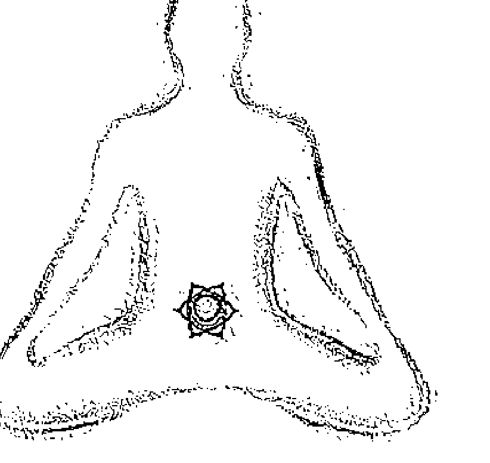

臍輪 VS. 自制

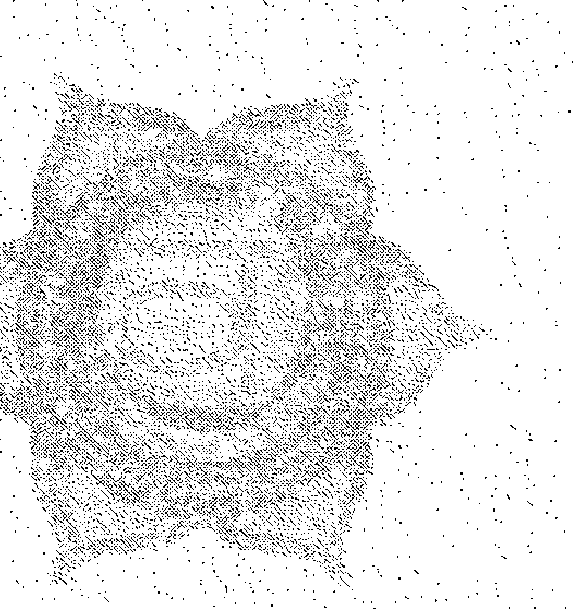

在能量體中，臍輪是個很難去劃分的脈輪，因為它跟海底輪一樣，跟家人有強大的連結，但比較偏向與父親情緒上的連結。像上一章所提到的，當海底輪受挫時，很容易覺得要為自己而奮戰，個性往往會變得比較自私和冷酷，以自身利益為最重要的考量。

而臍輪失衡的人卻往往相反，他們必須一直靠無私的付出或絕望的討好，才會找回存在感。有些人會說這種人是母愛過多，但其實他們的付出只是一種表象，因為覺得自己沒有真正被愛的吸引力，所以用無私付出換取絕對占有，用自我犧牲來換取對方的罪惡感，但因為自我存在感過低，所以即使當事情順利進行，他們還是會時時提高警覺，或是幻想可能的情節。情況比較嚴重的，還會一直去找尋不忠的證據，如此周而復始，讓對方壓力很大，覺得不受信任與尊重。當理性溝通無法得到共識，對方提出要冷靜一下或要分手時，他們的被害者性格就會出現，然後不斷怪罪對方自私、自己是如何委屈求全等。

臍輪原文字面的意義是個人的住所，以配合生育和排泄的需求為主，滿足人類的慾望，可是一旦氾濫，就會變成濫交或是沉淪在膚淺的感官享樂，因為人類在性交時很少會想到不快樂的事，但久而久之成了依賴，就像有些人依賴藥物或酒精來逃避現實，這些都是一種消極的上癮症。

臍輪最有趣之處，在於它其實是想像力的來源，藝術家應該都有很不錯的臍輪能量，因為臍輪的水能量就是所謂的靈感泉源。所以許多藝術家都擁有精采的感情生活，他們的情緒往往大起大落，需要很多愛和欲望來刺激他們的繆思女神；而有些人過度使用臍輪能量，或者是能量無法平衡時，豐富的想像力就會變成可怕的妄想。

當我們情緒穩定、相信自己的能力時，就可以運用想像力來創造更美好的世界，例如藝術、詩歌、文章等；但當海底輪受創，自信心和生存能力都受損時，就可能運用想像力創造出危險環境，有時候越想越真實，又不願找人求助，反而耽溺在這恐懼之中。如果沒有好好治療或面對，就容易出現憂鬱或躁鬱的問題。

所以自古以來，許多極有天分的藝術家一旦不再產出讓自己滿意的作品，便容易陷入沮喪，有些人甚至會出現精神疾病而瘋狂，做出自殘的行為，一切都失去了控制與平衡。

## ☆ 臍輪的療癒和對抗疾病

當你發現自己已經有臍輪失調症候群時，那該如何是好？這個脈輪的受創是很難發現的，因為我們平時如果情緒突然失控，都會歸咎於壓力大、疲倦或生理期荷爾蒙失調等等，但其實並沒有那麼簡單。這樣下去，你會發現自己逐漸變成一個怨婦或宅男，對社交不感興趣，在人群中沒有信心和歸屬感，因為臍輪的元素是水，所以對你而言，融入人群中是非常困難的一件事。

要加強臍輪的能量並不困難，重點是適時做些腰部運動，像中東肚皮舞，就可以增強臍輪的能量。大家會發現，那些肚皮舞者有股誘惑的力量，讓人覺得很魅力，但卻不顯下流或淫穢，而是一種健康的性慾、性需求，追求兩者的平衡。

臍輪在兩性關係中也扮演了重要角色，尤其對女人而言，要是第一次性經驗帶給妳相當不愉快的感受，一定會造成強烈的影響，妳可能會覺得自己被侵犯或加深了性的不潔感，覺得對方都是為了某種利益，所以無法信任彼此的關係。

當臍輪能量失衡時，容易出現腎臟疾病。腎臟是分解體內的廢棄物，讓廢棄物進入尿液中再排出體外，所以也可以說，腎臟是我們釋放負面情緒的器官。

腎臟出現問題時，往往是因為我們一直抱著過去的傷痛而不願放手。副腎腺（腎上腺）會在我們面臨危險情形時加速分泌，讓我們在最短的時間內逃跑或決鬥（Flight or fight）。但就正常情況來說，我們應該都會將這些激素藉由尿液排出體外，以維持情緒和肉體的平衡。以腎結石為例，在醫學來說，是尿液中的礦物質結晶沉積在腎臟裡所導致；但以心靈層面來詮釋，往往表示我們在早期所遭受到的一些悲傷和恐懼，一直牢牢黏在我們的靈魂深處，像石頭一般堅硬，不肯隨著時間釋放出來。因此若一個人習慣不斷回憶過去的苦痛和不安，很容易就會有這種問題。

> 歡迎來到幸福能量寶地，讓你很舒服

臍輪的訓練很簡單，因為臍輪與水的連結很強，所以你可以多從事一些與水有關的運動，如游泳，但不是一股腦的往前游，而是練習漂浮，融入水中，信任水的能量，就像在水中冥想。將你的雙手放鬆，專注在你的臍輪，試著仰躺在水面上。

不會游泳的人，不妨試著在家裡的浴缸冥想。水溫不要過熱，也可以在水中滴幾滴茉莉精油，讓精神更放鬆。

# 第四章
## 你，可以改善體質
### 開啟第三脈輪：太陽神經叢能量

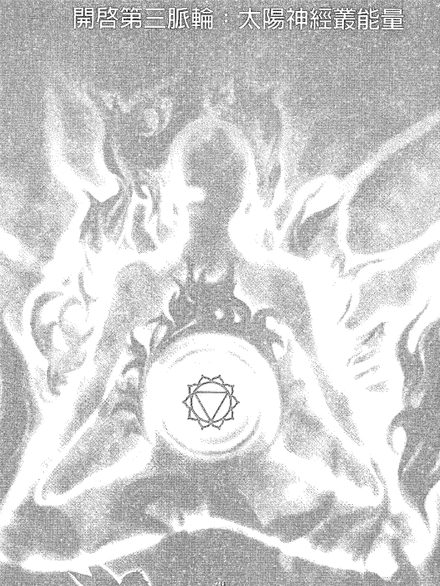

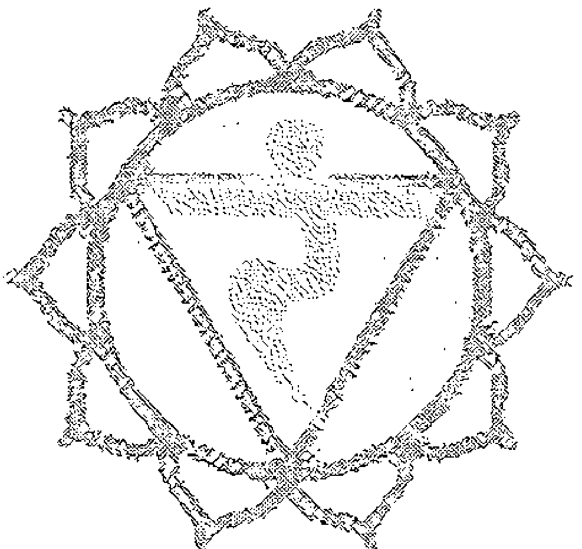

## ☆在日常生活中，你經常會出現下列情況嗎？

- [ ] 很難放鬆
- [ ] 總是提不起勁去完成夢想和規畫未來
- [ ] 面對他人指責時很容易動怒
- [ ] 常胃痛、脹氣
- [ ] 在人多的地方，會有一種想發怒的感覺
- [ ] 常會覺得口乾舌燥，身體燥熱

如果你有上述狀況，這是因為掌管生命之火的太陽神經叢出了問題。

在本章中，我將會告訴大家：為什麼當你的太陽神經叢紊亂時會失去生命動力，以及做什麼練習可以鍛鍊太陽神經叢，讓你積極追求夢想！

## ☆為什麼我總是提不起勁？

「A，妳還好吧？怎麼最近都懶洋洋的，文件也一直出錯？心情不好嗎？」B1關心的看著無精打采趴在辦公桌上的A。

「我也說不上來發生了什麼事，最近對什麼事都提不起興趣。我不想工作了，好想離職，不想過這種枯燥無味的上下班生活了！」

「很累？妳前一陣子不是才請了一星期的假去休息，怎麼一下子又累了？如果要離職，妳準備找什麼工作呢？」B1不解的望著她。

「妳知道嗎？我之前休假，根本什麼活動也沒有安排耶！每天就賴在家裡睡飽吃、吃飽睡，什麼也沒做，心情很焦慮，而且覺得自己好沒用哦！突然感覺自己年紀越來越大，人生再這樣下去也不是辦法啊！可是我也不知道自己要做什麼工作，連自己的興趣是什麼都不知道。姊，我看我可能是憂鬱症吧！覺得這個世界上什麼事都與我無關，我好累好累，什麼事都無法讓我開心。」Aby悶悶的說完，又趴回桌上，把頭埋在臂彎裡，好像又躲回了自己的灰暗小世界。

常常覺得自己一直莫名的想抱怨，久而久之就變得怨天尤人，雖然覺得很多事都不順心，卻好像也沒有什麼大問題。每天的工作一成不變，談戀愛也覺得沒有新鮮感，而且忙到沒有時間搞什麼轟轟烈烈的愛情，可是每天周而復始，真的悶到不行，活著好像也沒有什麼意義。

其實當你有以上的狀況時，不要急於認定自己得了憂鬱症或躁鬱症，其實你很有可能只是累了，太陽神經叢的火焰暫時熄滅，讓你對很多事都提不起勁。你可能為了升遷或加薪，一直努力想達到某個業績目標，但結果並未如你所願，自然會深受打擊，而陷入自怨自艾中。

我們常在工作倦怠和遇到瓶頸時，會想逃避或換工作，但又不知道想做什麼，只是想遠離現在的不順遂。悲哀的是，自己也知道換了工作並不會增加多少薪水，還是要面對令人頭痛的勾心鬥角，那麼忙了一大圈，到底在做什麼？往往就這樣陷入了死胡同，久久出不來，而且還越想越消極，不知道該何去何從。

太陽神經叢多半最容易在兒童學習時期受到傷害，而且兒童學習期正是在懂得世界上有「考試」的學習時期。為什麼？我們都知道，念書就是要不斷溫習和複習，目標是得到好名次，獲得家人、師長和同學讚美或崇拜的眼神。可是長久的努力往往只因為考試當天身體不適或粗心大意而慘遭滑鐵盧，有些人受不了這樣的打擊，太陽神經叢能量因而失衡，而變得不想競爭，或者自覺不是讀書的料，失去了向上的動力，而逃避求學戰場。殊不知，若是養成這種習慣，很容易就會變成「放棄者」，無論做什麼都會想到如果失敗該怎麼辦，或者為了避免得到失望的結果，不如一開始就不要努力，以免之後過於傷心。

## ☆ 如何加強並善待太陽神經叢能量（案例分析）

太陽神經叢出現淤塞或能量不足的案例真的是比比皆是，但我發現女性在這方面調整得比男性好，可能這個脈輪是充滿陽剛的力量吧！我曾經看過一位事業有成、人又帥氣的Y先生，他的工作表現相當優秀，薪水優渥，住在視野絕佳的豪宅，他身邊的東西，無論是汽車或是服裝，哪怕只是個袖釦，都在表現出他的品味和身分，因為他討厭任何不美、沒有特色的東西。

Y先生的EQ不好，這點很困擾他，因為他自認是個優雅的人，但他在所有同事心中都是個暴君、狂人。他常覺得如果一個不小心，他所一手建立的王國就會傾倒毀壞。而且他每天都覺得事情做不完，一直在思考要怎麼做才能完成他心中的理想王國。他來找我時雙眼發紅，一直問他的事業未來會如何。但在我看來，他的事業其實沒有什麼問題，真正有問題的應該是他的情緒。當時我請他站起來，仔細觀察他的太陽神經叢，發現他的脈輪能量很亂。我告訴他，他有嚴重的脹氣以及胃潰瘍時，他的表情還挺驚訝的，可能覺得自己這麼優雅，卻常想打嗝或放屁，是很丟臉的事吧！我跟他說，不要老是讓自己處在備戰狀態，因為如果養成習慣，他將很難有放鬆的一天，他的火焰老是這麼狂燒，情緒無法平靜，只會讓自己容易判斷出錯，而且要花更多的時間和力氣來收拾殘局，必定會形成負面循環。

同時我也點出他的貪婪問題，他真的很想功成名就，但是他什麼都想要，又想做好每件事情，沒給自己訂個停止點。他只能不停不停的前進，並不是有什麼非做不可的事，而是被貪婪給奴役了，讓他不敢停下來。

我那時給他的建議是多去曬曬太陽，每天靜坐一下，什麼都不要想，就是靜下來，讓自己的心臟跳動放緩，眼睛放鬆，再讓下巴慢慢放開。這每一個動作，都是把戰鬥的盔甲給卸下來。

其實大家應該養成習慣，回到家後馬上洗個澡或換上舒服的衣服，然後聽輕柔的音樂，讓大腦從戰備狀況慢慢放鬆。當你覺得自在時，再開始慢慢的吃晚餐，偶爾來杯紅酒或巧克力，可以讓你的心情更愉悅。記住，你的每一個動作都是一種儀式，提醒你釋放今天的壓力，明天要重新再挑戰新的目標。否則長期累積壓力，其實你已經非常累了，可是還要強迫自己專注，便只能用怒氣來增加自己的力量，如此濫用太陽神經叢的能量，只會讓自己變成一個情緒的怪物，且造成身體嚴重不適而已。

- ⊙ 象徵符號：黃色的十瓣蓮花
- ⊙ 元素：火
- ⊙ 色彩：黃色
- ⊙ 位置：約在腹腔胃部前面，腹部中央位置
- ⊙ 特質：對應胃、腹部、脾臟、肝臟、脊椎
- ⊙ 能量意義：勇氣、力量、理智與限制、規範、社會化

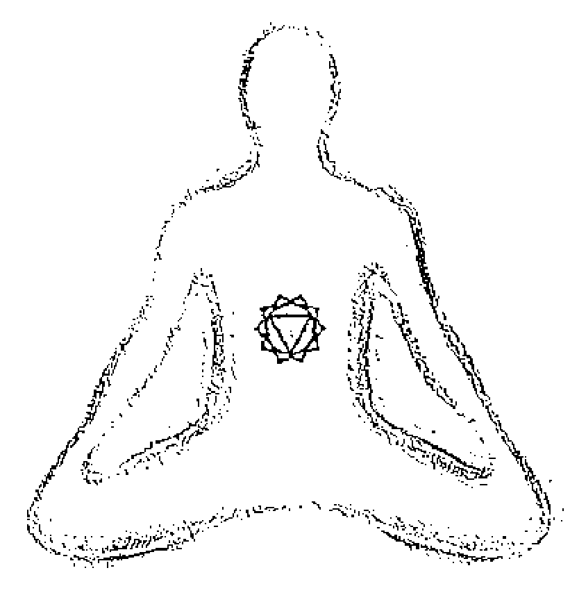

太陽神經叢 VS. 積極

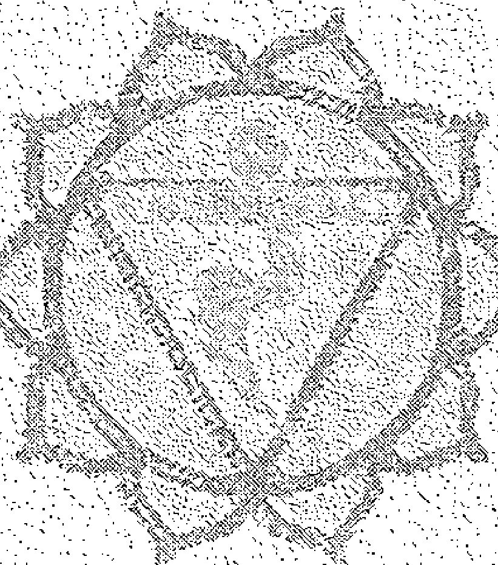

太陽神經叢的能量是非常強大的，它代表我們生命之火追求成功、夢想、意志的核心。在臍輪發揮的想像力，會在太陽神經叢這個位置實踐，若說臍輪是做夢的勇氣，那太陽神經叢就應該是落實夢想的實際力量！

太陽神經叢的能量平衡時，你會覺得自己很有力量，擁有衝勁和想法，對於金錢和名利都充滿信心。我們常說有些天生具有領導者特質，勇於追求理想、不屈不撓，就是這類「太陽之子女」的人，擁有生命之火，讓人明顯感受到他們的存在，卻不會有太大壓力。

太陽神經叢原文字面上的意義是寶石之都，也就是火源的中心，它能夠影響我們胃腸的消化活動和食物的養分吸收。從這個脈輪開始，人類的特質才有所展現。

海底輪代表的是求生欲，而臍輪代表的是性欲，這兩個脈輪表現出來的都是相對比較獸性的部分。而太陽神經叢則表現出判斷和控制，當然也開始有所謂的自我認同，包括自己喜歡什麼？有時會顯得較自我中心，因為在這個脈輪所探索的，就是認知自己的喜好和底限，如果過了頭，就會顯得自私和自大。而太陽神經叢失衡時，可能是火焰過強或過小，過強會傾向狂人狀態，好像永遠不需要休息，一有念頭就要立即實踐，或是千頭萬緒，做事沒有章法；要是火焰過小，就會表現得畏畏縮縮，好像不知道自己該做什麼，無法負擔任何承諾，對這個世界有很多不滿，卻又無法具體做出什麼反抗或改變現有的模式，有時候他們又表現得像世外高人，這個世界發生什麼事都好像與他們無關，他們接受許多不平等，但不是甘願的，而是只能配合，充滿無奈卻無法改變。

## ★ 太陽神經叢的療癒和對抗疾病

在我的輔導經驗中，太陽神經叢一旦出現問題，往往非常明顯，而且在短期內就會越來越嚴重。尤其現在小孩子很早熟，如果你是為人父母者，請多注意小朋友的狀況，如果原本活潑好動的小朋友突然變得沉默寡言，開始不想上學，或常有莫名的腹痛時，就要特別注意哦！

如果是成人，容易出現的問題是對萬事提不起勁，或是覺得全世界都對不起他。為什麼會受挫？因為我們在辦公室中常常會遇到一些不合理的對待，遇到主管的錯誤判斷或是辱罵，我們的火焰就會開始升起，也許你內心想的是「老子不幹了」，或是想狠狠的扁一頓仗勢欺人的主管，但也知道不行，所以就硬忍下來。長此以往，沒有適當的抒發管道，太陽神經叢的能量也就受到了阻塞。

太陽神經叢失調時，最容易感受到的就是胃的毛病，有些人是胃酸過多，有些人則是胃痙攣或胃脹氣，這幾乎是現代都市人必有的文明病。為什麼會如此呢？其實食物代表的是母愛、關懷、安全感和獎賞，是我們生存下來的最重要能量之一，我們在痛苦或空虛時，常會吃東西來洩洩情緒或自我滿足，然而一切負面情緒和渴望都在我們的胃部反應。我們可能因為每天吃了太多的負面情緒，如憤怒、緊張、不安、懷疑，而對食物的渴求變得扭曲，也許是大吃大喝，或者是緊張厭食，胃無法正常的分解我們所吃的東西。如果胃一直持續緊繃、無法放鬆，就代表我們過於堅持自己的想法，而沒有客觀的面對現實。你若像個暴君般隨時想要打垮那些唱反調的臣子，在如此巨大的壓力之下，你的胃焉能不抗議？

## 第四章 你，可以找回積極

### 緩慢吃、深呼吸、發呆、放空、曬太陽、運動、培養興趣、睡好覺、減少大腦過度運轉，找回積極的自己

每天花五分鐘練習腹式呼吸，盡量緩慢的把氣吐乾淨，就像是把身體的負面能量給代謝出來。

吃東西時細嚼慢嚥，不必急著吞下肚。吞嚥這個動作是占有的意識，但你是在吃飯，不是在打仗，請慢慢享用食物的美味，接收它的能量。

心情鬱悶時，就去曬太陽或點一支蠟燭，讓自己接收光和熱的能量。有時只是身上的負面能量太多，讓你失衡而陷入悲苦的情境，這時就去外面走走，聽別人說話，或運動十分鐘，就會讓你的情緒開關重新Power On！

睡眠不足對太陽神經叢的影響很大，晚上盡量早點睡，睡前不要看暴力或恐怖電影，會讓你睡得更安穩哦！

培養一種興趣，轉移你的重心，或讓自己有小小的成就感，自然對未來會有期待。

# 第五章
## 你，可以更快樂
### ——開啟第四脈輪：心輪能量

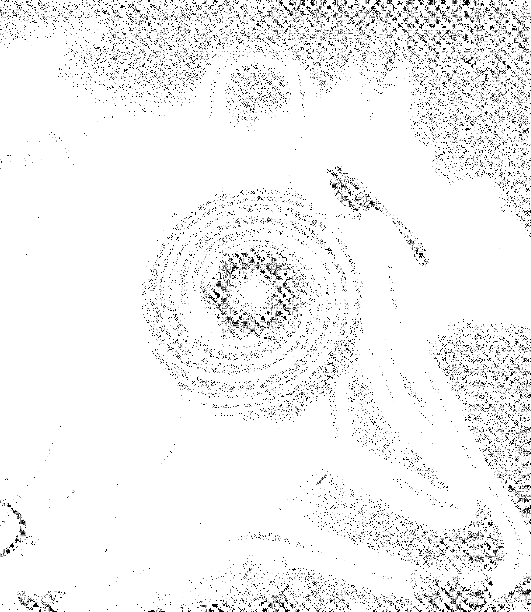

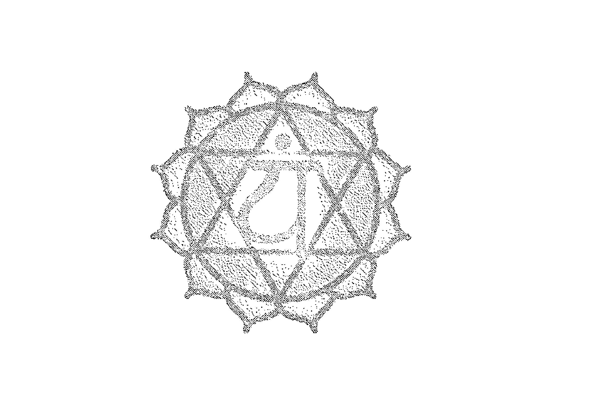

## ☆在日常生活中，你經常會出現下列情況嗎？

- 你的戒心很重，不讓別人了解你，也不想靠近他人
- 跟人對話過後，會有種沉重的疲倦感
- 即使知道不對勁，但你還是無法拒絕別人
- 覺得與你的情人無法有靈性的接觸
- 常常覺得胸口悶痛或呼吸不順
- 容易心悸和莫名的慌張
- 在人多的場合，反而容易有一股淡淡的惆悵

如果你有上述狀況，這是因為連結療癒能量的心輪出了問題。

在本章中，我將會告訴大家：為什麼當你的心輪太脆弱時會覺得疏離，以及做什麼練習可以鍛鍊心輪，讓你更能找出歸屬感和同理心。

## ☆ 為什麼我就是無法體諒？

AOX是個很優秀的人，他從名校畢業後，便到國際級的大公司當財務主管。父母用盡心力栽培他，除了希望他好好念書之外，從不期待他回饋什麼。他不是個不知感恩回報的人，父親身體狀況變差之後，他便放棄國外的大好工作機會，回台照顧年邁的父母。他當然覺得可惜，但是，一點都不後悔。

他在台灣的工作表現依然優秀，也是老闆的愛將。他的人生井然有序，什麼時候該做什麼事情，沒有一絲出錯，老闆信任他，屬下服從他，但是他卻沒有任何朋友，大家都覺得他是個有心跳的機器人，不會出錯、沒有溫暖，也完全不講人情。

這一開始都還不是什麼問題，直到有一天，母親想端咖啡給他，卻因爲年邁手抖，不小心整杯倒在他昂貴的筆電上，準備許久、還沒備份的簡報內容當場報廢。

他忍不住大发脾气，母亲委屈的一直道歉，他才突然发现，即使是母亲，也是惊恐的服从着他。他冷著脸不知该说什么，他明白母亲是想讨好他、照顾他，但自己却不曾给过相等的温暖回应。他非常懊恼，自己不是没有感情的人，但很多时候就是无法柔软，无法体谅别人的难处，因为他认为所有问题都要靠自己解决，不是吗？他可以付出所有有形的物质去讨好父母，却无法给一个温柔的眼神。也因为他无法与人真正相处，也一直维持单身，没有人能够真正的靠近他或了解他。半夜，他常会因为胸口莫名沉重而惊醒，再也无法阖眼，直到天明，他觉得自己好像快崩溃了。

心轮是一个相当重要的脉轮，我常说，一个人是否能成为成功的领导者，可以从他的心轮状态感受得出来。因为我们常说的心电感应，很多时候都是心轮给的一股能量，它可以让觉得无限慈悲或不怒而威。心轮是一个人真实性格的能量，即使有些人每天脸上都挂着温暖的微笑，但心轮能量若不温暖，便会显得很做作，大家不见得会喜欢他，可能还会在背地里叫他笑面虎；而有些人，当你心情不好时，马上就会想找他聊天，仿佛聊过后一切就能顺利解决，挂心的事就显得微不足道，有强烈的疗愈效果；另有些人，会让你觉得可以对他为所欲为，虽然当下你可能觉得自己有点过分，但你心里明白，他一定会原谅你的，更何况，他也无可奈何，不是吗？一样是心轮能量，却有各种不同的力量。就像甘地外表虽然瘦弱不堪，但所有跟他说过话的人，都形容这个人拥有不容忽视的力量，他的眼神、语调温和，手臂细得好像一撑就断了，那到底是什么样的力量，让人如此尊敬他？那就是他强大坚定的心轮能量，光凭他一个人便可以感动几十万人的心灵。他不用演戏，不用高亢的音调或夸张的手势以及煽动性的字眼，一切是那么自然，都是他发自内心自然而然流露出高贵、慈悲又温暖的能量。心轮最容易受挫的阶段是青少年时期，那正是定位自己的时期。你是个怎样的人？强悍，还是贴心？你在跟朋友相处时，是否受到欢迎与认同？在谈恋爱时，是否受过背叛的伤害？其实，心轮的发展就像心性的成长一般。打个粗浅的比方，在青少年时期，你好像拥有一张世界地图，你想去美国加州洛杉矶的环球影城，可是你不知道该怎么去，于是你参考地图，找出路线。

## 第五章 你，可以更快乐

影城，想去4D影城和史瑞克共舞，但问题是你并不知道目前脚下站在哪里，自然无法出发。在这个阶段，你对自我的认知往往不是自认为是怎样的人，而是你在别人眼中是个怎样的人，你从别人的眼光来组织出你自己。所以，这是一个有风险的时期，其一是，你不知道身边的朋友是否眼光公正，你是否真的有如他们说的好或坏？其二是，如果你一直都用别人眼中的自己来界定自我，而不知道要努力认识自己，那你很有可能终其一生都会处在这个阶段，日子过得患得患失。
因为每天都会有人喜欢你或讨厌你，为了让大家喜欢你，你会变得卑微的乞求别人对你的认同，如果你的自我是从乞求为地基所建立的，那你自然会失去自我控制的能力。
像前面故事中的男主角Alex，他的心轮受创可能是在国中时期。父母努力攒钱让他出国念书，为了不让家人担心，他就一手打理自己的生活，一个人孤身在国外求学，但也可能太好强，所以习惯性的封闭自我，不想麻烦别人，但也失去人际交流的机会和技巧。

## ☆如何加强并善待心轮能量（案例分析）

心轮失衡的案例中，女性在爱情上受到的影响最为显著。我有一位熟稔的客人，在档案中我给她的代号是圣母玛莉亚，她心仪的男性一个比一个怪，一个比一个疯，但她都情深意重、永不反悔的一再付出。她的情操真的是太伟大了！她不应该交男朋友，而是应该去养个宠物或去做志工！可能大家会觉得，这么愿意付出的人应该长相普通吧，不，不，不！此姝长相甜美、声音很嗲，而且家庭环境优渥、学历很好，工作优异，待人谦和，集所有的优点于一身。但她人生最大的败笔，就是爱情生活真的很不顺遂。无论是朋友或是情人，往往都有边缘人格，而且连她的主管都会常常跟她抱怨工作的问题，这位甜美的玛莉亚变成身边所有人的垃圾桶，她真的不知道自己是哪里做错了，但是她总是努力去达成身边人的期望。可是每过一段时间，她的气喘就会发作，觉得完全无法呼吸，胸口闷痛，情绪紊乱，不想出门也不想接电话。去看心理医生，医生说她有忧郁症，但她只要休息一阵子，即使不吃药也会好转。有人说是因为卡到阴，但她一直搞不清楚是怎么回事，可是时不时就要请假休息，长此以往也不是办法，直到她来找我求助，我们深入谘商探讨后，才发现是心轮失去了平衡。

我常说，发现问题不是最难的部分，最难的是要如何处理问题，我为她谘商时，发现她的心轮非常阻塞。照理说，像她这么有爱心的人怎么可能会心轮阻塞呢？她回想起她初恋时，因为对象是校园内的风云人物，所以无论走到哪，别人都会投以羡慕又妒恨的眼神，而男友也比较强势，常常有意无意的拿她跟别的女孩子比较，搞得她神经紧张。后来男友劈腿，她一开始还忍气吞声，愿意委屈做老二，反而第三者比她还有骨气，要求男生只能选一个，否则就要要求去。一开始玛莉亚还期待可以回到正宫的位置，没想到男友居然要求立刻分手，理由是玛莉亚很自私，不懂得替别人想，凡事只顾自己。

玛莉亚在那一段时间的记忆很破碎，因为她觉得自己是别人的笑柄。她为了男友牺牲自己的兴趣与课业，就是希望能够多陪男友，让对方觉得开心，最终却落得这个下场，她完全不知道该怎么办。也因为那是她最脆弱的时期，当初男友说的“自私”两个字就深深烙印在她的脑海里，所以她告诉自己，她要成为一个成熟懂事的人，不能再自私任性下去。积极的参加公益活动，帮助流浪动物、失智老人、非洲难民，一开始还算正常，后来她开始对弱势的男人产生怜爱之情，就开始失控了！

她常会爱上一些无业游民，且坚持说对方是艺术家，我在谘商时忍不住好奇的问，为什么是艺术家？对方有什么作品吗？有因为作品赚过一毛钱吗？或者是对方有擅长什么吗？玛莉亚完全答不出来，她说那个男的说自己会一项特别的艺术，但怕讲出来作品会被抄袭，所以他即使很爱、很信任玛莉亚，还是不能说，发表成果的那天，他一定会把所有成就拿出来与玛莉亚共享，因为她是唯一支持和了解他的人。

因为篇幅有限和涉及隐私，所以我真的不方便详列那些男人说了哪些瞎话来欺骗玛莉亚，但我可以说的是，在听那些完全无厘头的疯言疯语时，我的白眼都快翻到后脑勺了。这样的话也会信？问题是，她也不是什么无知的愚妇啊！怎么会相信这类屁话呢？后来我们研究之后，才发现她的心轮受过创伤，所以只要讲一句魔法关键句，她就会乖顺的照对方的意见行事。
是什么样的句子，有这么神奇的魔力呢？那就是“这个世界只有你懂我”！
天啊！如果在看这本书的读者发现这句话会让你马上眼眶湿润，心儿怦怦跳，请特别注意，因为这代表你可能属于极容易被金光党骗财骗色的类型。心轮脆弱的人，对能够让自己在别人心中有一席之地的事情，都会很着迷的去做，例如无止尽的付出。但这是不平衡的，我的意思并不是说人要斤斤计较，而是当你在付出时，不要试图拿这些负面能量来填补内心的空洞，这些只会让你更空虚，因为没有对症下药，而且还浪费精力和资源！
我建议玛莉亚去除一些过去的负面能量。我们大概花了五个小时来厘清她的初恋才是个自私的自大狂，而不是她！而她后来遇到的男人，并不值得她这样傻的付出，有些人不成功并不是没机运，而是不努力！所以一直做啦啦队，却不愿看清真相，真是误人误己！

接下来，我的建议是，她应该多出去走走，骑骑脚踏车，做些自己一个人也可以完成的运动。因为她现在要学会如何独处，学会如何对自己好，而非总是花时间在别人身上，要学会疼惜自己。

另外一个比较有趣的是，虽然所有人都觉得玛莉亚很漂亮，但她总是觉得自己不好看，她对自己是很陌生的。所以我建议她，为了更了解自我，每天洗完澡后用乳液按摩全身，藉由抚摸来认识自己身上的每一吋肌肤、关节和肌肉，告诉自己：“我真的很有魅力，值得更好的对象来疼惜。”

经过漫长的谘商之后，卑微的玛莉亚终于找回了自我。她有时间还是会去参与公益活动，但这次她是真心为了帮助别人，而不是证明自己，即使做的事一样，但动机不同，效果就会差十万八千里啊！

心轮 (Anahate)

| 象征符号 | 绿色的十二瓣莲花 |
| 元素 | 风 |
| 色彩 | 绿色 |
| 位置 | 胸口中央胸腺的位置，两乳之间 |
| 特质 | 对应呼吸循环系统、胸腺、心脏、肺脏、免疫系统调节 |
| 能量意义 | 爱与憎恨、希望、传递、同理、美感、感动、分享 |

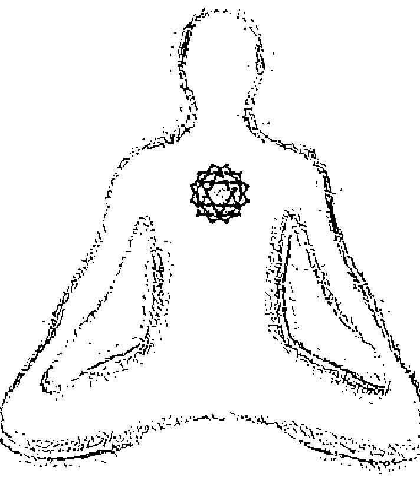

## 心轮 VS. 疗愈

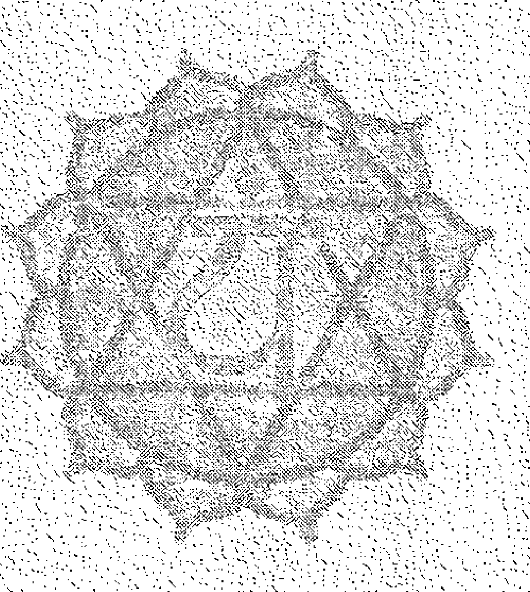

心轮的能量是无远弗届的，就像它的代表元素——风一样，主要诉求的就是“爱”。爱是一股能量，但就像风一样，没有人拥有风，也没有人知道风的起源在哪里。大家只知道，当风起时，无论是春风般轻拂在脸上，或是像飓风般的力量无穷，可以把整棵大树连根拔起或是把房子吹倒的强风，都是来自于同一种起源。我们可以使用爱这股能量，就像藉由空气中的风，把你的信念和祝福送到身边的亲人，或是远在地球另一边受苦的灾民，心轮能量就是如此无所不在，不是强而有力，而是徐徐不停。

心轮的原文字面上的意义是纯洁居住之地。在这个脉轮，我们的意识更高了一层，而这层意识讲求的是表达真爱和增加博爱之心，也就是同理心和慈悲心的部分，这是一种个人体验和在群体中的自我展现。我们不像在太阳神经丛那样自我中心，我们会发展出同理心，感受到我们与其他人一样，并懂得己所不欲，勿施于人的道理，这股能量的发展，会产生许多世俗所认同的一些美德，如无私、同情和真正的慈悲。

当心轮平衡时，你会觉得心情愉快，而不会感到低潮，或需要藉由什么药物来让自己亢奋，那是一种自由自在的感觉。我每次在做心轮冥想时，都会觉得自己好像从肩胛骨伸出一对翅膀，快乐的摆动着，每一次摆动都好像排出了身心的负面能量。你会不会常常觉得胸口压力很大，需要深呼吸或叹息来排出压力？有些人有极大的烟瘾，他们为什么要在尼古丁在血液中还未降低到能发觉前，急急忙忙的再点下一根？其实，我在协助个案戒烟时，经常必须面对香烟能够带来的美好。他们说，在吐烟圈时，就会觉得压力好像随着烟雾飘走。所以我们可以发现，人的压力越大，他喷烟的力道也越强！再加上抽烟时会让自己觉得胸口温暖，感觉胸口像被一双温暖的手捧着，安抚了空虚的情绪。

他们一直在做的是深深的叹息，以及温暖空洞的心，这些都是心轮不平衡所出现的标准症状：出现焦虑、不安，为了自保而必须变得自私，觉得自己的问题可能是最重要的，而无法去担心别人的问题。

## ☆心轮的疗愈和对抗疾病

就像所有脉轮一样，虽然都是失衡，但出现的症状往往大不相同，并不是每个心轮失衡的人都会变成机器人；有些人的心轮能量明显，却时强时弱，这种人常常会变成倾吐的对象，因为许多人会觉得他们人好，给人的感觉是温暖的，但问题是，这种人的能量并不持久，也许早上朋友打电话来抱怨工作不顺、经济不稳定，他们的一天就因而毁了。受到朋友的负面影响，他们可能胸口发闷，无精打采，觉得人生一片灰暗。

你或许觉得这应该不算太严重吧！大错特错！其实这样久而久之是很容易影响身心健康的。各位应该知道，许多占卜师或心理医生如果在情绪上没有健康的渲泄管道，很容易出现忧郁症和失眠问题。以我的经验，每天面对的个案中，大部分的人是卡在低潮的情绪走出来，有些人是因为遇到人生的重大挫折，需要正向的能量；有些人是没有活下来的热情，想要自杀。我们讲的每一句话、每一个字，都要小心斟酌，现场压力是多么大啊！而且说真的，你讲了几千句话，根本无从知道哪一句话、哪一个字会在对方心中生了根、发了酵。我自己常会觉得，天啊！希望对方能够感受到的是正向力量，千万别想歪了！可能一句话就影响一条人命，这能不压力大？能不精神紧绷吗？

很多女性个案会问我，为什么她老是遇到怪咖？不是暴力狂、占有欲极强，就是情绪非常阴沉和低潮的人。因为心轮代表疗愈的能量，当你身上的心轮能量很强时，这些破碎的心就会感应到你的力量，会很想靠近你，听听你的声音，感受你的温暖，但就像嗑药一样，他们只要有事就会来到你身边，变成了一种很大的依赖。而心轮能量强的人往往很容易心软，即使已经造成很大的不便，还是会让人予取予求，所以无论是情人或朋友，都很难分手，很难表明自己的立场，好像一直被人压着走一样，非常辛苦。

心轮失衡时，最首当其冲的就是我们的心脏，心脏其实是我们爱的泉源、情绪的中心点。现代人因为工作量过大，或是自我要求过高，常出现一种致命疾病—心脏麻痹，这是身体对我们下的最后通牒，警告我们不要只注重物质欲望求，而忽视内心的真正渴求。许多人一天到晚在工作，明明知道一家人都在期待能够一起好好吃个饭，或享受几天假期，但老是觉得自己应该要在事业上更上一层楼，或在存款数字尾部多加几个零，而忘了关怀灵魂深处最重要的事物，如对家人表达爱意、也多珍爱自己一些。此外，高血压也很容易导致心脏病。许多老师都认为，高血压是因愤怒情绪而让血液沸腾的一种疾病，所以不要让自己一直处于敌意之中，因为这种不安全感造成的负面效果，对你的真正敌人没有影响，却能严重伤害你身上的每一个器官和细胞。

## 第五章 你，可以更快乐

- 耐心听一个人的抱怨，但不给予意见，就只是倾听。
- 做一些加强心肺功能的运动，如骑脚踏车，若能接近大自然更好。
- 试着去拥抱和安抚别人。
- 试着用双手按摩自己全身每一吋肌肤、关节；认识及感受心轮的力量。

# 第一章 你，可以更有自信

开启第四象限：情绪价值

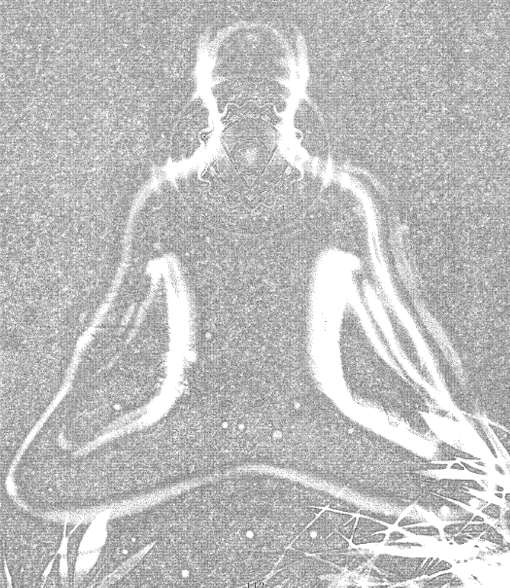

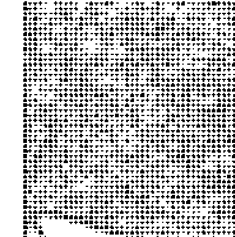

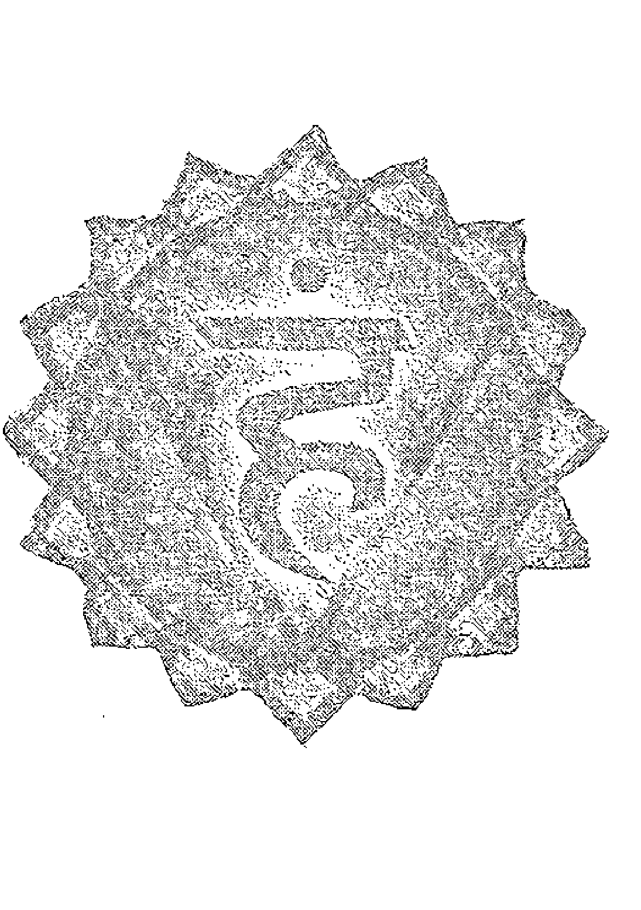

## ☆在日常生活中，你经常会出现下列情况吗？

- □ 很难表达自己的想法
- □ 觉得在人前很不自在
- □ 会一不小心祸从口出
- □ 一紧张就会口吃
- □ 很在乎别人对你的观感，有时会为了讨好别人而说谎
- □ 有甲状腺方面的疾病
- □ 容易喉咙痛和声带紧

如果你有上述状况，这是链接自我表达的喉轮出了问题。

在本章中，我将会告诉大家：为什么当你的喉轮太脆弱时会觉得自卑，以及做什么练习可以锻炼喉轮，让你更能找出自信和领导魅力。

## ☆为什么我就是无法自在？

今天又是每个月的月会报告时间，每次到了这时，□□□都会特别紧张。因为她负责的业务部门一直以来都表现平平，同事之间没有向心力，搞得她这个主管脸上无光，而且她每次在报告下个月的业绩目标时，都感受到每个人都怀疑她是否真能达成，连总经理每次听她报告时，也都眉头深锁而不感兴趣。

“嗯嗯～哼～嗯嗯。”发出一连串的清喉咙声后，□□□才开始说话，就因为紧张而声音嘶哑，她糗得只想钻个地洞，但没办法，大家都盯着她看，她只好硬着头皮继续说：“嗯，这个月的业绩目标还差一些，但是我们有信心，下个月的表现应该会不错，因为A厂和B厂都已经承诺要给我们一百多万的订单了！”她紧张得双手发抖，声音也不自觉的提高，虽然说下个月的订单照理应该会不错，但她真的没信心对方会守承诺啊！

## 第六章 你，可以更有自信

> “那你有跟对方谈到最后签约的部分吗？还是只有口头上的承诺？Diana，你已经不只一次跟对方口头约定，但最终还是白忙一场了，你能不能积极一点，不要老是给我们一些假消息啊？”

Diana沮丧得快哭了，她哪一次不是尽心尽力的去洽谈啊！一次又一次的跑去客户的办公室，姿态卑微的就差没有跪求对方给单了。但奇怪的是，明明自家产品不差，为了拚业绩目标，她早就放弃可能的利润和奖金，价格已经没有什么空间，为什么对方总是不愿意签约，一再刁难，而且还常出尔反尔。她到底是做错了什么，让人觉得她好欺负？就连自己的属下在开小组会议时，对于她的意见也从没接纳过，好像没有人真的在乎她的想法。而她自己也很不争气，从来没表现出领导者的风范，明明是三十好几的老鸟，但在公司里，连八年级的实习生对她也是爱理不理的。她明明是个好人，也很努力工作，为什么没有人真正尊重她呢？

想一想，自己是不是常常这样？总是很害怕众人的目光聚焦在自己身上，明明都准备好了，临场还是口齿不清、头脑空白，而且一旦别人提出质疑，就马上心慌意乱，面红耳赤的闪躲问题，毫无招架之力，在这个事事讲求沟通能力与魅力的时代，如果无法口齿清晰和条理分明的把自身的理念表达出来，是非常吃亏的事啊！

其实，从我谘商的经验来看，现代人的健康真的是糟透了。我常在想，为什么会这样？以前很多人来问健康问题，我都会很紧张的照实说，你这个发炎、血压过高、体内毒素太多、精神过度焦虑等等，虽然被谘商的人会觉得很准，因为都是他所出现的状况，但我还是觉得，怎么年纪轻轻，身体就搞得这么糟啊？后来才发现，问题大多出在睡眠不足。
现代人对于睡眠大概有很多恐惧吧！不然为什么都不早一点睡呢？我大多十二点整就躺在床上，且一下子就睡了。其实，像我每天在处理别人的问题，累积了很多压力，而在工作时间内不宜做出过度的情绪反应，但下了班后我也是个人啊！所以我的纾压习惯，就是边看电视边运动半个小时，然后边洗澡边骂脏话。

哈哈！我不是个提倡骂脏话的人，但许多时候觉得需要让喉轮放松一下。相信很多老师们也会有同感，白天要卯足全力大声讲课，下课时还要回答学生的十万个为什么，回到家喉咙会紧到连睡觉都安稳。有些人会高歌一曲，有些人则闷在枕头里鬼吼鬼叫，其实你也可以试试看，无论用什么方法，一定要先释放压力，再开始与自我对话，不然很有可能因为压抑情绪，而造成自己压力过大。

喉轮另一个更严重的症状是暴饮暴食。在这个时代，能够大吃大喝享用美食，就是成功和富有的代表，我们因为成功，现代食物又这么精致美味，很容易以吃来犒赏或满足自己。就像我在之前章节提过的，食物对我们人体而言，是温暖、关怀、爱以及生命力，所以觉得很累的时候，很多人也会想用大吃大喝来抚慰自己的辛劳，其实真正想满足的是想要吞噬的需求，而副作用则是得到一身厚厚的脂肪。有些心理专家会说这是种想要把自己隐藏起来的作法，让真正的自我隐藏在肥厚的脂肪所围成的城墙内。但重点是，这个城墙并不美，它让你觉得受到羞辱，你反而因此而更自卑了。当孩童也开始暴饮暴食时，父母不要开心的以为他们胃口很好，因为他们其实在表达一种心理状态，就是非常缺乏安全感，需要被填满，此时一定要多加重视他们的身心状况。孩童可能是在对外表达他们真正的不安与受挫，所以改用吞噬的方式来表现恐惧、增加安全感，以及补足内心的空虚。

## 喉輪 VS. 自信

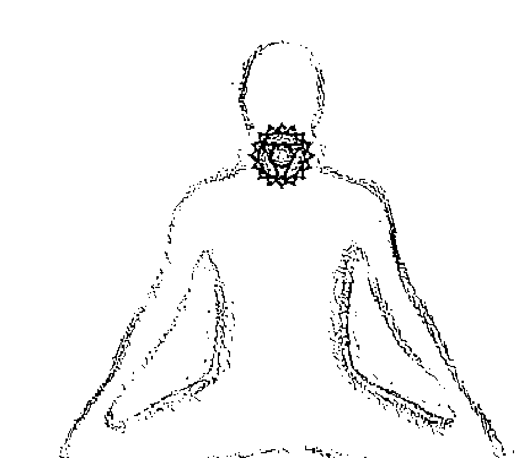

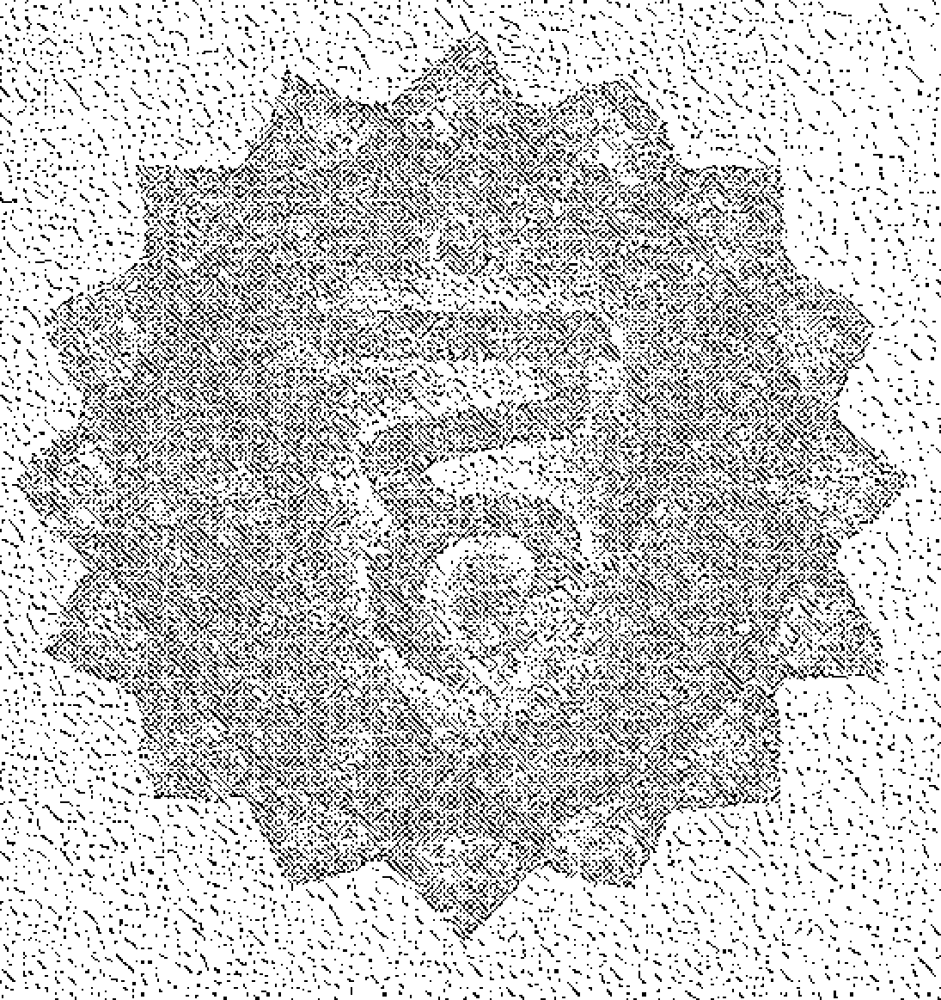

- 象徵符號：天藍色的十六瓣蓮花
- 元素：光
- 色彩：藍色
- 位置：頸部中下段（約在男性喉結偏下處）
- 特質：喉嚨、口、食道、甲狀腺、神經中樞
- 能量意義：調整、表達溝通、大同、智慧與沉迷、語文、理想

喉輪能量是與自我溝通的能量，包括跟你的意識、潛意識或與他人的靈魂溝通。喉輪能量強的人，聲音多半具催眠效果或說服力，一般人容易被他藏在字裡行間的暗示所左右。

喉輪原文字面上的意義是潔淨，唯有經由這個脈輪的能量昇華，我們的身心靈才會進入另一個層次，不再受到物質和肉欲的誘惑和糾纏，有如受過齋戒和禁欲之後的聖潔能量出現，因此內心清淨，能夠分辨真理和謊言、慈悲和偽善，這是人類精神上的極高層次，也就是真正的開放心胸和意識。願意讓這股力量流通，願意接收和付出，願意受滋養同時奉獻，就有如宗教家的精神和慈善者的關懷。而這個脈輪開啟之後，我們就懂得如何說出智慧之語，讓人覺得認同和傳達更高層次的意念，讓人藉由你說的話找出脫離眼前迷惘之途，我們也更懂得該如何正確表達內心的意思。

你可以省察自我：你平時覺得自在嗎？你會偶爾跟自己對話嗎？當你覺得內心很無助的時候，會想跟曾經很疼愛你、但已經逝世多年的親友求助嗎？其實，溝通本身就具有療癒的作用，就像你把很難過很痛苦的一件事說上五十遍，把每一個環節都清清楚楚仔仔細細的交代分明，你就會發現，這件事情已經對你沒有傷害力了，你不再痛楚了，也許你是麻痹了，也許你是放下了，但這件事情的療癒作用已經開始啟動。

## 第六章 你，可以更有自信

喉輪的位置在頸部下段的部分，它代表光的力量。什麼是光的力量？就是溫和卻可以穿透人心，而且在光的拂照之下，我們覺得非常愉悅，心情平和，在感知上更具敏感度。喉輪的能量就在於影響和傳達，影響自己和他人，感受到世界的真、善、美，並且也藉由自己的聲音或理念，平和的傳達給世界。

許多在壓力大或緊張時，可以明顯感受到喉輪位置的壓迫感，好像有人掐著你的氣管一樣，這時往往也會伴隨著偏頭痛或眼壓過高的問題，現在的上班族這類的問題尤其嚴重。很多人問，自己常常偏頭痛，是不是因為電腦打多了，或是冷氣吹多了？其實不是的，現代人常有的呼吸不順、心悸、肩頸僵硬毛病，其實跟喉輪有相當大的關係。因為上班族最大的健康壓力，往往是來自「忍氣吞聲」！

職場講求效率和成果，但老闆、主管、同事或下屬都有可能把個人的情緒帶進工作，說話的口氣或態度有時讓人不舒服，不合理的要求和指使人的樣子讓人不愉快，但上班族基於職場倫理不得不服從和妥協。也許你內心一直在狠罵髒話或是跟對方辯論，但礙於責任歸屬或其他原因，還是得默默承受。這種負面壓力下，容易造成喉輪能量阻塞，有些人甚至會產生氣喘、結巴等問題。

## ☆ 喉輪的療癒和對抗疾病

所以，當你發現自己在人群中容易口乾舌燥，而且常會肩頸痠痛、無法放鬆，那就要注意喉輪狀態是否失調，檢視自己是否一直與壓力共舞而不自知。接下來我們會介紹，該如何平衡喉輪能量。

在前一章節，我曾提到當喉輪能量平衡、持續、像光一樣柔和運行時，無論說話或是任何的肢體動作，都會讓人覺得自在、舒服，也會有明顯的說服力和影響力。其實喉輪還有一個很重要的部分，就是我們對於自己內在和潛意識的探索能量。

喉輪是一面自省的鏡子，在我們講出每一句話前，喉輪都會先篩選句子、用詞、口氣、心態，而且最重要的是，它會問我們：「為什麼要說這句話？」

大家應該都有類似的經驗，在脫口而出一句可能會傷害人的話之前，往往會聽到內心有一個強大的聲音告訴你：「最好還是別說出這句話」！或者是問你：「說這句話或提這個問題的真正意義是什麼？是有趣，還是你真的想傷害對方？或是你希望被大家注意，而忽略了別人也希望被尊重的感受？」喉輪是一個讓你能夠省思自己在講什麼的重要脈輪。例如，今天你加完班很累，像往常一樣回到家，脫下緊身的襯衫和西裝褲、洗個暢快的澡，喝個啤酒，看著電視，但心情還是放鬆不下來，想不出原因，心裡總是悶悶的，這到底是怎麼回事？

這時，喉輪會召喚你先放鬆，有些人會下意識的往後仰，讓頸部放鬆；有些人會開始抽菸。無論如何，這是把喉輪放開的第一個步驟，而第二步驟，就是開始探索了。有些人會在內心自問自答，但我本人會說出來，因為發出聲音本身就有洩洩壓力的效果，而且說出聲來會更能專注。相信很多人每天在職場或生活上難免遇到不愉快的事，如想要罵的客戶、或嘴巴壞的同事，在當時都忍住，而內心默唸著「小不忍則亂大謀」吧！當你終於回到家，覺得很安全感時，試著讓自己發洩一下吧！假裝老闆或客戶在你面前，他今天怎麼說你的，你原本內心想怎麼回，就講出來吧！也許你覺得自言自語很愚蠢，但如果你不用聲音排出憤怒，你還在壓抑你的憤怒，如此即使回到家，你還是會一直處在備戰狀態而無法放鬆，久而久之，就容易出現失眠之類的嚴重問題，阻礙你自我探索的可能。

喉嚨是我們吞忍事實的部位。當喉嚨出現疾病時，常常與我們拒絕接受事實有關，或是想要向外宣洩的情緒受到壓抑，以及表達不順暢所造成的障礙。喉嚨因為肩負著身心溝通的橋樑角色，一旦失去了平衡，就容易有身心分裂的感覺。如果你明明很想表達自己的不滿，但又害怕表達後造成的效應會無法收拾，只好繼續隱忍，久而久之，喉部的壓力日積月累，很容易就影響到甲狀腺體。更有甚者，還會出現吞嚥困難的嚴重後果，氣管也好像有多疾症一般，聲音粗啞難聽，因而截斷了你對外的溝通管道，這對我們的人生會有極為負面的影響，一定要非常注意。

## 第六章 你，可以更有自信

> 鍛鍊後進，請你展現影響力~

- 寫日記，藉由日記每天跟自己對話。
- 有時間就去唱歌，或到海邊吼一吼。
- 有空就去按摩一下肩頸。
- 說話時，永遠記得「堅定且有禮」的表達立場。

## 第三章 你，可以更自由
——開啟第二次工業：思維綜合能量

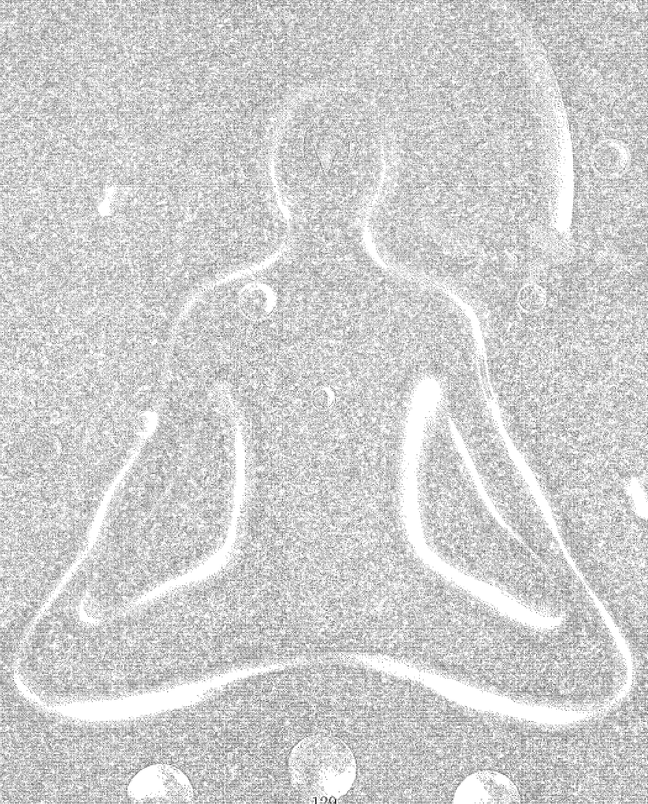

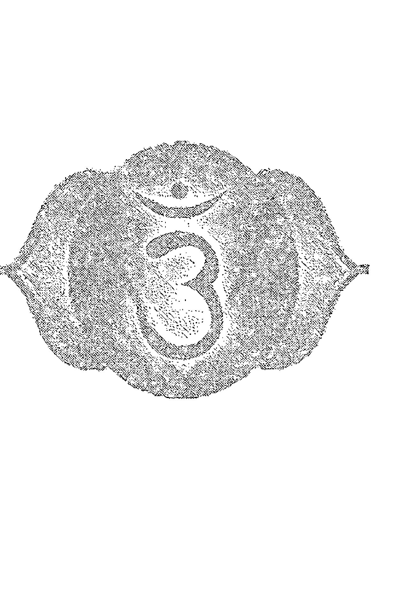

## 第七章 你，可以更自由

### 在日常生活中，你經常會出現下列情況嗎？

- 覺得生活毫無意義
- 總是憂鬱
- 靈感枯竭
- 無法專注，常遇到瓶頸
- 眼壓和腦壓高
- 頭部悶痛，眼睛痠痛
- 長期失眠或多夢

如果你有上述狀況，這是因為連結靈感泉源的眉心輪出了問題。在本章中，我將會告訴大家：為什麼當你的眉心輪失衡時會分心，以及做什麼練習可以鍛鍊眉心輪，讓你找出更多專注力和聯想力。

## ☆為什麼我就是無法專注？

「陳經理，這次的活動妳有什麼想法？」被點到名的陳安妮，覺得非常丟臉，因為她其實一直在發呆，開會時幾乎一個字也沒聽進去。她慌亂的看著左右，想要搞清楚現在到底是什麼狀況，可惜腦袋裡好像有好多個頻道，不知道要轉哪一台，才能給面前滿臉慍怒的老總一個交代。
想當然耳，開完會後，她就被狠狠的罵了一頓。最近她頻頻出錯，上班一直恍神，跟客戶約好的時間常遲到或忘了，處理的文件也紕漏百出，之前那個反應快又幹練的她，究竟跑到哪裡去了？而且更糟的是，她完全搞不懂自己為什麼會突然無法集中精神，以前的她就是以專注和效率出名的啊！怎麼現在的自己突然變得很痴呆呢？
安妮一直想找問題點，硬要說的話，可能是因為到了年底，許多案子都到了尾聲，讓自己壓力大、睡眠不足、經常頭痛，所以才總是沒精神，對客戶的反應沒有適時去處理吧！現在的她更焦慮了，一遍又一遍的檢查文件，不斷打電話給下屬和客戶確認，弄得大家不堪其擾，私下紛紛謠傳這位鐵娘子可能快被送去精神病院了！

不知道你有沒有這樣的經驗？面臨很大的壓力，每天都擔心睡不好，或是生活作息紊亂，常常在失眠與昏沉當中度過，每天都無精打采，工作或念書效率不彰，而且還變得很焦慮，明明知道有哪些事非做不可，但就是無法提起精神來確實完成，隨著時間來臨，就更緊張不安，失眠問題也更加嚴重。

在我輔導的案例中，眉心輪阻塞是許多上班族的普遍問題。眉心輪阻塞的人，面臨的大多是被恐懼所控制的問題，覺得人生不是自己可以操控的，一直想找找出路，但那個出路並非一般人所面對的「幸福的出口」，所以他們無法帶著微笑和期待走向這條路。對他們而言，那只是個「逃生出口」，又無法確定出口外是否安全，爭先恐後的一個勁的往前走，卻更害怕外面等待他們的，是死神的鐮刀或是萬丈深淵。就像一個人可能對自己目前的工作覺得厭煩，卻不知該怎麼走下去，而且壓力越來越大，想要換工作，又怕找不到工作，或者擔心下個工作會更差。眉心輪阻塞的人都在想像外面的萬丈深淵，而且都想像得有聲有色，好像在這個時代，你如果不是個悲觀派，就是個樂天派的傻子。可是為什麼要這樣想呢？我們每一個人都是獨立的個體，不是嗎？那為什麼要常常想那些沒有意義的事情咧？我常常在輔導個案，當新聞天天報哪些小店經營者把自己的事業做得生意興隆，你會不會連結到自己本身，也許自己也可以做到那樣，大部分的答案是：「不會，因為我很實在，不會去妄想自己可能表現得非常好。」但為什麼當新聞提到現在失業率有多高，現在的大學生表現有多差勁，台灣是多麼沒有向心力的時候，我們卻會那麼容易的連結到自身，一直暗示自己是弱者，暗示自己沒有能力，我們壓抑眉心輪對這個世界的客觀觀察，以及對自己內在深度的探索，只是為了怕自己因期待而落空嗎？這又怎麼可能會活出自己呢？

## ☆ 如何加強並善待眉心輪能量（案例分析）

眉心輪對占卜師、心理諮商師或者常常要跟人打交道的從業者而言，非常重要。這些人常常要花很多時間判定對方的狀態是否能夠溝通？是否已經卸下心防，還是充滿戒備？面對每個人的態度都不會相同，因為每個來到你面前的人，可能還帶著剛下班的怒氣，或跟另一半吵架的怒火，他們說的話很有可能非常偏頗或充滿攻擊性，這時你必須避開他的怒氣，但又要能引導他走出黑色的情緒或邏輯盲點，的確是個很大的挑戰。

我在這裡要分享的個案，是一位從事占卜工作的同行。她是個專注的人，對個案也非常有同理心，很有助人的熱誠，但她本身的問題卻相當多，不僅經濟上出狀況，家庭失和，正在談離婚，孩子也不愛她。她不知道自己到底做錯了什麼，她幫個案處理問題，卻經常得不到對方的信任，個案往往不會照她的建議去做，她覺得好挫敗，不知道自己該怎麼辦。

這位占卜師後來也漸漸變得無法集中精神，常會突然感應到某人可能情緒狀態不好，或覺得家裡好像常有人走來走去，出現很多幻覺。她很害怕的問我，是不是有阿飄在跟，還是因為她幫了很多人，所以擔負了別人的業障。其實，她平常在處理他人情緒時，並沒有花足夠的時間來處理自己的心情，情緒一直處於激動狀態，而身為占卜師，她一方面要安撫對方的情緒，另一方面也要讓自身的眉心輪開放，來接收訊息為對方解惑，這是非常耗神的。我建議她多做冥想和靜坐，以及脈輪能量練習，這樣才能把負面情緒排除，讓自己能更思慮清晰的協助他人。眼睛是我們的靈魂之窗，也是觀察這個世界的第一道窗口。許多人有嚴重的眼睛疲勞問題，雙眼一直乾澀發癢，眼壓很高、疼痛不已，這代表一個人忽略了向內尋求答案，只想依賴別人解決問題。若是我們想從別人的看法來了解自己，會越難知道什麼是真實的自我。當你一直覺得眼睛不舒服時，放下眼鏡，停止看電腦一陣子，想一想，你想知道的答案真的要一直向外追尋嗎？還是你內心早已明瞭真相是如何了呢？

## 第七章 你，可以更自由

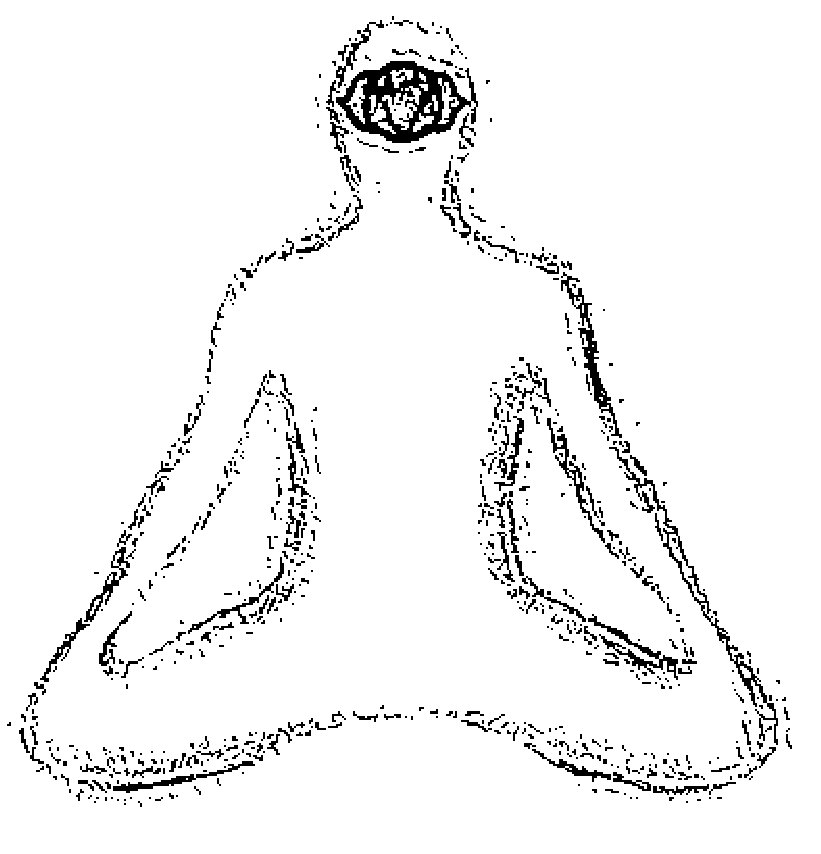

## 眉心輪 VS. 自由

### 眉心輪 (Ajna)

- 象徵符號：靛色的二瓣蓮花
- 元素：靈光
- 色彩：靛色
- 位置：雙眉中心，在印堂稍下部位
- 特質：臉部、眼睛、松果體、腦垂體
- 能量意義：覺醒、清明、無惑、超越與執著、覺察

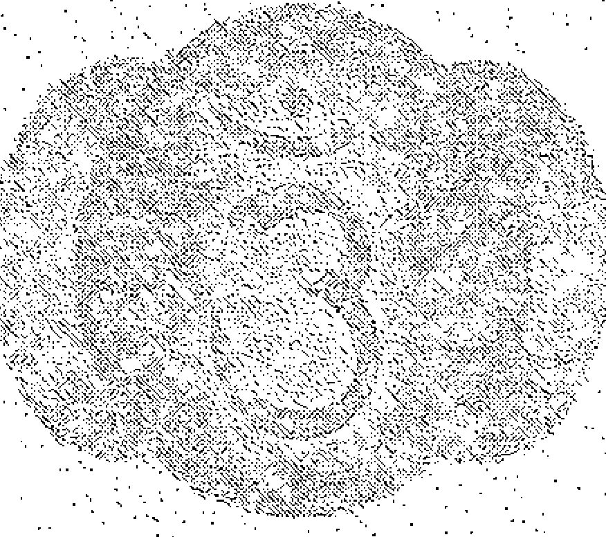

眉心輪能量是靈性方面的能量，也是我們常提到的第三眼。許多人誤以為第三眼就是陰陽眼，其實不然，第三眼可以讓人感受到這個世界以及這個世界之外的事情，無論是有形和無形，包括對方的思想和情緒狀況。第三眼敏感的人，很容易猜出別人的心事，無形的方面，還包括感受到已逝者的靈魂、親人的思念、宇宙的能量。第三眼敏感的人，會覺得這個世界充滿思想，哪怕是一株植物，也有被太陽曬昏的不愉快情緒。

眉心輪是專門負責向內、而非向外，尋求超然智慧的脈輪能量。這股能量講求幸福、喜悦、和大徹大悟的覺知智慧。在眉心輪的能量帶領下，沒有自我，也沒有負面，一種恍如大夢初醒的清澈思想，看穿所有的假象和虛偽，真正的看清自己在事件中的角色，和與他人的關係，不再受故事牽制，能夠客觀的跳脫出來。

對占卜師而言，眉心輪的能量和運用是非常重要的。它位在兩眉中央，所以有些剛開始執業的占卜師會提到，如果一天占卜超過三個客人，很可能會變得難受、偏頭痛、全身無力，好像中暑一樣，這就是不知不覺中過度使用眉心輪了。

要感應客戶或個案的複雜情緒，所有未來的、不可知的，或是個案潛意識所受的傷，皆由眉心輪來感應和分析。不只是占卜師或心靈產業的從業人員，許多優秀的業務人員也因為對人的靈敏度高，而在專業上大放異彩。他們可能會說，不知為何就是知道哪些人會買哪些東西，認為那是出於運氣，殊不知是因為他們靈敏的第六感，讓人願意主動信任他們，成為他們的忠實客戶。不少在業界表現優秀的業務也因發現這類特別的天賦，而學習了許多靈性知識。

## ☆眉心輪的療癒和對抗疾病

現代人有很多文明病，如憂鬱症、焦慮症、恐慌症等，往往都來自眉心輪的失調，因為真正的世界和你內在所創造的黑暗大地是完全不同的，所以容易有認知失調的問題。而我們往往無法平衡，寧可相信黑暗，也不願面對光明。因為在沒有希望當中，我們可以安穩的瑟縮在一角，雖然沒有明亮的陽光或溫暖的床鋪，但好像也沒有什麼可以傷害我們的。很多人用恐懼和失望來打造這個內心的地獄，但聊可告慰的是，他們真的也沒有失望過。沒有期待的人，為了避免做白工，就連開心和幸福的權利也毫不猶豫的放棄了！

眉心輪是對這世界的人、事、物所有情感產生連結和認同的一個重要脈輪。眉心輪就像接收器，可以接收這世間的感覺。當眉心輪連結時，你看著一棵樹，會感受到這棵樹的生命脈動和情緒，如果它歡迎你，你會覺得內在有種被融化的感覺和歸屬感，但如果這棵樹目前心情不太好，或它曾經被人類傷得很深，你可能會感受到它粗糙堅硬的樹皮，以及冷漠的回絕。

我個人常常使用眉心輪，因為我的工作是占卜和寫作，常有好多想法需要分享。我在聚會時經常用眉心輪來感應每個人的感受，並聆聽他們需要我做什麼。
眉心輪的能量不是探人隱私，而是感受別人內在的聲音，真正的走入群眾，走進人的心裡，而不是使用眉心輪的神力，來逼使別人做不想做的事。

當一個人眉心輪衰弱時，會覺得很多事情無法判斷，很多人別有所圖、「人心難測」，而自己也容易產生恐懼，甚而出現強迫症的症狀。眉心輪能量除了在靈性上的感應外，也與邏輯判斷和直覺有關。人的大腦每天處理很多資訊，久而久之就會產生慣性邏輯，例如看到一個嘴角下垂的人，即使對方不說話，你也知道他的心情不好；看到一個容光煥發的人，我們就會知道他肯定有什麼好事發生；或者看到一個人在聳肩膀，想必他應該在憂慮某些事情而無法開懷。這些訊息解讀不是別人教的，而是一種直覺反應，就像小嬰兒眼睛都還不見得看得到，就可以判斷出抱他的人心情是好是壞。我們很容易發現，小孩子被心情不佳的人擁抱時，常常會大哭大鬧；如果到一個心情平靜的人身邊，很容易就睡得香甜。為什麼？什麼是我們可以信任、可以放鬆的，而哪些地方又有潛在的憂慮或危險，這多半是眉心輪的能量在判斷。

從能量的角度來看，失眠代表一個人非常害怕釋放或放下某些很在乎的事情。因為在熟睡中，我們無法對外在環境有所反應，我們是脆弱的，暴露在危險環境中的，所以失眠顯示了一個人長期處在不安、緊繃、被害和悲觀的情緒當中。失眠的人多半認為自己處在一種不安全的環境，或正受到某樣事物的威脅，也許是工作的不穩定，也許是情人的不忠，或兒女的未來堪慮，有些人則是曾經受到暴力對待而心生恐懼。若是長此以往，對生命和人性會嚴重缺乏信任，容易產生孤僻和疏離的問題，或者對人性有偏執的負面預估，這都會造成更嚴重的惡性循環。

## 靈魂自療法。請立刻這麼做

- 讀些讓心靈澄淨的書。
- 每天靜坐二十分鐘。
- 閱讀宗教經典。
- 每天試著觀想一些美好事物，如家人或寵愛的動物，讓心情愉快。

## 第八章 你，可以感受到宇宙之變
——開啟第七版佛曰禪宗能量

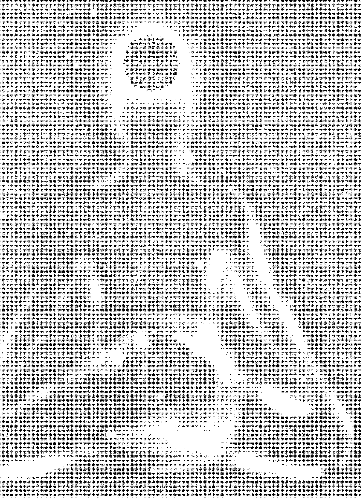

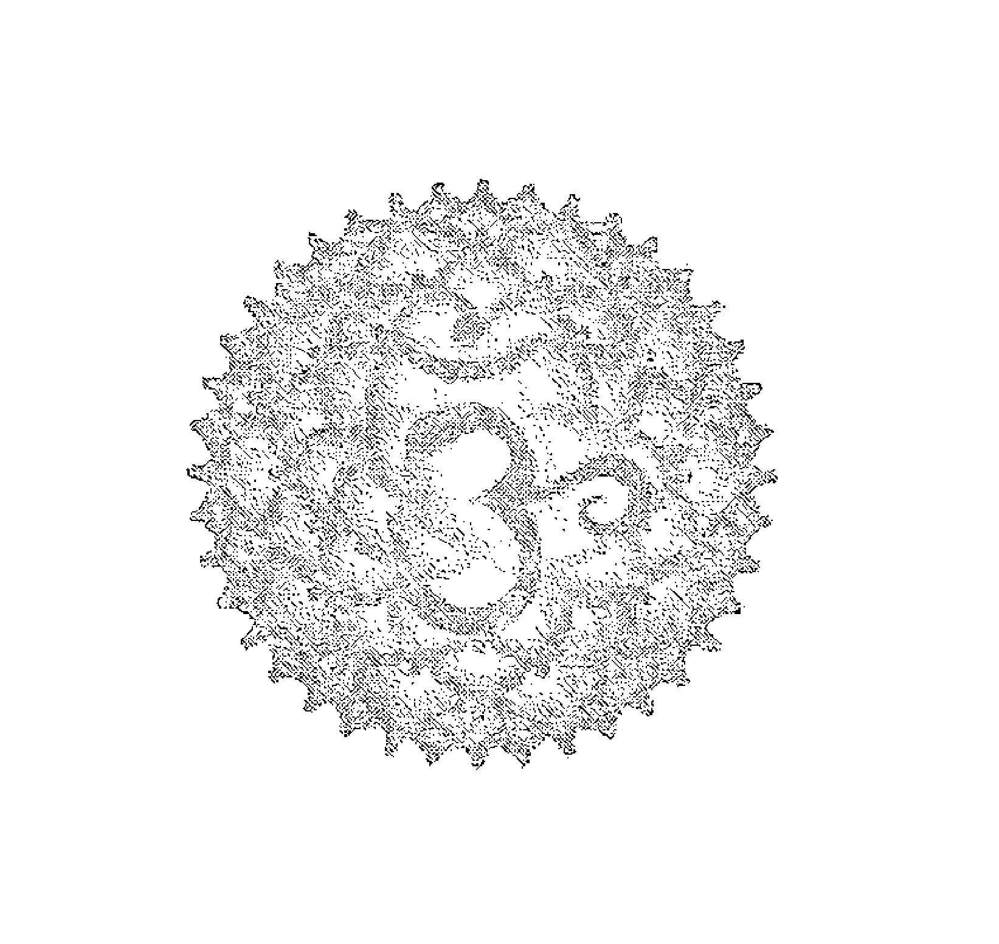

## ☆在日常生活中，你經常會出現下列情況嗎？

- 覺得憂鬱、生活無趣
- 就算睡得很熟，睡醒時仍覺疲倦
- 身染慢性病或是會威脅生命的疾病
- 免疫系統很弱
- 覺得無法再提升自我
- 不相信生命輪迴
- 想體驗寂靜的神祕感和力量

若你有上述狀況，這是因為連結神靈感應的頂輪出了問題。

在本章中，我將會告訴大家：為什麼當頂輪失衡時會覺得沮喪和憂鬱，以及做什麼練習可以鍛鍊頂輪，讓你更能感受到平靜和平衡的生命力。

## ☆為什麼我就是無法平靜？

「人生的意義到底是什麼啊？」小芬自從被男友劈腿而失戀後，就一整個恍神。她從大學就跟這個男友交往，沒想到等他當完兩年兵，才剛上班沒多久，居然就跟女同事眉來眼去，擦槍走火，小芬就倒楣的被犧牲了。她不是不想挽回，但男友去意已絕，還告訴她：之前他一直都在容忍她。

小芬覺得自己好像被打了重重好痛的一巴掌。她知道男友的個性向來很自我，甚至到了自私的程度，小芬因為愛他而總是忍讓，她認命的想，愛情婚姻就是這樣，大家互相體諒，反正只要男友開心，她也就高興了。沒想到所有的忍耐和付出，到最後居然是這種結局，要不是她鼓起勇氣看男友的電子信箱，永遠也不會知道在自己面前橫行霸道的男友，在別的女孩子面前居然會低聲下氣，溫柔的賠不是。那一刻，小芬的心碎了，她不知道要怎麼消化這種震驚，忍不住衝到廁所狂吐，無法接受事實。小芬徹夜未眠，想的都是人生的意義，什麼是愛情？單身好，還是結婚好？自己是否真的不值得愛，或不懂得如何愛人？

最嘔的是幾天後，她忍不住跟男友攤牌，原本還有一絲期待，沒想到男友毫不猶豫的提分手，一點愧疚都沒有。小芬不知道自己到底做錯了什麼，讓對方這麼不把自己當一回事，如此不尊重也不珍惜她！

相信許多人在面臨人生劇變時，對於人生的意義、自我價值與存在感都會有很大的疑問。什麼是人生劇變？親人的離世、愛情的挫折、事業上的挫敗等，讓我們一時之間有種大腦不夠用的感覺，無法消化和面對這些挫折與痛苦。如果能撐過去，就是蛻變；若是沒有，就會讓自己覺得總是呆立痛苦的沙洲中，不知道自己站在哪裡，也不知道該往何處去，無法向前走一步。有些人因此而灰心喪志，有些人則是不可自拔的掉進了灰暗的憂鬱世界。

為什麼憂鬱這麼讓人害怕？因為在那個世界，你會變得麻木無感，除了痛苦和憂傷之外，什麼也感受不到。就像家人一直關心、安慰你，想盡法子來鼓舞## ☆ 如何加強並善待頂輪能量（案例分析）

你看著他們擔心的臉，卻彷彿聽不見他們說的話，只能呆呆的看著他們嘴唇不停的翻動著，家人用盡力氣擁抱你，你卻無法感受到他們的體溫，只感受到一股巨大的壓力。

如果你已經這樣子好一段時日了，那請你一定要好好的看接下來對頂輪的介紹，因為這代表你接受神聖力量——愛的脈輪能量已經停滯了，讓我們來一起認識頂輪和重新感受美好的力量吧！

據統計數字顯示，台灣有六百萬人有嚴重失眠問題，分佈在各個年齡層，已經形成社會問題。另外，世界超級紅星麥可傑克森因為失眠問題、藥物使用過量而死亡，對藥物濫用問題來說這只是冰山一角，很多人因為依賴藥物，身體機能完全錯亂，白天沒有辦法集中精神工作，日夜顛倒，然而幾乎所有藥物都對身體有副作用，即便連安眠藥、鎮定劑對大腦的影響都不能小覷。

我的客戶Amanda在工作表現上一直都非常優秀，從學生時期她就是模範生、學校代表。簡單來說，她的人生沒有缺陷，凡事全力以赴，因為她明白自己不是特別聰明，而是比常人付出更多倍努力，才獲得一些成就，所以她從來不敢掉以輕心。在學生時期，因為一直勤奮努力念書，都比較晚睡，有時為了熬夜趕報告甚至沒睡，出社會的工作是廣告公關，工作時間不定，常常去各國出差，往往才下飛機，時差還沒調過來，就要強撐精神做報告，靠著咖啡因打起精神。最近幾年，她發現自己根本無法成眠，有時會像昏倒一樣一睡兩個小時後，又心悸起床。她每天被頭痛所苦，而且症狀越來越嚴重。

她來找我諮詢時，除了嚴重失眠外，還伴隨焦慮、恐慌和強迫症。她每天晚上睡前要不停的檢查門窗和插座，深怕半夜有火災或壞人進入，只要看到有強暴案的新聞或電影片段，就會大受影響，完全無法入睡，情緒低潮、緊張兮兮，而且對男性員工頤指氣使，搞得同事間的氣氛很糟。她常常覺得很多人在背後議論她、看不起她。心情不好，想要離職，但又苦於每月的房貸壓力，目前工作的薪水相當優渥，也讓她捨不得離開。

Amanda來諮詢時，透露她常常聽到聲音，有時像同事在背後說她是個賤女人，有時則好像聽到神在跟她說話，告訴她有一天一定會非常富有，能買更好的房子且遇到完美的男友。從她異於常人的興奮神情又突然陷入低潮的情形看來，她應該是有躁鬱的問題，加上過瘦的身材和無法對焦的眼神，以及深深的黑眼圈，想必也有失眠的困擾，因為她的頂輪能量真是一片污濁啊！

她常常覺得頭頂很緊，好像包子一樣，總覺得有人在擰自己的頭皮，睡覺前很多亂七八糟的想法都會一湧而現。她很怕夜晚的到來，一想到要睡覺就想哭，更希望能夠一睡不醒，好好的休息。我給她的建議是，設法讓自己心情平靜，如果真的要吃藥，那就安心吃，不要邊吃邊痛苦；睡覺前一個小時，把家裡的燈都關掉，點上一支蠟燭，讓自己慢慢放鬆，不要看電視、講電話，讓自己白天所散發的活力、耗費的體能慢慢蓄積回來；讓自己不是又急又怒又累的爬上床，而是心平氣和的準備休息。

她照著我建議的方式去改善自己的情況，我當然也提醒她一定要持續看醫生，現在她比較能夠控制自己，而且藥物使用量也慢慢減少。

## 頂輪 (Sahasrara)

- ◎象徵符號：紫色的千瓣蓮花
- ◎元素：空
- ◎色彩：紫色
- ◎位置：頭頂（天靈或稱百會的位置）、腦冠、松果體
- ◎特質：腦部、皮膚、神經中樞、荷爾蒙平衡
- ◎能量意義：慈悲、智慧、開悟與虛相、進化、淨化自我

在七大脈輪中，能量最神聖的莫過於頂輪，因為這個脈輪不是對應人身上任何特別的位置，而是與大地、神靈溝通的管道。頂輪能量開啟時，常常會讓人有種醍醐灌頂或是充滿愛能量的幸福感，所以我們常常期待達到無我和與宇宙合一的靈性覺知，就是頂輪能量運轉時所帶來的強大感應。

頂輪的位置在人體的頭頂之上，你可以想像有一個能量絲帶，上面連著一朵好像千瓣蓮花的頂輪，這是七大脈輪中能量振動頻率最高的脈輪，代表的顏色是紫色，對應的寶石是紫水晶或海水藍寶。頂輪表現出的是人類對真理和靈性的追求，也是對哲學的追尋，所以對應的是偏向心靈層面的渴求，主要的作用是讓心靈更充實、豐盛和幸福。

若是你的頂輪能量缺乏，很容易出現疏離感的問題，現代人有很多精神上的不安全感皆來自於此。尤其一個嚴重失眠的人，睡前滿腦子可能都是紛亂的資訊：白天同事和老闆充滿壓力的嘴臉、晚上家人嘮叨的話題，或者是孩子作業沒做完、另一半的工作和情緒壓力：：

有些人因為頂輪失衡，先是沒有安全感、焦慮，然後慢慢麻木，接下來憂鬱、長期無法成眠，很多人因此而產生妄想、強迫症或其他或輕或重的精神官能症。那該怎麼辦呢？我們將在下一節為大家解釋。

## ☆ 頂輪的療癒和對抗疾病

前文介紹了什麼是頂輪，以及頂輪失衡時會出現的問題，而指出問題並不難，棘手的往往是該如何解決和讓它正常運作。頂輪不在我們的身體器官上，而且頂輪失衡時的症狀往往不是什麼腹痛或心臟不舒服，而是無法感受到愛，常常感覺孤獨和疏離，這是個很難界定的症狀，因為現在人往往比較在乎賺錢和追尋成就。

我們雖然都希望相信愛的力量，但在社會文化的影響下，很多人覺得常把愛掛在嘴邊是種弱者的表現，尤其是東方社會的成年男子，除了要滿足父母的期待，更要表現出強者那種「男兒有淚不輕彈」的氣勢，情緒都要硬吞下去，不能表現出一絲柔情，這其實會增加壓力，進而產生另一個惱人的問題——頭痛。我們常說，頭痛就是用腦過度，是一種大腦發出的抗議吶喊。一個人內在的想法太多，或是想面面俱到，就容易出現這種過分壓抑而造成的疼痛，來提醒我們情緒壓力已達極限了。

有些人必須不停的靠抽菸來消除壓力，其實他們要的不是抽菸，而是以吐菸的動作來取代嘆息。但抽菸在許多行銷手法下，變得不再是健康與否的問題，而是創造了另一種形象，一種扭曲的硬漢代表：男人緊皺著眉頭，面對荒漠，看著遠方，叼著菸，緊閉嘴角。

這種強者、硬漢的形象超越性別與年齡，影響了不少人，造成現今社會人類的文明病，如高血壓、心臟病、肺癌等，我們變得越來越寂寞，與外界越來越疏離。

頂輪能量是追尋與宇宙的連結。若是頂輪能量較弱時，容易覺得了無生趣，覺得今生沒有任何快樂、也沒有使命，好像生命毫無意義，一切的事物都是痛苦的巧合。此時，很多人都會告訴你，只要轉個念頭「看開點」，一切都會更好。

## 第八章 你，可以感受到宇宙之愛

但仔細想想，難道我們不知道要凡事看光明面嗎？但為何人還是深受這種消極和憂鬱困擾呢？因為當一個人生病了，你不能再給他那種「多運動就會身體健康」的標準答案，我們得先找出病因和病毒，然後對症下藥，但我相信，先休息（也就是找回內心的平靜感），絕對是療癒的第一步。

感受愛和相信愛並不是弱者的表現，相信這個世界有科學無法解釋的事，或相信有神靈看顧著我們，並不是迷信。

該如何讓我們成為宇宙的一部份，重新感受愛與被愛呢？藉由以下的方式，我們將再重新找尋認知與心靈的平衡。

- 每天靜坐冥想二十分鐘。
- 點蠟燭或線香淨化磁場。
- 定時睡覺，養成早睡早起的習慣。

## 第九章 自觉觉他的九色鹿儿

什麼是亢達里尼 (Kundalini)？它最早的意涵是一位印度女神的名字，而這股能量又稱為巨蛇威力。簡單來說，亢達里尼就是當七大脈輪皆開通時，就會有一股強大的力量，貫穿身、心、靈，而且也能輕易感染他人。這股正向光明的力量，就是脈輪能量的最完美表現——亢達里尼。

## ☆ 亢達里尼，自在圓滿的強大能量

人體有許多能量，但往往無法調和，那是因為內心有太多痛苦和不安，使得能量無法順暢運行。若我們能夠拋下執念和矛盾，就能讓自己的心靈自由，不受控制和約束。亢達里尼能量就是由頭至腳、由內向外，所有的能量自然釋放，自然地與這世界融為一體，不再孤獨、寂寞、恐懼或不安。這個世界是我們的家園，即使他決定有一天要搬家了，我們還是隨著他去另一個地方，那是自然安心的。很多人都在害怕二〇一二世界末日，或是其他預言者說的世界毀滅，但我個人覺得完全不用擔心。我們都是組成這個世界的一分子，雖然我們有這肉身、有這棟房子、有輛車子，但那都是一時的。當世界決定要走下一步，由不得你說要去或不要去，但即使到了下一站，也不見得不好啊！我們是屬於世界的，若有變動，也是整體的變動，不是要你隨波逐流，而是順勢而為。亢達里尼的能量，講究的就是釋放和順流！

亢達里尼是一股超越身心靈的力量，可以讓人心情愉悅，而且充滿能量。我因為工作的關係，常要為人分析、解惑，有時還要協助個案讓他們的身心能量更清醒、乾淨，所以我個人的身體能量也非常重要。而當亢達里尼能量流暢的經過身體時，一切都會到達一種平衡，也就是你的身體會循序漸進的調回正常機能，不再因為壓力而失衡，現代人常見的頭疼、莫名的肩頸痠痛、眼壓過高、情緒頹喪等狀況也都能得到改善。所以，一旦我覺得身體失衡時，就會進行亢達里尼的冥想或靜坐，讓自己的身體細胞和靈魂都能快速充電。

亢達里尼和七大脈輪最不同的就是，它不是針對某一症狀，即使你無法擁有亢達里尼的能量，也不會有什麼明顯不適，頂多就是容易疲倦。而它的美好之處就是，一旦你感受過亢達里尼，一定會深深地愛上。我個人是覺得彷若全身通電，心情昂揚，而且頭腦清楚，這對現代忙碌的都市人是非常難得的。

## 第九章 自我覺知的亢達里尼

現代人的角色多元，每天都在不同的舞台上盡力表現自己，迎合別人，我們是家人心中孝順的子女、同事心中踏實的夥伴、老闆心中可靠的員工、情人或浪漫的愛人、兒女心中穩當的靠山，而大家對我們的需求往往互相衝突，情人或許希望我們能多花點時間陪伴，但老闆希望你能多花些時間在工作上，每一個選擇幾乎都是衝突矛盾的，顧得了這個忙不到那個，吃了美食就顧不了健康，忙於工作就會疏忽家庭，每天都讓我們覺得好像被撕裂一般。我們常常被壓得喘不過氣來，而長期的失衡也讓我們非常容易生病。

亢達里尼就是一股不矛盾、不衝突的能量，彷彿是無數個當下所組成的能量之流。許多人都說，在壓力大、心情不平靜時無法靜心，但亢達里尼卻恰恰相反，很多時候，我們也可以藉由身體的韻律，讓內在的負面能量釋放，這就是為什麼我經常會建議大家先做一些激烈的運動，直到自己的內心沒有任何負面思想，再來做亢達里尼。

亢達里尼是所謂『天人合一』，簡單的說，就是頭腦和身體合而為一，你的思考不會有一丁點矛盾，你不是身體、也不是心靈，你超脫於一切，屬於萬物之一，又超脫於萬物。

## ☆ 如何加強亢達里尼的力量

現代人的中心不再是肚子，而是頭腦，所以習慣分析、思考，而不是由衷感動。許多人無法真心的開懷大笑、真心的感動；許多事情都是分析而來的成果。因此，我們要學會釋放自己，讓身心靈皆能真實的受到感動，與萬物相互呼應。

亢達里尼是一種內在流動的能量，你可以用很多形容詞來形容，只要你不介意，它就是一種讓你感受到流暢、無憂、自在、圓滿的一種超越現在時空和痛苦的強大能量。
歡，它可以是氣，也可以是人雷。但請記得，它就是一種讓你感受到流暢、無憂、自在、圓滿的一種超越現在時空和痛苦的強大能量。

許多人認爲感受大自然是個愚蠢的想法，但當你看到一陣微風吹來，整片草原像波浪般舞蹈，難道你不會有種直覺：這片草原正在快樂的接受風的吹拂嗎？或者，當你走在山間小路時，突然有一道陽光，從樹葉縫隙中射進地面，正巧照在一朵花上，你可以仔細的觀看和感受，你會發現，那朵花正爲了難得的日光浴而歡欣昂揚。你可能也會深受這股能量的啓發和鼓舞，心情跟著輕鬆起來。

亢達里尼不是硬要做什麼運動，相反的，它就是要是你什麼事都不做，你可以靜靜的站著，感受你身上每一時肌膚和每個器官的呼吸和律動。如果你覺得自己的胃充滿氣體，就讓你的肌肉放鬆，讓氣體慢慢釋放出來；如果你覺得肌肉痠痛，那你就輕輕的放鬆每一吋肌肉。有時，你會覺得身體開始慢慢晃動，而這種晃動，我們稱之爲一種釋放，你身體有些痠痛、緊張或不平衡的地方，它們就會開始藉由這種搖晃或抖動，慢慢釋放出來。

而你只要靜靜的、慢慢的、仔細的感受你的呼吸、心跳和內臟蠕動，你會發現，真正的平靜，並不是尋求外在的什麼，而是真正的能與你的內在共存、共舞，尋求你內在的宇宙！

會有一種壓力，好像頂輪位置出現了一個漩渦，然後脊椎發熱發麻，一股力量從腳跟一直往上衝，會有一種不由自主的感動和放大。這時有些人會覺得站不住，如果你此時會頭暈，可以選擇坐下或躺下，怎樣讓你最有安全，就選擇那樣。但躺下的人要特別注意別睡著，因為如果你睡著了，可能會忘記許多感受，也許你的以太體出遊看到了很多很美好的事物，但大腦卻已經睡得很沉，所以一覺醒來什麼也不記得，那豈不是太可惜了嗎？

所有的脈輪能量該如何練習和運作，我們會在隨書的DVD中一一教學。你可以先看個兩三回，之後閉上眼只聽聲音帶領，進入冥想，等到一切都很熟練時，就可以每天早起花個十分鐘，藉由脈輪靜心來讓自己清醒，充滿電力。相信我，當你做得越多，你的能量也會顯得越來越強，要達到身心靈平衡、情緒平靜，都會更易如反掌。

## 第十章 顺命而为量开启智修炼

## 第十章 脈輪能量開啟練習

在這章裡，要帶著大家來開啟七大脈輪和亢達里尼能量，告訴你如何運用身體的肌肉和冥想的內容，同時也把各脈輪做了重點整理，讓大家可以在最快的時間內進入與宇宙合一的狀態。

建議每天練習一次，一週至少有一次是在大自然或公園練習。早上是一天中最好的練習時間，每天起床時，可以先花個十五分鐘至半小時讓自己藉由脈輪的啟動來喚醒身心靈，這會讓你有腦筋清楚、心情愉悅，而且能量滿滿的一天哦！

至於每次練習是不是都要藉由聖音（我在DVD中會帶領）開啟呢？有些人覺得要大聲共鳴會有點不好意思。如果你已經練習超過十次，而且每次都感受到能量升起，就可以不用一直藉著發聲來練習了。但如果在大自然的環境中，又不會打擾到別人的情況下，我還是喜歡發聲練習，把全身的細胞和器官都藉由共鳴的音波來喚醒，並且順從身體自然而然發的律動，讓自己真正與這片大地合而為一，感覺會非常美好，壓力一下子就解除了。

現在，請換上寬鬆的衣服，擦上讓心情放鬆舒緩的精油，跟我們一起進入健康快樂的脈輪能量練習吧！

## 海底轮能量练习

### 开圣音：EE（注音：ㄝ）

肌肉状态：发音时，尽量低音，感觉振动到自己海底轮的位置。将会阴部夹紧，大腿内侧肌肉收紧，以盘坐之姿最容易感受到能量，若是容易腿麻或筋骨较硬者，可以改为立姿，让脚趾收紧，大腿肌肉用力，好像从脚掌吸收能量，汇集至会阴位置，慢慢送往脊椎尾端。

### 冥想状态：

想象自己在一片美丽的大草原中，绿草如茵，背后有一棵大树，地面有许多能量缓缓升起，海底轮的位置随着肌肉的用力，开始吸取这力量，慢慢想像自己变成了一棵树，脚底好像长出了许多树根，然后吸收养分，脊椎也感受到一道火焰慢慢上升了。

- 象徵符號：紅色的四瓣蓮花
- 元素：土
- 色彩：紅色
- 位置：會陰部，可以延伸至雙腳腳底
- 特質：脊椎底部、直腸、免疫系統
- 能量意義：人類生存的本能能量與求生意志，慾望和獨處時的安全感

## 臍輪能量練習

### 開啟聖音

發音時，盡量低音，感覺振動到自己臍輪的位置。持續將會陰部夾緊，著重在對應位置，女性可以想像在子宮的位置，使用腹式呼吸來增加注意力。

### 肌肉狀態

### 冥想狀態

想像自己在湖水中自在的悠游著，全身都受到水的包圍，但並不恐懼，比較像是小嬰兒躺在媽媽充滿羊水的子宮之中。然後再感受四周好像有水流一般，有一種想要輕輕搖晃的感覺，不用壓抑，讓自己隨著能量流像水草般輕輕搖擺，你會感受到自己的身體變得輕盈的放鬆感。

### 象徵符號

橙色的六瓣蓮花

## 第十章 脈輪能量開啟練習

| 屬性 | 描述 |
|------|------|
| 元素 | 水 |
| 色彩 | 橙色 |
| 位置 | 肚臍下約三指頭寬處（約丹田位置） |
| 特質 | 對應腎臟、腸、胰臟、腎上腺 |
| 能量意義 | 性能量、創造力、勇敢、信任、奉獻 |

## ☆ 太陽神經叢能量練習

開啟聖音：O（注音：ㄡ）

肌肉狀態：這個脈輪是一股爆炸的力量，在發音時要用力吼出，集結腹肌的力量，這樣才會有效果，體溫會開始增升。

冥想狀態：從太陽神經叢開始有火苗出現，然後肩膀直至雙掌，全都是熊熊的烈火，背後也好像有一團火開始燃燒。

象徵符號：黃色的十瓣蓮花

元素：火

色彩：黃色

位置：約在腹腔胃部的前面，腹部的中央位置

特質：對應胃、腹部、脾臟、肝臟、脊椎# 第十章 脈輪能量開啟練習

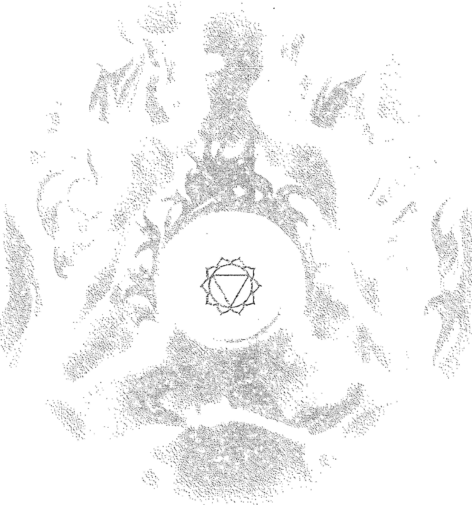

- 勇氣
- 力量
- 理智與限制
- 規範
- 社會化

## 心輪能量練習

開啟聖音：OM（注音：ㄨㄥ）

肌肉狀態：發這個音時，先讓胸口振動，再讓頭部共鳴，放鬆肩膀，讓能量沿著脊椎向上延展，想像肩胛骨生出翅膀，把所有的負面壓力排除，藉由搧動翅膀的動作，讓自己胸口的壓力釋放出來。

冥想狀態：想像自己在飛翔，在天空看到美麗的白雲，微風吹拂大地，自己也好像感受到風的吹拂，胸口的壓力慢慢散去，肋骨放鬆，全身都舒展開來。

象徵符號：綠色的十二瓣蓮花

元素：風

色彩：綠色

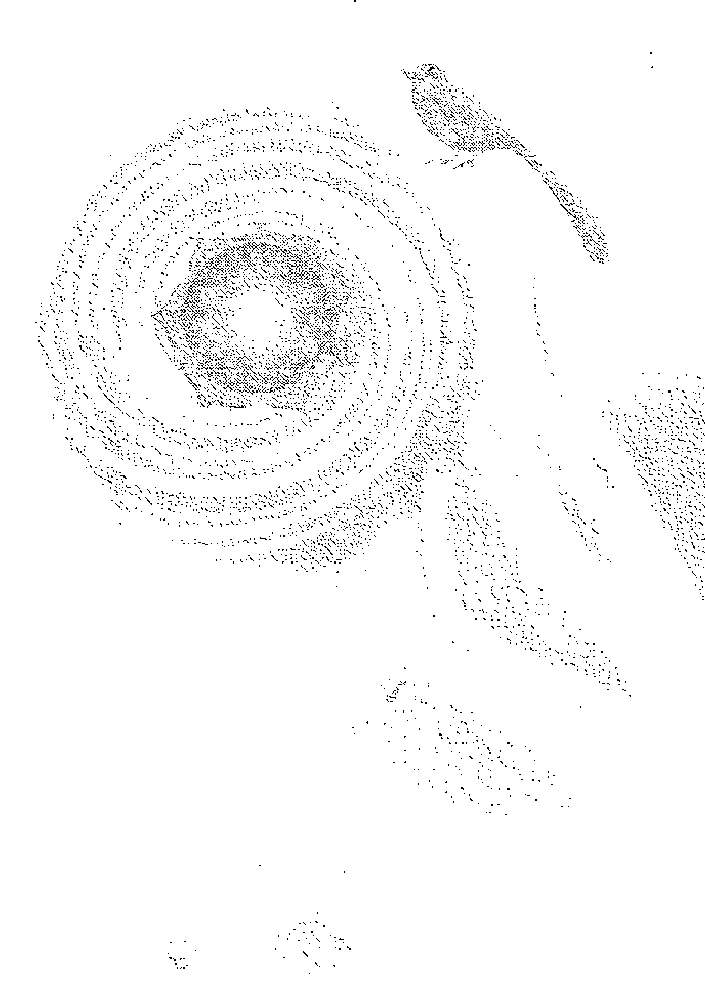

- 位置：胸口中央，胸腺的位置，兩乳之間，延伸至雙掌
- 特質：對應呼吸循環系統、胸腺、心臟、肺臟、免疫系統調節
- 能量意義：愛與憎恨、希望、傳遞、同理、美感、感動、分享

## 喉輪能量練習

開啟聖音：KAY （注音：ㄎㄞ）放鬆喉部，用自己喉嚨最舒服的音階吟唱，試著也放鬆頸部和下巴，以及後頸椎的肌肉，在吟唱聖音時，把下巴微微上抬，讓喉嚨的發聲更舒暢。

冥想狀態：想像自己在一個黑暗的山洞裡面，有微涼的濕氣，當你在吟唱時，喉輪會發出藍色的亮光，照亮整個山洞，整個空間都在共鳴，而你的腦壓也會慢慢減緩。

象徵符號：天藍色的十六瓣蓮花

元素：光

色彩：藍色

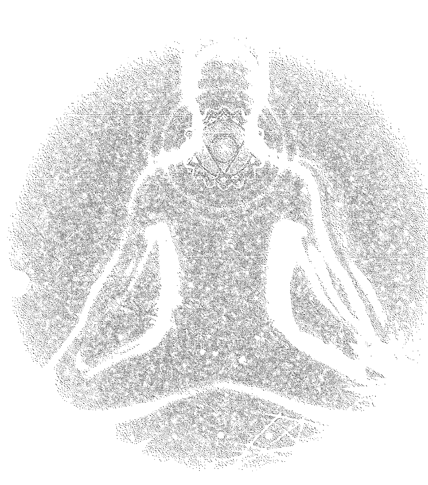

- **位置**：頸部中下段（約在男性喉結偏下處）
- **特質**：喉嚨、口、食道、甲狀腺、神經中樞
- **能量意義**：調整、表達溝通、大同、智慧與沉迷、語文、理想

## 🌟眉心輪能量練習

開啟聖音：TOE（注音：ㄊㄡ一）

肌肉狀態：放鬆額頭、眉毛以及太陽穴的肌肉，讓眼睛放鬆，不要去看任何東西，而是讓自己進入大腦的世界裡，有如佛教的「眼觀鼻，鼻觀心」的境界。

冥想狀態：感覺自己進入一個隧道，往內走，越走越暗，但你不覺得害怕，反而覺得很自在，越走越進去。然後，看到一隻眼睛充滿智慧和友善的看著你，仔細的望向那瞳孔，它會反射一些景象讓你看，請心平氣和的觀看這一切景象。

象徵符號：靛色的一瓣蓮花

元素：靈光

色彩：靛色

位置：雙眉中心，約印堂稍下位置

特質：臉部、眼睛、松果體、腦垂體

能量意義：覺醒、清明、無惑、超越與執著、覺察

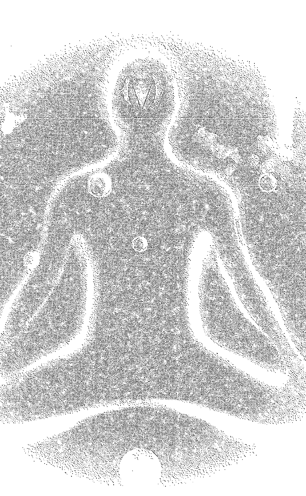

## 頂輪能量練習

開啓聖音：MAY （注音：ㄇㄞ〔高音〕）

肌肉狀態：將注意力放在頭頂，然後讓身體能量從海底輪順著脊椎到達頂輪。

冥想狀態：想像自己的頭頂有一朵千瓣蓮花在盛開，感覺自己彷彿置身宇宙之中，體驗無重力的感受，四周有祥和的神靈在看顧著你，全身好像被電流通過，充滿能量，心情也很放鬆，進入無我的感覺。

象徵符號：紫色的千瓣蓮花

元素：空

色彩：紫色

位置：頭頂（天靈或稱百會的位置），腦冠和松果體

特質：腦部、皮膚、神經中樞、荷爾蒙平衡

能量意義：慈悲、智慧、開悟與虛相、進化、淨化自我

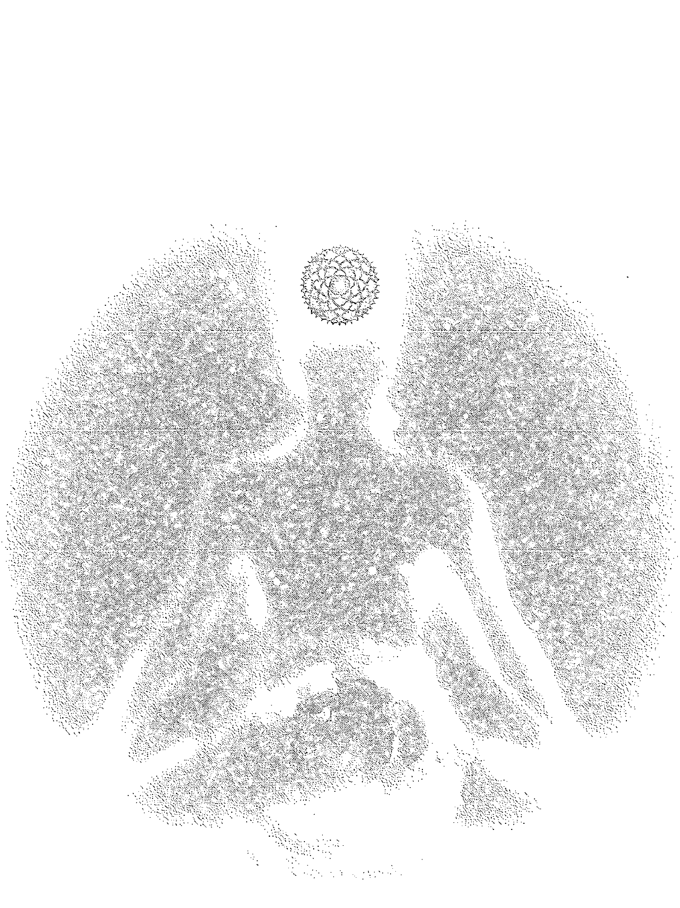

## MBA女巫帶你開通能量

### ☆ 昆達里尼能量練習

開啟方式：
1. 閉上眼睛，深度呼吸三次，緩慢的吸吐。
2. 慢慢感受頂輪的旋轉，約五十元硬幣，再深度呼吸三次。
3. 會覺得內在耳壓增加，頭頂會感受到壓力，像有人用指頭溫柔的觸碰你的頭頂。
4. 頭頂感受到振動，電流開啟。
5. 讓電流往下走，先到眉心輪旋轉，喉輪、心輪、太陽神經叢、臍輪、海底輪，每個輪各轉五十圈，順時針。
6. 全身開始發熱，從腳底也開始有外力能量進入。
7. 力量從腳底到達脊椎底部，雙手張開，手掌和指尖會有麻痛感。
8. 將能量聚集，再從海底輪由底向上走到頂輪。
9. 能量的遊走必須緩慢平和，千萬不要緊張或急躁。

象徵符號：巨蛇
色彩：七彩

> YOYOGI 2010/11/17 3.45 PM

以上的文字說明，請大家以此為基礎，但還是可以有許多的延伸，不要侷限自己的想像力。而本書隨附了脈輪能量動畫DVD，是我們「心靈角落」的優秀團隊所設計的，音樂則是風潮音樂所提供。請大家一定要好好珍惜，勤加練習哦！

### ★自我檢視七大脈輪是否停滯或過度活躍。

## ## 1 海底輪

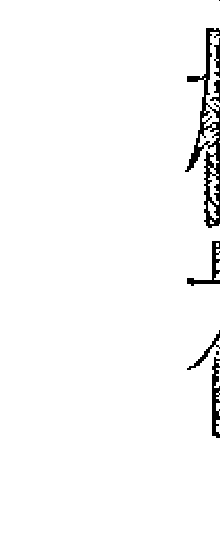

脈輪停滯：容易覺得恐懼或緊張，不易融入環境，感覺自己不受歡迎。

過度活躍：有很強烈的物欲和貪婪，成為習慣的奴隸，只追求安定，拒絕改變，固執己見。

## ## 2 臍輪

脈輪停滯：長期感覺冷漠、對他人的事情不感興趣，缺乏情感或是常面無表情。

過度活躍：過度情緒化，會把愛情建立在性的滿足之上。

## 3 太陽神經叢

脈輪停滯：表現被動和難以做出抉擇，做事唯唯諾諾，沒有勇氣追尋夢想。

過度活躍：出現強烈的控制欲和侵略性，無法平靜。

## 4 心輪

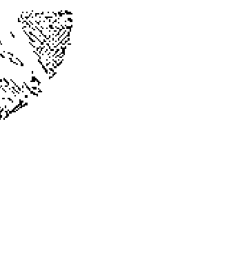

脈輪停滯：冷漠、自私，與別人保持距離。

過度活躍：過分的溺愛會令人窒息，不給別人空間，會想掌握對方的心思，而這種愛的出發點往往是為了滿足私慾。

## 5 喉輪

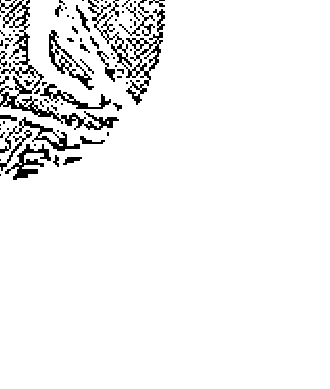

脈輪停滯：不喜歡溝通，缺乏表達想法的自信，或者為了滿足他人的想法而說出違心之論。

過度活躍：多話卻沒有重點，讓人覺得聒噪。談話時喜歡掌控話題，或者讓所有人的焦點都落在自己的身上。

## 6 眉心輪

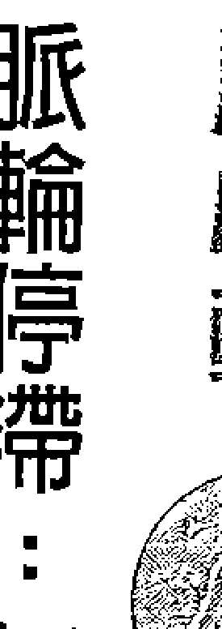

脈輪停滯：傾向依賴權威而非獨立思考，習慣依賴信念而非理性邏輯。常喜歡別人提供答案，而非自己仔細思考。

過度活躍：產生幻覺或幻想，覺得自己與眾不同，強迫別人認同你。

## 7 頂輪

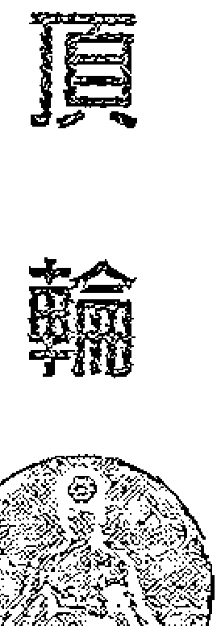

脈輪停滯：你的思考相當受限，不願意接受新的事物，對於靈性世界會有所期待，但無法真正的共鳴。

過度活躍：過度期望靈性世界，或對一件事過度鑽牛角尖，空有許多想法卻苦無執行力。

# # 第一部分

## ## 幸福小魔咒

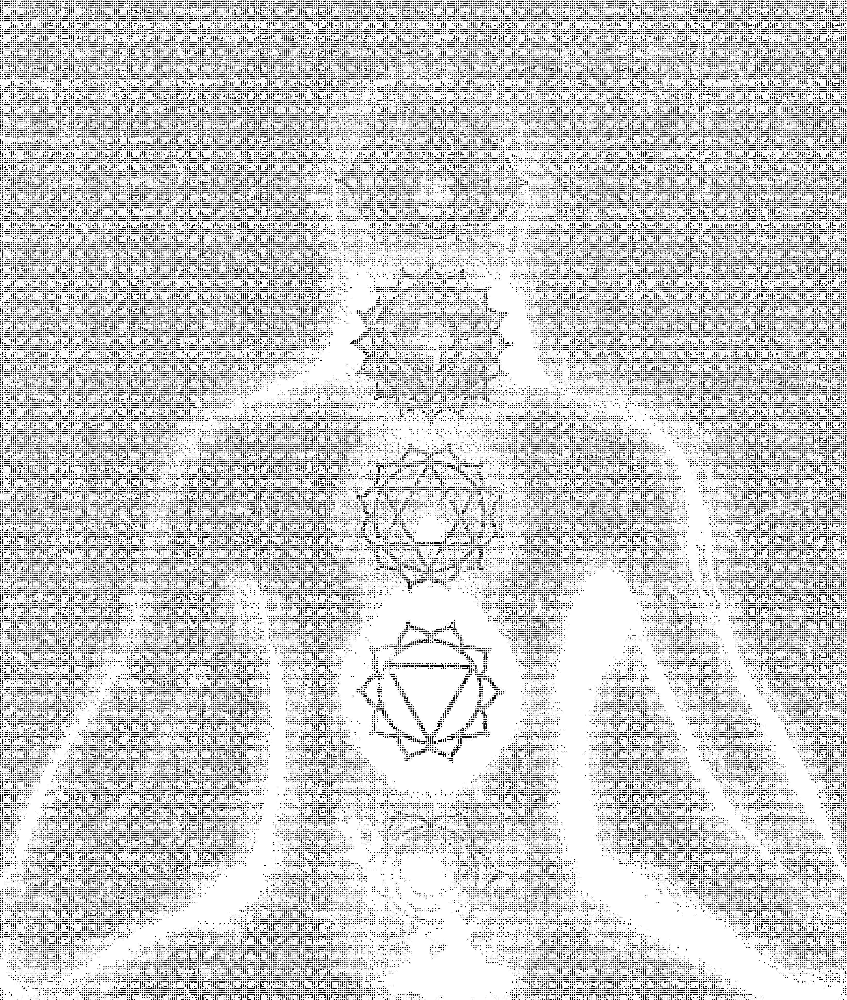

## 健康祈福小魔法

當遇到自己最關心的家人或朋友生病，想幫忙卻也不知該從何幫起時，透過大地能量之成長魔法，誠心注入祈福意念，就可以見識到所謂心誠則靈的力量！

其實，脈輪能量除了能讓你的身體健康之外，還能做一些小魔法呢！在這裏，我要教各位一些運用脈輪能量和元素的小魔法，大家可以自己試看看哦！這些都是安全的白魔法，不用擔心，如果你的脈輪能量不夠，頂多就是魔法無效，不會招來什麼厄運的。但我還是強烈建議，最好已經練習脈輪能量一個月以上了再來嘗試，魔法效果會更明顯！

準備物品：小盆栽、紅玉髓

### 魔法步驟：

準備一棵植物，最好是多葉的小盆栽，在盆栽底部放入一顆紅玉髓寶石，並壓住一張紙，在紙上寫著想要祝福的人的姓名和西元出生年月日。此時，配合脈輪的開啟，專注的啟動海底輪能量，與眼前的泥土產生連結。接下來在鋪放每一匙泥土時，都誠心祈求讓被祝福的病人能身體健康，打敗病魔。然後再把這株植物放在病人附近，每天用心照顧盆栽，讓植物能夠長得更好。隨著植物的健康成長，病人的元氣也會大大好轉。

### 魔法小常識：

- 大地是宇宙萬物的基本元素，是生命的起點也是死亡的終點。大地之母的力量源源不絕，充滿各種生機。由於宇宙間所有能量都互為連結，把祈福的願力引至新生植物中的成長魔法，同樣也是將大地生生不息的能量與病人的能量做連結，經過大地間萬物的平衡力量，重新提振病人的元氣。
- 人類身體原有的能量，就像天空有雷電一般，存在於宇宙當中。有些人天生能量很強；也有些人透過後天的練習來增進，如練靈氣、太極或氣功等。此魔法的運用其實就是用大地的力量來刺激人體的脈輪能量，目的是讓身體更健康、抵抗力更好、覺知更敏銳。某些特別的植物或水晶可以誘使能量更強大，通常也可使用精油來促進能量場，讓能量的流動更為活躍。女巫使用這些能量開啟水晶，讓水晶更能協助啟動魔法世界的一些開關，因為能量世界非常貼近我們的生活，所以魔法儀式專門處理人的情緒和能量，協助脫離苦痛。

# # 魅力小魔法

不論男女老少，常保美麗的容顏是大家樂於追求的，尤其每天處於忙碌生活的男男女女，一不小心晚睡或者工作壓力來臨無法招架時，如何搶救好氣色？那就是透過簡單的水元素之美麗魔法，讓自己重新找回美麗的能量。

準備物品：
- 玻璃杯
- 白水晶
- 茉莉精油
- 水晶棒

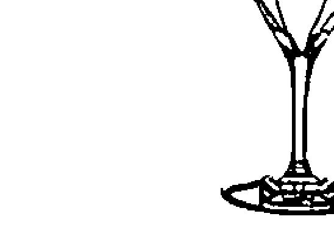

## ## 魔法步驟

首先準備一個漂亮的玻璃杯及一顆白水晶，在月圓的夜晚把水倒入杯子，將裝滿水及白水晶的杯子放置在照得到月光的窗邊，讓白水晶持續吸收一個小時的月光能量。然後在晚上十二點用水晶棒順時針攪拌玻璃杯十三下，再滴下三滴茉莉精油。此時，專注打開你的臍輪能量，配合脈輪的開啓感受到周遭水能量環繞時，輕輕對著水杯內的水吹一口氣，用專注且平穩的口氣說：「月神魯娜（Luna），請賜給我召來真愛的美貌，請守護您的女兒得到異性的青睞。」然後將此水往臉上潑灑並輕柔拍打，第二天你會發現皮膚變得既光滑又亮麗哦！

### 魔法小常識：

- 白水晶是石英家族中產量最豐富且用途最廣的寶石，因爲用途沒有任何限制，可以運用在任何魔法儀式中。在此儀式中被用於召喚水元素，再加上茉莉精油及月神的能量，效果加倍呢！
- 月神魯娜（Luna），希臘又稱爲Artemis，在羅馬有Diana月神之稱。常以少女姿態出現，擁有一雙綠色大眼，喜歡徜徉於大自然中，與鳥獸爲伍，她爲求助的人帶來保護，是位仁慈的女神。

# # 驅邪小魔法

大地中充滿各式各樣的空間及能量體，當這些無形的力量干擾自身磁場時，會像感冒一樣莫名的頭昏腦脹，全身無力及精神無法集中。簡單的火元素之驅邪魔法，透過脈輪能量的開啟能將負面能量驅離，不只可以幫助自己，也可協助親愛的家人、朋友哦！

準備物品：
- 黃色蠟燭
- 杜松精油
- 火柴
- 迷迭香精油

準備一支黃色或橘色的蠟燭，以及沾滿杜松精油的火柴，再將火柴點燃蠟燭，深吸一口氣，讓心情保持平靜，專心注視著燭火，同時用迷迭香精油在雙手手腕畫上兩個五芒星☆☆（建立結界），而太陽神經叢的位置（靠近胃部）則用杜松精油畫上五芒星（建立結界），五芒星的畫法以正五芒星爲主。此時開啟太陽神經叢的能量，配合脈輪的開啟，一直到感覺身上及雙手的火焰能量燃起後，充滿力量的唸出：「邪惡的負面能量，請你們遠離我，以及我愛的人們，回到你們的黑暗世界，不要再帶來不幸與苦痛！」儀式完成後，記得將蠟燭吹熄再離開。

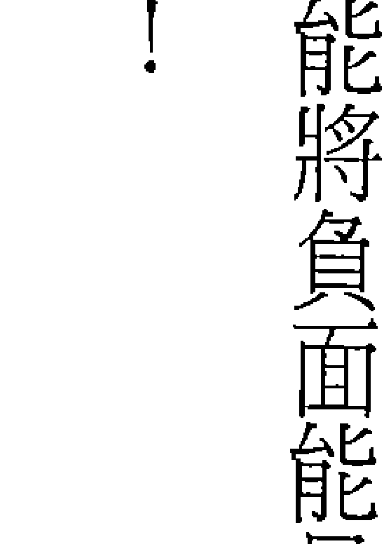

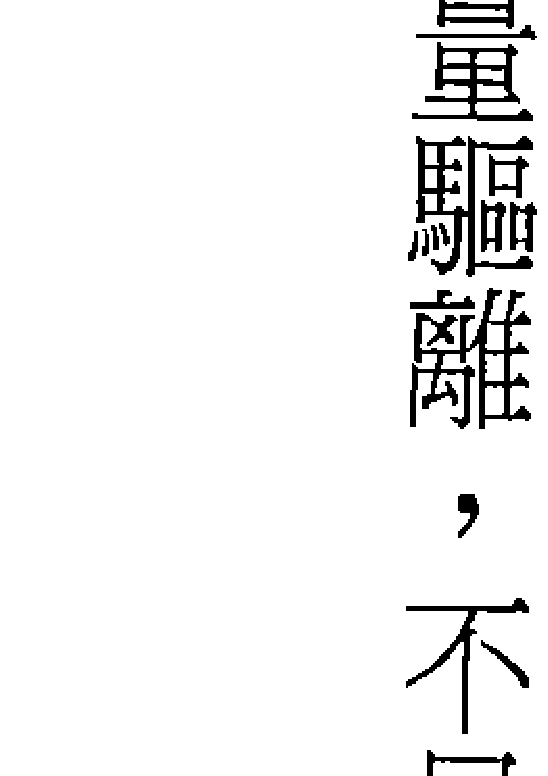

### 魔法小常識：

- 五芒星的五個頂點分別代表不同元素，分別是土、水、火、風及象徵人類精神力量的第五元素，在魔法中五芒星也是最常被使用的符號。五芒星也代表人的身體，最頂點爲頭部，其餘爲四肢。在《聖經》中，人是被創造者，而五芒星也含有被創造之意，這就和四元素及人體相對應。
- 在神祕學中，尖角向上的五芒星代表著「生命」和「健康」，被用爲祈求幸福的魔法符號，也被做為守護符和治療傷病的符號。古代巴比倫人甚至將五芒星繪製在食物容器上，認為這樣就可以保鮮；而巴比倫的七個印章中，第一個神聖的紋章就是五芒星。猶太教的經典中提到，這些印章代表了神的秘密的名字，五芒星就是其中最重要的一個，所以中世紀術士杜撰的《所羅門王的魔法戒指》上也刻有五芒星。也因為如此，五芒星也被誤傳為「所羅門的印章」。

### *何謂「結界」

簡單說，它是魔法創造出來的「世界的縫隙」。在世界縫隙中所發生的事情，與現實世界無關，巫師、魔法師或咒術師在「世界的縫隙」中，只要使用得當，我們擁有的力量是相當強大的；而一般非巫師的人，如果心靈能夠純淨，在結界中會有集中自己意志、讓神靈聽到你呼喚和祈求的能力，進而達成自己的祈願。

## 情結療癒小魔法

身體是會記憶的，在日常生活中有許多負面情緒或想法的壓抑，造成身體莫名的沉重負擔，等身體對你發出警訊時，往往都不是小毛病了。這個風元素的療癒魔法，透過心輪能量的運轉，可以讓你開啟與身體的連結，聆聽身體對你說的話，進而學會做自我的抒發、療癒以及愛自己！

準備物品：精油線香

### 魔法步驟：

- 準備一些線香，最好是檀香或精油線香，不論何種線香，建議選擇不刺激鼻的味道。
- 首先請調整好自身的情緒，做幾次深度吸氣及吐氣，吸氣時感覺胸口中心往外擴張，吐氣時把嘴巴張開，並且吸氣吐氣間隔盡量慢且長，不疾不徐的淨空腦袋及放鬆胸口。
- 接下來將心輪能量開啟，把心輪的能量透過雙臂灌注至掌心，請想像從指尖發出綠色的光柱，而掌心有溫和的能量漩渦，雙手再慢慢輕撫身體不舒服的地方。
- 在療癒自己的同時，可以試著打開身體的感官，感受能量在身體各部位的流動，療癒動作持續到不舒服的部位有所改善為止。
- 結束療癒後，可以試著用清水沖洗雙手，藉由水能量淨化及中和療癒時殘留在身體的負面能量。

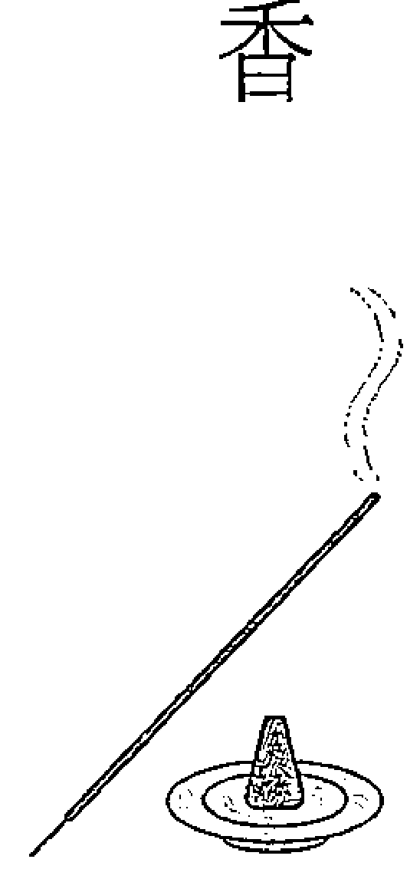

### 魔法小常識

- 線香能淨化空間及保護人的身體不受負面能量影響。在一開始進行療癒時，不管對象是自己，還是別人，點燃線香可以初步達到第一層的淨化功用，協助接下來療癒的進行。
- 療癒是很耗費體力的過程，自身能量的完整及穩定是很重要的。儀式前用呼吸做調整，是為了保持自身情緒的穩定度以及能量的流暢度。

## 第十一章 幸福小魔法

## 溝通小魔法

七大脈輪的基本原理是藉著大地源源不絕的能量與身體做連結，將負面能量從身體釋放出來，回歸大地平衡。

- 訓練開發身體感官的敏感度，在療癒自己及別人時，是很重要的一項能力。透過五種心靈感官：超視覺力、超聽覺力、超感應力、超嗅覺力、超味覺力，交織運用之下，感受被療癒者的病痛變化，才能對症下藥。

此儀式是專門針對在職場中的溝通障礙，藉由順勢魔法（也就是光元素的溝通魔法），將對方的成見放下，重新建立起順暢的溝通管道。請把平時在公司裡很難溝通的同事或主管的照片帶回家，以半年內的效果為佳。

準備物品：對方半年內的照片、黃色的蠟燭

### 魔法步驟：

首先將照片放在黃色蠟燭前，先逆時鐘繞三圈，唸「某某某，此燭火照亮你的心胸，讓你摒除一切的成見」，再順時鐘繞三圈，「某某某，此燭火照亮你的心胸，讓你能夠接受別人的意見」。

再將這照片背後寫上他的姓名和生日，用燭火燃起，最後唸：「以女神之名，讓光明能量帶到你的身邊。」

### 魔法小常識：

- 蠟燭用在魔法、宗教、社交場合，甚至是家庭中已有五千年以上的歷史。點蠟燭最容易召喚神力，它也是代表光明的精靈，能驅除黑暗，帶來正面積極的力量。
- 許多宗教信徒習慣使用蠟燭，用蠟燭向天神請願、將祭壇照明等。但蠟燭在燃燒時，其實就已經帶來相當強大的能量了，魔法師或巫術師往往在燃燒蠟燭時，也做儀式讓自己的能量加強，或透過儀式，幫助前來占卜或需要魔法協助的信徒們。
- 神秘學的追隨者大多都會使用自製的蠟燭，而且在製作蠟燭時，也有特定的時間和儀式必須遵守，如果搭配上誠心的祈求，真正的魔力才得以彰顯，效果會更強。
- 不同顏色的蠟燭，所代表的意義及功效也各不相同，大致分類如下：

| 顏色 | 意義/功效 |
| :--- | :--- |
| 粉紅 | 招桃花 |
| 藍 | 招財運 |
| 綠 | 事業順利 |
| 白 | 招貴人 |
| 紫 | 平靜祥和與靈性提升 |
| 黃 | 招來幸運女神的看顧和財運 |

# # 第六感小魔法

準備的第六感是令很多人稱羡的能力，其實一般人也可以經過訓練及引導，打開具有直覺力的眉心輪，來感應你在意的人的情緒或心理狀態。簡單的光元素的感應魔法，能打開人體感官的另一個視野，讓你更認識自己潛在的能力。

準備物品：薄荷精油、對方的隨身物品

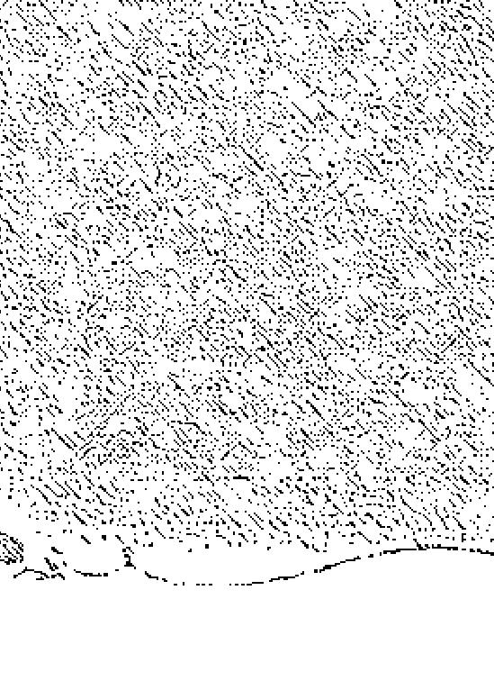

### 魔法步驟：

首先請準備一項對方的隨身物品，如衣服、眼鏡或皮夾皆可。在晚上睡覺前，心裡想著對方的姓名和長相，雙手握著對方的物品，開始靜坐冥想，讓自己心平氣和的感受能量，再將薄荷精油擦在眉心輪的位置（眉心正中央），緩緩開啟眉心輪能量。記住腦中不要想太多雜事，不要放入對方的情感，慢慢的你會感受到一股能量在眉心緩緩釋放。釋放出來的可能是不安、快樂或者是憂傷。不論感受到任何情緒或畫面，都不要緊張，讓自己心情平靜的去接受所有訊息。

### 魔法小常識：

- 眉心輪接收訊息的心訣，最重要就是「只要體驗，不要判斷」。因為在判斷時，你的自我也會醒來，腦中就開始出現很多快樂或不快樂的思緒。體驗就是「無我」，不在乎所有的外在環境，讓自己無限延...## 舒眠小魔法

伸，跟大地融为一体，好像把自己的身体粉碎在这空间，然后于宇宙之间化为尘土。

- 直觉就是一种我们就是知道某事，是无法合理解释的感觉。它就像生活里的风向球一样，总是指出一个正确方向，但不替你做决定，一切还是掌控在自己手中，人生永远可以创造出各种可能性及重新选择。
- 直觉通常可以分为心电感应（又称为他心通）及预感二种形式；有时或许不经意想起某人，过不久即接到对方的电话，这就是很典型的心电感应例子。有时在梦中出现比较鲜明的场景，过不久便在生活中实现，让你有一种似曾相似的感觉，这也是预感呈现的形式之一。

## 准备物品：精油灯、薰衣草精油、紫水晶、迷迭香/茉莉精油洗发精

## 魔法步骤

良好的睡眠品质是现代许多人的期望，忙碌的生活让很多人即使上了床，脑袋还是处于开机状态。夜晚若没有良好的睡眠，白天就有如没有充饱电一样，专注力不集中，大大减低工作效率。空元素的舒眠魔法，让你不用花大钱上SPA舒压，或是大费周章的规划国外旅行行程。只要准备好薰香精油、紫水晶以及洗个舒服的精油澡，随着本魔法的步骤，在家里也可以达到舒压效果，重新拥有良好的睡眠。

首先将两滴薰衣草精油滴在精油灯内，放点轻松助眠的轻音乐，让房间充满愉悦的气息，再用迷迭香或茉莉精油洗发精，全身也用水能量做净身仪式后，放松平躺在床上。将紫水晶放在顶轮位置（头顶中央），开始轻柔吟唱“OMMMM～”直到胸口到丹田有振动的感觉，接下来再吟唱“MAY～”直到头顶有阵阵酥麻感为止。互相交替的吟诵此二种音，直到感觉全身升起一股放松能量，接下来开始想像自己被紫色的光包覆全身，配合深且长的呼吸，每一次的吸吐都感受脑内的能量净化，同时也释放掉心中的焦虑及恐惧，重复吸气和吐气动作，直到感觉一股平静感注入心中，身体渐渐的沉重，四肢的感觉也渐渐失去。这时冥想自己被紫色的光包覆，飘浮在宇宙之间，感觉一切都没有边界，无限延展，与宇宙合而为一，你就是宇宙，宇宙就是你。

## 魔法小常識

- 在进行冥想时，可以藉由水晶强化意志力的集中，同时刺激直觉力的接收与反射。紫水晶具有平静心灵、增强意志力以及提升灵性智慧的功用。
- 冥想是一种与内在自我连结的过程，也是灵性成长的基本训练，就像身体透过运动，能强化身体结构组织运作，透过冥想则可以强化灵魂的成长，让身、心、灵三者达到平衡的状态。
- 冥想时最理想的姿势，以能让你全身放松者为最佳。最好避免平躺，以能舒服的挺立坐直为主，帮助全身能量的流动，时间以二十到三十分钟为佳。通常不限于特定时间地点，也不须刻意净空脑内思绪，只要专注在呼吸节奏上，放松身体，让情绪舒缓，慢慢的感受内在讯息出现，不论情绪、声音、文字、图像等，都全然接收。

## 〈附录〉脉轮能量让我生命更加丰盛，灵性更加喜悦——学习心得

- 开脉轮后，越来越心想事成，尤其对应到感应也很强的人更是如此。——Ruth
- 一直对练脉轮的好处一知半解的我，直到有天近午时分自己打坐开了一回脉轮之后，到深夜竟然发现精神仍出奇的好，终于让我不得不啧啧称奇。——Shonia
- 当开启脉轮的那一瞬间，发现自己的身体一直在等待这样的时刻到来。——静瑶
- 体验能量的脉动和窜流与自己身体和心灵结合，也渐渐与环境沟通，了解自然界的能量泉源，沉静下来洗涤心中的尘灰，感觉平静、祥和。——阿鸟
- 心情愉快，情绪平稳，塔罗占卜时感应力有加强。——宗志
- 因为开了脉轮，找到一个可以跟自己身体对话的机制。——辰瑜
- 练习脉轮让我更容易静心。——Miranda
- 身体变轻盈，直觉更敏锐，做亢达里尼瑜伽时，更能看见能量流动。——玲玲
- 学习脉轮帮助我真正感受身体能量的流动，原来万物都有能量，一切都变得好有趣。——小蛋
- 开启脉轮后，全身细胞都活了起来。天冷时，本来会让人头痛的风，变成能量吸入身体里，在身体中不断的运转，转化成能量，让身体与空气融合在一起。——小苹果
- 开启脉轮让我的内心更安定。——小艾
- 能更平静的看待一切人事物。——正仪
- 学习脉轮可以日渐增加内心的稳定度，使自己察觉与转化负面情绪，就算只是单纯为了健康而学习脉轮，也能透过练习脉轮发现自身身体状况是否失衡。——怡廷
- 不干净的东西不再接近我了，思考也变得很正面。——晓分
- 生活常常有些障碍无法克服而造成困扰，透过脉轮的开启与检视，才发现原来“我的”这层障碍最深的原因就在于此呀！如此也才清楚的知道如何真正克服它，并带着它做更圆满扎实的成长！——小段
- 清楚的觉察与感知自己的身体与周遭环境。——MO.
- 学习脉轮就有了一种基础灵修的方法，也感受到更多以前不会注意的能量变化，心想事成的速度变快了，而且世界处处有能量。——沛娴
- 自从学习脉轮开发，情绪的起伏更平和，从前的执着也随着脉轮开发的运用逐渐平息，渐渐发现静坐也是与自己的深层意识沟通的方式。——馨子
- 让我更加了解自己，所有事情皆是环环相扣。——榆臻
- 脉轮开启，让以前没注意到的身体会说话了，告诉你许多不曾或忽略的感受力！而且也能让自己的能量保持平衡。——ZOZO
- 心灵平静又饱满的感觉。——加欣
- 可以藉着练脉轮稳定自己的情绪。无法清楚思考时，练完脉轮后可以更客观全面的思索问题的癥结。——新博
- 随着脉轮的开启打开无边无际的感官世界，让生命更加丰盛，灵性更加喜悦。——Alita
