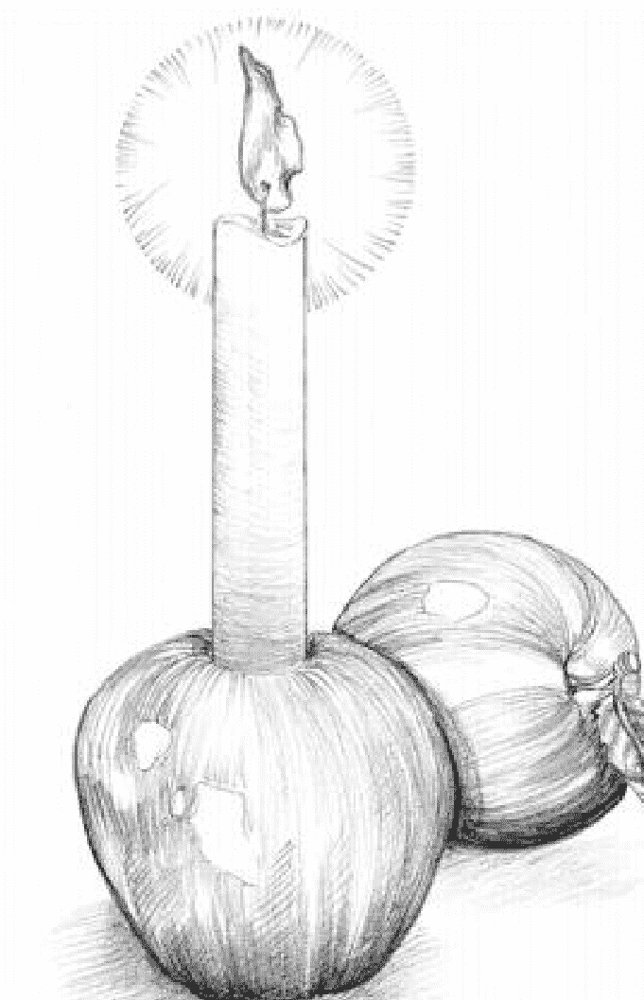
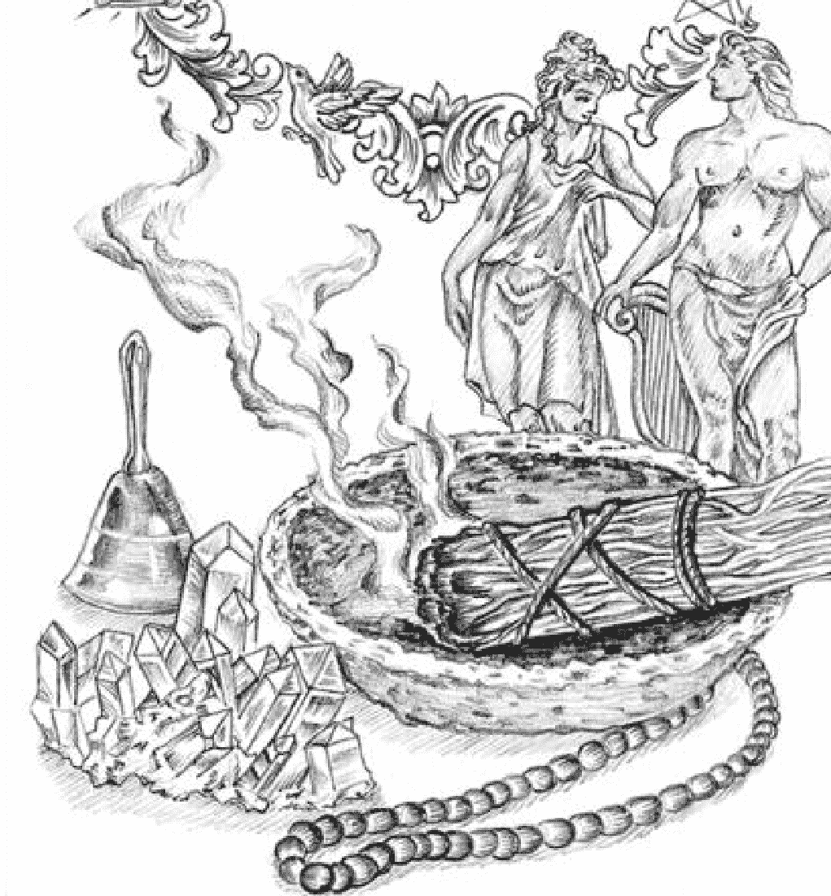
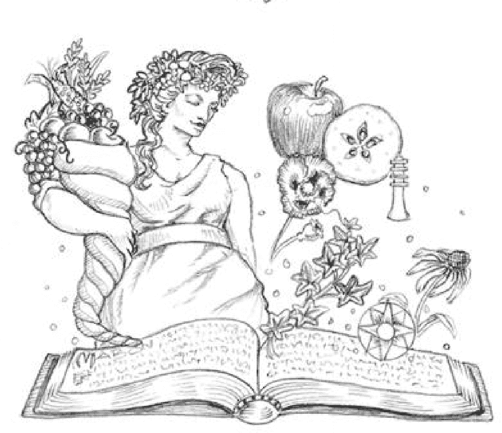

## Llewellyn's Sabbat Essentials
## MABON
## Rituals, Recipes & Lore for the Autumn Equinox

Llewellyn出版社
明尼苏达州，伍德伯里

## 内容
- 系列介绍
- 旧的方式
- 新的方法
- 咒语和占卜
- 食谱和手工艺品
- 祈祷和祈福
- 祝福仪式
- 对应关系的Mabon
- 延伸阅读
- 参考文献

勒维林的《安息日要点》为以下方面提供指导和灵感，纪念现代女巫的每个安息日。这套八卷本系列的每一本书都包含了咒语、仪式、冥想、历史、传说、祈求、占卜、食谱、工艺品等内容，探讨了作为女巫年基石的季节性仪式的新旧庆祝方式。

今天，巫师和许多其他新异教徒（现代异教徒）庆祝的安息日有八个，或称节日。这八个神圣的日子共同构成了所谓的年轮，或安息日周期，每个安息日都对应着自然界一年四季旅程中的一个重要转折点。

关注年轮使我们能够更好地适应自然界的能量循环，倾听每个季节对我们的耳语（或呼喊！），而不是与自然界的浪潮对抗。有什么比在漫长的冬天过后大地苏醒，突然间万物开花，生长，再次从地里冒出来的时候更适合开始新的项目？还有什么比在冬季的内省沉睡中进行冥想和提前计划更好的时间呢？通过卢埃林的《安息日精华》，你将学会如何关注年轮的精神层面，如何通过年轮并与之和谐相处，以及如何庆祝自己的不断成长和成就。这可能是你的第一本关于巫术、女巫或异教的书，也可能是你的书柜或电子阅读器中已经塞满了魔法智慧的最新补充。无论哪种情况，我们都希望你能在这里找到一些有价值的东西，带着它踏上你的旅程。

## 穿越年轮的旅程
这八个安息日分别标志着自然界年度周期中的一个重要节点。它们被描绘成车轮上八个均匀分布的辐条，代表整个一年；它们所在的日期在日历上也是几乎均匀分布的。

年轮-北半球(全部)
至点和分点的日期是近似的，而一个应查阅历书或日历以找到每年的正确日期)。

年轮-南半球
年轮由两组节日组成，每组四个。有四个与太阳在天空中的位置有关的太阳节，将一年分为四个季度：春分、夏至、秋分和冬至，所有这些节日都有天文日期，因此每年都略有不同。介于这些节气之间的是跨节气的节日，或称火节：圣烛节、五朔节、秋收和萨温节。四分之一天有时被称为小安息日，而跨四分之一天则被称为大安息日，但这两个周期都不比对方"优越"。在南半球，季节与北半球相反，因此，安息日的庆祝时间也不同。

虽然你拿着的书只关注秋分，但了解它与整个周期的关系可能会有帮助。

冬至，也叫尤利节或中秋节，发生在夜间达到最大长度的时候；在冬至之后，白天的长度将开始增加。虽然寒冷的黑暗正在向我们袭来，但有一个承诺，那就是更光明的日子即将到来。在巫师的传说中，这是年轻的太阳神诞生的时候。在一些新异教的传统中，这时冬青王注定要输给他较轻的方面——橡木王。蜡烛被点燃，享受盛宴，常青树叶被带进屋内，提醒人们，尽管冬天很严酷，但光明和生命仍然存在。

在凯尔特盛宴（也被称为Imbolc），地面刚刚开始解冻，预示着是时候开始为即将到来的播种季节准备田地了。我们开始从几个月的反省中醒来，开始整理我们在这段时间里学到的东西，同时也迈出第一步，为我们的未来做出计划。一些巫师还在象征性节日为蜡烛祈福，这是另一种象征性的方式，以哄骗现在明显更强的光线。

在春分，也被称为Ostara，黑夜和白天再次等长，在这之后，白天会比黑夜长。春分是一个重生的时刻，是一个种植种子的时刻，因为大地再次迎来了生命。我们装饰鸡蛋，作为希望、生命和生育力的象征，我们举行仪式为自己注入能量，以便我们能够找到生活和成长的力量和激情。

在农业社会中，五朔节标志着夏季的开始。牲畜被牵出来在丰富的牧场上吃草，树木绽放出美丽而芬芳的花朵。人们举行仪式来保护庄稼、牲畜和人。人们点燃火堆，进行祈祷，希望得到神的保护。在巫术神话中，年轻的神使年轻的女神受孕。我们都有想在年底前收获的东西——我们决心要实现的计划——而五朔节是一个很好的时机，可以热情地让这个过程全面展开。

夏至是一年中最长的一天。它也被称为Litha，或仲夏节。太阳能量处于顶点，大自然的力量处于它的高度。在巫术传说中，这是太阳神力量最大的时候（因此，矛盾的是，他的力量现在必须开始下降），他已经让少女女神受孕，然后她变成了大地之母。在一些新异教传统中，这时冬青王再次与他较轻的方面作战，这次是战胜橡木王。这通常是一个充满欢乐和庆祝的时刻。

在收获节，夏天的主要收获已经成熟。人们举行庆祝活动，玩游戏，表达感激之情，并享受盛宴。这也被称为收获节，是我们庆祝第一次收获的时候——不管是指我们花园里的第一批作物，还是我们的第一批计划实现了。为了庆祝谷物丰收，人们通常在这一天烤面包。

秋分，也叫Mabon，标志着另一个重要的季节性变化和第二次收获。太阳平等地照耀着两个半球，夜晚和白天的长度相等。过了这个点，夜晚将再次长于白天。与收获有关，这一天被作为祭祀和垂死之神的节日来庆祝，并向太阳和肥沃的大地致敬。

对凯尔特人来说，萨温节标志着冬季的开始。在不可避免地陷入深冬的黑暗之前，这时要宰杀牲畜，收割最后的收获。人们点燃火堆以帮助流浪的灵魂上路，并以神和祖先的名义进行祭祀。萨温节被视为一个开始，现在通常被称为女巫的新年。我们向祖先致敬，结束我们的活动，并为未来几个月的反省做好准备……周而复始。

## 现代异教徒与转轮的关系
现代异教徒从许多前基督教的精神传统中获得灵感，以“年之轮”为例。八个节日的循环，我们今天在整个现代异教徒世界中都认识到，在基督教之前的任何一个特定的文化中都没有完整地庆祝过。在20世纪40年代和50年代，一位名叫杰拉尔德·加德纳的英国人通过借鉴各种文化和传统，从基督教之前的宗教、泛灵论信仰、民间魔法以及各种萨满教学科和密教教义中衍生和改编出了新的巫术宗教。他将多文化的分、至日传统与凯尔特人的节日和欧洲早期的农业和牧业庆祝活动结合起来，创造了一个单一的模式，成为巫术仪式年的框架。

这个巫师仪式年被巫师和女巫，以及许多折衷的各色异教徒所普遍遵循。一些异教徒只遵守一半的安息日，要么是四分之一，要么是四分之三。其他异教徒则完全拒绝年轮，而是遵循基于他们所遵循的任何特定道路的文化而不是基于自然的农业周期的节日日历。在异教中，我们都有这样独特的道路，重要的是不要根据自己的道路对他人的道路做出任何假设；保持开放和积极的态度是异教社区繁荣的原因。

许多异教徒根据自己的环境将《年轮》本地化。巫术已经发展成为一个真正的全球性宗教，但我们中很少有人生活在与巫术起源于不列颠群岛相一致的气候中。虽然传统上伊博尔克是解冻和大地苏醒的开始，但在许多北方地区却是冬季的高峰。虽然拉玛斯节对一些人来说可能是对收获的感恩庆祝，但在容易发生干旱和森林火灾的地区，这是一年中危险和不确定的时刻。

还有两个半球需要考虑。北半球是冬天，南半球是夏天。当美国的异教徒在庆祝圣诞和冬至时，澳大利亚的异教徒在庆祝仲夏节。在遵守安息日方面，修行者自己的生活经验比任何写在书上的教条更重要。

本着这种精神，你可能希望推迟或提前庆祝，以便使季节性的对应关系更适合你自己的地方，或者你可以在经历每个安息日时强调不同的主题。这套丛书应该能让你很容易找到这样的选择。

无论你生活在地球上的哪种地方，无论是城市、农村还是郊区，你都可以调整安息日的传统和做法，以适应自己的生活和环境。大自然就在我们身边；无论我们人类如何努力使自己与大自然的周期绝缘，这些反复出现的季节性变化是不可避免的。许多现代异教徒并没有逆流而上，而是拥抱每个季节的独特能量，无论是黑暗、光明，还是介于两者之间，并将这些能量融入我们自己日常生活的各个方面。

卢埃林的《安息日精华》系列提供了你所需要的所有信息，以便做到这一点。每本书都与你手中的那本相似。第一章 "老方法" 分享了流传下来的历史和传说，从神话和前基督教传统到现代生活中的任何遗迹。然后，"新方法" 将这些主题和元素转变成现代异教徒观察和庆祝安息日的方式。下一章的重点是适合季节或基于民间传说的咒语和占卜，而接下来的一章 "食谱和手工艺品" 则提供了装饰你的家、亲手制作的工艺品以及利用季节性安息日的食谱的想法。祈祷和祝祷一章提供了现成的祈求和祈祷，你可以在仪式、冥想或日记中使用。庆祝仪式一章提供了三个完整的仪式：一个用于独处，一个用于两人，一个用于整个团体，如女巫团、圆圈或丛林。( 你可以根据自己的需要对每个仪式或任何仪式进行改编，用你自己的颂词、呼唤、祈求、魔法工作等代替。当计划一个团体仪式时，尽量意识到参与者可能有的任何特殊需要。如果你没有这方面的经验，有许多精彩的书籍可以深入研究促进仪式的要点。最后，在这本书的后面你会发现一份完整的节日对应清单，从魔法主题到神灵到食物、颜色、符号等等。

在本书结束时，你将拥有知识和灵感，可以兴致勃勃地庆祝安息日。通过尊重年轮，我们重新建立了与大自然的联系，这样，当她无尽的循环转动时，我们就能随波逐流，享受其中。

丰收节庆祝的不仅仅是这个季节完成的工作；他们庆祝的是度过冬天的能力。这些丰收节中最著名的是埃琉西斯秘仪，这是古希腊的一个为期一周的庆祝活动，时间接近秋分日。Mabon是这些收获、祭祀和生存庆祝活动的一个现代补充。虽然巫师们经常认为Mabon节是 "异教感恩节"，但那些认识到这个节日中固有的死亡之神神话的人也可能承认它是某种 "异教复活节"。Mabon节不仅感谢我们的食物，而且感谢我们生存所需的祭品。

安息日庆祝活动标志着英国世界观最熟悉的季节性节点，分点发生在九月和三月，至点发生在六月和十二月。对于北半球以外的异教徒来说，大多数人的观点是，自然宗教必须尊重自然的本来面目，并改变他们的做法以适应自己的位置。不是每个人都住在下雪的地方，不是每个人都住在经常下雨的地方，也不是每个人都住在夏天可能确实在三八节前后的某个点结束的地方。也许橘子树停止结果，或者不同的蔬菜成熟了。也许大海变得波涛汹涌。更冷的天气需要在早上穿上毛衣，以后再脱掉，而不是穿上外套和靴子。

当地球的赤道平面经过太阳中心时，就会出现分点。这种情况每年发生两次：春分和秋分。这导致地球的北半球和南半球经历同等的光照。对于那些生活在赤道附近的人来说，春分是一年中仅有的两个太阳处于亚太阳点的时间之一——当太阳到达天顶时，太阳中心正处于头顶。

当这种情况发生在3月时，北半球收到的光照会逐日增加（而南半球则会减少）。在9月，地球的两半会交换他们的光线。这种交换的极端情况对于那些住在靠近南半球的人来说不那么引人注目。

在离赤道较远的地方，极端性增加。位于赤道和南北两极之间的纬度地区，会经历一个明暗分布均匀或接近均匀的一天。

这种分布和复杂的情况使得每次收获都无法预测，这就是为什么Mabon经常在几天内庆祝，而不是在传统的9月20日或21日特定的日期庆祝。分水岭不只是一天的事件。它可以在两到三天的时间内发生，这取决于地点。由于秋分的传统是以收获的工作为中心，留出几天的时间来确认光的变化是有意义的。很少有农民或园丁能在一天之内把所有新长出来的东西运走。收获是一个需要几周，有时是几个月的过程。采集的工作带来了绞碎、堆放、腌制、烘烤和保存的工作。随着光线的减弱，工作的紧迫性增加。

### 秋分的占星术
占星术不仅仅是描述人物，它还标志着季节，并且在某种程度上，可以暗示适合某个季节的行动。就秋分而言，秋分发生在太阳进入天秤座的时候。天秤座，以天平为代表，是独一无二的合适。这个星座代表着冷静的平衡和谨慎的判断，是为即将到来的艰难季节做准备时最需要的前景。收获需要决定储存什么和消费什么。我们应该让什么东西在田地里腐烂？我们应该把什么球茎种在地里，等待春分的到来？哪些东西我们可以安全地不用过冬？对于那些根据占星戒律计划生活的人来说，天秤座和秋分标志着一个收获你在过去一年中成长的东西的时间，也是一个诚实看待你需要放手的时间。你不需要马上放下一切——根据这些星象和季节周期操作确实给了你一些时间来进行温和的分离。你可以也将标志的到来作为采取预防措施的时机。开始准备计划，**打流感疫苗。在你的信用报告上设置锁定。**

### 我们和我们的祖先一样
我们并不像我们可以用的那样与我们的祖先相距甚远。我们仍然依赖某个地方种植的食物——无论是通过我们的手还是农民的手——而且我们仍然受到季节性变化、多变的天气条件和环境问题的影响，这些都直接影响着我们的日常生活方式。技术进步还没有改变我们对农业的核心依赖。

我们接触到我们的祖先所接触到的同样的东西——地球、水和空气本身。虽然我们经常把自己描述为一半来自父母一方，一半来自另一方，但事实要复杂得多。我们有一半是我们母亲的祖先，一半是我们父亲的祖先。我们不仅仅是上一代人的沉积物。我们是历史的复杂结果。即使是最卑微的生命也有一个古老的遗产，表现为DNA螺旋的缠绕和重新连接，以提出一个新的存在，对以前的一切有一个新的看法。

有些人不需要进一步研究精神上的阴谋，就能看到祖先仍然与我们同在。另一些人则觉得需要给故事添加更多内容，更多解释我们的联系和互动。古代的神话起到了解释的作用。所有的神话都讲述了一些深刻的真理，而这些真理的敷衍让人更容易理解。异教徒们经常从这些神话中汲取营养，以帮助自己对宇宙的精神理解。其中一些神话是我们祖先的记忆，汲取了广泛的、与自然本身相一致的内容。其他的故事，如伊希斯和奥西里斯或德墨忒尔和珀尔塞福涅的故事，充满了爱、损失、生存计划和其他我们至今仍在经历的生活中的不可避免性。

## 艾丹·凯利 和 秋分
根据艾丹·凯利自己的说法，是他将现代异教的秋分庆祝活动命名为Mabon。在这之前，异教的从业者宗教人士简单地将这个季节性节日称为秋分。早期的巫师们在最近的满月时，用四分之一的安息日来庆祝主要的火节。当凯利开始接触巫术时，安息日的庆祝活动包括在四个主要的火节（圣烛节、五朔节、秋分和萨温节）期间分别举行仪式和宴会。由于这四个火节都有凯尔特人的名字，凯利试图用萨克森人的名字来平衡分点和至点这两个太阳季度的节日。不幸的是，他没能找到一个与巫术秋分的主题完全吻合的古代撒克逊节日名称。凯利确实发现埃琉西斯秘仪（Eleusinian Mysteries）符合他所期望的情感作用，但他并不想在已经建立的凯尔特-撒克逊计划中加入一个希腊名字。由于他无法找到一个撒克逊人的名字，他就求助于邻近的凯尔特人的资料。凯利参考了Mabon ap Modron的故事，这个名字的意思是 "母亲的儿子"，他认为这与Kore的主题是平行的，后者的意思是 "母亲的女儿"。他认为典型的母神的孩子被偷走是一种精神联系。虽然凯利从埃琉西斯秘仪中获得了节日的精神灵感，但他使用了凯尔特人的名字Mabon，以便在安息日中至少实现部分命名的一致性。

简而言之，**Mabon**的故事是关于一个从母亲那里被偷走并被囚禁的婴儿。他的释放成为神话英雄Culhwch的目标，他必须寻找Mabon，帮助帮助他追捕一只野猪，这只野猪曾经是一个国王，以赢得**Olwen**的婚姻。正如凯利所指出的，这与珀尔塞福涅神话有相似之处："**Mabon**可以被看作是泛欧洲的婴儿流亡和回归概念的缩影。[……]这个神话表明年轻的神与他的母亲，伟大的女神的分离，导致土地荒凉，只有在年轻的神与他的母亲团聚后才会恢复"（休斯，73）。

在《塔利辛之书》中，**Mabon**具有精神方面的特点，并因这些特质而被祈求，这再次使他成为秋分的优秀代表："在这里，**Mabon**被视为一个穿越了阴间和阳间，光明和黑暗的领域之间的界限的神；由于可以进入这两个世界，他对那些需要两种状态的品质的人是有用的。就Mabon而言，生育、出生和死亡只是一枚硬币的两面；都是必要的"（休斯，74）。

虽然文献没有直接将**Mabon**与秋分联系起来，但凯利认为凯尔特人确实在秋分时节庆祝了一些节日，他提到天文学家弗雷德·霍伊尔爵士通过研究巨石阵确定了这一点。霍伊尔发现，一系列被称为奥布里孔的孔洞与特定的日食相吻合，允许光线在秋分时分准确地透出。由于巨石阵似乎起到了预测日历的作用，而且它肯定是在分日和至日的日期上排列的，霍伊尔的发现支持了凯利的观点，即这些日期对不列颠群岛的古代异教徒也有一些文化意义。

虽然凯尔特人的英雄神话是迄今为止最受欢迎的巫术庆祝活动的核心，但安息日有明确的精神主题，但不需要把特定文化的故事作为礼仪。**Mabon**庆典感谢丰收，感谢他人为确保生存而做出的牺牲。许多文化中的一些神话都有这样的主题。

## 埃琉西斯秘仪
如前所述，埃琉西斯秘仪是古希腊的一个神圣的收获节。虽然考古学家和历史学家已经成功地拼凑出了这个节日的一些做法，但很多东西仍然是个谜，包括为什么这个庆祝活动的许多部分仍然是秘密的。这些神秘活动的影响遍及欧洲；不止一位学者推测，后来的异教丰收传统源于埃琉西斯。

秘仪的基础是德墨忒尔和珀尔塞福涅/科雷的故事。在这个故事中，冥王星爱上了科雷，并把她从她玩耍的场地上绑架了，把她带回了他在冥府的王国。当德墨忒尔发现她的孩子失踪时，她在地球上到处寻找她。当她终于收到消息说冥王星留着她的孩子时，德墨忒尔拒绝让地球上的任何东西生长。宙斯意识到他所有的人都会挨饿和死亡，于是打算松口，坚持要求冥王星释放珀耳塞福涅。不幸的是，珀尔塞福涅在冥界逗留期间吃了六颗石榴的种子。由于她吃了死人的食物，她成了那个王国的一部分，根据自然法则，她不能升到活人的世界。宙斯在他的使者赫尔墨斯的帮助下，通过谈判释放了她，使她可以在每年春天来到这片土地，并在秋天返回，与她的丈夫一起统治死者。

虽然没有人知道在埃琉西斯秘仪节上密谋的所有事件，但学者们掌握了关于这些做法的片段信息，他们知道古希腊人对它非常重视。大秘仪每四年在埃琉西斯举行一次，持续九或十天。它总是在秋分前的满月开始，包括一次游行。在这次游行中，农民们用一辆神圣的马车抬着一个神圣的篮子，同时高呼 "德墨忒尔万岁！" 据推测，节日参与者将一头怀孕的母猪献给德墨忒尔。据艾丹·凯利说，在高潮部分，有人把一个轻微镇静的小男孩放在秋千上，把他推过一个巨大的篝火；然后秋千上又出现了一只公羊，代替小男孩的位置。在某个时候，锣声响起，珀尔塞福涅的女祭司出现。许多已知的埃琉西斯秘仪传统的符号，如谷物和种子，也是现代异教收获和奥秘传统的符号。

### 垂死的神
詹姆斯·弗雷泽（James Frazer）的《金枝》是十九世纪末的一部人类学著作，它影响了整个二十世纪的灵媒运动，反过来又影响了现代异教的发展。作者提出的大部分观点都成为现代异教发展的基础。现代魔法-宗教思想，特别是现在与Mabon有关的段落。弗雷泽对神王主题的研究与许多主题有关，因为它们与收获、死亡和祭祀有关。许多异教徒在收获和死亡的神话中找到了意义，这些神话在不同的文化中并行不悖。狄俄尼索斯是酒神，也是葡萄奥秘的守护者。

## 仪式上的替罪羊

在古代，指定一个仪式上的替罪羊是一种常见的做法。这种做法是由一个人或一只动物来承担民众的“罪孽”，代表着垂死的神为土地和人民牺牲了自己的生命。虽然它并不总是发生在秋分时节，但其精神主题与现代安息日有着深刻的联系。在献给阿波罗的丰收庆典塔格利亚(Thargelia)期间，当地居民领着一名罪犯穿过城市。在城郊，他们鞭打了这个人。有时，镇领导处决罪犯；其他时候，他们把他驱逐出城。这个仪式象征着整个社区的净化行为。罪犯被驱逐意味着该镇的净化。

随着冬季的临近，一些村庄真的会驱赶一只山羊穿过镇子，然后离开镇子，在郊外杀死它，以净化社区的所有邪恶。驱赶罪犯或山羊代表了从庄稼中驱赶害虫的做法。古希腊农民将野猪献祭，作为防止害虫——猪！——进入庄稼的一种手段。

虽然找替罪羊并不是一种刻意的异教仪式，但被献祭的人和被赶走的害虫的象征意义与Mabon的精神意义相似。我们看到一个阳刚的人物吸收了一种破坏性的力量，然后将其清除以确保社区的生存。

## 约翰-贝利科恩

约翰-贝利科恩是一首英国民歌，以一种黑色幽默的方式教导人们谷物的收获过程。大麦本身就象征着收获的植物。他既是垂死之神的象征，又是仪式上的替罪羊。这首小曲以其庄重而又俏皮的语气，讲述了收获的牺牲性质。它可能标志着一些社会从实际的替罪羊做法过渡到隐喻的替罪羊做法，这时，能力本身就成为了合理的牺牲。副歌“约翰·大麦必须死”清楚地表明，这个角色必须把他的生命和鲜血献给土地，这样春天来了，土地才能有所回报。这首民歌明确地将祭祀——无论是字面的还是象征性的——与土地的肥沃联系在一起。

## 丰收之家（Harvest Home）

Harvest Home是欧洲秋分前后丰收节的英文名。一些古代异教徒也将这段时间称为“聚众节”。这些传统中有许多来自古老的异教徒生育仪式；随着时间的推移，统治教会将这些仪式献给了基督教圣徒，而不是原来的异教徒之神。

这些收获传统的其他元素不仅起源于异教，而且起源于封建传统，在封建传统中，农场工人从出生起就是农奴，他们的生命从出生就与他们耕种的土地联系在一起。收获是一种劳动密集型的季节，可能是一年中最辛苦的工作。因此，这个节日是一个劳逸结合的节日，用大量的欢乐来衬托准备过冬的严肃事务。丰收之家不仅是收割者的节日，整个村庄都用花环装饰大门，村民们在整个城镇的拱门上悬挂收获的果实。

游戏形式的仪式是收割过程中非常重要的一部分，特别是在收割最后一捆谷子时。这些游戏涉及收割者对居住在玉米中的内在精神的信仰；有些地区认为这种精神是仁慈的，有些地区则害怕它。在巴伐利亚，人们相信玉米之母会用坏庄稼来惩罚农民的罪过。在德国，收割者有时会用箭杆（一根拴在棍子上的链子）击打庄稼以“驱赶狼”，从而在收割前将邪灵赶出田地。收集这些麦穗往往说明了该文化对玉米精神的感受。

### 最后的麦穗

围绕着收割最后一捆麦穗有很多传统。收集它是否意味着好运或坏事，取决于该收割机的欧洲文化。通常情况下，收割成为一种游戏。在一个被称为“哭泣的母马”的游戏中，收割者轮流将镰刀扔向最后的谷穗。击倒最后一个的人发出“我得到了她”的仪式性喊声。谷穗也常常有一个当地的绰号，与古代异教徒用于祭祀的动物相类似。最后的麦穗可能被称为牛（德国）、野兔（法国）、猫（德国北部）或牛（捷克）。有些地方把最后的麦穗称为“死去的一捆”。有时，在一种让人联想到替罪羊习俗的行为中，一只动物，如公鸡、母马或绵羊，被放养在田野里或藏在最后割下的谷穗下。有时，抓到它的人把它作为奖品。在欧洲的一些地方，收割者和农民在田野上宰杀动物，然后在丰收宴结束时供应其肉（黑斯廷斯，521）。

### 玉米手推车（Corn Dollies）

在欧洲，“玉米”一词指的是所有种类的谷物，而不仅仅是北美熟悉的玉米作物。因此，“玉米手推车”一词是指用谷物制成的模型——通常是小麦，但黑麦、小米、燕麦，甚至玉米也适合这种用途。在不列颠群岛，它最常被称为“玉米手推车”，但也可能被称为“mell-sheaf”、“kern baby”、“ivy girl”，甚至是“carline”。有证据表明，这一传统并非起源于欧洲。加利福尼亚州圣何塞的玫瑰十字会博物馆有一个考古学家从古埃及发现的玉米手推车。

这些手推车是收获结束传统的核心。根据该地区的传统，这些手推车是男性或女性；甚至手推车的预计年龄也反映了人们如何看待庄稼人的精神。人们用丝带、其他收获的植物和水果来装饰这些麦穗。有时，手推车来自收获开始时的第一片麦穗，通常由被称为“收获女王”的年轻女孩或被选举为收获之王的收割机割下；其他时候，手推车来自最后一片麦穗。一些地方的人们象征性地喂养这些手推车，并经常在宴会上把它们放在尊贵的位置上，直到第二年农夫把它们烧掉时，才把它们送回农夫家里。

例如，在马恩岛，劳动者们用小麦制作一个雕像，用丝带装饰，并在田野上游行。一个女孩，通常是社区中最年轻的，带着丰收之家游行。在其他地方，玉米车被装在马车上，跟在吹着烟斗和塔波尔的音乐家后面；通常那些跟在游行队伍后面的人唱着丰收的歌曲，或在他们轮流通过时欢呼。“Hip hip hooray！”是一种常见的收获欢呼声中的一句话。农民常常把独轮车放在壁炉上或谷仓里，直到第二年。

### 收获的事业

收获季节是劳动者与土地所有者谈判工资和租金的时候。在收割开始时，农场工人举行晚宴，称为“采集节”。在这个宴会上，他们提名自己的一个人作为“收获的主人”。这个人作为工人的代表，向庄园主，也就是向他们的收割工作支付报酬的地主汇报（沃伦，216）。收割者享有一定的荣誉；他砍下第一批植物，并在选举盛宴上第一个吃喝。收割者还经常选出一个副手与他一起工作，这个人被戏称为“收割小姐”。收割者为所有工人谈判工资，当收割者去谈判时，收割女士就在田间充当领导。收割者用麦芽酒和喝酒游戏来庆祝选举。有人递给“女士”一个酒角，然后他把酒角递给“大人”。在他许下美好的愿望并饮酒后，女士接过号角并举杯。然后其余的收割者都喝了起来。每当一个人不按顺序喝酒时，他或她就必须支付一笔钱。这笔钱用于支付后来（或继续）在附近酒馆的聚会。这种特殊的聚会被称为“Scotale”，其目的就是为了喝麦芽酒。教会不赞成这种做法。

### 丰收家宴

丰收之家，即收割机割完最后一穗后的盛宴，在英国各地有不同的名称和绰号。有些人称它为“收割节”，有些人称它为“麦穗节”，有些人称它为“霍基”或“斯科特尔”——与收割者的选举盛宴相同（沃伦，216）。在这个宴会上，土地所有者与那些在其土地上工作的人坐在一起。这场晚宴结束了一年中所有的工资谈判；这也使它成为一个村庄的庆典，因为大多数村民也在庄园主的土地上工作。晚宴本身有许多当地的传统，从人们吃什么到游戏和饭后跳舞。通常情况下，玉米手推车坐在餐桌中央（如果活动规模较大，则主持宴会）。在英国，两个人有时会打扮成一头黑母猪，有时会有两名男子打扮成黑母猪，在宴会上随意掐或扎客人。其他时候，收割头领的人离开宴会，打扮成“主人”回来；然后，他从其他收割者那里收了钱，这样他们就可以在收获后再去酒店举行聚会。比赛通常包括斗鸡、抓猪和摔跤。当基督教会会在欧洲占据主导地位时，丰收之家节日保留了异教徒的风格，但采用了基督教圣人的名字。因此，“丰收之家”成为三个独立的节日，它们都集中在秋分附近：圣玛丽诞辰节（9月8日）、圣米迦勒节(9月29日)和圣马丁节(11月11日)。米迦勒节保留了与丰收之家关系最密切的传统。

## 米迦勒节(Michaelmas)

第一个已知的米迦勒节庆祝活动发生在1011年（Gomme，270）。以大天使米迦勒命名的9月29日既是一个丰收的节日，也是一个盘点、雇用助手和清偿债务的日子。英国人称这些财务结算日为“季度日”，因为它们一年要举行四次。 在米迦勒节前后，各家各户决定保留哪些动物过冬，出售或宰杀多少动物。米迦勒节旨在取代丰收之家，标志着收割季节接近尾声，并以土地所有者和佃户的晚宴结束。 这些晚宴使地主有机会收取他们的季节性租金。

十六世纪的租户除了支付四分之一天的租金外，还在米迦勒节向房东赠送一只鹅。吃烤鹅成为米迦勒节的一个重要传统，并最终转移到圣诞节。当时的牲畜构成了租金，使得在这一天结算的账单特别重要，因为收获的结果可能会决定一个家庭在寒冷的季节是否有家可归。在不列颠群岛，有一句话说明了这个节日的重要性：“在米迦勒节吃只鹅，一年都不缺钱”。

苏格兰人在米迦勒节(Michaelmas)上吃bannock，这是一种带有类似司康饼的蛋糕，由谷物制成，然后在羊皮中烹制。在爱尔兰，有些人会把戒指烤成馅饼，在米迦勒节晚宴上吃。找到戒指的人将在第二年结婚。爱尔兰人还认为米迦勒节是打鱼的好日子——也许是因为它是一年中最后这样做的好日子。

新教在英国传播后，许多教会用丰收节取代了米迦勒节，这是一个改良后的丰收之家。

关于神的死亡和复活的神话突出了埃利奥尼奥秘、丰收之家、米迦勒节和Mabon之间的精神联系。收获必须以死亡结束——生存需要一个计划。农夫培育、喂养和栽培谷物，与植物建立起生存的纽带。当收获季节到来时，这种关系就结束了。随着年轮的转动，Mabon的结束也标志着冬天的开始，随着秋天的每一天的消逝，所有的人都看向寒冷，想知道在即将到来的黑暗中我们还会失去什么。

春分，光明与黑暗的交替，激起了强烈的失落情绪，随着夏天的轻松过去。虽然现代人，尤其是异教徒，庆祝丰收和春分的方式已经发生了变化，但其核心意义仍然是一样的：生命是宝贵的，我们很幸运能维持它。

**Mabon**，由于其精神基础，也必须承认共同的世俗价值，以体验年轮上这一幅度的完整、丰富的范围。

### 其他异教的秋季庆祝活动

一些异教传统会庆祝**Mabon**（秋收），但也有人在秋分时节庆祝其他节目。有些人，特别是凯尔特人的重建派信仰，只遵守四个主要的火节（萨温节、圣烛节、五朔节和秋分），不为**Mabon**做任何特别的事情。秋天也是世界上最大的泛异教（指 "所有异教徒"）庆祝活动的时间：异教徒的骄傲。

在这个活动中，世界各地的异教徒聚集在一起，举办公共仪式，并举办食物募捐活动。 他们的目的是让公众了解异教徒的宗教，从而减少仇外心理。每个庆祝活动都有一点不同：有的像街头集市，有的像小型会议，还有的只是举办野餐，邀请公众参加。参与异教骄傲的异教徒通常把这个活动看作是一种社区团聚，以及与他们直接精神圈子之外的人互动的机会。公众被邀请并被鼓励与异教徒谈论他们的信仰和实践。

异教自豪运动的名称直接借用了同性恋自豪运动。这两个运动都是为了庆祝个人选择公开自己的身份，而不是隐藏自己，以保护自己不受社会情感的影响。虽然没有人确切地知道第一次异教自豪活动是什么时候发生的，但官方的异教徒骄傲项目是在1997年**Cecylena Dewr**（塞西琳娜•杜）与异教意识联盟的合作中发展起来的。**Dewr**（杜尔）为该项目提出了三个要素：首先，在每一个能聚集足够多异教徒的地方，他们都要举办一场活动，至少有一个仪式向公众开放，异教徒和非异教徒都可以参加。其次，这次骄傲活动是为了纪念Mabon和其他秋季的感恩节节日，并提醒异教徒对城市、州和国家的责任。第三，组织者邀请媒体，这样他们就可以在万圣节季节之外看到一些对异教的积极描述。1998年，世界上出现了第一个国际异教骄傲计划，美国的17个社区和加拿大的一个社区参加了这个项目。总共有大约九百人参加。2000年，Pagan Pride 得到了《纽约时报》的报道；在罗马、英国和巴西举行了首次活动；并向慈善机构捐赠了8671磅食物（和几千美元）。到2005年，异教徒骄傲计划在全球范围内统计了超过四万名参加者。虽然国际异教骄傲组织已经停止追踪其数据，但围绕Mabon的庆祝活动每年都在继续。

### 德鲁伊教派

现代德鲁伊人庆祝秋分，称其为Alban Elfed。Alban Elfed的意思是 "水之光"。这时德鲁伊观察到黑暗比光明消耗更多的时间。他们把春分作为感谢母亲（他们对女性神圣的概念）的时间，因为她的丰饶体现在收获中。

### 希腊异教徒

现代希腊人（致力于重建古希腊宗教的人）庆祝Boeodromion，从希腊语翻译成 "九月"。这个节日从9月第一个新月的日落开始，在接下来的9天里祭祀不同的丰收之神，让人联想到埃卢西尼节。每天，希腊人向这些神灵献上祭品和酒，以感谢他们的丰收。

异教徒，即北欧异教传统的人，称秋分冬季发现。在春分日，他们会举行一个仪式，用麦酒和面包向奥丁神和他的万神殿中的其他人献上祝福。在分享美食之后，在场的每个人都会传递一个酒角，并在酒角来到他们面前时，进行吹嘘、宣誓，或向他们的祖先致敬。

## 传统巫术

传统巫师是指那些在杰拉尔德-加德纳出现之前在英国盛行的巫术形式。有时他们自称是 "巫术" 的实践者。其他人则被称为“篱女巫”或“篱行者”。这些人使用萨满教的方法和与自然的深度联系来实践魔法和感知神性。大多数人根据他们所居住的地区庆祝季节的交替和节日。那些生活在温带地区的人可能有他们自己的习俗来庆祝秋分。

## 新异教

新异教徒是认为自己是现代多神教徒的异教徒，但不喜欢与有组织的形式，如巫术崇拜。他们通常将Mabon节作为个人平衡的一天来庆祝，设计自己的仪式，或者只是通过他们的日常生活实践来纪念季节的变化。

## 折衷的巫术

不拘一格的女巫是新异教徒，她们从多种传统和背景中汲取灵感，创造出自己的习俗。如果作为秋分的Mabon对她们有意义，她们就会进行实践，通常他们根据自己的精神体验和与收获季节的联系而设计的仪式。

## 凯尔特异教徒

一些凯尔特异教徒也称秋分节为阿瓦隆节。阿瓦隆在现代英语中被翻译为 "苹果之乡"，而苹果的收获期往往是 "秋分"。苹果通常在这个时候收获（Springwolf）。

## 中世纪威卡教

意大利巫术称秋分为Equinozio di Autunno。这个小节日是对地球的尊重。在他们自己的安息日周期（treguenda）中，光之主变成了阴影之主，雅努斯神死后离开，前往冥界。

### 现代丰收节

现在许多丰收节既是世俗的也是精神的，共同庆祝遗产和社区。现在种地的人越来越少，在某种程度上增加了神秘感。我们现在必须努力欣赏食物，了解食物的来源，而栽培来自一种精神上的祈求。

### 英国的丰收节

英国用丰收节取代了丰收之家。这个节日在秋分前最接近满月的星期天举行。教友们用丰饶盆、花圈和篮子装饰教堂，教民们感谢上天的恩赐。当地农民带来了装满农产品的篮子，当地牧师为其祝福。礼拜结束后，教会成员将这些篮子里的食物分发给贫困的社区成员。服务结束后，社区通常会为整个城镇举行庆祝活动，其中包括丰收之家庆祝活动中的旧游戏。

### 收割

收割是波兰活生生的丰收之家传统。在天主教的外衣下，斯拉夫异教徒和封建的根源依然存在。在中世纪的收割，地主会举办一场盛宴来奖励他的工人们在整个季节里辛苦工作。

在21世纪，波兰人在9月中旬至10月下旬的任何时候都会庆祝收割。庆祝活动通常包括丰收节弥撒，有时在户外举行，然后由代表老 "庄园主 "的人或由两名因擅长收割工作而被选中的妇女进行游行。教堂里装饰着用粮食作物制成的收获篮子和工艺品。

唱歌和游行是收割庆祝活动的一个重要部分；被认为最擅长收割的女孩带领这个游行队伍，戴着用谷物编织的花环，用野花、苹果和灰浆果装饰。女孩或女人把头上的花环送给象征性的庄园主和女主人，这个人把花环放在他或她家里的一个荣誉位置上。然后，代表庄园主的人与最年长的男性收割者分享一杯伏特加酒，向整个团体敬酒，并邀请他们参加在其土地上举办的宴会。

### 德国感恩节

德国感恩节是在德国农村各地举行的一系列节日。感恩丰收节，就像丰收之家/丰收节一样，包括一个教会服务，展示当地丰收的篮子，之后将其送给穷人。 仪式结束后，民间庆祝活动包括游行、巡游，以及混合了异教徒的传统，从玉米制成的"基佬 "到装饰的野兽。

### 啤酒节

啤酒节有纯粹的民间渊源。 始于1810年10月12日，为了庆祝路德维希王子和萨克森-希尔德伯格豪森的特蕾莎的皇家婚礼，这个为期16天的庆祝活动已经持续了200多年。为了更好的天气，它被移到了9月，并已成为一个世界性的庆祝活动，在那里可以看到啤酒的供应。

1811年，德国为了提高地区农业意识，在节目中加入了赛马比赛。现在，慕尼黑啤酒节有啤酒摊、节日游乐设施和繁荣的年度集市贸易。虽然可能不是一个有意识的收获节，但啤酒节肯定会庆祝农业的特定方面，就像异教背景下的Mabon一样。

### 九月的犹太节日

对犹太教来说，九月是一个特别神圣的时刻，每周都是具有精神意义的一天，其中许多日子与Mabon有着相似的精神意义。古代犹太人根据新月来确定他们的日历，而现代犹太人的节日则遵循一种特殊的犹太日历，与流行的公民日历不同。

## 犹太新年

犹太新年是犹太人的新年。这开始了为期十天的反思、冥想、分享和忏悔的时期。这个节日可能包括吹响羊角号（一种用犹太动物的角制作的乐器），吃challah（一种编织的面包），以及吃苹果和蜂蜜，以代表甜蜜的新年。苹果、蜂蜜和面包也是新老异教徒长期以来所尊崇的收获象征。

## 犹太人的赎罪日

赎罪日是犹太信仰一年中最神圣的日子，发生在犹太新年一周之后。在这一天，犹太人会找到那些他们得罪过的人，并为他们赎罪。个人必须自己决定这样做的最佳方式。这也是一个宽恕他人的时刻。对于那些对从光明到黑暗的季节进行冥想的异教徒来说，这种做法有很强的精神相似性。虽然许多异教徒并不像一神论者那样将罪恶归入同一类别，但大多数异教徒都非常重视个人责任，包括在造成伤害时有义务进行修复。

## 住棚节

住棚节与9月的犹太节日马邦有最直接的联系，因为它明确庆祝秋天的收获。这个节日总是在赎罪日的第五天庆祝，纪念犹太部落在沙漠中流浪的四十年。它的字面意思是“喜乐”。住棚节的另一个名字是 **Chag HaAsif** ，意思是“聚集的盛宴”。

## 犹太教Sh'min节

住棚节之后，犹太人马上庆祝每年诵读 **Torah** （圣经旧约的前五卷）的完成。 **Torah** 卷轴从存放它们的方舟里取出来，人们围绕着它们跳舞，或抬着它们游行七次。这以诵读 **Torah** 作为结束，从而完成了标志着犹太信仰周期性的庆祝活动。

## 感恩节

感恩节是丰收之家节日的后裔。看起来很可能是朝圣者重新创造了丰收节的盛宴，成为美国的感恩节。虽然不是一个普遍的节日，但加拿大、利比里亚和格林纳达也庆祝某种形式的感恩节。加拿大10月的感恩节是一个长周末，类似于美国的劳动节。利比里亚在11月的第一个星期四庆祝感恩节；这是一个混合宗教的节日，用该国的本地食品来庆祝。格林纳达的感恩节是为了感谢在1983年的血腥军事政变中进行干预的美国军人。只有美国和利比里亚的感恩节与收获的结果有直接联系。

## 建议的活动

Mabon既是庆祝的，也是庄严的。它也发生在一年中最繁忙的时候之一。以感恩、死亡、悲伤和即将来临的冬天是主题，这是一个承认复杂感情并尽我们最大努力保持内心平衡的时候。在这些繁忙的生活阶段，抽出时间倾听自己，聆听神的声音是很重要的。因为这是收获，它也是一个精神行为，进行日常安排，使生活更容易流动在寒冷的季节。

## 为冬季做准备

即使是最微不足道的行动，如果用心去做，也可以成为精神上的行动。因此，Mabon节可以是一个在精神上进行组织的日子。你可能希望参加实际的冬季准备活动：种植球茎以便在春天开花，使你的房子过冬，或者甚至翻阅你的日历和待办事项清单，以确保你能在小块时间内完成尽可能多的事情。

当你在外面种植或收获你的花园时，你可以用做祷告或唱歌，就像以前收割机在田野里那样。庆祝你的收获，向土地歌唱。

建议冬季种植球茎的祈祷是：

- 种子的祈祷
- 我播下了种子
- 进入地下。
- 我发送爱。
- 我发出渴望。
- 它填满了。
- 它膨胀了。
- 它向上延伸
- 向着温暖的方向
- 直到时间到来
- 从土壤中冒出来
- 然后跳起生命的舞蹈。

在以实用的方式整理你的家的同时，可能会希望清理房间里的杂物，为新收获的果实腾出空间。

### 谈判

九月是过去采矿者谈判合同和协议的季节。从他们身上吸取教训。你有什么需要与信用卡公司、房东或服务人员解决的问题？利用这个时间来达成一个友好的协议。阅读谈判技巧，然后要求加薪。登录你的账户，查看你的账单，看看在日常账单上，如水电费或保险费，你可以在哪里得到一些减免。

### 罐装、冷冻、腌制和干燥

在温带地区，收获季节往往与狩猎季节相吻合。对于那些有狩猎家庭和大花园的人来说，这种定期活动可能要追溯到几代人之前。利用周末时间，为冬季保存你花园里的货物。如果你想晒干自己的食物，可以去当地的旧货店找一台脱水机。你通常可以在烹饪书中找到关于罐头和腌制的说明。冻结的准备工作取决于你冻结的东西；不同的水果和蔬菜需要不同的处理方法。互联网上有很多关于各种食物保存方式的信息。

### 走出去

如果你生活在温带气候中，你可能已经知道秋天是多么珍贵。每一天都离冬天更近一点！因此，尽可能多地参加户外活动是一个好主意。如果可以的话，到外面去，在树林里散步。欣赏秋天的树叶，观察动物们如何为这个时候做准备。也许可以带一本自然指南，在这个季节的这个时候练习识别植物。如果你住在市区，向公园管理部门咨询。大多数城市都留出一些林地供公众使用。如果没有，可以查看州立公园指南，寻找最近的州立公园，在树丛中享受野餐。

## 看夕阳

秋天的太阳感觉特别珍贵，因为土地一天比一天黑。查阅当地报纸或一个好的气象资料，了解日落的时间，花一个星期的时间坐在外面，看着它慢慢落下。你可以对着它唱歌或唱一段圣歌。

### 日落圣歌

渐行渐远的太阳，我感到你在冷却。
Waning sun I feel you cooling
日子一天天过去，我看到你在变黑。
cooling, darkening winter comes
寒冷、黑暗的冬天来了
cooling, darkening winter comes
随着太阳的燃烧而消失。
as the sun blazes away.

### 观看日出

有时在日落时分找到时间是不可能的。对大多数人来说，清晨是一天中最平静的时刻。如果可以的话，在太阳升起前半小时起床，观察太阳升向天空的过程。你可以用每天都这样做，直到下一个冬至，从而加深你与地球光周期的黑暗一半的联系。同样，你也可以对着太阳唱歌，或者在看着太阳升起的时候唱圣歌。

### 日出的歌声

向太阳、光和弧致敬，
Hail sun, light and arc,
再次与黑暗战斗
fight again against the dark!

## 庆祝丰收之月

九月丰收月发生在什么时候取决于你在欧洲的位置。有些人认为它是9月的新月，有些人认为它是8月的满月，还有人认为它是9月的满月。苏格兰人把丰收月称为獾的黄月，因为这是小型哺乳动物收集冬季用品的时候。他们有时也称它为猎人的月亮，因为这是狩猎野生动物以获取冬季物资的时间。根据这些昵称之创建你自己的月亮仪式。你可能还想参加苏格兰的一个占卜传统。在这个传统中，年轻的男人和女人把一捆捆的谷物集合起来，用他们花园里的豌豆和豆子塞住，然后把它们烧掉。当火堆只剩下燃烧的余烬时，有人会在余烬中藏起一粒谷物或种子，发现种子的人被认为获得了他/她未来配偶的爱。

## 举办烧烤活动

分享食物是丰收庆典的一项重要活动。邀请其他志同道合的异教徒来参加你自己的Mabon/丰收之家晚宴，或者邀请你的邻居，只是享受分享的精神。供应适合你所居住的土地的食物。在温带地区，这可能是面包、玉米棒和新鲜蔬菜等形式的小麦。如果你离赤道较近，而且你吃肉，就提供当地农民饲养的动物，如鸡肉、羊肉或鹅肉。如果你不太具备烤肉的资源，可以邀请人们参加聚餐。列出一张推荐菜单，让你的客人做，原则是每个人都能吃他或她调制的菜。

## 烧烤坚果

9月14日的前夕，称为Roodmas或Fe'll Roi'd，被昵称为 "坚果之夜"。在这一天，孩子们去采摘坚果，以获取食物。Rood既指基督教的十字架，也指鹿的发情期（坎贝尔，280）。

## 去摘苹果

开始一个参观苹果园的秋季传统。虽然大多数人去果园采摘苹果用于自己的罐头和保鲜，但有些果园还提供其他娱乐活动。例如，有些果园有苹果炮，可以让游客向目标射击苹果或土豆；有些果园有干草车，有些农场还开始生产当地葡萄酒。之后，为来年的季节准备苹果酱、制作馅饼或晾晒苹果，成为一种家庭仪式。

## 去参加葡萄酒或啤酒品鉴会

狄俄尼索斯的节日有它自己的收获之谜，所以如果你能够安全地做到这一点，就参加吧！随着更多的当地葡萄园在美国激增，更多的葡萄园正在举办秋季活动，邀请公众来品尝本季的佳酿。随着精酿啤酒运动的发展，也有更多的小型酿酒厂邀请人们进入他们的酒厂参观。葡萄酒和啤酒在不止一个异教神殿中是神圣的饮料，而Mabon是庆祝制作这些饮料的艺术性的好时机。

## 燃起篝火

大多数丰收节都以篝火结束。一定要与你所在的城市核实有关你所在地区火灾的法律限制；如果您生活在一个严重干旱的地区，则应跳过这一环节。如果你得到了许可，可以收集树枝、树权和花园里的剩余物来搭建火堆。在火堆里用棍子烤东西，对着火焰冥想，或在火堆周围跳舞，同时唱歌或诵经，度过一段美好时光。也许可以把饮料分给那些和你在一起的人，并进行敬酒游戏——为火堆主人的健康、为每个人的繁荣，然后为每个人的健康敬酒。这也是一个讲故事的好时机。关于古老世界的小精灵的故事，如Pookas（普卡）或亚瑟王的故事可能特别合适。

## 去跳舞

许多丰收的晚餐都以跳舞结束。如今，你可以让这种方式变得现代，让大家在晚餐后去最喜欢的俱乐部，或者你可以做一些更传统的事情，比如尝试重现爱尔兰卷轴，或者观看莫里斯舞蹈团的表演。对于熟悉火人节的人来说，他们可以用尝试 "恍惚舞", 在一个安全的地方放上音乐，跳进和跳出一个改变的状态。收获是一个表达解脱的时刻，跳舞可以很好地宣泄！

## 制作一个玉米手推车

就像你的精神祖先那样，用植物精神的雕像来庆祝。用小麦制作一个玉米手推车，或者用你自己种植的水果和蔬菜创造你自己的角色。你可以在网上找到带有图片和视频的清晰说明。你可以在Mabon晚宴上用玉米手推车作为餐桌的中心装饰；也许你甚至可以把它放在一个值得尊敬的地方，并通过在碗里留下小祭品，第二天再处理掉，来仪式性地喂它。你可能还想在游戏中加入玉米车，以反映一些收割者在收割时玩的游戏。在过去的日子里，人们会拿着水桶躲在小路边上，等着浇湿抬着雕像的人。作为一个现代的转折，如果有一个与洋手推车的仪式游行，你可能会让你的家人或女巫隐藏在它的路径上，用水枪射击洋手推车和搬运它的人，代表下一个收获所需的水。你也可以用石头压住它，其象征意义是明年的收获将和石头一样重。

## 制作一个花环

收割者经常拿着挂在棍子上的花圈，跟在玉米推车的队伍后面游行。用小麦或干草制作你自己的花环，用当季的颜色的丝带进行装饰。把它挂在你的前门或屋内的门上。

## 参观马匹

在苏格兰高地，米迦勒节也被称为骑马节。在英国，这一天总是有一场赛马比赛，每匹马上有一个男人和一个女人。骑手们认为女人从马上摔下来是幸运的。妇女们为赛马买单，还经常带着大罐燕麦片与人分享。赛马在秋季并不常见，但你可以用去宠物园、农场或救援站，为马做一些好事。你可以晚餐吃燕麦片来结束这一天。

## 举行游行

许多地方在收获开始时和收获结束时，在砍完最后一穗后都有游行队伍。可以把它看作是一次没有旗帜或消防车的游行。这是一种虔诚的事情，即使不一定是严肃的。因为它有玩耍的成分，所以对儿童来说是一个很好的仪式。你在家里可以做的最简单的游行是组织一次到花园的游行，你和你的家人在那里进行收割任务。然而，如果你住在城市，没有任何花园空间，你也可以借鉴丰收节的传统，给饥饿的人提供食物。

这是与儿童一起进行的一项有趣的活动。用小麦制作一个稻草人，或者制作一个更标准的稻草人。然后抽签决定谁带着稻草人去球场。让其他家庭成员在携带稻草人的人后面排队。让后面的人拉一辆马车（也许是一辆儿童的红色马车），如果你的花园很小，就拿着一个篮子。给你的游行队伍提供盘鼓、拨浪鼓和卡祖笛。如果这可能会让人抓狂，那么唱一首孩子们都知道的歌可能是更好的选择。

一边唱着歌，一边从屋前带路到花园的地方。如果走的路程很短，可以先带领队伍绕着花园转几圈，然后向领队示意，让他把雕像放在花园中间。

当木桩插在地上时，说：“赞美土地之神！”然后每个人都应该欢呼或发出声音。然后说：“赞美丰收！”大家又开始发出庆祝的声音。

在那里，用马车或篮子装满你花园里的产品。用剩下的时间来罐装、冷冻或以其他方式保存你的花园美食。这是一个很好的机会，让足够大的孩子们在热炉子周围学习这些保存艺术。从你的菜园里拿出一些产品和你的家人共进晚餐，一定要带一些罐头食品到社区的饥饿组织。

## 做一个收获的篮子

这与游行不太一样，尽管你可以鼓励孩子们假装是游行。带孩子们去杂货店，让他们为当地的食品架挑选不易腐烂的物品。除了罐装水果、蔬菜和肉类等物品外，一定要加上尿布和卫生用品等物品。将所有这些东西放在一个篮子里。在篮子周围进行简短的祈祷，祈祷那些参加篮子的人在未来几年里获得好运和丰收的收获。这样收获篮子的祈祷词是：

向大地的精神致敬向社区。
Hail to the spirit of the land and to the spirit of the community.
向赐予万物的女神致敬！
Hail to the Goddess who gives all things!
我们请求你祝福这篮子里的食物和物品旨在帮助我们周围有需要的人
We ask that you bless this basket of food and goods meant to help those around us in need.
让每件物品都带着好运的祝福。
Let each item carry a blessing of good luck,
祝身体健康，早日康复，和丰收的收获。
good health, good healing, and bountiful harvests.
让我们的社区健康而强大
Let our community be well and strong
靠你和我们的手。
by your hand and by ours.
就让它去吧！
So mote it be!

## 参加异教徒的骄傲

如果你所在的城市有异教自豪感，请做志愿者！每个城市对该活动的处理都有些不同。每个城市处理这个活动的方式都不一样。在网上查找你当地的协调人，并提供你能带来的特殊技能。如果你与女巫团、小树林或其他团体一起工作，请向你的伙伴们询问关于在异教自豪节上举行公开仪式的情况。如果你是独行侠，但想与人交流，那就请你自己主持一个仪式。如果你住的地方没有这个活动，可以考虑启动一个——国际异教骄傲计划的网站对公众开放，其组织者可以给你建议，让你自己开始。

## Mabon庆祝活动

没有两个安息日的庆祝活动是完全相同的。甚至在不同的异教传统中，庆祝Mabon的确切时间也不尽相同。有些团体在最接近秋分的满月或英国丰收节的时候举行安息日。另一些团体则试图将任何仪式或宴席放在尽可能接近分点的实际时刻。其他团体采用“前三天或后三天”的方式，以适应工作和家庭繁忙的女巫团成员。

理想情况下，这些仪式包括共享一顿饭和对所做出的牺牲表示感谢。你可以用无数种方式表达这种精神：仪式是创造性的挑战。这就是为什么异教徒的信仰实践对许多人来说是愉快的。有了收获季节的主题和神圣国王的祭祀，巫师团或单独的修行者可以运用大量的想象力来表达这些主题在仪式和更大的世界中是如何表达的。

例如，盛宴可以包括参与者在花园里种植的食物或从任何杂货店挑选的食物。重要的是，这些食物是该地区的季节性食物。在温带气候下，这可能包括南瓜、四季豆、洋葱、胡椒和地樱桃。在靠近赤道的地区，秋分的盛宴可能有木薯和大蕉。重要的是它能反映并连接到你每天行走的土地上。

## 进行祭祀

如果祭祀是你庆祝活动的重点主题，可以借鉴现代生活中人们的牺牲经历。在祭坛上摆放战争英雄和急救人员的照片。请来宾讲述他们所爱的人做出牺牲的故事。为那些为你做出牺牲的人写感谢信。这可能包括加班加点帮助你完成学业的父母，在你生病时抽出时间照顾你的人，或者捐献血液或器官以拯救他人生命的人。

你也可能希望做出自己的牺牲。你的行动应该与你的生活环境相适应。有些事业需要一个人的时间，尤其是那些能在你的宗教团体之外加强整个社区的事业。也许你可以为不能自己做饭的朋友提供一餐。你可以在当地的疗养院或道路清洁队做志愿者。你甚至可以把你花园里的一些丰收的东西拿给你的邻居，作为连接你的社区和你分享的地球的一种手段。举办烧烤活动与丰收之家祭祀的动物相呼应，是一种熟悉的现代仪式。花时间在垂死的人的床边，或者每晚放弃几个小时的电脑，帮助建造人类家园的房子，也是如此。

你可以从挑选一个Mabon的精神主题开始，或者把所有的主题都结合起来，充分利用一年中的这个时候。例如，如果你有一个亲人在去年去世，你可以用要创建一些仪式和仪式来悼念时间的流逝和逝去的光明。你可能对丰收之潮带给你的一切感到特别感激；在这种情况下，选择一些能表达你的感激和分享你的富足的活动。为你自己的家庭或社区准备过冬的行为（即使冬天天气很热）是这个季节的极好活动。大多数Mabon仪式涉及到表达感激之情，向土地的神和女神献祭，以及共同进餐。你可能希望在你的花园中留出一小块地，或者留出一点葡萄酒和啤酒，作为供品和奠酒之用。如果你觉得特别有钱，你甚至可以把自己花园的劳作送给别人！无论你选择做什么，都要充分庆祝Mabon节。

## SPELLS AND DIVINATION

Mabon是一个全面平衡的时代。随着光的离去，它带走了热量以及与之相关的记忆。这也是为你自己编织一个新的平衡的时候。如果过去的收成不好，现在就是为更好的未来奠定基础的时候了。利用这段时间摆脱内心和外在的障碍，就像在秋天结束时种植球茎一样，在世界再次变暖时，开始播种最深的种子，迎接最美丽的花朵。

## Mabon法术

### 寻找失物的咒语

你说，丢失物品可能发生在一年中的任何时候？没错。这个特殊的季节只是恰好属于那些成功找到被藏起来的孩子的神灵。相比之下，帮助你找到你的太阳镜应该很容易。祈求指引Mabon手下找到他的智慧之灵可能不是必要的，但在你不知道把车钥匙放在哪里的时候，这是最后的努力。

这个咒语实际上在没有圆圈的情况下效果更好。你将需要一个钟摆——可以是任何你挂在链条或绳子上的物体。

首先，调整钟摆，把钟摆拿出来，确定什么方向意味着 "是"，什么方向意味着 "不是"。要做到这一点，把它举到你面前，并说明你希望如何沟通。说，"左边是，右边是，"或 "顺时针是，逆时针不是"，等等。

一旦你建立了 "是/否 "系统，就站在你最有可能丢失物品的房间里。将你的钟摆放在你面前，问："丢失的物品在这个房间里吗？"如果钟摆显示不在，就换一个房间，直到得到肯定的答案。

如果钟摆显示 "是"，挑选房间的一个角落，然后说："我丢失的东西在这个角落附近吗？"如果不是，就换一个角落，直到得到肯定的答案。

一旦你在房间的一个象限内得到了肯定的答案，就把钟摆举到该区域的每个物体上，要求报告，看它是否给出了肯定或否定的答案。你可能需要查看物体下面，移动沙发上的枕头，或移动家具，这取决于钟摆摆动的力度。

如果你翻遍了你的房子，只得到一个 "不"字，那就问问这个东西是否还在你的房子里。如果答案是否定的，就在你的车里重复这个过程。

如果你没有找到任何东西，你可能需要求助于一个视觉过程。在这种情况下，你将使用可视化的方法。把自己安顿在一个安慰的地方，最好是在一片阳光的中间。想象自己被蓝色或金色的光线包围。

然后，在你的心目中，看到一只黑鸟。如果这只鸟带你找到雄鹿，它就在外面迷路了。向雄鹿提出同样的问题。看看雄鹿把你带到哪里。如果雄鹿把你引向了猫头鹰，那么就有人捡到了你丢失的东西。问问猫头鹰。如果它把你引向老鹰，那么这个东西已经离开了它原来的位置。问问老鹰。如果老鹰把你引向鲑鱼，那么你丢失的东西可能不再是原来的样子了。鲑鱼会告诉你你失去的东西现在是什么形态。你是否能从那里取代它，取决于你。幸运的是，大多数人不需要走到问鲑鱼的那一步。

### 促进社区和谐的咒语

我们社区的条件是活生生的例子，说明一个社区是否播下了良好的种子，或者是否在照顾的季节有问题。如果我们出生在正确的环境中，我们通常可以很容易地找到一个好的社区来生活。但是，对我们大多数人来说，我们要么找到一个我们喜欢的地方，但却发现里面的人对和平不感兴趣，要么我们必须满足于我们所能承受的，并抱最好的希望。因此，随着秋天的到来，利用分水岭的能量，把麻烦制造者送到一个他们不会那么麻烦的地方。

我们居住的地方会影响我们的思维方式和对世界的看法。在一个你能看到好事降临到你的邻居身上的地方，你会更容易相信好事会降临到你身上。一个社区和文化的现状背后有很多复杂的历史。如果你是该社区和文化的一部分，那么你已经是其中的一个关键有机体。这使你有权利和责任去影响你居住地的未来，以谋求更大的利益。如果你住在一个有问题的社区，秋分能量是一个黄金机会，可以扫除坏的，同时带来好的。

这个社区和谐咒语是一个你以非常温和的方式影响气氛的咒语。要做到这一点，你需要创造一些东西放入大气中——一种药水。当液体蒸发时，它将带着你放入的魔法电荷，以微小而微妙的方式带来你所寻求的更和谐的社区。

要制作任何药水，你都需要可重复密封的罐子或瓶子、一个漏斗、粗纱布或奶酪布、一个锅、一个木勺、自来水和所需的草药。

注意：虽然从草药店购买是大多数魔法实践的理想选择，但这远远不是你的唯一选择。请留意当地杂货店和一元店的香料区。你也可以在民族食品和茶叶/咖啡的货架上找到好材料。如果你在香草园度过了美好的一年，那就好好利用它吧！

所有药水的制作都很简单：将草药均匀地分布在锅底，倒入两杯水，并不断搅拌，直到混合物滚沸。搅拌时，当你搅拌时，唱一段小圣歌，同时想象混合物发出健康的粉红色。煮沸后，关掉火，让混合物冷却。把瓶子或罐子放在水槽里，在漏斗上铺上咖啡滤纸或奶酪布。通过滤网一次倒一点药水。

如果你原本美好的社区经历了糟糕的一年，你可以用用一点魔法来帮助每个人。生活困难的人往往住得很近。有时，持续的伤害导致他们鼓励冲突，而不是互相寻求治愈和帮助支持。有时，伤害是如此严重，以至于他们没有想到要到达内部对自己进行愈合工作。利用这段时间在寒冷的空气中播下一些治疗能量，这样它就能到达你的邻居。

用圣约翰草、杜松子、当归、丁香和雪松片各一份（约一茶匙）的混合草药。按照上面的指示来制作药水。当你搅拌混合物时，吟唱：

> 净化一切毒素；
Cleanse all poison;
缝合所有伤口。
close all wounds.
所有呼吸到这种气息的人都来交流。
All who breathe this come, commune.
很好！
Be well!
很好！
Be well!
在我们共同居住的这片土地上，人人都可以出类拔萃！
Where we all dwell on this shared land all may excel!

完成后，找一个安静的夜晚，在家门口或繁忙的十字路口和聚会场所附近倒上药水。当你这样做的时候，你可能会想说些什么，把它与秋分联系起来：“把烦恼带到黑暗中，把他们带到光明可以治愈他们的地方。”

## 社区繁荣的咒语

有时一个好邻居会陷入困境。在几乎每个人都有份带来收获的时代，这这是显而易见的。现在，坏收成的影响更加微妙，但随着时间的推移变得明显。在这些已知的途径枯竭的时候，重要的是激发想象力，展望未知，看到可能性，而不是花时间凝视失去的东西。为邻里精神提供这样的氛围可以带来惊喜：被旧工作日程压抑的隐藏才能，否则没有采取的创业冒险，以及重新创造的原始共同意愿。绝望和乐观可以平等地传播，所以当黑暗的一面开始传播时，你可以通过为邻里的集体情绪增加一丝平衡来做出回应。

将白毛茛和川芎各混合一份，再加入三个杏干穗。在你过滤这个草药配方后，你可以吃下重新脱水的杏耳朵。为自己吸纳一点繁荣！

然后诵读：
天哪，请到我们大家这里来。
Good luck befall us all!
好运降临到我们所有人身上。
New ways open, good things show
新的道路打开了，美好的事物展现在里面，没有更多的宝藏
New ways open, good things show within, without more treasures
比我们以前所知道的更多。
than we ever before did know.

## 唤醒积极分子精神的咒语

一个积极参与的社区是一个伟大的社区，而一个解决穷人需求的社区是一个特别强大的社区。由于现在的丰收节为饥饿的人提供食物，而古老的狄奥尼修斯崇拜为那些被社会边缘化的人服务，Mabon在它的能量中承担了一个小的激进分子的责任。在城市中心，播下的种子会带来创造力的收获。当这些中心变得不健康时，缺乏健康的隐喻作物就会导致城市枯萎。要让社区成员把他们的热情用于集体的利益，并为他们的激情找到最好的地方，确实需要一点祈祷，一点魔法，一点神圣的干预。对于一些人来说，尤其是那些在早期的工作中经常遇到失败或障碍的人来说，需要重新点燃那种充满激情的精神，才能做出改变。有时，点燃内心的火花需要一个简单的、象征性的行动，比如点燃一支蜡烛。

蜡烛是魔法界的必需品，也是活动人士社区的必需品。人们举行烛光守夜，提醒我们世界其他地方的苦难。他们互相传递灯光来代表共享的火花。活动人士眼中的象征主义是为了在潜意识中留下印记，其他人则认为这是一种直接的魔法行为。两者都是对的。

- 红蜡烛
- 橄榄油
- 盐
- 罗勒
- 肉桂
- 留兰香

要施展这个咒语，需要准备一支红蜡烛、橄榄油、盐、罗勒、肉桂和留兰香。首先，在一汤匙的橄榄油中混合一撮盐。将溶液从上到下擦在蜡烛上，让灯芯背对着你。这象征性地清洁了蜡烛。然后，在另一汤匙橄榄油中，混合罗勒、肉桂和留兰香各一撮。将这种油/草混合物从中间向外擦在蜡烛上，然后从中间向自己擦。

如果你的前门通向外面，请站在前门。如果是室内公寓，要么走到外面的阳台上，要么走到通向外部世界的门前。点燃蜡烛并说：
伟大的上帝/女神，你唤醒了我。
Great God/ess, you have awakened me.
我看到了需要的改变。
I see the changes needed;
制造它们所必须做的工作。
the work that must be done to make them.
轻轻地，轻轻地唤醒这项任务中真正的同伴——使我们可以分享和生活
Gently, gently awaken the true companions in this task—that we may share and live
并使我们的美好在一起。
and bring our good together.
但愿如此。
So mote it be!
但愿如此。
So mote it be!
把吹灭蜡烛，然后每天晚上重复这个动作，持续九个晚上。在最后一天晚上，把蜡烛带进屋里，让火焰燃烧九分钟。继续每天燃烧九分钟，直到蜡烛完全融化。

## 蜜蜂的咒语

接下来的这个咒语不仅仅是针对人类的，也是针对蜜蜂的。在一个令人震惊和准确的传统回归中，如果农民发现一窝死蜜蜂，就预示着下一季的庄稼会很差。近年来，蜜蜂的消失凸显了这一字面上的真相——对于那些没有恶性过敏的人来说，种植蜜蜂园可能会治愈蜜蜂，也会治愈人类的美好。蜜蜂和蜂蜜也是欧洲收获传统的一个重要部分。欧洲人需要蜂蜜来制作蜂蜜酒来庆祝春天。

蜂蜜罐是美国民间魔法（Hoodoo）的一种，用来改善情况。在这种情况下，你可以把它作为一种主动的魔法来使用，使来年变得更甜美，甚至提前为你的物质和隐喻的作物提供祝福。

准备一个有金属盖的玻璃罐，蜂蜜或枫糖浆，一支笔（任何颜色），纸（任何颜色），糖，甜味草药，如玫瑰花瓣、肉桂、肉豆蔻、薰衣草或罗勒，以及红色、绿色、黄色、棕色或橙色的蜡烛。

让你的每个家庭成员写下他们知道明年会发生什么，以及他们希望看到发生什么——请求上帝/女神让它和他们要求的一样好或更好。完成后，把信放进玻璃瓶里。如果信变得特别长，你可能需要为每个人建立一个瓶子。用蜂蜜覆盖字母，并加入你的混合草药。对着罐子做祈祷，并说：“我的孩子们。
愿这一年是甜蜜而温和的。
honeyed and bright!
甜蜜而明亮！
Bring abundance to all the things that sustain life!
给所有维持生命的事物带来富足！
Bring abundance to all the things that sustain life!
给所有维持生命的事物带来富足！
但愿如此。
So mote it be!

把罐子封得越紧越好。把罐子放在一个有高边/唇的铝锅里。在罐子的顶部，燃烧一支蜡烛：红色代表能量，绿色代表成长和生育，黄色代表繁荣，棕色代表和平的家庭，橙色代表快乐的惊喜。
当蜡烛完全烧完后，把罐子埋在你的土地上。如果你没有房产，找到一个你最喜欢的自然景点，在结冰前把它们埋在地下。

## 智慧法术的mojo袋

智慧常常涉及到平衡的必要性；它是我们做出正确决定的依据，就像人们在米迦勒节决定什么要保留，哪些需要释放。用这个魔咒包影响自己走向智慧。

为了这个咒语，请收集一个丝绒小绳袋、五颗橡子、五根玫瑰刺（可选）、一个对你来说代表智慧的人的图像、一个小猫头鹰符咒、一把葵花籽、一张3英寸见方的铝箔，以及稀释在橄榄油中的鼠尾草精油或葵花籽油中的鼠尾草精油

把玫瑰花刺（如果你有的话）、太阳花种子和橡子放在铝箔上，然后说：

> 草药，我祝福你，唤醒智慧
> Herbs, I bless you and awaken the wisdom
你必须与我分享。
you have to share with me.

将铝箔折叠成一个包，放在抽绳袋内，然后说：
指引我做出最明智的选择。
Guide me to the wisest choices.
把猫头鹰护身符和个人智慧的象征放在袋子里，然后说：

帮助我看到我可能错过的东西。
Help me see what I might miss,
直到我真正理解为止。
to question until I truly understand.

在袋子外面涂一点鼠尾草油或芸香油。然后，或者把它放在外套的一个隐蔽的口袋里，或放在大衣的暗袋里，或放在钱包的后面。每周拿出来一次，重新涂上油。

## 祝福老师的苹果咒语

苹果对异教徒和基督徒来说代表着不同的知识。如果你把苹果从中间横向切开，你会看到苹果的五个种核形成一个五角星，这对许多异教徒来说是智慧和保护的象征。希望教师是智慧和保护学生的源泉，在他们的工作中可能需要一些保护。因此，在年初的时候，将一个苹果传递给老师，以增强学生和教师都需要的智慧和安全感。

在美国的早期历史中，教师的年龄通常只比他们所教的学生大多少，他们的食宿都依赖学生的父母。他们的部分工资包括食物，所以学生会从他们父母的农场带来苹果和其他食物。教师的苹果成了这一职业的象征，尽管现在教师最好也能得到医疗保健和退休福利，而不是某些家庭所能提供的食物。

时至今日，无论是在公立学校还是在私立学校，教学仍然是一项艰巨的工作。教师往往必须从自己的工资中拿出钱来提供学习用品，同时还要用这些工资来资助继续从事这一职业所需的继续教育。此外，当学生发生暴力事件时，他们几乎没有任何保护措施，而且他们往往会首先感染儿童带来的任何感冒和流感。对大多数教师来说，一年中的三个月“休假”实际上并不是假期——那是用来制定教学计划和打暑期工的时间。虽然不是所有的教师都是兢兢业业、自我牺牲的人，但优秀的教师需要我们的帮助。当他们得到这种帮助时，他们不仅加强了我们的社区，也加强了我们共同的未来。

由于大多数学年的开始是在秋天（美国早期农场传统的另一个延伸），而苹果已经是Mabon和秋天的象征，这个小小的祝福也就水到渠成了。在年初，准备一篮子学习用品。你不需要包括真正的苹果，但如果你可以的话，可以用苹果的图案来装饰。包括教室里常见的需求，如成卷的打印纸、胶水、建筑纸、剪刀（如果你能弄到几把左手的剪刀就更好了）、面巾纸、洗手液、小苏打、来苏尔、蜡笔、钢笔、橡皮擦、凝胶冰袋、干擦笔、便签，也许还有一小瓶预防感冒的药。如果你觉得特别慷慨，手机和平板电脑应用程序的礼品卡可以在很大程度上帮助你孩子的老师给他/她的班级提供最好的教育。

当你组装篮子时，想象物品会发光或具有动画电影中无生命物体的个性。想象每件物品传播良好的幽默感、愉快的心情和平静的感觉，并将这种智慧传递给管理教室的老师。尽可能地将物品包装好，并送上一张纸条，感谢老师对你的孩子和社区的服务。

## 社区保护者的保护咒语

在美国，大多数乡镇都依靠志愿者和低薪人员组成的网络来确保整个社区的安全。在革命战争时期，最初的民兵部队最终成为志愿消防员、第一反应者、医护人员和参与的社区成员，他们在危险的情况下为他人的安全冒着生命危险。做这件事的男男女女就相当于收割庄稼的男男女女；他们的生计意味着整个村庄的安全。保护他们是保护我们自己的一种手段；如果没有他们在其中，我们的世界将变得更加危险。这些人是天使长米迦勒特别看护的人，所以在9月29日（米迦勒节）执行这个咒语是合适的。

有些异教徒和基督徒一样尊重大天使。因此，天使长米迦勒对任何一种信仰的人都会说话。在社区和保护方面，米迦勒守护着各种战士，包括士兵、警察和和平倡导者。

对于这个咒语，你需要从最近的警察局、消防局或医院取一撮泥土；一支红蜡烛；浸泡罗勒的橄榄油；印有你所在的城市印章、当地警察印章、消防部门印章和医院标志的图片；印有天使长米迦勒的图片；一个防热碗；以及泉水。

将大天使米迦勒的图像放在一个平面上。然后把警察、消防队、城市和医院的图像放在碗里。用草药浸泡的橄榄油从中间向两端涂抹红蜡烛，同时请求天使长米迦勒对你的工作给予祝福。

把蜡烛放在神像上面，一边说着圣米迦勒的传统祈祷词或你喜欢的版本，一边点燃它。

一个对异教徒友好的版本可能是：

> 大天使米迦勒
> **Archangel Michael,**
你守护着我们的勇士
> **you who watch over our warriors,**
让他们远离邪恶，引导他们走向美好
> **keep them from evil, lead them to good**
在他们的日常战斗中，请注意他们
> **watch over them in their daily battles**
为了所有人的利益。
> **for the good of all.**
就这样吧。
> **So mote it be.**

在图像上撒上一撮泥土，然后将泉水倒入碗中，这样纸就被盖住了。加入少许清水，每天重复祈祷，每天重新点燃蜡烛，直到蜡烛达到水位后燃尽。完成后，将咒语的剩余部分埋在你的土地上，公共公园的边缘，或在高速公路地役权附近。

## 玉米手推车魔法

玉米手推车对收获者来说不仅仅是象征意义；对收割者来说，它们代表着真正的魔法能量。在欧洲，在新的收获季节开始时，把手推车放在一个尊贵的地方一年，然后把它埋掉或烧掉，这代表着一个重要的循环——玉米手推车掌握着下一个收获季节的关键。即使现在，人像魔法也是一个强大的魔法工具；它不需要代表一个特定的人或神，但它可以庇护你可能有的几乎任何意图的精神。即使你不种地，一辆玉米推车也能给你带来丰收，无论你是想在来年播种一个和平的家，一个安全的社区，还是大量的就业机会。

不同的手推车可能会在其中添加一些带有同情心的魔力的物品。如果你想做一个玉米手推车，你也可以尝试以下一些具有魔力的装饰品。

如果你希望在来年看到新的爱人或婚姻，做两个玉米手推车——把一个打扮成新娘，一个打扮成新郎（或两个新娘和两个新郎，视情况而定），给每个手推车都留下婚礼蛋糕的图案。（你可以在大多数面包店买到样品）或者也许留下小型香槟酒瓶的碎片。对着它们唱新娘进行曲，在它们周围塞上蜜月地点的小册子。如果新的伴侣在那一年没有出现，在下一个秋天把它们烧掉，然后用新的手推车重新开始。

如果你希望看到家里有更大的生育、丰收或创造力，每天在独轮车上浇水一次。在英格兰的一些地方，最后一个收割者携带玉米手推车回家。一路上，其他村民向收割机和独轮车泼水，或者有时将独轮车和收割机一起浸泡在附近的小河中。

如果你想让家里有更多的钱，可以用石头压住手推车的中心，并在它的身体上编织丝带，代表辛勤的工作。如果你从事的职业需要一套特定的制服，那就给手推车穿上那种制服的迷你版。你可以给它一个围裙，钢笔，电脑或打字机的钥匙，或任何其他小的符号，模仿你的工作。每年例行地给它喂食蜂蜜、面包、啤酒和苹果。在年底，用掩埋或焚烧的方式处理掉。

最古老的魔法师使用他们手头的东西。在设计法术时，这是一个很好的工作基础。例如，如果你住在一个有很多橡树的地区，可以使用橡子、晚季草本植物和彩色树叶。如果你住在有棕榈树的地方，你可能会想要用沙子、棕榈树的叶子或多汁植物的断茎。如果你不擅长制作，你也可以在杂货店买一包玉米壳，然后把它们塞满其他魔法符号，以达到你的目的。注意春分经过你所在的地球时的细微变化，然后利用你亲眼目睹的变化创造出你自己的咒语。

## 占卜和幸运符

我们的农业祖先和我们一样都在担心未来。当我们使用塔罗牌、气象学家和符文来确定等待我们的是什么的时候在下一个季节，那些走在前面的人依靠他们周围的工具来预测未来，也许还会影响它。

### 葡萄酒、啤酒和水：为你的未来干杯

这来自于一个有趣的波兰传统，是许多人试图预测未来配偶的事情之一。更妙的是，它祈求出了收获的三种液体：葡萄酒、啤酒和水。

这种魅力是与伙伴一起分享的，好不是浪漫的伴侣！

在桌子上摆上一杯葡萄酒、一杯比尔森啤酒和一杯水。然后，背对着房间坐下，这样你的表情就不会影响到你伙伴的选择——你可以通过镜子观察。让你的伙伴在你之后进来，喝三种饮料中的任何一种。如果你的伴侣喝葡萄酒，你会嫁给有钱人。如果是啤酒，你将永远有工作。如果是水，你将保持单身。

### Mabon塔罗牌阵

你听说过“一分耕耘，一分收获”这句格言。这是一种审视你投入了多少精力，它将引向何方——当你的道路朝着自己的方向前进时，你将不得不做些什么。你所需要的就是一副塔罗牌和铺开它们的空间。你可能还需要一个相机来给你的占卜拍照，一个笔记本来写下你的直觉反应。

这个牌阵总共需要二十四张牌。你要把牌分成三组，每组八张。第一次洗牌时，先放下四张牌。这代表你在过去种下的东西。然后在他们的正下方再放下四张牌。这是你将收获的东西，因为上面的牌中提到了你的行动。把牌洗干净，再重复两次，这样你就有三套牌可以解读。

前八张牌代表你更遥远的过去，很久以前播种和收获的东西。后八张是指你眼前的过去和现在，最后八张是指你遥远的未来。

牌中很少有固定的含义。通常只有塔牌代表任何激烈的事情，而Death（死神13号牌）则代表永久的、深刻的心理变化。然而，在这个牌阵中，可能会有更多的牌出现，而且由于是在秋分，它们可能会比在通常的日常读物中更有分量。

女皇：这张牌是一个最高生育力的信号。如果她正面出现，所有系统都启动了如果她出现逆位，你需要审视你与周围女性的关系。问问自己，在周围的关系中，你是否看到相互尊重和共享权力。

战车：这张牌可以预示访客或旅行。如果正面，问卜者可能会旅行，如果逆位，问卜者可能会接待访客。由于这两张牌都会导致使资源紧张，所以要看它两边的牌，以获得任何关于时间线的提示。

正义和审判：正义是指将失去的东西还给你；审判是指负责任的行动的必要性。通常，当其中一张牌出现在解读中时，另一张牌很快就会出现。如果“节制”出现在这两张牌附近，那就是一个信号，表明所发生的事情是你自己选择的直接后果。如果魔术师出现，你有能力改变它。如果女祭司出现，是时候寻求更高的智慧了。

你可以检查你的塔罗牌阅读的照片和笔记，从一个收获到另一个。当你改变方向或寻求更多的智慧时，请做记录——看看随着时间的推移，它如何影响你的生活。

## 马蹄的魅力

一个古老的迷信说，找到一个马蹄铁会带来好运。这是有道理的，因为马蹄铁是很贵的。在英国的古老传统中，在谷仓门上挂上马蹄铁会带来好运（向下可以倾倒运气——所以要保持这些曲线向上！）在现代，在车库门上或通往车库的门上挂上马蹄铁也会带来好运。也许这不是公开的收获迷信，但它确实提醒了我们的农业根基。

## 米迦勒雏菊占卜

还记得在一些无助的花上玩“他/她爱我，他/她不爱我”吗？这个游戏最初使用的是米迦勒雏菊，一种九月底在英国中部盛开的白色雏菊。

紫色小花。你可以在任何花上进行这种占卜。（只要确保你不从别人的院子里拿走那朵花！）问任何“是”或“否”的问题，但不要先数花瓣而作弊。

装饰、手工制作和烹饪的行为使我们与现在地球上发生的节奏相联系。我们的祖先利用现有的东西来表达他们的创造力和快乐。Mabon是关于保护美和欣赏丰富的东西，即使它从我们手中消失。我们通过利用落在地上的东西来创造艺术，利用播种的东西来制造食物，来迎接这一挑战。

## 食谱

Mabon节是丰收之家宴席的体现。它们既是家庭聚会，也是社区生存的庆祝活动。这是一个很好的安息日餐，可以邀请客人参加，特别是那些使你的城市更安全、更强大或更聪明的客人。

有一种观点认为，使安息日与普通日子不同的是食物。虽然安息日可能有一些分享食物的仪式——传递象征性的面包，传递象征性的酒，让人联想到基督教的圣餐，但安息日应该主持一个完整的与食物有关的友谊状态。对于较小的团体来说，在魔法圈内参与整个宴席通常是合理的，只需将圈子扩大到包括食物的桌子，或将服务台也作为一个焦点祭坛。然而，这对那些参加社区庆祝活动的人来说是不现实的。在大多数情况下，对于那些与15人以上的团体一起庆祝的人来说，通常最好的政策是进行仪式，然后体会宴席。只要记住你的礼仪——总是邀请你邀请的任何神灵也参加宴会，并留出一盘食物和一碗酒，以确保如果神灵希望得到他们应得的东西，他们可以得到。如果有入侵者——人或动物——碰巧吃了食物，也不用担心。那只能说明诸神想要尝一口。

有时候，人们不能吃东西。乳糜泻的兴起和素食/荤食的流行，使不止一个集会/社区的庆祝活动确实非常棘手。诸神并不像人类那样难以捉摸。如果你真的不能安全地吃小麦或玉米，他们会理解的。如果你由于个人原因，选择不吃肉或所有动物产品，只要确保你贡献的东西能让整个团体享受。

仪式后的盛宴应该是喜庆的：这意味着专注于积极的方面，你们喜欢彼此的地方，并找到彼此喜欢的东西。

由于这是一个感恩的节日，对食物进行祝福是合适的。常规的食物祝福可能是：“你们从哪里来，就要从哪里回去；我感谢你们给我的东西”。在其他场合，正确的祷告是：“美食，好肉，好神，让我们吃吧！”

有些团体在盛宴周围围上一个圈，使其成为神圣空间的一部分。如果你选择这样做，确保你包括浴室和厨房。

## 丰收的面包

面包是典型的丰收食品。它的文明影响超越了啤酒。它几乎是一种普遍的文化。欧洲人有面包，墨西哥人和一些中美洲和南美洲国家有玉米饼，美国南部有玉米面包，印度和巴基斯坦有馕——面包的种类、形状和形式是无穷无尽的，创造它的艺术性也是无限的。

- 成分：
  - ³⁄₄杯温水
  - 1包活性干酵母
  - 1茶匙盐
  - ½汤匙糖
  - 1汤匙植物酥油
  - ½杯牛奶
  - 3大杯通用面粉
  - 1根软化的黄油

将烤箱预热至375°F。

在一个大碗里，加入温水。缓慢地搅拌干酵母。继续搅拌，直到酵母溶解。在碗中加入盐、糖、酥油和牛奶。搅拌均匀。拌入前两杯面粉。如果需要，开始添加更多的面粉，每次一汤匙，直到面团追着勺子在碗里旋转。

你不需要用完本食谱中要求的所有面粉，或者你需要的面粉可能比要求的多。面粉的数量取决于许多因素，包括天气，这就是为什么大多数面包食谱只给出了所需面粉的大致数量。

将面团翻转到涂有面粉的板上并揉搓，根据需要添加一小勺面粉，直到面团变得柔软、光滑，摸起来不粘手。

用软化的黄油给一个碗和一个面包盘涂上黄油。将面团放入涂有黄油的碗中，并将面团翻转，使各面均匀地涂上黄油。盖上盖子，在一个温暖的地方发酵1小时。将面团压扁。将其翻转到涂有面粉的板上，再次揉搓。

将面团做成面包，放在涂有黄油的面包盘中。盖上盖子，让其发酵约30分钟。烘烤前，用一把锋利的刀在面团上划三道口子。然后，将其放入烤箱，烘烤约45分钟或直到金黄色。把面包从锅里翻出来，放在架子上或干净的抹布上冷却。

## 意式烤面包

最后留下的丰收果实之一是可爱的西红柿。红红的、圆圆的、无情的园丁摘得越多，它就长得越多。一个好年景通常在绝望中结束，西红柿在夜里被遗弃在邻居家的门口，被喂给不情愿的松鼠，或者被做成番茄酱，与山姆会员商店的散装容器相媲美。

值得庆幸的是，西红柿实际上是一种多功能的水果兼蔬菜。它很适合做蛋奶和果冻。它也很好炖，很好干，仍然表明蔑视戏剧表演。将这道菜放在烤过的面包片上食用。它还可以作为汤、炖菜和肉类的装饰品。

- 成分：
  - 1杯切成丁的番茄
  - 半杯橄榄油
  - 1杯新鲜罗勒（2汤匙干罗勒）
  - 4个大蒜瓣加1汤匙大蒜碎或蒜粉
  - 1汤匙香菜（可选）
  - 黑胡椒粉适量
  - 帕玛马干酪（可选）

将烤箱预热至350华氏度。

将西红柿切成丁，放在烤盘中。加入橄榄油和香草。搅拌，直到成分彻底分布。烘烤10至15分钟。如果需要的话，用黑胡椒和帕玛森奶酪做装饰。在烤过的面包片上，在饼干上，或在任何其他你喜欢的食物上食用。

## 蜂蜜黄瓜

这种食物来自波兰的收割（丰收之家）传统。虽然那些喜欢波兰菜的人通常会想到波兰饺子、香肠和卷心菜，但波兰人的饮食习惯也对其他蔬菜情有独钟。特别是黄瓜的出现；它可以调节酸菜，变成美妙的莳萝泡菜，甚至可以使水的味道更好一点。

- 成分：
  - 黄瓜
  - 蜂蜜或枫树糖浆
  - 盐（可选）

在削皮之前，将黄瓜的两头分别切开。用切好的一端做圆周运动摩擦切好的一端。一种乳白色的物质会从黄瓜中冒出来并滴下来。这个过程可以减少苦味。对两边都这样做然后将黄瓜冲洗干净，丢掉切片的两端。将黄瓜去皮，并将其切成矛状。将蜂蜜滴在上面（素食者可使用枫糖浆）。如果需要的话，加入一撮盐。立即上桌。

## 美式烤四季豆

四季豆也属于那种摘了就长出来的类型。幸运的是，它们也能很好地冷冻，只需焯水一分钟，然后密封在密闭的塑料袋中。近年来，一些喜欢冒险的厨师发现，四季豆在面包和油炸方面表现良好，不过这种蔬菜最好一年吃一次。由于四季豆和西红柿一样，可以占据你的生活，学会把它们作为一道主菜来吃将有助于控制它们的繁殖。在这种情况下，这道砂锅菜依靠的是丰富的绿色。

砂锅是一个地区性的特色。一些厨师认为，任何不含明胶的分层菜肴都可以称为砂锅。在明尼苏达州和爱荷华州，厨师们坚持认为热菜与砂锅菜是一回事。然而，其他中西部人则有一个区别：热菜里总是有一层面食。北方地区以外的人用炼制的蘑菇汤和土豆代替面食，通常是切成丁状，有时甚至在其中加入土豆片。

这道菜使用了分层规则，但放弃了所有的面食和蘑菇。它是喜欢在豆子里加点脆皮的人的理想选择。

- 成分：
  - 1磅四季豆
  - 1罐番茄汤或1杯无味无糖酸奶（乳制品或大豆）
  - 1汤匙山葵
  - 1茶匙伍斯特沙司
  - ¼茶匙盐
  - 1瓣蒜末

## 烤甜菜

近年来，一个深埋在泥土中的秘密出现了：甜菜应该是好吃的。所有这些腌制和煮制使世界无法享受它们的神奇。然而，由于当地的粮食流通，这种情况已经变化。烤甜菜出现在菜单上，而且味道很好。

- 成分：
  - 两个或更多甜菜
  - 羊乳酪
  - 核桃

将烤箱预热至450°F。

在烤盘上铺上铝箔。冲洗甜菜。去掉菜叶，放在一边。（甜菜叶是一种很好的沙拉原料。）把洗净的甜菜放在平底锅里，烤到软。你可以用烤箱手套包住双手，稍微挤压一下甜菜来测试一下——它在压力下会有一点变形。这可能需要45至90分钟。甜菜变软后，从烤箱中取出，让它们在锅中冷却。剥掉甜菜的皮，用手指轻轻一捏，皮就会掉下来。将甜菜放在一个碗里，丢掉皮和铝箔。

将甜菜切片并上桌。用羊乳酪和核桃。

## 甜菜蛋糕

除了在烤制时尝到甜味外，甜菜在烘焙时也是一种美妙的黄油和糖替代品。它们确实会把所有东西都变成红色，除非你用金黄色的甜菜。这个食谱来自于对甜菜在甜点和主菜中的实验。红甜菜与黑巧克力是绝配。

- 成分：
  - 1杯烤过的、去皮的甜菜
  - 2杯小麦或杏仁面粉
  - ½杯可可粉
  - 1盎司无糖的烘焙巧克力，融化
  - 1杯糖蜜
  - 1茶匙多肉果粉
  - 1茶匙肉桂
  - 1茶匙生姜

将烤箱预热至375°F。

将所有材料放入食品加工机。搅动直到它们形成蛋糕糊状。倒入涂过油的13 x 9的烤盘中。烘烤至牙签或叉子插入干净。烘烤时间可长达55分钟。

## 苹果黄油

苹果是秋天的水果，特别是在欧洲和北美。从伊甸园到特洛伊都有关于这种水果的神话故事，加上它的季节性好处，它几乎是任何Mabon宴会上的必备品。像许多秋天的作物一样，它们的丰收会让你大吃一惊——幸运的是，许多人已经找到了巧妙的方法来充分利用苹果，而不仅仅是把它们浸在焦糖中或压成苹果酒。

- 成分：
  - 1磅甜苹果去皮、去核、切片
  - 2茶匙苹果醋
  - 半杯枫叶糖浆
  - ¼茶匙肉桂粉
  - 1/8茶匙的丁香粉
  - 1/8茶匙多肉果粉

将苹果和醋放入一个大的慢炖锅。将盖子放在上面，大火煮8小时。将慢炖锅转为低档，再继续煮10小时。18小时后，加入枫糖浆、肉桂、丁香和多肉果粉搅拌。再煮4小时。舀入玻璃瓶，冷藏直到可以使用。

## 烤苹果

- 成分：
  - 4个苹果，去核
  - 1汤匙葡萄干
  - 1汤匙枫树糖浆
  - 1茶匙肉桂
  - 每个苹果1瓣

将苹果放在一个微波炉安全的盘子上。在苹果的空心内，加入枫糖浆、葡萄干和香料。用微波炉将整个苹果放在高处，最多三分钟。立即上桌。

## 苹果片

- 成分：
  - 6汤匙糖
  - 2个格兰尼-史密斯苹果

将烤箱预热至225°F，在两个大烤盘上铺上羊皮纸。将3汤匙糖果糖均匀地筛在铺有衬垫的烤盘上。将苹果切成薄片。将苹果片在烤盘上摆成一层，均匀地撒上剩余的3汤匙糖果糖。在烤箱的上三分之一处烘烤苹果片，烘烤到一半时移到下三分之一处，共2¼小时，或直到苹果片呈淡金色并开始变脆。立即从羊皮纸上剥下苹果片，放在架子上冷却。苹果芯片可以在室温下的密闭容器中保存两周。

## 烤五香坚果

坚果是传统秋季的重要组成部分，以至于它们有自己的节日。在英国，9月14日实际上成了孩子们去采摘坚果的日子！这种坚果聚会被称为“采摘坚果”。这种坚果采集活动被称为“去采摘坚果”。杏仁、山核桃和核桃都是在Mabon节前后出现的，富含有的蛋白质和有益的脂肪。在烤箱或食品加工机的帮助下，你可以从坚果中获得最大的收益。这道食谱是在一袋特别大的坚果在柜子里搁置了很久之后发明的。坚果即使在烹饪后也可以无限期保存，但有时你只是需要空间。这是在汤和沙拉上替代面包丁和饼干的一种有趣的方法。半杯油看起来很高，但其实不然——多余的油是确保香料很好地沉入坚果的毛孔的最好方法。

- 成分：
  - 半杯橄榄油（或葵花油）
  - 1茶匙辣椒粉
  - 1茶匙大蒜粉
  - 1茶匙辣椒粉
  - 1茶匙盐
  - 1磅坚果

将烤箱预热至350°F。

在一个大碗里，混合油和香料。搅拌坚果，直到完全被油覆盖。将坚果均匀地铺在烤盘上。煮8至10分钟，如果你喜欢更多的焦糖效果，可以多煮一会儿。在纸巾上冷却后，储存在一个密封的容器中。作为零食或装饰品享用。

这种丰富的坚果黄油的替代品很容易制作。

- 成分：
  - 1杯核桃
  - 1茶匙核桃油

将至少一杯核桃放入食品加工机中，并进行搅动，直到混合物达到黄油/油状浓度。在混合物中加入一茶匙左右的核桃油，以帮助这一过程的进行。将黄油储存在密闭容器中。用在三明治上或作为花生酱的食谱替代品。

## 碎樱桃酱

地面樱桃，或称外壳樱桃，在美国一些地区的道路附近野生，在初秋时节成熟。它们的外观与带壳的番茄相似。然而，一旦外壳被揭开，其味道就完全不同了。它们甜美而独特，有一丝柑橘和草莓的味道。许多厨师现在才发现可以用它们做的一切。碎樱桃酱就是一个很好的选择。

- 成分：
  - 1杯水
  - 1杯白糖
  - 1汤匙香草精
  - 1茶匙肉桂
  - ¼茶匙肉豆蔻粉
  - 1/4茶匙的丁香粉
  - 4杯磨碎的樱桃，去壳

将水、糖、香草精、肉桂、肉豆蔻和丁香放入锅中，用中高火加热。煮沸后，加入樱桃搅拌。小火慢炖，直到樱桃变透明。冷却至可以倒入可重复密封的冷冻袋中冷冻，或倒入热罐中，留出1/4英寸的净空。调整瓶盖。将酱汁（放在罐子里）放入沸水中浸泡15分钟。搭配海绵蛋糕、冰淇淋、酥饼或酸奶食用。

## 石榴薄荷酱

众所周知，珀尔塞福涅吃了六颗这种水果的种子，并因此而在哈迪斯。你不会像她那样受苦。

石榴可食用的部分是它的籽。把石榴的顶部切掉。然后，切片两侧，你看到的白色室分隔。撬开石榴，取出腔内隔板。然后你就可以摘下种子，连果肉一起吃了。你可能希望用勺子来做——果汁滴得到处都是！

享用石榴的方法很多，可以用果汁或糖浆等提取物，也可以用整个石榴籽。

- 成分：
  - 1/2个葱花，切碎
  - 1.5杯石榴籽（来自约三个水果）
  - 半杯橄榄油
  - 1汤匙新鲜柠檬汁
  - 1汤匙苹果醋
  - 1杯切碎的新鲜薄荷
  - 盐和现磨的胡椒粉

将葱花、石榴籽、橄榄油、柠檬汁、醋和切碎的薄荷放在一个小碗里，用盐和胡椒粉调味。冷却至少一个小时；可以提前一天制作。

## 橙子配石榴糖浆和蜂蜜

你可以在任何专业烹饪商店买到石榴糖浆。如果是素食主义者，你可以用枫糖浆代替蜂蜜。

- 成分：
  - 8个大脐橙。剥皮并切去白皮，然后将橙子切成薄片
  - ¼杯蜂蜜
  - 3汤匙石榴糖浆
  - ½茶匙的肉桂粉
  - ¼茶匙盐
  - 8个大枣，去核并切碎

将橙子片摆放在一个有边缘的大盘子上，稍微重叠。将蜂蜜、石榴糖浆、肉桂粉和盐在小碗中搅拌均匀。均匀地洒在橙子上。将切碎的枣子均匀地洒在橙子上。在室温下静置。

## 无花果石榴果酱

- 成分：
  - 1汤匙半橄榄油
  - 8个成熟的新鲜无花果，去茎并切成两半
  - 半杯卡拉马塔橄榄，去核，粗切
  - 2茶匙半石榴糖浆
  - 2茶匙切碎的新鲜迷迭香
  - 半茶匙白醋
  - 半杯核桃，烤过并粗切

预热炙烤炉。在小烤盘上铺上铝箔。铝箔上刷上橄榄油。在无花果上轻轻刷上半汤匙橄榄油。摆好无花果，朝上切，放在薄片上。烤大约3分钟，直到无花果的边缘变成浅棕色。放在烤盘上冷却。

将无花果、橄榄、石榴糖浆、迷迭香和醋放入食品加工机。用开/关的方法，粗切无花果和橄榄。电机运转时，加入剩余的一汤匙油。用盐和胡椒粉调味。转移到碗中。加入核桃搅拌。让橄榄酱在室温下放置2小时，以混合风味。（可以提前5天准备。盖上盖子冷藏。食用前请将其置于室温。）

搭配面包、饼干或苹果片食用。

## Mabon工艺品

异教徒通常都是手艺人，他们很容易被珠子里闪亮的承诺所吸引，就像他们可能会被任何神秘主义书店所吸引一样。因此，艺术就是魔力，魔力就是艺术。这种普遍的编织在很大程度上是在手工制作时开始的。秋天的季节尤其能触动魔法师的心弦，许多物资在这个时候都会长出来，然后落到地上。

## 作物艺术

作物艺术使用植物的一部分来创造一个图像，以代替油漆。你可以用种子、豆子和其他干枯植物的碎片来创造马赛克图像和雕塑。这可以为你提供一套全新的东西来处理你花园里任何剩下的种子！你可以使用你种植的东西。你可能希望用你自己种植的东西来制作这样的马赛克，以纪念每一次的收获；那些住在公寓里的人也可能喜欢从当地农民那里获得种子和干货，并创造一个马赛克，作为他们自己家和更大社区之间的联系。

- 你需要：
  - 种子，无论形状和大小是否相同。如果你使用单一的种子类型，请计划关注对象的形状，而不是添加细节。大米、豆类、玉米粒、葵花籽、花园植物释放的种子和干稻草片只是你选择的几个例子。
  - 平整干燥的表面，如纸板、海报板、帆布或几乎任何其他材料。你甚至可以剪开一个旧麦片盒，用纸板做你的种子画布。
  - 一支铅笔或一支粉笔
  - 一支画笔
  - 一把勺子
  - 胶水，如埃尔默的工艺胶水
  - 当你的项目完成时，使用粘合剂固定喷雾
  - 通风良好的工作区域

在选定的画布上，用粉笔或铅笔勾勒出你想创作的图像。用画笔在线条内涂抹胶水。小心地将种子和其他植物物质压在胶水上。你可能希望用不同的植物来描绘图像的每一部分。例如，如果你想描绘一个红头发的美人鱼，就用扁豆做头发，用干绿豌豆做尾巴。

有些艺术家喜欢在胶水干了之后在种子上添加颜料。如果你想成为一件永久性的艺术品，在胶水干了之后再加上喷胶。如果你希望在Mabon节后将艺术品回归自然，如果你用的是可降解的画布，你可以将图像切开，埋在你的财产中，或者埋在花盆里，如果你想看看它可能会发什么芽。

## 稻草人雕像

在所有的安息日中，Mabon对雕像的呼声最高。雕像与玩偶同属魔法家族，但体积较大，通常由植物物质制成。

- 你将需要：
  - 一套由旧裤子和衬衫组成的衣服
  - 一个旧枕套；杂货店的塑料袋也可使用
  - 干树叶做馅料
  - 一根6至8英尺高的杆子
  - 一根5英尺高的杆子（用作十字杆）
  - 晾衣夹或安全别针
  - 麻绳
  - 记号笔

首先，用树叶填充塑料袋或枕套。这将形成稻草人的头。用衣夹、安全别针或一点麻绳把底部封住。接下来，将较长的杆子插入“颈部”，当杆子碰到头顶时停止，将头部插入较长的杆子上。把衬衫（领口处）滑上杆子，直到与头部相接。用安全别针或衣夹固定。根据衬衫和袖窿的位置来决定在哪里固定5英尺长的杆子。用麻绳将5英尺长的杆子作为手臂。

然后，将裤子的一条腿拉上杆子，放在衬衫下面。在下摆和腰部用安全别针或衣夹固定。用麻绳绑住另一条裤腿，用干树叶塞住。拿一根麻绳从腰带环上穿到衬衫下面。把麻绳绕回来，在皮带环上系好。在另一侧重复上述步骤。把杆子推到土壤里，这样你就可以把稻草人竖起来了。把叶子塞进衬衫，穿过臂孔，塞进裤子。把所有的开口都系好。用记号笔在稻草人上画一张脸。如果你打算把他作为一个仪式的道具，庄重甚至有些沮丧的表情是合适的。用安全别针把帽子、围巾和其他所需的配件固定起来。

你可以用这种油来涂抹你的安息日蜡烛，或者用当天的力量来祝福你做的小雕像。

- 你需要：
  - 1汤匙葵花油
  - 1小撮白鼠尾草叶
  - 1小撮迷迭香叶
  - 几颗苹果籽

将物品放入玻璃瓶或小瓶中。将罐子放在阳光下两到三天。

## Mabon香

这是一种松散的香，意味着你只需要将草药混合在一起，然后在一块香炭上或在火炉中丢一撮。

确保所有草药都已干燥。如果不确定，将草药铺在饼干盘上，在设置为250°F的炉子内加热90分钟。

- 你需要：
  - 一撮万寿菊
  - 一小撮留兰香
  - 一撮鼠尾草
  - 2至3瓣（根据个人喜好）

将一撮万寿菊与等量的欧薄荷和鼠尾草混合在一起。在混合中加入2到3个花瓣。确保所有植物在混合前都完全干燥。

将香罐存放在阴凉、干燥的地方，直到准备使用。

## Mabon浴

仪式浴使用草药作为一种使沐浴者适应未来仪式的方式。如果你没有浴缸，你也可以把混合物倒在你的头上或把粉末刷在你的身上。

- 成分：
  - 1汤匙鼠尾草
  - 1汤匙迷迭香
  - 1汤匙洋甘菊
  - 粗棉布或小型滤网
  - 半杯海盐
  - 1汤匙小苏打
  - 檀香精油

在一个锅里，用中低火准备好鼠尾草、迷迭香和洋甘菊汤。熬煮3分钟。待冷却后，将液体过滤到塑料罐或瓶子中。（这是为了安全起见——浴室很滑，浴缸里的玻璃很危险）。

在另一个罐子里，将海盐和小苏打混合。加入几滴檀香精油。把浴盐储存在一个防碎的罐子里。

准备洗澡时，在浴缸里装满水。入浴前，先倒入海盐混合物，再倒入配制好的液体。搅拌洗澡水，直到盐的晶体溶解。溶解后，像往常一样洗澡。

## 苹果烛台

苹果在秋天成熟，有时一袋苹果比一个家庭能吃的还要多。与其让它们腐烂，不如用苹果烛台为你的祭坛装饰增加一点功能。当你完成后，你可以吃苹果的任何部分，而不会有蜡滴落。

这种方法适用于锥形蜡烛、许愿蜡烛或茶点蜡烛——后两种稍微好一些。

你需要：
- 一把削皮刀
- 随意数量的苹果
- 一把勺子

在苹果的底部切开大约半英寸，以确保有一个平整的表面。接下来，在苹果的顶部周围切一个圆圈。然后，沿着苹果茎中心下方的圆线将苹果顶部切掉。用勺子把苹果中心挖出来，直到去掉足够多的苹果瓢，可以装下蜡烛。

仪式结束时，将苹果制成堆肥或吃掉它们！

## 橡子祈祷珠

许多仪式和咒语规定了一个吟唱和重复它的次数。有时很难跟踪。虽然任何珠子或硬币系统都可以工作，但Mabon季提出了自然界自己的珠子--橡子！尽可能多的收集橡子，并把它们分成几组。例如，经常以神圣的数字分组进行诵经，如三、七、九或十三。

你需要：
- 橡树果实，越多越好
- 字符串
- 一个小钻头（手钻很适合做这个）。
- 剪刀

预留一定数量的橡子作为你的祈祷串。为每组橡子剪一段绳子。在每个橡子上钻一个孔。将每个橡子串起来，两端打结。用一大滴热胶水填满橡子的末端，以防止它们全部滑落到绳子上。

## 橡子解忧娃娃

你需要：
- 橡子
- 一个小的抽绳袋

在危地马拉，患有失眠症的儿童和成年人在一个小袋子里装满五颜六色的小娃娃。失眠症患者拿出每个娃娃，告诉它一个担心。当这个人睡着时，娃娃带走了忧虑。危地马拉人并不是唯一使用小魔法来解决焦虑的人;古希腊人摩擦拇指大小的石头作为缓解紧张的一种方式。

我们的祖先利用身边的东西来施展魔法，我们也可以。你可以简单地把橡子收集到一个像烦恼娃娃一样的小绳袋里，告诉每个橡子一个烦恼。如果一颗橡子不见了，就假设它是去帮你处理一些事情了。

## 树叶烛台

这个很适合初级手工艺者。一个梅森罐烛台可以防风、装饰，完成后还可以储存蜡烛。

你需要：
- 玻璃瓶
- 工艺胶水
- 干燥扁平的秋叶
- 油漆刷

你可以用在本项目中使用树叶之前，在书页之间压几天。用胶水涂在瓶子的内部。轻轻地把叶子压在胶水上，你想露出的那一面朝外。白胶水干后是透明的，所以是的，你会在玻璃的另一面看到实际的叶子颜色。你可以用一根筷子把叶子抹到玻璃上。让罐子干燥大约两小时。放一支茶点或许愿蜡烛。在罐子里点燃蜡烛时一定要注意:树叶会着火，玻璃会变得非常热！

## 简笔画

还记得那个 "不知道怎么画 "的老办法吗，简笔画？线条代表身体部位，上面的圆圈代表头部。如果你觉得奇怪，你可以加上一顶帽子。

现在你可以用真正的棍子做一个棍子人了!当你为其他项目收集秋叶时，你会在地上发现很多棍子。当你为其他项目收集秋天的树叶时，你会在地上发现大量的树叶--这为你提供了一个安慰的选择，而不是像制作玉米手推车那样需要技巧。

你需要：
- 5根棍子，长度不超过6英寸
- 您可能希望添加的叶子、橡子或花瓣。
- 胶水（用胶枪或标准的工艺胶水即可）。
- 报纸

收集掉在地上的树枝，以及树叶、树皮和任何其他你想制作简笔画的自然材料。

在一个平坦的表面上铺上报纸。在你面前铺上一根棍子。将其他四根棍子相隔几英寸，以轻微的对角线排列，代表胳膊和腿。将棍子粘好。在第一根棍子的顶部添加一片叶子。粘好。添加并粘上花朵、橡子等。你可以用胶水粘上眼睛，或者用记号笔画一张脸。你可以把它当作玩偶，甚至是一个微型人像。善待你的简笔画人物。

## 真叶花环

花环作为装饰品可以追溯到古代伊特鲁里亚人。在伊特鲁里亚，统治者把它们当作皇冠来佩戴。古希腊人戴着它们来表示职业和社会等级。他们还用收获的植物编织了一个花环，然后挂在门上，直到第二年。在丰收之家庆祝活动中，花环也作为王冠或丰收的标志出现，所以做一个花环挂在自己的门上似乎很合适。真叶花环由保存的秋叶组成。它比传统的花环更轻；因此，当你挂上它时，你可以用添加一些超强的双面胶，以确保它保持不变。

你需要：
- 大约50片秋叶
- 一个大平底锅--方形烤盘很好用
- 一个能装在大锅里的平底锅
- 1/4杯植物甘油（这有助于保存叶子）。
- 半杯水
- 胶水或针、剪刀和线
- 一把勺子

在大锅中，用勺子将甘油和水混合。将叶子加入溶液中。液体应完全覆盖叶子。将小锅放在叶子上面。让叶子在溶液中放置3天。第3天，从溶液中取出叶子。用布或纸巾拍干。你可能希望让叶子多干一两天。用胶水或针线把叶子粘在一起，形成一个圆形图案。

在悬挂花环之前，让胶水干透。你可以把花圈放在蜡纸之间的盒子里，在不同季节之间进行保存。

### 感恩日记

Mabon是一个关于庆祝拥有你所需要的东西的季节，与一些国家庆祝的感恩节非常吻合。这使得它成为一年中开始写感恩日记的绝佳时机。每天一次，在一个特殊的笔记本上写下你感到感激的事情。有些日子，你可能有不止一个。其他日子，你会努力想出一件事。勇敢地去做吧。你甚至可以用装饰页面，在上面涂鸦，或包括图片、小故事，以及关于你感到感激的事情的轶事。提到你感到感激的事情不止一次是可以的。

你真正需要的是一个笔记本和一支笔。你可以根据自己的情况添加其他材料。

### Mabon装饰

装饰是一种使自己适应季节变化的方式，无论你是简单地改变祭坛上的蜡烛颜色，还是用秋天的颜色装饰房子。商店里有很多季节性的装饰选择：如果你可以只买你需要的东西来装饰你的房子，你可以享受这个。然而，如果你想让传统变得有内涵，创造你的季节性家居装饰是一种使安息日和你自己的家更加个性化的方式。孩子们特别喜欢手工；这是一个让他们参与家庭信仰传统的好方法，可以让他们以具体的方式理解家庭仪式。

Mabon的装饰品应该反映主流的秋季装饰品。颜色通常是红色、黄色、橘色、柔和的绿色和棕色。叶子和树的图案很常见，还有小麦、玉米、黑麦和种子的出现。所有在秋天落到地上的自然材料都是很好的Mabon装饰。有些人喜欢在这个时候使用玉米棒的主题，因为它与Mabon节有关，而且这种形状被认为可以吸引丰收。

有些人喜欢自己制作装饰品，甚至为自己的实践制作功能性物品。制作魔法工具是历史悠久的，但不是必须的。你可能希望在互联网上寻找更多的Mabon和秋季手工制作的想法。

在收获节的情况下，食物是仪式的一个基本特征。异教徒们不仅要感谢大地的滋养，还要感谢诸神向人类揭示了农业的奥秘，以便我们可以有办法准备过冬，在一年中最严酷的条件下生存。

# PRAYERS AND INVOCATIONS

## 祷告文

异教徒通常不使用教义问答或在他们的神学中有中心礼拜仪式。这意味着我们没有正式的祈求和祈祷。相反，我们拥有的是基于史诗、荷马的赞美诗和善意询问的基本概念而自制的祈求。接下来的一切都是简单的祈求和祈祷;您可以将它们插入到正在编写的仪式中，围绕调用编写仪式，或者将它们作为构建自己的调用时遵循的模板。

在写任何祈求或祈祷时，注意特定神的细节是很重要的。例如，你可以用祈求雅典娜，但雅典娜有很多方面。你是在寻找学者、女权主义偶像、战士，还是谦逊的导师?一下子可能超过你能处理的范围。在你祈求一个神或提出要求之前，花点时间阅读和熟悉一个神。有些神不想满足你的要求，有些神对仪式或你没有兴趣。这往往是一个共鸣的问题。 听从你的直觉--而不仅仅是想象--可以引导你找到合适的人格，并给你一个想法，以正确的方式对这种帮助给予感谢/能量回报。然而，特别是对于那些刚开始参加仪式的人来说，神灵会和你对话，这可能需要一些时间来倾听这些神灵的声音，发展这种直觉。研究可以把你带到直觉不准备去的地方。

在开始整个祈求神灵的仪式之前，花一些祈祷和冥想的时间来向该神灵介绍自己。这里的一些祈求可用于此目的。围成一圈，说出祈求词，然后口头上要求有沟通的时间来了解彼此。在此基础上进行祭祀，不论是饮酒还是焚香或蜡烛。无论这些祭祀是否更有效或有更好的能量，它们通常都是良好的礼仪。

然流行文化通常对神的个性和特征有有趣的看法，但看看这些现代创作的来源是个好主意。所以，尽管赫拉克勒斯和西娜可能很棒，还是先试着去找原始材料。看看古希腊人是如何描述他们的神的，看看《马比诺吉昂》的民间传说是如何描述凯尔特的神的，看看印度万神殿的《博伽梵歌》等等。在你阅读和冥想这些神灵时，请记住他们的文化背景是植根于他们的原生文化，有些人可能会以一种与你所知不同的方式看待问题。即使你对神灵和神形的概念是严格的隐喻，如果只是为了评估这种祈求如何影响你自己的潜意识模式，考虑这个问题仍然是个好主意。

如果在祈求神灵之前寻找更好的信息，可以考虑使用互联网来尽可能多地找到原始材料：
- 互联网圣典档案:http://www.sacred-texts.com/
- 谷歌图书：如果你使用"搜索工具"框，你可以将你的搜索设置为免费谷歌电子书。这里面有许多从十九世纪到二十一世纪的书籍，其中一些包含公共领域的材料，有一些最早的关于不同神和文化的信息。

伊什塔尔和塔木兹：伊什塔尔和塔木兹在西方文化中具有特殊的知名度：他们是《圣经》旧约中提到的异教神之一。特别是，塔木兹的一个季节性仪式涉及到妇女在田野里对着土壤哭泣，作为哀悼他死亡的象征性行为。即便如此，我们对伊什塔尔和塔木兹的仪式所知甚少。如果你选择引用它们，请慢慢来--它们比本书中的任何仪式都更需要一个介绍仪式。

### 伊什塔尔祷告文

> > 天上的女王
Queen of Heaven
我们期待着鹰把我们的爱的信息传递给你。
we look toward the eagle to send our messages of love to you.
伟大的母亲，天空的女祭司
Great Mother, priestess of the skies
温柔地对待我们
be gentle with us
求你将雨降在我们的田地，像你从前为塔姆兹哭泣一样。
pour your rain upon our fields as once you wept for Tammuz.
把我们抱在摇篮里，即使我们向天空走去，我们也不会冲向地面，而是轻轻地来到地面
Cradle us, that though we reach skyward we do not hurtle to the earth but come to it gently
当我们的休闲的时候。
when our fallow times come.

## 对塔木兹的祈求

在我们泪流满面的时刻，我们播下了种子，塔木兹，你躺在地下接受它们。
In our tearful moments, we plant our seeds as you, Tammuz, lay beneath the earth to receive them.
我们将快乐中播种它们。
It is in joy that we shall sow them
从深入中升起的喜悦，
the joy that rises from going deep,
静静地躺在下面，然后站起来，伸手去拿光。
the joy that rises from going deep,
我们伸展，我们成长。
We stretch, we grow,
你的归来预示着每一个黑夜的结束
your return betides the end of every dark night,
每一个灵魂的冬天
every winter of the soul.
牧养我们，你的子民。
Shepherd us, your people,
照顾好我们。
tend us well,
好让我们照料你倒在地上的尸体。
so that we may tend your body fallen upon the land.

## 德墨忒尔祷告文

德墨忒尔是伟大的母神，也是埃利奥西尼亚秘境的守护者。对于她、珀尔塞福涅和冥王星来说，Mabon是一个深刻的时刻。虽然许多谷物女神的传说集中在她对农业的影响上，但她的故事也有许多关于同情和怜悯的教训。

谷物之母，万物之母。
Mother of the grain, mother of all that grows,
我们向你伸出双臂
we reach out to you, offer our arms,
用我们的安慰来回报您的安慰。
return your comfort with our comfort,
你的爱与我们的爱。
your love with our love,
你的损失与我们的损失同在。
your loss with our loss.
我们向你的神秘敞开自己。
We open ourselves to your Mysteries, align,
对齐。
align
听着
listen
观察。
observe
我们将在你们欢欣鼓舞时与你们一起欢欣鼓舞。
We will rejoice with you as you rejoice.
你的奥秘是受祝福的。
Blessed are your Mysteries.
你的仁慈是受祝福的。
Blessed are your Mercies.
你是有福的。
Blessed are you,
谷物的母亲。
Mother of the Wheat,
谷物女神。
Goddess of the Corn,
她用太阳、火、风、雨来改变季节。
She who turns the seasons by sun, by fire, by wind, by rain.
我们和你一起等待珀尔塞福涅的回归。
We await Persephone’s return with you.
当我们在地球上工作时，尊敬您的教诲。
We honor your lessons as we work the earth.

## 给科雷的祈祷

地球边缘的甜美少女，
Sweet maiden at the edge of the earth,
不要害怕。
fear not.
你拥有所有女性的力量。
You have the strength of all women within you.
你有爱的力量来支撑你!
You have the power of your loves to sustain you!
当你下降时，
As you descend,
我们的心和你们一起下降。
our hearts descend with you.
在我们人类所有的渴望中，我们寻找的是您——您的思念使我们在黑夜中温暖。
In all our human yearnings it is you who we seek— your thought that warms us in dark nights.
你帮助我们记住春天的神秘，
You help us remember the mysteries of springtime,
温暖土壤的光，
the light that warms the soil,
当我们看到这个世界的奇迹时，即使想念你，也是苦乐参半。
the grace of wonder as we behold the miracles of this world even as missing you is bittersweet.
我们盼望在黑暗中休息。
the grace of wonder as we behold the miracles of this world even as missing you is bittersweet.
只有你在下面，我们才能休息。
the grace of wonder as we behold the miracles of this world even as missing you is bittersweet.
我们将在地球的边缘迎接你，当雪沉入土壤，聆听你对我们的教训；
We shall greet you at the edge of earth as snow sinks into soil to hear of your lessons for us;
看着你，像女人一样。
to behold you, as woman.

## 对珀尔塞福涅的呼唤

冥界的女王。
Queen of the underworld,
我们用奠酒、水果、蜂蜜、香膏问候你们。
we greet you with libations, fruit, honey, perfume.
当土地变得干燥和黑暗时，我们可以听到祖先的声音。
Speak so we may hear the voices of our ancestors as the land goes dry and dark.
黄色的小路标志着你下山的路径。
Yellow paths mark your trails of descent.
我们现在给你我们想要安息的东西;
We give you now what we would lay to rest;
死亡的女王啊，我们把心中的痛苦和爱献给你。
we render the pain, the love stored in our breasts unto you, O Queen of the Dead.
愿我们遇见你时，心情都是轻松的。
May our own hearts be light when we meet you.

## 对冥王星的呼唤

哈迪斯国王。
King of Hades,
他保持下面的东西。
he who keeps what lies beneath,
我们向你致敬，你收到了我们送到地球的东西。
we hail to you who receives what we send to the earth.
请好好判断。
Pray judge it well,
当我们站在你面前的时候，请怜悯我们。
be merciful when we stand before you,
终于收获了我们播种的一切。
reaping at last all we have sown.
我们让这些旧的痛苦在你面前安息。
We lay these old pains to rest before you.
带上他们吧，国王，
Take them with you, king,
把他们送到他们该去的地方。
and send them to their rightful place.

## 对冥王星和珀尔塞福涅的祷告词

向国王和皇后致敬。
Hail to the King and Queen,
亡灵的统治者。
ruler of the dead,
死者的声音!
voice of the dead!
当我们周围的一切都变老时，接受我们爱的信息，
Receive our messages of love as all around us ages, lays still,
将自己交给你照顾。
surrenders itself to your care.
我们把安宁中可以生长的东西送到大地，
We send to the earth that which in rest may grow,> 你可以暂时保存在死亡之地。
that which you might keep awhile in the Land of the Dead.
仁慈点吧，国王和王后——只带走必须带走的东西，好让我们在这里再活一个季节。
Be merciful, King and Queen—take only that which must be taken that we may live another season here.

## Mabon的祷告词

凯尔特人的《马比诺吉昂》将Mabon称为从 "他母亲和墙壁之间"偷走的儿子。艾丹-凯利认为， Mabon的失踪与珀尔塞福涅的被绑架相类似，而莫德隆是凯尔特人所站立的土地的一个衍生版本，这使得Mabon成为地球上的一个字面意义上的儿子，是周期性神秘的一部分。

> 万岁，Mabon，莫德隆之子。
Hail, Mabon, son of Modron,
崇高的囚犯!
exalted prisoner!
揭开隐藏的事物。
exalted prisoner!
引导我们穿过那隐藏的道路
guide us through the path to that which is hidden,
回到遗忘已久的回忆。
to memories long forgotten.
向我们展示城堡墙外的景象。
Show us what lays beyond the castle wall.
派黑鸟来为我们歌唱。
Send the blackbird to sing to us,
派雄鹿让我们去追赶。
Send the blackbird to sing to us,
派猫头鹰给我们听。
send the owl for us to listen,
派鹰给我们看。
send the eagle for us to see,
让鲑鱼告诉我们如何释放隐藏的东西。
send the salmon to tell us how to set free the hidden thing.

## 玛特罗娜祷告文

伟大的母亲，大地女神，
Great Mother, goddess of the land,
我们看到了你们的悲痛，我们表示尊敬。
we see your grief and we honor it.
我们看到了你们的爱，我们珍惜它。
We see your love and we cherish it.
让我们在沉默中倾听大地的声音，
In our silences let us hear the land,
这样我们就能在海洋和风之间听到你的声音。
so we can hear your voice speaking between the ocean and the winds.

## 狄俄尼索斯祷告文

古希腊人将狄俄尼索斯尊为葡萄树神秘的主人，就像德墨忒耳掌握着谷物的神秘一样。在古希腊，对他的崇拜包括对酒的狂喜。
向葡萄树的国王致敬!
Hail to the king of the vine!
塞墨勒的儿子，是你带给我们的狂喜让我们从生活的悲伤中解脱出来。
Semele’s son, it is the ecstasy you provide that relieves us from the grief of living.

在葡萄里，有治疗悲伤的药膏。
In the grape comes the balm to sorrows,

这样，当我们清醒地回到这个世界时，回忆起这样的欢乐，我们的损失就不会那么沉重；
so that when we return to the sobered world memory of such merriment makes our losses not so harsh;

我们的痛苦没有那么大。
our pain not so great.

你是帮助穷人的人。
You are he who uplifts the poor,

抬高女性地位的人。
who elevates women,

解放了奴隶和被奴役的人。
who frees slaves and those enslaved too.

双扇门的上帝，由女人和男人生下，
Double-doored god, born twice of woman and man, we pour out our cups to you,

我们为你倒杯，为你踏脚！
we pour out our cups to you, pound our feet to the soil for you!

在这酒里，在这果汁里，我们分享了你。
In this wine, in this juice, we partake of you.
我们在阳光下随着你的狂喜起舞。
We dance to your ecstasy in sunlight.

我们再次跳舞，雨水倾泻在大地上，你曾经把自己倾注在葡萄藤里
We dance to your ecstasy in sunlight.
正如你曾经将你的存在注入我们，我们充满了你，所以我们充满了你。
as you once poured your being into us—we are full of you, and so we fill you.

## 巴克科斯祷告词

有些人认为巴克科斯和狄俄尼索斯可以互换。罗马人确实很好地建立了一种融合的宗教，这种宗教只在最小程度上破坏了进入他们帝国的文化。在直观层面上，巴克科斯和狄俄尼索斯是不同的人物，尽管人们可能会认为对方是某种影子自我。如果进行祈求和祈祷，如果进行祈求和祈祷，它似乎只对巴克科斯有一个单独的祈祷酒神。
你可以在网上找到对巴克科斯的赞美诗的译文。这里有一首21世纪的原始赞美诗的变体：

欢呼吧，巴克科斯，雷鸣的声音，有角的田野和农场，天堂的公牛！
Hail Bacchus, voice of thunder, horned one of field and farm, bull of heaven!
激发激情的人，用激情消耗，用激情教导，用激情释放。
He who raises passion, consumes with it, teaches with it, releases it.
赞美你，不朽的国王，请准许我们的恳求，让我们有理由庆祝，歌颂你，因为我们的成长可以点燃激情，在未来的季节里欢欣鼓舞。对阿波罗的祈求
Praise to you, immortal king, grant our supplications that we may have cause for celebration, for singing of your praises, as what we grow can kindle passions and rejoicing for seasons to come.

## 阿波罗祷告文

异教徒通常将安息日视为太阳节日，而安息日则是庆祝月球周期。Mabon节，作为一个分界点，尤其是太阳节，所以一些异教徒选择在这个时候纪念太阳神。古人敏锐地意识到，太阳对所有农作物的健康至关重要。没有足够的太阳，植物就得不到它们生活所需的东西。阳光太多，它们就会枯萎和死亡。因此，阿波罗得到了他自己的部分收获庆祝活动。

> 向阿波罗致敬！

> Hail to Apollo!

> 当你驾着战车划过天空时，我们向你致敬。

> We salute you as you pull your chariot across the sky.

> 用我们掌心的一吻，献给您我们的赞美！

> With a kiss from our palm to you, we send our praise!

> 我们感觉到你对我们的冷淡，就像恋人之间时常发生的那样。

> We feel you cooling to us as it must be from time to time between lovers.

> 春天来了，我们也渴望着你——感受你在我们皮肤上的触摸，看看你一个人能从土壤里种出什么来。

> Come spring, we too shall be eager for you—to feel your touch on our skin, to see what you alone can raise from the soil.

> 再见，进入秋天，阿波罗。

> Fare thee well into the autumn, Apollo.

> 我们喜欢在灰暗的天空后面瞥见你灿烂的面容。

> We love the glimpses we get of your shining countenance behind the greying sky.

### 对女神和上帝的祷告文

许多异教徒接受单独的神和女神的想法，或者接受一个神/女神有很多面孔的想法。有些人仍然更喜欢向他们所看到的完整的上帝祈祷或祈求，或者至少把上帝和古怪的人(或主和夫人)视为独立的实体。

### 女神：

受祝福的女神，万物之母，我们请求您祝福我们的丰收，祝福今年播种的种子所结出的果实。

Blessed Goddess, Mother of all that is, we ask that you bless our harvest, and that you bless all that results of seeds sown in this year.

你的富足是无限的，你的同在是永恒的。

Your abundance is infinite; your presence eternal.

以你的恩典，请赐给我们力量来回报你，就像你给予我们的一样。

Please, by your grace, give us the power to give back to you as you have given to us.

### 上帝：

圣妃，我们用泪水和赞美向你致意。

Blessed Consort, we greet you with tears and with praise.

是您的仁慈让我们得以生存;

It is your kindness that allows us to live;

你们的牺牲提醒我们要关爱他人——把这种关爱延伸到我们自己的部落之外。

your sacrifice that reminds us to care for others—to extend that caring outside our own tribes.

你为我们躺下，带领我们，为我们而活。

You have lain down for us, led us, lived for us.

我们接受您的教导，接受您的养育，将我们的生活编织在一起
We take your teachings, take your nurturing, and weave our lives together
为了大家好，就像你为我们大家好一样。
for the good of all, as you have done for the good of us all.
主和夫人主和夫人，即使是你们，最神圣的夫妻，也必须让死亡悄悄溜走。
Lord and Lady, even you, the most holy of all couples, must let death steal away.
我们看到这个，我们知道这个。
We see this, we know this.
主啊，我们祝你旅途顺利。
Lord, we bid you well on your journey.
女士，我们祝你平安归来。
Lady, we bid you safe return.

### 向灵魂黑夜的祈求

西班牙神秘主义者圣约翰（Saint John of the Cross）在1579年左右写下了《灵魂的黑夜》这首诗，描述灵魂离开身体并与上帝结合。这首诗的标题现在被许多宗教的神秘主义者（以及少数治疗师）用来描述人们在生活中遇到的极端困难，以至于那些有宗教信仰的人和一些没有宗教信仰的人都经历了信仰的丧失或精神危机。虽然原作者将这种终极黑夜视为死亡，一些异教信仰相信，人们可以以一种暗示的方式体验死亡，也可以以肉体的方式体验。

那些处于精神危机中的人可能会在Mabon节日中特别挣扎。这个节日围绕着感恩和祭祀的主题，着重强调爱和社区的联系。对于一个正在忍受这种危机的人来说，这些主题可能会感到负担沉重。

没有任何一个祷告可以针对每一种情况的复杂性。在危机期间，祈祷可能没有吸引力。诚实，至少，也许可以缓解一点内心的压力--即使是以诚实的祈祷的形式。  一个建议的祷告是这样的（大声说出来可能会有帮助）。

### 上帝/女神：

> 我想心存感激。
I want to be grateful.
我希望能心怀感激。
I wanted to be grateful.
我甚至可能理解你的牺牲是如何把我们带到这里的。
I might even understand how your sacrifice has brought us here.
尽管我很想这么做，我现在感觉不到它。
As much as I want to, I can’t feel it right now.
我看到了欢呼声，但我的心并不激动—我甚至不记得那一次是什么时候了
I see the rejoicing, but my heart does not stir—I cannot even remember that time when it did.
现在，我正处于痛苦之中。
Right now I am in pain.
它使感官变得迟钝，减弱连接。
It dulls the senses, dims connection.
我满身的伤都看不到你。
I can’t even see you through all my wounds.
我感觉被你和周围的一切抛弃了，忽视了，伤害了我。
I feel abandoned, ignored, hurt by you and by what surrounds me.
我不确定我所播种的东西是否有任何回报。
I am unsure if what I seed has any reward at all.
你会回到我身边吗？
Will you return to me?
你曾为我而来吗？
Were you ever here for me?
有什么东西需要你的宽恕吗？
Is there something that needs your forgiveness?
我需要你的爱，上帝/女神。
I need your love, God/ess.
我需要你的同情。
I need your compassion.
在这一刻，我说出了我的真心话。
In this moment, I speak my truth:
我怀疑。我不信任。我受伤了。
I doubt. I distrust. I hurt.

## 感恩回馈

归根结底，Mabon是关于感恩的。有很多时间和方式来表达感激之情，它确实是异教生活的一个日常组成部分。Mabon是它的终极节日，在我们再次进入生活的其他深层奥秘之前–有时甚至感恩的感觉本身也是一个奥秘。

### 感恩祷告：

上帝和女神，你们使潮汐转动，使地球倾斜的能量转移，我们感谢你们的善良和丰富。

God and Goddess, you who make the tides turn, who shift the energies at the tilt of the earth, we thank you for your kindness and abundance.

让我们在即将来临的冬天里怀念您，相互思念:
Let us remember you and remember each other in the coming winter:
不仅仅是食物和水支撑着我们，还有心与心的联系让我们度过寒冬
it is not just food and water that sustain us, but the connection of heart to heart that carries us through our winters.
我们请求你祝福这顿饭，让我们在未来的一年里携带最好的祝福和彼此的联系。
We ask that you bless this meal that we may carry the best possible blessings and connection with one another in the coming year.
是应当称颂的!
Blessed be!

### 为庄稼感恩祈祷

主和夫人，带着感谢和赞美，用献祭和焚香，我们庆祝摆在我们桌上的礼物
Lord and Lady, with thanks and praise, with libation and burning incense, we celebrate the gifts that weigh on our table.
彼此的礼物，从一年到下一年，从一个季节到下一个季节，从一天到下一天，甚至从一个时刻到下一个时刻。
The gift of each other that has come with us from one year to the next, from one season to the next, from one day to the next, even from one moment to the next.
我们在这里互相教导，倾听你们的声音。
The gift of each other that has come with us from one year to the next, from one season to the next, from one day to the next, even from one moment to the next.
让我们庆祝，让我们倾听，让我们在你身上和彼此身上分享我们的喜悦。
Let us be celebratory, let us listen, let us share our joy in you and in each other.

当祈祷和祈求来自于对你所祈求的人和你自己内心的培养的知识时，它们的效果最好。Mabon节是一个感恩的节日--但如果你在这个时候没有魔法上的感恩感觉也没关系。有些年份确实会有不好的收成。根据詹姆斯-弗雷泽（James Frazier）的说法，古代异教徒在庄稼不好的时候会把神像倒着埋起来，并进行其他仪式上的虐待。现代异教徒并不真的这么做--部分原因是我们大多数人生活的地方，坏的庄稼看起来更像是微薄的薪水和高昂的租金，但也因为许多异教徒认为即使是象征性的攻击也是弊大于利。在困难时期建立精神联系并不是为了得到回报，而是为了进行对话，即使你不完全确定对话是单方面的。有时只是参与祈祷的行为就足以让人平静下来。尽可能地做一些祷告，如果可以的话就祈祷，也许在现实中寻找感激之情，不管怎样，季节都会过去。

# RITUALS OF CELEBRATION

MABON是一个感恩、反思近期成就、努力工作和计划的时刻。这也是个人事业的时间——现在发生的事情可以决定一个舒适的冬天还是一个严酷的冬天。接下来的仪式是为了帮助你与这些概念和地球在分界点的平衡能量相联系。土壤曾经是热的，现在是凉的；如果第一场霜还没有到来，那么它就要来了。霜的出现改变了一切。当地球的能量渐渐进入黑暗时，你自己的能量也可能转向内向。就像在秋天种植需要最深土壤的球茎一样，在这个时候播下任何自我治疗工作或深层内在变化的种子是明智的，以便在即将到来的更黑暗的日子里进行酝酿。如果你能在这个繁忙的季节里聚集一些单独的时间，利用这个时间来评估你想改变你的内在气候。你想少花点时间担心吗？你想有一个更积极的前景吗？你是否希望在你的个人关系中更有辨别力？这些愿望是你在冬季的仪式计划。你可以利用Mabon的能量来帮助你实现这些内在变化。

咒语的重点是创造外部的变化，而仪式则是关于内心的变化。仪式可长可短，有同伴或伙伴，或单独进行。Mabon的仪式通常是为接下来的事情做准备，或者对之前的事情进行评估，着眼于已知的事情，为即将到来的冬季的未知困难留出空间。

以下是一些仪式，旨在庆祝当下，同时也是为了播下深层的种子，经过冬季的培育，这些种子将在你最需要它们的时候绽放。其中包括一个单独的仪式，为一对夫妇准备的仪式，以及为一个团体准备的仪式。

## Mabon仪式

独自进行的Mabon仪式往往比集体进行的仪式要庄重得多。通常情况下，这样的仪式最好保持简单——活动的部分越多，你就越可能需要一个观察员。有必要把这个仪式背下来。做好准备，就好像你在款待自己一样。仪式不应该让人觉得是一种繁重的责任。对异教徒来说，他们是庆祝和承认的行为。这应该会产生一种放松的感觉，并与Mabon节有更深的联系。

## 目的：

这种仪式是一种简单的感恩和安抚。在这个仪式中，你以液体或祭酒的形式奉献祭品，通过这样做，你鼓励与神灵和大自然建立进一步的关系。自古以来，人类就把酒作为祭品倒给了神灵。这很简单，容易记住，而且很容易当场完成，因为它所需要的只是液体和诚意。在这种特殊情况下，该仪式的目的是使你适应地球周期的秋分阶段，这时辛苦的工作正在发生，并即将结束，以赶上冬季的休息期。当调适时，你会更多地意识到季节的变化，更有可能注意到过渡的细微指标。除了注意到树叶颜色的变化，你可能还会注意到，每年9月，乌鸦会聚集在你邻居的后院，或者每天结束时多出的两分钟黑暗。

酒水是简单的液体饮品，例如倒出一杯酒。酒水没有固定的大小。你可以洒下几滴，也可以洒下一整杯，或者倒出一整瓶。在这个仪式中，每次倒出一英尺的液体就可以了。如果你在仪式结束时还有剩余，完全可以安全饮用。

## 准备：

最好是在室外，因为要清理的混乱情况较少。在室内可以在水槽或浴缸上进行。

## 供应品：

- 熏香棒（鼠尾草，帕洛桑托木，或乳香香棒）或标准厨房扫帚。如果你使用熏香，你不必全部使用完毕。你可以把它取出来，以便将来再使用。
- 5个碗（如果在室内操作）。
- 葡萄酒、苹果酒、水或啤酒
- 装饰品，如果需要：核桃，葵花籽。
- 秋叶、橡树果实等。
- 一个托盘，用来放置你的祭祀物品
- 任何你喜欢的圆圈铸造工具。虽然铅笔和魔杖是传统的，但最喜欢的钢笔也是可以接受的选择。
- 一支或多支蜡烛（可选）

## 户外仪式前的准备工作：

穿上干净、舒适、贴身的衣服（T恤和牛仔裤很适合）。在你的盘子里准备好你打算用来奠酒的液体，无论是水、葡萄汁、苹果酒、啤酒还是葡萄酒。用坚果、树叶或其他与你有关的Mabon象征物来装饰托盘。把你的托盘拿到外面，放在一个你可以很容易绕着它走而不会碰到任何东西的地方。用你的熏香棒或扫帚来清除神圣空间里的残留能量。如果是熏香，点燃你的熏香，顺时针绕着你的仪式空间走一圈，上下挥手，告诉烟来净化空气和土地上所有与你的意图冲突的能量。从北向南走，然后，形成一个十字，从东向西做同样的动作。确保你向上和向下挥动烟熏棒，走的时候要高于你的头和低于你的膝盖。想象空间变得更亮，好像有一片阳光照在上面。你可以用在熏香中加入咒语或吟唱的元素。你可以使用的一个这样的咒语：

> 灌木丛中生出的烟云。
> Cloud of smoke borne of sagebrush
> 让这个空间变得安静。
> bring this space to a quiet hush
> 抹去所有的痛苦和卑劣。
> scrub it of all pain and meanness
> 让这些仪式干净地进行。
> let these rites go forward clean

给自己留出比你认为需要的多两英尺的空间。如果你能在不引起火灾的情况下掐灭地上的鼠尾草。否则，倒一点水在上面，把它放在一个可以安全晾干的地方。将包裹放在托盘上，然后花点时间坐在地上；感受皮肤上的空气，头顶的天空如何影响你的心情，以及你从上一个Mabon到这个Mabon的变化。做几次深呼吸。一旦你觉得放松了，就开始进行仪式。

**仪式前的准备工作为室内仪式。**

如果用扫帚代替熏香，再次顺时针绕圈，说：“我扫出任何与我的意图相冲突的能量。”如果你想要更强烈的吟唱，在你扫荡的时候，吟唱：

- 净化空气，清除污垢。
> Cleanse the air and free the dirt,
- 把惰性的东西搬出去。
> move out of here what lays inert.
- 铲除一切冲突，肃清扰乱者。
> Whip out all conflicts, dust up disruptors;
- 让和平重构这个空间！
> Whip out all conflicts, dust up disruptors;

一旦你完成了净化，并收起你的清洁工具，在你指定的神圣空间里放上五个碗，用来接住酒水——在每个主要方向各放一个，第5个碗放在空间中心的托盘上。用秋天的树叶、橡子、核桃和葵花籽围绕着这个碗。

当你独自练习时，在仪式中大声说话可能感觉特别愚蠢。它也可以帮助你为未来的工作设定自己的心态——对于大多数修行者来说，它确实有助于更好地引导主旨和情绪。此外，许多异教徒理论上认为他们的神不是全能的；他们必须听到你说什么才能知道你在想什么。

## 仪式：

画一个圈，说：

> 在秋分时节，我为这个地方命名为神圣的时间和空间。
> At Autumn Equinox, I name this place a sacred time and sacred space.
> 在上帝的庇佑下，我现在向它表达我的感谢！
> Within it I now give my thanks, with protection granted by God/ess grace!

- 北方提供了可以行走的土地。
> The north grants ground to walk upon.
- 东方的风会旋转。
> The east grants winds that gyrate.
- 南方赐火，我们才能生存。
> The south grants fire so we live on.
- 西方提供液体来满足我们。
> The west grants fluids to sate us.

在这一点上，从饮料容器中喝一口。这个传统表明，这种饮料对喝它的人来说是安全的，现在该是祈祷的时候了，说：

- 向上帝/女神、伟大的永恒之母致敬。
> Hail to the God/ess, Great Mother Eternal
- 我向你的奉献致敬。
> I salute you in your giving
- 我慰问你的悲痛。
> I condole you in your grief

把瓶子里的酒倒进中间的碗里，然后说：

> 在感激中，在爱中。
> In gratitude, in love,
> 我感谢你。
> I give thanks to you.

你可能希望点燃一根代表上帝/女神的蜡烛或香。相反，你可以简单地举起你的手向天说：

> 在你的悲痛中，在你的悲痛中
> In your grief, in your sorrow
> 我把爱给了你
> I give love to you.
> 但愿如此
> So mote it be!

然后说：

> 向上帝致敬，伟大的圣父我为你们的牺牲向你们致敬。
> Hail to the God, Great Father Incarnate, I salute you for your sacrifices.
> 当你离开我们的时候，我赞美你！
> I speak your praises when you are gone from us!

把酒倒在中间的碗里，然后说：

> 在你的死亡中，我表达了我的悲痛。
> In your death, I speak my grief.
> 在你的记忆中，我赋予你生命。
> In your memory, I bring you to life.
> 就让它去吧。
> So mote it be!

到北面的碗里去，或到圆圈的最北端去，说：

> 向北方致敬，地球的黑暗生活在那里。
> Hail to the north, where the dark of the earth lives.
> 我倒这杯酒是为了感谢从土壤中生长出来的食物！
> I pour this in gratitude for the food that springs from soil!

在北边的碗里倒上酒。然后走到东边的碗里，或者走到圆圈的最东边，说：

> 向东方致敬，那里的日出带来了白天的风。
> Hail to the east, where sunrise brings the winds of the day,
> 我倒这个是为了感谢花粉的运动！
> I pour this in gratitude for the movements of pollen!

在东边的碗里倒上酒。然后，走到南边的碗或圆圈的最南端，说：

> 向南方致敬，那里的正午加速所有的生长。我倒这个是为了感谢阳光的滋养！
> Hail to the south, where noonday speeds all growth. I pour this in gratitude for the nourishment of sunlight!

把酒倒入南边的碗里，然后到西边的碗里，或者到圆圈的最西边，说：

> 向西方致敬，在那里，黄昏时分，绿色的水深饮。我倒这杯酒，是为了感谢滋润种子和蓓蕾的雨水！
> Hail to the west, where in twilight the green drinks deep.

将酒水倒入东边的碗中。回到中间的碗里，把剩下的酒倒在里面。然后说：

> 向众神致敬！向上帝致敬！
> Hail to the Goddess! Hail to the God!
> 我感恩丰收，感恩一切美好。
> I give thanks for good harvest and thanks for all good.
> 就让它去吧！
> So mote it be!

花点时间进行冥想，无论是站着还是坐着。想象一粒种子在土中膨胀，直到迸发出绿色的嫩芽。看，那条绿色条纹一直延伸到变成一株植物。记录下你看到的植物，在冬天了解它。想象一下这种植物变亮、开花，最终播种，直到它变成褐色，并倒在地上。注意在这个周期结束时，种子会被风吹到新的土地上。在仪式结束时，记下你“看到”种子出现的那个角落。那四分之一的圆圈承载着你的愿景，表明你下一次收获的工作在哪里。

在冥想结束时，你可能希望向神灵和元素点头或作出其他感谢。要告别时，请说：

> 带着爱，我离开了你，珍贵的女神。
> With love, I depart from you, precious Goddess.
> 带着爱，我离开你，神圣的上帝。
> With love, I depart from you, sacred God.
> 我怀着对你所给予的地球生命的感激。
> I carry with me gratitude for the life on earth you have given.

打开圆圈，逆时针走，伸出你的手臂并说：

> 水流向西回流
> Water flows back to the west.
> 南方的火苗忽明忽暗。
> Southern fires flicker then rest.
> 东方的微风冷却了风暴
> Eastern breezes cool the storm.
> 北方现在平静下来。
> North rests now in quiet calm.
> 在春分时节，光线渐暗
> At equinox the light now fades,
> 这里现在是黑夜多于白天。
> here is now more night than it is day.
> 怀着感激之情，我带着手边的收获，在冬天的摇摆中前行。
> In gratitude I make my way with harvest at hand into winter's sway.

圈子打开后，清理你的神圣空间。如果你是在室内进行的仪式，把酒倒在屋外的地上或倒在水槽的下水道里。如果是在室外，请收集你托盘上的任何剩余材料并将其带走——放到你的房子或车里等等。在仪式结束后，享受一顿丰盛的晚餐，包括谷物、蔬菜和水果的组合，以代表丰收。

## Mabon夫妻仪式

对于那些认同垂死之神神话的人来说，Mabon节对夫妻的意义是一个挑战；它是关于面对有一天你们将失去彼此的现实。如今，失去变得更加模糊——离婚、重病和情感距离在我们的集体意识中越来越突出——死亡的可能性仍然存在，隐藏在其余的背后。

这对情侣不一定是一男一女，但每对情侣都应该理解秋分节目象征所固有的自然法则。即使在古老的丰收之家庆祝活动中，人们也承认丰收需要两部分——生育和授粉。因为它以古老的生育崇拜为中心，它通常需要特定的性别来扮演特定的角色。因为它以古老的生育崇拜为中心，所以它经常要求特定的性别扮演特定的角色。庄园主人和夫人通常代表庆典中的生成伙伴。然而，第一章中提到的另一个领主和夫人——两个收割者——是两个男人，但也可以是任何性别的组合。在这两种情况下，主和夫人都需要彼此。一个是为了生活，另一个是为了当一个人不得不代表家庭或工人去处理事务时，工作和生活能够继续。也许没有对方，每个人都可以生存，但没有对方，一个人就不可能兴旺。

今天，我们对伙伴的相互依赖更加微妙。我们可能在字面上受孕，但往往连受孕都是隐喻性的。一个人激励另一个人寻找新的创造性解决方案来解决生活中的问题，在生活中的困难中安慰另一个人，或者只是分担家庭生活和工作的负担。同样，另一个人可能在技术上不是生存所必需的，但一个健康、密切的关系仍然可以提高我们健康长寿的机会。花点时间来尊重这一点。如果有人在身边分担负担，生活总是更容易。

## 目的：

这个仪式是伴侣抽出时间来尊重彼此的一种方式。除了对丰收的感激之外，这也是向每个人展示对对方的感激的一种方式。如果这一年是不顺的一年，这是一个很好的机会。

这种方式承认彼此是合作伙伴和团队，帮助彼此加固，以应对即将到来的冬天的挑战。

### 设置：

在一天中任何可以避免干扰的时间，在室外或室内进行这个仪式——城市公园、后院、客厅的地板，或者在必要的时候，在雨水沟附近的停车场都可以。

### 用品：

- 一碗水
- 两块干净的抹布
- 两条干净的手巾
- 两封信：每人一封给他/她的伴侣
- 一小盘食物——面包、水果、奶酪等。
- 一瓶任何饮料——水、葡萄酒、苹果酒，直接从瓶子里喝，如果你想倒出来，也可以和别人共用一杯。
- 野餐毯（可选）
- 用来施法圈的魔杖、仪式刀或类似物品

## 仪式前的准备工作：

给你的伴侣写一封情真意切的信。纸和笔的选择并不重要；用圆珠笔可以很简单，类似于电脑打字的字体，写的奇特一些，或者用羽毛笔和墨水魔幻一些。把你在那个人身上所感激的一切都列出来，从琐碎的到巨大的。把它放在你的心脏附近，直到在仪式中被要求出示它。（你可以用一个安全别针把它固定在你的衬衫里）。

每个人都应该洗个澡或淋浴，换上宽松安慰的衣服——这个仪式应该是轻松的。如果可能的话，请赤脚。

用你们都能安全食用的小物品组装食物盘。新鲜的、刚刚收获的食物是最理想的；只要是你容易得到的东西都非常好。放下野餐毯（如果你有的话）。在中心位置，放置将水碗、毛巾和毛巾放在一边。在另一侧，摆放食物和饮料的盘子（如果需要的话，还有用于倒酒的杯子）。

你们之间决定由谁来投圈、叫四分之一，一旦空间建立，谁先行动。一方掷圆圈，另一方掷硬币。如果需要，就抛硬币吧。

## 仪式：

第一个伴侣进行施展圆圈施法，顺时针走，同时说：

> 圈，圈，我们来到了这个空间。
> Circle, full circle we come to this space
> 在一个没有时间的时间内。
> in a time without time
> 在这个地方之间。
> in this place between places.
> 我们在一起内外都是安全的
> Together we are safe both outside and in
> 因为我们内心深处的东西是相通的
> as we share heart-to-heart what lies deep within.

然后第二个合伙人执行季度预测，说：

> 向东方致敬！愿我们能很好地说道出我们的真理！
> Hail to the east, may we speak our truths well!
> 向南方致敬！愿我们彼此感受到真正的温暖。
> Hail to the south, may we feel true warmth for one another!
> 向西方致敬，愿我们彼此之间的关系融洽。
> Hail to the west, may we flow well with one another!
> 向北方致敬！愿我们在信任中共同生活！
> Hail to the north, may we live together in trust!
> 但愿如此。
> So mote it be!

大家面对面坐在毯子上，中间放着一碗水和一盘食物。凝视对方的眼睛整整一分钟。冥想你面前的人，他或她对你的意义，以及你在那个人身上看到的东西。首先，一方应该拿起一条毛巾，把它浸入水中，拧干，然后继续洗他或她的伴侣的手和脚。温柔而彻底。擦干后，把布和毯子分开。

把这封信从你一直保存的地方拿出来。读给你的伴侣听。慢慢来。读完后，静默片刻。然后还没有读过书的伙伴应该回报这个过程，洗净手脚，擦干，并读他或她的感谢信。

完成这些动作后，先洗的伙伴应将水碗和布放在紧邻的仪式区域外。另一个伙伴应该拿起食物的盘子，轻轻地喂一口给另一个伙伴，并说：“愿你永远不会饥饿。”刚刚被喂食的伙伴应反过来喂他/她的伙伴，并说：“愿你永远不会饥饿。”刚吃过饭的伙伴应打开饮料瓶，将其倒入杯子里，对着另一半，并说：愿你永远不渴。刚刚接过饮料的一方应将其倒回，并说：愿你永远不渴。

吃完这盘食物，再花些时间享受彼此的陪伴。把这些信藏在安全的地方，在你们最需要或最想念对方的时候阅读。

松开硬币，关闭圆圈。之后，拿起碗里的水倒在土壤里，说：“在这水里，一切都好了。”（如果是在停车场，就把水倒进下水道，说同样的话。）清理干净，回家，把湿布扔进洗衣房，洗盘子。一起享受一个安静的夜晚。

## 团体的Mabon仪式

这是一个团体的仪式。它需要有人来分配部分。因为这是一个安息日的盛宴，所以在仪式开始前要准备好所有的食物。那些处理庆典中的宴席部分的人将有足够的工作要做！一个有良好组织能力的人应该进行分工，使每个参与者只有一项工作。这可以包括仪式的部分内容，谁负责厨房的工作，以及谁领导仪式。你可能也想提前打印仪式的副本；大多数人没有时间去背诵长篇大论。

## 目的：这个仪式将参与者与Mabon带来的骄傲、悲伤、失落和感激的奇怪组合联系起来。它应该肯定群体之间的联系，帮助他们认识到彼此是一个功能社区的一部分，同时也尊重和感谢垂死的上帝的牺牲。与“丰收之家”一样，整个团体将有不同的、同样重要的角色；参加仪式的人将代表收割者和庄园主和夫人。准备宴席的人代表村庄/大社区，在工人们在田间劳作时处理生活事务。

### 设置：
在户外——野餐帐篷是这种仪式的理想场所。

### 用品：
- 用小麦或其他收割的植物制成的雕像。
- 可以戴在头上的花圈；如果可能的话，给每个参加仪式的人一个。
- 铃铛
- 酒，如苹果酒、葡萄酒、果汁或橄榄油。
- 一个托盘、桌子或平面板，用作祭坛
- 一个罐子，里面装着每个参与者花园里的一把土壤；盆栽土壤也可以
- 尽可能能装的下雕像的盒子
- 为参与者提供包含本仪式相关部分的活页或小抄/索引卡
- 棕色或黑色的蜡烛
- 飓风灯或类似的避风烛台
- 宴席上为“丰收的主人”准备一顶愚蠢的帽子或纸皇冠

### 仪式前的准备工作。
在开始之前，划分仪式的角色。从帽子里抽签（或用类似的随机方法）来决定谁参加仪式，谁主持盛宴。至少有三个小组成员应该处理盛宴。

应该给那些计划宴席的人至少一个星期的时间来协调细节，包括打电话给整个小组，让他们准备食材等。准备宴席的人也应该计划音乐和游戏。

在仪式当天，设立一个干净的祭坛空间。祭坛应尽可能的干净。大部分的空间应该用来放置雕像的盒子。应留出额外的空间，用于盛放圣餐碗或上帝和女神的简单象征。在神像的两侧，将蜡烛放在飓风灯或类似的能挡风的烛台内。

在宴会圈外指定一张桌子。你也可以收集罐头和个人物品，捐赠给当地的食品架；为此在桌子的末端放一个盒子。用秋叶、橡子和棕色、红色、黄色、橙色和绿色的桌布来装饰桌子的边缘。此外，还可以添加鹅和猪的图片或图画。

提前给所有参与者分配一个特定的清理任务。

## 仪式前的冥想:
在分成仪式圈和宴席准备圈之前，应该有一个人向整个小组宣读这个引导性冥想。让所有能坐的人坐在地上或野餐长椅上。然后开始冥想：

做三次深呼吸。（停顿）让你的皮肤感受周围的空气对你的影响。如果可以的话，脱掉你的鞋子。感受地面对你的脚，当你的脚压在地面时，地面传来挤压你的方式。听听你周围发生了什么——风在吹，其他人在喊，在笑，在说话，远处的火车在咆哮。你听到的一切是土地生命的一部分。你也是土地生命的一部分。花点时间好好想想。（停顿）感受你脚下土地的脉搏。感受它是如何向上延伸并向你脉动的。花点时间感受它是如何影响你身边和周围的人。花点时间想象一下植物是如何感受到这种脉动的。（停顿）现在，想象一下你站在麦田中间的情景。每个麦穗都伸向天空——这些麦秆巨大无比，至少比我们中最高的人还要高一英尺。你有一排自己的位置。通过大地的脉搏，感觉到你的同伴们站在另一排。一阵风吹过麦田，麦粒像波浪一样在田野里荡起涟漪。你看到的是一根茎杆在向后弯曲之前撞向另一根茎杆。在风中，你听到一阵低语：“这就是它的感觉，这就是它的感觉。”

你的印象就像埋在土里的种子。你感到又热又湿又黑，汗流浃背的感觉是生活的保证。每一滴湿气，每一丝宜人的温暖，都让你感觉更加膨胀，直到最后，你挣脱束缚，抬起身体迎接太阳。

在这个空间里，接触太阳，你会感到脆弱。爱的温暖变得太热，太近，而凉爽的雨帮助你根据调节你的地下节拍吸气和呼气。然后，雨一直在下，超过了你能喝的程度。你开始感觉到你的根部松动了，再次出现了那种脆弱的感觉。你要找谁来保护你？突然间，雨停了。你发现你已经变得更强大了。当风吹来时，你会弯曲但不会断裂。当雨来的时候，你把你的根紧紧地贴在土壤上，深深地喝下去，把它提高到你的头顶，你的头顶总是伸向太阳的光芒。

有一天，你发现自己全神贯注——你已经尽可能地成长，现在你发现自己在延伸、扩展。你的身体在延伸和变化，在一阵解脱中，你从你的茎上落下了种子，甜蜜的孩子从你身上长出，在热和湿的狂喜中，有一天会从地上破土而出。你感觉到了完成任务的满足感。然后，你感觉到太阳的热量少了一点，雨水多了一点。你累了，希望休息。你不想站在高处，而是想躺在田野上，因为地面在霜冻的重压下变冷变紧。这是应有的样子。（停顿）

回到你自己身边，站在麦田里。现在，麦子平躺在地上。收获的时候到了，收割的人从你们身边经过，你们就拿着麦子。你可以看到彼此，站在麦地里，你能感受到那种成就感，那种把这块地平整的辛勤劳动，还有更艰苦的工作，就是把它变成过冬所需的东西。从茎秆下面的某个地方，你听到一个声音低声说：“记住这种感觉。”

花点时间暂停一下，问问“你是谁？”花点时间让谷神之母告诉你她是你的谁。（停顿）

回到你开始的时间和空间。扭动你的手指和脚趾，深吸一口气，并睁开你的眼睛。你已经准备好开始这个仪式了。

一旦成员完成仪式前的冥想和/或扫圈，仪式即可开始。

## 仪式：
祭祀/女祭祀投射圆圈，说：

> 转了一圈，转了一圈，我们来到了这个地方，虽然我们的精神很好，但收获正在减少。
> Circle, full circle, we come to this point where the harvest is waning though our spirits are buoyant.
> 在这个圈子里，我们称之为劳动者。
> Into this circle, we call those who labor.
> 一旦我们表达感恩之情，我们就会品尝一顿有福的盛宴——带着感恩和恩典，我们包围这个地方，感谢丰收，感谢命运!
> Once we give thanks, a blessed feast we will savor—with thanks and through grace, we encircle this place to give thanks for the harvest and give due to the Fates!

一名成员向东边呼唤，说：

> 向东方致敬，向祝福我们的风致敬!
> Hail to the east, to the winds that have blessed us!
> 轻柔的微风，轻柔的阵风吧——正是由于你的气流，种子才会发芽!
> Be gentle of breeze and gentle of gust— it is by your currents that the seeds have their thrust!

一名成员向南方呼唤，说：

> 向南方致敬，向那持久的温暖致敬
> Hail to the south, to the warm that does linger.
> 用柴火和煤渣，让我们如此甜蜜——正是凭着你们的热情，我们才能把种子变成木材!
> Keep us so sweetly with wood and with cinder— it is by your passion that we turn seed to timber!

一名成员向西边呼唤，说：

> 向西致敬，向水而湿！
> Hail to the west, to the waters and wet!
> 给我们滋润，给其他的滋养——正是靠你的援助和汗水，我们才给予我们的尊重!
> Give moisture to us and nourish the rest—it is by your succor and sweat that we give our respect!

一名成员向北方呼唤，说：

> 向北方致敬，向翻耕过的土地致敬，
> Hail to the north, to the earth turned and tilled,
> 请赐给我们可以撒下种子的地方——靠你的慈悲，我们才能建设未来!
> give to us the place where our seed may be spilled—it is by your mercy that we have a future to build!

祭祀/女祭祀向女神祷告，说：

> 向女神，伟大的母亲和爱人致敬，她指引我们从炙热的工作中进入冬季的睡眠。
> Hail to the Goddess, Great Mother and Lover, she who guides us from hot work to winter slumber.
> 在你的悲伤中，你带领我们，在你的欢乐中，我们站起来，当你的丈夫躺在垂死的时候，我们感谢小麦、玉米和黑麦!
> In your grief do you lead us, in your joy we do rise, as your husband lays dying, we give thanks for the wheat, corn, and rye!

倒入苹果酒、红葡萄酒、果汁或蜂蜜的酒。然后，协助的祭祀/女祭祀向上帝祈求，说：

> 向上帝致敬，土壤中的绿人，我们每个季节都跟着你，知道该在哪里劳作。
> Hail to the God, Green Man of the soil, we have followed you each season to know where to toil.
> 我们哀悼你，我们哀悼你，我们让你安息——你是一位伟大的国王，你给了我们最好的。
> We mourn you, we grieve you, we lay you to rest— a great king you are and you gave us your best.
> 我们感谢你，我们哀悼你，我们向天空举起双手，你让我们这样活着，你可能会死。
> We thank you, we mourn you, we raise our hands to the sky; you have allowed us this living all that you may die.

他/她倒入啤酒和蜂蜜的酒，点燃棕色或黑色的蜡烛，表示生育和悲伤。祭祀/女祭祀走向雕像前，面朝西方。抹上蜂蜜和橄榄油，说：

> 我们感谢你，丰收的主，神圣的土地之王。
> We thank you, Lord of the Harvest, Divine King of the Land.
> 在你临终的时刻，让我们感谢你给我们带来的一切美好。
> In the moment of your dying, let us thank you for the good you have brought us.

他/她移动到圆圈的中间，协助的祭祀/女祭祀与他/她一起。援引女神的（停顿）说：

> 来吧，收割机的主人和女士！
> Come forth, lord and lady of the reapers!

两位头戴花环的成员充当抬棺人，从桌子上抬起棺材，绕着圈走。他们在每个在场的成员面前都会停下来。每个人都为这一年发生的好事、学到的教训和遇到的困难感谢祭品。他们可以要求国王把祝福的话带给现在已经去世的亲人。如果需要，可以在棺材里塞上请愿信或小纸条。

当每个人表达他或她的个人感谢时，圈子里的其他人应该开始庄严的吟唱。这有助于保持对仪式本身的关注，并让那些向雕像说话的人有一定的隐私。颂词：

> 向暮光之王致敬，你在秋潮的安息是你应得的。
> **Hail to the King of the dying light, well earned is your rest at autumn tide.**
> 在盛夏思念您的恩典，将给我们力量度过寒冬。
> **Thoughts of your grace at summer’s height will give strength to us through the winter.**

绕行结束后，抬棺人应将棺材放在圆心的两位祭祀/女祭祀的脚下，摘下他们头上的花环，并将花环交给圆心的人，说：

> 这片土地上的仁慈的女士和仁慈的上帝，我们为你加冕。
> **Gracious Lady and Gracious Lord of this land, we crown you.**
> 你就是丰收所赐给我们的。
> **You are that which the harvest has given us.**

援引女神的祭祀/女祭祀敲响了钟声，因为援引神的祭司/女郎宣布：

> 今天我邀请你们，所有劳动过的人，和我一起吃饭!

与会人员应发出欢呼声。然后，女祭司应将神像放回桌子上。祭祀/女祭司应该在雕像上撒一把土，说：

> 垂死的神啊，请到地上去。地面会结冰，我们会悲痛。
> Go to the earth, O Dying God. The grounds will freeze, and we will grieve.
> 我们以极大的喜悦迎接你在春天的归来!
> We will greet your return in the spring with great joy!

陪同的祭祀/女祭祀说：
> 今晚将是一场丰盛的盛宴;在这个节日里，我们缅怀那位给了我们生命中所有我们称之为甜蜜的人。
> This night will be a gracious feast; in it, we remember him who gave us all in life that we call sweet.

大家:愿上帝保佑。
> Everyone: Blessed be.

进行第一次祈求的祭司/女祭司将献上最后的祭品，对上帝或女神说:
> 祝福的女士，当我们进入黑暗的一年，当您进入黑暗的地球，我们的思念与您同在。
> Blessed Lady, our thoughts are with you as we go into the dark of the year, as you go into the dark of the earth.
> 欢迎您参加我们今晚的宴会，我们的庄严仪式已经结束了!
> Be welcome at our feast this night; our solemnities are done!
> 是应当称颂的!
> Blessed be!

然后，协助的祭祀走上前去，从第一位女祭司手中接过瓶子，倒上祭酒，说:

> 受祝福的丰收之主，我们向你致敬，并对你的牺牲给予极大的感谢
> Blessed Harvest Lord, we salute you and give great thanks for your sacrifice.
> 借着你的身体，我们才能不断地活下去。
> It is by your body that we may live and live again.
> 欢迎参加我们今天晚上的宴会。
> Be welcome at our feast this night;
> 为了你的荣誉，我们有了它!
> it is in your honor we have it!
> 是应当称颂的!
> Blessed be!

祭司/女祭司（土地的领主和夫人）回到圆圈中，当那些称为最初的四分之一的人恢复他们在圆圈中每个四分之一的原始位置时。

呼唤北方的人举起他/她的手臂说：

> 向北走！土壤现在可以休息了，冻结在圣母的胸膛
> To the north! The soil now may rest, frozen in the Lady’s breast.
> 春天的时候我们再见面那时你会册封我们为年轻的新国王!永别了!
> We shall see you in the spring when you render us the young new king!
> 告别了！
> Farewell!!
> 就让它去吧!
> So mote it be!

向西喊的人举起他/她的手臂说：

> 向西!我们看着溪流停止流动，等待你的雨变成雪。
> To the west! We watch the streams stop their flow and await your rain that turns to snow.
> 把我们裹在你的寒冷中，而新的神在地底深处生长。
> Wrap us in your cold while the new god grows deep in the earth.
> 告别了！
> Farewell!!
> 就让它去吧!
> So mote it be!

向南喊的人举起他/她的手臂说:

> 向南!我们把我们的火从田野转移到壁炉，在我们的心附近收集余烬。
> To the south! We move our fires from field to hearth, gathering embers close to our hearts.
> 在光明中是希望和安慰——在最黑暗的日子里，我们来到你身边，我们内心的火花。
> In light is hope and comfort given—in darkest days we come to you, our spark within.
> 告别了！
> Farewell!!
> 就让它去吧!
> So mote it be!

向东喊的人举起他/她的手臂说:

> 往东走!微风必须让位给带来最冷气流的大风。
> To the east! The breezes must give way to gales that bring the coldest streams of air.
> 在你的风下，大地将变得苍白，我们将面对我们必须承受的。
> Under your winds the land will turn pale and we shall face what we must bear.
> 告别了!
> Farewell!!
> 就让它去吧!
> So mote it be!

施放圆圈的牧师/女祭司走到圆圈北边的边缘，并以逆时针方向打开圆圈，说:

> 这个秋夜的圈子里充满了庄严和喜悦;
> The circle cast this autumn night has filled with solemnity and delight;
> 我们用它来祝福丰收
> we take it to bless the harvest table:
> 来吧，来吧，所有能干的人!
> Come ye, come ye all who are able!
> 就让它去吧!
> So mote it be!

退休后，享受尽可能多的花园或自制食物的盛宴。
在圈子里表演的人制定了收割者的仪式角色，而准备宴席的人将制定村民的仪式角色。准备膳食的仪式是一种常见的仪式。大多数成年人都知道如何摆放桌子和为客人做饭。大伙儿的用餐通常只发生在节假日。正如那些做过美国感恩节晚餐的人所知道的那样，在烹饪盛宴的过程中，有和举行仪式一样多的准备和工作。

做你所需要的清洁和准备食物，在你周围的空间里为桌子添加任何你能想到的装饰品。一切准备就绪后，一起为这顿饭吟诵祝福:

> 玉米之母，谷物之母，德墨忒尔，谷神星。
> Corn mother, grain mother, Demeter, Ceres
> 向你致敬!
> hail to you!
> 伟大的母亲，受祝福的母亲。
> Great mother, blessed mother
> 在我们赞美你的时候，也祝福这些食物。
> bless this food as we praise you!

当人们在吃饭时，其中一个准备宴席的人应该戴上愚蠢的帽子，在桌子周围徘徊，收集硬币去食物架或为下一个仪式筹集资金。完成后，“丰收领主”应该为团队成员举杯敬酒，突出感恩和损失的主题，并提到其他小组成员的成就。

在清理过程中，应该有人放音乐，以便人们在完成自己的任务后可以开始跳舞或聊天。马蹄铁游戏（最接近丰收家园的伐麦游戏——是结束庆祝活动的一个适当方式。）在场的任何孩子都可以去收集橡子和坚果，以保持古老的坚果传统。在即将到来的萨温节季节，用这些坚果制作工艺品和法术。

# CORRESPONDENCES FOR MABON

## 精神焦点与关键词：

- 成就

- 平衡

- 死亡

- 平等

- 平衡

- 目标

- 感激之情

- 悲痛

- 愈合

- 爱

- 准备

- 分享

- 成功

## 魔力的焦点：

- 农业

- 社区

- 家庭和谐

- 接地

- 荣誉

- 规划

- 公共安全

- 智慧

### 建议的工作方式：

- 专注和学习

- 准备

- 过渡

### 占星时间和相关行星：

春分：标志着太阳落差的天文分点；太阳进入北半球天秤座0度，太阳进入南半球天秤座0度。行星的排列每年都在变化。

原型

- 女性

  - 悲伤的寡妇

  - 丰收的女士

  - 收获女王

  - 核心宝贝

  - 女战士

- 男性

  - 神圣的国王

  - 垂死的上帝

  - 丰收领主

  - 战士

### 神灵与英雄：

女神：

- 德墨忒尔（希腊人）-Demeter

- 爱波娜（凯尔特人）-Epona

- 埃列什基伽勒（苏美尔语）-Ereshkigal

- 伊南娜（苏美尔语）-Inanna

- 朱诺(罗马)-Juno

- 密涅瓦（罗马）-Minerva

- 玛特罗娜（凯尔特人）-Modron

- 缪斯女神（希腊语）-the Muses

- 珀尔塞福涅（希腊语）-Persephone

- 奥森（约鲁巴语）-Osun

- 雅玛雅(约鲁巴语)-Yemaya

- 奥雅（约鲁巴语）-Oya

## 男神：

- 阿波罗（希腊语）-Apollo

- 狄俄尼索斯（希腊）-Dionysus

- 绿精灵（凯尔特人）-Green Man

- 赫尔墨斯（希腊语）-Hermes

- 朱庇特(罗马)-Jupiter

- Mabon（凯尔特人）-Mabon

- 托尔（北欧）-Thor

- 托特（埃及）-Thoth

- 火神-伏尔甘（罗马）-Vulcan

## 颜色：

绿色:生育、慷慨、成长、和谐、治愈、爱、重生。橙色:行动、平衡、善良、幸运、乐观、温暖。红色:行动、变化、丰饶、激情、保护、智慧。黄色:创造力、快乐、光明、乐观。

## 草本植物：

- 橡子：生育、健康、幸运、金钱、保护

- 月桂：勇气、对阿波罗的奉献、英勇、胜利

- 安息香树脂：平衡，集中，秋分的奥秘，富足，净化

- 紫锥花：治疗、强化

- 牛膝草：治愈，净化

- 常春藤：依恋、吸引、爱、预兆、保护

- 没药：治疗、净化

- 鼠尾草：保护、净化、灵性

- 黄精：驱魔、保护、净化

- 烟草：与祖先联系，与土地联系，治疗、净化

- 雅罗：友谊、治疗、婚姻

- 白蜡树：健康、繁荣、保护

- 接骨木：治愈、繁荣、睡眠

- 枫树：富足、平衡、爱、繁荣

- 橡树：生育、健康、幸运、金钱、保护

## 鲜花：

- 康乃馨：平静、治愈、幸福

- 菊花：愉快的心情

- 金盏花：治愈、保护

- 向日葵：灵性、智慧

## 水晶和石头：

- 琥珀：永恒的爱，保护，灵性

- 金色黄宝石：健康、保护、智慧

- 赤铁矿：接地，愈合

## 金属：

- 锑：保护

- 黄金：繁荣，太阳

- 铁：仙女的保护

## 动物、图腾和神话生物：

- 黑鸟：《马比诺吉昂》中的向导动物之一，帮助亚瑟的手下找到Mabon；将来自其他世界的信息带给这个世界的人。

- 鹰：《马比诺吉昂》中的向导动物之一，帮助亚瑟的手下找到Mabon；与智慧、洞察力和知识有关。

- 鹅：人们通常饲养鹅，然后在丰收餐上享用；与过渡有关

- 马：苏格兰人在秋分前后有骑马比赛

- 猫头鹰：《马比诺吉昂》中的向导动物之一，帮助亚瑟的手下找到Mabon；与雅典娜、狩猎和智慧有关。

- 鲑鱼：《马比诺吉昂》中的向导动物之一，帮助亚瑟的人到达Mabon；

- 过去和未来松鼠的智慧和知识。动物的行为代表了收获的准备。也收获坚果

- 雄鹿：《马比诺吉昂》中的指导性动物之一，引导亚瑟的人到Mabon；代表祖先/精神世界的援助/存在

## 油，香，香料，或只是漂浮在空气中的气味：

- 芦荟

- 安息香

- 燃烧的树叶

- 肉桂

- 雪松

- 丁香

- 乳香

- 没药

- 松树

### 塔罗牌钥匙：

- 皇后

- 倒吊人

- 命运之轮

- 世界

### 符号和工具：

- 丰饶盆和篮子:象征丰收

- 雕像和稻草人:象征着垂死的神，也是田野的保护者

- 花环和花圈:象征秋分时的主和母

- 镰刀、镰刀和镰刀:象征着死亡和收割的工作

### 食品：

- 苹果

- 大麦

- 面包

- 胡萝卜

- 玉米

- 葫芦

- 葡萄

- 西瓜

- 坚果

- 燕麦

- 洋葱

- 马铃薯

- 黑麦

- 小麦

## 饮料：

- 啤酒

- 苹果酒

- 蜂蜜酒

- 水

- 酒

## 活动和实践的传统：

- 公共宴请（烤玉米、烧烤、共享晚餐）。

- 雕像燃烧

- 舞蹈

- 扣篮游戏

- 音乐

- 游行/游行圣歌队伍

- 游戏目标

## 食物捐赠活动：

- 疗养院和临终关怀访问

- 公园和公路的清洁工作

- 公立学校服务和助学项目

- 退伍军人医疗

## 其他异教传统中的 "秋分"名称：

- Aequinoctium Auctumnale（希腊语，庆祝农业和军事行动季节的结束）。

- Alban Elfed（德鲁伊，庆祝最后的收获和光明与黑暗的平衡）。

- Equinozio di Autunno (斯特雷加)

- 阿瓦隆节（威尔士凯尔特语）

- Meán Fómhair（盖尔语，"秋天的中间"，现代爱尔兰语中的九月）。

- 北半球在Mabon期间出现的节日或传统。

### 宗教：

- Ampelia（希腊语，庆祝丰收和神圣，8月19日）

- Vinalia（新罗马人，庆祝葡萄酒丰收，8月19日）Eleusinian Mysteries（希腊语，约9月11-20日）

- Jupiter、Juno、Minerva节（新罗马人，9月13日）Boedromion（希腊语，纪念死者的节日，9月19日）

- 丰收之家（苏格兰凯尔特人，庆祝秋季结束时的最后收获）。

- 米迦勒节（天主教基督教，纪念天使长米迦勒，意志的力量，9月29日）

- Mimneskia（希腊语，罗马人对Bacchanalia的压制，10月7日）

- 冬季寻找（Heathen/Norse，从分点到10月15日）。

- 世俗：第二丰收节（9月中旬的秋分）感恩节（美国11月的最后一个星期四）

## 南半球Mabon期间出现的节日或传统：

### 宗教：

- 酒神节（希腊罗马，3月16-17日）

- 圣母玛利亚报喜节或圣母日（天主教，3月25日）

- 棕枝全日 (基督教，复活节前的星期日)

- 耶稣受难日（基督教，复活节前的星期五）

- 复活节(基督教，春分后第一个满月后的第一个星期日)

- 逾越节（犹太教，尼散月第十五天，在北方春分后的满月之夜开始）

### 世俗：

- 圣帕特里克节（虽然最初是天主教的一个圣人节，但它是世界各地更多的是作为爱尔兰文化的一个世俗节日来庆祝，3月17日）

# FURTHER READING

### 书籍

- Davies, Sioned. The 《马比诺吉昂》. 伦敦. Oxford University Press, 2008.

- 杜根，艾伦. 秋分. The Enchantment of Mabon. Saint Paul, MN: Llewellyn Publications, 2005.

- Kelly, Aidan. 发明巫术》. 创造一个新的案例研究宗教. 莱斯特郡，英格兰. Thoth Publications, 2007.

- --. 宗教节日和日历. 百科全书式的手册. Aston, PA: Omnigraphics, 1993.

- O'Gaea, Ashleen. 庆祝生命的季节. Beltane to Mabon. Pompton Plains, NJ: Career Press, 2008.

- Wasson, R. Gordon. The Road to Eleusis: 揭开秘密的神秘面纱. Berkeley, CA: North Atlantic Books, 2008.

### 在线

- 布尔芬奇，托马斯. 布里芬奇的神话. 互联网圣典档案，1855年. http://www.sacred-texts.com/cla/bulf/.

- 科勒姆，帕德里克. Orpheus: 世界的神话. 互联网圣典档案，1930年. http://www.sacred-texts.com/etc/omw/index.htm.

- 亨特，J. M. "狄俄尼索斯的流浪". 希腊神话》. http://edweb.sdsu.edu/people/bdodge/scaffold/gg/wanderDionysus.html.

- 互联网圣典档案，1922年. http://www.sacred-texts.com/pag/frazer/gb02900.htm.

- Guest, Charlotte. The 《马比诺吉昂》. "Kilhwch和Olwen". 互联网神圣的文本档案，1877年. http://www.sacred-texts.com/neu/celt/mab/mab16.htm.

- Harrison, Jane. 希腊和罗马的神话. "雅典娜". 互联网圣典档案馆，1928年. http://www.sacred-texts.com/cla/mgr/mgr06.htm. 凯利，艾丹. 采访艾丹-凯利2013年10月13日.

- Knowlson, T. Sharper. 流行的迷信和习俗的起源. 日子和季节. （22）丰收之家--克恩婴儿". 互联网圣文档案，1910年. http://www.sacred-texts.com/neu/eng/osc/osc25.htm.

- 麦肯齐，唐纳德. 埃及神话与传说》. "第二章. 奥西里斯的悲剧". 互联网圣典档案，1907年. http://www.sacred-texts.com/egy/eml/eml05.htm.

- Moore, A. W. The Folk-Lore of the Isle ofMan. "第六章. 与季节有关的习俗和迷信". 互联网圣典档案，1891年. http://www.sacred-texts.com/neu/celt/fim/fim09.htm.

- 博物馆联合体. "罗西克鲁斯博物馆的玉米木乃伊". 2014年6月30日访问. http://www.museumsyndicate.com/item.hp?item=54349.

- Nichols, Mike. "收获之家". 巫师的安息日》. http://www.witchessabbats.com/index.phhttp://www.witchessabbats.com/index.php?option=com_content&view=article&id=17&Itemid=28.

- OFEST. "啤酒节的历史". 2014年3月3日访问. http://www.ofest.com/history.html.

- 吟游诗人和德鲁伊教团. "秋分-阿尔班-埃尔夫德". 已访问 2014年6月10日. http://www.druidry.org/druid-way/teaching-and-practice/druid-festivals/autumn-equinox-alban-elfed.

- 异教徒的骄傲. "关于Pagan Pride". 异教自豪感. http://www.paganpride.org.uk/Pagan_Pride-UK-About_Pagan_Pride-e-2.php.

- Perotta, Andrew. "圣米迦勒节--圣米迦勒节的历史. 迈克尔的". 2014年5月25日访问. httphtp://w.

- 波兰托莱多. "收割-Polish Harvest Festival". PolishToledo.com http:http://www.polishtoledo.com/收割01.htm.

- 犹太教改革. "Rosh HaShanah." ReformJudiasm.org. Accessed October 28, 2014. http://www.reformjudaism.org/jewish-holidays/rosh-hashanah.

- --. "Sukkot-摊位节". ReformJudiasim.org. Accessed June 10, 2014. http://www.reformjudaism.org/jewish-holidays/sukkot.

- --. "赎罪日--赎罪日". ReformJudaism.org. 已访问 2014年6月10日. http://www.reformjudaism.org/jewish-holidays/yom-kippur-day-atonement.

- Rich, Tracey R. "犹太日历". 犹太教101. 10月28日访问. 2014年. http://www.jewfaq.org/calendar.htm.

- Robinson, B. A. "Asatru: Norse Heathenism". ReligiousTolerance.org. Accessed October 28, 2014. http://www.religioustolerance.org/asatru.htm.

- Springwolf. "Mabon的历史--Avalon的盛宴". 斯普林沃尔夫Reflections. 2014年6月30日访问. http://springwolf.net/2012/09/21/mabon-the-feast-of-avalon/n/.

- Struck, Peter T. "希腊宗教节日日历-Boedromion". # 希腊和罗马神话在线教科书. htpht/tp://w.

- Theoi项目. "RAPE OF PERSEPHONE 1 : Greek Mythology." Theoi.com. 2014年6月30日访问. http://www.theoi.com/Khthonios/HaidesPersephone1.html.

- 蒂弗顿天文学会. "巨石阵的天文考古学". 2014年6月30日访问. http://www.tivas.org.uk/stonehenge/stone_ast.html.

- 格林纳达酒店真蓝湾度假村. "格林纳达背后的历史感恩节". 真蓝湾格林纳达（博客），2012年10月25日. httphtp://w.truebluebay.com/blog/details/the-history-behind-grenadas-感恩节.

- UCSB英语民谣档案. "约翰-巴雷科恩的歌谣 Ebba id: 20199." 英国民谣档案，1640年. http:http://e.

- Weston, Jessie L. From Ritual to Romance: "第四章. 塔木兹和阿多尼斯". 互联网圣典档案，1920年. http://www.sacred- texts.com/neu/frr/frr07.htm.

- 威尔逊，劳伦. "利比里亚的感恩节". The Daily Meal: 所有的食物和饮料. 2013年5月9日. http:http://w.

# BIBLIOGRAPHY

### 书籍

- 坎贝尔，约翰-格雷格森. 高原地区的巫术和第二视觉&. 苏格兰的岛屿. 完全从口头来源收集的故事和传统. 格拉斯哥. James MacLehose & Sons, 1902.

- 钱伯斯，罗伯特. The Book of Days: 与日历有关的流行古物杂记，包括轶事、传记、历史、文学中的奇闻异事以及生活和人类性格的怪事. 伦敦和爱丁堡. W & R Chambers, 1862.

- Dalyell, John Graham. 苏格兰的黑暗迷信. 爱丁堡. Waugh and Innes, 1835年.

- Daniels, Cora Linn Morrison, and Charles McLellan Stevens, eds. 世界迷信、民俗和神秘科学百科全书》. 第三卷. 芝加哥. J. H. Yewdale & Sons, 1908.

- Folkard, Richard. 植物传说、传奇和歌词. 伦敦： Sampson Low, Marston, Searle, and Rivington, 1884.

- Goldsmith, Milton. 迹象，预兆和迷信. 纽约. George Sully and Company, 1918.

- Gomme, George Laurence. 考古学评论》. 第2卷. 伦敦. D. Nutt, 1889.

- Hastings, James. Encyclopedia of Religion & Ethics. Vol. VI. Edinburgh: T & T Clark, 1914.

- 休斯，克里斯托尔. 凯尔特人的魔法之书：来自阿文熔炉的变革性教义. 明尼苏达州伍德伯里. Llewellyn Publications, 2014.

- Mylonas, George E. Eleusis and the Eleusinian Mysteries. Princeton, NJ: Princeton University Press, 1962.

- Smith, Horace. 节日、游戏和娱乐活动. New York: Harper & Brothers, 1831.

- Warren, Nathan B. The Holidays: 圣诞节、复活节、圣灵节，以及五月节、仲夏节和丰收节. 特洛伊，纽约. H.B. Nims & Company, 1876.

### 在线

- Artisson, Robin. "传统巫术和新异教巫术（或称巫术）的差异". 2014年6月10日访问. httpht/tp://w.

- Bonewits, Isaac. "定义异教。Paleo-, Meso-, and Neo-". Neopagan.net. 2014年6月30日访问. http:http://w.

- 船员之巢. "英国丰收节". 2014年2月27日访问. httpht/tp://w.

- 埃科勒倡议. "Eleusinian Mysteries". Accessed June 30, 2014. http:http://www.bsu.edu/classes/magrath/305s01/demeter/eleusis.html.

- 大英百科全书在线. "丰收之家". 2月17日访问. 2014年. http://www.britannica.com/EBchecked/topic/256338/Harvest-家.

- Fares, Aymen. "Stregheria-Basic Beliefs". Spiritual.com.au. Accessed October 28, 2014. http://www.spiritual.com.au/2011/07/stregheria-basic- beliefs/.

- 食鱼者. "圣迈克尔节（Michaelmas）". 2014年5月26日访问. http://www.fisheaters.com/customstimeafterpentecost10.html.

- Flippo, Hyde. "德国感恩节。德国的感恩节". About.com. 2014年6月30日访问. httpht/tp://g.

- Foreman, A. Z. "Poems Found in Translation: 十字架上的圣约翰. 灵魂的黑夜（来自西班牙语）". httphttp://p.blogspot.com/2009/09/saint-john-of-cross-dark-night-of-soul.html.

- 弗雷泽，詹姆斯. 金枝》. "第29章. 阿多尼斯的神话".