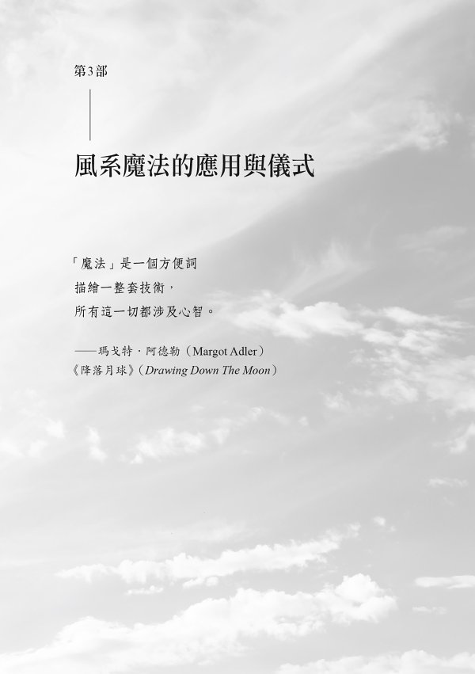

# 风系魔法

自然魔法系列绪论

## 魔法工作的基石

好几世纪以来，透过许多秘传的实务做法，元素们一直是魔法工作的基石。无论是占星学或现代巫术，这四大元素都在更广大的多维灵性架构范围内创造出边界和结构。它们强调概念，使概念变得更加浅显易懂。

确切地说，“土”（earth）是我们行走其上的地面，它是岩石、泥浆、山脉。“土”也是我们的身体以及今生的物质显化，它是我们的中心和我们的稳定。

“火”（fire）是壁炉里的火焰，它是蜡烛、营火、太阳。“火”既可以温暖，也可以毁灭。它有力量转化和煽动，它的火焰是我们的热情和我们继续前进的意志。

“水”（water）是来自天空的雨，它是人世间的海洋和湖泊、令人欣慰的沐浴、早晨的露水。“水”是我们的血液和汗水，以及我们的记忆，它统治我们的情绪，显化成为眼泪。

“风”（air）在我们周围，它是我们的呼吸、我们听见的声音、触碰我们脸庞的风。“风”携带种子和花粉、警告人的气味和令人愉悦的气味、文化的歌谣。“风”是我们的声音、我们的念头、我们的点子。

虽然每一种秘传系统以不同的方式应用这些基本概念，但四大元素都在帮忙建构实务做法，逐渐产生对自我的更加理解。对现代女巫来说，四大元素往往表现在她们的魔法工具中；举例来说，高脚酒杯可能是水，五角星形可能是土。对信仰巫术的威卡派（Wicca）教徒来说，比较具体的是，四大元素帮忙升起魔法圈，让保护区得到力量的加持。在塔罗牌中，四大元素流经数字牌的象征性意象；而在占星学中，每一个元素由三个星座代表。对其他人来说，四大元素为每天的静心、观想、法术施作或生命功课，提供灵性指引。有人可能会问道：“我需要什么元素才能度过今天呢？”

本书是一套特殊书系的第二本，这套书系深入探讨元素的象征意义和魔法效用。每一本聚焦在一个元素，涵盖与该元素相关联的每一样东西，从灵性圣域和神明，到实用的法术和仪式。对于想要将自己包裹在元素实务做法中的女巫来说，或是对于需要每一种元素资源的某人而言，本书和同一书系的姊妹作品，将会提供你需要的每一样东西。

“巫术的元素”（Elements of Witchcraft）书系中的每一本著作，是由来自全球的四位不同作者所撰写，这显示，领略深奥莫测的四大元素涉及多么的广泛和深入，以及该如何让那个概念为你自己的魔法和灵性需求运作。

加入我们，一起深入探索四大元素的魔法效用吧。

——海瑟·葛林（Heather Greene）

水、风、火、土四大元素魔法系列主编

### 飞行

风系魔法的重点是超越。

超越人类双脚不着地的是什么？

超越飞行的是什么？

飞行，

是超越任何事物，

是超越认为人类有本领的任何人。

我们没有双翼。

我们跳不了多高。

我们是地面动物。

然而，

因为艺术家、梦想家、女巫

生性好奇，

他们认为：

如果一个人类可以飞行，

“怎么办呢？”

攀爬，

爬到尽可能远离地球的地函（mantle，译注：又称“地幔”，位于地壳之下，地核之上）

等于是飞行——

等于是完善魔法。

——像素女巫

编按：“像素女巫”（Pixel Witch）是制作人、变装皇后、空中飞人、舞者。当她不在世界各地表演的时候，就是在纽约市的“是的房子”（House of Yes）演出。

作者序

## 神圣的风元素能量

你是否曾经在户外散步而一阵凉风掀起你周遭的所有树叶？或许那风爱抚着你的肌肤，逗弄着你的头发或衣服。你可能已经感觉到它触动你的“灵”，促进你内在欢腾的感觉。你甚至可能感觉到，你有可能乘风飞起。

假使你曾经梦见过魔法飞行，那么你对它有一定的熟悉度。那几乎就像飞行是我们天生拥有的能力，我们只是必须忆起如何飞行。在我们的梦境中飞行，远在地球上方，摆脱烦恼，它可以感觉起来十分威力强大。它是一种神秘、崇高的感觉，而且它是完美的模拟魔法的风元素给人的感觉。

自古以来，人们一直研究风元素。几千年来，人们得出结论，风元素（air）是四种基本的能量状态之一，与土、水、火一起。风元素与心智、思考、呼吸、灵感、想像力有关联，它也与沟通、旅行、改变、提升、灵、扩展相链接。这本书探讨所有这些风元素的特质，也揭示现代女巫该如何在她们的技艺中运用风元素的力量。

身为研究风系魔法多年的人，我感觉得到召唤，要撰写这本书。我研究过几种类型的呼吸工作，包括静心和瑜伽。这些练习揭示了“灵”（spirit）、呼吸（breath）、心智（mind）之间的直接链接。同样地，从我的大学射箭课，我知道，谈到导引能量时，一个人的呼吸造就极大的不同。长久而缓慢的呼吸使心智稳定，让箭更频繁地射中目标。身为环境科学家，风元素的科学性质算是我的专长。我研究过天气、暴风雨、气候、不断变化的大气。我对风系的生物也很熟悉，而且我研究过蝙蝠、鸟类、蝴蝶。我也直接体验过“灵”、星体投射（astral projection）、天气巫术。最重要的是，我的本命星盘在所有三个风象星座中都有几颗行星。

在我的研究中，谈到风元素，我制定了三种不同的方式：个人的、物理的、魔法的，每一种状态都具体化现“风”的几种独特品质。

### 个人的风元素：呼吸、心智、沟通

呼吸使我们与风元素创建起非常个人的链接。肺部空气的不断流动，使我们时时刻刻与风元素链接，这非常重要。我们每天的呼吸次数介于一万七千次到两万三千次之间，这比任何其他活动更为频繁。1 花点时间深深吸气，现在就与你的肺脏里的目前情况链接。如果你甚至开始放慢呼吸，很有可能你会开始放轻松。话说回来，如果你开始快速地呼吸，你可能会变得更加警觉而专注。呼吸控制我们的心态，它可以被用来促进出神状态和灵性工作。

风元素也与我们的心智相关。我们每天使用自己的头脑，无论是以批判性思考、想像、组织、发明、规划、学习，还是以心智的无数种其他功能中的任何一种。活跃的心智，往往被链接到“一旋风的点子”（a whirlwind of ideas）、“集思广益激发创造力”（brainstorms of creativity）、“如霹雳般出现的灵感”（thunderbolts of inspiration）。

沟通是风元素的另一个个人面向。每当我们写下、说出或演唱心中的话的时候，我们都是在表达自己的思想。这个行为从我们的内在世界转化它们，将它们诞生在外在世界，创造新的可能性。

### 物理的风元素：扩展、旅行、改变

科学揭示了我们周围无形的风元素世界的许多秘密，包括风元素（译注：风元素的英文 air，其实就是“空气”）的物理性质，即扩展、旅行、运输、改变。空气是由几种不同的气体组成，这些气体天生就喜欢尽可能地扩展和旅行。空气分子不断地运动，通常比固体或液体的运动速度快许多。这种运动和旅行，让它们接触到几种不同类型的其他分子，而且当条件适当时，它们就改变。

风元素自然而然地运输各种东西。举例来说，弹拨竖琴琴弦的声波和烧香的香气，可以轻易地透过空气传导。风（wind），也就是活跃的空气，甚至移动粒子——在风的方式中，这是显而易见的：风不着痕迹地将山脉切割开，将空气中的灰尘随着风吹到其他地方。风还携带着温暖、电力、湿气，当能量不同的空气锋面（air fronts）发生碰撞时，它们便以闪电、雷鸣、降雨的形式释放这股能量。

风元素不断地改变着。风元素的不同成分和分子，不断地被释放、固定或改变成为其他东西。你此时正在呼吸的空气，可能曾经是某棵芦荟植物、某块珊瑚礁、某只绯红金刚鹦鹉、维多利亚湖中的一滴水，或某座焦油坑的一部分。

### 魔法的风元素：创造、显化、灵、神明

魔法的风元素时时刻刻围绕着我们。我们沉浸其中。你可以把它想成一个无形的世界，充满能量、灵、神明。你也可以把它想成是它自己的能量层面或界域。我们的思想和言语，正在不断地与这个界域交流。魔法的风元素接收到我们的思想、脑波、心灵沟通——它将它们转变成为能量，向外传送到这个世界中，这就是显化魔法工作的方法。

每当我们进入出神（trance）状态的时候，我们的心智和灵就转变成为魔法的风元素的频率，这使我们能够与居住在那里的灵和神明沟通。当我们在进行星体投射的时候，风元素的魔法界域也就是我们的灵旅行的地方。

#### 集合风元素的各个面向

我们时常同时体验到风元素的所有三个面向，这是“灵”居留在身体内的方式，也是植物和岩石拥有风元素能量的方式。风元素的魔法界域链接物质层面与更高的灵性层面。这一切环环相扣——我们的呼吸速率改变我们的心态，从而产生我们的想法，于是帮助我们选择言语。当这些言语被表达出来时，它们将能量向外传送，回到风元素的魔法界域，在那里，风元素四处旅行，最终吸引同样的能量回到我们身上。

风元素能量自然流动，能量不断地进进出出。这可以被视为能量被接收和传送，无论是透过呼吸、心念、沟通、聆听，还是“灵”给出和接收能量。

与风元素一起运作的时候，请运用风元素的任何面向和特征，启发你真正地在所有三个层次感觉到风元素。感觉到你周围的空气、你的思想、居住在其中的灵。要好好运用你的呼吸、五感、灵。要召唤移动你内在的风元素、启发你感觉到如羽毛般轻盈的不管什么东西。

### 慢慢往上飞，远离地面

当你准备好要升起进入魔法的风元素，并了解更多信息的时候，请做一次深呼吸。仔细考虑重新开始以及你可以四处搜集的所有信息和智慧。详细地想像你的所有意图正在成为事实，当你准备就绪的时候，请启动新开始的风元素能量，然后再翻页。

* * *

注 1：安·布朗（Ann Brown），“你一天呼吸多少下？”（How Many Breaths Do You Take Each Day?）EPA 部落格（The EPA Blog），出版时间：二〇一四年四月二十四日，存取时间：二〇一九年七月三日， [`blog.epa.gov/2014/04/28/how-many-breaths-do-you-take-each-day`](https://blog.epa.gov/2014/04/28/how-many-breaths-do-you-take-each-day)。

<ops:switch id="svgswitch0"><ops:case required-namespace="http://www.w3.org/2000/svg"></ops:case><ops:default></ops:default></ops:switch>

## 1　贯穿古今和所有文化的风

空气、思想、呼吸，全都是与“灵”息息相关的强大概念。在考古学、词源学、艺术、敬神、神话学之中都有这方面的证据。风元素的几个主题贯穿整个历史，但是或许在所有这些之中，最能说明问题的是，随着时间的推移，人类的心智和“灵”的发展结果。人类的心智是由思想的到来形塑的，思想的到来最终带来了知识，有时候是智慧。人类的“灵”的道路，不仅与心智的道路相似，也与对其他“灵”的看法相似。

让我们回到过去，透过心智和“灵”观看人类在整个风元素范畴内的历史。透过这方面历史的发展、挑战、胜利，风元素的力量穿透过来。虽然本章并没有涵盖心智和“灵”的完整历史（而且本书很可能没有一章可以做到这点），但是收录了最重要的西方趋势，以及部分的世界历史。

### 史前的心智状态：万物有灵论

在石器时代（Stone Age）人类意识开始出现的时候，万物有灵的心态可能很盛行。万物有灵论（animism）这个词来自拉丁字 animas，可以翻译成呼吸、心智、灵魂的哲学。这是相信和内在的知晓，明白：一切事物都是活着的，有“灵”和它自己的智能。它是一种密切链接的世界观。因为这种魔法的心态可能发生了几千年，它被认为已经为人类的潜意识设定了基调。

新石器时期（Neolithic era）标记了一次改变，当时，思想变得比较盛行。在这个勇敢的新时代，人们开始构思未来，而且开始规划未来。这个时代看见了革新的出现，例如，农业、驯养动物、建造永久的住家。发明的出现是为了解决常见的问题，而这个时期也有了比较成熟的灵性面向。万物有灵论的心态略有修改，因为人们将自然界看作是他们可以用头脑解决的另一个问题。神明诞生了——不再将风（wind）视为一种神秘、活生生的力道，它变成了一位特定的灵或神，有名字和故事。透过供奉、崇敬、对话，它可以与我们交流。大部分的万物有灵论继续存在，但是这些神明被视为比万物有灵的“灵”更加威力强大——比较像是一种统治或皇室阶级的“灵”，而不是自然灵。宗教在这个时期兴起，于是古老的异教宗教（pagan religion）被创造出来。

永久的住宅和村庄创造了一群群的人们，他们发现，在某些时候聚在一起是有裨益的。他们创造了仪式来庆祝新神明和标明季节，这个时期还看见透过墓地和丧葬仪式对死者表示敬意。石碑是这个时候竖立起来的，包括巨石阵（Stonehenge）和大金字塔群（the Great Pyramids），在沟通交流、艺术、语言精练方面也大幅增强。

### 古代的历史：魔法

当历史开始被记录下来的时候（也就是说，随着文字的发明），史前时期结束了。异教仪式和神话，被记载在《伊里亚德》（The Iliad）和《奥德赛》（The Odyssey）之类的作品中。它们让人瞥见了古代信仰的光辉灿烂。由于更复杂精密的沟通和推理方法，这个时期催生了诗歌、魔法、科学、哲学、更成熟的宗教、精致的艺术、天文学、数学等等。这些研究领域全都被认为是理解和影响宇宙的方式，而且它们不是分开的。

尽管大部分的古代文化之间相隔遥远，但是几个与风元素相关的主题却出现了，包括风元素的创造力量、风元素是魔法元素的哲学、相信风元素与灵链接等等，这里有几个古老的风元素主题。

#### 风元素的创造故事

无数个宇宙、地球、生命、人类的创造故事都从风元素开始。这可能是一次呼吸、一句说出来的话，或一位与风元素有关联的神明，所有这一切结合成风元素与开始和启蒙的关联。

风元素在希腊起源的神话中占有主导地位。希腊人相信，宇宙被创造出来，是因为一位无形无状叫做“混沌”（Chaos）的存有，生下了一位有黑暗翅膀的女神“黑夜”（Night），而“黑夜”生下了一颗蛋，整个宇宙由此诞生。地球是由具体化现天空和空气的男神“乌拉诺斯”（Ouranos 或 Uranus）与大地女神“盖亚”（Gaia）融合创造出来的。人类是由“普罗米修斯”（Prometheus）与“厄庇米修斯”（Epimetheus）创造出来的，这两位男神的名字，意谓着事先的考虑与事后的想法。

北印度的民荣（Minyong）部落人民，也相信一位造物主天空男神与一位造物主大地女神，这些神明生出了第一批人类。

古代的中国人相信：宇宙是一只鸡蛋的形状，有时候也叫做“宇宙蛋”。从蛋里出现了空气或呼吸（称为“气”）。这个“气”也创造了大地和所有生命，包括人类。

大溪地（Tahiti）神话涉及一颗宇宙蛋，从这颗蛋中出现了一位创造宇宙和人类的男神。

美洲原住民休伦族（Huron）相信，第一个人类是女人，她从天空中的一滴眼泪坠落。

在古埃及，智慧、写作、魔法之神“托特”（Thoth）透过说话创造了他自己，然后他生下了成为这个世界的蛋。太阳神“拉”（Ra）也被认为创造了天空、大地、人们。叫做“贝努”（benu）的神话鸟与这个世界同时诞生，而且每天早晨日出时，它随着冉冉升起的太阳一起重生。

在马雅（Maya）神话中，一条有羽毛的大蛇和一位被称作“天空之心”（Heart of the Sky）的神明，用他们的言语和念想创造了物质世界。此外，他们继续形成人类、语言、书写、书籍。

尼日利亚的约鲁巴（Yoruba）人相信，一位名叫“奥罗伦”（Olorun）的灵是天空的统治者，他下令创造地球以及赋予人类生命。

其他古老的宗教（包括犹太教和基督教）都相信，一句话诞生了宇宙和地球。这种想法在我们的现代语言中是显而易见的——甚至“宇宙”的英文字 universe 也可以翻译成“一首歌”。

#### 风是魔法元素的哲学

几个古代文明都相信基本元素，或是构成其他一切的能量。这个观念起源于世界各地，包括位在希腊、日本、中国、非洲部分地区、印度、西藏、夏威夷、北欧的古文明。这些元素的数量从三到七种不等。恩培多克勒（Empedocles）是西元前五世纪的希腊哲学家和魔法师，他认为元素是灵性的本质，每一种元素都拥有自己强大得像神一样的能量。西元前五百年左右的希腊哲学家阿那克西美尼（Anaximenes）也赞同这些观点，他相信，风元素创造了这个宇宙和世界，而且它是所有其他元素的根源。

风元素的哲学是在这个时期发展起来的。亚里斯多德宣称，风元素的性质是温暖而潮湿的。在西元前四世纪，希腊医师希波克拉布底将风元素与血液联想在一起，因为它又热又湿。西元前三百年左右，炼金术士佐西默斯（Zosimos）是第一位将风元素与基本方位（南方）联想在一起的人。赫密士·崔斯墨图（Hermes Trismegistus）是大约西元两百年的埃及圣人，他进一步提出了风元素对应关系的概念。

#### 呼吸包含灵与生命

呼吸与“灵”之间的关联是有道理的——呼吸是出生后第一个生命征象，也是我们离开这个世界之前所做的最后几件事之一。据此，呼吸（或空气，也就是风元素）被许多文化认为就是生命或“灵”本身。在希腊语和拉丁语中，psyche 这个字翻译成气息、活力、生命、灵。呼吸（breathe）的字根来自拉丁语 spirair，与灵（spirit）、灵感（inspiration）、志向（aspiration）这些字相关联。pneumea 是呼吸和灵的希腊字。希伯来字 ruach 可以翻译成呼吸、空气、风、灵。

某些神明，例如，耶和华、奥丁（Odin）、奥罗伦，将生命的气息吹进第一批人类之中。纳瓦霍（Navajo）部落人民相信，婴儿的第一口呼吸决定这名婴儿的命运。在某些美洲原住民的实务做法中，萨满（shaman）可以在人们的肺部捕获灵魂的碎片，将它吹回到某人体内——萨满的呼吸具有重新结合灵魂碎片的力量。呼吸与灵之间的另一个链接是，许多人认为呼吸是摒除杂念和达成星体投射的关键。

#### 风元素包含灵或神明

许多古文明相信，灵居住在空气（风元素）之中。在古希腊，这些被叫做“代蒙”（daimon），他们被认为是一群有益或无害的灵，包括自然灵、死者的灵魂、守护灵、负责守护的指导灵。2“代蒙”可以代表世界上的人类行事，他们也是人类与诸神之间的媒介。

在某些古老文化中，风与灵是有关联的。爱尔兰传说中的“希”（sidhe，发音为 shee），他们是又称作“菲”（Fae，意译：小仙子）的精灵，逐字翻译的意思，是“一阵风”或“风元素的族群”3。同样地，在某些文化中，强风被描绘成空气打造的马儿。“狂猎”（Wild Hunt）是一则欧洲神话，讲的是一批由奥丁领导的灵，他们骑着幽灵般的马儿，令风儿呼啸狂嚎，而且向看见他们的人们预示厄运的来临。

在许多文化中，风被拟人化成为某位神明。在北美纳瓦霍族的宗教中，“圣风”（Holy Wind）被认为是无所不知、有无上权力的存在体（entity），可以让一切事物发生。他们相信，一切事物都有这股内在的风，那可以被转译成“灵”。某些文化，包括埃及人、希腊人、罗马人、凯尔特人（Celt）、美洲原住民、古代北欧人（Norse），东、南、西、北各有一位神明，代表来自四大基本方位的“四大风”，这些神明分别与某股能量、某种气温、某个季节相关。

#### 心智是一处能量中心

源自这个时期的另一个共同主题是，心智包含一系列能量，涉及思考、观想、沟通、其他风元素面向。这点在印度的第六脉轮、北欧的灵魂（hugr）、苏菲（Sufi）的 nafs、凯尔特的 Coire Sois（被视为一只大锅）、胡纳（Huna，译注：夏威夷的形上学理论）的 uhane，都说得清楚明确，被称作“表意识心智”（conscious mind）和“灵”（spirit）。

### 中世纪：心智与灵的潜抑

中世纪（Middle Ages）开始于西元四七六年西罗马帝国灭亡之后。随着父权制宗教的声望在西方世界崛起，异教宗教逐渐式微。某些历史学家认为，这个改变与由于线性书写的发明而发生的心智转变是一致的。到了西元五三八年，罗马教会（Roman Church）已经禁止了所有的异教崇拜。少数没有被消灭的异教习俗，被剥夺了它们的原始意义且被纳入罗马教会的实务做法中。科学的、炼金术的、魔法的研究被禁止。几名炼金术士逃到中东的部分地区，那里的宗教宽容度比较大。

对大部分的西方世界来说，中世纪是一个未被启蒙的时代。识字的人少之又少，书籍因成本极高而被保存在私人图书馆内。然而，尽管罗马教会的权力不断增长，但是某些异教信仰和民俗还是幸存了下来。在第八和第九世纪，几位教会要员记录了女性的证词，她们报告说，她们（显然是因为星体投射或梦境）在夜空中与其他人、动物、女神黛安娜（Diana）和超自然存有一起飞行。女巫飞过夜空的故事，可能就源自于这些叙述。

在十一和十二世纪，来自阿拉伯人、犹太人、希腊人的新译书抵达欧洲，这重新点燃了学习的兴趣。人们学习哲学、天文学、占星学、科学、炼金术、魔法、与灵沟通、占卜，以及宝石与植物的魔法力量之类的主题。大量的信息，为中世纪的魔法以及所谓的“十二世纪文艺复兴”提供了基础。

在这个时期，教会要员很可能读到了那些谈到“代蒙”的古文，而且将“代蒙”诠释成“邪灵”。据推测，这导致一二〇〇年左右发明了 demon 这个字，意思是“邪灵……恶魔”。4 罗马教会认为，所有灵都是邪恶的，包括古时候的神明、死者、自然灵、地方灵，以及小仙子（fairy）、淘气小精灵（elf）、棕仙（brownie）之类民间传说的灵。这些“邪灵”与风元素相关联，也与“恶魔”（devil）相关，人们称之为“空中掌权者的首领”（the Prince of the Power of the Air）。5

将呼吸所必须的“空气”（风元素）逐步妖魔化，创造了一种可怕的视角，将生命视为善与恶之间的不断争斗。对于以所谓的“招魂术”（necromancy）祈请这些灵且与之沟通的人们，罗马教会变得愈来愈偏执。一二三九年，罗马教会成立了宗教裁判所（Inquisition），目标是要消灭异端邪说和邪恶以及反叛者。估计有四万到六万人被杀，而且更多的人在血腥屠杀中饱受折磨，这场屠杀持续了几个世纪，直到进入启蒙运动（Enligthtenment）才停止。尽管如此，新的魔法书籍仍然出版和流通，即使可能受到死刑的惩罚。

### 文艺复兴：一次谨慎的重新诞生

“文艺复兴”（Renaissance）的意思是重新诞生，对于一个因为印刷术的发明而允许古典艺术、科学、哲学之类的主题，可以再次兴盛的时代来说，“文艺复兴”是一个适用的名字。书籍和小册子很快被复印，而且信息被广泛地散播，这促进了读写能力和心智的发展。然而，并不是在这个时期复印出来的所有信息都是有裨益的。一四八七年，宗教裁判所创作了《女巫之槌》（Malleus Maleficarum），这是一本侦测、折磨、杀死女巫的猎巫指南。

尽管宗教裁判所的严厉，这些玄秘科学还是因为印刷术的帮助秘密地大量出现。occult（玄秘的）这个英文字在一五二〇年代左右被发明出来，意思是“掩盖住或隐藏起来”。6 将晦涩难懂的知识隐藏起来，避开会摧毁它的人们，那是必要的。魔法的秩序被创建起来，以小册子流通。在这段时期，几本书被出版了，提出了关于风元素性质的假设。

文艺复兴结束于十七世纪中叶，当时哲学家笛卡儿开发了新的简化哲学，优先考虑理性思考。逻辑和理性开始渗入集体思想，它播下了“启蒙时代”的种子。由于强烈抵制以及企图压抑思想和精神的自由，猎巫行动升级了。

### 启蒙时代：更大的思想和精神的自由

“启蒙时代”开始于一七一五年左右，它标记了一个人们普遍受教育程度高于过去几千年来的时代。人们质疑权威，重视理性，尊敬表达的自由。所有这些风元素的原则，开始解开宗教和严重迷信的束缚。

由于更大的思想自由，好几本新的玄秘著作被复印且出版了，促成了比以往任何时候更多的资料。更多的秘密社团成立，例如“共济会”（Freemasons）和“地狱火俱乐部”（the Hellfire Club）。虽然宗教裁判所在法国、德国、瑞士、波兰等国家如火如荼地肆虐，但是这个时期最终标记了——最后一个人在欧洲或北美因巫术而被处死，时间是一七九三年。

在十八世纪末期，浪漫主义（Romanticism）崛起，在艺术方面有更大的表达自由。文学界因为济慈和雪莱这类作家而兴起了对恐怖和神秘的热爱，他们往往在作品中运用异教的神明。新的艺术和灵性运动开始了，这个时期也是海地的巫毒修习者移民到纽奥良的时候，此举有助于创建巫毒（Voodoo，译注：又拼作 Vodou、Voudou、Vodun）宗教。德鲁伊复兴运动也开始于这个时期，当时的德鲁伊教僧侣（Druid）于一七九八年举行了一场向秋分致敬的典礼。

整个十九世纪，浪漫主义在工业革命（Industrial Revolution）当中持续兴盛。好几本新的玄秘和神秘著作出版了，许多比较古老的著作则再版发行。一八〇一年，《魔法师》（The Magus）出版，影响了未来几个世纪举行典礼的魔法师。一八二〇年，《失散已久的朋友》（Long Lost Friend）出版。这本记载制作配方与法术加上一段基督教观点的书籍，变成与民俗魔法的再生以及一个叫做“胡毒”（Hoodoo）的实务做法有关。

### 唯心论：复活的灵

对降神会与通灵术有兴趣的唯心论（Spiritualism）运动，开始于一八四八年，不久就遍布欧洲和北美洲，这份好奇心也激起了世界的其他部分研究玄秘学、古代的异教信仰（paganism）、灵性的实务做法。

在这个时期，伊利法·李维（Éliphas Lévi）出版了几本玄秘书籍，他是传承赫密士主义（Hermetism 或 Hermeticism，译注：宗教性与哲学性的传统，主要是基于被归为赫密士·崔斯墨图所著的伪典）的炼金术士兼仪式魔法师。李维显然与风元素非常有缘，因为他尊敬知识高于一切。他开发了元素的定理，包括风元素是“知晓”（to know），而且将风元素的元素统治者命名为“帕拉达”（Paralda）。他促进了“对应关系”与“仪式化魔法”的理解。

许多灵性进展发生在这个世纪下半。从一八五〇年到一八六九年，玛莉·拉冯（Marie Laveau）成为著名的纽奥良巫毒社群的领袖。海伦娜·布拉瓦茨基（Helena Blavatsky）发起了玄秘哲学。这时期在一八七五年左右启发了 neopagan（“新异教”或“新异教徒”）这个字的创造 7，以及几个团体和秘传学会的成立。这些包括北欧的异教团体，以及“安格利亚玫瑰十字会”（Societas Rosicruciana in Anglia），促成了“黄金黎明协会”（the Hermetic Order of the Golden Dawn），他们创造了“东方的了望塔”（watchtowers of the east）这个说法，来召唤风元素的元素统治者。阿莱斯特·克劳利（Aleister Crowley）是好几个秘传团体的成员，包括“黄金黎明协会”，他推动了通俗化的仪式魔法。本时期的其他作家，包括查尔斯·李兰德（Charles Leland）与玛格丽特·默里（Margaret Murray），出版了几本著作，书中的缘起，都提到从罗马帝国时代传承下来的完整巫术宗教。虽然他们的许多理念并没有事实根据，但是他们反映了那个时期对魔法、神话、抵抗的共同理念。

### 巫术的再生：秘密问世

一九五一年，英国的反巫术法案被废除。同年，罗伯特·柯克伦（Robert Cochrane）发起了“传统巫术”（Traditional Witchcraft），这是一个非异教的巫术运动。一九五四年，杰拉德·加德纳（Gerald Gardner）出版了《今日巫术》（Witchcraft Today），书中揭示了威卡教（Wica 或 Wicca，译注：新兴、多神论、以巫术为基础的宗教，盛行于英国和美国）的实务做法，这是之前不为人知的巫术版本。

一九六〇年代，反主流文化诞生，许多人们舍弃社会同一性与有组织的宗教，推动迈向更大的平等。在这段期间，“新时代”（New Age）运动从唯心论的灰烬中升起。这种比较新型的思考方式，纳入了正向思维的力量，以及在社会规范之外搜寻灵性的意义。人们开始探索与心、身、灵链接的方法，这反映在静心和瑜伽之类的东方实务做法日渐普及。许多人被吸引，迈向大自然、异教信仰、巫术。

几本关于巫术的书籍被出版，其中某些提倡独自研习、自我启蒙，以及用比较直觉的方法接触魔法和巫术。

### 全球化：信息的时代

网际网络改变了一切——比起以往任何时候，信息更广泛、更容易被分享，而且世界各地的人们链接了，即使不是在“现实生活”中链接。社交媒体也用知识链接了来自世界各地的人们。许多人把这个时期叫做“信息的时代”（Age of Information）以及“水瓶座的时代”（Age of Aquarius）。这个说法很恰当，因为考虑到风元素比以往任何人类时代都更为盛行。信息是不折不扣在空气中的，以无线网络（wifi）与蜂巢链接（celluar connection）的形式。其他流行的风元素技术，包括微波炉、风力、无人机、光学雷达（LiDAR）。当然，你八成听过“资料库”（data bank）这个专有名词，而且是云端资料库。这个时期是十分完美地具体化现风元素，我们不妨称之为“风元素的时代”（Age of Air）。

对许多人来说，这是空前的自由和信息与现行机构的破灭感同时发生。解决方案呢？就是巫术。更多的人们正在研习巫术，多过以往任何时候。据估计，从二〇〇八年到二〇一八年，美国境内的女巫、异教徒、神秘学人口增加了一倍，达到一百五十万名修习者。8 关于巫术、异教信仰、神秘学的书籍正在被出版，销售速度大过以往任何时候，而且“趋势”似乎并没有减缓。9 魔法艺术的修习者，将这些视为灵性的实务和方法，可以在自己人生中运用更多的力量。

“信息的时代”也有与风元素密切链接的独特危机。温室气体在地球的大气层中积累，已经造成了可能不可逆转的气候改变。

幸运的是，我们可以运用风元素帮忙解决我们时代的两难困境。谈到信息以及可以做出的抉择时，我们可以运用辨别能力。可以在我们的消费主义（consumerism）中运用智慧，而且可以与官员沟通，通过减缓气候改变的法律。但愿由于新的发明与革新，我们将会在这个时代持续繁荣兴旺，让在地球上的每一个人达成心智与灵性的自由。

### 心智与灵的全新高度

风元素一直以人类心智与灵的形式与人类一起成长。历史可能并不总是很漂亮，但重要的是，要知道我们从哪里来。假如历史确实重复，我们便可因为事先知道而预作准备。由于自由思想的散播以及选择自己的灵性道路的能力，心智与灵已经翱翔到勇敢的全新高度。未来尚未定型，但是很可能对知识、自由、平等的渴求，将会继续成长到无与伦比的程度。

* * *

注 2：“Daimon”，Online Etymology Dictionary（线上字源学字典），二〇一九年十二月二十八日存取，[`www.etymonline.com/word/daimon`](http://www.etymonline.com/word/daimon)。

注 3：Ottis Bedney Sperlin, Studies in English-World Literature, (New York: Century Company, 1923), 268。

注 4：”Demon”，Online Etymology Dictionary（线上字源学字典），二〇一九年十二月二十八日存取，[`www.etymonline.com/word/demon`](http://www.etymonline.com/word/demon)。

注 5：《钦定版圣经》［以弗所书］第二章二节（Eph 2:2 KJV）。

注 6：”Occult”，Dictionary（字典），二〇一九年十二月二十八日存取，[`www.dictionary.com/browse/occult`](http://www.dictionary.com/browse/occult)。

注 7：”Neopaganism”，出处同上，二〇一九年十二月二十一日存取，[`www.dictionary.com/browse/neopaganism`](http://www.dictionary.com/browse/neopaganism)。

注 8：Melisa Malamut，“Witch Population Doubles as Milennials Cast Off Christianity”，《纽约时报》（New York Post），二〇一八年十一月二十日出版，二〇一九年十二月二十八日存取。[`nypost.com/2018/11/20/witch-population-doubles-as-millennials-cast-off-christianity/`](http://nypost.com/2018/11/20/witch-population-doubles-as-millennials-cast-off-christianity/)。

注 9：Lynn Garrett，“Season of the Witch: Mind Body Spirit Books”，《出版者周刊》（Publishers Weekly），二〇一九年八月二日出版，二〇一九年十二月二十八日存取。[`www.publishersweekly.com/pw/by-topic/new-titles/adult-announcements/article/80847-season-of-the-witch-mind-body-spirit-books.html`](http://www.publishersweekly.com/pw/by-topic/new-titles/adult-announcements/article/80847-season-of-the-witch-mind-body-spirit-books.html)。

## 2　神话中的风兽与风乡

许多神话的存有和地点，都与风元素的魔法有关，例如龙、狮鹫、小仙子之类的生物，是集体人类意识和想像的一部分。从有记录的时间开始，在几乎每一种艺术形式中都可以找到它们，包括绘画、木雕、陶器、壁画、神话、故事中，以及盾形纹章上。这些风系神话存有，是故事里的要角，吓坏了古代的观众，令他们毛骨悚然。同样地，几乎在每一个文化中都可以找到风元素的神话地点，而且它们激起惊奇以及对这些异世界的渴望。

几千年来，许多这些神话被认为其实是存在的。对这些生物和地点的共同信念，是由于第一手的经验描述，以及由于囊括了虚构和真实生物的书籍。人们认为，或许只有某些人们经验过这些神话，因为这些生物很罕见，或是找不到进入神话地点的方法，或是这些异世界的存有，绑架了靠近它们的任何人，等几十年或几世纪之后才让这些人回家。

当十七和十八世纪，逻辑开始推翻迷信的时候，这些神话的观点改变了。成年人被期待是理性的，不抱持不合逻辑或荒唐古怪的想法。由于持续欠缺真实存在的证明，神话中的野兽，最终被归类为荒诞的生物。同样地，曾经老少咸宜的仙灵故事，被降级成为仅限于儿童。

不管怎样，神话以童话故事、寓言、动物寓言集、传奇故事的形式，继续留存下来，就跟格林兄弟（Grimm Brothers）、安德鲁·朗（Andrew Lang）、托尔金（J. R. R Tolkien）等人说的那些故事一样。近来，风系存有和地点，根深柢固地出现在现代艺术、电影、电视节目、书籍之中。想像《冰与火之歌：权力游戏》（Game of Thrones）没有在飞的龙，或是《魔法师》（The Magicians）的虚构界域“费洛瑞”（Fillory）之中没有仙灵，那几乎是不可能的。

要将本章中的神话想成异想天开的视界、原型、拟人化魔法的风元素，让它们提升你的想像力，借此启发你更常感觉到与风元素接触。我鼓励你，在焚香的烟雾袅袅盘绕时，与风精灵西尔芙（sylph）一起共舞。想像威严的狮鹫在头顶上方飞行，同时感觉到你的心高飞翱翔。要搜寻云朵，因为那些云的城堡是用风元素建造的。让这些故事提升你的心智与灵，因为它们的本意就是这样。

### 风元素的神话生物

#### 有双翼的飞龙

龙（dragon）曾经被认为是地球上最大的生物。它们自在地飞过空中，导致各式各样的天气，尤其是大雷雨。好的龙疗愈和帮助人们，但是邪恶的龙吃掉家畜和人们，而且用一口火的气息喷过去，烧掉整座村庄。在中世纪的英格兰，有目击者描述，巨大、有鳞的龙，张开宛如蝙蝠的双翼飞行，恫吓城镇。传奇的亚瑟王与龙有关联，而且关系密切到亚瑟王的头盔上有龙的徽章。某些历史学家相信，龙是古代异教文化的象征，也是对抗基督教的象征。征服恶龙往往是一种委婉的说法，意指战胜内在的挣扎，达成灵魂的解放，摆脱心智和情感的束缚。

在古代的中国，龙是威力强大的风元素大师以及好运的传递者。它们在云中玩耍，四处打磙，有时候追逐一颗光球。这些龙可以变成大到如同整个天空，也可以小到宛如一条小虫。作为天气的主宰，它们指挥风、云、雨。虽然这些龙有导致暴风雨的能力，但是它们只在不满意人们行为的时候，才会毁坏人们的财产。

在魔法方面，龙与野心、潜意识、挑战、保护和毁灭、梦想、天气、开悟、古老的智慧、运气、繁殖力、平衡、显化、异世界、权力、勇气、财富、创造、保护相关。这些宏伟庄严的生物，可能也与其他元素有关，取决于它们的结构、能力、栖息地。与这种龙类似的神话生物，有双足翼龙（wyvern，有鱼尾的龙）和鸡蛇（cockatrice，有鱼尾和公鸡头的龙）。

#### 翼蛇

翼蛇（winged serpent）出现在世界各地的民间传说中，包括古代的欧洲、印度、中国、日本、中美洲和北美洲、夏威夷、新西兰、芬兰、埃及、中东。它们跟一般的大蛇一样大，只是它们有美丽而覆有羽毛的翅膀。

关于翼蛇的癖好，传说各不相同。在某些故事中，它们是保护者和守护者，代表人类的利益行动。腓尼基人（Phoenician）称之为“阿加索斯代蒙”（agathosdaimon），意思是保护者的灵。在中国的一则故事里，翼蛇来到某个人家，警告那家人干旱即将到来。然而，其他故事则说，翼蛇是危险和敌对的。被它们咬伤导致疾病，它们的尿液融解掉肌肉。阿拉伯人的翼蛇叫做“赛伦斯”（syrens），其毒液可立即致死，它们甚至跑得比马还快。

几位埃及神明被描绘成翼蛇，包括坟墓守护者默策赛格（Mertseger）女神；以及掌管分娩与母性的涅赫贝特（Nekhebet）。法老王的守护神布托（Buto）女神也以翼蛇的形相现身，而且有时候也被描绘成戴着王冠。

在古代的马雅部落文化中，羽蛇“库库尔坎”（Kukulcan）被尊为慈善的转化神明。几世纪以后，库库尔坎的传说变成了阿兹特克人（Aztec）的羽蛇男神“奎查寇特”（Quetzalcoatl）。

美洲原住民夏安（Cheyenne）部落民族有一则关于翼蛇的警世传说。一天，两名男子忙着打猎，他们遇见了一座巨型鸟巢，巢里有他们见过最大的蛋。一名男子肚子饿，于是吃了一颗蛋。几天后，他开始变形成一条巨型羽蛇。他全身长满了羽毛和鳞片。男子非常痛苦，于是投河自尽。根据至少一种说法，这是为什么夏安族人每次渡河或穿越湖泊时，都要留下烟草或食物祭品的原因。

#### 鸟龙

美洲原住民伊利尼（Illini）部落有巨型“皮亚萨”（piasa）的传说，“皮亚萨”又名“鸟龙”或吞噬人类的鸟。这种生物双翼展开有五公尺半，它有鳞片、鹿角、蝙蝠翅膀、有鳞片的长尾巴、一张怒气冲冲的人脸。它原本是慈善的野兽，但是在战斗中协助伊利尼人之后，它发展出品尝人肉的爱好。当它与几位伊利尼部落成员一起潜逃时，不得不对它下达格杀令。至今在伊利尼原住民区的悬崖壁上还可以找到鸟龙的肖像。

在日本神话中，鸟龙被认为是所有龙之中形相最先进的。据描述，它们有鸟类的身体，龙的头，有须，还有长长的上唇胡子，飞行时可以拖在身后。

#### 火鸟

几种神话的鸟都与风元素和火元素有关联，其中最广为人知的是不死鸟（phoenix），这是一种体型如老鹰大小的彩色鸟，原产于阿拉伯地区，有几百年的寿命。当不死鸟死亡的时候到了，它便制造一座由香料、乳香、没药筑成的鸟巢。然后它飞向太阳，着火，落入那座鸟巢，死去。几天后，它从那些灰烬中复活，重生。不死鸟与炼金术有关联，等于是将铅转变成金子，而且精练灵魂。这只有魔力的鸟，也与美丽、灵性、新的开始、幸福、实力、希望、毁灭、长寿、异世界、重生和更新有关。

不死鸟的起源，被认为是埃及的贝努鸟（benu），一种外形酷似苍鹭的神话鸟，出生在世界创造期间。每天早晨日出时，贝努鸟都会与太阳一起重生。它与对两位太阳神“拉”和“亚图姆”（Atum）的崇拜链接，而且它伴随死者的灵魂穿越冥界。描绘贝努鸟的象形文字，常被发现雕刻在金字塔的镀金顶部。

凤凰是美丽的中国火鸟，从太阳中诞生出来。它有多彩的羽毛，一条长长的红金色尾巴，而且兼具雄性与雌性特质。这只神话鸟代表皇室婚姻的一半；皇家龙是另外一半。凤凰唱着甜美的歌，而且多亏它将乐律提供给人类。凤凰的出现被视为和平时期的预兆，或预示着一位强大的领袖即将诞生。

俄罗斯的火鸟传说是一种羽毛确实着火的鸟。透过神秘的力量，这只鸟并没有受伤。同样地，“卡利斯代”（caristae）是一只可以飞过火焰而不受伤的鸟。“埃特瓦拉斯”（aitvaras）是传说中的立陶宛公鸡，有火构成的尾巴以及龙的双腿；它用幸运、财富、丰富的谷物，换取家庭自制的煎蛋卷。

#### 巨鸟

巨鸟在世界各地都是传奇。最著名的巨鸟之一是大鹏（roc），这是一种从苏美（Sumeria，译注：在目前发现的西亚美索不达米亚文明中，苏美是最早的文明体系）到中国，人人闻之胆寒的巨鸟。它的名字源自于阿拉伯语 ruach，意思是生命的气息。有些人相信大鹏是巨型渡鸦，另一些人则认为它是老鹰、秃鹫或兀鹰。它十分强壮，强壮到为了喂饱它的小孩，它会叼走人们乃至大象。有人说大鹏生活在北极星，还说，其中一只大鹏下了一颗蛋，变成了这个世界。大鹏的最著名记载是在《一千零一夜》（The Arabian Nights）之中。当时辛巴达（Sinbad）被困在海洋里，一只大鹏救了他。与大鹏类似的是安卡（anka），它是一种巨大的阿拉伯鸟，双翼展开超过十五公尺。

雷鸟（thunderbird）传说来自整个北美洲的几个美洲原住民部落。这只巨大的鸟每次拍击双翼，便创造霹雳雷声。它太大了，大到当它飞起来的时候，水从它背上的贮液池掉落下来，宛如雨水下落，形成巨大的水坑。当雷鸟在海洋附近时，它捕食鲸。当它在内陆时，它与生活在池塘和湖泊底部的有角水蛇作战。在魔法方面，它与聪明、权力、实力、魔力相关。

另一只大鸟是“斯丁法利德”（stymphalid），它是源自于希腊神话的大鹤，它的鸟喙、羽毛、爪子是最锋利的黄铜制成的。“斯丁法利德”可以射出它们的羽毛，羽毛像致命的刀一样划过空中，甚至可以轻易地刺穿最厚的盔甲。它们因为把人整个吃掉，以及澈底摧毁几座村庄而闻名。海克力士（Hercules）杀死了大部分的“斯丁法利德”，之后，它们飞到世界的遥远角落，再也没有人看见过。

新西兰的毛利人有一则巨型老鹰的传说，这只老鹰大到可以一次叼走几个小孩。同样地，“哈鲁鲁”（halulu）是来自夏威夷的巨鸟，它也猎食人类。

又名“黎明鸟”（the Bird of Dawn）的“天鸡”（Celestial Rooster）是来自中国的巨型公鸡，它在日出时啼叫，震醒整个世界。根据传说，世界上所有其他公鸡都源自于“天鸡”。另一只值得注意的大鸟参照是巨型鸡脚，鸡脚是巫婆芭芭雅嘎的小屋（Baba Yaga’s hut），有着鸡脚的小屋，能穿行黑暗的森林。

#### 有魔力的鸟

有些鸟可能看起来很正常，一旦仔细检查，你会发现它们实际上是有魔力的。一个例子是波斯（Persia，伊朗的旧称）的“医官鸟”（caladrius），它是一只白鸟，拥有治愈人们的能力。只要某人尚未病入膏肓，“医官鸟”便承担这人的疾病。这使得它的羽毛变成灰色。然后它飞向太阳，将疾病散发到空中。它的羽毛再次转变成白色，而且一旦它返回到地球上，就可以再次疗愈人们。“霍姆”（hōm）是另一只治愈疼痛和创伤的鸟。它与圣洁和神性相关，也充当信使。

奥丁有两只有魔力的渡鸦：福金（Hugin，意思是思想）以及雾尼（Munin，意思是记忆）。这两只有智慧的鸟儿，告诉奥丁世界上发生的所有事情，让奥丁的智慧永不枯竭。

伊朗一只有魔力、人称“呼玛”（huma）的鸟是纯净的灵，它同时具体化现雄性和雌性的特质。很少有人看见它，但是当某人真的瞥见它的时候，据说他们的余生必会快乐幸福。当它直接飞过某人的上方时，那人将会成为统治者，它有时候被称作幸运鸟或天堂鸟。

库库伊奥（cucuio）是西印度群岛（译注：位于中美洲以东，大西洋以西，也就是加勒比海上）的传奇鸟，大约拇指般大小，透过两眼放光。它们时常被抓起来关在笼子里，运用它们诡异发光的双眼，就可以照亮夜晚。这种鸟被认为与一只羽毛发出磷光的德国神话鸟“厄西尼”（ercinee）有关；也与吃了金或银便发光的智利鸟“阿利坎托”（alicanto）有关。

另一种有魔力的鸟是二头或三头老鹰，它们的眼睛可以看很远且同时看见多个位置，这些鸟看见一切，什么都知道。在罗马和凯尔特人的传说中，它们普遍被认为是权力的象征，它们雄伟的形象继续留存在旗帜和盾形纹章上。

在墨西哥的民间传说中，某些女巫可以运用魔法将自己变形成“猫头鹰”，这是一种折磨恶人以及预示死亡的猫头鹰。

#### 人类混血种

人兽混血生物在神话中非常流行，因为它既展现了人类的兽性面，也展现了动物的人性面。最著名的人类混血种之一是女海妖（siren）——她是夜莺，有着美丽人们（通常是女性）的头部，有时候甚至是胸部。在古希腊传说中，女海妖用迷人的歌声迷惑水手。一旦这些水手被施了魔法，他们便将船驶向女海妖岛，在那里，女海妖们将水手们撕成碎片，吃掉他们的肉。有一则传说讲道，她们原本是波瑟芬妮（Persephone）的侍女。当波瑟芬妮失踪时，狄蜜特（Demeter）把她们变成了半人半鸟，让她们可以飞到四面八方寻找波瑟芬妮。希腊女海妖的故事很可能是俄罗斯“西琳鸟”（sirin）的灵感来源，“西琳鸟”是巨型猫头鹰，有女性的头部和胸部，会唱动人的歌；以及中欧和东欧斯拉夫人（Slav）的“先知鸟”（gamayun）和“阿尔科诺斯特”（alkonost）的灵感来源，她们都用歌声迷惑人。

鹰身女妖哈琵（harpy）是希腊神话中类似女海妖的混血种；不过，这些可怕的生物拥有秃鹫的身体和愤怒老妇的面孔。她们被描述成刺骨的烈风的灵。鹰身女妖们身为“宙斯的猎犬”，但是却时常与不法之徒一起潜逃，将不法之徒送给“复仇女神三姊妹”（Furies）。

“孔琼”（conchon）是怪异的南美洲生物，有女人的头，鸟的身体，耳朵很大，大到它用耳朵飞行，这个吓人的景象警告人们厄运来临。

日本的“天狗”（tengu）是男性，有鸟喙和双翼。凡是它们去到的地方，都酿成灾祸和伤害。

波斯的“西摩格”（simurgh）是色彩艳丽的铜孔雀，有狮子的爪子和女人的头。它的名字翻译后的意思是“月鸟”。虽然它大到可以叼走人类和动物，但它却是慈善且无所不知的生物。只要它在场便能净化土地。由于它是少数有能力推理和沟通的鸟，祂携带着讯息，来回天地之间。在著名的故事《百鸟朝凤》（The Conference of the Birds）之中，所有鸟儿都在寻找西摩格，它们称它是最伟大的鸟类。

希腊有双翼的斯芬克斯（sphinx）是狡猾的野兽，它有人类的头颅、狮子的身体、老鹰的翅膀。斯芬克斯吞掉残酷的人，协助善良的人，借此扮演正义的角色。它们还与人们一起玩谜语和智力游戏。如果斯芬克斯没有从某人那里得到正确的答案，它们往往会吃掉对方。在魔法方面，斯芬克斯与希腊女神雅典娜、死亡、毁灭、魔力有关。

与斯芬克斯类似的是“布拉克”（buraq），它有男人的头颅、驴的耳朵、马的身体、孔雀的羽毛。这种生物与圣洁有关，而且它将人们提升到可能最高的天堂界域。

在本节中，我们可能会把“小仙子”描绘成有翅膀的小小人类；然而，历史上的小仙子版本并不是那样描绘的。这种比较现代的描绘，源自于维多利亚时代（Victorian era，译注：通常指一八三七年至一九〇一年，也就是英国维多利亚女王统治时期）的浪漫观念，这样的小仙子其实可能更像风元素精灵“西尔芙”。

#### 会飞的动物混血种

错配的神话动物的发明，可能向来是将熟悉的野兽转变成综合怪物的一种方法。给予这些怪物所有最可怕的身体部位，这很可能确保了恐怖以及非常戏剧性的说故事娱乐效果。

狮鹫（gryphon）被誉为“百兽之王”，被认为是实际存在过最大的鸟类。它们有巨型老鹰的头部、翅膀、前臂、爪子，以及狮子的身体、腿、尾巴。狮鹫时常出现在古埃及、埃塞俄比亚、波斯、希腊的艺术之中，以及文艺复兴时期的艺术中。它们通常被描绘成保护者，但是它们也以捕捉人们或马匹来喂食它们的幼子而闻名。狮鹫非常强壮，强壮到可以捉走一头成年大象或水牛。它们用生命守护着自己的宝石和贵金属宝藏。在希腊神话中，狮鹫被称作“宙斯的猎犬”，它们与雅典娜和阿波罗有关，也与来自克里特岛、美索不达米亚、埃及的神明有链接。在魔法上，狮鹫与实力以及生与死之间的链接有关。在但丁·阿利吉耶里（Dante Alighieri）的《神曲》（Divine Comedy）之中，一只狮鹫带领队伍走向天堂。

迦楼罗（garuda），又名“印度狮鹫”，体型跟狼一样大，还有黑色羽毛以及色彩鲜明的红色长胸羽。同样地，骏鹰（hippogriff）是有马的身躯和后腿的狮鹫。这种生物最早出现在文艺复兴时期，灵感来自维吉尔（Virgil）的《牧歌集》（Eclogues）。或许文学中最有名的骏鹰是《哈利波特》（Harry Potter）系列中的“巴嘴”（Buckbeak），它英勇地对抗邪恶势力。

“飞马”（Pegasi）是宏伟庄严、有双翼的马，来自希腊神话。它们是特别迅速的风的化身，也与宙斯和暴风雨有关。第一匹双翼飞马“佩加索斯”（Pegasus）被认为源自美杜莎（Medusa）的血。贝勒罗丰（Bellerophon）是希腊的凡人，他得到女神雅典娜赐予的一副金色辔头，于是能够驯服佩加索斯。然而，在一则类似伊卡洛斯（Icarus，译注：在希腊神话中，伊卡洛斯运用蜡制的双翼逃离克里特岛，但是因为飞得太高，双翼遭太阳熔化而跌落水中丧生）与蜡制双翼的故事中，贝勒罗丰试图骑着佩加索斯飞到奥林帕斯山成为神，佩加索斯却将贝勒罗丰从背上抛下，害他坠落而死。佩加索斯住在奥林帕斯山的一座马厩里，与宙斯的其他马匹在一起。每当宙斯想要雷霆与闪电时，佩加索斯获准带来这两样东西。有角的飞马原生地在埃塞俄比亚。

鹿鹰兽（peryton）是一种具有雄鹿前半身以及巨鸟的双翼、后腿、尾巴的生物。它们是人类不共戴天的敌人，而且会毫不犹豫地与人类决一死战。它们最初来自亚特兰提斯，因为飞到空中而逃过那场毁灭性的地震。

而且当然，谁能忘记《绿野仙踪》（The Wizard of Oz）里的飞猴呢？虽然它们遵照一位也会飞的邪恶女巫的吩咐，但是它们的品德不完全好、也不完全坏。等它们摆脱“西国魔女”（the Witch of the West）之后，就不再阻挠主角了。其他会飞的动物混血种包括有双翼的公牛，它们在回溯到至少西元前八世纪的波斯艺术中出现过，以及有双翼的狮子，它们时常出现在中世纪的艺术中。

#### 没有翅膀却会飞行的动物

北欧神话中，有许多即使没有翅膀却可以飞行的动物。被称作“昼夜”（Day and Night）的巨人们，乘着没有翅膀的马拉曳的马车划过天空，被会飞的狼追赶着。北欧男神奥丁骑着一匹没有翅膀的八腿马，叫做“斯莱普尼尔”（Sleipnir），它飞过天际，进入冥界。奥丁骑着这匹马，同时带领“狂猎”，这是一支可怕的幽灵兵团，大家骑着马和其他野兽飞过空中，追捕他们的猎物。在北欧的《散文埃达》（Prose Edda）中，简短地提到一匹名叫“霍瓦尔普尼尔”（Hófvarpnir）的无翼飞马。就连雷神索尔（Thor）的天空马车，也是由一对没有翅膀的山羊拉着。

关于会飞的无翼驯鹿，第一则有记载的神话，可以追溯到一八二〇年代的圣诞诗歌。从那时候开始，驯鹿与神奇魔力一起飞行的传说便广为流传，尤其是在寒假期间。

### 神话中的存有

#### 西尔芙

就跟有宁芙（nymph）精灵，居住在森林、溪流、海洋、火山以及其他大自然的地方，也有风元素的精灵居住在这些地方，他们有时候被叫做“西尔芙”（sylph）。这些元素精灵或风元素精灵是简单、体形小、狂野、孩子般的存有。因为是风元素的纯净代表，西尔芙乘着微风飞行，在沙尘暴中跳舞。他们负责使树叶和树枝沙沙作响，也让风磙草在平原上四处奔跑。他们与鸟儿一起飞翔，乘风破浪，边走边踢起泡沫和浪花。当风静止的时候，西尔芙们正在休息，享受着大地的慷慨赠予。他们等待着，要再次被赋予灵感，而且一旦被赋予灵感，他们便趁势起飞。

西尔芙有能力影响天气。他们可以为了搅乱温和的风而被召唤过来。西尔芙可以穿过固体和液体，抵达任何目的地。他们以焚香的烟为食，在袅袅盘绕的烟雾中跳舞。他们热爱音乐。如果你曾经听过微弱的声音不知从何而来，或是来源不明的风中音乐，你可能已经听见了西尔芙的声音。

文艺复兴时期的炼金术士帕拉塞尔苏斯（Paracelsus），是第一位使用 sylph 这个字来代表风元素精灵的人。他说西尔芙是美丽的类人生物，而且在所有的元素精灵中，西尔芙是最接近人类的，因为他们跟我们一样，也需要空气。其他魔法师推测，西尔芙可以集结空气，创造一具身体。

西尔芙通常是有裨益的存有，协助进行光的魔法实务和仪式。由于他们的身材和质性有限，他们并不具备进行较大魔法工作的能力。因为西尔芙拥有风元素的所有特质，所以为了涉及沟通、灵感、创造力、想像力、扩展的魔法，而召唤他们是有用的，他们也可以帮你进入有魔力的心智状态。

#### 小仙子

小仙子（复数 fae、fairies 或 faeries，单数 faery 或 fairy）是风元素存在体，有来自世界各地的著名故事。他们等于是魔法（magic）、妖术（sorcery）、结界（enchantment）的同义词，而且据说他们存在于风元素的魔法界域。他们甚至被描述成拥有凝结的空气构成的身体，某些更是美得令人窒息。小仙子有各种尺寸——从人类大小到只有几公分高。虽然有些小仙子很像人类，但是他们的寿命长许多，而且没有人类的情绪。

许多童话故事起源于几千年前。在某些这类故事中，小仙子协助遭遇到过多困难的好人。灰姑娘（Cinderella）的故事是一个很好的例子。在佩罗（Perrault）一六九七年的版本中，一位仙子教母运用魔力，使灰姑娘以公主的身分出现并参加皇家舞会。在仙子们的协助下，灰姑娘赢得王子的心。

然而，小仙子据悉也会搞鬼和心怀恶意。最广为人知的其中一则这类故事，是偷换孩子的传说。世界上许多地区都共同认为，小仙子会把无人看管的人类婴儿调包，换成哭个不停且与人类小孩截然不同的小仙子婴儿。

由于小仙子的这种双重特性，许多人相信有两种不同的小仙子——有心肠好的慈善小仙子，也有心肠坏的恶意小仙子。虽然两者都会针对人类恶作剧，但是心肠好的小仙子造成的伤害小许多。

在魔法上，小仙子与彼岸世界和冥界、创造力、光、结界、魔力、想像力、农业、预兆、动物、转化、生命、死亡、显化有关。不管怎样，小仙子是一个灵构成的多样化群体，其中许多灵是某些地区特有的或拥有特殊能力的。在魔法上与他们合作之前，不妨先做些研究，觉察到他们的特质。举例来说，许多小仙子是怎么召唤都不会出现的，而且可能会对这样的命令大发雷霆。好好研究一下你有兴趣的那些小仙子，才能确保他们与你和你的魔法相容。

#### 女武神

女武神（valkyrie）是奥丁的侍女灵，她们飞越南战争场，与伟大的战士们并肩而行。valkyrie 这个字源自于古北欧字中的“选择”和“战死”两字的结合。她们的任务之一是：宣判并选择谁将在战斗中死去。

有时候，女武神被描绘成有着大大的双翼。其他时候，她们被描绘成骑着马的女战士。她们出现时，通常拿着长矛，戴着头盔，身穿盔甲，尤其是当她们在战斗中为保护她们的摰爱而搏斗时。战士一旦死亡，女武神便与那个灵魂一同飞行，直至战士们抵达最终目的地，借此确保他们安全地抵达死后世界。她们也会在“瓦尔哈拉”（Valhalla）为英灵们端上麦酒和蜂蜜酒。

### 神话中的风乡

#### 奥林帕斯山

当奥林帕斯山的众神不在地球上或冥界时，他们生活在奥林帕斯山云雾缭绕的界域。虽然实际的奥林帕斯山，就是以希腊境内最高山的身分存在，但是人们认为，众神的家园远远在地球之上。它是一个没有风、雨或雪的崇高地方。阿波罗的七弦竖琴声，在整个大厅中回荡，众神们吃着珍馐美馔，喝着琼浆玉液。

#### 天空中的城堡

在“传统巫术”中，当某些女巫祈请风元素的时候，她们召唤天空中的城堡。这座城堡是凯尔特人的保护和狩猎之神“泰坦斯”（Tettans）的住家。

#### 阿斯嘉特、阿尔夫海姆、尼福尔海姆

在北欧神话中，九个神话世界中有三个存在于空中。阿斯嘉特（Asgard）是众神的家园。它存在于天空之中，奥丁和弗丽嘉（Frigg）统治着这里。阿斯嘉特的内部有华贵的“瓦尔哈拉”，也是死去的战士们的死后世界。阿斯嘉特还包含一个被称作“津利”（Gimlé）的地方，这是最美丽的地点，只保留给世界末日时将会幸存下来的一流人选。在阿斯嘉特旁边是阿尔夫海姆（Alfheim），这是光之小精灵的世界，他们是善良的美丽存有。这些小精灵也生活在被原始居民遗弃的另外两个天空界域。尼福尔海姆（Nifelheim）是另一个薄雾和雾气构成的风系世界，而且它是一条名为“尼德霍格”（Nidhug）的龙的家。

#### 香巴拉

神话般的香巴拉（Shmballa）界域，隐藏在喜马拉雅山脉中，这是一个和平、爱、青春永驻、活力健康的地方。在这整个地区的几部古代文献中都提过香巴拉，而且它的神话可以追溯到几千年前。

#### 巨人之地

在《杰克与魔豆》（Jack and the Beanstalk）的古老故事中，男孩得到魔豆，而魔豆被母亲扔到窗外。一夜之间，魔豆长成巨大的豆茎。杰克爬上巨大的豆茎，来到上方的世界，那里有巨人居住在富饶的土地上。

#### 仙灵界

仙灵界（Faeric realm）是一个与我们的世界平行的存在层，在这个世界中住着众多被称作“小仙子”的精灵。许多人们曾经进入过这个界域，因为寻找迷人的音乐，或是因为跟随小仙子。仙灵界的入口点也可能是穿过一棵老树的树干（通常是一棵橡树）或一圈仙环（一个由蘑菇构成的圆圈）。进来的人们，有些永远不见了，有些回来后才发现已经过了好久好久。就跟在冥界一样，明智的做法是，不食用此间任何的食物或饮料——吃了或喝了的人们便永远留在仙灵界。

#### 上界

上界（upperworld）是一个神话般的界域，就能量而言在我们之上，它盈满着至福的感觉。心智和灵性疗愈可以在这里进行，而且它是许多灵的家。

#### 天界

古代凯尔特人相信，天空是一个浩瀚的世界，他们的神明居住在美丽的城市中。“诸天旋转塔”（Turning Tower of the Heavens），又名“卡尔西迪”（Caer Sidi），它是一位人称“布兰”（Brān）的渡鸦神的住所。这个天界也是有魔力的鸟儿的家园，例如摩莉根（the Morrigan，译注：凯尔特神话中掌管战争和死亡的三位女神之一）的渡鸦和乌鸦。

### 飞吧，漂亮的人啊

虽然本章涵盖好几则神话，但是每则故事中往往蕴含一丝真相。举例来说，新西兰的考古学家，最近发现了存在一千年前的一只巨鸟的证据，这必会证实毛利人的巨型老鹰传说。同样地，许多魔法修习者与西尔芙一起工作，而且直到今天，人们还持续遇见小仙子且在仙灵界进进出出。无论你是否偶然碰见这些存有和地方，它们全都大大动用想像力和灵。好好运用它们作为灵感，培养你与魔法的风元素的缘分。

## 3　风与神性

风元素神明可以担任指路人，尤其是在你的风系魔法中。他们提供有细微差别的能量，协助你迈向目标。几乎每一个历史上著名的文明，都有统治风、空气、暴风雨、天空的神明，许多这些神明被认为创造了宇宙、地球、人类生命。有时候，这些神明是他们的万神殿的最高统治者，拥有的力量和权威，胜过大部分其他神明结合的力量和权威。他们明确地具体化现风元素的物理和灵性面向。本章也包含具有风元素个人特质的神明，包括掌管沟通、聪明、智慧、正义、真理等等的神明。

##### 埃俄罗斯（Aeolus）

希腊掌管风的神明。四大方向的风神玻瑞阿斯、欧罗斯、诺托斯、泽费罗斯的指挥官。

##### 阿玛乌奈特（Amaunet）

埃及母神，掌管无形的风——大自然的宇宙原力。从黑暗的空无之中，她创造了十分强劲的风，这风强劲到这个宇宙和时间因此被诞生出来。她将生命的气息吹进这个世界，创造了植物、动物、人类。埃及的统治者，召唤阿玛乌奈特赐予他们智慧和优质的统治者地位，她的动物之一是鹰（hawk）。

##### 阿蒙

阿蒙（Amun 或 Amon）：埃及男神，掌管太阳和空气。在传说后期，他也被认为与阿玛乌奈特一起参与世界的创造，他们共同保护和调节神性智慧的存取。

##### 安努

安努（An，又名 Anu）：苏美男神，掌管天空和天国。他是众神之王，统治着他的万神殿。

##### 阿波罗

希腊男神，掌管音乐、预言、知识、理性、诗歌。

##### 阿拉·提欧提欧（Ara Tiotio）

毛利人的龙卷风男神，他操控具毁灭性的风和旋风。

##### 阿斯塔蒂（Astarte）

迦南人（Canaanite，译注：迦南 Canaan 是古代地区名称，意指地中海东岸的沿海低地，相当于今日以色列、约旦河西岸、加萨，以及黎巴嫩和叙利亚的临海部分）的爱与战争女神，被称作“天后”（Queen of Heaven），她最爱的祭品是香。

##### 雅典娜

希腊女神，掌管智慧、理性、艺术、手工艺、农业，她的名字的意思是风元素与神性的心智，她时常对人们谈到他们的愿景和梦想。她发明了长笛，而猫头鹰是她的动物之一，她的罗马版本是密涅瓦（Minerva）。

##### 奥赛特

奥赛特（Au Set，希腊人称她为“爱希丝”Isis）：埃及的母神，人称“天后”。她被描绘成拥有多彩的鸟翼。奥赛特是古老之最，也是万物生发的睿智女神。她担任顾问和占卜者，她执行法律与正义。

##### 阿依妲·韦多（Ayida Wedo）

巫毒教掌管天空、繁殖力、众蛇的灵，彩虹代表她。

##### 巴尔（Baal）

埃及的雷神，他的称号包括“诸天之主”（Lord of the Heavens）以及“驾云者”（He Who Rides the Clouds）。

##### 巴尔哈达

巴尔哈达（Ba’al Hadad，又名“巴尔沙明”Baalshamin）：迦南人的神，掌管雷声、闪电、天空、空气，他是他的万神殿的王。

##### 芭芭雅嘎（Baba Yaga）

斯拉夫民族的女巫，她拿着研钵和研杵在空中飞行。她与死亡有关，而且有一间安置在巨型鸡脚上的小屋。

##### 贝法娜（Befana）

意大利女巫，在每年的第一天之后，她骑着扫帚送糖和礼物给孩子们。

##### 毕勾卖

毕勾卖（Bieg-Olmai，又名 BiekaGalles）：拉普人（Lapp，译注：北欧民族之一）的男神，操控风和风暴。他从他的地下洞穴将风铲进铲出，决定什么季节会发生、什么时候发生。他帮助水手，尤其是当水手迷路或遇到暴风雨的时候。他的形象常出现在由驯鹿皮制成的鼓上是其特色，其中某些这样的作品可以追溯到西元前一百年。

##### 布拉杜薇德（Blodeuwedd）

威尔斯人的泉水、鲜花、反叛女神，她与猫头鹰和智慧有关。

##### 玻瑞阿斯（Boreas）

希腊掌管寒冷北风的男神，也是冬天的使者。

##### 布兰（Brān）

凯尔特人“达南神族”（Tuatha Dé Dannan）的主神。他是一只渡鸦，住在名为“诸天旋转塔”或“卡尔西迪”的水塔里，他在那里守护着生命的大锅。

##### 布丽姬（Brigid）

凯尔特人“达南神族”的女神，掌管语言、灵感、诗歌等等。

##### 凯莉琪（Cailleach）

盖尔人（Gael，译注：凯尔特人的一支）的天气和冬天女神，她创造了山脉和山谷。她被描绘成一位有魔力的女巫。

##### 卡尔迪亚

古罗马女神，有时候被称作“白女神”（White Goddess）。卡尔迪亚（Cardea）指挥四大风，她存在于四大风源起的轴心。她也是铰链女神，因此可以打开关着的门，关上开着的门。她也能打开通向看不见的力道、神秘事物、魔法的途径。

##### 凯莉德雯（Cerridwen）

凯尔特人的女神，掌管聪明、灵感、知识、重生。

##### 凯路斯（Coelus）

罗马掌管天空的男神，相当于希腊男神乌拉诺斯。

##### 多哥达（Dogoda）

波兰男神，掌管风与慈悲。

##### 埃埃卡特尔（Ehécatl）

阿兹特克人的男神，掌管不可见的、不可知的原力，包括爱与激情。他的名字可以翻译成四大风，或是来自四个基本方位的风。他是羽蛇神奎查寇特的几个面孔之一。

##### 恩利尔（Enlil）

苏美男神，掌管空气、呼吸、风，他被誉为“空气之主”（Lord Air）。

##### 欧罗斯（Eurus）

希腊男神，掌管东风，带来温暖和雨水。

##### 风婆婆

中国女神，又名“风夫人”（Madam Wind）。她是睿智的老媪女神，掌管空气、风、暴风。她被描绘成一名老妇，骑着老虎，同时携带着一袋风。她负责世界上所有的风，从平静的微风，到令人不快的暴风。人们认为，透过诠释这些风，可以辨别风婆婆（Feng Po Po）的感受。

##### 芙萝拉

罗马女神，掌管春天和花朵。

##### 弗丽嘉

北欧女神，掌管智慧与先见之明，她是阿斯嘉特的皇后，也是一位技艺高超、懂得卜算未来的巫师。

##### 日本风神

日本男神，掌管空气和风，他被称作“长息王子”（Prince of Long Breath）。

##### 瓜班塞克斯（Guabancex）

加勒比海的风暴和飓风女神，人称“诸风女士”（Lady of the Winds）。

##### 赫密士

希腊奥林帕斯诸神的信使。他飞得跟思想一样快，有双翼装饰他的鞋子、帽盔、手杖。赫密士（Hermes）被认为是希腊众神殿内最聪明、最伶俐的一位，他经常用计谋打败其他众神，只因为他办得到。他与亡者的灵一起前往冥界。据说他是一位迷人的音乐家，被认为发明七弦竖琴和牧羊人的笛子。墨丘利（Mercury）是罗马版的赫密士。

##### 荷勒

欧洲的天空女神，被誉为“女巫女王”（Queen of the Witches）、“诸天之后”（Queen of Heavens）、“圣母”（Our Lady）。荷勒（Holle）是有魔法的变形师，她乘坐马车穿越银河。她时常出现在旋风和暴风雪之中。她将灵吹入妇女的子宫中，借此协助想要孩子的妇女。

##### 荷鲁斯（Horus）

埃及的天空男神，被描绘成隼头人身，他被誉为“高高在上者”（The One Far Above），而且他是一位凶狠的保护者兼统治者。

##### 胡拉康

胡拉康（Huracan，又名 Hu-Rakan）：阿兹特克／加勒比海男神，掌管风暴、狂风、飓风。

##### 伊尔玛利宁（Ilmarinen）

芬兰与俄国男神，他创造了天空以及许多其他发明，他可以召唤四大风。

##### 伊南娜（Inanna）

苏美女神，时常被描绘成一名有鸟翅膀和鸟爪的女子，她掌管法律审讯和判决。她的动物之一是猫头鹰。她后来变成与伊什塔尔（Ishtar）有关，伊什塔尔是阿卡德人（Akkadian，译注：也是闪语族的一支，西元前二三三四年至二二一八年，曾于美索不达米亚地区创建人类史上第一个帝国，阿卡德帝国）的同类女神。

##### 伊丽丝（Iris）

希腊的彩虹女神，也是奥林帕斯众神的信使。这位有翼女神有能力乘着风四处旅行，她被认为是女版的赫密士。

##### 雅努斯

罗马男神，掌管开始与终结。雅努斯（Janus）有两颗头，可以同时看见过去和未来，他也是掌管运动、改变、旅程、出入口、大门、时间的男神。

##### 朱彼特

罗马男神，相当于希腊天神宙斯。朱彼特（Jupiter）是天空之神兼雷神，他也是他的众神殿内的众神之王。他的神庙没有屋顶，所以天空随时可见。

##### 志那户辨命（Kami-Shinatobe-no-Mikoto）

日本风之女神，她有明显的角和犬齿。

##### 级长津彦命（Kami-Shinatsuhiko-no-Mikoto）

日本风之男神。当他出生的时候，他的气息十分强健，强健到驱散了遮盖世界的厚厚乌云，让太阳照进来。

##### 卡瑞

塞芒人（Semang，译注：一支矮黑人民族，分布于马来半岛北部和泰国南部，被认为是马来半岛上最早的原住民，也是全世界体型最矮小的民族之一）的男神，他用一个字创造了宇宙，他统治法律、审判、风。他的声音范围辽阔，从隆隆的雷声，到平静的风吹过树叶的声音。卡瑞（Kari）也是北欧风神的名字。

##### 喇阿毛毛（La’amaomao）

夏威夷的风之女神，她统治吹过岛屿的三十二种风，她将这些风保存在一只中空的葫芦内。

##### 力高爸（Legba）

海地巫毒教（Haitian Vodou）的灵，与音乐、黎明前的时刻、与灵沟通有关。力高爸知晓所有语言，将讯息传送给众神和诸灵。在任何典礼开始之前，他是人们第一位致敬的灵，而且他住在十字路口，这是改变和开始的象征之地。

##### 莉柏儿塔丝（Libertas）

罗马的自由女神。在历史上，她被描绘成拿着权杖，戴着帽子。现代版的她就像“自由女神像”一样，描述形象为手持火把，拿着一本书。

##### 鲁格（Lugh）

凯尔特人的太阳神，与天空相关，他也是掌管魔法和诗歌的男神。

##### 玛丽

西班牙巴斯克人（Basque）的创造女神。玛丽（Mari）住在一座山洞里，掌管天气。她被称作“山中老妇”（Old Woman of the Mountain），有时候被人看见驾着小车在满月的前方。当她创造风暴时，一则祝福正朝你而来，但是唯有当你吸引那则祝福朝你而来，祝福才会真正朝你而来。她的动物之一是渡鸦。她时常将自己变形成一只鸟，为的是与人们沟通。

##### 恩涅摩希妮（Mnemosyne）

希腊神话的泰坦（Titan）女神，掌管记忆。

##### 奈特

埃及的天空之神。奈特（Neith）用织布机将世界编织成形，而且她每天诞生出太阳，她统治最上层和宇宙。奈特常被认为是女神，但是有些神话使用雌雄同体的语言。

##### 宁利尔（Ninlil）

苏美女神，掌管风、谷物、授粉。

##### 尼约德（Njördr）

北欧男神，掌管风和天气，他用阵阵强风和微风协助水手们。

##### 诺托斯（Notus）

希腊男神，掌管炎热的南风，而且带来风暴。

##### 努特（Nut）

埃及女神，掌管天空最靠近地球的部分。她保护死者，时常被描述成一名女子拱在地球上方，她是空气男神“舒”的女儿。

##### 奥芭塔拉（Obatalá）

海地巫毒教至高无上的灵，他们是雌雄同体的造物主神明，统治天空、心智、智力、平衡。

##### 奥丁

奥丁（Odin，又名 Woden）：北欧男神，掌管空气与天空。奥丁的气息将生命赐给第一批人类。他被认为是所有北欧神明中最有智慧的，而且他将那份智慧和诗歌传递给人类。他的其中一个名字是“流浪者”（Wanderer），因为他游遍许多世界。他也是魔法和灵感大师。奥丁有两只渡鸦，它们的名字的意思是思想和记忆。在“狂猎”期间，他穿一身天蓝色，骑着一匹飞马。他与死去的战士们的灵魂，一起居住在死后世界“瓦尔哈拉”（Valhalla）。

##### 奥罗伦（Olorun）

巫毒教神灵，被誉为诸天国的统治者，他将生命的气息吹进第一批人类。

##### 乌拉诺斯（Ouranos）

希腊神话中掌管天空的泰坦神，他与盖亚一起创造了地球，他在罗马神话里相当于凯路斯。

##### 奥雅（Oyá）

海地巫毒教里的灵，掌管风、天气、改变、魔法，她守护墓地和冥界，带着一把真理之创。

##### 波瑟芬妮（Persephone）

希腊的春天女神以及“冥后”（Queen of the Underworld）。当她从冥界回到地球上的时候，季节转变成春天，百花盛开，将香气释放到空气中。

##### 菲墨

希腊的名声女神。她的名字意译是“说话”。菲墨（Pheme）被拟人化，成为一位有桂冠和喇叭的有翼女神。她进一步与人们沟通，借此协助人们追求成名。不过，她却是恶名昭彰的长舌妇，而且她活出了她的别名——谣言（Rumor）。虽然她的影响力可以协助某人，但是她一再重复的八卦，很可能毁灭对方，她是宙斯的信使。

##### 奎查寇特（Quetzalcoatl）

中美洲的羽蛇神，掌管风和雨。他创造了世界和书籍，他因他的聪明和智慧而闻名。

##### 日本雷神

日本的雷神（Rajin）。

##### 塞莎特（Seshat）

埃及的写作和书籍女神，她也与死者一起工作。

##### 舒（Shu）

埃及男神，掌管空气和生死攸关的气息（或灵）。

##### 斯特利伯格（Stribog）

斯拉夫民族的男神，掌管风、天空、空气。

##### 赛弥丝

希腊的泰坦女神，掌管正义、法律、神授的权利。她一手握剑，一手拿著称量人类行为的天秤。她蒙住眼睛代表人人平等的概念，因为她没有看见财富、阶级或人种。因为她的剑，她将正义分发给配得正义的人们，削减某些人，以此补偿其他人，而且当你欠生命债务的时候，就为生命服务。赛弥丝（Themis）坐在宙斯的宝座旁。今天，许多法庭上都有她的代表。她在罗马神话中，相当于正义女神朱斯提提亚（Justitia）。

##### 索尔

北欧雷神。他是正义的化身，击倒恶人，在善人需要的时候保护善人。当索尔（Thor）用他的雷神之锤砰地一声敲击敌人时，雷声隆隆，闪电划过。他是北欧诸神中最强壮的，能够摧毁山脉。他乘着几只山羊拉着的车子划过天际。

##### 托特

埃及男神，掌管魔法、智慧、写作、法律、音乐，他有时候被描绘成有颗朱鹭头。托特（Thoth）写下了所有神的文本，包括《亡灵书》（Book of the Dead）。

##### 提尔（Tyr）

北欧男神，掌管正义，也是法律的执行者。

##### 维约帕蒂斯（Vejopatis）

立陶宛的男神，掌管风，他也被誉为“天堂的主人”（the Master of Paradise）。

##### 泽费罗斯（Zephrus）

希腊男神，掌管温和的西风。

##### 宙斯

希腊男神，他的头衔包括“天空之主”（Lord of the Sky）、“云朵采集者”（Cloud Gatherer）、“挥动雷霆的人”（Thunderbolt Wielder）。他是奥林帕斯众神的父亲，而且他的实力据说大过所有其他希腊男神和女神的力量总合。他的动物是老鹰，他也变形成天鹅。虽然宙斯（Zeus）因为他的许多花心幽会而闻名，但是某些这类故事其实是后人添加的。

### 与风的元素守护者一起进行保护仪式

人们不认为“风的元素守护者”（Elemental Guardians of Air）是神，但是他们非常接近神，因为他们比大部分的灵强大许多。风元素的统治者（或皇室阶级）有几个名称，包括守护者（the Guardians）、看守者（the Watchers）、了望塔的守卫（the Keepers of the Watchtower）、统治者（the Rulers）、帕拉达（Paralda）。他们也被认为是死者的天使、“代蒙”（daimon）、开悟的灵，他们选择了不转世，而是选择与人类及人类的欲望一起工作。他们可以有点像人形的星光或能量形式被看见。不管他们是什么，他们都是威力强大、睿智、原始、永恒、纯净的能量。魔法修习者时常在画结界圈的时候召唤他们，祈求他们的慈善和保护能量。

祈请“风的元素守护者”是许多魔法仪式的重要部分，许许多多的结界圈都是从某人召唤他们开始，然后继续以顺时针方式澈底完成其他元素。同样地，当释放元素的时候到了，这个过程从它被创建起来的方式倒退行，那意谓着，“风的元素守护者”最后一个离开。

为什么“风的元素守护者”是最早出现、最后离开魔法圈的，原因有几个。身为风精灵，他们是新的开始的发起者。他们启动魔法圈及其魔法。他们促进与其他灵的链接，包括其他的元素守护者、我们摰爱的死者、神明。他们使我们的舌头更加优雅，让我们可以更轻松地沟通。他们启发我们说对的话，因为说对的话将会重新创造这个世界。当我们将我们的魔法释放到这个世界的时候，他们触及魔法的风元素和能量之门（energetic portal），将我们的言语和愿景，链接到这个世界的其余部分，他们也保护魔法工作者免受伤害。

基于所有这些原因，“风的元素守护者”担任许多魔法的初始向导，帮忙用绝对适合的意图和灵形塑魔法。你召唤他们的能力，为这个仪式的风系面向以及许多其他面向奠定基调。从强大和灌注力量的召唤开始，确保你的魔法获得更为全面的成功。

不管怎样，你并不需要一个很大的仪式来召唤他们。你可以为了小小的魔法需求，或在你需要他们协助的任何时候祈请他们。当你需要保护时，他们是绝佳的盟友，尤其是附在某个善意的物体上搭便车，进入你的住房的灵。因为“风的元素守护者”是拥有巨大力量的存有，他们总是会前来协助你。

若要召唤“风的元素守护者”提供保护，请面向东方或是你与风元素相关的另一个方向，或是简单地面向天空。摒除杂念，深吸一口气。聚焦在个人的、魔法的、物理的风元素特性。让你的心智变得清明，感觉到几个与风元素有对应关系的能量。要感觉到风元素的魔法能量、风、浩瀚天空的轻盈。将风元素视为一种原型的自然原力，视为一种比其他任何元素拥有更多空间的元素，视为一种元素精灵，视为一种振动。因为深呼吸，你让自己敞开来迎接能量。当你具体化现风元素的振动时，你感觉到身体变得比较轻盈。要校正你的身体和你的脉轮，对准这个频率。

为了祈请“风的元素守护者”，你不必大声说话，然而，因为风元素是沟通的元素，运用口语的力量是恰当的。

风元素的守护者，

东方的灵们，

我召唤你们保护我的神圣魔法圈。

借给我你们的智慧，你们的清明思考，

你们的辨别和决定的能力，

以及你们与灵的界域的链接。

引导我的言语，提升我的魔法。

风元素的守护者，欢迎光临！

等到感觉到他们的临在，才开始后续动作。你可能会感觉到一股寒颤或某种微妙的能量转换，你也可能会感觉到房间里有某个临在，好好执行你的魔法运作，当你的工作完成后，要释放他们。

风元素的守护者，

东方的灵们，

感谢你们协助我的魔法工作

感谢你们保护我的神圣魔法圈。

我感谢你们的智慧、洞见、才能。

直到我们再次相见，再会。

＊＊＊＊

### 风元素的性别演化

艾略特·德瑞克特（Elliot Director）博士是位古怪的胖老爹兼巫师，与他的伴侣、小孩、猫咪一起住在美国俄亥俄州东北部。他写作、教学，探讨包容性别的、合乎道德的、反种族主义的巫术。艾略特也担任客座撰稿人，在《神之路》（Patheos）网络媒体上他的部落格《超越二元巫术》（Beyond Binary Witchcraft）写作。

四或五种古典元素（包括风元素在内）的“传统”，有着悠久的历史，从《吠陀》（Vedas）中讨论的五大元素，到佛教哲学中的四大元素，到古希腊时期，这时候，元素们被再次认定是土、风、火、水。希腊人确立了关于温度的元素对应关系，与热度有关的元素是风元素和火元素。被感知成“主动的”，这两个元素都被认定是阳性的。

后来，在十九世纪和二十世纪初期，“黄金黎明协会”的早期玄秘学家详尽阐述，或记录了关于魔法的广泛实作和理论，其中一部分包括这些教导：风和火是阳性或“男性”元素，因为它们既主动又投射（例如相较于水，水被视为是被动而接受的）。后来的玄秘学家，包括杰拉德·加德纳在内，部分仰赖这些教导，来详尽阐述他们自己的理论，探讨性别、元素、魔法之间的关系。

这种二元意识形态，在“威卡教”与“巫术”的基础内变得根深柢固。

由于在一九七〇年代和一九八〇年代，“月神威卡”（Dianic Wicca 或 Dianic Witchcraft）的出现，以及愈来愈多的“多元性别”（LGBTQ）女巫和威卡教教徒（Wiccan）们公开见证，某些人开始挑战一直主导既定巫术哲学的高度性别化的二元框架。到了一九九〇年代末期和二〇〇〇年代初期，女巫们开始公开挑战一切都要分性别的做法，从工具到角色，再到元素本身。大约二〇一〇年代末期，大批的学术、神学、激进主义，造成了一种不再将元素性别化当作重点的巫术方法。这样的方法为修习者创造了空间，使他们看见多重性别面向与元素们之间的相互关连性，或是完全跳脱，不思考元素与任何特定性别能量（以及巫术的许多其他面向）的关连。

近来，女巫或异教徒可能会欣然接受，夏天温暖的风是天生女性的祝福，来自某位具女性气质的神明，或是召唤风元素的力量，方便他们在书写或运用创造力时得到赐福，承认这些是原始的体验，既是主动的，也是被动的。对许多人来说，智力和创造的过程出现，不仅来自于炽热、主动的想像力火花，也来自于凉爽、微醺的反思之风，两者都是无价的礼物，可以促使我们请求得到风元素的赐福。

——艾略特·德瑞克特

＊＊＊＊

### 前往某座风元素神明神庙的冥想之旅

我们在心智深处拥有浩瀚的宇宙和风景，有地方像沙漠、森林、海滩一样狂野，也有地方像你儿时的家一样熟悉。你曾经去过或想像过的任何地点，都包含在你的心智之中。这些典型的地方，代表我们自己在不同年龄和意识层次的星星点点，可以在静心冥想期间造访它们，进行疗愈和自我实现。你可以边阅读本书边进行这趟冥想之旅，也可以把过程录下来，事后再播放给自己听。

从加深你的呼吸开始。先用空气填满横隔膜，再将空气完全释放出来。吸气，持续你长久、量大的呼吸。在你的吸气和呼气之间暂停一下，屏住气息片刻，继续，让你的思绪飞驰，感觉自己陷入一种美丽的心智出神状态。

想到某位你想要遇见的风元素神明。在心中说出祂的名字。预想一下，这位神明在你心中是什么模样。回想起祂的象征符号，感觉一下祂的能量。慢慢地，将你的能量转换成比较像祂的能量。当你将你的细胞转换成这位神明的频率时，感觉一下你内在的改变和转化。

现在，想像你正站在一棵巨大的老树前方，老树的树枝高高向上，插入云端。老树的树干很宽，而且当你凝视着树皮时，你注意到那里有一道出入口。允许那扇门打开，向前走几步，直到你进入树干为止。立即，你感觉到自己被举起向上，飘浮着，仿佛一部电梯正在将你运送向上，步步高升。当你向上飘浮时，再次对自己说出那位神明的名字。

不久，你注意到你上方的树干里有个开口。你飘得更高，穿过那个出入口踏出去。你发现自己就在你正在召唤的那位风元素神明的神庙外。注意地面看起来像什么，注视着那座神庙看起来如何，注意这里的天气、风、色彩、当天的时间，以及那些气味。如果感觉恰当，就踏进那座神庙。看着神庙里的装饰，看着设置在里面的祭坛。从那个位置环顾四周的景色。好好探索这座神庙，真正地感觉到这位神明在那里的能量和临在。

当你准备好要与这位神明会面时，在心中说出这位神明的名字，请求祂莅临。当神明到达时，注意关于祂的一切事物，告诉祂你的名字以及你为什么召唤祂。你可以请求得到祝福，请求得到协助，或是献上香之类的供品，而且你可以用你的想像力点燃香。询问神明是否有讯息给你，聆听祂怎么说。如果你愿意，可以与这位神明聊聊，或是单纯地与祂的能量交流。

当离开的时候到了，向这位神明和这个有魔力的地方表示感激，而且与他们告别。回到神庙外面，找到通向树干上有出入口的那条路。走进去，你感觉到轻轻地坠落，往回飘浮，向下，向下，再向下，直到你的双脚接触到地面为止。允许那棵树干的门打开，然后走出去。

用力吸一口气，召回你的思绪。伸展一下，动动手指头和脚趾头，帮助你返回到你的身体，你可能想要写下你与这位神明相遇的过程以及神庙的样子。透过冥想，你可以随时接触到这座风系神庙和这位神明。如果你体验到美好的经验，不妨考虑定期拜访他们，向他们学习并听取他们的建议。

### 强大的风元素神明啊！

无论这些风元素神明统治风、正义、思想、创造、风暴或天空，他们都示范风元素的神性力量。他们的奇妙神话，启发我们在这个世界中找到他们。如果你能够在他们的自然栖息地找到他们，就像古代的异教徒那样，你将会更接近他们，以及他们有裨益的临在。下次你感觉到微风吹拂过你的肌肤，或是感觉到灵感流淌过你，或是感觉到你内在有股正义感搅动，请反问自己，是否是因为这些神明中的某一位。如果是，好好考虑更频繁地与祂合作，获得祂的洞见和智慧。

## 4　风之圣域

世界上有几个地方是风元素的圣域，在某些这样的地点，帷幕可能比较薄，空气中可以感觉到弥漫着“灵”。在其他地方，我们个人与风元素的链接被突显出来。这份风之圣域清单，包括有形和无形的地方——从山脉到死者的安息地，再到客厅里的神龛。当我们欢庆这些风元素圣域对我们的影响时，就比较容易在想要的时候，随时利用风元素的宏大力量。

### 展现风元素力量的地点

有时候，当我莅临一个地方时，我可以感觉到那里有很强的风元素能量，仿佛一股有魔力的风，正吹拂和搅动着我的灵魂。无论这份感官觉受来自当地的风、美丽的香气或某个灵性环境，毫无疑问，这些地方都是特殊的。许多这些风元素的圣地都是阈限的（liminal），意谓着，在不同地方之间的过渡空间，例如海滨，其他的风元素圣地，则强调风元素的个人面向，例如一所所大学。

这份清单，包含这个世界里里外外的一些最具风元素的地点。当你读到这些风之圣域时，花些时间想像你在那里，感觉一下那股风元素的能量和实力。在你内在灵应传导它们的力量，想像你下次造访这些地方时，可能会如何运用它们。

这些风元素的地点彼此截然不同，但是全都有一个共同点：风元素的力量充足。当你在生命中需要更多的风元素能量时，请充分利用它们。规划一趟造访其中一处的旅行。抵达后，花点时间感觉一下那里的风元素能量，向它致敬。反问自己，这些地方的哪些风元素面向，在你内在产生火花——是个人的？灵性的？还是物理的面向呢？或许是某种组合？要好好利用那里丰富的风元素能量，以你最希望的方式敞开自己，迎接改变，然后吸入有裨益的能量。

#### 天空

很容易抬头凝望浩瀚的天空，然后对从视野的一端延伸到另外一端几乎无限的景象感到敬畏。天空的浩瀚与风元素扩展和振奋的力量有关——单是抬头仰望的动作，就让某些人感觉到更加正向。

天空的另一个风系面向是改变——这在天气中最为明显，天气一定会从某个时刻转移到下一个时刻。天空也携带着沟通的力量，它是讯息传递的完美媒介，无论是口头说的话、电子邮件，还是你的魔法。旅行也发生在天空中，无论是一只鸟还是一架飞机。最后，天空巨大、不可触及的高度，展现了风元素的提升力量。

因为所有这些巨大的风元素力量，也难怪天空与灵性和神性有链接。天空的神明多不胜数，天空也是众多神明的家。事实上，有许许多多的神明以天空为家，因此天空时常被尊为“天国”（the heavens）。

#### 被架高提升的地点

山脉和丘陵，比周围的土地更接近天空——因此，它们与空气、天空、地球的力量相关。这些阈限之地是高度灵性的，而且时常风很大。与风和风元素神明合作的人们，势必因为在那里修行而受益；不管怎样，各式各样的神明，都与被架高提升的地点有关。

迦南人在山顶上为人称“天后”的女神阿斯塔蒂，建造了神庙。他们为他们的神庙添加高大的柱子，这进一步提升他们的神性。同样地，雅典城境内的“雅典娜”与胜利女神“妮基”（Nike）的神庙，也有一处被架高提升的敬神区。它们座落在雅典城的最高点，位于被称作“雅典卫城”（Acropolis）的岩石露头上。供奉阿波罗和“神谕”（Oracle）的神庙在希腊中部古城德尔菲（Delphi），也是高高座落在“帕纳塞斯山”（Mount Parnassus）的山坡上。其他被架高提升的异教地方，包括“蒙马特”（Montmartre）山区的“玛尔斯神庙”（Temple of Mars），当然，还有希腊众神的家园奥林帕斯山。

山脉、神性、灵之间的另一个链接是，事实上，某些女巫将它们用作安息日的星光会合点。她们在满月时，以光谱的形式与其他灵和神明聚集。女巫们可能偏爱这些偏远的地点，因为它们的阈限性（liminality），其他人无法接近，也因为它们是容易参照的位置。

#### 人造的建筑物

高耸入云、巍然屹立的塔楼、摩天大楼、风车、雕像，令人叹为观止。它们展现出风元素的提升特性。许多这类建筑物，也是逻辑和推理等心智力量的最高点，尤其是考虑到建造它们需要多少的思考、规划、计算。在这份清单中的某些建筑物，本质上也是灵性的。

这个类别的惊人实例之一，是俄罗斯的雕像“祖国母亲在召唤”（The Motherland Calls）。想像一尊八十五公尺高的雕像，雕出一名身着希腊长袍的女子高举着一把剑，另一只手臂向后伸。她的嘴张开，仿佛有许多话要传达。这座雕像用作死者的纪念碑——她的双脚下躺着大约三万五千名身分不详的苏联士兵遗骸。

某些最好的结构，允许你爬楼梯或搭乘电梯，让你可以更接近天空。假使你从来没有参观过摩天大楼、了望塔，乃至某座通到高楼层然后探出去俯瞰下方风景的“平原塔楼”（prairie tower），我非常鼓励你去参观一下。对许多人来说，俯瞰下方那种提升和客观的感觉是相当令人陶醉的。其他可以这么做的地方，包括中美洲的金字塔、艾菲尔铁塔、圣路易拱门、西雅图太空针塔、比萨斜塔、马丘比丘、埃及金字塔，或是模仿罗马女神莉柏儿塔丝建造的自由女神像。

#### 多风的地方

世界上有几个地方经常刮风。多风的地方，代表风元素的运动、改变、作用的品质。若要好好吹吹微风，不妨造访某片海滩或某座大湖——当能量在水与陆地之间转换时，在这些地点就生出风来。其他多风的地方，包括如上所述的丘陵和山脉，以及北纬和南纬五度到三十度之间的地区，那里有信风（trade winds，译注：信风，又称贸易风，指的是在低空从亚热带高压带吹向赤道低压带的风）吹拂。

#### 学校、学院、大学、图书馆

高等教育的领域，反映出风元素的心智面向，那里有许许多多的学习、聪明、沟通、辨别、逻辑。甚至可能会有创造力和灵性，取决于建筑物及其用途。

#### 法庭

法律场所唤起风元素的沟通、辨别、审判的面向。逻辑辩论的原则、正义、法律，也得到力量的加持。许多法庭有正义女神／赛弥丝的图像或雕像，她时常被描绘成戴着眼罩，拿着剑和天秤。

#### 演奏厅和音乐会场

由于声音和音乐在空气中的回响方式，音乐表演空间被认为是风系场所。如果这些地方在设计时考虑到声学（acoustics），那么来自舞台的声音，可以被传送到最后一排的观众，这些地方具体化现风元素的创造、逻辑、想像面向。

#### 机场

机场有许许多多的改变、运动、旅行，因此机场沉浸在风元素的能量中。一班班的飞机将人们送上高空中，即使持续的时间不长。机场突显出风元素的提升、旅行、易变的能量。一趟飞机行程，可以是操练某种微妙的风系魔法的绝佳地点，尤其如果你坐在靠窗的座位，可以眺望窗外的云以及远在下方的陆地。

#### 灵性中心

寺庙、教堂、圣林、清真寺等灵性场所，由于它们的神性链接而与风元素链接。那些有高耸入云的钟楼和尖塔的灵性中心，拥有被架高提升的风元素对应关系。如果他们在典礼中使用鲜花、香、钟铃或音乐，可能会有额外的风系魔法。

#### 瑜伽和静心中心

在瑜伽和静心中心，人们专注聚焦在呼吸。最好的瑜伽中心，鼓励将呼吸与身体的运动链接起来，这就是印度单字 yoga（瑜伽）的含义。这种静心式呼吸将灵与心智链接在一起，从而启动更大的客观感和自由感。如果将灵性、香、声音或音乐，结合到他们的实务中，就会增加风元素能量的水平。

#### 死者安息之地

无论死者在哪里被敬拜，风元素的灵性面都在场。死者安息的地方包括公墓、墓园、作为墓穴使用的教堂地下室、陵墓、坟地、壁龛、骨灰安置所、神社。许多这些地方都建在比较高的位置，这也增加风元素的提升面向。之所以选择高地，是因为与山谷相较，那些地方比较不可能被水淹没，也因为高处与灵、天空、神性有着古老的关联。这类墓地的实例之一，是爱尔兰境内纽格兰奇墓（Newgrange）的新石器时代墓冢，它的高度是三十六公尺。

最著名的死者安息地（尽管在地下），是“巴黎地下墓穴”（Catacombs of Paris）。在这些隧道和房间内，有无数的人骨和头骨的艺术造形。

#### 风的元素精灵界域

这个元素精灵层是灵居住的地方，也是我们可以星光形式飞过空中的地方。这个神圣的空间在许多方面与我们的空间重叠，但是它并不受限于我们世界的物理学。将我们的世界与风的元素精灵界域分隔开的帷幕，在某些地方比较薄，例如，在古代石圈中。同样地，在某些时期，例如，萨温节（Samhain）和贝尔丹火焰节（Beltane），世界各地每一个人的帷幕都变得比较薄。“风的元素精灵界域”可能也是众神居住的地方，或者众神也可能生活在风的元素精灵界域之外的某个界域，它展现出风元素的灵性面向以及思想的力量。

#### 魔法圈

每当我们创建魔法圈的时候，我们就在世界之间创造一个以前从来不曾存在过的灵性空间。在这些阈限的场所内，我们与魔法的风元素紧密相连。我们的思想和言语，在那里比在其他任何地方更有力量。我们邀请来到我们的魔法圈的灵，聆听我们说的话，协助我们向四面八方传达我们的渴望。在没有灵的任何协助下，我们也可以利用“风的元素精灵界域”，将我们的思想和渴望传达给这个世界。

除了风元素的灵性面向之外，在魔法圈内有风元素的许多其他力量。它是我们在生活中创造改变的地方。在魔法圈内时常使用风系工具，最为显著的是用来创建这些魔法圈，例如仪式刀和魔杖，不过也可能使用烈酒。魔法圈也是练习幻视艺术（visionary art）和占卜艺术的最佳场所之一。

### 风系神龛和祭坛

更频繁地与风元素链接的一大方法是，在你的住家或院子里为风元素创造专用场所。这些可以采取多种形式，每一种形式都有它自己的有利面向。将你的风系神龛或祭坛，设置在对你的修行最有意义的任何方向。务必使用使你与风元素相关的物品，来搅动你内在的魔法。

#### 风系神龛

与风元素链接的最佳方法之一，是创建一座风系神龛。一般来说，神龛是与某位神明、某位灵、你的祖先们，或几位灵或神明相关的任何灵性空间。它们可以是任何大小，从小盒子到房间内的某个空间或整个房间。把神龛想成那股能量、那位神明或那位灵的住家。神龛时常用艺术品装饰，可能是肖像，例如在某座静心神殿的佛陀雕像，或是象征性的标志，例如赫卡特（Hekate 或 Hecate）的钥匙。其他唤起那位灵的本质的物品，例如照片或传家宝，也可以放在那里。

神龛时常被叫做祭坛，但两者其实是不一样的。神龛比较像是感觉有魔法的地方，你在那里与能量交流，而祭坛是你的魔法工作进行的地方。在神龛区的常见活动包括虔敬的活动，静心、祈祷、交流。你可以用鲜花、食物或香的形式献供。

创建风系神龛，是与风元素多多接触的绝佳方式，它可能是如你所愿地复杂或简单。假使你偏爱极简抽象的方法，那就只用一或两样图像，例如，黄色的水彩画或活动雕塑。这些简单神龛的好处之一是，在一般人眼里，艺术品是正常的东西。如果外人经常来访，或是如果你与他人共享某个空间，这样的做法是宜人的。

当然，你也可以反其道而行，使用许多物品。我的风系神龛是由一座书架的上两层构成，有猫头鹰的艺术品和女神雅典娜，一只插着羽毛的瓶子、香、香炉、白色和蓝色的蜡烛、铃铛、蝴蝶翅膀、精油。我也把透明石英、鱼眼石、紫水晶、绿玻陨石等水晶放在那里，所有这些东西都代表风元素在我眼里的感觉。

仔细考虑一下，你是否想要把你的神龛设在户外？假使这座神龛，是献给某位掌管天气或风的神明、风元素的精灵们或小仙子们，这么做尤其适合。将管钟、缎带、小雕像等耐风雨的物品，悬挂在空中，让它显得特殊。

另一项替代品是风元素的窗神龛，系上缎带、铃铛、彩色玻璃人物、小雕像、棱镜，以及窗帘杆上的其他装饰，营造出轻盈的风系感觉。采用半透明的窗帘，能够看见阳光或月光穿透进来。窗神龛设在面对你与风元素相关的方向的窗户时，效果尤其好。

#### 主祭坛上代表风元素的工具

你的主祭坛是你的主要魔法工作进行的地方。主祭坛往往根据季节、节日或某个特定仪式装饰。主祭坛还包含在大部分仪式中使用的魔法工具。以这种方式，它充当你的魔法工作台。风系工具包括香、仪式刀和魔杖。在第五章和第六章中，可以找到更多关于风系工具的信息。

你的主祭坛可以位于你的仪式空间的中央区；然而，如果你与风元素特别有缘，或是你想要运用主祭坛来施展风系魔法，那就将主祭坛设置在你与风元素相关的任何方向。将它放在那里增强你个人的沟通，也有助于灵的工作。

#### 风系祭坛

就在我的风系神龛下方的架子上，有一个专门的区域，我将它用作风元素的祭坛。当我想要进行风系魔法而不使用任何其他元素时，这是一个方便的地方。我也用它来存放我的风系工具。把我的香和仪式刀放在那里可以腾出主祭坛上的空间，方便其他东西摆放，它也让我无须来来回回移动这些工具。

我用这个祭坛来储存我所有的风系魔法，将某些东西放在那里感觉就是对的，例如，用于沟通的魔法罐（spell jar）或用于改变的符咒袋（charm bag）。这些魔法用品为风系祭坛增添独特的能量，而且所有这一切都可以同时用香重新进行能量加持。

每当你需要你的风系祭坛的能量时，便契入你的风系祭坛的能量。只要点燃一些香，召唤你需要的任何风系面向，然后深呼吸一下，从中汲取能量。

你的风系祭坛不必跟我的一样复杂，应该要反映出你独一无二的人格以及你的魔法。只要觉得对你的魔法需求和魔法空间来说是对的事，就好好执行吧！

#### 香案

在某些文化中，香被保存在香的专用桌子里，也在专用桌子上烧着。有一张属于你的香的特殊桌子意谓着，你手边总是什么都有。关于香案（incense table）的另一件大事是，比较不会碰到余烬。

不妨考虑使用一张高及腰部的香案，方便点香。选择一张有架子或抽屉的香案，可以存放你的用品。在你的香案里存放打火机、各种香、熏香炭、钳子、香炉、大锅或耐热碗，以及你可能需要的其他任何东西，包括可以安全地接住凌乱灰烬的东西。这将减少它们的火灾危害性，而且与祭坛布或桌子相较，清理起来容易许多。将你的香案放在你与风元素相关的方向，或是将它设置在神圣空间的入口附近，可以立即创造一种灵性的心态。

### 献上风系祭坛或神龛的仪式

每当你在家中创建一处新的圣地时，最好有一场光仪式让新圣地与你的目的连成一气。你不需要为此划定结界圈。你唯一需要做的是告诉新圣地你渴求什么。这个仪式召唤“风元素的守护者”前来保护且运用某个目的，为这座祭坛增添能量。可以随意改写下列词句，只要适合你的供奉仪式。

风元素的守护者们，

我请求祢赐福给这座祭坛／神龛

它被放置在东方，太阳和月亮升起的位置，

代表开始和光明，

呼吸与心智，智慧与沟通，

在这座祭坛／神龛上躺着那根猫头鹰的羽毛，

在带来智慧和手工艺的睿智雅典娜眼中，

猫头鹰是最为神圣的动物。

我燃烧这香是为了向祢致敬以及恳求祢

赐福给这座风元素祭坛／神龛，

以及在这里执行的所有风系魔法。

愿我找到提升、辨别能力、点子、洞见，

以及许许多多，从现在直到永远。

所愿如是。

点燃一些香，让烟雾飘荡在祭坛或神龛上方。好好静心，与临在的能量交流，直到香完全燃尽为止。感谢这些灵，向祂们道别。

＊＊＊＊

### 风元素祭坛

萝拉·坦佩斯特·扎克洛夫（Laura Tempest Zakroff）是专职的艺术家、作家、舞蹈家、设计师、“现代传统女巫”。她是畅销书《编织阈限》（Weave the Liminal）与《符咒巫术》（Sigil Witchery）以及《女巫的大釜锅》（The Witch's Cauldron）的作者，也是《女巫的祭坛》（The Witch's Altar）的共同作者。萝拉为“神之路”（Patheos）与“女巫与异教徒”（Witches & Pagans）撰写部落格，为“女巫年鉴有限”（The Witches' Almanac, Ltd.）撰稿，而且编辑了《全新的雅拉狄亚：女巫的魔法抗性手册》（The New Aradia : A Witch'es Handbook to Magical Resistance）。造访她请至网址：[www.LauraTempestZakroff.com](http://www.LauraTempestZakroff.com)。

有献给元素精灵的祭坛，然后有运用某一种元素作为祭坛。前者归类为神龛，因为焦点是向元素以及该元素相关的精灵致敬。后者聚焦在该元素就是祭坛本身，也就是：制作牲礼和祭品且得到转化的关键。

风元素是看不见的奇迹，而且它对有形事物具有决定性的影响。它是所有无形现象的本质，无论是被阐明过的还是尚未被解释过的，我们都可以清楚地看见它与我们周围世界的互动。我们看不见风，但是感觉到风，看见风吹动青草和树上的叶子。我们知道风元素赋予我们生命——它是我们呼吸的空气，也是我们的生存不可或缺的一部分。我们看不见它，但是因为它对我们有影响，我们知道它在那里。它是必不可少的，让所有其他元素可以发生。

作为祭坛，风元素是载体，也是分配者。它携带着我们放火焚烧的烟雾，以及芳香的香的烟云上达天空和天界。许多文化相信，神、灵、祖先以祭品的烟雾，以及熏香和油品的香气为食。风元素就跟风一样，也将燔祭的颗粒和灰烬吹到地面的四个角落。我们也可以用自己的呼吸作为牲礼，付出我们自己、我们的本质。呼吸也可以充满祭品之意，而且用它净化和指路。

用风元素作为祭坛是相当容易的。你可以烧香、涂抹精油（涂抹，或使用暖油器或暖蜡器，使房间内布满油或蜡的气味）、使用芳香喷雾器或具涤净作用的喷雾，或单纯地将呼吸聚焦在某个物体或空间。这些在室内空间里都非常有效，但是务必好好阅读需要注意的事项。在户外空间，如果你期待利用风的力量，可能需要多一点的规划和运气。你需要明白风从哪里来，确保风可以触及你工作的地方。

以下是一首运用风元素作为祭坛的赞美诗：

风元素的灵，呼吸的赐予者

风的编织者，天空的本质

请带走我献上的神圣祭品

它现在乘着你的双翼飞翔！

——萝拉·坦佩斯特·扎克洛夫

＊＊＊＊

### 神圣的风元素

关于风之圣域的文章，如果没有提到风元素最为神奇的地方——你的身体，那就不算完整！你的呼吸、心智、灵，被安置在一具令人惊叹的有机体之中。你的身体是一具强大的存在体，促进你运用风系魔法。如果不管去哪里，你都随身携带对风元素的惊叹感，那么你将会始终身在某个风之圣域。

<ops:switch id="svgswitch0"><ops:case required-namespace="http://www.w3.org/2000/svg"></ops:case><ops:default></ops:default></ops:switch>

## 5　魔法中的风元素

自从魔法的风元素被构思出来后，哲学家、炼金术士、现代作家，就将某些特质与魔法的风元素关联在一起。这些被称作“对应关系”（correspondence），它们包括象征符号、基本方位、时间、季节、行星等等。本章中的每一细项都举例说明风元素，而且为你的风系魔法增添特定的能量。其中某些与个人的风元素起共鸣，某些与物理的风元素起共鸣，某些与魔法的风元素起共鸣。许多是其中两种或所有三种的组合。本章更深入地真正了解风元素。

### 风元素的定理

风元素的定理是“知晓”（to know）：风元素的超常心智力，在渴望学习和完全理解方面是显而易见的。“知晓”揭示了研究、寻找答案、假设、实验、解决问题的意愿。任何对真正知识的追求都承认，可能有莫大的胜利和成功，以及尝试和失败，因为唯有透过面对挑战，我们才能获得经验的智慧。

### 象征符号

在炼金术文本中，风元素被表示成一个直立三角形，有一条水平线穿过。它看起来像大写字母 A 与一个三角形（改变的化学符号）的组合。这些反映了风元素的主要性质（字母表的第一个字母），以及风元素转化的趋势。

### 手势

在某些传统中，当在魔法运作中召唤风元素的时候，代表的手势是：一手在空中，五指张开，仿佛要捕捉微风。

### 能量

风元素的能量是主动的、创始的、动态的、聚焦的、直接的、有能耐的、心智的、逻辑的、清晰看见的、清晰思考的、智力的。风元素总是在移动、行进、搅动，就好像追根究柢的心智中的思想，它是灵活、快速、新颖、易变、不稳定、乐于沟通的。单是思考风元素的能量，就应该感觉起来清新而振奋。风元素通常被认为是最轻的元素。尽管许多古代哲学家将风元素与寒冷关联在一起，但是现在比较常将它视为与温暖关联在一起。风元素也与湿气有关联。

### 方向

古希腊炼金术士佐西默斯，是已知第一位将风与方向（南方）关联在一起的人。然而，如今与风元素最有关联的方向却是东方，即太阳和月亮升起的位置。这很可能是由于来自十六世纪“以诺派魔法师”（Enochian Magician）的一个对应关系，它影响了“黄金黎明”，也促成了许多威卡教的传统。

然而，其他人们使用风元素的其他方向。举例来说，“传统女巫”（Traditional Witches）将风元素与北方和冬季关联在一起。已知南半球有许多人根据他们的地景，选择与最有意义的任何方向关联。

### 一天中的时间

风元素与黎明、清晨、太阳升起前的时刻、日出、正在上升的太阳相关。这些时刻被认为是一天的诞生，以及黑暗与光明之间的阈限变化。风元素的能量使这一天展开，让一切重新开始，它具有新的开始、希望、能力、觉醒、光明、目标的力量。在美索不达米亚，符咒在太阳升起时被写下，链接语言、东方、太阳、魔法。

### 季节

风元素在传统上与春天相关，这是新的开始、重新启动、希望的季节。它是在漫长、寒冷的冬天过后，鲜花再一次为大地增添光彩，使空气中充满香气。春天是许多动物诞生新生命的时候，它也是自然而然地净化、排毒、春季打扫的时间。与春天关联在一起的魔法能量，是觉醒、繁殖力、疗愈、魔法、新的开始、美丽、重生和更新、希望、青春、光明。

### 月相

许多人将风元素连接到上弦新月和前四分之一季度的月相，这可能是由于风元素的主动面向以及它扩展的倾向。

### 五感

##### 嗅觉

嗅觉是最强的五感之一，而且它连接呼吸与心智。每当香气被吸入时，它们直接进入边缘系统（limbic system），这是大脑中负责直觉和本能反应的部分。因此，气味唤起深度的记忆和情感。

##### 听觉

声波以可以听见的频率在空气中行进。声音可以唤起强烈的感情——听一首来自你生命中某个时期的歌曲，使你回到你在那个年纪的心态。

### 颜色

许多不同的颜色与风元素有关，八成多过任何其他元素，这些颜色被用于代表风元素在艺术、祭坛布、蜡烛、魔法运作之中。

##### 黄色

这是一个常见的选择，因为太阳的颜色被感知成黄色。可以使用从淡黄到金黄的任何黄色。

##### 银色

如果你偏爱月亮魔法且在夜晚进行魔法工作，那么月亮的银色是美丽的选项。

##### 白色

白色是中性的光和云的颜色。

##### 蓝色和紫色

这些颜色代表喉轮和眉心轮，蓝色也是万里无云的天空的颜色。

### 洞见

古希腊医生希波克拉布底将流体与元素们关联在一起：他将风元素与血液关联在一起，因为它们都是既热又湿。这是一个非常精明的洞见，尤其考虑到，由于每次呼吸时，氧分子进入肺部的微小毛细血管里，毛细血管再将氧分子转移到血液中，然后身体的心血管系统将氧分子散布到整个身体。血液也将二氧化碳（一种气态废物）输送到肺部，让我们将二氧化碳呼出。

### 占星术

某些魔法修习者观察星星，如此方能在施展魔法时，与当时自然可用的能量连成一气。每当太阳、月亮或行星在风象星座时，你都会得到额外剂量的风元素能量。风系魔法的特殊时期包括新月在风象星座，日蚀或月蚀在风象星座，两颗或更多颗行星在风象星座合相，或是当风象行星呈六十度角时。

#### 与风元素有关的星座

##### 双子座

这个爱交际的星座，有许多风元素的特性，包括与任何人谈论任何事情的能力。它促进能言善道、风趣的能量，而且具有双胞胎和二元性的力量。双子座是变动星座（mutable sign）——它促使过渡变得顺畅，帮助他人架桥衔接思考与感觉的差距。当相位良好时，双子座是友善的、喜剧的、才华横溢的。当相位不佳时，它是分裂的、对立的、无常的、锐利的。它是水星的风元素面向，在魔法中将它用于适应性、聪明、机智、心智力量、改变、人际关系、沟通。

##### 天秤座

这个爱、和谐、艺术、美丽的星座，热爱娱乐消遣和奉承谄媚。天秤座是基本星座（cardinal sign），意谓着它有利于开始或启动项目。当相位良好时，天秤座是适应性强的、友善的、迷人的、好社交的、优雅的。当相位不佳时，它是优柔寡断的、容易妥协的、共依存的。天秤座是金星的风元素面向，在魔法中将它用于平衡、吸引、浪漫、关系、合作、真理、美丽、正义、公平、和谐、优雅。

##### 水瓶座

这个风象星座是人道主义者和理想主义者，它自然而然地超然于这个世界，更常与星星认同，但是同时，它渴求一个对全体来说比较美好的社会。水瓶座是固定星座（fixed sign），意谓着，它有利于维持能量且携带着能量前进。当相位良好时，水瓶座是有想像力的、聪颖的、理想主义的。当相位不佳时，它是迷煳的、冷漠的、格格不入的。它是天王星的风系面向，在魔法方面将它用于社群、创造、直觉、智慧、灵性、希望、独立、慈善、聪明、疗愈、和平。

#### 与风元素有关的行星

##### 水星

这个快速移动的行星，与男神赫密士有关，它的优势包括沟通、聪明、创造、心智、适应性、速度、灵感、魔法、业务与金钱、预兆、冥界、智慧、旅行。

##### 木星

木星被称作“气体巨星”（gas giant），它是我们的太阳系中最大的行星。由于它与宙斯的链接，因此它也与风元素相关。它的特色包括扩展性、财富、成功、权力、运气、慷慨、直觉、领导力、机会、心智、灵性。

##### 天王星

天王星是我们太阳系中最外层的行星之一，它以希腊的天空男神乌拉诺斯的名字命名，这颗星球与澈底的改变、灵感、自由、直觉、权力、野心、动机因素对应。

### 个人的风元素品质

好好思考与风元素的强烈个人关联看起来像什么，这可能是有用的。具有风元素的正向品质和特性的某人，势必具有以下能力：

##### 沟通交流

可以轻易地交换想法和信息的任何人，都具有沟通交流的天赋。他们运用写作、讲话、手语、其他沟通形式，有效而简洁地表达自己。

##### 聪明

聪明的人们重视学习经验、研究、思考、理解、那些能力的应用，这包括能够全神贯注，记住重要的信息。

##### 辨别能力

在“信息时代”，你几乎可以学习任何东西，但是辨别能力是必要的，才能知道什么是事实，什么是虚构。辨别能力可以诠释成运用判断、分析信息、批判性思考的能力，这种品质接触到问题的核心。

##### 愿景

想像、观想、发明、梦想、创造的能力，被严重低估了。愿景帮助领导者团结人们支持某项事业。它也可以带领我们走上我们以前没有探索过的新途径。

##### 智慧

来自尝试错误、吸取教训、经验的知识被称作“智慧”，它涉及聪明、办别能力、灵性、记忆。

### 风系魔法工具

风系工具被用来涤净、改变、切割、聚焦、沟通。虽然巫术不见得一定需要工具，但工具还是相当有用的。举例来说，我无法想像，不用刀切蔬菜，或是用双手而不是扫帚清洁地板。工具的魔法用途历史悠久是有原因的——它们好用。

#### 仪式刀、匕首、刀或剑

在巫术中，刀主要用于执行能量的切割。它们被用来切穿世界的结构，创造魔法圈。它们还被用于切断将人们链接到地方或事物的能量牵绊。另一个用途是驱赶灵、召唤灵、在空中雕刻象征符号和符咒。

刀也具有保护的风元素属性——有一些趣闻轶事支持这点。刀在传统上是由钢之类的金属制成，其中含有大量的铁。你可能听说过仙灵族不喜欢铁或钢的传说。刀切穿风元素的能力可能是原因。同样地，用刀划出的结界圈，禁止未被邀请的灵进入，因为它们无法穿过结界圈。

#### 魔杖

魔杖拥有悠久的魔法使用历史，它们的主要功能之一是提升能量、指引灵、促进仪式流畅进行。就像指挥家拥有音乐家组成的管弦乐队一样，在一场仪式中，挥舞着魔杖的某人，可以运用魔杖将大家的心智状态投射到在场的那些灵。魔杖用来激起魔法圈中的空气，这促使那些灵激动兴奋，增加在场的能量总额。这协调在场的能量，允许仪式一起进行到高潮，也因为所有参与者感觉团结一致而深化仪式的作用。

魔杖也被用于将一个人的能量传送到这个世界中。每当我对着风的元素精灵界域举起魔杖时，我想像它正在触碰在宇宙里链接一切的无形网络。魔杖指挥我们的能量，将我们的思想沿着那些挥出去的线发送出去，传达我们的渴望。对于召唤可以协助完成你的魔法的灵来说，这尤其有用。

魔杖的其他常见用途包括：在每一个基本方位召唤元素守护者、创建魔法圈、驱赶灵、将能量导引到物体内。

#### 魔杖和刀真的与火对应吗？

根据传统，魔杖和刀据说都是与火对应，而不是与风对应。事实证明，每一种说法都有令人信服的论据。

古代的巫术传统，将魔杖与火元素关联，而刀与风元素关联。单是看塔罗牌就可以看见这份关联性。中世纪晚期的以诺派炼金术士，以及黄金黎明协会，也使用了这些相同的对应能量。然而，二十世纪最重要的威卡教作家之一史考特·康宁汉（Scott Cunningham），却颠倒了这些对应关系，将魔杖与风元素相关，仪式刀与火元素相关。

我们可以根据工具与风元素的自然关联性，来评估每一项工具。仔细推敲魔杖与风元素对应的论点——很容易把魔杖想像成一根树枝，高出地面，随风飘扬，且鸟类可能已经在树枝上休息，甚至可能已经在那里筑巢。

现在，且让我们好好推敲刀与风元素对应的论点。刀子划过空中，比魔杖更锋利。刀的锋利、切割的能力，涉及辨别能力和逻辑的风元素品质。同样地，剑与掌管逻辑和智慧的风元素神明相关，例如赛弥丝和正义女神。

两个论点就其本身而言，都是令人信服的，但是还有第三种选项——如果魔杖和刀都与风元素的能量对应，那该怎么办呢？当你使用它们的时候，有可能想到它们个别的风元素面向。好好使用两项工具，搞清楚哪一项（或两项）工具让你感觉像风元素。如果你还不确定，那就使用代表风元素的香或另一项魔法工具。

#### 棍棒

棍棒可以被想成是比较长版的魔杖，加上一些额外的属性。除了魔杖的所有用途外，棍棒还被用来召唤冥界和上界。棍棒充当两个或三个世界之间的导管，允许那股能量流入挥舞棍棒的人。以这种方式，它充当“世界之轴”（axis mundi）或世界之树。棍棒也可以用于在土壤或沙子中画魔法圈。

#### 魔法扫帚

魔法扫帚，也叫做 besom，通常不与任何元素相关；不过，它们可以被视为风系工具，因为它们被用来清除空气中负面和停滞的能量。某些历史上用于涤净目的的魔法扫帚，具有风元素对应关系。举例来说，罗马人用马鞭草制成的扫帚清扫寺庙和祭坛周围的空气。在魔法扫帚中使用特定的植物，增加那股涤净的能量。魔法扫帚和普通扫帚，也与星体投射和魔法飞行相关。

#### 笔和纸

几个古老的文化相信文字的力量。古埃及人相信，文字（以及图像）影响了实际情况。他们把有力量的东西都写下来，这更进一步再次肯定那股力量。grammar（文法；措辞）这个英文字（意思是语言的规则）拥有魔法的根源——它来自埃及字 grimoire（《魔法书》），这是一本魔法咒术书。

如果你想要增强你的文字的力量，请在仪式中使用比较威力强大的肯定语句，且将肯定语句写下来。你也可以花更多的时间撰写日志或“心魔之书”（Book of Shadows）。花时间把事情记下来，捕捉你的仪式和实务做法的精髓。组织一下你写下的东西，让你可以回头再读一遍，而且不仅要弄懂它们的意思，还要得到关于你的魔法如何编织成这幅更大画面的智慧。

＊＊＊＊

### 风元素与塔罗牌

菲倪克丝·勒菲（Phoenix LeFae）是孜孜不倦的知识追求者。她是“回收的巫术传统”（Reclaiming Tradition of Witchcraft）、“阿瓦隆德鲁伊教团”（Avalon Druid Order）、“加德纳派威卡教”（Gardnerian Wicca）的灵修者。她是胡毒教修习者、职业女巫，也是美国加州塞瓦斯托波尔（Sebastopol）的秘传女神商店“奶与蜂蜜”（Milk & Honey）的拥有者。她很乐于在美国、加拿大、澳大利亚境内教学和带领仪式。菲倪克丝的著作包括《能被忆起的继续留存》（What Is Remembered Lives）和《走在美中》（Walking in Beauty）。

风元素出现在塔罗牌之中，带来所有正向的疗愈品质，以及也属于这个元素的所有混乱。塔罗牌的小阿尔克那（minor arcana）是四种元素的反映，有宝剑牌组（suit of swords）链接到风元素。宝剑的能量涉及沟通、思考、智力，这些牌卡往往链接到意识和思想。它们可以是心智状态混乱的信号，或是需要更加厘清和思考某个特定情境的讯息。

宝剑牌组在塔罗牌解读世界中声名狼藉。人们往往将宝剑视为麻烦、困难、冲突的牌卡。宝剑牌卡可能暗示冲突、有权力动力的课题或改变。但是，宝剑往往是你需要更好的沟通或厘清的信号，也可能是你需要做出某些决定的信号。当许多宝剑出现在一次塔罗牌解读中的时候，它可能表示需要厘清心智的斗争、恐惧或冲突。宝剑可能是挑战即将到来的信号。大多数情况下，宝剑将会让你看见，时候到了，该要更加觉察到你身边正在发生的事，而不是什么事都只看表面价值。

宝剑有双刃，因此宝剑牌组的牌卡反映出智力与力量的平衡。能治愈的东西也能杀人——能伤人的东西也能斩断不再有用的东西。而且因为宝剑也被链接到沟通，所以它们也指向言语的力量，以及言语如何提供清明、慰藉、冲突或痛苦。风元素是看不见的力道。它是不断运动的，但是大多时候没人注意。它可以是毁灭的力道，也可以是涤净的微风。无论是哪一种，风元素的力量都是一种改变——而且这出现在塔罗牌中宝剑的关系中，包括整个宝剑牌组以及宝剑牌组以外的牌卡。

我们在塔罗牌中找到的风元素的力量，不只来自宝剑牌组中的牌卡。每个牌组的“一”（ace）都具有新的开始、改变、灵性事务的风系力量。这些力量在牌卡上往往被表现成从一阵风中出现的手，握住空中的宝剑（sword）、圣杯（cup）、钱币（pentacle）或权杖（wand）。大阿尔克那（major arcana）牌卡也充满风元素的象征意义。风元素是力量、心智规则、智力，而且这些讯息出现在几张其他的牌卡中：

##### 愚者

旅程的开始，第一步，黎明的能量。所有这些力量都被链接到东方，也因此被链接到风元素的力量。

##### 魔法师

所有牌组的象征意义，都反映在这张牌卡中。魔法师（The Magician）不是风元素的统治者，但是相当有能耐操纵所有这些元素。

##### 皇帝

这张牌卡的插图，显示一位男性领袖坐在山崖边的宝座上。他是终极的统治者，运用理性与思想作为他的向导。他是风元素力量的终极象征。

##### 正义

宝剑再次出现在这张牌卡的插图中。宝剑的尖端朝上，一手握住，另一手拿着秤。这反映出宝剑的双刃性，以及规则和后果。

##### 审判

这张牌卡插图中的风元素，显示成由天使加百列（Gabriel）吹奏的号角。它是一种召唤、音乐、觉醒——风元素上携带的一切。声音唤醒正在沉睡的人们，呼唤他们醒悟到更多的事。

##### 世界

就跟魔法师一样，“世界”（The World）娴熟掌握着所有元素。这张牌卡的插图显示，一个人在世界上跳舞，身边有四副牌组的象征符号。他们已经达到了精通娴熟，他们知道其中的奥秘，而且他们能够运用四种元素一起炼金。

研习这些牌卡的讯息，可以更深入地理解风元素以及如何在自己的生活中与风元素一起运作。

——菲倪克丝·勒菲

＊＊＊＊

### 发挥你的魔法

将本章中的所有对应关系，想成协助你理解风元素的方法。一旦你明白风元素感觉起来像什么，你将会更加直觉地理解，你该如何有意识和无意识地使用它。让这些品质启发你领悟到更高阶的风系魔法。如果你想要与风元素创建强大的关联，那就时常运用这些观念和工具。

## 6　风系草本与植物性药材

本章中植物的对应关系，等于是风元素的信使。它们是介于风的元素精灵界域与物质层面之间的能量导管，它们可以被用来帮你找到最适合你的风系魔法的精确能量。

与风元素对应的植物，往往有特定的外观——它们的枝叶秀丽地展开在空中。植物以这种方式生长的倾向，显示它们与风元素相处得多么和谐。就好像它们想要伸出双臂拥抱风元素。

本章提供与风元素对应的植物的传统含义，你也会发现一些通常与其他元素相关的植物及含义。举例来说，用于爱情魔法的植物被认为是与水元素对应，而促进身体健康的草本通常与土元素相关。探讨这些元素明显前后矛盾的最佳方法是，这里列出的植物，可以创造适当的心态，允许那些品质显化出来。由于启动正确的心态，你邀请肉体的、情绪的、灵性的能量成形。换句话说，风元素启动其他元素的品质，使它们开始存在。

部分这些植物可以制成草本浸剂或香，但是你不需要燃烧或食用它们即可收获它们的好处。往往，单单是那个植物在场，并与它的灵交流，便足以获得洞见。要设法坐在它旁边，好好享受它的临在。要交换能量并与它轻松对话。与植物能量一起运作的另一个方法是，随身携带一小块这样的植物，或是将它放在你想要看见效果的地方。当然，将植物放在符咒袋或魔法罐里也是有用的。

如果你在野外收割植物，请始终这么做，务必好好确认身分，才不至于接触或吃到有毒的植物。使用可靠的指南，来了解植物的适当识别法和准备法。采收时，只拿你需要的东西。务必为那棵植物留下适量的叶子和树皮，让它可以继续生长，供应其他人们和动物。在食用不常用于烹饪或泡茶的植物之前，务必谘询医生或草药师。

当你阅读这份风系魔法植物清单时，好好想像你就在那个植物面前。如果它有香气，就深吸一口气，在你的脑海中唤起这种气味。在灵性上与它接触，好好感觉它在你内在唤起的能量。

### 植物

对魔法修习者来说，植物是强大的盟友。以下列出的植物，全都具有风元素属性——某些协助沟通或心智清明，其他则具有保护和涤净的作用，这反映出风元素使负面性离开的能力。这些植物有些促进改变，其他则具有灵性的面向。

##### 仙鹤草

仙鹤草（agrimony，又名“龙牙草”，Agrimonia gryposepala 或 A. striata）：这种有高大的茎和金色花朵的植物，具有强力的保护作用，它能够驱逐负面性和打破诅咒。它也对灵性疗愈有好处。有些人们用仙鹤草来侦测女巫是否在场。若要找到志同道合的朋友，不妨将仙鹤草放在口袋里，随身携带。它与“密特拉斯”（Mithras，译注：密特拉教的主神，该教于西元一世纪至四世纪盛行于罗马帝国境内）有关。

##### 洋茴香

洋茴香（anise，学名 Pimpinella anisum）：洋茴香是高大的风系植物，棕色的种子拥有甜蜜、辛辣的香气。它防止梦魇，增强通灵和占卜能力，协助召唤灵。洋茴香也可以用于保护。洋茴香被连接到阿波罗、赫密士、墨丘利。

##### 荷兰菊

荷兰菊（aster，学名 Aster novi-belgii）：荷兰菊的英文名字是以星星命名的，看着它们辐射的花瓣，很容易明白它为什么叫做 aster。这种植物很容易提升能量，促进内在的实力。荷兰菊打开门路，推动过渡变迁，帮助重新启动和新的开始。它也被认为是具有保护作用的植物——把荷兰菊的花想成睁开的眼睛，时刻戒备警惕着负面能量。基于这个原因，许多女巫将它种植在自家周围，作为天然防护。荷兰菊与小仙子们和维纳斯（Venus）有关。

##### 蜂香薄荷

蜂香薄荷（bergamot，又名 bee balm，学名 Monarda didyma，或“野蜂香薄荷”M. fistulosa）：蜂香薄荷是一种芳香的草本，协助所有咒术的成功。它增加逻辑、和平、觉知、繁荣、运气、好的能量。蜂香薄荷与盖亚和波瑟芬妮有关。

##### 假叶树

假叶树（butcher’s broom，学名 Ruscus asculeatus）：这种常绿灌木的树枝，在历史上被用来制作小扫帚。用一支这样的扫帚扫一扫你的魔法空间，可以在能量上涤净和保护你的魔法空间。假叶树也可以用于天气魔法——将一根假叶树树枝抛向空中可以搅动风，而燃烧一根假叶树树枝可以使风逐渐消失。燃烧假叶树树枝有时候可以镇定神经，也可以增强前瞻力。这种植物被链接到阿蒙、阿瑞斯（Ares，译注：古希腊神话中的战神）、朱彼特、玛尔斯（Mars，译注：罗马神话中的繁殖与植物之神）。不宜将假叶树与有毒的“金雀花丛”（broom shrub）搞混，后者开着黄色的花。

##### 葛缕子

葛缕子（caraway，又名香芹籽、芷茴香，学名 Carum carvi）：葛缕子有芳香、可口的种子，防止负面性和盗窃。它们促进健康、爱、性欲、忠诚的功能，它们也增强心智能力，帮助记忆。葛缕子被连接到墨丘利。

##### 菊苣

菊苣（chicory，学名 Cicorium intybus）：这种植物有高大的茎和四时常开花朵，几乎什么地方都可以生长。它拥有坚持不懈的魔法。它也用于成功，尤其是当机会不利于你的时候，它有解开门锁，移除障碍的效能，这种植物与阿波罗有关。

##### 三叶草

三叶草（clover，“红三叶草”Trifolium pretense 或“白三叶草”T. repens）：三叶草是另一种几乎随处可见的植物。它通常有三片叶子，但是某些自然发生的基因突变，可以在同一根茎上生出四叶草和更多片叶子。有四片或更多片叶子的三叶草，启动通灵力量和灵的工作。这种植物的花朵促进内部涤净与整体健康。在魔法上，三叶草吸引财富、金钱、成功、实力、爱、保护、运气、社会地位。对小仙子们来说，三叶草是神圣的植物，而且花时间与三叶草同在，有助于与小仙子沟通交流。三叶草被连接到“格薇狄昂”（Gwydion，译注：凯尔特女神）。

##### 紫草

紫草（Comfrey，又名 knitbone，学名 Symphytum officianale）：这种有宽阔、多毛叶子以及紫色小花的矮胖植物，是疗愈的发电站。它通常用作外用软膏和泥敷剂，疗愈伤口。紫草叶促进组织修复的功能，缩短瘀伤和扭伤的愈合时间。这种植物的疗愈能力，为古希腊人所熟知，他们将紫草命名为 sympho，意思是“联合”。同样地，凯尔特人称紫草为“编骨草”（knitbone）。

在魔法上，紫草疗愈问题的根源，以求纠正问题。紫草可以用于和解魔法，用来疗愈关系和心智问题，以及找到心智的平静。它也是绝佳的旅游良伴，提供保护和繁荣。这种植物只能外用，因为它含有摄入体内可能会中毒的化学物质。紫草与赫卡特有关。

##### 雏菊

雏菊（daisy，学名 Bellis perenis，或“法国菊”Chrysanthemum leucanthemum）：雏菊有太阳般的花冠和白色的花瓣，轻易地唤起纯真和幸福的感觉。它们提醒人们，生命有时候可能很美丽。雏菊使能量明亮起来，充当催化剂，促进链接。它们的能量启发身心轻松、心智健康、简单朴实。雏菊时常被用于财富魔法，也用来吸引爱情。雏菊链接到阿芙萝黛蒂、阿缇蜜丝、小仙子们、芙蕾亚（Freya，译注：北欧神话主管爱、战争、魔法的女神）、雷神索尔、维纳斯、宙斯。

##### 蒲公英

蒲公英（dandelion，学名 Taraxacum officinale）：蒲公英是花朵宛如太阳的植物，有能力生长在任何地方。它非常适合坚持不懈魔法，也可以用于复原力，以求快速前进。蒲公英带来欢乐，缓和抑郁。

当这朵花转形成一簇蓬松的种子时，它在魔法工作中被用于协助改变、在过渡期间体验到恩典、适应新的境遇。要许个愿，同时尽你所能用尽力气吹动那些种子，才能造成改变，带来来自四面八方的成功。蒲公英的根促进保护、净化、平衡、通灵能力、与灵共事的能力。蒲公英是布丽姬与赫卡特的圣物。

##### 土木香

土木香（elecampane，学名 Inula helenium）：这种开着黄花的高大植物吸引爱情，而且被用于魔法保护。当土木香作为熏香燃烧时，它促进通灵力量，尤其是视觉的通灵力量，例如“凝视占卜”（scrying）。土木香是小仙子们和墨丘利的圣物。

##### 小米草

小米草（eyebright，学名 genus Euphrasia）：小米草是有多色花朵的小型草本植物，它通常用于治疗眼睛感染和过敏症状。用小米草花制成的茶清理呼吸道，增强心智力量、记忆力、视觉通灵能力。它也增强幸福感，名副其实地活出它的命名来源：掌管喜悦和欢笑的希腊女神“优佛洛瑟妮”（Euphrosyne）。

##### 甜茴香

甜茴香（fennel，学名 Foeniculum vulgare）：这种芳香草本的花朵和种子舒缓和提振精神。甜茴香时常调制成茶或直接咀嚼，以此促进消化道健康、治疗泌尿功能失调、缓解经痛、增加母乳、改善口臭。盎格鲁撒克逊人用它来避邪，古罗马人用它来增加勇气、长寿、实力。在魔法上，甜茴香用于保护、运气，可以提振精神，也可以与上层脉轮们链接。它是阿多尼斯（Adonis，译注：希腊男神，掌管植物每年死而复生）、戴欧尼修斯（Dionysus，译注：古希腊神话中的酒神）、赫菲斯托斯（Hephaestus，译注：古希腊神话中的火神和匠神）、奥丁、普罗米修斯的圣物。

##### 葫芦巴

葫芦巴（fenugreek，学名 Trigonella foenum-graecum）：这种类似三叶草的植物产生芳香的黄色种子，这些种子常被用于金钱魔法，以及用来创造丰盛。这些种子也可以用于保护和疗愈。葫芦巴与阿波罗有关。

##### 蕨类植物

蕨类植物（fern，“欧亚多足蕨”Polypodium vulgare）：这些有褶边叶的植物，已经在没有改变的情况下存活了亿万年。这些叶子被用于长寿、运气、保护、财富、健康。燃烧蕨叶产生的烟雾驱除恶灵。欧亚多足蕨与小仙子们、卡玛普阿（Kamapua'a，译注：夏威夷男神）、墨丘利链接。

##### 勿忘草属

勿忘草属（forget-me-not，学名 Myosotis genus）：这种勿忘草植物的美丽蓝花，具有温和、提振的能量。它们帮助各种心智力量，包括聚焦、记忆、心智健康。勿忘草属校正对齐心智、身体、灵，借此协助找到视角和简明。勿忘草属也用于爱情魔法和追求成功，勿忘草属与波瑟芬妮和宙斯相关。

##### 山羊豆

山羊豆（Goat’s Rue，学名 Galega officinalis）：又名“法国丁香”（French lilac）。有一簇簇紫色花的这种草本，被用于增强理性和逻辑等心智力量。它促进身体和情绪的疗愈，也与伊亚（Ea，译注：巴比伦男神）、法乌努斯（Faunus，译注：罗马宗教中的荒野、畜牧之神）、潘（Pan，译注：希腊神话中的牧神）链接。

##### 一枝黄花属

一枝黄花属（goldenrod，学名 Solidago genus）：一枝黄花属的名字，源自于它的高大绿茎末端形成的微小金色花朵。一枝黄花属吸引金钱、运气、成功、爱情，它也用于占卜，充当魔法的加速剂。它的花粉是常见的过敏原，随风长途飘送——当你想要你的魔法散布得又远又广时，务必好好使用。一枝黄花属与赫密士、赫丝提雅（Hestia，译注：希腊神话中的炉灶女神）、因蒂（Inti，译注：印加神话中的太阳神）链接。

##### 崩大碗

崩大碗（gotu kola，学名 Centella asiatica）：这种草本有扇形叶子，而且与香芹有关。它协助心智集中，为实现目标提供清明的心智途径。它也能平静心智，方便静心冥想。崩大碗与赛克美特（Sekhmet，译注：古埃及的战争和疗愈女神）和夏克提（Shakti，译注：印度宇宙初元的创造女神）相关。

##### 啤酒花

啤酒花（hops，学名 Humulus lupulus）：啤酒花灌木丛有美丽的绿色花毬，看起来好像它们会在微风中鸣响。有好几种啤酒花，香味介于花香、苦味、甜味、臭味之间。这些花时常被用于制作啤酒，也被用在茶之中，可以治疗神经及帮助安眠。啤酒花连接到小仙子和奥丁。

##### 牛膝草

牛膝草（hyssop，又名“神香草”，学名 Hyssopus officinalis）：这种小小的薄荷科灌木与净化、束缚、保护有关，它也促进心智集中。牛膝草链接到朱彼特。

##### 熏衣草

熏衣草（lavender，Lavandula officinalis 或 L. angustifolia）：熏衣草有深紫色的花朵矗立在高高的绿茎上，是一种众所周知的有益草本，以其放松和灵性修复的力量而闻名。一阵熏衣草花的气味，可以净化、驱逐负面性、摒除杂念、缓解压力。熏衣草提振精神，促进在灵性上超越的感觉。它充当天然的抗抑郁剂，赋予更大的自信、自尊、情绪实力。熏衣草促进沟通交流，借此协助爱和忠诚。将熏衣草当作熏香燃烧时，它有助于占卜，它也被用于诱导睡眠，帮助解决消化和呼吸问题。

熏衣草油通常用于赐福时和典礼中，使灵修者敞开来接受神和灵，它链接人们与他们的直觉和人生目的。古埃及人和希腊人经常使用熏衣草，更早的文化很可能也这么做。在能量上，熏衣草与顶轮和眉心轮相关。熏衣草也与小仙子们、赫卡特、萨图恩（Saturn，译注：罗马神话中的农业之神）和维斯塔（Vesta，译注：罗马神话中的炉灶、家庭女神）相关。

##### 柠檬草

柠檬草（lemongrass，学名 Cymbopogon citratus）：这种柠檬味的青草常用于食物中，可以增添独特的风味，它促进心智集中、通灵能力、占卜、强烈的欲望。

##### 马郁兰

马郁兰（marjoram，学名 Origanum majorana，或“野马郁兰”O. vulgare）：马郁兰是一种叶状的、令人温暖的、抗菌的草本植物，类似牛至（oregano），但是温和许多，它的叶子被用作兴奋剂和祛痰剂。古埃及人用它来镇定发烧、神经、头痛，也用它来刺激消化。古希腊人用这种植物制作花环，送给新婚夫妇，当作一种祈求生育力、爱、快乐的祝福。马郁兰被用于扎根接地、疗愈、社会地位、保护、健康、慈悲。马郁兰链接到阿芙萝黛蒂和维纳斯。

##### 乳香黄连木

乳香黄连木（mastic，学名 Pistacia lentiscus）：乳香黄连木是一种常绿灌木，叶子和浆果，可以将对的事物和人们吸引到你面前，尤其如果你正在寻找爱情或朋友。将乳香黄连木的树脂当作熏香燃烧，可以祈求通灵能力以及与灵链接。乳香黄连木与墨丘利相关。

##### 薄荷

薄荷（mint，学名 genus Mentha）：薄荷有两千多种，包括辣薄荷（peppermint）、留兰香（spearmint）、巧克力薄荷（chocolate mint）、水薄荷（water mint）、凤梨薄荷（pineapple mint）。它是许多花园里常见的多年生草本植物，通常有笔直的茎和彼此相对排列的深绿色叶子。

薄荷的魔法，是关于将当前的情境转化成为更好的东西。它击退负面性、抚慰神经、协助疗愈和健康，它也对抗抑郁、压力、愤怒。用这种植物制成的茶，可以治疗消化问题、缓解发烧症状。薄荷清除头痛，增强心智集中。它是绝佳的草本，用于繁荣、净化、社会地位、爱、生育力、财富、旅行、成功魔法。某些薄荷品种（包括辣薄荷在内）诱发通灵能力。薄荷与普路托（Pluto，译注：罗马神话中的冥王）、维纳斯、宙斯有关。

##### 檞寄生

檞寄生（mistletoe，Viscum album 或 Phoradendron flavescens）：槲寄生是有毒的常绿灌木，有红色或白色浆果。它是一种寄生植物，从它在其上生长的不管什么树木汲取生命。因为它不完全属于土元素或风元素，它被认为是一种阈限植物，存在于状态之间，传统上，檞寄生用来清除旧年的负面能量，迎进新的一年。槲寄生在魔法中用于繁殖力、狩猎、保护、爱。在槲寄生之下的吻，被认为可以保证永恒的爱情。这种植物也增强正向沟通、美好的梦、自信。檞寄生与阿丽安萝德（Arianrhod，译注：威尔斯神话中的人物）、阿斯克勒庇俄斯（Asclepius，译注：古希腊神话的医神）、巴尔德（Balder，译注：北欧神话中的男神）、小仙子们、芙蕾亚、朱彼特、洛基（Loki，译注：北欧神话中的男神）、奥丁、维纳斯、宙斯链接。

##### 艾蒿

艾蒿（mugwort，“北艾”Artemisia vulgaris 或 A. argenteum）：这种有带齿叶子和白色小花的苦味草本，几乎遍布世界各地。艾蒿是一种深度灵性的植物，它打开眉心轮且激发星体投射、直觉、预言能力、清醒梦、愿景。从至少中世纪时期开始，艾蒿一直被用来酿造啤酒，而水手们吸艾蒿的烟，把它当作温和的迷幻剂，稍解长途航海过程的烦闷。艾蒿驱赶邪灵，促进与指导灵的沟通。艾蒿的其他魔法用途，包括智慧、实力、健康、疗愈、创造力。当它被当作熏香燃烧时，香气有益于占卜。艾蒿是阿缇蜜丝、黛安娜、赫卡特、奥丁的圣物。

##### 肉豆蔻

肉豆蔻（Nutmeg，学名 Myristica fragrans）：理论上，诺斯特拉达穆斯（Nostradamus，译注：西元一五〇三年至一五六六年，法国犹太裔预言家）使用肉豆蔻和其他草本，来占卜和祈求通灵能力。肉豆蔻源自于东南亚的热带岛屿，其辛辣、温暖的香气，时常出现在南瓜派和“茶香料”（chai spice）饼干等烘焙食品中。肉豆蔻镇定神经，缓解失眠和消化问题。肉豆蔻是带来幸运的草本，它提升幸福感，驱逐负面性。它赋予更大的自信、专注、重新开始、财富、艺术、力量。肉豆蔻是轻微的迷幻剂，也具有灵性面向，它促进星体投射，更进一步与直觉、清醒梦、愿景、占卜链接。肉豆蔻皮（mace）是一种由肉豆蔻种子的外皮制成的香料，可以当作熏香燃烧，以求增加通灵能力且使心智敏锐。要避免摄入大剂量的肉豆蔻和肉豆蔻皮，那样可能会中毒。肉豆蔻是韩国门神（Munsin）和海地巫毒之灵奥雅的圣物。

##### 香芹

香芹（parsley，学名 Petroselinum crispum）：香芹是一种绿色多叶草本植物，遍布欧洲和美洲。古希腊人将它编成花环，让获胜的运动员熠熠生辉，而古罗马人佩戴一小枝香芹，保护他们免于死亡，但是这种草本也与死亡和葬礼有关。它是一种全方位促进健康的草本。在魔法上，它被用于权力、财富、激情、社会地位、实力、占卜、净化、涤净。它与希腊英雄阿克莫鲁斯（Archemorus）有关，据说他甚至跑得比死亡还快。当他最终去世时，香芹在他的血液滴下的地方冒出来。香芹是波瑟芬妮的圣物。

##### 迷迭香

迷迭香（rosemary，学名 Rosemarinus officinalis）：这种芳香、气味清新、有紫色花朵的灌木，帮助记忆力和智力，它被认为是最早用作熏香的植物之一。古罗马人也常在他们的寺庙中焚烧迷迭香。迷迭香与小仙子们、赫丝提雅、芮艾侬（Rhiannon，译注：威尔斯女神）、宙斯有关。

##### 鼠尾草

鼠尾草（sage，“药用鼠尾草”Salvia officinalis 或“西班牙鼠尾草”S. lavandulifolia）：这种来自薄荷科的草本植物，提供通向心智清明和智慧的门路。鼠尾草放大内在的声音和直觉，它提升、涤净、启动较高脉轮和较低脉轮，创造宁静以及一种脚踏实地的开悟。鼠尾草可以用于金钱魔法和移除能量阻塞。燃烧鼠尾草常是基于占卜目的和提供保护，尤其是防止灵入侵。鼠尾草与祖先灵、雅典娜、盖亚、芮艾侬、朱彼特有关。

##### 琉璃苣

琉璃苣（starflower，又名 borage，学名 Borago officinalis）：琉璃苣是以它一簇簇美丽、下垂的蓝色花命名的。古希腊人用它酿造水果酒，它被认为是《奥德赛》中提到的“健忘酒”的秘密成分。borage（琉璃苣）的名字源自凯尔特文字 borrach，意思是勇气。在出发去作战之前，中世纪的村民，基于那份勇气而为骑士们献上琉璃苣花。琉璃苣可以用来镇定神经、协助心灵觉察、创建更强大的意志，也用于保护。琉璃苣与缪思（muse）卡利俄佩（Calliope）有关。

##### 夏香薄荷

夏香薄荷（summer savory，学名 Satureja hortensis）：这种有细细的茎和娇嫩叶子的芬芳绿色草本，增强专注力且促进洞察力，借此协助心智能力。夏香薄荷被链接到巴克斯（Bacchus，译注：古罗马人的酒神）、潘、墨丘利。

##### 百里香

百里香（thyme，“普通百里香”Thymus vulgaris 或“铺地百里香”T. serpyllum）：这种小型灌木有微小、芳香的叶子，可以驱虫且有抗真菌和抗细菌的属性。它促进健康，缓解感冒症状。在魔法方面，百里香以类似的方式起作用——它涤净心智，摧毁无用的想法和感觉。百里香帮助你成为你的真实自我，找到你的灵魂召唤。它也具有心灵属性，可以增强直觉。当作为熏香燃烧时，它净化和涤净空间，有助于占卜，也促进与指导灵和小仙子们的沟通。百里香是赫丝提雅和奥丁的圣物。

##### 中亚苦蒿

中亚苦蒿（wormwood，学名 Artemisia absinthium）：这种植物有高大的银色叶子，是苦艾酒（absinthe）的主要调味料。中亚苦蒿增强灵视力（clairvoyance）和通灵能力，带来改变，增强一个人的力量。它也用于爱情魔法，通常燃烧中亚苦蒿以求好运。大剂量的中亚苦蒿是有毒的。中亚苦蒿与阿缇蜜丝、凯隆（Chiron，译注：希腊神话中著名的贤人）、黛安娜、小仙子们、赫卡特、伊丽丝有关。

##### 马鞭草

马鞭草（vervain，又名 verbena，学名 Verbena officinalis）：马鞭草有一簇簇紫色的小花，被称作魔法师的草本。就跟薄荷一样，马鞭草有好几种，最常见的是柠檬马鞭草。德鲁伊教僧侣在仪式期间戴着由马鞭草制成的王冠，提供魔法保护。罗马的祭司和女祭司用马鞭草制成扫帚，用来清扫寺庙和祭坛。马鞭草常被制成茶，用来缓解头痛和促进放松，它驱除昆虫、帮助消化、治疗抑郁症。

在魔法上，它是一种很好的全方位植物。它提振情绪，提升能量的振动。它增强直觉、运气、灵感、艺术能力、财富、学习、丰盛、爱、生育力、和平、保护、疗愈、内在实力，它也可以用于占卜和吸引灵。马鞭草是小仙子们的圣物——如果在沐浴水中加入马鞭草茶，你将会梦见小仙子们。马鞭草与凯莉德雯、狄蜜特、黛安娜、艾波娜（Epona，译注：凯尔特与罗马神话中的女神）、赫密士、爱希丝、朱彼特、朱诺（Juno，译注：罗马神话中的天后）、玛尔斯、墨丘利、波瑟芬妮、雷神索尔、维纳斯有关。

##### 蓍草

蓍草（yarrow，学名 Achilleamille folium）：这个菊科（aster family）成员开出一簇簇高高的小白花。蓍草是具有保护作用的草本，它促使能量转变成为和平、更高的振动，借此缓解抑郁的感觉。它被用于爱情魔法、变身、占卜灵魂的道路、预知。蓍草的花可以治愈伤口，甚至据说可以止血，将蓍草当作熏香燃烧可以引发出神状态。蓍草与科尔努诺斯（Cernunnos，译注：凯尔特神话中的男神）和小仙子们链接。

### 树木

许多异教信仰相信，树木是古老的灵，拥有莫大的智慧和力量。假如你重视智力、沟通、学习、灵的工作，胜过其他魔法目的，不妨考虑使用本节中提到的任何一种树木制成的魔杖。几乎树木的每一个部分，都可以用于魔法工作或制成熏香，包括树叶、花朵、浆果、种子、木材、树皮（当然，有毒的树木除外）。

假使你想要从某棵树上收割用于你的魔法的任何东西，请始终在这么做的时候对树木的灵心怀崇敬。明智的做法是，遵照常见的民俗，向那棵树询问三遍且每一遍都得到肯定的回答，才能确保你得到那棵树的许可。不妨考虑以水作为送给那棵树的交换礼物。

##### 阿拉伯金合欢

阿拉伯金合欢（acacia，学名 Acacia arabica）：阿拉伯金合欢树原产于热带地区，来自阿拉伯金合欢树的芳香木材，时常被用于神圣之火。它具有高度的保护作用，对于涉及金钱和友谊的魔法非常有用。阿拉伯金合欢的树汁叫做“阿拉伯树脂”（gum arabic），可以制造宜人、芬芳的香，用于涤净、心灵工作、灵性。这种乔木是阿斯塔蒂、黛安娜、伊什塔尔、克里希纳（Krishna，译注：婆罗门教、印度教的主要神明，或译为黑天、奎师那）、欧西里斯（Osiris，译注：埃及神话中的冥王）的圣树。

##### 苹果树

苹果树（apple，学名 Malus domestica）：这种乔木往往被称作死后世界与彼岸世界之树，它也与挑战、创造力、成功、财富、权力、魔法、占卜相关。苹果树与阿芙萝黛蒂、阿波罗、芭德布（Badb，译注：爱尔兰的女战神）、凯莉琪、黛安娜、厄洛斯（Eros，译注：希腊神话中的爱与情欲男神）、小仙子们、芙萝拉、芙蕾亚、希拉（Hera，译注：希腊神话中的天后）、伊登（Idunn，译注：北欧神话中的女神）、鲁格、马布（Mabon，译注：威尔斯神话中的男神）、玛查（Macha，译注：凯尔特神话中的命运与战争三女神之一）、玛纳南（Manannan，译注：凯尔特神话中的海神）、波摩娜（Pomona，译注：罗马神话中的森林女神）、芮艾侬、维纳斯、维尔图努斯（Vertumnus，译注：罗马神话中负责四季变化与植物生长的男神）、宙斯连接。

##### 颤杨

颤杨（aspen，学名 Populus tremuloides）：颤杨是一种有白色树皮和心形树叶的杨属树木。它有助于沟通，尤其是情绪的交流。它增强敏感度以及与直觉的链接。颤杨也保护冥界且与冥界有关。这种树与阿波罗、达奴（Danu，译注：凯尔特神话中的女神）、弗丽嘉、盖亚、赫卡特、赫密士、摩莉根、奥丁、波瑟芬妮、宙斯链接。

##### 孟加拉榕

孟加拉榕（banyan fig，学名 Ficus benghalensis）：孟加拉榕是一种美丽、蔓生的乔木，又名“菩提树”（Bodhi tree）。它与觉醒、开悟、魔法、学习、智慧、冥界、死亡、灵性有关。孟加拉榕与梵天（Brahma，译注：印度教三大主神之一，主掌“创造”）、克里希纳、湿婆（Shiva，译注：印度教三大主神之一，主掌“毁灭”）、毗湿奴（Vishnu，译注：印度教三大主神之一，主管“维护”）、阎摩（Yama，译注：印度神话中的冥界之神）连接。

##### 月桂树

月桂树（bay laurel，学名 Laurus nobilis）：月桂树是常绿灌木或乔木，有助于心灵工作，包括占卜、愿景、灵视力、梦的工作、预言、预兆，它驱逐负面性，带来清明、和平、力量。月桂也与小仙子们和天气魔法有关，人们常将它的叶子当作祭品燃烧。与月桂树有关的神明是：阿多尼斯、阿波罗、阿缇蜜丝、阿斯克勒庇俄斯、巴尔德、克瑞斯（Ceres，译注：罗马神话中的农业和丰收女神）、科尔努诺斯、戴欧尼修斯、菲特斯（Fides，译注：罗马神话的忠诚女神）、盖亚、赫利俄斯（Helios，译注：希腊神话的第一代太阳神）、克里希纳、玛尔斯、埃及太阳神“拉”。

##### 安息香树

安息香树（benzoin，学名 Styrax benzoin）：这种高大的印尼乔木有娇弱的白花。来自这种树木的树脂常被当作熏香燃烧，它有股芳香的甜味，几乎跟香草（vanilla）一样的香气。安息香树的烟移除停滞的能量，净化空间，它也被用于繁荣魔法。

##### 雪松

雪松（cedar，“黎巴嫩雪松”Cedrus libani 或“北非雪松”Cedrus atlantica）：这种芳香的常绿巨树，轻而易举地清除负面性且增强运气，尤其是在它被当作熏香燃烧时。在魔法方面，它促进实力、和平、占卜、灵的工作。雪松被连接到神明埃吉尔（Aegir，译注：北欧神话中的海神）、阿丽安萝德、阿缇蜜丝、阿斯塔蒂、巴尔、布丽姬、伊亚、恩基（Enki，译注：苏美神话中的水神）、奥丁、欧西里斯、波瑟芬妮、太阳神“拉”。

##### 酸苹果树

酸苹果树（crabapple，学名 genus Malus）：这种乔木的白色和粉红色花朵，治愈头脑中重复的想法和抑郁症。酸苹果花温和地移除外在的期望，促进自我接纳、自爱、自我价值，它们也徐徐灌输对生命的更大赞赏。酸苹果树与奥丁、妮妙（Nimue，译注：亚瑟王传说中的湖中妖女之一），以及连接到苹果树的诸位神明有关。

##### 接骨木

接骨木（elder，学名 Sambucus canadensis）：也称作女巫木（Witchwood）、女巫树（the Witch’s Tree）、小仙子树（the Fairy Tree）。乔木或灌木接骨木，几乎一年四季都引人注目，具有少女、母亲、老媪的特征。每年春天，它开出美丽的白色花簇，花朵的数量几乎比叶子还多。

在魔法方面，接骨木用于保护、慈悲、成长、繁荣、疗愈、忠诚、社会地位、财富、和平、沟通、智慧，它们也可以增强通灵能力、灵性、占卜的能力。接骨木是柏曲塔（Berchta 或 Bertha，译注：阿尔卑斯山区的女神）、波安（Boann，译注：爱尔兰境内的河流女神）、凯莉琪、达格达（the Dagda，译注：凯尔特神话的众神之父）、达奴、小仙子们、芙蕾亚、弗雷（Freyr，译注：北欧神话中掌管丰饶的男神）、盖亚、赫尔（Hel，译注：北欧神话的死亡女神）、荷勒、丽娅（Rhea，译注：古希腊神话十二泰坦神之一，第二代天后）、维纳斯、伏尔甘（Vulcan，译注：罗马神话中的火神）的圣树。

##### 桉树

桉树（eucalyptus，“斜叶桉”Eucalyptus obliqua）：桉树原生于澳大利亚，有木质的茎以及薄荷醇（menthol）香气的叶子。它能敞开鼻窦，治疗疾病的症状，而且驱虫。在魔法方面，桉叶用于净化、保护、健康、疗愈。桉树与墨丘利有关。

##### 冷杉

冷杉（fir，“太平洋银冷杉”Abies amabilis、“香脂冷杉”A. balsamea 或“白冷杉”A. concolor）：这种高大的常青树与占卜、灵性成长、异世界、转化、保护、灵有关，它可以增强例如记忆、机智、洞见、学习等心智力量。它的树脂往往是从毬果中提取，用作熏香。冷杉与阿多尼斯、阿缇蜜丝、雅典娜、巴克斯、博鲁塔（Boruta，译注：斯拉夫神话的森林男神）、希柏利（Cybele，译注：罗马的母亲女神）、黛安娜、狄薇扎（Dziwitza，译注：斯拉夫民族的女神）、弗丽嘉、伊登、伊南娜、爱希丝、欧西里斯、潘、波瑟芬妮、丽娅链接。

##### 银杏

银杏（ginkgo，学名 Gingko biloba）：这种独特的乔木，叶子呈扇形，被认为是地球上最古老的树木，因为它在过去的两亿年中一直保持不变。银杏叶增强心智集中和聪明才智，它们也促进与灵界的沟通。银杏以无数形式与神性和灵有关，在进行万物有灵魔法的时候尤其有用。

##### 山楂

山楂（hawthorn，学名 Crataegus monogyna，或“黑山楂”C. douglasii）：山楂又名“五月树”（May Tree），因为它的花朵在五月左右开满整棵树，颇为壮观。山楂也生产一簇簇的红色浆果。山楂树与家庭、爱、生育力、生命周期有关。它有助于创造力、幸福、爱、重生、净化。山楂树也防御有害的魔法。山楂树被连接到贝里努斯（Belenus 或 Belanus，译注：凯尔特神话的男神）、布丽姬、卡尔迪亚、达格达、达奴、小仙子、弗丽嘉、希拉、奥尔文（Olwen，译注：威尔斯神话中巨人的女儿）、普罗米修斯、索尔、宙斯。

##### 榛树

榛树（hazel，“欧榛”Corylus avellana 或“美国榛树”C. americana）：乔木和灌木榛树，可以靠它们耐寒、互生、锯齿状的叶子以及光滑的浅棕色树皮来识别。榛树与智慧、运气、爱、美丽、直觉、创造力、繁殖力、召唤和吸引的能力相关。吃榛子增强一个人的魔法力量，尤其是占卜和灵视力。这种树是阿芙萝黛蒂、阿丽安萝德、阿缇蜜丝、波安、达奴、黛安娜、小仙子们、马布、玛纳南、墨丘利、欧格玛（Ogma，译注：爱尔兰神话的男神）、西尔瓦努斯（Silvanus，译注：罗马宗教的田野、森林之神）、索尔、维纳斯的圣树。

##### 冬青

冬青（holly，“欧洲冬青”Ilex aquifolium、“美国冬青”I. opaca、或“加拿大冬青”I. verticillata）：冬青科有乔木、灌木、攀缘植物，有深绿色、带刺的叶子和红色的浆果。冬青提升神圣空间，打开顶轮，提供与神和灵的世界链接。它释放心智障碍且摒除杂念，它也提供保护，免受伤害，无论是肉体的、情绪的、心智的或超自然的伤害。慎用冬青浆果，因为它们有轻微的毒性。冬青与阿瑞斯、凯莉琪、科尔努诺斯、达格达、达奴、小仙子们、法乌努斯、弗雷、盖亚、绿人（the Green Man）、赫尔、荷勒、鲁格、萨图恩有关。

##### 丁香

丁香（lilac，“欧丁香”Syringa vulgaris 或 S. baibelle）：这种浓密的乔木开出一簇簇巨大的紫色、蓝色、白色花朵，散发着醉人的花香。丁香有助于各种心智处理，包括想像的力量、接收信息、创造力。它用于和谐、占卜，而且可以协助变身。丁香链接到小仙子们、潘、宁芙赛琳嘉（Syringa）。

##### 椴树

椴树（linden，“欧洲椴树”Tilia europaea、“美洲椴树”T. americana、T. glabra、或 T. canadensis）：这种巨大的落叶乔木有不对称的叶子、娇嫩的白花、由淡色叶状突起形成的小小悬垂果实。椴树增强所有魔法，它时常用于吸引力、爱情魔法、创造力、疗愈、和平、运气。它也用于占卜、梦的工作、愿景。这种树木是阿丽安萝德、小仙子们、芙蕾亚、弗丽嘉、奥丁、奥斯塔拉（Ostara，译注；源自德国的春天女神）、菲丽拉（Phylira，译注：古希腊女神）、维纳斯的圣树。

##### 枫树

枫树（maple，又名“槭树”，“田槭”Acer campestre、“糖枫”A. saccharum 或“红花槭”A. rubrum）：枫树有独特的五到七尖裂叶，它代表丰盛、繁荣、平衡、家庭、支持、智慧、无尽的爱。因此，枫树是美好的附加，增强邻里或你希望培养正向社群成长的任何地方。枫树生产一种甜蜜的糖浆，可以用于烹饪和烘焙，增加家庭联系。枫树被链接到雅典娜、纳纳布佐（Nanaboozho，译注：北美原住民奥吉布瓦族［ojibwe］的文化英雄）、芮艾侬、维纳斯。

##### 没药

没药（myrrh，学名 Commiphora myrrha）：来自这种多刺灌木的汁液，被用于制造没药树脂。当没药树脂被燃烧时，它产生一种幽深、甜蜜的香气。没药被用于将能量带入平衡、涤净和净化、增加成功和丰盛、显化、保护、增强通灵力量。它与阿多尼斯、阿芙萝黛蒂、芭丝特（Bast，译注：埃及神话中的猫首人身女神）、希柏利、狄蜜特、赫卡特、爱希丝、朱诺、拉、丽娅、萨图恩有关。

##### 橡树

橡树（oak，“英国橡”Quercus robur、“北美白橡”Q. alba 或“北美黑橡”Q. velutina）：这种雄伟的乔木有强壮、蔓生的树枝和凸起的根。这些特征使橡树与彼岸世界的关联变得清晰明确。橡树受到德鲁伊教僧侣的崇敬，它与小仙子们也有深厚的连接。在魔法方面，橡树用于权力、赐福、疗愈、勇气、长寿、保护、知识、灵感、灵的工作、能量工作、繁殖力、实力、智慧、预言。橡树也被连接到许多神明，包括埃吉尔、阿缇蜜丝、亚舍拉（Asherah，译注：古代闪米特人的母神）、巴尔德、布丽姬、克瑞斯、科尔努诺斯、凯莉德雯、希柏利、达格达、狄蜜特、多恩（Dôn，译注：凯尔特神话的重要男神）、多纳尔（Donar，译注：日耳曼地区的雷神索尔）、福尔图娜（Fortuna，译注：罗马神话中的幸运女神）、绿人、冥王黑帝斯（Hades）、赫利俄斯、希拉、雅努斯、朱彼特、摩莉根、奥丁、潘、佩龙（Perun，译注：斯拉夫神话的雷电之神）、塔拉（Taara，译注：爱沙尼亚众神庙里至高无上的男神）、塔拉尼斯（Taranis，译注：凯尔特神话中的雷神）、索尔、丽娅、宙斯。

##### 乳香

乳香（olibanum，学名 Boswellia sacra）：这种矮小的落叶乔木生长在东方世界的温暖地区，收割它的汁液，成为乳香树脂。燃烧乳香树脂（frankincense）时，它净化和防御负面能量，疗愈焦虑，提高觉知，增强任何魔法的力量。它也被用于灵视力、占卜，以及星体投射和招魂术之类的灵的工作。这种植物是巴尔、芭丝特、赫利俄斯、克里希纳、“拉”的圣树。

##### 檀香

檀香（sandalwood，学名 Santalum album）：这种优雅的热带乔木有醇度的木香，闻起来香甜微辣。它被用作熏香，以此提升和唤醒灵，同时镇定情绪。檀香增强灵视力和占卜，也可以用于与灵沟通。目前，檀香树濒临灭绝，所以最好不要过多使用檀香。檀香与杜尔迦（Durga，译注：印度教的主要女神）、哈索尔（Hathor，译注：古埃及女神）、迦梨（Kali，译注：印度女神）、奥雅、度母（Tara，译注：佛教认为是观世音化身的女性菩萨）、维纳斯相关。

##### 八角树

八角树（Star Anise Tree，学名 Illicum verum）：这种常绿乔木形成星状豆荚，有芳香的棕色种子，通常用于烘焙。在魔法中，八角赋予修习者更大的权威和力量。八角增强占卜能力，使任何魔法变得香甜，赋予正向的能量和祝福。八角树被链接到阿波罗、墨丘利、奥雅与西施。

##### 核桃树

核桃树（walnut，“东部黑核桃木”Juglans nigra 或“白核桃木”J. cinera）：这些巨大的落叶乔木，促进强大的通灵体验、异界旅行、天气魔法。核桃树也携带祝福、财富、心智力量、繁殖力、清明、转化、灵感、净化的能量。核桃树是阿芙萝黛蒂、阿波罗、阿缇蜜丝、阿斯塔蒂、卡尔（Car，译注：希腊神话里的国王）、卡尔门塔（Carmenta，译注：古罗马职司生育和预测的女性神明之一）、卡莉雅（Carya，译注：希腊神话中的核桃树女神）、黛安娜、戴欧尼修斯、朱彼特、丽娅、索尔、毗湿奴、宙斯的圣树。

##### 金缕梅

金缕梅（witch hazel，“北美金缕梅”Hamamelis virginiana 或“奥扎克金缕梅”H. vernalis）：这种冬季开花的灌木有小小的黄花，它促进健康和疗愈。金缕梅的英文名字来自中古英语单字 wych，意思是有弹性的，参考点是金缕梅的树枝。金缕梅树皮萃取物可治疗眼睛和涤净皮肤。在魔法方面，它是适合保护、爱、占卜、创作灵感的好草本。金缕梅与赫卡特有关。

##### 红豆杉

红豆杉（yew，“加拿大红豆杉”Taxus canadensis 或“欧洲红豆杉”T. baccata）：这种常绿植物有柔软的短针叶、橡实状的绿色果实、红色杯状的小浆果。它被称作死者之树，用于异界旅行、通灵能力、愿景、与灵沟通，它也与改变、实力、长寿、魔法、保护的能量有关。可以为了占卜而燃烧红豆杉，但是绝不可以食用红豆杉，因为这种树的所有部分都是有毒的。红豆杉与阿缇蜜丝、阿斯塔蒂、芭德布、班芭（Banba，译注：爱尔兰神话中爱尔兰的守护女神）、凯莉琪、达格达、狄俄涅（Dione，译注：希腊神话中的女神）、多恩、赫卡特、赫尔、赫密士、荷勒、洛基、鲁格、奥丁、波瑟芬妮、萨图恩有关。

### 精油

精油（essential oil）是香（incense）的绝佳替代品，它们让你吸入植物纯净、易挥发的油，没有烟雾的有害影响。就跟香一样，精油运用嗅觉，而且非常能唤起情感。虽然任何精油都可以用来召唤风元素，但是由本章所列植物调制而成的特定精油，效果好上许多。使用它们可以提升你驾驭风系魔法的能力。

局部使用精油的最佳方法之一是，先将精油倒入基底油中稀释，再涂抹在身体上。稀释过的精油制成绝佳的按摩油和香水。手腕、颈部、太阳穴、膝盖后面等脉搏点，可以暖化这样的油并促使其扩散。关于稀释精油的指南各不相同，不同的来源有不同的说法，每盎司的基底油，滴入的适度精油滴数从三滴到二十五滴不等。要好好查看个别的精油，慎防发生过敏反应。如果你的精油浓度看起来很安全，而你想要气味更浓郁的油，请一次增加少许精油。

另一个使用精油的好方法（尤其是基于风系魔法目的）是，在喷雾瓶中制作精油喷雾。将十至二十五滴精油加入五十六公克净化过的水中，摇晃，然后喷洒。如果情况许可，请使用玻璃瓶，避免塑料降解。

装在扩散器之中是另外一种使用精油的方法。扩散器运用风扇、温暖或振动将精油挥发到空气之中。精油也可以用在熏香炭上，产生一阵强烈的香气。

使用精油时要小心，因为精油非常浓烈，可能会刺激喉咙或肺部，宠物对此比我们更敏感。在线上查找哪些精油不适合宠物，然后小心翼翼地添加香气。

### 花草浸剂／茶

若要好好享受与风元素相关的植物，将植物冲调制成饮料，是一种特别美妙的方法。与风元素相关的可食用草本的魔法属性，通常反映出它们对健康的益处。举例来说，一种在魔法上有利于沟通的草本，例如接骨木花，往往护持喉咙和呼吸道。一种在魔法上适合增强正向思想的草本，例如薄荷，可以被制成提升一个人心智观点的花草茶。泡茶本身就是一种有魔力的行为——关于这方面的更多信息，请查阅第十一章的“茶咒”。

喝茶是吸收植物的能量，以及增强自身力量的最佳方法之一。另外，我不了解你，但是我爱准备饮品，在进行魔法工作的时候偶尔喝一下。无论茶是冰的还是热的，它似乎总是支持和活络我所做的不管什么事。在魔法中使用花草茶浸剂的其他方法是，将它们放入魔法瓶中使用，将它们的香气释放到空气之中，以及将它们当作药剂使用。

### 你的风元素花园

如果你喜欢园艺，不妨尝试种植你自己的植物、草本、树木。观察活体植物的性质和能量，可以让你更深入地了解它。如果你不可能有座花园，那就想像你有一座花园，园里种满你经常使用的植物。在静心冥想时拥有它们且造访它们，以此向它们学习。

若要真正享受与这些植物一起运作的乐趣，不妨结合它们与魔法中的其他风系对应关系。举例来说，若要增强你的聪明才智，你可以趁黎明时在大学图书馆的高楼层，一边研习一边啜饮辣薄荷茶。若要使口语的力量更敏锐，那就趁着水星在双子座的时候徒步走到某座山顶、燃烧一根蓝色蜡烛、拿着一片颤杨树叶、对着风说出你的真心话。结合这些风的对应关系，与你的风系魔法实务，你可以更容易地与风元素的真实本质连成一气，增加你成功的机会。

## 7　风系水晶和宝石

历史揭示了早期人类与宝石之间的丰富链接。在可以追溯到西元前七万五千年的墓地里，曾经发现石英晶体。同样地，紫水晶装饰品的历史，可以追溯到西元前两万五千年，而青金石和石英最早是在西元前七千年被制作成珠宝。这些行为发生在普遍的人类心态是万物有灵论的时候——早期人类将那些石头与独特的能量、聪明才智、某位灵联想在一起。今天，我们对宝石的热爱持续着，比以往任何时候都更容易接触到种类丰富的水晶和矿物。

某些宝石、矿物、金属与风元素相关，将它们与风元素相互关联可能看似奇怪，因为它们质量很稠密；然而，如果你考虑到，它们携带某种在魔法的风元素之内起共鸣的频率，那就有道理了。本章中的矿石和金属，可以被用于你的魔法实务中，帮助你聚焦、沟通、扩展你的意识。本章中的许多宝石和金属启动喉轮或眉心轮，其他宝石和金属，则将一个人的能量提升到风元素的魔法频率。

我最爱与这些素材一起运作的其中一种方法是，将我的能量与它们的内部结构连成一气。我拿着一颗水晶或一块金属，想像我可以看见其中一个分子的内部结构。地球上的每一块结晶和金属物体，都是由数百万个微小分子组成的，这些分子相互堆叠形成一个晶格（lattice），晶格再形成那个比较大的部分。运用你的心灵之眼，想像看见这个三维结构。它可能看起来是正方形、矩形、金字塔形、偏菱形，或其他几何形状。结晶体的分子结构很重要，因为分子结构决定结晶体的振动。允许你个人的能量，转移到与这个物体相同的振动模式。让它影响你的姿势和呼吸。如果你正与有尖端的水晶一起运作，例如自然而然形成的石英晶体，那么你还拥有额外的好处：能够因为那个尖端拉长你的振动。一个这方面的有趣变形是，想像你自己在这个晶格内部，宛如某种静心洞穴。

与这些素材一起运作的另一种方法是，将你的能量投入其中，对它们进行程序编排，使它们与你的渴望相呼应。这么做，全神贯注在你的渴望同时握住那块石头。想像你的能量进入那块石头，直到它盈满你的能量为止。这块石头将会担任散播那股能量的灯塔。当感觉好像石头的能量，并没有如你所愿有效地传递你的讯息时，那就用你的意图重新为那块石头增添能量。

还有另一种与石头一起运作的方法是，握住一块石头，感觉它刺激了你的身体的哪一个部位。这块石头将会自然而然地增强那个地方的能量，并纠正任何的失衡。只是在静心时握着一块水晶或携带一块水晶都会影响你。可能的话，让那块宝石贴近你的身体——将它当作珠宝佩戴，或是放入口袋，随身携带这块宝石的能量。

### 风系矿物、矿石、水晶、宝石

##### 紫水晶

这种蓝紫色的石英具有净化和保护的作用，尤其是与心智相关的事务。紫水晶（Amethyst）的英文名来自希腊字 amethystos，意思是“不陶醉”。紫水晶促进清晰的思考、逻辑、优质的判断力。它也消除头痛，改善记忆力和理解力。紫水晶是一种很好的静心石，促进通灵能力以及比较灵性的生活。它被誉为皇家石，也是许多中世纪王冠上的主角。由于紫水晶稳定情绪的特性，紫水晶也与水对应。它与黄道十二宫的水瓶座、海王星，以及巴克斯、黛安娜、戴欧尼修斯、朱斯提提亚、维纳斯相关。

##### 鱼眼石

这种令人振奋的透明晶体，可能乍看酷似石英，但是它具有不同的结构和能量。它自然而然地提升、扩展、为心智灌注力量。它组织思想和信息，提供清新的点子和洞见，借此促进清晰明了的思考。鱼眼石（Apophyllite）刺激心智的各个面向以及眉心轮。

##### 砂金石

这种可爱的深绿色石英，内含闪闪发光的云母，它刺激心智，增强理解力、分析力、创造力。砂金石（Aventurine）被认为是全方位的幸运石，也促进财富和疗愈，尤其是对心脏来说。砂金石是巨蟹座和天秤座的诞生石之一。

##### 紫龙晶

紫龙晶（Charoite）是一种深紫丁香色或蓝紫色宝石，带有乳白色的漩涡。这块温和的石头，消融恐惧和自我施加的限制等心智障碍。它为与灵魂连成一气的愿景和思想灌注力量，也将某个这样的愿景和思想与它们的真实道路连成一气。

##### 赛黄晶

这种透明晶体乍看可能酷似石英，但是它拥有不同的晶格。赛黄晶（Danburite）携带高阶振动，启动心智和灵性能力，打开最上层的脉轮，它也可以链接人们与灵。

##### 萤石

这种石头有许多种颜色，包括蓝紫色、绿色、透明的。它形成微小的四面体晶体。萤石（Fluorite）增加秩序并厘清思想，借此刺激心智。它放大周围其他石头的能力，所以是用于网格的好石头。萤石与海王星对应。

##### 赫基蒙钻石

这种双尖水晶（double-terminated quartz crystal）是提升思想和澄清气场的绝佳宝石，它有助于培养觉知，唤起通灵力量，尤其是灵视力和灵听力（clairaudience）。

##### 青金石

青金石（Lapis Lazuli）是绚丽的深蓝色石头，带有金色黄铁矿的斑点。它可以由几种不同的矿物组成，这使得每一块青金石都是独一无二的。这块石头有助于通灵能力以及与灵和众神沟通。青金石松开歇息的思绪，让头脑更好地集中聚焦，借此助长心智清明。它消除头痛，改善心境。青金石与金牛座和木星链接。

##### 锂云母

这块闪闪发光的紫色石头，包含云母的几个切面。它温和地带来通灵能力，促进心智清明。锂云母（Lepidolite）也有助于灵性努力、平衡、和平、运气。

##### 云母

云母（Mica）矿物，可以单独被发现或掺杂在许多其他石头中。较大的云母块看起来像一层层银色薄板，可以用指甲成片剥落。较小的云母往往被嵌在其他宝石中，增加宝石的闪耀或光泽。云母促进占卜和通灵能力，它也揭示情境的真相。

##### 绿玻陨石

这种玻璃状的绿色石头，是小行星撞击地球并迅速冷却的时候形成的，它携带着极高的振动，可以打开顶轮。绿玻陨石（Moldavite）主要用于通灵和灵性体验，包括星体投射、占卜、愿景。

##### 蛋白石

蛋白石（Opal，白色）：这种浅色矿物被莎士比亚称为“宝石的女王”（queen of gems），它有乳白色的闪光，可以囊括彩虹的颜色。在魔法上，蛋白石鼓励星体投射、保护佩戴者、放大通灵力量。它们被罗马人尊为希望和爱的石头，也被称作“盗贼之石”（stone of thieves），因为谣传它有能力让佩戴者隐形。蛋白石与天秤座、双鱼座、海王星、男神丘比特（Cupid）相互关联。

##### 浮石

这块灰色的石头看起来像海绵，因为它满是小孔。它们是在熔岩接触到空气，并迅速冷却的时候形成的，进而创造出有气穴的石头。浮石（Pumice）很轻，轻到居然可以漂浮。浮石有助于净化能量，摆脱负面情绪。

##### 石英（透明）

石英（Quartz）：透明石英晶体（白水晶）是最受欢迎的水晶之一，因为它们非常适合各种魔法。由于能够打开心智以及促进心智和灵性觉知，所以透明石英与风元素相关。只是握着一块透明石英便提供更大的清明、净化、疗愈，它们也启动通灵能力、力量、愿景。透明石英与小仙子相关。

##### 石英（烟熏）

石英：烟熏石英的形状与透明石英相同，但是由于硅在形成时的自然辐射，它的色度更深一些。这些可爱的水晶，可以是灰色、棕色、黑色、半透明或不透明的。烟熏石英是一种威力强大的石头，具有与透明石英相同的属性，而且它还可以移除气场中的负面性。烟熏石英有助于让负面能量接地同时放大正向能量，这为佩戴者创造一个安全的能量场。

##### 透石膏

这种透明的白色矿物，拥有某种内在的光彩，使它看起来从内到外发光。透石膏（Selenite）提升灵性能量，也与眉心轮和顶轮相关。古希腊人以月亮女神塞勒涅（Selene）的名字为透石膏命名。透石膏也与女神露娜（Luna）有关。

##### 方钠石

方钠石（Sodalite）是深蓝色的石头，带有白色方解石（calcite）的条纹。每当你想要更好地表达自己的时候，就佩戴方钠石。方钠石使人们有能力找到发声的力量和正确的言语。当你在写作、创作音乐或深入交谈时，它是可以佩戴的完美宝石，它也有益于静心和疗愈喉咙。方钠石与射手座有关。

##### 榍石

榍石（Titanite，又名 sphene）：这种罕见的透明钛晶体有许多颜色，包括红色、橙色、黄色、绿色。它可以增强心智、分析性思考、全神贯注、理解力、沟通的力量。榍石也与静心有关，而且有助于灵性上的努力。

##### 电气化石英（Tourmalated quartz）

这个透明石英与黑色电气石（black tourmaline，工艺品称为“黑碧玺”）碎片的结合体具有保护作用、帮助接地、提升能量进入灵性界域。它也清除负面性，促进通灵能力和星体投射。

##### 钠硼解石

这种极端透明的天然水晶，有时候被称作“视觉石”或“电视石”，因为将钠硼解石（Ulexite）放在任何平面物体上，可以强化该物体的外观。钠硼解石投射能量的效果不佳，但是它可以用来调频一个人的能量，使能量对准风元素。

### 金属

##### 铝（Aluminum）

这种银色的轻量金属有弹性且适应性强，因为它被用于飞机零件和行李箱，所以时常用在旅行魔法，它也与链接、心智、力量连接。

##### 锡（Tin）

锡是一种轻量、适应性强的金属，适用于各种工作。它看起来像银，但是比银轻许多，而且更具延展性。锡增加运气、财富、占卜未来的能力，它也链接到金钱和贪欲。

### 涤净水晶和宝石，并为其增添能量

定期涤净你的水晶和宝石，确保它们没有任何其他能量。做好这事的最佳方法之一是，运用具涤净功能的气息。聚焦在你内在的风元素并做一次深呼吸。对着你的水晶或宝石吹气，同时想像你的气息移除其上任何逗留不去的能量。

一旦宝石被涤净了，最好为它增添能量。为水晶增添能量的最常见方法之一是，借由月光或阳光，让它们吸收月亮或太阳的能量，就好像太阳能电池板。你也可以聚焦在某个字词或某种感觉，借此运用你的心智为水晶增添能量。凝视着那块石头，预先勾勒一下你的想法，用这股能量为那块石头进行程序编排。

随身携带一块有能量的石头或水晶，为的是维持那股能量，也方便你日常使用。在魔法工作中使用它们，可以使石头或水晶更加强而有力。

### 中央祭坛灌注力量

每当你需要增强风系魔法的时候，石头和金属都是绝佳的资源。它们可以提升你的魔法的能量，帮助你带出你所渴望的结果。不用它们的时候，请将它们放在你的风系神龛或你的中央祭坛上，用那里的能量为石头和金属灌注力量。

## 8　风系动物指导灵

看见某只生物飞过头顶，对我来说总是一次扣人心弦的体验。无论是秃鹫、蝙蝠、蜂鸟或飞蛾，它们的飞行都有一丝优雅。它们指挥身边的空气，知道当它们从树枝上跳跃时，它们有力量扫过翅膀底下的空气，上升到天空之中。或许这些飞行生物如此迷人，是因为人类没有机器或设备便无法飞行，或是可能因为它们在我们心中唤起一份轻盈、令人振奋的感觉。不管那是什么，我都很感激能与这些空中世界的大师们共享天空。

### 鸟类与鸟占术

自古以来，人们就将鸟类与不同的意义关联在一起，这种占卜叫做“鸟占术”（ornithomancy），它是占卜术中最大一类。几种古老文化都经常实施鸟占术，包括美索不达米亚人、埃及人、希腊人、罗马人、凯尔特人。鸟占术在罗马和马雅帝国境内非常流行，流行到每一个文明都有一所完整的学院，专门教导神职人员如何诠释预兆。这些教导主要聚焦在鸟类的活动和叫声。来自鸟类的信号对罗马人来说非常重要，重要到整个军队会等待，直到鸟类发出有利的信号时，大军才会开拔。

鸟占术被诠释成命运或众神的意志。许多文化认为，来自鸟类的预兆，胜过来自任何其他动物的预兆。有些文化相信，这是因为鸟类飞得更靠近居住在空中和天国的神灵。另一种信念是，鸟类是预兆的完美容器，因为它们的本性保守反动，就跟风一样。其他文化将鸟类与灵在死亡时刻的飞行联想在一起，所有这些概念都与风元素的品质连成一气。

本节包含某些比较常见的鸟类、它们的特性、它们的历史诠释。如果你想要练习鸟占术，不妨请求得到信号，看看有什么鸟儿飞过你的路径。一般来说，奇怪的行为比正常的行为更有意义，例如在白天看见猫头鹰。同样地，看见稀有鸟类是比看见常见鸟类更重要的预兆。看见鸟儿向右飞被认为是正向结果的信号。鸟儿向左飞意谓着拖延和问题。如果一只鸟朝你飞来，这是好事将要发生的信号。鸟儿飞离你意谓着，这件事没有任何机会。其他好兆头包括：鸟儿飞得高，鸟儿边飞边唱歌，看见一群鸟儿。如果没有鸟儿出现在你的视线中，可能众神目前没有太大的兴趣参与。不妨稍后再试，或尝试另一种占卜法。

#### 鸟类的传统含义

信天翁（albatross）代表挑战、结局、旅行、持久力、自由、耐心、转化、追求、灵性、实力。

乌鸫（blackbird）象征运气、勇气、幸福、家、冥界、智慧、重生、灵性工作。乌鸫与芮艾侬连接。

蓝鸲（bluebird）意谓着成就、觉醒、转化、改变、自信、创造力、繁殖力、爱、动机因素。

冠蓝鸦（blue jay）代表适应力、魄力、勇气、灵巧、运气、魔法、机会、冥界。冠蓝鸦与男神玛尔斯有关。

金丝雀（canary）代表忠诚、幸福、家庭和住家、觉醒、美丽、友谊、疗愈、直觉、爱、运气、灵性。

红雀（cardinal）描绘住家、家庭、幸福、平衡、清明、健康、创造力、友谊、直觉、爱。

山雀（chikadee）与采取行动、觉醒、平衡、喝采、真理、社群、繁殖力、心智力量对应。

鸡代表丰盛、社群、更新、灵的工作、灵性。公鸡的叫声预示好运、健康、免于伤害。它们代表觉醒、自信、勇气、太阳能、贪欲、乐观。鸡被连接到天照大神（Amaterasu）、阿波罗、阿瑞斯、阿提斯（Attis，译注：古罗马主管复生之男神）、凯莉德雯、赫利俄斯、赫密士、鲁格、墨丘利。

兀鹰与采取行动、疗愈、洞见、领导力、边界、显化、保护、净化、重生、灵的工作、实力相关。

鹤（crane）代表丰盛、转化、聚焦、创造力、持久力、优雅、平衡、疗愈、正义、旅行、聪明、长寿、星光界（astral realm）、魔法、逻辑、冥界、耐心、智慧、和平、灵性工作、保护、独立、健康、重生／更新。鹤也链接到阿波罗、阿缇蜜丝、芭德布、小仙子们、赫菲斯托斯、希拉、鲁格、玛纳南、摩莉根。

乌鸦可以用几种方法诠释。某些文化相信，看见乌鸦或听到乌鸦的叫声，总是带来灾难或邪恶。其他文化则认为，乌鸦哌哌叫预示着下雨。乌鸦也因揭露背叛而为人所熟知。如果你在左边看见一只乌鸦，那就是运气不好；如果你在右边看见一只乌鸦，务必当心注意。当你看见乌鸦滑翔的时候，要许个愿。如果乌鸦没有拍动翅膀，你的心愿可能会成真。看见两只乌鸦在飞被认为是好运。在魔法上，乌鸦涉及社群、灵性、保护、显化、毁灭、住家、魔法、聪明、觉知、灵性工作、改变、智慧、创造力、直觉、重生、死后世界、长寿、健康、爱、适应性、动机因素、机会。

一首数乌鸦或喜鹊的流行童谣说：“一为悲伤，二是喜悦，三为女孩，四是男孩，五为银，六是金，七为永不说出的秘密，八是心愿，九为亲吻，十是不容错过的鸟！”这首韵文被认为源自一首传统诗：“一为悲伤，二是高兴，三为葬礼，四是出生。”

与乌鸦对应的神明，包括天照大神、阿斯克勒庇俄斯、雅典娜、芭德布、佛陀、凯莉琪、赫尔、玛查、梅芙（Maeve，译注：爱尔兰神话中的女王）、密特拉斯、摩莉根、芮艾侬、萨图恩。

杜鹃鸟被某些文化认为是运气不佳，这可能是因为杜鹃鸟杀死其他物种的幼鸟，且在对方的巢中下蛋。有人认为，如果你听见来自南方或西方的杜鹃鸟叫声，那是好运。如果来自东方，那意谓着爱。如果来自北方，那是霉运。春天第一次听见杜鹃鸟啼叫时，请检查你的财产。如果你没有钱，这是非常不好的征兆。杜鹃鸟与适应性、新的开始、欺骗、命运、正义、机会、灵性工作、直觉相关。杜鹃鸟也与雅典娜、希拉、朱诺、潘连接。

和平鸽是和平、好运、繁荣、繁殖力、爱、智慧、更新、忠诚、疗愈、长寿、宽恕、心智力量、悲恸、激情、幸福的征兆。和平鸽与阿芙萝黛蒂、阿斯塔蒂、狄蜜特、芙蕾亚、荷勒、伊南娜、伊什塔尔、爱希丝、迈娅（Maia，译注：罗马神话中的女神）、丽娅、维纳斯相关。

鸭子代表运气、丰盛、转化、感情、和平、情绪清明、社群、忠诚、机会、保护、灵性工作。

老鹰被罗马人认为是繁荣和好运的象征。如果几只老鹰出现，则可以观察它们的飞行模式，以此制定调查不管什么事务的策略。在魔法上，老鹰与繁荣、战争、清明、尊重、开悟、自由、实力、直觉、正义、启动、变身、长寿、自信、魔法、智慧、动机因素、机会、权威、成功、和平、真理、灵的工作和灵性、净化、勇气、更新、激情、觉知对应。老鹰也与阿耆尼（Agni，译注：吠咜教与印度教的火神）、阿瑞斯、贝里努斯、爱希丝、朱彼特、朱斯提提亚、鲁格、奥丁、潘、宙斯对应。

看到猎鹰（falcon）是好运，尤其如果这次占卜是问财务或关系问题。它们代表魔法、清明、实力、疗愈、聪明、忠心、追求、权威。猎鹰被链接到芙蕾亚、弗丽嘉、荷鲁斯、孔苏（Khensu，译注：埃及神话中的第一代月神）、奈芙蒂斯（Nephthys，译注：埃及神话中死者的守护神）、“拉”。

雀科鸣鸟（finch）代表沟通、觉醒、财富、改变、繁殖力、幸福、平衡、更新、社群、灵的工作、觉知。

看见红鹤（flamingo）被联系到丰盛、转化、平衡、社群、稳定。

鹅（geese）是丰盛、采取行动、社群、旅行和安全归来、追求、合作、繁殖力、家、灵的工作和灵性、自由、幸福、爱、动机因素、冥界、忠诚的征兆。鹅与阿蒙、阿芙萝黛蒂、伯莎（Bertha，注：有明亮之意）、梵天、盖布（Geb，译注：古埃及的大地与生育男神）、希拉、爱希丝、朱诺、奥丁、欧西里斯与“拉”连接。

鹰代表好运和成功，尤其是当鹰出现在你的右侧时。不过，目睹鹰捕捉猎物意谓着你将会蒙受损失。在魔法上，鹰也与死后世界、星光界、权威、灵巧、觉知、战争、灵视力、真理、清明、智慧、勇气、权力、领导力、机会、创造力相互关联。鹰与凯莉德雯、达格达、达奴、希拉、赫密士、爱希丝、墨丘利、奈芙蒂斯与“拉”链接。

苍鹭与运气、丰盛、灵性工作、死后世界、抵御侵略、魄力、星光界、转化、权威、智慧、平衡、希望、灵巧、聪明、魔法、逻辑、机会相关。它们与小仙子们和阿蒙神对应。

蜂鸟（hummingbird）代表运气、平衡、沉着、实力、美丽、保护、持久力、宽恕、幸福、旅行、小仙子们、疗愈、住家、灵的工作、独立、健康、聪明、爱、动机因素、乐观、圣洁。

翠鸟（kingfisher）等于是好运，尤其对水手来说。看见翠鸟在巢穴里意谓着天气将会平静而晴朗。它们与财富、丰盛、幸福、和谐、爱、忠诚、和平相关。

潜鸟（loon）代表神秘主义、星光界、独立、和平、浪漫、梦想。

在许多文化中，喜鹊被认为是厄运。它们的喋喋不休，意谓着要么陌生人将会来访，要么不幸将会降临这一家。它们也与财富、健康、适应性、改变、灵巧、聪明、运气、显化、灵的工作和灵性、机会相互关联。

夜莺（nightingale）代表美丽、疗愈、希望。

猫头鹰（owl）代表智慧、冥界、目光敏锐、深不可测、昼伏夜出、神秘。许多文化将看见它们与死亡警告联想在一起。有些人相信猫头鹰的叫声是可怕灾难或不幸的预兆，它们被罗马人视为死亡和厄运的通报者。对希腊人来说，它们是好运的信号。也与死后世界、心智力量、灵听力和灵视力、真理、觉知、保护、梦想、灵的工作、魄力、开悟、洞见、直觉、变身、聪明、魔法、保护、月亮、冥界、净化、重生、清明、星光界、机会相关。猫头鹰是阿瑞斯、阿缇蜜丝、阿斯克勒庇俄斯、雅典娜、凯莉琪、赫卡特、因陀罗（Indra，译注：印度教男神）、吉祥天女拉克什米（Lakshmi，译注：婆罗门教与印度教的幸福和财富女神）、密涅瓦的圣鸟。

看见鹦鹉（parrot）与社群、创造力、疗愈、长寿相关。

孔雀代表吸引力、骄傲、美丽、自信、智慧、长寿、显化、诚实、和平、财富、丰盛、保护、更新。它们被连接到阿蒙、梵天、德维（Devi，译注：印度教湿婆神妻子的合称）、希拉、赫密士、赫丝提雅、荷鲁斯、伊丽丝、朱诺、潘、辩才天女萨拉斯瓦蒂（Sarasvati，译注：婆罗门教、印度教的女神）、宙斯。

鹈鹕（pelican）与挑战、仁慈、魔法、更新、悲恸相关。

雉（pheasant）涉及吸引力、自我觉知、自信的能量。雉与天照大神相关。

鸽子（pigeon）代表家庭、住家、纯真、爱、繁殖力、忠心、和平、运气。

渡鸦（raven）是聪明的鸟类，它们是占卜师的圣鸟。渡鸦们的出现，可能指出正向或负向的结果。它们与变身、感情、智慧、勇气、命运、疗愈、聪明、灵视力、悲恸、魔法、清明、显化、改变、重生、追求、心智力量、机会、冥界、保护相互关联。

许多神明都与渡鸦有关，包括天照大神、阿波罗、阿斯克勒庇俄斯、雅典娜、芭德布、凯莉琪、达奴、芙蕾亚、伊南娜、鲁格、玛查、梅芙、玛尔斯、密特拉斯、摩利根、奥丁、芮艾侬、萨图恩、提阿马特（Tiamat，译注：古代巴比伦神话中蕴孕出所有神明的地母神）。

旅鸫（robin，又名“美洲知更鸟”）等于是好运。每当你看见一只旅鸫的时候，就许个愿。如果它向上飞，你将会很幸运。旅鸫也象征改变、幸福、智慧、运气、灵的工作。凯尔特男神贝里努斯与旅鸫连接。

海鸥与转化、死后世界、清明、自由、旅行、友谊、聪明、丰盛、魔法、灵的工作、机会、行动、净化相关。它们被连接到阿芙萝黛蒂、小仙子们、尼约德。

麻雀代表家，象征希望。在魔法上，它们涉及渴望、繁殖力、幸福、觉醒、爱、忠诚、忠心、魄力、显化。它们是阿芙萝黛蒂和维纳斯的圣鸟。

鹳（stork）带来运气、新的开始、慈悲、更新和重生、保护、创造力、财富、灵的工作、奉献、繁殖力、长寿、运气、机会、忠诚。

有些人认为燕子不吉利；然而，它们也与有裨益的居家灵（house spirit）相关。它们代表社群、繁殖力、疗愈、家、显化、希望、保护、更新、爱。燕子与阿芙萝黛蒂、伊南娜、爱希丝与“拉”链接。

天鹅（swan）代表运气、觉醒、平衡、转化、美丽、旅行、改变、奉献、渴望、忠诚、信任、直觉、长寿、优雅、疗愈、显化、冥界、追求、纯真、爱、灵的工作、灵性。天鹅与安格斯（Angus，译注：凯尔特神话中代表爱与青春的男神）、阿芙萝黛蒂、阿波罗、柏曲塔、梵天、布丽姬、小仙子们、玛纳南、涅墨西斯（Nemesis，译注：希腊神话中的“报应女神”）、尼约德、辩才天女萨拉斯瓦蒂、维纳斯、宙斯对应。

火鸡代表丰盛、繁殖力、感恩、成长、自我修行、更新。

秃鹫（vulture）被认为预示死亡。在战争中，它们飞行的距离，代表多少士兵将会死亡。如果迹象显示，死亡将会发生在另一边，它们就被认为是好运。秃鹫与女神涅赫贝特、儿童和母亲的保护、死后世界、信任、循环、耐心、净化、转化、重生、变身相关。它们也被连接到阿波罗、阿瑞斯、哈索尔、爱希丝、玛亚特（Maat，译注：古埃及正义与真理女神）、玛尔斯、奈芙蒂斯、提阿马特、宙斯。

啄木鸟代表运气、灵性工作、觉醒、天气魔法、心智力量、魄力、繁殖力、魔法、保护、真理、净化。它们是阿瑞斯、佛陀、朱彼特、玛尔斯、潘、西尔瓦努斯、宙斯的圣鸟。

鹪鹩（wren）代表好运和觉醒、灵的工作、实力、适应性、净化、自信、持久力、心智力量、幸福、魄力。

### 蝙蝠

唯一有本领真正飞行的哺乳动物是蝙蝠。你可能已经见过蝙蝠于黄昏时在头顶盘旋，以或这或那的方式俯冲，捕捉蚊子和其他在飞的昆虫。或许你曾经见过它们夜间到果树上觅食。有各式各样的蝙蝠，每一种都有不同的优势和能力。蝙蝠是昼伏夜出的，它们生活在世界各地，极冷的地方除外。许多蝙蝠物种为植物授粉并传播种子，这让新生命能够出现。

在我的大学本科学习期间，巴西的一所大学提供我实习以及在热带雨林区研究蝙蝠的机会。我赶忙抓住机会，接近这些神秘的、原始的夜间生物。我的大部分工作是在夜晚带着厚手套、头灯，以及几乎看不见的雾网在雨林中穿行。我们抓到了各式各样的蝙蝠，包括吸血蝙蝠。拿着这些惊人的生物测量是一次非凡的体验，它更进一步地巩固了我对它们的倾慕。

与蝙蝠相关的魔法，包括社群、潜意识、死亡、旧习惯的释放、实力、持久力、长寿、新的开始、魔法、冥界、重生和更新、运气、改变、灵性工作、财富、转化、农业。它们也与阿缇蜜丝、黛安娜、波瑟芬妮链接。

与蝙蝠相关的魔法运作，应该总是在夜间进行。在天空中寻找蝙蝠开始于大约日落时。在网际网络上查找关于生活在你所在附近的那类蝙蝠的信息。如果你对某种蝙蝠有兴趣，例如巨型飞狐，你可能必须参观动物园或已知它们生活的地点。也可以将蝙蝠屋挂在阳光充足的树上，借此吸引当地的蝙蝠。

### 昆虫

会飞的昆虫自然而然地与风元素相关。几个世纪以来，由于它们独特的美丽和优雅的飞行，它们已经唤起了艺术家和诗人的灵感。发出声音的昆虫，例如蟋蟀，也因为它们发出的音乐而与风元素对应。

蜜蜂是鲜花之间的信使，传递花粉，打开新的生命。对于今年收获的水果和蔬菜，以及延伸到与明年收获相关的种子，蜜蜂都是必不可少的。由于它们的蜂巢思维和跳舞的沟通形式，蜜蜂能量可有效转化成社群、勤奋工作、散播新理念的魔法。它们也与冥界、丰盛、智慧、农业、聚焦、梦想、战士能量、家庭、心智力量、动机因素、更新相关。蜜蜂长期以来一直与阿波罗、希柏利、狄蜜特、黛安娜、伊丽丝、克里希纳、“拉”、毗湿奴有关。

蝴蝶往往代表死后的生命，因为它们经历质变，从毛毛虫变形成为有翅膀的美丽蝴蝶。有些人相信，蝴蝶携带着死者传递给我们的讯息，尤其是在葬礼和悲恸期间。也有人说，女巫可以变形成蝴蝶。这些传粉媒介与美丽、自由、重生、转化、小仙子们、梦想、旅行、持久力、自信、优雅、信任、幸福、灵感、爱、魔法、忠诚、农业、机会、显化、净化、繁殖力、灵的工作、生命的周期循环相关。

蝉是长期休眠的昆虫，与转化、幸福、家、成功、诚实、长寿、耐心对应。

蟋蟀是用它们的音乐充满夏夜空中的昆虫。它们的窃窃私语为夏季增添温暖，也隔绝了其他噪音，让夏夜感觉起来舒适惬意。蟋蟀与讯息或预兆、欢乐、信任、结局、住家、直觉、运气、更新、保护相关。

蜻蜓是飞行速度最快的昆虫之一。它们带着蜂鸟的优雅猛冲，对蚊子有着贪婪的需求。它们与内省、梦的工作、情感支持、自我保全、小仙子们、开悟、讯息或预兆、改变、转化、清明、真理、边界、长寿、激情有关。蜻蜒是阿耆尼的圣虫。

萤火虫点亮夜晚，照亮我们的黑暗。它们与希望、完成、灵感、启动、开悟、创造力对应。

飞蛾是传粉媒介，它们代表月亮魔法、丰盛、转化、采取行动、保护、神秘的爱、觉醒、重生。飞蛾与阿缇蜜丝、赫卡特链接。

### 神圣的羽毛

如果你想要在魔法仪式期间与天然的风元素链接，不妨尝试使用羽毛。羽毛拥有曾经被用于飞行（可能持续了好几年）的好处。这意谓着，它们包含空气、飞行、拥有该羽毛的鸟类的能量。如果有可能，请使用某种适合你的魔法的羽毛。举例来说，对于魔法运作的重点是获得智慧、正义、和平的某人来说，鹰的羽毛非常适合。

羽毛的另一项用途，是为了涤净而将烟雾指引到某人或某物上方。某些美洲原住民和加勒比部落的人们，使用羽毛或鸟翼来飘送烟雾。羽毛是用来移动空气的，所以它们相当有效地指引烟雾。

使用羽毛有一些注意事项。羽毛可能携带沙门氏菌（salmonella）等疾病。触摸它们的时候要小心，才不至于传播任何疾病。除非你知道商家持续在收集羽毛，否则最好不要购买。绝不要使用拔下来的羽毛，因为这么做与原本拥有该羽毛的动物产生创伤性关联——改而使用自然掉落的羽毛。重新利用已死鸟类的羽毛或翅膀，例如被汽车撞到的鸟类，这可能是一种纪念已死鸟类且与它们的灵一起工作的神圣方法。如果你渴求某种羽毛，请四处打听——鸟类中心可能有羽毛出售，或是你可能认识某位经常找到这类羽毛的博物学家或徒步旅行者。不过，要知道，拥有某些鸟类物种的羽毛是非法的，因为偷猎很危险，尤其是偷猎备受威胁或濒临灭绝的物种。

### 与动物指导灵合作

如果你特别有兴趣与这些风元素生物的其中一种一起工作，那么它们的能量可能有许多东西可以教导你。阅读关于它们的书籍以及观看相关视频。在野外寻找它们。当你找到它们的时候，好好研究它们的行为，聆听它们似乎要对你说些什么。想想它们的特性可以如何在你里面被启动。

如果有可能，喂食它们或给它们一个落脚处。对蝴蝶来说，这可能意谓着种植它们喜欢的花朵。对鸟类而言，这是撒些种子或破碎的玉米，对蝙蝠来说，则是挂上蝙蝠屋。这些生物也可能喜欢淡水，而鸟浴池可以吸引各种鸟类。邀请这些动物进入你的生活，你将会增强与它们的关联，以及你们的能量交换，这也会帮助你在魔法运作时召唤它们。

一旦你与那种动物创建了默契，就可以在你的魔法工作中召唤这种生物的能量。如果你愿意，也可以将你的某些能量送进天空中。任何与鸟类有关的魔法运作，都应该与一天中它们最活跃的时间相关。因此，你可能希望与白天和夜间活跃的动物们创建链接。如果你与那种动物的链接牢固，请在你的风系神龛或主祭坛上摆上它们的艺术品或照片。看见那件艺术品或照片会让你想起，你与它们的能量有着深厚的链接，而且将会启发你与它们链接。

你与这种动物的关联，可能是暂时的学习体验，也可能是终生的。趁着链接牢固的时候，向它们学习你可以学到的事。当你不再感觉到与这种动物有强烈的缘分的时候，可能你的成长已经超出了它们。要再次好好研究，找到另一种为你灌注力量的动物。

### 会见鸟灵

有几个鸟类保护区、动物园、鸟类复育中心，你可以在那里近距离观察鸟类。参观一个这样的地方，是与独特的动物风元素交流的绝佳方法。如果你不确定自己与哪种鸟类最有关联，这是一次特别具启发性的体验。当你与一只鸟面对面的时候，很可能你会对它们的能量以及你是否感觉到某份链接，有具体的了解。

好好规划，将你的宠物留在家中，如此这些鸟儿才会安心自在。也要规划不涂抹气味强烈或人造的香气，这可能会令鸟儿无所适从。如果你有兴趣真正接近某种动物，请事先打电话确认博物学家是否将这些鸟儿带出笼子。

当你参观保护区或动物园的时候，请缓慢而安静地靠近。给那些鸟儿足够的空间，至少在开始的时候使用微小的肢体语言，表明你对它们没有威胁。好好观察鸟儿的肢体语言，以及它们如何呈现自己。注意它们如何观察周围的世界。好好运用你的通灵能力，感应到它们的能量和它们的自然力量。举例来说，如果你正在造访一只老鹰，你可能会注意到它锐利、穿透性的眼睛、它的机警，以及它的力气。如果你正在造访一只乌鸦，你可能会看见它多么爱玩，或是感应到它思考的方式。好好注意那只鸟儿如何与你互动。它似乎被你的在场迷住了吗？它是否有一股皇家气息？

如果你特别对某只鸟着迷，那就留在它附近一段时间。不用言语，询问它是否想要与你交换能量。如果你感应到肯定的答案，就送爱给它并接收一些它的回馈。如果你感觉到深刻的链接，请规划下次再来探望这只鸟。不妨捐款给这个组织，或是在那里当志工。金钱捐赠提供食物和庇护，也确保那只鸟将会得到照顾，这是一种真正的能量交换形式。

### 传统的罗马鸟占术

许多人练习一种非正式的鸟占术。他们提出问题，然后诠释他们偶遇的鸟类。有些人甚至不问问题——他们只是等候着出现的不管什么东西。这没有什么错，而且学习某种传统方法总是有价值的，尤其是经过好几百年精练的方法，例如罗马鸟占法。

在开始之前，先决定你接收那则讯息需要多少时间——可能少到十五分钟，也可能多到几个小时。时间长短应该反映问题的严重性。如果你对召唤朱彼特感到不舒服，那就换一个你感觉比较舒服的神明。

材料：一个你可以坐着一段时间的高架户外空间，例如山顶；坐着或躺着舒服的东西；一座帐篷，开放式遮蔽区朝南方设置（有没有均可）；罗盘；葡萄酒或果汁之类的奠酒；宁静的长笛音乐（有没有均可）；香和打火机（有没有均可）；一本鸟类辨识指南；“心魔之书”或日志；书写工具；手表或计时器。

一旦找到你想要用来进行鸟占术的地点，请使用罗盘确定基本方位。在你面前的地面上从东到西画一条直线，代表太阳经过的路径。从北到南再画一条直线。这些直线定出四个象限。

让自己面朝南，刚才画出的十字就在你面前。如果你在帐篷内，请将帐篷的边缘平行对齐东西向那条直线。向朱彼特举杯致意，边颂扬祂的美德边将一些酒倒在地上。如果你愿意，可以在这时候点香。解释一下你对这次占卜的要求，请求经由这些鸟儿得到肯定或否定的答案。讨论一下你的视野，运用例如树木或栅栏之类的视觉地标。这确保鸟儿的飞行是显而易见的。最后，请求确认，朱彼特将会透过这些鸟儿，传送一则讯息给你诠释。你的请求可能看起来如下：

强大的朱彼特，浩翰的朱彼特，

天空和雷声之主啊，

我为祢献上这款葡萄酒和无杂质的迷迭香熏香。

我召唤祢的智慧和协助。

仁慈的神啊，请告诉我——

我与菲丽（Firi）的婚约会成吗？

我请求祢透过这些鸟儿，你的信使，

送给我一则明确的信号，告诉我是或否。

我将会从我左边的丁香丛到我右边的枫树，

寻找你给的信号。

我会持续坐三个小时。

喔，强大的朱彼特啊，你愿意为我做这件事吗？

一旦你接收到朱彼特将会传送这个信号的正向回应，就坐下来，留神观看天空。进入出神状态或练习第十一章的“风元素容器冥想”。在预定的时间内保持沉默，不中断。如果有必要，可以燃烧更多的香，可以播放长笛音乐——人们认为，这些将取悦朱彼特，吸引鸟儿出来。

写下你看见的所有鸟类以及它们所做的事。你看见的每一只鸟以及它的活动都意义重大。举例来说，红雀出现又立即离开，与红雀在枫树树枝上长时间唱歌，两者有巨大的差异。前者可以诠释成虚幻的幸福，后者则是实质的幸福和家庭的信号。好好运用你的手表和你的“心魔之书”或日志，记录正在发生的事以及发生的时间有多长。

当观看期结束时，请使用本章中关于鸟类的信息来诠释那些预兆。你可能会收到一则明确的讯息或几则讯息，这些可能是混合的。如果你的讯息不明确，请与某位可信赖的朋友讨论一下，对方也许能够提供额外的洞见。

### 花俏别致的飞行

如果你曾经近距离与这些生物互动，你八成已经感觉到它们散发出的狂野、原始的力量。这些动物具有深沉的原型力量，可以在你的魔法运作时大大协助你。单是在它们附近就会深深感动和鼓舞人心。要允许自己可以因这些雄伟的飞行奇观而得到振奋提升。

<ops:switch id="svgswitch0"><ops:case required-namespace="http://www.w3.org/2000/svg"></ops:case><ops:default></ops:default></ops:switch>

## 9　用于香的魔法

香（incense）是最容易取得且令人愉悦的风元素工具之一。香的历史可以追溯到第一批在火中燃烧芳香木材或草本，且惊叹于那芳香气味的人们。或许不足为奇，但我们的嗅觉却是我们拥有的最古老感官之一。嗅觉是独一无二的感官，因为它略过头脑中负责处理的部分，反而直接行进到一个反应更灵敏的地方，叫做“嗅球”（olfactory bulb），那里贮存着大量的情绪和记忆。这个区域储藏着我们在人生中创造的所有香气与情感之间的链结，以及我们可能承继自祖先的其他链结。换言之，每当我们燃烧祖先们曾经用过的同样芳香木材或熏香的时候，可能便唤起自己的记忆以及祖先过去的记忆。

香的用法，最早记录在某些目前已知人类最古老的文件中。巴比伦人、美索不达米亚人、南亚人，在西元前三一〇〇年左右写下了香的多种用途。同样地，一座古埃及村庄的记载报告说道，晚上，焚香的烟袅袅上升，飘入空中，那来自整个社区里的所有房屋和寺庙。焚香所产生的烟雾，被比作徘徊在小山顶和大山顶的神秘云雾，那里恰好是已知最早几座异教神坛座落的地点。

本章涵盖了香的多种用途，并就如何使用香给出几则建议。当然，安全是重要的考量因素。不要留下燃烧的熏香无人看管，而且要确保将香放置在不会触及任何人（包括宠物）的地方。在烧香之前，先好好研究香对你、你的家人、你的宠物有何影响。要小心大锅或香炉等热烫物品，并在其下方使用防热埝，以防损坏。始终用金属钳或勺子移动木炭或木炭上的香。切勿在容易引发火灾的地区烧香。

虽然在使用香的时候有许多要注意的预防措施，但是在我看来，这一切值得。这种天堂般美好的烟气，支持各种风系魔法用途。

### 常见的香

香如此诱人的主要原因之一是：它将植物的精髓或精神释放到空气之中。有机物质透过火被转化成为烟雾、香气、能量、灰烬。每当我们吸入那些气味时，它们就有力量改变我们。我们可以选择不同种类的香来搭配我们想要的心情——它非常有帮助，可以更加与我们的魔法目的连成一气，可以创造不同的心态，或是可以促进某种提升的、灵性的感觉。

所有香都与风元素对应，即使那些植物与其他元素有关。随着你从头到尾读完以下不同种类的香，要想像你正在吸入它们的香气。要记下那些点燃你的兴趣的香，然后查阅本书，看看它们是否与风元素有关。如果有关联，一定会附上关于它们的特定属性的信息，可以在你的风系魔法中协助你。

#### 草本植物

迷迭香、鼠尾草、艾蒿、百里香、芸香（rue）、熏衣草、玫瑰、广藿香（patchouli）、崩大碗、柠檬草、马鞭草、茉莉、北美圣草（yerba santa）、啤酒花、洋甘菊（chamomile）、蒲公英根（dandelion root）、月桂、达米阿那（damiana）、蓍草、土木香、三叶草花、薄荷、猫薄荷（catnip）、中亚苦蒿、香草、蕨类植物、帚石楠（heather）、桉树、小米草、药蜀葵根（marshmallow root）、甜茴香、当归根（angelica root）、缬草根（valerian root）、莲、香茅（sweetgrass）、香芹。

#### 香料

洋茴香籽、肉桂、小豆蔻籽（cardamom seed）、丁香、生姜、高良姜（galangal）、肉豆蔻、肉豆蔻皮、人参、黑胡椒、多香果（allspice）。

#### 木材（包括针叶、树皮、木材、浆果）

杜松（juniper）、松树、云杉（spruce）、雪松、芦荟、柳树、冷杉、檀香（如果有，省着用——檀香可是濒临灭绝）。

#### 树脂

乳香、柯巴脂（copal）、没药、龙血（dragon’s blood）、洋乳香（mastic，译注：乳香黄连木的树脂）、松脂、阿拉伯胶（acacia）、安息香。

### 魔法中的香

香是掩盖气味或驱虫的好方法，但是谈到魔法用途的时候，香绝对是出色的。焚香有五个主要的灵性目的。你可以根据需要逐个运用这些灵性目的，或是你可以将它们用于熏香仪式，从涤净开始，然后用香唤起特定的感觉，向神灵上香，然后静心冥想，最后占卜。

#### 涤净

在进行任何魔法工作之前，香往往被用来涤净仪式空间和魔法修习者。烟雾中和掉任何负面或停滞的能量，在能量上提升仪式空间，使魔法的风元素可以更容易地通过。

若要涤净仪式用房间，点燃香，让烟雾四处飘送。先涤净你自己，让烟雾飘送到包住你的头部和胸前，然后包住躯干、双腿、双脚（包括脚底）。一旦涤净好你的前侧，让烟雾移动到同样包覆你的后侧，从脚踝开始，一路向上。

涤净仪式用房间时，从最常用的门口开始。让烟雾飘送到门的所有四个角落，最后让烟雾飘送到门的中间位置。沿着墙壁绕房间逆时针走一圈，务必让烟雾进入房间的角落和窗户。完成后，让烟雾飘送到地板上、天花板上、房间中间的空间。

一旦你和房间准备就绪，就可以涤净任何新的魔法工具或祭坛用品，拿着工具或用品，让烟雾包住它们。如果你与其他参与者一起工作，要先涤净他们，再让他们进入房间。

#### 唤起特定的感觉

考虑在魔法运作时使用气味，创造支持你的工作的某种特定心态或心情。某些女巫集会和圈子，总是在启动仪式的时候使用同样的香，因为它毫不费力地将与会者的心智和灵传送到彼岸世界的状态。

调合香里的每一种成分，都携带着特定的能量或基调。仔细斟酌，烧香的时候，你想要唤起什么感觉。举例来说，柯巴树脂具有香甜、神圣的气味，与熏衣草花辛辣、草本的气味相较，截然不同。每一种香都营造不同的心境，也有不同的目的。如果你不确定你想要唤起什么感觉，请闻一闻目前手边的东西，你八成能够搞清楚哪一种香最能支持你渴求的能量，鼻子真的会知道。

#### 向神灵上香

香将我们的思想、心愿、祈祷，带到风的元素精灵界域，也带给灵。透过将植物体转化成为烟雾和能量，我们将能量献给神明和灵，祂们可以运用这股能量协助我们达成我们的意图和目标。许多古代文化都认为，向神灵献祭是与神灵沟通的唯一方法，而香一直被认为是最好的祭品之一。

如果你想要唤起某位神明或灵，请使用适当的香达成目的。举例来说，如果你知道阿芙萝黛蒂喜欢玫瑰熏香，请为祂点燃玫瑰熏香且将玫瑰熏香放在祂的祭坛上。每当你召请阿芙萝黛蒂的时候，请使用同样的玫瑰熏香在你们俩之间形成某种连系。如果你不知道你的神明或灵喜欢哪一种香，那就好好研究一下，或是直接询问祂们。

#### 静心冥想

静心冥想不需要香，但是只要你想要静心冥想，烧个香可以培养和维持某种灵性心态。在静心冥想期间，香的香气激发深呼吸，诱导身体状态更加放松。在魔法实务中，运用静心冥想来培养例如出神之类的更高能量状态。

#### 占卜

香与占卜有着悠久的历史关联。可以燃烧某些植物，例如洋茴香、艾蒿、肉豆蔻、熏衣草、香芹、百里香，以及其他植物，带来神秘或有远见的心态。若要了解香是否增强你的能力，不妨点燃一些香，然后使用塔罗牌、卢恩符文（rune）、自动书写、扔骨头，或你用来占卜的不管什么东西。

### 烧香的方法

有许许多多奇妙的烧香方法。每一种方法都有正向面和负向面，这将在下述段落中讨论。我发现，最好为可能出现的不同情况准备各式各样的香，因为某些香比其他香更恰当。但是无论你怎么烧，香注定会用它醉人的香气感动你。

#### 线香

最常见的熏香种类之一，是由油、树脂、木材、草本制成的手卷线香（incense stick），有时候是由竹子或檀香制成的细丝。若要使用线香，只要点燃末端，让它燃烧几秒钟，然后再将它吹熄。如果你看见余烬，就会知道它被点燃了。它通常与木头、金属或陶瓷制成的香炉一起使用，香炉上有一个孔，可以将线香插进去。螺旋香是线香的一种变形，以类似的方法制成。

线香的缺点是，不可能确切地知道线香中的成分。这意谓着，你将无法查询成分的魔法属性。对于想要与自己正在燃烧的植物链接的任何人来说，这是不合心意的，而且如果你容易过敏，这尤其麻烦。线香可能内含与标签上所写成分相近，但并不是精确符合的人造成分、隐藏成分或植物。最后，你可能不知道你是否正在使用檀香之类的濒危植物。只要有可能，请选择比较有可能列出准确成分的知名品牌。

线香有许许多多正向面——它们容易燃烧，相对安全，只要香炉接住灰烬，它们就是享受香气的美妙方法。线香也价格低廉且容易取得，因为它们是一种常备的香。如果你是初学者，或是如果你想要点燃后不必照顾就有源源不绝的香气，那么线香是完美的。

#### 塔香

塔香（incense cone）是另一种准备好的香。跟线香一样，它们是由植物体制成，可能也包含油、香味、活性炭。若要使用这些，只需点亮圆锥体的顶部，直到形成一条发光的余烬为止，然后把它吹熄。把塔香放置在大锅中或防火盘（例如陶瓷制的防火盘）上。塔香具有跟线香一样的优点和缺点，只是塔香比较难找到。

#### 熏香炭

如果你想要体验各式各样的香，熏香炭（incense charcoal）是不二之选。这是燃烧精油和树脂的最佳方法，也是细细切碎或磨碎木材和草本的首选方法。许多人们觉得这种方法与植物更直接链接，因为在将它们放在木炭上燃烧之前，你可以看见材料的原始形式。这种方法也能让你设计自己的香气，且根据你认为适合的方式更改它们。

许多地方都买得到熏香炭，包括某些女巫商店。你还需要购买金属钳子和金属香炉或大锅。你的大锅或香炉不需要很大——事实上，大到足以容纳一盘木炭即可。如果你担心损坏大锅或香炉，请在木炭底下铺一层沙。

当你想要烧熏香炭的时候，先拆开一颗炭饼，用钳子夹住它。夹着炭饼接触蜡烛的火焰——我推荐蜡烛，因为炭饼可能需要几秒钟才能着火。仔细观察炭饼上闪烁的火花，然后是红红灼热的余烬。一旦你确定炭饼被点燃了，就把它放在大锅或香炉里。在添加任何东西之前，允许它静置且完全点燃一会儿。

一旦你的炭饼准备就绪，就将一点香撒在炭饼上。木炭可以烧掉任何种类的香。为求最佳结果，请将你的香磨成粉再撒上，或是使用比较小块的香。精油可以被滴在燃烧的熏香炭上，散发出一阵香气。不过，一点点就可以大见其效，所以一开始要小心使用。用太多精油也可能会熄灭炭饼。香通常要燃烧几分钟，植物体才会消失。当它停止冒烟时，如果需要，再添加更多的香。

如果你想要控制一次烧多少香，以这种方式烧香尤其好。你可以添加更多香，使香气更浓郁，或是用金属钳移除一些香，降低香气。如果你想要改变香气，就用钳子刮掉正在燃烧的东西，再添加其他东西。这个方法也让你更加确定你正在燃烧什么，这样才能好好享受香气，不必担心有时候出现在线香中的人造香味。

这种方法的缺点是，如果你喜欢烟雾源源不绝，就需要经常注意。此外，与木炭之间有一份微妙的平衡——太多材料在炭饼上会让炭饼熄灭，太少则几乎不会为你带来任何烟雾。你还必须将木炭放在袋子里，防止湿气渗入，那可能会使木炭失效。

#### 燃烧未加工的草本和木材

如果你偏爱用原始材料，请尝试使用大锅或金属碗。这种方法特别适用于中等大小的整片草本，例如月桂、鼠尾草、迷迭香，或是松木、杜松、檀香之类的木材。

若要将原始材料烧成香，则将该植物体点燃，直接放入碗或大锅之中。让它依照自己的节奏燃烧。这种熏香方法要等大锅和碗足够凉，才能握住把手或托住底部。如果你愿意，可以用手或羽毛来扇烟。如果你的碗或大锅够大，在里面放一盏小茶灯或一根许愿蜡烛。燃烧的香有火焰在旁，使得点燃和重新点燃变得轻而易举。在低光照明下，它也产生一种神秘而耀眼的效果，因为烟和光从大锅中倾泻而出。

这种方法的最大优点是，你可以立即烧掉手上的东西——几乎不需要任何准备。另一项好处是，因为你以植物的原始形式体验那种植物，所以很容易在它燃烧之前对它的性质有深刻的了解。这种方法的缺点是，它可能有引发火灾的危险，尤其是穿着长袖易燃织物的人们。另一个缺点是，油、树脂或切碎或磨碎的植物不能用这种方法。

#### 户外注意事项

如果你有能力在户外烧香，有几件好玩的事可以同时一起做。你可以将草本或木材直接扔进篝火之中。它为任何仪式或户外派对营造一种戏剧性的氛围，但是比较无法控制烟雾的去向，而且气味可能是短暂的。线香通常是户外活动的好方法。另一个点子是，尝试更大规模的烧木炭方法：将几块点燃的熏香炭，放在某大型耐热容器之中，时不时地在其中撒上草本或树脂。这让你一次烧掉大量的香。根据你燃烧的东西而定，它甚至可以使昆虫远离。

#### 熏香诀窍

你可能想要将你的香磨成更小的材料，让它可以燃烧得更均匀。重的研钵和研杵通常比轻的更好。当你压碎草本或树脂时，要与植物的本质连结。请使用专用的研钵和研杵研磨香，以防止有可能污染你的食物。

购买香的时候，设法选择永续收获的香。达成这个目标的一个好方法是，如果有可能，自己栽种植物。我建议，只要有可能，就使用最纯净的原料，包括草本和树脂。寻找由精油和植物体制成的线香，而不是由粪肥和人造香味制成的线香（如果你容易因它们而过敏）。如果有可能，请使用由竹子等永续物质制成的“环保”熏香炭。

许多调制好的线香和塔香都包含多种成分。举例来说，某些熏香生产商销售一种名为“风元素”（Air）的调合香，成分因制造商不同而大相迳庭。我的主张是，在购买香之前，你不必知道所有成分是什么；但是，我建议，在购买之前先闻一闻，确保你会喜欢它的气味。

每当你点燃香的时候，默默感谢植物的灵，感谢它对你的魔法和觉知的贡献。如果你想要为你的风系魔法增加额外的效力，不妨请求它促进例如知识、辨别能力、改变、智慧、沟通，或与灵链接等风元素的力量。这帮助你与那种植物链接，也使焚香变得更加神圣。

另一个点子是，对着香念诵咒语，将你的能量和意图投入香之中。想像一下，当你在仪式或魔法工作中燃烧这款香的时候，结果会发生什么事。当你最终真的燃烧这款香的时候，你体验到的感官觉受，将会如同这款香被转化成为纯净的本质和能量的时候，要想像这款香随着你的魔法四散开来。

### 熏香烟占卜

艾夫雷利奥·马托·瓦塔克佩（Avlelio Mato Watakpe）是“死亡圣神”（Santa Muerte，译注：墨西哥的民间信仰）的信徒、赫密士卡巴拉（Hermetic Qabalah，译注：源自犹太教卡巴拉与基督教卡巴拉的欧洲秘教与神秘主义传统）的成员，也是现代折衷派民间医治者。他是专职的魔法工作者、神谕传达者、作家、神秘学老师；他将美洲原住民的民俗根基、希腊多神教、所罗门魔法、古代魔法书中的传统融入他的魔法和实务做法中。

“熏香烟占卜”的艺术与实务长期以来一直被称作 Libanomancy。这种预言性诠释的记录，可以追溯到从西元前两千年到西元前一千六百年的巴比伦尼亚（Babylonia，译注：美索不达米亚中南部的一个古代文化地区），加上在德尔菲，“熏香烟占卜”也被誉为一种深受敬重的神谕工具，因此它一直是历代备受尊崇的占卜方法。进行熏香烟占卜时，通常是将散装的草本香、粉末、混合物撒在正在燃烧的煤块或炭饼上；然后观察和诠释烟雾的速度和动静，其中的图像和形状，以及烟雾产生的声音、气味甚至味道。

在你开始熏香烟占卜之前，请先确保已尽最大努力停止所有气流，因为烟雾行进的方向是最重要的因素之一。就跟任何类型的占卜一样，最好有明确而具体的问题以及开放的心。

材料：

散装草本香或粉末

熏香炭

香炉或大锅

打火机

相机（有没有均可）

点燃炭饼，燃烧上述草本香。如果香迅速烧掉，而且一开始就没有中断或困难，而且烟雾最初便以大片羽毛状直接向上冲，这是非常吉祥和幸运的，因为你已经直接与灵接触了。如果在香燃烧的整个过程中有爆裂声和噼啪声，同样也是非常吉祥和幸运，而且它指出，灵与占卜者沟通且有实质的接触。

向你移动的烟雾，尤其是如果烟雾在上升后迅速朝你而来，那是对你的动机、显化或询问表示强力而正向的肯定。以类似方式远离你的烟雾是一种果断否定的回应，那显示你的努力将会带来无用的结果。浓密的、成簇的羽状烟，表示巨大的成功，以及对你的询问给予肯定的回应。支离破碎的烟雾或细细的烟柱显示有困难，也代表艰辛。香燃烧得缓慢导致烟雾量少，或根本没有烟雾，显示你的努力很难化为现实或体验到成功，或是你的目标可能完全显化不出来。如果一开始烟雾稀薄，显然很难点燃，但是最终变成磙磙浓烟，迅速上升或朝你而来，那就显示，你最终将会克服一些能量上的障碍，代表一种正向却有麻烦的回应。

传统的说法是，如果烟雾自然而然地流向左侧，表示你的努力失败，或是对你的询问作出否定的答复，而烟雾流向右侧，则表示成功和正向。虽然记住这些古老的概念可能会有所帮助，但是在更广阔的意义上诠释这些方向会有力许多，合并神秘学上广泛使用的理解：左侧通常意指女性能量或品质，而右侧意指男性能量或品质。

透过这个属性，你可以将向左流的烟雾，关连到潜意识的能量和本性、尚未显化的境遇、深度的情绪能量（可能携带坚定不移的哺育，或可怕的毁灭两种极端）、来自遥远过去的影响，或其他诸如此类的神圣女性品质。你可以将向右流的烟雾关连到灵的表意识意志和宇宙原力；你的工作和询问正得到灵性活动和强而有力的赐福；赋予生命以及穿透弥漫的能量；创造的心灵手巧；肯定可以正向地、高兴地或胜利地显化出来的境遇；或其他诸如此类的神圣男性品质。

许多占卜者也在烟雾中寻找形状、图像、象征符号。可以找到的图像类型，包括所有类型的动物灵；灵与神的面孔或完整形相；各种存在体的符咒和图章；希伯来和希腊字母；拉丁字母和数字；神的属性和符号；占星符号；卢恩符文；以及典型的神秘图像，例如鸡蛋、轮子、心、火焰、圣杯、刀片、十字架、蛇、钥匙、王冠或五芒星。

科技已经使得发现和诠释透过熏香烟传递的讯息，变得容易许多。你可以将手机或“数码单眼相机”设置好，放在面对你的祭坛的支架上录制视频。你可能需要尽可能地时常观看影片中的连续镜头，在明显接收到某种图像的地方暂停一下。此外，许多数码单眼相机可以设定成大约每秒钟（甚至更短时间）拍摄一张照片，也有其他配件可以使几乎每一部相机都具有这项功能。另外，在占卜、仪式或法术运作期间，为了拍摄几张熏香烟照片暂停一下也无妨。这些方法为你提供许多可以好好调查和获取信息的图像，因此，好好设定你的装置，开始深入研究熏香烟吧！

——艾夫雷利奥·马托·瓦塔克佩

＊＊＊＊

### 在烟雾中冉冉上升

埃及有句俗语说：“没有香气的日子是失落的一天。”10 无论你是在你的主祭坛、香案或神龛上烧香，要知道伴随烧香而来的是唤起情感的悠久历史。本章为你提供了所有不同类型的香，你一定会找到启发你的东西。

好好考虑设计你自己的调合香，以求唤起特定的心态。那很好玩，可以实验草本、油、树脂的结合，直至找到你想要的为止。全新调合的香气，可以为你带来新的心智关联，可能有助于疗愈心智。或许最好的是，它们还可以让你架桥衔接我们的世界，与风元素的魔法界域之间的差距。

* * *

注 10：Thomas Kinkele, Incense and Incense Rituals (Twin Lakes: Lotus Press, 2005), 7。

## 10　用于声音的魔力

空气是许许多多传导的媒介。它以风的形式传输能量，而且携带着我们感知为声音和言语的振动波。风、声音、言语赋予风元素生命和表达，它们可以是非常鼓舞人心的——举例来说，当一股生气勃勃的微风掠过你，想想你有何感觉。想像一下，聆听着你最喜爱的歌曲，当音乐达到顶点时，感觉到你的脖颈后面鸡皮疙瘩升起。来自你在意的人的爱的言语，可以使你盈满崇高的能量和幸福快乐。允许风元素的这些对应关系，以类似的方式感动你，激励你的风系魔法达到更大的高度。

### 风

留神观察天空是一种古老而迷人的做法。当空气锋面碰撞且风起的时候，空气中的电流感可能会不断积累，积累到感觉就像魔法在你的指尖，准备好听你发号施令。“天气女巫”与这类能量一起运作。他们也运用自己的技能意图改变天气。

#### 天气魔法的历史

有证据显示，世界各地的人们，都执行着仪式和魔法实务，以求带来他们渴望的天气。第一个已知的天气魔法引用文献，出现在西元前八世纪的希腊史诗《奥德赛》之中。奥德修斯（Odysseus）请求四大风的统治者埃俄罗斯协助航行返家。埃俄罗斯送给他扬帆的西风，以及一牛皮袋绑好的风。西元前四世纪，希腊哲学家恩培多克勒也为他的风系魔法，使用一袋袋的动物皮革来捕捉风。在他的著作中，他说希腊附近有许多其他文化也知道天气魔法，很可能是波斯人以及现今罗马尼亚和保加利亚一带的居民，但是那些文字纪录可能已经丢失了好几个世纪。根据西元前三世纪的古希腊史诗《阿尔戈英雄纪》（Argonautica）的说法，希腊水手经常尝试天气魔法。他们还向被称作“卡贝罗”（Kabeiroi）的双子神献祭和祈祷，卡贝罗可以使风暴更快地吹过，让天气平静下来。古代世界对天气巫术的信赖非常强烈，因此西元第三世纪，一名男子被判处死刑，因为他束缚风，使船只无法驶入君士坦丁堡港口。11

芬兰境内也经常实做风系魔法。风系女巫用绳子打结，束缚风的力量，这种做法最早记录于十四世纪。水手们买了这些施过魔法的绳索，然后在海上航行时解开这些绳索，一次一根。

每个松开的结释放出更强大的阵风。这种天气巫术一定很成功，因为这种做法持续了几个世纪。一九三九年，风结（wind knot）仍旧抢手，而且据估计，时至今日，人们还使用着风结。

天气魔法出现在莎士比亚的戏剧《暴风雨》（The Tempest）之中，当时魔法师普洛斯彼罗（Prospero）和他的魔宠爱丽儿（Ariel）制造了一场暴风雨，让一艘小船撞上他的岛屿的海岸。天气巫术也出现在《马克白》（Macbeth）之中——人称“怪异三姊妹”（the Weird Sisters）的三位女巫，结合她们的风创造一场暴风雨，击沉了一艘大船。

如今，许多女巫和魔法师实践着天气魔法，它经常在节日、婚礼、表演、比赛等户外活动时，用于清除天空。就跟普通魔法一样，由你决定你想要如何使用它。要保持安全且运用常识——如果你看见一道闪电，请将你的练习转移至有遮蔽的地方。在最后一次的闪电雷击后，至少等待三十分钟，才可以再次到户外探险。请觉察到阳光和雨水的需求——不管哪一种，过多都会损害庄稼和其他植物。如果距离上次下大雨已经有一段时间了，千万不要仅仅为了想要另一个晴天而阻止暴风雨。

#### 一般的天气概念

天气巫术创建在一些基本的大气概念上。理解这些并不是必不可少的，但是知道这些实质事件，肯定会帮助你理解天气如何运作。

风是太阳的能量和地球自转的结果。当气流在地球上空流动时，它们拾起下方的不管什么东西，无论是来自水的湿气或来自大地的灰尘颗粒。你总是可以观察天空中有多少云，据此判断空气中的水分含量。如果大地附近有许多云，水的重量便增加空气的压力，用气压计测量显示为低气压。某些敏感人士认为，这是一种不断积累的张力。它可能感觉起来压迫沉重，尤其如果没有风来缓解这股能量。有些人可能会感觉到这股压力持续几个小时，然后另一个空气锋面席卷进来，改变它。相反地，当天气晴朗时，气压计测得高气压。许多人感受到这是一种比较轻盈的心境，比较没有令人颓丧的压力。

在任何给定的时间，往往有几层气流在我们的头顶上方。有可能在靠近大地的地方有风暴云，而上方则是晴朗的天空。当两个温度和湿度不同的空气锋面相撞时，结果通常是雷暴，带着一种能量的交换，以雨、雷、风、闪电的形式释放。气流可能会遵循季节性模式，例如“圣婴现象”，或是气流可能主要从某个方向吹入。

如果你刚刚开始运用天气巫术，请经常查看当地的天气。方法包括：到户外评估天气感觉如何、使用天气应用程序、线上追踪天气，或关注电视上的天气报告。谈到天气巫术时，天气频道是特别有用的资源。如果你偏爱到户外探险，请查看天空中的云，它们的数量、形状、高度。感觉风吹向哪里，借此确定这个天气形态来自哪个方向。要寻找天气的趋势。根据你看见和感觉到的以及地平线上的情况，尝试预测接下来几个小时会出现什么天气。

当你对当地天气的定期变化理出一个基准的时候，就可以开始玩天气魔法。

#### 用心念移动气流

移动气流通常有两种方法。第一种是推动气团，另一种是拉动气团。这些全都涉及动用手边的热力学，以及想像你希望发生什么事。如果你以前使用过灵气且知道如何导引能量，那么你将会夺得先机。

天气女巫能够完成的最美好事情之一是拨开云层，尤其是在户外的异教或巫术节日时。这相当容易，而且只需要一点时间。聚焦在你的核心，看见你身体内有一颗能量火热的球。将球握在双手中，感觉它是多么的炽热和干燥。慢慢地将球举到天空中然后释放掉，想像它向上移动，吹干云层，为太阳开路。

下次下雨而你没有心情体验雨滴滴落下，不妨尝试让暴风雨偏离轨道。在你的双手中创造某个具有同样温度和湿气的空气团，将暴风雨朝某个方向推去。握住那个气团片刻，然后将它导向你希望暴风雨前去之方向的天空。这将暴风雨推离你，至少持续一小段时间。如果这场暴风雨后方有一连串积累的暴风雨云，你将需要持续执行这个动作。

另一种拨开云层和避开暴风雨的做法，涉及以钻石或风筝的形状，将一个乙太结构投射在天空中。将长而窄的尖端指向即将到来的天气，就在云层的下方。想像这个结构有一个身体，它上升且向外张开，覆盖住需要保护的区域。那些云层将会在这个结构的尖端分开，飘到这个结构的任一侧。

你也可以尝试用你的心念将气袋拉向你。举例来说，如果你想要云层覆盖且天气晴朗，请想像你有一只乙太的手，可以将云层拉到你附近。这将加快它们的行进速度，也稍微改变它们的行进方向。

许多时候，天气魔法可以产生令人惊讶的成功结果。不过当然，有些时候，暴风雨的能量比你的能量大上许多。有时候，就是必须下雨，再多的意志力或想着晴朗的天空都无法改变这点。

天气巫术起初可能看似很难，但是请持续练习。假以时日，它会变得容易许多。身为年轻的天气女巫，我记得我使劲推动气团，事后感到筋疲力竭。如今，我要做的只是：在心智上将我的能量投射到天空之中，同时怀着“它一定会推动那些气团”的意念。实验一下努力尝试以及运用你的意志力，然后尝试运用你的心智的力量。技术的结合，可能会为你带来最佳的结果。

#### 吸收天气的能量

“吸收性天气魔法”（absoptive weather magic），涉及从正在发生的任何天气中吸收能量，这可能是晴天、暴风雪、刮风天、暴风雨或任何其他天气。风愈勐烈，你可以利用的物理空气能量就愈大。你也可以运用湿度、电力或空气中的压力，以上每一个都会影响你吸收到的能量。

为了吸收天气的能量，要站在天气中或靠近它，例如在窗户打开的房子里。增强你的呼吸且聚焦在当下时刻。尽可能地时常体验大气的情况。感觉吹在脸上和身体上的风、热度（或缺乏热度）、湿度（或缺乏湿度）、能量，请注意天气是否发出任何声音，例如嘶嘶地穿过树枝，或是在建筑物的拐角处呼啸。最重要的是，感觉天气的能量。

深吸一口气，将这些感官觉受吸入自己里面，吸入它们的能量，让能量进入你的身体。将你的感官觉受延伸到自己之外，去感觉额外的能量，例如空气中的电力。与这一切链接，将更多能量引入你自己里面。

当你达到最大容量时，要导引那股能量，那股能量可以在仪式中用于显化的时刻，也可以随着你的意念被释放，它可以用于任何一种风系魔法，例如召唤某个灵。它也可以用于其他天气魔法——举例来说，你可以吸收某场暴风雨的能量，将那股能量导引回到天空中，将那场暴风雨推向另一个方向。你可以想像光从你的双手流入水晶或护身符之中，借此将能量贮存在水晶或护身符内。这么做可以储存能量，供以后使用，就像电池一样。若要改善总体情绪，或是当你想要在仪式中召唤魔法的风元素时，都可以使用这个方法。

当你完成魔法运作的时候，要完全地把气息呼出并摆动身体，借此将任何额外的天气能量，释放到你周围的空气中。做一次具涤净功能的呼吸，吸进新鲜的能量。如果有必要，将双手放在地上释放能量，借此使能量接地。

#### 风结

就跟大海女巫一样，你也可以把风打成一个个的结。当你想要将目前的天气改变成其他天气的时候，这些特别有用。传统上，大海女巫打一个结代表大风，第二个结代表更强的风，第三个结代表风暴。不过，你可以利用附近任何微风的能量打结。你需要的只是一个大风天和一条至少三十公分长的绳索或丝带。

走到户外，站在风中，让风从你身后吹来，吹过你整个人。最好你身后没有任何东西可以阻挡风在你周围移动。让绳索或丝带在风中悬荡。打第一个结，想像那风的能量被绳索或丝带束缚住，同时说道：“风啊，我把你绑在这个结上。”只要那风还在吹，你就可以运用同样的想像图像绑其他的结，将风结存放在你的风系祭坛上。

当你想要将那风从风结上松开时，要一次解开一些，同时说道：“风啊，我把你从这个结中解放出来。”想像能量从那个结中流出来，获得自由。

#### 祈求四大风的神龛

如果你感觉到与魔法的风元素有链接，你可以为四大方向的风各别制作神龛。来自世界各地的几种文化都与这四大风合作。对四大风的信任，取代了对四大元素的经典看法。

如果你愿意，可以运用来自某特定文化（例如希腊、罗马、凯尔特或北欧）的四大风的意义，或是指定属于你自己的意义。要留神观看天气以及观察风的性质，借此找出你所在位置的四大基本风的含义。

在我住的地方，来自西方的风带来大部分的天气形态，所以我将西风与“顺流而行”关联在一起。来自北方的风往往很凉爽，有时候会下雨或下雪，但这是可以预见的。对我来说，北风代表凉爽和正常模式中的规律变化。来自南方的风通常是温暖的热带风，有时候带来勐烈的天气，例如飓风。在我看来，这就像风元素炽热而强烈的面向。来自东方的风零零星星，看似有点混乱。对我来说，东风是变故的始作俑者，也是败犬冠军。

当你渴望它们独一无二的能量时，就召唤你需要的独特的风，或是邀请多种风来施展大型魔法。召唤风并不意谓着你要求它们尽可能地多吹，你只是将它们的临在和能量带到你面前。换句话说，只要你不是同时要求所有风勐烈地吹，就不必担心产生龙卷风。如果你喜欢与四大风一起工作，不妨考虑为它们制作专有神龛，或是如果有可能，为它们提供例如石头之类的物质占位符号。

### 声音

声音和音乐，是每一个人都能理解的世界通用语言。德鲁伊教僧侣们相信，音乐——特别是歌唱，威力非常的强大，可以治愈伤口。美洲原住民纳瓦霍部落人民也相信这点——他们的治愈仪式采用歌唱的形式。音乐设定了特定的基调和能量，适合的音乐可以轻易地清除负面能量，将仪式空间的频率转移到你想要的焦点上。

#### 魔法中的神圣声音

与风元素对应的神圣声音，包括铃声、钟声、颂钵、歌唱。你可以自己创建这些声音，或是播放录制的声音。用它们来实验，找到适合你的魔法运作的风格。你可能还希望考虑拥有不只一个钟、铃或钵。悦耳、高亢的音符，有利于高阶振动的工作和仪式，那涉及例如显化之类的灵性能量。深沉、共鸣的音调比较适合低阶振动的魔法，例如身体或情绪工作。

#### 钟声

在我的仪式开始之前，我时常用钟来涤净我的空间。随着钟的声音响起，我想像振动和声音在能量上清理空间。在画好魔法圈之后，我再次敲响钟声，以此设定焦点和基调。在特别沉重的仪式之后，敲钟也是宜人的，可以使心情轻松起来。当我完成魔法运作、解开魔法圈的时候，我最后一次敲钟，以此清除任何剩余的能量。在团体仪式中，敲钟也是有效的方法，可以切断喋喋不休、集中注意力、让每一个人转移到仪式的下个部分。

#### 风铃

另一种与风元素有关的乐器是风铃，因为它们是被风吹动的。这些很赞，因为它们承认风和风元素，有时候是在你最意想不到的时候。站在门廊上，有风吹过，风铃的声音响起，没有什么比这更美妙的了。那感觉起来令人雀跃和振奋，仿佛任何事情都可能会发生。我住过的好几个地方总是有风铃，因为它们悦耳的声音，使我的公寓或房子感觉起来更像家。

#### 其他乐器

尽管许多乐器都可以代表风元素，但是某些乐器比其他乐器具有更多的风元素。吹奏乐器，或是运用呼吸来制作音乐的乐器，全都与风元素对应——举例来说，长笛、双簧管、单簧管、直笛、排箫。聆听来自这些乐器的音乐，可以使你的心智更加开阔，增强心智能力，帮助观想，促进通灵力量。

### 威力强大的言语

言语是威力强大的，它们创造机会和连系，但是也可以同样轻易地切断或摧毁机会和连系。许多人认为，说出来的话可以是最重要的风系工具。无论你是对自己耳语，还是凶狠地大声说出来，还是用手语，言语都是最直接的沟通和表达形式，它们唤起图像和能量。每一次说话时，我们都在声称我们想要什么，而且呼唤那股能量来到我们面前。在我们的日常生活和仪式中，这是千真万确的。

abracadabra 这个字，被认为可以翻译成“我边说话边创造”。也就是说，不说话，就不会有创造。同样地，某些魔法师相信，在没有言语的情况下执行的魔法工作，几乎是起不了作用的。与这个概念相关的是，日本人相信，每一个字都携带着它自己的神秘力量，有些具有创造的力量，有些具有毁灭的力量。许多人们相信，神和灵等待着我们向空中说出我们的渴望，好让他们能够以那样的方式改变我们的世界。

#### 口语的力量

有一次，当我大约九岁的时候，我与大约三百个其他孩子一起坐在挤满人的礼堂内，参加为期一天的太空营。那天上午和下午，我们与太空人、工程师、科学家一起谈论他们所做的工作。

终于，到了我们全都殷殷企盼的时刻——当天最后的大抽奖。有热气球之旅或搭乘二次大战战斗机飞行之类的奖项，观众席中的紧张气氛显而易见。一排又一排的孩子屈身向前，听着主办单位喊出获奖者的名字。一个接一个，人人鼓掌，获奖者走上舞台。

很快地，他们喊出了六个名字，而我的名字并不是其中之一。我扫视了一下获奖者，当我注意到他们全都是男孩子的时候，心中一股挫败感骤然升起。女孩子约占学员的三分之一，可是根本没有女孩子获奖。我的胃里窜起一股怒火。

主办单位宣布了下一个奖项——搭乘喷射机旅行——然后在碗里翻找抽奖券。

我再也受不了了，使尽全力喊道：“选一个女孩子！”我的声音太大，大到坐在我前一排的孩子们都吓了一跳，纷纷转过头来，目瞪口呆地看着我的大胆行为。

我打赌你可以猜到接下来发生了什么事。主办单位掏出了一张抽奖券，扬声器报出了谁的名字呢？我的名字啊。我超级尴尬，脸涨得通红，但是我站了起来，穿过一片惊愕的脸庞，一路走向台上。

虽然如果我没有将我的渴望大声喊进拥挤的礼堂内，我可能还是会赢得那个奖项，但是我喜欢且宁愿相信，口语的力量和我热情的状态，让魔法发生在那一天。

#### 信念与言语之间隐藏的链接

我们需要注意我们用什么言语来形容自己和自己的能力，我们说的话创造出许许多多我们在生活中感知成有可能的事。如果你对自己有负面评价，请从魔法的风元素中得到暗示并做出改变。要决定从这一刻开始，用比较美好的话谈论自己。当你像朋友一样支持自己的时候，你在人生中就可以走得更远，因为一定会有较少的自我糟蹋。只需要一点点定期的训练，就可以用正向或中性的话取代负面的字词。例如“我绝不可能那么做”之类的措辞，变成了“我很愿意学习如何那么做！”例如“我今天真是糟糕”之类的想法，变成了“我自成一格，精彩极了”。

最终，我们口中的自己揭示了一个更深入的真相：我们相信自己到什么程度。幸运的是，信念是另一种风元素的力量，很可能你的信念以及你的表达都需要被好好评估。

#### 嗓音

口语的另一个面向是嗓音。当我第一次召唤某位神明或灵的时候，我记得我的嗓音在颤抖，我不习惯这种沟通方式。当我大声说出我的第一个肯定语句和意图的时候，我的嗓音同样发颤。请求得到我想要的东西对我来说很陌生，因此这么做得来不易。久而久之，我能够更权威、更有力量地运用我的嗓音。学习如何表达自己，需要很长时间才能够精通娴熟，但是我很高兴我开始踏上了这趟旅程。

重要的是，要拥有匹配的嗓音，符合你感觉你如何在世界上投射自己。没有人可以控制自己的基因特征，譬如嘴巴或喉咙的形状，但是可以努力更清晰地发音、减少鼻音、调高或降低你的音量、或运用横膈膜使声音听起来比较不闷。如果你想要开发你的口语技能，请考虑谘询语言治疗师或加入某个公开演讲的组织。你在短短几小时内学到的技能，可能会为你带来更多的自信，可以相信你的言语的力量，且在你想要的时候运用它们。

拥有强大的嗓音，并不是要符合标准或拥有“完美的口音”。这里的重点是，拥有代表你的嗓音。当你认同自己的嗓音，而且你相信它的力量时，它便与其他人产生共鸣。当你想要使用它的时候，你将会不那么胆怯——你将会更频繁地为自己和他人畅所欲言。你将会运用你的嗓音，作为改变和正向成长的工具。

### 透过风元素

风、声音、言语的魔法力量，长久以来一直被体认到。现在，在我们的时代，它们就跟以前同样重要和有效力。在这些魔法研究中，某些研究可能比其他需要更长的时间才能娴熟掌握。然而，声称更有能力对它们采取行动，提升我们的内在和外在的理解。所以，在风中呼吸，让它启发你。运用你的声音，实在地说，让声音的力量提升你的魔法，这些风元素的力量现在听你差遣。

* * *

注 11：詹姆斯·弗雷泽（Sir James Frazier），《金枝：巫术与宗教之研究》（The Golden Bough: A Study in Magic and Religion），删节版（Macmillan, 1922; [Bartleby.com](http://Bartleby.com), 2000），[`www.bartleby.com/196/13.html`](https://www.bartleby.com/196/13.html)，二一〇九年九月九日存取。

## 11　用于风系静心冥想、法术、仪式

魔法以思想的速度行进，运用我们的心智、呼吸、言语，我们将自己的心愿传达给魔法的风元素。无形的风带着这股能量四处传送，以对我们有利的方式影响着事物。

因为空气是最能传导的元素，所以在你的魔法实务进行期间，要觉察到你周围的空气。它可能会感觉起来更温暖或更凉爽、更沉重或更轻盈，或是有刺痛感且导电。有时候，魔法实务中的充沛能量和力量，可能会使你感觉到仿佛正走过一团浓雾。当这种情况发生时，它表示能量的转移已经发生了。

本章中的魔法实务之所以入选，是因为它们运用风元素的能量，为一个人的关系带来更多的临在感。可以将额外的风元素对应关系，增添到你的魔法之中，以此增加你可以利用的能量，也增添特定的含义。

对于本章中的静心冥想，不妨考虑把它们记录下来，事后播放，以便获得最大好处。每当你完成一桩仪式时，喝喝水，吃点食物，借此扎根接地，回到你的身体内。你可能想要躺下或放松——建议好好搂住你爱的人、看看书、静心冥想、睡觉，或看看电视上的好节目。谈到你需要的仪式后照料时，请遵循你的直觉。

### 与风元素接触的魔法

#### 风元素容器冥想

这种灌注力量的冥想，使身体和心智与魔法的风元素连成一气。借由将纯净的风元素能量带入体内，你与风元素的扩展性、灵性，改变、沟通、灵感的面向，以及你想要带来的任何其他风元素属性链接。我运用这个技巧来确保我的心态是适当的，可以面对任何风系魔法，例如灵的工作或天气巫术。

一开始先闭上眼睛。深呼吸几次。随着每次呼气，释放你的思想和情绪。想像你的思想和情绪，是你内在的微粒。每一次呼吸都将它们释放到空气之中，使你的能量更纯净。随着每次吸气，吸入魔法的风元素。想像这是一股刺激而振奋的能量，使你体内的能量更加清明。持续呼吸，直到你感觉到一种崇高的转换为止。

想像你是一只盈满魔法风元素的容器。你可以想像这是你体内的一股半透明能量，或是想像自己是一只透明的花瓶，充满旋转的空气。持续深呼吸，让你的容器充满更多的能量。当你达到你可以处理的风系能量的顶点时，保持那个状态一会儿，感觉到这股魔法的风元素在你里面。只要你愿意，冥想你就是那只容器。

当你想要将你的意识返回到比较扎根接地的状态时，请呼出任何你不再需要的外来风元素能量，同时记住为自己保留少许。如果你需要额外的扎根接地，请想像你的身体与地球能量链接。将双手放在你的身体上或地上，或是握住赤铁矿（hematite）之类的接地石。假以时日，加上练习，你将能够更轻易地传导这股能量，在你需要的时候使用它。

#### 魔法呼吸许愿咒

每当你结合风元素的个人品质和魔法品质的时候，你就可以将你的呼吸从基本的日常作业转化成为魔法呼吸。这可以用于出神工作和静心冥想，可以涤净物体，可以为物体增添能量，也可以将你的渴望传送到这个世界中。人们最常用的魔法呼吸之一，是生日许愿。幸运的是，你不必等待你的太阳回归日。我建议使用带有这个咒语的杯子蛋糕，来让这个时刻变得非常特殊，不过使用烛台的效果也同样好。

材料：

生日蜡烛

打火机

烛台或一个杯子蛋糕

点燃蜡烛，关掉灯，凝视着蜡烛的火焰。想想过去一年来你已经走了多远，以及你想要去哪里。唱一首歌——几乎什么歌都行，但它应该是为人灌注力量的。当你唱歌时，召唤你内在的魔法风元素。听见你的言语的声音，同时想像它们用声波改变你周围的空气。继续唱歌，直至你感觉到你的能量上升为止。

闭上眼睛，说出你心中的愿望。需要多少时间，就花多少时间，把你的愿望想清楚。当你准备就绪时，睁开眼睛，用你的魔法呼吸吹熄蜡烛，观想这呼吸将你的愿望传播给在世界各地吹拂的四大风。吃掉杯子蛋糕，庆祝你的愿望即将成真。

#### 风涤净咒

每逢刮风的日子，户外有某样东西令人能量满满，它总是激励我去释放我不需要的东西。若要执行风涤净咒，你可以等待微风的到来，或是你可以去到一个有风的地方，例如山丘、山嵴或一大片水域。如果不是你在开车，你甚至可以在摇下车窗的情况下这么做。

材料：

有风的地方

起风时，将风吸入，感觉风触碰你的衣服、身体、头发、肌肤。当你感觉到与风元素链接的时候，就说出以下这些话：

强风啊，涤净我。

带走我心甘情愿地去除的能量。

让它离我远去，

远离，再也看不见。

想像风吹过你，在能量层次涤净你。释放掉感觉好像想要离开你的任何东西——单纯地放手让它离开。想像你不需要的任何东西从你身上流走，随风流逝。

#### 快乐风铃咒

即使你不在场，也可以在你的魔法中运用风的力量。在这个法术中，每当风吹过的时候，风铃就表演快乐的魔法。

材料：

音色欢快的风铃

橙花精油（neroli essential oil）

带着你的风铃出门，用橙花精油涂抹它们，深吸一口气，聚焦在对你来说快乐感觉起来像什么。用橙花精油涂抹每一只风铃以及中间的铃舌和风板。

将风铃举在空中同时说道：

强大的风元素，请与我同在！

用纯净快乐的能量，对这些风铃念咒施法！

每次风一吹，

愿这个魔法得到更新，欢呼雀跃蔓延开来。

将风铃举在空中，直到风吹响风铃为止。感谢风，然后把风铃挂在时常有风吹的地方。

### 心智力量的魔法

#### 心智敏锐茶咒

如果你想要更专注聚焦，一杯好茶可以大有帮助。这个简单的咒语运用使心智清明且增加大脑血液流量的知名草本。虽然不含咖啡因，但是相当刺激心智，因此不建议在睡前一小时内饮用。

材料：

辣薄荷

银杏

崩大碗

牛膝草

鼠尾草

小米草

柠檬草

混合草本植物的碗

烧水壶

茶壶

汤匙（如果有可能，请用银制汤匙）

茶杯，为人灌注力量且与心智相关的风系色彩，例如紫色、蓝色或白色。

将上述草本植物和碗放在你面前。一次一种，拿起一小撮每一种草本，先聚焦在该草本的能量，然后再将它放入碗中。所有草本均加入碗中之后，将这些即将制成茶的草本在空中轻抛几下，以此搅拌它们。

若要调制茶，每只三百四十公克的茶杯用一根略圆的大汤匙。当茶在浸泡的时候，用那只银制汤匙顺时针搅动茶，同时背诵下述咒语：

有魔力的茶，随着每一口啜饮

我召唤智慧、聚焦、机智。

洞见、聪明、清明、

分析、辨别能力、才能。

用风元素的实力赐福给我的心智。

所愿如是，如我声明！

用鼻子深吸一口蒸气。将蒸气温暖的能量吸入你内在，导引它清理你的心智。当茶凉到可以饮用时，要感觉到那股正向能量增强你的心智。

#### 正向思维符咒袋咒术

这款符咒袋非常提振人心——草本植物和水晶缓解烦忧，使你超越凌驾负向思维。那香味会持续相当长一段时间，闻一闻就可以将心智提升到比较正向的层面。

材料：

雏菊

小米草

罗勒

马郁兰

薄荷

透明石英（白水晶）

鱼眼石

萤石

碗

一块色彩欢快的正方形布，大约你的手掌大小

足够长的细绳或纱线，可以扎起袋子，也可以用它做成项链

辣薄荷油

握着每一种草本和水晶，与它们的灵链接，然后将它们加入碗中。全部都加入碗中之后，用右手食指混合它们同时说道：

负面的思想，离我而去。

我现在幸而拥有积极正向。

如我所愿，本应如此。

将草本和水晶混合物放在正方形布上，然后在混合物上滴三滴辣薄荷油。深深吸一口气，感觉到香气涤净和提振你的心智。用九个结将袋子系好，代表选择正向思想的智慧。

#### 祈求客观的仪式

这种仪式，使用来自古埃及金字塔的风元素炼金术符号和意象。埃及金字塔的基部包含死者及其所有物品。金字塔的金色顶部，作为不同的用途——它们有“贝努”（benu）的象形文字，“贝努”是酷似不死鸟的鸟，象征转化、重生、灵性、超越尘世俗物。

材料：

鼠尾草

月桂

柠檬草

牛膝草

薄荷

夏香薄荷

熏香炭和香炉

打火机

一张纸

笔

将上述草本一起磨碎，同时聚焦于在你的生命中获得更多的客观。点燃这款香。当它燃烧时，写下在你脑海中重播的想法或图像。举例来说，你可能会写下“卡住、绝望、空虚”。画出风元素符号的下半部分，它的形状类似等腰梯形或顶部被切掉的三角形。

这个形状有四个边，因此携带着数字四的能量，它与责任心、脚踏实地、成长链接。然而，当相位不佳时，它可能代表严酷的纪律、愤怒、评断、十分谨慎、怨恨、工作太过努力、沉重的能量。这代表你此刻所在的位置，以及你希望超越凌驾的一切。描绘这个形状四遍，同时想着你写下的事项清单。当你准备好要取得客观的时候，放下笔，深呼吸一下，然后念诵下述咒语：

随着每一次呼吸，我超越凌驾

这些我并不喜爱的无用想法。

深吸一口气，吸入这款香的烟雾。将魔法的风元素带进你的心智，感觉到你的能量开始上升。

再次拿起笔，在梯形上方画出风元素符号（三角形）的上半部。由于三个边，三角形和数字三，都与幸福、实力、客观、沟通、慷慨、心智清明、童心未泯、机智、创造力相关。把你写的第一批事情划掉，然后写下相反的东西。举例来说，如果你写了“卡住、绝望、空虚”，把它们划掉，然后写下“自由、有灵感、生气勃勃”。

描绘这个新的三角形三遍，同时说道：

借由洞见、清明，

以及充足的客观，

我超越凌驾那些束缚我的想法。

描绘整个风元素符号五遍。五是自由、敏锐、主动的灵性能量的数字，它也是金字塔上的点数。想像从高处俯视你的问题。一年后这些课题还会困扰你吗？五年后呢？说道：

我现在客观地看见。

像不死鸟一样，高高在上，自由自在。

将那张纸挂在熏香烟雾的上方，以此密封那个符号和你说的话，让这款香完全烧光。

### 沟通魔法

#### 口头言语的力量咒术

许多人经常没有说出他们真正想要的东西。大声说出你的渴望的真相，是威力强大的。它增强你内在对那股能量的了悟，帮助你吸引你所追求的东西。这个咒术的重点在于：吸引某样东西、成为某样东西，或是它可以为你带来大声说出你的真理的勇气。

材料：

熏衣草精油（用基底油稀释过）

方钠石

用稀释过的熏衣草油涂抹你的喉咙，然后将方钠石放在脖子上。深呼吸几次，想想你真正想要说的话。深入地吸气，将魔法的风元素带入你的肺部。只要你需要，就用清晰、有力的声音大声说话。你的话语的能量，将会进入风元素的魔法层，在那里，它们将会开始影响你的身、心、灵。

#### 赐福给沟通工具的咒术

沟通往往运用工具进行，例如铅笔、钢笔、纸、麦克风、电话、电脑。赐福给这些工具，可以协助你更有说服力地写作或说话。如果你无法带着你的桌上型电脑到户外，那就带上你的平板或笔电。

材料：

你的沟通工具

一棵有叶子的颤杨树或接骨木

一罐来自泉水、溪流或湖泊的水

坐在那棵树底下，摆出你的工具，让它们接触到树干。打开水罐，把水倒在地上。说道：

借由这水，强大的树木，

我请求赐福给你所看见的一切。

愿正确的言语临到我，

就像风元素吹在你的树叶之间。

等待，直到那风吹过，保持原状至少几分钟。当感觉适合离开时，将你的物品收拾好，感谢那棵树，然后离开。

#### 创造力蜡烛咒

创造力是一种被提升的沟通形式，包括思考、规划、想像、聚焦在点子上。持续追求创意，可能需要大量精力，尤其是一开始的时候。幸运的是，有魔法捷径。最好在制作好蜡烛后，立即进行创意工作，但是如果你需要耽搁一下，它还是会有效。

材料：

铅笔

纸

没有玻璃的蓝色柱形蜡烛

一把雕刻刀

迷迭香精油（用基底油稀释过）

打火机

用铅笔和纸，为你的创造力设计一个符咒。它应该要表达出你的创意产品、目标，以及这个创造艺术带给你的感觉。将那个符咒刻进蓝色柱形蜡烛的中间，然后将稀释过的迷迭香精油涂抹在蜡烛上，同时聚焦在你的符咒的能量上。将拇指按在符咒上，启动它。说道：

愿这根蜡烛供养我的创造能量！

只要它被点亮时，愿它赐予我灵感和聚焦。

点燃那根蜡烛，开始你的创意工作。当你停止工作时，将蜡烛熄灭。

### 改变的魔法

#### 创造全新开始的魔法罐

这只全新开始的魔法罐，运用几个风元素的对应关系，来启动你人生中的改变。

材料：

香

“愚者”塔罗牌卡

松针

杜松子

马鞭草

当归

盐

鼠尾草

乳香

透明石英

一小撮剪下来的毛发

一只罐子

剪刀

纸

铅笔

点燃上述香，涤净那张“愚者”牌卡，然后将它摆在你的祭坛上。将每一项原料都在熏香烟雾中过一过，先让它们触碰“愚者”牌卡，然后放进罐子内。剪一张可以盖住“愚者”牌卡的纸，用那张纸盖住“愚者”牌卡，然后用铅笔轻轻描出牌卡的轮廓。将你的某个显著特征，画在这张“愚者”牌卡上，例如你的某件珠宝或你的眼镜。将那幅画放进罐子里。将熏香烟雾加入罐子，然后将罐子盖好。把罐子埋进土里或盆栽植物之中，仿佛你正在播下种子。持续三周，每隔一天浇水，而且告诉它，它愈长愈大。第四周当周，你可以从祭坛上取下“愚者”牌卡，自信地迎接新的开始。

#### 驱散咒术

这个咒术利用风释放你不再想要的能量，这是强而有力的方式，可以象征性且如实地继续前进。由于使用铅笔或麦克笔，我们建议不要在水体附近或上方进行。

材料：

花瓣或叶子（干燥或新鲜均可）

细尖的麦克笔或铅笔

仪式刀（有没有均可）

到一个有点私密的地方，你可以在那里释放花瓣或叶子，最好是随风飘去。这个咒术的最佳地点，可能是公园中不常有人造访的地段。

深吸一口气，想起你想要释放的课题。把它们写在叶子或花瓣上。如果你不想将它们写下来，请写下一个象征符号。当你准备就绪时，站着，让风吹着你的背，拿着那些花瓣或叶子。说道：

我保留你们的功课的智慧，但是我释放你们。

我释放你们的能量，你们紧紧抓住我的能量，

以及你们对我造成的所有影响。

我不再需要你们。

我将你们的能量散播到世界的风之中。

释放掉这些课题，一次一项，随风而去。感觉到你写下的东西乘着风旅行，离开你。这些问题不再是你的。想像这些课题的能量被地球转化了，如果你愿意，不妨使用仪式刀切断你与那股能量之间的牵绊。完成后，转身面对着风。深吸一口气，吸入新鲜的空气，感觉到你内在不同的能量。远离你留下的东西，而且不要回头。

#### 召唤改变之风的仪式

任何时候，你希望你的魔法发生得更快，或是当你想要某个非魔法情境可以好好演出时，都可以召唤转化和改变的能量。做到这事的一个方法是，召唤改变的风，也叫做四大风。

这个仪式运用希腊的风神们，叫做“阿涅摩伊”（Anemoi），已经写过许多关于希腊风神的信息。它也从东方开始，因为东方是大部分魔法圈被创建起来的位置。不过，你可以使用不同的关联，面向另一个方向开始这个仪式。

在户外举行这个仪式尤其令人兴奋。风可能会吹过来，吹响风铃，或是与你可能拥有的任何其他风吹玩具一起玩耍。如果你在室内举行仪式，有可能的话，打开窗户，或是利用风扇来搅动空气。

材料：

香

打火机

魔法扫帚

点燃香，深呼吸一下，让空气填满你的肺。呼气，释放任何想法或感受。手执魔法扫帚，面向东方，仰望天空和空中。在这个方向读取风元素的能量，直到你可以感觉到风元素的意识为止。当你感觉到它觉察到你的时候，就对它喊道：

我召唤东风，欧罗斯，

雨水和温暖的使者。

将祢的能量和力量传送给我的仪式。

欢迎光临！

转向南方，感应到空气中来自那个方向的能量，当它似乎活跃起来的时候，对它喊道：

我召唤南风，诺托斯，暑热的使者啊！

将祢的能量和力量传送给我的仪式。

欢迎光临！

转身面向西方，再一次感应西方的空气，等待感觉到某个临在。

我召唤西风，泽费罗斯，

温和的春天微风之神。

将祢的能量和力量传送给我的仪式。

欢迎光临！

面向北方，等待着感觉到来自那个方向的灵。

我召唤北风，玻瑞阿斯，寒冷的使者啊！

将祢的能量和力量传送给我的仪式。

欢迎光临！

改变的风啊，我今天呼唤祢们，

请求祢们协助我改变我的处境啊！

说说你想要改变的情境，告诉祂们什么需要被改变，以及你希望祂们如何改变。这些应该根据你的需求量身定制。举例来说，要为你的人生带来总体正向的改变，不妨这样说：

风的灵们，我已经准备就绪

要在我的人生中转化。

我请求祢们送来好的运气、

好的经验、好的人们给我。

如果你觉得创意受阻，不妨这样说：

强大的风啊！

我召唤祢们，请求祢们移除掉我的创意障碍。

用祢们强大的力量，

让我的创意能量再次流动！

如果你想要催生爱情魔法，不妨这样说：

我请求祢们，噢，威力强大且吹过一切的风啊，

推进我在新月期创建的爱情魔法。

按照我创建的爱情咒语，

为我送来一位伴侣吧。

动作轻拂向上，用魔法扫帚扫过你周围的能量。想像那股能量被提升到空中，看见它被抛进风之中，看见祂们拿起它且改变它。在那股能量已经被拾起且得到转化之后，请与魔法扫帚共舞，将那股能量提升得更高。尝试用魔法扫帚长长一挥，扫一圈，或是在你旋转时将魔法扫帚延伸出去，或是用手指快速旋转，具体化现你想要拥有的能量。

当那股能量已经被提升了，站着，双臂向外伸，双腿张开至少与臀部同宽。说道：

吹吧，改变的风啊！

推进我的魔法。

移除我的障碍。

为我的人生带来好运和改变。

所愿如是！

想像你渴望的结果，并将它释放到你上方的天空。当你感觉到那则讯息已经被接收到的时候，面向适当的方向然后释放祂们。

北风玻瑞阿斯、西风泽费罗斯、

南风诺托斯、东风欧罗斯，

感谢祢们的帮助。我释放祢们。

接下来几周，注意风吹的时候。祂们可能正在设法引起你的注意。好好聆听祂们要说些什么。

### 旅行魔法

#### 安全旅行护身符

旅行可能十分令人兴奋，但是由于旅行是不断的改变、额外的沟通、陌生的环境，它可能会损耗脑子。你可能需要额外增强风元素能量，才能准时上车，有能耐记住你携带的所有物品。创造这个法术，是为了确保安全的旅行和保有正向的心态。

材料：

辣薄荷油

大约小指头大小的烟熏石英水晶

大约两张邮票大小的小张铝箔或锡箔

在出发旅行之前，将辣薄荷油、铝箔或锡箔、烟熏石英握在双手中。感觉到它们提振人心的能量，想像你在整趟旅行中成功顺遂。将辣薄荷油滴在铝箔上。将铝箔卷起来，包住烟熏石英的中间，同时说道：

风元素的朋友们，我交给祢们这些任务：

赐给我安全、得到保护的旅行。

赐福给我的旅行链接，以及我休息的每一个地方。

使我保持心智敏锐和清明。

让我用正确的话

在正确的时间对正确的人沟通。

愿我的旅行是赐福给所有一切。

此咒如真。

将这个护身符，装入你的旅行包或可随身携带的东西。无论你走到哪里，都随身携带它，增添保护和运气。

#### 家是休息的地方咒术

这个咒术的开发目的是：无论你的旅行可能带你到什么地方，都随身携带一点家的味道。它使用绒毛玩具以及许多风系对应关系。

材料：

研钵和研杵

一、两小撮蒲公英绒毛

一片小小的紫草叶

一小撮一枝黄花属的花（如果你容易过敏，就省略）

两小勺泥土，来自你家的院子或盆栽植物（干燥的）

两、三小块透明石英水晶

宠物的毛（如果你有宠物）

某位家庭成员的一小片干净旧 T 恤，切成几小片（有没有均可）

一只大碗

剪刀

绒毛玩具，例如鸟或蝙蝠

针和线

用研钵和研杵将草本植物研磨成粉末，加一点泥土，与草本植物一起磨碎。将此混合物与水晶、宠物毛、衣服，一起加入大碗之中。用剪刀小心翼翼地在绒毛玩具上不太显眼的地方剪一个小洞。取出填充物：一半放入碗中，另一半搁置一旁。将碗中的所有材料好好混合在一起，盖上盖子，静置过夜。

隔天，揭开碗盖，用碗中的混合物重新填塞绒毛玩具。如果需要，将保留下来的填充物也塞回去。在旅行开始之前，缝合接缝，与你的绒毛玩具一起在家好好睡一觉。当该离家的时间到了，把绒毛玩具装进你的旅行袋。抵达目的地时，把绒毛玩具取出，安置在你旅行时的睡床上。每当你需要再次感觉与家链接时，就拥抱一下那只绒毛玩具。

#### 为旅行赐福的墨丘利水系咒术

五月十五日当天，古罗马人为墨丘利的诞生庆祝“墨丘利节”（Mercuralia）。他们切下一截月桂树枝，将它浸泡在喷泉水中，然后将水洒在自己的头上、商品上、船只上。人们对墨丘利祈祷，希望祂会用幸运和财富祝福人们的未来。墨丘利是知识渊博的旅行者，而“墨丘利水”（Mercury Water）是绝佳的旅伴，它协助沟通、运气、权力的能量。

材料：

月桂叶

剪刀

旅行装喷雾瓶（即发胶用喷雾瓶）

如果有可能，来自某泉水的水

将月桂叶切成长条，滑入喷雾瓶中。将泉水倒入喷雾瓶，边倒边说：

我召唤脚程快速的众神信使墨丘利。

我请求你运用幸运、财富、智慧

在我的旅行中引导我！

摇晃喷雾瓶，将喷雾瓶放在太阳下一个小时。出发旅行之前，轻轻喷洒自己、你的行李、你的交通工具，以及随身携带的任何其他物品。带着这瓶水，抵达目的时，好好使用它。当你喷着瓶中水的时候，要说道：

墨丘利，我召唤祢。

我请求祢赐福给祢所看见的一切！

### 灵的魔法

#### 吸引西尔芙的咒术

西尔芙是最小的风系精灵，拥有轻盈、欢腾的能量，他们非常友善，而且最喜欢玩耍、被人看见、提供帮助。这个咒术运用泡泡来吸引他们，也让你可以选择以其他方式与他们合作。

材料：

泡泡

户外

要与西尔芙交朋友，就去户外吧，让你的表情轻松、快活、友好。在你的行为举止中传导风元素。一开始，在你呼气时聚焦在风元素，用你的魔法气息吹泡泡。在重新润湿泡泡棒与吹更多泡泡之间，说道：

来到我面前，西尔芙，风元素的精灵们！

我吹这些泡泡让你们好好玩！

当你感觉到附近有一个光灵在场时，要鼓励他玩泡泡，直到你看见他们做奇怪的事，例如在旋风中翻磙，或是在某一点静止不动。你可以继续为他们吹泡泡，这很可能会是好玩的体验。或者，你也可以请求一位西尔芙为你工作。请求他为你执行一项简单的任务，事后款待某物作为报答。举例来说：

如果你告诉安德烈我会带巧克力蛋糕参加聚会，

我事后会为你点些香。

西尔芙可以进行少量的天气魔法、转达讯息、协助负担较轻的智力问题，而且为你带来创造的能量。如果你在祈请西尔芙的时候有麻烦，你也可以播放音乐或烧香来吸引西尔芙。如果风太大或你开始感到头晕，那就感谢他们，向他们道别。

#### 与鸟灵链接的咒术

鸟类是迷人的生物，不过我们很少与许多鸟类交流。如果你在魔法中与某只特定的鸟儿一起工作，你可以与它们的能量接触。这个做法运用某种鸟类的羽毛，召唤某种鸟类的集体灵。除非你十分熟悉某种特定的鸟类，而且你觉得它们会允许你与它们链接，那么这可能是与鸟类一起工作的最佳魔法。

材料：

一根羽毛

将那根羽毛握在双手中，开始放慢呼吸。注意那根羽毛的所有特征——色彩、图案（如果有图案）、羽毛的其他物质特性。将你的能量调频对准这只鸟的能量。想像这只鸟在你面前，缓缓地对它鞠个躬。叫唤它的俗名三遍，然后说道：“你有什么讯息给我？”仔细聆听回答并感谢它。

#### 召唤灵的仪式

几个文化都相信，灵吸收我们的祭品。风元素能量以焚香的形式呈现，这是召唤灵的优质供品。你可能希望召唤你死去的挚爱、某位魔宠（familiar）、某位缪思、某位守护灵，或任何其他你可能希望与他沟通的灵。

虽然你不需要举行召唤仪式就可以与灵交谈，但是这个过程让会见新的灵显得很正式，以此确保得到保护，免于有害或杂乱无章的灵。这个召唤术，还可以为你召唤之前你以比较随意的方式召唤时没有回应你的灵。

上香本身可以是一种做法，也可以被纳入成为某个较大仪式的一部分。你可以随时这么做，但是在萨温节（Samhain，译注：盖尔人的节日，标志收获季的结束和冬季的开始，约在每年十月三十一日傍晚到十一月一日傍晚）期间尤其有裨益，这个时候，世界之间的帷幕比较薄。这款香里的草本植物，促进与各种灵的沟通。如果你无法烧香，不妨使用混合了精油和浓茶的喷雾瓶。

材料：

私人空间

至少三十分钟

一根黑色蜡烛（任何尺寸均可）

来自第十二章的萨温香

研钵和研杵

一颗炭饼

香座

打火机或火柴

占卜工具，例如塔罗牌

心魔之书

书写工具

用燃烧的草本植物或你偏爱的方法，涤净你的仪式区，在你周围画一个保护圈。为了确保与灵在一起的安全，请召唤“风的元素守护者”或使用具保护功能的措辞，举例来说：

我召唤我的守护灵，

将多余的灵魂隔绝在外。

除了那些将我的最高利益放在心中的灵（或我召唤的灵）之外，

任何灵都不得进入这个圈子。

点燃蜡烛，深呼吸，让每一次呼吸涤净你的思想，直到你像一只充满空气的透明容器。允许自己不知不觉地陷入一种轻盈的心智出神状态。混合香，运用你的直觉，知道每一种成分的添加量。

用研钵和研杵将混合香磨碎。深深吸入混合香的气味，允许它的香气带走你的思绪。当你磨碎混合香的时候，念诵你的意图，祈求这款香在这次召唤中的目的。举例来说：

敞开我的心扉，与灵沟通。

如果你愿意，可以更明确具体。当你愈来愈深层地陷入出神状态时，重复几遍这个意图。让你的能量与你的言语和草本连成一气，直到你感觉到你们是同一个为止。

点燃熏香炭。让它持续燃烧几分钟，同时静心冥想。当炭饼准备就绪时，加入一小撮香且呼唤你的魔法回到你面前。召唤这款香来完成你用香编排的魔法工作。你可以聚焦在这款香，或将你轻轻推进的能量传送给它，借此做到这点。让它对你的命令做出反应并活跃起来。你可以在香燃烧时听见你说的咒语，借此体验到这种感官觉受，或是你可能会感觉到，当香燃烧时，能量随着烟雾上升。如果你是个比较视觉化的人，你可能会看见香中的能量。

让香飘向你，吸入燃烧草本植物的香气。让芳香渗透你的心智，并做出任何能量上的最后转移，以便进入彼岸世界的心智状态。

用清晰、强力的声音召唤灵，说出那位灵的名字或目的，以及你对他的祈求。对着香说出你要说的话——让你的话与烟雾结合，一起上升。举例来说：

我召唤我摰爱的已故姨妈萝莉·德马科（Laurie Demarco）的灵。

萝莉，我召唤你的灵，

请求你与我同在。我把这款香献给你。来吧，

协助我完成我的魔法工作，祝福和保护这个家。

或是：

我召唤有兴趣成为我的魔宠的灵。

来到我面前，让你的临在被知道。

当你觉察到有灵在场时，请求他们对你说话。运用你的第二听力聆听他们的声音，可能听起来好像你的念想，但是有不同的口音或声音。好好听听他们怎么说。询问他们关于任何事情的问题，包括未来、你的现在或过去。你可以请求得到礼物或洞见。你甚至可以询问关于其他世界的信息。

一旦你听见他们的讯息，就把内容写进你的心魔之书，这样才不会忘记。你可能想要使用塔罗牌、摆锤，或某种其他形式的占卜来辨别讯息。你也可以尝试用你的手自动书写，与灵合作，或尝试灵魂出体的经验。如果你第一次会见你的魔宠，在你们之间创建起信任（最好经过几次会面）之前，要先延缓任何重大的魔法行为。每隔几分钟为熏香炭添加额外的香，这使你的心态保持在彼岸世界，也持续滋养那些灵。

当你与灵说完话后，要感谢他们并与他们告别。一旦你感觉到他们消失了，就吸一或两口气，暂停一下。如果你愿意，可以从你的胸口送出一阵燃烧的蓝色或蓝紫色能量，来清除魔法圈，直到你觉得魔法圈被清除干净为止。这将移除掉任何不属于你的残余能量。不过，这么做会消耗能量，所以，如果你的能量不足，或是你不熟悉这项综合技术，请谨慎操作。如果你愿意，可以召唤其他的灵。

完成这个仪式后，要感谢你的守护灵，解除魔法圈。吃些食物，喝些水，借此扎根接地，回到你的身体内。灵的工作需要大量能量，对某些人来说，可能非常耗竭能量。觉察到这点，保护你免于能量上的宿醉，以及感觉被澈底摧毁。

如果你从这个实务做法中得到好处，那么每当你召唤这些灵的时候，就用同样的香。密切注意你使用的东西，以及它们多么成功地协助你。根据你的需要更改制作配方，让制作配方日益精进。你可能会想要运用这款香和方法，保持定期与他们接触。

#### 与灵沟通的自动书写仪式

自动书写（automatic writing）是一种古老的方法，进入出神状态与灵沟通，同时写下灵所说的话。出神状态关闭大脑皮层（cerebral cortex），也就是大脑中负责思考和语言的部分。由于头脑空空，自动书写者让书写工具自行移动，或是提出问题然后接收答案。

材料：

心魔之书或纸

一支可以轻易地在纸上流动的笔，而且如果笔不动，墨水也不会漏出来

昏暗的房间

蜡烛（任何尺寸或形状均可）

打火机或火柴

选择一个你在几小时内都不会被打扰的时间和地点，涤净你的空间，创建保护圈，召唤你的守护灵。点燃蜡烛。

我点燃这根蜡烛，而且召唤一位有帮助的灵，

他心中只有我的最大利益。灵啊，现在与我同在，

我请求你协助我自动书写

向我揭示世界的秘密。

摒除杂念，深吸一口气，然后清空肺部。重复这个动作。下一次吸气时，吸入风元素和灵的能量。让这份感觉渗透你的心智和身体，把它看作是一团围绕着你的能量。继续深入且有节奏地呼吸，遵照带领你进入心智出神状态的任何模式。

当你觉得准备就绪时，拿起书写工具，握好，让它接触到纸张，用另一只手按住纸。调整好自己的姿势，使你可以舒舒服服地书写。再次吸入风元素和灵的能量。让你自己进入这股扩展的能量之中。让笔开始随着你的手移动。

如果这是你第一次尝试自动书写，请在思绪徘徊时放松手。要尝试真正享受这种感觉，只是探索出现的事。一旦你觉得熟练了这点，就提出问题——询问某些惯用语是什么意思，这位灵是谁，为什么某些事发生在你的人生中等等。这些问题可以被大声说出来或写下来。当你接收到来自这位灵的答案时，请继续书写，这是一种比较高级的技术，心智需要在表意识状态到出神状态之间转换。

一旦你满意了这种体验，放下笔。感谢那位灵，让他离开。让任何额外的守护灵离开，打开保护圈。伸展一下，四处走走，借此扎根接地，回到你的身体内。你可能也想要吃点和喝点什么。如果笔迹乱七八糟，务必检查一下你写下的内容，重新誊一遍。这事发生得愈早，你就愈有可能得到正确的结果。

## 12　用于节日与风年轮

风元素就在我们身边，然而它却是我们看不见的一个元素。同样地，风元素在我们生命的许多面向，也是同样弥漫渗透，尽管并不总是显而易见。当我们选择庆祝那些风元素最为突显的特殊时刻之际，我们为风元素创造更多的空间。这可以增加我们的理解，更加认识到自己的心智过程、灵性、改变、沟通、几个其他的风元素面向。

### 庆祝风元素的时刻

#### 青春时代

风元素与生命的青春活力期对应，从出生到青春期。身为婴儿，我们的第一口气息标明着我们的生命的开始。儿童具体化现风元素活跃的、易变的、扩展的面向。我们的童年，是我们天天想像、学习新事物、探索周围世界的日子。它也是我们学习如何交谈、写作、表达自己的时候。某些人也在年轻时，体会到他们的第一次灵性经验。赫密士是与风元素的几乎每一个方面最有关联的神明之一，祂被描绘成一位小伙子。

#### 庆祝新年

虽然许多女巫把萨温节或耶鲁节（Yule）当作新年来庆祝，但是日历新的一年却是从一月一日开始，而且第一个新年庆祝活动绝对是异教徒的。希腊神明雅努斯整个月都被敬拜着，但是一月一日尤其重要。在悬垂的槲寄生底下亲吻挚爱的习俗，起源于德鲁伊教（Druism），而在这一天喝酒则是罗马人的传统。新年的开始尤其是风元素的时候，它是重新开始和宣称改变的时候。这时候，许多人坚定果决地写下他们的新年新希望，这结合新的一年以及口头言语或书面文字的力量。

#### 生命发芽的春天

春天是与风元素相关的指定季节，它是清新的生命发芽的时候，五颜六色的花朵出现的时候，大风将它们的香气吹向四面八方。空气中有一种重新开始和新奇的感觉。春天是波瑟芬妮离开冥界、返回到我们世界的季节。罗马女神芙萝拉，也在这个时候因“花神节”（Floralia）而得到敬拜，这个节日发生在四月的最后几天和五月的前几天。

春天让我们有机会深思，季节与我们生命中当前变化的含义，从寒冷的冬天进入一年中比较温暖的部分。切花、吃水果和滋补的食物、播下种子，借此庆祝春天，它也是为新的开始、希望、重生、繁殖力、成长、净化施展魔法的绝佳时机。

#### 返校上学的时间

在我居住的地方，大部分的孩子和大学生，都在暑假过后的秋天回到学校。这不仅是一个密集学习的时期，也是学年的开始。我记得它是一个重要的时间，尤其是在孩提时代。那个夏天我通常有许许多多的自由，可以做我想做的事，而我居然不介意回到学校。我记得新衣服、新的学校用品，以及感觉什么事都可能会发生所带来的兴奋。尤其是最初几天，尽是改变和讨论想法。我可能已经浪漫化了这个时期，但是重新开始肯定是美好的。

#### 毕业典礼

在学年结束时，随着大量的测验和智力的提升，庆祝一个人的成绩的时候到了。毕业典礼是改变和可能性的关键时刻。它们通常有许多演讲以及庆祝智力的成就，包括体认到致告别辞的学生代表所说的话。毕业帽具有特别的风元素意义——它们不仅代表聪明才智，而且传统上它们是红色的，意谓着血液。甚至将帽子扔向空中的动作，也象征毕业带来的改变——人生一个阶段的结束，和另一个阶段的开始。

#### 灵性启蒙仪式

正如学校毕业庆祝心智的成就一样，灵性启蒙庆祝灵的成果。在我们的魔法生活中，这些阈限经验往往是新篇章的开始。

#### 搬家

大部分的人都有必须从一个家走到另一个家的时候。搬家的动作可能是一大改变，尤其如果是搬到另一座城市，差不多一切事物都是新的，因此必须记住杂货店和交通路线等必要场所的位置。近来，许多女巫使用燃烧的草本或熏香来涤净、促进保护、移除新空间里的停滞能量。

#### 死亡

我们将会体验到的最大改变之一，是在生命尽头发生的改变，也就是死亡。即使是体验到挚爱的去世，也可以带来很大的改变，大到可以让人感觉到，好像世界不一样了。在这些时期，灵与死去亲人的临在，使我们更进一步地链接到风元素。

### 风元素与年轮

年轮上的日子，标明太阳和地球的重要时间。它们让我们有理由庆祝和反思，我们现在在哪里，我们曾经在哪里，我们将要去哪里。如果你在这些日子当天举行仪式，或以任何方式观察它们，那么很可能风元素将会是其中的一部分。

本节中的点子，为你提供一种查看整年的风元素的方法。这些点子可以在节日当天用于仪式，或者你也可以在节日之前或之后的任何时间使用它们，好好观察节日的时令，例如耶鲁节的时令。

本节包含灵感来自年轮的香和茶的制作配方，以及炖锅的食谱。我建议了大量这些制作配方和食谱的原料——如果你不是每一种原料都有，请随意调整。每一个季节最令人回味的原料，被选来制作安息日香，包括许多与风元素对应的草本。调香的时候，除非另有说明，否则将各个原料以相当均匀的比例混合在一起。每一种原料一小撮，可能就是烧一颗炭饼所需要的分量。用研钵和研杵研磨这款香，直到原料混合均匀为止。如果你选择使用精油或松树汁之类黏稠的树脂，那就省掉研钵和研杵，直接将精油或树脂，添加到燃烧的熏香炭上，不需要与其他原料混合，这样你的研钵和研杵便干干净净。

本节中的茶，选自代表风元素的对应草本植物清单。除非另有说明，否则将它们以相当均匀的比例结合。每杯茶使用大约一大匙草本，或是依据口味调整。浸泡三到五分钟。温暖月分的茶可以提前泡好并冷藏，才能获得提神的时令饮品。

炖锅是使用草本和创造小型厨房巫术的绝妙方法。它们不仅散发出美妙的香气，而且还有湿润风元素的额外好处，这在干燥的冬季尤其好。若要制作炖锅，将配料扔进炉子上的小型平底深锅中。加水直到平底深锅大约四分之三满。水沸腾后微磙五分钟，然后调成文火慢煮。好好享受飘过整间厨房的香气。一小时大约加水两次，或是在水少的时候加水。可以用万用压力锅代替炖锅。

#### 耶鲁节或冬至

这个冬季安息日，标明一年中最短的一天，也庆祝太阳的重生。这时候，凉爽的空气弥漫着松树、芳香苹果酒、凉爽薄荷糖、温暖水果蛋糕的快活香味。空气中尽是节日音乐和钟声，尽管漫长而黑暗的夜晚，却让事物感觉起来更加生气勃勃。一年的这个时间，与奥丁带领“狂猎”穿越天空有关。

当你在耶鲁仪式中召唤风元素的时候，请忆起空气骤冷、节日的香气、钟铃的声音、重生太阳的能量、新的阳历年的曙光。

##### 耶鲁节香

乳香、没药、鼠尾草、杜松子、月桂叶、肉桂（肉桂棒碎或粉末）、丁香、松树或云杉（芳香针叶或树脂）、半份肉豆蔻皮粉、橙油。

##### 耶鲁节炖锅

一根十二公分长的肉桂棒、一大匙丁香、一截十五公分长的松针、五片月桂叶、一茶匙橙皮、一茶匙粉状肉豆蔻。

#### 圣烛节

圣烛节（Imbolc）庆祝光明的回归。到那个时候，显然白天愈来愈长。在北半球的许多地方，大地仍旧寒冷，除了从一处温暖的地方旅行到另一处温暖的地方外，几乎没有什么户外活动，这是为什么许多人将圣烛节与壁炉联想在一起的原因。这是一年中最适合在厨房闲晃、制作香料饼干和美味炖肉炖菜、点燃蜡烛、与亲人们一起尽情吃喝的最佳时间。圣烛节的重点在于，在什么也没有的地方创造温暖，信任年轮将会再次转动。这个节日帮助我们，针对即将到来的阳光月分兴起欢快而美好的想法。传统上，这个节日也庆祝布丽姬，这位爱尔兰女神掌管火、疗愈、诗歌、繁殖力、金属锻造等等。圣烛节也是用魔法扫帚打扫家里、进行住家涤净仪式的好时机。

当你在圣烛节祈请风元素的时候，要想起所有正在发生的新的开始、改变、光、转化。想想外面刺寒的空气，以及冰雪的气味。你也可以为它的创新精神，召唤固定星座水瓶座的能量，可以帮助你度过最寒冷的时候。

##### 圣烛节香

黑胡椒粒、多香果粉、肉桂粉、姜粉、丁香粉、香草豆（vanilla bean）、月桂叶碎（crushed bay leaves）、白柯巴脂。

##### 圣烛节炖锅

半大匙多香果粉、一根十二公分肉桂棒、一大匙姜粉、一大匙丁香、半颗香草豆（或一茶匙香草精）、半大匙肉豆蔻、两片月桂叶。

#### 奥斯塔拉节（Ostara）或春分

一年中的这个时候，白天和黑夜等长，空气中弥漫着潮湿泥土、融化积雪、番红花属（crocus，复数 croci）、雪花莲（snowdrop），乃至水仙花（daffodil）等早春花朵的气味。鸟类衔草筑新巢，托住生下的蛋。春天来了，改变在空气之中，一切似乎新鲜而充满希望。

这些奥斯塔拉节制作配方，唤起新鲜的绿色香气以及根的泥土气味。茶的味道清新而洁净——绿茶和柠檬草提神，而蒲公英、药蜀葵、缬草根，则为奥斯塔拉节注入完美平衡的泥土味，就跟春分一样。

当你在春分时祈请风元素的时候，请使用平衡的能量、春天花朵的香气、鸟儿的声音，好好回想起希望和改变的心态。

##### 春分香

三叶草花、蒲公英根、药蜀葵根、柠檬草、一丁点缬草根、茅香。

##### 春分茶

绿茶、三叶草花、蒲公英根、药蜀葵根、柠檬草、马尾草（horsetail）、一丁点缬草根。

#### 贝尔丹火焰节（Beltane）

在这个美丽的安息日，空气清新而芬芳，几乎到处都是盛开鲜花的香气。春天肯定已经来临了，这点显而易见，因为蜜蜂四处嗡嗡响，鸟巢中的小鸟叽叽喳喳。这个时候与通灵能力、灵、创造力相关，许多人们相信，世界之间的帷幕更薄了。

当你在贝尔丹火焰节的仪式中召唤风元素的时候，请祈请盛开花朵的香气，以及愉悦和爱的心态。

##### 贝尔丹火焰节香

茉莉花或油、马鞭草、洋甘菊花、达米阿那叶、依兰油（ylang ylang oil）、橙花油。

##### 贝尔丹火焰节茶

熏衣草花、木槿（hibiscus）花、玫瑰花瓣、红三叶草、茉莉花、洋甘菊花、达米阿那叶。

#### 利塔节（Litha）或仲夏

仲夏是一年中白天最长的时间，这时候庄稼强健，夜里还可以享受到阳光。有魔力的仲夏香和茶的草本香气，具有提振精神，以及将太阳的能量带入五感的力量。如果你从自家花园中采收任何原料，它们尤其好得惊人。

当你为你的仲夏或利塔节仪式召唤风元素的时候，请祈请在顶峰状态的太阳的灵、绿人或绿色的东西、庄稼和草本的绿色香气、实力和繁殖的心理状态。祈请双子座温暖、圆滑的打趣，以及符合我们的意图的夏季变动面向。

##### 有魔力的仲夏香

柠檬草、百里香、迷迭香、熏衣草叶或花、猫薄荷、香芹、鼠尾草、薄荷、啤酒花。

##### 有魔力的仲夏茶

金缕梅、绿色鼠尾草、百里香、猫薄荷、三叶草花、蓍草花、啤酒花、辣薄荷、少许迷迭香。

#### 丰收节（Lughnasadh 或 Lammas）

在丰收节的时候，收获是丰富的。空气中仍然弥漫着鲜花的香气，但是在高大的庄稼和植物中，可以看见更多的成熟。日照量逐渐减少，但是热度通常更加强烈。传统上，这是一年中第一批谷物收获和面包制作的时间。空气中盈满着鸟和昆虫的甜美声音，使白天和黑夜都感到舒适和平静。

当你在丰收节召唤风元素的时候，要考虑一下从你所做的工作、烤面包的香气、自然界的音乐中收割回报。

##### 丰收节香

乳香、当归根、龙血、蓍草花、马鞭草、迷迭香、半份生姜。

##### 丰收节茶

蓍草花、崩大碗、马尾草、马鞭草、刺五加（eleuthero ginseng）、迷迭香、半份干燥柠檬皮。

#### 马布节（Mabon）或秋分

秋分标明温暖的夏日改变了。夜幕降临得更快，某些夜晚可能在空气中有些寒气。在遥远的北纬地区，树叶开始变色。马布节是第二次收获，这时许多水果和蔬菜都被收获了。这是昼夜等长的时间。秋分过后的时刻，绝对是比较凉爽、比较被黑暗支配的时候，标明六个月向内的旅程。马布节是为冬天积聚储存的时候，也是让土地和我们的心智，为即将到来的事物做好准备的时候。

当你在秋分召唤风元素的时候，要祈请光明与黑暗之间的平衡，以及苹果、南瓜、番茄、草本植物的香气。发扬天秤座正义与公平的价值观，而且运用那股基本星座的能量，创造可以持续整个漫长冬天的和平与爱。

##### 秋分香

檀香（片或粉）、肉桂、没药、丁香、小豆蔻、依兰油、一丁点香根草（vetivert，香根草植物或油）。

##### 秋分茶

双份红茶、干橙皮、肉桂棒碎、半份丁香、小豆蔻荚（裂开的）、生姜。

#### 萨温节（Samhain）

每年这个时候，干枯的树叶在脚底下噼啪作响，且空气时常有寒意。或许你可以感应到帷幕变薄，以及有灵的空气多么浓稠。萨温节是第三次收获，这时候，花园的花没了，没有庄稼待收成。传统上，这是选择性宰杀牲口的时间。

当你在萨温节召唤风元素的时候，要召唤祖先的灵、智慧、改变、堆肥的气味。

##### 萨温节香

艾蒿、肉豆蔻粉或精油、甜茴香、百里香、当归根、小米草、马鞭草。

##### 萨温节炖锅

一茶匙肉豆蔻粉、一颗八角、一颗切片的苹果、一根十二公分肉桂棒、一大匙丁香、半大匙多香果粉。

### 一周七天对应的神明及行动

一周七天有许多关联，以及对应的神明和行动。然而，可以从关于魔法运作的风系视角来看待这些。本节中的信息，只涉及当天与风元素对应的部分。

周一与塞勒涅、赫卡特、灵有关。周一是更好地控制情绪，以及静心冥想的好时机。你也可以尝试星体投射、招魂术、占卜。改变的魔法在这一天也大受青睐。

周二是玛尔斯的日子。尽管玛尔斯不是风元素神明，但是这仍然是对你一直想做的事采取行动的好日子，这一天的能量可以用于正义、净化、寻求真理的魔法。

周三与墨丘利、赫密士、雅典娜、奥丁有关。适合这一天的风系魔法包括：采取行动、沟通、开展业务、发挥创造力、旅行、运用你的聪明才智。

周四与雷神索尔、朱诺、朱彼特、宙斯链接。在你的魔法中运用这一天的扩展力量，祈求丰盛、正义、自由、权力、领导力、成功。

周五由弗丽嘉统治。它是施展沟通魔法的好时机，尤其是与你爱的人沟通，它也可以用来净化心念以及带来更大的智慧。

周六与萨图恩和赫卡特有关。随着从工作周间过渡到周末，要运用这股能量做出改变、涤净、约束、驱逐、创造更大的自由和自律。

周日是太阳以及赫利俄斯、拉、密特拉斯等太阳神的日子，运用这一天的魔法能量着手新的专案（尤其是在日出时）、采取行动、发挥创造力、积累丰盛、探索愿景。在这一天受到祝福的其他魔法工作包括：正义工作、领导能力、名声、精练心智的力量。

### 拥抱当下时刻

我们有无数个日子，有机会仔细深思自己生命中的风元素。我们的成就以及季节的更替，反映出我们自己内在的改变以及世界的改变。好好运用这些时机，培养灵活有弹性且适应性强的心智，拥抱当下时刻的所有恩赐。

## 结语

娴熟掌握风元素，需要我们具体化现它的许多面向。我们必须成为改变自己人生的主宰者。我们必须向外冒险，进入风元素的未知领域，带着更多的知识回来。我们必须能够聚焦、沟通、采取行动、适应不断改变的世界。幸运的是，风元素奖励渴望“知晓”的人们，它向寻求知晓的人们揭示它的秘密。

当然，真空之中没有任何元素存在。四大元素之间的平衡是必不可少的。它们的能量共同创造出生命的动力——心智、身体、灵。当这些元素和谐一致的时候，我们才能真正地茁壮成长。虽然我个人很喜欢风元素，但是我正在期待与其他元素培养更密切的关系，我希望你也可以找出它们的视角、能量、智慧。

我想要留给你一份风元素的祝福。我对你的祝愿是这样的：每一次你抬头仰望头顶上方的天空，愿你接收到一切与风元素有强力关联的祝福。愿天空提醒你本书中最深刻的功课。对每一个人来说，这些必然不一样——对某些人来说，天空将会提醒他们要好好呼吸，并扩展自己的能量；对其他人而言，他们将会忆起要更加频繁地运用辨别能力和逻辑，或许它将会启发你去感觉风中的灵，或透过风元素的魔法界域传达你的心愿。

无论你个人的功课是什么，我希望它为你带来双翼和视角。非常感谢你与我一起共享这趟飞行。

诚挚地与您分享。

## 致谢

首先，感谢我丈夫提姆（Tim），感谢我们伟大的爱，感谢使我保持脚踏实地，感谢总是找到我的眼镜，感谢用他有创意的工作伦理启发我。接下来，大大感谢思嘉丽（Scarlett）、艾许丝（Ashes）、安德莉亚（Andrea）、卡瑞（Kari）、克莉丝汀（Chrinstine），感谢我们启发灵感的对谈，以及十分具支持作用的友谊。我也感谢我妈、姊妹以及其他家庭成员，感谢他们的持续支持和爱。

特别要感谢我的鹿林（Llewllyn Publications）编辑海瑟·葛林（Heather Greene），因为她的聪颖洞见，让我的著作变得更好。我何其幸运，可以与这样有条理且聪明伶俐的人合作。也感谢鹿林出版公司出手帮忙的其他员工，感谢有人相信我的作品是无价的。

感谢我所有在“神之路异教徒”（Patheos Pagon）网络媒体的优秀笔友，他们全力支持，帮忙提高我的声音，尤其是杰森·曼基（Jason Mankey）、布莉安·雷文渥夫（Brianne Ravenwolf）、麦特·欧林（Mat Auryn）、辛蒂·布兰宁（Cindy Brannen）、菲倪克丝·勒菲（Phoenix LeFae）、格维昂·雷文（Gwion Raven）、萝拉·坦佩斯特·扎克洛夫（Laura Tempest Zakroff）、克尔登（Kelden）、莉莉丝·朵西（Lilith Dorsey）、德文·韩特（Devin Hunter）、丽莎·布兰德（Lisa Bland）、艾略特·德瑞克特（Elliot Director）、格温（Gwyn）、米莎·麦德林（Misha Magdalene）、伊莉桑雅·穆恩（Irisanya Moon）。也感谢这个社群里的其他人，尤其是梅格·罗森布里尔（Meg Rosenbriar）、露易莎·布雷克索恩（Louisa Blackthorn）、丽莎·玛莉·巴索（Lisa Marie Basile）、露娜·克罗利（Luna Crowley）、布莉昂妮·西尔弗（Briony Silver）、克里斯·法利斯特（Chris Forester）、史蒂芬·因特密尔（Steven Intermill）、卡尔（Car）、欧德（Ode）、贾姬·史密斯（Jacki Smith）、美嘉·希尔斯（Mika Hills）、玛薄荷·赛维吉（Mabh Savage）、艾弗烈·维洛霍克（Alfred Willowhawk）、肯德菈·麦克马韩（Kendra McMahan）、卡儿莉·罗斯（Carly Rose）、珍妮佛·威廉斯（Jennifer Williams）、昙·罗伊斯（Tam Rois）与戴尔·罗伊斯（Dale Rois）、黛比·刘易斯（Debbie Lewis）、露娜·伊克利普斯（Luna Eclipse）。

感谢我的其他好友们：芮艾侬（Rhiannon）、玛莉（Mary）、萝拉（Laura）、赛斯（Seth）、泰提雅菈（Tatiara）、阿莉（Ali）、史蒂芬妮（Stefanie）、潘妮（Penny）、海瑟（Heather）、艾咪（Amy）、乔（Joe）、米儿（Mere）、海莉（Haley）、雪伊（Shay）、薇妲（Vida）、凯莉（Keri）、瑟蕾莎（Theresa）、裘儿（Joelle）、朵丽安（Dorian）、菲妮克丝（Fenix）、洁西卡（Jesica）、爱莉许（Irish）、科琳（Colleen）、加布里埃尔（Gabriel）、凯芮（Kerrie）、克里斯（Chris）、莎丽（Shari）、莉萨（Lissa）、莱丝莉（Leslie）、泰咪（Tammy）。也感谢“直觉巫术”（Intuitive Witchcraft）脸书团体的每一个人——你们实在太厉害了。

感谢玛莉亚（Maria）以及我在“芭芭雅嘎小屋”（Baba Yaga’s Hut）的其他朋友。感谢莎莲娜·福克斯（Selena Fox）、“圈子保护区”（Circle Sanctuary），以及“异教灵聚会”（Pagan Spirit Gathering）的每一个人，这些年来一直启发我，尤其是教授奇妙的天气巫术工作坊的苏苏·古蒂（Susu Goody）与潘妮·古蒂（Penny Goody）。

感谢我当地的编写组以及我的小说粉丝，你们走过了《转化之屋》（The House of Transformation），为《女窈窕兮无情》（Belle Dame Sans Merci）重新集合在一起。最后，我要感谢凯斯伯（Casper）与克罗（Crow）持续的启发与引导。

附录：风系魔法关键字综合对照表

## 参考书目

Adler, Margot. Drawing Down the Moon: Witches, Druids, Goddess-Worshippers, and Other Pagans in America. Revised Ed. New York: Penguin Books, 2006.

Agrippa, Heinrich Cornelius. “Occult Philosophy Book 1: Natural Magic.” Joseph H. Peterson, 2000\. Accessed November 24, 2019\. [`www.esotericarchives.com/agrippa/agrippa1.htm#chap3`](http://www.esotericarchives.com/agrippa/agrippa1.htm#chap3)

Agrippa, Heinrich Cornelius. “Occult Philosophy Book 3:Ceremonial Magic.” Joseph H. Peterson, 2000\. Accessed November 24, 2019\. [`www.esotericarchives.com/agrippa/agripp3b.htm`](http://www.esotericarchives.com/agrippa/agripp3b.htm).

All Nursery Rhymes. “One for Sorrow.” Accessed November 27, 2019\. [`allnurseryrhymes.com/one-for-sorrow/`](https://allnurseryrhymes.com/one-for-sorrow/).

Alvarado, Denise. The Voodoo Hoodoo Spellbook. San Francisco: Weiser Books, 2011.

Attar, Farid Ud-Din. Conference of the Birds. Translated by Afkham Darbandi and Dick Davis. London: Penguin Classics, 1984.

Alexander, Skye. Modern Guide to Witchcraft: Your Complete Guide to Witches, Covens, & Spells. Avon: Adams Media, 2014.

Apuleius. The Golden Ass Or, A Book of Changes. Translated by Joel Relihan. Indianapolis: Hackett Publishing Company, 2007.

Baribeau, Renee. Winds of Spirit: Ancient Wisdom Tools for Navigating Relationships, Health, and the Divine. New York: Hay House, 2018.

Bauer, Susan Wise. The Story of the World: History for the Classical Child. Volume 2: The Middle Ages From the Fall of Rome to the Rise of the Renaissance. Second Edition. Charles City: Peace Hill Press, 2007.

Basile, Lisa Marie. Light Magic for Dark Times: More Than 100 Spells, Rituals, and Practices for Coping in a Crisis. Beverly: Fair Winds Press, 2018.

Basile, Lisa Marie. Magical Writing Grimoire: Use the Word as Your Wand for Magic, Manifestation &Ritual. Beverly: Fair Winds Press, 2020.

BBC News. “Fairy Tale Origins Thousands of Years Old, Researchers Say.” Published January 20, 2016\. Accessed March 21, 2020\. [`www.bbc.com/news/uk-35358487`](https://www.bbc.com/news/uk-35358487).

Blake, Deborah. The Witch’s Broom: The Craft, Lore, and Magick of Broomsticks. Woodbury: Llewellyn Publications, 2014.

Blakely, Sandra. Myth, Ritual and Metallurgy in Ancient Greece and Recent Africa. Oxford: Cambridge University Press, 2006.

Borges, Jorge Luis. The Book of Imaginary Beings. Translated by Andrew Hurley. New York: Penguin Group, 2005.

Brand, John, and Henry Bourne. Observations on Popular Antiquities. London: J. Johnson, 1777.

Brown, Ann. “How Many Breaths Do You Take Each Day?” The EPA Blog. Published April 24, 2014\. Accessed 7/3/2019\. [`blog.epa.gov/2014/04/28/how-many-breaths-do-you-take-each-day/`](https://blog.epa.gov/2014/04/28/how-many-breaths-do-you-take-each-day/).

Campbell, Polly. “Movement Can Help You Feel Better—Fast.” Psychology Today. Posted January 23, 2013\. Accessed December 11, 2019\. [`www.psychologytoday.com/us/blog/imperfect-spirituality/201301/movement-can-help-you-feel-better-fast`](https://www.psychologytoday.com/us/blog/imperfect-spirituality/201301/movement-can-help-you-feel-better-fast).

Chevallier, Andrew. Herbal Remedies (Eyewitness Companions). New York: DK Publishing, 2007.

Cunningham, Scott. Cunningham’s Encyclopedia of Crystal, Gem, and Metal Magic. Second Edition. Woodbury: Llewellyn Worldwide, 2018.

Cunningham, Scott. Wicca: A Guide for the Solitary Practitioner. First Edition, revised. Woodbury: Llewellyn Worldwide, 2004.

Daimler, Morgan. Fairies: A Guide to the Celtic Fair Folk. Alresford: John Hunt Publishing, 2017.

Davies, Owen. “The Rise of Modern Magic.” In The Oxford Illustrated History of Witchcraft & Magic, edited by Owen Davies, 167–194\. Oxford: Oxford University Press, 2017.

De Blécourt, Willem. “Witches on Screen.” In The Oxford Illustrated History of Witchcraft & Magic, edited by Owen Davies, 253-280\. Oxford: Oxford University Press, 2017.

Dell, Christopher. The Occult, Witchcraft & Magic: An Illustrated History. London: Thames & Hudson, 2016.

Dias, Brian G. and Kerry J. Ressler. Parental Olfactory Experience Influences Behavior and Neural Structure in Subsequent Generations. [Nature.com](http://Nature.com). Published December 1, 2013\. Accessed December 28, 2019\. [`www.nature.com/articles/nn.3594`](https://www.nature.com/articles/nn.3594).

[Dictionary.com](http://Dictionary.com). “Neopaganism.” Accessed December 21, 2019\. [`www.dictionary.com/browse/neopaganism`](https://www.dictionary.com/browse/neopaganism).

Dubats, Sally. Natural Magick: The Essential Witch’s Grimoire. New York: Citadel Press, 2002.

Emba, Christine. “An Entire Generation is Losing Hope. Enter the Witch.” Washington Post, published November 13, 2018, accessed December 28, 2019\. [`www.washingtonpost.com/opinions/an-entire-generation-is-losing-hope-enter-the-witch/2018/11/13/a939001e-e6c9-11e8-bbdb-72fdbf9d4fed_story.html`](https://www.washingtonpost.com/opinions/an-entire-generation-is-losing-hope-enter-the-witch/2018/11/13/a939001e-e6c9-11e8-bbdb-72fdbf9d4fed_story.html).

Encounters With the Good People. “Encounters with the Good People.” Last modified December 10, 2019, accessed January 2, 2020\. [`encounterswiththegoodpeople.com/index.php/category/story/`](https://encounterswiththegoodpeople.com/index.php/category/story/).

Faerywolf, Storm. Betwixt and Between: Exploring the Faery Tradition of Witchcraft. Woodbury: Llewellyn Publications, 2017.

Filan, Kenos. The Haitian Voodoo Handbook: Protocols for Riding with the Lwa. Rochester: Destiny Books, 2007.

Frazier, Sir James. The Golden Bough: A Study in Magic and Religion. Abridged ed. New York: Macmillan, 1922, [Bartelby.com](http://Bartelby.com), 2000\. Published 2000, accessed September 9, 2019\. [`www.bartleby.com/196/13.html`](https://www.bartleby.com/196/13.html).

Garrett, Lynn. “Season of the Witch: Mind Body Spirit Books.” Publishers Weekly. Published August 2, 2019\. Accessed December 28, 2019\. [`www.publishersweekly.com/pw/by-topic/new-titles/adult-announcements/article/80847-season-of-the-witch-mind-body-spirit-books.html`](https://www.publishersweekly.com/pw/by-topic/new-titles/adult-announcements/article/80847-season-of-the-witch-mind-body-spirit-books.html).

Godfinder. “Symbolism and Natural History of the Sacred Trees.” Accessed April 5, 2020\. [`www.godfinder.org/sacred-tree.html`](http://www.godfinder.org/sacred-tree.html).

Grasse, Ray. The Waking Dream: Unlocking the Symbolic Language of Our Lives. Wheaton: Quest Books, 1996.

Greene, Heather. Bell, Book, and Camera: A Critical History of Witches in American Film and Television. Jefferson: McFarland & Company, 2018.

Greer, John Michael. The Occult Book: A Chronological Journey from Alchemy to Wicca. New York: Sterling, 2017.

Grimassi, Raven. “The Craft of the Witches.” Llewellyn. Published September 1, 2002\. Accessed April 28, 2020\. [`www.llewellyn.com/journal/article/423`](https://www.llewellyn.com/journal/article/423).

Grimassi, Raven. What We Knew in the Night: Reawakening the Heart of Witchcraft. Newburyport: Red Wheel, 2019.

Grundy, Benjamin. “New Study Confirms Maori Legend of Giant Eagle.” Mysterious Universe. Published September 15, 2009\. Accessed November 25, 2019\. [`mysteriousuniverse.org/2009/09/new-study-confirms-maori-legend-of-giant-eagle/`](https://mysteriousuniverse.org/2009/09/new-study-confirms-maori-legend-of-giant-eagle/).

Guggenheim, Bill and Judy. Hello From Heaven: A New Field of Research—After-Death-Communication—Confirms that Life and Love are Eternal. New York: Bantam, 1997.

Hall, Judy. Principles of Psychic Protection. New York: Thorsons, 1999.

Hamer, Ashley. “Here’s Why Smells Trigger Such Vivid Memories.” [Curiosity.com](http://Curiosity.com). Published January 31, 2018.Accessed December 28, 2019\. [`curiosity.com/topics/heres-why-smells-trigger-such-vivid-memories-curiosity/`](https://curiosity.com/topics/heres-why-smells-trigger-such-vivid-memories-curiosity/).

Hamilton, Edith. Mythology: Timeless Tales of Gods and Heroes. New York: Mentor Books, 1940.

Hamilton, Virginia. In the Beginning: Creation Stories from Around the World. New York: Harcourt, Inc., 1988.

Handwerk, Brian. “From St. Nicholas to Santa Claus: The Surprising Origins of Kris Kringle.” National Geographic. Published December 25, 2018\. Accessed October 23, 2019.[`www.nationalgeographic.com/news/2018/12/131219-santa-claus-origin-history-christmas-facts-st-nicholas/`](https://www.nationalgeographic.com/news/2018/12/131219-santa-claus-origin-history-christmas-facts-st-nicholas/).

Harlowe, George E., and Anna S. Sofianides. Gems and Crystals From One of the World’s Greatest Collections. New York: Sterling Signature, 2015.

Theoi. “Harpyiai.” [Theoi.com](http://Theoi.com). Accessed April 20, 2020\. [`www.theoi.com/Pontios/Harpyiai.html`](https://www.theoi.com/Pontios/Harpyiai.html).

Hewitt, J.F. History and Chronology of the Myth-Making Age. London: J. Parker and Co., 1901.

Hopman, Ellen Evert. A Druid’s Herbal for the Sacred Earth Year. New York: Simon and Schuster, 1994.

Hull, Emily. “Graduation Ceremony Traditions and History.” CNY News, June 19, 2013\. Accessed May 8, 2020\. [`cnynews.com/graduation-ceremony-traditions-and-history/`](https://cnynews.com/graduation-ceremony-traditions-and-history/).

Hunter, Devin. The Witch’s Book of Spirits. Woodbury: Llewellyn Publications, 2017.

IPCC (Intergovernmental Panel on Climate Change). Climate Change 2014: Synthesis Report. Contribution of Working Groups I, II and III to the Fifth Assessment Report of the Intergovernmental Panel on Climate Change [Core Writing Team, R.K. Pachauri and L.A. Meyer (eds.)]. IPCC, Geneva, Switzerland, 151 pp., 2014.

Jones, David E. An Instinct for Dragons. Milton Park: Routledge, 2016.

Kelden. The Crooked Path: An Introduction to Traditional Witchcraft. Woodbury: Llewellyn Publications, 2020.

Kinkele, Thomas. Incense and Incense Rituals. Twin Lakes: Lotus Press, 2005.

Koehler, Julie and Claudia Schwabe. “Fairy Tales and Folktales.” Last modified February 22, 2018\. Accessed March 21, 2020\. [`www.oxfordbibliographies.com/view/document/obo-9780199791231/obo-9780199791231-0195.xml`](https://www.oxfordbibliographies.com/view/document/obo-9780199791231/obo-9780199791231-0195.xml).

Kynes, Sandra. Llewellyn’s Complete Book of Correspondences: A Comprehensive & Cross-Referenced Resource for Pagans & Wiccans. Woodbury: Llewellyn Publications, 2013.

Lagay, Faith, PhD. “The Legacy of Humoral Medicine.” AMA Journal of Ethics: Illuminating the Art of Medicine. Published July 2002\. Accessed December 7, 2019\. [`journalofethics.ama-assn.org/article/legacy-humoral-medicine/2002-07`](https://journalofethics.ama-assn.org/article/legacy-humoral-medicine/2002-07)

Leonora, Inga. “Quarters, Elements, & the Problem of Direction.” Australis Incognita—Old Craft in Australia. Posted September 1, 2014, accessed December 7, 2019.[`australisincognita.wordpress.com/2014/09/01/quarters-elements-the-problem-of-direction/`](https://australisincognita.wordpress.com/2014/09/01/quarters-elements-the-problem-of-direction/)

Lévi, Éliphas. The Paradoxes of the Highest Science. Second ed. Translator unknown. Pomeroy: Health Research Books, 1996.

Lewis, James R. Witchcraft Today: An Encyclopedia of Wiccan and Neopagan Traditions. Santa Barbara: ABC-CLIO Inc., 1999.

Livingstone, David. The Dying God: The Hidden History of Western Civilization. Bloomington: IUniverse, 2002.

MacLir, Algerian Gwydion. The Witch’s Wand: The Craft, Lore, and Magick of Wands and Staffs. Woodbury: Llewellyn Publications, 2015.

Malamut, Melissa. “Witch Population Doubles as Millennials Cast Off Christianity.” New York Post. Published November 20, 2018, accessed December 28, 2019\. [`nypost.com/2018/11/20/witch-population-doubles-as-millennials-cast-off-christianity/`](https://nypost.com/2018/11/20/witch-population-doubles-as-millennials-cast-off-christianity/).

Mankey, Jason. Transformative Witchcraft: The Greater Mysteries. Woodbury: Llewellyn Publications, 2019.

Mankey, Jason. The Witch’s Wheel of the Year: Rituals for Circles, Solitaries, and Covens. Woodbury: Llewellyn Publications, 2019.

Melville, Francis. The Book of Faeries: A Guide to the World of Elves, Pixies, Goblins, and Other Magic Spirits. Hong Kong: Regent Publishing Services Ltd., 2002.

Sthorpe11\. “Mercuralia—Festival of Mercury.” Creating History. Published May 14, 2013\. Accessed May 1, 2020\. [`www.creatinghistory.com/mercuralia-festival-of-mercury/`](http://www.creatinghistory.com/mercuralia-festival-of-mercury/)

Meredith, Jane, and Gede Parma. Elements of Magic: Reclaiming Earth Air, Fire, Water, and Spirit. Woodbury, Llewellyn Publications, 2018.

Morita, Kiyoko. The Book of Incense: Enjoying the Traditional Art of Japanese Scents. Tokyo: Kodansha International, 2006.

Mynott, Jeremy. Birds in the Ancient World: Winged Wonders. Oxford: Oxford University Press, 2018.

Napoli, Donna Jo. Treasury of Norse Mythology: Stories of Intrigue, Trickery, Love, and Revenge. Washington DC: National Geographic, 2015.

Nigg, Joseph. The Book of Dragons and Other Mythical Beasts. New York: Quarto, 2002.

Nigg, Joseph. The Book of Fabulous Beasts: A Treasury of Writings from Ancient Times to the Present. New York: Oxford University Press, 1999.

Online Etymology Dictionary. “Daimon.” Accessed 12.28.19\. [`www.etymonline.com/word/daimon`](https://www.etymonline.com/word/daimon).

Online Etymology Dictionary. “Demon.” Accessed 12.28.19\. [`www.etymonline.com/word/demon`](https://www.etymonline.com/word/demon).

Page, Sophie. “Medieval Magic.” In The Oxford Illustrated History of Witchcraft & Magic, edited by Owen Davies, 29-64\. Oxford: Oxford University Press, 2017.

Parma, Gede. Spirited: Taking Paganism Beyond the Circle. Woodbury: Llewellyn Publications, 2009.

Perrone, Bobette, H. Henrietta Stockel, and Victoria Krueger. Medicine Women, Curanderas, and Women Doctors. Norman: University of Oklahoma Press, 1989.

Peoples, Hervey C., Pavel Duda, and Frank W. Marlowe. “Hunter- Gatherers and the Origins of Religion.” Human Nature (Hawthorne, N.Y.) vol. 27,3 (2016): 261-82.

Phillips, Barty. The Book of Herbs: An Illustrated A-Z of the World’s Most Popular Culinary and Medicinal Plants. Springville: Hobble Creek Press, 2006.

Pollio, Marcus Vitruvius, trans. by Joseph Gwilt. The Architecture of M. Vitruvius Pollio in Ten Books. London: The British Library, 1823.

Quinlan, Ginger. Scents of the Soul: Creating Herbal Incense for Body, Mind, and Spirit. Forres: Findhorn Press, 2009.

Rankine, David, and Sorita D’Este. Practical Elemental Magick: A Guide to the Four Elements (Air, Fire, Water, and Earth) in the Western Esoteric Tradition. Glastonbury: Avalonia, 2008.

Renfrew, Colin. Prehistory: The Making of the Human Mind. New York: Modern Library, 2008.

Rogo, D. Scott. Leaving the Body: A Complete Guide to Astral Projection. New York: Fireside, 1983.

Roth, Harold. The Witching Herbs: 13 Essential Plants and Herbs for Your Magical Garden. Newburyport: Red Wheel, 2017.

Russell, Jeffrey Burton. Witchcraft in the Middle Ages. Ithaca: Cornell University Press, 1972.

Schalen, Leonard. The Alphabet Versus the Goddess: The Conflict Between Word and Image. London: Penguin, 1999.

Schumann, Walter. Gemstones of the World. Fifth Edition, revised. Sterling: New York, 2013.

Shuker, Dr. Karl. Dragons: A Natural History. New York: Simon and Schuster, 1995.

Siculus, Diodorus. Library of History, Book IV. University of Chicago. Accessed September 9, 2019.[`penelope.uchicago.edu/Thayer/E/Roman/Texts/Diodorus_Siculus/4C*.html`](http://penelope.uchicago.edu/Thayer/E/Roman/Texts/Diodorus_Siculus/4C*.html).

Smith, Ryan. The Way of Fire and Ice: The Living Tradition of Norse Paganism. Woodbury: Llewellyn Publications, 2019.

Smith, Steven R. Wylundt’s Book of Incense. Newburyport: Weiser Books, 1996.

Spencer, Ezzie. Lunar Abundance: Cultivating Joy, Peace, and Purpose Using the Phases of the Moon. Philadelphia: Running Press Adult, 2018.

Sperlin, Ottis Bedney. Studies in English-World Literature. New York: Century Company, 1923.

Stone, Merlin. When God Was A Woman. New York: Harcourt Brace & Company, 1976.

Toll, Maia. The Illustrated Herbiary: Guidance and Rituals from 36 Bewitching Botanicals. North Adams: Storey Publishing, 2018.

Voltmer, Rita. “The Witch Trials.” In The Oxford Illustrated History of Witchcraft & Magic, edited by Owen Davies, 97-133\. Oxford: Oxford University Press, 2017.

Webster, Richard. Llewellyn’s Complete Book of Divination: Your Definitive Source for Learning Predictive and Prophetic Techniques. Woodbury: Llewellyn Publications, 2017.

Weigle, Martha. Spiders & Spinsters: Women and Mythology. Albuquerque: University of New Mexico Press, 1982.

White, T.H. The Book of Beasts: Being a Translation from a Latin Bestiary of the Twelfth Century. New York: Dover Publications, 1984.

Whitehurst, Tess. The Magic of Flowers: A Guide to their Metaphysical Uses and Properties. Woodbury: Llewellyn Publications, 2013.

Wilkinson, Toby. The Rise and Fall of Ancient Egypt. London: A&C Black, 2011.

Williamson, Cecil. “468—Print.” Museum of Witchcraft and Magic. Accessed September 9, 2019\. [`museumofwitchcraftandmagic.co.uk/object/print-5/`](https://museumofwitchcraftandmagic.co.uk/object/print-5/).

Willoughby, Jean. Nature’s Remedies: An Illustrated Guide to Healing Herbs. San Francisco: Chronicle Books LLC, 2016.

Zagami, Leo Lyon. The Invisible Master: Secret Chiefs, Unknown Superiors, and the Puppet Masters Who Pull the Strings of Occult Power from the Alien World. San Francisco: CCC Publishing, 2018.

Zakroff, Laura Tempest. Sigil Witchery: A Guide To Crafting Magick Symbols. Woodbury: Llewellyn Publications, 2018.