# 混沌魔法学习手册

亚当·卜来松 著

埃罗 译

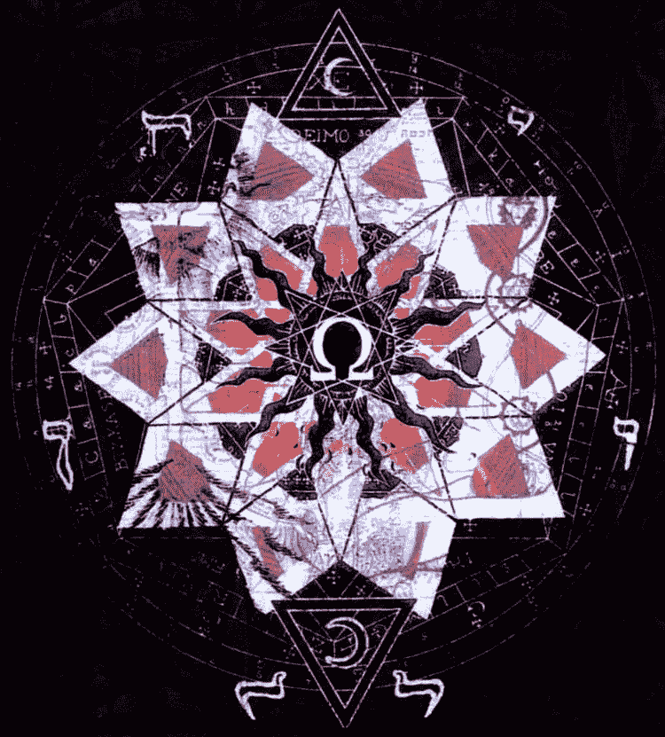

# 第一章：让魔法生效

本书提供的魔法是你可以实际运用的。其它地方我可能会说错,但我承诺这点:本书的主旨在于提供有效的魔法。

混沌魔法意味着最实际的、简化的魔法,让你能根据意愿和真正意志来变更现实状况。讽刺的是,有不少混沌魔法的书籍会告诉你很疯狂的理论,却没有一点实际的操作。我会尽可能避免这点。没什么能比得上亲眼见到自己实施的魔法起效的了,这将是你可以期待的。

混沌魔法不是说用魔法造成混乱。它是关于在现实中重塑秩序,引导你的人生的。就像正常的魔法,但没有那么多包装。它不像旧时代的魔法那样那么令人振奋,也不那么公式化,或许这是为什么它被称为'混沌/混乱'的原因之一。当它被发明的时候,比起

明确定义的仪式和袍子, 它看起来更像是疯狂混乱的。即便它有效。

混沌魔法由很多不同的定义, 但你要问我的话, 我会说混沌魔法是强调简化, 有弹性的信念, 情绪化的转变和影响。如果它没用的话, 那它就不是魔法了。

混沌魔法像是给懒惰的无信者用的, 但它有效。如果你有想象力的话, 那它就能起作用。如果你有意志力的话, 那它能起作用。如果你将这些都结合起来的话, 你就能在一周内加冕混沌魔法的大法师王冠。

是的, 这听上去很草率。你可以弄个仪式看看魔法是否有效。如果它有效, 那么就比那些收藏在大英图书馆内厚重的垃圾魔法书更好。但你如果能精心准备的话, 那么会更好。魔法中有个大秘密, 就在这第六段文字中: 精心准备并不以为着得到正确的器具和法杖, 咒语和符文, 而是意味着让你的情绪驱使你的魔法。我将告诉你该如何这么做。

让我们暂停一下。魔法是严肃的, 你所体验的是真实的; 它影响着你的现实。这不是玩笑, 你正经历

的灵性发展是绝对真实的。但你不能傲娇,不能无视魔法其实是让你在世界中找到愉悦,重塑世界,让你得到更多愉悦。

如果有时候我写的东西看上去有点无厘头,那并不意味着我轻视魔法。我只是就我现下年纪而言,尽可能地开放对魔法的想法。开放思想会使你的魔法有效,因为它能给情绪的能量开通了道路。当你做个小仪式后,惊喜地发现变化的时候,你会感到愉悦。你可能会大笑,即便感知到了自身的力量。魔法就是那样,充满了矛盾。

我不想要用经济理论,量子物理或我的人生哲学来大说特说现实的性质。当人们在写混沌魔法相关的内容时,他们倾向于写些奇怪的,与魔法无关的内容。这对于作者而言有趣,但对于读者而言就像是往泉水里丢个硬币许愿一样。(实际上,泉水许愿可以有效,但你需要通过魔法手段。后面会细说。)

混沌魔法仍旧是个在发展中的体系,八九十年代是其鼎盛时期。那时有些不错的书,一些很棒的神秘

学者向大家介绍了其核心理念。它从七十年代开始发展,那时没人在乎它。当时的很多魔法都是被孩子开发的。青少年想要让魔法起效,但没有接触到魔法的内在面。他们阅读了一些魔法的基础概念,就进行操作开发。孩子们充满了想象力,胆大冒险,他们令魔法焕发新春。

讽刺的是,如今所写的混沌魔法书籍里充满了教条的条条框框,充满了他们曾经鄙视的古代训条。听人谈论混沌魔法就像是在参加天主教布道似的。你想要问祭司怎样让祈祷有效,但他却老是在说罪孽,而是在用拉丁语。

理论可以是前卫的,但这没有实际层面的意义。有很多混沌魔法书籍在解释它的机制——即便没人真正知道它是怎么回事。我所知道的是,它真的有效。如果你想要涉足魔法,它是个快速合理的方式。如果你已经学魔法数年了,那我希望你能够适应它的捷径和简化,让魔法更有效。

魔法是高贵的,灵性的,美妙的技艺,能帮助你

学习现实和自身, 但也能让你获得更多钱, 获得爱情, 影响他人的思绪和感受。如果你对此有道德问题, 那么你可能无法涉足魔法。但如果你是担心影响他人, 那么你最好还是把自己锁在地下室吧。你已经在影响他人了, 你甚至有用你的话语, 你的微笑, 来控制他们。每个愿望, 每个承诺, 每个要求, 每个行为, 你都是在施加影响。也就是说, 魔法没有令你更邪恶, 而只是让事情完成得更容易。如果你是个好人, 你不需要变邪恶。听上去很显而易见, 但人们很容易忽视这点。

魔法让你的意图更真实。如果你有意图, 那它会显现。这是力量。确定你准备好接受拥有这些快乐和这些力量, 因为它会改变你的人生。

即便有不少混沌魔法师成长起来, 其中仍旧有不少仍旧为了五斗米每天做小仪式。如果你相信自己听到的一切, 那么你会相信混沌魔法是编造事物, 假装相信和黑客世界, 不尊敬天使、恶魔或任何东西。然而, The Gallery of Magick 的书却是关于真正的天使、

灵体等帮助你生活的。那么哪些才是真的?

首先, 混沌魔法师不是关于编造事物的。是的, 你可以创建仪式, 使其有效, 是的, 混沌魔法能够将不同的魔法系统中的内容拼凑起来。但是, 这个魔法是关于个人的探索, 以及与魔法自身的深层连接的。

The Gallery of Magick 作为一个魔法组织, 经常简化事物。如果你你有《魔法的 72 只天使》一书的话, 它看上去就像是复杂的吟唱、符文和精神变化。但与传统的魔法相比, 它非常的简化。根据神秘学的理论与传统, 它不应该有效。但它确实很有效。

我们所专注的事物之一就是简化。这是我们从混沌魔法中学到的——扔掉法杖、小刀和魔法圆, 以及那些你不需要的魔法垃圾的能力。只要剩下的是必须的精华, 那魔法就能有效。这正是你从 The Gallery of Magick 的书籍中所得到的。它不是混沌魔法, 但它受到了混沌进化的影响。它是传统魔法的精华, 我丝毫不否定它。用那魔法, 也可用混沌魔法, 因为混沌是非常有弹性的, 可根据直觉操作, 根据你的需要进行

修改。

等等,有些书说可以跟天使和其它灵体交流。那些灵体是真的?这重要吗?对于我而言,灵体绝对是真的。我见过太多了,无法否定。说我疯了吧,但我有和天使说过话,我没有嗑药,我相信他们是真的。但是,你不需要相信他们。我是通过想象力召唤他们的,所以有可能是假的。无论你相信与否,因为它改变不了什么。信念是混沌魔法中的工具,但它不是成功的钥匙。即便你认为天使的真实度就和独角兽一样,但魔法仍旧可以有效。

只要你相信魔法,那你就能让魔法有效。你不需要去相信某某神灵、天使、恶魔或灵体。只要知道魔法是真的就行。相信精神能够以超自然的方式影响宇宙。

你已经知道精神能够影响现实。你想着移动你的手,而你的手就可以移动。四向引导了物质去变化。这不是寻常的例子,我知道这点,但这个例子很好。转瞬的精神能让物质移动,这很奇妙。我们居住的肉

体能决定我们的感受(我们会生病,疲劳和受伤),但是我们能够引导我们的身体去移动,去创造,或在房间里跳来跳去。思绪移动着身体,身体建造东西,人生如此生活。这很奇怪,魔法仅需要你相信自己的精神、意志、情绪和意图能够影响神经和谷歌限制之外的现实。如果你正在阅读本书,可能因为你已经相信魔法是真的了。

你可以给自己理由相信这都是真的。这是多数混沌魔法书能帮你的——它们有说精神存在于量子通量和多元宇宙潜在的弦中。这类说法听上去很科学和令人兴奋,但其实就是在胡扯一点东西让你相信魔法是被科学证实的。多数科学家会笑话这些理论,还是相信你自己对魔法的直觉吧。

如果你认为宇宙仅是机械的螺丝和螺母,那么请去学习工程学吧。但是,如果你感知到世界中有一种超自然的东西,如果你认为人类的精神仅是那的一部分,如果你的直觉认为那有可能是真的,那么你就能让魔法有效。

当我还小的时候, 我被可出售的宗教数量吓到了。我生活的小镇是多元文化的, 左边的邻居信一个教, 右边的另一邻居信另一个教。在这种情况下, 你又怎么能选择一个信念呢? 然后, 当我涉足魔法的时候, 我又有了同样的感受。魔法系统众多, 它们都具有各自的理念。你又该怎么分辨哪个是真正的魔法呢? 好吧, 你无法做到, 于是你只能各个都试试。然后, 你发现它们居然都有效。答案是魔法自身是有效的。魔法的风格不那么重要。

如果一个魔法被很多人, 很多时刻使用, 那么它更有可能有效。无视这些传统就像是无视很多优秀的魔法科技。在混沌魔法中, 你无视魔法的起源, 而用有效的内容。于是你的世界变了。

现代魔法师效率可以很高。一些老书里, 你被告知需要在特定的一天内截特定的树枝才能制作一根法杖。是嘛? 我用的杖是从我老哥圣诞节收到的魔法盒子里偷来的。它也有用。你甚至可以用你的手指, 而不是一根杖子。或者用你的脚。关键在于'指'的行

为, 而不是杖子的材质。我的法杖是塑料的, 但它仍旧对我有效。我的脚趾也能有效运用。当你用杖(或脚趾)指着的时候, 你是在摆出伟大的姿势。混沌魔法在乎资质, 而不是工具。杖子自身不重要。

传统的魔法对于一些人而言很有吸引力, 包括我。就像我的同事, 我喜欢读旧书, 在陈旧的文献中探索, 洞悉古代魔法, 或可能被世界遗忘的神秘符文。但这是兴趣爱好。实践 3 魔法可以是很简单的, 花几分钟就可以做一个仪式, 且是有效的。你想想你想要的东西, 你创造一个魔法得到结果, 而结果发生。

# 第二章：第一步

人们说混沌魔法是关于信念的,相信一段时间,不需要了就不信。这在某种程度上是真的,这给人造成了我们只是在假装。真实的情况更加复杂。我觉得应对混沌魔法的最佳方式是将所有魔法视作是可有效的。它们都是真的。

某些混沌魔法师会认为即便是虚构的魔法也能有效。如果你用《哈利波特》里的咒语,或者用《星球大战》中的力量,你应该能够得到结果。这是人们的想法,但我不是很认同,因为这感觉太蠢了,它会不由自主地让你有种虚构感,认为它们是编造的,不是真的,无法得到效果。如果你不同意我的想法,好吧,混沌里可以容纳所有想法。我们随着时间创造,重造并改变,没人能占有着魔法。如果你想要用虚构的,

而不是建立悠久的方法,那么你可以将我说过的魔法改编入你虚构的结构中。这本书中主要说的是被一些人视作真实的灵体和方法,因为它们能让你的魔法更有力。

我觉得人们错误地认为假装相信某事,你就是在做混沌魔法。编造并不如相信已有信念那般强大。如果有人真的相信力量,那么那力量可以为你所用。假装用《哈利波特》的咒语不会很有效,因为没人相信《哈利波特》是真实的。人人都知道它是小说,但是,用一点天使希伯来魔法,你能够接触到真正的信仰体系。

信仰不需要是全球性的。如果有十七个人真的相信Grizedale的野猪,那么你可以召唤那个野兽,用其力量。信仰的真诚度是有点影响的。

在混沌魔法中,人们借信仰借了数十年,这不是什么新闻。但是,我觉得为了让魔法发生,将注意放在其他已建立的信仰和原型能量上是很省时的。你可以构建魔法,你可以创造灵体(在本书中将学到这点),

但是,当你想要接触到创造的能量时,那力量的道路是他人的信仰。你不需要相信别人的信仰,你只需要像是有那信仰那般采取行动。与天使对话,仿佛那天使是真的一样,那么,无论你相信与否,那天使都会帮你。

一旦你与相关能量的频率相协调,那么你就能够从零构建魔法。它可以多样化。构建你自己的魔法是其中的一大部分。但是,当你想要快速涉足魔法的时候,无论巫毒还是异教仪式你都可以用,魔法背后的信仰压力能给你带来结果。

如果你不认为那魔法是真实的,那也没事。你仍旧可以实施魔法,随着你的行动,你将发现其实你还是相信的,因为魔法的效果会变得显而易见。

在很多古老的魔法组织里,启蒙是魔法的第一步。至今仍旧有这种传统,耗时长,又费钱。通常组织里会有不少老人(通常是男性)会让你感到低人一等,教导你一些非常无聊又无效的仪式之后,才告诉你已经被启蒙了,最后由说你无法用魔法做什么,必须要

等更久, 花更多钱, 接受更多指导, 你才能做一些有效的魔法。我爱混沌魔法的一点在于, 人们只要读一些符文魔法的书, 制作符文, 就能在那周得到结果, 让古老的组织看上去很蠢。做魔法——即是启蒙。

你不需要一群老男人才能启蒙你, 你只需要一些魔法。你得到魔法结果的那一刻, 你就是魔法师了。你受到了启蒙。然后, 当你构造你自己的魔法并让其有效的时候, 你可以给你自己一个高大上的头衔, 创立你自己的魔法组织。或者, 如果你是够理智的人, 那么忘记这些追求, 而是做魔法, 让自己有更好的人生。

我的下一句话应该是告诉你是时候做一些魔法了。快到了, 还有一些要说的。这是很多人在混沌魔法中会犯错误的地方。他们到了此时, 变得很兴奋, 认为"来来来, 我要来试试, 是否真的那么有效。"

不, 不, 不! 就像你去试车, 你去试不是为了看车是否能开。你知道车能开, 因为它放在展厅里, 被弄得光鲜亮丽就是了被开。你试车, 是为了看看它给

你的感受,你是否想要它,它是否适合你。当你涉足魔法的时候,你不应该思考魔法的真实性。如果你这样去想,那么魔法会像是被踩到的黄鼠狼,逃离你,要么就是失效以达成你对失败的预期。

这不是实验,好吗。它是真的,很多魔法是关于实验和尝试的,让你了解什么有用,什么没用。没必要保留效果差的咒语。但是,当你刚开始的时候,你应当对魔法专注。如果你试验魔法,就仿佛是在说,"来来来,魔法兄,我挺特别的,了解不少科学现实,让我来看看你的能耐,是否能达到我的高标准。"这有点傲慢无礼。魔法会有效,你应当将其视作真实的,而不是用于满足你的怀疑心。

这不意味着你需要在魔法面前尊敬地鞠躬。一点也不,但是,你需要将其视作真实。你能想象你去展厅试车,插上钥匙,脑子里在想"来来来,让我看着着钥匙能否点燃引擎,转动车轮。哦,哇!引擎居然被点燃了,真是令我难以置信。"你不觉得这样看上去很傻吗。你转动钥匙是因为你知道引擎会点燃(除

# 非有出问题。)

这也是你应对魔法的态度。引擎可能不大会出现问题。转动钥匙是因为你知道它会被点燃。实施仪式,是因为你知道魔法会有用。(这个例子是我借鉴我哦有的,因为这是他让我相信魔法的方式。转动钥匙!)

现在就决定是否要做魔法,让其成为你生活的一部分,因为它的确是有效的。将起作为现实融入你的生活。你将试验,你将找到什么最适合你,但在混沌魔法中的试验意味着以勇气尝试新事物,而不是像科学家一样精确地测试。你将能明确知道什么最适合你,而不是过于评判一切。在几周之后,你可能会爱上符文魔法,也可能不会。你会明确知道它是否合适你。不需要测试和评估它。现在,让我们来做一些魔法。

# 第三章：即刻炼金

我们将开始做一些魔法。魔法的关键不在于信仰,草药收藏,或其它这类事物。其关键在于情绪。我们还可以用很多其它工具,比如特别的词语,原型图像和各种精神状态,但魔法的引擎是情绪。

很多能成功使用魔法的人从来不知道它会有效是因为他们的情绪以魔法的方式进行了转变。他们可能做另一个仪式却没有效果,而没有意识到这都是因为缺乏情绪构成。当你了解情绪在魔法中的角色时,那你就知道该如何让任何魔法起效了。

如此运用你的情绪是很容易的,它能改变世界。它不仅改变了;它也能产生真实的物质变化。那些你在魔法书中读到过的金钱、爱情、影响和力量,都能通过情绪置入魔法中而达成。

对于更传统的魔法而言,它更是如此。如果你召唤天使,要寻求帮助的话,猜猜你该如何引导天使?用你的情绪。猜猜什么是让天使回应你需求的最佳方法?情绪。无论是在用传统魔法联系灵体,还是只是为了结果而引导魔法流动,正是你在仪式中变化的情绪创造了你要的结果。

这是炼金术。你将一种感受转变成另一种。现实则会更具你的情绪而变化。

我可以在这里结束全书,因为你需要的都知道了,但我会在下面增添细节。但是,你在未来混沌中的工作中要记住这点。

我们将从最简单的魔法开始,那魔法被称为符文魔法(魔符魔法);你可能以前听过它的名字,甚至在阅读它们时感到无聊得要死。过程是这样的:你写下你的要求,将这句话转变成扭曲线条,再将它烧掉,用某种变更的意识将其投入宇宙。

有成千的网站描述这个过程,但让我来告诉你该如何更好地做。符文魔法有很大的潜力,但通常很令

人失望。让我们来修改下过程,重制符文魔法。

传统的混沌魔法方式是让你以正面积极乐观的方式写下你的欲望。与其说,"我不想要做穷人",你应当说,"我想要成为有钱人",然后,你将它转变成现在时。"我是有钱人。"这句话的问题在于它听上去不那么令人信服。你知道你不是有钱人,假装自己是让你感到不自在。这就像是人们用于改变自身而说的话。"我是个有自信又有爱心的人。"这听上去太假了。我拒绝用这种自我确信的方式是因为它们会刺激和产生相反的情绪,继而产生不愉快的情绪。即便你是相当有自信的人,重复那自我确信的话'我有信心'也有可能将你引向缺乏安全感的状态,无论你对自己重复这句话有多多。这是传统符文魔法的一个大问题。

谈论传统混沌魔法感到很怪,因为它意味着激进和新潮,但事实上它变得有点传统了。我认为传统上对于符文的运用已走入了死胡同。是的,它能有效,不是都那么糟,但是,我们可以试试新的,更好的方

法。

The Gallery of Magcik 开发的符文魔法更独出心裁。这不是我开发出的魔法,所以我夸奖起来问心无愧。我爱这个技能。你需要做的只是将结果改成问题。这种微小的变化转变了魔法。

如果你想要有足够钱买一台新钢琴,那你应该写,"我怎么会拥有这台美丽的钢琴?"

这个问题是你用于不会去回答的。

这个问题是你假设已经发生的。

这个问题是你对拥有这个结局感到好奇和满意之感的。

世界会回应你的问题,将现实变更,以匹配问题中的情绪。

你在那一刻是在假装你已经完成了你的目标,你是在满意自己有这个结果。你不是在试图回答这个疑问。

你有没有去过一些很棒的城市,或和很棒的人在一起,而你突然想到,"我怎么会到这里来?"这种感觉是类似于"哇,这一切太棒了。"这个地方让你感觉非常好,回过头来看过往,你欣喜又毫不质疑。你在此刻不是试图在回答自己的问题。你只是在用疑问来表达自身的喜悦。你因将这份喜悦置于你的魔法中,而你的魔法则会有效。

在下一章中,我们将看看如何创造和改善这个问题。章节自身会需要一点时间来读,但一旦你懂了,技巧就很好掌握。

# 第四章：愿望的核心

在创造一个符文之前,第一步是找个目标——你想要的结果,是你能够真正改变,而不是非常难以置信的奇迹的。它应该是没有魔法就难以达成的,但却不应该是极度困难的。至少最初不是如此。

当你将魔法用在你生活中可以变化的地方之时,魔法将为你进行推动。假设你想要买那台钢琴,那么开放思维,想想你能得到那钢琴的方式,在其中找到你感到不错的。你可能不会想要让魔法令你加班,才赚到更多的钱。那可不好受。你可能也不会想要借贷或增加信用卡上限来得到钱。那感觉太假了。你想要为那台钢琴付钱,像是真正拥有它那般,把它搬回家。好,这就是你应该聚焦的情绪。你不需要担心钱哪里来,也不需要担心钱来的方式。而是,你要想想得到它时的感受。你想的是得到钢琴给你的满足感。想想

那会是怎样的感受。

不要试图解决问题。你不是在引导魔法,告诉它去哪里得到钱。你是在得到令你感觉不错的结果。加班不会让你感觉好受。用增加的信用卡上限去付款也不会让你感觉好受。但是,付出一笔钱,真正拥有钢琴会让你感觉不错。想象它被搬到你的家,全额付款,那感觉不错吧。

你不需要搞清楚钱是来自哪里的。你只是感受结果,确保你的感觉是对的。是什么导致这个结果的一点都不重要。只是对结果要有正确的感受,就是这么简单。它只需要五秒。

假设你想要找一个很棒的新房子入住,即便镇里的租赁市场很紧俏。你不想要用几个礼拜的时间找房子。你不想要比市价更高的价格租下房子。会让你觉得很好的是,能够很容易地找到完美的房子,租金便宜。在设计问句之时,找到你想要达成结局的感受。只要找到那感受,你就找到了魔法的完美方向。

于是你该提出你的问句了。你的语言组织应该是

仿佛你的愿望已经在过去达成了。你用之前的那个例子"我怎么会拥有这台美丽的钢琴?"也是可以的。只要你问的时候,是让你感觉愉悦的。对于租赁房子的情况,问句可以是"我怎么那么容易找到这美丽又廉价的房子的?"或者,可以是更简单的,"我怎么那么容易就找到这完美的房子?"

我们很容易在问句中填充解决问题的方法,试图找到魔法该运作的方式。不要规定魔法如何运作。不要强调能得到钢琴的方法是中彩票。这不是唯一的方法,甚至可能是最不可能的那一个。

我尽量不重复说这点,以免你觉得我无聊,但是,你要知道,魔法能够以出其不意的方式出现在你的生活中。你为了一台钢琴做魔法,而突然之间,你邻居决定要搬去蒙大拿,把她的钢琴留给你。感谢上帝,你不需要浪费时间告诉魔法你需要钱,才能得到钢琴。你只需要钢琴。

钢琴不是小件东西,你可能也不想要它。当我那时想要,而我得到了一台。但是,当你刚开始的时候,

你最好选择的目标是与你现下情况接近的。当你刚开始涉足魔法的时候,你会容易想要去得到那些很大的目标。不要这么做,把目标定得低一点。但也不要把目标定得低到没有意义:没必要为了一顿午餐而做魔法,因为你可以只是出门,买一份。但是,你可以用魔法来让别人对你友好,或者让对方还债,或者阻止对方的狗在晚上吠叫。想想你真的想要改变的小事件;是可能的事件,但是你无法直接控制的。

你不会过一个礼拜就变土豪或明星。想想你无法轻易完成的,但在魔法的干涉下却有可能的。它必须是你真正想要的,否则就没有情绪。

最开始的时候,你最好不要做金钱魔法,除非你要求的数额很小。多数人会想要很多钱,却也对金钱魔法是否有效怀有疑心,于是他们无法让自己停下来等待魔法的效果。当你不停观察,又迫不及待的时候,等待你的是更多观察和等待。你应先避免金钱魔法。不必担心,金钱魔法是有效的,但最初先做其它的。

# 第五章：情绪建立

你现在要用情绪技巧来制作符文。这很简单,甚至你都会想这是否就是魔法,但我敢保证你它就是。

在此时你应该有一个目标,你以过去时想好了问句。在我们的例子中,问句是"我怎么拥有这台美丽的钢琴?"或者类似的话。

你可以选择类似于:

"我怎么那么会控制我的愤怒?"我怎么那么擅长社交技巧?"

"我老板这几天怎么对我这么好?"

"我今年销售额怎么这么高?"

或者你其它选择的目标。魔法可以旨在改变你自己,你的运气,你身边的人,或者显现你想要的东西。

现在,到了符文制作的第二步了。在这一步中,传统的混沌魔法会让你从字母上画出曲线。如果你以前见过,那你知道它有多无聊。忍受我对它说几句话吧,试着不要打哈欠,我会说一些有意识的事。

在传统上,这是你将一些字母变成符文的时候。你写下你的魔法陈述(在我们的情况中,它就是问句,但在传统上,它更类似于"我是个有钱人"之类的陈述)。好吧,你写下它,然后去掉一些字母。有时,你会去掉重复的字母和元音,有时,你只是将所有字母拼凑在一起。无论你用的方法是什么,你是将剩下的字母弄成一幅画的。你最终弄好的是会像是字母数一类的图案。类似于这样:

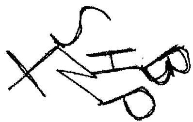

通常它更加复杂,因为有很多字母。然后,你再

重新画它,让它不那么像字母。

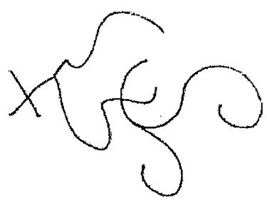

然后,再重新画它,试着让它看上去更像是一个魔法符文。

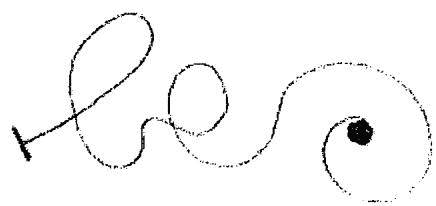

最后,你再尝试你的曲线画,它可能看上去会像是这样:

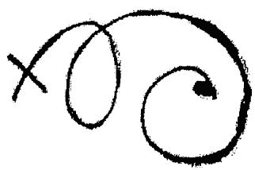

重复画是让你将你不喜欢的部分去掉,根据你的想法进行改变。这里没什么规矩,所以,你永远也不必担心自己画得对不对。画出来的样子不重要。重要的是你有从你问句的字母开始,将其扭曲成一个符文。

你重复画,直到你画出来的曲线不再让你想起你一开始的字母,或者你的目标。这是传统混沌魔法的概念——你必须要忘记你的目标。

你能想象这有多难吗?

"我真的很想要升职,我现在为升职做了魔法,我需要的只是忘记它。等等。。。我忘记申请了。"

还有一种变化是,你忘记魔法,但不忘记目标。想到目标是可以的,仿佛它是一种肯定会发生的愉悦

感，这会减轻担忧。但你要忘掉自己有做过魔法。

在 Damon Brand 的某本书中，他有提供一种符化方法是更加直接的。在方法中，你无需忘记目标，而是创造一个符文代表你的目标，因此而无需忘记它。这是传统混沌魔法的难以令人理解之处。你总是被告知在魔法的那一刻烧掉你的符文，在那之后，你必须要忘记你的目标。如果你有想到你的目标，那就会让魔法短路，你选择的目标无法实现。我很高兴告诉你，这是完全在胡说八道。

你可以想你的目标，只要你不闲着没事去质疑魔法自身，并希望魔法能有效。目标是你能够快乐地想念着的。只是不要闲着无聊想你的仪式。

Damon 的方法不错——创造一个抽象的替代品，让它感觉上像是你的目标，意味着你永远不必去忘记你的它。

我用的步骤与此类似，但更进一步。你无需将字母转变成曲线。你甚至不需要字母。你需要的是大声说出的问句，并与此同时，在纸上移动你的笔。这不

是自动书写,虽然有点像是那回事。

你的问句是"我怎么居然拥有这台美丽的钢琴?"你大声说出这句话,并同时在一张纸上移动你的笔。

你可以用任何纸。你喜欢的话可以用铅笔,或者直接用手指涂颜料画。画作会自己产生。大声说出问句几次;最重要的是,你有在移动笔的时候,感受你的问句。感受仿佛你已经拥有了你的目标,它在以前已经发生了,你是觉得受祝福一般回顾这一切。

没有那种感受,你就只是个在发噪音的机器人,画着垃圾。你要感受问句,并画画。

最后的成品可能不好看。它看上去可能像是这样的:

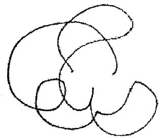

或者这样的:

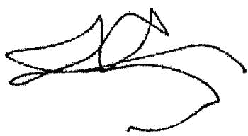

又或者是这样的:

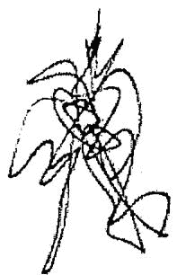

你不需要艺术细胞。

你现在可以做几件事。如果你想做的话,宣布这是你的符文,并且将在仪式的下一阶段中使用它。或者,你可以进一步精简它。在精简过程中不需要思考任何;你只是重新画出其中最好的部分,或者你喜欢的部分。

你可以将上面的符文画成下面这样:

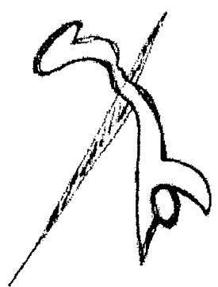

再一次精简, 它可以像是这样:

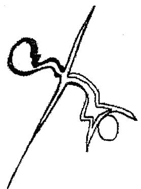

当你宣布这是你的符文时, 你不需要大声说 "这是我的符文"。你只是要做出这个决定, 那么工作就

完成了。

我喜欢在它周围画上一个圆,因为这样很寻常,又能容纳它,比起扭曲的线条看上去更像是魔法的。

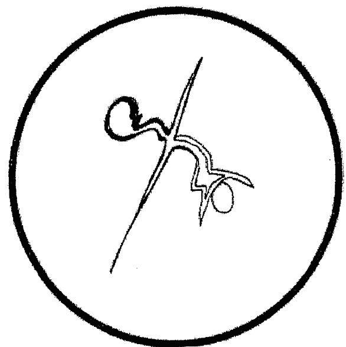

符文是以视觉形态总结你魔法意图的方式。

感受你的问句。大声说出。画出东西。精简它。你就准备好做魔法了。事实上,你已经做了一些魔法。注意你已经实施了情绪炼金,这毫不费力。你有一个

问题(你想要达成的目标),你对它有一种感受,然后以过去时问自己一个达成它的问题,情绪发生了变化。创造符文的行为意味着魔法已经在发酵了。

# 第六章：真知之火

一旦你制作好了符文,那之后传统的方法是将它烧掉,让它在火焰中进入混沌的深渊中。无论这句话指的是什么意思。在实践中,你要看着符文,并且精神要处于高度兴奋状态,或者一种交替的意识状态。这个状态通常被称之为真知,抵达真知的常见方式即是性,或者(诚实地来说)手淫。你在手淫过程中要扫视符文,特别是在你高潮的时候。在那性奋时刻,你将那图形"喝入"你的精神中,然后再将符文扔掉,忘记它。

还有其它方法可以抵达真知,比如,轻微的窒息,舞蹈,数日的冥想,禁食,极度疲劳,等等,但是,我从不觉得这些方法够好或有效。它们要么就是太重口味,要么就是太无聊了。我听过有人进行五个小时的舞蹈仪式,让自己进入精疲力尽的状态,只是为了

赚那么一点钱,我觉得还不如去外面兼职做工五个小时。听上去或许很愤世嫉俗,但魔法应该是让生活更容易。让你自己窒息实在是太重口了。

在传统的混沌魔法中,你可能被建议制作多个符文,从而你不知道被烧掉的是哪个。这是为了让你不去想到自己的目标。这不是必须的,我认为最好还是制作你想要改变的符文,而不是做很多随便又弱弱的魔法。根据你的意愿制作你的符文,怀着热情燃烧它。

你弄好了符文,是时候烧掉它了。多数人在某种程度上是过性生活的,所以不用我来教你方法。它效果很好,没啥好说的。你做完它,你就得到了结果。或者,你可以更有创意。我曾经在情绪高度起伏的情况下用过一个符文,在经历那事件的创伤的同时,我有将符文放在我视野内。它也起效了。对我而言,情绪起伏的确带来了意识的交替状态,因为我对它们惧怕。

你可以把符文带着身边,等现实生活中遇到会改变你意识状态的事件。假如你差点撞车,避开了致命

危险。你感到愤怒,心跳加快,听到路边想到你居然活下来了。这就是变化了的意识状态。你瞥眼符文。这就能有效,因为意识的变更状态与现实的正常状态不同。这种方法的副作用是,你必须要等待类似事件的发生,可能过几个月都不会发生一次。

另一个方法是将符文扔到一边,仿佛它不重要,从而其形象慢慢地深入你的意识,而无需复杂的仪式或真知的一刻。你甚至可以根据符文画画或做其它艺术作品,将其挂在你的墙上,从而它总是在那里,处于你的轨道中,而没有真正看它。这种被动的方式适合长期,但我知道多数魔法师是没有耐心的。所以我觉得以真知烧掉符文更好。

我的建议是,你应该制作好符文,在当日就烧掉它。性高潮是最快的,最诱惑人去试的。如果你对性高潮的方法不感兴趣,附近又没有过山车,那你最好也不要选择窒息的方式(因为这很有可能导致真的憋死)。那还有什么选择?任何能让你进入意识变更状态的都行。另外,我虽然不认为致幻药有效,但有些

魔法师很喜欢嗑药。我认为它们让你大脑不清不楚的,虽然你的意识得到更改,但你大脑已经下线,或者说无法连接上真知。如果你真的不想要尝试性高潮的方法,那么吟唱能让你快速地达到目的。

当你熟悉神秘学上的事之后,你会开始怀疑在仪式中吟唱的大量词语是不是只是让你唱得失去对现实的认知。如果真是这样也没关系,有些吟唱的确是有含义的,也似乎在唱歌十几分钟后能更改意识。下面是可以选的五条歌词,当然,你也可以同时使用它们。

EE- AH- OH- EH  EE- ADD MOZZ ZEER  AH- RAH- BEATER  LEH- VAH- NAH  AH- RAH- BAH- OO- AH- RAH- BAH

它们是神圣的名字,打开魔法大门的话,源自于折中派系。你应聚焦在声音上,其原型含义将流入你的现实,变更你的意识。(我能不能够随便发音,达

MAGICK.TAOBAO.COM

到相同的效果?或许可以,也或许不可以。有些音会比另一些效果更好。)

吟唱这些词十分钟,你将能感受到些什么。仅聚焦在声音和你的身体上(而不是魔法或愿望,你今天过得如何,等等),你将开始转入梦般的意识状况。在吟唱的同时,你看看符文,魔法就完成了。这不是最强烈的真知,但会有效。性高潮更快,更强烈。但是,如果你能聚焦在吟唱的声音上,而让思绪漂移的话,那么它也会有效。

现在,提高一个等级。

如果你在真知的那一刻加入情绪,那么魔法会变得更加强大。

美妙的是,任何情绪都可以。它不必是正面的,纯粹的,或者与你的目标相关联的。情绪,在这种情况中,只是给火焰扔燃料。它是原始的力量。你不需要转变情绪;你只是需要感受它。你有很强的愤怒或憎恨?你可以在这里用你的愤怒,对火焰扔出它,将力量投入你的魔法中。

情绪很有意思; 通常是你当前精神状态的副作用。你有思绪, 你存在于某一时刻, 所产生的情绪是反映着那一时刻的。因此, 有很多心理学系统和哲学能帮助你连上自己情绪和身体的感官 (其反映了情绪), 并了解你自己。当然, 这很有用。然而, 对于真知而言, 你不应该通过情绪来了解自己, 而是应该引导你的情绪, 让你自己成为你想要成为的人。这不是要你正能量, 反复告诉自己自己是快乐的, 而是关于接触任何纯粹的情绪。无论它是黑暗的, 令人满足的情绪, 还是光芒的, 深层又美丽的, 它都能给魔法提供能量。

如果你想要知道为什么, 我想是因为两方面。魔法是关于用情绪引导开拓现实的。虽然魔法用图像和外在的帮助 (来自灵体的), 塑造性的能量是你的情绪状态。这是魔法的本质。我认为情绪让你直接接触到信念。人们试图改变自己的信念, 假装相信什么, 但事实是我们的信念不是因为思维模式而形成的, 而是重复的情绪反应。我们认为我们相信的事物是因为我们对他们的感受。我们的思绪不那么相关。当你抵达真知的那一刻, 情绪的能量即是改变的能量, 它将

新的信念烧入你的灵魂。

你如何让情绪出现? 最佳的方式之一是通过记忆。回忆起能触发情绪的记忆比起凭空酝酿要容易得多。有些人很容易感受到事物, 非常简单, 不需要任何努力。如果这很适合你, 很好。如果这你不行, 那么试图去回忆吧。

当你开始做仪式的时候, 你知道魔法尚未起效。这是你的信念。你将结果作为一个问题进行构造, 以过去时设置让它更像现实。你就创造了一个新的信念——你的魔法结果是现实的信念。你可能还不相信它, 但这个信念以符文的形式存在。

你再运用真知将那图形吸收到你的最深处。当你加入情绪的时候, 以改变的力量浸泡那个符文。它变成了最深层的信念。现实则为了匹配它而发生了改变。

我之前说它们怎么没效果。无论你有多常告诉自己"我是个有自信的人", 如果你不感到自信, 那很难改变你的信念。当你实施魔法的时候, 你是在最深层上改变的。你的情绪变化了, 信念进入你的灵魂,

它在那里萌芽, 影响你, 以及你的现实。

当你做魔法的时候, 你抵达真知, 你强烈地感受到什么。就是这么简单。

让我们假装仍旧在为了得到钢琴而做魔法。我们制作好了符文, 我们将要烧掉它。我们该选择什么情绪呢? 它真的不需要与钢琴或魔法, 或任何东西有关。重要的是, 你要找到容易产生的情绪。

如果你这个礼拜陷入了和你前任之间的争吵之中, 你的情绪毫无疑问会浮现。那就运用它们。如果你今天对什么感到愤怒, 用它。如果你陷入爱河, 用它。如果身边没什么事刺激你, 那么回忆强烈的场景。在精神中回忆情节, 直到你能感受到它的愤怒, 用它。

你该这么做。选择你的情绪, 现在将你的注意力转移到抵达真知上。你可以选择用榔头敲你的大拇指 (这也有效, 但我真的不建议这么做), 你也可以选择其它能转变你正常意识的方式, 或者, 你可以吟唱, 或选择性高潮。如果你够聪明, 你会知道性高潮是最佳的方式, 而且它很令人愉快。

MAGICK.TAOBAO.COM

你做抵达真知需要做的事。在这个例子中,我们将假设用的是性高潮。你朝着高潮行进,你知道你快要到了,你回忆起情绪。这需要一点练习。随着高潮的到达,你的精神通常会消散。但你的感受不会。最好在你高潮的同时去感受。秘密在于在高潮之前触发情绪。过早,可能会妨碍你的快感。过晚,就太迟了。但是,如果你的时机卡得正好,你将能感受到情绪能量在高潮的过程中燃烧。如果符文正处于你视角内,那魔法就完成了。

想想你与真正深爱的人做爱的时候。当你抵达高潮的时候,你能感受到爱的情绪在爆发。这与没有情绪的性相比是非常不同的。当你真的爱着,当你真的在性高潮的时刻感受到那个爱的时候,它美妙无比。不是每个人能有这种感觉的。有些人仅聚焦在感官上。有些人会在抵达高潮的时候感到内就爱。但是,如果你幸运的话,你会知道高潮能接受你提供的情绪,给它们填充力量。这是高等真知的秘密。

在这个过程中用你的符文。感受到情绪,任何情

绪。在你高潮前感受到它, 让高潮接受那感受。看着符文。高潮和情绪再消散。

在这性事余韵之下让自己回归正常。避免去看符文。我会直接将它捏成一团, 扔到一边。在真知一刻之后, 看到图形是没关系的——天不会因为你看到它了而塌掉——但你现在不会想要思考它的。将它扔到一边, 因为它现在已经处于你的内在了。你可以将符文丢掉。你喜欢的话, 甚至可以用仪式烧掉它, 将烧掉的灰撒到橡木树根上。或者像我一样, 将它扔到垃圾箱里, 它现在是垃圾了。

尽可能地忘记魔法。你不需要强迫自己, 只是魔法已经完成了, 你要继续生活。

如果你有朋友对魔法感兴趣, 那可以做个有趣的试验, 彼此烧掉对方的符文。你的朋友制作符文, 不告诉你他的目的是什么, 你替他烧掉它。他也为你烧掉你的符文。我并不是说要在同时在同一个房间内进行 (虽然这也可以试验下!), 你们只是需要交换符文。我并不认为这是必要的技巧, 因为混沌通常是私

人的,但这对一些人也真的有效。当你掌握了基础的方法之后,这也是值得试验的。

符文方面就是这样。这些都是混沌魔法的核心技巧,将其改编成了新的方式。重要的是它有效,那么,找到你的目标,做点魔法吧。

# 第七章：魔法的混沌能量

读点魔法书,你会看见一张很快让你觉得无聊的画。嗯嗯,这是一张人体图,上面有脉轮或能量点或光球在人体中央的柱子上。这种图到处都是,实在让人厌烦,但它其实是有一些值得你知道的地方的。

翻翻现代的能量沟通,或者传统的中柱仪式,它们基本上都一样,但是却也有不同之处。无论你认同的传统是什么,它们都会有旋转的能量球在身体各处,被一条光柱连接着。有时,你会循环这个光绕着身体转。为了什么?它能帮助建立魔法能量。仔细听我说。

第一次听到有人说人体中柱上有七个能量点,又有人说是六个的时候,你肯定是有点不信。你被指导通过这些能量点来呼吸和循环能量,因而需要知道到底有几个能量点。你不想要听辩论。没人争辩人类有

几个肺,或者肝脏在哪里。那为什么这些能量节点那么难说清楚呢?可能是因为客观地来说,在时间和空间上,它们并不真正存在。但它们有效。无论你是怎样做的,它们会有效。呼吸、光和能量球具有固有的魔法性。如果你觉得我听上去很扯,你应该知道有多少严肃的神秘学作品有在说这些能量球。它们肯定是有什么意义的。

如果你因为宗教而认为人体里应该有七个,十二个或更多的能量中心,让我来改变你的想法。但是,如果你从来没有听过任何关于它的理论,或者只是想要开始做一些简单的魔法,那么请听我说下去。

在说了那么多之后,对于魔法的描述却会很短,你会认为是你可以跳过的内容。不过,它就是那么短。能量运用不是魔法,但它是魔法的,可以实际方式投入运用中。

# 第一步:显而易见的部分

进行寻常的魔法准备——在你不会被打扰的地

方,安静地站着。被打扰也不会有危险,只是不需要半途去洗完的话,会更好。

# 第二步:呼吸的部分

聚焦在你的呼吸上。"聚焦在你呼吸上"这句话会让我想到我从来不喜欢上的瑜伽和普拉提课,但,是的,你要聚焦在你的呼气上。但是,这次你不必注意呼气的进与出,在吸气的时候,想象你吸入的气转变成光。你将肺部充满光。这比普拉提有趣多了。做一到两分钟,深呼吸,但也不要深到过度喘气。有些人认为这种光绝对是真的——是一种真实的能量。为了你的魔法,你也最好这样想。

# 第三步:有趣的部分

循环这个光!随着你吸气,那光从你的肺部扩张,伸向你的头部。你可以想象一束白色的光束,看不清的迷雾,或任何你喜欢的,但它应该是能够被称为'白色光柱'的东西。你呼气,什么都没发生。在下一次

的吸气时, 光再次在你的肺部扩张, 并流过存在于那里的光柱。它从你的头部溢出, 往下流到你的身体表面。在某些传统中, 光会围绕着你流转, 但是, 你可以将它想象成流水般的光。你是在洗淋浴! 光从你的头顶出来, 再流到你的脚上。你可能要呼吸几次才能促成这个想象。

# 第四步: 魔法的部分

坚持住! 当光抵达你的脚时, 再次深吸气, 光冲入你的脚底, 形成另一道光柱。它与你肺部中的光柱汇聚。随着每次呼吸, 它都在持续这个过程。要想象很多, 对吧? 光进入, 光升起向下溢出, 再次升起。你尽力而为就行。你肯定能感到一点魔法上的能量。你可能会建立起能量, 或者, 你可能只是呼气太用力了, 但是, 你将能感受到点什么。

# 第五步: 光的部分

我从不喜欢脉轮, 即闪烁的光球。在某些传统,

你要想象不同色彩的光球在身体的不同部位上。它很有趣,有点像是颗圣诞树。我喜欢创造小型的星光。针孔大小的白光。我没有将它们放在心脏脉轮、喉咙脉轮等等上,而是让它们在一定范围内自我呈现。我让类似于七个或更多针孔大小的光出现在光柱中,让它们比已经在那的光更亮。有时,它们会形成一条直线,有时,它们会散落在光柱的各处。我所做的只是让这些无限数量的针孔光出现在我体内;它非常的富有活力。如果你试了,什么都没出现,那你可以只是想象一些针孔大小的光出现在光柱附近你想要它们出现的部位上,就行了。

# 第六步:停下的部分

持续进行,当你感觉自己已建立起很多魔法能量的时候,就可以停下了,别弄得疲劳或丧失焦点。

这比中柱仪式更好吗?我个人是更喜欢它,但你可能不会。关键在于如果你不喜欢,那么构造一个你自己喜欢的。它会有效。让光在你身体内流动,通过

节点或光球, 你就能建立起自己的魔法能量了。

魔法的麦片粥你都弄好了。现在怎么办? 让它逐渐停止感觉很浪费。你可以试着做下面几点:

将其投入你的符文中。在仪式前, 过程中或事后, 想象能量流入符文。

将其投入你的魔法。用能量准备自身, 再做仪式, 让那能量进入魔法中。试试, 你会发现你不需要指示, 它会很自然而然。

用它治疗。将你的双手放在受伤或不舒服的病人身上, 可以是你自己, 也可以是别人。这可能会有帮助。

你可以有创意地用这个能量。我只列出了这些, 你却可以自己想方法来运用它们。在读本书的时候, 有很多时候你会想"哦, 我可以加点料吗?"这里就很合适。

# 第八章：魔法影响

我有个好朋友, 他认为所有魔法都是影响类的魔法。你为钱做仪式, 它会影响上百个小决定, 从而你得到自己想要的, 给你带来金钱。我不认同他的话, 但我想, 影响在魔法中有很重要的角色, 你可以施加直接的影响, 得到你想要的东西。

# 魅惑

说到魅惑魔法总是令我起鸡皮疙瘩。如果你想要用魔法影响他人的精神, 那么何不尝试这种类似于强奸的约会呢? 然后, 在某美妙的夜里, 我被魅惑了, 是被魔法的, 我可以肯定地说, 我们没有被下药, 欺骗或强迫进入被魅惑的状态。真是松了一口气。不可能的事情最后终于结束, 而在其中也发生了一些不可

思议的事。我被解锁了很多从不敢去做的新姿势。我不抱怨这点。我觉得在某种程度上我知道自己被魅惑了,就和当有美人明显在调戏你那样的情况一样。

我将告诉你的魔法只有六成的成功率,也只有在你有一定勇气的情况下能有效。六成可能还是说多了,但不低了。

只有在你想要它起效的时候才用它——不要在别人身上测试后跑路。只有在你真的想要它起效的时候,它才会有最佳效果。你真诚的欲望给予了它力量。

简单地来说,这是你需要做的。你的眼睛短暂地看向目标的眼睛,在那一刻,你要用你信众对其真诚的爱来看对方。不需要魔法之语,不需要光环,不需要性感的恶魔来勾引对方。这是纯粹的爱,直接通过眼睛传达。如果这听上去很简单,那你要知道,只要做错了一点,你将看上去是个变态。

你正在派对上。你欲望的目标正在附近,那么就可以眼神接触。你做几次正常的眼神接触。然后,看其它地方,再升起爱的感觉。你爱谁?想想你爱的人,

是你用很大的热情去爱的, 然后回过去看看目标, 仿佛正在看你爱的人。它不必是罗曼蒂克的爱, 只要是爱就行。

眼神接触要短, 不要看上去像是你不好意思注视对方。延长时间的眼神接触很适合调情, 但是这里的眼神接触是魔法上的, 如果时间过久, 会让对方觉得有侵犯性。

如果让你升起爱意感觉太难了, 你可以改编它, 像是个演员一般进行操作。你注视爱人的时候看上去是怎样的? 你看着爱猫的眼睛时, 你的感觉是怎样的? 下一次这发生的时候, 当你真的喜欢某人或什么的时候, 你要记住你产生的感觉, 储存它。除非你是隐士, 否则不应该很难练习这种注视技巧。掌握它, 然后学会自然地有这种注视。对着花朵或门把手练习。练习! 这种爱意的注视不仅是你要感觉像是在看你的爱人那样, 而是给予爱。当你能够对着一个门把手升起酝酿出那种眼神, 那你准备好行动了。

还有很多变化版。你可以将爱的感觉呼气到你的

手中,再与目标握手。或者站在目标的右边,再感受你身体的热向目标包裹。还有更多版本,你可以编造自己的版本。它们可能会有效。眼神接触的版本是会真的有效的。

不要指望你的魔法会超强的,可以出现在酒吧,马上有人主动来勾搭你。这种眼神接触魔法很好,但它仅能创造出一种吸引感。它不会造成直接的行动,除非你运气很好。你要自己去制造交流,甚至可以再一次运用眼神接触魔法。不过,只能再做一次,只有在你说话,而目标正在听的时候做。这是其沉淀和产生效果的时候。

# 目标影响

在我人生中最黑暗的时候,有一对情侣会做任何事给我扯进麻烦中。这个故事可能你很熟悉,很常见。你与一对情侣交朋友。他们变得摊上你了,几乎是粘着,非常消耗我的能量。然后,当我试图将关系冷一冷的时候,他们的态度开始反转。你们从朋友之间的

友好,变成了被威胁和骚扰。

我当时年轻,绝望地想要远离他们,我当时也没有魔法能够帮我。我懂一些魔法,但没有像现在这般多,我没有抵抗那种攻击的方法。我在当地的女巫圈子里找帮助。没有开玩笑。通过一个朋友的朋友,我搞到了这对实践巫术的道侣的联系方式,我请求他们的帮助。

我没有说我懂任何魔法的事,而是请求他们为我做魔法。但是,他们要我自己做咒语。它很简单。只要两根黑色的蜡烛,不需要魔法之语,没有神灵,没有其它任何。我需要只是需要将两根蜡烛靠着彼此放在地板上,并点燃它们。在黑暗和暴风的夜晚,我一点点地移动蜡烛。不要太快,因为那会造成抵抗,而是慢慢地分离。等到蜡烛燃尽的时候,它们是处于房间对立的两边的。

但有趣的部分是这样的。一根蜡烛是我,另一根蜡烛是那对情侣。我并不是在移动蜡烛,我是在将我们分开,断开联系。

我并没有说'一根蜡烛代表我'。它就是我。这是那对女巫告诉我的。你不要假装那根蜡烛是你,你接受它就是你。用你的想象力,随着仪式的进行,你的感受会变化。当你点燃这些蜡烛的时候,你感受到厌烦的结合。随着它们分离,感受到强硬的冷静。当它们在房间的两边时,你感受到松了一口气和自由。

你接受一个东西是另一个东西或人,然后,你对着那个东西做一些事。你让它改变你的感受。这是影响他人的方式。你改变精神和感受,让决定按照你的想法走。你可以为任何事这么做,只要你能够在仪式的过程中接受一个东西是另一个东西。

你不要强烈地用你的想象力。你不需要视觉化蜡烛是你,你只需要停止怀疑。接受它的身份,做魔法。这可能需要一些练习,但是,只要你想要改变一个人的想法,这会有效。

你也不是必须得用蜡烛。要分离一对情侣,你可以在一张纸上写下他们的名字,慢慢地在中间撕裂纸张,以分裂名字,再将分开的两张纸移动开。

你可以用脆弱的物件,比如玻璃,接受它是两个人之间的关系。摔碎玻璃,关系碎裂。你确认你想要碎裂它吗?你还可以制作一个黏土球,知道它是关系,将它留在外面淋雨,过个几个礼拜它就会被洗掉。取决于你想要在其中造成多少的障碍。

你可能需要试验几次找到自己的风格。你可以做很详尽的仪式,用一整夜来玩弄物质,让它们像是整个事件。或者让它变得简短,需要一瞬的聚焦和行为。总有一个版本是适合你的。

# 姿势魔法

我从不喜欢冥想,直到我听说了行走冥想。你走着,只是看东西,而不去思考它,评论它,或思绪漂移到幻想中。我喜欢这个概念,因为这基本上就是我走路的方式。没有思绪,没有评判或名字——只是在走的时候,看着东西。我就能够冥想了!

然后我将我的行走用成了自我影响的魔法,我将其很羞耻地称之为成功之步。我决定一个东西意味着

其它东西。每次我在那样走的时候, 它会增加我的生意上的成功。行走自身不代表成功。它就是成功。

你将一个行为变成是其它的。它甚至可以代表抽象上的成功。这是缓慢地燃烧魔法作用在你身上, 而不是作用在他人。

它对我有效, 也可能对你有效。如果它没效, 那么就当成是练习吧。

它也不必是走路。你可以用手势, 或舞蹈。如果那个姿势变成了你想要的性质或经验, 那么它会增加那性质或经验。

我知道这听上去挺疯狂的。"跳个快乐舞, 你将变得快乐!"不, 我很怀疑这点。但是这里是有些什么的。我在这里让你自己想什么是值得做的。

# 文件魔法

假如你想要改变某人的想法。你画了个简单的符文代表那变化。随着你画下图案, 你想到你现在的感

受,以及对方想法变化后你的感受。

你老板似乎没有信服你的升职请求。你画了符文,情绪从厌烦和苦恼,转变成松了一口气和愉快。

将那符文放在你老板的面前。方法包括:

1. 将画着符文的那片纸放在你老板的办公桌上。你老板会看一眼,然后扔掉。但它会被看到。

2. 用PS或其它图形编辑软件,你将符文添加在商标,照片或其它图像上。你要让那个符文很小或足够透明,从而,你将它发给老板的时候不会被怀疑。

3. 用可擦笔在文件上画上符文,再擦掉。符文的印记会留下,这就够了。

你必须要做正确的是感受——你在画符文时应有的感受。感受对了,那么就会有效。还有一个方法需要你有优秀的想象力。你想象你是另一个人。花点时间这么做。让身体出现你老板的说话习惯和肢体语言等等。感受你老板对你升职请求的负面感受。开始画你的符文。再改变你的想法。想象你的老板应允你的

升职。现在,再将符文弄到你老板面前。

我用的是你老板的例子,但你可能没用老板。你可以对任何人用这个方法,最好是你认识那个人的。你可以对陌生人试试,但它的效果没那么强。

这一章需要提到思念体,因为思念体对人有影响。不过,它们不仅能做到影响,所以,我会用半章的长度专门说它们。见后文。

# 第九章：思念体和其他人

在我们求灵体帮助之前(无论你相信他们存在与否),让我来告诉你魔法的两个面,在我最初尝试它们时遭遇的困扰。它们太容易了,你无法无视它们。

在我青少年时期,我和我朋友找到了能邮寄到家的神秘学出版公司,我们爱死它了。它有太多可能!这些书的广告非常疯狂和夸张,我们省下自己的零花钱用来买这些书。我们等了一个多礼拜,终于书到了,它们看上去很廉价和古怪,但也看上去像是真的有什么魔法内容一般。于是我们订购了书籍,一本接着一本,焦急地等待,希望有什么是我们能够用的。我们通常很失望,因为书里的魔法通常不是过于严肃,就是过于粗略,甚至更糟糕的,太蠢了。

其中有一本书是关于思念体的;书是留在我这里

的, 但我在几十年前就弄丢了, 我甚至记不得作者的名字。但是, 那本书的精华是你构建一些想象中的朋友, 只要你一直对他们说话, 仿佛他们是真的一样, 那他们就能为你做魔法。我对书的内容非常愤怒。那听起来太蠢了, 我都想把书撕了。或许那本书真的被我撕了, 因为我有一整个房间堆满了神秘学书籍, 而那本书则怎么也找不到了。算了。

我完全不认同这个主意, 继续用一颗洋葱做维卡仪式。它也无效。但至少我没有和想象中的朋友玩耍。

几年后, 在用混沌魔法的时候, 我选择发展一位新的英灵。要创造英灵, 你必须让一位灵体束缚在你身边, 它在你要求的时候为你做魔法。你将英灵视作真实的。你以某种神秘学上的能量和仪式来生出他。这听上去很酷, 但还有替代选项: 思念体。是的, 虽然它听上去很蠢, 他们是一群真人一般被你经常对话的想象中的朋友。如果无效的话, 我是不会推荐你做的, 所以听我说下去。

思念体最有效的地方是在为你自己缺陷 (技巧或

力量上)服务的时候,以及在影响他人感受和思想的时候。

思念体不需要仪式、符文或物理上的空间来居住,或任何制作英灵所需的步骤。它只需要重复。如果你创造了一个生物,足够经常地想象它的话,那它就会存在。有很多厉害的神秘学者会对此不屑一顾。除非你是在命令恶魔,否则你不够厉害!有趣的是,要假装没东西的地方有东西是需要很大勇气的。这是需要真正勇气的魔法,因为你有可能感到自己是个蠢蛋;当你第一次尝试的时候,你可能在想自己是不是疯了。当你真的感知或看到思念体的时候,会和完整的恶魔召唤一样令你惊讶。这也是为什么我不再称之为蠢了。如果你学会了它,那它会是令人陶醉的魔法。

我有说不少关于它的废话,因为真正的技巧只需要几句话:你假装什么东西是真的,想象它在那里。最终,它就会在那里,然后,为你干活。

你可以想象一个闪亮的光球,或者头上有角的外星人,或者像天使一般的存在,或者一只魔法猫咪,

或者束状的迷雾。你可以给它命名。你可以给它一张脸,个性,特定的力量。这没有规则的。你只是需要给它注意力,并在精神中带有这些想法。到某一天,你会感知到它具有意识,然后就行了。你只需要对它说话,告诉它你想要发生什么。

我青少年的时候在女孩附近会感到紧张,于是我建造了一个思念体,让我在她们附近的时候能够放松。我想象一个蓝皮男,一直走在我的左边。我知道他让我冷静。我让其形象简单。他没有让我变得更受人注意,或者更擅长调情——只是冷静。这就是我所想要的。我每次想起来的时候,会想象他出现在我身边,有时每天几百次。如果我向左边转头,那我会仿佛看向他。这都处于我的想象中……直到不是。直到我能够想到他,就能瞥见他,比起想象更加生动。然后,我会让他陪我一起走,让我冷静,而他确实做到了。

编造它,对它施加注意力,然后,让它为你办事。

如果你的思念体感觉太生动了,或太叛逆了,或者没有做你要它做的事,那么你可以想象它被杀了,

被撕裂, 被分解或融化。你的想象是规矩, 所以你能赢下这些战斗。

这听起来很容易, 也的确容易, 但是, 它需要付出一定努力, 去相信你知道不真实的东西。在你真的要求它做魔法之前, 可能需要几周, 而且你的脑袋会觉得有点拥挤的。建造十五只思念体, 你会发现自己在试图做其它魔法的时候, 它们出现。这很干扰, 所以它们的数量不能多。

另一种让我愤怒的魔法是关于雕像或娃娃的。用蜡, 泥土或其它东西来制作雕像的想法, 在我看来, 非常孩子气, 因为我在恐怖电影里看过类似的情节, 感觉更像幻想中的, 而不是现实的。直到我试了它。

你用任何喜欢的东西来制作雕像, 仿佛它就是你想要影响的人。你不是假装它是那个人或与那个人连接, 你就把它当作是那个人。你对它说话。你对它释放感受, 就仿佛你是在对着那个人那么做一样。你在它附近时, 做出类似的举止。这可能需要不少时间或几天, 但雕像会开始感觉像是真人一般, 然后, 你做

魔法——其过程是这样的。你对着雕像建立情绪(与给真实人的情绪相同),然后,随着你抚摸,敲击,或其它影响雕像的行为,你改变你的情绪。如果你想要娃娃的嘴巴闭上,你可以真的闭上它,感受那个人嘴巴闭上后,你那无比的满足感。当你缝线,挤压或只是闭上那嘴巴的时候,这会有效。用你的想象力,这个魔法可以对人有很强的影响。即便这听上去挺蠢。显然你可以对雕像造成很大伤害,但是你也可以束缚它们,冰冻它们,用东西将它们包起来,或者将想法(写在小纸条上)塞进它们的脑袋里。你可以对它们有很多用法。

不要让自己弄一整个抽屉的雕像。你的魔法起效了,那就像对陌生人一般看向雕像。它不是你曾认为是的那个人;它是泥土,布料,金属丝和羽毛。就像科学家一般地看它。不带任何情绪地拆除它,就像是在拆掉一个破碎的玩具,然后,扔掉它。

还有一种运用方法,是制作单一雕像,将其认作是强大的魔法生物。至少用一个月的时间来建造你的

小人, 你要知道, 随着你的建造, 它正在富有生命。是的, 这听起来有点让人起鸡皮疙瘩; 这个魔法让我颤栗。我不知道为什么做个泥土小人会让你觉得诞生新的生命, 但这会发生。你慢慢地建立你的魔法小人, 一点点加上新的部分。将其藏好, 在五斗柜后面, 或者盒子后面。让其感觉像是有点调皮的, 喜欢隐藏的。每天看看它, 给它加上新的部分——可以是新的一抹黏土, 或者加上一点碎石, 给予一点材质。喂食它魔法能量。当它令人感觉几乎要活过来的时候, 给它填上双眼。即便你只是在脸上贴上几个旧纽扣, 那双眼睛看上去也会像是活过来一般。当它感觉像是有了意识之后, 你就可以做些魔法了。

不要叫雕像去做任何事情, 只是给它生命感, 然后告诉它一个故事。告诉它你的问题, 以及你觉得自己应该有什么感受。不要告诉它如何解决你的问题, 只是告诉它问题, 以及在一切结束后, 你想要的感受。它会完成工作。

还记得你小时候告诉你奶奶你怎样缺零花钱, 你

想要买那个新出的星球大战玩具,而奶奶会魔法般地帮你解决问题吗?她不会给你钱,而是确保你有得到钱。对于小雕像也是一样的。告诉它你的故事,它会听,然后帮你解决问题。

谁在这里做魔法?是你的意志,你的想象,另一种生命形态,还是那小雕像呼唤了其它灵体?这不是理论书,所以我不会去详说,但是,我想说即便这听上去是本书中最疯狂的,也是你真正值得运用的。但你需要活跃的想象力。如果你是那种能够走过墓园,开始想象各种奇怪的感觉,或者你进入一间房子,感到明显不存在于那里的东西,那么这会对你很有用。如果你够顽童,喜欢这类魔法,那么无论它听上去多蠢,它会令你惊讶的。它也有可能会失败……但是,这是魔法。多数时候,它会有用。有时它无效,但是你会发现最适合你的。

如果你喜欢你的雕像,那么将其藏起来,你可以无限地运用它。如果你不喜欢它,将它拆掉,扔进一桶水里。这不那么令人愉快——我无法撒谎这点。你

只是必须要做完,将它的残骸倒掉,告诉自己它只是个玩具,它没了。

没有混沌魔法的书在缺乏英灵的情况下算是完整的。好吧,对不起,这本书算是不完整的。Damon Brand写了《魔法英灵》,我没什么可添加的。我给了你一章思念体和其他人的。多数混沌魔法书籍不会告诉你这些,那么我们平了?谢谢。(后面还会有一些教你如何将思念体转变成仪式灵体的。)

# 第十章：颠覆的性魔法

混沌魔法在颠覆被人认可的信念时,是最令人兴奋的。

你听到过那种认为只要你想就能成真的想法吗?它并不会成真——它只是像个坏习惯一般留在你脑海里。只有当你魔法它们的时候,它们才会变得真。或者当你毁掉它们的时候;你用强大的想象力毁掉的会变成真。

大量时间被浪费在'你想象就能成真的概念上。目标设定是整个产业,有相关的书籍、app、营地和小教会。通过吸引力法则来满足你的愿望是个宗教。那么,让我们成为混沌魔法师,并说不,谢谢,我们将试着反过来做;我们将除掉目标,看看能发生什么。

我将设定一个目标,将它火堆上,毁掉它。我们

用性魔法来进行。

性魔法! 过程是这样的。在高潮的那一刻, 在你的精神中维持住你的愿望, 用爱与热情来填充它, 然后, 你的魔法就能实现。这是普通的方法。那么, 让我们混沌魔法师来说, 不, 谢谢, 我们试着反过来做。我们将用性魔法作为熔炉, 来烧掉我们的目标。

当你毁掉一个目标的时候, 执念的缺乏会让你更容易得到东西。性魔法会给你火焰的能量。理论到此为止——让我们来烧东西吧。

找一个珍贵的东西, 然后烧掉它。想想令你逃避, 自我欺骗或给你压力的目标。这个珍贵的目标是多年来一直想要的。你一直等待正确的仪式, 完美的天使, 最棒的咒语来完成它。不必等了。用那个目标, 以高潮来消灭它。

用文字、声音和图像来总结你的目标。总结你对目标的感受, 将它们变成文字, 声音或图像。

在一些时间之后, 去做爱。好的性爱比普通性爱

更好。这不是同义反复。我是说,好的性爱能比普通性爱给你更好的结果。

当你高潮的时候,想象你对目标的总结——想象声音,或字。让你的目标被你高潮的火焰带走和毁灭。

很简单。如果你仍旧感到对目标的愿望?你是否注意到你对目标的愿望不那么催促或生动吗?它不再让你感到成真的压力。它感到被毁坏了。

再次总结你的目标;用相同的总结或新的。无论你剩下的愿望感受是怎样的,将它们灌输到这个形象,声音或字上。可能不剩下多少可供你灌输的了。

你的目标会消失。

最糟的情况是,你从那不可达成的目标中成功脱离出了。

最好的情况下,当你继续生活的时候,你的目标会最终会让你绕过恐惧和希望的障碍,让自己成真。

这章很短,对吧?你有听懂我隐藏的话嘛?我不会大声地说出来,但你懂我意思,我知道你懂。

去颠覆吧。

但只在它有效的时候。

# 第十一章：联系灵体

多数魔法的基础是让你找到灵体的帮助。任何灵体都能被要求,命令和驱动,帮助你完成事件。很多时候他们的确会帮忙,如果你足够聪明,用正确的方式要求正确的事物。

"正确的事情" 我是指可行的,但却在没有魔法的情况下很能实现。你不会召唤灵体,要求能够在没有魔法干预情况下就能发生的事情。你也不会要求飞行的能力,或者永恒的财富和好运。你应该要求不那么难以达到的,并选择正确的灵体寻求帮助。如果是要找灵体治疗你的心灵,寻求平静,那你要找的不应该是破坏性的灵体。要求灵体帮你驱逐掉吵闹的邻居,你可能会得到结果——但是,如果你找到的是爱的灵体,那么则不会有效。选择灵体,就像你真的信任它

们一样,无论你是否真的如此。

"正确的方式"并非是指魔法过程要完美;而是选择正确的魔法,专心致志地区做,让魔法做它的工作,而你要完成你的部分。

当你得到灵体帮助的时候,你的魔法会进入一个新高度。你不再依靠自身的能量,想法或思绪,甚至你的智慧——你得到了帮助。灵体很擅长完成事情,所以要求他们能完成优秀的魔法。他们完成魔法中的举重,糟乱和不大可能的部分,以达成你的所愿。

天使和恶魔显然是最适合进行灵体联系的,但还有很多其它类型的灵体出现在神秘学文献中——无论是精灵还是奥林匹克灵体。当你在用混沌魔法的时候,你可以与许多灵体共事,并找到与你当前需求最适合的灵体。

你不需要相信灵体,但你必须在实施仪式的过程中,将灵体视作为真实的。无论你的信仰体系是什么,这是你在魔法中的角色。你可能会感知到灵体的存在,你可能会颤栗和起鸡皮疙瘩,你可能会听见噪音和低

语,或者你可能会在事后觉得很空洞和古怪,仿佛你浪费了你的时间。这都没问题,你只需要继续做魔法;随着你的训练,它会不那么奇怪,会开始其效果,然后,你也不会在别人意外地撞见你在召唤天使时而感到自己是个蠢蛋了。

无信仰的人做过天使魔法,得到了他们要求的东西。它会有效,是因为天使会回应被真诚完成的魔法。我说的真诚是指感受。情绪对了,那魔法就能起效。(一些人认为它会有效是因为这个量子那个形态领域等等,我们这里不谈理论。我认为天使是真的。你不必认同。它也会有效。魔法只是……魔法。)

要得到灵体的帮助,多数神秘学体系会大概建议下面的内容:

在你工作的空间中净化或忏悔,并驱逐邪恶。

在很多传统中,这是魔法的主要部分。白眼。你斋戒,洗澡,不断说对不起,直到你感到自己有价值,你花数个小时让灵体离开,只是为了不让自己受到超自然的侵扰。好消息!现代魔法师会让这部分特别快。

你不需要洗澡。简单的精神准备就有帮助。

占据魔法主导权。

这需要通过神的准允, 或者其它技巧。说出神性的名字, 进入正确的精神状态, 通常就足够灵体把你当真了。

得到灵体的注意。

说一些魔法之语, 或做一些魔法行为, 让灵体来听你的。你可以用灵体的符文来建立联系, 会让过程更快, 更容易。

告诉灵体你要什么。

明确地说出你想要什么。用情绪转变给它提供理论, 意味着你要用你的情绪来告诉灵体你想要的。

供奉。

在此时你可以提供些报酬了。它可以是供品——酒, 花朵烟雾 (香薰!), 或者一点食物。你也可以做出牺牲或承诺。"我将放弃抽烟, 只要我能得到我

要求的钱。"这种类型的牺牲。不需要你伤害任何小白兔! 放弃成瘾或让你快乐的物质。一些灵体热爱这点, 因为它会真的让你付出代价, 展现出你是认真的说出这些话的。你也可以承诺宣传他们做的好事; 恶魔特别喜爱被流行。但是, 如果你懂我的意思, 你可以将供品维持简单。提供对结果的感激, 享受, 或愉快。读任何《The Gallery of Magick》的书, 你将懂得你只需要提供这些, 它也会有效。如果你希望的话, 你可以提供更多, 但多数时候, 你的感受是解锁魔法的钥匙。你也需要做工作中你必须完成的那一部分。灵体会完成超自然的一面, 但你要想结果得以发生, 你也必须要做寻常的事情。如果你想要升职, 那你最好干得更卖力一点!

回归正常。

让灵体离开, 干它的事。魔法现在开始在其它层面上运行中, 你要继续现实生活, 让灵体为你干超自然的事。你要做的是忘记魔法, 过忙碌又有益的人生。

有了这些指示, 一点小聪明和创意, 我敢说你一

定能从灵体上得到魔法结果。你先要做一些研究,了解下灵体。我这里没有说理论和想法,我只是直接给你可以用的例子:奥林匹克混沌魔法。

# 第十二章：奥林匹克混沌魔法

这一章是书中书——它是一个用于联系奥林匹克灵体的完整魔法体系(这些灵体通常被认作为天使)。你可以按照字面意思来用这个魔法,但在下一章,我将展现给你看,这个魔法是如何从古代体系中构建出的。我们将不需要的部分切除,做出一些创意和效率上的变化。一旦你理解了它是怎么回事,你可以构建自己的仪式。这不是必须的,但是,如果你真的想要与某个灵体共事的话,它讲给你有效的工具,让你创作自己的魔法。

你现在可能不知道,但是,我相信你在某天会去挖掘那些古老的魔法手册,你会找到一个对你有吸引力的灵体。如何得到它的帮助?天知道;上面没有任何指导。该怎么办呢?那就用下一章上的建议,你将

能够与那位灵体联系上。

但是,让我们将那些内容留在下一章,先说这一章,也就是实际的魔法部分。

你将共事的灵体是 Arathron, Bethor, Pahel, Och, Hagith, Ophiel 和 Phul。他们被认作为奥林匹克灵体。后面是他们名字的念法。('ah' 这个发音会用很多,那它听起来是怎样的?Ah 音听起来像是你工作一整天后坐下来会发出的'阿',或者是你医生拉出你舌头看你扁导体时你发的'阿'音。或者,如果你想要更技术层面的,它听起来像是 father 中的'a'。)

ARATHRON 发音为

AH- RAH- THRON

Bethor 发音为

BETH- ORR

PHALEG 发音为

FAH- LEG

OCH 发音为

OWE- CH

MAGICK.TAOBAO.COM

HAGITH 发音为

AH- GITH

OPHIEL 发音为

OH- FEE- ELL

PHUL 发音为

FOOL

当我说 Phul 的名字时, 我想的是字母 P- H- U- L, 即便我对它的发音为 'fool', 因为 'fool' 这个词的含义并不符合我的魔法目标。这是一个小问题, 但将魔法中让你感觉不对的地方烫平是有益的。

在 OWE- CH 中的 CH 是德语中的 ACHtung 或苏格兰语的 LoCH。它的发音有点像是你在清喉咙。你说出 OWE 这个词, 紧接着是清喉咙的嗓音。如果它发音太难了, 那就说 OAK, 够接近了。

GITH 中的 G 音是你在 give 中的, 而不是 jive 中的 J 音。在你认为它是错别字之前, 在 HAGITH 中的 H 音是静音的。AH- GITH。

你应该知道这些名字也可被写和发音成 Aratron, Bethor, Phaleki, Ock, Hageeth, Offiel 和 Full。这种写法和发音也行的。魔法还是能有效。我们只要选好我的名字和发音, 那么就可以像下面这样进行魔法: 第一步: 选择时间, 地点和灵体

去你做魔法的空间, 选择一个最适合你要求的奥林匹克灵体。地点可以是户外, 户内, 咖啡馆 (如果你不介意被当成疯子看待) 或者在电视机前, 只要电视机被关掉了。你不需要神殿或祭坛。

最佳时间是在日初后的第一个小时内, 但是, 如果你做不到这点, 任何时间都行, 无论白天或黑夜。单独工作, 确保没有人能打扰你。如果你是在咖啡馆的, 那坐在你不会被打扰的位置, 并无视任何人。

下面是灵体的菜单, 你可以从中做出选择, 上面有描述他们的力量和符文:

# ARATHRON

Arathon 与土星的力量相关,能:停止什么东西的运动,无论它是人,计划或想法。

毁掉敌人的财富。

会掉块金钱的隐藏来源。

终结计划(你的或别人的)。

束缚一个人。

# ARATHRON 的符文

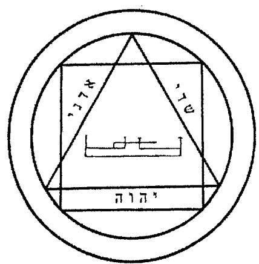

# BETHOR

Bethor与木星的力量相关,能:

给你很大的尊严。

吸引远处的金钱。

让你对遇到的人显得有价值。

在冲突中增加运气。

增加你对他人的权利。

在自我的治疗上进行辅助。

# BETHOR 的符文

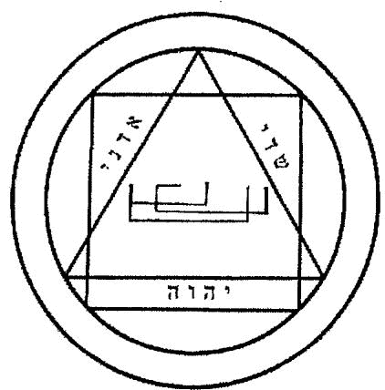

# PHALEG

Phaleg与火星的力量相关,能:

以活力抵抗疾病。

将恐惧击入敌人中。

挫败敌人的努力。

以狡猾帮助你回应攻击。

通过冷静的权利攻击他人。

削弱竞争对手。

# PHALEG 的符文

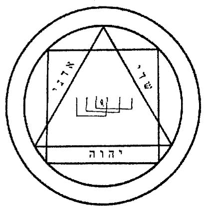

# OCH

Och 与太阳的力量关联，能够：帮助你发现自己真正的愿望。给创造性工作灵感。找到与生意关联的新想法。给温和的治疗带来温暖。加强你的名誉。让你在宁静环境下进行工作。

# OCH 的符文

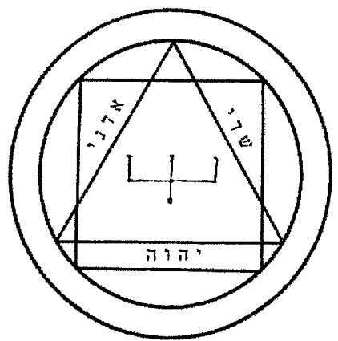

# HAGITH

Hagith与金星的力量相关,能:

增加性表达。

改变你关心之人的想法。

吸引能帮助你的人。

吸引爱情。

吸引友情。

致使恋人分离。

# HAGITH 的符文

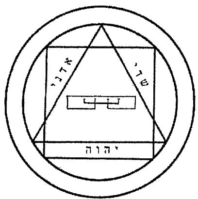

# OPHIEL

Ophiel与水星的力量关联,能:

增加艺术表达。

增加交易。

减缓精神压力。

建立良好的交流。

宣传话语。

增加口条。

# OPHIEL 的符文

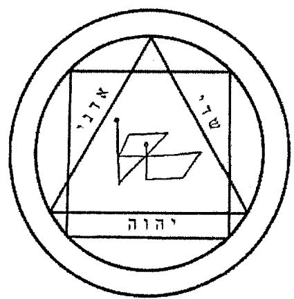

# PHUL

Phul与月亮的力量关联,能:

增强魔法。

增加直觉。

减缓时间的过度。

致使他人梦到你。

减轻焦虑和恐惧。

制造性吸引。

# PHUL 的符文

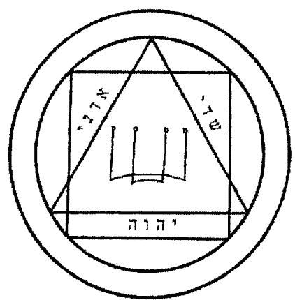

你必须要做出选择——用哪个灵体,哪个力量——这会驱使你运用你的直觉。直觉意味着接触难以琢磨的,它一直很适于魔法的暖身。

"结束一个项目"的力量,是指你和平地结束一个项目,像是结束周日下午装扮房间,还是指你无论如何都要让一个项目终结?我们说的是土星,它是沉重的,破坏性的行星,你自己想吧!

当我说'辅助治疗自己'的时候,是指你能够用它治疗你身体的病,还是只你能够治疗你内在的自我?它可以指任意。当我写这句话的时候,我的意思是将其用在自我治疗上。但是,这本魔法书已经被我用了一阵子了,我知道有人在用其它方式,所以,你在解读的时候可以多些弹性。它是混沌魔法,而不是仪式魔法。

这是中世纪魔法书的方式。对于步骤没那么刚性,给你用直觉的空间。即便我是创造这个系统的人之一,我仍旧会看这种力量列表,去思考和感受哪个最适合我当前的工作。我知道很多关于土星的事,我读过很

多关于 Arathron 的事, 但看着这个列表, 用你的直觉——这是做魔法的过程中久经测试的方式。

# 第二步: 忏悔你的罪 (并不需要)

如果对上帝忏悔你的罪孽对你有用, 那么就做吧。如果没用, 那么这一步可以跳过; 但是, 干嘛不勇敢一点, 花点时间去沉思黑暗和后悔之事? 我认为这点时间能让你释放痛苦, 后悔和内疚。你不是在对神忏悔或说对不起, 而是将你的烦恼交给世界, 并说, "我现在不想再被这些烦恼。你能否让我再次纯洁, 让我可以去玩耍? 谢谢。" 然后, 你去做魔法。

这是混沌魔法, 从而, 这一步该怎么做取决于你, 但我的方法是想想我有的问题——我的内疚, 我现在感到糟糕的事情, 任何多年来让我困扰的事。我将我的魔法目标放到一边, 花几分钟感受一下对一切糟糕的感受。然后, 在从窗口看到大街的时候, 想想自己的渺小 (因为有很多人在此受苦——我可以从窗口看到他们的脸), 并想到对比这座城市, 我有多么的渺

小, 然后对比这颗行星。然后, 我想到无数的星星, 以及所有的空间和时间, 我取出那糟糕的感受, 只是说, "感谢世界将我的困扰取走," 并做出似乎将我的心递交的行为——我在肉体上将我的双手向前递——这就完成了。

与其说 '世界' 你可以说神, EE- AH- OH- EH 或其它神名。如果你不信教, 那么你仍旧要有那种世界的浩瀚感。将你的感受递给它, 而你就被净化了。(一些人会对着树或泰迪熊忏悔, 或者对着其它让他们感到安全的东西。这是你的人生, 你可以用泰迪熊, 但我觉得递交给世界会更加令你放松。)

你无法完全赦免自己的罪孽和悔恨, 所以不要期待这么做后就会变得完全纯洁。但为了将要做的仪式, 你最好花点时间去想你的困惑, 痛苦和悔恨。

# 第三步: 找到你的力量

这是关于权力的, 而不是能量。你可以在仪式前, 过程中或事后用魔法的混沌能量, 但是, 我要说的力

量是命令的力量。天使,恶魔和其它的灵体——他们可能会喜欢礼貌,但是,当你表现的自己有权力对他们说话的时候,他们的回应是最佳的。如果你对着他们祈求,他们会想,你怎么认为自己有权力来要求。但是,如果你有权力感,那么你就能得到回应。你有力量和权力告诉他们你想要什么。命令天使会让你有点不舒服,因为你不知道下次过马路的时候会发生什么,但是,你要相信我,你如果扮演有权力的角色,你的魔法会更好。你在说'以EE- AH- HO- EH的力量,那灵体们会坐直,听你的话。你是否有询问上帝这是否可以是不要紧的。你是在说这是神的命令,因为你有自由的意志,这就足够占有权力了。它还有很多变化版,但就这个仪式而言,我们要做的是:

它还有很多变化版,但就这个仪式而言,我们要做的是:

"以ADD- OH- NIGH, SHAH- DYE和EH- AH- YEAH之名,我呼唤 0

看一下灵体的符文。让你的双眼停留在三角的中央,因为那是重要的部分。

对权力要求的时间是很短的,如果你不是认真说的,仿佛是通过神(或无论什么你选择的对象)准允你这个权力的,那么它就没多少力量。你在说的时候,必须要骄傲自豪,让魔法之语共振,从而你能够在胸口感受到词。如果你是坐在咖啡店里实施这个仪式的,那你要在脑海中进行这一切,闭上你的嘴巴!只是想象它真的在发音,刺激了你的胸口。

# 第四步:呼唤奥林匹克灵体

在你做行使权力的那部分时,呼唤灵体的名字,重点在于要重复说。看着符文来说灵体的名字;说三遍就够了。你喜欢的话,可以说333遍,然后安静地坐着等待自己感受到灵体的出席。这对于而言太久了,所以我说三遍,相信灵体会在那里。他们会难以无视你。就像你对着隔了三间房间的人说话,他们无法真正听见你,但你叫他们名字的话,他们会到你的房间里来,听你要说什么。灵体也是如此;说他们的名字几遍,他们就会听到的。在说神性力量的时候,也是

如此,用深层、强大的声音,仿佛你真的在你胸部感受到它易于。你可能感觉自己很蠢,什么都没发生,也可能会因为灵体的出席而感觉到变化——冷,温暖,空气中的压力。无论你是否看见灵体或感受到任何魔法变化,这并不重要。将所描述的部分做好,然后,无论发生了什么,或者什么都没发生,继续进行下一步。

# 第五步:告诉它你想要什么

看着符文,而不要盯着看;只是让它处于你的视角内,告诉灵体你要什么。直白,简短地说。不要用比喻,或者说的委婉。要明晰;从灵体的名字开始。记住,用情绪告诉他你要什么。说一个故事。从问题开始,并感受到问题。以解决事件的结局和它的感受结尾。

"Hagith,我不认识任何人能帮助我拓展我的生意。Hagith,我要求你吸引那些能帮助我生意兴隆的人来。"

每句话以灵体的名字开始,以明确地表明你是在对灵体说话。当你说第一句话的时候,感受问题。我没有朋友能帮助...感受这点!在你说第二句话的时候,想象Hagith已经帮你找到了朋友帮助了你的事业。这也让你有所感受。感受它!在此刻你可以微笑了。

两句话就够了。如果你开始继续说这一切都怪谁,这事是怎么发生的,解决问题的方法有哪些,那就没效果了。你要简洁;就像是在用微博。你在此刻只有一次机会,所以尽量去做好。感受到你想要发生的变化,不要是希望它发生的,而是你感受到它已经发生了。是的,这需要一些想象,但是,这是魔法所需要的。你的情绪不需要非常真实,非常强大。有一点情绪就足够给火焰提供燃料了。

# 第六步:供奉

有些人说你不需要供奉任何东西,《THE Gallery books》中的大多数都认同这点。然而,有时,要让灵体对物质世界关注,供奉物质的东西更好,不是吗?

你可能会想要给灵体一些蛋糕或啤酒。你怎么把蛋糕给不在哪里的存在呢?你可以用祭坛,弄几根蜡烛和蛋糕放一起,一天后再将蛋糕扔掉,假设灵体已经吃掉了。如果你喜欢这么做,那么就去做。我会避开这种行事风格,因为不喜欢把蛋糕留在家里——我会想要吃掉。或者它会发霉,吸引老鼠。然而,有些人觉得做这种事就应该供奉一些东西。如果你想要那么做,就做吧。在混沌魔法中,你就应该有创意,这意味着你想要知道规矩?没有任何规矩。你自己定规矩。你可以吃蛋糕,假装吃这个行为就是在供奉。或者将它留在盘子上,假设天使会在某时过来吃,或者将它扔进火里。你可以自己编。

我个人喜欢做出牺牲,或者承诺类似的事情。如果我是在与恶魔共事,那么可以谈条件。"给我这个,我会告诉十个人你的魔法有效。"对于天使,或者类似于奥林匹克的灵体,我会承诺对一个习惯,思绪或情绪,做出改变。不必是重大的改变,但仍旧要是变化,这是双赢的。如果你吸烟,那么不要为了得到一次约会而牺牲自己吸烟。这太难了,你无法坚持。提

供其它东西吧。这周我对马路杀手真的很愤怒,于是我准备放弃这个。我对灵体说,"Hagith,我牺牲我对马路杀手的愤怒。'还需要更多详细的细节吗?不需要,我知道我说的是什么,于是Hagith也知道我的意思。将说的话保持简洁,然后,你要维持自己的承诺。有人驾车进入了你的车道,你最好微笑。为什么Hagith会在于这个牺牲?我当然不知道,但这种牺牲的行为是每个灵体都会回应的。

然后,还有传统意义上的感谢。这听上去很弱,让你感觉是去水晶商店里买香薰和彩虹香蕉意义,但感激能圆满地完成交易。你可以预先提供对灵体帮助的感激。可什么还没发生呢?你说。那你就应该假装。你可以感受它或者你可以直接说,"感谢你给我人生带来的帮助,和给我产生的影响。"如果你想要再次与这个灵体共事,那么在得到你要的效果时,感受到感激,很大的感激。即便你有供奉其它东西,这种行为也应该做的。如果你想要维持简单,那么感激是你唯一需要的。

# 第七步：要正常

对灵体说话整体来说不那么正常。即便你已经做了几十年了，魔法的那一刻会让你觉得有点奇怪。当做完后，你必须要回归正常生活。

在此时，传统上会坚持你应该说一下离开许可，告诉灵体现在可以去做它被要求的事了。如果你希望的话，你可以说很长的一端话，来感谢灵体安静地前来，安静地离去。但，简单的一句‘谢谢，Hagith’就行了。

然后，你站起来（如果你之前是坐着的），用冷水拍击你的脸，或者打开窗户，或者在房间里走走。让你感觉正常的事情。好吧，不是那么正常，但你要回归真实世界。如果你不那么做，那么魔法会污染你的思绪和感受，所以，你需要从魔法中脱离出，回归现实。

在事后，仿佛魔法不存在一般，继续应对你的问题。如果你试图找到写歌的灵感，那坐在钢琴上，继

续写歌。一些灵体不在乎你有投入多少努力,但多数灵体会,所以,你要像是没有用魔法一般地处理你的问题,然后,让魔法来给你惊喜。如果你干等着天降馅饼,那么大门还是会关上。忘记魔法,让你自己被惊喜吧。

一些魔法你实施一次,一些是十一次,一些是三十三次。你想要做几次?如果一次觉得不够,那么多做几次,但是,不要一直用同一个问题来烦灵体。如果你觉得你觉得够了,那你就完成了,无论是三天还是二十天。

不要问问题。不要担心为什么它还没起效果。选择能给你带来什么的灵体,并做魔法。

# 第十三章：编新的魔法

在你混沌魔法师的生涯中,你不必编魔法。但是,了解它的过程能让你认识到魔法背后的真正能量,让你在魔法上变得更强。你可能永远也不会发明什么,但是了解基本符文的组合,信仰的历史,以及简化的系统,能让你更成功,可能在你运用魔法的时候,打开新的思路。

编魔法可以是很简单的,但如果弄得太简单,那就和打个响指或许愿差不多了。你要自信,知道你可以扔掉多数规矩。但是,你会知道到某一个程度的时候,就过于简单了,不再是真正的魔法了。

当开发奥林匹克混沌魔法系统的时候,我会进一步简化它。Arathon 最基础的符文是这样的:

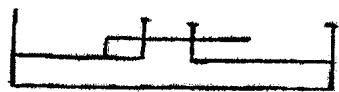

它没有圆,没有魔法词语,但我仍旧可以说你只需要盯着符文,并呼唤,"Arathon,帮我……"就行了。这是典型的混沌魔法。

它可能会有效,但我觉得它太草率了,仿佛将原版的系统都扔掉了一样。如果你持续一个月每晚重复它,那么或许会有效。但是,为什么不花点时间去开发一个系统,让它基于那古代系统的精髓,加上颜色,而不用规矩?

下面是奥林匹克魔法如何开发的(有我朋友的帮助)。这种边界是很理论上的所以我会做出非常简短的解释。《Arbatel:古代魔法》是我的起点。你可以从其它书中找到奥林匹克灵体,比如《Turiel之书》,但是《Arbatel》中有你需要的,在魔法背后的想法。

手上拿着《Arbatel》,我查找着魔法的精髓。它实际是关于什么的?初看之下,我可能认为它是关于灵体的,面对特定的方向,在特定的时刻,去呼唤灵

体。虽然它不像某些系统那样复杂,但是,它仍旧有很多规矩,很多你应该去做的事。遵照着Arbatel的步骤,你需要做很多事。但是,当你将一些部分去掉,你剩下的是灵体的名字,他们力量的暗示,以及他们相关联的行星,他们的符文,以及你需要神性授予的权利去与他们连接。

我将剩下部分扔掉,用在本书前面说过的基本仪式结构。我再加上一些情绪转变。如果你读过《Arbatel》你会发现情绪的转变很适合添加在里面。

我根据原书去画符文。我再加上圆圈和方块,因为在《Arbatel》中描述的魔法方法需要你以复杂的方式在方块内画圆。我保持着圆与方块的感觉,将它配上符文。符文看上去也像是你能在《Turiel之书》中找到的,也是用于联系奥林匹克灵体的。我不是在完全编新的魔法,而是将不同来源混合一下。在边缘上的字是Adonai, Shaddai和Tetragrammaton。我选择这些字是因为它们有被用在《Turiel之书》中;虽然在那本魔法书中,它们是用英文写的,是很糟的音译,我就

将它们改成希伯来文了;它看上去更加魔法,感觉更加真实。

但就这么简单。我扔掉了复杂的东西,只用了名字,符文和力量。我冥想灵体的名字,根据直觉列出它们的力量列表。我相信这些列表,然后就确定了下来。我取出我喜欢的部分,让它感觉更加魔法,加上情绪转变,就完成了我的魔法系统。如果你尝试的话,你会发现它或多或少也有效。它不是完全凭空出现的,只是不是传统上的典礼性魔法。它是混沌魔法。

还有一点。你越是用你的系统,它越是会变得更好……这意味着你的系统越新,它的力量越少。你是在用已知多世纪的符文和名字接入真正的力量。这很好。你的系统可能最初效果一般,但它越是被用,它越是容易得到结果。

你无法预料这需要多久,因为你可以调整系统,加减一些东西。它可能需要数周或数年,才能让你的系统准备好点燃所有的引擎。那自己编造的奥林匹克魔法系统已经存在了六年多了,已经被我和其他人频

繁使用过了, 让它变得效率更高。但是, 不要因此而不想用它, 因为你永远也不能低估情绪转变的力量。它能将魔法变得强大。

从网上找个垃圾咒语, 加上情绪转变, 猜猜看会发生什么? 它可能会变得有效。燃烧根蜡烛, 让你的情绪随着蜡被燃烧掉 (就像你的问题) 而改变你的情绪, 你可能会让现实状况发生变化。它可能很难和那些传统中的体系一样效果好, 但它能够起效。让你感到力量, 连接, 以及……棒极了。

你能从中学到的是打破规则。如果你遵照《Arbatel》里的步骤, 那你要花费很多时间。它很复杂, 过程耗时长, 而且你需要一个不错的指南针来确定面对的方向。但是, 秘密在于——那些规则多数不重要。如果你阅读维卡的咒语集, 它会说你需要从南面的山采集玫瑰果, 你知道如果只是去商店里买一罐玫瑰果是不行的。但是, 混沌魔法告诉你的是, 你甚至不需要玫瑰果。你只需要假装玫瑰果在那里, 或者用其它东西, 并且相信它也一样有效。

魔法的结构通常是帮助你沉入情绪中,建立你的信念,或者让事物感觉上更魔法。当你构建一个仪式的时候,让它感觉更魔法——保留下你觉得必须的声音,名字和符文,再添加上情绪转变。

我猜你会出去买很多古代魔法书,建立你自己的系统。但是,我也猜有时你会想要修改一个系统,你现在知道该怎么做了。当你发现有很多规矩都可以删掉,而魔法仍旧有效的时候,你会变成更加大胆的魔法师。你会停止对细节的担心,而专注于要呼唤的灵体。他们会倾听,他们会回应。他们会为你工作。

随着你的试验,你会发现一些力量之词会比另一些更好,一些灵体会比另一些更容易联系,有时你的确会需要正确的器具和时机。但是,多数时候你不需要。你只需要基础的魔法象征,以及情绪转变的能量。

如果你漏看了,那么下面是你要做的:

为魔法净化空间。

(驱逐,忏悔或放弃烦恼。)

占有魔法主动权。

(严肃地去做。)

吸引灵体的注意。

(用名字,符文和力量之语。)

说你的意图。

(用情绪来说。感受问题解决后你想要的情绪。)

供奉。

(提供感激,情绪或其它东西。)

回归正常人生。

(就像魔法无效一般地处理你的问题,但信任魔法能够起效。而魔法也的确会。)

你只需要做这些。

但只有在你需要做的时候做。

或者他是值得你做的时刻。

我们构造出奥林匹克混沌魔法是因为传统上的方法实在是太沉闷了。我们想要以更令人振奋的方式运用这些行星力量,所以我们建立了看上去能有效的魔法,然后不断调整它,直到它真的有效。

混沌魔法鼓励你去试验,编造东西。好吧,但我想要更了解它:如果魔法系统已经很简洁了,那么不要浪费你的时间去构建新的。如果你拥有一辆车,那就不要搭便车了。

创造魔法很酷,但并不重要,即便有些人发誓这

是混沌魔法的定义。我认为对魔法的发明是可选的。现在,如果你想要一个结果,我会说去用奥林匹克系统。它可能比你发明的系系统效果更好。但是,当你有强烈的发明欲望的时候,你知道你该怎么做。

不要害怕借鉴传统魔法;先辈中有很多强大的力量。但不要让自己受陷于细节中。找到魔法中的净化部分,用情绪填充它,并简化,但不要简化到过于愚蠢或抽象。你可能要进行好几次试验,才能发现什么是有效的,但是,你能够简化魔法,并得到效果。打破规则,但不要打破魔法。

如果你在担心要怎么画魔法的圆,我不建议你去弄。根据很多权威,你不能无视魔法的圆。如果你相信权威,你可以找找在地板上画圆的方式,或者在你的精神中绘制,让它保护你,或者将灵体带到圆中或靠近圆……这完全让我困惑,所以我完全不用魔法的圆。如果这让我成为异端,那就是吧,我完全不在乎。这就是混沌魔法。

# 第十四章：完全发明的魔法

"这很新鲜。"

"靠,这不会有效的,除非你在正确的时间,面向正确的方向来做魔法。"

"我干嘛要编造魔法,已经有魔法为我编好了。"

这些想法都没问题,但是,如果你能让奥林匹克混沌魔法有效,那你就证明了魔法能够被简化,只要不要简化到认不出。

很多人会不认同,说你可以彻底改造魔法,并让它有效;我无法辩论,因为这也是对的。一些人也称呼我为二等混沌魔法师,因为我依赖那些传统的仪式。

另一种选择是完全地发明——编造魔法,不断去

做, 直到它有效。这里面有技巧的; 你为了肯定能发生的事情去做魔法。你为金钱魔法创造仪式, 再做那仪式, 以得到每月的薪水。魔法肯定有效! 在为肯定能发生的事情做魔法后, 那魔法成真了。如果你为了有可能发生的事情做魔法, 那么你最终会完全发明能带来结果的灵体。这需要不少努力, 但是我不得不说。混沌魔法是一部分关于发明的, 所以, 如果你想要发明, 这也是一个方法。

另一种方法是创造思念体, 就像我之前说过的那样, 但是, 将他们视作古代灵体一般对待, 而不是你自己的思念体。画出符文, 告诉你的思念体, 只有你在说一套魔法之语和配套仪式, 并对着符文吟唱它的名字的时候, 它才能有效。如果你这么做, 那你就有种类似于创造了一个英灵, 但是, 这个林提是能够被认为知道这个你创造的系统, 符文和方法的人召唤的。

干嘛要完全发明呢? 因为, 有的时候, 无论你参考了多少书籍, 你还是找不到你想要的灵体。你有时会面对的问题, 是一般人遇不到的, 没人给出过魔法

上的解决之道。这种时候,就需要你靠纯粹的发明了。

# 第十五章：整体情况

混沌魔法是一种氛围。你可能会想,我应该有被告知更好的指导,更多细节,或者更长串的灵体供我联系。但是,混沌魔法是一种氛围,而让你懂它。真正要掌握混沌魔法,你就要让它为你服务。你现在知道足够多的信息来让它起效了。

当你在读混沌魔法的时候,你会看到试验这个词,这是因为这里面不包含按照古代规则进行的教条式魔法。每次仪式都是个试验。但是那个的问题在于,试验是你去测试理论的东西。如果你是在测试魔法,将它视作一种理论,它会证明物理和常态的规则是对的,魔法是给烂货玩的。当你试验的时候,你要像是个糟糕的科学家。糟糕的科学家会在试验之前就认为自己知道理论。这对于科学不利,因为结果会被捏造……

但是，这对于魔法很好，因为你有期待最佳的效果。你会假设一切都会有效，真的很酷，又休闲。

不过，你该怎样搞清楚什么有用，什么没用呢？你会知道的。做一个仪式，如果它效果很好，给了你回馈，那你就知道你的系统很棒。如果它不行，你会感受到的，这就足够了。

混沌魔法有个传统，是你应该发明一个驱逐仪式，去抵御邪恶，或侵入型灵体，或烦人的狗，或无论什么骚扰你后院的。这不是个坏主意，你可以试试，但是，这不是必须的。当你阅读混沌魔法的时候，你会发现有些人会说你必须要创造驱逐仪式，你必须要创造英灵，等等……

在《Gallery of Magick》初创的时候，我们会用自己做的驱逐仪式，因为我们做的一些魔法会让空间感觉有点奇怪。当关了灯的黑暗空间和沉闷的仪式中，它给人感觉有点太奇怪了，仿佛鬼怪有在产生兴趣。于是，我们创造了一个很棒的驱逐魔法，就是我们同时大声叫到“滚蛋”。它也有效。然后，我们创造了

更简单的方法：我们将灯重新打开。你可以尽可能地去简化。

混沌魔法不是你烦人的舅舅。还记得那种告诉你，你应该去做房地产，或者你必须要去更好的学校的那种舅舅吗？好吧，也许你没有那种舅舅，只有我有。不过，烦人的亲戚坚持你应该怎样，必须怎样的，你肯定会遇到的。在混沌魔法中，没有必须和应该。我这里告诉你的都是指导方针，让你走正确的方向，但你可以做你想要做的。有些人会说你必须要冥想，你必须要加入组织，你必须要为了世界意志服务。不，你不必。你只要做魔法。

混沌魔法可以是你初学的魔法——第一个尝试的魔法，你可以从中感知神秘学的潜能。

混沌魔法可以是你人生后期遇到的，帮助你突破教条，尝试新的魔法科技。

混沌魔法不是宗教，它只是帮助你得到结果的。

谁知道魔法是什么？它可能是艺术，可能是通过

超自然得到结果的科学。它可能是帮你寻找神性,理解自身,感知你的内在力量,或者其它完全不同的。但是,魔法会发生。它不应该比往许愿泉里扔硬币更有效——但这也是魔法行为。将一些魔法能量投入硬币中。感知你的愿望。感知你缺少什么。随着你扔硬币,知道当它接触到水的时候,你的愿望能够实现。对你已经得到的效果感到满意。这立刻就成为了许愿泉混沌魔法。你懂我意思。

巫术的法则 译制购书请联系 QQ: 1305533439微信: 408498898淘宝店: magick.taobao.com微博: @巫术的法则0.0.1 版

巫术的法则