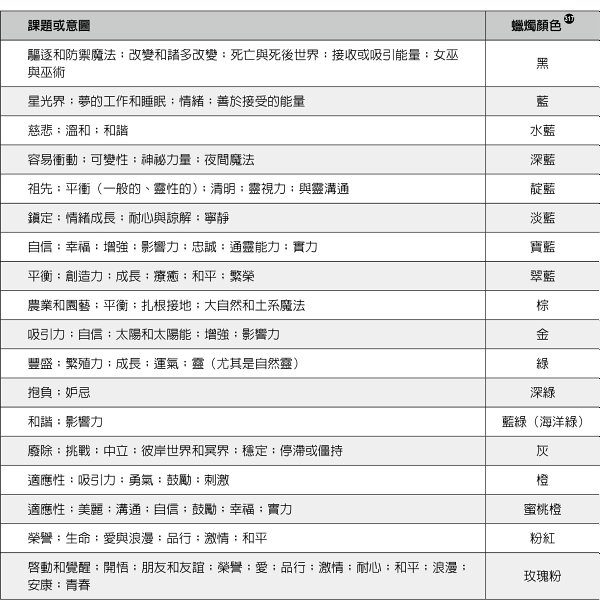
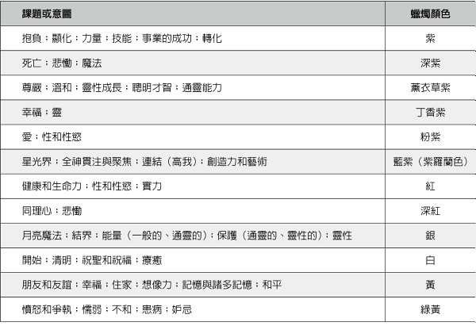
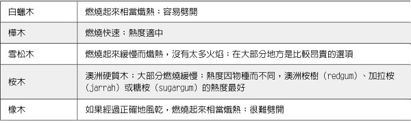
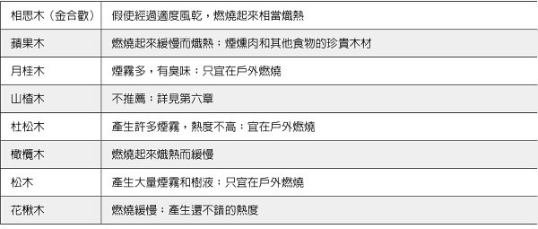
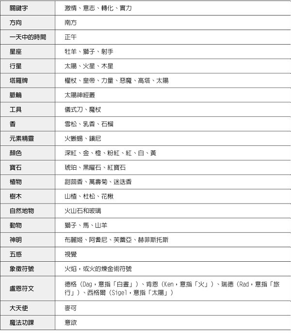

# 火系魔法

# 自然魔法系列绪论：魔法工作的基石

自然魔法系列绪论

## 魔法工作的基石

好几世纪以来，透过许多秘传的实务做法，元素们一直是魔法工作的基石。无论是占星学或现代巫术，这四大元素都在更广大的多维灵性架构范围内创造出边界和结构。它们强调概念，使概念变得更加浅显易懂。

确切地说，“土”（earth）是我们行走其上的地面，它是岩石、泥浆、山脉。“土”也是我们的身体以及今生的物质显化，它是我们的中心和我们的稳定。

“火”（fire）是壁炉里的火焰，它是蜡烛、营火、太阳。“火”既可以温暖，也可以毁灭。它有力量转化和煽动，它的火焰是我们的热情和我们继续前进的意志。

“水”（water）是来自天空的雨，它是人世间的海洋和湖泊、令人欣慰的沐浴、早晨的露水。“水”是我们的血液和汗水，以及我们的记忆，它统治我们的情绪，显化成为眼泪。

“风”（air）在我们周围，它是我们的呼吸、我们听见的声音、触碰我们脸庞的风。“风”携带种子和花粉、警告人的气味和令人愉悦的气味、文化的歌谣。“风”是我们的声音、我们的念头、我们的点子。

虽然每一种秘传系统以不同的方式应用这些基本概念，但四大元素都在帮忙建构实务做法，逐渐产生对自我的更加理解。对现代女巫来说，四大元素往往表现在她们的魔法工具中；举例来说，高脚酒杯可能是水，五角星形可能是土。对信仰巫术的威卡派（Wicca）教徒来说，比较具体的是，四大元素帮忙升起魔法圈，让保护区得到力量的加持。在塔罗牌中，四大元素流经数字牌的象征性意象；而在占星学中，每一个元素由三个星座代表。对其他人来说，四大元素为每天的静心、观想、法术施作或生命功课，提供灵性指引。有人可能会问道：“我需要什么元素才能度过今天呢？”

本书是一套特殊书系的第三本，这套书系深入探讨元素的象征意义和魔法效用。每一本聚焦在一个元素，涵盖与该元素相关联的每一样东西，从灵性圣域和神明，到实用的法术和仪式。对于想要将自己包裹在元素实务做法中的女巫来说，或是对于需要每一种元素资源的某人而言，本书和同一书系的姊妹作品，将会提供你需要的每一样东西。

“巫术的元素”（Elements of Witchcraft）书系中的每一本著作，是由来自全球的四位不同作者所撰写，这显示，领略深奥莫测的四大元素涉及多么的广泛和深入，以及该如何让那个概念为你自己的魔法和灵性需求运作。

加入我们，一起深入探索四大元素的魔法效用吧。

——海瑟·葛林（Heather Greene）

水、风、火、土四大元素魔法系列主编

# 作者序：神圣的火元素能量

作者序

## 神圣的火元素能量

火（fire）与火焰（flame）对现代女巫和异教徒的工作和修行至关重要，方方面面多不胜数。从节日时的巨大篝火，下至简单的茶灯蜡烛，众所周知，我们一直用火来代表某个神圣的元素、季节的交替、众神周期循环的重要时间点、已故的亲人、太阳或星星等等。一年到头，阳光或下雪，室内或户外，火几乎始终是我们的作业和庆典的关键部分。

我写这本书的目的，不只是要探索火在整个巫术社群、异教徒世界、神秘文化中的现代和历史用途，而且要向火的种种方式表示敬意，对于我们作为人类和一个社群的真实存在，火是相当重要的。

就像几个世纪以来厨房炉火是家户的中心一样，篝火、营火、蜡烛火焰，也是异教仪式、聚会、魔法运作不可或缺的一部分。与我一起工作的团体通常在户外工作，而且只要澳大利亚的用火限制允许，无论以篝火或蜡烛的形式，火都扮演着重大的角色。

如果回想参加过的异教节日（尤其是需要露营的节日），你八成会发现，你对那段时间的许多美好记忆都围绕着火：在营火旁社交，在篝火旁跳舞，乃至只是使用灯笼、火炬或蜡烛。我曾经体验过的某些最深刻的社群仪式，都与以下情况大有关系：隔着圆圈看着我的朋友和挚爱的脸孔被闪烁的黄光照亮，而且知道我们正在为了什么而努力，我们正在为了什么而共同努力。虽然“火”并不是让这些时代变得特殊的唯一事物，但它们确实是我们如何体验和参与这个社群的基石。

火也有它具毁灭和危险的一面。我们有时候会忘记这点，因为生活在二十一世纪第一世界的奢华享乐中，这点得到了缓冲。我完成本书同时，正当澳洲有史以来最严重的丛林大火在我身边燃烧：我有朋友失去了家园。数千公顷的森林和田野被烧毁，数以百万计的本地动物遇难。新闻和我们所有社交媒体的订阅新闻推送，密密麻麻地挤满了燃烧灌木和建筑物的黄色和红色，以及动物被烧死令人作呕的黑色。马拉库塔（Mallacoota）镇被庞大的森林火灾完全包围，早晨的天空变成一片漆黑，必须出动海军营救滞留的居民。

今年整个夏天，袭击我们的恐惧，来自于我们领悟到火是一个很难操控的元素，那份操控权远比我们有时候喜欢认定的少许多。同样是温暖我们冰冷的指尖且将人们聚集在一起的火，只要情况适合，也可以摧毁和杀死万物。

### 火元素

如果你已经阅读或实践现代巫术相当一段时间，一定会偶尔遇见土、风、火、水以及（有时候，视你的传统而定）灵（spirit）等元素。你可能会在创建魔法圈或准备神圣空间时确认它们的存在，或是在你的祭坛上有它们的图像。

#### 为什么是四大元素？

在世纪之交，十几岁的我热衷阅读的大部分“巫术”书籍（天哪，我觉得自己好老，居然在撰写这类书籍了）都坚决主张，在任何仪式中拥有平衡的元素表现是必不可少的，但是却没有一本书真正深入探讨原因，或是这个概念从哪里来。

四大（有时候是五大）元素是自然界中所有事物的基本“建筑砌块”的理念，在许多古老文化中是被广泛接受的信念：在古代的巴比伦尼亚（Babylonia）、希腊、波斯、日本、印度等等，都有类似的元素列表。中国古代的“五行”（“五种流行之气”的缩写 1，意指“在不同时期主宰的五种气或能量”）系统更将“木”列为第五大元素。

几个世纪以来，这些理念主要是以哲学术语来考量；除了用来解释或分析自然发生的事物外，这些元素也用来解释宇宙论和神话学的事件。直到科学和科学研究的兴起，例如“伊斯兰黄金时代”（Islamic Golden Age，西元八百年至一千四百年）以及十七世纪欧洲的“科学革命”（Scientific Revolution），科学家们才开始更密切地研究这个理论：一路走来，实验、验证、分类更多的元素。

但是上述任何一点跟巫术有什么关系呢？这些元素如何进入我们的仪式和“心魔之书”（Book of Shadows）且来到我们的祭坛上呢？答案部分落在欧洲的魔法书和魔法书传统。

#### 魔法书、巫术、四大元素

grimoire（魔法书）这个英文字来自一个古老的法兰克单字，意思是“面具”或“巫师”，而且与 grammar（文法）这个现代英文字有关连。魔法书时常被认为是魔法的“咒语书”或“教科书”。这些书（其中某些被认为曾被灌注魔法力量）往往收录如何创作驱邪法宝和避邪物等魔法物品的说明；如何执行魔咒、符咒、占卜，以及如何召唤或祈请超自然的存在体，例如天使、灵、神明、恶魔。

我想在这里暂停一下，指出某些现代女巫交换使用“魔法书”和“心魔之书”这两个术语，但是这两个术语往往是不同的：“心魔之书”这个词的历史不到一个世纪。它是由威卡教（Wicca）的创始人英国巫师杰拉德·加德纳（Gerald Gardner）在一九五〇年代初创造的，最初是用来描述加德纳的女巫们一入门便被赠予的手写宣誓书。加德纳的女祭司之一朵琳·瓦连特（Doreen Valiente）在她的著作《巫术的重生》（The Rebirth of Witchcraft）之中声称，加德纳在一九四九年的一本神秘杂志中发现了这个词：它是一篇文章的标题，刊印在加德纳的小说《高等巫术手册》（High Magic’s Aid）2 上。

正如巫术在半个多世纪以来，一直不断演化和扩展且随后增加许多内容一样，“心魔之书”（或简称 BoS）的定义也已经成长，变成收录女巫比较个性化的笔记本，包括魔法指令和记录、咒语、梦境日志等等。

虽然自古以来某些宗教和灵性教派一直使用魔法书，但是在文艺复兴期间，也就是介于西元十四世纪左右中世纪结束与十七世纪“启蒙时代”（Age of Enlightenment）开始之间的过渡时期，魔法书的普及度却急剧上升。

文艺复兴是社会许多部分发生巨大改变和“重生”的时期。科学、艺术、逻辑的价值远远超过中世纪时期，对历史和历史文献的兴趣也是如此。在这段期间，对魔法书的兴趣崛起，拥有或研究魔法书成为时尚：愈古老、愈神秘，愈好。

从那时候开始，许多关于魔法书的著作和评注，后来被诸如“黄金黎明”（Golden Dawn）之类的仪式魔法会社所采用，而杰拉德·加德纳后来便利用这些将他得到的巫术传统的碎片拼凑起来，而且企图用现有的资料“填补空缺”。

其余的就是历史了。杰拉德于一九五〇年代开始撰写和出版关于巫术和威卡教的文章，那是在英国废除了最后一条取缔巫术的法律之后。威卡教和其他各种巫术成功来到了美洲、澳洲以及世界其他地方，在那里，它们遇见且融合了六〇和七〇年代涌现的理念（环保主义、女权运动、性解放等等），今天某些已确立的异教传统和理念的雏形于焉诞生。现在，每十年就有愈来愈多的传统和开路先锋，而且每十年异教的“帐篷”（rent）就变得更大、更生气勃勃，实在是不可思议。

尽管如此，以各种方法和手段，四大元素在许多仪式和许多资料（巫术及非巫术）里都占有重要地位。如果没有值得重视的东西，它们大概不会如此盛行，这些包括：土的稳定和肥沃、风的聪明才智和创造力、火的实力和热情、水的情感和梦幻等等。

火元素尤其独一无二，因为它是四大元素中唯一可以被创造出来的：点燃火柴、摩擦木棍取火乃至轻弹加热器或炉子上的开关。它也是唯一可以被其他三个元素摧毁的元素：你可以把水倒在熊熊火焰上、把土堆在营火上方或是吹熄蜡烛。

#### 本书的用法

在本书的前四章，我会研究整个历史、民间传说、神话中对火的崇敬和魔法。第五到八章概述当今与火的某些常见对应关系和关联，然后我们将在后面几章将所有内容汇总起来，谈到更多的亲自动手做以及讨论火和蜡烛魔法、仪式用火、火系节日等等。

预先跳到后面这几章可能很诱人，但是由于这些章节的内容有时候大量借鉴历史和民间传说对火的描述，我保证，如果直接跳到后面章节，你绝不会全面了解这个迷人的元素以及它如何融入你、我的巫术。

* * *

注 1：Zai, Taoism and Science, 133。

注 2：Valiente, The Rebirth of Witchcraft, 51。

# 第 1 部 火系魔法的神话与历史

第 1 部

# 火系魔法的神话与历史

神话学扮演“灵”的清晰觉醒的关键。

——克里斯多佛·休斯（Kristoffer Hughes）
《来自诞生的大锅］（From the Cauldron Born）

# 第一章 贯穿古今和所有文化的火

## 1　贯穿古今和所有文化的火

身为女巫和异教徒，我们用火和火焰所做的事绝不是新鲜事。从石器时代最早期开始，火就一直存在于人类的文化中，而且有证据显示，从那时候开始，人们就在仪典上使用火。

### 史前时代

人类能够基于这些目的（木炭的碎片、种子、燧石碎片）控制火，最早的证据差不多有八十万年历史。3 火使我们的祖先能够活着，为千千万万个冬天提供烹饪和热度。因此，人们认为，对火的崇拜、敬畏、奉若神明，可以追溯到同样遥远的时间也就不足为奇了。

大部分的印欧语言（西元前一千年，在整个欧洲以及西南亚和南亚部分地区所使用的语系），对火有两个不同的概念：

✽egni：以及它的变体字描述了有生命的火。这是梵文中“火”的字根 agni（阿耆尼，这也是印度教火神的名字）以及拉丁文 ignis 的字根，现代英语因为 ignis 而得到诸如 ignite（点燃）之类的字。

✽paewr：以及它的变体字描述了无生命的火。在这里，我们得到希腊文 pyr（现代英文 pyre［火葬用的柴堆］和 pyromaniac［放火狂］等字的字根），以及现代英文单字 fire 的先祖。4

将火用于仪典的某些最早证据包括：

·烧制黏土“维纳斯”小雕像，可以追溯到大约一万一千年前。这些小型女性塑像组成迄今发现的某些最古老的烧制陶器。最著名的小雕像“维伦多尔夫的维纳斯”（Venus of Willendorf）实际上是用石灰石雕刻而成的，但是其他雕像，例如“下维斯特尼采的维纳斯”（Venus of Dolní Věstonice），则是烧制的黏土，而且已经追溯到大约西元前两万五千年至两万九千年。

·最早的火葬仪式的证据，可以追溯到大约西元前一千五百年，发生在西欧。

·在印度南部早期印度教祭坛的仪式，用火的证据来自大约同一时间。

### 西元前六百年

#### 祅教

“拜火者”（fire-worshipper）这个词有时候与“祅教”（Zoroastrianism，译注：又名“拜火教”、“琐罗亚斯德教”）有关，这是一个由“琐罗亚斯德”（Zoroaster，或称“查拉图斯特拉”Zarathustra）于西元前第六世纪左右在波斯（Persia）创建的宗教体系。祅教是第一个崇拜单一神明而不是许多神明的主要宗教，它起源于现在的伊朗东北部和阿富汗西南部。

在祅教中，火（atar）和水（aban）被认为是仪式净化的媒介，因此在许多仪式中占有显著的地位，而在古代，仪式时常发生在火系神庙或火的“房子”中。

#### 希腊和罗马

在希腊罗马文化中，有两大类型的火焰崇拜：炉床之火和锻造之火，前者有罗马女神维斯塔（Vesta），以及与她相当的希腊女神赫丝提雅（Hestia），后者则有罗马男神伏尔甘（Vulcan）以及希腊男神赫菲斯托斯（Hephaestus）。希腊泰坦神普罗米修斯（Prometheus）的故事众所周知，他从众神那里窃取了火，将火给了人类。你可以在第三章读到更多关于这些神明的信息。

### 西元一千五百年至一千七百年

#### 欧洲：燃烧的时代

我认为，要写一本关于女巫和火的书，在某种程度上不可能不提到“燃烧的时代”（Burning Times），那是西元一千五百年至一千七百年之间，当时在欧洲，被控施展巫术的人们被烧死在火刑柱上。

火刑是这时候对付异端的首选处决法。这种做法起源于巴比伦尼亚和古代的以色列，后来被欧洲人所采用。火作为洗礼者或净化者在整本《圣经》中占有重要的地位，而且许多人认为，以这种方式处决异端是让做错事的人摆脱罪孽或“邪恶”的方法……加上在过程中还有除去做错事的人的“方便副作用”。

就跟在一九九〇年代末期和二〇〇〇年代初期接触巫术和异教信仰的其他人一样，我不断地接触到“燃烧的时代”的故事，包括：在中世纪的女巫审判期间被烧死的九百万或更多女巫，一直承继着“旧宗教”的女巫们的完整传承——可以追溯到那个时候……等等。

在我还是小小女巫的时候，几乎读到的每一本巫术书籍都提到了这点，完全没有任何主要来源的参照或引证。“九百万女性”这个数字几乎被我认识的每一位女巫和异教徒都接受成为绝对的真理，而且它变成了我们自己的一部分神话。谁能责怪我们呢？帮助复兴一个在几个世纪以前几乎丧失在基督教压迫者手中的宗教，实在太浪漫了，就连最硬的心肠也无法抗拒。

然而，问题是，这不完全是事实。

在一九二〇年代，玛格丽特·默里（Margaret Murray）博士首先让以下概念大受欢迎：在高度组织化的女巫集会中，有完整的女巫传承可以追溯到“燃烧的时代”。虽然这是一个非常浪漫的想法，但是这个理论很快就被历史学家和考古学家们否定了：除了没有任何实质证据外，我们知道，语言、读写能力、方言、旅行、距离、经济上的限制，会使女巫网络（其实是任何网络）无法在工业化之前的时代以默里所声称的方式存在。

尽管名誉扫地，但是默里的理论后来却被杰拉德·加德纳所采纳，在一九五〇年代，英国废除了最后一条老旧的反巫术法律之后，加德纳是第一位“曝光”的巫师。加德纳在他的许多工作中大量引用了这些理论，这些变成了我们今天实践的许多巫术和异教的基石。5

加德纳对默里理论的诠释，反过来变成了一九六〇和一九七〇年代有影响力的早期生态中女性主义女巫的基础，也因此，我们今天在某些巫术资料中还是会看见许多（但不是全部都有）“九百万女性”的浮夸之辞。在一九九〇年的加拿大纪录片《燃烧的时代》（The Burning Times）当中，这个数字得到进一步的巩固，因为该片采用了其中几位作者的看法。

但是，当我们客观地看待巫术和异教作者对“燃烧的时代”的某些主张时，重要的是不要忽略罗纳德·哈顿（Ronald Hutton）教授所描述的“潮汐波”（tidal wave），他在研究中以毫不含煳的措辞指出：

·在此期间，在欧洲境内被处决的人数远远少于九百万。没有“官方”数字，但是学者们估计，数字在四万到六万之间。6 九百万的神话，起源于一七八四年德国学者戈特弗里德·克里斯蒂安·福格特（Gottfried Christian Voigt）所写的一本小册子。在这本小册子当中，福格特估计了（又是在没有任何证据支持的情况下）在一千多年的时间中、因巫术而被处决的人数。从那以后，无数其他人断章取义地使用了这个数字。

·女巫狂热不是有系统的，实际上并没有良好的组织。在中世纪期间，欧洲各地的文化差异极大。对于性别角色、“巫术”／魔法、罗马教会的态度因国家而异，甚至因城市而异。在不同的国家和城镇，教会对民间魔法的可接受度、迷信等等，也有不同的看法，即使是在克拉布马（Kramer）的《女巫之槌》（Malleus Maleficarum，这是关于女巫和巫术最著名的专着，于十五世纪末首度在德国出版）出版之后。7

·对猎巫人或教会来说，《女巫之槌》并不是被普遍接受的文献。尽管它当时受到某些宗教极端分子的欢迎，但是许多人认为，《女巫之槌》有辱男性的虔诚以及修女和女性圣人的成果。8 其他人则指出，它忽略了大部分已被确立的关于巫术和恶魔学的传说。许多宗教裁判所的法官以及神职人员同样蔑视它，斥之为过度偏执和厌恶女性。9

不要误会我的意思：这当然是一场拙劣的演出和悲剧。几万人以最野蛮的方式，在全然悲惨和极度痛苦中丧生。这些人通常是女性，她们往往穷困，而且在某种程度上通常处于弱势或被边缘化。但这并不是某些人所说的“女巫大屠杀”。绝大部分被指控和处决的人们，并没有被鉴定是女巫或经鉴定拥有我们今天所知类似女巫的任何东西。

这一切是否意谓着，身为女巫和异教徒，我们不应该学习或阅读关于女巫审判的信息？绝对不是。任何类型的女巫狂热都形成我们的历史的重要部分，如果你有兴致，都值得好好研究。我认识的许多现代女巫，在他们的书架上都有专门探讨这个主题的一区。其他人则在学术层面探索了，这些审判和被告的供词，在多大程度上影响了现代对巫术的理解和诠释。

重要的是，我们不要促使某种不当的用词和态度，延续到今天的现代异教信仰之中：每年的耶诞节和复活节，我都看见“网络梗”在社交媒体上一再宣传：“那些可怕的基督徒”偷走的“异教”传统，而且每一个万圣节，我都看见有人胡扯闲聊，说凡是有魄力的女性都是“烧不死的女巫的孙女”。郑重声明，我不需要成为某位女巫的孙女就可以为自己挺身而出，而且我当然不需要不断地嘲笑别人的宗教来为我自己的宗教辩护。

在新异教（Neopaganism）崛起的早期，与所有基督徒大叫对骂，且将巫术视为反抗主流文化的一种方式，那可能是可以接受的，八成也很好玩。但是，让态度和意识形态奠基于我们现在知道是不真实且有问题的故事是没有助益的，它们令人尴尬，而且分散了注意力，使人无法关注各地异教祭司所做的努力，更不用说许许多多求道者在他们投入这个宗教时所发现的和谐与美丽了。

### 西元五〇年至今

#### 出现在欧洲和不列颠群岛的柳条人

在女巫和异教徒身边待得够久，你应该至少看过一次一九七三年的英国邪典恐怖片《异教徒》（The Wicker Man）。喜爱或厌恶（根据我的经验，不管是喜爱或厌恶，大部分异教徒似乎都有强烈的看法），这部电影在当代异教文化中启发了柳条人（wicker man，由木材、牧草或芦苇制成阴森逼人的巨型人物，然后放火点燃）的复兴。

我在澳大利亚境内的异教节日见过一些令人血脉贲张的柳条人。在二十一世纪初，吉朗异教徒（Geelong Pagans）每年都在奥特威（Otway）雨林上演“火人”（a burning man）节，节日的高潮在于点燃一个巨大人型，那是我们在前一天集结社群之力建造的。人型的设计很巧妙：他是一副巨大的骨架（有胸腔和所有一切），由锁在一起的铁片组成。我们唯一需要做的是，收集成捆的柴枝，固定在结构上，让他“长出肉来”。一旦这一切在仪式中烧掉，那具骨架继续存在，在黑暗中发出炽热的光芒。

许多人们认为柳条人是“凯尔特人”（Celtic）的文化，也是古老的凯尔特习俗。但是目前还不清楚是否真有其事。在德鲁伊教（Druidism 或 Druidry）的活人献祭中使用这些的记载，全都可以追溯到尤利乌斯·凯撒（Julius Caesar）西元五〇年的著作《高卢战记》（Commentaries on the Gallic War）。在这本著作中，凯撒提到高卢人（居住在西欧古老地区的凯尔特部落，包括现在的意大利北部、法国、比利时、德国与荷兰的部分地区）为了安抚他们的神明而做出的“国家”牺牲。10

根据凯撒的说法，这些仪式是由德鲁伊教僧侣监督和精心安排的，而且包含“巨大的肖像，四肢由柳条编制而成，里面装了活人，放火点燃；于是牺牲者死去，被火焰包围。”11

凯撒声称，这主要用于处决罪犯，不过也有无辜者遭围捕并牺牲，以便补足需要的数字。可是，虽然我们知道，德鲁伊教僧侣确实实行过活人献祭，但是没有找到任何考古学的证据证实凯撒的说法。

历史学家推测，这个故事是凯撒发明的，为的是用来当作某种不怎么高明的宣传，他举例说明“野蛮的”高卢人（Gaul）和不列颠人需要一些罗马“文明”，借此帮忙证明高卢战争是正当的。12

凯撒的叙述被许多其他古代作家引用和重复，但是直到一六七六年，英国历史学家艾利特·萨姆斯（Aylett Sammes）出版了《古代不列颠文物》（Britannia Antiqua Illustrata）的时候，才有人对它提出质疑或说明。萨姆斯或多或少有些逐字引用了凯撒对柳条人的描述，然后加入了一些他自己的修饰，说明这个人的四肢被“按照篮子的性质编织在一起”等等。13

除了这段描述外，萨姆斯还收录了一幅他想像中高卢人的柳条人可能会是什么样子的版画。这幅图像（一名金发人遥看远方，有着自然的面孔，匀称的双臂和双腿由笔直的柳桩制成，形成笼子，关押悲惨的囚犯）成为自此以后柳条人的所有视觉表现的基础。14

但是，尽管这些不大可能有的结构，在古代确实存在的可能性愈来愈小，然而有关体型不小、人身尺寸之肖像的报导确实到处存在。

十九世纪之前，燃烧“柳条人体模型”（mannequins d'osier）在法国境内相当普遍。这种做法类似于在欧洲其他地区点燃仲夏篝火：人们认为它可以驱散恶灵。在巴黎的熊街（Rue aux Ours），人们过去时常制作巨大的柳条人偶，他们将人偶打扮成士兵，带着在街上逛几天，在七月三日当天把它烧掉。一六四三年以前，“熊街的使者”（Le geaunt de la Rue au Ours）每年被烧毁，由一位被选为“国王”的当地人负责当场监督。这位国王有幸用点燃的火炬纵火烧掉那个人偶，而当火熄灭时，当地人争先恐后地抢夺剩余的碎片。15 有些故事声称，这是为了纪念一四一八年焚烧一名亵渎神明的士兵，但是大部分的学者并不同意，认为这比较有可能只是一种地区的奇风异俗，在当时是相当司空见惯的传统。16

无论柳条人是真正的历史做法，还是古罗马的宣传产物，从那时候起就一直被持续装置着，多亏一九七〇年代电影制作人的重新构想，而且受到萨姆斯和其他人的画像启发，柳条人在今天的较大型火系节日（包括异教节日和其他节日）依然屡见不鲜。

### 西元一八五〇年至一八九〇年

火和水制造了蒸汽，为维多利亚时代的工业革命提供了动力，从此改变了人类生活的方式。火为澳大利亚和美国淘金热的矿工们照亮了道路，这些澈底地改变了我们的景观和人口，于是在这段期间形成的神秘学和唯心论传统修习者的人数不断增长，而火在他们的蜡烛中闪烁。

＊＊＊＊

#### 澳洲殖民时期的烧伤痕迹和魔法保护

大卫·沃尔德伦（David Waldron）博士是一位历史学家、民俗学家，也是活跃的地方历史和民俗研究者。他是《来自茶树的咆哮：澳大利亚的大猫民间传说》（Snarls from the Tea Tree: Australia’s Big Cat Folklore, ASP, 2012）、《震撼邦盖的黑狗：当地民间传说的案例研究》（Shock the Black Dog of Bungay: A Case Study in Local Folklore, Hidden Publishing, 2010）、《女巫的征象：现代性和异教的复兴》（Sign of the Witch: Modernity and the Pagan Revival, CAP, 2008）的作者。最近，他对十九世纪澳大利亚东南部民间传说选集《金矿区与哥德式文化：隐藏的遗产和民间传说》（Goldfields and the Gothic: A Hidden Heritage and Folklore, ASP, 2016）做出贡献且编辑了该选集。他撰写了大量的文章，谈论当代新异教的起源，以及新异教与中世纪和现代早期在超自然力量、浪漫主义、西方现代化等信念方面的关系。他还撰写了大量链接到当地身分和社群的英国民间传说，以及与环境和社会历史有关的本耶普（Bunyip）、大猫（Big Cat）、幽威（Yowie）等澳大利亚民间传说。当前的一个研究焦点是：运用鬼故事作为工具，透过讲故事和恶作剧来纪念社群创伤。大卫·沃尔德伦是“金矿区历史”播客节目《来自鼠城的故事》（Tales from Rat City）的研究员兼共同撰稿者。

在墨尔本西北方大约一三〇公里的吉尔福德镇（Guildford），一家不起眼的乡村酒吧后面，有一座不起眼的附属建筑物。它是一八五〇年代澳洲淘金热的遗迹，曾经是著名的“柯布联合四轮马车”（Cobb and CO Coach）生产线的马厩，随着人口因淘金热而激增几十万，这些生产线延伸穿过白人文明的边界。在马厩的各个中央横梁上都有一系列不起眼的标记，许多人铁定忽视这些标记，或是将它们误认成蜡烛的残余，但是更仔细观察就会发现，它们是相当刻意的。在齐眼的高度，十三个圆形拇指大小的标记，围绕着每一根梁的中心，其中许多标记用汤匙大量掏出原料，然后被重新烧进木材里，这是一个势必需要花些时间和精力的过程。或许其中最为壮观的（也是澳大利亚境内独一无二的）是在地区城市巴拉瑞特（Ballarat）主要大街上“一八六〇年机械学院”（1860 Mechanics Institute）的地下深处，那儿有大量用煤灰绘制的象征符号和字母。这些象征符号和字母首先被仔细地蚀刻，然后在屋顶上用煤灰精心描绘，而且规模大又详细。单是靠烛光就要花上好几个小时，才能以涂上煤灰的图像覆盖如此巨大的空间，然而关于它们的原始目的，给出的线索却只有含煳的提到“阵亡者”（the Fallen）以及一八八二年的日期。

然而，在不列颠群岛各处、中世纪的住家和城堡中，以及在“诺曼征服”（Norman conquest，译注：指一〇六六年法国诺曼第公爵威廉入侵和征服英格兰）之前的教堂墙壁上，都可以找到这些标记。它们是什么意思呢？为什么被如此小心翼翼地置放在建筑物的门槛上，以及它们注定要被看见的地方呢？它们代表的是民间魔法实务幸存下来——澳洲殖民时期狡猾的男人和女人，延续了他们的欧洲祖先的做法，制作了仪式和保护标记。一八五〇和六〇年代的淘金热将几十万人带到澳洲，他们来自不列颠群岛，以及来自亚洲、美洲、非洲、欧洲其他地区的移民，而且他们随身带来了丰富的民俗和信仰遗产。前来寻找财富的人们通常来自穷人、被剥夺权利的人、无依无靠的人，他们被圈地运动（Enclosure Movement，译注：从十二至十九世纪出现在以英国为代表的欧洲，土地的所有权集中在国王或罗马梵蒂冈承认的皇帝以及教会，少量为自由民私有）、高地清洗（Highland clearances，译注：指苏格兰历史上发生的大量佃农从高地和群岛被驱逐的事件，主要发生在一七五〇年至一八六〇年期间）、马铃薯饥荒（potato famine，译注：又称“爱尔兰大饥荒”，发生在一八四五年至一八五二年期间）所迫，不得不横跨世界寻求财富。

历史学家吉儿·布丽（Jill Blee）在研究爱尔兰移民到澳洲时，发现了这个普遍的信念：农村的爱尔兰移民带着“小仙子”跟他们一起漂洋过海，因此小仙子与他们一起踏上澳洲的金矿区，与来自陌生新土地的许多新灵在一起。在一项记载中，人们相信，“从科克（Cork）到植物学湾（Botany Bay），报丧女妖（bean sidhe）一直坐在船头，梳理她的头发。”17 不仅实质上相信“灵”普遍存在，布丽更主张，故乡的信仰和习俗永久存在，让爱尔兰的天主教徒得以在新的土地里幸存下来，在那里，他们特有的身分使他们与信仰新教的英国领主产生歧异。18 对康瓦耳（Cornwall）、苏格兰、约克郡、东安格利亚（East Anglia）的贫苦移民来说，情况也是如此。在这片对他们来说是异国他乡的地方，与保存自己的传承和身分角力，因为在此，他们的习俗、信仰乃至身分，都是要被信仰新教的英国当权派铲除的威胁。

所以，这些象征符号被如此小心翼翼地置放在这些附属建筑物的墙壁里，对制作它们的人来说有什么意义呢？虽然对这些人来说，他们贫穷且未受教育的状态，使他们的声音无法被听到，但是我们确实取得了保留在历史记录中的片断。在十九世纪中叶的报纸中，有纪录显示，狡猾的男人和女人定期在澳洲殖民地的墓地、小酒馆、原始森林区做生意。由赫特福德大学（University of Hertfordshire）、风土建筑协会（Society for Vernacular Architecture）以及联邦大学（Federation University）和乐卓博大学（La Trobe University）支持的一项“澳大利亚仪式魔法研究专案”（Australian Ritual Magic Research Project），在澳大利亚各地发现了为数众多维多利亚时代幸存下来的民间魔法实例。虽然遗迹发现地包括富裕的住家、警察局、马车房、灯塔、棚户区，但是截至目前为止，大多数遗迹位于穷人居住的附属建筑物和仆人住所。尽管如此，只有三位魔法师被明确地识别出来，主要是因为没有记录记载经济和社会精英之外的人们。这些魔法师提供他们的魔法技能供人雇用，提议如何找到丢失的财产和牲畜、疗愈病人、创造护身符、使人们摆脱邪恶的魔法和灵，以及预测未来。其中两名男子都是酒馆老板，而我们有幸得到他们记录下来供后人使用的魔法实务，而且可以线上观看。酒馆老板威廉·艾利森（William Allison）在他的年鉴中，详细描述了治疗法、补救法、诅咒、护身符、女巫瓶以及其他魔法实务。我们也很幸运，他的同行，另一位狡黠的酒馆老板班杰明·诺克斯（Benjamin Noakes），也将他的笔记交给了威廉·艾利森，抄写到艾利森的年鉴中。19 这让我们对澳洲殖民时期魔法修习者的修行和信仰有粗略的了解。

#### 燃烧痕迹

截至目前为止，在澳洲殖民时期，燃烧痕迹是民间魔法修行数量最多的实例。在许多（如果不是大多数）来自十九世纪早期到中叶且有完整木材留存下来的马厩中，这些拇指大小、泪珠状的孔洞在马厩的中央横梁上屡见不鲜。以某个角度拿着蜡烛针对单一个点精心创造，然后挖出灰烬直到出现凹陷，创造这些孔洞需要大量的时间和精力。民俗学家迪恩（Dean）和希尔（Hill）企图复制这种效果，而且明确地表示，这些孔洞是经过相当深思熟虑、有系统地制作的。因为用蜡烛、锥状蜡烛、木材进行实验，他们发现，这些痕迹是经由燃烧四五%，然后用小汤匙挖出，去除灰烬，才能更深入地挖掘。这势必需要大约十五分钟，才能产生一个大小相当的标记。20 虽然燃烧痕迹的完整意义目前还是定义模煳，但是大部分研究指出，在预防建筑物免于火灾，以及净化建筑物免除邪灵的仪式方面，它们扮演了某个角色。21

#### 煤灰污渍

巴拉瑞特机械学院地下室屋顶上的煤灰污渍的规模和复杂程度，是民间魔法实务的卓越实例，令人惊叹。今天，只有十六例这种做法在不列颠群岛幸存下来。它们的应用至今仍旧是个谜，而巴拉瑞特的实例在澳大利亚境内是独一无二的。伊斯顿（Easton）提出，对巫术的恐惧可能是使用巫术的一个因素。在某个大规模的实例中，他主张，它们在某种程度上是用来避开导致恶梦连连的邪灵。在英国境内，往往一把来自教堂的神圣火焰被小心翼翼地带到现场，用来将保护的标记和象征符号画到建筑物脆弱区的天花板上。在英国的中世纪教堂内，蜡烛烟痕很常见，看似随意地散布在天花板各处。名称开头字母和象征符号相当常见，包括风格独具的十字架和魔鬼陷阱（几何图形的曼陀罗）在内。在巴拉瑞特的那些标记，日期标明是在一八八二年，而且提到“阵亡者”，很可能指的是“澳大拉西亚大矿灾”（Great Australasian Mine Disaster），在那场矿灾中，二十几名矿工在克雷斯维克（Creswick）附近一条地下河的裂口中溺水身亡。然而，由于提到的原因少之又少，所以只能推测。

### ·结论·

澳洲的金矿对许多人来说是危险的地方，身在陌生而有全新威胁的新大陆，来自故乡土地的灵的呼唤，在人们的头脑中感觉起来非常遥远。于是难怪在这个新世界中，旧世界的传统被人们带过来，也难怪过往的仪式依旧很强大。它们带来安慰，既是因为相信它们可以带来的保护，也是因为与在世界另一端的遥远故乡，创建了强而有力的情感链结。然而那些遗产仍旧写在门槛上以及隐藏在墙壁之内。

——大卫·沃尔德伦

＊＊＊＊

### 当代

#### 犹太教、伊斯兰教、基督教

燃烧的灌木、火柱、烛台火焰，全都是神圣的火的实例，有时候被用作上帝本尊的化身。

在犹太教中，光明节（Chanukah，有时候拼作 Hanukkah）是在十一月和十二月左右举行的节日。这个节日持续八天，庆祝在西元前第二世纪被亚述的希腊人征服之后，重建耶路撒冷圣殿期间发生的奇迹。在所有被储存起来用于圣光的油之中，只有一小瓶幸免于难，没有遭到亚述希腊人的劫掠。它燃烧了八天，这被认为是奇迹的征象，预示圣殿中的人们可以继续他们的灵性生活，与上帝创建关系。在功能层面，这也意谓着，要用更多的时间压榨和加工更多的橄榄油，才不会把最后一瓶橄榄油燃烧掉。

世界各地以种种方式庆祝光明节，但一个共同的传统是：点燃七灯烛台的蜡烛，然后将蜡烛面向外面的世界，有时候是在房子内的某扇窗户或某个显眼的位置。在希伯来语中，这个传统叫做“宣扬奇迹”（pirsuma d’nisa）。

在天主教中，蜡烛、香、火也占有显著的地位，包括在复活节时，至今在欧洲各地和世界其他地区仍旧有点亮复活节篝火的仪式。神圣的火焰或圣火时常被点亮，意谓着“逾越节三日庆典”（Paschal Triduum）的结束，这三个复活节圣日从“圣周五”（Good Friday，又名“耶稣受难日”）开始，到“复活主日”（Easter Sunday）结束。

#### 印度教

长久以来，火一直也是某些印度教传统的一部分，仪式时常在圣火之前进行，有时候还会念诵梵咒或向众神献祭。火焰和火构成许多不同仪式的关键构成要素，包括结婚，在结婚仪式期间，阿耆尼（Agni，印度教的火神，有时候是火本尊的化身）有时候被要求要见证两人的结合。22

#### 日常中的远古之火

虽然甚至比起二十年前，我们今天更少用火，但是许多古代或民间做法的片断，仍旧留存在多数人认为平凡无奇的习俗中。

举例来说，看着生日蛋糕上的蜡烛。有些人相信，用点燃的蜡烛装饰圆形蛋糕的传统，起源于古希腊文化中为女神阿缇蜜丝（Artemis，译注：希腊神话中的狩猎与生育女神，相当于罗马神话中的黛安娜）举行的庆祝活动。即使古希腊和罗马人并没有那么做（我们确实知道，圆形“蛋糕”在古代的希腊和罗马肯定有其重要性，而蜡烛被用于敬拜阿缇蜜丝，但是并不清楚蛋糕上点燃的蜡烛是否专门用于敬拜阿缇密丝），德国境内也早在十八世纪就有记录显示，蛋糕上燃烧的蜡烛可用于庆祝儿童节或孩子的生日。23

### ·结论·

纵观历史，还有更多关于火的敬拜和神圣的火的实例，我无法在此一一叙述。可以这么说，自有记载的时间开始，火一直是许多文化仪典的一部分，而且它继续成为今天许多人类的宗教和文化的一部分：在火葬和篝火中；在用于各种宗教仪典的蜡烛里；在被用来提醒我们重大场合的永恒火焰之中。

* * *

注 3：Goren-Inbar 等人，“Evidence of Hominin Control of Fire”。

注 4：Etymology Online（线上词源学），”Fire”。

注 5：美国作家杰森·曼基（Jason Mankey）在他的著作《转型的巫术》（Transformative Witchcraft）中，针对默里和加德纳对现代巫术的贡献做了绝佳的解读。

注 6：Adler, “A time for Truth”。

注 7：Waldron, The Sign of the Witch, 180。

注 8：Hutton, Triumph of the Moon, 180。

注 9：Waldron, The Sign of the Witch, 182。

注 10：Symes, Willow, 50。

注 11：Caesar, Julius, Commentaries, 183。

注 12：Hutton, Blood and Mistletoe, 3-5。

注 13：Symes, Willow, 51。

注 14：Symes, Willow, 51。

注 15：Frazer, The Golden Bough, 38。

注 16：Symes, Willow, 58。

注 17：Blee, J., “The Banshees” in Waldron, D.(Ed.) Goldfields and the Gothic: A Hidden Heritage and Folklore. Australian Scholarly Publishing: Melbourne, 2014, 43–54。

注 18：Blee, J. “The Banshees”, 51。

注 19：若要以数码化的方式查看威廉·艾利森的魔法年鉴，请见网址： [`stors.tas.gov.au/NS261-1-1`](http://stors.tas.gov.au/NS261-1-1)。

注 20：John, Dean and Nick Hill, “Burn Marks on buildings: accidental or deliberate?” Venacular Architecture。45 (1): 1–15 (12 December 2014)。

注 21：Hutton, Ronald, and Springer Link。“Physical Evidence for Ritual Acts, Sorcery and Witchcraft in Christian Britain: A Feeling for Magic”。Palgrave Historical Studies in Witchcraft and Magic。London: Palgrave Macmillan UK: Imprint: Palgrave Macmillan, 2016, 56。

注 22：Hazen, Inside Hinduism, 34。

注 23：Nowak, “The Fascinating History of the Birthday Cake”。

# 第二章 神话中的火兽与火乡

## 2　神话中的火兽与火乡

就跟火元素本身一样，神话中的火兽往往是不可预测的、神秘的、多方面的。有趣的是，与火有关的神话界域和地方，往往与创造和改变的行为有关，或是在某种程度上与毁灭和破坏有关。在本章中，我收录了一些历史、当代信仰以及其他通常与火有关联的某些神话生物和地方的信息。

### 神话中的火兽

在这本书介绍中，我们稍微探讨过火元素以及它如何以及为何被囊括在巫术中，但是我认为，在本章中指出乙太生物与特定元素有关联很重要——例如地精（gnome）来自土元素、西尔芙（sylph）来自风元素、火蜥蜴（salamander）来自火元素、水女神昂丁（undine）来自水元素等等——何况这个观念已经存在了大约几个世纪。某些神秘学传统主张，火元素精灵是第一位友善对待人类的元素精灵，他们教导早期的人们如何创造和使用营火和火炬。24

但是，最早提到元素精灵，明确地与巫术链接是在《恶行要论》（Compendium Maleficarum）25 之类的著作中，这是一本猎巫手册，由意大利神职人员弗朗切斯科·玛莉亚·瓜佐（Francesco Maria Guazzo）撰写并于一六〇八年出版。瓜佐于他在米兰期间蕴孕了这本书，当时米兰当地在巫术和妖术修行拥有不小的名声，瓜佐的著作针对女巫以及他们与不同的魔鬼和灵（包括土、风、火、水精灵）打交道提出了许多主张。他的著作，大大影响了日后针对这些生物与魔法和巫术的关系所撰写的文章。26

#### 镇尼

镇尼（djinn，又名 jinn、genn 或 genies）是阿拉伯传统的精灵，被认为是比人类高阶的生物，而且是由精微许多的物质创造出来的。27

镇尼被认为具有以超自然方式强化建筑的技能，据信被所罗门王（King Solomon）雇来帮忙建造他的宏伟神庙。28 在许多国家的民间传说中，镇尼据说居住或至少聚集在门口、门槛附近以及其他阈限空间（liminal space），而且是与这些空间有关的许多迷信的根源。29

根据伊斯兰教的信仰，在人类被创造出来之前，镇尼统治着地球，而且被认为是一种居中的存有，介于天使与人类之间。30 根据大多数的说法，镇尼在夜间最为活跃，喜欢高温、沙漠，最爱炎热的气候，尤其是温暖地区的天然泉水、废墟、荒野。

许多民间传说主张，镇尼无法抗拒一则好故事。讲故事或唱歌，只是某些现代女巫向这些精灵献祭或致敬的众多方法之二。另一个传统方法是：将油倒在一碗面粉上。当谈到食物供品时，人们普遍认为他们会拒绝含盐的东西。给镇尼的食物通常放在外面，而不是放在家里。人们相信，用盐或铁可以驱除有害或淘气的镇尼，尤其是铁制的珠子。31

#### 龙

这些巨大的蛇形生物，出现在世界各地文化的传奇故事和民间传说中。龙的外观和其他细节因地而异，但是自中世纪的鼎盛时期以来，西方文化中的龙往往被描绘成会喷火的野兽，有四足、双翼、犄角。西方流行的龙的形象，似乎是结合来自不同的传统对早期的龙的描绘，以及不准确或不完整的早期蛇图。

在西方文化中，龙被描绘成要被驯服或杀死的妖怪，通常是被圣人或文化英雄驯服或杀死，想想“圣乔治与龙”（Saint George and the Dragon）的传说。龙往往被说成拥有贪得无厌的食欲，住在山洞内，在那里囤积财宝。这种龙的形象经常出现在西方的奇幻文学中，包括托尔金（J. R. R. Tolkien）的《哈比人》（The Hobbit）以及乔治·R·R·马丁（George R. R. Martin）的《冰与火之歌》（A Song of Ice and Fire）系列。

东方文化的龙，往往被描绘成没有翅膀的蛇形生物，它们非常聪明。“dragon”这个字也已经被应用到中国的传统文字“龙”之中，龙与好运有关联，也被认为有驾驭雨水的力量。龙以及龙与雨的关联，是中国舞龙和赛龙舟风俗的源头。许多东亚神祇通常被描绘成龙。在帝制的中国，龙也与皇帝有关联，在后来的中国帝制历史上，皇帝是唯一被允许在他的居所、衣服或财产上可以有龙形纹饰的人。

龙通常混合了鸟类、猫科动物、爬虫类的特征，例如蛇形的特色、爬虫类的鳞状肌肤、四条腿的每只脚上有三或四根脚趾、嵴椎节点从背部向下延伸、一条尾巴、锯齿状的下颚有一排排齿状物。某些现代学者提出，已灭绝或正在迁徙的巨型鳄鱼与龙最为相似（尤其是在森林或沼泽区遇见的巨型鳄鱼），最有可能是现代龙的肖像的模板。32 这也符合龙的古字 draco 和 drakon（“大［海］蛇”）。

#### 火鸟

在世界各地几种不同文化的神话中，都有火鸟——由火制成或从火中诞生的鸟。

##### 贝努鸟

贝努（bennu）鸟是埃及的神话鸟，与太阳、创造、重生链结，在埃及神话中被认为参与了世界的创造。有人提出，贝努鸟可能是希腊神话中不死鸟的灵感来源。

##### 民间传说和童话中的火鸟

火鸟也出现在许多民间和童话故事中，最著名的应该是《金鸟》（Die Goldene Vogel），这则故事最早是由格林兄弟（Brothers Grimm）于十九世纪初记录下来的。故事中的金鸟每年来到国王的果园偷水果，于是被一位年轻的王子猎杀。这则故事的不同版本存在于欧洲境内和更远地区的许多文化和土地上。我最爱的火鸟是“灯笼”（Lantern），它出现在凯瑟琳·瓦伦特（Catherynne M. Valente）的《孤儿的故事》（The Orphan’s Tales）系列书籍中。

##### 呼玛

呼玛（Huma，有时候拼作 Homa）出现在几个不同的伊朗神话和民间故事中；它也出现在苏菲派（Sufi，译注：追求精神层面的伊斯兰教团）和狄万（Diwan，译注：在伊斯兰文化中，Diwan 是诗歌集，这些经常用于歌唱的诗歌，通常创作和收集于各苏丹国的皇宫中，且因其激发灵感的能力而广为人知）诗歌中，以及几个国家的艺术和建筑中。虽然呼玛确实有许多与其他神话中的火鸟相同的特征，但是关键差别之一是，它灿烂、炽热的形象，往往在某种程度上与水一起被描绘。这个名字的诸多诠释之一，因伊纳亚特·雷马特·汗·帕坦（Inayat Rehmat Khan Pathan）而来到我们面前，伊纳亚特是“普世苏菲主义”（Universal Sufism）的老师和“西方苏菲派”（Sufi Order in the West）的创始人，他认为，hu“代表灵”，而 ma 则源自阿拉伯文 ma'a'（意思是“水”）。33

##### 不死鸟

不死鸟（phoenix）出现在许多国家的神话中，它是一种神话鸟，通常类似老鹰或其他大型鸟类，不死鸟死在火中，然后从自己的灰烬中重生。许多版本的传说都说，不死鸟的重生每五百年才发生一次。

在阿拉伯的传说中，不死鸟坐在鸟巢上，被太阳的光线点燃、烧死。在这个版本的神话中，一只虫从被烧毁的不死鸟的灰烬中冒出来，变成一只新的不死鸟。

在中国，不死鸟叫做凤凰，传统上也与太阳有关，它在中国被视为来自天堂的信使，每当众神仁慈的时候，凤凰就会出现。在中世纪的欧洲，不死鸟出现在基督教的宇宙论之中，被认为是生命胜过死亡的象征；而在炼金术中，它被视为“贤者之石”（Philosopher’s Stone）和“长生不老药”（Elixir of Life）的象征。34

某些故事将不死鸟与乳香关联在一起，人们认为，不死鸟用大爪子携带乳香。35 雪松和肉桂之类令人陶醉的香料气味也是常见的进贡品。不死鸟的魔法对应关系，包括美丽、开始、毁灭、终结、幸福、希望、知识、长寿、美满的婚姻、彼岸世界和冥界、重生与更新、自我修行。36

#### 拉姆帕德斯

在希腊神话中，“幽冥仙女”拉姆帕德斯（Lampads 或 Lampades）是冥界的宁芙。她们名字的罗马化版本是 nymphae Avernales（冥界的宁芙），因阿韦尔努斯（Avernus）而得名，而阿韦尔努斯是一处火山口兼冥界的入口（见本章后续［神话中的火乡］）。

拉姆帕德斯是女神赫卡特（Hekate）的同伴兼仆人，宙斯将她们送给赫卡特，奖励赫卡特在“泰坦之战”（Titanomachy，对抗泰坦神的十年战争）期间始终忠诚。她们通常被描绘成举着火炬，人们认为，如果那些火炬的火焰照着凡人，可以迫使凡人发疯。拉姆帕德斯可以随心所欲地将这把火炬之光转成黑暗，为的是揭露丢失的、隐藏的或必要的信息。37

不确定拉姆帕德斯的祖先是谁；某些说法声称，她们是黑夜女神妮克丝（Nyx）的女儿，另一些说法则表示，她们是希腊冥界众河神之一的后代。38

在现代的巫术中，拉姆帕德斯被认为是与预言和正义有关的灵。她们服从赫卡特，可能与赫卡特一起受到崇敬，而赫卡特的某些现代信徒在进行祭祖或与死亡和悲恸有关的仪式中召唤她们，往往是在萨温节（Samhain，这是一个有时候与万圣节相关联的现代异教节庆）期间。在像这样的工作中，她们被认为是非常忠诚的。39

拉姆帕德斯也与死后世界、潜意识、周期循环、黑暗、占卜、梦的工作、结界、恩惠和诸多恩惠、希望、觉照、运气、梦魇、保护（尤其是保护走失的儿童）、重生与更新、释放、复仇、实力、旅行、愿景有关。常见的供品包括黑色或银色蜡烛，蒲公英、熏衣草、解热菊（feverfew）、附子属（monkshood）、洋茴香（anise）、颠茄（belladonna）、小豆蔻、高良姜（galangal）或曼德拉草（mandrake）的小枝；或用柏木、棕榈、花楸（rowan）或柳木生的火。40

#### 火蜥蜴

在中世纪的炼金术和魔法中，火蜥蜴（salamander）居住在火的乙太（有时候是异世界的元素）的本质之中。在火中玩耍的火蜥蜴，在炼金术中是一种典型的能量象征，人们认为可以强制它们给予恩赐和好运。根据某些著作的说法，只有透过它们的活动，火才能存在且可以完全被使用。41

谈论元素精灵的古代著作表示，火蜥蜴以蜥蜴般的小火焰形状出现在人类面前。已知第一份将火蜥蜴当作元素精灵存在的参考文献，来自希腊哲学家亚里斯多德，他在西元前第四世纪写道，火蜥蜴“……不仅穿过火，而且在这么做的时候扑灭火。”42 很久以后，李奥纳多·达文西提出，火蜥蜴可能会扑灭火，因为它们吸收火的能量。43

不要将火蜥蜴与真正的同名两栖类物种混为一谈，尽管曾经有某些人提出，或许“真正的”火蜥蜴，由于它们喜欢林地中腐烂的原木，因此难免无意间被扔进有木柴的火堆里，当它们试图逃离火焰时，人们看见了它们的身影。44

大部分以火蜥蜴为特色的资料声称，火蜥蜴在夜间最为活跃，有时候以光球的形式漂浮过或快速窜过水体，或是出现在名为“圣艾尔摩之火”（St. Elmo’s Fire，译注：蓝色或紫色犹如火焰的发光球体，这是一种在大气带电的情况下发生的天气现象，可能附近有雷暴或火山爆发等等）的天气现象中。45

火蜥蜴往往与行动、控制、转化有关，46 某些神秘派作家将它链结到人体以及人体调节温度和性情的能力：举例来说，“热血”和“性急”的人们，行为方式与火蜥蜴和火元素的性质相符。

### 神话中的火乡

关于谁是第一位看见澳洲的非原住民，有许多理论，我最喜爱的是古代中国探险家的理论，早在任何欧洲人想到这点之前，中国探险家就开始在世界的底部绘制人迹罕至的海洋地图。在他们从一次探险中带回的某些地图上，有一大片绵延的海岸线至今仍被许多人认为是澳洲的西海岸，当初被那些探险家称为“火与鹦鹉之地”（the Land of Fire and Parrots）。这其实是一个非常贴切的名字：在奥兹（Oz，即澳洲）这里，夏天炽热干燥，也确实有许多令人惊叹的本土鸟类。

我最喜欢这则故事的部分是，没有证据显示那些探险家能够再次找到这条海岸线，至少不能立即找到。而且虽然从逻辑上讲，我们可以看着澳洲长长的海岸线说，是的，这些探险家看到的八成是澳洲的边缘，但是无法确知，而且是好一阵子无法确知，那里有一片神话般的火与鹦鹉之地隐藏在世界的南部海洋的某处……一个除了居住在那里的人们，没有人可以确定它甚至是真实存在那里的世界。我喜欢这样想：对于这段期间的水手和探险家来说，围绕着这片土地的神秘感，反而会产生更多关于它的故事和假设。

对于我在本节中写到的某些地方，最吸引我的是阈限（liminality）：这些是真实的地方，我们可以看见、触摸、呼吸到，但是附带的故事和历史意谓着，它们同时部分地存在于未知之中，存在于另一个世界中。而且在许多情况下，这种相异性是由火元素带来的，或是被链接到火元素：在转化中，在重生中，乃至在澈底的破坏和毁灭中。

#### 阿韦尔努斯

阿韦尔努斯（Avernus）是一座有毒的湖泊的名字，据说在罗马神话中，它是冥界的入口。在西元前二十九年至西元前十九年左右，由罗马诗人维吉尔（Virgil）用拉丁文写成的叙事诗《艾尼亚斯纪》（Aeneid）之中，英雄艾尼亚斯（Aeneas）经由阿韦尔努斯湖旁边的一座洞穴下降到冥界：

洞穴很深；而且，从宽阔的开口

下行，一趟崎岖不平的岩石下坡；

一片幽暗的树林在此捍卫入口，

无法航行的湖泊在彼绵延伸展，

俯瞰这片不开心的水域，没有光，

没有鸟儿冒昧闯入，在空中飞行；

如此致命的恶臭从深处升起，

热气腾腾的硫磺感染了天空。

由此，希腊吟游诗人创造他们的传说，

而且给这座湖泊取名叫做阿韦尔努斯。47

——《艾尼亚斯纪》，第 6 册

这座湖泊本身位于曾经的罗马城库迈（Cumae）附近的一处火山口，但现在它是坐落在意大利海岸那不勒斯以西腹地小许多的库马（Cuma）村。“阿韦尔努斯”这个名字来自古希腊语 aornos，意思是“没有鸟”。48 许多历史和文学记载都提到，飞过湖面的鸟儿会掉下来死去。这大概是因为湖泊下方仍旧活跃的火山口散发出有毒的火山烟雾。湖泊里和附近山坡上的火山喷口有时候也会敞开，散发出硫磺烟雾。49 罗马人采用了许多希腊神话和文化，两个神话中的冥界都是类似的。前往罗马冥界的灵魂必须首先渡过人称“仇恨的水域”的冥河，然后被“分类”，进入遥远岸上冥界的不同区域。

附近一处山顶有一座阿波罗神庙的废墟。在往下更远朝阿韦尔努斯湖的位置，有一条梯形隧道被称作“女先知洞穴”（cave of the Sibyl），在山坡下方延伸。在古代世界，有许多女先知住在洞穴里。库迈的女先知（the Sibyl at Cumae，守护附近阿波罗神庙的女祭司）是最有名的女先知之一。50 正是库迈的女先知警告英雄艾尼亚斯很难找到离开冥界回到人间的路：

特洛伊，安喀塞斯（Anchises）的儿子啊，阿韦尔努斯的下坡很容易。

一整夜，一整天，冥府的诸门都敞开着。

但是要循原路而回，要上达天堂的甜美空气，

那确是大费周折啊。51

——《艾尼亚斯纪》，第 6 册

西元前第八世纪左右，古希腊的移住民首先在阿韦尔努斯湖边地区定居。52 在罗马时期，罗马人的房舍点缀在部分的湖岸，还有一座大型澡堂。这座湖泊的化身，神明阿韦尔努斯（deus Avernus），被供奉在湖边的神庙里。

虽然罗马冥界并不是基督教神话黑暗、炽热的地方，但是阿韦尔努斯仍然与火元素有关，因为它的物质入口是由火山形成的，而且因为对寻求进入或尝试离开的人们来说，必会发生莫大的启蒙和改变。

#### 迪纳斯阿法拉翁

有时候写作 Dinas Ffaraon（“法老的堡垒”）或 Dinas Ffaraon Dande（“炽热的法老的堡垒”）的迪纳斯阿法拉翁（Dinas Affaraon），是中世纪威尔斯文学中提到的一个地方的名称。据说它是威尔斯史诺多尼亚（Snowdonia）境内铁器时代山丘堡垒的旧名，现在人称“迪纳斯安里斯”（Dynas Emrys），有时候英语化名称也叫做“神仙美馔城”（Ambrosial City）。53

这个地方在十二或十三世纪的故事《卢德与勒费利斯》（Lludd and Llefelys，威尔斯语：Cyfranc Lludd a Llefelys）中提到过，这则故事被收录在称作《马比诺吉昂》（Mabinogion）的威尔斯故事集之中。故事讲述了刚从父亲那里继承了英国王位的卢德（Ludd）。不久之后，他帮助兄弟勒费利斯（Llefelys）娶了法国公主，成为法国的国王。卢德的统治一开始很不错，但是没过多久，三场瘟疫中断了这份和平，其中第二场是每年五朔节（May Day）出现的尖叫声，尖叫声十分可怕而刺耳，造成英国境内的所有孕妇流产，所有男人黯然失色，萎靡不振。54

卢德的兄弟勒费利斯向他提出建议，帮助他应对这三场瘟疫。卢德国王前去处理可怕的尖叫声，那是一条红龙被迫与一条外来的白龙战斗引起的。卢德必须在名为牛津的小岛的正中央设下陷阱捕捉它们，让它们饮下蜂蜜酒后一起入睡，然后将它们埋在“迪纳斯安里斯”地下的一只石箱中。

正是在《卢德与勒费利斯》之中，我们了解到这个地点被重新命名：

（卢德）看见两只龙在战斗；当它们精疲力竭的时候，就下降来到那层罩子之上，然后将罩子拖到盆地底部。而且它们在喝完蜂蜜酒的时候，睡着了。在它们睡着期间，卢德用那层罩子将它们包裹起来，他在艾若里（Eryri）找到最安全的地方，把它们藏在一只石柜里。此后形成的那个地方就叫做“迪纳斯安利斯”（Dinas Emreis），之前叫做“迪纳斯法拉翁丹德”（Dinas Ffaraon Dandde）。55

“迪纳斯安里斯”这个名字是向梅丁·安里斯（Myrddyn Emrys）——也就是亚瑟王神话中的梅林致敬。当梅林还是小男孩的时候，就帮助弗提冈王（King Vortigern），弗提冈王是当时许多神话和故事中提到的第五世纪军阀兼国王，他试图在那个地点创建自己的塔楼，结果却夜夜地震，塔楼每每倒塌。56

梅林知道那两只被埋葬的龙，而且预言红龙是不列颠人的象征，而白龙是撒克逊人的象征。他说，如果要将它们挖出来，让它们可以打一架，那么红龙一定会赢，不列颠人必会战胜撒克逊人。凯尔特人时常称他们的领袖是“龙”（draig），因此梅林的预言也可以被诠释成不列颠人的领袖必会战胜撒克逊人的领袖：这是后来透过乌瑟王（Uther Pendragon）然后是亚瑟王本人发生的事。57

因此，在它们首次被埋葬五百年后，两只龙被梅林和弗提冈王的手下挖掘出来。当这两只生物重新开始战斗时，可怕的尖叫声再次响起，而且红龙将白龙赶出了不列颠。58

现代考古学已经揭示，“迪纳斯安里斯”在罗马时代晚期就有人居住过，不过它的部分城墙是后来建造的。59 这个遗址位于威尔斯西北方圭内德郡（Gwynedd）境内贝德格勒（Beddgelert）村庄附近一座林木繁茂的山丘上。

#### 地狱

研究与火有关的神话地点，很难不经常提到基督教的地狱，以及过去一千年来乃至更早的历史、神话、文学，这些已经塑造了许多现代人认定的各种品质。关于地狱的一切，已经有许许多多的相关文章，我觉得没有必要在这里重讲一遍。

简言之，包括基督教在内的许多宗教文化都描绘一个火热、严酷的地方，在那里，人们因为自己的罪孽和作恶受到惩罚。基督教和埃及神话都用火湖描绘冥界，而且火湖被用来摧毁、惩罚或审判一直没有虔诚地活着的人们。

#### 穆斯贝尔海姆

穆斯贝尔海姆（Muspelheim），又名穆斯贝尔（Muspell）或穆斯贝尔海姆尔（Muspellheimr），它是一个火的界域，也是古代北欧宇宙论中的九大界域之一。根据斯诺里·斯图鲁松（Snorri Sturlusson）的十三世纪《新埃达》（Younger Edda）所言，穆斯贝尔海姆以及冰雾和冰河之域“尼福尔海姆”（Niflheim）界域，是最先存在的两个界域。当来自尼福尔海姆的白霜与来自穆斯贝尔海姆的火花相遇时，它们创造了其他七个界域。60

在《新埃达》中，穆斯贝尔海姆的界域被描绘成又亮又热——太热了，人类无法涉足。它由名叫史尔特尔（Surtr）的约顿（jotun，一种自然灵，有超自然的力量，有时候是巨人）守卫着，史尔特尔带着一把明亮、烈焰熊熊的剑。61

除了是诸世界的创造者，穆斯贝尔海姆据说也参与了世界的毁灭。《新埃达》告诉我们，在“诸神黄昏”（诸神的“最后审判日”）的最终决战时，史尔特尔的火巨人儿子们将会与众多强大的盟友一起向阿斯嘉特（Asgard）的众神们开战，他们越过彩虹桥同时毁掉彩虹桥。虽然这场战斗将以平手告终，但是世界本身会被摧毁：62

在这场冲突和喧嚣中，天国撕裂成两半，

穆斯贝尔的儿子们骑着马穿过那道开口。

史尔特尔一马当先，在他之前和之后均是烈焰熊熊。

他有一把很好的剑，比太阳还要耀眼明亮。

正如之前说过的，当他们骑过彩虹桥，彩虹桥裂成碎片。

——《散文埃达》（Prose Edda，译注：即《新埃达》）

谈到“世界之树”（Yggdrasil）内北欧宇宙论中九大界域的确切布局，资料来源不尽相同，除了众神之家“阿斯嘉特”通常在顶部；既是我们自己的界域又不是我们自己的界域的“中土”（Midgard）位于中间；火热的穆斯贝尔海姆通常据说“在南部”，通常被诠释成在“中土”以南。63

＊＊＊＊

#### 怪兽

安布丽艾儿（Ambriel）是加德纳派（Gardnerian）兼亚历山大派（Alexandrian）高级女祭司，与她的搭档一起经营一个女巫集会。她在至少二十五年前入会得到启蒙，且从那时候开始便一直参与各种异教组织。她住在澳大利亚东南部的一座乡村小镇，在那里，她全职工作，抚养着一个既有人类小孩也有毛小孩的家庭。她的兴趣包括民间传说、历史、园艺、保育、阅读大量书籍。

松树在高处咆哮，

风儿在夜里呻吟。

赤火烈，火势燎；

树木像火炬一样闪耀着光芒。

山谷中的钟声鸣响着

人们抬头望去，脸色发白；

龙的忿怒比火凶猛

将人们的塔楼和房屋夷为平地。

——托尔金，《哈比人》

有人说，在寒冷的冬天，火带来光明。有人说，没有火，人类势必活不下去。话就这样留传下去，南半球的威卡教徒、异教徒、女巫们承继了以欧洲为中心的论调。但是对我们来说，情况并非如此。火并不是温暖和光明的友善来源，帮助我们度过冬天的严寒和黑暗。火是要被人畏惧而不是被欢庆的东西。

所有的传统威卡教和民俗文献都声称，夏至是一个火系节日——所以搭好你的篝火，庆祝最长的一天。三十多年的女巫生涯，我只记得一次夏至篝火。那是一个非常不寻常的夏天，当时雨水充足，可以安全地在户外生火，而火在一块凸起的土地上欢快地燃烧着，同时温暖的水流过我们赤裸的脚趾。仅此一次，我们可以放轻松——不需要准备应急的水桶“以防万一”。我们甚至用旧的自行车车轮和稻草制作了一圈太阳轮，男人们带着它，喷出一团团火焰，穿过空地。长袍上烧焦的痕迹至今仍旧存在，就像旧报纸上泛黄的污渍，令人想起垂暮之年。我们庆祝了那个辉煌的一年，就跟在那些遥远北方国度的祖先们一样，一定搭好了篝火，而且感觉很不错——但是很奇怪。对我们来说，它实在是一次异常，是在一次反常季节中的非典型事件，而且是绝不会再次发生的事件。

对于在澳洲南部乡村地区的大多数人来说，火不是赋予生命、拯救的力道，而是不可预测的、未被驯服的爆炸，经常发生且时常致命。每年夏天，我们害怕地平线上的阵阵烟雾，担心火灾警报器的哀号，呼吁志愿者去灭火。与它们作战，仿佛我们正在发动战争，对抗这名最不可预测的敌人。而且对我们许多人来说，这是一场带有致命后果的战斗。夏季仪式受制于雨量不大但火灾危险性很高。每一次，我们都小心仔细地谘询“气象局”的天气预报，根据这些决定我们的地点。火灾危险等级高吗？在举行户外仪式太危险了，更甭提在户外生任何一种火。甚至进入国家或州立公园也太危险，因为逢遇高火灾等级的日子，火势蔓延得非常快速，就像瘟疫传遍中世纪的城镇。

在某种程度上，我很纳闷我们是否正在与我们的北半球弟兄们同一时间庆祝的耶鲁节（Yule）仪式链接，感觉到灵魂的暗夜重演的余韵，那时原始人类们认为，最漫长的夜晚可能不会结束，那时他们以寒冷和饥饿的形式凝视着死亡的面孔。或许夏至是我们自己的灵魂的暗夜，这时候，我们以热量和光线过多的形式面对着自己的生存危机。最起码，它是一次有趣的灵性链接，而且我们肯定在许多个夏天体验过那份恐惧。

二〇〇九年，由于周六当天要见面庆祝丰收节（Lammas），我们全都经历了那份恐惧。基于某个原因，那年的聚会有点晚，而且在最后一刻，我们决定取消，理由是，那天恐怕会是历史上最悲惨的火灾日。结果证明，这些预测真实到吓人，在一个令人害怕的日子里，有一七三人被烧死，后来这天被称为“黑色星期六”。其中一场火灾实际上就发生在我们二十公里的范围内，当我们坐在屋内，躲避摄氏四十五度的高温加上时速一百公里的炎热北风将红色尘土吹向我们，害怕地聆听着紧急广播时，并没有觉察到这个事实。因为尽管我们告诉自己该如何，但是当火元素从“乌鸦的袋鼠皮袋中”被释放出来时（译注：作者的说法与澳洲原住民神话有关），身在已开发国家实在是毫无意义。通信中断，出错，感官被灰尘和烟雾蒙蔽。我们确实在隔天见面了，既是为了哀悼毁坏，也是为了庆祝我们“这一次”幸存下来。而这样的情况，每年夏天继续发生。

然而，虽然火灾一直是澳洲景观的一部分，但是它们已经变得愈来愈危险，愈来愈具破坏性。造成这种情况的部分原因当然是气候变化——随着夏季提前到来，控管燃烧的窗口变得愈来愈小，于是几乎是冬季一结束，就强制执行用火限制。就这样，森林不断增长，原本可以被控制成缓慢燃烧的状态变成了熊熊野火。气温正在上升，干旱逐渐变得愈来愈司空见惯。澳大利亚以前从来没有燃烧过的部分正在燃烧。在澳大利亚东南部，不受控制的丛林大火日益盛行是我们这里的象征，表示地球已经变得多么不平衡，而且怒火反噬毁坏她的森林和动物、污染她的水道、逐步侵占她的荒野国度的人类。

一只怪兽，这是人们如何描述今年夏天的火灾。我们可以听见怪兽来了，我们感觉到怪兽的呼吸，我们听见怪兽像货运列车一样咆哮。这个隐喻显示，人类多么害怕这种最危险的元素。不可预测的，致命的，我们人类从来没有真正确定我们可以娴熟掌控火。我们使用它，假装我们已经驯服了它，但是由于最小的挑衅，它便乱窜肆虐我们的家园和生命，就像一群从围栏里放出来的野马，随后留下漆黑和毁灭。尽管生命确实从灰烬中涌现，但是当白天变成黑夜、然后变成红光，且那只怪兽来访时，那只能算是小小的安慰。

因此，我们的夏至仪式，尤其是近来的夏至仪式，重点不是庆祝火，而是畏惧它、抚慰它，拼命地企图在一个日益失衡的世界中恢复平衡。近年来，我们创造了火龙，我们用礼物来安抚，为的是鼓励火元素使我们免于最严重的夏季火灾。我们创造了各种仪式来平衡所有元素，设法恢复环境的和谐。当然，我们以更实际的方式采取行动，透过更有意识的生活、向环保组织捐款、促进永续性来降低对环境生态的危害。

但是每次夏天再次按时到临，我们畏惧火元素，而且随着岁月的流逝，我们更加畏惧它。何况每一次我们振动于着火区的名称，而它比其他区的印象更强烈地传过来，我们发抖打颤，纳闷是否这次轮到我们面对那只怪兽了。

——安布丽艾儿

＊＊＊＊

### ·结论·

虽然不可预测，但火可以是巨大改变的媒介。这些改变可能是由创造的力道带来的，也可能是一路毁灭一切的力道带来的。我们在本章中看见的许多神话存有，都具体化现改变的不同面向，虽然在许多情况下，神话中的火乡只是因为火的创造或毁灭特性而出现。

* * *

注 24：Grimassi, Encyclopedia of Wicca and Witchcraft, 116。

注 25：Grimassi, 115。

注 26：Grimassi, 80。

注 27：Drury, The Watkins Dictionary of Magic, 113。

注 28：Drury, Watkins。

注 29：Illes, The Encyclopedia of Spirits。

注 30：Drury, Watkins, 113。

注 31：Illes, The Encyclopedia of Spirits。

注 32：Stromberg，”Where did the Dragons Come From?”

注 33：Khan, “Abstract Sound”。

注 34：Drury, Watkins, 232。

注 35：IlIess, Spells, 625。

注 36：Kynes, Correspondences, 307。

注 37：Illes, Spirits。

注 38：Illes, Spirits。

注 39：Moss, Hekate。

注 40：Kynes, Correspondences, 322。

注 41：Kynes, Correspondences, 116。

注 42：D’Este et al., Practical Elemental Magick, 74。

注 43：D’Este et al., Practical Elemental Magick, 75。

注 44：Chauran, Faeries & Elementals。

注 45：Grimassi, Encyclopedia, 117。

注 46：Kynes, Correspondences, 364。

注 47：Virgil, The Aeneid。

注 48：“Averni”, Cyclopædia。

注 49：Paxson, The Way of the Oracle。

注 50：Drury, Watkins, 261。

注 51：Virgil, The Aeneid。

注 52：Paxson, Oracle。

注 53：Hughes, From the Cauldron Born。

注 54：Gwyn Jones and Thomas Jones, transl., The Mabinogion。

注 55：Gwyn Jones and Thomas Jones, transl., The Mabinogion。

注 56：Squire, Mythology of the Celtic People, 380。

注 57：Woodbury, “Dinas Ffareon (Dinas Emrys)”。

注 58：Squire, Mythology, 381。

注 59：Ford, “Dinas Emrys : Vortigern’s Hideout?”

注 60：Paxson, Essential Asatru, 133。

注 61：Paxson, Essential Asatru, 133。

注 62：Jones, Gwyn, A History of the Vikings, 318。

注 63：Paxson, Essential Asatru, 135。

# 第三章 火与神性

## 3　火与神性

对人类来说，从史前时代开始，使用火就是（现在也是）世界各地的生命至关重要的部分。因此，也难怪火神和火灵以某种形象出现在世界各地大部分文化的神话中，这些神明往往代表一或多个与火元素有关的几个不同面向：

·重生与转化：改变的神和灵，或是从混乱或毁灭转化成为新事物的神和灵。

·灵感：有时候是诗人、艺术家、作家等等的守护神。

·恶作剧与苛政：骗子、小偷、反英雄。为了造福人类而从更高力量（神、灵、祖先等等）窃取火，是古典神话和世界各地许多不同原住民（包括美洲、波利尼西亚、澳洲）神话中的一个共同主题。

·锻造与创造：锻造原义是指金属被塑造且赋予新的形象，或是人类拥有让创意想法赋予自己形状的能力。

·炉床：它们带来的住家、家庭以及安全和温暖。

·太阳：这颗炽热的星球使地球上的生命保有生气。

提供本章的信息，是为了让你概览一些传统上与火元素有关联的神明。除了写在这里的那些神明外，还有许多其他神明：我们需要另一本书或可能是一系列的书籍，才能详细介绍所有火系神明。

请记住，若要了解某位神明或神话，最佳方式是直接从他们所属的文化着手，而且以一种付出而不是拿走的方式。拜托，千万不要将以下的神明清单，视为某种灵性自助餐或异教徒的“综合”精选。我在本章末尾收录了一些关于如何以尊重的、具有文化敏感度的方式，接近或探索神明的点子。

·阿德拉诺斯（Adranus，西西里岛）：阿德拉诺斯受到西库尔人（Sicels）和西坎尼人（Sicani）的敬拜，这两个民族早在西元前第八世纪希腊开拓者在这里殖民之前许久，就居住在大岛西西里。一座敬拜阿德拉诺斯的神庙建在埃特纳火山（Mount Etna）山脚，人们相信阿德拉诺斯就住在神庙底下。附近的阿德拉诺（Adrano）镇以神的名字命名，至今仍旧屹立着。

·艾德（Aed，爱尔兰）：艾德是爱尔兰神话中的男神，在资料来源中时常被说是达格达（the Dagda）的儿子。他的名字来自古爱尔兰字áed（“火”），而这个字又来自原始凯尔特语的（Proto-Celtic）aidus，而 aidus 又源自原始印欧语的（Proto-Indo-European）heyd（“燃烧，点燃”）。某些资料来源称他为“公正的艾德”（Aed Caem，英语：Aed the Fair）。在比较古老的资料来源中，他时常与他的兄弟安格斯（Aengus 或 Oengus）、克美特（Cermait）三人一起出现。他的父亲达格达有时候被称作“艾德赫·阿兰”（Aedh Alainn），意思是“火热的、有光泽的”，但是也可以翻译成“可爱的／美好的”，这与他的儿子“公正”是一致的。64

艾德和达格达都与火及激情烈火有关。几个资料来源说到，艾德被一位妒忌的丈夫杀死，因为艾德与他的妻子有染。十五世纪的爱尔兰手稿《康镇的梅格图里德战役》（Cath Muige Tuired Cunga，英语：Battle of Mag Tuired at Cong）中也提到艾德，《梅格图里德战役》是一部早期的现代爱尔兰传奇，谈到“达南神族”（Tuatha De Dannan）为了爱尔兰的主权而战斗的两场战役。65

·阿格涅娅（Agneyi 或 Agneya，印度和东南亚）：在印度教中，阿格涅娅是火神阿耆尼与其配偶之一的女儿，她神圣而强大。《哈里瓦姆萨》（Harivamsha）与《毗湿奴往世书》（Vishnu Purana）等梵文经文，都提到她是许多国王的母亲。agneya 这个字在梵文中是形容词，意思是“易燃的、燃烧的、炽热的、阿耆尼的”等等。Agneya 用作专有名词，常指东南方向，那与火和太阳有关。

·阿耆尼（Agni，印度和东南亚）：在印度教中，阿耆尼是太阳神、火神、闪电之神，他被视为人类的朋友和保护者，也是住家的保护者。与阿耆尼有关联的火的类型，包括太阳、闪电、彗星、献祭之火、居家之火、火葬柴堆之火、以及在所有人类里面的消化之火。66

许多印度教经文将“阿耆尼”解释成同时存在于三个层面：在地球上是火，在空中是闪电，在天空中是太阳本身。67 阿耆尼有时候与舒适；疗愈和生命力；知识；光明、温暖、力量；保护、净化、负面性的移除；重生与更新；性和性欲；闪电；青春有关。68

·阿拉兹（Alaz，东欧）：阿拉兹是突厥神话（Turkic mythology）中的火神。他是创世神凯拉（Kayra）的儿子。阿拉兹又被称作“阿拉兹汗”（Alaz-Khan）或“阿拉斯巴提尔”（Alas-Batyr），通常被描绘成一位拿着火炬、披着火焰斗篷的老人。关于阿拉兹的民间传说，将他与火的毁灭和净化力量关联在一起，对不尊重或漤用火的任何人，进行可怕的惩罚。

·天照大神（Ama-Terasu、Amaterasu、或 Ama-terasu-ō-mikami，日本）：天照大神是日本的太阳女神，也是神道教的主要 kami（“神”，包括神明、圣灵或能量）之一。她是“高天原”的神，其弟素盏呜尊（Susa-no-o-no-mikoto）统治着沧海之原，妹妹月神月读命（Tsuki-yomi-no-mikoto）则统治黄泉国。

根据《古事记》（Kojiki）中的神话循环，天照大神的弟弟素行不良，导致这位太阳女神生气，躲在洞穴中，大地和天空因此一片黑暗。为了哄天照大神走出躲藏处，让光明回归世界，天空的另一位神明用歌舞表演引诱天照大神出洞。69 在现代的多神教中，天照大神有时候与农业、生命、成长、繁殖力；美丽；慈悲、温和、同理心；能量（尤其是太阳能）；和平、幸福、团结、自由；光明和温暖；爱与浪漫；智慧；心愿有关。70

·阿波罗（希腊）：阿波罗是最著名且广受敬拜的希腊罗马诸神之一。他是公认的太阳神、预言神、射箭神、音乐神、舞蹈神、诗歌神、真理神、疗愈神、净化神、保护神、青春之神等等。阿波罗是狩猎女神阿缇蜜丝的孪生兄弟，是众神之王宙斯与女神勒托（Leto，泰坦神的女儿）的儿子。他时常被描述成希腊万神殿中最美的男神，而且通常被描绘成英俊、没有胡子的年轻人。在希腊神话中，他有许多不同性别的情人。

身为音乐、歌曲、诗歌、舞蹈之神，阿波罗在希腊神话中因创作弦乐而备受赞誉，有时候被描绘成拿着七弦琴或带领缪思女神们合唱。以这种形式，他常是诗人、歌手、音乐家的守护神。某些提到阿波罗的异教和巫术书籍暗示，他可能与高卢角神（Horned God）科尔努诺斯（Cernunnos）有链接，尽管没有足够的证据可以确定是否确实如此。阿波罗的常见象征包括太阳、月桂枝和花环、弓和箭袋、渡鸦、七弦竖琴、海豚、狼、天鹅、老鼠。71

·奥阿希图罗阿（Auahitūroa，新西兰）：奥阿希图罗阿在毛利人的神话中是彗星的化身。他有时候也被称作“乌波科罗阿”（Upoko-roa，意思是“长长的脑袋”）。在某些版本的神话中，他随身携带火的种子，而且将火的种子送给他的妻子玛胡伊卡（Mahuika），也就是火的化身。因为这样的结合，这对夫妻生下了五个孩子：科努伊（Konui）、科罗阿（Koroa）、玛佩芮（Mapere）、玛纳瓦（Manawa）、科伊提（Koiti），他们的名字就是手的五根手指头的名称。72

·布丽姬（Brigid，爱尔兰）：Brigit、Brede、Brighid、Brigid、Bride、Brigantia、Bridget 只是其中几个名称，全都是用来称呼这位基督教之前的爱尔兰、苏格兰、威尔斯、英格兰、以及更远地区的女神。在爱尔兰神话中，她是名为“达南神族”的某个特定众神族群的成员，也是善神达格达的女儿。历史上，布丽姬一直与春季、繁殖力、诗歌、疗愈、锻造有关。某些记载，例如第十世纪《科马克的词汇表》（Cormac’s Glossary），将诗歌女神布丽姬描述成有两位姊妹：锻工布丽姬和疗愈师布丽姬。有些人认为这意谓着，她可能是三重（triformis）女神，但是目前还不清楚是否情况如此。其他人将诗人布丽姬、疗愈师布丽姬、锻工布丽姬视为单一的存在体，但是诚如作者摩根·戴姆勒（Morgan Daimler）指出的，这可能是将事情过于简化了。73

我们确实知道的一件事情是，女神布丽姬在某种程度上与凯尔特人的火系节日“圣烛节”（Imbolc，圣烛节启发了现代的异教节日）有链接。也可能是这个节日被链接到“某位”布丽姬女神：在整个不列颠群岛，有几位叫做“布丽姬”的人物受到尊敬和崇拜，目前还不清楚她们是否全都是同一位神明。74 身为现代异教徒，许多与布丽姬女神有关联的象征和习俗（例如布丽姬的十字架，或是在仪式中为她铺床的习俗），实际上来自基督教的传统和“圣布丽姬”（Saint Brigid）的早期庆祝活动。75

·卡卡（Caca）与卡库斯（Cacus，罗马）：在罗马神话中，卡卡与卡库斯是两位巨人，他们是姊弟或兄妹，也是男神伏尔甘（Vulcan）的孩子。这一对原本是巴拉丁诺山（Palatine Hill）的火神，这座山后来成为罗马城的所在位置。76

某些故事将卡库斯描述成可怕的喷火野兽，对乡间造成恐惧。他从英雄海克力士那里偷走了几只巨人革律翁（Geryon）的牛，将牛藏在他的秘密藏身处，但是一头哞哞叫的母牛背叛了卡库斯，投向海克力士，海克力士突然闯入，杀死了卡库斯。77 同一则故事的其他版本有卡卡背叛了她的兄弟，而且因为她效劳于海克力士而被奉为神明，也就是提升到女神的层级。

·凯莉德雯（Cerridwen，威尔斯）：在中世纪的威尔斯传说中，凯莉德雯是女巫、女魔法师、草药师，也是诗人塔利埃辛（Taliesin）故事中的关键人物。根据大多数的传说版本，正是凯莉德雯准备了“阿文”（Awen，威尔斯、康瓦耳、不列塔尼字面意思是诗意的／艺术的灵感）的大锅。她用锅酿煮魔药是为了她非常丑陋的儿子莫凡（Morfan）。魔药需要酿造一年零一天，于是凯莉德雯要一位叫做莫达（Morda）的盲人，负责让大锅下方的火持续燃烧，同时一位名叫圭昂·巴赫（Gwion Bach）的小男孩负责搅拌。圭昂·巴赫搅拌时，三滴锅中的液体溅到了圭昂·巴赫的拇指上，烫伤了他。出于本能，圭昂吸吮了烧伤处，而且因为这么做，吃下了那个液体，无意间获得了凯莉德雯为她儿子酿造的知识和智慧。圭昂逃跑了，凯莉德雯追赶他。在接下来的追逐中，圭昂试图逃跑，而凯莉德雯紧跟着他的步伐，两人双双变形成不同的鸟类和动物。最后，圭昂变成了一颗玉米粒，设法借此躲藏。凯莉德雯变成了一只黑母鸡，找到了他，而且把他吞进肚子里。但是因为凯莉德雯的魔药，圭昂并没有死。结果，没多久凯莉德雯发现自己怀孕了，而那个孩子就是著名的吟游诗人塔利埃辛。

某些现代折衷派的女巫和异教徒使用 Cerridwen 这个名字，代表三重女神的老媪形式，也就是代表知识和智慧。对其他人来说，她与火元素有关，因为她是一位女始祖，掌管着转化和巨大的改变。78 其他人仍然将她与预言、繁殖力、占卜关联在一起。

·权戈（Chango，西非）：权戈（有时候拼作 Shango、Sango、或 Xango）是许多非洲传统宗教中的奥里莎（Orisha，译注：西非约鲁巴人对“神灵”的称呼）兼火之王。他通常被视为掌管雷声、击鼓、火的神明，而且出现在某些故事中，投掷“雷石”，引发雷鸣、闪电、毁灭。79

每年八月，在尼日利亚境内庆祝“世界权戈节”（World Sango Festival）。圣特利亚教（Santeria，译注：十九世纪末在古巴发展起来的宗教，融合了西非传统的约鲁巴宗教、基督教的罗马天主教形式，以及唯灵论）在十二月四日（天主教会的圣芭芭拉［Santa Barbara］节）当天向他致敬，有盛宴款待、祈祷、祭品。80

·蝉蒂科（Chantico，中美洲阿兹特克）：蝉蒂科是阿兹特克（Aztec）宗教中掌管炉床火和炊火的神明。她与战士、石匠、霍奇米尔科（Xochimilco）镇有关。她通常被描写成有着明亮的黄皮肤以及脸上两条红线，而且时常被描绘成带有勇士之道的象征或标记。

在哥伦布之前的许多资料来源中，都描述过这位女神，某些资料交替使用代名词他／她。这导致了一些关于蝉蒂科性别的争论。

·达格达（Dagda，爱尔兰）：达格达有许多名字，他是爱尔兰神话的“善神”。在此，“善”未必涉及过度简化的善／恶二元。相反的，它意谓着达格达是“伟大”或“杰出”的神，拥有许多的技能和才华。

在资料来源中，达格达的一个名字是“艾德赫·阿兰”（Aedh Alainn），意思是“火热的、有光泽的”，但是也可以翻译成“可爱的／美好的”：这是一种与他儿子“公正的艾德”共同拥有的品质。此外，达格达有时候被称作“火与土”之神。手稿和其他资料来源，时常将他描述成一位非常巨大的人，而许多比较现代的资料来源则将他描绘成有鲜红色的头发。81

·达日博格（Dazhbog，欧洲斯拉夫民族）：达日博格是掌管太阳火的再生之神，在斯拉夫神话中，他乘着马车翱游天空。除了是太阳神外，他也是收获之神、春天之神，以及体力、技巧、生命力之神。斯拉夫神话说，他每天早上离开在东方的太阳之家，乘着他的金色马车（由四匹有金色鬃毛的白马拉着）越过天空来到西方，在那里，他的妹妹，日落，将会解开那些马儿的套具，带它们回家。82

大部分的斯拉夫部落，都有崇拜达日博格的证据和文献。西元九八〇年，在基辅弗拉基米尔大公（Vladimir the Great）的宫殿外，他的雕像与其他六位神明的雕像并排站立。在现代世界中，达日博格是某些现代斯拉夫异教徒的守护神：近年来，在俄罗斯和乌克兰境内安装了几尊他的雕塑和神像，结果要么被破坏者摧毁，要么因为教会的强烈抗议而被拆除。

·恩（En，阿尔巴尼亚）：恩或恩吉（Enji）是阿尔巴尼亚异教神话中被重建的火神名称。人们认为他曾经得到伊利里亚人（Illyrian）的敬拜，伊利里亚人是古代居住在巴尔干半岛西部部分地区的一群印欧部落。在罗马时代，他是阿尔巴尼亚万神殿中最重要的神祇之一。在基督教之前的阿尔巴尼亚神话中，元素、物体往往被认为是神或灵所拥有。神明通常是某个特定元素的具体化现，而不是单独的存在体。恩是神性之火的化身。他的膜拜仪式是神秘的火与火系仪典之一。

几个世纪前，随着基督教的到来，恩被贬为“魔鬼”，但是他的名字今天继续在阿尔巴尼亚语之中代表“周四”（e enjte）这个词。83

·福耳那克斯（Fornax，罗马）：福耳那克斯是古罗马烤箱和锻炉的神性化身。她与烹饪、炉床、住家有关。基于这个原因，某些罗马作家将她与女神维斯塔关联在一起。还有证据显示，她以谷物女神、丰收之神的身分受到敬拜。农民们向她献祭，希望她会在烹煮的过程中调节谷物的热度，带来全熟的面包。

她的节日“福耳那克斯节”（Fornacalia）于二月十七日当天庆祝。这一天是要根据仪式烘烤用于烘焙蛋糕和面包的斯佩尔特小麦（去壳小麦）。该地区的每一个家庭都会来到他们当地的会议厅庆祝和参加盛宴，而且将一把谷物扔进烤箱，借此献给福耳那克斯。这被认为是为了确保烤箱在来年不会烧掉任何面包。福耳那克斯的象征可能包括土窑或砖炉、一条条面包、干谷物。某些现代女巫和异教徒将她与炉床和住家、丰盛和食物安全或烹饪和烘焙关联在一起。

·加比娅（Gabija，立陶宛）：在立陶宛神话和民间传说中，加比娅是火的灵以及住家和家庭的保护者。人们对于她的起源或敬拜知之甚少，但是提到她的资料来源和民间故事，往往将她描绘成穿红衣的女子，或是描绘成一只猫、鹳或公鸡。身为火的化身，她时常惩罚不尊重火元素的人们，报复那些在火上跺脚、吐痰或小便的人们。

·格洛伊（Glöð）与洛吉（Logi，斯堪地那维亚半岛）：格洛伊是北欧史诗《维京之子索尔斯坦的传奇》（Ṗorsteins saga Víkingssonar，英文：The Saga of the Viking’s Son, Thorstein）之中的传奇女王。她是北欧约顿（jotun，自然灵）洛吉的妻子和配偶，在某些传统文献中，这对夫妇和他们的孩子往往被描述成火系男神和女神。

洛吉是野火的化身。他出现在《散文埃达》，与骗子男神洛基（Loki）在一场饮食大赛中竞技。两人的速度不相上下，但是野火洛吉除了吃掉递给他的肉之外，还会吃掉骨头，甚至是盛肉的陶器。

·格尔拉（Gerra 或 Girra，古代美索不达米亚）：格尔拉是巴比伦和阿卡德（Akkad）的男神，掌管火与光，源自较早苏美人的神明吉比尔（Gibil）。身为金属的提炼者，格尔拉也是冶金学家的守护神。由于火在烧砖时扮演的角色，格尔拉基于涤净和祝圣仪式而被召唤，尤其是在建造新房屋或建筑物的时候。84

几乎找不到或鉴定不出格尔拉的拟人化形象。文字证据暗示，他的象征是一把燃烧的火炬。

·格兰努斯（Grannus 或 Grannos，欧洲高卢人）：格兰努斯是高卢人的太阳、疗愈、温泉男神，在罗马入侵时受到敬拜。他的名字与许多亲凯尔特语的单字有链结，这些字内含“太阳”、“燃烧”、“照耀”、“胡须”之类的意思。某些学者认为这是参照太阳的“胡须”，也就是太阳的光线。

在罗马统治下的许多地区，格兰努斯被部分同化，进入当地人的万神殿，成为阿波罗─格兰努斯（Apollo-Grannos），尽管事实上，这两位男神除了与疗愈有关外，实在没有太多其他的共同点。85 在敬拜时，他有时候与高卢女神西罗娜（Sirona，也拼作 Dirona）配成一对，西罗娜是职司有疗效的泉水和繁殖力的神明。现代法国境内一座喷泉上的铭文可以追溯到西元第一世纪，文中提到以格兰努斯的名义举行一场一年一度的十夜节日。

·赫利俄斯（Helios，希腊）：赫利俄斯在希腊神话中是太阳的化身。在艺术中，他时常被描绘成头戴灿烂的金色王冠，乘着美丽的战车划过天空。与赫利俄斯有关的故事，最著名之一是他儿子法厄同（Phaethon）的故事，法厄同试图驾驶父亲的战车，但是却失控，害地球着火。假使宙斯没有介入，用他的一道霹雳杀死法厄同，所有凡人势必死去。86

有时候在神话中，赫利俄斯被描绘成什么都看得到、什么都听得见：举例来说，只有他和赫卡特听见波瑟芬妮（Persephone）被带到冥界时的哭声。87 在现代的巫术和异教信仰中，赫利俄斯有时候与农业、成长、繁殖力；美丽；商业和财富；光和能源（尤其是太阳能）；温暖；心愿有关。88

·赫菲斯托斯（Hephaestus，希腊）：赫菲斯托斯是掌管锻造、金属制品、工匠、火、（有时候包括）火山的希腊男神。他锻造了众神们大部分的神话和魔法武器。根据希腊神话的某些版本，泰坦神普罗米修斯偷走了一块燃烧的煤，为人类带来火的地点，正是赫菲斯托斯在奥林帕斯山上的锻炉。89

在古希腊，赫菲斯托斯在与建筑和锻造比较有关的产业区受到敬拜，尤其是在雅典境内。好几则神话以及古代作家荷马撰写的某些史诗，都将赫菲斯托斯描述成能够产生运动或能量。运用这点，他为许多神庙和宫殿创造了自动装置和守护机关。90 赫菲斯托斯的象征是铁匠的锻炼、铁砧、一把钳子。在现代巫术和异教信仰中，他有时候与束缚、手工艺、创造力、妒忌、报复、技能或智慧有关。91

·伊什木（Ishum，古代美索不达米亚）：伊什木是一位次要的阿卡德男神和使者，他带领众神们投入战斗。几个资料来源将他描述成照亮道路的灯塔或火把。他也是太阳神沙玛什（Shamash）的兄弟。虽然他时常被视为毁灭的先兆，但是身为神明的伊什木通常被认为是仁慈的。

·灶王神（Jowangshin，韩国）：在韩国的民族宗教神道教中，灶王神是炉火女神，具体化现成炉床上方泥土祭坛上的一碗水。祭拜她的仪式通常是由家庭主妇和仆人执行，他们每天早上都会在碗里装满淡水，然后跪下祈求好运。人们相信这位女神会写下一个家庭中发生的事情，然后报告给天庭。

在韩国境内，敬拜灶王神已经持续了几千年。每逢节日，人们便用“打糕”（一种米糕）和新鲜水果敬拜她。

·迦具土（Kagu-Tsuchi，又名 Kagutsuchi、Hinokagatsuch 或 Homusubi，日本）：迦具土是日本神话的火神。他是锻工、金属工人、陶工的守护神。根据神话，迦具土的诞生烧毁了他的母亲伊邪那美（Isanami），伊邪那美因而死去。迦具土的父亲伊邪那岐（Izanagi）悲恸欲绝，将迦具土斩首，然后切成八块，每一块都化成一座火山。

迦具土是爱宕神社（Agato Shrine）供奉的几位神明之一，爱宕神社是位于京都市西北部山区的神道教神社，被认为可以保护京都市免于火灾。在现代流行文化中，他以各种形象出现在电子游戏、日本动漫、日本漫画中。

·荒神（Kōjin，日本）：荒神是日本神道教中掌管火、炉床、厨房的神明。他有时候被描写成三重（triformis）男神，或是描绘成有三个头颅。迦具土往往代表火的破坏性，而荒神与迦具土不同，他代表当火元素控制得当且用于实际目的时。

传统上，他的图像被放置在炉火旁，让他可以照看这个家。他的灵久居在榎树（enoki tree）里，照习俗会在榎树底下放置旧娃娃或破娃娃让他照顾。92

·克雷斯尼克（Kresnik，欧洲斯拉夫民族）：克雷斯尼克是古老的斯拉夫男神，与火、太阳、风暴、夏至有关。有人提出，他与斯拉夫太阳神斯瓦洛格（Svarog）的儿子斯瓦洛西奇（Svarožič）八成是同一位神明，因为这两位神明都被描述成有金色的双手和头发。在斯洛文尼亚境内，他已经逐渐演变成生活在金山上的文化英雄，是一位拥有强大魔力的农夫王。当他与夏至关联在一起的时候，时常以有金鹿角的鹿出现。

·洛基（斯堪地那维亚）：北欧骗子男神洛基有时候被称为火神，但一部分原因是将他与火巨人洛吉（Logi 或 Loge）搞混了。在古北欧语中，Logi 的字面意思是“火焰”，虽然有人认为这可能与洛基的名字有些关系，但是语言学家们至今仍未采信。一九五〇年在丹麦海滩发现的斯内普顿（Snaptun）石上，发现了罕见的维京时代对洛基的一段描述。这块石头经过鉴定是在西元前一千年左右雕刻的，描绘一位留着大卷曲八字胡的男子，嘴唇上有疤，被认为是诠释在《散文埃达》中被小矮人把嘴唇整个缝起来之后的洛基。这块石头经过鉴定是炉石，用于固定风箱的喷嘴。这暗示洛基与火或锻造之间可能有链接。93

在现代的巫术和异教信仰中，洛基时常与接受和天命；美丽；挑战和危险；改变、转化、意想不到的障碍；灵视力和沟通；伶俐、狡猾、欺骗；敌意；自由和独立；知识和学习；魔法和保护；心情；在需要时提供支持有关。94

·玛胡伊卡（Mahuika，新西兰）：在毛利人的神话中，玛胡伊卡是火的化身和守护者，当彗星的化身“奥阿希图罗阿”将火的种子带到地球的时候，她与奥阿希图罗阿生了五个火孩子。文化英雄毛伊就是从玛胡伊卡那里得到了生火的秘诀，毛伊哄骗玛胡伊卡将她的五个手指甲一一给他。95 在某些版本的神话中，她也被认为参与了朗伊托托（Rangitoto）的创造，这是奥克兰附近豪拉基湾（Hauraki Gulf）的一座火山岛。玛胡伊卡很气曾经诅咒她的一对夫妻，于是请求掌管地震和火山爆发的男神鲁奥莫科（Ruaumoko）杀死这对夫妻。

在新西兰的某些地区和热带波利尼西亚的其他地方，玛胡伊卡是男神。在其他地区，也有类似的神明被命名为玛弗伊厄（Mafui’e）、玛弗伊克（Mafuike）、玛胡伊厄（Mahui’e）或玛胡伊克（Mahuike）。96

·壁炉之母（Nëna e Vatrës，阿尔巴尼亚）：在阿尔巴尼亚的民间传说和神话中，“壁炉之母”是掌管火炉的女神、母亲、保护者。她有时候与祖先崇拜或以女性为中心的家庭有关联。献给她的祭品通常是将一些准备好的饭菜扔进火里或留在壁炉旁。如果每夜不把炉床打扫干净，壁炉之母据说会生气。

·努斯库（Nusku 或 Nuska，古代美索不达米亚）：努斯库是亚述和巴比伦尼亚诸神的文书兼信使，时常被国王们召唤。他被描述成就是阳光、火光，有时候也是月光的具体化现。因为火在人类进步中扮演的角色，他通常与艺术和文明有关。目前主要的资料来源并不清楚他是否就是苏美火神吉比尔，还是吉比尔的兄弟。97

身为众神的信使，努斯库自由地穿行于天空、陆地、大海深处之间。他有时候有太阳或月亮伴随，日日夜夜一起穿行过天空。

·奥德·伊耶西（Od Iyesi，东欧）：奥德·伊耶西是突厥和蒙古神话中的火灵或火神。在突厥语言中，Od 及其变形字通常意谓着“火”。Iye 通常意指某自然力或物体的保护者或至高无上的灵。奥德·伊耶西是火灾发生地的保护者：作为炉灶的保护灵，他们被称作索巴·伊耶西（Soba iyesi）。作为炉床灵，他们是奥卡克·伊耶西（Ocak iyesi）。

奥德·伊耶西的女性形式是“火母”（Od Ena）。在蒙古神话中，她出生在世界之初，天地分开之时。奥德·伊耶西的男性形式是“火父”（Od Ede）。在蒙古的神话和萨满教的传统中，他被称作“火王”（Od Khan），时常被描绘成红橙色的人形，骑着棕色的山羊。

·奥格涅娜·玛丽亚（Ognyena Maria，欧洲斯拉夫民族）：奥格涅娜·玛丽亚，意思是“如火燃烧的玛丽”，她是斯拉夫神话中的女火神。有些人认为她是“安条克的玛格丽特”（Margaret of Antioch）与“圣母马里亚”的综合体，她是佩龙（Perun）的手足兼助手，而佩龙则是许多斯拉夫万神殿内的天空之神以及威力最为强大的男神。

不同的文化基于不同的目的，崇敬或召唤奥格涅娜·玛丽亚：在白俄罗斯，她被视为疗愈之神，在保加利亚，她以提供防火保护而闻名。在俄罗斯和乌克兰境内，她时常与闪电和风暴有关。在斯拉夫的民俗历法中，她的节日在七月底。

·奥贡（Ogun，西非）：奥贡是一位与许多非洲传统宗教中的铁匠、金属加工、战争、战士有关的奥里莎。在宇宙创造的故事中，他扮演关键的角色，当时奥贡用他的大砍刀砍断阻挡众神之路的稠密灌木丛。98

奥贡的常见象征是铁、狗、棕榈叶。他拥有支配金属以及支配森林的力量，有时候也与正义、手工艺、技能、技术有关。他的神龛往往坐落在靠近树木的户外，或是在室内以较小的家庭神龛存在。99

·奥雅（Oya，西非）：奥雅是掌管风与风暴的奥里莎，出现在某些非洲的传统宗教中。她被视为改变的化身，以造成凛冽的天气和闪电袭击而闻名。有时候她被称作扬萨（Yansa）或奥雅伊扬桑（Ọya-Iyansan，意思是“九个孩子的母亲”），因为她有九个孩子，由她裙子上的九种颜色代表。她时常被描绘成拿着鞭子、大砍刀或霹雳闪电。

人们认为，奥雅的“阿许”（Ashe，神圣本质或生命力）在尼日尔（Niger）河之中，在约鲁巴语中，“奥雅的阿许”也叫做“奥雅”。某些虔诚的信徒认为她是死者的女王和守护者。100

·佩蕾（Pele，夏威夷）：在夏威夷的原住民宗教中，佩蕾是掌管火和火山的女神。出于尊重，她往往被称作“图图佩蕾”（Tūtū Pele）或“佩蕾夫人”。人们认为她创造了夏威夷的火山和岛屿，而且因为她的持续临在和塑造神圣大地而备受尊敬。

尽管曾在十九世纪初期遭白人传教士和殖民者“废除”，但是对佩蕾的信仰和崇敬却一直持续下去。一则已经成功走入现代的夏威夷传说认为，这位女神有时候会以红衣女子的形象出现，走在基拉韦厄（Kilauea）火山附近的道路上，以此警告火山即将喷发。也有人认为，这位女神诅咒胆敢从她的岛上拿走物品的人们，尽管目前并不清楚这个迷信的产生，是早于二十世纪还是最近发明的，目的在阻止游客擅自拿取天然材料。无论如何，夏威夷火山国家公园总部每年都收到来自世界各地的数百个包裹（往往是寄给“佩蕾女王”的）报告不幸和灾难，并乞求将所附物品归还给佩蕾女神，以求解除诅咒。101

·普罗米修斯（希腊）：普罗米修斯是希腊神话中的泰坦神，以其聪明和机智而闻名。在他的故事的大部分版本中，他从众神那里偷了火（在许多版本中是从赫菲斯托斯的锻炉内），用一根巨大的茴香茎从奥林帕斯山把火偷运出来，为人类带来（或恢复）火。基于这个罪行和其他罪过，宙斯惩罚普罗米修斯，将他锁在一块大岩石上，每天命令一只老鹰吃掉他再生的肝脏。后来希腊神话说，英雄海克力士杀死那只老鹰，营救了这位泰坦神。

普罗米修斯的淋漓鲜血据说已经变成一种植物，可以麻痹疼痛，产生欣快感，这最有可能是罂粟花。102 在现代的巫术和异教信仰中，普罗米修斯有时候与沟通／预言、实力、技能、悲恸、智慧有关。103

·拉（Ra 或 Re，埃及）：在古埃及宗教中，“拉”是创造者太阳神以及天空和大地的统治者。他往往与出生和重生有关，因为他随着每个新的一天的破晓重生。在埃及艺术中，“拉”有时候被描绘成一只拿着太阳圆盘的猎鹰。“拉”的敬拜中心在古埃及的大城市赫利奥波里斯（Heliopolis），而且“拉”被认为是埃及“九柱神”（Ennead，九大埃及神的循环）的主神。在一则故事中，天空女神努特（Nut）背着“拉”回到天国，在那里，他成为世界的主宰和创造者。104

在现代的巫术和异教信仰中，“拉”有时候与农业、繁殖力、生命、周期循环；开始；改变和诸多改变；能量、力量、魔法（尤其是太阳的能量、力量、魔法）；守护者；指引、知识、真理、洞见；正义与复仇；光明和温暖；彼岸世界与冥界；重生与更新；五感（尤其是视觉）；实力；旅行；安康有关。105

·赛克美特（Sekhmet，埃及）：赛克美特是与疗愈、战士、太阳、火，以及来自凯美特（Kemet，译注：黑土之国，古埃及人对自己国家的称呼）万神殿的死后世界有关的女神。赛克美特通常被描绘成有母狮的头，而且被认为是古埃及法老的保护者。身为太阳神，她是“拉”的女儿，而且往往与女神哈索尔（Hathor）和芭丝特（Bastet）有关。赛克美特的女祭司们与大众，一起参加为了向这位女神致敬而举行的大型年度节日。

·沙帕什（Shapash，古代近东）：沙帕什是迦南人的太阳女神，有时候也被称作沙普什（Shapsh）、沙普舒（Shapshu）、沙梅什（Shemesh）。她在巴尔（Baal）的神话中扮演重要的角色，在那里，她担任众神之间的裁判。在巴尔被杀之后，她帮忙埋葬和哀悼巴尔，然后完全停止发光。她的父亲，至高无上的男神艾尔（El），最终恳求她再次闪耀。沙帕什同意了，但发誓要用她的光继续寻找巴尔。

·斯瓦洛格（Svarog，欧洲斯拉夫民族）：斯瓦洛格是斯拉夫男神，掌管火、锻造、阳光／太阳。他通常被当作赫菲斯托斯的对应神或诠释赫菲斯托斯。少数提到他的历史资料之一来自《希帕提安编年史》（Hypatian Codex），这是一份十五世纪的合集，由来自俄罗斯境内伊帕蒂耶夫修道院（Ipatiev Monastery）内几份十分古老的文件汇集而成。《希帕提安编年史》收录了一份来自第六世纪、十分古老的希腊文件的斯拉夫文翻译，其中提到斯瓦洛格是赫菲斯托斯的埃及名字。这位斯瓦洛格被描述成天空中的锻工，他锻造并为早期人类提供第一批金属武器。这份文件也提到太阳神达日博格的名字，说他是斯瓦洛格的儿子兼继承人。

斯瓦洛格的象征与赫菲斯托斯很类似，可能包括锻造工具或风箱。在现代的巫术和异教信仰中，他可能与手工艺、创造力、技能或智慧有关。

·乌图／沙玛什（Utu/Shamash，古代美索不达米亚）：乌图是古代美索不达米亚的男神，掌管太阳、道德、正义、真理。他是女神伊南娜（Inanna）的孪生兄弟，通常被描绘成和蔼可亲的老人。《吉尔伽美什史诗》（The Epic of Gilgamesh）中有提到他，当时，他帮助吉尔伽美什（Gilgamesh）击败食人魔胡姆巴巴（Humbaba）。在许多版本的神话中，他每天乘着船或战车越过天空，黎明时分用锯齿刀切穿群山。由于他每天乘着船或战车，所以人们相信，他看见了发生在世界上的每一件事。

对苏美人来说，乌图叫做“沙玛什”，而且在古代很早的时候就开始持续受到敬拜，他的主要象征之一是有翅膀或太阳光线的金圆盘。

·韦伯特（Verbt，阿尔巴尼亚）：在阿尔巴尼亚的民间传说和神话中，韦伯特是天气和风暴男神，他的风和雹暴引发闪电且煽动火焰。祈请他或送走他通常涉及制造许多噪音。他往往被描绘成讨厌不整洁和粗言秽语的男神，以及惩罚说他坏话的任何人的神明。不久之前，在阿尔巴尼亚北部还有人敬拜他。106

·维斯塔（Vesta，罗马）：古罗马女神维斯塔（相当于古希腊女神赫丝提雅）是掌管炉床和住家的童贞女神，也是罗马万神殿中的“罗马十二神”（Dii Consentes）之一。罗马城内的维斯塔神庙，由今天通常称作“维斯塔贞女”（Vestal Virgin）的童贞女祭司维护，她们的工作是照料维斯塔的圣火，以及执行与居家生活相连的其他仪式，包括在六月十五日当天打扫神庙的仪式，以及为某些节日准备食物。人们还认为，透过维斯塔的圣火，这些女祭司照料着这座城市及其人民的生命和灵魂。因此，让维斯塔的火熄灭被认为是亵渎圣物以及严重背弃责任，如果这种事发生，贞女们会受到严厉的惩罚，通常是肉体上的殴打。如果维斯塔的圣火熄灭了，就要用一系列镜子将太阳光线集中在一棵“吉祥树”（应该是橡树）上，重新点燃维斯塔的圣火。107

西元三九四年，维斯塔的火焰，终于被基督教皇帝狄奥多西一世下令熄灭了，以此因应他消灭罗马境内异教习俗的运动。108 在现代的巫术和异教信仰中，维斯塔与社群和家庭；忠贞；和谐与净化；住家；婚姻；安全与稳定；温暖和热力；涉及厨房的巫术有关。109

·伏尔甘（Vulcan，罗马）：伏尔甘是掌管火和手工艺的男神，他是罗马版的赫菲斯托斯。在罗马宗教中，他是掌管锻造、沙漠、火山的男神。罗马的伏尔甘节（Vulcanalia）在每年的八月二十三日当天举行，这时候，夏季的炎热烘烤大地，很容易滋生危险的野火。每年的这天晚上，巨大的篝火被筑起，向伏尔甘致敬，活鱼祭品被投入火焰之中，希望这位神明用他的火焰带走活鱼，而不是带走人类的生命。这几天，人们也会把洗好的所有衣物悬挂在太阳底下晒干，而且会在黎明之前点燃蜡烛工作。

在西元六十四年罗马大火之后，对伏尔甘的敬拜和献祭日益盛行。在现代的巫术和异教信仰中，他有时候与束缚、社群、创造力／技能、毁灭、能量或妒忌有关。110

·铁匠韦兰德（Wayland the Smith，或称 Weyland，欧洲盎格鲁撒克逊人）：是盎格鲁撒克逊人的锻工男神。他在欧洲各地广为人知，在十三世纪《诗体埃达》（Poetic Edda）文献中，他首次被提及。该地区的民间故事认为，他的铁匠铺在里奇韦（Ridgeway）的巨石墓室之中，离英格兰境内的优芬顿白马（Uffington White Horse）不远。

在北欧传说中，韦兰德是 Völundr，一位拥有超自然技能的铁匠，他被一位国王俘虏，而且让他变成跛脚，无法逃脱。他被俘虏他的人派去工作，但是他报复这位国王，杀死了他的孩子。

·希乌特库特利（Xiuhtecuhtli，中美洲阿兹特克）：在阿兹特克神话中，希乌特库特利是掌管火、温暖、日光的男神。他通常被描绘成脸上涂着红色和黑色颜料，身体装饰着土耳其石（turquoise stone，他的名字的一部分蕴含“土耳其石”和“年分”以及“火”的意思）。

向希乌特库特利献祭有时候涉及在仪式上埋葬他的小雕像：通常是一位坐着的男性，双臂抱胸。资料来源显示，在他的神庙里，神圣的火不断燃烧着，而且食物供品要先献上，感谢他赐予火，然后才能食用。

### 活生生的神明，活生生的文化

这里提到的某些文化和信念系统，已经被包括历史学家在内的重建主义者拼凑起来。其他则以某种形式在整个历史中作为一种文化继续存在。在我们的修行的所有面向里，当我们接近这些神明时，尊重这些神明来源的文化是很重要的。如果你打算敬拜或与任何神明共事，重要的是要尽可能地理解形塑他们的文化、灵性、自然景观；在丰富、复杂的文化和传统中，这些神明只是形成一小部分。

留心文化占用也很重要。如果你是某个统治、特权文化的一分子，你不一定有权利与属于曾经（或目前正在）受压迫的文化的神明合作，无论这些神明可能会与你产生多少“共鸣”。

从一九七〇年代到二〇〇〇年代流行的新异教“综合”神明方法（在这种方法中，大部分的成员与来自一系列万神殿的神明一起工作，但是只知道那些独特的神明“出名”的原因，其余一概不了解），似乎终于正逐渐式微；人们开始（尽管很缓慢地）放慢脚步，开始思考，而不是将众神视为允诺心愿的精灵或可以收藏的小雕像（要好好了解众神啊）。

简言之，人们开始好好研究。虽然这整个巫术和异教信仰的事物并没有硬性规定，但是在可能的情况下好好自行研究，无疑会加深你的理解并丰富你的修行。

### 与神明链接

如果神话、神明、灵、或神话中的生物令你着迷，或是如果你正在考虑将他们纳入你的修行中，请在开始任何事情之前好好做点研究。如果你不确定该从哪里开始，那么就连从维基百科页面开始也有助于加深你的理解；查看文章所引用的资料来源可以了解更多的信息。简略记下几个要点或持续发挥你的书呆子精神，开始记录一份迷你型研究日志。在这些神话、信仰或故事起源期间，发生了什么事情呢？生活在这个时期的一般人，日常生活是什么样子的呢？在当时与现在之间，这个地方／这些人发生了哪些重大的改变？

### ·结论·

火神有许多形象，代表许多事物。创造者、疗愈师、音乐家、骗子、太阳神、火山神、炉床灵、火之领主和夫人等等，全都以火的许多方面代表火元素。

* * *

注 64：Daimler, The Dagda, 29。

注 65：Trinity College, Cath Muige Tuired Cunga。

注 66：Cartwright, “Agni”。

注 67：Lochtefeld, The Illustrated Encyclopedia of Hinduism, 14。

注 68：Kynes, Correspondences, 337。

注 69：Ono, Shinto, 18-19。

注 70：Kynes, Correspondences, 310。

注 71：Mierzwicki, Hellenismos。

注 72：Andersen, Myths and Legends of the Polynesians, 297。

注 73：Daimler, Brigid。

注 74：Mankey, Witch’s Wheel of the Year。

注 75：Mankey, Witch’s Wheel of the Year。

注 76：Boardman et al., The Oxford History of the Classical World, 49。

注 77：Encyclopaedia Britannica, “Cacus and Caca”。

注 78：Hughes, From the Cauldron Born。

注 79：Murrell, Afro-Caribbean Religions, 32-33。

注 80：Dorsey, “12/4: Feast for Chango and Santa Barbara”。

注 81：Daimler, The Dagda, 26。

注 82：Kryuchkova and Kryuchkova, Encyclopedia of Slavic Gods and Spirits, 48-49。

注 83：Lurker, Dictionary of Gods and Goddesses, 57。

注 84：Tudeau, “Girra (god)”。

注 85：MacCulloch, The Celtic and Scandinavian Religions, 29。

注 86：Boardman et al., The Oxford History of the Classical World, 192。

注 87：Mierzwicki, Hellenismos。

注 88：Kynes, Correspondences, 347。

注 89：Boardman et al., The Oxford History of the Classical World, 260。

注 90：Boardman et al., The Oxford History of the Classical World, 260。

注 91：Kynes, Correspondences, 347。

注 92：Davis, Myths and Legends of Japan, 269。

注 93：Bloodofox, “The Snaptun Stone”。

注 94：Kynes, Correspondences, 350。

注 95：Anderson, Myths and Legends of the Polynesians, 297。

注 96：Craig, Dictionary of Polynesian Mythology, 148。

注 97：Mackenzie, Myths of Babylon and Assyria, 478。

注 98：Dorsey, “Orisha Ogun: Lord of Iron, God of War”。

注 99：Murrell, Afro-Caribbean Religions, 33-34。

注 100：Dorsey, “Oya”。Orishas、Goddesses and Voodoo Queens。

注 101：Cart, “Hawaii’s Hot Rocks”。

注 102：Mierzwicki, Hellenismo。

注 103：Kynes, Correspondeces, 356。

注 104：Drury, Watkins, 243。

注 105：Kynes, Correspondeces, 357。

注 106：Elsie, A Dictionary of Albanian Religion, 259。

注 107：Boardman et al., The Oxford History of the Classical World, 72。

注 108：Boardman et al., The Oxford History of the Classical World, 72。

注 109：Kynes, Correspondences, 336。

注 110：Kynes, Correspondences, 360。

# 第四章 火之圣域

## 4　火之圣域

几千年来，火在世界各地的不同文化和背景中一直备受崇拜和尊敬。本章将会探索某些著名的新旧圣域，而且将会检查火之圣域在你的日常世界中可能会是什么样子。

### 世界各地的火之圣域

sacred 这个英文字来自意思是“神圣的”一个拉丁字根。今天，这个英文字仍然被用来描述被宗教仪典视为神圣的东西，但是它的意义也被扩展到适用于值得敬畏和尊重的东西。

·巴巴古尔古尔（Baba Gurgur，伊拉克）：巴巴古尔古尔是伊拉克北部基尔库克（Kirkuk）市附近的一块油田兼永远燃烧的气体火焰。它的名字一部分来自于代表火的土耳其语和库德语，可以翻译成“永恒之火的父亲”。在一个被认为可以回溯到祅教最早时期的传统中，妇女们长途跋涉到巴巴古尔古尔请求得到一名男婴。

·基尔代尔之火（Fire of Kildare，爱尔兰）：许多资料来源都描述，早在基督教来到爱尔兰之前许久，火就在基尔代尔被点燃，向一位名叫布丽姬的女神致敬。到了十二世纪，这个传统以某种方式延续下去：学者和编年史家们写下了关于“圣布丽姬”的修女们照顾这把火的情况。这个传统在十六世纪随着修道院被镇压而逐渐消失，但是在一九九三年，一把新的火焰在基督教的灵性中心“布丽姬之光”（Solas Bhríde）被点燃。在二〇〇六年的圣布丽姬节（Saint Brigid’s Day）当天，一把永不熄灭的火焰在基尔代尔城镇广场（Kildare Town Square）内的特殊雕塑内被点燃。111

·海员与海上遇难者纪念碑（Seafarers and Sea Bereaved Memorial，芬兰）：这座纪念碑在当地被称作“赫尔辛基永恒之火”，建于一九六八年，为的是纪念和崇敬在海上遇难的人们。纪念碑由雕塑家奥斯卡里·约海宁（Oskari Jauhiainen）以及建筑师埃若·埃里凯宁（Eero Eerikäinen）设计和建造，高度超过十二公尺，由三根镀了青铜的柱子组成，三根柱子矗立起来，形成灯塔般的结构。一把永恒的火焰在顶端燃烧，偶尔被暴风雨吹熄。每年诸圣节（All Saints’ Day）当天，芬兰的教会都会举行缅怀死者的仪典。112

·贾瓦拉穆基女神庙（Jwalamukhi Devi Temple，印度）：“贾瓦拉穆基”是印度北部喜马偕尔邦（Himachal Pradesh）的一座著名神庙，献给“脸庞红如火焰的神明”贾瓦拉穆基（Jwalamukhi）女神。在亚喜马拉雅山脉（译注：喜马拉雅山最南端的山脉）中的道拉达尔（Dhauladhar）山脉的山脚下，人们相信娑提（Sati）女神的舌头掉落在贾瓦拉穆基女神庙，于是这位女神显化成为微小的蓝色火焰，在那块古老岩石的裂缝里燃烧。食物和饮料供品通常献给位于神庙中心大坑内的神圣火焰。

·富兰克林山（Lalgambook/Mount Franklin，澳大利亚）：富兰克林山是一座休眠火山，位于维多利亚州中部戴尔斯福德（Daylesford）镇北方。几千年来，这里的火山口和周围的土地在文化上对贾贾武伦（Dja Dja Wurrung）人民具有重大的意义。“富兰克林山异教徒聚会”（Mount Franklin Pagan Gathering）自一九八一年开办，至今仍是世界上举办时间最长的现代异教徒聚会之一。

·奥林匹克圣火：奥林匹克圣火被认为是古代与现代运动会之间的连贯性的象征，也是这些运动会本身的象征。每隔四年，也就是奥林匹克运动会之前几个月，奥林匹克圣火在希腊的奥林匹亚被点燃，打开奥运会火炬的传递。这场传递结束于该年奥运会开幕式期间点燃奥运的圣火盆。奥运会举办期间，圣火继续在圣火盆中燃烧，然后在闭幕式期间有熄灭圣火的仪式。

·茂纳罗亚火山（Mauna Loa，夏威夷）：位于夏威夷大岛上的茂纳罗亚火山，是世界上最大的火山。某些版本的夏威夷神话说，这里是火山女神佩蕾的故乡。大量足迹踏成的一条条小径以及文明预先接触的证据指向，夏威夷人或许爬上茂纳罗亚火山，在火山爆发之前或期间向佩蕾女神献上祭品。

·马荣火山（Mayon，菲律宾）：马荣火山拥有几乎完全对称的圆椎形，它是世界第三大火山，也是菲律宾境内最活跃的火山。马荣火山的名字，来自传说中的公主女英雄达拉刚·玛加咏（Daragang Magayon，意思是：美丽的女子），人们认为，在埋葬她的墓地上长出了马荣火山。许多节日和仪式都与马荣火山及其景观有关，马荣火山也出现在菲律宾的百元披索钞票上。

·富士山：富士山是一座活火山，最后一次喷发是在一七〇〇年代。它是世界第二大火山，也是日本最高山。它被认为是日本的三大圣山之一，而且于二〇一三年被联合国教科文组织列为世界文化遗产。在神道教的神话中，琼琼杵（Ninigi）的妻子木开花耶姬是富士山的女神，而这里的“富士山本宫浅间大社”就是供奉她的神社。

·维斯塔神庙（Temple of Vesta，意大利）：维斯塔神庙内有维斯塔的圣火，那是罗马繁荣与安全的象征。神庙幸存的结构今天仍旧可以看见，而且暗示在一座直径十五公尺的炖座上建造了二十根“科林斯柱式”（Corinthian）柱子。屋顶应该是通风的，让烟可以逸出。在罗马时代，维斯塔神庙以及它永恒的火焰，是由“维斯塔贞女们”照料。你可以在前一章读到关于维斯塔的更多信息。

·美国大屠杀纪念馆（United States Holocaust Memorial Museum，美国）：华盛顿特区的美国大屠杀纪念馆毗邻华盛顿纪念碑（Washington Monument），而一把永恒的火焰在馆内的“纪念厅”燃烧。这簇火焰于一九九三年由比尔·克林顿总统与大屠杀幸存者艾利·魏瑟尔（Elie Wiesel）一起点燃。在这座大厅内，游客们可以点燃缅怀的蜡烛，让烛火映照在六角大厅的寂静中。

### 你身边的圣火

本章到目前为止，我们一直聚焦在与火有关的著名圣域，虽然这些圣域很迷人，但重要的是，要记住，神圣的火（就像神圣的水、土、风一样）每天都在我们身边。你可以运用多种方式且在许多场合与它共事、向它致敬、体验它：

·太阳：以正式的仪式向太阳致敬，例如黎明／黄昏运作或夏至、冬至和春分、秋分的庆祝活动，或者只是花些时间好好吸收一些阳光。只是记得要穿上／涂抹／戴上（穿上衬衫、涂抹防晒霜、戴上帽子）。

·烧坏的树木：被闪电击中的烧焦树桩和树木带有自己独特的火能量。不妨读一下派特·罗斯弗斯（Pat Rothfuss）的中篇小说《闪电树》（The Lightning Tree），寻找灵感，然后找出一棵这样的树桩和树木。

·沙漠和干旱景观：偏见吗？应该是。毕竟，澳洲是地球上最干燥的有人居大陆。我不确定为什么没有水往往等于大火能量，但是情况确实如此。在你的人生中至少一次，尝试在沙丘上或沙漠的广阔寂静中举行一场满月仪式。

·火山和有火山的国家：如果你住在死火山或休火山附近的公共土地上，不妨尝试在火山上或火山周围来一趟缓慢、静心的散步。慢慢来，务必好好注意多年以前由那座火山塑造的景观。可以看见什么类型的岩石呢？你可以看见熔岩冷却的征象吗？那座火山有火山口吗？有火山信道（译注：火山口以下一道通往地下的管道）吗？你还能找到什么其他特色（洞穴／肥沃的土壤／巨石／其他东西）吗？了解一下你周围的土地，以及火在那方面扮演的角色。

·真正的火：很诡异，对吧？一簇火焰的存在（即使是假的或“安全”火焰），是一种与火元素链接的简单方法。用蜡烛冥想，绕着篝火起舞，或是在篝火上或旧式炉床边烹煮食物。如果你可以使用开放的明火，尝试坐下来感受一下你脸上的热度。除了沉思火和它的元素特性之外，想想有多少人像你现在这样坐了几千年，以及火在他们的生活中扮演的角色。

### 圣火的种类

纵观历史和各种文化，火基于许多原因且在它的许多面向受到尊重和崇敬。令人宾至如归的炉火、令人畏惧的锻炉之火、灵感的火花、激情的火焰、净化与毁灭的火，全都有其自身的力量，因此往往备受尊敬。

·炉床之火：炉床通常是石头或砖砌成的壁炉，有时候还附带用于烹饪的烤箱。好几个世纪以来，炉床在许多国家都是住家的中心，也因此，炉床这个词也可以用来意指某人的住家或家庭。这是一种观念，保留在某些类型的现代“阿萨特鲁密教”（Asatru：译注：相信日耳曼神灵的有神论者）之中，在此，“炉床”或“亲属”有时候被用来指称一群当地的崇拜者。在某些古老的欧洲和亚洲文化中，有炉床神灵。

因为炉床在许多人的生活中很重要（在寒冷的、工业化之前的时代，炉床使人们温暖和饱足），所以许多迷信和民间信仰围绕着炉床而存在。长久以来，在世界许多地方，在新居的壁炉里点燃一簇火一直被认为是好兆头；同样在新年开始时点燃一簇火也被认为是好兆头。

我最爱的这方面描述，来自十九世纪的什罗普郡（Shropshire），在那里，一名男子照惯例进入他所在地区的农舍，不敲门，不说话，先默默地搅拌和维持火势，然后才问候住在那里的任何家人。113 在英格兰的部分地区，来访者搅拌或照料火堆被认为是非常倒霉的，除非这人认识主人至少七年，或是在某些情况下曾经与主人一起喝醉三次。114

在现代化的供暖和烹饪法出现之前，在许多地区，炉床里的火从早到晚燃烧着。炉火（有时候也包括营火）与舒适、家的温暖、陪伴、休息有关的想法，应该源自于此。

·锻炉之火：锻炉是另一种炉床，用于加热和塑造金属。锻工用锻炉来加热金属，使金属的温度热到可以塑造，比较容易用锤子在铁砧上敲打成形。

在几千年来的文明成长和发展中，锻造和打铁形成至关重要的部分，因此铁匠在世界各地的神话和民间传说中都受到崇敬，有时候甚至被神化了。《圣经》的［创世记］（book of Genesis）将铁匠土八·该隐誉为“铜匠铁匠的祖师”，而且在古代文化中，赫菲斯托斯、铁匠韦兰德、伏尔甘这类的男神，在众神和凡人的生活中同样扮演了关键的角色。

当我们谈论锻炉之火的时候，我们也在谈论意志之火：根据自己的喜好形塑某样东西，就像铁匠塑造一把剑。

锻炉有能力用它可怕的热度形塑事物，因此火元素往往与转化、启蒙乃至重生有关联。在这方面，最明显的实例之一是不死鸟的主题，它出现在许多不同文化的神话之中。

文学、神话、流行文化中的另一个常见的比喻，是“火锻造的”友谊的概念，意指：一群最初相互敌对或彼此冷漠的人们，因为共同体验到充满挑战的经历（在激烈的战斗中并肩作战、完成任务、一同旅行等等）而成为坚定的朋友乃至恋人。

在现代社会和所有一切中，我们许多人可能只在电影或电子游戏中见过锻炉。但锻炉还是就在附近：以“逝去的”行业为特色的博览会似乎又重新流行起来，而且似乎人们对以业余爱好形式（在后院锻造和在网上打铁）的锻造产生了新的兴趣，这可能是整个非主流文化的趋势喔？

·激情与灵感的火：爱尔兰诗人叶慈在其诗作《流浪的天使之歌》（The Song of Wandering Aengus）中提到“脑袋里的火”（fire in the head）的概念，之后便一直被某些现代吟游诗人和德鲁伊教僧侣将之与“阿文”（Awen）的概念结合在一起，Awen 是一个威尔斯、康瓦耳、不列塔尼单字，代表诗意／艺术的灵感，它形成某些现代德鲁伊实务做法的一个关键部分。

在许多的巫术和魔法传统中，火也与灵感和激情有关。火元素往住被用于将新想法付诸实践、在有创意的冒险事业中带来成功，或“点燃”某人强烈的欲望。

这些与火的关联，不一定是我们有意识地达成的关联，也不一定是因为我们是玄秘学家。只是看着大多数人用来描述有创意或感到灵思泉涌的一些语言：灵感的火花、眼前一亮的顿悟时刻、正在燃烧的激情。当我们谈论激昂热情或反复无常的人们时，我们使用的措辞诸如：头脑发热、怒火中烧、如火般暴怒、脾气急躁等等。讨论浪漫和性爱时，你时常听见诱人性感的人们，被描述成热辣或使某人（感觉）热辣。有些人也认为，辣椒和其他辛辣食物也是可靠的春药，不过我个人通常在吃完好吃的辣咖哩之后，只会喝点苹果酒和小睡一下。

·火作为净化：在许多文学和神话作品中，火作为净化／去除邪恶的方法，是一个共同的主题。它似乎是《圣经》中基督教的神偏爱的解决方案之一：火被用于澈底摧毁“恶行”，例如夷平城市所多玛（Sodom），或是用于消除人们的罪孽，例如天主教的涤罪概念，在此，死者的罪孽先被烧掉，然后死者才可以进入天堂。

在世界各地的许多神话中，这是消灭真正的邪恶（有时候是不死之身）的唯一方法；这无疑是一个启发了部分当代作品的概念，例如《哈利波特：死神的圣物》（Harry Potter and the Deathly Hallows），在此，“厉火”（fiend-fire）是摧毁“分灵体”（horcrux）的少数方法之一。

火可以涤净的观念由来已久。早在解释疾病的任何科学细菌理论存在之前，人类就已经知道，火让腐烂的尸体以及曾经与生病的人们和动物接触过的东西变得无害。如果用水清洗或净化东西却无效，大部分的人都知道火会是完成这项任务的最后手段，这使得火在世界各地的文化中成为涤净和净化的最终手段。

许多迷信也围绕着火和死者存在。有一则来自苏格兰部分地区、流传几百年的民间信仰，是在存放尸体的地方，所有火都应该被熄灭。115 这可能与这个事实有关系：与寒冷的房间相较，比较温暖的房间更快速、更明显地分解尸体。

＊＊＊＊

#### 如何将火融入你个人的圣域？

大约二十年来，迪恩·法利斯特（Dean Forest）一直是执业的异教徒。他的个人修行奠基于虔诚修习的多神论、万物有灵论、少量的重建主义。他拥有日耳曼多神教运动（Heathenry）、德鲁伊教、希腊主义（Hellenism）的背景，而且从未停止探索现代异教信仰的广泛多样性。迪恩研究考古学、担任环境保育的志工、住在澳大利亚墨尔本边缘的森林里。

今天，你可以将火纳入你个人的圣域之中。如果你没有空间供你当个异教徒和进行巫术修行，你可以在有点安静的地方设立一个；为你将要使用的那种火选择一只适当的容器，想想你心中有什么适合那种火的仪式用途。在室内空间里，这可以很简单，就像点燃几根蜡烛、在炭饼上燃烧少量的香或草本植物、在陶土油灯里烧油（橄榄油是不错的选择，因为它无烟，而且相当便宜且容易取得），或是你可以在耐热容器（例如小铸铁碗或大锅）中燃烧少量的固体或液体。将你的火系容器放在耐热瓷砖上，以免烧焦容器底下的表面。

如果你有户外仪式空间，那么你可以使用便携式火盆或便携式壁炉，或是用砖块或混凝土块建造一座永久的火盆。如果你是从头开始建造，就要在底部铺上砖砌炉床，并在底部保留薄薄一层干净、干燥、过筛过的细沙。要好好保养那只火系容器，最初几次点燃几把小火，逐渐地将火的大小不断积累到你将要用于仪式的大小。这么做有助于防止你的全新火盆爆裂或变形。陶瓦盆往往保用期在六个月至两年之间，但是如果保养得当，它们的使用寿命可以延长许多。有涂层保护的钢，上面有一种特殊的黑漆，会比较坚固耐用，而铸铁应该可以用一辈子。如果你的空间一部分被遮盖起来，你需要确保有足够的空间让烟雾可以离开。在关键时刻，火炬也可以被纳入你的空间。一旦确立了，你甚至可能喜欢举行一场小小的仪式，赐福给你的神圣空间，而且纳入带着火绕行周边以及点燃一把神圣的火焰。

从茶灯蜡烛到篝火，你可以将你的火用于在静心冥想时集中心念；用于凝视占卜，探究烟雾或火焰；用于祈祷或魔法；用于将例如谷物、香、草本植物、月桂叶、桉木、松木、少量的橄榄油或葡萄酒等祭品献给神明。或是你可以使用油品燃烧器燃烧精油。定期练习（无论是每月、每两周、每周乃至每天一次）都会帮助你更好地深化你的魔法修习，与你的神明和灵创建起更密切的关系。毕竟，我们的学习和成长全都是透过定期在生活中练习任何其他的艺术、技能或活动。在你的祭坛或神龛纳入火的属性的一个方法是，在你祈祷、工作或献祭时点燃蜡烛。为你正在合作的每一位神明或灵点燃一根蜡烛，或是为某场简短的家庭仪式或礼拜的每一部分点燃一根蜡烛。当你点燃每一根蜡烛时，务必集中你的念想。当你完成这个仪式时，吹熄所有蜡烛。这么做的另一个简单方法是，将一根蜡烛留在例如灯笼之类安全的容器中继续燃烧，用于为某个特定目的守夜，例如在耶鲁节的十二个夜晚期间增强太阳。在你的厨房里有一座小小的神龛供奉着炉床和住家之神，例如布丽姬、弗丽嘉、赫丝提雅或维斯塔，然后在你烹饪的时候在那里点燃一根蜡烛，这是另一种让圣火成为现代家庭中心的好方法。

——迪恩·法利斯特

＊＊＊＊

### ·结论·

从沉睡的火山和活跃了几个世纪的世界遗产，到你自己个人的圣火，我们能够以无数种方式体验和崇敬这个元素。虽然它留下的冲击，可能并不一定像土、风或水元素的影响那么明显，但是火在我们周围的景观上留下了它自己的印记，就如同它在我们祖先的景观上所留下的印记。

* * *

注 111：Solas Bhride Centre, “Lighting the Perpetual Flame: A Brief History”。

注 112：Groundspeak, “Seafarers and Killed in the Sea Monument”。

注 113：Opie and Tatem, A Dictionary of Superstitions, 152。

注 114：Opie and Tatem, A Dictionary of Superstitions, 154。

注 115：Opie and Tatem, A Dictionary of Superstitions, 152。

# 第 2 部 火系魔法的涵盖范围

第 2 部

# 火系魔法的涵盖范围

多指马兹达（Fingers-Mazda），

世界上第一位小偷，从众神那里偷了火。

但是他无法将火围起来。火太热了。

——泰瑞·普莱契（Terry Pratchett）
《碟形世界特警队 2：神探登场》（Men at Arms）

# 第五章 魔法中的火元素

## 5　魔法中的火元素

说到魔法，当阿莱斯特·克劳利（Aleister Crowley）把它定义成“按照意志使改变发生的科学和艺术”的时候，可能说得最好。火与四种元素以各种不同的方式，在许多不同的魔法类型和传统中扮演某个角色。

### 火的魔法意图

作为元素，火的许多课题、意图、力量可以按照下述方式分类。116 这些只是几种与火元素的常见魔法关联——还有更多有待发现。

#### 毁灭之火

不和，导致：冲突；影响；复仇；闪电和恶劣的天气

恐惧，驱散：采取行动；权威；勇气；防御；能量；在黑暗中的信仰或光明

在法术和仪式中召唤火作为“毁灭者”，为的是驱逐、引发争斗、防御或毁灭等等。

#### 灵感之火

创造力，增加：觉醒；抱负；热情与灵感

能量，增加：启动或觉醒；光明；生命与生命力

实力，增加：防御；能量和魔法；领导力和权力

意志力，增强：全神贯注和聚焦；占卜与通灵能力；聪明与直觉

在法术和仪式中召唤火作为灵感，为的是带来新的构想或事业，在领导或做出决定等等时，有勇气或头脑清醒。

#### 激情之火

愤怒，操控：镇定；自由；保护；释放；转化

勇气，提升：抱负；自信和目的；荣誉；真理

领导力，开发：采取行动；抱负与雄心壮志；权威；沟通

激情，增加：创造力；渴望和贪欲；爱；动机因素；温暖

性驱力，增加：正在觉醒的激情；渴望和贪欲；性与性欲

在法术和仪式中召唤火作为激情，为的是激发爱或贪欲、激怒某人或为某个情境煽风点火、为实现抱负而采取行动等等。

#### 净化之火

疗愈，给予：祝圣和赐福；保护，疗愈；生命；净化和圣洁

活力，增强：农业、生命、成长、繁殖力

在法术和仪式中召唤火作为净化，为的是疗愈病人、保护弱者或病弱者、净化空间或人们等等。

#### 锻炉之火

事业成功：采取行动或按照计划推动；激情；目的与决断

资助，获得：沟通；自信；创造力；荣誉

晋升、取得：抱负、雄心壮志、目的、动机因素

在法术和仪式中召唤锻炉之火，为的是转化或改变、保持坚强或坚定、激发动机因素等等。

#### 炉床之火

和谐，开发：自由；灵感和动机因素；生命；爱；保护；天气

金钱，养成：抱负；影响；正义

和平，确立：战争与战役；保护、防御、防御魔法

财富，改善：生命、繁殖力、成长；能量与动机因素；力量

在法术和仪式中召唤炉床之火，为的是保护住家／家庭、鼓励丰盛和繁荣等等。

### 炼金术中的火元素

炼金术起源于西元头几个世纪希腊罗马时代的埃及，它是一种思想流派兼原始科学传统，在欧洲、亚洲、非洲各地实践了好几个世纪。它的修习者企图浓缩、纯化、转化、完善某些资料。某些修习者将炼金术视为基本上是灵性的兼哲学的。许多作品都被认为是古希腊人物赫密士·崔斯图墨（Hermes Trismegistus）的杰作，那不仅形成炼金术理论的主要资料来源之一，而且也是赫密士主义（Hermeticism）的神圣经文，赫密士主义是一种秘传的传统，影响了某些仪式魔法会社、例如玫瑰十字会（Rosicrucianism）和共济会之类的兄弟会组织、传统的威卡教，以及今天人们实践的某些折衷派巫术和异教信仰。

炼金术士根据四大元素的“性质”区分它们：热、冷、潮湿／流动、干燥。每个元素都用两种性质的不同组合来加以鉴定。热／冷和流动／干燥是相反的，不能配成对。四种可能的性质组合被应用于四大元素：水有冷和流动，土有冷和干燥，风有热和流动，火有热和干燥。在每一种元素当中，一种性质支配着另一种性质：在土中是干燥，在水中是冷，在风中是流动，在火中是热。117

许多炼金术士在笔记和写作中，使用不同的象征符号来代表不同的元素、成分、过程。这并不像某些人想的那么神秘和令门外汉困惑：大部分情况下，它只是一种速记法。118 用来表示火元素的常见符号是一个等边三角形，尖尖的顶点在上方。这在今天的许多巫术传统中仍然被广泛使用，已经经由传统的威卡教、仪式魔法等等成功地进入我们的资料。在现代巫术中，某些修习者为了显化或转化，而在仪式中使用或创造这个符号的图像。

### 火与占星学

占星学的运用（其修习者断言，天体的运动和相对位置，对人类和地球事物有影响）可以追溯到远至西元前两千年左右。不同的文化有许多不同的方法和传统，涉及使用恒星、行星、天空本身来占卜未来或当下厘清课题。第一批与当今许多女巫、异教徒、新时代族群所操练的占星术类似的占星学书籍，是在中世纪末期在欧洲出版的。

占星术是文艺复兴期间学者们常用的实务做法，不过到了启蒙时代，对这种实务做法的学术兴趣开始减弱。一直到十九世纪唯心论（spiritualism）崛起，大众的好奇心才再次被激起。到了二十世纪初，精神病学家卡尔·荣格的某些理论和概念涉及占星术，这导致了心理占星学的发展。一九六〇和一九七〇年代，美国和其他地方的新时代和早期新异教运动的交汇，有助于巩固占星学成为当今许多折衷派女巫和玄秘学家的核心资料和实务做法。

西方的占星学和行星学问，也形成许多西方神秘传统的关键研究领域。在黄道十二宫的星座中，有三个星座可以分别归属于四大古典元素之一。组合在一起，这三个星座有时候被称为三宫一组（triplicity），而且在地球的轨道平面里的位置总是彼此相距一二〇度。最常与火有关的三宫一组星座是白羊、狮子、射手。

#### 白羊座（Aries）

Aries 是拉丁语的 ram（公羊），它是黄道十二宫的第一个星座。在西方占星学中，太阳在到达三月的春分点时进入白羊座，春分点发生在三月的二十一日当天或前后。这个名字源自于同名的星座，虽然代表白羊座的公羊，往往被认为是“克律索马罗斯”（Chrysomallus，希腊神话中提供金羊毛的会飞公羊），但是现代西方占星学也常使用比较通用的公羊形象来代表这个星座。

白羊座的人被认为大胆、勇敢、足智多谋，但是欠缺坚持不懈和圆滑老练。

#### 狮子座（Leo）

狮子座是黄道十二宫的第五个星座，以希腊文中的“狮子”一字命名。在西方占星学中，每年太阳在七月底进入狮子座，大约在八月二十二日离开。狮子座以之为名的这个星座与涅墨亚狮子（Nemean lion，被海克力士杀死的神兽）有关。

现代占星学认为，出生在这个星座的人们往往是意志坚强和天生的领导者，但是他们可能不愿意妥协。

#### 射手座（Sagittarius）

在西方占星学中，大约在十一月二十三日至十二月二十一日之间，太阳行经第九个星座射手座。它以同名的星座命名，这个星座在古希腊与凯隆有关，而凯隆就是指导英雄阿基里斯（Achilles）的半人马弓箭手。今天射手座的肖像研究，时常将这个星座拟人化成半人马或人类弓箭手，或者有时候只是一张弓加箭。

出生在射手座的人们，被认为是合乎逻辑且直截了当的，“他们看见什么，就说什么”。

### 火的工具

#### 剑、匕首、仪式刀

由于它们通常是在火和热中锻造而成的，因此各种刀片是女巫最常与火关联的运作工具之一。某些魔法书和其他仪式魔法文献，要求某些刀片的制作要在白天且属于火星（Mars）这个炽热星球的时刻完成。119 某些传统禁止在仪式中使用金属，于是改而使用木头雕刻出来的匕首和仪式刀。120

athame（仪式刀）这个字（不，我并不涉足关于它应该如何发音的长期争论）是一个相当新的英文字，首次被使用大约是在一九四九年。它是一种刀的名字，用于魔法目的，通常（但不完全）是双刃，有十字体护手、手柄、剑柄的圆球。121

匕首和仪式刀通常用于在仪式中执行使用者的意志，包括指挥能量和标出魔法圈或其他神圣空间的边界。它们通常不用于切割物质的东西（或人）。

在仪式中，剑用于类似的目的和其他目的，取决于被执行的巫术或魔法的性质。许多现代的折衷派女巫往往并不费心找来一把剑，而是用真正手工制作的法杖代替。某些巫术传统认为，剑是“大祭司”的象征，大祭司不在时，“高级女祭司”（High Priestess）可以佩戴。122

在你尝试取得剑之前，务必查一查当地关于拥有和持有锋利武器的法律，避免公然携带仪式刀或其他刀片，或是在公共场所举行的仪式中使用它们。即使现在已经进入二十一世纪，非异教徒族群也不一定接受或适应对他们来说非比寻常或意想不到的事，更甭提看见有人公然挥舞刀片，对于没有预期到这幅景象的人们，那可能会引起恐慌。许多地方的当地法律规定，如果你因携带仪式用或其他用途的武器遭逮捕，你将会面临巨额罚款。如果你要购买仪式刀，请始终抱持对价格感到满意：针对作业工具的价格讨价还价被认为是不吉利的。123

为了圣化匕首或仪式刀，某些传统喜欢用天然磁石或磁铁来磁化刀片，124 其他传统则用某些象征符号装饰刀片或手柄，或是用某些草本精华混合液为刀片上油。

某些巫术传统也将仪式刀与风元素相关，因为挥动仪式刀时，仪式刀会移动划过空气。珍妮特·法拉尔（Janet Farrar）与史都华·法拉尔（Stewart Farrar）以及其他人曾经指出，这番另类的关联似乎源自于某些“黄金黎明协会”的资料，可能是刻意的“盲目”或误导，125 但是正如我所写的大部分内容一样，元素的关联没有硬性规定；只要对你有意义，不管什么都非常好。

#### 魔杖

自古以来，魔杖就与魔法和仪典有关。某些修习者偏爱将魔杖与风元素以及人类心智的创造能力相关。其他人则将它们与火元素关联在一起，因为火与木材之间的关系，或是由于我们所知道在古代欧洲关于树木崇拜的片断。126

匕首通常用于指挥和导引，而魔杖往往与创造有关。这是为什么往往使用魔杖而不是刀片来圣化新的作业工具的原因，也是为什么使用刀片而不是魔杖来驱逐的原因。魔杖有时候也用来唤起男神和女神、赐予祝福、为物体增添能量等等。它们也是某些女巫的安息日仪式中的关键工具。

有许多不同类型的魔杖，而且基于以下原因，有些女巫拥有不只一根魔杖：朴实的木制魔杖、阳具型魔杖、法杖、行走用手杖、太阳魔杖、月亮魔杖、季节魔杖等等。

若要创造你自己的作业工具，魔杖是最容易的作业工具之一。许多传统的魔杖制作说明，都给出老旧的一腕尺测量法，也就是：从指尖到肘部的长度。往往建议使用来自榛树或其他坚果类树木的木材作为合适的材料。127

同样地，关于你选择哪一种木材，并没有牢不可破的规则：如果有一棵树对你来说很特殊，而且它同意让你从它身上切下一根当魔杖，那就大胆尝试吧。一旦你从树上砍下木头，剥去树皮，用亚麻籽油或橄榄油替它上油，搁置几天，然后再尝试进一步塑形或在木头上雕刻任何象征符号或细节。在过去的几十年中，将水晶和其他零星小玩意黏在魔杖上变得愈来愈流行。这些完全任君选择：你的魔杖可以简单，也可以复杂，只要你喜欢。

### 其他火系工具

#### 烛台

此外，没有理由指出，托着你的火的东西不可以与火有关系。烛台当然全都与火有关，但是如果你真的想要明白其中的要点，那就选择黄铜色、赤土色、木头色，或明亮、火红的颜色。是，我知道，有一则说法，说亚历山大人和我们迷恋黄铜烛台。其实我只是觉得黄铜烛台很漂亮。

#### 炭饼

炭饼用在一般香炉或称天主教香炉的香炉中（香炉在巫术圈中通常与风元素有关），而且不同于火烧剩下来的木炭或用于烧烤的木炭。你可以从新时代／巫师商店或烟具用品店购买一卷卷的炭饼。你也可以从一些中东杂货店买到它们，因为炭饼用于水烟管。在墨尔本，我们有时候从供货给天主教和希腊东正教教会的商店买到炭饼。最容易点燃炭饼的方法是用连续型／喷射打火机，因为有时候你需要拿着火焰贴着炭饼几秒钟，才能点燃炭饼。在开始之前，先设法确保炭饼是干净的、干燥的、放在防火的容器中。如果你用的是天主教香炉，有时候在香炉里铺上压扁的锡纸会有所帮助，这样香炉外壳的温度就不会升得太高。当炭饼燃烧时，它会微微发出火光。那就是炭饼准备好了，你可以在上面撒一些散装熏香：大部分的炭饼顶部都有一个凹陷区，为的是防止香磙落。切勿徒手搬动燃烧的炭饼，要用勺子或小型金属钳。

#### 铈铁棒

铈铁棒是铈铁制成的棒子，铈铁是一种合成的发火性合金，被撞击时，就产生炽热的火花。这些通常作为“打火棒”贩卖给露营者、丛林工匠、生存主义者，作为一种没有什么好大惊小怪的点火器，但是我最近也在异教节日偶尔看见一根铈铁棒。古色古香吗？绝对不是。不传统吗？你说的没错。但是我怀疑，如果在某个寒冷的夜晚，火很难生起，同时参加仪式的同伴们站在旁边瑟瑟发抖，双手塞在腋窝下，你还会对铈铁棒那么抗拒吗？试图告诉你这么做不行的人们往往同样会设法告诉你，杰拉德·加德纳一定没有用过网际网络，即使加德纳有生之年真的接触过，他们也会说他没有用过。

#### 防火大锅和盘子

有些人喜欢用大锅和深盘来装盛正在燃烧或已经烧过的东西。如果你这么做，请设法确保它们都是金属制成的。如果你没有完整的小脚铸铁锅设置，请使用大咖啡锡罐或美禄锡罐——餐饮业者用的罐子尺寸非常适合这类用途。手边要有可以扑灭失控的火势的水或土，而且为了你的肺、你的脑袋、你的房东好，或者只是为了你漆得美美的油漆好，不要在室内烧东西喔。

#### 火柴和打火机

火是四大元素中唯一可以被创造出来的元素，而火柴／打火机八成是最便宜且最容易创造火的方法。它们也往往是最容易被遗忘的，所以在你出门参加不是在家举行的仪式之前，务必检查三次或四次你是否带了它们。我又老又土又不抽烟，所以当我需要点燃蜡烛或篝火时，通常就去找火柴。不过，我肯定会用喷射打火机点燃炭饼。

### 火与塔罗牌

塔罗牌八成是最流行的占卜工具，女巫们和其他人用塔罗牌来窥探未来或当下。

如果塔罗牌对你来说很陌生或有点陌生，而你想要学习，不妨寻找瑞秋·波拉克（Rachel Pollack）、伊登·格雷（Eden Gray）等作家的塔罗牌书籍，然后继续探索你感兴趣的其他作者。这将为开始使用塔罗牌提供一个绝妙的框架，无须铃声、笛声或仙尘。社群媒体上也有一些破解塔罗牌的网站和内容，但是请设法取用一系列资源来帮助你创建你对塔罗牌的理解。

我在以下的叙述和解释中，使用了“骑士韦特”（Rider-Waite）塔罗牌以及它的火系意象。

#### 皇帝牌（The Emperor）

皇帝身着红色系服装，得意洋洋地坐在装饰有公羊头（白羊座和火星的象征 128）的庄严宝座上。他的右手握着一根权杖，顶端有埃及的生命之符（ankh），这是生命的象征。他的左手拿着一颗球，那是权威和统治的象征。在正向面，皇帝代表秩序和稳定，而不是混乱或不确定。在负向面，他象征不公正的法律和规则或腐败的统治者。129 在这些面向，这张牌可以与锻炉之火有关：使某样东西屈服于你的意志的火。

·占卜意义：权威、王权、政府、领导统御力。对群众的控制。超常的心智力；逻辑和聪明才智支配创造力和激情，脑袋支配心。

·逆位：情感不成熟或父母／家庭住宅的束缚。有时候是身体受伤或家庭或住家受伤。在这个位置，这张牌卡有时候也可以代表继承的课题。

·魔法运作中的皇帝牌：抱负和自信；权威、实力、操控；战役与战争；能量和力量。130

#### 力量牌（Strength）

力量牌卡描绘一名身穿白袍的女子閤上——或撬开——狮子的下巴。在她的脑袋上方是双纽线，这是永生的象征，也是我们在第一张牌卡“魔法师”（the Magician）当中看见的双纽线。她头上戴着一圈红花花环，腰间系着一串红色花朵。这张牌卡通常并不暗示身体上的力量；131 而是它往往象征灵魂的更高面向的“胜利”，或是象征灵的准备和锻鍊有时候需要达成的内在旅程。132 我们在这里看见灵之火、勇气之火、抱负之火。那并不是说，这张牌卡只代表艰辛或悲惨的灵的旅程。相反的，它带着一股平静感，鼓励问卜者“驯服”那只狮子，展现自己的人格。133 旅程不只是由挑战构成的，自我发现不应该总是一头雾水。

·占卜意义：灵性力量战胜物质、爱战胜仇恨，或理性战胜肉欲。

·逆位：漤用权力，不和谐以及对物质的支配，这张牌卡有时候可能也指出需要向内看。

·魔法运作中的力量牌：行动；操控和权力；勇气和克服障碍；能量。134

#### 恶魔牌（The Devil）

“恶魔”是前一张牌卡“节制”（Temperance）中的大天使的对立面。图中那人坐在半块砖瓦上，有跟蝙蝠一样的翅膀和酷似山羊的犄角。它的右手举起，张开来形成一个手势，那正是由第五张牌卡“教皇”（Hierophant）制造的逆位。它的左手拿着一根燃烧的火炬，指向地面，额头上有一颗倒五角星。被锁链锁在半块砖瓦上的两个人，尾巴除外，看起来像人类，这表示韦特（Waite）所说的“动物本性”存在所有的人类中。135 圈在两个人脖子上的锁链，代表物质的危险和陷阱，还有这里明显提到亚当和夏娃，以及他们吃了禁果之后的遭遇。许多人看着这些面向，宣称这是一张暴力性能量的牌卡，但这里的火代表的东西远不止这些：这是我们保有的活力、创造力、生命能量，一直被锁在我们较黑暗的“心魔”自我中，在我们的潜意识的所有黑色帘幕和沉重卷帘门的后方。136 有时候，我们需要先检查一下我们对自己潜抑和隐藏的东西，然后才能够再次向前迈进。

·占卜意义：不满、疾病、被物质束缚。没有好好理解或深思的感官觉受。

·逆位：一份灵性的理解，尽管是一次困难的理解。摆脱物质的陷阱，优柔寡断或恐惧害怕。

·魔法运作中的恶魔牌：愤怒；潜意识；持久力；影响；限制和边界。137

#### 高塔牌（The Tower）

“高塔”牌卡描绘凡人妄图攀登天堂或神明的高度。它时常被比作《圣经》中的巴别塔（Tower of Babel）。138 这是我们看见火的毁灭面向的地方。这张牌卡描绘一座被闪电击中的高塔，一顶王冠从塔的最高点坠落。它暗示瓦解（或澈底摧毁）现存的形式、结构、思想流派，或韦特本人所谓的“教条”或“虚假”的机构，139 可以为新的机构腾出空间。140 我们在这里看见的下落光点也出现在权杖、圣杯、宝剑牌组中的“一”（Ace）牌卡上，以及第十八张牌卡“月亮”（the Moon）上。这些是希伯来字母 yodh 的（译注：希伯来文的第十个字母）衬线体字（seriffed version），这里表示生命力从上方的灵性界域下降到存在的物质层面。141

·占卜意义：推翻现有的生活型态或思考方式。无法预见的大灾难、冲突或毁灭，新的概念搅乱或颠覆老旧，唯物主义或自私的野心陨落，毁坏、大屠杀或金融崩溃。

·逆位：斗争、压迫或徒刑，有时候是与上述相同的毁灭和破坏，但是程度较轻。

·魔法运作中的高塔牌：抱负；敌意、战役、战争；改变和诸多改变（尤其是意想不到的改变）；勇气；危险和毁灭。142

#### 太阳牌（The Sun）

太阳牌卡描绘一位赤身裸体的孩子坐在一匹白马的背上，带着红色的旗帜或军旗，离开一座有围墙的花园。灿烂的太阳在头顶闪耀。这幅图示中的太阳有时候代表精神上的意识：许多事业都需要好好了解自己。143 由于太阳每天走访整个世界，它往往与知识和全知有关。144 在这些图像的韦特版本中，孩子骑着马离开花园的灰色墙壁，往往代表挣脱束缚或一股爆发出来的能量：一次有创造力的解放，进入艺术和大自然的世界，远离理性世界的单调沉闷。145 就是在“太阳”牌卡中，我们找到创造力之火，锻炉之火。

·占卜意义：生命的美，喜悦和幸福。乐观、能量、惊奇，以新的方式看见世界，团结、知识、扩大一个人的视界。146

·逆位：思绪较不清晰。简单的幸福。跟以前相同的品质还在那里，但是可能有点比较难找到。147

·魔法运作中的太阳牌：成就、开悟、成功；幸福、欢愉、乐观；疗愈；真理。148

### ·结论·

火元素是魔法中的万能元素。许多传统和系统的修习者，运用火的不同面向，召唤火来转化、改变、毁灭、创造、疗愈、激发，以及许多其他原因。许多人召唤这个元素，只是为了在道路似乎不清楚的时候照亮道路，或是为了在我们的内在或外在世界变冷的时候带来温暖的火花。

* * *

注 116：D’Este and Rankine, Practical Elemental Magick, 14-15。

注 117：Holmyard, Alchemy, 27-28。

注 118：Holmyard, Alchemy, 247。

注 119：D’Este and Rankine, Practical Elemental Magick, 88。

注 120：Philips and Philips，《绿野仙踪》（The Witches of Oz）, 8。

注 121：Mankey, The Witch’s Athame。

注 122：Tuan, “The Working Tools of the Witch: The Sword,” 42-44。

注 123：Mankey, The Witch’s Athame。

注 124：Grimassi, Encyclopedia, 28。

注 125：Farrar and Farrar, A Witches’ Bible, 251。

注 126：Grimassi, Encyclopedia, 383。

注 127：D’Este and Rankine, Practical Elemental Magick, 89。

注 128：Gray, The Tarot Revealed, 158。

注 129：Gray, The Tarot Revealed, 158。

注 130：Kynes, Correspondences, 446。

注 131：Waite, The Pictorial Key to the Tarot, 103。

注 132：Drury, Watkins, 274。

注 133：Pollack, Seventy-Eight Degrees of Wisdom, 68。

注 134：Kynes, Correspondences, 449。

注 135：Waite, The Pictorial Key to the Tarot, 128。

注 136：Pollack, Seventy-Eight Degrees of Wisdom, 104。

注 137：Kynes, Correspondences, 445。

注 138：Drury, Watkins, 289。

注 139：Waite, The Pictorial Key to the Tarot, 132。

注 140：Gray, The Tarot Revealed, 182。

注 141：Gray, The Tarot Revealed, 182。

注 142：Kynes, Correspondences, 450。

注 143：Waite, The Pictorial Key to the Tarot, 144。

注 144：Pollack, Seventy-Eight Degrees of Wisdom, 118。

注 145：Pollack, Seventy-Eight Degrees of Wisdom, 119。

注 146：Pollack, Seventy-Eight Degrees of Wisdom, 120。

注 147：Pollack, Seventy-Eight Degrees of Wisdom, 120。

注 148：Kynes, Correspondences, 449。

# 第六章 火系属性的药草与植物

## 6　火系属性的药草与植物

不少植物因为颜色、味道乃至外观，而在魔法上与火有关。在研究本章植物的历史和魔法关联时，我也发现了一些比较独特的关联：许多当年用在生火的过程中。有些与这个元素有着古老的民俗关联，而那是我最喜爱的一种。

在民间传说中，草药学几个世纪以来一直与巫术齐头并进。但是你不需要不计其数的小罐子，以及一座由奇特且有时候有毒的植物构成的蔓生花园就可以开始。

### 与草本植物合作

与草本植物和其他植物体合作时，要记住下列几件事：

·务必先仔细研究同时谨慎运用某种草本或植物，然后再第一次燃烧它、制作成食物／饮料食用或饮用、把它涂抹在皮肤上等等。许多草本植物被燃烧后会变成有毒的，有些会刺激皮肤或眼睛，或是如果食用，会引起诸如疾病乃至脑损或死亡等副作用。如果你打算食用野外采集（觅食而得）的草本或植物，或是以任何方式将它们用在你的身体上，请务必在你觅食时，带着一位合格、有经验的草药师或园艺家同行。某些有毒和可食用的植物看起来几乎一模一样，人们因为将某种植物误认成另一种植物而罹患重病或真正死亡。

·确保你选择的是你认为你要选择的东西。准备一份关于草本植物的影印文件或一本好书，方便随身携带。在使用草本植物之前，务必先将觅得的叶子和果实清洗干净。要尊重有关觅食的当地法律，尊重那些植物，以及以后可能会仰赖这些植物和树木的其他生物（人类和人类以外的生物）。只拿你需要的东西，好好使用你拿到的每一样东西。

·先征得同意，再让另一个人接触用于魔法目的的任何草本或植物。

·让危险的草本远离儿童和宠物。将危险的草本安全地存放在儿童构不到的地方。如果你正在种植草本植物，请将有毒或危险的草本安排在花园的单独一区，与可食用的植物隔开，而且不准儿童或宠物在那一区玩耍。燃烧许多草本所产生的烟雾对宠物来说很危险的。要放下打火机，先检查一下。

### 关于“烟熏”的几句话

过去几十年来，某些人们很流行燃烧白鼠尾草或其他草本，而且称之为“烟熏”（smudging），借此涤净自己的住家以及有“不好能量”的其他空间。“烟熏”是一个起源于北美的名称。对来自那个地区的某些（不是全部）原住民部落来说，烟熏是神圣的做法。传统上，四种神圣植物的叶子在一只特殊的容器内燃烧，用一手或一根老鹰羽毛飘送烟雾，为的是涤净、保护或治愈一个人或地方。

一九七〇年代末期（在某些地区甚至更晚）之前，在美国的某些地区，美洲原住民实践自己的宗教信仰是非法的。许多人只是因为执行传统仪典，借此运作让传统保持下法，就遭到徒刑，乃至被杀害，而烟熏往往是其中的一种做法。

因此，烟熏其实是不可以轻视的东西，也不是你做一做就可以清除家中不好能量的时尚和“巫术”。当非原住民燃烧鼠尾草或秘鲁圣木（palo santo）来“烟熏”自己的住家时，他们可能大大地减少了这个仪式的文化和仪典的重要性，而且还对这些草本被种植、收成、供应的方式产生灾难性的影响。

如果你喜爱用烟雾来涤净空间等等，那很好。请练习合乎道德的巫术，而且考虑以下这些白鼠尾草或秘鲁圣木的替代品：

·艾蒿（mugwort，省着用）

·中亚苦蒿（wormwood*）

·杜松（juniper）

·松木（pine）

·薄荷（mint）

·迷迭香（rosemary）

也可以不说“烟熏”，而是尝试使用古老的盎格鲁撒克逊字 recaning、古老的苏格兰字 saining，或者只是使用 censing（焚香敬神）这个字。

### 与火有关的草本、花卉、植物

对以下每一项目来说，我都曾经设法好好研究，为什么这些植物当初可能会与火元素有关。某些是显而易见的：颜色、外观、气味或味道泄露出这些关联。其他则比较令人惊讶。我也曾经尝试收录关于这些草本植物是什么样子的纪录；毕竟，这些远远胜过你可以买到的塑料袋干燥植物体。

##### 当归

（学名：Angelica spp. 通常是 Angelica archangelica）

疗愈；稳定；保护；净化

警告：当归与几种剧毒植物多少有些相同，绝不要尝试采集野生当归，改而选择自己种植当归，或是向信誉良好的卖家购买。

又名：圣灵根（Holy Ghost root）、肺草（lungwort）、花园当归（garden angelican，学名：A. archangelica）；主人草（masterwort）、大天使（arch-angel）、天使草（angelic herb）、紫茎当归（purple stem angelica）、高当归（high angelica，学名：A. atropurpurea）

当归是相当常见的花园植物，它是一种高大的两年生植物，有光滑的绿叶。当它黄白色的花开完时，这种植物会产生种子穗，有点像向日葵的种子穗。当归芳香的根已经广泛用于草药，治疗痉挛、泌尿道感染、胃病，而种子则用于为利口酒（liqueur）调味。你可以从巫师供应商和某些健康食品店买到干燥的当归根（通常是花园当归）。因为有许多有毒又跟当归长得很像的植物，很容易被误认成当归，所以务必只向值得信赖的卖家购买，这样的卖家知道自己在做什么。在花园里，如果气候温和，有点阴凉，当归通常可以好好生长，甚至可以自然播种。身为两年生植物，它会在第二年开花和播种后死亡。摘除掉正在开花的花冠可以阻止当归播种，这可以让它再多活两、三年。

魔法用途：当归与火元素有关，因为它的神话涉及大天使麦可，这位火元素的大天使，出现在某些仪式魔法师的资料中，以及当代异教信仰和巫术之中。关于当归名字由来的传说，涉及一位天使（通常是大天使麦可）在梦中向一位修道士示现，向他展示一种草药疗法，可以治疗瘟疫的症状且治愈病人。149 因此，在中世纪，当归有时候被佩戴着，作为避免感染瘟疫的方法。150 此外，在欧洲部分地区，这种植物在圣麦可节（Saint Michael’s Day）前后开花。

##### 罗勒（basil）

（学名：Ocimum basilicum）

吸引力；爱；关系；性和性欲

又名：甜罗勒（sweet basil）、普通罗勒（common basil）、圣约瑟夫草（St. Joseph’s wort）、女巫草（witches’ herb，学名：O. basilicum）；灌木罗勒（bush basil，学名：O. minimum）；图尔西罗勒（Tulsi basil）、圣罗勒（holy basil）、神圣罗勒（sacred basil，学名：O. sanctum）；亚马逊罗勒（Amazonian basil，学名：O. campechianum）

罗勒原产于印度、中东、某些太平洋岛屿，叶子具有令人愉悦的辛辣味和浓郁的香味。罗勒叶通常被用于地中海烹饪，而且罗勒叶的气味有助于防止害虫。将一盆罗勒放在窗台上可以吓走苍蝇，在你的花园里种植罗勒，可以帮忙防止蚜虫和果蝇，却不会赶走蜜蜂。罗勒植物长到大约四十至五十公分高，在结子之前会长出紫白色的花穗。干燥的或成串新鲜的普通罗勒（O. basilicum），可以从超市或水果和蔬菜店买到。在炎热的气候下，罗勒会长成多年生植物。如果你居住的地方气候比较凉爽，最好把它当作一年生植物，因为它无法忍受寒冬的天气或温度；此外，最好从在室内的花盆里种植罗勒种子开始，然后在天气变暖时，将幼苗移植到花园里。古罗马作家声称，如果种植罗勒和芸香的人在播下种子时诅咒并发誓，罗勒和芸香才会长得很好。151 如果你想要尝试一下，可能要确保你与邻居的关系够好。

魔法用途：罗勒在各种不同文化中与火和圣火有几种不同的关联：在印度教文化中，圣罗勒（O. sanctum）有时候与女性、女性的奥秘、婚姻有关。罗勒有时候会在婚礼期间被当作圣火的一部分烧掉。152 在现代的巫术书籍中，罗勒有时候与涉及爱和浪漫的爱情咒术和占卜有关。在西西里岛的某些地方，有一则几世纪的古老传统：年轻夫妇有时候仍然会在圣约翰节（大约仲夏时）当天互相赠送盆栽罗勒和黄瓜，作为求爱的礼物。153

##### 黑胡椒（black pepper）

（学名：Piper nigrum）

驱逐；束缚；正义；安全

胡椒原产于印度，流通甚广。好几个世纪以来，它一直沿着香料路线交易。黑胡椒是一种多年生攀缘藤蔓植物。它的绿色花朵发育成深红色的果实，果实则在不同的阶段、以不同的颜色作为商业胡椒出售。青胡椒粒在果实尚未成熟时采摘。浸泡一周，果肉便离开这些胡椒粒，只留下种子。完全干燥后，这些种子就是我们知道的黑胡椒，果肉是白胡椒。黑胡椒是世界各地食品储藏室里的主要原料。你可以在杂货店购买整粒胡椒粒（如果需要，可以将它们放入研钵和研杵或别致的研磨机之中）或粉末状的胡椒粒。胡椒藤偏爱温暖和热带的气候。在户外，它需要无霜的地点。它将会在带点亲切照料的室内花盆中生长，但是要觉察到，这种藤蔓相当多产，如果你放任不管，它可以长到八公尺长喔。

魔法用途：黑胡椒往往与火有关，因为它的味道，也因为它与驱逐和净化的关联。过去，黑胡椒曾被用于驱逐、束缚乃至驱邪。154 在某些美国的巫术传统中，将黑胡椒和卡宴辣椒粉（cayenne pepper）撒在你的鞋子里或将它揉进你的脚底，被认为可以保护你免于不祥之物和诅咒。155

##### 洋甘菊（chamomile）

（德国洋甘菊，学名：Matricaria chamomilla、罗马洋甘菊，学名：Anthemis nobilis）

镇定；睡眠；梦；保护

警告：怀孕或哺乳的人不宜食用罗马洋甘菊。

又名：洋甘菊、德国洋甘菊、真洋甘菊、野生洋甘菊（学名：Matricaria chamomilla）；罗马洋甘菊（学名：Anthemis nobilis）

洋甘菊植物有羽毛状的裂叶以及有黄色的中心、类似雏菊的白色小花。这些花有刺鼻的气味。它是一种很常见的花园植物，你附近的园丁或苗圃很可能会有一些。德国洋甘菊是一种高大的一年生植物，生长力和播种力非常旺盛。如果将它种植在你的花园中，要有在每一个隐蔽处和裂缝中都找得到它的心理准备。罗马洋甘菊生长缓慢，展开形成一大片。你也可以从巫师零售商和某些健康食品店买到干燥的洋甘菊花。要寻找食品／泡茶等级、无辐射的洋甘菊。

魔法用途：长久以来，洋甘菊被认为与镇定和睡眠有链接。洋甘菊茶长久以来一直与镇定和舒缓效用有关。在现代巫术中，它时常与火元素有关，想必是炉床之火，因为它的常见魔法属性包括和平、保护、打破不祥之物／诅咒、使家庭回归和谐等特性。

##### 肉桂（cinnamon）

（锡兰肉桂，学名：Cinnamomum verum、中国肉桂，学名：Cinnamomum Cassia/Cinnamomum zeylanicum）

吸引力；渴望；性魔法、刺激

警告：有时候用于涂抹蜡烛的肉桂油会刺激皮肤。如果摄入，也可能导致肾脏问题。

又名：真肉桂、面包师的肉桂、锡兰肉桂、软棒肉桂；中国肉桂

肉桂是古代商队和商人携带和交易的香料之一，当时香料贸易是所有帝国的基石。在美国、英国、印度销售的大多数烹饪用肉桂棒，其实是又名中国肉桂的 cassia（C. Cassia，有时候也称作 C. zelanicum）。这来自一种原产于中国南方的常绿乔木。它的使用方式与肉桂相似，而且在许多国家作为肉桂出售。几乎在任何地方出售的所有肉桂粉也是中国肉桂。真肉桂（true cinnamon）来自肉桂树（C. verum）树皮的内层，这是一种原产于斯里兰卡的高大常绿乔木。树皮被手工剥下，然后干燥成称为 quill（原意是“鹅毛笔”）的小棍棒，这样的肉桂棒被磨碎或整根购买。在大多数国家的杂货店乃至健康食品店通常找不到这种肉桂；在北美和世界上许多其他地方，食品包装法并未规定“肉桂”必须标记成 cassia（中国肉桂）。肉桂与中国肉桂的味道稍有不同。中国肉桂棒相当厚，而真肉桂棒则是比较深的棕色，而且比较薄、比较脆、成片状。你可以在线上和某些健康食品店买到干燥的真肉桂棒。如果你在线上购买，务必始终购买食品级肉桂，因为用于熏香和芳香疗法等等的肉桂棒，往往用许多的化学药品和杀虫剂处理过。

魔法用途：肉桂很可能与火元素有关，因为它常用作春药和爱情运作的一个成分。它有时候被包含在肥皂、蜡烛或护身符之中，为的是吸引或增强性吸引力。肉桂油往往被用于为爱情和性爱咒术涂抹蜡烛。

##### 丁香（clove）

（学名：Eugenia caryophyllata、Syzygium aromaticum、Eugenia aromatica）

勇气；疗愈；保护；净化

警告：丁香可能会刺激皮肤，尤其是在切割或压碎时。商业上购买的丁香油也会刺激皮肤。

丁香这个名字来自拉丁字 clavus（“钉子”）。156 丁香树（Syzygium aromaticum）原产于印尼东部的一群岛屿，而且直到现代，几乎被专门种植在那里。丁香是番樱桃树（lilly pilly tree，蒲桃属，学名：Syzygium sp.）的近亲。我们购买用于烹饪和其他用途的丁香是干燥、尚未开花的花冠，来自丁香树的鲜红色花朵。丁香在香料贸易很早期就来到了欧洲，但是在那之前，它在亚洲已经被广泛使用了好长一段时间。干燥的整颗丁香可以在超市和杂货店的香料区买到。如果你住在可以接触到丁香树的地方，那么你很幸运。当丁香树变成鲜红色的时候，请收成并晾干尚未开花的丁香花苞。

魔法用途：丁香与火元素有关，因为它们具有保护和驱逐的魔法属性，也因为在魔法上，它们常被用来燃烧。某些现代女巫在预期的冲突之前，使用来自燃烧的丁香的烟雾淬炼自己。人们还认为，在蜡烛上方一颗一颗地燃烧干燥的丁香，有助于确定某疾病的原因到底是平凡无奇的，还是“邪恶之眼”（Evil Eye）之类的魔法干扰。将丁香粉撒在点燃的木炭上，用它来烟熏你的身体、衣服、住家，被认为可以阻止恶意中伤你的八卦。157 某些“召唤术”修习者还分享说，丁香油和浸剂有时候被用来驱赶负面的情境和人们。

##### 莳萝（dill）

（学名：Anethum graveolens）

（设置，破除）不祥之物；保护；净化；（避开，保护免于）女巫和巫术

又名：莳萝籽（dillyseed）、莳萝草（dillyweed）、好东西（dilly）158

莳萝是一年生植物，有蓝绿色羽毛状簇叶、扁平黄色花朵形成的伞形花序，以及光滑、有斑点的茎，它的叶子和种子被用于烹饪。种植莳萝是吸引蜜蜂来到你的花园，以及驱除甘蓝夜蛾（cabbage moth）等害虫的好方法。它可以在大约八周内从种子轻而易举地长大，而且可以很好地自然播种。莳萝叶可以在一年中的任何时候采摘。采摘莳萝叶要从莳萝植物的中心，可以延迟开花（因为一年生植物开花后便死亡），而且在花朵形成时把它们修剪掉。在某些超市和健康食品店可以买到新鲜或干燥的莳萝叶。莳萝有时候会与甜茴香搞混，因为叶子很像。如果有疑问，请检查茎：莳萝的茎很细，而甜茴香则有一颗球状茎。

魔法用途：莳萝与火有关，因为它的保护和驱逐特性。莳萝时常用来维持炉床和住家周围的心灵和身体的保护和安全。某些现代女巫将莳萝放在门的上方，为的是防止心怀敌意或嫉妒情绪的任何人进入。人们还认为，在你的住家／办公室／房地产周围撒盐和莳萝粉，将会抵消任何不利于你的魔法。159

##### 甜茴香（fennel）

（茴香属：Foeniculum spp.）

净化和保护；繁殖力；疗愈（或防止邪恶进入）住家；实力和生命力

又名：茴香、野茴香

甜茴香出现在来自世界各地的民间传说中，包括亚洲、埃及、欧洲。它长长的羽毛状簇叶，看起来跟莳萝的叶子非常相似，但是甜茴香有强烈的洋茴香（aniseed 或 anise）味。在古希腊，巨型甜茴香（giant fennel，学名：Ferula communis）的木质茎在神秘仪式中被用作魔杖或法杖。这类魔杖或法杖叫做“酒神杖”，常用丝带、藤蔓和树叶装饰，并在顶端加上松果、葡萄或浆果。甜茴香时常与戴欧尼修斯（Dionysus）或罗马酒神巴克斯（Bacchus）以及他们的追随者有关，160 而且在《伊里亚德》（Iliad）之类的古代文献中被提及。这种巨型甜茴香的茎可以生长到大约长一公尺半，厚八公分，被坚韧的树皮包裹着。干燥后，茎的白色、有髓的核心，就像烛芯一样燃烧，不损坏树皮。这点使得甜茴香茎成为来自各行各业的人们常用的火炬选项，而且大概因为这点，在希腊神话中，普罗米修斯就是使用甜茴香将来自众神的火带给人类。161 你可以在某些杂货店买到新鲜的甜茴香球茎和叶子。如果你在花园里种植甜茴香，要留意照看。它可能很容易失控，然后接管整座花园，而且在世界某些地方，甜茴香被视为杂草。

魔法用途：甜茴香也被认为是许多南欧巫术传统中的神圣草本之一。除了用于火炬制作外，它也时常与火元素有关，因为它的保护或疗愈／增强的关联。在中世纪的英格兰，厨房里挂着一串串甜茴香，为的是驱除邪灵和女巫。古希腊的运动员在早期奥运会竞赛时吃甜茴香，相信甜茴香可以增强肌肉，而在古罗马，学者普林尼（Pliny）认为，甜茴香增强眼睛看见大自然美景的能力，使清晰度提升，而且因为这点，好几个世纪以来，甜茴香因为能够改善视力享有盛名。162

##### 亚麻（flax）

（学名：Linum usitatissimum）

太阳和太阳魔法；繁荣；保护；通灵能力

又名：亚麻籽（linseed）

亚麻是一年生植物，有灰绿色的小叶子和深蓝色的花朵。如果土壤够肥沃，它就会在任何地方快乐地生长和自然播种，但是应该把它局限在花盆中并仔细观察，防止它成为花园中的问题杂草。我们从亚麻籽中获得亚麻籽油，亚麻籽油有时候用于使木材变暗或为木材润色。亚麻茎中的纤维被用于制作亚麻布。基督教之前的日耳曼女神赫尔妲（Hulda，又名 Holda、Holla，也就是后来在同名格林童话中的“霍勒太太”（Frau Holle），被认为教导人类如何用亚麻纺出亚麻布。163 亚麻也曾经与女性的原始力量有关。在德国北部的许多地方，亚麻和玉米时常被拟人化成为看顾着庄稼的母亲形象。如果看到了“亚麻妈妈”，就可以预见一次丰收。德国巴伐利亚邦的“亚麻母亲”和“玉米母亲”时常被比作古希腊的“玉米和大麦母亲”。164 商业上，干燥亚麻籽、亚麻粉、亚麻籽油都可以买到。若需要亚麻籽油，不妨找找超市或健康食品店的有机食品区，或是五金店。

魔法用途：亚麻最有可能与火有关，因为它用在篝火习俗中。在某些欧洲国家，人们有时候会在圣烛节（Candlemas）或贝尔丹火焰节（Beltane）前后，围着篝火跳舞（见第十二章），为的是促进健康、丰盛的亚麻作物，165 火焰的方向有时候指定种子播种的方向。166 在许多国家中，年轻夫妇跳过篝火也是一种习俗，为的是鼓励亚麻长高，而且人们从用过的篝火中拿走烧过的木头，埋在自家的亚麻田里。167 在某些当代的巫术传统中，将亚麻籽撒在住家的门槛上，被认为可以终结分裂且促进和谐。168 传统的巴伐利亚习俗也用亚麻籽作为占卜的工具。在“狂欢节”（在四旬斋开始前的基督教嘉年华季）的最后三天播种在花盆内，从种下的三颗种子中选出最健康的幼苗充当预兆，显示要在该年的早期、中期或较晚种下作物。169 亚麻籽与预兆和算命的关联，也成功进入现代巫术的某些传统，在此，饮用亚麻籽茶被认为可以提升占卜技巧。

##### 乳香（frankincense）

（乳香属：Boswellia spp.）

祝福；祝圣；净化；占卜；通灵能力

又名：乳香（olibanum，即 frankincense）；科普特乳香（Coptic frankincense）、鲁班（luban，译注：阿拉伯语的乳香）、波叶乳香树（yigaar，学名：B. frereana）；印度乳香、齿叶乳香树（Sallaki，学名：B. serrata）；苏丹乳香（又名“纸皮乳香树”，学名：B. papyrifera）

乳香这个名字来自古法语 franc ensens（“纯粹／高品质的香”）。这种芳香的树脂数千年来一直被用于神圣仪式，而且已经持续交易了六千多年。我们和许多其他信仰在仪式中使用的乳香是干燥的、树脂状的汁液，属于橄榄科（Burseraceae）的不同物种。其中有原产于阿拉伯半岛和非洲东北部索马里亚的阿拉伯乳香（B. sacra，又名 Boswellia carterii）；同样起源于索马里亚的波叶乳香树（B. frereana）；来自印度的齿叶乳香树（B. serrata）；原产于埃塞俄比亚和苏丹的纸皮乳香树（B. papyrifera）。乳香的制作是砍伤树皮，让汁液流出来，自然风干。乳香树脂经由手工筛选分类，按照品质出售。一般而言，乳香树脂愈不透明，品质愈高。

道德考量：在世界上许多地方，由于需求量大以及人类造成的气候变迁导致栖息地丧失，乳香树日益减少。价格上扬（由于需求增加），加上这些种植区人口增加，引发了一场多少完全不受管制的树脂争夺战。170 过度采伐树汁导致乳香树死亡，因为乳香树不像以前那样有足够的时间复原。171 这导致树木不成熟就提早采伐，提早衰退，以及完全不合标准且非永续的采伐技术，例如完全剥掉树皮，一刀便砍死乳香树。尽管有人觉得，加贴标签会让你多想一下，但是目前还没有方法确定，乳香到底是以永续的方法还是使用上述提到的某些方法开采。172 购买乳香且确保你不会加剧生态上的灾难是不可能的。因为有整个社区都仰赖乳香贸易，这至少可以说是造成一则道德上的两难。在你再次购买乳香之前，请阅读在乳香贸易中生活和工作的人们所面临的挑战，而且在你购买和使用这种树脂的时候，请牢记这些挑战。

魔法用途：对从事魔法或仪式运作的任何人来说，燃烧乳香被认为是很好的保护，而且这常用于世界各地的礼拜场所中。天主教会以吨为单位向索马里亚购买教会的大部分优质乳香，在索马里亚的某些地方，仍然使用可以追溯到圣经时代的方法从树上提取汁液。173 在某些巫术中，乳香被认为能够戒除成瘾、坏习惯、不健康的关系。在洗浴水中加入几滴乳香精油，被认为可以增强通灵力量。

##### 蒜

（学名：Allium sativum）

涤净；净化；疗愈和生命力；性魔法

蒜被认为原产于西伯利亚，几千年来已广为人知且在整个亚洲和中东用于食品和药品之中。古希腊历史学家希罗多德（Herodotus）写道，埃及大金字塔的建造者，每天都会得到一瓣促进健康的蒜，而在荷马、维吉尔、贺拉斯（Horace，译注：西元前六五年至西元前八年，奥古斯都时期的著名诗人、批评家、翻译家）等其他古代学者的著作中，也提到这是当时人们的一种治疗法。174 大蒜植物的可用部分是它的球茎，球茎其实是一个球状物，由一颗颗包裹在纸状白色外皮内的较小蒜瓣构成。蒜是一年生植物，如果有足够的阳光、水分、没有杂草的优质土壤，它便轻而易举地在花园和花盆中生长；从超市买来一些有机（或无农药）的蒜，在春天将一瓣瓣直接种入土壤中。你也可以在大部分的杂货店买到新鲜的蒜。如果你要将蒜用在你打算摄取或用在身体上的东西，请设法找到当地种植的有机大蒜，因为从遥远地方进口的蒜经过一些相当全面的化学处理，让它可以长途旅行。它也从来不是特别新鲜。如果你要购买预先压碎或干燥过的蒜，请务必好好检查成分清单，确保你不会买到大量额外的添加物。

魔法用途：蒜与火元素有关，因为它与净化和激情有关。某些美国巫术传统用硫磺、丁香或焚香树脂（incense resin）燃烧蒜皮，作为在灵性上涤净空间的一种方法。在某些传统中，这被当作定期维护仪式执行，只要保存了足够的蒜皮，可以产生足够的烟雾，仪式就会执行。175 在现代巫术中，蒜也时常与涤净或驱逐负面能量有关。人们认为，十二颗蒜头扎成一串，悬挂在门的上方，可以驱逐妒忌的人们，176 乃至可以保护住家免于盗窃。177 在现代和传统的符咒中，蒜瓣时常被配成一对，运作涉及性或淫欲的法术。举例来说，两枚蒜瓣用一根钢钉钉在一起，再用红线缠绕，被某些人认为是用激情点燃另一个人的心。178 此外，古希腊魔法师有时候会在午夜时分造访十字路口，放下一颗颗蒜球作为祭品，借此寻求女神赫卡特的支持。179

##### 生姜（ginger）

（学名：Zingiber officinale）

繁荣；爱；运气；淫欲；金钱；怀孕和分娩

生姜是一种原产于东南亚的多年生植物，广泛分布于世界各地的热带气候。这种植物从大而匍匐的根长出，长成芦苇状、颜色非常鲜绿的叶子。生姜花是黄色或白色，有紫色的唇瓣。人们重视和使用的是生姜厚实而芳香的地下茎（根）。可以从杂货店和农产品商店买到新鲜的生姜。生姜通常也可以干燥、研磨、糖煮或保存在糖浆中。如果你想要尝试种植生姜，只要记住它需要温暖、潮湿的环境才能茁壮成长。温暖的几个月中，我的食品贮藏室内已经有几块生姜发芽了，除此之外，由于这里的冬天太冷，所以从来不曾好运到可以让发芽的生姜存活下去。要从根块开始种植生姜，将它埋在大盆中肥沃而排水良好的土壤表面下方，定期浇水，不要让它“泡在水里”。当叶子开始出现时，确保它保持水分充足且处在无霜的地点。随着生姜的叶子变大，让它们轻微喷洒到水，助长潮湿的环境。这种植物会在冬季休眠，但是在温室里可以保持活着的状态。如果你住在澳大利亚，本地生姜（学名：Alpinea coerulea）是东部各州一些热带雨林区的在地生姜，在类似条件的后院花园中也可以愉快地生长。这种植物的新芽的中心有温和的生姜味，往往用作生姜的替代品。

魔法用途：生姜最有可能与火有关，因为它与能量、性、出生、重生的对应关系。不少当代的巫术书籍，将生姜与性、分娩以及母性或“女性”能量关联在一起，可能是因为在许多文化中，大部分种植和收成生姜的工作通常由女性完成。180 几本现代文献也表明，在魔法运作中使用生姜为一个人的生命带来喜悦和乐趣。181 有时候生姜与金钱有关：将生姜粉撒入口袋或钱包被认为可以增加财源，同时有些人相信，在土地里种植生姜根可以将金钱吸引到你面前。厨师们认为牙买加生姜是最刺鼻的。谈到生姜的深奥品质，我不知道它是否也是最强的，但是如果你可以找到牙买加生姜，它可是值得一试。

##### 人参

（人参属：Panax spp.）

美丽；（破除）不祥之物；长寿；保护；心愿

又名：世界奇迹之根 182

人参用于药用目的，且在不同的文化中用作春药，它也被添加到某些能量饮料中。亚洲参（P. schinseng）是生长在中国的人参品种，而西洋参（P. quinqufolium）则生长在北美。人参植物长出绿白色花的伞状花序、红色浆果、厚实的主根（一般人用的就是主根）。人参有时候被称作“曼德拉草”（mandrake），183 因为它完整的根有时候很像人，就跟曼德拉草的根一样。然而，与真正的曼德拉草不同，人参无毒，在中药中被广泛使用。有些亚洲杂货店出售切好的新鲜人参根。巫师零售商、茶叶店、健康食品店有时候有干燥的人参，通常是从中国进口的。购买干燥草本时，永远要寻找食品／茶叶等级，无辐射的。定期浇水和施肥，人参将会在有荫、无霜的花园或花盆内，生长到大约三十公分乘以三十公分。

魔法用途：人参与火的魔法关联，最有可能起源于中医，中医认为，几种不同的人参都与身体的火、热、干燥有关。某些当代女巫为了破除不祥之物而燃烧人参，而用红线捆住人参根并让某人随身携带，被认为是助长美丽和优雅。用红线和绿线将人参根与在新事业中赚到的第一块钱缠绕在一起，可以衍生出更多的收入。在胡毒教（Hoodoo，译注：胡毒与巫毒教类似，但是没有巫毒教完整的信仰、神明、体系，仅以咒语、魔法仪式为主，盛行于美国纽奥良一带）中，人参有时候被昵称为“世界奇迹之根”。将心愿刻进人参根里，然后将此人参根抛入水道中，被认为就连难以实现的心愿也会成功。184

##### 木槿（hibiscus）

（木槿属：Hibiscus spp.）

占卜和通灵能力；爱、淫欲、性、性欲；温暖

又名：昆士兰果酱植物、洛神花（学名：H. sabdariffa）；夏威夷木槿（学名：H. rosa-sinensis）。185

木槿原产于中国，在澳大利亚大受欢迎。这里的花卉育种者生产的杂交品种，多过世界上其他地方。186 木槿的各个物种都属于锦葵（Malvaceae）科，包括其他开花植物，例如中国的灯笼花（ablution）、锦葵属（mallow）、蜀葵属（hollyhock）、花葵属（lavatera）、蓝葵属（alyogyne）。许多品种都有可食用的花，用于泡茶和烹饪。你可以从某些巫师零售商、茶叶制造商、健康食品店买到干燥的木槿花。购买前要设法确保它们是食品／茶叶等级且无辐射。一年生类型的木槿，例如洛神花最适合热带气候。它们应该种植在阳光充足的地方，在排水良好的土壤里，添加护根层和有机物质。花萼宜在变成深红色的时候采摘，新鲜、干燥或冷冻贮存。如果你为了木槿花而种植多年生木槿，那么每年晚春时需要好好修剪这样的多年生木槿。

魔法用途：木槿与火元素的关联很可能来自传统中医，在中医中，这种植物和花卉的各个部位，有时候被用来去除身体某些部位的热。有趣的是，某些木槿植物的部分是耐火的。在现代巫术中，某些人认为，撒些碎木槿花在情人的口袋里可以鼓励忠贞。将一朵特别完美的木槿花戴在你身上，然后将它献给你心仪的对象，被认为是鼓励对方有所回应。木槿有时候也与占卜有关。一种常见的方法是，指定每一朵花是某个人或某个可能的情境，然后让它们漂浮在一碗水中，观察事物如何发展。

##### 万寿菊

（金盏菊，学名：Calendula officinalis、万寿菊属，学名：Tagetes spp.）

能量（一般能量，太阳能）；保护；净化；太阳；爱；生命与重生

又名：marigold（万寿菊）这个字在世界各地用于识别许多不同的植物，包括：

·金盏菊（Calendula officinalis）：太阳的新娘（bride of the sun）、醉鬼（drunkard）、盆栽万寿菊（pot marigold）、红土（ruddle）或苏格兰万寿菊（Scotch marigold）。这些被认为原产于南欧，全都是一年生植物，有黄色和橙色的鲜艳圆形花朵。花有可食用的花瓣，有时候用于沙拉。

·万寿菊（Tagetes erecta）：阿兹特克万寿菊、非洲万寿菊或墨西哥万寿菊。这些原产于墨西哥，高大（高约九十公分）、鲜艳的花朵，好几世纪以来一直被用于医药和仪式，它们也是“亡灵节”（Day of the Dead）装饰品中的特色。

·孔雀草（Tagetes patula）：法国万寿菊。这是一年生开花植物，花朵明亮、柔软光滑，用于仪式、医药、染料，原生地也是墨西哥。

·甜万寿菊（Tagetes lucida）：墨西哥万寿菊、墨西哥薄荷万寿菊、甜豆蔻（sweet mace）或德州龙蒿（Texas tarragon）。这是一种原产于墨西哥和中美洲的多年生开花植物，它被阿兹特克人视为名叫“优特里”（Yauhtli）的一种仪式香中的关键成分。

·细叶万寿菊（Tagetes tenuifolia）：图章万寿菊或金色万寿菊。这种野花原产于墨西哥、哥伦比亚、秘鲁。亮黄色的小花时常被用作装饰品或配菜。

·白莱氏菊（Baileya multiradiata）：沙漠万寿菊。尽管共享万寿菊的名称，但是这种北美野花只是我们所知道的其他万寿菊植物的远亲。

·驴蹄草（Caltha palustris）：沼泽万寿菊或国王的杯（有毒）。这种毛茛属植物的亲戚原产于北半球的沼泽和林地。它有剧毒，在某些地区被认为是入侵种杂草。

·南茼蒿（Glebionis segetum）：玉米万寿菊（corn marigold）或玉米雏菊（corn daisy）。这种多年生植物原产于地中海东部，现在遍布欧洲，甚至更远的地方。在希腊，它的叶子有时候被用于沙拉之中。

从某些茶叶制造商和健康食品店可以买到干燥的万寿菊花瓣。你也可以向苗圃购买幼苗，价格相当便宜。一年生万寿菊可以在温带地区几乎任何类型的土壤中，快速生长、长成、自然播种。

魔法用途：纵观历史和世界各地，万寿菊鲜亮的颜色和类似太阳的形状，使人们有许多理由将万寿菊与太阳和火元素关联在一起。因为它们被认为是不褪色的，在土地里种植盆栽万寿菊，将会助长不朽的爱和激情。根据某则古老的斯拉夫传统，将心仪对象的某个脚印下的泥土挖出来，放入有万寿菊的花盆中，有可能吸引到并留住对方。187 在巴伐利亚和欧洲其他地区，盆栽万寿菊制成的花环在诸灵节（All Souls’ Day）当天被用来装饰墓碑，因为它们持续盛开到夏末。188 许多传统方法中提到沼泽万寿菊（又名国王的杯，学名：Caltha palustris）可以防止女巫的侵害，而且在某些美国传统巫术中，用红线将万寿菊串在一起，制作成花环悬挂在门的上方，被认为可以防止邪恶进入你的住家。

##### 荨麻（nettle）

（异株荨麻，学名：Urtica dioica、欧荨麻，学名：Urtica urens、罗马荨麻，学名：Urtica pilulifera）

驱逐；镇静；（破除）不祥之物；保护；（保护免于）雷暴

警告：所有种类的荨麻都有刺，被它们刺到是最糟的事。采摘或处理荨麻时要戴上手套。不过，烹煮过（请谷歌搜寻荨麻派食谱）或晒干／酿造成茶，就不会再有针刺感。

又名：异株荨麻（stinging nettle，学名：U. dioica）；罗马荨麻（U. pilulifera）

几千年来，荨麻一直被人类用作食物和药品。大部分的荨麻品种都有方形茎，以及上面有细毛覆盖的深绿色锯齿状叶子。荨麻的种子很小，可以随风散播，而坚硬的根则可以在地下爬行很长一段距离。你可以向茶叶制造商、健康食品店、某些巫师零售商，买到干燥的荨麻叶和荨麻根。请寻找茶叶／食品等级、无辐射的荨麻。荨麻在世界大部分地区被认为是杂草，但是它们只生长在健康的土壤中。如果它们突然出现在你的花园里，你应该做对了什么事。

魔法用途：荨麻最初可能因为它们的刺而与火有关，也因为它们的刺而导致中世纪的欧洲人将荨麻与恶魔关联在一起。这些关联的出现也可能是因为在魔法或仪式上使用荨麻时，荨麻往往被烧毁。在基督教之前的斯堪地那维亚部分地区，荨麻与雷神索尔有关，而在欧洲的许多地方，将荨麻扔进火中是避开雷暴的民间传统。189 即使是今天，许多美国的巫术书籍仍旧声称，将荨麻扔进火中，被认为可以最大程度地减少或防止野火造成的损害，或是可以挡开邪恶。其他人则主张，燃烧荨麻同时集中你的意图，可以增加驱逐的力量，或是可以用荨麻填塞玩偶，运用同样的意图运作。现代的法术书籍也时常引述荨麻是很好的保护者。它们在法术中起到祈求安全免于伤害的作用，包括身体和其他方面的安全。荨麻的另一项传统关联是，它们驱散黑暗。在现代巫术中，他们往往成功进驻某些涉及心智健康的魔法运作（就跟任何其他疗愈运作一样，心智健康的魔法运作，应该始终与专业医疗或建议同时进行）。

##### 芍药（peony）

（芍药属：Paeonia spp.）

保护；心智健康；疗愈和疗愈师；梦

又名：牡丹玫瑰（peony rose）

芍药是最早记载的药用植物之一，它们在中国本土已经种植了两千五百多年。190 许多芍药品种的寿命都很长。在某些亚洲国家的寺庙花园中，有些芍药已经活了一个世纪以上。在中世纪，人们相信，芍药就跟曼德拉草一样，会发出可怕的尖叫声，可怕到可以杀死听见尖叫声的任何人。191 芍药偏爱比较凉爽的气候。如果你打算在花园里种植芍药，请选择光线充足且避开强风的空地。你可以向巫师零售商以及出售制茶用的干燥草本的地方，买到干燥的芍药根。在购买之前，务必检查是否是食品／茶叶等级，因为比较便宜的芍药根有时候会用合成的香料处理，如果燃烧或摄入，可能是有毒的。

魔法用途：芍药最初与火有关联，可能是因为它与疗愈艺术有着根深柢固的关联。在古希腊，芍药与阿波罗的疗愈师儿子“阿斯克勒庇俄斯”（Asklepios）有关联，而且它被认为是一种具疗效的植物。英文的芍药以阿斯克勒庇俄斯的学生佩恩（Paeon）的名字命名，当时阿斯克勒庇俄斯妒忌他的学生在疗愈和医药方面的技能，而宙斯救了佩恩。许多版本的希腊神话都说，宙斯把佩恩变成一朵花，让他可以逃避阿斯克勒庇俄斯的愤怒。芍药与疗愈的关联持续了好几个世纪。一幅十四世纪的草药师图像，描绘这位草药师手持一株宛如魔杖的芍药。将芍药根浸剂加入洗浴水中，被认为可以为遭受虐待、暴力或深切屈辱的某人，提供灵性疗愈／涤净。芍药根浸剂有时候也被用来涤净现代巫术的仪式空间。也可以基于保护，随身携带雕刻成吉祥形状的干燥芍药根。历史上，芍药也与心智健康有关，而且作为治疗“精神失常”的药物。将芍药根系在项链上，据称可以防止恶梦或减轻恶梦的影响。人们曾经相信，芍药有力量赶走邪灵和灾难性的风暴。192

##### 辣薄荷（peppermint）

（学名：Mentha piperita）

涤净、清除、净化；运气；疗愈；爱和淫欲

警告：虽然在巫术文献中时常提及辣薄荷油，而且在新时代疗法中“指定”用辣薄荷油，但是对于品质、安全或建议用量，并没有统一的标准。在你摄入辣薄荷或让它与你的肌肤接触之前，请三思。

又名：白兰地薄荷 193

辣薄荷是一种可食用的薄荷，属于四十多种薄荷属（Mentha sp.）物种之一。黑色辣薄荷有带紫色的茎和叶，而白色辣薄荷则有绿色的茎和叶。两者都因为它们的油内含薄荷醇（menthol）而备受重视。在花园里，只要有机会，薄荷科的大部分成员都会长得很茂盛。如果你并不希望在接下来十年左右抽取薄荷，请将它们局限在花盆中。巫师和茶叶零售商有时候备有干燥的辣薄荷叶。辣薄荷植物在苗圃中也相当常见。

魔法用途：辣薄荷最初与火元素有关，可能是因为人们认为它具有疗愈属性。内含辣薄荷的茶叶，因其所谓的疗愈属性而被好几种文化使用。众多现有民俗疗法其中之一声称，将辣薄荷叶放在病人的照片上方会促进疗愈过程。在现代巫术中，辣薄荷枝有时候被用作洒水净化仪式空间的枝条，而且将辣薄荷叶当作祭品据称可以鼓励友善的灵。人们认为，同时携带辣薄荷与细叶香芹（chervil）可以带来好运和保护。某些传统巫术的修习者分享说，在洗地板的冲洗液中，加入辣薄荷浸剂被认为对浪漫或诱惑有裨益。194

##### 罂粟（poppy）

（罂粟属：Papaver spp.）

死亡与死后世界；梦和睡眠；生育力与分娩；金钱、运气、繁荣

警告：请勿尝试将罂粟（学名：P. somniferum）用于医疗目的。它们的原始形式可能是有毒的，只宜在严格的医疗监督下准备罂粟和开罂粟处方。

又名：虞美人（corn poppy）、佛兰德斯罂粟（Flanders poppy，学名：P. rhoeas）；鸦片罂粟（opium poppy，学名：P. somniferum）

罂粟是高大的一年生植物，有粗糙、看起来几乎呈锯齿状的叶子，大大的花冠有多种颜色，可以是单花冠或双花冠（有皱褶）。当这些花枯死的时候，种子穗逐渐失去水分而变干，变成现成的分配器，将罂粟籽撒在风中。在今天这个时代，这些花往往与鸦片和非法药品有关。在澳大利亚的大部分地区，种植鸦片罂粟是非法的，就跟世界上许多地方一样，但是在春天，它们有时候会在霪雨霏霏之后突然出现在我家附近的旧金矿区，那些罂粟是十九世纪期间中国矿工及其家人种植的。在世界上大部分的温带地区，只要土壤湿润且阳光充足，罂粟就会从种子里生长出来。在大部分杂货店的烘焙区或健康食品区，可以买到干燥的、烤过的罂粟籽。

魔法用途：罂粟花可能一开始便与火有关，因为它们是醒目的红色，也因为它们几千年来用于疗愈这个世界。身为鸦片的来源，罂粟到十九世纪还时常与睡眠或某种遗忘的状态有关。这是创建在第一次世界大战期间，当时士兵们传说，红色罂粟花是最早出现在战场上的植物之一，因为它们从同袍洒染的鲜血中生长出来。一九一五年，在比利时伊珀尔（Ypres）战场上看见这些罂粟花盛开时，加拿大中校约翰·麦克雷（John McCrae）写下了《在佛兰德斯战场》（In Flanders Fields）。这首诗被美国境内一支基督教青年会（YMCA）分会收录，于是红色的“佛兰德斯”罂粟很快传遍所有盟国，成为在“休战纪念日”（Armistice Day，十一月十一日）当天佩戴的怀念之花。195 近年来，它也已经成为澳大利亚和新西兰境内“澳纽军团日”（ANZAC Day，四月二十五日）当天献花的常见花圈。因为这一天离南半球的萨温节很近，所以罂粟偶尔也会在每年这个时候，出现在当代异教徒和女巫的季节性和祖先祭坛上。罂粟在现代巫术中的其他用途包括：将干燥的罂粟种子荚放在窗户上，为的是吸引金钱朝你而来。196 在现代的魔法运作中，它们用于生育力和健康分娩的用途可以追溯到古希腊，当时，罂粟是女神狄蜜特（Demeter）的象征，而且在古代和古典的艺术和写作方面，罂粟长久以来一直与狄蜜特有关。197

##### 迷迭香（rosemary）

（学名：Rosmarinus officinalis）

疗愈；（破除，保护免于）不祥之物；记忆和诸多记忆；心智；净化；青春

迷迭香原产于地中海，用途广泛，在家庭菜园中很受欢迎。从春天到秋天，迷迭香灌木丛上布满蓝色的小花。迷迭香植物有薄薄的针状叶子，内含芳香的油。有匍匐（沿着地面爬行）和灌木形式，以及粉红花、蓝花或白花的品种。这些植物偏爱排水良好、温暖的场所，不过一旦稳固了，就可以忍受霜冻。迷迭香可以从稍微亲切照料的插枝中生长出来；要确保这些部分不是太过木质，而且有牢固的“根部”或生长点。你可以在大部分超市的香料区买到干燥的迷迭香，有些甚至出售新鲜的迷迭香小枝。

魔法用途：迷迭香有着几世纪的神话和魔法关联，长久以来一直被认为可以预防瘟疫和疾病，也可以增强记忆力。198 八成是因为这些与疗愈的关联，以及它在保护运作中的民俗用途，使迷迭香与火有关。在几个欧洲传统中都认为，迷迭香可以防止疾病和衰老。一则传说讲到匈牙利的伊莎贝尔女王（Queen of Isabel of Hungary，可能是匈牙利伊丽莎白 Elizabeth 女王的昵称）的故事，据说她因为年老的关系而饱受其苦，直到一位草药师给了她一种名为“匈牙利水”的酒精擦剂，内含迷迭香和其他几种精油。199 关于促进年轻和健康的主题，一项可以追溯到十二世纪德国部分地区的快乐复活节传统，叫做 “复活节拍打”（schmeckostern）。在这个习俗中，情侣们用迷迭香、桦木、柳木或冷杉木互相拍打，为的是保持年轻和健康且带来好运。200 如果你在家中尝试这种做法，请确保始终保持你们的拍打是安全且双方同意的。在中世纪的欧洲，迷迭香被认为可以避开邪灵、女巫、小仙子，以及提供免于暴风雨的防护（Rosmarinus［迷迭香属］等于“大海的露水”）。201 迷迭香在五朔节当天被烧毁，人们相信，在女巫们可能威力最强大的那一天，这么做可以保护人们免受巫术侵害。202 在现代的巫术和异教信仰中，有时候仍然会燃烧迷迭香来涤净仪式空间。在现代，迷迭香也仍然与怀念有关。在葬礼上，迷迭香小枝有时候被当作胸花佩戴或分发给大家。

##### 芸香（rue）

（学名：Ruta graveolens）

驱逐；祝圣／祝福；恩典；（破除，保护免于）不祥之物；保护；净化；女巫和（战胜，保护免于）巫术

警告：对怀孕或积极尝试受孕的人们来说，芸香是不安全的。它也可能会刺激皮肤。

又名：恩典之草（herb of grace）；忏悔之草（herb of repentance）203

芸香原产于地中海至西伯利亚东部，它是一种矮灌木，有绿黄色的花朵，灰绿色的簇叶。芸香叶有强烈的香味，被用于食品和饮料、香草醋（herbal vinegar）、化妆品、香水。芸香生长在花园里，可以充当绝佳的天然驱虫剂，驱除甘蓝夜蛾等害虫。不要将芸香种在罗勒或鼠尾草附近，因为芸香会污染这两种植物。你可以向巫师零售商、茶叶制造商、健康食品店购买干芸香，请始终购买茶叶／食品等级、无辐射的芸香。

魔法用途：芸香可能与火有关，因为在许多欧洲文化中，好几个世纪以来，芸香一直在传统上被扔到仲夏之火上。204 芸香往往与恩典、忏悔、记忆有关。在《理查二世》（Richard II）之中，莎士比亚称芸香是“酸苦的恩典之草”（sour herb of grace）。在中世纪，人们焚烧芸香或将芸香悬挂在住宅周围（尤其是靠近门或窗户的地方），为的是防范巫术。某些现代女巫在保护法术和沐浴中使用芸香。它也时常被列为破除不祥之物的成分。在罗马时代，芸香与女神黛安娜和她的女儿雅拉迪亚（Aradia）有关。黛安娜的信徒崇敬芸香植物和花朵，用它来制作爱情护身符。205 某个雷同的现代版本，要求你将芸香放在属于你心仪的人的一只鞋子里，然后把鞋子悬挂在你的睡床上方，可以吸引那个人来到你身边……可能因为对方想要回自己的鞋子吧？

##### 番红花（saffron）

（学名：Crocus sativus）

繁殖力；丰盛与收获；好运；渴望、淫欲、性魔法；性与性欲

警告：怀孕期间大量食用番红花是不安全的。

又名：阿利坎特番红花（Alicante crocus）、瓦伦西亚番红花（Valencia crocus）206

番红花起源于地中海东部。在被引进西班牙之后，它变成了（而且一直是）地球上最昂贵的香料，用于在许多烹饪中为菜肴着色和调味。番红花来自番红花柱头，那是番红花中央的小茎。制作几克番红花就需要数千根柱头，而且每朵番红花只长三根柱头。这意谓着一种非常劳力密集的收割和加工方法，也是这种香料为何如此昂贵的原因。因为只要香料贸易中有番红花出售，就有人搀假，用比较便宜的产品“搀进来”，进一步扩大利润。207 线上和其他地方提供的比较便宜的番红花版本，往往搀有栀子花、染红的棉花、马毛或干雄蕊的枝条。番红花粉更常搀假，往往添加例如姜黄、红椒粉或其他添加物。番红花在世界上任何地方都不再作为野生植物生长，因此野外采集已被淘汰。对于身为消费者的你来说，这意谓着，你将需要运用辨别能力。好好研究番红花的替代品。它有许多替代品。在负担得起的情况下，设法购买较高等级的番红花，或是有机番红花，只要这是你心里想做的事，因为这类番红花比较不可能搀入合成的东西。购买干燥的整株雄蕊，而不是粉状的番红花也是一种方法，可以减少被添加添加物的机会。

魔法用途：番红花与火元素的关联可能起源于印度，好几个世纪以来，它一直作为七种传统谭崔（tantra，译注：印度的一个教派）香料之一，与檀香、茉莉、广藿香、琥珀、穗甘松（nardin）、麝香一起被燃烧。有记载说，在波斯（现今伊朗的大部分地区），番红花被用作符咒，让风吹到风选的谷物田，于是在不破坏谷物茎的情况下去除掉谷壳。208 某些希腊异教徒也认为，它是潘神（Pan）的圣物。据说野生番红花生长在帕纳塞斯山（Mount Parnassus）山坡上科里西亚洞穴（Corycian Cave）的入口处，209 而这个洞穴区被认为是“潘神”与“科里西亚诸宁芙”（Corycian Nymphs）的圣地。

##### 圣约翰草（St. John’s Wort）

（学名：Hypericum perforatum）

驱逐；开始、转化、重生；疗愈、健康、生命力；保护免于闪电和暴风雨；太阳与夏至

警告：这种植物在全球二十多个国家是有害的入侵杂草。在这些地区种植圣约翰草，等于是极其考虑不周且不尊重你所居住的土地。请不要这么做。

又名：吓唬恶魔（fuga daemonum）210，克拉布马斯草（Klamath weed）211

圣约翰草是一种中型大小的多年生植物，生长在英国、欧洲、亚洲的草原和树林中。在世界上许多地方（包括澳洲、新西兰、印度、北美洲和南美洲、南非），它被认为是有害的杂草，对牧场、庄稼、原生丛林造成严重的破坏。虽然好几个世纪以来，它一直被认为是草药师的植物，但是目前还没有科学证据显示情况确实如此。目前正在研究圣约翰草油中，有两个关键成分——金丝桃素（hypericin）和贯叶金丝桃素（hyperforin）——因为它们的潜在抗菌特性，但是目前还没有得出任何结论。在亚洲和中东的部分地区，圣约翰草经过干燥，被制成茶的原料。你可以在某些茶叶店、草药店、巫师店、健康食品店买到它，请寻找食品／茶叶等级、无辐射的圣约翰草。

魔法用途：圣约翰草八成与火有关，因为它与仲夏和仲夏篝火的悠久历史有关。它在许多地区的仲夏节（Midsuumer’s Day，译注：六月二十四日）前后开花，而且在过去，它黄色的花瓣和雄蕊，使它成为那个时期左右魔法和占卜的热门选择。在德国境内的某些地区，习惯上要在仲夏节当天日出之前，将一小枝圣约翰草放入鞋子里，为的是可以随心所欲地走很远，不会感到疲倦。212 在中世纪，圣约翰草被悬挂在门窗上，为的是驱赶女巫、恶魔、邪灵，这个习俗在德国境内一直持续到十九世纪。213 在十五世纪的英格兰境内，人们认为，随身携带圣约翰草小枝意谓着，九步之内，恶魔无法靠近你。214 圣约翰草也被用在避邪物和护身符之中。在现在的比利时和德国之间的山区，圣约翰草的花被编织成花环，扔到屋顶上或悬挂在门道上方，以此防止火灾和闪电。215

##### 蓟（thistle）

（翼蓟，学名：Cirsium vulgare、大翅蓟，学名：Onopordum acanthium）

驱逐；自信；不祥之物（破除）；魔法（防御）；保护；净化；实力

又名：普通蓟（common thistle）、田蓟（field thistle，蓟属：Cirsium sp）；苏格兰蓟（Scotch/Scottish thistle）、棉蓟（cotton thistle，学名：Onopordum acanthium）；蒙福蓟（blessed thistle）、女士蓟（Lady’s thistle）、216 麝香蓟（musk thistle，飞廉属：Carduus sp）；卡琳蓟（carline thistle，刺苞菊属 Carlina sp）；女红蓟（distaff thistle，红花属：Carthamus sp）；星蓟（star thistle，矢车菊属：Centaurea sp）；母猪蓟（sow thistle，岩参属：Cicerbita sp 以及苦苣菜属：Sonchus sp）；蒙福蓟（blessed thistle，藏掖花属：Cnicus sp）；球蓟（globe thistle，刺球花蓟属：Echinops sp）；叙利亚蓟（Syrian thistle，银脉蓟属：Notobasis sp）；金蓟（golden thistle）、牡蛎蓟（oyster thistle，刺苣属：Scolymus sp）；奶蓟（milk thistle，水飞蓟属：Silybum sp）；俄罗斯蓟（Russian thistle）、鞑靼蓟（tartar thistle）、风磙草（tumbleswed，卡利属：Kali sp）；开花蓟（flowering thistle）、紫色多刺罂粟（purple prickly poppy，学名：Argemone Mexicana）。

“蓟”是许多多刺植物的俗称。大多数蓟的叶子边缘都有尖锐的刺。有些叶子的平坦表面和茎上也有刺。许多人种植吸引鸟类和昆虫的蓟花。大多数品种的蓟都是入侵杂草。不要在你的花园中种植蓟，那可是鼓励它们快快生长。如果你住在乡下，或许可以从公园、森林或路边采集一些野生蓟，但是务必确保随身携带园艺手套。市面上有几种不同类型的干蓟。在茶叶店、健康食品店或巫师商店可以找到它们。务必购买食品／茶叶等级且无辐射的干蓟喔。

魔法用途：蓟最初与火元素有关，可能是因为它们用作生火的材料。因为蓟是一年生植物，所以每年都会死去。种子随风飘散，飘浮在柔软的白色冠毛中（有许多关于蓟种子冠毛本身的传说，有些将它与小仙子们关联在一起），留下这种植物干瘪的外壳。这些外壳是绝佳的生火材料，而且几千年来一直被用于这个目的。在某些南部的斯拉夫国家，剪下来的蓟被摆放在门道上方和农场大门上，以此挡开巫术。有些人甚至将蓟当作花环或老式花圈佩戴，以此保护牲畜。217 在民间传说中，用蓟纺成和织成的“织物”制作的衬衫，可以破除施加在佩戴者身上的任何不祥之物。因为相信蓟带来力气和好运，所以罗马人在出发征服不列颠群岛时，随身携带了“蒙福”蓟。

##### 马鞭草属（vervain）

（学名：Verbena Officinalis）

实力和勇气；军方；保护；净化；健康和生命力；爱和失去的爱人

又名：大不列颠、218 德鲁伊之草（Druid’s weed）、219 巫师的植物、220 魔法草、221 马鞭草

不要把马鞭草与它的柠檬味亲戚“柠檬马鞭草”（学名：Lippia citriodora）搞混了，马鞭草属在许多国家的路边和干燥草原里野生生长。它是一种中等大小的植物，有粗糙、有缺口的叶子，以及淡粉紫色花朵构成的穗状花序。在为这本书做研究期间，我查阅过的几本美国巫术书籍都声称，vervain 这个名称是“凯尔特语”（不过作者们并没有指明是哪一种凯尔特语），意思是：破除／赶走石头，意指这种植物应该有能力去除肾结石（这点至今尚未被科学证明）。马鞭草的名称实际上源自拉丁文，拉丁文用 verbena 这个字来描述宗教仪典中使用的带有叶子的任何嫩枝、小枝或枝条。马鞭草属植物相当耐旱，但是彼此之间需要适当的空间。可以在巫师零售商、茶叶店、健康食品店找到干燥的马鞭草，要寻找食品／茶叶等级、无辐射的干燥马鞭草。

魔法用途：马鞭草属有着悠久的魔法关联历史。它最初与火元素有关，很可能是因为在欧洲各地的许多文化中，它是传统上被扔到仲夏篝火上的草本之一。222 古罗马人认为马鞭草是神圣的，相信它在交战时能够击退敌人。因此，马鞭草与男神玛尔斯（Mars）有关，罗马信差和大使造访其他国家时，都佩戴马鞭草。223 好几个世纪以来，在比利时的部分地区，人们收集马鞭草，放置在房屋周围，以此免于雷声、闪电、巫术、小偷的侵害。224 直到十八世纪，英格兰和威尔斯地区的人们，还习惯在门外悬挂马鞭草小枝来驱赶邪灵。225 也有记录显示，早在比这更早的时候，马鞭草也就被用于类似的目的。西元七十七年，学者普林尼记录了罗马人用马鞭草净化房屋和生活空间的实例。还有证据显示，马鞭草被用来保护身体以及住家。一八七八年出版的一本英文民俗书籍声称，将马鞭草叶装在黑色丝绸袋内随身携带，可以使生病的孩子变强壮。在中世纪，它是爱情媚药的主要成分，包括某些人声称，它可以将幸福归还给被遗弃的情人。到了十九世纪末，这仍是一些农村地区的普遍做法。226

### 树木和圣林

因为多数人没有花园空间可以种植完整的树木，所以我省略了下列树木的种植说明，但是我确信，如果你非常热衷且很幸运地拥有种植树木的空间，你可以在谷歌搜寻相关资料。

我已经尽我所能收录了关于不同木材如何燃烧的说明和信息。以下木材具有与火元素有关的常见魔法对应关系。如果你打算在仪式用火上燃烧任何木材，要设法确保木材是干燥的、风干备用的，完全不是生材。关于准备木柴、建造和维持安全、有效的仪式用火的更多诀窍，请参见第十章。

##### 相思树属（Acacia/Wattle，原名“金合欢属”）

（学名：Acacia spp.）

梦的工作；保护；通灵能力；净化；灵性；太阳和阳光；愿景

又名：相思树属（所有品种）；阿拉伯金合欢（babul，学名：A. arabica）227；贝利氏相思（Cootamundra wattle，学名：A. baileyana）；银叶合欢（mimosa bush，学名：A. dealbata）；美国阿拉伯树胶（American gum arabic）、猫爪相思（cat’s claw，学名：A. greggii）228；摩根山金合欢（Mount Morgan wattle）、昆士兰银合欢（Queensland silver wattle，学名：A. podalyriifolia）；金合欢（golden wattle，学名：A. pycnantha）；开普树胶（cape gum）、埃及刺（Egyptian thorn）、阿拉伯胶树（gum Arabic tree，学名：A. senegal）；229 萨米木（sami wood，学名：A. Suma）；多刺的摩西（prickly Moses，学名：A. ulicifolia）

单是澳洲境内，就有一千两百多种相思树，它们千差万别，在一年的不同时间开花。金合欢（又名相思树）是大部分南部大陆地区常见的中型树木，但是在欧洲和北美也可以找到它们。某些名为“银叶合欢”（mimosa bush）的多刺品种是非洲特有的。许多澳大利亚的金合欢树在冬季和春季开出金灿灿的花朵，自一九八〇年代以来，金合欢（A. pycnantha）一直是澳大利亚的国花。干燥、风干备用的相思树木材炽热地燃烧，它是寒冷夜晚户外仪式的绝佳木柴。阿拉伯胶（Acacia gum 或 gum arabic）是来自阿拉伯胶树（A. senegal）的树脂。如果准备得当，它可以在调合香中用作黏合剂或基底。你可以在巫师零售商或你购买生香原料的任何地方找到它。

魔法用途：相思树属最有可能与火有关，因为它自古以来就广泛用于圣火中。在印度的部分地区，“儿茶”（A. catechu）是献给火神阿耆尼的神圣火仪式的关键成分，而仪式则由名为“阿格尼霍特里斯”（Agnihotris）的火祭司们照料。A. suma 是在梵文（Sanskrit）和印地文（Hindi）中被称作“萨米木”（sami wood）的几种植物之一。它也与阿耆尼有关，阿耆尼将自己完全隐藏在萨米木中，导致光离开世界。230 埃及男神欧西里斯（Osiris）有时候在铭文中被称作“在相思树中的孤独者”以及“相思树中的那一位”。231 相思树的花和浆果，是古埃及故事“两兄弟”的关键主题，故事写于西元前一千三百年左右的拉美西斯二世（Rameses II）统治期间。在阿拉伯的古老沙漠中，游牧民族贝都因人讲述了一棵古老而孤独的相思树的故事，人们相信这棵树被一名镇尼（一种火灵——详见第二章）占有了。在东非的某些国家，好几个世纪以来，白相思树一直被用来在寺庙和其他仪典中点火。232 在印度境内，阿拉伯胶树有时候仍被用于仪式用火或当作寺庙建筑的材料。现代的女巫可能会在魔法运作之前使用多叶的相思树树枝撒圣水，以此涤净和保护空间。相思树也与夜间的保护有关。将相思树细枝放在你的睡床上方，被认为可以避开夜间令人不悦的灵性事物。

##### 白蜡树（ash）

（梣属：Fraxinus spp.）

创造力和艺术；保护以及破除不祥之物；占卜、梦、直觉；疗愈、健康、生命力

警告：如果你住在欧洲或北美，请定期检查你的白蜡木柴库存是否有“光蜡瘦吉丁虫”（emerald ash borer）。这些金属似的绿色甲虫是入侵物种，对两个大陆的整个梣属造成了毁灭性的影响。如果你发现这些甲虫，请立即联系当地的政府环境管理署。

又名：梣树（nion）、美洲白蜡树（white ash，学名：F. americana）；233 紫红色白蜡树（claret ash，即“尖果梣”，学名：F. angustifolia “Raywood”）；234 普通白蜡树、欧洲白蜡树、金色白蜡树（学名：F. excelsior）；黑蜡树（学名：F. nigra）；235 美国红梣（red ash，学名：F. pennsylvanica）236

这些大型落叶乔木与橄榄属于同一科，原产于北欧。好几个世纪以来，白蜡树有着强烈的神话和魔法关联。在英国神话中，白蜡树被认为是众多圣树之一。237 在北欧神话中，“世界之树”是一棵白蜡树。许多白蜡树的叶子在秋天变成鲜艳的火红色——不妨寻找亮黄色或红色的叶子，装饰你的秋分祭坛。在比较干燥的年分，澳大利亚这里仍然有用火限制，我曾经在火灾季高发期，在户外仪式中看见一碗明亮的白蜡叶，用来代表火，代替蜡烛或灯笼。经过干燥和风干备用的白蜡木，可以燃烧得相当炽热，而且很容易噼开。某些巫师零售商，将白蜡树皮当作法术成分材料出售。

魔法用途：白蜡树可能一开始就与火元素有关，因为它与闪电和暴风雨有根深柢固的关联。十五世纪的文献《达斯塔夫福音》（Les Evangiles des Quenouilles，英文：The Distaff Gospels），是中世纪末期女性的流行信仰和民间智慧的合集。它内含一则驱赶暴风雨的符咒；这个符咒使用从白蜡树上剪下来的四根棍棒，每根棍棒上都标有一个十字架。白蜡树有时候出现在治疗疣的民间疗法中，而在英格兰的部分地区，让孩子穿过白蜡树的裂口，也被认为可以治愈多种疾病，包括佝偻病。238 在当代的巫术中，干燥的白蜡树种子荚，有时候叫做“白蜡树翅果”（ash key），被用于保护魔法。一八九五年左右，在英格兰北部有类似做法的纪录，当时随身携带一串白蜡树翅果，可以保护持有者免于巫术的侵害。239

在现代巫术中，白蜡树是制作魔杖的热门选择。它有时也用来制作法杖和魔法扫帚的柄。

##### 月桂（bay laurel）

（学名：Laurus nobilis）

占卜、梦、通灵能力；驱逐；保护；爱

又名：月桂树、诗人的桂冠、240 甜月桂

月桂树有微皱的深色树皮和光滑的绿叶，在旷野中可以长到大约十公尺高，但是在世界各地许多国家，它们通常被当作灌木，种植在盆栽和大桶子里。来自月桂树的木材，比大多数其他木材需要更长的时间才能风干——如果被噼开，则需要搁置晾干至少十八个月，未噼开或较大的原木，则需要至少两年。燃烧时，月桂木材有时候会比其他木材更多烟、更刺鼻。始终燃烧经过适度风干的木材，而且只在户外燃烧月桂木。月桂叶被用来为各种可口和甜味菜肴调味，在超市的香料区很常见。这些非常适合“草药占卜”（见下文）。如果你认识某人有月桂树，也可以剪下一段种在大盆子里，繁殖你自己的月桂灌木。

魔法用途：在希腊神话中，水泽仙女黛芙妮（Daphne）被爱神厄洛斯（Eros）的一支引爱之箭射中之后，变成了一棵月桂树，以此躲避男神阿波罗。月桂树变成了阿波罗的圣树；为了向他致敬而举办的竞赛，优胜者获颁月桂叶冠，而且人们认为，阿波罗的女祭司们燃烧月桂叶，作为她们占卜和出神工作的一部分。“草药占卜”是燃烧月桂叶作为一种火占术或占卜的做法，在几本现代巫术书籍中都有提到，而且似乎是当代向古希腊的做法致敬。不同的作者对这些象征有不同的看法，但是一般而言，噼啪作响、明亮的火焰被视为好兆头。喷溅、阴沉或垂死／死亡的火焰被视为坏消息。241 还有许多关于月桂树可以阻止雷声、闪电、暴风雨的说法。一本一八四六年的季节性谚语集告诫读者，“携带月桂叶的人绝不会被雷所伤。”242 在整个民间传说和历史中，有许多涉及月桂叶与情人节（St. Valentine’s Day）的传统，包括将与玫瑰水一起撒出去的月桂叶放在你的枕头底下，促进梦见未来的配偶。243

##### 山楂（hawthorn）

（山楂属：Crataegus spp.）

疗愈；保护（住家，自我）；小仙子；运气；繁荣

又名：五月；五月树（may tree）；五月灌木（may bush）；面包和奶酪树；女士的肉；女巫刺（hagthorn）；刺果（thornapple）；黑山楂、道格拉斯山楂（Douglas’ thornapple，学名：C. douglasii）；刺桐山楂（cockspur thorn, 学名：C. crus-galli）；英格兰山楂、保罗的猩红色（Paul’s scarlet）、亮叶山楂（smooth hawthorn，学名：C. laevigata）；中部山楂（学名：C. oxyacanthoides）；快刺（quickthorn）、白刺（whitethorn，即“单子山楂”，学名：C. monogyna）；华盛顿山楂（Washington thorn，学名：C. phaenopyrum）。山楂科是一个庞大而多样的家族，有一千多种不同的物种，原产于北美、欧洲、亚洲。244

大部分这些物种是浓密的、有尖刺的灌木，但是某些在适当的条件下会长成完整的乔木。山楂通常长出绿色或紫红色的叶子以及又长又尖的刺。大多数物种在春季开白色的花，秋季结出红色或黄色的果实，称作山楂果。山楂树被认为是英国的圣树之一。在澳大利亚东南部维多利亚州中部的乡村，欧洲殖民者种植了山楂树篱，为他们的农场挡风。许多这些树篱至今仍旧完整无缺，而且山楂树排列在乡村小巷旁，点缀周围数公里的路边和围场。我们知道，当山楂开始开花时，贝尔丹火焰（Beltane）季大约就来临了，而当最后一朵山楂花落下时，贝尔丹火焰季就结束了。我们用白山楂（学名：C. monogyna 和 C. Oxyacanthoides）花装饰“富兰克林山异教徒聚会”（Mount Franklin Pagan Gathering）的五月柱顶部，加上一些罕见的红山楂花（学名：C. laevigata）。在许多国家境内，几百年历史的民间传说，警告不要砍伐或伤害山楂树。一七九二年《苏格兰统计报表》（Statistical Account of Scotland），报导了这份对山楂乔木和灌木的“迷信崇拜”，而且描述了当地人对砍断或伤害山楂树的任何部分，所产生的“致命恐惧”。这份报表也暗示，敢于那么做的人们将会受到严厉的惩罚。某些诗歌和故事提出，这种惩罚来自小仙子。不管如此厄运的起源是什么，似乎有些人受到了惩罚。许多来自爱尔兰、英格兰、苏格兰的报导，都讲述了不幸降临在无视这些警告的人们身上：有些人失去了原本健康的孩子，有些人死于血液中毒，因为在移除山楂树的时候被刺刺到……甚至整座村庄荒芜不毛，直到种下一棵新的山楂树为止。245

魔法用途：有一件事对山楂最初与火元素有关联可能有贡献，那就是：山楂与心脏和心脏健康以及与女神布丽姬的链接，可以追溯到十六世纪的民间传说报导，声称山楂具保护作用，可以预防闪电。十九世纪来自什罗普郡的一份报导详细说明，在濯足节（Holy Thursday，复活节前的周四）当天收集一根山楂树枝（不是砍下来的），摆放在住家里，可以确保住家不会被袭击。246 在德国境内的某些地区，山楂是当地种来防止女巫的若干树木之一。古罗马人也基于类似的原因，在门口上方悬挂山楂小枝。在德国的某些地方，五朔节当天，山楂被放在马厩和牛棚外，为的是保持乳牛健康以及增加产奶量。在爱尔兰境内，有些牧场工人基于同样的原因将山楂树枝带进室内。根据亚瑟王的传说，巫师梅林仍旧睡在法国境内巴朗通（Barenton）喷泉区的山楂树下。不列塔尼的农民过去为了祈雨会造访那座喷泉，而且喷泉及其周围的植物，至今仍然被认为具有疗愈属性。247 在英格兰境内的许多地方，在五朔节当天，常见制作和佩戴祈求好运和繁荣的山楂花花环。

##### 杜松（Juniper）

（杜松属：Juniperus spp.）

占卜；梦的工作；保护；通灵能力；净化（一般的，灵性的）

又名：琴酒果（gin berry）、美加落叶松（hackmatack）、刺柏（horse savin）；普通杜松（common juniper，学名：J.communis）；中国杜松（学名：J. chinensis）；岸边杜松（shore Juniper，学名：J. conferta）；叙利亚杜松（学名：J. drupacea）；寺庙杜松（temple juniper，学名：J. rigida）；落矶山杜松（Rocky Mountain Juniper，学名：J. scopulorum）；铅笔杜松（pencil juniper）、红雪松（red cedar，即“北美圆柏”学名：J. virginiana）

大部分的杜松品种原产于北半球。它在世界上许多地方野生生长。杜松有锋利的针状叶子或小而重叠的三角叶。杜松的花通常是圆锥形，而且整株植物的气味泄露出它是针叶树（松树）家族的一员。根据物种的不同，杜松长成多种大小，从不超过一公尺左右的小灌木，到二十公尺或更高的高大乔木。某些杜松，例如北美圆柏（J. virginiana），取了个俗名“雪松”（cedar）。这是通常用于橱柜制作的“红雪松”，但是它与真正的雪松（雪松属：Cedrus sp.）无关。杜松在燃烧时会产生大量烟雾。请始终在户外或通风良好的地方燃烧干燥、风干备用的杜松木。就跟所有针叶树一样，燃烧的杜松会导致木馏油（creosote，易燃的煤焦油）积累在烟囱里。要避免在室内壁炉和木材加热器里燃烧杜松。

魔法用途：杜松可能与火有关的一个原因是，它早期用于熏香和芳香的篝火，尤其是用于涂香防腐的杜松。杜松子有时候也被纳入当代的祭坛和仪式空间的涤净仪式中。杜松子有时候也被串成线，基于保护而佩戴在某人身上或悬挂在住家内。人们认为，悬挂在门口上方的杜松小枝可以防止邪恶进入。248 人们还认为，燃烧或携带杜松木可以增强通灵力量，而且如果少量用，它可以成为很不错的添加物，加入基于这个目的而调制的香之中。

##### 橡树（oak）

（栎属：Quercus spp.）

神、灵、灵性；实力和勇气；太阳和夏至；预防火灾和闪电

又名：英国橡树（English oak，即“白栎木”，学名：Q. alba）；红橡树（学名：Q. borealis）；土耳其栎（turkey oak，学名：Q. cerris）；鲜红栎（scarlet oak，学名：Q. coccinea）；冬青栎（holm oak，学名：Q. ilex）；黑橡树（black oak，学名：Q. velutina）

橡木以其木质强度而闻名，好几个世纪以来一直被用于工具、武器、造船。北半球的不同地区有近千种原生物种。不同的物种产生不同的形状、大小、橡实颜色。在十九世纪中叶的淘金热期间，在澳大利亚维多利亚州的金矿区，许多地区的表层土壤完全被剥光。这使得某些地方的原始森林和沼泽地变成了贫瘠的月球景观。在我居住的地区周围，一位名叫约翰·拉·格尔舍（John La Gerche）的先驱护林员，在伤痕累累的泥土上种植了一棵棵橡树，作为该地区重新造林运动的一部分。这些橡树今天仍旧屹立着，而且维多利亚州中部点缀了橡树林和秘密的橡树丛，隐藏在美丽的原生桉树林之间。我很幸运，住在一棵巨大的拉·格尔舍橡树树荫底下的小房子里，写到这里时，我可以看见那棵橡树的绿叶和新长出的橡实，在我窗外的夏末阳光里点着头。记得我说过，橡木以其强度而闻名吗？这意谓着，橡木原木很难噼开。如果你购买橡木作木柴用，那么长远看来，多花一点钱让对方先噼好再运过来可以拯救你于不幸。经过适度风干，橡木原木便燃烧得相当炽热。不会有太多掉落的橡木引火柴让你收集。你可以向某些巫师供应商购买橡木调合香、小型橡木绳索、橡实。橡树在许多国家也很常见，那意谓着（认真负责地）野外采集你自己的橡实或橡树叶可能是一个选项。

魔法用途：橡树被认为是不列颠群岛的圣树之一，拥有可以追溯到数千年前的神话和魔法关联。它与火元素的关联，可能与它所谓防火和防闪电的保护特性有关，或是与夏至以及较明亮的半年等历史悠久的关联有关，后者后来形成了橡树王与冬青王（Holly King）戏剧的一部分。虽然我们对古代德鲁伊教僧侣知之甚少，但是我们确实知道橡树和槲寄生（mistletoe）是他们大多数仪式的关键成分。249 在圣经时代，橡树被认为是犹太人的圣树，因为人们认为，亚伯拉罕在橡树树枝底下遇见了一位上帝的天使。《圣经》［以西结书］（Ezekiel）第六章十三节也讲到，腓尼基男神巴尔的信徒将牺牲祭品放在“每一棵茂密的橡树底下”。随身携带一小块橡木被认为可以保护佩戴者。将橡木悬挂在住家里，被认为可以带来好运，以及防止火灾、盗窃、闪电、疾病。朵琳·瓦连特（Doreen Valiente）推测，这就是为什么英格兰境内的老房子往往将橡树叶或橡实囊括在房屋的细节设计中。250 古罗马人认为，橡树是掌管天空和雷声的朱彼特的圣树。有趣的是，在古代北欧文化中，橡树（“雷神树”）是献给雷神索尔的。在基督教之前的爱尔兰境内，橡树曾经（现在仍然）被认为是男神达格达的圣树。251 在普鲁士，人们相信众神居住在高高的树木上，包括橡树在内，而且如果敬神者向那些树木提问，神明有时候会给出可以听见的答案。因此，橡树得到人们的尊敬和崇拜。252

##### 橄榄（olive）

（油橄榄，学名：Olea europea 及其他）

神明、敬拜、灵性；力量；胜利；希望；和平；毁灭与重生

又名：栽培橄榄（cultivated olive）、欧洲橄榄（学名：Olea europae）；美洲橄榄（学名：Osmanthus americanus）

橄榄树与欧丁香（lilac）、茉莉、水蜡树（privet，没错，就是围篱植物）属于同一科，原产于亚洲、非洲、地中海区。橄榄在农业上非常重要，而且是地中海美食的关键食材之一。作为食品的橄榄不能生吃；需要腌制。在埃及，橄榄作为食物来源的证据，可以追溯到早在西元前两千年。253 橄榄木因其耐久性和颜色而备受推崇。经过适度风干的橄榄木质地非常稠密，慢慢地燃烧可以释放出浓郁的气味。如果你住在欧洲，或是澳洲或北美洲比较温暖的地区，你或许可以直接或透过某家永续木柴公司，向橄榄农场采购橄榄木柴。由于橄榄树被大量修剪，木材是橄榄农产加工业的副产品，而且往往只是留在地上腐烂。

对于寻找可再生木柴、减少损害环境的人们来说，这让橄榄木成为有吸引力的选项。

魔法用途：橄榄树最初与火有关，可能一部分是因为希腊神话，在希腊神话中，橄榄树被认为是希腊女神雅典娜的圣树，也是与火有关的奇迹。在希腊神话中，人们认为最初使橄榄树结出果实的就是雅典娜，而且在与她有关的许多古代艺术作品中，雅典娜被描绘成与橄榄树同在。根据传说，雅典娜的原初橄榄树在“雅典卫城”（Acropolis，俯瞰雅典的古老要塞），于西元前四八〇年波斯国王薛西斯一世（Xerxes I）入侵雅典时被烧毁，但是这棵橄榄树却又如魔法般地重新出现。254 在古希腊，橄榄叶冠也是力量的象征。许多对众神的描绘包括橄榄枝编成的冠冕，而且重要比赛和早期奥运会竞赛的优胜者，往往以同样的方式加冕。人们认为，这些冠冕有时候是用金镰刀从宙斯神庙附近的一棵圣树砍下来的。255 在基督教神话中，橄榄往往是和平与神性祝福的象征，因为一只鸽子为诺亚带来一小根橄榄枝，让他知道陆地已经出现，洪水正在消退。

##### 松树（pine）

（松属：Pinus spp.）

启动与觉醒；开端；周期循环；繁殖力；重生与更新；转化

警告：切勿燃烧处理过的松木，处理过的松木用于制作松木家具、地板、栅栏柱等等。这种松木被浸泡在化学药品中，以防腐烂和讨厌的昆虫，燃烧时会释放出有剧毒的烟雾。

又名：圣诞树；奥地利松（即“黑松”，学名：P. nigra “Arnold”）；不丹松（Bhutan pine，即“乔松”，学名：P. wallichiana）；海岸松（maritime pine，学名：P. pinaster）；蒙特利松（Monerey pine）、辐射松（radiata pine，学名：P. radiata）；苏格兰松（Scots pine 或 Scotch pine，学名：P. sylvestris）

松树科包括北半球和南半球共一百多个物种。其中某些是地球上最古老的品种，家族谱系可以回溯到两亿九千多万年前。256 大多数松树以一束二、三或五针长出针叶，而且长出圆形或圆锥形的松果。某些松树的毯果，例如意大利石松（P. pinea），生产可食用的松子。许多物种有丰富的树脂；它们产生大量的树液，往往透过树皮分泌。松木并不是燃烧起来最炽热的木材。它燃烧得相当快，而且释放出大量的脏污和烟雾。由于这个原因，干燥的松木棒以及风干过、裂开的松果可以是很好的引火物，但是要密切注意滴下来的熔化树液。燃烧松木时，会产生大量的木馏油或易燃的煤焦油，它们会黏在烟囱内部，造成严重的火灾隐患。要避免在室内壁炉、木材加热器，或其他有烟囱的火鼓中燃烧松木。

魔法用途：干燥的松脂与许多树脂不同，燃烧时会变得黏稠且不断冒烟，因此对熏香没有多大好处。这种快速燃烧的树脂，可能是松木和松树最初与火元素有关的原因之一。另一个原因可能是它与冬至以及一般与重生／繁殖力的关联。在古埃及，许多版本的欧西里斯神话都描绘了，在欧西里斯遭谋杀之后，他被埋在一棵松树内，为的是协助他透过神性的复活苏醒过来。257 戴奥尼修斯也时常与松树有关，要么是他或他的信徒被描绘成拿着顶部有松果的魔杖。德尔菲的神谕（The Oracle at Delphi）曾经命令人们要膜拜一棵“等于是神”的某棵特定松树。258 松果有时候也被扔进狄蜜特的神圣穹顶，作为加速土壤和促进多产的一种手段。259 许多现代的巫术文献声称，松果被认为有益于幸福的婚姻以及所有性别的生育力。某些巫术传统使用阴茎型魔杖和法杖，顶部往往有松果、橡实或雕刻的阴茎。

##### 花楸（rowan）

（花楸属：Sorbus spp.）

祝福；防御；毁灭；占卜；结界；（保护免于）不祥之物；魔法（一般，小仙子）；保护；通灵能力

又名：白树（whitebeam）、巫婆树（witch tree）、快树（quickbeam）、羽状树（whitty tree）、服务树（srvice tree）、260 普通花楸、山梣树（mountain ash，学名：S. aucuparia）；红花楸、中国红花楸（意指叶子在秋天变成火红色的花楸树）；湖北花楸；晚绣花楸（Sargent’s rowan，学名：S. sargentiana）；白面子树（whitebeam，学名：S. aria）

全世界大约有一百种花楸树。在欧洲、亚洲、北美的某些地区，花楸树在公园和自然保护区很常见。花楸树有平滑、银灰色的树皮和整齐的树叶，已知生长在高海拔区，有时候也可以在山区看见。适度风干的花楸木是很好的木柴。它释放出不错的热量且燃烧缓慢。花楸树在世界上某些地方作为重要树木受到保护。请始终向使用永续（且合法）的木柴收集法的人们，采购花楸木柴。某些巫师零售商出售干燥的花楸浆果或小枝。

魔法用途：花楸在某些古代的大不列颠民族之间被认为是神圣的。在所有树木中，花楸应该因为具有保护属性而享有最广泛的声誉。在英格兰、爱尔兰、斯堪地那维亚乃至冰岛的民间传说中，都有关于花楸木的故事。这份广泛的关联，可能与花楸树最初为什么与火元素相关有关。在中世纪的挪威，水手和渔民在航行时随身携带一块花楸木祈求好运。261 在瑞典的部分地区，牧童有时候截下一根花楸“魔杖”，把魔杖插在地下，为的是保护羊群和牛群在整个夏季免于巫术和动物的袭击。262 花楸种子有时候可以由鸟儿们散播。在某些斯堪地那维亚国家，“会飞的花楸”是从另一棵树的顶端长出来的花楸。这些被认为“抵抗巫术非常有效”。这点背后的逻辑是，由于这棵花楸树没有接触过地面，女巫们对它没有任何力量。在瑞典境内，“会飞的花楸”也被用来制作用于占卜的占卜棒。263 在爱尔兰和英国某些地区，在五朔节当天，花楸往往被悬挂在门的附近，以此防范巫术。264

＊＊＊＊

#### 火元素的香

莱恩·麦克劳德（Ryan McLeod）是一位居住在澳大利亚维多利亚州的亚历山大派巫师，走异教徒之路已有二十年。在此期间，他精通了制作仪式香、油、软膏的艺术。麦克劳德的熏香工作坊曾经在“澳大利亚威卡教大会”（Asutralian Wiccan Coference）和“富兰克林山异教徒聚会”取得巨大的成功。可以在 www.ryanmcleod.com.au 联系到他。

##### 塔香（incense cone）

如果你不想要处理火热的木炭，塔香是用自己的香进行仪式的绝佳方法。所有原料应该要用研钵和研杵或香料研磨机磨成粉末。雪松必须购买粉状的。

材料：

雪松：3 份

月桂：1 份

黑胡椒：½份

黄原胶（Xanthan gum，目的是将原料结合在一起）：根据需要加入⅛份的水

要制作你的塔香，请将所有干燥的原料混合在一起。加入少量的水，充分混合。继续加水并混合，直到形成一个面团。取出一小块，做成圆锥形，底座不比铅笔粗。你的香锥愈高愈瘦，燃烧的效果就愈好。

使用前要腾出至少一周时间晾干。

##### 香丸（incense pellet）

香丸在火热的炭饼上燃烧，香气是缓缓释放的。

材料：

干燥的无花果：根据需要磨成煳状

柯巴（copal）树脂：2 份

多香果（allspice）：½份

肉桂：1 份

杜松子：1 份

在食品加工机中，将无花果搅成煳状，搁置一旁。用研钵和研杵将柯巴树脂磨成粉；加入杜松子并压碎。加入肉桂和多香果，充分混合。然后根据需要加入少量无花果煳来制作面团。把面团做成一颗颗豌豆大小的球，放在烘焙纸上，在屋内温暖的地方晾干一周。将你的香丸转移到罐子中，而且要存放至少三个月才能使用。

##### 散装调合香（loose incense blend）

这个制作配方适合可以在一般香炉／天主教香炉中燃烧的香。

材料：

龙血（dragons blood）：2 份

干姜：1 份

肉豆蔻：½份

丁香：¼份

使用时，混合然后撒在炽热的木炭上。

##### 熏香束／棒（censing bundle/stick）

材料：

迷迭香小枝

杜松小枝

广藿香小枝*

使用迷迭香、杜松、广藿香新长出的枝条。用一条橙色线绑在一起。

✽注：如果你只能买到干燥的广藿香，请先将它撒在迷迭香和杜松的新鲜枝条之间，然后再把它们绑起来。

——莱恩·麦克劳德

＊＊＊＊

### ·结论·

与火有关联的草本和植物可能是红色或黄色、辛辣或胡椒味，也可能正好是祖先发现的优质生火材料。在此列出的是一些最常见的对应关系，但这并不是说，它们是一成不变的。你可能会有自己的理由将其他植物与火关联在一起，而那些理由跟我们在本章中看到的理由一样有效。

除了提供草本植物的对应关系清单外，我的目标是要探索为什么那些对应关系，可能会存在个别的草本和植物物种里。就像我们在生活中所做的其他每一件事一样，了解我们当初“为什么”那么做，可以使我们更深入地理解和欣赏我们即将动手做的事，而且帮助我们检查当初它为什么吸引我们。

* * *

注 149：Illes, The Element Encyclopedia, 535。

注 150：Dunwich, The Wicca Garden, 23。

注 151：Frazer, The Golden Bough, Part I, vol. II, 42。

注 152：Frazer, The Golden Bough, Part I, vol. II, 25–27。

注 153：Frazer, The Golden Bough, Part IV, vol. I, 245。

注 154：Frazer, The Golden Bough, Part II, vol. I, 106。

注 155：Illes, The Element Encyclopedia, 580。

注 156：Kirton, Harvest, 417。

注 157：Illes, The Element Encyclopedia, 502。

注 158：Kynes, Correspondences, 173。

注 159：Illes, The Element Encyclopedia, 890。

注 160：Frazer, The Golden Bough, Part I, vol. II, 42。

注 161：Frazer, The Golden Bough, Part I, vol.II, 42。

注 162：Drury, Watkins, 101。

注 163：Illes, The Element Encyclopedia, 949。

注 164：Frazer, The Golden Bough, Part V, vol. I, 132-33。

注 165：Frazer, The Golden Bough, Part I, vol. I, 138-39。

注 166：Frazer, The Golden Bough, Part VII, vol. I, 140。

注 167：Frazer, The Golden Bough, Part VII, vol. I, 119。

注 168：Illes, The Element Encyclopedia, 483。

注 169：Frazer, The Golden Bough, Part IV, vol. I, 244。

注 170：Save Frankincense, “Frankincense Decline”。

注 171：Patinkin, “World’s Last Wild Frankincense Forests Are Under Threat”。

注 172：Save Frankincense, “Certifiable Resin Supply Chain”。

注 173：Patinkin, “World’s Last Wild Frankincense Forests Are Under Threat”。

注 174：Drury, Watkins, 112。

注 175：Illes, The Element Encyclopedia, 196。

注 176：Illes, The Element Encyclopedia, 133。

注 177：Illes, The Element Encyclopedia, 995。

注 178：Illes, The Element Encyclopedia, 679。

注 179：Drury, Watkins, 112。

注 180：Frazer, The Golden Bough, Part V, vol. I, 123。

注 181：Illes, The Element Encyclopedia, 751。

注 182：Illes, The Element Encyclopedia, 527。

注 183：Valiente, An ABC of Witchcraft, 228。

注 184：Illes, The Element Encyclopedia, 763。

注 185：Kirton, Harvest, 414。

注 186：Kirton, Dig Deeper, 208。

注 187：Frazer, The Golden Bough, Part I, vol. I, 211。

注 188：Frazer, The Golden Bough, Part IV, vol. II, 71。

注 189：Watts, Elsevier’s Dictionary of Plant Lore, 264。

注 190：Kirton, Dig Deeper, 40。

注 191：Readers’ Digest Association, Folklore, 85。

注 192：Readers’ Digest Association, Folklore, 85。

注 193：Kynes, Correspondences, 230。

注 194：Illes, The Element Encyclopedia, 714。

注 195：Australian War Memorial, “Red Poppies”。

注 196：Illes, The Element Encyclopedia, 824。

注 197：Frazer, The Golden Bough, Part V, vol. I, 43。

注 198：Kirton, Harvest, 377。

注 199：Illes, The Element Encyclopedia, 1034-35。

注 200：Frazer, The Golden Bough, Part VI, 270。

注 201：Drury, Watkins, 165。

注 202：Frazer, The Golden Bough, Part VI, 158。

注 203：Little, The Complete Book of Herbs and Spices, 152。

注 204：Frazer, The Golden Bough, Part VII, vol. I, 213。

注 205：Drury, Watkins, 249。

注 206：Little, The Complete Book of Herbs and Spices, 152。

注 207：Willard, Secrets of Saffron, 102。

注 208：Frazer, The Golden Bough, Part I, vol. I, 320。

注 209：Frazer, The Golden Bough, Part IV, vol. I, 154。

注 210：Frazer, The Golden Bough, Part VII, vol. II, 55。

注 211：Little, The Complete Book of Herbs and Spices, 15。

注 212：Frazer, The Golden Bough, Part VII, vol. II, 54。

注 213：Frazer, The Golden Bough, Part VI, 160。

注 214：Opie and Tatem, A Dictionary of Superstitions, 336。

注 215：Frazer, The Golden Bough, Part VII, vol. I, 169。

注 216：Cunningham, Encyclopedia of Magical Herbs, 208-209。

注 217：Frazer, The Golden Bough, Part I, vol. II, 339-40。

注 218：Cunningham, Encycopedia of Magical Herbs, 216-218。

注 219：Drury, Watkins, 298。

注 220：Kynes, Correspondences, 192。

注 221：Little, The Complete Book of Herbs and Spices, 187。

注 222：Frazer, The Golden Bough, Part VII, vol. I, 195。

注 223：Drury, Watkins, 298。

注 224：Frazer, The Golden Bough, Part VII, vol. II, 62。

注 225：Little, The Complete Book of Herbs and Spices, 187。

注 226：Opie and Tatem, A Dictionary of Superstitions, 420。

注 227：Kynes, Correspondences, 148。

注 228：Kynes, Correspondences, 148。

注 229：Cunningham, Encyclopedia of Magical Herbs, 27。

注 230：Gupta, Plant Myths, 18。

注 231：Frazer, The Golden Bough, Part IV, vol. II, 111。

注 232：Frazer, The Golden Bough, 210。

注 233：Cunningham, Encyclopedia of Magical Herbs, 38-41。

注 234：Kirton, Dig Deeper, 326。

注 235：Kynes, Correspondences, 149。

注 236：Mitchell, A Field Guide, 379。

注 237：Gardner, “The Nine Sacred Trees” in Llewellyn’s Magical Sampler, 70-75。

注 238：Frazer, The Golden Bough, Part VII, vol. II, 168。

注 239：Opie and Tatem, A Dictionary of Superstitions, 8。

注 240：Mitchell, A Field Guide, 268。

注 241：Illes, The Element Encyclopedia, 311。

注 242：Opie and Tatem, A Dictionary of Superstitions, 14。

注 243：Opie and Tatem, A Dictionary of Superstitions, 14。

注 244：Mitchell, A Field Guide, 274。

注 245：Opie and Tatem, A Dictionary of Superstitions, 400。

注 246：Opie and Tatem, A Dictionary of Superstitions, 400。

注 247：Frazer, The Golden Bough, Part VI, 153。

注 248：Cunningham, Encyclopedia of Magical Herbs, 133。

注 249：Drury, Watkins, 213。

注 250：Valiente, An ABC of Witchcraft, 321。

注 251：Drury, Watkins, 213。

注 252：Frazer, The Golden Bough, Part I, vol. II, 43。

注 253：Kirton, Dig Deeper, 93。

注 254：Drury, Watkins, 216。

注 255：Frazer, The Golden Bough, Part IV, vol. II, 238-240。

注 256：Kirton, Dig Deeper, 416。

注 257：Frazer, The Golden Bough, Part IV, vol. II, 110。

注 258：Frazer, The Golden Bough, Part V, vol. I, 4。

注 259：Frazer, The Golden Bough, Part IV, vol. I, 278。

注 260：Gardner, “The Nine Sacred Trees”。

注 261：Frazer, The Golden Bough, Part VI, 267。

注 262：Frazer, The Golden Bough, Part I, vol. II, 341-42。

注 263：Frazer, The Golden Bough, Part VII, vol. II, 282。

注 264：Frazer, The Golden Bough, Part I, vol. II, 53。

# 第七章 火系属性的水晶与矿石

## 7　火系属性的水晶与矿石

大多数的水晶都是经过几千年才形成的，随着远在地球表面之下的熔岩冷却和硬化。因此，难怪其中那么多的水晶与魔法运作的火元素有关。

与水晶和其他矿石一起运作的时候，有几件事要好好考虑：

·某些水晶和矿石非常昂贵，但是有许多比较便宜的替代品，拥有同样的对应关系。好好研究对应关系，我大力推荐由珊卓·凯恩斯（Sandra Kynes）撰写的《鹿林完整对应关系书》（Llewellyn’s Complete Book of Correspondences），你将会惊喜地发现有多少替代品。你还可以节省不必要的开支。

·拥有大量水晶并不能使你成为更好的女巫。好好考虑拥有几颗“必要的”矿石，它们拥有适合你所做的工作的对应关系。积累大量昂贵的闪亮东西使你成为消费者，而不是变得更有魔力或更神秘。它们也可能是装饰盘或宝可梦卡牌或流行的乙烯基塑料公仔。如果你期望提升自己的巫术，眼光要看得更远，超越社群媒体上呈现的美观讨喜，而且继续与你的工作好好相处。

·与水晶一起运作不见得就是女巫。二十多年来，我一直在做女巫做的事。水晶并不是我的修行的中心。你不会在我的祭坛、窗台乃至我的胸罩里，找到一堆堆漂亮的石头（直到一年前我才真的知道有那么一回事）。我不浸泡豪华、值得上传分享、有花瓣以及排列整齐的水晶和矿石在周围边缘的泡泡浴。当我确实使用水晶时，它是基于特定的仪式目的，往往作为驱邪法宝或其他运作的一部分。学习某些水晶和矿石的关键对应关系形成我的训练的一部分，于是我逐渐积累成一只“工具箱”，收集有用的技能。

·许多水晶的开采、加工、销售是大有问题的。水晶是不可再生的资源，开采水晶的那些人是低薪、往往未成年的工人，在不安全的条件下工作。这个产业不受官方监管，那意谓着，这些剥削无人稽核。再者，某些国家的矿产开采与严重侵犯人权、环境危害乃至资助极端主义组织有关。大部分的水晶零售商无法告诉你他们的库存来自哪里，因此往往无法知道你的水晶到底多合乎道德。265

在过去几十年，收集水晶以及与水晶一起运作，已经从新时代的小众兴趣演变成令人信服的主流爱好，而且在价值好几兆美元的“健康”产业中，水晶的销售占有很大一部分。并不是所有女巫都觉得一定要为此做出贡献，或是觉得一定要在常规工作中使用水晶。这是否使他们的魔力少于那些与水晶合作的人们呢？不，答案是否定的。

### 水晶、金属、矿物等等

就跟前一章的草本对应关系一样，这些矿石和金属与火元素的某些关联，因为仪式魔法和魔法书传统而来到我们面前。有些关联比这更新。有时候，一块矿石或金属的颜色或起源清楚地表示它为什么与火元素有关。有时候，要等你更深入地了解它在魔法中的使用历史，这份关联才会变得比较清晰明确。

##### 琥珀（amber）

启动；一般能量和太阳能；疗愈；吸引人的爱；太阳和太阳魔法

琥珀是已经变成化石的树脂，自新石器时代以来，琥珀就一直因其美丽的黄棕色而备受重视，且成为人们交易的物品。因为它一开始是流动的、黏稠的树液，某些琥珀更是内含植物体或昆虫，不妨想想来自第一部《侏罗纪公园》（Jurassic Park）电影中的蚊子。当今在世界上买卖的大部分琥珀是“波罗的海琥珀”（Baltic amber），也被称作“真正的”琥珀。它主要来自俄罗斯的加里宁格勒（Kaliningrad）地区。

道德考量：波罗的海琥珀来自俄罗斯境内的大型露天开采矿藏。这涉及清理大片长形土地，然后钻孔、挖掘、爆破大坑。瓦解地面的过程造成不少污染物，影响矿山周围地区的空气品质、植物群、动物群。加勒比琥珀（Caribbean amber）通常采用一种叫做“钟型采扩”（bell-pitting）的过程开采，这种过程被认为是相当原始且危险的。

这些矿井和洞穴很少用适当的支架支撑，而且没有经过安全检测。

魔法用途：琥珀与火元素有关，因为好几个世纪以来，炼金术士将琥珀与黄金和太阳链接在一起。266 今天，有些人认为，佩戴琥珀有益于疗愈和增强肌肉、呼吸系统等等。佩戴琥珀珠子被认为可以促进疗愈和整体健康，尤其是当作珠宝佩戴在手腕或喉咙上的时候。267 琥珀也常用于祈求爱和性的法术。

##### 黄铜（brass）

能量；疗愈；防御魔法和太阳魔法；繁荣；吸引金钱和财富

黄铜是铜和锌的合金。由于它的金色和延展性，好几个世纪以来，黄铜一直被用于装饰目的、机械、与电有关的元件、乐器、珠宝等等，往往作为真金的替代品，或是代表太阳。你可以向五金店和特定商品店购买黄铜条、片、棒等等。

魔法用途：自古以来，黄铜一直与太阳和疗愈（在较小程度上）有关，这大概是它与火元素有关的原因。一则古老的迷信认为，佩戴黄铜戒指可能有助于缓解胃痉挛。在民间传说中，黄铜钥匙从你的衬衫背面掉下来被认为可以帮助缓解流鼻血。有一段时间，黄铜也与金钱和吸引金钱的魔法有关。运用你的意图为黄铜铃增添能量并在阳光直射下摇响它，这是某些人使用的方法。在繁荣仪式期间，将吸引金钱的物品或法宝放在黄铜盘子上，被认为可以为这些物品或法宝注入额外的力量。另一个吸引金钱的简单护身符是，用雕刻工具在一小块黄铜上刻上一颗五角星，然后随身携带着这个标记。268

##### 红玉髓（carnelian）

和谐；疗愈；一般和个人的力量；一般和心灵的保护；重生与更新

红玉髓是棕红色的半宝石，它时常与另一种叫做“褐红玉髓”（sard）的半宝石混为一谈，后者往往与红玉髓难以区分。carnelian 这个名称来自拉丁语 cornum（一种樱桃）。曾在印尼、巴西、印度、俄罗斯、德国境内发现红玉髓。

道德考量：今天买卖的大部分红玉髓来自秘鲁和斯里兰卡，那些地方的采矿业并没有良好的管理。尤其是秘鲁，近年来因为境内许多金矿和矿产矿区一长串侵犯人权的清单而饱受抨击。269

魔法用途：红玉髓的橙红色以及它与保护的古老关联，很可能是我们今天将红玉髓关连到火元素的原因。一只部分起源于《埃及亡灵书》（Egyptian Book of the Dead）的护身符，要求将红玉髓系在一条绳索上，然后佩戴在腰部大约与肚脐同高的位置。

这被认为是为了防止心灵攻击。270 尝试在前门放一颗红玉髓，可以为住家带来保护和丰盛，或是随身携带一颗红玉髓，为了增加勇气，或是缓解不安的头脑。

##### 猫眼石（cymophane）

动物；美丽；创造力；慷慨；幸福；洞见；运气；动物魔法；乐观；保护；重生与更新；财富 271

猫眼石（cat’s eye 或 cymophane）是金绿宝石（chrysoberyl）的淡黄色变形。cymophane 这个名称来自古希腊字，意思是“波浪”和“外观”。猫眼石发现于巴西、印度、中国、斯里兰卡、津巴布韦境内。

道德考量：大部分的商业用猫眼石是在巴西境内开采的，那里的工人往往工资超低，而且在狭窄、不安全的环境里工作。这些矿山归跨国公司所有，没有利润返还给当地的社区，其中许多社区在多年干旱后正忙着与贫困斗争着。272

魔法用途：猫眼石最初与火元素有关，可能是因为它与创意和创造力的链接。有些人也相信，随身携带一颗猫眼石可以刺激智力和促进创造力。有些人相信，用你的意图为猫眼石增添能量，然后随身携带，可以促进“隐形能力”，或是你的行为／活动容易被忽略。有些人认为，猫眼石佩戴在身体右侧可以带来自信、宁静、幸福、好运。

##### 燧石（flint）

保护；疗愈；占卜；平衡；自然灵 273

自史前时代以来，燧石一直被用来制作石器和生火。它是一种沉积的石英，由湖泊、河川、海洋底部的淤泥和沉积物经过数千年形成。燧石呈深灰色、棕色，或是有时候带绿色，有时候看起来像蜡一样。燧石结核和团块被发现在世界各地的沉积岩岸边，往往沿着溪流或在海滩上。

魔法用途：隧石与火的魔法关联，根植于它从史前时代开始就被用作点火器。当隧石撞击钢铁时，它产生足够的火花，可以点燃干燥的火种或火药。在亚美尼亚境内，民间故事讲到用燧石创造闪电的方式，就跟隧石生火的方式如出一辙。在不列颠群岛的某些地方，燧石刀有时候被固定在银器里且带着走，作为保护，防止小仙子或其他灵。在斯堪地那维亚的某些地区，燧石刀有时候充当房屋或当地灵的偶像或代表，因此受到尊崇。在中世纪期间，一块有洞的燧石被认为可用于许多类型的魔法，包括作为驱赶女巫的法宝。274

##### 石榴石（garnet）

吸引力；平衡；镇定；自信和勇气；黑暗与黑暗的地方；淫欲、性、性欲

石榴石是一种半宝石，自青铜时代以来就一直为人类所珍视。它们有许多种颜色，但是以深红色最为人所熟知。garnet 这个名称八成来自中古英语 gernet（“深红色”），不过也有其他理论（见下文）。世界各地都可以找到不同类型的石榴石。

道德考量：四个最大的石榴石生产国和出口国是印度、中国、澳大利亚、美国。在跨国公司拥有的大型矿山中，石榴石有时候与煤或钻石一起开采。275

魔法用途：很可能是因为石榴石的深红色，使石榴石一开始便与火元素有关。关于 garnet 这个字的字源，一种理论认为它与拉丁文 granatum 有关，这个字是“石榴”（pomegranate）的意思，因为石榴石在颜色以及有时候在形状上都与水果石榴相似。考虑到这点，石榴石可以被赋予与石榴类似的魔法或仪式对应关系，包括进入黑暗地方的实力和勇气。佩戴或携带石榴石，被认为可以增强你对自己的看法以及提升你的自信。某些人相信，佩戴石榴石首饰将会吸引到你今生的挚爱，或激发爱与宁静的感觉。

##### 金

能量；疗愈；一般魔法、防御魔法、太阳魔法；金钱；繁荣；保护；生命力

金是柔软、黄色的贵金属，几千年来一直被用于钱币、珠宝、装饰品。金在世界各地被开采。据我们所知，金是人类最早使用的金属之一。人们认为，金在太阳系形成时就已经存在。从“前寒武纪时期”（Precambrian period）以来形成的矿石中可以找到金。gold 这个名称来自一个原始印欧语字，意思是“发光或闪烁”。

道德考量：现代的工业金矿开采破坏景观，产生大量的有毒废物——其中许多废物直接进入水道。氰化物浸出（cyanide leaching）和露天采矿之类的做法意谓着，金开采业每生产一枚〇·三三三盎司的金戒指，就产生大约二十吨的有毒废物。276 我住在维多利亚州中部，淘金热在一个多世纪前就结束了。这里仍然没有表层土壤，而且附近的森林中还有水坑，经过那么长时间还在被氰化物毒害。在全世界的大部分地方都有类似的故事，在那些地方，他们曾经很“幸运”，可以拥有一波淘金热。

魔法用途：金最有可能与火有关，因为它用于炼金术且与太阳有关。好几个世纪以来，金也一直与疗愈有关联。在杰弗利·乔叟（Geoffrey Chaucer）写于十四世纪末的《坎特伯里故事集》（Canterbury Tales）中，甚至提到金是某“健康补品”的一部分。来自十八世纪和十九世纪的几则民间传说讲述了男人和女人拿着一枚金币熟练地摩擦生病孩子的前胸，以此治愈和安顿孩子。277 在德国的部分地区，被视为魔法的植物，例如“绿毛山柳菊”（hawkweed，学名：Hieracium pilosella），是在仲夏节当天用金币挖掘出来的。一则来自古罗马作家普林尼的报导，描述身穿白袍的高卢德鲁伊教僧侣，用金色的长柄大镰刀砍下槲寄生，作为仪典的一部分，以求带来丰硕的动物和庄稼。278

##### 黑曜石（obsidian）

灵视力、占卜、通灵能力；扎根接地和镇定；和平；灵性

黑曜石是一种火山玻璃，形成突出的火成岩（在仍旧熔化的时候被迫挤出）。它坚硬但易碎，而且在熔岩迅速冷却时形成。黑曜石有名的是拥有非常锋利的边缘，而且在世界的某些地方，它被用于制作解剖刀片。黑曜石通常是深黑色或墨绿色。obsidian 这个名称实际上是错误印刷了古字 obsianus（宝石），后者是最早发现宝石的罗马人的名字。在世界各地的火山土壤表面可以找到黑曜石。

魔法用途：黑曜石因其火山起源而与火元素有关。几千年来，它一直被用于许多不同文化的仪式和典礼之中。在几个不同的古代文化中，它以“凝视占卜镜”（scrying mirror）的方式被用于占卜目的。279 黑曜石的反射面，也使它成为许多保护魔法的热门选择，尤其是为了将能量从自己身上引开。某些巫术传统将黑曜石与冬至耶鲁节关联在一起。其他人则认为它是一块扎根接地的石头，当他们感觉到充满幻想或不舒服的时候，就握住黑曜石或站在黑曜石上。如果你发现工作场所的压力快要压垮你了，请设法在你的办公桌或工作站放一块黑曜石。

##### 黄铁矿（pyrite）

占卜和心智；金钱；繁荣；通灵能力；成功；财富

黄铁矿也被称作“愚人金”（fool’s gold），它是半宝石，也是硫化铁（铁和硫的化合物）。它的光泽和色调使它看起来与金非常相似，也因此，黄铁矿被称作“愚人金”。黄铁矿是世界上分布最广、最常见的硫化物。因为是沉积岩，它可以在全球各地的地底下和水体中找到。

魔法用途：与铁撞击时，黄铁矿会产生火花。pyrite 这个名称来自 pyr，这是一个代表火的古希腊字。较大块的黄铁矿有时候被用作占卜工具，或用于提高通灵觉知的运作。某些人认为，在办公桌上或工作区摆放黄铁矿，可以带来运气以及事业的成功，而某些现代女巫将它用在金钱或丰盛的运作中。尝试将黄铁矿与一根金色或银色蜡烛一起放在祭坛上，可以为你带来钱财。

##### 红宝石（ruby）

疗愈、健康、生命力；生命；和平；一般力量、魔法力量；繁荣；实力；财富

红宝石是珍贵的宝石，颜色从粉红到深血红色。它们是各种矿物刚玉（mineral corundum，一种氧化铝）。ruby 这个名称来自拉丁字的红色 ruber。红宝石在世界各地被开采，包括阿富汗、缅甸、巴基斯坦、越南、澳大利亚、印度、斯里兰卡、俄罗斯、美国。

道德考量：当今商业上出售的许多红宝石，都在缅甸等地被开采，在那些地方，宝石产业充斥着极端的侵犯人权、环境腐败、对少数民族的剥削和征服。280

魔法用途：红宝石的颜色使它与火元素有关。在某些巫术传统中，红宝石与萨温节和春分两个安息日有关。在“卡巴拉的生命之树”（Kabbalistic Tree of Life）上，红宝石与“盖布拉（力量）光球”（sephirah Geburah）有关。有些人认为，佩戴红宝石首饰，是为了在视觉上维持血液的健康。某些人声称，经常贴着皮肤佩戴的红宝石，会因为血液病、败血病或血液循环问题而变得暗沉。有些人认为，将红宝石镶嵌在金子里并戴在食指或无名指上，可以为佩戴者吸引财富和好运——不过，如果你拥有一枚镶有红宝石的金戒指，你八成在财务上已经有不错的表现了？

##### 尖晶石（spinel）

能量和生命力；爱与善良；成功；财富

尖晶石是一种内含镁和铝等等的半宝石水晶。spinel 这个名称来自拉丁文 spinella，意思是嵴椎。这是参照这些水晶的尖角形。尖晶石往往形状呈八面体，色度有粉红、蓝色、黑色、棕色或黄色。多年来，人们一直在斯里兰卡的含宝石砂砾层、现今阿富汗的巴达赫尚省（Badaksham Province）和塔吉克（Tajikistan）以及缅甸的抹谷（Mogok）的石灰岩中发现它们。

道德考量：来自缅甸和某些其他地区的尖晶石，源自于因极端的侵犯人权、环境腐败、甚至更糟情况而闻名的矿区。281

魔法用途：目前尚不清楚尖晶石最初何时或为何在魔法方面与火元素有关。可能是因为它过去几十年来与能量和生命力的关联。某些人认为，佩戴尖晶石可以提高一整天的能量水平，尤其是在体力消耗期间。蓝色尖晶石有时候与沟通有关，尤其是敞开可能曾经对你封闭的沟通渠道。摆放在住家里或随身携带的绿色尖晶石，被某些人认为可以促进爱、慈悲、善良。尖晶石有时候也用于吸引金钱、财富或好运的运作。

##### 日光石（sunstone）

一般能量、性能量、太阳能；疗愈；内省；吸引运气；太阳魔法；保护

日光石是半透明的半宝石，看起来闪闪发光，它曾经在挪威、瑞典、美国乃至澳大利亚南部的海滩上被发现。

魔法用途：日光石的火热名字，想必是它与火元素有关联的原因。在魔法运作中使用日光石是最近几十年才出现的。一九八〇年代期间，标志性巫术作家史考特·康宁汉（Scott Cunningham）为他的《水晶、宝石、金属魔法大全》（Encyclopedia of Crystal, Gem and Metal Magic）研究日光石的时候，很难找到许多日光石的相关参考文献。282 将近四十年来，日光石似乎有一些不同的关联。人们认为，有压力或健康不佳的时候，将它们佩戴在身上可以为身体灌注能量。有些人佩戴日光石，或是将日光石摆放在住家内外，如果感到平淡无聊或能量受阻，月光石可以让自己重新振作起来。有时候佩戴这块石头，也可以提高自信和自我价值，以及提升魄力／拒绝的能力。尝试在你家中的白色蜡烛前摆放一块日光石，可以助长保护的能量进入屋内。

##### 铁

战役与战争；心灵的、魔法的防御；扎根接地；防御魔法；保护；通灵能力；逆转；安全；实力

铁已被人类使用了数千年，而且它与魔法和迷信的关联几乎是一样长。在锻炉的火中，铁可以被锻造成任何数量的工具、武器或人工制品。在中世纪，它被认为是预防女巫、巫术、邪灵等等的最佳保护措施之一。283

·铁作为保护者

铁与保护的古老关联，来自于异世界的生物，这样的看法已经延伸到现代的大众文化。长久以来，马蹄铁一直被认为是幸运的或具有保护力的，一部分是因为它们内含铁。284 来自英格兰部分地区的古老民间信仰认为，只要你的炉火中有铁制火钳，女巫就伤害不了你。285 在许多民间故事和现代的魔法传统中，铁也可以预防小仙子和仙灵魔法。

·铁作为疗愈者

铁（往往与水结合）几千年来一直与疗愈和生命力有关。大约在西元七十七年左右，老普林尼（Pliny the Elder）写下了一种用白热的铁浸入水中制成的健康补品。在十八世纪末记录的一则有趣的英国迷信认为，一把生锈的剑，剑尖朝下立在床边，可以缓解痉挛。可以追溯到早在十六世纪的多则民间传说，包括要求用铁来治疗疣。286

·铁作为禁忌

在某些情况下，铁也被视为是禁忌，包括从前和现在。举例来说，希腊的圣殿通常禁止铁。在某些巫术传统中，铁在魔法圈和神圣空间中是被禁止的，因此仪式刀之类的魔法工具是用木头制成。

如果需要携带一把铁制雕刻工具，以便能够在古罗马城内“阿尔瓦尔兄弟”（Arval brethren）的圣林中雕刻石头，人们会在那把工具进入和离开那处神圣空间之际牺牲一只小羊或猪。287 在俄罗斯的部分地区，在仲夏节当天收割的植物和草本——例如千屈菜（loosestrife，学名：Lythrum salicaria）——从来不用铁制工具挖出或切割。288 同样地，罗马作家普林尼报告，德鲁伊教僧侣认为，铁制工具可以限制某些药用植物的功效。289

### 火山岩

岩石的三个主要类别或类型，是沉积岩（由淤泥和沉积物形成，例如来自河流和水体的沙粒和贝壳）、变质岩（由地表下的热度或压力之类的改变而形成）、火成岩（由冷却的熔岩——也就是岩浆——形成）。

当你的祭坛上或魔法圈内无法拥有真正的火焰时，火成岩（igneous rock，源自火的拉丁字 ignis）是另一种表示火的创意替代品，尤其是当它们被涂上或装饰了适当的颜色，或是与其他火的象征一起被归类成同一组。它们也拥有与火有关的魔法对应关系，而且往往比本章前面列出的一些比较昂贵的宝石更容易取得。

火成岩有两种类型：深成岩（intrusive），这类火成岩在地表下方结晶，冷却的速度愈慢意谓着形成更大的晶体；以及喷出岩（extrusive），这类火成岩喷发到地球表面且冷却速度快许多。当这样的冷却特别快的时候，岩浆便形成黑曜石之类的火山玻璃。290

一些常见的火成岩包括：

玄武岩（basalt）：喷出型火成岩，由富含镁和铁的冷却岩浆形成。地球上大约九〇％的火山岩是玄武岩。291 在天体上也可以找到玄武岩：月球上那些可见的黑暗斑块是玄武岩平原。玄武岩通常是深灰色或黑色。

英安岩（dacite）：dacite 这个名称是以罗马省分达契亚（Dacia）命名的，因为达契亚省最早描述到英安岩，英安岩是蓝灰色，形成于熔岩流里以及海底火山喷发时。

花岗岩（granite）：花岗岩是另一种很常见的火成岩。花岗岩拥有粗糙的粒状纹理（granite 这个名称来自拉丁文 granum，意思是“谷粒”）。花岗岩通常是浅色的，有各种色度的灰蓝、粉红、奶油色。

浮石（pumice）：浮石是一种高度多孔的火山岩，质地粗糙，因此成为广受欢迎的天然足部洗涤石。浮石是由岩浆从火山勐烈喷出时所产生的泡沫形成的，通常（但并不一定）是较浅的颜色。

火山渣（scoria）：跟浮石一样，火山渣也是高度多孔的，而且一路有气穴。这些气穴使火山渣的密度低于许多其他岩石；它很轻，较小的火山渣岩往往可以在水中漂浮。火山渣的形成是因为气体逸出冷却的岩浆，造成岩浆冒泡和沸腾。它通常是深棕色、黑色或紫红色。

### 涤净或圣化仪式用矿石

许多人喜欢先圣化自己的矿石，然后再使用，他们可能会用其他巫术工具做这件事。其他人则喜欢时常涤净自己的矿石且为矿石“重新增添能量”。是否这么做取决于自己，但是关于涤净和圣化你的矿石，你可以执行的几个方法可能包括：

·将它们放在满月月光可以照到的地方。在你的满月仪式期间，将它们摆放在你的祭坛上，或是将它们留在你的窗台上，让月光可以触及它们。

·将它们放在户外的暴雨中。我曾经认识运用各种魔法工具做到这点的女巫们。不过对金属来说，这八成不是好方法。

·把它们埋起来。不是真的埋起来。如果你正在运用某样东西的力量，而那东西是从大地里挖出来的，而且你觉得好像它需要重新校准，那就把它放回地底下一段时间，这就跟其他任何东西一样，可以达到理想的结果。

·替它们抹油。这是从我的几位一起学习仪式的同伴那里借来的概念。配制涂抹的油，如果需要，划一个魔法圈，然后涂抹每一块矿石，以言辞“启动”矿石进入魔法工作，赋予它某个特定的目的。

### ·结论·

那么多的岩石、矿石、金属都与火元素有关，这不足为奇——毕竟，大部分的它们是在地幔最炽热、最黏稠的部分，以及更深的地方形成的。借由些许的研究和关心，你就能以种种尽量减少伤害我们的星球或以它为家的生物的方式，将火系宝石纳入你的运作之中。

* * *

注 265：Wiseman, “Are Crystals the New Blood Diamonds?”

注 266：Drury, Watkins, 15。

注 267：Hall, The Crystal Bible, 51。

注 268：Cunningham, Crystal, Germ & Metal Magic, 236。

注 269：Human Rights Watch, “The Hidden Cost of Jewellery: Human Rights in Supply Chains and the Responsibility of Jewellery Companies”。

注 270：Illes, The Element Encyclopedia, 922。

注 271：Kynes, Correspondences, 224。

注 272：Brasileiro, “Brazilian mines produce world’s pricest gems under fire”。

注 273：Dunwich, Guide to Gemstone Sorcery, 102。

注 274：Frazer, The Golden Bough, Part VI, 162。

注 275：Critchfield, “What is Garnet?”

注 276：Earthworks, “How the 20 Tons of Mine Waste Per Gold Ring Figure was Calculated”。

注 277：Opie and Tatem, A Dictionary of Superstitions, 175。

注 278：Frazer, The Golden Bough, Part VII, vol. II, 57。

注 279：Drury, Watkins, 214。

注 280：Atkin, “Do You Know Where Your Healing Crystals Come From?”

注 281：Atkin, “Do You Know Where Your Healing Crystals Come From?”

注 282：Cunningham, Crystal, Gem & Metal Magic, 216。

注 283：Drury, Watkins, 150。

注 284：Drury, Watkins, 150。

注 285：Opie and Tatem, A Dictionary of Superstitions, 154。

注 286：Opie and Tatem, A Dictionary of Superstitions, 209。

注 287：Frazer, The Golden Bough, Part II, 226。

注 288：Frazer, The Golden Bough, Part VII, vol. II, 65。

注 289：Frazer, The Golden Bough, 78-81。

注 290：King, “Igneous Rocks”。

注 291：The University of Auckland, “Basalt”。

# 第八章 火系属性的动物指导灵

## 8　火系属性的动物指导灵

在魔法和灵修作业中，运用动物和动物对应关系的概念，在世界各地的许多文化中确实很古老。身为现代女巫和异教徒，我们理解和使用的大部分对应关系，来自西方的魔法传统，而近几十年来，对“对应关系”的日益重视已经造成愈来愈多的人们开口询问……

### “这只动物是什么意思？”

这是我的伙伴小组和我经常在我们负责的线上群组和论坛中提出的问题。这是一个复杂的问题，没有单一的答案。没有一种动物具有概括一切的“意义”或象征性。这些象征意义在文化、地区、魔法传统、个人经历之间大异其趣，而且通常告诉我们更多关于观看的人而不是被观看的动物的信息。动物也以它们自己的权利生活在这颗星球上，而不是专门作为你的占卜工具，让你每次碰巧看见它们。看见一只渡鸦，除了那只渡鸦碰巧路过，不见得意谓着其他任何东西，那只渡鸦正忙着找午餐，它只关心自己的事。它并不是在那里告诉你，该要离开你可怕的配偶／踏上那趟旅行／去纹身／诸如此类的事。

每一种动物也有许许多多的物种、子集、亚种，而且这些在世界各地都不一样。其中每一种的对应关系（如果它们全都有对应关系的话）也会有很大的不同。将一种类型的所有动物混为一谈，是完全错失了重点。我的一位闺密和一位共同研习巫术的老师，以蜘蛛为例，全世界有三万五千多种不同的蜘蛛物种，而且每年还会发现更多的蜘蛛物种。有些住在树上，有些结网，有些挖洞，有些住在水上等等。所有这些真的会“代表”完全相同的东西吗？

正如第三章提到的，在考虑动物象征和神话时，注意其他文化也很重要。任何故事都不应该脱离其文化背景单独成立，而且并不是所有故事和神话人物都适合我们取用。请记住：了解一种文化的最佳方式，是向那种文化中的人们学习，而且以一种给予多于拿走的方式。

### 动物与火元素

关于把动物看作象征，所有这一切可能会把你吓跑。我希望没把你吓跑。我鼓励你在思考魔法中的动物时，要留心，不要一言以蔽之，也不要把它们当作毛茸茸的、会呼吸的神谕卡，没有它们自己的思想或生命。

下述是一些通常与火有关的动物，我以概括性的写法陈述，而且举出一些实例说明这些对应关系是如何产生的。

##### 蜜蜂

早在青铜时代，就有证据显示蜜蜂备受尊敬，在文化和神话上都具有重要意义。在埃及神话中，太阳神“拉”的眼泪落在沙漠的沙上，蜜蜂因此生长出来。292 在古希腊，阿缇蜜丝或狄蜜特等女神的女祭司，通常被称作“梅丽莎”（Melissa，意思是“蜜蜂”）。

在现代的巫术和异教信仰中，蜜蜂有时候也与丰盛和繁荣；死后世界、灵、与死者沟通；农业和繁殖力；家庭、关系、社群；全神贯注、动机因素、聚焦；能量、力量、生命力；知识、隐藏的智慧、心智；彼岸世界与冥界；净化；重生与更新；灵性有关。293

##### 蝉

蝉是昆虫的一个总科，全世界有三千多个物种，而且还有更多的物种正在被发现。某些物种可以追溯到三叠纪末期。蝉可以与创造力之火以及重生和转化之火有关。在古希腊，蝉被当作美食享用，也与音乐和缪思女神们有关。蝉的歌声被视为纯净的狂喜之一。它们与重生、转化、不朽的关联，可能源自于它们漫长的生命周期，以及长时间在地下深处度过。

在现代的巫术和异教信仰中，蝉往往与幸福、住家、诚实、纯真、长寿、耐心、成功、转化有关。294

##### 鹤

好几个世纪以来，鹤在世界各地的许多文化中，都被视为具有象征性和重大意义。这至少一部分是由于它们宏伟的体型、形象、优雅的交配之舞。在希腊和罗马神话中，这些舞蹈时常被描绘成喜悦的象征以及对生命的热爱，而且这些鸟类有时候也与阿波罗和赫菲斯托斯以及太阳之火的生命力有关。在许多亚洲国家，鹤被视为幸福、好运、青春永驻的象征。

在现代的巫术中，鹤有时候与丰盛；星光界（astral realm）；平衡与循环；全神贯注和聚焦；链接到彼岸世界或前世；创造力；死亡和终结；占卜；持久力；优雅、耐心、荣誉；守护者；疗愈、安康、长寿；独立；自我的反省和认识；正义；学习、知识、心智；魔法；彼岸世界与冥界；和平；儿童的保护；转化、重生、更新；逆转；保守秘密；旅行有关。295

##### 老鹰

“老鹰”是许多不同勐禽的统称，主要来自鹰科（Accipitridae）。鹰科的六十多个物种，大部分来自欧亚大陆和澳大利亚。在我居住的地方附近，我们有楔尾雕（wedgetail egale），它们的双翼展开比人类两臂伸开宽阔许多。他们在库林（Kulin）民族的创世故事中扮演重要的角色，而库林民族是五个原住民民族，他们的土地横跨维多利亚州中部大部分地区。

普林尼等古典作家写道，老鹰可以直视太阳，而且鼓励它们的雏鸟那么做。296 老鹰也经常出现在纹章之中，在此，它们往往代表一个帝国或领地。现代的女巫和异教徒，有时候将老鹰与启动和觉醒；适应性和改变；权威、尊重、领导统御力；觉知；平衡；战役与战争；美丽；沟通、讯息、预兆、合作；自信、实力、勇气；世界之间的链接；创造力、动机因素、灵感；尊严、和平、自由；开悟、智慧、知识；恐惧；忠贞；目标；扎根接地；引导；疗愈；觉照、视觉、通灵能力、隐藏的真相、愿景、直觉；生命和长寿；魔法；机会；激情；重生、转化、更新；与灵链接；灵性；成功关联在一起。297

##### 萤火虫

萤火虫（又称 glow worm、lightning bug）用来描述两千多个软件甲虫物种，它们运用生物体发光，在黎明或黄昏时吸引配偶。正是因为如此发光，使这些昆虫好长一段时间都与火有关。就跟许多其他物种一样，由于气候变化和栖息地丧失，世界各地的萤火虫数量正日益下降。

现代的女巫和异教徒有时候将萤火虫与成就；启动和觉醒；沟通；创造力和灵感；光明、觉照、驱散黑暗、引导行经黑暗的地方；能量；希望；夜间魔法和灵性关联在一起。298

##### 山羊

山羊是最古老的驯养动物物种之一。因此，难怪它们被许许多多不同的文化视为不同事物的象征。考古学家在叙利亚境内挖掘古城埃布拉（Ebla）之际，在一位不知名的国王或贵族的坟墓中，发现了一件装饰着华丽山羊头的青铜宝座，此后他们称这个宝座为“山羊王之墓”（the Tomb of the Lord of the Goats）。北欧雷神索尔的战车是由两只山羊拖拉的，而希腊男神“潘”有山羊的角和下半身。从这些例子看来，我们可以认为山羊与权力／生命力／领导统御力之火、雷电之火、激情之火有关。

在现代的巫术和异教信仰中，山羊有时候与丰盛；开始；灵以及与前世的链接；繁殖力；独立、稳定、情绪安全感；生命和生命力；性、性欲、性魔法；重生与更新；视觉有关。299

##### 鹰

鹰是来自鹰科的中型勐禽。许多鹰的颜色是红棕色，有时候生活在干燥或沙漠地区，这可以说明它们早就与火元素有关。多年来，来自澳大利亚北领地（Northern Territory）的多则报导描述，鹰，往往指黑鸢（black kite），运用来自丛林大火的燃烧柴枝四处散布大火，利用这个方法将猎物驱赶出来。这些报导与该地区几个原住民群体的故事和神话是一致的，原住民的仪典和传说讲到这些鸟类正是如此行事。300

在现代的巫术和异教信仰中，鹰的对应关系包括死后世界；星光界；觉知和清明；平衡与扎根接地；战役与战争；通灵能力、灵视力、前世；沟通、信任、领导统御力；勇气、无畏、授权赋能；创造力和技能；能量和力量；生命和生命力；守护者；觉照；记忆和诸多记忆；讯息和预兆；机会；问题；自我修行；刺激；真理；智慧。301

##### 刺猬

“刺猬”意指来自“猬亚科”（Erinaceinae）的任何多刺哺乳动物。因为引进的关系，在欧洲、亚洲、非洲各大陆以及新西兰发现的刺猬有十七个物种。刺猬与火元素及其疗愈和恢复特性的关联，可能根植于它们作为食物和药物的用途。中东的游牧民族贝都因人，认为刺猬的肉是有药效的，认为可以治疗风湿病和关节炎。在摩洛哥，吸入燃烧刺猬皮肤或硬毛的烟雾，是治疗发烧、男性阳痿、尿道感染／发炎的明显治疗法。302

现代的女巫和异教徒，有时候将刺猬与全神贯注和聚焦；防御；繁殖力；负面性；滋养；欢愉和智慧关联在一起。303

##### 马

有许多事物将马与火元素关联在一起，其中大部分是人类赋予的。在汽车和卡车出现之前，马儿身为已被驯养的动物，它们曾被骑着去打仗，帮忙运作铁匠的锻造风箱，甚至拉车去帮忙灭火。代表火象星座射手座的半人马是半只马，而在第三章中探讨的许多太阳神，都乘坐马拉的船或战车越过天空。

马儿有许多常见的魔法对应关系，包括丰盛和财富；迅速行动；星光界；觉知；危险、战役、战争；改变和诸多改变；灵视力和占卜；沟通、朋友、友谊；合作；黑暗和障碍；死亡和埋葬；投入和奉献；渴望；天命；毁灭；爱和情感；勇气和持久力；能量和生命；繁殖力；自由；引导；旅行者和旅行；光明；魔法；梦魇；彼岸世界与冥界；个人的力量；保护；灵性追求；重生与更新；秘密和启蒙；性和性欲；灵；青春。304

##### 瓢虫

在美国境内，随着地区基督教化，瓢虫（ladybird 或 ladybug）以圣母马里亚的名字命名。在此之前，欧洲许多地区都以北欧女神芙蕾亚（Freja 或 Freya）的名字来称呼这些美丽的红背昆虫；芙蕾尤赫娜（Freyjuhœna）及其变体字，在许多国家境内都是显而易见的。这些生物的另一个区域化名称是“燃烧的主教”（bishop-that-burneth），这可能是指它们起飞时，翅膀火红。著名的童谣也将瓢虫链接到火元素：

瓢虫，瓢虫，飞离你家

你的房子着火了，你的孩子不见了

在现代的巫术和异教信仰中，瓢虫有时候与农业、目标、幸福和好运、讯息和预兆、问题、心愿有关。305

##### 狮子

狮子目前仍是人类文化中最被认可的动物之一，也是最常被运用的火系动物象征之一。埃及战士女神赛克美特时常被描绘成喷着火的母狮，狮子座是黄道十二宫主要的火象星座，而且狮子图像出现在埃及、欧洲、中东等不同地区的火系神庙和火神的神庙之中。人们时常佩戴狮子避邪物或图像，作为统治权、实力、管辖的象征。

现代的魔法师、女巫、异教徒，有时候将狮子与感情；权威、权力、领导统御力；社群、团结、合作；勇气和实力；尊严、自尊心、诚信；能量；家庭；妒忌；正义；灵性和神性知识；光明；激情；耐心；繁荣；保护；重生与更新；释放；尊重；压力；智慧情关联在一起。306

##### 蜥蜴

在许多文化中，蜥蜴与蛇共享某些象征意义，因为它们代表重生与转化，就跟火元素一样。许多第一民族（First Nations，指“原住民”）人民，都有他们自己关于蜥蜴链接到艺术、创造力、不朽的故事。古埃及的蜥蜴意象有时候象征智慧或丰盛。

在现代的巫术和异教信仰中，蜥蜴有时候与以下事物有关：农业；改变和诸多改变；觉知、心智、觉照；直觉、预言、通灵能力、愿景、占卜；睡眠和控制梦境；防御；能量；恐惧；成长；灵感；学习；长寿；失落；彼岸世界与冥界；和平；转化、重生与更新；敏感度。307

##### 公羊

公羊受到崇敬的证据，以某种方式存在于许多文化和时代，从古老的近东宗教，直到基督教、犹太教、伊斯兰信仰等等。金毛公羊“克律索马罗斯”是火象星座白羊座的原始象征。

现代女巫和异教徒们，有时候将公羊与繁殖力；慷慨；疗愈；想像力和心智；灵感；力量和温暖关联在一起。308

##### 渡鸦

在许多不同文化的神话中，渡鸦都与火有关联，尤其是火的盗窃。每一种文化故事的渡鸦都是独一无二的，而且许多讲述了火与“渡鸦”的神话人物，在世界创造时所扮演的角色。

在许多现代的巫术和异教传统中，渡鸦占有重要的地位。某些修习者将它们与家庭的爱／感情；战役、战争、战场；成长、改变、诸多改变；灵视力、讯息、愿景、预兆、预言、占卜；清明和意识；沟通和链接；勇气；人生的转折点；死亡和失落；天命、追求、机会；感激、恩惠、诸多恩惠；守护者和引导；疗愈；向长辈和祖先们致敬；心智、智慧、聪明、学习；内省；生命；魔法和显化；记忆和诸多记忆；彼岸世界与冥界；保护；重生与更新；听觉关联在一起。309

##### 火蜥蜴

往往被错误地标记成爬虫类的火蜥蜴，是生活在凉爽、潮湿地方的蜥蜴状两栖动物。好几个世纪以来，关于火蜥蜴的传说不断发展，许多都与火有关。这份链接很可能来自于许多火蜥蜴倾向于栖息在腐烂的原木内，这些原木往往用作木柴。当原木被放进火中时，火蜥蜴会企图逃跑，于是相信火蜥蜴是从火焰中产生的。

现实世界中的火蜥蜴，很容易与同名的元素生物混为一谈。你可以在第二章中读到更多关于这些的信息。

##### 蛇

蛇是另一种与火的关联已有数百年历史的动物。印度教谭崔中的昆达里尼（Kundalini，“盘绕的蛇”）据信是位于嵴椎底部、海底轮中的生命力。现代的女巫和异教徒们，有时候将蛇与死后世界；魄力；循环、转化、改变和诸多改变；创造力；狡猾；结界；能量、生命、生命力；繁殖力；宽恕；妒忌；奥秘；边界和限制；长寿；淫欲、性、性欲；魔法和显化；彼岸世界与冥界；预言和通灵能力；追求；重生与更新；暴风雨；智慧与安康关联在一起。310

＊＊＊＊

#### 路径运作：动物与火元素

萝丝·巴尔基（Rose Barkey）是一位异教女巫，来自澳大利亚墨尔本高耸的山梣树（Mountain Ash）树林。从一九八〇年代开始，她一直不断练习，对青铜时代的文化、草药学、马儿相关知识、英国民间魔法特别感兴趣。

#### 遇见你的动物指导灵

找到某个舒适而安静的地方，坐下来，不会有人来这里打扰你。如果你能够生火，无论是在户外还是在室内的壁炉里，那就生把火；但是因为并不是每一个人都有可能这么做，所以把这写下来，作为一种路径练习，可以在内在进行观想。如果你有权使用火，可以改写一下这段，深入地观察实际的火焰，而不是经由想像召唤出来的火焰。两种方法都以各自的方式发挥效用。如果有帮助，你可以把这个“路径运作”记录下来，在观想时重新播放。记住要慢慢地说，让你的头脑有时间沉浸于出现在你面前的影像中。为了更深入地链接，你可以点燃一根蜡烛，或是燃烧与火有关的香。

舒适地坐着或躺下，双肩平放，让你可以好好地深呼吸。允许自己放轻松，让外在世界的烦恼逐渐离开。让自己聚焦在你的意图；你可能希望与某位动物灵接触，让对方成为你在火元素中的运作同伴，或是将你引进其他异世界的火系界域。你可能希望深入了解你与这个元素相关联的特性，包括：勇气、行动、凶狠、转化、敏捷、激情、疗愈或创造力。无论你的意图是什么，现在让自己好好探索它，直到它成为你脑海中最重要的事。这个想法感觉如何呢？紧紧抓住那种感觉。你有什么问题呢？你想要学习的功课是什么呢？要记住它们。

现在，让火的影像进入你的脑海。让那些细节逐渐自行填满。那火在室内吗？在舒适的石炉中，提供着温暖吗？它在户外吗：是森林或沙漠中的营火吗？还是石圈中央的篝火？或是熊熊的野火？你是靠近它？还是远离它？或是被它包围了？它是令人欣慰、鼓舞人心、蜕变转化、令人恐惧的吗？这是你的第一个洞见；你的想像之火将会为你提供关于你现在的需求的线索。与那火共度时光，向它学习。你很安全，它伤害不了你；你召唤出来的火在这里，为的是教导你、启发你、引导你。如果可以，让自己沉浸在你周围的那些细节中，以及它们唤起的那些感觉中；木材烟尘的气味和味道；火的细碎爆裂声和火焰之舞；在木炭中不断变换的颜色；你的肌肤上的温暖或热度；你周围的景色。与那火同在，让自己感到自在无拘束；你走近一点吗？坐下来吗？你可以随心所欲地探索，但是要以那火作为你的焦点，让它填满你的五感。

记住你的意图，以及它在你心中唤起的感觉。当你看着眼前的火时，让那份意图填满你的头脑。让那份意图变成渴望，一份心愿。在你的心灵之眼中，将双手伸向那火，而且让那份心愿变成一份呼唤，要会见你的指导灵，一位教导你各种火之道的动物灵。想像你闭上双眼；你仍然可以听见火焰的声音，而且感觉到双手手掌上的热度，闻到烟味。深入地呼吸，使你的内在感官敏锐起来；你可以感觉到某种改变吗？你的指导灵正从灵的界域到来。或许你可以用指尖感觉到它们，感应到它们在附近，听见它们的声音。你可以感觉到它们的呼吸或它们的双翼贴着你的肌肤吗？

它们发出声音吗？可能需要一会时间；要有耐心，它们一定会找到你。当你感觉到它们在那里的时候，睁开你的内在之眼，看着它们。这是你此时的指导灵。你可能会对已经出现的那只动物感到惊讶，但是不要感到沮丧；童话故事教导过我们，我们可以向最不可能的生物学习，而且所有生物都拥有可以给出的智慧。

花些时间宁静地介绍你自己。你正在向它们的灵介绍你的灵；告诉它们你的名字，而且感谢它们来到你面前。询问它们是否有某个它们偏爱被称呼的名字。等待它们的回应。回应可能不是用言语表达的；深深地看进它们的双眼，你看见智慧、谅解、好奇心吗？你看见火光在它们的眼中跳跃吗？火光在它们的皮毛上闪烁吗？你已经遇见你的指导灵了。

接下来发生的事取决于你，也取决于它们。提出问题，或是在你的运作中请求它们的引导和陪伴，而且要注意它们的回应。始终有礼貌地对待来自其他界域的生物。要记住它们在你身边的感觉，那么，如果未来它们回来了，你就认得那份感觉。它们可能会再次回到你身边，成为经常的工作伙伴，或是只为这一次的路径运作而在。你可以重新造访你在这个观想中召唤出来的火，或是每一次都以不同的方式祈请火的本质。就跟所有的观想一样，每一次尝试都会使你更擅长这件事——路径运作是威力强大的魔法技术，它会因为练习和纪律而变得比较容易。

#### 遇见火狮

跟上回一样好好准备这次观想；舒舒服服地坐着或躺着，设法确保你能够深入而均匀地呼吸。

你发现自己置身在一片广阔的金色平原上。时间是夏天的正午，那里的青草高高的，种子播下了，正值它的生长高峰期，而且它在微风中像水一样轻轻荡漾。你脸上的阳光温暖宜人；那金光使一切遍布温暖，而且它触及的每一样东西都容光焕发。

深入地呼吸；你可以闻到空气中热带大草原的温暖稻草味。你伸出一手，拂过种子穗的顶部，在你的抚触下，种子穗优雅地弯曲。有一条小路穿过长长的草丛；踏上它。你沿着小路平静而自在地走着，在你上方蔚蓝的天空底下，沐浴在金色的阳光中。

前方是一片空地。在空地入口处，有两把用牧草厚厚地编成的火把，绑在笔直的竿子上，两边各一，没有点燃。你停下来，本能地感觉这里有什么事需要完成，你才能进入这个空间，而且纳闷着可能是什么事。

一只渡鸦勐扑过来，降落在你左边的火炬顶部。那双明亮的黑眼睛里闪烁着聪明，而且那只渡鸦低下头来跟你说话。

“你想要进入这个空间，得知火是怎么一回事吗？”

你礼貌地点头，知道你正在跟很久以前为人类带来火的那只渡鸦的灵说话。

“你必须随身带着你自己的火，而且要提供你的火，作为报酬。”

你茫然不解；你什么火也没有，连打火机也没有，但是那只鸟却带着确信和期待看着你，而且你知道你拥有那个答案，否则你不会成功走到这一步。你把心思放在你在这里的原因，以及你想要学习的功课；火对你意谓着什么。

生命的火花，那使你生气勃勃。

你为你的努力带来的热情。

已经带你走了这么远的进取心和勇气。

你为你爱的人献上的温暖和舒适。

属于灵感和创造力的“脑袋中的火”。

明亮燃烧的暴怒，在被召唤时迸发，而你仍在学习控制它。

蜕变的力量；从一样东西转化到另一样东西。

你考虑到所有这一切，而且你知道所有这一切都包含在你里面，不过完全实现它是你的持续旅程的一部分。在这一刻，你明白你和火是同类；它是你的一部分，你的本质的一部分。

在那一刻，你知道该怎么做。你伸出一手向上，触碰在你右边的火炬。你感觉到答案震颤流窜，穿透你的指尖，而且那把火炬闪耀着生命之光，与火焰共舞着。“做得好。”在你左边的渡鸦说，然后它飞到空中，让你可以点燃它原本站立的火炬。当你点燃第二把火炬时，你的兴高采烈为流经你的温暖增添温度。你知道你现在可以随意进入，而且值得尝试接下来的功课。

你进入那片空地。在你身后，你可以听见微风逗弄着火把的火焰，而且闻到烟雾的甘甜。脚下的大地柔软而温暖，而且在你周围，大草原绵延，像一片金色的大海。中央有一块平顶的大石头，那只渡鸦降落在上面。太阳在你上方明亮闪耀，而在那个圆圈内，你感觉到空气的振动，那是潜力、行动的振动，是一股兴奋的颤抖。在圆圈的对边，草动着，茎像蛇一样颤抖着。有东西朝这边走来。

一只狮子走出草丛。那是一只宏伟的生物，它慢慢地向你走来，稳定的金色凝眸与你的双眼相遇。你注视着它双肩上的肌肉移动着，它的大爪子屈曲，落在温暖的大地上。它的皮毛是黄褐色的、光滑的、没有损伤，而它的鬃毛……它的鬃毛像活生生的火焰，随着它的移动而闪烁和舞动，呈金色和橙色色调，美丽且尖端明亮。野兽的一切优雅和力量在它身上表露无遗；危险而可怕，而且迷人到无可言喻。它的尾巴在身后轻弹，尖端如火焰闪耀。它的眼睛紧盯着你的双眼。

“你已经召唤它了，”渡鸦说，它在你身后的石头上，“你怎么回应呢？”

你到底怎么回应呢？你被这样的美丽所吸引而且害怕它。就像火一样，你领悟到。就像狂野的东西。就像灵感和暴怒和爱。

你朝它迈出一步，而它眯着眼睛，在喉咙深处咆哮。你停下来，鞠躬，本能地伸出一手，展现出让野生生物安心的古老手势，表示你心平气和地到来。于是它来到你面前，火热的呼吸灼烧着你伸出的指尖，不是很痛，但有痛感，而且你看见它的鬃毛上的火焰掠过它的双肩，它的胸膛随着它的呼吸移动。你差点要走开，但是要坚定立场。这是你内在的火的勇气，正在回应那个挑战。

在你身后，你听见那只渡鸦发出一声可以听见的呼吸声，你放轻松，知道你已经通过了另一项测试。

那只狮子走开，掠过你身边，而且摆摆头，示意你应该要跟上，于是你们一起走到渡鸦栖息的那块石头前。狮子出声问候，渡鸦的眼中没有恐惧，但是这只鸟还是往后跳。

“你来到这里，为的是学习火，”渡鸦说，“火消耗烧毁；它烧掉可以被摧毁的东西。它是饥饿。它是转化，但是你必须足够强健才能娴熟掌握它。你来到这里，为的是学习火，而且为了做到这点，你必须献上自己而被烧毁。”

你应该会害怕，你知道，然而，这是你来到这里的目的。狮子跳到那块石头上，它的脸和你的脸一样高，靠近你，直到它的呼吸喷在你的肌肤上，热热甜甜的。不知怎地，你知道，你必须伸出双手，触碰那波浪状的鬃毛，将你的手指头埋进活生生的火焰中，找到臣服的勇气。而且你做到了。它很柔软，不是像你害怕的那么热，而且当你用手指头包裹住宛如闪烁瀑布的鬃毛时，梳理着，抚摸着，那份喜悦盈满你的胸膛。你惊奇地看着狮子的双眼，而它们看进你的深处……于是你触摸的鬃毛变得更热，那双眼睛看得更深。它们看见你的恐惧，以及你内在躲避火光的心魔；对灵感的恐惧，对行动的恐惧，对爱的恐惧，对疗愈的恐惧。那些火焰燃烧着你的双手，而那双深黄色的眼睛燃烧着你的灵魂，尽管如此，你却无法离开。而当你赤裸裸地暴露在那只属于火焰的狮子面前时，在那双深不可测的眼睛里，而且从你的双手向外扩散，金色变成绿色，硫磺味盈满你的鼻孔。

你的某些部分知道这是火的一部分；不是炉火和烛火的舒适温暖，而是涤净和净化的熊熊燃烧，将金属变成液体，将景观化为灰烬，而你在这里，为的是认识火的力量。于是，你用你的恐惧喂养那些火焰，而那只狮子闪耀着明亮的绿色光芒，你感觉到你内在的火突然烧了起来，照亮你自己所有的心魔角落。

狮子大吼一声，大大的脑袋向后仰，你踉跄后退，于是你看见它的下巴侧影，上下颚箍住太阳，高高的在你上方。然后它的下巴閤上，于是一切黑暗了。太阳消失了，在通向圆圈的入口处，火炬昏暗的光仍旧燃烧着，你看见那只狮子；坐在石头上，展现精瘦的肌肉、优雅、闪闪发光的眼睛。你不害怕；你所有的恐惧都在那明亮的熊熊火焰中烧毁了，取而代之的是，你感觉到……你自己。敬畏而谦卑，但是归于中心且坚强，而且确知你的道路。你走过温暖的大地来到石头前，伸出一手抚摸那长长的鬃毛，现在在你的手指头底下的是狮子的软毛。你已经将你的灵魂的每一个黑暗裂隙都交给了这头野兽，而且经过淬炼，现在你站出来，转化了，而且无所畏惧；一名女巫或巫师，在一位伟大的元素灵面前。狮子凝视的目光是温柔的，它再次低下头，而且张开嘴。在那张红色嘴巴的深处，在弯曲的白色尖牙后方，是太阳。

“你必须把太阳还给这个世界，”一直坐在石头角落里的渡鸦说，“否则一切都会消失，沦为黑暗。”

你看向狮子，请求许可，然后伸出一手，经过那些锋利的尖牙，握住那颗太阳。它的温暖与它的大小成正比，而你惊叹于你居然可以将地球上所有生命的源头轻握在手掌之中，而且没有被灼伤。轻轻地，你将太阳拉出来，经过强有力的上下颚，直到你握住它，发着光，在空地的黑暗中。

“就是现在！”渡鸦叫道，于是你把它举得高高的，在那里，它再一次闪耀着光辉，用正午的光芒使你眼花目眩，金光洒遍田野。当你的眼睛调整好，你把手放下来，发现还有东西贴靠在你的手掌中。一只小小的金色狮子坐在那里；纯净且发着微光，由恐惧的卑金属制成，而那些恐惧是你用火征服的。现在，这是你的法宝，当你需要的时候，可以在脑海中召唤它。

那只狮子从石头上跳下来，过来站在你身边。你明白这门功课结束了，时候到了，你该要返回到你的世界。你再一次抚摸它的脖子，表示感谢；它摇摇头，高贵而放松，而花朵从它的鬃毛上掉落，在光秃秃的大地上扎根，空气中弥漫着甜美的草本香气。当羽状绿叶出现时，你注意到它是罗马洋甘菊，传说中古埃及人将这种植物献给太阳，它的种子在狮子的鬃毛中被带到罗马城，而且在最后几场竞技结束之后许久，发现它在罗马竞技场内生长。当狮子和你一起走到你点燃的火炬之间的入口处时，它在狮子的路径上蔓延，然后狮子在那里停下来。你已经知道你来到这里的目的，而且你拥有你的法宝。时候到了，你该要返回到这个世界，随身携带着这份新的知识。

在两把火炬之间，你跨步前行，走进阳光普照的平原，走向这个世界。

——萝丝·巴尔基

＊＊＊＊

### ·结论·

在魔法和灵修作业中，运用动物和动物对应关系的概念，是一个非常古老的概念。虽然动物对应关系和象征意义，可能不像现代巫术和异教信仰中某些人希望的那样清晰明确，但是我们仍然可以一种深思熟虑、用心留意、特别有意义的方式创建它，将它融入我们的修行中。

* * *

注 292：Norton, “Honey, I Love You”。

注 293：Kynes, Correspondences, 303。

注 294：Kynes, Correspondences, 304。

注 295：Kynes, Correspondences, 284。

注 296：The Medieval Bestiary, “Eagle”。

注 297：Kynes, Correspondences, 286。

注 298：Kynes, Correspondences, 304。

注 299：Kynes, Correspondences, 272。

注 300：Wilson, “Ornithologist seeks to prove”。

注 301：Kynes, Correspondences, 288。

注 302：Qumsiyeh, Mammals of the Holy Land, 64-65。

注 303：Kynes, Correspondences, 273。

注 304：Kynes, Correspondences, 273。

注 305：Kynes, Correspondences, 305。

注 306：Kynes, Correspondences, 275。

注 307：Kynes, Correspondences, 301。

注 308：Kynes, Correspondences, 280。

注 309：Kynes, Correspondences, 293。

注 310：Kynes, Correspondences, 301。

# 第 3 部 火系魔法的应用与仪式

第 3 部

# 火系魔法的应用与仪式

火，太阳的灵，

蜡，你融化了地球的肉身，

证明我已经完成了这份工作，

带给我爱，以及远离死亡。

让我成为我自己

不是被黑暗而是被光明烧毁

温暖，而不是寒冷，直到我用尽

我对抗黑夜的最终火焰。311

——薇乐莉·沃斯（Valerie Worth）
《老媪箴言书》（The Crone’s Book of Words）

* * *

注 311：Worth, The Crone’s book of Words, 29

# 第九章 蜡烛魔法

## 9　蜡烛魔法

蜡烛是世界各地宗教仪典的特色，包括大多数的异教和巫术传统。我们在祭坛上使用蜡烛来象征火、太阳或神明；来标记各区；用于纪念缅怀；用于魔法运作。蜡烛魔法长久以来，一直是许多不同出身和各行各业的修习者，广为流传且容易使用的一种魔法，而且大部分的女巫认为，蜡烛是他们的许多运作的主要原料之一。在我的仪式里，我通常在灯笼内设置一根蜡烛（我们通常在户外工作），代表火元素和北区。其他三只灯笼代表其他各区，在魔法圈中的适当位置。

### 蜡烛的种类

一根蜡烛燃烧多久取决于蜡烛的大小，但是主要取决于烛芯的状态。火焰的大小以及蜡烛燃烧的速率，主要由烛芯控制。

烛芯借由毛细作用运作，将熔化的蜡或燃料向上吸引到火焰（“芯吸”），这个过程与让树木的汁液到达最高枝条的过程如出一辙。当液体燃料到达火焰时，它蒸发并开始燃烧。烛芯的品质影响蜡烛如何燃烧。烛芯的重要特性包括直径、硬度、耐火度、系留力。商业上的蜡烛烛芯是由编成辫状的棉线制成。它们往往被注入化学物质，为的是更改它们的燃烧特性。举例来说，通常希望在蜡烛的火焰被掐灭或熄灭后，烛芯不会发光。

·锥形蜡烛：细长，通常在顶部逐渐变细。四十五公分的锥形蜡烛大约有十小时的燃烧时间。标准尺寸（大约二十公分长）的锥形蜡烛是蜡烛魔法的好选择。

·茶灯蜡烛：小型圆盘蜡烛，通常装在小铝盒，用于燃油器、灯笼等等之中，或是用作重点照明。茶灯蜡烛有大约两小时的燃烧时间。

·柱形蜡烛：短而粗的蜡烛，有各种尺寸。烟雾往往比锥形蜡烛少。有时候有香味。这些蜡烛的燃烧时间取决于它们的厚度和高度。

·盆栽或容器型蜡烛：这些蜡烛装在自己的防火容器里。这些是大豆蜡烛的好选项，因为大豆蜡烛加热时会熔化。购买装在玻璃容器内的廉价蜡烛时，要小心谨慎，因为这些玻璃不见得经过适当的回火处理，如果太热，有时候会爆炸。

·许愿蜡烛：小而宽的蜡烛，大约十五公分高，大约十公分厚。这些蜡烛需要在托座或支架或盘子上燃烧，常用于教堂内。

·漂浮蜡烛：轻型蜡烛，设计来漂浮在水面上。这些通常是小小的圆盘，底部比顶部窄，防止它们在漂浮时翻覆。

·生日蜡烛：别笑。你在生日蛋糕上看见的细长型彩色蜡烛，在紧要关头或忙碌进行的仪式时，效果很好。有些人携带一根生日蜡烛，作为“迷你祭坛”的一部分，放在钱包里或汽车手套箱内，准备好出门在外如果需要，立刻有一根可用。

·筒状／脉轮／编钟蜡烛：这些是小型蜡烛，大约跟你的手指头一样长。时常用于守夜或当作一次性法术元件。蜡烛魔法的绝佳选择。

·法术蜡烛：为特定的法术或意图（爱情、运气、金钱等等）制作的蜡烛。这些是新时代商店内常见的产品，通常大约二十公分长。

·光明节烛台蜡烛：这些细长的蜡烛用于光明节期间的七灯或九灯烛台。它们往往品质优，非常适合用来点燃其他蜡烛。

·凝胶蜡烛：凝胶蜡烛由高密度凝胶的烛芯构成，设置在防火容器中。凝胶蜡烛用于装饰目的，但是长时间燃烧是不安全的。

·无焰蜡烛：近来，实际可行的蜡烛有许多选项，它们发出闪烁的“蜡烛”光，却不需要实际的火。要么电池供电，要么太阳能发电，对于因为小小孩、宠物或房东的关系，而无法点燃真实火焰的人们来说，或是对于像我这种生活在差不多有半年用火限制的国家的人们来说，这些蜡烛是不错的替代品。你也可以在饭店环境或其他不允许开放型火焰的室内空间使用它们。

### 购买蜡烛

如果你遵照基本原则，可以从许多一般商店买到相当便宜的蜡烛。线上和市场也有许多手工蜡烛。如果你追求某些特定的东西，不妨试试看巫师零售商，但是要有多付一些钱的准备。如果你偏爱制作蜡烛，蜡烛也相当容易制作。

廉价的蜡制蜡烛往往比较容易冒烟、味道比较臭，而且对你不太好。当你购买蜡烛的时候，务必寻找烛芯可靠、牢固且位于蜡烛正中央的。烛芯太细或位置偏斜势必意谓着，蜡烛的燃烧时间不会像它原本预定的时间那么长。如果香氛蜡烛是你所爱，不妨尝试选择品质好且气味幽微的蜡烛。太多廉价的油或化学制品，可能会使你的空间闻起来像香水，而参加仪式的人则罹患偏头痛。

彩绘蜡烛、内含草本植物和水晶的蜡烛，或包装花俏的蜡烛，可能看似比较“有魔力”，但是一谈到严肃的仪式用途时，这些蜡烛完全不切实际。你可以在线上买到的那些装饰过的蜡烛，往往都涂了廉价的涂漆，一旦加热，就会释放出有毒的烟气（关于购买仪式用蜡烛的更多诀窍，请见本章后续）。

在点燃蜡烛之前，务必取下蜡烛上的纸张或塑料。是的，印上去的头盖骨／月亮／解剖学上正确无误的心脏，看起来很酷，但是就我的经验而言，我这么说是因为，当它们在仪式的安静时刻点燃时，很快便失去任何美感，为在场的每一个人带来十足的混乱和压力。

### 如何制作蜡烛？

早期的蜡烛是用蜂蜡或来自动物脂肪的兽脂制成的。从十九世纪中叶开始，蜡烛也由鲸蜡油（spermaceti，一种源自抹香鲸的蜡质物质）和硬脂（stearin）制成，硬脂最初是由动物脂肪制成的，但是现在几乎完全由棕榈蜡制成。今天，大部分的蜡烛是由石蜡（paraffin wax）制成，石蜡是石油提炼过程的副产品，不过蜂蜡（收集蜂蜜时的副产品）蜡烛也相当容易找到。你可能也会看见由微晶蜡（microcrystalline wax）、凝胶（聚合物和矿物油的混合物）或某些植物蜡制成的蜡烛。植物蜡通常以大豆为基底，但是也可以从棕榈、巴西棕榈蜡（carnauba）或蜡杨梅（bayberry）中取得。

许多现代蜡烛生产方法仰赖“挤压成型法”，这是一个自动化的过程，以可塑的形式挤压出长长一段的材料（以此例而言，通常是固体石蜡），然后将它塑造成细长的管子，切成一定长度……有点像你小时候可能做过的自制黏土。比较传统的蜡烛制作方法，借由控制热度来熔化固体燃料，然后将熔化的液体倒入模具中，或是将烛芯反复浸入这样的液体中，制造出浸过的锥形蜡烛。在这两个过程中，往往添加香熏油、精油或以苯胺（aniline）为基底的染料。

#### 自制蜡烛

大豆蜡烛八成是最容易制作的。你可以在工艺品店和特定商品店，也可以在线上购买制作蜡烛的大豆蜡，乃至蜡烛制作套件。除了蜡之外，你还需要烛芯、抹刀、用于装盛蜡烛的耐热容器。一只双层平底深锅也是不可少的东西，因为你一定需要它来熔化你的蜡。

一开始，先测量出多少尚未熔化的蜡可以填满你的容器，然后取双倍的量。这是蜡熔化后你所需要的量。将这些蜡放入双层锅的顶层（底层应该有水沸腾），让它熔化十到十五分钟，经常搅拌。随着蜡逐渐熔化，要利用这段时间将你的烛芯贴上。做法是，将烛芯浸入正在熔化的蜡中，然后迅速地将它黏在空容器的底部。让黏住烛芯的蜡静置五分钟，使它可以变硬。

如果你想要在蜡烛的蜡中添加任何的香熏油，现在是添加的时候了。节制谨慎地做这件事……如果你一定要用香熏油，只要几滴即可。请记住，香味过重的蜡烛可能会在仪式进行时分散注意力，而且可能会引发过敏和哮喘。

将蜡倒入容器中之前，让它先冷却三到五分钟左右。然后，慢慢地将蜡倒入你的容器中。倒蜡时，将烛芯固定好，但是不要拉它，因为一拉就会松脱，离开原本固定的位置。在双层深锅中留下少量的蜡，稍后用来为蜡烛完型。

用两根木棍、铅笔或串肉扦平衡地架在容器的开口上方，以便在蜡冷却时固定烛芯。让你的蜡烛在室温下静置和变硬，持续五到八小时。用大豆蜡的好处之一是，如果你的蜡烛歪斜或顶部不平，可以轻而易举地重新加热并调整。

当你的蜡烛变硬了而且你很满意它的时候，请先将烛芯修剪到一公分半长，然后才可以点燃它。

### 蜡烛安全

所有执行的仪式运作都带有某种风险，而与任何类型的开放型火焰一起运作，风险可能更直接、更明显。运用些许常识和前瞻性的规划，可以将大部分这些风险减至最小。

与蜡烛一起运作时，请始终运用常识。蜡烛很容易被忽略，成为安全隐患，因为蜡烛十分普遍，尤其是在女巫、异教徒、玄秘学家的生活中。然而，蜡烛却是每年世界各地成千上万的房屋和建筑物火灾的原因。

从二〇一二年到二〇一六年，美国境内的消防局每年处理八千多起由蜡烛引发的房屋火灾。平均起来，单是美国境内，这些火灾每年就造成大约八十人死亡，七七〇人重伤，以及两亿六千四百万美元的损失。

为了将使用蜡烛的风险减至最小，请牢记以下几点：

·不要让蜡烛在无人看管的情况下燃烧，也不要让蜡烛在你可能会睡着或不省人事的情况下燃烧。如果你的运作涉及静心冥想、出神或任何其他类型的“意识变异”（altered consciousness），最安全的选项是确保将蜡烛固定在灯笼之类的防火容器内，或是至少静置在沙子或泥土制成的陶瓷盘里。

·千万别把孩子留在点燃的蜡烛旁边，无人看管。这可能看似很容易的事，但是当孩子和蜡烛都是你日常生活的一部分时，就很容易忘记。

·让窗帘和百叶窗远离点燃的蜡烛。将窗帘系好、避开蜡烛，这往往是不够的，要记住，蜡烛上方的区域也会变得非常热，迟早会轻易地烧焦乃至开始燃烧布料，即使窗帘在火焰上方好几十公分处。如果你将蜡烛放在窗台上，最好关闭窗户，完全取下飘动的长窗帘，而且不要忘记用防火盘。

·如果仪式或运作涉及不只一人点燃蜡烛（举例来说，蜡烛点燃仪式或点燃周围一圈人的蜡烛），请始终让拿着未点燃蜡烛的人，成为倾倒手中蜡烛的那一位，向已点燃的蜡烛引火来点燃蜡烛，而不是反过来。蜡烛一旦被点燃，则应尽可能保持蜡烛直立。

·要注意有呼吸或感觉问题的人。避免香味浓郁的蜡烛，因为它们可能会引发哮喘或其他疾病。如果你的工作涉及要参与者全神贯注，那么强烈的合成气味也会分散注意力。

·熄灭蜡烛时，要为他人着想。如果你在像客厅之类的小型室内空间运作，请把蜡烛拿到户外或房子的其他地方，这样你的同伴在接下来的二十分钟内才不会吸入蜡烛的烟雾。

·在户外使用蜡烛时，务必使用密闭的防火容器。我的团队使用有玻璃板的小型金属灯笼，托住茶灯蜡烛，而且有门可以闩上，允许最大量的光透出来，这意谓着，我们不必因为蜡烛熄灭或在露天挣扎而不断大惊小怪。我们向一家家居用品店以相当便宜的价格买到这些。

### 蜡烛与占卜

好几个世纪以来，蜡烛一直被用于占卜。两种最常见的方法是“熔蜡占卜”和“凝视火焰占卜”。

·熔蜡占卜：用蜡烛蜡和水占卜

熔蜡占卜意指用熔化的蜡烛蜡占卜。将一只碗注满很冷的水，点燃一根蜡烛，拿着它，先聚焦在某个课题或问题，然后再倾倒蜡烛，让烛蜡掉入碗中，然后等待吉兆。

·凝视火焰占卜：用蜡烛火焰占卜

凝视火焰占卜是用蜡烛火焰进行凝视占卜。你可以让自己归于中心，安静地聚焦在火焰，借此做到这点。这有时候是运用排列成三角形的三根蜡烛的火焰完成的。在凝视火焰占卜中，几个常见的关联是：

。火焰中的蓝色闪焰：眼前有坏消息、不速之客、灵的临在。312 请见“其他火灾预兆”。

。字母或文字：讯息、有利的消息、意外的访客、家人 313。

。烛芯上的烟灰：某位陌生人；某位新人 314。

。烛芯尖端闪闪发光：爱人、配偶、或心上人 315。

### 蜡烛魔法

威卡教作者茱莉亚·菲利普斯（Julia Philips），曾将蜡烛魔法描述成“最常见且最有效的魔法类型之一。”316 我同意她的看法。这绝对是一种相当容易学习的魔法，因为可以相当轻易地学会，而且不需要大量昂贵或罕见的工具或组件就可以做到。一旦你知道你在做什么，它也就相当有效。

对于蜡烛魔法来说，较短、较粗的蜡烛比细细长长的蜡烛好，但是在出门购买别致的东西之前，请使用手上现有的东西。用于蜡烛魔法的蜡烛最好让其自然地燃烧，而不是将之吹熄或熄灭（如果你打算这么做，务必好好阅读本章关于蜡烛安全的那一节）。

一般而言，蜡烛魔法通常包括挑选一根或多根适当颜色的蜡烛；用油为它们增添能量、调理或涂抹；有时候还会在蜡烛上雕刻某些象征、名称或符咒。

蜡烛颜色与对应关系

317

蜡烛颜色与对应关系（续）

### 蜡烛膏油

你可以基于不同的目的购买不同的膏油，或是你可以尝试一下基于特定的仪式目的制作属于你自己的油，添加精油，或是将相关的草本浸泡在橄榄油、葵花油或杏仁油之类的基底油之中。请记住，始终要运用多种资料来源好好研究一下任何原料，再让它接触你的肌肤。

若要制作适合大多数蜡烛魔法的通用油，请尝试：

材料：

⅛杯基底油（橄榄油、杏仁油、葵花油等等）

4 滴檀香油

2 滴橙油

2 滴广藿香油

若要将油混合在一起，请始终轻轻地旋转，而不是搅拌或摇晃。你可能希望在使用前，先以你认为适合的方式圣化手中的油，但这是个人偏好问题，看你喜不喜欢这么做。将油储存在玻璃或陶瓷制成的密封或有塞子的罐子／瓶子之中。小心翼翼地为它们贴上标签，将它们存放在凉爽、阴暗的地方。

如果自制精油的想法很吸引你，请好好看一下以下作者针对这个主题撰写的书籍和文章，包括：艾咪·布雷克松（Amy Blackthorn）、帕蒂·维金顿（Patti Wiginton）、珊卓·凯恩斯、赛蕾丝特·芮恩·赫尔德斯塔布（Celeste Rayne Heldstab）或史考特·康宁汉。

### 蜡烛魔法仪式

有许多不同的方法可以执行蜡烛魔法，我在此囊括的方法同样有效。熟读某些替代方案、实验，然后使用适合你的方法。

材料：

一根蜡烛（颜色适合你的运作）

创建魔法圈所需要的工具和其他物品（如果你打算使用魔法圈）

可以在其上工作的布或表面

蜡烛膏油

香（有没有均可）

一根牙签或串肉扦，用来雕刻你的蜡烛

火柴或打火机

1. 设定你的意图。仔细想想，这个魔法是为谁而执行的，它将会影响谁，理想的结果会是什么样子。在为当事人施展魔法之前，务必征得对方的同意。我喜欢花几天时间仔细斟酌这一切——观想、考虑、做白日梦。当我的心思一半聚焦在例如洗碗或整理衣服之类的平凡事物的时候，这似乎最有效。

2. 为你的运作收集需要的元件。不同颜色的蜡烛有不同的对应关系。如果没有彩色蜡烛，对大部分的案例来说，白色或黑色蜡烛通常也适用。如果你打算使用魔法圈，那就要收集创建魔法圈可能需要的任何草本和油品，以及仪式需要的其他点点滴滴。

3. 设置场景。设法确保在你即将工作的地方燃烧蜡烛是安全的。如果你在室内工作，那就把那个房间整理干净，尽可能地搬开杂物。许多人发现，在开始魔法运作之前，将房间的地板和表面澈底打扫干净是有裨益的。要确保这个空间安安静静，电子仪器关闭、搬走或静置。要确保你有可以工作的空间；祭坛很理想，或是只要表面像咖啡桌一样干净，如果意外发生，你可以或许在上面滴几滴蜡清洁一下。如果你真的很担心，那就铺一张不是你珍爱的布等等。

4. 让自己做好准备。对于让你为仪式做好准备，不同的传统提供不同的教导。一种简单且普遍认可的方法是，只要确保你得到休息、干干净净、吃饱饭。要洗个澡或淋个浴。穿上干净的衣服（或是以天为衣［裸体］，或是穿上仪式服，如果那么做令你比较舒服）。要确保用完餐，舒舒服服。如果你的基本需求得到满足，你会比较容易聚精会神。

5. 开始。在这一点上，许多人喜欢烧香或点燃一根“作业中”的蜡烛，进入某种仪式的心态。你可能也喜欢做同样的事。刊印在现代巫术书籍里的不少蜡烛魔法作业，都需要边运作边烧香，所以如果这是你规划偶尔做的事，那么投资一只普通香炉或天主教香炉可能是值得的，这将使你能够在炭饼上燃烧原始的调合香，那是很美好的；一旦你掌握了这事的窍门，就不会想要回头预制线香和塔香了。

如果你偏爱，不妨以对你有效的方式，创建魔法圈或设置你的神圣空间。深呼吸几下，让自己归于中心，同时记住你在步骤一中思考和观想的行动和意图。当你准备就绪时，用语言表达这个意图。把话大声说出来可以让话语有力量。

6. 调理你的蜡烛。这包括用油涂抹蜡烛，按揉，从中心到两端，使油渗透至蜡烛中。显然，油是易燃物；不要用太多。在你这么做的时候，努力全神贯注在这个运作的课题或意图。

某些修习者在调理蜡烛之后，喜欢让蜡烛在祭坛上磙动，同时聚焦在这个仪式的意图。为了让魔法运作可以为你或运作的主题带来能量，要把蜡烛磙向你自己。如果你执行这次运作为的是驱逐或驱散某样东西，那就将蜡烛磙离你。

7. 雕刻你的蜡烛。这可能包括在蜡烛上雕刻某个符咒、卢恩符文（rune），乃至你的主题的名称。这么做的时候，你正在用你的意图为蜡烛增添能量。至于涉及每天／每夜让蜡烛燃烧一小段时间的运作，有些人喜欢在蜡烛上留下刻痕，指出一次应该要燃烧多少蜡烛。

8. 点燃蜡烛。如果你准备要将蜡烛交给其他人，请省略这个步骤。如果你打算自己燃烧那根蜡烛，请将蜡烛放进防火容器中并点燃。许多魔法运作将会要求你让已点燃的蜡烛一直燃烧，直到没有任何东西剩下为止。只有在安全的情况下才这么做。

9. 完成。感谢并献供给你需要感谢和献供的任何神明或灵。关闭你的神圣空间，让自己扎根接地。留着蜡烛继续燃烧，只要这么做是安全的。

### ·结论·

在世界各地的宗教和灵性中，蜡烛往往在仪典中扮演重要的角色。女巫也不能免俗，同样使用蜡烛。除了祭坛蜡烛、方位蜡烛、神灵蜡烛之外，许多女巫在他们的日常工作中运用蜡烛魔法的艺术。上述这些信息应该使你准备好，可以着手进行蜡烛魔法。阅读上述内容，好好练习，然后再阅读更多信息，只要这是你有兴趣的东西。你将会发现，一旦你习惯使用蜡烛魔法，它在各种情况下都很方便，可以解决可能出现在你家门口的种种意图和课题。

* * *

注 312：Opie and Tatem, A Dictionary of Superstitions, 54。

注 313：Opie and Tatem, A Dictionary of Superstitions, 56。

注 314：Opie and Tatem, A Dictionary of Superstitions, 56。

注 315：Opie and Tatem, A Dictionary of Superstitions, 56。

注 316：Philips and Philips, The Witches of Oz, 53。

注 317：Kynes, Correspondences, 425–434.

# 第十章 仪式用火

## 10　仪式用火

如果你有幸拥有生起篝火的空间和土地，你八成会同意，一把点燃的火存有某种十分催眠和温馨的东西。小小篝火的爆裂声，就好像我们小组仪式的标点符号。如果没有一把火带来的光明、温暖、安逸，仪式势必不一样，但这并不意谓着，火是我们视为理所当然的东西，或是在监督方面散漫松懈。

本章的目标是要为你提供足够的信息，让你在仪式中自信、安全、合法地使用火，无论你是单独工作、与几位朋友一起工作，还是在更大的群体环境中工作。

### 仪式用火的类型

你可以为不同的环境和仪式背景，生起不同大小的火。你的空间、时间、资源，大概会大大地决定你生起哪一种火。

·炉火：在室内，在一座已经准备妥当的开放型壁炉中生起炉火。某些露营地也有烟囱或壁炉，你可以在那里生起一簇户外的炉火。这些非常适合单独一人、家庭或亲密的小团体。

·仪式火：这些通常是比较小的篝火／营火，在户外生起。仪式火为在户外举行的单人和集体仪式增添力量（以及温暖）。

·篝火：大型篝火往往是大型团体仪式、节日或活动的亮点或焦点。它们需要比较多的作业来组织和设置，但是如果你可以驾驭它，那就非常值得。

### 木材和引火物

为你的火挑选木材时，务必确保木材是干燥的且经过适度风干备用。风干备用的木材，是木材有足够的时间（通常大约八个月或更长时间，取决于木材的类型）减轻和晾干任何多余的水分，那是当木材是一棵活树的一部分时存在的。风干备用的木材通常比新伐木材轻，而且从头到尾颜色均匀。它的树皮应该是完全干燥或成片剥落，而且燃烧时不应该产生水分。燃烧新伐木材或未经适度风干的木材，会产生大量烟雾，而且不会产生太多热量。它很难点燃，往往也不会烧得很旺。

如果你是经常使用木柴的人，如果附近有的话，不妨考虑找到某个永续的选项。我家有一座小小的“大肚”火炉，而且从当地的蓝桉林园取得我们需要的木材，园区修剪和风干他们的边角料，当作木柴出售。由于使用园林的木材，我们知道，我们并不是在出力移除灌木丛中的大型枯树，那些枯树为一系列不同物种的鸟类和动物，提供必不可少的栖息地。

常见的木柴类型

你可能会遇见的其他木材

要避开的木材

### 使用木材的魔法考虑事项

除了上述讨论过的实际考虑事项之外，异教徒和女巫们在选择和收集仪式用火的木材时，可能会考虑下述几点：

·比起经由砍伐（杀死）一棵活树收集到的木材，从地上或枯树收集到的掉落木头，在仪式中将会营造出更好的感觉。取得掉落的木头不见得是实际可行的，甚至根本不可能，但是值得牢记在心，在你可以办到的地方和时候，尽可能地将伤害减至最低。

·所有木材都有魔法的对应关系。好好研究它们，而且当你在用火的热度取暖，或站在木材的烟雾中的时候，请将这些牢记在心。

·关于燃烧某些木材，有好些民间禁忌。山楂是最“有名的”这类木材之一。不管你愿不愿意，要燃烧木材之前，先仔细研究这些，而且牢记在心。

### 用火安全和其他考虑事项

当我为他人生火和照料火焰时，我喜欢记住泰瑞·普莱契的一句话：

“给某人一把火，他可以温暖一天，但是为他生火，他可以温暖后半辈子。”318

有火，事情可能会很快出错，在生起、喂养、维护、扑灭你的仪式用火时，尽可能地采取许多预防措施是很重要的。

#### 生起你的火

·只有在条件和空间适当时，才生火。绝不要在全面禁火的日子生火，或是在当地法律不允许的情况下生火。

·在公共场所创建火堆或生火之前，务必先好好研究调查。许多公园和自然保护区，都有哪里可以生火、哪里不能生火的规则。

·绝不在室内生火，除非是在干净且合用的壁炉中生火，有干净而安全的烟囱。这是不言而喻的，但是在我二十多年的异教信仰生涯中，我见过某些人尝试非常危险的事，而且最终失败，附带灾难性的后果。

·选择空旷而平坦的地点，如果你要在地上创建火堆的话。这可以防止燃烧中的原木和柴枝在不当的时机磙出去。

·替你的生火地点划定界线，如果情况允许而且你有权这么做。在土地里挖一块浅浅的凹陷，而不是在地上挖一个洞；如果空气无法经过火堆的底部，你的火就点不燃或不会烧得旺。在卡通影片中，火堆外围的石圈可能看起来很可爱，但是用石头围着你的火可能是非常危险的；许多不同类型的岩石，整块含有微小的气囊、水囊或土囊／矿囊，这些可能导致岩石在热煤产生的极度高温下裂开或爆炸。如果你特别想要在火的周围有一道明确的边界，请使用方口铲子在直径周围“铲出一道缺口”。

#### 火的照顾和喂养

·要始终监督着火。这可能看似容易，但是我见过，当所有仪式参与者都忙于其他事情时，事情很快就出错。有时候规定含煳不清，出现差错时，是否“允许”参与者弄乱那堆火。无论你的仪式有四人或四百人参加，务必确保在作业期间，某人知道他可以监控火势、让火持续燃烧、将烧完的末端往里推，注意任何可能成为安全隐患的零星火花或余烬。

·尽可能地将烟雾减至最少。始终燃烧经过适度风干的优质木材。“新伐”木材（刚从活树上砍下的木材，或是没有时间完全风干和晾干的木材）很难点燃、烧不旺、无法释出大量热气，还会产生大量额外的烟雾。

·绝不在篝火上烧垃圾。如果是仪式用火，在上面烧垃圾是极其不尊重的。即使不是仪式用火，燃烧人造物品也会释放有毒的烟雾和有害的化学物质，就是不该那么做。

·请记住：并不是所有木材都适合燃烧。绝不燃烧建筑物或木工边角料，因为这些往往是涂过油漆、上过清漆，或是就用剧毒杀虫剂处理过的“原始”木材而言，燃烧时，杀虫剂会释放到你周围的空气中。同样地，应该要避免经过处理的松木、栅栏桩、任何涂过油漆或上过清漆的木材。

#### 拜托不要成为那些异教徒，是这样吗？

有时候很容易走“与其请求准许，不如请求宽恕”的道路——无视规则，随心所欲地生火，事后再处理任何后果。这种思想流派不仅不成熟，而且相当自私。很可能，你不是、不会、也不是唯一一个——将特定的公共场所用于仪式目的的异教／神秘／巫术／不管什么团体。假使我们（在此，我的意思是，在异教的大伞／帐篷底下的我们所有人）因为粗心或不尊重公共土地而恶名昭彰，那么未来几年，在官员们的眼中，这就不是宿命的问题了。

我们对自己、土地、我们的社区负有责任，这可不是诸多限制比现在更严格的原因，或许重点在于，身为异教徒的我们被土地管理当局用不信任的眼光看待，乃至在活动场地内完全禁止所有开放的明火。

拜托，不要成为我们不能拥有美好事物的原因啊。

### 炉火

如果你在室内的开放式壁炉中生火，重要的是，要设法确保先将壁炉打扫干净，再开始生火。要设法确保烟囱状况良好，最近也已经经过专业清理；不常使用的烟囱，可能会被碎片、蜘蛛网、鸟巢等部分或完全堵塞住。如果烟雾无法正常逸出，这些可能会危害呼吸道，而树叶和鸟巢之类的碎片，如果在烟囱内着火的话，情况会变得非常危险。

### 小团体或单人修行的仪式用火

如果你担任某团体的成员，在仪式本身之前准备仪式用火，可以是一次友谊和同志爱的绝佳练习。在任何地方创建火堆或生火之前，请先问自己以下几个问题：

该地区目前的防火限制是什么？在许多地区，一年中都有明定禁止露天生火的时间。许多楼宇密集区是完全禁止生火的。不同的郡和地方议会，有时候对“露天火灾”的构成条件有不同的定义。

我可以在这里生火吗？许多公立公园和保护区，要求你只可以在指定的壁炉内生火。有些允许携带便携式火炉，如果你带来火炉，寻找生火地点便有一些弹性。如果你规划的魔法运作包含火，请好好做功课。如果你在线上找不到相关场地的信息，请直接打电话给当局，好好聊一聊。如果你不想详细说明而且你生的火不会很大，那就概述情况，询问关于“营火”的信息。

我的木材够吗？许多公园和保护区不允许收集木柴。砍下活的树木或植物取得木柴绝对是不适当的，而且掉落的柴枝和树枝，往往是脆弱生态系统的重要一环，最好把它们留下来。第一次造访某地方之前，好好检查一下你是否需要自带木柴。

### 大型团体的火

我还记得我参加过的第一个大型公共萨温节仪式，而且那个周末，我大部分的记忆都以某种方式被锚定到火。那簇篝火很大，至少直径十公尺，由所有的节日参与者花了一整天时间建造。

在篝火的中央矗立着一个巨大的柳条人，是我们当天架构起来的。他由巨大的铁制骨架组成，骨架的各个片断被锁在一起，分批运来，存放好。我们一起将一束束厚实的干柴枝捆起来，固定在柳条人的双腿、双臂和躯干上，增强他瘦骨嶙峋的身躯。某人甚至用纸煳的材料，为他制作了一根巨大的金色阴茎。这场仪式的气氛和能量绝对充满期待，当篝火和柳条人终于被点燃时，释放出来的感觉简直就是魔法。

与小型火相较，大型篝火需要更多的作业和规划，但是如果做得好，它们可以十分壮观，成为你的仪式或庆祝活动的难忘焦点。

在开始规划活动之前，要先做功课，好好研究你打算使用的场地，或是查看几个不同的选项。要查明场地的规则，以及任何地方／州／国家的法律，允许你在你提议的日期当天建造和点燃篝火。如果是大型活动，你八成需要某种公共责任保险，以及至少一名合格的急救人员。

腾出空间。除了我在本章末尾增添的所有附加安全信息外，关于大型篝火，要记住的事情是，它们的辐射热总是比你预期的更严重。你需要在大火周围留出“大量”空间，让人们站在舒适而安全的距离。在没有树木的田野或椭圆形场地上，建造篝火是理想的选择，因为持续的辐射热，会对树木和建筑物造成损伤和压力。

篝火不只是你点燃的一堆木材。要小心谨慎地建造你的火堆。太多干燥、质轻的材料（例如有叶子的枯枝、芦苇、散装的纸或质轻的片状树皮），会将大量飘浮的余烬散布到整个广阔的区域，很可能使燃烧的碎片大量降落在与会者身上。太多稠密的木材会使你的火燃烧缓慢，很难点燃和熄灭，需要很长的时间才能燃烧，而且缺乏篝火“令人惊叹的因素”，就无法快速掳获人心。

### 其他类型的仪式用火

在我居住的澳大利亚部分地区，整个夏季和进入秋季，往往持续五、六个月不下雨。这些干燥的条件，加上长时间非常炎热的天气，在这里附近以及全国大部分地区的灌木丛和草原内，制造出火药桶条件。在这些条件下点燃任何类型的火焰不只是非法的，而且很可能是致命的——如果你经历过任何类型的丛林大火事件，你就会知道野火移动的速度有多快、破坏性有多大。

即使你不住在像澳洲这样的干燥大陆上，有时候，拥有一把仪式用火就是不切实际或不安全的。你可能会在室内、公寓的阳台上、庭院里或租用或共享的土地上作业。但是不要绝望，无畏的朋友们，还有其他选项。

#### 对应关系

有时候，可以运用火的“图像”代替火。使用合适的装饰性（或至少颜色鲜亮的）盘子，来盛放你喜欢的许多图像。查阅火的对应关系（提示：前几章中有许多这类信息），而且使用对你来说有效的对应关系。

#### 太阳能灯和太阳

好吧。我承认，第一次参加使用太阳能灯的活动时，我对此抱持怀疑的态度。那是一场满月仪式，在盛夏、正值丛林大火季的时候举行。放置在圆圈中心的不是平常的篝火，而是一只大锅。它发出红色和黄色的光，而我过了好一会儿才领悟到，锅内放置了大约十几盏手持太阳能灯，每一盏都用彩色织物遮盖住（后来我发现，它们用 T 恤等等，展开来包住太阳能灯，用橡皮筋固定好），有不同色度的红色、黄色、橙色。看起来令人惊叹，但我还是始终无法摆脱自己那份古板的传统守旧面，无法确定……直到有人向我指出，这些灯的能量究竟来自哪里。

因为使用太阳能，我们正在利用太阳的力量——未经过滤的、永续的、集结的火能量。有什么能比这更自然或更神奇的：在你的祭坛上或魔法圈内放置一盏不折不扣的阳光器皿？

近来可以相当便宜的价格买到太阳能驱动型灯笼。我偏爱偏黄色的球型灯笼；我发现，与比较人工的白光相较，黄光更宜人。如果只有白色，你可以用一些有颜色的薄纸、玻璃纸或薄织物包裹，借此改变它们的颜色和亮度。这也使你有更多的选项，可以在不同的场合使用不同颜色的光。

#### 火炬

什么东西几乎跟大大肥肥的篝火一样时髦？拿着火炬行进，这就是答案。在此我必须感谢我们的某些澳大利亚威卡教和异教的长老们，包括：崔弗（Trevor）、彼德（Peter）、琳达（Linda）、米歇尔（Michel）、嘉布莉埃儿（Gabrielle）、艾德丽安（Adrienne）、茱莉（Julie）、安德鲁（Andrew）等等，因为关于安全地制作和使用火炬，我收到过许多的训诫和训斥。

#### 有史以来最好的仪式火炬

煤油很臭。要在户外作业，而且远离任何火焰，包括抽烟的人。在你需要火炬之前大约二十四小时制作。对于在仪式举行之前创建社区凝聚力，火炬制作工作坊可是大有帮助。

材料：

·笔直、强健的“微绿”（最近刚从活树上砍下来／还没完全风干）的柴枝，大约一公尺长，每一根火炬需要一根这样的柴枝。

·旧的棉质或亚麻床单，裁切／撕成大约五公分宽、大约一公尺长的条状。你也可以从织品店买到印花粗棉布或棉布，但是重复利用旧床单比购买新品更环保，而且基于某个原因，这种“老旧”的织品似乎燃烧得非常好。

·一只塑胶桶，装大约半满的煤油，用于浸泡火炬。

在户外的某个地方，你可以把火炬悬挂起来或放在那里晾干。

1. 取一条上述布条，将它紧紧地系在一根柴枝的末端，让柴枝位于布条带的中间，有两条等长的“尾巴”。将两条尾巴交叉，再次牢固地系在柴枝的另一侧，于是这个结就在第一个结的下方但是在第一个结的反面。重复这个动作，直到你沿着柴枝向下大约二十公分，每次两条尾巴交叉后就打结。

2. 布条尾巴用完时，加入更多布条，继续从上向下同样绑二十公分，每次布条交叉后就打结。这么做，持续包裹三到四条布条，或是直到你满意了火炬头部的大小。

3. 你将织品包裹和打结得愈紧、愈频繁，当火炬被点燃时，燃烧的碎片就愈不可能松散，愈不可能烧到火炬手或旁观者。

4. 当所有火炬都被包裹好之后，将它们倒置在桶中，让所有织品都浸泡在煤油里。从这个时候开始，保持火炬倒置很重要，可以防止煤油沾到把手上，为火炬手制造火灾危险。

5. 无论多么诱人，都不要用悬垂的羽毛、织品，或其他可能对火炬手造成危险的零星物品来装饰火炬。不要用油或漆涂抹或处理火炬手柄，因为这些是易燃物，在燃烧时或有时候只是加热，就会释放出有毒的烟气。简单就是美。

6. 让火炬浸泡三到五个小时。然后，保持火炬倒立，将它们从桶中取出，倒挂在绳索上，或是将它们头朝下靠着树木、椅子等等，它们可以在那些地方滴掉多余的煤油。

7. 让火炬像这样再放置至少八小时。不要省略这一步，因为这么做可以避免火炬被点燃后成为滴油、危险的火炬。

8. 若要点燃火炬，请举着它，远离你和其他人，火炬形成某个角度向上倾，但是不要完全垂直。始终以这个角度携带和拿着火炬；水平放置火炬或角度向下，会导致火焰向上舔舐柴枝，烧伤你。

9. 手持燃烧的火炬时，要理智且留意到他人。不要过度挥动它或让它离别人太近。当你的火炬被点燃时，要经常走动，而且举好火炬，确保安全。在富兰克林山，我们教导火炬手始终将火焰举在头部的高度，可以保护人们的衣服等等。

10. 若要熄灭火炬，如果别无选择，请将火炬的头部，插入装有沙子或松散泥土或水的防火桶之中。

### ·结论·

无论仪式用火是为了安息日或月亮庆祝活动、咒术或魔法工作，还是入会启蒙仪式，它们都为任何活动增添能量和庄严，如果你在某个团体中工作，仪式火则有助于使修习者团结起来。自己生起一簇火帮助设定魔法作业的意图，尤其如果你谨慎操作且关注那簇火的状况。

遵照本章中的建议，你应该能够创造一簇仪式用火，让你的户外仪式更有力量且深入人心，而且为圈子里的任何人促进人际链接的温暖。

* * *

注 318：Pratchett, Jingo。

# 第十一章 火系法术和制作配方

## 11　火系法术和制作配方

对许多人来说，火系魔法是发挥你的意志的最有效方法之一。本章中的作业、制作配方、念诵，应该为运作迈向火的意图的魔法提供很不错的起点。

在求助于魔法运作之前，要养成的好习惯是：设法确保先将平时该做的事做好。如果你仔细检查过自己的简历，然后开始查看招聘广告或打听询问，那么找工作的法术八成会更加成功。如果你先尝试过令人生厌的沟通题材，那么消除你与某位家人之间的争执的运作，可能会比较顺遂。当你应该去看医疗保健专业人员或执法机构时，绝不要转而求助于巫术。

### 熏香束：用于设定意图和创造神圣空间

使用棉线或麻线之类的天然纤维，来捆扎新鲜的叶子和草本。你需要把它们绑得相当紧（但是不要紧过头了），因为新鲜草本在干燥过程中会收缩。将你扎好的熏香束悬挂在温暖干燥且没有阳光直射的地方。视天气情况而定，它们通常需要二到六周才能完全干燥且准备好可以使用。

·用于全神贯注和聚焦：使用以下至少四种植物——肉桂棒、罗勒、佛手柑、蕨类植物、天竺葵、木槿、金银花、鸢尾、熏衣草、柠檬香蜂草、欧丁香、辣薄荷、迷迭香。用红色或白色麻线／棉、毛、丝线捆扎。

·用于疗愈：使用以下四种、七种或九种植物——苹果叶、冬青、杜松小枝、苋菜、当归、罗勒、黑莓叶、康乃馨、洋甘菊、三叶草（clover）、紫草（comfrey）、雏菊、蒲公英、甜茴香、解热菊、天竺葵、帚石楠（heather）、天芥菜（heliotrope）、金银花、茉莉、熏衣草、柠檬香蜂草、万寿菊、辣薄荷、玫瑰花瓣、迷迭香、芸香、百里香、马鞭草、蓍草（yarrow）。用白色麻线／棉、毛、丝线捆扎。

·祈求灵感：使用以下至少五种植物——金合欢／相思树的花、柳叶、当归、葡萄叶、金银花、茉莉、熏衣草、欧丁香、玫瑰、迷迭香、芸香、马鞭草、肉桂棒、香草荚。用银色或浅蓝色麻线／棉、毛、丝线捆扎。

·祈求爱情：使用以下至少三种植物——苹果叶、康乃馨、红色菊花（chrysanthemum）花瓣、梦幻草（columbine）、帚石楠、天芥菜、金银花、万寿菊、玫瑰花瓣、百里香、缬草（valerian）、香堇菜（violet）、蓍草、中亚苦蒿。用红色或粉红色麻线／棉、毛、丝线捆扎。

·用于魔法运作：使用以下至少三种植物——康乃馨、芍药、迷迭香、芸香、马鞭草、肉桂棒、荨麻、槲寄生、毛蕊花（mullein）。用紫色或银色麻线／棉、毛、丝线捆扎。

·祈求保护：使用以下至少四种植物——相思树／金合欢的花、白蜡树树叶、山楂果、冬青叶、玉兰花瓣、橡树叶、花楸浆果、松树小枝、当归、罗勒、黑莓叶、菊、扫石楠、茉莉、熏衣草、欧丁香、芍药、报春花（primrose）、覆盆子叶（raspberry leaf）、金鱼草（snapdragon）、留兰香（spearmint）、百里香、缬草、马鞭草、香堇菜、蓍草、竹叶、蓟、芫荽、丁香、中亚苦蒿。用白色或银色麻线／棉、毛、丝线捆扎。

·祈求转化、重生、更新：使用以下至少三种植物——柏树小枝、杜松小枝、冷杉小枝、枫叶、核桃叶、葡萄叶、常春藤、万寿菊、香堇菜、亚麻、莲、中亚苦蒿。用橙色或紫色麻线／棉、毛、丝线捆扎。

·改掉坏习惯：使用以下至少两种植物——苹果叶、柏树小枝、莳萝、天芥菜、迷迭香、灯心草。用黄色或白色麻线／棉、毛、丝线捆扎。

·创建自信：使用以下至少三种植物——橡树树叶、罗勒、康乃馨、天竺葵、帚石楠、金银花、西番莲（passionflower）、玫瑰花瓣、迷迭香、百里香、蓍草。用金色或宝蓝色麻线／棉、毛、丝线捆扎。

·镇定心智：使用以下至少两种植物——三叶草、西番莲、苹果叶、琉璃苣（borage）、香堇菜。用蓝色或黑色麻线／棉、毛、丝线捆扎。

·鼓励真实性：使用以下至少七种植物——柏树小枝、月桂叶、玉兰花瓣、松树小枝、康乃馨、菊、雏菊、金鱼草、缬草、丁香、薄荷、覆盆子叶、苹果叶。用蓝紫色或白色麻线／棉、毛、丝线捆扎。

·提升占卜的价值：使用以下至少四种植物——苹果皮、樱花、杜松小枝、当归、罗勒、雏菊、木槿、金银花、熏衣草、万寿菊、辣薄荷、草莓叶、玫瑰花瓣、百里香、蓍草、肉桂棒，毛蕊花，中亚苦蒿。用金色或银色麻线／棉、毛、丝线捆扎。

·找到丢失的物品：使用以下至少两种植物——芍药、迷迭香、芸香、马鞭草、肉桂棒、香草荚、向日葵花瓣。用白色或黄色麻线／棉、毛、丝线捆扎。

·促进沟通交流：使用以下至少三种植物——黑莓叶、黄色康乃馨、洋甘菊、雏菊、蒲公英、甜茴香、天竺葵、熏衣草、万寿菊、迷迭香、缬草、白色香堇菜。用橙色或蓝色麻线／棉、毛、丝线捆扎。

·促进正义：使用以下至少四种植物——月桂叶、康乃馨、莳萝、金银花、茉莉、马鞭草、香堇菜、肉桂棒、荨麻。用紫色或红色麻线／棉、毛、丝线捆扎。

·净化：使用以下至少三种植物——杜松小枝、橡树树叶、月桂叶、当归、洋甘菊、莳萝、甜茴香、蕨类植物、天竺葵、帚石楠、风信子、熏衣草、茉莉、迷迭香、辣薄荷、百里香、白色香堇菜、八角、蓟、肉桂棒、荨麻、蓟、中亚苦蒿。用白色或未染色的麻线／棉、毛、丝线捆扎。

·显化你的渴望：使用以下至少四种植物——肉桂棒、巖爱草（dittany）、高良姜、香草荚、红玫瑰花瓣、草莓叶、杜松小枝。用红色麻线／棉、毛、丝线捆扎。

·重拾权威：使用以下至少三种植物——琉璃苣、康乃馨、雏菊、帚石楠、金银花、万寿菊、百里香、蓍草、毛蕊花。用黑色或金色麻线／棉、毛、丝线捆扎。

·抚慰愤怒以及分散剑拔弩张的氛围：使用以下至少三种植物——缬草、芍药、杜松、冬青、洋甘菊。用黑色或紫色麻线／棉、毛、丝线捆扎。

### 调合香

这些散装的调合香，用于在香炉中的炭饼上燃烧。用干燥的草本而不是新鲜草本制作调合香。

·查理，振作起来（Cheer up, Charlie）：1 份金银花、1 份丁香、2 份乳香，1 滴玫瑰油

·手工艺者的正午（Crafternoon）：1 份丁香、1 份干橙皮、1 份山楂果、2 份檀香

·圣化仪式刀（Consecration of an Athame）：1 份雪松片、1 份石榴籽、2 份檀香、2 份乳香

·占卜国度（Divination Nation）：2 份檀香、1 份肉桂、1 份干橙皮

·小小的夜间魔法（Eine Kleine Nachtmagie）：2 份檀香、1 份玫瑰花瓣、一滴茉莉或玫瑰油

·格斗裤（Fighting Trousers）：1 份多香果、2 份檀香、1 份迷迭香、1 份杜松子

·什么令你不适（For What Ails You）：1 份杜松子、1 份迷迭香

·GTFO：3 份乳香、1 份没药、1 份莳萝籽、1 份龙血、1 份檀香

·魔法克星（Hexbuster）：1 份月桂叶、2 份檀香

·学习技巧（Study Skills）：1 份乳香、1 份雪松片、1 份檀香、1 份迷迭香

### 适合各种场合的引火束

如果你居住的地方可以接触到许多不同的木材，你就可以为你的仪式用火收集和捆绑某些组合。这是一项绝佳的团体活动。当这些捆绑好的引火束晾干后，可以将它们扔到已经燃烧的火堆上，或是用作引火物的一部分。第十章有关于干燥和燃烧木材的诀窍。

·贝尔丹火焰节木柴束（Beltane Bundle）：使用以下至少三种木材——苹果木、白蜡木、樱桃木、栗木（chestnut）、接骨木、榆木（elm）、杜松木、玉兰木、枫木、橄榄木、石榴木、花楸木。用红色和白色的丝带或麻线捆绑。

·魔法之舞（Dance Magic Dance）：使用以下至少三种木材——苹果木、黑刺李（blackthorn）、接骨木、榛木、月桂木、花楸、柳木。用紫色或银色丝带或麻线捆扎。

·黑魔法防御术（Defence Against the Dark Arts）：使用以下至少三种木材——桦木、柏木、冷杉、榛木、冬青、杜松、月桂、橡木、棕榈木、松木、花楸、荆豆。用黑色或银色丝带或麻线捆绑。

·女巫集会木柴束（Esbat Bundle）：使用以下至少三种木材——白蜡木、柳木、接骨木、月桂、榛木、杨木（poplar）、花楸。用白色或银色丝带或麻线捆绑。

·艰难时期：使用以下至少两种木材——颤杨（aspen）、雪松、冬青、月桂、橡木、棕榈、松木、杨木、柳木。用红色或棕色丝带或麻线捆绑。

·放手：使用以下至少三种木材——桦木、雪松、柏木、接骨木、杜松、月桂、枫木、棕榈、松木、中亚苦蒿、玫瑰花瓣。用黑色或紫色丝带或麻线捆绑。

·心智交流：使用以下至少两种木材——黑莓藤（blackberry vine）、山毛榉木、雪松木、榛木、冬青木、橄榄木、核桃木、迷迭香小枝。用蓝色或黑色丝带或麻线捆绑。

·送旧迎新：使用以下至少两种木材——桤木（alder）、黑刺李木、花楸木、芸香。用红色丝带或麻线捆绑。

·裤子派对（Pants Party）：使用以下至少五种木材——相思木／金合欢木、苹果木、玉兰木、棕榈、香草荚、橡木、玫瑰花瓣、松果、棕榈、槲寄生、肉桂棒。用红色或白色丝带或麻线捆绑。

·凝视占卜聚会（Scrying Soiree）：使用以下至少四种木材——相思木／金合欢、桤木、苹果木、白蜡木、桦木、雪松木、樱桃木、冷杉木、榛木、七叶木（horse chestnut）、杜松木、月桂木、枫木、石榴木、杨木、花楸木、柳木。用银色或金色丝带或麻线捆绑。

### 火与占卜

#### 用煤占卜

用热煤占卜，当火开始逐渐熄灭时，坐下来凝视着它。煤占卜（tephramancy）中的某些民俗关联是：

·冷灰之间的热煤：来自英格兰约克郡的几则迷信纪录认为，在清理冷掉的壁炉时，如果在冷掉的灰烬中找到炽热的红煤炭，意谓着你很快就会收到死亡的消息。319

·大大的火花向上直冲烟囱：来自英格兰威尔特郡（Wiltshire）和什罗普郡的迷信认为，看见大而明亮的火花向上直冲烟囱表示，你很快就会收到重要讯息或消息。320

·炉栅上的“陌生人”：在英格兰和其他地方的一个普遍信念是，烟灰片落在炉栅上表示，很快会有陌生人来访。在十九世纪末收集到并写下的一首韵文，特别令人毛骨悚然：

如果酒吧上的陌生人进入火中，

你的朋友一定会来到附近；

如果陌生人进入灰烬中，

你的朋友还是会来；

如果陌生人爬上烟囱，

你的朋友一定会来，但是你见不到他。321

#### 其他火灾预兆

火和火焰的行为和外观，长久以来也一直被许多人认为是预兆。

·蓝色火焰：一则古老的苏格兰迷信认为，蓝色火焰表示，炉床的灵在场。在苏格兰盖尔语中，这些灵被称作 Corracha cagalt。大量的蓝色火焰，往往被认为预示恶劣的天气就在眼前。322

·火在一侧燃烧：关于火顽固地只在壁炉的一侧燃烧，存在着几种不同的迷信。这些在某些地方是相互矛盾的，但共同的主题似乎是，这是一个不好的征兆：婚姻失败、不速之客，乃至家庭濒临死亡。某些人认为，将火向后蔓延，填满整座壁炉，可以抵消这种预兆。323

·火不会燃烧或难以点燃：在十九世纪中叶，来自英格兰各地的民间传说声称，很难点燃或无法持续燃烧的火表示，家中某人心情恶劣。一则一八五五年的报导宣称，燃烧成黑色和阴郁的火，是来自远方的异议或怨念的征兆。324

·喷火和咆哮：早在十七世纪，来自英格兰各地的许多报导声称，喷出和咆哮的火是争吵或责骂的预兆。某些人认为，向火吐口水可以抵消这点。325

·早上火还在烧：来自英格兰几个地方的民间传说认为，早上壁炉里的火还在烧，这是你很快会收到坏消息的征兆。326

·火突然烧起来或突然变旺：来自英格兰德文郡（Devon）、多塞特郡（Dorset）、萨西克斯郡（Sussex）附近的几则民间传说声称，如果火突然间燃烧得很亮，没有任何预警，那是有陌生人会来的征兆。一九三〇年代一份收藏的古谚说道：“当火不用吹而燃烧时，你将会不知不觉地有人相伴。”327

·原木中空燃烧：一则古老的英国民间传说认为，燃烧原木且在中间留下一个空洞，是死亡即将到来或分道扬镳的征兆。一旦发现“中空火”（hollow fires），立即将它戳灭被认为是很好的做法。328

#### 辣薄荷茶使你动起来

寒冷的早晨，你很难启动吗？到了下午三点左右，你是否感到疲惫不堪？根据辣薄荷茶的说明，泡一壶辣薄荷茶（如果你自制辣薄荷茶，可以加分，但是完全没有必要）。倒水前，将茶壶顺时针转三遍。用你的手指在上方画出火的炼金术符号，然后为自己倒一杯茶。喝茶时，观想杯里的茶使你整个人暖和起来，让你的肌肉充满活力，使你疲惫的心智焕然一新。

#### 一八〇〇年之际的儿童篝火许愿歌

金质腰带，

丝质马鞍，

我的马白如牛乳！329

#### 银戒指和蓟种子冠毛：你心中的渴望

下一次看见飘浮的蓟种子冠毛（thistledown），在它触及地面之前抓住它。尽可能设法保持它完好无损，而且将它存放在某个地方直到下一个满月。空的火柴盒是做这件事的理想选择。满月时，站在或坐在你可以沐浴在月光中的地方；随身携带蓟种子冠毛和银戒指。如果需要，创建一个魔法圈，然后将戒指和蓟种子冠毛放在你呈杯状的双手里。聚焦在你已经盼望了好些时间的事。说道：

火之蓟，听我言，知我心。

我对你最大的心愿是　　　　　。

火之蓟，我恳求你，乘着温暖的

风越过山脉、陆地、大海。

带着这些话，知道我的心，

把这个真实的渴望带给我。

抬头仰望月亮，让蓟种子冠毛乘着微风被吹走。戴着那枚戒指直到你的心愿实现为止，或是直到你不再需要它为止。

##### 月桂叶：用于驱逐

一则古老的做法，不过是好东西。在干燥的月桂叶上写下你想要处理的课题（或人）的名称，然后将它们放入防火容器内燃烧。为了获得额外的火的力量，将它们的灰烬撒在荒凉的地方，那里光线微弱，什么也长不出来。

##### 罗勒和月桂：改善占卜技巧

用浸了月桂和罗勒的油（关于如何制作这样的油，请见第九章蜡烛魔法），调理三根金色蜡烛。每当你占卜的时候，就燃烧这三根蜡烛。这些蜡烛可以用于实践“凝视火焰占卜”。

##### 九片天竺葵花瓣：祈求勇气

用浸了至少以下一种植物的油，调理一根橙色蜡烛：多香果、罗勒、琉璃苣、生姜、毛蕊花、荨麻。关于如何完成这事的建议，请见第九章。收集天竺葵的花瓣，愈亮愈好，然后在这根蜡烛的火焰中一一燃烧九片花瓣，同时说道：

有勇气梦想，有勇气尝试

有勇气敢于，有勇气看见

##### 盐和红色丝带：祈求在工作场所成功

将几条某个长度的红丝带放入一只广口罐内。你用言语表达你的意图，同时用海盐覆盖丝带（食盐也有效）：要得到升迁、找到工作等等。将罐子放在阳光直射的地方，持续几周，然后取出丝带，将它们系在你的办公桌／工作区或将它们佩戴在身上。

##### 粉笔和煤炭：协助疗愈的过程

这个做法的灵感，来自约克郡的民间习俗，声称一旦火将粉笔变黑，黑到再也看不见粉笔时，就用粉笔将患者的名字写在炉台上，这可以治愈患者的寒颤（发烧、畏寒乃至疟疾）。330

如果你够幸运，拥有一座真正的炉台或烟囱，可以直接用粉笔将名字写在上面，那就写吧。如果没有，请尝试用白粉笔在某块石头或某件信物上写下一个名字。用一块木炭重描那个名字三遍，最好木炭是来自这人最近所坐位置旁边的火堆。将那件信物放在户外的地面上，在那里，它将面对太阳、风、雨的全面冲击。直到名字消失，才移动信物。

* * *

注 319：Opie and Tatem, A Dictionary of Superstitions, 150。

注 320：Opie and Tatem, A Dictionary of Superstitions, 151。

注 321：Opie and Tatem, A Dictionary of Superstitions, 151。

注 322：Opie and Tatem, A Dictionary of Superstitions, 150。

注 323：Opie and Tatem, A Dictionary of Superstitions, 150。

注 324：Opie and Tatem, A Dictionary of Superstitions, 150。

注 325：Opie and Tatem, A Dictionary of Superstitions, 151。

注 326：Opie and Tatem, A Dictionary of Superstitions, 150。

注 327：Opie and Tatem, A Dictionary of Superstitions, 150。

注 328：Opie and Tatem, A Dictionary of Superstitions, 150。

注 329：Opie and Tatem, A Dictionary of Superstitions, 152。

注 330：Opie and Tatem, A Dictionary of Superstitions, 151。

# 第十二章 火系节日和仪式

## 12　火系节日和仪式

火系节日绝不是异教徒和巫术社群独有的。英国的盖·福克斯之夜（Guy Fawkes Night，即“篝火之夜”）、日本九州岛上的鬼夜火祭、南韩的济州岛野火节、以及其他火节等悠久传统说明了，无论我们认为自己多么现代化，这种原始而强大的元素，就是我们人类集体心灵的一部分。

### 年轮

年轮是大部分女巫和异教徒参照一年的季节和标明季节的节日，推而广之，就是生命、死亡、重生的持续循环。年轮完整地转动一圈（一年）所发生的改变，最容易在自然界中看见，尤其是树木和开花植物。

这个年轮是由八个安息日或圣日组成，包括夏至和冬至两个至点、春分和秋分两个昼夜平分时，以及四个“季节交替”日，有时候称为“次要的”安息日。重要的是要记住，这些日子是为了庆祝一年的季节性时间，持续数周，逐渐消逝，且与下一个季节重叠。我发现，如果你认为那些庆祝日只是标明每一个安息季的转折点，那会有所帮助。

某些异教和巫术传统认为，一年的开始和结束日是萨温节。其他人则标明一年的开始和结束是冬至或春分。八个安息日结构，是庆祝全年季节的常见方式，但是并不是所有女巫都会庆祝每一个安息日，如果你选择要确实标明它们的话，也没有“正确”的方式可以标明这些盛会。

### 冬至

又名：耶鲁节（Yule）、仲冬（Midwinter）

南半球：六月二十一日（大约）

北半球：十二月二十一日（大约）

根据你与哪一位异教徒交谈而定，冬至有时候被认为是异教徒的新年。这是一年中最长往往也最黑暗的夜晚。秋分过后，白天变短，黑夜变长，在六月的冬至（对北半球的朋友们来说，冬至是在十二月）达到顶点。冬至过后，光慢慢开始回归，接下来六个月，每天的光照时间都会变得长一点。

好几个世纪以来，冬至一直用某种庆祝活动标明。在北半球，许多与冬至有关的习俗，已被纳入世俗和基督教的新年和耶诞节传统。许多女巫把冬至叫做“耶鲁节”，以 Yule（或 Jol、Jul 或 Julmonat）命名，这是德国和斯堪地那维亚境内的传统假期，也是一些最著名的仲冬习俗的起源。

在某些传统中，橡树王和冬青王之间的争斗，象征光明战胜黑暗。这个季节神话——大部分起源于罗伯特·格雷夫斯（Robert Graves）的《白衣女神》（The White Goddess），而且由传统的威卡教徒珍妮特·法拉尔和史都华·法拉尔做了更深入的探索——讲述橡树王和冬青王两兄弟被锁在一场持续的争战中，争夺这个世界和世界季节的统治权，他们每隔六个月就为了这个王位而战。某些传统收录了两位国王在每一个安息日变得更强或逐渐变弱的故事，而且他们在两个至点发动战争。有时候，一位女神也出现在这些故事中，哀悼战败的国王或与胜利者一起庆祝。331

#### 火与冬至

##### 仲冬之火

仲冬往往被现代女巫视为太阳的重生。因为这点，现代的耶鲁节和仲冬仪式、庆祝活动、节日在许多情况下都涉及光和火——大量发光的蜡烛和灯笼、篝火等等，为的是对抗漫长的黑暗。

在像澳大利亚这样习惯性极度干燥的国度，冬季往住是唯一可以安全地燃起巨型篝火的时间。在严寒空气中的灼热煤块，两相对照，为我带来安全感和社群感。我最喜爱的仲冬记忆之一是，与一位朋友在户外举行私人仪式，我们的靴子嘎吱嘎吱响地走过霜冻，而火欢快地发出细碎的爆裂声。

许多现代女巫认为，耶鲁节或仲冬仪式用火的灰烬意义重大。

##### 耶鲁原木

耶鲁原木是来自英格兰和欧洲的一种民间习俗，在北美洲和澳洲等地被殖民时，成功地传播到这些地方。尽管它们的确切起源目前还不清楚，但是人们认为，这种有长时间燃烧的原木来象征太阳回归的传统，可能根源于早期的日耳曼异教信仰。

传统上，耶鲁原木是用前一年没烧完的部分原木点燃的，而且将一块没被烧完的原木保存起来，用作保护的象征，然后再用于点燃下一年的新原木。

#### 冬至之火的方案和活动

·在你一生中至少有一次，在某个仲冬时节抽个时间彻夜不眠，最好是与几个志同道合的闺密一起。关掉电视，将电话和其他电子仪器的运作减至最小。坐下来说话，看着火中的煤炭。彼此链接，想想刚刚过去的一年。向你的众神敬酒，如果你心中有神的话，为来年干杯。好好观赏新的太阳在新的一年升起，然后再上床睡觉。像这样的夜晚将会温暖你，下达你的“灵魂的骨头”，而且将会成为未来多年珍藏的记忆。

·用常绿的大树枝或树叶装饰你的住家，以此庆祝冬天，然后在圣烛节烧掉这些树枝和树叶，以此驱逐寒冷。你可以在该年稍后在仪式用火上燃烧这些，象征光明回归。

·为你自己或你的团体制作耶鲁原木（见下文）。记得要保存未烧完的部分，用来点燃明年的原木。

·好好收集来自仲冬或耶鲁节仪式用火的冰冷灰烬。将它们存放在玻璃瓶内，用于繁荣或保护的运作中。或是将它们撒在你的花园，以此鼓励来年的繁殖力。

·每年这时候的蜡烛魔法，往往以金、绿、红、银或白色蜡烛为特色，而且往往聚焦在漫长的黑暗、来年的占卜／讯息／预兆、光明的回归、净化、重生／更新或其他转化。

·通常与每年这个时候有关联的木材，包括苹果木、桦木、雪松、栗木、冷杉、冬青、杜松、橡木或松木。332

#### 如何制作耶鲁原木？

通常，耶鲁原木是在该年稍早的时候被挑选出来，专门留作耶鲁原木用。在萨温节左右或更早的时候，要选择一根木质稠密的、已风干备用的原木，作为接下来一年的耶鲁原木。传统上使用橡木，但是其他稠密、燃烧缓慢的木材，例如澳洲桉树、花楸等等，也可以达到同样的效果。

随着仲冬季节的临近，如果切实可行，就用例如松树、冷杉、冬青之类的常绿树叶，装饰你的住家或祭坛。将耶鲁原木纳入你的装饰之中。某些遵循橡树王／冬青王神话的人们，使用橡树和冬青的叶子装饰他们的原木。其他人则用常春藤藤蔓缠绕原木，或使用红豆杉小枝来象征太阳神或旧年的死亡。最后加上一个大大的红色蝴蝶结。

作为你的仲冬庆祝活动的一部分，包括在你的仪式用火上放置和燃烧耶鲁原木。使用去年剩下的原木（如果有的话）点燃新的原木。你可能会想要念诵或祈祷（我在下文收录了一些点子）或唱耶诞颂歌。

记得要保存没有烧完的原木。你可以把它放在你家附近的某个地方，祈求保护和好运，然后再用它来点燃隔年的原木。

### 圣烛节

又名：圣烛节（Candlemas）、布丽姬节（Brigid）、二月前夕（February Eve）

南半球：八月一日（大约）

北半球：二月一日（大约）

关于古老的爱尔兰圣烛节（Imbolc），人们知之甚少，而现代异教徒和女巫的圣烛节日祝活动却由此得名。我们确实知道它们发生在二月初，在爱尔兰境内和一些其他地区，在这些地方，这个日期原本是春天的开始。虽然它仍然是一个火节，但是圣烛节的焦点是光而不是温暖。333 对于现代女巫来说（她们从少女到老媪的旅程中，都遵循着女神的季节性周期），圣烛节有时候是女神被尊为“玉米少女”的时候，整个作业聚焦在繁荣和增长。

关于这个节日的起源，我们确实知道的一件事情是，以某种方式链接到女神布丽姬，或是“某位”布丽姬女神（在整个不列颠群岛上，有好几位布丽姬受到崇敬），而且目前还不清楚，布丽姬是众所周知的神明，还是局限在比较小的地区。334

有些女巫喜欢利用每年的这个时候做些春季大扫除：打扫、修理或更换作业工具；补充祭坛用品；清理和涤净仪式空间等等。

#### 火与圣烛节

##### Imbolc 与 Candlemas

虽然这两个节日有时候共享一个相似的日期，而且 Candlemas（献主节，又名“圣烛节”）这个名字在一九五〇和一九六〇年代被许多女巫使用，到今天有时还被使用着，但是 Candlemas 实际上是完全不同的节日。它是基督教的圣日，起源于至少一部分属于古希腊时期举行的类似仪典。在某些基督教国家，二月二日当天仍然举行 Candlemas 仪典，标明耶诞节至主显节（Epiphany）这段时期的结束。

##### 圣烛节的蜡烛

许多女巫和异教徒也在圣烛节日祝光明的回归。这是为什么蜡烛在这个季节的仪式中如此突出的原因。某些圣烛节仪典有一连串的蜡烛（有时候每一位仪式参与者拿着一根蜡烛），逐渐点燃，代表太阳缓缓回归。

#### 圣烛节之火的方案和活动

·将你用来装饰住家的绿色植物收集起来，在你的圣烛节仪式用火中烧掉，以便驱散冬天的寒冷。

·在每一个圣烛节展开澈底春季大扫除的传统。我知道许多女巫集会利用这段时间，让用了一整年的柱形蜡烛正式退休，换上新的柱形蜡烛，作为圣烛节仪式本身的一部分。你甚至可能想要尝试针对仪式空间、工具或仪式参与者进行祈福／烟雾涤净。

·圣烛节的重点在于新颖。要利用这个机会制作或圣化作业工具。燃烧少量干燥的当归、罗勒、万寿菊、肉桂、高良姜或乳香，并将燃烧的烟雾用作你选择的圣化仪式的一部分（或是采用第十一章的方法）。

·每年这个时候的蜡烛魔法，往往以绿、粉红、黄或白色蜡烛为特色，而且往往聚焦在觉醒；动物；驱逐和新的开始；占卜和预言；生育和分娩；疗愈、希望、灵感；光明和觉照；繁荣；净化；转化；安康；青春。

·通常与每年这个时候有关的木材，包括黑刺李、花楸、西克莫无花果（sycamore）。335

#### 制作蜡烛冠

在《巴克兰德的巫术全书》（Buckland’s Complete Book of Witchcraft）336 中提到的一个传统是，女祭司戴的蜡烛冠或灯光冠，象征女神以很年轻的形象出现。

身为有着满头浓密粗发且偶尔一根执拗地突出的人，头戴一顶燃烧的蜡烛冠的想法，使我充满多到我无法在此一一列举的焦虑。

在珍妮特·法拉尔与史都华·法拉尔的《女巫圣经》（Witches’ Bible）之中，有稍微不那么令人担忧的蜡烛冠操作指南，使用生日蛋糕蜡烛以及一顶内里由锡箔制成的半罩型头套，来保护佩戴者的头皮，但是我偏爱使用电子蜡烛、金箔，或新一季的黄色、橙色、或红色鲜花编成的花环。在澳大利亚，盛开的金合欢最适合这么做。

#### 收集和晾干神圣木材

随着比较温暖的日子终于来临，该是为未来规划的时候了。收集、野外采集、乞求或交换砍好的不同木材，将它们存放在温暖而干燥的地方。如果你坚持收集不超过拇指粗的碎片，这些碎片应该要够干燥，足以在贝尔丹火焰节点燃你的仪式用火。

如果觉得自己特别聪明，不妨研究一下有某些对应关系（例如好运、健康、繁荣等等）的木材，并相应地用一些有色棉线或天然麻线，将适当的木材捆扎起来，制作成一捆生火的木材，方便未来使用。

你可能想要开始使用的一些神圣木材，可能是：橡木、白蜡木、桦木、花楸、柳木、冬青或榛木。关于准备木柴以及一些常见木材的魔法关联的更多信息，请见第六章和第十章。

### 春分

又名：奥斯塔拉（Ostara）、伊奥斯特（Eostre）

南半球：九月二十一日（大约）

北半球：三月二十一日（大约）

在耶鲁节过后，白天开始变长。到了春分（Spring Equinox，这在时间上是一个精确的时刻，在特定的某一天，太阳与地球的赤道完美对齐）时，白天和黑夜差不多等长。许多女巫和异教徒把这一天左右的季节称作“奥斯塔拉”，庆祝平衡、生命、繁殖力、春天。虽然现在不太常见，但是由于光明和黑暗的总量相等，某些异教徒和巫术传统确实认为春分是一年的开始和结束。337

在异教信仰和巫术之中，“奥斯塔拉”这个名称，最初是由诗人兼巫师艾丹·凯利（Aidan Kelly）在一九七四年创造并用来代表春分的。直到几十年前，“奥斯塔拉”还是一个主要由美国女巫和作家使用的名称，不过随着社群日益全球化，愈来愈多来自遥远地方的异教徒，吸收美国作家的内容，“奥斯塔拉”在世界各地变得愈来愈广泛地使用。也就是说，许多女巫还是偏爱使用一九七〇年代之前的名称，例如“属于春天的昼夜平分”和“春分”。

某些现代女巫利用这个季节，代表既有魔力又平凡的春季大扫除；丰盛／繁殖力／成长的仪式；经历冬天的寒冷之后返回到户外；园艺；彩绘蛋、花冠制作、压花之类的“小型手工艺”；为来年占卜。

#### 火与春分

##### 平衡和光明回归

在太阳历中，春分是日光与黑夜等长的时候。在这一天之后，日夜的平衡转向愈来愈多的阳光，白昼慢慢变长。这时候的许多运作和仪式都聚焦在平衡，或是将比较黑暗的日子抛诸脑后。

##### 是黎明女神吗？

“奥斯塔拉”的名字源自于“伊奥斯特”（Eostre），这是一位古老的日耳曼黎明和春天女神的名字。一八三五年，著名的格林兄弟之一雅各布·格林（Jacob Grimm），在他的著作《德国神话学》（Deutsche Mythologie）中，重新架构了关于这位女神的细节。

当格林撰写关于伊奥斯特的文章时，他参考的是一部年代早许多的作品，作者是生活在西元六七二年至七三五年的英国本笃会（Benedict）修士“可敬者比德”（the Venerable Bede）。比德被许多人尊为英国历史之“父”，他被认为是中世纪早期最具影响力且最重要的古代学者。他写了大量关于基督教教派的传统和历史的文章，但他的主要兴趣领域却是“复活节的计算”，即圣日和庆祝活动日期的数学精确定位。

在比德的拉丁文著作《时间的推算》（De Temporum Ratione）中，他写了关于日耳曼的节日季“伊奥斯特月”（Eosturmonath）的文章，他声称，这是一个根据古代女神“伊奥斯特”命名的假期。

但是，这位女神似乎只有比德有过深刻或细节的描写。在任何其他有文字记载的历史或神话中，都没有提到她或她的敬拜。我们无法百分百确定，但是随着时间的推移以及更多的研究完成，看起来愈来愈像是比德可能编造了伊奥斯特，用她来美化“伊奥斯特月”这个名称。

离真相最近的研究人员，得到关于女神奥斯塔拉／伊奥斯特的证据包括，提到一位名为“奥斯特洛”（Austrō）的原始日耳曼女神、一位名为“奥索丝”（Ausōs）的原始印欧黎明女神、以及名为“奥斯特里雅亨妮”（Austriahenae）的罗马日耳曼母神，但是这些是来自完全不同时期的独立神；如果有什么关系，也只是名字逐渐演变成伊奥斯特／奥斯塔拉，而且即使是那样，这也只是理论而已。

直到十九世纪中叶，许多奥斯塔拉／春分的“古代”象征，才与这位女神或庆祝活动有关；比德或格林从来没有提过野兔、蛋、小鸡等等事物。最早提到的其实是作者阿道夫·霍尔兹曼（Adolf Holzmann）于一八七四年发表的一篇相当草率的评论。就跟女神奥斯塔拉的身分一样，这一句天真的引文被几位作者学到并使用，然后其他作者又引用这几位作者所言等等，依此类推，直到它成为“事实”，出现在你现在书架上许多的异教和女巫书籍中为止。338

不管来自哪里或看起来有多么古老（因此不知怎地比较好），奥斯塔拉和春分的现代象征，包括彩绘新鲜的蛋、新鲜的春天花朵、野兔／兔子、动物宝宝。

##### 太阳的增强

罗伯特·格雷夫斯、法拉尔夫妇与其他人，都写到太阳在春分时“武装”自己。某些仪式涉及太阳的象征以太阳圆盘或轮子的形象出现，乃至拟人化成为某人戴着面具，或穿着明亮的长袍／服装。对于在澳大利亚境内举行的“二〇一九年威卡教大会”来说，我们让某人打扮成太阳，穿着金色斗篷，戴着华丽的面具。作为这个典礼的一部分，有人交给这人一根长矛，显示太阳增强，对抗黑暗。

#### 春分之火的方案和活动

·随着植物生命持续醒来，用藤蔓或花朵与红色和黄色丝带，编织一个太阳圆盘、一个花圈或实心圆圈来代表太阳。

·这是一年中在园中种植的绝佳时节，在许多地区可以使用“盆栽颜色”（一篮篮宽而浅且易种快长的一年生幼苗）。种植圆形大花盆或一小片可管理的花床，有万寿菊、金莲花、黄色三色堇、野花，庆祝这个生长和光明逐渐增长的时候。

·如果你收集了神圣木材，扎成一捆，准备在较冷月分时用作仪式的引火物，那么现在是将木材放到户外的好时机，这时天气晴朗，可以吸收一些光线，协助晾干的过程。

·每年这个时候，蜡烛魔法往往以淡蓝、绿、粉红或黄色蜡烛为特色，而且往往聚焦在园艺和耕作、平衡、美丽、繁殖力、成长和新生命、光明、爱、重生／更新。

·通常与每年这个时候有关的木材，包括白蜡木、桦木、枫木。339

##### 制作太阳轮

太阳轮（sun wheel，又名太阳的轮子、太阳十字架、太阳的十字架）是太阳的象征，由圆圈内的一个等边十字架组成。太阳轮是曾经出现在许多文化中的象征，时间可以回溯到史前时代。在现代的巫术和异教信仰中，太阳轮是用来代表太阳或年轮的象征符号。

若要制作太阳轮，你需要剪下足以弯曲制作成轮子的绿色细树枝。过去，我一直从攀缘或树篱植物剪下细长的树枝来做这件事。首先使用几根树枝取得适当的圆度和大小，然后在圆圈周围缠绕更多的树枝。保留两根比较直的树枝形成十字架，将每一个末端戳入轮子的四个方位。用一根红绳或棉线固定十字架的中心，或是用喷胶枪固定。最后在轮子边缘缠绕红色织品，完成你的太阳轮。把它悬挂在你家内外的某个地方，祈求好运和保护，然后在夏至的时候把它烧掉。

我见过一些非常时髦的太阳轮，由柳条编织而成，或者甚至用混凝纸浆制成，但是对春分祭坛来说，同样有效的是，在颜色鲜艳的盘子或装饰托盘上，以轮子的形状排列茶灯蜡烛。你可以先点亮轮子一半的蜡烛，让其余的留在黑暗中，在典礼的高潮欢迎阳光归来时，再点亮（或让参与者点亮）剩余的蜡烛。

### 贝尔丹火焰节

又名：五朔节（May Day）、五月前夕（May Eve）

南半球：十月三十一日（大约）

北半球：五月一日（大约）

在现代的巫术和异教信仰中，贝尔丹火焰节（Beltane）是从传统的爱尔兰庆祝活动／火系节日借来的名称，后来传遍了整个不列颠群岛。这个名字很可能来自爱尔兰语 bel，意思是“明亮的”或“幸运的”。有些人试图将这些归因于某些神明，但是这些链结再好也显得贫乏无力，而且几乎没有历史证据可以支持。340 传统上，这是农民和牧人为他们的畜群和收成，在即将到来的整个夏天寻求保护和祝福的时候。在现代的巫术和异教信仰中，我们知道的贝尔丹火焰节，主要源自于英国五朔节的庆祝活动，我们从这个活动中得到五月柱（maypole）、五月皇后（may queen）、绿色杰克（jack-in-the-green）、绿人（green men）等等的传统。

围绕着贝尔丹火焰节和五朔节的许多迷信和民俗信仰，都与火有关。我最喜爱的其中之一是，五朔节当天，绝不要让任何人来拿你厨房的炉火去点燃他们自己的炉灶。凡是做这件事的人都被认为是女巫，而且如果你让她用你的炉火点燃她的炉灶，她会在今年的剩下时间里偷走你的奶油。341 在许多地方，逢五朔节当天早晨，让炉火熄灭也被认为是非常倒霉的。如果这事发生在爱尔兰的部分地区，那么只能用从当地神职人员家带来的一块燃烧的草皮重新点燃炉火。一旦火被点燃了，这块草皮的灰烬，往往被撒在那栋住宅的地板和门槛上。342

今晚是五月前夕，我应该要在门的上方放一些桦木和白蜡木，帮忙挡住“老巫婆”。但是我懒得出门找木头。但愿老巫婆晚上不会进来。年轻的女巫们，欢迎光临。

——英国牧师弗朗西斯·基尔弗特（Francis Kilvert）的日记一八七〇年四月三十日。343

在现代的异教信仰中，许多人认为贝尔丹火焰节是庆祝生命和繁殖力。庆祝活动有时候包括演出年轻的“角神”（Horned God）向未婚女神求爱，不过随着社群和价值观的改变，男女在“追求”中固定扮演的角色，以及两性之间同意的界线模煳之类的想法，愈来愈不受欢迎。五月柱、莫里斯舞（Morris dancing，译注：英格兰的一种传统民间舞蹈）、篝火也是当今许多仪式的一部分。我认识的许多莫里斯爱好者，都喜欢在贝尔丹火焰节当天，在黎明时分“跳着舞迎接太阳升起”。

#### 火与贝尔丹火焰节

##### 保护的贝尔丹之火

传统的贝尔丹火焰节日祝活动，往往涉及大型篝火以及运用火／烟祈求保护。在某些地区，农民会让他们的家畜穿过贝尔丹之火的烟雾，为的是保护牲口免于邪恶的侵害。

这也是德国境内点燃大型篝火的原因；在北半球，瓦尔普吉斯之夜（Walpurgisnacht）与贝尔丹火焰节，大约在一年中的同一时间庆祝。“瓦尔普吉斯之夜”是以一位基督教圣徒的名字命名的，它被某些人认为是女巫们特别活跃的夜晚，结果却被烟／火赶走。不过，由于德国和爱尔兰之间的距离，这个节日不太可能与贝尔丹火焰节有直接的关系。344

##### 澳大利亚境内的贝尔丹火焰节

我帮忙组织“富兰克林山异教徒聚会”，这个聚会在贝尔丹火焰节时在澳大利亚境内举行。聚会从一九八一年开始，在一座休火山的火山口举行，现在是全世界最古老的新异教聚会之一。那是一个放轻松的露营周末，感觉比较像是大型的家人团聚，有一场社群贝尔丹仪式、五月柱舞，以及最重要的“火”。我们有燃烧一整夜的篝火，而且有时候运用点燃火炬列队行进，在绿树成荫的火山口内部开始贝尔丹火焰节的仪式。

#### 贝尔丹火焰节之火的方案和活动

·在贝尔丹火焰节当天早晨，与几位朋友一起“跳着舞迎接太阳升起”。为了达到这个目的，你可以在 YouTube 上学习许多简单的莫里斯舞步，也可以自己编写。如果莫里斯舞步太难跳，即使是简单的圆圈舞也可以达到同样的效果。不过首先，请设法确保你的朋友们同意在愚蠢的时间被拖下床。

·其他有几百年历史的贝尔丹火焰节传统包括：在黎明前起床用露水（尤其是从山楂灌木丛收集到的露水）洗脸，可以促进青春、美丽、活力。在日出时搅拌奶油也被认为可以带来好运。我认识的人没有几个还在自己搅拌奶油，但是我见过现代版的搅拌奶油，意谓着在黎明时分准备大大的煎饼早餐。

·如果你收集到且晾干了在寒冷月分用于仪式生火的一捆捆木材，那么现在是使用木材的时候了。将木材放置在篝火的基部周围，或是点燃一捆，作为你的贝尔丹火焰节典礼的一部分，然后小心翼翼地将它放在主要的火堆上。关于创建和点燃完美篝火的更多信息，请见第十章。

·拿着火炬列队行进，作为你的贝尔丹火焰节日祝活动的一部分，利用那些已点燃的火炬点燃你的贝尔丹火焰节的篝火。关于火炬制作的某些诀窍，我已经收录在第十章里。

·每年这个时候的蜡烛魔法，往往以绿、橙、粉红、红、黄或白色蜡烛为特色，而且往往聚焦在园艺和农业；创造力；繁殖力；淫欲、感性、性欲、欢愉；婚姻；彼岸世界和冥界；通灵能力和愿景；净化；温暖和青春。

·通常与每年这个时候有关的木材，包括：苹果木、白蜡木、黑莓／悬钩子、雪松、接骨木、冷杉、山楂木、杜松、椴木、橡木、松木、杨木、花楸、柳木。345

##### 酒汤和燕麦饼

关于贝尔丹火焰节的庆祝活动，一则有趣的描述，来自十八世纪的苏格兰。威尔斯的博物学家兼旅行家托马斯·彭南特（Thomas Pennant），描述村民们生起巨大的火，拌匀一盅酒汤（一种甜甜的热饮），然后将酒汤当作奠酒，倒在地上。一旦这事完成，人们便全都拿起一块装饰了九颗方形疙瘩的燕麦饼，“每一颗献给某位特定的存有，所谓畜群的保护者，或是献给某只特定的动物，畜群的真正毁灭者。”346

每一个人依次面对巨大的火，剥下一颗疙瘩，从自己的肩膀上方往后扔，然后说些类似这样的话：我给祢这个，请祢保护我的（马匹／羊群等等）。

然后为可能导致牲畜受伤的动物重复这个过程：这是我给你的，喔，狐狸（乌鸦、老鹰等等）啊！请你饶了我的羔羊吧！

你可以按照类似的台词进行一场现代仪典，将焦点放在保护上（为自己／家人／社群／不管什么东西），乃至作为简短礼拜，献给你的神或灵。彭南特描述的酒汤听起来有点儿像现代的蛋酒：鸡蛋、牛奶、奶油、燕麦片。但是如果你对此并不热衷，一杯杯暖和的蜂蜜茶或热巧克力也可以达到同样的效果。

市面上有许多燕麦饼食谱。我发现以下这个食谱简单又有效：

材料：

½杯（125 公克）奶油

1 大匙糖

1 杯中筋面粉

1 茶匙碳酸氢钠（小苏打粉）

1 茶匙塔塔粉（cream of tartar）

1 杯燕麦片

温水

1. 烤箱预热至中等温度（180 ℃／350 ℉）。

2. 用干净的双手以及一只干燥的碗，将奶油揉入糖之中。筛入面粉、小苏打粉、塔塔粉。

3. 加入足量的温水，将所有材料混合成一颗硬面团。

4. 擀薄，切成想要的形状。你可能喜欢复制彭南特描述过的燕麦饼，方法是用刀子划出九个正方形。

5. 烘烤十至十五分钟，直至呈金棕色。

### 夏至

又名：利塔节（Litha）、仲夏节（Midsummer）、圣约翰之夜（St. John’s Night）

南半球：十二月二十一日（大约）

北半球：六月二十一日（大约）

在所有地方，夏至可能不是日历的夏季的中间，但是许多女巫将贝尔丹火焰节视为夏季的开始，将夏至视为夏季的中间，而将丰收节视为第一个收获以及夏季的结束。

长久以来，仲夏节一直被链接到小仙子，一部分是因为威廉·莎士比亚的戏剧《仲夏夜之梦》（A Midsummer Night’s Dream）。这是最早将小仙子表现成不是坏心肠和邪恶的作品之一，347 而且无疑是最受欢迎的作品。

现代的异教仲夏节日祝活动，有时候包括对小仙子献祭和致谢；橡树王／冬青王仪式；篝火（或是在整个夏季都有用火限制的澳大利亚，至少有火的图像）；对太阳神的祈祷和献祭；太阳轮／圆盘等等。有些人也喜欢在这个吉日当天占卜来年。

#### 火与夏至

好几个世纪以来，许多纪录显示，欧洲各地的人们建造巨大的篝火来庆祝仲夏节，或圣约翰之夜——也就是“施洗约翰”（John the Baptist）的生日。在某些北方国家，这被认为是一年中最重要的庆祝活动。火是要在太阳最强烈的当天向太阳致敬，以此庆祝它的许多力量，包括使“小仙子”无法接近的力量。某些人认为，仲夏节之火产生的烟雾具有保护属性，因此在庄稼和果园旁边建造了篝火。在某些地区，这些保护的火不但与“主要的”篝火有所分别，而且内含动物骨头。348

在爱尔兰和英格兰的部分地区，火在午夜被点燃，以此向太阳致敬。来自一七九五年一位英国人的报导，描述了爱尔兰境内的火在刚好午夜时分被点燃，方圆数公里都“有宗教的肃穆”。349

##### 丛林大火和枯草

因为澳洲是地球上最干燥的有人居大陆，因此在澳大利亚的许多地区，夏季是荒芜的季节。在维多利亚州中部，我们有时候会持续四到六个月或更长的时间，没有适度的降雨，于是灰尘、枯草、光秃秃被烤干的土地，与我们在来自美国和欧洲的巫术书籍中，读到的绿色植物、丰满的果实、美丽的花朵对照，实在是大相迳庭。

对异教徒来说，许多这些文献中现代仲夏传统的点子根本行不通，因此几乎是可笑的，尤其是那些涉及熊熊篝火的想法。在这些地区，用火限制从十月（贝尔丹火焰节）开始，一直持续到三月或四月（萨温节）。在极端热浪期间，道路融化，白天太热，无法出门。请记住，在我所在的世界，仲夏发生在十二月。许多非异教徒在这个时候庆祝耶诞节，往往包括吃沙拉和烧烤、去海滩，或午饭后在树荫下好好打个盹儿。我们也有烤肉、盛装打扮的圣诞老人、到处都是人造雪。至少可以说，有时候可能感觉起来……不协调。

对于这里的异教徒来说，这意谓着，我们必须改编大部分来自海外的巫术材料，才能符合我们的需求。在传统威卡教中工作的许多人，在他们的仲夏仪式需要的时候，想出了好些代表火的巧妙方法。我在第十章中讨论过一部分。最近，我看到了几个社区仲夏活动，旨在打破干旱、带来雨水，乃至疗愈陆地或哀悼在丛林大火灾难后丧失的人类和动物生命。

#### 夏至之火的方案和活动

·如果你住在可以安全且合法地拥有仪式篝火的地方，那就大胆尝试吧。查阅一下本书第十章，了解如何创建一簇可以持续燃烧到深夜的奇妙之火。

·如果你在春分时用纸或藤蔓制作了一圈可燃烧的太阳轮，现在是点燃它的大好时机（如果这么做安全无虞）。将太阳轮固定在你的仪式用火的顶部，以求获得最大的戏剧效果。

·如果你跟我一样，生活在仲夏与巫术书中所呈现的仲夏完全不一样的土地上，那就试试看让仲夏为你和你周围的土地运作。如果需要，请尝试火的替代品或指示符。不求丰盛和繁殖力，而是为了符合你所在的地区和生活在那里的生物，改变仪式的焦点是完全可行的。如果你需要灵感，不妨研究一下某些在一年中的这个时候很重要的流行主题，例如橡树王／冬青王神话循环，或灵感的大锅的概念等等。

·用夏天花朵装饰你的仪式空间、祭坛或住家，尤其是黄色、橙色或红色花朵，象征此时太阳的强度和力量。想想向日葵、万寿菊、天竺葵等等。

·每年这个时候的蜡烛魔法往往以蓝、金、绿、或红色蜡烛为特色，而且往往聚焦在园艺和农业；改变和终结；占卜；繁殖力和新生命；光明；显化和成功；力量和实力；团结。350

##### 仲夏草本

仲夏是采集草本并将它们晾干的大好时机。我在第六章收录了一些关于种植、野外采集、准备草本的诀窍和说明，这里还有以下列出的许多草本的详细信息。

·通常与太阳／仲夏有关的木材：相思木；白蜡木；竹子；山毛榉；桦木；雪松；栗木；接骨木；榛木；冬青；七叶树；杜松；月桂；椴木；橡木；橄榄；棕榈；花楸；核桃；金缕梅。

·通常与太阳／仲夏有关的草本和植物：当归；金雀花；康乃馨；洋甘菊；菊；水仙；雏菊；小米草（eyebright）；高良姜；人参；荆豆；帚石楠；天芥菜；熏衣草；莲花；独活草（lovage）；万寿菊；槲寄生；芍药；迷迭香；番红花；圣约翰草；向日葵；马鞭草 351。

##### 向太阳告别

夏至这一天是太阳的力量达到顶点，但是随着白天开始再次缩短，那股力量在第二天开始慢慢衰退。正如许多仲冬庆祝活动从日出时分开始一样，仲夏庆祝活动也从日落开始。不妨考虑好好创建你的仪式，看着最长白昼的最后身影离开，或是找几个朋友聚聚，点燃火焰（或电子蜡烛），唱出最强大的光。

### 丰收节

又名：鲁格纪念集会（Lughnasadh）、面包弥撒节（Loaf-mass）

南半球：二月一日（大约）

北半球：八月一日（大约）

历史上，古老的爱尔兰节日“鲁格纪念集会”，发生在七月三十一日当天日落时分，庆祝活动一直持续到第二天。丰收节（Lammas）是一个盎格鲁撒克逊节日，发生在一年中的大约同一时间。目前并不清楚两者是否有关系。丰收节后来成为天主教会的节日，在天主教会，丰收节有时候被称作“面包弥撒节”。它是庆祝谷物收成以及来自谷物的一条条面包出炉。丰收节通常在八月一日当天庆祝，不过有些女巫在八月二日庆祝，这是罗伯特·格雷夫斯在《白色女神》中给出的日期。有些女巫分别庆祝这两个节日。352

在爱尔兰和苏格兰境内，丰收节日祝谷物收成的开始。在现代的异教信仰中，丰收节仍然时常与面包和谷物收成关联在一起。某些传统包括制作稻草人，稻草人通常被视为代表女神扮演“地球母亲”的角色。你可以用手边的任何谷物或牧草制作这些。我有一位朋友，他用澳洲原生牧草以美丽的红色、黄色、灰色制作一些非常美丽的稻草人。

每年这个时候的仪式，往往以许多形式向收成致敬，有时候，这些仪式仅限于与该地区相关的特定收获。在维多利亚州中部，熏衣草、葡萄、苹果收获节，是这个时候世俗日历上常见的大事。某些团体和个人庆祝他们自己的收获，而且将分享、烹饪、食用本土农产品纳入丰收节的仪式。其他人庆祝隐喻的“收获”、得以实现的方案、目标的达成、重要的转化等等。

#### 火与丰收节

##### 鲁格与鲁格纪念集会

爱尔兰境内的鲁格纪念集会，并不是真正像贝尔丹火焰节和萨温节那样的火系节日。某些现代女巫和异教徒们，将鲁格纪念集会与男神鲁格（Lugh）关联在一起，而且使他（以及关于他的神话）成为庆祝活动的焦点，尽管目前尚不清楚鲁格是否被凯尔特人尊为太阳神。353

#### 大麦约翰：在灼热的火焰上方消耗了

“大麦约翰”（John Barleycorn）是十六世纪期间首次被写下来的一首英国民歌（但是它出现的时间应该早许多），它已经成功进入了不少现代巫术和异教传统的礼拜仪式。这首歌讲述大麦约翰的生命周期故事，大麦约翰是大麦收成以及由此产生的一切事物的化身，尤其是威士忌和啤酒。在这整首歌之中，在与大麦收成的不同阶段相对应的不同韵文中，约翰面临屈辱、不幸、“死亡”。

就跟所有的传统歌曲一样，有从各个角度探讨的一些不同的变化。苏格兰诗人兼作词家罗伯特·伯恩斯（Robert Burns）在他的版本中，提到火在大麦加工过程中扮演重要的角色：

他们在灼热的火焰上方

消耗了他的骨髓；

但是磨坊主人利用得最澈底

因为他用两块石头将他碾碎。354

某些女巫和异教徒，喜欢在他们的丰收节仪式中保留谷物收成的主题，他们常会用面包面团烘烤一个人形的大麦约翰，然后将它囊括在他们的庆祝活动中。

#### 丰收节之火的方案和活动

·如果你的庆祝活动的焦点，比较不是谷物收成，而是分享收获，不妨考虑主办一场共享的烹饪下午，让每一个人贡献自家种植的、借来的或购买的食材。

·如果你可以在每年的这个时候搭起营火，一个绝佳的团体活动，可能是烤马铃薯、蕃薯、南瓜或其他硬质蔬菜。只要用锡纸将每一个蔬菜包裹起来，然后留在火中（但不是放置在最炽热的中心区）烤二十分钟左右。

·每年这个时候的蜡烛魔法，往往以红棕、金、橙、紫或黄色蜡烛为特色，而且往往聚焦在目标的达成；园艺和农业；挑战和面对黑暗；死亡、释放、终结；转化。

·通常与每年这个时候有关的木材，包括相思木、苹果木、黑莓／悬钩子、荆豆、桃金娘（myrtle）、橡木、花楸木。355

##### 简单的面包食谱

这是一个好方法，可以庆祝火的创造和转化的能力，同时食用大量的奶油和果酱。这个食谱可以制作一条面包或一打左右的面包卷。你也可以把面包塑造成“大麦约翰”的外形。

无论你是在为仪式烘烤面包或“大麦约翰”的外形，使用着标准电烤箱，或是用木材或煤气烧着某样东西，都要花些时间阅读和深思整个过程中因高温／火带来的物理和化学变化。

材料：

2 杯中筋面粉

2 杯全麦面粉

2 杯细磨面粉（或是你选择的另外一种面粉）

½茶匙盐

2 杯温水

1 茶匙蜂蜜

½大匙干酵母

牛奶

1 大匙芝麻

1. 面粉和盐一起过筛。放入一只温暖的碗中，放在温暖的地方。

2. 将½杯温水与蜂蜜混合，加入酵母。静置 10～15 分钟或直到混合物起泡为止。

3. 将酵母混合物加入温暖的面粉中。加入剩余的温水，搅拌混合至足以使这些原料结合在一起。

4. 来到撒了面粉的板子或工作台面上，好好揉捏大约 10 分钟（这是很赞的团体活动，大家可以轮流揉捏面团）。

5. 放回到碗中，用保鲜膜或干净的茶巾盖住。放在温暖的地方静置，直到面团发至两倍大。这通常需要 40 分钟左右，气候较冷时，有时候需要更长的时间。

6. 将烤箱预热至 220 ℃／425 ℉。

7. 将面团放回撒了面粉的板子／工作台面上，再次揉面。将面团塑造成你想要的形状：一条面包、几个面包卷、大麦约翰等等。

8. 放在涂了油的托盘上（如果你要制作面包，请使用面包焗烤盘）。再次盖上盖子，放回温暖的地方静置，等面团再发酵一些。这通常需要再 40 分钟左右。如果你用面包焗烤盘，40 分钟后，面团应该发到焗烤盘的顶部。

9. 涂上少许牛奶，撒上芝麻。

10. 在预热到非常热（220 ℃／425 ℉）的烤箱中烘烤 10 分钟。然后将热度降至中等温度（180 ℃／350 ℉）。再烘烤 30～40 分钟。

##### 关于烤面包的一些诀窍

·酵母是活的有机体，若要生长，需要温暖、水分、食物。除非满足所有这三项需求，否则无法正常工作。酵母生长时所释放的二氧化碳，是导致面包膨胀的原因。

·始终将面包面团放在温暖的地方发酵。寒冷会减缓、有时候会阻止酵母生长。过热会杀死酵母。

·干酵母是最常见的一种酵母。要将干酵母存放在阴凉干燥的地方。一旦开封，请保存在冰箱里的密封玻璃容器内。

·大部分的面粉是由小麦制成，但是随着人们的需求和饮食的改变，总是找得到愈来愈多的替代品。一旦你制作了几种简单的面包，不妨尝试用不同的面粉做实验。与质量较轻的面粉相较，质量较重的面粉（例如杂粮或全麦）通常需要额外多一些的液体和酵母。

·制作面包面团的时候，器具和原料应该要是温暖的，这样酵母才能不受干扰地生长。

·非常澈底的揉捏，对一条好面包是必不可少的。这也是很好的手臂锻练。

·面团静置发酵时，一定要遮盖起来。

·一开始烘烤任何酵母混合物的时候，热腾腾的烤箱也是必不可少的。始终将生的混合物放入炽热的烤箱中，然后在大约 10 分钟之后，视需要调低热度。

·当面包稍微收缩，脱离面包焗烤盘的侧面时，面包就烤熟了，轻轻敲击面包皮会发出空洞的声音。

### 秋分

又名：马布节（Mabon）

南半球：三月二十一日（大约）

北半球：九月二十一日（大约）

一旦结束，就不要设法紧紧抓住即将到来的盘旋——要期盼即将离去的。356

——珍妮特·法拉尔与史都华·法拉尔
《女巫的八个安息日》（Eight Sabbats for Witches）

古代并没有举行具体的秋分庆祝活动的记载，但是有证据显示，几个不同国家的丰收节日，大致上都在每年的这个时候举行。在每年这个时候，现代异教和巫术庆祝活动的共同主题和中心思想，都确认收获的结束以及太阳的持续减弱。

马布节是艾丹·凯利创造的另一个名称，而且在整个一九七〇年代首度刊载在各种美国异教和巫术书籍之中。这个名称来自威尔斯神话人物马布·阿普·莫德龙（Mabon ap Modron），他出现在某些亚瑟王神话以及人称《马比诺吉昂》的威尔斯文学集之中。在这些神话中，马布无疑是非常次要的人物，与秋分或收获其实没有任何关联。他通常以年轻人的身分出现，有些学者将他链接到掌管青春的凯尔特男神马波努斯（Maponus）。357

许多现代的女巫和异教徒，将秋分视为第二个收获节。就跟丰收节一样，收获的构成分子往往是在地化或个人化的，而且因地区而不同。在没有生长粮食作物的地区，女巫们可能会庆祝当地的苹果收成等等。近来，某些女巫也举行献给波瑟芬妮的仪式和祭品。某些美国人将这个节日视为等同于感恩节，因为发生在一年中的类似时间。

#### 火与秋分

##### 平衡与残阳

秋分当天，光明与黑暗等长相对，但是黑暗占了上风。秋分过后，夜晚将会比白昼长一点儿，而且会愈来愈长，直到最长的冬至夜晚。

每年这个时候，事情往往变得有点儿不稳。正如威卡教作者茱莉亚·菲利普斯指出的，对许多人来说，这可能是一年中的艰难时期，因为人类在很大程度上最为害怕黑暗和死亡。358 某些人相信，在学习接受死亡和腐烂的那些最初征象的过程中（我们每年这个时候在身边看见这些，包括逐渐枯死的树叶、即将开完的花朵、收成、逐渐减弱的光），有慰藉和学习存在。

#### 秋分之火的方案和活动

·从现在开始，日子会愈来愈冷。如果你有壁炉或烧柴生火取暖器，那么现在正是为未来几个月拥有舒适的冬天，制定行动计划的大好时机。砍好和堆好木柴，打扫炉床，将烟囱清理干净，开始收集大量引火物，免得你之后在寒冷和潮湿中工作。

·收获和收集种子是每年这个时候的重要活动。将未来种植用的干燥种子贮存在密闭的罐子内或密封在纸信封中，放在干燥的地方。将烤箱设定在低温，将可食用的坚果和种子摊开在托盘上烘干；你甚至可以添加一些燕麦，尝试制作你自己的格兰诺拉脆谷麦（granola）。

·在每年这个时候，燃烧树叶和花园插枝感觉上很有女巫风，但是请先查阅一下当地的法律，而且要留意你的邻居和他们洗好的衣服。

·每年这个时候的蜡烛魔法，往往以蓝、棕、金、褐紫红、橙、蓝紫或黄色蜡烛为特色，而且往往聚焦在目标的达成、丰收、平衡和接地、感恩。

·通常与每年这个时候有关的木材，包括颤杨、黑莓／悬钩子、雪松、榛木、枫木、桃金娘、橡木。359

##### 用苹果和火占卜

在现代的巫术书籍中，你将会看见与苹果有关的最常见民俗占卜之一，关于用削出连续不断的苹果皮拼出情人的名字。但是也有一些鲜为人知的习俗，关于将苹果和火用于占卜。

试试这个来自一八四九年的英国流行歌谣集的方法。它鼓励年轻女子将苹果籽扔进火里，想着她们心仪的某人，同时说出以下的话：

如果你爱我，啪一下就飞起

如果你恨我，就躺下来死去

如果苹果籽发出声响且因热度而爆裂，据说女子的爱便得到回应。静静躺着不动且被默默烧掉的苹果籽，被认为表示欠缺任何浪漫的感觉。在英格兰许多地方以及苏格兰和爱尔兰境内的民间传说中，这种迷信的变形都是显而易见的。360

##### 秋分草本

这是一年中制作和晾干熏香束和祈福束的绝佳时机。

使用天然麻线、棉线或羊毛线，来系牢你的熏香束和祈福束。使用前，请在温暖干燥的地方晾干六至十周，避免阳光直射。通常与秋分有关的草本和植物，包括谷物、蓟、荷兰菊（aster）、菊、蕨类植物、葡萄藤叶、常春藤、万寿菊、鼠尾草。361

### 萨温节

南半球：五月一日（大约）

北半球：十月三十一日（大约）

萨温节（Samhain）是古老的爱尔兰收获庆祝活动，不过关于如何庆祝萨温节的纪录并不完整；与萨温节有关的大部分“万圣节”传统，只能追溯到基督教时代。在当代的巫术中，这是一个节日，发生在恰巧一年中最寒冷且最黑暗的夜晚开始来临时。许多女巫和异教徒将萨温节视为死者的季节，但是并没有历史纪录可以表明最初的情况确实如此。直到一八九〇年代詹姆斯·弗雷泽爵士（Sir James Frazer）与《金枝》（The Golden Bough）一起出现时，萨温节与灵和死者的链接才存在。由于萨温节的日期与“诸灵节”十分接近，所以弗雷泽写到，这个古老的节日被“去世且看不见的徘徊灵魂们”照管着。362

有些人认为，萨温节是“凯尔特人的新年”，但是几乎没有证据显示当年的情况确实如此。许多现代女巫和异教徒将萨温节视为缅怀死者的时间，尤其是过去十二个月来死亡的人。与此同时，萨温节有时候仍被当作是过去的丰收庆典，它是收割最后一批庄稼的时候，也是随着天色愈来愈暗以及冬天来临，该要稍事休息的时候。近几十年来，对某些人来说，在萨温节进行链接到波瑟芬妮与狄蜜特的神话的作业和仪式，也已经变成了传统。

#### 火与萨温节

##### 澳纽军团日、黎明仪式、永恒的火焰

有趣的是，南半球的萨温节非常接近澳纽军团日，这是个周年纪念日，纪念澳大利亚和新西兰军队在第一次世界大战期间进行的第一次重大军事行动，以及此后在战争中服役的人们。“澳纽军团”代表澳大利亚和新西兰军团。第一次世界大战时，在这些部队的军人被称作“澳纽军团”。许多这些军人在加里波利（Gallipoli，译注：指土耳其境内的加里波利半岛）之战中死亡或受伤，在不到一年的时间中（一九一五年四月至一九一六年一月），来自世界各地将近四十万的军队在这场战役中阵亡或受伤。

澳纽军团日是澳大利亚的全国纪念日。纪念仪式于黎明时分在全国各地的战争纪念馆举行，也就是当初登陆加里波利半岛的时间。自第一次世界大战结束以来，黎明祈祷一直是纪念活动的基础，由来自全国各地和更遥远地区的退伍军人、神职人员、平民百姓主动参与。这些仪典通常包括敬献花圈、诵读赞美诗、默哀一分钟、一位号手吹奏《最后岗位》（Last Post），这是标示当天结束的军事传统，用来向死者告别，也用来象征他们的职责已经结束，可以好好安息。

就跟在许多欧洲国家一样，澳大利亚国家战争纪念馆（Australian National War Memorial）和全国许多其他地方，都有永恒的火焰（一只永远燃烧的火盆），可以代表纪念缅怀，也可以象征灵魂不死的理念。这个传统最早于一九二〇年代在法国开始，它似乎是受到古典历史中永恒照料的火焰的理念所启发，例如“维斯塔贞女”的火焰（见第三章）。虽然这绝不是异教徒的节日，但是许多异教徒肯定很熟悉像这样的主题。

我花了许多年才领悟到，发生在南半球萨温节附近的澳纽军团日的重要性。在一年的其余时间中，非异教社会与北半球一起庆祝；举例来说，世俗的复活节发生在我们的秋分附近。当我们异教徒为了贝尔丹火焰节进入森林时，许多澳大利亚人正穿上万圣节服装，而且不要叫我在盛夏时节（再一次）开始制作“耶鲁”原木、人造雪、花圈。

但是在每年这个时候，当我们每天在花园里留神观察着一个新的终结，想着不再在我们身边的人们以及英年早逝的人们时，在某种程度上，澳大利亚也在以同样的方式思考。

#### 萨温节之火的方案和活动

·如果你有花园，请把干燥、枯死的花冠、即将死去的植物收集起来，然后在收集好你想要的任何种子之后，将这些纳入你的萨温节之火的引火物之中。

·如果切实可行的话，不妨考虑在炉边或小蜡烛旁布置一份小小的祭品，献给祖先或灵。

·每年这个时候的蜡烛魔法往往以黑、橙、红或白色蜡烛为特色，而且往往聚焦在重大的抉择时刻和内省反思；黑暗、彼岸世界、冥界；死亡、释放、向祖先致敬；占卜、愿景、智慧。

·通常与每年这个时候有关的木材，包括苹果木、山毛榉、黑刺李、石榴木、柳木、金缕梅。363

##### 雕刻芜菁灯笼

早在美国万圣节期间十分流行艳丽、古怪对称的杰克灯笼（jack-o-lantern）之前，人们就把芜菁甘蓝或芜菁——在苏格兰的部分地区叫做“大头菜”——雕刻成灯笼。芜菁淡白色的果肉和带紫色的红晕，在挖空后就变成了一张可怕的小脸，而且它们的大小刚好适合茶灯蜡烛。

采用拳头大小的芜菁或芜菁甘蓝，尺寸不要比网球小。把它想像成雕刻一颗南瓜，不过是小型南瓜。小心翼翼地在顶部切出一个圆形的“盖子”，将盖子放在一旁。挖出内部，直到你拥有一个大约一公分厚的壳。切出两颗小小的三角眼以及一张锯齿状的嘴。用串肉扦在两侧各打一个洞作为把手，然后将一个茶灯蜡烛放进去。我们通常使用细绳来制作稍长的手柄，这样就可以将这些大头菜悬挂在户外仪式场地的周围。

邪恶的小小大头菜的脸孔，在枯萎和变干时变得更令人毛骨悚然。将它们留在阳光下，然后在仲冬时节或次年的萨温节时烧掉。

### ·结论·

身为女巫、异教徒、多神论者、其他泥土崇拜的族群，我们搭起篝火来庆祝太阳的各个阶段，用火炬来排列我们的行进队伍，为几乎每一个可以想像的场合，用蜡烛点缀我们的祭坛和魔法圈。无论是如实的或隐喻的，火和火焰在许多女巫和异教徒庆祝“年轮”，以及生命、死亡、重生的持续循环时扮演着重要的角色。

* * *

注 331：Mankey, Wheel of the Year。

注 332：Mankey, Wheel of the Year。

注 333：Farrar and Farrar, A Witches’ Bible, 61。

注 334：Mankey, Wheel of the Year。

注 335：Kynes, Correspondences, 395-396。

注 336：Buckland, Complete Book of Witchcraft, 101。

注 337：Campanelli, Llewellyn’s Magical Sampler 中的“The Wheel of the Year”, 329-335。

注 338：O’Connor, Ostara, 20。

注 339：Kynes, Correspondences, 396。

注 340：Mankey , Wheel of the Year。

注 341：Opie and Tatem, A Dictionary of Superstitions, 152。

注 342：Opie and Tatem, A Dictionary of Superstitions, 152。

注 343：Costley and Kightly, A Celtic Book of Days。

注 344：Mankey, Wheel of the Year。

注 345：Kynes, Correspondences, 397。

注 346：Costley and Kightly, A Celtic Book of Days。

注 347：Mankey, Wheel of the Year。

注 348：Mankey, Wheel of the Year。

注 349：Costley and Kightly, A Celtic Book of Days。

注 350：Kynes, Correspondences, 398。

注 351：Kynes, Correspondences, 383。

注 352：Mankey, Wheel of the Year。

注 353：Mankey, Wheel of the Year。

注 354：Burns, “John Barleycorn: A Ballad”。

注 355：Kynes, Correspondences, 399。

注 356：Farrar and Farrar, A Witches’ Bible, 117。

注 357：Mankey, Wheel of the Year。

注 358：Philips and Philips, The Witches of Oz, 79。

注 359：Kynes, Correspondences, 399。

注 360：Opie and Tatem, A Dictionary of Superstitions, 3-4。

注 361：Kynes, Correspondences, 399。

注 362：Mankey, Wheel of the Year。

注 363：Kynes, Correspondences, 400。

# 结语

## 结语

在许多方面，火都是一种使我们更接近的元素。我们围坐在营火旁，与爱人热情地紧紧相拥，与家人共享温暖和熟食，或是分享我们的想法和热情，以求创造比自己更大的事物，火都在那里。因此，它是一个非常有人性的元素。

但是火也在我们之上，超越我们。火是太阳的热和光，维系这个星球上的生命。它支配着我们，从我们的季节和生态系统，下达个人的日常安排和例行公事。太阳及其一整年的旅程非常重要，难怪对许多人来说，长久以来，太阳已经形成了崇敬的中心点。

既然我们已经探索了古往今来火的许多脸孔和层面，我希望你已经找到了有用的东西，或在某方面与你的修行有关的东西。我希望你也找到了使你想要采取行动的事，不管那事可能是什么——别老是梦想着在你内在燃烧的那份热情，要动手完成那份工作啊！

愿你始终在黑暗中找到自己的火花。

# 致谢

## 致谢

这本书献给我的祖母约瑟芬（Josephine），也献给赛门·汉南（Simon Hannan）、贾斯廷·麦基秦（Justin McGeachin），在你们的火的旁边，我第一次踏进了自己的内心。

由衷的感谢和爱献给我妈妈菲欧娜（Fiona）；献给马克（Mark）、提姆（Tim）、艾丽西亚（Alithea）、克莉丝阿姨（Aunty Chris）、苏阿姨（Aunty Sue），感谢你们在我所有怪异的短途旅游和计画中支持我；也献给凯莉·莫洛尼（Kylie Moroney）、莱恩·麦克劳德（Ryan McLeod）、莎拉·摩根（Sarah Morgan）、保罗·多诺凡（Paul Donovan）、杰森·特雷曼（Jason Tremain）、舍马斯·麦克劳德（Seumas Mcleod）、迪恩·法利斯特（Dean Forest）、朵丽安·曼提科尔（Dorian Manticore）、埃里克·阿迪什（Eryk Adish）、大卫·沃尔德伦（David Waldron）、安德鲁（Andrew）和茱莉（Julie）、弗兰（Fran）、基冈（Keegan）、沙兹（Shaz）、昂（Ang）和凯勒姆（Callum）；献给崔佛·库诺（Trevor Curnow）、琳达·马罗德（Linda Marold）和米歇尔·马罗德（Michel Marold）、嘉比（Gabby C.）、艾德丽安·皮戈特（Adrienne Pigott）、彼德·麦克（Peter Mc）、特里（Tree）、康德拉（Kundra），以及奥兹境内异教徒社群里的所有其他“做事的人”，还有教过我如何在不烧掉自己手臂的情况下制作火炬的任何其他人。

# 附录：火系魔法关键字综合对照表

附录：火系魔法关键字综合对照表

## 参考书目

Adler, Margot. “A Time for Truth.” Beliefnet. 2000\. Accessed April 2020\. [`www.beliefnet.com/faiths/pagan-and-earth-based/2000/09/a-time-for-truth.aspx`](https://www.beliefnet.com/faiths/pagan-and-earth-based/2000/09/a-time-for-truth.aspx).

Andersen, Johannes. Myths and Legends of the Polynesians. Rutland,

Vermont: Tuttle Publishing, 1986.

Arthur Yates & Co. Yates Garden Guide: Centennial Edition, 1895–1995. Pymble, New South Wales: Angus & Robertson, 1995.

Atkin, Emily. “Do You Know Where Your Healing Crystals Come From?” New Republic. May 11, 2018\. Accessed April 2020\. [`newrepublic.com/article/148190/know-healing-crystals-come-from`](https://newrepublic.com/article/148190/know-healing-crystals-come-from).

Australian War Memorial. “Red Poppies.” Australian War Memorial website. Accessed February 27, 2020\. [`www.awm.gov.au/commemoration/customs-and-ceremony/poppies`](https://www.awm.gov.au/commemoration/customs-and-ceremony/poppies).

“Averni.” In Cyclopædia, or an Universal Dictionary of Arts and Sciences, edited by Ephraim Chambers. London: James and John Knapton, et al., 1728.

Bloodofox. “The Snaptun Stone.” Ancient History Encyclopedia.

November 17, 2017\. Accessed April 2020\. [`www.ancient.eu/image/7640/the-snaptun-stone/`](https://www.ancient.eu/image/7640/the-snaptun-stone/).

Boardman, John, Jasper Griffin, and Oswyn Murray. The Oxford History of the Classical World. 3rd. New York: Oxford University Press, 1993.

Brasileiro, Adriana. “Brazilian mines produce world’s priciest gems under fire.” Reuters. June 19, 2016\. Accessed March 2020\. [`www.reuters.com/article/us-brazil-tourmaline-mines/brazilian-mines-produce-worlds-priciest-gems-under-fire-idUSKCN0Z30O5`](https://www.reuters.com/article/us-brazil-tourmaline-mines/brazilian-mines-produce-worlds-priciest-gems-under-fire-idUSKCN0Z30O5).

Buckland, Raymond. Buckland’s Complete Book of Witchcraft. St.Paul, Minnesota: Llewellyn, 1986.

Burns, Robert. “John Barleycorn: A Ballad.” robertburns.org. Accessed June 2020\. [`www.robertburns.org/works/27.shtml`](http://www.robertburns.org/works/27.shtml).

Caesar, Julius. Caesar’s Commentaries on the Gallic Wars. Translated by T. R. Holmes, London, 1908.

Cart, Julie. “Hawaii’s Hot Rocks Blamed by Tourists for Bad Luck: Goddess said to curse those who take a piece of her island.” Los Angeles Times. May 17, 2001\. Retrieved July 2020\. [`www.sfgate.com/news/article/Hawaii-s-hot-rocks-blamed-by-tourists-for-bad-2920041.php`](https://www.sfgate.com/news/article/Hawaii-s-hot-rocks-blamed-by-tourists-for-bad-2920041.php).

Cartwright, Mark. “Agni.” Ancient History Encyclopedia. May 18, 2015\. Accessed April 2020\. [`www.ancient.eu/Agni/`](https://www.ancient.eu/Agni/).

Chauran, Alexander. Faeries & Elementals for Beginners: Learn About & Communicate With Nature Spirits. Woodbury, Minnesota: Llewellyn, 2013.

Classic Folktales from Around the World. London: Leopard, 1996.

Costley, Sarah, and Charles Kightly. A Celtic Book of Days. London: Thames & Hudson, 1998.

Craig, R. D. Dictionary of Polynesian Mythology. New York: Greenwood Press, 1989.

Cunningham, Scott. Cunningham’s Encyclopedia of Crystal, Gem & Metal Magic. St. Paul, Minnesota: Llewellyn, 1988.

Cunningham, Scott. Cunningham’s Encyclopedia of Magical Herbs. St. Paul, Minnesota: Llewellyn, 1985.“Evidence of Hominin Control of Fire at Gesher Benot Ya`aqov, Israel.” Science. April 30, 2004: 725–727\. Accessed April 2020\. doi:10.1126/science.1095443.

Daimler, Morgan. Brigid: Meeting the Celtic Goddess of Poetry, Forge, and Healing Well. Arlesford, UK: Moon Books, 2016.

Daimler, Morgan. The Dagda: Meeting the Good God of Ireland. Arlesford, UK: Moon Books, 2018.

Davis, F. H. Myths and Legends of Japan. New York: Dover Publications, 1992.

Day, Ed, ed. Llewellyn’s Magical Sampler. Woodbury, Minnesota: Llewellyn, 2015.

D’Este, Sorita, and David Rankine. Practical Elemental Magick: Working the Magick of the Four Elements in the Western Mystery Tradition. London: Avalonia, 2008.

Dorsey, Lilith. “Feast for Chango and Santa Barbara.” Patheos Pagan.Accessed July 2020\. [`www.patheos.com/blogs/voodoouniverse/2015/12/124-feast-for-chango-and-santa-barbara/`](https://www.patheos.com/blogs/voodoouniverse/2015/12/124-feast-for-chango-and-santa-barbara/).

Dorsey, Lilith. “Orisha Ogun: Lord of Iron, God of War.” Patheos Pagan. Accessed July 2020\. [`www.patheos.com/blogs/voodoouniverse/2013/11/orisha-ogun-lord-of-iron-god-of-war/`](https://www.patheos.com/blogs/voodoouniverse/2013/11/orisha-ogun-lord-of-iron-god-of-war/).

Dorsey, Lilith. Orishas, Goddesses and Voodoo Queens: The Divine Feminine in the African Religious Traditions. Newburyport, Massachusetts: Weiser Books, 2020.

Drury, Nevill. The Watkins Dictionary of Magic. London: Watkins Publishing, 2005.

Drury, Nevill, and Gregory Tillett. The Occult Sourcebook. London: Routledge & Kegan Paul, 1978.

Dublin, Trinity College, MS 1319\. Cath Muige Tuired Cunga. pp. 90–110 [s. xv] pp. 90a–99b. Translated by Fraser, J. “The First Battle of Moytura.” Ériu v.8 (1915), pp. 1–63\. Accessed July 2020\. [`loraobrien.ie/first-battle-of-moytura-cath-muige-tuired-cunga/`](https://loraobrien.ie/first-battle-of-moytura-cath-muige-tuired-cunga/).

Dunwich, Gerina. Dunwich’s Guide to Gemstone Sorcery: Using Stones for Spells, Amulets, Rituals, and Divination. San Francisco: Weiser, 2003.

Dunwich, Gerina. The Wicca Garden. Secaucus, New Jersey: Citadel, 1998.

Earthworks. “How the 20 tons of mine waste per gold ring figure was calculated.” Earthworks.org. Accessed April 2020\. [`earthworks.org/cms/assets/uploads/archive/files/publications/20TonsMemo_FINAL.pdf`](https://earthworks.org/cms/assets/uploads/archive/files/publications/20TonsMemo_FINAL.pdf).

Elsie, Robert. A Dictionary of Albanian Religion, Mythology and Folk Culture. London: C. Hurst & Co., 2001.

Encyclopaedia Britannica. “Cacus and Caca.” Encyclopaedia Britannica. Accessed April 2020\. [`www.britannica.com/topic/Cacus-and-Caca`](https://www.britannica.com/topic/Cacus-and-Caca).

Etymology Online. “Fire.” Accessed April 2020\. [`www.etymonline.com/search?q=fire`](https://www.etymonline.com/search?q=fire).

Fobar, Rachel. “Frankincense trees—of biblical lore—are being tapped out for essential oils.” December 13, 2019\. Accessed February 20, 2020\. [`www.nationalgeographic.com/animals/2019/12/frankincense-trees-declining-overtapping/`](https://www.nationalgeographic.com/animals/2019/12/frankincense-trees-declining-overtapping/).

Ford, David N. “Dinas Emrys: Vortigern’s Hideout?” David Nash Ford’s Early British Kingdoms. Accessed April 2020\. [`www.earlybritishkingdoms.com/archaeology/emrys.html`](http://www.earlybritishkingdoms.com/archaeology/emrys.html).

Frazer, James G. The Golden Bough. 3rd ed. London: McMillan & Co., 1955.

Gardner, Lily. “The Nine Sacred Trees.” In Llewellyn’s Magical Sampler, edited by Ed Day, 70–75\. Woodbury, Minnesota: Llewellyn, 2015.

Goren-Inbar, Naama, Nira Alperson, Mordechai E. Kislev, Orit Simchoni, Yoel Melamed, Adi Ben-Nun, and Ella Werker.

Gray, Eden. The Tarot Revealed. London: Penguin, 1969.

Green, Marian. The Elements of Ritual Magic. Shaftesbury, UK:Element Books, 1990.

Grimassi, Raven. Encyclopedia of Wicca and Witchcraft. St. Paul, Minnesota: Llewellyn, 2000.

Groundspeak. “Seafarers and Killed in the Sea Monument and Eternal Flame—Helsinki, Finland.” Wayfinders.com. Accessed July 2020\. [`staging.waymarking.com/waymarks/WMG1R3_Seafarers_and_Killed_in_the_Sea_Monument_Eternal_Flame_Helsinki_Finland`](http://staging.waymarking.com/waymarks/WMG1R3_Seafarers_and_Killed_in_the_Sea_Monument_Eternal_Flame_Helsinki_Finland).

Gupta, Shakti M. Plant Myths and Traditions in India. Leiden,Netherlands: E. J. Brill, 1971.

Gwydion MacLir, Alferian. The Witch’s Wand: The Craft, Lore, and Magick of Wands & Staffs. Woodbury, Minnesota: Llewellyn, 2015.

Hall, Judy. The Crystal Bible. Cincinnati, Ohio: Walking Stick Press,2003.

Hazen, Walter. Inside Hinduism. Dayton, Ohio: Milliken, 2003.

Holmyard, Eric John. Alchemy. Middlesex, England: Penguin Books,1957.

Hughes, Kristoffer. From the Cauldron Born: Exploring the Magic of Welsh Legend and Lore. Woodbury, Minnesota: Llewellyn, 2012.

Hughes, Kristoffer. The Journey into Spirit: A Pagan’s Perspective on Death, Dying and Bereavement. Woodbury, Minnesota:Llewellyn, 2015.

Human Rights Watch. “The Hidden Cost of Jewelry: Human Rights in Supply Chains and the Responsibility of Jewelry Companies.”HRW website. February 8, 2018\. Accessed March 2020\. [`www.hrw.org/report/2018/02/08/hidden-cost-jewelry/human-rights-supply-chains-and-responsibility-jewelry`](https://www.hrw.org/report/2018/02/08/hidden-cost-jewelry/human-rights-supply-chains-and-responsibility-jewelry).

Hutton, Ronald. Blood and Mistletoe: The History of the Druids in Britain. New Haven, Connecticut: Yale University Press, 2009.

Hutton, Ronald. Triumph of the Moon: A History of Modern Pagan Witchcraft. Oxford, UK: Oxford University Press, 1999.

Illes, Judika. The Element Encyclopedia of 5000 Spells. London:Harper Element, 2004.

Illes, Judika. The Encyclopedia of Spirits: The Ultimate Guide to the Magic of Fairies, Genies, Demons, Ghosts, Gods, and Goddesses.New York: Harper Collins, 2009.

Jones, Gwyn. A History of the Vikings. Oxford, UK: Oxford University Press, 2001.

Jones, Gwyn, and Thomas Jones, transl. The Mabinogion. London: J M Dent & Sons, 1993.

Jung, Carl. Man and His Symbols. London: Aldus Books, 1964.

Khan, Inayat. “Abstract Sound.” The Mysticism of Music, Sound and Word. Accessed July 2020\. [`wahiduddin.net/mv2/II/II_8.htm`](https://wahiduddin.net/mv2/II/II_8.htm).

King, Hobart M. “Igneous Rocks.” Geology.com. Accessed March 2020\. [`geology.com/rocks/igneous-rocks.shtml`](https://geology.com/rocks/igneous-rocks.shtml).

Kirton, Meredith. Dig Deeper. Crows Nest, New South Wales:Murdoch Books, 2014.

Kirton, Meredith. Harvest. Millers Point, New South Wales:Murdoch Books, 2009.

Kryuchkova, Elena and Olga Kryuchkova. The Illustrated Encyclopedia of Slavic Gods and Spirits. Translated by Inna Rutkovska. Babelcube Inc., 2019.

Kynes, Sandra. Llewellyn’s Complete Book of Correspondences. Woodbury, Minnesota: Llewellyn Publications, 2016.

Little, Brenda. The Complete Book of Herbs and Spices. Frenchs Forest, New South Wales: Reed Books, 1986.

Lochtefeld, James G. The Illustrated Encyclopedia of Hinduism: A–M.

New York: The Rosen Publishing Group, 2002.

Lurker, Manfred. The Routledge Dictionary of Gods and Goddesses,Devils and Demons. London: Routledge, 2005.

MacCulloch, J. A. The Celtic and Scandinavian Religions. London:

Hutchinson & Co., 1948.

MacGregor, Trish. The Everything Astrology Book. Avon,Massachusetts: Adams Media, 1999.

Mackenzie, Donald A. Myths of Babylon and Assyria. London: The Gresham Publishing Company, 1915.

Mankey, Jason. The Witch’s Athame: The Craft, Lore & Magick of Ritual Blades. Woodbury, Minnesota: Llewellyn, 2016.

Mankey, Jason. Witch’s Wheel of the Year: Rituals for Circles, Solitaries & Covens. Woodbury, Minnesota: Llewellyn, 2019.

Mierzwicki, Tony. Hellenismos: Practicing Greek Polytheism Today. Woodbury, Minnesota: Llewellyn, 2018.

Mitchell, Alan. A Field Guide to the Trees of Britain and Northern Europe. London: Collins, 1974.

Moss, Vivienne. Hekate: A Devotional. Alresford, UK: Moon Books,2015.

Murrell, Nathaniel Samuel. Afro-Caribbean Religions. Philadelphia,Pennsylvania: Temple University Press, 2010.

Norton, Holly. “Honey, I Love You: Our 40,000 Year Relationship with the Humble Bee.” The Guardian. May 24, 2017\. Accessed August 2020\. [`www.theguardian.com/science/2017/may/24/honey-i-love-you-our-40000-year-relationship-with-the-humble-bee`](https://www.theguardian.com/science/2017/may/24/honey-i-love-you-our-40000-year-relationship-with-the-humble-bee).

Nowak, Claire. “The Fascinating History of the Birthday Cake.”Readers’ Digest website. Accessed May 2020\. [`www.rd.com/culture/origin-of-birthday-cake/`](https://www.rd.com/culture/origin-of-birthday-cake/).

O’Connor, Kerri. Ostara: Rituals, Recipes & Lore for the Spring Equinox. Woodbury, Minnesota: Llewellyn, 2015.

Ono, Sokyo. Shinto: The Kami Way. North Clarendon, USA: Tuttle Publishing, 1962.

Opie, Iona, and Moira Tatem. A Dictionary of Superstitions. New York: Oxford University Press, 1992.

Patinkin, Jason. “World’s Last Wild Frankincense Forests Are Under Threat.” Yahoo Finance. December 25, 2016\. Accessed February 24, 2020\. [`finance.yahoo.com/news/worlds-last-wild-frankincense-forests-084122152.html`](https://finance.yahoo.com/news/worlds-last-wild-frankincense-forests-084122152.html).

Paxson, Diana L. Essential Asatru: Walking the Path of Norse Paganism.New York: Citadel, 2006.

Paxson, Diana L. The Way of the Oracle: Recovering the Practices of the Past to Find Answers for Today. San Francisco: Weiser, 2012.

People’s Daily Online. “Archaeologists Find Crocodile is Prototype of Dragon.” April 29, 2000\. Accessed June 2020\. [`en.people.cn/english/200004/29/eng20000429_40001.html`](http://en.people.cn/english/200004/29/eng20000429_40001.html).

Philips, Julia, and Matthew Philips. The Witches of Oz. Chievely,UK: Capall Bann, 1994.

Pollack, Rachel. Seventy-Eight Degrees of Wisdom: A Book of Tarot.Wellingborough, Northamptonshire: The Aquarian Press, 1980.

Pratchett, Terry. Jingo. London: Corgi Books, 1997.

Qumsiyeh, Mazin B. Mammals of the Holy Land. Lubboch, Texas:Texas Tech University Press, 1996.

Ravenwolf, Silver. American Folk Magic. St. Paul, Minnesota:Llewellyn, 1996.

Readers’ Digest Association. Folklore, Myths and Legends of Britain.London: Readers’ Digest, 1977.

Reilly, Michael, Suzanne Duncan, Gianna Leoni, Lachy Paterson,Lyn Carter, Matiu Rātima, and Poia Rewi. Te Kōparapara: An Introduction to the Māori World. Auckland, New Zealand:Auckland University Press, 2018.

Riegler, Dan. “Co-Ops—Do we support ethical frankincense harvesting?” March 21, 2014\. Accessed February 20, 2020.[`apothecarysgarden.com/2014/03/21/co-ops-do-we-support-ethical-frankincense-harvesting/`](https://apothecarysgarden.com/2014/03/21/co-ops-do-we-support-ethical-frankincense-harvesting/).

Save Frankincense. “Certifiable Resin Supply Chain.” Accessed February 20, 2020\. [`www.savefrankincense.org/certifiable-resin-supply-chain`](https://www.savefrankincense.org/certifiable-resin-supply-chain).

Save Frankincense. “Frankincense Decline.” Accessed February 20,2020\. [`www.savefrankincense.org/frankincense-decline`](https://www.savefrankincense.org/frankincense-decline).

Scot, Reginald. The Discoverie of Witchcraft. London: William Brome, 1584\. Accessed March 8, 2020\. [`www.gutenberg.org/files/60766/60766-h/60766-h.htm`](https://www.gutenberg.org/files/60766/60766-h/60766-h.htm).

Solas Bhride Centre and Hermitages. “Lighting the Perpetual Flame:A Brief History.” Solas Bhride. Accessed July 2020\. [`solasbhride.ie/the-perpetual-flame/`](http://solasbhride.ie/the-perpetual-flame/).

Stromberg, Joseph. “Where Did Dragons Come From?” Smithsonian Magazine. January 23, 2012\. Accessed June 2020\. [`www.smithsonianmag.com/science-nature/where-did-dragons-come-from-23969126/`](https://www.smithsonianmag.com/science-nature/where-did-dragons-come-from-23969126/).

Skinner, Stephen. The Complete Magician’s Tables. London:Avalonia, 2006.

Squire, Charles. Mythology of the Celtic People. 3rd ed. London:Bracken Books, 1996.

Symes, Alison. Willow. London: Reaktion Books, 2014.

The German Way & More. “Fasching and Karneval.” Accessed February 13, 2020\. [`www.german-way.com/history-and-culture/holidays-and-celebrations/fasching-and-karneval/`](https://www.german-way.com/history-and-culture/holidays-and-celebrations/fasching-and-karneval/).

The Medieval Bestiary. “Eagle.” The Medieval Bestiary website.Accessed July 2020\. [`bestiary.ca/beasts/beast232.htm`](http://bestiary.ca/beasts/beast232.htm).

The University of Auckland. “Basalt.” Geology: Rocks and Minerals.Accessed March 2020\. [`flexiblelearning.auckland.ac.nz/rocks_minerals/rocks/basalt.html`](https://flexiblelearning.auckland.ac.nz/rocks_minerals/rocks/basalt.html).

Thompson, Janet. Magical Hearth: Home for the Modern Pagan. York Beach, Maine: Samuel Weiser, Inc., 1995.

Tourist Office of Brocéliande. “The Fountain of Barenton.” Tourist Office of Brocéliande website. Accessed February 2, 2020\. [`tourisme-broceliande.bzh/en/lieu/fontaine-de-barenton/`](https://tourisme-broceliande.bzh/en/lieu/fontaine-de-barenton/).

Tudeau, Johanna. “Girra (god).” Ancient Mesopotamian Gods and Goddesses. Oracc and the UK Higher Education Academy.Accessed July 2020\. [`oracc.museum.upenn.edu/amgg/listofdeities/girra/`](http://oracc.museum.upenn.edu/amgg/listofdeities/girra/).

Tuan. “The Working Tools of the Witch: The Sword.” Esoterica(1995), 42–44.

Valiente, Doreen. An ABC of Witchcraft Past and Present. London:Robert Hale, 1973.

Valiente, Doreen. The Rebirth of Witchcraft. London: Robert Hale,1989.

Virgil. 29–19 BCE. The Aeneid (1697 translation). Translated by John Dryden. Accessed April 2020\. [`www.gutenberg.org/files/228/228-h/228-h.htm`](http://www.gutenberg.org/files/228/228-h/228-h.htm).

Waite, Arthur Edward. The Pictorial Key to the Tarot: Fragments of a Secret Tradition under the Veil of Divination (1993 edition).

London: Parragon, 1993.

Waldron, David. The Sign of the Witch: Modernity and the Pagan Revival. Durham, North Carolina: Carolina Academic Press, 2008.

Watts, D. C. Elsevier’s Dictionary of Plant Lore. London: Elsevier, 2007.

Weber, Courtney. Brigid: History, Mystery, and Magick of the Celtic Goddess. San Francisco: Weiser, 2015.

Willard, Pat. The Secrets of Saffron. Boston: Beacon Press, 2002.

Wilson, Courtney. “Ornithologist seeks to prove theory NT desert hunting birds spread fire to flush out prey.” ABC News. March 3,2016\. Accessed July 2020\. [`www.abc.net.au/news/2016-03-03/smart-bushfire-birds/7216934`](https://www.abc.net.au/news/2016-03-03/smart-bushfire-birds/7216934).

Wiseman, Eva. “Are Crystals the New Blood Diamonds?” The Guardian. June 16, 2019\. Accessed March 2020\. [`www.theguardian.com/global/2019/jun/16/are-crystals-the-new-blood-diamonds-the-truth-about-muky-business-of-healing-stones`](https://www.theguardian.com/global/2019/jun/16/are-crystals-the-new-blood-diamonds-the-truth-about-muky-business-of-healing-stones).

Woodbury, Sarah. “Dinas Ffareon (Dinas Emrys).” Sarah Woodbury:Mystery, Fantasy and Romance in Medieval Wales. Accessed April 2020\. [`www.sarahwoodbury.com/dinas-ffareon-dinas-emrys/`](https://www.sarahwoodbury.com/dinas-ffareon-dinas-emrys/).

Worth, Valerie. The Crone’s Book of Words. St. Paul, Minnesota:Llewellyn, 1971.

Yeats, William Butler. “The Song of Wandering Aengus.” The Wind Among the Reeds. Accessed April 2020\. [`www.poetryfoundation.org/poems/55687/the-song-of-wandering-aengus`](https://www.poetryfoundation.org/poems/55687/the-song-of-wandering-aengus).

Zai, Dr. J. Taoism and Science: Cosmology, Evolution, Morality,Health and more. Ultravisum, 2015.

Zakroff, Laura Tempest. Weave the Liminal: Living Modern Traditional Witchcraft. Woodbury, Minnesota: Llewellyn, 2019.

传统并不是崇拜灰烬，而是保存火。

——古斯塔夫·马勒（Gustav Mahler）