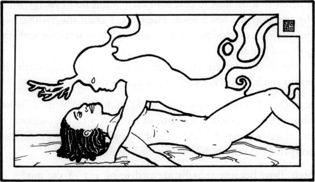

# 现代性魔法

Modern Sex Magic

# 第一部分

"这本书将会受到欢迎，为这个经常被隐藏起来的课题增添了一个新的内容。"

——唐纳德·泰森《新千年魔术》的作者

#### 提高你的性和魔法能力！

这本书对历史、哲学、理论的解释，更重要的是，对西方性魔法技术的解释是革命性的。唐纳德·迈克尔·克雷格通过众多魔术师的努力，从各种来源收集了所有这些领域的新发现。

首次披露:卡巴拉的性秘密可以追溯到耶路撒冷的所罗门神庙

性爱魔术为什么以及如何为你工作的 16 个主要秘密

总结和分析克劳利最罕见的性魔法指令:“九种标志和使用方式”

女性鲜为人知的性爱领域的强大秘密，包括 AFE 区和 U-Spot

男性多重高潮和延长性交时间的秘密

与多个伴侣的性魔术

如何设计自己的性魔法仪式

SM 和性魔法的真相

感官剥夺和性魔法

一生爱爱！

这本书是你能以一种清晰、易用的形式找到所有这些，甚至更多的地方。它在语言和态度上没有性别歧视，也不需要以前的魔法训练或学习。

# 关于作者

唐纳德·迈克尔·克莱格长期研究神秘学。他是几个魔法团体的成员，也是两个密宗的发起者。他是塔罗牌大师，他广受好评的书《现代魔术》已经出了第二版。该书印数超过 10 万册，是同类作品中最受欢迎的。他的文章已经在许多杂志上发表，他是琼恩·芒福德的《通过坦陀罗的狂喜》的撰稿人。

作为一名教师和一名专注于神秘学的学生，Kraig 通过他在各种形而上学主题上的讲座使美国的许多团体受益，并接受了印刷和电子媒体的广泛采访。他是卢埃林的《新时代》(现名《新世界》)和《命运》杂志的前主编，在此期间，他制作并主持了《命运杂志广播一小时》。

他拥有加州大学洛杉矶分校的哲学学位。

## 现代的

# 

### 色情精神的秘密

唐纳德·迈克尔·克莱克

## 奉献

我谨将这本书献给性魔术的先驱和现代实践者，以及那些打破社会和自我强加的限制，以跨越信仰进入这本书关注的力量和灵性的人。

我也想深深地感谢所有使这本书成为可能的人，特别是那些强大的女魔术师们，他们让我可以把她们的话印出来。

最后，我要感谢南希·彼得斯女士在阅读稿件时提出的宝贵意见，帮助我理清思路，并在打样和编辑过程中充当第二双眼睛。

# 内容

[前言...............................................九](#page0010)

第一级:学生

[一:性魔法秘史](#page0023)..................3

[二:魔法和性魔法的十六个定理](#page0056)........35

[三:性魔法的准备](#page0089)....................65

[四:护身符工具](index_split_001.html#page0130)..............................103

第二关:魔术师

[五:单焦点性魔术](index_split_001.html#page0153).........................123

[六:双焦点性魔法](index_split_001.html#page0185)...........................153

[七:一些女魔术师的视角:](index_split_001.html#page0233)............199

第三层:局外人的禁忌性爱魔法

[八:多焦点性魔术](index_split_002.html#page0274).........................237

[九:外部阈值](index_split_002.html#page0311)........................271

[十:结论](index_split_003.html#page0362)..................................313

[附录 A: IX 徽章&使用方式](index_split_003.html#page0369)..................319

[附录 B:昏睡清醒状态](index_split_003.html#page0381).....................330

[附录 C:感觉剥夺](index_split_003.html#page0385).........................333

[附录 D:性与精神](index_split_003.html#page0398)..............................346

[词汇表](index_split_003.html#page0403).............................................351

[参考书目](index_split_003.html#page0416).........................................364

[索引](index_split_003.html#page0423)...............................................371

# 前言

如果你拿起这本书寻找关于“性的魔力”的信息，恐怕我会让你失望:这本书不是你要找的。如果你希望找到提高性生活质量的方法，一本书充满了新的性姿势或获得多重高潮或持续数小时高潮的方法，你必须去别处看看。

有如此多的书籍介绍如何提高你的性生活质量，所以再写一本就显得多余了。即便如此，你可以肯定每年都会有几十本这样的书出现。他们中的每一个都提供了“终极性体验”或者“超乎你想象的性爱”当然，如果他们中的任何一个给出了实际有效的方法或技术，就不需要其他人了。

这些书有一个共同点。他们看待身体就好像它是一台机器。在这样做的时候，他们忽略了性的精神、心理和情感方面，或者充其量只是嘴上说说而已。

这与 19 世纪和 20 世纪初出版的“婚姻手册”完全不同。这些书经常很少提到性的身体行为，而是关注精神或情感需求。那些婚姻手册，由于对性的身体行为的信息完全不足，同样也没有达到他们宣称的教导婚姻满足秘密的目标。

与大多数事情一样，这两种方法失败的答案在于历史。许多古代社会的精神体系承认身体、思想和精神的存在。虽然它们可以分开研究，但人们理解人类现实的这三个方面是完全相互关联的。这些实际上可以分开的概念是一个奇怪的概念。在基督教诞生之前，它充其量只是亚里士多德哲学的一个次要方面。

有了基督教，第一次，一个精神体系不仅认为思想，身体和精神是分离的，而且认为在构成人类的所有事物中，精神是最重要的。一些基督徒会禁欲，希望提升精神。这导致了像鞭笞者这样的群体，他们不仅羞辱身体，还会殴打自己以显示身体是多么的不重要。甚至在今天，在一些文化中，基督教庆祝复活节的一个主要事件，是模仿耶稣的故事，将许多人钉死在十字架上。(我要补充的是，在许多早期文化中，可以正确地说，人们将自己视为思想-身体-精神-环境矩阵的一部分，破坏物质世界就等于破坏自己。基督教也改变了这种态度，它甚至不考虑物质世界。)

将身体、思想和灵魂视为可分离、可识别的实体的观念已经渗透了西方文明的大部分。对于我们的祖先来说，仅仅通过讨论精神和情感体验来描写性似乎是很符合逻辑的——还有什么其他重要的东西呢？

个人道德要赶上社会往往需要时间。在西方文明中，也许自基督教诞生以来最大的社会变革发生在十八世纪，被称为启蒙运动。这一运动强调用理性来审视以前接受的学说和传统。它带来了许多人道主义改革。它也延伸了可见(物质)和不可见(精神)之间的狭窄联系。与基督教不同，启蒙运动的理性主义者——部分是对当时基督教世界观的回应——开始推崇可测量的物质和物质，而不是不可测量的灵魂。这种态度帮助引发了工业革命、自由放任的自由市场经济、共产主义、社会主义，甚至是当前的“精神拆穿者”趋势，他们挪用“怀疑论者”一词来描述自己。过去两个世纪的唯物主义革命已经达到了它的逻辑终点，现在甚至把人类的身体也仅仅视为一台机器。甚至意识和情感也被描述为仅仅是“化学反应”。写关于性的书只谈论身体姿势和技巧已经变得很合乎逻辑了。

但是今天的人们比 150 年前更幸福吗？他们的性满足感更强吗？我认为答案是“不”，尽管人们对幸福和性满足的定义可能有所不同。如果答案是肯定的，那么就没有理由出现更多这样的婚姻手册。

这些书，这些婚姻手册和性治疗书籍，并没有解释身体，思想，灵魂，以及将它们结合在一起的纽带形成了一个牢不可破的矩阵，构成了人类的经历。因此，跟随他们不完整的信息将不可避免地导致不满足和不满的感觉，这是世界上所有的祈祷或所有的高潮都无法解决的。

这就是性魔术的用武之地。

#### 挖掘能量

性魔法是一个古老的西方系统，它将物质和非物质视为一个交织的统一体。此外，性魔法的基本理论和技术承认所有人都有大多数人不知道的与生俱来的能力。几十年前，人们认为人类无法控制他们的自主神经系统(ans)。ANS 是我们身体的一个方面，它控制着诸如脉搏率和疼痛意识之类的东西。现在，通过使用生物反馈设备和训练，人们已经能够有意识地改变科学家们认为不是有意识地可以改变的东西。我们还有哪些被唯物主义科学家忽视或否认的先天力量？

这本书就是关于这些能力的，包括如何开发和使用它们。如果你对魔法不熟悉，特别是性魔法，这本书可能是一个全新看待宇宙和你在周围世界中的位置的起点。想象一下通过获得你想要的东西来帮助自己和他人。想象一下能够拥有超越其他书籍描述的任何东西的性体验。想象一下能够增加亲密度，改善你和你所爱的人的关系。这是可能的，而实现这些事情的方法，通常是保密的，将在这里揭示。

有趣的是，改善你的人际关系和性生活甚至不是这本书的重点。它们仅仅是学习如何利用你的先天能力来控制你自己、你的世界和你的环境的一个美妙的、附带的奖励。

如果这本书不是某种婚姻手册，那它是什么呢？这个叫做“性魔法”的东西是什么？

#### 这本书的目的

首先让我说，至少在某种意义上，这不是一本“新时代”的书。不会有“通灵”的信息或秘密回到亚特兰蒂斯或穆的历史中。这并不是因为我不同意许多早在 20 世纪 60 年代就开始流行的新时代的原始概念，而是因为新时代已经成为主流的一部分。或许更正确的说法是，西方社会的主流已经从新时代获取了它想要的东西，并将其拼接到旧的永世心态上，将许多被视为新时代的东西渲染成只不过是重复的基督教或赚更多钱的一种方式。

我之前的作品《现代魔术》是一本循序渐进的指导手册，讲述了什么是真正的魔术以及如何做到这一点。我非常幸运，因为它已经被魔法界接受为一种有用的资源。你手里的书不是现代魔法的延续。这是朝着新方向迈出的一步，对一些人来说是正确的，对另一些人来说却不是。不是更好，只是不一样。它也不仅仅是我前一本书的一个章节的扩展；你手里的这本书本身就是完整的。

简而言之，这本书的目的是教你如何在性活动中获得不可思议的能量，并利用它们达到预期的目的。因此，性活动不再是目标，而仅仅是实现目标的技术的一部分。然而，提升的能量如此强大，以至于如果你从未练习过任何形式的魔法，你会对结果感到惊讶。如果你已经表演过魔术，但没有表演过性魔术，你会震惊地发现你还能做得更多。

上述说法会让一些读者感到不安。一些魔术师说你不需要把性和魔术结合起来，性和魔术应该分开。如果这是他们的意见，我不反对。但是没有尝试过性魔法的人可能不知道他或她的魔法有多强。如果他们学习性魔法，并体验它，他们可能会对新层次的个人力量和自我赋权持开放态度。也许，在发现他们力量的真正深度后，他们可以放弃性魔法，发现他们自己的魔法能力大大增强了。表演和使用性魔法并不是一个人成为魔术师的必要条件，但是性魔法可以帮助增强任何一个魔术师的魔法工作。

#### 这本书的方法

还有几本关于性魔法的书，从初级到荒谬，从好到坏。我从他们大多数人那里学到了东西。我了解到的一个令人惊讶的事情是，许多性魔术师在他们的作品中似乎相当拘谨(这可能是由于害怕淫秽法)。过去，把阴茎说成是“魔杖”，把阴道说成是“杯子”可能有它的位置；但不是现在，不是我们迈向下一个千年的时候。因此，我将使用诸如阴茎和阴道、乳房和乳头、阴囊和外阴等词语。如果你发现这样的话令人震惊或你不想读的东西，那么你可能更喜欢学习一些其他的书。

同样地，在这本书里，你将学到在其他资料中找不到的技巧和性方法，华丽的语言，炼金术的象征或者拘谨的隐喻(或者流行的和引起共鸣的口语)。我的目标是合乎逻辑、完整、清晰、科学，但不下流。自慰是“自慰”，而不是“第八度工作”或“自虐”。性交是“性交”，而不是“九度仪式”或“做它”不管你的经验水平如何，我在本书中的目标之一就是引导任何学生从知之甚少或一无所知到了解成为性魔术实践者所需的一切。

出于某种原因，许多人害怕关于性魔术的信息以清晰的语言提供给大众。我觉得这种态度既精英主义又不合时宜。不应该有恐惧，因为那些不感兴趣或不愿意做这项工作的人会很快放弃性魔法。尽管如此，我毫不怀疑，没有象征和隐喻的性魔法的公开讨论将被那些希望“保守秘密不受亵渎”的人视为有争议的。然而，现在为时已晚，因为妖怪已经从瓶子里出来了，不能被迫回到它那狭小而不舒适的家。无数的书籍已经揭示了其中的秘密；我只是想让那些感兴趣的人明白这些问题。

尽管许多人将东方异教形式坦陀罗与性魔法联系在一起(尤其是坦陀罗的性方法和教义)，我会尽可能地将坦陀罗从本书中剔除。这是因为坦陀罗是一个完全异教的体系，而性魔法是一系列技巧的集合。然而，不要认为我是思想/身体/精神裂缝的受害者。性魔术的物理技术不能与思想和精神分开。事实上，这些技术同时是物理的和形而上学的。增强一个会改善另一个。忽略任何一个方面就像在建造拱门时遗漏了一个拱顶石。就是不行。

#### 极性

性魔术的本质，不管你是独自表演，还是与同性或异性的伙伴一起表演，都是与极性一起工作的。这些极性最容易在两性身上看到——男人和女人。然而，极性或多或少存在于我们每个人的内心。这就是为什么性魔术也可以由自己或与同性伴侣进行。

仅仅因为性魔术可以由任何人、夫妇或团体表演，并不意味着所有形式的性魔术可以由所有人在所有情况下表演。一些形式的性魔法需要一对男女。其他技术，也许是大部分，没有这样的要求。当需要一对男女时，这是显而易见的，因为性魔术技术需要魔术师仪式化性交产生的统一液体。

我请求读者/学生/性魔术师原谅任何语言，为了意思清楚，可能不真正代表性魔术师是为两性服务的事实。不幸的是，英语没有中性的形式，试图创造这样的短语通常既不优雅也不文雅。

#### 个人责任

我还想谈谈另一个话题:个人责任。首先，用“性魔术”的幌子来引诱另一个人进行性接触不仅仅是虚假的诱惑。对我来说，性魔法是神圣而特殊的。在我看来，为了诱惑而滥用性魔法的想法无异于身体、情感和精神上的强奸。

第二，学习性魔法，事实上，学习任何种类的魔法，都可以让你更容易地改变你的生活。那么，你应该意识到，你要对这些变化负责。因为这种理解，一个已经学会性魔法的人在某些方面实际上比那些知之甚少的人对自己的行为更负责。

这带来了被称为艾滋病的致命祸害。我很自豪《现代魔法》是第一本公开讨论艾滋病的主要神秘书籍。在撰写本文时，美国已有超过 320，000 人死于与艾滋病相关的疾病。我认识几个艾滋病毒阳性的人，我的一个最好的朋友死于与艾滋病有关的疾病。

尽管媒体对艾滋病的传播方式似乎达成了一致意见，但事实上目前对此存在很大争议。公认的说法是，它可以很容易地通过任何体液传播。只有一次口交、阴道性交或肛交经历就能在伴侣之间传播艾滋病，除非有避孕套或牙套等障碍物将双方隔开。

然而，越来越多的研究人员表示，在实际的现实世界中，主要的传播形式只有通过输血(包括由艾滋病毒阳性母亲和共用未消毒针头的吸毒者所生)和肛交，而且只有在一个人的免疫系统已经脆弱的情况下。《华尔街日报》1996 年 5 月 1 日头版的一篇文章声称，虽然从技术上讲任何人都可能感染艾滋病，但对大多数异性恋者来说，“单一性行为[感染艾滋病]的风险]比被闪电击中的风险要小。他们声称“任何人都可能得艾滋病”的理念是联邦政府中保守派和自由派力量政治的结果。事实上，这个故事说，如果你的伴侣是 HIV 阳性，通过阴道性交感染艾滋病的几率是千分之一。与受感染的伴侣进行肛交，感染艾滋病的几率低至千分之五。这些数据是针对无保护的性行为。如果人们使用避孕套和牙套，传染转移率会更低。几年前，许多研究人员感到沮丧，认为艾滋病永远无法治愈。现在，受人尊敬的研究人员正在发表论文，预测将在几年内发现一种治疗方法。

这些理论中哪些是正确的？艾滋病是难得还是易得？我不知道，也不想争论这个问题。我把这个问题留给研究人员去解决。我在这里提出这个问题的原因是，某些形式的性魔法涉及到性液体的交换。没人需要表演那些性魔术技巧。然而，任何选择这样做的人都要对他或她的行为以及这些行为的结果负责。如果你有任何疾病，哪怕只是轻微怀疑是通过性行为传播的，你都应该在进行任何性行为之前告知你的伴侣。你不仅忽视了你对伴侣的责任，而且在我看来，你是在对一个只想和你一起玩性魔术的人进行攻击。

#### 合十礼

对于那些感兴趣的人来说，这本书里的一些信息是通过一个名为 NAMASTE 的组织发布的，这是一个新的魔法、性和密宗探索者协会。合十礼分为两个部分:东方和西方。那些跟随西方部分的人学习和实践性魔法。那些跟随东方部分的人学习和实践坦陀罗。一本关于坦陀罗的书将会在未来出版，其中包括协会成员所掌握的信息。

这个协会没有教条和学位。入会会员无需支付会费或费用。会员可以自由地从一个部门转到另一个部门，研究他们想研究的内容。协会的晋升是通过笔试和口试，但不授予“等级”、“学位”或“头衔”。进步只意味着你可以直接接触到更多的信息。然而，对于那些没有通过测试的人，不会隐瞒任何信息。相反，NAMASTE 需要一个已经通过测试并收到更多信息的人来与协会中没有这些材料的人分享。此外，会员必须确保他或她所教的人理解并能使用这些信息。因此，所有成员既是学生又是教师。

虽然该协会的会员资格目前已经关闭，你可以要求进一步了解 NAMASTE。给这本书的作者寄一封信，由出版商转交。随信附上一个 10 号(商务尺寸)的回邮信封。它将被转交给协会的主席。您将收到更多信息，您的姓名将被存档，以供将来会员考虑。

### 第一级:

# 学生

### one

## 
性魔法的秘史

关于性魔法的底线很简单:性魔法是有效的。没有更多的说了，我们可以跳进一个性魔术的理论和技术的解释，并出现了很多的价值。尽管如此，我还是决定在这一章中简要探讨一下性魔法的历史。通过这种方式，性魔术的实践者将了解它是如何随着时间的推移在整个西方世界发展和传播的。我还会列举一些性魔术历史上的重要人物，供你进一步研究和调查。在参考书目中，你会找到这些人的书单。

一些读者会发现这一章极具争议性，因为它没有遵循公认的性魔法史。对于那些不熟悉这个的人来说，故事从圣殿骑士开始。建于公元 1118 年，在第二次十字军东征期间，圣殿骑士宣称的目的是保卫前往中东的朝圣者。圣殿骑士的故事相当迷人，但就我们的目的而言，只需说他们在 1312 年被嫉妒他们的权力和财富的宗教和世俗当局镇压就足够了。几名成员被监禁或杀害。他们的领导人雅克·德莫莱被活活烧死。圣殿骑士，像其他被控异端、巫术和魔法实践的人一样，被指控犯有一连串的罪行。这些指控可能只是教会和国家为了获得圣殿骑士的巨额财富和财产而延续的一个诡计。

公认的历史是圣殿骑士从中东的苏菲那里学到了性魔法，而苏菲是从印度的密宗那里学到的。中世纪的炼金术士从圣殿骑士那里获得了这些信息，并将其编码到他们的一些作品中。最终，在去印度和非洲的旅途中了解了性魔术的阿莱斯特·克劳利开始尝试传统和他自己新创造的技术。

与此同时，一个名叫帕斯卡·贝弗利·伦道夫的人要么发现了性魔法的秘密，要么发明了一些新技术。他生于 1815 年，是一名医生和一名舞女的孩子。他成为一名船员，学习水手的手艺，最终成为一名船长。作为一名海员，他可以周游世界。25 岁时，他加入了卢克索的神秘兄弟会。1868 年(去了几次法国之后)，他建立了尤利斯兄弟会，最终拥有了相当多的追随者。

他出版了一本书(最近以《性的魔力》为书名再版),该书假设了一种精神上的双性恋，并认为性高潮是神奇而神圣的。伦道夫影响了以东方骑士团(OTO)的形式重建圣殿骑士的人们。克劳利加入了这个组织，并最终在一场分裂的战斗后成为了它的首领。今天，正如大多数关于仪式魔法的教导已经通过金色黎明成员的镜头过滤一样，大多数关于性魔法的教导也已经通过阿莱斯特·克劳利和 OTO 的玻璃过滤了。

上述历史是准确的，但它只代表性魔法的一种趋势。这是西方性魔术历史的扭曲版本——一种忽视更广泛现实的狭隘观点，在两个方面都失败了。首先，它没有确定性魔术最初是在哪里以及如何发展起来的。第二，它暗示性魔法随着时间的推移(尤其是上个世纪)相对保持不变，只是一直延续到现在。事实上，有充分的证据表明，性魔术的历史比人们通常认为的要悠久得多。然而，为了理解这段更深刻的历史，我们必须首先考察卡巴拉的性质。

#### 真正的卡巴拉？

在过去的几年里，我很幸运地在美国各地做了演讲，从佛罗里达到旧金山，从圣地亚哥到纽约。我现在在每次演讲开始前都会做的一件事，不管主题是什么，就是在粉笔板上写下以下字母:

TFYQA

这些字母代表“独立思考”这几个词。质疑权威。”我继续解释说，仅仅因为我或任何其他“权威”或作者写了或说了什么，并不能使它如此。我总是督促我的学生去听我要说的话，然后再去核实。我鼓励人们相信自己，而不是相信领导或老师，即使那个老师就是我。

毫无疑问，你们很多人都熟悉卡巴拉。它是犹太教、基督教，甚至在某种程度上是伊斯兰教的神秘基础。你们中那些熟悉神秘团体中使用的卡巴拉的人知道它关于生命树的理论和它的通信以及数字系统，比如 gematria。在我的图书馆里，我有超过 1000 本书，或者是与卡巴拉特别相关的，或者是与卡巴拉有关的。大部分内容都差不多，只是用不同的方式表达同样的东西。他们都声称解释了什么是卡巴拉的基础。

他们都错了。

#### 哈西德派的遗产

对于你们当中那些曾经学习过卡巴拉的人，我想请你们思考这些问题:卡巴拉有没有可能不仅仅是 gematria，notarikon，temurah 和生命树及其对应物？如果是这样，那么为什么卡巴拉的其他方面知之甚少？为了找到答案，我们必须回顾一下历史。

18 世纪，一群正统、虔诚的犹太人在东欧成立。希伯来语中的“虔诚者”一词是 Hasid(发音为:“哈后裔”)。因此，这些人被称为“虔诚的人”或哈西德姆(“哈哈哈”)。

以前，神秘的犹太教已经包括了许多发展超越一个人环境的力量的方法:我们今天称之为魔法。但是哈西德派不想这样。他们寻求精神上的升华，而不是改变世界的能力。他们想增加他们祈祷的力量，而不是控制他们周围事物的力量。因此，他们专注于卡巴拉的精神层面，包括生命树上的通信，对上帝如何创造世界的冥想，以及对字母和数字的操纵，一种现代(当时)的古代神秘版本，被称为“字母魔法”

由于这种信息是神秘的，它不可避免地会渗透到当地(德国)的神秘世界，成为该国共济会传统的一部分。这些教导后来被翻译成罗曼语，最终成为许多人心目中卡巴拉的核心教导。

即使经历了这段历史，许多人还是会怀疑我所说的卡巴拉。那么，我想请你们看看一部已经出版的作品，它被认为可能是最重要的卡巴拉派著作---《佐哈尔》。它几乎没有这样的命理学。小而重要的早期卡巴拉主义书籍《西弗·耶茨拉》也是如此。

总而言之，今天在神秘主义者中最广为接受的卡巴拉版本基本上只不过是德国哈西德姆神秘教义的一部分。这并不意味着这些研究是“坏的”、“错误的”，甚至是不完整的。相反，它只是表明这种研究只是对卡巴拉的一种类型或一个流派的观察，而不是全部。

#### 我是如何写这本书的

当我第一次开始研究卡巴拉，或者更确切地说，西方神秘主义者通常称之为卡巴拉，我就像一只饥饿的狗在一个好心的屠夫的店里。我想品尝和尝试一切。

对于那些不熟悉 gematria 的人来说，它的基本思想很简单。每个希伯来字母都与一个数字相关联。把一个单词中的字母数字加起来，如果它们等于或与另一个单词的数字有关系，那么这两个单词之间就有关系。在《现代魔法》中，我举了一个著名的例子，说明在希伯来语中，单词“爱”的计数等于单词“一”的数值，当它们的计数加在一起时，总数等于希伯来语中“上帝”的数值。这是一个简单的数字系统，在这种情况下，表明上帝是一个整体，上帝是爱。

很多个夜晚，我熬夜到第二天凌晨，仔细研究计算，试图证明一些东西。我在一篇长达几页的论文中分析了我选择的三个字母的神奇名字。类似地，我看到人们分析阿莱斯特·克劳利作品的片段，著名的金色黎明的神秘仪式，圣经的片段，等等。我记不清有多少页了。

但是有一天我意识到少了点什么。留给我的是派姬·李在歌中提出的令人痛苦的问题:“这就是全部吗？”经过多年的卡巴里提数字命理操纵，我得出结论——至少对我来说——进一步的探索不再证明对我有任何重要意义。我意识到它已经变成了一条错误的道路，就像一个假的通灵者，他似乎给了你很多信息，但实际上说的很少。

当然，我可以花几个小时证明单词是相关的。这种类型的工作今天仍在进行(例如，见肯尼斯·格兰特的书),对于那些认为他们需要这种证明的人来说，这种工作很有价值。对他们来说，这样的工作是重要和有价值的。我过去也需要它，并从中获得了个人的洞察力和回报。

但对我来说，通常被认为是卡巴拉核心的教义现在看起来只不过是一种精神自慰。对于“爱加合一等于上帝”这个例子，我说:“那又怎么样？这不是已经被很多人(包括我自己)接受了吗？”我已经知道了。我不需要向自己或任何人“证明”这一点。我知道独立宣言签署于 1776 年。我不需要花几个小时来证明这件事的发生。我不需要读几百本书就知道这个事件发生在某一年。在我人生的这个阶段做这样的研究将是无聊和浪费时间的。

我们在神秘学道路上遇到的一类人是“扶手椅魔术师”，他会在“完成另一本书”或“制造另一件魔法工具”时施展一些魔法他一事无成，因为他从来不变戏法。是的，他的确获得了知识，这本身当然是一个有价值的目标。但是知识本身并不是一个执业魔术师的目标。对于所有实际的目的，他正在做同样的工作，作为那些十八世纪哈西德派神秘。这对我来说还不够。我不想成为纸上谈兵的魔术师。

这是一场重大危机。我即将完全失去对卡巴拉的兴趣——它改变了我，也是我二十多年来生活的主要兴趣。我冬眠了，自己读塔罗牌，沉思。

后来有一天，事情变得明朗了。体验！这就是所有数字命理操作所缺少的。我开始意识到，对我来说，思考一些事情是不够的。我需要行动。虽然许多卡巴里提技术使用卡巴里提数字命理学来制造成功的护身符，例如，当护身符达到目的时，提供了延迟的满足感，但我想要更直接的东西。我只知道一种技术可以提供我想要的冒险、行动和体验:卡布里斯特式的道路探索。

由于许多出版的作品，术语“路径工作”已经失去了它的原意。今天，道路工作意味着任何一种被引导的冥想，其中一个人进行一次可视化的精神或星体旅行或某种旅行。我使用表达“卡巴拉人的道路工作”来代表“道路工作”这个词的原始意思:当在星体层时，在卡巴拉人的生命之树上旅行。

这里的关键是能够将一个人的意识从身体中分离出来，并在星体层上旅行。换句话说，这种卡巴拉技巧需要你达到一种改变的意识状态。除了雷加迪的《金色黎明》和那些已经出版的各种版本的说明书中给出的方法之外，几乎没有从古代卡巴拉提的观点出现的信息。如果卡巴拉人的道路工作需要通过一种改变的意识状态来进入星体层，那么必然有传统的卡巴拉人的方法来达到这样一种状态。

我在阿里耶·卡普兰的作品中发现了这样一种方法。这只是把头放在膝盖之间。这改变了流向大脑的血液，导致了状态的改变。

然而，随着我的进一步研究，我发现了一种更早的获得改变状态的方法，一种玛莎·舒查德称之为性恍惚的技术。这种方法是 Kabalistic 理论的一部分，虽然它被大多数研究人员和从业人员所忽视，因为它不是德国哈西德派运动的公开部分。虽然这种卡巴里提式的神秘钥匙已经在地下隐藏了 2500 多年，但它还是不时地被泄露或重新发现，并以各种形式形成了西方性魔法的基础，就像今天存在的那样。

#### 卡巴里提性魔术的历史

如果你阅读圣经作为一种历史，你会看到每一代的先知都斥责希伯来人不要崇拜其他文化的神和女神。这意味着希伯来人从亚伯拉罕时代就不是一神教，而是像他们邻近的文化一样是多神教。事实上，在《希伯来女神》中，受人尊敬的人类学家 Raphael Patai 表明，希伯来人在他们的家中和耶路撒冷的圣殿中都崇拜一位女神，直到公元 70 年第二圣殿被毁。在《圣经·考古学评论》(我强烈推荐)杂志中，你会经常发现关于早期希伯来人宗教实践的文章，这些实践包括对神和女神的崇拜。

在今天的大多数犹太寺庙中,《托拉》——以卷轴形式出现的《圣经》的前五卷——所在的地方位于一个凸起的平台上。这个平台通常是一种舞台形式，拉比(祈祷者的领袖)和唱诗班(圣歌和歌曲的领袖)也有他们的仪式位置。这个区域被称为 bimah(发音:bee-mah)。“bimah”这个词的意思是一个平台或舞台。然而，这个词的来源是 bamah (bah-mah)，意思是“高处”在中东，一块凸起的区域通常是供奉各种神灵的地方，而不仅仅是犹太教的神。其他来自早期异教时代的遗留物——包括作为月亮女神 Levanah(现在在希伯来语中是月亮的名字)的一种形式的月亮崇拜——也在各种犹太民间传统中发现(参见 Reik 的犹太教中的异教仪式的一些其他例子)。

这不是一本关于异教历史的书，但有几件事需要提一下。早期形式的异教有几个目的，也许最重要的是生育。早期的异教徒通过仪式来确保庄稼、畜群和人的生育能力。通常，这些仪式包括性行为。例如，在一些文化中，异教徒会在新种植的作物上进行仪式化的性交。人们相信，通过模仿他们的基本性魔法，在他们的仪式中产生的能量会帮助庄稼生长。

有没有证据表明早期的希伯来人，像他们多神教的邻居一样，有性仪式和神秘？答案是肯定的。事实上，其中一些仪式甚至有现代版本。

割礼就是一个例子。在犹太教将这一习俗固定在男孩出生后八天之前，它可能是青春期仪式的一部分。换句话说，当一个男孩达到成年年龄时，这是性成熟的标志。男孩和女孩的青春期仪式在异教文化中很常见。在一些文化中，青春期男性包皮环切仪式仍然作为“男性秘密”的一部分被实行。在犹太教中，男孩在进入成年时仍有一种这样的仪式(尽管没有割礼),称为成年礼。最近，女孩们在经历类似的成年礼时也加入了这一传统。

在托拉中，割礼是上帝和犹太人之间契约的标志。这暗示了性和灵性之间的联系。在其他时候，你会读到将手放在“大腿”上是一种协议的标志，通常是在人和神之间。“大腿”是“阴茎”的委婉说法(就像圣经用动词“知道”来表示“性交”)。这个想法要么是被采纳，要么是从其他文化中借鉴来的，在其他文化中，男人会把手放在睾丸上发誓。事实上，我们的“作证”这个词(当然是从“被测试者”这个词派生出来的)就是来自这种实践。

在古代犹太教中有更多关于性仪式的证据。拉斐尔·帕泰的书《希伯来女神》清楚地表明，最早的犹太神秘主义不仅有强烈的性成分，而且非常重要。

自从电影《夺宝奇兵》拍摄以来，许多人已经熟悉了约柜的形状。顶上有两个基路伯。根据帕泰的说法，有一个犹太法典传统...以色列遵行上帝旨意的时候，二基路伯的脸是彼此相对的；然而，当以色列犯罪的时候，他们就把脸转向别处。」这意味着什么？

约柜被保存在“至圣所”，耶路撒冷圣殿中最私密、最神圣的地方。然而，著名的早期犹太历史学家弗拉维乌斯·约瑟夫斯(37？首席执行官-100？C.E .)，写道在最神圣的地方没有任何东西。为什么？众所周知，他想把犹太教描绘成“反偶像的”，一种没有偶像崇拜的宗教。但是还有别的吗？一些约瑟夫斯可能都不好意思提起的事情？

答案来自更早的历史学家菲洛(30？公元前 45 年？C.E .)。他写道，在圣殿最里面的部分，在最神圣的犹太场所最神圣的部分，有基路伯的雕像。这些基路伯“像夫妻一样缠绕在一起”也就是说，他们被显示有性交。

后来，一位名叫拉比·凯蒂娜的犹太法典学者的报告证实了这一点，他声称，在神圣的日子里，当人们去朝圣来到寺庙时，祭司们实际上会向他们展示基路伯，并说:“看哪！你在上帝面前的爱就像男女之爱。”几百年后，著名的拉希写道，“基路伯连在一起，紧紧拥抱在一起，就像一个男人拥抱一个女人。”

换句话说，至圣所的终极秘密并不在于它拥有约柜、律法或十诫板。相反，这是性的精神本质。前面提到的犹太法典传统暗示，只要以色列履行了上帝的旨意，基路伯就会不断地进行性交，但是如果以色列犯了罪，他们就会脱离他们的怀抱。此外，人们相信上帝会从两个基路伯之间“说话”。记住，根据《托拉》和《卡巴拉》,上帝通过语言创造:“主说，‘要有光。瞧，有光了。“那么，这就是卡巴里提性魔法秘密的启示:预言、占卜和召唤(至少)可以从精神化的性中产生。(这方面的技术将在后面的章节中解释。)

从塔木德文献中我们也知道，古代犹太人最大的节日之一是在希伯来新年后的两周。朝圣者会从各地来到耶路撒冷的圣殿来庆祝这个被认为是欢乐盛宴的节日。然而，在这个男人和女人都庆祝的节日的七天结束时，庆祝活动变得如此激烈，男人和女人会混合在一起，做出委婉地称为“头晕”的行为用现代的话来说，人群性泛滥。这种行为在大约公元前 100 年到公元前 70 年之间结束

另一个表明早期犹太教有性仪式的来源是在卡洛·苏亚雷斯的书《雅歌》中发现的，这是他对那段简短的圣经文本的解释(也因其误译的标题《所罗门之歌》而为人所知)。在导言中，苏亚雷斯简要描述了尊贵的拉比阿基瓦(也称为阿基巴)，他出生于公元前 40 年，因支持犹太人反对罗马的战争而在监狱度过多年后，于公元前 135 年被处决。

今天，拉比阿基瓦受到全世界犹太人的尊敬。忠实的犹太人背诵归功于他的诗歌和祈祷文。我仍然记得那首优美轻快的祷告词，开头是，“阿玛·拉比·阿基瓦……”(拉比·秋叶如是说)。他被认为是被称为米什那托拉的犹太口头法律的书面版本的父亲。他也被许多人认为是卡巴拉的父亲。

正如主要的基督教教派之间有分歧一样，犹太教也有分歧。在公元一世纪，拉比以实玛利采取了类似于一些现代原教旨主义基督徒的立场。他和他的支持者认为，犹太人的圣书是用一种直接与人对话的语言写成的，应该照字面意思接受。拉比阿基瓦不同意，并认为这些话只是信息的形式。托拉的真正含义是在它神秘的解释中找到的，它的内在本质。

因此，当关于哪些书应该被认为是犹太圣经的一部分的讨论在主要的拉比之间发生时，他们中的大多数人想要排除看似亵渎的爱情诗，即雅歌。毕竟，一首带有“用你的嘴吻我”和“你的两个乳房像两只小鹿”这样的短语的歌怎么会是一本圣书的一部分呢？

拉比阿基瓦是他那个时代最受尊敬的拉比之一，直到今天仍然如此。在他那个时代，他非常受人尊敬，被认为是犹太教的权威。阿基瓦运用他的声誉和权威来改变其他拉比的态度。“整个宇宙都抵不上那天那本书...“给了以色列，”他说，“因为所有的圣经都是神圣的，但歌是最神圣的。”

当我第一次读到这句话时，我既着迷又困惑。奇怪的是，犹太历史上最重要的拉比之一为《情歌》辩护，不仅仅是因为它是一本好书，不像有些人说的那样，因为它是上帝告诉他如何爱以色列(反之亦然)，而是因为它是所有经文中“最神圣”的。

记住，阿基瓦被认为是卡巴拉的父亲。阿基瓦为这本书辩护的原因难道不是它保留了犹太教的神圣秘密，性魔法的秘密吗？这个秘密会被他的追随者传递下去，从那里传递到卡巴拉的许多学校。

甚至相当古板和迂腐的 A. E .韦特，在《神圣的卡巴拉》中，也提到了这样一个事实:神秘的犹太人认为婚姻是一种圣礼，他们实践着“人迹罕至的道路上的教导，一些从过去流传下来的东西”...东方仍有一些教学的遗迹。”这出现在韦特的书题为“性的奥秘”的章节中，并且表明在卡巴里提人中有一种性巫术的教导，在某些方面类似于道家和密宗的性教导。在一个脚注中，他说卡巴拉主义的性魔术师"...有一个内在的，精神的和神圣的理想，他们住在那里，他们似乎已经完成了下面的转变。”也就是说，他们的性魔法(既是身体的也是精神的行为)在身体层面产生了变化——魔法。

作为这一节的最后一点，我要补充的是，在今天虔诚的犹太人中，在安息日与你的配偶发生性关系是一个成年礼(这个词既意味着上帝的命令，也意味着祝福)。这是因为上帝被认为是一个神圣的雌雄同体，通过性交，结合男性和女性，他们是在模拟上帝。另一种解释是他们在模仿神和他的配偶 Shekhina 的结合(类似于西方异教徒的神和女神结合的观念或者印度教的湿婆和沙克蒂结合的观念)。

#### 卡巴拉的传播

公元 70 年第二圣殿被毁后，犹太人分散在亚洲和欧洲。许多犹太人认为这是上帝对他们不遵守犹太教传统的惩罚。具体来说，他们没有遵循许多犹太律法，他们崇拜其他神和女神。但是卡巴拉主义者声称通过驱散犹太人，卡巴拉的智慧传播到了全世界。从这个角度来看，散居不是对犹太人的诅咒，而是对世界其他地方的祝福。这个祝福，卡巴拉，至少部分包含了性魔法的秘密。

随着犹太人在欧洲的迁移，他们形成了小的社区。其中有些是卡巴里提派的学校。社区之间的分离增加了多样性，许多卡巴拉教的教义，包括那些关于性魔法的，肯定已经改变和进化了。但是教义是如何超越神秘犹太教的流派的呢？我认为，答案来自犹太教的本质及其犹太人是“书上之人”的悠久传统。

随着天主教会的日益强大，信徒的世俗教育(包括阅读、写作和数学)受到了反对，并且仅限于皇室、富人、教会的抄写员和某些军人。但因为许多犹太人能读、能写、懂数学，他们经常充当旅行信使或富人的收税人。他们中的一些人带来了卡巴拉和性魔法。他们与其他将要旅行的人交流，包括被称为游吟诗人、游吟诗人的流浪音乐家，以及后来在公元 12 世纪和 13 世纪漫游西欧部分地区的迷你歌手和美声歌手。尽管流浪吟游诗人通常是男性(根据男性历史学家的记录，几个世纪以来，他们淡化了女性在历史上的重要性)，但一些女性也这样做。例如，一个女游吟诗人被称为 trobaritz。

十三世纪，一本鲜为人知的书《圣书》在西班牙的犹太人中流传。多年来，它被认为是著名的拉比纳赫马尼德斯的作品，但是今天的学者们一致认为拉比可能不是作者。这本书是如此受欢迎，这本书的三个不同的手稿是已知的。

据说所有真正的圣书都可以在三个层次上阅读:物理的、精神的和神秘的。在物理层面上，这本书看起来是一本犹太人的婚姻手册。在精神层面上，这本书被视为“描述上帝与犹太人关系的卡巴拉主义作品”。但是在神秘的层面上，它揭示了今天使用的所有性魔法的秘密和技巧。我的观点是，流浪的中世纪吟游诗人对这本书或那些使用它的技巧并帮助传播知识的人有些熟悉。

直到这个时候，婚礼还不为人所知。人们会住在一起，称自己为夫妻。即使没有婚礼仪式，他们也被认为是结婚了。在英伦三岛，保护女性的规则成为了“普通法(主要是不成文法)”的一部分。因此，在一起生活一段时间并声称是丈夫和妻子(并被社会接受)后，妇女将被法律承认为男子的习惯法妻子。从那时起，当他厌倦她时，他不能简单地把她扔在街上。尽管他们没有举行正式的婚礼，但根据离婚法，她拥有权利。普通法是美国法律体系的基础之一。

一般来说，在西方基督教控制的社会里，只有富人和皇室才会举行婚礼。这种公开展示的目的是向所有人表明，只有这个女人的孩子才是某个特定男人的合法继承人。事实上，婚姻与其说是出于爱而走到一起的愿望，不如说是一种法律契约。有时绘画是为了展示婚礼场景，以证明婚礼已经举行。

统治者和富人想知道他们的后代，事实上，是他们的血缘子女。人们相信血液具有与生俱来的魔力。今天，一些英国人甚至相信“国王的触摸”——国王的触摸(他也得到基督教上帝的认可，否则他怎么会成为国王？)可以治疗各种疾病。为了确保血统的延续，一夫一妻制成为富人和皇室的妻子的准则。尽管如此，有充分的证据表明，妻子和丈夫经常有婚外性行为。

最终，爱情成为了婚姻的一部分。这是旅行游吟诗人传播的“宫廷爱情”观念的产物。他们甚至有宫廷爱情的规则，其中一些隐藏了性魔法的秘密。例如，安德烈亚斯·卡佩利亚纳斯在 1500 年前所说的第 30 条规则是:“一个真正的爱人会持续不断地被他所爱的人的形象所困扰。”

在这些话里有一个性魔法的秘密，有人说是被 A. 0“发现”的。本世纪备用。可以看出，这方面的性魔法比 Spare 早了一千多年！

另一组旅行者是商人，能掌握许多有价值技能的工匠。它们来自最早的时代(当时每种工艺都与一个神相关联)，一直延续到文艺复兴时期。在古罗马，这样的行会被称为 collegia(我们的单词“学院”的来源)。他们有自己的建筑，在那里他们可以分享他们公会的秘密。成员们会举行被称为 agapae 的宴会，这可能是第一世纪基督教 agape 宴会的起源。

为了在大庭广众之下或者在他们行会的范围内识别对方，他们有特殊的手势、姿势和触摸，包括特殊的、仪式化的亲吻。这样，他们是古代神秘学校和现代神秘小屋之间的联系。事实上，学院受到希腊人的影响，而希腊人又受到各种中东文化的影响，包括埃及人、叙利亚人和古希伯来人的教义。因为他们已经保守秘密并致力于精神系统，他们可能从希伯来人那里得到了性魔法的信息。

西方罗马帝国崩溃后，行会保留在意大利、法国和东罗马帝国的部分地区(以拜占庭或君士坦丁堡为中心)。行会成员，因为他们有需要的技能，能够旅行和找工作。

也许最著名的行会成员是建造建筑物的人，即石匠。由于他们不效忠于任何特定的国王或地方统治者，他们是“自由的”，而不是附庸或农奴。他们被称为“行动共济会”

几个世纪以来，其他人在逐渐瓦解的封建文化中获得了自由，即使他们不是石匠，也不是石匠。这些人是“投机共济会”的源头。这些人会和其他流浪的人交谈，包括吟游诗人和一些犹太人。不可避免地，他们知道了卡巴拉和卡巴拉主义性魔法的秘密。

虽然一些教义可能是在共济会的更高层次上被知晓的，但真正的转折点是由于两件事。首先是印刷材料的普遍可得性。手抄书籍和其他手稿一直是一个困难和耗时的过程。后来约翰内斯·古腾堡发明了活字印刷，并于 1455 年用这种新方法出版了他的第一本书——圣经。最初，天主教会反对印刷机是魔鬼的工具，但最终这项技术让信息比以往任何时候都更容易传播。

第二个因素是两个非凡人物的影响。

#### 斯维登堡

这些重要人物中的第一个是伊曼纽尔·斯威登堡(1688-1772)。他在瑞典长大，1744 年移居伦敦。当他还在瑞典时，他就有了第一次对幻觉的体验(有人说这导致了一个世纪后唯灵论宗教的产生)和自动写作。在此期间，他经常与一群犹太人接触，似乎全神贯注于他们。

当一个人允许另一个实体/人格在他或她自己身上显化，并接管物质身体以使交流更容易时，自动写作就发生了。这个过程通常需要某种恍惚状态。斯韦登伯格能够通过呼吸控制来实现这一点。他会减慢他的呼吸，同时也会减慢他的心率。最终，他会达到一种“狂喜恍惚”的状态，导致一页又一页的自动写作。

斯韦登伯格的作品有一些非常色情的暗示。在《代代相传》中，他分析了爱情带来的生理和心理上的快乐。然后，像许多其他神秘主义者一样(例如，见 1562 年建立卡梅尔秩序的圣泰雷丝阿维拉的幻觉)，他解释自己的性梦暗示它们是宗教体验。

在他在伦敦的后期，斯韦登伯格可能与拉比塞缪尔·雅各布·哈伊姆·福尔克(约 1710-1782)有联系。福尔克被认为是一个卡巴里提式的奇迹创造者。一本书甚至把他描述成伦敦的巴尔·闪。(一个“巴尔·闪”，或者“名字的传播者”，使用卡巴拉的方法来施展魔法。最著名的一个被称为“伟大的”[Tov]，因此被称为巴尔谢姆 Tov 或简称 Besht。他写的祈祷文仍然在世界各地的犹太教堂里被背诵。今天，大多数犹太人认为他被授予“Tov”的称号，这也意味着“好”，因为他的善良和良好的工作。)我提到这一点是因为在历史上“经文”给了著名的金色黎明的成员，他被认为是在 1888 年它的现代化身之前的秩序的头。尽管斯韦登伯格后来否认了这一点，但他的日记显示，他在这个时候深深卷入了卡巴里提主义的方法。奇怪的是，他的个人作品带有反犹太人的咆哮，尽管他的自动作品从未表达过这样的想法。

在伦敦时，斯韦登伯格还对一群摩拉维亚人着迷(摩拉维亚是一个基督教新教教派，由来自摩拉维亚的移民于 1722 年创立，摩拉维亚位于现在的捷克共和国境内)。他认为他们是一个秘密的神秘秩序(一些摩拉维亚人被称为“新共济会”)，并在他的日记中描述了他们将经历的恍惚状态以及他们如何被灵魂“半占有”。

斯韦登伯格的最后一本书,《与联体爱有关的智慧的喜悦》,是他给出一些更开放的性教导的地方，包括爱的最高形式是“联体爱”的概念——身体性交以及精神/心理结合，导致恍惚状态和上帝的显现。

#### 梅斯梅尔

另一个人是弗朗茨(他的名字有时被称为弗里德里希)安东·梅斯麦(1734-1815)。我的字典上说，他“试图通过动物磁性来治疗疾病，这是催眠术的早期治疗应用。”但是，正如我之前提到的，即使是所谓的专家(包括字典)也不一定可信。

事实上，通常认为动物磁力只是一种催眠的假设是完全错误的。在结果上有相似之处，甚至在方法上有表面上的相似，但是动物磁学(AM)的实际理论和技术并不是催眠的理论和技术。

AM 和催眠都使用一种恍惚状态。催眠状态是通过包括语言和视觉感应的技术引入的。也就是说，催眠师通过引导受试者通过一组指令或视觉或其他导致恍惚状态的干扰来诱导催眠状态。催眠师可以引导受试者经历明显的前世，将暗示植入受试者的潜意识中，这些暗示后来会显现出来，或者使用其他技术来帮助被催眠的人。(有趣的是，催眠术最早的用途之一是诱导心灵能力。一些报道的结果强得令人难以置信。然而，出于某种原因，这些催眠诱导精神能力的实验几十年来一直被忽视。)然而，在调幅中，能量是从催眠者或“磁化”物体发送给病人的。梅斯麦自己对他的理论和技术的描述听起来非常接近针压法(使用手指压力而不是针的针灸)和治疗触摸法(一种由护士使用的医学认可的技术，类似于把手放在上面)。

虽然催眠师可能使用金属或玻璃制成的魔杖，但治疗师也可能用他或她的手给病人传送能量。治疗开始时，病人的身体被抚摸。有时治疗会给病人带来突然的、深刻的变化。这些变化，或明显或微妙，被称为“危机”梅斯麦认为，没有危机就没有治愈。事实上，危机可以治愈创伤。

在某些情况下(“子宫的紊乱”)，梅斯麦描述治疗技术包括通过触摸“乳房、卵巢”向病人发送能量...腹股沟的圆形部分...手掌贴在阴户上……”施迷术者通常是男性，在梅斯麦所在的法国，一些人因为接触一些施迷术治疗中涉及的性器官而被冒犯。1784 年，四位医生要求研究动物磁性。根据国王路易十四的命令，一个委员会对 AM 进行了调查，并宣布它不存在。其中一位委员是来自美国的客人本杰明·富兰克林。

该报告的副本最近发表在《怀疑论者》杂志(第 4 卷第 3 期)上。调查人员没有测试梅斯麦，而是测试了他的一个学生(名叫德斯伦)和另一个与梅斯麦有分歧的人(名叫朱梅林)。他们的测试是有限的，令我惊讶的是，在某些情况下，是委员们进行了磁化！他们的一些评论表明了一种阶级斗争(他们声称下层阶级比更聪明的上层阶级更有可能经历动物磁力的影响)。并非所有委员都参加了所有测试。在我看来，委员会得出的结论是，AM 只不过是基于有争议的研究和预先确定的意见的建议。

一些委员涉及传统医学，所以我可以理解为什么他们会提交一份关于他们竞争的负面报告。但是为什么是富兰克林？他不是医生，也没有签署调查结果的不可告人的动机。或者他有吗？通过性刺激引起的恍惚状态的想法是否困扰了他？

在报告发表时，富兰克林(1706-1790)已经 78 岁了，已经有过几个妻子、婚外情和孩子(包括婚生和非婚生的)。在法国(即使在他很老的时候)，他因与年轻得多的女性有染而闻名。在英国，他是弗朗西斯·达什伍德爵士的地狱火俱乐部的成员，很有可能参加了他们的一些狂欢仪式。有一次，他给一个年轻的亲戚写了一封信，建议他选择一个情妇(出于各种原因，建议他找一个年长的女人，包括因为她会“非常感激”)。他的另一篇臭名昭著的文章的标题是“骄傲地放屁”——关于这一点无需多说！富兰克林不是假正经。如果某些催眠疗法中的性(以及一般催眠疗法中的性暗示)是这篇报道的原因，他为什么会反对呢？

在我看来，导致催眠状态的部分技术是性唤起。这反过来又导致了一场“危机”,随后是痊愈。换句话说，在催眠师的控制下，被诱导的性唤起导致恍惚状态，这导致看似不相关的变化，但这些变化是病人和催眠师都希望的——一种由意志控制的变化。这就是 magick 的定义！获得这种魔力的方法是什么？由性唤起引起的恍惚状态。简而言之，一种性魔法。

我相信，这些技巧(直接或间接)来自卡巴拉提的性催眠技巧，如前所述，可能是一些共济会成员所知道的。现在富兰克林有理由否认 AM 的真实性了。当然，他会反对将性魔法的知识公之于众。毕竟，他是共济会的一名高级成员，并且发誓要对外人保守秘密。

斯韦登伯格和梅斯麦究竟是从哪里学到他们所教的东西的呢？也许他们自己引导或发展了它。然而，更有可能的是，他们是从自己的训练中发展出来的。当然，斯韦登伯格可能是从他研究的卡巴拉那里学到的。但他们都有可能是从其他地方得到的。毕竟两人都是高级共济会会员。

#### 布莱克

英国著名诗人威廉·布莱克(1757-1827)也在性魔法教师的名单中。斯韦登伯格最著名的书之一是《天堂与地狱》。它谈到了婚姻和性与精神。布莱克的《天堂与地狱的婚礼》(约 1790 年)通过标题和主题显示了它对斯韦登伯格的亏欠。

布莱克不仅是斯韦登伯格的坚定追随者，也是卡巴拉的学生。他也对德鲁伊教感兴趣。为什么是德鲁伊教？另一位共济会会员布莱克可能熟悉共济会会员约翰·克莱兰的作品。克利兰在 1764 年写了一本名为《语言和民族的起源》的书。在这本书中，他试图证明卡巴拉主义和德鲁伊教是相同的。然后，在 1766 年，他出版了《文字之路》...共济会的真正秘密是，他试图证明共济会实际上始于德鲁伊教。他的证据之一是，他声称共济会中的“自由”不是来自共济会成员从封建领主那里获得自由的概念，而是来自北欧神 Frea 的名字。这里我们可以看到卡巴拉，德鲁伊教和共济会之间的直接联系。

在克莱兰的作品中也有与性的联系。1750 年，他出版了他最著名的作品《快乐与性感的范妮·希尔》。在那本书里，淫荡的妓女范妮利用性来达到她的目的。也许这是对性魔术本质的暗示？

从布莱克我们直接和间接地转移到前面提到的伦道夫和 OTO。既然其他人已经详细讨论过了，就没有必要在这里赘述了。

#### 东方的影响

虽然我想让这本书关注西方的性魔法而不是东方的传统，但这并不完全可能。到 19 世纪中期，世界变得越来越小。一个名叫约翰·伍德罗夫的人，用“亚瑟·阿瓦隆”的笔名，出版了关于坦陀罗的真实书籍，理查德·伯顿爵士(1821-1890)翻译了《爱经》。在世界各地，人们组成团体进行性实验。已经有了英国地狱火俱乐部，如前所述，成员包括梅森本杰明富兰克林。在俄罗斯，拉斯普京用他的“磁性人格”治愈(或控制)了沙皇的血友病，这使他得以控制王室。他也是一个宗教派别的领袖，在那里他有许多妻子。

其他人去了东方，发展了他们自己的系统。爱丽丝·邦克·斯托克汉姆是美国第五位获得医学博士学位的女性，她的专业是妇产科。去了印度之后，她出版了一本关于她发明的一种叫做 Karezza 的技术的书。Karezza 是基于男人和女人应该在没有高潮的情况下性交的想法。

与此同时，约翰·汉弗莱·诺伊斯开发了一种他称之为“男性克制”的技术，即女性会有高潮，但男性不会。诺伊斯建立了奥奈达社区(至今仍以精美的银器闻名)，在那里他的技术得以实践。他的追随者也从事所谓的“复杂婚姻”，即社区中的任何男人都可以与社区中的任何女人同居。

许多其他人试验了各种技术。至今仍因其坚固的家具而闻名的夏克家信奉禁欲。当然，结果是由于出生率低，他们的数量仍然很少。在宗教仪式中，他们在能量爆发中表现出否认自己性取向的结果，导致了最为人所知的教徒扭动和颤抖的恍惚状态；因此，他们的名字。有时他们在恍惚状态中失去控制，摔倒在地板上。像他们之前的其他人一样，他们将这种恍惚状态与灵性联系起来，而不是一种升华的性的表达。真正的原因很可能是两者的混合。

1893 年，威廉·巴特勒·叶芝声称布莱克是由前面提到的拉比·福尔克首先在英国创立的“蔷薇十字会学校”(即金色黎明)的成员。必须记住，福尔克被认为是金色黎明的源头，而叶芝，有史以来最著名的英国作家之一，不仅是金色黎明的成员，一度还是它的领导人之一。

#### 金色黎明和性魔法

对于那些不熟悉金色黎明秘术的读者，我建议你们参考金的《现代神秘魔法仪式》和豪的《金色黎明的魔术师》。该教团在 1888 年春分举行了第一次仪式，并吸引了当时一些最著名的神秘学家和有创造力的人。领袖们能够将众多的精神和魔法系统结合成一个独特而连贯(尽管复杂)的整体。事实上，西方所有的现代神秘系统都是直接或间接从金色黎明发展而来的。

《金色黎明》中最著名的憎恶者是阿莱斯特·克劳利。为了将真正的魔术与舞台魔术师的表演区分开来，克劳利在单词的末尾加上了字母“k”。今天，许多练习 magick 的人使用这种拼写来保持这种区别。

另一个原因是增加了“k”。这个字母也是 kteis 的第一个字母，这个词在神秘的东方书籍中使用，意思是女性的性器官。因此，增加的“k”不仅意味着真正的魔法，还意味着性魔法。

克劳利的许多追随者认为，他的工作和方法取代了金色黎明。然而，我觉得他并没有取代金色黎明，而是创造了一个变种。例如，在他收到的《法律之书》中，克劳利被告知放弃所有旧的仪式，他的魔法生涯大部分时间都遵循这本书。但他没有这样做，而是简单地重写了它们，以适应他的主题范式。与其说它们被废弃了，不如说它们被改良了。

很明显，克劳利的一些仪式是性魔法的形式。问题是，他是不是从金色黎明中得到了性魔法的灵感？有明确的证据证明金色黎明甚至有性魔法的教导吗？

在《Eidolon》杂志 1993 年 6 月号(第 7 期)上，一位出色的研究员理查德·卡钦斯基博士发表了一篇文章，声称事实上金色黎明确实有性魔法教导。我给该杂志写了一封信(他们在下一期发表了这封信)，说在他们拿出“确凿的证据”之前，这种说法是未经证实的。现在，我不太确定。

没有人能否认各种性别的人都是金色黎明的成员。莫伊纳·马瑟斯是哲学家亨利·柏格森的妹妹，是金色黎明创始人之一麦格雷戈·马瑟斯的妻子，也是该教团的第一位成员。她写道，她和她的丈夫没有发生性关系。然而，有人提出，他们在进行某种形式的性行为，他们有性交，但没有高潮。在法国时，她和丈夫开办了一座“伊希斯神庙”，在那里他们举行公共仪式。也有人认为，在私人版本的仪式中，莫伊纳和她的丈夫进行了某种形式的灵性性爱。

另一个金色黎明与性魔法世界的联系来自它的重要成员之一，爱德华·伯里奇博士。贝里奇是托马斯·莱克·哈里斯的追随者，后者是新生活兄弟会的创始人和北加利福尼亚葡萄种植区一个社区团体的领导人。他是诺伊斯思想的追随者，并敦促他的追随者练习男性克制。这个公社被称为“喷泉公社”，相当有名。据称，哈里斯和其他男子会与任何愿意访问该网站的女性发生性关系。根据我看到的报道，没有一个女人抱怨过。哈里斯也是瑞典教会的牧师。

伯里奇出版了一本关于哈里斯和他的想法的小册子，并把它分发给金色黎明的一些精选成员。这困扰着一个向马瑟斯夫人抱怨的较为克制的成员。莫伊纳回应说，成员在更高的秩序将收到有关该主题的信息，并认为投诉人，没有知识作出合乎逻辑的评论对该主题，应该只是忽略此事。

另一个提示是在一个被称为“飞滚”的讲座中给出的在这份文件中，成员们被告知要克服嫉妒。因为，在某些情况下，性魔术的实践可能涉及与一个人通常的性伙伴以外的伙伴一起工作，嫉妒可能成为一个相当大的问题。此外，如果两个人聚在一起表演性魔术，一种结合可能会产生，其中一个魔术师可能会解释为“爱”当他们的工作结束时，感受爱的人可能会开始嫉妒，因为他或她看到另一个魔术师和另一个情人在一起。那么，如果未来不可能出现嫉妒，为什么金色黎明会给出“克服嫉妒”的建议呢？

我有一本伊迪丝·斯塔尔·米勒写的书，她的笔名是“皇后区夫人”这是一本名为《神秘神学》的反预言书。里面有西奥多·雷乌斯(克劳利之前 OTO 的首领)和 w·w·威斯特科特(金色黎明的首领之一)之间交换的文件副本。日期是 1902 年。在这些书中，Reuss 在共济会中获得了各种荣誉，Westcott 说他将为 Reuss 的杂志 Oriflamme 写一篇文章。几年前，就是在那本杂志上，有人宣布 OTO 拥有性魔法的秘密。神秘教团的领导人互相认识并分享信息已经很普遍了(至少在过去是这样)。很有可能 Reuss 和 Westcott 分享了性魔法的秘密——如果 Westcott 还不知道的话。

可能有人会说，伦敦的验尸官韦斯特科特在 1897 年辞去了他在金色黎明的联合领导职务(当人们知道他是一个神秘秩序的领导人之一时)，这是上述文件交易的五年前。然而，他可能在“幕后”有一只重要的手，人们相信他仍然是一名成员。

金色黎明的另一名成员迪翁·福琼(Dion Fortune)似乎也很熟悉《性魔法》(sex magick)。事实上，她用一些非常微妙的方式写了它。她创立了一个魔法秩序，作为金色黎明的介绍团体。这演变成她自己的团体，内在之光协会。她将内在之光——精神上的神圣之光——等同于弗洛伊德关于力比多，一种性能量的观念的更高表现。在深奥的爱情和婚姻哲学中，她声称神秘主义者将性等同于生命力，一种“辐射和磁化的振动活动”...能够压缩和施加压力……”换句话说，性活动中提升的能量可以被收集(压缩)和使用(施加压力)。

她还讨论了这样一个观点，当你有性唤起时，你应该承认它，并把它奉献给一个神的形式。这类似于各种性魔术和密宗技巧。一些消息来源还称，她曾向克劳利咨询过性魔法。当然，她的一些小说，比如《海洋女祭司》，充满了性魔法的想法。

那么有什么方法可以证明她从金色黎明那里得到了一些信息呢？同样，没有直接联系，但似乎有间接联系。莫伊纳·马瑟斯将《财富》杂志从《金色黎明》中驱逐出去，因为它揭示了该组织在深奥的爱情和婚姻哲学中的一些内在秘密。那本书我已经看了好几遍了。几乎没有什么可以被认为是“内心的秘密”在我看来，大部分都是空洞的哗众取宠。差不多了。(我非常感谢我在圣地亚哥的一位朋友唐纳德·洛克伍德先生，他指出了以下一些信息。)

她在书中写道:

“当性结合的行为发生时，两种性质的微妙力量冲在一起，就像两股水流碰撞的情况一样，一个漩涡或旋涡产生了:这个漩涡沿着平面向上延伸...正是通过入口的漩涡，灵魂能够通过平面并与致密物质的分子接触，从而在显化的平面上获得立足点，因为正是以这种充满活力的分子为核心，致密物质的身体在他们周围建立起来。”

从表面上看，这段简短的文字似乎在谈论一个人是如何诞生的，一个灵魂的化身。然而，我认为她说的是打倒魔法力量(这里指的是灵魂)并在物质中体现它。换句话说，她是在描述如何利用性爱中提升的能量来提升力量的漩涡，然后如何利用那种力量在物质层面上创造一些东西。这就是性魔术的精髓。

这个漩涡的概念非常接近金色黎明的概念，当在仪式中做绕行运动时，在平面上建立一个力量的漩涡。如果这是冒犯性的段落，它暗示着环行是性活动的象征，就像在巫术中使用象征性的伟大仪式(把阿萨姆刀刃的尖端放入圣杯的碗中)是涉及性交的真正伟大仪式的象征。

《财富》在那本书里还暗示性魔法可以增加魔法能力...为了使用更大的力量和更高的神秘学，有必要让一对在极性中工作...[他们可以]为神圣的力量打开一个通道，神圣的力量以惊人的力量流过他们....通过这种方式，每个人的权力都大大增加...并发挥出最大的潜能。”

如果我的假设是正确的，莫伊纳·马瑟斯指的就是这些段落，我就能明白她为什么会生《财富》的气了。

因此，虽然仍然没有“确凿的证据”表明金色黎明实际上拥有秘密的性魔法教导，但很明显几个最重要的成员知道性魔法，而且他们中的一些人可能实际上练习过。毫无疑问克劳力做到了。如果有一份或多份文件显示金色黎明确实有性魔法教学和/或仪式，我有一种感觉，它或它们将在几年内公之于众。

我最近读了约翰·迈克尔·格里尔和小卡尔·胡德在《灵知》杂志(第 43 期)上发表的一篇文章。在这篇文章中，作者提出了一个我认为相当不确定的关于金色黎明性魔法的理论。它是根据从各种各样的书籍中挑选出来的零碎材料写成的。他们的结论是，他们承认这是一个猜测，金色黎明有一个性魔法系统，涉及两个人和没有性交的性能量的使用(也许使用夫妇呼吸的联合)。目标是达到一个“熟练的身体。”这个新的身体是由一个“通过自我牺牲和深奥的实践完成了伟大工作的金色黎明内行”穿的身体。(胡德先生目前正在撰写一本研究金色黎明系统中的性实践和象征意义的书。)

虽然有趣，但这篇文章几乎没有提供这样一个系统是金色黎明的一部分的证据。也许他的书会提供更多信息。与此同时，作者提供了更多的枪支烟雾来证明在金色黎明中存在一个性魔法系统。然而，枪支本身仍然令人沮丧地难以捉摸。

#### 金色黎明之后

第一次世界大战的大规模杀戮,“结束所有战争的战争”刚刚结束，另一种形式的大规模死亡就出现了。一场流感大流行席卷了欧洲。数百万人死亡，包括麦格雷戈·马瑟斯。尽管金色黎明在战前经历了几次分裂，但马瑟斯确实是金色黎明的指导力量，对许多人来说，他的死标志着该秩序历史上的一个重大转折点。当然，在他的统治下，他们再也没有恢复他们曾经拥有的重要性——至少现在还没有。遵循金色黎明传统的几个团体正试图改变这一点。

从一个非常真实的意义上来说，金色黎明教过的东西之一正在慢慢地被广大公众所接受。具体来说，金色黎明，像大多数魔法秩序一样，告诉我们还有另一个现实，另一个层次的思想，被称为潜意识。最终，这成为西格蒙德·弗洛伊德(1856-1939)教导的一部分。他和他的追随者花了一段时间才让世界相信，我们不仅有我们不知道的意识水平，而且它对我们也有深远的影响。弗洛伊德认为，激发艺术和创作欲望的力量源于无意识的性欲。

这个想法被超现实主义者抓住了。Choucha 在她的书《超现实主义与神秘学》中坚持认为是超现实主义者让神秘学在第一次和第二次世界大战之间继续存在。他们似乎将弗洛伊德的无意识概念与斯韦登伯格的一些自动写作融合在了一起。安德烈·布勒东于 1924 年撰写了第一份超现实主义宣言，并成为超现实主义的理论指南。其他人接受了超现实主义的想法，即从潜意识中绘画或写作，而不让意识妨碍。萨尔瓦多·达利成为了超现实主义最著名的艺术家之一。他认为自己是个魔术师，并写下了他的魔术创作过程，他称之为“偏执狂批判法”这种方法结合了一种狂热和清醒，使得达利能够将他狂野的感知变成艺术。甚至神秘学家肯尼斯·格兰特也认为达利确实是一个魔术师。

但另一位超现实主义者对这项调查更为重要。他曾是克劳利的魔法组织“A”的成员。答。克劳利成立了一个小组来取代金色黎明。后来他去了埃及，他声称自己开始接触巫术。他的艺术风格开始时类似于奥博利·比亚兹莱，但后来他也开始进入恍惚状态，不是自动写作，而是自动绘画。他的名字是奥斯汀·奥斯曼·斯派德。

Spare 在过去几年中变得流行起来，因为他试图将 magick，尤其是性 magick，简化到最精简、最实用的基础。在斯派德思想的追随者中，有那些追随被称为“混沌魔法”的人和被称为“心灵青年圣殿”的团体成员。

二战期间很少有人有时间搞神秘学。大多数男人不是在打仗，就是在为自己一方的战争努力工作。战后，人们过于忙于组建家庭、谋生和抚养孩子，以至于神秘学在他们的生活中没有发挥主要作用。

但是到了 20 世纪 60 年代初，人们又开始寻找精神信仰。搜索内容包括另类宗教、毒品和性。

卢埃林出版社出版了他的许多作品，这不可避免地引发了人们对克劳利思想的兴趣。一些人认为他是典型的嬉皮士(他的支持者 Israel Regardie 有时声称这是准确的，有时又声称不准确)。遵循克劳利传统的各种团体发展壮大。可以毫不夸张地说，正是阿莱斯特·克劳利的教导使得性魔法的思想在二战后依然存在，并且在许多情况下，是其他西方团体中发现的性魔法教导的基础。然而，到了 20 世纪 60 年代末，一些团体采用了各种形式的坦陀罗教义，经常将它们与西方的性魔法混合在一起。

正是在 20 世纪 50 年代，主要由于杰拉尔德·b·加德纳关于巫术的著作，包括“伟大的仪式”在内的性魔法技术在内的新教皇运动诞生了。他提出的一些观点来自查尔斯·利兰的《阿拉迪亚》或《意大利女巫的福音》(1899)，其他的则是从克劳利那里“借鉴”来的。(有些人甚至声称加德纳付钱给克劳利来创造威卡教[或它的一部分]，但我没有看到支持这一理论的文件。)异教的重生经历了每十年各种各样的增长。在许多巫师聚会中，巫术的性魔力已经变得微不足道，或者实际上已经不存在了。

在过去的三十年里，对坦陀罗和性魔法的兴趣已经增长、进化和发展。偶尔会有关于参与此类工作的团体的新信息出现。这包括肯尼斯·格兰特和迈克尔·伯蒂奥的作品，以及德国神秘团体“土星兄弟会”的一些作品的第一份英文出版物。

自 20 世纪 60 年代以来，许多使用性魔法的团体和个人来了又走。事实上，在每一种情况下，他们开发的技术只不过是几个世纪前开发的技术的变体。在下一章，我将讨论这些技术背后的一些理论。

### Two

## 
魔法和性魔法的十六个定理

几个世纪以来，高级魔术师展现了复杂和困难的一面。这是因为人们希望对没有准备好的人隐瞒可能危险的信息，也因为一些魔术师有巨大的自我意识，想让他们认为不值得的人知道这些信息。我认为，这两个理由都是不恰当和过时的。至于后一个原因，那些自称为巫师的人的利己主义应该受到嘲笑，他们会向那些他们(错误地)认为不如他们的人隐瞒信息。其他人应该提供信息。而前一个通过复杂性隐藏信息的原因(为了让人们“安全”)是不相关的。正如我以前写的，如果人们没有练习和学习技巧的欲望，世界上所有的挥手和念咒都不会有任何效果。他们会很快对 magick 失去兴趣，因为他们看不到它像电影中那样工作。

我只能想到一个隐藏神秘信息的合理理由，或者让它听起来如此复杂以至于无法理解。保密将防止有反神秘学议程的人断章取义，提供部分信息或彻底的谎言，好像这些信息是准确的。在一些更激进的基督教原教旨主义作品中，我们会看到这样的废话。我在几本这样的书中看到(毫无疑问，一本是抄袭另一本的)荒谬的说法，Samhain(意思是“夏末”，是一个异教节日的名字)是一个异教死神的名字，佩戴古埃及生命的象征，ankh(一个顶部有环的十字架)，意味着你参加狂欢！当然，这两种说法都不正确。

几年前，几个孩子因为涉嫌从坟墓里偷头骨而惹上了密歇根州的法律。在其中一个男孩的家里发现了一本相当著名的关于巫术的书。在一个戏剧性的场景中，一名电视记者拿起一本书，翻开到某一页，说这本书给出了如何向撒旦供奉一把刀的说明。我有这本书的副本，所以我看了他提到的那一页，发现它根本没有说记者所说的话！上面清楚地写着这把剑是献给女神的。之前书里说女巫不崇拜撒旦，也不参与撒殚教。这位记者显然有自己的目的，只是为了进一步证明自己的观点而对这本书撒了谎。这本书的作者已经说得很清楚了，但事实对记者来说并不重要。

这种错误信息和扭曲也可能来自意想不到的来源。十五年前，我在加州圣地亚哥的一个主要电视台接受了一个下午六点的电视新闻节目的采访。我接受了半个多小时的采访，涉及了各种神秘的话题。问我的最后一个问题(这似乎是一个被称为“扔掉”的问题)是，“人们使用神秘学作为性虐待的幌子吗？”我的回答是，“嗯，这确实会发生，但是一旦神秘团体意识到这一点，这个人就会被排斥，这个人虐待他人的事情就会公之于众。”在整个三十多分钟的采访中，唯一播出的部分是我对最后一个问题的回应，说，“嗯，这确实发生了……”断章取义听起来好像我在指责神秘主义者是一群性虐待者，而我实际引用的话恰恰相反！我相信这是采访者的议程，提出这种扭曲的观点。结果，那天我学到了如何对记者说话的重要一课。

让真正的魔术师的信息不落入那些为了诋毁魔术师和神秘学而错误引用或撒谎的人手中似乎是合理的。但是一个这样做的人无论如何都有他的目标。这样的人会错误地引用和撒谎，不管他或她是否能获得有效的信息。因此，以此作为保密的理由或使事情变得不合理地复杂似乎是不相关的。

通过将信息保密或伪装，我们只是阻止了对准确数据感兴趣的人获取这些数据。我觉得是时候让所有想要的人都可以得到这些信息了。

与许多神秘书籍中看到的复杂性相反，magick 背后的理论实际上相当简单。那么，为什么有这么多关于仪式魔术的书，这些书以其复杂性和错综复杂性迷惑了人们几十年？

答案，我认为，是作家很少把一般理论(为什么 magick 会起作用)和具体的理论和技术(一个特定的仪式如何以及为什么起作用)分开。作者也没有把理论和训练或者训练和表演分开。通过一起运行，magick 可能会变得混乱、不合逻辑和难以理解。magick 的一些技术似乎被赋予了如此惊人的复杂性，以至于几乎不可能执行。也许其中最著名的是法师阿布拉梅林的神圣魔法——如果按照所写的执行，需要六个月的专注工作才能完成！

在所有魔法的形式中，我的经验是性魔法是最直接和最直接的。这并不意味着一定简单。这确实意味着，如果一个人知道该做什么，并被训练如何去做，性魔法是直接的，而且很有可能导致成功。

在这一章中，我将介绍一些魔法和性魔法的理论，以及一些魔法的哲学。在下一章中，我将介绍如何准备进行性魔术。这本书的其余部分将是关于性魔术的技巧和技术。

我建议你好好学习这一章。事实上，多读几遍这一章是个好主意，这样你就能理解魔法和性魔法背后的理论。为什么？因为就像语言只是传达想法一样，魔法仪式也只是反映了真正发生的魔法。仅仅因为某人在空中挥动他或她的手并不能使它变魔术。另一方面，当一个魔术师通过理解和训练做出一个微妙的动作时，宇宙就被改变了。

一旦你完全深入地理解了这些理论，就进入下一章。在继续阅读本书的其余部分之前，用几个星期甚至几个月的时间练习这里给出的技巧。就像魔术师需要时间准备他或她的魔法工具(魔杖、剑等等。)为了表演更广为人知的魔术，性魔术师也应该准备好他或她的工具(身体和精神)来表演性魔术。

#### 魔法定理

##### 定理一

###### 所有的行动都有神奇的反应

与普遍的看法相反，魔术无时无刻不在发生。它的功能很像牛顿第三定律，即所有的行为都有反作用。魔术师意识到他或她做的每件事都有结果。

事实上，不理解第一个定理是许多人在 magick 失败的主要原因之一。他们花一些时间为某个特定的目的做一个仪式，然后花一天的剩余时间思考相反的想法，做一些结果与仪式的目的完全相反的行为。

让我们以 N 先生为例，他自称是魔术师，每天花 20 分钟做一个仪式来获得更多的钱。但是在白天，N 花一个小时担心账单，希望他有更多的钱，并为自己感到难过。简而言之，他制造贫困的时间是他施展魔法创造财富的时间的三倍。过了一段时间，他得出结论，magick 不起作用。事实上，他的魔术实在是太棒了。他只是不明白自己实际在做什么。

当然，如果这是真的，这意味着每个人都是魔术师。我们通过观察知道这不是真的。那么魔术师和非魔术师的区别是什么呢？

###### 推论:只有有意志的行动才是神奇的行动

因为每一个动作都有一个神奇的结果，一个非魔术师很难应对宇宙看似不可知的现实。有多少次你听到有人说这样的话，“当一切看起来都很好的时候，一切都崩溃了？”如果那个人是一个魔术师，他或她就能够通过魔法阻止灾难，减轻灾难的影响，或者至少预见到灾难的来临。但这并没有发生。

这是因为非魔术师相信我们依赖于偶然事件:命运、运气、命中注定——随你怎么称呼。由于不知道自己的行为会导致什么结果，他们被这些行为的结果无助地左右着。生活中的一切似乎都是一团糟。或者，通过做很少的事情，一个人可以过平静的生活。没有行动，没有神奇的反应。但也没有个人控制或冒险。

在这两种情况下，非魔术师不明白(或忽略)正在发生的事情。另一方面，一个魔术师知道魔术师的工作和行为。因此，一个魔术师欣赏他或她所做的每一个动作都会在宇宙中有所回应。魔术师会接受或处理他或她制造的任何问题。这叫做“个人责任”

但是魔术师比仅仅为他们的行为承担责任更进了一步。魔术师有意识地努力控制由此产生的反应。魔术师不只是等着看会发生什么，而是通过表演被称为仪式的特定行为来积极创造他们的未来。那么，非魔术师和魔术师之间的区别在于，魔术师会做特定的动作来达到特定的目标，而非魔术师不知道如何去做。即使所有的行为都有一个神奇的结果，但只有为了达到某种目的而有意识地实施的行为才能被称为神奇的行为。

做个比较，一个非魔术师就像一个人在空中无休止地坠落。旋转和翻转，他或她失去了控制，在重力和风力的支配下。他或她的身体位置是失去控制的结果。另一方面，魔术师就像滑翔机里的人。他或她还必须处理重力、风和身体的位置，但魔术师使用 magick(悬挂式滑翔机的翅膀)来控制下落、上下移动、向两侧移动，以及做他或她想要做的任何事情。

同样，魔术师和非魔术师之间的区别在于，魔术师知道魔术一直在发生，并努力控制结果，而非魔术师则无法控制自己的生活。魔术师做出选择，有意识地行动来控制自己和周围的环境。非魔术师不知道如何做这个。

当然，需要指出的是，有些人发现了不做魔术也能非常成功和快乐的方法。然而，当你看这些人写的书时，每一本都描述了神奇的技术——尽管他们并不这样称呼它们。其中一个人没有提到“创造性想象”这个术语，但是写了成功人士如何花时间“想象”事情应该如何发展。这是同样的过程。人可以是魔术师而不自知。

请注意，我在阐述第一个定理及其推论时使用了精确的词语。所有的行动都有神奇的反应，但只有有意志的行动才是神奇的行动。当然，一个正在练习的魔术师可能会因为一些无意识的行为而比一个魔法动作获得更多的成功。根据定义，这并不能使无意识行为成为魔法行为。否则，我们不得不说，有意识的魔法行为和无意识的灵感行为之间没有区别。两者都可以产生巨大的魔力，但是一个结果仅仅是魔法反应，而另一个是魔法行为的结果。我并不是说一个比另一个好，我只是提出一些想法，这样你，读者，就可以理解我想要分享的东西，而不会混淆意思。

我还要补充一点，当我使用“魔术师”这个术语时，我并不是在说偶尔读一本书或者每年举行一次仪式的人。那些只是“变魔术”的人。当我说“魔术师”时，我是在描述一个生活、呼吸和过着神奇生活的人。现在，作为一个魔术师，而不是一个会变魔术的人，不会让一个人在任何方面比其他人优越。魔术师只是用不同的方式来欣赏生命和宇宙，并与他或她的环境互动。

##### 定理二

###### 魔法不是你做的事情，而是你的存在

我第一次写这篇文章是在很多年前，今天依然如此。如果魔术仅仅是一种技术，一个非魔术师可以拿起一本书，读几行，然后魔术就发生了。这样的事件只发生在烂小说和剥削性的电影里。

然而，如果一个人知道如何变魔术，他或她可以拿起同一本书，做同样的技术，并有预期的神奇效果。既然两个人表演的技术都一样，那魔术师肯定是有区别的。不同之处在定理三中有所描述。

##### 定理三

###### 魔法需要魔法能量的创造、操纵和引导

一个魔术师，经过几个月或几年的练习，几乎可以自动做到这三点。对于大多数魔术师来说，通常是在各种工具的帮助下开始学习这些能力，如魔杖、圣杯、护身符等。随着时间的推移，这些能力变得自动，就像呼吸一样自然；对这种工具的需求减少，甚至可能消失。不需要道具。然而，使用这些工具对魔术师来说可能是舒适和熟悉的。他或她可以选择使用它们，即使它们不再是必需的。

使用魔法能量有两个方面。第一个方面是能量的创造。它可以通过多种方式创造，从某些仪式，如经典的中柱仪式或了望塔仪式，到性活动或呼吸方法。第二个方面是对能量的控制。虽然能量可以单独由意志控制，许多其他的装置，从魔杖和匕首到护身符和护身符，都可以用来引导能量。没有方向，能量可以自由地无结构地消耗自己(就像在一些恶作剧事件中看到的那样)。在引导下，能量可以达到你想要的结果。这就是 magick 的一种工作方式。

我经常听到反对者问，“你所说的‘能源’是什么意思？你的魔法与电力或原子能无关。根据我的字典,“能量”一词仅仅意味着“工作的能力”。“如果你有很大的能量，这仅仅意味着你可以用这些能量来完成一些工作。那个“工作”是装砖、弹钢琴还是跑一英里都无所谓。神奇的能量只是创造力量去完成你的目标。

这种神奇的能量目前还不能用标准的西方科学技术来理解。有些人会说，“如果它不能被测量，它就不存在。”然而，我要提醒你，科学上已知的基本力只有四种(引力、电磁力、弱原子力和强原子力)，而在这四种力中，有两种(弱原子力和强原子力)被发现还不到五十年。几千年研究中的五十年；人类存在时间线上的一个小点。那么，有没有可能另一种或多种力量尚未被确认？我认为不仅有可能，而且可能性很大。因此，仅仅因为西方科学不了解神奇能量的本质，并不使它不合法或不真实，任何一个多世纪前不了解原子的“弱”力使它“不合法”或“不真实”。

###### 推论:魔法能量的本质是三重的

我称之为魔法能量的心理/性/精神本质。第一部分代表了一个事实，那就是它必须被头脑所控制。能量无时无刻不在，但只有当你意识到它并知道如何使用它时，它才能被使用。情绪在魔法能量的心理本质中扮演着重要的角色。快乐或悲伤，愤怒或爱会影响你如何控制能量。这就是神奇能量本质公式的“心理”部分。

任何魔术要想成功，你都需要积极的态度。如果你认为你的魔法不起作用，你可以确信它不会起作用。毕竟，你会带着消极的态度度过几个小时。这会给你一个你无意识渴望的神奇结局:一个失败或混乱的结果，不管你使用了什么样的魔法仪式或技巧。

神奇能量的第二部分是性方面。在这里，我不是在谈论性别或性活动。相反，我说的是贯穿我们身体并受到性欲和性活动强烈影响的能量。这些能量在本质上可以被认为是男性/女性或阴阳。出于本书的目的，我将它们称为电(男性/阳)和磁(女性/阴)。

在被称为光之身体循环的著名仪式中(关于如何进行这个仪式的信息，见我的现代魔术)，能量从脚被带上来，通过身体，到达头顶上方的精神中心(反之亦然)。它流过自然赋予身体能量的电流，类似于传统东方医学的经络，如针灸或指压按摩。在性活动中，能量也疯狂地流动，并伴随着巨大的力量。能量流动的地方可以说是电性的。它聚集的地方(在能量中心，脉轮等。)可以说本质上是磁性的。

在前一章中，我指出金色黎明可能有一些性魔法的教导。如果他们这样做了，在光体循环中使用的技术肯定是他们的一部分。金色黎明用来在仪式中提升和控制魔法能量的许多技术可以很容易地用来控制性活动中提升的能量以达到魔法目的。

最后，请记住，西方的性魔法部分源自古代希伯来语的神秘来源。这种能量被认为是精神上的，来自神性。如果你的目标本质上是精神上的(我认为这比其他人的范围更广)，那么你就与神合拍，你的魔法会更成功。另一方面，如果你的魔法是为了伤害自己或他人，那么你很可能会因为你的魔法而遇到麻烦。

我所说的“本质上的精神”并不仅仅指为非物质世界的目的而举行仪式。更确切地说，我对精神本质的理解类似于密宗和密宗对“随心所欲”的理解请注意，我将前一句中的“Will”一词大写。在这种情况下，“随心所欲”并不意味着“为所欲为”。相反，这意味着你必须找出你的“真实意愿”是什么，并且只做那件事。如果这是你的真实意愿，而不仅仅是你的希望或自我，那么它将与神性和谐一致。“随遇而安”就是找出生活中适合自己做的事情，然后去做。这是一个不断发展的精神探索，有时被称为“伟大的工作”密宗修行者使用古梵语单词 Svechchachara，意思是“随心所欲的道路”

根据定义，真正的意志总是与宇宙的进化相一致。宇宙没有自我，不可能是自私的。执行某人的遗嘱可能会涉及到做魔术，以便筹集资金，让你有一个住的地方。我经常说，当你不知道你的下一顿饭从哪里来，或者你头上没有一个屋顶的时候，你很难成为精神上的人。对一些人来说，为了实际利益而举行仪式是“自私的”，因此不是“精神的”。当然，如果不是你真实意愿的一部分，做任何形式的实践魔术(为了在物质层面上改善自己或他人)都是自私的。一个魔术师最重要的目标之一应该是发现他或她的真实意愿是什么，然后做需要做的事情来实现真实意愿。

因此，魔术师使用心理/性/精神能量。它需要了解如何产生、操纵和指定能量的用途。

##### 定理四

###### 精神层面的创造导致物质层面的创造

魔法不是由某种超自然的偶然事件产生的。相反，它是根据自然规律发生的。不幸的是，大量的定律使得在 magick 中重复变得困难，正如物质的量子水平上的大量可能性使内在稳定和谐的巨大结构看起来混乱一样。

简而言之，任何存在于物质世界的东西都必须首先存在于非物质的精神层面，通常称为星体层。人们拥有肉身作为他们星体躯体的表现，而不是相反。无论星体层上存在什么，最终都必须在物质层上显现。

魔法仪式对星体层有影响。最终，这些影响必然会在物质层面上显现。西方科学家不知道这是如何做到的确切过程。魔术师知道如何使用仪式在星体层创造，尽管大多数人并不关心这种工作的确切机制。然而，它确实有效，这才是重要的。我喜欢称之为“黑盒”方法。如果一个人不知道汽车是如何工作的，他或她仍然可以发动它，驾驶它，使用它。同样地，即使我不假装知道魔法运作的确切机制，我确实知道通过仪式的使用，我可以用魔法创造我想要的东西。

##### 定理五

###### 仪式的成功与时间成反比

这个定理第一次引起我的注意是在混沌魔术师彼得·卡罗尔的一本书里。当进行占卜时，比如塔罗牌占卜，一个好的阅读者倾向于更准确地预测近期的事件，而不是遥远的未来。这是因为久而久之，各种各样的事件——无论在阅读中是否被考虑——都可能变得或大或小。因此，更多的混乱进入画面，使占卜不那么准确。

类似地，当魔法被执行时，迅速到来的结果往往比我们希望多年后发生的结果更容易获得。魔术师没有预料到的其他事件会悄悄进入他或她的作品中(这些事件被称为“噪音”)。其他的兴趣可能会把魔术师从他或她的欲望中拉出来。其他人可能有意或无意地反对你的工作。你的兴趣可能会改变，以至于你实际上违背了你最初的魔法。

为了克服这个问题，我建议当你开始做魔术时，从简单的目标开始。当你更容易实现你的目标时，转移到更复杂的愿望上，为那些需要更长时间才能实现的事情做些仪式。

##### 定理六

###### 放手，让魔法发挥作用

每一个动作都有神奇的结果。这不是指某些行动，而是指所有行动。如果你在完成一个仪式后专注于你的魔法，你的想法会有一个结果。

许多人在完成仪式后会有什么样的想法？他们经常会问“我做得好吗？我念错什么了吗？我忘了什么吗？这真的有用吗？做这种事我看起来一定很傻。”所有这些想法都集中在失败、尴尬和怀疑上。他们都会有打败你的魔法的结果！

因此，在记录下你的仪式后，你应该把你所表演的魔术全部忘掉。如果有的话，只是期待你想要的结果出现。

如果你开始对仪式产生怀疑或疑问，立即通过思考其他事情或做一些积极的事情来巩固你的目标，直到这些感觉和想法过去。

如果你正在为一件需要几个月才能实现的事情施展魔法，你可能会想在这段时间里偶尔重复你的仪式，以增加朝着目标前进的能量。你不应该认为这是对你最初仪式的“修正”,因为这意味着你的仪式不够好。这种消极的态度会阻碍你的魔法，导致失败。取而代之的是，采取你在原有基础上增加的态度。

##### 定理七

###### 魔法就是魔法

没有人谈论“好”电和“坏”电，然而人们经常谈论“白”电和“黑”电。在《现代魔术》中，我在开始时使用了这些概念，但后来表明我只是为了交流的目的才使用它们(以及“灰色”分类)。即便如此，我仍然收到一些没有读完整本书的人的来信，攻击我相信不同程度的魔法。

我不相信那种方式。魔法就是魔法。人们可以出于不同的目的使用 magick，有些是好的，有些是坏的。同样，你可以用电照亮一个黑暗的房间或者杀死一个人。

一个训练有素的魔术师不想做任何伤害他人的魔术，因为他或她知道结果会给魔术师带来伤害(定理一:所有的动作都有魔法反应)。这样做简直是愚蠢的。问题是，一个魔术师是如何避免的？

答案是在做任何实际的魔法工作之前先做一个占卜。不要问这样的问题，“我应该做这个仪式吗？”这就把你行为的责任推给了某人或其他人。相反，你应该问，“如果我变魔术，会有什么结果？”当你知道结果时，你可以自由地选择按计划进行仪式，修改它或者根本不做。

以这种方式使用，占卜术和魔法帮助一个人变得真正自我授权。

###### 推论:一个有效的魔术师可能会选择“愚蠢”

如上所述，魔术师不会用魔法伤害他人，因为对这种行为的魔法反应会伤害到自己。这个过程，对卡巴里提人来说是“纠正”，对密宗来说是“因果报应”，是一个自然的过程。

但是某些情况下可能需要魔术师有意识地做一些“愚蠢”的事情例如，我认识的一个魔术师住在一个强奸犯恐吓妇女的街区。起初，他让警察去找那个人。然而，当强奸犯袭击他的一个朋友时，他举行了一个仪式来惩罚袭击者。

一周之内，强奸犯在卷入一场严重的车祸后被抓获。

魔法奏效了。但是魔术师最终必须面对故意伤害他人的结果。他接受了这一点，并有意识地选择体验后果。他知道，在这种情况下，他会表现得“愚蠢”，但他还是决定这样做。

可能有人会反对这个，说他不应该因为被伤害的人那么邪恶，就去面对任何负面的结果。不幸的是，tee-koon(或 karma)没有考虑这些中介因素。如果你踢石头，它会飞走，不管你为什么踢它。同样，如果你伤害了别人(或你自己)，你最终会体验到一种神奇的反应。然而，在某些情况下，这是值得的。

在一个魔术师的训练中，教授的是一个了解宇宙内部运作方式的魔术师，也许比非魔术师对他或她的行为更加负责。有时候，面对一个行为的负面因果报应是必要的，这样诸如正义和荣誉之类的东西才能得到服务。根据 tee-koon 过程的定义，这似乎是“愚蠢的”，但在社会进一步向前发展之前，这种“愚蠢”的行为有时需要做。

##### 定理八

###### 魔术是一门科学和艺术

当然，这种理解来自阿莱斯特·克劳利的著作。我同意它，但是我认为它需要一点讨论。我想我们都认识到，有些人天生就是比其他人更好的艺术家。因为魔术是一种艺术，有些人只是比其他人更好的魔术师。

然而，一个不是天生的艺术家但做了大量研究和实践的人，与一个有天赋但不利用它的人相比，最终会成为一个优秀的艺术家。无论你在 magick 有多好，你总能变得更好。

所以，对于那些正在学习和练习魔术，但还没有得到你想要的结果的人，坚持住！有了练习、决心和渴望，你就会成功。

让许多揭露者感到惊讶的是，魔术既是一门艺术，也是一门科学。事实上，现代科学的所有技术都是从魔术和炼金术发展而来的。那些神秘的魔术师进行实验，并对他们进行的实验(仪式)进行细致的记录。当仪式失败时，他们会在记录中注明。当他们成功时，这也被记录下来。

每个魔术师都有一本魔法书，一本关于魔法技巧和思想的书。无论你把它记在脑子里、纸上还是电脑磁盘上，你也应该有一个。通过检查回来，你可以看到什么工作，什么没有工作。你应该包括你的感觉、情绪、天气、时间、占星信息等。你可能会发现，当你生气的时候，下雨的时候，你奇迹般地成功了。或者，你可能会发现，当你心情愉快，天气温暖晴朗时，你会有更好的结果。

最终，这本魔法书将成为你个人的魔法练习册。它可能对其他任何人都不准确，但它会帮助你变得更加成功。著名的魔术师都保存着这样的书。这种书被称为“神奇日记”一些神秘的和非神秘的作者描述了这个日志记录过程。如果你不知道如何开始，你可以尝试使用我的《魔法日记》,这是我专门为这个目的写的一本书，或者在我的《现代魔法》中找到方向。

##### 定理九

###### 魔法是协同的

协同是一个术语，意思是合力的总效果大于各部分的总和。几个人朝着同一个目标努力通常比只有一个人朝着一个目标努力要成功得多。此外，因为 magick 是协同的，所以增加不是数学上的(1、2、3、4、5 等。)而是几何(1，2，4，8，16 等。).因此，在仪式中加入几个人就能极大地增强力量。

然而，请记住一句老话，链条的强度取决于它最薄弱的一环。一个经验丰富、训练有素的魔术师可能比一群未经训练的新手成功得多。此外，如果参与其中的人不是都集中在同一个目标上，那么这个团队实际上可能是在与自己作对。在这种情况下，一个单独的魔术师会比团队更成功。

克劳利在他的一篇关于性魔术的文章中指出，和你一起工作的人不需要知道你在做什么(见附录 A)。个人认为这是辱骂，适得其反。事实上，克劳利描述的基本上是一种手淫的性魔术。你不需要一个身体上的伴侣！然而，如果两个人都知道这个仪式的目的，并且都是优秀的性魔术师，那么成功的几率要比一个人单独工作大得多。

如果你选择与团队合作，我建议你与和你一样擅长 magick 的人合作(除非有培训目的)。我还建议小组做一个占卜来决定是否要施魔法。最后，明确目标是什么，这样人们就不会违背目标，即使是偶然的。

##### 定理十

###### 召唤更高的；唤起下层

魔法有多种形式。其中一些模式与你所使用物品的内在力量一起工作，而不涉及其他力量或实体。赫伯魔术师就是这样一种魔术师。另一个包括宝石和水晶的使用。另一种形式直接与精神力量一起工作。

可以说，由于这些物品都是从神性发展而来，它们都代表了与神性接触的途径。但是有其他方法可以更直接地与神或其他非物质实体打交道。这些方式被称为召唤和调用。

在召唤中，你将一个非物质实体的力量和人格带入你自己(或从内在显现出来)。传统上，神，大天使和天使被调用。

在召唤中，你在物质层面上制造出某种非物质存在的表现。这可能是存在于一面神奇的镜子或一团熏香中的形象。它可能是生物的气味，也可能是一种特殊的声音。它可能是存在的声音，给你有价值的(或者有时是无用的)信息。传统上，大天使和天使也可能被唤起。任何不是神、天使或大天使的非物质存在传统上只被唤起。

请注意，在以上段落中，我使用了术语“传统上”一些魔术师确实会召唤神灵或小精灵，由于他们的严酷本性，这些小精灵有时被称为“恶魔”有一个著名的例子，克劳利在沙漠中被这样一个恶魔召唤。一些人声称，这一事件标志着克劳利“垮台”的开始，他们只是通过他未来的金融起伏来表示这一点。

虽然有经验的魔术师可以不受惩罚地遵循他们的意愿，但我认为初级甚至中级魔术师安全地开始是明智的，然后随着他们完善自己的能力，扩展到更深奥的魔法领域。因此，我建议你只召唤神、大天使和天使，直到你有了召唤和唤起的经验。

调用和唤起不限于非物理实体。也有可能调用或唤起各种能量。例如，如果你在一个新家感到不安，你可能希望调用魔术师所说的元素地球的接地力量。如果你需要更多的能量，你可以召唤元素火。事实上，任何这样的品质都可以被识别出来(智慧，作为一个例子，可能被表示为一只猫头鹰)，然后被调用来帮助你获得那种品质。或者，在这种情况下，你可能希望唤起智慧的猫头鹰，问它一些问题。

#### 性魔法定理

性魔法遵循上面列出的所有魔法定理。它还增加了一些定理，这些定理是性魔术所独有的，不是一般魔术的一部分。但是在继续之前，让我在这里重复一遍:没有人必须使用性魔法，你也不应该让别人胁迫你使用性魔法。然而，大多数选择使用性魔法的人发现，无论他们使用什么系统，这都能极大地增强他们的魔法仪式。

##### 定理十一

###### 每一次性交都会产生一个“巫师公子”

这个定理暗示性魔法需要异性伴侣的结合。虽然这在精神上是正确的，但在身体上却不是。性交行为可能涉及一对男女、一对同性伴侣，或者一个人和一个想象的、非物质的伴侣(即自慰)。

异性性交，如果所有的条件都合适，将产生一个孩子。但不管条件如何，每一次性交行为都会产生一个“巫师公子”(这个术语和拼写是克劳利推广的)。这个“公子”是一个用来表示“对星体层的影响”的术语如前面定理四所述，在星体层创造的任何东西最终都会在物质层显现。因此，通过性魔法创造的巫师公子最终必须显现。

然而，我要提醒你，所有的行为都有神奇的反应。如果任何参与性魔法仪式的人继续反对这个仪式(无论是有意还是无意)，魔法公子的物质表现可以在它有机会出现在物质层之前就被中止。换句话说，对抗性魔法仪式的行为可以阻止魔法公子“出生”

##### 定理十二

###### 高潮时的想法是一个神奇的触发器

这是性魔法的关键秘密之一。我所见到的最早的提及是在《圣书》中(关于这本书的更多细节见第一章)。它写于 16 世纪，在此之前可能已经口头流传了很多年。

不幸的是，在高潮时保持一个想法不是一件容易的事情(见定理十三)。即使你能够做到，你也必须面对第十二个定理的推论:

###### 第一个推论:GIGO(垃圾入，垃圾出)

GIGO 是一个计算机术语。许多人认为计算机非常聪明。实际上，现在的计算机非常笨。他们只会做你让他们做的事情。如果你没有用他们能理解的方式告诉他们你到底想要什么，或者如果你告诉他们的是垃圾或者有错误，你只会获得新的垃圾或者错误。因此，如果你在高潮时有不受控制或混乱的想法，你的结果将是不受控制或混乱的。虽然对性交的反应可能是神奇的，并产生一个魔法公子，但性活动很难仅仅因为有一个不可避免的神奇结果而被称为神奇的行为。

我认为在这里提到混沌魔法的一个信念是很重要的。在许多“混乱主义者”中，这个想法是在高潮的时候不要有思想。相反，他们渴望让能量朝着预定的(尽管可能未知的)目标竞赛。这种对一个思想的不关注，在很多方面，仅仅是关注一个次要的概念。这种中介思想，即使只是“保持头脑空白”，仍然通过潜意识与想要达到的目标联系在一起。当然，这个系统确实有效。它增加了另一个步骤(“非思想”与思想联系在一起)，但最终结果应该是一样的。

###### 第二个推论:你投入的越多，得到的就越多。

如前所述，你可以重复仪式，为特定的魔法目标增加能量。然而，在许多情况下，如果不是大多数情况下，这种能量的应用可以在原始魔法仪式的结构内完成。

你展现的能量越多，你就越有可能达到预期的结果。此外，更多的能量增加了奇迹发生的可能性。由于性活动增加了神奇的能量，因此，神奇的性活动持续的时间越长，为神奇地达到特定目的而积聚的能量就越大。

可惜没那么简单。仅仅做爱 12 个小时并不会让你的生殖器疼痛。无聊感可能会产生。一个人可以达到一种被称为性恍惚的状态，并失去对仪式目标的任何想法。每个人都有一个“负回报点”将性活动延伸到那个点之后不仅是没有结果的，事实上可能会产生与你的愿望相反的结果。对有些人来说，这段时间可能只有几分钟。在其他情况下，可能需要几个小时。实验是确定在你经历这一点之前需要多长时间的唯一方法。做好记录，看看什么时间对你最合适。

我还想在这里指出，当你和不止一个人进行性魔法仪式时，参与其中的人会发展出一种被称为 egregore 的群体品质或个性。正是这种惊人的距离决定了不止一个人参与的性魔法仪式的最佳时间长度。它可能需要比你习惯的更长或更短的时间。实践将决定最佳时机，这可能需要你学会改变自己产生、聚焦和引导魔法能量的能力。

##### 定理十三

###### 导演“强有力的高潮”

威廉·赖希博士是一位伟大的性理论家，也是心理治疗最讨厌的人。迄今为止，他是 FDA 在联邦法院起诉的唯一一名医生，导致他被监禁，并下令烧毁他的书籍。他提出的观点是，为了健康，人们需要有他所谓的“有效的性高潮”，在此期间，一个人除了达到性高潮之外，对任何事情都失去了考虑。不再考虑当天的问题或他/她的伴侣(假设伴侣被利用)正在经历的事情。唯一的欲望是对高潮的兽性和生理需求。

要达到这种状态，同时又能记住一个想法，这显然是矛盾的，然而通过性魔术的技巧，这也是完全可能的。这些技术中的一些将在本书的后面描述。

##### 定理十四

###### 性魔法可以是能量的，身体的，或者两者的结合

在《现代魔术》中，我描述了三种类型的性魔术。第一个是我所谓的“思想控制”，也就是高潮时的思想会发生的想法。这里称之为定理十二。第二种我称之为“内在炼金术”，在这里被认为是“能量的”性魔法。在性魔法的这个方面，头脑将性过程中产生的能量导向魔法目标。要完全学会这一技巧，需要掌握循环移动身体的能量，同时将你的目标附于其上。尽管有些人会说这是一种密宗观念，但它已经成为西方性魔法方法论的一部分。方法和技术也将在本书后面描述。

物理性魔术是第三种类型的性魔术，将在下一个定理中描述。在这里，我要补充一点，对许多实践者来说，性魔术技巧的结合比局限于单一方法更有效。

##### 定理十五

###### 射精中有力量

通过专注于一个特定的目标，性魔法仪式中参与者的射精会被赋予实现这个特定目标的魔法能量。带电的液体可以用于魔法目的。虽然只有你的想象力限制了可能的用途，但有三种主要的使用模式。

首先，这种液体可以用来涂油，并神奇地为护身符充电，可以单独使用，也可以与芳香油混合使用，以增强香水的相应功效。

其次，它可以用来在你自己或另一个参与者的身体上画符号，以向这个人传达被射精激发的符号的含义。

最后，它可以被吞咽或吸收，从而将魔法仪式的物理结果内在化。吸收可以通过阴道组织和阴茎头组织进行。通过大量的训练，男性可以学会通过尿道将液体吸回膀胱，并在那里被吸收。这些液体也可以放在口中并放在舌下。它们可以直接吞下，与酒混合饮用，或者混合成面团，烘烤后食用。(后者是发光人制作“光之蛋糕”时使用的完整配方的一部分吞咽和消化液体的效果不同于吸收(见附录 A)。

##### 定理十六

###### 性恍惚有许多积极的神奇结果

《圣书》指出，“要知道，男性是智慧的奥秘，女性是理解的奥秘。而纯粹的性行为是知识的奥秘。”在英语中，卡巴拉提生命树右边一栏的第一个 Sephirah 是“智慧”。右边的柱子也被称为男性柱子。在女性或女性柱子顶端的第一个 Sephirah，在左边，是“理解”

这只是巧合吗？我不这么认为。早期的卡巴里提假定了第十一个或伪赛非拉，位于已经提到的两者之间。在希伯来语中它被称为 Dah-aht。在英语中，它被称为“知识”

因此，这些早期的卡巴拉主义者——好吧，让我们诚实地说:这些早期的卡巴拉主义性魔术师——知道性在生命之树的最高层次上联合了人类。但是仅仅是做爱只会让一对夫妇低于树上的最高点。与神的结合将发生在最顶端的塞菲拉，科特，意思是“王冠”

有没有可能使用性魔法达到更高的“王冠”根据圣书，答案是“是”圣书上写道，”...适当的性结合，如果实践得当，可以成为精神升华的一种手段……”这显然意味着，如果你的性关系的目标是精神上的，你可以更上一层楼，与神合一。

这本书也将这种性魔法追溯到第一圣殿的约柜！上面写着，“保守这个秘密，不要向任何人透露[注:这是一个奇怪的说法，要把它写进一本书里，编辑们声称，这本书应该是一本关于性道德的书！]，因为从这里，你会看到适当的高度的奥秘，这是它的奥秘是关于所罗门的建筑(这是方舟)他[en]雕刻基路伯......。”

记得根据一些学者的说法，方舟上的基路伯在进行性交。这本书说，当亚扪人入侵圣殿时，他们诅咒了基路伯，因为这些代表神的人物正在性交。但是如果“你理解了基路伯的神秘，你就会理解神圣记忆的圣贤所说的当一个男人圣洁地依附他的妻子时(也就是当他们进行神圣的性交时)，神圣的存在就显现出来了。在男人和女人的神秘中，有上帝。”

但是具体怎么做呢？仅仅是因为当你做爱时，你应该关注精神层面的事情吗？这是它的一部分——性魔法的关键。事实上，圣书上说，男女双方在做爱时所持的想法反映在产生的“孩子”上。(注:这本书清楚地表明这是一种共同的努力，并提到这是男人和女人都持有的想法。在这本书写作的时候，这是一个令人惊讶的无性别歧视的声明。这也反映在这本书的其他部分，包括男人永远不应该强迫自己的伴侣。)

生命的终结

但是有更多的可能性吗？去更高的地方？生命树的源头据说是不可知的神性，表现为我们无法知道的事物。我们能达到这种水平吗——甚至比科特还要高——不与任何东西结合？假设这是可能的，这是一件有价值的事情吗？

阿里耶·卡普兰在他的著作《沉思与卡巴拉》中，肯定暗示了这一点。他写道，通过冥想，你会经历从“身体愉悦”到精神愉悦的不同层次。当然，获得身体愉悦的一种方法是通过性活动。如果你继续下去，他说，最终你将不再从你的感官中接受感觉。继续说，你也失去了你所有的个人想法(我称之为神奇的自我或自我意识),进入了“虚无的层次”他说"...在一个东西转化为另一个东西之前，它必须达到虚无的程度。”他甚至说这可以创造奇迹，改变自然法则。因为在犹太传统中，只有一个实体，上帝，可以改变这样的法律，那么通过使用这种越来越深入冥想状态的技术(一种这样的方法:Kabalistic 性恍惚),我们可以与神结合。

在这种状态下，与神合一，我们可以接收信息。这是一种占卜。克劳利的一个学生在一篇简短的文章中写了关于性恍惚的内容，称这种性恍惚为“情色昏睡清醒”——一种专注于预测和占卜的技术。事实上，由于魔法导向的性活动而进入恍惚状态会使一些人占卜。有关这种技术的详细信息，请参见附录 B。

然而，这种改变了的意识状态也能在魔法中有所帮助，帮助你接触非物质的生命等等。经验可以成为每个人的指南。

#### 更进一步

魔法并不是一种固定不变的古老艺术。它不是停滞不前的。更确切地说，魔术是一门不断发展、进化的科学(和艺术一样)，随着时间的推移而变化。我希望这本书将有助于这一演变。我毫不怀疑，阅读上述定理的几个人会认为我要么是故意遗漏了某些东西(以防止真正的秘密落入凡俗之人的手中)，要么是无意中遗漏了某些东西(由于我缺乏知识)。两者都不对。

在这一章中，我试图整理出魔法的基本结构，特别是性魔法。请不要认为这些定理是限制性的。我在这里给出的是一些基础知识，需要进一步扩展。事实上，我希望其他一些作者能出现并扩展这些定理。我也希望你，读者，能想出一些你认为重要的没有提到的事情。例如，我没有讨论过自然魔法的概念，比如草药、宝石、水晶、元素等的先天力量。除了简短的说明。这并不意味着轻视或暗示这些事情不重要。这样做只是因为它们不是本书的重点。

然而，我上面给出的定理是为了向那些希望学习技巧的人介绍魔术和性魔术的基础。为此，我建议你多读几遍这一章。毫无疑问，你会对这些信息得出新的结论和想法。我鼓励你与其他魔术师和性魔术师分享它们。

#### 阿尔法主义，戴安娜主义，和阔多施

在这一部分，我希望简要地记录和纪念一本重要的书以及它所基于的体系。其他人会提到这本书和这个系统，所以在这一章的理论中包含一些他们的基础知识是有效的。

这本书是路易斯·t·库林的《性魔法手册》(再版名为《性魔法》)。在这本书中，他提出了三个层次的性魔术，阿尔法主义，戴安娜主义和 Quodosch。

阿尔法主义被称为贞洁时期。在现实中，它意味着一个为了快感而放弃性，只为了性魔法而做爱的时期。当你没有真正参与性活动时，你甚至不应该去想任何形式的性。

戴安娜主义是一对夫妇之间的性魔术，但需要遵循一定的规则。这些规则包括:

男魔术师应该对他的搭档不带个人感情。她是助理，不是浪漫情人。

男人应该把他的伴侣视为他更高自我的体现。

双方都不必努力达到高潮。只有在不减少她的享受时，她才会有高潮。她一定不能咄咄逼人；她应该在他的欲望下工作，而不是她自己的。

当男人达到性恍惚的水平时(库林称之为“性狂喜”)，他应该欢迎它，但不要沉溺其中。库林声称，这将有助于防止高潮/射精。

经历足够长的时间后，恍惚状态会导致超越的体验。

避免高潮/射精。仪式才是重要的，而不是高潮/射精。

有了 Quodosch，男性最终射精进入女性的阴道。射精在那里停留并与女性的体液混合一段时间。它最终被移除并用于魔法目的。

库林的书有一些有价值的想法和见解，尤其是关于如何使用易经(也称为易经)来确定你应该执行的性魔法类型的部分。它的缺点是严格只关注异性恋，不仅关注异性恋男性，而且有一种近乎反女性的态度。尽管如此，它已经开始或帮助许多人走上了性魔术的道路，我鼓励你去研究它。

它所依据的制度是 OTO 的制度。该组织的外部学位在性质上类似于世界各地共济会会所的各种学位。我听到的一个故事声称，如果你能告诉克劳利高级学位的本质——他们专注于性魔法——那么克劳利会立即让你成为其中一个学位的成员，这样你就有义务通过你的誓言不泄露这个学位的秘密。我不知道这是一个虚构的故事还是基于事实。但这是外部度之上的基本系统。

第七度:神奇的独身；性器官崇拜

第八级:手淫性魔术

第九级:男女之间的性魔法

第十一度:同性恋性魔法

我要再次指出，在这个系统中有一种“只有男性才重要”的态度。没有任何关于两个女性之间的性魔术，因为重点是男性/女性的性行为，它着眼于这些定义的外表，而不是更深层次的，充满活力的现实。(关于克劳利的一篇关于第九级性魔法工作的论文的摘要和评论，见附录 a。)

第十一级是同性恋的性质(如通常所说)可能是不准确的。在他的日记中，克劳利描述了与女性进行的第十一级仪式。这意味着这种魔术包括肛交，并不限于男性/男性夫妇。

我相信你注意到第十度被省略了。这是因为它纯粹是一个行政学位，是授予该命令中某些官员的头衔。

还有许多其他系统已经被描述或出版，特别是在上个世纪。我鼓励你调查所有的人。然而，请记住要考虑到他们写的时间周期。《哈克·费恩历险记》出版时，因其对非裔美国人的正面刻画而被认为是激进的。今天，有些人认为这是种族主义。这是因为时代变了，不是因为书变了。同样，一些关于性和性魔法的书在今天看起来可能有些古怪，但在他们的时代却是激进的。

### three

## 为
性魔法做准备

ex magick 需要一种身体健康，而其他形式的 magick 则不需要。在向女神祈祷的时候，拔起一种药草，用双手磨碎它，并不需要太多的耐力。做一个长时间的“绕圈”(走一圈)和在空中画标志的高魔术仪式可能需要稍微多一点的力量和耐力，但让我们面对它:一个超过 26 英里的马拉松跑并不容易！

性魔术也不是马拉松，但它确实需要身体耐力和某些肌肉群的力量。我想重申的是，我并不打算以任何方式暗示任何特定的 magick 系统或风格优于或劣于另一个。我想说的是不同形式的魔法有不同的要求。性魔术需要一定程度的身体健康。

#### 男女体育锻炼

虽然性魔术需要身体耐力、健康和一定程度的力量，但像阿诺德·施瓦辛格那样的运动体格或巨大肌肉却不是。事实上，瘦、一般或重都不是性魔术实践的相关部分。许多人，如果不是大多数人，已经足够健康，可以进行任何类型的性魔术。

即便如此，还是有一些简单的练习可以帮助你保持或提高健康和幸福的水平，增强你施展性魔法的能力。我建议下面两种类型的练习，我鼓励你考虑第三种。除非另有说明，这些练习应该在不同的日子进行，每周至少三次。当然，你应该在开始任何锻炼计划之前咨询你的医生。

##### 拉伸技术

一些权威人士将你的实际年龄等同于你脊柱的柔韧性。能够轻松地将你的身体移动到不同的位置，并舒适地保持这些姿势将有益于你的健康和你的性魔力。一个相对健康的人每天只需要五到十分钟的伸展运动。

有几本关于拉伸的书都是从这样一个观点出发的:做拉伸运动会在身体和精神上带来很多积极的事情。伸展技术的其他好来源包括哈他瑜伽的书籍。你也可以考虑上一堂哈他瑜伽课(我碰巧喜欢《瑜伽之光:瑜伽 Dipika》的作者 B. K. S. Iyengar 的系统，尽管还有许多其他好的系统可用)，这样你就知道如何安全地进行各种伸展和姿势。

然而，学习伸展并不需要教练或很大的花费。这里有一些简单的伸展运动。尝试的时候要记住两件事:第一，慢慢来。第二，不要拉伸得太远或太快以至于感到疼痛。在尝试之前，请务必阅读完整的练习说明。

###### 脚趾接触

轻轻地慢慢地俯下身，触摸你的脚趾。保持双腿伸直，双脚并拢。如果你摸不到你的脚趾，尽可能走得更远，而不要过度劳累。不要上下摆动。如果你能摸到你的脚趾，试着把你的手指和手掌放在地板上。如果你能做到，试着让你的下巴碰到膝盖。

一旦你处于一个舒适的位置，深呼吸。呼气时，允许(不要强迫！)你的身体比以前伸展得更远一点。在那个位置休息一会儿，或者直到不舒服为止。当你准备好了，慢慢地站起来。

脚趾接触(盘腿)

仍然站直，将你的右腿跨过你的左腿，这样你的右脚外侧就贴着你的左脚外侧。保持这个盘腿姿势，如上所述重复拉伸。

现在反转你的脚，使左腿交叉在右腿前面，左脚外侧贴着右脚外侧。再次保持这个姿势，重复上述拉伸动作。

###### 侧向拉伸

双脚稍微分开，舒适地站立。在你的肩膀上放一个扫帚柄或一个粗销钉。将你的手臂放在棍子下面，然后向上放在棍子后面，这样手臂就横放在棍子的顶部，你的手放在靠近两端的暗销的顶部。试试看！这是一个非常宁静、自然的姿势，做起来比描述起来容易。保持手杖与地面平行，背部挺直，从腰部向一侧扭转。慢慢移动，尽可能走远，不要紧张。伸展结束时深呼吸。当你呼气时，试着走远一点。保持这个姿势直到你需要吸气。吸气时，慢慢扭向另一侧，重复上述动作。开始时，每边做三到五次伸展运动。几个星期后，每侧增加到 50 或更多。

现在，棍子仍然跨在你的肩膀上，分开你的脚，直到它们稍微比肩宽。弯下腰，用右手下面的棍子末端轻轻触摸左脚趾。拉伸后，回到直立姿势。重复，但是试着用左手下面的棍子末端接触你的右脚。两边重复五次。几个星期后，每侧增加到 50 或更多。作为一种变化，尝试这种伸展，不要回到直立的位置。

记住，目标不是速度，而是伸展。感受肌肉——尤其是背部和腿部的肌肉——慢慢伸展和放松。

###### 坐趾触地

坐在地板上，双腿伸直，脚趾朝上。慢慢地试着用手触摸你的脚趾。尽你所能，深呼吸，当你呼气时，再走远一点。保持拉伸，只要它是舒适的。让自己放松下来，这样你可能会走得更远。如果你能摸到你的脚趾，试着把你的下巴摸到你的膝盖骨。记得保持脚趾朝上。

现在分开你的双腿，在你面前形成一个尽可能宽的 V 字形。如上所述，向一只脚伸展，然后向另一只脚重复。保持脚趾朝上。

接下来，不要把两条腿都伸到前面，而是把一条腿折叠在身后，向你前面的那条腿伸展。颠倒腿的位置，重复上述动作。保持你前面的脚趾朝上。

###### 折叠腿触地

坐在地板上。把你的脚并拢，这样你的脚掌就相互贴紧了。用手将脚尽量靠近腹股沟。现在，在尽可能保持背部平坦的同时，伸出双手，尽可能地触摸右侧的地板。双手放在地板上，慢慢扫向左边，然后回到右边。这样做几次。为了最有效，尽可能远离你的身体。

接下来，把你的右脚移向你的左边，尽可能靠近你的身体。把你的左腿放在右腿上面的类似位置。这样，你的右脚靠近你的左臀，你的左脚靠近你的右臀。现在像以前一样重复拉伸和清扫动作。这样做几次，然后交换位置，让你的左腿在你的右腿下面，然后重复。

折叠腿触地

###### 颈圈

把你的眼睛盯着正前方的一个点。保持你的眼睛在那一点上，尽可能向下倾斜你的头。慢慢转动你的头，做一个圆圈。以下巴接触胸部开始和结束。当你的头向后旋转时，你的头应该尽可能向后。在这些前后姿势之间，你的头应该滚过肩膀。慢慢往一个方向走，然后反向。这样做三十秒到一分钟。记住把你的眼睛放在一个焦点上。

##### 有氧运动法

是的，有氧运动需要你提高心率。好好做，你会出汗的。为了达到积极的效果，你必须让你的心率进入有氧运动的心跳范围，至少 20 分钟，每周三次。找到这个范围很容易。从 220 中减去你的年龄，然后找出这个数字的百分之六十和百分之八十五。你的心跳必须在这个范围内才能做有氧运动。

这里有一个例子。假设你三十岁了。220 减去 30 等于 190。190 的 60%是 114。190 的百分之八十五是 161.5。这意味着一个 30 岁的健康人的平均有氧心跳范围在每分钟 114 到 161.5 次之间。如果你每分钟低于 114 次或高于 161.5 次，你就不在有氧范围内，作为有氧运动，你的工作将是无效的。

当我第一次开始做有氧运动时，我买了一台越野滑雪机。我以最快的速度跑过去，不到五分钟，我就精疲力尽，几乎喘不过气来了。我倒下了，喘着气。一周这样的“锻炼”让我感觉很糟糕。

我买了一个心率监测器，发现我的心跳达到了每分钟 200 次以上，对我来说太快了。当我放慢速度，以适当的速度前进时，我发现 20 分钟的工作很容易。

几乎任何一种体育活动都会让你心跳加速。跑步、快速(“力量”)行走、跳跃、跳舞等。会管用的。自行车、越野滑雪机、踏步机和跑步机等锻炼设备也很好用。如果你对这样的设备感兴趣，去体育用品店试几个。你可能会发现一种类型比另一种更令人愉快。

在我自己的体验中，我购买的滑雪机有一个特殊的飞轮，使滑雪动作非常流畅。这也使得这台特殊的机器有点难学。我从上面摔了好几次才找到窍门！幸运的是，我只是伤了自尊，碰坏了一块滑雪板。

心率或脉搏监测器在价格和准确度上差异很大。我见过它们的价格从 15 美元(特价)到几百美元不等。读数形式多样，从手表到盒子。它们附着在你的手指、耳垂上，或者使用胸带上的无线电发射器。质量和准确性往往随着价格上涨。然而，这种装置不是必需的。你可以在手腕或喉咙上检查你的脉搏。数十秒钟内的拍子数。不要猜测；当你数着你的脉搏跳动时，观察手表或时钟上的秒针。将十秒钟内的心跳次数乘以六就是你每分钟的心跳次数。如果你在有氧范围内，你就是在做有氧运动。

我可以保证，如果你在运动时气喘吁吁或不能说话，你就在有氧范围以上。慢点！即使在有氧运动范围内的较慢的脉搏率下，你也能很容易出汗。如果你想用这样的运动来减肥，你需要让你的心率进入有氧范围，每次至少三十分钟。同样，在开始这样的工作之前，一定要咨询你的医生。告诉他或她你打算开始锻炼，并征求他或她的意见。

##### 自由重量

在你为性魔术做身体准备时，使用自由重量(也称为“阻力练习”)是没有必要的。即便如此，这样的锻炼肯定不会伤害你，还能让你变得更强壮，看起来肌肉更发达。仅仅因为这些原因，你可能希望把它们包含在你的常规练习中。我应该提到的一件事是，目前的研究似乎表明，自由重量的锻炼有助于预防各种神经肌肉和骨骼问题，并缓解与衰老有关的问题。在尝试这样的练习之前，请咨询你的医生。这也是一个好主意，当你开始这样的工作时，在健身房或教练的帮助下进行一些训练。

#### 女性体育锻炼

有两种特殊类型的练习，女人可以学习，以提高她的性魔术表演。即使你从来没有表演过性魔术，这些练习也绝对会提高你的性生活质量。

##### 女性凯格尔

这项运动以其发明者的名字命名，可以增强性交时使用的肌肉。学习这项运动的一个简单方法是当你排尿时停止流动。让水流恢复，然后再次停止。正是这种收缩和放松构成了这项运动。确保你不仅仅是收缩肛门括约肌。重复几次。你几乎可以在任何时间、任何地点练习这个练习。每天至少做 100 次。

一些女性(和一些男性——见下文)也使用凯格尔，他们在控制尿流方面有问题，或者由于手术或肌肉拉伸而有一定程度的尿失禁。一些医疗用品公司或健康产品公司提供设备，允许阻力训练，以建立这些肌肉。一种这样的装置，一种类似弹簧的塑料产品，被放置在两腿之间的腹股沟附近并挤压，被称为 Super- Kegel-。男女都可以使用。另一种产品 Femina Weights 只供女性使用。这种设备绝不是必不可少的，但它们可以用来大大增加性交时所用肌肉的力量。

##### 变得高潮

根据一些研究，即使在享受性爱的女性中，也只有大约百分之三十的女性在性交中达到高潮。大约 10%到 15%的女性根本没有高潮。在大多数情况下，这可以在没有医疗干预的情况下解决。

关于这个主题有几本书，从为大众市场设计的书到针对内科医生、性治疗师和泌尿科医生的技术书籍。几乎所有的人都在讨论同样的五件事。

###### 想象

在色情环境中想象自己(阅读色情文学有助于一些女性做到这一点)。此外，活出一些可以安全实现的幻想。

###### 手淫

这不仅包括视觉化和用手和手指刺激，还包括使用“玩具”，如振动器。这是引导身体达到高潮的最佳方式之一。

###### 圆锥形

上面描述的练习可以帮助你达到高潮。如果你已经有高潮，它们可以帮助你有更强的高潮。

###### 女性优势地位

女性跨坐在俯卧的男性身上有助于达到高潮。在这个位置上，女人可以完全控制插入的角度、深度和速度。

###### 放松

当你不去尝试的时候，高潮往往会发生。享受性爱，让它持续，让高潮发生。如果这次没有发生，那么以后也会发生。

无论你目前的高潮能力水平如何，都是好的。性自助书籍中的许多技巧可以帮助你更快达到高潮，如果这是你的愿望的话。一些女性不想使用这些技术(尤其是振动器的使用和它们可能产生的强烈感觉),因为害怕依赖它们来达到高潮。在绝大多数情况下，这种情况不会发生。这些技巧似乎是对身体的暗示，让你更容易达到高潮。通过上述技巧变得容易达到高潮通常(但不总是)会导致性交过程中容易达到高潮。

导致性高潮的其他因素包括积极的自我形象，对性的积极感受，以及接受性快感的意愿。如果在尝试了几本书里的技巧后，你发现自己不舒服，因为你仍然不容易达到高潮，你应该咨询医生。他或她也许能指导你进行训练或简单的改变，帮助你更容易达到高潮。

性交过程中没有高潮并不妨碍女性施展性魔法，但是女性达到高潮的能力确实允许进行某些特殊形式的性魔法，否则这是不可能的。

当然，如果你在性交时感到疼痛，你应该立即咨询你的医生。

##### 多重高潮

所有女性都有能力达到多重高潮。然而，研究表明，只有大约百分之五十的妇女确实有。获得多重高潮的能力与性魔术的成功没有任何关系。

一些人对拥有多重高潮的能力的想法很着迷，但可能没有意识到它们。事实上，多重高潮有几种类型。

###### 连续倍数

这些高潮发生在任何地方，间隔大约 2 到 10 分钟。高潮之间没有放松(所谓的“解决”阶段，血液离开生殖器，性紧张得到缓解)。

###### 复合单打

这是由部分放松期分隔的一系列快速高潮。

###### 连续倍数

一连串的高潮通常只相隔几秒钟，中间没有放松。一些经历连续多次高潮的女性将其解释为一次长时间的高潮。

这里应该注意的是，在 Susan Crain Bakos 完成并发表在《性快感》一书中的一项研究中，许多有多次高潮的女性表示，她们会在进行舔阴时获得第一次高潮。获得多重高潮的另一个关键是在性交时改变姿势，而不是只保持一个姿势。

##### 射精

近年来，有几部展示女性射精的视频。这些女性不仅会排出大量液体，而且在某些情况下，她们的射精几乎是从体内喷出来的。有一些视频试图教女性如何获得这种性反应。据称，在某些情况下(尤其是在一些以“成人”电影明星为主角的录像带中)，录像带使用了特殊效果。然而，似乎确实有许多女性会射精并排出相当多的液体。对于一些女性来说，即使是那些还没有射精的女性，也有一个诱因可以帮助诱发这种反应。

这个触发点被称为“Grafenberg”或 g 点，以首次发现它的医生命名。它在阴道内，开口的正上方，朝向身体的前侧。你会凭感觉知道。它感觉不像阴道中的其他组织，通常被描述为质地“海绵状”或“粗糙”。一名研究人员建议，女性可以通过将无名指插入阴道，并用手指做一个“招手手势”来找到 g 点。如果手指的背面靠着阴道后壁，指尖会自然地落在 g 点上。

女性骨盆中一些生殖器官的侧面图。在阴道的内上壁和尿道的下壁之间是三十一个尿道腺，其导管通向阴道。

应该指出的是，并不是所有的妇女都觉得这个领域敏感。如果你觉得敏感，没关系。把它作为你性活动的一部分。如果没有，那就算了。

在一项研究中，研究人员声称，在对 Grafenberg 点进行一段时间的刺激后，该区域敏感的女性会有几秒钟的强烈尿意，然后是极度的性快感。

这种在获得性快感之前需要小便的感觉在许多女性中很常见。因此，为了不“尿”在他们的伴侣身上或床单上，等等。，有些女人抗拒这种感情。因此，许多女性训练自己不要忘记尿尿的感觉——她们实际上训练自己不要有高潮。我相信这可能是许多女性从未达到高潮或难以达到高潮的一个原因。

在阴道的顶部有 31 个尿道腺。总的来说，它们在本质上类似于组成男性前列腺的数百个微小腺体。男性射出的液体有 15%到 50%是由前列腺产生的。据信，尿道壁也产生这种液体，并可能是女性射精的原因。

当女性受到性刺激时(特别是在 Gspot 上)，允许自己放松并进入体验，一些人实际上会从一茶匙到一杯液体的任何地方射精。一些女性甚至分泌一品脱或更多的液体。g 点高潮往往持续更长时间，被女性描述为比其他高潮更强烈。

在科学文献中，是否所有女性都有这样的射精能力仍然是有争议的。许多“专家”声称只有部分女性能够射精。我最近听说在非洲有一个部落，作为青春期仪式中揭示的女性秘密的一部分，所有的年轻女性都必须学会如何通过在墙上射精来“清洗”墙壁。部落中的所有女孩都被期望发展这种能力，以及声称向任何妇女传授这种能力的录像带，这一事实无疑意味着大多数(如果不是所有)妇女都可以学会射精。

或许在这里做个比较是合适的。在 19 世纪末，许多“专家”(大多数是男性)声称女性没有高潮。奇怪的是，那个时期的色情文学经常关注女性高潮。小说家们毫不怀疑它的发生。

今天，毫无疑问，女性有高潮，但对于女性在高潮时是否会射出一种不是由阴道润滑液或尿液组成的液体存在争议(主要是男性“专家”)。与此同时，色情和色情书籍和电影包括对女性射精的描述，或者可能关注女性射精。也许再过五十年或一百年，这个问题将由男性专家来解决。

对于那些对这个话题感兴趣的人来说，权威的书是约瑟芬·朗兹·塞弗利的《夏娃的秘密:女性性行为的新理论》。尽管充满了生理学的技术信息，她的书暗示女性射精和男性射精一样自然，而且大多数女性确实会射精。人们可能没有意识到这一点，原因有两个。首先，它经常发生在高潮后几秒钟。第二，像男性前列腺中的尿道壁一样，尿道壁也有导管将液体输出到尿道中。在性交过程中，由于阴茎的运动，尿道的开口端被拖入阴道。这导致液体进入阴道，而不是流出阴道。由于这些液体从尿道流出，而且是透明的，所以有时会被误认为是尿液。然而，经过科学检验，很明显它们不是尿液，因为它们的尿素含量太低了。女性射精被描述为有一种类似柑橘的气味，尽管当女性接近月经时它可能变得更有麝香味。

随着这一信息变得更加广泛，我预测越来越多的女性将发展出明显射精的能力。虽然使用女性魔术师的精液在某些形式的性魔术中是有价值的，但女性要成为性魔术师并不需要射精。

##### 其他引发高潮的区域

g 点是一个相对较新的发现。更新的是“安全区”这个术语代表“前穹窿性区域”，它之所以被称为性区域是因为它比 g 点大得多。它位于阴道壁上，正对着 g 点。

AFE 区没有粗糙的纹理来区分 g 点和周围的组织。事实上，根本没有这个地带的物理标志。然而，刺激这个区域会使阴道润滑。

1994 年，在新德里举行的第三届亚洲性科学会议上，一篇论文提出了 AFE 区。在论文中，蔡博士报告说，在 193 名很少或从来没有高潮的女性中，只有 11 名没有显示出仅仅通过抚摸该亲密区域来增加阴道润滑。

AFE 区刺激增加润滑的结果是性交变得更加舒适，快感增加。许多受访者声称，这种摩擦会带来“强烈的快感”，甚至高潮。

1988 年报道了另一个刺激可以引发高潮的高度敏感区域。西北大学医学院生理学和泌尿学副教授凯文·麦肯纳博士发现了所谓的 U 形斑。在这种情况下,“U”指的是尿道，尿液通过尿道排出体外。U 形点位于阴蒂下方和尿道上方的小空间。虽然没有刺激阴蒂、g 点或其他性区域那么强烈，但许多女性报告说刺激这些区域非常令人愉快。

女性外生殖器

#### 男性体育锻炼

##### 男士凯格尔

性爱中使用的增强肌肉的基本练习与女性的相同。排尿时，用你的肌肉来阻止尿液的流动。让尿液再次流动。重复这一过程，直到膀胱中不再有尿液。确保你不仅仅是收缩肛门括约肌。当你熟悉这种感觉时，这个练习可以随时随地重复进行。慢慢地，每天至少重复 100 次。

##### 高级肌肉练习

为了进一步加强性交时使用的肌肉，你可以练习“阴茎摆动”刺激自己勃起，然后只用肌肉(不用手！)让你的阴茎上下摆动。小心点！像任何你以不熟悉的方式锻炼的肌肉一样，阴茎鲍勃使用的肌肉会非常酸痛。从上下摆动阴茎十次开始。每天这样做几次。在几周内慢慢增加 bob 的数量。

作为这个的变体，当你做阴茎 bob 的时候，在你的阴茎上放一块毛巾。毛巾起着重物的作用。为了获得更大的阻力，弄湿毛巾。

##### 延长性交时间

许多(如果不是大多数)男人发现长时间性交很困难。在性魔法中，我们与物质能量一起工作，控制非物质能量，并在仪式中将两者结合起来。取决于仪式和参与的人，这可能需要 20 分钟到几个小时。然而，一些研究人员声称，从阴茎插入阴道到男性射精，性交持续的平均时间不到两分钟。如果这是一个平均值，那么每一个坚持三分钟的人就有一个只坚持一分钟的人。这个问题对于更年轻、更容易激动的男性来说尤其如此，但对于所有年龄段的男性来说也是如此。说白了，这对 sex magick 不好！

我相信男人实际上训练自己快速达到高潮。当青春期开始的男孩发现手淫、高潮和射精是多么美妙的感觉时，他们就想这样做。很多。但是社会——在大多数情况下，男孩的父母——不赞成这种做法。结果是，男孩们匆忙在浴室或卧室自慰，试图快点结束，以免被抓到。多年的练习和渴望给年轻男性带来了一个神奇的结果:他们很快发展出性高潮的能力。

年轻男性的优势是能够在高潮后几分钟内勃起。然而，随着男性年龄的增长，这种能力会发生变化，男性需要更长的时间才能再次勃起。这是不幸的，因为“快速高潮”训练仍然在起作用。难怪那么多人性不满足！

但是如果快速高潮是可以学习的，那么延长性交持续时间也是可以学习的。事实上，健康的男性很容易学会延迟高潮，延长性交时间。这是性魔法的必需品。

技术真的很简单。首先，一个男人必须了解与射精必然性相关的感觉是什么样的。这是通过自慰到这一点，但不超过它。一旦“不要超过这个点，否则你会有高潮”的感觉被理解，练习到那个点，在你必须射精之前停下来。

经过几周的练习，这种感觉将成为第二天性，就像从高潮和射精中抽离时的感觉一样。当你在自慰过程中感觉到自己接近不可避免的射精点，并且能够继续自慰，同时精神放松，向后拉，远离射精点时，你就会知道你成功了。

##### 男性多重高潮

就像似乎所有女性都有射精的能力(尽管很少有女性意识到这样做)，所有男性也可能有多重高潮的能力(尽管很少有男性有多重高潮)。事实上，著名的金赛研究声称，整整 50%的青春期前男孩能够在第一次高潮后很快达到第二次高潮。更令人惊讶的是，大约三分之一这样的男孩可以非常迅速地达到至少五次高潮。由于射精不可避免地会导致迅速消肿，金赛得出结论说，“没有射精，高潮显然是可能的。”

为什么大多数男人会失去这种能力，还没有人给出很好的答案。一个来源认为，这可能是由于射精的感觉是如此强烈，以至于高潮和射精之间的差异被忽略了。因为男性多重性高潮并不是一种被普遍接受的能力，很少有关于这种能力或者这种能力是如何丧失的研究。

金赛所认识到的高潮和射精之间的区别正是那些做过男性多重高潮实验的人所争论的。学习这种技巧的技术只是延长性交时间的技术的一种变化。手淫到你正常射精的程度，但是在你达到不可避免射精的程度之前停止刺激。这个练习的目的不是仅仅试图确定这个点，这样你就可以在身体上和/或精神上不去越过它，而是把不归点推得越来越远。最终，你会体验到所有通常与高潮相关的精神、情感和身体感觉，除了一个:射精。一种似乎有助于将男性从不可避免的射精点恢复过来的技术是用两三个手指在会阴处施加压力，这个点大约在阴囊底部和肛门之间的中点。

不同的男人会以不同的方式体验多重高潮。有些人会感受到一系列强有力的高潮。其他人在每次高潮之间会有停顿。还有一些人会有一系列“较小的”高潮，然后是更强烈的高潮，可能包括也可能不包括射精。

男性多重高潮对于性魔法来说并不是必须的。

#### 性健康

有一句关于锻炼的老话:“要么使用它，要么失去它。”同样的道理，如果你不经常使用某些概念，比如希腊哲学或代数，你会忘记它们的一部分或全部。同样的规则也适用于性。

当身体产生性欲时，各种激素被释放，某些肌肉紧张，心跳加快，血液涌向性敏感区，身体准备好性交。如果你没有规律的性生活，这些事情会变得越来越困难。女性不太容易润滑。男性勃起困难更大。其他更成问题的事情可能会发展，需要医生的干预来解决。事实上，只要男人和女人都健康，他们应该能够有积极的性生活，直到他们年老时死去。

会阴的位置(男性)

虽然性问题可能发生在性生活活跃的人身上，但是性生活不活跃使得这种问题更有可能发生。此外，性和高潮期间的自然锻炼和激素释放实际上降低了压力水平、慢性和/或暂时性疼痛水平，并有助于保持心脏、肺、循环系统和身体其他身体部位的健康。其他好处包括改善身体状况，健康的皮肤光泽和缓解失眠。对于女性来说，高潮可以缓解月经来潮。当我在大学的时候，我有一个很棒的，性感的女朋友，她喜欢做爱。除了我们定期的约会，每个月我都会接到一个电话，她会恳求我过去和她做爱，因为她月经来潮了。“这是唯一能消除痛苦的东西，”她常说。

研究表明，对于女性来说，高潮也有助于缓解一些头痛。甚至有证据表明，如果乳腺癌幸存者经常性高潮，他们会恢复得更快。很明显，人类的身体是被设计来有规律地做爱的。

说到性，你必须利用它或者失去它。你应该一周做几次爱，最好是一天一次或更多。这并不意味着你必须找一个伴侣来做爱。手淫和与另一个人做爱一样有效。为了让你的身体和性器官正常工作，你必须让你的身体和性器官正常工作。

#### 快乐原则

如果我不提及频繁的性活动的最明显的影响，那将是我的失职。具体来说，你将体验到的快乐的数量和质量，都可以通过上面和下面列出的练习大大增强。虽然我在本书中没有重点讨论，但工作性魔术的“副作用”之一是增强快感，对男人和女人来说，这种快感简直无法形容。这绝不是夸张。性魔术练习者经常面带微笑，表明他们不断体验精神、情感、心理和身体上的快乐，这种快乐来自他们的性实践，并充斥着他们生活的方方面面。这让他们更有效率，也更容易相处。频繁的性享受有很多好处，缺乏频繁的性活动会产生很多问题，因此选择积极的性生活方式(同时保持在你个人道德和伦理标准的范围内)应该是一个显而易见的决定。

#### 剧烈运动

当你处理神奇的能量时，你不再仅仅与物质世界一起工作，你也与精神层面一起工作。在这些层面上，有无数的实体和力量对你所做的魔术感兴趣，从漠不关心到密切关注。为了防止他们在仪式和精神练习之前、之中和之后的干扰，魔术师使用被称为驱逐的特殊仪式来清除不想要的非物质影响。

因为魔法能量的产生、控制和导向会吸引不需要的实体和力量，这些生物也会聚集在你的放逐区域之外。因此，在完成一个仪式后，重复驱逐是一个好主意。

一个简单的驱逐可以通过视觉化来完成。你应该这样做:

挺直脊柱，舒适地站立或坐着。

想象在你的心周围形成一个强烈的精神光球。

想象精神之光的范围慢慢扩大，用神圣充满你的空间，迫使所有不想要的影响逃离。

驱逐视觉化

当光球充满了你想要驱逐的区域后，花几分钟体验一下净化的空间。

让光的形象从你的意识中消失，但要知道(不仅仅是希望或愿望)它仍然存在。它只是不再在你的意识范围内。

##### 五角星的小驱逐仪式

对于那些希望你的驱逐仪式更有仪式感的人，我建议你使用五角星形(LBRP)的次要驱逐仪式。简而言之，这就是仪式是如何进行的。

1)站在你要放逐的区域中间。面向东方。深呼吸几次，放松。

2)用右手食指，指向额头，振动出 Ah-tah 这个字。

3)用右手指向地面，使你的手在你的生殖器前面。振动单词 Mahl-koot。

4)用你的右手触摸你的右肩。震动吧。

画五角星形

5)用你的右手触摸你的左肩。振动 Vih g'doo-lah。

6)双手交叉放在胸前，好像在祈祷，然后振动“啊-哦-拉姆，啊-门”。

7)用右手的食指，在你面前的空中画一个五角星，方式如下:从你的左臀在空中画一条线，到你头顶上方的一点。从那里到你的右臀部，你的左肩，右肩，回到你的左臀部。当你画的时候，想象空中的线条是亮蓝色的。确保你在空中开始画五角星的地方结束。指向五角星的中心，振动 Yud-Heh-Vahv-Heh。

8)顺时针旋转 90 度。当你这样做的时候，用你的右手在空中画一条线，从第一个五角星的中心到你要用来画另一个五角星的区域的中心。想象这个弧线是明亮的，白色的，灵性的光。用画第一个五角星的方法，在空中再画一个蓝色的五角星。指向它的中心，振动啊-多-奈。

9)重复此程序，顺时针旋转 90 度。当你做出五角星形后，指向中心并振动。

10)再重复一次，只不过这次是振动啊 glah。再次旋转 90 度，从这个五角星画一条线到第一个五角星。你应该再次面向东方。

11)想象四个五角星被一圈光连接起来。允许那个光环扩大，直到它在你周围形成一个球体。现在把你的手臂向两边展开，说(记得振动大天使的名字):

在我之前，拉费伊艾尔。

在我后面，加赫布·雷·艾尔。

在我的右手边，米哈伊尔。

在我的左手边，是奥尔-里-埃尔。

为我燃烧五芒星，

我心中闪耀着六道星。

12)重复步骤 2-6。

显而易见，上述仪式中有很多可以进一步解释的地方。这句不寻常的话是希伯来语，意思是，“国度、权柄、荣耀，都是你的，直到永远，阿们。”接下来是上帝的四个圣名和四个给予保护的大天使的名字。六道星是神圣的象征。

“震动”这些词意味着它们不应该仅仅是说出来的，而是应该以一种可以震动整个宇宙的方式吟诵出来。这可以用大声的吟诵或者无声的方式来完成，但是效果应该是一样的。

更多的细节，充分解释仪式，给出提示，见解和变化，我建议你读我的现代魔术。

各种传统中还有其他形式的驱逐。由于性魔术和随之而来的练习并不是特定传统的一部分(它们仅仅是技巧)，任何有效的驱逐都会奏效。如果你习惯了巫术崇拜者的传统，那就使用它们。如果你想使用美洲土著或萨满的驱逐，这也很好。底线是你应该找到一个适合你的驱逐技巧，并在仪式和精神练习前后使用。

##### 提升和引导能量

在前一章中，我描述了魔法使用能量的本质。为了最有效地运用性魔法，你需要学习如何产生、控制和引导这种能量。

这没什么难的，也没什么神秘的。和大多数技能一样，只需要一点点练习就能做好。在你通过练习上面给出的练习为性魔术做身体准备的时候，也要练习下面的练习。如果你给自己一两个月的时间进行身体和精力的锻炼，你将准备好进行性魔术。

实际上，“发电”这个术语有点用词不当。一些这种能量(它的精神方面)无处不在，尽管处于混乱无序的状态。通过使用精神和/或性的手段，我们可以在能量的精神层面产生秩序，以及开发我们自己的、先天的、内在的能量。基本方法相当容易，而且会很快产生效果。很快我们开始体验它。下面的方法，随着时间的推移，可以让我们不断增加我们可以使用的能量。

###### 手搓

这个练习产生了少量但非常明显的魔法能量。这是一个很好的开始练习，因为它建立了你对能量的意识。你越意识到能量，就越容易识别和工作。

用力揉搓双手，直到它们变得相当温暖。这应该不会超过五到十五秒。闭上你的眼睛，迅速分开你的手，让它们分开大约六到八英寸。体验双手之间的能量流动。当你的手越来越靠近和远离时，能量流是如何变化的？你的手似乎在互相拉扯吗？每天练习几次，直到你能真正感觉到能量在你的双手之间流动。

接下来，睁着眼睛做同样的练习，但要在光线昏暗的地方。许多人报告说，他们可以看到双手之间的能量流。这种能量最常被报道为白色或灰色，尽管其他颜色，包括蓝色和黄色，也被注意到。

看到能量没有能够感觉到它并利用它重要。然而，能够看到能量可能有助于向自己证明能量是真实的，而不仅仅是想象。这让你对能量有一个积极的心态，正如前面提到的，积极的态度是 magick 成功的必要条件。

你通过下面的练习产生的能量可以用于许多神奇的任务。比如，你可以用它给护身符充电。护身符是任何物体，神圣的或世俗的，有或没有适当的符号或文字，为特定的目的而制造，并被充电或供奉以达到目的。你可以在神秘商店或通过邮购购买一些预制护身符，但它只是一个有符号的物体，直到你充电。或者，你可以根据书本上的图案做一个，甚至自己做一个。给它代表护身符目的的符号或文字。有关更多信息，请参见下一章。

把护身符放在你的面前，产生如上所述的能量，用手抓住物体。允许能量流过它，同时在你的头脑中保持护身符的目的。当你感觉到护身符被充电时，把它收起来。一定要在这样的魔法前后进行驱逐仪式。有许多其他的书详细讨论了这个主题，包括 Frater U. *的 Sigil Magick。d。和我自己的现代魔术。

这种直接魔法最明显的用途之一是治疗。因为你会把能量传送给需要治疗的人(或动物，甚至植物)，所以不要把它用在已经有太多能量的人(或东西)身上(也就是说，不要把它用在发烧的人或动物身上)。

手搓充电护符

使用塔罗牌、易经、水晶球占卜等系统进行占卜。，以确定如果你进行治疗会有什么结果。问这个人他或她是否想被治愈。如果这个人同意，做一个驱逐，然后产生能量，把手放在这个人周围。随着每次呼气，想象将能量传送给被治疗的人。如果有一个特定的区域需要治疗，把你的手集中在那个区域。对于一般的不适，让客户充满积极的能量。当你发送能量时，专注于疗愈的想法。你不需要接触被治疗的人。当你完成的时候做一个驱逐。这意味着增加标准的治疗技术，而不是取代它们。

###### 成对搓手

这个练习有几个目的。首先，它帮助你学会与他人建立融洽的关系。第二，它帮助你了解与其他人一起转移能量是如何影响能量的。第三，它进一步帮助你在实践而非理论的基础上了解、体验和运用性魔术中的能量。

这个练习是两个人的。你们应该面对面站着或坐着。如果你坐着，膝盖接触会有帮助。

成对搓手

看着对方的眼睛。你们每个人都应该像上面那样搓搓手。在一个预先确定的信号下，迅速伸出你的手掌，让它们面对你的搭档的手(他也是这样做的)。允许能量在你和你伴侣的手之间流动。和上面的练习一样，将你的手向内和向外移动(它们不应该接触),感受能量在你的手和你伴侣的手之间流动。考虑当你移动双手时，能量流是如何变化的。看看你的手是否会互相拉扯。

每节课重复几次这个练习，轮流示意谁伸出你的手。如果你们都确信，如果一个人给出信号，能量会更明显，更容易合作，那就让那个人做信号传递者。

在你们一起练习了一周左右之后，开始增加呼吸练习。这两个人应该在相反的时间呼吸；一个吸气，另一个呼气。当你呼气时，感觉能量离开你的手，被你的伴侣吸收。当你吸气的时候，感觉能量从你的伴侣那里进入你的手中。或者，当你呼气时感觉能量离开你的右手，当你吸气时感觉能量进入你的左手。当你刚刚开始时，简单地让能量流入流出。一定要提前交流，你打算使用哪种能量转移方法。

###### 群体手搓

这个练习也可以在小组中进行。人们应该围成一个圈。当你分开你的手时，把它们放在你的身体两侧，左手掌心向上，右手掌心向下。感觉能量从你的左手进来，从你的右手出去。你两边的人也一样。

呼吸不需要同步。通过练习，你应该能够感觉到能量围绕着圆圈运动。当我做到这一点时，我的感觉是能量似乎在搏动，好像能量运动的速度在有规律地加速和减速。这几乎就像有能量脉冲波围绕着圆圈。注意，在这个练习中，能量从你的左手进入，穿过你的身体，从你的右手出去。当它穿过你的身体时，你会注意到能量实际上会增加。

在这一点上，你可能会想到，如果一个人做上述的治疗是好的，那么几个人做治疗会更强。毕竟，正如上一章定理九所述，magick 是协同的。如果你已经和其他人一起学习如何产生、控制和引导魔法能量——即使是在这里描述的有限的基础上——你确实可以进行非常强大的治疗(和其他形式的魔法)。

在问了这个人他或她是否想被治愈，并且做了一个占卜来决定这样一个仪式的结果之后，和其他魔术师讨论你将要表演的魔术的目的和方法。像 LBRP 那样做放逐。然后让每个人搓搓手来提升能量。小组可能希望如上所述围绕圆圈发送能量。在仪式主持人预先安排好的信号下，所有的参与者都把手放在被治疗者生病的部位。每个人都应该在他或她的头脑中保持仪式的目的，因为他们将能量传送给被治疗的人。这种情况一直持续到仪式的领导者觉得这个团体已经达到了目标，或者魔法能量不再以适当的水平产生。仪式主持人发出第二个信号，所有人同时拍手。这停止了能量的发送，同时将它封闭在被治疗者的体内。执行另一次驱逐。

我曾经做过一个非常类似的集体仪式来帮助一个乳房上有很深的疮的女人。她打算第二天做手术，因为她的医生担心这可能是癌症的迹象。然而，当她第二天去看医生时，没有任何异常的迹象，疮也消失了。为了进行活组织检查，它甚至不能被检测到。

就像团队工作可以改善治疗一样，这样的工作也可以增强护身符的充电和力量。按照上面的说明为一个人创造一个护身符。使用增加能量的小组方法，在预先安排的信号下，让每个人都把手指向护身符，想象能量从他们的手中流向被充电的物体。记得整理你的楼梯扶手，记录你的仪式。

#### 高级能量练习

上面描述的技术将让你开始自己和他人产生和操纵能量。但是身体也可以作为性魔法能量的孵化器。我已经提到过将它传送到身体各处是如何放大能量的。接下来的技巧将帮助你进一步增加能量。

##### 中间的柱子

这种技术允许你通过身体的能量中心与能量一起工作。许多阅读这篇文章的人可能都熟悉坦陀罗中被称为脉轮的力量中心。西方的能量中心类似于脉轮，但它们并不完全相同。

###### 第一步

首先，做如上所述的五角星的较小驱逐仪式，然后让你的手臂放在身体两侧并放松。

###### 第二步

你将开始的力量中心就在你的头顶上方。把你的注意力集中在那里，你会看到一个纯净、灵性的发光球体。它的直径略小于一英尺。看到了。感受它。它充满了闪烁、纯净的能量。振动三次或四次能量词，球体应该会变得更亮。

###### 第三步

想象一束光从球体底部下降。它穿过你的头顶，穿过大脑，停留在颈背。在这里，能量汇集成另一个球体，这个球体随着能量增长并发光，直到和你头顶上的球体一样大。为了给它更多的能量，振动能量短语 Yud-Heh-Vahv-Heh El-oh-heem 三到四次。

###### 第四步

这个过程重复进行，能量从颈部的能量中心下来，汇集在太阳神经丛。通过振动能量短语 Yud-Heh-Vahv-Heh El-oh-ah V ' dah-aht 三到四次来充电。

###### 第五步

重复这个过程，能量聚集在生殖器上。这里要振动三四次的强力乐句是 Sha-dai El Chai。

中间的柱子

###### 第六步

重复这个动作，能量聚集在脚的球体中。它应该在你脚的上方和下方，实际上是在地板或地面下。这里的动力短语是 Ah-doh-nye Ha-ahr-etz。

###### 第七步

感受能量在连接能量中心的光束中上下流动。一段时间后，让这些感觉消失。

对于那些不熟悉上面给出的有力量的词和短语的人来说，它们是上帝的“名字”(也许头衔会是一个更准确的术语)。它们的意思是，按照顺序，我是(或者我将是)，四个字母(神圣的，不可言说的，上帝的四个字母的名字)，神和女神，四个字母知识女神，生命之神，我的地球之主。

##### 光体的循环

统称为光之身体循环的技术将帮助你进一步练习移动魔法能量。

###### 第一步

进行 LBRP 和中柱练习。当你牢牢地想象并激活能量的中心支柱后，将你的注意力带回到你头顶上方的能量中心。当你呼气时，想象这个中心向你身体的左侧发送能量。当你吸气时，想象能量在你脚下流动，向上到达你身体的右侧，然后回到你头顶的能量中心。

重复六到十次与你的呼吸相协调的能量运动。感受、感知和体验能量。

###### 第二步

当你完成了这些，将你的注意力回到你头顶的力量中心。重复这个练习，这一次当你呼气时，让能量从你身体的前部向下，然后当你吸气时，能量从你的脚底向下，从你身体的后部向上。

重复六到十次与你的呼吸相协调的能量运动。感受、感知和体验能量。

###### 第三步

这部分也被称为“木乃伊”完成以上后，将注意力集中在双脚周围的力量中枢。当你吸气时，感觉能量从那个力量中心的顶部开始，围绕着你的脚和脚踝向左旋转。它逆时针旋转你的身体，将你包裹在纯净能量的“木乃伊”中。

能量以这种方式向上流动，直到它到达你头顶上方的能量中心。当你呼气时，它向四面八方扩散，飘回到脚的力量中心。看起来好像能量是一个装饰性的喷泉。

重复六到十次与你的呼吸相协调的能量运动。感受、感知和体验能量。

在你完成光体循环的三个部分后，重复 LBRP。

#### 情侣的活力运动

##### 极化循环:第一版

###### 第一步

两个人都应该穿舒适宽松的衣服。从 LBRP 或其他驱逐仪式开始。让一个人舒服地坐在地板上，或者盘腿，以瑜伽的“莲花”姿势，或者双腿伸直。使用枕头和背部支撑可以让这变得更容易。伴侣坐在这个人的腿上，面对他或她。如果舒服的话，坐在上面的人应该把他或她的腿绕在另一个人的臀部上。

###### 第二步

看着对方的眼睛，开始彼此互补的呼吸。也就是一个吸气，另一个呼气，反之亦然。

###### 第三步

底部的人现在处于精力充沛、流露感情的位置。当吸气时，这个人应该感觉到能量通过嘴、鼻子和眼睛进入。能量通过身体向下传递，并随着传递而被放大。呼气时，能量被想象(从而被引导)通过生殖器流出。

极化环流
# 第二部分

###### 第四步

接下来，上面的人采取接受的立场。这个人在吸气时感觉能量通过生殖器进入，穿过身体(在途中被放大)，在呼气时通过嘴、鼻子和眼睛排出。

###### 第五步

简而言之，这对夫妇形成了一个能量循环。随着它一圈又一圈的循环，他们两个都应该想象能量在力量和强度上增加。持续 15 分钟(如果需要，也可以更长时间)。如果你觉得循环被打破了，就重新开始。

###### 第六步

当你感觉到能量正在消退，或者能量循环已经失去了平稳的运动或力量，无法恢复时，这个练习就结束了。重复驱逐。

以上做法显然任何一对情侣都可以做到。大多数书都强调男性在底部，女性在顶部。我认为没有必要。

##### 极化循环:第二版

下一个版本涉及直接的性接触。虽然这传统上包括性交(这将在这里描述)，但似乎如果一个人(在底部)可以投射，另一个可以接受，只要伴侣的生殖器直接接触，这种练习就会起作用。

###### 第一步

执行 LBRP(或另一个放逐)，中间的柱子，和光体的循环。

###### 第二步

接下来，夫妻双方应该在性方面唤起对方。如果是异性夫妇，他应该勃起，她应该有润滑液流动(可以使用额外的润滑剂，但如果你使用避孕套，不要使用油基润滑剂)。

###### 第三步

男性/投射者现在采取坐姿。女性/易接受的人坐在另一个人的腿上。他们应该确保性交(或生殖器与生殖器的接触)是牢固建立的。

###### 第四步

这对夫妇深深凝视着对方的眼睛，同时想象能量的循环运动与呼吸相协调，正如版本一中所描述的那样。当这对夫妇专注于流入和流出他们生殖器的能量时，他们可能会选择收缩肌肉，就像做凯格尔运动一样。其他运动不是必需的。在这种姿势下，男人是否保持勃起并不重要。

###### 第五步

两者都应该继续关注能量的运动。如果任何一个人都有高潮，那也没关系(尽管练习关注能量流而不是性将有助于推迟男性的高潮)。

###### 第六步

保持这个姿势二十分钟；如果需要可以更多。当能量循环被打破时，或者当这对夫妇选择结束锻炼时，他们应该分开并进行驱逐仪式。

练习完成后，如果他们还没有经历过高潮/射精，他们可能会性交达到高潮/射精。当然，如果这是他们的愿望，他们可能会有更多的性活动。

##### 潜在问题

这种类型的性/能量工作与常规性交不是一回事。这种类型的工作的结果之一是，它可能会从从事这种工作的人的内心深处唤起感觉和情感。这可以释放长期隐藏的愤怒、恐惧、愤怒、沮丧、眼泪和其他烦恼。有时候这些都以笑的形式掩盖了。如果你和一个和你有亲密关系的人一起做这项工作，关系中隐藏的问题可能会暴露出来。

如果你只是简单地把这份工作当回事，我可以保证它会给你们的关系带来问题！我在描述魔法作品时尽量避免使用“必须”这个词，但在这种情况下，我需要使用它。当这些情绪出来的时候，一定不能忽视。必须通过对话和工作来解决这些问题。

你可能会发现你已经走了这么远，并决定不再继续使用 sex magick。那很好。然而，如果你打算走得更远，直面这些情感经历并克服它们将是至关重要的。这是一种从你身上清除这些东西的方法。你可能需要去找一个专业的治疗师来帮助你解决由于这项工作而出现的问题。随着每个问题被承认、讨论和抛弃，你会发现你自己和你的神奇作品变得越来越强大。

重复上述练习，直到你可以轻松地产生、操纵和引导能量，并且不再提起旧的情感包袱。当你完成了这些，你就准备好继续更神奇的工作了。

#### 你的神庙和魔法记录

无论你决定在哪里施展魔法，它都将成为你个人的圣殿。对于性魔术来说，这可能是你的卧室，一个为魔术指定的房间，或者是一个客厅或书房，家具被推到一边，被奉献给你正在做的魔法工作。

你应该做的第一件事是打扫房间。用吸尘器清扫该区域和/或拖地。好好除尘。用屏风或床单遮住分散注意力的东西。布置你认为合适或合理的灯光和/或蜡烛、熏香和音乐。

最后，如前所述，写日记或神奇记录你的性魔法仪式/实验是很重要的。虽然本书中描述的技术和方法可以为您指出成千上万的人已经使用和正在使用的方向，但这并不意味着它们都将为您工作，或者它们将准确地为您工作。通过记录你的实验，你将能够准确地知道什么对你有效，什么对你无效。经过几个月(或者几年)的工作和分析你的魔法记录，你将能够确定你施展性魔法的最佳方法。

### four

## 护身符工具

任何形式的魔法都需要各种各样的魔法工具，比如魔杖、圣杯、匕首、祭坛、长袍等等。其他风格的 magick 有各种各样的需求和结构，使用的工具从几乎没有到非常复杂。性魔术的技术可以很容易地被加入到这些魔术系统中。例如，当奉献一个魔法工具时，你可以使用性魔法来增强你的仪式。

但是，性魔术本身并不需要这样的工具。这并不是说它们不能或者不应该和性魔法一起使用，只是说它们不是必须的。

事实上，只有一种设备被普遍用于性魔术，那就是护身符。在这一章中，我将描述什么是护身符以及如何使用它，而在接下来的几章中，我将分享如何使用性魔法将你已经创造的或者将要使用的物品变成一个强大的魔法工具。

#### 什么是护身符？

护身符是任何物体，神圣的或世俗的，有或没有适当的符号，已被充电或神圣的适当手段，并为特定的目的服务。

据说“护身符”一词来自阿拉伯语 talis ma，意思是“魔法书写”然而，没有证据证明这一点。它可能来自土耳其语，意思是“一个在神性方面有学问的人；一个牧师。”同样，单词“护身符”被认为是源于阿拉伯语，但同样没有证据。没有人知道这两个词的确切出处。

今天，魔术师使用术语“护身符”来表示用来把东西拉向你的装置。他们的目的包括获得金钱、运气、健康或爱情。护身符是用来让东西远离的。它们保护人们远离邪恶或厄运，并帮助人们远离疾病。我将使用小写首字母的“talisman”来泛指护身符和护身符。第一个字母大写的 Talisman 指的是用来给你画东西的物体。第一个字母大写的护身符指的是专门用来阻挡某物的物体。

几千年来，写作是一门神奇的艺术，由特权阶级和魔术师秘密掌握。人们相信某些符号本身就有力量。这一传统甚至延续到了现代电影中，在电影中，德古拉伯爵一看到十字架就害怕得畏缩不前。因此，放在一块石头或一张羊皮纸上的符号，就其本身而言，被认为是强大的。这就是我所说的关于护身符如何起作用的“万物有灵论”。

今天，许多魔术师不相信这一点。相反，他们接受我所谓的护身符如何工作的“能量学理论”。他们相信护身符的充电——将魔法能量注入被选作护身符的物体——是重要的部分。花时间仔细地把正确的符号放在物体上是创造和发送能量的好方法。将这种能量与在为护身符充电的仪式中提升和引导的能量混合，难怪这种魔法技术是强大的。

护身符或护身符的充电时间非常重要。护身符应该从月亮第一次出现时开始充电，在月亮变圆时或满月时充电。护身符应该从你第一次能分辨出月亮不再圆的时候开始充能，在月亮亏(缩)的时候或者月亮暗的时候。

这并没有限制你的创造力。例如，你可以在上弦月期间给一个护身符充电以获得生命值。在残月期间，你可以给护身符充电来驱除疾病。结果将是一样的，只是你的焦点(让你与自然的更好的力量一起工作)被改变了。

#### 护身符的类型

护身符有五种基本类型。每一个都是由它被创造或设计的方式来定义的。这些类型的护身符没有一个天生比另一个更好或更差。从某种意义上说，它们只是等待充电的电池。这是神奇的工作——使用性魔法或另一种系统——你去充电和/或圣化它们，使它们有效。你的魔法能力决定了它们的有效程度。

因此，你的护身符的外观并不重要。然而，如果你正在从头开始创造一个护身符，你应该花必要的时间尽你所能做好工作。全神贯注地做好自己的工作本身就是一种魔法。马虎和漠不关心会产生适得其反的效果。

##### 预制护身符

大多数与任何类型的魔法有关的人迟早(通常更快)会遇到神秘用品商店或邮购公司出售的护身符。它们由从纸或粘土到银或金的任何东西组成。它们可以是带有比例匀称、绘制精美的符号的精美物品，也可以是印刷质量差的粗心作品。

多年来，我收到人们的来信，怀疑 magick 的功效，因为他们购买了这些预制护身符中的一个，“它不起作用。”对他们，我只能说，“当然没用。它就像一个未充电的电池。在你对它进行充电或使之神圣化之前，它只不过是一件装饰品。”正如我在《现代魔术》中所写的，“记住，护身符本身只不过是惰性材料。它必须被更高层面的力量所激活，并被我们的意志所引导。即使你去一家神秘商店买了一个昂贵的(而且经常是劣质或制作错误的)护身符，它在充电之前仍然是惰性的。”包括性魔法在内的魔法技术是必要的,“赋予一个惰性和无能的`东西'在给定方向上的平衡运动。"

简单概括一下，预制护身符，通过邮购公司或商店购买的，当然可以使用。但是在通过魔法充电之前，它是一个无能的东西，不是一个强大的魔法工具。

##### 发现护身符

是超现实主义者(以及后来的达达主义者)得出了这样的结论:任何东西，如果被恰当地感知，都可以是艺术。如果物体被从其最常见的位置拿走，并被置于一个新的环境中，这一点尤其正确。也许这方面最著名的例子(被称为“现成的”)发生在艺术家马塞尔·杜尚把一个小便池挂在一个美术馆的墙上。(这幅《喷泉》的署名是“理查德·穆特”。)有人说他是在蔑视观众，但他可能是在表明，即使是一个脱离上下文的微不足道的物体也会产生特殊的意义。

典型的预制护身符

类似地，“找到的护身符”是你找到或购买的本身不是护身符的物品(如前面描述的预制物品)，但可以收费使其成为护身符。

这样的护身符可以是一枚戒指、装饰别针或项链。它也可以是一个更大的物体，比如一把中国扇子，或者一个洋娃娃或者“活动人偶”我的一个朋友用凶猛的怪物或恐龙的玩偶作为他家的护身符。

一个被发现的护身符不需要被建造或制造。也可能是自然产生的物体。例子包括石头、水晶、贝壳、羽毛等。甚至像来自圣地的泥土，来自特殊地方的空气，或者来自你喜欢的溪流的水这样的物品也可以被放在一个密封的管子里，用作找到的护身符。

发现护身符可以“照原样”使用我的意思是你不必以任何物理方式改变它们。然而，一些魔术师更喜欢添加东西，特别是绘制的符号，以增强找到的护身符。这种符号可以使用下面的技术来创建。

##### 传统结构的护身符

如果你可以买一个带有某些符号的预制护身符，为什么不干脆自己用同样的符号做一个呢？你当然可以这样做。除非你是艺术家，否则它可能看起来不像预制版本那么专业。然而，你投入的时间和精力可以帮助增强护身符的效果，因此它甚至比完美成型的人造版本更强。

下一个问题是，“那些符号从何而来？”根据我的经验，这些符号本身并不具有力量，而是我们通过通信和象征赋予它们的能量。令人惊讶的是，好莱坞制作了一部电影《恐怖之夜》，也得出了同样的结论。一个愤世嫉俗的“吸血鬼猎人”试图用十字架来抵挡吸血鬼。吸血鬼没有因为害怕而畏缩，而是几乎悲伤地粉碎了这个符号。“你必须相信，”他告诉吸血鬼猎人。

但是信仰本身只是关键的一部分。信仰需要一个理由。这个原因，以我的经验来看，应该是基于对所用符号含义的认识和理解。信仰、理解和魔法可以结合起来形成一个强大的魔法工具，被称为护身符。

###### 基本颜色

与四种元素相关的颜色可以作为一种基本的象征。例如，黄色被认为与空气的神奇元素有关。请注意，魔法元素不应该与它们的物理对应物混淆。我们每天呼吸的物质空气只是元素空气的影子。戒指上的一点黄色油漆可能是元素空气的象征。将元素空气用于诸如学校教育、记忆、理智主义、教学、测试、占卜、交流、旅行、写作、组织、各种团体、理论化和克服毒瘾。元素空气的其他合适颜色可能包括蓝色和金色。

你可以用绿色、黑色或棕色作为地球的象征。元素地球适合与金钱、工作、晋升、商业、投资、实物、生育、农业、健康食品、生态、保护、股票市场、古董、老年、博物馆、建筑、建设、进步、家庭、物质世界和日常必需品如食物和衣服有关的魔法工作。

当然，红色可以代表元素火。对魔法使用火的象征，包括成功、性、军事、冲突、保护、法院、法律、警察和治安机构、竞赛、比赛、私家侦探、寻宝、赌博、运动、力量、健康、战争、恐怖主义，以及在更个人的层面上，任何与弗洛伊德的“本我”相关的事物(过度极端的欲望和欲望，以及愤怒和其他暴力情绪)。此外，火与具有速度的事物相对应。

元素水可以用蓝色或绿色来表示。它象征着更高形式的爱和更深层次的情感，如同情、信仰、忠诚和奉献。水也与友谊、伙伴关系、任何形式的结合、感情、合同谈判、美丽、休息、康复、冥想、灵性、治愈创伤、恢复成长、分娩和孩子、家庭、接纳、家庭、游泳、潜水、钓鱼、祖先、医药、医院、同情、医生、护理和超视力有关。

以上远不是一个完整的列表。只要稍微思考一下这个主题，我相信你就能在每个元素类别中添加更多的主题。这个列表的目的不是要完整，而是给你指明正确的方向。

你可能也注意到了一些主题是重复的。例如，“家”被列在水和土之下。这不是一个错误。相反，它显示了这些简单类别的广度，以及它们可以多么容易地适用于许多目的。在水元素下，家与家庭生活的各种品质有关，例如爱、稳定、支持等。在土元素下，家与一个结构有关，即你居住的建筑。

如果你经常练习任何类型的魔术，不可避免地，你会开始对“传统的”规则和技巧做出一些改变。如果它们起作用，它们将成为你魔术表演的标准部分。通过这种方式，你的魔术从一个“食谱标准”(“做 A，然后 B，然后 C，然后 D 将是你的结果”)演变成一个独特而强大的个人系统。食谱标准是学习基础知识的好方法，但是继续前进并开发你自己的系统才是许多强大的魔术师真正的目标。事实上，我们记得最清楚的人——包括马瑟斯、克劳利、斯派德、格兰特和卡罗尔——就是这样做的人。

我提到这一点的原因是，我不希望你认为与元素的联系是在喜马拉雅山的某个潮湿的洞穴里作为不可改变的法则写在石头上的！如果，作为你的推理或经验的结果，你认为某些联想应该被改变——改变它们！你不需要我的批准。你需要的唯一证据是:这有用吗？如果有效，那么对你来说就是准确的。如果它不起作用，那么对你来说它是不准确的。

###### 数字符号

命理学也可以用在护身符上。这种系统最常见的形式被称为毕达哥拉斯数字命理学，基于以下图表:

如你所见，字母 a、j 和 s 列在数字 1 下面，等于数字 1；字母 b、k 和 t 等于 2，依此类推。如果我们要做一个代表幸福的护身符，我们会用字母给它们一个数值，就像这样:

请注意，当一个单词的总数大于 9 时，结果的位数相加得到一个位数的答案。这被称为“神智还原”有些人认为“主数字”(11，22)不应该减少。其他人将此扩展到包括所有重复的两位数数字(33、44、55、66、77、88、99)。如果你遵循那个系统，你就不会对数字 44 进行神智还原。

然而，假设你真的减少了结果，你可以把数字“8”放在你的护身符上，作为幸福的数字象征。

有些人，包括我自己，不同意这个系统的基本概念。这是因为它是基于字母的。字母仅仅是声音的符号。不同的声音不应该有不同的价值吗？然而，剪刀中的第一个“s”和听起来更像“z”的值是一样的。

如果您同意声音很重要，那么基于字母声音质量的 Kabalistic 系统可能更适合您的使用:

1= a，j，I，y

2 = b，c，k，r，q(单词“cat”中的“c”很硬)

3 = g，1，s，ch，sh(单词“sugar”中的“s”听起来像“sh”)

4=d，m，t

5 = e，n，h

6 = s，u，v，w，c(“s”听起来像“sea”中的那个" c "听起来像" cent "里的那个。)

7 = o，z，s，x(“s”听起来像剪刀中的 z；x 听起来也像“木琴”中的“z”)

8 = p，f，x，h(这个“h”和德语中的“ach”一样，在英语中很少见，但在其他语言中会出现)

9 = th，tt，s(这是一个在单词“switch”中位于“w”之前的“s”)

现在，如果我们把我们的话，这是枚举:

这里您可以看到，通过这个系统，总数又是 44 和/或 8。这无疑给这两种制度的适当性增加了额外的可信度。然而，他们很少出来一样。例如,“友谊”这个词在毕达哥拉斯体系中总共是 63(减少到 9 ),而在卡巴拉提体系中总共是 37(减少到 10，然后 10 又减少到 1)。请注意，在某些情况下，神智还原必须重复不止一次，以产生一位数的结果。

现在我们开始得到几个符号，可以用在你创造的护身符上。例如，你可以用“幸福”这个词，一个蓝色的点来代表相关的情绪，以及数字 8。这些符号可以添加到一个预制的护身符或一个发现的护身符。它们也可以与以下类型的护身符中使用的符号结合使用。

还有其他几种方法来想出和设计护身符。有许多关于这个主题的书。我的现代魔术也进入了更详细的内容。然而，这里提供的信息应该足以让您开始。

传统上，那些没有发现或预制的护身符是在“原始羊皮纸”上制作的羊皮纸是绵羊或山羊的皮肤,“处女”羊皮纸并不意味着它来自最快的雌性动物！几千年前，羊皮纸是一种流行且耐用的书写媒介。人们会在上面写字，然后寄给别人。那个人会把它擦干净，然后在上面写些别的东西。一张羊皮纸可能会经过许多人的手，最终会有许多“符号”(即字母和单词)写在上面。魔术师不用花费必要的时间来克服之前嵌入羊皮纸上的所有符号的影响，而是简单地使用从未使用过的羊皮纸:原始羊皮纸。

今天，用文字交流的主要方法是在纸上。不用非常昂贵的处女羊皮纸，你可以简单地使用处女纸。在这种情况下，这意味着纸张没有被回收。

古代卡巴里提人会用大约两英寸宽、几英尺长的羊皮纸条制作护身符。这将被紧紧地卷起来，插入一个小的银管中，并附着在衣服、房子或床上。今天，许多犹太人仍然遵循这一传统，带着一个被称为 mezuzah 的物体，一个小物体，里面放着一卷上面有特定祈祷文的纸。这是放在门口的房子，也可以作为项链吊坠佩戴。tephillin 人把祈祷写在装在小盒子里的纸卷上，盒子上有皮带。在某些祈祷中，犹太男人会在“第三只眼”的位置佩戴一个，在左臂靠近心脏的位置佩戴另一个。这些当然也是卡巴里提护身符传统的残余。

今天，大多数人不使用长卷纸来制作护身符。由于复杂的想法可以用小符号来表示，所以可以使用一张两英寸高、四英寸宽的纸。对折后，结果是一本两英寸见方、四页纸的小册子。各种符号和颜色可以添加到四个侧面中的每一个上。慢慢来，尽可能使它艺术化，但它不必看起来像伦勃朗或其他荷兰现实主义者的作品。

###### 压缩字母护身符

使用我称之为压缩字母表的制作护身符的技术，在金色黎明的神秘秩序的许多魔法技术中有一些先驱。具体来说，这是在他们的魔法系统中发现的，被称为远程魔法(不是护身符魔法)。然而，最近这个系统的流行是从魔术师奥斯汀·奥斯曼·斯佩开始的。斯派德于 1956 年去世，鲜为人知。二十年后，肯尼斯·格兰特将他的作品重新介绍给了世界。(Spare 的一些艺术作品被重印在一本名为 SSOTBME 的小书里，意思是暴露黑人魔术师的性秘密。当然，这本书与黑人魔术师或性秘密无关。)从那时起，Spare 的技术开始流行起来。

原因很简单。斯派德不喜欢诸如金色黎明和克劳利之类的系统的形式，他曾在他们手下短暂地学习过。他试图将更加形式化的系统的基本概念提炼出来。他开发的东西之一是一个将字母组压缩成看起来与原始单词无关的符号的系统。如果您不熟悉这种技术，您可能会疑惑，“为什么要这样做？”以及“为什么这会有效？”

正如我在《魔力四定理》中所描述的，精神层面的创造导致物质层面的显现。我也提到了魔法仪式的使用是在精神层面上实现理想创造的一种技术。

通过我们的潜意识，我们也与精神层面有着直接的联系。通过向潜意识发送信息，我们可以将这些信息传递到精神层面。然而，潜意识并不与文字一起工作。它和符号一起工作。通过将一个符号发送到我们的潜意识中，无论我们是否有意识地意识到这个符号的意义，我们都可以在精神层面上进行创造。结果是欲望在物质层面的最终显现。

事实上，根据这个系统，保留对符号的有意识的知识实际上阻碍了成功。我们的目标是简单地给这个符号充电，让我们的潜意识(它知道这个符号的意义，因为它帮助了这幅画的创作)发挥它的作用。不断质疑和怀疑的意识只会阻止纯粹的能量通过潜意识，通过护身符聚焦，然后进入所有显现开始的精神层面。

我想在这里补充一点，至少在 Spare 的一个使用压缩字母系统的技术中，没有忽略合成符号的含义。正如肯尼斯·格兰特(Kenneth Grant)在他 1973 年的著作《神奇的复兴》(The Magical Revival)中描述“陶器处女的配方”时所写的那样，“在关键时刻，渴望被生动地形象化，并尽可能长时间地牢牢记住。”这当然不等同于没有意识到符号的意义。要深入了解这个“公式”，以及使用这种技术的方法，请参阅下一章。

这里有一个如何制作这种压缩字母护身符的例子。假设您想制作一个护身符，用途如下:

我想把快乐带进我的生活

虽然有人不认同，但我发现去掉元音(原因:更古老的、神奇的、希伯来语字母表中没有元音)对设计是有好处的。上面的表达式变成如下:

Wnt brng hppnss nt m if(消歧义)

接下来，删除所有重复的字母和空格。

wntbrghpsmlf

最后，拿起字母，把它们推到一起。这是最容易做到的使用正楷，虽然你可能是戏剧性的或简单的，因为你喜欢。当你想出你的最终设计时(如图底部所示)，你可以让它更曲线化，并添加你想要的任何类型的装饰。修改或改变它，以适应你的设计感或平衡感。

记住，没有权威或顾问来决定你的设计是否艺术，甚至是否“正确”做出你自己的选择，并知道(不是希望或希望)它会为你工作。在下一页的插图中可以看到这个印记是如何设计的。

这样获得的符号然后可以放在要充电的物体上，用作护身符。虽然你可能希望把它刻在一个永久的物体上，比如一枚戒指或一枚别针，但它更常见的是画在一张纸上。如果你熟悉外语或不使用英语、法语、西班牙语等拉丁字母形式的语言。(也就是说，像希伯来语、梵语、希腊语、阿拉伯语或俄罗斯西里尔语这样的语言)，你也可以把它们作为设计你的护身符的基础。

你刚刚创造的护身符可以根据任何魔法方法充电或供奉。有些人建议你可以做几个这样的护身符，但目的不同。不要马上充电，把它们放一段时间。希望通过这种方式，你的意识将会失去对护身符意图的任何概念。当充电时，定向能量不会被意识阻挡，直接与潜意识一起工作。

有些读到这里的人会注意到，这个想法不同于你在充电时应该专注于护身符用途的概念。据使用这种方法的人说，这正是他们的想法。护身符就像一个透镜，通过它你将能量传送到精神层面。根据这种技巧，有意识地知道护身符的用途只会碍事。

符号的意思是“我想把快乐带进我的生活”，以及它是如何用压缩字母法产生的

显然，这两种方法是不一致的。哪种方法是正确的？答案其实是 magick 的基本概念之一。

在西方科学中有一种理论被称为“排中论”。这个理论认为一个事物不可能是两个对立的事物。因此，只有当 B = C 时，A 才能是 B，A 才能是 C。但如果 B 不等于 C，那么 A 只能是 B 或 C。它不能同时是 B 和 C。

这很有道理。如果 B =男性，C =女性，那么 A 不可能既是 B 又是 C。至少，这对西方科学来说是完全合理的。

在这个理论中被忽略的是个性和时间。a 可能这辈子是男的，下辈子是女的。因此，随着时间的推移，A=B 和 C。此外，对于许多个人来说，A 可能等于 B 或 C。因此，科学可能是有限的，而魔法却不是。

根据我的经验，以及我教过或交流过的许多人的经验，有些人通过有意识地专注于护身符的目的而获得了巨大的成功，而另一些人则通过不知道护身符的目的而获得了成功。有些人发现无论哪种工作方式都能成功。

几乎所有护身符专家都同意的一件事是，一旦你完成了你的魔法，就把它忘掉！不要开始问自己，“我筹集到足够的能量了吗？我的仪式做得对吗？我还有什么可以补充的吗？”这会消耗你的精力，把它集中在你的疑虑上，而不是让它自由地朝着你想要的目标前进。而且，既然每一个行动都有神奇的结果，专注于你的怀疑只会让你的怀疑显化为现实。你最终会得到与你想要的完全相反的结果。

##### 自由形式的护身符

尽管现在鲜为人知，自由形式的护身符已经开始在神秘团体中使用。这种技术可以追溯到几千年前，但它只是在 19 世纪中后期以所谓的“自动书写”的形式获得了一定程度的普及第二次世界大战后，超现实主义者接受了这个观点，因为(深受弗洛伊德思想的影响)他们相信它允许直接进入潜意识。直接从潜意识中获取信息是超现实主义运动的一个重要方面。他们不仅用这种技术将文字从他们的内在自我中抽离出来，他们还将此作为一种绘画方法。

奥斯汀·奥斯曼·斯派特又一次成为将这一技术应用于魔法目的的早期领导者。他甚至给出了如何做的说明。然而，由于某种原因，它一直被忽视，直到最近。

这项技术的想法也是护身符设计的逻辑结果。预制护身符只使用已经知道几个世纪甚至几千年的设计。传统结构的护身符使用一系列设计，这些设计由护身符师以其固有的形式混合而成。压缩字母护身符允许你使用普通的符号来创造一个似乎与原始符号无关的符号。自由形式的护身符通常与任何已知的符号系统无关。

画这样一个护身符符号的传统方法是拿一张大纸，手里拿一支带软铅芯的铅笔，让你的手放在纸上。然后，简单地放松，从任何想法中解放你的头脑。你的手可能会自己动起来。如果几分钟后这不起作用，试着让你的手臂在纸上画大圆圈或水平的 8 字形(00)。最终，你会发现你的手会自己移动。

这不是-重复，不是！一种让某个实体拥有你的思想和灵魂的方法。这是一种让你超越你的意识，让你直接与你的潜意识交流的方式。这种设计来自你的内心，而不是来自外部。

根据我自己的经验，疲惫在这个过程中会有所帮助。这可以通过长时间的体力活动来实现，如锻炼或跳舞，长时间不睡觉，当然，也可以通过长时间的性活动来实现。

自由形式护身符中使用的符号的典型外观

虽然您可能会发现在您的设计中有一些形状或对象，但大多数情况下，它们看起来只是曲线和线条，如示例所示。至少，在你的意识中是这样的。潜意识，知道你渴望什么，为你创造了一个强大的神奇工具。你不应该仅仅因为它没有一个明显的、合乎逻辑的来源而低估它。

### 第二级:

# 魔术师

### five

## 单焦点性魔法

起初，我打算称这一章为“性魔法”。这样一个标题的含义是，这一章将专门讨论使用自慰作为提高/产生能量的手段的魔术。事实上，大多数讨论我所谓的单焦点性魔术的人都局限于这一方面。我不同意这种狭隘的观点。

这一章更长的标题可能是“通过一个魔术师聚焦性魔法”单焦点性魔术将仪式的所有注意力集中在或通过一个魔术师身上。大多数情况下，这只是被描述为手淫。这种技术包括一个人利用他或她的意志，为了特定的目的，通过他或她自己来引导在性刺激中产生的神奇能量。这不是单焦点性魔术的唯一形式，甚至可能不是表演这种魔术的最佳方式。

如前所述，Magick 具有协同作用。从理论上讲，越多训练有素的魔术师参与到一项特殊的魔法工作中，所能产生的魔法能量就越大。这意味着，虽然这里描述的魔术可以由一个魔术师通过手淫来完成，但也可能由两个或更多的魔术师来完成，效果会更好。

有些人可能会对此感到困惑。如果任何数量的魔术师都可以施展单焦点性魔术，那么，三种基本类型的性魔术——单焦点(个体聚焦)、双焦点(夫妻聚焦)和多焦点(群体聚焦)——有什么不同呢？

单焦点性魔术使用性活动中产生的能量“通过单个透镜聚焦”也就是说，魔法的焦点都是通过一个魔术师。任何人都可以自己做这件事。第二个魔术师可以通过性刺激第一个魔术师来帮忙。第二个魔术师可能会也可能不会引起他或她自己的性欲。焦点，无论是性还是魔法能量的方向，都是通过第一个或主要的魔术师。类似地，一群魔术师可以帮助性刺激一个魔术师，帮助产生更多的魔法能量，然后通过那个主要的魔术师集中。

我没有发明这最后一个概念。也许第一次明确提到这种单焦点性魔术(我称之为“明星模式”)出现在阿莱斯特·克劳利的《玛奇卡艺术》这本小册子中。在书中，他描述了一种叫做“情色昏迷清醒”的技术这个仪式包括一个魔术师，他会被几个助手一次性刺激几个小时。重点是一个魔术师，虽然很多魔术师参与仪式。

关于单焦点性魔术，需要记住和理解的重要一点是，能量模式不会在一对夫妇或一群人之间循环。这一切都是通过一个魔术师的镜头聚焦的。

#### 单焦点性魔术模式

单焦点性爱魔术最基本的形式是我所谓的“独立模式”这是大多数性魔术作家在报道单焦点性魔术时讨论的风格。它只需要一个人。在仪式开始之前，魔术师应该有一个明确的目的。他或她应该进行占卜来决定仪式的结果。一旦知道了这一点，魔术师应该决定是否继续这个仪式。这样，他或她对魔法仪式的结果负全部责任。

魔术师如前所述为仪式做准备，包括仪式浴和驱逐仪式。她或他然后使用任何和所有想要的自我刺激方法。当仪式者接近高潮时，他或她会专注于手术的预定目的。在高潮的时候，魔术师释放提升的能量，由意志的力量引导，朝向想要的结果。如果魔术师使用一个物理装置，比如一个护身符，他或她可以使用性液体(通过性活动来控制仪式的目的)来涂抹这个装置。一个很好的技巧是使用流体在物体上重新绘制你可能已经放置在那里或者想要放置在那里的任何符号。或者，你可以在你的身体上画一些符号，或者把这些液体作为圣餐的一种形式饮用，或者单独饮用，或者混合在酒或果汁中饮用。当你想要带来仪式的结果时——比如疗愈、知识、自我控制等，这是特别强大的。-变成你自己。在结束时，一定要重复驱逐，并在你的仪式日记中记录这个仪式。

单焦点性魔法的模式

##### 魔术师/助手模式

单焦点性魔术的第二种形式是我所说的魔术师/助手模式。虽然在本质上与独立模式几乎相同，但有一点不同——魔术师有专人帮助性刺激。一些作者建议助手不必知道魔术的目的。我认为让另一个人参与你的性魔术而不告诉他或她你在做魔术的事实是一种性虐待。当然，你应该告诉其他人你将做魔术！

然而，通常，当你告诉一个人你将利用即将到来的性活动来施展性魔法时，第一反应往往是，“好吧，让我和你一起施展魔法吧。”不幸的是，你不能通过一次简短的谈话来训练一个人提升和引导性能量。即使是受过仪式或其他形式魔法训练的人，也可能没有与性能量一起工作的经验，让你进入双焦点形式的性魔法，如下一章所述。这就是魔术师/助手模式可以派上用场的地方。

在这种模式下，初级魔术师向次级魔术师解释他们将要做什么。如果第二个人在其他形式的魔法方面训练有素，尤其是仪式魔法，你也应该告诉他仪式的目的。如果这个人不是魔术师，你应该避免告诉这个人这个仪式的目的。有些人会反对这一点，但有一个重要的原因。

正如我在定理 6 中描述的，一旦你完成了一个神奇的仪式，重要的是忘掉它，让你投入的力量去完成你已经开始的事情。专注于仪式的目的，问自己这样的问题:“我做的每件事都是对的吗？结果会在什么时候出现？仪式的最后一部分不是很好；我应该重做吗？”将新的负输入添加到 magick 中。一个很少接受魔法训练的人可能会有意识地、下意识地或者两者都有。通过不告诉他或她这个仪式的目的，你可以避免这个问题，并且更有可能成功。

但你最终可能会遇到另一个问题，这个问题更多地与你和你的伴侣之间的关系有关，而不是与 magick 有关。对你的伴侣说，“我需要你帮我做一个神奇的仪式，但我不能告诉你这个仪式是为了什么”，这比许多关系需要更多的信任、荣誉和尊重。非常坦率地说，很少有情侣在浪漫关系中(并且没有在一起多年建立起信任)拥有成功的条件。另一方面，一对仅仅为了做魔术而走到一起的夫妇在练习这种魔术后更有可能继续在一起工作。

如果你不认为你的伴侣可以接受不被告知仪式的目的，或者如果他或她没有被训练得足够好以至于在仪式结束后不去思考仪式的目的，那么你应该或者和其他人一起工作或者独自工作。如果你真的想和这个人一起工作，你应该考虑训练他或她成为一个性魔术师。然后，也许你可以专注于团队工作，做双焦点性魔术，而不是做单焦点性魔术。

当在魔术师/助手模式下工作时，副魔术师会以任何想要的方式刺激你。这可能包括也可能不包括性交。二级魔术师应该专注于通过呼吸引入能量，并且应该随着每次呼气，想象能量通过生殖器进入身体。注意没有能量的循环——它来自不同的方向，进入初级魔术师的身体。从高潮开始的事件与独立模式相同。

##### 星形模式和环形模式

在群组结构中执行单焦点性魔术时，有两种模式。第一种是明星模式，克劳利在他的短篇作品《昏迷的清醒》中描述了这种模式。所有的二级魔术师都在性方面刺激初级魔术师，就像在魔术师/助手模式中一样，把他们正在提升的能量集中到初级魔术师身上。第二种形式称为环形模式。这是因为二级魔术师通过他们之间的性活动来提高能量，但是把提高的能量导向不属于拳台的一级魔术师。这种方法可以与其他模式混合，给出一个戒指/明星模式或戒指/魔术师/助理模式。

每一种性魔术——单焦点、双焦点或多焦点——都只是一种方法或技术。你用每种方法做什么取决于你自己。这里有一个图表，通过比较 magick 和 electricity 来说明这个过程。

所以(如果你还没想通的话)，可以用一种形式的性魔法进行的仪式也可以用另一种形式进行。区别仅仅在于能量产生和控制的方式——其余的保持不变。同样地，你看过其他人表演的、在书上读到的或者你自己创造的魔法仪式可能会有性魔法融入其中，以增加和增强它们的力量和效果。随意调整仪式来满足你的需求。

#### 给元素火护符充电

为了这个仪式，让我们假设我们要做一个护身符来带来运动上的成功。既然随身携带一个护身符是个好主意，那么制作一个项链形式的物品似乎是个理想的选择。红色是元素火的颜色，所以会使用一个红色的小吊坠，带红色(可能是铜)链。净化吊坠和链子，将它们放在流水下，同时观想物体内所有的能量随流水一起流走。这样，项链就变成了一块白板，一块准备好接受你要给它的电荷的空白石板。

想出一个单一的符号来代表你的愿望，这个仪式将把它嵌入到护身符中。在我们的仪式样本中，我们将使用火的炼金术符号，一个等边三角形，点向上，就像这样:你可以在护身符上画出这个符号，或者只是想象你希望它在哪里。

第一步:清理你准备用于仪式的地方。照明使用红蜡烛，或者，如果你必须使用电灯，使用红色灯泡或红色过滤器。如果你有一个壁炉，或者，如果你在外面举行仪式，你可以在火盆或火坑里生火。一定要实践消防安全。

第二步:通过神奇的沐浴来净化自己。这不是为了简单地清洁污垢和汗水，而是为了消除你在日常环境中的感觉。从定期淋浴或沐浴开始，消除身体上的污垢和汗水。然后把浴缸装满水，然后进去。拔掉塞子，待在浴缸里，让水排出。随着水位的降低，让水流过你的身体的感觉刺激所有负面的或外在的想法、想法和能量随着水一起沉入下水道的感觉。如果你没有浴缸，在淋浴时让水流过你的身体来达到同样的效果。

如果你有一件神奇的长袍，或者特殊的仪式服装，现在就穿上吧。用塔罗牌之类的工具进行占卜(如前所述),找出仪式的结果。然后再决定自己是否还想做，从而为自己的行为承担责任。

第三步:进入仪式区，进行适当的驱逐。伸展你的感官，确保这个区域在所有星体层和所有物质层都被清理干净。你应该感觉到空虚和平静。

第四步:开始刺激自己，直到你非常兴奋。这可能包括看似与仪式无关的视觉化和想象力，也可能包括阅读或观看色情作品或使用性玩具。

变化:如果你使用除了独立模式以外的任何模式，其他魔术师应该在魔法圈/区域内。如果你在和一个魔法助手一起工作，他或她应该通过任何方式刺激你来帮助你。这可能包括你的助手对自己进行性刺激。如果这能增加你的兴奋度，也可以包括你刺激你的助手。

第五步:这个阶段也被称为 sederunt，这个词的意思是“延长的会议”在 sederunt 阶段，当你把注意力从严格的色情转移到仪式的目的时，性刺激应该继续。既然你已经确定了代表火的符号——三角形，将代表仪式的目的(使用火的魔法元素来增强运动能力),你所需要做的就是专注于红色三角形的视觉。

继续 sederunt。随着你觉醒程度的增加，你想象中的火三角的强度也应该增加。sederunt 应该持续至少 10 到 20 分钟。如果你感到疼痛或干燥，随时添加润滑剂。

如果你是一个有能力多次高潮而不射精的男性，你可以这样做。同样，如果你是一个有多次高潮的女性，这样她们会达到更大的高潮，你可以允许自己有多次高潮。

第六步:在最终高潮/射精的时刻，将你的全部注意力放在与项链相连的三角形上。仪式中产生的性液体可以用手指收集，用来在项链上画或重画一个三角形。将项链挂在脖子上，根据需要佩戴。

第七步:放松几分钟。当你恢复精神后，再次放逐该区域。一定要包括各种实体的“离开许可”,这些实体可能被魔法活动无意中调用。尽管你可以使用你自己的话，或者许多魔法书中的任何一部，这里有一个这样的许可的例子:

现在解散任何被召唤来参加这个仪式的灵魂。现在离开，回到你们的家和住处去，不要伤害任何人。愿你我之间有和平，当你被召唤时，愿你快来。愿神圣的祝福伴随着你，因为你可能会收到它们。"

最后说，现在宣布仪式正式结束。“立即在你的魔法日记中写下你对仪式的记录。仪式现在结束了。

#### 备件和陶器处女

在最后一章中，我讨论了 Spare 设计护身符的压缩字母系统。尽管压缩字母系统产生的印记可以用于任何系统来创造护身符，Spare 有他自己独特的方法。

Spare 的系统是高度男性化和自慰化的。事实上，著名的《神秘学》作者伊斯雷尔·雷加迪(Israel Regardie)写了一篇评论格兰特的书《神奇的复兴》(其中格兰特描述了备用)，该书发表在《洞察》杂志上。在那篇评论中，雷加迪称斯派尔是一个“怪异的精神病患者”，并引用了弗朗西斯·金(Francis King)的《英格兰的仪式魔法》(在美国出版，名为《现代神秘魔法的仪式》)，这本书以雷加迪声称的风格描述了斯派尔的生活，“传达了伴随这个人(斯派尔)的工作和写作的腐烂、退化和疾病的感觉。”

在这个问题上，我并不完全同意雷加迪的观点。而且，坦率地说，我很惊讶，Regardie，一个训练有素的艺术家，忽视了与超现实主义者和弗洛伊德的直接联系，这将包括他们对潜意识的重要性的关注，并试图处理心灵中未被探索的方面。此外，尽管金对斯派尔生活条件的描述令人沮丧(据说斯派尔也是个酒鬼)，我看不出有什么理由不能把一个人写的东西和这个人是谁区分开来。

尽管如此，格兰特对陶器处女技术的描述是令人沮丧和厌恶女性的。它也忽略了性心理能量的重要性，只关注性的身体行为，特别是自慰。

斯佩，显然遵循 18 世纪虚假的“撒旦教徒”的信仰体系(反过来，他们的思想来自早期的基督教信仰)，认为女性处女在魔法中比其他女性更有价值。不幸的是，他发现处女很难找到，所以他“与空气交媾”也就是说，他自慰——基本上是因为他找不到几个愿意和他做爱的女人。

斯派德声称通过自动书写从一个不亚于特尔斐神谕的人物那里获得了陶器处女的“配方”。他被指示建造一个瓮，其形状适合他勃起的阴茎，在内端有一些额外的空间。当使用该装置时，这个气穴形成真空。(虽然没有提到，但我假设他使用了某种润滑，让这种体验更加愉快。这种润滑还有助于在装置的内端形成真空。)在“处女”内心的最深处，他会放置他被点燃的欲望。也就是说，要么它可以在材料成型之前被刻在里面(不太可能)，要么一张带有使用他的压缩字母表系统创建的印记的纸可以被放在底部。然后他会用这个装置手淫。

格兰特声称，真空将极大地增强手淫的快感，并导致“异常延长的性高潮”很明显，格兰特在这里谈论的是性高潮/射精的结合。射精反应是科学根据某些生理指标如耻骨尾肌的节律性收缩来定义的，并且只持续很短的时间。因此，格兰特的陈述在客观上是错误的，尽管它在主观上可能看起来并非如此。

正如我在前一章中提到的，与他通常的技巧相反，Spare 会在这个仪式的高潮/射精部分生动地形象化符号所代表的欲望。他还会尽可能长时间地保持这种想象。陶制的处女会被密封并埋葬，要么埋在地下，要么埋在“装满泥土的棺材”里，最好是在午夜时分。当月缺时，这个装置被挖出来，仪式重复进行。然后，里面的东西被倒在地上作为“奠酒”，处女被重新埋葬。

格兰特引用斯派德的话说，这是“已知的最强大的公式；它从不失败，而且很危险。”Spare 没有写下这项技术的某些方面。他只声称他们必须猜测。格兰特，假设他知道这些所谓的秘密，没有透露他们。

格兰特还提到了斯拜尔使用这个系统的目的(这个系统“从未失败”)，以及他的“大气交配”。首先，他会试图从他的潜意识中实现一种返祖现象(一种特征在消失几代后的再现)。斯派德称这种返祖现象为“元素自动机”或“侵入式家族”，格兰特声称这些实体之间会发生性行为。Spare 为什么要这么做？格兰特没说。他说的唯一一件事就是斯派克对重获青春非常感兴趣。

看起来，当斯派克做这种类型的仪式时，他变得非常有创造力。但是他经常会通过更多的性生活来消耗这种创造性的能量。格兰特声称斯贝在这种情况下和各种各样的女人发生了性关系——有一次一个晚上就有 18 个！然而，斯派德声称，他唯一与之发生性关系的女人是“妓女、巫婆和各种各样的婊子”，所以这些数字声明似乎只是象征性的。

我希望我已经对一些读者去神话化了，尽管那些他的粉丝肯定不同意我的分析。我要补充的是，我看过的他晚年的照片显示了一个缺乏生命力的衰老老人。为什么有人会在看到他的照片后想追随他，这当然有各种各样的猜测，但没有一个是积极的。但在“斯巴达人”指责我之前，让我补充一点，尽管作为一个人，我对 Spare 感到悲伤和厌恶，但我也认为他正在做一些非常强大的事情。

我完全不同意 Spare 貌似厌女的观点。我也强烈厌恶陶器处女配方的赤裸裸的肮脏，尤其是格兰特暗示，这项工作的主要目的是为了创造交媾的星体躯体或积聚创造性能量并引导它自慰。看起来好像斯派德完全没有社交行为和与人相处的能力(有人可能会说他关于“色狼”的书表明了这一点)。但是，如果我们能越过男人的这些方面，我觉得我们就剩下一种强大的神奇技术，男人或女人都可以使用。

这里有一些讽刺。Spare 的许多追随者声称，他摆脱了金色黎明和 OTO 等团体强加给 magick 的无用包袱。现在我认为，如果你克服了 Spare 使用的无用垃圾，你就能拥有一个有巨大价值的神奇工具。举例来说，我提出以下内容。

#### 陶器处女的新仪式

第一步:使用上一章描述的压缩字母表方法创建一个护身符。还想出一个词，可以代表护身符的整个目的。例如，如果你的目的是“得到一份高薪工作”，那么“工作”这个词就足够了。“我想给我的生活带来新的爱”可以用“爱”这个词来表示。

第二步:净化你自己和这个区域。执行适当的驱逐。您可以使用已经描述过的技术，或者使用您喜欢的其他系统中的技术。用塔罗牌之类的工具进行占卜，找出仪式的结果。然后再决定自己是否还想做，从而为自己的行为承担责任。

第三步:根据仪式的目的，为你的仪式准备场地。例如，如果你的仪式是为了更多的力量和能量，你可能会想包括强壮的人的照片。如果你的仪式是为了和平，使用蓝色和绿色等冷色，以及平静的海洋和湖泊或田园风光将会奏效。使用你认为准确的象征。发自内心——你不必依赖他人的观念。把护身符放在一个小盘子或供品盘里。

第四步:使用任何色情刺激，唤起你自己。让自己处于高度兴奋的状态。尽可能长时间保持这种状态。如果你在没有射精的情况下获得了多次高潮，或者在更大的最终高潮之前，让它们发生吧。

第五步:当到了最终高潮/射精的时候，把注意力集中在代表你欲望的那个词上。如果可能的话，想象一下从压缩字母表中创建的印记。

第六步:让精液落在——使——护身符受孕。不射精的女性可能会用手指从阴道中抽出液体，然后把它们涂在护身符上。

第七步:再次，执行你的驱逐。

第八步:把护身符埋在不被发现的地方。将剩余的精液和一些酒混合，倒在埋有护身符的地上。

第九步:在你的魔法日记中记录下发生的事情，然后忘掉它！让魔法随心所欲地发生吧。

请注意，这个仪式可以使用任何模式的单焦点性魔术。还要注意，这些技术中的主要魔术师可以是男性或女性，也可以是异性恋、双性恋、同性恋或女同性恋。它可以单独进行，也可以与同伴或小组一起进行。简而言之，这种方法把 Spare 厌女症的消极性变成了任何人都可以使用的技巧。

#### 卡巴拉的指环仪式

以前，我曾经顺便提到过卡巴拉和卡巴拉的生命树:我真的没有讲太多细节。坦率地说，关于西方传统上所谓的“卡巴拉”的另一本书真的没有必要。在过去的四分之一世纪里，似乎每年都有更多关于这个主题的书籍出版。如果人们到现在还没有“明白”,关于这个主题的另一本书只是重复别人说过的话可能没有帮助。如果你对这个主题感兴趣，可以看看几本已经出版的好书。

然而，正如卡巴拉随着时间的推移而改变一样，著名的卡巴拉生命树的设计也发生了变化。该树最常见的版本，如第二章所示，显示了三个三角形。最上面的三角形指向上方，接下来的两个指向下方，中间有一条垂直线穿过它们的中点。这些点通常被绘制成圆形，并被称为“球体”(来自希伯来语 sephiroht，没有直接翻译，但具有接近“数值发散”的意思)。三个三角形下面是一个圆形。有 22 条路径连接球体。在今天最常见的树的版本中，有三条路径连接到底部的球体。另一个版本的树只显示了一条通向那个球体的路径。那个版本可能已经成为最受欢迎的版本，但金色黎明的密封秩序的领导人，他们在他们的原始文件中有两个版本，最终决定只使用有三条路径下降到最低的 sephirah(sephiroht 的单数)的版本。由于大多数研究西方神秘学的英国作家都直接或间接地受到了《金色黎明》的影响，这种版本的树不可避免地成为了最受欢迎和最广为人知的版本。

生命树的最早版本与上面描述的两个版本都很不同。(根据早期卡巴拉的约瑟夫·丹，“在拉比·以撒盲人的卡巴拉[十二世纪中期]，我们第一次发现十个赛非罗的卡巴里提符号系统被大多数后来的卡巴里提人采用。”)基于 Sepher Yetzirah，它就像那本书里的信息一样，没有任何路径。生命树上路径的想法是后来增加的。从物质到精神的十个层次的想法，产生了生命之树的第一个版本，十个同心圆，如下一页所示。

虽然更广为人知的生命树版本有一些优势，特别是当它涉及到诸如卡巴拉提的路径工作和发展(和记忆)对应关系时，由十个同心环组成的树的形式也有明显的优势。例如，它非常清楚地说明了人类和我们的物质现实(被称为微观世界)，最中心的环，是在最外面的环所代表的神性(被称为宏观世界)之内。这表明一切都是神圣的一部分——我们不能逃避它！

因此，我们都是上帝的孩子。这让我想起了印度教的词 namaste，在问候和告别时使用，意思是“我身上的神圣认可并承认你身上的神圣。”

最初的生活

走向神性，卡巴拉提的道路工作的目标之一，变得远不是绕着树或者甚至在任何特定的方向移动的测试。远离自我的所有方向，最终都通向神性。这个旅程的最终结果有各种各样的名称，包括涅槃、宇宙意识和与神合一。

这个简单的想法——一切都来自神——的含义可能是惊人的。它与坦陀罗的观念直接相关，即任何事物，甚至传统上被认为是邪恶的、不道德的或禁忌的事物，如果它们被灵性化，都可以成为通往神的道路。

这并不意味着杀戮和大屠杀会导致灵性。这个“任何事物都是精神上的，所以即使是令人发指的事情也能导致神圣”的场景中的问题有一个重要的缺陷。神秘主义者一直都知道灵性是有目的的。它有一个目标，那就是努力接近神。在许多精神资源(如圣经)中发现的杀戮、谋杀、背叛和死亡的形象是个人精神发展的关键。他们谈论的是内在的成长，而不是我们外在的身体行为。圣典中关于背叛的意象，可以理解为高我通过试图接管而背叛了低我(小我)，也可以理解为高我因为小我不让高我接管而被小我背叛。

几乎所有的精神传统都承认人类的目标是与神合一。谋杀和杀害一个人或一千万人既不会使个人也不会使社会更接近这一目标。一些犯下如此恶行的人之所以这样做，是因为他们的低我控制了他们，让他们认为他们会从神那里得到一些想象中的礼物，而事实上，他们比以往任何时候都更加远离灵性、神秘主义和神圣的目标。

然而，这些迷人的想法的细节最好留给其他作家和其他书籍。这里让我们感兴趣的是，我们如何使用生命之树的图像作为十个同心环来达到性魔法的目的。然而，在此之前，还有一件事必须讨论。

如果你拿一根花园用的软管，在它上面打一个结，这样水就不能流动了，然后打开水龙头，压力就会增加。松开扭结，水短时间射出，接着是稳定的水流。如果你没有在软管上安装弯管，最初的水“爆炸”就不会发生。

这种“爆炸”的原因是水的压力增加，产生了所谓的势能。势能就是储存起来等待使用的能量。同样，我们也可以在自己体内积累神奇的能量。这种能量的积累可以通过许多方式来完成，但是最简单和最直接的方式之一是通过性兴奋。

指环仪式依赖于此。在这个仪式中，魔术师是单焦点性魔术的中心。他或她达到了一种通常不会体验到的强烈性兴奋的程度。魔术师将这段兴奋期延长到改变他或她的意识状态的程度。这个延长的时期就是我所说的 sederunt 和 Schuchard 所说的 Kabalistic 性恍惚。

当一个人刚刚被唤起时，他或她必然会专注于色情的事物。然而，一旦性兴奋水平达到顶峰并达到持续状态，大多数人就能够仅通过物理刺激来维持持续状态，同时大脑可以转向其他事情。如果一个人已经通过本书前面所描述的练习和技巧进行了这方面的训练，那就更是如此。

一般来说，持续时间越长，产生的潜在魔法能量就越多。最少 15 到 20 分钟就够了。然而，在长时间的静坐之后，你的努力可能会有负回报。为了达到最佳效果，每个人都需要通过经验和实验来发现他或她个人最理想的持续时间。

虽然这是对古老的卡布里斯特性魔法技术的探索和重新发现，但这并不意味着我们不能使用现代方法来帮助我们达到目的。因此，在卡巴拉的指环仪式中，我们将使用一些当代的技术来帮助这个仪式所需的可视化。具体来说，我们将使用一套流行的颜色，就像金色黎明使用的一样，作为生命之树的年轮(实际上是球体)。因为我们在最里面或者第一个环上，我们不需要担心它的颜色。其他环从近到远排列如下:

我们立刻可以看到基于颜色的明显关系，这在生命树典型的三元结构中是不容易看到的。最神圣的，离我们最远的，由白色光辉代表。当我们远离那种光彩时，白色逐渐变成灰色，然后变成黑色。这三个环或球体被称为上星，被认为是最具灵性的。

当我们走向物理世界时，接下来的三种颜色与前三种颜色的黑色结合，形成了世界各地打印机使用的颜色集，称为“CMYK”，即“C”代表青色(一种蓝色)、“M”代表品红色(一种猩红色或红色)、“Y”代表黄色(相当于金色)，以及“K”代表黑色。当以可控的比例组合时，这四种颜色构成了所有可以想象的颜色。

后面三种颜色无非是前面三种的组合。祖母绿是金色(黄色)和蓝色的混合。橙色是金色(黄色)和猩红色(红色)的混合。紫罗兰色是猩红色(红色)和蓝色的混合物。因此，从我们所在的地方开始，我们必须通过三个混合色的球体，然后是三个纯色的球体，混合色就是从这三个球体中产生的。最后，我们从所有颜色(黑色)的集合转移到所有颜色(明亮的白色)和其他颜色的来源。

##### 第一阶段

第一步:开始做如上所述的驱逐或做你最喜欢的驱逐。

第二步:用塔罗牌之类的工具进行占卜，找出仪式的结果。然后再决定自己是否还想做，从而为自己的行为承担责任。

第三步:创造一个包含这些图像的印记、符号或护身符来代表你仪式的目的。还要确定一个单词或短语来表达这个目的。

第四步:以你选择的姿势坐着或躺着进行仪式。根据单焦点性魔术的任何模式，从性刺激开始。在这个阶段，你应该把注意力集中在任何身体感觉或精神想象上，以提高你的唤醒水平。最终你会达到一个不再需要精神刺激来长时间保持高度兴奋的水平:sederunt。此时，进入仪式的下一阶段。

##### 第二阶段

第五步:想象一个特殊的精神领域，在这个仪式中你的冒险将从那里开始。这个区域没有可见的墙壁——它只是在周围消失在黑暗中。中间是一个由两个大立方体组成的祭坛，一个在另一个的上面。东边是两根柱子。右边的是白色的，左边的是黑色的。柱子之间的路径是“隐藏知识的路径”

这个特殊的地方被称为星体圣殿。你想什么时候来都可以，想怎么装饰就怎么装饰。如果你愿意，你可以邀请其他人参加。

第六步:站在祭坛和柱子之间。在柱子之间走向神庙的边缘。最终你会看到一层紫色的薄雾。它可能是实心的或半透明的。当你走向它时，你将能够触摸到它。它可能感觉像一个沉重的窗帘或凝胶状。四处移动，你会发现这个颜色是一个巨大的球体围绕着你。在精神上找出并发现它的弱点。将你自己穿过这个地方。

对我来说，从一个层次到另一个层次的经历就像一次小小的爆炸。这类似于当软管中的尖锐弯曲被释放时，水从软管中爆炸出来的方式。那些有多重高潮的人可能会在这种经历中有这样的感觉，让他们达到更高层次的性唤起。

让我补充一下，其他人告诉我，以这种方式穿过一个戒指感觉像是一个“叹息”，一种下滑而不是爆炸。你的体验可能和别人不一样。

第七步:一旦通过，魔术师移动找到这个区域的周边，最终找到一个橙色的障碍。在这一点上，你在精神上找到了一个弱点，将自己通过，当你突破到下一个环时，“爆炸”会重复。

第八步:对每一个颜色环(紫色、橙色、祖母绿、金色、猩红色、蓝色、黑色、灰色、白色)重复上一步，直到你突破白色亮度的水平。

第九步:在这个阶段，尽可能长时间地保持静止状态。注意，当你穿过每一个环时，兴奋的程度可能会增加。如果你有多重高潮，试着让每次高潮都发生在突破或突破一个环或球体进入下一个的时候。结果是，与标准的唤醒-平台期-高潮-放松反应不同，你有一个唤醒平台期/高潮/更高的平台期/高潮/更高的平台期/高潮/等等。回应。此时，不要对不寻常的生理体验感到惊讶，包括颤抖、振动、颤抖和感官过敏等。这个仪式允许魔术师产生大量潜在的魔法能量，超过世界上大多数人的经验。它还把人们带到很少有人能达到的性唤起和兴奋的水平。

##### 第三阶段

第十步:让 sederunt 建立强度，甚至超过在这个仪式中已经经历的不可思议的水平。当你感觉到潜在的魔法能量达到最大时，把注意力集中在仪式的目的这个词上。更好的是，关注你创造的代表这个目的的符号或印记。

第十一步:最后，在保持视觉化的同时，让你的高潮/射精发生。在保持注意力集中的同时，尽量让主观体验持续的时间越长越好。

第十二步:当你完成时(可能也休息了几分钟)，允许自己回到你的星体圣殿。回归总是更容易，因为你已经走过了那条路。

第十三步:当你在你的星体圣殿中时，感谢神允许你完成这个仪式。允许你自己离开你的星体圣殿，回到你的正常意识。执行你的驱逐，然后像前面描述的那样给出离开的许可。最后，把你经历的写在你的神奇日记里。

如果你正在使用一个护身符或印记，你可以使用这个仪式产生的任何性液体，用你的灵性液体涂抹物体。或者，这些液体可以直接饮用或与葡萄酒或其他饮料混合后饮用。在这个仪式中产生的液体是强大的——不要浪费它们！

虽然有些人使用这种仪式是为了非常实际和脚踏实地的目的，但其他人认为这种仪式中有一种超越这种欲望的精神层面。这个仪式的本质是远离物质，走向精神。如果你决定把这作为仪式的焦点，仪式的最终高潮可以把你带到人们花费数年(是的，数年！)练习其他严格意义上的精神技巧以达到。对于那些怀疑这种说法的人，我要说，“好！不要相信我的话。但是你自己试试，看看我的说法是不是真的。”

在进入本章的下一部分之前，还有一件事我想提一下。在这个仪式中经历的能量不是想象的。它们非常真实。对它们的掌握不是来自于读一本书或练习一两次。你可能要花几个星期或几个月的时间来练习这个仪式，然后才能突破明亮洁白的光环。这意味着你做这个仪式的头几次，你可能不会坚持到底。这是完全正常和意料之中的。坚持带来结果。正如我在《现代魔术》中所写的，要想在魔术中取得成功，你需要做三件事:练习，练习，再练习。

有几件可能发生的事情表明你在某个特定的时间已经尽了最大努力。如果你是一名女性，没有多次高潮，并且在 sederunt 结束前达到了高潮，那么你已经达到了这部分仪式的终点。如果你是一名男性，并且在 sederunt 结束前射精，你也同样达到了仪式的这一部分。最后，如果你只是在任何时候感到不舒服，你可能会选择结束仪式。

然而，如果这些事情发生了，不要简单地起身离开。回到你的星体圣殿，按照上面给出的步骤 12 和 13 去做。

#### 神的礼物

我很难决定把这些信息放在哪里，因为它在本质上既不是单焦点也不是双焦点。或者说，它可以被认为是单焦点或双焦点，这取决于你的观点。

这项技术背后的想法非常简单。如果一个人可以通过引导性刺激产生的能量而提升“P”量的力量，那么经历性兴奋的神或女神所能提升的力量必须“P”提升到如此极端的水平，以至于超越了人类所能想象的任何事物。将这种能量集中到一个人身上可能是一种强烈的，有时是压倒一切的体验，导致从“单纯”的快乐到无法控制的大笑，从悲伤到无法抑制的眼泪。它可以唤起埋藏多年的强烈情感，或者让你感受到你做梦也想不到的存在于你内心的感觉。因此，我不建议您从下面的技术开始。相反，等到你已经练习了本书中描述的其他一些技巧之后，再尝试这一种。

性可能是任何人所能拥有的最强烈和最个人化的体验。再加上精神层面，坦率地说，有些人无法处理这个结果。奇怪的是，虽然性魔术被描述为主要针对男性的东西，但男性在处理实践性魔术的一些身体和情感结果时最困难。例如，激烈的性魔法仪式(有时甚至是长时间激烈的性活动)的一个结果是，一个男人可能会突然大哭一场。如果他与自己的情感不合拍，结果可能会比发生在根据西方社会规范“允许”哭泣的女人身上更令人震惊。如果一个男人和一个女人在做双焦点性爱魔术，她的身体因为这种能量而颤抖，她大哭或大笑，她可能不仅会很好地处理这种体验，而且她可能会真的想沉浸其中，尽情享受。另一方面，她的男性伴侣可能试图“把她带出来”，只是因为他不想处理(甚至害怕)她的情绪和身体动作。

这不是一个理论概念。我认识的几个女人告诉我，她们交往过的男人在因为双焦点性魔术，甚至只是长时间的精力充沛的性活动而无法控制地颤抖或哭泣时，反应很差。

当然，以上是概括。有些女人不能很好地处理这种经历，而有些男人却出色而正直地处理了这种经历。但这种特殊的技术增加了魔法/性能量的筹集量，我认为最好是在能量处于较低水平时，学习如何处理这种能量的爆发。因此，我再次建议你在继续与神和女神一起工作之前练习其他的技巧。

对于那些准备好了的人，这里是方法。虽然结果可能是显著的，但是技术是简单的。

第一步:做好准备和驱逐。还可以用塔罗牌之类的工具来占卜，看看仪式的结果会是什么。然后再决定自己是否还想做，从而为自己的行为承担责任。

第二步:使用任何一种单焦点性魔术模式来激发性欲。此时你不必专注于这个仪式的目的，你可以使用任何视觉化的东西，视觉辅助和性工具来帮助你增加你的唤醒。

第三步:当你被唤醒后，想象一个你喜欢的神或女神。当然，在仪式之前，你应该已经决定了你想要和哪个神在一起。传统上，这是与女神或上帝一起完成的，而不是与较小的灵魂，尽管一些魔术师已经打破了这一传统。

第四步(选项 A):单焦点梦魔的公式。当你继续性刺激的时候，想象你和你选择的上帝做爱。如果你正在接受神的能量，想象神爱抚你，刺激你，最终与你性交。感受和感觉男神的能量随着神的阴茎的每一次插入而投入你体内。凝视这份不可思议的礼物，感受上帝的能量进入你的身体，就好像它通过他的生殖器聚焦，然后进入你的身体。吸收所有被给予你的能量，这是一份伟大的礼物。

第四步(选项 B):单焦点魅魔的配方。如果你是主动的，想象自己用手指、嘴唇、舌头、睫毛，任何能让爱人兴奋的东西，爱抚着选中的女神的每一部分。最后，想象你自己与这个实体性交。传统上，这位女神占据上位。因为这是一个想象，即使你是一个女人，你也可以想象自己有一个阴茎，像男人一样性交，进入并进入神的身体。允许神的能量通过你的生殖器进入你的身体。

第四步(选项 C):单焦点雌雄同体的公式。许多人错误地认为，与两个参与者的性活动意味着其中一个必须自信，表现得像个“男性”，而另一个则是被动的，表现得像个“女性”。这种想法是一种限制性的刻板印象——男人和女人可以随心所欲地进行性行为。还有另一种类型的性表达不依赖于这些隐喻。相反，它侧重于加入和团结的想法，而不是一个人是电/投射的，另一个人是磁/接受的。

如果你遵循这个公式，你想象你的身体与神或女神融合在一起。你和神的能量联合起来，而不是投射或接收。使用过这个公式的人告诉我，这可能是一种压倒性的体验。对这三个公式做了一些工作后，我同意了。

梦魔

魅魔

第五步(选项 A):简单地吸收能量，直到你“爆炸”，伴随着高潮和意识。在某些情况下，这允许魔术师达到被称为“宇宙意识”的状态，与神或涅槃合一。

第五步(选项 B):当能量积累到如此高的水平，以至于超出了你以前的体验，把能量送到一个目标，就像本章前面讨论的那样。例如，你可以为一个需要工作的人发出疗愈能量、物质层能量，或者将能量导向为一个护身符充电。遵循本章前面描述的技术。

第六步:感谢你的“伴侣”,以适当的驱逐和离开许可结束。最后填写你的魔法日记。

#### 通过单焦点性魔术占卜

任何占卜术的成功都包括三件事:

占卜师必须关闭外部世界，打开内在自我。

占卜师必须改变他或她的意识状态。

占卜师必须增加流向大脑的血液。

这里描述的仪式满足了所有这些要求，并产生了一种强有力的占卜方法。正如给定的，它使用魔术师/助手模式。

第一步:确定占卜的目的，并画一个图像或符号来代表这个目的。尽管用塔罗牌之类的工具来占卜这种占卜仪式的结果(关于占卜的占卜)看起来很奇怪，但你还是应该这样做。然后你可以决定你是否还想做，从而为你的行为承担责任。

第二步:进入仪式区域，进行适当的驱逐。初级魔术师现在采取一个倒置的姿势，他或她的头低于心脏的水平。(注意:患有高血压或循环困难的人不应尝试此操作。如果你有任何问题，请咨询你的医生关于保持头部低于心脏水平的影响。)这可以通过将初级魔术师的头悬挂在床垫边缘来实现。其他版本简单地通过使用枕头或躺在沙发或椅子上，使主要魔术师的臀部高于头部，这样腿被扔在椅背上，头部靠在座位上。

第三步:当初级魔术师处于这个位置时，助手应该把他或她的注意力集中在唤起初级魔术师的性欲上。这使得初级魔术师可以完全专注于这个符号。这有三个结果:聚焦于图像将注意力向内转移。倒立增加了流向头部的血液。性刺激改变了意识状态。

第四步:这应该尽可能长时间地持续下去，当主魔术师盯着这个符号时，他或她会在 sederunt 或 Kabalistic 性恍惚状态中进入一波又一波的精神错乱。

第五步:主要魔术师是否达到高潮或射精并不重要。重要的是保持恍惚状态。当初级魔术师处于这种意识改变的状态时，视觉——视觉、听觉、嗅觉、触觉或只是增强的直觉——将被体验。

第六步:当初级魔术师不再能保持恍惚状态时，仪式就结束了。高潮和射精可能发生，也可能没有发生。对于这个仪式来说，这样的事件是无关紧要的。重要的是实现并保持这三个目标。

第七步:执行一个适当的驱逐，给任何可能被仪式带到那里的灵魂一个离开的许可。最后，在你的魔法日记中记录下你所经历的事情。试着详细记录下任何一个幻象，不需要解释(虽然解释可以单独列出)。原因很简单:即使视觉的原始数据可能是准确的，你当时的解释可能是不正确的。

### six

## 双焦点性魔法

阿朵的《焦点性魔术》关注能量的循环。在大多数关于性魔术的书中，这仅限于异性恋夫妇，其中男性是魔术师，而女性“只是”他的助手。然而，正如单焦点性爱魔术不一定只涉及一个人一样，双焦点性爱魔术也不仅限于一对。

例如，一个人可以想象和一个伙伴一起工作。通过练习，这种视觉化可以变得如此强烈，以至于实际上，它是一种 duomagia(一对夫妇的性魔法)的形式，尽管在这个层面上只有一个人参与。同样，一群魔术师可以专注于帮助一对夫妇进行性魔术仪式。再说一次，要成为双焦点性爱魔法，焦点必须在夫妻身上，而不是在群体上。

这给我们带来了对双焦点性魔法的分析，以及如何运用它的能量。或许借助两首流行歌曲的歌名最容易理解。

#### “爱和这有什么关系？”

之前我描述了“浪漫”或“宫廷”爱情的概念，以及它在人类历史上是一个相当新的概念。甚至更新的是用“爱”这个词来描述性魔术中涉及的主要能量关系。

由于社会看待“爱”的方式，这个术语现在有了一个模糊的含义，几乎每个人都不一样。例如，问人们他们认为“恋爱”是什么意思，你会从每个和你交谈的人那里得到不同的答案。这个简单的词的众多含义不止于此。

在英语中，我们在“爱”这个词中加入了各种各样的感情和想法因此，你可以爱你的金鱼，你的猫，你的母亲，你的父亲，你的兄弟，你的姐妹，你的女朋友，你的男朋友，你的丈夫，或者你的妻子。即使我们用同一个词来描述我们的感情，每种类型的爱都是不同的。而且，如果我们加上广告商的观念，我们也可以喜欢汽车、食物、肥皂，甚至腋下除臭剂！这个词还有更宏大的用途，比如当我们感受到对神或全人类的爱时。

有一种被称为普通语义学的理论(最初由阿尔弗雷德·科济布斯基(Alfred Korzybski，1879-1950 年)提出)，认为世界上问题的主要原因之一就是人们使用相同的词语，但意思却不同。因此，两个国家可以谈论“自由”，但对一个政府来说，这意味着人民可以自由选择他们想做的事情，而对另一个政府来说，这意味着统治者可以自由决定国家和人民的命运。两国政府可以真诚地达成协议，两国都将获得自由。但是，当 A 国根据他们的观念拥有自由时，这可能会导致与 B 国的分歧、敌意，甚至战争。这是因为 B 国认为 A 国没有遵守协议，尽管 A 国的领导人认为他们已经这样做了。

更重要的是，两个人可以声称他们彼此相爱，但后来发现爱的意义是不同的。他们几个月甚至几年的沟通不畅会导致失望、分手，甚至暴怒。

在性爱魔术中，尤其是双焦点性爱魔术中，爱的概念非常重要。一些性魔术师会高举克劳利著名格言的后半部分，“爱是法律，爱在意志之下”，作为性魔术的一个重要方面——同时对其内在含义保密。然而，只要稍加挖掘，这个秘密就能被揭开。

在《无泪魔法》中，克劳利写道“意志下的爱”意味着“对立的统一”。他接着说,“如果爱要被正确地引导，它必须是“在意志之下”。你必须找到你的“真实意愿”，让你的所有行动服从于一个伟大的目的。”

找到你真正的意愿并不容易。在这种情况下，你真正的意愿意味着你生活的真正目的。这个目的与世界、宇宙和神性是完全和谐的。如果它不在这种和谐中，那么它就不可能是你的真实意愿。其他不遵从他们真实意愿的人可能会反对你，根据克劳利的说法，你有权反对他们。你的真实意愿可能会通过冥想、魔法、占卜和启蒙经历被发现。

一旦你发现了你的真实意愿，或者如果你希望用魔法来帮助你发现，那么你可以用这个意愿来控制“爱”，对立的结合。

那么，在 magick 中，爱不是一个模糊的术语，对不同的人有不同的含义。相反，爱是一个特定的过程。神奇的爱情是对立的结合。在性魔法中，它意味着相反形式的性能量的结合:那些被称为磁和电、女性和男性、阴阳的形式。爱是法则——一种特定的自然法则。同种能量的对立面总是试图结合。但是对于魔法——引起有意愿的变化发生的艺术和科学——来说，爱[必须]在[一个人真实的]意愿的控制之下。

#### 《爱的力量》

如果你把两块磁铁挂在空中不同的绳子上，它们会简单地保持垂直，被重力拉向地球的中心。让它们彼此靠近，它们将会反抗地心引力，这样它们相反的两极将会试图结合在一起。它需要力量和能量来克服重力，所以磁铁所展示的“神奇的爱”是一种真正的力量形式。

我们也可以说，就像流行歌曲的歌词一样，“爱的力量”是一种非常强大的力量。事实上，如果能量在练习性魔法的夫妇之间循环，那能量可能会随着每次呼吸而增加。这意味着不像磁铁相反两极的结合，能量保持不变(甚至以冰川般缓慢的速度减少)，由训练有素的双焦点性魔术师创造的爱的力量会随着时间的推移而增加。

具体来说，在双焦点性魔法中产生的能量将在仪式中继续增加。然而，延长仪式将在某个时候开始产生负面影响。双焦点性魔法仪式的理想时间长度不能由硬性规定来决定。这将取决于一些变量，如参与者的健康和能量水平，以及他们在处理性活动中产生的能量方面的经验。如果你已经累了，心情不好，并且想着第二天早上必须早起，那么你开始出现负回报的时间点可能会比你休息好并期待即将进行的仪式来得更早。环境也是一个重要的变量。与充满干扰的环境相比，一个安静、不受干扰的环境对练习双焦点性爱魔术的夫妇有着截然不同的影响。

写一本神奇的日记可以帮助你了解什么时候你的机能最好，以及你的性魔法仪式应该持续多久。然而，最好的学习方法是忘记计划双焦点性魔法仪式应该持续的时间长度。相反，当魔法能量在你和你的伴侣体内流动时，通过已经给出的技巧，学会感知它们的模式。倾听你的感觉和经验告诉你的。通过这种方式，你将能够知道什么时候该停止收集能量，并通过意志的力量将它引向你的神奇目标。

#### 双焦点性魔法模式

从下图可以看出，没有独立模式，也没有魔术师/助手模式。这是因为，在这种模式下，总是有两个主要的魔术师组成一个单位，我称之为双焦点爱情夫妇或 DLC。数据链路连接器作为一个整体发挥作用。

在双焦点性魔术中有三种模式。第一种是主 DLC 模式。这种模式需要两个实体。虽然在大多数关于性魔术的书中，DLC 是由一男一女组成的，但没有理由说这不是一对同性伴侣，也不是一对由一个人和一个非物质实体组成的伴侣。

一些人声称同性伴侣不能有效地成为 DLC。他们声称，这是因为 DLC 中的两个主要魔术师会使用相同类型的能量——磁或电，男或女，阴或阳。其他人会说，混合相同类型的能量没有什么不对。然而，我认为这两种观点都是有缺陷的。

双人焦点性魔术模式

首先，没有人拥有完美的男性或女性能量。我们都是电和磁、阴和阳的混合物。阴阳的符号表明能量的混合是不稳定的。它随着从态度、健康、精神状态到一天中的时间(根据东方医学)的变化而变化和发展。在此基础上，一个同性 DLC 的初级魔法师带出另一个初级魔法师的能量。一起，他们融合了他们内部魔法能量的对立方面。因此，同性 DLC 不限于仅使用一种类型的能量。

我在反同性观念中发现分歧的第二个原因是我对异性相吸这句名言的理解。可能很有名，但完全是假的。真相是“喜欢寻求圆满”磁铁的正极最容易被磁能吸引，这将使其能量完整和平衡。它不会被一块木头或一杯水吸引。人们不会被他们的对立面所吸引；他们被那些在某种程度上让他们感到完整的人所吸引。因此，同性伴侣不只是简单地混合同种类型的能量。相反，他们展现出不同方面的神奇能量。

由于初级魔术师在各种单焦点性魔术中是能量的焦点，DLC 在双焦点性魔术中成为能量的焦点。星形和环形模式将其能量集中在 DLC 上。除此之外，我对后两种双焦点性爱魔术的描述和说明与单焦点性爱魔术是一样的。而且，正如在单焦点性魔术中一样，可能存在后两种模式的混合形式，形成双焦点性魔术的环形/星形模式。

#### 双焦点性魔法仪式

第一步:你和你的 DLC 伙伴(以及星星和/或戒指，如果他们参与的话)应该意识到仪式的目的。应该有人进行占卜来确定进行仪式的结果。然后，所有的参与者应该决定他们是否还想进行这个仪式，从而为他们的行为承担责任。

第二步:设计一个合适的印记来代表魔法仪式的目的。要么使用传统来源的设计，要么基于已经描述的任何方法创建自己的设计。

第三步:制作几个大版本的符号，把它们放在将要举行仪式的房间里。包括天花板上的至少一个。无论你朝哪个方向看，你都应该能看到印记的副本。

第四步:你将要进行这个仪式的房间应该按照你想要的来布置。你可能希望有一个床垫或蒲团，并有蜡烛或灯的颜色是适合你的仪式。可以使用适当的音乐、熏香和任何其他旨在增强仪式、气氛或环境的附加物。

第五步:分别地，你和其他参与者应该淋浴和擦干身体，然后在身体上涂香油。然后你应该进入将要举行仪式的房间，做适当的驱逐。

第六步:你和你的 DLC 搭档应该转移到仪式实际进行的地方——“舒适的地方”你和你的伴侣应该开始爱抚、亲吻和爱慕对方。慢慢地，你脱掉对方的衣服。如果你愿意，你们可以互相涂抹润滑油。彼此自由爱抚，用眼、耳、口、声、手、脚、舌等探索。在仪式的这一点上，你不应该去想仪式。相反，你和你的伴侣应该关注你的感觉和感受。让你的性想象自由驰骋。变得完全兴奋起来。

注意:如果使用戒指模式，二级魔术师可以从这一步开始到仪式结束帮助唤醒 DLC。

第七步:当你和你的 DLC 伙伴准备好了，开始性交(注意:在女性/女性 DLC 中，你的外阴应该互相挤压，这种技术被称为部落主义)。当你们都感到舒适的时候，放松！停止你的骨盆运动。看着对方的眼睛。想想你将要完成一件伟大的魔法作品。

第八步:开始非常缓慢的抽插或摇摆动作。将你的运动速度和你的呼吸速度联系起来。专注于在你和你的 DLC 伙伴之间循环流动的能量，直到能量流动的感觉变得自动。

第九步:随着你和你的 DLC 伙伴越来越多地参与仪式的这一部分，开始观察贴在你周围的符号。不要担心意思。你的潜意识已经知道他们了。看看这些符号。

第十步:让你的激情决定你动作的速度，直到性交非常严格。如果你愿意，改变你们性交的姿势。这就是为什么有必要在你的房间里挂满你的印记。无论你往哪里看，无论你在什么位置，你都应该能看到这个符号的副本。一些性魔术师甚至用人体彩绘将这一符号印在伴侣的皮肤上。`

只要魔法能量在自动移动，你和你的 DLC 伙伴都应该尽可能地关注印记。如果你感觉到能量已经自动停止移动，暂时把注意力集中在性唤起上。

第十一步:这是 sederunt。继续第十步的工作，直到最终射精和/或高潮。如果你和你的 DLC 伙伴已经一起工作了一段时间，并且知道彼此的性反应，如果你们两个可以在大约相同的时间这样做，那将是最好的。然而，在现实世界中，这种所谓的“相互高潮”并不十分常见。

第十二步:尽可能长时间地保持生殖器结合在一起(例如，肿胀的阴茎可以留在阴道内)。然而，大约 15 分钟后，许多人将达到负收益点。在此期间，你和你的 DLC 伙伴可以互相爱抚，但你应该避免不必要的讲话。

第十三步:当所有参与的人都恢复了精力，你应该穿好衣服，重复楼梯扶手(包括离开的许可),并在你的魔法日记中记录这个仪式。

实际性交(或生殖器对生殖器的活动)的时间长短并不重要，但必须有足够的时间来积累能量，这种能量是在 DLC 的每个成员达到高潮/射精时随着对符号的思考而释放的。最少十分钟是合适的，但超过半小时通常是不必要的。之前对能量和性的实验，直到达到负回报点，会让你判断这段时间的最佳长度。

延长的性交时间有各种与之相关的问题。虽然大多数女性可以长时间性交，但有些人可能会感到疼痛或阴道润滑不足。使用高质量的性润滑剂可以解决后一个问题。在非仪式时间练习延长性交时间有助于克服疼痛。

男人有两个潜在的问题。第一种，在年轻男性中更常见，是在预期时间之前射精，通常被称为“早泄”第二种，在老年人中更常见，是不能达到和保持勃起。在大多数情况下，这两个问题都可以通过使用第三章中的练习来解决。

糖尿病、高血压(以及用于对抗高血压的某些药物)和/或前列腺肥大也可能导致男性难以获得和保持勃起。在健康食品店可以买到一些物质(包括锌、锯叶棕和育亨宾)可能有帮助。这方面的持续问题建议你去看医生。你可能会觉得和你的医生讨论性困难很尴尬，但是如果你要施展性魔法，这是必须的。

提醒一下，这个仪式可能是同性 DLC 进行的。也可以通过口交或肛交来完成。不管你的性取向如何，如果你是女性并参与肛交，任何插入直肠的物体——手指、玩具或阴茎——在插入阴道前必须彻底清洗，即使使用了避孕套或手套。

#### 双焦点性姿势

DLC 在高潮时刻的性姿势是很重要的。以下对性姿势及其在性魔术中的应用的描述只是建议。然而，许多性魔术师发现这些提示是有帮助的，它们是一个很好的起点。通过练习，你会发现每个姿势都有许多其他用途，或者某些描述的用途对你和你的伴侣来说并不准确。经验将是你最好的老师。

##### 传教士姿势

熟悉的“男人在上面”的位置适用于这样的情况:施魔法对男人所处的环境产生积极影响(例如，让他加薪、找到更好的工作、改善健康状况等)。).

##### 女上司 1

这个姿势，女人在上面，看着她的伴侣的脸(通常被称为“女牛仔式”)，在魔法对女人的环境产生积极影响的情况下是有效的。

传教士姿势

女上司 1。这个姿势不仅让女人掌管性魔法仪式，还让她控制插入的深度和角度。许多男性发现这种姿势有助于他们控制早泄。

后面的男人:勺子

##### 男人在后面

无论是像勺子一样躺在男人身后，还是跪在男人身后(这种姿势通常被称为“狗式”)，这种姿势都有利于向男人的朋友传递能量，如治疗。许多人发现这个职位的能量和力量令人难以置信的刺激，并对性魔力充满了激情。

“反向女牛仔”的姿势对于达到深度冥想状态也是非常有效的。

##### 女上司 2

经常被称为“反向女牛仔”的姿势，这种变化可以用来向女性的朋友发送能量。本质上和女上位 1 是一样的，只是女方面对的是伴侣的脚。

##### 口腔-生殖器位置

这些根据三种最常见的方法而有所不同；每个人都有各种各样的立场。这些姿势可以是一个人坐着，另一个人跪在他或她的面前，一个人仰卧，另一个人进行口交，或者头对着脚躺着。最后一种经常限于双方的口交技巧。这三种方法是:

口交，女人给男人口交。它实际上是一种单焦点性魔术，非常有助于帮助男人在物质层面和精神层面上神奇地实现他的目标。

舔阴，男人给女人口交。这也是一种单焦点性魔术，目的是帮助女性实现她的目标，无论是在物质层面还是精神层面。

舔阴

口交

相互口交，DLC 的每一方都在为另一方口交。这对与魔法能量流一起工作和治疗尤其有益。

相互口交

##### 占卜位置

当魔法意图是占卜时，使用的位置是一个人的头低于身体其余部分的位置。这增加了流向大脑的血液量，结合性唤起的效果，可以极大地帮助占卜和/或预言。最简单的方法是让一个人躺在床垫或蒲团上，让另一个人躺在他或她的身上。

对于强壮和轻盈的人来说，一个更高级的占卜位置被称为乌鸦。在这里，一个魔术师(通常是一个男人)站着，而另一个魔术师把他或她自己倒过来，这样站着的魔术师必须支撑倒过来的魔术师的全部重量。(一个不太费力的版本是让搭档坐在结实舒适的椅子上。)位置是这样的，当站立的魔术师往复运动时，倒立的魔术师可以对站立的魔术师进行口交。倒立的魔术师通常会把腿绕在站立的魔术师的脖子上，用手臂紧紧握住。最近，一个来自丹麦的记者告诉我，他是在一个桑拿浴室里这样做的(！)并取得了显著的成效。

基本卦位。虽然大多数性魔术师在特别准备的室内寺庙里进行仪式，但没有理由局限于此。正如许多神秘主义者所说，“你的身体就是你的圣殿。”仪式可以在任何地方进行。在外面，你可以使用一个绿草如茵的小山。DLC 的一个成员的头会比身体的其他部分低。这会导致那个人有占卜或神谕的视觉或感觉。在室内，这个姿势可以通过人的头部越过床垫的侧面来实现。也可以布置枕头来达到这种效果。

乌鸦

像瓦兹亚纳的《爱经》或者斯林格和道格拉斯的《性的秘密》这样的书描述和/或展示了各种各样的性姿势。通过上面的例子，你应该能够选择一个最适合你的性魔法仪式的位置。

如我所述，上述位置及其用途是许多人认为实用的建议。显然，还有许多其他可以描述的位置，以及所给出的位置的变体。一旦你在上述方面取得了一定程度的成功，你当然应该尝试尽可能多的变化和位置。

这样的性实验可以教会你很多关于你自己，关于你的伴侣，以及性魔术是如何为你工作的。此外，性实验可以是非常愉快的。但是仪式不是尝试新的、不熟悉的事物的时候。如果你觉得你以前没有和这个仪式的伴侣做过的性姿势是合适的，应该事先练习，这样你们两个都知道保持这个姿势几分钟最舒服的方式。

#### 伟大的仪式

自从 20 世纪 50 年代 Gerald Gardner 首次宣传以来，由于 Ray Buckland、Scott Cunningham、Janet 和 Stewart 法勒、亚历克斯·桑德斯、Doreen Valiente 以及更多人的努力，巫术和其他形式的新巫术越来越受欢迎，已经成为一种重要的精神、宗教和魔法趋势。当任何事物像这场运动一样快速发展时，它必然会吸引毫无价值的追随者和诋毁者，从而导致争议和分歧。目前，许多人在争论现代巫术来源的有效性。然而，这是那些在这些问题上更有专业知识的人的讨论。我不想增加分歧。

不管你喜不喜欢，巫术和威卡教会一直存在。尽管有些人否认这一点，但伟大的仪式过去是，现在也是，智者技艺的一个重要方面。这并不意味着任何人都应该被迫发生性行为，以便成为任何级别的新男性主义的成员。强迫性行为，不管出于什么目的，仍然是强奸。也不意味着任何人在任何时候都必须参加这个伟大的仪式。这种选择应该留给参与的个人。

大约二十年前，当我第一次被带入这门手艺时，在我第一次印心之前，我被明确告知，为了达到我所参与的传统的最高程度，我必须进行伟大的仪式。然而，获得这个学位的唯一原因是为了开始我自己的“女儿聚会”或“母亲聚会”如果我不想那样做，我就永远不会进行这个伟大的仪式。我认为这是公开的、非强制性的、公平的。

这个伟大的仪式，在许多方面，更接近东方密宗的性实践，而不是西方的性魔法。尽管如此，由于它对西方成千上万的新爱好者的价值，我觉得在这里描述它是恰当的。

在这个仪式中，一个神被召唤到每个参与者的身体里。可以说，人类“靠边站”，允许非物质的神体验物质结合的快乐。虽然这是免费的，是作为给神的礼物，但人们希望被召唤的神会通过祝福或给参与仪式的魔术师礼物来回报这种恩惠。

##### 画下月亮和太阳

“召唤”或让女神进入女性身体的仪式被称为“拉下月亮”最近，将神带入男性身体的一个版本被称为“拉下太阳”一些人在这些仪式中尝试过性角色的转换。

对于有经验的魔术师来说，画下月亮的方法其实相当简单。这个女人只是让她的大脑一片空白，经常进入恍惚状态。男人然后召唤一个特别的女神进入女人的身体。例如，在詹妮特和斯图尔特·法勒的《八次女巫之祭》中，他们让男人做这个祈祷，把阿拉迪亚带入女人体内:

我呼唤你，呼唤你，我们所有人的伟大母亲，带来种子和根，芽和茎，叶，花和果实，生命和爱所有果实的主，我祈求你降临在你的仆人和女祭司的身上。

过了一小段时间，被选中的女神居住在女人的身体里，这样她就可以继续体验在物质层上对男性魔术师的崇拜。然后他向面前的女神表示敬意和崇拜。Farrars 再次建议如下:

拉下月亮

万岁，阿拉迪亚！从阿马尔特角涌出你爱的贮藏；我在你面前卑躬屈膝，我崇拜你到底...

最后，女神通过女人的身体问候召唤她的人。

把太阳画下来的方法是一样的，只不过是男人让他的头脑一片空白，而女魔术师把被选中的神召唤到男人体内。按照女巫的方式，法拉夫妇认为这是祈祷的一部分:

...我祈求您，我们伟大的父亲....响应我的号召进来吧！请你带着你的仆人和牧师下来。

根据上面给出的一个例子，女人对上帝合适的问候可能是:

万岁，潘！从神圣的长矛中倾注你的爱。我在你面前卑躬屈膝，我崇拜你到底。

然后被召唤的神，通过他被召唤进入的人的身体，问候召唤他的女人。

拉下太阳

##### 伟大的仪式:单一的神

对于不习惯与神的能量一起工作的人来说，与两个神一起工作，就像在标准的伟大仪式中一样，会非常困难。所以在给出一个完整版本的伟大仪式之前，我要分享一个被一些性魔术师使用的变体。它假设非物质实体——甚至神——享受性的身体感觉。在他们自然的、非物质的形式中，他们不能体验性表达的快乐。在这里，一个神只被召唤到 DLC 的一个成员中。神获得了与男人或女人做爱的快乐，而另一个魔术师获得了与神或女神做爱的不可思议的体验。人类与被召唤的神分享性能量，人们希望神会通过给予祝福或恩惠来回报人类。

在这个例子中，一个女魔术师是控制仪式和召唤神进入她的伴侣的人。然而，这可能是相反的。女神可能会被带入女性初级魔法师的身体。然后，她的伴侣通过性崇拜她。还有，你不妨尝试把女神叫成男性，把神叫成女性。同性 DLC 也可以进行这个仪式。

第一步:DLC 的成员(以及星星和/或环，如果他们参与的话)应该知道仪式的目的。应该用 DLC 进行占卜，以确定进行仪式的结果。然后参与者决定他们是否还想进行这个仪式，从而为他们的行为承担责任。

第二步:为特定的神设计一个合适的召唤进入男性初级魔术师。女性初级魔术师应该从她的搭档那里得到一个许可。

第三步:把你将要进行这个仪式的房间布置得与你召唤的神的品质相称。你可能希望有一个床垫或蒲团可用，并有蜡烛或灯的颜色是中肯的你的仪式。可以使用适当的音乐、熏香和任何其他添加物。

第四步:分别地，DLC 应该淋浴和擦干身体，然后在身体上涂上香精油。每个人都进入将要举行仪式的房间，做适当的驱逐。

第五步:女性初级魔术师应该执行召唤。男性让他的大脑一片空白，让他的意识靠边站。当女人确信被选择的神现在居住在她伴侣的身体里，她应该像他是神一样问候和尊敬他。

第六步:她应该把她的伴侣带到仪式的主要部分，也就是“安慰的地方”她和她的 DLC 伙伴开始爱抚，亲吻，并崇拜对方。慢慢地，他们脱掉了对方的衣服。如果他们愿意，他们可以互相涂抹香精油，自由地爱抚对方。他们用眼睛、耳朵、嘴巴、声音、手、脚、舌头等探索对方的身体。

在仪式的这一点上，初级魔术师不应该去想仪式。相反，她应该把注意力集中在她的性欲和感觉上。作为主要的魔术师，你应该让你的性想象力自由驰骋。最重要的是，要明白你不是在和另一个初级魔术师做爱，你实际上是在和被召唤到他身体里的神做爱。是上帝在和你做爱。

第七步:开始性交。根据需要改变位置。让性欲的强度建立起来。扩展这段时间和能量的交换，直到你经历最后的高潮/射精。

第八步:完成上一步后，感谢神的参与，当然，也用他的性来尊重你。如果你愿意，加上你希望他喜欢和你做爱。对他的全知全能而言，你毕竟只是一个凡人！让上帝离开。

第九步:穿好衣服，重复楼梯扶手，在你的魔法日记里记录下这个仪式。

##### 伟大的仪式:标准方法

表演一个完整的伟大仪式，其中一个神被召唤到两个主要的魔术师身上，有优点也有缺点。从字面上来看，这需要两个初级魔术师都训练有素，并能让另一个实体占据他们的身体。另一个主要的不同是在第五步，一个神或女神被召唤到另一个人的身体里，一次一个。因此，在这一步中，DLC 的两个成员要么体验画下月亮，要么画下太阳。否则，仪式基本上是一样的。

这个仪式也可能是为了让你更接近所召唤的神。如果你使用这个或以前版本的仪式，希望神灵可以赐予你想要的礼物，你可能会张贴符号(如前所述)，与你和你的潜意识相连的神灵会理解。

第一步:为特定的神设计一个合适的召唤进入男性初级魔术师。女初级魔术师应该从她的搭档那里得到一个许可。同样地，设计一个合适的召唤特定女神成为女性初级魔术师。男性首相也应该从他的伴侣那里得到祈祷的许可。

第二步:DLC 的成员(以及星星和/或戒指，如果涉及的话)应该知道仪式的目的。应该用 DLC 进行占卜，以确定进行仪式的结果。然后参与者决定他们是否还想进行这个仪式，从而为他们的行为承担责任。

第三步:把你将要进行这个仪式的房间布置得既适合要召唤的神，又适合仪式的目标。你可能希望有一个床垫或蒲团可用，并有蜡烛或灯的颜色是中肯的你的仪式。可以使用适当的音乐、熏香和任何其他添加物。

第四步:单独地，DLC 应该淋浴和擦干自己。之后，如果他们愿意，他们可以在身体上涂香油。现在你应该进入将要举行仪式的房间，做适当的驱逐。

第五步:男性初级魔术师应该执行召唤。女性允许她的意识靠边站。当他确定所选择的女神现在居住在他伴侣的身体里时，他应该像女神一样问候和尊敬她。女首相中的女神为男首相重复这个过程。(如果需要的话，这可以以相反的方式进行:可以首先召唤神，然后是召唤选定的女神。)

第六步:一起，你要去安慰的地方。DLC 现在做什么取决于他们。毕竟，他们不再仅仅是双焦点性魔法仪式中的初级魔术师——他们是神！

第七步:众神随心所欲地使用 DLC 的身体，直到最后的高潮/射精。这对夫妇可能希望在此后的几分钟内保持联系。

(尽管被召唤的神会随心所欲地使用你身体的天赋，但这并不意味着你不会体验到肉体性的愉悦感觉。这也意味着你也可能体验到感觉——完全的、无法停止的性欲——这是你通常不希望有的。你应该为这种可能性做好准备。这个仪式，以及任何形式的性魔法，都不是允许另一个人甚至一个非物质实体跨越你为自己设定的界限的借口。如果你在任何时候发现自己不舒服，你应该用你的意志力重新控制你的身体，解散被召唤的神，执行驱逐，并结束仪式。)

第八步:最终，被召唤的神，完成了他们的仪式，将离开 DLC 的身体。你应该感谢神灵给了你允许他们居住在你身体里的快乐，并希望他们享受彼此的肉体性行为——这是非物质实体显然不能做到的。

第九步:穿好衣服，重复楼梯扶手，在你的魔法日记里记录下这个仪式。

#### 认识你的神

在过去，魔术师们普遍认为混合万神殿(或者甚至混合万神殿中成对的神之间的关系)不是一个好主意。然而，在过去的一二十年里，由于关于巫术或威卡教的书籍的增长，情况发生了变化。随着书籍数量的增加，启蒙聚会的数量相对减少，越来越多的人成为了自学成才的新手。如果没有来自工艺前辈的训练，这些人中的一些人不会被你不应该混合万神殿的想法所限制。也许这方面最大的例子是美丽的圣歌，承认和尊敬多种形式的女神(“伊希斯，阿斯塔特，戴安娜，黑卡蒂，得墨忒耳，卡利，伊娜娜”)，现在被一些巫术崇拜者用来称呼女神。然而，如果一个人正在做，例如，一个疗愈的仪式，我不确定召唤黑卡蒂和卡莉是不是一个好主意！你得到的治疗可能不是你想要的类型。

我认为上述类型的万神殿混合通常来自于信息的缺乏。你应该知道一些你所召唤的神的本质。神也会不高兴。如果你让他们和一个他们已经对抗了几千年的神做爱，你可能会有问题！不知道你在召唤谁可能会导致无效的魔法工作或与你的意图完全相反的结果。

另一方面，有一些更高级的魔术师，既有巫术崇拜者也有仪式上的，他们已经开始实验我称之为跨泛神论的配对(例如，见 Nema 的作品)。那些从知识基础进入这个领域的人已经有了一些非常好的结果。通过进行跨泛神论配对的伟大仪式，他们已经了解了许多与他们一起工作的每一个神的本质，以及他们是如何相互联系和与人类联系的。

但最危险的是，一些魔术师允许既非神也非女神的非物质实体被召唤到他们当中。如前所述，一些人声称，他们所谓的“克劳利的衰落”始于他召唤了一个邪恶的恶魔进入自己体内，并且从未将其驱逐。(其他人当然不同意这个理论。)我建议你遵循前面描述的规则:召唤神和女神，召唤其他非物质实体。除非你作为一个魔术师，一个性魔术师有丰富的经验，并且已经进行了很多次召唤，否则我不建议你召唤除了神或女神之外的任何东西。

#### 本书中的仪式设计

大多数告诉你如何做仪式和达到各种效果的书是两种类型之一:哲学或“食谱”哲学书籍只是泛泛而谈，很少有关于如何进行特定仪式的“做这个，做那个”的指导。烹饪书倾向于对仪式给出大量精确的指导(有时会遗漏一些重要的事情，比如如何使用魔法能量)。前一本书经常因为缺乏精确性而让人们困惑，而后一本书经常让读者害怕如果他们在一长串仪式说明中犯下哪怕是很小的错误就可能发生的危险。

在本书中，我试图跨越两者之间。正因为如此，这本书对仪式的描述是松散的。我的意思是，尽管仪式的每一步都被描述了，但它并没有被描述得如此完整，以至于魔术师除了不折不扣地遵循每一步之外，什么也没有留下。这是有意的，而且有一个重要的原因。

给出过于详细的说明会歪曲性魔法的本质。这意味着性魔法只能以一种特定的方式使用。但是性魔法并不是一个单一的系统。它是各种各样的技术，可以在任何魔法系统中使用。通过给出一般性的指导，并在这些指导中做到精确(但不过分)，我希望你能掌握性魔法并将其加入到你现在练习的魔法系统中。

过于精确的说明对于刚开始的人来说是非常好的。它们给人一种安全感。但是性魔术并不适合初学者。初学者应该先学习一个魔法系统，然后将性魔法融入到这个系统中。

#### 卡布里斯特式的性魔法催眠

之前我简单地谈过 Kabalistic 性魔法催眠(KSMT ),但直到现在，我还没有真正描述过方法和结果。这将在本节中进行补救。

我将要描述的技术极其危险！不，我不是说你会受到身体、心理或精神上的伤害。相反，KSMT 会让你接触到新思想、新概念和新体验，将你带到一个新的认知水平。在我看来，这是一种新的、身体灵性的关键仪式，它将改变你的生活。这很危险，因为大多数人根本不想改变他们的生活。大多数人，尤其是当他们步入 30 多岁时，会变得更加固定。即使许多魔术师在年轻时看起来如此开放和开明，但在晚年当接近那些威胁到他们宝贵的自我形象的人时，却变得教条甚至刻薄。例如，伊斯雷尔·雷加迪在对肯尼斯·格兰特的一本书的评论中，变得极其尖酸刻薄。一个在巫术崇拜团体中很出名的人会给任何没有提到他的书差评。在我自己的例子中，一个人最近对我表现出极大的敌意，因为我分享了一个与他使用的不同的魔法技术。当心那些说魔法必须以他们的方式完成的人。

假设你是一个愿意探索、尝试和冒险的人，我想把你的注意力拉回到第四章，在那里我描述了如何构造护身符。如果你看一下这一章的结构，你会发现它从预先设计的护身符变成了在结构上遵循一系列规则的护身符，变成了完全自由的设计。虽然在设计中是自由形式，但它们仍然有特定的用途。

但是如果我们在没有意图或目的的情况下使用自动绘图创建了一个带有印记的对象会怎么样呢？结果将是一个自由形式的“护身符”,带有未知的-无计划的和完全自由的目的。因为我对护身符的定义包括它有一个特定的目的，严格地说，这个物体不是护身符。坦白地说，我不想用 magick 给一个我不知道的物体充电。所以，我不建议你做一个没有目的的护身符。

但是如果你做的不是护身符呢？如果你的目标只是简单地敞开心扉迎接一切，那该怎么办？如果你总是指导仪式的目的，你可能无法超越你对现实的观念。KSMT 可以帮助您突破这些障碍。

我还有一个警告——在尝试这个仪式之前，确保你的栏杆是有效的。这样，就不会有不需要的实体意外占有或痴迷的机会。我建议你每天至少工作六个月来进行驱逐，尽管你将不得不成为驱逐效果的最终仲裁者。

第一步:DLC 的成员(以及星星和/或环，如果他们参与的话)应该意识到仪式的(非)目的。应该用 DLC 进行占卜，以确定进行仪式的结果。然后参与者决定他们是否还想进行这个仪式，从而为他们的行为承担责任。

第二步:让你将要进行这个仪式的房间对即将到来的事情感到舒适。你可能希望有一个床垫或蒲团可用，并有蜡烛或灯的不伦不类的颜色。不把你引向特定目标的音乐，一般用途的熏香如乳香，以及任何其他附加物都可以被使用。可以饮用的水或酒、清淡的食物和用于润滑的油是合适的。

第三步:分别地，你和你的 DLC 伙伴应该淋浴和擦干自己。之后，如果你愿意，你可以在身体上涂香油。当你准备好了，进入将要举行仪式的房间，做适当的驱逐。

第四步:你和你的 DLC 伙伴应该搬到舒适的地方。开始爱抚、亲吻、爱慕对方。慢慢的，你们可能会互相脱衣服。自由地爱抚对方，用眼睛、耳朵、嘴巴、声音、手、脚、舌头等完全探索对方。在仪式的这一点上，你和你的 DLC 伙伴应该完全专注于你的性爱感受和感觉。让你的性想象自由驰骋。

第五步:当你们都准备好了，开始性交。假设一个对你们双方都舒服的姿势。典型地，这可以是双腿缠绕的侧对侧，允许插入或直接生殖器接触，或者可能是被称为“勺子”的位置，一方在另一方后面。在异性婚姻中，男性在女性后面。当你们都感到舒适的时候，放松！停止你的骨盆运动。如果面对面，看着对方的眼睛。你应该考虑你将要进行一项伟大的魔法工作，一项强烈而深刻的灵性工作。

第六步:开始非常缓慢的抽插或摇摆动作。将你的运动速度和你的呼吸速度联系起来。专注于循环你们之间流动的能量，直到能量流动的感觉变得自动。

第七步:尽管你可能会觉得有加快动作或以某种方式改变动作的冲动，但他们应该继续缓慢但稳定的推进或摇摆模式。记住，这不是为了快乐的性(虽然它是令人愉快的)，这是魔术师的一种仪式。对任何经历都敞开心扉。

第八步:仪式开始。继续你们的性交。最终，神奇能量的运动、由于性刺激而释放的荷尔蒙以及性交过程中运动的重复动作(本质上类似于咒语的重复，但更强烈)的结合将对你的身体和思想产生影响。你可能会体验到漂浮、飞翔或翱翔的感觉。你可能会听到诸如钟声、哨声或疾风之类的声音。你可能想笑或者想哭。接受一切。毫无保留。适当的时候笑或哭。最终，所有这些感觉，连同个人自我意识，都会消失。你将与虚无融为一体。这个步骤可能需要 20 分钟到几个小时。

第九步:这最好被描述为“没有步骤的步骤”或者“没有方法的方法”对此我不能给你任何指示。你可能会得到神谕信息(例如，在昏睡的清醒状态下。参见附录 B)。你可以联系其他实体。你可能会体验到与宇宙的合一。对于每一个达到这种状态的魔术师来说，体验都是不一样的。每次同一个魔术师达到这种状态，体验可能都不一样。这个步骤持续到。。。嗯，我也没有答案。它可能看起来持续几天，但只持续几秒钟。或者看似持续几秒钟，实则持续几天。每个人，以及每个联合 DLC，都会有不同的体验。通常 DLC 的个体会一起从这个阶段下来，但是如果一个人先完成，他或她会自动将另一个人拉回常规意识。

第十步:尽可能长时间地保持生殖器结合在一起(即使是肿胀的阴茎也可以留在阴道里)。在此期间，你们可以互相爱抚，但不要多说话。(然而，大约 15 分钟后，许多人将达到负收益点。)

第十一步:你可能已经注意到，在这个仪式中没有任何东西关注高潮/射精。在前面的步骤中，我描述了即使男性有一个肿胀的阴茎，DLC 仍然保持在一起。你可能会认为这意味着他已经射精了，但这并不一定。KSMT 期间长时间的静坐和缺乏对身体性行为的关注可能导致了这一结果。无论如何，这无关紧要。高潮和/或射精对于这个仪式来说并不是必须的。

然而，如果有射精，要注意产生的液体是带电的。这些可以用于你能想到的任何目的，包括本书中描述的那些，甚至可以作为一种神圣的涂油。

第十二步:穿衣服，重复楼梯扶手，并在你的魔法日记中记录下这个仪式。仪式现在结束了。

虽然我提到了使用除主要 DLC 模式之外的模式的可能性，但这种仪式的长度通常会排除其他人的参与。然而，不仅 DLC 以外的人可能会参与，而且可能会出现令人惊讶的现象。如果明星和/或戒指的魔术师继续关注，并把他们的能量(直接或间接)发送到 DLC，他们可能成为仪式的亲密和参与的一部分。也就是说，他们实际上可能被拉入 KSMT。这种情况很少会发生在恒星和/或环的所有成员身上，但也有可能发生。所有参加这个仪式的人都应该意识到这一点。

#### 性魔术中圣餐的秘密

圣餐一词的意思是圣礼，也是许多基督教堂的中心崇拜活动。它也意味着圣餐仪式中使用的神圣消耗品。对于基督教科学的实践者来说，这意味着与上帝的精神交流。这个词来自一个希腊词，意思是感激、感谢或表示支持。

对于练习性魔法的人来说，圣餐有它自己的含义，可能包括任何或所有上述定义。然而，消耗品不是威化饼和酒，而是性爱过程中产生的液体。

实际上，这并不完全正确。性液体就是:充满各种物理物质的液体。为了配得上圣餐，他们必须被祝圣。这样做包括将导致他们产生的行为精神化——这需要性魔法。

不管你的性魔术仪式的目的是什么，仪式的进行会导致任何产生的性液体的充电或奉献。当一个男人和一个女人的性液体作为性魔法仪式的结果结合在一起时(很明显，这是一种异性恋的性魔法技术),由此产生的混合物是一种强大而神奇的工具。

这些液体可以包括男性和女性的润滑液、男性和女性的射精液、阴道中产生的其他液体，以及在某些情况下的月经血，它们被性魔法充电，并在女性阴道中的最终高潮/射精时结合，从而形成圣餐。(肯尼斯·格兰特认为阴道中产生的“其他液体”神奇地非常有效。它们的效果取决于女性月经周期中产生它们的日子。这也是可以通过魔术师的意志来改变的。)然后，被授权的圣餐可以以几种方式使用。(许多关于圣餐的信息来自阿莱斯特·克劳利的作品。有关更多信息，请参见附录 a。)

圣餐可以用来给人或物(如护身符)涂油，向他们灌输仪式的目的。为此，男方可以用嘴从女方阴道取出圣餐。或者，男人或女人可以用他们的手指做这件事。

圣餐可能会被阴道和阴茎头的组织吸收。

有一种密宗技术，一个人可以学习使用他的肌肉在他的膀胱中创造一个部分真空。结果是，他可以将液体从尿道吸入膀胱，并在那里被吸收。这项技术需要几个月或几年才能掌握，而且这项技术的训练通常在男孩很小的时候就开始了。

男人可以用嘴获取圣餐，并与他的伴侣分享。被施了魔法的圣餐在这对夫妇的嘴里来回传递，然后放在舌头下面，在那里它的魔力可以被吸收。(或者，圣餐可能被吞下而不是被吸收。)

另一种选择是将圣餐和葡萄酒混合在一起分享。在星形、环形或环形/星形模式下进行双焦点性爱魔术时，这种方法特别有效。

还有一种选择是将圣餐烤成饼干或小蛋糕，供以后食用。这是克劳利的“光之蛋糕”中使用的公式的一部分。

需要注意的是，圣餐的上述每一种用途都有不同的效果。尝试一下，看看哪个最适合你。

#### 另一个圣餐仪式

如果一个群体感到受到另一个群体的威胁，这个群体首先会做的事情之一就是编造关于威胁群体的可怕谎言。有三种常见的谎言是编造的:

崇拜撒旦或邪恶的神

性行为不当

虐待儿童，包括性虐待、谋杀和食人

目前，这三个谎言都被用来对付 Neopagans。几年前，一个所谓的“反邪教”组织对一个基督教小教派提出了性虐待儿童的索赔，美国政府侵犯了这个团体的财产，导致大规模破坏和数十人死亡。因为这种技术是如此传统，结果应该没有人感到惊讶。

因此，任何古代文献，从《圣经》到各种历史(记住，历史总是由胜利者书写)，当他们声称一个战败的民族与魔鬼崇拜或人类祭祀有关时，都是可疑的。通常，这些主张只是一种文化扩张和征服欲望的借口。

第一批基督徒被罗马当局指控犯有这样的罪行。当基督徒登上政治权力宝座时，他们将同样的指控应用于其他宗教，从当地的异教信仰到基督教起源的犹太传统。事实是，这些指控主要是为了证明谋杀是获取权力的一种手段。

直到第四世纪初(君士坦丁将基督教定为罗马的官方宗教)，基督教中有许多教派，传统差异很大。从那时起，直到新教改革后很长一段时间，大部分基督教历史都是关于摧毁不遵循各教会当局官方教条的基督教教派。

一组这样的教派被统称为诺斯替派。在早期的诺斯替书《Pistis Sophia》中，使徒詹姆斯说，"我们听说地球上有人取男人的精子和女人的月经，放在扁豆里吃，并说`我们相信以扫和雅各'但这种性圣体的主张并不仅限于詹姆斯。

有一个四世纪的基督教辩护士(一个对主流基督教进行书面或口头辩护的人)，他的名字叫埃皮法纽斯。他的著作包括对诺斯替主义的攻击。出于本书的目的，我想提到他对一个群体的攻击(因为他是他们的对手，他的信息非常可疑)——烧烤诊断学。

烧烤占卜者崇拜女神巴贝罗，她是一个神圣的母亲形象。巴贝罗被认为是宇宙能量的提供者。她的追随者希望通过收集他们灵性化的性行为产生的混合液体并提供给她来帮助她。

Epiphanius 声称他们的圣餐仪式包括庆祝者在他们教堂的祭坛上性交，向上帝提供混合液体，然后食用圣餐。他还声称，如果由于圣餐而怀孕，胎儿就会被打掉，碾碎，与各种调味品混合在一起吃掉！

因为众所周知，许多异教徒对草药知识很了解，包括从调味食品到堕胎药的准备，我认为后一项指控只是试图将烧烤学与异教徒联系起来，他们也指控了这项罪行。事实上，十三世纪宗教裁判所的检察官对卡特里派提出了几乎相同的指控。

如果我们忽略了关于食人的谎言，我们只剩下一个憎恶的仪式，只有那些厌恶性，否认它的神圣和灵性的人。是的，一些基督徒确实认为性是神圣的。但如果他们相信这一点，那不就意味着理想的做爱地点应该是他们的圣地吗？异教徒当然会这么做。在公元前 70 年之前，犹太人可能也实行过。

这就是为什么我包括了下面的仪式，为神提供“最初的果实”。无论你信仰什么，我都为你对特定的神的崇拜留下了空白。记住，性魔法并不局限于一种精神体系，但是它可以增强任何一种积极看待性的精神力量。

这个仪式有三个参与者。DLC 由 PM 1 和 PM2 组成。第三个参与者是可选的合唱团。合唱团可以是一个人或多个人，他们充当铃声和/或明星。PM 1 可以通过使用视觉化来与非物质的 PM2 一起工作，自己完成这个仪式。PM 1 和 PM2 传统上是男性和女性，但稍加改变(例如，在一个盘子里而不是在她的阴道里混合性液体)，任何性别组合都可以进行这种仪式。

这种特殊的仪式将会比本书中的其他仪式更加详细地呈现出来。这是一个例子，告诉你如何运用基本技巧，并把它们变成你想要的复杂的仪式。

第一步:DLC 的成员(以及合唱团，如果他们参与的话)应该意识到这个仪式的(非)目的。应该用 DLC 进行占卜，以确定进行仪式的结果。然后参与者决定他们是否还想进行这个仪式，从而为他们的行为承担责任。

第二步:为性魔法仪式准备一个舒适的房间。对于祭坛，你可以使用床垫、蒲团或一些折叠的毯子。纯白色、心形金色或黄色或精神蓝色的蜡烛或灯是合适的。乳香、科帕或檀香等熏香有助于保护环境。用其他的东西比如好听的音乐来提升气氛。

第三步:分别地，DLC 应该淋浴和擦干自己，之后也许在他们的身体上添加有香味的油。他们至少穿着白色或蓝色的长袍，红色的腰带或绳子，金色或黄色的头巾，一些黑色，棕色或绿色的鞋子或拖鞋，加上任何他们想要的珠宝。他们进入将要举行仪式的房间(任何其他参与者应该已经在那里了)，做适当的驱逐。

第四步:DLC，手拉着手，移动到他们用驱逐创造和净化的“神庙”的东边。

PM 1:“我们站在空气的守护者面前。”

PM2:“我们欢迎你参加我们的仪式。”

PM1:“当我们今晚(今天)敬拜的时候，我们请求你祝福我们。”

PM2:“在你看来，请赐予我们智慧。”

DLC 取下他们的头带，把他们放在寺庙的东边。

合唱:“如果这是你的意愿，让它如此。”

所有的[吟诵]:‘aaaaaaaaaaaaaa’(如单词“hay”)。

第五步:手持古剑，顺时针移动到太阳穴的南方。

PM 1:“我们站在火的守护者面前。”

PM2:“我们欢迎你参加我们的仪式。”

PM 1:“当我们今晚(今天)敬拜的时候，我们请求你祝福我们。”

PM2:“给我们激情，在你看来(因为这是你的方式)。”

DLC 拿掉他们的腰带或绳子，把他们放在寺庙的南部。

合唱:“7f 这是你的意愿，让它这样。”

所有的[吟诵]:“eeeeeeeeeeee”(如在单词“wee”中)。

第六步:手握古剑，顺时针向太阳穴西边移动。

PM 1:“我们站在水的守护者面前。”

PM2:“我们欢迎你参加我们的仪式。”

PM 1:“当我们今晚(今天)敬拜的时候，我们请求你祝福我们。”

PM2:“给我们爱，在你看来(因为这是你的方式)。”

DLC 脱下他们的长袍，把它们叠放在寺庙的西边。合唱团的成员，如果他们要做爱，在这个时候脱掉他们的长袍或衣服。

合唱:“如果这是你的意愿，让它如此。”

所有的[吟诵]:` iaaaaaaeeeeeeeee(如在单词“眼睛”中)。

第七步:手握古剑，顺时针移动到太阳穴的北方。

PM 1:“我们站在地球守护者面前。”

PM2:“我们欢迎你参加我们的仪式。”

PM 1:“当我们今晚(今天)敬拜的时候，我们请求你祝福我们。”

PM2:“在你的眼中，给我们稳定(因为这是你的方式)。”

DLC 脱下他们的鞋子或拖鞋，把它们叠放在寺庙的北部。

合唱:“如果这是你的意愿，让它如此。”

所有的[吟诵]: `000000000000(如在“虽然”一词)。

第八步:手握古剑，顺时针向东方移动，完成圆圈，然后顺时针绕着寺庙走三圈，边走边重复:

“我们祝福所有参加这个仪式的人。愿我们对[神的名字]的崇拜带给我们力量和光明。”

与此同时，合唱队齐声喊道:

副歌:“UUUUUUUU”(如“你”字)。

第九步:在完成第三次绕行并在东方结束后，DLC 手牵着手，以螺旋的方式向神庙的中心移动，在那里舒适的地方(这个仪式的祭坛)已经建立。首相站在北面，PM2 站在南面。他们互相看着对方。

PM 1:“用我的心、灵魂、头脑和肉体的力量，我给你我所有的爱。”

PM2:“我用我的心灵、灵魂、头脑和肉体的力量，给你我所有的爱。”

PM I:“所有人崇拜的时候到了。让这座庙里只有爱。”

PM2:“让我们充满爱！”

合唱:“这是我们的意愿。让我们做到这一点。”

第十步:DLC 自由地爱抚对方，用眼睛、耳朵、嘴巴、声音、手、脚、舌头等完全探索对方。它们可能会沉入床垫、蒲团等。只要他们愿意。在仪式的这一点上，焦点应该完全放在性爱的感觉和感受上。每个人，包括合唱团，都应该让他们的性想象自由驰骋。

第十一步:当 DLC 的两个成员都准备好了，他们应该开始性交(合唱团的成员应该直到现在才开始性交)，同时考虑到他们将要表演一个伟大的魔法作品，一个强烈而深刻的灵性。你和你的 DLC 伙伴可能会开始非常缓慢的抽插或摇摆动作。将你的运动速度与你的呼吸频率联系起来。专注于循环你们之间流动的能量，直到能量流动的感觉变得自动。合唱团应专注于产生能量，在他们之间或通过成员移动能量，直到最终将能量导向 DLC。

最终，这个仪式中的逾越节开始了。尽可能延长它。接受一切。毫无保留。适当的时候笑或哭。高潮是好的，但是应该避免男性射精。这个步骤可能需要 20 分钟到几个小时才能完成。

第十二步:当 DLC 确定能量处于峰值时，他们宣布如下。

PM 1:“看哪，我们的爱正处于巅峰。”

PM2:“让每一个生物都不要保留一滴爱。”

合唱:“我们把一切都献给上帝(神或神的名字)。”

在这个时候，每个人都专注于崇拜的想法，并持续到最终的高潮/射精。

第十三步:DLC 从妇女的阴道中取出混合的液体(或者将它们混合在供应盘上)。他们各自用外手拿着大约一半的混合物，并握住对方的内手。然后，他们走向东方，举起手中的圣餐。

“我们给你我们所有的爱的第一个果实。”

他们顺时针朝南、西、北行走，在每个方向重复上述公告。他们在东方绕完圈，互相看着对方。

PM 1:“爱是最伟大的礼物。我祝福你，感谢你爱的礼物。”

PM 1 然后俯身，只用他或她的嘴，从 PM2 手里接过圣餐。

PM2:“爱是最伟大的礼物。我祝福你，感谢你爱的礼物。”

奉献神圣的圣餐

然后，PM2 俯下身，只用嘴从 PM 1 手里接过圣餐。

如果有合唱，DLC 只取一点圣餐到他们嘴里，其余的放入一杯酒或果汁中。

“我们邀请你来分享我们的爱。”

圣餐杯，负责圣餐，传递给所有在场的人，每个人都喝它。

第十四步:穿衣服，重复楼梯扶手(包括离开的许可),并在你的魔法日记中记录这个仪式。仪式结束了。

你会注意到，没有讨论关于合唱团的性流体。这是因为他们应该已经将他们的魔法能量发送到 DLC。因此，他们的液体没有任何魔力，不会产生魔法公子。这种能力应该完全转移到 DLC 上。

如果你和合唱团一起工作，DLC 的混合液体，而不是放在酒或果汁中，可以放在小的可食用的物品上，如面包片甚至小饼干。这些由合唱团成员传阅和食用。

#### “最简单”的性魔法仪式

通常作家和老师会先给出最简单的仪式和技巧。这是因为一种非常积极的教导和分享形式是让信息在本质上累积:每一个随后的仪式或技术都是基于之前的。

然而，对于魔法，尤其是性魔法，情况就不一定如此了。当一个人学习 magick 时，他或她可能会发现事情变得越来越复杂。如果学生正在学习仪式魔术，这是与各种工具，包括魔杖，圣杯，匕首，手杖和其他物品。然而，所有这些复杂的东西和工具基本上都是辅助魔术师的道具。如果他或她喜欢它们，那么那个人应该使用它们。但是魔术师也应该能够在没有道具的情况下进行仪式。

学习性魔术需要像本书第三章中提到的技巧的练习和训练。然后，一旦一个魔术师能够运用这些技巧，他或她就可以运用本书以及其他老师和作家描述的仪式将它们付诸实践。

一旦技术和仪式被掌握并成为第二天性，对技术和仪式的关注就不再重要了。一个类似的例子是，当一个钢琴家练习一段音乐，直到它成为第二天性，他或她不再需要考虑音符来演奏它们。这就是所谓的“手指记忆”一旦这个水平建立起来，钢琴家就可以通过音乐来激发她的或他的情感。

因此，性魔术师的目标是对技巧和仪式驾轻就熟，让它们变得像呼吸一样自然，并且可以在任何需要的时候被召唤。当两个人达到这种程度，他们就有资格进行这种“最简单”的性魔法仪式。

第一步:DLC 的成员(以及星星和/或环，如果他们参与的话)应该知道仪式的目的。应该用 DLC 进行占卜，以确定进行仪式的结果。然后参与者决定他们是否还想进行这个仪式，从而为他们的行为承担责任。(注意:如果仪式的目的完全是为了崇拜神灵，并且所有的参与者都是有经验的魔术师，这样的占卜是不必要的。)

第二步:正如前面的仪式所描述的，准备好舒适的地方，让你将要进行这个仪式的房间适合你想要的。你和你的 DLC 伙伴应该淋浴，擦干身体，然后在身体上涂抹香精油。进入将要举行仪式的房间，做适当的驱逐。

第三步:你和你的 DLC 伙伴应该搬到舒适的地方。始终保持你的思想在仪式上，开始任何想要的性游戏，直到包括性交。专注于循环你们之间流动的能量。

第四步:在任何时候，感受到特别强烈的神奇能量脉动或波动的参与者可以呼唤仪式的目的，或者请求各种神、女神或精神实体的祝福和帮助，以实现仪式的目标。多次高潮的女性可能在每次高潮时都会这样做。多次高潮但没有射精的男性可能也会这样。这种演讲可能是预先计划好的，也可能是即兴的，时间长短不一。重复直到筋疲力尽。

第五步:休息后，参与者应该着装，重复禁令-包括离开的许可-并在神奇的日记中记录仪式。仪式现在结束了。

#### 月经流体

近年来，一些作者，最著名的是肯尼斯·格兰特，在《性魔法》中写了月经血作为圣餐一部分的价值。当然，有许多激素和化学物质，在月经前大量产生，出现在经血中。格兰特认为，这些物质的选择可以通过精神想象和对身体某些区域的神奇操纵来控制，这些区域在密宗理论中被称为 Marmas(贯穿全身的能量路径，类似于传统东方医学的经络，相互交叉的区域)。这种身体或精神操控的结果是经血成为一种强大而有用的神奇工具。我发现，在出血前的这段时间里，举行仪式并专注于一个不可思议的目标，对达到这个目的非常有效。

许多魔术师在性魔术仪式的圣餐中使用几滴这样的血。以我的经验来看，这样的圣餐当来自一个参与生产神奇的月亮血的女魔术师时，会特别有力量。克劳利确实谈到了月经血的价值，但没有深入研究将其发展成为一种动力物质的方法。

如果忽略米什伦·林登女士对这个问题提出的略有不同的观点，那将是一种疏忽。具体来说，她声称月经血被认为是强大的，因为当它离开身体时，男性(大多数关于性魔法的书籍的作者)可以利用它。对女性来说，真正强大的时候是荷尔蒙和化学物质仍在体内大量循环的时期。

换句话说，一个女人最有魔力的时候是她直接体验到最终在她每月血液中发现的物质的最深远影响的时候。这个时间受到了男性的诋毁和侮辱，暗示这是一个“问题”或“综合症”，而不是一个女人的魔力达到每月峰值的时间。许多女性只是简单地接受这是一个痛苦和疯狂情绪的时代，而不是一个令人兴奋的神奇发现和自我探索的时代。

我要指出的是，一些女性，尤其是生活在农村地区的女性，发现她们的月经周期与月亮的圆缺相一致。这意味着，就在月经期开始之前的时间将与上弦月的最高点重合，就在满月之前。这被认为是一个充满神奇力量的时代，可能是对林登女士的经历和信仰的验证。

这是我的希望，魔术师将考虑这些信息和相应的实验。

#### 最后一点

虽然我希望这本书可以被认为是权威性的，但我并不幻想它是完整的。一本关于魔法的书——甚至是一本局限于性魔法主题的书——要想完整，它必须像一部多卷的百科全书一样大。像百科全书一样，它需要每年更新。魔法，包括性魔法，应该而且正在进化。在阅读这本书的人中，大多数会对在初级模式下练习双焦点性魔法感兴趣。一些人仍然对手淫的想法感到尴尬，甚至不敢看自己进行单焦点性魔术的可能性。

任何人都不应该认为这一章是关于双焦点性魔法的全部内容。然而，虽然它可能不是全部，但它是所有需要说的。根据这里提供的信息，你应该能够阅读任何描述夫妻性魔法仪式的书籍，不仅能够理解它，而且能够实践它。

更重要的是，我希望本章和本书中描述的技术不会限制你。实验！改变周围的事情。带来新的东西。拿出旧的东西。不要让教条主义者说“你不能那样做”来限制你。相反，找出他们为什么这么说。一旦您确定了他们的异议的来源，就要确定是否有克服这些异议的方法。最后，一旦你确定自己是对的，就安全地尝试跨越教条主义者在你面前设置的界限。你自己想想。质疑权威。

请记住，magick 是经验性和实验性的。请随意更改我在本书中分享的内容。试着理解仪式背后的含义。从这种理解出发，让仪式更短或更长，增加或减少你认为合适的。

其他人，包括我自己，都可以给你指出一个方向。但是这取决于你来决定这个方向是否适合你。也许实现这个决心的最好方法是尝试你觉得舒服的仪式。
# 第三部分

### seven

## 一些女性魔术师的观点

我写这本书的目标之一就是不要有性别歧视。在考虑如何实现这一目标时，有一件事变得很明显:从某种意义上说，我注定要失败。

不，我不是说这本书有性别歧视。在我看来，你手里的这本书可能是目前所有关于性魔法的文本中性别歧视最少的。但是，尽管我尽了最大努力，还是不可避免地缺少了一些东西。

我没有乳房、阴蒂或阴道。我没有月经周期，也不能生孩子。我可以想象拥有女性的性器官是什么样子，作为一个女人从事性交是什么样子，但在这一生中我永远无法体验到(而且肛交的体验和阴道性交不一样)。归根结底，这本书是由一个男人写的，而一个男人只能描述男性性经验的某些方面。一个男人写的书不可能真实地描述一个女人的性经历和性魔术。

事实上，我花了很多时间沉思和想象这种体验会是什么样的。我打算“创造”一个女人，向我的读者描述我的经历。我认识一个半个世纪前的作家，他会阅读他能找到的关于某个主题的所有东西，然后用自己的名字或笔名“Swami R-”就这个主题写一部短篇小说。然而，我意识到这不仅具有欺骗性，而且对本书的读者也不公平。

幸运的是，这些年来，我有幸遇到了各种各样的魔术师，包括女性，她们练习性魔术。我向几个人要了一篇关于性魔法的实用短文。这是我写给其中一些人的建议:

如前所述，我目前正在写一本关于性魔法的书。我在这个领域看到的一个问题是，几乎所有关于这个主题的书都是由男人写的，他们似乎有一种相当“女人是被利用的对象”的态度。由女性撰写的关于这一主题的少数书籍更多的是理论/哲学而非实践。

我的书的目标之一是不要有这种性感魔术是男人的态度。我认为手稿在这方面非常成功。但是，还有一个问题。由于我没有女性生殖器，我将永远(至少在此生)无法真正体验作为女性的性。

这就是为什么我一直在联系我认识的一群女性，包括你自己，希望你愿意为这本书增加内容。我的意图是包括一个章节，内容是关于那些真正实践性魔法的女性的性魔法信息。如果你想成为其中一员，这就是我要找的。

1)大约 5-10 页(或多或少，如果你愿意的话)从女人的角度讲述性魔法。

2)虽然它可以有理论和哲学，但我特别寻找实用的想法、仪式和/或个人经验。我不想找任何你或任何团体认为是秘密的信息。

3)请注意，这本书的重点是西方的性魔法，而不是密宗、道教炼金术等。

4)请不要使用任何行话(fade stalk，“eurcurbit”)，并定义您使用的任何普通词典中没有定义或以不寻常方式使用的术语。

5)不应“抨击”任何个人或团体。

6)请提供长达半页的个人简历信息，您希望这些信息出现在正文中。

请告诉我你是否有兴趣参与这个项目。

因为我要求几个女人做这件事，这个项目的下一部分变得最困难。我必须决定哪些冠词该用，哪些该省略。请理解，我可能无法全部使用它们，我可能排除一个而不是另一个的唯一原因是由于与其他文章的重复和对本书重点的适当性。

假设您的文章被选中，我会对文章进行编辑，然后将编辑后的版本返回给您，以供修改或批准。当然，你会因为你的贡献而在课文中得到满分。

我意识到我向其询问信息的女性很忙，可能没有时间或意愿参与。如果是这种情况，我理解，并感谢你花时间阅读这一点。

如果您选择参与，先向您表示感谢。

下面的评论是真正的女魔术师的话，她们使用性魔术的技巧作为她们魔术表演的一部分。

让我补充一点，他们中没有人在愿意用他们的想法来帮助我和你之前看过这本书的手稿。我非常感谢他们对我的信任，他们相信我不会让他们参与可能会损害他们来之不易的声誉的事情。即便如此，在这里收录他们的作品并不意味着他们一定同意我所写的全部甚至部分内容。我没有修改我写的东西来迎合他们的观点，也没有要求他们修改他们写的东西来迎合我的观点。在这本书里，他们只对他们在特定部分写的东西负责。你可以让我为其他任何事情负责。

你也会注意到一些拼写和大写与我的不同。我尽可能地保持他们写作的原始形式，这样你，读者，就能最好地抓住他们所写的东西的原始本质。

你可能会发现，在这些魔术师写的一些东西中，他们可能会自相矛盾，或者与我写的相矛盾。虽然这看起来很奇怪，但这并不意味着任何观点都是错误的——只是我们每个人都有不同的方式来体验宇宙的更大现实。

相反，我想请你考虑这样一种可能性，即有不同的方式来接近同一现实，在不同的情况下，从不同的角度来看，同一现实的不同版本可能是准确的。我邀请你去体验每一个魔术师的真实。

#### 玛特的一位公主

Nema 是一个女人的神奇名字，她已经积极参与 magick 超过 20 年。虽然你以前可能没有听说过她，但她的作品(直到最近)主要出现在神秘学杂志上，影响了当今神秘学世界的许多“推动者和震动者”。她是肯尼斯·格兰特的提丰尼亚 OTO 的成员，是坦陀罗秩序中被称为阿莫科斯的发起者，也是威卡教泛神论者教堂神圣丛林圈的长老(她以前是他们的高级女祭司)。她在辛辛那提俄亥俄州立大学的圣约瑟夫山学院获得了英语学士学位。

Pennce Prcenumbra 0 Nema

我第一次见到 Nema 时，我正被从俄亥俄州一个大型节日的演讲约会中赶出来。我在《辛辛那提仪式魔术杂志》上读过 Nema 的一些作品，但我对我的发现感到惊讶。这位强大的魔术师没有被谄媚者包围，也没有穿着奇装异服。她是。。。脚踏实地。

这给我上了重要的一课。永远不要被外表所迷惑。那个看起来像你隔壁邻居的人可能是一个强大的巫师！内玛就是这样一个人。

Nema 也是一个象征性的艺术家。对面的插图，Penn~e Pr&numbra，是对魔法的强烈的、视觉的解释，这使她产生了显示那个名字的强有力的文件。这可以在她的书《玛特·马吉克》中找到。我鼓励你读完她的整本书。通过理解她书中的一些观点，你可能会对后面的文章有额外的见解。有两件事我想特别提一下。

首先，许多魔术师认为，地球上生命的不同时期有不同类型的魔术师。虽然有些人试图跨越这些自我强加的障碍，但 Nema 已经真正超越了它们。因此，她的魔法系统允许训练有素、知识渊博的从业者从任何周期或地点获取他或她需要的东西。尽管我试图把东方的，坦陀罗的思想从我的文本中剔除，但是这样做的想法是与 Nema 的体系相违背的。这就是为什么她完全有理由让坦陀罗性灵知成为她的系统的一部分。

第二，有些人会因为冗长而心烦意乱。具体来说，Nema 使用术语“上帝”、“神名”和“上帝形式”这些神奇的术语是用来表示一种品质，而不是性别。在英语中，没有充分代表这一事实的中性词，也没有明显的扩展，如“神和女神的形式”与传统的单词或短语一样优雅。

#### 出自同一个人之口...

由 Nema 提供

20 世纪 50 年代的科幻迷有一句关于外推文学的流行语，这是其群体意识的原因:“科幻不仅仅是一种爱好，它是一种生活方式！”同样的声明也适用于 Magick。

如果你对魔法很认真——也就是说，学习理论、举行仪式、冥想、练习和保持详细的魔法记录——那么你会希望关于你自己和生活的一切都有助于你的转变。性是人类生活的重要组成部分，是仅次于饥饿的生存冲动。如果运用得当，它也是魔法力量和灵感的源泉。

除了在迪翁·福琼的小说中隐晦地提及，如《月亮魔法》、《海中女祭司》和《长翅膀的公牛》,我没有看到任何关于女性性魔法的公开信息。我通过实验发展了自己的技术和方法；最终，每个巫师都会这么做。然而，为了有一个地方开始自己的实验，有“模板”是有帮助的。

我在《性魔术》中运用了玛特魔术的原理，取得了令人满意的成功。基本的假设包括魔术，作为一种影响变化的手段，工作的概念；作为微观世界的个人可以改变作为宏观世界的整个宇宙；人类的身心复合体是一个完整的炼金术实验室，可以产生对魔法有用的物质。

另一个似乎是真实的想法是，力量的话语可以给定向意图的行为注入强烈的力量，这种力量足以让意图找到它所寻求的情况或人，并做出想要的改变。《玛特魔术》中关于权力的主要词汇是 IPSOS。这可以理解为“出自同一根骨头”，但更常见的意思是“出自同一张嘴”[有关更多信息，请参见玛特·马吉克。DMK]

人类的嘴巴结构与所有其他人族动物的不同之处在于，它能够清晰地说话和唱歌，并通过有形的声音来交流思想。嘴的其他才能包括吃、喝、呼吸、吹口哨、接吻和表演口交。作为性器官，嘴是雌雄同体的，对男性和女性都有效。然而，作为一种自慰的方式，它只适用于四肢柔软的瑜伽修行者和真正擅长瑜伽姿势“犁地”的瑜伽修行者。

我没有探索过同性恋的工作方式，所以我把评论留给那些探索过的人。我建议在和搭档合作之前先单独工作——这只是常识。对我来说，最有效的方法是建立寺庙和祭坛，以符合手头工作的性质，或者，如果这是一种基于水的方法，我打算用它作为刺激，我在浴室里建立蜡烛，熏香和适当的符号。很多时候，在建立和执行称为高潮的一连串感觉和过程中，压力下水流的精确方向比手动刺激更有效。

不管是湿的还是干的，高潮都是从彻底的准备开始的工作的高潮。决定进行自慰仪式有两个主要原因:一个需要改变的情况，或者一种自发的性压力状态(纯粹的性欲),需要出于良好的目的来应对。性高潮在某种现实层面上产生了一个“孩子”，不管是单独的还是伴侣的性行为，都把一个人带到了那个点。如果一切都进行得如此顺利，以至于没有出现具体的变化，对伟大工作的普遍奉献给了释放的能量一个安全的基础。

性魔术师做什么工作？从最密集的现实层面，物质世界开始，它可以帮助提高收入(用性液体涂油硬币或钞票/“长生不老药”，向与好运相关的神形式提供快乐，像甘尼萨、拉克什米、福尔图娜等。，或者充电一个由 A. 0 构造的印记。备用方法)。当快乐能量的强烈冲击，作为纯粹的生命力，通过魔法链接(一张照片或个人物品)和/或一个专门为疗愈而建造的护身符，被导向病人的星体躯体和物质躯体时，它可以帮助疗愈他人或自己。这有利于找到一个新的居住地，一份新的工作，或任何其他实际情况；实际应用取决于 Maga。

为了扩大你在星体领域的范围，把注意力集中在这个过程的刺激部分，尽可能长时间地推迟到达高潮的边缘。在随后微妙的兴奋状态中，身体/精神的鸿沟变得越来越薄，很容易被跨越。这有助于知道你要去哪里，你想在这种工作中做什么，因为很难在关注星体行动和变得分心并失去性唤起的线索之间保持必要的平衡。

使用这个过程来完成魅魔的工作有时很诱人，但是这样的诱惑最好忽略掉。伦理上的考虑取决于环境。如果你在寻找一个爱人或性伴侣，想象一个特定的人，并在一个探索云中发出你的“星体信息素”会更容易，而不是把你正在产生的力量给你的深层意识，以找到你需要的伴侣(与你想要的相反)。在一个寻求仪式中，我通常将能量奉献给整个宇宙来展现“正确”的人或情况。

我发现自动性爱模式的一个最好的用途是召唤 godforms。准备工作通常包括:决定在仪式中成为一个特别的神，适当地装饰庙宇，学习关于神的一切，发出真诚的邀请，冥想它的本质，等等。当我为了它的利益而诱导快乐时，各种适当的奉献被特定的邀请所加冕，占据我的身体和头脑。如果法师愿意的话，她也可以使用她的魔杖，如果制作得当的话。

在觉醒过程中，我低声吟唱神名，随着快感的建立，名字的强度增加。高潮爆发为完全的上帝意识，仪式的其余部分被用来感知、观察和思考上帝。我通常以沉默的冥想结束，而神性沉入我自己的，在构成我个性的意识星座中占据它的位置。

高潮可以提供一段短暂的虚无，在这段时间里，自我意识消失，没有任何想法占据头脑。但一般来说，冥想和调息效果更好。唤醒-高潮序列包括呼吸频率的增加，而大多数冥想技巧是通过降低频率并让头脑逐渐平静下来。

然而，如果你正在培养昆达里尼，你可以成功地运用性魔法，只要你保持脊柱挺直，并分别将你的脊髓和大脑想象成管道和目标。被称为“火焰呼吸”的调息技巧在觉醒和高潮时自然发生，应该被允许自由控制而不用担心噪音。

像其他事情一样，solo Sex Magick 随着练习、意识、想象力和轻松的态度而提高。每一次都应该是探索的时间，也是为一个特定的意图而努力的时间。通过意识和不断加深对你的生殖器和神经系统的理解，培养对这一过程的各个阶段进行计时的能力，并将其置于你的控制之下。与你的身体部位交流:你的卵巢、子宫、子宫颈、阴道、阴唇和阴蒂都有自己的某种感觉，并且非常愿意与你分享它们的智慧，如果你注意、倾听并提出正确的问题的话。

当你在自慰领域达到令人满意的精通程度时，如果你愿意的话，你可以扩展你的魔法库，包括和一个伙伴一起工作。

炼金术/密宗理论认为通过性魔法有 16 种人类卡拉，8 种在女人身上，8 种在男人身上。我听说卡拉被描述为能量，超越物质的光的频率，它给性液体注入力量，使它们的结合成为长生不老药，健康、长寿、智慧和各种各样美好事物的最高药物。

与伙伴合作自然比与自己合作更复杂和棘手；如果他和你的理解水平接近，或者至少是聪明和开明的，那会有帮助。很少，如果有的话，相信任何想教你“所有关于”性魔法/坦陀罗/炼金术的人。这很可能是一个引诱你的骗局，剥削不是魔术。

另一方面，许多和我一起工作过的，或者至少讨论过一起工作的魔术师，似乎都有这样的态度:“我必须整天阳光/自信，所以我需要在床上月亮来平衡事情。”这通常解释为他们像肿块一样躺在那里，等待被“处理”这两种态度都不利于有效的性魔法。双方都需要热情、敏感和明智，这样才能正常工作。

说了这么多，作为“太阳”伙伴，我通常在性魔术工作中起带头作用:构建程序，讨论内部心理状态，可视化和能量导向。

已经在别处出版的《玛特弥撒》(又见玛特·马奇克:DMK)确实把口交作为仪式的早期部分，主要和最后部分是女人在上面性交。一个更强烈的方法，可以提高一个名副其实的能量气旋，是相互口交，同时口交和舔阴，“69”与众不同。

和任何魔法仪式一样，场景和背景是很重要的，不管你是把你的寺庙变成卧室，还是把你的卧室变成寺庙。蜡烛、熏香、音乐(如果有益且不突兀的话)，以及前后的驱逐强调了工作的意图。根据你意图的性质，你和你的伙伴可以作为两个人，一个人和一个神形式，或者作为两个神形式参与。

在真正的仪式之前，建立一个星体庙宇或者其他合适的环境是一个好主意，这样你就可以不用长时间的描述性对话就可以去那里。如果你用的是 godforms，以驱逐和祈祷开始，然后进入你习惯的最有效的前戏。在这个阶段，用亲吻、抚摸和无声的想象来激活彼此的脉轮通常是有用的。

由于重力的存在，侧卧似乎提供了最容易的接触方式，同时也最不容易分散注意力。不要着急用口腔刺激；让这一切按照自己的步调发展。随着强度的增加，对喂食和被喂食的感觉开放，对进入你体内的能量和高潮前的液体变得渴望，对从你体内流出的能量和液体变得愉快慷慨。(注意这里不要太粗暴；快乐和痛苦之间的界限比你想象的要窄。)

可以说，当你“品尝你自己”回到你身边时，你就处于我所说的“回旋阶段”我通常得到的图像是一个螺旋星系在宇宙时间尺度上以越来越快的速度旋转。在这一点上，很容易不去想；所以不要。只是“是”，只存在于濒临毁灭的感觉中。

当你越过边缘，进入高潮瀑布时，回忆起象征仪式目的的印记或符号，让它带着你剩下的一切飞走。

最先达到高潮的一方应该恢复对另一方的口交刺激，直到他或她完成这个过程。很少能同时达到完美的高潮，尽管实践会大大缩小差距。此外，每个人只需要消耗象征性数量的高潮液体，因为它是全息有效的。(全息图的一个片段包含了原始整体中存在的所有信息。)

将接吻中的不同元素结合在一起，就成了一剂由三部分组成的灵丹妙药:你的，他的，以及对方自己的唾液，这是一种特别的“马提亚”混合。如果你打算涂油护身符，用一个圣杯或餐具作为临时的容器。

如果你对高级炼金术感兴趣，考虑每个脉轮都有自己的魔法分泌物，可以添加到混合物中:

穆拉达拉-尿液

精液或阴道液体

马尼普拉-排汗

阿纳哈塔-血液

Vishuda -唾液

Ajna -眼泪

脑脊液。

(这最后一种物质最好保持在内部，并使用它的“星体躯体”。)

像你对其他人一样结束仪式，恢复正常意识并驱逐。

有时候，我和一个没有魔法的伙伴一起工作，独自默默地管理所有的能量工作，但当他知道该做什么并与你分享内部工作时，事情会变得容易和顺利得多。

即使你有最好的安排，也需要努力、耐心和时间来策划与男人的性魔法仪式。如果你和他的关系出现不平衡和重大问题，那几乎是不可能的。如前所述，我没有和另一个女人一起工作的经验，但是我想类似的困难会出现在不一致的世界观、自我问题和控制问题上。这就是人类的状况，直到我们都超越了个性的弱点。

#### 魔法女武神

大约十五年前，我在加州圣地亚哥的一个巫术崇拜者圈子里遇见了塔拉。塔拉是一个令人印象深刻的人物，高高的个子，雕像般的身材，带着似乎总是隐藏着内心知识的微笑。见到她时，我的第一个想法是她是一个活生生的北欧战斗女神。

事实上，她确实有凯尔特人的传统和天生的魔力，在她的家族中被称为“天赋”。她对各种各样的精神团体感到失望，直到她在她祖父寄给她祖母的信(大约 1933 年)中发现了神秘主义的结构。后来，她的精神道路在她未来丈夫的指导下得到加强。

他与她分享他的神秘知识，她用她自己的研究和实践扩展了这些知识，包括性魔法、坦陀罗和道教实践。她利用自己开发的神奇能力和天生的运动天赋，赢得了地区、国家和世界射箭锦标赛。

塔拉补充道:“我积极使用性魔法来保持我的精神和能量状态。它渗透到我魔法实践的各个方面，赋予我感官上的活力和青春，这种活力和青春将在我成为老妇人后很长一段时间里伴随着我。目前，我在大学里保持着 4.0 的平均绩点，并追随我祖父的脚步成为一名职业炼金术士。我是一个常年“大器晚成”的人，生活不断地向我揭示新的和古老的秘密！"

我生活中最大的乐趣之一就是观察人们的进化。塔拉已经成长为一个魔术师和一个女人，和我见过的任何人一样。这一点，也许可以从她的文章中得到例证，那是一篇对我所认为的真正的女权主义的真诚而快乐的庆祝，是政治、精神、性和魔法的结合，实际上，超越了任何描述。

#### 性魔法:个人解放的关键

塔拉旁边

塔拉在和她的显灵鸟商量

通过性魔法？一个词表达出来:解放。在灵性化的性行为中，从自我、个性、时间和空间的局限中释放出来。它完全超越了普通的性，甚至超越了作为一个人意味着什么的普通体验——出生、成熟、最终死亡。超越自我的更大存在的实现使肉体死亡的幽灵变得完全无关紧要，更不用说日常生活的琐碎问题了。

精神上、情感上和身体上的自由，完整地品尝，是意识的最高本质。与精神的狂喜相比，廉价的刺激、上瘾和俗艳的性的屡试不爽的诱惑就相形见绌了。但是我能批评谁呢？神圣莲花的根牢牢地缠绕在淤泥中。把自己从人类经验的总体中分离出来是徒劳的，就像到处宣称“永远不要轻视你所产生的那个烂泥！”有鉴于此，凡人如何实现“解放”这样的崇高愿望？最快和最直接的途径是通过性魔法及其圣礼，entheogen(“内在承载或产生上帝”[希腊语]，一个适用于某些有机和合成圣礼物质的术语)。这条路并不是没有危险，但是，没有什么值得做的。

性魔术本质上不是为了生殖的性，而是为了自我探索，最终是宇宙探索的性。它是作为冥想的性——性有意识地被搁置一边，并与所有世俗的事物相区别。随着重要性的提升，最原始的性能量来源的唤醒成为最高的宗教或神秘的优雅状态。身体/精神和它的周围环境形成了一个人自己的圣殿或内次元时空胶囊——一个魔法力量圈。虽然这可能是一个隐喻性的陈述，但它也是相当真实的。在魔法中，想象被认为是具有实体性的。在这种神圣的空间里的性应该总是以一种深深的崇敬和渴望的态度来对待。狂喜和死亡的痛苦一样严重，它动摇了一个女人最深的根和与无限的天堂和地狱的联系。在这种意识和敏感水平上,“性魔术”这个术语变得多余，因为性就是魔术。人们意识到所有经历的总和是神奇的、性的——也是神圣的。

不管她是否意识到，一个女人在这一层面上自然地适应了性。如果她的精神没有被苦难的沧桑打破，她总是用内心的耳朵倾听，在性行为中寻找意义。她从未忘记生育的事实。社会告诉女人的性的意义几乎从来都不是真理，如果她相信谎言，她的最高潜力就会被压制。她被告知性是邪恶的；仅仅是为了繁衍后代；就是骚扰；是暴力强奸；是政治压迫；被判为最低 18 年的奴隶。或者是一夫一妻制的关系，它的价值是她个人和职业毁灭的代价。因为这些威胁，女性不敢冒险放松和放弃性冥想所需的抑制。这就是为什么女性写的关于性魔法的书倾向于哲学的原因。她在满足自己的需求，但不一定是压迫者的需求，“压迫者在寻找实用的仪式、技巧和指导。

只有当一个女人把自己从怀疑、内疚、恐惧和羞耻的魔鬼中解放出来，她才能开始考虑性魔法的实际一面。如果她勉强成功，她是一个非常完美的性伴侣，因为她已经有效地摆脱了一直束缚她高潮能力的心理枷锁。其余的对她来说都是锦上添花——或者说，是狂喜的甘露。她在性行为中毫不费力和自然的崇高状态使得男人们，在整个性魔术的历史中，把她尊崇为伟大的启蒙女神，崇拜她为女神。同样地，它也导致男人传统地接管、篡夺和秘密操纵她的性能量。阴茎嫉妒理论到此为止。这种对待性魔术的方法的历史记录只会支持和助长当前女权主义者的政治错觉，即女性的权力就是女性作为受害者的权力。这种精神上的封锁必须停止——而停止它要从批判性思维开始。

在安装机和电动工具的机械世界中，机械技术领域主要属于男人。这很大程度上是因为他的阴茎是他和他的伴侣进行性活动的基础(或者他可能是这么认为的！).如果没有勃起或者由于早泄而失去勃起，聚会还没开始就结束了。如果她的伴侣不能控制自己的勃起和欲望，那么除了保持完全静止，或者更乐观地说，成为阴道肌肉杂技专家，一个女人可能拥有的任何实际知识都是无用的。男人比女人更需要性魔法的实际一面。对他来说，掌握自己的反应不是锦上添花，而是至关重要的。

男人(很高兴的是，女人)可以抛弃射精是性行为目标的观念。射精并不等同于高潮，为了我们所有人，在这个非常反高潮的社会中，男人至少需要像女人一样学习如何达到高潮。早泄是恐性社会的可悲遗产。一生中偷来的短暂快乐的体能训练可能会被没有目标或结果的长期愉快的接触所逆转。

通过练习，人们可以发现作为一种存在状态的高度愉悦的全身体验。在这种状态下，琐碎的射精被完全遗忘，取而代之的是不可估量的、持续的、永恒的狂喜(至少男性性魔术师是这么告诉我的)。当男人达到这种程度的性魔法掌握，他们是美丽的强大！他们的伴侣可以愉快地拿出他们的阴道杠铃，认真锻炼每一条环绕、排列和支撑外阴和阴道直到子宫颈的肌肉！阴道肌肉的力量和控制有一个额外的好处，那就是极大地增加双方的高潮呼唤和反应，这是一种真正的秘密语言，永远不会被书写或说出。

在《性魔术》中，持续不断的高潮带来的狂喜是男人和女人自由的载体。强大的力量和令人难以置信的能力和经验只是性魔法实践者的一小部分财富。男人必须学会如何分享伴侣的狂喜，并对伴侣的微妙反应变得超级敏感。这些微妙的反应可以从电刺激到任何思想形态或现实的唤起。我有幸认识的最有成就的性魔术师可以像演奏珍贵的乐器一样演奏我，他们精通唤醒沉睡的神，打开通往其他世界的大门，并使古老、神秘的潜力活跃起来。我虔诚地接受他们的掌握，让我们同时进入广阔的、宇宙的、超个人的领域和光芒四射的超人类的力量和知识宝库。

虽然我当然可以停止这一切来给我的伴侣带来快乐，但最高的智慧和现象主要是在我的伴侣分享或分享我的狂喜，从而将它吸收为己有时才可达到。性魔法师似乎对我对他们“无私”的性关注并不特别感兴趣。他们愉快地忍受着，但当我放手，让能量像大瀑布、旋风、雪崩或超级新星的自然力量一样为我们两个流动时，他们被赋予了难以想象的力量。这并不是说性愉悦应该是单方面的，这只是更高能量似乎工作的方式，并且已经被成功地利用了几千年。这种观念与当前在普通的、政治上正确的、世俗的性关系中存在的平等的给予和接受以及针锋相对的观念不一致。

更高的能量带着他们强大的课程，超越了单纯的人类干预或卧室簿记。我的魔术师搭档不想要我；他想要女神！这不是人格解体；是超越。即使当我给予口交，一个明显的愉悦的礼物，它也不会在精神上或魔法上有任何作用，除非我专注于我自己在行为中的快乐。否则，对我的伴侣来说，这是真正的一边倒，而对我来说，这绝对是平凡的，普通的，俗气的。对于一个女人来说，意识到她在最高性魔法中的角色是放松并积极享受与上帝的性爱，而不是担心任何事情，尤其是她的伴侣，这似乎好得难以置信。

简而言之，女人担心她的伴侣是否得到了适当的满足是毫无意义的。如果他过度兴奋，尤其如此。然而，作为一名女性性魔术师，我可以使用一些技巧来提高我的伴侣的掌控力，并给予他真正的力量。如果我知道我的伴侣心目中的理想女性是什么样的，我就可以尝试去塑造一个理想的女性。从美的社会标准来看，我有时会认为化妆、珠宝、服装、香水和“女性”行为是恰当的。然而，这些可能根本没有效果——特别是对于那些把自己从社会标准中解放出来的老手。如果不是自然或舒适的做作，这样的服装甚至会成为一种障碍。最好的技巧，不考虑随身物品或复杂的环境，是虔诚地想象我的伴侣是理想的男人或我心目中的终极男神。

在《性魔法》中，我非常依赖我的内在男性的概念，或者说荣格的男性意向。所有女人的脑海里都有一个形象，或者一个男人理想品质的清单。这个被渴望的他者是按照一个女人的阿尼姆斯的形象制造的。阿尼姆斯是理想化的伴侣，完美的情人，是爱慕、痴迷和崇拜的对象。女人越能从和她在一起的男人身上看到自己的敌意，性体验对她就越有力量(因此对他也是)。男性伴侣同样应该在她身上看到他的阿尼玛。这创造了一个高度紧张的动态张力，因为所有这些实体都聚集在一个神圣的仪式性行为中，在宇宙同时创造和毁灭的轰鸣声中达到高潮。与一个人的阿尼姆斯和另一个人的阿尼玛结合的狂喜和与神圣的他人结合的狂喜是一样的。正是与上帝、更高自我、宇宙意识、最高存在或任何投射的结合，允许一个性魔术师走出她平凡的、世俗的个性，进入一个相当难以描述的崇高的、神圣的状态。神性联盟的状态是完全的自由和精神解放——从一个人的身体、个性、自我、文化、时间和空间的狭小束缚中释放出来。在这种状态下可以创造出最高的魔法，因为对力量源头的操纵和方向的无限认识是内在的，并且存在于其中。曾经存在于任何层面的所有生命的生活经验，无论是物质的、精神的还是精神的——所有的神、原型、行星系统、生物圈、外星生物、人类、动物、植物、返祖实体和元素智能——都可以从无限的视角和时间线中直接感知。人们意识到没有一个地方是他们不在的。无知是分开我们的唯一面纱。所有纯粹的人类教条和宗教在实现不朽的本质上变得完全无关紧要。这样的体验压倒了通过单一同步高潮脉冲发出纯粹人类意志和意图的意义。

一个性魔术师可能犯的第一个(也是最具破坏性的)错误是把她的伴侣误认为是她的敌意。这就是为什么我相信对阿尼姆斯的探索应该从自我愉悦的仪式开始。相应地，所有的性玩具都应该被尊重和视为仪式上的魔法物品，其中有阿尼姆斯的存在。它们可能是最强大的魔法工具，存在于一个人的神圣剧目中，但经常像古代男性性魔术师对待他们的伴侣一样被对待——当不被使用时，作为厌恶或冷漠的对象被隐藏或抛弃。性行为及其所有外围方面必须被认为是神圣的。

如果深刻理解到，男性意向源自内在，投射于外在，那么，社会认可的女性希望用情感链束缚其伴侣的倾向可能会得到缓解。她发现她可以为自己发展和获得精神自由和解放。她学会了如何用自爱来处理和培养自己的敌意，从而拥有了丰富而深刻的内在天赋来与她的伴侣分享。完全可以理解的是，一个没有意识到自己的敌意的来源，却又狂热地爱着自己的自由和权力的女人，可能会死死抓住她的性伴侣不放。试图奴役他人几乎必然会导致失败和痛苦，因为魔力和力量的来源是内在的，已经被完全遗忘，女人最终会试图从自身之外寻找。她可能像性吸血鬼一样从一个男人游荡到另一个男人，满足她的“受害者”永远无法满足的饥渴空虚感。事实上，文化和社会习俗宽恕、鼓励，有时甚至强制这种占有关系或系列一夫一妻制无助于这种情况。对青春和美貌的大规模营销也无助于我们将自己的内在男性投射到那些不是男性商业畅销品的完美复制品的男性身上。

当练习者意识到她要对自己的男性意向投射到伴侣身上负责，并意识到他只是她男性意向的一个世俗焦点时，性魔术就开始成熟了。她利用自己的想象力将投射增强到奇异的极端，并直接与她的敌意交流。她允许它获得生命、充实、改变、交流和成长。随着阿尼姆斯的出现，她伴侣的世俗个性和身份被抹杀，她也被提升，超越她的世俗存在。一个女人和一个男人的阿尼姆斯和阿尼玛一起成为淫乱的神，对他们来说没有什么是不可能的。它们是宇宙和其中所有生物的创造和表现的原则。来自这种结合的所有体液都充满了这种结合的高能量。这些圣水的精华是香水、甘露和圣礼。在这种结合中孕育的孩子，无论是身体上的、智力上的还是精神上的孩子，根据母体和她的伴侣的意图和行动，都充满了令人敬畏的潜力。

有了经验，性魔术练习者应该对爱和欲望的本质有非常不同的理解。对于一个女人来说，原谅一个男人实际上并不是她的男性意向，接受他本来的样子，而不是试图按照她男性意向的刻板形象去改变或塑造他，这可能是一种苦乐参半的爱的行为。爱，在这里，就是放手。她开始意识到所有的男人都是她理解神性的潜在渠道或焦点。爱变得包容而不是排斥。爱庆祝变化和成长。当魔法关系不受社会习俗或期望的束缚时，它们会变得更加复杂、多样和丰富。最合适的伴侣总是自己或别人的兄弟、儿子、侄子、叔叔、父亲、男朋友、丈夫或其他重要的人。性魔术是一个完全非道德的活动，探索和超越个人和社会的限制和禁忌。

然而，性魔术师不能轻率地卷入其他人的关系、迷信和情感包袱中。这些关系应该被留在魔法圈的边缘，不受伤害，或者仪式应该被放弃。最重要的是，魔法师不应该因为利用她的伙伴仅仅作为她魔法野心的工具而不去关心他们世俗的身份而感到内疚。仅仅因为她不再受她生活的特定时代和文化的限制，并不意味着她有造成伤害的许可。“往井里投毒”根本不是好的魔法生态。这是在自找麻烦，这种麻烦让性魔术师获得了危险的名声，更不用说在法律上处于边缘地位，甚至更糟，受到严厉谴责。没有人能阻止一个强大的女人决定成为一个不负责任和肆意施魔法的掠食者，但她应该知道大多数掠食者都在濒危物种名单上。

对于巫师来说，避免世俗关系中不必要的个人复杂性的最好方法之一就是和不止一个伙伴一起工作——前提是注意上面的警告，尤其是在这个艾滋病盛行的时代。意识到一个女人可以完全爱一个以上的男人，有时对那些在完全孤立的单一关系中期待和要求完全制度化的满足的女人来说是一个惊人的启示，而她们真正想要的是丰富和无限的宇宙联盟和她们的动漫。

归根结底，性魔术实际上是如何工作的，所有的感觉本质上都是感官的，所有有意识的、有意愿的体验和感知都是内在的感官的。高潮是一种持续的狂喜，这种状态既不局限于性器官，也不局限于性敏感区，而是广泛地延伸到身体的边界之外，进入想象、情感和精神的微妙领域。在这个非局部性的高潮潜能领域中，痛苦和快乐的体验是一体的。正如许多 B&D、S&M 和各种血腥运动的爱好者所知道的，可以从痛苦和快乐的体验中获得狂喜。

当然，极端只是接近狂喜的一种方式，还有无数种通过所有五种身体感官的微妙而富有想象力的方式。关于性魔法的书籍充满了各种各样的性魔法练习，用于循环能量和有意识的聚焦。它们是另一种形式的自我刺激和感官享受。它们的价值在于，它们增加了对意志和想象力等微妙投射和感知的意识和敏感性。个人练习并不像循环、运动和控制魔法能量的基本概念和实践那样重要。这种微妙的操控将揭示与物质身体的强大联系，如脉轮和重要的能量通道。它们是“消防演习”,对于知道如何处理被唤醒的强烈感觉和现象具有不可估量的价值，这些强烈感觉和现象最终被这些演习激活和加强。这些能量可以聚焦在身体内部，也可以投射到身体外部——这很大程度上取决于愿望和意图。性魔术的实践不需要性器官，男女极性，或一个伙伴-问任何跨性别的性魔术师！就我个人而言，我更喜欢拥有这三者，但它们绝不是必不可少的或必需的。

魔法和宗教的传统圣礼，entheogens，也不需要。在人类保存下来的最古老的文献(约公元前 10，000 到 6，000 年的《梨俱吠陀》)中，兴奋素被广泛称赞为躯体，但在现代却被错误地称为致幻剂。它们包括裸盖菇的有机实体和大量的、每天都在增长的已知内生真菌、仙人掌、花、草和藤蔓。它们还包括有机致粘剂活性成分的合成化学复制品和衍生物，以及尚未从天然来源中发现的化合物。有些人比其他人更有用、更仁慈。有些即使不是致命的，也是完全有毒的。对于许多文化来说，贯穿人类历史，entheogens 一直是终极的精神和宗教圣礼，是唯一真正的春药。Entheogens 能够消除社会宗教规划和理性障碍的神。当天堂和地狱的大门敞开时，一个人将永远自由地(或者在没有指导的情况下被抛弃)构建和发展她自己的观点、伦理基础和直接的精神知识——而不是信仰。我们在这里不是在谈论达米安娜茶。据说与人类保持着最长久的民族植物学和共生关系的原种(特别是裸盖菇)是而且仍然是最有用的。在机会均等的美国，除了一个种族团体和一个教会之外，今天圣礼上和世俗中使用 entheogens 都要受到法律的惩罚，这通常比最血腥的谋杀还要严厉。由于这种制度化的，严重的和宗教的迫害，我个人不能宽恕他们的使用。

有趣的是，对于那些对精神追求不认真的人来说，entheogens 作为圣礼是无效的。根据《大师和休斯顿神秘体验报告》, 206 名受试者中只有一人在迷幻阶段获得了最深刻的神秘体验。只有六个人获得了“内向的神秘体验”那些获得这些经验的少数受试者“要么积极地在冥想和其他精神训练中寻求神秘的经验，要么多年来对意识的整体水平表现出相当大的兴趣。还应该指出的是，所有这些受试者都超过 40 岁，智力超群，适应力强，富有创造性。”(转引自 p·斯塔福德《迷幻百科全书》，第 88-89 页。)那么，如果不认真对待，没有精神承诺、目标或深深信任的性伴侣，性伴侣就不太可能有效。

一些人(尤其是那些从来没有打算使用它们的人)会说，最好不要去管这些理论，除非有一个精心设计的机构或文化规则来引导或限制潜在的自由范围的精神理解。通常，同一群人试图从完全无知的立场来辩论经验的有效性。对那些致力于治理的人来说，自由一直是最危险的人类状况，被奴役的人总会反对自由。

如果一个人被束缚并决定使用一种新理论圣礼，那么与有机新理论建立关系是有好处的，因为它们不会使一个人依赖于从合成材料的生产和分配(或压制)中获利的政治和经济体系。理论圣礼绝对不适合每一个人，尤其是那些对魔法、性和其他一切作为既定理论或不稳定地建立在预先包装好的信仰的力量之上的事物更为适应的人。它们尤其不适合那些道德或心理素质差的人。请注意，一旦真相大白，你的信仰和清白被摧毁，你就再也回不去了。

一些以男性为导向的性魔法知识，特别是那些主张剥削女性的知识，断言男性从业者不仅可以吸收她的狂喜，而且还可以通过牺牲女性的利益对自己的男性力量进行自我陶醉和理想化来窃取理应属于她的力量。为证明窃取女性能量的合理性而做出的荒谬承诺是个人永生。现实是被过度膨胀的自我所压倒的精神死亡。通过这种方法获得的任何可能的收益都会伴随着世俗政治和物质力量的暂时和纯粹的世俗积累，当然不是精神力量。只有当女性伴侣没有意识到她有能力完全摧毁男性的性自我情结时，这种侵犯才是可能的。就魔法而言，她对他比他对她更危险。她是性魔术师——所有灵魂的无灵魂之源。这就是施虐者需要“处女”年轻女性的原因。他们要求她对自己的缺点和能力一无所知。不知道她的缺点会让她完全不受约束，从而散发出最大的性力量。不知道她自己的力量会让她很容易被剥夺使用和受益于她的力量。

这种单方面的做法是一种很差的伙伴关系的替代品，以及两个完全意识到的实践者可以为仪式带来的巨大力量、意志和意图。当女性被她们作为魔法般的性存在的真实本性充分授权时，那么男性也可以开始如此。真正的不朽是一个男人和一个女人实现他们更高的独特自我的联合事业，他们是阿尼姆斯和阿尼玛的神圣的雌雄同体，与永恒的无数宇宙神圣地结合在一起。

#### 宇宙 B 的魔术师

Linda Falorio 是一名有着超过 25 年艺术经验的执业魔术师，她最著名的作品是一副大型阿卡纳塔罗牌——影子塔罗牌。她的艺术和关于神秘和魔法主题的作品已经在世界各地的杂志和期刊上发表。琳达是智慧女性和传统治疗师的后裔，拥有迈阿密大学临床心理学硕士学位，是一名注册催眠师。她和她长期的巫师伙伴弗雷德·福勒以及他们的雌雄同体的猫赛诺住在宾夕法尼亚州的匹兹堡。

我第一次见到琳达·法洛里奥是在一个大型的异教节日上。我立即对影子塔罗牌图像的力量感到敬畏，我是少数几个购买了图像幻灯片副本的人之一，这样它们可以投影到墙上或屏幕上，并可用于集体冥想。卡片上的图像是如此强烈，以至于据我所知，影子塔罗牌是唯一一副在异教徒的节日里有反对它们的仪式的卡片！喜欢他们也好，讨厌他们也好，没有人对套牌无动于衷。这种反应清楚地表明，甲板的创造者是一个伟大的个人权力的女人。她的力量也体现在包括我在内的世界上许多魔术师对她的尊重上。

#### 高潮魔法

琳达·法洛里奥

一个 b 0 0 C

琳达·法洛里奥女士

当我发现阴蒂的秘密时，我第一次体验到高潮的魔力是在很小的时候。那时我看到了一个多么美好的世界。高潮对我来说是一个奇迹，是对女神在我生命中存在的一种奇妙的肯定，因为她的爱、和平和保护包裹着我。当我在梦中透过窗户凝视她时，我看到了她在深夜驾车旅行时月亮会跟随的特别关怀。我在我喜欢出没的树林里看到了女神，在夜晚轻柔神秘的声音中听到了她。阴蒂是我的秘密:来自女神的神圣礼物。高潮是她爱和祝福的特殊标志。作为回报，我通过本能的和未受教育的手淫崇拜女神，感谢难以想象的美丽，感谢女神触摸后开启的魔法世界的深刻，感谢她向人类传授文化和艺术，感谢性的魔力。

在这中间的几年里，我学到了我所能学到的关于性的魔法艺术。好吧，所以第一次分享的性经验往往是关于学习机制，什么去哪里，以及如何。很少有第一次经历如此美妙。做好这件事需要耐心和练习。之后，黄金在微妙和控制。我很早就知道，成功的性魔术的首要条件之一是能够充分而深刻地体验高潮，当一个人的思想自由飞翔，意图被抛入虚空，纯粹的意志穿透时，完全放弃自己。这看起来很容易，但却很难做到，学会接受快乐，并给予快乐，无论是对自己还是对他人。最终，我开发了一些技巧——你可以自己尝试的实践练习——其他人也发现了它们的用处。

高潮是能量。身体和呼吸的有节奏的运动建立了能量模式，在身体和精神上引起了深刻的原始反应。在高潮的时刻，个人“我”的感觉扩大了它的边界，与宇宙的生命流融合在一起，思想和身体闪耀着舞动的能量和光。高潮创造了一扇通往其他维度的大门。一个“魔法控制的高潮”在星体层上形成一个像透镜一样的窗口，在那里图像可以被唤起和激发，成为进入意识领域和魔术师希望探索的阿卡沙的入口。

影子塔罗牌就是用这样的技术创造出来的。首先，我会在一张大艺术纸上画出 Set 隧道之一的印记，它的特征对我们来说是未知的。然后，我和我的搭档会在几周或几个月的时间里进行很多很多的性魔术，专注于作为进入其他维度的大门的印记。

在这些工作的过程中，我尝试了两种有趣而有效的技术，在高潮时进入特定的魔法空间。要探索的空间是由所选择的印记预先决定的，然后在导致性高潮的性电荷的精心构建过程中，通过强烈地视觉化印记而被神奇地赋予能量。在第一种方法中，意识在高潮时通过第三只眼的区域投射。这包括使用生命树上的达斯球作为进入另一个被称为“b 宇宙”的魔法宇宙的入口，很难描述这种感觉。这就好像一个平面的二维世界突然深化成一个奇怪而明亮的三维虚拟现实。有时，随着空气变得粘稠、清澈和清澈，我会体验到伴随而来的恶心感、眩晕感以及强烈的精神和情绪紧张。不可避免的是，印记的本质会通过本质的意象和符号或者与空间居民的直接星体经验而显露出来。

第二种方法是魔术师“向后倒”到强烈可视化的印记中，有一种投降的感觉，好像昏厥一样。这允许通过编织梦想意象的后脑投射意识。这种方法与希伯来字母 Qoph 和塔罗牌 trump，月亮有关。进入星体层的入口在这里相当于生命之树上的 Yesod，是“Leapers”的秘密入口，在生命之树背面的 Voltigeurs。

通过这些技术与非地球实体的性结合，可以让性魔术师进入非人类的接触流。如此提炼的内分泌药剂可用于精神手段，用于长寿和健康，不仅包含星体、精神和灵性身体的微妙中心的散发物，还包含激素和化学信息素。不言而喻，高潮时刻的意识对象必须被小心控制，以免“错误”的东西在我们个人的精神和星体层中诞生，或者长生不老药，如果准备不当，反而会成为那些服用它的人的毒药。

在心理学研究生院，我看到了威廉·赖希的作品，他是弗洛伊德的学生，理解生物能量，是第一批证实 UFO 现象存在的科学家之一。赖克也了解能量的本质，以及人体如何通过性和身体感觉获得单一的行星能量，这种能量在飓风和北极光的形成中很活跃。性魔法之所以可能，是因为所有的生命系统都有储存能量的能力。这种结合的能力是魔法的潜力。一个“无武装”的人，他的性能量在身体中自由流动，他能够充分体验高潮和快乐，他能够走向与神的结合，安赫(f)的力量象征着这一点。

Reich 将性反应描述为一个从兴奋>充电>放电>放松的过程。

兴奋是通过任何方式积累能量:性游戏、视觉刺激等。通过 Karezza 或 Dianism 的练习，可以提高由此产生的性冲动，这些练习要求长时间的性刺激，而不达到性高潮。这种电荷可能会在高潮中释放，带来放松。排泄点就是结合点。

性刺激很重要，因为它让我们建立更大的电荷来激发我们的魔力。光是长时间的性刺激，也就是众所周知的“色情清醒”技术，就能把人带到梦的边缘地带，在那里一切皆有可能。当普通人仅仅失去自我意识，愉快地入睡时，性魔术师乘着高潮的洪流进入星体世界，进入创造性的现实，在那里意志的力量足以使它成为现实。因为在自己身上实施超性刺激的技巧是困难的，如果不是不可能的话，最好是留给一个无私奉献的性伴侣的帮助之手、舌头和设备。

受到威廉·赖希大量著作和电影《WR:有机体的奥秘》的启发，我想了解关于我自己高潮的一切:我喜欢什么，我对什么有反应，如何在适当的时候带来高潮，以及如何放慢速度，在性爱游戏中尽可能多花时间。我开始学习如何放松，花时间让自己意识到所有各种愉快的感觉，扩大我的经验目录，吸收越来越多的能量。我正在学习如何用性能量给我的身体充电，就像赖克描述的宇宙电池，然后可以用来推动我的意识飞行，在高潮的浪潮中自由翱翔。

值得注意的是，在生命系统中，能量从身体后部向上流动，然后从身体前部向下流动。我发现我能够通过高潮来引导这种能量流。一个女人对性力量的感觉只能来源于与大地坚实的接触。大地能量通过脚的中心，向上到大腿和背部，然后向下到身体的前部，从子宫的中心辐射力量。通过影子塔罗牌工作开发的全身魔术使用身体作为发电机和工具来引导这种深藏在身体中的力量，它将我们与地球联系起来。没有对身体的否定，因为没有狂喜就没有开始。魔术师只有站在地球上才能够到星星。

在探索性高潮的可能性时，通过各种脉轮和能量中心来引导性高潮是有趣和有用的:例如，通过根中心的性高潮将人与深层地球能量联系起来，通过第三只眼的性高潮打开了星体的大门，通过顶部的性高潮给予无我的极乐，通过心脏的性高潮给予普遍的爱，通过太阳神经丛的性高潮给予个人力量，通过生殖器的性高潮给予生育能力(小心！).与你的高我的天使交流，让你自己达到高潮，没有焦虑，没有内疚。记录下你的幻觉。

呼吸高潮是有意识地引导生殖器高潮所必需的敏感性和控制的良好练习。首先，在你的寺庙或神社房间里，建立一个呼吸节奏。把你周围的生命力想象成闪耀的光点。将这光呼吸进你的身体；允许你自己体验周围振动能量的海洋，我们不断地在其中游泳，我们从其中获得我们的存在。随着呼吸节奏的确立，你会越来越深地进入冥想状态；你的意识会平静下来，变得清晰明了。尝试通过身体的每个能量中心呼吸，直到有明显的身体感觉。

通过肚脐下方的中心呼吸，体验从你的中心辐射出来的光的触角，接触到注意力和欲望的物体。这里的高潮让你“看到”自己和他人是发光的光蛋、相互连接的节点和感知的漩涡，随着生命的节奏跳动。

通过肚脐呼吸，感受生命的“多汁性”,它的丰富性，以及所有流动中固有的感官:情感、河流、血液。这里的高潮用欲望点燃想象，这样我们就可以实现我们的梦想。

透过隔膜呼吸，直到你在沉默中感受到说话的力量:隐形的力量。这里的高潮允许魔术师进入外星宇宙，交替现实，并激活进入星际空间黑洞的入口。

透过慈悲的心呼吸，体验进入他人身体、心灵和思想的礼物。这里的高潮带来了体验自我现实的力量，它只不过是一个没有自我的空虚。

通过喉咙区域呼吸，感受萨满的力量进入地球的洞穴并带回知识。这里的高潮带来了一个人自身光体中结合男性和女性能量的可能性。

通过眉毛中央的第三只眼呼吸。这里的高潮带来了进入梦境时间的力量，以及随意离开身体的力量。

通过头顶呼吸，允许意识通过头骨顶部涌入爆炸的宇宙，不断扩大的恒星雨。体验上面星星的光和能量，它们是灵感和精神食粮的源泉，是我们种族的种子。这里的高潮带来了跨维度、星际时间旅行的力量。

通过你身体的每一个毛孔呼吸，体验覆盖在活着的肉体上的歌唱之光的互连点，感觉精微身体的振动能量中心是光的微小刺痛，是撞击在你身体上的烟火。看到宇宙充满了旋转的、脉动的、多彩的恒星。这里的高潮带来了召唤伟大的老人们、永恒的旅行者、永远回归的神的力量。

似乎世界上最简单的事情就是为性魔术找一个伴侣。不是真的！当然，寻找性伴侣相对容易，但是真正的性魔法呢？算了吧！似乎过了很长时间，我找不到任何人愿意并且能够和我一起飞翔。问题是，性魔术是一种高强度的东西，就像抓住 220 伏的电线，然后让它撕裂。如果你做得对，你真的可以将意识带入完全陌生的空间。令我惊讶的是，我发现大多数人并不觉得这种强度很有吸引力。他们满足于在达到高潮前产生很少的性高潮，然后在高潮结束后翻身打盹。也有一些人会和你一起出去，但是他们吓坏了，抓起他们的衣服，在夜深人静的时候偷偷溜走。

在我发现赖克的同时，我发现了路易斯·库林的作品。科林是一名魔术师，也是阿莱斯特·克劳利的学生。在他的书《性魔法手册》(现在以《性魔法:DMK》的标题出版)中，库林提出了重要的一点，所有的性魔法，首先也是最重要的，都应该旨在获得一个人的神圣守护天使的知识和对话的明确目的:也就是说，与更高的自我交流，以及守护天使的知识。特定的魔法能力不应该被使用。通过实践获得的任何东西都将是你的工作和意志所必需的。

我在相当长的一段时间里坚持独自进行性魔法高潮研究。这些工作包括与我自己的守护进程进行星体性行为，目的是最终给我带来我想象和渴望的可怕的性魔法伴侣。终于，成功了！我的搭档不知道是什么击中了他，直到有一天他碰巧拿起并阅读了我的路易斯·库林的小书。当然，他马上意识到我一直在做什么。最让他感兴趣的是，一旦走上这条路，一个人就再也不能有“普通”的性生活了。没错。

当你的性伴侣最终来找你的时候，不要失去理智。规则一:永远不要透露你实际在做什么。你不希望你的伴侣因为试图帮忙而破坏事情，或者(但愿不会！)试图控制。如果他们不知道你脑子里在想什么，那就更好了。真的。不要误解我的意思，如果他们本身就是性魔术师，那就太好了。然后，当你们聚在一起为 magick，你可能会通灵 Isis，而你的合作伙伴唤起克苏鲁。会产生一些有趣的星体合作。事实上，联合探索的一个极好的工具是在星体上假设各种各样的女神和神的形式。

等待时可以尝试的一些事情:

1)想象与你遇到的每一个人发生性关系，无论是否有吸引力，无论性别、年龄或根深蒂固的性禁忌，直到你能够不带兴奋、排斥、内疚、羞耻或恐惧地想象这样的遭遇。一旦所有这些情绪对你失去了控制力，你就会对别人的不同之处产生善意和宽容，因为我们最爱的是最像自己的东西。这让等车变得更有趣了....

2)接下来，在日常生活的每一次遭遇中，对方给你什么，你就拿什么。如果他们生气了，接受事实。如果他们难过，让那进入你的意识。如果他们对你有性吸引力，也让他们进入你的能量场。不管你的个人反应通常是什么，是恐惧、吸引、厌倦还是排斥，不加评判地全盘接受你面前的这个人。通过轻轻触摸他们的肩膀，握住他们的手，或者让他们的精华从他们的眼睛流入你的眼睛，将他们的能量吸收到你自己身上。然后，无论你个人通常会有什么样的反应，一定要给他们爱和接受。

3)接吻是一个不可言喻的时刻，在这个时刻，自己和他人之间的界限变得模糊，自我界限消失了。延长这个时刻，直到你能感觉到一种能量和意识而不是“你自己”在你体内流动。只是为了好玩，吻一株植物。亲吻一个无生命的物体，比如一块石头、一辆汽车、一支铅笔、你的爱人。亲吻动物。亲吻另一个人。在接吻的漫长时刻，将你的内在本质与他人的内在本质融合在一起，并了解他们的存在。要知道，反过来，别人也会带走你的一部分。

4)运用你的想象力，凝视另一个人的眼睛，直到你“成为”那个人，交换位置，回头看看你自己，你已经成为了“另一个人”这可能会非常激烈，甚至让双方都感到不安。当成功时，会有一瞬间的结合，那是一股纯粹的博爱之流，一种延伸和认同，因为所有的爱都是与我们所渴望的、我们会吸收到自己身上的东西结合在一起的。对于喜欢冒险的人来说，试着和你不喜欢的人或者你生气的人在一起。

5)试着凝视镜中的自己，直到你不再熟悉它，直到那张脸变成了另一个凝视你的人的脸。对镜子中其他人发出善意，让你的爱流出，然后当它再次反射回你时再流回来。

6)呼吸太阳、月亮和星星。接近他们，让他们的能量流过你。体验他们的祝福作为一个延长的吻。

7)将手放在地球上(如果在室内，将手放在地板上，同时观想地球)，将流动的高潮能量发送到地球的全接受身体中。体验上帝无所不包的爱的祝福，因为这是一次深刻的心灵向静止、寂静、和平的敞开。

关于“魔法一夫一妻制”:当我们通过与他人的结合来寻找灵感的缪斯时，我们遇到了这个困难:缪斯存在于我们自身，而不是他人。没有人能给我们自己不具备的东西，尽管我们可能会在新欢的第一次激动中找到，至少是暂时的，点燃我们所寻求的难以捉摸的灵感的火花。巫师伙伴关系的一个重要方面是，对方应该成为你自己的守护神、女神或上帝。如果魔术师坚持用他或她选择的“魔法工具”练习性魔法，可以这么说，当面具被摘下时，力量会加深。不是变得熟悉和乏味，而是在某个点上，爱人变得完全神秘，完全陌生——陌生人或匆匆而过的熟人永远也不会有这种感觉，从而成为创造性魔力的超然渠道，广泛而深刻。

以上这些我都实践了很多年。我知道我在说什么。

### 第三级:

# 局外人的禁忌性爱魔术

### eight

## 多焦点性魔法

我怀疑你是否见过有一两章警告不要阅读的书。坦率地说，如果你觉得我到目前为止写的东西很大胆，甚至令人震惊，我会劝你跳过这一章和下一章。在这一章中，我开始展示一些信息，这些信息在性魔术师的小圈子之外，很少被讨论。

大多数关于性魔术的书要么集中在手淫性魔术上，要么集中在夫妻间的性魔术上。一些更勇敢的人可能实际上暗示与两个以上的人一起工作。通常这些书要么只关注单一焦点的性魔法，要么跨越到坦陀罗的领域，不理解东西方身体灵性系统之间的差异。

将自己局限于手淫或面向夫妇的性魔术没有错，但是由于其他来源的狭窄焦点，越来越多的性魔术师发现旧的传统是相当有限的。除了只和一个人(身体上的或非身体上的)或你自己一起工作，性魔术还有更多可能性。魔术是一种实验。实验的整个概念就是扩展你已经拥有和知道的东西。毕竟，如果你不希望扩展和走得更远，就没有必要通过实验来扩展你已经掌握和经历的东西。性魔术也是一种实验形式，一种将性作为关键因素之一的形式。正如每个文化和社会中的年轻人都在试验他们日益增长的性欲一样，一些性魔术师也在试验性魔术的边缘。

几乎没有关于最具实验性的性魔术的信息。这似乎很奇怪，但这是有原因的。在西方社会，大多数人认为性只有两个目的:愉悦或浪漫关系的一部分。随着年龄的增长，人们习惯了自己的生活方式，许多人对性实验产生了恐惧。出于其他目的写关于性的文章几乎是一种禁忌，这可能会引起那些对大多数其他事情持开放态度的人的愤怒。那么我们为什么会有这种态度呢？

虽然我以前讨论过，但在这里重复一下我早先的一些评论将是有益的。不管喜欢与否，西方社会一直被基督教的“性是邪恶的”观念所困扰，性器官是肮脏和肮脏的。这个概念的来源是圣奥古斯丁的思想，他的态度来自基督教圣经中圣保罗的著作。保罗的观点实际上是对早期希腊哲学家亚里士多德观点的扩展。

这可能会让一些人感到惊讶，但保罗并没有从犹太教那里得到这种态度。直到迈蒙尼德(十二世纪晚期)，犹太教才有了一个强有力的亚里斯多德捍卫者。对犹太教如此重要的神秘主义者从未同意。在最终出版的《圣书》版本中，作者(以典型的卡巴拉主义风格)问道，既然我们是上帝创造的，并因此想要做爱，那么性行为或我们的性器官怎么会被认为是丑陋、邪恶或肮脏的呢？甚至暗示这样一件事就是说上帝创造了不完美和邪恶的东西，而这是这本书声称上帝不会做的事情。这本书甚至称亚里士多德为“被诅咒的希腊人”。

当保罗提出他的性观念时，亚里士多德已经去世三个多世纪了。在这个时候，罗马有许多宗教团体，其中一些专注于独身和性节制。很有可能，保罗可能不知道亚里士多德，并且可能从某些异教教派那里获得了他极其有限的性观点。事实上，从保罗的著作中发展而来的基督教很大一部分是从非犹太来源中吸收过来的，正如在 Hyam Maccoby 的杰出著作中所显示的那样，如《神话制造者:保罗和基督教的发明》(纽约:Harper and Row，1986)。然而，我不得不假设，保罗的许多想法是基于他的个人信仰，因为有更多的异教徒传统对性的看法是积极的和解放的，而不是相反。这表现在大多数现代异教传统对性有非常积极的态度，表明它们的来源——无论是直接的还是哲学上的——不是基于性节制的少数教派，而是更多的信奉而不是轻视性的异教生育宗教。

但是不管你的信仰是什么，事实是我们大多数在西方社会中长大的人都受到了我们事实上的基督教文明及其态度的影响。渗入我们意识的一些态度是积极的。然而，与一些基督徒的说法相反，其中一些态度是消极的。这特别包括一种反性的伦理，或者至少反对负责任的成年人自由享受性。

因此，一些形式的性表达被视为震惊和沮丧。在“社会边界”之外的人，也就是作者高林·威尔森称之为“局外人”的人，通常会否认什么样的社会——没有有效的理由——认为是“好的”他们尝试打破社会禁忌，有时远远超出了共同的社会边界或限制。他们将以这种方式定义自己的极限，即使它们超出了正常范围。

局外人到底是什么？威尔逊将局外人描述为一个挑战文化价值观的人，作为自我审视过程的一部分。一个局外人常常觉得他或她“生活在边缘”，试图建立自己的生活规则，在这个被认为没有同情心的世界里生活。这种对真理的追求帮助一个局外人在生活中有方向地前进，而其他人，就像河里的木头，只是随波逐流，随波逐流。

但是正是这些局外人改变了社会。根据威尔逊的观点，局外人应该包括阿尔伯特·加缪、弗朗兹·卡夫卡、赫尔曼·黑塞、文森特·梵高、乔治·萧伯纳、威廉·布莱克(还记得第一章中的他吗？)和弗里德里希·尼采。他们的作品和艺术直接或间接地影响了我们所有人。

如今，一些局外人开始尝试毒品。一些神秘学的实验。有些人退出了社会。有些人拒绝工作来谋生。一些人尝试不受欢迎的音乐和艺术形式。一些局外人将被忽视——他们永远不会为人所知。今天的一些局外人将被视为梦想家。像上面列出的人一样，今天的局外人可能会对社会产生巨大而持久的影响。

像过去一样，一些外来者尝试西方社会的关键禁忌:性。整个 20 世纪 50 年代，许多人认为(现在许多人仍然认为)口交是一种禁忌。外来者用它做实验，扩大了社会的边界。今天，西方社会的大多数人认为口交是任何性关系的正常部分。这种社会界限已经转变为接受一种新的规范。

今天，局外人正在尝试各种各样的性禁忌。一个似乎正在终结的禁忌是连续一夫一妻制(一个接一个的伴侣)。其他人正在尝试非一夫一妻制的关系。一些天生是异性恋的人正在尝试双性恋或同性恋，而一些天生是同性恋的人正在尝试双性恋或异性恋。

目前，有一个运动被称为多元化。在这种情况下，人们会有几个同时存在的长期伴侣，他们都互相认识。他们可能生活在一起，遵循他们所谓的多角恋生活方式。不要认为你可以简单地加入他们的“狂欢”事实上，他们可能一次只和一个伴侣发生性关系。有些伴侣他们可能会爱，但从来没有发生性关系。这些是深刻而持久的关系，而不是与他们刚刚认识的人狂欢。当然，如果在这样的关系中，每个人都想纵情狂欢，或者觉得关系中的其他成员有集体性经历是可以接受的，那也是可以接受的。

一些局外人会尝试同时拥有多个伴侣。今天，许多西方社会对此不以为然。对涉及几个人的性魔法的描述，甚至是描述这种行为的书，看起来都是耸人听闻和黑暗的，而不是精神的、神奇的科学的和爱的。他们提到了最近的一本书，书中描述了一种仪式(实际上更像是双焦点环模式的仪式)，包括杀死一只动物，让血液溅到一个类似 DLC 的物体上，还有另一本书(我希望是用象征手法)，听起来好像参加仪式的每对夫妇都是被一根长矛穿过他们的身体杀死的。我不赞成第一种仪式，也不赞成对第二种仪式的字面解释，除了我已经做的，我不会对它们做更多的描述。

对许多人来说，同时与多个伴侣发生性关系的想法可能是一个美好的幻想，但他们不愿意过这种生活。一些男人发现他们在这种情况下不能被唤起，或者是太兴奋以至于他们几乎立即射精。一些对这种想法持开放态度的女性，当实际面对体验这种性行为的机会时，会有消极的反应，即使所涉及的人是她们愿意单独与之发生性行为的人。

通常，人们会把他们个人不喜欢的东西变成负面的东西。因此，他们说，“同时有多个伴侣是错误的”，尽管他们可能有很多伴侣，尽管每次只有一个。

因此，一些阅读这一章(尤其是第九章)的人可能会觉得它令人不快。避免这种冒犯的最简单的方法就是不要阅读材料。

让我提醒你，你不仅不必做本章或下一章中的任何事情，而且你也不必做这本书上的任何练习。如果你甚至对阅读“性魔术师”同时与多个性伴侣合作感到特别消极，那么我建议你继续阅读第十章。我对你的唯一请求是:正如没有人应该拒绝或侮辱你自愿与另一个成年人进行的性活动一样，你也应该允许那些遵循其他做法的人这样做，只要参与的每个人都是一个同意的成年人。没有强迫。没有恐吓。在法律上，身体上，伦理上，精神上和道德上，没有一个成年人参与其中。

#### 多焦点性魔术的本质

一个人专注于一个目标是简单明了的。即使你加入了星形或环形模式的概念，单焦点性魔术也相当容易理解，而且在实践中，相对容易指导。双焦点性魔法更加困难，但它仍然有大量的中心焦点。当你进入多焦点性魔术时(见插图)，能量的中心焦点会在触觉、味觉、快感等身体感觉中离开。这就是为什么大多数多焦点性爱魔术最终都是单焦点或双焦点性爱魔术。然而，如果多焦点性魔术公司(PSMC)的每个主要魔术师都训练有素，经验丰富，就可以获得惊人的成功。

在下图中，没有箭头指示 PSMC 参与者之间的能量流。那是因为仪式工作应该赋予 PSMC 创造的能量一种它自己的生活方式。每一个初级魔术师都将他或她的能量导向那个无定形的实体——PSMC。每个人通过他或她自己的身体聚焦任何进来的能量(放大它),然后将它引导回 PSMC，以便其他人能进入它。

通常这些能量流有潮汐和波纹。初级魔术师，在没有提示或指导的情况下，可能会突然发出类似的声音，从咕噜声到快乐的呻吟。对常见的声音毫无准备可能是一个惊喜，结果是笑声。这需要控制；否则，整个 PSMC 会变成一堆笑声，咧嘴笑，咯咯笑，破坏能量模式，或者结束仪式，或者，如果这个团体有强烈的性欲，可能会把一个强大的，神奇的仪式变成一个纯粹的性狂欢。

虽然我不会因为成年人的纵欲而谴责他们，但这并不是多焦点性魔术仪式的目的！如果这样的狂欢真的发生了，这个仪式，以及所有花费在准备这个仪式上的时间和精力，都被毁了。

这就是为什么一个人导演一场多焦点的性魔术仪式是很常见的。他或她可能是 PSMC 的参与者，但通常不是这样。通常，如果参与的人是一个有组织的寺庙，小屋或秩序的一部分，这个人就是团体的领导者。然而，我发现，最重要的是选择一个人来担任《多焦点性爱魔术》中的这个重要角色，这个人具有看见和/或感觉魔法能量的精神能力，并且能够有效地引导和运用这种能量。虽然有些领导者确实有这方面的最佳能力，但有时一个人成为团队领导者仅仅是因为他或她建立了团队，或者在安排会议和保持团队团结和运作方面做得最好。在这种情况下，应该考虑一个更合适的人来担任这个重要的职位。

聚焦点性魔术公司及指南

在多焦点性魔法仪式中引导能量提升的人有各种各样的头衔。我发现“Guide”这个名称确实令人满意，但是其他人可能有不同的名称。重要的是要注意到向导并没有通过他或她自己来集中精力。向导甚至没有试图将能量带入他或她的身体。这将使这一仪式成为单焦点性魔术的星形、环形或环形/星形模式。

取而代之的是，向导用他或她的精神敏感度来观察(或感知)能量的流动。他或她可以帮助保持能量在 PSMC 内，而不是让它消散到环境中。如果群体中的某个区域能量较低，向导可以使用呼吸练习或观看(或参与)仪式的性唤起来有效地提高他或她自己的能量，然后将其引导到 PSMC 的适当区域。可替换地，向导可以简单地通过意志的力量将任何过剩的能量从 PSMC 的区域引导到那些缺乏能量的区域。向导还负责向 PSMC 人提示仪式的不同部分。

于是，向导就像一个乐队指挥，鼓励乐队(PSMC)展现音乐(仪式)的力量和威严。然而，与乐队指挥不同的是，每次演奏一段音乐(仪式)都会有不同的部分和不同的终曲。指导者不应该控制它，而只是“指导”PSMC，使他们的工作产生最大的效果。当向导感觉到旋转的波浪和能量的潮汐池已经达到它们的顶峰时，他或她将告诉 PSMC 将能量发送到它想要的目标。向导也可以使用一种方法让每个初级魔术师来引导能量，比如引导团队发出从低音到高音的声音，或者让每个人专注于一幅图像。向导负责确保能量被发送出去，不会突然回到 PSMC，并且任何剩余的多余能量被“接地”,因此它不会意外地在没有方向的情况下自行其是。

概括一下:该指南帮助 PSMC 提升、增强和引导能量，而不是通过他或她自己来控制、命令或聚焦能量。一些导游作为 PSMC 的一部分参加，但大多数没有。根据我的经验，越多的人是 PSMC 的一部分，导游就越不可能成为多焦点性魔术仪式中 PSMC 的一员。

有些人问如何训练成为一名导游。以我的经验来看，指导者从与心理/性/精神能量一起工作的特殊自然能力开始。然而，他们也通过特定技术的实践扩展了这些能力，例如前面给出的那些。有时，一个团队可能会有几个成员，他们有能力成为向导，并轮流扮演这个角色。如果你有兴趣成为一名向导，我会在本章的后面给出更多的信息。

多焦点性魔法仪式通过性活动来提升能量。射精和高潮可能发生，也可能不发生。这意味着，尽管强烈的提升能量可能是为了达到其神奇的目的，公司的成员仍然可能被激起性欲。

有时紧张的气氛会鼓励持续的性活动。其他时候，能量的发送可能会驱散那种气氛。一旦仪式结束，参与者可能会也可能不会想进行进一步的性活动，包括性交。其他人可能希望和固定伴侣(或仪式中的人)一起回家，享受和他或她的性爱。这完全取决于个人。

#### 基本的多焦点性魔术仪式

多焦点性爱魔术的技术与单焦点和双焦点性爱魔术的技术相似。只有细微的差别，任何以前的仪式都可以用于多焦点性魔术。

例如，下面的仪式是对第一个仪式的修改，用于单焦点性魔术。如果你还记得的话，那个仪式的目的是制造一个火的护身符来代表运动员的成功。在这个版本中，我们将为一个需要新工作的朋友制作一个护身符。

用未回收的(未用过的)纸做护身符。把它剪成 4 英寸×2 英寸，然后对折成四个边，每个边都是 2 英寸×2 英寸。也可以制作(或购买)一个小包来装护身符。每边应该有大约 2%“到 2%”，由新购买的材料制成，颜色为大地色:绿色、棕色和/或黑色。仪式结束后，你将把护身符放在袋子里，交给需要这份工作的人，并告诉他一直把它放在口袋里(或晚上放在床边)。还有告诉他找到工作后还给你。护身符的纸可以是普通的羊皮纸，也可以是土色调的。因为纸和织物是新的，你不需要净化它们。护身符就像一个空电池，等待充电。

想出一个单一的关键符号来代表嵌入护身符中的愿望。在这个仪式中，使用代表地球的炼金术符号:一个等边三角形，一个点向下，一条线穿过它(v)。护身符上使用的其他符号是自由形式的，代表期望的工作类型(关于如何制作这个符号的细节见第四章)；美元符号($)代表对高薪的渴望(你也可以使用在其他国家代表金钱的符号:代表英镑，Y 代表日元，等等。);圆圈表示工作应该在离朋友住处五英里的范围内；以及你认为合适的任何其他符号。这些符号都画在护身符上。

第一步:清理你准备用于仪式的地方。照明使用绿色、棕色或黑色蜡烛，或者，如果你必须使用电灯，使用绿色灯泡或绿色过滤器。你也可以在低瓦数的电灯泡上涂上薄薄的大地色材料。但是要非常小心，因为这些可能会引起火灾。

第二步:多焦点性爱魔术公司的每个成员要么在仪式现场洗一个神奇的净化澡，要么已经洗过澡了。你会记得，神奇的沐浴是为了清除头脑、身体和精神，为仪式做准备，而不是简单地去除泥土和汗水。

如果 PSMC 的成员有魔法长袍，或者特殊的仪式服装，他们应该现在就穿上。向导(或另一个合适的人)应该在所有 PSMC 成员在场的情况下进行占卜(如前所述),以找出仪式的结果。然后，作为一个团体，决定你是否还想做，从而为你的行为承担责任。每个人必须在目的上达成一致。如果有人不同意，他或她应该被原谅，该人应该离开该地区，以免干扰公司的活力。

第三步:每个人都应该进入仪式区，让向导(或另一个被选中的人)执行适当的驱逐。每个人都应该让自己满意，这个区域在所有星体层和所有物质层上都被清理干净了。

第四步:PSMC 的成员应该互相拥抱，并开始简单的圣歌，如“OM”或“AH”每个初级魔术师以他或她自己的速度呼吸和吟唱，并可能改变音调甚至发声的声音。

这实际上是仪式中非常重要的一部分。任何人都不应该试图带领大家一起唱圣歌。更确切地说，目标是与群体相联系，并扩展到存在的所有层面。有时候会有很美的和声。有时音量会变大或变小，就好像在无形的乐队指挥的指挥下一样。声音是由振动构成的。这种振动工作有助于将每个人聚集在一起，通过声音的和谐将他们联系在一起。

体验开放和对公司每个人的爱。开始爱抚对方的脸、头发和肩膀。不着急。在许多情况下，这一过程不到十五分钟就会自动完成。如果没有，当向导感觉到能量是正确的，他或她说，“爱抚你手下面的人。”

爱抚会变得更加色情，人们可能会亲吻周围的人。当参与者认为合适时，应脱去长袍和衣服。慢慢地，这个群体会下沉到一个舒适的地方(当然，这个地方应该足够大，可以容纳所有人)。关注你身边的人，伸出手去爱抚你能看到和看不到的公司成员。每个人都应该尽可能地专注于变得兴奋。感受发送给你的能量。吸收它。允许你的身体增强和繁殖它。然后允许它从你身上流向 PSMC 的每个人(不是一个特定的人)。随着能量的运动、性刺激、纯洁的性和感官的快乐而茁壮成长，不受预先设定的障碍和精神障碍的阻碍。让它把你带到尽可能高的唤醒水平。明显的性接触，包括爱抚乳房、生殖器和其他性区域，以及口交和生殖器性交都可能发生。公司成员可以随意更换合伙人。

第五步:这是烤饼。在这个阶段，第四步中描述的性刺激应该继续，同时公司将注意力从严格的色情转移到仪式的目的上。向导可以宣布是时候开始关注仪式的目的了，并描述护身符上的一个符号，他或她希望团队将精力集中在这个符号上。例如，向导可能会说，“将你从自己和周围人那里感受到的能量发送到护身符上的土象星座”。PSMC 人应该跟随向导的指示，把他们的能量发送到神器(应该放在用来装它的袋子旁边),神器在祭坛、椅子、凸起的地方等等。导游应该依次说出每个符号。

PSMC 继续 sederunt。随着公司中觉醒水平的提高，发送给其他人和从其他人那里接收到的能量的强度也应该增加，以及专注于可视化的能量。典型的 sederunt 应该持续至少 15 到 20 分钟，但在一个多焦点的性魔术仪式中，它经常持续更长时间。成员们可能会更换伴侣和位置，四处走动，爱抚他们想爱抚的人，并对感官体验完全开放。向导必须监控并帮助转移能量。

一段时间后，高潮将开始出现。能够多次高潮而不射精的男性可能会这样做。拥有多次高潮并最终达到更大高潮的女性可能会允许自己有多次高潮。然而，高潮并不是这个魔术成功的必要条件。

第六步:最终，向导会确定公司的能量处于顶峰。那时，他或她应该告诉公司聚焦于关键符号(地球的炼金术符号)并允许他们自己走向最终的高潮/射精。当公司的一些成员达到这种状态时，能量的变化(以及色情的声音和身体动作)通常会吸引其他成员。仪式中产生的性液体可能会被公司成员用手指收集起来，用来重新绘制护身符上的符号。把护身符放进为它制作的袋子里。应该尽快把它交给为其举行仪式的人。

第七步:每个人都应该放松几分钟，之后导游(或者一个被选择的人)应该再次驱逐这个区域。一定要包括一个“离开许可证”,用于可能被魔法活动无意中调用的各种实体。

导游最后说，“我现在宣布这个仪式正式结束。”他或她应该立即在团队的魔法日志或日记中写下仪式的记录。就这样，仪式结束了。

请注意，公司中的每个人都完全同意进行这个仪式是很重要的。即使是轻微的异议也可能增加不和谐，扰乱仪式，对结果产生有害影响。

一个多焦点的性魔术仪式不是性假正经的地方！这样的仪式不是由一群夫妇通过一个人集中他们的能量组成的(这是单焦点性魔术的环形模式)。这意味着每个初级魔术师可能会发现自己被爱抚，并与公司的任何其他成员发生性关系，而不仅仅是一个特定的人。

每个人都必须事先同意对性活动的任何限制。任何此类限制都是可以的，但整个公司必须同意，任何人都不应被要求、强迫或胁迫去做他或她不希望做的事情。

应该注意的是，在激情的时候，有些人可能会允许自己超越正常的限制和障碍。这不应该在一个多焦点的性魔术仪式中进行。每个人都应该同意什么是允许的，什么是不允许的。任何人，即使在激情的时候，都不应该打破这些限制。

此时此刻，在一个仪式中自愿打破限制(这是事先商定的)对各方来说似乎都没问题。然而，后来，它可能会引起负罪感和不信任感，这是多焦点性魔术团体的两个最大的敌人。

向导的角色对于多焦点性魔术仪式的成功至关重要。他或她必须引导能量，而不是成为它的焦点。向导必须确定公司从仪式的一个步骤进入下一个步骤的适当时间，此时公司应该集中精力向护身符的符号发送能量，以及何时已经达到仪式的顶峰。当性魔力能量过剩或不足时，向导也必须能够辨别，并能够纠正它。这种能力是通过对能量的感觉、运动、行为和反应的经验和实践而获得的。

在为其制作护身符的人实现了护身符的目的(在这种情况下，是一份高薪工作)后，这个人应该把护身符和放护身符的袋子都还给导游。然后向导应该通过把它埋在找不到的地方或者烧掉来净化它。

#### 指南指南

如前所述，向导的角色对于多焦点性魔术仪式的成功至关重要。这看起来应该很容易，但事实并非如此。如果导游作为公司的一部分参与，他或她很可能最终只专注于她或他的个人工作。为了成功，向导必须把整个团队作为一个整体来关注。这就是为什么在大多数情况下，导游不会和公司一起参加。

即便如此，与一群不仅参与性活动，而且知道如何利用提升的能量并能增加和引导它的人在一个房间里的经历，对一个向导来说可能是压倒性的。类似地，一些密宗书籍讨论了身体中魔法能量的运动，这导致了身体的抽搐或震动(称为 shaktis)。这些书警告说，仅仅是在一个经历 shaktis 的人的房间里，就可以在一个未经训练和没有意识的人身上引起自发的、相同的反应。引导者必须与正在发生的事情协调一致，而不被其中所困。

为了在这种仪式中取得成功，公司(除了导游)必须完全参与到他们正在做的事情中。开始时，这意味着完全沉浸在性和感官享受中。一旦一个人变得如此沉浸，他或她可能会发现很难继续前进并专注于其他事情，如护身符或其他魔法。有一个向导可以让人们沉浸在这个仪式中强烈的色情方面，同时知道向导会告诉他们什么时候该改变焦点。

这种调谐到能量流但又保持与它分离的能力使一个人成为优秀的向导。问题是，如何做到这一点？

首先，一个人应该已经练习过第三章所描述的能量工作或者类似的技术。他或她应该能够很好地完成这项工作，而不仅仅是足以参与公司的工作。即使这是导游天生的天赋，也需要通过实践来培养。

第二，一个正在接受导游培训的人需要能够感受到他人的能量并与之合作。通常这是由一个能够引导能量用于治疗目的的人所指示的。像第三章那样的能量练习将帮助一个人学习这种能力。

最后，假设一个人有成为向导的愿望，并且展示了用他或她自己的能量和其他人的能量工作的能力，这个人如何采取下一步？当然，在当前的指导下训练是理想的。然而，如果没有这个机会，这里有一个我发现非常有效的可视化方法。

第一步:你应该和一对夫妇(或更多人)呆在一个房间里，他们做爱的时候允许你在场。当他们被前戏唤醒时，把注意力集中在你的呼吸和你自己的能量上。如果你也变得兴奋，那很好。

第二步:想象自己舒适地坐在一个清晰的、有保护作用的球体中，这个球体的直径可能有六英尺。允许你自己看到或感觉到性活跃的夫妇的能量，就像他们周围的云或烟一样。你在你的范围内与他们隔离，然而你应该能够通过意志的力量移动烟雾或云-它们能量的可视化解释。如果你注意到某个区域的烟或云不见了，或者比其他区域透明得多，用你的头脑将能量从过剩的区域转移到不足的区域。当你能够熟练地做这件事时，继续下一步。

第三步:重复上面的练习，但是把自己的能量送去填补能量不足的空间。因此，除了简单地移动现有的东西，你还能够增加它。性交双方的能量模式因此在一个更高的水平上被增强和平衡，而不是简单的平衡。

第四步:当你完成了你认为能胜任的上述工作后，你可以成为一个多焦点性魔术小组的向导或助理向导。用不了多久你就可以当向导了。

关于导游的培训，还有几点要说。首先，如果你不是一个多焦点性魔术团体的成员，就没有理由去培训成为一名导游。这样的团体确实存在，尽管数量不多。成员往往很少，而且经常变动，使得正常工作有些困难。大多数团体都是异性恋者，他们更喜欢人们以夫妻的形式加入，而不是以个人的形式。

愿意通过当着另一个人的面做爱来帮助他或她成为导游的人通常是多焦点性魔术小组的成员。毕竟，在你观看的时候请一些普通朋友做爱可能会让你失去一些朋友！

最后，我想补充一点，当导游是特殊人的特殊角色。有些人可能训练了几年，但没有达到要求。其他人本能地非常成功地接受了它。如果我能挑选出一个成功的导游，我就能为人们节省几周或几个月的时间。到目前为止，我还没见过谁能准确预测谁会成为一名好向导，我也不想仅仅因为我认为那个人不会成功就阻止他去尝试。

魔术是一门艺术，也是一门科学。任何有奉献精神的人都可以通过 magick 获得成功，但是成为一名向导需要一种不是每个人都具备的才能。一些多焦点性魔术团体不得不解散，仅仅是因为他们找不到一个有技能的人，因此他们的仪式没有成功。

如果你对多焦点性爱魔术感兴趣，并找到一个有好向导的团体，就和他们呆在一起吧！我听说过一些团体，虽然成员已经发生了根本性的变化，但他们的导游却是同一个人。

然而，如果你是一个向导，不要让这个冲昏你的头脑。当导游并不会让你比别人更好或更优越。这仅仅意味着，在一个多焦点的性魔术仪式中，你有额外的责任来确保仪式是有效的，并按计划进行。如果有什么不同的话，这应该会让你对你肩上的担子感到谦卑。

#### 哲学家的戒指仪式

虽然有些人享受上述基本的多焦点性魔术仪式的自由，但其他人发现很难欣赏其无定形的本质。他们喜欢更多的结构。这项技术是上述仪式的变体。我只经历过一次，但是效果很强烈，相当显著。

这项技术是在第三章中描述的团体搓手练习的延伸。然而，这种技术包括口交，而不是手接触。术语“哲学家戒指”是一个炼金术术语，指的是由一种特殊物质制成的戒指，它赋予炼金术士(也被称为“自然哲学家”)特殊的力量。在这种情况下，环是由人组成的，而“物质”是将人的身体结合在一起的心理/性/精神能量，从而形成一个物质和精神的环。

在你开始之前，如上所述，进行基本的多焦点性魔术仪式的所有准备工作。如果需要的话，你可以用这个仪式来制作任何用途的护身符。你也可以将这导向你渴望的任何其他神奇的结果，尤其是像本书其他部分描述的那样。

第一步:和前面的“基本多焦点性魔术”仪式一样，但是使用适合这个仪式目的的颜色。

第二步到第四步:就像“基本的多焦点性魔术”一样。

第五步:向导宣布，“时间到了”，然后团队开始在地板上形成一个连续的圆圈。每个人对一个人进行口交，同时接受另一个人的口交。看着它，你会看到一个“圈”(尽管它可能迂回曲折，而不是圆形)，人们嘴对着生殖器，嘴对着生殖器。这样就形成了一个完整的循环，最后一个人的嘴给第一个人的生殖器口交。当然，也可以使用手和手指。用通俗的话来说，这叫做“菊花链”如果有必要，向导可以帮助人们移动到位。

在这一点上，每个人都应该体验到来自口交者的嘴的能量，通过他或她的生殖器进入，并通过嘴进入他或她正在口交的人的生殖器。公司的每个人都应该让能量变得更强，通过生殖器进入，沿着脊柱向上，然后从嘴里出来。最终，在向导的帮助下，能量开始以波和脉冲的形式围绕哲学家的圆环旋转。

因为能量远比基本仪式中的更有结构，一些人会被它的强度淹没。导游必须注意这一点，可能需要通过谈话和爱抚来安抚一些人。

哲学家的戒指

随着能量的积累，冥想开始了。在这个阶段，性刺激持续进行，同时公司将注意力转移到仪式的目的上。向导宣布是时候开始关注仪式了。例如，如果是为了制作一个护身符，他或她会一次描述护身符上的一个符号。PSMC 应该遵循向导的指示。

sederunt 继续。随着公司中觉醒水平的提高，发送给其他人和从其他人那里接收到的能量的强度也应该增加，以及专注于可视化的能量。sederunt 应该持续至少 10 到 20 分钟，但在一个多焦点的性魔术仪式中，它可能会持续更长时间。在这个仪式中，在这个阶段你不应该更换伴侣。

一段时间后，高潮将开始出现。有能力多次高潮而不射精的男性可能会这样做。女性可以有多次高潮，从而达到更大的、最终的高潮，她们可能允许自己有多次高潮。然而，高潮并不是这个魔术成功的必要条件。

第六步和第七步:同上。

完成后，向导应该在团队的魔法日志或日记中写下仪式的记录。仪式结束了。

#### 印记洞穴的仪式

在这个仪式中，整个房间都应该被清理和使用。由矮沙发、枕头、毯子等组成的家具。，应放在地板周围，使其具有不均匀的质量。错层式房间是理想的。较高的家具，包括带软垫的大椅子和沙发，可以靠墙放置。如上所述准备，但不是制作一个护身符，而是设计一个符号或印记来代表魔法的目的。制作许多这种印记的副本，并把它们挂在举行仪式的房间或“洞穴”的各处。印记应该有不同的大小。镜子，最好是不同大小的，也应该放在房间的周围，这样就可以把印记反映出来。他们也将有助于给你的洞穴中的反射水的印象。

第一步:如上所述，但是使用适合这个仪式目的的颜色。保持灯光非常暗，因为你想给人一种你在山洞里的印象。

第二步到第四步:就像上面描述的基本的多焦点性魔术仪式。

第五步:这是烤饼。在这个阶段，当公司将注意力从严格的色情转移到仪式的目的时，第四步中描述的性刺激应该继续。向导可以宣布是时候开始关注仪式的原因了。向导可能会说，“把你感受到的能量传递给你周围的人。还要不时看看墙上的印记。”PSMC 应该遵循向导的指示。

sederunt 继续。随着公司中觉醒水平的提高，发送给其他人和从其他人那里接收到的能量的强度也应该增加，以及专注于可视化的能量。sederunt 应该持续至少 10 到 20 分钟，但也可能持续更长时间。成员们可能会更换伴侣和位置，四处走动，爱抚他们想要的人，并对感官体验完全开放。他们可能会使用不同层次和质地的家具来帮助他们采取不同的性姿势，以及帮助他们想象自己在一个粗略凿成的洞穴中。

一段时间后，高潮将开始出现。有能力多次高潮而不射精的男性可能会这样做。女性可以有多次高潮，从而达到更大的、最终的高潮，她们可能允许自己有多次高潮。然而，高潮并不是这个魔术成功的必要条件。

第六步:最终，向导会确定公司的能量处于顶峰。那时，他应该告诉公司把注意力集中在他们周围的印记上，让他们自己走向最终的高潮/射精。当公司的一些成员达到这种状态时，能量的变化通常会吸引其他成员。仪式中产生的性液体可能会被公司成员用手指收集起来用作圣餐。

叹息的洞穴

第七步:同上。

向导应该立即在团队的魔法日志或日记中写下仪式的记录。仪式结束了。

一个 PSMC 描述了使用一个小的电动瀑布来给这个仪式添加声音。有人告诉我，这大大增强了在洞穴中的效果。

虽然这种仪式的本质(在一个可视化的洞穴中)使得它非常适合任何与物质层有关的工作，包括健康、财务、家庭等等。洞穴中水的意象也使它适合于处理情感和任何与水的魔法元素相关的事物。

显然，这个仪式可以被改变，使它更适合火元素(沙漠而不是洞穴)或空气元素(云或飞机内)。你也可以改变房间来匹配身体能量中心的能量潜能，卡巴拉提斯的 Sephiroht，或者一个献给某个神的森林。改变设置提供了无限的机会。

#### 建立有效的团队

在第三章，以及随后几章的地方，我讨论了仪式化的性兴奋的使用是如何导致大量能量的创造/引导，这些能量可以用于魔法目的。任何努力练习我给出的练习和技巧(或参考书目中列出的许多书中的练习和技巧)的人都应该能够实现这个目标。

但是如果一对夫妇或一群人中只有一个人在练习魔术和/或性魔术呢？碰巧的是，如果一个人正在用神奇的能量工作，他或她帮助伙伴发展类似的意识和能力是很常见的。事实上，帮助伴侣通常会简化学习过程，因为魔法能量(通过任何方式产生)通常是有磁性的，因为它可以从附近的人身上吸取同样的能量，即使那个人不是性伙伴或魔法伙伴。这样的结果就是魔术师身边的人可以更容易的发挥自己的魔法能力。

你可以在足球、篮球或其他大型体育比赛中经历类似的事情。去看比赛但不看。相反，当你听收音机的时候，读一本书或者闭上眼睛。

即使你忽略了比赛，在紧张的时刻，随着观众兴奋程度的增加，你会真切地感受到来自观众的能量。它是会传染的，如果你熟悉伴随着魔法能量提升而来的感觉，你会注意到这种体验的明显熟悉。你周围的人提升的能量将会从字面上引出你拥有的和/或能提升的能量。

因此，如果一群性魔术师中只有少数人能够轻易地运用性兴奋时产生的能量，那么这个群体中的其他人就会被吸引到这个仪式中来，把他们与生俱来的魔法能力加入其中。不幸的是，根据我的经验，这并不总是发生。

为什么？坦白地说，我没有一个简单、单一的答案。这可能是由于各种各样的恐惧，包括许多人经历的社会诱发的对性的恐惧，或者是害怕真正放手去经历伴随着无节制的(但被魔法控制的)性狂喜和能量的所有感觉。另一个一些人可能不会被带来的原因是由于自我主义——在这种情况下，“我比其他人更了解正在发生的事情”或“我比其他人更好”的想法——这有意识地与能量一起工作。失败的另一个原因可能是专注于对某个特定伴侣的个人欲望或仅仅是性，而不是为一个神奇的目标而努力的真实愿望。有了这个焦点，一个人会变得对能量如此健忘，就好像他或她已经进行了许多仪式来阻止它被体验。如果这种现象也有原因，我也不会感到惊讶。

因此，如果你有兴趣与一群人一起工作，你必须确保参与的人致力于神奇的目标，并能或多或少地利用多焦点性魔术仪式中产生的能量工作。通常，只是让一些未经训练的人在一起表演性魔术可能会比人们发生性行为多一点。虽然这对参与者来说可能是愉快的，但它可能不会导致神奇的结果。记住，魔术并不适合所有人，性魔术更适合少数人，其中，多焦点性魔术更适合少数人。即使有些人认为他们可以处理多焦点性魔术仪式的神奇能量和性，他们可能会发现他们在精神上，精神上，心理上，和/或性方面都没有准备好。这个还是早点发现的好。

那么，怎么做才能把一堆合适的人发展成一个强大的性魔术团呢？我相信一个团队合作得越多，他们就会越成功。他们不仅彼此习惯，而且有助于培养一种团队精神，一种神奇的“潮流”或 egregore，可以帮助赋予成员个人和集体力量。使用一些更广为人知的魔法(仪式上的和异教的)并与本书以及其他书中给出的练习一起工作，是一个良好的开端，也是一种积极的训练和准备方式。

一起实践这些仪式和练习可以帮助人们和团体确定谁可能是好成员(一个决定，我赶紧补充，应该是基于神奇的能力而不是外表！).在一起工作一段时间后，由于事先了解这项工作最终将导致性魔术小组的形成，一些人将决定他们不准备继续工作，并将在几周或几个月内离开原始小组。其他人被告知这是为性魔术做准备，并且只听到 S-E-X，当他们的幻想没有很快实现时，他们会失望地离开。这都是剔除过程的一部分。通常，魔术师的核心团队——留下来继续工作的人——可以在相对较短的时间内发展起来。

我想分享另一种方法来找出谁可能成为一个好的 PSMC 魔术师。实际上，下面的仪式并没有把这个作为它最初的焦点，但是重新考虑一下，我认为它会是这个目的的理想选择。

我称之为力量之息的仪式，我被一位创造并促成这一仪式的女士允许来描述这一仪式，她就是洛拉·巴巴隆。多年来，巴巴龙女士一直是神秘学前卫艺术的幕后推动者之一。(她的一篇文章见附录 D。)她帮助将混沌魔法引入美国，用几种语言为神秘期刊撰写文章，并在世界各地就各种主题进行演讲，从占星术到混沌魔法，从密宗和萨满教到性魔法。她还检查了这一部分的准确性并添加了信息。稍后，我将介绍该仪式的一个修改版本，使其更清楚地面向为 PSMC 探测人的目的。不过，首先我要描述一下原作。

一群人被邀请参加一个聚会。午夜时分，罗拉讨论了仪式的目的。几对夫妇和单身人士选择参加。萝拉双手各拿着几段绳子的末端。男人从一只手里选择，女人从另一只手里选择。绳子另一端的人是仪式的原始伙伴(我要补充的是，虽然这个仪式是异性恋的，但我认为没有理由它不能是双性恋或与同性伙伴一起工作)。

一旦伙伴们被选定，罗拉就收拾好一些仪式用品，然后我们徒步爬上一座陡峭的小山丘。在顶部，可以看到城市的壮丽夜景，是一个巨大的圆形平坦区域，用于直升机降落。天气多云，非常凉爽，有风，这使得蜡烛的点燃(以及保持点燃的能力)有些困难。但是过了一段时间后，蜡烛被点燃并放在玻璃容器中以保护免受自然环境的影响。萝拉驱逐了圈子，并呼吁季度。然后，在魔法圈的保护下，她描述了仪式的细节。

我们要组成两个圈，女性圈在男性圈外面。首先，我们要为仪式保持身体平衡。接下来会用呼吸让能量流过我们的身体。然后，女人们要跪在男人的脚下，用她们的呼吸将她们的能量吹入伴侣脚下的能量中心。当他们感觉到这被充电时，他们会将能量流向上移动到生殖器，并重复这个过程。然后在太阳神经丛、心脏、喉咙、第三只眼睛，最后在头顶上方进行。然后这对夫妇会“运行”能量，直到洛拉说是时候改变了。然后，这些女性会顺时针移动，并对圈里的下一个男性重复这个过程。这种情况一直重复，直到这些女性回到原来的伴侣身边。

接下来，男人们在女人围成的圈外面围成一个圈。整个过程重复了一遍，只是这一次男人们向他们的伴侣注入神奇的能量，并沿着罗拉的方向顺时针绕着圆圈移动，而女人们则保持不动。当这些人回到他们原来的伙伴时，洛拉让每个人再一次将能量接地。然后她驱逐了秘社，我们回到了派对。

我对这个仪式的体验是相当惊人的。和我一起工作的每个女人都有不同的能力。有些人显然什么都不想做。我个人的观点是，他们在那里仅仅是因为他们的伴侣希望他们在那里。他们在走过场。其他人想做这项工作，但是他们对魔法能量很少或没有经验，他们用魔法能量工作的能力是有限的，似乎在某一时刻流动，而在其他时候受阻。当然，Babalon 女士是一个强大的魔术师，能够很好地与能量一起工作。但她同时也是一名导游，所以她的注意力并不完全集中在她个人所做的工作上。她必须专注于整个团队的工作。

那天晚上和我一起工作的十个左右的女人中，我必须说有一个非常特别。她用能量让它穿过我的工作是相当强大的，不管是魔法还是性欲。事实上，在她为我工作的时候，以及后来我为她工作的时候，她偶尔会发出明显的性愉悦的声音(d 也是一样)。洛拉笑了，我问她有什么好笑的。"她对你说了同样的话。"

在这个特殊的群体中，我只能评论女性，因为我没有和男性一起工作过。如果有人要成立一个性魔术小组，我当然会推荐上面提到的那个女人和 Babalon 女士加入。其他一些感兴趣但还没有学会使用神奇能量的女性可能很适合做准备练习，要么让她们准备好与 PSMC 一起工作，要么让她们最终放弃训练。其中一些我认为在这个时候不合适。

尽管这种仪式的目的仅仅是作为一种利用魔法/性能量为每个人的能量中心充电的手段，它也可以用来帮助创建和形成一个多焦点性魔法公司。下面的仪式给出了更明确的指示。

#### 力量之息的仪式

所有参与者都应该有一些与性/魔法能量一起工作的经验。本书前几章以及其他文本中给出的技术可能已经被使用。这个仪式有两个等级，初级和中级的练习者称为“A 级”，更高级的练习者称为“B 级”。这个仪式不用写两遍，不同之处将通过文本中的等级描述来标注。

第一步:仔细清洁你要使用的地方。按照你认为适合这个仪式的方式来装饰。每个参与者要么在仪式现场洗一个神奇的净化浴，要么已经洗过澡了。你会记得，神奇的沐浴是为了清除头脑、身体和精神，为仪式做准备，而不是简单地去除泥土和汗水。

如果参与者有魔法长袍，或特殊的仪式服装，现在就穿上。向导(或另一个合适的人)应该用塔罗牌之类的工具(如前所述)对所有参加仪式的人进行占卜，找出仪式的结果。每个人都必须就仪式的目的达成一致。因此，每个参与者都要为自己的行为负责。如果有人不同意，他或她应该被原谅，这个人应该离开这个区域，以免干扰仪式的能量。

第二步:每个人都应该进入仪式区，让向导(或另一个被选中的人)执行适当的驱逐。每个人都应该让自己满意，这个区域在所有星体层和所有物质层上都被清理干净了。

第三步:指导者现在应该引导团队根植他们的能量。应该引导参与者清除他们头脑中的世俗想法和忧虑。唯一的焦点应该是即将到来的仪式。

第四步:向导应该带领团队提升能量。

A 级:这些人可以在向导的指导下使用视觉化和呼吸来提升能量。

B 级:这些参与者现在应该脱掉他们的魔法外衣。在向导的指导下，随着视觉化和呼吸练习，他们也可以自我性刺激。

第五步:当向导确定参与者有能量流动时，他或她应该引导他们形成两个圆圈，女性在男性之外，反之亦然。如果这是一个单一性别或双性恋群体，每个人都应该被赋予一个或两个数字，一个成为内圈，两个成为外圈。(需要注意的是，这个仪式需要偶数个参与者。)

引导者引导外部圈通过他们自己来循环能量。他们应该想象能量随着呼吸进入，沿着他们的身体到他们的脚。呼气时，他们应该想象能量沿着身体和脊柱向上，绕过头部，通过鼻子流出。这应该成为一个强大的循环，能量随着每次呼吸而增加。

然后，引导者指导外面的圈跪下，将那股能量呼吸到他们直接伙伴脚下的能量中心。应该包括流入伴侣体内的能量的可视化。用手掌来帮助引导能量也许可以做到。当指导者认为这种充电和打开已经达到一个高峰时，他或她指导参与者移动到生殖器并重复这一技术。在向导的指导下，这在太阳神经丛、心脏、喉咙、前额和头顶上方重复进行。

A 级:如果主动的人觉得合适，用手隔着衣服触摸当然是允许的。如果参与者连轻微的亲密接触都没准备好，他们肯定没准备好成为 PSMC 的一部分。B 级:除了呼吸和用手触摸，这些参与者可能会用嘴接触能量中心，这将促进能量的流动。

第六步:当能量完全流过参与者的身体时，向导会引导伙伴们融合，互相拥抱并深深凝视对方的眼睛。

A 级:能量的流动，而不是两个人的流动，现在应该被想象成一个实体的流动，在每对夫妇的成员之间循环。

B 级:同上。通过观察这一群体成员中融合能量的强度，指导者可以决定每一个二元存有都应该伸出手来与圈内的人分享能量。刚接触 B 级的男性和女性都应该准备好体验他们生殖器的高度敏感，几乎到了把这种感觉解释为疼痛的程度。可能会发生生殖器(称为“摩擦”)和整个身体的色情摩擦，也可能会发生激烈的接吻，但重点总是在仪式的目的上。

第七步:当向导确定这个画面中的能量流已经达到顶峰时，他或她指示外围圈的成员通过顺时针移动来交换伙伴。如上所述，指导者指导外圈的参与者给予他们在魔法界的新伙伴力量的呼吸。如此反复，直到外圈的参与者回到原来的伙伴身边。

第八步:向导指示再次形成两个圆圈。这一次，那些在外圈的人应该成为内圈。指导者通过给予力量的呼吸来指导参与者，先前接受的伙伴现在变得积极。在适当的时候，向导告诉外圈的成员通过顺时针方向移动来交换舞伴。以这种方式，所有参与者最终都应该成为对面圈子中每个成员的主动和被动伙伴。

第九步:指导者现在引导成员以适当的方法根植能量。

A 级:这可能包括专注于将能量送入地球，运用视觉化、呼吸、移动身体等。

b 级。这种仪式可能产生了如此多的能量，以至于一些伴侣需要达到高潮，如果他们还没有达到高潮的话。该指南可以确定这种必要性，并允许参与者参与包括性高潮在内的直接性活动。作为这个仪式的直接或间接结果，任何射精都有力量，不应该浪费。直接躺在地上也可能有助于让能量流回到正常状态。

第十步:每个人都应该放松几分钟。之后，向导(或一个被选中的人)应该再次驱逐该地区，确保包括一个“离开许可证”,用于各种可能被魔法活动无意中调用的实体。

导游说，“我现在宣布仪式正式结束。”向导应该立即在团队的魔法日志或日记中写下仪式的记录。

仪式结束了。

#### 导游的责任

我想再提几件事，关于多焦点性魔术工作中出现的问题。

尽管一些新帮派厌恶领袖的概念，但所有的团体都发展出事实上的领袖、等级和组织。事实上，这是任何群体结构的本质，用其他的名字来否认这一点并不能改变现实。从上面的描述中可能不明显的是，仪式需要至少一个或多个参与者，而不是向导，他们可以与向导讨论其他参与者的能力。当然，这些人需要记得提防个人欲望和偏见！仅仅因为一个人对你有吸引力并不意味着他或她真的在产生/控制神奇的能量。

但是最终，指南的工作是最终决定谁应该继续全面参与 PSMC。这不应该成为一种自我提升，而是一种光荣的责任。因为虽然选择谁继续前进是指导者的工作，但帮助指导那些被认为目前还没有准备好的人以便他们可以准备好也是指导者的职责。我想补充一点，成为 PSMC 的一员并不意味着你比别人“更好”。这只意味着，和这群人在一起，你目前能够用魔法能量工作到一个可接受的水平。PSMC 的指导者和成员应该帮助那些感兴趣的人，既通过练习与他们一起工作，也通过讨论和教学与他们一起工作。

PSMC 的会员资格不应该是因为名气、声望、外貌或知识，而仅仅是因为能力。该指南应明确说明，这一仪式只是允许人们进入 PSMC 的一个测试。此外，即使参与者由于仪式而没有被接受，他或她也可以继续训练，直到确定他们的能力表明他们已经准备好继续前进。任何人都不应该因为目前无法产生、引导和使用魔法能量达到团体要求的水平而被拒绝训练。这就是训练的目的！

#### 问题和预测

就我个人而言，我对多焦点性爱魔术仍有许多疑问。例如，如果 PSMC 的所有人都选择女性掌权，会有什么结果？如果 PSMC 的男人比女人多，或者女人比男人多，会发生什么？全男和全女 PSMCs 有区别吗？我毫不怀疑在每种情况下产生的能量是不同的。一旦你打破了让大多数人避免参与多焦点性魔术的禁忌，你自然会倾向于探索能量产生和引导的不同方式。

我也对混合的性液体有疑问，它包含一种非常强大的魔法物质。当几对情侣在一杯葡萄酒或果汁中混合液体时，这种力量会增加(这应该是显而易见的)，但额外的力量似乎会随着更多的添加而减少。这是由于一些目前未知的限制魔法潜力的法律吗？仅仅是因为每对夫妇对自己能力的限制吗？难道只是我个人的主观体验而不是客观事实？

如前所述，我早就预测，当艾滋病的治愈、治疗和/或疫苗被发现时，西方社会将爆发一场性革命，这将使 20 世纪 60 年代末和 70 年代的性革命看起来像一场小冲突。曾经认为治愈或治疗艾滋病是不可能的医生们现在有了似乎对艾滋病患者有效的治疗方法，延长了他们的寿命并提高了他们的生活质量。这些研究人员现在预测，十年内可能会开发出一种疫苗，甚至是一种治疗方法。我希望这是真的，这样我们就可以结束这种疾病的可怕后果。然后我们将看看我的预测是否正确。

我有一个更进一步的预测:我相信当艾滋病的治疗方法被发现时，我们将会看到许多多焦点性魔术团体的发展。我希望他们能够利用我在这里介绍的一些信息，并在他们自己的工作中加以扩展。我也希望他们选择与他人分享他们的经验和知识，从而为大家拓展性魔法的领域。

### nine

## 
性魔法的门槛

今天，有一个新的实验小组正在研究性和魔法的最大范围。阿莱斯特·克劳利建议你看看不睡觉不吃东西能坚持多久。今天，人们正把自己带到他们忍耐的极限，以便一瞥那扇门后进入另一个宇宙的是什么。他们使用的技术并不适合每个人，也许甚至不适合大多数性魔术师，但他们取得的成果是惊人的。

这些技术是萨满和神秘主义者使用的古代方法的现代版本:感官剥夺，强烈的感觉(通常称为“疼痛”)，完全服从老师。今天，它们被冠以现代的名称，如束缚、纪律、虐待狂和受虐狂从业者通常将这些技术简称为“SM”

如果你读了这一章，你会发现这些技术，以及它们的原因，一点也不像流行的媒体展示。然而，请记住，这些只是实现意识状态改变的一套技术。它们可能是实现这一目标的有价值的方法，但并不适合所有人。如果这些事情的想法冒犯了你，我会敦促你继续下一章，而不是在这里继续阅读。

注意:这里描述的技术仅供参考。建议读者在广泛使用这些仪式之前进行培训。作者和出版商都不对你自由选择的行为的结果负责。

#### 正常和异常

我曾经开玩笑地将性变态定义为“我不会做的事情”毕竟，如果我定期做一些事情，我肯定不会认为这是一种变态。同样，任何人都不会认为他或她在性方面的行为是变态。然而，如果有一种性活动，我永远不会做，而且会认为是反常的，那么，对我来说，这种活动就是反常的。

有些人认为，任何形式的性活动，除了他们通常做的，一定是“生病”对那些不进行口交或肛交的人来说，这种行为是病态或变态的。然而，应该指出的是，全世界有数千万人每天都在进行这些类型的性活动。既然大多数人做的任何事情，根据定义都是“正常的”，那么我们不应该认为口交和肛交是正常的吗？尽管几十年前口交在西方还很少见，而且对许多西方人来说，肛交仍然是一个禁忌。那么什么是“正常”，什么是“有病？”

如果你问主流的心理治疗社区，你可能会感到惊讶。心理学家、精神病学家、社会工作者等的主要诊断工具。DSM IV(第四版也是最新版的精神障碍诊断和统计手册)认为，自愿参与 SM 的人是“异常的”，而那些反复幻想肢解、谋杀和强奸的人被认为是“正常的”。

在我看来这是倒退。在我看来，负责任的成年人自由选择进行某些行为来获得性快感——这些行为不影响任何其他人——不仅应该被允许这样做，而且应该被心理治疗团体认为是“正常的”。

大多数人认为 SM 只不过是通过伤害别人来获得性快感，或者从痛苦中获得性享受。至少，这是你可能在大众媒体上看到的。我要做的是试图打破你对 SM 的先入之见。如果你对 SM 并不是你被引导去相信的可能性持开放态度，你可能对一些事实信息更开放。除了你通常听到的误解和笑话，我们可以更仔细地看看这种形式的性活动的真正本质，以及它如何被用来增强你的魔力。

#### 什么是 SM 和 SM 性魔法？

正如有些人利用宗教、政治、商业地位，甚至神秘学来虐待他人一样，有些人利用流行的 sm 神话来利用他人，和/或虐待他人。但这并不是 SM 或以 SM 为导向的 magick 的全部。

SM 也许首先是关于信任的。处于“底层”的人(也称为“底层”(Sub)，比如“顺从者”、“受虐者”或“接受者”)，必须完全信任他或她的伴侣，才能进入一个被称为“底层空间”的新的意识层次。这种信任的一部分是知道“上层”(也称为“Dom”[如“支配者”]、“虐待狂”或“投手”)会遵守他们预先安排的协议，即上层会对底层做什么，不会做什么。底层也相信上层会不断意识到底层的需求和健康。在一个非常真实的意义上，在 SM“场景”中控制“游戏”的是底层，而不是顶层。上层可能会把我们称之为“痛苦”的强烈感觉推向底层，但上层所做的一切都是为了底层的快乐。正是这一点能给高层带来快乐。

第二，SM 是关于权力交换的。底层在一个场景的持续时间内(或者，对于“生活方式”SM 玩家来说，在很长一段时间内)将他或她的所有个人权力和责任交给上层。现场期间，底层不再负责任何事情。令人惊讶的是，这在概念上与冥想的理念非常相似！冥想的一部分是将自己从日常烦恼和忧虑中释放出来的过程。在东方风格的冥想中，你会学到一些特定的姿势，这些姿势旨在帮助能量在体内流动，并帮助你忘记你的物质身体。SM 可以帮助一些人达到同样的状态，可以用于同样的精神目的。

第三，SM 是关于性和性感的。如果你经历了激烈的性爱，你可能会让你的伴侣在激情中抓挠你。当时，那段经历非常有激情，甚至可能让你性奋。然而，当你后来冷静下来时，你注意到抓痕比你想象的要深得多，甚至可能会流血。

怎么可能感觉像是愉快的轻微擦伤变成了痛苦的严重擦伤呢？答案来自你自己的身体。

当一个人被唤起性欲时，被称为内啡肽的荷尔蒙就会被释放到血液中。它们被少量释放——这很好，因为一些研究人员声称它们在减轻疼痛和其他感觉方面比海洛因更有效。这样做的结果是你的感觉麻木了。为了达到更高的敏感度，一个人需要增强感觉。这种反应的重复——更多的感觉，更多的内啡肽，更多的感觉，更多的内啡肽——鼓励参与性活动的人动作更快更有力，最终导致高潮。

为了超越感官迟钝，SM 玩家可能会使用极端形式的感觉，也就是我们大多数人所说的“疼痛”重要的是要认识到，痛苦不是目标，它只是实现目标的方法或技术。许多在 SM 场景中玩游戏的人的目标是拥有远比在“香草”(非 SM)社区中所能想象的更强烈的性体验。对那些在魔术中使用 SM 的人来说，他们的目标是达到一种改变的意识状态(见定理 16)或恍惚状态，在这种状态中，魔术的预期使用可以发生。

有时 SM(最广义的)不包括疼痛。场景可能包括服从 Dom 的每个命令的潜艇。如果潜艇以任何方式失败，他或她可能会受到约束的惩罚。这可能不会导致疼痛(尽管有时捆绑可能是痛苦的)，但会导致无能为力、无助和恐惧的感觉。这种感觉可能会引导一个人突破他或她自己的恐惧、恐惧和冲突，跨过以前的危险门槛，达到自我理解的新水平。当然，对于一些玩家来说，这会导致前所未知的性唤起水平。每个人每个场景可能都不一样。

SM play 并不适合所有人。对大部分人来说可能不是。但是对于那些有，因为缺少一个更好的短语，“正确的内部连线”，这种技术的有效性可能是惊人的。

SM 的神奇用途有两个基本方面。首先，它本身可能被用来诱导与延长性活动相同的结果。使用 SM 作为一个底部来到达占卜、预言的神奇空间，以及更容易地将思想植入星体层以最终显现，是直接的和令人惊讶的强大。作为进入这个神圣的、被改变的空间的一种手段，束缚也是一种有效的魔法方法。

第二，SM 可能是作为前戏。对于那些进入这种场景的人来说，SM 游戏可以强化随后的非 SM 性行为的结果。因此，SM 既可以单独使用，也可以作为非 SM 性魔法的准备。

虽然关于 SM 和 magick 的文章确实很少，但是 SM 领域本身是如此之大，以至于有许多关于这个主题的书籍。其中一些书生动有趣，来自同时也是 SM 玩家的作家。其他的要严肃得多，是由更有学术倾向的人写的。少数来自于既有学者资格又有玩家资格的作家。

我没有办法覆盖 SM 的巨大领域，更不用说 SM 性魔法了，所以我甚至不会去尝试。我也不会试图给出一个概述。相反，这一章将会给你一些相关方法和技术的想法。如果你有兴趣进一步研究这个课题，你可能希望去当地的成人书店看看。在那里你可能会在一些书籍(也可以参见本书中的参考书目)和杂志中找到更多的信息，你也将有机会找到 SM 中经常使用的一些道具。如果你的兴趣让你更进一步，看看你是否能找到一个当地的 SM 介绍小组。大多数大城市都有。跟导师学 SM 比严格从书本上学 SM 好。你也可以在网上找到更多的信息。

#### 一些历史

虽然有足够的证据表明 SM 存在的时间和人类一样长，但是显示这种技术用于精神目的的记录大多是隐藏的。肯定有一些先例。

也许最广为人知的技术已经被萨满使用了几千年。它通常被称为视觉探索，在这个过程中，一个人会将自己暴露在自然的力量下，同时经常忽略食物、睡眠，有时还会喝酒。在某些情况下，萨满会将这与身体上的独处相结合(尽管可以在城市中心甚至不离开你的家的情况下进行视觉探索)，延长祈祷时间，或者试图与神交流。这非常令人想起在《法师中的亚伯拉罕的神圣魔法》一书中给出的系统中使用的方法。

还有许多其他的例子，暗示了更明显的精神目的的 SM 行为。对面的插图是基于圣日耳曼(伯爵克劳德·路易)的一幅画。(1743?-1784?一些人声称更早出生；其他人声称，因为他有长生不老药，他还活着！)它展示了一个年轻人用高脚杯中液体的反射面作为魔镜，可能是为了预测未来或看到其他一些预兆。这个男人除了凉鞋什么都没穿。他对面是一个只穿裙子和鞋子的女人。她的胸部裸露着。她的右手拿着一根细棍，可能是马鞭或魔术师的魔杖。她的左手握着一把可能是魔术师的匕首，靠在桌子上。她正在用棍子打那个人的肩膀。在他们之间的地板上有一个小火坑，从里面冒出的烟(可能充满了熏香)直奔那个人的脸。这种烟会限制这个人能够呼吸的氧气量。正如我在《现代魔术》中写的那样:

“疼痛和缺氧的结合改变了先知的意识，让他更容易观察魔镜中的景象...毫无疑问，意识状态的改变对先知来说是必要的。”

因此，在这幅两个世纪前的图像中，我们可以看到 SM 被用于魔法目的。

再往前追溯，我们可以看到在著名的失落城市庞贝的废墟中 SM 的使用。这座城市可以追溯到公元前六世纪或五世纪初，公元前 80 年成为罗马的殖民地。庞贝是一个繁荣的港口和旅游胜地，以其寺庙、别墅、浴场和剧院而闻名。公元 79 年，庞贝城毁于维苏威火山的一次爆发。大多数人死于毒气或被火山灰窒息而死。该遗址于 1748 年被重新发现，并被广泛挖掘。

使用短消息来辅助占卜

庞贝有一座建筑被称为神秘别墅。别墅的主人可能让这栋建筑作为一个神秘的祭礼的庙宇，用来供奉狄俄尼索斯。墙上的壁画显示了该团体的入会仪式。在下图中，一名年轻女子(在中间)正在被另一名女子鞭打，这是她入会仪式的一部分。在左边，一个女人似乎将舞蹈作为仪式的一部分。在右边，还有一个女人被绑在一个 X 形的木头十字架上，这可能描绘了印心的不同部分或另一种印心方法。这种被束缚的十字架现在被称为圣安德鲁十字架。

杰拉尔德·加德纳，重新向西方世界介绍了现在的威卡教教，在他的入会仪式中描述了一个类似的场景，入会申请人被松散地捆绑着，并受到轻微的鞭打。根据他的追随者多琳·瓦连特的说法(引用自 Farrars 的《女巫之路》)，候选人被鞭打的原因“非常简单——它起作用了！”她说，在鞭笞与性联系在一起之前，它与古代神秘和魔法的实践联系在一起，正如古埃及和希腊的记录中提到的那样。她还说她用它来透视，她发现它“对魔法观想也很有诱导力。”

庞贝神秘别墅的壁画，照片由 Glorianna Pionati 女士提供

法拉指出，在他们的鞭笞形式中，“不应该造成痛苦，也不应该期待痛苦”(原文强调)。它被用来“通过光催眠和血液循环的重新分配来诱导恍惚状态。”他们声称这样做的好处包括，“透视，意识的扩展，打开层次，打开第三只眼，或与女神交流；在更高级的阶段，还有星体投射。”

虽然我听说过一些团体不遵守“无痛苦”规则的谣言，但在大多数情况下，在那些使用鞭笞的巫术崇拜者中，没有痛苦的结果。我的理解是，这也是加德纳遵循的规则(因此，一些人声称加德纳将鞭笞插入威卡教教以满足他的 SM 取向的性快感是一个相当荒谬的断言)。对许多人来说，以稳定的、近乎催眠的方式重复非常轻的鞭打，可以帮助一个人达到意识状态的改变。然而，其他人发现，被鞭打装置反复轻微击打会导致过度熟悉——你会很快习惯并忽略这种感觉。

我的一个信念是，人们应该慢慢实验。在你的第一堂驾驶课之后驾驶一辆大卡车不是一个好主意。同样，我认为在使用更猛烈的打击之前，使用非常温和的 SM 技术练习一些魔法工作是明智的，使用轻微的鞭笞来产生生理和情绪反应，这可能具有魔法价值。即使是更温和的抚摸，如果让顶部和底部(以及任何其他相关的人)都感到性兴奋，也能帮助一个人达到想要的改变状态。

做好前期工作后，可以尝试更猛烈的打击和更强烈的感觉。是否有证据表明这种做法在威卡教使用过？可能吧。在描述鞭笞入会仪式时，Valiente 女士写道，通过将这种练习进行到一个更“高级的阶段”,你可以诱导星体投射。这是否意味着更严厉的鞭笞？我不知道。

根据 Burgo Partridge 的说法，古希腊人在被称为酒神节(献给酒神狄俄尼索斯的仪式)的节日期间进行一些 SM 类型的活动。对他们来说，目的是体验神乐(与神的交流)。然而，帕特里奇否认这是真正的目的，相反，使用弗洛伊德的心理模型，坚持认为他们的真正目的是作为一个“安全阀”，释放被压抑的性欲和死亡欲望的力量。

罗马人把这个节日发展得更远，把它献给了酒神巴克斯。他们的酒神节包括狂野的性狂欢，包括 SM 活动。根据 Partridge 的资料，目的是加入巴克斯崇拜者的团体。然而，Partridge 更愿意接受那些谴责 Bacchantes 的人的话，指责他们犯下了各种罪行，直到人类祭祀仪式。正如我在别处所描述的，这是一种典型的攻击，被那些不喜欢他们觉得威胁到他们的群体的人所使用。

#### 女巫的摇篮

你们中的许多人可能已经读过这本书或者看过电影《改变的状态》。在这个故事中，一个男人通过使用感觉剥夺室开始了他对意识改变状态的研究。这种装置装满了温暖的盐水，可以让你毫不费力地漂浮起来。耳塞和完全的黑暗完成了感官剥夺。

如果你去听音乐会，试着站或坐在观众的正中间。专心听管弦乐队或乐队演奏。在你这样做了三十秒后，闭上眼睛。突然，音乐似乎扩展了，每个乐器都变得更加清晰。不要相信我的话，你自己试试。

为什么会这样？我们大部分的感官输入，也许百分之八十或更多，来自我们的眼睛。关闭眼睛，其他感官会变得更加敏锐。因此，声音变得更加清晰。

类似地，一个被剥夺了所有外部感官输入的人可以调谐到潜意识的水平，而当输入仍然通过外部感官进来时，这是很难实现的。一些经历完全感觉剥夺的人报告说有幻觉。

但这并不是什么新鲜事。尽管文献中很少提及，但几个世纪以来，女巫们一直使用一种被称为女巫摇篮的装置。在罗斯玛丽·艾伦·吉利的《女巫和巫术百科全书》中，作者将摇篮描述为一种酷刑装置。当局会把被指控的女巫绑在一个大袋子里。袋子的顶部用一根结实的绳子系住，绳子挂在树枝上。拉一下绳子，袋子就会被举到空中。拷问者会让袋子摆动，这将导致“严重的迷失方向”并有助于诱导招供。

然而，通常消极的东西可以转化为积极的东西。雷蒙德·巴克兰，在巴克兰的《巫术大全》中，报道了女巫们自己对女巫摇篮的积极利用。他展示了这种装置的两种变体。在第一种情况下，一个人被包裹在由布料或皮革制成的类似木乃伊的裹尸布中，带着皮革头罩以隔绝声音和视觉。女巫的双臂交叉在胸前，人被用沉重的皮带绑在金属框架上。头部也被牢牢地固定住。一旦就位，这个只由中央顶部的一个附件悬挂的装置就可以自由摆动了。这种摇摆使摇篮中的女巫迷失了方向。

在第二个版本中，女巫再次被放入裹尸布中，但是他或她的手和胳膊被笔直地举起。在这个版本中，裹尸布的手臂实际上比女巫的手臂更长，那些布臂的末端连接在一根横杆上。为了提供额外的支撑，有一条结实的皮条沿着手臂、身体两侧延伸，并穿过脚底。它也附在横杆上。皮带连接这个皮革摇篮的两侧，给里面的女巫额外的支持和安全。横杆的两端系着一根结实的绳子。因此，当用绳索提起时，这种形式的摇篮也可以自由摆动。

长期摇摆和感官剥夺的结果包括所有 ESP 能力的增加、启动预言、增强冥想和星体投射。

如果你不是非常熟悉这些类型的技术，你甚至不应该尝试它们。不要自己尝试这些技术。如果您患有高血压或其他循环系统疾病，请勿尝试此类技术。如果你需要被释放，监视你的人应该有锋利有效的工具，能够在几秒钟内释放你，而不是几分钟，几秒钟。女巫摇篮的使用可以深刻地改变一个人的意识状态。因此，在摇篮中的人可能没有意识到身体问题。他或她应该总是有一个某种“观察员”，一个知道寻找什么迹象以防止问题发生的人。

7 个版本的女巫摇篮

感觉剥夺真的能达到这个目的吗？在威廉·西布鲁克的书《当今世界的巫术》中，作者描述了一个名为“贾丝汀”的类似实验在与著名的 J. B .莱茵博士所做的实验相似的实验中，受试者试图猜出另一个人所持卡片上的符号。大多数时候，她只是猜测，并没有表现出特殊的 ESP 天赋。然而，有时候，贾丝汀会看到有人拿着那张牌。她会在脑海中想象出它的样子，就好像它投射在她面前一样。后来，她的头被戴上了剥夺感觉的头罩，身体前倾，这样她的头就在两膝之间(这个姿势被阿里耶·卡普兰描述为犹太先知和神秘主义者用来改变意识的姿势)，她有了预知的幻觉。

在杂志《分钟镜》(第 1 卷，第 2 号----见附录 C)中，一篇关于女巫摇篮的文章的作者说，他个人认识三名短期试用该装置的妇女。尽管他们发现这种体验令人愉快和放松，但并没有出现显著的与 ESP 相关的结果。

为什么没有惊人的事情发生？我的猜测是，他们在摇篮里的时间不够长。杰斯丁不得不把头放在膝盖之间好几个小时才能看到自己的幻觉。在改变状态下，在出现任何显著结果之前，实验受试者必须在感觉剥夺室度过数小时。尽管这个报道是虚构的，但也经过了充分的研究。

像这里描述的技术被用在 SM 实践中，被称为束缚。为了魔法的目的，使用束缚来制造改变的状态当然是可能的。让我解释一下，贾丝汀把头放在膝盖之间是因为她的手被绑在脚上。(这当然是自愿的。)

不幸的是，与奴役相关的身体危险，以及约束一个人的许多可能的方法，将需要一部关于这个主题的大部头。如果你对进一步的信息感兴趣，请查阅本书末尾的参考书目。我不建议你参与比我在这一章中描述的更多的束缚，除非你在实践中接受过专家的训练。

#### 活在幻想中

众所周知，身体最性感的部分是大脑。我已经谈过性活动如何释放各种激素到体内，以及当使用女巫的摇篮时，不受控制的摇摆如何有助于使被锁在摇篮里的人迷失方向，打开那个人的心灵，让他接受诸如超感官知觉、预言等事物。

但是使用大脑的另一个方面可以极大地增强性欲和性感。反过来，这可以增强任何使用性魔法中的心理/性/精神能量的仪式的力量。头脑的这一方面是幻想的能力。

每个人都有幻想，从成为摇滚明星到成为世界著名的科学家；从主演电影到为人母或为人父。有时候幻想会成为我们可以实现的目标。这方面的一个例子是许多孩子幻想长大后成为妈妈或爸爸。或者也许是成为医生或律师、飞行员或消防员的幻想驱使一个人最终实现这个幻想。

但是大多数人还隐藏着其他的幻想。这些幻想中有一些是性方面的。其中一个最简单也是最常见的方法是，在性活动中，不要只是完全接受，而是要有一个伴侣以我们梦想的各种方式让我们兴奋。在今天的世界里，情侣之间的性行为应该是不受约束的，这在理论上是应该发生的。然而，根据我的个人经验，情况并非如此。很多时候在和一个比较新的甚至是比较稳定的伴侣进行性活动的时候，我会告诉她，“我会在性方面做你想要的任何事情。告诉我你想要什么，我会做的。”我总是希望得到指导，帮助她实现我们性游戏的目标。

令我惊讶的是，我很少收到任何接近深入的答案。我的伴侣通常会简单地停顿一下，说些诸如“无论你在做什么都很好”或“你想让我为你做什么？”就好像他们的幻想欲望太私人化而不能透露，或者满足他们会摧毁幻想。毫无疑问，还有其他的原因不能揭示你想要的性唤起和满足的方式。

处理性幻想增强的一个问题是错误的观念，仅仅因为一个人有一个特定的性幻想，他或她就想体验它。例如，在我们这个反对享受性爱的社会中，一些人私下里认为，他们能够完全放弃无拘无束的、完全酒神式的性行为的唯一方法，就是把他们置于一个他们不再有选择不做爱的境地。随着选择(以及责任)的完全消除，他们可以完全自由地享受性爱。这种幻想发生在男人和女人的头脑中，被称为强奸幻想。

强奸这个词承载着巨大的情感负担，这是理所当然的。强奸是对他人最可怕的行为之一。让我澄清一下，虽然许多人有这种幻想，但我从未见过任何人真的渴望被强奸。仅仅有性幻想并不等同于违背一个人的意愿去实现它。在魔法层面上，强迫一个人做违背其意愿的事情是许多人恰当地称之为最糟糕的黑魔法。任何人通过暴力、使用毒品、口头恐吓、利用环境或任何其他手段实施强奸，都应受到法律的严惩。

信任和开放是 SM 游戏中必不可少的，一个人可以完全安全地实现他或她的幻想。通过实现一个幻想，大脑进入了它以前可能没有达到的水平，从而增强了心理/性/精神能量。在 SM 文献中，有许多技术足以填满许多书。在这里，我只打算描述几种类型的活动，以及它们如何在性魔术中使用。

#### 学习“猫”

也许 SM 最著名的方面是使用鞭子。大多数人都有一个使用长牛鞭的形象——就是那种每次在空中挥舞时都会发出很大的劈啪声的那种。虽然在 SM 场景中有一些人会使用牛鞭，但它并不是最常用的设备，因为如果没有大量的实践，它很难使用。

更有用的是一种被称为鞭笞者或九尾猫(简称“猫”)的鞭子。它由一个手柄组成，几根线或“尾巴”连接在手柄上。这些尾巴可长可短。少则五股，多则几十股。尾巴的材料，以及材料的厚度、弹性、边缘的类型，甚至末端的切割方式，都将决定猫的效果。

九尾猫

一般来说，鞭子会产生两种效果。首先是一种尖锐、刺痛的效果。它往往会咬人，感觉就像一巴掌打在皮肤上。第二个是沉闷的重击效应。它没有突然咬人，而是咬得更深。

所以有了所有这些可变因素——从材料的类型和如何切割到刺痛或重击——你怎么知道得到什么类型的猫呢？

答案是你应该去购物。许多成人书店出售各式各样的鞭子。了解他们感受的最好方法是亲自尝试。露出你的一只前臂，试试看。斯汀？砰？它会粘在皮肤上吗(有些橡皮猫会这样)？当你挥动它的时候感觉如何？太重了吗？不平衡吗？施工质量怎么样？

对于你的第一根鞭子，预计要花 30 到 50 美元。提醒一句——如果尾巴太长(超过 12 英寸到 18 英寸)，你可能很难控制它们落在哪里，导致“缠绕”(后面会有更多介绍)。

一旦你有了你的猫，是时候练习了。有几招是你应该学的。瞄准一个绑在枕头上的目标(比如一个硬币)来练习。

##### 毛巾搭扣

一只手抓住猫的把手，另一只手抓住靠近尾巴末端的尾巴。在不移动手柄的情况下，向后拉尾部，使其伸直并施加张力。放开尾巴，让它们朝目标猛扑过去。在你放开尾巴的时候，你也应该快速的抓住猫的手腕，然后快速的离开目标。这种技术很难描述，但它和掰毛巾是一样的。

##### 标准罢工

简单地瞄准你的目标，用猫尾巴击打它。轻轻地、适度地、大力地练习做这件事。鞭子的尾部应该集中在目标上，而不是绕过枕头的边缘。也看看当你做这一击时，用你的手腕猛咬猫会有什么效果。

##### 拥抱

记住，SM 不是简单的击打和造成疼痛。让尾巴轻轻地落在枕头上，慢慢地拖过目标。这种感觉非常色情(特别是在皮肤被鞭打“加热”后，甚至轻微的触摸都会使身体颤抖)，并有助于进一步扰乱潜艇的思维——“下一次鞭子的触摸是温柔还是激烈？”这种迷失方向帮助潜艇达到被称为底部空间的改变状态。
# 第四部分

##### 风车

将你的手腕旋转一圈，这样猫的尾巴就会不停地旋转。在你能顺利做到这一点后，开始瞄准你的目标。保持有规律的节奏，以便击中目标时有稳定的节拍。练习加速和减速，以及改变运动的强度和方向。

##### 8 字形

把猫抱在你面前，在你正前方的空中练习做 8 字形(00)。在你的枕头上练习，这样你就可以只击打环的上部。目标的中心应该是 8 的环交叉的地方。

在上述所有打击中，你的目标应该是增强力量和优雅。不要停止练习，直到尾巴永远不会错过目标，永远不会缠绕在枕头的两侧。

#### 在哪里使用猫

人体是一个非凡的东西。在某些区域，即使是较重的人，皮肤也很薄，接近骨头。在其他地方，皮肤更厚，甚至更瘦的人也有一层肌肉和保护性脂肪。一般来说，皮肤、肌肉和脂肪越厚，鞭子就可能用得越用力，尽管也有一些例外。使用鞭打器时，以下是可能会或不会被击中的区域:

###### 永远不要鞭打的区域

脸

颈部

下背部

脊柱

手背

脚的顶部

膝盖

小腿

臀部外侧

###### 需要小心鞭策的领域(只有在底层需要的时候)

生殖器

胸部

乳房

腹部

棕榈

脚底

小牛

武器

###### 需要大力整治的地区

肩膀和上背部(但要远离脊柱！)

臀部中心

大腿外侧

正如你会注意到的，一些会引起巨大轰动的区域离那些不应该被鞭打的区域很近。这就是为什么你绝对必须学会防止“缠绕”例如，如果你用鞭子抽打一个人的腹部，而鞭子的尾巴过于用力地缠绕在下背部，你可能会震动肾脏，影响它们的功能。这可能非常危险。至于可能需要小心处理的区域，当高层和底层就场景的性质和范围达成一致时，他们应该询问他们喜欢这些区域的哪些方面(参见下面的合同部分)。

为了变化，你可能还想使用像乒乓球拍、木制厨房勺子或梳子这样简单的工具。用这些较硬的工具击打臀部和大腿。用张开的手打屁股也是有效的。对于轻柔的爱抚，使用由毛皮或人造毛皮制成的连指手套或手套，羽毛或羊毛掸子。

最后要注意的是，有一个区域是臀部和大腿连接的地方。这个区域通常需要大量的鞭打，因此，有时被称为“甜蜜点”

#### 结合在一起的纽带

鞭打的神话场景是屁股被绑在头顶的横梁上。虽然这可能有助于实现幻想，但对于尝试深度 SM 场景的初学者来说并不太好。这是因为底层(尤其是一个刚学会做底层的人)不能放松。底部必须使用肌肉来支撑他或她自己站立的位置。

一些作家建议，当你刚刚开始时，你应该只做捆绑或鞭打，而不是两者都做。其他人不同意这一点有两个原因。首先，当你被鞭打时，很难保持不动。被捆绑可以让一个人保持相对静止，这样陀螺就不会意外地击中底部身体的错误部位。第二，被捆绑可以增加鞭打的色情效果。在《性的快乐》一书中，作者引用了英国作家、心理学家和性学研究者哈夫洛克·埃利斯(1859-1939)的话:“对肌肉和情感活动的任何约束...倾向于提高情绪激动的状态。”

当你被绑着的时候，鞭打通常更容易。底层可以让他或她自己更多地参与到整个场景的色情和魔术中。它增加了心理影响(没有双关语的意思)。因此，如果你把潜艇绑在沙发的扶手上或床的柱子上，体验会更好。

皮革或毛皮衬里的袖口和束缚可以在成人书店买到，但简单的围巾、织物或软绳也可以。硬绳不能很好地打结，会咬到手腕和脚踝。最好的软绳可能是在魔术师(如变戏法的魔术)的供应室里找到的。

如果你是顶层，你完全要对底层的健康和安全负责。我不能过分强调这一点。如果你捆绑一个人的手腕和脚踝，你必须经常检查，以确保债券不是太紧。如果四肢的颜色变成蓝色，或者如果手或脚开始感到寒冷，则应立即释放接头。这些都是流通受到限制的迹象。有时候，当一个潜艇与债券斗争时，结会变得更紧。准备一把剪刀，可以很容易地切断粘合，这样，如果有必要，底部可以在几秒钟内释放出来。

前面说过，实际控制场面的是底层。他或她可以随时通过使用“安全词”来停止它(稍后会有更多相关内容)。然而，除了使用安全词之外，底层不应该试图在场景中控制事件。这就是所谓的“自下而上”，防止权力转移。(例外情况包括一个有经验的底层帮助一个新手顶层。)因为底层把所有的权力都让给了高层，所以高层必须时刻意识到正在发生的一切。高层的职责是只关注他们正在做的事情。他或她不应该进入 SM 场景，即使是轻微喝醉或“高”在任何情况下，高层都不应该失去对自己的控制，失去对场景的关注，或者在愤怒中触底。

好了，你现在知道了一些最基本的东西。你和一个伙伴已经决定了谁将会是顶端，谁将会是底端。你还需要做两件事。

#### 契约

帮助建立 SM 游戏所需的完全信任的最好方法之一是在你玩之前有一份合同。在 SM 社区中，开发这样的契约被称为协商。写下高层可以做什么，不可以做什么。上衣可以拉头发吗？高层是否应该对底层大喊大叫？上面可以挠下面的脚吗？

一些男性喜欢轻轻鞭打他们的生殖器。一些女性喜欢用稍微强一点的能量拍打或鞭打她们的阴部。事先同意，如果顶部应该对底部的生殖器施加任何强烈的感觉，以及这种感觉应该达到什么水平。如果你打算在剧中使用性玩具，高层会在哪里使用，如何使用？你打算玩多久？包括高层可以做的一切，也包括高层不应该做的一切。

必须确定的另一个方面是前面提到的安全词。这是一个底部使用的词，意思是“立即停止！”一个典型的词是“橙色”为什么不用“停止”这个词呢？因为，作为底层幻想的一部分，他或她可能想要假装反抗。因此，带有“橙色”安全词的底部可以请求，“请停止！”但是让高层继续，也许说，“不！你的惩罚必须继续！”从而增强底层的幻想性，加剧场景的效果。

有些人喜欢这样使用“绿色、黄色”和“红色”这三个词:

格林:再给我一些。

黄色:我能接受这个，但不能再多了。

红色:立即停止。

每当底部给出“立即停止”的安全口令时，场景应该结束。

捆绑和鞭打可以导致一种神奇的理想的意识状态的改变。如前所述，这被称为底部空间。如果一个代课老师处于这种改变的状态，他或她可能没有意识到身体的变化，四肢血液循环的丧失，或者甚至他或她不想继续鞭打。如果不是在底部空间，接收者会给出安全词。这取决于高层不断地关注和意识到正在发生的事情。底层依赖于顶层，顶层绝不能让底层失望。这是不建议和陌生人玩任何“沉重”的 SM 游戏的一个原因。

重复一个观点，虽然高层看似在掌控，但事实并非如此。事实上，在一个 SM 场景中，控制一切的是底层。上层只做底层想做的事，做一切都是为了底层的高兴。因此，对于 SM 性魔法仪式来说，目的通常是为了底层的需要，而不是上层的需要。这并不意味着，如果一个人天生就是顶尖的，他或她就不会享受这种体验。但控制事件的是底层，因为他或她可以在任何时候使用安全词来停止场景。

#### 身体和思想

能做的最无聊的一件事就是看一场索然无味的 SM 现场。我最近看到一个男人鞭打一个女人的肩膀。她脸上带着微笑，表明她喜欢这种感觉。然而，她的伴侣只是一遍又一遍地抽打她的肩膀——从不停顿，从不改变强度或节奏，从不在他们双方都同意的预先确定的界限内做任何可能让女人惊讶的事情，或者让她进入一种几乎被催眠的状态。SM 不仅仅是关于痛苦和力量，也是关于思想。

例如，让一根鞭子在空气中划过，让它发出的“嗖嗖”声让底层的人清晰可闻，但不触及皮肤，可以让底层的人感到惊讶。在这种情况下，没有被鞭子抽打的震惊可能比被抽打还要大。例如，一个好的陀螺可以建立一种模式，即先有七个轻击，再有一个重击。偶尔，陀螺会用鞭子轻抚(见上图)来代替沉重的击打。不要用猫尾巴，上衣可以用一片羊毛来爱抚。这样，底层的思想就像他或她的身体一样被玩弄。由于不知道会发生什么，底层必须意识到这个场景。这有助于防止底部变得习惯于鞭打的感觉。

也许这种身心游戏最重要的方面是帮助底层将强烈的感觉与感官联系起来。例如，一个陀螺将使用称为爱抚的抚摸作为一种手段来做这件事。鞭打屁股的肩膀几分钟后，用猫的尾巴抚摸同一个区域变得很精致，因为神经已经刺痛了。

这种情况的另一个例子甚至可以用非常轻的鞭打来体验。顶部会对底部产生稳定、缓慢但轻微的冲刷。重复可以帮助很多底部达到底部空间，为魔术做好准备。增强效果的一种方法是使用灯光，这样底部可以看到顶部的阴影。身体感觉和视觉的结合可以帮助底部达到一种改变的意识状态，这非常类似于催眠。事实上，如果上层背诵的表达告诉下层他或她做得有多好，以及她或他应该如何放松，放手并简单地让自己被感觉带走，使用鞭笞来鼓励改变状态的效果会得到增强。

一些参与 SM 的人喜欢用背景音乐。它帮助顶部建立稳定的节奏，音乐的风格可以对底部产生额外的影响。拉威尔著名的《波莱罗》就是一个可以用来设定缓慢而重复的节奏的例子。它有稳定的节拍，虽然强度增加，但不改变拍子(速度)。其他人喜欢使用通常被称为“工业”或“电子乐”(或类似的)的现代电子音乐，这种音乐具有强劲、快速的节拍。

在这样一个 SM 场景中的色情游戏不应该被忽视。典型地，一个陀螺不仅会像描述的那样使用一个鞭打者来玩身体和思想，而且会使用他或她的身体作为场景的一部分。例如，在捆绑底部之后(但在鞭打之前)，顶部可能会亲吻和抚摸底部。这应该包括任何和/或所有的色情区域，嘴，耳朵，脖子后面，乳房，乳头，生殖器，臀部，以及任何底部感受到色情的区域。在鞭打过程中，顶部可以随时停下来再次爱抚、亲吻和性刺激底部。这可能涉及直接的性游戏，包括用手指或性玩具玩弄女性的阴蒂、外阴、乳房、肛门和阴道，或男性的阴茎、睾丸、肛门和阴囊。它可能涉及口交、生殖器或肛交。通常，高层会称赞底层的人，说他们做得有多好，有多棒，等等。

SM 场景涉及到感官、性和敏感的方方面面，融合了对身体和精神的影响。

#### SM 性爱魔法仪式 1:捆绑

第一步:进行这个仪式的魔术师应该知道它的目的。应该进行占卜来确定进行仪式的结果。魔术师应该决定他们是否还想继续，从而为他们的行为承担责任。应该选择一个代表仪式目的的关键词。如果需要，也可以创建印记。关于高层可以做什么和不可以做什么的合同，以及安全词，都被选中。如果需要，可以设计一个幻想的场景来表演，这个场景可能与仪式的目的直接相关，也可能不直接相关。

第二步:让你将要进行这个仪式的房间对仪式来说是舒适的。准备一把椅子或沙发，以及捆绑所需的绳子、围巾或带子。你还应该有蜡烛或与仪式目的相关的颜色的灯。可以播放合适的音乐。可以使用适当的熏香和任何其他添加物。水(不包括葡萄酒或其他酒精饮料)和清淡的食物是合适的，油也可以起到润滑的作用。

第三步:分开，魔术师应该淋浴和擦干自己。然后他们应该进入将要举行仪式的房间，做适当的驱逐。

第四步:如果魔术师要表演一个场景，他们现在可以做任何简短的，介绍性的角色扮演。这部分以即将成为底层的魔术师被捆绑结束。以下是几种典型的绑定类型:

椅子束缚

底部坐在椅子上。底部的手腕被绑在脚踝上，这样他或她弯下腰，头在膝盖之间。

底部立在沙发后面，弯向背部。每个脚踝和手腕都绑在沙发的一条腿上。

底部坐在简单的椅子上，双手放在大腿上。然后将每个手腕绑在相应的大腿上。然后脚踝被绑在椅子腿上。接下来，通过制作许多绳圈或手帕(如果有必要，将几个绑在一起)，将大腿绑在椅子座位上，将胸部绑在椅背上。在这个位置的底部可能被蒙住眼睛。(注意:永远不要，在任何情况下，把一个人绑在脖子上！)

底部绑在床上。首先底部的手腕被绑在一起。然后，将另一根在被捆绑的手腕之间延伸的绳索系在床的中心边缘，如果必要的话，缠绕在一个中心点上并系在床的腿或柱子上。接下来，脚踝被绑在床的分开的腿或柱子上。当完成时，底部的人会把他或她的手绑起来并伸展到头顶上方，同时把腿绑起来并展开。(或者，你把魔术师绑起来，让他或她的手臂向两边展开，每只手臂都绑在床柱或床腿上。以这种方式束缚的人被描述为处于星星、五角星或女神的位置。)

“明星”束缚

在这个位置，被束缚的人完全在另一个魔术师的控制之下。被捆绑的魔术师的生殖器完全暴露在另一个魔术师想要的(和事先同意的)任何东西面前。这产生了一个完全的投降，可以帮助被束缚的魔术师进入一个改变的状态。

第五步:顶部静静地坐着。他或她的工作就是关注底部的安全。

第六步:在这个阶段，可以播放为冥想而设计的音乐。或者，也可以敲鼓。如果有其他人参与这个仪式，这是特别好的。

第七步:最终，几件事之一可能会发生:

达到底部空间。在其他性魔法仪式中，进入这种改变的状态类似于 sederunt。在这个空间里，底部进入一种恍惚状态。上层应该意识到下层可能不再认识物质世界。如果达到了这个水平，顶层也应该反复背诵焦点词，以便底层的潜意识可以吸收它并据此行动。达到这一水平可能需要很长时间。

高层可能决定保持底部界限不会增强效果。也就是说，底部不会达到底部空间，进一步的束缚将开始对已经为仪式的目的而提升的能量产生负面影响。如果高层做出了这个决定，他或她应该停止这个场景。他或她可能会决定最好的继续方式是允许这个仪式演变成一个性魔法仪式，如前几章所述。在这种情况下，束缚活动将起到前戏的作用，以增强随后的性交。sederunt 现在开始，这对夫妇将完成仪式，就像他们一直在做一个非 SM 性魔法仪式。

底部给出了安全词。顶部立即释放底部。这对夫妇可能会拥抱和爱抚一会儿，然后决定他们想做什么。他们可能希望继续这个仪式，或者把这个仪式变成一个非 SM 的性魔法仪式。这对夫妇可能希望完全远离魔法，只进行性交，或者他们可以选择结束仪式和所有的束缚和性活动。这些可能性都可以。如果这对夫妇选择结束仪式，应该进行适当的关闭和驱逐。

第八步:如果底部已经达到底部空间，或者夫妻双方已经脱离束缚，进入性魔法仪式的静止状态，这是下一步。他们可能会关注单词或印记。如果仪式是为了与非物质生命交流，一方或双方可能会经历这样的交流。高潮和射精可能发生，也可能不发生。

第九步:把底层从底层空间拉回来是高层的职责。爱抚，交谈，给一些水，让底部对问题或他或她的名字做出反应都会有所帮助。由于充满性的气氛，如果双方没有性交，或者如果底部没有高潮/射精，底部可能希望发生性关系。这通常以短暂而激烈的结束。

或者，如果他们在第八步中已经开始性交，他们应该尽可能长时间地保持结合(即，生殖器保持在一起，即使膨胀的阴茎可以留在阴道中)。然而，大约 15 分钟后，许多人将达到负收益点。在此期间，他们可以互相爱抚，但应避免任何不必要的讲话。

第十步:如果有射精，要意识到产生的液体带有很强的电荷。这些可以用于你能想到的任何目的，比如本书中描述的那些。

第十一步:这对夫妇应该穿好衣服，重复楼梯扶手，并在他们的魔法日记中记录这个仪式。仪式到此结束。

需要补充的是，使用眼罩，甚至是整个头部覆盖的面具，可以大大增强束缚和 SM 对于魔法目的的效果。有些人可能会发现用眼罩或头罩束缚比用鞭子更能有效地改变意识状态。从业者将不得不进行试验，并确定什么对他们最有效。

焦点词的重复可以在这个(或接下来的)仪式中的任何时候进行。它可以被背诵、重复或吟唱。如果一个小组正在观察/添加他们的能量，他们可能会反复背诵或吟唱这个词。

如果被束缚的魔术师没有使用眼罩或面具，确保他或她能看到你创造的印记。这种技巧可能也适用于随后的仪式。

#### SM 性魔法仪式 2:轻鞭打

第一步:进行这个仪式的魔术师应该知道它的目的。应该进行占卜来确定进行仪式的结果。然后魔术师应该决定他们是否还想进行仪式，从而为他们的行为承担责任。应该选择一个代表仪式目的的关键词。如果需要，也可以创建印记。关于高层可以做什么和不可以做什么的合同，以及安全词，都被选中。如果需要，可以设计一个幻想场景来表演。它可能与仪式的目的直接相关，也可能不直接相关。

第二步:房间应该布置得舒适，适合 SM 性魔法仪式。一把椅子或沙发以及捆绑所需的绳子、围巾或带子是合适的，场景中 SM 方面的工具-猫、桨等也是合适的。应该有与仪式目的相关的颜色的蜡烛或灯。可以播放合适的音乐。有些人喜欢节奏稳定的音乐，这样他们就可以随着音乐的节奏进行鞭打。可以使用适当的熏香和任何其他添加物。水(不是葡萄酒或任何其他含酒精的饮料)可以用来饮用，清淡的食物也可以用来润滑身体。

第三步:分别地，魔术师应该淋浴和擦干自己，然后进入将要进行仪式的房间，做适当的驱逐。

轻微鞭打

第四步:如果魔术师要表演一个场景，他们现在可以做任何简短的，介绍性的角色扮演。他们将按照先前的计划脱去或保留衣服。这一部分以将要成为底部的魔术师被捆绑或承担鞭打开始的位置而结束。

第五步:在这一步，性活动应该开始。因为底层要么被束缚，要么在某个位置等待即将到来的事情，所以上层的职责是尽一切可能在性、感官、心理和精神上唤醒底层。这将包括触摸、亲吻、爱抚、交谈等。凡是引起底层的事情都应该做。这个步骤可能需要五到二十分钟。这一阶段成功的标志包括从底部发出的愉悦的呻吟，如果底部是男性的话会有一个坚实的勃起，如果底部是女性的话会有丰富的润滑。如果底部能够多次高潮(如果底部是男性，这意味着没有射精)，这些可能会发生。

第六步:在这一点上，鞭打应该开始。鞭打应该轻到不会造成疼痛。陀螺应该以一种有规律的催眠模式一遍又一遍地重复划水。演奏音乐有助于陀螺保持稳定的节奏。色情游戏和鞭笞相结合的目的是将底部带入一个比他或她所经历过的更深层次的肉欲和自我。一种可能是让一盏明亮的灯从顶部后面照过来，这样底部可以在阴影中看到顶部的运动。顶层可能希望使用类似于催眠中使用的建议来帮助底层到达底层空间。如果需要，也可以重复步骤五和步骤六。

第七步:继续第六步的技巧。最终，可能会发生以下几种情况之一:

色情和轻微鞭打的常规模式的结合导致底部变得非常靠近仪式的目的，产生一种改变的意识状态，这种意识状态可以被引导(通过顶部、底部或两者)用于魔法目的。

达到底部空间。与其他性魔法仪式相比，进入这种改变的状态类似于开始 sederunt。它与上面描述的状态不同，因为它要深得多。在这个空间里，底部进入一种恍惚状态。高层应该在当前水平上继续鞭笞，但是应该意识到底层可能不再认识物质世界。这个时候，高层必须格外小心地关注底层的健康和安全。如果达到了这个水平，顶层也应该反复背诵焦点词，这样底层的潜意识就可以吸收它并据此行动。

上层可能决定更多的鞭笞不会增强效果，下层不会获得底部空间，进一步的鞭笞将开始对为仪式的目的而增加的能量产生负面影响。如果高层做出了这个决定，他或她应该停止这个场景。他或她可能会决定最好的继续方式是允许这个仪式演变成一个性魔法仪式，如前几章所述。在这种情况下，性交导致 sederunt 现在会发生。在这个仪式的第一部分中产生的能量可以添加到 sederunt 中以增强效果，SM 活动作为前戏来增强随后的性交。这对夫妇将完成仪式，就像他们一直在做一个非 SM 的性魔术仪式。

底部给出了安全词。高层立即停止所有 SM 活动。这对夫妇可能会拥抱和爱抚一会儿，然后决定他们想做什么。他们可能希望把他们的工作变成一种性魔法仪式。他们可能希望完全远离魔法层面，只进行性交，或者他们可能选择结束仪式以及所有 SM 和性活动。这些可能性都可以。如果这对夫妇选择结束仪式，应该进行适当的关闭和驱逐。

第八步:如果底部已经达到底部空间，或者夫妇已经离开 SM 相位，进入性魔法仪式的 sederunt，这是下一步。他们可能会关注单词或印记。如果仪式是为了与非物质生命交流，一方或双方可能会经历这样的交流。高潮和射精可能发生，也可能不发生。

第九步:把底层从底层空间拉回来是高层的职责。爱抚，交谈，给一些水，让底部对问题或他或她的名字做出反应都会有所帮助。由于充满性的气氛，如果双方没有性交，或者如果底部没有高潮/射精，底部可能希望发生性关系。这通常以短暂而激烈的结束。

或者，如果他们在第八步中已经开始性交，他们应该尽可能长时间地保持结合(即，生殖器保持在一起，即使膨胀的阴茎可以留在阴道中)。然而，大约 15 分钟后，许多人将达到负收益点。在此期间，他们可以互相爱抚，但应避免任何不必要的讲话。

第十步:如果有射精，要意识到产生的液体带有很强的电荷。这些可以用于你能想到的任何目的，比如本书中描述的那些。

第十一步:这对夫妇应该穿衣服，重复楼梯扶手，并在他们的魔法日记中记录这个仪式。仪式到此结束。

#### SM 性魔法仪式 3:全力仪式

第一步:进行这个仪式的魔术师应该知道它的目的。应该进行占卜来确定仪式的结果。魔术师应该决定他们是否还想继续，从而为他们的行为承担责任。应该选择一个代表仪式目的的关键词。如果需要，也可以创建印记。关于高层可以做什么和不可以做什么的合同，以及安全词，都被选中。如果需要，可以设计一个幻想场景在场景中表演。它可能与仪式的目的直接相关，也可能不直接相关。

第二步:房间应该布置得舒适，适合 SM 性魔法仪式。一把椅子或沙发以及捆绑所需的绳子、围巾或带子是合适的，场景中 SM 方面的工具-猫、桨等也是合适的。应该有与仪式目的相关的颜色的蜡烛或灯。可以播放合适的音乐。有些人喜欢节奏稳定的音乐，这样他们就可以随着音乐的节奏进行鞭打。可以使用适当的熏香和任何其他添加物。水(不是葡萄酒或任何其他含酒精的饮料)可以用来饮用，清淡的食物也可以用来润滑身体。

第三步:分别地，魔术师应该淋浴和擦干自己，然后进入将要进行仪式的房间，做适当的驱逐。

第四步:如果魔术师要表演一个场景，他们现在可以做任何简短的，介绍性的角色扮演。他们将按照先前的计划脱去或保留衣服。这一部分以将要成为底部的魔术师被捆绑或承担鞭打开始的位置而结束。

第五步:将陀螺静静地放置几分钟。这具有迷惑底部的效果，因为底部不知道下一步何时开始。

第六步:在这一步，性活动应该开始。因为底层要么被束缚，要么在某个位置等待即将到来的事情，所以上层的职责是尽一切可能在性、感官、心理和精神上唤醒底层。这将包括触摸、亲吻、爱抚、交谈等。凡是引起底层的事情都应该做。这个步骤可能需要五到二十分钟。这一阶段成功的标志包括从底部发出的愉悦的呻吟，如果底部是男性的话会有一个坚实的勃起，如果底部是女性的话会有丰富的润滑。如果底部能够多次高潮(如果底部是男性，这意味着没有射精)，这些可能会发生。

第七步:在这一点上，鞭打应该开始。陀螺应该记得建立模式，偶尔改变节奏和强度。陀螺可以用鞭子做出图案，并且应该只击打允许的区域。记住，尾巴尖是感觉最强烈的地方。上层必须关注底层的健康和安全。有时，顶部也会停下来亲吻和抚摸底部的性敏感区。目标是将底部带入一个比他或她曾经经历过的更深层次的感官享受和自我。为了做到这一点，高层让他或她的色情想象在预先确定的、双方同意的范围内自由驰骋。

第八步:继续第七步的技巧。最终，可能会发生以下几种情况之一:

达到底部空间。与其他性魔法仪式相比，进入这种改变的状态类似于开始 sederunt。它与上面描述的状态不同，因为它要深得多。在这个空间里，底部进入一种恍惚状态。高层应该在当前水平上继续鞭笞，但是应该意识到底层可能不再认识物质世界。这个时候，高层必须格外小心地关注底层的健康和安全。如果达到了这个水平，顶层也应该反复背诵焦点词，这样底层的潜意识就可以吸收它并据此行动。

上层可能决定更多的鞭笞不会增强效果，下层不会获得底部空间，进一步的鞭笞将开始对为仪式的目的而增加的能量产生负面影响。如果高层做出了这个决定，他或她应该停止这个场景。他或她可能会决定最好的继续方式是允许这个仪式演变成一个性魔法仪式，如前几章所述。在这种情况下，性交导致 sederunt 现在会发生。在这个仪式的第一部分中产生的能量可以添加到 sederunt 中以增强效果，SM 活动作为前戏来增强随后的性交。这对夫妇将完成仪式，就像他们一直在做一个非 SM 的性魔术仪式。

底部给出了安全词。高层立即停止所有 SM 活动。这对夫妇可能会拥抱和爱抚一会儿，然后决定他们想做什么。他们可能希望把他们的工作变成一种性魔法仪式。他们可能希望完全远离魔法层面，只进行性交，或者他们可能选择结束仪式以及所有 SM 和性活动。这些可能性都可以。如果这对夫妇选择结束仪式，应该进行适当的关闭和驱逐。

第九步:如果底部已经达到底部空间，或者夫妇已经离开 SM 相位，进入性魔法仪式的 sederunt，这是下一步。他们可能会关注单词或印记。如果仪式是为了与非物质生命交流，一方或双方可能会经历这样的交流。高潮和射精可能发生，也可能不发生。

第十步:把底层从底层空间拉回来是高层的职责。爱抚，交谈，给一些水，让底部对问题或他或她的名字做出反应都会有所帮助。由于充满性的气氛，如果双方没有性交，或者如果底部没有高潮/射精，底部可能希望发生性关系。这通常以短暂而激烈的结束。

或者，如果他们在第八步中已经开始性交，他们应该尽可能长时间地保持结合(即，生殖器保持在一起，即使膨胀的阴茎可以留在阴道中)。然而，大约 15 分钟后，许多人将达到负收益点。在此期间，他们可以互相爱抚，但应避免任何不必要的讲话。

第十一步:如果有射精，要意识到产生的液体带有很强的电荷。这些可以用于你能想到的任何目的，比如本书中描述的那些。

第十二步:新人应该穿好衣服，重复楼梯扶手，并在他们的魔法日记中记录下这个仪式。仪式到此结束。

#### 安全和自愿

SM 游戏，无论是 SM 性魔法的一部分还是为了个人的快乐，都应该在双方同意的情况下进行，并且“睁大眼睛”以获得最佳的安全性。任何不足都构成攻击、虐待或愚蠢。

SM 现场有句话叫“最好的上衣曾经是下装。”大多数人认为在 SM 场景中有很多顶部和很少的底部。其实恰恰相反。更多的人想要并渴望放弃他们的权力——在特定的、可控的和安全的情况下——一小段时间。通过了解底部的感觉，一个人会成为伟大的顶部。了解底层感觉的一个方法是让你自己成为底层。

SM 场景中的一些人会“切换”，在底部和顶部之间交替。然而，更多的人最终会变成这样或那样。我以前没有讨论过这个问题，因为就像性魔术的所有其他方面一样，每个人都应该不带偏见地发现什么对自己最有效。

在这本书的前面，我写道仪式不是试验新的性姿势的地方。同样，仪式也不是开始体验 SM 游戏的地方。相反，如果你对这些技术感兴趣，我建议你在将 SM 引入仪式之前进行广泛的实验。通过这种方式，你可以发现自己是天生的优等生还是劣等生，或者可以轻松转换。一个顶部也将发现底部的限制，使游戏更容易，更安全，对双方都更愉快。或者你会发现，无论是高层还是底层都不适合你，你根本不应该参与 SM。

最后，我想重申几件事。首先，没有人需要做 SM 性魔术，就像没有人需要做性魔术一样。第二，这是一个非常简短的主题概述。如果你对 SM 的任何方面有任何疑问，有一个简单的规则:不要做！有许多关于 SM 的书籍，既有实用的也有虚构的。有些列在参考书目中，前面有一个勾号(' I ')。如果你对探索 SM 感兴趣，我会建议你找几个，并联系你所在地区的支持团体。

### Ten

## 结论

“结论”一词暗示着最终性和完整性。然而，没有一本关于性魔法的书——或者一般意义上的魔法——是真正完整的。Magick 是一门动态的、不断发展的方法论和科学。正如我以前所写的，如果我们所做的只是重复以前发生的事情，我们是在实践英雄崇拜，而不是魔术。

事实上，在这本书之前，所有关于性魔法的书都只是简单地重述了已经存在的信息。在本书中，我试图创造一种新的范式。这个范例——它解释了性魔力的来源，性魔力通过一个或多个人聚焦的方式，sederunt 的想法，等等。-是一套工具，将提供新的方法来理解什么是真正的性魔术的基础。

我希望人们不要止步于这本书，说，“在这里！做性魔术你需要知道的一切！”我更希望人们说，“这是你开始实践性魔法所需要知道的一切。”

如果你和我一样，你已经读过几本关于性魔法的书。他们中的大多数都暗示了这一点，接近这个主题，就好像这是一个禁忌和一个很深的秘密。其他人冷漠，性别歧视，恐同，或者有其他困难。

在介绍这本书时，我分享了我在过去几十年里学到的东西。如果你喜欢这本书，很好。如果你对性魔术的想法感到兴奋，那很好。如果你正在进行的仪式使用了这里描述的一些技巧和方法，那就太棒了！我认为这本书的成功不在于购买或引用这本书的人数，而在于通过阅读这本书，开始将性魔法融入他们的仪式的人数。

性魔法并不适合所有人。即使那些对性魔术感兴趣的人也可能对这里讨论的各种性魔术不感兴趣。但是对于任何想达到一个新水平的魔法、精神和与他人的亲密关系的人来说，我还没有找到任何东西能与性魔法相提并论。

但是不要相信我的话。你自己试试。

每当我做关于性魔术的讲座或研讨会时，“自己试试”这句话通常会带来一个课堂上的笑话:“此外，这种练习很有趣！”我希望你不仅发现了这本书的内容丰富，而且感到愉快、有趣，甚至可能有趣。通常，关于性的公开讨论会导致不舒服的感觉，克服这些不舒服感觉的通常方法是开个玩笑或大笑。

这没关系。性爱很有趣。它通常很有趣。性应该包含愉悦和享受。性也可能是愚蠢的。有一次，我的一个伙伴就要高潮了。她开始发出一声呻吟，音调逐渐升高。就在这时，一辆消防车经过，它的警笛发出和我高潮女友一样的音调。

这打断了她的注意力，她停了下来，在呻吟中，由于匹配的声音惊讶。我们(比喻和字面上)崩溃了，笑着，咯咯地笑着。那天晚上剩下的时间我们没有性交，但我们继续做爱了很长时间，其中很大一部分是愚蠢的。

还有一次，我和一个伙伴直到凌晨才睡觉。我们昏昏欲睡地亲吻和爱抚，无法入睡，所以我们开始做爱。她正在给我口交，就在我要射精的时候，远处响起了召唤教区居民的教堂钟声。“天啊！”我哭了。“我听到钟声了！”就在我射精的时候，我女朋友哼了一声，爆发出一阵笑声。她不得不跑到浴室，一半笑，一半咳嗽，只是为了躲开，确保她没有不小心用她的笑声吸入我的射精。在那之后，我们一起玩耍，做爱，但是每隔一段时间，我们就会开始笑着回忆发生了什么。

那么这和性魔法有什么关系呢？答案是，虽然我认为认真对待自己的工作是好的，但只有当你认真对待自己时，你才能获得膨胀的自我。很长一段时间以来，我问人们，“如果这不好玩，为什么还要麻烦？”

很多时候，仪式是令人沮丧的事情。参与者担心，如果他们念错一个单词，他们会被邪恶的恶魔撕成碎片，世界会立即毁灭。虽然举行仪式的人确实应该注意准确性，但这里有一个事实:在过去的几千年里，人们在魔法仪式上犯了很多错误，但仍然设法老死。今天的魔术师(包括我自己)都犯了惊人的错误。我们还活着。世界仍在这里。

其他的魔法修行者念起仪式的话来，就好像根本没有生命一样。就好像他们在读一张他们从未见过的卡片上的台词。他们的仪式缺乏情感和生命。他们的魔法也是。

性魔法，就其本质而言，充满了生命。它使用我们所有人的能量和能力。因此，它既消除了对错误的恐惧，也消除了毫无意义的重复。

有时当你进行性魔法仪式时，你会高兴地呻吟或者大笑。你发出的这些声音绝对不会是任何仪式中预先安排的一部分。这没关系。

圣经诗篇 95 建议，“让我们向拯救我们的磐石欢呼。”如果我们以一种可能吸引烧烤诊断学的方式来解释这一点，我们可以把术语“岩石”理解为勃起的阴茎。因此，为了与神合一(获得拯救)，我们应该对着勃起的阴茎“欢呼”。这听起来很牵强吗？傻？嗯，没关系。

或者我们可以改变第二句，让诗篇中的一句话变成:「让我们向救赎的水欢呼。」救赎我们自己的意思是“重新得宠”“水”可能意味着神秘之水的源头，阴道。因此，这个短语的意思是我们应该欢呼，因为阴道产生的液体会把我们带回神的怀抱。这听起来很牵强吗？傻？嗯，那也没关系。

用来研究卡巴里提生命树对应关系的一个技巧是，当你走在街上时，把你看到的一切都和其中一个 Sephiroht 联系起来。例如，蓝天与第四个赛非拉赫塞德有关。绿草与 Netzach 有关，第七个 Sephirah。母亲，责骂她的孩子，就像天使长 Khamael(意思是“上帝的严厉”)，与第五个赛非拉，吉卜拉有关。在公园里玩耍的孩子们就像被称为 Beney Eloheem 或众神之子的天使。这是与第八 Sephirah，Hod。即使是愤怒的原教旨主义者在街上向不感兴趣的路人布道，也像是亚舍姆等级的天使，他们拥有火的灵魂，与第十代赛非拉 Mahlkoot 有关。

我曾经读到过，对一些研究者来说，每个教堂尖塔代表一个阴茎，而对阿莱斯特·克劳利来说，每个阴茎代表一个教堂尖塔。我认为是时候更进一步了。我认为是时候认识到事实上一切都是与性有关的，在性中我们可以找到灵性、魔力和启迪。

当然，这需要一个比简单的性别和生殖更大的“性”的定义。这种扩展的观点认为性的本质是对立的混合——阴和阳，磁和电，女性和男性，接受和传递。因此，如果我们在寻找一份适合我们本性的工作(因此，在更广泛的意义上，适合我们的性)，我们需要找到一份有吸引力的工作，在我们有吸引力的地方，在我们容易接受的地方，我们需要找到一份传递性的工作。为了找到浪漫爱情的伴侣，我们需要一个人来补充我们，帮助我们完成我们所缺乏的，并允许我们完成他或她所缺乏的。

有了这种理解，性和性欲可以从亚原子粒子的作用到星系本身的运动中被看到。但是我们为什么要这样做呢？

答案要追溯到这本书的序言。尽管有所有的老师、讲座、杂志和报纸文章、性治疗师、电视和广播节目以及通俗和学术书籍，人们仍然对他们的性生活不满意。我认为，这是因为人们没有看到性就在他们周围，他们是这个美丽的性宇宙的一部分。

当我分享这个想法时，一些人回应说，“但是性不应该是特别和美妙的事情吗？”

对于有这种感觉的人，我会说，“是的！完全正确！”性是既特别又美妙的东西。这就是为什么我们，作为人类，都是有福的——最广义的性的本质渗透了整个宇宙。我们生活、思考和呼吸的事实是特别而美妙的。事实上，我们能够感到快乐和悲伤，欣喜若狂和闷闷不乐是特别和美妙的。

我们是可见和不可见的宇宙的一部分。因为我们是性宇宙的一部分，所以我们也是性的。这使得一切——包括有臭味的旧网球鞋和一片野花草地——都变得特别而美妙。这让浪漫的爱情变得特别而美妙。这使得人类之间的肉体性行为变得特别而美妙。

为了让我们走向未来，我认为重要的是我们要吸取我们的祖先所知道的教训:我们是思想-身体-精神-环境矩阵的一部分，这个矩阵将我们与我们的邻居、我们所爱的人、我们的土地、我们的世界、我们的宇宙和神联系在一起。当我们能够接受自己是这个矩阵的一部分时，我们就会从本质上认识到欺骗或伤害我们的邻居或土地也是欺骗和伤害我们。用尊重和荣誉对待每一个人和每一件事，这就是尊重和尊重我们自己的一种方式。

Praxis 是我多年前学到的一个词。它基本上意味着将理论付诸行动。我曾经帮助在圣地亚哥成立了一个女巫集会，取名为“普拉西斯女巫集会”今天，我看到有几个团体使用了这个名称。我希望他们名副其实，把他们的理论付诸行动。

我也希望这本书能激励你接受性魔法的理论和概念，并付诸行动，或者计划在未来付诸行动。

愿你们的魔法都强大，愿你们都能在生活中找到爱、灵性、乐趣、和平与和谐。

### 附录 A

## 九、标志和使用方式

阿莱斯特·克劳利在《魔法》中指出性的价值，其重要性怎么强调都不为过。他的一些关于性魔法的重要著作，如《德·阿特·玛奇卡》、《阿姆里塔》和《OTO 的性魔法程度说明》( vii-ix)已经出版(后者在金的《OTO 的秘密仪式》中)。克劳利关于性魔法的另一份重要文件是一篇题为“九种标志和使用方式”的短文，这份文件还没有被广泛使用。(提醒一下，OTO 的三个性魔法学位有这样的关系:7、魔法独身。单焦点性魔术集中在一个人身上，通常是手淫性魔术。9、使用雌雄配对的性魔术，本质上是双焦点或单焦点的。)

克劳利所写材料的版权有很多问题，尤其是那些几十年前发表的东西。一些“财大气粗”的人可能希望在法庭上打官司，以澄清究竟是谁持有克劳利各种作品的版权，以及他的哪些作品属于公共领域。没有这么雄厚的财力，我不会打那场仗。然而，尽管文字可能有版权，但思想不能有这样的规定。因此，我将对这份文件进行总结和解释。

在这里发布这些信息是有正当理由的。首先，我相信我们已经超越了隐藏信息的时代。有一次，我为了写一篇文章采访了卢埃林全球公司的总裁兼发行人卡尔·韦施克，他说卢埃林的目的是“魔法的民主化”。也就是说，他想让任何想使用 magick 的人都能获得它的信息。我不仅同意那个概念，而且我不同意那些说我们必须对没有准备好的人隐藏这些秘密的人。原因如下。

公开发表的关于制造核武器的信息并没有使每个城市、城镇和村庄的普通人制造出这种武器。这是因为即使有这样的信息，制造这样的武器也需要大量的准备和工作(更不用说钱了)。绝大多数人不愿意做准备或工作。

同样，揭示性魔术的秘密需要做好准备，理解技巧，能够从中获得结果，然后开始工作。还是那句话，大部分人都不愿意这么做。

第二，这本书的目的之一是打破隐藏在象征和神话中的关于性魔法的障碍和观念。我想，如果克劳利今天还活着，他会扩展他的“法律是为所有人准备的”的观点，说“性魔术是为所有愿意做这项工作的人准备的。”

第三，该信息已经发表在小型期刊“Mezla”的第三卷第 1 号(1985 年秋季)中，这是以下信息的来源。

#### IX 标志和使用模式的解释摘要

克劳利以一个大约 75 个字的简短序言开始，注意到他的一些其他作品中的信息为性魔法提供了基础。他最后说，以上所有的提示加起来就是对魔术师的一个指示(引自《法师亚伯拉罕的神圣魔法》中的一段话)-“在祈祷中点燃你自己。”

下一个部分叫做“会徽一.彩蛋”整份文件隐藏了炼金术术语中的性术语。这里讨论的蛋是由“白鹰”，也就是一个女人“生”下来的。他把鸡蛋和数字 156 联系起来，这意味着它是巴巴龙的主题概念的一个表现，这个概念太大了，不能在这里讨论。我只是把它包括在内，以方便那些可能正在阅读这篇文章，而又无法接触到原始文档的读者。

使用炼金术术语，他声称卵子的“载体”是阴道液。克劳利对生理学有足够的了解，他知道如果他说的是人类的卵子，这是不正确的。因此，他一定是在谈论一个非物质的蛋，一个他简单称之为蛋的女人的神奇力量。

这个卵子是由“任何种类”的“合适的”精子受精的。克劳利所说的“合适”是指精子必须适合一个人的需求或本性。通过使用“合适”精子的想法，克劳利限制了这个卵子受精的方式。由于任何有活力的人类精子都可以使健康的卵子受精，我再次得出结论，这不是克劳利正在讨论的物理卵子。

我对此的解释是，克劳利显然是在讨论一种神奇的行为，而不仅仅是一种物理行为。他继续说，行为的结果(他使用炼金术导向的术语，“小鹰”)将取决于精子的“意愿”！不用说，精子没有意志(尽管它确实有一个未实现的目标，那就是使卵子受精)。但是，精子可以被控以男魔术师的意志。克劳利还指出，“小鹰”的成功将取决于原始能量和环境等因素。这和几个世纪前的圣经中所说的是一样的。

克劳利警告说，如果你没有与更高层面的能量建立“神奇的联系”，也称为星光，你可能会在这个过程中遇到问题。后来的信息暗示你可以用一个物体作为魔法链接的物理表现。

象征二是蛇，一个炼金术术语，当翻译成性魔法术语时，意思是精子。克劳利在这一节开始时说，精子是“不朽的原则”关于这一点的更彻底的讨论，请参阅《阿姆里塔》一书，该书包括马丁·斯塔尔的精彩介绍，以及克罗利关于使用特别激活的精子来恢复健康和活力的作品和记录。

克劳利说，通过精子，一个人可以通过化身和意志的坚持而得到更新。这是一个令人震惊的说法，因为它超越了轮回的单纯概念，达到了受控轮回的水平，也就是说，当你轮回时，保持你所有的心智能力和记忆，而不仅仅是其中的一部分。魔术师们早就暗示过这一点，但在现代，除了猜测之外，几乎没有人写过其他的东西。

不幸的是，克劳力也没有深入研究。事实上，他立刻想到，男人必须为此进行性魔法仪式。他没有说为什么这不能是一个女人。这可能是由于他自己对女性的蔑视，但更有可能的是，他只是采取了他那个时代的态度，对于这样的作品，只有男人才是重要的。

克劳利写道，参与仪式的男子必须决定他需要哪种精子来代表他的真实意愿。如果你这样做而没有与你的真实意愿和谐一致，那么在你的低我(在现代魔法中我称之为“神奇自我”)和与真实意愿和谐一致的高我之间就会有冲突。这样的冲突会导致魔术师的失败，甚至会对魔术师产生负面的影响。

克劳利说，为了避免这种情况，你必须将你的意志强加给“实际存在的物理”精子(注意，他明确表示，他所描述的神奇技术不仅仅是非物理的)。你通过“专注行为”来做到这一点

克劳利在结束这一节时说，虽然肉体精子被赋予仪式的目标(精子的本质是卵子受精)，但仪式的方法“阻止(或应该阻止)”肉体孩子的诞生。但是，既然精子和卵子的本质是“创造的意愿”，结果应该是它们一起实现“手术的目标”

下一节叫做“操作条件”它首先说，参与仪式的男女必须身体健康，精力充沛，并且相互“磁性”吸引。克劳利指出，患病的男性“通常可以自愈”他对女性没有什么可说的，在我看来，他表现出一种态度，认为参与这种仪式的女性并不重要(后面会有更多的介绍)。

文章指出，夫妻双方必须“完全理解和谐”这一仪式的目的，但补充说，使用一个完全不了解巫术，甚至不知道他们的性行为是巫术仪式的一部分的女人不仅是可能的，而且经常是必要的。克劳利说这“非常有效”，甚至有优势，因为一个知道发生了什么的女人可能会突然出现许多问题。他说，他的前任 OTO 负责人西奥多·勒伊斯(Theodor Reuss)声称只在两个场合发现了伴侣的完美，但所进行的仪式没有获得预期的结果。

我觉得“利用”一个不知情、未经训练的伴侣的态度令人憎恶，更不用说厌恶女人了。如果人们是如此优秀的魔术师，为什么他们不能花一点时间教另一个人做这项工作呢？《梅兹拉》的出版商弗拉特·PVN(比尔·塞伯特饰)也觉得有必要对这段话进行评论，他写道:“随着时间的推移，有能力/聪明/有技能/愿意/渴望入门的鹰[女性]变得渴望并快速学习。”在这一点上，我完全同意弗莱特·PVN 的观点。十多年来，我一直在教授有关性魔法和坦陀罗的课程，通常参加这类课程的女性远远多于男性。起初我觉得这很奇怪，因为毕竟大多数关于性魔法的书都是从男性的角度写的。我认为这是因为女性在探索自己的性方面变得更加自由，而男性在很多情况下被女性日益增长的性自由强加给他们的要求所吓倒。

弗拉特·PVN 补充说，根据他的经验，向你的伴侣隐瞒你正在做一件神奇的工作的事实实际上是危险的，因为做这件工作会引发一种启蒙。他写道，从事这种工作的女性并不是“一个惰性的、被动的载体”。由于魔法工作引起的启蒙，即使一个无知的、未受训练的女人也成为积极的参与者,“她的杂念很可能对手术和男人都是灾难性的”。PVN 说，思想的确创造了事物，在魔法仪式中尤其如此。

正如我前面提到的，根据 PVN 的说法，我们很幸运，即使没有受过训练的女性也常常渴望&快速学习在这一点上，我只能部分同意兄弟会的观点。根据我的经验，许多男人和女人一开始都很渴望，但很快就失去了兴趣。正如我之前所说的，“我想学性魔法”可能意味着“我想和你做爱。”(同样，“你愿意学性魔法吗？”被一个自称性魔术师的人问，可能意思是“我想和你做爱。”)然而，事实上，有许多人有天生的才能，而且训练得很快。性魔法的一个优点是训练周期通常比仪式魔法或自然魔法短得多。例如，将本书中给出的准备技巧的数量与我的《现代魔术》、雷加迪的《金色黎明》或任何其他关于仪式魔术的好书中给出的技巧的数量进行比较。

克劳利在结束这一部分时说，你应该消除任何可能的干扰，这样一切都可以集中在仪式的目的上。然后，“在祈祷中点燃你自己。”也就是说，真正激烈的性交时间到了。

下一部分称为“操作本身”这是专著中最长的部分，然而只有短短的四段。在第一段中，克劳利说，尽管身体活动和感觉会试图将你的注意力吸引到性上，但你必须越来越关注性魔法仪式的目的。他说，你在高潮时专注于仪式的目的是“绝对必要的”，作为仪式的结果，高潮可能会延长并持续“几分钟”这与我在别处所说的相比。克劳利无疑是在谈论男性的性高潮/射精。真正的射精只需要几秒钟，但高潮的主观感觉可能会持续更长时间。他可能不知道男性高潮与射精是分开的。

克劳利在这一段的结尾说，如此体验到的高潮强度会导致参与者昏厥。在第二段中，他陈述了这样做的结果是魔术师的日常心态，“自我意识”，现在已经不碍事了，“被废除了”，而更高的自我“继续创造。”我要补充的是，这可能是仪式中最有创造性的部分，因为现在没有神奇的自我来阻碍实现真实意愿的愿望。也请注意，这与性学家威廉·赖希的一些理论相一致。他认为，当你“高潮有力”并且能够在高潮中失去所有自我意识时，你就拥有了部分健康。虽然克劳利和赖克是同时代的人，但我不知道克劳利是否研究过赖克。事实上，我倾向于怀疑它，因为它会给克劳利的许多理论提供一些科学支持，这是他会提到的事情。

克劳利继续说，仍然使用炼金术意象，说这一直持续到精液与阴道液完全混合，精子(神奇的意图)使卵子受精。再一次，这不是指物理的精子和物理的卵子，而是为了仪式的目的能量的总混合。当这种情况发生时，精神和物质液体的混合或“融合”被称为长生不老药，以及其他几个名字，包括“哲学家之石[和]......的药金属”它尤其被称为“国粹”

在第三段中，克劳利声称男人和女人之间“完美的同时性”是重要的，尽管这很难做到。我会说！所谓的相互高潮是非常罕见的。随着时间的推移，当人们享受有规律的性活动时，他们可能会通过语言和非语言的暗示而相互适应。这些线索可以引发高潮，使双方更有可能达到高潮。我只有一个经常性高潮的伴侣，不幸的是，她不愿意花时间去学习性魔法。

克劳利建议用咒语来让这对夫妇走到一起。或者是一个普遍的咒语，比如奥姆玛内帕德美哼，可以被使用，或者是一个专门为仪式而创造的咒语。在这种情况下，术语“咒语”仅仅意味着“重复的短语或祈祷”

在这一节的最后一段，克劳利说，这个人必须变得“愤怒”，当他如此愤怒时，“不可能想到仪式。”再一次，这完全符合我以前写的东西和帝国的概念。他说，当你达到这个阶段时，应该宣布(！)加上一句“愿主在我们身上点燃他的爱之火和永恒的慈善之火！”这并不是男人即将高潮的信号。相反，这是一个信号，男人相信一切都准备好了，通过增加身体的感觉(例如，增加他阴茎插入的速度)，他将达到最终的高潮。克劳利说，做出上述声明是一个“完全忘记仪式目的的信号”。因为他早些时候说过，你必须在高潮时在你的头脑中保持仪式的目的(在本节的第一段中)，他不能声称这是预示着高潮，而是高潮的前奏。

总而言之，这篇文章是在说，你必须清楚仪式的目的，并且在仪式的交流中专注于这个目的。一段时间后，强度会增加到你变得如此兴奋的程度，以至于性交的速度必须加快。这应该被宣布，当你在性交的身体行为中变得越来越狂野，你应该忘记仪式的目的。此时开始念咒语。“成功，”克劳利写道，“很大程度上取决于这种控制的巧妙性和完整性。”然而，在高潮/射精时，你应该再次关注仪式的目的。这对夫妇应该让他的阴茎留在她的阴道里，直到他们感觉到液体的混合，无论是身体上还是精力上，都已经发生。

在早期的一期《梅兹拉》(第 1 卷第 9 期)中，发表了弗拉德·阿查德和克劳利对克劳利著作的评论。在这本书里，我们得到了额外的信息，对于性魔术来说，这对夫妇的理想姿势应该是男的仰面躺着，女的跪在他身上。这也意味着在仪式化的性交过程中，阴茎应该尽可能深地插入阴道，甚至触及子宫颈，即“子宫的口”。

“第九代徽章和使用方式”的最后一部分被称为“仙丹”，克劳利在其中指出，在通过上述仪式制成仙丹后，男性应该用嘴从女性体内吸取混合液，然后与她分享。因为这个女人体内已经有了长生不老药，很明显，它必须以另一种方式分享。最有可能的是，这是通过亲吻和在嘴之间来回传递带电的仙丹来实现的。在一个奇怪的句子中，克劳利指出长生不老药应该“被粘膜吸收”弗莱特·PVN 认为这意味着把长生不老药放在舌下，他说这种行为的结果不同于简单地吞下长生不老药，因为“胃液的作用极大地改变了长生不老药的特性”我再次同意弗莱特·PVN 的这种解释。

我的一个朋友声称从他的朋友、OTO 前首脑(有人称他为“OTO 哈里发”)Grady McMurtry 先生那里得到了不同的信息。他说他被告知长生不老药应该被吸回阴茎。如前所述，这是一个困难的密宗技术，大多数学习它的人从年轻时就在实践中接受训练。许多个月(或更长时间)的练习对于发展所需的精神和肌肉控制是必要的。我不知道我的朋友，或麦克默特里先生或克劳利，是否有能力这样做。

克劳利说，你可以把一部分长生不老药用在魔法链上，或者用在某种经过特别准备和供奉的护身符上，以符合性魔法仪式的目的。如果这个仪式是为了增进一个人的健康，你可能希望在这个人的身体上涂抹一些(包括你自己)。克劳利补充说，你应该“小心食用[长生不老药]...因为这将有助于恢复仪式中使用的能量。克劳利补充说，这种性魔法仪式的效果应该是“令人耳目一新的”如果不是，那么你在仪式的某个地方犯了一个错误。

在接下来的段落中，克劳利将这种技术的一部分，尤其是炼金术术语的使用，与圣经中的章节进行了比较。他最后说，你必须只做这种类型的工作作为圣礼。否则，会出现很多问题。这意味着，虽然除了魔法以外的原因也可以发生性行为，但是当你进行性魔法的时候，你必须把它当作一件非常特别的事情来对待。但在由一个短句组成的下一段中，克劳利写道:“你必须在每个场合都准备好精髓”(原文中强调)。

这是否意味着你可能不再仅仅为了享受或魔术以外的目的而做爱？好吧，我认为这个问题的答案是“是”和“不是”。记住，克罗利的文件原本只打算给那些 OTO 的高级成员。理论上，这意味着人们需要多年的学习、实践和奉献。(我用“理论上”这个词是因为我听说克罗利会介绍任何人进入 OTO 的第九层，如果他们能猜出性魔法的秘密！这实际上是非常聪明的，因为通过印心，这个人现在发誓不把这个秘密透露给其他人。)因此，在每一个场合准备精华或灵丹妙药将是对 OTO 工作的另一种奉献和联系。因此，我认为它不适用于我们这些不是 OTO 九世成员的人，也不适用于那些没有献身于遵循克劳里的教导的人。

克劳利在文件的最后说，给出的说明对任何已经接受过 magick 培训的人来说都应该足够了，现在他正在将性 magick 添加到他的魔法方法集合中。他说这听起来很难，事实上，在这篇简短的论文中，这听起来确实有点难以完成。然而，他补充说，如果你坚持不懈地努力，“你可能成功的可能性是无限的。”

尽管在《第九代标志和使用方式》中有很多以男性为中心的厌女症，但我认为有可能超越这一点，看看这些技术如何被有任何性行为的男性和女性所使用。我完全同意克劳利在前一段的最后一句话。

### 附录 B

## 昏睡性清醒

在本书的前几节，我提到过一个技巧，作者是阿莱斯特·克劳利，被称为“昏睡清醒”(ECL)。在 ECL，性活动被用来帮助初级魔术师达到深度恍惚状态，在这种状态下，这个人会得到预言或占卜的梦或幻觉。

该技术使用单焦点性魔术的星形模式。也就是说，它有一个人，所有的魔法能量都通过这个人被引导。此外，所有的性活动都指向那个人。这是一个如何实现 ECL 改变状态的仪式的例子。

第一步:主要魔术师和明星成员应该知道仪式的目的。应该进行占卜来确定仪式的结果。然后参与者必须决定他们是否还想进行这个仪式，从而为他们的行为承担责任。

第二步:如果寻求占卜或预言是有目的的，你应该设计一个合适的符号来代表这个目的。制作几个大版本的符号，把它们放在将要举行仪式的房间里。包括在天花板上放置至少一个。无论你朝哪个方向看，你都应该能看到印记的副本。

第三步:把你将要进行这个仪式的房间布置成你想要的样子。你可能希望有一个床垫或蒲团，并有蜡烛或灯的颜色是适合你的仪式。可以使用适当的音乐、熏香和任何其他旨在增强仪式、气氛或环境的附加物。

第四步:分别地，主要魔术师(PM)和明星成员应该淋浴和擦干身体，如果他们愿意的话，在他们的身体上添加芳香油。然后他们应该进入将要举行仪式的房间，做适当的驱逐。

第五步:首相应该移动到仪式将要进行的地方:“舒适的地方”现在，明星成员的工作就是用他们能想到的任何方法来唤醒首相并使他性枯竭。显然，明星成员的性经验越丰富越好。如果明星成员中的一些人厌倦了，他们应该被其他人取代。

需要补充的是，明星的全部注意力应该放在初级魔术师的性唤起和魔法能量上。这是一种神奇的仪式，而不是狂欢的借口。

第六步:最终，主魔术师，从明星的工作中完全筋疲力尽，将陷入沉睡。这时恒星改变了它的焦点。他们试图仅仅通过性刺激来唤醒首相。然而，一旦首相显示出苏醒的迹象，明星必须停止他们的活动，让首相回到更深的睡眠状态。

当首相回到深度睡眠状态时，明星的成员-仅使用性刺激-再次试图唤醒他或她。而且，再一次，当首相表现出觉醒的迹象时，明星应该停止他们的活动。通过重复这个过程，初级魔术师被保持在真正清醒和真正睡眠之间的性刺激水平，这是一个占卜和预言将显化的区域。

第七步:从理论上讲，这个仪式可以持续几个小时甚至几天。在步骤六结束时描述的重复只有当性高潮不能被唤醒或者有了最后的高潮，然后不能从他或她的睡眠中被唤醒时才结束。

第八步:当首相最终醒来时(可能是几个小时后)，他或她应该立即写下任何幻象、想法、感觉、预言等等。他或她在被改变的状态下收到的。在这个时候，无论是首相还是其他任何人都不应该试图解释初级魔术师写下的东西。

第九步:参与者应该穿好衣服，并进行适当的驱逐。稍后，应该研究和解释总理所做的笔记。

根据我的经验，如果明星成员在首相不在的时候进行性活动，仪式的效果会增强。

确保为参与者准备饮料和清淡的食物。如果有人需要离开圈子，用魔法工具在圈子里开一个“门”(传统上是匕首，但魔杖甚至用手指指也可以)。要切割一扇门，将工具的末端放在魔法圈边缘的地板上。尽可能将工具垂直向上提起。然后向左或向右移动三英尺，把它放在地板上。当你做这个动作时，想象你自己“切割”了一个门进入你为了魔法保护而通过栏杆创造的球体。这个人应该从这个门出去。

人一离开，就反过来关门。重复这个过程，让这个人回来。

### 附录 C

## 感觉剥夺

这本名为《分钟镜》的杂志是卢埃林出版社在出版商卡尔·l·韦施克的领导下出版的最早的期刊之一。它只在 1963 年和 1964 年出版。该月刊的前两期刊登了各种各样的文章，主题包括占星术、命理学、超感官知觉、星体投射、塔罗牌以及书籍和电影评论。

那本杂志的两篇文章应该会引起本书读者的兴趣。他们在这里被允许转载，以稍微编辑的形式。这两篇文章的作者，被称为“男爵”，现在第一次被公开披露，不是别人，正是卢埃林出版社的卡尔·l·韦施克。是他允许重印这些有价值的文章。

在 20 世纪 60 年代早期，很少有人写“魔法”这些文章也是如此。可以看出，他们的重点是超心理学和超感官知觉。尽管如此，文章的结论是明确无误的:感官剥夺(包括现在被认为是束缚的方法)可以导致意识状态的改变和精神现象的产生(魔法)。

##### 摘自第一卷第一集:“戴着皮面具的女孩”

有许多方法被人类用来刺激一种或另一种精神现象。有些方法主要是物理方法，如佩奥特、毒蝇蕈、某些熏香、饥饿等。其他人可能会说主要是情绪化的，正如母亲对他们垂死的儿子的幻觉的报告，围绕伟大的情绪神秘主义者的精神表现，在仪式中使用颜色，音乐和戏剧所证明的。还有一些方法可以被称为精神方法，包括极端的精神训练和集中注意力和想象力的强烈发展，如王瑜伽和西方“魔术”的某些练习。

所有这些方法都有某些共同点。它们似乎都带来了意识的集中，同时意识从对物质身体和环境的支配中分离出来。

在他的书《巫术，它在当今世界的力量》中，威廉·西布鲁克报道了他对一个他称之为“贾丝汀”的年轻女子的实验贾丝汀有预知未来事件的能力，但只有当长期的疲劳和紧张似乎导致“自我”与物质身体分离时，才能唤起这种能力。

西布鲁克的第一个实验改编自阿拉伯苦行僧的“晃来晃去”。托钵僧神秘主义者将一只手腕穿过悬挂在天花板上的软绳，然后旋转他们的身体，直到绳子变短，只剩下脚趾接触地板。以这种方式晃来晃去首先是一种训练，但其次是一种诱导 melboos 的手段，一种意识与物质身体分开体验的状态。西布鲁克修改了托钵僧的悬空姿势，使两个手腕都被系紧，以创造一种心理状态，让受试者知道她不会因为无聊或疲劳而退出实验，因此会把自己交给体验。

就这样挂在纽约一间黑暗的工作室公寓里，贾丝汀“看到”并向西布鲁克描述了几个月后他们两人亲身经历的详细场景和事件。

从来没有客观的“预测”——比如股票市场可能会做什么，或者谁会赢得选举。贾丝汀的视觉的个人性质似乎表明，预知，或至少这些预知的经历，是从潜意识或主体的无意识头脑中“涌出”的物质，而不是像我们可以聚焦我们的物理视觉那样可以随意聚焦于独立于我们自己的物体和事件的实际客观视觉。

换句话说，就个人而言，未来可能就像过去一样存在于我们每个人的身边。也许我们通常不能感知过去和未来的时间，因为我们被现在的感官印象所束缚。

一个盲人经常发展出一种高度强化的触觉和听觉，似乎是对失去视觉的补偿。Seabrook 为 Justine 设计了一个皮革面具，消除了所有五种正常的身体感觉。柔软、光滑、光滑的小山羊面具覆盖了贾丝汀的整个头部，并系紧了背部以贴合皮肤。唯一的开口是沿着她嘴唇的线条开的一条缝。面具里的眼睛睁得大大的，凝视着一片漆黑。嗅觉是空白的，因为面具上没有鼻孔，所有的呼吸都必须通过嘴来完成。听觉变得迟钝，触觉——脸颊对气流和温度的触觉敏感度——也一片空白。

贾丝汀学会了喜欢戴着面具，并尽可能多的花时间从她的身体感官中解脱出来。这里也许要做一个重要的观察——受试者期待这些实验:她没有经历无聊、痛苦、疲劳、恐惧或孤独。面具似乎减轻了她对身体感觉的需求，就像它剥夺了她的身体感觉一样。托钵僧的《晃来晃去》，或者说西布鲁克对它的修改，缺乏这种积极的元素。

Seabrook 和 Justine 用一副普通的扑克牌进行了一系列实验。大多数时候，贾丝汀的分数并不令人印象深刻——尽管从统计数据来看，它们与 J. B .莱茵博士认可的许多积极分数一样好——但在极少数情况下，当她戴着面具时，她实际上看到了西布鲁克手里拿着的正确的牌。她看到这张卡片的方式就像你看到一个记忆中的物体一样，也就是说，她的脑海中出现了一个影像，就像投射在她眼前一样。

预知体验总是非常详细，这些细节总是在以后才真正发生。但是，贾丝汀的幻觉从来都不是严肃的，而是关于不重要的事件，有时是滑稽的事件。贾丝汀一整天都戴着面具，以爱斯基摩先知的姿势——手腕绑在脚踝上——就出现了这样一个画面。她看到的无非是一桶鱼送到她表姐的公寓。几个月后，快递员送来了这桶鱼，贾斯汀和她的表妹在一起，这桶鱼是一个度假的朋友开玩笑从加拿大寄来的。西布鲁克报告说，实际事件发生在贾丝汀在她的预知经验中描述的所有细节中。

更多的时候，贾丝汀看到的是遥远的过去。同样，这些景象总是带有个人的性质，就好像贾丝汀——将她的“自我”从现在的时间和空间的物理限制中分离出来——能够重温过去的生活。也许这些经历只是我们所有人共同的集体无意识的种族记忆，而不是贾丝汀灵魂的任何前世经历。

近年来，有大量的研究是关于在太空旅行中感觉剥夺的影响。这项研究的大部分是针对隔离对身体物理过程的影响，以及人格变化和感知缺陷对人在外层空间条件下行动能力的影响。

在这些研究中，对实验对象所经历的幻觉的性质给予了很多关注。根据 Woodburn Heron(“感觉剥夺中的认知和生理效应”，专题讨论会，哈佛大学出版社，剑桥，1961 年)，这些视觉幻觉在生动性上不同于正常的心理意象，因为它们出现在受试者面前，而不是看起来在两耳之间的某个地方。受试者对这些幻觉几乎没有控制力，他们具有许多药物诱导幻觉的特征。

受试者报告说，如果他们希望检查视觉的任何部分，他们只需将眼睛移向适当的方向，就像他们用物理视力检查图片一样。此外，这些景象往往如此生动，以至于让受试者无法入睡。应该注意的是，在这一系列特定的实验中，受试者并不像戴着面具的贾丝汀那样完全处于黑暗中。相反，他们戴着半透明的眼镜，让漫射光进入，但阻止图案视觉。当这些经历幻觉的受试者处于完全黑暗的环境中时，视觉要么完全消失，要么大大减弱。换句话说，漫射光刺激了实验对象报告的视觉。

可能重要的是要注意到实验条件的这种差异，并认为这可能是一个确定的视觉幻觉的经验和贾丝汀描述的视觉。也许眼睛接受可获得的感官输入，并试图将其制成一种模式，就像我们在孤独的夜晚用想象的解释包围声音一样，这些解释可能呈现出可怕的比例。当没有感官输入时，就像贾丝汀的面具一样，也许其他感官必须发挥作用来满足大脑对模式和意义的需求。

Sanford Freedman 和其他人(上文引用的“感觉剥夺研讨会”中的“知觉和认知变化”)注意到，那些放松并专注于实验情境的受试者发现这种情境令人愉快，并愿意回来进行进一步的会话。那些与隔离状态作斗争的人发现它令人不快，并在指定时间之前终止了实验。我们已经注意到贾丝汀喜欢戴面具。

有趣的是，女性显然比男性更能适应感觉隔离的环境。一名女性受试者在一个黑暗的隔离室里呆了 7 天，既没有出现幻觉，也没有出现恐慌，就像被关押时间较短的男性一样。其他实验倾向于证实这一点，但这种差异可能是在接受变化的态度上，这种态度在我们的社会环境中更具女性特征而非男性特征。

人们还观察到，那些很好地适应感觉隔离的人通常比那些觉得这种体验不愉快的人更聪明。后者表现出头脑冷静，智力和情感僵化，物质至上。当被要求尽可能想出一块砖的多种用途时，适应隔离的受试者通常会列出一长串，而适应不良的受试者只能想出一块砖的一两种用途。

重复实验的受试者开始享受感官剥夺，并因此感到精神振奋和放松。吸烟者一般不再需要香烟，紧张的习惯也消失了。经历孤独的人开始欣赏自己个性的深层，并发现对外部刺激的需求减少了。

有人认为，感觉剥夺，如在这些隔离实验中所涉及的，或戴上像贾丝汀那样的面具，可能是一种健康的治疗行为，可以中和僵硬或过度发展的自我。作为这方面的一个证明，已经表明高度压抑或性冷淡的人在戴上面具时通常会自然地表现出来。似乎将“自我”从物质存在中分离出来的经历使一个人能够将情感和精神复合体整合到整个人格中。

对身体及其直接的物理和社会环境的自我认同的暂时丧失，可能被比作进入伟大的宗教领袖和神秘主义者生活中常见的“荒野”的旅程。这样的“静修”恢复了身体和精神，带来了身体和神经过程的正常化。在这种情况下，有趣的是发现在隔离实验过程中，即使食物摄入量保持在高水平，尽管身体活动减少，体重通常也会减轻。当然，随着长期隔离，对食物的需求和欲望都会下降。

感官剥夺，无论是通过进入“荒野”的旅程，在远离噪音和干扰的细胞或房间里的隔离，精神训练的实践，“女巫的摇篮”，或面具被发现是许多魔法实践中的一个共同元素。女巫的摇篮是一个用皮带将主体悬挂隔离的装置。通常她的脸被压在一个柔软的枕头上，给人一种类似面具的效果，女巫有时能够获得对遥远地方或未来事件的超视力。

在最近的小说《实验室的标志》中，玛格丽特·圣克莱尔概述了感官剥夺在年轻人学习巫术基础知识中的作用。这名男子被注射了一种温和的麻醉剂，使他的感官印象变得迟钝，然后他的眼睛被蒙上一层黑色的面罩，耳朵被塞住。他的导师告诉他:“通过切断所有感官接收的途径，我想让你回归自我。尽量不要坐立不安。躺着别动，让你的想法来吧。”

几乎立刻，他经历了一系列在他眼前流动的精彩画面。最后，他能够从照片中抽身出来。这些画面仍然存在，并继续形成，但同时他“已经不在那里了。”

面具本身并没有什么神奇之处，但是感官剥夺是一种以各种形式被用来带来意识变化的技术。有时这种意识上的暂时变化伴随着各种超感知觉。虽然人们会很自然地判断，通过控制身体感官来实现隔离的精神训练方法是最好的，但在我们目前的生活方式中，这种对精神和身体的控制是困难的，也许是不切实际的。

在这里描述的所有实现感觉剥夺的方法中，使用覆盖整个头部的面罩来遮蔽视觉和声音可能是最方便和最少麻烦的。这种面罩显然可以由除皮革之外的其他材料制成，例如橡胶或塑料，但是皮革具有令人满意的防光性，并且与皮肤一起“呼吸”。面罩不应该像眼罩一样压迫眼睛，因为眼球上的压力会引起某些物理视觉现象，并会阻止隔离感，而隔离感是这些方法的基本特征。贾丝汀的《面具》中鼻孔的闭合可能是一种不必要的修饰，除非一个人生活在烹饪的气味中。然而，有些人认为，虽然鼻孔应该张开呼吸，但嘴巴应该闭上，因为说话是保持与环境接触的一种方式。甚至自言自语也是一种感官体验。

##### 摘自第 1 卷第 2 期《女巫摇篮和超感官知觉》

感觉剥夺能产生超感官知觉吗，还是仅仅导致幻觉？

这个问题可能会导致一个非常重要的考虑，即在所有文化中用来获得某种“神秘的洞察力”或超越正常经验的各种方法的任何研究。正如各种各样的调查者所建议的那样，我们经历或看到的可能或多或少是我们期望看到的或已经习惯于期待的。

当你意识到我们通过正常的身体感官所看到或经历的许多东西也在我们已经习惯于期待的范围之内时，这种可能性是不可轻易考虑的。艺术家学会看到门外汉忽略的某些东西:超级画家在每一棵进口的树下发现威胁，受过训练的博物学家在他的脚下看到一座生命之城，而另一个人只看到泥土。

最近几个月，出现了几篇关于致幻药物的耸人听闻的文章，包括 LSD-25、mescaline、“神奇”蘑菇等。在这些文章中已经指出，服用所述药物的“研究人员”——通常是大学生——似乎失去了与社会世界的联系，甚至可能出现情绪和精神退化。

其他研究过这些药物的人同样可以指出那些使用了多年的麦斯卡林或佩奥特而没有副作用的人。区别很可能在于这样一个事实，那些在宗教仪式中使用致幻剂的人习惯于期待某种体验，并受到仪式、诵经、舞蹈、音乐等的心理和可能身心影响。为药物释放的精神能量指明方向。

“精神能量”在上面的上下文中可能是一个误导性的术语，但是我们用它来代表任何与意识的无可争议的改变有关的因素。可能只是正常大脑功能的某些区域被“关闭”，而其他区域比正常程度更大程度地被“打开”。

隔离，或感觉剥夺，也被用来诱导超视力状态，或我们已经称之为“超常体验”感官剥夺将在与药物体验相同的法则下发挥作用，即，受到预言者的期望的限制，或者由仪式和心理因素给出方向，这是合乎逻辑的。

在许多与太空计划有关的实验中，实验对象经历了混乱、失去社会联系、恐惧等。关于这些实验，有两个因素我们特别想强调:1)缺乏任何能够给所经历的意识新水平指明方向的前提条件；(2)相对的行动自由允许被剥夺感觉的人。

第一个因素显然是一个必要的因素，至少对某些实验来说是如此，以使实验者的研究有意义。第二个因素通常被忽视了，也许是因为担心很难找到愿意完全限制身体活动的人来参加实验。在学术项目中已经有了一些这方面的研究，但是到目前为止还非常有限。

任何舞者都知道，身体运动本身是一种感官体验，也是一种表达方式。通过允许身体的运动，即使是像某些作品中那样受限的运动，包括将一个穿着橡胶服的人浸没在一个水箱中，他的运动仅限于挥动手臂和腿(如电影《御心术师——DMK》中所示)，也没有完全剥夺正常的感觉输入。正常的生活模式已经教会我们在醒着的时候寻求某种程度的感觉，只要我们有机会获得这种感官体验，我们很可能会抓住它。恐惧，性幻想，等等。许多人在孤立状态下的体验可能是部分剥夺感觉输入的结果，这种感觉输入会产生更多的欲望，就像一点点糖果通常会让你想要更多一样东西一样！

女巫摇篮是一种装置，它不仅有效地将一个人从他的物理环境中隔离出来，而且使身体活动几乎完全不可能。在这样的条件下，意识被迫在新的通道中移动，对一些人来说，这似乎导致了超感知觉。

女巫的摇篮有过几次变化。寻求进入其他意识层面的人的身体被包裹在一个类似木乃伊的皮革或布料的鞘中，手臂被束紧。带子将身体固定在摇篮的铁框架中，皮革头罩切断视觉和声音，铁带将头部固定到位。摇篮本身由一根绳子或链条悬挂着，因此它可以自由摆动和旋转。

摇篮的第二种变化是由袖子悬挂，整个摇篮由皮革制成，填充有毛皮或海绵橡胶。整个头部被封闭在一个屏蔽视觉和听觉的面具中。

正如我们以前讨论过的，感觉剥夺能够并且确实产生有利于超感觉知觉的条件。束缚进一步减少了实际的身体感官体验，正如一封来自女巫集会成员的信中所指出的，...女巫的秘密之一是克制会产生力量。"

在这里描述的两种情况下，应该注意的是，在头部的两侧都有压力，一种是由固定头部的铁带产生的，另一种是由压在头部上的手臂产生的。这种压力会阻碍血液流向大脑，并可能导致昏迷。摇篮的摇摆和旋转运动也会使环境意识变得迟钝，甚至失去知觉。

这样做的主要目的是进一步增加完全的感觉隔离——远远超过在该领域的各种空军和学术实验中实际达到的效果。可能还有一个更进一步的目的，将在以后的文章中探讨[注意:文章没有出现]，帮助意识投射到物质身体之外---“星体投射”现象。正如一位记者所说:“`女巫的摇篮'与其说是一种乐器的名称，不如说是一种`脱体'练习的名称。"'

文献中很少提到女巫摇篮，而摇篮在西欧的实际使用似乎也相对较少。西布鲁克提到它在法国的当代使用(巫术，它在当今世界的力量。纽约哈科特·布雷斯公司。1940)并描述了他住在纽约莱茵贝克时用它做的实验(没有藏身之处。费城利平科特公司。1942).

我个人认识的三个年轻女性已经尝试过，尽管只是短期的，除了愉快的放松之外没有任何超常的体验。从本质上说，同样的技术已经在医学上使用多年来带来放松——就像我们熟悉的紧身衣一样，它既有镇静作用，也有约束作用，还像湿被单一样紧紧地裹在身体上，防止任何运动。

放松身体和情绪和精神紧张是建立有利于 ESP 现象的条件的重要因素。另一个可能与女巫摇篮有关的因素与瑜伽研究有关。在哈他瑜伽和利用哈他瑜伽的身体姿势和练习的王瑜伽中，非常关注保持脊柱挺直。在女巫的摇篮里，特别是在第二种模式中，手臂被举过头顶，这个条件被自然地满足了，这可能是孤立的感觉导致了赖雅瑜伽中提到的“蛇火”的自发运动。

超心理学实际上对超感官知觉现象的机制发现得很少，一般来说，通过传统方式训练的人使用的技术获得了超视力，星体躯体的投射等。被超心理学实验室忽视了。我们希望看到有人关注这方面的研究。

如果女巫摇篮是这些技术中的一种，一种不仅仅是工具的练习，它也是别的东西。这是死亡仪式的象征。体验女巫摇篮的感官剥夺就是体验意识与死亡的物质环境的分离；体验摇篮的束缚，就像死亡的僵硬，是体验灵魂的自由，超越死亡的意识的扩展。

通过这样的象征，通过活生生的神话，通过这样的仪式，我们开始理解宇宙生活的更深层次的真理。在孤立、静止、悬浮于空间的体验中，也许女巫学徒看到了自己真实的样子——不是身体，也不是日常生活中的人格，不是由恐惧和否认组成的“影子”,也不是她投射的理想的“敌意”——而是一点点无中生有。

通过仪式，通过象征，我们接触到深藏在我们潜意识中的原型真理，这是整个种族的智慧。我们以浓缩的形式经历了人类意识的整个历史。在一瞬间，我们可以看到我们整个生活的全景。

虽然女巫摇篮本身可能比较罕见，但这种经历并不罕见。它发生在暂时卧床的人、与社会脱离接触的人、飞行员和宇航员身上。在孩子们的捆绑游戏中，在成年人的束缚幻想中，在紧身衣或紧腰带的快乐中，可以观察到对构成女巫摇篮的元素的无意识认识。爱斯基摩儿童有一种游戏，一个孩子被他的头罩吊起来，直到同伴把他放下来时，他喉咙周围的束缚造成的淤血使他失去知觉。孩子们觉得这个游戏非常有趣。

### 附录 D

## 性与精神

在第八章中，我描述了洛拉·巴巴隆女士创造的一种仪式。她把自己描述成一个坦陀罗女祭司，被训练和传授为撒那特罗斯(IOT)魔法秩序照明的专家。目前，她是一名心理咨询师、作家、治疗师和工作坊主持人。她教授坦陀罗萨满教，这是东方神圣的性教导与部落仪式和地球灵性的结合。我要补充的是，她也是一个强大的魔术师、仪式主持人和性魔术师。

在允许我描述上面提到的仪式后，我给她看了这本书的手稿。她告诉我，她愿意添加一些东西。我决定把它放在这里，因为作为本书信息材料的结尾(其余是关于本书的信息)，它是社会的过去和可能的性积极的未来之间的一个极好的分界。

你看，在克劳利的《法律之书》中，洛拉·巴巴隆是一个真正的“血色女人”。她决定和谁在一起，和谁一起工作。她把这种意志力融入了她所做的每一件事。她在这里展示的是她对一个可能的未来的愿景，这个愿景将灵性和性结合在一起。会出现这种情况吗？只有时间能证明一切。但是罗拉和许多像她一样的人正致力于个人和世界的进化，他们希望这能创造一个充满爱、诚实、自由、信任和魔力的世界。

最后一件事-如果你有机会参加她的讲座或研讨会，你不会失望的。

##### 性与精神

洛拉·巴比伦

让我引诱你去探索所有神秘事物中最神圣和有趣的部分——性和精神之间的联系。

洛拉·巴比伦

随着我们以惊人的速度进入宝瓶座时代，巨大的变化正在文化和精神层面发生。集体信仰体系正在扩展到网络空间，一种奇怪的新部落主义正在发生。它从每个人的内心深处浮现出来。

无论我们在这个星球的哪个地方，下一次满月的时候，附近的某个地方都有可能会发生打鼓的事情。也正在发生一场狂喜舞蹈、吟诵、自由式通灵身体和疗愈的成长运动。它正在以非常大的规模发生，遍及全球。

在很长一段时间里，我们都在各自的道路上跋涉，照料各自的祭坛。就好像每个人，在他或她自己的旅途中，突然发现有其他人可以分享，我们不同的道路和信仰体系并没有那么大的不同。

事实是，爱是所有教义的核心。突然间，我们似乎能够在更深的层次上与他人分享。小圆圈自发地形成，然后又瓦解，聚集在一起只是为了庆祝太阳和月亮、二至点和二分点的周期。

这些集体变化深深影响着我们的关系。为了理解这些变化，让我们来看看爱和性的现实——已知的最具变革性的体验。

我们的性欲和驱力有一种奇怪的能力，可以依次让我们兴奋、放松、再生、赋权、转变、沮丧和痛苦。正是性促成了物种的进化，也促成了个体的创造/自我实现。

性改变一切。还记得青春期荷尔蒙一释放，生活就变得完全不同吗？你有没有注意到，当人们陷入激情的关系时，他们是如何绽放的；当他们停止做爱时，他们是如何精力充沛地枯萎的？性满足有助于精神满足。没有它，就会有许多挫折和痛苦。这包括在走出去并把自己的需求投射到他人身上之前，先认识并满足自己需求的能力。

直到最近，能够根据个人意愿改变现实的整个概念似乎还遥不可及。然而，现在我们发现自己正处于一场巨大的精神复兴之中，这场复兴的核心是共同创造现实。

性一直被认为是神圣的，被用作与神交流的一种方式。尽管性魔法实际上是所有神秘学校的核心，但仍有许多基督教反快乐的印记有待治愈。两千年的历史给我们留下了大量“如果感觉很好，那一定对你真的很不好”的模式。

教会在物质身体及其功能周围制造了大量的罪恶感和羞耻感。罪，以及由此产生的罪恶感，被发明出来作为控制大众的一种手段。一夫一妻制对女性的压制以及由此产生的性挫折加剧了这种情况。人类天生就不是一夫一妻制。如果是的话，那么彼此更加“忠诚”就容易多了。如果我们对自己的真实存在都不忠诚，我们怎么可能对他人更忠诚呢？

内疚总是损害我们内心的真理感，让它被社会建立的规则所克服。当我们不遵从别人的“应该”和“应该”时，我们会感到内疚。

这是我们内心对真理的感觉，是我们与精神唯一的、即时的联系。真相是内心感觉正确的东西。真相是一种非常直接的、易变的体验。正如土著美国人所说，只有当我们“在美中行走”，与世界和谐相处时，才能体验到这种美。

然而，拥有平稳、持久、和谐的关系似乎更具挑战性。这更像是一场两性之间的战争。似乎大多数女人被训练成只想从男人那里得到一样东西:承诺。大多数男人的意图恰恰相反:逃避承诺。

对一个男人来说，今天的婚姻不仅意味着将自己的生殖器签字转让给配偶，而且很有可能在几年后，妻子可能会带走一个男人的孩子、房子和银行账户，让他在未来几年内破产或负债。谎言、欺骗、幻灭、家庭暴力和禁止令只是愤怒、内疚、羞耻和未满足欲望的冰山一角。

从这个角度来看，婚姻并不是真正的爱和伙伴关系。这看起来更像是用性来换取社会稳定。社会和她们的母亲训练妇女将她们的性“出售”给出价最高的人，以换取男人的良好照顾。

在另一个层面上，我们还需要认识到，不可能永远完全“拥有”彼此，而排斥所有其他人。爱情是一种更加不稳定和不可预测的状态。爱是一种分享，一种流动。它本质上是自由和自愿的。它本身就是一条法律——这是最强有力的法律。它很大程度上不受人类规章制度的影响。爱是一种优雅的状态，它将我们与神性联系在一起。

当前的灵性进化正在剥离所有形式的自我欺骗，并促进一个走向彻底诚实和与他人相处完全正直的运动。这包括对自己的福祉和发展承担全部责任。这意味着放弃说谎、欺骗和把我们的问题归咎于爱人的特权。这意味着放下嫉妒、占有欲和所有控制对方的企图。

爱和控制是相互排斥的。当我们坠入爱河时，我们不受控制。当我们处于控制中时，我们不可能恋爱。性是关系的引擎，是关系的螺母和螺栓。大多数浪漫的追求和求爱仪式只是为性的发生做准备或搭建舞台。

吸引两个人的主要是业力、化学反应和投射。我们爱上了我们真正需要学习的东西。每一个新的合作伙伴都在这里向我们展示我们在哪里，我们在哪里停下来，以及我们在这个时候正在处理什么。这就是为什么我们经常要重复某些模式，直到我们最终把它做对。

这有点像即兴戏剧。我们写自己的剧本(通常是我们父母剧本的直接拷贝)。然后，我们继续搭建舞台，根据进化课程的要求，发明我们和爱人跳的各种舞蹈。既然生活的舞台也足够大，足以让我们的恋人们上演自己的戏剧，那么在洗牌中受伤的空间就很大。

但是痛苦只是为了教会我们。疼痛是一种症状，是我们治愈的一部分。作为一个 0。斯佩贴切地说:“只有一种美德:快乐，只有一种罪恶:痛苦。”

我们都是精神的表现，化身在物质身体里。我们的身体是精神生活的殿堂。它们是我们与地球，我们的母亲的联系。我们越有意识、越开放，我们也变得越有爱、越平和。这包括记住我们来到这里的目的:物质和精神之间的桥梁，个人一起以神圣的方式庆祝爱、生命和彼此。

### 。词汇表

注:定义中所有大写字母的单词在本词汇表中也有定义。

针灸:传统东方医学的一种形式，使用极细的针(通常直径比人的头发还小，由多种物质制成)插入经络上的不同点，以增加身体能量的不足或减少身体能量的过剩。

AFE 区:前穹窿性欲区是阴道中与 g 点相对的区域，在许多女性中该区域具有高度的性反应。详见第三章。

阿尔法主义:在路易·库林体系中，一段神奇的贞洁时期。也就是说，不做爱，甚至不去想性，仅仅为了快感。更确切地说，想到性的唯一理由在本质上应该是神奇的。

动物磁性:在迷术中使用的身体能量的名称。

纸上谈兵的魔术师:研究魔术但不实践它的人。这些人的理论和研究能力非常重要。

星体层:一个非物质的区域，尽管它与我们的物质层交织在一起。它包含了物质层的非物质来源。在星体层创造变化最终会在物质层显现。潜意识是我们与星体层的直接联系。创造性想象和魔法是在星体层上做出改变的两种重要方法。

阿萨诺尔:炼金术术语。它对性魔术的解释是性魔术师的“阴茎”。

自主神经系统(ANS):神经系统的一部分(在脊椎动物中)，调节维持生命所必需的各种各样的不自主行为，如心脏、肠和腺体的功能。

红狮之血:炼金术术语。它的性魔法解释是被魔法充能的精液。

下图:在 SM 场景中，受到强烈感觉的人。

底层空间:意识的一种改变状态，可以通过成为底层来实现。

合唱团:在性魔法仪式中作为戒指或星星或两者结合的一个或许多人。这个术语来自古希腊用法，在戏剧中，合唱团的一群人会给演员们的表演添加信息和评论。

创造性视觉化:用头脑创造一个图像并植入潜意识的过程。由于潜意识是与星体层的直接联系，这是导致魔法发生的一种方式。如果你使用重复的短语而不是图像，这个过程被称为做出积极的肯定。

舔阴术:在女人身上进行的口交。

库尔比特:炼金术术语。它对性魔术的解释是性魔术师的“阴道”。

戴安娜主义:在路易斯·库林的体系中，这是一对遵循一套规则的异性夫妇之间的性魔法的名称，包括男性不射精。详见第二章。

占卜:字面意思，使神圣。占卜是一种利用我们所有人天生拥有(但很少有人发展)的力量来预见过去、现在或未来行动可能产生的结果的能力。

DLC:见双焦爱情情侣。

DOM(Dominant 的缩写):在 SM 场景中给底部强烈感觉的人的术语。尤其是在 SM 场景中给命令的人的名字，这种场景倾向于支配和服从(ds)。

画下月亮:在新神教中，召唤一个女神进入一个人，通常是一个女人。

拉下太阳:在新神教中，把神召唤到一个人身上，通常是一个人。

双焦点情侣:在双焦点性爱魔术的所有模式中，这两个人都是能量的焦点。

双焦点性魔法:性魔法，其中产生的能量集中于或通过两个人进行性活动。它通常只涉及仪式中的两个人。

DUOMAGIA:一对夫妇的性魔术。

鹰:见白鹰。

小鹰:参见长生不老药。

陶器处女:由艺术家魔术师 A. 0 发展的系统。备用，其中涉及一名男子手淫到一个容器中，该容器被设计成一个人造阴道，以达到性魔术的目的。第五章描述了 Spare 最初的想法和一个修改。

ECL:参见《情色昏迷的清醒》。

蛋:炼金术术语。它的性魔法解读是白鹰贡献的第一件事的部分。

EGREGORE:由出于特定目的而联合起来的几个人的意志自动创造的实体。通常被大多数非魔法团体所忽视，魔法团体寻找方法来增强魔法。

第八度(VIII-):在 O.T.O .的系统中，这是指一个人学习自慰性魔法的程度(因此是魔术师用来表示的代码)。

射精:半自主过程，通常是性刺激的结果，在此过程中，由于快速的肌肉收缩，性液体通过尿道排出。不是阳痿的男性会经历射精。许多妇女也有这种经历，尽管它经常被忽视。射精的物理结果被称为射精。男性的精液由精液和精子组成。

第十一级(XI):在 O.T.O .的系统中，这是指一个人学会利用肛交进行性魔法的程度。一些人认为这仅限于男性使用的性魔术(因此是一些魔术师用来指同性恋或双性恋男性使用的性魔术的代码)。然而，克劳利的日记显示，他用这个词来代表与男性或女性肛交的性魔术。

药剂:炼金术术语。它对性魔法的解释是男性和女性的混合性液体(第一物质),这种液体通过性魔法被激发和潜在化。

精力:工作的能力。有两种基本类型的能量。势能是储存起来以备后用的能量的名称。这种情况的例子有未使用的充电电池或护身符。动能是运动中的能量。这方面的例子可以是使用电池来驱动马达，或者导致结果的魔法仪式的效果。

启蒙运动:18 世纪的一场哲学运动，运用人类的逻辑和理性来检验以前未经检验就被接受的传统和教义。

性昏迷清醒术:一种极端的性魔法技术，几个助手花几个小时在性方面唤醒一个初级魔术师，以帮助首相达到性恍惚状态来诱导占卜能力。

圣餐:在性魔术中，男人和女人神奇地充满液体，在女人的阴道中最终高潮/射精时结合在一起；还有这些液体的使用或消耗。

唤起:产生。招魂通常是为了让一些较小的实体或灵魂出现，这样它就可以被魔术师质疑或用作仆人。由于这些实体没有自由意志，不能做任何违背其本性的事情，“利用它们”或“命令它们”去做它们被创造出来要做的事情，并不是强迫它们做什么，而是允许它们实现它们存在的本质。

命运:在神奇的意义上，对宿命的信仰；发生在你身上的事是注定的。虽然人们普遍相信命运，但它与人类拥有自由意志的观点相矛盾。这也与魔法的基本概念相矛盾:我们可以引起变化。

第一件事:炼金术术语。它的性魔法解释是为了魔法目的而结合的男性和女性分泌物。当被性魔法仪式赋予潜力时，它就被称为长生不老药。

鞭笞者:基督教的一个教派，认为通过身体虐待如鞭打和穿发衫来自我惩罚身体会帮助成员认识到身体和世界是可怕的，精神可以通过这种方式被提升。

GIGO:计算机术语，意思是“垃圾进，垃圾出”与性魔术中的概念有关，性高潮时的想法会发生。如果持有的思想是混乱或不受控制的，结果或巫师公子也将是不受控制或混乱的。

白鹰谷蛋白:炼金术术语。它对性魔术的解释是表演性魔术的女人的阴道分泌物。里面有鸡蛋。

金色黎明:创立于 19 世纪晚期的种子神秘团体。在过去的半个世纪里，这个团体的成员直接或间接地影响了 magick 的所有学生。

伟大的仪式:一种新的性魔法仪式，其中一人或两人都有一个神或女神。

伟大的工作:发现你真正的意愿，然后努力实现它。

魔法书:源自法语，意为“语法书”非魔术师或反神秘学者使用这个术语来描述任何关于神秘学的书。魔术师用它来指代古代关于魔术的指导书籍。魔术师也记录他们的魔术作品。这成为他们的个人魔法书。

g 点(或 Grafenberg spot):以其现代发现者命名，是阴道内的一个小区域(在背侧)，许多女性对刺激有非常强的性反应。众所周知，它会引起强烈的高潮，并可能引发多次高潮和射精。详见第三章。

引导:在多焦点性魔术仪式中，一个特殊的人引导多焦点性魔术公司的能量，而没有任何 PSMC 的能量通过他或她。

神圣守护天使:一个特殊的天使，人们相信她会守护着你，帮助你实现人生的真正目标。一些人声称 HGA 仅仅是你的高我，因此，做魔法工作来获得“你的神圣守护天使的知识和对话”是另一种说法，即你完全整合了你的人格，或者用荣格的术语来说，实现了顿悟。

图像:创造性视觉化的一个流行的、现代的、非神秘的名字。

独立模式:手淫性魔术。

个性化:在荣格心理学中，整合人格的各个方面以形成一个统一的、整体的自我的过程。

阴部扣锁术:在某些亚洲和非洲文化中对婴儿或少女施行的一种极端的女性生殖器官切割方式。阴蒂被切除，大阴唇的边缘被切开，剩下的组织被缝合在一起，形成一个有疤痕组织的活贞操带。结婚后，疤痕组织可能会被切除，以便进行性交。

召唤:将某物带入你体内。传统上，你会召唤一个“更高”的实体，比如神或女神。有些人认为这只是允许(被召唤的实体的)某些品质从你的内在显现出来。

嫉妒:恐惧、愤怒、忧虑、警惕、痛苦等情绪。因为害怕在恋爱关系中被取代。它是基于对失去一个财产的恐惧:一个“爱的”人。因此，事实上它甚至不是基于爱，而是基于所有权的感觉。尽管如此，在中世纪发展起来的浪漫爱情起源模式之后，在一些将爱情与占有联系起来的人的浪漫关系中，这仍然是一种非常需要的情感。

卡巴拉:由不同的犹太拉比编纂的神秘主义流派。尽管最著名的是圣经推测和数字命理思考，以及魔法技术，卡巴拉的其他流派保守着性魔法的秘密。

卡巴拉性魔法恍惚状态:一种通过延伸性魔法诱发的恍惚状态，源自卡巴拉。

KAREZZA:一种性行为，涉及男性或女性双方没有高潮(或射精)的长时间性交。最初的目的是帮助男性和女性发展更紧密的情感纽带，并起到一种节育的作用。

凯格尔:加强耻骨尾肌的练习，作为一个目的，在性交中大量使用。

KISMET:一个土耳其词，意思是命运。

圣殿骑士团:建立于公元 1118 年的基督教宗教组织，旨在保护前往中东的旅行者和十字军战士。他们获得了如此多的权力和金钱，以至于在 1312 年被宗教和世俗当局镇压。人们相信他们从中东的苏菲派那里获得了性魔法的秘密。

KSMT:参见 KABALISTIC 性魔法恍惚。

拉门:一种符号，特别是用在仪式魔法实践中，用来代表一个魔法团体中的成就程度或职位(如大祭司)。

爱情:在性魔法中，一个涉及对立能量结合的特殊过程；磁和电，女和男，阴和阳。

MAGA:对女魔术师的称呼。

魔术师/助手模式:单焦点性魔术，一个或多个人帮助一个人独立工作。

魔术:用西方科学目前不理解的方法，使变化按照意愿发生的艺术和科学。有些人认为，这种变化实际上是意识的变化。

巫师之子:两个人之间每一次性交行为的非物质结果(也就是说，对星体层的影响最终必须显现)。这两者可以是任何性配对，或者一个人可以单独工作(即通过手淫)与一个非物质实体作为伴侣。

婚姻手册:本世纪早些时候，关于如何在精神上取悦你的丈夫或妻子的书籍。最近，描述性技巧的书籍，包括各种性交姿势。

金属医学:炼金术术语。在性魔法中，它是长生不老药的同义词。

经络:根据传统的东方医学，经络是身体能量流动的路径。

迷术:一种挖掘生物体内自然能量的系统。在这个系统中，这种能量被称为动物磁力，可以用来治疗和产生精神现象。现在被错误地认为只不过是催眠的先驱，因为催眠可以通过潜意识中的暗示产生类似的结果。

单焦点性魔术:性魔术，能量集中在一个人身上或通过一个人。

共同高潮:也称为同时性高潮，是两个(或更多)人在做爱时同时达到的高潮。虽然在许多书籍和小说中有所描述和赞扬，但通常并不常见。然而，在一起工作了很长时间的人可能能够适应语言和非语言的暗示，这将导致更频繁的相互高潮，或者至少高潮更可能在彼此更接近的时间发生。

第九级(IX):在 O.T.O .系统中，人们对异性性魔法的了解程度(因此也是魔术师们用来代表异性性魔法的代码)。

高潮:对长时间性刺激的精神和生理反应，以自发的声音和身体运动为特征(尽管它们并不总是发生)。在男性中，这经常被误认为是射精的同义词，而射精是一种单独的生理反应。这种混淆可能是因为在未经训练的男性中，它通常与性高潮同时发生。

东方秩序，一个曾经由阿莱斯特·克劳利领导的魔法秩序。这个团体最出名的一点是他们对性魔法的了解。他们声称与最初的圣殿骑士有关系。

局外人:作家高林·威尔森用来指那些“游离于”社会规范之外的人。这包括练习魔术和性魔术的人，以及使用非法药物来改善生活的人，试验替代关系和性的人，等等。

一个可视化的旅程。最初是关于卡布里斯特生命之树的星际日志。后者，为了与新的定义区分开来，现在被称为卡巴里提路径工作。

舒适的地方:为性魔法仪式设计的仪式区。

PM:看初级魔术师

一夫多妻制:认为人们能够同时爱不止一个人的信念和态度。还有，基于这些信念的实践。

多妻制:群婚的一种，基于这样一种观念，即确实有可能深深地爱上不止一个人。这种爱可能会也可能不会在性方面表现出来。多元关系的一个方面是开放交流的必要性。这种关系中的所有成员都意识到其他成员以及每个成员对其他成员的感情。这种团体关系的所有成员必须同意接纳任何其他成员加入该关系。

多焦点性魔术:通过两个以上的人来集中能量的性魔术。

多焦点性魔术公司:参与多焦点性魔术仪式的初级魔术师团体。

积极肯定:使用重复的短语，以便将一个想法植入潜意识。这最终会影响星体层，并导致物质的显现。

实践:将理论付诸行动。

初级魔术师:通过他性魔法仪式的能量被引导。

PSMC:参见多焦点性魔术公司。

巫术的心理学化:由于像弗洛伊德和荣格这样的人的影响，一些人认为所有的巫术仅仅是精神的一部分，所有的神和精神只不过是精神的创造物。也就是他们没有魔术师之外的身份和现实。

精粹:炼金术术语。在性魔法中，它是长生不老药的同义词。

QUODOSCH:在路易·库林系统中，比 DIANISM 更先进。在这里，雄性射精进入他的雌性伴侣体内，这种射精最终被用于魔法目的。

红狮:炼金术术语。它对性魔法的解释是一个男人参与性魔法仪式。

曲颈瓶:炼金术术语。它对性魔术的解释是性魔术师的“阴道”。

戒指模式:性魔法的一种模式，一群人将他们在性活动中获得的能量聚集起来，然后将聚集起来的能量传递给作为仪式焦点的一个人或一对夫妇。DLC 就是这种焦点的一个例子。

环/星模式:性魔法的一种模式，结合了性魔法的环模式和星模式

卡巴拉之环:一种性魔法仪式，基于卡巴拉主义生命树的早期版本，由十个同心圆组成。详情见第五章。

《法师中的亚伯拉罕的神圣魔法》:召唤魔法的经典文本，如果严格按照书上说的去做，需要六个月才能完成。基本的想法是，你花六个月的时间祈祷和培养灵性，直到你有能力联系你的神圣守护天使。这个实体然后会给你控制邪恶灵魂的秘密，这将使你能够让他们为你做各种各样的任务。

持续时间:延长的时期。在性魔术中，性高潮是性兴奋和性刺激的延长期。

毒蛇:炼金术术语。它对性魔法的解释是精子通过性魔法获得能量。

第七等级(VII):在 O.T.O .的魔法系统中，第七等级给出的信息包括关于魔法独身和性器官崇拜的指示。

性魔术:利用性活动中产生的能量，并引导它们满足实施性魔术的人的欲望的各种技术。

SHAKTIS:在坦陀罗传统中，shaktis 是身体的“抽搐”或震动，是魔法能量在身体内移动的结果。

指压按摩:东方治疗按摩，用手指在与针灸用针的插入点位置相同的点上施加很大的压力。恰当地说，它被称为“无针针灸”

怀疑论者:传统上，一个人会等到所有的证据都到位后再对一个问题做出决定。最近，这个词被那些已经认定除了他们对现实的唯物主义观点之外，什么都不存在的人所盗用。通过声称代表和捍卫“科学”，他们试图坚持其他人也像他们一样相信。更恰当地说，他们应该被称为“拆封者”。

SM:是“受虐狂”的简称和术语，用于避免不正确地应用于某些类型的刺激行为的负面流行含义。SM 包括信任、权力交换和强烈的感觉。SM 技术可以用来增强性魔法或出于魔法目的诱导恍惚状态。

星形模式:一种性魔法模式，一群人各自将他们通过性刺激获得的能量发送给作为仪式焦点的个人或夫妇。DLC 就是这种焦点的一个例子。

哲人之石:炼金术术语。在性魔法中，它是长生不老药的同义词。

SUB(顺从者的简称):在 SM 场景中感受强烈的人。尤其适用于试图在一个以支配和服从为导向的 SM 场景中完成一个 DOM 的命令的人。

苏菲主义者:苏菲主义的实践者，一种伊斯兰神秘主义的形式。人们相信一些教派拥有性魔法和密宗性的秘密。

协同作用:合力的总效果大于其各部分的总和。适用于被认为是以几何级数增长的魔法能量场(1，2，4，8 等等。)而不是数学上的(1，2，3，4 等。).换句话说，即使几个人和谐地一起神奇地工作，也能比同样数量的人单独工作产生更强大的神奇能量。然而，让人们和谐地一起工作通常是困难的，可能需要几周或几个月的时间才能达到这种和谐。

护身符:任何物体，神圣的或世俗的，有或没有适当的符号，通过适当的手段充电或供奉，并为特定的目的服务。经常在性魔术中使用。有五种类型:前 fab，发现，传统结构，压缩字母和自由形式。详情见第四章。

坦陀罗:东方异教体系，像西方异教一样，有许多教派和信仰。经常与坦陀罗的性混淆，它只是坦陀罗的一部分，这个系统有许多在西方性魔术中没有发现的特征。

神学:与神的交流。根据 Burgo Partridge 的说法，希腊人(在其他性行为中)使用一些 SM 类型的活动，以便在被称为酒神节(献给酒神狄俄尼索斯的仪式)的节日期间达到神的狂喜状态。

顶部:在 SM 场景中，给底部强烈感觉的人。

恍惚(esp。性恍惚状态:一个人完全脱离物质环境的意识状态。可能由催眠、伤害、疾病、疼痛、药物、发烧、强烈的欲望或长时间的身体活动(如长时间的性兴奋)等技术诱发。

跨万神殿配对:从不同的万神殿召唤神灵进入参与者身体后的性魔法实践。也用来描述召唤不同寻常的神的配对(即，不是通常基于神话的伴侣)到性魔法仪式的参与者中。

真正的意愿:你生活的真正目的。这与神的意志是一致的。

u 形部位:女性阴蒂下方和尿道口上方的部位，许多女性对身体刺激有性反应。

可视化:参见创造性可视化。

白鹰:炼金术术语。它对性魔法的解释是一个女人参与性魔法仪式。

### 文献学

(I 表示 SM 活动的源材料)

#### 书

Achad，Frater (pseud。琼斯的乔治·斯坦菲尔德)。上帝身体的解剖。纽约:塞缪尔魏泽公司，1969 年。

。埃及复兴。魏泽，1969 年。

解放 31 号。旧金山:水平出版社，1974 年。

安格福德，利兹，和安布罗斯李。雷鸣声。英国卢顿:旋转的老鼠，1979 年。

Anon(贝克、詹姆斯？)完美之书。魁北克:93 出版社，1977 年。

从那里到这里。伊利诺伊州日内瓦:更好，1977 年。

。导师系列#的色情鞭子:选择 th 使用。布赖顿，马萨诸塞州:多样化服务，1994 年。

阿里斯托芬(帕克，道格拉斯，译。).莱西斯特拉斯。纽约:新美国图书馆，1964 年。

多洛雷斯.阿什克罗夫特.诺维茨基。狂喜之树。伦敦:水族馆出版社，1991 年。

威廉.沃克.阿特金森。读心术。芝加哥:先进思想出版公司，1907 年。

奥德·弗拉特(迈克尔·托普)。真正的密宗和性魔法的最高秘密。加利福尼亚州贝弗利山:自我出版，1984 年。

我班农，比赛。了解内情。洛杉矶:代达罗斯出版公司，1992 年。

乔治·巴顿《古代以色列的宗教》。纽约:佩尔佩图阿，1961 年。

贝希特尔斯特凡。性与健康实用百科全书。宾夕法尼亚州埃默斯:罗代尔出版社，1993 年。

本顿霍莉埃利奥特.杰.坦泽。庆祝你的爱情。加利福尼亚州圣莫尼卡:自我出版，1989 年。

伯蒂奥，迈克尔。沃顿诺斯替派练习册。纽约:魔术师之子，1988 年。

布莱克，威廉。天堂和地狱的结合。佛罗里达州珊瑚山墙:迈阿密大学出版社，1963 年。

布劳尔，艾伦·p 和唐娜·布劳尔。ESO。纽约:华纳图书公司，1983 年。

雷蒙德·布奇登。巴克兰巫术大全。圣保罗:卢埃林出版社，1986 年。

我在加利福尼亚，帕特。感官魔法。纽约:化妆舞会书籍，1996 年。

查尔斯·理查德·坎梅尔。阿莱斯特·克劳利，男人，法师，诗人。纽约新海德公园:大学图书，1962 年。

彼得·j·利伯·卡奥斯·卡罗尔。缅因州约克海滩:塞缪尔·魏泽，1992 年

。自由空。英格兰利兹:巫师学徒出版社，未标明。

。精神上的自由。缅因州约克海滩:塞缪尔·魏泽，1987 年。

。Psybermagick。亚利桑那州斯科茨代尔:混沌国际和阿苏菲达，1995 年。

乔查，娜蒂娅。超现实主义与神秘学。佛蒙特州罗切斯特:命运图书公司，1991 年。

克利夫顿，查斯 s。今日巫术，第一册。圣保罗:卢埃林出版社，1992 年。

科恩，西摩 j。).圣书。纽约:Ktav 出版社，1976 年。

科尔昆，伊索尔。智慧之剑。伦敦:内维尔·斯皮尔曼，1975 年。

科里、道格拉斯 q .和珍妮特 p .马斯。能量夫妇。伊利诺伊州斯普林菲尔德:查尔斯 c 托马斯，1980 年。

克劳力，阿莱斯特。阿姆里塔。加州国王海滩:Thelema 出版公司，1990 年。

。莱斯特·克劳利的自白。纽约:希尔和王，1969 年。

。魔术艺术。伦敦:海王星出版社

。约翰·西蒙兹和肯尼斯·格兰特(编辑)。野兽的神奇记录 666。魁北克:下一步出版物，1972 年。

。约翰·西蒙兹和肯尼斯·格兰特(编辑)。魔法。伦敦:劳特利奇&凯根·保罗出版社，1973 年。

(以色列雷加迪编辑)。无泪魔法。圣保罗:卢埃林出版社，1973 年。

。副牧师花园里的雪花莲。芝加哥:泰坦出版社，1986 年。

《秘密教团魔法课程全集》。..圣保罗:卢埃林出版社，1971 年。

。性魔法手册。圣保罗:卢埃林出版社，1971 年。

约瑟夫·丹(编辑)。早期卡巴拉。纽约:保利斯特出版社，1986 年。

道恩克里斯托和斯蒂芬.弗劳尔斯。肉欲炼金术。德克萨斯州史密斯维尔:Runa-Raven 出版社，1995 年。

丹宁、梅莉塔和奥斯本·菲利普斯。卢埃林性魔法实用指南。圣保罗:卢埃林出版社，1982 年。

多纳蒂安·阿尔方斯·弗朗索瓦·德·萨德侯爵。卧室哲学家。圣地亚哥，加州:绿叶经典，1965 年。

约翰·帕特里克的德弗尼。帕斯卡尔·贝弗利·伦道夫:十九世纪美国黑人招魂术家、蔷薇十字会会员和性魔术师。纽约奥尔巴尼:纽约州立大学出版社，1997 年。

戴蒙德哈维。钻石方法。圣莫尼卡，加州:金光出版社，1979 年。

德鲁里，内维尔。潘的女儿。英国牛津:牛津曼德拉草，1993 年。

。还有格雷戈里·蒂莱特。其他寺庙其他神。澳大利亚悉尼:澳大利亚梅图恩，1980 年。

杜卡，洛(改编自肯尼斯·安格尔)。色情史。加州科维纳:收藏家出版物，1966 年。

杜克斯拉姆齐。语言创造了肉体。英国温彻斯特:旋转的老鼠，1988 年。

迪凯特，朗·米洛。Thelema 的魔法。缅因州约克海滩:塞缪尔·魏泽，1993 年。

西蒙·德怀尔(编辑)。眼疾手快。英国布莱顿:R. E .出版社，1989 年。

埃沃拉朱利叶斯。性的形而上学。纽约:内在传统，1983 年。

法斯特，朱利叶斯和梅里德斯·伯恩斯坦。性化学。纽约:m .埃文斯公司，1983 年。

格奥尔格·弗尔斯坦。神圣的性欲。洛杉矶:杰里米·p·塔彻公司，1992 年。

舒拉米斯.费尔斯通。性的辩证法。纽约:矮脚鸡，1971 年。

弗劳尔斯·艾德雷德。火与冰。圣保罗:卢埃林出版公司，1990 年。

财富，迪翁(Pseud。弗斯的紫罗兰玛丽)。深奥的爱情和婚姻哲学以及纯洁的问题。英格兰北安普敦郡威灵伯勒:水族馆出版社，1988 年。

弗洛伊德，西格蒙德(斯特雷奇，詹姆斯，翻译。).文明及其不满。纽约:诺顿公司，1961 年。

弗里斯，简。视觉魔术。英国牛津:曼德拉草，1992 年。

富勒，让·奥弗顿。维克多& # 183；纽伯格的魔法困境。伦敦:艾伦出版社，1965 年。

凯兰崔尔女士。宇宙意识性交。辛辛那提:黑月亮出版社，1988 年。

。伟大的仪式，性魔法和巫术哲学。辛辛那提:黑月亮出版社，1988 年。

甘尼萨。性巫术。加州棕榈泉:国际神秘学协会。

《摩斯之剑》。魏泽，1970 年。

戈尔德，西贝利和 E. J .戈尔德。超越性。无地点:I.D.H.H.B .公司-Hohm 出版社，1978 年。

神圣之火。纽约:大学图书，1958 年。

戈登，皮埃尔。性和宗教。纽约:社会科学出版社，1949 年。

亚当.戈特利布。性药物和春药。曼哈顿海滩，加州:二十世纪炼金术士，1974 年。

格兰特肯尼斯。阿莱斯特.克劳利和隐藏的上帝。魏泽，1974 年。

。阴影崇拜。魏泽，1976 年。

神奇的复兴。魏泽，1973 年。

奥斯廷奥斯曼备件的图像 d 神谕。魏泽，1975 年。

。伊甸园的黑暗面。伦敦:弗雷德里克·穆勒，1977 年。

。在时间之外。伦敦:弗雷德里克·穆勒，1980 年。

《金色黎明的女人》。佛蒙特州罗切斯特:公园街出版社，1995 年。

桂莉，罗斯玛丽·艾伦。女巫和巫术百科全书。纽约:档案事实，1989 年。

哈伊德克利特，柯克&艾琳。性魔法:一项调查。伯明翰，密歇根州:文物书籍，1985 年。

哈维詹姆斯。莱斯特·克劳利回忆录。洛杉矶:梯队图书出版公司，1967 年。

理解混沌魔法。伯克，英国:卡帕尔·班恩出版社，1996 年。

赫夫林，莉。岛屿对话。旧金山:水平出版社，1973 年。

海恩菲尔。质数混乱。伦敦:混乱国际，1993 年。

。伪名词。伦敦:混乱国际，1994 年。

泽维尔拉·霍兰德。泽维尔拉的超级赛克斯。纽约:新美国图书馆，1976 年。

霍普金斯，安德里亚。宫廷爱情之书。旧金山:哈珀旧金山，1994 年。

凯悦，克里斯托弗 s .(艾伦米勒的 Pseud)。用充满能量的冥想和其他方法来放松自己。凤凰城，亚利桑那州:猎鹰出版社，1982 年。

杜凯特，朗·米洛和加里·福特。禁忌:邪恶的狂喜。亚利桑那州斯科茨代尔:新猎鹰出版物，1991 年。

雅克特雷弗。在安全的边缘。加拿大多伦多:全 SM 出版社，1993 年。

卡普兰，阿里耶。犹太冥想。纽约:肖肯图书公司，1985 年。

。冥想和卡巴拉。约克海滩，我:塞缪尔魏泽公司，1982 年。

。冥想和圣经。纽约:塞缪尔魏泽公司，1978 年。

海伦·辛格·卡普兰。PE:如何克服早泄？纽约:布鲁纳/马泽尔公司，1989 年。

金弗朗西斯。莱斯特·克劳利的魔法世界。纽约:考沃德，麦肯&纪勤，1978 年。

(编辑)。《O. T.O .纽约的秘密仪式》:塞缪尔·魏泽，1973。

性，魔法和变态。新泽西州西卡库斯:城堡出版社，1972 年。

唐纳德·迈克尔·克雷格。现代魔术。圣保罗:卢埃林出版社，1988 年。

拉塔日。神秘学心理学。圣保罗:卢埃林出版社，1978 年。

劳伦斯，西奥多。塔罗牌的性钥匙。纽约:城堡出版社，1971 年。

劳伦特，埃米尔博士和保罗·纳古尔教授。玛奇卡性感。纽约:福斯塔夫出版社，1934 年。

林登，米什伦(编译，编辑)。巴巴龙的脸。辛辛那提:黑月亮出版社，1992 年。

威廉·劳埃德。卡雷扎法或磁法。好莱坞，加州:凤凰屋，1973 年。

麦克比，海厄姆。保罗和基督教的发明。纽约:哈珀-罗出版社，1986 年。

麦格雷戈，威洛。性魔法。辛辛那提:黑月亮出版社，1988 年。

法师，斯蒂里安。黑主笔记。没有地点:影子山出版社，1981 年。

上帝，性和卡巴拉。洛杉矶:自行出版，1983 年。

马丁:理论与实践中的性魔术。科珀斯克里斯蒂，得克萨斯州:Abrasax 出版公司，1993 年。

米勒，菲利普和莫莉·德文。去他的玫瑰，送我荆棘。康涅狄格州费尔菲尔德:神秘玫瑰图书公司，1995 年。

理查德·艾伦·米勒。春药的魔法和仪式用途。纽约:命运图书公司，1985 年。

。草药的魔法和仪式用途。华盛顿州西雅图市:知识促进组织

还有爱奥那岛·米勒。香草的魔法和仪式用途。佛蒙特州罗切斯特:命运图书公司，1990 年。

4 米尔博，八度。酷刑花园。旧金山:研究/搜索，1989 年。

莫塔，马塞洛·拉莫斯和阿莱斯特·克劳利。春分点。第五卷第 4 号。纳什维尔:Thelema 出版公司，1981 年。

乔恩·芒福德。性神秘学。圣保罗:卢埃林出版社，1975 年。

安德烈·纳塔夫。神秘学。爱丁堡:W&R 钱伯斯有限公司，1991 年。

全国反审查联盟。米斯委员会曝光了。纽约:全国反审查联盟，1986 年。

Nema (Pseud。恩格斯的，玛姬)。马提亚的冥想和思考。辛辛那提:黑月亮出版社，1993 年。

。马特马吉克。约克海滩，我:塞缪尔魏泽公司，1995 年

诺比尔，菲利普和埃里克·纳德勒。美利坚合众国对性。纽约:弥诺陶洛斯出版社，1986 年。

1 约翰·诺曼。戈尔的女奴。纽约:道图书公司，1977 年。

北边，罗伯特。新的肉钯。德克萨斯州史密斯维尔:鲁纳-瑞文出版社，1996 年。

诺顿，罗莎琳。罗莎琳.诺顿的艺术。澳大利亚悉尼:沃尔特·格洛弗，1982 年。

奥米加，凯恩。宇宙性爱。新泽西州赛考斯:莱尔·斯图尔特公司，1973 年。

俄斐尔(Pseud。桃，爱德华 c)。护身符魔法的艺术与实践。纽约:塞缪尔魏泽公司，1973 年。

亚瑟·奥蒙特。爱情崇拜和信仰治疗师。纽约:百龄坛图书公司，1961 年。

佩吉丝，伊莲。亚当、夏娃和蛇。纽约:兰登书屋，1988 年。

约翰·怀特塞德·帕森斯。自由是一把双刃剑。内华达州拉斯维加斯:猎鹰出版社，1989 年。

帕特里奇，布尔戈。狂欢的历史。纽约:皇冠出版社，1960 年。

佩妮亚历山德拉。最性感的性别。纽约:戴尔出版公司，1993 年。

约翰·菲劳姆。新泽西州恩格尔伍德克利夫斯:新泽西州普伦蒂斯霍尔公司

PTN，弗拉特·奥茨。Frater OTz Ptn 的魔法记录。辛辛那提:黑月亮出版社，1984 年。

PVN·弗拉特(Pseud。比尔·西伯特)。骑士团的简史。纽约州西丹比:博乐斯金公司，1983 年。

拉姆斯代尔，大卫艾伦和埃伦乔多夫曼。性能量狂喜。加利福尼亚州普拉亚德尔雷伊:巅峰技能出版社，1985 年。

伦道夫，帕斯卡·贝弗利。尤利斯:情感炼金术。宾夕法尼亚州奎克敦:1930 年，同修联合会。

。大秘密；或者说，肉体上的爱。旧金山:皮尔金顿&伦道夫出版社，1861 年。

性魔法。纽约:魔术师蔡尔德出版社，1988 年。

R6age，宝琳。纽约的故事:每月一书俱乐部，1993 年。

以色列雷加迪。三角形中的眼睛。圣保罗:卢埃林出版社，1970 年。

。金色黎明。圣保罗:卢埃林出版社，1971 年。

赖克，威廉。性格分析。纽约:袖珍书，1961 年。

。高潮的功能。纽约:袖珍书，1961 年。

瑞克，西奥多。犹太教中的异教仪式。纽约:格拉梅西出版社，1964 年。

罗伯特苏珊。金色黎明的魔术师。芝加哥:当代图书公司，1978 年。

斯科蒂乌斯，弗莱特·佩尔图斯。束缚、纪律和魔法。辛辛那提:黑月亮出版社，1985 年。

斯科特，吉尼·格雷厄姆，性冲动博士。纽约:城堡出版社，1993 年。

~ .幻想的力量。纽约:伯奇巷出版社，1994 年。

Seleneucthon。性和魔法。佛罗里达州海厄利亚:Mi-World 出版公司，未注明日期

塞勒斯特伦斯。正确的虐待狂。英格兰布莱顿:天普出版社有限公司，1990 年。

塞弗利，约瑟芬·朗兹。夏娃的秘密:女性性行为的新理论。纽约:兰登书屋，1987 年。

伊德里斯·沙阿。魔法的秘密传说。纽约:城堡出版社，1958 年。

谢尔，托尔和奥黛丽。生物医学。纽约史泰登岛:Trollwise 出版社，1994 年。

舍温雷。结果之书。英格兰约克郡，Keighley 出版社，N.D

舒阿尔，卡顿。性魔法。英国牛津:曼德拉草，1988 年。

玛莎·基思·马纳特。共济会，秘密社团，和英语文学中神秘学传统的连续性(vol .]；Vol.2)。密歇根州安阿伯市:UMI 学位论文服务，1975 年。

备用，奥斯汀奥斯曼。享乐之书(自爱)。魁北克:93 出版，1975 年。

艾丽斯·卡雷扎·斯托克汉姆。芝加哥:斯托克汉姆出版公司，1903 年。

瓦莱丽·斯蒂尔。恋物癖-时尚，性的力量。纽约:牛津大学出版社，1996。

超级大麻，玛丽·简。草药春药。没有地点:石头王国辛迪加，1971 年。

伊曼纽尔·斯韦登伯格。智慧的快乐属于夫妻之爱，随后是疯狂的快乐属于地狱之爱。纽约:瑞典堡基金会，1954 年。

西蒙兹，约翰。伟大的野兽。弗罗格莫尔，圣奥尔本斯，赫茨，英格兰:格拉纳达出版有限公司，1973 年。

西蒙兹，约翰。莱斯特·克劳利的魔力。伦敦:弗雷德里克·穆勒，1958 年。

坦纳希尔，真的。历史上的性。纽约:斯坦和戴，1982 年。

塔尼斯女士。SdrM。玩家手册。加州伯克利:自行出版，未注明日期。

圣兽乐队，硕士(阿莱斯特·克劳利)。《智慧或愚蠢之书》。西点，加州:Thelema 出版公司，1962 年。

单位. d。弗拉特。实用的印记魔法。圣保罗:卢埃林出版公司，1990 年。

德国性魔术师的秘密。圣保罗:卢埃林出版社，1991 年。

Vale，v .和 Andrea Juno(编辑)。现代原始人。旧金山:检索出版物，1989 年。

秘密社团和颠覆运动。无地点:美国基督教读书俱乐部(最初出版于 1924 年)。

威廉姆斯白兰地。狂喜的仪式。英国多塞特:棱镜，1990 年。

保罗·威廉姆斯。来了。加利福尼亚州格伦艾伦。:恩特威斯尔图书公司，1977 年。

威廉森罗杰。午夜的太阳。明尼阿波利斯:万出版社，1987 年。

威尔逊科林。阿莱斯特·克劳利:野兽的本性。英国北安普敦郡威灵伯勒:水族馆出版社，1987 年。

。局外人。洛杉矶:杰里米·p·塔彻，1956 年。

怀斯曼杰。SM 101。加州伯克利:自行出版，1992 年。

内，查询(Pseud。斯托达特的，米娜)。黑暗的光明使者。加利福尼亚州霍桑:美国基督教读书俱乐部，1930 年。

。毒蛇的踪迹。加利福尼亚州霍桑:美国基督教读书俱乐部，1936 年。

雷恩蒂姆。诱惑。帕萨迪纳，加州:行为出版公司，1981 年。

理查德·咤克斯。历史暴露无遗。纽约:哈珀·柯林斯出版社，1994 年。

泽夫。Rbythmajik。英国布莱顿:天普出版社，1992 年。

#### 杂志和期刊

### 索引

