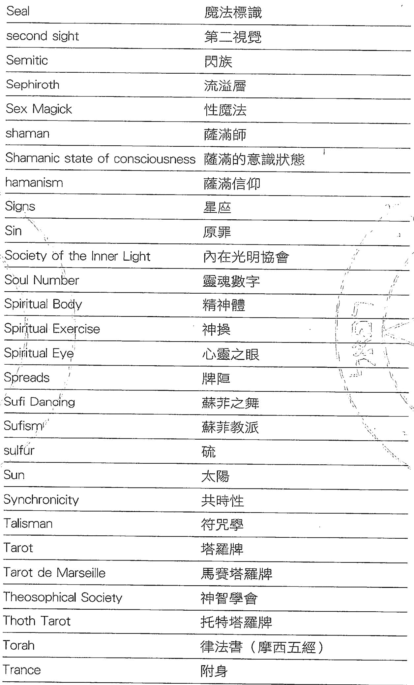

# 当神秘学来敲门

《神祕學苑叢書》編輯室報告

# 小心，神祕就在你身邊！

這是一個科學的時代，也是一個占卜的時代。在這個年代裡，出生要看日期、取名字要算筆、買屋要看風水、求姻緣要批八字。占卜既然就在我們四，我們根本就無逃避。占卜是新時代的全民運動可是一點兒也不為過。

不過和東方人不同，西方人的占卜則被歸納到神祕學（Mysticism & Occultism）的體系裡。說占卜可能我們並不陌生，但是，談起「神祕學」可能很多人就要在臉上劉上三條線、外加幾滴汗了。可是如果我告訴你，觀測天空星象進行預測的占星是神祕學、認識自己手掌狀況的手相是神祕學、靈數和塔羅牌是神祕學、還有現在我們常聽到的芳香療法和水晶療法也是神祕學時，我想你的臉上一定露出了「哦，原來這就是神祕學」的表情了。

然而，可也別因此以為西方的神祕學可全都是這些預測和魔法的「實用性」技術，研究宇宙萬事萬物的原理和了解人類本身的狀況，這一類「理論性」的探討也是西方神祕學的架構。然而，歐美國家這類相關書籍十分豐富，但對初次入門的國內讀者來說，除了語言的隔閡外，一些長篇幅的基礎論述則令人望而卻步，即使興趣濃厚，但能吸收的恐怕也只是些許的「神祕」營養。

尖端規則的這一系列《神祕學苑叢書》所要提供的，是一個綜觀的神祕領域，理論與實用並行，從神祕學的源

流和歷史、占星、塔羅牌、出體經驗到色彩療法,按部就班地整理出神祕學的全體概念。並以下列的方向規劃:

○密契主義:提昇個人靈性修持○宇宙論:了解萬事萬物的原理○秘傳心理:了解人類本身狀況○預測學:在行為上驅吉避凶○魔法學:想辦法改變世界

有人曾經說過,「科學的邊界就是神祕學的起點,帶領我們去探索更多的未知。」我們不是要搞神祕,因為即使被視為神祕學核心部份的天體運行,到今天每個人甚至可以隨時在各個媒體上看到星座運動、並查到天體運行的位置、四季的變化,誰說這是神祕的?又或是我們經常在電影裡頭看到印弟安那瓊斯在追求的約檯(可觀看《法檯奇兵》)、甚至是康士坦丁對抗的天使和魔鬼(可觀看《驅魔神探》),這些不時在我們周圍發生,誰又能說這是神祕的?

我們不是宣揚神祕的異教徒,當然也別把我們當成大法師看待,我們只希望你和我們一樣,在看完《神祕學苑叢書》後,把這些曾經「隱密」的事件,當做「一般知識」來看待,並能從中找到自己的目標和人生定位,進而過著有意義的生活,同時還能保持身心靈的平衡,進而創造健康快樂的生活。

# 自序

常有人會問我「你們西方神秘學到底在搞什麼東西？」，每次聽到這種問題我都會有「千言萬語說不盡」的感覺；而這本「當神秘學來敲門」正是這個問題的「精簡版」答案。

長期以來西方神秘學在臺灣的研究一直有某些瓶頸，這本書期待能提供給大家更寬闊的視野，有機會一窺西方神秘學的主要系譜，並了解到各個領域的重要發展，也希望經由對於視野的提升，能幫助大家脫離見樹不見林的困境，找到研究的方向和方法。

「當神秘學來敲門」是針對「初學者」所寫的，不論你對於西方神秘學有沒有基礎，你都可以藉由這本書了解到西方神秘學的精華，也因此這並不是一本「西方神秘學大全」，只能提到各個領域最重要的東西，想要在各個部分有更進一步的了解，還是要找專門的資料來研究。

感謝尖端出版的如芳和昌瑜，在你們的努力企畫和催稿之下，這本書得以順利完成，也謝謝在神秘學研究當中一路支持我的朋友和學生，沒有你們的幫助和鼓勵，也絕不會有這本書的產生，最後要謝謝我最愛的 Jenny，能陪伴我日以繼夜地寫書趕稿，由衷地謝謝大家。

Daniel 丹尼爾

# 导读

在臺灣常見到有人提到「西方神秘學」，但是到底什麼是「神秘學」？「西方」的範圍到底在哪裡？甚至「神秘學」對應到哪一個英文字？說法恐怕也有很多不同。其實「神秘學」這個說法是來自於日本，作為西歐一些神秘傳統的總稱，在英文的表述法常是以 Mysticism & Occultism 並稱。

由此我們可以知道神秘學的範疇大概可以分成兩大部分，一部分是與精神修持有關的 Mysticism，通常被翻譯為玄秘主義、密契主義或神秘主義；另一部分是與實用數術有關的 Occultism，常被翻譯為秘術主義、神秘主義或直接翻譯為神秘學。但即使在英語當中，這兩個單字也常會有互相代用、混合使用甚至混淆的狀況，因此在日常的英文當中 mysticism 也用來代表模糊不清的思想。

另一個大的問題是「西方」的範疇，其實就一般慣用的說法，Mysticism & Occultism 大概都是指「西歐」的神秘學，傳承了部分埃及、希伯來及希臘的學說，在中古末期歐洲的基督教世界中融合而成的一個新傳統，所以一些「北歐」、「印度」、「美洲」的學說，在傳統上並不視為神秘學的一部分，但是在臺灣這些也都被稱為西方神秘學，這是臺灣的特殊之處。

# 本書的章節共分為五個部分：

第一部分「西方神秘學概」，到了西方神秘學的四大源頭一古埃及丶希伯來丶希腦一羅馬和基督宗教，明了神秘學形成的歷史與傳承，針神秘學研究的架構和性質作清楚的描述。

第二部分「神秘學的團體與大師」，则是以歷史發展的角度，看看在西方神秘學發展的程當中，有哪些人提出了什重要的學，以及各種神秘學的重要學派是如何發展出來的。

第三部分「西方神秘學的占卜方法」，重點放在關於「預測學」方面的介绍，以及相關原理的明，部分章節還加上一些實用的小技巧，大家可以自己習看看。

第四部分「西方神秘學的實用工具」，是以「魔法學」方面的介绍為主，明這些魔法是如何作用的，作為大家在學習這些工具的指引，當中包含了很多實用的資料。

第五部分「補充明」，是介紹除了西方神秘學的核心域之外，有哪些被為是西方神秘學的部分，最後附上「神／人名」以及「專有名」的中英文對照表，以及參考書目，希望對大家進一步學習能有一些助。

# 第一部：西方神秘学概论

# 第一章 神秘學的四大源頭

一般認為，西方神秘學有四大源頭：古埃及、希伯來、希臘一羅馬及基督宗教，但這四個部分的傳統有其不同的特質。以下簡單說明這四個主要源頭的重要內容。

# 一·古埃及文明

在歐洲的文化傳統當中，北非的古埃及一直被視為一個遙遠而古老的神秘文明，在法國學者商博良（Jean Francois Champollion, 1790- 1832）重新解讀古埃及文字之前，大部分的資料都來自於希臘旅行者的記述。

古埃及神話當中最著名的就是太陽神「拉（Ra）」的家族：拉神生下了風神「舒（Shu）」與雨神「泰芙內特（Tefnut）」；他們兩神結為夫妻，生下了大地之神「蓋布（Geb）」和蒼天之神「努特（Nut）」，蓋布與努特的婚姻雖然為拉神所反對，但他們在智慧之神托特（Thoth）的幫助之下終於得以結合，並生下「歐西里斯（Osiris）」「伊希斯（Isis）」「塞特（Seth）」和「納芙提斯（Nephthys）」四個孩子。

其中歐西里斯曾多次死亡與再生，之後成為冥界之王。伊希斯被認為智取了拉神的法力，而成為偉大的魔法師，並創建了古埃及的祭司系統。歐西里斯與伊希斯的兒

（Iorus）被認為具有偉大的魔力，「荷魯斯」被用在埃及的魔法儀式當中。圖特神發明了象形，，後來也被認為是占卜與醫藥之神。

除了代表抽象理念的天神之外，埃及大部分的神都足以吻物形象出現，或是使用人身加上動物頭的象徽，例如的送者「阿努比斯（Anubis）」就是以狼頭人身的形象出現；古埃及另個很重要的特色是非常重來，包括《死者之書》和木乃伊的製作等等，都是為了在死後的世界可以過得更好。

中拉神、舒神、蕊布神、歐西里斯及荷魯斯都曾為古埃及的統治者，後來的「法老王（Pharaohs）」則為他們的後代，具有半神半人的特性；傳說中祭司系統由伊希斯所創建，是法老王統治最主要的助手，具有強大的法力，史官系統則是承托特神的法力，負責記錄歷史也精通占卜之術。

到新王國時期古埃及開始接受希臘的留學生，他們就把許多神話和學術思想帶回歐洲，因此常被視為是西方神秘學最古老的源頭。古埃及文化在羅馬帝國征服之後漸漸失去了獨立性，而融入了希臘－羅馬的文化圈，許多神秘學的理論就此失傳了。

# 二·希伯來文明

古希伯來人是中東地區閃族（Semitic）的一支，早期為居住在沙漠的遊牧民族，由於四出爭戰、旅行、被俘虜等坎坷的過程，吸收了一部分埃及人、蘇美人、加爾底、亞人、腓尼基人和巴比倫人的文化，並漸漸發展出自己的宗教與文化系統。希伯來人信仰的猶太教，是西方傳統中第一個「一神教」；唯一的真神只有一個，是祂創造了世界，同時祂也是希伯來人的守護神。更特別的是猶太教的上帝沒有形象，在律法當中更嚴禁崇拜偶像。

希伯來文明關於世界起源的說明，認為是上帝創造了世界，並造人來統領萬物，由於上帝在六天當中造了世界，並在第七天休息，因此猶太教訂立了工作六天休息一天的律法，也成為週曆制重要的文化源頭。但是後來因為人類本身的墮落（Fall）而帶著原罪（Sin）離開了樂土伊甸園（Eden）。之後男人就需要努力工作才能溫飽，女人更要受懷胎十月及生產之苦。

在希伯來文明發展的過程當中，摩西（Moses）帶領希伯來人離開埃及是一個關鍵事件；傳說摩西原是埃及宮中的一名祭司，後來因受到上帝的感召而決定帶領希伯來人反抗埃及的統治，離開埃及去尋找上帝的應許之地「迦南」，在曖野流浪四十多年的過程當中，摩西在「西奈山」上與上帝訂約，領受了上帝交付的「十誠」，成為猶太教律法的核心，之後摩西及其後繼者也成為祭司系統的主軸。

《聖經》。現傳的《法》此三十九卷，一般分為四大部分；第一（Torah），又為「摩西五經」，傅中是，包括了創世以來所有的秘密；第二部，記錄了希伯來人進入迦南之後的歷史發展；記錄希伯來人亡之後的各種經歷；是希伯來人智慧文學的經典。這些部分《成後來基督宗教的《舊約聖經》。

希伯來人歷史當中最英明偉大的君主為大衛王，不但作小及政治上獲得了空前的勝利，同時也改革了當時的祭司制度，位者所羅門王在耶路撒冷的安山上建立起的「太聖殿」，作為存放「約」和進行禮拜儀式的場所，也成為後來希伯來人信仰的中心，同時留下許多與聖殿有關的各種傳。

除了一神教之外，希伯來文明也留下了許多關於天使與天體系的理，由啟示文學當中發展出明顯的「末世」，指出到了世界的末了必定由太人得到勝利，成為被上帝救的對象。由希伯來文明中發展出來的「喀巴拉」也成為後來影密契主義與魔法學的主要學。

# 三·希一羅馬文化

希的文化的發展大約是在西元前兩千年就開始，歷經了遵諾安及遵尼時期、荷馬史詩時期、城邦時期與古典時期，在亞歷山大統一希而進入希化時代之前，由於

多變的地形與城邦政治的影響，開啟了多元的思想體系，在西方文化上可以說是「人文主義」的首次發揚，後世關於「科學」與「哲學」的許多觀念，都是由希臘開始的，他們重視現世的概念也與古埃及文化形成強烈的對比。

希臘的神話當中，最著名的就屬奧林帕斯的十二位大神。其中統治天界的宙斯（Zeus）權力最大，但性格風流常常到處留情；赫拉（Hera）為宙斯的太太，是婚姻的保護者；海王波頓（Poseidon）是宙斯的兄弟，掌管所有的海洋；冥王黑帝斯（Hades）也是宙斯的兄弟，掌管死後的世界又稱為地府財神；智慧女神雅典娜（Athena）是宙斯的女兒，為都市文明的保護者；太陽神阿波羅（Apollo）是宙斯的兒子，是光明、音樂與藝術的守護神。

月神阿姆米絲（Artemis）是阿波羅的雙胞胎妹妹，為森林與未婚少女的保護者；愛神阿芙羅黛蒂（Aphrodite）也是宙斯所生，主管愛、美與婚姻；阿波羅的弟弟赫密斯（Hermes）擔任諸神的使者，也是商業與竊盜的守護神；戰神阿瑞斯（Ares）是紛亂與鬥爭的代表；赫絲西雅（Hestia）是宙斯的姊妹，主管爐灶與家庭；火神赫發斯特斯（Hephaestus）十分愛好和平，也是工匠與鐵器的守護神。

雖然希臘的人文精神豐富，但是也非常重視「神諭（Oracle）」，最有名的為德爾菲（Delphi）地區的阿波羅神殿，神諭是阿波羅藉由女祭司之口說出，代表了神的意

六，小，小，小，小，小，小，小，小，小，小，小，小，小，小，小，小，小，小，小，小，小，小，小，小，小，小，小，小，小，小，小，小，小，小，小，小，小，小，小，小，小，小，小，小，小，小，小，小，小，小，，小，小，小，小，小，小，小，小，小，小，小，小，小，小，小，小，小，小，小，小，小，小，小，小，小，小，小，小，小，小，小，小，小，小，小，小，小，小，小，小，小，小，小，小，小，小，小，小，小，,小，小，小，小，小，小，小，小，小，小，小，小，小，小，小，小，小，小，小，小，小，小，小，小，小，小，小，小，小，小，小，小，小，小，小，小，小，小，小，小，小，小，小，小，小，小，小，小，小，小

行文化到羅馬文化的過程當中，神話系統没有太，，上更偏向實用性，現代占星學所使用的，大多都是古代天神的羅馬名字。各種思想也渐用，例如占星、數字、煉金術等等在這個時候了實用的體系。

# 四·基督宗教

基督宗教可以是羅馬帝國中期之後，歐洲最主要的柏納支柱，主導歐洲知識與文化發展長達千年之久。基督宗教的起源傳是來自於基督的降生和復活，對當時的太教提出了新的，隨後由於保羅的傅布跨出太人的群，在羅馬帝國當中成為普世的宗教。

一開始基督宗教在羅馬帝國當中是於被迫害的少數救，然而隨著信徒的增加及康士坦丁大帝改信基督宗教，在西元四世記時基督宗教演變為官方宗教，始打其他宗教。隨著基督宗教的張，天主教會發展出全世界最大、最複雜的教隋系统，後來然經歷了羅馬帝國的分裂及西羅馬帝國的瓦解，但暨的教會系已經可以獨立於政治之外運作，甚至在某個層面取代了政治，各種基督宗教的儀式深入人民的生活，在中古世紀的歐洲動當中渐潮成為知識與性的權威，也使中古歐洲成為追求靈性的世界。

基督宗教在成為官方宗教的過程當中，也由多次大公會議決議選出二十七部「正典」，組成聖經的「新約」部分，作為延續「舊約」信仰的依據。一般分類會把新約分成五大部分：第一部分是福音書，由四個不同作者記述耶穌基督傳道的過程；第二部分為使徒行傳，記述初期教會建立的發展過程；第三部分是保羅書信，為保羅寫給當時教會或教友的書信集；第四部分是一般書信，則為其他信仰文書的選集；第五部分是啟示錄，說明末世來到的異象。

由於受到希臘一羅馬文化的影響，基督宗教的「神學理論」明顯多於猶太教，但由於承繼了猶太教當中「唯一真神」的理念，在對其他宗教的態度上就比較不寬容，甚至對於同宗教的「異端」也會加以討伐，以維持「正統」的神學觀，這也是基督宗教常被認為違反宗教及言論自由的地方。

# 第二章 神秘學的歷史與傳承

# 宗教神秘學的傳承

在西方神秘學當中，傳承最清楚可以明辨的就是宗教的密契主義。例如猶太密契主義中的喀巴拉，留下了許多密契主義的經驗和文獻；創設天主教耶穌會的聖依納爵（St. Ignatius of Loyola, 1491- 1556），設計了一套鍛鍊精細細小的「神操（Spiritual Exercise）」；聖母聖衣會的聖女大德蘭（St. Teresa, 1515- 1585）和聖十字若望（St. John of the Cross, 1542- 1591），留下許多新穎的神秘經驗。這些都屬於宗教性的密契傳統，而這些傳統累積下來的方法，也成為西方密契傳統最重要的源流。

另一方面，由神學研究當中也有部分神秘學的傳統，他們的表達是象徵式的，與後來神秘學研究者的方式十分接近，例如托名狄奧尼修斯（Dionysius）所著的《神名論（De Divinis Nominibus）》、《神秘神學（De Mystice theologia）》，都是後世密契主義重要的參考文獻，當中有把早期猶太教與諾斯替派的天使學理論重新整理，成為西方主流的天使學理論。在秘傳心理的部分，由於基督宗教非常重視肉體之外的精神與靈魂，所以有許多關於這方面的研究，也成為現代秘傳心理研究的重要基礎。

在秘術方面，天主教會一直有其特殊的趕鬼儀式及靈性治療的方法，以神秘學的眼光來看都可以視為白魔法的一種；只是基督宗教的信徒並不如此認為，他們將這種「竈病趕鬼」的事件當成「神蹤」，並把原因歸於對於上帝的信心。而保留在宗教上最多的是關於「解夢」的異能，猶太教的《聖經》當中有許多關於解夢的故事，猶太人本身也相信夢境的真實性及啟示性，連帶影響到後來基督宗教對於夢的態度，夢境也常會被當成上帝或天使傳遞訊息的場合。

# 二、傳統秘術的再興

由十二世紀開始，經歷了十字軍東征及地中海航運的開通，漸漸在南歐造就了一群有錢的商人，進而引導未來文藝復興的發生，在經濟上他們獨立於傳統的莊園經濟之外，在文化上他們重新閱諳了希臘羅馬留下來的典籍，因此發展了某種獨立於羅馬天主教會之外的獨特思想體系，可以視為思想解放的先驅。

另一方面，由於知識的累積與貸用目的，許多古代的秘術重新被研究及使用，其中比較明顯的例如占星學與天文學成為大學必修的課目之一（中古後期大學必修的包括三法－文法、修辭學、辯證法，及四藝－算數、音樂、幾何、天文），再經院哲學的幫助之下重新與羅馬天主教結合；鍊金術的發展在靈性治療之外帶動了醫藥的進步，非屬宗教性的學說漸漸能發揮主導性的影響力，各種占卜系統也在此時蓬勃發展。

來在神秘學家的努力之下，各種不同理論相互激，而融合成一套新的秘術傳統；這套秘術的傳統結星學、煉金術和喀巴拉的對應體系，為宇宙與人類你提供了另一種解釋的可能，再以此延伸出許多預測法學的應用工具，突破了羅馬天主教在靈性知識上，也間接影響到後來的宗教改革。

# ·科學與神秘學分道揚

代很多被認為是「科學」的學科，在中古世紀之前被認為是神秘學，或者說只是依附在神秘學之下發；例如天文學只是占星學當中的一小部分、化學與製藥術作為煉金術的一支、數學與邏輯是神秘教派的教、治療與治療則是來自於神職人員的信仰力量。

一方面來，神秘學打破了羅馬天主教在知識上，是啟蒙時代主流的理性力量，也開啟了現發展的可能性；在另一方面，在科學革命之後，反過來批神秘學為一種不科，在罪知識解典（Paradigm）的過程，神的主流當中漸漸落居下風。

（Immanuel Kant,1724- 1804）、Wilhelm F. Hegel,1770- 1831）一派把唯心」哲學發揚光大，但是在整個被現代西方科學所估據，目光焦點集，這個時候神秘學研究者只能忍受外

界異樣的眼光，在自己的領域當中默默耕耘，也漸漸成為隱密的地下組織。

# 四·新時代運動與中古神秘學的復興

到了二十世紀中葉，由於對於唯物主義科學的不滿，西方世界展開了一連串的反思與改革，希望能突破傳統宗教與科學的限制，回復靈性的傳統，有人稱之為新時代運動（New Age Movement）或者人類潛能運動（Human Potential Movement）。由於交通便利及文化交流的關係，新時代運動當中運用了很多東方的思想，例如佛教與道教的系統就常常被提到，但是因為文化背景接近的關係，中古末期蓬勃發展的神秘學傳統，在這個時候又再度被重視。

人們以靈性的角度重新檢視這些神秘學理論，並賦與新的意義和解釋，其中最明顯的先驅就是「神智學會」的各種學說以及「容格心理學」，他們以較現代的術語說明古代流傳的各種神秘學理論，讓人覺得比較沒有距離感，在文化上也有相同的源流和熟悉感，很快在知識界傳布開來。此外，新時代運動者也常在神秘學理論當中找尋心靈、健康、環保等工作的論據，進一步使得各種神秘學理論開始出現在主流媒體上。

各種古代祕術也在這個時候被重新提倡，例如占星學結合了心理學與生涯規劃的功能，擺脫了傳統宿命論的刻板印象；手相和塔羅牌等占卜技術也開始廣為流傳；各種

另類療法也是取材「仲的秘術，芳香療法、水晶寶石療法、色彩療法更大行止道；然很多人在明時不免加上一些「科學」的临訓方式，但是本質上仍然是於神秘學的。

# 第三章 神秘學的架構

# 一·神秘學的基本龍

基本上所有與神秘學有關的學說，大概可以分成兩大部分：密契主義和秘術主義。密契主義通常是處理個人靈性修持的部分，有些研究者將密契主義分成宗教的與泛神論的、有人則將它分為內向型與外向型來討論，不過大部分的神秘學家都認為這是西方神秘學當中最基本不可少的元素。也許我們可以把密契主義視為西方神秘學的「內功心法」，如果沒有這方面的鍛鍊，那麼再多的「招數」也無法發揮出真正的功能。

秘術的傳承則比較複雜，但若是我們以秘術處理的主題來區分，則可以分成四個主要的部分：

一·宇宙論－了解萬事萬物的原理。二·秘傳心理－了解人類本身的狀況。三·預測學－在行為上驅吉避凶。四·魔法學－想辦法改變世界。

我們可以看到前面兩項（宇宙論及秘傳心理）是屬於比較理論性的探討，也是比較屬於「為什麼」的解釋；而後面兩項（預測學及魔法學）是屬於比較實用性的技術，也是比較屬於「怎麼做」的方法，若是沒有前面兩項的堅實基礎，就沒有辦法研究出後面兩項的實用技術，只是現

在人大多比較求速成，所以常常只想使用預測學及魔法學，但是不太願意花時間研究宇宙論及秘傳心理，因此在技術的精進上就很容易遇到瓶頸，碰到問題也不知道該怎麼解決。

# 神祕學架構圖

# 二·密契主義（Mysticism）

有些宗教學者把密契主義視為一種純粹宗教的行為，不過在西方神秘學當中也有很多非宗教的「密契經驗」，所以我們不應該把密契主義限制在宗教的範圍當中討論。

一般來說我們把「密契經驗」界定為：「個體超越了自我，與無限我或宇宙我合而為一」的經驗，就宗教心理學的分析，這種密契經驗具有四種共同的特性：1．不可言說（Ineffability），只有當事人可以體悟；2．知悟性（Noetic Quality），可以得到關於真理的洞見與啟示；3．傾現性（Transiency），通常密契經驗無法維持很久；4．被動性（Passivity），一但密契經驗開始即脫離了本人的控制。

就神秘學研究者來說，密契經驗是非常重要的「體驗」，密契主義不帶有任何費用的目的，或者我們也可以說密契經驗本身就是目的，它是一種內在靈性的提升，幫助我們達到「開悟」的狀態。在西方神秘學當中，天主教與猶太教都有非常豐富的秘契主義傳統，其中喀巴拉（Kabbalah）的方法是近代神秘學界流傳最廣、影響力最大的。

# 三·宇宙論（Cosmology）

宇宙論的部分可以分成兩個主要的部分：一部分是關於宇宙演化的探討；另一部分為萬事萬物的分類體系。基本上西方神秘學的理論認為，宇宙演化（Evolution）帶有精神性的（Spiritual）目標，意圖朝向更美好的世界發展，人類在這個演化的過程當中扮演了重要的參與者。

現代神秘學家常用大年（Great Year）理論來說明人類歷史的發展；地球除了自轉與公轉之外，地球的自轉軸

還會旋轉偏移而產生春分點歲差的狀況，春分點繞行天球一週的時間約 25920 年，被稱為一個大年，而春分點經過一個星座的時間平均約 2160 年，被稱為一個大月（Great Month），新時代運動所稱的水瓶世紀（Aquarian Age），即來自於這個占星學的理論。

另一方面，神秘學家普遍認為可見的世界只是更高世界的反映，因此所有的事物都帶有其精神性。若是以現有實體精神性的層次，我們可以依照性質分成四層世界：礦物世界、植物世界、動物世界及人類世界，這四層世界彼此之間緊密相連同時又層次分明。

# 四·秘傳心理（Esoteric Psychology）

秘傳心理處理的不限於心理的層面，而是對於人類的身、心、靈作整體的描述和分析。以人體的功能來說，神秘學當中大多遵循大宇宙與小宇宙對應的模式來處理，也同意天體運行對人類的影響，當然人不是只有身體層面，在身體之外心靈可以分為各種不同的層次，現在臺灣比較熟悉的「脈輪」理論其實是印度的體系，直到近代神智學會成立之後才漸漸加入到西方的體系當中。

西方比較通行的理論是將人的存在分成五個主要層次，可以被看見及觸摸到的為肉體（Physical Body），是我們在這個世界生存發展所必要的基礎。在看不見的部分再區分為四大部分，乙太體（Etheric Body）與生命的能源及形體有關、星靈體（Astral Body）與情緒狀態及意

志力有關、心智體（Mental Body）與理性和抽象思考能力有關、精神體（Spiritual Body）則是與個人的靈性狀態有關，每一層次都有其不同的屬性。

另一方面，西方神秘學中很早就有投胎（Reincarnation）的說法，也相信因果業力（Karma）的作用。所以人誕生之初來並不是一張白紙，每個人都帶有不同的性質及天賦，也面對到不同的的課題及挑戰，因此若是能更加了解自己、並努力精進修行，就可以在此生中有最大的收穫，同時也會對宇宙整體的演化作出貢獻。

# 五·預測學（Divination）

預測學是西方神秘學比較為人所知的部分，幾乎所有學習神秘學的人都會一種以上的預測學，但是因為每種預測學都基於不同的學理或傳統，所以一般來說每個人只會選擇少數幾種學習。預測學最重要的目的是使我們了解事物的真實狀況，如此我們就可以作出正確的選擇及行動。依照不同的性質我們可以把預測學分成以下四類：

第一類是依現有的外在客觀秩序進行預測，例如占星學（Astrology）是以天空當中實際的星象進行預測；手相（Palmistry）則是一個人手掌上的狀況進行預測；而靈數學（Numerology）是以數字的對應及規律進行預測。第二類是利用特定工具依照某種規則進行的占卜，例如塔羅牌（Tarot）是以紙牌作為工具進行預測；靈擺（Dowsing）則是以擺垂或卜杖進行預測。

第三類是利用人的特殊感官獲取資訊，例如靈視（Clairvoyance）是利用開啟的第二視覺獲得特定的資訊；夢境（Dream）與出體經驗（Out of Body Experience）是星靈體到靈界獲取資訊的過程。第四類是利用與外在靈體的溝通來得到資訊，例如召喚術（Invoke）就是利用召喚特定靈體前來，在溝通之後就能得知一些事情，也就是一般所謂的通靈。

當我們知道事情的狀況之後，最重要的是能驅吉避凶，也就是願意改變自己的行為去符合宇宙的客觀秩序，如果明明知道結果不好還硬要去作，那就白白浪費力氣去作預測了。

# 六·魔法學（Magic）

魔法學是最引起大家好奇與誤解的部分，很多人以為「魔法」代表的是「無所不能」，其實這是錯誤的。整體而言，魔法學是以神秘學的方法造成「改變」的手段，想要使用魔法就必須要有密契主義、宇宙學、秘傳心理與預測學等各方面的基礎，再加上適當的方法才能有效。至於能夠造成多大的改變，則視個人的修為而定，並不是每個人施行相同的魔法都會有一樣的效果。

西方神秘學當中通常會去區分白魔法和黑魔法。兩者最大的分別並不在於施法的內容，而是在於動機與動力。在動機上，白魔法是以順應自然與宇宙演化的方式施行，黑魔法則是違反自然與宇宙演化的方向，所以若為眾生利

益而施行魔法者可歸類為白魔法，若為一己之私而施行魔法者則為黑魔法。在動力上，白魔法是以愛與慈悲為動力，而黑魔法是以恨與恐懼為動力，所以心中充滿愛的人無法施行黑魔法，心中充滿恨的人則無法施行白魔法。

現代常見的魔法學應用的主要方法為儀式魔法（Ritual Magic）及符咒學（Talisman），還有許多另類療法也被歸為白魔法的範圍，例如屬於植物性的有芳香療法（Aromatherapy）和花精療法（Flower Remedies），屬於礦物性的有水晶寶石療法（Crystal & Gem Healing），及以光為媒介的色彩療法（Color Therapy）。

# - 神秘學的目的

西方神秘學的終極目標,在個人方面比較傾向「密契主義」,秘術則是達成這個目標手段。但是除了個人「開悟」的追求之外,集體的目標則是要參與「宇宙演化」,為了達成與宇宙一同演化的目的,學習神秘學的人就有四點需要去實踐。

對於宇宙及各種人事物有正確的認識;所以學習神秘學的人都需要研習宇宙與秘傳心理。

淨化自己的心靈,使之體悟與馴服於宇宙演化的原則;這個部分就需要在密契主義上不斷修練精進。

使自己的行為與宇宙演化一致;當遇到在行為上不確定之時可以用預測學作為決策的參考。

改變外在的現象以符合宇宙演化的道路;這時候魔法學就是最主要的工具。

所以學習神秘學的人應該可以從這當中找到自己的目標和人生定位,去過更有意義的生活,同時保持身、心、靈的平衡,達到健康喜樂的目的。

值得注意的是，神秘學並不是一種宗教，也不必然與宗教相衝突，任何宗教信仰的人都可以研習神秘學。如前所述，密契主義有很大一部分的源頭是宗教，而所有宗教當中也都有密契的傳統，至於不同宗教對於秘術主義的解釋和態度差異性比較大，封閉性越強的宗教對於秘術主義就會越排斥。

# 二·神秘學的隱密性

若是以字意方面的分析，不論是密契主義或是秘術主義都帶有隱密性。密契主義（Mysticism）的字根是mystic，代表了不為人知或無法被人了解的東西；秘術主義（Occultism）的字根是occult，代表了被隱藏起來的部分。為什麼搞神秘學的人都要這麼神神秘秘的呢？難道這些東西真的那麼見不得人嗎？

其實我們應該回到中代歐洲的環境，那時能讀書識字的人原本就是少數，到了中古世紀整個知識界又籠罩在基督宗教的氛圍當中，這時候一些與「正統教義」不合的想法，很自然就會被打壓，甚至以「異教」或「異端」的名義加以討伐或消滅，在這種狀況下擁有這些「另類」知識的人，自然要把這些想法隱藏起來，以免招來殺身之禍，否則就會如早期研究魔法的布魯諾（Giordano Bruno,1548- 1600），以異端的罪名被教會燒死在火刑架上；即使宗教上有某些密契經驗被羅馬教會所接受，仍然有許多的禁忌和限制。

另一方面，這些神秘知識的力量十分強大，若是由居心不良的人所使用，恐怕會造成非常大的災難，這也是為什麼早期的神秘學團體都很重視人才的揀選，除了有「天分」之外，品行的考核也很重要，甚至會有一大堆的「入會儀規」和「誓約」來限制入門者的行為，以免這些力量強大的神秘知識被人給濫用了。這些限制都增加了神秘學給外界的神秘印象，許多不切實際的傳說也就隨之流傳開來。

# 三·神秘學的範圍

其實神秘學的界線是不斷後退的，因為這些隱密的知識正不斷地被公開宣揚和教育。以中古世紀的歐洲來說，讀書識字就屬於神秘學的範疇，但是現在教育普及之後，這也就不是什麼神秘的事情。有許多曾被視為神秘學的知識，現在也被視為科學知識甚至「常識」來看待。

舉例而言，在中古世紀的歐洲「天體運行」一直被視為是神秘學的核心部分，不論是天體運行的規律、天體運行的現象紀錄或天體運行的預測，都是普通人完全碰不到的「神秘知識」，季節的變化與農業的活動則完全仰賴經驗，一般人只知道這是有規律的，但是卻很難有個確定的依據，也不可能知道為什麼。時至今日，每個人都可以查看月曆，了解季節變化的道理，甚至上網路去查閱各個天體運行的位置，這時天體運行就完全不神秘了。

所以就某個面向而言，當一件事情被當成「一般知識」，可以公開被教育與流傳之後，就會慢慢失去神秘的性質，所以也有人說，科學的邊界就是神秘學的起點，帶領我們去探索更多的未知；但是神秘學和現代西方科學還是有極大的不同點，特別是在西方經歷科學革命之後，這種差異就更明顯地被突顯出來。

現代西方科學的論據建立在感官可以觀察到的資料，也就是西方哲學當中的「經驗論」，對於人類感官之外的部分是無法進行研究的。但是神秘學的研究則比較基於「觀念論」，包含了感官經驗無法觀察到的部分，所以下面我們就要來談一談神秘學的方法。

# 四·神秘學的方法

基本上神秘學研究者相信世界是一個整體。每一個部分都和其他部分相關聯，並沒有任何的人、事、物可以孤立於其他事物之外，因此所有的人、事、物都要放到整體的系統和脈絡當中，才可以看到真實的原貌，這與某些科學家「在實驗室當中控制其他因素不變」的研究方式有很大差異。

同時，神秘學的研究也很重視親身的實踐和體驗。雖然神秘學也有很多的理論，但是若沒有親身的實踐，是無法了解它真正的意思，所以在神秘學當中「知道」一個理論只是最初步，唯有親身「體驗」才能「學會」一件事情，所以在這個層面上神秘學是很務實的。

另一方面，神秘學的研究需要抽象思考及解證象徵的能力。由於神秘學的研究涉及到感官世界以外的事物，所以常常只能用很抽象的方式去敘述，這個時候對於抽象概念的掌握和推理能力就十分重要，有些時候甚至會因為理論的內容太過抽象，只好以象徵的方式來呈現，所以學習神秘學的人都需要具有解證象徵的能力。

神秘學最有特色的部分，其實是直觀（Initiation）的認識方法。所謂的「直觀」是指去除一切外在感官經驗與理性推論的過程，直接由精神世界得到啟悟的方法，這在以感官經驗為基礎的西方現代科學當中很難理解，卻是神秘學當中很重要的部分，很多事情對於神秘學家來說就是「很自然地就突然明白了」。

# 第二部：神秘学的团体与大师

# 第五章 神秘學的奠基者（上古到中古）

一·睾達哥拉斯（Pythagoras, c.570BC- ？）一萬物皆數

簡歷：薩摩斯人，年輕時就離鄉追求知識，中曾到過埃及和中亞，中年之後才回到希，之後在南義大利的克羅托內（Crotona）建立了自己的睾氏學派（Pythagorean Brotherhood），這是一個類似苦修教國的組織，成員們都過著消修的生活，專注於靈魂的凈化和知識的追求，有人他晚年死於贯族的追殺，但也有人他隐居活到高。

著作：睾達哥拉斯本人没有留下任何著作，但是其學透過學派而流傳下來，散見於各種哲學與數學教科書中。

學說：睾達哥拉斯認為「萬物皆數」，每個數字都有其特殊的意義，世上的一切（包括具象的物體或抽象的理念）都可以用數字來表示，因而被尊稱為數字神秘學的始祖。睾氏學派認為靈魂在死後會不斷地轉世，因此在世時要不斷地追求知識以達到靈魂的淨化，並且堅持道德與戒律的生活。睾氏學派把數論、音樂、幾何學及占星學列為必修的四個學門，傳說中發展出許多人的技藝，但是因為本身具有守秘的戒規，因此許多學說的細節並沒有留傳下來。

影響：畢達哥拉斯可以說是西方文獻當中記載的第一個神秘學家，他的數字神秘學在哲學上影響了西方世界對於數字的崇拜甚至迷戀，以數字來描述世界的想法也成為日後計量科學的思想源頭；數字神秘學的內容更影響到後世的喀巴拉學說，成為神秘學思想的重要源頭，間接啟發了現代的靈數學。由他建立起來的宗教性苦修團體，已具有後世教團的雛型，嚴格的戒律和守秘的規定，更與後來的神秘學團體完全相同，算是歷史記載的第一個神秘學團體。

# 二·柏拉圖（Plato, 427-347BC）—理性主義哲學

簡歷：雅典人，大約二十歲起追隨哲學家蘇格拉底（Socrates）學習，直到蘇格拉底被民主派處死，柏拉圖開始往海外學習與考察。西元前387年，柏拉圖回到雅典創辦學院（Academy），直到西元529年被東羅馬帝國皇帝查士丁尼下令關閉為止，前後持存在達九百年之久，期間作育英才無數；柏拉圖於八十時在一場婚宴當中與世長辭。

著作：柏拉圖的著作都是以「對話錄」方式寫成，由不同角色進行對辯，最名的為《理想國（The Republic）》。

學說：柏拉圖對於西方神秘學影響最大的就是「理型論」；他認為在感官可認知的世界之上有一個「理型（the Idea）」的世界，現實世界是變動而不可靠的，只有理型的世界才是永恆的真理，他進一步指出現實世界只是理型世界的反映，而要認識這個真

質的理型世界，只有靠理性的力量才行。柏拉圖也相信靈魂轉世的學說，並認為人的靈魂來自於理型的世界，人的學習只是要憶起（Recollect）他在投胎之前就會的智慧，並不是去學習新的東西。

影響：柏拉圖的「理型論」推論出在物質世界之上還有更高的世界，而靈魂與肉體的二元論，直接影響到後世基督宗教的聖俗二元論，主導了西方二千多年的思想。柏拉圖的「理型」在後世成為「不動之動（Unmoved Mover）」和「太一（the One）」的思想源頭，其後繼者普羅提諾（Plotinus）更是在這個基礎上發展出「新柏拉圖主義（Neo- Platonism）」，把柏拉圖的思想轉向宗教化。並帶出了超越理性的密契主義，直接影響到諾斯替派的形成。

# 三·托勒密（Claudius Ptolemy, c.90-168）一古典占星的集大成者

簡歷：生於埃及、父母親都是希臘人，目前對他的生平所知不多，只能確定他曾長住於亞歷山大港進行天文觀測。

著作：與神秘學直接相關的有《天文學大成（Almagest）》共十三冊，是當時希臘天文學的集大成之作，《四書（Tetrabiblos）》共四冊，是關於占星學方面的著作；另外還有《地學（Geography）》八冊和《光學（Optics）》五冊流傳於世。

學說：托勒密承襲了柏拉圖學派的「同心球層宇宙」與亞里斯多德（Aristotle）的「地心說」，引用大皇希巴克斯（Hipparchus）的觀察數據，提出了以地球為中心的「周轉圓理論」模型，用來解釋當時觀察到的天文現象。托勒密同時也精研占星學，認為世上的萬事萬物無不受到天體運行的影響，但他並不主張宿命論，反而希望人能透過了解自身的天命及運程變化，與宇宙秩序之間取得最大的和諧，目前使用的「天宮圖」架構一行星、星座、宮位、相位一在這個時候已經被他所確立，並且也整理、研發出幾種主要的運勢預測方法，至今仍然被占星學家普遍採用。

影響：經過托勒密整理之後的占星學，變成了一種人為可及的工具，天體運行符合客觀秩序的觀念漸漸被接受，而不再只是天威難測的神秘變化，人的命運因此就在一個可預測的範圍之內得到安頓。托勒密的「周轉圓理論」模型後來被納入基督宗教當中，在中古世紀取得了知識上的正統地位，影響到後世對「天階體系」的想法，也成為基督宗教神學與神秘學之間共享的文化資產，形塑了中古世紀主流的宇宙觀，在之後將近一千五百年間發揮廣大的影響。

# 四·馬斯洛·費奇諾（Marsilio Ficino，1433-1499）一中世紀神秘學之祖

簡歷：義大利人，因為父親為佛羅倫斯市長科西莫·麥迪奇（Cosimo de Medici）的私人醫生，因而有機

會接觸到許多古典的珍貴抄本，他是最早將柏拉圖作品翻譯成拉丁文的人，同時也將赫密斯派的重要文集《秘義集成（Corpus Hermeticum）》翻譯成拉丁文出版，中年之後費奇諾成為佛羅倫斯教堂的修士，到晚年仍然領導在當地重建的柏拉圖學院。

著作：最有名的是《生命三書（Libri de Vita）》，討論以神秘學方法進行的治療與保健，其次是《柏拉圖主義神學（Platonic Theology）》和《基督宗教（Christian Religion）》。

學說：費奇諾結合了新柏拉圖主義與赫密斯派的思想，把基督教思想和異教理論融合在一起，他認為除了神的精神、物質世界之外，應該還有世界的靈魂（Aninma Mundi），人應該要與宇宙秩序和離地相處。對於星象上不良的影響，費奇諾主張使用酒、芳香、音樂和光來調和靈魂，以保持健康或治療，並發明了多種行星符號的符咒，如果可以利用適當的行星時（Planetary Hour）使用，就可以達到最好的效果。

影響：費奇諾把古典人文的精神重新發揚，重建的柏拉圖學院成為當時非常重要的學術重鎮，新柏拉圖主義和赫密斯派的思想也因為他的介紹重新回到歐洲，引導了文藝復興的思潮。在實用層面上，他復興了占星的魔法和醫學，把芳香療法、音樂療法及其他能量療法和占星學緊密地結合在一起，是一部身、心、靈整合療癒的解決方案，不但在理論上提出了非常完整的論述，也有非常實用的指引和處方，對

於日後自然魔法和煉金術的發展都有重大影響。

# 五·巴拉塞爾士（Paracelsus, 1493-1541）一煉金術與魔法學

簡歷：瑞士人，一位德國醫生的獨生子，從小學習醫學，十七歲就取得了醫學學位，並在中歐到處學習。但是他對當時歐洲傳統的醫學理論並不滿意，因此1516年起展開了為期十年的長途旅行，一般相信他到過埃及和中東，並且學到了許多有效的治療方法。1526年他被任命為巴塞爾大學的藥學講師，但因為作法太過前衛而被解職，之後就隱居鄉間專心著述。

著作：巴拉塞爾士的著作以醫藥為主，但還及神秘學原理、煉金術、自然魔法、占星學等眾多領域，近年來最通行的選集為容格學派尤蘭·雅各彼（Jolande Jacobi）所選編的《充滿活力的遺產（Lebendiges Erbe）》。

學說：巴拉塞爾士認為煉金術的目的在於製藥救人，不但整理了之前的煉金術文獻，更確立了以鹽（salt）、硫（sulfur）和水銀（mercury）為三大主要工具的中古世紀煉金術系統。他認為人除了肉體之外還有其他無形的層面，針對不同層面產生的疾病應該要用不同的方式治療。他也運用煉金術知識發展出新的魔法體系，現今所使用的四要素精靈就是由他所命名的。

影響：巴拉塞爾士對於煉金術的體系化及實用化有非常大的貢獻，同時也影響到後世神秘學的治療體系，有人將他視為西方的芳香療法之父，也有人說他是西方化學製藥之父，現代許多由植物當中提煉藥物的方法都是由他所改良或發明的。巴拉塞爾士在無形層面治療的學說，也引起了現代心理學家容格的高度興趣，認為他是臨床心理治療的先驅。

# 六·約翰·迪（John Dee, 1527-1608）

# 一占星學與天使語

簡歷：英國人。迪小時候就十分用功，二十一崴拿到碩士學位之後又到歐陸遊歷學習，回英之後曾經因為宗教因素及被控告使用魔法而多次入獄。迪最為人所知的事蹟是擔任伊麗莎白女王（Queen Elizabeth I）的占星顧問，為她挑選登基的吉日，並在她的資助下建立了當時英國最大的圖書館。中年之後迪的興趣轉向煉金術、水晶球占卜及與天使溝通的方法，並到歐陸旅行散盡家財，晚年迪回到英國過著窮困的日子。

著作：迪早年最有名的著作為《象形文字的單子（MonasHieroglyphica）》，晚期有關天使語及以諾魔法的文章集為《約翰·迪的神秘學五書（JohnDee'sFive Books of Mystery)》。

學說：迪極為博學，在語文方面懂得英文、拉丁文、希臘文，並精通哲學、數學、地理學、占星學、魔法和

煉金術，在一次通靈的經驗之後開始整理與天使溝通的天使語（Language of Enoch），並以此為基礎開創了全新的以諾魔法（Enochian Magic）系統。迪的魔法結合了占星學、煉金術、象徵主義和部分喀巴拉的學說，以各種天使為召喚的目標，再與祂們溝通取得法力與知識。

影響：迪收集了當時大部分可以參考的文獻，把神秘學當中的各種體系翻譯介紹到英國，他廣泛的興趣與收集成為後來大英博物館的源頭。他在神秘學方面的學說直接影響到牛頓（Issac Newton）的思想，以諾魔法的系統則對於儀式魔法的發展有著決定性的影響，黃金黎明和克勞力的很多魔法可以說都是源自於迪的想法。迪在占星學上的成就和影響力也非常大，使得一些博學之士以認真的態度來看待占星學。

七·雅各·波美（Jacob Boehme, 1575- 1624）一與更高的世界聯結

簡歷：德國人。生於一個農夫的家庭，並沒有受過高等的教育，以製鞋及修鞋維生。波美很年輕時就經歷過一次密契經驗，也引導他走向自學之路，到1610年出現了第二次的密契經驗，之後就寫下他的第一本書《極光（Aurora）》，但是這本書因為教會的反對而成為禁書，並禁止他繼續寫作，五年之後他又開始秘密地寫作，陸續在上天的啟悟之下寫了三十多本書。

著作：波美的著作極多，除了第一本書《極光》之外，較為著名的還有《生命的三重性（De Triplicata Vita）》、《萬物印記（De Signature Rerum）》和《神秘的容器（Mysterium Magnum）》。

學說：波美指出萬物皆為一體，神以祂的話語創造了世界，在創造與演化的過程當中，造物主不斷地顯現祂自身的特質，同時也展現在萬事萬物當中。他以自己的體會重新詮釋了造物主的性質、創世的過程以及萬事萬物的原理，因此被教會認為是異端。他常以三重性的方式進行論述，例如：神是完美而無限的，但惡也是必要的，在善與惡之間才有機會發展出人的自由意志。波美認為透過密契經驗和直覺才能得到神聖的智慧（Divine Wisdom），這也是唯一可靠的知識來源。

影響：波美被認為是中世紀密契主義的代表性人物，同時成為西方研究密契主義必定論及的重要人物，他所留下的論文成為基督教通神論當中很經典的文字資料，使得十七世紀成為通神論風行的黃金年代。黑格爾的唯心論哲學和辯証法直接受到他思想的啟發，他對直覺與冥想的重視也影響了後世人智學的興起。

# 第六章 神秘學的傳承者（近代的大師們）

一·艾曼紐·史威登堡（EmaneuI Swedenborg,1688- 1772）一全新的靈界解釋

簡歷：瑞典人。年輕時就受到非常好的科學教育，1710年動身出發到英國學習當時最新的科學和技術，並且累積了許多科學的發明和著作，二十八歲時他回到瑞典，並在工業技術、經濟學和哲學取得了重大的成就。五十六歲之後史威登堡的興趣轉向神學與靈學，並創立了名為新耶路撒冷教會（Church of New Jerusalem）的教派。史威登堡曾預言自己的死期，並於他自己所預測的時間客死於英國倫敦。

著作：史威登堡著作極為豐富，總數超過一百五十部，與神秘學較為相關的有為《天堂與地獄（Heaven and its Marvels, and Hell)》、《天堂的奧秘（Arcana Coelestia）》和《婚姻之愛（Conjugial Love)》。

學說：史威登堡發展了自己的靈視能力，曾多次到靈界旅行，並指出在靈界當中並沒有時間和空間的隔閡，同時現實世界和靈界是一體的兩面，是緊密結合不可分割的。關於死後世界的解釋，他認為人死後靈魂會先通往精靈界（World of Spirits），然後再前往天堂或地獄；他詳述了天堂的結構、組織、形式

和性質，以及靈魂在天堂當中的生活方式；另一方面他指出人進入地獄並不是因為被上帝裁罰，而是本身的自私和執迷不悟，使人的靈魂自願選擇了前往地獄。史威登堡在神學上的其他主張也極為前衛，以理性的角度重新解釋《聖經》，打破了諸多基督宗教的傳統概念。

影響：史威登堡提出了關於靈界的創新解釋，他的天堂與地獄觀不但在宗教界引起不少爭論，也廣為後世的神秘學者所引用。他廣泛的神學和靈學著作，也成為後來研究西方靈學必要研讀的經典。

二、伊利費茲·列維（Eliphas Levi, 1810-1875）一儀式魔法的再興

簡歷：法國人。一名鞋匠之子，為了受教育而進入天主教會受訓成為一名教士，但後來因為選擇婚姻而退出修會。列維之後以寫作維生，因為出版了宣揚社會主義革命的書刊而三度被捕入獄，在獄中他接觸了史威登堡的著作後對神秘學產生強烈興趣。1852年他與赫尼·隆斯基（Hoene Wronski）成為朋友，並向他學習魔法與喀巴拉的教義。1854年旅居倫敦時第一次成功地施行召喚術，之後他返回巴黎隱居，專心寫作並收了少數的學生。

著作：列維第一本有關神秘學的著作為《高等魔法的信條與儀式（Dogme et Rituel de la Haute Magie）》，之後較著名的還有《魔法的歷史（Histoire de la Magie）》和《偉大奧秘的鑰匙（La Clef Des Grandes Mysteres）》。

學說：列維以喀巴拉的教義為主軸，結合了占星學與赫密斯派的學說，整理出一套理論完整的儀式魔法（Ritual Magic）；他認為魔法不同於巫術，是一種關於自然奧秘的科學，魔法師應該去追求精神的轉化，而不只是執著於外在世界的改變。他認為意志（Will）是驅動魔法的主要動力，而儀式是提升與集中意志力的方法，他並提出「星光體（Astral Light）」的理論來說明施作魔法之所以有效的機制，所以只要依照「相應（Analogy）」的法則就可以施行魔法。

影響：列維的著作使得儀式魔法成為十九世紀之後西方魔法學的主流，影響到後來黃金黎明及其廣大的後繼者。經過列維的解釋，塔羅牌和喀巴拉成為西方魔法學習者必修的項目，並對整個秘術主義的理論產生了重大的影響。

三·海蓮娜·佩卓夫娜·勃拉瓦茨基（Helena Petrovna Blavatsky, 1831- 1891）一東西方神秘學的整合

簡歷：俄國人。勃拉瓦茨基非常早婚，但因為婚姻不幸福而離家出走，進行超過二十年以上的海外旅行，傳說中他到過西藏及遠東各地，1875年她與奧爾科特（H. S. Olcott）在美國紐約創立神智學會（Theosophical Society），1879年起她與奧爾科特在印度居住了很長一段時間，並在當地發展神智學會的組織。晚年她因為健康因素前往歐洲療養，

最後客死於英國倫敦。

著作：勃拉瓦茨基的第一本巨著為《揭開伊希斯的神秘面紗（Isis Unveiled）》，將西方神秘學作了全面性的整理及回顧，晚期的主要著作為《秘密教義（Secret Doctrine）》，則加入了大量的東方思想，企圖將東西方體系融合在一起。

學說：勃拉瓦茨基的學說非常廣泛，而且帶有很強的融合性，她認為應該打破所有宗教及種族的限制，去追求更高的精神和智慧。她早期與晚期的思想有一些差距，不過整體來說她以宇宙演化的理論為核心，宣揚業力（Karma）與靈魂轉世（Reincarnation）的思想，此外也認為每個人在追求更高的智慧時，可以透過通靈或冥想的方式取得師父（Master）的指引。

影響：透過勃拉瓦茨基的介紹，東方的宗教與神秘思想廣為西方世界所知。後繼者愛麗絲·貝麗（Alice A. Bailey）首先在西方世界提出新時代（New Age）的概念，促成後來新時代運動的發生；亞倫·里歐（Allen Leo）創設倫敦占星學分會（The Astrological Lodge of London），是近代占星學復興的重要里程碑；印度的神智學會發掘了克里希那穆提（Krishnamurti），後來成為新時代運動的要角。

四·魯道夫·史代納（Rudolf Steiner, 1861- 1925）一神秘學理論的實用化

簡歷：奧地利人。早年對數學及哲學很有興趣，在維也納科技大學主修數學、物理及化學，後來於德國羅斯托克大學取得哲學博士。史代納由於研究哥德（Johann Wolfgang Von Goethe）的思想而啟發了許多關於「精神科學」的想法，1897年移居到柏林之後經常受邀至歐洲各地循迥演，並曾被選為德國神智學會的領導人。1913年，他脫離神智學會成立了人智學會（Anthroposophical Society），並繼續進行演說及授課。

著作：史代納本身的著作十分豐富，也留下很多演講稿及上課實錄，總數超過三百部以上，一般會推薦《神智學（Theosophy）》及《如何與更高的世界連結（How to Know the Higher World）》作為入門。

學說：史代納的學說後來被統稱為「人智學（Anthroposophy）」；他認為人是由身、心、靈所組成的完整個體，不只生存在物質世界，同時也生活在精神世界，所以人類不應只重視物質方面的科學，也要重視精神與靈性的提升；他認為人可以透過直觀（Initiation）的方式去了解感官以外的世界，而世界的歷史也會隨著人類的意識發展而演化。除了理念之外，史代納也提出了許多實踐的方法，例如有機農業與園藝上的生物互動法（Bio- dynamic）、獨立教育系統當中的華德福教育（Waldorf Education）、結合治療與美感的優律司美（Eurythmy）舞蹈，及許多關於整全療癒（holistic healing）的理論及方法。

影響：史代納的理論在學術界復興了靈性的傳統，並且提出了確實可行的實踐方法：例如華德福教育在全球已被超過六百所的學校所採用；有機互動法成為歐美國家有機農業施作與認証的主流標準之一，都是十分成功的例子。

五·阿萊斯特·克勞力（Aleister Crowley，1875- 1947）—最受爭議的魔法師

簡歷：英國人。從小喪父並獲得了豐厚的遺產，曾經進入劍橋大學三一學院讀書，因而對神秘學產生興趣，但是並沒有畢業拿到學位。1898年克勞力曾經加入黃金黎明，兩年後黃金黎明分裂他也選擇離開，接著到世界各地去旅行。他遊遍歐陸後又前往埃及和印度，當中他曾施行召喚術而寫下了《法律之書（Liber AL vel Legis）》，並在德國加入了「東方聖殿騎士團（Ordo Templi Orientis）」。1914年克勞力移民到美國，並持續在歐陸及美國之間旅行，晚年他因為染上毒癮使生活陷於困頓，最後死於英國。

著作：除了《法律之書》之外，克勞力最常被引用的為《魔法的理論與實踐（Magick in Theory and Practice）》。他和哈里斯小姐合作了著名的「托特塔羅牌（Thoth Tarot）」，並寫作《托特之書（The Book of Thoth）》來解釋這副牌的意義。

學說：克勞力將魔法重新定義為「使事情依照意志而改變的科學及藝術」，並提出了詳細的實行方法。他將

自己的學說稱為 Thelema（源自於希臘語中的意志），再依此建立起一套宗教性的儀式系統，不過在他的學說當中最引起爭議與討論的則為「性魔法（Sex Magick）」的概念，因為他認為可以利用性能量來提升意志並作為魔法的動力。

影響：克勞力因為提倡性魔法和晚年吸毒的經歷，使得許多人將他視為黑魔法的代表人物，但他的魔法儀式至今仍然被許多魔法研習者所實行。曾任職他秘書的法藍西斯·以色列·雷加地（Francis Israel Regardie），後來編寫出版了黃金黎明的講義，也成為現代神秘學研究的要角。

六·卡爾·古斯塔夫·榮格（Carl Gustav Jung, 1875- 1961）一學術與神秘學的交會

簡歷：瑞士人。早年即對神秘現象很有興趣，並把降靈會當中的精神現象當成其醫學博士論文的題目。1907年他在維也納與佛洛依德（Sigmund Freud）會面，之後並進行了密切的合作，但到1914年他們兩人正式決裂，榮格提出「分析心理學（Analytical Psychology）」與佛洛依德的理論作區分。他為了研究曾到過非洲、北美印第安人部落及印度，並廣泛研究各種文化當中的神話與不同宗教。晚年榮格的興趣轉向煉金術，並開啟了「心理煉金術」的研究途徑。

著作：榮格主要的著作被編為《榮格全集》共二十大卷，其中以煉金術為主題的就有三大卷，其他各處也把

許多神秘學的概念重新使用分析心理學的術語來解釋。

學說：榮格認為在意識與個人潛意識之下，還有「集體潛意識（Collective Unconscious）」的存在，以此為基礎提出了「原型（Archetypes）」與「個體化過程（Individuation Process）」的概念，來說明個人心理的情境與發展。另一方面他又提出了「共時性（Synchronicity）」的概念來說明非因果關係的意義，並以此作為心理跨越到物質世界的橋樑。

影響：榮格的研究使心理學界正視到神秘學的存在，包括諾斯替派的學說、煉金術、占星學、及各種異教的神話都變成了熱門的研究主題。同時他的理論也常被神秘學研究者拿來作為論據，例如「共時性」常常被拿來解釋占卜為什麼會準確，榮格的「心理煉金術」一時成為煉金術的主流解釋，甚至在占星學界還有一派自許為「容格占星學派」，都可以看到榮格在神秘學界留下的重大影響。

# 七·葛吉夫（Georgi Ivanovich Gurdjieff，1877-1949）一新時代運動的先驅

簡歷：俄國人。傳說中年輕時到過中東、埃及、羅馬、印度等地，接觸過回教的蘇菲教派及其他的神秘學理論，1912年之後他回到俄國的莫斯科及聖彼德堡，開始教導他的學說。俄國革命之後葛吉夫逃往西歐，1922年在巴黎創立了「人類和諧發展機構（Institute for the Harmonious Development of

Man)」。在一次車禍之後他關閉了該機構，但私下仍然繼續進行教學活動。

著作：葛吉夫本人的著作只有四本，《通報即將來臨的聖善（Herald of Coming Good）》、《魔鬼說事給孫子聽（Beelzebub's Tales to his Grandson）》是一本寓言性質的小說，《與奇人相遇（Meetings with Remarkable Men）》是他自傳性質的小說，最後一本是《真實人生僅在當刻（Life if Real Only Then, When "I AM"）》。

學說：葛吉夫的理論被稱為「第四道」（不同於苦行之道、僧侶之道及瑜伽行者之道），他認為「人總是睡著的」，因此要不斷努力地觀察自己以保持清醒，「記得自己」是他最重要的理念。他提出了自己的心理學和宇宙論，並指出人類應該有進化的可能性，因此他以各種不同的方式來教導學生，其中包括一種可以進行自我觀察的「神聖舞蹈」。

影響：葛吉夫最重要的弟子是俄國記者烏斯賓斯基（P. D. Ouspensky），由他記下的筆記成為我們了解葛吉夫教導的最重要資料，其中包括《第四道》及《探索奇蹟》等書。葛吉夫的弟子依照他的教導成立了許多「第四道學校」，成為研習他思想及共修的中心，對於新時代運動及思想有很大的影響，也是許多人開始接觸修行體系的第一步。

# 第七章 神秘學的著名學派與圖體

# —·赫密斯派（Hermeticism）

歷史：赫密斯派的名字來自於Hermes Trismegistus，意思是三倍偉大的赫密斯，這個學派在希臘時代就已經存在，但是並沒有固定的組織，而是以小組方式秘密傳承下來。在羅馬帝國採取基督宗教為正統之後就慢慢式微，直到中世紀文藝復興之後才被費奇諾重新介紹到歐洲，並成為西方神秘學當中的重要傳統。

文獻：現存最早的赫密斯派文獻為費奇諾翻譯的《秘義集成（Corpus Hermeticum）》共十七篇。大多數赫密斯派文獻的作者都不可考，因為他們都托名為托特神或赫密斯。

簡介：赫密斯派並不是經過系統化整理的單一理論，我們可視之為早期西方神秘學的經驗總結；基本上他們認為人類投身到世界是一段精神的旅程，最後仍應該與神性（Divine）合而為一，因此一方面要研究自然的法則以了解神性的展現，另一方面也要努力修行求得精神上的精進。同時他們認為世上萬物都是一體的（或說是相通的），因此人應該在自己身心靈的各個層面取得平衡，也要與大自然的秩序取得平衡。早期的赫密斯派文獻也有提到一部分占星

學、煉金術和魔法的使用方法。

影響：赫密斯派的文獻可以說是西方神秘學主要的思想來源，一方面影響到占星學當中天人合一（As Above, so Below）的思想，提出了早期的宇宙論和秘傳心理學，同時也是煉金術發展最直接的理論根據，後來許多魔法的研究者紛紛以赫密斯派的傳承者自居，可見其影響力的廣大。但是現在赫密斯派的學說已經被各家神秘學者吸收後重新詮釋，所以並不存在任何單純的只教授赫密斯派思想的學校。

# 二·諾斯替派（Gnosticism）

歷史：諾斯替派的名字來自於Gnosis，在希臘文當中的意思為「知識」，因此有時也被稱為「靈知派」。在西元一世紀到二世紀之間盛行於地中海沿岸，故被早期基督宗教視為最有威脅性的異端之一。諾斯替派曾在敘利亞和亞歷山大港建立起自己的崇拜組織，但在西元三世紀之後由於被基督宗教打壓而消失，之後仍然能在猶太教、基督宗教及伊斯蘭教的某些派別當中看到諾斯替派的影響。

文獻：諾斯替派的文獻在中古世紀之後的歐洲可以說是完全消失，大部分與之有關的說法都是來自於反對他的基督徒，直到1945年在埃及的沙漠當中發現了一系列諾斯替派的抄本，世人才有機會再見到諾斯替派的第一手資料。

簡介：諾斯替派相信精神是人的本質，並且認為肉體是精神

的牢籠，人會「為惡」完全是因為「無知」，因此「靈知（Gnosis）」是將人從物質世界和肉體當中解救出來的唯一方法。對於諾斯替派來說，人的救贖是一個宇宙性的過程，當人突破肉體帶來的限制之後，還要通過星體（包括行星及恆星）層層的考驗，最後才能回到真實純淨的狀態，找到真實的自我，在這個部分就帶有很強烈的密契主義色彩。此外，他們相信造物主除了男性面之外還有女性面的存在，因此允許女性擔任領導人及主持正式的儀式。

影響：諾斯替派是眾多密契主義的源頭，影響後世的猶太密契主義及許多基督教密契主義。神智學會對於諾斯替派的很多思想幾乎是照單全收；容格也因為研究了諾斯替派的思想而受到很大的啟發。

# 三·喀巴拉（Kabbalah）

歷史：喀巴拉是猶太密契主義當中最著名的一個派系，喀巴拉在希伯來文當中的原意是「傳統」，早期都是以口傳方式進行，代表一種對於經典的密秘解釋。喀巴拉在十一世紀開始成為一個明顯有區別的宗教團體，在法國南部和西班牙各地有顯著的影響力，到十四世紀初時發展到達頂峰，並成為穩定的團體一直流傳到現在。

文獻：喀巴拉學說當中最具有代表性的著作為《光明之書（Bahir）》、《創造之書（Sepher Yetzirah）》和《光輝之書（Zohar）》，但有更多的內容只以口頭的方式傳承，禁止被書寫下來。

簡介：在喀巴拉的學說當中認為世界創造的過程與飛升救的過程正好相反，所以只要了解創世的秘密，就有機會找到飛升得救的方法。喀巴拉學說當中最為人所熟知的象徵為生命之樹（Tree of Life），當中包含了十個流溢層（Sephiroth）和二十二條路徑（Paths），與世界上的萬事萬物都可以找到對應的方法，同時也是密契修行時的重要工具。一般學者常將喀巴拉分成理論和實用兩大部分，「理論的喀巴拉」通常專指密契修行的法門，「實用的喀巴拉」則是指在魔法方面的應用。

：現今大部分西方神秘學的項目，或多或少都受到喀巴拉學的影響。包括密契修行的具體方法被探用，萬物對應的體系成為儀式魔法相應系統的最主要來源，把文字數字化的方法成為後來靈數學的源頭，其他如手相學、塔羅牌、符咒學、煉金術等等，都可以在早期的喀巴拉學當中找到源頭，這也使得研習喀巴拉所使用的希伯來文成為西方神秘學當中重要的文字。

# 四·煉金術（Alchemy）

歷史：煉金術的名稱冠上了阿拉伯文的字首 Al 及希臘字根 chymia，代表了對於金屬的矯鑄。目前所知的煉金術在十二世紀左右由西班牙傳入歐洲，至十七世紀發展到達頂峰，之後因為科學革命而漸漸沒落。煉金術並沒有建立起屬於自己的團體，而是由煉金術士們各自進行研究，再加上文獻當中使用了

大量的圖型及象徵符號，所以長期以來都給人神秘的形象。

文獻：煉金術早期的文獻大都依附在赫密斯派之下，但後來漸漸發展成為獨立的學門。煉金術文獻大多由拉丁文及方言混合寫成，並夾雜很多暗語及密碼。

簡介：煉金術的核心概念是「質變（Transmutation）」，煉金術士相信事上萬物都是「化育」而來，如果我們可以知道自然化育的原理，就有機會操這個過程，將「不純之物」變為純粹。若是想要引發這種質變，就要得到這類東西的「精神（或原物質）」，例如賢者之石（Philosopher's Stone）是偉大工程（Great Work）的產物，帶有金屬的精神，若以適當的方法調配就可以使賤金屬「純化」為黃金。此外，煉金術也利用萬物相應的法則，提取各種不同的原物質，保存下來作為治療各種疾病之用。在進行煉金術的過程當中，除了要依照天象選定適當的時機之外，還很著重精神力的修和運用，與「化學」只重視物質性的變化有很大不同。

影響：在歐洲煉金術發展的過程當中，漸漸融合了赫密斯派與喀巴拉的學說，除了具有心靈密契的特質以外，還有物質轉化的方法，是自然魔法當中最精微極至的表現，也直接影響了後來水晶寶石治療、芳香療法與色彩療法的發展。

# 五·蔷薇十字會（Rosicrucians）

歷史：蔷薇十字會的象徵符號為十字架當中镶嵌著紅色玫瑰花，代表宗教與魔法的調和。傳說中薔薇十字會的創始人為德國人克里斯丁·羅森克魯茲（Christian Rosencreutz），但比較可信的歷史則由1616年約翰·威廉泰爾·安德烈（Johann Valentine Andreae）發行《化學婚禮（Chemical Wedding）》開始。由於薔薇十字會對外保密的性質，雖然有些人自稱或被認為是薔薇十字會的成員，但是真相一直是眾說紛云。

文獻：《薔薇十字會的名聲（Fama Fraternitatis）》、《薔薇十字會的告白（Confessio Fraternitatis）》和《化學婚禮》並稱薔薇十字會創始的三份重要文獻。

簡介：薔薇十字會的主要宗旨有三：一·推翻君主專制，改由哲學家當中選出領導者；二·對於科學、哲學及倫理的全面革新；三·尋求新的靈藥（panacea），解決各種疾病。為了達成這些政治、思想與民生的改革，薔薇十字會結合了占星學、煉金術、喀巴拉和魔法的各種學說，整理成一套新的體系，並且確實在日常生活當中去貫透。傳說中薔薇十字會的成員對於煉金術都十分有研究，並且一直秘密傳承著賢者之石及靈藥的配方，所以更增加了它神秘的色彩。

影響：薔薇十字會可以說是明確的國體，但也可以說是一

種革新的理想，至十八世紀時薔薇十字會的思想在西歐知識份子之間廣為流傳，形成了一股薔薇十字運動（Rosicrucian Movement）的風潮，也成為近代西方神秘學最重要的源頭，不但影響到共濟會與黃金黎明的成立，後來許多神秘學團體也常以薔薇十字會的個人自居。

# 六·共濟會（Freemasonry）

歷史：共濟會名稱的原意是自由的石工，據說是傳承自建造埃及金字塔及猶太聖殿的團體，但近代的起源則是由1717年在倫敦設立英格蘭本部（Grand Lodge of England）開始，漸漸發展成國際性的組織，一直傳承到現在。其成員常在西方世界扮演非常重要的角色，例如美國的開國元勳喬治·華盛頓（George Washington）、班傑明·富蘭克林（Benjamin Franklin）等都是共濟會的成員。

文獻：由於入會者都需要立誓保密，同時也不可以對外公布組織的運作狀況，所以比較少有可靠的第一手資料，目前公開資料當中比較有名的是1723年的《安德森憲章（Anderson Constitutions）》，大致描述了共濟會的宗旨與組織方式。

簡介：共濟會並不純粹只是神秘學團體，反而比較像是兄弟會（Brotherhood）的組織，在商業及專業領域上形成了重要的人際網路。依照《安德森憲章》的內容，共濟會的成員分為三個階層，使用不同的服飾及象徵來區分，但組織演變到今天又增加了三十

個階層，一共有：「、」、」也有屬於自己的入會儀式，小，及動的考。通過考者就「，，在宣誓後受到章和儀规的，間友受互助的規定是最有名的。

：共濟會是西方世界人的，前全世界有超過六百萬的，」小以的了美國獨立革命和法國人小，章、人會儀式、升級小，小後性大部分神秘學團體模仿的對。

# 七·黄金黎明（Hermetic Orkost of the Golden Dawn）

歷史：黄金黎明的全名為「以金明赫密斯修會」，由三位共濟會成員維斯（W．W．Wostcott）、馬瑟斯（S. L. Mathers）和小（R．Woodman）於1888年在英國成立，小本的喀巴拉、占星術、象微的映術，後期再加上儀式魔法的内容。小（小）與金黎明陷入空前的分裂危機，下來的忽作中陡有成員出走另立門戶，之後就洲洲沒落了。

文獻：曾任職克勢力秘書的仙仙收了大山黄金黎明的講義，篇寫出版了《金黎明（The Golden Dawn）》共九冊，小新的為一大冊的合集。

簡介：黃金黎明自認為是微小的正統傳人，教授的內容是以喀巴拉為核心，並把各種西方神秘學的理

論重新進行整合，雖然本身沒有太多的創見，但是確實使得西方神秘學更系統化的發展，許多原本秘傳的文本也因此而公開。例如塔羅牌就是在黃金黎明的改良之後，才在西方神秘學當中佔有如此重要的地位，儀式魔法的各種細節和原則，也在他們的實踐當中發展得更加精緻，以喀巴拉為核心的教義，更使得喀巴拉在非猶太人的社群廣為傳布。

影響：黃金黎明是近代最著名的神秘學團體，也培育出許多優秀的神秘學研究者，較有名的例如設計偉特塔羅牌的偉特（A. E. Waite）、文學家葉慈（W. B. Yeats）、魔法師克勞力等等，由其分支出來的各種神秘學團體現今仍發揮很大的影響力，例如由狄恩·福欽（Dion fortune）女士所創立的「內光協會（Society of the Inner Light）」在英國就十分成功。

# 第三部：西方神秘学的占卜方法

# 第八章 占星學

# 一·歷史與流派

占星學（Astrology）的原意是星星（astral）的學問（logos），基於天人相應（As above, so below）的原理，發展出一套與萬事萬物相應的系統，所以只要了解天體運行的變化，就可以得到所有相關事物的訊息。現代西方占星學的傳承主要來自於中亞和埃及的古老智慧，到希臘化時代的托勒密集其大成，在中世紀黑暗時代傳到阿拉伯世界，到文藝復興時期才又傳回歐洲發揚光大，成為西方神秘學的核心部分，幾乎所有神秘學的研究都會用到一部分占星學的符號或象徵。

在密契主義方面，喀巴拉理論就運用到「天階體系」的概念來說明修行的不同層次。在宇宙論的部分，占星學建立起最早的萬物對應系統。在秘傳心理的部分，個人占星學一直是說明個人狀態的主流理論之一。在預測學當中，占星學是傳承最完整久遠的一個體系。在魔法學部分，占星的符號與象徵廣泛被運用在各種魔法當中。因此我們可以說占星學是通往神秘學各個體系的一把萬能鑰匙，在西方學習神秘學的人大多都對於占星學有基本的了解。

占星學本身的適用範圍很廣，也可以說是一種研究的

方法論，依照現今研究的主題可以區分為四大部分：一．自然占星學（Nature Astrology）：研究天體運行和人類生存環境的關係，例如氣候占星學、農業占星學、地震占星學等等；二．世運占星學（Mundane Astrology）：研究天體運行和人類群體生活的關係，例如政治占星學、經濟占星學、股市占星學等等；三．個人占星學（Natal Astrology）：研究天體運行與個人的關係，例如心理占星學、健康占星學、愛情占星學等等；四．事件占星學（Event Astrology）：研究天體運行與事件的關係，例如問卜占星學、選擇占星學等等。

此外，許多神秘學家也會對占星學作出自己的解釋，例如神智學會教授的秘傳占星學（Esoteric Astrology），就是以傳統占星學的理論為基礎，加上宇宙演化和輪迴的解釋，在占星學當中形成了獨具特色的分支。

# 二·中古的天階體系觀

天階體系的概念源自於中亞迦爾底亞人的觀察，經過托勒密的「周轉圓理論」說明之後成為中古世紀主流的世界觀。在地球上以肉眼觀察天空，會發現大部分星體的相對位置並不改變，只有少數的天體會在星空背景當中移動，因此稱之為行星（Planets，原意為漫遊者）；若依照天體在星空背景當中移動的速度，假定速度越快者離地球越近、速度越慢者離地球越遠，就可以得出一定的排列順序，地球之上依序為月亮、水星、金星、太陽、火星、木星、土星，這種規則被稱之為迦爾底亞秩序（Chaldean

Order)。

依照托勒密的「周轉圓理論」，每個星球的運動是鑲嵌在一層球體之上，因此若是以地球為核心，往上一層就是月球天，再來依序為水星天、金星天、太陽天、火星天、木星天、土星天。星空背景則被假設是鑲嵌在一個巨大的天球上，也是人類可見最遠的距離，被稱之為恆星天。在恆星天之外，是超過人類可以理解的部分，被稱之為原動天或天外天，也有人認為這裡是上帝的居所。由地球到原動天就共分為十層的天階體系，依照神秘學的理論每個天階有其守護天使及性質。

# 天階體系圖

# 三·行星神話與象徵

目前占星當中行星的名稱大都來自於希臘羅馬神話，而每個行星都有其特質及守護的部分，以下簡表將神話角色及基本特質簡單列出。

<table><tr><td colspan="6">行星基本特質表</td></tr><tr><td>行星</td><td>符號</td><td>希臘神社</td><td>基本特質</td><td>陰陽性</td><td>吉兇性</td></tr><tr><td>土星Saturn</td><td>土</td><td>克羅諾斯Cronus</td><td>限制、收縮</td><td>偏陰性</td><td>大凶</td></tr><tr><td>木星Jupiter</td><td>木</td><td>宙斯Zeus</td><td>擴張、幸運</td><td>偏陽性</td><td>大吉</td></tr><tr><td>火星Mars</td><td>火星</td><td>阿瑞斯Ares</td><td>衝突、動力</td><td>偏陽性</td><td>小凶</td></tr><tr><td>太陽Sun</td><td>太阳</td><td>阿波羅Apollo</td><td>能量、創造</td><td>純陽性</td><td>吉</td></tr><tr><td>金星Venus</td><td>金</td><td>阿芙羅黛蒂Aphrodite</td><td>和諧、平衡</td><td>偏陰性</td><td>小吉</td></tr><tr><td>水星Mercury</td><td>水</td><td>赫密斯Hermes</td><td>理性、交流</td><td>中性</td><td>無</td></tr><tr><td>月亮Moon</td><td>月亮</td><td>阿媞密絲Artemis</td><td>變化、接受</td><td>純陰性</td><td>無</td></tr></table>

# 四·季節與星座特質

四·季節與星座特質雖然西洋星座的名稱大多取自於希臘神話，但是星座的來源與季節的變化密不可分，每個星座也有屬於其區分的東西，以下簡表將性質及相關的部分簡單列出。

<table><tr><td colspan="5">星座基本特質表</td></tr><tr><td>星座</td><td>符號</td><td>季節時令</td><td>要索屬性</td><td>基本特質</td></tr><tr><td>白羊座</td><td>♂</td><td>春分·清明</td><td>火象星座本位星座</td><td>新生、急切、冒險</td></tr><tr><td>金牛座</td><td>♂</td><td>穀雨·立夏</td><td>土象星座固定星座</td><td>物質、穩定、佔有</td></tr><tr><td>雙子座</td><td>♂</td><td>小滿·芒種</td><td>風象星座變動星座</td><td>靈巧、變化、多才多藝</td></tr><tr><td>巨蟹座</td><td>♂</td><td>夏至·小暑</td><td>水象星座本位星座</td><td>保護、情緒、敏感</td></tr><tr><td>獅子座</td><td>♂</td><td>大暑·立秋</td><td>火象星座固定星座</td><td>自我表現、自信、慷慨</td></tr><tr><td>處女座</td><td>♂</td><td>處暑·白露</td><td>土象星座變動星座</td><td>分析、謹慎、勤勉</td></tr><tr><td>天秤座</td><td>♂</td><td>秋分·寒露</td><td>風象星座本位星座</td><td>合作、柔和、平衡</td></tr><tr><td>天蝎座</td><td>♂</td><td>霜降·立冬</td><td>水象星座固定星座</td><td>意志、敏銳、極端</td></tr><tr><td>射手座</td><td>♂</td><td>小雪·大雪</td><td>火象星座變動星座</td><td>樂觀、誠實、洞察</td></tr><tr><td>摩羯座</td><td>♂</td><td>冬至·小寒</td><td>土象星座本位星座</td><td>保守、野心、工於心計</td></tr><tr><td>水瓶座</td><td>♂</td><td>大寒·立春</td><td>風象星座固定星座</td><td>友善、創意、特立獨行</td></tr><tr><td>雙魚座</td><td>♂</td><td>雨水·驚蟄</td><td>水象星座變動星座</td><td>適應、逃避、感受性強</td></tr></table>

# 五行星與星座關係

當行星運行到某些星座的時候，會有特質相合甚至力量加強的作用，這種行星落入星座的狀況就被視為一種守護關係；在傳統西洋占星學當中，太陽為陽性的原則、月亮為陰性的原則，故各自守護一個與其性質相同的星座，其他的五個行星則依序各自守護兩個星座，如下圖關係。

# 行星守護星座關係圖

# 六·大宇宙與小宇宙的連結

當要把占星學用到個人身上，就是把人體視為一個小宇宙，和大宇宙之間取得聯結與對應，下表為簡單的對應法則。

<table><tr><td colspan="4">行星與人體對應表</td></tr><tr><td>行星</td><td>身體部位</td><td>器官系統</td><td>個人心理</td></tr><tr><td>土星</td><td>骨骼</td><td>皮膚系統</td><td>心結、責任壓力</td></tr><tr><td>木星</td><td>肝臟</td><td>解毒系統</td><td>發展方向、機會</td></tr><tr><td>火星</td><td>男生殖器</td><td>肌肉系統</td><td>行動力、工作態度</td></tr><tr><td>太陽</td><td>心臟</td><td>循環系統</td><td>意識、自我認同</td></tr><tr><td>金星</td><td>腎臟</td><td>調節系統</td><td>愛、美、生活享受</td></tr><tr><td>水星</td><td>肺臟</td><td>呼吸系統</td><td>學習、思考、溝通</td></tr><tr><td>月亮</td><td>女生殖器</td><td>消化系統</td><td>情緒反應、安全感</td></tr></table>

行星與人體的對應通常為以功能的象徵為主，例如土星的基本特質是限制，因此就象徵了人體當中最外層的保護器官—皮膚，木星逢凶化吉的性質則對應到解毒系統，火星的動力與運動用的肌肉系統相關聯，能量與創造力十足的太陽則與心臟和循環系統有關，金星的平衡性對應到身體的調節系統，水星的交流性對應到呼吸系統的部分，最後接受性的月亮則與接收養分的消化系統有關；至於星

座與人體的對應方式，則是依照星座的順序由上至下排列，到軀幹部分（由巨蟹座到射手座）守護的位置還前後交錯排列。

<table><tr><td colspan="2">星座與人體對應表</td></tr><tr><td>星座</td><td>身體部位</td></tr><tr><td>白羊座</td><td>頭部、臉部</td></tr><tr><td>金牛座</td><td>頸部、喉嚨</td></tr><tr><td>雙子座</td><td>肩膀、雙手</td></tr><tr><td>巨蟹座</td><td>前胸</td></tr><tr><td>獅子座</td><td>上背部</td></tr><tr><td>處女座</td><td>腹部</td></tr><tr><td>天秤座</td><td>腰部</td></tr><tr><td>天蠟座</td><td>下腹部</td></tr><tr><td>射手座</td><td>臀部、大腿</td></tr><tr><td>摩羯座</td><td>膝蓋</td></tr><tr><td>水瓶座</td><td>小腿、踝部</td></tr><tr><td>雙魚座</td><td>雙腳</td></tr></table>

# 七·個人出生圖的內容

若用天宮圖來描述一個人，通常是取用一個人的出生時間，畫出一張屬於個人的出生圖（Birth Chart），再依這張出生圖來描述一個人的狀況。依照西洋占星學的傳統，大致可以分成以下幾個成分：星座（Signs）在最外圈，代表不同的能量區間；在西洋占星學當中習慣以春分點為白羊座的起點，區分為十二個等分的星座。宮位（Houses）在中間，代表不同的生活領域；在西洋占星學當中習慣以東方地平線為上升點，再將天空分為十二個宮位。行星（Planets）落於宮位當中，代表不同的能量及影響力；在傳統占星學當中慣用包括太陽、月亮的七個行星。相位（Aspects）在最中間，代表行星之間的互動關係。

# 個人出生圖

# 第九章 手相

# 一·歷史與流派

手相在西方神秘學的歷史非常久遠，早在希臘羅馬時期就有許多文獻提到手相（Chromancy）的存在，不過這支系統在羅馬帝國滅亡後就在失傳了，直到中世紀末期才隨著赫密斯派文獻重新出現在歐洲，並在文藝復興時期大為興盛，許多藝術家的圖畫當中都常以手相作為主題。

赫密斯派的手相把人的手與大宇宙對應，所以將手指、指節、手上的掌丘、線條等等都用占星學中的行星及星座來命名，而由手的現象來觀察整個人的狀況，所以也可以說手是一個具體而微的世界。

另一個主要的系統為喀巴拉派。喀巴拉派喜歡証諸《聖經》，例如在《箴言》第三章第16節當中提到「他的右手有長壽，他的左手有富貴」，以此表示在人的掌中確實有一些值得參考的訊息；此外在《光輝之書》當中，也有許多篇章提到有關手相的部分，並把手掌上的掌丘、線條等與生命之樹的圖形聯結起來。

現代的手相（Palmistry）看似以赫密斯派的理論為主，但實際上在中世紀時就已經加入許多喀巴拉派的說法，因此可以說是兩個派別的綜合體。

# 二·手的基本分析

許多人會問看手相該看左手還是右手，最簡單的分法是以慣用手及非慣用手來區分。慣用手是你比較外顯的部分，而這支手的手相也會比較容易改變，因此有人說這支手是屬於後天的部分；而非慣用手是你比較隱藏的部分，這支手的手相幾乎很少改變，因此有人說這支手是屬於先天的部分。現代手相系統會建議你兩支手都分析，但在行為上比較會接近慣用手的模式。

一般來說手相的分析可以分成幾個主要步驟：

1. 掌型的類別2. 手指的判別3. 掌丘的分析4. 主要掌紋的分析

基本上每個人的手相都會改變，所以在手上顯示的命運並不是一成不變的，甚至現代還有某些另類療法是以按摩手部的特定區域，以達到改變性格、健康與命運的目的，因此也可以延伸出某些魔法學的應用。

# 三·掌型

經典的掌型可以分為火、土、風、水四種。分別對應到四種不同的人格特質。

火象手的特徽：有较長的手掌與短的手指，看起來健康有彈性，通常指會呈現漩淌状。有火象手的人通常活發好動，同時也會比較樂觀極。

土象手的特徽：接近方型的手掌與短的手指，看起來厚實而有力，通常指會呈現拱形。有土象手的人通常比較務實和穩定，同時沈穩而有耐性。

風象手的特徽：接近方型的手掌與長的手指，看起來光滑而堅硬，通常指會呈現弓形。擁有風象手的人通常偏向理性，同時也比較靈活和多變。

水象手的特徵為：較長的手掌與長的手指，看起來比較細緻而線條雜多，指紋沒有特別的形狀。擁有水象手的人通常較為敏感，同時也會容易擔心和情緒化。

# 四·手指

不同手指有不同的象徵意義，通常較長的手指表示特質的發展良好，較短的手指則代表缺乏的部分。不同指節可以對應到不同的星座特質。

小指為水星指，屬性為風象，與社交性有關。第一指節代表天秤座、第二指節代表雙子座、第三指節代表水瓶座。

無名指為太陽指，屬性為火象，與創造力有關。第一指節代表白羊座、第二指節代表射手座、第三指節代表獅子座。

中指為土星指，屬性為土象，與責任感有關。第一指節代表摩羯座、第二指節代表處女座、第三指節代表金牛座。

食指為木星指，屬性為水象，與自信心有關。第一指節代表巨蟹座、第二指節代表雙魚座、第三指節代表天蠍座。

姆指為金星指，不帶有四要業的性。第一指節代表意志（Will）、第二指節代表邏輯（Logic）、第三指節（也就是金星丘）代表愛（Love）。

# 五·掌丘

基本上掌丘的命名都是以占星上的行星來命名：掌丘較為隆起者表示良好，掌丘較為平坦或凹陷者表示缺乏，但若掌丘中有皺褶或明顯的線條也表示良好。

# 手指和掌丘圖

全部西方神秘學的占卜方法79

金星丘：代表愛、美與同情。下火星丘：代表勇氣與進取。木星丘：代表野心、名聲與權力。土星丘：代表務實、獨立與謹慎。太陽丘：代表藝術、快樂與滿足。水星丘：代表溝通、理性與商業才能。上火星丘：代表自制與忍耐。月亮丘：代表想像、直覺與情緒。火星平原：代表能量與活力。

# 六·主要的掌紋分析

軸線的紋路越清楚，表示該項特質越強，若紋路中出現鍊狀則表示能量或活力不足。軸線的走向也會影響到特質的表現。

生命線（Life Line）：由下火星丘開始沿著金星丘前進，代表生命力的強弱，通常軸線越深表示生命力越強。

智慧線（Head Line）：由下火星丘開始進入中央的火星平原，代表理性的能力，軸線的走向會影響到思考模式。

感情線（Heart Line）：由木星丘或土星丘開始，沿著火星平原上端前進，進入上火星丘與水星丘之間，代表感情的態度。

事業線（Fate Line）：11火1率，經過火星平原中央到達土星丘，代人1作叫1率1率1率1率1率1率1率1率1率1率1率1率1率1率1率1率1率1率1率1率1率1率1率1率1率1率1率1率1率1率1率1率1率1率1率1率1率1率1率1率1率1率1率1率1率1率1率1率1率1率11111111111111111111111111111111111111111111111111111111111111111111111111111111111111111111111111110000000000000000000000000000000000000000000000000000000000000000000000000000000000000000000000000000

太陽線（Appllo I,inc）：11火1率1率1率1率1率1率1率1率1率1率1率1率1率1率1率1率1率1率1率1率1率1率1率1率1率1率1率1率1率1率1率1率1率1率1率1率1率1率1率1率1率1率1率1率1率1率1率1率1率1率

健康線（Health I,inc）：11火1率1率1率1率1率1率1率1率1率1率1率1率1率1率1率1率1率1率1率1率1率1率1率1率1率1率1率1率1率1率1率1率1率1率1率1率1率1率1率1率1率1率1率1率1率1

# 七·感情線的運用實例

如果我們要了解一個人關於愛情的態度，最簡單的方法就是觀察他的感情線，當感情線的起點在木星丘與土星丘之間，那是最平衡的感情觀；若是起點在土星丘，則在感情當中會偏向自私；若是起點在木星丘，則在感情上會過於理想主義和衝動；但是若起點在木星丘之下，則在感情上會比較極端而容易忌妒。較短的感情線起點會在土星丘之下，表示感情方面的機會來得比較晚。

# 感情線走向圖

# 第十章 靈數學

# 一·歷史與流派

雖然大部分靈數學（Numerology）的書，常常都會尊稱畢達哥拉斯為祖師爺，但是現代靈數占卜的方法已經與畢達哥拉斯的數字神秘學有很大的差距，只是在某些數字的象徵意義上，仍然取用畢達哥拉斯的學說而已，因此我們應該把畢達哥拉斯的數字神秘學視為現代靈數學的其中一個源頭，而不是說畢達哥拉斯創造了現代的靈數學。

現今靈數學的占卜方法，其實比較多來自於猶太密契主義當中的喀巴拉學派。在喀巴拉學派當中，把萬事萬物對應到數字，特別是把字母對應到數字的方法，使得每個可以被命名的東西都可以對應出數字的屬性，例如基督和救世主的數字都是888，而反基督與惡魔的數字都是666。這種把名字與數字互換的方法也成現代靈數學當中姓名數的起源。

現代的靈數學則是起源於十九世末期的美國，由幾位神秘學者共同研究激盪而成，當中還結合了部分塔羅牌與占星學的說法，因此在神秘學的歷史當中，靈數學算是比較晚起的一門學問，也因為發展的歷史比較短，所以在很多說法上還比較分歧。

# 二·睾達哥拉斯的數字象徵

睾達哥拉斯的數字系統，結合了數字、幾何學和算數的原理，找出數字的象徵意義。算是目前可知最早的數字神秘學系統，我們把睾達哥拉斯數字象徵系統簡單整理成下表。

<table><tr><td colspan="4">睾達哥拉斯的數字象徵系統表</td></tr><tr><td>數字</td><td>主要象徵</td><td>次要象徵</td><td>代表圖形</td></tr><tr><td>一</td><td>創生與起源</td><td>存在</td><td>點</td></tr><tr><td>二</td><td>分別與對立</td><td>二元論</td><td>線</td></tr><tr><td>三</td><td>平衡與合作</td><td>開端→過程→結果</td><td>△</td></tr><tr><td>四</td><td>形式與穩固</td><td>四季、四要素</td><td>□</td></tr><tr><td>五</td><td>改變與復仇</td><td>靈性與超越</td><td>☆</td></tr><tr><td>六</td><td>均衡與協調</td><td>婚姻</td><td>☆</td></tr><tr><td>七</td><td>神聖與精神</td><td>靈性追求</td><td>※</td></tr><tr><td>八</td><td>安定與和諧</td><td>實踐的力量</td><td>○</td></tr><tr><td>九</td><td>滿足與飽合</td><td>達到完美
的過程</td><td>○</td></tr><tr><td>十</td><td>完美與圓滿</td><td>包含宇宙所有
的一切</td><td>△</td></tr></table>

# 三·喀巴拉的數字象徽

喀巴拉的系統當中把字母都配上了數字，同時為名字當中帶有相同數字性的都有相同的本質，只是喀巴拉使用的數字象徽到達百位與千位數，與現代數學當中只用到個位數與十位數不相同。

<table><tr><td colspan="6">喀巴拉的數字象徵系統表</td></tr><tr><td>字母</td><td>發音</td><td>羅馬字母</td><td>占星對應</td><td>性質</td><td>數值</td></tr><tr><td>鈴</td><td>Aleph</td><td>A</td><td>風要素</td><td>母音</td><td>1</td></tr><tr><td>□</td><td>Beth</td><td>B</td><td>水星</td><td>複音</td><td>2</td></tr><tr><td>□</td><td>Gimel</td><td>G</td><td>月亮</td><td>複音</td><td>3</td></tr><tr><td>□</td><td>Da&#x27;eth</td><td>D</td><td>金星</td><td>複音</td><td>4</td></tr><tr><td>□</td><td>Heh</td><td>H</td><td>白羊座</td><td>單音</td><td>5</td></tr><tr><td>□</td><td>Vav</td><td>V</td><td>金牛座</td><td>單音</td><td>6</td></tr><tr><td>□</td><td>Zain</td><td>Z</td><td>雙子座</td><td>單音</td><td>7</td></tr><tr><td>□</td><td>Cheth</td><td>Ch</td><td>巨蟹座</td><td>單音</td><td>8</td></tr><tr><td>□</td><td>Teth</td><td>T</td><td>獅子座</td><td>單音</td><td>9</td></tr><tr><td>9</td><td>Yod</td><td>I</td><td>處女座</td><td>單音</td><td>10</td></tr><tr><td>□</td><td>Kaph</td><td>K</td><td>木星</td><td>複音</td><td>20</td></tr><tr><td>□</td><td>Lamed</td><td>L</td><td>天秤座</td><td>單音</td><td>30</td></tr></table>

<table><tr><td>字母</td><td>發音</td><td>羅馬字母</td><td>占星對應</td><td>性質</td><td>数值</td></tr><tr><td>彎</td><td>Mem</td><td>M</td><td>水要素</td><td>母音</td><td>40</td></tr><tr><td>□</td><td>Nun</td><td>N</td><td>天蠟座</td><td>單音</td><td>50</td></tr><tr><td>□</td><td>Samekh</td><td>S</td><td>射手座</td><td>單音</td><td>60</td></tr><tr><td>□</td><td>Ayin</td><td>O</td><td>摩羯座</td><td>單音</td><td>70</td></tr><tr><td>□</td><td>Peh</td><td>P</td><td>火星</td><td>複音</td><td>80</td></tr><tr><td>□</td><td>Tzaddi</td><td>Tz</td><td>水瓶座</td><td>單音</td><td>90</td></tr><tr><td>□</td><td>Qoph</td><td>Q</td><td>雙魚座</td><td>單音</td><td>100</td></tr><tr><td>□</td><td>Resh</td><td>R</td><td>太陽</td><td>複音</td><td>-200</td></tr><tr><td>□</td><td>Shin</td><td>Sh</td><td>火星</td><td>母音</td><td>300</td></tr><tr><td>□</td><td>Tav</td><td>Th</td><td>土星/土要索</td><td>複音</td><td>400</td></tr></table>

# 四·現代靈數的基本象徵

現代靈數系統以九個基本數字為核心，並充分利用十進位加法九個一循環的特性，創造出新的對應系統，在特質上又對應到現代占星學的內容，因而變得更加豐富。

<table><tr><td colspan="5">現代靈數象徵表</td></tr><tr><td>數字</td><td>對應字母</td><td>對應行星</td><td>基本特質</td><td>延伸特質</td></tr><tr><td>1</td><td>A J S</td><td>太陽</td><td>獨立與創造</td><td>自信與領埡</td></tr></table>

<table><tr><td colspan="5">現代靈數象徵表</td></tr><tr><td>數字</td><td>對應字母</td><td>對應行星</td><td>基本特質</td><td>延伸特質</td></tr><tr><td>2</td><td>BKT</td><td>月亮</td><td>合作與平衡</td><td>社交與敏感</td></tr><tr><td>3</td><td>CLU</td><td>木星</td><td>表達與靈感</td><td>樂觀與開放</td></tr><tr><td>4</td><td>DMV</td><td>天王星</td><td>務實與穩定</td><td>組織與紀律</td></tr><tr><td>5</td><td>ENV</td><td>水星</td><td>自由與創新</td><td>冒險與變化</td></tr><tr><td>6</td><td>FOX</td><td>金星</td><td>愛心與付出</td><td>和諧與親切</td></tr><tr><td>7</td><td>GPY</td><td>海王星</td><td>智慧與洞察</td><td>真理與靈性</td></tr><tr><td>8</td><td>HQZ</td><td>土星</td><td>控制與野心</td><td>目標與鬥志</td></tr><tr><td>9</td><td>IR</td><td>火星/冥王星</td><td>夢想與奉獻</td><td>人道主義者</td></tr></table>

# 五·姓名靈數

由喀巴拉的傳統來看，每個可以命名的東西都帶有數字的性質，同時字音與母音也有不同的特質，所以現代的靈數學當中共有三個姓名數。第一個是靈魂數字（Soul Number），是將名字當中母音（A, E, I, O, U）的數字相加，代表人比較內在的想法；第二個是個性數字（Personality Number），是將名字當中子音的數字相加，代表人比較外在的表現；第三個是天命數字（Vocation Number），是將所有的字母數字相加，代表整體的表現也與個人的職業有關。

在計算姓名靈數時，當數字出現兩位數字時，應將十位數字與個位數字相加，直到成為個位數字為止，並應先把姓與名的數字分別相加之後，再把兩個數字相加在一起。下面我們以英國大文豪莎士比亞（William Shakespeare）的名字為例來說明：

<table><tr><td></td><td>名</td><td>姓</td></tr><tr><td></td><td>WILLIAM
5933914</td><td>SHAKESPEARE
18125175195</td></tr><tr><td>母音</td><td>9+9+1=19
1+9=10;1+0=1</td><td>1+5+5+1+5=17
1+7=8</td></tr><tr><td>子音</td><td>5+3+3+4=15
1+5=6</td><td>1+8+2+1+7+9=28
2+8=10;1+0=1</td></tr><tr><td>全部</td><td>5+9+3+3+9+1+4=34
3+4=7</td><td>1+8+1+2+5+1+7+5+1+9+5=45
4+5=9</td></tr></table>

靈魂數字：  $1 + 8 = 9$  個性數字：  $6 + 1 = 7$  天命數字：  $7 + 9 = 16;1 + 6 = 7$

我們可以知道莎士比亞的個性數字與天命數字都是七，可以觀察到他在劇本當中表現的智慧與靈性特質，而靈魂數字的九則可以看到他在內心當中充滿夢想與人道主義的一面。

# 六·生靈數

與個人出生年月日有關的誕生靈數一共有四個：個人的生「日」為生日靈數，對你二十七歲之前的生活有比較大的影響；出生「月份」為生月靈數，對你二十八歲到五十四的生活有比較大的影響；出生「年份」為生年靈數，對五十五歲之後的生活有比較大的影響；把前三個靈數相加，可以得到生命靈數（Life Number），與整個生命歷程都有關。

在計算誕生靈數時，當數字出現兩位數字時，應將十位數字與個位數字相加，直到成為個位數字為止，例如金城武的生日是1973年10月11日，因此計算他的誕生靈數如下：

生日靈數：  $1 + 1 = 2$  生月靈數：  $1 + 0 = 1$  生年靈數：  $1 + 9 + 7 + 3 = 20;2 + 0 = 2$  生命靈數：  $2 + 1 + 2 = 5$

由此得知金城武是比较喜歡自由與冒險的人，在二十七歲之前受到生日靈數二的影響，常常有好的人緣與別人合作，到二十七歲之後就可以更多自信獨當一面，在五十五歲之後又會回到比較平衡與人合作的狀況。

# 七·流年靈數

流年靈數是靈數學上運勢預測的方法，是以當年的年度數字加上本人的生日靈數及生月靈數。有人說流年靈數是以每年一月一日為界，但也有人主張是由你的生日當天開始生效。以前面金城武的生日為例，若是想知道金城武2007年的運勢，就可以運算如下：

年度數字：  $2 + 0 + 0 + 7 = 9$  流年靈數：  $9 + 2 + 1 = 12;1 + 2 = 3$

由下表可以知道對金城武來說，2007年是屬於進展順利的年份，因此在行事上應該要善用自己的創意與溝通能力，才能有最好的表現。

<table><tr><td colspan="3">流年靈數意義</td></tr><tr><td>流年靈數</td><td>年度特性</td><td>行事方針</td></tr><tr><td>1</td><td>重新開始的好時機</td><td>把握機會主動積極</td></tr><tr><td>2</td><td>起步當中合作機會多</td><td>觀察與修正計劃</td></tr><tr><td>3</td><td>順利進展與休閒娛樂</td><td>善用創意與溝通能力</td></tr><tr><td>4</td><td>穩固與努力工作</td><td>專心致志打好基礎</td></tr><tr><td>5</td><td>發生變化與意外狀況</td><td>冒險創新開創新局</td></tr><tr><td>6</td><td>責任加重需要多付出</td><td>檢討過去計劃未來</td></tr><tr><td>7</td><td>真相浮現但進展緩慢</td><td>了解自己慎重決策</td></tr><tr><td>8</td><td>開花結果的收成季節</td><td>努力進取付諸行動</td></tr><tr><td>9</td><td>享受成果服務他人</td><td>見好就收不宜開創</td></tr></table>

# 一·歷史與流派

塔羅紙牌（Tarot）起源於中世紀的南歐，一開始只是水手間樂的紙牌游，到了十八、十九世紀之後，神秘學者開始進行系統化的研究，潮成为西方測學的主流之一。剛開始塔羅牌研究者都是以現有的牌進行研究，其中最主要的版本是法國南部發行的馬赛塔羅牌（Tarot de Marseille），但後來研究者潮潮開始設計自己的塔羅牌，其中又以黄金黎明的改革最為重要。

黄金黎明承續列維的理論，更進一步論述塔羅牌與喀巴拉學說之間的關係，在重新設計塔羅牌時，除了傳統的圖案及符號之外，又加上了精美的圖形及豐富的象徵，使得塔羅牌的學習與使用更加容易，雖然黃金黎明沒有發行自己的塔羅牌，但是現今流傳最廣的偉特牌（Rider- Waite Tarot）和托特牌（Thoth Tarot），都是出自於黃金黎明成員的設計。之後新設計的塔羅牌，大多是以上述三個主要版本作為設計的基礎。

現代的塔羅牌由於在設計時結合了許多神秘學的理論與象徵，使得塔羅牌的內涵更加豐富，因此在神秘學當中的應用，就不只限於占卜功能，也可以作為密契修行的工具；有時候修習儀式魔法者，會將塔羅牌當成施行魔法的

道具，或是直接拿來當作護身符咒使用。

# 二·塔羅牌的占卜原理

一副完整的塔羅牌共有七十八張，分為三層的結構。由代表抽象原理的二十二張大牌，代表人物特質的十六張宮廷牌與代表事件類型的四十張數字牌所組成；塔羅牌在設計時將萬事萬物都納入到這個對應體系當中，所以也可以說塔羅牌本身就是一個小宇宙，與外在的大宇宙相互對應，在占卜時就是要以特定的方法呈現出問題的真相，作出正確的解讀作為行為決策的參考。

因此依照西方神秘學的原理，塔羅牌占卜的準確可以分成兩大部分：第一部分是如何取出正確的牌來代表真實的狀況；第二部分是如何對牌作出正確的解釋。以下我們就分成這兩個部分來討論。在塔羅牌占卜時能取出正確的牌，其實是星靈體（Astral Body）的作用，只要能有明確適合的問題，配合適當的占卜流程，自然就能取出正確的牌；由於一般來說星靈體的作用只及於本身，所以在塔羅占卜時只能詢問與本人有關的問題，而且最好是由本人來抽牌會最明確。

至於如何解讀出正確的資訊，一般來說只要對於塔羅牌義及使用的牌陣有基本的了解，再加上適當的推理及表達能力，就可以達到最基本的準確程度，但是解讀者當天的身心狀況及占卜環境也都會對解讀產生一定程度的影響。

# 三·代表抽象原理的大牌

在塔羅牌當中有二十二張代表抽象原理的大牌，有時候也稱為大秘儀或大阿爾克納（Major Arcana）。這二十二張牌可以視為三個階段的愚者之旅，愚者是故事的主角，代表了所有的可能性：

第一階段是預備期，由魔術師開始，代表得到啟示和智慧；接著女祭司能夠保守秘密和等待；女皇代表陰性面和生活享受；皇帝代表陽性面和意志力；教皇體會到宗教與靈性的成長；戀人表示純潔的愛；戰車則是開始要出征，為下一個階段作準備。

第二階段是成熟期，力量對他人展現權力和影響力；隱者在頂峰引導和教育別人；命運之輪讓人體會無常的變化；正義教導正確的判斷和行動；吊人在暫停時獨自思考；死神代表面對死亡的智慧；節制與人相互協調獲得共識，為下一個階段作準備。

第三階段是完成期，惡魔面對物質世界的誘惑；塔代表突來的意外和打擊；星星代表高遠的希望和未來性；月亮表現不確定性和不安恐懼；太陽的光和熱帶來生命的活力；審判發怖事情總結的成果；世界代表最後的結果，到此就終結了所有的狀況。

# 四·代表人物特質的宮廷牌

在塔羅牌當中有十六張代表人物特質的宮廷牌（court cards），四個花色各自屬於中古歐洲不同的階級屬性：權杖牌組與農民階級有關，代表了樸實與行動力；聖杯牌組與聖職人員有關，代表了知識與愛心；寶劍牌組與統治貴族有關，代表了肅殺與專業；錢幣牌組與商人階級有關，代表了務實與享樂。

在每個花色之下又分為國王、皇后、騎士、侍者這四個角色：國王代表已經成熟老練的階段，達到一定的成就並具有領導的能力。皇后屬於執行層面的陰柔面，雖然低調但更重視與人的關係。騎士在於實際執行的主力階段，在功能上有比較強的行動力和爆發力。侍者通常代表未成年還在學習成長的階段，在功能上也都是在跑腿或傳遞訊息為主。我們依照階級和角色，把代表的人物列成下表：

<table><tr><td colspan="5">宮廷牌人物角色表</td></tr><tr><td>人物</td><td>權杖牌組</td><td>聖杯牌組</td><td>寶劍牌組</td><td>錢幣牌組</td></tr><tr><td>國王</td><td>老農夫</td><td>主教</td><td>大哥</td><td>大老闆</td></tr><tr><td>皇后</td><td>鄰家女孩</td><td>修女</td><td>女殺手</td><td>老闆娘</td></tr><tr><td>騎士</td><td>年輕農夫</td><td>傳教士</td><td>殺手</td><td>經理人</td></tr><tr><td>侍者</td><td>農家小孩</td><td>年輕修士</td><td>小混混</td><td>學徒</td></tr></table>

# 五·代表事件的數字牌

塔羅牌當中有四十張代表事件類型的數字牌(pips)，分為四個花色，每個花色有十張牌：權杖牌組代表行動與工作的十種方針；聖杯牌組代表人際與感情的十種狀態；寶劍牌組代表問題與傷害的十種類型；錢幣牌組代表物質與財務的十種變化。配合數字的象徵意義，我們可以得到下表：

<table><tr><td colspan="5">數字牌牌義簡表</td></tr><tr><td>數字</td><td>權杖牌組
(行動與工作)</td><td>聖杯牌組
(人際與感情)</td><td>寶劍牌組
(問題與傷害)</td><td>錢幣牌組
(物質與財務)</td></tr><tr><td>1</td><td>新開始的行動</td><td>感情的新狀態</td><td>面對新的挑戰</td><td>財務的新機會</td></tr><tr><td>2</td><td>抉擇與猶豫</td><td>平等與合作</td><td>僵持與對立</td><td>區別與波動</td></tr><tr><td>3</td><td>領導與冒險</td><td>歡樂與慶祝</td><td>傷心與缺乏</td><td>長遠與穩固</td></tr><tr><td>4</td><td>穩定與享受</td><td>抱怨與不滿</td><td>休息與思考</td><td>獲利與守成</td></tr><tr><td>5</td><td>變局與努力</td><td>失去與變化</td><td>衝突與爭吵</td><td>窮困與無能</td></tr><tr><td>6</td><td>成功與光榮</td><td>保護與懷舊</td><td>療傷與低調</td><td>付出與收穫</td></tr><tr><td>7</td><td>挑戰與抗拒</td><td>空想與夢幻</td><td>欺騙與困難</td><td>計劃與創新</td></tr><tr><td>8</td><td>快速與能量</td><td>行動與離開</td><td>困境與盲目</td><td>動奮與技術</td></tr><tr><td>9</td><td>受傷與防守</td><td>滿足與炫耀</td><td>焦慮與害怕</td><td>謹慎與享受</td></tr><tr><td>10</td><td>獲得與過勞</td><td>完美與和諧</td><td>痛苦與死亡</td><td>富有與完成</td></tr></table>

# 六·問問題與選擇牌陣

在塔羅牌占卜當中，問問題是決定占卜成敗的關鍵因素，基本上塔羅牌處理的是「事件」，因此在設定問題的時候一定要設定出事情的「範圍」，這樣算出來的答案才會比較明確而容易解釋，另一方面，由於在占卜時我們通常是以牌陣來呈現問題，因此我們也可以利用選擇牌陣的

過程來作為思考問題的引導。

一般來說，依照功能可以將塔羅牌的牌陣分成四大類：第一種是時序類牌陣，以時間發展的順序來分析事件的狀況，例如時間之流牌陣；第二種是狀況類牌陣，針對一個現實或假設狀況的各個部分進行分析，例如四要素牌陣；第三種是選擇類牌陣，對於存在一個以上的選擇狀況進行比較分析；第四種是綜合類牌陣，把以上的二大類牌陣作某種混合設計而成。每個牌陣都有不同的使用時機，因此應該要依照問題的性質選用適當的牌陣。

# 時間之流牌陣

# 四要素牌陣

# 塞爾特十字圖

在綜合類的牌陣當中，最有名的就是塞爾特十字法。

# 七·占卜流程

決定問題與牌陣之後，就可以開始進行占卜。以下介紹最簡單的占卜流程。

1·洗牌：将牌充分的混合在一起。

2·切牌：将牌的一部份分開拿到旁，再将剩下的牌上去。

3·選牌：選出適當張數的塔羅牌，放在牌陣的相關位置。

4·開牌：將選出的塔羅牌翻開。

5·解：針對問題及牌陣進行解。

6·建：針對當事人的狀况提出建。

# 一·歷史與流派

靈（Dowsing）有兩種主要的形式，一種為卜杖法（Dowsing Rod），另一種為彌垂法（Pendulum Dowsing）。根據人類學家和歷史學家的研究，人類使用卜杖的歷史很早，至少有七千年之久，主要是用來尋找水源或測量其他天然礦藏之用，在中古世紀的歐洲常被用來尋找媒體，在美國西部大開發的時期，則常有利用卜杖找到石油而致富的傳奇。

使用彌垂的歷史比較短，但最遲在中世紀時就已經在歐洲被當成秘術的一部分，並被當時的羅馬天主教會指為「向惡魔提問」的方式之一，連宗教改革的倡導者馬丁路德也反對使用靈。也許是因為靈的使用太過簡單，得到的答案也不夠精密，所以大多數介紹秘術的書中都只有很少的篇章，也很少留下學理的論述。

有些人會認為靈是「人為」移動的，這也不能算是錯的，但是這種人為的移動並不是「有意識」的移動，而是「星靈體」的作用，因為星靈體當中有比意識更多的資訊，所以可以回答許多意識所無法解答的問題。

# 二·卜杖介紹

古代的卜杖大多使用天然的Y形樹枝製成,現代常見的卜杖則是以鐵絲彎曲而成L形使用,比較講究的還有人以貴重金屬打造,再接上水晶頭,號稱「尋龍棒」,但是實際上的作用並沒有太大差別。值得注意的是由於「星靈體」只對「自然材質」產生作用,所以若是用塑化材質製成的卜杖通常都不會有用。

自製卜杖的方法很簡單,請拿出家中不用的金屬製衣架,將外表的包覆的塑化材質去除,露出金屬的部分,取下中間一段彎成L形。接下來將輕輕握住卜杖的短邊,盡量放鬆使得卜杖可以自由轉動,若是覺得太重需要用力,就需要將長邊再修短,直到可以輕鬆握住為止。值得注意的是卜杖需要成對使用,所以應製作出兩支相同的卜杖,最好材質、重量與形狀都相同。

# 卜杖製作圖

# 三·卜杖尋物法

卜杖是很好的尋物工具，要開始找東西時應該輕鬆站立讓背脊保持與地面垂直，接下來將兩手自然下垂輕輕握住卜杖，這時卜杖應該是自然下垂的，然後將兩小臂輕輕抬起成九十度，在心中想著你要找的東西，等待卜杖自然轉動。

○若是兩支卜杖都指向前方，表示你要找的東西在前方。這時你應該要繼續向前走。

○若是兩支卜杖都向右轉，表示你要找的東西在右方。這時你應該轉向卜杖指向的方向再向前走。

○若是兩支卜杖都向左轉，表示你要找的東西在左方。這時你應該轉向卜杖指向的方向再向前走。

若是兩支卜杖分向兩側，表示你要找的東西在後方。這時你應該回頭再向前走。

若是兩支卜杖交叉，表示已經到了那個東西的地點。應該要在這個地方仔細尋找。

使用卜杖尋物需要多練習，熟能生巧才能使你的感應更敏銳。

# 四·擺垂介紹

擺垂的材質與形式有很多種，最常見的是使用項鍊，也有人使用鑰匙，比較講究的人還會使用特製的水晶頭，基本上好的擺垂不應太重，以免無法自由擺動，但也不宜太輕，否則就容易受到風力等外在因素影響。如上所述「星靈體」只對「自然材質」有作用，因此擺垂最好是使用礦物（包括水晶、寶石）或金屬等自然材質製成，同時為了讓擺垂容易綁上細線或鍊條，應該在上端有一個大小適中的空洞，至於擺錬的材質則不拘，不論使用細線或鍊

條，只要能負擔擺垂的重量即可。

# 各式擺垂圖

# 五·靈擺檢測法

靈擺最簡單的運用是去檢測一個「物品」對個人的影響，例如：想知道某種食材對於個人健康是否有好處，某個服飾是否適合自己，甚至某本書的內容對自己是不是有幫助，都可以用靈擺來檢測。

要使用靈懸檢測時首先要放鬆心情，不要帶有太多主觀的想法，接下來把要檢測的物品放到桌上，將手臂打直

以「非慣用手」拿著擺鍊，調整長度使擺垂接近物品的正上方，耐心等待靈擺自然轉動。通常順時針方向轉表示這個物品應該對你有好處，逆時針方向轉則表示這個物品可能對你有害處，若是靈擺一直不轉動，可能表示你不夠專心和放鬆，也可能是表示這個物品對你沒有太多影響。

# 獽垂檢測圖

# 六·靈問事法

基本上靈合占卜，特别是針對與個人有的事情，大部分作的案。例如某一個工作對我好不好、人点滴个我或是這次旅行是否利等等，都可以小

要使用來占卜時，少在上，例如「A公司產品經理」、「XXX作我的朋友」、「参加XX旅行社X月X日出發到日本小」等等，問題内容一定要明確，若事情有日期好也要注明小，這樣才算是一個完整的問題。

接下來把問題放上桌上，將手臂打直以「非惯用手」拿著，調整長度使垂接近問題的正上方，然後閑上眼睛心中默念問題七次，睁開眼睛看看垂是否有轉動，若是仍然没有轉動，則再重複閑上眼睛心中默念問題七次，直到靈轉動為止。

通常顺時針方向轉表示這個件事情會順利，或者對你有好處，逆時針方向轉則表示這件事情可能會不順利，或者對你有害處，但由於答案只有「是」與「否」兩種答案，所以就不太適合拿來問太複雜的問題，本身也不提供與事件有關的解決方案。

# 七·靈擺風水法

有些人也將靈擺作為居家佈置的參考，去設定每個房間的功能或是房間中的擺設，例如想知道這個房間適不適合作主臥室、這個地方是否應該放書桌，或是沙發應該距離電視機多遠。但要注意的是，靈擺測出來的狀況是對你本人的影響，對於別人的影響可能會有所不同。

站在你所設定的位置，把兩腳打開與肩同寬，背脊保持垂直，將手臂打直以「非慣用手」拿著擺鍊，調整擺垂到適當的長度，然後閉上眼睛想著你的問題，例如「把這個房間當成主臥室」，或是「在這裡擺放沙發」。然後在心中默念問題七次，睜開眼睛看看擺垂是否有轉動，若是仍然沒有轉動，則再重複閉上眼睛心中默念問題七次，直到靈擺轉動為止。一般來說順時針方向轉表示這個佈置對你有利，逆時針方向轉則表示這個佈置對你不利。

# 第十三章 蒙境舆出體經

# 一·歷史與流派

由夢境當中得到啟示與預言的傳統，在西方有很久遠的歷史，但由於夢中的訊息往往不是那麼明確，所以就需要靠「解夢」來了解夢的意義。由於在古代夢常被當成天啟來看待，因此就引來了特別的重視，在古埃及和希伯來人的傳統當中早就有許多解夢的指引，在希臘一羅馬時期則已經有解夢的專書，例如羅馬人阿提米德羅（Artemidorus）所著的《詳夢術（Oneirocriticon）》就是五大卷關於夢境與解夢的說明。

由於《聖經》內容當中的許多解夢故事，使得把夢視為神聖的觀點在基督宗教當中被保留下來，甚至羅馬的康士坦丁大帝也是因為夢到耶穌的異象才改信基督宗教；但是在中世紀末期為了維持教會的權威，所以宗教法庭反稱夢多半是惡魔的作用，一般人是無法在夢中接觸到上帝的旨意，教會才是上帝的唯一代言人，因此解夢的傳統熱潮到此暫時告一段落，直到心理學家佛洛伊德與容格的努力才使得解夢的傳統得以延續。

以神秘學的理論來解釋，其實作夢也是屬於靈魂出體的一種，也就是說在作夢時星靈體會離開身體進入靈界，經歷各式各樣不同的體驗；值得注意的是，所謂的「離開」

身體並不是真的在「空間」上離開了身體，而上述對人來說很可以不受到肉體的限制而活動。

出體經驗（Out of Body Experiences，「小海豚OBE）源自於密契主義的傳統，在很早期的內容中就有提到靈魂出體的現象，但後來漸漸漸漸形成，例如它的學問，現代的神秘學家發展出一種靈愜派行（Astral Travel）的方法，使星靈體離開身體到懸州，以派行，卻以了解一些關於自己前世今生的訊息，或從什麼來得到更多的知識或智慧。

# 二·夢境與出體經驗的意識狀態

一來，正常人在性時的可以分成：第一個是清醒的状，第一以的，小的睡眼。在的下，人可以依的制身，也可以收的，，，以的，，以的；，，以的；，，以的；，，以的；，，以的；，，以的；，，以的；，，以的；，，以的；，，以的；，，以的；，，以的；，，以的；，，以的；，，以的；，，以的；，，以的；，，以的；，，以的；，，以的；，，以的。

# 睡眠意識圖

所以人在睡眠時是先進入到有夢的睡眠狀態，如果成功消解掉壓力之後，才會進入到無夢的睡眠狀態，然後在休息夠了之後會先回到有夢的睡眠狀態，再進入到清醒的狀態，若是在回到清醒狀態之後仍然沒有醒來，那麼就會再進入下一次的循環，依照每個人的睡眠狀況不同，在一個晚上的睡眠過程中通常會經歷四次以上的循環。

而出體經驗則是最類似於有夢的睡眠，利用特定的方法使星靈體可以自由移動，但在某個程度上又受到意識的控制，與所謂的「清明夢（lucid dream）」十分相似，不過由於出體經驗需要經過特殊的訓練方法才能得到，而解讀的方法也與夢境十分相似，所以下面就不再特別說明。

# 三：夢境的形成

不過依照神秘學的理論，夢是象徵的製造者，也就是說夢境呈現的方式是一種「象徵」，而並不是像感官經驗這般的直接，不過這種象徵仍然是一種「真實」，只是這種真實不一定能被理解或接受。

但是為何夢境不「直接」告訴我們事情，而要用如此迂迴的方式進行呢？因為在夢境當中活動的「星靈體」並不是如感官這麼直接，所接觸到的感覺比較是整體而圖像性的，所以當我們以理性去分析時就會覺得十分「抽象」而難以理解。這個時候我們就需要去解讀這些象徵，才能得到正確的資訊，這就是所謂的解夢。

由上所述，在有夢的睡眠中身體的感官仍然會有感覺，所以有很多的夢境其實是由作夢時的情境所引起。例如有人因為感覺到氣溫很冷，可能就會夢到自己在冰天雪地當中；或者有人因為尿床而感覺到水，可能就會夢到淹水的情境。這些夢雖然也是一種象徵，但是這種「情境夢」在醒來之後就可以找到成因，所以一般來說並不太需要解夢。

以下列舉種夢境的類別，讓大家對於夢的作用有多一點了解。

# 四·回溯夢與治療作用

很多人作夢會夢到以前發生的事情，我們稱之為回溯夢。依照每個人的狀況不同，可能回溯到人生不同的時期，有些我們在意識上已經忘記的事情，都有機會在夢中重新呈現，甚至有些人的夢境還會回溯到前世的狀況。

回溯夢通常都具有治療的作用，例如有人因為白天工作壓力太大，因此在晚上作夢時就夢到自己被追趕，不過因為這個作夢的過程可以使情緒得到發洩和釋放，所以通常在清醒之後心情也會比較愉快一些。但若是無法在夢中把情緒釋放掉，可能會很難進入深層的睡眠，這時候醒來時反而會覺得更疲累。

還有些人常會夢到以前考試或當兵的狀況，這常常都是表示過去還有一些未解的事情，所以你的「星靈體」還

是會受到這些狀況的影響，就會常去造訪那些事件的場景。當然這樣的治療有時候也不限於情緒的狀況，也會與身體健康有關；例如有人可能一直有不明原因的頭痛，有一天他夢到自己小時候因為一件事情被父親痛罵一頓，那個印象一直留在他的靈魂當中，所以當他明白地意識到這件事情，並決定要原諒對方，他的頭痛就不再發作了。

值得一提的是，當有人夢到自己的前世是公主，或是與其他人在前世是夫妻，並不表示「歷史上」真的發生過這件事情。別忘了，夢的呈現方式是「象徵式」的，太過執著於「真或假」的問題反而看不到事情的真相。

# 五·預知夢與啟示作用

有些時候在夢中我們會出現「未來」的場景和狀況；很多人都會有這種經驗，也許是到一個從來沒有去過的地方，但是又感覺到自己對這個地方非常熟悉，甚至連接下來發生的事情或對話都可以預先知道，這可能就是你的「星靈體」曾經在「過去」造訪過這個地方，而這種夢我們稱之為預知夢。

但是在這裡要注意的是，預知夢並不表示事情一定會這樣發生，而應該要更重視其啟示的作用。在喀巴拉的學說當中指出，夢境的預言由大天使加百列（Gabriel）所主導，將夢境作為傳遞上天訊息的神聖場域，因此有些時候預知夢只是一種啟示性的「異象」，當我們了解到當中代表的意義時，最重要的是以此作為趨吉避凶的參考。

有些人在遇到一些困難或問題時，也可能會在夢中出現相關的提示或解答，這些答案雖然都是以象徵的方式出現，但卻會是很實際的建議。例如有一個人正決定是否要換工作，他在晚上就作了一個夢，夢到自己原本走在一條石子路上，看到有一條叉路通向一座城堡，所以就動心轉了個彎，沒想到叉路上充滿了泥潭，走到後來才發現是死路一條；也許這個夢就是在提醒他，新的工作並不會如自己原本想的那麼好。

# 六·向夢境提問的方法一孵夢

一般來說作夢是不受到本人意識控制的，但是現代心理學家改良了古代神秘學的方法，整理出一套向夢境提問的方法，一般稱之為孵夢（incubating your dreams）。你需要選擇一個適合的夜晚進行孵夢，最好是選擇自己神智清楚不要太疲倦的晚上，而且不可服用安眠藥或飲酒，以確保自己能有一個自然安穩的睡眠。

首先，你需要提出一個問題，雖然夢境可能同時可以提供非常多的資訊，不過通常我們都無法記得太多夢境的內容，因此最好是一次提出一個問題，當你把問題的各方面都想清楚了之後，拿出你的筆記本，把問題用一句話寫下來；例如「我是不是應該換工作」，「我該如何處理與上司的關係」，記得這句話不要太長，簡明最重要。

接下來，回到你的床上躺好，調整呼吸平穩，閉上眼睛之後開始重複默念你的問題，如果在當中發現自己不專心，立刻要警覺到並繼續默念你的問題，直到你睡著為

止。在夢中雖然不受你意識的強制，但也許「星靈體」會幫助你找到答案。隔天一早起來，應該立刻記下你的夢境，然後就可以開始試著解夢了。

# 七·如何解夢

不論你何時醒來，應該都會有某種夢境留在你的腦中，不論這個夢多怪或多不合理，都要先回想一次把他留在你的意識當中，否則他可能很快就被你忘記了。

接下來則是要記錄你的夢，依照你的習慣把夢盡量鉅細靡遺地記下來，不要下任何的判斷或批評，有時候你用文字能記得較多東西，有時候你用圖案會比較有用，當然你也可以用圖文並茂的方式，通常一個有益的架構建議是把夢境分成「場景」、「角色」、「情緒」、「劇情」、「物品」，但是這應該視你的夢境去作調整。

然後你可以找個時間開始分析自己的夢境，找出其中的各種「象徵」，不論你認為這是不是重要的東西，都先把他寫下來，接下來則是開始解讀這些象徵，與你現實生活中發生的事情有什麼關係。

不論是回憶夢、記錄夢、分析夢、解讀夢，都是會因為你的練習而熟能生巧；當你越常記錄你的夢境，你會發現自己能記得越多事情，所以最好是能找一本專用的筆記本，作為你的「解夢日記」，記得留下一些空白的頁面，作為自己分析與解讀的註記之用。

# 第四部：西方神秘學的實用工具

# 第十四章 靈視與氣場理

# 一·歷史與流派

靈視（Clairvoyance）是人的一種特殊能力，通常是指人能看見感官視覺以外的東西，所以常常被為「第二（second sight）」，這在西方神秘學當中有非常久遠的歷史，古埃及和希羅馬時代就有很多文獻提到，但是很少被單獨拿出來讨；因為靈視不是「刻意」學來的技巧，而是在修當中「自然」得到的能力，所以傅統上西方没有專門教授靈視的學派。

在西方最為人熟知的靈視方式為水晶球占卜（Scrying），一般人常误解水晶球占卜的人可以由水晶球當中「看見」什景象，其實水晶球充其量只是作為「強波天線」之用，其他如「魔」、「火焰」等等道具，也是類似的功能，不是只要使用這些道具就能看到些什。

靈視真正使用的是心靈之眼（Spiritual Eye），理論上每個人都有靈的潜能，但是通常都要經過特别的修程序，才能得到穩定的靈視能力；傅秘契修行當中看到的「舆象」，在某個程度也算是一種靈，但這種靈大多被為上天的啟示，而非自身能力的展現。

一般所的陰陽眼」，也就是能看見靈體的能力，

意義而言也是屬於靈視的一種，不過傳統上西方人比較不重視這方面的能力，有時候甚至當成一種先天的缺陷，並將與鬼神溝通的方式放到「召喚術」的範疇去討論。

# 二·靈視能看到什麼

在神秘學當中其實靈視算是一個統稱，若是以範疇、時間、空間三個面相來分析，我們就能得到一個比較完整的概念。

以範疇來區分，靈視者可以有不同的功能：最基本的靈視者可以看見人的「乙太體（Ethic Body），一般氣場理論（Aura）提到關於氛圍的顏色區分，就是靈視者可以看到的乙太體現象，在這個範疇之下有些人也可以看到動物和植物的乙太體；進一步有些靈視者可以看見到人的「星靈體（Astral Body），通常這個階段也就可以看到一些「靈體」，不過「看見」並不代表就可以和靈體溝通，只是知道這些靈體的存在狀態而已。再下一個階段可以看到更高的層次，一般就會歸類為一種精神的體驗了。

以空間來區分，靈視可以分為三大類：最基本的靈視者是只能看到感官視覺可及的範圍，但能看到不同的範疇；進一步靈視者能看到有物體遮蔽的狀況，例如能看到圍牆另一邊的狀況，或是看穿蓋住的紙牌；最高級的靈視者可以不受到空間的限制，只要心想到哪裡就可以看到哪裡。

以時間來區分，大部分的靈視者都只能看到當前正在

發生的狀況，少數靈視者可以看到過去的狀況，至於能看到多遠則視每個靈視者的狀況不同，許多人聲稱可以看到別人的「前世」，也算是某種靈視的狀況；只有極少數人能看到未來的狀況，所以大部分靈視者所說的未來，都是基於對現在及過去的觀察，所推論得到的答案，只是因為很多事情已經重下前因，就必然會發生後果而已。

# 三·靈視能幫你作什麼

靈視（Clairvoyance）這個字在法文的原意是看得透徹（clear seeing），也就是能看到的比別人更清楚。一般人學習靈視，大多都是出自「好奇心」，也就是覺得這類東西比較特別或好玩而已，其實靈視的能力可以有很多正面的作用，但也可能會有一些「副作用」，所以每個人在決定學習之前，都應該要評估自己的情況和心態，以免未得其利反蒙其言。

靈視最基本的功能可以看到人體的「乙太體」，這一層與肉體的狀況最密切相關，也是所有能量療法施行的基礎，所以若是能正確評估乙太體的現象，即可以了解個人身體真實的健康狀況，也就大大增加了能量療法「對症下藥」的可能性。但同時靈視也是一種很消耗能量的「主動視覺」，必須投注許多精神力，若是濫用靈視反而可能會傷害自己的健康。

靈視若是能看到個人的「星靈體」，就有機會打開「阿卡沙秘錄（Akashic Record）」，得知有關前世今生的

秘密，避免犯下與前世相同的錯誤；但若是因此更執著於前世的習性就反得其害了。能夠見到靈體則是痛苦多於快樂，若是沒有足夠的心理準備和訓練，許多人還可能因為具有這樣的能力而發瘋或精神衰弱。因此一個好的靈視老師除了要有開啟學生靈視的能力之外，還要先提供良好理論說明及心理建設，並能適時協助關閉學生的靈視能力。

# 四·氣場與健康

基本上人體的各個層次都十分密切相關，但是與身體健康關係最大的就屬於乙太體。乙太體的狀況會隨著個人身體與情緒的狀況而改變，一般來說都是在內體外大約三到五公分的位置，乙太體的形狀與肉體完全相同，只是比較大一點而已。

一般人的氣場在頭頂及四肢尖端會比較寬廣而容易觀察，而且應該是完整包覆全身，通常靈視者會觀察到人體氣場有不同的厚度、光亮、顏色，若是能觀察到某個部位的氣場有異常現象，則表示那個部位的身體出了問題。

# 乙太體氣場圖

現代科技已經可以「模擬」出靈視氣場的狀況，由俄國工程師克里安（Semyon Davidovich Kirlian）開發的克里安照相技術（Kirlian Photography）即能以人體自然發出的電磁場「模擬」人體氣場的狀況和顏色。

# 五·看見氣場的基本練習

練習看見氣場需要有耐心和毅力，很少人能在第一次練習時就看到，所以如果你第一次就失敗那也很正常，找時間多試幾次也許就會成功。

# 觀看氣場圖

你需要選擇一個很暗的地方，但也不需要全部無光，大致上能看見物體的形狀，但又無法分辨顏色就可以了。接下來你需要的是放鬆地躺下來，把雙手伸直放在眼前，讓指尖相對但不要碰到，這樣就可以準備開始觀氣了。

在練習觀氣時應把視覺焦點放在手的後方，或直接盯著天花板，但要讓手指唯持在你的視線範圍之內，慢慢移動手指，也許你就會有看到手指之間有顏色的感覺，那就是你看到的氣場；但是為免自己把視覺的殘像當成氣場，

你應該等到眼睛適應黑暗的環境之後再開始練習。

等到你練習一段時間之後，你慢慢會發現在明亮的地方也能觀察到人的氣場，而且是以人的頭頂上方最容易觀察到，這時候你就已經練成最基本的靈視了。

# 六·氣場的不同顏色

一般來說要觀察到氣場的細節並不容易，但是在氣場的特質當中通常最容易分辨的是氣場的顏色，所以我們簡單說明氣場顏色代表的意義。

<table><tr><td colspan="3">氣場色彩意義表</td></tr><tr><td>顏色</td><td>情緒狀態</td><td>健康狀態</td></tr><tr><td>紅色</td><td>亢奮或熱情</td><td>活力與運動機能</td></tr><tr><td>橘色</td><td>滿足與温情</td><td>排尋與排泄功能</td></tr><tr><td>黃色</td><td>快樂與外向</td><td>元氣與消化系統</td></tr><tr><td>綠色</td><td>平靜與詳和</td><td>心臟與調節系統</td></tr><tr><td>藍色</td><td>冷靜與靈感</td><td>喉部與神經系統</td></tr><tr><td>紫色</td><td>靈性與疏離</td><td>頭部與腦部</td></tr><tr><td>白色</td><td>光明與正面</td><td>整體平衡良好</td></tr><tr><td>暗沈</td><td>沈悶與誕變</td><td>疲勞或病態</td></tr></table>

# 七·保護自己的方法

當你的靈視能力增加，可能會發生一些過於敏感的不便狀況；例如很容易被別人的情緒所影響，或是進到一個環境就覺得不舒服，這是敏感度增加的自然反應，即使你沒有主動使用靈視的能力，仍然可能會發生這種狀況。

為了防止這些過於敏感的不便發生，你不應該隨意動用自己的靈視能力，在每次靈視的習結束之後，用手指在眉心輕敲三下，作為靈視結束的訊號。同時在每次使用靈視的能力之後，盡可能多增加睡眠的時間，以恢復自己的體力和精神力。

基本上靈視的能力是要主動勤練才能維持的，若是有一天你決定自己不要這種能力，只要一段時間不去習和使用，你的靈視能力就會自然退化，漸漸回復到完全沒有靈視能力的狀態。只是因為練過靈視能力的人有經驗，以後想要再練習會比別人進步得更快。

# 一·歷史與流派

從埃及的祭司到希臘羅馬的神廟，所有求神問卜的方式其實都是一種召喚術（Invoke），把這些神靈找來溝通溝通；在聖經時代也有「聖靈充滿」而行異能、說方言等事蹟的流傳，若以現代眼光則都可以視為某種的降靈現象。

但是關於靈體的性質到底是「聖靈」或是「邪靈」，則有許多不同的定義方法；例如中古歐洲的教會就把能幫助人的叫「天使」，引誘人墮落的叫「惡魔」，但由於一神信仰的關係，許多被基督宗教稱為「惡魔」的其實是其他宗教的「神明」，只不過大家觀察的角度不同而已，所以我們在看待這些資料的時候，不應陷入以基督宗教為本位的種族偏見當中。

雖然《聖經》當中有多次提到「天使」顯現在人的夢境當中，但是還是有很多人想在清醒的時候和天使說話，因此在中世紀末期約翰·迪就發展了一套召喚天使的方法，並整理記述了天使語（Language of Enoch），作為與天使溝通的媒介，希望能從天使那裡獲得更多有用的訊息及智慧。

除了天使與惡魔的分類之外，在西方神秘學當中也有許多「精靈」的存在，最有名的就是由巴拉塞爾士命名的四要素精靈。比較近代的說法當中，神智學會認為每個人在修行的過程當中，都會遇到師父（Master）前來對你進行指導，其實這也算是通靈的另一種形式。

# 二·降靈的不同現象

在十八、十九世紀時，由於心靈主義盛行的關係，歐洲到處都在進行降靈會，當召喚靈體出現時，常會有陰風慘慘或是物體離地飛行的奇特現象，不過在神秘學的研究當中這些都不是重點，真正重要的是靈體與靈媒之間的關係和狀態。

第一種狀況是通靈（Contacts），在這個狀態之下靈媒的意識是清醒的，身體也可以自由移動，唯一的差別是可以和靈體進行溝通。第二種狀況是附身（Trance），在這種狀況之下靈媒的身體和意志完全被靈體所佔據，靈體可以透過靈媒說話或寫字，但在事後靈媒完全不知道剛剛發生什麼事情。第三種狀況介於兩者之間，也許靈媒的意識狀況是清醒的，但是有某一部分的身體被靈體所控制，所以會不由自主地作出某些動作。

有些靈體會借由靈媒的手寫下一些東西，這種現象通常被稱之為自動書寫（Automatic Writing），有時甚至會出現連靈媒本人也不認識的外國文字；有部分神秘學的著作就是這樣被寫下來的，最有名的例如克勞力的代表作

《法律之書》。

但俗話說「請神容易送神難」，如果施行召喚術之後靈體不願意離開靈媒，或是作出一些有害的事情，還是會有一定的危險性，所以若是沒有經過專業的訓練，最好不要任意施行召喚術來降靈。

# 三·天使學簡介

天使的字源為 Angelos，在希臘語原意是「使者」，依照基督宗教的神學系統，天使可以分成三大階層九個種類：第一階層最接近上帝，以「純粹的光和思想」的形式存在，包括「織天使（Seraphim）」、「智天使（Cherubim）」和「座天使（Ofanim）」；第二階層負責「調和人世間的對立」，包括「主天使（Dominions）」、「力天使（Virtues）」和「能天使（Powers）」；第三階層比較常出現在人間，包括「權天使（Pricipalities）」、「大天使（Archangels）」和「天使（Angels）」。

在九個天使階層當中最著名的就是大天使的等級，有時候又被稱為「天使長」；傳說中大天使有七位，但不同學派當中的角色有些出入，其中較有共識的有四位大天使，包括米迦勒（Michael）、拉斐爾（Rapheal）、加百列（Gabriel）和鳥列（Uriel），下面以表格簡單介紹這四大天使的屬性。

<table><tr><td colspan="5">四大天使象徵表</td></tr><tr><td>天使名</td><td>拉斐爾</td><td>米迦勒</td><td>加百列</td><td>鳥列</td></tr><tr><td>別名</td><td>神之廝</td><td>神之似</td><td>神之力</td><td>神之光</td></tr><tr><td>守護方位</td><td>東方</td><td>南方</td><td>西方</td><td>北方</td></tr><tr><td>守護季節</td><td>春季</td><td>夏季</td><td>秋季</td><td>冬季</td></tr><tr><td>守護時間</td><td>日出</td><td>正午</td><td>日落</td><td>子夜</td></tr><tr><td>守護星座</td><td>雙子座
天秤座
水瓶座</td><td>白羊座
獅子座
射手座</td><td>巨蟹座
天蠟座
雙魚座</td><td>金牛座
處女座
摩羯座</td></tr><tr><td>守護要素</td><td>風</td><td>火</td><td>水</td><td>土</td></tr><tr><td>相關顏色</td><td>黃色</td><td>紅色</td><td>藍色</td><td>綠色</td></tr></table>

# 四·惡魔學簡介

自古以來有關邪惡勢力的各種說法都一直存在，但是在西方神秘學當中研究「惡魔學（Demonology）」則是比較晚近的事情。在早期歐洲的基督教世界，一律依《聖經》的傳統稱邪惡勢力為「撒旦（Satan）」或「惡魔（Devil）」，並沒有特殊的分別或特性，中古末期才在神學研究當中開始進行區分。

在基督宗教的神學當中，一向把惡魔視為墮落的天使（Fallen Angel），所以通常都把惡魔學放在天使學當中來研究，其中最著名的就屬路西弗（Lucifer）、別西卜（Beelzebul）、和阿斯莫德（Asmodeus）；但通常還是會以邪靈或撒旦來統稱。

召喚惡魔一向被視為黑魔法的重要部分，例如在《所羅門王的次要鑰匙（The Lesser Key of Solomon the King）》當中就列舉了七十二個邪靈的名稱及特性，也記載了各個惡魔的符咒及召喚方法。但是在現代神秘學當中並不建議任何人施行黑魔法，或是施行召喚惡魔的召喚術，所以本書也不打算對這個部分多加介紹。

# 五、四要素精靈簡介

四要素的說法早在希臘時代就已經存在，並成為西方神秘學宇宙論當中的核心思想之一，在西方神秘學當中認為四要素各有其守護的靈體，也就是四要素精靈（Elementals）。現代使用的四要素精靈雖然是由巴拉塞爾士所命名，但是在神秘學的發展過程當中還是不斷地加入新的研究成果，以下簡單以表格列出四要素精靈的特質。

<table><tr><td colspan="5">四要素精靈特質表</td></tr><tr><td>精靈名</td><td>土精靈</td><td>水精靈</td><td>風精靈</td><td>火精靈</td></tr><tr><td>英文原名</td><td>Gnomes</td><td>Undines</td><td>Sylphs</td><td>Salamanders</td></tr><tr><td>精靈之王</td><td>Ghob</td><td>Nichsa</td><td>Paralda</td><td>Djin</td></tr><tr><td>守護形態</td><td>固態</td><td>液態</td><td>氣態</td><td>能量</td></tr><tr><td>性質</td><td>冷而乾</td><td>冷而濕</td><td>熱而濕</td><td>熱而乾</td></tr><tr><td>作用</td><td>堅實穩固持久</td><td>接受敏感流動</td><td>傳遞漫佈包覆</td><td>活躍激勵轉化</td></tr><tr><td>象徵符號</td><td>△</td><td>△</td><td>△</td><td>△</td></tr><tr><td>人類能力</td><td>感官</td><td>情感</td><td>理性</td><td>意志</td></tr></table>

# 六·神智學會的師父們

依照神智學會的理論,世界上有七種不同的光(Rays)來啟發人類,而每種光都有其不同的特性及掌管的知識,當人們在修這些方法的時候,就可能會遇到相應的師父前來指導;師父(Master)就神智學會的看法也是一種體,他們曾經化身為人,留下許多教導與訓示,同時也在守護著人類的進化。以下我們以簡表來明這些師父們的特性:

<table><tr><td colspan="5">神智學會「師父」象徵表</td></tr><tr><td>光線</td><td>代表師父</td><td>特質</td><td>相關練習</td><td>象徵寶石</td></tr><tr><td>紅色</td><td>El Morya</td><td>權力與意志</td><td>領導</td><td>鑽石</td></tr><tr><td>藍色</td><td>Kuthumi</td><td>愛與智慧</td><td>冥想</td><td>藍寶石</td></tr><tr><td>黃色</td><td>Venetian</td><td>理性與適應</td><td>占星</td><td>祖母線</td></tr><tr><td>綠色</td><td>Serapis</td><td>美與和諧</td><td>藝術</td><td>碧玉</td></tr><tr><td>橘色</td><td>Hilarion</td><td>知識與科學</td><td>煉金術</td><td>黃玉</td></tr><tr><td>靛色</td><td>Jesus</td><td>理想與奉獻</td><td>祈禱</td><td>紅寶石</td></tr><tr><td>紫色</td><td>Sain-Germain</td><td>服侍與超越</td><td>儀式魔法</td><td>紫水晶</td></tr></table>

後來的神秘學者以這個理念為基礎再繼續進行研究,發現這些師父都來自一個靈界的組織「淨光兄弟會(Great White Brotherhood)」,而且大多數的師父都投身為人很多次,超越了種族與地域的界線,連中國的孔子也被他們視為是師父所化身。

# 七·現代降靈的範例

自從神智學會興起之後，以「通靈」方式得到知識就成為西方神秘學的主流之一，但是對於沒有經過訓練的人，一般並不建議隨意進行召喚術來降靈。現在市面上有許多新時代運動的資料都是由「通靈」而來，以下列舉一些比較有名又有中文譯本的流派，有興趣的人也可以找來看看（依英文字母順序）：

與神對話（Conversations with God）光的課程（A Course in Light）奇蹟課程（A Course in Miracle）伊曼紐（Emmanuel）克里昂（Kryon）邁可資料（The Michael Teachings）歐林（Orin）賽斯（Seth）

# 一·歷史與流派

儀式魔法（Ritual Magic）來自於赫密斯派的傳統，有很大一部分都來自於古代祭司的禮儀，但是早期並沒有比較系統化或學術化的研究，自從阿古利巴（Heinrich Cornelius Agrippa, 1486- 1535）的《秘術哲學三書（Three Books of Occult Philosophy）》在一五三三年出版之後，儀式魔法就開始和占星術與喀巴拉聯結在一起；不過因為阿古利巴的書是屬於概論式的學術性研究，所以雖然成為後世研究者重要的參考經典，在質用性上還是稍嫌不足。

真正對於近代儀式魔法影響最大的是法國魔法師列維，他專注於魔法提升精神層面的功能，開啟了近代儀式魔法的新方向。儀式魔法與其他魔法最大的不同點，在於重視儀式的象徵；由於象徵是可以靈活運用的，所以儀式魔法就比其他魔法有更大的彈性空間，在功能上也更加的多元化。

在列維之後，儀式魔法漸漸成為西方魔法學中的主流，並且經由黃金黎明和克勞力的傳播而發揚光大，由於儀式魔法由理論說明到實務操作都十分清楚，現代許多新興教運動（Neopagan Mmovement）的人就以儀式魔法

的方式重構了古代巫術，因此也有人將這類的魔法當成儀式魔法的一個支派。

# 二·魔法作用的基本認識

如同第三章當中提到，人可以分成肉體（Physical Body）、乙太體（Etheric Body）、星靈體（Astral Body）、心智體（Mental Body）與精神體（Spiritual Body）這五個層面；同時世界的存在也可以區分為這五個部分。

<table><tr><td colspan="5">五大層次區分表</td></tr><tr><td>層次表</td><td>影響因素</td><td>人類對應</td><td>要素屬性</td><td>存在形式</td></tr><tr><td>精神層面
Spiritual</td><td>神</td><td>自我意識</td><td>精神</td><td rowspan="2">獨立於物質不佔有空間與時間無關</td></tr><tr><td>心智層面
Mental</td><td>天使</td><td>抽象思考</td><td>風</td></tr><tr><td>星靈層面
Astral</td><td>天體</td><td>情緒意志</td><td>火</td><td>介於兩者之間</td></tr><tr><td>乙太層面
Etheric</td><td>要素精靈</td><td>氣場能豈</td><td>水</td><td rowspan="2">依附於物質佔有空間，受制於時間</td></tr><tr><td>物質層面
Physical</td><td>自然規律</td><td>具象形體</td><td>土</td></tr></table>

基本上每個相臨的層面都有互相影響的作用，但是因為儀式魔法的主要作用都在精神、心智、星靈這三個層面，雖然有時候也可以延伸到乙太層面，但若要影響到物質層面，則要透過乙太層面才能達成，因此魔法的施行並不能違反自然的規律，否則必定會無效。

有些時候魔法的施行也會召喚（Invoke）某些靈體，這是因為個人的力量十分有限，若可以在不違反自然規律的情況下，將這些無形層面作適當的導引和重新安排，那麼將可以增強魔法的作用，只是這樣作本身也要付出更大的代價。

# 三·儀式魔法的功能

那麼儀式魔法到底能為我們作什麼呢？基本上只要不違反自然規律的事情，儀式魔法都可以對我們有幫助，不過因為儀式魔法不是「科學」，並不是每個人用相同的方法都會有相同的效果，施法者本身的能力與狀態也經常會是關鍵的因素，所以黃金黎明的成員都要經常進行「中柱練習（Middle Pillar Exercises）」，以調整本身的狀況。

依照魔法所作用的層面來區分，我們可以舉出一些簡單的例子：作用於精神層面時可以幫助我們突破靈性或修行上的障礙，這對密契修行當中的人尤其有用；作用於心智層面時可以幫助我們了解事物的本質，增強推理與思考的能力，對於創意與理解都有正面的影響。

作用於星靈層面則是最常被用到的部分，也是一般儀式魔法的重點，包括改善情緒、增加記憶力、作出正確的決策、增進感情關係等等，都會有不錯的效果；作用於乙太層面時可以改善氣場與能量狀態，對於養生保健有很大的幫助，但是要注意的是，魔法並不能取代正統的醫療行為，當遇到生病時仍然要去看醫生。

雖然有時候儀式魔法的作用也可以及於其他人，不過依照能力的不同能施用的範圍也不同；通常施行在自己身上的魔法最簡單、也最容易學，要使用在另一個人身上則需要比較高的技巧，至於要影響到一大群人則可能性很低，即使是很高階的魔法學習者也不太可能達到。

# 四·施行魔法的準備

施行魔法前首先要決定施行魔法的目標。通常一個魔法儀式只能有一個目標，而且要清楚明確，這個句子不宜太長，最好是用肯定句的方式表達；例如「我要增強記憶力」或「我要新的男朋友」，然後把這個句子寫下來。

接下來，就要尋找相對應的象徵作為儀式魔法的媒介，最常見的有「四要素」、「星座」、「行星」、「天使」等範疇，這樣才能運用「大宇宙與小宇宙對應」的方式施行魔法，當然選擇哪種象徵作為施行魔法的媒介，對於魔法的施行效果也有很大的影響，若是選了完全無關的象徵則魔法就完全不會有效果。

然後是佈置施行魔法的地點。依照所選擇的象徵不同，房間也會有不同的佈置；以下是最簡單的配置圖：

# 魔法房間配置圖

施行魔法的時間也很重要，若是對於占星特別有研究的人，會依當時天象狀況選出最適當的時間，但一般人比較難作到這個部分，因此大多是以行星時（Planetary Hours）作為選擇的參考，例如在水星時水星的能量就特別強，就適合施行與水星象徵有關的魔法。

<table><tr><td colspan="8">一调行星时输值表</td></tr><tr><td>時間</td><td>星期日</td><td>星期一</td><td>星期二</td><td>星期三</td><td>星期四</td><td>星期五</td><td>星期六</td></tr><tr><td>00:00-01:00</td><td>金星時</td><td>土星時</td><td>太陽時</td><td>月亮時</td><td>火星時</td><td>水星時</td><td>木星時</td></tr><tr><td>01:00-02:00</td><td>水星時</td><td>木星時</td><td>金星時</td><td>土星時</td><td>太陽時</td><td>月亮時</td><td>火星時</td></tr><tr><td>02:00-03:00</td><td>月兒時</td><td>火星時</td><td>水星時</td><td>木星時</td><td>金星時</td><td>土星時</td><td>太陽時</td></tr><tr><td>03:00-04:00</td><td>土星時</td><td>太陽時</td><td>月亮時</td><td>火星時</td><td>水星時</td><td>木星時</td><td>金星時</td></tr><tr><td>04:00-05:00</td><td>水星時</td><td>金星時</td><td>土星時</td><td>太陽時</td><td>月亮時</td><td>火星時</td><td>水星時</td></tr><tr><td>05:00-06:00</td><td>火星時</td><td>水星時</td><td>木星時</td><td>金星時</td><td>土星時</td><td>太陽時</td><td>月亮時</td></tr><tr><td>06:00-07:00</td><td>太陽時</td><td>月亮時</td><td>火星時</td><td>水星時</td><td>木星時</td><td>金星時</td><td>土星時</td></tr><tr><td>07:00-08:00</td><td>金星時</td><td>土星時</td><td>太陽時</td><td>月亮時</td><td>火星時</td><td>水星時</td><td>木星時</td></tr><tr><td>08:00-09:00</td><td>水星時</td><td>木星時</td><td>金星時</td><td>土星時</td><td>太陽時</td><td>月亮時</td><td>火星時</td></tr><tr><td>09:00-10:00</td><td>月亮時</td><td>火星時</td><td>水星時</td><td>木星時</td><td>金星時</td><td>土星時</td><td>太陽時</td></tr><tr><td>10:00-11:00</td><td>土星時</td><td>太陽時</td><td>月亮時</td><td>火星時</td><td>水星時</td><td>木星時</td><td>金星時</td></tr><tr><td>11:00-12:00</td><td>木星時</td><td>金星時</td><td>土星時</td><td>太陽時</td><td>月亮時</td><td>火星時</td><td>水星時</td></tr><tr><td>12:00-13:00</td><td>火星時</td><td>水星時</td><td>木星時</td><td>金星時</td><td>土星時</td><td>太陽時</td><td>月亮時</td></tr><tr><td>13:00-14:00</td><td>太陽時</td><td>月亮時</td><td>火星時</td><td>水星時</td><td>木星時</td><td>金星時</td><td>土星時</td></tr><tr><td>14:00-15:00</td><td>金星時</td><td>土星時</td><td>太陽時</td><td>月亮時</td><td>火星時</td><td>水星時</td><td>木星時</td></tr><tr><td>15:00-16:00</td><td>水星時</td><td>木星時</td><td>金星時</td><td>土星時</td><td>太陽時</td><td>月亮時</td><td>火星時</td></tr><tr><td>16:00-17:00</td><td>月亮時</td><td>火星時</td><td>水星時</td><td>木星時</td><td>金星時</td><td>土星時</td><td>太陽時</td></tr><tr><td>17:00-18:00</td><td>土星時</td><td>太陽時</td><td>月亮時</td><td>火星時</td><td>水星時</td><td>木星時</td><td>金星時</td></tr><tr><td>18:00-19:00</td><td>木星時</td><td>金星時</td><td>土星時</td><td>太陽時</td><td>月亮時</td><td>火星時</td><td>水星時</td></tr><tr><td>19:00-20:00</td><td>火星時</td><td>水星時</td><td>木星時</td><td>金星時</td><td>土星時</td><td>太陽時</td><td>月亮時</td></tr><tr><td>20:00-21:00</td><td>太陽時</td><td>月亮時</td><td>火星時</td><td>水星時</td><td>木星時</td><td>金星時</td><td>土星時</td></tr><tr><td>21:00-22:00</td><td>金星時</td><td>土星時</td><td>太陽時</td><td>月亮時</td><td>火星時</td><td>水星時</td><td>木星時</td></tr><tr><td>22:00-23:00</td><td>水星時</td><td>木星時</td><td>金星時</td><td>土星時</td><td>太陽時</td><td>月亮時</td><td>火星時</td></tr><tr><td>23:00-24:00</td><td>月亮時</td><td>火星時</td><td>水星時</td><td>木星時</td><td>金星時</td><td>土星時</td><td>太陽時</td></tr></table>

# 六·施行魔法的道具

施行魔法的道具有很多，依照選的象不同就會使用不同的道具，一般若是選用四要業作為施行魔法的象，那就會在桌上放置四要業的象物品，一般以權杖代表火要業、聖杯代表水要業、短刃代表風要業、圆盤代表土要業。

# 四要素象徽圖

其他有名的象徽道具還有令牌（Lamen）、魔法劍（Magical Sword）和蓮杖（Lotus Wand）和魔鏡（Magical Mirror）等等，也常在儀式性魔法當中使用。有一些以喀巴拉為象徽對應體系的魔法，還有可能以特定的塔羅牌當成象徽道具。

至於施行魔法時是否要著特殊的衣服，一般來說並沒有嚴格的要求，只要自然舒適就可以了，但是因為服飾的顏色和樣式也是一種象徵，所以通常都會建議穿著全白色的寬鬆長袍，以避免產生不必要的干擾。

# 七·施行魔法的流程

基本上施行不同魔法會用不同的儀式，但是我們還是可以描述一些基本的流程，讓大家對於魔法有多一點了解。

1·開啟（Opening）：以連串的動作及身法進行淨化和集中注意力，必要時會配合特殊的咒語，進入特殊的魔法狀態。

2·召喚（Envoking／Invoking）：啟動相對應的力量。

3·施法（Working）：針對目的進行儀式。

4·散開（Banishing）：結束與相對應力量的聯結。

5·結束（Ending）：讓自己回到當下，離開魔法狀態。

# 第十七章 筛咒

# 一·歷史與流派

西方神秘學當中很早就有符咒（Talisman）的應用，傳說中古埃及的祭司就已經很懂得使用符咒；例如他們會將咒語銘刻在床上，病人只要在那張床上睡覺疾病自然就會痊癒；在希臘羅馬時代也有類似的運用，但在基督宗教興起之後就在歐洲失傳了；這種技術流傳到阿拉伯世界，在文藝復興時期才又傳回歐洲。

費奇諾的行星符咒（Planetary Talisman）雖然比較沒有名氣，但是他的概念卻是影響非常深遠；由於研究醫學與占星魔法的關係，費奇諾認為可以利用某些具有行星力量的符咒，來對抗不利的天體影響，作為治療與保健的方法；他認為在特定的行星時進行療程最有利，同時認為可以用太陽、金星、木星的力量來對抗不利的土星。

另一個符咒學重要的源頭是喀巴拉，他們認為在密契修行的過程當中，可能會遭受天使或其他邪靈的干擾，這時候他們就會以心靈符咒來抵擋天使的追擊，或者作為更上一層樓的通關密碼。這種喀巴拉式的心靈符咒，隨著阿古利巴的名著《秘術哲學三書》流傳下來，成為近代符咒學的主要形式。

英國人巴列特（Francis Barret）的名著《魔法師（The Magus）》成功地將阿古利巴的心靈符咒轉化為魔法符咒；之後包括列維、黃金黎明與克勞力的魔法，都運用了大量喀巴拉派的象徵與對應系統，這時喀巴拉的魔法符咒不但可以在儀式魔法當中作為施法的象徵物，更發展出獨立的魔法作用。

# 二·符咒與護身符的不同

許多人在學習符咒的時候，常常會和護身符（Amulet）搞混在一起。基本上護身符是比較「被動的道具」，主要是希望保平安或帶來幸運，本身並沒有特定的功能；同時，任何東西都可以拿來作護身符，從寶石、水晶、植物等自然的東西，到馬蹄、十字架、圖畫等人造的物品，都有人拿來當成護身符使用。通常護身符都是帶在身上或吊掛在車上，也有人是放置在家中，使用上比較沒有限制。

但是符咒就比較複雜一點，因為符咒是一種「主動的道具」，每個不同的符咒都帶有不同的特質和作用，使用方法也各不相同。以比較現代的形式來看，符咒大都是由特定金屬或羊皮紙製成，上面繪有特定的咒語及圖案，並且要由特定的儀式才能啟動（Consecrate），在使用方法上也比較特殊，若是沒有依照特定方法使用，可能就會失效。

# 三·符咒的功能

依照功能來區分，符咒可以分成兩大類，一類是有單獨作用的符咒，另一類則是作為儀式魔法當中道具的符咒，通常這兩類的符咒在外觀上並沒有不同，但是因為儀式和使用方法上有顯著的差異，所以能得到的效果也完全不同，若設定為儀式魔法當中的道具，則可以在不同儀式當中重複使用，但若拿來單獨作用，那麼就只能在這個特定功能上使用。

一般來說儀式魔法可以達成的目的，大都可以用符咒來達成，但其中最大的不同在於，儀式魔法必須選定特定時間地點來進行，而且只在當時有效；而符咒的啟動雖然也要利用儀式魔法，但是啟動之後就可以隨身帶著走，時時刻刻發生作用。當然依照每個人的能力不同，魔法有效的期限會不同，符咒也不是使用一次就會永久有效，但是確實有比較方便攜帶與持久的優點。

依照列維及黃金黎明承繼的喀巴拉傳統，最常使用的是依行星能量區分的符咒（通常只會用到傳統的七個行星：月亮、水星、金星、太陽、火星、木星、土星），有時也會用到四要素的符咒，應當要選擇一個與你目標相關的符咒，才能達到最好的效果。

# 四·符咒的材質

符咒的材質構成符咒最基本的物質層面，傳統上有些

說法是必定要用與符咒功能相關的材質去製作，才會達到最好的效果；使用羊皮紙的傳統則是來自於阿拉伯世界的傳承，也有許多人堅稱羊皮紙的符咒效果最好；但是現代神秘學當中比較沒有那麼講究材質，只要是使用自然材質就好。

<table><tr><td colspan="2">行星對應金屬表</td></tr><tr><td>行星能量</td><td>製作符咒使用的金屬</td></tr><tr><td>月亮</td><td>銀</td></tr><tr><td>水星</td><td>水銀。(常會用黃銅代替)</td></tr><tr><td>金星</td><td>青銅</td></tr><tr><td>太陽</td><td>金</td></tr><tr><td>火星</td><td>鐵</td></tr><tr><td>木星</td><td>錫</td></tr><tr><td>土星</td><td>鉛</td></tr></table>

通常我們會選用偏向「自然」的紙類，最好是以自然紙漿為主要原料，並且避免過度漂白，這樣才能保有紙的「生命力」（也就是乙太層面）。另一方面，在西方神秘學當中有時候會將要製作符咒的紙塗上「精華液（fluidcon- denser）」，據說這樣也能強化紙的乙太層面。

# 五·符咒的圖案與象徵

通常符咒都會有正反兩面，且內容會相互輝映，這些象徵圖案及咒語構成了符咒的星靈層面及心智層面，而顏色有時候也會影響到星靈層面的作用，以下我們以水星符咒的例子來說明。

# 水星符咒圖

正面最中間的為水星的占星符號，接下來為一個八角星，與水星代表的數字八對應，最外圈為右方的為水星的希伯來名稱，上方為聖體之神（God of Hosts）的希伯來名，左方為水星的守護天使拉斐爾的希伯來名，下方則是神之子（Sons of the Gods）的希伯來文。

背面最中間為水星的魔法標識（Seal），上面代表水星的智性（intelligence）念作「Tiriel」，下面代表水星的精神（spirit）念作「Taphthartharath」。最外圈則為水星智性與精神的希伯來文。

# 六·符咒的製作

符咒的製作過程本身也是一種儀式魔法，才能將法力貫注（Charging）在這個物體上。通常製作符咒時要先備好材料，實施開啟與召喚的程序之後，就開始將正確的圖案畫在紙上，完成之後再實施散開與結束的程序；有些人會在同一次儀式當中也進行啟動（Consecrate）的程序，但是這個部分也可以獨立出來作。至於金屬製的符咒，除非本身具有很好的雕刻技巧，否則不建議自行製作。

若要挑選市面上在販賣的現成符咒，就要看繪製者的功力，以及製作當時的狀況，才能決定效果是否良好，但單憑外觀很難判斷出一個現成符咒的好壞，通常要等到啟動使用之後才能見真章。

雖然我們也可以設計自己的象徵符咒，不過現存的符咒都是由歷代魔法師設計，而且經過時間考驗而留傳下來，完整度及效力都比較明顯，一般建議初學者最好是先臨摹前人的符咒，等到熟練之後再創造自己的符咒。

# 七·符咒的啟動與使用

當我們拿到一個符咒之後，要使其發生效果最重要的就是啟動儀式（Consecration Ceremony）。在啟動儀式當中將會注入「精神層面」，使這個符咒的作用活化起來。

啟動儀式通常包括許多咒語，而且必須要將符咒上寫的咒語正確地念出來，由於許多符咒上都有希伯來文，所以若要使用這類符咒就必須學會書寫及朗讀希伯來文；要注意的是希伯來文與中文相同都可以直書或標書，而且在朗讀時要由右至左，這與一般西方文字由左至右書寫和朗讀有很大的不同。

完成啟動儀式之後最好將符咒隨身帶著，以發揮最大的作用，為了防止摺壘或磨損，通常都會用皮套子裝起來，再放入隨身的包包當中，也有人將金屬符咒或是連皮

套當成項鍊掛在胸前，但並不是每個流派都建議這樣作。

當符咒的作用達成，一般還會建議作一個還俗的儀式（A Ceremony of Deconsecration），讓符咒不再發生作用，整個儀式與啟動的儀式非常類似，但是作用是相反的。

# 第十八章 水晶寶石治療

# 一·歷史與流派

很久以前西方神秘學就開始使用水晶及寶石，但是最初是用來作為護身符（Amulet）之用，這種習慣一直延續到今天，仍然有許多人有配戴寶石的習慣；傳說中從古埃及和希伯來的祭司開始就都有配戴寶石的記錄，也有以寶石施行魔法的說法，而水晶寶石的治療通常被歸類為白魔法的其中一種，主要用來改善人的健康狀況。

在希臘的神話傳說當中，亞特蘭提斯人曾使用水晶作為能源，是一個非常高度發展的文明，但後來因為人的墮落而在一夕之間毀滅；希臘人稱水晶為 Krystallos，意思為結為晶體的水，與中文的字意非常接近，因此也有人認為在神秘學當中水晶應該歸水要素掌管，與一般礦物歸土要素掌管不同。

水晶及寶石一直被當作施行白魔法的治療道具，大部分都是將它們對應到特定星座的屬性，用來治療該相對部位的疾病，但是因為天然水晶價格昂貴且取得不易，所以相關的研究並不普及，甚至在黃金黎明學當中完全沒有提到有關水晶治療的部分。

自二十世紀中葉之後，因為開採技術進步與價格的普

及化，水晶治療的學說與研究快速增加，不過因為受到神智學會及印度脈輪學說的影響，現代的許多水晶治療大多是以七道光的顏色來區分，反而較少見到傳統的星座分類體系。

# 二、水晶的作用原理

理論上礦物是這個世界最基礎的存在，屬於上要素掌管，除了物質層面之外應該不會有更高的層次存在；但是水晶這個礦物家族十分特別，天然形成的水晶就會具有乙太層面的特性，所以對於人類無形層面的作用就明顯大於其他的礦物。至於現代人工製成的水晶，因為沒有經過長時間吸收天地精華成長的過程，乙太層面的作用就幾乎察覺不到。

水晶的乙太層面十分特別，一般來說生命體（包括植物、動物及人）才會具有乙太層面，而且會隨著生命體本身的狀況而改變；但是由於水晶是礦物，本身的狀態並不會那麼快改變，因此具有比生命體更穩定的乙太層面，所以只要能除去外在的影響力，水晶的乙太層面就會回復到原始的狀態，這就是一般所稱的「淨化（cleansing）」。

因此水晶對於人的影響，主要在於人的乙太層面，而非物質層面，所以說水晶可以「療癒（Healing）」其實是在於這個層面，只能間接改善人的健康狀況，而無法直接處理人類肉體的問題，所以水晶治療可以作為其他治療方法的輔助，但不應視為可以取代正統的醫學的方法。由於

植物與動物也具有乙太層面，所以水晶對植物與動物也會有影響，現代也有許多研究朝向這方面去努力。

# 三·十二星座對應的水晶寶石

水晶對應到十二星座的方法由來已久，基本上是依照大宇宙與小宇宙的對應法則，以下列出一些比較具有代表性的水晶。

<table><tr><td colspan="2">星座對應寶石表</td></tr><tr><td>白羊座</td><td>血石(bloodstone)·紅寶石(ruby)</td></tr><tr><td>金牛座</td><td>祖母綠(emerald)·青金石(lapis lazuli)</td></tr><tr><td>雙子座</td><td>瑪瑙(agate)·黃水晶(citrine)</td></tr><tr><td>巨蟹座</td><td>月長石(moonstone)·蛋白石(opal)</td></tr><tr><td>獅子座</td><td>琥珀(amber)·橄欖石(peridot)</td></tr><tr><td>處女座</td><td>紅玉髓(carnelian)·藍寶石(sapphire)</td></tr><tr><td>天秤座</td><td>粉晶(rose quartz)·玉(jade)</td></tr><tr><td>天蠟座</td><td>石榴石(garnet)·電氣石(tourmaline)</td></tr><tr><td>射手座</td><td>紫水晶(amethyst)·土耳其玉(turquoise)</td></tr><tr><td>摩羯座</td><td>縞瑪瑙(onyx)·黑曜岩(obsidian)</td></tr><tr><td>水瓶座</td><td>藍銅礦(azurite)·水晶翠(chrysocolla)</td></tr><tr><td>雙魚座</td><td>海水藍寶(aquamarine)·天青石(celestite)</td></tr></table>

# 四·如何挑選水晶

水晶的種類很多，究竟要選擇什麼樣的水晶常常令人不知如何下手，當然購買東西自己看了喜歡是很重要的，所以很多人都說要「相信你的直覺」，基本上你看了順眼的、漂亮的，一般都會滿適合你的需要。但若以水晶治療的觀點來看，則建議由選購「白水晶」開始，因為這些水晶取得容易、價格不貴、功能也比較多樣化，對於初學者來說最適合拿來使用。

有些人在意水晶當中是否「透明」或「全美」，其實就水晶能量的觀點來看這是不重要的，因為只要是天然成長的水晶，裡面必然會有一些內包物，並不會影響其能量狀況；有些人則很在意水晶的大小，一般來說同種類水晶相比時，大的水晶會比小的水晶能量強，但是不同種類的水晶因為功能不同就很難比較，不過要拿來作治療用途的水晶並不需要太大，只要方法正確仍然會有效。

有些人天生可以感覺到水晶的影響力，有些人則是在訓練靈視之後可以看見水晶的能量，但這並不是水晶治療的必要條件，只要你使用正確的方法，水晶治療仍然會有效。

# 五·水晶的淨化方法

一般當我們新買一個水晶，或是將水晶用在治療功能之後，都需要將水晶淨化，以維持最好的能量狀態，水晶

净化的方法有很多種，一般推薦的方式有以下幾種：

1. 海鹽淨化法：這是最容易施行的一種方法，就是把水晶拿足夠多的海鹽把它「醃起來」。使用這種方法通常需要七到二十四小時，就可以把水晶完全淨化，結束之後以清水洗淨即可。但是有極少數水晶的表面會被海鹽侵蝕，所以若是想要使用這個方法，在買水晶的時候記得和店家問清楚。

2. 晶洞法：若是家中有足夠大的晶洞，可以將水晶放在晶洞當中，就可以達到淨化的效果。使用這種方法通常需要十二到二十四小時，結束之後直接拿出來即可。

3. 土埋法：若是家中有足夠大的花園或庭院，可以將水晶埋入土中，也可以達到淨化的效果。使用這種方法通常需要七到二十八天的時間，但也是最自然徹底的淨化方法，結束之後再以清水洗淨即可。

# 六·直接使用水晶的方法

基本上水晶的形狀會影響水晶能量傳導的方式，若是自然結晶的柱狀水晶，能显會由尖端方向射出，比較適合

作針對特定區域的療癒；若是加工成圓形的水晶，能量會向四方擴散，比較適合作整體氣場的修補。

由於水晶是作用於人的乙太體，所以直接使用水晶來療癒時，距離身體三到五公分效果才會最好，若是使用柱狀水晶則應該把尖端對到身體方向。

# 使用水晶圖

  
球狀水晶

  
柱狀水晶

# 七·水晶能量水

七·水晶能量水另一種水晶的使用方法是製造水晶能量水；如上所述水晶於水要案守護，因此水也是水晶能量很好的承載體，只要在飲水當中放入水晶，水晶就可以改變水的乙太層面，使水帶有水晶的能量。但是對於某些會「生」或「溶解」的水晶，不適合放入水中，這時可以聚靠在水杯或水壺之外，也會有同樣的效果。

製造水晶能量水的「水」沒有特別的限制，有些說法會嚴格限制只能使用礦泉水或山泉水，其實是沒有必要的，只要水質安全衛生就可以拿來使用；但是一般會建議使用室溫下的冷水，而不要使用熱水，因為熱水的能量狀況較不穩定，製造水晶能量水的效果會比較差。

在製造水晶能量水之前，記得要先將水晶洗乾淨，以免污染了水質；一般來說製造水晶能亞水需要八個小時以上，若能浸泡滿二十四小時則會更好，完成之後最好立即飲用，才能達到最好的效果。有些人認為這種把水晶能量喝下去的方法，比直接使用水晶還有效。

# 第十九章 芳香療法與花精療法

# 一·歷史與流派

植物自古以來一直是藥的重要來源，即使現代化學藥也有大部分原料是來自於植物，當然植物能量在神秘學當中的應用也是有非常長遠的歷史；傅說中古埃及人就已經懂得使用芳香植物作成的香來治病，《舊約聖經》當中甚至有記載「聖油」的配方，希羅馬時代著重於植物的藥效應用，在基督宗教的儀式當中則大量地使用薰香，這些都是早期植物在神秘學當中的使用。

中古世紀之後，對於近代植物療法影響最大的就是精通煉金術的巴拉塞爾士，他收集了當時常見的藥方加以整理比對，並以煉金術的方法改善了植物能量萃取及保存的方式，現在所使用的精油及純露都是在他的改良之後才得以普及。卡爾培波（Nicholas Culpeper，1616- 1654），則是身兼藥草師與占星師的實証家，他把每個植物都訂出占星的屬性，對後世有很大的影響。

最早使用芳香療法（Aromatherapy）這個字的為法國化學家蓋特佛賽（Rene- Maurice Gattefosse，1881- 1950），開啟了近代精油芳療的醫學使用之路。此外英國醫生巴哈（Edward Bach，1886- 1936）結合同類療法（Homeopathy）與鍊金術的原則，發展出了獨特的化粋療

法（Bach Flower Remedies），是一種強調自我療癒的自然療法。

# 二·保存植物能量的方法

基本上植物能量的運用，可以分成直接使用與萃取使用兩大類；直接使用植物的方法起源比較早，但是由於植物保存的時間比較短，所以只有在開花或採收的當季可以使用，比較常見的有燃燒薰香、泡製花茶或直接入菜食療。

大部分神秘學的運用都是將植物能量萃取使用；早期的「香膏」大部分都於「浸泡油（Infused Oil）」，也就是將植物要使用的部分放入植物油當中，利用油脂將植物的能量保存下來，可以使用的時間就不再受到季節的限制；使用蒸法可以將植物的能量進一步萃取，但是早期歐洲的蒸技術不是很好，得到的產品只有溶於水的部分，也就是現在所的純露（Hydrosol）；到了中古晚期由於蒸技術的改良，因此可以進一步萃取出發性高的油質部分，也就是現在所的精油（Essential Oils）；浸泡油、純露與精油是現代芳香療法的三種主要工具。

花精（Flower Remedies）的能 量萃取分為日晒法與煎煮法；日晒法是將花朵鋪滿盛水的透明容器，放在陽光下曝晒以萃取能量，煎煮法則是將花朵放入鍋中熬煮以萃取能量，用這兩種方法萃取能量之後，都要再加上等量的白蘭地酒加以保存。

# 三·使用植物能量的方法

若將人的感官作用劃分四要素的性質，基本上視覺屬於對火要素的回應、聽覺屬於對風要素的回應、味覺與嗅覺屬於對水要素的回應、觸覺屬於對土要素的回應；現代常見的植物能量使用法大概可以分成以下幾種：薰香、按摩、泡澡、食用，依照神秘學的原理各有不同的性質。

薰香：主要使用到人的嗅覺，屬於水要素的作用方式，依照人體四個層面的對應，薰香對於乙太體的作用最快。現代常見的薰香方法，是將純精油放在薰香器或薰香燈中使其揮發，與古代直接燃燒植物的方法大不相同。

按摩：主要使用到人的觸覺，但因為在按摩時也會聞到精油的香味，所以屬於土要素與水要素混合的作用方式，對於肉體的作用大於乙太體的作用。通常浸泡油、純露和花精都可以直接拿來按摩，精油則習慣以植物油稀釋之後再使用。

泡澡：主要使用到人的觸覺，但在因為是使用水作為媒介，所以也屬於土要素與水要素混合的作用方式，一般對於乙太體的作用大於對肉體的作用。純露和花精可以直接加在水中泡澡，精油和浸泡油則比較適合先塗抹在身上之後再進去泡澡。

食用：主要使用到人的味覺和嗅覺，屬於水要素的作用方式，對於人的乙太體作用也很快。一般設常見的食用

方法包括食療和泡製花茶，純露和花精都很適合加在水中飲用，但浸泡油和精油則較少人拿來直接食用。

# 四·行星對應的精油

薰香是使用精油最簡單的方法，不過由於市面上的精油種類太多，以致於大家不知該如何選擇，以下我們每個行星舉出兩個例子，說明行星與花草能量的對應方式。你可以依照自己所需要的行星能量，選擇適合自己的精油。

月亮：洋甘菊（Camomile）專長在腸胃不適和各種情緒起伏的問題；快樂鼠尾草（Clary Sage）對於各種婦科問題都很有幫助。

水星：薰衣草（Lavender）對於各種神經系統引起的問題都很有效；胡椒薄荷（Peppermint）則是對呼吸道及腸胃道的問題都有幫助。

金星：天竺葵（Geranium）對於腎臟及排尿的功能很有幫助：玫瑰（Rose）則是典型能帶來愛的精油，對於不孕及性無能都有效果。

太陽：佛手柑（Bergamot）可以讓你平靜地對抗愛鬱和焦慮；迷迭香（Rosemary）的振奮效果很強，對於心臟的保健也很有幫助。

火星：羅勒（Basil）消除疲勞及止痛的效果很好；

黑胡椒（Black Pepper）的熱力很強，可以保暖同時具有催情的作用。

木星：杜松（Juniper）有很好的解毒效果，對於肝膽的保健很有幫助；香峰草（Melissa）有助於抗憂鬱及抗過敏，中古世紀曾被視為萬用藥草。

土星：絲柏（Cypress）具有穩定及收斂的效果，可以防止體液過度流失；藍膠尤加利（Eucalyptus）則是有助於降低發炎及感染的狀況。

# 五·十二星座花草茶

花草茶也是植物能量使用很好的方式，有些人偏愛複方的花草茶，也有人使用單獨一種的能量，以下就十二個星座舉兩種相對應的花草茶，可以依照每個人需要不同選擇使用。

<table><tr><td colspan="2">十二星座花草茶表</td></tr><tr><td>白羊座</td><td>迷迭香（Rosemary）、百里香（Thyme）</td></tr><tr><td>金牛座</td><td>菩提（Linden）、鼠尾草（Sage）</td></tr><tr><td>雙子座</td><td>馬鞭草（Verbena）、薄荷（Pepermint）</td></tr><tr><td>巨蟹座</td><td>茉莉（Jasmine）、橙（Orange）</td></tr><tr><td>獅子座</td><td>月桂（Bay）、洋甘菊（Chamomile）</td></tr><tr><td>處女座</td><td>茴香（Fennel）、紫羅蘭（Stock）</td></tr><tr><td>天秤座</td><td>藍莓（Blackberry）、玫瑰花（Rose）</td></tr></table>

<table><tr><td>天蠍座</td><td>芙蓉花（Hibiscus）、覆盆子（Raspberry）</td></tr><tr><td>射手座</td><td>山楂（Hawthorn）、石蓮花（Houseeleek）</td></tr><tr><td>摩羯座</td><td>肉桂（cinnamon）、越橘（Blueberry）</td></tr><tr><td>水瓶座</td><td>金盞花（Marigold）、檸檬草（Lemongrass）</td></tr><tr><td>雙魚座</td><td>薰衣草（Lavender）、香蜂草（Balm）</td></tr></table>

# 六·花精療法介紹

雖然早在中世紀就有與花精療法類似的療法，但是直到英國的巴哈醫生之後才有關於花精療法的完整論述；基本上巴哈醫生認為人的疾病是來自於人與自己的「高我（Higher Self）」失去了平衡，這個不平衡的狀態，常常會展現在人的情緒層面，因此我們只要能了解自己的情緒狀態，自然就可以找到失去平衡的原因。

所以當我們能本著「愛」讓自己的身、心、靈重新取得平衡，身體自然就會回復到健康的狀態，而花精正是設計來幫助我們面對與處理自己的情緒層面，是一種自我療癒的工具，因此巴哈醫生也把自己的書取名為《自我療癒（Heal Thyself）》。

就巴哈醫生原始的理論和用法，使用花精的方法是以內服法為主，但後來有許多研究者進一步將它們用在貼敷或按摩等外用層面，也都有不錯的效果；巴哈醫生原本認為找到三十八種花粉已經足夠，但後來有許多研究者運用

巴哈醫生的方法，又研製出許多不同的花精，現今世界上的花精種類已經超過一千種以上，並仍陸續增加當中。

# 七·三十八種巴哈花精

巴哈醫生將花精處理的情緒狀態分成七大類，我們就這七大類的狀況簡單介紹。

<table><tr><td>類別</td><td>花精名稱</td><td>英文</td><td>適用狀況</td></tr><tr><td rowspan="5">恐懼</td><td>岩玫瑰</td><td>Rock Rose</td><td>極度恐懼到失去希望</td></tr><tr><td>溝酸醬</td><td>Mimulus</td><td>對已知的事物恐懼</td></tr><tr><td>櫻桃李</td><td>Cherry Plum</td><td>害怕自己失去控制</td></tr><tr><td>白楊</td><td>Aspen</td><td>對未知的事物恐懼</td></tr><tr><td>紅栗花</td><td>Red Chestnut</td><td>擔心自己所愛的人</td></tr><tr><td rowspan="6">不確定</td><td>水蕨</td><td>Cerato</td><td>容易被別人的意見影響</td></tr><tr><td>線球草</td><td>Scleranthus</td><td>自己總是舉棋不定</td></tr><tr><td>龍膽</td><td>Gentian</td><td>對於不確定的未來悲觀</td></tr><tr><td>荊豆</td><td>Gorse</td><td>覺得自己沒有希望</td></tr><tr><td>鵝耳櫻</td><td>Hornbeam</td><td>覺得自己無法作到</td></tr><tr><td>野燕麥</td><td>Wild Oat</td><td>失去人生努力的方向</td></tr><tr><td rowspan="5">與現實脫節</td><td>鐵線蓮</td><td>Clematis</td><td>活在未來美好的夢中</td></tr><tr><td>忍冬</td><td>Honeysuckle</td><td>活在過去的回憶當中</td></tr><tr><td>野玫瑰</td><td>Wild Rose</td><td>放棄自己聽天由命</td></tr><tr><td>橄欖</td><td>Olive</td><td>壓力過重或過勞</td></tr><tr><td>白粟花</td><td>White Chestnut</td><td>被太多雜事佔滿思緒</td></tr></table>

<table><tr><td>類別</td><td>花精名稱</td><td>英文</td><td>適用狀況</td></tr><tr><td rowspan="2">與現質脫節</td><td>芥子</td><td>Mustard</td><td>出現莫名的憂鬱</td></tr><tr><td>粟樹芽苞</td><td>Chestnut Bud</td><td>重複發生相同的錯誤</td></tr><tr><td rowspan="3">孤獨</td><td>水葦</td><td>Water Violet</td><td>過於高傲孤芳自賞</td></tr><tr><td>鳳仙花</td><td>Impatiens</td><td>急燥而對他人不耐煩</td></tr><tr><td>石南</td><td>Heather</td><td>太過需要別人聽自己訴苦</td></tr><tr><td rowspan="4">過於敏感</td><td>龍芽草</td><td>Agrimony</td><td>表面歡樂隱藏內心的痛苦</td></tr><tr><td>矢車菊</td><td>Centaury</td><td>太過執著於幫助別人</td></tr><tr><td>胡桃</td><td>Walnut</td><td>無法堅持自己的理想</td></tr><tr><td>冬青</td><td>Holly</td><td>容易嫉妒猜忌而想報復</td></tr><tr><td rowspan="8">沮喪或失望</td><td>落葉松</td><td>Larch</td><td>覺得自己不如別人</td></tr><tr><td>松樹</td><td>Pne</td><td>太多的自責及罪惡感</td></tr><tr><td>榆樹</td><td>Elm</td><td>獨立承擔太多責任</td></tr><tr><td>甜栗花</td><td>Sweet Chestnut</td><td>在黑暗中看不到光明</td></tr><tr><td>聖星百合</td><td>Star of Bethlehem</td><td>突然來的意外打擊</td></tr><tr><td>楊柳</td><td>Willow</td><td>受到挫折只會怨天尤人</td></tr><tr><td>橡樹</td><td>C oak</td><td>獨立奮鬥不肯休息</td></tr><tr><td>海棠</td><td>Crab Apple</td><td>覺得自己不夠好</td></tr><tr><td rowspan="5">過度關心
別人</td><td>菊苣</td><td>Chicory</td><td>過度付出以控制別人</td></tr><tr><td>馬鞭草</td><td>Vervain</td><td>總想糾正別人不對的想法</td></tr><tr><td>葡萄藤</td><td>Vne</td><td>過度自信想領導別人</td></tr><tr><td>山毛櫸</td><td>Beech</td><td>凡事批評吹毛求疵</td></tr><tr><td>廢水</td><td>Rock Water</td><td>過度自律想作別人的模範</td></tr></table>

# 一·歷史與流派

雖然使用色彩在西方神秘學有很久遠的歷史，但是把色彩當成一種療法的重心則是比較近代的事情。基本上色彩的認識與功能都是很直觀的，所以雖然早在希臘時代就已經有色彩與星座和行星的對應方式，但都一直未能發展成一種治療體系。

最早能把色彩的運用系統化的算是喀巴拉學說，他們在建立萬物相互對應的方式時，也將色彩包括在裡面，因此只要是利用到喀巴拉學說的魔法系統，自然也可以利用這個對應體系而找到色彩的屬性和運用方法。對近代色彩神秘學影響最大的是哥德，他以色彩的影響和對色彩的感覺為主，提出了藍、黃二原色論，與西方神秘學傳統的二元論相互對應，史代納的色彩理論即是以他的學說為基礎而展開。

現代比較為人所熟知的色彩治療（Color Therapy）理論，是屬於印度傳入的脈輪學說（Chakras）；雖然這不是西方神秘學固有的部分，但是因為神智學會的介紹和推廣而被頗泛接受。到二十世紀末，維琪·沃爾（Vicky Wall）女士開創了Aura- Soma 的體系，整合了喀巴拉與脈輪系統，是現代理論與應用最齊全的色彩治療體系。

# 二·色彩的基本性質

首先，我們需要先說明一下色彩的性質；基本上若是要呈現出色彩的現象就需要有光，所以色彩算是可見光的某一種特質表現。依照神秘學的理論，視覺是針對火要索的回應，所以我們可以說色彩在神秘學當中是屬於火要索的性質，在人體的作用方面，則是對星靈體作用最快。

若是以二原色的理論來看，藍色是屬於暗色、冷色、後退色，整體來代表陰性的特質，黃色是屬於亮色、暖色、前進色，整體來代表陽性的特質；若是將藍色與黃色相加，就可以得到屬於平衡、穩定、不動的綠色，而藍色光與黃色光相加則可以得到屬於主動、積極、前進的紅色；同時藍一黃與綠一紅正好互為相對色。

# 四色對應四要素圖

若將具有動力的紅色加上前進的黃色，可以得到代表前進動力的橘色；將有動力的紅色加上後退的藍色，則會得到代表後退動力的紫色；而橘色與紫色是另一組重要的相對色。當把任何一組互補色（例如紅色與綠色）相加，將會得到最沈重的黑色，但若把任一組互補的色光（例如紅光與綠光）相加，又會得到最光明的白色；以上就是二元論為基礎的色彩理論。

# 三·色彩與行星

若我們以傳統的占星理論來看，可以找到行星與色彩的對應關係，由此我們可以找到許多色彩的象徵特性。

<table><tr><td>行星</td><td>顏色</td><td>色彩的象徵意義</td></tr><tr><td>土星</td><td>黑</td><td>靜止、規則、限制</td></tr><tr><td>木星</td><td>紫</td><td>反省、服務、靈性</td></tr><tr><td>火星</td><td>紅</td><td>主動、積極、熱情</td></tr><tr><td>太陽</td><td>橘</td><td>温暖、自信、光明</td></tr><tr><td>金星</td><td>綠</td><td>平衡、穩定、和諧</td></tr><tr><td>水星</td><td>黃</td><td>理性、活潑、動態</td></tr><tr><td>月亮</td><td>藍</td><td>平靜、安全、傾聽</td></tr></table>

# 四·色彩與脈輪學說

脈輪學說來自於印度的神秘學，一般學說都採用七個主要脈輪來說明人體能量場的狀況，以下用簡表說明各個脈輪的代表意義。

<table><tr><td>脈輪</td><td>對應色彩</td><td>肉體影響</td></tr><tr><td>頂輪</td><td>紫色</td><td>神經系統、骨骼系統及松果體</td></tr><tr><td>眉心輪</td><td>靛色</td><td>腦下垂體、內分泌系統</td></tr><tr><td>喉輪</td><td>藍色</td><td>食道、甲狀腺、副甲狀腺、呼吸系統</td></tr><tr><td>心輪</td><td>綠色</td><td>胸腺、免疫系統、心肺功能</td></tr><tr><td>太陽神經叢</td><td>黃色</td><td>消化系統、腎上腺</td></tr><tr><td>臍輪</td><td>橘色</td><td>肌肉系統、排泄系統、排毒系統</td></tr><tr><td>海底輪</td><td>紅色</td><td>循環系統、生殖系統、下肢</td></tr></table>

# 脈輪位置圖

# 五·補充色彩能量的方法

由上所述，基本上色彩是於火要素的特質，那硬吸的效果應該會最好，所以最直接的方法應該是以色光照射，但是在日常生活當中我們大概很難隨時帶個彩色燈，所以只要多使用這個顏色的東西，或是多穿這個顏色的衣服，都可以補充這個色彩的能量；但若是這個顏色的能量出現過度的現象，應該多用互補色來平衡一下。

# 互補色對應圖

另一個補充色彩能量的方法，是製作色彩能量水；你可以備好這個顏色的透明水杯或水瓶，盛好水之後在日光下曝晒一到三小時，就可以製作好具有特定顏色的色彩能量水，只要飲用這種水就可以補充特定顏色的能量；如果找不到這種顏色的水杯或水瓶，也可以用透明的水杯來代替，再外面包上有顏色的彩布或色紙也可以達到相同的效果。但是由於這種方法得到的色彩能量比較不穩定，所以製作好之後應該要盡快飲用。

食物的顏色也會帶有色彩能量，但是因為某些色彩的食物比較難找，所以有時候會比較困難一點。不過若是常吃某種顏色的食物或飲品，也可以達到補充色彩能量的效果，但是千萬記得只有「自然」呈現這個顏色的食物或飲品才有用，人工色菜並不會帶有色彩能量。

# 六·Aura-Soma介紹

沃爾女士生於猶太教哈希德教派（喀巴拉的其中一個支派）的家族，從小就具有靈視能力，並以此能力精通了藥草學，她以通靈得到的訊息和自己的天賦能力，開發了一系列的色彩療法產品，命名為Aura- Soma（Aura 指的是氣場、Soma 指的是身體）。沃爾女士認為人會生病是因為人的氣場出現問題，而「你就是你選擇的顏色」，所以透過色彩的語言每個人都可以了解自己，進一步也能治療自己。

所有Aura- Soma產品都具有色彩的性質，並不只用到天然的植物能量，同時也有使用到水晶能量和一部分儀式性魔法，因此在使用時也會有一些固定的「儀式」來加強產品的效果，這是它與其他另類療法最大的不同之處，也是很多人得它「神秘」或「詭異」的地方。

沃爾女士：過世之後Aura- Soma產品由其後繼者布斯（Mike Booth）線紹測發，並成立了「國際色彩應用與藝術科學學院（The Art & Science International Academy of Colour Technologies，簡稱ASIACT）」負

責色彩治療的教育與推廣工作，產品種類也不斷在擴充當中。

# 七·Aura-Soma產品

最早的Aura- Soma產品主要有三個系列：平衡油、保護靈氣和師父瓶；以下我們就這三種產品簡單介紹。

平衡油（Equilibrium Battle）是Aura- Soma的核心產品，上層為精油、下層為花朵萃取液，因此會分成上下兩層不同顏色，目前共有105種色彩組合。使用前需以左手搖晃使之混合，再塗抹在身體相對應的脈輪區間，是結合視覺（火）、嗅覺（水）與觸覺（土）的產品，因此也可以作用在人的肉體、乙太體及星靈體的部分，對於身心靈整體的平衡有很大的助益。

保護靈氣（Pomander）的原意為芳香花束，是以四十九種藥草浸泡在酒精當中製成的高揮發物質，具有自然的顏色及香氣，目前是以色彩命名共有十五種色彩。使用前要先滴在手上使之揮發，再散布在人體的四周，主要作用於人的乙太體，對人的氣場有保護的作用。

師父瓶（Quintessence）原意為本質，也是以四十九種藥草浸泡在酒精當中製成的高揮發物質，比較特別的是它是以神智學當中的師父來命名，可以幫助你在冥想與修行之時與師父取得聯繫，目前共有十五種不同層面的師父瓶。使用前也是要滴在手上使之揮發，再散布在人體的四週，主要作用於人的星靈體。

# 第五部：补充说明

# 主流神秘學以外的體系

# 一·古印度

古印度系統來自於《吠陀經》的傳統，系統非常龐雜，對西方神秘學影響最大的就屬於阿輸吠陀醫學和瑜伽。

吠陀（Veda）的本意是「知識」，現存的《吠陀經》主要是由《梨俱吠陀》、《夜柔吠陀》、《娑摩吠陀》和《阿婆吠陀》等四部經書組成。阿輸吠陀（Ayurveda）醫學本意是生命（Ayus）的學問（Veda）主要被視為《阿婆吠陀》的其中一個支派；阿輸吠陀醫學重視身心靈整體的療法，將體質分成風（vata）、火（pitta）與水（kapha）三大類，並會依照體質進行診斷及治療，前面提到的脈輪學說也是屬於阿輸吠陀醫學的其中一個部分。

瑜伽（Yoga）是傳統婆羅門教的修行方法，阿輸吠陀醫學也很鼓勵人們實踐瑜伽的生活，以保持身心靈的平衡與健康。瑜伽的本意是與更高的意志合一，常見的方法是以體位法與調息法來練習控制自己的身體，並進一步透過冥想和咒語達到更高的精神層次，同時也很注意生活作息與飲食的控制。瑜伽本身也分成很多派別，在西方比較流行的為哈達瑜伽（Hatha Yoga），其中的亢達里尼瑜伽（Kundalini Yoga）著重於脈輪的平衡及鍛練，與黃金黎

明的「中脈禍習」有異曲同工之妙。

# 二·佛教系統

早期西方社會對佛教有許多誤解，神秘學界普遍對於佛教的認識也不深，現今在西方神秘學界流傳的佛教思想主要有兩支，一支為以「鈴木大拙」為代表的日本禪宗；另一支為以「達賴喇嘛」為代表的藏傳佛教。

鈴本大拙（DT Suzuki，1870- 1966）是二十世紀早期旅美的日本禪學家，十分勇於與西方知識份子對話，並常常發表文章及演說，讓西方人對於「禪（Zen）」的意境往不已，對於現代西方密契主義的發展有很大的影響。

達賴喇嘛為代表的藏傳佛教，在近年來的影響力則超過了日本禪宗，許多心思細密的作者以西方人可以理解的方式傳佈更完整的佛學概念；例如《西藏生死書（The Tibetan Book of Living and Dying）》以通俗的語言詳述了生死輪迴和中陰的過程，使得東西方神秘學關於輪迴的研究得以進行全面的對話；其他在許多秘契的修行方法上也有許多交流和發展。

# 三·阿拉伯

基本上自中古世紀開始，西方的基督教世界就一直與阿拉伯國家爭戰不休，但是在神秘學界卻是受到阿拉伯世界很大的影響。

在中古世紀歐洲的黑暗時代，當基督宗教以正統自居壓抑其他思想之時，許多神秘學的教義都是在阿拉伯世界被保留下來，例如赫密斯派的文獻、古典占星的學說等等；但是阿拉伯人也不只是保存與傳遞者，本身也有很多創見和改良，最有名的就是鍊金術的改良，製造出西方世界最早的植物精油。歐洲關於黑魔法與召喚惡魔的原始資料，大都來自於阿拉伯人寫的魔法書《Picatrix》，這部分的研究也構成西方惡魔學的主要成分。

在西方神秘學當中另一個比較有名的則是伊斯蘭教的蘇菲教派（Sufism）蘇菲教派融合諾斯替派、波斯拜火教的二元論、新柏拉圖主義、希臘正教和印度教等等學說，形成了一個神秘學的教團，研究各種的秘術知識和密契經驗，目前最為人所知的則是不斷旋轉的「蘇菲之舞（Sufi- Dancing）」，這些都對葛吉夫的學說有很大的影響。

# 四·北歐

在文化的發展上，北歐一直有其獨立的地位，風俗習慣也與西歐和南歐有很大的不同，因此在神秘學方面，由神話系統到實用秘術的各個層面，都與傳統的西方神秘學有很大的不同。

北歐神話是一個多神系統，大致上可分成四個層級：巨人、神祕、精靈及侏儒。巨人為自然力的人格化象徵，神祕是主要被崇拜的對象，精靈及侏儒屬於半神，他們是為神祕服務的。北歐神話當中最特別的概念則是關於世界

樹（Yggdrasil）的傳說，他們認為世界就是一棵巨大的樹，不論是人界、神界、天堂、地獄都是在這棵樹上。

在實用秘術方面，北歐最為人知的就是魯恩符文占卜（Runes）；符文占卜最常見的方法是將古弗薩克語（Elder FUTHARK）的字母銘刻在石頭上，因此又有人稱之為石頭占卜，每個字母都有其特殊的意義，在問問題之後就抽出特定數量的石頭尋求解答。此外，也可以將這種符文作成符咒或施行魔法，整體而言可以算是另一套完整的神秘學。

# 五·歐洲巫術傳統

巫術（Witchcraft）原是天主教會用來指稱異教徒施行的魔法，帶有很強的情緒性與貶抑的意思；巫術歷史上最重大的事件是中古世紀末期的「獵殺女巫（Witch Hunts）」，當時據說有十萬人以上因為被控施行巫術而被處死，是歐洲歷史上黑暗的一頁。當時教會認為這些女巫受到惡魔的引誘和利用，因而有施行魔法的能力。

現代的巫術（Wicca）則與上述的歷史無關，是屬於二十世紀末新異教運動（Neopagan Movements）的一個支派，蓋得納（Gerald Gardner, 1884- 1964）參考了人類學家墨瑞（Margaret Murray, 1862- 1963）的研究，認為巫術在文化上是屬於基督宗教傳播之前歐洲的民間信仰，但在基督宗教傳播之後就被壓制，所以也算是西方神秘學的其中一個支派。

她以此為基確創立了現代的巫術，融合了部分黃金黎明及克勞力的儀式，並採用部分德魯依（Druidry）與塞爾特（Celtic）的神話，強調女神與自然崇拜的部分，現在已經演變成為西方十分熱門的新興宗教。

# 六·美洲原住民傳統

美洲原住民的傳統有很多不同的派系，但是現在最為人所知的是人類學家卡斯塔尼達（Carlos Castaneda）書中的巫士「唐望（Don Juan）」，以及其所揭示的一連串神秘學傳統。

就書中被記錄下來的唐望，是一個傳統神秘的巫醫，但是同時也是一個偉大的靈性導師，引導我們去認識更深層的自我。與西方神秘學傳統不同的是，唐望的學說並沒有輪迴的觀念「死亡既是完全的滅絕，也是永恆自由的入口，就看當事人在世時的意識狀態是否有所準備而定。因此對於死亡的覺察，成為巫術學習上最重要的推動力量，而置之死地而後生也成為必然要經歷的過程」。

卡斯塔尼達由一個研究者轉變成為一個信徒，並拜唐望為師，開始長期接受他的教誨，但是除了出書之外，他並沒有太多公開的活動，行為也十分低調，如此更增加了唐望學說的神秘性。

# 七·薩滿信仰

薩滿信仰（Shamanism）最初是指在希伯利亞和中亞一帶的傳統宗教，後來則泛指這一類型的信仰狀態；shaman是指從事薩滿技術的薩滿師，他們通常都具有通靈、治病、占卜、與亡靈溝通等等異能，這些能力大部分都是來自於超自然的力量。對於他們來說「靈」是一種存在於日常生活當中的現象，而不是特別需要到教會或召喚才會遇到的東西。

依照薩滿信仰的傳統，一般的意識狀態與「薩滿的意識狀態（Shamanic State of Consciousness）」不同；在一般的意識狀態下，薩滿師與一般人並無差別，但是因為薩滿師能夠進入「薩滿的意識狀態」，所以才可以有這些異能，這也是薩滿師權力的來源。要成為一名薩滿師，一般來說都是代代相傳居多，但也有可能因為天生的異能而被選中，至於自願努力修練的則非常少，具有一定程度的命定主義。

薩滿師特殊的通靈能力和療癒能力，也吸引了部分新時代運動者的注意，並以模倣薩滿師的方式建立了所謂的「新薩滿教（Neo- shamanism）」，只是這種學說已經與原來的薩滿信仰有很大的不同了。

# 後記-當我們進入神秘學的世界

「然後呢？」

當編輯和一些好朋友看完這本書的初稿，常會問「然後呢？」總覺得這本書有一種意猶未盡的感覺；其實西方神秘學的世界遠比本書所介紹的還要博大精深，還有許多有趣的主題限於篇幅無法介紹到，即使有提到的部分也只能提綱挈領，無法談到非常深入的部分，因為這本書的定位是「入門」級，所以只能著重在視野及觀念，取材時就必須要有所取捨。

若你是一個對於神秘學有強烈興趣的讀者，「占星學」可能是遲早會遇到的一個部分，因為大部分的西方神秘學都用到很多占星學的觀念，所以若是要深入研究西方神秘學，那麼占星學的訓練是不可少的；只是現在英美占星學的主流偏向「心理占星學」，與西方神秘學主要分享的「中古世紀占星」或「秘傳占星」有很大的不同，因此相關的中文資料也會比較難找一些。

在預測學方面，除了占星學之外，塔羅牌、手相、靈數、解夢也都有不少中文資料，很適合初學者學習與應用；在魔法學方面，芳香療法、花精療法、水晶寶石療法、色彩療法也都有不少專書介紹，是初

學者比較好的選擇。至於宇宙論和秘傳心理的部分，目前中文資料比較豐富的是屬於容格學派的心理學著作，至於外文資料則是以「神智學會」與「人智學」的相關資料比較容易閱讀。

西方秘契修行的方法，目前中文資料比較豐富的是關於天主教會的各種修行體系，其他的大多屬於評論而非實行的方法；其實現代西方也十分流行瑜伽和佛教的修行，因此也不一定要執著於追求「純西方」的秘契經驗，這與每個人的因緣有關，比較難強求。

當我們開始接觸到這些神秘學的知識，其實我們已經進入了神秘學的世界，以一種全新的方法去了解我們自己及看待這個世界，西方神秘學並不那麼神秘，也沒有什麼可怕，只要我們能本著「愛心」和「善念」來使用這些神秘學的工具，不但能幫助我們自己，更可以幫助其他許多需要的人。

# 附記

# 【神／人名對照表】

<table><tr><td>Agrippa, Heinrich Cornelius</td><td>阿古利巴</td></tr><tr><td>Andreae, Johann Valentine</td><td>約翰·威廉泰爾·安德烈</td></tr><tr><td>Angels</td><td>天使</td></tr><tr><td>Anubis</td><td>阿努比斯</td></tr><tr><td>Aphrodite</td><td>阿芙羅黛蒂(愛神)</td></tr><tr><td>Apollo</td><td>阿羅(太陽神)</td></tr><tr><td>Archangels</td><td>大天使(天使長)</td></tr><tr><td>Ares</td><td>阿瑞斯(戰神)</td></tr><tr><td>Aristotle</td><td>亞里斯多德</td></tr><tr><td>Artemidorus</td><td>阿提米德羅</td></tr><tr><td>Artemis</td><td>阿婁米絲(月神)</td></tr><tr><td>Ashodeus</td><td>阿斯莫德</td></tr><tr><td>Athena</td><td>雅典娜(智慧女神)</td></tr><tr><td>Bach, Edward</td><td>巴哈</td></tr><tr><td>Bailey, Alice A.</td><td>愛麗絲·貝麗</td></tr><tr><td>Barret, Francis</td><td>巴列特</td></tr><tr><td>Beelzebul</td><td>別西卜</td></tr><tr><td>Blavatsky, Helena Petrovna</td><td>海蓮娜·佩卓夫娜·勃拉瓦茨基</td></tr><tr><td>Boehme, Jacob</td><td>雅各·波美</td></tr><tr><td>Booth, Mike</td><td>麥可·布斯</td></tr><tr><td>Bruno, Giordano</td><td>布魯諾</td></tr><tr><td>Castaneda, Carlos</td><td>卡斯塔尼達</td></tr><tr><td>Champollion, Jean Francois</td><td>商博良</td></tr><tr><td>Cherubim</td><td>智天使</td></tr></table>

<table><tr><td>Cronus</td><td>克羅諾斯(老年之神)</td></tr><tr><td>Crowley, Aleister</td><td>阿萊斯特·克勞力</td></tr><tr><td>Culpeper, Nicholas</td><td>卡爾培波</td></tr><tr><td>Dee, John</td><td>約翰·迪</td></tr><tr><td>Devil</td><td>惡魔</td></tr><tr><td>Dionysius</td><td>狄奧尼修斯</td></tr><tr><td>Djin</td><td>火精靈之王</td></tr><tr><td>Dominions</td><td>主天使</td></tr><tr><td>Don Juan</td><td>唐瑩</td></tr><tr><td>Elementals</td><td>四要素精靈</td></tr><tr><td>Ficino, Marsilio</td><td>馬斯洛·費奇諾</td></tr><tr><td>Fortune, Dion</td><td>狄恩·福欽</td></tr><tr><td>Franklin, Benjamin</td><td>班傑明·富蘭克林</td></tr><tr><td>Freud, Sigmund</td><td>佛洛依德</td></tr><tr><td>Gabriel</td><td>加百列(大天使)</td></tr><tr><td>Gardner, Gerald</td><td>蓋得納</td></tr><tr><td>Gattefosse, Rene-Maurice</td><td>蓋特佛賜</td></tr><tr><td>Geb</td><td>蓋布(大地之神)</td></tr><tr><td>Ghob</td><td>土精靈之王</td></tr><tr><td>Gnomes</td><td>土精靈</td></tr><tr><td>God of Hosts</td><td>聖體之神</td></tr><tr><td>Goethe, Johann Wolfgang Von</td><td>哥德</td></tr><tr><td>Great White Brotherhood</td><td>淨光兄弟會</td></tr><tr><td>Gurdjieff, Georgi Ivanovich</td><td>葛吉夫</td></tr><tr><td>Hades</td><td>黑帝斯(冥王)</td></tr><tr><td>Hegel, Georg Wilhelm F.</td><td>黑格爾</td></tr><tr><td>Hephaestus</td><td>赫發斯特斯(火神)</td></tr><tr><td>Hera</td><td>赫拉(天后)</td></tr></table>

<table><tr><td>Hermes</td><td>赫密斯（使者之神）</td></tr><tr><td>Hermes Trismegistus</td><td>三倍偉大的赫密斯</td></tr><tr><td>Hestia</td><td>赫絲西雅（灶神）</td></tr><tr><td>Hipparchus</td><td>希巴克斯</td></tr><tr><td>Horus</td><td>荷魯斯</td></tr><tr><td>Isis</td><td>伊希斯</td></tr><tr><td>Jacobi, Jolande</td><td>尤蘭·雅各彼</td></tr><tr><td>Jung, Carl Gustav</td><td>卡爾·古斯塔夫·榮格</td></tr><tr><td>Kant, Immanuel</td><td>康德</td></tr><tr><td>Kirlian, Semyon Davidovich</td><td>克里安</td></tr><tr><td>Krishnamurti</td><td>克里希那穆提</td></tr><tr><td>Leo, Allen</td><td>亞倫·里歐</td></tr><tr><td>Levi, Eliphas</td><td>伊列費茲·列維</td></tr><tr><td>Lucifer</td><td>路西弗</td></tr><tr><td>Master</td><td>大師</td></tr><tr><td>Mathers, S.L.</td><td>馬瑟斯</td></tr><tr><td>Medici, Cosimo de</td><td>科西莫·麥迪奇</td></tr><tr><td>Michael</td><td>米迦勒（大天使）</td></tr><tr><td>Moses</td><td>摩西</td></tr><tr><td>Murray, Margaret</td><td>墨瑞</td></tr><tr><td>Nephthys</td><td>納芙提斯</td></tr><tr><td>Newton, Issac</td><td>牛頓</td></tr><tr><td>Nichsa</td><td>水精靈之王</td></tr><tr><td>Nut</td><td>努特（蒼天之神）</td></tr><tr><td>Ofanim</td><td>座天使</td></tr><tr><td>Olcott, H.S.</td><td>奥爾科特</td></tr><tr><td>Osiris</td><td>歐西里斯</td></tr><tr><td>Ouspensky, P.D.</td><td>烏斯賓斯基</td></tr></table>

<table><tr><td>Tefnut</td><td>泰芙內特(雨神)</td></tr><tr><td>Thoth</td><td>托特(智慧之神)</td></tr><tr><td>Undines</td><td>水精靈</td></tr><tr><td>Uriel</td><td>烏列(大天使)</td></tr><tr><td>Virtues</td><td>力天使</td></tr><tr><td>Waite, A. E.</td><td>僕特</td></tr><tr><td>Wall, Vicky</td><td>維琪·沃爾</td></tr><tr><td>Washington, George</td><td>喬治·華盛頓</td></tr><tr><td>Westcott, W. W.</td><td>維斯考特</td></tr><tr><td>Woodman, R.</td><td>伍德曼</td></tr><tr><td>Wronski, Hoene</td><td>赫尼·隆斯基</td></tr><tr><td>Yeats, W. B.</td><td>葉慈</td></tr><tr><td>Zeus</td><td>宙斯(天神)</td></tr></table>

# 【專有名詞對照表】

<table><tr><td>Akashic Record</td><td>阿卡沙秘錄</td></tr><tr><td>Alchemy</td><td>煉金術</td></tr><tr><td>amulet</td><td>護身符</td></tr><tr><td>Analogy</td><td>相應</td></tr><tr><td>analytical psychology</td><td>分析心理學</td></tr><tr><td>Aninma Mundi</td><td>世界的靈魂</td></tr><tr><td>Anthroposophical Society</td><td>人智學會</td></tr><tr><td>Anthroposophy</td><td>人智學</td></tr><tr><td>Appillo Line</td><td>太陽線</td></tr><tr><td>Aquarian Age</td><td>水瓶世紀</td></tr><tr><td>Archetypes</td><td>原型</td></tr><tr><td>Aromatherapy</td><td>芳香療法</td></tr><tr><td>Aspects</td><td>相位</td></tr></table>

<table><tr><td>Astral Body</td><td>灶</td></tr><tr><td>Astral Light</td><td>灶</td></tr><tr><td>Astral Travel</td><td>避
行</td></tr><tr><td>Astrology</td><td>占
星
學</td></tr><tr><td>Aura</td><td>氣
場</td></tr><tr><td>automatic writing</td><td>自動書寫</td></tr><tr><td>ayurveda</td><td>阿輸吠陀醫學</td></tr><tr><td>Banishing</td><td>散開</td></tr><tr><td>bio-dynamic</td><td>生物互動法</td></tr><tr><td>Bach Flower Remedies</td><td>巴哈花精療法</td></tr><tr><td>Birth Chart</td><td>出生圖</td></tr><tr><td>Celtic</td><td>塞爾特</td></tr><tr><td>Ceremony of Deconsecration</td><td>還俗的儀式</td></tr><tr><td>Chakras</td><td>脈輪</td></tr><tr><td>Chaldean Order</td><td>迦爾底亞秩序</td></tr><tr><td>charging</td><td>實注法力</td></tr><tr><td>Chiromancy</td><td>手相術(希臘)</td></tr><tr><td>Church of New Jerusalem</td><td>新耶路撒冷教會</td></tr><tr><td>Clairvoyance</td><td>靈視</td></tr><tr><td>collective unconscious</td><td>集體潛意識</td></tr><tr><td>Color Therapy</td><td>色彩療法</td></tr><tr><td>consecrate</td><td>啟動</td></tr><tr><td>Consecration Ceremony</td><td>啟動儀式</td></tr><tr><td>Contacts</td><td>通靈</td></tr><tr><td>Cosmology</td><td>宇宙論</td></tr><tr><td>court cards</td><td>宮廷牌</td></tr><tr><td>Demonology</td><td>惡魔學</td></tr><tr><td>Divination</td><td>預測學</td></tr></table>

Great Work 价大:1. 柔Great Year 大年Hatha Yoga 哈迷瑜珈Head Line 智悲線Healing 療愈Health Line 健康線Heart Line 感情線Hermetic Order of the 莫金黎明赫密斯派修會Golden DawnHermeticism 赫密斯派holistic healing 整全療愈Homeopathy 同類療法Houses 宫位Human Potential Movement 人類潛能運動hydrosol 純露Idea, the 理型incubating your dreams 孵夢Individuation Process 個體化過程infused oil 浸泡油initiation 直觀Institute for the Harmonious 人類和谐發展機構Development of Maninvoke 召喚術Jupiter 木星Kabbalah 喀巴拉kapha 水(印度)Karma 業力Kirlian Photography 克里安照相技術Kundalini Yoga 亢達里尼瑜伽

# 参考書目

以下列舉的書是本書當中有引用的資料，這並不是一份西方神秘學的完整書單，也不是建議閱讀的書單。

Agrippa, Henry Cornelius. Translated by James Freake. Edited and annotated by Donald Tyson.

1993 Three Bocks of Occult Philosophy. MIN: Llewellyn Publications.

Andrews, Ted. 原著·上官昭儀、張振林合譯

2003《色彩能亞你的身·你的心》，台北：自然風文化

Andrews, Ted. 原著·林忠瑟

2001《指導靈·我的朋友·我的影子》，台北：自然風文化

Bach, Edward. & Wheeler, F. J.

1997 The Bach Flower Remedies. CT: Kears Publishing, Inc.

Bloom, Harold. 原著·高志仁

2000《千禧之兆：天使，夢境，復活，靈知》，台北：立補文化

Booth, Mike. Editor.

1996 Aura- Soma Palmistry and Hand Massage. UK: Aura- Soma.

Davis, Patricia. 原著·李靖芳

2000《芳香療法大百科》，台北：世茂出版社

Delaney, Gayle. 原著·莫瑛

1994《你是作夢大師》，台北：張老師出版社

Dionysius（托名）原著·包利民

1996《神秘神學》，香港：漢語基督教研究所

Fortune, Dion.

2000 The Training & Work of An Initiate. ME: Samuel Weiser, Inc.

Gibson, Litzka Raymond. 原著·林秀娟

1999《習学》，台北：大村文化

Givry, Grillot de. Translated by J. Courtenay Locke.

1971 Witchcraft, Magic & Alchemy. NY: Dover Publications, Inc.

Greer, John Micheal. 1997 Circles of Power.

Greer, John Micheal. 2003 The New Encyclopedia of the Occult. MIN: Llewellyn Publications.

Guiley, Rosemary Ellen. 2001 Encyclopedia of the Strange, Mystical, & Unexplained. NY: Gramercy Books.

Hall, Manly P.

1998 The Secret Teachings of All Ages. LA: Philosophical Research Society, Inc.

Itten, Johannes. 原著·江金石

1984《色彩論》，台南：信宏出版社

James, Willain. 原著·蔡怡佳、劉宏信

2001《宗教經驗之種種》，台北：立補文化

Kandinsky, Vassily. 原著·吳瑪利

King, Francis X. 原著·何修宜·黃健南。1996《心靈神秘學百科》，台北：故鄉出版公司

Leadbeater, C. W.

2002 The Masters and the Path, IL: The Theosophical Publishing House.

Moore, Thomas.

1989 The Planets Within. MA: Lindisfarne Books.

Nataf, Andre. Translated by John Davidson

1991 The Occult. England: W & R Chambers.

Parkers, Craig Hamilton & Jane Hamilton. 原著·迎硫容

1999《巫女的工作手册》，台北：海的文化

Parkers, Julia & Derek. 原著·朱璞暄

2002《解夢百科全書》，台北：貓頭鯢出版

Regardei, Israel.

2000 The Golden Dawn. MIN: Llewellyn Publications.

Seligmann, Kurt.

1997 The History of Magic and the Occult. NY: Pantheon Books.

Stance, W. T. 原著·楊佩賓

1998《冥契主談與哲學》，台北：正中書局

Steiner, Rodolf. Translated by Catherine E. Greeger

1997 An Outline of Esoteric Science. MA: Anthroposophic Press.

Tarnas, Richard. 原著·王又如

1995《西方心靈的激情》，台北：正中書局

Tisserand, Robert. 原著·林榆

2001《芳香療法的藝術》，台北：世茂出版社

上官昭儀

2004《尋找靈魂光線》，台北：睿光出版

丹尼爾

2004《學會塔羅的16堂課》，台北：尖端出版

朱維之主編

1996《希伯來文化》，台北：淑醫出版社

林陽編著

1993《寶石的神秘力》，台北：武陵出版

真野隆也原著·何宜

2004《天使事典》，台北：尖端出版

徐華

1999《水晶選典》，台北：淳質企業有限公司

馮作民

1992《西洋神話全集》，台北：星光出版社

莫晟淳

2002《埃及神話故耶》，台中：好識出版

瑪法達

1996《星星、蹤石與幸迎圖》，台北：遠流出版

廖育群

2003《認識印度總統醫學》，台北：東大圖書公司

編集部

2002《神秘學の本》，東京：學習研究社

