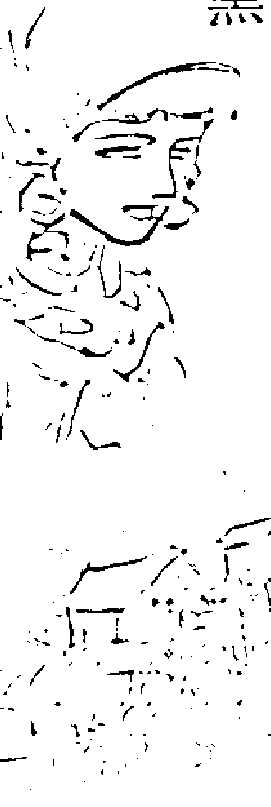
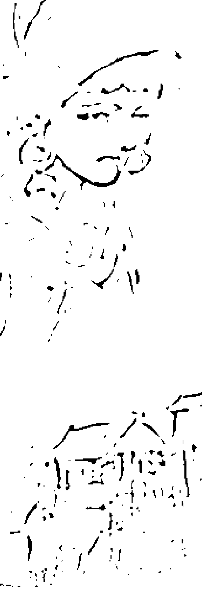
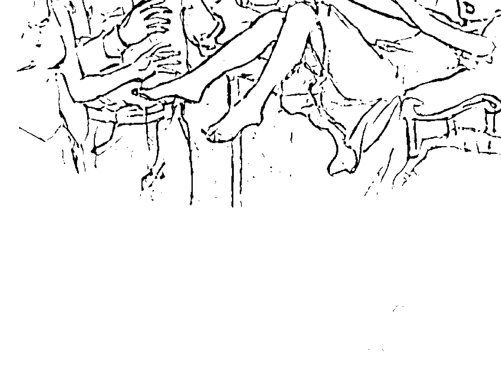
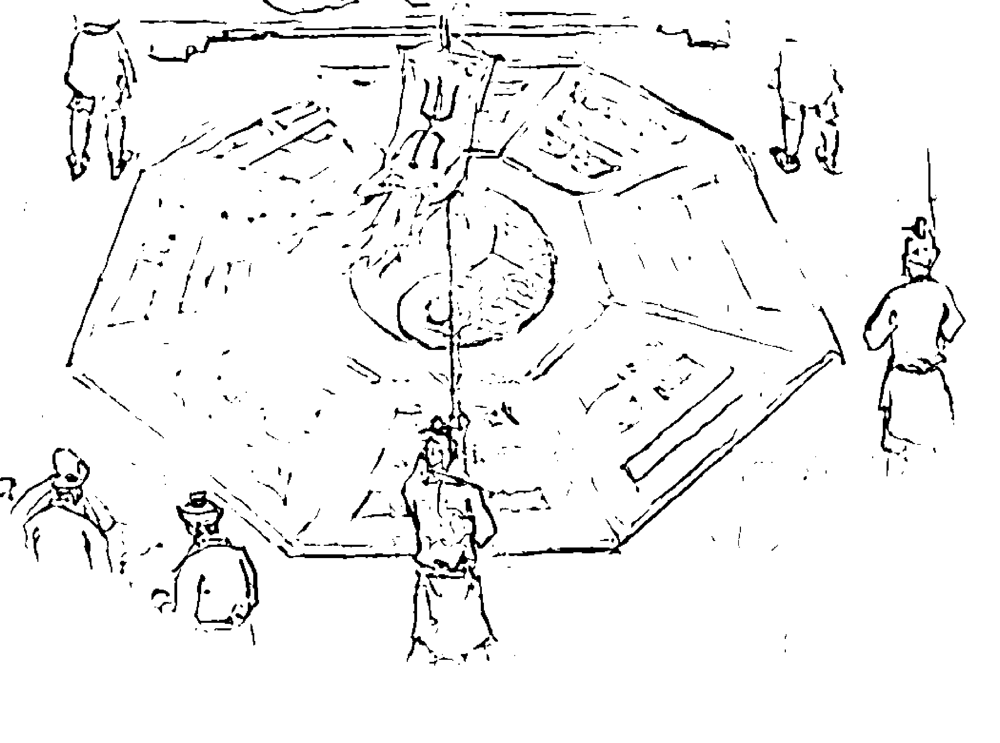
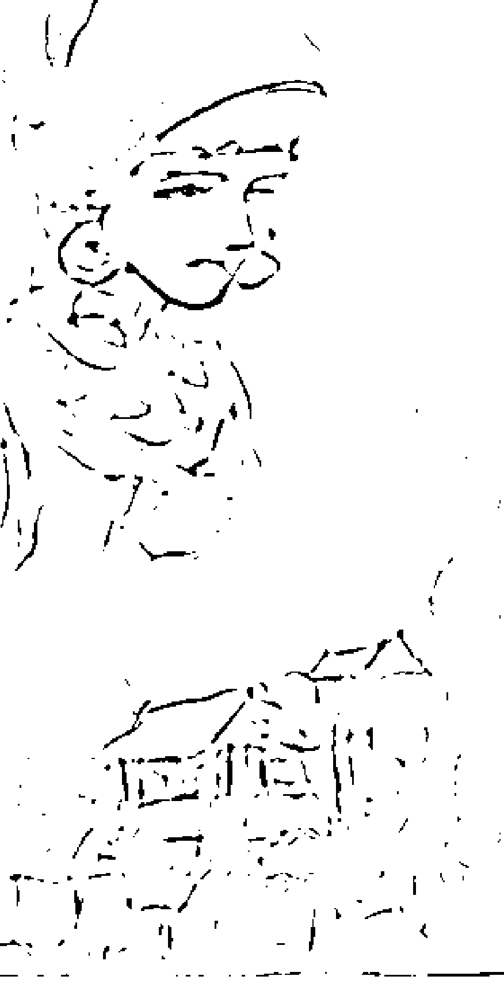
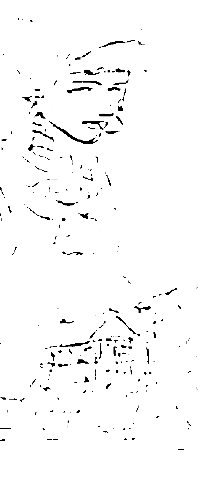
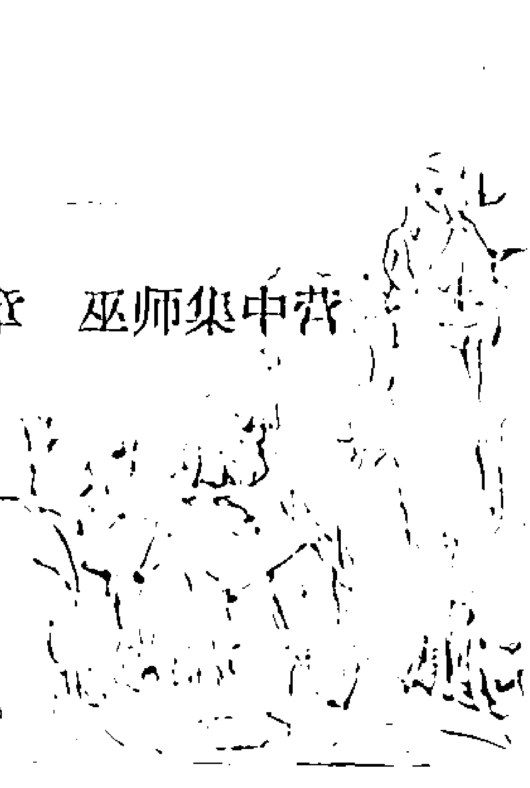

# 不可不读的巫师魔法故事

# 第一章

## 揭开巫师神秘的面纱

巫师是神秘力量的代表，没有人能够真正了解他的起源，即使人类从来没有放弃对巫师起源的探究，也无法真正看清他完整的面容。就连研究者也是众说纷纭，有的观点相同，有的观点相似，有的观点却是截然相反，各种说法交织在一起，使巫师的起源变得更加扑朔迷离。巫师就像宇宙中神秘的黑洞，吸引着无数人的注意力。“一千个读者，就有一千个哈姆雷特”。不管是观点相同还是相反，巫师在人们心中唯一不变的就是他的神秘！我小心翼翼地从历史书籍中翻看巫师走过的痕迹，探寻他们的秘密，希望读者随着我的脚步，一起来感受巫师神秘的气息。

# 1. 巫师从何而来

巫师可是个古老的行业，他们是伴随着人类的产生而出现的。中国古代有一个“家为巫史”的时代，那时候人人都扮演着巫师的角色，每个人都会耍两手巫术。这时的巫师还不是专门的职业，想靠它来谋生，根本就没有市场。巫术虽然人人会玩，但是玩得好的毕竟是少数。就像足球，全世界的人都在玩，但是真正能将足球玩出灵性，玩出花样来，还得是人家巴西人。玩巫术也同样如此，比如，巫师甲推测明天的战争一定会胜利，而巫师乙却推测明天的战争肯定失败，结果战争真的败了，于是大家就说巫师乙的巫术灵。也许有人会怀疑说，巫师乙如果是瞎猫碰到了死耗子，凑巧蒙对的呢？那没有办法，谁让人家运气好呢！“学而优则仕”，像巫师乙这样的优秀分子很快就能跻身于统治阶级上层，如果人气够旺，有的还能一跃成为最高领导人。因为当时的部落最高统帅承担着两种职能，一是指挥作战，二是主管宗教事务，所谓“国之大事，在戎与祀”。如果哪位打仗勇猛，而且巫术了得，肯定会成为部落的首领。当巫师成为精英阶层时，专职巫师也就产生了。这时的巫师，不管是在东方还是西方，他们都是原始部落中最聪慧的人物。中国最早的大巫师就是在史书上声名远播的三皇五帝——我们的老祖宗。

黄帝就是巫师当中的顶尖高手，他和另一位大巫师蚩尤之间斗法，真是叫人叹为观止。

黄帝是传说中远古时代华夏民族的共主，五帝之首。相传黄帝姓公孙，出生于轩辕之丘，故号轩辕氏，在姬水生长成人，所以又以姬为姓，后来在有熊建立国家，故又称有熊氏。他以土德为王，土是黄色，所以人称黄帝。在他的统治下，部落里的精神文明和物质文明取得了很高的成就。黄帝发明了历法、天文、阴阳五行、甲子纪年、十二生肖、文字、图画、音律、著书、乐器、占卜、祭祀、棺椁、坟墓、祭鼎、祭坛、祠庙、医药、婚丧等一系列文明成果，为后世所称赞，被誉为华夏的“人文初祖”。

蚩尤是居住在长江流域的九黎族首领，强悍无比，法力超群。他有八十一个兄弟，个个兽身人面，铜头铁臂，擅长制造刀、弓弩等各种各样的兵器。蚩尤作战时能呼风唤雨、制造大雾，常常带领强大的军队，侵略骚扰别人的地盘。

两个人都想争夺最高统治权，大战一触即发。

双方对阵于涿鹿，黄帝不仅带领大队人马，飞禽走兽也前来助战。黄帝先是派大将应龙飞于九天之上，向蚩尤的部队喷水。一时间，洪水肆虐、白浪滔天，蚩尤忙命风伯和雨师上阵。一个刮起满天狂风，一个把应龙喷的水收集起来。同时，两人又大展神威，指引狂风暴雨向黄帝阵中打去。应龙只会喷水、不会收水，结果，黄帝大败而归。第一次斗法，黄帝告败。择日再战，蚩尤施展法术、吞云吐雾，把黄帝和他的军队团团罩住。黄帝的军队辨不清方向，被围困在烟雾中。就在这危急关头，黄帝聪明的脑袋派上了用场，根据北斗七星发明了指南车，带领军队冲出了重围。第二次斗法，黄帝还是输了。这样，黄帝和蚩尤反反复复斗了七十一次法，结果黄帝胜少败多。这一天，黄帝梦见九天玄女传授给他一部兵书，醒来之后，发现手里果真有一本《阳符经》。黄帝按照玄女兵法设置了“天一遁甲”阵，经过多次演练，重新率军与蚩尤决战。为了振奋军威，黄帝用猛兽“夔”的皮做成大鼓，鼓一敲，能声震五百里，连敲几下，能连震三千八百里。黄帝又用牛皮做了八十面大鼓，使得士气大振。黄帝还特意召来女儿女魃助战，女魃是个旱神，专会收云息雨。两军对阵，黄帝下令擂起战鼓，那夔皮鼓和八十面牛皮鼓一响，声音惊天动地。黄帝的兵听到鼓声勇气倍增，蚩尤的兵听见鼓声却失魂落魄。两军厮杀在一起，直杀得山摇地动，风云变色，难解难分。黄帝命令应龙喷水，江河般的水流从上至下喷射而出，蚩尤的军队被冲了个人仰马翻。蚩尤急忙命令风伯和雨师掀起狂风暴雨向黄帝阵中打去。这时，女魃上阵了，她施起法术，刹那间风停雨歇，烈日当空。风伯和雨师无计可施，狼狈而逃。黄帝率军乘胜追击，蚩尤大败而走。最后一战，黄帝大获全胜。这一仗最大的意义在于，它使后世的我们成了“炎黄子孙”，而不是“蚩尤子孙”。黄帝事务繁忙，不可能自己专门从事巫师这个行业，于是他就任命宰相巫彭总管宗教巫术事务，巫彭也就成了中国巫师的祖师爷。巫彭兢兢业业，使中国远古时代的巫术蓬勃发展起来，在他英明的领导下，后世的部落首领都掌握了一手巫术绝活。比如大禹治水时，逢山开道、遇水疏导，引来山妖水怪的强烈不满，想方设法阻挠治水。大禹就向天帝请来金书玉简号召百神一起平定。商汤为了求雨，竟然采用了点火自焚的方式，有人说他这是在装样子，其实不管是出于什么目的，如果他不是大巫师恐怕连这样作秀的机会都没有。

中国的巫师就是在这样的历史背景下产生的，他们带着神秘的痕迹，笼罩着神秘的光环。也许谁也无法说清巫师的真正源头，不过有一点是可以肯定的，当人类面对不可预知的造物主，试图用人的意志来改变时，巫师便应运而生了。我们再把目光转向西方，了解一下西方巫师的起源。

在西方，古希腊时代的荷马最先提到巫术，当时最著名的巫师就是美狄亚。她是希腊神话中最著名的女巫，是太阳神阿波罗的前辈，克尔克斯国王的女儿，阿耳戈英雄伊阿宋的妻子，精通许多巫术。她杀死巨人塔洛丝，谎称可以帮他恢复青春（虽然她有这个能力）；欺骗帕阿斯的女儿把自己的父亲大卸八块；用施过魔法的衣服烧死了伊阿宋的情人。后来她又来到雅典，成为雅典王艾戈司的妻子，她为了保住自己的地位试图毒死王子米休斯，事发后被永远驱逐出了雅典。

在这些西方巫师传说中，同样也带着东方的色彩。在西方一些神话书籍中常常出现“Mage-Clans of the East”，译成中文就是“东方魔法部落”，书中那些拥有神奇法术的东方人成了当时人们心目中的巫师。当时的欧洲人对于未知的东方世界抱有一种奇特荒谬的幻想，巫师就是在这些幻想中逐渐产生的。当《马可·波罗游记》在欧洲发行后，更是加深了西方人对东方的向往，游记中所描述的那些能作法施术的人让他们既向往又恐惧，欧洲人称呼这些神秘的东方人为“巫师”。与东方巫师相比，西方巫师简直就是“小巫见大巫”，他们没有东方巫师呼风唤雨、腾云驾雾的本事，也没有东方巫师完美无瑕的人格，但是他们接近于人，贴近生活，触手可及。同中国巫师一样，西方巫师的起源也带着一层神秘的面纱，刻着神的烙印。

在欧洲历史上，巫师见诸于文字记载始于公元12世纪，当时法国里昂有一个商人叫韦尔多，放着好好的生意不做，整天四处宣扬一种安贫乐道的信仰，就像中国古代的墨子一样，很快就吸引了大批门徒，势力不断壮大。韦尔多生活的时代可不是墨子时期的“百家争鸣”，那时的欧洲正处于天主教的绝对统治之下，想同统治阶级争夺群众，那还了得！不久，韦尔多和他的门徒就被教皇斥为异端。异端的下场无非就是叛变、流放、绞刑和逃亡。在教会和政府的集体围剿下，韦尔多的门徒只好逃入阿尔卑斯山山谷隐居，巫师的故事由此流传开来。

我们将最先出现的巫师称为“史前时代”的巫师，这与文明社会的巫师截然不同，他们整体素质相当高，往往一身兼数职，是一种综合性的人才，他们在作法施术的同时还兼管所有与精神文化生活有关的事务。

这些最早脱离物质生产领域的巫师实际上就是最早的一批知识分子。他们引领了当时文化的主流，理所当然地成为掌管宗教、巫术、天文历法、医药和文字记录的综合性人才。可惜的是，这些以人类精英面目出现的巫师却因后世一些荒谬的传说和一些假巫师的招摇撞骗而沦为世人唾弃的群体，这不能不说是历史的悲剧。

# 2. 巫师到底是何许人也

中国的史学家认为，“巫者舞也，巫者无也，巫者美也，巫者灵也，巫者医也”——这就是中国古代的大巫师。用现在比较通俗的说法就是：中国古代巫师是最善于运用肢体语言的舞蹈家；是沟通天地宇宙的信息学家、天文学家；是带领人类与各种灾难进行斗争的大英雄；是具有丰富想象力的预言家、能用自己生命去感悟上苍传达给人类声音的全能智者；是妙手回春的大医师。如此多的华美称谓，简直让人难以相信这就是人们心目中的巫师。

相比起来，西方巫师的境遇可是相当地糟糕，他们一开始就是以宗教异端身份出现的，第一批巫师是崇拜魔鬼的异端分子韦尔多派，也就是信仰法国里昂商人韦尔多学说的那些人。

第一批巫师到底犯了什么罪？在西方史学家的笔下，我们可以略知一二。这些在教会和政府联合打压之下的异己分子，在火刑和绞架、流放和判刑的种种迫害之下，被迫承认种种罪名，而这些罪名教会事先早就拟定好了——“说你是罪人，你就是罪人；无罪也有罪！”大棒可是掌握在人家手里！法官根据这些莫须有的罪名，判决韦尔多门徒组织了一个为魔鬼效力的宗派。于是韦尔多宗派在教会和法庭的联合杜撰和捏造之下，原本是宣扬安贫乐道的“道家学派”，变成了让人避之不迭的魔鬼学派。关于韦尔多宗派，天主教会对其极尽夸张渲染之能事，他们给自己的想象安上了翅膀，使美女跃然变成了妖怪，而且颇多诙谐韵味，令人叹服。看看天主教派的杰作吧，看过之后，你一定会惊叹：真是思想有多远；他们就能走多远啊！

据说这些门徒前往参加韦尔多集会或巫师集会时，会用一根小木棍沾上特殊的油脂涂在身上，然后把小木棍夹在两腿之间便可腾空而起，以一种喷气式飞机无法企及的速度向前行进。他们在阿拉斯几公里外的一大片原始森林聚会，那里有一个身材高大的魔鬼在等待着他们。这个魔鬼是撒旦的使者，可以化身为山羊、狗、猴或男人。他向聚会者传达撒旦的旨意，强烈地抨击基督教。门徒们必须摒弃基督教，大声咒骂天父耶和华、圣母玛利亚，并践踏十字架，向受难的耶稣像吐口水，最后以一场黑色弥撒结束仪式。弥撒中门徒们把圣体面包喂给癞蛤蟆吃，然后再把这些癞蛤蟆砸成粉末，做成蛊药。巫师利用这种药粉使田地荒芜、人兽死亡，引发风暴并传播瘟疫。

在法官的严刑逼问下，这些匪夷所思的口供就像滔滔黄河水，绵绵不绝，但是当犯人明白自己将被送上火刑架时，都大呼上当，因为曾有人答应他们在忏悔罪恶后便可免于一死。可见西方的巫师，绝对没有中国巫师那么风光，甚至不能归为一类，此巫师非彼巫师也。

回过头来，我们再看看中国的巫师，如果说他是天文学家、领导者、预言家，甚至医生，人们都能够了解，但是说他是个舞蹈天才，恐怕许多人都会丈二和尚摸不着头脑。

其实巫术和舞蹈之间原本就有一种天然的联系。《毛诗序》中曾说，当倾诉、慨叹和歌唱仍不足以宣泄内心的情感时，人们就会不由自主地手舞足蹈起来。巫师是联接人神的使者和拥有法力的非凡人物，为了表现出自己的与众不同，就要进入一种与常人不一样的精神状态中。要表现出这种状态，最佳的途径就是狂歌劲舞。在这个时候，巫师的表演才能全部施展开来，营造出一种神秘的气氛，调动大家的情绪。这时的巫师往往呈现出许多匪夷所思的举动，比如在狂舞中咬牙、翻眼、口吐白沫直至昏厥在地，稍候片刻就爬起来宣称自己已经神灵附体，所说的话就是神灵的旨意。在场的人看到巫师这种反常的举动，都会认为巫师已经达到了“天人合一”的境界。

如果巫师没有表现出种种迷狂状态，不动声色地宣称自己已经神灵附体，是很难让人信服的，巫术效果也会大打折扣,《说文解字》中：“巫,祝也。女能事无形，以舞降神者也。”这段话揭示了古代巫师的基本工作就是以舞降神，离开巫术舞蹈，巫师的其他职能都将无从谈起。

随着历史的发展，中国的巫师也慢慢地走下了神坛，自身的地位也是每况愈下，最终沦为一种迷信的符号，和西方的巫师比起来，半斤八两谁也好不到哪去。黄金时代已经过去了，在科学和理性的照耀下，巫师已经变成了遥远的传奇，只有在文学作品和影视剧中才能回味辉煌的过去。

# 3. 巫师是善还是恶

在中国古代，人们对巫师可是推崇有加。因为巫师都是当时社会的精英分子，所以后人在追忆巫师光辉历程的时候，总不忘捧捧巫师们的臭脚丫，说

# 第一章 揭开巫师神秘的面纱

汉武帝拖住，跪下说道：“陛下不可造次，那是李夫人的魂魄，这不比活人。陛下若到那里，阳气会将阴气冲散，李夫人的魂魄便难以久留。”

汉武帝只得无可奈何地远远盯着“李夫人”的影子，虽然不能握手谈心，但汉武帝的心情总算得到了一点慰藉。

这时汉武帝有感而发，当即作了一首诗吟道：“是耶非耶？立而望之，翩何姗姗其来迟？”

少翁的法术在此时彻底征服了汉武帝，于是汉武帝就拜少翁为文成将军，还赏给他不少黄金。少翁受到汉武帝的宠信，更加卖力地推销他的骗术。他对汉武帝说：“皇上既然想要与神仙往来，可是宫室里却没有神仙用的东西，神仙怎么可能来呢？”

汉武帝于是下令工匠们把皇宫中所有宫殿的殿顶、柱子和墙壁都画上五彩的云头、仙车之类的东西，帷幕和被服上也都绣上神仙的云气。做完了这一切之后，却不见神仙的影子。少翁又建议汉武帝再盖一座专供神仙居住的别墅——甘泉宫。宫殿盖好了之后，还是不见神仙的踪迹。这时汉帝心中可就犯了嘀咕，心里想，不是来骗我的吧？少翁不得不再弄玄虚，以挽回皇帝对自己的信任，他把字写到绢帛上，拌到草料中，让牛吞下。趁着汉武帝到甘泉宫来求仙时，让手下人牵着牛走过。少翁指着牛说：“陛下，这牛的肚子里有天书。”汉武帝当场叫人把那头牛宰了，想看个究竟，果真从牛肚子里发现一条写满字的绢帛。手下的人对少翁的法术赞叹不已，可是汉武帝这时却显得异常冷静，他仔细地观察完帛书后觉得有些不对头。上面的字体和少翁的字体有许多相似之处。

他喝令手下将少翁捆上，自己要亲自审理。还没等用大刑，少翁就全招了。汉武帝恼羞成怒，立即下令将少翁拖出去砍了。

倘若这位“文成将军”不自作聪明，汉武帝恐怕还会把他当作神仙。

东汉后期，神仙方术被道教吸收，不少方士转行做了道士。我们不能否认巫师在医学等领域所作的贡献，可是我们也要清醒地看到巫师装神弄鬼、招摇撞骗、贪财害命的另一面。在《红楼梦》里面，巫师们就有一段精彩的表演：

“贾赦没法，只得请法师到园作法事驱邪逐妖。择吉日先在省亲正殿上铺排起坛场，上供三清圣像，旁设二十八宿并马、赵、温、周四大将，下排三十六天将图像。香花灯烛设满一堂，钟鼓法器排两边，插着五方旗号。道纪司派定四十九位道众的执事，净了一天的坛。三位法官行香取水毕，然后擂起法鼓，法师们俱戴上七星冠，披上九宫八卦的法衣，踏着登云履，手执牙笏，便拜表请圣。又念了一天的消灾驱邪接福的《洞元经》，以后便出榜召将。榜上大书‘太乙混元上清三境灵宝符录演教大法师行文敕令本境诸神到坛听用。’”

那日两府上下爷们仗着法师擒妖，都到园中观看，都说: “好大法令！呼神遣将地闹起来，不管有多少妖怪也唬跑了。” 大家都挤到坛前。只见小道士们将旗幡举起，按定五方站住，伺候法师号令。三位法师，一位手提宝剑拿着法水，一位捧着七星皂旗，一位举着桃木打妖鞭，立在坛前。只听法器一停，上头令牌三下，口中念念有词，那五方旗便团团散布。法师下坛，叫本家领着到各处楼阁殿亭、房廊屋舍、山崖水畔洒了法水，将剑指画了一回，回来连击牌令，将七星旗祭起，众道士将旗幡一聚，接下来用打怪鞭望空打了三下。本家众人都道拿住妖怪，争着要看，及到跟前，并不见有什么形响。只见法师叫众道士拿取瓶罐，将妖收下，加上封条。法师朱笔书符收禁，令人带回在本观塔下镇住，一面撤坛谢将。

贾赦恭敬叩谢了法师。贾蓉等小弟兄背地都笑个不住，说：“这样的大排场，我打量拿着妖怪给我们瞧瞧到底是些什么东西，那里知道是这样收罗，究竟妖怪拿去了没有？”贾珍听见骂道：“胡涂东西，妖怪原是聚则成形，散则成气，如今多少神将在这里，还敢现形吗！无非把这妖气收了，便不作祟，就是法力了。”众人将信将疑，且等不见响动再说。那些下人只知妖怪被擒，疑心去了，便不大惊小怪。往后果然没人提起了。贾珍等病愈复原，都道法师神力。独有一个小子笑说道：“头里那些响动我也不知道，就是跟着大老爷进园这一日，明明是个大公野鸡飞过去了，拴儿吓离了眼，说得活像。我们都替他圆了个谎，大老爷就认真起来。倒瞧了个很热闹的坛场。”众人虽然听见，那里肯信。

在西方，巫师在人们的心里是个彻彻底底的大坏蛋，根本没有平反的可能。我们可以在古希腊和古罗马文学中，找到许多有关巫师的描述。这时女巫的形象可谓千奇百怪。她们有的吸人血，有的诱拐儿童，有的制作毒剂，有的还会变成猫头鹰，有的甚至还能呼风唤雨、兴风作浪。古罗马作家笔下的女巫雏形，是被上帝遗弃了的女人，墓穴是她们的住所，她们用死尸和粪便制成巫宵，用来做坏事。她们残忍凶狠、刁泼疯癫，还会占卜祸福。在战乱、瘟疫和饥荒笼罩下的中世纪，巫师成了人们发泄自己的愤怒和憎恶的替罪羊。13世纪初，西欧教皇集大权于一身，各国的主教都要无条件地服从教皇。英诺森有句名言：“教皇是太阳，皇帝是月亮。”一切都得围着教皇转。教皇专制的结果之一，就是将所有的反对声音斥为异端。最倒霉的反对派都被戴上了巫师的大帽子。如果谁有幸获得如此“殊荣”，那么他离下地狱的日子也就不远了。特别是专门针对巫师的施暴纲领和法律文书《锤击女巫》出版之后，最初对巫师存在之说还抱有怀疑态度的人，也都渐渐地信以为真了。紧接着，告密书犹如雪片纷飞而至。一时间，烈火熊熊、怨声四起，谁都有可能是巫师，谁都有可能是巫师的替罪羊。在持续300年的猎巫风暴中，巫师这个名字让整个欧洲都为之战栗。巫师成了邪恶的代名词。

巫师到底是善还是恶，关键是我们怎么看，就像核技术，用于发电是为人类造福，用于战争就是灾难。

# 第二章 巫师关键字

在《哈利·波特》的影响下，巫师的传说风靡全球，人们对这个古老而又神秘的群体产生了浓厚的兴趣。本章用五大关键词，帮你全方位了解神秘的巫师。

# 1. 奇特相貌

在中国历史上，大凡有成就的人相貌都是非同小可。这并不是说必须人人都得貌赛潘安，关键是你长得要有特点。大家都看过《三国演义》，里面贵为帝王之胄的刘备先生，长得就十分富有特色: 大耳垂肩，双手过膝。如此长相，看耳朵像个弥勒，看双手像个猿猴，简直就是个妖怪。可是人民大众就是能接受，原因之一就是人家长得与众不同。巫师作为神的使者，当然也是非同凡品。中国古代的圣人，有很多都从事过巫师这一行业，周文王被商纣王囚于羑里七年，虽身陷囹圄，但自强不息，将伏羲八卦演绎成六十四卦、三百八十四爻，遂成《周易》，用来推演宇宙、社会和人生。孔子的偶像周公，也就是文王的儿子，占卜技术也十分了得，占卜算卦者都视周公为其鼻祖。

对于巫师的相貌，可以在荀子描绘的圣人相貌中找到蛛丝马迹。荀子是个刻薄的老先生，是中国早期反对巫师和巫术的急先锋。他认为，“列星随旋，日月递，四时代御，阴阳大化. 风雨博施，万物各得其和以生，各得其养以成，不见其事而见其功，夫是之谓神；皆知其所以成，莫知其无形，是之谓天”，他还提出“人定胜天”的思想，在与天斗、与地斗、与其他学者斗的战斗中探求人生无穷的乐趣。

在荀子眼里，所谓的圣人都是些歪瓜裂枣的家伙，大禹腿有问题，走路一跳一跳的；皋陶长着一张泛着青绿色的脸，怎么石怎么像营养不良；周公身体孱弱，像个小老头，风一吹就会折断；孔子长得像天生戴了个面具；最夸张的是舜，眼睛里有两个瞳仁。

我们姑且不去追究荀子说得对与错，不过从这些圣人的相貌中大致可以推断出巫师长得是多么难看。有许多巫师都是身体不健全的人，他们不能从事正常的生产和军事活动，只能以通神作法作为谋生的手段。“上帝是公平的，为你关上一扇门的同时，也会为你打开一扇窗”，这些相貌丑陋、长相奇特的人在别的方面也得到了弥补。比如聋哑人一般嗅觉灵敏，盲人大多听力敏锐……故此，人们觉得长得奇形怪状的人往往天赋异禀，可以上通鬼神，天人合一。丑，成了资本与财富。

换个角度来看，巫师奇特的相貌，更容易对人们产生威慑力，作起法来或者念起咒来更容易让人心惊胆寒。不过每个人都是两只眼睛、一个嘴，天生奇形怪状的人毕竟是少数。于是巫师们就动了心思，如何让自己变得更加丑陋，就成了巫师们急待解决的大问题。想变丑，怎么着也不能毁容啊，经过不断研究、反复实验，巫师们最终发明了面具。面具的出现让巫师的外貌变得更加奇特和神秘了。巫师们在面具上描绘出各种猛兽的图案，戴上之后显得异常狰狞可怕。有的巫师使用青铜面具，有的巫师由于日子紧巴，就弄几个皮质或木质的面具。

有些巫师只是逢年过节祭个祀，天灾人祸占个卜；有些却在民间大搞封建迷信，弄点小钱补贴家用。在经济利益的驱动下，这些巫师还对巫术仪式进行了改革，他们带上面具，有时为了让出钱的人开心，还会随意表演一些曲艺节目。这种娱乐大众的方式，使巫师的形象传播到了更为广阔的地区，进一步增强了在人们心目中的印象：巫师，真的好丑！

中国的巫师长得有些对不起观众，外国的巫师更是如此，甚至有过之而无不及。

在欧洲的一般人眼里，巫师是居住在沼泽地带中的一类穿着黑色斗篷的神秘人物，长期躲在黑暗潮湿的小屋中，进行种种神秘的研究工作。他们面颊苍白、形同骸骨，熬夜和过度的思索搞垮了他们的身体，使他们不堪一击。但他们掌握着各种神秘奇异的法术，代表着邪恶与噩梦的神灵。特别是女巫的形象，更是让人心生畏惧。

提到女巫，人们的脑海里肯定会浮现出这样一个形象：一个满脸皱纹的老妇人，长着一副奇丑的面貌，鹰勾鼻子、尖凸的下巴。头上戴着顶巫师特有的尖顶帽，一身英国传统的妇人打扮。

巫师大多数长得很科幻、很抽象，有的甚至能超乎人的想象之外。看一遍《哈利·波特》系列电影，还真没有发现几个相貌英俊的巫师，并且法力越高的巫师长得越是难看，窃以为他们是不是在修炼中不够小心，长期烟熏火燎导致了毁容？当然这是玩笑话，人们觉得巫师是邪恶的象征，相由心生，模样当然也好不到哪里去。20世纪时，一位叫E·爱文斯·皮特卡德的 research 女巫的专家，还总结出了女巫的外貌特征。他认为女巫们通常在出生时就有一些特别的生理记号，例如胎记、体内有异物或阴阳眼。其实这些都是出自他的杜撰。

我们不能断定是巫师想借助于各种物件极力把自己变得更丑，还是我们一直就对巫师抱有成见。总之，巫师从一开始出现，就与“丑、奇特”等词汇结下了不解之缘。

# 2. 繁复行头

如果一个巫师想逃跑，那实在是太困难了。不说别的，单就那一身行头就够累赘了。因为巫师身上的“装备”简直可以与美国大兵的装备相媲美。

美国士兵装备：

- 服装：沙漠三色迷彩服 1.4 公斤。
- 头盔：伞盔改造、1.9 公斤、有防弹功能；夜视镜 0.7 公斤、范围 350 米。
- 防弹背心：加美国旗章。
- 背包：自制突击腰包 20 公斤，装备水、粮食 和弹药。
- 武器：5.5M44.8 公斤，5.5 口径，有效射程 400 米。
- 军靴：DML 黑色绑带鞋 1.9 公斤，全密封防水。
- 其它：DML 枪套，自制头戴式通话器、无线电 ，水壶护膝护肘，自制指南针袋。
- 防毒面具：2 公斤。

一个美国的大兵，身上的装备不下 40 公斤，超强的体力让人惊讶。

不过这些和古代的巫师比起来，可算不得什么。古代巫师身上的行头可比大兵们繁琐多了，以中国贵州侗苗地区巫教傩堂为例，巫师的全套法器为:

竹兵三十六根、竹篙一付、师刀一把、牛角一对、金鞭一根、法衣一套、草鞋一双、油巾一条、包袱一个、雨伞一把、花冠一顶、布袋一口、无名袋一口、醮兜二个，笑三（“三”指极多笑脸）个、神棍一根、铁尺一根、鸣鼓一面、铜锣一面、金牌一个、神印一颗、仙旗一面、傩头一对、小山神一个、神圣若干（画于纸上或布上）、神坛一座。如此之多的行头，也

![img/e4236174a0bfa4be0c48e68cee21e8bf_32_0.png]

# 第二章 巫师关键字

巫师们在人类发展的最初阶段，就开始在自己的身上不遗余力地添加物件，远远看去，就像一个全身挂满工艺品的货郎。

在旧石器时代所描绘的‘鹿角巫师’，在大多数人还只能简单地在身上裹一块兽皮或树叶的时候，人家早已成了‘时尚先锋’。这个男性的巫师，头戴鹿角，双耳被长发覆盖，留着长长的胡须，身上装饰着马尾巴，脖子上还带着一串用兽骨穿起来的项链，肩上披着兽皮，手舞足蹈。这些古巫的装扮都是头上生角的，有的两只角，有的三只角。乍一看，就好像一个头上生角、浑身长着长毛的怪物。

到了人类文明时代，巫师们的装扮更加丰富多彩。

1986年夏天，在中国四川省成都市广汉县三星堆村发现了三千年前蜀人的祭祀坑，在坑中发现了早期的巫师塑像。这尊青铜人像站立在方形基座上，头戴高冠，长发束于冠内。他身躯细长，身穿窄袖紧身长袍，领口部呈V形。长袍前襟在左腋下开启扣合，袍前裾过膝，后裾呈燕尾状。裸露的脚踝各戴一个表面饰方格纹的脚镯，赤足立于台座上。长袍上满饰精美复杂的纹样: 前襟左侧饰两组龙纹，右侧为云雷纹，下部为变形饕餮纹，最下方还有两组并列的倒三角纹。塑像的旁边还有青铜头像、面具和金面罩、金杖等。

这个巫师的塑像，衣着华美，器具、面具、脚镯、龙纹，种种繁复的东西堆积在一起，可见其装备是何等精良。

越到后来，巫师们的行头就越是复杂，它们的实用价值也渐渐被它们的象征意义所取代。有的巫师身披兽皮，有的巫师穿上羽毛做的衣服，有的巫师头上装饰着野鸡翎，还有的甚至将人的骷髅穿起来挂在脖子上，一个个争奇斗艳，只有你想不到的，没有人家做不到的。

西方巫师的装扮和中国巫师比起来丝毫不落下风，他们的住处就像一个神秘大观园，里面塞满奇形怪状的仪器，这些是巫师用来熬制草药和提炼黄金的工具。房间里的桌子上还摆放着一摞摞发黄的历史手稿，这是一堆魔法手稿，圣洁的光晕包围着每一份羊皮纸，纸上既有娟秀的精灵语笔记，也有刚毅的人类书法，不过大多是用一种教会符号堆砌而成，上面笼罩着一层神秘的气息。巫师们就是在这些发黄的历史手稿中寻找历史的踪迹。巫师的房间里还陈列着大量的动植物标本，这是他们用来进行科学研究的。在房间的墙壁上还悬挂着各种植物的根茎，这些是巫师用来熬制草药的原料。在电影描述的一些场景中，他们的房间还会不断传出“咕嘟咕嘟”的响声，那是坩埚和烧瓶中沸腾的酸液发出的声音。水晶球和镜子是巫师房间里的必备之物，巫师用它们来预测未来和祸福。镜子对于女巫来说尤为重要，著名的童话《白雪公主》里面的魔镜就带有浓重的巫术色彩。

巫师的房间里，还少不了一些动物，它们也是巫师行头的一个重要组成部分。这些动物除了我们常见的猫、乌鸦、猫头鹰之外，还有大耳怪、精灵兔、飞天猫等传说中的小精灵。这些动物在常人的眼里，和巫师一样也具有通神的能力，它们或者是巫师的使者，或者是巫师本人的化身。

现代巫师部落里巫师们的行头，你看到后肯定会大跌眼镜。这些“武装到牙齿”的巫师行头，实在是太过简单了，原料易得、造价低廉、根本没有技术含量。可是，别看巫师这一身行头不起眼，威力可是十分厉害。

首先给读者介绍的就是大家耳熟能详的扫帚和木杈。这些家家都有的东西，在普通人的手里只能扫扫地、挑挑干草，可是一放到巫师的手里就变成了无污染、无能耗的交通工具。扫帚一般是女巫的交通工具，男巫想出行，多半乘坐干草权。扫帚和木权虽然不用燃油，可是想让它飞起来，还得费一番功夫。巫师在飞行前要在扫帚和木权的木柄前端涂上精油，这样才会赋予扫帚和木权以灵性，而且使用的精油质量越好，它们的飞行速度也就越快。女巫手中最好的精油取自人类的身体，巫师将人倒挂在树上，在下面点火炙烤，烤出的油脂就是上好的精油，手段十分残忍。

关于女巫骑扫帚飞行的传说，来自公元10世纪西方人勃鲁姆写的《主教会规》。女巫形象在一开始产生的时候，并不乘坐“交通工具”，她们往往会在夜里变成一头猛禽，发出可怖的叫声，飞进房屋里面来吞食婴孩。到了公元8世纪时，在法国卡洛林王朝的一份主教会议纪要里，记载了几个受魔鬼诱惑的妇女，与罗马女神黛安娜一起骑在某些动物背上飞行。这时女巫的交通工具的雏形才初次显现，不过这时出行工具是动物。直到《主教会规》这部书的出现才正式确定了女巫的形象——她们在夜里骑着一把扫帚，从窗子、墙壁或烟囱飞出去参加巫师集会。从此，扫帚就和女巫结下了不解之缘。

第二个出场的是魔法棒，它是巫师的入门装备。魔法棒就像丐帮的打狗棒一样普通，它的原料易得，只要从橡树、竹子、柳树上砍掉一截没有任何幼芽或分枝连接的树枝，利用砂纸打磨到完全光滑即可。即使是这样的木棒，也是威力无穷，它可不是用来打狗的。巫师用它指着目标物，念叨咒语，就能够使房门自动打开，物体悬浮起来，还会让对象在莫名其妙的情况下着火。同时这些魔法棒还能储存巫师的法力。魔法棒一定要妥善保存，在不用的的时候拿一块白色或黑色的蚕丝布把它包好，以免沾染邪恶之气。只有在经过严格的专业培训后，才能使用魔法棒。使用魔法棒的咒语要烂熟于胸，并且发音准确，这样才能发挥它的最大威力。

第三个出场的是水晶球。晶莹剔透、温润素净的水晶球自古以来就被人们视为圣洁之物，它是‘御邪魔、斥鬼神’的吉祥象征。据说，一个人聚精会神地凝视水晶球时，可以看到过去和未来，预知福祸和生死，因为水晶球里隐藏着神灵。巫师们坚信水晶球的玄奥，认为‘神灵隐藏在水晶球内’，他们以拥有一只纯洁润泽的水晶球为荣，所以巫师在作法时，手里往往拿着一只水晶球。在俄国的沙皇时代，皇帝身边有专门用水晶球解读未来的巫师。水晶球能够让巫师们自由地穿梭于灵界中，并以此获得灵力。水晶球与巫师的命运息息相关，巫师们一旦失去了他们的水晶球，往往难逃死亡的厄运。水晶球的大小以双手能包裹住大小为最佳。巫师一边摩擦水晶球，一边开动‘天眼’透视。

第四个出场的是药瓶，它是巫师常用的物品。巫师们除了拥有不可思议的魔法之外，还拥有高超的医术。他们用手中炼制的灵药，救死扶伤。既然发明了‘灵丹妙药’，就少不了盛它们的瓶瓶罐罐，所以药瓶就成了巫师的必备之物，日久天长，这些药瓶也会沾染上巫师的灵气。

最后出场的是神话中经常会提到的‘家养小精灵’，它们是巫师的忠实伴侣。它是英国作家罗琳女士的著作《哈利·波特》系列书籍中出现的名词。家养小精灵是巫师创造出来的，必须世世代代为主人服务。它们承担一切家务，由主人管束，不能随便违抗主人的命令，若违抗就会遭到惩罚。它们以劳动为荣，以自由闲逛为耻，为主人端茶敬酒，洗衣做饭，

聊天解闷。没有工资，没有假日，一切都是无偿劳动。当然，这些家养小精灵里也有怪胎，它们邪恶残酷，一般会被封印在某一特定场所。家养小精灵的说法是没有科学依据的，不过巫师们偶尔养几个变异的小动物寻开心也不是可能的。

# 第二章 巫师关键字

# 3. 另类着装

在电影《哈利·波特》中，巫师们的穿着都是相当简朴，他们成年累月穿着一件拖沓的长袍，你可不要小看这简单的装束，里面可是蕴含着无穷的玄妙。长袍虽简单，可是不同颜色的长袍却代表着不同的含义。

① 金色长袍：太阳神巫师，自由在他们的心目中至高无上，他们特立独行，在各个领域都独占鳌头。

② 蓝色长袍：水系巫师，蓝色是大海的象征，他们是冷静沉着的现实主义者，一般以哲学家的形象出现。

③ 黄色长袍：土系巫师，天生具有缓和矛盾的能力，为人随和，值得信任。

④ 紫色长袍：紫色，是高贵的颜色，穿紫色长袍的巫师是巫师中的贵族。他既有“蓝色”的冷静，又有“红色”的热情，思虑周密、温柔体贴、与人为善，颇受他人青睐。

⑤ 橘色长袍：橘色是热情的象征，穿着这种颜色的巫师性格单纯，个性活泼，具有活力，集体意识很强，往往是巫师队伍里的开心果。

⑥ 红色长袍：血巫师，热情洋溢的一群人，极具正义感，做事坚持到底，决不半途而废。同时也是暴躁和残酷的象征，尤其当遭到背叛的时候。

⑦ 银色长袍：月亮神巫师，是智者的代表，时刻保持清醒的头脑，保持独立的个性。

⑧ 绿色长袍：属于大自然的巫师，充满着协调性，最擅长抚慰人心，总是把爱和温暖悄悄带给大家。

⑨ 源色长袍：星星巫师，冷静与温柔并存的混合体，拥有很强的包容力，美妙的创意层出不穷。

虽然《哈利·波特》把巫师穿着长袍的形象带到了人们的视线中，但这还不是全部。在现实社会中，巫师的服饰比这还要复杂得多，寓意也更加深刻。巫师一向标榜他们是与自然界息息相关的人类，伟大的自然界就是他们战争的同盟，所以他们的衣服常常是由自然界中动物皮毛或羽毛制成。巫师一厢情愿地认为，他们一旦披上自然界生灵的毛皮，在他们施行巫术、寻求帮助的时候，就可以呼风唤雨。美国的巫师用北美野牛皮制作斗篷，颇具牛仔精神；波利尼西亚的巫师用树皮布缝制披风，上面还绣着精美的图案，简直可以称得上是最原始的衣物；塔西提岛和夏威夷巫师的斗篷比这些都要华丽得多，它们以一种稀有鸟类的羽毛作为原材料，精心缝制而成。

可见，巫师们的装束都是寓意深刻的，就像基督教圣徒腰间的麻绳一样富有深意。所以，我们万万不能以貌取人，就像巫师的交通工具——扫帚，看起来平淡无奇，用起来不亚于飞机。

# 4. 神秘咒语

巫师在作法时嘴里念叨的可是些“怪、力、乱、神”的玩意儿，只见他一会儿小声呓语，一会儿高声吟诵，如同一个出色的口技大师。他的语气有时像是在商量请求，有时又像是在怒骂喝斥，他的话在常人的耳里就像来自爪哇国的语言，根本听不懂。这些话究竟具有什么意义也许只有巫师自己清楚，或许他也是随口说出来的，天知道是什么东西！人们越是听不懂越是感觉神秘，巫师也就投其所好，发明的咒语更是让人云山雾绕，摸不着头脑。后来人们开始怀疑了，捣鬼话谁都会说，巫师先生你不会是在胡言乱语吧！没有法子，巫师们只好翻译一段，以此证明他的咒语都是货真价实的，并非是伪劣假冒。在中国道家经典中记载的一篇咒语里，巫师几乎把所有的神兵神将都叫了一遍，按自己的想象请来了各种威力无穷的神灵和三十万神兵，用来震慑小鬼。同时为了向鬼魅显示威力，巫师还常常自称神人或宣称自己在神仙那里学过制鬼法术。

有一则咒语的大概意思是：我为天师祭酒，是天地神灵的使者，身上佩戴着神剑，天兵天将成千上万环绕在我身边，什么鬼魅敢来冒犯我？正经的神仙可以通过，妖魔鬼怪赶紧绕道吧。“急急如律令”，马上走吧，不然我手里的家伙可不是好惹的。

这段话中最引人注目的就是“急急如律令”这几个字，它是中国巫师的通用语，关于这句咒语的来历，十分耐人寻味。古代政府为了有效地管理辽阔的疆域，制定了一整套严密的法律法规，上级在下行公文中常常加上“如律令”等语句，意在赋予文告以不可抗拒的威严，使命令能迅速传达到各地，并强制执行。官府文告的强大威力给巫师们留下了十分深刻的印象，他们非常羡慕这种威力，特别希望自己对鬼怪发号施令时也能像官府文告那样具有不可抗拒的力址，所以就将官府中常见的公文用语引用到咒语中来了。

以上的咒语只不过是巫师咒语中一个小小的组成部分，真正有威力的咒语谁也无法看清它的庐山真面目。巫师的咒语的确具有神秘的魔力，就像传说中的“印第安之咒”一样，让人心生恐惧。

从1840年以来，每隔20年上任的美国总统没有一个能活着走出白宫。关于这个咒语的由来，有着深刻的历史渊源。美国独立后，为占领广阔的西部地区，白人对土著居民印第安人采取了种族灭绝政策，成千上万的印第安人惨遭杀害……为了报仇，一位印第安酋长召集了一群印第安巫师，立下了令美国人谈之色变的咒语：“哈里逊一定不会在总统任期满后活着走出白宫，以后每隔20年当选的总统都将遭此厄运。” 哈里逊听后付之一笑，根本就没有放在心里。这位在1841年竞选成功的美国总统死于小小的感冒。哈里逊的就职典礼在一个寒冷的阴雨天进行，他发表了长达两个小时的演说。不幸的是，他在演说中患了感冒，就是这点小病要了他的命，使他成为美国历史上最先死在任上的总统。1860年林肯成为美国的第16任总统，5年后到剧院看戏时被刺身亡。又过了20年，问鼎白宫的是加菲尔德总统，上任才半年，就被一名芝加哥的律师刺杀在华盛顿特区巴尔的摩市火车站的月台上，两个月后因失血过多而魂归天国。1900年，又一位美国总统——麦金尔，他在出席布法罗举办的泛美博览会时遭到枪击，身中两弹，命丧黄泉……又过20年，哈丁上任，他上任之后，整天提心吊胆，担心被咒语夺命，结果他在1923年8月病故于旧金山。据披露，他是被人毒害致死的。1940年上任的罗斯福打破美国总统任期不得超过两届的惯例第三次人主白宫，最终还是在任期中去世……20世纪60年代，肯尼迪在达拉斯遇刺，壮志未酬身先死。20年后里根又在华盛顿出席盛会时遭到枪击，身中两弹，凶手使用的是带有剧毒爆炸型弹头，却意外没有爆炸，里根也因此幸运地与死神擦身而过，后来他在连任两届后安然无恙地离开了白宫。直到这时，才打破“印第安之咒”。

直到今天依然流传着许多古老而又神秘的咒语，希望有一天，随着科技的发展，人们能够破解出它们的奥秘。

# 5. 多重身份

作为一名出色的巫师，往往具有多重身份，首先他是个预言家、天文学家和文化的传承者；其次，他

们的问话，突然全身抽搐，似乎体内灵魂被抽走了一般，人在一瞬间倒地，口吐白沫，翻出了白眼，然后翻身坐起呈现出恍惚状，装出一副对刚才发生的事情浑然不觉的样子。在这种逼真的表演下，围观者常常会信以为真。《神鬼奇航2：加勒比海盗》中的女巫师，当封印解除之后，头部升起缕缕白烟，身形逐渐变大。电影不免有夸张之处，可是其精彩程度丝毫不逊于中国巫师作法。艺术来源于生活，由此推测，欧洲巫师作法大概也是如此模样，自编自导自演一幕逼真的情景剧，放到现在，绝对是正宗的演技高手。

历史总是向前发展的，随着社会分工的不断扩大，巫师这种一身兼数职的现象不复存在了。可是，有谁会想到，我们现在的天文学家、医生、文艺工作者都是从巫师这个行业里衍生出来的呢？

# 6. 命运多舛

边缘人物的命运总是充满了曲折，当社会向他们敞开一扇小小的窗户，放进一丝自由的空气，他们也许会苟延残喘，甚至还会风靡一时；一旦社会关上了大门，他们就会被打入了十八层地狱。巫师就是这样一个边缘群体，宗教将其划为异端，民众认为他们身上镌刻着魔鬼的痕迹，就这样巫师既不容于天堂，也不容于人间，命运历程也因此充满了坎坷，凝聚着血泪。

中国的巫师，只是在远古的时代风光无限，越到后来，社会地位一天不如一天了。最后沦为“下九流”一类，和媒婆、走卒、小偷、娼妓齐名，可见其命运真是大起大落，令人感慨。从西汉开始，巫师这一形象和一开始产生时相比，早就面目全非了。由于巫师宣扬的大多都是迷信的思想，加上一些假冒伪劣的家伙滥竽充数，使巫师成了“过街的老鼠”。

春秋战国时期，魏国的邺都（今河南安阳）太守西门豹，被派到邺城（今河北省临漳县一带）当县令。他到任后，发现这一带人烟稀少，满目疮痍，就问老百姓询问这是怎么回事。一连问了几十个人，都摇头不敢说。西门豹感到事情很蹊跷，就化装成一位生意人到民间走访。当时正值烈日炎炎，西门豹又饥又渴辗转来到一位农人的家中。看到一位白胡子老者正坐在树荫下长吁短叹，不住地擦拭着眼角的泪水。西门豹走向前去，关切地问道：“老人家，您为何如此难过？” 老人抬头看了他一眼，深深地叹了一口气，低头不语。西门豹说：“我是齐国人，来到此地做买卖，不想这里竟是如此荒凉，这里田地有漳河的水可以灌溉，应该是个好地方啊？” 这时，老人家抬起头来。嘴里恨恨地说：“好地方？都是河伯娶媳妇给闹的。河伯是漳河里的神，年年都
要娶一个漂亮的姑娘，要不给送去，漳河就要发大水，把田地、村庄全淹了。

西门豹仔细一打听，才知道是当地的贪官和巫婆串通起来搞的鬼，老百姓谁都敢怒而不敢言，眼睁睁地看着自己的姑娘被活活地投进水里。西门豹听完老人的控诉，连口水都没有喝，就匆匆地赶回了衙门。

等到“河伯娶媳妇”的这一天，西门豹带领一行人来到了现场。他看见当地的土豪劣绅和装神弄鬼的老巫婆全都来了，就提出要亲自看看河伯的新媳妇长什么样。这时，有几个人将一个哭哭啼啼的女子推到了众人的面前。西门豹看了看，就对巫婆说：“怎么找了个如此难看的丫头？太不像话了，麻烦你去告诉河伯一声，等找到漂亮姑娘再给他娶媳妇！”说完将手一挥，随从们一拥而上，把巫婆一下子扔进了漳河里。接着，西门豹又以派人催问为借口，把巫婆的大徒弟和一个民愤极大的贪官相继扔进漳河。这样一来，那些干坏事的家伙全都吓呆了，一个个跪在地上不住地磕头，求西门豹饶命。从此以后，谁也不敢再提给河伯娶媳妇的事了。

汉代史学家司马迁针对巫术等迷信活动，提出了“究天人之际”和“通古今之变”的鲜明立场。他认为阴阳五行之术，都是巫师们杜撰出来的，以迎合统治者的欢心，而使百姓受害。

三国时代的曹操，对巫术等迷信也深恶痛绝。他看到世人被巫师欺骗，十分痛心。在他任济南相时，看到当地巫师横行，劳民伤财，果断地下令禁止修建庙宇，并捣毁祠庙600多座，以“除奸邪鬼神之事”，结果当地的巫术等迷信活动几乎绝迹。

中国的巫师混得再不好，还有过一段光荣的历史，来慰籍一下自己受伤的心。而西方的巫师连这些聊以自慰的东西都没有，他们在诞生之初就被打上了异端的烙印，日子自然不会好过到哪里去。

在欧洲人的眼中，巫师大多都是撒旦的使者。撒旦原本就是邪恶的化身，作为他的使者，必定会招致天怒人怨。人们把时代的一些弊病都算在撒旦的账上，巫师作为撒旦的帮凶，更好地充当了人们的出气筒。撒旦的存在是虚无缥缈的，巫师却有现实的存在，人们理所当然地把满腔怒火一股脑儿地倾泻到巫师的头上。文学艺术作品中对巫师生动淋漓地刻画，也给巫师的传播提供了深厚的土壤。哥伦比亚的著名作家加西亚·马尔克斯在他的魔幻主义代表作《百年孤独》中大胆地加入了各种巫术内容，营造出一种神秘莫测的氛围。艺术的夸张直接导致巫师的形象被无形地夸大，他们在人们的眼里变得更加难以捉摸。

所谓“木秀于林，风必摧之；堆出于岸，流必湍之；行高于人，众必非之！” 随着巫师的影响力逐渐增大，引来了天主教的嫉妒和憎恨。天主教宣称神甫可以传达上帝的旨意，人们只要在神甫面前表达对上帝的忠诚和请求，上帝就能听得到。神甫能够做到“天人合一”，与之相比，宣称自己是神灵使者的巫师也丝毫不落下风。看到竞争对手的出现，天主教神甫们自然害怕巫师抢了自己的饭碗。但是，他们不敢和巫师们公平竞争，只想一劳永逸地解决掉对手，于是教皇就利用手中的特权，宣布巫师是异端，是魔鬼的化身。就这样一场轰轰烈烈的“猎巫行动”就此展开了。当时的巫师大多都是女性，成千上万的女巫死在断头台之上或葬身于火海之中……这些含冤而死的女巫在人们眼中变得异常狰狞和恐怖。

基督教在一开始还表现出相当的克制，用一种绅士的风度来对待这些异端分子。基督教宣扬的是信民可以直接与耶稣交流，人人都是神灵的使者。这与巫师在表面上并没有什么利害冲突，可是他们的态度却在14世纪中期来了个180度的大转弯，文质彬彬的绅士变成了铁血杀手。基督教会向信民宣布，巫师是魔鬼的帮手，必须将其铲除。

当时的欧洲陷入一片黑暗和血腥之中，整个欧洲大陆大兴捕捉巫师之风，巫师成了不祥之物，人人得而诛之。可是，巫师在西方很多都是想象的产物，很难找出现实中真实的形象。为了能找到现实生活中活生生的例子，教会和民众不遗余力地“创造”出了一些所谓的巫师，就这样许多无辜的人都被扣上了巫师的帽子，成了刀下之鬼。

下面我们就了解一下“巫师工厂”的整个“生产”流程：

| 巫师工厂 |
| --- |
| 厂长 | 教皇 |
| 生产部门 | 宗教裁判所，法庭 |
| 工人 | 神甫、教父、教徒、民众等一切对巫师深恶痛绝的人 |
| 原料来源 | 所有的人，尤其是女性，特别是长相奇特，行动诡秘的人 |
| 生产流程 | ① 用迷信、嫉妒、诬陷、诽谤、恶意中伤等做法，这些做法既不受惩罚也不会遭到排斥，开始了对巫师的怀疑。 |
|       | ② 公众的闲言碎语，风传出大量巫师，希望教会和政府给予干预。 |
|       | ③ 教皇命令各国的君主对巫师进行调查和取证。 |
|       | ④ 根本找不到巫师，法官也不知以什么理由提出起诉。但是，告密者接二连三地向教会和政府陈述他们的怀疑，巫师在他们的陈述中变得邪恶异常。于是教会和政府就认定巫师一定隐藏在群众当中，必须将其揪出来。以此来取悦教皇和政府官员的人越来越多，一个个极尽渲染之能事。 |
|       | ⑤ 政府命令法官将巫师找出并进行审判。法官只得屈从压力。他们先是派一个调查团深入群众，了解情况。这些人员不论他在工作中是何等傲慢和缺乏经验，都得被视为对正义的高度热忱。这种热情在有利可图的情况下会变得更加强烈，调查员除了调查的附加费和津贴之外，还可以在每个被烧死的巫师身上抽取人头费。这些调查员干得相当卖力，因为每找到一名巫师，他们就会赚上一笔钱。 |
|       | ⑥ 如果一个疯子胡言乱语和一些恶毒无聊的谣言针对的是某一个人，那么他将成为一个受害者。 |
|       | ⑦ 法官提出以下两种情况来定罪：他是过着一种邪恶的生活还是一种善良的生活。如果是邪恶的生活，那么他将被认定有罪；如果是过着善良的生活，依旧有罪，因为他在伪装善良。 |
|       | ⑧ 就这样，受害者被关人监狱。法官通过第二次判断找到新的证据：他害怕还是不害怕。如果害怕，是因为他的良心受到了谴责；如果他总是说自己是清白的，是在伪装一副无辜的样子，同样有罪。 |
|       | ⑨ 一旦认定，根本没有翻案的可能，巫师就这样产生了。 |
|       | ⑩ 任何人对他的指控都是不容置疑的，每个人控诉他的证据都是充分和确凿的。这样，他很快就被施以酷刑。这些巫师在被捕的当天就要遭受酷刑也是经常发生的事情。 |

捕捉巫师之风很快就在欧洲大陆蔓延开来，宗教裁判所遍布，火刑架林立，人们苦不堪言，谁都有可能被指认为巫师，恐怖的气息很快蔓延到大洋彼岸的英国。从1480年延续到1780年的迫害“巫师”的恶潮，席卷欧洲300年。一旦被诬为“巫师”，立刻被斩首示众，然后焚烧尸体，刀下冤鬼多得难以计数。这是欧洲中世纪历史以及人类文明史上最黑暗的一章。

这300年的历史被为“The Burning Time”，意思是焚烧巫师的时代。官方统计大约有数十万人在这场浩劫中丧命，死亡的确切数字谁也无法知晓。让人奇怪的是，在这次规模宏大的猎巫行动中，被猎杀的男巫数量明显少于女巫，关于这一点我们在女巫章节中会详细介绍。

大屠杀结束后，在欧洲的文艺复兴时期，巫师的命运有了一些改善，但好运仅限于以男性为主的巫师。男巫成为了饱学之士，他们有的成了医生，有的成了炼金术士。但是女巫的命运相对来说还是比较悲惨，直到现在，女巫在人们的心里都带有邪恶的色彩。

18世纪以后，在科学和理性阳光的照耀下，巫师身上笼罩的神秘光环黯然失色了，沦为一种迷信思想的符号，到了现代社会，巫师除了在魔幻剧和游戏中风靡以外，几乎找不到更多的用武之地。但是，在一些少数民族地区，古老神秘的巫术依然存在，巫师仍是人类的未解之谜。

# 第三章

# 巫师的巫术

在生产力极端落后，科学技术还处在萌芽阶段的时候，人类对大自然还有无穷多的疑问。刮风下雨、闪电风暴、火山地震、生老病死等诸多现象在人类心目中颇具恐怖色彩。为了能够平平安安地过下去，人们一方面顶礼膜拜自然，另一方面也希望通过自己的言行，让大自然顺从人类的意志，于是就产生了一系列试图改变大自然的幻想和行动，这些幻想和行动的具体表现形式之一，就是巫术。

# 1. 中国巫术和西方巫术的分类

巫术到底是什么？从善的角度来说，是一种特异能力；从严肃的科学角度来看，是一种反宗教的迷信行为。“巫师”（sorcier）这个字的法文原意，是指能够经由祭祀或象征的仪式去改变他人命运的人（字首sors在拉丁语中表示“遭遇”或“命运”）。巫师最常见的施法形式是下咒语，于是它便成为“巫术”和“诅咒”两字的同义词。西班牙文和意大利文中表示巫术的词hechiceria和fattura，都蕴含着包藏祸心的意思。从15世纪初期开始，巫术的意义历经演变，更明确地指出巫师们的法力源自魔鬼附身。至少在神学家眼里，巫术是一种反宗教的行为，巫术的施弄者是巫师，他们将撒旦作为顶礼膜拜的对象。中世纪衰落时期的特征之一，就是将撒旦的形象无限夸大，并使这一形象无处不在，并把时代的一切弊病都算在撒旦的头上。可见，巫术在大多数人的心目中，都是充满神秘和邪恶的。

巫术是巫师们得以安身立命的本钱，中国巫师在实施巫术的时候，带有鲜明的东方特色。中国巫术大致可以分为两类：摹仿巫术和接触巫术。

摹仿巫术，顾名思义，是通过某种相似的形象或动作而产生巫术效果。扎小人就是最常见的摹仿巫术。如果憎恨某人，就做成人形玩偶，在上面写上这个人的生辰八字，余下的步骤就悉听尊便了，可以拿火烧，可以扔进水中，还可以针刺刀砍，怎样解气就怎样做，被诅咒的人便会相应地有所反应，从而达到复仇的目的。这种巫术在我国西汉时期就盛行一时，危害巨大，还发生了著名的“巫蛊之祸”。所谓的“巫蛊”，通俗一点说，就是有人做了个小布娃娃，上面写了仇人的名字，每天拿针扎它，用来诅咒仇人，七七四十九天之后，仇人就要遭殃啦！这看起来相当荒谬，如果此法有效，就不用行军打仗了，直接做一个布娃娃，写上敌国元首的生辰八字，全国人们一人一针，便能决胜于千里之外。可是，这个法子除了排泄自己的一点愤怒和郁闷之外，根本毫无用处。可是，英明神武的汉武帝偏偏就信这个，于是乎，悲剧产生了。

话说征和元年（公元前92年）的一个冬天，汉武帝由于天气寒冷没有四处巡幸，闲居在建章宫中。这时他年事已高，老眼昏花，恍惚中看见一个身材魁梧的男子，手拿一把利剑直闯宫门。汉武帝吓了一跳，急呼左右期门羽林速速护驾。左右四处查看，并无刺客踪影，大家都认为是皇帝一时的错觉。可是汉武帝却坚持认为有刺客进入。左右卫士无奈，又在皇宫中展开严密的大搜捕，结果还是一无所获。汉武帝仍不肯罢休，他又命关闭长安所有城门，挨家挨户搜查，闹得满城风雨，依旧找不到刺客，最后只好不了了之。可是宫门的守卫官却难逃厄运，糊里糊涂地掉了脑袋。

此结局让汉武帝横生怪念。他心中暗想，我明明看见有人带剑闯宫，怎么如此细密的搜捕，却没有刺客的形影？莫非是妖魔鬼怪不成？汉武帝积疑生嫌，于是闹出一场巫蛊重案，其祸害遍及深宫。

当时京城巫蛊术十分盛行，这种巫蛊术，也传进了皇宫。那些怨恨皇帝、皇后和其他人的美人、宫女，也纷纷埋藏木头人，偷偷地诅咒起来。

汉武帝对这一套很迷信。他认为那个持剑闯宫的男子是巫蛊所致，于是派江充去追查。江充是一个心狠手辣的家伙，他找了不少心腹，到处发掘木头人，并且还用烧红了的铁器钳人、烙人，强迫人们招供。不管是谁，只要被江充扣上“诅咒皇帝”的罪名，就不能活命。没过多少日子，他就诛杀了好几万人。在这场惨案中，丞相公孙贺一家，还有卫皇后的女儿阳石公主、诸邑公主，都被汉武帝斩杀了。江充见汉武帝居然可以对自己的亲生女儿下毒手，就更加放心大胆地为所欲为。他让巫师对汉武帝说：“皇宫里有人诅咒皇上，蛊气很重，若不把那些木头人挖出来，皇上的病就好不了。”

于是，汉武帝就委派江充带着一大批人到皇宫里来发掘木头人。他们先从后宫开始，一直搜查到卫皇后和太子刘据的住室，屋里屋外都给挖遍了，都没找到一块木头。为了陷害太子刘据，江充把事先准备好的木头人拿出来大肆宣扬说：“在太子宫里挖掘出来的木头人最多，还发现了太子书写的帛书，上面写着诅咒皇上的话。我们应该马上奏明皇上，办他的死罪。”

刘据被逼得走投无路，只好让一个心腹装扮成汉武帝派来的使者，把江充等人监押起来，借口江充谋反，命武士将他斩首示众。

太子刘据还派人通报给卫皇后，调集军队来保卫皇宫。这时宦官苏文逃了出去，向汉武帝报告说太子刘据起兵造反了。汉武帝信以为真，调兵与太子的军队展开了战斗。双方在城里混战了四五天，死伤了好几万人，大街上到处都是尸体和血渍。结果，刘据战败，自杀而死。

后来，汉武帝派人调查，才知道卫皇后和太子刘据根本没有埋过木头人，这一切都是江充陷害的。在这场祸乱中，他死了一个太子和两个孙子，又悲伤又后悔。他派人在湖县修建了一座宫殿，叫作“思子宫”，又造了一座高台，叫作“归来

# 中国古代文学家屈原的《招魂》诗中找到。

上帝命令巫阳说：“有人在下界，但他的魂魄已经离散，你占卦将灵魂还给他。” 巫阳于是就到人间招魂。他跳起招魂的舞蹈，嘴里唱道：

“魂啊回来吧！何必离开你的躯体，四处乱跑？外面的世界可是凶险万分，有个三长两短可就麻烦了！”

“魂啊回来吧！东方不能寄居。那里的巨人身高千丈，等着搜你的魂魄。十个太阳轮番照射，石头都会被烤焦。”

“魂啊回来吧！南方不可以栖止。那里的野人额上刻花纹长着黑牙齿，专门吃人肉，还把人的骨头砸碎，那里毒蛇如草一样丛集，大狐狸到处都是，雄虺蛇长着九个脑袋。”

“魂啊回来吧！西方流沙千里，沙土能把人烤焦。那里的红蚂蚁大得像巨象，黑蜂儿大得像葫芦。”

“魂啊回来吧！北方是层层冰封的雪山，大雪纷飞，寒风刺骨。”

“魂啊回来吧！你不要独自上天。九重天的宫门都守着虎豹，还有个一身九头的妖怪，专门吃私自上天的灵魂。”

“魂啊回来吧！你不要下到幽冥王国。那里有三只眼睛的虎头怪，身体像牛一样壮硕，这个怪物特别喜欢吃人。”

“魂啊回来吧！快进入楚国郢都的修门。 招魂的巫师引导君王，背向前方倒退着一路先行。秦国的篝笼、齐国的丝带，还有做盖头的郑国丝绵织品。回来吧，返回故居别再背井离乡。”

“魂啊回来吧！家里有高大的房屋，翡翠珠宝镶嵌被褥，灿烂生辉艳丽动人。细软的丝绸悬垂壁间，罗纱帐子张设在中庭。宫室中布满了奇珍

异宝，花容月貌的女子轮流来陪伴你，美酒佳肴任你品尝。丰盛的酒席还未撤去，舞女和乐队就要罗列登场。郑国卫国的妖娆女子，纷至沓来排列堂上。酣饮香醇美酒尽情欢笑，也让先祖故旧心旷神怡。魂啊回来吧！快快返回故里吧。

巫阳一番招魂的表白，真是威逼利诱，手段齐全啊！凡是哄骗、利诱、恐吓等平日对人有用的手段，都可派上用场，其目的无非是使失去的魂尽快返回。文章中，巫师先是恐吓，用种种可怕的事物进行威胁，让灵魂觉得自己已经是上天无路，人地无门了，只能乖乖地回来；然后开始进行利益诱导，有高堂华屋、有美酒佳肴、有婀娜多姿的美女，还有优美的舞蹈和动听的音乐在等你归来呢！灵魂看到这些，怎能不怦然心动？

活人魂魄出窍，巫师可以招魂；阴阳两界的人希望再见一面，巫师也可以做到。前文所说的巫师少翁为汉武帝妃子不就招过魂吗？当然，与其说那是神秘的巫术，不如说那是高明的骗术。可是，在科学没有给出合理的解释之前，一切都是神秘的。有些东西现在看来平淡无奇，在当时可是不同凡响。就像现在的自行车，放在清朝末年，那可是了不起的东西。老百姓也许会认为，这个只有两个轮子的玩意儿，一定是被施了魔法，不然怎能到处跑，却不倒呢？巫术也是如此，找出根源的就是骗术，没有找出的依旧神秘。

科学的发展史告诉我们，科学与迷信是一对孪生兄弟，任何科学一旦偏离轨道就会变成“迷信”。我们所崇尚的科学一方面在消灭旧迷信，另一方面也在制造着新的“迷信”。那种认为科学越发达，巫术就越少的观点是错误的，未来不会只有科学而无迷信，也不会只有迷信而无科学。一

# 第三章 巫师的巫术

宋代一个叫薛君亮的巫师创造了一种在现在看来也十分高明的追魂术，他事先根据人们的描述画出死者轮廓并制成人像，再用放大镜将人像透射到烟雾缭绕的墙壁上或白纸上，这时慢慢地举起人像，“亡魂”就从案下冉冉升起，一时间，真假难辨。古代埃及的祭司们也常常在寺庙中把神像反射到白色烟雾上。他们用一面不断晃动的幕布作活动屏幕，用镜子把预先制作好的人像透射到烟雾上，便可产生出一个人体或一张人脸在活动的景象。在卡利奥斯特罗（18世纪意大利大巫师）时代不再使用镜子，改成了幻灯。

魂魄是否真的存在，我们谁也无法断定。虽然现在证实了大多数招魂术都是骗术，但是在东方举行招魂术，却代表着生者对死者无尽的爱戴和怀念，人们宁愿相信，亲人的灵魂真的回来过。有人说，半夜十二点的时候，在镜子里可以看到自己的灵魂。如果你看到它，就好好问问：如果有一天它走丢了，会不会真的回来？

## 3. 最黑暗的巫术——死灵术

死灵术是所有黑巫术中最邪恶的一种，它可以通过与亡灵世界沟通来占卜吉凶。这种巫术的历史源远流长，在古代的希腊和波斯地区就有许多死灵巫师。

死灵术可以分为两个流派：死灵派和死尸派。死灵派通常以开坛和符咒来召唤和控制鬼魂；死尸派则通过盗墓、掘尸实施回魂之法，从中获得所需的恐怖力量，二者都属于黑魔法。

死灵术同时也是让人极端反感厌恶的歪门邪道。想想也是，死灵巫师们冒天下之大不韪去挖坟掘尸，拿死人来当试验品，谁能看得过去？人家已经寿终正寝了，好好地躺在棺材里，你非要把人家给召回来，这不是没事找事吗？可是有的巫师偏偏就喜欢研究这个，有的还成了专家。历史上最伟大的死灵师是16世纪英国的约翰·帝依和他的助手爱德伍德·凯尔雷。关于他们作法的过程还有一段精彩的描述：

黑夜中的墓地充满了朦胧与诡秘，那高高耸立的石碑，那寒风中沙沙作响的树叶，还有那突然响起的猫头鹰的尖叫，这一切都让人心惊胆战。一群身披黑色斗篷的巫师像一群幽灵鱼贯而入. 他们的脸在火把的照耀下，就像死鱼的肚子，泛着死一般的白光。

他们来到墓地中央，死灵巫师约翰·帝依吩咐他们将死去不久的几个死尸从墓地里挖出来。这些死灵巫师刨开坟墓，把棺材从坟墓中抬了出来。一共有五具棺材，它们一字排开，空气里散发出一股浓重的霉味和油漆味，弥漫着死亡的气息。巫师们在棺材四周分散排开，伸出手牢牢地
把住了棺材盖。爱德伍德·凯尔雷深吸一口气，对其他助手使了个眼色，然后使劲向上一抬，“砰”的一声，棺材盖被掀开了，几根长钉滚到了棺材附近的浮土里……

就这样，他们将死尸依次放在担架上，并在上面蒙上白布。一切准备就绪，仪式开始了：

助手爱德伍德·凯尔雷举着火把站在约翰·帝依身边，其余的巫师围在四周。约翰·帝依站在墓地里，手持权仗念动咒语。在火光中可以清楚地看到一具刚刚被召唤的死灵在白布中颤抖着……而另外那些巫师则在周围暗吟着保护自己的咒语……

挖坟掘墓的行为在人们的眼里，绝对是一个恐怖和邪恶的字眼，人们对掘墓者的讨厌程度，甚至比盗墓者还要深恶痛绝。因为这些人是亵渎自己祖先的十恶不赦之徒，所以要“斩立决”。为什么死灵巫师们会对这个让人万分痛恨的勾当趋之若鹜呢？其中一个重要的原因就是利益的驱动。人为财死，鸟为食亡，死灵巫师们也得养家糊口。可是，我们不能把死灵巫师简单地等同于盗墓贼，那些陪葬品在死灵巫师眼里根本不算什么，死灵巫师真正需要的是死者口中的宝藏秘密。一直以来，人们都认为死者的阴灵无所不知、无所不晓，于是有人就想从死者的口中得知宝藏的位置，而死灵巫师恰恰就有支配死者灵魂的能力，所以，一些利欲熏心的死灵巫师最先打起了死人的主意。传说人在死后的--年之内，灵魂还在墓地中游荡，此时的灵魂依旧残存着人间的烟火气，并非是全知全能的。死灵巫师们通常选择在人死亡12个月后才举行召唤仪式。这并不是说，死者死得越久，尸体就越好。年代越久的尸体腐烂的程度就越严重，这时的死灵不仅不能清晰地回答问题，还会招来怨气。所以，死灵巫师们在选择死灵时往往十分慎重。地下的宝藏毕竟是有限的，再加上政府对盗墓者从不手软，使盗墓充满了风险。于是，死灵巫师们又开发了新的“顾客群”，就是那些想利用死者进行复仇的人。死灵巫师召唤死灵或者尸体替人复仇，从中收取费用。关于死灵巫师们是如何操纵死灵的，我们可以从故事中找到答案——

旷野漆黑一团，风就像一只饥饿的猎鹰，不停地徘徊着寻找食物，吹得树叶沙沙作响，树林中猫头鹰呜呜的低叫声，紧随其后的是震耳欲聋的雷声……

黑色灵车飞驰着，穿破浓浓的夜色，如破浪而行的妖兽，在车后翻卷涌动，发出沉重的撞击声。恐怖的黑，一寸一寸地逼近，一点一点地吞噬着乔治的视线，他试图找到一点生命的声音，却只听到自己加剧的心跳，扑通、扑通……

灵车突然颠簸了一下，车厢拐角处划过一道诡异的光痕，仿佛向着夜色打开的一只瞳孔。乔治不由得颤抖一下，坐在他身边的白袍老人却失望地叹了一口气。

“我真怀疑是不是自己看错了人？”老人一边紧紧抓着马的缰绳，一边喃喃自语，“启程前还豪情万丈，还没走出多远，怎么就变成孬种了？我小时候和黑衣死灵师运送死灵的时候，也没有像你这么害怕过。”

乔治将头扭过去，死死盯着车厢。车厢安放着一具黑色的棺材，棺身是红木的，上面刻着精美的花纹，被两条很粗的锁链交叉着固定在车厢上。整个棺材散发着阴冷恐怖的气息，却又是那样的神秘。

"再有一个时辰，就到子时了，" 老人继续说道，"不管怎么样，今晚是我最后一次驾驶灵车，我希望你像个真正的死灵师那样，陪我走完最后一程。"

乔治回过头，不敢直视老人的眼睛："下一次，我单独一个人驾驶灵车？"

白袍老人不耐烦地摇摇头："这没有什么，不就是一具棺材吗？只要灵车穿过沼泽就能到达原始森林，大巫师和护法使者将在那里等待……"

"大巫师对死灵魔法仪式的要求非常严格，举行仪式的地点十分隐蔽，常常选择一些荒废的地下室、废墟或者人迹罕至的原始森林。一旦决定了仪式的地点和时间，死灵师们就在地上画一些同心圆和奇怪的符号，并冠以神圣的称谓。你可不要小看这些圆圈，它们都是被魔力诅咒过的。死灵师手里拿着法杖，施展法术召唤鬼魂。大巫师在棺材前，诵读羊皮卷上神秘的咒语，其他的死灵师围在四周，手持法杖进行护法。这时死灵就会从棺材里飘然出现，嘴里念叨着邪恶的咒语并发出恐怖的尖叫，以此来恐吓死灵师；有时死灵还会幻化成凶猛的野兽，张牙舞爪扑向死灵师们。如果死灵师们沉得住气，就会制服死灵。当死灵臣服于死灵师脚下的时候，就会变成裸体的幽灵，对死灵师言听计从。仪式结束之后，死灵消失，死灵师则把死尸用生石灰烧掉。整个仪式都是极其恐怖的，只要是一点点失误都会导致死灵师魂飞魄散……"

乔治思考着书上关于死灵仪式的记载，书中的这些情景就要在今天晚上变为现实了，想到这他心里竟有一种莫名的兴奋。

"小子，想什么呢？注意看好棺材，要是死灵出来的话，你的小命可
就玩完了！

乔治又看了看那巨大的棺材，颤声问道：“车里真是死灵吗？它们……它们……”

老人忽然变得很温和，转身看了他一眼，目光回转时，扫了扫身后的车厢，风趣地说：“只有一个，我们的棺材太小了，呵呵……”老人摸了摸胡须，继续说道：“你要驾驶这辆车从得比郡出发，像今天一样，穿过漆黑的旷野，进入原始森林。”老人仿佛在喃喃自语，“每年，大巫师都要处决13个邪恶的死灵——彻底将它们消灭，不留一丝痕迹，仿佛他们从来没有存在过一样，就像我们做过的一场恶梦。每年都要13场相同的恶梦，我真是受够了……”

乔治低声问道：“它们犯了什么罪？”

“什么罪？它们罪行累累，令人发指。杀人、偷盗、奸淫、凡是人能干出的勾当，它们都会干得很好！呸，这些邪恶的畜生！这就是他们干的好事……”老人提高了声音。”

乔治呆呆思索着，眉头越皱越紧。

老人一阵爽朗的笑声打断了他的思绪：“你看看我，一说到这样的事就像一个冲动的孩子，没吓着你吧？就当是我讲了一个笑话，没什么好怕的，你看，黑夜多安静啊！”

这时，一道闪电划破了夜空，紧接着传出一声震耳的霹雳。

乔治苦涩地笑了笑，说“您可真有趣，刚才还说安静呢，现在怎么样，上帝发怒了。”

老人将缰绳用力抖了抖，淡淡地说：“上帝之所以发怒，是因为世间
有这些邪恶的东西！

说着，狠狠地瞪了一眼身后的棺材。“车里的死灵在听我们谈话呢！它可以听见我们的呼吸，在身后的车厢里，随着我们的身体一起颠簸，而且，
在风声减弱的时候，你还可以听见他的喘息声，还有，他的指甲划过板壁的声音，就像一根花刺慢慢地划过你的心脏。

乔治颤抖地说：“它在飘浮吗？像一件……尸衣？”

老人低声说：“没有人知道里面到底是什么样子，只有当护法使者打开棺材时，才会清楚地看到它。如果现在你不幸看到了它，明天躺在棺材里的人就变成了你！”

马车又一次剧烈地颠簸起来，车厢发出轻微的断裂声。乔治蜷缩在老人身旁，冷汗浸透了他的礼服。

老人甩了甩胳膊，笑着说：“傻瓜，那是风声，还有黑暗不断地撞击声。”

乔治呆呆地说：“黑暗的撞击声？黑暗也会像波浪一样撞击岩石吗？”

老人沉声说：“我们‘擒灵使者’是世界上最敏锐、最聪慧的人，所以才会被大巫师选中，押运死灵。我们可以听到黑暗的撞击声，像波涛汹涌的海浪，咆哮着，怒吼着，撕裂了风，撕裂了梦境。”

乔治抓住老人的胳膊，小声哀求：“您别讲了，求您了……”

老人这时暴躁地说：“你真的不应该来！一个堂堂的记者，就像一个只会哭鼻子的娃娃，就像一个只会哭鼻子的娃娃，出发前还要自己驾驶呢，这会儿勇气都哪里去了？”

乔治变得更加惊恐不安，生怕触怒这个老人，如果将他扔在荒野里，会把他吓死。老人低沉地叹息一声：“ 孩子，相信我，你干不了这个工作。也许我太啰嗦了，我有二十年没有跟人好好说过话。二十年，一共二百六十次，我独自一人赶着装有死灵的车前往原始森林，陪伴我的只有黑夜。当我驾着马车狂奔时，黑夜复活了，在我四周追逐，咆哮着、冲撞着。”

该死的！我宁愿这一切只是一场恶梦！

乔治试探着问：“死灵能够逃走吗？”

“大部分都会被绳之以法的，少量的也许会逃走，不过我从来没有出过错。”老人自豪地说。

乔治的身躯剧烈地抖动了一下。

老人继续说：“放心，车厢被大巫师施了厉害的符咒，除了极厉害的死灵，一般的都无法冲破符咒。”

老人看了他一眼，接着说：“不用害怕，这些逃脱的死灵不会加害我们的，它会去找它们的老东家——利用死灵为非作歹的死灵师算账，将这些死灵师变成它们的同类。上帝与我们同在，除了自身的恐惧以外，没有什么邪恶力量能够侵害到我们。”

听到这里，乔治深深地舒了一口气。

这时，马车驶进了原始森林……

死灵师并不都是邪恶的，故事中大巫师和他的助手们，还有押运死灵的白袍老人，就是正义的死灵师。他们对为非作歹的死灵深恶痛绝，并四处捉拿作恶的死灵。有的死灵师相当仁慈，从事的工作也很高尚，其中“教堂派死灵师”最让人称道。他们将召唤死灵用于正义的目的，对死灵比较尊重，在墓地召唤过死灵之后，会礼貌地送走它们，让它们皈依“神的国度”。

除了上面所提到的教堂派死灵师，其他的死灵师在人们眼里都是邪恶和黑暗的象征。一方面是因为他们将死灵用于邪恶的目的，召唤的仪式十分恐怖；另一方面是因为死灵师以死尸作为施法的原料。死灵师对凶死的尸体有着浓厚的兴趣，他们认为这样的尸体背负着怨气，“执念力无穷”。

一些死相难看，怀恨而死的人往往是死灵师们的心头大爱。如果一个巫师四处挖坟掘墓寻找这种类型的尸体，谁能受得了？16世纪的宗教审判官保罗斯·格瑞兰迪俄斯曾经说过：“死灵师用一些烧焦了的死尸碎片，尤其是那些吊死和受辱而死的人。用小块指甲或牙齿

# 第三章 巫师的巫术

英子种超脱凡俗的气质，是远近闻名的大美人。高贵的气质可不是谁都有的，二黑这几年一直在外面摸爬滚打，也没少接触过女人，他深知女人的美，都在气质上呢。山寨里的姑娘个个长得水灵灵的，可就是没气质，每天光着脚板下河打鱼，蜷曲在灶前生火做饭，要多俗气有多俗气。可人家英子就不，每天穿着洁白的裙子去学堂，回来放牛的时候还不忘捧着一本书，特别是人家那婀娜的身段，就像是电影明星。

如今，二黑来提亲了。英子的爹乐得合不上嘴了，心想，女子无才便是德，念书有什么用，还不如找个好归宿。他二话没说就答应了下来，二黑当即就拿出一沓钱放到英子爹手里，一共八千八百八十八块，双数，吉利。

英子的心里早就有了意中人，再说了，人家还想念大学呢！这次和她一起考上大学的还有江岸。

江岸是英子的同班同学，家住省城，高高的个子，白净的脸庞，浑身上下都透着一种儒雅的气质。江岸一直都是班里女生心中的白马王子，可是江岸却喜欢从山寨里来的英子。初恋的情愫在两个人心中默默地滋长着，他们在学习上相互帮助和鼓励，最终两人双双考上了大学。在高考结束的那一天，江岸向英子表达自己的爱意，英子也羞红着脸迎上了江岸火辣的目光。初恋话语过于滚烫，一不小心便熨红了彼此的脸颊和心灵。

自从英子爹答应了二黑，家里就不希望英子去读大学了，其实，就算想供英子念书，家里也凑不起这个钱啊！英子的妈也总是说，一个女孩子家读书有啥用，找个好归宿就是天大的造化了。看人家二黑，多大方………

眼看着在这节骨眼上，出了这事，自己没办法读大学就算了，见不到江岸才让英子又恨又急。

江岸已经提前去了学校，现在的英子连个想哭诉的人都没有，只能无奈地看着爹妈给她准备嫁妆。

这时候，二黑不知道为什么，浑身长满了水泡，痒得难受。英子在与小姐妹谈天时，开玩笑说，“我学过放蛊，二黑也不看看自己长的什么熊样，想娶我，做梦去吧！我放了几只蛊在他身上，好好教训他一下，看他还敢不敢娶我。”

这话不知道怎么，就传进了二黑家的耳朵里，二黑妈在寨子里四处宣扬，说英子这个小狐狸精是个放蛊婆，想害死她的宝贝儿子，让乡亲们评评这个理。她也不知从哪里听说了英子和江岸的恋情，向乡亲们添枝加叶说英子不正经，想害死二黑和相好的私奔。二黑爹也赶紧上英子家取消了婚期，并且连彩礼都不敢要回，他害怕那些东西粘上蛊毒。就这样，整个寨子里的人都知道了英子会放蛊。

在苗族地区，如果被诬为有蛊的人家，将备受歧视和凌辱，亲戚朋友都不会与之来往。苗寨的人虽然都没亲眼见过蛊，却都怕得要命，蛊可不是闹着玩的东西。凡是英子到过的地方，很久都没人敢去。寨子里的人如果见了她，赶紧慌忙逃开，就像见了鬼魅。一些人在背后指指点点，挖苦讽刺，说什么人不好当，偏偏学放蛊。还有的人说，别看模样周正，可风骚了，在学堂里专门勾引男人……

英子回到家里，爹妈也是哭天怨地。眼睁睁看着一桩好好的婚事就这样完蛋了，原想托女儿的福，住高楼的梦破了。女儿还莫名其妙地变成了放蛊婆，丢人啊！他们心里难过愤怒，英子的辩解他们根本就听不进去。

英子无奈，只好离开了家，她来到了江岸所在的学校。大学的生活多么美好，可是对英子来说，这一切就是可望不可即的梦。

英子向江岸说起了家乡发生的一切，江岸拥紧了英子，说我不相信你会是放蛊婆，那些都是封建迷信，你是我心里永远的天使。就在那一晚，英子将自己交给了江岸。

英子在大学的超市里找到了一份工作，江岸说他们毕业就结婚，让英子做他最美的新娘。英子家来信说，二黑那身水泡是中了水毒，根本不是中了什么蛊毒，早就在州医院治好了。放蛊婆的阴影在英子心里仿佛已经彻底地消失了。

谁成想天有不测风云，江岸眼看着就要毕业了，却在上课的路上，被飞驰的货车夺去了生命。

江岸是家中的独子，父母都是高级知识分子，他们根本不承认英子和他儿子的恋情，他们一心希望儿子能够出国深造。可是这一切，随着儿子的死，全都化为乌有。江岸的妈妈将愤怒全部都倾泻到了英子的身上。所有的责难都一股脑地冲她而来，“你就是个放蛊婆！”“江岸是你害死的。”“我的儿啊，你怎么认识了这么一个女人啊！

失去了爱人，流言蜚语，不被人理解，英子终于在一个阴雨绵绵的早晨，从楼上跳下。

英子死了，临死前她给家里写了一封简短的信，上面只有六个字——我不是放蛊婆！

历史纪录中最厉害的两种蛊毒是“鬼蛊”和“骨蛊”。中“鬼蛊”的人全身长满绿毛，瞳孔缩小，瞳孔的四周生出许多像血管一样的黑色脉络，犹如一潭死水。别人不能碰，一碰即死。中蛊者哀号七日化脓水而亡。《鹿鼎记》中韦小宝所用的“化骨水”，就有如此功效。中“骨蛊”的人，死相也好不到哪里去，体内犹如万箭穿心，最后全身骨头穿破身体而出。这些都是歹毒至极的黑蛊，但愿这些只是一种传说。

除此之外，蛊术还有两种更为独特的功能，它可以将中蛊者的财产神不知鬼不觉地转移到自己家里，还可以控制中蛊者死后的灵魂。这两个功能最能反映蛊术具有巫术性质的这一特点。

所谓“卤水点豆腐，一物降一物”，再厉害的毒总有化解的方法。蛊毒也不例外，巫师在这个方面可是行家里手。古代的巫师使用灵物和咒语来对付蛊毒，至于功效如何不得而知。常见的治蛊灵物有鼓皮、公鸡、大粪汁等，这些东西，可是巫师们在反复研究、反复实验的基础上发明出来的“灵丹妙药”。

东晋的葛洪在医方中说，“欲知蛊主姓名，取鼓皮，少少烧末，饮病人，病人须臾自当呼蛊主姓名，去即病愈。”可见，小小的鼓皮威力无穷，一旦服下，就能避害远祸。在今天看来，这简直就是胡说八道，可在当时人们却信以为真。只是苦了中蛊者嘴里说出来的那个人，中蛊者一派胡言乱语，自己却不明不白成了“屈死鬼”。

雄鸡在老百姓的眼里可不简单，“雄鸡一唱天下白，妖魔鬼怪消灭光”。雄鸡是治疗蛊疾的专用灵物，至于它如何治疗，巫师自有他的一套说法：鸡能食虫，蛊是虫，所以鸡能治蛊。这是典型的诡辩，可是巫师们还煞有介事地做得有模有样——

巫师左手拎着一只红色的大公鸡，右手拿着刀，来到中蛊者家门前，在离屋檐三步远的地方，停下来高喊三声：“门尉！户丞！”然后将鸡脑袋伸入病人口中，嘴里念动咒语：“某甲病蛊，当令速出，急急如律令！” 念完之后，用刀割破鸡冠，将鸡血滴入苦酒。让病人喝下鸡血酒，便可治愈蛊疾。

提到大粪，也许刚一听到就会反胃，可是，大家别忘了“大粪不是无情物，变成泥土更护花”。再者，它还是无污染的绿色肥料呢！说了这么多的溢美之词也就够了，可是人家巫师先生偏偏不满意，还把它引用到治病救人这一崇高的行业上来。古代的医学家也给巫师们提供了充足的理论依据，药王孙思邈在《千金方》中说，中了蛊毒，“用人屎尖七枚，烧作火色，置水中研之，顿服即愈”。有了理论基础，巫师们的底气就更足了，连药王老先生都说了，用粪汁绝对错不了，甚至还特别交代这个方法相当灵验，千万不要轻视。

毒蛊让人闻之色变，听之胆寒，但也有破解之法，上述内容想必也给了大家很多提示。我们不能完全肯定毒蛊一定存在于这个世界上，但是，大千世界，奥妙无穷，人类未涉足的地方还有无穷大，也许在某个地方就藏着神奇的蛊。

在东南亚一带，盛行着一种很恐怖的巫术，当地人称为‘降头术’，它是一种邪恶的巫术，如果你向当地的人提起，人家立刻对你避之不及。

关于南洋降头术的由来，民间传说是从印度教传来的。当年大唐王朝的玄奘法师到天竺国拜佛求经，历经八十难，终于取得真经。师徒四人腾云驾雾、欢天喜地往回赶，不料这时，观音菩萨掐指一算，还差一难。于是施起法术，师徒四人跌下云端，法力全失，只得步行。辗转来到今天越南境内的通天河，老相识乌龟精愿意驮师徒四人过河，由于忘记了乌龟精曾经千叮咛万嘱咐务必在佛祖面前给美言几句的事，乌龟精恼羞成怒，行到半路潜入河底，想害死唐僧。后来唐僧虽然没被淹死，但所求的经书全部沉入河底，徒弟们入水四处打捞，但也仅取回一部分大乘佛教的‘经’，另外一些小乘佛教的‘谶’，随水流人暹罗，被暹罗人献与暹僧皇，据说这部‘谶’就是现在的降头术。还有一种说法是，这部‘谶’的正本流入云南道教的道士手中，他们因此创立茅山派，茅山的法术和降头术也因此而来。暹罗的降头术，就是从中国的云南传来的。也许有人会问，佛家讲的是慈悲为怀，普渡众生，如此邪恶的法术怎么会出现在经书里呢？其实，这是正常的，‘魔高一尺，道高一丈’，就像核武器，运用得当，可以威慑敌人，保卫和平。

降头术被南洋土著女子掌握后，往往用来惩罚欺骗她们感情的负心汉。那些绣花枕头们，在玩弄完痴情的少女后，编造种种理由脱身而出，自以为很高明，做梦也没有想到自己早就中了‘爱情的毒’。用这种方法惩罚爱情骗子太过残忍，可效果却是立竿见影，大快人心。

还有一种爱情降，初现于苗族。多情的苗女孩害怕被情郎抛弃，所以发明了此降想留住心爱的男人。一旦中降，被降者会毫无理由地爱上施降者，生生死死，朝朝暮暮。就算施降者比猪八戒还要丑陋，在被降者看来都美如天仙。其实，强扭的瓜不甜，既然不能在一起了，好聚好散，各奔前程就好，可是有人就是偏偏想不通。

你是否分得清楚：谁是你最爱的人；谁是最爱你的人；谁是你要共度一生的人。

你最爱的，往往没有选择你；最爱你的，往往不是你最爱的；而最长久的，偏偏不是你最爱也不是最爱你的，只是在最适合的时间出现的那个人。

你，会是别人生命中的第几个人呢？

没有人是故意要变心的，他爱你的时候是真的爱你；可是他不爱你的时候也是真的不爱你了……

如果你不放手，带来的只能是更大的伤……

这是一个风和日丽的下午，小雅走在公园里的碎石路上，看着洁净如水的天空，心里想，要是肖明也一起来该多好啊！肖明是他的男朋友，英俊挺拔、事业有成，可是这段日子他总是忙，小雅想见他一面都很难。每次打电话，肖明都说自己忙着谈生意呢，快要结婚了，不拼命不行的。这样一说，小雅心里甜甜的，不但不生肖明的气，还一再叮嘱他注意身体。小雅在路上漫无边际地走着，心里想着和肖明在一起的分分秒秒，脸上满是幸福。

这时，林荫道的另一面传来一阵熟悉的笑声，“难道是肖明？”小雅一阵狂喜，“不对，还有一个女孩的声音。”

“明明就是肖明的声音，谈生意怎么谈到公园里来了？”

阿赞德人认为，如果是巫师，那么你的巫术物质就会遗传给自己的孩子。不过这种遗传是单系遗传：一个女性巫师的女儿都是巫师，但儿子不是；男性巫师恰恰相反。

阿赞德人就是通过这样的信条来验证谁是巫师的，不过他们只把臭名远扬的巫师的父系近亲看作巫师，并且只是在理论上把这个恶名扩展到巫师的所有族人身上。在他们的眼里，唯一能够证明清白的证据就是剖开嫌疑人的身体，看看到底有没有巫术物质存在。这是一种犯罪的行为，法律不会允许他们这样做；即使这样做了，按照现代的医学理论，他们也不能找到所谓的“巫术物质”，即使这个人是巫师。人们对巫师的深恶痛绝，一旦家族中有人被认定为巫师，其余的人就会想方设法与这个人脱离关系，努力证明“这个巫师是个杂种”。从这里我们能够感受到巫师在阿赞德人中的印象——他们是一群讨厌的人。不过，相对于欧洲大陆风靡一时的“追猎巫师行动”，阿赞德人还是仁慈的，即便他们确定了某人与巫师有遗传关系，也不会轻易处死他。他们会认为这个巫师的后代体内虽然有巫术物质，但是他也可能不使用这些物质。虽然认定你是坏人，只要你别作恶就能性命无忧。

阿赞德人对老年人十分恐惧，他们认为巫术物质会随着寿命的增长而增长。一个巫师越老，他的巫术就越厉害，使用起来就越是肆无忌惮。这些巫师的巫术物质还具有灵魂，可以随时离开肉身，这些灵魂在夜里就像流星一样从空中划过，发出耀眼的亮光。如果是白天，只能发出萤火虫般的微光，这种亮光只有巫师能看见。

英国社会人类学家，曾任牛津大学教授的埃文斯·普里查德（1902—1973），对阿赞德人“巫术”进行研究后得出以下结论：埃文斯·普里查德说，阿赞德人认为有的人拥有一种特殊的东西叫做“巫术物质”，它存在于身体内，可以在尸检时被发现。这种东西可以使他有能力对别人造成伤害。要激发出这些潜在的力量，他必须让另外一个人生病，这时他就成了一个“巫师”。巫师会在夜晚施放“巫术”的能量，这种能量像一道白光穿梭着，偷走受害人身上的器官。埃文斯·普里查德就曾亲眼见到一道白光从自己的房子旁边掠过，落到了邻居家，奇怪的是，第二天早上，那位邻居就病了。埃文斯·普里查德还认为，巫术解释了西方科学思想中认为是“巧合”的东西，即无法解释的东西。对此，我们很难对此给出一个恰当的翻译，巫师却能。埃文斯·普里查德曾经与许多巫术医生详谈，从而知道他们是怎样决定是谁施放了巫术。他相信巫术医生并不是骗子。

阿赞德人对巫术的看法，也许我们会认为他们的观念是可爱的，甚至是可笑的，可是，它的确有自身存在的理由和根源。我们自以为懂得科学，其实依然是一无所知。就像人类自身到底是从哪里来的一样，永远是个谜。“人类一思考，上帝就发笑”，当我们故作聪明地去评价那些古老的信仰时，阿赞德人说不定在瞅着我们呵呵地笑呢！

# 第三章 巫师的巫术

# 第四章 巫师的灵物

巫师手中的灵物都是现实世界中再普通不过的东西，可是在巫师的眼里，它们却拥有着不可思议的魔力。给我们印象最深刻的是风靡全球的《哈利·波特》带给我们的巫师形象，那么我们首先从西方的巫师入手，对巫师手中的灵物作个大盘点。

# 1. 中西方巫师灵物大盘点

西方巫师不仅长相装扮与中国巫师截然不同，就连手中的灵物也极具特色。举一个简单的例子，中国巫师呼风唤雨也好，腾云驾雾也罢，有谁见过中国巫师在作法时手里还拎着个大扫帚的？在中国人的眼里，整天和扫帚为伍的除了家庭主妇，就是环卫工人，谁也不可能想到巫师。可是，就这样简简单单的一把扫帚，如果放在西方，巫师们就能化平凡为神奇，西方巫师的灵物真是不可貌相啊！

# (1) 魔杖

每一位巫师都要拥有一只属于自己的魔杖，魔杖是巫师的必备之物，没有了它，什么法术都不能施展。巫师往往将灵力聚集到魔杖的一端，便能准确地投射出魔力，它可以让物体移动，还能让物体莫名其妙地着火。每一根魔杖都是独一无二的，要是你错用了别人的魔杖，就不会有什么好果子吃。魔杖是巫师武器，就像是侠客手中的剑，既能攻击对方，又能保护自己。魔杖可以用多种材料制成，最古老的魔杖是木质的，也是最常用的。在《哈利·波特》中，哈利使用的魔杖是冬青木制成的，上面有一根凤凰的羽毛，柔软灵活，这在巫师的世界是绝无仅有的现象。

#### （2）扫帚（木杈）

欧洲的巫师们使用的是飞天扫帚，扫帚骑在胯下肯定不怎么舒服，远远比不上现在的飞机。即使是速度上可以和飞机抗衡，可是风吹雨淋地也够人受了。巫师们也不会满足于原始的扫帚，他们也在进行不断地改进，就像影片《哈利·波特》那样，将扫帚由“光轮2000”发展到后来的“火弩箭”。在瑞典的童话故事中，耶稣受难节这一天，巫师要骑着扫帚飞走，向魔鬼效忠。扫帚的速度与激情一次次满足了人们的飞行梦想，成为巫师世界的神来之笔。说到扫帚，不能不说木杈，有人说它是男巫师的飞行工具，不知怎么的，木杈却慢慢地淡出了人们的视线，只剩下扫帚唱独角戏了。

#### （3）水晶球

在很多欧美神话中，巫师都会有一个知晓万物的水晶球。巫师们口里念动咒语，双手摩挲着有魔力的水晶球发功，水晶球里就会显现出各种各样奇妙的景象。巫师之所以具有非凡本领和可怕的能力与水晶球有着很大的关系，但仅有水晶球，没有一个道行高深的巫师，水晶球也不会发挥出威力来，法宝必须在能人手里才能发挥出作用。关于水晶的神奇魔力流传着许多传说，其中有一种传说却真地出现在现实的世界中，给人类带来了一个巨大的谜团，至今还无法解开。它就是关于“水晶头骨”的传说：

在美洲印第安人中间流传着一个古老传说，古时候巫师们留下了13个水晶头骨，它们能说话，会唱歌，像是一部无所不知的天书，又像是一个包罗万象的信息库。在这些水晶头骨里面，隐藏着人类生老病死的玄机，包罗着宇宙万物无穷的奥秘。这个古老的传说还强调，总有一天人们会找到这些水晶头骨，把它们聚集在一起，利用人类的集体智慧，揭开谜底。

这个传说流传了上千年。一直以来，人们都把它当成是一个美丽的神话，没有人知道这些水晶头骨到底是什么。

可是19世纪欧洲的探险家们却对这个传说深信不疑，他们一直没有放弃寻找。功夫不负有心人，1927年，在美丽的英国姑娘安娜生日那天，终于使这个古老的传说变成了现实。

安娜的养父米歇尔·黑吉斯是英国著名的探险家、大英博物馆玛雅研究员，对玛雅文明狂热而痴迷。1924年，米歇尔组织了一支探险队从利物浦出发，横渡大西洋到达中美洲，他心爱的养女安娜也加入到了探险队伍中。探险队在当地玛雅人的帮助下，历尽艰险，用了整整一年的时间，才在热带丛林中，发现了一处被藤蔓和大树淹没了的古代玛雅人的城市遗址。这座废弃的城堡远远高出周围的村庄，它高45.72米，占地约15.5平方公里。城堡里有金字塔、宫殿、城墙、地下室和墓冢，每一处都是用打磨好的白色石头砌成。17岁的安娜对眼前的一切兴奋不已，她小心翼翼地爬上了金字塔顶，正是因为她的好奇心，才使得玛雅人的旷世之谜重见天日。

安娜发现金字塔的裂缝深处有一个东西在闪闪发亮，她大声招呼养父，米歇尔带着探险队员立即赶到这里。他们登上了金字塔顶，在裂缝边刨开了一个小窟窿，安娜只身爬了进去。安娜用了好长时间，才找到这个熠熠发光、犹如人头骨的水晶。

安娜发现的只是水晶头骨的上半部分，米歇尔命令队员们继续挖掘。3个月后，他们在7.62米外的地方找到了水晶头骨的下半部分，两块头骨合在一起，组成了完整的头骨。这个水晶头骨长度是17厘米，宽和高各是12厘米，重5公斤，用一大块完整的水晶雕制而成。它做工精细，依据一个成年女人头颅的形状设计而成。两个眼孔处是两块圆形的水晶，鼻骨用三块水晶拼成，它的下颌部分既可以和头盖骨部分相连，也可以拆开，整个构造巧夺天工。

# (4) 帽子

在我们传统的观念里，骑在扫帚把上飞行的女巫都戴着一顶尖尖的帽子。可不能小看这些帽子，它们十分神奇，会看透人的思想，会说话和唱歌；有的还能避免巫师走上黑巫师的邪恶道路。

# (5) 斗篷

它们是巫师最常用的宝物，披上它巫师可以隐身。斗篷帮助巫师完成了多次带有刺激性的冒险，能使巫师化险为夷。

西方的巫师还紧跟时代步伐发明出了一系列新的灵物，原有的一些过时的灵物也摇身一变，旧瓶装新酒，重新焕发光彩。到了现代，西方的巫师世界里又出现了一些前所未有的灵物：

+   ① “活点地图”，就像人造卫星，可以在地图上随时掌握别人的动向。

+   ② “冥想盆”，能够储存人的记忆，可以向人们讲述往日的一切。

+   ③ “房门钥匙”，能够使物体瞬间移动位置，还具有时光穿梭的功能。

这些灵物，都带有现代高科技产物的影子。还有一些灵物是原来就有的，可是功效却发生了变化。比如“复方汤剂”，不仅是治病救人的良药，还有易容的作用。可以帮助巫师暂时变成别人的样子，是扰乱对手、刺探情报的最佳武器。

以上这些物品，是西方巫师的必备灵物。西方巫师的灵物还有很多，如上文提到的长袍、药瓶、家养小精灵等。可是，这些对象在中国巫师眼里，简直就是小菜一碟。

中国巫师的创意可谓是层出不穷，手中的灵物更是五花八门，涉及植物、动物、人体以及包括人工制品在内的各种无机物，简直是无所不包。中国巫师的灵物到底有多少，很难有确切的统计。

中国的巫师认为，天地万物之中有好多物品都能够驱鬼避邪，它们蕴含着超自然的力量，是具有神秘威力的非凡之物。这些看似不起眼的东西，在巫师的眼里可是天然地具有威慑和降服邪祟的神力。这些东西到底是什么？说出来人们也许不相信，不信归不信，巫师自有一套合理的解释。认为桃木、桑木、玉石、青石、雄黄能够避邪的观念，在中国早已深入人心，《白蛇传》里的白素贞女士就是喝了雄黄酒而现出原形的，这些东西也理所当然地成了巫师们的首选灵物。巫师们认为血液能与灵魂相通，所以在斩妖除魔的过程中，往往咬破中指，用血来写灵符。对血液的狂热崇拜，使巫师对一切赤红色的东西都爱屋及乌起来，由此形成了朱砂、朱丝、朱带、朱符等灵物。巫师们对古代的神话人物和人类历史上的精英分子也是顶礼膜拜，他们坚信人们心目中的英雄好汉个个都是“生为人杰，死为鬼雄”响当当的人物，于是钟馗成了捉鬼专家，张天师成了巫中圣手，秦叔宝和尉迟敬德摇身一变成了门神。这两位唐朝名将之所以成为门神，则来源于一个精彩的传说：

中国旧时流行过一种风俗，每逢过年家家户户都要供门神。所谓“供”，就是买两张门神的画像贴在大门上。门神是唐朝著名的两个武将：尉迟恭（敬德）和秦叔宝。画面上两人顶盔贯甲，一人持鞭，一人执枪；一个黑脸浓须，一个白面虬髯。他们之所以成为门神，是因为他们二人曾为太宗李世民把守过宫门。至于为什么把守宫门，民间流传着两种说法：

一种说法是，唐朝名臣魏征有通天人地之能，不仅在阳间做官，在天庭也作着兼职，替玉帝分忧解难。这一天，唐太宗梦见一位王公贵族打扮的人来向他求救。那个人说：“我是东海的龙王，玉帝命令我到人间降雨，可是我贪杯误了事，以致河水干枯、土地龟裂，庄稼都被烤焦，老百姓怨声载道，玉帝一怒之下判了我死刑。明天午时三刻，就要开刀问斩，监斩官就是你的大臣魏征，到时候您如果想办法稳住魏征，我就有办法活命。”太宗十分同情龙王，就答应了他的请求。

第二天一大早，太宗就叫魏征陪他下棋，从早上一直下到中午。魏征这时年事已高，实在是熬不住了，伏在案上打了一个盹儿，谁成想他竟然在梦中去监斩了。

从这以后，东海龙王的冤魂每晚都来找太宗讨命，抱怨他言而无信，搅得太宗心神不宁。一日早朝，太宗将这一情况，告知群臣。大将秦叔宝说，愿同尉迟敬德戎装立于门外，为太宗把守宫门。夜里，秦叔宝手持长枪，尉迟敬德手拿双鞭，二人威风凛凛立于门前。这一夜果然无事，太宗终于可以睡个安稳觉了。总是这样也不是办法，于是太宗遂命令丹青巧手，画二将真容，贴于门上。

第二种说法源于《隋唐演义》的记载，在“玄武门之变”中，唐太宗李世民亲手杀掉自己的哥哥太子李建成和弟弟李元吉，胁迫父亲李渊立自己为太子，不久，自己登上了皇位。可是他一想起杀掉自己兄弟的残暴行径，就夜不能寐，总是梦到小鬼前来纠缠。有一个阶段，李世民的情绪非常不好，晚上睡觉常常听到卧房外边鬼魅呼叫，抛砖掷瓦，弄得后宫鸡犬不宁。他十分害怕，就将此事告知群臣，希望臣子们替他分忧。大将秦叔宝说：“臣戎马一生，杀敌如切瓜，收尸犹聚蚁，何惧鬼魅？臣愿同敬德披坚执锐，把守宫门。”当夜，果然无事。自此以后，二将夜夜守卫。后来李世民体谅二人辛苦，便命画师描绘二人平时守卫宫门的全身像悬挂在门口，邪祟从此便绝迹了。

上有所好，下必效仿，于是门神就传到了民间，慢慢地门神像也变成了巫师的灵物。

中国巫师个个都是创意非凡的大师，在漫长的社会发展进程中，他们发明的灵物数不胜数。巫师们用白茅招神，狗皮止风；用兰草、大蒜除祟；用镜子、印章和钱币驱逐鬼魅；用蛤蟆、蛇、蜥蜴来驱旱求雨；用鸳鸯、喜鹊、雄鸡、鸭毛来致爱生育；用大刀、长矛、宝剑、弓弦威慑邪祟。以上这些不过是中国巫师灵物的冰山一角，他们的创意可不是仅限于此，列出来更是让人叹为观止。八卦图、周易以及巫师制造的各种器具都是巫师的代表性灵物，我们暂且把这些放在一边。还有一些让你意想不到的灵物：如果你想发家致富，巫师们就会用猪耳、粟豆和富家土来作法；如果想让儿女孝顺懂事，巫师就用狗肝、猪肝帮你达成心愿；如果你想“飞来艳福”，巫师会教你将蜘蛛汁涂在女人衣服上定能使她“夜必自来”；如果你想辟邪远祸，巫师会告诉你准备人粪便、牲畜粪便、沙土、灰垢、经衣、烟火爆竹、怪异面具等物品，定会“鬼神不侵” …… 总之，只有你想不到的，没有巫师们做不到的。

在巫术爱好者看来，大多数灵物人人可用，这些灵物的效力不以人的意志为转移，也不受使用者身份和能力的限制，只要使用方法得当，无论是巫师还是普通人，都会收到同样的效果。可惜的是，即使我们拥有上千把扫帚，也无法让它成为我们的飞行工具。

驾驭灵物的秘诀到底在哪里？也许只有巫师能够告诉你。

# 第四章 巫师的灵物

# 2. 曼陀罗——让巫术妩媚起来

在《水浒传》中，那些梁山泊的英雄好汉们，纵然有再高的武功，也敌不住一包小小的蒙汗药。不管你是气冲斗牛，还是勇冠三军，一旦着了蒙汗药的道，立刻就被掀翻在地、口吐白沫、昏迷不醒。如此厉害的蒙汗药到底是由什么研制而成的呢？古代医学家对上千种草药进行研究分析后得出结论：蒙汗药原料取自曼陀罗。

曼陀罗是茄科一年生草本植物，又叫风茄儿、山茄子，中医称之为洋金花。它的叶子、花瓣和种子里含有莨菪碱和东莨菪碱，服用过量能导致神经麻痹甚至窒息死亡。这种植物原产自印度，后经商人之手传入中国。早在中国南宋时期的广西省部分地区，曼陀罗就遍生原野，一些不法之徒将采摘下来的曼陀罗晒干研成粉末，放在酒水和食物当中，做一些偷盗杀人的勾当。西方人认为，曼陀罗花能够使魔鬼附身的人恢复神智；把曼陀罗花晒干，佩戴胸前，还可以远离邪祟。在德国，农民们在田野中遇到曼陀罗时，通常表现得十分小心

上，就在触摸到门把的一瞬间，突然被一种无形的力量推进了门内。眼前全是白色，到处蔓延着无边无尽的白色，一丛丛、一片片，房间里全是芬芳而洁白的颜色，贞子就像是进入了花的海洋。这些洁白的花朵，柔软，脆弱，诡异而又闪耀着灵动的光泽。花瓣层层叠叠，蔓延在地板上、墙壁上、天花板上……它们散发着芳香醉人的气息，仿佛是多情的少女，半闭合着眼睛，露出一副酣然的神态。

房间的最深处有一个水晶的台子，上面凌乱地放着几本书籍，还散落着几只空酒瓶。看来这里应该是老女人看书的地方，但是怎么看怎么像一个祭台。

“滴……滴……”一阵手机铃声传来，原来是约翰打电话来了。

“贞子，发生什么事了，怎么还不下来？”电话那端约翰焦急地问。

“你快点上来，这里好奇怪，我在907室……

“把它给我！” 老女人幽灵般地出现在贞子的身后，一把将手机夺了过去。

“你的代价就是培育我的花，培育这些美丽的花，为什么还要一个屈死鬼上来？” 老女人怒吼着，沙哑的尖叫声就像是来自地狱。

豆大的汗珠从贞子惨白的脸上滚落下来，她现在已经明白了自己的处境，也许自己再也看不到家乡的樱花了。一股强大的吸引力吸引着贞子向水晶台走去，耳边不断传来曼陀罗的笑声，像情人的喃喃私语，又像母亲温柔的话语。贞子的身体似乎不断地往下掉，眼前一片黑暗，接着许许多多的场景都来到了自己的眼前，感觉是那样地陌生和熟悉，像是按着快进键的电影，一幕幕冲向自己，接着灌进脑子里 。贞子感觉脑子不断地膨胀、

膨胀，像一个即将被吹破的气球，随时都可能爆裂……

"砰"的一声，漆黑的铁门被重重地推开，约翰满头是汗冲了进来，看到眼前的一切，他简直不敢相信自己的眼睛。只见一个黑衣老妪，头戴一顶尖尖的帽子，跪在花丛中。她双手高高举起，两只无神的眼睛望着天花板，洁白的曼陀罗花瓣在她身上不停地上下翻滚。贞子早已死去多时了，她赤身裸体躺在曼陀罗簇拥的水晶台上，唇畔还带着天真的笑意。血，顺着贞子的手腕，一点一滴地落在了地上，就像一条蜿蜒的细流，流向曼陀罗花丛。

约翰急忙转身向电梯跑去，只听见满屋子里的曼陀罗舞动着曼妙的身姿向约翰说："快来吧，就差你一个了，呵呵……"

约翰吓得魂飞魄散，拿出手机想报警，只见屏幕上全是曼陀罗花的图案，赶紧将手机丢在地上。

当约翰跑到电梯旁，只见电梯里挤满了人，里面的一个男子对他说："快来吧，就差你一个了。" 约翰就像抓住了一根救命稻草，想也没想一脚踏了进去……

在第二天一早，电视上出现了这样一则新闻：昨天晚间，嘉和公寓的电梯出现了故障，导致了一场重大的人身伤害事故，电梯里的人全部死亡，无一幸免……

曼陀罗花虽然美丽，却含有剧毒，如果对着花叶深嗅，就会使人产生各种各样的幻觉。正因为它含有大量有毒的致幻剂，才成了巫师制作药物的重要成分并逐渐成为巫师的灵物。中世纪欧洲曾经风靡过一种爱情药剂，据说可以使心爱之人对自己死心塌地，其中，曼陀罗就是一种不可或缺的原料。古代希伯来人还认为曼陀罗象征着生育繁衍，巫师往往将它作为有助怀孕的灵物。

曼陀罗不仅花朵具有神力，它的根也像人参一样，被巫师用作可以滋补人体的灵丹妙药。巫师还确信曼陀罗的根系下面住着魔鬼，因为绞刑架旁边的曼陀罗总是长得更为茂盛。人们也认为“尸体上面开出的花最美丽”，曼陀罗肯定受到了魔鬼的特殊眷顾。相信看过《哈利·波特》的人都记得这样一个镜头：当曼陀罗被拔出时，地底下会传出一阵撕心裂肺的尖叫，那是藏在曼陀罗根部的魔鬼发出的声音。

曼陀罗，这个“黑暗世界的精灵”，是从创造亚当的泥土中长成的，它美丽的外表下蕴含着变幻莫测的魔力。在巫师的手中，它既是救命的神草，又是害人的利器；既能让人看到海市蜃楼般的幻象，又能让人在摇摇不能自持之际保持清醒。亦正亦邪，似真似幻，正是这样的矛盾性才让人对它倍感神秘。身姿曼妙的曼陀罗就这样赢得了巫师们的青睐，使巫术妩媚起来。

# 第四章 巫师的灵物

# 3. 中国巫师的首选灵物——桃木

在中国巫师庞大的灵物家族中，桃木一直居于首位，是当仁不让的老大哥。巫师将桃木当作避邪灵物的历史由来已久，最早可以追溯到中国的周王朝。当时的王公大臣们想讨主子欢心，往往把自己做的美味佳肴献给国君品尝，在献上这些美食的同时还不忘在上面放上一束桃枝。这些桃枝就是用来随时挥击不祥之物的。这些拍马屁的家伙怕国君吃了自己做的食品沾染上邪气，一旦拍在马腿上，小命就得玩完，所以就在美食之上覆盖了避邪灵物——桃枝。巫师认为桃枝的威力必定有限，于是，仿照弓箭的样式发明了“桃弧棘矢”，就是用桃木作弓，用酸枣枝作羽箭，它是桃木灵物制品中最厉害的武器。尖端的武器发明出来了，可是又有新的难题摆在了巫师的面前，就像屠龙术一样，找不到攻击的对象。棘矢的目标是鬼怪，这些无形的东西人们无法看见，即使巫师煞有介事地发射几次，在人们眼里也只是瞎射一气。“桃弧棘矢”的法子，可操作性不强，需要巫师们寻找更好的替代品。通过反复的实践，巫师们发明了更为简便的桃板和桃符，将它们固定在一个特定的位置上自行发挥威力，这样既省事又避免误伤别人。

桃符相当于现在的春联，不过它具有浓厚的巫术气息，但是也和春联一样，悬挂新桃符是春节必不可少的内容。宋朝时的桃符是二三尺长、四五寸宽的桃木板，或者在上面书写颂春祝福词语，或者在上面画上白泽等猛兽的图案，写上“神荼”和“郁垒”名字。神荼和郁垒是神话传说里两兄弟，专门负责把持“鬼门”，检阅百鬼，如果发现为非作歹的恶鬼，就用芦苇绳捆绑起来，让老虎吃掉。传说中的“鬼门”在东海度朔山上，那里长着一株枝叶可以覆盖三千余里的巨大桃树，桃树向东延伸的桃枝之间有一条鬼怪出人的通道，就叫“鬼门”。由此可见，神荼和郁垒被写在桃符上，在人间还起着“兼职门神”的作用。

在文人的笔下，桃符更是被渲染得神乎其神，明崇俨就是一位神奇的巫师，我们来看一看他是如何发挥桃符的威力的。

在中国的唐代，一个叫明崇俨的巫师精通“搬运术”，能千里致物，擅符咒。他四处作法，十分灵验，百姓将他奉为神灵。皇帝李治听说他有如此才能，就将他召到宫中，决定亲自考核一下，看他的法术是不是像传说中的那样神奇。为测试他的法术，李治事先安排一些宫女在地下窟室中奏乐，然后同明崇俨走到附近的地面上，故意装模作样地问：“这个地方总是有管弦的声音传出，不会是在闹鬼吧？”明崇俨说道：“万岁不必多虑，小臣有办法将声音止住。”李治叫他立刻施法，只见明崇俨不慌不忙地在桃木上画了两道符，然后用刀将符插在地里，这时神奇的事出现了，刚才还是乐声大作，顷刻之间便戛然而止。

事后李治问宫女们到底是怎么回事，宫女们回答说：“当时我们演奏得正起劲的时候，突然看到两个龙头张着大口扑了过来，大家都吓得作鸟兽散，谁还敢奏乐啊。”李治哈哈大笑，拍手称妙，对明崇俨更是佩服得五体投地。

文学的说辞太过玄妙，但是从一个侧面说明了当时桃符在人们心目中的威望和地位。

# 第四章 巫师的灵物

# 4. 被灵化的桑树和白茅

桑树在灵物中的地位仅次于老大哥桃木，甚至在一段时间还有超越桃木的趋势。巫师们也常常把二者结合起来运用，以发挥避邪的最大功效，“桃弧桑矢”自古以来就是巫师对付邪祟的最有力武器。桑树作为避邪灵物的历史由来已久，它很早以前就被中国人奉为“东方神木”。

传说在东方大海之上的旸谷，生长着一棵大桑树。树长者二千丈，大者二千余围，其叶长一丈、宽六七尺。上面有蚕，做出的茧长三尺，做成一个茧，可以得到一斤丝。上面结有桑葚，长三尺五寸。此树两两同根偶生，更相依倚，所以人称扶桑。此树根深叶茂，叶子是红的，果实是紫色的，有人说桑葚九千年一生而且通体金光灿烂；还有人说它高与天齐，下与泉通。太阳女神羲和与她的儿子金乌就是攀援着这棵桑树驾车升起的。

可见桑树在人们的眼里是何等的神奇，文人墨客更是不惜笔墨来渲染它的灵力。中国南北朝时期的文人刘敬叔在一篇小说中曾这样描写桑木的神力：

三国东吴孙权当政时，永康县的一个樵夫上山砍柴，在路上遇见一只大龟，于是就把这只大龟用绳子绑住背到家里。翌日，这只大龟忽然口吐人言：“我好倒霉啊，竟然被你给抓住了。”樵夫听到后十分惊恐，就想把它敬献给吴王孙权。于是他撑着船运送这只大龟去都城建业，夜里停泊时，将船系在一棵大桑树上。深夜时分，樵夫在船舱里听见岸上的大桑树对船上的大龟说：“元绪怎么来到此地了？”大龟说：“我不小心被人俘获了，将要送去烹煮。不过，砍尽南山之柴也煮不烂我，那些无知小辈能奈我何！”

大桑树说：“孙权的谋臣诸葛恪博学多才，如果他用我们桑树对付你，你的性命可就难保了。”大龟听后声音顿显凄恻“子明勿再多言，如果是这样，你也好不到哪里去，大祸也将要临头了。”大桑树听后便不再作声了。

到了建业，吴王孙权果然命人燃火烹煮大龟，可是一连烧了一万车柴草，也没有把大龟煮死。诸葛恪进言说：“用老桑树的枝干来煮，可以将大龟煮烂。”樵夫也向吴王报告了那晚大桑树和大龟的对话，于是，吴王就派人伐倒那棵大桑树运来作燃料，大龟立刻就被煮烂了。直到今天，煮龟还多用桑薪，人们也因此称呼龟为元绪。

以上这个故事着力渲染了“桑木灵异无比”的观念。古代的巫师特别看重向东伸展的桑枝和桑根，这一点与巫师坚信东引桃枝别具奇效的观念极为相似。关于巫师如何运用桑木来避邪的，可以参考上文巫师对桃木的运用，两者有异曲同工之处。

随着历史的发展，桑木的地位日渐没落，究其根源让人觉得不可思议，它地位的下降竟然与它的名字有关。

中国人将一些草木赋予了一些吉祥的涵意，比如“桔”与“吉”谐音，盆栽柑桔便成为春节时家庭的摆设；小巧的吉祥草常年青翠，泥地水中都能繁衍，象征着“吉祥如意”，所以叫它瑞草；梅花的五片花瓣被认为是五个吉祥的神仙，于是就有了“梅开五福”图。照这个逻辑推理下去，桑树可就有些倒霉了，因为桑树的“桑”字与“丧”谐音，谁都害怕沾晦气。民间至今还流行着“前不植桑，后不种柳，门前不栽大白杨”的禁忌，因为植桑的谐音为“值丧”和“直丧”，民间认为不吉利，故有此俗语，连槐树也因有“鬼”字旁而被当成不吉利的树种。就在人们的这种观念下，桑木渐渐地从避邪灵物的圈子中淡出了人们的视线。

和桑树大起大落的命运相似的还有白茅。这些在河边旁、山坡上、田埂里随处可见的野草，在中国的南北朝以前，一直都是巫师驱鬼除邪的重要灵物。

在中国的周王朝，巫师们常常手持白茅面向四面八方来召唤鬼神，此时的白茅拥有着神的灵性和威力，既可以保护巫师，又可以震慑鬼神。我们常常接触的一句成语叫“名列前茅”，其中的“茅”指的就是茅草。春秋时楚国军队中的先锋部队常常手举茅草，号称“前茅”，在这里，茅草可不是简简单单地作为传递前方信息、指挥后续人马的工具，而是辟邪开道的灵物。当时的天子祭神时，必须用白茅作为祭品下面的垫物，惟有藉着它的衬托，祭品才能升腾到神的世界。当时还因为小小的白茅，发生过一场著名的战争。东方的齐国发动大军征讨南方的楚国，征伐的理由是楚国不再向周王室供给白茅。楚国的白茅是当时中国最好的白茅，能散发香气，是周天子祭祀时的指定产品。这时周王朝的地位早就一落千丈，强大的楚国根本不把它放在眼里，没有取而代之也就罢了，谁还会履行敬献白茅的义务？可是齐国就觉得心里不舒服，当中非得插上一腿，战争就这样不可避免地发生了。希腊人为了一个美女海伦人神混战了一场，至今说来还让人荡气回肠。中国人为了一棵白茅而几国大战，至今谁会想起呢？

中国古代的巫师经常用白茅来作法，白茅也因此成了巫师身份的一种象征。庄子曾说：“小巫见大巫，拔茅而弃，此其所以终身弗如也。”就是说，一个小巫师手拿白茅正想一展身手，一个法术高明的大巫师突然出现，于是自叹弗如，羞愧有加，最终扔掉茅草狼狈而逃。可见，巫师将手中的白茅丢掉了，意味着他的饭碗从此也就算砸了。

中国的汉代，是巫师人才辈出的时代，白茅更是借巫师之手，地位直线上升。

西汉有一个著名的巫师叫栾大，此人最大的特点就是吹牛不脸红。一通山吹海聊引起了朝廷的注意，被人引荐给汉武帝。面对迷信神仙方术的汉武帝刘彻，栾大可是找到了用武之地，把压箱底的功夫都抖了出来，于是信口开河，胡乱地吹了起来。他声称自己曾在海上遇过神仙，可以点石成金，可以堵住黄河决口，可以炼成长生不老灵药，总之，上天入地，无所不能。接着，又表演了一点小法术，让棋子相斗，那些棋子果然在棋盘上跳跃起来相互撞击。汉武帝对此大感神奇，没等栾大继续大显神通，便迫不及待地封他为将军，接着又封栾大为乐通侯，食邑二千户，还将亲生女儿卫长公主嫁给栾大为妻，送黄金十万斤。没多久，栾大就富可敌国了。

汉武帝为了给栾大特别的恩宠，命人用精美的白玉刻成玉印，写上“天道将军”四个大字，派使臣送到栾大府上。

为了显示对神仙的尊重，送印的使者在夜半时分，站在祭祀用的白色茅草之上，身披用羽毛编织成的大氅，将玉印送到栾大手中。栾大也是身披羽毛大氅，但是他并不下跪，而是站着在白茅上接受玉印，他这样做是为了显示自己的身份，向人们表明自己不再是皇上的属下，而是与汉武帝平起平坐的神仙使者。佩戴上“天道将军”的大印后，栾大时常夜间在家中作法，请神下凡。栾大的本事远不如上文提到的少翁，结果只招来些露水，根本不见神仙的踪影。他又声称去请他师父出山，东行去海边，栾大在海边招摇撞骗了一通，最后还是两手空空返回京城。汉武帝感觉受了栾大的恩弄，一气之下，杀了这位“天道将军”。

在文中的授印仪式里，白茅的尊贵显现无疑，似乎只有在白茅的衬托下，授印仪式才更为神圣。

到了今天，那些在风中飘来荡去的白茅，早已没有了往日的风光，可是，它依旧凭借着自己的灵气在巫师灵物的家族里占据了一席之地，并给我们留下了回味悠长的记忆……

# 第四章 巫师的灵物

# 5. 兰花里的秘密

兰花是中国的花中四君子之一，兰花的香气在中国自古就有“王者香”之称。兰花清香脱俗，香气时有时无、时隐时现、时近时远、若有似无，使人闻之心旷神怡、茅塞顿开。在古代一直就流行着兰香能够避邪祛病的说法。明代的神医李时珍对兰花就极为推崇，他在其医学专著《本草纲目》中说，“兰乃香草，可辟不祥。”中国的巫师们对兰花更是爱不释手，不但将其改造成巫术的灵物，还四处宣扬说兰花有灵性和灵气。有关于兰花的灵气，流传着许多有趣的故事，其中最著名的故事发生在中国明朝正德年间：

正德皇帝明武宗朱厚照，是明朝第十位皇帝，

月到河边洗除邪秽的‘祓禊’风俗就与兰汤辟邪密切相关，每到这一天，男女老少聚集在河边，手里拿着兰花草洗濯身体，招魂续魄，祓除不祥。

汉武帝刘彻在历史上也留下兰汤沐浴相关的记载。临河祓禊的习俗，在汉代十分流行，汉武帝就经常去霸水参加祓禊活动。

有一年，汉武帝到甘泉宫去祭祀，侍中张宽一起陪同前往。当车驾走到渭桥时，汉武帝突然发现在桥下面有一个女人在洗澡，让人惊讶的是，那女人的乳房足足有七尺长。汉武帝十分震惊，立刻派人前去问个究竟。那个女人对来人说：“跟在皇帝身后第七辆车上的人，知道我的来历。”当时，张宽就坐在第七辆车上，汉武帝将他召来询问缘由。张宽回答说：“她是主管祭祀的天星，祭祀者如果身体不洁净，长乳女人就会出现。”所谓不洁净，就是祭祀者在祭祀之前没有用兰汤沐浴净身，祛除邪祟。很显然，主管祭祀的天星是负责监督祭祀者沐浴的，天神十分厌恶身上带有污秽邪气的人，每次祭祀前都亲自检查。这次天星发现祭祀的人中间有不洁净的，于是就幻化成长乳女人在渭水河中洗澡，以告诫祭祀者要认真地沐浴净身，否则不仅不能免灾获福，还要获罪。

随着时代的发展，手持兰花河中沐浴的祓禊礼变成了与兰花无关的洗濯，再变为与洗濯无关的流觞曲水，兰花作为避邪灵物的意味日趋淡薄。可是，兰花至今还因其独特的魅力，传播着吉祥如意的福音。

## 第五章

## 巫中奇葩——女巫

有人说，世界上最好的插花师一般都是男的；手艺最精湛的厨子往往都是胖子，而最富神秘色彩的巫师非女巫莫属。女巫，这个撒旦的情人，在人们的心目中是邪恶的、残忍的、嗜血的，可是谁又能真正明白她们心中的孤独与痛苦。

# 1. 女巫的前世今生

"女巫在人间现身之初，就没有父母、配偶和儿女。她是一个神奇的怪物，就像天上的陨石，突然降落到地上。上帝啊！谁敢靠近她？荆棘丛生的原始森林、人迹罕至的不毛之地，都处都有她停留的痕迹。夜里她栖身在一张古老的桌子下面，周围就像围了一道火篱笆，人们都害怕撞见她，这使她更加的寂寞和孤独。谁还想过她是个女人？即使过着潜踪匿迹、与世隔绝的生活，她依旧保持着女性那张弛有度的活力和迷人的吸引力……"

关于女巫的形象，她很早以前就出现在古希腊的神话里。幽冥和魔法女神赫卡忒是一个神通广大的女妖。每当夜幕降临，她就会带着地狱里的众犬来到人间，驱逐美狄亚（Medea）一类的女巫。美狄亚为了爱情不惜杀死自己的弟弟和丈夫的新欢，一直以来被人们看作是女巫残忍和血腥的代名词。

在公元前450年的古罗马，也一直流传着女巫可以毁坏农业收成的传说。在当时，关于女巫的形象可谓是众说纷纭：有的说她们能够吸食人血；有的说她们经常诱拐儿童；有的说她们能够变成猫头鹰在夜里飞翔；还有的说她们会制造有毒的药剂、让庄稼遭殃、洪水泛滥……千奇百怪，不一而足。

到了公元100年左右，在古罗马一些作家笔下的女巫已经初显雏形，他们描绘的女巫是被上帝遗弃的女人，对众神毕恭毕敬、低声下气；这些女巫还是撒旦的情人，居住在死人的墓穴里，通晓地狱里的所有秘密；她们用死尸和粪便制作巫膏，残忍凶狠、喜怒无常，但会占卜前程。

公元8世纪，法国卡洛林王朝一份失传的主教会议纪要曾记载说，几名受撒旦诱惑的妇女与罗马女神黛安娜（Diane）一起骑在某些动物背上飞行。这是女巫出行方式的一种另类记载。公元10世纪，日耳曼特里夫斯的勃鲁姆（Reginon de Prum）写了一部《主教会规》（Canon episcopi）最终确定了女巫的形象——她们常常在夜里骑着一把扫帚，从窗子、烟囱或墙壁飞出去参加魔鬼大会。

经过不断的演变或者说是丑化，在人们的心目中，带着黑色尖帽子、穿着黑色长袍、足蹬尖头黑靴子、眼睛狡诈、鼻尖弯弯、老态龙钟的女人就是女巫的象征——尖酸丑陋、狡诈狠毒……

其实女巫的形象在历史上确有其人，那就是17世纪英国著名的希普顿嬷嬷，她因精确的预言了1665年的伦敦大火而声名大躁。

希普顿嬷嬷原名叫乌苏拉·索希尔，1488年生于英国约克郡的那斯布罗夫，传说她的父亲是个魔鬼。希普顿长得奇丑无比，长期隐居在洞穴之中。她的行动非常诡秘异常，经常为人类做预言，她还出版过一本著名的预言集《希普顿嬷嬷预言》。这本书被收入《大不列颠皇族史》。在预言集中对世界末日各国最后之战有一段精彩的叙述：

> "基督来了，怀里抱着一只猛兽，他在月亮之国建立了自己的王国。"

人们推测说，“月亮之国”可能指的是中东地区；“狮子的王国”可能指的是英国；“鹰”可能指的是美国。

中世纪的欧洲战乱频繁、鼠疫肆虐，人们面对这样的天灾和人祸，迫切需要找出一些替罪羊来排解他们的怒气。女巫被认为是魔鬼的仆人，替撒旦效劳，是邪恶的代表，于是首当其冲成了众矢之的。这场迫害“女巫”的狂潮自1480年一直延续到1780年，席卷欧洲300年之久。良家妇女一旦被诬为“女巫”，立刻被斩首示众，然后焚烧尸体，刀下冤鬼多得难以统计。这是欧洲历史以及人类文明史上最黑暗的一章。在这场浩劫中，女巫成了不祥之物，整个欧洲都为之颤抖。

英国最后一个被迫害的女巫叫海伦·邓肯（Helen Duncan），她是一位普通的家庭妇女，居住在苏格兰东部海港城市邓迪。人们传说她是20世纪上半期最知名的灵媒之一。在1944年1月，她为一位母亲召唤阵亡儿子的灵魂，这个儿子早在3个月前葬身海底，以身殉职。为了使“诺曼底”登陆计划顺利实施，英国皇家海军和军情五处一直将军舰沉没这件事视为高度机密，海伦·邓肯能够用法术得知这一消息让情报官员们大为紧张。他们怀疑她是间谍，同时也害怕她泄漏秘密，于是以伊恩·弗莱明为首的情报小组为她罗织了一系列罪名，并将其送上了法庭。根据1735年制定的《巫术法案》，邓肯被判为有罪，并处以9个月的监禁。

# 第五章 巫中奇葩——女巫

今天的女巫不会再遭围剿猎捕，不会再受鞭笞火刑，她们看上去与旁人无异，外出不骑扫帚、不穿黑袍、不戴尖帽子，而是开着汽车、穿着时髦但不过分张扬的服装。如今苏格兰地区仍然活动着不少巫师，他们再也不必担心牢狱之灾了。1951年苏格兰下议院废除了《巫术法案》，3年之后政府在法律上承认巫术为宗教的一个流派。苏格兰行政院在2001年的人口普查中，有1930位居民明确地说自己身份是异教徒，还有1400人竟然宣称自己是绝地武士。英国异教徒联盟2001年的统计资料表明，苏格兰境内大约有10 000名巫师。这个事实表明：上帝的苏格兰子民越来越少，其中一部分都改行做了巫师。在英国和美国，大多数巫师不愿意在邻居和同事面前暴露身份，还有一些人认为这是个人隐私，因此巫师的确切人数不得而知。

现代女巫大多从事训练、康复、疗养等职业，定期在家中或酒馆里举行集会，通过集体的祭拜活动表现其魔力。她们掌握有一定的自然科学和医学知识，公开反对所谓的“黑魔法”，同时千方百计和撒旦划清界限。

# 第五章 巫中奇葩——女巫

女巫虽然拥有超强的法力和神秘的咒语，仍然改变不了那段悲惨的历史，那就是席卷欧洲300年之久的迫害“女巫”的狂潮。当时的欧洲人普遍相信，女巫能招致干旱、洪涝、狂风、冰雹等天灾，能让牲畜得病、引发瘟疫和火灾，能够使人中邪、早产、不孕，还能用闪电打死人。恰恰这个时候欧洲正处在动荡不安时期，英法战火弥漫，“黑死病”肆虐横行，人们生活在恐慌之中。女巫们不偏不倚正好处在这个动乱的年代并成为了背黑锅的人……

1484年，科隆神学院教授司本格和教士英斯提多里斯南下罗马，去拜见教皇英格森八世，向教皇陈述说在德国撒旦王国有大量的女巫在兴风作浪，必须坚决镇压，在他们的怂恿下教皇颁布了祸国殃民的《惩巫谕书》。3年之后，这两个人又共同炮制了臭名昭著的《锤击女巫》，这部书成了几百年来迫害女巫的施暴纲领和法律文书。就这样，德国成了剿杀女巫的急先锋。伴随着新型印刷术的应用和推广，使这本书在欧洲迅速传播开来。那些对女巫的存在还持怀疑态度的人，也因此信以为真了。紧接着，告密信和起诉状像雪片一样纷飞而至，整个欧洲烈焰熊熊，杀声四起。这部书的出现最终招致了300多年的惩巫恶潮，从1487年到1669年近200年间，该书再版了大约有30次。

整个欧洲开始进行有组织地对“女巫”进行迫害、拷打和处决。这些在传说中有上天入地之能的女巫们，在拒捕和躲藏方面表现得极不在行，仅十五到十六世纪大约一百年时间里，被处死的女巫就高达五万到十万
人次，但这些也不过是官方的保守统计而已。在这场浩劫中，受害者大部分都是少女和成年妇女，甚至还有七岁至十多岁的儿童。她们很多都是不明不白地被冠以“女巫”的称号，含冤而死。导致牵连如此之广的原因是告密之风盛行，宗教裁判所也千方百计鼓励告密，给告密者赦罪和大量的金钱奖励。那些女巫的嫌疑人也急于靠告密来自救，一时间风声鹤唳，人人自危。

一个叫特鲁阿·埃舍尔的家伙，在1576年向教会告密说，他手里有30万个巫师和女巫的资料。这纯粹是胡说八道，大部分都是狗急跳墙之语，即便如此，还是有3000人因他的告密而饱尝铁窗之苦，有的还被送上了绞架。

在当时，只要被指控为“女巫”的人根本没有任何辩解的机会。宗教裁判所和法庭从不考虑告密者可能是出于某种邪恶的目的，比如，报复、嫉妒或者出于法官想侵吞有罪人的财产，中饱私囊的贪婪。总之一句话，说你是女巫你就是女巫，不是女巫也是女巫。教士和法官们在给嫌疑人判刑量刑的时候手段简直是荒唐可笑：

如果你被认定过着一种不道德的生活，理所当然地与魔鬼有往来；如果你举止端庄并且对上帝抱有虔诚的信仰，那么显然你是在伪装，用自己的表象转移人们对你的怀疑。

如果你在审问时显得紧张和害怕，那么你显然是有罪的，良心发现使你露出了马脚；如果你保持镇静，并宣称自己无罪，那么你无疑是有罪的，因为你习惯于恬不知耻地撒谎。

如果你对提出的控诉辩白，这证明你有罪，想文过饰非；如果你对指控感到恐惧和绝望，垂头丧气，闭口不言，这就是你有罪的最好证据。

如果你在行刑时因痛苦不堪而四处张望，这是你正在向魔鬼求助；如果你眼神呆滞、木然不动，这意味着你已经看见了魔鬼，并在寻求魔鬼向你灌输力量。

如果你能挺得过酷刑，这代表着魔鬼使你支撑得住，因此必须加重对你的惩罚；如果你忍受不住，早早地断了气，这就意味着魔鬼让你死去，怕你泄露秘密而杀人灭口。

除此之外，他们还采用一些令人瞠目结舌的女巫甄别法：

用烧红的烙铁去烫你的手，如果你的手被烫伤，那么你就是女巫；用针刺你的全身，如果你有一个部位感觉不到疼痛，那么你就是女巫；把你的手脚捆住，然后将你扔进河里，如果你浮在水面，那么你就是女巫。如此荒诞的审判，无论你有罪与否，你都难逃一死：要么被火烧死，要么被水溺死。

只要你被送上了法庭，就意味你是女巫；既然你是女巫，就要受到惩罚。

当时，法官的定罪理由根本就没有足够的说服力，很多都是信口雌黄。在英国最后一起判处女巫死刑的案件中，一个女人和她九岁的女儿被活活绞死。法官的定罪理由是：被判处死刑的母女曾经用脱长筒袜的方式招惹来一场暴风雨。在我们看来，这种说法简直是荒谬至极.可是放在那个时代，这些理由都是毋庸置疑的。

惩治女巫的行动很快就变成了一场耗资巨大的骗局。教会和政府要雇佣私人侦探跟踪调查女巫；要给法官和看守支付津贴；还要购买柴火、燃油和绞索等。每一个女巫被处死，还要给参加仪式的成员一笔奖金；调查、审判和执行刑罚也需要大量的费用。这笔费用，最终只能是羊毛出在羊身上，全部一股脑儿地摊派到“罪犯”及其亲属的头上。同时，教会和政府还可以通过没收“罪犯”的财产,从中渔利。在利润的刺激下,教会、政府、法庭更加卖力了，在严刑酷法之下，越来越多的“女巫”被揪了出来。

当时最著名的女巫案件是发生在新英格兰殖民地的“玛格丽特事件”。玛格丽特是一名医术高明的女草药师，对许多草药的药性都了如指掌，一些难以解决的病症，也会被她治好。前来求医的人络绎不绝，这引起了一些同行的嫉妒和不满。玛格丽特脾气暴躁，不会对每个患者都和颜悦色。于是，男医生们就抓住这个机会，怂恿那些受过玛格丽特喝斥的病人去告密。玛格丽特被法庭指控为女巫，理由是被她触摸过的人，不是耳聋，就是外表变得奇形怪状，甚至全身剧痛而死。最后她被宗教裁判所处以死刑。

为了找出更多的“女巫”，宗教裁判所不惜动用一切狠毒的刑法：

他们强迫犯人吃下用盐烹制的鱼，但是不给她水喝；将犯人浸入加了石灰的沸水中；用木马、各种刑架、烧红的铁椅子、腿钳来折磨犯人；将滚烫的开水或铅水倒入犯人穿的大靴子里；将软布塞进犯人的喉咙并放入水中使其窒息，之后迅速将软布拔出，犯人的内脏和肠子就会断裂破碎；专门设计一种钳子，将犯人的大拇指和大脚趾压碎。除此之外，还经常使用吊坠刑。

也许有人会问，在长达300年的“猎巫行动”中，为什么受害的往往是女巫呢？

第一，神话故事里虚拟的巫师形象往往都是女性，女巫的形象早已深入人心，如“年老的女性、驼背、眼眶深陷、前额突出、鹰钩鼻子”，这些特征在一定程度上成了人们指认巫师的依据。再者，女巫好欺负，降服一个女人可比降服一个男人容易得多。

第二，人们在这场浩劫中重点打压女巫是为了提高男权地位。神学家认为女人犯有“原罪”，她们常被视作魔鬼的代理人。

所以，灾难就不可避免地降临到女巫的头上，许多无辜的女性也成了代罪羔羊。

历经数百年，那段漫长而又黑暗恐怖的历史终于过去了，但愿欧洲中世纪历史以及人类文明史上那个血迹斑斑的悲剧永远不再重演，也希望那些无辜的冤魂在地下安息！

# 第五章 巫中奇葩——女巫

## 3.《锤击女巫》

《锤击女巫》是人类文明史上最臭名昭著的一部书，它是针对女巫的施暴纲领和指导性文件。1484年，专门从事神秘学研究的科隆神学院教授司本格和教士英斯提多里斯去罗马面见教皇英格森八世，陈述他们的研究成果。两个人信口开河说德国撒旦王国有大量的女巫存在，导致那一地区疾病流行、庄稼欠收，必须严厉镇压。在他们的煽动下，教皇发布了针对女巫的通缉令——《惩巫谕书》。3年之后，这两个人又共同炮制了臭名昭著的《锤击女巫》正式出笼，就这样掀起了蔓延整个欧洲300多年的腥风血雨。

《锤击女巫》这部书通篇都是胡言乱语，全部出自司本格和英斯提多里斯的杜撰，就是这样一本书，在当时却被奉为惩罚女巫的经典，可见这是何等的荒谬、何等的祸国殃民。

这部书一共分为三个部分。第一部分向人们详细阐述了妖魔鬼怪在人间的存在是不容置疑的，同时提出一个立场鲜明的观点——对妖魔鬼怪的存在持怀疑态度的人，是彻头彻尾的异端分子。当时的社会，一旦被认定是异端分子，无疑就被打入了十八层地狱。

书中说那些从事巫师行业的女性，源于她们对肉体欲望无穷尽的贪婪，只有与魔鬼淫乱才能达到满足。女人是上帝用亚当的肋骨制成，本身

# 第五章 巫中奇葩——女巫

在童话《汉赛尔与格雷蒂》中的女巫却喜欢吃人，进一步将女巫妖魔化了。故事讲述的是：在一大片森林前，住着一个贫苦的樵夫和他的妻子，他有两个孩子，女孩叫格雷蒂，男孩叫汉赛尔。这对小兄妹，被继母恶意地遗弃在森林里，他们迷路了，越往前走在森林里就越找不到回家的路，他们已经饥肠辘辘，除了地上偶尔有几个野果子，没有任何东西能吃。这时他们却受到巫婆的威胁，两个孩子跟着小鸟来到一座小房子前，小鸟落在了房顶上，小孩子走近房子，发现小房子是用面包做成的，房顶盖的是蛋糕，窗户则是一层透明的糖。然而，房子里老妇人的友善是伪装的，其实她是一个狠毒的巫婆。她一直在暗中窥视着两个孩子，为了引诱孩子，她特地造了这座面包房子。

这个故事中出现两个可怕而又狠心的女人，一个是继母，一个是巫婆，继母的劣行只为了摆脱照顾孩子的责任，可是巫婆却要致孩子们于死地。这些最能影响孩子的童话书籍，直接影响着女巫在孩子心中的形象。那么现实中的女巫究竟是什么模样呢？在“猎巫行动”中受害的女巫真的像传说中的那样邪恶吗？

在母系氏族社会时期，女巫是社会领导者，承担着占卜命运、预测吉凶的职责，这样的身份使女巫不可避免地被神化了。希腊神话中的美狄亚不仅是女神，还是一个著名的女巫。她是女巫客耳刻的侄女，精通各种魔法和巫术，同时又是地狱女神赫卡忒神庙里的女祭司。这些出现在神话中的女神形象就是后来的女巫的雏形。

在古代的欧洲大陆，女巫曾被人描绘成“女智者”的形象，当时的人们认为女巫无所不能。这些女巫懂得用水和油给人治疗头痛，也能够让长满痤疮的皮肤变得光滑细致，最了不起的是，她们可以让失恋的人找到新的伴侣。她们对人体的生理构造有一定的研究，可以治疗一些困扰人类的疾病。她们善于用药剂和符咒为人疗伤，用一些偏方给女人堕胎；她们很会接生，不但能使女人顺利怀胎，还能挽救难产的妇女。她们能够解析人的心理，能够为人治疗心理上的疾病。此外，这些女智者还善于占卜，通过观察星象来预测过去和未来。可是，这些以人神和智者身份出现的女巫最终还是没有逃脱那场旷日持久的浩劫，在人们的猜忌和恐慌中落得个“撒旦情人”的恶名。那场杀戮太过惨烈和血腥，最终导致女巫的形象与一开始产生时有天壤之别。

# 5. 那些古老的女巫

民间在很早以前就流传着关于女巫的传说，人们都说那些具有巫师特质的女人往往一到夜里就会变成一头猛禽，并发出可怖的叫声，飞进房间里吞食婴孩。这种黑夜女巫的形象，是神话传说的一个重要元素，记载于古希腊和罗马的文学中。神话中的女巫虽然笼罩着一层神秘的面纱，可是她们却清晰地显现出了现实女巫的影子。

莉莉丝，亚当的第一任妻子

我们一说到亚当，总会想到夏娃，可是在犹太神话中这个叫莉莉丝的女巫，才是亚当的原配夫人。莉莉丝和亚当的生活并不幸福，倒霉的她还冒犯了上帝，上帝罚她每天为亚当生一百个孩子。一天一百个孩子啊，孢子生殖也没有这么快。莉莉丝受不了这样的折磨，从伊甸园逃亡到人间，四处躲避上帝的追捕。这时夏娃插了进来，与亚当每天都如胶似漆地缠在一起，莉莉丝妒火中烧，指使一条蛇去引诱亚当和夏娃吃下智慧之果，就这样亚当和夏娃被上帝驱逐到了人间。莉莉丝看在眼里，喜在心头。不过她还不肯罢手，将毒手又伸向了亚当和夏娃的后代。她为非作歹，变成了人见人怕的女恶魔，后来逐步发展成为吸血鬼。有人说莉莉丝是世界上第一个女巫，后代女巫的所有能力都是来自于她。

这些古老的女巫，或美丽、或丑陋，但她们无一例外地都带有人性的痕迹。她们在那些愚蠢的朝圣徒和自诩捍卫正义的教士面前，是一个背叛者，同时又是让人畏惧的人物。不知何时，她们被奉为邪恶的代表，她们狂放不羁，像一抹狂风刮过世界每一个角落，有人憎恨她们，有人诅咒她们，有人畏惧她们，还有人为她们神魂颠倒……

# 埃西斯，与自己兄弟结婚的女巫

在埃及神话中，埃西斯这个形象，与其说她是女神，倒不如说她更像是一个女巫。她虽然是埃及太阳神“拉”的女儿，但是她却精通所有的咒语和魔法。埃西斯后来嫁给了她的兄弟奥赛利斯，并与奥赛利斯一起统治他们的王国。埃西斯用咒语和魔法帮助奥赛利斯治理国家，他们一起过着幸福的生活。后来奥赛利斯的弟弟赛斯图谋篡位，使用奸计谋杀了他的哥哥。埃西斯失去了心爱的丈夫，悲痛万分，于是就用法术将死去的丈夫召唤回来。赛斯十分恐惧，调动许多巫师来对付埃西斯。双方拼斗得难分难解，看到国家动荡，‘战火纷飞，奥赛利斯最终拒绝爱妻的好意，重新回到了冥间并当上了冥界之王。

# 卡珊卓，永远不被人相信的先知女巫

卡珊卓是希腊神话中的女巫，她能够预见未来的本领是阿波罗神赐予的。卡珊卓是个金发碧眼的性感女郎，一次在野外游玩，遇到了真理之神阿波罗。阿波罗看见迷人的卡珊卓顿时魂不守舍，立即慷慨地赐予了她预知未来的能力，随后便向卡珊卓求爱。可是卡珊卓却拒绝了阿波罗，这让阿波罗十分恼怒，可是话已出口，赏赐的力量是不能够收回的。阿波罗不肯善罢甘休，又在赐予能预知未来的能力上加了一道符咒：“虽然你能预知未来，可是永远也没有人相信你的预言。” 因此注定了卡珊卓永远知道事情的真相却阻止不了悲剧的发生。强扭的瓜不甜，阿波罗先生也着实狠毒了些。

卡珊卓居住在特洛伊城，在特洛伊战争中她预言到了希腊人将躲在木马中来攻陷城池，可是谁也不相信她的话。最终特洛伊被希腊联军攻陷，卡珊卓被带到希腊处死。一位女先知永远不能被人相信，这真是世间最无奈的事情。

# 美狄亚，爱上仇人的女巫公主

古希腊神话中，伊帖斯公主美狄亚是一个魔法超群的女巫，她敢爱敢恨，为了爱情不顾一切。她爱上了一位叫杰森的船长，而杰森却身负血海深仇，仇人恰恰是美狄亚的父亲。美狄亚被爱情冲昏了头脑，为了能和杰森在一起，不惜铤而走险。美狄亚聪明伶俐、手段残忍，为了杰森，亲手杀死了自己的弟弟。美狄亚利用强大的魔法帮助杰森驯服恶龙，盗取国宝金羊毛，最后用魔药帮助杰森成功复仇。作出重大牺牲的美狄亚最终还是受到了命运的嘲弄，杰森爱上了另外的女人。美狄亚一怒之下，献毒衣焚杀了丈夫的新欢柯林斯公主，继而亲手杀死自己的两个孩子，最后乘太阳神的华车远走高飞。因为爱，美狄亚作出了常人无法理解的牺牲；因为恨，美狄亚魔性大发害死了许多无辜的人。其实，最该死的应该是那个叫杰森的家伙。

# 拉密亚，一生都是悲剧的女巫

拉密亚是利比亚的皇后，拥有令人羡慕的金钱和权力。可是她那沉鱼落雁的美貌却害了她，权力最大的花心大萝卜——宙斯盯上了她。大家都知道宙斯的妻子希拉有多么地善妒，她杀了拉密亚的孩子以示报复，拉密亚因而变得疯狂起来，成了邪恶的女巫。她一开始专门偷别人小孩并将其杀掉，后来她开始用自身的美貌，专门在半夜引诱男子，然后将他们杀害。有人认为拉密亚是传说中的吸血鬼的始祖，然而她最初在神话中的形象是人首蛇身。最后晚节不保，爱上了一个叫柯林斯的少年。拉密亚不敢现身，怕吓坏少年。于是请求一个叫何米斯的神将她变成完整的女人，何米斯做到了。拉密亚欢天喜地地嫁给了少年。但是在婚礼中，拉密亚的身份被老哲人看破，拉密亚不得已只能逃亡，而柯林斯少年则心碎而死。

# 6. 关于女巫的问答题

(1) 女巫为什么总是和扫帚联系在一起？

女巫骑着扫帚飞行是人们对女巫的第一印象。扫帚是女人从事家务劳动必不可少的工具，也是她们致力于家务的象征。女性有许多都是家庭妇女，能成为女强人的毕竟是少数，大部分都在家里相夫教子，从事家务。而日常生活中最常用的清洁工具就是扫帚。由于女性几乎人人手里都有一把扫帚，而从事巫师行业的大多都是女性，因此扫帚便和女巫结下了不解之缘。还有一个有趣的原因，在几个世纪以前，女主人如果要出门，就会将扫帚放到烟囱上或摆在门口，这样前来拜访的邻居或朋友一看就知道女主人不在家。这个习惯就引发了人们将扫帚当成飞行工具的联想，认为女巫每次出行都是骑着扫帚从烟囱上飞走的。在远古时期，那些异教徒在祈求丰收的仪式里往往每人手里都拿着一把扫帚，他们跨在扫把或干草杈上跳跃欢呼。于是人们就认为，女巫出行骑扫帚，男巫出行骑木杈。

女巫骑扫帚的方式还有一定的讲究，必须将扫帚柄朝前并上扬，扫帚刷朝下。把扫帚刷放在后面，是为了扫除女巫飞过天空时留下的行迹。不过也有些另类女巫，她们倒骑扫帚——扫帚刷朝前，扫帚柄则朝下。理由十分有趣，这样做可以在扫帚刷上放上蜡烛，能让“前途”光明灿烂。

在女巫的手里，扫帚除了用来打扫卫生和飞行之外，还可以充当自己的替身。17世纪一位苏格兰女巫晚上出去参加聚会的时候，就会把扫帚放在床上做自己的替身，以此来骗过丈夫。

(2) 女巫为什么总带着三角形的尖帽子？

三角形的尖帽子代表着女巫力量的来源。在这个充满魔力的圆锥体里，能够释放出能量、爱、创造力和灵魂，它是女巫发出信息去达成愿望的力量来源的基本形式。

(3) 女巫的人教是与恶魔签订契约，人教的契约是什么？

+   ① 拒绝基督教。基督教反对信仰恶魔，是撒旦的死对头，巫教必须排斥这个宗教。基督教所的十字架和仪式，不用说也得全盘否定掉。
+   ② 加入巫魔教的女巫必须无条件地服侍恶魔。对女巫而言，恶魔是绝对的存在。遵循恶魔的指示，被视为理所当然的事情。
+   ③ 女巫们要宣扬恶魔的信仰，努力地发展新生力量。
+   ④ 要定期召开由十三名女巫所组成的女巫集会。
+   ⑤ 恶魔及女巫的团体之中，必须学会对女巫的识别方法。
+   ⑥ 召开大规模的女巫集会，是女巫应尽的义务。这一点意味着加强了女巫之间的约束力量。

女巫人教虽然是一种契约关系，但从女巫方面来说，并不仅仅是付出；从恶魔方面来说，获得也是理所当然的事情。两方各有所取，是平等互惠的关系。

(4)“欧洲女巫三大集会地”指的是哪里？

瑞典的莫拉、英国的曼恩岛、德国的布洛肯恩山顶。

(5)女巫到底想从恶魔身上获得什么东西呢？

那就是“身体上的愉悦”，这是基督教给出的解释。基督教认为女巫在人教的仪式一结束，就和恶魔开始了狂欢大会。女巫可以在恶魔身上得到常人无法给予的满足。一旦加入恶魔的组织，这些女巫的心灵和魂魄就会委身于恶魔。

(6)女巫最流行的二十句箴言是什么？

作为一个女巫，意味着要么通晓一切，要么一无所知。
作为一个女巫，意味着要么声名显赫，要么一文不值。
作为一个女巫，本身就意味着魔力，而不只是为了施展魔力。
作为一个女巫，意味着与诸神成为一体。
作为一个女巫，要遵循月亮的力量而行事。
作为一个女巫，意味着与宇宙的万物一起舞蹈和歌唱。
作为一个女巫，身在世间，心灵却与星辰一起游戏。
作为一个女巫，意味着不用自己的力量去伤害其他生命。
作为一个女巫，意味着对世俗樊篱的超越和远见卓识。
作为一个女巫，意味着改变你所处的世界，改变你自己。
作为一个女巫，意味着无论何时都懂得接受、施与、分享。
作为一个女巫，意味着尊重诸神，尊重自己。
作为一个女巫，意味着有能力接受事物的反面。
作为一个女巫，意味着懂得什么是好的和正确的。
作为一个女巫，意味着知道古老的方法。
作为一个女巫，意味着不断获取新知。
作为一个女巫，意味着对真理的追求。
作为一个女巫，意味着同时是师长，又是学生。
作为一个女巫，意味着真正的自由。
作为一个女巫，意味着不仅仅是生活在大地之上，而是与其生活在一起。

由此看来，女巫的二十句箴言句句哲理丰富，发人深思，真的很难相信历史上那些对女巫的荒谬描述。

(7) 女巫在作法时，常常会提到“结界”，“结界”的含意是什么？女巫在“结界”中念动的咒语是什么？

"结界"就像教堂里属于我们自己的那一块神圣的区域，简单地说就是女巫的势力范围。女巫在“结界”中可以聚集自己最大的能量和宇宙空间交流，“结界”还可以防止负面能量的侵入。在女巫施展巫术的时候，“结界”可以让她放心地施展法力，不必担心外界的干扰。

女巫在“结界”中念动的咒语是：

我请求汝，喔，伟大的魔法圈能量，
成为我的结界。

在人类和强大的神灵之间，
在一个充满爱、信任、和平和欢乐的地方，
包含着那股我将在汝之中提升的力量。

我召唤北、东、南、西作为我的保护，
以助我完成这个圣职，
以神和女神之名！

这个圈已经打开，但永不会破坏，
善哉，心愿如此！

我们是人类，我们是力量，
而且我们是变更，
愉快的相聚，愉快的分别，
直到我们再次相会……

女巫在“结界”中念动咒语，可以使自己达到天人合一的境界。

关于女巫的叙述到这里就全部结束了，用这么长的篇幅来介绍女巫，似乎有一种力求平反的目的。的确如此，在“猎巫行动”中有那么多惨死的“女巫”，就是因为人们迷信、荒谬的偏见而死得不明不白。我们应该给予她们更多的关注和尊重，记住那段惨痛的历史，避免悲剧再次发生。

# 第六章 神话中的巫师

神话中的巫师个个都是非同凡响，他们有的来自天国，有的来自皇室，还有的来自民间，虽然身份各异，但是他们在人们的心目中都是高不可及的异端人物。在本章中，将向大家介绍法力高强的西方女巫和中国巫师，中外巫师的神话，让我们一起看看。

# 1. 太阳神的女儿——瑟西

瑟西是古希腊神话中最有影响力的巫师，她擅长使用黑魔法，十分邪恶狠毒，所到之处让人闻风丧胆。人们甚至害怕听到她的名字。具有讽刺意味的是，这个女魔头竟然是太阳神赫利俄斯 (Helios) 的女儿，赫利俄斯的家教能力实在让人难以恭维啊！

长着一头火焰般红发的瑟西，居住在意大利附近一个叫做爱亚亚的小岛上。在这个岛上，瑟西研制了一些草药，通过这些药剂的帮助，她默念咒语就能召唤来神灵。动一下嘴唇就可以招来神威无比的大仙们，实在是让人羡慕的事情。每到傍晚时分，小岛附近的天就会鸟云密布、狂风骤起，大地不停地颤抖并传出一阵阵轰隆隆的声音，这不是地震，而是瑟西在召唤神灵。

瑟西召唤的神灵有海卡蒂、凯奥和尼斯。海卡蒂是三位一体的女神，在空中是娴静的月神，在地上变为身手不凡的狩猎女神，在阴间及黑暗之地，她又成月阴女神。月阴女神向来都是在黑暗中肆无忌惮地做坏事，非常可怕。她手持银箭，报复心极强，在天上她是温顺的小白兔，在黑暗里可是个彻头彻尾的大豺狼，好事很少做，坏事倒是做了一箩筐。海卡蒂也有温情的一面，她是野生动物的保护神、柔弱小生命的庇护者。瑟西召唤她的目的可不是为了保护小动物，而是利用她残忍的一面，去做伤天害理的勾当。海卡蒂出现的时候，周围的树木都会变成白色，飞沙走石，大地都会轰隆作响。瑟西召唤的另外一个神灵凯奥，人称混乱之神，顾名思义他是个惟恐天下不乱的家伙，她一出场自然又是一场腥风血雨。还有黑夜女神尼斯，这个长着三个脑袋的家伙也是个厉害的角色，一到晚上就带着神犬四处作恶。瑟西有了她们的帮忙，自然是肆无忌惮了，一路过关斩将，所向披靡。

瑟西也不是一个白吃饭的角色，她的法力十分高强，可以遮住太阳和月亮，让大地变得一片漆黑。她研制的毒药，无色无味，是克敌制胜的法宝。她还精通幻影术，引诱人们踏进她事先布置好的陷阱，在瑟西居住的地方，经常会发生这样的怪事。人们在森林里走着走着，突然发现前方有座美丽的宫殿，美女佳人、金银珠宝应有尽有，如果你经受不住引诱一脚踏了进去，小命就会玩儿完。瑟西利用这样的幻影禁锢了许多灵魂，这些灵魂成了她为非作歹的## 第六章 神话中的巫师

书中莫佳娜成了摧毁她的哥哥亚瑟和王后的罪魁祸首。书中说莫佳娜把亚瑟的神剑偷走并交给了亚瑟的仇敌，希望他们能杀死国王亚瑟。可是莫佳娜原本就是个好女人，这样写无疑是将耶稣写成了撒旦，人们是很难接受的。所以作者在最后又给莫佳娜增添了一点正义的光芒：莫佳娜良心发现，给了哥哥亚瑟王一件神奇的斗篷，亚瑟王披上这件斗篷在决战中挽救了自己的生命。遗憾的是，作者仍然不忘给莫佳娜设计一个悲惨的结局，莫佳娜为了躲避亚瑟手下士兵的追赶，把自己变成了一块石头。

在爱尔兰神话中，莫佳娜又化身为美丽的仙女，喜欢动不动就吓吓别人，有点可爱，有点淘气，但不招人厌烦。可是，当她曼妙的身影出现在苏格兰神话中，她又成为了一个被女巫们囚禁的玩物。意大利史诗《奥兰多》中，莫佳娜变成了生活在湖底的美丽魔法师，她乐善好施，关心人世间的疾苦，常常把财宝分给需要帮助的人。法国是个以浪漫著称的国家，总会搞出点浪漫的调调，于是，我们的莫佳娜女巫在这里又成了法国海岸边会唱歌的美人鱼。有人说她的歌声可以使船员神魂颠倒，有人说她的歌声能够把人带到水下的神奇世界。

莫佳娜，虽然是女巫梅林的徒弟，但是人们也舍不得丑化她，先人为主的观念让她美好的形象无法更改。尽管在中世纪晚期，她被描述得十分凶残，但是后来依然回归到了善良的一面。不管她如何变身，都是一个聪明美丽的人。

莫佳娜的形象深入人心，这个虚构的人物还是著名的意大利海市蜃楼的代言人呢！

位于意大利墨西拿海峡旁边的西西里群岛对岸，经常会出现神奇的海市蜃楼。在平静无风的海面上，有时眼前会突然耸立起亭台楼阁、城郭古堡，虚无缥缈、变幻莫测、宛如仙境。人们说莫佳娜这时就出现在云端之上。这种海市蜃楼的现象其实是由于海洋上湿润的空气受阳光的折射所引起的，海面上的楼阁宫殿都是海峡那边的楼房和悬崖。可是人们依旧坚信美丽的女巫莫佳娜就在云端之上，体现了人们对莫佳娜的喜爱。

美丽、多情、勇敢、善良，这么多美好的词汇用在一个女人身上，尤其是一个女巫身上，是何等的幸福。唯一让我们感觉不安的是，莫佳娜永远无法主宰自己的命运，谁知道下一个作家又会把她写成什么样子呢？

# 3. 鲁班的木鸢

鲁班，中国春秋时代的山东人，被人们尊称为建筑业的祖师爷。做一个手艺高超的技术人员并不是寻常之辈，尤其是作为开创性的第一人。整天吃喝玩乐肯定不行，庸庸碌碌也难成大器，为此造神运动便轰轰烈烈地展开了，人们把很多发明创造都安在了鲁班的身上，为的是让鲁班光辉伟大的形象彪炳千古。于是乎，在航天业上，他发明了飞鸢，是人类征服太空的第一人；在军事科学上，他发明了攻城的云梯，是一位伟大的军事科学家；在机械制造方面，他发明了方平板链泵、活塞风箱，是著名的机械圣人。反正是那些能使人类进人文明社会的大多数科技发明，人们都替鲁班申请了专利。鲁班对人类的贡献可以说是前无古人、后无来者，是中国当之无愧的科技发明之父。

鲁班的智商超乎常人的想象，于是就有了巫师的嫌疑。人们会怀疑，除了神赐予力量和才智的巫师，一个普通人不可能会做出这么多了不起的事情。他仅仅由山上的一棵锯齿草就发明了锯，鲁班是不是成精了？一传十、十传百，鲁班的故事也就越传越玄乎，故事里鲁班一不小心竟成了大巫师。

话说鲁班小时候，心灵手巧，会糊各种各样漂亮的风筝。长大后，跟着父亲学了一手木匠绝活，无论是修桥盖楼，还是建寺造塔，全都不在话下。他在河西一带名气响亮，找他干活的人都得提前预约。

有一年，他新婚不久，就被凉州的一位高僧请去修造佛塔，工程的规模很大，需要两年才能完工。他人虽在凉州，但对家中父母放心不下，更难以割舍新婚的妻子。一日，鲁班在工地上看见天上飞过的鸟儿，忽然来了灵感：“何不研制一种像鸟儿一样的载人工具呢？”就这样，在这些飞鸟的启发下，他研制出了一只精巧的载人木鸢，人可以骑在上面，一按开关就能随心所欲地飞行。这下可把鲁班高兴坏了，以后就能骑着木鸢回家了。

于是，鲁班每天傍晚时分，就乘上木鸢，像女巫骑着扫帚那样，不多时便飞回敦煌的家中。妻子看到他回来，又惊又喜，但没有惊动父母，鲁班也没有前去告知。第二天一早，鲁班就乘上木鸢飞回凉州。鲁班的木鸢就像我们乘坐的飞机，载着他在凉州和敦煌之间来回穿梭。

鲁班的父母每天都是早睡晚起，根本不知道儿子每天都回家这件事。不久儿媳怀孕，两位老人一算时间，根本不对，都以为她给儿子戴了绿帽子。婆婆忍不住查问儿媳，媳妇便将丈夫每晚乘木鸢回家的事告诉了婆婆。谁知二老听后根本不相信，非要亲自看个真假。到了掌灯时分，鲁班果然骑着木鸢回到家中，父母这才相信儿媳的话。

老父亲从来没见过这样稀奇古怪的玩意，迫不及待地想尝试一下。老父亲说：“儿呀，明天在家歇上一天，让我骑上木鸢四处转转、开开眼界。”鲁班看到父亲有如此浓厚的兴趣，就答应了下来。第二天清早，老父亲兴致勃勃地骑上木鸢，鲁班把操作方法作了交待：“想飞得近些，在机关木楔上少击几下；想飞得远些，就多击几下。路上小心，早去早回。”

老父亲骑着木鸢飞上了天，兴奋地在木楔上击了十多下，只听耳边呼呼风响，吓得他赶紧闭上双眼，死死抱住木鸢任凭它四处飞行。不知过了多久，木鸢落地，老父亲睁眼一看，竟然来到了南方的吴地。吴地人见天上突然落下一个怪物，上面还有一个披头散发的白胡子老头，以为来了妖怪，不由分说，就把老头给打死了，木鸢也用火给烧掉了。

鲁班在家左等右等也不见父亲返回，心里十分着急，赶紧又做了一只木鸢，飞到各处寻找。到了吴地，才知父亲已经命丧在吴人的手里。鲁班气愤不过，在酒泉雕了一个手指东南方的木头仙人，使吴地当年大旱无雨、颗粒无收。

三年以后，吴地百姓从西来的商人口中得知，久旱无雨原是鲁班为父报仇使的法术，于是就派人带着厚礼向鲁班赔罪，并讲了误杀他父亲的经过。鲁班得知真相后，也觉得自己的做法很过分，于是将木头仙人的手臂砍断，吴地这才普降甘露，解除了旱灾。

如果把中国历史的进程比喻为人的一生，那么鲁班生活的时代也就是个不太懂事的孩子。一个四五岁的孩子，如果能背“床前明月光”，就很能讨大人们的欢心了；可是在人人都是孩子的时代，冷不防出现了一个鲁班这样的年轻人，人们就会认为他是不同寻常的，要么是神、要么是巫。关于鲁班到底神不神奇，就留给大家评说吧！

# 第七章 现代的巫师传奇

# 4. 负心人必中蛊

什么样的人才会中蛊？下蛊的初衷是什么？看完以下故事，想必读者会有所了解。中国湘西流传着一种让人闻风丧胆的蛊术。那里最有名的蛊师一般都是苗女，苗族的蛊术自古就是传女不传男。相传在风景如画的苗寨里，总会有一名蛊术高强的蛊女，她所住的地方，蚊虫都不敢靠近半步。其实，下蛊原本是女儿家防身的一种手段，专门对付那些对苗女用情不专、始乱终弃的负心人。

苗女天真、单纯、敢爱敢恨，哪里懂得人心的险恶，有时将虚情假意的甜言蜜语也会当成是情郎发自肺腑的真情告白。所以，为了保护美丽的苗女，苗人才发明了蛊。关于蛊的传说也就随之流传下来了。

古时候，一个温州商人去苗区做生意，在山间清苦的日子里，他遇到一位美丽多情的苗女。也许当时真的是动了心，也许是因为寂寞，他下定了决心要把这美丽的苗女追到手。经过一番努力，他终于得到了苗女的青睐。就这样他隐瞒了自己已有老婆的事实，和苗女陷入了爱河。苗寨里的日子是甜蜜的，两个人缠绵悱恻、相敬如宾。苗女对他更是体贴入微，凡事都为他考虑，使他在异乡中感受到了家的温暖。

过了一段日子，商人对苗女说要回家处理一些生意，多则三个月，少则一个月一定回来。苗女答应了他，并再三叮嘱他要早日回来。临行时苗女带着盈盈的笑意为商人端来一碗清亮的山泉。看着那清澄透明的溪水，商人忽然有一种悚然的感觉，以前苗女从来没有让他喝过这样的水。不过商人也没有办法推辞，于是便一饮而尽了。这个商人本来就是抱着玩玩的心态，早就是情场浪子的他做多了这种逢场作戏的事情。商人回到了家乡，在繁华的城市里迷失了双眼，那么多妖娆的女子，看不尽的温柔乡、富贵梦，早已经忘记了曾经许下的海誓山盟，把苗女的温柔多情也抛在了九霄云外。

不知不觉三个月过去了，商人的右手手臂上突然长了一大片皮癣，每逢傍晚，就奇痒无比。商人到药店里买了几副药，并没放在心上。过了几日，商人的右手手臂开始隐隐约约地疼痛起来，那块皮癣上不知什么时候长出了一个铜钱大小的脓包，这个脓包看起来十分怪异，表面几乎透明，还能看到里面有一个不停蠕动的黑点。

几天后，商人的全身变得麻木起来，医生百般用药，都没有任何效果。商人手臂上的脓包每天都会无限制地向外生长，里面的黑点也不断地增大，最后竟同臂上的肌肉连为一体了。

商人在这个时候才想起了对苗女的承诺和有关蛊的传说，可是一切都来不及了，没过几日，他的神智就开始陷入昏迷，最终撒手人寰。

这个故事在苗族地区流传已久。在有些人看来，那个苗女虽然遇人不淑、红颜薄命，但是用这种狠毒的巫术来维系自己的爱情，未免太残忍了。不过话又说回来，如果商人永远守身如玉、洁身自好，蛊还会在他的身上发作吗？当你将为爱情所许下的诺言像垃圾一样弃置身后时，苗女的蛊才会像妖艳的花朵，为你绽放。

# 3. 成吉思汗陵墓的诅咒

古代的蒙古人最早信仰萨满教，崇拜神灵。蒙古人认为掌握萨满教的巫师能占卜吉凶、预言祸福，因此，这些巫师的地位十分的尊贵，经常参与部落重大疑难问题的解决，甚至诸如首领选举继承、发动战争、缔结和约等要事均离不开他们。一代天骄成吉思汗就是一个忠实的萨满教徒，著名萨满大巫师别乞不离其左右，成吉思汗特别信奉至高无上、力量无穷的‘长生天’，崇拜蒙古战神速勒迭。1227年成吉思汗出征西夏时病逝于中国宁夏灵武县，部下将成吉思汗的遗体深埋于地下，随后将墓地踏平，植木为林。800名做监工的士兵和1000多名造墓的工匠全部灭口，以防止埋葬地点暴露。为了使成吉思汗的皇陵能够永远不受打扰，萨满大巫师别乞在陵墓里加了诅咒。

光阴似箭，转眼800年过去了，2004年英国《每日电讯报》突然报导了一个消息：蒙古人民奔走相告，成吉思汗显灵了！一道保护成吉思汗墓穴不被人发现的咒语发挥了威力，让一个声称已发现成吉思汗墓地的美国考古队突然放弃挖掘行动并撤出蒙古。事情的真相到底是什么？我们还得从头谈起：

律师出身的黄金交易商美国人克拉维兹是个考古迷，他对成吉思汗墓穴到底在哪里，有着浓厚的兴趣。克拉维兹进行了长达40年的探寻过程，他承诺说，一旦找到成吉思汗的陵墓，将由蒙古政府保管陵墓中的所有物品。在克拉维兹的资金支持下，来自美国芝加哥大学的伍兹教授率领着几名由美国和蒙古考古学者组成的考察队，专门从事寻找成吉思汗陵墓。经

# 第七章 现代的巫师传奇

过3年的考察，伍兹宣布，他们发现的墓葬群极有可能是成吉思汗的埋葬地点。这是一个由城墙环绕的墓地，位于蒙古首都乌兰巴托东北322公里处的肯特省巴士利特镇，里面至少包括30座没有打开过的陵墓。这个墓群和成吉思汗传说的诞生地相距不远，散落四处的陶器碎片显示的年代，可以追溯至成吉思汗诞生的时代。听到考察队勘探成吉思汗墓地的消息，很多蒙古人都感到愤怒。蒙古人认为，挖掘土地会带来坏运气，而触动祖先的坟墓会毁灭他的灵魂。成吉思汗是蒙古人心中的神，人们对他顶礼膜拜，因此情况就更加敏感了。

然而，这个考古队也遭遇了一连串不幸事件。这支考古探险队发现，他们发掘的墓穴由一条3公里长的墙壁包围着，这些墙壁里满是毒蛇。这些毒蛇四处乱窜，专门袭击考古队的工作人员，短短几天，就有好几人被蛇咬伤。另外，他们停放在山脚边的车辆，有时竟会无缘无故地从山坡上滑落下来，翻倒在地，面目全非。考古队员还常常从甬道里听到低沉的咒语声……这一切都让考察队员心惊胆战。

蒙古朝野上下对美国考古队极为反感，媒体指责考古队惊扰了他们的祖先，亵渎了他们圣洁的安息地点；蒙古百姓对考古队也投以仇恨的目光，拒绝和他们合作。遭到这一连串打击后，美国考古队取消了挖掘行动。

萨满教巫师被认为是沟通阴阳两界的媒介，能够为人祛灾、治病，并能保证人们顺利地从今世进入天堂。萨满教现在仍然是韩国人的基础宗教。面对这一神秘的宗教，谁也无法看清它真实的模样。也许成吉思汗的英灵真的是受了萨满巫师的庇佑，至今还静静地在地下安息。

# 4. 蛊毒，依然存在

这是2006年BBS上广为传播的一件事，有几位去中国湘西凤凰县旅游的游客，意外中了蛊。时至今日，蛊毒还依然存在于这个世界上吗？一时间，古老的巫术——蛊术，又成了人们关注的焦点。

我们姑且称讲述者为阿华，他是一所大学的学生，放假时和另外一名男生带着三位女生一起到凤凰旅行。凤凰是湘西的一个小县城，风景优美、山清水秀，近几年旅游资源被开发出来，大量的游客蜂拥而至。阿华他们对那里向往了许久，那里有如诗如画的风景、有美丽动人的苗家少女，那里还是一代文豪沈从文的故乡，更吸引他们的是传说中苗族神秘的蛊术……

在去往凤凰的车上，导游讲了不少苗族的风土人情，其中还着重讲了苗家最神秘的“蛊”。蛊虽然在古书上屡次出现，但毕竟已经过了这么多年，想必早已绝迹了。导游为了调动游客的兴趣，给这趟旅行增加一些神秘感，就向大家讲起了发生在她身上的一个真实的故事。导游是个美丽的苗族姑娘，有一次她出差回来，在家里刚呆了几天，就感觉头晕眼花，有几次还晕倒在床上。医生认为这是因为工作太累，多休息几天，吃点药就会好的。可是，最后非但没好，病情还进一步恶化了，像个木头一样躺在床上一动也不能动。家里人急得像热锅上的蚂蚁，后来带着她去找当地的巫师来医治，巫师不知道用了什么方法，一会儿工夫她就能活蹦乱跳了。家人问巫师是什么原因导致的病，巫师说，她肯定是得罪了什么人，被人下了蛊毒。还好并不严重，没有什么大碍。大家听了导游的话都十分兴奋，阿华更是

# 第七章 现代的巫师传奇

到了凤凰那边苗寨，阿华和两名同学趁导游不在的时候偷偷地溜了出去，他们想找找是不是真的还有“蛊”的存在。

路上遇到一个苗家小男孩在兜售纪念品，阿华走过向他开玩笑的说：

“你会讲普通话吗？”

小男孩看了看他，用蹩脚的普通话说：“我说的不就是普通话嘛？大哥哥买点东西吧！”

阿华一听小男孩说话吃力的样子，忍不住笑了起来，“行啊，我可以买。不过你得告诉我你们这里有没有蛊。”

小男孩歪着小脑瓜，眼里满是怀疑，“你不怕蛊吗？”

阿华说：“小弟弟你知道就告诉我吧。我可以多买些你的货物。”

小男孩想想说：“我外婆就会蛊术！”小男孩挺着胸脯说。

“骗人的吧？”阿华打趣道。

“才不是呢，寨子里的人都知道。这里蚊子特别多，可是外婆家从来就没有蚊子。人们都说蚊子看见蛊，就不敢飞进来。”

阿华一听又笑了起来，“蚊子还怕杀虫剂呢，难道杀虫剂也是蛊吗？小家伙你还真是做生意的料，编的谎话还一套一套的。我才不信呢，这都是神话里的事，哪有真的！”说着，扭过头对他的两位同学说：“就像那个女导游，故作神秘，一切都是骗人的。”说罢三个人说说笑笑就走了，也没买小男孩的东西。

小男孩一下子涨红了脸，恨恨地说：“你这个人真坏！不讲信用！”

阿华觉得有些不好意思了，返回来想好好跟小男孩说几句好话，可是小男孩根本不理他。阿华没办法只好将自己带的一块旧手表给了小男孩，小男孩拿在手里，脸色缓和了些。

阿华说：“以后可不能撒谎了，再撒谎叔叔就不给你手表了！”

“我没有撒谎，谁稀罕你的破玩意儿！”小男孩说着，将手表摔在阿华的怀里，拽了他头发一下，气呼呼地提着篮子跑了。

阿华觉得很奇怪，心里总是有些惭愧。不过也没把这件事太当回事，三个同学高高兴兴打闹着回去了。

导游见他们平安无事地回来了，也就没责备他们，大家一起返回到原来的城市。阿华刚一回来，就感觉头晕，刚开始还以为是太累了，睡一觉就能好。结果一直睡了十多个小时，起来还是头晕，吃了点东西接着睡，又睡了七八个小时，还是困得不行。当年阿华和科考队在内蒙住了半个月，一直徒步，回到家也才睡了一晚上就恢复正常了。这次怎么睡不醒了呢？

阿华觉得很奇怪，平时他并不怎么睡觉，大家都叫他“夜猫子”，这次为什么如此反常？是不是病了？找到医生询问，医生说是太累的原因，多休息休息就好了。一连几天，阿华总是昏昏欲睡。

一天，阿华突然想起了女导游的故事，“莫非是中了蛊毒？”阿华惊得一身冷汗，“呼”的一下从床上坐了起来。

想到这里，阿华赶紧和女导游联系，还好女导游比较热心，向他详细地了解了当时的情况。阿华把事情的经过原原本本地说了一遍，当听到遇到小男孩的事情时，导游的声音明显紧张了一些。她告诉阿华小男孩说的
# 第七章 现代的巫师传奇

都是实情，在当地确实是一位蛊术高超的老婆婆，在她住的地方从来就没有蚊虫。那个小男孩走时抓了一下阿华的头发也有问题，下“蛊”有时候要借助于和人身体密切接触的东西，比如头发、随身穿的衣服。导游奉劝阿华赶快去当地找找小男孩，看能不能解开蛊毒。

故事写到这里戛然而止，主人公阿华决定再去一次凤凰，亲自向小男孩道歉，并找到老婆婆解开蛊毒。跟帖的网友都十分关注事情的进展，可是一直都没有结果。一直到一个月后，发贴人才出现，只留下几个字“蛊毒已解，谢谢朋友关心。”随后就又没了音讯。至于阿华如何去的苗寨，到那里又发生了怎样的故事，蛊毒又是如何解开的，阿华讳莫如深，再也没有回答。

## 第八章

## 巫师的效应

关于巫师神秘莫测的传说依旧经久不衰，巫师的精神也一代又一代地流传下来。巫师们对大自然那种无畏的精神，对宇宙执着探索的好奇心，人类一直都无法企及。在话语开放的今天，巫师再一次绽放出独特的魅力，游戏中威力无穷的巫师为巫师的形象大增光彩；魔幻小说及影视剧中的巫师在大家眼里变得日益可爱起来；爱情、健康小巫术更是让生活多姿多彩——您瞧，我们普通人现在都可以随处玩巫术了。关于巫师的一个又一个别具特色的节日也逐渐形成，不知那万众狂欢的万圣节晚会，你参加过没有？

# 1. 巫师的娱乐时代

谁也说不清楚具体是哪一天，这么多的巫师忽然一股脑儿地涌现在我们的面前，充斥在影视剧中、游戏里、书刊杂志上。搜索一下“巫师”的词条，诸如“怎样升级做大巫师”、“如何购买巫师道具”等满眼都是，这些都是游戏里巫师玩家的秘籍。巫师题材的电影风靡全球，《哈利·波特》让观众感受到了前所未有的震撼。魔幻题材的书籍也是大行其道，一夜之间，巫师竟成了摩登人物。

巫师的娱乐时代从18世纪末就开始形成了，在浪漫主义和狂飙主义运动的引领下，那些刚刚进入工业社会的人们对一些超自然的现象产生一种浓厚的兴趣，相比当时僵硬的宗教教条，关于巫师的追忆反倒成了一种愉快的回忆。就这样，巫师的传说再次兴盛起来，只不过这时的巫师从人类公敌逐渐变成了人类内心深处邪恶的写照。进入20世纪后，巫师的威胁虽然具备现实的道德意义，但巫师已经不可避免地堕落为消费时代大众娱乐的噱头。在经济时代的巫师，在人们不断地改造下，早已变得面目全非了。法国哲学家鲁索就曾宣称：“文明社会腐朽堕落，工商业和技术只会助长贪欲，污染环境，制造垃圾，对于宗教时代恐惧、敬畏的体验倒成了某种愉快的回忆。”

一些有经济头脑的人在这种思潮的泛滥下，开创了一个又一个新的商机。美国威斯康辛州一个不起眼的保险公司推销员加里·杰里克斯，认为一个带有幻想色彩的中世纪冒险也许是个不错的主意，由此发明了拥有更加复杂的职业、装备、魔法、巫术与特技系统的“龙与地下城”这个纸牌游戏，一举获得成功。在这些虚拟的世界里，我们可以随心所欲地成为梦想中的那些拥有无边法力、可以左右世界的巫师。

2007年5月新出的大型游戏《巫师》的游戏介绍是这样的：

由CD Projekt开发的RPG《巫师》(The Witcher)采用的是Bioware的Aurora引擎制作的，但是并不是直接拿来使用，而是做出了很多的改进，尤其是画面渲染的相关部分改良了不少。气候的变化以及昼夜的转换过渡非常自然，湖水的效果也相当逼真，尤其是水面的动作，很明显是经过了物理计算的。

游戏中最重要的一个元素，就是丰富的战斗风格。这是游戏中最重要的元素之一，也是和市面上其它游戏最显著的差别之一。普通游戏顶多提供二到三种攻击。我们可以通过许多不同且有效的方式来击败我们的对手，每种方式都是为某种类型的敌手所准备的。根据遇到的对手不同，在《The Witcher》中的战斗需要结合炫目的剑击，释放印记，使用魔药，甚至用火
# 第八章 巫师的效应

把和拳头战斗。

巫师、战斗、魔幻、科技，当这些元素结合在一起，就成了打开市场大门的万能钥匙。免费注册，然后为自己的巫师身份匹配上合适的衣服和道具，就可以攻城夺寨了。在玩家乐此不疲的游戏中，大量的金钱在不知不觉中流进了那些游戏开发商的腰包。

为了迎合那些依靠 MTV 与肯德基滋养而成长的孩子们“娱乐至死”的心理，大众媒体不负责任地对古老的神话传说进行随心所欲地改编和拼凑。

拥有牛津大学教育背景的托尔金也承认，《魔戒》系列借鉴了无数不同源的神话与传奇，包括来自北欧维京人的《艾达》与《贝武夫》，来自英伦三岛的《亚瑟王》与凯尔特人关于德鲁伊僧侣的传说，以及格林童话。

关于巫师的书籍一时间也有风靡的趋势，罗琳在《哈利·波特》系列中用天马行空的想象力和全新艺术手法虚构了一个危机四伏的巫师世界，模糊了粉色童话与血腥的成人世界之间的界限，书中的巫术、咒语、飞天扫帚、魔法棒一次又一次地满足了读者对于巫师世界的好奇心。有人说，关于巫师书籍的出现反映了人们对神秘文化的向往，有人则说这种现象恰恰说明了这个时代的年轻人迷失了信仰，丧失了想象力。不管人们如何评价，巫师娱乐时代的大门已经完全敞开了。当听到《哈利·波特》要出终结版时，粉丝们一点都不为这个结果开心。

文章的最后，还要冒昧地问一下，你们所看到的巫师是原汁原味的吗？

# 2. 苏格兰的幽灵城堡

数不清的巫师冤魂将一个并不起眼的城市发展成为最热门的旅游圣地。这个城市就是苏格兰的首府爱丁堡。爱丁堡就像一扇古老的窗子，推开它我们可以触摸到中世纪巫师们那颤抖的灵魂。爱丁堡的一砖一石都会向你讲述那段沉痛的往事。

爱丁堡城堡建于1571年，历经战火洗礼，城墙伤痕累累。城堡的地下室曾经关押过法国的囚徒，里面有许多关于鬼魂、巫师、杀人、肢解尸体的传说，让这个本来就雾气弥漫的城市，显得更加阴森恐怖。那些黑色的尖型建筑物在浓雾之中若隐若现，就像黑色的幽灵，叫人不寒而栗。

中世纪黑死病肆虐欧洲，爱丁堡也没能幸免。当局为了控制病情，把病人全部集中在旧城区，断绝饮食和水源，将这些人活活地饿死。从此这里就变得“冤魂不散”，不断有幽灵出现。于是人们就传说，“这里什么都不缺，就是不缺鬼！” 一时间，好奇的人们纷至沓来，都想体验一下心跳的感觉。商家们更是投其所好，在“怪、力、乱、神”这方面作足了文章，城堡中许多旅馆都标榜自己是正宗的“闹鬼之地”，用来吸引客人。住过“鬼屋”之后，如果还意犹未尽，还可以体验一下在阴森的地堡里用蜡烛照明的“寻鬼之旅”。

每年5月，世界各地的巫师都会聚集到爱丁堡参加“玛丽王鬼节”，互相交流通灵的经验。在“鬼节”上，巫师们大展身手，常常弄一些连科学无法解释的神异现象。

爱丁堡中有一座格拉米斯城堡，里面也藏着巫师和鬼魂的传说。巫师
克劳福特公爵曾经是格拉米斯城堡的主人，他在这里留下了无法磨灭的印迹。传说他常常在周末子夜时分举行巫魇会，喜欢和魔鬼切磋牌技。直到现在，人们还时常听见城堡的地下墓室中传来幽灵打牌的声音。

除了巫师在这里不停地游荡外，鬼魂也是这里的常客。有谁会想到有的鬼魂在死后还能为自己讨回公道，恢复名誉呢？这些故事可以在爱丁堡老机场旁边的小展览馆中找到详细的记录。

从第一次世界大战以来，“皇家飞行队”中很多战死沙场的飞行员都成了飞机场附近的孤魂野鬼，他们经常在爱丁堡里游荡。一位名叫达蒙·亚瑟的飞行员，在1913年福弗附近因飞机失事而死。军方宣布事故发生的原因是由飞行员操作不当造成的，达蒙·亚瑟地下有知，他的鬼魂就开始在附近游荡，要求得到公正的裁决。几年后，他出事时驾驶的飞机被证明有技术性的缺陷，他的名誉才得以恢复。

非洲某些部落的巫师集会现在也都变成了游客们争相参观的地方，人们的好奇心简直无法比拟。远古的巫师早已灰飞烟灭，但他们的灵魂却依旧挑逗着人们那根敏感的神经。

# 第八章 巫师的效应

# 3. 巫毒娃娃畅销记

据说有一位萨满巫师预言，未来将是巫师的时代。我认为巫师想与上帝争夺群众肯定不是对手，巫师的时代不可能真的来临，否则岂不是人人都得身穿黑袍，头戴尖帽，屁股下坐着一根大扫帚？不过能让这位先知聊以自慰的是，象征巫师的一些玩偶倒是十分走俏。源自南非“巫毒教”的饰物——“巫毒娃娃”，一经上市，就倍受年轻上班族的青睐，专门用来“防小人”的“插心男”，更是卖了个满堂彩。

原始巫毒娃娃的造型全是由兽骨或是稻草编制而成，各个面目

阿诚是个下岗工人，为了养家糊口，租了一个小店铺做起了卖馒头的小生意。阿诚为人热情诚恳，不瞒不欺，人们都喜欢买他做的馒头，小生意做得还挺红火。阿诚很喜欢这样的生活，虽然每天都很辛苦，可是没有琐事缠身，缴完了税，时间都归自己支配，日子过得还算满足。

六月的一天，天上传来轰隆的雷声，一会工夫就变得乌云密布，阿诚急忙收拾摊子，心里想：“要下大雨了，不会有人买馒头了，早点收拾了回家，还能赶上午饭。”就在阿诚准备关门时，眼前却突然出现一双脚。阿诚愣了一下，心里一紧，急忙抬起头来，只见面前站着一个脸色苍白、目光空洞的女孩。阿诚当时心里第一个念头就是白日见鬼了，吓得他不由得打了个冷战。

这个女孩当然不是鬼，她叫韩晓，就住在阿诚附近的出租房里，每天总是把自己关在狭小的屋子里，很少出来。这次她是来买馒头的。

“给我称十斤馒头！”冰冷的话语，让阿诚心里泛起了一丝寒意。

“怎么，没有吗？”

“有，有……”阿诚忙不迭地说，急忙将馒头称好，递给了她。

阿诚回家后和老婆一说，他老婆就开始犯嘀咕，总觉得事情有些不对劲。最后说得阿诚也觉得这里面有文章，一个二十几岁脸色苍白的姑娘，买那么多馒头吃得了吗？这么热的天，还不得放坏了。这个念头像着了魔似地困扰着阿诚，一夜都没有睡好。

第二天，阿诚决定去看个究竟。他来到附近的出租房旁，悄悄摸到窗下，往上探头一看，只见韩晓坐在床头用一些毛线在编织巫毒娃娃。那娃娃的模样就像电视里的僵尸，脑袋上还插着一根长长的针。房间既狭小又简陋，只有一张床和一张桌子，还有一个靠墙的大衣柜。

桌子上摆着几只早已完成的巫毒娃娃，旁边还放着吃了一半的干方便面和啃了两口的火腿肠，几只苍蝇在上面爬来爬去。阿诚忍住呕吐，急急忙忙地离开了这里。

阿诚一连几天都从噩梦中惊醒，脑袋里全是那些恐怖的娃娃和女孩空洞的眼神。最后，他找到了女孩的房东，想问个究竟。

房子的主人叹息着说：“都是那些娃娃惹的祸，好好的孩子变成了现在这个样子。说出来丢人呀！事情是这样的……

原来这个叫韩晓的女孩是房主人人的女儿，几年前她在网吧上网，偶尔看到一条求购巫毒娃娃的信息，她感到十分好奇，就在网上搜索起来，结果发现买巫毒娃娃的人非常多。韩晓认为自己找到了致富的商机，决定制作巫毒娃娃来赚钱。她查了很多数据，最后在国外的一个网站上了解到用人的头发和骨头制作的巫毒娃娃最灵验，于是，就开始四处搜集人的头发和骨头。头发还好办，可以在理发店里买，可是人骨头谁敢卖呀！韩晓鬼迷心窍，竟想起了盗墓的勾当。于是，她就四处联系了几个无业青年，决定夜里去盗墓。郊区旁的墓地，荒芜偏僻，人们就是白天从那里路过，也是心惊胆战的，何况是夜里。

那天晚上，韩晓和几个小青年相约去盗尸骨，没想到被这几个喝醉酒的青年人给强暴了，家人找到后就变成了现在这个样子。

自从韩晓疯了之后，她每天都坐在阴暗的出租屋里，用毛线来编织巫毒娃娃，屋里的大衣柜根本没有衣服，全部都吊着巫毒娃娃，密密麻麻，足有上百只。上次买来的馒头，都被韩晓当成了人的头盖骨，放在了床底下，有几只馒头已经做成了娃娃的头……

我见过一次巫毒娃娃的真面目，当时我朋友的小女儿带着我跑遍了当地所有的玩具店才买到，拿到手中一看，果真有些吓人：只见娃娃的全身缠满了白色的绷带，只露出两个大大的黑眼睛。小家伙卖力寻找这个巫毒娃娃是因为她的同学得罪她，想用娃娃来解解气，教训一下她的同学。这样的做法让我忧心忡忡，如果这个世界上人人都用巫毒娃娃来诅咒别人，岂不天下大乱了？

# 第八章 巫师的效应

# 4. 由巫师带动的节日

曾经有一个朋友感慨说：“中国的节日太少了，过了春节似乎就没有什么大型的节日了。”诚然，一年365天，我们可以用来当作节日的日子太少了，大玩一场似乎也就少了点理直气壮的底气。国外的节日相比来说比我们多了一些，有的节日还是由巫师带动起来的呢！

远古时代，巫师作为可以和神灵沟通的人物，创造出了许多复杂的祭神驱鬼仪式。这些仪式的内容和形式最终固定下来，就变成了广大群众共同认可的节日。欧洲的篝火节就是这样产生的。

欧洲的农民每年都要选出几天，点起篝火，围着火跳舞，或者在火上跳来跳去，这种习俗可以追溯到中世纪。从春天开始，可以举办四旬斋篝火、复活节篝火、贝尔坦篝火、仲夏节篝火、万圣节前期篝火、仲冬节篝火。下面将简单介绍一下俄罗斯地区的仲夏节篝火。

俄罗斯的许多地区在仲夏节前夕都要点燃熊熊大火，一眼望去，所有的高地似乎都被大火占领。人们一面向篝火堆添加木柴，一面在嘴里大喊：“野草扔到火里，亚麻长到田地。”人们还把篝火堆里的炭带回家保存起来，这样据说能使牲口兴旺。有些地方还围着一棵大树架起篝火，在树顶上竖起一面旗子，谁能在旗子着火之前用竿子把它钩下来，谁就会走好运。

扔柴火、扔石头、拣炭块是篝火节必不可少的程序，人们还把用稻草包扎的轮子用火点燃，从田里滚过，认为这样做可以使土地肥沃。

篝火节的仪式，是部落中的巫师发明的。巫师想通过这样的仪式，可以
得到天空中光和热的伟大源泉，以求得人畜、植物需要的阳光供应。每个时期的篝火节都有自己特定的寓意，如举办仲夏篝火节，巫师认为太阳的光和热不断增长，在仲夏时达到最成熟的程度。圣诞节期间举行的篝火节则是为了点燃仲冬出生的太阳即将熄灭的火光。民间有时候把篝火节的火称为“天火”，说明人们已经把地上的火光和天上的太阳有意识地联系起来了。这样的奇思妙想和繁复的仪式设计，只有当时专门负责这个方面的巫师才能做到。从这个意义上来看，可以说是巫师创造了篝火节。

收获节也是最快乐的节日之一，同时它还是现代女巫一个重要节日。收获节是由女巫的一种献祭仪式演变而来的，祭品是献给植物的精灵John Barleycorn。

巫师创造了很多有趣的节日，同时也给自己创造了一些节日。我把以下几个节日列出来，供君参考。

古圣诞：（12月21或22日）冬至日之夜的标记，女巫在这一天庆祝一年之中最长的黑夜。这个夜里，神会重生，会把光和温暖带回地球。

灵魂节：（10月31日）这是凯尔特族的新年除夕夜。据说在节日的晚上，物质与精神世界之间的障碍变得最小，人类和神灵很容易沟通。灵性之光也会聚集在篝火周围去取暖，并和他们在世的亲属交流。这一天也是增加一个人的神秘技能的大好时机。

古春分日：（3月21或22日）这个节日的词源本义是“黎明的女神”，在这一天，光明和黑暗达到了完美的平衡，同时也表示光的力量增强。光明开始控制黑暗，白天会变得越来越长。在这一天，女巫们通常会制作能够得到再生力量的护符。值得一提的是，这一天也是希腊传统派女巫庆祝冥后普瑟芬尼从冥王哈得斯的冥府回归女农神得墨特尔的日子。

圣烛节：（2月2日）这是一个令人兴奋的大型夜半集会，它是一个火的节日，强调光明重回大地。这一天是女神少女形态的祭典，也是女神净化的日子。

上面所提到的节日虽然远远不及万圣节普及，可是说不准哪一天它们也会走向全世界。在现代人心里，欢庆的时刻本来就少，多加几个也无妨，何况是这么神秘的节日。在这样的节日里，说不定你还会遇到一个神秘的巫师，一起共饮几杯呢！

## 第九章

## 巫术集中营

巫术并不是只有巫师才能使用，只要你感兴趣，用心学，也可以学一些简单的小巫术。本章将介绍一些有趣的小巫术和一些从巫术衍生出来的灵异小游戏，还有一些对假巫术的辨别方法。在这些流传下来的巫术中，我们可以看到巫师们超群的智慧，即便是假巫术，也是费尽了心机，让人叹服不已。其实，巫术就在每个人的脑中，用我们的智慧创造出不平凡的东西，这本身就是巫术的精神。

# 1. 小巫术之‘恶作剧’

（部分是迷信偏方，无根据）

电影《整蛊大王》里的巫术让人啼笑皆非、忍俊不禁，下面就给读者介绍几种无伤大雅、好学易懂的小恶作剧，绝不逊色于‘笑神’周星驰。

+   (1) 使人放屁法

说到放屁，大家都会忍不住偷乐一下，下面这个方法就能让人放屁不止。

方法：将江边水泡沫或口水泡沫晒干，用百分之五十的胡椒粉调和均匀，放入茶水或者酒里，饮过之后会立刻放屁不止。这种方法对饮用者的身体无害，唯一的害处是污染空气。

解决的办法：用干姜或甘草泡茶，喝下去就能止住。

+   (2) 面对美食无法下咽法

方法：将头发里的油渍放在食物里，即使吃了也会吐出来。

+   (3) 脱衣法

有一个故事说，一个年轻人得罪了巫师，巫师指着他默念咒语，一会儿功夫，年轻人就感觉焦躁难耐，把衣服全都脱了下来。这个小巫术我们也可以使用，运用药物的力量就可以达到目的。

方法：用金樱子的皮毛或者玻璃纤维研成末撒在人的身上，对方就会痛痒难耐，只好脱衣。

解法很简单，全身沐浴就可以了。

# (4) 一杯就倒法

酒桌上总能遇到酒量极大的朋友，如果让他逢酒就醉，就能煞煞他吆五喝六的威风。

方法：用闹阳花、醉仙桃各2克研成细末，暗自放入他人酒中，保管他一杯就倒。

解决的办法：喝甘草泡的茶即可解，不过这种药药性烈，不能多放。

# (5) 致人发笑法

方法1：把用曼陀罗花酿成的酒给对方喝，喝过之后饮者即会大笑，有时还会跳起舞来。

方法2：将发间草晒干，研成细粉，以此拌入红糖内，饮之手舞足蹈、狂笑不止，片刻就会沉沉睡去，数小时之后才会醒来。

### 第九章 巫师集中营

# 2. 小巫术之生活小窍门

（部分是迷信偏方，无根据）

（1）酒逢知己千杯少，这里介绍一种千杯不醉法。

方法：用中药枳棋子10克研末，用蜂蜜制成拇指大小的丸药，并用葛花、梔木各10克，煎水一碗，与药丸一起服下，便可千杯不醉。

（2）倍受蚊子叮咬的读者们可以试试这个“蚊子不咬术”。

方法：在癞蛤蟆嘴里放入写字用的香墨，并用布包好埋在泥土里七天之后取出，用香墨在墙上画一个圈，所有的蚊子都被吸引到圈内，再也不会叮咬你了。

（3）体质比较差的人一出远门，经常会水土不服，非常痛苦，很长时间才能调整过来。以下方法可以帮你度过难关，

方法1：把鞋底上的土刮下，和水服，就可以有效治疗水土不服。

方法2：随身携带“伏龙肝”，就是家中灶子里的土，即使身在万里之外，也好似仍在家乡。

（4）乘船坐车，发晕者十有二三，这里有两个小秘诀，可以让你如履平地。

方法1：上船或登车时，预先将一小块“伏龙肝”藏于头发里或帽子中，就不会发晕。

方法2：乘船的时候，用手蘸河水，在掌中写上一个“土”字，即无恐惧。

（5）晚上睡觉打呼噜是很多人的难言之隐，如果临睡前用冷水漱口，就不会再受打呼噜的困扰。

（6）年纪越大，记性越差，力气也大不如以前。关于提高记性方面，平时多吃黑芝麻和山芋，记性必然大好。若要增加力气，可以用以下方法：用土茯苓四两，当归一两，二斤重的鱼炙干，一同研成粉末，服下之后气力倍增。

（7）工作中遇到问题可能需要一连熬上几个通宵，体力不支怎么办？方法：据《仁安堂秘方》记载，用牡蛎壳磨粉服下，连续服几晚，即使百昼夜不眠也不会累垮身体。冬天工作到半夜身体感觉冷的话，可以用胡椒一撮，每粒剖为两半，炒焦，趁热用纸包住，束于肚脐上，这样就不会觉得冷了。

（8）鱼骨头卡在喉咙里出不来怎么办？方法：建议你用巫医的圣水——九龙水。鱼骨卡在喉咙中吞不进、吐不出，将一只活鸭子倒挂，把胡椒喂入鸭子嘴内，把流出来的水喝下，鱼刺就能化掉。如果是金属物卡在喉咙里，将韭菜整根炒后吃下，金属就会卷在韭菜内和大便一起排泄出来。

（9）游泳时，为了不让水进入耳朵和鼻子里，我们往往用鼻夹和耳塞，十分不方便。以下方法可以帮你解决这个烦恼：用桐油制成的软膏，涂在耳朵和鼻子边沿，这样既可以通气，又能防止水进入。

（10）铁钉折断在木板里，用钳子不能拔出怎么办？方法：将蟑螂晒干研成粉末，涂在钉子头上，一夜之后，折断的铁钉就会冒出一小截，用铁钳就可以轻而易举地拔出。

（11）雪中暖酒，听上去不可思议，但掌握了以下秘法，就会轻而易举。方法：将大石灰块预先埋于雪中，需暖酒时，将酒壶放在埋好的石灰
上，用冷水浇之，就会发出热能，酒壶自然可热。

(12) 迷路可以求助龟来帮忙。现在好多人都喜欢养龟做宠物，龟在古代巫师眼中还有辨别方向的作用。如果在深山或森林中找不到方向，就将龟放在地上，随着它一起走，龟会带你走出迷途。

# 3. 小巫术之玄幻魔法

(部分是迷信偏方，无根据)

前面所说的小巫术大多都是利用药物原理，或利用物理化学原理，在读者的眼里还不算神奇。下面所讲的巫术可就玄之又玄了，就是放到当今，也很难解释。

# (1) 轻松劈砖

方法：用胡葱汁和地榆浓汁各一杯，煮成浆糊状，用铜钱在砖上划一道线并涂上所调制的汁，干后再涂，反复十几次，用手一砍砖就会碎。

# (2) 随意变脸

在农历的每月初六，捉一只啄木鸟，用丹砂大青拌的粟或饭喂它吃，持续一年。第二年，将啄木鸟去毛捣烂，加雄黄一钱，做成药丸二三十颗，每日清晨和水服用一丸。一段时间后，你的脸就可以随意变形，欢笑时美如天仙，愤怒时青面獠牙，神奇吧？

# (3) 鸡蛋升空

将鸡蛋用针挖一个小孔掏尽里面的蛋清和蛋黄，然后灌入露水，用油纸糊住小口，在阳光照射下，鸡蛋就会升起。这简直可以称得上是鸡蛋版的“孔明灯”。

# (4) 鸡蛋里长出西瓜

在鸡蛋的一端钻个小孔，取出蛋清，留下蛋黄。用官柱、甘草各二钱研成粉末与西瓜籽拌在一起，放在蛋壳内，封住鸡蛋上的小孔，并将鸡蛋
埋在潮湿的墙脚。用时取泥土一碗，将鸡蛋中的西瓜籽放入，喷水数次，片刻就萌芽继而枝叶舒展，开花结出像铜钱大小的瓜。

# (5) 神秘烟蛇影

将蛇打死后迅速取出蛇的鲜血，将灯草蘸满蛇血，然后将灯草放在阴凉干燥处晾干。用这样的灯草点灯，灯烟就像一条小蛇在摆动，十分逼真。更为奇妙的是，用的蛇血不同，灯影出现的蛇也不同。不过，找蛇还是找一些无毒的蛇，以免发生意外。

# (6) 漂浮的字

用明矾二钱、黄芩五分捣成粉末，用这样的粉末在纸上写字，然后放入水中，除去纸，字迹就会留在水面上。

# (7) 丝灰烬悬钱

用丝线一条，浸于盐卤内二到三天，取出晒干。表演时，用此线悬吊一到二枚铜钱，用火烧线，线虽变为灰烬，铜钱依然在半空悬着。

# (8) 长久不熄的火

用胡桃一只，烧到半红时埋在热灰中，虽历经三五日，其火不灭。

# 4. 揭密假巫术

（部分是迷信偏方，无根据）

巫师的世界里，有许多神秘莫测的事情。随着科技的发展，有些打着巫术旗号的小伎俩慢慢地露出了自己的尾巴。这一小节，我们将一起揭露这些装神弄鬼的假巫术。

# （1）可以提水的篮子

俗话说“竹篮子打水一场空”，可是巫师偏偏就能用满是缝隙的竹篮子打水。原来其中的秘诀在这里——巫师将吞食，继而被麻醉，浮在水面，自然是手到擒来。除了招鱼，巫师还会招蝴蝶，巫师采集各式各样的花蕊，放在阴凉处晾干，再加上蜂蜜拌匀。等到群蝶飞舞时将双手涂上花蜜，站在高坡上，拍掌招蝶，群蝶闻到奇香，就会纷纷而至。巫师还有一手捕老鼠的绝活，巫师默念咒语，老鼠就会成群结队地赶来。其中的诀窍是：巫师将螃蟹壳磨碎拌上生漆，点燃后形成烟雾，老鼠闻到烟香就会趋之若鹜。

这些所谓的巫术，虽然是巫师们在故弄玄虚，可是我们仍然能够从中看到很多先人的智慧。遗憾的是，巫师们将这些小发明用在坑蒙拐骗上，最终聪明反被聪明误，给人留下笑柄。

# 5. 巫术小游戏

(部分是迷信偏方，无根据)

巫师故事不断地流传下来，其中也衍生出了一系列有趣的巫术小游戏。作者将其列出来和大家一起分享，不过希望大家把它仅仅当成一种游戏，可不能当成常识噢！

# 游戏一：看到自己的灵魂

巫师说我们每个人的背后都有一个灵魂，这个灵魂也许与我们外在的性格相似，也许代表着我们心灵深处最真实的自己。通过这个游戏，你可以看到自己的灵魂。也许和想象中的一样，也许让你大吃一惊。

游戏方法：

在一个封闭的密室，最好是没有窗子的洗手间。关上灯，对着镜子梳头并重复唱 “jabelata voumo deos skoto”，这时的头发一定要保持干燥，这样有助于产生静电。做游戏时房间要保持绝对安静，不能有其他人，太害怕的话可以让朋友在外面等候。

一直唱，一直梳，不久之后你就可以看到那些电流像小火苗一样从你头发中散发出来，在这些电流产生的小火光里你就能看到自己的“灵魂”。刚开始，透过那些小火光，只能看到镜子中的你，慢慢地，你会发现，镜子中你的身后……

恐怖指数：★★★★★

理由：封闭幽暗的房间里，出现一个你从未见过的“灵魂”，他可能

面无表情，可能向你微笑，可能满脸都是厌恶之情，还可能是……噢！太吓人了！

# 游戏二：大力士

动画片里的大力水手只要吞下菠菜，就变得力大无穷，轻松把坏蛋甩到一旁，在这个游戏中，你也可以过一把大力士的瘾，轻松地把人提起来。

游戏方法：

三个人围坐在一起，点燃几支绿色的蜡烛放在中间。两个人集中精神，当认为可以的时候，每人用两根手指，尝试轻轻地举起中间那位。躺在中间的那个人就会被不可思议地提起来。

恐怖指数：★★

理由：这个游戏有很高的成功率，需要集中精神。一个人被你轻而易举地挑起来，你不会感到惊讶吗？

# 游戏三：漂浮

每个人大概都做过有关飞翔的梦，在高高的悬崖边，在蔚蓝的天空中，我们自由地飞翔着，体验着一种漂浮的感觉……梦醒来，却依然躺在床上。地心引力让我们无法像鸟儿一样自由地飞翔，可是古希腊巫师却能帮你完成这个梦想。

游戏方法：

午夜时分，至少五个人在一个房间里，关上灯，准备一支手电筒。大家围成一个圆圈，其中一位躺在圆圈中间。大家手拉手，闭上双眼集中精神，

在心中默想圆圈里的人比羽毛还要轻。在大家心里默念的过程中，圆圈中躺着的人会慢慢地浮起来，切记千万不要惊动浮起的人。

恐怖指数：★

理由：这个游戏的成功率达到90%，人最高可以漂浮20至30厘米。意念可以让人漂浮起来，实在是不可思议。

在本章中，作者介绍的是一些关于巫师历代相传的法术，列举出来供大家参考，并不代表本文的观点，不主张学习模仿。

## 第九章 巫师集中营

# 后记

书终于完成了，我的心情既欣慰又感慨。一直以来我都对巫师充满了浓厚的兴趣，却始终未能投入更多的精力为之做些什么。今天我终于完成了自己的心愿，毕竟是将近十万字的作品，其中也凝结了我呕心沥血的心思。我用一种幽默诙谐的笔法去探寻巫师这个神秘的部落，在幽默中寄托着我的思考。在写作的过程中，我将许多传奇故事穿插进来，增强了文章的故事性和趣味性；我尽力将枯燥的理论变得活泼生动，使读者有读下去的意愿。

这本书中集合了迄今为止人类关于巫师研究的最新成果，用对比的方法介绍了中西方巫师不同的命运，是值得一读的作品。由于本人能力有限，文章难免有失偏颇，希望广大读者批评指正，本人将不胜感激。好了好了，再说下去，这恐怕就要从后记变成写作辛酸史了，小小地抒发一下，呵呵，到此为止。

后记