# 为人生带来奇迹的魔法书

# 序章

心是通往幸福的指標

# 為人生帶來奇蹟 魔法書
（圖解）25個靈性智慧精華

寫給所有拿起這本書的人——

大家好，我們是山川紘矢與山川亞希子。

長期以來，我們持續不斷地從事翻譯歐美書籍的工作，以「心靈」和「靈性」的主題為多。最近則是將朗達·拜恩（Rhonda Byrne）的重要作品——秘密三部曲：《秘密》（The Secret）、《力量》（The Power）、《魔法》（The Magic）——譯成日文，介紹給國內讀者。

自二〇〇六年十一月起，《秘密》一書在美國出版以來，就掀起了一陣風潮，甚至蔚為一股社會現象。

《秘密》在全世界已經熱銷了兩千萬本以上；也有許多日本讀者對於書裡寫的成功的秘密十分熱衷。書中提到的「吸引力法則」更是為人津津樂道，實際去嘗試的人也不在少數。繼《秘密》之後，作者又陸續出版了兩部續曲：《力量》和《魔法》。簡單卻威力無窮的這三部作品，讓許多人了解到蘊藏在自己心靈的力量有多麼強大。每個人的內在都蘊藏著不可限量的偉大力量。這三本書道出了心靈力量的偉大與重要性，能受到如此廣泛地閱讀，實在令人欣喜雀躍。

我們彷彿受到某種力量的引導，感受到那肉眼無法得見的存在，也覺察到「了解自己」的重要性。

一九八六年二月，當時旅居美國的我們，邂逅了莎莉·麥克琳（Shirley MacLaine）的《心靈之舞》（Out on a Limb）一書，並且翻譯了它，而大大改變我們的人生。

# 為人生帶來奇蹟的魔法書
（圖解）25個靈性智慧精華

當時，這本《心靈之舞》造成轟動，成為紅極一時的暢銷書。過去圖書分類中不存在的「靈性成長類」，也自該書之後有了自己的分類。

這一路下來，我們累積了大量的心靈成長類圖書的譯作，包括《牧羊少年奇幻之旅》（O Alquimista）、《前世今生》（Many Lives, Many Masters）、《聖境預言書》（The Celestine Prophecy）等經久流傳的世界名著。其中好幾本書榮登暢銷排行榜，而有更多的是至今仍受到廣大讀者青睞的長銷書。

我們相信，這些書之所以受重視，毫無疑問是因為這些作品向我們傳達了靈魂這樣一個普遍的訊息。
這些訊息揭露了肉眼看不見的世界，這些書傳授了肉眼看不見的力量，而至今，依然繼續改變著許許多多人的人生。

這些書正是教導著我們有關於這個人生相當重要的事。現今，各種異變同時在世界各地發生。大地震、少子化、金融崩毀、政治亂局……這些災難幾乎天天上演。不過，這一切異變的發生，都是為了要讓我們察覺到心靈的世界。這些異變其實是向人類傳達一個訊息：「擺脫舊有的物質主義！」過去那種一味地追求物質的人生是行不通的。發生在全球各地的種種異變，都是要告訴我們——必須先從改變自己開始！但究竟該如何改變呢？那就是——「了解自己」！一切都從這裡開始。如今的我們有必要再次醒覺心靈的力量。而我們也認為，現在正是將本書收錄的眾多心靈勵志名著介紹給大家認識，讓更多人加以閱讀的好時機。

我們不只活在一個肉眼所能看到的世界，同時也活在肉眼所看不見的世界裡。

所謂「察覺肉眼看不見的世界」，就是察覺一直存在於我們內心深處的疑問：

「為什麼我們會在這裡？」
「現在的我真正應該要做的究竟是什麼？」

這就是所謂的覺醒。

這個時代正遭逢巨大的轉變。肉眼看不見的世界裡，變革正在發生。這種種轉變是因為我們正朝「新時代」邁進。

這個「新時代」我們稱之為「寶瓶座時代」；相對而言的「舊時代」稱為「雙魚座時代」。「雙魚座時代」是指自耶穌基督誕生後兩千年的期間。

簡單來說，「雙魚座時代」是一個「對立與分離的時代」。在這個時代，強者與弱者明確地一分為二，一邊是支配者，一邊是受支配者。這是一個相互較勁的戰爭時代，也是個與恐懼搏鬥的時代。每個人都淪為相互分離的個體，不是身為支配的一方，就是身為被支配的一方；譬如男女尊卑，以及種種不平等的現象，在這個時代裡都好像是再理所當然不過的事。

但從現在開始，世界即將邁入「寶瓶座時代」，建立新世界的革命運動也逐漸展開。

# 為人生帶來奇蹟的魔法書
（圖解）25個靈性智慧精華

接下來的「寶瓶座時代」會是一個「平等與融合的時代」。世間萬物都是平等的，我們也將一步步卸下軍備、揚棄戰爭，宣揚愛與和平，並建立起互助合作的社會。當然男女也必將變得平等，最後連國境也會不復存在。宗教間的戰爭與對立也將消弭。現在正是迎向那個美好時代的過渡期。漸漸地，我們將不再以誰比較尊貴、誰比較卑賤的角度去看人。每個人都是獨一無二的存在，每個人也都將得到幸福。當幸福的人增多了，世界就會跟著改變。我們現在恰正要醒悟什麼才是真正的幸福。一個舊時代的終焉，是成就新時代的序幕。當了解到這個世界的大趨勢時，正是我們「察覺肉眼看不見的世界」之時。能夠為人們的覺醒指引方向的，就是本書將要介紹的這二十五本書。

我們以自己翻譯的作品為主，介紹令我們感動的書，還有我們自己撰寫的著作。它們都是為我們的人生帶來改變的很棒的書。教導我們了解自我本身，並闡述肉眼不可見的世界、以及靈魂的存在。

希望透過本書，能將這些很棒的著作介紹給大家，讓這些書成為你們生命中的重要之書，成為你們生命中的助力。

這些書寫下了人類幸福的秘密與智慧。

寫下了存在於你內心深處的力量、以及那肉眼不可見的世界的力量。

寫下了在今後的新時代中生活所須具備的智慧。

藉著接觸這些精妙之語，你將重新看待你的人生，並找到真實的自我。你會發現，在這個人生當中成就真幸福的方法。現在，就翻開這本《為人生帶來奇蹟的魔法書》吧！本書將以圖解的方式，淺顯易懂地向大家介紹二十五本偉大名著的精華與啟示。透過一頁文、一頁圖的方式，直覺式地教導，將書本裡的知識圖像化。本本都充滿了肉眼看不見的力量。讀了這些訊息，一定能讓你的心靈朝著「幸福」大大的敞開。或許你會驚訝於每本書所要傳達的訊息竟是如此簡單！不用懷疑，因為真理總是單純而不繁複的。

當你透過本書了解心靈世界全貌的同時，也請培養自己的覺察力，讓你可以覺察到靈性世界、肉眼看不見的世界、以及那推動著我們的宇宙計畫。這本書將是指引大家通向幸福的指標。

# 只要说「谢谢」，你就能立刻得到想要的一切。

魔法
The Magic
朗達·拜恩 (Rhonda Byrne) 著

# 為人生帶來奇蹟的魔法書

（圖解）25個靈性智慧精華

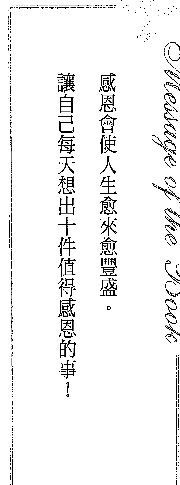

感恩會使人生愈來愈豐盛。讓自己每天想出十件值得感恩的事！

《秘密》的作者朗達·拜恩藉該書淺顯易懂地向世人介紹了「吸引力法則」，並讓世人了解它是一種可以讓自己的所思所想全部成真的法則。
也因《秘密》的問世，讓她成為一名世界知名的作家。
於是，她自己也是透過明白「吸引力法則」並加以實踐，而得到了名聲、財富與成功。就這樣，如今她可以說是「吸引力法則」的頭號代言人，至今仍保有無人能及的超高人氣。

《秘密》大獲成功後，她又出版了第二本書《力量》。內容是在探討『吸引力法則』的源頭，她主張『一切都來自於愛，愛是一切吸引力的源頭。』

說得更具體一點，就是：

『你若想要有錢，就要熱愛金錢。你若想要成功，就要熱愛成功。如此一來，你能得到你所想要的一切。』

拜恩是這麼說的。換言之，她主張的想法就是，藉著熱愛自己所追求的事物，就能將自己追求的一切吸引到身邊來。

而《魔法》則是她更進一步解釋『吸引力法則』的第三部作品。

她在這本書裡說道：『感謝是引導人們走向一切成功的魔法』。

這本書一開頭便解釋，當你希冀某件事物，並熱愛那件事物時，絕不能缺少感恩的心；而『謝謝』這句表達感恩的話，就是『魔法的咒語』。

# 感恩會帶你邁向美好的一方

感恩是讓人生豐盈的關鍵——提出這種主張的絕非只有朗達・拜恩一人。事實上，不少人都說過類似的話。尤其是在日本，教導「謝開」的重要性之人更是多不勝數。而且，只要是為了心靈或靈性所寫的書，無論是何種內容，都會提到感恩的重要。不過，《魔法》一書尚有其獨特的地方，在於教導人們實踐一個為期二十八天的感謝練習。拜恩說：只要不斷地練習，就能讓感恩變成自己的「第二天性」，讓自己的「魔法力量提升」，因此，希望大家都能夠每天持之以恆地練習。至於練習的方法，書裡則是為每一天開出了不同的練習題，讀者必須一一完成。在你消化這些練習題的同時，感恩也會逐漸轉化成你生活中的習慣。

## 吸引力法則

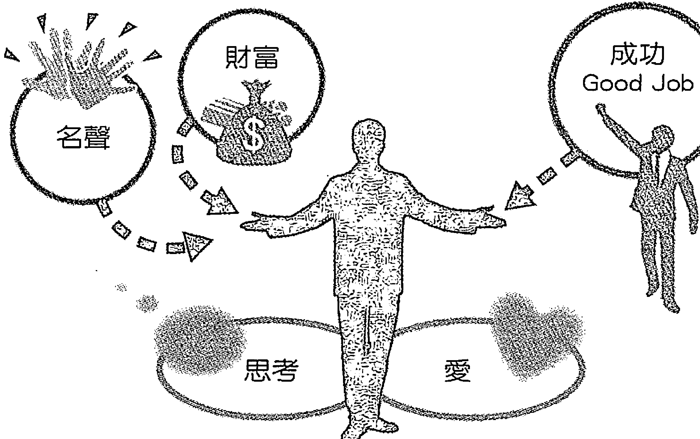

愛是所有吸引力的源頭

> 愛你所渴望得到的事物，如此便能得願。

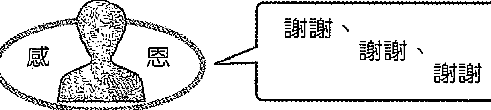

第一天的練習，是要在一早起床後，想出至今為止所發生過的十件值得感謝的事，並將這些寫在筆記本上。接著，第二天、第三天也都出了其他新的練習。
每天共通的練習題就是「想出十件你願意感謝的事，並將它寫出來，每天重複這項練習」。事實上，單單是這項練習，就能讓我們得到人生中的許多覺察了！
經過不斷練習之後，你會發現過去認為是理所當然的事，其實都是一項恩典，進而你會懷抱感恩的心。屆時，你也將發現，過去有很多時候，我們雖然沒有和對方說出「謝謝」，但其實我們的內心十分感激。
既然如此，下次我一定要好好地將「謝謝」說出口……練習的過程中，一定會讓你得到像這樣的領會。
朗達．拜恩常說：「只要透過感謝，你就能立刻得到你所想要的事物。」

# 吸到幸福的七大力量
## Part 1

不過我們倒是覺得，感恩不光與心想事成有關，事實上只要說出「謝謝」兩字，還能讓自己感覺愉悅，也能獲得心靈的平靜。
實際上，朗達。拜恩也明白這一點，但她刻意說成：『只要常說「謝謝」，就能變得富有，得到你所想要的一切。』這麼做，想必是為了向大眾傳達感謝的重要性！

二十八天的練習中，有容易達成的項目，也有難度比較高的。但只要鍥而不捨地完成每一天的練習，最後一定可以將「感謝」變成一種習慣。

# 誦唸「謝謝」三遍

朗達。拜恩說，重複三次「謝謝、謝謝、謝謝」可以讓魔力發揮到最大。「謝謝」這句話本身就是一句高振動頻率的話語。高振動頻率的話語，說的次數愈多，愈能提高自己與周圍的振動頻率。

# 讓感謝變成你的第二天性

> > 「至今生命中值得感恩的事，想出十件！」

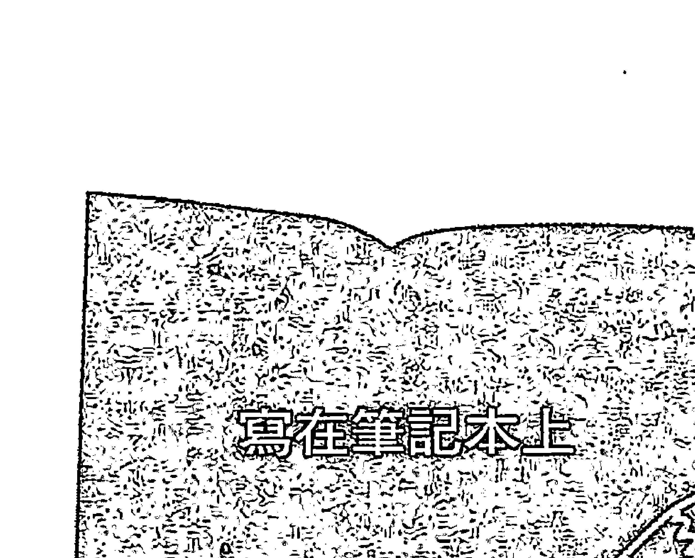

寫在筆記本上

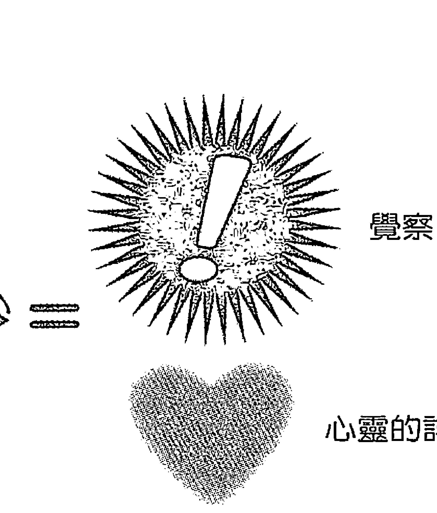

覺察
心靈的詳和

- 實踐
- 作筆記
- 發現心境的轉變

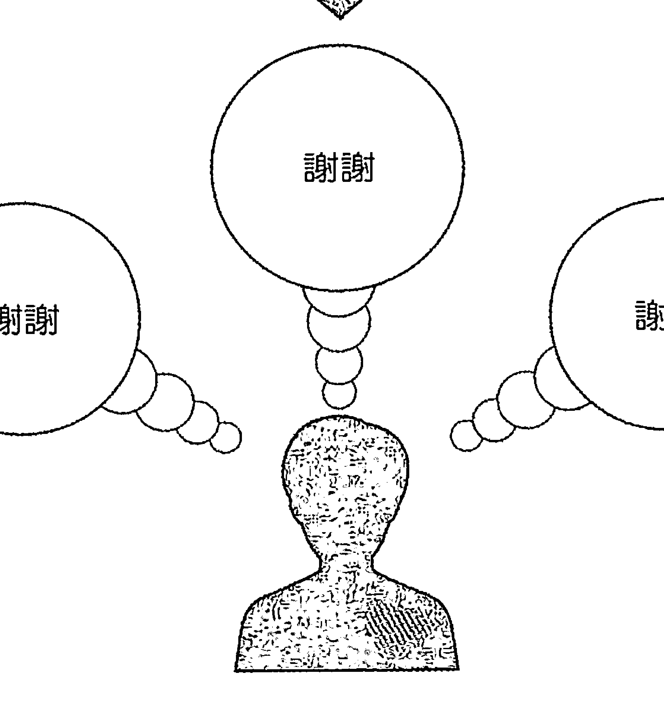

- 謝謝
- 謝謝
- 謝謝

或許還可以說更多次，用不著局限在「三」，不過根據她所言，重複三次的效果是最強而有力的。大家不妨也嘗試看看。

存在本身也值得感謝

其實，我們能夠在這裡，本身就是一件值得感謝的事。日文「感謝」的語源——「這真是一件難得的事」——就是最佳註解。存在於當下，本身就是一件不可思議的事情。若能對此心懷感激，將能讓我們無所畏懼。

對自己存在於當下心懷感激，事實上就是在感激那個使自己能活在此的「存在」。換言之，是在感激宇宙萬物的源頭，而這個源頭，你可以稱之為神、偉大的存在、宇宙或其他任何名稱。

當我們感謝這個源頭，並與其產生連結，我們將會發現自己內在的力量，然後透過這股力量，就能使人生過得從心所欲。《魔法》一書教人學會感恩，並將其化為自身的力量，可以說是一本非常卓越的魔法書。

千萬別只是大略看看，請每天都要閱讀當日練習題，並加以實踐。然後，留心發生在自己身上的變化。

無論是自己心境上的改變、自身遭遇的改變、還是周遭的人的變化；你會發現自己與身旁的人事物開始發生各式各樣的轉變。

當你完成二十八天的練習之後，你將能自然而然地感激一切。感謝寫下這本書的朗達。拜恩。

謝謝、謝謝、謝謝。

## Part 2 吸引幸福的七大力量

> About the book

☆《魔法》是《秘密》的作者朗达·拜恩的最新力作，这是她为了「让大家改善自我本质，使吸引力法则成为日常之物」，所设计的二十八天练习课程。《魔法》不同于前两部作品《秘密》和《力量》，这是一本近似练习簿的实践手册。透过让人生好转的「魔法方程式」与二十八天的「魔法练习」，能让你更明确地感受到吸引力法则。

秘密存在你内在。
請深深擁抱自己。

秘密
The Secret
朗達·拜恩（Rhonda Byrne）著

# 為人生帶來奇蹟的魔法書

（圖解）25個靈性智慧精華

《秘密》一書講述的，其實就是關於「成功」的秘密。

> 「讀了這本書，知道成功的「秘密」以後，你就可以得到所有你想要的東西，可以成為任何你所憧憬的人物，可以成就任何你想做的事。」

用這樣的口號加以宣傳，加上書中也如此描述，二〇〇六年《秘密》一書在美國出版後，引發熱烈討論，甚至造就一股社會風潮，可見閱讀群之廣大。在日本，《秘密》也躋身暢銷排行之列。

> 宇宙的睿智已存在於你我之中。

請覺察這一點。

你已是一個完美的存在。

*Message from the Spirit*與其說這是一本靈性覺醒的書，不如說是偏向自我成長、或某種成功法則之書，或許更貼切。因為，一心想要「追求成功」而讀此書的人，在閱讀的同時將會覺察「成功到底是什麼、什麼才是真正想要的東西」。

但是，如果只讀本書一開始的部分，僅採納「請求」↓「相信」↓「接受」這些技巧的話，就未必保證一定能成功了。

之所以那麼多人對《秘密》趨之若鶩，是因為想躍躍欲試「吸引力法則」。

話說回來，這本書究竟能引發如此廣大的迴響呢？

「吸引力法則」一詞，如今也在身心靈領域的族群間，成了通用語。

# 為人生帶來奇蹟の魔法書
（嚴解）25個靈性智慧精華

### 覺察自己的偉大

其實書中的內容，向來都不是秘密，反而全是過去的自我啟發、成功法則類的書籍介紹過的。作者朗達·拜恩也有提到：「吸引力法則」並非一項全新的理論，她的功勞只是將那些一直以來存在的概念，以一個清楚明白的形式整理出來，如此而已。

> 《秘密》的開頭寫道：「你將會知道自己的真實面目。此外，你將會發現，那個潛藏已久、一直以來等待被發現的真實的你，有多麼的偉大。」不僅教人如何實現夢想，還教人如何認識真實的自我、覺察自己的偉大，這是這本書相當崇尚心靈力量的地方。

特別是在結尾，還提及到了「宇宙的一心」。「一切的存在都是『宇宙的一心』（One Universal Mind），而這『一心』是無所不在的。它存在於一切事物中。這『一心』就是所有的聰明、智慧、圓滿；它就是一切、並在同一時間遍及各處。如果一切都是『宇宙的一心』，而且存在於每一處，那麼它也全都在你心中！

### 真實的自我是什麼人？

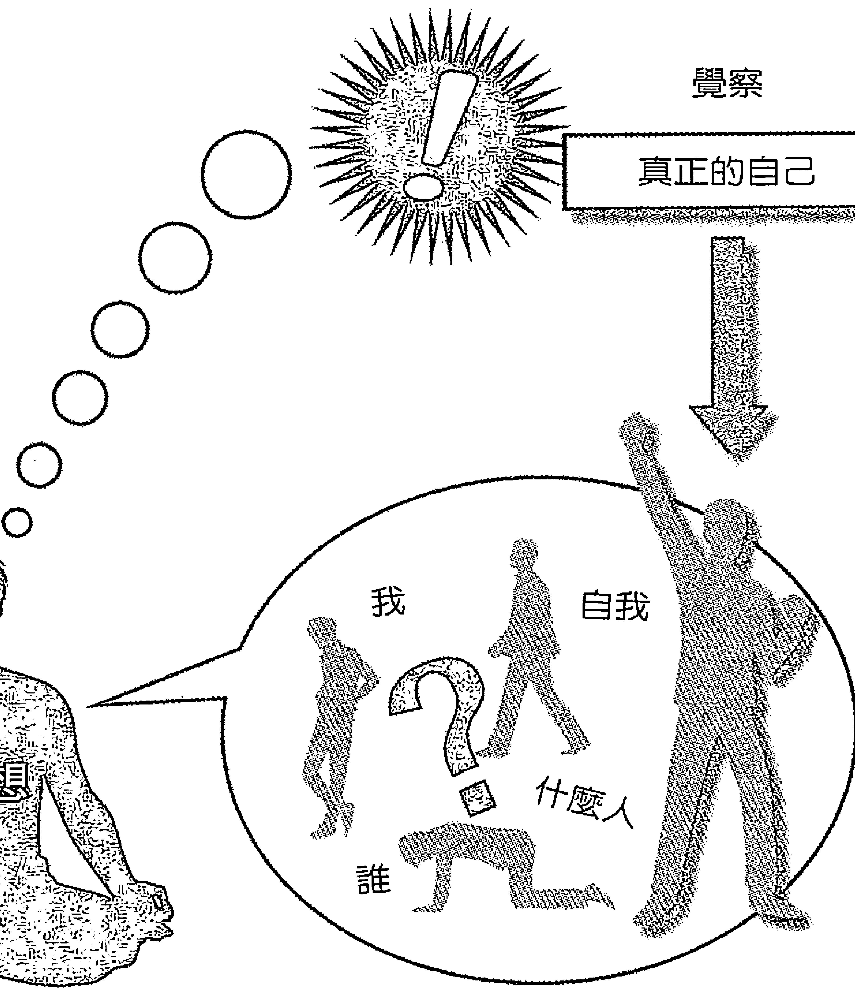

### 成功的秘密就在自己的內在

也許這本書真正想說的是『去發掘那個真實的你吧』！《秘密》的獨到之處，就在它的總結。其中有一段，是這麼寫的：

> >『請擁抱自己的精采。秘密就在你的內在。愈去使用你內在的力量，你就會引出更多力量。你將會到達一個無須再練習『吸引力法則』的境界；因為你將成為那個力量、圓滿、智慧、智能；你就是愛、就是喜悅。』

身為譯者，我們認為《秘密》一書最後，寫著極為重要的事。因此我們深切希望，能有更多的人閱讀到這本書。

### 思想生萬物

作者朗達．拜恩在五十多歲時，遭逢了人生的重大危機。父親突然身故，她和同事、男友之間的相處關係也是一團糟。正當她感到身心俱疲的時候，她的女兒海莉送給她一本書——這是一百年前，由華勒思．華特思（Wallace Wattles）所寫的《失落的致富經典》（The Science of Getting Rich）。

《失落的致富經典》最核心的主題，就是「吸引力法則」。該書主張「物質是從思想之中誕生」。華特思寫道：「從思考這個行為可以衍生出各種不同的事物，剛誕生不久的思想會滲透、擴散並充滿整個宇宙。思考就是為了創造出種種經由思考而生的萬物而來。」

朗達．拜恩寫說：「一開始我帶著懷疑，我問自己：『為什麼不是每個人都知道這個秘密？』」

-   請求 → 相信 → 接受

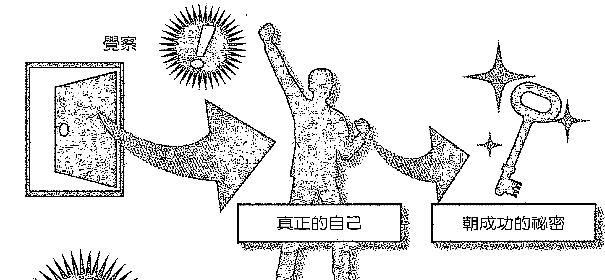

成功的秘密，其實就存在自己的內在

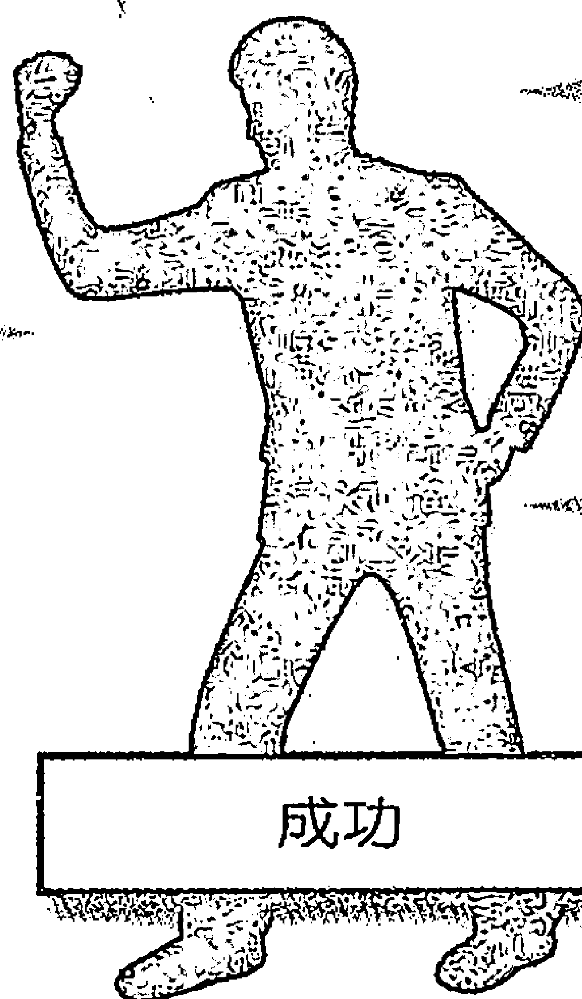

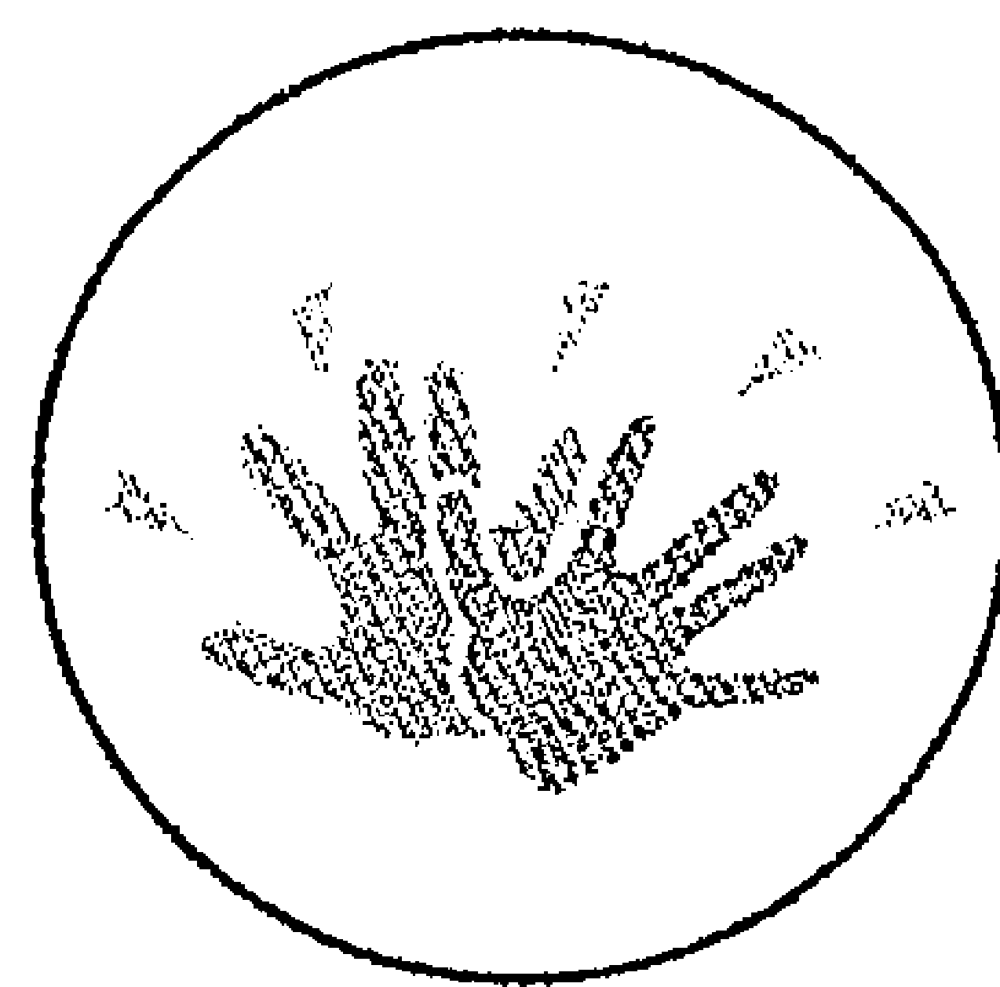

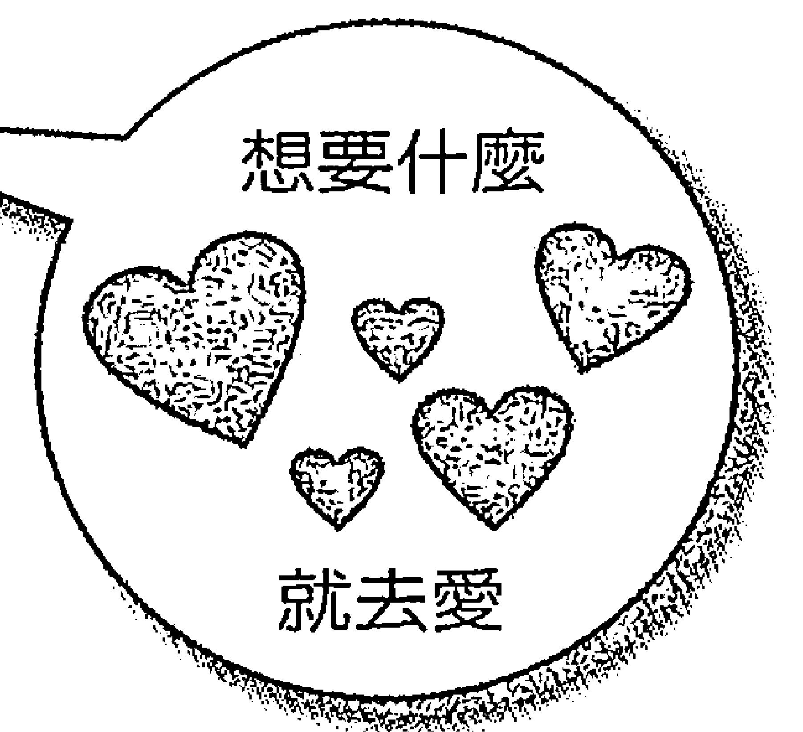

於是，她的心中充滿了強烈渴望，想把這個「秘密」與世人分享。她開始尋找當今世上知道這個「秘密」的人。沒想到此舉一出，她就像磁鐵一般，讓偉大的導師們陸陸續續地現身。接下來，其他大師也如連鎖反應般地一一出現。因為這樣，她想將「吸引力法則」拍成影片，傳播全世界，然後，這個與世人分享的圖像就在她的腦中具體地確立了。她將自己的才能充分發揮，完成一部了不起的DVD。而當這部DVD開始在全球發行後，奇蹟似的真实故事也開始如雪花般飛至。在網路普及的今日，只要上網就能找到《秘密》的同好會，也能看到影片預告。這本書始於一部影片，隨後才出版成冊，這種暢銷書的誕生過程，可說是十分契合現在這個時代。能否稱心如意運用「吸引力法則」，其實是因人而異的。因為當事人相信的力量是招來成功的關鍵所在。

# 為人生帶來奇蹟の魔法書
（圖解）25個變性智慧演繹

「想將『吸引力法則』告訴全世界」的朗達·拜恩，為這股熱切的想法採取行動後，宇宙也真的助她一臂之力，讓她得到空前的成功。這個事實正是最佳的佐證。

我們希望讓更多的人閱讀這本書。尤其當你能夠確實閱讀到後半段，相信你一定會感受到宇宙巨大的能量湧入你的內在。

另外，我們也非常推薦各位能夠一併閱讀這本書的藍本——華勒思·華特斯的《失落的致富經典》。

該書的內容到現代依然十分適用，令人難以想像這是一本百年以前寫下的老書。

## Part II 吸引幸福的七大力量

## The Secret

☆作者朗达·拜恩遭逢父親的驟逝，又與男友、同事的關係亮起紅燈，就在人生最困頓的此時，她遇見了「吸引力法則」，這也成了《秘密》一書誕生的契機。朗達查閱了歷史上的偉人和關於成功法則的書籍，發現他們的成功背後都存在著「吸引力法則」，她想將這個「秘密」和更多人分享，因而寫下了這本書。現在，《秘密》一書已發行了四十七國語言，成為全球知名的暢銷書。

> 超越秘密的思考，就是宇宙的真相。

## 超越秘密的秘密

## The Meta Secret

梅爾·吉爾 (Mel Gill) 著

# 為人生帶來奇蹟
圖解 25個靈性智慧精華 の 魔法書

二〇〇七年秋天，朗達·拜恩的《秘密》在日本出版，『吸引力法則』一夕之間成為家喻戶曉的名詞。全國大大小小的書店裡，都能看到架上密密麻麻排滿了『吸引力法則』相關的叢書。更令人驚訝的是，一段時間之後還能看到陸續有『吸引力法則』相關的作品出版。

只要對成功或自我成長的書、心靈力量感興趣的人，很可能都買過幾本這樣的書來親自驗證一下『吸引力法則』。

> 重要的是，了解這七個法則並加以實踐。

宇宙的任何一種現象背後，都有七個法則同時且平衡地運作著。

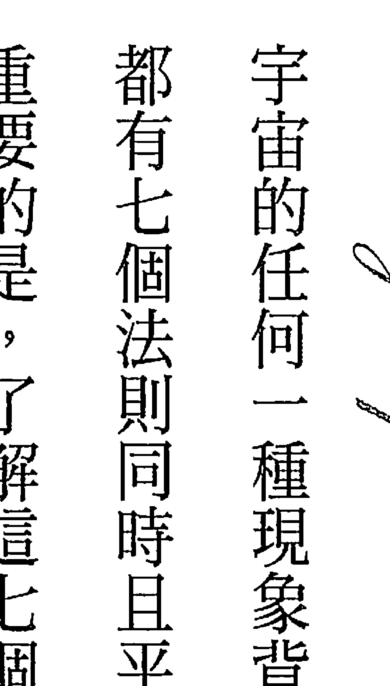

其中大概有人快速學會「吸引力法則」的訣竅，達到「心想事成」的效果。但也想必也有人無論怎麼嘗試都無法如願，而不理解「為什麼自己就是無法將想要的事物順利『吸引』過來」……這裡介紹的《超越秘密的秘密》（中文暫譯，The Meta Secret）一書中主張，為了要達成心想事成的效果，「宇宙的七個法則」極為重要。當你理解了這些法則並加以運用，就一定能獲得成功。」書中還說，「吸引力法則」是為了明白接下來的「宇宙七大法則」而存在的前導法則，其作用就像主餐前的開胃菜。書名裡的「Meta」一詞，具有「肉眼看不見的」、「超越的」等含義。作者梅爾．吉爾（Mel Gill）想要表達的是，這本書的內容超越《秘密》一書。此外，他還很注重這本書與《秘密》的關聯性，是以，無論在書冊的裝訂上或內容架構上，感覺都和《秘密》十分相近。

## 為人生帶來奇蹟 の魔法書
(圖解)25個靈性智慧精華

## 吸引力法則

在它的背後……

## 還存在著七大法則

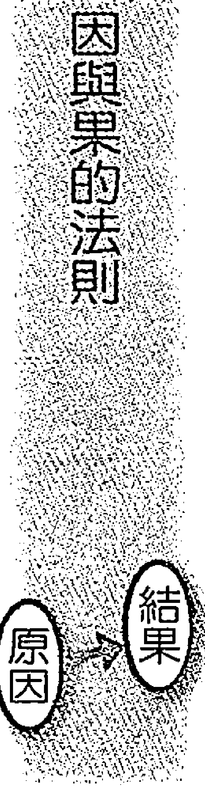

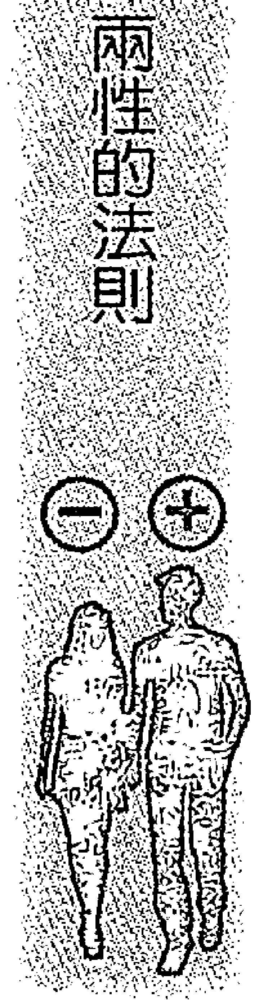

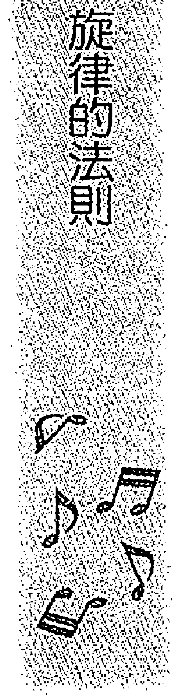

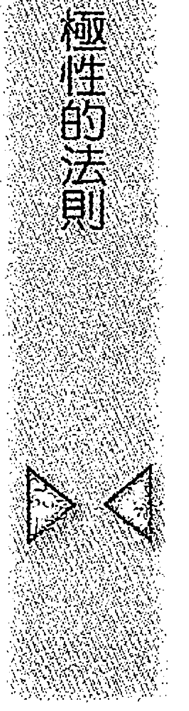

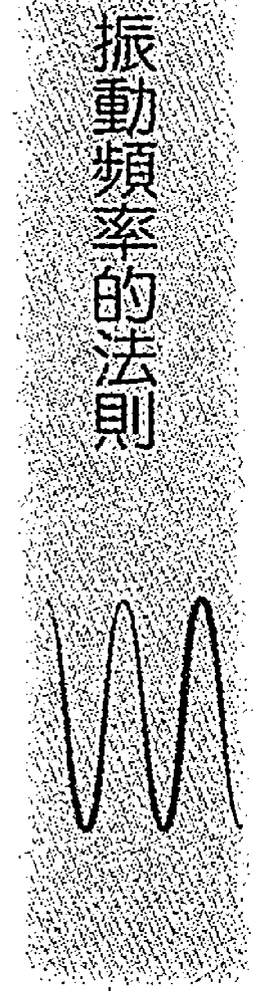

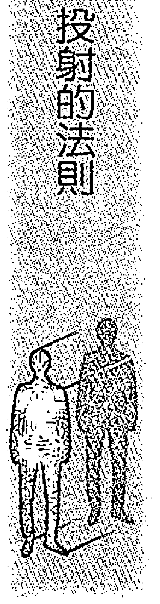

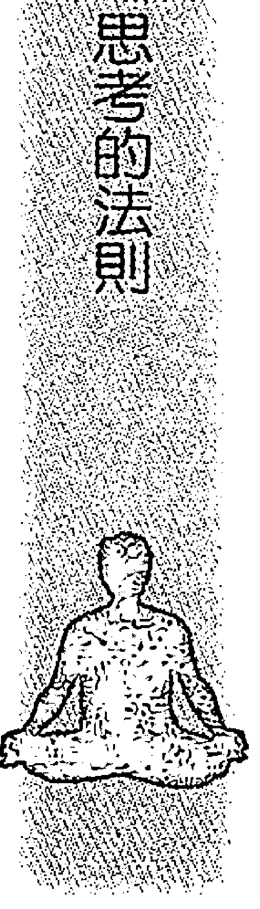

## 喚醒古埃及的七項智慧

如果說，《秘密》在內容上是讓百年前的「思想是為了顯化」的想法重現生機，那麼《超越秘密的秘密》就要回溯到三千年前被藏在古埃及金字塔裡、翡翠石板上的七項智慧；據傳，這七大智慧是出自古希臘神祇赫密斯（Hermes）之手。而《超越秘密的秘密》，就是要讓這七大智慧復甦。

作者梅爾·吉爾是印度裔美國人。年輕時，他曾在馬來西亞的叢林裡因摔落洞穴身受重傷，而接受左手截肢手術。在手術過程中，他體驗到了十九分鐘的瀕死經驗。

這邊世界裡的僅僅十九分鐘，在彼端的另一個世界裡，感覺起來卻十分漫長。據說，當時他在另一個世界學會了宇宙的秘密後，才回到這邊的世界來。

但後來，他已無法清楚回憶起當時他所學到的知識。不過在那之後，他查閱了許多文獻，從中找尋他在另一個世界習得的那些智慧。同時，也透過與多位大師的相遇，而重新獲得學習。

經過這一路而來的過程，最後他所找到的，就是藏在埃及金字塔中、翡翠石板上寫下的秘密。

他領悟到了一件事：告訴更多人這個秘密是他的使命。於是，他開始在世界各地進行演講，並且最後寫下了這本書。

## 翡翠石板的秘密

翡翠石板上所寫下的宇宙法則共有七項。這七大智慧如今仍被視為秘密中的秘密，關於其內容的真正意義，至今還留下許多未解之謎。相關的文獻也只有《奧義之書：卡巴萊恩》（中文暫譯，The Kybalion）一書而已。《超越秘密的秘密》書中的第一個法則「Law of Mentalism」，雖然譯為「思考的法則」，但其中還包含了「宇宙本身就是思考」的深義。希望在閱讀過這本書之後，對這個內容感興趣的人，能進一步做更深入的研究。

就算只挑第一項法則來研究，只要能夠充分理解，都有可能改變你的生存之道。正因為有如此強大的力量，《超越秘密的秘密》可說是一本指引世人通往深奧的宇宙真理的入門之書。

宇宙的七大法則將敘述如下，而每項法則已經確認過的含義，也闡述在下頁圖中。

-   1. 思考的法則。
-   2. 投射的法則。
-   3. 振動頻率的法則。
-   ④ 極性的法則。
-   ⑤ 旋律的法則。
-   ⑥ 兩性的法則。
-   ⑦ 因與果的法則。

據說，一旦了悟出這些法則的真正含義，任誰都能獲得財富、健康與幸福。要完全掌握這七項法則，似乎需要花上一段的時間。不過也用不著急著馬上就要理解所有的法則。只要先找出與自己特別有共鳴的，並加以理解即可。理解後將法則運用到你的人生中，如此一來，相信你一定也能讓你的人生過得更加幸福而有意義。

## 宇宙中有「七法則」，在每項法則的個別運作又相互影響之下，創造出了現實世界

### 1 思考的法則

我們每天都是透過思考之後的行動，來創造出我們的現實世界。現實中的一切，都是由我們自己所創造。

### 2 投射的法則

我們是將自己內在所發生的事，投射到外在的世界。因此，要改變世界就必須改變自己，要改變自己就必須改變內在。

### 3 振動頻率的法則

我們的情緒振動頻率，會吸引相近的情緒振動頻率。之所以會受特定的氣味、場所或人物的吸引，就是因為那些事物帶有與自己相同的振動頻率。

### 4 極性的法則

白與黑、陽與陰、富有和貧窮、正與負、愛與恨等等，所謂的相對事物，其實指的就是相同性質、而程度不同的意思。

### 5 旋律的法則

人生是高低起伏的旋律，有狀況好的時候，也有狀況不好的時候。世上的一切都有它自己的循環。

### 6 兩性的法則

男性的能量是向外、向宇宙發散出去的，而女性的能量則是向內；當兩者同心協力取得平衡時，就會孕生出新的生命。

### 7 因與果的法則

這世上沒有偶然。一切事情都有其發生的原由，所有的事件都是有因才有果。

## 宇宙的原理法則

## 即知即行

我想，這本書裡的最大重點，就是這七項法則不能夠光是理解而已。作者梅爾·吉爾本身當然了解這七項法則分別是如何運作，又會相互產生什麼樣的作用，但他寫道，有一段時間他只是在腦中去理解這些法則，卻忘了在日常生活中時時刻刻提醒自己善用它們。因此，他當時曾因心臟病發作被送進了醫院。那次的經驗讓他得到一個重大的覺察，就是宇宙的法則——超越秘密的秘密——不能只是學會而已，更重要的是，要在每天的生活中百分百地信奉並且實踐，進而領受其恩典。我想，這是從事靈性研究的我們，絕不可忘記的一點。請將《超越秘密的秘密》從頭看到最後，並加以付諸實踐。屆時，你一定會開始收到各式各樣的宇宙恩典。

## Writing of the book

☆作者梅爾·吉爾十八歲時，曾在遭遇嚴重的意外事故後宣告死亡，但又在十九分鐘後甦醒過來。本書內容就是關於，他在「死亡的十九分鐘」裡所得的靈性成長，以及古希臘神話的神祇赫密斯在「翡翠石板」上寫下的「真理的法則」。《超越秘密的秘密》一書，其書名所要表達的意義包含：「肉眼不可見的秘密」，同時，書中也將「吸引力法則」視為真理的一部分。

## 吸 引 幸 福 的 七 大 力 量

### 從 人 與 人 之 間 的 能量 爭 奪 戰 中 解 放 ！

#### 聖境預言書

The Celestine Prophecy

詹姆士・雷德非 (James Redfield) 著

# 為人生帶來奇蹟的魔法書
（圖解）25個靈性覺悟精華

這本書的架構為一部冒險故事，以第一人稱的敘事手法，描述故事主角在秘魯循序發現了九個覺悟，並一一了悟其中的真義。一九九四年三月之後，這本書在美國成為廣受熱烈討論的小說。

作者回顧發現自我的過程，將其彙整成九個覺悟，並編撰成一部小說。

或許正是因為這種出色的表現手法，而使這本書獲得廣大的迴響。

將人類意識的轉變過程，以虛構小說的形式表現，這種手法在當時算說。

> Remember the Goal
我們要了解，我們都在扮演著某個角色，為了滿足自己而從他人的身上掠奪能量。

是相當新穎，充滿創意。為了讓那些對於靈性成長領域不甚熟悉的人，也能享受閱讀的樂趣，有懸疑、也有浪漫情節的冒險小說體裁，確實是非常吸引人的做法。

## 真正重要的九項覺悟

故事是從在南美秘魯的森林裡發現了一部古老的手稿開始說起。這部古老手稿中所記載的九個覺悟，是關於人生目的與意義的精闢智慧。主角仿佛在一股莫名的牽引力量下，搭上了飛往秘魯的班機。

在那裡等待他的，卻是意想不到的體驗。在一連串的邂逅與冒險中，主角一一發現並體悟這九項覺悟。以下就簡單地介紹這九項覺悟。

第一項覺悟——現今，有許多人是在「共時性」（偶然的同步）的引導下，開始步上他們人生當中的靈性旅程。

# 為人生帶來奇蹟
圖解25個覺性智慧精華 の魔法書

第二項覺悟——過去這五百年來的物質主義，持續不斷地告訴世人科學萬能、技術萬能，而如今，正是世人從這些固執的想法中清醒過來的時代。

第三項覺悟——察覺肉眼看不見的「能量」(energy)。明白宇宙萬物皆是一種神聖的「能量場」(energy field)。

第四項覺悟——從小我們都在無意識中學會操控他人，並從他人身上奪取能量。這就是所有紛爭的起源。

第五項覺悟——透過一種與內在的神連結的神秘體驗，消除我們的不安與恐懼。

第六項覺悟——覺察自己正在用什麼方法盜取他人的能量，並擺脫這個方法讓自己自由，如此就能與自己內在的神性連結。

第七項覺悟——當你了解自己的使命，偶然的同步性就會開始加速運作。你的人生也會乘上宇宙的洪流，豁然開朗。

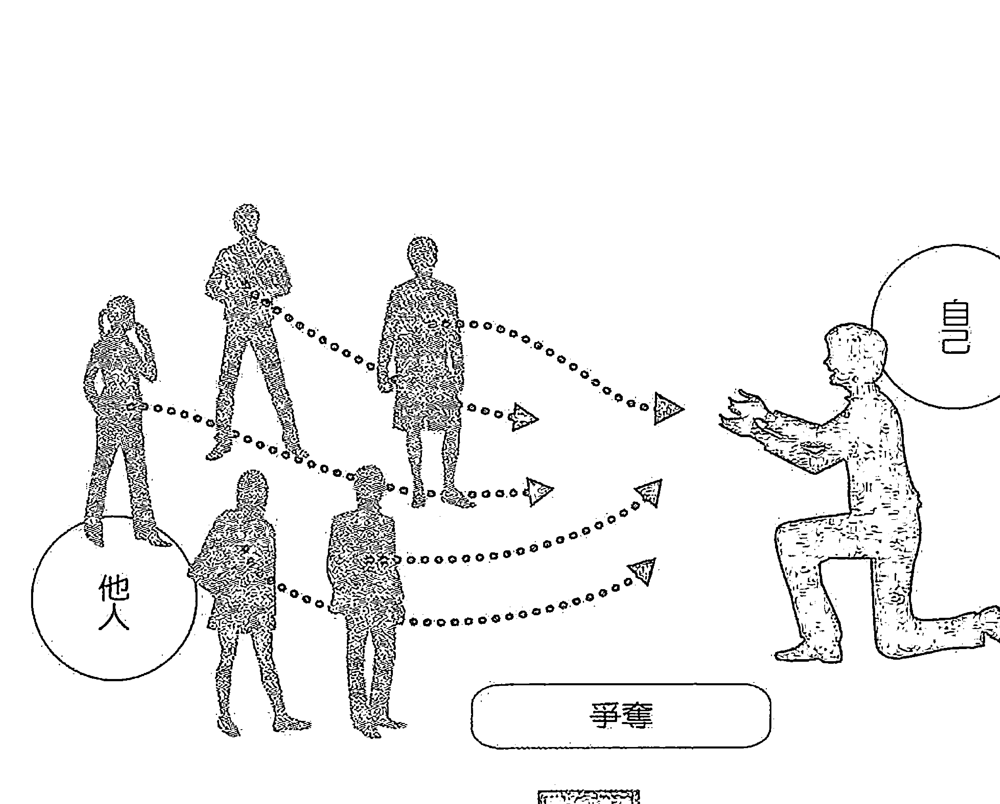

> 重要的是，去發現自己內在所扮演的「脅迫者」、「旁觀者」、「受害者」或「審問者」的角色

# 為人生帶來奇蹟的魔法書
(圖解)25個靈性智慧精髓

-   第八項覺悟——透過能量的相互給予，可以使自己與對方的能量一同提升。
-   第九項覺悟——現今，一種嶄新的文化正要誕生。我們將成為靈性的存在，生與死都將合一。

## 清理過去的自己

其中讓我們感到最重要的，就是第六項覺悟。內容描述的是自己在什麼樣的養育方式下成長，又會從中無意識地養成什麼樣的惡習。我們都是在來到這世上之前，自己選擇了自己的父母。但生長的環境會讓我們開始學著扮演起脅迫者、旁觀者、受害者或審問者的角色，以便掠奪他人的內在能量來滿足自己。當我們仔細審視自身的問題，並覺察自己正在扮演什麼角色時，我們才能清理我們過去的問題。一旦能夠清理自己的過去，就能與內在的神性能量共生。作者詹姆斯·雷德非（James Redfield）在這本書出版前的二十年期間，就對人類的靈性成長感興趣，並不斷探究其中奧妙。他擁有社會學學士學位和心理諮商碩士學位，並擔任長達十五年的心理治療師，專為有情緒困擾的青少年進行診療。具有這樣經歷的他，當時卻默默無聞，因此沒有任何一家出版社願意為他出版這本《聖境預言書》（The Celestine Prophecy）。於是，他耗盡積蓄自費出版，並與妻子同心協力經營這本書的事業。最後，終於有大出版社因為這本書的好評聞風而來，向他們表示很感興趣。一九九四年三月，華納圖書（Warner Books）出版社以二十萬本的首刷在全美的實體書店鋪貨後，這本書立刻就登上全美暢銷排行榜。

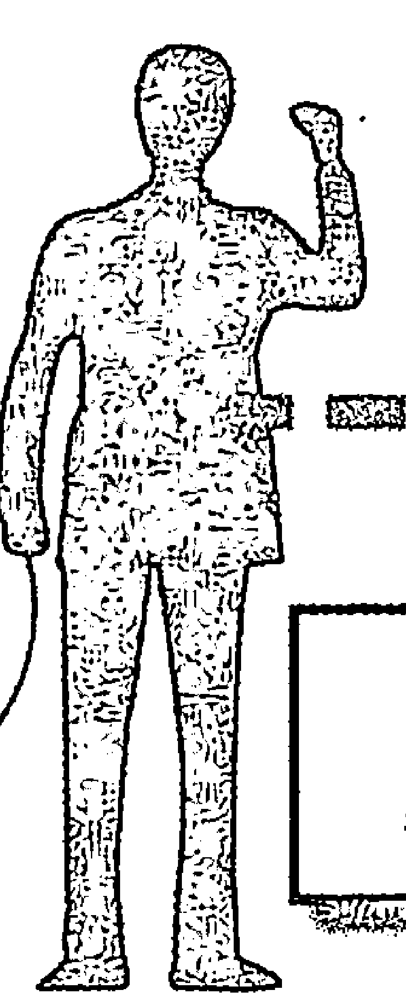

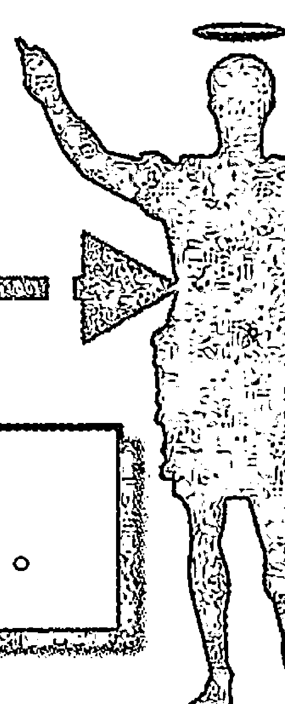

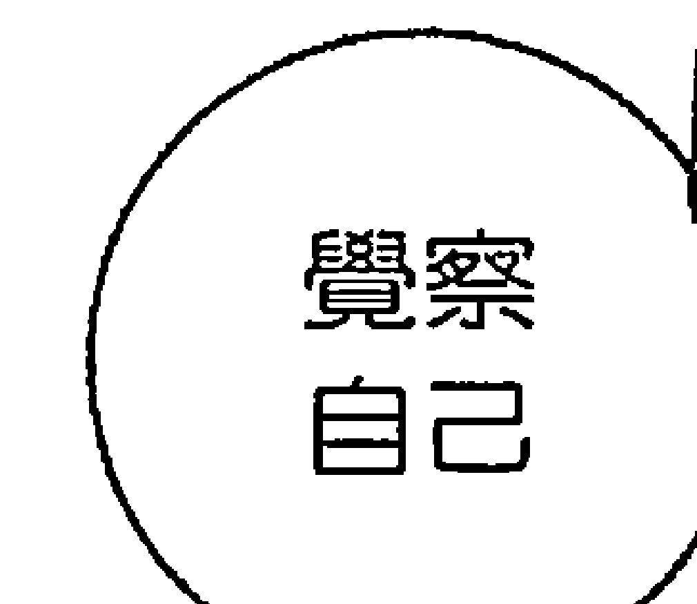

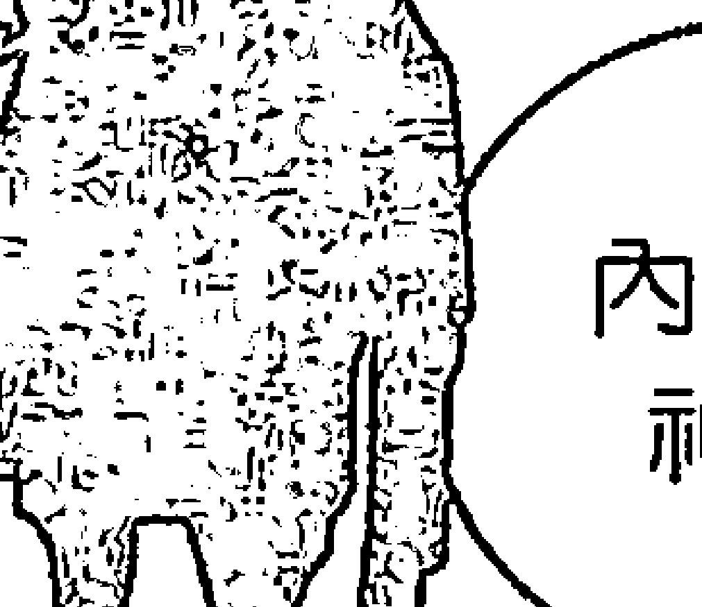

透過覺察讓自己與內在的神性連結。

### 覺察（九個覺悟）

-   人生的一切旅程正要展開，受到「共時性（偶然的同步）」的引導。
-   這是世人將要覺醒的時代，跳脫物質主義以及科學萬能、技術萬能的固執想法。
-   覺察肉眼看不見的「能量」，存在世間的萬物皆是一種神聖的「能量場」。
-   我們都在無意識中學會了操控他人來奪取「能量」的方法，這是所有紛爭的起源。
-   體驗一種與內在的神性連結的神秘經驗，消除不安與恐懼。
-   停止盜取他人的「能量」，進而讓自己獲得自由，與內在的神性連結。
-   當了解自己的使命時，偶然的同步性就會開始加速運作，人生也會乘上宇宙的洪流，豁然開朗。
-   給與他人「能量」，讓彼此的「能量」一同提升。
-   一個嶄新的文化正要誕生，我們將成為靈性的存在，生與死都將合一。

關於這本書為何會受到這麼多人的青睞，詹姆士是這樣解釋的：
「因為過去這三十年來，美國人對於靈性的察覺愈來愈感興趣，許多人在讀了《聖境預言書》後，感到自己的人生中確實也經歷過與書的內容相符的遭遇。現在有很多人想在自己的人生中追求更大的滿足感與人生使命。而他們大概也察覺到了，想把人生過得真實，必先擁有真正的靈性吧！」

## 將男性帶入靈性世界

當初我們會翻譯這本書，是因為接到角川書店的請託。一拿到原書之後，我們就馬上開始閱讀。
雖然剛開始我們對於故事的設定感到有點奇怪，但繼續讀下去就發現，書中的九個覺悟都是今時今日的我們非知不可的事。當然，我們也立刻接下了這份翻譯工作。

於是，日文版在一九九四年的十月出版。這本書一陳列在書店中，就開始以驚人的速度銷售出去，讓我們更加感受到，這是一本潛力無窮的好書，也是一本讓許多人引頸期盼的書。

尤其在那之前，對於心靈的探索仍以女性為主，但不少男性在閱讀這本書後，竟也加入了這趟探索旅程。這是十分巨大的改變，都要歸功於本書所潛藏的力量。

我們大概見過詹姆士本人三次。第一次是在一九九五年的一月，我們前往夏威夷參加詹姆士夫婦舉辦的座談會。印象深刻的是，當時他呼籲道：

> 「接下來很重要的是，成立靈性方面的讀書會，同心協力，一起擴展人類的意識，提升我們的振動頻率。」

二〇一一年四月，《第十二個覺悟》（The Twelfth Insight）在美國出版。緊接著，日本也在同一年的十二月出了譯本。

現在這個時代，正要走入一個巨大的變革中。《聖境預言書》可說是那本在我們準備面對變化時，擔起重要角色的一書。而它未來也會在一代又一代間流傳下去吧！

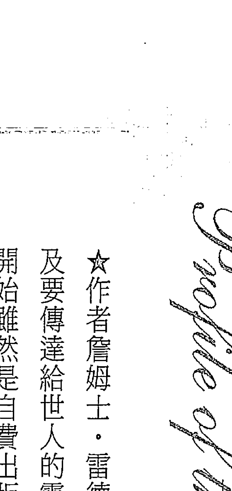

☆作者詹姆士・雷德非在一九九三年，將自身對於心靈世界的醒悟，以及要傳達給世人的靈性啟示加以整合，寫了這一本《聖境預言書》。一開始雖然是自費出版，但因為內容引發廣大讀者的討論，一躍成為排行榜上的寵兒。這本書有別於一般的靈性成長書籍，是以一部圍繞著「神秘古代手稿」的冒險懸疑小說形式撰寫而成。讀者可以一邊沉浸在主角緊張刺激的冒險故事中，一邊領會「精闢而又觸碰靈魂真義的九個覺悟」。

## 請留意你的頻率！

在往後的時代裡，
人人都須具備這種
接收天線。

> 天堂頻率
Frequency
潘妮·皮爾斯 (Penney Peirce) 著

# 為人生帶來奇蹟の魔法書
（圖解）25個靈性智慧精華

這本書是在「吸引力法則」的熱潮逐漸退燒時出版的。潘妮·皮爾斯（Penney Peirce）所寫的《天堂頻率》（Frequency），是在教導如何提高振動頻率，以及如何使用振動頻率。

根據潘妮所言，「振動頻率的原則」是緊接「吸引力法則」之後、我們所該學習的課題，因此可說是出版得正是時候。

據說，潘妮·皮爾斯從小就擁有某種近似超能力的直覺。自年輕時，

> Challenge for the soul

當我們找回自己靈魂的振動頻率時，
將能真正地做自己。

## Part 1 吸引幸福的七大力量

她就用她這股超乎常人的敏銳感受，以靈通者為職。而我們是在二十五年前初次與她見面，當時的她自稱靈媒。直到後來，她才改稱自己為直覺諮商師。因為她的作法是利用直覺來讀取對方的心情或想法，然後再進行諮商。

對於直覺，以及自己本身、他人甚至非生物所具備的振動頻率，潘妮一直以來都很感興趣，並不斷深入研究。一九九九年，她還出版了一本書：《不思考就得到答案：察覺聲音、意象、律動的練習，讓你的直覺變精準》（*The Intuitive Way*）。而這本《天堂頻率》堪稱是她對於這方面研究的集大成之作。

現在，應該會有許多人有著焦慮、憤怒、排拒、失去方向等等的感覺。這是因為地球正處於從三次元轉換至四次元的過程中。在這種高升振動頻率的影響下，我們人也會跟著有所轉變。

## 地球提高振動頻率的過程

據說，目前地球的振動頻率不斷在提升。我們的振動頻率也不斷在提升。這個過程中，我們有時會體驗到各種困難、恐懼、痛楚等等的感受。潘妮在自己與案主的體驗中，學習到如何能更順利地加快速度，度過這個過程，而這些方法也是她在書中要向大家介紹的內容。事實上，這個過程可以稱為讓我們回歸到原初自我的過程。我想，在這本書中是將這種過程與振動頻率相結合，用一個稍微不同的角度來說明整件事。

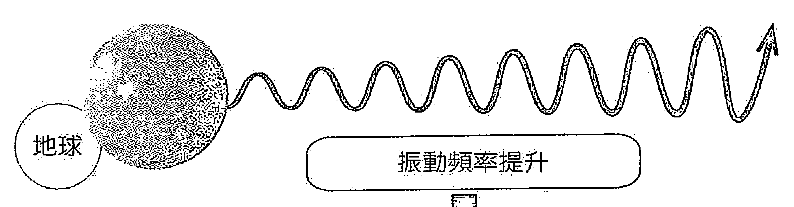

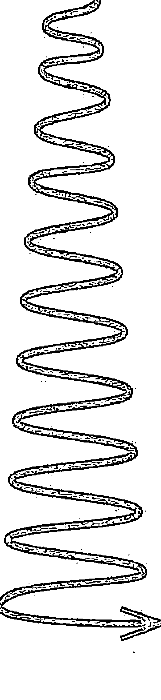

-   1. 第1阶段：感受到天堂与人世间的界线愈来愈模糊。
    2. 第2阶段：灵性频率渗透进身体、心智与情绪。
    3. 第3阶段：藏在潜意识中的固执、恐惧、憎恨等情绪开始爆发出来。
    4. 第4阶段：内在的小我冲出来，坚持自己不需要改变。
    5. 第5阶段：旧有的框架逐渐崩坏瓦解。
    6. 第6阶段：总算来到停止受苦的阶段。
    7. 第7阶段：开始一个新的人生。
    8. 第8阶段：一切都在彻底翻新。
    9. 第9阶段：你知道自己就是无限的存在。体验人间天堂。

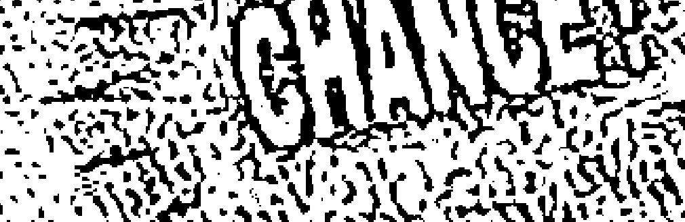

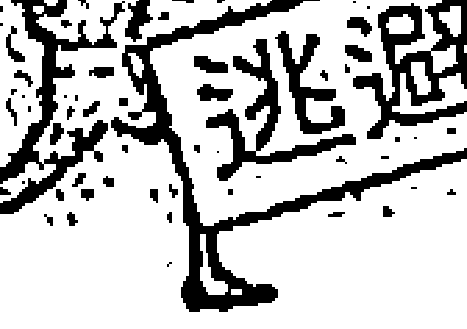

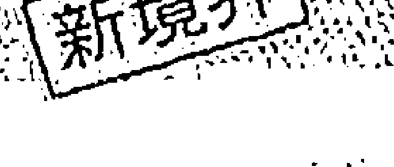

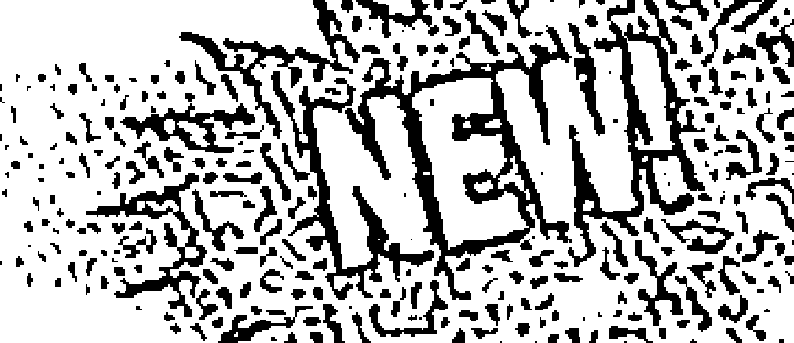

## 九個轉化的階段

根據潘妮的說法，人類意識的轉化過程，可分為以下九個階段：

-   第一階段——你會感覺到天堂與人世間的界線愈來愈模糊。開始覺得，人生當中該要有其他更多事物、想擁有更好的人生。你的感官變得愈發敏銳，直覺也不斷獲得開發。
-   第二階段——靈性頻率滲透進你的身體、心智與情緒。可能會因為一時適應不了這種高頻率的振動，而在身體或情緒上感到不適，變得既不穩定又有點神經質。
-   第三階段——如同受到高振動頻率的推擠般，藏在你潛意識中的固執、恐懼、憎恨等等的情緒開始爆發出來。這同時也是一個很好的學習機會，你將學著去接納無論美好與否，都是人生的一部分。
-   第四階段——覺得你好像可以放下那些過去的事物，內在的小我又突然跑了出來大喊「我還不想死」！這個時候，有些人可能會開始堅持自己不需要改變，並做出各種逃避的行為。

### 第五階段——舊有的框架逐漸崩壞、瓦解。你終於開始放下那個被恐懼所支配的過去，並捨棄那些已經沒有用的舊習慣。

### 第六階段——總算來到了停止受苦的階段。你脫離了小我，完全全被吸進「當下」的這一刻。你真實地感受到什麼是靈魂的頻率，那是一種詳和、自由與寧靜的感覺。

### 第七階段——開始一個嶄新的人生。你變得無須再靠意志力來讓人生變得完美。因為現在的你知道，人生這様就是最完美的了。

### 第八階段——你的人際關係、家庭乃至一切都在徹底翻新。你知道，自己雖然是一个個體，但同時也是一個集合體的存在。現在，你可以隨時隨地都真正地做你自己。

### 第九階段——知道自己就是無限的存在。你可以創造任何事物，可以在人世間體驗到天堂。這可說是一條通往開悟的道路吧！我們都會依自己的步調，或按自己的順序，一邊體驗這九個階段，一邊邁向全然的醒覺。今日，正是這麼一個邁向覺醒的時代。

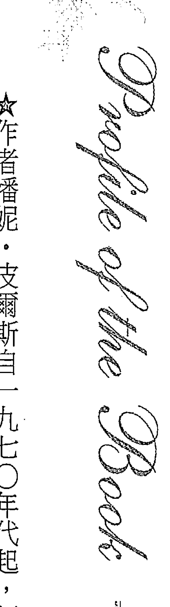

☆作者潘妮·皮爾斯自一九七○年代起，便著手鑽研「運用直覺力與靈性的技巧，去除痛苦的方法」。她非常重視其中的「感受力」與「直覺」，有次她發現，「身體、情緒、心智在每個當下帶有的能量振動數值」可以看成是一種振動頻率。這本書教導：將自己的能量振動當作如同音波般的「頻率」去感受，並透過這個方式，讓我們更具體明白地理解靈性世界。

眼前這個世界是由你所創造出來的。覺察到這一點是邁向幸福的第一步。

福至心靈

**You Can Have It All**

阿諾・派特騰 (Arnold M. Patent) 著

在汗牛充棟的靈性成長書籍中，我們覺得這是一本「臻至完美之書」。

連美國著名的脫口秀主持人歐普拉·溫芙蕾都說：「這是我至今讀過的書中，最為重要的一本！」《人生的橡皮擦》（Forgiveness The Greatest Healer of All）的作者傑若·詹波斯基（Gerald G. Jampolsky）也讚譽道：「極為簡單又實用，且強而有力！」

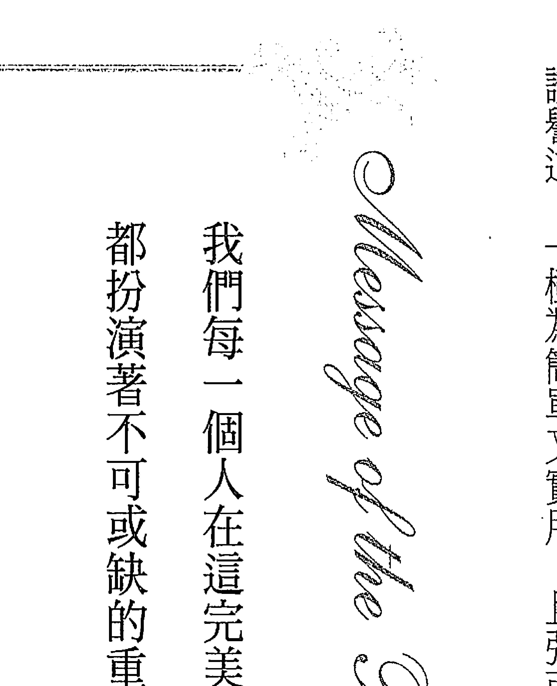

我們每一個人在這完美的宇宙中，都扮演著不可或缺的重要角色。

事實上，對我們而言，這可說是一本靈性道路上最棒的指南！因為它把我們過去至今所學的、所體悟到的，都有條不紊整在一起。

阿諾・派特騰（Arnold M. Patent）究竟是位什麼樣的人物？他現居加州。我希望未來有機會走訪那裡時，能跟他見上一面。

據說，他為自己多年來的律師、企業家生涯畫下休止符，轉而成為一名作家、演說家，是為了投注一生的時間推廣自己提倡的「萬能法則」。

為實踐「萬能法則」，他成立了「國際支持交流網」（International Support Group Network），致力於演講和寫作，同時也多次參與電視、廣播節目，努力將他的「萬能法則」推廣到全世界。

也許是因為他努力推廣有成，經過他的指導後已有數百萬的世人感動回饋說：「我的人生變得更豐盈充實了！」上述是直接從他的作者簡介中摘錄的一句話。能讓多達數百萬的人如此感動，真的是非常厲害！事實上，我們也算感動的其中一員呢！

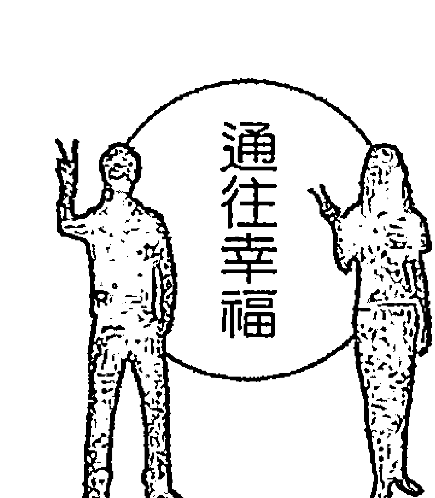

## 二十一條「萬能的法則」

-   1. 宇宙的原料是能量。
-   2. 宇宙的能量就是「愛」。
-   3. 萬物齊一，不分你我（合一，oneness）。
-   4. 宇宙是完美的，人也是完美的。
-   5. 發生在自己身上的事情，都是由自己所創造出來。
-   6. 人擁有「選擇的自由」。
-   7. 人的思想和信念都不過是「一廂情願」。
-   8. 宇宙的智慧透過「靈光乍現」與「頓悟」向我們說話。
-   9. 宇宙是靠著「相互扶持」的系統建構而成。
-   10. 生命中所發生的事是映照出我們自身的鏡像。
-   11. 「善」、「惡」、「對」、「錯」皆不存在。
-   12. 每一個人都有各自的「人生目的」。
-   13. 心情是測量自我狀態的指標。
-   14. 宇宙從不吝嗇於給與。
-   15. 「施」與「受」之間永遠保持平衡。
-   16. 當你執著於某一點時，一切都將停滯不前。
-   17. 當你將意識集中於人生中的某樣事物，它就會不斷擴張、發展。
-   18. 每個人都有與生俱來的天賦。
-   19. 目的和手段都是一樣的，換言之，如果創造和平是目的，就先要保有和平於內，表現和平於外。
-   20. 所有的人際關係都是「自己」與「自己心靈」的關係。
-   21. 麻煩的事就交由宇宙安排吧！

## 不幸的人生是虛幻的

讀了這本書，覺得書中所寫的內容與我們自己的想法完全一樣。也因此，讓我們更加相信自己是正確的，我們在追求靈性的道路上，正朝著一個美好的方向前進。

希望大家都能擁有這本書並反覆閱讀。就算當下還有無法理解的地方，過幾個月後再讀，一定會逐漸明白。你會因為自己理解得愈來愈深入而感到自豪，它就是這樣的一本書。

這本書以「讓我們向『萬能的法則』領取通往幸福的車票吧」作為開頭第一句話。

接著寫道：

> > 「要是人生能事事盡如人意就好了——要是能過著幸福的人生就好了——相信任何一個活在世上的人，都會這麼想。但我要告訴你們一件事，請大家睜大眼睛好好讀下去——無論是要過著事事盡如人意的人生，還是過著幸福的人生，都不再只是夢想哦！因為我們人就是為了得到幸福而來到世上的。應該說，所謂不幸福的人生，根本是不真實的。如果真如其說，那麼一些告訴自己不希望變得幸福的人，說不定其實是內心在鬧彆扭。而一些認定自己現在不幸福的人，其實真正過著虛妄不實的人生，換言之，他們的想法可能都在哪裡出了差錯。這本書告訴我們一件非常重要的事，那就是，事實上我們每一個人都在這完美的宇宙中，都扮演著不可或缺的重要角色。請仔細閱讀插圖中所描述的二十一條萬能法則，並深刻記在自己的潛意識中。我們每個人都可以自己選擇自己的人生。事實上，創造出自己的人生，不是別人，正是自己。只要能理解這一點，你就會看到一個牢不可破的目標——要變得能夠懂得珍惜自己、愛自己、尊重自己，這樣就對了！

這是一本強而有力之書。對我來說，本書猶如一件珍貴的寶物。

尤其令我銘感五內的是「第十九條萬能的法則」——「目的和手段是一樣的」。希望和平的話，就要讓自己的心變得和平；渴望愛的話，就要時時在心中懷抱愛，同時展現於外。

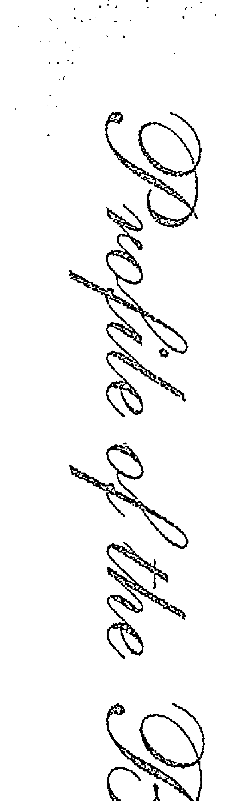

☆作者阿諾・派特騰在五十歲之前是一名活躍的律師及企業家，在經濟上十分成功，但他卻苦於「沒有為自己的人生而活」。為了跳脫這種痛苦，他開始進行了一項身心改造的計畫，靜坐冥想也是計畫中的一部分，而他就在靜坐冥想中逐步發現了「萬能的法則」，且讓他的人生有了戲劇性的好轉。這本書是將《鏡的法則》等在日本也廣為人知的二十一條「定律法則」，以座談會的形式淺顯易懂地向大家介紹。

> > 你人生所有一切，
> > 都是来自你自己的选择。

## 先知的预示
The Message of A Master
約翰·邁克唐納 (John McDonald) 著

這本書是一本屹立不搖流傳於全世界的「成功哲學之經典」。如果讀過許多成功哲學的書籍，再來讀這本書的話，應該也會同意這本書是成功哲學的起源之一。雖然關於作者約翰·邁克唐納（John McDonald）的詳細資料不清楚，但可以確定的是，他絕對是一位卓越的智者。畢竟，他可以寫出這麼一本既簡潔又深具影響力的書。

> Message from the Book
> 要醒悟一件事：人生的主角就是你自己。
> 接著你要明白，一切都是完美的。

故事前半段是以童話般的風格描寫與先知相遇的經過。主角的友人遭逢人生中的重大挫折，而動身離開美國至歐洲旅行。在那裡，友人巧遇了先知（Master），並得到先知所傳授的「發現自我」的方法，當他回國時，整個人煥然一新、神采奕奕。主角看到友人巨大的轉變，而渴望也與先知見上一面，於是展開了尋找先知的歷程。見面的那天終於到來……接著，先知也將成功的秘訣傳授給他。

## 明白自己是誰

這本輕薄的小書，就算更簡短地單單以目錄來做介紹，似乎也能從中看出財富、智慧與成功的秘訣。全書共分為十六章，在此僅就前四章做簡單的介紹。

### 第一章是「我是自己命運的主人」。

生是為自己而活嗎？你的人生一定可以活出你所想的模樣。這是你首先必須牢記在心的事。而且事實上，無論你的人生處於何種狀態，一切都是你自己的選擇和決定。

### 第二章是「不可思議的事是很容易就發生在任何人的人生中」。

在你的人生中，一定也會發生不可思議的事情。這是從一開始就計畫好的。你能否看出潛藏在偶然中的必然，並把握住機會？人生的安排遠比你所能想到的還要更天衣無縫。在這樣的安排下，你所需要的一切，必定會在需要的時間點出現。

### 第三章是「每個人都擁有不可思議的力量」。

那就要問了，我們為何無法將這股力量完全發揮出來？這是因為我們還不夠了解自己。每個人身上原本就具備無限的力量。

### 接下來是第四章：「你的可能性是無可限量的」。

只要發掘出這股力量就對了。你想像得出自己已達成理想的模樣嗎？你想要的東西是什麼？你想做的是什麼？你想要變成什麼模樣？只要你能確實地把這些問題的答案化作腦中的圖像，你就能發動「吸引力」將這一切吸引過來。

## 想要的事物就在你眼前

如此一來，為人生招來成功的關鍵，竟然都濃縮在這本輕薄的小書中了，這實在教人吃驚！

我們偏愛的是第十二章，其中說道：「對於每件事都要埋首苦幹、努力完成，這種落伍的觀念必須被揚棄，如何用思想去順心遂意，學會這樣的方式很重要。」對於正要從三一一大地震與福島核災中重新站起來的日本人而言，這部分是我們十分需要學習的地方。

此外最重要的是，這本書的核心在告訴我們「要為人生訂立目標」。

若想要出色地完成某件事，你只要立下一個堅定的目標，然後，不是朝著目標埋首苦幹地做，而是要「用心」地全力以赴。

你會無可限量地得到你所想要的一切，這是上天賦予你的命運，是你與生俱來的權利。

所以說，你所想要的事物，全都是為了讓你使用、讓你享受而存在於此的。否則，它們何需存在呢？

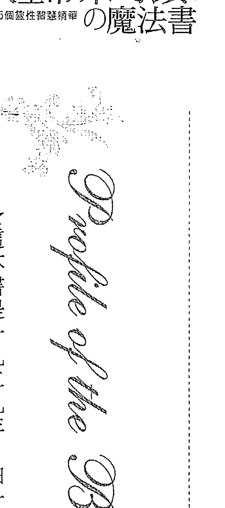

☆這本書是一九二九年，由一位名叫約翰・邁克唐納的人所撰寫、出版。書中寫下了作者約翰與「先知」相遇的過程，以及先知的教誨。一九九三年，馬克・亞倫偶然間拿到原書，並由自己的出版社重新再版。在日本，最初是一九九六年翻譯，二〇〇一年改為現在的書名：《智者的教誨》。雖然只有薄薄一本，但書中納盡了通用於今時今日的成功哲學之精髓。

## 不需要任何理由，只要去爱就对了！

你不必受苦受難，也能上天堂
The Lazy Man's Guide to Enlightenment
賽迪斯・葛拉斯（Thaddeus Golas）著

《你不必受苦受難，也能上天堂》（The Lazy Man's Guide to Enlightenment）是一本只有八十幾頁的薄書，或許看到它時，有些人會心想：「這裡面到底寫了些什麼？」如果你無法用心掌握書中所寫的內容，它會是一本艱澀難懂的書，但同時，它也是一本會溫柔地告訴你「看不懂也不要緊」的書。所謂的開悟，似乎會根據每個人自己決定的時間到臨。當那個時刻還沒出現之前，

> Message of the Book

> 盡你所能去愛，當你準備好時，
> 所有一切都會變得豁然開朗。

就算把這本書翻破，恐怕也讀不出個所以然。如果讀了一下，覺得看不太懂的話，請先將這本書墊在枕頭下，過一個月，不，過個一年之後，再拿出來讀讀看吧！屆時，說不定你會頓時恍然大悟。旅居美國時，我們在書店看到了它，因為是薄薄的一本似乎很容易看完，書名又很吸引人，所以就忍不住買了下來。在那之後，我們著手將《心靈之舞》（Out on a Limb）一書翻譯成日文。我們就是在此時下定了決心，今後要致力於將英文的好書譯成日文，藉此協助日本的人們擴展意識。後來，我們想在日本出版這本小書，於是寫信給美國的出版社。那封信交到作者賽迪斯·葛拉斯（Thaddeus Golas）的手中，而開始了我們之間的書信往返。

## 愛一切的原貌

賽迪斯是一位活躍於一九六○年代的嬉皮，當時正是嬉皮的全盛時期。他把自己在那段時間所得到的開悟體驗，寫成了這薄薄的一本小書。據說，起初他是自己拿著他的書站在街角兜售。後來，這本書被大出版社看中，才正式出版，成為廣受眾人喜愛的一本書。

這本書傳達的最重要的「開悟方法」就是——愛。賽迪斯寫道：

「愛是最安全而且最簡單的開悟之道」、「不需要任何理由，只要去愛就對了」、「愛是安全的，是宇宙間唯一絕對安全之道。盡你所能地去愛，當你準備好時，所有一切都會變得豁然開朗。一旦開悟了，你將會發現，人只要保有自己的原貌，無論開不開悟都無妨。那些堅信人類必須開悟的人，其實才是離開悟最遙遠的人。」

這些就是他想表達的中心思想吧！他還說，愛自己的原貌，愛自己原本的樣子，無論你是什麼模樣，都要去愛你自己，去愛那個不愛自己的自己。另外還有一段十分重要的話是寫在全書的開頭：

> 「『我們都是平等的，而所謂的宇宙，就是我們彼此之間互動的關係。宇宙其實是來自於同一種實體——每個實體都是有生命的，並且自己決定自己的生存之道。』只要了解前述的道理，你就可以搞懂這本書，甚至自己出一本書。」

換言之，我們大家都是由相同的物質所構成，我們的存在都是平等的。一旦真正了悟到這件事，我們就能變得無比的平靜而且詳和了。仔細體會他所寫的：「我們都是平等的」、「宇宙來自於同一種實體」，你會發現，這本書連死後的世界、神的世界、精靈的存在、心靈世界……全都寫了進去呢！

所以，這本書會成為靈性成長的入門書籍，這麼受到廣大群眾的歡迎，可說是實至名歸。

### 愛的力量的七個魔法

PART 2

兩種做法都可以

## 賽力斯·七個魔法

最後要跟大家分享的是，在翻譯這本書時我們所發生的神奇體驗。在我們猶豫著不知該用什麼方式翻譯的時候，忽然聽到從某處傳來一個聲音，那聲音說：「就照著文字的原貌去翻！不可以多加解釋哦！就算現在還無法完全了解它的含義，也要照著英文的原貌翻成日文。」「將那能量直接轉換成日文就對了。」我們在這些話的引導之下，譯完了這本書。結束翻譯時，我們發現賽迪斯最早寄給我們的一封信。信中提到了「翻譯時的注意事項」，而他所寫的內容，恰恰就和我們當時所聽到的聲音一模一樣！我們也重新體認到，所謂的翻譯，其實就是將作者具有的強大能量，原封不動轉換成另一種語言，傳達給大眾。

☆這本書是作者賽迪斯·葛拉斯於一九七一年所寫下的關於「開悟」的書。它是將「任何人遇到人生中的苦難、痛苦或一籌莫展時，都可以派上用場的簡單觀點」，用一種「當自己本身在遇到人生中的瓶頸、感到走投無路時，會想要拿起來一讀的」寫作方式所完成，書中也絕不為任何人定罪。作者以自己的話語，溫柔地闡述關於「宇宙與意識」、「我是誰」等問題。當一個人在探索靈性成長的路上失去方向時，很適合拿起這本書來閱讀。

> 你的思想和情绪都不等同于你自己。感受「当下」吧！

## 当下的力量
The Power of Now
艾克哈特·托勒 (Eckhart Tolle) 著

這本書的日文版還沒問世之前，作者艾克哈特・托勒（Eckhart Tolle）早已因英文版《當下的力量》（The Power of Now）的作家身分聞名於世了。當時，這本書成為風靡全球的暢銷書，而我們也在赴美時買下此書，並略為拜讀了一部分。

艾克哈特十三歲以前是在德國長大，後來從英國的倫敦大學畢業後，成為劍橋大學的研究生和指導教授。二十九歲時，他經歷了靈性方面的體驗，接下來的好幾年，他致力於理解與深入探究當時的體驗，並將其整合成知識，他的靈魂探索之路也從這時展開。在此之後，他發表了許多關於開悟的著作，包括這本《當下的力量》。

可想而知他是一位頭腦十分聰明的人。早期的他應該無時無刻都在使用著左腦，讓左腦支配了他的人生，也因此，那時他一直苦於某種焦慮不安的感覺。書中有提到當時發生在他身上的體驗。以下就引用他在書中所言的敘述：

### 與另一个自己的纠葛

> > 「在我三十歲之前，我一直生活在一種焦慮不安的狀態中，情緒低落，不時萌生尋死的念頭。」「二十九歲生日過後不久，一個深夜，我自夢中驚醒，內心遭受一種『無盡的絕望感』所吞噬。我已多次有過這樣的感覺，卻沒有任何一次像那個晚上一樣強烈。『為什麼活得這麼痛苦，卻得繼續活下去？我不想再繼續活著了。乾脆讓自己消失好了。『我被這種悲痛的想法壓得喘不過氣。就在此時，我忽然意識到這個想法似乎哪裡不大對勁。『我是一個我，還是兩個我？』如果我這麼不想跟自己活在一起，那就表示有兩個人，一個是『我』，一個是我不再想與其活在一起的『自己』。我繼而告訴自己：其中一定有一個是『真正的自己』！想到這裡，我腦中的自言自語戛然而止，這讓我十分詫異。我的意識無比清晰，但我的思緒卻停在『空無』的狀態。接著，我感覺自己被吸入一個如龍捲風般的驚人能量漩渦當中。一開始漩渦轉動得很慢，但逐漸加速。我因一股莫名的恐懼而開始顫抖。我彷彿聽到一個聲音發自我的胸口，說：『別抗拒』。然後不知為何，恐懼消失了。我不再掙扎，任由自己一步步地被吸入那股能量漩渦中。之後發生什麼事，我完全不復記憶。

## 認識開悟之境

「開悟」經常伴隨著像這樣的神秘體驗。而且，往往在一個人被逼入絕境、真的無計可施的時候，才能體驗得到。從他的體驗，我們也可得知，人在煩惱時，是由左腦掌控主導權。左腦掌管思考，但我們的思考並不等於「真正的自己」。另外，關於「為什麼人這麼難開悟」的問題，他的回答是「那是因為我們總是在追求著外在的事物，而沒有發現藏在我們內在的珍貴寶藏。」自己所追求的一切，其實一直都存在於自己的內在，等待著被發現。因此，我們需要做的，就只是停止沉溺在過去或未來中，讓自己的每分每秒都活在當下。而我們又該如何做，才能活在當下？這些就是這本書的主旨與它所要探討的内容。

> 「當下的這一瞬間，你在這裡的時候，你就已經擁有一切的愛、喜悅與和平。」這本書如是說。「開悟即是苦難的終點。」

希望你也能拿起這本書，從中發現「真正的自己」。

☆作者艾克哈特·托勒在倫敦大學畢業後，年紀輕輕就已贏得學術上的成功，但他的內心卻不斷承受著焦慮不安所帶來的煎熬。二十九歲的某天晚上，作者突然體驗到讓他的意識產生一百八十度大轉變的「開悟」。這本書就是來自於作者當時的體驗，加上後來在他的講座與諮詢工作坊中、領悟到的重點以及被問到的問題。作者以問答的形式，淺顯易懂地闡述出「開悟」、「空無」的概念，以及我們該用什麼樣的方式來思考。

> > 真實、愛、喜悅，
> 請誠實面對這三種
> 情感！這是發自於
> 靈魂的訊息。

## 與神對話
Conversations With God
尼爾·唐納·沃許 (Neale Donald Walsch) 著

# 為人生帶來奇蹟
《圖解》25個靈性智慧精華 の魔法書

也許是二十世紀末，當世界來到一個不得不有所轉變的時候，神便藉著沃許先生之手，寫下了這本書吧！閱讀這本書，你會知道，每個人在本質上都是與神相互連結的。只要靜下心來傾聽自己內在的聲音，任何人都可以與神對話。

當你可以聽見自身靈魂的聲音時，接下來，你就只須相信自己內在的神，並依其指引行動即是。

> Message from the Gods
過去遭遇的困境與苦難不會是毫無意義，一切都是為「現在」所做的準備與學習。

作者尼爾·唐納·沃許（Neale Donald Walsch）自小學時代，他的夢想就是成為一名神職人員，像是神父之類的，但卻遭到父親反對。因此，長大後他先是從事媒體方面的工作，之後又歷經醫學、政治等形形色色的工作。這段期間裡，他仍不斷尋找神的存在，除了研究基督教教義外，他也鑽研佛教等東洋智慧，乃至現代的最新思潮，他主動接觸、學習各種思想，並不斷思考研究。而在他私生活方面，他經歷了離婚、失業等挫折，過著大起大落的日子，最後一切都顯得不順遂，人生也變得支離破碎。一九九二年的春天，正當他處於這樣的情況，在他身上發生了一件不可思議的事。

### 他能「與神對話」

他從以前就習慣將自己的所思所想寫成信，藉此抒發內心的感受。這一次，他決定寫信給神，而他所寫下的是一封充滿惡意的信。信中羅列著憤怒的問句。最後，他寫道——我到底是做錯了什麼事？活該要一輩子活在這些痛苦掙扎中！我明明就沒那麼糟糕！當尼爾寫完這些得不到答案的埋怨與質疑，正要把筆往旁邊一摔時，他的手卻離不開紙面，彷彿被一股看不見的力量按壓著。不可思議的是，筆開始自己動了起來。「你是真的想要知道這所有問題的答案呢？還是在只是發洩遷怒？」神如此問道。就這樣，尼爾與神透過紙筆展開了一場對話。他是在「與神對話」之後，才發現「人生是為了當下而存在的」。他了解到，過去所遭遇到的各種困境與磨難，都不會是毫無意義，一切都是為了「現在」所做的準備與學習。當他準備好的時候，神就確確實實地出現在他的人生中。而他也開始感謝出現在他生命裡的每一個人。

雖然一開始他自己也搞不清楚發生了什麼事，但這場對話就這樣持續了三年。他說，起初連他自己都不相信他是在和神對話。但他發現，神的回答並不是針對他一個人所說，而是對所有的人說，於是一九九五年，他透過一家小出版社出版了《與神對話》（Conversations With God），而獲得廣大迴響。

像這樣，接收來自神等高次元存有的訊息或教導，然後將自己所接收的訊息撰寫成書的人，在美國很早以前就有不少先例，而在日本，最有名的是「巴夏」（BASHAR）、「艾克頓」（ECTON）等高靈。而《與神對話》的特別之處在於，書中的神給人一種非常親近的感覺，所談論的話題也十分廣泛，尤其會對人生中的實際問題進行探討。當然，祂也確實告訴了現今的我們需要知道的宇宙真理。

## Part 2
震撼力量的七個魔法

《與神對話》傳達出了對於現代的我們而言真正重要的訊息。除了最初寫下的《與神對話》之外，尼爾還出版過許多書籍，大家可以隨意挑選自己感興趣的其中一本來閱讀看看。這是一本荒誕、同時也是一本卓越的書。因為一直以來被認為是沉默不語的神，現在竟然透過一個普通人類的語言，像朋友般地和我們交談。對那些執著於神的既定概念的人來說，或許這會是一本大不敬的書，但我們仍希望讓更多人閱讀這本書，並改變對神的既有概念。

☆作者尼爾·唐納·沃許，將自己從一九九二年春天起所體驗到的，透過筆記與「神」進行的「對話」，彙整成這一部作品。當時，作者尼爾無論在私生活或在工作上，都遭遇到了瓶頸，他在信紙上寫下了自己的狀況，在信的結尾寫下「我到底是做錯了些什麼事？」接著，「神」突然透過他的手，開始回答了這些問題。尼爾與「神」的問答中，廣泛探討了各種謎題和煩惱，包括有關於靈魂的目的、宇宙、神等等。

讓我們一起來看，在荒蕪的大地上，用愛與祈禱帶來奇蹟的三個人，他們是如何生活的。

## 芬霍恩的魔法
The Magic of Findhorn
保羅·霍肯 (Paul Hawken) 著

### 為人生帶來奇蹟 的魔法書
（圖解）25個靈性智慧精華

蘇格蘭北方濱海的小鎮上，有一個由追求靈性的人們所建立的社區。創始人是彼得·卡迪（Peter Caddy）、艾琳·卡迪（Eileen Caddy）夫婦和桃樂絲·麥克琳（Dorothy Maclean），他們三人每天一面接收這塊土地的精靈帶來的訊息，一面學習著該如何生活。後來，愈來愈多人感應到流動在那塊土地上的愛的純淨能量，也漸漸在附近集結起來。保羅·霍肯（Paul Hawken）的《芬霍恩的魔法》（中文暫譯，The Magic of Findhorn），就是在描寫關於這個芬霍恩社區的成立經過。

> Message of the Earth
> 清空你的內在，順從神之聲，並傾聽大地精靈之聲。在那裡，將會結下豐碩的果實。

### 與神的相遇和啟示

在芬霍恩，主要的目標是讓靈性的追求扎根於日常生活中，進而發展出一個社區，社區裡的人持續學習如何與自然共存，如何身而為人，如何與他人相互連結。目前，芬霍恩已轉型成基金會，但這裡依舊是個充滿活力與創造性的地方。來自各國的人在這裡實踐以冥想和祈禱為主的生活。此外，這裡也以一個生態村的形態持續成長，如今儼然是新時代生活方式的楷模，備受眾人的矚目。

從事天然食品與農業相關工作的作者保羅，因為聽說有個地方可以長出巨無霸的高麗菜和花椰菜等蔬菜，而慕名來到芬霍恩。

起初，他只是想證實巨無霸蔬菜的傳聞是否為真，並親眼看看那些蔬菜，但他在芬霍恩看到的，卻是一塊充滿純淨的光芒與能量的土地，以及在這塊土地上摸索著嶄新生活方式的人們。於是，他也明白到了，比起巨無霸蔬菜更有魅力的，是透過卡迪夫婦所傳達的來自精靈與神的信息。許多人來到這片土地上，就是為了依循著那些信息而生活。在芬霍恩的這一段短暫停留期間，讓保羅對芬霍恩產生了極大的興趣，因此寫下了這本《芬霍恩的魔法》。想要了解芬霍恩的創立經緯，這本書絕對是最佳選擇。書中詳實地記錄了三位芬霍恩的創始人——彼得·卡迪、艾琳·卡迪和桃樂絲·麥克琳——各自的人生。三人都是受到命運不可思議的牽引而與神相遇，並接收到来自神的信息，他們在相遇之後，決定共同生活，並建立起芬霍恩這個地方。

### 傾聽精靈的聲音

- 自然與人類的共存
- 學習身而為人
- 人與人相互連結的世界

芬霍恩社區

### 請將死亡視作感恩的祝福

除了這三位創始人之外，書中也詳加描述了其他將芬霍恩帶向成功的推手。

例如：洛克（ROC，Robert Ogilvie Crombie）能與大自然中的精靈溝通，促成芬霍恩的建立開花結果；大衛·史賓勒（David Spangler）則是為芬霍恩建立起教育系統。關於這兩位成員的故事也都是十分珍貴的資料。正因為有他們兩人的協助，才有今天的芬霍恩。

此外，書中也提及芬霍恩逐漸為世人所知的整個過程。

這本書於一九七五年在美國出版。因為這本書而使芬霍恩蜚聲國際，讓世界各地的人紛紛造訪於此。

一九八一年，日本教文社以書名《芬霍恩的奇蹟》在日本出版了這本書。然而當時，大部分的日本民眾對於新時代或來自神的信息等事情，仍是興趣缺缺。

一九九四年，我們翻譯了創始人之一的艾琳·卡迪的自傳——《飛向自由》（中文暫譯，*Flight into Freedom*）。因為這本書的出版，讓對芬霍恩感到興趣的民眾逐漸增加。這時，完整介紹芬霍恩成立經緯的書，就又變得有其必要性，因此，隔年又以新書名《芬霍恩的魔法》重新出版了這本書，並採用我們山川夫妻共譯的版本。
一直以來，艾琳身為芬霍恩的精神指標，過著每天祈禱和冥想的寧靜生活，而她已在二〇〇六年撒手西歸，享壽八十九歲。現在，桃樂絲·麥克琳仍健健康康地生活在芬霍恩那塊土地上。

★這本書是一九七一年，作者保羅·霍肯以小說的形式，描寫關於蘇格蘭北部一個名為「芬霍恩」的靈性社區。原本被說是無法種植農作物的枯槁旱地，靠著能與各種「精靈」（Deva）溝通的三個創始人的開墾，而讓這塊土地展現豐收的成果。這本書會讓你看到，「透過大自然的精靈與人類的互助合作所建立的農業」，如何將許多人聚集至此，一同建立社區，你也會瞭解到，住在芬霍恩的他們究竟過著什麼樣的生活。

> 請找到你的內在，那個寧靜而幽微的聲音。

## 敞開心靈之門
Opening Doors Within
艾琳·卡迪（Eileen Caddy）著

# 為人生帶來奇蹟
{圖解}25個靈性智慧精華の魔法書

北蘇格蘭著名的芬霍恩社區（現為基金會）的其中一名創始人艾琳·卡迪，就是這本書的作者。艾琳·卡迪接收到內在的神的指引，順從神的指引，與丈夫彼得·卡迪以及桃樂絲·麥克琳，一同展開了在芬霍恩的生活。據說，艾琳每個晚上都持續地接收來自神的指引。而這些指引，就是芬霍恩創立的來由。

> > Message from the Book
> 你要捨棄利己的想法，為神、為他人、為實現人類和平的崇高目的而行動。

了解了艾琳的生活之道，我們就會發現：「真正重要的事情是每個人都能信任神，並依從自己內心的聲音而活。」

## 靈性的真理與願景

這本書是艾琳以一天一篇共分成三百六十六天的形式，將自己每天從神那裡接收到的信息、指引集結成冊。每天翻到當天那一頁，閱讀寫在上面的指引，如此會讓你的心靈平靜，並且確認自己與大我或是神的連結。

這本書要在日本出版之際，艾琳為日本讀者寫了下面這段訊息：
「請沉靜下來，進入自己的內在深處。然後，請找到自己內在的那個寧靜、微小的聲音。請你碰觸存在於你的內在、有著你的本質的那個部分。請將你的愛發送給全世界。我能做到的事，你也能做到。讓我們一起打造一個更美好、充滿愛的世界。」

# 為人生帶來奇蹟的魔法書

[圖解]25個靈性智慧精華

收錄在這本書中的指引，能帶給我們靈性的真理、願景與覺察。其中的中心思想是一把神視為第一優先。確實實踐神的信息。一換言之，你要捨棄所有利己的想法，為了神、為了其他人、為了實現人類和平的崇高目的而行動。

尤其，神不斷反覆告訴她，要將神視為第一優先，信任神，並遵循其指引。所謂的神，既是指自己內在的神，也是指一切萬物根源的神。

《敞開心靈之門》是一本能讓讀者可以一天閱讀一整年的書。你可以選擇一口氣看完整本，也可以配合書中的日期，一天一篇地閱讀下去。

也可以在每天起床後，立即翻閱當日的信息，幫助自己取得當天有用的處世方針。再不然，也可以在想到的時候隨手翻開一頁來閱讀。如此一來，相信你一定會在那一天、那一個當下，接收到你最需要的訊息。

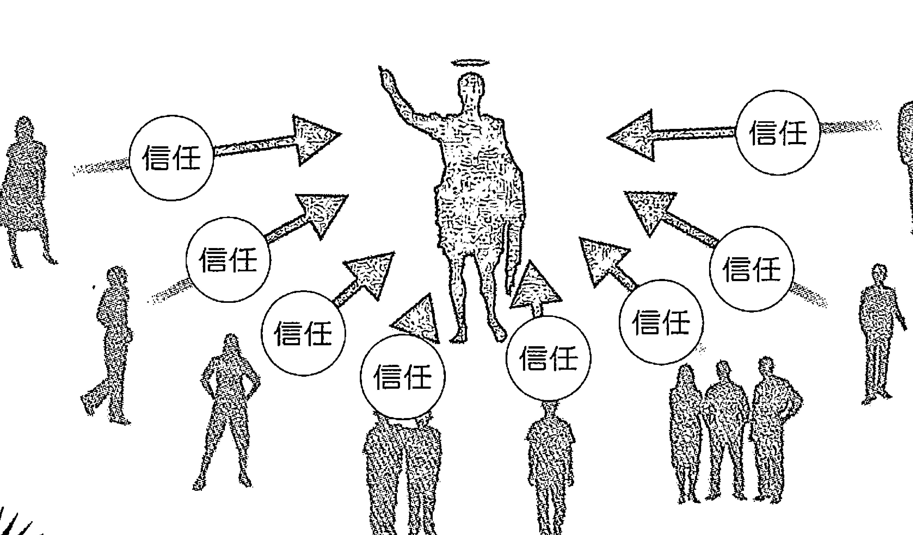

每個人都信任神，並依從自己內在的聲音而活。

## 心靈的訊息

- 團結
- 愛
- 喜悅
- 感謝
- 和平

在自己的內在甦醒過來

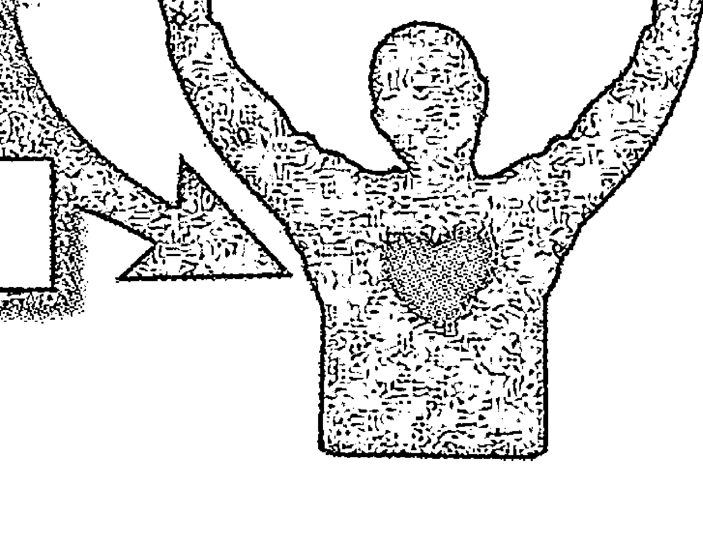

## 反覆提醒真正重要的事

每日指引中，除了將神視為第一之外，也告訴大家關於愛、喜悅、和平、感恩、團結等等的重要性。這些主題在這本書裡也反覆出現著。正如其中一篇訊息寫道：「我（神）一次又一次，溫柔而充滿愛地反覆提醒你，什麼才是人生中真正重要的事。慢慢地，這些事物就會成為你的一部分，活在你的內在，在你的內在活動，並成為你的存在本身。」每天閱讀、冥想這些神聖的訊息，自然而然地，這些訊息就會逐漸深植在我們心中。

在芬霍恩有個習慣，每天早上大家都會在小小的教堂裡，圍著艾琳靜坐冥想一個小時的時間；之後，再從閱讀《敞開心靈之門》中符合當天日期的那篇文章。芬霍恩的教堂誠如其名，總是充滿神聖的氣息。

這本書並沒有強迫大家要接受某種價值觀、宗教、教義或個人崇拜，而是指出一個根本的方向，要讓我們將注意力放在自己的內在，並從自己的內在找到神的存在。

換言之，一切皆已存在於自己的內在中，只要能找出那股力量，我們的生存之道就會因此改變。

> ☆作者艾琳・卡迪在她三十六歲時，第一次接收到来自己的内在傳來的指引，她將其稱為「内在神之聲」。這本書是她集結了數年來她所收到的「内在神之聲」。三百六十六天、一天一頁，簡潔而充滿愛地告訴我們，有關於「如何思考、如何行動，才能過著更幸福、有意義、有價值的人生」的訊息。

> Writing God

## 你本是一個美好的存在，大可懷抱更宏大的心願！

自宇宙捎來的信
Notes From the Universe
麥克·杜利 (Mike Dooley) 著

《自宇宙捎來的信》（中文暫譯，Notes From the Universe）原本是作者麥克·杜利（Mike Dooley）從個人經營的網站「人生冒險俱樂部」（TUT's Adventurer's Club）向會員所發布的免費電子報，之後才集結成這本書。

在電子報中，麥克搖身一變成了「宇宙」（The Universe），而把會員當作朋友般地傳送信息。聽到宇宙這個詞，有些人可能沒什麼概念，

> Move along now

正因為你是一個美好的存在，所以你可以懷抱更大的心願。為了這個心願，一步步向前邁進吧！

其實，只要把它想作是神就可以了。

讀著這些信息，會感受到自己與神的距離縮短了，神彷彿一直在自己身邊，為自己加油打氣。而且這些信息都饒富幽默感，令人讀來忍不住會心一笑。大家不妨順著直覺任意翻一頁來閱讀。在那裡，你一定會讀到令你綻放笑容的訊息。

## 行動的重要性

麥克·杜利傳達的「宇宙」是既愉快又溫柔的，幾乎不會說出「這不能做、那不能做」的硬性要求。

書中反覆對我們說道：「你是個美好的光的存在。你現在來到時間與空間的世界冒險，是個充滿勇氣的靈魂。你是永恆不滅的存在。請不要被肉眼所見的事物給蒙蔽。「幸福是由自己創造出來的。你一定做得到。”

> 天使們一直都在守護著你，為你加油。」

還說：「你是個極具價值的美好存在。你可以懷抱更大的心願。而你的請求終將化為現實。但不能只是去想望。你要順從直覺，朝著那個方向，無論做什麼都好，跨出第一步！」

重要的是，不能只是光想而什麼都不做，要為了你的心願付諸行動，從做得到的事開始。書中也強調了行動的重要性。

我們是因為自己的決定而來到這地球上的。而且，每個人都有屬於自己的存在理由與目的。其中最重要的存在理由，就是為了在這裡體驗冒險犯難的樂趣。換言之，就是要過著幸福的人生，並獲得屬於自己的成功。

此外，這本書的內容具有喚醒讀者自己的內在旅程的效果。它能點燃我們的記憶之火，為我們將類似的想法吸引而來，喚醒沉睡在潛意識中的內在神性。每一則訊息都是在刺激我們想起：「我們是誰？」「我們為什麼在這裡？」

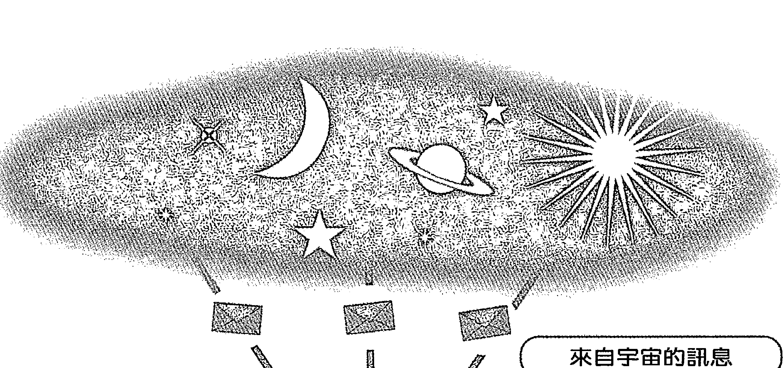

來自宇宙的訊息

> 「你是個美好的光的存在。你現在來到時間與空間的世界冒險，是個充滿勇氣的靈魂。你是永恆不滅的存在。請不要被肉眼所見的事物給蒙蔽。一切都會沒事的。你一定會成功」

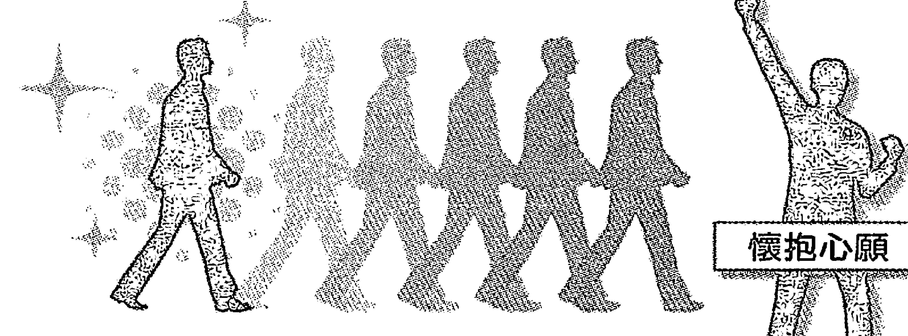

懷抱心願

相信自己是個極具價值的美好存在，並朝著心願開始往前邁進

# 為人生帶來奇蹟

〈圖解〉25個靈性智慧精華 の魔法書

這本書裡也有提及任何人都能自由使用的魔法。文章中蘊含著真理。

愈是讀下去，一定愈能發現比字面上更深層的含義。

「要懷抱遠大的夢想」、「夢想一定會實現」、「相信宇宙」、「我們就是神，就是造物主」等等，這本書充滿了像這樣的真理。而這些真理一定能為你帶來幫助。

## 求知的欲望

話說回來，麥克·杜利又是怎麼開始做這樣的事的？其實他從年輕起，就一直抱持著「我想知道『人生究竟為何』」的想法。於是，答案與智慧就不斷地透過直覺出現在他眼前。他逐漸了解到，神不是為了審判而存在的，神是無時無刻都在對我們展現慈愛的存在。

同時，他還了解到一件事，對於自己想做的事、想成就的模樣，要去思考「怎麼做才能達到」的不是自己，而是宇宙。換言之，他明白到，我們的任務只是將焦點放在希望實現的「那個結果」上，放下過往，全力以赴，樂觀地生活著。宇宙會為了讓我們實現而去處理那些細微末節的事。而他順著這個直覺，開始將信息發送給全世界的人。一開始會員只有數千名，現在已經增加到超過四十五萬人。至今仍是一星期會有五天向大家寄送信息。他的電子報只有英文一種語言，有興趣的人還是可以試著加入會員，同時也可以當作是在學習英文。

# 為人生帶來奇蹟的魔法書

☆這本書是集結自作者麥克・杜利從二〇〇〇年起所發布的電子報內容，他在電子報中化作「宇宙本身」，向大家傳達訊息。《秘密》的作者朗達・拜恩在《秘密》一書中也以「導師」的身分介紹到他，並公開表示「這是一本讓我的人生有了極大改變的書」。此外，這本書裡還有寫到，該書的閱讀方式不是從頭開始，而是「隨便翻開一頁後，就去讀那一頁的訊息」，是一本可隨意翻閱、妙趣橫生的書。

> 相信你的感覺。

> 相信你內在之音。

## 為心靈點燈

## A Guide for the Advanced Soul

蘇珊・海渥（Susan Hayward）編選

> > 客觀地解釋眼前的語言，而不要添加任何自己期待的解釋，這將會使你得到解答。

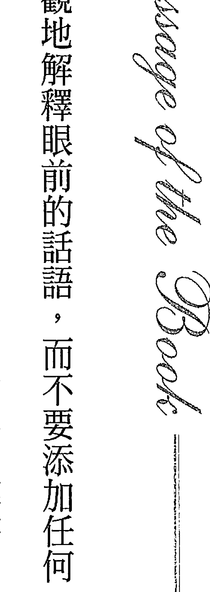

我們是在紐西蘭發現這本書的，這是一本網羅了古今中外聖賢的智慧語錄。因此，日文版的書名又叫《神聖的智慧之語》。這本書中蒐羅了艾琳・卡迪、老子、蘇格拉底、歌德、愛倫坡、克里希那穆提、泰戈爾、海倫・凱勒、達文西、愛因斯坦、畢達哥拉斯等古今中外的智者箴言。理解這些聖賢的智慧之語，並找到最適合的譯文來表現，對身為譯者的我們而言，是一件快樂無比的工作。因為這本書充滿了新時代所需的種種智慧。我們覺得，書裡選錄的語句，全都是字字珠璣的至理名言。

> > 你可以從第一頁開始一頁一頁地閱讀這本書，不過編選者蘇珊·海渥（Susan Hayward）則是說道：「這是一本當你遭遇問題時，或者需要別人的建言時，可以來幫助你拿定主意的書。首先，在心中清清楚楚地描繪出你的問題，再透過冥想讓心靈沉澱下來。當你來到這個狀態時，你將變得能夠運用你的潛意識與直覺。然後，一邊在心中祈求得到建言，一邊隨手翻開這本書。最先映入眼簾的話語，就是你現在最需要的。」

其實，這本書最核心的想法就是，這世上沒有偶然，宇宙時時刻刻都準備好要來出手相助。

# 為人生帶來奇蹟の魔法書

(圖解) 25個靈性智慧精華

給以靈魂成長為目標的人
這本書出版後，類似的好評四處流傳著，「實際運用以後，真的得到了當下最需要的答案！這真是一本不可思議的書！」
至今仍然有非常多人持續使用這本書。各位不妨在哪天想起時，也順手翻翻看吧！
然後，請敞開你的心，客觀地進行解釋哦！不能摻雜自己期待的解釋。直率地解讀眼前的句子，將會引領你找到答案。
無法馬上理解的話，請暫時將那句話放在心裡。說不定你會意外地在某個當下，突然間明白句中含義。
蘇珊還寫道：「這是一本指南書，教你如何靠著自己去改變自己的實相」。據蘇珊所言，我們所處的現實，實際上完全是由自己的思想所反映而來。因此，利用這本書改變自己的想法，就等於改變自己所處的實相。

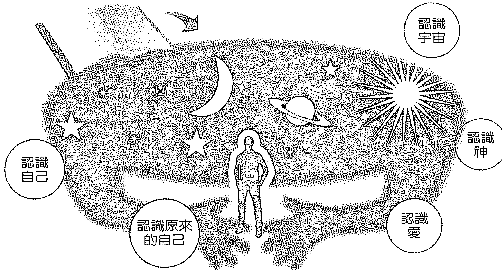

> 一本書的雋語可以成為你的人生助力，
這是因為宇宙時時刻刻都準備好要來出手相助

比方說……

「有時候放下工作，離開人群，獨自到一個地方，然後就只是『待在那裡』，這很重要」

# 為人生帶來奇蹟

（圖解）25個靈性智慧精華 の魔法書

推薦大家一定要親身體驗看看。

## 一句話就能撼動靈魂

編選者蘇珊研究過藥草學、按摩、占星學、營養學、靜坐冥想、東洋哲學、西洋哲學等各領域的學問，尤其令她感興趣的是，關於人類在精神、靈性上的成長。因此，她博覽群書；當她看到書中充滿智慧的話語時，每次都會立刻記錄下來，而最後整理出來的，就是這本書。

書中所選錄的饒富智慧的雋語，具有一股可推動人心的強大力量，甚至有可能為閱讀的人帶來人生奇蹟。有時，短短的一句話就能撼動你的靈魂。相信如果能依內心直覺與這些雋語進行心靈交流，便能為你的靈魂帶來不可思議的奇蹟了。

這本書中最重要的一句話，我們認為是蘇格拉底所說的「認識你自己」

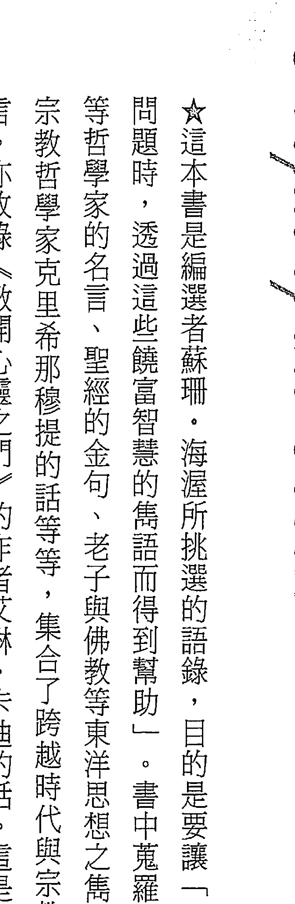

「己」（know yourself）。認識自己是誰，甚至可以擴及到「認識宇宙」、「認識神」、「認識愛」。我們花了三十年的時間才有了真正的理解，但這段漫漫長路，一定是理解前的必經歷程。
現今，每個人需要的就是去發現「自己是誰」。希望這本書中的雋語能在這條道路上，助各位一臂之力！

★這本書是編選者蘇珊·海渥所挑選的語錄，目的是要讓「讀者在遇到問題時，透過這些饒富智慧的雋語而得到幫助」。書中蒐羅了蘇格拉底等哲學家的名言、聖經的金句、老子與佛教等東洋思想之雋語、印度的宗教哲學家克里希那穆提的話等等，集合了跨越時代與宗教的金玉良言。亦收錄《敞開心靈之門》的作者艾琳・卡迪的話。這是一本適合在遇到煩惱或困難時，隨手翻閱的好書。

### 人生是淬煉靈魂的場所。一切都具有意義，不可或缺。

> 相信靈魂轉生，改變人生

> 輪廻転生を信じると人生が変わる

山川紘矢 著

# 為人生帶來奇蹟

{圖解}25個靈性智慧精華の魔法書

這二十七年來，我們主要的工作就是不斷將英文的心靈成長圖書譯介至日本。選擇要翻譯的書籍時，我們主要挑選的基準是，讀了之後能夠打動我們的心、幫助我們的靈魂成長的書籍。在這過程中，我們也從每一本書裡獲得許多學習。有時候，我們也會感到「翻譯心靈成長圖書的工作，其實可說是為自己所做的事」呢！

> 輪迴轉世是真的。靈魂不滅。 讓我們了解萬物為愛、萬物齊一的真諦吧！

Message from the Book

## 覺察神的訊息

幾年前開始，我們將自己的體驗、想法，以及至今學到的事，撰寫成書。

本書將介紹其中的兩本，一本為紘矢所著，一本則為亞希子（229頁）。兩本都獲得許多迴響，閱讀過的人將他們的各種感想回饋給我們，

諸如：

+   「讓我有了深刻的覺察！」
「讓我得到不少解脫！」
「讓我對人生開始有了更深一層的想法！」等等……

這本書是紘矢的第二本著作。第一本《歡迎來到天使俱樂部》（天使

Part 3
輪迴轉世的靈魂旅程

# 為人生帶來奇蹟的魔法書

### [圖解]25個靈性智慧精華

原本是紘矢在MAGAZINE HOUSE的雜誌《Relax》中、長達兩年之久的連載散文，最後集結成冊。這些散文以平易近人的筆調，饒富趣味地寫出了自身的神秘體驗、靈性世界的秘密、了解自我真實的重要性、靈性世界的關鍵句等等。但後來的數年間，紘矢忘了寫書的事，一方面也是因為翻譯的工作愈來愈忙碌。二〇〇九年三月，我們搭乘日本和平組織的「和平號」（Peace Boat）前往南極。越過德雷克海峽，到達南極的北端，在嚴寒的南極，乘船繞行皚皚白雪所覆蓋的島嶼及茫茫大海，進行了為期三天的旅程。南極之旅結束後，和平號將橫越南太平洋，停靠復活節島、大溪地等地，之後朝日本返航。回程的某天早晨，天空上出現一道大大的彩虹。而且，彩虹的一端浮著一片暈染成粉紅色的雲彩，狀如一隻眼睛，這

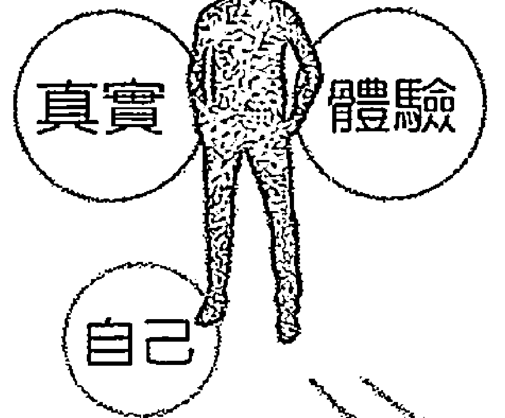

靈性世界

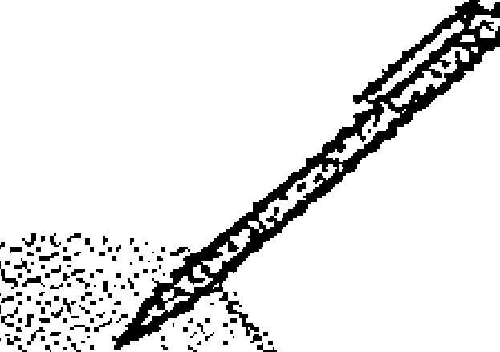

撰寫成書

深入思考

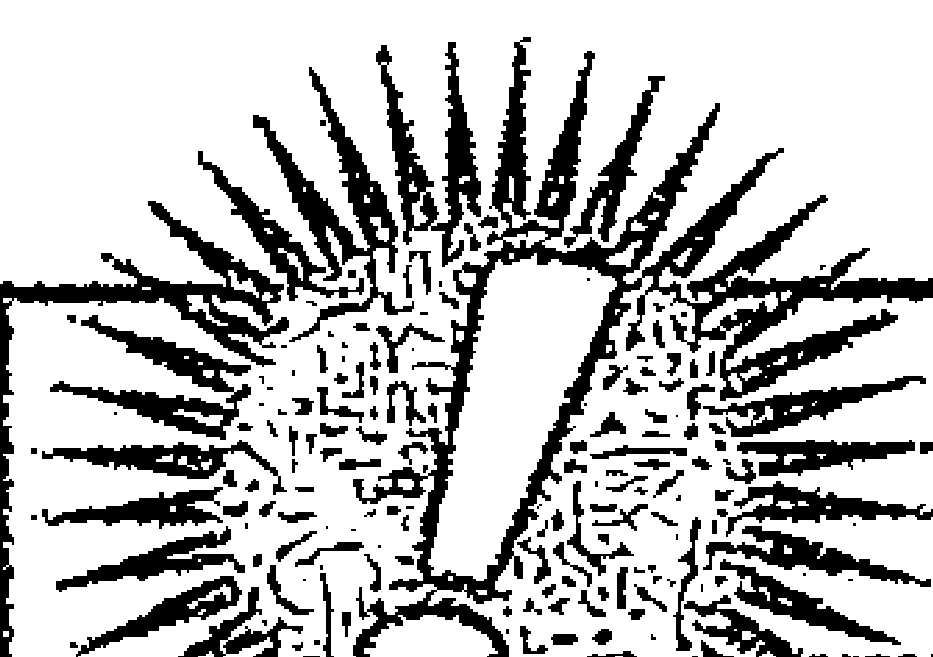

覺察

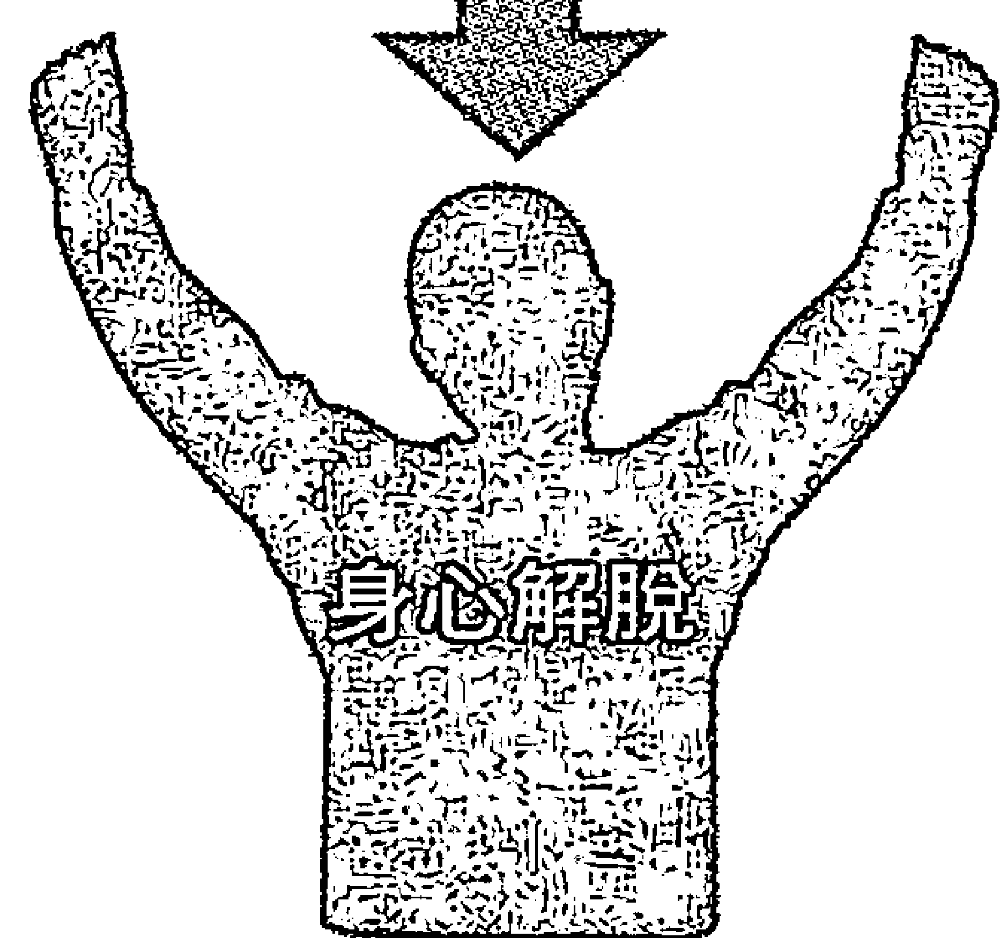

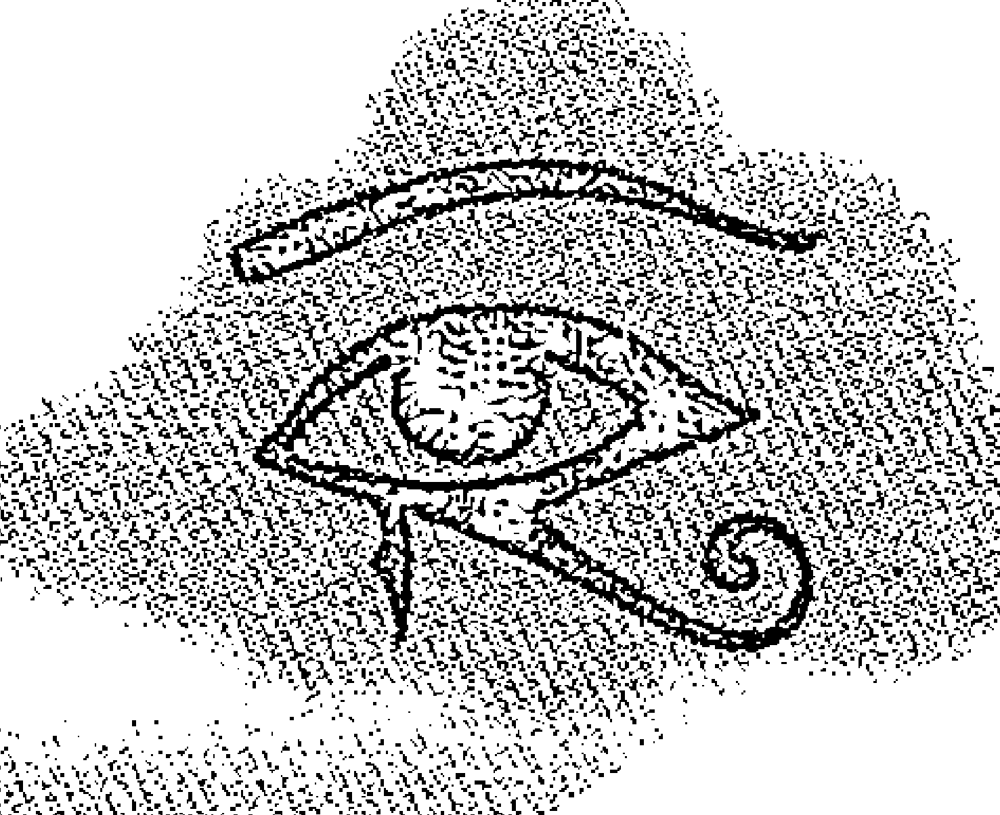

訊息

新的嘗試

> 靈性世界中的一切都是環環相扣的

# 為人生帶來奇蹟の魔法書

{圖解}25個靈性智慧精華

般景象我們從未見過。那是天空之神為我們所展現出的神奇造形。看到那雲彩與彩虹時，紘矢感受到上天傳來的訊息：「你要寫下來！你要把你所體驗過的一切，原原本本地撰寫成書！」

## 改變人生的際遇

回到日本後，紘矢立刻開始著手撰寫原稿，即使當時還未找到合作的出版社。

就在原稿完成之際，就收到一位自稱是編輯的女性讀者傳來的電子郵件，說道：「希望能請山川紘矢先生為我們寫一本書。」

接著，馬上就透過那位女士，由Diamond出版社將那份原稿出版成書，就是這本《相信靈魂轉生，改變人生》（輪廻転生を信じると人生が変わる）。

從一九八六年我們翻譯了第一本書《心靈之舞》到後來的出版經緯，以及因此而徹底改變我們人生的不可思議的遭遇，都詳實地記錄在這本書中。
同時，書裡也淺顯易懂地訴說當今的我們非知不可的事，比方說：「輪迴轉世」、「人是不死的」、「認識自己十分重要」、「一切都是愛」、「以及「萬物齊一」等等的概念。
這是一本既平易近人又激勵人心、十分易讀易懂的書。我們相信，當你閱讀完畢之時，將會變得心靈平和，並能感受到人生的不可思議以及宇宙的愛。
這可以是一本靈性成長的入門之書，也可以是一本讓你更深入了解靈性世界的書，我們誠心推薦給大家。

## 為人生帶來奇蹟，【解說】25個靈性智慧精華の魔法書

☆這本書是山川紘矢的自傳，真誠且幽默地敘述了自己「為什麼捨棄日本大藏省（現為財務省，相當於台灣的財政部）的官員職位，而成為一名心靈成長圖書的譯者」，以及「自己是否在實踐靈性的生活方式」。從他在日本參加「靈性覺察講座」，爾後赴美任職，乃至與他的命中注定之書《心靈之舞》相遇，這一連串的邂逅是如何環環相扣地把他引領到一個全新的世界，全都記錄在這本書中。gently gently soft...

> 靈魂會讓現在的我從過去的記憶之中得到覺察。

## 前世今生

## Many Lives, Many Masters

布萊恩・魏斯 (Brian L. Weiss) 著

# 為人生帶來奇蹟の魔法書

{圖解}25個靈性智慧精髓

這本書是根據作者布萊恩・魏斯（Brian L. Weiss）博士實際進行過的治療所撰寫而成的。到他這裡來尋求治療的是一名叫做凱瑟琳的女士，她長期恐於恐慌症和憂鬱症，使她的人生陷入一籌莫展的困境。魏斯博士花了一年半的時間，對她進行各種心理療法，但症狀都毫無起色。於是，他在凱瑟琳的同意之下，嘗試改以催眠療法治療。所謂催眠療

> > 人不會死、會在另一個世界安全地活下去。而且有一天，還會再一同轉世來到這世上。
> Message from the guide

法，就是引導患者進入放鬆的狀態，並將注意力集中於某一點，藉以想起被遺忘的過去。在心理治療上，常會使用這種方法讓病患想起童年時候的事。

許多人可藉由憶起童年時代的痛苦回憶，而讓憂鬱或恐慌的症狀得以改善。

但以凱瑟琳來說，第一次的催眠療法，雖然讓她想起了孩童時期的痛苦回憶，但她的症狀卻毫無改善。

第二次的催眠療法時，魏斯博士向凱瑟琳下了一個指示：「請妳回到引發妳症狀的那個時間。」於是，她回到了西元前一八六三年的中東、近東地區。當時博士對於眼前所發生的事，完全沒有心理準備。

當天，凱瑟琳想起了許多關於中東、近東時期發生的事，一週後，當她再次出現在博士面前時，變得亮麗而有光采。

一直以來的痛苦症狀得到了減緩，凱瑟琳整個人變得神采奕奕。她迫

## 論迴轉世的靈魂旅程

### 重生為人生帶來奇蹟的魔法書
（圖解）25個靈性智慧精華

不及待地做好準備，再次接受催眠療法。這一天，她又想起了許多的前世記憶。

想起前世記憶的意義

魏斯博士大為驚訝，於是查閱了圖書館裡的書，結果發現，已有許多學者針對生死輪迴、轉世投胎、前世等等的議題，進行嚴謹而認真的研究。

凱瑟琳接連想起一段又一段的前世記憶，每次催眠治療結束後，她憂鬱和恐慌的症狀都逐漸減輕，人生也變得愈來愈明朗起來。

而且，她還在催眠狀態下，開始向博士傳達高靈們的訊息。這個體驗為博士帶來了巨大的改變。

而當凱瑟琳完全從疾病中康復時，魏斯博士也接受了輪迴轉世與前世

放鬆肩膀

將注意力集中於一點

放鬆狀態

催眠療法

了解前世

恐慌

憂鬱

新的自我

為人生帶來奇蹟的魔法書
（圖解）25個靈性智慧精華

推廣前世療法的心願

於是，他同時生活在醫學的領域、又在靈魂探索的世界中。他不但在為患者診療時，直覺變得更加敏銳，也開始在夢中獲得智者的開示。不僅如此，他更因活著的幸福與美好而感動，對成功與財富的慾求也減少了。他的人生可說有了一百八十度的轉變。

這本書一出版，立刻受到大眾的喜愛，躋身暢銷排行榜。這也讓大家注意到，事實上已有許多醫師都採用前世療法進行治療。愈來愈多人對前世療法感興趣，於是也開始出現許多稱為「催眠治療師」（Hypnotherapist）的工作者。

在日本，《前世今生》（Many Lives, Many Masters）十分受歡迎。

尤其是經歷過與摯愛天人永隔的人，特別能從書中得到力量，因為這本書傳達了一個訊息：「人不會死。我們將會在另一個世界安全地活下去。而且有一天，還會再一同轉世來到這世上。」

自從這本書出版之後，在日本也是出現許多催眠治療師，但在醫學的領域似乎仍將前世療法視為一種異端。希望日本的醫學界也能夠敞開心胸，慢慢改變固有的立場，廣泛採用各種有效的治療手法，而不要拘泥於這個手法是否能以目前的科學思維說明。

然後，希望因此帶領更多人體驗那個肉眼看不見的世界。

這本書出版後，博士又寫下了《生命輪迴》（Through Time Into Healing）、《返璞歸真》（Only Love Is Real），以及最新的《奇蹟，正在發生》（Miracles Happen）等多部耐人尋味的作品。至今，他仍持續向大眾傳遞輪迴轉世以及活著的意義。

為人生帶來奇蹟的魔法書
（圖解）25個靈性智慧精華

★一九八八年，精神科醫師布萊恩·魏斯博士將他為一名女性患者治療強烈的焦慮症、強迫症時，所使用的催眠療法的體驗，撰寫成這本書。書中描述出，女性個案在催眠治療中敘述的「前世」以及「大師的聲音」，是如何療癒了患者自身的傷痛，甚至改變作者的人生觀。魏斯博士至今仍以一名醫師的身分，一面用科學的角度研究他在催眠療法中所看到的前世，一面不遺餘力地推廣他對靈性、靈魂存在的深刻體悟。

請不要一味地恐懼肉體的死亡。死亡只是一種畢業。唯有愛是永恆的。

天使走過人間
The Wheel of Life
伊莉莎白·庫伯勒·羅斯 (Elisabeth Kübler-Ross) 著

為人生帶來奇蹟的魔法書
（圖解）25個靈性智慧精華

作者伊莉莎白·庫伯勒·羅斯（Elisabeth Kübler-Ross）是一名精神科醫師，也是安寧照護（臨終醫療）、死亡科學的先驅者。而這本書是作者本人的自傳。

另一部作品《生死邊緣》（On Death and Dying），是根據她過去與許多面對死亡的末期病患心靈相通的體驗，所描述出的人在接受死亡時的過程。這本書也成了風靡全球的長銷書。

> > 當前方的高牆聳立時，若能一邊跨越層層苦難，一邊因喜悅而顫動，這樣的人生是何等美妙！

Melody of the Soul

倘若我們來到這世上以後，能因阻擋在前方的牆愈高聳、愈堅實，愈能燃起鬥志，讓自己一面跨越層層苦難，一面在喜悅中顫動的話，這一定會是個非常美妙的人生。伊莉莎白正是這樣的人，這樣的她也才是真正的夢想實現高手啊！

還沒讀過這本書的朋友，我們大力地推薦，千萬別錯過了。作者在書中接二連三地了解到自己的使命，並展開冒險，開拓出嶄新的領域。這是一本十分有趣，且讓人欲罷不能的書。

### 藥物難及愛與關懷

伊莉莎白出生時是三胞胎裡的其中一胎。三姊妹長得極為相似，幾乎到無法分辨出誰是誰。因此，童年時期的她用盡自己所有的時間，只想要解「自己究竟是誰」。

而她也一直覺得，自己必須要比別人多付出十倍的努力，來展現自己所擁有的十倍生存價值。從小她就決定長大後，要成為一名醫生。但擁有絕對權威的父親卻不允許她有這種想法。儘管如此，她還是讓自己一點一滴地靠近夢想，實現進入醫院工作的心願。在醫院裡的研究工作，以及第二次世界大戰結束後赴義大利、波蘭等地擔任志工的經驗中，她了解到，陪在病人身邊，與他們的心靈相交，才是最真實的療癒。最後，她終於進入醫學院，取得了醫師資格。她還在那裡邂逅了她最愛的人曼尼，並與他結為連理、赴美生活。而接下來，她所開始經歷到的種種體驗，讓她寫下《生死邊緣》一書。她在與病人的交流中，不斷得到深刻的體悟，像是：患者最想要的其實是與醫生的心靈產生連結；比起藥物，愛與關懷更能治癒他們，無論什麼樣的病患，他們的內在都蘊藏著繼續活下去的力量……等等。她的愛從不止歇。她全心全意地投注自己的心力，在為病人謀取福祉的工作上，尤其是那些被其他人放棄的患者。只要讓他們能夠過得稍微幸福一點，她就會盡自己最大的努力去做。

> 「人類來自同一根源，回到同一根源。我們都必須學習如何平等地、無條件地愛人與被愛。一生中，你經歷過無數苦難，作過無數噩夢。你把這些苦難看成神的懲罰，但，事實上這些都是神賜予你的機遇。這些機遇讓你成長，而成長是人生的唯一目的。療癒這個世界之前，你得先療癒自己。只要你準備好，毫不抗拒，這種靈性的經驗自然就會降臨在你身上」

為人生帶來奇蹟的魔法書
（圖解）25個靈性智慧精華

時時刻刻與神連結看到她成就了如此偉大志業的故事，令人不禁讚嘆於人類所擁有的力量。神是否給了她超乎常人的勇氣、果斷力與體力呢？或許是因為她一直與神連結，才能從神那裡源源不絕地接收到所賜予她的能量、堅強意志、果斷力和體力吧！而她也是一個——在每個當下都清楚知道自己想做什麼、以及該做什麼——的人吧！

> 她在這本書的最後一頁寫道：
「死亡只是一個過渡——從這一世過渡到一個沒有病痛、沒有煩惱的世界。只要有愛，人生的一切都可以忍受。……世間唯一永恆的就是『愛』。」

> 「人類來自同一根源，回到同一根源。我們都必須學習如何平等地、無條件地愛人與被愛。一生中，你經歷過無數苦難，作過無數噩夢。你把這些苦難看成神的懲罰，但，事實上這些都是神賜予你的機遇。這些機遇讓你成長，而成長是人生的唯一目的。療癒這個世界之前，你得先療癒自己。」

> 「只要你準備好，毫不抗拒，這種靈性的經驗自然就會降臨在你身上。」

她在一九九五年發生腦血管栓塞後，仍繼續寫下多部著作，包括這本書。每本書裡都蘊藏著她不屈不撓的愛與熱忱。

在迎接新的靈性時代的這個當下，我們希望能让更多人看到她為世人留下的啟示。

Seeing through the void

☆伊莉莎白·庫伯勒·羅斯是一名精神科醫師，她曾以「人在死亡的瞬間，心靈會發生什麼變化？」為主題，寫下超級暢銷書《生死邊緣》；而這本書是她的唯一一本自傳。作者四歲時在兒童醫院遇到一名正面臨死亡的少女，自此後她就不斷研究死亡究竟為何物。她致力於推展臨終醫療，以及為感染愛滋病的患者設立福利機構等工作，但卻一路遭受強烈的反對。最後她超越重重艱難，並肯定了「無論生與死都同樣美好」。透過這本書閱讀到她這樣的人生態度，你一定也能從中得到力量。

人生即是一場探索自我內在的旅程。

心靈之舞
Out on a Limb
莎莉·麥克琳 (Shirley MacLaine) 著

為人生帶來奇蹟的魔法書
（圖解）25個靈性智慧精華

好萊塢影星莎莉·麥克琳（Shirley MacLaine）與歐洲政治家墮入愛河，這場戀愛經驗導引她走向未知、肉眼不可見的世界。她在這本書裡，大方地自剖自白關於這些體驗。
為什麼和這個人相遇，從第一眼與他四目相接，就無由來地彼此相互吸引，最後發展成戀愛關係呢？莎莉對這件事開始感到不可思議，於是不斷去探索「為什麼」，這反而挖掘出一些最根本的問題：
- 「我究竟是誰？」
- 「人來自何方，又將回到何處？」
- 「肉眼看不見的世界是否存在？」
- 「我們看不見的世界是否一直在引導著我們？」
- 「輪迴轉世是真的嗎？」

人即是靈魂的存在。讓我們慢慢了解與宇宙意識合而為一的重要性。

內容描述，此後她經歷了一次又一次不可思議的遭遇，並受到冥冥之中的力量引導，而來到秘魯高山上的一處礦泉。在這裡，她體驗到了靈魂出竅，並聽見來自宇宙的女性所說的話，最後她終於接受了自己的命運。

肉眼看不見的世界

這本書於一九八三年出版後，受到電視報章的大篇幅報導而躋身暢銷排行榜，成為一本家喻戶曉的書。莎莉在書中描述的靈魂之旅，讓許多人深深著迷。

「啊！原來我們都是靈體的存在，我們都是神的一部分。」
「每個人都會不斷重複著輪迴轉世呢！」
「我們可以從肉眼看不見的高靈身上，學習各種事物。」
「諸如此類關於肉眼看不見的世界的真相，在這本書中都淋漓盡致地描繪了出來，而這些內容在當時十分罕見。

# 為人生帶來奇蹟的魔法書
（圖解）25個靈性智慧精華

這類肉眼看不見的世界，也就是關乎靈性世界還有靈性的事物，傾向被看成一種異端想法。只有科學性思考才是正常、真實的，科學無法證明的事物就是不切實際的妄想，根本不值得認真看待——像這樣的價值觀，在現代的文明社會中依舊根深蒂固。

三十年前，更是充滿了這樣的偏見。在那樣的時空下，莎莉卻願意寫這本書，將自己攤在世人面前，她十足的勇氣令人欽佩。她甚至有可能因此危及事業。事實上，她也確實遭到了許多非難。

「人就是靈魂的存在」、「與宇宙意識合而為一是很重要的」這類想法，在過去完全不為多數人所知；就算偶有所聞，大部分的人也只會認為「和我無關」、「他們真是一群怪咖」。

- 「我究竟是誰」
- 「人來自何方，又將回到何處」
- 「輪迴轉世是真的嗎」
- 「肉眼看不到的世界是否存在」
- 「我們看不見的世界是否一直在引導著我們」

真實的世界

> 靈性世界才是真實的世界
> 那是一個等同於神的世界

為人生帶來奇蹟的魔法書
（圖解）25個靈性智慧精華

然而，《心靈之舞》這本書卻是出自女星莎莉之手，出自一名眾人仰慕的對象之手。而且就一本關於靈性世界方面的書籍來說，這大概是有史以來第一本受到媒體廣為宣傳的書，它成功吸引了眾人的目光。

靈性世界才是真實的世界

這本書如實地記載了她自己的靈性追求之旅，實在是一本相當有趣的讀物。包括了她的戀愛史、環遊世界的旅程、追尋自我的經歷、通靈經驗、外星人體驗、靈魂出竅、輪迴轉世等等，她與未知世界的種種接觸，會讓人讀得欲罷不能。而最後，也將引領著我們進入那自然與靈魂的世界。閱讀這本書，會讓我們覺察到自己究竟是誰，宇宙又是什麼。

過去，靈性世界一直被認為是專屬於少數特殊族群的領域，但這本書卻告訴世人：「靈性世界才是真實的世界哦！肉眼所見的世界，只不過是真實世界的一部分。當我們的意識擴張後，會發現那裡存在著一個超乎想像的美好世界。而且這個世界的大門為每個人而敞開，未來也將有愈來愈多人踏上通往這個世界的旅程。」透過這本書的介紹，你將會知道靈性世界絕非只為少數特殊之人而敞開的世界。

莎莉透過這本書讓大家知道，有許多不可思議的事物，過去這些被視為超自然現象並敬而遠之，但其實那才是我們必須極力去了解的事。

從這個角度來看，《心靈之舞》一書可說完成了它的重大使命，將靈性的世界介紹給一般社會大眾，並讓許許多多的人開始注意到這個世界的存在。

為人生帶來奇蹟的魔法書
（圖解）25個靈性智慧精華

Against the Odds

★因電影「親密關係」（Terms of Endearment）榮獲奧斯卡影后之譽的莎莉·麥克琳，是演出過無數電影作品的知名女星。她在一九八三年寫下了這本自傳式小說，詳實地記錄她不被允許的戀愛，和同時期所歷經的回溯催眠、通靈等神秘經驗，以及這些經驗如何成為一條探索自我內在世界的漫長旅程。這本書也締造了巨大成就，讓美國乃至全球有愈來愈多的人開始對「輪迴轉世」、靈性思想等議題感興趣。

> 宇宙中發生的一切進化，所有科技的進步，那些可是我們全體的人生哪！

時光白洞
The White Hole in Time
彼得·羅素 (Peter Russell) 著

二○一二年是對靈性世界感興趣的人們議論紛紛的「揚升」之年，也是傳說中馬雅曆刻文最終結束的一年。如今，二○一二已過，新的時代正要展開。我們正迎向一個巨大改變的時刻。

我們最初是在翻譯這本《時光白洞》（中文暫譯，The White Hole in Time）時，接觸到「二○一二年是地球急遽變化的一年」的說法，當時是一九九二年。這本書以物理學、生物學等科學的觀點為基礎，解說我們人類目前的靈性發展。

真正的幸福不是財富也不是名聲，當我們願意並回歸真實的自我，才會是真正的幸福。

Message of the Book

真正的幸福不是財富也不是名聲，當我們願意並回歸真實的自我，才會是真正的幸福。

書中寫道，地球的歷史是一個加速化的歷史，現在，加速化已經逐漸抵達極限，變化的循環週期不斷壓縮，從以年為單位變成以月為單位，再變成以週為單位、日為單位，「到二〇二二年十一月時，加速將到達極限」。對當時的我們來說，書中所說的是二十年以後的遙遠未來，因此沒有太深刻的感受。

我們一直以為，「雖說是揚昇之年，但實際上也不會真的發生什麼事吧！只不過人們的意識會比現在更為擴張。」

但就在二〇一一年三月十一日，發生了三一一一大地震和福島第一核電廠核災。這是否也和揚昇有關呢？現在這個時候，似乎更應該再次閱讀《時光白洞》這本書。

### 獲得真正幸福的方法

作者彼得·羅素（Peter Russell）長年來持續靜坐冥想，是靈性世界的先驅者之一，但他同時也是在劍橋大學鑽研物理學、數學、還有實驗心理學等學問的科學家。他充分發揮這兩方面的知識與體驗，撰寫出了這本書。書中深刻地探究我們人類的現狀。

他說道，「我們總是在尋求幸福，這是很理所當然的，但過去以來，我們一直用錯誤的方法追求幸福。換言之，我們一直誤以為在財富、名聲等外在條件上變好，就是獲得幸福的必要條件。其結果是造成自然生態的破壞，引發人與人之間的紛爭，形成目前面臨的種種危機。事實上，幸福是自我本身內在的問題，只要找回心靈的平靜就能得願。而現在，人類開始要朝那個方向回家，那就是現今正興起的變革，找回真實自我的運動與所謂的意識復興。」

真正的幸福是……？

- 提升財富、名聲等自我外在的條件，並非真正的幸福。
- 心靈的平靜。

白洞 White hole

新境界

輪迴轉世的五段旅程

第 19 課

### 進化的終點與自由

他在這本書中，將這樣的現象淺顯易懂地依序做了說明。簡單地說，這本書結合了科學與靈性的觀點，說明了現在我們正處在地球歷史、人類歷史的哪個時期，而我們又將去往何方。

另外他還提到，未來我們會使用心電感應，瞬間彼此就能交換訊息，而電腦的急速發展，就是在為這樣的未來做準備。

二〇一一年的六月，我們終於在美國再次與他相會，睽違十八年。當時他舉辦了一場靜坐冥想的工作坊。一開始他分享自己的經驗，學生時代，他因為非常想了解印度得道者的心理狀態是什麼，因而前往印度學習超覺靜坐（Transcendental Meditation），之後，他又學習了內觀禪修（Vipassana Meditation）。目前他從內觀禪修中發展出自己獨創的靜坐冥想方式，並教授這套靜坐法。

關於這個世界未來會變成什麼樣子，彼得又是怎麼說的呢？正如《時光白洞》這本書的書名所示，我們會被捲入一個加速化的漩渦中，被一個與黑洞相反的白洞所吸入，然後朝另一彼端的光的世界前去。

> 「那將是這段進化過程的終點，同時也會終結掉我們成效不彰的態度與對事物的看法。屆時，我們將能自由自在地享受自己的真實世界，猶如徜徉大海中的鯨魚和海豚一般。」

在今後的新時代中，我們真能像鯨魚和海豚那樣活得自由自在嗎？這絕對會是本讓你讀來興趣盎然的書。

☆這本書於一九九二年由彼得．羅素所撰寫，內容是探討關於整個地球與地球上的生命所持有的「意識」和「演化」。生命的進化與繁衍、科技的發展，在在改變著我們的意識，而這些改變又會對地球產生什麼樣的影響，本書以融合科學與靈性意識的觀點，對這些問題進行了解說。
文中出現對現今所做的預測，雖然是早在二十年前寫下的，但是例如「網際網路的發達使整個地球的意識產生變化」等內容，卻依舊禁得起時間的考驗。

> Seeing the Beauty

> 當你做好準備時，你自會與你的人生導師相遇。

和平戰士的神聖旅程
Sacred Journey of the Peaceful Warrior
丹．米爾曼（Dan Millman）著

這本書是作者丹．米爾曼 (Dan Millman) 的第二部著作。一九八〇年，他推出了第一本處女作《深夜加油站遇見蘇格拉底》 (Way of the Peaceful Warrior)。該書主要描述作者在加油站遇到一位在那裡工作、名為蘇格拉底的老人，而接下來發生在兩人之間的種種談話。他在蘇格拉底的引導下展開了真實自我的探索之旅，目標是成為一名「和平戰士」 (Peaceful Warrior)。

> Message of the Soul
> 人之所以遭逢困難，是為了提醒我們找出存在於自己內在的負面之物。

然而，當丹與蘇格拉底道別，大學也畢業後，紛至沓來的俗事讓他逐漸遺忘了對真實自我的探索。他失去了人生的目標，總是苦於「自己的生活中好像缺少什麼」。就在這樣的煩惱之下，他的家庭生活亮起了紅燈，最後甚至與妻子分居。

到這個時候，他才又想起了身為一名「和平戰士」該走的道路，以及蘇格拉底曾帶給他的啟示。於是，他再一次恢復「和平戰士」的身分，踏上尋找自我的旅程。而《和平戰士的神聖旅程》（中文暫譯，*Sacred Journey of the Peaceful Warrior*）所描寫的，就是後來這段旅程的故事。

> 當你準備好了自會出現

相對於《深夜加油站遇見蘇格拉底》一書所寫，是近似丹的真實體驗，《和平戰士的神聖旅程》則是他將種種學習過程統合成一個單一體驗的虛構小說。書中，一步步引導他的馬馬齊亞，一名夏威夷的卡夫那（Kahuna）（卡夫那是夏威夷語，指的就是通靈者），這個女性其實是他將當時帶給他指引的眾多人生導師，融合成一位人物所塑造出的角色。在這本書中，馬馬齊亞不斷重複強調一句話：「當你做好準備時，你就會與你的人生導師相遇。」這在心靈成長界中是很常用的一句話。回顧我們至今這三十年來的種種經歷，不禁也覺得，當我們自己做好準備時，就會很湊巧地從某處得到需要的資訊，或者碰上當時能夠指引我們的老師、演講、工作坊或冥想等等。現今，世人的意識正經歷一項巨大的變革，改變的速度也不斷在加快。這是因為，如果不能從舊有的社會體制、經濟制度，轉變成一個重視愛與關懷的社會，我們自身的存續將會出現危機。為此，今日出現了許許多多肩負人生導師之職責的人物、演講以及方法等。這些人事一定會在你最需要的時候，在你做好準備的時候，出現。

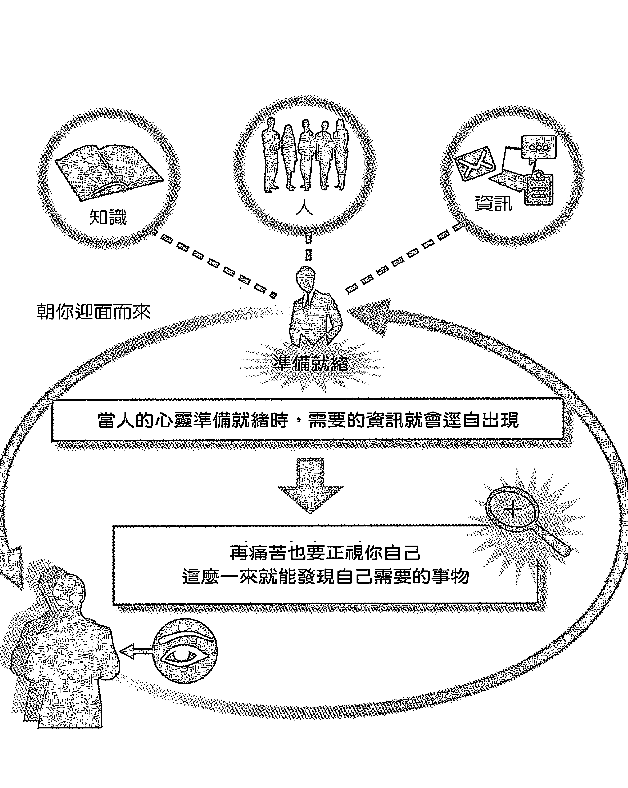

# 將深入自我內在的旅程持續下去

丹與馬馬齊亞相遇之前，曾經到過印度等世界各地的聖地，與各色各樣的靈性導師一同修行。

但即便那樣，他還是無法探得「自我的真實」。

百般煩惱的丹，忽然感受到直覺告訴他「去夏威夷吧！」他抑制不了這股強烈的直覺而遠赴夏威夷，在那裡，他終於想起了蘇格拉底曾提到過的「馬馬齊亞」。

丹費盡千辛萬苦找到馬馬齊亞後，馬馬齊亞便賭上自己的性命，教導他如何與「偉大的自我」（大我）合而為一。

於是丹終於知道了一件事：所謂的靈性之旅，所謂遇見自我內在的真實之旅，其實就是深入自我內在的旅程，並非要環遊世界訪遍各地的靈性導師，或前往特別的能量點尋求力量。

讀了這本書，你將能深刻地了悟直覺的正確性。因為，所謂的直覺，也就是自我的內在，總是非常了解當下的自己真正正在尋求的是什麼。

事實上，自我向內的旅程是每個人都能獨自進行的。尤其，當我們遭遇人生困境時，它其實是一個警訊，告訴我們：「你必須正視自己的內在，找出自己內在的負面之物，找出阻礙自己成長的障礙物。」這時不管再怎麼痛苦，也請你一定要好好正視自己，誠實地面對自己。承認自己的人生是自己的責任，並學著去愛那個原原本本的自己。

## (圖解)25個靈性智慧精華の魔法書

☆作者丹·米爾曼於一九七三年進行了一段重新發現自我靈性目的之旅，並依此經歷為藍本寫下這本書。五年前，丹·米爾曼在加油站遇到一位名為蘇格拉底的老人，並從老人身上學習到許多靈性方面的洞見，但之後，他卻逐漸遺忘所學。有一天，他想起蘇格拉底帶給他的啟示，便展開一場靈性之旅，找回這五年間所失去的東西。作者以一個求道者的姿態，將自己的不圓滿如實地攤在陽光下，供閱讀的人們自我覺察。

> 宇宙會幫助你實現最深的渴望！信任並委身於宇宙吧！

牧羊少年奇幻之旅
O Alquimista
保羅·科爾賀 (Paulo Coelho) 著

## Message of the Boy

我在這世間的使命是什麼？
我的夢想是什麼？
何謂生命？
別忘了這些最根本的問題。

這本書是描寫西班牙的牧羊少年聖狄雅各，循著自己夢中反覆出現的情節，前往埃及金字塔尋找寶物的寓言式小說。
少年踏上旅程，遇到了形形色色的人，包括自稱撒冷王的老人、吉普賽的占卜師、小偷、水晶商人、學習煉金術的英國人、駱駝伕，還有真正的煉金術士等等。少年在旅途中與形形色色的人交談，從中學習，得到驚奇的體驗，並逐漸成長。

我們能夠遇見這本書並成為它的譯者，真的非常幸運。日本是在一九九四年由地湧社出版，現在則為角川書店出版的文庫本，很高興每年不斷有新的讀者加入。我們尤其希望能有更多年輕人閱讀到這本書，並從中獲得啟發，進而紛紛至世界各處踏上冒險的旅程。

# 在流浪中找到自己的使命

《牧羊少年奇幻之旅》（O Alquimista）中自稱撒冷王的老人對少年這麼說：「不管你是誰，也不論那是什麼，只要你是真心渴望一樣事物，那份渴望就是發自於天地之心。那就是你來到地球上的任務。而當你真心渴望某樣事物時，整個宇宙都會聯合起來幫助你完成。」這段話就是《牧羊少年奇幻之旅》的中心主旨。

# 為人生帶來奇蹟の魔法書
〈圖解〉25個靈性智慧精華

《牧羊少年奇幻之旅》中不斷出現珠璣般的美文美句。你一定也能在這本書中找到自己喜歡的句子。
這本書的作者保羅·科賀（Paulo Coelho），一九四七年出生於巴西的里約熱內盧。大學雖進入法學院就讀，但他中途休學，踏上旅途，到世界各地流浪。先踏遍墨西哥、秘魯、玻利維亞、智利等中南美洲國家，之後又遠行至歐洲與北非等地流浪。
經過兩年之久的浪跡天涯後，保羅重新回到了巴西，從事流行歌曲的歌詞創作。
他曾因為涉嫌反政府運動而被捕入獄，出獄之後，他再度從事唱片的製作。
然而一九七九年，他突然拋下一切，再度踏上雲遊世界的旅程。這次的旅途中，他遇到了各式各樣的人事物，歷經了各種體驗，也為他的作家之路奠定了基礎。一九八七年，他推出了第一本處女作《朝聖》（The Pilgrimage），這讓他朝作家之路踏出了第一步。而他的第一部作品《牧羊少年奇幻之旅》，是與聖·德修伯里的《小王子》（Le Petit Prince），以及李察·巴哈的《天地一沙鷗》（Jonathan Livingston Seagull）齊名的經典寓言式小說。

> 不管你是誰，也不論那是什麼，
只要你是真心渴望一樣事物，那
渴望就是發自於天地之心；那就是
你來到地球上的任務。而當你
真心渴望著某樣事物，整個宇宙
都會聯合起來幫助你完成。

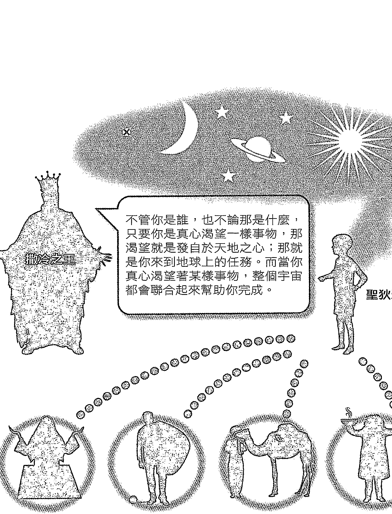

- 吉普赛占卜师
- 小偷
- 骆驼侠
- 炼金术士

# 莫忘夢想，持續追尋

保羅·科爾賀是全世界擁有最多讀者群的作家之一。而他的作品中最廣為流傳的，就是這本《牧羊少年奇幻之旅》。這本書不但在母國巴西，甚至在法國、義大利等國家，都多次躋身暢銷排行榜榜首，更榮獲了世界各國的文學獎。這本書還被譽為十年難得一見的名著。相信未來也會不斷遠遠流傳下去，並提醒更多人——「莫忘夢想，持續追尋」吧！

當你閱讀這本書時，將會跟著聖狄雅各少年一起開始思考潛藏在每個人心中最純粹、最根本的疑問：
「人生究竟是什麼？」
「我們在這個世上的使命是什麼？」
「自己的夢想是什麼？」
「如何才能擁有一個幸福的人生？」
或許這就是這本書之所以能贏得全世界超高人氣的秘密吧！

> 「人生究竟是什麼？」

> 「我們在這個世上的使命是什麼？」

> 「自己的夢想是什麼？」

> 「如何才能擁有一個幸福的人生？」

或許這就是這本書之所以能贏得全世界超高人氣的秘密吧！
聖狄雅各少年純真而率直的無畏精神、宅心仁厚的心地、深厚的愛與關懷，以及他的友情、信頼、不屈不撓的精神，在在溫暖讀者們的心，帶給讀者力量。

在日本，《牧羊少年奇幻之旅》出版後，保羅·科爾賀也曾多次訪日。他為擔任譯者的我們乃至其他許多人，帶來了莫大的影響。他的第一次訪日是在《牧羊少年奇幻之旅》日譯本付梓出版的一九九四年，他來此次訪日是在《牧羊少年奇幻之旅》日譯本付梓出版的一九九四年，他來此

「人生是什麼？」

「我們在這世間的使命是什麼？」

「自己的夢想是什麼？」

「如何才能幸福地活著？」

試著思考這些潛藏在內心的疑問

然後你將有所覺察

堅強意志

仁慈之心

愛與關懷

不屈不撓的精神

為自己帶來力量

出席一場東京地湧社所舉辦的讀者見面會。儘管當時保羅在日本沒什麼名氣，但還是吸引了八百多人前來會場參與。保羅演講完，場內充滿一股暖流般的熱烈氛圍。見面會結束後，與會者還沉浸在那股餘韻中，遲遲不肯離去。那種不可思議的氛圍，至今仍為我們留下深刻的印象。後來有好一段時間，保羅每年都會造訪日本，享受日本的風土人情。一九九五年的阪神大地震後，日本的劇團在神戶演出了《牧羊少年奇幻之旅》的音樂劇。那個時候他也來到日本，和我們一起觀賞了那齣音樂劇。當他看到從大地震中逐漸復興的神戶市街，在他的神情裡流露出對於日本人不屈不撓精神的深深感動。而對於這次的三一東日本大地震，不知他的心情又會是怎麼想的呢！

# 找尋與天使相遇的地方

我們與保羅之間擁有許多共同的回憶，其中影響我們最深的，就是他出給我們一項「解謎」指示，要我們前往位於南加州莫哈維沙漠的波瑞戈泉鎮（Borrego Springs），在那裡找出他當初與天使相遇的地方，而我們也遵循了指示踏上旅途。這段旅程完全按照了他的早期作品《女武神瓦爾基麗》（中文暫譯，The Valkyries）書中，主角在旅途中的所經路線。
我們就在什麼都還搞不清楚的情況下，展開了波瑞戈泉鎮之旅，並循著各種預兆，最後終於找到天使出現的地方，過程就彷彿體驗了一趟「牧羊少年的奇幻之旅」。
二〇一三年三月，我們終於可以翻譯並出版這本以我們這場旅途為藍本的《女武神瓦爾基麗》。這是依照作者的親身經驗所寫成的故事，十分引人入勝。

## Paulo Coelho's Books

☆這本書是以一名目標前往埃及的牧羊少年為主角的寓言故事。本書也成為母國巴西乃至全球膾炙人口的暢銷書，並受頒世界各國的文學獎。書中蘊含了許許多多靈性啟示，像是「當你真心渴望某樣事物時，整個宇宙都會聯合起來幫助你完成」、「留心並遵從徵兆」、「永遠懷抱夢想」等等。作者保羅·科爾賀因這本書而成為知名作家，目前仍投身於文字創作的工作。

現在，保羅以兩年一本書的速度發表他的創作，日本也已經翻譯出版了他相當多的作品，而今後，他仍是我們十分期待的作家之一。

> 一切教導都有它的時機，是最完美的安排絕非偶然。

# 女武神瓦爾基麗
The Valkyries
保羅·科爾賀 (Paulo Coelho) 著

# 為人生帶來奇蹟の魔法書
圖解25個靈性智慧精華

二十年來我們一直想將這本書翻譯介紹給日本讀者，而這個願望終於在今年春天（譯註：二〇一三年春天）實現了。保羅·科爾賀《朝聖》、《牧羊少年奇幻之旅》之後，所寫下的就是這本《女武神瓦爾基麗》（中文暫譯，The Valkyries）。早在一九九四年《牧羊少年奇幻之旅》在日本出版以前，《女武神瓦爾基麗》一書就已在美國上市。當時我們透過郵寄的方式取得這本書的英文版，立刻就讀了起來。

> 我們每個人身上都蘊藏著不可思議的力量。了解這點，並摧毀那道自己築起的屏障吧！

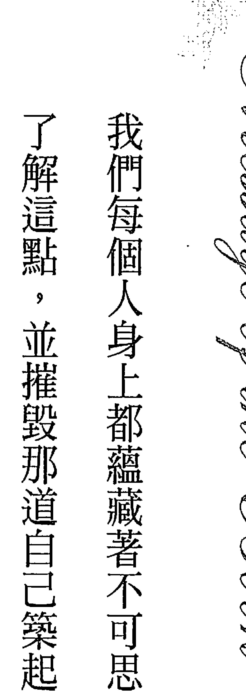

事是描述保羅在一次美國的旅途中，靠著覺察第二心靈、放下過去等過程，逐一克服內心阻礙自己成功的問題。這個故事的內容也是我們以往所經歷過的，雖說形式不相同，但很類似。我們也是在潛意識裡覺察到了自我設限的想法，靠著自己從過去的經驗當中，將自我設下的限制加以打破，並療癒過去的傷痛，這個過程我們都不斷在重複。
我們突然很想去一趟保羅在《女武神瓦爾基麗》中旅遊所到之處。保羅聽我們提起，便立刻出了一份功課給我們，他畫了一張地圖，吩咐我們前往位於沙漠中心的市街、波瑞戈泉鎮、亞利桑那州的圖森市，以及加州的死亡谷。六個月後，我們去了美國，租車開往他指示的那些地點。雖然這趟旅程只有為期短短的兩週，卻是相當的不可思議，足以寫成一部小說。那之後，我們就一直很想翻譯這本書，也拜託過保羅，他卻遲遲未首肯。
直到兩年前，他才對我們說：「你們可以翻譯了！」終於得到許可的

# 為人生帶來奇蹟の魔法書
（圖解）25個靈性智慧頻率

我們，興高采烈地開始著手翻譯，但這麼一翻，這才發現書中有很多地方，是我們當初在閱讀時所忽略或沒完全參透的部分。或許必須等到我們有更深一層的理解，靈性成長到了一定高度之後，才能翻譯這本書吧！也許這是在告訴我們，凡事都有定期，一切都會發生在最完美的時刻。故事的一開頭，為了學會使用魔法而進行修行的保羅，才剛完成他的第一部小說，他將小說的原稿交給了正巧因公務來到巴西的魔法老師。大師讀過他的小說後，便交付他一項任務作為下一個修煉。這項任務就是要他前往美國的沙漠。於是在妻子克莉絲的陪伴下，展開了前往沙漠的旅程。在沙漠中，他們接受了各式各樣的考驗。他們受囑咐去尋找一群騎著馬周遊沙漠市街、人稱「瓦爾基麗」的女人族。在「瓦爾基麗」的尋找過程中、乃至尋獲之後，他們都不斷在克服自己的過去，從中變得自由，並發現蘊藏於自我內在的力量。

# 覺察自身存在著兩性面向

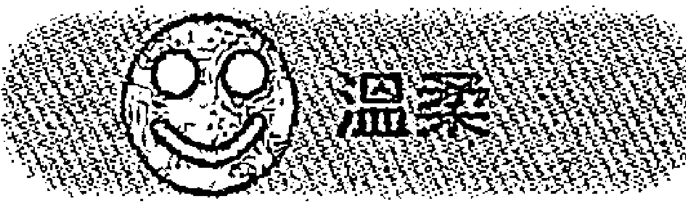

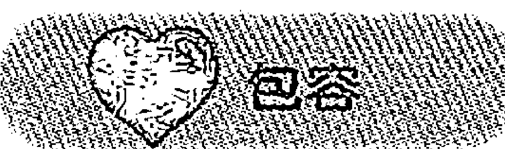

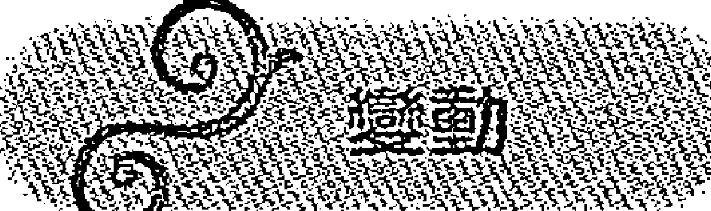

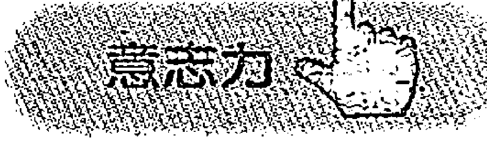

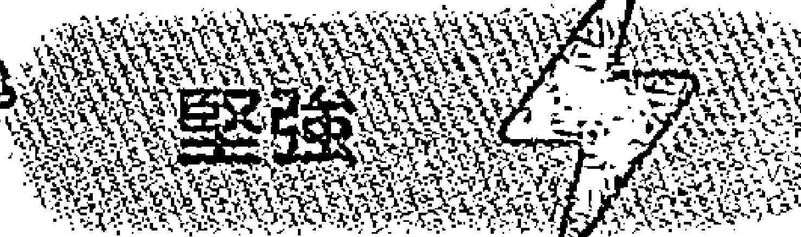

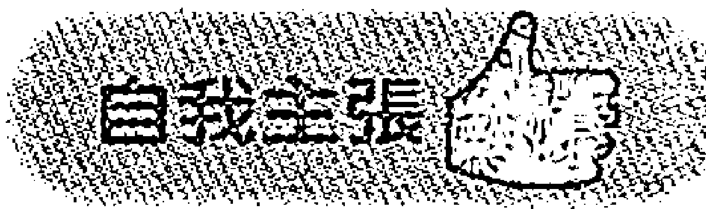

# 每個人都同時具有男性面與女性面

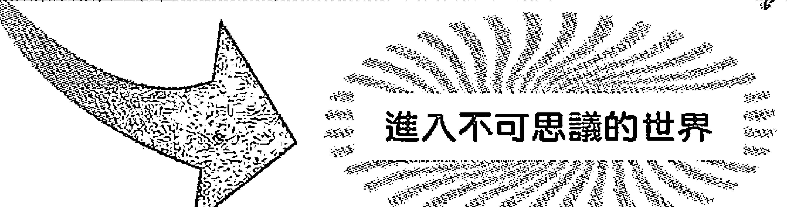

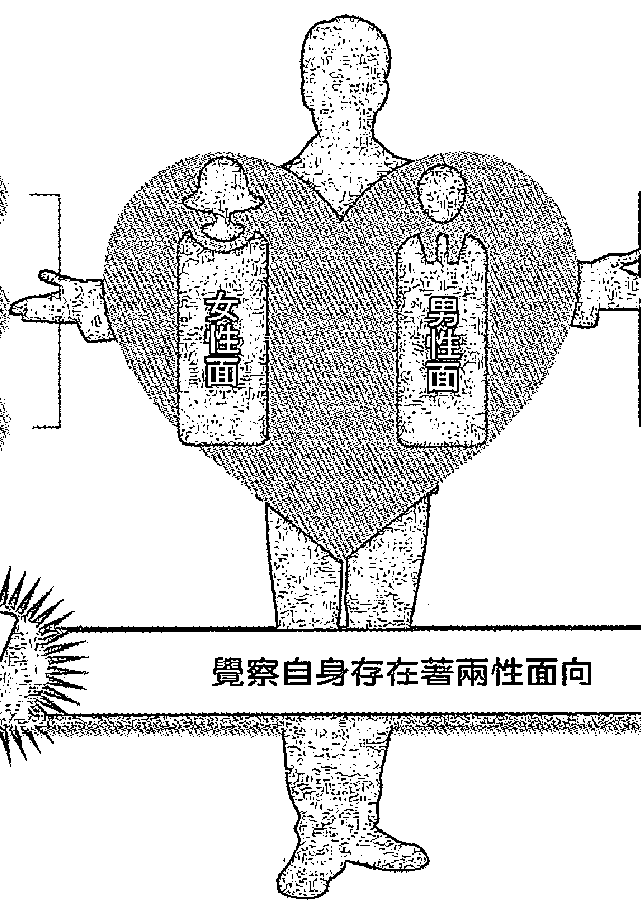

# 為人生帶來奇蹟的魔法書
（圖解）25個靈性智慧精華

# 每個人都需要的故事

這個故事是關於找出自我內在的真實力量，那是一個將一切化為可能的能力，也是每個人都亟需尋獲的力量。我們每個人身上都蘊藏著一股偉大的力量，但一直以來，大多數的人都沒有發現自己身上的這股力量。然而，今時今日的我們有必要覺察那股力量，並盡情地發揮力量，活出燦爛的人生。

自己加諸在自己身上的限制性想法、自己築起的屏障、固執的成見等，為我們的人生設下界限，讓我們看不見自己的力量。因此，即便人生的好不容易來到了眼前，我們也無法抓住機會。要想找回自己的力量，活出燦爛人生，就必須覺察到這些限制、刻板的想法，並加以揚棄。

這個故事還有另一項重大的啟示，它告訴我們：每個人身上都同時存在著女性與男性的特質。男性也有溫柔、包容、變動等女性特質。女性也有堅強、自我主張等男性的一面。發覺自己的內在所擁有的這兩性面向，並取得之間的平衡，也是我們人生中必須學習的功課。
以美國沙漠地帶為背景的《女武神瓦爾基麗》，故事中看到的盡是遼闊的天空、褐色的沙漠、寸草不生的荒野……這些無邊無際的大地風情，是在日本島國上所無法見識到的，將能開拓我們的想像，並引領我們進入一個奇幻的魔法世界。

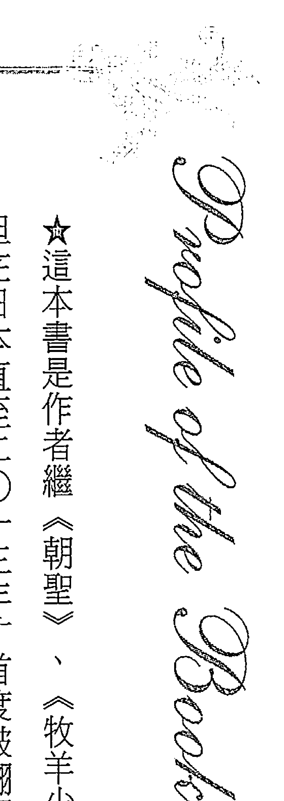

☆這本書是作者繼《朝聖》、《牧羊少年奇幻之旅》後所寫下的作品，但在日本直至二〇一三年才首度被翻譯出版。本書的日文譯者——山川紘矢與亞希子伉儷，於一九九四年就已拜讀過英文版的作品，向保羅提出翻譯成日文版的請求，但直到二〇一〇年才得到對方首肯。這是一部作者的自傳式小說，描述他在一場美國之旅中，克服過去，發現自我內在力量的過程。

> > 當你接受了教誨，
> 你將從自以為是的
> 成見中得到自由。
> 一切從這裡開始。

# 最後的障壁
The Last Barrier
瑞夏·菲爾 (Reshad Feild) 著

《最後的障壁》（中文暫譯，The Last Barrier）在追求靈性的書籍中，故事性堪稱是一本媲美《心靈之舞》的好書。
英國作家瑞夏·菲爾（Reshad Feild）在這部作品中放入了大量的自傳要素。閱讀時，你會不知不覺地和他一同經歷這場不可思議的靈性之旅。
故事從瑞夏走進一家倫敦的古董店開始說起。

## Message from the Soul

> 沒有必要畏懼死亡。
最本質的靈魂將會維持原貌繼續存在，
並不斷變換形態回到這個世界。

# 追尋一個人內在的自由

> 「古董店老闆散發出一種不可思議的神秘氛圍，我立刻就被他給深深吸引。我一邊覺得自己這樣很奇怪，一邊卻還是向他請教了關於蘇菲行者（sufi，伊斯蘭教神秘主義者）的事。男子笑著問我要不要喝杯茶。與這名男子哈米德的奇妙邂逅，把我帶到了伊斯坦堡、安那托利亞高原，以及聖地科尼亞等地。」

爾後哈米德成為一位嚴厲的導師，引領作者一步步前進。這趟充滿神秘的靈魂之旅，將使讀者隨著高潮迭起的情節身歷其境，體驗一場緊張刺激的冒險。

這本書最初是一九七六年於英國出版。在英國，已成為新時代相關書籍中的經典。內容描述人類如何覺醒於自己的靈魂，並逐漸回歸到最原始存在的過程。作為這樣一部作品，卻始終能歷久彌新，總是扣動我們內心深處的心弦。

瑞夏一九三四年出生於英國，從事過歌手、古董商人、股票經紀人等職。最後，他開始對蘇菲派產生興趣，隨後漸漸發現靈性的世界。

那之後，他周遊世界各國，讓自己得到更多學習，經歷更多體驗；現在已回到故鄉英國，引領更多人踏上靈性之路。

這本書的故事就是在講述透過伊斯蘭教神秘主義蘇菲派，主角審視自己，從束縛、限制自己的固執想法中獲得自由，最後開始了解到神與自身的關係。

此外這本書也不斷告訴我們，不必害怕死亡。肉體雖然難逃一死，但最本質的靈魂將會保持原貌、繼續存在，且會不斷改變姿態，重回世間。

在書中介紹到一篇闡述這個道理的詩歌。

蘇菲派是伊斯蘭教中的一支密教，是指與其追求形式與規範，更在於

> 肉身的死發生後，最本質的靈魂依然會維持原貌繼續存在，且不斷改換種種形態，重新回到這個世界。

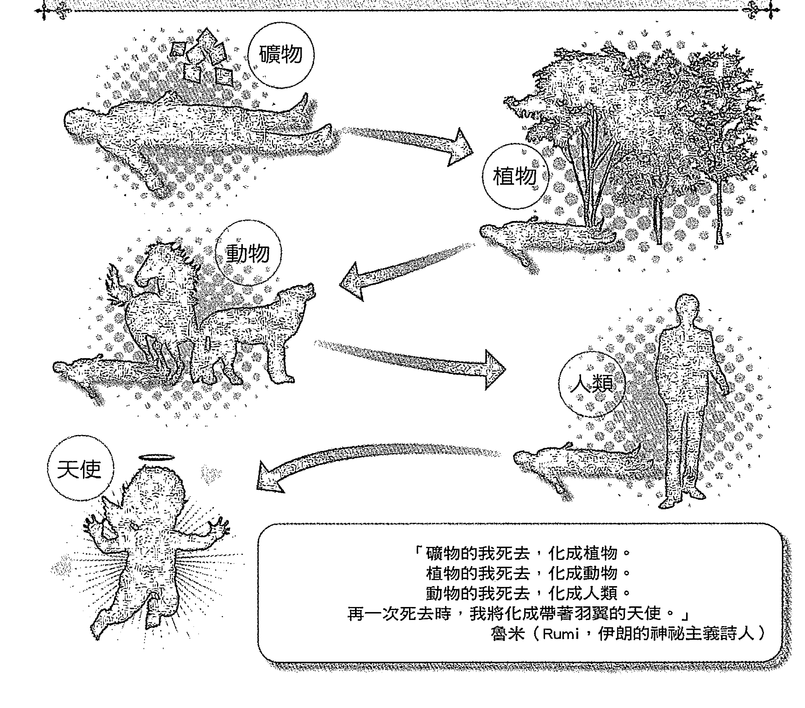

> 「礦物的我死去，化成植物。
植物的我死去，化成動物。
動物的我死去，化成人類。
再一次死去時，我將化成帶著羽翼的天使。」
魯米（Rumi，伊朗的神秘主義詩人）

# 走入靈魂的八個方法 Part 4

# 為人生帶來奇蹟的魔法書
【圖解】25個靈性智慧精華

全心全意探究神與人之間關係的個人或教團。他們不受宗教教條約束，獲得每個人內在的自由是他們的終極目標。

我們彷彿是在冥冥中那股力量的引領下，與《最後的障壁》一書相遇。一九九四年，我們走訪了一趟位於北蘇格蘭的芬霍恩靈性社區。當我們在逛那兒的書店時，店內有一架書櫃擺放著蘇菲的相關書籍。那時候不知為何，我們深受「蘇菲」一詞所吸引，而緊盯著書架上的那些書不放。最後，我們選了一本看起來比較容易入門的書，結果就是瑞夏・菲爾的這本書。

其實對於作者是何許人物，以及蘇菲這個伊斯蘭神秘主義又是什麼樣的教派，當時我們一概不知。

在芬霍恩停留一週後，紘矢繼續留在那裡參加為期一週的座談會。在會中經歷著各種體驗的同時，他也得知了這本書是在講述一名男性的靈魂再生的故事。

書名《最後的障壁》指的究竟是什麼？相信只要看過了這本書，你一定就會明白了，而我們認為，它所指的就是對於萬物齊一、神我不分的初體驗。

誠摯邀請大家跟著作者一同踏上這個令人雀躍的靈魂冒險。最後，介紹一篇本書中所節錄的美麗詩句。這首詩出現在第九章，我們覺得對於歷經二〇一一年三月十一日的日本人來說，詩文傳達出了非常重要的訊息——

> > 「災難降臨之時，
> 莫道他人之惡言。
> 戒逞慾，戒野心。
> 莫倚賴其他方法。
> 也別張皇失措。
> 忍耐與調和，
> 以及與神同在之喜樂，
> 切莫失去了。」

Infinite Love and Gratitude

☆這本書是英國籍作者瑞夏・菲爾所記錄下關於蘇菲派（伊斯蘭教神秘主義）的體驗之旅。他在英國原本是一名古董商與治療師，有一天偶然走進一間古董店，邂逅了土耳其籍的哈米德，哈米德也在後來成為他的靈性導師。在那之後，作者拋下他在英國擁有的一切，踏遍足跡至伊斯蘭堡、安那托利亞高原、聖地科尼亞等地，開始他的靈性之旅。他努力跨越重重考驗的身形，一定能對同在尋求靈性成長的我們別具鼓舞的深意。

感覺「有問題」，實際上就是來自於「記憶」要你淨化的徵兆！

# 荷歐波諾波諾的幸福奇蹟

みんなが幸せになるホ・オポノポノ

伊賀列阿卡拉・修・藍博士 (Dr. Ihaleakala Hew Len) 著

# 為人生帶來奇蹟

## 【圖解】25個靈性智慧精華の魔法書

近幾年，在日本、台灣和韓國，「荷歐波諾波諾（Ho'oponopono）」愈來愈受到歡迎。荷歐波諾波諾就是，透過說四句話來淨化積存在自己潛意識中的記憶，讓我們恢復到原本透明的狀態。而這四句話分別是「謝謝你」、「對不起」、「請原諒我」和「我愛你」。據說，甚至沒有很用心地說，只要機械式地說出來也可以，而且真的有效。恐怕很難再找到這麼棒的秘傳之法了，幾乎可說是魔法！

# Massage of the Soul

- 「謝謝你」
- 「對不起」
- 「原諒我」
- 「我愛你」

這四句話能為我們清理記憶。

這本書裡所介紹的荷歐波諾波諾，是稱為「荷歐波諾波諾回歸自性法」（Self-Identity Through Ho’oponopono）的心靈療法。荷歐波諾波諾原法本是夏威夷傳統的解決問題方法，也就是當問題發生時，大家聚集起來討論，找出最好的解決之道。已故的莫兒娜・納拉馬庫・西蒙那（Mornah Nalamaku Simeona）曾是修・藍（Ihaleakala Hew Len）博士的老師，她以荷歐波諾波諾為基礎，所發展出的全新心靈療法，就是「荷歐波諾波諾回歸自性法」；而現在這種療法正由修・藍博士推廣至全球各地。

# 清理潛意識

在荷歐波諾波諾的問題解決法中，人之所以過得不幸福、有煩惱，之所以得不到經濟上的富足，是因為過去的記憶存在於潛意識中，支配著當事者的人生。

只要去除那些潛意識中的過去記憶，讓潛意識得到淨化，變得清澈透明，我們就能不再受到過去記憶的擺佈，進而與神性智慧（神）連結。於是，我們就會開始接收來自神性智慧的靈感，並能活出最原初的自我所該有的樣貌。而且，無論是發生在自己內在或發生在自身以外的事，一切的成因，百分百是來自於自己潛意識中的記憶。對著這些記憶，透過說出「謝謝你」、「對不起」、「原諒我」、「我愛你」，就能將這些記憶消除。根據修・藍博士所言，說這四句話不僅能清理自己的潛意識，還能淨化他人的意識或場所等等。博士說他無論何時都默唸著這四句話，持續不斷地為他遇見的人、為他經過的場所，甚至為動物進行淨化。當初，當修・藍博士的老師莫兒娜對他說「所有事情的起因都在於你」一時，他只感到莫名其妙。然而，經過他一路向莫兒娜學習下來，他明白到要讓人回歸自己最原初的樣貌，荷歐波諾波諾是最基礎也是最根本的方法。

- 謝謝你
- 請原諒我
- 對不起
- 我愛你

# 與神的連結

# 心靈的淨化

# 用這四句話淨化人心

要改變的是自己而非世界。只要將自己的記憶淨化了，世界就會跟著改變。若你想要改變世界，只要改變自己便是。對靈性成長感興趣的人，應該常在不同的地方聽到類似這種說法。荷歐波諾波諾也是其中之一。但它最了不起的地方就在於，它告訴了我們一個十分簡單的方法來改變自己。我們目前也正在嘗試、實踐著荷歐波諾波諾，並廣為宣傳這個方法。因為只要重複說這四句話，任何人都辦得到。

為什麼只要重複說這四句話就可以呢？其背後的目的是什麼？若要追根究柢，其實這四句話的背後確實蘊含著許多的真理，但我們相信，就算現在還無法理解背後的真理，只要不停重複這四句話，你也能逐漸得到心靈上的平靜，並增強你與自然和神之間的連結，人生中的問題也會逐漸迎刃而解。

一直以來，我們參加過許多的講座，為了挖掘出自己的過去，為了清理自己的潛意識，不知費盡多少心力，現在，卻有這麼一個簡單的方法在全世界推廣開來，真是令人讚嘆不已！一定是因為今時今日的我們迫切需要這樣的方法吧！希望大家也能藉著這本書學習荷歐波諾波諾，並實踐這四句話以及書中其他的各種方法。

☆這本書彙整了關於作者伊賀列阿卡拉・修・藍博士與「荷歐波諾波諾」相遇的始末、「荷歐波諾波諾」的精神與觀念，以及許多人進行「荷歐波諾波諾」的事例，其中也包括博士本身的經驗。「荷歐波諾波諾」原為夏威夷傳統的問題解決法，而後由莫兒娜・納拉馬庫・西蒙那改良成一個人也能進行的「荷歐波諾波諾回歸自性法」。從作者與她的相遇，到他領受了「荷歐波諾波諾」神奇力量的整個過程，書中都有巨細靡遺的描述。

> 最重要的一件事，
> 就是愛獨一無二的
> 自己既有的原貌。

# 珍愛宇宙中獨一無二的自己
宇宙で唯一の自分を大切にする方法
山川亜希子 著

從我們剛投入翻譯工作後不久，算是非常早期的階段，就同時開始四處進行演講。我們希望能在做得到的範圍內，盡量推廣靈性成長的觀念，因此至今也在日本各地舉辦座談會與工作坊。

這二十年來，我們在主題上做過許多改變。一開始，對亞希子來說最重要的主題就是──「愛自己」。這是因為過去有很長的一段時間，亞希子都一直無法愛她自己。

# Message of the Good

接受一直以來被你否定的自己吧！

畢竟，你在這宇宙中是獨一無二的。

當時，亞希子在演講中提到愛自己的重要性時，現場的女性約有七成眼泛淚光。由此可知，愛自己絕對不只是亞希子個人的議題。這顯示出了女性因為無法愛自己而苦惱的情形，有多麼普遍。是否能夠愛你自己，其實是一項非常重大的議題。

# 了解愛自己的重要性

亞希子出生於戰爭期間，從她還在牙牙學語的孩提時代開始，她的母親就不斷對她說：「你剛生下來的時候，因為又是個女娃兒，大家都在說：『不需要這孩子！』」亞希子當時把母親的話信以為真。所以她一直覺得「自己是一個不該被生下來、不該活著的人」。而這樣的想法，其實也是許多女性同胞共有的刻板想法。

在這本薄薄的小書中，描述了亞希子是如何了解到愛自己的重要性，從如何覺察到自己不但不愛自己，甚至對自己厭惡至極，而又是如何從這時候開始慢慢地愛自己。這是一本輕鬆就能讀完的書。

讀了這本書後，有些人也許會說：「還好，我很愛我自己。」也有些人會覺察到「我也是這樣，我也很討厭自己。可是，從今以後我要更愛自己。」無論前者或後者，都是十分重要的覺察。

# 深入挖掘自我，達到自我覺醒

如今，我們正面臨一個大規模的意識轉換期。明確地了解「我自己究竟是誰？」、「什麼才是真正的幸福？」等問題，並深入挖掘自我，達到自我的覺醒，這些已經成為我們刻不容緩的議題。

# ## 愛自己

「像我這種貨色」的固執想法

> > 透過接納自己最原初的樣貌 讓自己變得能夠愛自己

# 為人生帶來奇蹟の魔法書
【圖解】25個靈性智慧精華

而這時候，其中一項十分重要的事，就是「要更愛自己，更加肯定自己」。這本書淺顯易懂地說明了其中最根本之道，也一定能在需要的人的心中牽動出深刻的轉變。

「像我這種貨色……」

會不自覺脫口說出這些話的人、不允許自己活得自由自在的人、不知為何人生就是不順遂的人，請有機會務必翻閱此書。相信你們一定能在當中找出一些要點。

接著，這本書將會為你開啟一扇大門，通往靈性世界，通往開悟、覺醒，通往原初自我的真相。

# 正是現在，靈性覺察十分重要

近來，日本也出現愈來愈多靈性成長界的作家。或許這也證明了我們所正遭逢的意識轉換有多麼的急遽。這三十年來，我們傾身近距離見證著人們的意識變化。但對於心靈的重要性、原初自我的重要性，以及肉眼看不見的世界的存在，對此已有覺察的人或許還是為數甚少。

但這些都是當下的我們需要知道的事。本書所介紹的書籍，如果你喜歡其中某一本，或剛好翻到了任何一本，相信那本書會為你敲開通向未知世界的大門。這是因為我們正處於一個巨大變動、非常有意思的時代。

在我們之前，我們身處的是一個首重物質與金錢的時代，不過接下來，我們的注意力將會轉向肉眼看不見的事物，而我們的意識也將會愈來愈放在愛與光、思想與神靈等事物之上。這麼一來，人類與宇宙合而為一的共生時代，就終將到來了！

## 【圖解】25個靈性智慧精髓 為人生帶來奇蹟の魔法書

☆這本書是由翻譯家山川亞希子所撰寫，她在書中回顧自己人生的前半段，同時以「珍愛自己原本的樣貌」為主題，對時下的女性喊話。作者像是對讀者說話般，在書中娓娓描述，自己從孩提時代到長大成人，一直在無意識中抱持著偏執的想法，以為「自己必須是一個完美無缺的人」；後來自己又是如何放下這種想法，並從中獲得什麼樣的啟示。這是一部能夠溫暖和撫慰人心的作品。

一九八六年，旅居美國的加藤久和與妻子惠希子，邂逅了夢幻、麥克琳的《心靈之舞》一書，並將之翻譯介紹到日本，從此生命踏上清澈奧妙的靈修道路。閱讀過無數勝銷勵志經典，並投入身心靈課程教學之後，加藤伉儷成為日本靈修界最具影響力的導師。現在他們要將這寶貴而真實的收穫，分享給每一位生活在新時代變革中的你我。

本書收錄《秘密》、《魔力》、《綻放少年奇蹟之旅》、《聖境預言書》、《天堂頻率》、《與神對話》、《奇蹟波諾波諾的幸福奇蹟》……等二十五本風靡全球改變人生的暢銷好書，首度以圖解方式重現書中數千年精髓，每篇並佐以最富含智慧的箴言，讓你我的意識心智在閱讀之中順勢揚升全面綻開。

透過本書傳授的吸引力幸福七大奧秘、覺察心靈力量的七個魔法，看見躍動永生的溫暖旅程、邁向奇蹟的六個方法，你將愈能與內在的神祕緊密連結，發掘最真實的自我，明白自己這一生所為何來，一切美好與奇蹟都將開始發生……。
