## 九次元煉金術
以意識與科學開拓視野，你將看到嶄新的世界

我們所處的地球遠比你想像的更加豐富！

藉由完整的跨次元探索指引，豐富多元的科學觀點，我們將發現與掌握煉金術的奧祕，並顯化在物質次元。

「《九次元煉金術》將科學、神秘主義、高次元指導，編織成一條巧奪天工的掛毯，檢視人類的過去、現在與未來。」

—— 理查·格柏博士


## 探索生命書系總序

文／王季慶（中華新時代協會創辦人）

二〇一一年前，眾聲喧嘩，末日預言不絕於耳。
一方面，我本著對「賽斯資料」的信任，也祈求他獨排眾議的說法得以證實。簡言之，他聲稱二十一世紀上旬，世界雖然仍有戰事與天災，卻無第三次世界大戰。並且，到二〇七五年時，人類將有一個大同世界！另一方面，即使成為「一百隻猴子的寓言」中的一員，我也想默默地為世界的未來盡一份力，為達成「一體平等」的靈性覺悟而努力。
我不敢聲稱自己已開悟，而且我最喜愛的「賽斯」也從沒提過這個詞兒。不過，在求道的過程裡，我無意中悟出「除了神沒有別人。除了愛沒有別的。」（There is No One but God. There is Nothing but Love.）當下，在無邊的寂靜安寧中，我的心裡充滿了狂喜與愛，這份愛又滿溢為感恩之情！我體會到我一直在宇宙的愛中，宇宙的愛也一直在我心中。而，世人也莫不如此！不同的是，有沒有體會到，有沒有連上線。在一體平等的感悟中，我謙遜地臣服，自然放心又自在。不由得散播出愛——平等的頻率！
於是，完成了告別之作《與神同心——依愛隨行》，我便退休下來。想讀的都讀了，想分享予讀者的也都真誠地寫了下來。此生足矣！
在《與神同心》的後記裡曾提及我的天命——推介與翻譯新時代的好書——已經完成了。沒想到二〇一五年四月，素未謀面的蔣聖光先生，帶著家人約我在中華新時代協會見面。歷經海外創業的艱辛，如今他已是卓然有成的企業家。他開門見山地說，自己讀遍了我推介的新時代書籍，也邀同家人一起鑽研。哇！這讓我立即視為知音，因為，連我都沒有主動要求家人研讀呢。
做為一位成功的企業家，可以想見，蔣先生必然是位有主見，有魄力，並且格外有執行力的人。他說，運用從新時代書裡得到的智慧，他成就了他的事業。如今，他想（並且已著手進行）設立出版社。一方面找回一些已絕版的新時代書籍，一方面當然也將眼光放遠，胸襟放大，繼續以自由開放的精神，開創「探索生命書系」，向生命致敬，完全不計盈虧。
由美返臺近四十年了。從一九八九年開始，我正式投入新時代運動。當時，曾將我心中陶煉出來的「新時代運動」七要素，做為選書立說的準繩；並有助於分辨何謂「新時代」這個新「範型」（paradigm）與二十世紀中期前的舊範型有何不同。
這七個要素就是：

一、我們皆為神的一部分：有神論，但此神並非有組織宗教高高在上的「偶像」，而是無形無相，一切的根源。祂乃是宇宙意識，我們的「源場」，而我們皆為祂分出的一小片。祂透過我們每一個來體驗物質世界，完成整個拼圖。

二、你創造你的實相：你有多生多世的生命，並且是個多次元的存在。因此，不怨天不尤人，為自己的一切負起責任。從而省視自己為何作出如此的選擇，要學習的是什麼。

三、肯定人生的意義：不悲觀，不眈溺。最重要的是培養清明的覺知和一體的慈悲。

四、道德的內在性：不盲目跟從傳統，不媚俗。回歸自性，找到內心那一念靈明，依之做人處事。

五、身心健康是種自然狀態：心理有問題，鬱悶不快樂，自憐或自恨，能量堵塞不覺知時，才會不適。

六、環境保護：這攸關全人類的存亡。我們不能再視而不見，當作是別人的事。生態環保，人人有責！

七、無條件的愛：也就是對人的一體大愛，而非在關係中只顧自私自利的比較、爭奪、交換、控制。

至今，覺得那篇文字，還是相當切中新範型的精神。

不具權威性和強迫性，新時代不是宗教。它不崇拜偶像，也不自立為偶像。沒有階級組織，沒有教條，沒有戒律，也不等待外在的神明、聖賢、大師來拯救你。

賽斯說，認識自己就是認識神，因為你們都是和祂同一幅料子裁製出來的！

雖然，普羅大眾仍不見得了解新時代的「奧義」。但至少，經過三十年的「百花齊放」，現今社會上也習於其種種的觀念和用語。從生活面的應用：慢活，身心的放鬆平衡，愛自己從而愛別人，更新而平等的親子關係，伴侶關係；到最深的靈性認知：生死學，生態保育，宇宙論，哲學思辨，或多或少都看到新範型的影響。整體而言，社會風氣無形中也改善了不少，好比，雙贏互利，人權以至動物權的伸張，性別平等的推廣，人們彼此相處的包容，體諒與溫暖——此間往往看到人性的光輝！

這個人間世，就是我們的舞臺。販夫走卒，帝王將相，都是我們生前和夢中不斷參與編寫，而於醒時演出的一齣齣好戲。所謂的覺醒，就是參透了鏡花水月，將注意力由外在舞臺返照回來，成為中立的觀者，醒悟自己演出的意義！能如此，就是找回了自性，開始走向返鄉之路。

不知從何時開始，我自覺到我有一項特性：我不會以個人追求自心的明晰、自在與幸福為滿足，仍深愛著人類自古以來種種文化藝術哲學上的成果，為之讚嘆不已！同時，也深深牽掛著人類未來的展望與福祉。當然，也關注著現世的兄弟姊妹，世間的種種困惑和苦難。記掛著、記掛著……不會忘也不想忘，作不了佛家所謂的自了漢。但由於相信自由平等，也從不願將自己的喜好和淺見強加於人，只能以出書的方式，給大家一個提醒和自由選擇的機會。

安然度過了二〇一二年，不過，世局天象，時時風雲詭譎！我有幸活著一天，就要為世界人類的平安幸福努力一天！所以，蔣先生要我寫篇總序，替「探索生命書系」揭開序幕時，便答應了下來。但願，我過去的努力，促使世界進入新時代，現在則有助於世界邁向黃金時代。

且讓我們共同為未來的大同世界，盡其所能地提供貢獻吧！

## 譯者序

文／許淑媛

能成為這本書的譯者，我感覺自己十分幸運。
第一次看原稿時，我便看得津津有味、欲罷不能。彷彿走進一棟九層樓的博物館，每一層樓都有一個主題，這些主題各自精彩，新奇展品琳瑯滿目，令人流連忘返。走出博物館，外面還有麥田圈！
本書題材獨特、內容豐富有趣，十分值得一讀。我甚至認為，讀一次不夠，至少得從頭到尾讀兩次，整套架構才會逐漸成形。我也認為，讀者每次重新閱讀時，應該都會有新的發現、新的驚喜。
柏拉圖、畢達哥拉斯、薩滿、死藤水、巨石文化、黑洞、白洞、馬雅曆、時間加速、迷宮、麥田圈，全都留待讀者自行去探索。這套教材的實際應用，包括各次元的靜心法，以及如何將這些靜心法融入生活中，也留待讀者親自去實踐。
我在這裡想要分享一個概念：肉身難得。
九個次元同等重要，沒有優劣之分。處在第三次元的我們不必妄自菲薄，因為，沒錯，肉身難得。擁有肉身，我們可以更強烈地體驗各種感覺。在較高次元裡，「意念」能立即顯化；由於不必費力，因此也不夠深刻。很多高次元的生命體，都羨慕我們的肉身。

所以，追求心靈成長的同時，不應忘了「皮囊」的重要。我們應該好好照顧自己的身體，才能好好去體驗此生的酸甜苦辣。一切都是為了體驗！

和九個次元一樣，人生的各種經歷也同等重要，沒有優劣之分。我越來越認同「人生就像一場戲」，我們參與這場戲的演出，是為了體驗各種情境。所以，讓我們放掉恐懼，將自己伸展開來，身體不再扭曲，心靈也不再扭曲，欣然迎接生命帶給我們的一切。

本書英文版初版於二〇〇四年問世，增訂版於二〇一〇年發行，故文中對於「二〇一二年／二〇一二年預言」，皆採用未來式；中文版出版日期雖然已經過了預言時間，譯文仍遵照原文時態，特此說明。

## 讀者須知

經歷與體驗意識的九個次元，能夠開啟新的意識層級。與所有同性質的作業一樣，請遵從你吸收新訊息的能力。團體教授本教材時，我們會安排治療師在場，以便在我們凝望更寬廣的真相時，協助每個人自在地經歷所浮現的想法和感覺。現在，我們經由這本書來教導這份教材，知道過程中只有你自己一人，身邊沒有治療師，因此建議你以適合自己的步調來閱讀本書。當你瀏覽書中頁面時，要記得呼吸、喝好水、充分休息、散步，還要做一些舒適的伸展運動，例如瑜珈。如果你在凝望九個次元的任何階段時，發現自己變得焦躁，請寫下令你感到不安的事物，晚一點再回來看那些筆記。請允許自己先完全體驗九個次元，之後再返回那些特別令你激動或感到艱難的次元。如果你希望在馬雅曆末日逼近時，繼續獲得有關意識加速的指導，我們的網站 www.handclow2012.com 每個月都會提供新月預測，還有春分、夏至、秋分與冬至分析。感謝你的關注，祝閱讀愉快。


## 謝詞

理查·德拉肯伯格（Richard Drachenberg），我们最高阶、最令人愉快的学员之一，感谢你辛苦整理原稿，让昴宿星语（以及我的心智成果）更加流畅易懂。

约翰·玻琉（John Beaulieu），疗愈、音叉、次元大师，我从你身上学到的东西，大增进我对第七次元的理解，也感谢你对原稿的建言。

西姬·玻琉（Thea Beaulieu），看着你跳舞时，我看见了所有九个次元。

汤姆·克拉斯利（Tom Cratsley），伟大的治疗师，感谢你在纽约州莉莉戴尔启动课程期间为我们提供疗愈，也感谢你对原稿的建言。

托比·魏斯与泰瑞·魏斯（Toby and Teri Weiss），「力量之地旅行社」的领队兼创办人，如果没有你们致力于传授行星圣地，将格里和我带到神圣地带，让我们亲自学习那些地方的次元密码，这本书就不会诞生；也感谢你对原稿的建言。

约翰·尼尔森（John Nelson），作家兼编辑，感谢你建议我带这本书去汉普顿路出版。

出版社（Hampton Roads Publishing）。

约翰·米歇尔（John Michell），精通堪舆学、神圣几何及圣地的优秀作家，感谢你成为我的朋友和同事，也感谢你告诉我，与麦田圈制作者心灵互动的秘密。

卡尔·卡勒曼（Carl Johan Calleman），演化生物学家，感谢你发现玛雅历法的时间加速，也感谢你的支持。

罗斯林·斯壮（Roslyn Strong），巨石研究者，感谢你翻译皮耶·梅侯（Pierre Mereaux）对法国卡纳克（Carnac）的研究。

芭芭拉·马西尼亚克（Barbara Marciniak），我所认识最忠诚、最清晰、最强大的昂宿星传讯人，如果没有你的友谊，我可能会常常以为自己丧失了心神。

布莱恩·斯威米（Brian Swimme），可敬的物理学家兼宇宙学家，感谢你帮助我「感受」及「理解」科学。

大卫·艾克（David Icke），引发话题、杰出的阴谋论作家，感谢你的金字塔模型，它让任何人都能明白，「全球精英」如何俘虏人类至少四千年。

克里斯多夫·克洛（Christopher Clow），我的三子，本书的插图画家，感谢你美丽的作品与耐心，还有你在这个过程中为我们带来的欢乐。你的细致灵性意识，赋予了本书深刻的质感，那是你这一代人经常有的特征。伊丽莎白·克洛（Elizabeth Clow），我唯一的女儿，感谢你在一九九七年和我一起前往英格兰，当时你对麦田圈及圣地的狂热帮助我明白，在这些神秘剧中，我们都是演员。你当然是！格里·克洛，我三十年来的伴侣，感谢你督促我撰写这本最艰难的书，也感谢你和我一起教导启动课程，为我们的工作增添了疗愈层面。罗伯·弗里德曼（Robert Friedman）及汉普顿路出版社的工作人员，感谢你们的热情与专业。感谢我们所有的学员，这本书是献给你们每一个人的，因为从一九八七年至二〇一二年，你们一直愿意当我们的老师。

## 增订版作者序

《九次元炼金术》于二〇〇四年出版后不久，我就发现了卡尔·卡勒曼博士的玛雅历假说。他的研究成果为本书中的第九次元（我的模型中最高阶的意识层级）增添重要的解说材料。

一九九四年，昴宿星人表示，「卓尔金」（Tzolkin）是第九次元的守护者。由于卓尔金历是以两百六十天为一周期的玛雅历法，所以我最初假设第九次元必定是某种时间波，它从第九次元流入第八次元的造物者心智中。与此同时，卡勒曼对玛雅历延伸超过一百六十四亿年的九次元周期进行探索，因而增添了一个全新层面的第九次元讯息：玛雅历的演化基础。

如你会在本书第九章中所见，卡勒曼的假说将第九次元带到集体开悟的神秘沉思层面。与此同时，我很高兴地发现，本书除了第四次元中对于人类集体心智的处理稍嫌失衡，可能会有所误导之外，其余部分几近完美。第四次元会激发我们去质疑我们的实相，因为它将我们与他人的思想和感觉联系起来。本书原本要做为这九个次元的清晰指引，现在第九次元因为增添了卡勒曼的假说而变得清晰，我也着手让第四次元完全清晰了。修订本书最令人感到欣慰的地方，就是看着「了解意识的九个次元」这项伟大工作如何随着时间而成长及延伸。任何真正的炼金术都是最纯粹、最具智慧的指引，所以我希望这次的增订版可为读者带来喜悦。我终于对这本书完全放心了。

芭芭拉·克洛

二〇〇九年十一月于加拿大温哥华

## 芭芭拉的引言：昴宿星人传讯始末

一九九四年秋末，一团立体全像的光出现在我的脑海里，我对此感到熟悉。那是从不可见的次元接收到的意识，我称之为「思想原子」（thought atoms）或「单子」（monads），它们启发我写出先前的几本书；然而，一九九四年的单子显然比先前的复杂许多。它发出极高频的声音，即使高出我听得见的范围，也可以感觉到它的振动。这令我坐立难安，因为它感觉起来相当怪异，似乎超出了我的智力所能理解。

在此之前，每当思想原子进入我的脑海里，我都会欢迎它们，因为它们会整合我脑中的想法，并催促我写作。这团特殊的全像光似乎是一个二十面球体，具有三角形的面。三角形的十二个交点触及这个发光球体，发出蓝白光，照向无限远处。当时，我想象不出它是什么，如今却知道这个单子是一个正二十面体，是五种「柏拉图正多面体」的其中一种，被包裹在一个发光的球体里。光线从二十个三角形的十二个交点处射出，光线末端发出奇怪的高频音，声音似乎来自球体内旋转的几何形状。那就是我所看到的景象，然而当时我对柏拉图正多面体一无所知。这个球体令人目眩神迷，以一种超脱凡俗的完美姿态闪烁着。现在，我已研究了柏拉图正多面体和麦田圈，因此能够明白，当时这幅景象开启了我心，让我对宇宙学产生一种新想法，一种进入宇宙的新方法，我也因此开始探索它的源头，至今仍未停歇。无论如何，单子是十分烦人的，它发出的高频音穿透我的脑门。到了一九九四年十一月，我开始严重耳鸣，外面的世界似乎逐渐消退而去。我怀疑是不是昴宿星人又来联系我了，毕竟过去他们会用各种和谐的音调来敲响我的心。如果我忽视这些音调，它们总是变得更响亮。（我在很多书中描述过，自从我四个月大起，便断断续续地与昴宿星人对话）由于他们不会离开，所以我学会「阅读」他们的音调，而他们的忠告通常极具效益。由于过去这些经验，我得出的结论是：这次的高频率必定是来自昴宿星人。这次的耳鸣比以往更烦人，所以我聚集了一群想要向昴宿星人提问的人。在意识深深改变的状态下，我「通」到了那些问题的答案，希望这样能让那些音调安静下来。这次单子的讯息感觉很科学又很复杂，我觉得自己可能无法在出神状态下理解那些讯息，所以当这些人向昴宿星人提问时，我只是听着声音的振动，然后就像电话答录机般，传送那些音调所发出的文字。传讯持续大约三个小时，幸好耳鸣消失了，但如果我间隔太久没有传讯，又会再度耳鸣。截至一九九五年三月，我们这个小组总共完成了十八次传讯。一位编辑将录音带听打成文字，传到我的电脑里，我再将这些文字整理成一本书，即《昴宿星议事录：光之时代的新宇宙学》（The Pleiadian Agenda: A New Cosmology for the Age of Light），这本书于一九九五年九月出版，立即成为畅销作品。

继续谈论这本书出版后发生了什么事之前，先让我简要描述一下这本书。依照昴宿星人的说法，他们下载了地球在银河中的角色故事。这次传讯来自昴宿星团中央恒星昴宿六（Alcyone）的图书馆。昴宿星人长期以来便与地球关系匪浅，这意谓着他们对地球有很多来自多次元角度的了解。早在四万年前，考古学家就已经发现昴宿星人与人类的关系。这本书的主要发声者是一名俏丽的昴宿星女神萨提雅（Satya，梵语「真谛」之意），她将地球描述成可以让所有人类都进入意识九次元的领域。对很久以前的人来说，这种能力再自然不过了，而现在这种能力正再度开启。随着我们越来越接近二〇一二年十二月二十一日的玛雅历末日，这个过程也正在加速中。

九个次元位于一条纵轴上，这条纵轴将它的根基埋入地心，从地心一路上升，进入星系中心。当我们化为肉身时，我们的感知轨迹就落在这条纵轴上，它在远古文化中经常被称为「生命之树」。我们可以在这条纵轴上上下下，就和知名童话《杰克与豌豆》里的杰克爬上豆茎一样。从第一次元（地心）开始，我们可以一路前往第九次元（星系中心），或者从第九次元开始，一路回到第一次元。这真的引起了我的注意，因为我小时候就深深着迷于杰克、豌豆、巨人的故事。我喜欢这个想法，就是我们可以超越地球往上爬（然后再爬回来），即使有一个可怕的吃人怪物在那里等着。吊诡的是，在我小时候，没有人知道银河中心有一个黑洞。萨提雅传送了几张图，借此说明我们如何能够生活在第三次元，同时穿梭于九个次元。她说这件事在过去对我们来说再自然不过，但我们几千年前就失去了这项技能。我在写这本书时注意到，我对前四个次元有很好的理解，对第五次元也有小小的掌握，但是对第六至第九次元几乎没有任何线索。这可能反映出当前科学的局限性，我们的科学通常只描述四个维度。我与第五次元的接触源于幼时即与昴宿星人接触，可说在小时便已超越了第四次元。近年来，我与学员一起体验昴宿星人模型，并听取学员反馈的意见，因而学习了这九个次元。较低次元（第一与第二次元）属于地球（第三次元）内的等级，它们是地核与地表；第四次元是集体思想的领域，也是物质界与形而上界之间的桥梁；第五至第九次元属于天界。除非藉由拓朴学及超弦论等数学理论，否则大部分科学家无法想象第四次元以外天界。

## 昴宿星议事录之启动课程

然而，我很高兴地发现，我可以轻而易举地运用本书来开课，因为它拥有一套设计良好又简单的次元结构。我建立好模型，并为学员开启九次元形式。有些学员发现，他们在跳舞或演奏音乐时，身体会与各个层级产生共振。这些课程很快就被称为「启动课程」，第一次当众教导《昴宿星议事录》时，我几乎不了解这本书，那是最离奇的地方。

的不可见领域。在文化上，前四个次元对应于西方灵性传统，较高次元则对应着东方神秘学。萨提雅的九次元穿梭图，实际上是东西方灵学的美好整合。身为一名西方教师，这个九次元模型可帮助我接近东方神秘学。我们的东方学员发现，这套系统可让他们更加理解西方思想，它没有阶级之分，因为里面的天界并不比地球领域更优越。有趣的是，萨提雅责备了《昴宿星议事录》的读者，指出我们唯有「处于肉身」才能进入更高的领域！同时，她也问道：为什么要在身体之外寻找上帝呢？萨提雅的系统荣耀着地球之美，我们的地球随着星系共振而振动，盖亚到处都弥漫着神性。萨提雅称呼她的工作为「女神炼金术」。

因为有这么多知识自发性流入、穿越所有的参与者。

一九九六年，我邀请外子格里·克洛加入我的工作行列，在那一年秋天的启动课程增加了身体触疗与治疗。一九九八年，才华洋溢的作曲家迈克尔·斯特恩斯（Michael Stearns）为我们创作了音乐，我们尝试藉由共鸣来表达九个次元，因为只有音乐才能以我们可理解的方式来表达较高次元。二〇〇二年，我为较低次元的体验增加了一场「神圣烟斗仪式」（sacred pipe ceremony），这个仪式可加强我们与地球的共振。今天，我们有很多学员都把这套教材传授给自己的学员，我们希望随着这本书的出版，能够将这套课程分享给更多人。

说到我们的学员，我对于启动课程如何在生命的最基本面向帮助他们，印象非常深刻。寻求灵性接触的学员获得了灵性接触，想要改善日常生活的人获得了改善，许多学员也找到新方法来改造他们的文化。我们甚至启动了几名「举报者」，因为第八次元教导我们如何在物质世界里过着无可挑剔的生活，进而激发他们。起初我们很难想象，受到遥远恒星系所影响的各个次元，竟然能够知会地球上的我们：昴宿星团在第五次元，天狼星在第六次元，仙女座在第七次元，猎户座在第八次元，银河在第九次元，也许这就是我们的祖先相信星辰具有意识的原因，因为星星承载着他们的故事与神话。

值此世界日益疯狂之际，我们经常感到疑惑，启动课程是否能持续到玛雅历的末日。然而，我们自己的生活还有我们的学员一直在改善；学员不断加入，也有许多学员回来上课三、四次，只为了更深入了解教材。与此同时，我开始观察我们银河系的变化，想看看书中的时间表是否被科学事件所证实，而情况确实如此。科学的最新发展往往与萨提雅的版本吻合，我将萨提雅的版本称为「昴宿星人科学」或「次元力学」。萨提雅说，接近2012年12月21日玛雅历末日时，我们穿梭多次元意识的能力将成为一种基本的生存技能。自从纽约世贸中心双子星大楼在2001年9月11日倒塌以来，这种可能性似乎更令人信服了。当今世界似乎被「混沌理论」（Chaos Theory）所统治，它是一套复杂的数学运算，主要在探讨系统如何在秩序中瓦解。在学员进入意识升华的神性状态时陪在他们身边，让格里和我相信，我们必须听从这些高标准的昴宿星人。他们经过数千年与我们互动之后，知道某件对我们非常重要的事。他们似乎在引导我们穿越日渐扩大的混乱，同时温和地教导我们如何在不和谐里面找到「和平之岛」。格里和我何其有幸，能够在这股狂野的觉醒之中教导学员，主要是因为这件事很有趣。经过与昴宿星人一起生活，进而信任他们之后，我们写了这本书，想尽可能传达更多讯息。在这段旅程途中，次元科学的奇妙汇聚已经发生，并激励了我们，而它也可能启发或吸引你。我们生活在奇迹般的日子里，只要有意愿，任何人都可以进入这些层面，但首先应该去探索，我们为何在很久以前就失去了穿梭次元的能力。

## 我们如何失去穿梭次元的能力

我近年来的著作《灾难恐惧症：光之时代地球变化背后的真相》（Catastrophobia: The Truth Behind Earth Changes in the Coming Age of Light），书中根据最新科学发现，探讨了原住民对于过去两万年间地球变化的纪录。我的整个童年期间，我的祖父吉尔伯·汉德（Gilbert Hand）都在培训我，教导我关于切罗基族（Cherokee，北美印第安人之一）的地球纪录。他坚决认为，在我有生之年，科学将会赶上古代的纪录。他略过他的五名子女，将他的宝贵知识传授给他的长孙女。一九九五年，我以大熊出版社编辑的身份，购买了由牛津大学人类学家兼地质学家德雷尔（J. B. Delair）与科学史家艾伦（D. S. Allan）合著的《大灾难！西元前九千五百年发生过大灾难的有力证据》（Cataclysm! Compelling Evidence of a Cataclysm in 9500 B.C.），并在那本书里发现和我的祖父传授给我一样的科学！

我对这个最新且重大的吻合资讯感到震惊，因为切罗基族、玛雅人、昴宿星人的纪录是如此深刻连结。后来，我写了《灾难恐惧症》一书，旨在探讨地球的巨变如何造成人类集体心灵创伤。最后，我终于明白，为什么我们的意识如此受限，为什么很少有人进入不可见的次元。真相是：我们是曾遭受多重创伤的物种。我们在一万一千五百年前经历了一场大灾难，随后则是长达数千年的可怕求生时期。这是一种遍及整个物种的创伤后压力症候群，我们直到现在才准备好要去了解。

在我阅读科学研究，以便撰写《灾难恐惧症》期间，我思考了《昴宿星议事录》里隐藏的科学理论，发现一些当前的科学模型，或多或少支持及描述了九个次元的存在。每个次元都有一个科学模型，这是本书的核心，我希望科学家们会发现这些想法具有价值。

## 麦田圈的出现

随着玛雅历末日逼近，某种存有为我们传来一些符号，因而开启很多人的多次元意识。这些符号称做「麦田圈」，每年夏天都会印在农田作物上，出现地以英格兰居多。制圈者（我认为大部分麦田圈由神性存有所制作）预示着人类感知工具的完全觉醒，而这必将提高地球物种的生存能力。《昴宿星议事录》提供了许多关于麦田圈传达的次元智慧。萨提雅说，每个次元都有自己的「守护者」，那是一种能让该次元保持在良好状态的智慧。直到一九九四年，守护者的故事一直是原住民严密保守的知识，如今我可以自在地分享它。我深深感激多位指引我的导师：亨巴茨·曼（Hunbatz Men）、马修·福克斯（Matthew Fox），盖瑞特父子（J. T. and Michael Garrett）、阿尔贝托·布恩菲（Alberto Ruz Buennfil）、吉萨的哈基姆（Hakim of Giza），还有我的切罗基族和凯尔特族祖父母。后面的章节里，我将对这些神秘的守护者做详尽说明。

举例来说，我们人类获选为第三次元的守护者，但现在我们是失职的。我认为人类正在毁灭地球，因为我们没有认清自己在觉醒中的银河，即我们的诞生地里扮演的神圣角色。地球是宇宙中的稀有珍宝，萨提雅说，地球将在二〇一二年以它的生命形式为整个星系播种。她唤醒我们的深层记忆（女神炼金术），并让我们记起自己身为盖亚守护者的角色。在我们心中，我们知道自己来到这里是为了护佑，而不是为了毁灭。

依据《昴宿星议事录》的说法，地球弥漫着九个次元的智慧，而我们所有人都能接近它、向它学习，以及有意识地将它运用在我们的生活中。这些次元提供人类极高的智慧与自由，但首先我们必须思考自己目前的状况。在与神性分离数千年之后，我们在第四次元运作的集体心智陷入了一种极性分化的思想形态原型，这些思想形态锁入我们的身体与心智中，成为情绪创伤与障碍。现在，聪明的媒体恶魔操纵着第四次元的集体心智，藉此自娱、大发利市、俘虏无辜的灵魂，或者只是为了避免检视自己的内心。但是，第四次元领域并不是他们的私人地盘，而是物质界与神性之间的桥梁。它的用意不在成为无趣的频率地带，所以媒体不应透过广告、色情图片、网络垃圾邮件等，将愚蠢的影像塞进我们脑子里。

我们需要拥有第四次元，它是我们的感觉得以接近迷人高频率景象的地带。我们都是经由从星系中心不时发出的影像来接近较高次元，但只能凭着活跃的直觉及强烈的感觉来做到这一点。我们能藉由感觉到我们在第四次元的道路，以及清除我们脑中的垃圾影像，来定位自己在宇宙潜能伟大景观中的个人路径。我们的大脑不仅仅是乱糟糟的录音带、录影带或电脑硬碟。目前的第四次元地带充斥着媒体讯息，大部分人陷溺其中，看不到通往更高境界的入口。我们做为一个觉醒中的物种，目标是重建及清理这个强大的第四次元地带，以便识别九个次元所有的振动频率。

与学员分享地球智慧九次元基本结构的过程中，格里和我已经看到，创伤未获解决所造成各种程度的时空错位，是如何折磨我们的学员和一般人。创伤最初来自那一场大灾难，随后更因伤痕累累的生活经历而强化。我们觉得，我们已经深刻了解到这个创伤如何将人们锁住。在探索地球过去两万年间的变化，以及人类如何因此而受到创伤后，我明白了一件事：当人类释放出创伤、重拾他们的故事时，就会停止暴力；他们会回到当下，即眼前的时空。也因为如此，我们的启动课程安排了治疗师在场。格里是一名治疗师，他专注于让学员安住在自己的身体里，而我因为是和九次元形式这类大型心智系统合作，所以负责扩展学员的心智。昴宿星人将这种形式画成两个模型，一张是意识纵轴图，另一张是一名躺在治疗台上的人，上方覆盖着一座次元天篷。这些模型不仅有助于我们了解次元结构本身，也展示了我们的身体如何接收次元结构。我在这里简单介绍这些模型，接下来本书的每一章将深入探讨每个次元。图ia描绘一名躺在治疗台上的人，显示出我们如何接收各个次元。昴宿星人以这种方式来呈现人类进入次元的情形，因为很多人都是在接受按摩或前世回溯等治疗过程中，第一次体验到不可见的次元，这是由于治疗师能设定出可让他们的客户产生共振的次元场。图中的人也可以坐着或走动，然而目前大部分人都无法一边购物，一边进入九个次元。它的运作方式很简单：当我们活着的时候，我们存在于线性时空里（第三次元），第三次元为一个平面；第二次元以一个等腰三角形来呈现，它的一边是第三次元平面，底点则是第一次元（地心的铁核晶体）。以这名躺在第三次元平面治疗台上的人为例，第四次元（集体心智或原型领域）在人体上方形成一座天篷，这座天篷是由这个人的极性化思想与感觉所形成的。当这个人

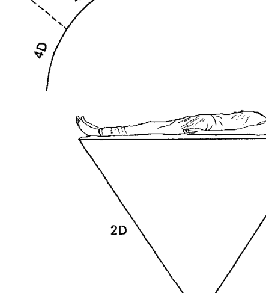

消除極性並啟動隱微的意識時，較高次元（第五至第九次元）便在這座第四次元天篷裡形成入口。

這個多次元模型顯示了我們每個人如何感知各個次元。昴宿星人告訴我，將這張圖刺青在我的手背上，對我來說有點過頭了，所以我完全記住它了。當你不記得如何聯繫九個次元時，也可以回頭看這張圖，不必去紋身。隨著我們逐步穿越這些次元，我將不斷要求你牢記這張簡單的小圖，如此將在你的身體裡強化「你能做到這一切」的感覺。

後文你將看到，麥田圈的製作者很喜歡這個模型，一九九七年時，他們至少在英格蘭的農田上製作了三個版本！

圖ib從最低次元到最高次元依序顯示出意識縱軸的次元結構。為了說明九個次元的能量特性，我們必須從縱軸上的第一次元逐步前進到第九次元。最低次元（第一次元）最密實，最高次元（第九次元）最空靈；較低次元的空間較小，較高次元的空間較大。

密度是由重力所主導，它將光或光子轉化成形。感覺一下，地心的鐵核晶體（第一次元）必定是多麼強烈而密實。

依據科學的說法，地心是一個巨大的鐵核晶體，而鐵晶的密度是其他礦物晶體的兩倍。第二次元是鐵核晶體與地殼之間的地幔等區域，比第三次元的地表密實得多。

# 縱 軸

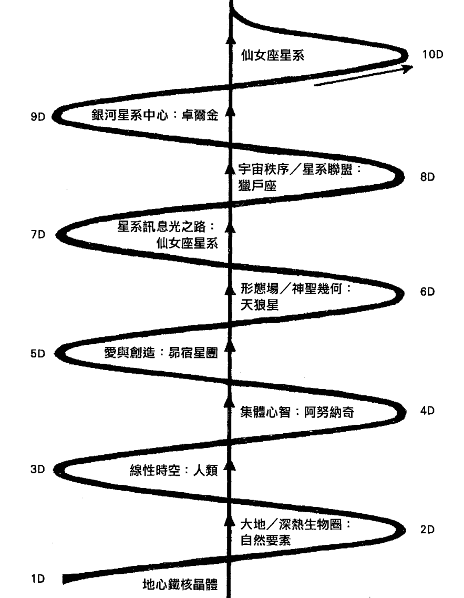

> 圖 ib：意識縱軸的漸進式結構。取材自《昴宿星議事錄》第 163 頁。

處於第三次元的我們是固體，而第四次元（所有生物所發出的思想與感覺之集體領域）則非固體，我們全都可以感覺到第四次元，並參與其中，例如分享有關歷史和宗教的信念。

移動到較高次元時，例如前往縱軸的中間（第五次元）或置於神聖幾何（第六次元），我們會體驗到縱軸越往上，次元的密度越小、空間越寬敞、形式越奧妙、越難以用語言來說明。想要進入較高次元，人類必須擴大自己，而想要進入較低次元，我們必須縮小自己。

我們在第三次元線性時空裡是固體，具有五種感官。我們藉由重力安住在我們的領域，還記得小時候，我把「重力」（gravity）念成「動力」（grabbity）。用科學一點的說法來說，重力代表密度因子，它也存在於較高和較低次元，當我們前往這些層級時，我們的比重會改變。當我們活著時，我們的身體位於第三次元，然而我們能量系統的許多功能，都是受到兩個較低次元所促發，也就是第一次元的鐵核晶體和第二次元的地殼或大地。我們也會受到第四次元集體思想領域所刺激，甚至有時可能刺激太過了。我們人類就像夾心餅乾中間的夾心，一邊是較密實的地球領域，另一邊則是充滿情緒與思緒、隨著吸收到的東西不斷變化的集體心智領域。

更明確一點而言，第二次元是較為密實的礦物和微生物的世界，它的律動也比我們的脈搏、呼吸或想法緩慢得多。第二次元掌控人體所有的自律程序，我們的健康絕對取決於我們與它的共振關係。共振意味著我們的自律程序與第二次元和諧振動，它維持住我們在第三次元的形體。第二次元本身就是一個振動、脈動、噴湧的世界，裡面棲息著不可思議的複雜生命，它們是我們生命力的來源。

昴宿星人以治療台上的人為例，因為這有助於我們了解，第二次元和第四次元如何在我們的第三次元身體裡產生共振。圖 ic 顯示一名治療師站在接受治療者的後方，運用各種能量技術，將此人的振動頻率減緩到第二次元，甚至是第一次元。治療師維持住自身的頻率，並幫助此人變換其頻率，以便引發療癒。這裡的治療是以激發健康的方式來調整我們的第三次元頻率。舉例來說，第二次元是無機物變成有機物的領域，那裡的存在創造出一切生命密碼。當我們讓第二次元頻率帶入身體時，我們的細胞會痊癒、DNA會修復、血液就像來自高山湖泊的純淨水流那樣流動。如果治療師直覺此人有情緒上或精神上的障礙，他會將客戶身體裡的能量極化，而客戶的身體上方將形成一座由集體領域（第四次元）所促發的情緒能量天蓬。治療師也有些人感覺到這座天篷是一個振動或碎裂著的情緒場（emotional field），治療師也可能會感覺到這一點。治療師甚至會在這座天篷裡加進更多極性，而客戶將開始看到影像，或是感覺到身體各個部位的疼痛。接下來，治療師會協助客戶產生這些影像，並藉由處理影像內容及任何出現的痛苦來清除身體的障礙。治療臺上的人正在展現他準備要釋放先前的受阻能量，即清除創傷。一旦清除第四次元的障礙，便可進入較高次元，後文將對此詳加敘述。我們身體的極性如果沒有獲得解決，就不能進入較高次元。此外，這個人必須瞭解許多較高領域的事情，才能進入其中，並在裡面停留片刻，而那方面的材料正是本書的要旨。關於本書的閱讀方式，為了增加閱讀的流暢感，正文已排除了複雜的科學註釋及資料來源，但你可以在各章註解找到這些資料。如果你忘記某個詞彙的定義，書末也附有〈詞彙表〉。請注意，每個次元

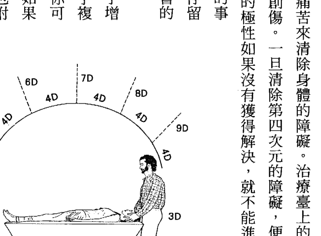

後續的每個次元將漸趨寬舒、漸趨空靈，因此閱讀本書的過程就像是參加你自己的「迷你啟動課程」。如果你發覺自己變得焦躁，請花點時間放鬆一下，喝一杯茶，讓自己安定下來；如果發覺自己昏昏欲睡，請舒展一下，去散散步。當你探索這些威力強大的古老次元教導時，每天在一個神聖空間裡閱讀一章可能是個明智之舉。祝你旅途愉快！

1 這幾次傳訊及接收單子訊息發生在康乃狄克州的萊克維爾。關於這些傳訊的有效性，我很幸運地得到幾次相當驚人的證實。一九九四年至一九九五年，我擔任大熊出版社的編輯，每年經手約七千份投稿。一九九五年夏秋季節，我的稿件正在編輯時，收到四份投稿都在討論同一個資料庫，也就是來自昴宿星團的宇宙論，內容描述地球從一九八七年到二〇一二年十二月二十一日的變化，更牽涉到天狼星人、仙女座、獵戶座、星系中心等。其中一件是大略而完整的稿子，另外兩件是詳細大綱，第四件則是透過電話說明。可惜我不得不通知這些作者，有一本類似的書已經進入編輯階段，即《昴宿星議事錄》。

> > 2 理查·羅吉利（Richard Rudgley），《石器時代的失落文明》（The Lost Civilizations of the Stone Age），第一〇〇頁。

# 格里的引言：治療師的追尋

我與芭芭拉於一九九六年的克里特島開始一同教學，那次的團隊中有四十名女子，我是少數的九名男子之一。我們幾個男人因為勇敢，贏得這群女人的讚揚，而她們在一片「陰盛陽衰」裡十分怡然自得。我愛克里特島，那裡有樹木繁茂的山丘，撒滿陽光的炎熱山區傳來陣陣蟬鳴，蜜蜂在果園裡忙著採蜜，布滿樹瘤的橄欖樹叢裡掩映著地窖式教堂，東正教牧師則穿著黑色長衣，呈現一種豐饒與秩序感、簡樸與時間感。我很高興是在這裡展開我的旅程。

我講這個故事是為了替其他男人謀福利，至於女人呢，她們可能樂於知道，一個丈夫是如何突然被他的妻子要求「醒醒吧！」，然後加入她的追尋。我們倆是大熊出版社（美國新墨西哥州一家業務蒸蒸日上的新時代出版社）的共同發行人兼共同負責人；不，那樣還不夠。我做了前世回溯，接受另類治療師的深入治療，也開始感覺到雙手的能量和第三隻眼的視覺，那樣也還不夠。對我們的四個孩子來說，我是一個負責任的父親，對她來說，我是一個深情的丈夫，那樣依然不夠。她知道（我也發自內心深處知道）我們正在追尋的路上，而旅程才剛剛開始。我們憶起了，在古希臘米諾斯時代的共同生活，當時她是占卜師，我是戰士兼保護者。我們確實必須完成聖殿的那樁任務，將聖殿帶給人民。我想到鮭魚每年勇敢地逆流而上，儘管數量減少了，仍然做著和祖先一樣的事，做著她們的血液密碼告訴她們該做的事。那次旅行，我在星空下度過了一整夜。那一夜，我也抽完一整包駱駝牌香菸，只為了有東西作伴。我不是癮君子，但熟悉的菸草味和燃燒的火柴使我振作起來，它們給了我屬於自己的一點點短暫星光。我记得当我在那片地景上来来回回地行走时，感觉自己十分渺小。我该怎么办？反对有这么难吗？平常的我，是一个喜欢整夜和我的女人一起睡在温暖床上的男人，这一次之所以采取如此激烈的手段，是因为目睹了芭芭拉的教导，以及意识到她真正的身份。那段时间，她是个意气风发的萨满老师。在《尼罗河畔的九次启蒙》（Nine Initiations on the Nile，我们于一九九四年拍摄的埃及启蒙影片）中看过她的人，或那段日子与我们一起旅行的人，都会知道我的意思（在我们的启动课程中，当芭芭拉带领我们穿梭于九个次元时，你依然可以看到她这一面）。她穿着一袭米诺斯风彩绘丝质洋装，那是我们在新墨西哥州圣塔菲的一个老朋友为她量身缝制的；她第一次在公开场合传讯（更早之前曾在一个私人团体中传讯，并撰写成《昴宿星议事录》一书），每天晚上都会带来新讯息：提洛岛（Delos，爱琴海上的一座岛屿）图书馆、亚历山大图书馆、昴宿六图书馆、祖母的克里特岛洞窟。我心知肚明，她正在充分发挥潜能，而我对此感到害怕，因为不知道自己何时、如何才能充分发挥自己的潜能。正因如此，才会有骆驼牌香烟和漫漫长夜星空下的吞云吐雾。好的，反对最大声的那个，抵抗也最为顽强。我挑起了一场精彩的战斗，却毫无招架之力，只能束手就擒、乖乖就范。我冲锋陷阵（试图讨论“水瓶座时代的关系”，因为我和芭芭拉都是水瓶座），然后自投罗网。我还有很长的路要走，但我已经上路了。不久之后，我开始接受正式的治疗训练，首先是在美国最古老的灵修社区发祥地，也就是纽约州莉莉戴尔，向牧师伊莲·托马斯（Elaine Thomas）和治疗师汤姆·克拉斯利（Tom Cratsley）学习，接着是在圣塔菲向约翰·肯珀（John Kemper）学习极性疗法（Polarity Therapy）。

接下来，我前往纽约州石岭，在约翰·玻琉的指导下完成了极性训练，又前往佛蒙特州展开为期两年的训练，向保罗·维克（Paul Vick）学习头荐骨共振疗法（craniosacral resonance）。这段期间，我开始为客户看诊，先是担任灵性触疗师，接着是极性诊疗师，最后则是头荐骨治疗师。我目前正在将我所学、最适于分享的训练传授给他人、客户、学员等。

在另一个时代，我曾经是治疗师和老师，当时的深刻记忆持续帮助现在的我，我们现在称呼那个时代为“亚特兰提斯”，但那时的人不是这样自称。那时，我们是全球海洋文明的一部分，科技也远比今日先进。是的，后来结束了，因为发生了一场你们现在耳熟能详的大灾难。我与你们分享这个记忆的原因是：我们可以做到这一点，我们可以让大跃进成真，我们可以重返并继续我们曾经遵循的道路。是的，我们都曾经没那么“粗钝”，是的，我们正在经由个人的疗愈与转化，移往那个较轻盈的地方。在那里，我们的身体、我们的意识为“光”保留更多空间，同时我们仍然是地球的一部分。

现在我与芭芭拉的工作紧密结合，彼此平衡良好。感谢我过去所接受的运动员训练和身为运动员的岁月，我热爱身体、尊重身体，我是从身体出发，那是物质的钻石精华。至于芭芭拉，感谢她孜孜不倦地自我学习，以及来自她祖父的培训，芭芭拉热爱心灵，那是精神敏锐的钻石精华。我们并肩合作，对待学员就像对待自己的家人般，因为每个人都是独特的存在，每个人都应该获得充裕的实验与成长空间。身为水瓶座老师，我们喜欢激发学员的潜能，让他们独立自主，看看会发生什么事。我们喜欢将“在场的力量”与“分离的纪律”结合起来，我喜欢称之为“积极中立”。很荣幸也很感激能够担当这样的角色，同时也很珍惜每一次与学员和客户相聚的机会，这些时刻加起来，让我得以充分发挥自己的潜力。在这段日子里，我们全都可以帮助彼此发挥潜能。

现在我想要说明一下，我在每一章开头处和最后一章所写下的静心法。这些静心法是受到来自伦敦、卓越非凡的头荐骨老师保罗·维克，以及来自瑞士、见解精辟的极性治疗师安德烈亚斯·莱德曼（Andreas Lederman）的培训所启发，再加上我自己的教学经历结合而成。我写下这些静心法是为了提供一种静心状态下的形象，有助于你在精神和能量上进入接下来的章节。以下是我希望你吸收这些静心法的方式：用柔和的眼神去阅读，基本上，关闭你的脑部分析功能，只让自己跟随着文字就好。在这种状态下，你仍然可以阅读文字，但不必去分析它们。只需接收，并做出回应。或者，你也可以购买我的《九次元静心法》（*Meditations for Nine Dimensions*），然后在适当的时间播放。由你决定，希望你喜欢。

# 第一部

# 九個次元

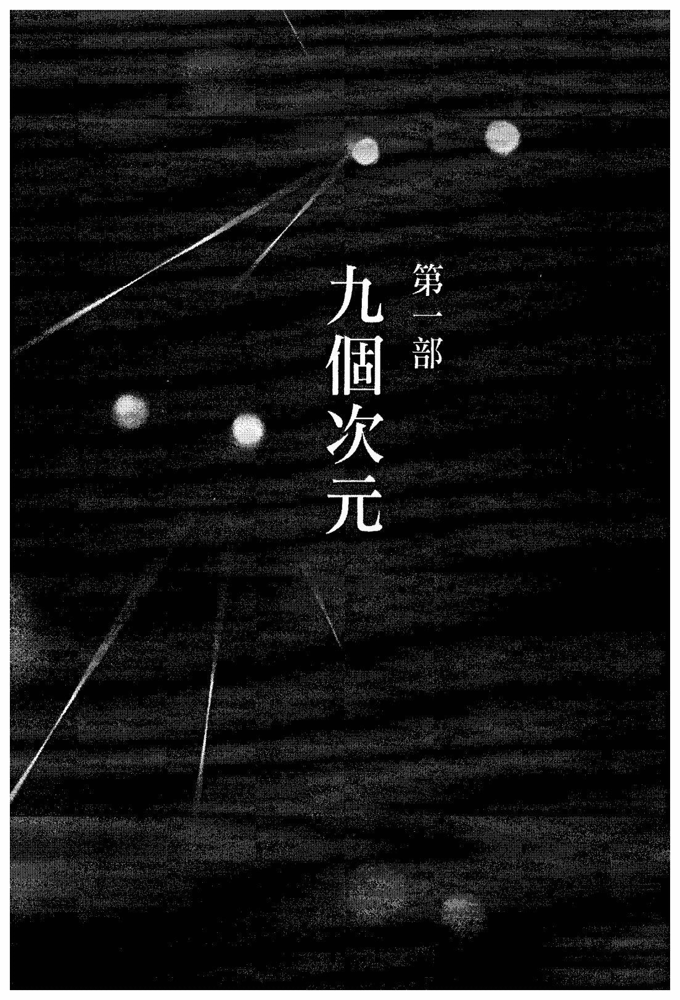

我們的一生都活在意識的九個次元裡，然而大多數人似乎只覺察到第二、三、四次元的存在。第二次元位於地表之下，第三次元是我們的固體世界，第四次元是我們集體心智的領域。位於地心的第一次元是我們安身立命的源頭，而較高的五個次元是超越我們本質部分的所在。這五個較高層級通常被擋在我們居住的這個快速移動、講求技術的世界之外，但沒有達到這些層級，我們便無法找到神性，進而領略至福。一九九五年，隨著《昴宿星議事錄》一書出版，昴宿星人帶著九次元教導來到我們的世界，並堅稱在我們邁入二〇一二年十二月二十一日馬雅曆末日之際，這個九次元模型有助於人類意識的整合。現在，昴宿星人已經回來向我們展示，我們這個時代的豐富語言，也就是科學，如何為我們開啟意識的多重次元，而那在幾千年前曾是眾人習以為常的事情。為了尊重昴宿星人帶來的禮物，每一章將先概述他們對於各個次元如何影響地球的理解，其餘部分則解說各個次元適用的科學。探索每個次元的科學，可深化甚至釐清及證實昴宿星人對於我們可掌握的創造層級之斷言：他們說，我們錯過了我們世界裡很多頻率範圍。量子及超弦論的討論固然十分深奧複雜，但本書是為了讓一般讀者更容易理解現代科學而撰寫。科學家們也許會發現，這種探索科學的多次元方法同樣具有意義。

## 第一章

### 第一次元：地心的鐵核晶體

#### 第一次元靜心法

找到你的呼吸。慢慢來，從容地閱讀這段文字。思考一下，你正在觸摸這書頁上的文字，是使用怎樣的油墨印刷出來的。思考一下紙張，它的觸感如何？找到你的呼吸，然後找到你的腳。將頭左右搖動，然後極輕柔地上下移動。讓頭溫和地垂下來，輕輕垂向胸口。不要勉強去做，順勢而為即可。讓空氣隨著呼吸進入你正在做的小小伸展裡，並注意你的呼吸如何幫助伸展動作更加順暢。抬起頭來，再次呼吸，這次是長長的呼吸，吸氣五秒鐘，吐氣五秒鐘。現在，左右兩肩朝著耳朵慢慢抬高。當你這樣做的時候，深吸一口氣並屏住呼吸，同時撐住肩膀，讓肩膀盡可能抬高。然後，「呼」一聲將氣吐出，肩膀同時垂下來。稍微搖動你的頭，讓脖子更加放鬆，再次吸氣並將肩膀朝著耳朵抬高，然後再次讓肩膀垂下來，就像鉛塊那樣往下掉落。不要害怕嘗試，有時我們的肩頸真的很緊繃，需要多做幾次來放鬆。覺察一下你的注意力所在。現在你只關注一件事，就是利用呼吸來幫助肩頸放鬆。現在，感覺一下重力。感覺你的身體坐在椅子上或躺在床上、沙發上的重量。讓自己感覺到重量。讓自己感覺很重。繼續。這就是所謂的「隨重力而放鬆」。感覺一下，重力就像一條毯子，一條藏有小小磁塊的毯子，一條具有完美的吸引力，剛好能夠支撐你到地球的毯子。享受你的毯子，這是專屬於你的「重力毯」。現在，找到你的腳。它們在哪裡？如果在地板上，請透過腳上所有的部位去感覺地板，腳緣、腳趾、腳跟。用你的腳趾去抓住地板，感覺更多連結。如果你在閱讀這段文字時是躺著的，請將注意力放在腳所碰觸到的空氣上，看看是否有助於找到它們。現在，找到你的呼吸，同時找到你的腳。呼吸、腳……呼吸、腳。當你吸氣時，你能感覺到你的頭頂嗎？能感覺到頭頂上好像有一個小小的氣孔？繼續嘗試。也許空氣是經由多處頭骨進入，而不只經由一個氣孔進入。當你越來越能覺察到你的腳和你的呼吸時，只要去覺察頭頂即可。頭頂、呼吸、腳；腳、呼吸、頭頂……很好。

現在想像一下，有一道白色雷射光柱，從頭頂貫穿到腳部。繼續。慢慢來，不管要花多少時間。閱讀這段文字，然後閉上眼睛，想像那道白色光柱穿過你的身體，從頭頂貫穿到腳。隨著你每一次呼吸，光柱也變得更大、更具體。這是你的白色光柱，享受它吧。去瞭解它。慢慢來，全世界所有的時間任你使用。

現在，當你開始感覺到並看到這道白色光柱時，讓它落到你的腳底下，進入地板，進入你腳下的空間。繼續，讓它深入，再深入。看著它進入你下方、你腳下的地球，看看著它進入你坐著或躺著之處下方的地球。這是你的光柱，請專注於它，看看它要帶領你前往何處。現在，請開始想像地心有一個晶體，一個大型晶體，像一座城市那麼大。看著你的光柱穿透那個晶體。當你的白色光柱開始射入這個巨大晶體時，看著它從你的下方一路往下。注意正在發生的事。慢慢來。

你現在十分「堅實」，你在晶體裡；你是晶體。現在，看看你周圍的白光，它從地心這個巨大晶體的側邊反射出光芒。你回家了。這是你的中心。看看你能否在這個中心裡找到特別的東西，專屬於你的東西。慢慢來。當你做這件事時，輕輕呼吸。

注意你上方的那道光柱，它穿過你的頭並回到地球表面。這是你的「救生索」，讓地核、地表……地核、地表。注意一下，你可以多麼輕鬆地隨著你的呼吸而移動，地核、地表……地核、地表。你是固定住的，但可以來回移動。

現在，當你閱讀這段文字時，再次注意你的呼吸。吸氣五秒鐘，吐氣五秒鐘。找到你的肩膀，它們感覺起來怎麼樣？你可以找到肩膀外緣嗎？也就是肩膀與手臂連接處的外側點。很好。現在繼續呼吸，吸氣五秒鐘，吐氣五秒鐘。找到頸部與頭部。感覺如何？是不是有點沉重？

很好。你剛才將振動頻率減緩到地球的脈動，減緩到鐵核晶體的脈動。慢慢來，重新進入你的空間。喝一杯純淨的水。記住你的旅程。寫下你的發現。去散步，慢慢走，感覺你的腳踩在地面上。慢慢來。來日方長。

依據昴宿星人的說法，地球九個意識次元中的第一個次元，就是地心裡的鐵核晶體。昴宿星女神薩提雅是主要的傳訊者，她表示第一次元是這條縱軸上唯一真正的固體次元。第二次元是地核與地表之間的領域，由於具有強大的磁力和重力，所以似乎也是固體。

近來，我們從科學中獲得很多有關地表下方神秘領域的訊息。一九九四年，玻利維亞地底下三百九十五英里處發生了八級以上的地震，並讓地震學家大有斬獲。他們已經在地球的相對兩端裝設了地震感測器，以便測量一路通過地心的微弱振動。藉由研究通過岩石、岩漿、晶體的地震波，可以分析這些地質的化學結構，這項技術稱為「震波層析成像術」（seismic tomography）。由於這次地震發生的位置非常深，所產生的地震波穿越了地心，前往地球的另一端，所以科學家偵查到並測量了這次的地震波。這些科學家興奮地進行分析，並對他們的發現感到驚訝：地球的中心是一個巨大的鐵核晶體，寬約一千五百英里，比周圍的外核、地幔、岩石圈、地殼帶等更緻密。《昴宿星議事錄》出版時，很多科學證據也同時出爐，這次深入地球的研究便是其中之一。昴宿星人對於地心的說法與科學十分吻合，他們也表示，這個訊息對現在的我們來說很重要。關於這條縱軸的結構，昴宿星人說，鐵核晶體是「振動穿越第二次元大地的電磁波」的原初啟動者（參見第六十七頁圖1c）。這些電磁波穿過地殼而浮現，浮現時受到大氣中的電頻波所觸發，於是我們的物質世界（第三次元）便在電磁場內顯現出來。更微妙的是，地球表面上的生命能量場受到星光頻率所觸發，振動得越來越快，而這些星光頻率儘管有大氣層遮蔽它們的輻射，仍不斷抵達地球表面。地殼與大氣層隨著來自極高次元的神性智慧之光而振動。

### 地心科學

地球核心的鐵質六方晶構造。取材自威廉·布羅德（William J. Broad），《地核可能是由鐵所構成的巨大晶體》，《紐約時報》，一九九五年四月四日 C1 版。

想像第一次元的最佳方式是將它視做一個點，它是地球一切顯現的起始點，在這個點上，「物質化」因為行星旋轉而發生。與此相關的事實是，在第三次元的分子層面上，物質化隨著移動或旋轉而展開。以第一次元的地心鐵核做為起點，最後將終結於銀河中心的黑洞，也就是第九次元。當一顆大恆星死亡，且因自身重量而塌縮時，便會形成黑洞。它會縮成一個緻密的點，稱為「奇點」（singularity，大小為零的一個點），奇點會造成空間和時間的扭曲。這個巨大螺旋體會將這條源自地心縱軸上的各種散發物、平面、球體等吸入它裡面。

昂宿星人還說了另外兩件關於地球縱軸的事。首先，處於第三次元的人類可以進入這九個次元，但還有很多其他次元存在著。例如，將九個次元串連起來的縱軸，便是第十次元。昂宿星人表示，總共有二十六個次元。我們人類的心智能力尚不足以理解宇宙，但可以感覺到它是我們的「容器」。第二件事，每個次元的守護者，都是各個系統（例如地球）所獨有，其他世界（例如木星、火星、軒轅十四）的各個次元，也都有不同的守護者。其他地方也是從它們的中心產生某種次元形式，並為它們的次元選擇了守護者。

如果你一直覺得與其他地方（例如大角星或畢宿五）有著真切的連結，那麼這些星體可能是其他讓你產生共鳴的領域守護者。如果你感覺與地球的任一個守護者（例如天狼星、昂宿星團、獵戶座或星系中心）有著密切的連結，那麼當你生活在這裡時，可能也正以某種形式居住在另外那個領域。我坦率地承認，我覺得某部分的我存在於昂宿星團，同時我也生活在地球這裡。這種「他鄉」生活增強了我在地球上的資料庫，就像到另一個國家旅行會增廣見聞一樣，而且在我的心中可以隨意往返。

準備進入第一次元之際，讓我們先來瞭解一件所有人共享的非常特別的事：我們化身在地球上，是為了體驗由鐵核晶體所啟動的生命。這個鐵核晶體，許多人稱之為「蓋亞」。是什麼賦予了蓋亞生命？旋轉產生運動，運動導致粒子變成波，接下來形成物質，最終我們的身體細胞內有了生命。然而，旋轉又是從何而來？事實上，從宇宙的觀點來看，這一切都很簡單。

昴宿星人說，地核晶體中的鐵分子之所以會產生脈動，是因為地球在軌道上旋轉，同時也朝著太陽系中的所有行星、衛星、小行星，以及太陽而振動。所有這些天體都是因為銀河系的往前運動和旋轉而振動，而銀河系也朝著類星體、超新星、恆星及其他星系而振動。銀河系就像電漿波，在太空中咻咻作響地行進，或者說像水母或跳動的心臟。

比起氣體、液體、固體，電漿較不具形體，它是靠重力聚集在一起的。當銀河系用它那些從飢餓的黑洞中旋出的螺旋臂劇烈攪動時，裡面的星體便隨著銀河系的旋轉和向前運動而振動，並產生脈動。我們的星系中心是銀河的第一次元中心，就如鐵核晶體是地球物質化的起始點，也是它在星系中心轉化為光的起始點。我們人類是以腦部和神經系統連線到縱軸，並隨著縱軸的整個頻率範圍而振動。

### 地心科學

依據科學的說法，地球的核心以四十赫茲進行共振，即每秒脈動或振動四十次，並藉由電磁波傳送到第二次元、第三次元及更高次元。地殼的振動頻率則為七．五赫茲。相比之下，如果檢視電磁波頻譜圖（參見圖1b），我們可以看到我們是以「看似固體的狀態」存在於可見光譜的頻率範圍內，其中的固體物以大約10^15赫茲在第三次元裡顯現。事實上，相對於原子的大小，人體中一個原子與另一個原子之間的距離，相當於幾英里遠：我們裡面「空蕩蕩的」，是由振動波所組成。超越第三次元的頻率（例如 X 射線和伽瑪射線）振動得比較快，而較高次元的頻率範圍最終將變得不可見。令人難以置信的真相是，我們其實是隨著地球的脈動而振動，地球的脈動使我們與生存階梯或生存鏈中的一切存有（包括光）共存，這就是「意識的縱軸」。同時，依據薩提雅的說法，我們的血液中含有鐵，所以是以血液與蓋亞產生連結，我們在血液中隨著蓋亞的脈動而振動。在我們血管裡流動的血，會隨著鐵核晶體而脈動，因為它含有鐵的結晶成分，這就是我們能夠安住在身體中，同時在其他頻率範圍振動的原因。由於鐵核晶體就是重力，而在第三次元裡的我們是以相對弱很多的重力組織起來的，所以可以想像為什麼科學描述人體中的每個分子之間有很大的距離。我們裡面空蕩蕩的，有某種東西讓那個空間全部聚集在一起。次元越高，將它聚集在一起的重力越弱，而較高次元是半透明的。如果我們問，是什麼啟動了最初旋轉，就等於在問我們最初為什麼存在。比起這一切是如何開始的，更重要的是：是什麼讓我們聚集在一起？我們的「黏著力」或身體完整性來自於重力，它是從第一次元發出的力量。我們在體驗重力時，將它視做束縛、吸引力，視為一種形成的力量（formation force），但更添神秘的是，人體中的細胞也是第一次元的顯現鏈。我們的細胞具有智慧，因為它們朝著宇宙中的恆星而振動。聽到關於這一切是如何開始的，昂宿星人打起哈欠來，他們更感興趣的是讓人類學會感覺到血液中的脈動，那是與地心共振的脈動。如果你仔細思量，恆星的旋轉軌道發出光波，光波最終變成聲波，聲波創造出幾何，幾何主導著物質化，你將不會在乎它是如何或何時開始或結束的。現在，你已經存在，其他一切都在分散你的注意力罷了。向一位大提琴家詢問音符來自哪裡，大提琴家將繼續演奏。核心晶體將你連結到宇宙萬物，它的計畫是重力，它在你的血液中脈動。許多科學家一再表示，他們無法解釋重力，也就是說，他們不能以一種感覺經驗來定義重力。他們知道地心是一個巨大的鐵晶，而鐵比大多數金屬更密實。他們也知道，當物體從地殼上升並進入太空時會失重（重力減輕）。昂宿星人說，科學家們談論重力的方式，就是他們活在實驗室而非現實世界裡的一個絕佳例子。二〇〇二年九月，科學家們終於測得重力的速度，重力確實如愛因斯坦所料，是以光速行進。重力的速度是物理學中最後一個未測得的常數。物理學家們開發了一種新的觀測儀器，即「雷射干涉重力觀測儀」（Laser Interferometry Gravitational Observatory），用來檢測太空中的重力波，這意味許多有關重力的驚喜即將到來。

關於昂宿星人對重力的觀點，茲總結及釐清如下：第一次元的地球核心就是重力，當它移動到地表上方時會減弱；宇宙中所有第一次元的中心都是重力。第二次元的地心外核呈熔融狀態，且深層的第二次元電流會在地表下流動。當重力波從第二次元浮現時，它們會回應大氣中的電，並產生地表的電磁場。重力將所有次元聚集在縱軸上，縱軸一路上升，直通銀河中心的黑洞。隨著次元升高，重力變得較不密實，由於這些次元是以大圓形平面從縱軸往外散出，故難以在縱軸上測量到它們。重力是中心智慧，或是形成九個次元所有平面模型的中心（參見第一六九頁圖5b）。重力越弱，次元越趨複雜難懂。

在較高次元或超空間中，重力行進的速度比光速快很多。依據測量，光以每秒十八萬六千英里的速度行進。不久的將來，在太空中實際測量重力波，或許可證實這個模型。

### 第一次元的科學

地球生存鏈的所有次元都源自第一次元，也就是蓋亞。當然，西方科學並不認為有這條從地心到星系中心的縱軸結構。然而，一九九四年玻利維亞地震之後，經由斷層掃描分析所發現的鐵核晶體特性，恰恰說明了這種可能性。舉例而言，這個巨大晶體的質地可能解釋了地球磁場的諸多奧秘。穿過地心的地震波，由北向南行進的速度比由東向西還要快；也就是說，它們在不同的方向上以不同的速度進行傳遞（參見圖 1c）。這些不同的方向速度稱為「各向異性」（anisotropies），而測量它們則產生了關於這個未曾謀面的巨大晶體組成成分的迷人線索。由於地心的壓力比地表大三百萬倍，且儘管溫度超過華氏七千度（攝氏三千八百度），地心的鐵仍呈現固體狀態，所以這個巨大晶體的結構只可能是鐵的最終結晶形式，也就是六方晶（參見圖 1a）。一名科學家表示，這個鐵核就像是地球中心的一顆巨大鑽石，最重要的是，六稜柱形式與最近的地震證據相吻合。內核可能有它自己的磁場，且它的方向可能與外核不同，這可以說明為何會發生週期性的地磁反轉，以及磁場線的偏斜，也就是始終呈現出四度的傾斜。正如你所見，幾何是次元的關鍵，而在我的心目中，縱軸是從這個巨大的六方晶核心向外推進，穿透地表而浮現。就這一點來說，必定有無數條縱軸從滾熱地心的六方晶射出，且每條縱軸在地表上必定都有一個獨特的模式。整個地球磁場四度傾斜的旋轉力量，就是那種能夠產生多次元平面，一路進入星系中心的能量。根據以上敘述，比較容易看出地球在宇宙或銀河中真的很獨特的原因。此外，昴宿星人還說，星系中心的脈動與地球共振。最近科學家已經發現，銀河中心的黑洞所發出的X射線，大約等於從我們的太陽所發出的能量，表示我們的太陽系與星系中心之間存在著振動連結。暫且將科學擺一邊，我想分享一下，我們在幾百次啟動課程中深入地核晶體的體驗。

### 進入鐵核晶體

一九九五年秋分，我在新罕布夏州塞倫鎮的美國巨石陣，第一次帶領啟動課程，從那時起，這個晶體便知會我們，它具有特定法則：如同宇宙中的任何中心（包括我們身體裡面的DNA，唯有唸對咒語，才能進入這個核心。對人類而言，地心是終極神聖領域，因為它是第二次元裡或地表上曾經存在過的所有生命形式源頭。地球表面和地下深處，都是可以產生生命形式的生態系統，第三次元則包括能支持生命的大氣層在內。在啟動課程中，參與者經由「藥法」原住民理解地球自然法則的方式）進行第三次元定位，那是人人都可進入蓋亞的唯一方式。為了進入這個核心，參與者需要學習找出東、西、南、北四個方位。進入蓋亞的入口存在於四方為祭壇的中心，也是縱軸會出現的特定位置。一旦參與者在這個神聖場域定位好各個方向，我便開始唸咒語，然後進入靜心狀態，並將昂宿星人帶入我們的圈子。（事實上，啟動課程是由昂宿星人主導的。）

我們發現到，核心晶體一直在地球上的特定地點散發出圖像、符號、色彩、形式、存有、聲音密碼等。昂宿星人經由我來翻譯這些線索，接著我為學員小組翻譯這些線索。有些學員可以自己看到地球的頻率；有時，他們會看到類似的圖像、色彩等，有時則是不同的景象。這些景象總是該地點與時間所獨有，我也盡可能為小組多看一些，並嘗試將它們翻譯出來。它們以某種方式幫助參與者，將他們身上的頻率轉換成可讓他們進入地球核心的頻率。昂宿星人藉由色彩與聲音，編排出讓每個人協調的頻率，以便讓每個人都能進入核心。

一旦我們的能量體準備好了，昂宿星人就會引導我們，從我們的心和我們的頭出發，往下穿過脊椎，來到神聖圈子的下方，進入地球裡面。當昂宿星人轉換我們身體的能量頻率時，我們一起行進，成為一股複雜的能量動力，往下通過第二次元，進入地球核心。

由於地球的內核及外核是地表電磁的源頭，因此穿過外核進入內核的旅程通常非常「強烈」。對一些學員來說，體驗這個「密度」十分具有挑戰性；對其他學員來說，這種經歷是如此神聖，幾乎讓他們無法承受，這就是我們總是安排治療師在場的原因。然而，如果我們想要完整體驗這九個次元，首先必須與第一和第二次元的頻率特性共振。我們已經在多處聖地和力量點進行多次啟動課程，我們的祖先在那些地方標示了進入地心的明確入口。我們將繼續舉辦這個儀式，直到二〇一二年十二月二十一日來臨，許多學員也會帶領他們自己的團隊進行儀式。我們希望這項工作能幫助所有人記住，我們是蓋亞的守護者。與學員一起進入鐵核晶體旅行，讓格里和我學到了很多關於鐵核的知識，而很多學員也經由這番體驗，在他們的人生中第一次發現安身立命的根基。昂宿星人看人類時，將七個「光之中樞」（Light centers）視為我們的脈輪系統，其中五個在身體上，一個在身體上方，一個在身體下方。對他們來說，人類脈輪系統的第一個脈輪是「地球脈輪」，它與鐵核晶體及大地共振；當我們活著時，這個脈輪促使我們扎根（參見圖1e）。另一方面，我們人類則是將脈輪視為身體中微妙能量系統的一部分，針灸師也利用脈輪來進行治療。我們認為有六個脈輪位於身體，一個脈輪位於頭頂。昂宿星人與人類的脈輪系統之間的差別在於第一和第二脈輪。對昂宿星人而言，第一個脈輪在人體之外（位於鐵核晶體），但對人類而言，第一個脈輪是我們的根輪或海底輪，因此我們將身體中的第一個脈輪標記為我們的性中樞，它是根輪（海底輪）與性輪（生殖輪）的組合。有趣的是，昂宿星人說，當我們的根輪（海底輪）與第一次元鐵核晶體共振時，我們的性輪（生殖輪）也會與第二次元大地共振。同樣地，我們的頂輪是與第八次元神性領域共振。在你思考這幅昂宿星人／人類脈輪系統圖時，主要應注意到，我們的脈輪是在地球與星系中心之間運作。

很多學員在看到核心晶面的分子模式時，感到不知所措，有些學員在裡面看到棲息於較高次元及較低次元的物種和生態系統。就像一座大型電影收藏館裡的影片，所有的紀錄和記憶都在這個密實、有機的鐵晶中振動，有時候，感覺好比晶面上的一滴雨水，便能孕育出一座新的亞馬遜原始叢林。我們在地心看到了前寒武紀的動植物，甚至看到恐龍，許多人也看到獨角獸或地精等奇幻生物。如同身處較高次元般，沒有時間、背景噪音或空間限制，有些人竟能以一種「發自肺腑」的方式，感覺到他們體內細胞之間的空間。

在壯麗山谷和原始森林裡，我們感到相當輕鬆自在，「伊甸園」三個字不絕於耳。我們之中有許多人已多次感覺到地球的真實脈動，現在更能輕易地在自己的身體裡感覺到它。我們聽到了幾處聖地發出的聲音，例如猶加敦半島洛屯馬雅洞穴裡，鐘乳石遭人敲擊的聲音。美國知名環境音樂作曲家麥可．斯特恩斯曾錄製這些鐘乳石的共鳴聲，馬雅人就是利用這些鐘乳石，將人們連結到地心。在每次啟動課程所播放的音樂中，我們都可以聽到地球的聲音。

毫無疑問，我們遙遠的祖先與地球核心調頻一致，而這種協調可能就是巨石科學的關鍵。六千年前的人移動重達數百噸的巨石，表示他們可能已經掌握了「控制物體頻率以改變其重量」的科學。藉由聲波來減輕石頭的重量有其可能，因為頻率轉換會導致物體的密度降低。巨石科學家們可能已經發現了由鐵核晶體所主導的強大自然法則，現在的科學界不過是重新發現罷了。我們遙遠的祖先可能比今天的我們知道更多在重力之下運作的方法。我們在啟動課程中親身體驗到，越是與地心共振，我們就越能開啟自己內在的廣闊空間。一旦我們的感覺沒那麼「粗鈍」，就更容易與那些最高次元共振，如此一來便能覺察到它們。穿越所有次元並進入星系中心的次數越多，我們就越能感覺出星系中心如何與地球一起脈動。體驗過多次啟動課程的學員，正在發展他們自己的智慧新路徑，那些路徑都是以鐵核晶體為起點。由於這個核心容納了所有物種與系統的記憶紀錄，也由於這些紀錄編寫在六方鐵晶中，所以如果將自己調整到四十赫茲的頻率範圍，將有助於讀取這些紀錄。昴宿星人說，所有儲存在核心中的物種，都可以在地表上或地表下的第二次元世界裡重新興旺起來，前提是我们能夠提供它們可以存活的生態系統做為家園。每次地球發生大災難，總是有能夠適應新棲息地的物種重新興旺起來。隨著馬雅曆末日逼近，我們似乎正在摧毀人類心靈、情感和身體上的棲息地。然而，地表上所有的生命數據都已經儲存在鐵核晶體中，而其他次元裡的訊息也能產生新的創意選項，例如一九九八年，一顆磁星（塌縮的恆星）發生伽瑪射線風暴，可能已造成這種情形（參見第九章）。

現在，地球又冒出了通往更高意識的獨特路徑，例如過去二十年間的麥田圈。對我們來說，目前最有效的路徑似乎是回到舊石器時代的心智，也就是一種放眼全球、關懷生態、多次元的心智。我相信這一點，因為我的孩子所代表的年輕世代知道這一點。具體而言，舊石器時代的心智仍然存在於地球核心中，保留了人類的所有可能性。這段期間，隨著第三次元的世界陷入混亂，更溫和、緩慢、沉默的地球智慧正在重生。利用七個神聖方位進入蓋亞，關鍵是選定四個方向的一個中心點，從那個中心點開始運作；增加「上方」和「下方」，以啟動縱軸，然後將你的意識移入你的心臟中央，那是第七個神聖方位。

這件事可以在啟動課程期間進行，也可以在你自己選擇的神聖空間與時間裡進行。

當我們進入第二次元和第三次元時，你將會明白，地球核心的脈動產生了共振波，而這些共振波實際上創造了縱軸上的諸次元。這些核心脈動是地殼和地表上能量路徑與系統的源頭。第二次元的生命能量路徑，亦即靈線（ley lines）、渦旋（vortexes）、水路（water pathways），承載著地球核心的智慧，並主導著第三次元的生態系統及居住模式。我們在離開地心、通過第二次元往上返回時，是將地球想像成一個具有核心的球體，我們想像能量波從這個球體發出，穿過第二次元，並在地殼中形成圖案，這些圖案也對來自天空的光波做出回應。生活在地表上時，我們是這些波的不斷呈現。下一章將探討我們如何化為具體的人身（這些波如何變成有機物），因為這發生在第二次元。

1.  威廉·布羅德，《地核可能是由鐵所構成的巨大晶體》，《紐約時報》一九九五年四月四日C1版。
2.  同前注。昂宿星人說，鐵核晶體是地表磁波的原初啟動者。依據科學說法，外核是熔融的鐵，它的攪動被認為是地球磁場的成因。然後，核心晶體本身似乎具有磁場，因為這個巨大的六方晶格結構排列相當整齊。穿過內核的地震波，南北向的傳遞速度比東西向還要快。
3.  卡爾·卡勒曼，《馬雅曆與意識轉換》(The Mayan Calendar and the Transformation of Consciousness)，第五十四至五十八頁。這裡所述「地球以四十赫茲脈動」是指地球核心（因旋轉而產生）。當電磁波穿過外核時，會減緩至十二．五赫茲，然後在地殼中進一步減緩至七．五赫茲。依據科學說法，地球表面就像一個巨大的電路，在「地球表面」與「電離層內側邊緣」（地球上方約三十五英里處）約翰·諾布爾·威爾福德（John Noble Wilford）曾撰文描述重力測量，〈測試終於讓科學家首度記錄到重力速度〉，《邁阿密先驅報》（Miami Herald）二〇〇三年一月八日8A版。

之間有「準駐波」（舒曼共振）。這些波在地表上通常是七、八赫茲左右，在電離層外部區域則減至兩赫茲。

阿米爾·艾克塞爾（Amir D. Aczel）在《糾纏》（Entanglement）一書中探討過，在較高次元裡，重力的行進速度比光速快。糾纏現象讓粒子在次原子領域裡能以無限的速度行進。

重力的行進速度比光速快。糾纏現象讓粒子在次原子領域裡能以無限的速度行進。

威廉·布羅德，〈地核可能是由鐵所構成的巨大晶體〉，《紐約時報》一九九五年四月四日C1版。

同前註。關於縱軸的力量，昴宿星人說，重力讓各次元保持在縱軸上，這讓我想如果磁極反轉，將會如何運作。地球磁場的力線持續呈現出四度傾斜。如果地球是一個完美的磁棒，地磁赤道處的場線應該與地球表面平行，但情況並非如此；它們始終呈現出四度傾斜。過去，地球的北極與南極一再磁極反轉。科學家們提出，在反轉過程中，地球的磁場會變弱，使得核心能夠增強其磁力。在反轉期間，地球徘徊於南美洲南端和澳洲西部附近。這是因為強大的內側場域推擠到外側場域，迫使它以自己的地極去回應。（當地極接近反轉時，就像現在這樣，地球內部與地表之間的強大張力產生了意識的縱軸。）

同前註。關於縱軸的力量，昴宿星人說，重力讓各次元保持在縱軸上，這讓我想如果磁極反轉，將會如何運作。地球磁場的力線持續呈現出四度傾斜。如果地球是一個完美的磁棒，地磁赤道處的場線應該與地球表面平行，但情況並非如此；它們始終呈現出四度傾斜。過去，地球的北極與南極一再磁極反轉。科學家們提出，在反轉過程中，地球的磁場會變弱，使得核心能夠增強其磁力。在反轉期間，地球徘徊於南美洲南端和澳洲西部附近。這是因為強大的內側場域推擠到外側場域，迫使它以自己的地極去回應。（當地極接近反轉時，就像現在這樣，地球內部與地表之間的強大張力產生了意識的縱軸。）

關於昴宿星人的脈輪系統與次元，我們在教導薩提雅的敘述七年之後，對這種關係的理解發生了變化。昴宿星人似乎遠遠注視著我們，對他們來說，我們的脈輪系統有七個脈輪，正好與九個次元相對應。因此，我們感覺到我們的根輪（海底輪）與第一及第三次元共振，頂輪與第八及第九次元共振。關於「昴宿星人如何看待人類脈輪系統」及「人類如何體驗它們之間的差別」，昴宿星人很有可能是以人類的「光體形態」在看我們，一旦人類進一步演化，我們可能會開始按照昴宿星人的模型來體驗我們的脈輪；換句話說，我們將體驗到我們的根輪（海底輪）是在身體外部，即位於鐵核晶體的地球脈輪。

保羅·雷瑟（Paul Reecer），〈望遠鏡發現超大質量黑洞〉，《邁阿密先驅報》二〇〇三年一月七日8A版。

8A版。

關於昴宿星人的脈輪系統與次元，我們在教導薩提雅的敘述七年之後，對這種關係的理解發生了變化。昴宿星人似乎遠遠注視著我們，對他們來說，我們的脈輪系統有七個脈輪，正好與九個次元相對應。因此，我們感覺到我們的根輪（海底輪）與第一及第三次元共振，頂輪與第八及第九次元共振。關於「昴宿星人如何看待人類脈輪系統」及「人類如何體驗它們之間的差別」，昴宿星人很有可能是以人類的「光體形態」在看我們，一旦人類進一步演化，我們可能會開始按照昴宿星人的模型來體驗我們的脈輪；換句話說，我們將體驗到我們的根輪（海底輪）是在身體外部，即位於鐵核晶體的地球脈輪。

我們的根輪（海底輪）是在身體外部，即位於鐵核晶體的地球脈輪。

## 第二章

### 第二次元：大地

#### 第二次元靜心法

感覺你的手臂貼在你坐著或躺著之處的表面上。感覺你的手臂與物體表面碰觸的方式。感覺你的手臂內有什麼，手臂外有什麼。感覺你的手臂內正在進行著的所有微小事物。感覺你的手臂外、你的周圍正在進行著的所有微小事物。思考一下，你正在以你的身體、你的心靈碰觸的一切物體表面。你的心靈觀察著、記錄著；它很好奇，它就是想和你的身體一起去感覺你所在之處，包括你的身體內和身體外。你並不孤單。注意你周圍，以及你裡面的一切生命。只有在顯微鏡下才看得到的微小生物，你知道牠們在那裡，雖然你看不見牠們。你只需藉由感覺到牠們，就知道牠們在那裡。你的體內充滿數以百萬計的小生物、小身體，牠們與你共生，在你的細胞、分子、血液、皮膚、組織及骨骼裡。
去感覺，去接觸你的身體外、空氣中、水裡、地底的生物，看看它們是從哪裡來的。
看看它們的來源。看看它們的數量有多少。看看你是否能開始想像它們的數量有多少。
現在，開始去注意你喜歡的生物，那些讓你感到愉悅、親近的生物。可以的話，也去注意那些你感覺沒那麼好、沒那麼親近、似乎是不請自來的不速之客，就像夜間睡在橋下的遊民。用你已經擴展的、觀察著的、全智慧的心靈去看，你是否能找到與這些生物交談的方法。用意向的力量，或是用知悉與觀察的力量，看看你是否能聯繫它們，就像從你腦中的燈塔發出一道亮光，掠過它們。看看它們是否留意。繼續，試試看。要有創意。沒有別人在看，這裡只有你。看看你能做什麼。
繼續這樣做，不管花多少時間，接觸這些生物就是了。找出最好的進行方法。試著文風不動地坐著，或躺在一處安全、陽光明媚的地面上，讓你的身體找到它的生物，身體內的生物，以及身體外的生物。注意身體內的生物如何與身體外的生物產生連繫，身體外的生物如何與身體內的生物產生連繫。注意它們的家族、科綱、聯盟。感覺它們，用你不可思議的視力去看它們，藉此瞭解它們……。當你準備好了，將注意力帶回當下。

依據昴宿星人的說法，第二次元是介於地心鐵核晶體與弧形地殼之間的領域。第二次元的守護者是自然要素，包括放射性物質、化學物質、礦物、病毒、細菌等智慧體，它們是維持著這個次元不計其數的勞動者。第三次元裡也存在這些自然要素，但密度較小，這表示處在第三次元的我們很容易理解第二次元的特質，並能有意識地與它們共振。

這個區域經常被稱為「大地」（由外核、地幔、岩石圈、內殼所組成），因為它包含及彰顯了從核心振動出來、地球內部的偉大自然力。經由地球的旋轉，這些自然力朝著形地表上升，然後在第三次元裡被大氣的力量所改變。第二次元的領域非常稠密濃烈，振動得比地球核心還要緩慢。

它是由重力維持住狀態，同時被拉往地球表面。在地表上，地球藉由自轉與公轉的力量，將其球面朝向太陽系擴展出去。

地球的核心雖然會產生重力且尺寸巨大，在幾何方面卻是一個巨大的六方結構鐵晶（參見第五十八頁圖1a）。在第二次元裡，上演了各式各樣的物質化，並演化成第二與第三次元裡的形體。第二次元的晶體、金屬、岩石、岩漿、細菌、病毒等，是地表生命的源頭；昴宿星人堅稱，地表生命最初始於第二次元。

由於受到巨大的壓縮，大地因此散發出非凡的力量，而這些力量對地表具有強大的影響。我們人類是從第二次元演化而來，所以仍以各種要素形式所組成的「繩索」（cords）與第二次元共振，這些「繩索」也進入我們的身體、情緒、心智、靈魂四種意識體中。構成我們身體的晶體、元素、礦物質等，與第二次元的自然要素共生，所以大可將它們視為祖先，或是將你皮膚內的身體視為第二次元，並將你的外部身體當成第三次元。昴宿星人說，我們的血液是一個第二次元的結晶領域，它在物理上及能量上都像是流動的多次元連接器，並隨著鐵核晶體而脈動，如同一套偉大的流動能量河流系統。這種第二次元自然力的流動，會十分靈敏地回應所有較高次元；當你「知道」某些事物時，就是在感覺這個場域，而這類訊息則來自於高層級。第二次元被包容在弧形地表內，使得它成為一個受到壓縮的生命領域。第二次元與第三次元的形體，都是地球縱軸上所有較高次元智慧的直接反射；就這一點而言，可以說我們是按照上帝的形象所創造的。第二次元的緻密球面幾何，藉由在滾熱、熔融外核裡咻咻攪動的磁力，將較高次元往下吸。此舉豐富了較高世界的平面，即隱微的次元。第二次元遠比我們想像的更豐富輝煌，它不僅古老、均衡、強而有力，並且具有意識。這些日子以來，對大多數的人來說，第二次元不過是一個為了供應第三次元所需而有待開採、利用、加工處理的死寂世界1。然而昴宿星人說，這個地底世界是生命的源頭，與它和諧共處能療癒地表、讓地表生氣蓬勃。數千年前，人們相信第二次元的力量，當時的人刻意藉由「堪輿學」這門古老的科學，來順應第二次元的力量；而與大地意識產生聯繫的能力則是名為「煉金術」的古老技術。昴宿星人還發出警告，掌控了政治界與金融界的權力集團（「全球精英」）正在試圖駕馭第二次元，以便控制全世界（參見第四章）。危機正在逼近地球的居民，因為大地將以爆發來回應人類濫用它神聖力量的後果；它一向如此。相對於第三次元，第二次元的自然要素有著十分特定的想望與力量。這些自然要素是第二次元的守護者，經由我們體內的化學物質、放射性物質、礦物、結晶及生物本質，以振動的方式與我們的能量產生共鳴，藉此與我們契合。依據縱軸法則，所有次元智慧都是相互依存、藉由共振來連結的，而共振是指以八度音階做為回應的振動頻率，例如鋼琴上的中央C到高音C。當一個次元的本質減弱，縱軸上所有平面的共振都會降低。這種情況發生時，就像現在人類將太多第二次元自然要素帶到地表上的情況，較高次元會將巨大的力量注入較低世界，進而導致第二次元爆發。這些日子以來，第三次元的居民對這股強烈的能量感到棘手，例如微生物正在爆發；然而，活躍的微生物和病毒，也是第二次元正在重新建構的徵兆。第三次元裡的生命形式，由於存在於大氣層內的弧形地表上，所以十分細緻複雜。相同的細緻與平衡也存在於第二次元，但這個世界既強烈又混亂，且以火山和地震來表達自己。我們在地表上看到的多樣性，是由地底下這個複雜世界與較高次元之間的互動所形成的。對第二次元的自然要素而言，最重要的事情是：第三次元的生物、化學物質、礦物、結晶等形式與它們共振；它們是我們的祖先，它們保有記憶。許多較高次元經由地表上的力場，直接與第二次元產生連結，進而對地表形成推動力。

昴宿星人說，在人類意識到自己所居住的細緻藍色球體是一個外殼，而殼裡面有一個活生生的宇宙之前，人類不會去保護這些內部世界。我們的藍色星球藉由與宇宙進行有意識的聯繫及全然的連結，在幾何上無窮無盡地膨脹。當地表面與較高次元連結時，地球表面會變換成一張由球面幾何複雜交會點所組成的振動薄膜，而這些交會點在太空裡公轉及自轉著。

由於柏拉圖正多面體（組成一切物質的五種幾何形式）主導著地表的生命形式，所以以這五種原始幾何形式必定是地球球體的創造者。很神奇的是，我們可以經由五種感官來理解這個模型。一旦我們記起自己是從第二次元出來的，將會自然而然地尋求與較低世界的原始共生。那麼，藉由我們的意識，我們將再度頻繁地流動於較高領域裡。

昴宿星人堅稱，這是人類生命的自然方式。現在最大的問題是，我們最初是如何失去這種與生命本身的重要連結呢？

### 人類被訓練成畏懼地球的歷史

羅馬天主教會是一個政治與宗教的聯盟（凱撒與教會），他們教導人類要畏懼第二次元，並讓人類與第二次元疏遠。西元五○○年左右，教會是由一群野心勃勃的煉金術士和堪輿師所把持，他們想要將民眾變成「作夢的羊」（dreaming sheep）。兩千年來，猶太教與基督教體系的掌控者一直在使用煉金術和堪輿學，卻又殺害那些敢於自行使用這些力量的人，比如卡特里派教徒（Cathars）和聖殿騎士（Templar Knights）。然而，依據馬雅曆，現在是所有人都能掌握這些力量的時候了，如此才能與第二次元協調一致，因為第二次元將在二○一二年完全恢復生氣。煉金術是一門瞭解共振的技術，它讓人類可以經由提高或降低頻率來實現物質化。堪輿術是一門與蓋亞力量合作的技術，旨在與地球的頻率協調一致。當煉金術士和堪輿師熟練這些技術時，偶爾會心生貪婪和私欲。有時候，這是令人難以抗拒的，因為我們人類真的可以藉由順應第二次元來實現健康、財富、自由。如果你對此感到懷疑，可以去查看梵蒂岡的藝術品收藏和圖書館，或是注意一些人如何快速致富，泰半是因為他們很有創造力。昴宿星人不評斷這件事，只說煉金術不是讓人拿來獲取地球自然要素或致富用的，它是一種成為多次元的工具，或者說，隨著自然要素和星辰而形成意識。正確使用煉金術，人類會變得自由，進而讓自然要素也自由。舉例來說，通靈者從來不需要打電話「得知」他們所知道的訊息，因為他們能夠聯繫到自然要素。你可以很容易地明白別人利用這些力量在做什麼，只要觀察其結果即可。

每當有太多人過度使用地球的力量來致富時，第二次元就會引發一次熔毀，進而讓人類或大氣層生病，土地也將休耕。中世紀和文藝復興時期的大瘟疫就是第二次元回應宗教審判的例子，而第二次元總是獲得勝利。如果你們試圖竊取這些力量，往往會死於非命，例如現代化學製造商和科學家會罹患癌症。你也可以注意一下手機使用者罹患腦癌的人數。另一個絕佳例子是羅馬天主教會的性醜聞和財務墮落，那是它犯下驚人堪輿術和煉金術罪惡的自然結果。當教會的勢力在西元五〇〇年左右遍佈整個星球時，它在古老力量之地或聖地建造了教堂。這些地方是第二次元大地自然力將較高次元吸引下來的頂石，而教堂則將它們設計成用來容納其煉金系統的建築物，以便他們獲取人類的靈性。過去一千五百年間，人類的靈性遭受駭人聽聞的扭曲（所謂的「血液操縱」），這件事需要釐清，因為凱撒與教會奴役了自然力，以便控制人民。

以下是從昴宿星人的觀點來看這段操縱歷史的簡要始末：

事情大約始於牡羊座時代（約西元前二一六〇年至西元六〇年）末期，那是人類的第一個戰爭時代。在西元前二〇〇〇年之前，幾乎沒有大規模軍隊和戰爭的跡象，只有營地搶奪和洗劫。當牡羊座時代結束而雙魚座時代開始，也就是大約在基督的時代，經過數千年的動物獻祭和季節垂死之神等儀式後，早期的教會神父已經徹底瞭解人類血液的神奇力量⁴。考慮到人類在先前兩千年期間的處境，凱撒和神學家們確定了控制人類靈性的終極工具：血液⁵。就像任何想統御某塊領土的團體一樣，他們先是制定了計畫，然後建立時間表，以便遂行其目的。這個計畫要求教導人們畏懼第二次元，因為它是個人力量、自由、健康的源頭⁶。

兩千年前，人們遵循季節、行星、月亮週期舉行慶典，在力量之地與第二次元共振。當時的治療師和薩滿瞭解礦物、植物、動物、晶體之間的對應關係，也利用這類強效物質來治療個人、群體和土地。他們知道，人們必須與大地共振，才能在地表強力能量及宇宙力量中生存下來。他們修習煉金術與堪輿術，以保持健康、快樂、和諧與財富⁷。他們認為自然要素是地球內部的勞動者和詩人，使得地表上的一切成為可能。然而，教會不得不打破人們與這些技術和力量之間的連結，這個方法就是：讓他們畏懼地球內部⁸。

於是，他們繪聲繪影地談著地獄和魔鬼、黑夜中的妖女，還有惡龍與邪靈。他們終止了季節慶典，也謀殺了治療師和薩滿（只留下那些為教會或國王效勞的人）。他們教導人民要信任教士、懼怕女巫，並告訴人民要相信自己的靈魂位於天堂，而不是在地球裡面。如今，這股潮流已經逆轉；很多人都意識到，告解室或教堂裡的神職人員，比任何攪動著大鍋或施放魔咒的女巫都還要危險！

當凱撒與教會密謀要控制人類時，他們研判，除非透過控制人類的古老手法，也就是血液操縱，否則人們絕對不會背棄地球、乖乖進去羊圈。這項任務是以許多方法來完成的。用婦女的血來肥沃地球的儀式已受到譴責，而在大規模戰爭期間，鮮血灑在地球表面已有兩千年。這個計畫在兩次腥風血雨的世界大戰中達到最高點，人們與地球內部強大深沉自然力的連結也被切斷了。第二次元的自然要素被設定成，當我們祈禱或在力量之地舉行儀式時，它們會與我們共振；當它們被拋棄時，就會乾涸掉，接著拋棄人類。

現在幾乎沒有人能夠想像，當人們經由歡樂和儀式與第二次元共振，地球上會洋溢著詳與和諧的景象。與此同時，「精英」的內部圈子卻在暗中揀選這些自然力。如果你對此有所懷疑，可以看看史丹利·庫柏力克（Stanley Kubrick）的最後一部電影《大開眼戒》（Eyes Wide Shut），劇情描述了精英內部圈子如何利用獻祭和性儀式來控制今日的世界。在雙魚座時代初期，上演了一齣利用血之力的高明戲碼，也就是捏造出「聖餐」（Holy Communion）這件事。在基督這位偉大的導師來到地球前的幾千年間，神職人員經常利用各種形式的血祭來操縱人們。民眾被教導要服從，因為「任何形式的獻祭都會帶走人類的意志」。教會以古代的祭祀儀式做為基礎創造出聖餐，並以耶路撒冷聖殿的祭祀之山摩利亞山做為中心。在新的儀式中，基督生命的核心點，即他的「變容」（Transfiguration），被精心編排成一場獻祭。當基督想讓門徒看到他的本質時，他讓他們看著他提高頻率，直到他變成「光」。

這個在《聖經》中明確描述的奇蹟，對教會來說是個大問題，因為基督的「變容」 向每個人顯示要如何開悟。所以，他們將血祭與較高意識結合起來，血祭是指將酒變成血，他們稱之為「變體」（Transubstantiation），而較高意識是指基督變為光體，他們稱之為「變容」。藉由這種儀式，基督的血液密碼（以及人類的血液密碼）吸引了較高次元進入較低世界。這是一種典型的占有形式，某種較高的能量被吸引到較低的振動中，而追求較高頻率的人則被較低的能量所占有。

過去兩千年間的聖餐手法，也可能以「光」轉化了較低的世界。然而，將血祭與變容混合在一起，切斷了大多數人與光和地球內部的連結。我們大部分人都與第二次元深深分離，但現在必須積極地重新連結。切斷這個連結之後，人類開始開採第二次元自然要素世界的金屬礦。雖然這些礦井最初很小，但即使是羅馬帝國也可能因為鉛礦的污染而倒下。採礦量還不多的時候，地球藉由水、溫度、地震等來轉化遷移位的自然要素，但在十八世紀，地球的平衡被破壞了，由男性所主導的控制力煽動著全球採礦。十九世紀時，石油從地下汲取出來，並在地表上燃燒。操縱化學物質和放射性物質是二十世紀的特點，而「開採」頻率波是二十一世紀的規劃。每當第二次元力量被第三次元消耗時，自然要素就會失衡。然而，藉由科學界在轉化方面的進展，以及人們取回自己的靈性力量，這些弊端都能獲得矯正。

### 重新與第二次元連結

很多人正在重建前往較高次元的通道。集體思想形態正在用「愛」來轉化受到侵擾的自然要素，那是原住民經常在做的事情。任何人都可以向第二次元祈禱及進行儀式，如此可讓人感到活力充沛。每逢新月，縱軸都會將較高次元直接傳送到地球，在這段效力強大的傳送時間，第二次元的金屬元素會以振動的方式來回應星光。這道光是強力的多次元連接器，它在我們的血液中振動，使我們非常「通靈」（psychic）。通靈時，我們自然而然而會與緻密的大地能量共振；我們會知道我們的道路。正因如此，所以我經常教導新月靜心，並持續在我們的網站上分析新月的特質。
微生物要素不斷地通知我們所需要的一切。例如，當我感覺不適甚至生病時，我會將我的頻率降到第二次元層級，而對的治療師、物質、操練，會在幾小時內見效。就科學的角度而言，去轉化被吸入第三次元且正在汙染我們身體和大氣的自然要素，是有可能發生的。一旦人們瞭解次元法則，將會以轉化技術做為基礎，進而出現大規模的經濟繁榮。一九八〇年代期間，我們在新墨西哥州的「新月家族」經常到洛斯阿拉莫斯國家實驗室附近進行靜心，以轉化另一種自然要素：輻射。
我們必須瞭解我們與第二次元的關係，因為不論我們知不知道，第二次元都在我們的身體裡振動。當我們無意識地與這個較低次元的自然力共振時，原型的力量就會接管我們的心智。我們可能遭到他人壓制，正因如此，猶太教與基督教體系鼓勵畏懼黑暗，而不是尊重黑暗。但我們需要認識黑暗。當你能夠藉由密度去感覺到差異，便能隨意使用這些力量。這種能力是可以傳授的，它是啟動課程的主要目標之一。
當我感覺噁心、眩量或不適時，我會減緩我的振動，看看是否有病毒或細菌從第二次元進入我的身體，或有無某種情緒、想法是我必須清除的。如果發現病菌，我會將自已当成一间旅社，也愿意与“访客”沟通，但也坚持它们只能在我身上度过一段短暂假期，并且不准它们繁殖或占据大厅。我不会用抗生素去“摧毁”第二次元的生命形式，只要没有遭受感染，它们可以在我的“地盘”度个小假。因此，如果我需要使用抗生素来治疗非常严重的感染，那么抗生素的效果会十分显著，因为我并没有抗生素的抗药性。

精英利用网络和媒体向人们注入无法识别的黑暗力量，他们收集我们的能量，并将其投向最新的恐惧场景中，而此举削弱了我们的心智。这些技术具有金属特性，我们还不习惯这些朝着我们轰炸的新频率范围，只能让自己暴露在无法识别的力量之下。12 如果你们能够感觉及识别振动频率，包括这些新的强力金属频率，那么恐惧便会消除。我们知道这是有可能的，因为我们已经看到我们的学员做到这件事。在玛雅历的末期，我们需要让自己的心强大起来，因为我们正在目睹难以言喻的暴行。麻木不仁不是解决之道，而真正的同理心能清洗集体痛苦。任何尊重第二次元的人，都不会去追逐色情图片或媒体，这两者将“奴役”和“暴力”喂养进集体心智中。这些东西让人类的血液与黑暗力量共振，进而占有集体心智。精英利用第四次元的集体心智来统治第三次元的我们，而你需要做的就是将旋钮转到“关”。

昴宿星人坚持主张，我们现在必须尽全力抵制战争，因为溅出的血液会喂养这些支配的力量。这个深刻的模式已经存在数千年之久，它以血祭做为基础，现在则显现在医疗行为中。除非遇到紧急情况，否则我们必须避免抽出我们的血、注入他人的身体里。请注意，九一一事件后的数周内，抽出了大量的血液，即使没有幸存者需要输血！这些手法是宰制者的工具，与个人安泰无关，你不必为此自告奋勇。没有人必须捐赠器官，因为器官移植对我们身体内部世界而言是种亵渎，而牲畜的器官也不能植入人体，因为人类不是牲畜。这些议题令人非常难受，然而昴宿星人说，我们必须停止如此愚蠢的行为，毕竟医疗对我们的身体施暴时，次元也正在遭受撕裂。那些医疗做法总有一天会被认为是野蛮的。对于第二至第四次元的结构，昴宿星人提出了一幅有用的图像，那是一棵树的图（参见图2a）。关于这棵树，第二次元是树根，第三次元是树干，第四次元则是伸展到天空的树枝。在植物界中，树是与人类最接近的类比。树木不能四处移动，每一棵枝叶繁茂的树都找到了自己的圣地。在那个地方，树从地球核心吸取能量，并允许重力将其根部吸入第二次元；它在这里寻求水和矿物质，以便在第三次元长得又高又壮，树冠则将“感觉”朝着太阳辐射出去。由于树受到光所吸引，树冠便蔓延开来。所有的神性形式和次元，都随着树的狂喜而颤抖，因为它向地球发射了强大的能量。这就是我们人类应该存在于地表上的方式，但我们可以四处走动，可以从一处圣地前往另一处圣地，与这个较低世界共振，同时也与自然要素共振，这就是我们的祖先在第三次元生活的方式；我们可以随时随地接通纵轴。

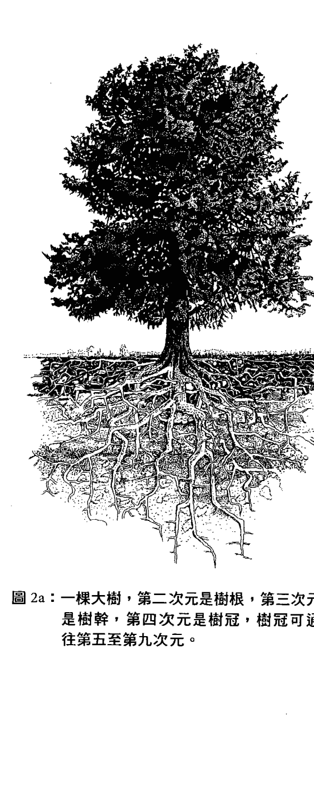

### 第一次元的科学

虽然我对“元素是活的”这种想法感到相当自在，但昴宿星人对第二次元的描述似乎非常怪异。当前的正统科学认为，地球内部大部分是无机的，并且会随着地壳构造力的兴衰产生变化。当然，科学界从来没有表示过，人类的血液与地球内部共振，或是我们的身体内部就像地球内部一样。尽管如此，我还是对昴宿星人所描述的地球内部力量与生命力感到困惑且印象深刻，同时提高警觉。希特勒根据其手下科学家们对于地球内部的信念，曾试图接管世界及控制人类基因。许多狂热分子对地球内部贸然行事，有些人将这个地球内部的世界称为“阿加塔”（Agartha）13。幸好至少有一位当代研究者了解这个次元的独特创造力。由二十世纪才华洋溢的科学家汤玛斯·葛德（Thomas Gold）所撰写的《深热生物圈》（Deep Hot Biosphere），描述整个地壳往下几英里处都有生物居住，而住在深海喷口和火山裂缝中的生物也经详细检查过。这个地表下的世界又称“古菌带”（Archea），是一个功能完善、生机勃勃的生物圈，以原始碳氢化合物为食。接近地表处，光合作用发展出这个地下生命的分支，这个分支进展到了地表，并演化出利用光子来提供化学能的方法。一旦地表生命所需条件（温度、水、太阳辐射过滤器、宇宙冲击降低）形成，地表生命便会急剧增加。葛德表示，碳氢化合物并不是由地质唤醒的生物，而是由生物改造的地质；换句话说，地表生命是地球内部深处生命的后裔。

让《深热生物圈》真的变得很“火热”之处在于葛德的石油生成理论，也就是“地球深层气体论”。我们都被教导，油田是因古代的恐龙和植物堆积、腐烂、蓄积在地球深处所形成。自一八六○年以来，石油便被视为是一种不可再生的资源，而汤玛斯·葛德反驳了这项传说。他因为提出“地球深层气体论”而声名大噪、受人尊敬，后来科学界也证实了他的理论，而他的理论与昴宿星人的第二次元描述如出一辙。

依据葛德的说法，从太阳系形成开始，行星便是“吸积”（accreted）而成，也就是从气态行星盘凝结而成固形物，固形物积聚而成固体。在地球的早期阶段，随着熔融的发生，密度较高的熔体（如密度为岩石两倍的铁）沉向地心，密度较小的物质则向上移动、形成地壳。形成这一切的热是来自气态行星盘的放射性物质，而重力压缩则依照密度，将物质分门别类。这颗曾经是液体的地球含有酵素，它们是生化反应的催化剂。因为有这些酵素，一个巨大的微生物圈存在于地下至少五英里深处，这个生物圈以石油为食，并赋予石油生命的特征。更深的地方有一个过渡地带，再下去生命就无法存活了。油井没有钻到这么深，因此所有的石油都显示出“生物增强现象”（biological enhancement），而“腐烂恐龙理论”便是出自于此。化学分析显示，地表上及地下深层的生命表现，几乎可以确定都有一个共同的起源，因为两者具有相同的基因特征。

关于石油，自从地球吸积而成起，碳氢化合物便已经存在于地球深处。它们经由孔洞和裂缝涌出地表，如此可让微生物蓬勃发展；它们渗流成池，贮藏在地壳中由理想的地质结构所形成的圆顶下方。对油田的测试已经完全证实了葛德的“地球深层气体论”，这些油田经过钻井后会自动填满。石油是一种可再生的资源，而从美国人驾驶的车子和居住的房屋来看，他们似乎是凭直觉就知道这一点。最好的贮油圆顶也似乎最具价值，也许伊拉克地下的圆顶是特别好的一个？大众需要正确的能源理论，因为我们被告知的讯息严重过时，精英则为自己制定计划且大发其财。

地球内部是一个丰富且具有生命力的领域，它充满能量与意识，也为人类的疗愈和觉醒提供了新视野。葛德的《深热生物圈》支持昴宿星人对第一次元与第二次元的大部分描述，且两者之间没有任何相悖。这位二十世纪的顶尖科学家对昴宿星人科学的肯定，使我更认真看待昴宿星人对较高次元的观点。关于那些隐微的世界，本书还有很多科学理论尚未讨论到；然而，汤玛斯·葛德对于第二次元的精彩且完全合乎科学的描述，为这份传讯材料做了最好的证明。

1. 炼金术大师富尔卡内利（Fulcanelli）在《哲学家的寓所》（The Dwellings of the Philosophers）一书中，对第二次元自然要素的开采有许多看法。带着对自然要素生命的美好感觉，他表示，“金属及动物植物本身即具备繁殖物种的能力”（第六十二页）。然后他又表示，“当普通金属从含矿土中被剥离出来以满足工业需求时……它们似乎成为明目张胆邪恶咒语的受害者”（第三〇一页）。

2. 芭芭拉·克洛，《灾难恐惧症》（Mary Magdalene），第七十一至七十九页。

3. 关于手机安全与否的问题，因电磁场的相关资料落差而变得相当复杂。物理学及工程学界主宰着电磁场与手机的相关生物学研究经费，他们的心态并不倾向于关注电磁场对健康的后果。荣获奖项肯定的医学与科学记者布莱克·莱维特（B. Blake Levitt）评论道，手机是以微波频率传输，它们能发出超过美国食药署规定之微波炉辐射上限量的辐射。手机紧贴着人脑使用，却不受美国电信委员会法规的约束。手机的情况与“吸烟者影响二手烟者的健康”类似，这些装置会影响附近的人，且在某些情况下，周围所承受的危害更甚于使用者本身。大部分欧洲国家都已经禁止十八岁以下儿童使用手机，还有人建议，除非是被困在高速公路上等紧急情况，否则大家都不应该使用手机。

4. 林恩·皮克奈特，《抹大拉的马利亚》，第五十九、一七八、一八〇页。

5. 同前注，第一九一、二二五页；芭芭拉·克洛，《灾难恐惧症》，第二一〇至二二二页。

6. 天主教会按照某项计划在古代圣地建立教堂。例如，西元六〇一年，教宗格列哥里一世（Pope Gregory I）敦促英格兰主教圣奥古斯丁（Saint Augustine）找出异教神殿，并在净化它们之后改为天主教堂。芭芭拉·克洛，《灾难恐惧症》，第一〇七页。

7. 西元前五〇〇〇年至西元五〇〇〇年期间，治疗师和萨满的次元知识惊人，现在我们可以看到，这种现象又回来了。戈登·斯特拉坎（Gordon Strachan），《耶稣：建造主》（Jesus the Master Builder），第二二四至二二八页。

8. 关于地球内部，以及教会打破人们与地球内部联结的计划，在凯尔特族及盎格鲁撒克逊国家特别激烈。从西元前至西元一〇六六年，地表是中土地世界，地球内部就在它的下方。地球内部被认为是天堂及精灵的居所，如果人民和氏族与它和谐共处，他们就会健康且蓬勃发展。教会打破了这种关系，以便控制所有人。布莱恩·贝茨（Brian Bates），《真实的中土地世界》（The Real Middle Earth），第一二〇至二二八页。

9. 安德鲁·柯林斯（Andrew Collins）与克里斯·奥哲维赫洛（Chris Ogilvie-Herald），《图坦卡门：出埃及记的阴谋》（Tutankhamun: The Exodus Conspiracy），第一八五至一二二九页。

10. 关于“变容”与“变体”（圣餐），我不是要表达对这些神迹的不尊重，但将它们嫁接在一起，已经导致了民众曲解。变容是指一个人完全被启动多次元，同时仍处于自己的身体中。圣餐则是一种非常强大的治疗工具：在教会完全控制人们之前，圣体会被人们带回家用于医疗事宜。

11. 早期教会在神父努力之下巩固起来，其中尤以里昂的圣宜仁（Irenaeus of Lyon）最为知名。当各种福音书及使徒行传从正典中被排除之际，另一种“耶稣最后晚餐”的观点出现了。《约翰福音》不同于《马太福音》、《马可福音》、《路加福音》，它“遗漏”了最后晚餐的叙述，而一名瓦伦廷（Valentinus）的追随者填补了“确实”发生的事情：十字架圆舞曲（The Round Dance of the Cross）。瓦伦廷及其追随者的所有作品，皆被宣告为异端邪说，且大部分遭到销毁，直到一九四五年发现《拿戈玛第经集》（Nag Hammadi）时，现代人才得以窥见其堂奥。结果是最后晚餐的那一晚，耶稣邀请他的门徒和他一起唱歌跳舞，并邀请他们在他身上看到他们自己。这种做法与“在牺牲仪式中分享他的身体和血”截然不同，也许这才是他真正想要分享的。伊莲·帕格斯（Elaine Pagels），《超越信仰》（Beyond Belief），第一二〇至一二五页。

12. 互联网和金属电磁技术的持续进展，具有绝对的挑战性。正如我在研习班上经常提到的，较高次元与电磁波频谱的较高频率共振，所以也许我们环境中增加的频率，正在唤醒我们的多次元意识！

13. 关于地球内部和“阿加塔”已出现各种理论论述，包括：约瑟林·戈德温（Joscelyn Godwin）的《北极熊：科学、象征，以及纳粹残留的极地神话》（Arktos: The Polar Myth in Science, Symbolism, and Nazi Survival）第117至1104页；崔弗·雷文斯克罗夫特（Trevor Ravenscroft）的《命运之矛》（The Spear of Destiny）第1135至1159页；以及贾克·贝尔吉尔（Jacques Bergier）与路易·保维斯（Louis Pauwels）的《魔术师的早晨》（The Morning of the Magicians）第1140至1100页。

## 第三章

#### 第三次元静心法

你是自由的，你仰躺漂浮在一片温暖的水面上。你的下方有水，你的上方有空气，当你完美地漂浮在这片水上时，你是放松的、安全的、心满意足的。你的头部放松、沉重、受到支撑。你的思绪徐缓，只需留意、观察在你脑海中进行着的事情，看看你可以在那里及你身体的其他部位看到什么。慢慢来。

你知道你的头里面有四个脑吗？首先，让我们找到你的爬虫类脑，它在很低的地方，位于头颅底部，它深入内侧、受到保护、十分古老。你的爬虫类脑通晓事理，这是出于本能。它听从你的身体，它的位置靠近你的脊椎、颈部，以及你身体的其他部位。你的血液循环会通过它。这个脑是明智的，只要听从它，它就会为你提供见解。它知道触感、冷热、干湿。它知道什么对它是好的，什么对它是不好的。

接下来，找到你的哺乳类脑。它位于爬虫类脑的上方，包覆着爬虫类脑的边缘。它知道你什么时候需要害怕，什么时候不需要害怕，什么时候要跑，什么时候不用跑。它利用视力和气味来寻找食物和安全，利用辨别力来决定接下来要采取的行动。当它与他人产生情谊时，会变得温暖起来。

现在，让我们找到你的人类脑。它贯穿前后，盘据你的头部中央，包覆着你的哺乳类脑，像一个罩子，也像一个隔离层。它就同再度生长、重新思考，开启了一种新的可能。它经过数千年的明辨才形成，它想要记住那些辨别力。它想要储存片段讯息，以做为思考的食粮，就像松鼠将橡实埋在地下贮存那样。注意一下思想，这个脑有很多想法。思想是能量爆发的灿烂片段，它们以接近光的速度，穿越这些回路发射出去。

最后，让我们找到你的新皮质脑。它是前面的附加部分，位于你的额头后方，你感觉它在那里就像是一股爆发的能量。当你有一个特别精彩的见解或憧憬时，它就会开始脉动。它热爱想法和理想，就是那些你想要创造的事物，你希望在你或你认识的人的生活中实现的事物。有时候，理想会成真，我们的新皮质脑会让我们的额头变得温暖，使我们整张脸放松，并在我们的嘴唇上形成一个微笑。看看你的嘴唇是否准备好要形成一个微笑。

现在，回到水面上的漂浮。感觉一下太阳在天空中升起，它温暖你的头。感觉一下你的头里面的四个脑，享受一下新的理解。回到你的焦点，你可以再次开始阅读了。

第三次元是线性时空次元，我们人类与其他生物、植物一同生活其间。我们是第三次元的守护者。昴宿星人说，这个世界正在发生的事情，比大多数人意识到的要多得多。我注意到，昴宿星人对第三次元的描述，与我小时候对第三次元的理解一致；我对第三次元的理解来自我的切罗基族和凯尔特族祖父母，而我长大后跟着各族原住民耆老所做的研究，也证实了我小时候的理解。

从这个观点来看，很多世界都在第三次元里运作着。在次元系统中，第三次元是物质次元与非物质次元交会的地带。物质领域（第一至第三次元）是可以测量的，而所有非物质领域（第四至第九次元）在第三次元里都是以隐微的频率运作着。这些非物质领域可以体验得到，例如拥有典型的思维模式，就是处于第四次元的一种方式；或者，我们可以看见第六次元的几何景象。依据昴宿星人的看法，我们的身体是由“使物质振动的频率”所维持住，而我们是振荡的、振动的光之生命体。依据量子物理学，我们身体里面的空间比物质多很多，而我们正在慢慢理解这个新的自我定义。当我们的意识在第四次元振动时，那样的频率范围并非固体，但感觉起来非常真实。对很多人来说，比起对自己身体的感觉，体验第四次元的感觉会更加强烈。一个真正愤怒的人所产生的强大情绪能量，往往比他的身体能量更大。因此，我们在第三次元里深知第四次元的频率，尤其是在我们的原生家庭里。长大成人后，很多人都意识到，我们是生活在一个复杂的故事里，那是一出由我们的感觉精心策划的大戏。昴宿星人和大多数原住民导师都说，在第三次元里，我们多半是睡着的状态。我们耗费大部分的能量，试图要避免感觉，而感觉却是我们通往开悟的入口！正因如此，原住民导师和昴宿星人喜欢将我们从睡梦中唤醒，鼓励我们去习惯强烈的情绪。他们说，如果我们学会以第三次元里的感觉来定位自己，将能够带着信心去探索第四次元。当我们知道自己的个人故事时，将会有更觉察力；这些故事诱使我们去感觉我们的完整情绪，接下来便能觉察到较高次元领域的频率。我们每个人都是一个神奇的生命体，遨游在一袭广袤、浩瀚如东方地毯般的场域中，也就是物质界与非物质界交会的第三次元。这是从较高次元看第三次元的样子。我们在旅途中“充分在场”的能力，便是驾驭时间的关键。

时间是什么？从频率的观点来看，第三次元里的时间只是过去、现在、未来的定位器。时间并不真实，然而我们在第三次元里是藉由时间来完成事情的。当我们有意识地使用时间，而不是像漂流木般日复一日随波逐流时，便能了解到：过去是对此时此刻或“当下”有用的资料库。“当下”是一种独特的时刻，我们身处其间，可以根据过去所知来筹划我们的未来。充分了解过去确实有所助益，因此我们需要知道自己在时间中旅行的故事。昴宿星人说，“无聊”或“有趣”是最好的指标，他们建议我们停止做任何令我们生厌的事情，应该将所有时间花在创造令我们着迷的事物上。既然第三次元是线性时空，那么空间又是什么？围绕着我们的空间是由能量场组成，这些能量场被所有其他次元所渗透。当我们正确地定位在我们的身体里，或是“扎根”（grounded）的时候，便能觉察到这些次元，并与它们互动。为了扎根，我们必须打开自己去接受全部的感觉。如果仔细观察别人，你会发现他们经常不是明确地定位在此时此刻，而你可以觉察到各种感觉模式。例如，在一场讨论中，你也许会和一个四十五岁身体里的四岁小孩有所互动，而这个四岁小孩演出各种应该在多年前上演的愤怒、需索、请求。第四次元的感觉支配了这个成年人的身体，让他动弹不得。对这个人来说，第三次元感觉起来通常就像一张网，且会随着时间的流逝越拉越紧。事实是，这个成年人正漫游在第四次元中，而不是生活在第三次元里；更糟的是，这种现象将随着年龄增长而恶化。如果你仔细观察，这个人实际上是“魂不守舍”的，因为对他来说，第四次元的频率比此时此地的第三次元还要强。让我们探讨一下这件事是如何运作的，因为大多数人之所以耗费太多能量去封锁他们的感觉，正是出于这个理由。当你化为肉身时，是出生在一条从地心出发的直线上，那是你自己的多次元纵轴。一开始，随着你的成长，你的身体就像一个向外伸展的螺贝，它会制造出更多的弧形层。我们的身体经由“形态发生”（一种引导生长的整体模式）而成熟，这是一个奇迹，而它实际上是由第六次元所策划的。1 那么，为什么会有这么多事情出错呢？如果不是为了体验感觉，你终将呈现出这个第六次元的完美形式。由于你生活在第三次元，你的感觉会依据“你如何将自身体验记录在时间里”来磨练身体。我们每个人都是自身全部人生的一段振动的纪录，包括我们对祖先和前世生命的觉知在内，而好的通灵者能够看到及读取这些纪录。“感觉”将第三次元的所有生命体连结起来，因此，藉由参与这个集体，我们每个人都陷入时间之中。当“感觉”没有获得解决时，它们会把你锁在你的身体里，锁进你人生的各种阶段，使你停止自然地流动于当下。例如，人们会说：“啊！我的背好痛。”但观察他们，你會發現他們和他們的痛苦是分離的。經過多年之後，這些情緒障礙會擾亂你的身形，終將擾亂你的心智，除非你學會在背痛時回應你的感覺；而最終，人們會「鈣化」，看起來像是一隻老螃蟹或無精打采的狼。昴宿星人和治療師已經發展出許多方法，可幫助你穿越這些障礙，回到當下。記住，當下就是你知悉過去，同時創造未來之所在。

### 七個神聖方位與建造個人祭壇

為了處於當下，不妨將自己想像成第三次元的一個點（一個感知定位器），並意識到從你身體發出去的七個方向。即使你的情緒連結是你生命的本質，將你織入生活的布料裡，但為了應對第四次元的集體領域，你在第三次元裡的定位仍應隨時以這七個方向為依歸。從圓圈的四個方向開始：東／西、南／北，感覺你自己是四方形模型的中心。在任何時候，你的正面、背面、身體兩側都向著四個方向之一。有一種在個人祭壇中祈禱的傳統方式是面對東方，西方在背後，北方在左側，南方在右側。一旦你習慣以這種方式來感覺自己，便能朝各個方向啟動你身體的每個側邊。你對日升日落（你活力和能量的來源）的覺察力將會提升，對「南北兩極和赤道如何將你與地球旅程聯繫起來」的感受力可能也會覺醒；最重要的是，隨時隨地知道你在地球上的定位，可讓你感覺到每個方向的靈（spirits）。從東方朝你而來的能量，是前來為你引導當日創造力的靈；從西方朝你而來的能量，是前來向你展示你需要改變什麼、可能需要丟棄什麼的靈；從北方朝你而來的能量，將激勵你尋求當天最具挑戰性的結果；從南方朝你而來的能量，是想要支持你、滋養你的靈。第五個方向直達地底，為你提供無限的力量；第六個方向是進入天空、通往所有較高世界的縱軸，也是通往較高次元圖書館的入口；第七個方向是你的心，你的中心。當你按照指示，將你的身體定位在前六個方位時，請與所有朝你而來的能量互動，並將自己設置在你的心中，你會感覺自己是一個振動的生命體。有一位藝術家就是以這種方式來看待及描繪人類結構，他是《聖鏡》（Sacred Mirrors）的作者亞歷斯·格列（Alex Grey）。如同所有刻意練習，這種朝著七個神聖方向定位的做法，會讓你的身體逐漸與它們同步，同時也會改造你。當你以心臟為中心、定位在七個方向時，你可以吸引你真正想要的東西到你的場域來。當你的心智接收到六個神聖方向的訊息，而你的心與你整個能量場共振時，你就完全伸展開來了。一旦體驗到正確的定位，從此再也不會收縮回去，除非你因為情緒受創而偏離自己的中心。即使那樣，當你準備好時，依然可以重新定位自己。如同生活中的任何新修習，最好是在一個遠離第三次元忙亂喧囂的預留空間裡進行。每個人都應該在自己家裡設置一個四方向定位的祭壇空間，在那裡，你可以面對旭日打坐靜心，接收來自東／西、南／北的知識，也可以很容易地將你的意識往下移動到地底、往上移動到天空，並且存在於你的心中。這個空間可以很小，也可以是在房間的四個方位各築一個祭壇。過去原住民的房子都是朝向七個神聖方向定位，原住民也都是在那裡面出生。祭壇裡會擺放一些特殊物品，可幫助你感覺到每個方向的能量，並與它們交流：東方是靈性導引，西方是混沌原力，南方是滋養之靈，北方是重大紀錄導引。祭壇上的特殊物品也可幫助你記起你和祖先的故事。如果你建造了這個空間並使用它，你的生活將會發生至少三件事。很快地，你將注意到，只要你坐在你的中心，你的心就會融化並開啟，因為祭壇的結構會立即讓你啟動；集中心神的時候，原本感到棘手的事情似乎變得容易解決了。接下來，你將注意到，出門在外時，你會藉由方向來定位自己，例如對日升日落的位置會更具有覺察力。然後，一旦你在你的中心靜心良久，並且感覺到你在世界上的定向能力，你將發覺，別人對你能量場的干擾減輕了。當你處於你的中心時，各種想要操縱你、奪取你的力量，或是想要傷害你的人和勢力，都無法影響到你。舉例來說，美國國土安全局即使禁錮我們的文化，也不能進入你的心。如果你讀到這段文字時身處獄中，請在你的牢房裡建造祭壇，以獲得自由。一旦以這種方式在世界上定位自己，各種侵入式的影響力都會像水一樣從你身上彈開。昴宿星人說，在未來的日子裡，我們都需要這些技能。

### 第三次元的科學

第三次元的科學是牛頓物理學，但由於物理學上的因果律已眾所周知，所以本章不談論這些，而是聚焦在原住民的「身體健全法則」上，因為現代生活很少觸及這方面的覺察。在第三次元中完全伸展開來是很困難的，我們的身體經常因為身心靈各方面的壓力而扭曲變形。藉由與我們的感覺、心智及身體合作，失衡狀態和障礙是可以治癒的。此處我們感興趣的是，在固體世界裡、第三次元中，究竟發生了什麼。我們身體的失衡現象，例如不正確的姿勢或體能問題，都是因為生活造成身體、情緒、精神和靈性上的障礙所致。你可以在任何層面上解開障礙，而我們的身體是最直接的通道。與我們的身體合作有一點要注意，那就是在處理我們的感覺之前，疼痛、僵硬、疾病是不會消失的。所有形式的身體觸療都能直接為你指出一個問題，而你的身體將會揭示解決之道。當然，你必須執行這個工作，可是大多數人只會求助於醫生。我們這個時代很奇怪，很多人正在意識到，醫生不能治好他們。如果你和你的痛苦站在同一邊，並傾聽它的訊息，問題往往會隨著頻繁排毒、良好的飲食及規律運動而獲得解決。

> 「對抗療法」只能視情況需要，用於手術或診斷。昴宿星人對藥品十分警覺，因為它會繞過你身體所提供的訊息，並將問題深深鎖入你的身體裡。糟糕的感覺會消失，因為病痛退縮了，但也躲得更深了，最終會使你生病，因為還沒有找出根本的原因。身體的病痛是能量失衡的信號，可經由身體觸療、情緒處理、精神重新定位、靈性聯繫等來治療。

如果某種症狀是遺傳性的，那是你選擇了要在你的父母或祖父母沒有學到的事物上面下功夫。如果你陷入某種家族情緒衝突卻沒有發現及處理，而是任它持續鎖在你的身體裡，終將承擔遺傳症狀。

> 「與你的健康合作」是基本的養生之道，而注意你的身體如何顯示你的感覺和想法是一件有趣的事。你的身體是一座神奇的靈性殿堂，當你擴展身體的場域時，將學會如何在第三次元裡移動得更好，也知道如何好好地遨遊於空間與時間中。當身心靈的障礙越積越多時，很多人會失去這種自然流動和同步性。修習瑜伽、舞蹈、太極拳、靜心、正念行走、演奏音樂等是有必要的，它們能讓你將你的身體擴展到第六次元的「形態發生形式」，那是你理想的化身模式。當你在第三次元移動時，你的身體應該與第六次元完美對稱。你就是經由這種特殊模式化為肉身及成長的，就像一粒橡樹種子長成一棵大橡樹。保持這種形式，你將不會老是出現背痛、關節炎、膝蓋問題、姿勢不佳等。你必須做一種練習，讓你身體所有部位與你的第六次元形態場共振！舉例來說，如果你的膝蓋或髖關節喀啦喀啦響、疼痛、不能好好彎曲，但你採取吃藥的方式，而不是經由正確移動這些部位來恢復靈活度，那麼你身體的那個部位已經逐漸死去了。如果你將塑料零件植入你的身體裡，那麼你在那個部位就是塑料的。當然，有些人會需要使用這些零件一陣子，但這永遠都應該是別無他法時的最後辦法。關於與第六次元的幾何對稱移動，貓是最佳老師。貓能夠展現出理想的形式，正因為他們總是受到神聖文化所尊崇，例如瑪雅人和埃及人。注意一下你的貓如何全身伸展開來，他們到處躺，然後起身、伸展四肢、到處走動。你需要慢下來，去感覺你的器官與血液共振，以維護你的身體；同樣地，你也必須伸展及移動你的全身，以保持身體與你的「第六次元化身形式」的連結。以這種方式在第三次元生活，你會感覺很棒，接下來就更有可能找出各種障礙，不論是情緒上、精神上，或是身體上的障礙，你都能辨認出來。身體上的障礙一旦打開，情緒上的障礙便會解開，你的心智理解你的身體如何配合你的想法。這件事很複雜，但它就這樣發生了，而月亮週期對你的成長大有助益。想要處理第三次元的障礙，最快的方法是在我們的身體裡直接處理它們。我們的盟友是月亮，它是第三次元的一部分，因為我們可以看到它的陰晴圓缺，也能觀察到它對世界的影響，比如由潮汐引起的水位變化。一個月又一個月，所有生物物種都對月亮週期做出了深刻的回應，因為生物大部分是由水所組成的。自從幾百年前發明鐘錶開始，人類就將時間劃分成小時、分鐘、秒鐘等。與此同時，動物、植物、靈體則遵循自然週期來生活。你可能已經注意到，你的現實已經被太多東西填滿了，屬於你自己的空間則越來越小。這是因為，當你分割時間時，空間便會膨脹，最終你的現實將變得不適合你居住。而月亮是你最好的計時器，如果你願意重新依循月亮，便能跳脫「聖鐘」所製造的困境。

### 依循陰曆生活

昴宿星人說，時鐘所造成的實相分割，將於二〇一二年十二月二十一日走向無限，屆時知道自己是生活在地球上的人，只有那些依循陰曆生活的人。

生物界也隨著月亮而漸盈漸虧，當你依循月亮週期生活，時間會與空間取得平衡。

每個月的新月都會植入一個新的故事，那是當月即將上演的故事。舉例來說，注意一下新月當天的天氣，無論天氣如何（炎熱或寒冷、下雨或晴天），都將持續到滿月之後。

即使不懂占星術，任何人都可藉由調頻到新月來感受當前故事的特質。一旦感覺到這些元素，請隨著集體場域的擴展，有意識地扮演你在其中的角色，直到滿月時刻。然後，滿月以巨大的爆發來表達能量，就像貝多芬交響曲最扣人心弦之處。滿月一過，月亮的氛圍會幫助我們演出故事所編織的繾綣情節。

每一年都有日蝕或月蝕，那是月亮遮住太陽或地球遮住月亮所致。日蝕或月蝕讓我們調頻到較大的月亮週期，即「默冬週期」（Metonic Cycle），那是一種將月球與太陽聯繫起來的週期。這個長達十八年以上的週期，指引著一條漫長的生命路徑，知會我們何時要在外部世界尋求知識，何時要從內在領域的深處尋求知識。月亮向我們顯示，什麼時候應該閃耀及生產，什麼時候應該在黑暗中泅泳及再生。雖然占星術很有用，但這些週期都不需要占星術。如果我們學會接受月亮的引導來生活，其實月光的引導效果十分良好，除了需要赴約的情況外，我們都應該丟棄時鐘。我們在這裡不是要分割實相，而是藉由編織各次元的交會點來整合實相。

### 十二之輪的六組極性

我們的次元以物質形式顯現出許多世界，然而，生活在我們的世界時，我們經常被二元性撕裂，因為有這麼多世界穿越第四次元的「情緒極性化場域」而顯現在這裡，導致我們看待事情往往是兩者選一，非黑即白、非好即壞。在思考兩難問題時，一邊或另一邊只是可能性的一種範疇。由於次元是如此微妙豐富，所以出現了這套偉大的極性系統，以便充分連結及放寬我們的感覺。如此一來，當較高次元打開更多，我們就能感覺到自己被先進的生命體所推動。如同「聖鐘」的狀況，我們可以將我們的信念定義為非此即彼，藉此來劃分所有一切，然而那樣的話，我們就失去了我們意識的完整範圍，讓自己陷入一種集體心態中。昴宿星人說，這是「想像力受限」，這件事過去沒那麼要緊，但隨著瑪雅曆末日逼近，二元性正在分裂我們的世界。昴宿星人提供了一個工具，我發現它可以幫助大多數人超越二元性。那個工具是一個圓圈，劃分為十二個部分，以六組極性在我們的生活中發揮作用。這個「十二之輪」使我們能夠將自己從第四次元的原型場域中拉出來，獲得更寬廣的觀點，並且穩固地紮根於第三次元。「十二之輪」教導我們，用智慧去觀察極性，以平衡我們的意識（參見圖 3a）。

圖 3a：十二之輪。取材自芭芭拉·克洛，《液態的性光》(Liquid Light of Sex) 第 41 至 50 頁。

六組極性（自我／他人、扎根／放手、在第三次元中整合／與靈性整合、感覺／權力、創造／給予、處在當下／至福）是管理第四次元感覺範圍的理想方式。當我們運用極性遨遊於第三次元時，便能掌握我們與原型戲劇的連結，例如基督教與伊斯蘭教之間的爭鬥。我們不會被原型的死胡同拉過來扯過去（西方是善的／伊斯蘭是惡的，或者相反），而是能夠處理及平衡我們的個人信念，不會落入二元性的窠臼。由於二元性在集體中是虛假且危險的分裂，會讓第三次元受到感染，所以能夠平衡極性及統合二元性的人，是第三次元的『扎根者』。以下說明每個人該如何經由六組極性來成為我們次元的扎根者與平衡者：

- 1. 當我們平衡『自我／他人』時，會有一種清晰的自我意識，同時與他人和諧相處。我們不會因為自己想要某些東西就去摧毀別人的東西。
- 2. 當我們平衡『扎根／放手』時，會擁有在第三次元生活所需，並放開所有我們不需要的東西。我們停止消耗這個世界，因為不需要這麼多東西。
- 3. 當我們平衡『個人整合』與『靈性整合』時，可以有效接觸那些與我們聯繫的人，同時自由進入靈性領域。接觸到靈性時，我們會停止從現實中消失，而與靈性交流時，我們仍在第三次元中保持連結。
- 4. 當我們平衡「感覺／權力」時，在使用權力上會對他人十分敏感。我們不會對別人作威作福，因為可以感覺到他們對生命的感受。
- 5. 當我們平衡「創造／給予」時，我們創造出我們所創造的，並且找到流通天賦的方法。我們不會迴避表達自己，因為我們不斷受到推動，要去分享這種喜悅。
- 6. 當我們平衡「處在當下／至福」時，我們既處在當下，同時流動於至福。我們保持在我們的中心，進而保持在一種崇高的意識狀態。

這個簡單的模式提供了「自我主宰」的方式，我們日復一日以這種方式生活時，便是紮根於第三次元。當第四次元的力量參與我們的心智時，我們可以感覺及享受它們，而觀察這個偉大的原型故事頗為有趣，它是由我們所有的思想與感覺編織而成，並將我們與其他人連結起來。這就是在每天的生活中理解這個世界的集體意義流動，在時間這一偉大故事裡的流動。

### Introduction

This section introduces the research background and objectives. It provides context for the study and outlines the main questions being addressed.

### 实验

This section describes the experimental methods and procedures. It includes details about the materials used and the steps followed during the experiments.

```
def experiment():
    # Experimental code here
    pass
```

### 数据与分析

This section presents the collected data and the analysis methods applied. It includes interpretations of the results.

| Variable | Value | Standard Deviation |
|----------|-------|--------------------|
| A        | 10.2  | 0.5                |
| B        | 15.8  | 0.7                |

### 讨论

This section discusses the implications of the results. It compares findings with previous studies and explores potential explanations.

- Point 1: The results align with hypothesis A.
- Point 2: An unexpected finding was observed.
- Point 3: Further research is needed.

### 结论

This section summarizes the main conclusions. It highlights the contributions and suggests directions for future work.

> "The study confirms the initial assumptions and opens new avenues for exploration."

## 第四章

#### 第四次元：神話與原型的世界

##### 第四次元靜心法

問問自己，是否知道來自身體裡面的感覺，還有來自外面的感覺？是否知道你為自己創造的感覺，還有別人為他們自己創造的感覺？我們全都有很多感覺。我現在問的是：你能夠稍微區分它們，而不是感覺它們像「一團感覺的大球」嗎？你可以追蹤線索回到它們的來源嗎？挑出一個大的感覺，任何大的感覺皆可。此時朝你而來的任何感覺皆可。它可以只是一個感覺，或是感覺附帶圖像。繼續。看看是什麼朝你而來。做這件事的一個好方法，就是躺在床上、地板上或戶外的地面上，沒有人會來打擾你的地方。將你的手放在頭後面，雙手枕住頭。很好。

現在，抓住那個感覺。不管它是什麼，抓住它。看看它是什麼。好的，現在拿著那個感覺及它所附帶的任何圖像，讓它變得大一點。從各種角度看著它。看看它並感覺它在你的身體裡做了什麼，尤其是對你的太陽神經叢做了什麼。你的太陽神經叢就像是鼓的正面；當你用鼓槌敲擊它時，它會發出聲音。咚、咚……咚、咚。你是否有一個大的感覺？是否感覺到它在你的腹部、你的太陽神經叢？你是否看到任何圖像，或感覺到任何其他感覺附著在這個感覺上？如果是這樣，跟著它們，讓它們也變得更大。它就像一個大結，唯有將它變大才能解開，就像你鞋帶上的結。慢慢來。當你解開它的時候，感覺一下結裡面的空間打開了。請呼吸，記得你的身體、你自己的能量，這只是一種練習、一種娛樂、一種學習體驗。你是否開始看到這個巨大的感覺？開始真正感受到這個巨大的感覺？你能發現它是來自哪裡、是從哪裡開始的嗎？知道它是從哪裡開始的話，你能看出如何去改變它嗎？當你了解它怎麼會出現那裡，要怎樣它才會離開？這件事有時候很難，有時候不太難。慢慢來，不管需要多少時間。如果你認為這件事目前超出你能力所及，那就停下來。找到你的呼吸，找到你的身體。找到你的路回到重力，回到你的腳。如果你想繼續，那就繼續展開學習。一旦知道感覺來自哪裡，看看你如何改變這個感覺。首先，你如何藉由瞭解到它為什麼出現在那裡，而讓它離開。也許你需要採取某種行動，而它會帶走這個感覺。也許你需要對某些人說話，需要告訴他們，他們帶給你的感覺有多糟糕。也許你需要對某些人說對不起，需要請求他們原諒。那樣也沒關係。

重要的是讓感覺離開，讓它停止在你的腹部打鼓。如果你想要寫一些東西，那就寫下來，或是一個微笑，不論任何時候，你只要感覺過去，你的腹部不再咚咚作響，你就知道你已經成功了。給自己一個微笑，不論任何時候，你只要感覺進入你的身體，你都可以如法炮製。你做得越多，就會越快、越有效地找出困擾你的來源。注意一下，你的感覺多麼美好，你的感覺多麼放鬆、多麼安全。做得好！當你讀完第四次元，你可能想要再次回到這個靜心。

第四次元是人類集體心智的領域，它彙集了個人的想法與感覺，並將這些融合交織成連結所有人的原型模式。這個次元保有以來人類所有事件的記憶，正因如此，你才能想像一個住在亞馬遜河流域的薩滿，或是數百年前某位英國女王的生平。依據昴宿星人的說法，第四次元的守護者是「阿努納奇」（Anunnaki），又稱「阿南納吉」（Anannage），他們是神的種族，數千年前在中東建立了水資源管理與農業。在蘇美人、阿卡德人、巴比倫人的紀錄中，都將阿努納奇描述成男神與女神，他們以導師和指導者的身分介入人類。事務。他們出現在一些古老的史詩中，在幾次宇宙狂亂大災期間及之後，對掙扎中的人類文化伸出援手。這些史詩是神指導人類，甚至可能是創造人類的最早書面紀錄。同時，這些神讓我想起古希臘的神，他們也干預人類事務，並捲入了影響人類的宇宙大戲劇。經過多年研讀這些神話中男神與女神的故事，我認為昂宿星人說阿努納奇是第四次元的守護者，是因為蘇美人的紀錄是報導諸神滑稽行為最古老的資料來源。這些故事後來出現在阿卡德人和巴比倫人的資料中，最後出現在希伯來聖經裡；也就是說，這些神似乎是人類最早的創造與求生記憶。第四次元包含了數千年的神話和故事，它的時間感是巨大的，遠遠大於多數人的時間感。這個資料庫與廣為人知的「阿卡莎紀錄」一樣，某些聖徒、上師、靈視者等全知的人類，可以像看書般讀取這份時間紀錄。對於昂宿星人指出，這些神是第四次元的守護者，我個人覺得是個巨大的挑戰，情況猶如對大多數人來說，第四次元是個巨大的挑戰一般，這是因為一些現代作家編造了許多關於阿努納奇的離奇故事，比方聲稱他們是外星人，但描述這些神的原始資料並不支持這個觀點2。不論真相如何，目前阿努納奇及傳說中他們原來的行星或星球，是很多人恐懼的來源。這件事很愚蠢，這又是使人們畏懼上帝和世界末日的古老手法3。我反覆訴說這一點，因為這種混淆其實是對二次元的誤解。第四次元是「感覺」，而第三次元是「物質」，因為第四次元的感覺是如此強烈，所以對某些人來說，它們似乎是真實的。最後，我斷定阿努納奇實際上是全球精英的中央控制裝置，一套用來創建宗教、藉由煽動恐懼來控制人類的計畫。這套第四次元計畫可回溯至少一萬年，而在五千一百二十五年前，文明出現在世界各地時，這套計畫變得舉足輕重。這套「神之計畫」目前隱身在猶太教與基督教的許多信條背後，所以這些計畫是本章的主要內容。這不是一個輕鬆愉快的主題，但真相必須揭發出來，才能解放第三次元的人類。

從我們在地球上的角度來看，第四次元是第一個非物質次元（但在情緒上可覺察到），這使得我們大多數人對它感到十分困惑。這個次元似乎是個充滿偉大男神與女神、天使與魔鬼、龍與國王的世界，他們參與了洋洋大觀的戲劇，而人類除了作夢，或是因為玩電動、看電影而渾然忘我時，很少人會意識到這些大戲。事實上，這些偉大的存有（比如宙斯與耶和華）必定是某個聰明人創造出來的，因為很容易利用他們來愚弄及妖魔化人類。根據推測，這些原型的神不常出現在這裡，尤其是最近幾年。他們或許曾經出現過，也或許不曾出現在我們的次元裡，然而他們一旦被創造出來，很多人似乎都忘不了他們。

有時我不禁懷疑，即將到來的馬雅曆末日，是否代表一個時間點，屆時大多數人將會清楚看到第四次元如何影響我們的心智與文化。無論如何，我的任務是準確說明昂宿星人的次元智慧。在本章中，我們需要瞭解這些陌生的第四次元守護者的目的及來源。

### 第四次元的星幽界與神性層級

第四次元是一個活生生的「參與式」（participatory）地帶，它是第三次元與星辰之間的「星幽界」，充滿了來自神性存有的訊息。這個地帶接收了來自較高次元的所有訊息，我們也因此對第四次元的原型（例如諸神）感覺到如此強烈的情緒。然而，當我們清楚地看到第四次元的信仰體系如何影響人類文化，便能直接在心中接收這些訊息。例如，古埃及的導師可以看到，在人類的心中，第四次元往往是一個十分混亂的地帶，所以他們開發出一種富有想像力的動物圖騰神學，以表明諸神與人類的互動關係。這種神學使得古埃及成為一個平衡且快樂的文化，且維持數千年之久。基本上，第四次元會啟動我們的感覺，並將較高次元的訊息分裂為正面或負面。當你明白這種動態的運作方式，也就能明白，第四次元不過是將我們所有人連結起來的大型創意遊戲罷了。

來自較高次元的訊息是人類創造力的源頭，然而第四次元的智慧將其分裂為黑暗與光明。這個過程為我們在第三次元的感覺提供了訊息，我們才能夠擁納較高次元的廣博。許多人選擇習慣性忽略這些饒富趣味的脈動，因為將它們付諸行動可能會改變他們的生活，而那些努力去看、去聽、去感覺、去解讀訊息的人，往往會成為強大的創造者或通靈者，因為他們把握了時機。偉大的藝術家擅長將壯麗的想法帶入形式中，詩人、畫家、雕塑家，甚至政治家，都是以這些宏大的原型為生；他們就像熱切的園丁，利用第四次元的富饒為第三次元施肥。當然，精英是這些原型的主人，他們是第四次元符號（如symbols）的主人。

至於「原型存有」，人類是第三次元的創造者，因為我們能製造出固體物。第四次元的存有雖然可以思考及策畫他們想要的一切，但不能在第三次元裡創造出任何固體物。因此他們在我們心中種下他們熱烈的渴望，煽動我們去創造出他們想要的實相，但我們必須選擇成為我們世界的主人。舉例來說，不幸且困惑的青少年演出了潛伏在成年人集體心智裡的殺人傾向，好比一九九九年發生在美國科羅拉多州科倫拜高中校園槍擊事件。

難怪大多數人都試圖迴避這些饒富趣味的第四次元脈動，然而，如果有更多人成為自己實相的主人，他們將成為藝術家，而不是戰士。

如果一個人的情緒失控，第四次元的能量就會呈現出一種低星幽等級的色調，例如會有天使、魔女、怪物、外星人、聖母馬利亞來造訪。這些造訪者在我們「古老原型圖像的磁性心智螢幕」上顯得非常真實，對那些正在大量學習個人感覺的青少年來說尤其如此。有些人被第三次元裡的這類幻影逼瘋了，另一些人則只是為此著迷。

靈性大師及藝術家都學會了區分「低星幽等級的脈動」與「真正的神性啟發」之間的差別。我認為我們現在都必須成為靈性主人，以便在自己的次元裡創造出自己想要的東西，否則「新世界秩序」將會操控它、毀掉它，或兼而有之！當然，上述言論可能會引起一些讀者懷疑，日日夜夜盯著電子螢幕會有什麼風險？還有，青少年吸毒又有什麼風險？

可以簡單地跟隨我們的感覺來回應，然而在此我想建議，我們應該運用心智來觀察這些感覺，遵循那條超脫精神錯亂的路徑。原型力量的本質就是為它們的靈感在第三次元裡尋找工具，這種「占有過程」起起落落，而在馬雅曆的最後期間，它正以倍數增加。這是因為科學唯物論否定了原型脈動的實相，過度的理性主義令我們感到挫敗，並且放大了第四次元的存有，那是一種阻斷人類創造力的危險扭曲。當較高世界不能穿透第四次元，進而在第三次元裡流通時，壞能量便會像毒氣般聚集在第四次元。最後，這股閒置的能量會在人類心智中匯聚成一池混沌的黑色力量，就像超載的電路燒斷保險絲那樣，而遭到否認的星幽力量特別容易吸引那些吸毒的人。在美國，吸毒的人口比例非常高（包括合法及非法），精英想要控制人們也變得輕而易舉。儘管如此，在第三次元裡，我們人類仍是名正言順的「神性靈感流通者」。

如果對自己的生活感到厭倦，表示你沒有充分發揮你的潛能。美好的事物來自於刻意與神性力量合作，這些力量會產生藝術、憧憬及神聖文化。新世界秩序密謀讓人類「失聲」，以便操控世界。現代文化（尤其是美國文化）由於受到黑暗能量的污染，所以極其無聊、沒有創意，而且非常暴力。與此同時，我們可以選擇想在第三次元創造出什麼，因為我們具有自由意志。在任何時候，我們都可以選擇去創造出充滿藝術、戲劇、音樂、歡笑的神聖文化，藉此打開豐富的「原型之流」。

某些文化經由作夢來接通原型之流，例如澳大利亞的原住民；另有些文化則在神祕劇裡表達出這一點，例如米諾斯文化的牛舞和迷宮。對於被養育得非常具有創造力的原住民兒童而言，這些強大力量很容易流經他們。他們的耆老知道，阻斷這些力量會讓族群變得暴力，而允許這些力量膨脹，則會讓它們演變成特立獨行的想法，進而削弱整個族群。

最後，這股黑色力量會壓倒眾人，集體發瘋、生病的浪潮將席捲而來，戰爭也隨之而至。原住民常因其醫療行為能夠清除掉致病的星幽汙染而受到崇敬，但他們真的更樂意將大部分時間花在創作上，因為「創作比治病更有趣」。

當廣大群眾回應集體心智的改變需求時，就會發展出古埃及、馬雅、米諾斯、凱爾特等令人狂喜的神聖文化。相反地，足夠多的人將第四次元的力量壓抑在自己裡面時，就會出現非常黑暗、暴力、具破壞性的文化。此時，地球的人們正在吶喊，希望全球統治和暴力可以結束，但是為和平而吶喊是行不通的，只有讓原型之流流通才能重獲和平。有時候，

### 第四次元的光之天篷

目前的第四次元看起來像是一座籠罩著個人、城市、文化、國家的陰鬱天篷，這種星幽能量就像治療師經常在客戶體內及氣場中看到的黏糊糊青蛙卵。小布希與錢尼在位期間（二〇〇〇年至二〇〇八年），美國上空的星幽天篷變厚了，令人覺得頗有壓迫感。

我舉最近這次「第四次元集體瘋狂」為例，因為它是被黑暗力量所佔有的絕佳例子。正如希特勒在德國崛起時那樣，那幾年全世界都懷著嚴肅的心在關切美國。一般情況下，第四次元的天篷會不斷遭受來自五個較高次元的能量波與光波所衝擊（參見圖4a）。當較高次元的能量衝入第四次元的弧形天篷時，這座天篷的作用就如同一面透鏡，會將想法與感覺分裂成兩種可能性：正面或負面、善或惡、黑或白、對或錯，並影響我們的意識，比方那名躺在治療臺上接受治療者的意識（參見第四十三頁圖ic）。當人們對某個議題只

#### 二元物理

脹。我們全都能夠觀察議題的兩面、感知全方位的訊息，藉此學習區分「星幽影響力」與「較高次元啟發」之間的差別。一旦理解「傀儡起舞」的原型遊戲，星幽影響力就不能經由消除議題的一面來分裂我們的想法，如此便能增加我們的智慧。我們心智中的第四次元議題是集體的，但我們可能沒有領悟到，成千上萬的人也正在處理相同的想法。例如，這些日子以來，有成千上萬的人正在探索一種我稱為「猶太教與基督教對抗伊斯蘭教」的極性，有些人將這種原型劃分為善或惡、安全或危險、對或錯，另外有些人則試圖瞭解雙方，以便使自己意識清明。隨著這齣戲的開展，有越來越多的人傾向於變得意識清明且富有見地。精英不斷給這些議題穿上新戲服，如果他們打算大肆對這些捕風捉影的東西做出強烈指控，二元的力量就會集結成一種集體瘋狂的現象，進而演變成一場大混亂。值此馬雅曆末日期間，「猶太教與基督教對抗伊斯蘭教」這組極性已成為一場大混亂，因為正逢雙魚座時代（這些宗教在這個時代發展了兩千多年）步入尾聲。未獲解決的層層歷史正一一被挖出，以便做出最後評價。那些已經極性化的人（不會倒向任一方的人）便經由釋放出對他人的評斷，來處理這些老舊的記憶。五千多年來，全球精英一直在使用耶和華與魔鬼等強大的第四次元工具來推行其計劃，也就是所謂的「新世界秩序」。從雙魚座時代一開始，羅馬人和梵蒂岡就將這些力量物質化了，更在兩千年來建立了一套第四次元集體耶和華信仰來對抗魔鬼。值此馬雅曆末日期間，我們正處於水瓶座時代的初期，精英則在密謀接管第三次元，以便在接下來的兩千年操控這顆星球。昂宿星人說，像這種時候，最簡單的做法就是讓強大的第四次元力量流經你的意識，並避免陷入二元性。當大時代更迭時，較高次元的啟發將會十分強烈，而你可以在一種「波瀾不起」的心態下接收它。

當你因為固守某種信念而阻斷原型之流時，第三次元就會碎裂成各式各樣的二元性，情況宛如一條龍或是一隻罹患狂犬病的狗正在猛烈攻擊這座光之天篷。你的電磁場會收縮，接著使你喪失神性的流動。人類因為懶惰、愚蠢、醉生夢死，所以淪為精英的玩物。

如果我們拱手送出我們的權力，就會發生真相的大撕裂，第三次元將演變成一場大混亂、大旋風，而在一萬一千五百年前發生的則是一場地質大災難。這一次，一場宗教大旋風正在醞釀中，它就像一道「燃燒天使火龍捲」。與此同時，兩千年前沒有被抓住的大好機會，比方說基督與穆罕默德的真正教誨，如今人人都可以拿來主張了。值此馬雅曆末日及雙魚座時代結束之際，上演的是「猶太教與基督教對抗伊斯蘭教」的大型史詩電影，但也是一部老掉牙的電影。

在世界宗教的秘密洞穴裡，隱藏著神聖文化的種子。當人們第一次察覺到這些種子

### 第四次元的科學

時，光之天篷是半透明的，因為較高次元流經並照亮地球5。接著，精英建構了上帝計畫來接管地球時，人們受到引誘，以上帝之名互相殘殺。只要人民分裂成對立的陣營，新世界秩序就會煽動世界宗教之間的衝突，進而挑起全球衝突。對於那些支持任一邊的讀者，請記住，精英不在乎誰遭到殺害，只要它獲得勝利就好了。為了更加瞭解第四次元的力量，以及人類是如何陷入如此混亂之中，現在該來研究第四次元的科學了。

科學往往是文化的一面鏡子，對於二十世紀而言尤其如此。量子力學（或新物理學）是縱軸上第四次元的科學6。量子力學研究光的特性，即原子和分子的微觀世界。離散的能量單位（量子）既可以是粒子，也可以是波，力學則是研究它們的運動。量子力學發現，光的作用既可以是粒子（光子），也可以是波（頻率），這基本上是將物質二元化了。由於我們的思想是經由第四次元來接收的，所以在我們的第三次元腦中所接收的頻率，被這種「次量子實相」的性質所分裂。我認為「波粒二元性」是我們心智中二元思維模式的內在原因；它是一種電磁現象。

接下來，我們要快速回顧現代物理學，以確保我們知道我們在這裡談論的是什麼。

量子力學以目前物理學界所定義的四種基本交互作用力做為基礎：電磁力、強核力、弱核力、重力。電磁力束縛住電子與原子核；強核力束縛住夸克，夸克則形成質子和中子；弱核力造成核衰變；重力是最弱的交互作用力，然而它的影響距離大於其他三種力。電磁的量子（或粒子）是光子（光的粒子），它們的範圍無限且不具質量。光做為一種頻率波，它的作用範圍遍及無線電波、微波、紅外線、紫外線、X射線、伽瑪射線等所有電磁波頻譜（參見第六十二頁圖1b）。

膠子（強核力的量子）可讓質子與中子裡面的夸克「黏合」在一起。輕子和強子是弱核力的量子，而弱核力會在超新星等星體中引起放射性衰變及核反應。重力的量子被認為是重力子（尚未找到），重力對實驗驗證（規範理論）的影響不大，而規範理論則試圖統合除了重力之外的所有作用力。規範理論取決於規範對稱，而規範對稱是一種測定物體在時空中連續變換作用的數學。關於粒子，所有粒子全都有反粒子，反粒子是質量相同但其他方面（例如電荷）相反的粒子。當一個粒子遇到它的反粒子時，它們會互相消滅，並產生更多的能量。電子、微中子、夸克構成了宇宙的一般物質，所以我將重點放在它們身上。另外兩個族群（繆子與陶子）非常不穩定或生命短暫，這裡不予討論。

電子是電流的基礎。微中子具有極佳的交互作用力，因為它們能穿越其他物質，甚至一路穿越地球，這表示它們可能帶有第一次元和第二次元的訊息。夸克很迷人，它們帶有電荷，還有三種顏色（色荷），即紅、黃、藍三原色。夸克既不具結構也不具空間維度，雖然在粒子加速器中尚未觀察到它們，但有很多證據表明它們的存在。有些人看得到三種顏色的氣場光環，所以也許他們看到了夸克的「變體」。

當我想到這些粒子時，我的心開，因為次量子場極具創造力且呈現渾沌狀態。事實上，量子力學的各種面向似乎屬於第五次元。當然，每個次元的形態都會融入下一個次元，且每個次元都具有較低及較高次元的特質。量子力學確實優美地描述了第四次元的二元性如何擴展到極性，並從我們的第三次元意識中脫穎而出。關於第四次元二元性上方的第五次元統合（unity），我們的實相是以第五次元的波在流動著。第五次元是絕對統合與同步的次元，在那裡，所有粒子都是相關的。

舉例來說，物理學家貝爾（J.S. Bell）在一九六四年證實，被分裂開來的兩個粒子是以心電感應進行交流；它們以立即且親密的方式相互聯繫，這表明宇宙具有意識。一九七○年，大衛·波姆（David Bohm）提出「隱含的秩序」理論（又稱「不間斷的整體性理論」），證明粒子的動態關係取決於整體系統。也就是說，想要藉由切割片段的方式來分析這個世界是不可行的。科學家能夠模仿自然界的片段，但這樣並不能解釋我們的世界和宇宙。事實上，實相的固體化可能只發生在我們的心智中。新物理學表明，我們生活在一個整體的、心電感應的世界裡，而不是困在一台「牛頓的機器」裡。從那樣的角度來看，可以想像宇宙的運作方式。一般人可經由研讀量子力學的實驗來瞭解宇宙，以及領略它們如何流動。伊扎克·班托夫（Itzhak Bentov）的經典著作《跟蹤荒野鐘擺》（Stalking the Wild Pendulum）對這股動力有相當精彩、清晰的解釋。

以上是對於宇宙中基本粒子和作用力的概述。新物理學已經導致驚人的技術進展，例如解碼光的特性（尤其是雷射光），還有發現粒子和波的微觀世界。粒子的分裂及反粒子的存在，反映了人類生活在二元性而不是極性的傾向，這使得人類的性情容易變得暴力。人會消滅最能反映出自己行為的人，正如粒子與反粒子在相遇時互相消滅一樣。

有了量子力學做為現代技術的基石，物質科學在很大程度上淪落到為破壞性技術提供服務，例如發明出原子彈。這是相當危險的情況，既然科學家已經造出了這種炸彈，一種以耶和華為原型的可怕物質化，現在我們全都必須理解這些基本的作用力。我要問的問題是：科學家是否要對他們自己理論與實驗的結果負責？這些發明家的行為宛如他們是第四次元的造物者，可以隨他們高興，任意去使用大自然。然而，量子力學並不是較高次元的物理學，也不屬於宇宙學。對於真正的宇宙學，我們必須以較高次元的角度來思考宇宙的本質。在粒子加速器中永遠找不到宇宙，而人腦的感知及整合能力則遠遠超過加速器和電腦。沒有手機，我們的想法可以跑得更快、更順暢。

牛頓物理學以一種我們可以想像的方式，描述著事物如何遵照重力、運動、事件等法則；量子力學則不然，這是因為牛頓定律是第一至第三次元的真實法則，量子力學是第四次元的法則，而宇宙學則運作在第五至第九次元。新物理學所揭示的次原子世界，表明了我們的電磁腦能夠轉譯頻率波。第四次元的集體心智彷彿是一個巨大的頻率波螢幕，而我們能在腦海中進行偵測及讀取，前提是我们要學會轉動它的旋鈕及調整它的音量，就像使用收音機那樣。

量子力學中的測量只能藉由機率分布來執行，那正是集體運作的方式。事實上，你越瞭解機率，就越能清楚地思考，並運用意向來導引你的行動。你可以調頻到好電臺，而不是壞電臺。這是一件大事，因為正如昂宿星人先前提，第四次元的存有（以及其他較高次元的存有）想要參與我們身體的行為，以便體驗頻率波。

## 夹心饼干般的生活

牛顿定律对我们来说是比较容易理解的，因为我们在第三次元里运作它们，也可以在心智中描绘出它们。然而，四百年前，牛顿将我们的意识放进一个机械化的盒子里，我们今日才正从里面挣脱出来。随着我们开始充分理解新物理学，我们的意识也会像宇宙一样膨胀。现在，人人都应该研究量子力学，以便从精英手上取回权力，并终结核能的滥用。我们的分裂意识一部分陷入机械式的心智状态，另一部分则正在回应一幅百年前才揭开的新景象。如果没有新物理学重新发现“较大的整体”及高等数学的教导，我们只能呆坐箱子里，任凭时光在滴答声中流逝。让我们回到第四次元的学习，直接经由人类的经验出发，看看它是如何运作的。

我在引言中曾提及，有时我们像是夹心饼干中间的夹心，一边是较低的地球领域，另一边是充满情绪与思绪，且随着吸收到的东西而不断变化的集体心智领域。对于我们大多数人来说，第三次元是一座激烈的竞技场，我们的身体就夹在第二次元的磁力与第四次元的电力中间。我们已经知道第二次元如何影响我们，现在需要多加了解第四次元如何在第三次元影响我们。

我们可以感觉到我们的世界正在发生的事情，并在人际关系中找到自己。“十二之轮”均分为六组极性（参见第一一四页图3a），它教导我们要在自己与他人之间取得平衡。它是我所找到用来检测第四次元的感觉如何影响我们活动的最佳工具；它教导我们如何读取自己的能量场，或者变得能够自我反省。利用此轮，可以揭示出你是否在生活中的关键议题上保持平衡，也就是将这些议题视做“极性化实相”（相互关联）或“二元化实相”（个别分离）。此外，当你处于平衡状态时，你就是稳固地置身在第三次元里，这意味着你已经扎根了。第四次元的振动速度比第三次元快很多，会剧烈翻搅及分裂能量。因此，你必须随时保持警觉，才能稳住扎根的状态，大混乱期间尤其如此，例如九一一事件所引发的大混乱。这些时候就像被卷入龙卷风一样，很难知道要往哪里跑。很多方面在目前都发生了巨大的变化，所以大多数人都深刻地“失根”，也就是并未稳固地置身在第三次元里。生活在今日世界，经常宛如处在一个粒子加速器当中！人们心里感到害怕，因为他们被搅入快速进行的事件里，而他们与这些事件甚至没有关联。“十二之轮”帮助我们成为风暴中的和平之岛，更容易不去理会精英扭转舆论的阴谋。

也许你正在处理关于个人的棘手问题，例如在一段新关系中保有舒适的自我感觉，而政治与现代科学似乎离你很遥远。然而，大多数人无法回避这些集体议题，它们将形塑整个二十一世纪。大混乱会将每个人吸入，并诱使你卡在某一边或它的对立面。例如，你是个美国人，你认为你的国家很好，而伊斯兰基本教义派不好，你就陷入了二元性的思考模式，反之亦然。以这种方式去感觉，会让你感到愤怒、武断、恐惧，进而阻碍隐微意识的流动。如果你支持其中一边，你将看不到你在这齣精彩刺激、扣人心弦的戏剧中扮演的角色；另一方面，如果你体验到对立的力量是相互关联的，你就是将它们视为一种极性。关于全球精英如何利用宗教在双鱼座时代控制世界的真实故事，它的最终结局十分引人入胜。如果有够多的人能看透这场游戏，我们就可以取回我们的次元。现在，每个人都拥有一个选择，要么糊里糊涂地困在第四次元的大混乱中，要么保持意识觉醒，并在第三次元里创造一个新世界。如果选择意识清明，你可以遵循多次元的线索，避免成为第四次元的棋子。这件事非关人们扮演的角色，而是关乎你的意识在哪里。你可能负责担任反战分子或轰炸机飞行员的角色，可能看似支持其中一边。如果你身心平衡、能够处理自己的行为，你所散发的频率将会为你的生活引来新的可能性，这样才能防止第三次元遭精英吞噬，他们最喜欢的计分卡是战场和停尸间。随着我们接近水瓶座时代，精英怀抱着一个伟大的计划，也就是所谓的“新世界秩序”：他们想要控制全世界。当你意识清明，并且能够创造新的可能性或新的时间轴时，你便是第三次元的主宰。届时，多次元的力量将流经你的身体，比如你会知道基督和穆罕默德在双鱼座时代的真实生活。

总之，我们回顾一下“二元化实相”与“极性化实相”之间的区别。处于极性化时，议题的两边是共振且相互关联的。它们连结不同的次元，因此扩大了可能性。例如，随着世界宗教之争越演越烈，千千万万的犹太教徒和基督徒，可以让自己沉浸在神圣的伊斯兰艺术中，并研读《古兰经》，穆斯林则可以研究基督的生平，提供更多关于这位受人尊崇导师的知识，进而为大多数基督徒带来新的讯息。毕竟摩西、基督、穆罕默德都在中东出生和生活，而不是在洛杉矶。如果三大宗教研究了自家导师的道德教诲，他们可能会注意到，三大宗教都谴责战争。处于“二元化”时，议题的两边是分裂的，以至于其中一方看不到另一方的人性，就像以色列人和巴勒斯坦人一样，他们各自受到操纵而攻击对方。因为人们是分离的，所以精英煽动双方之间的信仰差异，同时贩卖武器大赚血腥钱。这一切都不值得赔上一条人命。分裂的实相摧毁了理智与善良，而投资于暴力等同自杀行为。当你过度倒向一边，认为自己必定是对的而别人必定是错的，你就陷入了一种二元性的思考方式。

#### 二元性与极性

让我们透过“新世界秩序对比伊斯兰”来讨论六组极性，这是精英正在精心编排的一齣戏。这个原型冲突令人非常困惑，它既是回溯到过去，又因为先前没有得到适当处理而再度神秘出现。其次，让我们看看这种二元性如何以极性来运作。下面这一段是特别为美国读者写的，因为美国处于一马当先的位置，但世界各地的读者也可经由他们的文化透镜来阅读。

- 一、第一组极性是“自我/他人”，分裂成二元性时，重点是要自求多福。你会支持新世界秩序所做或想做的任何事，而伊斯兰是敌人，他们所做的一切都是邪恶的。这时，如果以极性去体验“自我/他人”，你会观察这齣戏的两方，很容易就能看出谁获得了什么，谁又在恫吓对方。任一方都会无所不用其极去推动其计划及打败对方。当你以一种极性去探索“自我/他人”，你可以自由地……

- 二、第二组极性是“扎根/放手”，分裂成二元性时，从冲突中赚钱是主要目标。你会寻找每一个可以获利或吃喝玩乐的机会。对此，如果以极性去体验“扎根/放手”，你会试图更加了解所谓“敌人”的需求与愿望，并鼓励人们看到，除了投机的精英外，每个人都输了。

- 三、第三组极性是“在第三次元中整合/与灵性整合”，分裂成二元性时，收看CNN和福斯新闻会是一种挥之不去的执念，而拥有自己本身的真实信念与感觉，或是去感受“敌人”的精神诉求，则是遥不可及的事。在大混乱期间，媒体总是把事件分裂成“我们对抗他们”。然而，如果以极性去体验“在第三次元中整合/与灵性整合”，你会将整个二元性看成是一齣创造出来让人类付出惨痛代价的戏。这是一齣“电影大作”，将戏码和所有演员都深深保留在你的心中，会赋予它们空间与能量去觉醒，进而变得意识清明。当隐藏的仇恨暴露出来时，隐藏的宏伟真相也将清晰可见；然而，如果没有人见证它们，又会如何呢？

- 四、第四组极性是“感觉/权力”，分裂成二元性时，会觉得所有愤怒、主观评断和痛苦是一种挥之不去的执念。你盯着电视机不放，津津有味地品尝胜利及可怕的灾难，将它们当成一天中最大的乐事，轰炸吧！但如果以极性去体验“感觉/权力”，你会深入内心寻找是哪部分的自己正在创造出这齣戏，并将它当做每日的修习。当权力的混种狗在世界舞台上咆哮时，看见自己的“内在施令者”将有助于化解掉它们，这样也会开启你的心，使你能为那些陷入大旋风中的不幸者深感同情，甚至受到感动并伸出援手。

- 五、第五组极性是“创造/给予”，分裂成二元性时，你会想要参与剧码，去对抗邪恶的一方。你想在冲突中以某种方式贡献己力，而不先去质疑为何有冲突存在。如果以极性去体验“创造/给予”，你会看到在巨大冲突期间所呈现的惊人创造力。人们及其他生命受到威胁时，你的心会被扫入这场大戏中。很早以前就有解决文化失衡更好的办法，而那个办法可以再次发掘出来。创造力受阻总是让人变得暴力；若我们没有创造出艺术作品，将以行尸走肉取而代之。

- 六、第六组极性是“处在当下/至福”，分裂成二元性时，戏剧就是一切，且是唯一一件你在进行的事；大混乱让你欣喜若狂，宛如你的界限正在融化。你无法想像自己能做些什么，因而感到无助。这时，如果以极性去体验“处在当下/至福”，那麽感觉到你的本质在群众事件中扮演一角，会令人大开眼界、震惊万分。你可以看到来自类似事件的时间轴中，演员们进进出出，仿佛从前世回来，以便获得另一次机会，而他们确实如此！你的心清澈明晰，看看这个过程如何在时间里运作，让我们的未来不再出现大规模创伤事件及宗教二元性。

我们再来谈谈夹心饼干般的生活，你有一个选择，看是继续困在两片饼干之间的白色黏腻糖层中，或是刻意让自己保持在极性化状态，并随着更大的场域而流动，藉此在第三次元里完全伸展开来。想像自己是一片草地里的一株草，在阳光下的风中摇曳，在雨中瑟瑟发抖。极性化状态极具动能，因为它们像风扇一样扩大你的频率场。这个风扇对应到上方的第四次元天篷，你的心智不分裂时，这座天篷会是一张巨大的半透明网。

当你因为一直监视自己的情绪而让你的心智成为主宰时，这张“网”会把你从这场原型戏剧的“二择一”困境里拉出来。

你或许会说：“啊！那跟我无关。”比如说，新世界秩序与伊斯兰之间的冲突。但是，你确定吗？你从来不对你的伴侣生气？你从来没有拿过你不需要的东西？你从来没有忽视一个正在向你求援的人？你从来没有压制过别人吗？你从来没有放弃创造的机会吗？你从来没有躲开人群搞失踪吗？然而，另一方面，如果你检视自己的生活，并明白自己的行为是大混乱的一部分，你的困境就会消失，如同一场未完成的纸牌游戏在龙卷风中被卷走一样，一扫而空。

#### 拿非利人与着火的布希

如昂宿星人所说，阿努纳奇以宗教操纵众人，藉此在地球上主导新世界秩序。这里有个饶富趣味的提示是：阿努纳奇和圣经中的拿非利人是同一种生物，而拿非利人是指“降临在地球上的神”，即与人类女性交配的神。这些神是当前周期的主导人，此周期大约始于五千一百二十五年前，他们开始割据领土，想要征服世界。他们将地球变成“房地产”，今日世界仍然被这些旧冲突、旧分割所撕裂。昂宿星人说，这种“放血”行为使得第四次元成为一张诱捕人类的天罗地网。

昂宿星人解释了为什么会发生这种情况。他们说，当我们停止互相残杀，他们会知道我们已经改变了。“人与人之间的交互连结”可开启通往较高次元的入口，这会将第四次元重新组合成一座半透明天篷，并解除所有控制规划。我们每个人都可以欢迎较高次元回到我们的世界。如果不是这样，我们的次元将会沦为一个重复的纸牌游戏，而唯一有意思的就是谁赢、谁输。为了了解这个微妙的结构，我需要讨论一些时事话题，以便呈现更多这种纸牌游戏玩法的范例。请注意本节中触动你心之处，那正是你卡住的地方。

这个主题是最大的禁忌之一，所以在详加讨论之前，我们首先要注意，基督教是由犹太教而来的，伊斯兰教是从犹太教与基督教而来的，犹太教则来自苏美、阿卡德、巴比伦！如果每个人都记得这个简单的事实，那么所有冲突也许会在一天之内结束。

这三大宗教有同样的圣人、神、圣地、经文等做为基础，但新世界秩序分割了领土，分割了神降临于地球的珍贵圣地，藉此分裂每个宗教的信徒。这使得信徒彼此一直在对战，也永远不会联合起来消灭剥削他们的人。冲突在过去三百年间越演越烈，因为精英认为世界末日即将到来，或者他们认为阿努纳奇即将重返地球，又或者他们只是想要更多的钱。

这件事十分可笑，如果你知道马雅历表明人类正在觉醒、正在摆脱精英的控制，那么这件事就显得更加可笑了。

真正信仰一个超越人类经验的神，是相信神性会及时展现，而现实不会遭到操纵。

本书第九章将提到，时间表上确实有一个关于地球的神性计划。上一章我们讲过“凯撒与教会”的故事，说明人类在过去两千年如何陷入这个困境。现在，我们需要检视当代版本，也就是这张网如何诱捕个人，让他们陷入疲惫不堪的二元状态。这张网由个人二元性所纺出的黑白纱线编织而成，且直到最近，它几乎网罗了全世界各个角落。值此水瓶座时代兴起之际，新世界秩序正在试图为它自己的利益重建世界，那不过是对未来的完善计划罢了。如果我们没有看懂这一点，精英将会操纵下一个大时代。精英使用两千年前由凯撒与教会所创造的同一套老旧宗教/魔法系统。目前，新世界秩序驻扎在华盛顿特区，它是由共济会（Masons，又译美生会）在两百五十多年前设计、建造的一座城邦。当时的规划是要让华盛顿成为美国各州的中枢、一个崭新世界的诞生之地，许多人视之为“新亚特兰提斯”。这是一座有着方尖碑、金字塔、林荫大道、黄金地带的古典神殿建筑群，据说是为了生活、自由及追求幸福而建造。然后，从二〇〇〇年到二〇〇八年，布希和钱尼政权企图煽动统治全世界，想让美国成为这个共济会城邦内的新世界秩序领导人，如此发展可能不是开国元勋所期望的。接下来，神秘的是，在布希和钱尼政权接近尾声时，一场房地产与银行业的金融危机为这次任期交接划下句点。布希和钱尼政权是华府的一种全新趋势，我之所以关注这件事，是因为它是一个典型的第四次元创造力关闭事件。他们是犹太教与基督教的基本教义派，相信世界末日已经近了；他们掌权八年，以确保某些事情如期发生，尤其是在中东的情势。然而，这个政权结束后，突然间，许多观点都有了容身余地，而旧问题也有了新的解决方法。人类的创造力再次获得解放。

这次极端的二元化周期持续到二〇〇八年为止，它已经过去了，很多人也从中得到了宝贵的教训。

许多人在卷入集体戏剧时，有一种“失根”的感觉。我们生活的时代正在重播一齣未获解决的戏剧，老演员又回来了，他们希望有机会可以在第三次元里改写历史，因为第三次元是唯一可以改变时间轴的次元。我觉得这一切都很迷人。许多领导人都会提醒我们过去的当权者，例如奥巴马就表现出他对林肯的钦佩。

此举十分敏锐，因为美国在内战期间被分裂成两半，而这种二元性在林肯遭暗杀后就固定住了。这个分裂至今还在癒合。银行家为了获利而引发美国内战，就像目前的金融危机。很多人都知道发生了什么事。

回到一八六〇年代，当时也有很多人知道发生了什么事，但是现在有更多人发展出较高的意识，可以防止旧事重演。这是一段令人惊奇的日子，我们既能够与第二次元的自然要素合作，又能够与第四次元的原型同乐，同时以自己的心智来建构新的场域与时间轴。藉由在你的祭坛里静心，你可以练习女神炼金术，不仅可以改变你自己，也能改变这个世界。如果有数百万人这样做，世界就会改变。

#### 第四次元的强力透镜

想像你在自己的祭坛里，定好各个方位，或者现在就前往那里。选择一个目前困扰你的状况，比如美军驻扎在阿富汗。将这个想法留在心中，一旦你对它有了感觉，就调频到第二次元的自然要素，然后去感觉第四次元的原型存有，请他们来到你的祭坛与你会谈；你想要感觉及听到他们的说法。他们可能会想透过你来传讯、唱歌，或许你会感觉到好像和他们一起在演奏音乐。当你真的能在自己的空间里感觉到他们时，也许会感觉“浓烈”，或者会感觉、看到或听到一个伟大的存有。你可以点燃鼠尾草或薰香，以便制造一些烟雾，这会鼓励他们变得更具形体、更容易现身。你将会感觉到地球的痛苦。就让自己为之哭泣或愤怒吧！或者透过你的身体去承受任何感觉，还有，要记得呼吸。请与前来的导师一起祈祷，并感谢他们。你也许会受到一股力量推动，会想要吸烟斗、为各位方位献上玉米、闭眼看见异象，或检视祭坛里你最喜爱的一件物品；只要按照兴起的念头去做即可，它们会向你显示事物。我的祭坛上有各种创意物品，比如重要的信件、长辈的照片、小孩的玩具、石头、肖像、羽毛等。这些物品让我的导师能够指示我，因为他们不常出现在平凡的现实中。当我们接收到灵性脉动，讯息就会到来，而如果我们没有回应（尤其身处祭坛期间），机会就会离开。他们很高兴自己受到欢迎，当你在身体里感应到他们时，可能会感觉自己像一只快乐的小狗。不要担心这个，因为你是你祭坛的主宰，但务必感觉到他们的提示。他们是你自己当下的真实内在故事。

调频到你的身体，注意任何出现剧痛、痉挛、沉重或刺痛的部位，然后进入那些部位，并接受教导。接着，从身体里面出来，让一种乐器作响（铃铛、哨子、水晶碗、手摇铃、鼓，皆可），或调频到祭坛里的某件物品，也许是水晶之类的。当你进出灵性场域时，真相会进入你的心。

你在第四次元的力量，是在你的“感觉”里。与现身的导师相处一段时间之后，你可能会感觉到一些非常深刻的情绪。这些情绪来自较高次元指导者的脉动，他们在我们的场域里发出八度音阶，我们就像是他们可以弹奏的琴键一样。在你处理完自己的第四次元二元性之前，指导者不会来到你面前，而那不过是你需要清除的部分自我罢了。处理目前的困境时，受伤的部分会显现，它们揭示着你灵魂隐藏的阴影。当你看到自己失去的这些部分，较高次元的灵性会进来帮助你清除这种能量，因为这么做会开启你的较高次元场域。你可以随心所欲，时常创造这些奇迹，它们会让战士放下武器。

你在自己的祭坛里静心越多，与选择和你合作的存有就会越来越像朋友；如果你愿意清除你的阴影，他们会更快降临。我就是这样认识昴宿星人的，他们喜爱打开我们的心。当第五次元沉降到第四次元时，仿佛在某个夏天的夜晚，置身于一座幽静的花园里，开启心扉，感受着温和的雨水。如果你的身体变得很兴奋，而你对周遭一切感到十分着迷，那就是昴宿星人。他们激发你、在你的细胞里振动，藉此展示你的世界在他们眼中的样貌。你可能会觉得真的有人跟你在一起，或一阵寒颤直冲你的脊背。请坐正挺直，感受脊椎的能量，然后将你的意识转移到铁核晶体中，以便让你自己扎根。在你的祭坛中，感觉你的身体，感觉一团火冲上你的脊椎，进入你的头颅。看看你身体上方的能量天篷，并感觉它的细碎爆裂声及开口。数以百万计的光波闪烁着，照进你的空间，感觉一下，你的心随着这片粉红光而膨胀，接着吸一口气，闭上你的眼睛。你已经准备好接受启发，进入“心”之第五次元。

1.  安德鲁·柯林斯，《来自天使的灰烬》(From the Ashes of Angels) -第二〇三至二〇一页...金(King)，《创世史诗》(Enuma Elish) -欧布莱恩(O'Brien)《少数的天才》(The Genius of the Few)。
2.  例如，撒迦利亚·西琴 (Zecharia Sitchin) 的《第12个天体》(The Twelfth Planet)。雅各·德·沃普 (Jacco van der Worp)、马歇尔·马斯泰斯 (Marshall Masters) 及珍妮丝·曼寧 (Janice Manning) 合著的《X行星预测与2012年求生指南》(Planet X Forecast and 2012 Survival Guide)，依据一个可疑的资料来源，即所谓的《科尔布林圣经》(Kolbrin Bible) 为基础，以一种非常可怕的方式讨论了整个太阳系当期的主要变化。读者可参阅沃尔特·克鲁岑 (Walter Cruttenden) 的《失落的神话与时间之星》(Lost Star of Myth and Time)，该书为地球和太阳系的变化提出了更合理的解释。不论这些变化的来源是什么，关于阿努纳奇是来自“X行星”或“失落之星”的想法，缺乏真正的可信度。
3.  过去三千年里，耶和华成为犹太教与基督教的上帝，这位上帝最先是在白羊座时代的中东出现。我强调了耶和华在双鱼座时代的延续，仅仅是因为宙斯、戴欧尼修斯（酒神）、阿蒙（古埃及太阳神）等，都没有这么长的历程。当然，“耶和华”这个概念做为全球精英的工具，在当今世界需要进行一些思考。
4.  早期教会在正教与异教之间的大战，症结点在于个别基督徒是否有权利或能力自行去寻找圣光。这种严重冲突（精英仍在继续进行）现在已见诸《拿戈玛第经集》文本。例如，《论世界起源》(On The Origins of the World) 中表示，在伊甸园里，发光的伊皮诺伊亚 (Epinoia) 向亚当和夏娃闪耀着光芒，并唤醒他们的意识。当《约翰秘传》(The Secret Book of John) 里的约翰问道，是否每个人都接收得到这种发光的伊皮诺伊亚时，耶稣说：“这种力量将降临到每个人身上；如果没有它，任何人都无法忍受。”伊莲·帕格斯，《超越信仰》，第一六四至一六五页。
5.  伊莲·帕格斯，《超越信仰》，第一六四至一六五页。关于“我对第四次元的定义”与“爱因斯坦四度时空理论”的对比，爱因斯坦的前三个维度是长、宽、高，第四个维度是时间。我认为第四次元是……
6.  关于“我对第四次元的定义”与“爱因斯坦四度时空理论”的对比，爱因斯坦的前三个维度是长、宽、高，第四个维度是时间。我认为第四次元是……大衛·歐瓦森（David Ovason），《我們國家首都的秘密建築》（The Secret Architecture of Our Nations’ Capital）…丹·布朗（Dan Brown），《失落的符號》（The Lost Symbol）。

菲達·哈斯南（Fida Hassnain），《尋找歷史上的耶穌》（A Search for the Historical Jesus），第一一三八至二一〇八頁。蘇菲派學者哈斯南及許多伊斯蘭學者皆主張，耶穌被釘在十字架之後痊癒了，並在遠東地區生活許多年，他在那裡是一位受人喜愛的靈性導師。哈斯南描述了這個故事的原始資料，他在老修道院中發現這些資料，它們躲過羅馬天主教的銷毀運動，存活下來。據推測，這些資料今天存放在梵蒂岡圖書館。故事的結局是：被稱為「伊薩」（Issa）的耶穌和他的母親瑪麗就埋葬在克什米爾。哈斯南曾參訪那座聖祠。換句話說，如果這些來自東方的說法獲得證實，西方教會自認是「基督在地球上的代表」這種主張將會受到動搖；那麼，東西方之間幾乎沒有什麼可爭的。我強烈推薦這本書，但它真的很難找到。

我對量子力學的概述，受到下列作品所引導…伊扎克·班托夫，《跟隨荒野鐘擺》…大衛·波姆，《整體性與隱含的秩序》（Wholeness and the Implicate Order），第一四一至二一七頁…保羅·戴維斯（Paul Davies），《上帝的心智》（The Mind of God）及《關於時間》（About Time）…布萊恩·格林恩（Brian Greene），《優雅的宇宙》（The Elegant Universe）…喬奧·馬古悠（João Magueijo），《比光速還快》（Faster Than the Speed of Light）…威廉·米契爾（William C. Mitchell），《大霹靂再見，實相哈囉》（Bye Bye Big Bang: Hello Reality）…麥可·塔博（Michael Talbot），《神秘主義與新物理》（Mysticism and the New Physics）。

## 第五章

#### 第五次元：三摩地與昴宿星人

#### 第五次元靜心法

花幾分鐘趕上你自己。找到你的呼吸……。找到你的腳。在你追蹤感覺的根源之後，記住你感覺如何。記住卸下肩頭重擔、卸下腹部重擔的感覺，記住你多麼自由地呼吸。記住那個感覺，再次呼吸，這次是一種淨化的呼吸，從腳底吸取空氣，直達胸腔。再試一次，直到你可以輕輕地、從腳底到胸腔創造出那種感覺為止。感覺一下，空氣行經身體的動向。提醒自己，你是創造這種感覺的人，就是「你」。看看能否讓你的嘴角稍微上揚。看看嘴上帶著微笑是什麼感覺。在你下一次呼吸時，保持那種感覺，保持那抹微笑。再呼吸一次，感覺這次呼吸就在你心中。讓空氣直接經由你的胸腔中央進入。這是「你」在呼吸，沒有別人。這是你的空氣流動，你的生命力。確認這件事。現在，開始感覺，你的胸腔隨著每次呼吸而擴大。慢慢來。不必呼吸得太快，緩慢而輕鬆地呼吸即可，享受每次吸氣與吐氣的循環。吸氣五秒鐘，吐氣五秒鐘……看看是否有所不同。每次呼吸時，再稍微擴大你的胸腔。感覺一下，讓胸腔變得更大、更開闊是什麼感覺。想像一下你的心，並看著它擴大。調頻到所有在你身體裡移動的事物，調頻到「綠色」。打開你的胸腔中央、心臟周圍的空間，寬一點、再寬一點，看看你能將它開得多寬。花幾分鐘將它完全打開。好的。順勢而為即可，不要勉強。安住當下，穩定心神，集中心智。看看頭部的感覺如何……看看腹部的感覺如何。注意那些感覺，並與你的呼吸同在。從容自在，吸氣、吐氣，上升、下降，如你心之所願，盡可能打開它。現在，讓自己覺察房間裡的其他能量：是陽光嗎？還是外面街道傳來的聲音？是一隻鳥在唱歌嗎？還是屋子裡的其他地方傳來的聲音？用你的心去歡迎那些能量。看看感覺如何。看看能否經由你的心，讓些許能量進入你的身體。看看能否從心中發出一點能量，來與這股能量會合。要有創意，你可以隨心所欲去做這件事。現在，閉上眼睛，想像某個很想與他相處的人，他可以是你目前生活中的任何人，也可以是你以前認識的人。讓那個人來到你的心中。看看那個人的臉，並從胸腔中央去感覺那個人。感覺你的心輕輕地碰觸那個人的心。如果你需要請求那個人的原諒，或者需要寬恕那個人，那就發自內心去做這件事吧。發自內心對那個人說話。如果情況需要，不妨多花一點時間。要知道，這種感覺是沒有時間限制的。如果只是想要誠心誠意地將愛傳送給那個人，那就去做吧，並享受從你心中送出愛的感覺。試一下「愛之能量」的傳送方式：瞄準目標，或者讓它在那個人周圍發光發熱。用你心中的畫筆去畫出這個人。這個人可以是寵物、動物、樹、植物、朋友、親戚、情人，可以是過去或現在的任何生物。不管他是誰，你和他在一起，並讓這個過程繼續下去，直到再也沒有能量需要傳送或接收為止。現在，再呼吸一次，將注意力帶到胸腔。怎麼樣？它是不是比剛開始時更加開闊？它的邊緣四周是否有點疼痛？再次呼吸，讓呼吸成為你心中的畫筆。將涼爽、濕潤、療癒的能量帶到你開啟的心裡。感謝你的身體能夠敞開這麼多，要知道，每次這樣做的時候，你都可以敞開得更多。小小的疼痛只是開啟過程的一部分。想像自己在疼痛處塗上藥膏，感謝你的心這麼願意開放與接受。現在，將你的注意力帶到你的呼吸，帶到你的腳，帶到從胸腔直通腳部的能量柱。記住你敞開心扉的感覺，並且知道你可以隨時回到那裡。睜開眼睛，再做一次最後的淨化呼吸。看看能否在嘴角找到另一個微笑。很好。現在，我們準備好了，可以開始探索心之守護者，也就是第五次元的守護者。

第五次元是光的領域，它以人類的心為中心，並與地球的生物和植物共振。對人類而言，光的振動頻率稱為「三摩地」（又稱「三昧」），那是人類能夠領略到的、與神性融合為一的經驗。

依據昴宿星人的說法，第五次元的守護者是來自昴宿星團的生命體，昴宿星團是位於天空中的大牛也就是金牛座的一個星系。正如一些史前學家所指出的，距今四萬多年前，昴宿星人是地球上許多原住民氏族的祖先。昴宿星人對這個次元的描述，以及它與地球的連結，令人大感驚奇。他們說，從昴宿星團發射出一道巨大的星光螺旋到我們的太陽，而我們的太陽是昴宿星團的第八大恆星。螺旋的產生者是昴宿六，從地球觀看，它是昴宿星團的中央恆星。在天文學上而言，這種說法似乎很奇怪，然而許多天文學家及早期的希臘人都曾描述，在昴宿星團與太陽之間，確實有這麼一道「光之螺旋幾何」。

我的馬雅醫藥兄弟亨巴茨・曼撰寫過這個系統，因為它是馬雅曆法「長紀曆」的基礎。經由這個系統，昴宿星人對地球總是具有很大的影響力，每當重大時刻來臨，例如馬雅末日，他們便會穿越一道如鸚鵡螺般的螺旋，悄悄溜進我們的世界（參見圖5a）。

依據《昴宿星議事錄》中薩提雅的說法，以及亨巴茨·曼的說詞，我們的太陽系正被一束光所喚醒，那束光就是「光子帶」（Photon Band），它正在轉化地球的大氣層。此時，隨著馬雅曆所編排的地球覺醒到來，昴宿星人正在調頻到我們的太陽系，並為我們帶來昴宿六的最新消息，彷彿這道神秘的星光螺旋是一個通訊系統。

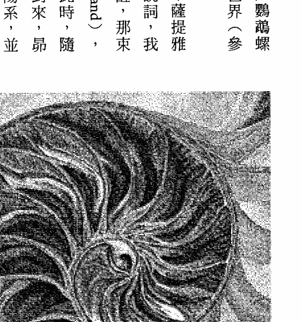

圖5a：鸚鵡螺的螺旋。

身為「昴宿星訊息」的接收者，我從一開始就發現到，根據量子力學的一些發現，光子帶的說法是有其道理的。上一章檢視了新物理學的第四次元面向，在本章中，我們將從第五次元的觀點來考量新物理學。

光子就是光的粒子，它們會隨著頻率波而振動，並且涵蓋從極低頻率波到伽瑪射線在內，全部的電磁輻射頻譜。高頻光子比低頻光子具有更多能量，而目前正好有異常大量的高頻光子來到我們的太陽系。自一九九○年代以來（尤其是在一九九八年），非常強大的伽瑪射線風暴持續來到我們的太陽系，強烈程度可能更甚於以往³。當然，我們擁有可以檢測它們的技術不過是最近幾年的事，然而，上述現象可能與神秘的光子帶有關。

二○○三年初，天文學家已經確定，高強度的伽瑪射線是來自「特超新星」（hypernovas），也就是非常巨大的超新星⁴。依據量子力學的說法，光子是成雙成對分裂，並在宇宙中獨立行進，然而無論距離多遠，都能互通訊息。在某種程度上，光子是具有意識的。這次由高能量伽瑪射線所進行的覺醒，必定在強化我們心智中的頻率範圍。

伽瑪射線是我們所知最高階的能量，這代表我們真的在探究意識本身⁵。《昂宿星議事錄》出版以來，我一直在思考是否真的有光子帶，以及它可能造成的結果，而我感覺到，位於高頻地帶（例如黑洞）的地球光子配對雙胞胎，正強烈地與它們的地球配對光子通訊。

昴宿星人說，伽瑪射線爆發，使人類成為「覺知者」（seers），即可以同時意識到九個次元的人。他們還說，昴宿星人是第五次元的智慧體，需要第三次元的電磁場才能看見他們自己。我見過三次昴宿星人「看到他們自己」，他們是小巧而燦爛的發光生物，令我心跳加速。一九八五年的一個下午，在我位於聖塔菲的書房裡，有一群昂宿星人閃閃發光，持續好幾個小時。他們說，他們來到我們的次元，是為了啟發我們，讓我們成為『愛的大師』。

愛孕育出生命，而生命是『心之智慧』。愛是一種比我們的心智更強大的力量，心智不過是讀取頻率的螢幕罷了。我們靜心時，最好清空我們的心智，以便繞過這個會令人分心的螢幕。當我們清除心智，就會流進一座黑暗的內在迷宮，裡頭的路徑可以通往我們的心。不同於第四次元，第五次元沒有極性化。思想行進的速度比光還快，而愛的行進速度又比思想更快，這使得我們能夠認出我們的靈魂伴侶，以及認出到來到地球散發高頻光的偉大人物，例如基督、佛陀、穆罕默德。這種光振動著『內在神性』，而我們對它的回應稱做『恩典』。

依據昂宿星人的說法，地球是昂宿六的實驗室，昂宿六則是地球的圖書館。《昂宿星議事錄》與本書都是來自昂宿六圖書館的紀錄。現在，我們的太陽系已經繞回到它在銀河系軌道的一個關鍵位置，而新的神聖文化『和諧生物』正在銀河中播種。六兩億兩千萬年前至兩億五千萬年前，太陽系處於同一位置時，地球因為在它的場域中保有九個次元而被選中，成為銀河中發展生物生命的實驗室。昂宿星人說，地球的新生物將於二〇一二年十二月二十一日在銀河系裡散播，就像蒲公英在風中釋放出絨絮。唯有振動於這全部九個次元的生命，才會被帶進星際。星系播種將是地球一次欣喜若狂的解放，就和濕婆在銀河與地球共舞一樣。許多地球實驗正在為人類預先準備，以便實現星系生物法則。舉例來說，每個遺傳學家對DNA的所作所為，都表明了他是否尊重生命。在銀河中，神性最先是經由聲音進入我們的次元，因此《聖經》上說：「太初有話。」（In the Beginning was the Word）。和諧的法則即是靈性科學，而靈性科學比唯物科學更重要。這些法則是本書後半部分的基礎，因為唯物科學無法說明或涵蓋五個較高次元，但固體世界的部分它解釋得很好，也精確地探究了許多屬於較高次元的自然因素。正因如此，我才試圖為每個次元找到一種可以解釋的科學，而這些發現是令人雀躍的聚寶盆（cornucopia）。靈性科學認為星系是具有意識的生物，它們居住在宇宙裡，建立起結構，就如同我們在地球上所做的事。

第五次元是光，換言之，它是整個電磁輻射頻譜的場域，而我們在這個場域裡被神秘地賦予形體。隨著我們進入隱微的領域（第五至第九次元），昴宿星人說，每個較高次元都有一個星際的家，同時也維持著地球場域的各個面向。幾千年來，人類藉由神話、星辰故事或天體傳說來瞭解真相，它是古代豐富傳統的來源，天體傳說也是通往較高次元的原始橋樑，而現代世界已經失去了這種想像連結。格里和我這兩個愛好自由的水瓶座，由於一直帶領團體共同探索更高領域，所以有幸重新編織這條「光之掛毯」。星星就是星系的細胞，就像我們體內的細胞。天體傳說重新喚醒了「細胞記憶」，也就是在我們細胞中以光編碼的記憶。事實上，我們可以感覺到自己生活在其他時空，例如昴宿星團或古埃及。細胞記憶可以經由「說故事」進入，這就是為什麼一些優秀的說書人會唱歌、吟誦，如樂器般彈奏他們自己的身體。如果不刺激我們的電磁神經系統，我們的記憶就會萎縮。古代的人會凝視星辰，並傾聽它們唱歌。我們似乎已經失去這條通往神性心智的線，然而事實並非如此。僅僅一百年前，梵谷將夜空中的星星畫成旋轉的銀河光之螺旋。天體傳說的永恆紀錄按照光之週期而覺醒，這件事現在正在發生。地球上的光子在星際中具有相配對的光子，它們會定期通訊。這些迷失的雙胞胎在伽瑪射線中返回，我們則聽到天堂星球的音樂。我們沒有走失或遺棄，我們正在醒來。做為昴宿六的實驗室，地球是可以具體體驗到愛的地方。我們個人療癒場的能量，直接與我們心中的愛呈正比；經由擴展我們的心，我們可以吸引昴宿星人前來與我們合作。正如昴宿星人所說，我們的電磁場使得他們能在我們的世界裡實現他們自己。人類創造的最強大力量，就是我們在做愛時的高潮頻率。馬雅人說，人類的性高潮能移動星系中心！這聽起來可能很瘋狂，然而隨著我們探索縱軸上的各次元，我們所尋求的能量是「第五元素」。尋求高潮頻率是本書的目標，偉大的威廉·賴希（Wilhelm Reich）更發現它們是生命力的來源，並將它們命名為「奧剛」（orgone，又譯奧根）。星系中心散發出神聖時間，次元脫離中心而旋轉，我們則是縱軸上的生物；也許我們確實是用高潮來旋轉銀河系！大多數的神聖導師都指出，我們可以只經由「愛」來達到開悟。唯一一個探索第五次元以上次元的理由，就是將我們的愛擴展到較高次元，這是一件相當有趣的事。第六次元維持住第三次元的形式；第七次元以聲音喚醒細胞記憶；第八次元是上帝；第九次元旋轉出時間週期。較高次元將第五次元連結到神性源頭，第五次元再將這種愛散發到較低次元。第五次元是縱軸的中心，如同我們的心是我們身體的中心。你可以藉由穿梭於縱軸，逐一體驗這些領域，也可以在我們宏偉的固體世界裡直接沉浸於愛中，畢竟愛是宇宙的所有頻率範圍。

如果你選擇「心之道」這條路徑，地球就是一座迷宮，你可以依循裡面的路徑通往中心，然後再次退出。你可以走在那些路徑上，你會遇到別的生命體，屆時只要擴大你的場域，就能向他們傾注愛。如果你統合於心，生命就是一段尋找其他生命體並付出愛的時光。瞭解愛的唯一方法就是去體驗它，這件事也吸引了昂宿星人前來。許多追尋者想要瞭解宇宙本身，而你可以經由「愛」去瞭解宇宙。

### 第五次元的科學

第五次元的科學既驚人又美妙。先從拓撲學開始，也就是關於對應性與連續性的數學。隨著我們進入較高領域，將藉由女神煉金術來探索事物。女神煉金術的規則就是：事物必須有趣且爽利，不能若隱若現、拖泥帶水；必須令人雀躍，不能令人哈欠連連。

我確定各次元專屬科學的標準是：每套系統必須在其對應的次元上具有直接成果，且在其他次元也具有些許意義。一個次元的科學，絕對不能淘汰掉另一個較低或較高次元的科學。例如，第四次元的量子力學不能取代第三次元的牛頓物理學。一九○○年，物理學家馬克斯·普朗克（Max Planck）提出了他的「能量輻射定律」（不連續宇宙論），因而揭開量子力學的序幕。當時他擔心這個理論會破壞牛頓物理學的基礎，但事實並非如此，因為量子世界只是微觀的觀點。我們需要第四次元的量子力學觀點，才有辦法定位第五次元，也就是物質統合的次元。當你瞭解第四次元如何分裂物質，這種統合才更有意義。

領略五個較高次元時，我們必須伸展我們的心智。為了協助我們的學員，我們請麥可·斯特恩斯創作與九個次元的頻率共振的音樂，否則要察覺到真正的高頻率和低頻率，可能非常困難。

有些學員覺得與鐵核晶體共振最為困難，因為它的振動頻率只有四十赫茲。

有一件可以肯定的事情是：想要前往更高次元，我們必須完全理解我們即將離開的次元。將每個次元想像成「平面」頗有助益，也就是九個平坦的領域，它們向外延伸，成為無窮無盡的圓形（參見圖5b）。宇宙學家認為，宇宙是平坦的，空間則是彎曲的¹⁰。

有些讀者也許會發現，先逐一考量全部九個次元，再回頭將它們融會貫通，這樣可能比較容易掌握整體次元概念。

拓撲學，或是關於對應性與連續性的數學分支「紐結理論」，在各方面皆屬於第五次元。數學是一種高度結構化的語言，它讓較高層級與事物產生關聯。一般而言，所有形式的數學都屬於第五次元，因為數學是在複雜事物之間尋找關係。拓撲學的專長是找到公式來描述紐結，而那些紐結最終在第三形成事物；它研究較高層級進入我們的次元之所（紐結）。結是繩索穿過軸心之處，形成結的繩索則來自其他地方。宇宙彷彿是一件由結所組成的平坦織物，就像東方地毯一樣。拓撲學這門科學專門探究從其他地方而來，並以可檢測的方式交織而成的形式。拓撲學家確定了一些事，因為他們的公式已完成重大實驗驗證。拓撲學躲在各種生物實驗背後，比方操縱DNA、克隆複製等，我稱之為「科學怪人生物學（Frankenstein biology）。它也是一個奇怪的研究領域，拓樸學家瞭解其發現背後的代數，而不是幾何。大多數人的思考方式不是傾向於幾何，就是傾向於代數。我本身以幾何方式進行思考，而我喜歡第五次元的拓樸學，因為它帶領我們進入迷宮，本書稍後將會介紹迷宮。

結經由編織繩索而形成，我們可以將它們鬆開或收緊，就像繫鞋帶、解開鞋帶那樣。

你還記得第一次繫鞋帶的神奇時刻嗎？對我來說，它是相當神奇的一刻。是這樣的，拓樸學家嘖日費時地發明公式來描述紐結的長度、孔、環、曲線等。如果循線找尋它們的源頭，那麼紐結背後的幾何（第六次元）對我來說是顯而易見的；然而，運用公式將幾何與拓樸連結起來，需要動用好幾本書來計算。利用拓樸學做為一種視覺上及結構上的工具，我能夠想像紐結隨著電磁頻率而振動的畫面。弦論物理學家認為，基本粒子不是圓點或點狀物，而是「一度空間的微小細絲，有點像來回振動且無限薄的橡皮筋」。

想像一下，世界是一座「環狀相交紐結的振動場」，而這些紐結最終將成為物質。如果你處於恍惚之間，歡迎來到較高次元！做為一個有用的橋樑，它有助於將第三至第六這四個次元連結在一起，形成一個有效的概念。這提供了「第六次元幾何形式」與「第三次元複製事物」之間的一種聯繫感。我第一次瞭解第六次元理念與第三次元事物之間的關係，是小時候研讀柏拉圖的作品時，而它與魯伯特·薛爾瑞克提出的「形態場理論」十分相似，即形態場在第三次元裡複製出生命形式¹²。紐結理論是一個有效的概念，我們可以利用它做為第三至第六次元之間的橋樑。紐結在第五次元裡是線的交會點（線來自第六次元），它們在第四次元的二元場（粒子與波）裡解開或繫上，並在第三次元的電磁場內形成事物。拉緊一個紐結會強化二元性，進而強化第三次元的困境；相反地，鬆開一個紐結會散發極性，並打開視野。

### 經由迷宮步入較高次元

法國哲學家兼畫家派崔克·孔蒂（Patrick Conty）將拓撲與幾何銜接起來。當然，他不是數學家，然而他的美麗闡述《創世紀與迷宮幾何》（The Genesis and Geometry of the Labyrinth）顯示出幾何如何一直在我們的身體中扮演一角，彷彿解決方案就在自家後院。

迷宮存在於古代世界各地，孔蒂指出，它們是將這個世界連接到較高次元的最初原型。

迷宮是進階版的拓撲紐結，也是我們可以行走的路徑，所謂的「體驗式幾何」。思考一下我們的誕生，第三次元是一個迷津（maze），我們在裡面四處遊蕩，沒有方向感，## 時間的盡頭與柏拉圖式宇宙

也不知道是否出得去，甚至我們出生時也沒有拿到使用手冊。然而，迷宮是穿越人生迷津的理想途徑，它也和女陰（vulva）十分相像。進入它的中心再出來，是發掘內心自我、讓意識重生的理想導引。人們走入迷宮時，通常會有深刻的靈性體驗。路徑引導步行者進入迷宮的中心，它是連接全部九個次元的縱軸。如果你曾經走入一座迷宮，你還記得自己是如何迂迴繞圈，然後迴轉，而最緊密的轉折出現在中心處。我們的心智與身體交織迴轉於這種複雜紐結時，會超越二元性。符號通常會沈澱在「心靈之眼」中，進而喚醒細胞對於幾何的記憶，也就是讓我們的身體保持在良好狀態的幾何。這些符號會隨著極其複雜的幾何而振動，當你的身體沿著路徑移動，幾何也會隨著聲波而振動。你可以感覺到土地在唱歌，這會將你融化成一種空靈的認知。古代的迷宮通常位於聖地（大地能量強烈流動的地方），例如英格蘭康瓦爾郡的廷塔哲附近，那裡有一些關於亞瑟王統治卡美洛的古老傳說。有些教堂會在地板以馬賽克鑲嵌出迷宮，例如法國的夏爾特大教堂，裡面標記著地球強大能量配置的路徑。中世紀時，朝聖者行走在夏爾特的迷宮，唱詩班則在上方唱著聖樂。迷宮會把從較高次元直接吸住第二次元的路徑。

孔蒂談到一個經典的埃及結「思瑪」（sma），這個結是在法老寶座的側邊發現到的（我在埃及時，一直對這個結感到疑惑）。這個結的軸心是一顆人類的心臟，它從中央的氣管柱冒出來（參見圖5d）。繫在氣管上的結將上埃及與下埃及團結起來，它解決了二元性，並開啟心靈智慧的流動。這種流動使土地變得肥沃，並支撐及增強生物，你可以從顯示出植物會合的繩索看到這一層象徵意義。繩索從第六次元而來，顯示植物如何從較高的理念形式（形態發生場的理想形象）被複製出來。思瑪將心臟與生命的氣息結合成在一起，它教導每個人跟隨法老的領導，進行神聖的呼吸。這個結是由兩條線而非一條線所組成，表示上、下埃及已達成團結；對於二元性的問題，思瑪是一個強大的解決方案。

對孔蒂來說，迷宮是代表整體、代表經驗本質的結。迷宮的軸心是物質化的意志或能力，繩索則創造出形式。對我來說，當我們走進聖地上的迷宮，變換方向，進入縱軸，再從縱軸出來時，便是讓迷宮帶領我們周旋於多次元空間。在第三次元的我們可以用身體去追溯它的模式（原始統一幾何），那是找到「穿越人生迷津的路徑」的絕佳方式。在第三次元刻意行走於我們的路徑上時，便能發現「心之道」。接下來，我們將探究「把第五次元連結到第六次元」的科學理論，它有助於我們想像，我們的身體是如何被第六次元的形態發生場，也就是在第三次元裡複製出生命形式的理想形式所撫育，並思考所有場域是來自何方。

為了尋求宇宙的廣闊視野，牛津大學物理學家朱利安·巴伯（Julian Barbour）先提出問題：何謂時間？並以「時間」這個主題為起點，讓他超越了愛因斯坦只有四維的有限世界。愛因斯坦的相對論將時間放進空間的架構中，時空即第四維。依據狹義相對論，時間與空間是兩回事，也由於事件不是因時間而產生相對關係，所以事件並非發生在第四維。他表示，他主要的目的是表明「瞬間即真實」（instants of time are real things）。

時間是宇宙中「靜態且永恆」的組態，卻被我們當成「動態且短暫」在經歷，這就是為什麼時間如此真實的緣故。組態是終極的事物，它們的數量無窮無盡，全是一個共同建構原則下的不同狀況，它們是不同的瞬間。

巴伯以「時間」做為起點，因為宇宙論使用的理論（廣義相對論）與微觀世界使用的理论（量子力學）不相容。他指出，相對論與量子力學的統合，可能意謂著「時間的盡頭」。這聽起來或許晦澀難懂，但他所言關於宇宙如何運作的新理論是有道理的，而且很容易以視覺化的想像來理解，這些東西很難用相對論來解釋¹⁵。

在巴伯的宇宙裡，空間事物是最初實相，他稱該宇宙為「柏拉圖式宇宙」（Platonia），因為他的想法與柏拉圖的理念及形式非常相似。他從「形狀」開始著手，探究事物如何存在、如何發生。試想一下：你看到的是形狀，而我們知道它們由頻率波所組成，但接下來的問題是：這些頻率如何呈現出形狀¹⁶？柏拉圖式宇宙是由三角形、立方體及其他幾何形狀所構成，它們具有性質上的對照關係。我們所知道的世界，是由這些形狀及它們之間的一切關係所組成，而我們將它們體驗為「瞬間」¹⁷。在我的系統中，時間是從較高次元所產生，我們可以將時間想成，在一個由形狀組成的世界裡，以瞬間被體驗之物。

關於「三角形之地」（Triangle Land）的組態，巴伯表示，三角形由直線連接三個點所形成，它們創造出「當下」，也就是第三次元裡的事件或事物（這些點也可以是弦）。如果有四個點，則形成四面體；如果有六個點，則形成立方體。對於每種組態而言，它們在第三次元裡都有一種對應的事物，且組態的可能性是無限的。在柏拉圖式宇宙，即「當下之地」裡，有著柏拉圖的形式（及其他形式）：四面體、立方體、八面體、十二面體、二十面體，而柏拉圖式宇宙裡的點都是不同數量的潛能 18。

既然第六次元是神聖幾何的領域，我為什麼會在第五次元談巴伯的理論？柏拉圖式宇宙也屬於第六次元，下一章就會談到它了，而在這裡談巴伯的理論，是因為他的理論精采地解釋了第五次元是如何從第六次元沉降而來；換一種說法，他的理論解釋了紐結來自何方。巴伯的理論也為柏拉圖正多面體在自然界中的有力印記提供脈絡，好比在大自然中，貝殼及植物身上的幾何是如此明顯。柏拉圖式宇宙將地球上出現的自然形式與宇宙學連結起來，它逆轉方向且沿著縱軸而上，表明了神聖幾何是如何從第五次元的場域裡「蹦」出來的。在第五次元裡，組態隨著電磁頻率而振動，且終將顯現為「事物」。想像一下，當一座迷宮在第五次元裡振動時，它在第六次元的幾何正維持住它的形式！

當然，時間和空間不在同一個次元（儘管我們在第三次元裡是以這種方式體驗它們），這就是狹義相對論及重力無法獲得解決的原因。從我的觀點來看，「空間」存在於所有次元，「時間」推動著每個次元的行動和作用力，「重力」則是萬物背後的力量，並產生整個縱軸。回到巴伯理論中較為第五次元的面向：柏拉圖式宇宙（第六次元的幾何組態之地）彌漫著「霧氣」（mist），這種霧氣的強度會隨著當下的潛力而變化 19。也就是說，我們當下的念頭會形成組態裡的霧氣。強烈且一再重複的當下，會創造出路徑，路徑是由技術、習俗、信仰等系統，以及文化所演出的連續事件 20。

巴伯評論道：「時間是大自然阻止一切事物立即發生的方式 21。「歷史」並非在時間裡發生的事件，它是霧氣中一條穿越景觀的路徑。我們相信時間，因為我們以「時間膠囊」的方式體驗宇宙，但時間其實不存在。「時間膠囊」是固定的模式，它們編製出變化或歷史 22。

而，事物藉由電磁頻率存在於第五次元，它們在第四次元裡分裂，並在第三次元裡變得可見。雖然時間在第三次與第四次元裡是線性的，而「感覺」在第四次元裡具有時間特性，但時間必定不像它在第三與第四次元裡所呈現的樣子。試想一下，一個人等待他的伴侶赴約時，時間似乎漫長難耐。我們在第三次元裡一切具有意識的體驗，都有它們在當下的真實結構起源，而霧氣的強度決定了事物被體驗的機率。

巴伯的霧氣、路徑、時間膠囊等說法，精彩地解釋了原型法則、集體心智的連結，以及機率的運作方式。例如，歷史往往會重演，除非人們從中學習、改變路徑，並且將霧氣消毒一番。

他的理論也解釋了靜心如何能改變第三次元的結果；群體可以運用他們的心智，讓「和平」的霧氣變濃。一種神聖文化可以瞬間在第三次元裡沉澱，因為這類心智，讓「和平」的霧氣變濃。原始路徑在霧氣中的力量強大。很多人都體驗過狂喜和啟蒙，這會使那樣的霧氣變濃。在確認某些文化為什麼神聖時，例如古埃及和米諾斯文明，「霧氣變濃」是至關緊要的一件事。然而，我從未如此提及蘇美人和巴比倫人，這是因為不論從過去或現在的觀點來看，巴比倫、蘇美文化及其衍生文化，都不是神聖文化。他們講求二元論，陷入第四次元的泥淖，更沉迷於時間；他們利用專為其規劃方案所設計的曆法，分割了第三次元。他們藉由人造時間軸，發展出控制歷史的原則。這些方案切斷了前往霧氣中「不被樂見」路徑的入口。明白這種差異性很重要，因為西方文化以蘇美及巴比倫的時間劃分為基礎，將一天劃分為數小時，每小時又劃分為六十分鐘，這使得他們成為「末日信徒」，總是在等待時間的盡頭。西方的政治規劃遵循這套虛假的時間系統在運作世界，然而，在柏拉圖式宇宙的霧氣中，確實存在著「末日將至」信念的替代方案，例如遵循四季節氣、月亮週期來生活，還有理解馬雅曆。宇宙的瞬間狀態確實發生了，這表明時間並非融入空間裡，而空間在第三或第四次元裡，也比時間更不真實。這是對於在第四次元以上運作的量子力學的「多世界」（Many Worlds）詮釋，它也出色地說明了第五次元的結構方式。最重要的是，我們對過去的一切所知，全都存在於現在的紀錄中，例如我們的長期記憶，那是一種依時間前後排列的記憶。我們的腦部是一個時間膠囊，對前世的探索已經證實，大多數人都能回到他們出生之前的時代。巴伯則認為，整個地球就是一個時間膠囊，具有化石紀錄及化學證據，證實它是從一顆超新星中創造出來的。²³ 換句話說，組態是我們頭顱結構的一部分，也是我們地球的一部分。因此，路徑誘使我們追隨自己對「創造出許多當下」的著迷。霧氣之說解釋了細胞記憶的持續狀態，也解釋了當有足夠多的人啟動一種霧氣，以便重新打開一條路徑時，神聖文化又是如何從路徑沉澱為當下。

巴伯的理論其實也解釋了幾何如何促成愛與創造力。柏拉圖式宇宙將第五次元描述成一個極性統合的次元，在這個次元裡，存在著與更高、更隱微的領域共振的形式。這種觀點鞏固了第六次元與第五次元之間的連結，也讓我們得以看透第四次元，以及瞭解第三元的事物如何成為固體。現在，既然擁有了更多的連結，我們已經準備好要探索神聖幾何，看看如何在縱軸上從第五次元前進到第六次元。

## 第六章

### 第六次元：神聖幾何與柏拉圖式宇宙

#### 第六次元靜心法

找到你的呼吸。注意氣息是從哪裡進入你的身體，是從全身周圍進入？還是只從口鼻進入？再呼吸一次，看看能不能讓氣息經由喉嚨進入。從喉嚨前面而入，穿過脖子後面而出。嘗試以這種方式呼吸幾次，輕輕地、慢慢地。

覺察你的肩膀。注意空氣如何進入你的身體，進入你的兩肩中間及其會合之處。閉上眼睛，想像肩膀像羽毛般，在你的喉嚨中央會合。看看你可以讓肩膀多麼輕盈。看看在它們會合之處，喉嚨的狀況如何。

覺察你身體的完整外層。看看你能否看到自己有如信封般，裡面具有能量，表面則將能量全部聚合在一起。看看那個形狀看起來像什麼，並且去感覺它。好好瞭解那個形狀。

現在，將注意力放在身體的左側。只看看它感覺起來像什麼、看起來像什麼。用你的感官去占據身體的那一側。看看有什麼朝你而來。看看這個感覺從身體出發之後，可以以前往多遠。當你看夠了、感覺夠了的時候，就將注意力放在身體的右側。看看它看起來像什麼，並且去感覺它。讓你的感官前往那裡，前往身體的右側。記下你的發現。身體左右側的感覺不同嗎？若真如此，有何不同？

現在，將注意力放在身體前方的空間。用你的感官去占據這個空間。看看將注意力放在這個空間時，會發生什麼事。每次在這個空間裡呼吸一次時，會發生什麼事？只需注意你在那裡發現到什麼。然後，當你看夠了、感覺夠了的時候，去發現身體的背面、你後面的空間。它像什麼？你能夠用你的內心之眼看到它嗎？能夠用你的感官感覺到它嗎？

剛開始時，這件事可能進展有點慢。注意你在那裡發現到什麼，你可以使用任何一種感官，也可以使用多種感官去探索。

在你的腳底可以感覺到什麼？腳底周圍的空間又可以感覺到什麼？

現在，將注意力放在腳下的空間，無論是踩在地面上，還是擱在某種平面上。那裡發現到什麼，你可以使用任何一種感官，你可以使用多種感官去探索。到底有沒有空間？你可以在這個空間感覺到或看到任何東西嗎？對你來說，它像什麼？

最後，將注意力放在頭頂上方的空間。想像一下那裡是什麼情況。它是既廣大又遼闊，還是一個地方？你能感覺到或看到任何東西嗎？看看你能否藉由一次呼吸，讓它變得更大、更清晰。記下你的發現。

現在，再呼吸一次，再次想像自己整個身體，看看是否與之前有所不同。這種靜心法可讓你確認及配合你的第六次元能量體，也就是讓你保持在良好狀態的「無線細察」（wireless anatomy）中。這是一種很好的靜心法，它能幫助你看到自己如何在這個星球上佔據自己的空間，進而幫助你在地球上取得自己的空間。

第六次元是幾何形式的領域，幾何形式會在第三次元裡複製成植物、動物、人類、物質等，這種現象稱為「形態發生」。例如，「母牛」的概念存在於第六次元，接著便有很多母牛在第三次元裡複製出來（參見圖6a）。的故鄉，「卡」讓我們能夠讀取振動範圍，藉此定義出我們的身體、情緒、思想、靈魂。我們的「卡」知道什麼時候應該接收能量，什麼時候應該阻斷能量進來，什麼時候又該

+   1. 關於原住民民族與昴宿星團，史前學家鮑里斯·弗羅洛夫（Boris Frolov）指出，昴宿星團在北美、西伯利亞、澳洲等地，都被當地人稱為「七姊妹」。如此表明這是一項共同遺產，且至少可追溯至四萬年前，即澳洲開始有人居住時。理查·羅吉利評論道，關於澳洲何時開始有人居住，一些考古學家已推回到十萬年前。理查·羅吉利，《石器時代的失落文明》，第一〇〇頁。

+   2. 欲知更多關於太陽週期與昴宿星團的訊息，請參閱巴茨·曼《馬雅曆與胡納·庫》（Los Calendarios Mayas y Hunab K'u），以及約翰·梅傑·詹金斯（John Major Jenkins）《二〇一二年馬雅宇宙起源論》（Maya Cosmogenesis 2012）。詹金斯表示，對奇琴伊察（Chichén Itzá）而言，太陽與昴宿星團的天頂對齊（即直接位於上方）這件事，與世界時代轉換、主要天體對齊、遼闊的時間紀元等相關（第七十八頁）。因此，從昴宿通往太陽的這個螺旋，可能是昴宿星人表達天頂週期的一種方法。由於現代馬雅人表示，我們正處於長紀曆（馬雅曆）結束之際的一次偉大對齊中，所以昴宿六與太陽之間可能出現大的週期，並不令人驚訝。

+   3. 一九九八年五月，發生了一次伽瑪射線風暴，它被形容為「自大霹靂以來最強大的宇宙事件」，《紐約時報》一九九九年一月二十八日7版。然後在一九九八年八月二十七日，發生偵測紀錄上最大的伽瑪射線風暴，造成天空的光線扭動、電離層縮小，也造成美國太空總署兩架太空船及許多科學儀器停擺，《紐約時報》一九九八年八月二十七日及十月六日，無版頁資料。（我的兒子湯姆在美國東部時間上午五點二十二分觀察到了這次令人難以置信的事件；他完全入迷，以至忘了叫醒我！）

+   4. 關於「特超新星」理論，二〇〇一年十二月十二日，一座旋轉的X射線天文臺在一次伽瑪射線風暴中記錄了元素的化學足跡，因此幾乎可以確定，這些爆發是來自特超新星。《宇宙爆發揭秘》，《探索雜誌》（Discover Magazine），二〇〇三年一月三日第二十四卷第一號。

+   5. 航太工程師羅蘭·巴農（Roland Beanium）在《唯一雜誌》（Unicus Magazine）一九九五年第四卷第二號，探討過伽瑪射線與意識。

+   6. 關於昂宿星人的驚人理論，即地球生物將在二○一二年十二月二十一日為銀河播種，結果顯示這是生物學的前衛想法。科學作家詹姆斯·加德納（James N. Gardner）在《生物宇宙》（Biocosm）一書中主張「自私的生物宇宙論」。該理論假設，在一個有利於生命發展的宇宙中，演化是自私的行為，或者說專注於達成自我複製（第一七五至一八○頁）。生命及先進智慧的出現，與宇宙的誕生、演化、繁殖密不可分。最終，如地球生物系統這樣的宇宙，將達到一個臨界點或「末世」。此時，它將複製本身密碼，並將密碼傳送到一個新的「宇宙寶寶」那裡，而這件事可經由「卡拉比丘流形工程」展開（第一六七至一七○頁、第二二五至二五八頁）。

+   7. 二○○三年天文學家通報，他們聽到黑洞在唱歌！這個位於英仙座（Perseus）星系團中心的黑洞，正在播放宇宙中最低的音符（聽起來像低音降B調），而這種聲音可能解釋了星系如何生長及自我組織。丹尼斯·奧維拜（Dennis Overbye），《結果天堂的音樂聽起來很像降B調》，《紐約時報》二○○三年九月十六日科學D3版。

+   8. 一九八九年，從帕倫克到奇琴伊察「馬雅啟蒙之旅」的一場教導中，亨巴茨·曼曾表示，馬雅人說人類的性高潮能移動銀河系。威廉·賴希發現了「宇宙旋轉重疊」（宇宙中的基本運動），他認為性的張力（渴望高潮）會召喚我們啟動宇宙功能。兩股奧剛能量流的重疊，能超越生物學而進入至福，這跟馬雅人「人類的性高潮能移動銀河系」的說法一樣！威廉·賴希，《宇宙重疊》（Cosmic Superimposition），第十五至十九頁。

+   9. 數學家傑弗里·威克斯（Jeffrey Weeks）博士假設，空間是一個十二邊的鏡廳（十二面體！），裡面會創造出無限的幻覺。如果是這樣，我們可以透過最近的宇宙起源無線電圖（威爾森微波各向異性探測器）看到大部分的宇宙。現在，既然所有科學家都能利用這種探測器，這個新想法將很快得到解答。丹尼斯·奧維拜，《宇宙足球？》，《紐約時報》二○○三年十月九日A22版。

+   10. 布萊恩·格林恩，《優雅的宇宙》，《紐約時報》二○○三年十月九日A22版。

+   11. 魯伯特·薛爾瑞克，《過去的存在》。

+   13. 朱利安·巴伯，《時間的盡頭》（The End of Time）。

+   14. 同前註，第九至十九頁。

+   15. 同前註。

+   16. 我認為電磁波屬於第五次元，而形狀屬於第六次元的形式；形狀是紐結的幾何來源。第七次元則是較高層級的統合化地帶。

+   17. 牛津哲學家西蒙·桑德斯（Simon W. Saunders）看過朱利安·巴伯的著作《時間的盡頭》，他指出，巴伯的柏拉圖式宇宙觀點「非常好，可以應用於愛因斯坦的重力理論（相對論），也可應用於牛頓的理論。」西蒙·桑德斯，《時鐘觀察者》，《紐約時報》二〇〇〇年三月二十六日書評10版。

+   18. 朱利安·巴伯，《時間的盡頭》，第四〇至四十六頁、第一一六至一一七頁、第三四五頁。偉大的神聖幾何學家羅伯·勞勒（Robert Lawlor）表示：「任何體積的形成，在結構上都需要三角測量，因此三位一體是所有焦點的創造性基礎。」羅伯·勞勒，《神聖幾何》（Sacred Geometry），第三十五頁。

+   19. 朱利安·巴伯，《時間的盡頭》，第五十一頁。

+   20. 同前註，第四十三頁。

+   21. 同前註，第四十四至四十五頁。

+   22. 同前註，第三〇至三十四頁。

+   23. 同前註，第三十三頁。

圖 6a：第六次元的「母牛」概念，在第三次元裡複製成多隻母牛。

將能量反射回它的源頭；然而，大多數人都沒有意識到「卡」的活動。這個非凡的微妙能量體涵納了我們的啟蒙記憶，也因此保有每個人最大潛能的紀錄。處於第三次元的線性時空，讓我們既密實又粗鈍，使得我們的「卡」經常呈現休眠狀態。大部分人其實一輩子都在睡眠狀態。

只要瞭解第六次元與第三次元之間的關係，你就能領略到你在第六次元的形式是真實的。依據昴宿星人的說法，第六次元的守護者是天狼星人，也就是天狼星三星系統的生命體，此恆星系距離我們的太陽系大約只有八-七光年。我們與天狼星系的關係非常耐人尋味，儘管其他恆星在銀河系的旋臂中各自以不同的路徑移動，但天狼星、昴宿星團和我們的太陽系，都是每隔兩億兩千五百年到兩億五千年繞著銀河系中心轉一圈，且三者在銀河系獵戶座的旋臂中「一直處於相同的位置關係」¹。在天文學上，這種現象表示必定存在某種磁力、重力或幾何系統，才可能發生這件事。有些另類研究人員正在探查「我們的太陽系是繞著某顆伴星旋轉」的可能性，我們的太陽甚至有可能是雙星或多星系統的一部分。先進的望遠鏡觀測已經顯示，超過八〇%的恆星都屬於雙星或多星系統的一部分²。在古代紀錄中，太陽的伴星最常見的「候選人」，就是昴宿星團和天狼星系裡的恆星。

很多文化都表明，他們的祖先最初是從天狼星來的，例如非洲的多貢部落（Dogon）和古埃及人³。依據昴宿星人的說法，天狼星 A 的圖書館會傳送出神聖建築的法則，即模擬第六次元幾何形式的建築結構科學。他們說，來自天狼星的偉大貓神會定期降臨地球，以便建造他們的神殿，並創立「能夠發現縱軸」的新文化。好比說，埃及人建造了十分先進的神聖建築，如獅身人面像和大金字塔，古希臘人則建造了雅典衛城⁴。就像第四次元的生命體喜歡煽動我們去演出他們的計畫，天狼星人也喜歡啟發我們去建造神聖建築。我們人類是建造者，這件事教導我們去體驗第六次元，同時在第三次元裡長期保持形式。希臘人注意到，無論形式經過時間的洗禮後留下什麼，都能反映出較高次元。神聖建築的路徑與霧氣是非常發達的。

我的祖父吉爾伯·漢德教過我同樣的事情。他曾向我展示一些因為人們的崇敬而依然存在的古物，也幫助我去感覺及讀取它們的密碼，那是來自過去的紀錄。正因如此，我具有一種非常複雜且古老的時間感。我原先並不十分瞭解第六次元如何讓第三次元裡的事物保持住形式，直到有一天，我從雅典一間旅館的陽台注視著雅典衛城，那一刻我總算明白了。那是在傍晚時分，星星從雅典衛城的背後升起，而我擁有絕佳的視野。我的第三隻眼開啟，凝視著雅典衛城，看見天空突然爆發出藍白色幾何形式的線條。

我親眼目睹了讓雅典衛城保持住形式的幾何光！

### 人體如何存在於第六次元

關於「我們的固體世界」與「在第三次元裡複製出事物的第六次元永恆形式世界」之間的關係，最容易理解的方式是思考「創造出身體的頻率波」。就像第六次元的擴大場域讓雅典衛城保持住形式，我們的身體也與我們在第六次元的巨大形態發生場或形態場（M-Field）保持一致。這些形態場以多種頻率振動著，當我們心胸開放時，自然會與這種第六次元的結構保持一致。如果沒有與這個場域保持一致，「心的擴張」就不能正確運作，就像沒有光之幾何，雅典衛城將潰散成一堆老舊石頭一樣。如果沒有我們的形態場，早上我們照鏡子時，絕對不會看到相同的自己。既然你是由彼此之間距離遙遠的振動電磁粒子所組成，那每天又是什麼構成了你？

埃及的神聖科學建議，我們必須學習去感覺我們讀取頻率的靈體「卡」，這意謂著保持讓我們的「卡」上身，以維持我們意識四體的正確能量界限。藉由感覺到「身體、情緒、心智、靈魂」四種意識體的不同振動模式，我們不需要醫生就能保持健康，我們的生命中將擁有愛，我們也能瞭解我們的世界，並且始終與靈性保持連結。只要讓「卡」上身，我們便能自動區分我們意識四體的振動頻率，它們有著根本上的不同（參見圖6b），其中身體的振動頻率最低，靈魂的振動頻率最高。當你的「卡」上身時，看不見的頻率是可觸知的，也就是在身體層面會感覺相當強烈，這種狀態幫助你確定某個問題是屬於身體的、情緒的、心智的，還是靈性的。談到界限，當你的「卡」上身，你可以感覺到別人正在對你的能量做什麼。例如，你遇到一個散發出巨大能量的人時，知道該能量是屬於身體（性）、情緒（愛恨）、心智（思想），還是靈魂（靈性）頗有助益。知道某個接近你的處於哪種層面，或許可以挽救你的生命、工作或婚姻。

當你善於讀取頻率的時候，你的「卡」會保持在上身狀態，因為你與它共鳴，而觀察你的自律神經系統如何調節你的身體就是一個很好的典範，許多人都學會藉由觀察他們的自律過程（例如呼吸）來檢測他們是否緊張。一旦學會了如何去觀察你那正在監測自己生活場域的「卡」，你將無法想像沒有它的生活。如果感到失根或迷惘，你就知道你的「卡」離開了。如果好好地體現你的「卡」，你將具有良好的通靈能力，你的身體會像一臺裝有微調旋鈕的優質收音機，而你可以知道或看見一切，這表示你的「卡」能讀取到遠距離的頻率。當格里和我說「啟動中」的時候，指的就是這個意思。

對現代而言，埃及的神聖科學是最具意義的，他們的教導也已經流傳給我們⁵。這表明在柏拉圖式宇宙中，他們的霧氣已經變濃了。古埃及人和印度的偉大聖人都教導我們，瑜伽是「啟動」我們自己的必要修習，因為我們的身體在修習瑜伽時會變換出各種姿勢，而那些姿勢讓我們與我們的第六次元形態場保持一致⁶。在你受孕的時候，你的電磁場包含了一套引導你成長、完成個人「展開模式」的程序。一粒橡樹種子將生長為一棵橡樹，樹木最忠實地保持住它們的形態場，因為它們總是停留在同一個地方。人類比較容易失去這種聯繫，因為我們會四處走動，所以需要特殊的做法。瑜伽將我們的身體形式重新調整到第六次元的形態場內，幫助我們擺脫「淪為第四次元情緒戲劇傀儡」的困境，免受集體心態所壓榨，讓我們處在第三次元裡不再無精打采。如果觀察貓，你會發現他們整天都維持著瑜伽姿勢。他們睡覺時，看似在靜心沉思。貓十分具有天狼星特性，這就是埃及人崇敬他們的原因。

正確地做瑜伽，可以讓你模擬你的光之幾何形態，促使身體再生。無論周圍發生什麼事，你都應該與你的「卡」共存。你的振動頻率可以非常高，高到大多數人甚至看不到你。許多街頭藝人以此謀生。如果你身陷無聊的會議或聚會中，也可如法炮製。昴宿星人說，第六次元的天狼星人喜歡把他們的智慧灌注到我們的第六次元形態場中，以激發我們去創造出與原始形式共振的事物。正如昴宿星人所言，他們需要我們的電磁場才能看到他們自己。當我們做瑜伽、打網球、跳舞或進行任何正確的調整動作時，天狼星人會在我們的身體和氣場中找到他們自己。我認為高爾夫球也是十分具有天狼星特性的運動，因此有些人會覺得高爾夫球很神祕。高爾夫球最初的設計是設有九個洞，這一點當然耐人尋味。格里對棒球也有同樣的感覺，那是因為棒球場地的幾何圖案，還有一場打九局的設計。

啟蒙是一種將我們與我們的形成性質連結起來的儀式，它讓我們當前的成長狀態與受孕期間所銘刻的「展開模式」同步化。當我們在這些關鍵階段重新進行調整時，我們的「卡」便保留了所有先前啟蒙的記憶。進行前世回溯時，我們可以進入這些狀態，因為它們是以時間膠囊的形式存在於我們身體中。朱利安·巴伯表示：「我所謂的時間膠囊，是指任何能創造或編製出運作、變化或歷史樣貌的固定模式。」瑜伽體位或姿勢是個人的啟蒙，由於瑜伽會在我們身體裡激起許多「火之能量」，並讓我們與我們的形態場力量保持一致，所以拙火（kundalini）會流動，而我們的身體會產生變化。如此一來，會啟動意識四體的自然頻率，使它們更容易區分。正確的調整動作會帶來健康、喜悅、魅力、至福、再生，回報是如此之大，以致許多人樂此不疲，也能藉此發現到體內讀取振動頻率的「個人收音機美妙旋鈕」。

#### 個人祭壇與你的靈體

祭壇是個驚人的加速器，向祭壇的東、西、南、北、天、地、心等七個神聖方位祈禱時，你的靈體「卡」就會出現，因為祭壇是第六次元扎根在第三次元裡的場域，這些場域可以直接進入柏拉圖式宇宙的霧氣中。重要路徑的記憶，例如古代文化，可以儲存在這些文化的物品內，它們是典型的時間膠囊。當你在神聖空間裡向七個神聖方位祈禱，這些訊息全都會開啟。你可以建立一個絕妙的第六次元場域，裡面充滿你對世界的反思；在那裡，你可以與任何時間、任何地點聯繫。祭壇是通向其他世界的入口，也是我們自由穿梭九個次元的地方。正因如此，教會將祭壇趕出人民的家園，並掌控了這個神聖空間。教會有計畫地摧毀原始文化的神聖力量物品，或是將它們陳列在梵蒂岡博物館、主教的房子裡，因為古人製作了很多肖像，並為它們灌注了威力強大的紀錄⁸。最近，全球各地的原住民文化都在重新製作這些物品，並加以販售，讓人們可以取得這些紀錄。一旦你變得更具通靈能力、更能辨別頻率，在你的祭壇中央靜心並調頻到各種物品時，可能會看到或感覺到來自第六次元的光線，讓這些物品保持住形式。畢竟，使物品成為固體的頻率正在它們裡面振動著。你可能會發現到，你能感覺及讀取石頭和神聖物品的能量，這真的是件很有趣的事。當你瞭解製作這些物品的文化特有的符號象徵及神話時，將更得心應手。你或許會問，這樣成就了什麼？由於現今世界上的神聖科學幾乎所剩無幾，所以我們正生活在一個第六次元形式並未充分注入第三次元的時代。這種生活中意義的缺乏，造成我們的世界被第四次元所分裂，而較高次元幾乎沒有門路可以進入第三次元。與較高次元最強大的連結在於個人層面，例如你在靈性追尋期間所找到的特殊石頭或羽毛；照片是另一個例子，它可以讓我們立即接近我們已經失去卻依然想念、依然活在我們個人故事中的人。古埃及人富有愛心，他們從小就被教導與他們的「卡」同在。位於開羅的埃及博物館，裡面的古代雕像充滿永恆的力量，當你注視著它們由石英和青金石雕琢而成的眼睛時，仍然可以感覺到它們對尼羅河的愛。當我們重新將自己的絲線織入永恆形式中時，九次元縱軸就會像一棵古老的大橡樹般，從地球推向天空。為了更加瞭解這種永恆幾何實際上是如何存在，讓我們來探究第六次元的科學。

### 第六次元的科學

依據天文學家及生物學家的說法，宇宙十分井然有序。「光」從恆星湧瀉而出，地球上的我們則發現到，複雜的分子和生命形式存在於陽光下。在這一切的背後，必然是一種非比尋常的原初條件及指揮若定的大智慧。神聖科學研究宇宙中的秩序，並在世界尋找能反映出神聖力量的對應與關聯性。顯然，有一個幾何形式的領域主導著大自然運行。

過去幾千年間，人們認為『形式世界』是真實的，它主導著這個世界。但就在一百年前，愛因斯坦發表相對論，這種看法就此劃下句點。在愛因斯坦的思考方式中，空間與時間這些過去被視為分離且絕對的概念，變成是相互交織且相對的。直到一九九○年代後期，大多數科學家都認為，相對論證明了光速恆定，而幾何形式的領域只存在於我們的心智中。然而，愛因斯坦的廣義相對論並不適用於我探案次元的方式，因為『一個相對的宇宙』與『一個井然有序的宇宙』之間，必定涇渭分明。廣義相對論與井然有序的宇宙之間存在著一道鴻溝，這件事在愛因斯坦晚年時折磨著他。許多物理學家都發現了相對論的根本缺陷（參見第七章），同時也領悟到，沒有理由丟棄形式世界，因為必須有幾何結構來維持電磁頻率。宇宙中必定存在著基本形式，不論將它們視為「微小的弦」或是「大三角形」；否則，一切都將是混亂。

由於第六次元的「幾何」是由第七次元的「聲音」所產生的，如果不先說明第六次元的幾何如何從聲音衍生而來，很難去描述第六次元的形態領域。首先，我們想像一下，朱利安·巴伯的「三角形之地」組態：一個無限的、不受時間影響的、永恆的三角形世界。三角形之地比四面體之地更容易想像，四面體之地即一個四面體的世界，已具有六個次元了。另一種想像第六次元的方法，就是像我在寫下本書的整個過程中所做的那樣，把玩由石英雕刻而成的五種柏拉圖正多面體（參見圖 6c）。試著在你內心看到這些形式，將有助於你想像第六次元，畢竟這五種形式是所有生物的幾何基礎。想像一下，整個第三次元的宇宙，都是由這些組態及它們在空間裡的關係所構成的。

正四面體 正六面體 正八面體 正十二面體 正二十面體

圖 6c：五種柏拉圖正多面體，正四面體、正六面體（立方體）、正八面體、正十二面體、正二十面體。

接下來，想像它們在第三次元裡複製事物時，隨著頻率而振動著。例如，看看第六次元的「母牛」形式在我們的世界裡複製出母牛（參見圖6a）。柏拉圖式宇宙具有數學上的完美特質，而巴伯能夠模擬它，因為數學能讓較高層級與較低層級建立起關聯。然而，他的想像力僅能在三角形之地打轉，無法超越太多。想像一下「二十面體之地」，還有它可能複製出什麼！由於《昴宿星議事錄》的靈感來自我看到的一個發光二十面體球體，所以九個次元很有可能來自於二十面體之地。我衷心推薦你研讀巴伯的《時間的盡頭》，以便自行推展出這方面的想法。

在九次元模型中，來自第六次元的振動形式在第三次元裡複製出各式各樣的生命形式，其中也包括無生命的事物。鸚鵡螺的殼總是長成「費氏數列螺旋」¹³，向日葵也是如此，其中也包括無生命的事物。在植物界和動物的骨骼中，還有很多比例也是如此¹⁴。「黃金比例」（一：一．六一八）決定了費氏數列螺旋，而螺旋則是物質化的基礎。在次原子的層級上，旋轉產生了原初運動，展開了物質化，進而成為了物質裡的螺旋。這兩項螺旋因素，決定了第六次元的幾何形式如何在物質領域裡複製出事物。

「黃金比例」螺旋經由頻率範圍（以赫茲為測量單位）的轉換，將能量從一種狀態旋轉到另一種狀態。簡單的幾何形式，例如圓形或方形，是在較低的頻率下振動，而較複雜的形式，例如二十面體（由二十個三角形的面所組成），則振動得比較快。這套理念是：第六次元裡充滿所有這些組態，包括簡單的和複雜的，它們在第三次元裡經由電磁場的頻率複製出來，且這些頻率能以赫茲進行測量。就我的思考方式而言，不那麼複雜的幾何顯現出不那麼複雜的事物，而先進的幾何形式則產生了複雜的世界。

從古埃及人到古希臘人，幾何都曾經是追尋真理的一環，是一種訂定宇宙秩序的方式。幾何曾經是物質世界不可分割的一部分，建造神殿是為了接近更高世界的完美法則，並將這些法則銘刻在人們心裡。由於我確實看過這個更高層級（在雅典衛城所見的景象），所以從不懷疑我們是源自於幾何組態，我們還可以運用瑜伽及靜心來體現這些組態。我想在這裡強調一下相對論，因為它已經造成現代科學界將幾何學獨立成一門學科，代數理論則進一步轉向更多領域，這種分裂使得我們很難在我們的實相和身體中認識到第六次元的影響力；然而，這正是發現大自然秩序及維持健康的方法！

現代科學通常只運用它本身的一部分資料，這一點令我們感到厭煩。我們可以在自然界中看到神聖幾何（一切事物的基礎），這件事應該比「粒子加速器實驗成功」受到更認真的對待。畢竟，我們可以在古代的化石中看到幾何，而柏拉圖正多面體是有機生命的基礎。朱利安·巴伯已經將「形式世界」帶回來了，他也提出了一個新理論，帶領我們超越相對論。藉由練習瑜伽，我們可以將身體塑造成我們的第六次元形態場。

### 薩滿、DNA、生物光子

現在，我們去探訪一下這個星球上的部分族群，他們能夠真正看到「複製出事物的永恆形式」，他們製作藝術品來表現出這些形式，並將這些形式與生命的有機基礎聯繫在一起。

一九八〇年代早期，亞馬遜河流域的薩滿告訴人類學家傑瑞米·納比（Jeremy Narby），他們在喝一種迷幻飲品「死藤水」時，發現了植物的藥性。雖然納比認為他們是在開玩笑，但還是決定研究一下這些藥草，因為當時某些國際機構正在計畫要「開發」亞馬遜河流域。納比可以看到，那裡的人悠然自得，對大自然深感自在。他想要找到一種方式來支持阿希寧卡（Ashinca）部落裡的人，以及證實他們對植物的深刻知識。薩滿表示，他們獲取知識的原因是死藤水，所以納比首先要弄清楚他們看到的是什麼。原來，他們看到的是色彩鮮豔的圖像，看起來像DNA、染色體，還有膠原蛋白等三螺旋結構，那些圖像十分類似分子生物學家發現及拍攝的圖像¹⁵。當然，那裡的人知道如何將這些植物用於醫療方面。納比猜想，他們可能是經由符號看到植物的真實語言（即DNA），而且能夠以某種方式來詮釋它們。科學家並不知道視覺是如何運作的，也就是腦部如何獲得訊息並產生相應的事物圖像；至於人們如何看見異象，科學家就更不清楚了。我的看法當然是：腦部能讀取及傳送電磁頻率，我們的所有感官也都能偵測到這些頻率，包括視覺。那裡的人清楚地發現到植物中實際存在的東西，他們的植物知識與看到的視覺內容之間具有某種連結。

薩滿經常看到蛇形圖像，尤其是雙蛇圖像，它們類似於DNA的雙螺旋。DNA分子是單一長鏈聚合物，由兩股交織的帶狀物組成，帶狀物又由四種鹼基連接而成；DNA既是單一、亦為雙重，如同神話裡的蛇一般。每當出現異象的時候，薩滿皆須找到可以解釋的方法，在這種情況下，蛇是他們最好的代言人。相對而言，喝下死藤水的生物學家可能會看到他所熟悉的實際DNA螺旋結構。DNA的複製機制對地球上所有生物而言都是一樣的，而且一直以來都是如此。地球的表面已經改變過很多次，而DNA和它的複製過程始終如一；也就是說，DNA是第六次元在第三次元裡進行複製的機制。

納比總結道：DNA是薩滿知識的起源。令人難以置信的是，這些薩滿在意識改變的狀態下，能夠閱讀DNA語言。但他們是如何辦到的？這種技能有神經學上的基礎嗎？

圖 6d：澳洲原住民的宇宙蛇與染色體及 DNA 螺旋結構之對照。取材自傑瑞米・納比，《宇宙蛇》（The Cosmic Serpent）第 78 與 80 頁。

A 澳洲阿納姆地美林巴塔族（Marinbata）在硬紙板上的一幅蛇畫，由納比取材自赫胥黎（Huxley）第 127 頁。
B 由納比取材自《生物學：生命的禮讚》（Biology: An Appreciation of Life）。
C 細胞分裂前期：「每個染色體都可視為一對染色分體姊妹。」
D 細胞分裂後期：「……同源染色分體遷移到相對的兩極。」
圖像 C 與 D 由納比取材自沃森（Watson）等人所著《基因分子生物學第一卷》（Molecular Biology of the Gene, Vol. 1）第四版。

DNA 會發出光子，牠們是狹窄的可見光頻帶中的電磁波。這些發出物稱為「生物光子」，具有高度一致性。研究人員表示，DNA 是一種超弱雷射（能產生全像圖的分裂光束），「一種如雷射般的一致光源，賦予豔彩、發光的感覺，以及一種全像深度的印象16。」研究生物光子的分子生物學家描述道，這些發出物是「細胞的語言」，即細胞之間一種微妙的生物通訊形式。這些「波」引導著內部諸系統，牠們彼此之間會溝通，甚至在不同的有機體之間也會溝通。正如納比領悟到的那樣，這可以解釋大群浮游生物如何像超級有機體般合作17。生物光子的實驗會使用到石英裝置，例如用來偵測 DNA 發出的超弱雷射之裝置。石英晶體一直是原住民用來偵測頻率的工具；事實上，牠們是電磁波或頻率的絕佳接收器，因為牠們是壓電晶體（piezoelectric），當你將牠們彼此摩擦時，牠們會發出閃光。石英晶體總是長成六方晶或六邊形幾何，還記得嗎？地心鐵核的晶體結構也是六方晶（參見第一章）。我使用石英晶體做為占卜周圍事物形態場的裝置，也使用石英來保存資料庫，所以不需要一直記得太多事。當我忙於大量資料庫時，會以全像圖來接受資料；腦袋裝得太滿時，我會將思緒的「單子」傳送到我放在工作區的某個水晶裡，例如其中一顆石英材質製成的「柏拉圖正多面體」；需要回想或快速開始做某件事時，水晶會將資料傳回給我。也就是說，我用時間膠囊對水晶進行編碼，當我想要的時候，就能召回路徑，以便進入霧氣。

納比暗示，薩滿已經學會藉由「分散意識的焦點」去看到 DNA。確實如此，任何工作中的薩滿都知道如何做到這件事。然而，對那些視此為無稽之談的人來說，是很難對他們解釋清楚的。它牽涉到人們是如何「知道」某件事的，例如卡洛琳·麥斯（Carolyn Myss）這樣的直覺診療師如何能夠讀取「器官失衡」。接下來，我們將探索一套不可思議的古老系統，它經由「神聖地理」，將第六次元的世界與第三次元的文化連結起來。

### 神聖地理與十二之輪

法國學者兼作家尚·希雪（Jean Richer）研究了許多希臘古代神殿的方位與選址。每座神殿的軸線通常與上升天體相對應，而神殿裡的神則由各種行星的神做為象徵。藉由確定哪些行星是哪些神，他證實了複雜占星系統的存在，並得出結論：希臘的地景是由十二星座之輪所組成的巨大黃道帶圖像。景觀反映出黃道帶，這是一個經典的「上行下效」（as above, so below.），所有重要聖地都是以著名的神殿及山峰為記號。尚·希雪僅效簡單扼要地證明了他的理論，然後將它留給其他研究者，特別是神話學家，讓他們將它應用到各自的領域，並讓別人去提問：為什麼是這些圖案？怎會有文化這樣大費周章呢？

可喜的是，約翰·米歇爾與克莉斯汀·羅納 (Christine Rhone) 在《十二部落與地景魔法科學》 (Twelve-Tribe Nations and the Science of Enchanting the Landscape) 中繼續探究這個問題。 他們發現，由巨大黃道帶之輪所組成的占星系統遍布全世界，其中有些遺跡已有數千年的歷史，最知名的是以色列的十二部落系統 19 。這種將天空與陸地連結起來的複雜古老地景系統，是一項經過證實且與我們這個星球相關的事實。這真是了不起，令人嘆為觀止，然而大多數考古學家和人類學家都忽視這一發現 20 。 米歇爾與羅納的結論是：較古老的文明使用這套系統來維持所謂「吟誦魔法原理」的穩定性 21 。當時的人利用地景特徵，構築了複雜的神殿系統，以便讓較高次元的力量紮根。在這些系統內，藝術與儀式應季節時令週期而產生，它們將世俗界與靈界交織在一起。兩位作者認為，這種生活形式最有利於人類的幸福與自由，並可確保社區安定和平，這一點與現代生活的不穩定形成鮮明對比。這些系統曾經是一種遍及全球的方法，用來將第六次元的理想形式（在這個案例中是文化形式）吸引到第三次元來。 依據米歇爾與羅納的說法，在按照黃道帶所排列及標記的土地上，各個地區的活動都依季節進行安排。這套系統調節生活的各個面向，從儀式制度到氏族、村莊、家庭架構都包含在內。你出生的地方就是你一生所要表達的原型，每個人都在創造藝術、戲劇、音樂等，藉此表達他自己的原型。人們會雲遊四方，以欣賞其他氏族的神秘劇、神話、音樂，進而讓人與大自然保持和諧相處。米歇爾與羅納認為，這套系統是「聖杯」（Grail）的凱爾特族版本。據說，從聖杯飲水的人將回復到「原始視覺」的狀態，這件事只能經由更敏銳且更直覺的感知來達成。黃道帶之輪將地景變成一種宇宙觀、一個宇宙模型，使得人們可以藉此找到魔法。

柏拉圖說，經由音樂的控制，古埃及人保存其文明免遭腐敗超過一萬年。柏拉圖是「太陽城神秘學派」（Heliopolitan Mystery School）的創始人，該學派構想出九次元模型。如果柏拉圖說埃及人這樣做了一萬年，我認為我們應該相信他。

我將魔法景觀的回歸（聖杯）視為一種強力霧氣，因為今天有這麼多人在尋找它。神秘劇和儀式每年都在進行，以表達流經人們的強力第四次元原型。經由堪輿學所進行的陸地圖案，加強了第二次元的力量，而神殿校準了天界的頻率，使得更大的時間週期能夠引導演化展開。米歇爾與羅納使用「吟誦魔法」這個術語，因為在中世紀時，僧侶和修女都利用「吟誦」將較高次元帶至地球，這是第七次元的聲音在第六次元裡製作出形式，並讓處於第三次元裡的我們可以感知到的典型例子。這些經驗將所有人彼此連結在一起，使得第四次元成為一條循環不息的時間之河，可以將較高次元拉進來。為了更加瞭解這個想法，我們需要探討一下占星術，它是柏拉圖式宇宙裡的一種強力霧氣。

### 占星術與第六次元

另一種進入第六次元的形式就是經由占星術，它牽涉到瞭解命盤的原型模式，以及觀察行星、月亮、太陽的移轉運動如何影響你的命盤。不同於神聖地理，許多人代人仍舊使用占星術。占星術是米歇爾與羅納所謂「吟誦魔法原理」的基礎，也是希臘「希臘神殿系統」的基礎。現代占星術是一種心理動力學，它向我們展示，生命戲劇如何被人為壓製成過去、現在、未來，藉此幫助我們擺脫線性時間的困境。除了提供寬廣的時間觀，占星術還教導人們，不同的行星對事件和情緒會產生不同的作用，並讓人們與較高場域產生連結。一旦開始以這種方式思考，你通常可以進入極高的次元，它們就在你周遭所發生的感覺與事件裡。「感覺」是十分驚人的，它們會強化第四次元，這使得察覺第五至第九次元的頻率變得比較容易。受到吟誦魔法統治的文化，不僅教導人們如何認清這些影響，並且集體在地理、藝術、占星術、季節儀式中將它們表現出來。在那段為期數千年的時間裡，人們的生活多麼豐富多彩！

很久很久以前，古人在生活中仍可聽到天國的聲音。他們知道聲音對意識具有強大作用，似乎也懂得聲音的科學：聲能學（sonics）。他們利用第七次元的聲音去創造第六次元的幾何，以便開啟他們的第五次元之心；同時，他們鎮日周旋於第四次元的原型，以便在第三次元裡保持平靜與和諧。正如下一章所述，過去數千年間，聲能學是十分先進的，這也許是史前人類如何搬動重達數噸的石頭去建造出巨石結構的最佳解釋。目前已發現到許多古代聲能學的證據，這真是令人興奮。

撰寫這本書之前，我將占星術視為第四次元的實踐，因為行星會攜帶第四次元的原型力量，例如火星掌管戰爭、金星掌管愛等。然而，占星術是第六次元的藝術，它教導我們如何管理第四次元的原型力量，以及將我們的情緒與我們的原始形式對應起來。我是在多年解讀命盤後，受邀對群眾教學時，發現了「十二之輪」（參見第三章）。我開發它來幫助學員擺脫第四次元的二元性，以便往上進入較高次元。神聖地理的十二之輪與我的系統之間，存在著極大的相似處，那是一種適合現代生活的即時平衡工具。使用十二之輪對人們來說通常具有神奇效果，就像魔法地景也必定具有神奇效果。或許古人以類似於十二之輪的方式在使用占星術，又或許占星術因為這些日子以來有這麼多人使用它而讓它的霧氣越來越濃。

## 第七章

### 第七次元：星系的光之路

#### 第七次元靜心法

坐下來休息一下，讓你的身體找到它自己。找到你的呼吸，找到你的腳。讓腦部放鬆片刻，它就像一塊肌肉，一直在為你努力工作。讓眼睛放鬆一下，它們也一直在努力工作。讓眼睛只注意到你周圍的光影與色彩，以及周圍的空間，就像望進一大片柔和、舒適的朦朧。你唯一需要聚焦的時刻，就是在閱讀這段文字時，你可以慢慢閱讀。呼吸時，你的身體隨著每一次呼吸變得更加安頓。

每次氣息進入你的頭部時，覺察到它。看看你能否感覺到，每一次的呼吸氣息似乎都在充填你的頭部，直達頭部的邊緣。玩味一下頭部裡的這種感覺。緩慢且正念地呼吸。

這就像是為你的腦部按摩。嘗試看看。繼續放鬆眼睛，讓你的聚焦變得柔和，並持續放鬆及安頓你的身體。

現在，當你呼吸時，覺察到額頭的中央。讓每一次新的呼吸通過這個區域進入你的身體。那樣感覺如何？你能感覺到那裡有一道開口嗎？你能想像這件事在你的頭部裡面發生嗎？注意你可能在那裡感受到的任何感覺，只需停留在你的呼吸，只需停留在這些感覺。

現在，找到你的心智。你的心智是你想法的出處。你的心智是你的腦部正在意識到它自己。它應該會感到輕鬆柔和。它正在休息。現在，看看你是否對一些事物感到好奇，某個你想去遊歷的地方或事物。用你內在的視覺看看你正在前往的地方。看看你能否聽到任何從遠處傳來、音調或高或低的呼喚。隨心所欲前往任何你想去的地方。呼吸，看看每次呼吸如何帶領你走得更遠，每次呼吸如何讓每幅景象更清晰。

你想停留在這幅景象多久都可以。讓它教導你，向你展示。享受你的到訪，享受你遠距離觀看的能力。當你返回時，穿過額頭中央，進入你的心智……調到另一幅景象：前往另一個地方，任何地方皆可。嘗試看看。你正在穿越星系的光線。

當你準備好時，深呼吸，然後找到你的身體。找到你的腳。感覺一下你額頭的中心。覺察到你呼吸的氣息正在填充你全身。記住你接收到的景象，並瞭解到，你隨時都可以再回到那裡。

第七次元是「宇宙之聲」的領域，它經由共振產生了第六次元的幾何形式。聲音來自於宇宙中自轉及公轉天體的振動頻率，然而，是什麼讓這些天體移動的呢？依據昂宿星人的說法，「神性心智」或「上帝」經由運動及度量影響宇宙中的所有天體。在銀河中，宇宙之聲於第七次元的巨大光子帶裡面行進，而那些光子帶則構成了星系本身（參見圖7a）。在光子帶內，第八次元的「光之思想波」經由八度音階下降，進入較低頻率的第七次元聲波。這些波將星系能量傳入銀河的球形場域（spheric field）。由於聲波的頻率比光波低，所以這些波會唱出神性心智。巨大的光子帶從星系中心旋轉出來，在星系球體（galactic sphere）裡面環繞，然後在星系平面的強大軸向旋轉扭力作用下，穿過中心返回。
這種典型的環面（即甜甜圈形狀）動態，是由「從星系中心上升、與星系平面成直角的巨大縱軸」所產生。光之泉奔湧著通過它，循環不息，這些星系光之路以高頻光攜帶著第八次元的思想波。
神性心智瀰漫著整個星系球體，第七次元則位於維持住星系平面形式的環面之內。
這些鳴唱的頻帶在第三次元裡產生了平行的可能性，或者說是「同步性」，我們人類身處其中，可以感覺到第八次元「神性心智」的意向。如果我們遵循這些引導，生命將成為「較高次元之舞」。現在正在啟動地球的光子帶（參見第五章），是巨大銀河結構的關鍵部分。這個光子帶已經加入昴宿六、我們的太陽，以及天狼星系在兩億兩千五百萬年前開始的「同步流程」行列，當時的地球獲選以地球上的生物為星系播種。現在，既然我們的太陽系正由星系中心來啟動，而這種啟動正在轉化它的生物。此時，我們需要昔日精通多次元意識的神聖文化，例如馬雅文化，來做為引導，因為科學家們才剛開始要經由超弦論來思考多次

第七次元的守护者是仙女座，它正在与银河会合，而其他星系正在远离银河₁。仙女座是可在夜空中看见的一个精緻螺旋，它就在我们的星系平面外旋转着。昂宿星人说，仙女座对银河具有巨大的影响力，对我们的太阳系影响尤大，因为仙女座拥有一个类似的太阳系。仙女座里面有一颗称为「爱安」（Aion）的行星，在各方面都很像地球，两者与其太阳的相对位置相似，都具有良好的气候与大气层，以及繁殖力很强的生物。这两个太阳系之间唯一的不同处在于：地球在一万一千五百年前经历了一场大灾难，而爱安没有。爱安的居民没有集体创伤，所有较高次元都能自由地增强它的生物。爱安利用神圣科学，以「宇宙声光密码」主导它的文化。在仙女座，没有分裂或与上帝分离这些事，而在银河系，随着日渐接近玛雅历末日，我们记起了盖亚的生物密码，因为仙女座保留了这个生物知识，所以它是地球第七次元的守护者。仙女座经由声音，从爱安图书馆传送谐波纪录（harmonic records）到银河中心，且纪录的振动强度以倍数上升。这确实是在清除人类因灾难所承受的集体创伤，让人类再次成为第三次元的主宰。依据昂宿星人的说法，由于第三次元发生了这种严重扭曲，仙女座在两千年前创造元。

- 昴宿星人聲稱，天狼星、昴宿星團和我們的太陽系，三者以相同的置繞著銀河系中心旋轉。
- 沃爾特·克魯岑登，《失落的神話與時間之星》，第一九六至二〇三頁。
- 羅伯·坦普，《天狼星之謎》，第五十五至七十九頁。
- 在西元前五〇〇年左右，畢達哥拉斯學派成立之前，神聖建築一直都是屬於秘傳知識。畢達哥拉斯誕生於西元前五八〇年代，死於西元前五〇〇年代，他曾前往埃及、波斯、不列顛群島等地學習神聖傳統，並創立了自己的學派。畢達哥拉斯教導四門有關數字的學科，即所謂「四藝」（Quadrivium）：數字本身是算術；空間的數字是幾何；時間的數字是音樂和聲；時空的數字是天文學與占星術。人類與宇宙之間的對應關係，就是被這樣看待的。神聖建築則是以「四藝」的所有原理為基礎，將宏觀世界的能量集中到微觀世界裡，以便人類在物理形式中領會到神性。戈登·斯特拉坎，《耶穌：建造主》，第二一七至二一八頁。
- 經過多年的啟動課程教學之後，我領悟到，《昴宿星議事錄》的九次元模型與古埃及「太陽城神祕學派」（西元前三五〇〇年至西元前一五〇〇年）的教導相同。這個學派在柏拉圖式宇宙裡的霧氣濃厚，而這種智慧也存在於巨石文化及早期的埃及，這表明共同的起源是更久遠的。我們也發現，畢達哥拉斯在西元前五〇〇年，蒐集了來自督伊德、埃及神殿及波斯瑣羅亞斯德信徒（Zoroastrians，又稱祆教徒、拜火教徒）的線索。現在，我們再次看到這種強力霧氣冒出來；每當人們與神性分離時，總會出現這種情況。
- 一九七〇年代初期以來，我一直在練習瑜伽，包括哈達（Hatha）、艾揚格（Iyengar）、克里帕魯（Kripalu）等瑜伽，這些都很棒。對我來說，現在最具動力的瑜伽是卡莉．雷（Kali Ray）的心靈三瑜伽（TriYoga），我從一九八八年開始練習它。我喜愛這種瑜伽，因為所有姿勢都如舞蹈般融入彼此，許多印度大師都對這位偉大的導師表示敬意。卡莉．雷現在稱呼自己是「卡莉姬」（Kalji），聯絡方式：P.O. Box 6367, Malibu, CA, USA, 90264），電話：310-589-0600，傳真：310-589-0783，網址：www.triyoga.com。
- 朱利安．巴伯，《時間的盡頭》，第三一〇頁。
- 威廉．沙利文（William Sullivan）曾詳細描述過，秘魯和玻利維亞的神聖力量物品遭到無情破壞，《印加的秘密》（The Secret of the Incas），第二十四頁。
- 吉薩的哈基姆帶我去開羅博物館看古代文物，哈基姆是如此地生活在過去、現在及未來，以至於這些偉大人物宛如活生生出現在他面前。
- 朱利安．巴伯，《時間的盡頭》，第二三三頁。
- 現今物理學的基本語言是相對論，它以三個主要原則為基礎：一、光速是一個常數，且是宇宙間的速度極限；二、我們的世界被描述成一個四度空間領域；三、依據著名的公式E＝mc²，能量等於質量乘以光速的平方。喬奧．馬古悠，《比光速還快》，第三十二至三十八頁。
- 關於想像「組態」的難度，請參閱柯利弗德．皮寇弗（Clifford A. Pickover），《漫遊超空間》（Surfing Through Hyperspace）。
- 弗雷迪·西爾瓦，《麥田圈密碼》，第一七八至一七九頁。
- 關於自然界中的神聖幾何，費氏數列是非常重要的，它在自然界中的模式與程序隨處可見，很容易觀察到。舉例來說，它控制著：光在鏡中的反射、能量輻射的得與失、兔子的繁殖模式、蜂巢裡的雌雄比例、植物的葉片分布、樹枝的分布、雛菊和向日葵的種子分布、動物和人體的比例、多種貝殼的螺旋生長、動物和人類的胚胎生長、內耳的螺旋（談到聲音創造幾何！）、展開的蕨類、動物的角，以及遙遠的星雲。費氏數列是自然界生長模式的核心，也是造物者在創造物中的識別標誌。戈登·斯特拉坎，《耶穌：建造主》，第一一九至一二〇頁；羅伯·勞勒，《神聖幾何》，第四十八至四十九頁。
- 傑瑞米·納比，《宇宙蛇》。
- 同前註，第一二六頁。納比引用科學記者蘇倫·埃克曼（Suren Eirkman）的說法。
- 同前註，第一二七頁。納比引用生物學家加勒（Galle）（一九九一年）、顧（Gu）（一九九二年）、何（Ho）與波普（Popp）（一九九三年）等人的說法。
- 尚·希雪，《古希臘神聖地理》（Sacred Geometry of the Ancient Greeks）。
- 約翰·米歇爾與克莉絲汀·羅納，《十二部落與地景魔法科學》，第七十八至八〇頁。兩位作者指出，基督的誕生恰逢雙魚座時代的開始，那是傳統上會帶來靈性復興的時代。在艾賽尼派（Essene，古猶太苦修派）秘傳學者的領導下，猶太人（耶路撒冷的猶大部落與便雅憫部落）等待著以色列失落的十二個部落回歸，而基督徒由於從艾賽尼派那裡汲取了許多新傳統，所以也有類似的期盼。耶穌的十二個門徒象徵十二個部落，在《啟示錄》中，拔摩島的約翰描述了十二個天使在十二道門邊，那是他對十二部落城市的看法。另外，兩位作者也指出，在為期兩千一百六十年的雙魚座時代開始之際，以色列成為基督徒和猶太人的聖地（第一五三頁）。此外，他們還指出，水瓶座時代將成為靈性復興的時代。當然，有趣的是，經由基督教的啟示而復興的「十二族之舞」（choreography of twelve nations）中，以吉薩高原為中心的埃及，成為了水瓶座時代的聖地（第一四〇至一四三頁）。
- 人類學家和考古學家忽略了希雪、米歇爾、羅納等人的發現。一度被列為機密的美國人造衛星所拍攝的照片，向考古學家揭示了先前沒有發現到的古代定居地點，現在考古學家已經開始繪製四千至五千年前橫越地景的古代道路與定居地點。道路從關鍵中心位置輻射出來，宛如車輪上的輻條般，而且它們定位在大致呈東西向的軸線上。〈人造衛星在中東觀測到古代定居地〉，《邁阿密先驅報》二〇〇三年一月三十日國際版第七頁。
- 同前註，第七十六頁。
- 約翰·米歐爾與克莉斯汀·羅納，《十二部落》，第八十九至九十六頁。
- 芭芭拉·克洛，《災難恐懼症》，第八〇至八十一頁。
- 約翰·米歐爾與克莉斯汀·羅納，《十二部落》，第七至十七頁、第八十九至九十六頁。

了一個稱為「宇宙重新啟動按鈕」的新程式。他們將基督這位第九次元的彌賽亞（上帝頻率的吟唱者）送到了地球，前來喚醒人類心中的愛，使每個人都能從創傷中痊癒。昂宿星人還說，我們的DNA是藉由愛來重新格式化。在那些日子裡，人們清楚這項訊息，因為基督在各方面而言都是人類，他也将他的血注入地球。真相是：基督生下了孩子，這是一種喚醒地球生物的開創性行為²。這個故事即「隱藏版」聖杯教誨，它受到嚴密的戒護，因為彌賽亞威脅到精英控制地球的計畫。無論精英有何計畫，仙女座都是地球第七次元的守護者，他們的宇宙重新啟動按鈕正在運作中，而我們的星系正在接收和諧生物及完好無損DNA的訊息。昂宿星人也告訴我們，我們的心正在接收從仙女座來到地球的新能量。基督用「恩典」為人類播種，將我們每個人帶往一個新境界。我們正在從精英所組織的宗教中退出，並試圖重新取回神聖。薩提雅一如往常地俏皮，她說我們正在記起「情色的」（erotic）基督，他是人類的宇宙級祖先。組織化的宗教否認了男性煉金術士（alchemical male）的本質，正因如此，這種饒富趣味的力量已淪落為性虐待。增長中的「恩典之波」正在解放人們的心智，人們會感覺到聖杯的效力。現在很多人都知道，基督確實與抹大拉的馬利亞結了婚，並為地球人播下第九次元的血脈³。

為了闡明次元轉換是如何運作的，我們將從第七次元向下移動到第六次元。請注意，圖7a的光子帶全都在星系中心相互連接。這種中心交織會將純粹思想提煉成第六次元的幾何光形式，即柏拉圖式宇宙裡的組態。當神性心智（位於星系中心）傳送出新的模式時，柏拉圖式宇宙裡的霧氣就會轉換。新世界秩序及梵蒂岡這類大機構的陳腐老舊想法，會像被刺破的氣球一樣塌縮。新的霧氣穹頂振動著諸如基督是親密伴侶、父親等鼓舞人心的想法，人們的性愛反應會讓這股初生且發光發熱的霧氣變濃。新事物則會立即在固體世界裡顯現出來。藉由在第三次元裡追求奇念怪想及創造新實相，相應的霧氣會變濃，新事物則會立即在固體世界裡顯現出來。你曾經貫徹某項有趣的行動，而它顯現得如此之快，以至於讓你措手不及嗎？這是你真正「協調一致」（in tune）的徵兆。當你迅速行動以掌握潛能或抓住時機時，創造力的運作效果最好。當我們忽略熱切且饒富趣味的想法，孕育創造力的霧氣便會消散，老舊的霧氣將再次生長回來，而柏拉圖式宇宙也會瀰漫著濃霧（fog）。新世界秩序知道柏拉圖式宇宙及霧氣的一切，正因如此，幾何形式的科學在精英所控制的教育體系中遭到排除。精英保留真正的知識供自己使用，同時對大眾進行心智控制；精英與好萊塢（Hollywood，發音類似Holyrood「聖十字架」）合作，創造出想法並將它植入大眾心中，藉此讓他們所期望的霧氣變濃。請記住，每個人的心智在柏拉圖式宇宙裡都具有同等權力，每個人都可投下一票，即刻將自己的想法招引下來。由於普羅大眾數量遠遠超過精英，所以我們是最強大的力量，而精英計畫如此龐大的原因就在這裡。精英藉由剔除人民的心智來蓄養霧氣，例如透過電視（television，發音類似tell-a-vision「訴說幻景」）來進行。精緻的仙女座星系在銀河附近旋轉行進時，發射出一股強大的能量。來自仙女座的訊息是：現在，請掌管你自己的心智。昂宿星人說，第七次元的聲音是星系的通訊系統。在第三次元裡，我們可以經由鳥鳴及鳥類的遷徙模式，知道這個系統的蛛絲馬跡。你是否納悶過，鳥類是如何遷徙的？事實上，牠們跟隨地球磁場，藉由星系能量軸來定向。（在我撰寫本書時，一部關於鳥類飛行的不可思議紀錄片《鵬程千萬里》（Winged Migration）正好在電影院上映，這部片有助於你瞭解第七次元。）神性心智在重力場內移動能量，而鳥類聽到了這個律動，並以牠們的飛行及鳴唱來模仿它。因為我們充滿了「恩典」，所以鳥類增強了我們的創造力。藍色知更鳥鳴唱及飛翔時，將第三次元調整到與圍繞著地球的藍色頻帶一致，而「宇宙之聲」與「地球重力外側邊界」就是在藍色頻帶會合。我們可以將我們的心智調整到與這個重力「聲音」的邊界一致，藉此將我們的愛散發到整個生物圈。你可以在心中翱翔於大地之上，將地球視為太空中的藍色星球，並記住你身為守護者的角色。當你達到這種意識，鳥鳴會以語言所不能及的方式告訴你訊息。格里回憶道，每當他感到孤獨或失落時，都會躺在森林的邊緣，聽鳥兒在樹梢呼喚。語言分裂了人類，僅僅因為它在第三次元裡深陷泥淖。鳥鳴及聖樂使我們超越二元性，並將我們調整到天體的高頻率，將我們的意識吸引到地球重力場外緣。如果你生活在尋常的現實裡，同時又處於一種神秘的至福狀態，那麼你已經到達了那裡。曾經有幾次，只有世俗需要用到，而神聖聲音讓自己保持在至福狀態。這些文化認為語言與書寫無關緊要，地球的文化藉由神聖聲音讓自己保持在至福狀態。這些文化認為語言與書寫無關緊要，心神的神聖聲音，在地球上的人漸漸可以聽見宇宙意識。我們正在重新與大自然協調一致。我先總結一下有關聲音及頻率波的知識。聲音在人耳聽得見和聽不見的頻率範圍運作，幅度比光還要小。所有的聲音振動都是以八度音階來分組，掌握這一點最簡單的方法，就是經由鋼琴（參見圖7b）來瞭解。鋼琴的白鍵可彈奏出七或八組的八度音階，每組都是 C、D、E、F、G、A、B、C、C 重複以做為接下來更高一組八度音階的開始。每個琴鍵都以每秒特定數量的脈衝（赫茲）振動著，而每組八度音階都是頻率的加倍。例如，較低 A 是兩百二十赫茲，中間 A 是四百四十赫茲，較高 A 則為八百八十赫茲，而其中一個 A 鍵被敲響時，鋼琴中的其他 A 鍵都會隨之振動，這就是共振原理，即頻率的振動回應，好比鋼琴上的 A 鍵。但這究竟是怎麼一回事？ 聲音是空氣分子的振動，我們以每秒脈衝或赫茲來測量它。分子的振動產生固體、聲音、色彩、光，以及所有生物。光以極高的頻率振動著，高於聲波許多組八度音階。白光是一種稱為「可見光譜」的頻率範圍（就像聲音），它可分解成色彩，其中紅色是最低頻率，紫色是最高頻率，依序為紅、橙、黃、綠、藍、靛、紫。這表示你穿著紫色時，會與較高頻率共振，穿著紅色時，則會與較低頻率共振；正因如此，上師經常穿著紫羅蘭色的長袍，而酒吧花蝴蝶則經常穿著紅色洋裝。這些簡單的八度音阶是所有事物的基础；一切万物都是由振动所组成。一旦完全理解这一点，也就可以懂得，為何諸多次元能夠在振動著特定頻率的平面上形成。我們看不到也聽不到極高次元，就像我們聽不到高出琴鍵範圍的許多聲音。然而，任何事物都可能在這些較高區段裡振動，但這類事物不會像我們在第三/四次元裡那般具有形體。掌握次元最簡單的方法，就是以八度音階來思考頻率波，並以頻率波模式來想像物體。人耳聽得到的範圍，比可見光譜的頻率低得多。鋼琴與音叉顯示出人類聽得到的振動範圍。放在陽光下的水晶，會將可見光譜投射到牆上，成為色彩頻譜；同樣地，雨滴會讓光的頻率成為看得見的彩虹。大自然這些簡單事物幫助我們瞭解，我們看不到或聽不到的較高頻率就在那裡。共振原理與八度音階表明了頻率會越來越高，每次的音符音階（C到C）都會翻倍，又產生了一組新的八度音階。想像一下，一再將它們翻倍，然後超出鋼琴，超出聽覺範圍的感覺。如果能做到這一點，你最終將達到光的頻率，如果繼續翻倍，將會發現伽瑪射線。我們與所有頻率共振，就和鋼琴上的C和C共振一樣，無論是否意識到，我們都與極高音階的聲音及光共振。關於光如何運作屬於第八次元的主題，而現在它幫助我們知道，當我們聽到聲音時，正在與光共振。

### 第七次元的科學

現在往下回到原本的第七次元，我們即將探索聲音如何創造出第六次元的幾何形式。事實上，有一門科學就是在研究這件事，它稱做「聲波學」（cymatics），專門研究由聲音所構成的幾何圖案，它讓我們得以看見「聲音創造出形式」。如上文所討論，頻率只是在空氣中移動的分子，其中有很多是我們看不到的，然而已經有人發明出裝置來記錄及測量它們。想要「看到」聲音頻率，需要的只是能讓分子的幾何形式變得可見的介質。這個道理其實相當基本，但我第一次看到聲波機時，真的有種茅塞頓開之感！格里和我曾一起向約翰·玻琉上了一堂聲音療癒的課程，他展示了聲音是如何創造出幾何的。約翰的聲波機有一片直徑約二十五英寸的薄銅盤，銅盤中心有一根銅棒貫穿其間。藉由調整音調高低（提高或降低頻率），可讓銅棒隨之振動。銅盤上覆蓋著薄薄一層極精細的沙子（二氧化矽），音調則按照頻率在沙子上形成幾何圖案，那些圖案會隨著不同音調而大幅變動。當我們看著沙子流動時，顯而易見地，沙子是按照幾何形式在移動，而那些幾何形式具有邊界及在內部流動的渦旋；我們可以看到聲音產生幾何圖樣。這顯示了聲音如何創造出幾何，最終在第三次元裡複製出事物。我們親眼目睹了第七次元往下直達第三次元的行動過程。

聲波機的主要開發者漢斯·詹尼醫學博士 (Hans Jenny, M.D.) 使用過果凍、沙子等多種介質，旨在讓聲音的圖案可以以肉眼看見。他錄製了一些影片，顯示頻率變化如何改變介質的形狀。低頻率創造出簡單的幾何形式，高頻率則創造出十分複雜的形式。觀看聲波學實驗讓我們明白，自然界的一切萬物都在振盪、振動、波動，進而產生了有機體及事物。形式全是經由振動頻率所形成，這些振動頻率一路往上導向聲音，最終導向光。

這件事只能透過可以實際顯示出頻率的介質來觀察，而頻率是一切萬物的基礎。我在本書已多次提到，柏拉圖正多面體是組成所有物質的基本幾何形式，然而除非你看見它活生生運作，否則這件事意義不大。當聲波機上的沙子回應著以特定頻率振動著薄板的音調時，幾何也隨之移動，並形成四面體、立方體、八面體等。我們看到柏拉圖的形式藉由振動被創造出來。

數學家兼天文學家傑拉德·霍金斯 (Gerald Hawkins) 已經確定，八度音階通常是麥田圈的基礎。這些形式的最終秘訣可用來繪製大圓圈，而大圓圈的圖案裡也有各式各樣的圓圈 (參見圖7c)。他將「內部幾何形狀的表面積」除以「外部圓圈的面積」時，發現它們經常呈現出八度音階關係，也就是所謂的「全音階」(diatonic scale)。它們的八度音階按比率增進，表示這種幾何是和諧的，或是具有令人愉悅的共振關係。由於很多麥田圈都顯示出八度音階，因此也顯示「聲音創造幾何」這件事，就像聲波機那樣。我們確信麥田圈必定十分重要，因為精英費盡心思想要抹黑它們（參見第十章）。

> 圖 7c：歐幾里德幾何的基本定理：(1)相切 (2)三角形 (3)正方形 (4)六邊形 (5)一般定理。這些圖形皆顯示出全音階比率。

频率範圍是可以测量的，而人類能夠看到、聽到、感覺到的，僅占所有範圍的一部分。藉由瞭解可偵測的頻率如何運作，加上知道它們是按照八度音階及共振而成倍數增加，我們便能推斷，高頻率次元在宇宙中是真實存在的。我們無從得知上帝的「名字」，只因為這個頻率在我們的次元裡遠遠超越語言，也就是所謂的「不可說」（ineffable），但我們可以確定上帝就在那裡。經由共振，我們可以感覺到神性恩典，而越瞭解這一點，我們就越能提高自己的頻率來回應。物理學界已經對這種情況做出回應，也因此產生了一門稱為「弦論」的新分支，其中包括「超弦論」，這個理論實際上是在探詢「不可說」。弦論雖然非常複雜，但它是在第七次元裡運作，也顯示出九次元系統如何在數學上運作。

弦論最初獲得科學界廣泛尊崇是在一九九五年，也就是《昂宿星議事錄》問世那一年，然而當時只有物理學家得以一窺其堂奧。

# # 超弦論與光速可變論

一九九五年，弦論躍上新的高峰，史上最傑出的物理學家之一愛德華·維騰（Edward Witten）引發了第二次超弦革命（第一次發生在一九八四年至一九八六年）。維騰提出了M理论，将五种弦论统合起来，创造了一个十一维度的架构。弦论的基本实体是非常微小、振动著的弦，它们具有空间广度，却不具内容；换言之，物质的基本能量单位（量子）是振荡著的弦，而不是原子或粒子。观察得到的粒子特性，如电子、夸克、微中子等，不过是弦所能振动的各种方式之反射罢了。光波总是在行进著，而一切万物都在振动著。正如小提琴的琴弦一振动，我们就会听到特定的音符那样，弦的振动模式也会产生不同的质量及力量变化。依据弦论学家布莱恩·格林恩的說法，「弦的振动模式与粒子对重力的回应之间具有直接关联」⁷。重力决定了宇宙之舞的韵律，重力子（重力的最小粒子）是一种特定的弦振动模式。如同一个电磁场（例如可见光）是由很多光子所组成，一个重力场也是由很多重力子所组成⁸。无数振动著的弦，正在执行各次元被编码的图案，以及创造出有形物质。各次元的构造「布料」，就是不同频率重力子的一种振动模式。电荷、强电、弱电、重力场等，都是由弦的精确振动方式所决定的。格林恩以弦的诗意形象做为「时空布料的丝线」⁹。在弦论中，一切物质及作用力的本质都相同，而那些看似不同的粒子，其实是特定弦的「音符」。宇宙万物皆凭借这些振荡著、振动著的弦而存在。许多物理学家正在寻求一种能将微观世界与宏观世界统合起来的理论，格林恩则指出，弦论是一套令人信服的架構，它融合了量子力學、廣義相對論，以及強力、弱力、電磁力¹⁰。弦論發現到，「將一個粒子與另一個粒子區分開來的特性」（質量、作用力、電荷、旋轉）與「將一個黑洞與另一個黑洞區分開來的特性」是相同的，因而在微觀世界與宏觀世界之間搭起一座美麗的橋梁。格林恩評論道：「其實黑洞可能是巨大的基本粒子¹¹。」如此推論也導致了一種想法，認為在「振盪著、無質量的弦」與「黑洞的巨大振動模式」之間，存在著某種強力的轉化關係。這類想法支持了能夠涵納該能量及結構的維度結構理論。弦論方程式的複雜程度令人難以置信，鮮少有人能理解它們，但它們的法則仍受到人們踴躍地探索。格林恩指出，額外維度的實際形狀（被想像成「卡拉比丘流形」（Calabi-Yau shapes）；參見圖7d）決定了組態是顯示為黑洞或是基本粒子¹²。弦論對於微觀世界的詮釋和量子力學極為不同，而不論是在微觀世界或宏觀世界中，弦論都能完美運作。弦論開啟了理解第七次元的門，它解釋了宇宙中最小和最大領域的「運動」本質。非科學專業人士如果仔細思索電磁頻率及可見光譜，也能領會弦論。弦憑藉一切作用力（包括重力在內）而振動著，因為它們的能量來自振動及捲繞，例如拓撲學中的紐結（參見第五章）。見第五章。

隨著我們往縱軸上方移動，漫遊進入一些極高次元，對應的物理學將變得非常深奧，這一點已經由弦論準確反映出來了。弦論自一九九五年以來所提出的「結構」（十一度空間），與昴宿星人的系統十分接近，基本上兩者是相同的。接下來，我將介紹弦論中一些與次元有關的面向。

以 M 理論為例，它整合了五種不同的弦論，表示弦論學家是以五種不同的觀點在描述同一個宏大的理論。五種弦論各自提出方程式，這些方程式描述「蜷縮」進入我們這個維度的非伸展維度（nonextended dimensions）。過去一百年間，物理法則皆與對稱性有關，對稱是物理系統的一種特性，當系統以某種方式改變，它們不會隨之改變。例如，一個球體是旋轉對稱的，因為你旋轉它時，它看起來一樣。隨著物理學家和數學家越來越深入探索自然界，對稱的重要性也越來越高。現在看起來，宇宙萬物顯然都是遵循某些精緻的超對稱法則在運作的13。

在最新的超弦論中，振動著的弦所固有的不可思議能量，使得宇宙必須具有十一個維度才說得通14。物理法則在每個地方都是一樣的，從最小的事物到最大的事物皆然，但由於振動模式及所處維度不同，它們看起來並不一樣。思考一下十一個維度，其中有三個伸展空間維度（昂宿星人將它們描述為第一至第三次元），然後弦論學家又思考了八個維度。但是，它們在哪裡？

圖7d顯示了三維網格上的六維幾何形狀，名為「卡拉比丘空間」，它是物理學家為了視覺輔助所創造出來的例子，用來幫助人們想像非伸展維度（在昂宿星人的系統中稱為「隱微的次元」）如何與我們的維度互動15。為了描述這些維度，弦論學家以一種稱為「膜（brane）」的概念來形容，它們是平面、二維的物體，但不僅僅是扁平的。一維的膜（一膜）是基本的振動弦本身；二膜是一個維度的薄膜；三膜是一個伸展物體，具有三個空間維度；四膜是時空；一路往上達到九膜。這個概念是：也許我們是生活在一個

#### 包含一切的第十一次元

> 圖 7e : 將九次元放入愛德華·維騰的 M 理論之假想圖。取材自布萊恩·格林恩，《優雅的宇宙》第 287 頁。

圖 7e 是一張 M 理論示意圖，採用維騰的五個統一模型，裡面的膜位於均等的基腳上。對於懂得一點 M 理論的讀者來說，這張示意圖嘗試將第五至第九次元放進膜理論中。前四個維度包含在星狀圖中，接下來的五個維度（第五至第九次元）在圖上都有標註；第十次元是縱軸；第十一次元是超重力，或是包含一切的構造。我考量到五種理論之間的關聯，自行判斷第五至第九次元的位置，因為沒有人真的瞭解這些方程式描述的到底是什麼。膜聽起來完全像九次元，弦論物理學家又增加了一條縱軸，這在昴宿星人的系統中其實是第十次元，而第十一次元則是容器 17。我的焦點主要放在這一切與縱軸模型有什麼關聯上；請記住，昴宿星人說過，我們正在發展出瞭解九次元的能力，而不是十一次元。

最初讓我想弦論可能就是第七次元「硬科學」的地方在於，弦論也為第七次元的「星系訊息光之路」提供了科學根據。星系光之路顯然是銀河裡的某種高能量運輸系統。物理學家研究了宇宙弦（由某些粒子物理學理論所預言的假想物質），認為它們是「擴散遍及宇宙的密集能量長線」 18。提出相對於愛因斯坦常數之光速可變重要理論的葡萄牙物理學家喬奧·馬古悠已寫出方程式證實，光速在這些宇宙弦附近可能會變快很多，就好像「一層高光速塗層包覆著它……。這將創造出一條具有極高極速、延伸穿越宇宙的通道 19。

馬古悠領悟到，這些通道可能意謂著一名時空旅人能以極高的速度移動，有些人運用自己的心智就能辦到這件事，例如一些物理學家，還有探險家雅各·阿塔貝（Jacob Atabet）20。我認為這些通道（星系光之路）表明，宇宙中有三種光速，並猜想像愛因斯坦的常數（每秒十八萬六千英里）是第一至第三次元的光速；第二種光速統領第四至第五次元的通道；第三種光速遍及第七次元。

### 六次元：第七至第九次元则移动得更快

稍微推测一下，有什么能够穿梭于这些通道？旋子（典型的较高次元光频率）身为宇宙辐射的背景粒子，在光谱中振动着，它们也会让时间伸缩²²。也许这些“路”就是旋子带？马古悠与一名同事研究了“时空原子化的几何形式”与 M 理论之间的关联²³，发现高频率光子会加速，且速度取决于色彩。物理学家们正积极追寻一种取决于色彩的可能变光速，我认为这将以科学方法侦测次元结构的关键。虽然这些概念对今天的我们来说可能显得艰涩难懂，但在几千年前，我们的祖先能透过声音，与微小却强烈的振动弦及宇宙黑洞进行神性交流，这些弦和黑洞最终显现为天体，这些天体则在宇宙中自转及公转着。

### 石器时代原声带与巨石音乐制造者

英国考古学家保罗·德弗罗（Paul Devereux）最近研究了法国和西班牙境内旧石器时代洞穴及巨石结构的声学特性。这些洞穴在四万年前至一万两千年前被人使用过，里面有美丽的绘画，而画出这些画作的人十分聪敏、有才智。许多人试图探究这些古人的心态，德弗罗也提出了他自己的理论。他发现，这些洞穴具有声学特性，洞穴里的人很可能在之前数千年，便已运用“神圣声音技术”维持一种艺术文化。

### “十二部落”（参见第六章）

我先谈谈这些穴居人，再论述新石器时代早期声音的运用情形。这个讨论是以我的著作《灾难恐惧症》的主要论点为基础，我在那本书中断定，西元前九五〇〇年的一场大灾难，为旧石器时代划下句点。灾难的幸存者受集体创伤所苦，而古代科学似乎失落了很长一段时间。旧石器与新石器时代先民理解声音的方式被我们遗忘已久，而遗忘之所以发生，可能是因为我们的祖先在集体历史的关键时刻经历创伤所致。

几处重要的旧石器时代洞穴遗留下各种赭红色及黑色的点、线条、符号，标示着钟乳石与石笋的声学特性，就好像它们是拱形管乐器一样（参见图7f）。那些记号指出洞穴中的主要共鸣点位于哪里，而大部分画作都位于最大共鸣处。德弗罗称法国多尔多涅洞穴（Dordogne Cave）里的音乐钟乳石为“石音机”（lithophones），并猜测它们是供洞穴音乐会使用。

许多音乐家及歌手都试用过这些洞穴做为巨大乐器，并注意到那些记号表明了人声的最佳共鸣位置，也表明了哪些洞穴特征会发出声音。想象一下，置身于完全黑暗的洞穴里，也许会有火炬照亮绘画，而在钟乳石的阴影中，音乐出现了。

想象一下，我们古代祖先心中的共鸣，他们可能已经领悟到脑部是接收频率的器官。

在符号学与魔法的搜寻上，有很多证据表明，古人十分刻意使用他们的心智。时至今日，美国亚利桑那州霍皮族（Hopi）的造雨方式，仍是利用他们脑部的频率来改变空气中的频率^27。如果一个人全然相信，他能运用心灵去改变现实，心灵也就能藉由意念去改变事件。我认为那些旧石器时代的穴居人不仅使用声音频率，也使用他们的脑部频率，再加上调频到第二次元的大地力量，借此管理他们的生活，并得到他们需要的东西。例如，猎人可以进入一种改变意识的状态，并体验捕猎到动物，到了实际进行狩猎时，就知道该前往何处及何时行动。大多数人已经忘记如何做到这一点，但我经常看到渔民使用这些技能，我认为这就是现代人继续打猎及捕鱼的原因。前文提到的纪录片《鹏程万里》则显示了鸟类在这些层面上的运作方式。除了举行仪式的洞穴，旧石器时代的人几乎没有留下任何遗迹。那时候，人们大多住在海边，而在西元前九五〇〇年的灾难发生后，海平面上升了数百英尺，摧毁了他们生活的地方。他们举行仪式的洞穴位于内陆，高于上升的海平面。考古学家及人类学家推测那些人生活在洞穴里，也因此认为他们原始且未开化，但实情并非如此，这些洞穴是他们的神殿，不是他们的住所，而且洞穴提供了当时人们拥有极先进声音技术的证据。西元前九五〇〇年的灾难过后，有证据显示，大约从八千年前开始，巨石文化便发展出先进的声音科学。不列颠群岛、法国和西班牙西部海岸的巨石族，建造了一些立石圈和各种巨石神殿，例如蜂巢式与通道式石堆。德弗罗针对这些结构的径向及水平声音驻波（波长）进行了广泛研究²⁸。经由在石堆的各个位置制造出声波并进行分析，他发现到，这些石堆的结构可增强成年男性的声音范围（九十至一百二十赫兹）。德弗罗也在纽格兰奇古墓（Newgrange）进行了广泛的研究，那是一处位于爱尔兰博因谷的巨大通道式石堆²⁹。当初建造纽格兰奇是为了经由通道上方的一处顶窗开口来捕捉冬至阳光，那个开口会将阳光投射成螺旋状，如雕刻在内部密室后方的图案所示（参见图7g）。男性的咏唱产生了一百一十赫兹的巨大驻波，当冬至的阳光照进去时，超脱尘俗的音调会经由顶窗开口传送出去，歌声及神谕之声在这个墓室里会大大增强。古人留下了許多证据，证明他们当时在那里做些什么。

绘制这些声波频率时，它们像地震仪一样形成图案，同时也有类似的声音标记法。德弗罗注意到，墙上已有五千年历史的螺旋形和图案，与他自己的现代声音图示十分相似。墙上的符号看起来像交替出现的波节与波腹的正弦排列。他总结道，那些雕刻符号是用来说明仪式中所产生的声波。纽格兰奇的仪式竟然看得到声波！德弗罗指出，当时的人可能诱发了“联觉”（synaesthesia），即由声音引起色彩体验，就像萨满在饮用死藤水时看到闪烁的色彩那样（参见第六章）³⁰。他又指出，古人可能在仪式中使用烟雾或熏香，做为彰显出驻波图案的介质。

依循这个想法，研究人员在黑暗的石堆里制作声波，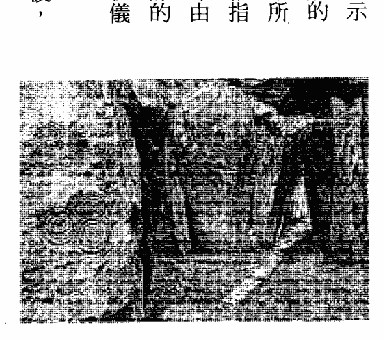当阳光穿过雾气照射下来时，驻波的图案变得清晰可见。纽格兰奇可能是一台以烟雾为介质的巨石声波机³¹！无论巨石族当时在做什么，他们都知道许多关于声波频率的讯息，这些讯息在过去一百年间才重获发现。他们知道如何建造装置以便感觉到及看到波，而出于某种原因，这件事对他们来说很重要。当然，“联觉”的能力可能与人类觉察“以颜色编码的可变光速”的潜能相关；将我们的心智投射到极高次元的，可能就是它。

### 卡纳克是一座大型地震仪

法国卡纳克（Carnac）及布列塔尼半岛莫尔比昂海湾（Gulf of Morbihan）附近的石阵，合称“卡纳克巨石林”，它们构成了地球上最大且最复杂的巨石遗址。卡纳克的立石排列成十至十二排，彼此平行延伸约五英里，其中很多石块重达五十吨（参见图7h）。已经倒下的“断裂史前大巨石”（The Grand Menhir Brise）更重达三百五十吨，它曾经矗立在地面上，高达六十五英尺！格里和我在阅读一位研究卡纳克三十年的法国工程师皮耶·梅侯的调查资料之后，于二〇〇二年秋分时节造访了卡纳克³²。梅侯想要探究，怎么会有人如此大费周章？为什么要建造这些巨石林？为什么选在这个位置？

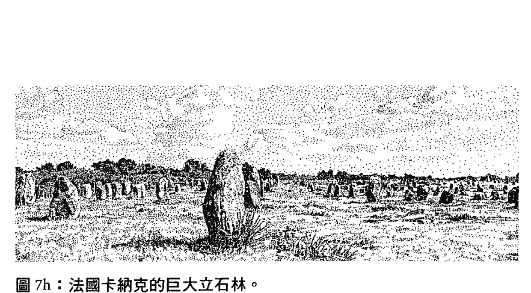

图 7h：法国卡纳克的巨大立石林。

梅侯首先分析了地质、断层线、花岗岩与石英岩的作用、经年累月的地震活动、磁力与重力的异常现象，以及当地的神话和地名。他的第一个结论是：立石阵必定是基于某种原因，由当时一名科学家（在那个时代是祭司）所指挥竖立的。其中有些石块上刻着看起来像科学记号的槌形、杯形、线条。该地区地震活动十分活跃，梅侯认为这种活动之所以发生，是因为巨量的潮水涌入海湾又退回所导致。水的重量是无数次地震的起因，且在一年中的某些时节影响最大。这个地区由于地质断层多、地壳薄，加上有大量的水流进流出，所以地震活动频繁。海湾的细颈使得水量形成一座周期性的水库。

“都尔门”（Dolmens，被视为史前时代的墓碑）是一种在几块立石上摆放扁平大岩石的结构，并设有一条通道通往内室。地面移动时，扁平的顶石会开始振荡，这在布列塔尼的这个地区经常发生。都尔门及其通道的走向，有九〇％以上与此区的断层线相同；换言之，立石及都尔门标示着断层线。

在回顾二十世纪的三十多次重大地震之后，梅侯发现，震央通常就落在断层上；他也发现到，没有巨石的地方也没有地震。地震大多发生在秋分与春分之间，三月下旬至九月上旬则不会发生。这个地区对新月及满月的反应也相当强烈，因为它们会引起潮汐效应。他在各个重要地点研究了许多被称为“斧犁”（参见图7i）的雕刻，并得出结论：它是用来测量地震强度的巨石地震仪。他自己也制造了一个做为模型，而且居然行得通！梅侯已经提出了强有力的理由，说明卡纳克可能是一所巨石地质大学，由杰出的神职人员在那里传授有关地球振动的知识，那是一个第二次元十分活跃且会产生强大周期性力量的地方。

我同意梅侯的看法，并认为卡纳克充满可用來创造驻波的声音特性，而驻波可供增强心智及治疗使用。就六千年前的情况来说，当时的地球磁场比现在强得多，这可能意谓着古人比我们更懂得如何利用磁力。人体是一种十分容易受电磁场影响的电磁装置，而梅侯发现了很多证据，表明古人是侦测磁力的专家。他们在这个复杂的地点测量地震，一定有其原因。

梅侯认为，当时的人是十分懂得利用磁力的治疗师，他也指出，那些石头之所以竖立起来，是因为它们的磁场对人体具有功效，而我本身就经常感觉到立石的能量。通常这股能量在夏至、冬至、春分、秋分等节气时会更强。更具体而言，梅侯想要知道，当时的一些研究是不是为了生殖力而做，这件事在地球发生巨变后的六千年前，可能是一个紧要议题。他们是否知道如何创造出能治愈DNA或增强生殖力的声波？由于目前欧洲和北美的生育率急剧下降，我们可能很快就需要恢复这一门科学。

我同意梅侯所提出“卡纳克是一个治疗中心”的说法，因为我在约翰·玻琉的声音与治疗研习班上曾有一段经历。当时，约翰教导我们如何使用音叉来进行治疗。经过正确校准的音叉，能够立即让我们的身体协调。器官如果脱离共振，经由音叉以特定的频率振动下，便能回到和谐状态。这种技术确实有效，但客户往往会避开这些讲习，可能因为治疗速度实在太快了！例如，一个人的肝脏重新获得协调时，他也必须立即面对最初造成失衡的所有情绪。而音叉频率也可以解开古老的创伤³⁵。我们这个物种正在遭受重大的创伤后压力症候群，我们的器官则保有许多古老的痛苦与恐惧。这些情绪遭到释放时，我们会随着这股力量而心生涟漪，接下来则会被迫进行大量且繁重的清理工作。也许六千年前的卡纳克人在创伤堵塞方面，遭遇到了比今日的我们更巨大的困难，毕竟那场灾难在时间上更接近他们。在卡纳克一带，海面上升时，地壳会随之移动，而冰的重量释放时，地面也随之上升。根据他们建造巨石林的长度来判断，他们的导师必定知道，人们需要提升振动场，以释放这种创伤。频频发生的地震会产生不可思议的声音驻波，造成石块强烈振荡，宛如巨大音叉一般。当时的人可能为了治疗与求知，在新月和满月期间，以及秋分和春分时节来到卡纳克，以体验这座巨大的声波振动结构；反观今日的我们，开发程度尚不足以看透他们的科学。这片土地必定曾向星辰歌颂，当人们沐浴在声波中，这片土地也平衡、疗愈他们的身心。他们相当清楚声音如何接收光，而今日的我们才刚要开始回想起这件事。

- 昆肯·克罗斯威尔，《午夜的宇宙》（The Universe at Midnight），第1134至1135页。依据蓝移现象计算，并将仙女座速度减去太阳绕行银河的速度（大致在仙女座方向），目前仙女座朝银河靠近的速度为每天六百万英里。如果它们相撞，将会产生一个超星系；双方各自的暗晕（dark halos）可能已经扫过彼此。
- 麦可·培金（Michael Baigent）、理查·雷伊（Richard Leigh）、亨利·林肯（Henry Lincoln），《圣血与圣杯》（Holy Blood, Holy Grail）…戈登·斯特拉坎，《耶稣：建造主》。
- 同前注；玛格丽特·斯塔比（Margaret Starbird），《带着雪花石膏罐的女人》（The Woman with the Alabaster jar），林恩·皮克奈特，《抹大拉的马利亚》。
- 约翰·玻琉，公司名称：BioSonic Enterprises，邮政信箱… P.O. Box 487，High Falls, New York, USA 12440。
- 汉斯·詹尼，《声波学》（Cymatics），第1107至1138页。詹尼指出，一旦振幅产生图案，这些图案（谐波振荡）就数目、比例、对称性而言是极其规律的（柏拉图正多面体）。这些振动图案因介质（液体或沙子）内部的自然振动而出现在介质中，并随着振动介质的声音之变化而变化。这与自然界一切动作的井然有序是一样的。
- 弗雷迪·西尔瓦，《麦田圈密码》，第194至199页。
- 布莱恩·格林恩，《优雅的宇宙》，第145页。
- 同前注，第377至378页。
- 同前注，第378页。
- 同前注，第374至384页、第386页。弦论是一个令人信服的框架，它将重力与量子力学整合起来。经实验证实的概念，例如旋转、物质粒子的特质、规范对称、信使粒子等，全都很容易融入弦论中；然而，它没有可调参数、可用来确保实验的测量。这三项因素预示着弦论终将获得验证，尽管实验验证（例如利用粒子加速器）尚未进行。
- 同前注，第3311与340页。对于极值黑洞 (extremal black holes)，弦论已成功地在一九九七年用来解释微观成分及相关的熵。这项成功为弦论提供了重要且令人信服的证据，因为黑洞快要成为可观察现象。
- 同前注，第333页。
- 同前注，第300至303页。
- 同前注，第283至288页。
- 同前注，第207至209页。
- 同前注，第283至219页。
- 同前注，第310页。爱德华·维腾的理论在一九九五年从十个维度推展到十一个维度，因为他领悟到，强力链接的混型 E 弦会伸展成圆柱形，并出现一个新的维度。昴宿星人说，第十次元的纵轴是保持住九个次元或“膜”的力量；相反地，它是一个锁在弦结构本身内的维度。维腾指出，第十次元不是一个可以让混型 E 弦振动的维度；相反地，它是一个锁在弦结构本身内的维度。
- 同前注，第229页。
- 同前注，第228页。
- 乔奥·马古悠，《比光速还快》，第228至229页。
- 雅各·阿塔贝是一个神秘主义者，他于一九六〇年代住在旧金山的北滩，据说他的身体曾转化成光，也就是现代版的“变容”。一九六〇年代，我住在旧金山的时候，曾听说阿塔贝这号人物。创立伊瑟伦学院 (Esalen Institute) 的迈克·墨菲写了一本关于雅各·阿塔贝的小说，《雅各·阿塔贝的异次元探险》，在新意识运动中激励了许多人。
物理学家（参见本附注后半段）认为，不同颜色的光是以不同的速度行进。关于所有灵性传统中都使用原色（红色是低频，黄色是中频，蓝色是高频），我纳闷是否第一至第三次元为红色速度，第四至第六次元为黄色速度，第七至第九次元为蓝色速度（别忘了蓝色知更鸟）。可变光速目前仍属
- 仔细思考，黑洞中时间膨胀的本质，显然就暗示着可变光速。宇宙射线撞击地球大气层时会产生紓子。它们会伸缩时间，这是因為它们以接近光速移动时，它们的时间会变得非非常扭曲。把时间框架固定在地球上，一个移动中的紓子可能会扩大上千倍。盖革计数器（Geiger counter）经由按压来测量这种奇怪的现象。保罗·戴维斯，《关于时间》，第五十五至五十八页。（我认为我们根本还没开始想象宇宙射线的奇异影响。）
- 乔奥·马古悠和物理学家史蒂芬·亚历山大曾思考过零膜，它可能是M理论中最基本的要素。这种物体在远距离的行为类似点状粒子，但在短距离时则具有截然不同的特性。依据最近的计算，一种称为“非交换几何”（noncommutative geometry）的非传统架构接手了这项要素。在这种几何架构中，点与点之间，空间和距离的传统概念全都消失了。这件事在这里很重要，因为他们发现到，光速在非交换空间中取决于颜色，速度在极高频率下还会增加（可变光速的另一个证明）。由于原色有三种（红、黄、蓝），所以你可以明白，为什么我怀疑红色维持着第一至第三次元的光速，黄色维持着第四至第六次元的光速，蓝色维持着第七至第九次元的光速。乔奥·马古悠，《比光速还快》，第240至247页；布莱恩·格林恩，《优雅的宇宙》，第379页。
- 保罗·德弗罗，《石器时代原声带》（Stone Age Soundtracks）。
- 同前注，第124页。
- 同前注，第110至115页。
- 从一九八三年至一九九三年，我经常观看霍皮族和杰梅兹·普韦布洛（Jemez Pueblo，位于美国新墨西哥州）的新雨舞，我可以看到祭司与舞者一起用脑波来改变空气中的波。
- 保罗·德弗罗，《石器时代原声带》，第七十六至八十九页。
爱尔兰博因谷的神殿，如诺思（Knowth）、道思（Dowth）、纽格兰奇等，实际上是九次元教学建筑物。我一九八五年前往那里时，强烈地感觉到这一点。从这些神殿中，我们可以推断出，光在冬至时的重返是这种教学的关键，也因此我们在我们网站上强调依循春分、夏至、秋分及冬至的重要性。
我一想清楚这一点，就发现到从十二月十八日到十二月二十五日，我们同时进入九次元的能力会大幅提高。试试看！《疗法》（Lacnurgya）编纂了西元一〇〇〇年左右中世纪盎格鲁撒克逊的医疗智慧，它包含了从巨石时代到中士世界结束时的人类智慧。关于凯尔特神话中的博因谷，它是以女神博恩（Boann）命名的，这个河谷被形容为“一座闪闪发光的喷泉，有五条小河从它流出”。
流本身就是“另一个世界”的能量，它随时准备好要为人们扫除，这是领略灵性景观（第五至第九次元）如何与物质景观（第三次元）交会的理想方式。被描述成“一座闪闪发光的喷泉，有五条小河从它流出”的河流，表达出从天蓬散开的第五至第九次元。
长在井（通往下界之泉）边。」这带来了所有九个次元。布莱恩·贝茨，《真实的中土世界》，第124至125页，他引用了阿尔文·里斯（Alwyn Rees）与布林利·里斯（Brinley Rees）在《凯尔特传统》（Celtic Heritage）一书中的说法，但并未提供页码。

保罗·德弗罗，《石器时代原声带》，第五十六页。
同前注，第八十九至九十二页。在苏格兰爱丁堡附近，著名的圣殿骑士遗址罗斯林教堂，存在着类似的符号与声音科学的更进阶版本。它的墙上有两百一十三个立方体，被认为是音符。来自世界各地的八名科学家一直在试着理解符号之间的关系。其中一个理论是“这些音符是利用一块覆满沙子的黄铜板记录下来的。当使用一根琴弓来弹奏黄铜板时，黄铜板会振动，并为个别音符创造出不同的沙纹图案”。克雷儿·加德纳（Claire Garder），《日本争取解答罗斯林立方体的音乐之谜》，《苏格兰人报》（Scotsman）二〇〇一年六月十六日国际版第二十二页。（对我来说，这肯定是一台中世纪声波机！）
皮耶·梅侯对卡纳克的研究，经罗斯林·斯壮翻译，〈卡纳克生活之石：一座巨石地震仪？〉，《新英格兰古物研究协会期刊》（NEARA Journal）2001年冬季第35卷第2号第68页。

33
英格蘭古物研究協會期刊》2001年冬季第三十五卷第二號，第六十二至七十九頁。同前註，第七十四至七十九頁。我在這裡寫進一些關於羅斯林教堂的資料，是因為卡納克和羅斯林教堂似乎都利用聲音來進行治療。我已經看過這兩個地方，經常納悶為什麼有人會如此大費周章，持續研究羅斯林教堂歷史的作家兼歷史學家史蒂芬·普萊爾（Stephen Prior）認為，「這些立方體可能握有中世紀療癒詠唱的鑰匙」。克雷兒·加德納，同前述文章。（羅斯林教堂建造於1477年，即中世紀末期。很多人都認為它是古代科學的圖書館或密碼書，聖殿騎士建造這座教堂是為了搶救知識免遭天主教會摧毀。如下一則附註所示，這種訊息可能攸關人類的存亡。）

34
關於生殖力與巨石科學，有些遺址的石頭上有洞，根據傳說，人們會爬過這些洞，以求痊癒或懷孕。從遺體分析來看，那些患有多種疾病，有些是先天性疾病，如脊椎問題和關節炎等，而且身材矮小。皮耶·梅侯認為，之所以發展巨石治療科學，是為了他們的生存及繁衍。羅斯林·斯壯，同前文章，第七十八頁。（羅斯林·斯壯只翻譯了皮耶·梅侯關於卡納克著作的前半部，後半部是極其詳細的治療技術訊息。由於對這些想法的瞭解甚少，所以難以翻譯。羅斯林·斯壯，2002年7月電話交談。）

35
當治療師使用音叉以C、F、G等基調振動客戶身體時，通常會釋放出非常強大的能量。在我看來，這種釋放表明了，因一連串災難所造成的創傷堵塞獲得解除，就如我在《災難恐懼症》一書中所述。

## 第八章

#### 第八次元：神性心智

#### 第八次元靜心法

找到你的呼吸。找到一道光柱，它追隨著你的呼吸，從頭頂貫穿到脊椎底部。慢慢地，當你找到你裡面的光時，也讓光找到你。讓目光變得柔和，用內在的視覺，將自己看成一道白色光柱。將整個身體看成光。看到你自己放鬆、完整、容光煥發。這是你的光之體。這是你的高我。輕輕地將舌頭抵住上顎。呼吸。將自己看成是透明的，看成純粹的能量。保持定靜、放鬆，繼續均勻地呼吸。當你這樣做的時候，注意到你是有能力觀察自己的。將注意力放在頭頂上。讓下一道呼吸經由此區，進入你的身體。你可能會感到頭頂有一些知覺。只需留意到它們即可，並繼續輕輕呼吸。

現在，運用你的感官，注意周圍的事物。你看到了某物或某人嗎？你聽到了什麼嗎？它正在告訴你什麼？你能嚐到或聞到任何東西嗎？它是什麼？尊敬你的感官，它們正在這裡幫助你。慢慢來。這就像祈禱一樣。它會繼續下去，直到完成。這個訊息專屬於你。

問問你的高我：這裡的教導是什麼？今天有什麼教導要提供給我的光之體？看看能否得到一條訊息、一幅感覺影像。當它完成時，你會知道。現在，隨著每一次呼吸，將焦點放回你的光之體和光柱上。讓眼睛開始聚焦於周圍的空間，並恢復覺察你的身體和你靜坐的房間。

第八次元是神性心智（光）的領域，它在第三次元裡透過可見光譜顯現出來。第八次元的頻率其實比第七次元星系光子帶的聲波還要快得多，這就是神秘主義者聲稱「聖光耀眼，不能逼視」的原因。第八次元是光之組織場域，神聖幾何的旋轉動力便是發源自這裡；這些動力藉由八度音階往下進入第七次元的聲音領域，並在第六次元裡組成幾何形式。第八次元是包含一切的能量領域，有了它，我們因而感覺到上帝之愛是生命中不變的能量來源。

隨著能量穿越各次元，一路向下移動，直至鐵核晶體，每個次元變得越來越密實、越來越具體。而隨著我們穿越各次元，一路向上移動，直到星系中心，每個平面場域變得開闊，最後它們的直徑因為內部創造物數量增加而受到限制。第一次元不可思議地密實，第八次元的幾何形式則維持住縱軸。
雖然第八次元產生第七次元的聲音，繼而形成第六次元的幾何組態，最終進入第三元形成創造物，但昂宿星人說，我們能夠直接聯繫第八次元的唯一途徑，就是進入「太陽心智」。向太陽祈禱可讓原住民調頻到太陽的智慧，尤其是在春分、夏至、秋分、冬至期間。神聖幾何與重力是讓平面場域保持在縱軸上的力量，所有物質的振動弦則藉由共振來維持不同次元的頻率範圍。正因如此，大多數人直覺上會知道：神性心智是真實且全能的。然而，由於有這種絕妙的連結，使得聰明的操縱者很容易利用「上帝」來制定計畫。我不喜歡上帝這個詞，就是因為宗教組織強勢操縱著計畫，所以我在這裡將這個第八次元的力量簡單定義為「光」或「神性心智」。
昂宿星人說，第八次元由星系聯盟所管理，該聯盟則由一群優秀的智慧體所組成，在第三次元裡的我們其實可與他們合作。銀河裡許多恆星的圖書館皆由聯盟管理，例如我們的太陽和昂宿六。聯盟棲息在銀河系的黑暗核心，那裡是純粹創造力的發源地，它透過神聖幾何散發出想法。當我們的心從我們體內的黑暗中發出化身的時間軸 (incarnational timelines)，強力黑暗渦旋裡的神聖心智便會隨著時間波而膨脹與收縮。

為了對第八次元的頻率範圍有全新的認識，首先我們必須徹底瞭解精英用來控制人類的「上帝毒藥計畫」（God-Poison Program，參見第四章）。這個計畫總是以第四次元的實體來描述「光」。對於「光」之次元的描述，凡是低於第八次元者，皆為虛假，例如耶和華等「光」的人格化，會阻擋我們接近「光」，而在歷史上，定義「光」是在嘲弄這個偉大的心智²。除了每個人在自己寂靜內心深處感覺到的「光」，沒有人知道任何關於「光」的事。這種意識不能以文字或概念來識別或描述；它只能被體驗。

「光」不同於任何曾與人類互動的神或神話人物，因為歷史上的神是在第四次元的層面上運作。他們的戲劇就像人類的戲劇，例如希臘諸神的諂眾取寵，還有耶和華的戰爭。「光」只是發出頻率，聲音再形成幾何，幾何最終產生世界。「光」在狂喜的創造活動中顫抖，這一點可以在大自然中感受到。星系聯盟負責籌畫通往「光」的入口，而我們可以學習如何進入聯盟及太陽。就像任何團隊合作的探險活動，我們越瞭解隊友，過程就會越順利，因此眾生及諸神都能幫助我們接近「光」，雖然「光」的頻率比他們都還要高。原住民與太陽具有意識上的聯繫，也能與許多先進的存有交流，例如神靈曼尼圖（Manitou）³。
星系聯盟會隨著我們心中的計畫與願望而運作，因為我們在固體世界裡被創造出來，是為了將意識反射回「光」；我們是「光」的鏡子。當我們的願望合乎道德、純粹、參透一切時，就會攜帶著高頻率。自1998年太陽進入光子帶以來，聯盟的高等理事會便對所有珍惜生命且具有智慧的人開放，而我們該做的就是請求神性協助。對地球來說，這是個千載難逢的時刻。現在，許多靈魂都來到這裡，因為地球不再只是一個從經驗中學習的地方。1987年到2012年，地球是一所星系聯盟學校，意味著我們每個人都直接承受自己的因果業力。一條豐富的時間軸正在結束，而個人的化身時間軸正在我們的心中覺醒。經由否定女性，人類分裂了實相；自1998年以來，集體人性便在一個分裂的實相中運作。目前第三次元裡存在著兩個世界，就如同兩部電影同時播放，而每個人都貢獻都具有宇宙級的意義。那些正在與聯盟合作，一同轉化地球生物的人，正在經歷在經歷地球揚升，即九個次元同時在第三次元裡開啟；那些不珍惜生命的人，正在經歷拔摩島的聖約翰在《啟示錄》（Revelation）中所描述的末日。
依據昂宿星人的說法，第八次元的守護者是獵戶座裡的生命體。盤旋於赤道上空的獵戶座，一直有著「星座之王」的美譽，它是夜空中最耀眼的星座之一。由於地球傾斜二十三度半，所以獵戶座在地平線上的移動起伏十分明顯。如果地球軸線的傾斜是從一萬一千五百年前才開始，如我在《災難恐懼症》中猜測的那樣，那麼自西元前9500年的那場災難起，獵戶座現在正處於它在天空中最高的位置。依據古埃及神聖科學的說法，獵戶座升高時，人類會變得富有智慧。昂宿星人說，關於地球揚升，最令人興奮的事情就是：我們每個人都能感覺到所有生命形式的頻率，甚至包括我們自己的頻率！

如本書前文所述，亞馬遜河流域的薩滿能夠看到生命的分子本質。總有一天，科學家將發明出儀器來偵測形成物質的頻率。只需去愛物質及有機生命，我們就能感覺到這些頻率。例如，當你看著池塘裡游動的蝌蚪尾巴慢慢變短、雙腿漸漸長出時，會有什麼感覺？

經由教導九次元研討班，格里和我發現，許多學員很難與第八次元產生聯繫，因為他們生活在一個由新世界秩序控制的世界裡，它讓較高次元塌陷成第四次元。我們的學員通常任職於學校、醫院、政府機關、產業界等，但由於美國的道德標準在過去五十年間惡化許多，導致他們之中有許多的工作並未為大眾謀福利，甚至經常被要求去執行違背其信念的命令。這個問題的解方就是：先去瞭解美國公民如何落入全球精英的控制之中。

### 美國的要務就是商業

想當初，美國是由一群遠渡重洋的人建立起來的，他們所為何來？為了逃離帝國主義及宗教迫害，而最重要的是獲得自由。十九世紀中葉，美國在世界經濟舞臺上成為舉足輕重的要角，當時它的商業與農業財富總量大到足以影響全世界。當時的美國人相當勤奮，機會俯拾即是；來自世界各地的人在這裡建立事業，展開新生活。當時美國的規劃訴求是商業取向。一旦有足夠的週轉資金，掌權者就開始採用「金字塔」制度，這是一種由歐洲貴族所發明的制度，英國研究人員大衛·艾克 (David Icke) 對此做了精彩的描述。5 金字塔被用來組織大型系統，例如銀行、公司、學校，還有政府（參見圖8a），因為金字塔一開始運作，就會自行活出生命力來。它迫使人們去完成精英想完成的事情，當你身處其中時，很難看出是誰在操縱這場表演；然而，一旦金字塔暴露出來，這一切都變得很明顯。6 金字塔的底部被工人占據。這些工人由低階管理人負責監督，低階管理人則藉由服從命令來保住工作。低階管理人從中階管理人那裡取得命令，且必須依指令行事。如果中階管理人告訴低階管理人，要讓工人做一些不正當或邪惡的事情，好比處於危險或令人不悅的工作環境中做事，那麼低階管理人就得服從這些命令，否則會有遭解僱之虞。結果那個低階管理人就會變得脾氣暴躁、不快樂，且最終會生病。中階管理人是從高階管理人那裡取得命令。他們可能不喜歡這些命令，但仍須將命令傳達給低階管理人。高階管理人是從公司主管那裡得到命令，公司主管則是從行政部門獲得命令，行政部門又從董事會、銀行、企業主及政客那裡獲得命令。每個人都在金字塔系統中掙扎，以保住自己的工作，位居最頂端的人則收割利潤。在金字塔最高層工作的人賺的錢最多，不服從上級的損失也最大。身處中高階層的人，穿著及生活方式必須與職位相稱，他們通常負債累累，無法離職。逼迫他們做不道德的事情很容易，因為他們必須養家。在下層工作的人則可有可無，他們經常辭職或遭解僱。他們可以請領失業補助金，也可以轉而從事另一項低階、低薪的工作。道德低落、貪婪、掌控，從上而下散播。凡是不苟同的人，隨時都可以退出。那些位居頂層的人坐擁巨資，除了他們，每個人都背負著債務；然而，這些人可能因為黑函而留在原地。他們的私生活資料被人蒐集，以備日後或許用得到。任何正直且試圖改變這個系統的人都是威脅，舉報者往往會失去工作，甚至失去家庭，可說是冒著極大的風險。這套具有自我延續力的系統，賦予高層者很大的控制權、財務上的回報，以及自由，但這些人又受到支持他們公司的政治與金融體系所控制。精英透過企業金字塔及大型系統操縱著美國，正因如此，一元美鈔才會印有金字塔及全視之眼等圖案。頂層的人偶爾會使出「剪羊毛」絕招，也就是讓一座金字塔倒下，並將資源移往別處，就像「安隆事件」（Enron）那樣，這種情況通常發生在舉報者出現時。位居美國聯準會等大型金字塔頂端的人，是從世界上最富有的幾個家族那裡獲得命令。就是這套系統讓當今世人的喪權現象一直延續下去，大多數人之所以被困在無意義的工作及生活中，是因為他們遵循著傳統的信仰體系7。在我的生活周遭，我看過很多人不是在自然界中找到神性，也不是藉由愛其他生命體而從對方身上找到神性，他們是去「追逐」神性，反到因此喪失自己的權力。所有事情都經過安排，好讓大多數人深陷其中、無法脫困，因為他們總是在尋求事物與答案，而不僅僅是體驗生活。我們先暫時放下金字塔概念，來探討一下第八次元的科學。

### 第八次元的科學

我們先前討論過琴鍵及八度音階不斷倍增上去，直到超出我們聽得到的頻率範圍這件事。如果繼續讓這些振動加倍，最終會出現可見光譜，它的振動頻率比聲音高得多。我們看到某種色彩時，是看到以數百萬赫茲在振動的頻率。既然我們「聽到」聲音、「看到」色彩，而科學已精確測量產生這些事物的每秒脈衝數，所以我們其實有能力藉由將音階加倍，來想像極高次元，儘管我們很少經由自己的感官去感知到它們。關於完整的赫茲範圍，它的底部是沒有脈衝的，最高頻率則是白光，它以每秒十八萬六千英里的速度行進。赫茲頻率的電磁波頻譜圖，將第三次元的邊緣定義為光速。

第三次元裡還有很多東西，是我們看不見也聽不到，但可以測量得到的，例如無線電波和伽瑪射線。因此，我們可以肯定，非常高的振動範圍及「光」的可能性確實存在。最近科學家們已經測量到比愛因斯坦常數更高頻率的光，例如比一般白光範圍快三百倍。8

當然，比光速還要快可帶領我們超越「第三次元邊緣的光」，但那會是什麼呢？我們必須思考這件事，甚至去思考第八次元的背景脈絡。如我在第七章所述，有些科學家一直在猜測，可能有三種光速。9

第三次元的光速大概是最慢的，如此一來，便開啟了一種可能性，即九個次元分為三組（第一至第三次元、第四至第六次元、第七至第九次元），各自以漸增的光速在運作。這也許可以解釋，為什麼我們很容易感知到較低次元，但想要超越它們卻困難重重。

「可見光譜」代表我們能夠感知的範圍，第二次元的範圍雖然低得多，但測量得到。

例如，在地表下行進的次聲波（infrasound）低於人類聽得到的範圍，而第一次元的核心是以四十赫茲在振動著。至於第四至第六次元，讓第六次元裡的幾何形式產生振盪的光頻率，它們的振動速度必定比第三次元裡的光還要快，因為我們看不到這些幾何形式。

然而，它們在第三次元裡複製出圖案，證明了第六次元幾何的存在。幾何振動往下，流入第五次元裡的愛之脈動，那通常是體驗得到但看不到的。再往下移動，在第四次元裡，我們感覺到的二元性與極性是如此明顯，以至於它們運轉著大多數人的生活；然而，除了少數人看得到氣場，這種感覺是肉眼看不見的。由於人類認出自然界中存在著較高次元的痕跡，同時生活在強烈的感覺之中，所以可以肯定較高領域就在那裡。然而，當我們思考第七至第九次元時，平常所經歷的任何事情，都無法將我們帶入這些領域。10

最近，天文學家經由研究星核過程，拆除了這堵感知的圍牆。在我為第七次元的星系光子帶、第八次元的光，以及第九次元的時間波這些不可思議的頻率範圍尋找類比物時，科學也朝著相同的方向發展。我開始認為，《昂宿星議事錄》在1995年是以成熟的宇宙論之姿現身，因為就在同一年，弦論成功地統合了微觀世界與宏觀世界。

較高的三個次元必定以非常高的光速運作著，這件事有助於我們掌握神性心智的本質。每個次元都是一個波平面或平面場，我們的心智（無論我們是否知道）則是這些波的接受裝置，就好像我們的腦部是縱軸無線電般。我們大大低估了我們心智的力量，尤其徘徊於高頻波段時，大多數人在那裡都會感到迷茫、失根，而解方就是將神聖幾何想成充滿第八次元的力量，畢竟是由幾何與重力來維持住次元波平面的形式。

第八次元的組織結構與第一次元的重力如何運作，以成為維持住縱軸動能的力量？我們雖檢視過第六次元的振動形式如何在第三次元裡複製成生命形式，但現在有必要簡短回顧一下。鸚鵡螺的殼總是長成費氏數列螺旋，向日葵及其他類似花卉也是如此。黃金比例決定了螺旋，它是物質化的基礎。在次原子的層級上，旋轉產生原初運動，進而展開物質化。藉由第八次元的運動，這些螺旋因素將物質世界與幾何形式的世界聯繫起來，而我們甚至可以在人耳的螺旋骨骼中看到黃金比例！

依據科學的說法，黃金比例螺旋藉由頻率範圍的轉換，將能量從一種狀態旋轉到另一種狀態。一個簡單的幾何形式，例如圓形或正方形，是以較低的頻率在振動，而較複雜的形式，例如由二十個三角形面所組成的球形二十面體，則振動得比較快。利用聲波機，我們可以看到這些圖像改變的痕跡，每個頻率範圍都會產生不同的幾何圖案，這就解釋了為何有這麼多比較複雜的圖案設計。

想像「光」最便捷的方法，就是思考費氏數列螺旋（幾何上的黃金比例），它顯示了幾何場的大小如何增長及收縮。將幾何形狀放入另一個幾何形狀內，使它們呈現套疊狀態是有可能辦到的，就如我在引言中所述，讓《昴宿星議事錄》誕生的全像單子那樣。能執行這個過程的唯一方法，就是追蹤節點（柏拉圖正多面體觸及外圍球形的尖端）相對於彼此的移動方式。追蹤「節點到節點移動方式」的方法就是利用一條螺旋線，尤其可利用黃金比例，因為它透過數學，與音樂頻率產生關聯。我們在第十章將藉由麥田圈來說明這個原理，每年夏天出現在英格蘭田野上的麥田圈，讓我們所有人都越來越容易理解「光」。

為了讓這個道理變得更淺顯易懂，在此提供兩張圖，它們以十分微妙的方式呈現出事物如何經由黃金比例擴展開來。第一張圖（參見圖8b）顯示費氏數列螺旋如何與柏拉圖正多面體融合在一起。首先請注意，這個二次元的螺旋使得巨大的擴展成為可能發生的事；接著，如曲線所示，用你的眼睛追隨它的黃金比例，再讓它離開頁面，擴展出去。接下來請注意，按照螺旋的幾何（三角形），它顯示為一個圓錐體，這個三次元的螺旋則名為「圓錐螺旋」。這張圖鋪設出想像「光」之廣度的路徑。

下一張圖（參見圖8c）讓我們對速度會減慢，這就是決定物體及有機物形式與顏色的方式。由振盪的第六次元組態所產生的第三次元頻率波，是藉由重力保持在特定層級；也就是說，隨著重力穿過各次元並發出波，理念便往下形成實相。事實上，重力將地球、太陽系、星系及宇宙聚合在一起。光與重力相互作用時，其分子的旋轉進行球狀、棘輪式擴展，它是一幅蓋亞的光之畫。

這個理念打開心智。這張二次元的圖是「茱莉亞集合」（Julia Set），一個1996年出現、直徑達一千英尺的精緻三重碎形麥田圈。這張圖添加了球形成分及四面體幾何，使得茱莉亞集合成為一個三次元形式，將螺旋臂拉成舞動的宇宙波。本書後面也將討論麥田圈，即「光」在我們這個時代的視覺顯現，進而探討第十次元（縱軸本身）。這個四面體幾何沿著碎形螺旋路徑，進行球狀、棘輪式擴展，它是一幅蓋亞的光之畫。

然而，由於它在次原子層級的作用微乎其微，科學家們因而對它感到困惑。再者，第八次元的幾何力量在微觀世界層級的每條弦內振動。我們可將重力視為自然界中的「光」之作用力，它是第三次元裡最微弱但最具主導性的作用力。想像一下，它在較低次元所呈現的廣袤與力量，在那裡，由於密度的關係，它的分子旋轉速度比在第三次元慢很多。想像一下，它遍及較高平面的不可思議巨大空間。一九九八年，三位物理學家提出，如果某些額外維度（依據超弦論的說法）稍微大一個毫米，就能解釋為何重力如此之弱。他們繼而假設，重力與自然界中的其他作用力（強核力、弱核力、電磁力）相當，但它因為傳播到額外維度，所以被稀釋了，其他作用力則局限於三度空間12。科學界可能永遠無法測量到次原子層級的重力，因為它下降得如此之遠，但隨著次元頻率上升到第八次元，重力卻是一股連結的作用力。重力是將宇宙聚合在一起的宏觀世界能量；因此，它也是真正如弦論所描述的那種次原子層級的作用力。同時，我們有許多學員都表示，他們在第三次元的生活中直接體驗到第八次元的神性心智，至於要如何做到這一點？讓我們再次回到金字塔結構。

### 讓新世界秩序的金字塔倒塌

我們有許多學員都在使用一種能直接與第八次元聯繫的簡單技巧，因而改變了他們的生活。但是，請注意，使用這種技巧可能會讓你的生活徹底改變，例如你可能會辭掉工作或更換伴侶。當你思考這些訊息時，應十分清楚這些可能性。最好在確定自己能接受生活中即將發生的改變時，再刻意去聯繫第八次元。這種技巧賦予每個人在我們世界裡的投票權，它讓取走我們個人力量的金字塔倒塌。

你一直過著一種左右為難的生活。你在某個集團、工廠、公司、學校或醫院裡工作，且被迫參與周遭那些不道德甚至殘暴的勾當。你一直在失去能量，你感覺很糟糕。你原本可以有一番出色作為，卻受工作體系所牽制而施展不開。你知道有更好的做法，但同時也知道，如果自己採取行動，可能會飯碗不保。你已經到了必須做點什麼的臨界點，否則你會辭職、發瘋，或是讓你的伴侶倍感壓力，但這些都不是解決的辦法。如果不論後果如何，你都想要改變這種困境，以下是你你可以做的：

去你的祭壇或某個不會被打擾的地方。先備好紙筆，接下來可能需要做筆記或畫圖。在你的空間裡靜坐，進入深層沉思。請思考困境的所有面向。人物有哪些？他們的角色和把戲是什麼？相關情況如何？例如預算、社會影響力、工作條件、情勢沿革等。你可能需要畫圖。一旦牢牢掌握所有相關要素，你就可以進入更深層的沉思狀態。現在，你對局勢有了堅實的掌握，暫且不去想著要改變任何人、任何事，或實施特定的解決方案，先讓你自己往前進入情況中吧。往前进时，調頻到你覺得是解決這個困境最具潛力的辦法。這種情況下最好的解決辦法是什麼？怎樣做才會產生有意義的改變？請勿劃地自限！但也記住，不要去想任何特定的人，比如你那位正在度長假的老闆，也不要想會不會發生任何特定的事，比如大樓付之一炬。一旦你看見你自己所能想像的最佳結果，就在你心中將它描繪出來。想像一下，看到這一切發生，然後深呼吸片刻，放開一切。忘掉這件事，你可能很快就會注意到，你周圍的事情正在改變。

金字塔以所有參與者的思想與行動，再加上高層所設定的方向在運作。上述技巧賦予情境中的每個人「與高層者等量的權力」。底層人數比頂層人數多很多，在文化方面通常也有相似的想法。如果底層有足夠的人弄清楚他們想要什麼，頂端就會瓦解，改變隨之而來。這個原理已經獲得廣泛印證，有不少民眾團體確實成功改變現狀了。

昴宿星人說，我們的世界正在改變，因為有很多人希望能與較高領域聯繫，而星系聯盟現在可以直接與我們聯繫。另一方面，我們正在接近馬雅曆末日。我們想要生活在一個更合乎道德的世界之個人意向，正在形成強力且大規模的集體意向；換言之，人道世界的霧氣正在變濃。經由學習第八次元的「顯現」技能，可以大幅提升我們運用心智力量的能力。「顯現」教導我們如何運用第八次元的力量，它是一個極高的生命層級。

### 顯現

只因你出生於蓋亞，你便擁有權利去創造出你想要的實相。「光」只是散發出能量，好讓每個人都能體驗生命。我相信解決我們目前困境的方法，就是讓每個人都領悟到，我們擁有投票權且應該加以行使。美國的投票機程式由精英所設計，因為現在都已經電腦化了13。如果你想要取回自己的地位，以你想要的方式生活，不妨練習一下這項技法，看看會發生什麼變化。再說一次，帶著紙和筆，去一個不會被打擾的靜謐場所。列出你希望擁有或想創造的三至九件事，並在這些願望旁邊加註明確的時間表及說明。舉例來說，如果你想要聘請一名清潔婦，請註明工資上限、她應該多快顯現、你是否需要接送她上下班等。具體一點，否則你可能會得到一個必須開好幾英里車程去接送的人！

這種高次元技法並不用來顯現凱迪拉克、毛皮大衣、鑽石等非必需品，但是如果你需要一輛車或一件外套去上班，就去試試吧！你不能要求某個特定的人，但可以要求一名伴侶，還可以指定性別。你不能顯現出會操縱他人的事物，那樣會搶走他們的投票權。列好清單時，請針對清單上的每個項目執行以下技法14：

- 將你想要的事物圖像放進心中，務必確保時間、條件、可能產生的生活變化等想像內容都十分明確。一旦將它牢記在心，再想像它真的發生在你的生活中，然後問自己：「如果我可以擁有它，我會接受嗎？」你可能會驚訝地發現，有時候有些東西是你不想要的。知道你不想要什麼，可以讓你的心清除掉那些阻礙你得知自己真正想要什麼的廢物。當你心中塞滿亂七八糟的渴望時，「光」無法穿透陰影。
- 將你的願望放在心裡，並想像出三個場景，這些場景描繪出發生在你生活中的樣子。例如，看到清潔婦敲門、面帶微笑地清理房子、手裡拿著工資離開。絕對不要將這個人想成某個特定對象，那樣做就是利用你的心智去影響另一個人，違反業力法則。無論如何，那是行不通的，卻可能真的把你搞得一團糟；那是在施行法術。
- 當你感覺到每個場景的圖像都妥當時，閉上眼睛，用你位於眉心上方的「第三隻眼」看第一幅圖像。當它清晰地在你的第三隻眼呈現出一張小圖時，將圖像轉移到頭顱後方，轉移到頸部與頭顱連接的地方（延髓），並將你的延髓當成一個電視螢幕。讓圖像停留在螢幕上，並盡你所能去強化它的視覺感，接著讓它破碎，進入下一個場景，並重複相同的動作。
- 當你想像完三個場景，說聲：「就這樣吧！」其他願望也比照辦理，然後結束這次行動，忘掉一切，但留下你的清單。幾個月或一年過後，檢查你的清單，你會驚訝地發現，事情有多常照著你列出的時間表發生。當你覺得諸事不順，或自己好像卡住了的時候，可以再度使用這項技法。

越是使用這項簡單的顯現技法來創造你的生活，你越能得知你心智的力量，以及體驗到上帝的神奇。你幾乎可以創造出任何事物，但除非提出請求，否則神性心智不會幫助你。事情可能不會以你認為理所當然的方式來顯現，因為第八次元的存有是以更寬廣的觀點在運用第三次元。例如，我記得有一名年輕女子（不是我的學員）顯現了她一生的摯愛，結果她得到的不是一個男人，而是一個女兒，當時她還單身呢，後來證明那個小女孩就是她一生的摯愛。你可能要等到看見事情神奇地降臨在你身上時，才會領悟到自己其實已經創造這些事物很多年了。事情的發展往往宛如奇蹟一般。

依據《昴宿星議事錄》的說法，月亮對我們的願望具有重大影響，因為月亮會將我們的願望反映給太陽，而我們進入第八次元圖書館的入口就位於太陽。有一些很棒的月亮技法可以施展我們的心智力量，這麼做可以增添太陽力量。首先讓我們瞧瞧，昴宿星人對於月亮如何影響我們的世界有什麼說法。

#### 月亮反映出我們的感覺

月亮會將人類的集體思想和感覺反射回我們身上，月光的強度與人類的感覺呈正比。由於個人的自我主宰是以「有效處理自己的感覺」為基礎，因此瞭解月亮的影響力對我們很有幫助16。我們在新月期間會變得很「敏感」，我們的感覺在滿月期間會變得很強烈，而月蝕對我們的影響尤其顯著。由於月球表面幾乎沒有電磁，所以它的振動顯得非常「虛無飄渺」。太陽比月球大四百倍，而太陽距離地球也剛好比月球距離地球還要遠四百倍，因此從地球看出去，月球和太陽的大小一樣。雖然太陽與月亮影響我們的作用不同，但兩者相輔相成且同等重要。太陽振動著太陽風的頻率，以它們為共鳴波，並利用這些共鳴波來讀取太陽系中行星的位置和角度。月球從太陽風裡捕捉電磁能量，它能讀取太陽風，並將太陽的資訊與我們的感覺融合在一起。在我們睡夢中，月亮會傳送這些發光且空靈的頻率，裡面含有人類潛意識心智庫的紀錄。人類與動植物經由磁力，從月亮汲取意識。我們的反應模式在強烈太陽力作用下會產生極性化互動，相較之下，月亮的這種振動則十分隱微。月亮只是散發出記憶給我們，它調整著我們對一切事物的回應。我們無法在沒有記憶的情況下發展我們的「情緒體」，所以月亮保有我們一世又一世的靈魂記憶。當我們因為負面情緒模式而生病時，月亮會傳送療癒的訊息給我們；正因如此，我們才能感覺到什麼事不對勁，並且知道該怎麼加以改善。對於重視這種敏銳度及蒐集這方面訊息的人來說，巴哈花精（Bach Flower Remedies）和芳香精油能立即產生療癒效果。一旦我們完全打開這些「月亮感覺受體」，便不再需要醫生或別人來保護我們。每當我們要在地球上度過一生，都可以刻意與我們的月亮潛意識記憶庫合作，以清除創傷和障礙，也就是處理我們的感覺。經由身體觸療及靈性療法來清除這些負面印記，我們會變得更輕盈、和諧與快樂。這些古老記憶會成為信念系統，存在於我們心裡，使我們播放內心錄音帶，例如「我不能擁有這個」、「我太窮了」或「這不屬於我」。與月亮合作，可以幫助我們清除這些錄音帶，讓我們活得更自由、更喜悅。

#### 太陽主導著我們的意向

太陽週期即春分、夏至、秋分與冬至。依循太陽曆生活，是我們與「光」和諧共處的最佳方式。我們可以大幅提升情感生活與健康的品質。對大多數原住民來說，新年是從春分開始，而春分也是運用顯現技法的時節！從新年開始一直到夏至為止的三個月，是「接收及實現事物」的時間；接下來直到秋分為止的三個月，是「發展這些事物」的時間；再接下來直到冬至為止的三個月，是「完成創作物」的時間；直到隔年春分為止的最後三個月，是「深入思考這些創作物所具有的更重大意義」的時間。接下來是新的春分，又來到為未來一整年創造新顯現的時節。17

如果你選擇在精確的春分時間為未來一整年進行顯現，事情可能會變化得既強烈又迅速，而你可能會被嚇到，所以請謹慎選擇18。在春分創造未來一年計畫要努力的意向時，你便踏上了加速的道路。當你的意識告訴你，你不想顯現出某個事物時，請多加注意。最終你將注意到，你心中所想會創造出你周圍的現實。如果你能看到自己腦中的頻率，能看到你心智中所有等待上演的劇本，那麼每個人都會清理自己的心智。當你擁有自己的心智時，就是處於「神性融合」的狀態中，那是一種精緻的生活方式。一旦真正看到你所擁有的一切潛能，「按照季節及月亮週期來安排你的生活」及「使用顯現技法」將變得至關重要。

現在，我們去探索從第九次元星系中心所發出的第九次元時間軸，它們是地球上所有潛在顯現的時間軸。有潛在顯現的時間軸。

「日震全像術」（helioseismic holography）是近年發明的一種技術，可讓科學家觀測太陽遠側的黑子。日震學已經發現，「太陽是一顆發出嗡嗡聲的聲波球，這些聲波是由太陽外層洶湧的對流運動所發出。「太陽聲波大部分被困在太陽內部；它們從熱核心折射而出，並在光球層的各個部分來回反射。藉由觀測這個隨著聲波而振動的表面，「日震學家能夠探測這顆恆星的內部，就像地質學家利用地震的震波來探測我們星球的內部一樣。」參見：www.Spaceweather.com/glossary/farside.html。（科學家並未思考太陽聲波可能為地球創造出什麼，然而經由九次元模型可知，太陽聲波讓人類能夠直接調頻到太陽。）

關於「光」人格化成為耶和華，一些被排除在正典之外的資料指出，將「光」人格化是你們從未體驗過「伊皮諾伊亞」，或直接經由「光」獲得啟示的主因。例如，《約翰秘傳》講述了一個故事，以表明很多人誤以為耶和華就是上帝。耶和華其實是一個嫉妒的上帝，他不認識神聖的上帝，所以當亞當和夏娃經歷了「光」，也就是「伊皮諾伊亞」，耶和華懲罰他們，並詛咒地球。伊蓮·帕格斯，《超越信仰》，第一六六頁。

對阿崗昆族（Algonquin Nation）來說，曼尼圖是自然界的能量力，當人們與自然界和諧相處時，便能感受到它。一萬一千五百年前，阿崗昆族在北美洲展開了文化的新階段，當時的美洲充滿了與卡納克巨石科學一樣的石圈、都爾門、石堆等。由於美國精英的官方考古學信條教導，美洲是在一四九二年被發現的，所以這些遺址的存在全部遭到否認，大多數人都不知道有這些遺址。巨石科學是人們與太陽協調一致的方式，因為太陽聲波會讓石頭產生振動。經由這些系統來進行協調，可以讓人們直接進入第八次元。其中最重要的遺址之一，是位於麻薩諸塞州阿普頓（Upton）附近一處與昴宿星團對齊的太陽聖所。詹姆斯·馬弗（James Mavor）與拜倫·迪克斯（Byron Dix），《神靈曼尼圖》（Manitou），第三十三至五十五頁。

首先，獵戶座的上升週期是一種年度週期。由於我們的太陽位於獵戶座旋臂內側，因此從住在北緯地區的居民視角來看，獵戶座似乎盤旋在赤道上方。當我們眺望銀河中心對面（朝向獵戶座）的空時，會看到獵戶座的星星超出我們的太陽系之外。因為這些星星和我們一樣處於星系的平面上，而傾斜的地球繞著太陽運行，導致太陽看起來像從北回歸線到南回歸線來回移動，也因此，獵戶座一年中在天空高低起伏十分劇烈。其次，獵戶座在天空中的上升週期是一種歲差週期。幾個世紀以來，星辰與星座由於歲差作用而在地平線上的不同位置上升，且它們在天空中能被看見的位置也逐漸轉移。從吉薩高原及北緯三十度的其他地點觀看獵戶座，它們目前處於一萬一千五百年來，在地平線上方的最高點。戈登·斯特拉坎，《耶穌：建造主》，第五至七頁、第一四五至一五三頁；約翰·菲爾比（John Filbey）與彼得·菲爾比（Peter Filbey），《占星家天文學》（Astronomy for Astrologers），第一四一至一四四頁。

更多揭露全球精英的好書，請參閱：威廉·庫珀（William Cooper），《看啊——匹白馬》（Behold a Pale Horse）..大衛·艾克，《愛麗絲夢遊仙境與世貿中心災難》（Alice in Wonderland and the World Trade Center Disaster）..約翰·卡明斯基（John Kaminski），《美國驗屍報告》（America's Autopsy Report）..楊·范·海辛（Jan van Helsing），《秘密社團與二十世紀的權力》（Secret Societies and the Power in the 20th Century）。

關於正統信仰體系，例如在宗教中，像是共濟會、哥倫布騎士會、鄉村俱樂部，以及大部分的慈善體系，這些體系最初被創造出來，是為了操控人們想要成為好人、想要有歸屬感、想要表達崇敬之意的尋常願望。然而，它們被設置成金字塔，用來監控人們的日常行為；它們讓人們循規蹈矩。

喬奧·馬古悠，《比光速還快》，第二四〇至二四七頁、第二五五至二五六頁；布萊恩·格林恩，《優雅的宇宙》，第三七九頁。
10. 若要想像各次元，請參閱柯利弗德·皮寇弗《漫遊超空間》，第一一九至一三九頁。
11. 布萊恩·格林，《優雅的宇宙》，第一四二至一四六頁。
12. 這三位物理學家是哈佛大學的尼瑪·阿卡尼哈米德博士（Dr. Nima Arkani-Hamed）、史丹福大學的薩夫拉斯·迪莫波洛斯博士（Dr. Savvas Dimopoulos）、紐約大學的吉亞·德瓦利博士（Dr. Gia Dvali）。丹尼斯·奧維拜，《其他維度？她在追尋》，《紐約時報》二〇〇三年九月三十日科學F1版。
13. 約翰·卡明斯基，《美國驗屍報告》，第二二四至二二〇頁。
14. 我是經由研究「次元思維法」（Dimensional Mind Approach）學會這種顯現技巧，次元思維法為羅伯·弗里茨（Robert Fritz）於一九八三年創建的一套自我提升課程。
15. 運用顯現技巧多年後，我認為延髓是人體中最強大的重力中心。將它當成一個電視螢幕，可將我們的請求傳送給所有有九個次元，而負責回應我們請求的正確次元會得到信號。我們的第三隻眼則是我們想像力最強大的地方。
16. 每個月，我們的網站都會免費提供新月特性分析。請在新月之前到訪。
17. 每次季節變換之前，我們的網站都會發布春分、夏至、秋分及冬至的特性分析。
18. 在一年之始的春分顯現你的願望，會大幅擴張你平常的力量，地球上大多數（如果不是所有的話）神聖文化似乎都知道這一點。由於人類運用這種技法可以很容易就從精英的控制中掙脫出來，因此教會創造出耶穌受難日和復活節，藉此將人們的創造力焦點轉移到犧牲和十字架上。

## 第九章 第九次元：銀河中心的黑洞

#### 第九次元靜心法

以你自己為中心。意思是將你所有的能量都拉到你的中心，就像一塊磁鐵將小金屬屑吸引到自己身上一樣。讓你的中線，也就是你的能量柱，成為那塊磁鐵。感覺你自己像一塊磁鐵，將身體所有部位都拉向你的中心。這意謂著你的想法、感覺、過去的經歷、未來的體驗，全被往內吸引到你的中心。現在，閉上眼睛，看著這個過程發生。看著你所有的部位正被吸引到你的中心。看著它們全部加速投向你。持續做這件事，直到再也沒有什麼可以吸引過來為止。要有耐心，這可能需要花一點時間。目標是到達只有寂靜、別無他物的境界。坐在你自己的寂靜中。坐在這片空無之中。坐在這份完全、完整感之中。空無卻又完整。讓這幾個字迴盪在腦海裡。注意周圍正在發生的事。你可能想將手指靠攏，你可以十指交握，或者只有食指和拇指互碰。實驗看看，怎樣可以讓你感到完整就怎樣做。現在，覺察一下你的呼吸。感覺氣息進入你裡面，然後前往你的外面。讓你外面的空間開始呼吸。讓你外面的空間代替你呼吸。繼續。試試看。留意一下主動呼吸與被動呼吸之間的差異。留意一下即可。現在，將意識擴展到你所在的房間之外。讓你的意識前往我們的星球之外，進入星際、進入星系。看看你能否找到我們銀河系的中心。讓你自己被吸到裡面，就像被一塊磁鐵吸住，你內在的磁鐵將幫助你。找到那個最吸引你的地方，就像一塊巨大的磁鐵那樣。與這種吸引的感覺同在。注意它感覺起來像什麼。去看、去感覺、去聽還有什麼其他跟著前來的東西。做這件事的時候，保持全然定靜，並均勻地呼吸。注意到你仍然坐著，然而你離你自己有數光年之遙。現在，覺察你周圍的房間。覺察房間中的能量如何進入你體內，以及你的能量如何進入房間裡。注意能量的循環。在心裡想像星系中心，接著想像這個房間。看看它們如何產生關聯。只需留意即可。

現在，深呼吸，然後睜開眼睛，與你的呼吸同在。感覺你自己完全處在這個房間裡，不論需要花多少時間。感謝星系中心吸引你，並且明白，你隨時隨地都可以前往那裡。它一直都在那裡。

第九次元發源自銀河系中心的黑洞。所謂的黑洞是指大型恆星塌縮時所形成的物體，具有非常強烈的重力，連光都無法從中逃脫。依據昴宿星人的說法，九次元縱軸從地球鐵核晶體直達銀河系中心，而銀河系中心的黑洞是這條縱軸上的時間來源。他們形容這個黑洞是一個旋轉的重力核（gravitational nucleus），它以時間波顯現自己。古馬雅人察覺到這些波，將它做為神秘馬雅曆的基礎。這些波成為了我們次元的創造藍圖，令我們目眩神迷，它們也吸引我們去瞭解人類自有時間以來的演化過程。這些時間波吸引我們在物質世界裡追尋靈性。

銀河是第九次元的家，它的守護者是卓爾金。神秘的第九次元黑洞位於銀河系的中心，它不斷接收由地球核心在縱軸上所產生的創造力。依據物理學的說法，宇宙萬物「全中心論」（omnicentric）是指實相都是從中心展開的。在我們的全中心演化宇宙裡，實## 第九章 第九次元

這個黑洞是一個驚人且黑暗的虛無世界，裡面充滿了宇宙中最密實的物質。最近，它是一個「生物奇點」。這種受到人類之愛所珍視的「生命精選」，為人類演化的下一個階段預做準備。生物奇點的可能性，也是科學界正在思考的一個概念。

一個蟲洞那樣。昴宿星人說，地球在二〇一二年遺留下來的生物智慧將穿越這個黑洞，次短暫的對齊造成來自星系中心的高頻率能量注入縱軸，宛如從黑洞裡冒出一條隧道或偉大的奧祕之處在我們，我們的身體與心智現在正由第九次元的黑洞全力啟動中。這件事之所以發生，是因為我們太陽系與星系相交的平面逼近冬至太陽（星系冬至）。

著名的瑞典生物學家卡爾・卡勒曼就發現，馬雅人的「世界之樹」將地球的物理場及意識場集中起來並予以編排。

總是尊崇七個神聖方位，即東、西、南、北四個方位，再加上天、地、心（本身）。這些祈禱喚醒了第三次元的全中心敏感度，也打開了通往祖先所居住隱微世界的入口。例如，這條縱軸去感覺宇宙。由於美國原住民知道這條縱軸（「神聖之樹」），所以他們祈禱時，將我們連結到一切萬物，因為它是意識縱軸所在之處；我們神經系統的設計，就是經由我們就處於這個持續膨脹之複雜整體的地中心（geocentric center）。我們所存在的中心，相從一開始就展現出來，凡是實相存在的地方，都是以它本身為中心。只要我們活著，

對地球上的我們來說，實相似乎顯得相當陌生，因為我們正掙扎著去包容這種改變我們世界的強大力量，而很少人瞭解這究竟是怎麼一回事。我們全都生活在一個真正令人驚嘆的時刻：地球的科學家們正在進入我們的銀河系。這件事很重要，因為實相實際上並不存在，除非它們能被想像或圖像化。雖然很多人被媒體拋出來的其他故事分散了注意力，但天文學家及天體物理學家很快就要成為銀河大冒險家，他們即將成為探索宇宙秘密的太空人。

在昂宿星人眼中，銀河是一隻具有高潮的「光之水母」，它在它的引力場裡產生永恆的波與脈動。依據昂宿星人的說法，我們的銀河系是在時間中演化、在空間中創造，並以馬雅曆所描述的神性心智之意向為基礎。正因如此，昂宿星人說第九次元的守護者是卓爾金，也就是古代及當代馬雅人以兩百六十天為一週期的曆法。昂宿星人將「未來」定義成「任何在當下仍足以引誘我們的過往記憶」。銀河中心在它的軸上旋轉，並發射出第九次元星系同步化光束，這些光束因軸向旋轉而扭轉。這些光束與軸，加上先前討論過的平面與帶，經由演化過程顯現出星系中心的創造規劃。

我們的星系中心持續接收來自其他星系（跨星系連接器）的光束。銀河在一九八七年八月十六、十七日的「和諧匯聚」期間，接收到巨大的星系同步化光束，那是數百萬馬雅曆知音歡欣期盼的盛宴事 5 。昂宿星人說，這道光束在進入太陽系時造成了光子帶，以便達成新的次元頻率，其方式類似於已將高頻率導入地球的黑洞漏斗。這道光束轉變了整個昂宿星系，於是昂宿星人為地球下一個超越爬蟲類模式的生物演化階段設定了新意向 6 。星系中心存在於永恆的三摩地或至福之中。高頻率正在地球緩慢增長，其中尤以第二次元為最，而這件事正在轉化第三次元的人類，讓人類從「碳基生物」變成「矽基生物」7 。昂宿星人說，星系中心用脈衝輸送出核能量波，第七次元的「星系訊息光之路」會接收這些脈動。這些脈動會轉化成我們的頂輪（人體的第九次元）可覺察到的聲波。當我們經由打開頂輪達到三摩地時，便能覺察到這些波。昂宿星人說，截至一九九八年為止，三摩地波在地球上以倍數增加，也因此從根本上改變了自然界。對較高次元而言，我們的世界變得容光煥發，但很多人正在為這種純粹的高能量而掙扎 8 。為了應付這種看不見的力量，很多個人與團體沉迷於末日信念；他們害怕時間的盡頭。對時間做出如此反應是一種失能，因為今天真正需要做的是珍視生命及尊重生命的轉化力量。

### 馬雅曆與跨次元融合

關於昂宿星人對星系中心的觀點，最不尋常的事情是：這個黑洞發射出影響第三次元的時間波，例如在一九八七年八月抵達且激發了「和諧匯聚」的星系同步化光束。

昂宿星人說，我們能在人類歷史劇等事件中覺察到這些時間波，也能在我們所迷戀的事物中偵測到這些「光」的特徵。所有其他次元的其他時間版本，例如第三次元的鐘點時間，都是時間真正本質的錯誤陰影。由於時間創造出實相，所以藉由愛與刻意思想法，時間就是造物者。為了編排地球上的週期，星系中心的偉大存有卓爾金創造了馬雅曆，藉此精心安排地球的演化。接下來，靈性大師們使用神聖曆法來幫助編排地球上的事件，他們和全部九個次元的守護者合作，以便與特定時間波保持一致。卡爾·卡勒曼在馬雅曆中發現的地球演化密碼，是瞭解即將於二〇一二年到來的下一個演化階段的最新指南。

馬雅曆載明了取代其他計畫的「大遊戲」，而精英對這個遊戲知之甚詳，因為他們的代理人「征服者」在四百年前掠奪了大部分曆書，並將斷簡殘篇送回梵蒂岡檔案館。

然而，由於卡勒曼的發現，如今人人都能瞭解此曆法，我們可以利用這些知識來瞭解人類物種及地球的演化。此外，我確信幾千年前，薩滿已經知道所有關於演化的主要計畫，也就是「時間的故事」。在那個時代，人類熱切地活在當下。當時人類的腦部都連線到縱軸上，因為古代文化將意識集中於「世界之樹」，這棵樹則驅動著演化過程。

很久很久以前，人類擁有健康的身體、開放的心、清明的頭腦、活躍的靈性，直到一萬一千五百年前地質發生巨大變化，使得人類害怕生活在地球上，情緒障礙才成為人類生活的一部分。卓爾金聽到了人類痛苦的哀號，於是製造出一種時間波，旨在教導人類如何處理恐懼。那是一段艱難的過程，災難及後續求生期的恐怖記憶，必須經過整理及療癒。如今大多數人的腦子裡仍充滿著「深水炸彈」（創傷後壓力症候群），它們傾向於將我們的注意力拉到「主要時間波」以外的區域。昔日求生期間，成為農業奴隸等「次要時間波」是很有用的臨時訓練工具；然而，如今我們正在超越求生，應該不帶恐懼地飛入銀河系。

五千多年以前，卓爾金為我們製作了一個名為「歷史」的遊戲，讓我們在裡面演出，以便最終達到「腦部同步化」。馬雅人獲選為這個學習過程的指導者，他們是來自昴宿星團的輝煌恆星文化。他們同意承擔這項任務，條件是他們可以隨意進出第三次元，因為他們不願困在第三次元的鐘點時間裡，諷刺的是，他們將鐘點時間稱為「馬雅」。馬雅人可以隨意出現在第三次元，昴宿星人和其他許多生命體也是如此。經由管理你的頂輪，你也可以隨意進出第三次元，但很少人獲得這項技能，因為首先必須淨化自己的情緒。藉由開啟你的頂輪，你能覺察到來自卓爾金、星系中心的第七次元聲波。現在，既然卡勒曼解碼了馬雅曆，一切都改變了，人人都能接收來自星系中心的知識！我們已經來到卓爾金巧妙遊戲（「歷史」）的盡頭，星系中心正在急速打開我們的頂輪。我們在二○一二年之前這段所剩不多的時間，將會真正值得人們緬懷。我們正在思考自己身為地球頂尖物種的角色，即第三次元神聖守護者的角色。

科學界已經對銀河系做出美妙的描述，現在又有多名馬雅大師穿越時空，進入第三次元來教導我們這場遊戲。銀河的星辰全都與星系中心相連，我們的心智則與星辰相連，因為我們正在回應這些新的頻率。昴宿星人說，當我們處理身體裡隱藏的創傷時，來自很多次元的生命體會持續將他們的意識與我們統合起來。蓋亞的次元使我們成為固體，它也能支撐任何抵達這裡的頻率，與此同時，宇宙中的所有生命體都想要體驗我們的故事。

關於這次眾所矚目且期待已久的跨次元融合，能讓每個人都從中獲益的唯一方法，就是經由「感覺到全部九個次元」來理解它們的特質。「感覺」屬於第四至第九次元的場域，它們在我們的神經系統裡共振。思考九次元縱軸上包含這個強大黑洞在內的複雜智慧之本質時，你最終將感覺到宇宙。

我們全都感覺到二〇一二年時間波的增強，然而大多數人都不知道這究竟是怎麼一回事。我個人對這個過程的共振反應始於一九八二年，當時有長輩聯絡我，要我為即將於一九八七年八月發生的「和諧匯聚」慶典預做準備。這些日子裡，任何人都可藉由研究卡爾·卡勒曼的馬雅曆分析來理解時間波，下文也將對此詳加描述。首先，想要領會這些知識，我們必須更加認識銀河系，所以如果你按捺不住對「時間加速」的好奇，可以先跳到後面閱讀「馬雅曆時間波」一節。

馬雅曆是地球演化的操作手冊，它是第三次元裡少數具有意義的事物之一。有個巨大的時間波在天空中吸引著我們，並將我們拉入一個新的發展階段，也就是地球生物的完美典型。我們人類是生物中的頂尖，昴宿星人更說，我們爬蟲類心智的轉化會將我們送進星際，前提是我们必須成為我們星球真正的守護者。從演化的觀點來看，我們的時代已經來臨，有些科學家也知道這件事了。例如，科學作家詹姆斯·加德納在他的《生物宇宙，新科學演化論：智慧生命是宇宙建築師》一書中提出「自私的生物宇宙假說」，裡頭主張宇宙會自私地聚焦於自我複製。

加德納也引用了天文學家愛德華·哈里森（Edward Harrison）的類似說法。哈里森認為，我們的宇宙曾經是由像我們人類這樣的心智設計而來的。加德納斷定，生命與心智出現在宇宙中，所以宇宙能再生及自我複製 10。有些物理學家和數學家正在研究地球上新冒出來的動力，這些動力似乎說明了馬雅曆描述的時間盡頭。「混沌吸子」（chaotic attractors）的概念是指進階秩序形式影響到較無組織的狀態，它被視為能將這些狀態拉到終點的因素 11。隨著我們接近二〇一二年，對我而言，這件事令人驚奇之處在於：馬雅人在數千年前就描述了我們出現在銀河的日期。

在思考「自私的生物宇宙假說」時，我不禁心生疑惑：馬雅人是否就是設計出我們的「像我們自己這樣的心智」？是否因為那樣，馬雅人才知道我們出現的日期？地球上的生命非但不會結束，反而將擴展到銀河去，如「自私的生物宇宙假說」所預測；「宇宙寶寶」將經過智慧化設計並發送出去，以便殖民於宇宙。

### 第九次元的科學

距今不過四百年前，由於伽利略和焦爾達諾·布魯諾（Giordano Bruno）的天文發現，人類才開始將自己想成一顆行星上的居民，而這顆行星與其他行星一起繞著太陽轉。在此之前的人類顯然認為自己所居住的地球位於宇宙中心，也就是抱持著一種「以地球為中心」（地心說）的觀點。教會將布魯諾燒死在火刑柱上，以壓制「以太陽為中心」（日心說）的天文學新理論，而如今，我們正要開始探索整個銀河系。其實有很多跡象顯示，數千年前的人已經知道地球繞著太陽轉，但他們使用「地心論」做為個人觀點，就像今天的占星家一樣。

一九五〇年代以來，物理學家、天文學家和天文物理學家已經成功地繪製了宇宙圖。他們正在探究我們星系的真實本質及我們在星系中的位置，可能正好趕得上讓我們期望二〇一二年奇點的到來。有越來越多的人知道，我們居住的地球是繞著太陽轉，而太陽又繞著銀河轉；也有很多人知道，仙女座與銀河是本星系群中最大的兩個星系，本星系群又繞著處女座超星系團轉，而處女座超星系團則靜止不動。所有其他超星系團全都有志一同地持續遠離我們，也因此我們發現，我們正處於宇宙膨脹的中心<sup>12</sup>。

雖然還有更多的發現正在進行中，但不論銀河系有多老，關於我們在銀河系中的位置，我們知道的訊息量已相當驚人。二〇〇二年之前，人們一直認為仙女座是銀河的兩倍大，但二〇〇二年科學家偵測到了新的銀河恆星外環<sup>13</sup>。根據估計，這個外環比銀河系的其餘部分還厚十倍，且直徑達十二萬光年。(一光年是光行進一年的距離，約五兆八千八百億英里）。因此，銀河是本星系群中最大的星系，而更神秘的是，其他星系都在遠離我們，唯獨仙女座快速靠向銀河。這兩個星系正在跳著重力之舞，宛如天空中的巨大雙胞胎¹⁴。身為一名占星家，我耗費許多時間在想像各個行星繞著太陽轉的位置。我從地球上的有利位置努力想像銀河景觀，而我自己就身在其中，這多麼讓人心智開展啊！思考一下：我們能看到周圍無數星系，並確定它們是圓盤狀或螺旋形，還有它們的大小、年齡、星體總數等。然而，我們可能永遠無法從銀河外面看我們的星系，但它可能看起來像圖9a。每當我們仰望夜空時，都可以朝射手座的方向看去，凝視星系中心；或者可以透過雙子座座朝反方向望去，經由銀河系的旋臂（獵戶座旋臂邊緣）凝望宇宙；又或者我們可以注視獵戶座旋臂邊緣的上方或下方，越過我們在其中活動的圓盤厚度，看向更遠的地方。然而，我們無法看到整個銀河系。很長一段時間，銀河一直被認為像仙女座一樣，是一個螺旋星系，最新的想法則認為我們是一個棒狀星系。也就是說，銀河的旋臂更像是個棒子，而不是螺旋槳¹⁵。我們可能永遠無法知道，我們的星系看起來像什麼，因為我們處於一切的中心。銀河系的中心是一個巨大的隆起，從這個中心伸展出來的數根旋臂具有薄薄的中心平面，其上方及下方则为较厚的区域。我们的太阳系位于薄圆盘的旧区域，距离中心大约两万七千光年处。目前，我们处于「近星系点」附近，那是在大约两亿两千万年的轨道周期上，最靠近银河中心的位置。随着我们逐渐靠近星系中心，太阳闪耀周期正在改变。二〇〇三年十一月，太阳爆发了有史以来最大的闪耀，然而二〇〇八年至二〇一〇年这段时间，依据预期，原本应该是太阳活动的休眠期。截至二〇〇九年三月，太阳几乎完全空白了一年以上，没有太阳闪耀，只有一些日冕巨量喷发。虽然途中仍有许多星尘际埃，我们现在能够凝视银河中心并研究它。虽然我们已经颇为了解我们的太阳系相对于其他恒星的位置，但没办法看到我们居住的这只「星系野兽」！

### 銀河黑洞

本章開頭處曾提到，昂宿星人表示：銀河中心是一個黑洞，也是九次元縱軸上的時間來源。這個黑洞是一個「旋轉的重力核」，它以時間波顯現自己，時間波則在地球上產生事件。昂宿星人說，就在我們努力想要理解這種高能量之際，黑洞正在使出渾身解數來啟動我們。他們說，這迫使我們去處理深層創傷、去超越「但求生存」，因為縱軸正在從黑洞傳送強烈的能量波。一九九五年，當這一切訊息傳遞給我時，我完全摸不著頭緒，尤其是時間波的概念。所以，我研究了天體物理學，進而越來越著迷於銀河中心的黑洞，因為它會讓時間扭曲。我們現在之所以在處理深藏的創傷，可能就是時間扭曲的緣故。科學家們懷疑銀河系中心潛伏著黑洞已有二十年之久，但直到二〇〇二年才獲得證實。18 高靈敏度的 X 光影像捕捉到位於射手座二十七度的銀河中心，它每天都因強烈的噴發而閃耀著光芒。從這個中心，無線電波從「射手座 A」黑洞中發射出來，它的質量比太陽大，但不是特別大。一群稱為「紅外線光源十六」（IRS 16）的藍色恆星位於這個黑洞上方，這個星群將物質投擲到黑洞裡，黑洞的噴發物則炸開了附近的一顆紅色超巨星（紅外線光源七，IRS 7），造成它的氣態表面閃耀成一條尾巴，宛如彗星一般。這群星體每天至少閃焰一次，每次持續約九十分鐘，噴出的 X 射線爆發比太陽能量強大十至四十五倍，而這些短期閃焰在銀河系中顯然是獨一無二的。19 為了能夠想像如此強而有力的影像，我們需要更加認識黑洞。科學界努力藉由數學分析來理解它們，結果顯示它們會讓時間扭曲。當一顆大恆星經歷一場快速的重力塌縮時，會形成一個黑洞，黑洞進而將大恆星往下吸，形成一個漏斗，而漏斗的形狀是由時空曲率所決定的。隨著物質的密度增加，它會變得陡峭（參見圖 9c）。物質一旦被吸入這個漏斗內，會被碾壓成強化的密度，但也由於物質是能量，所以它會成為一個奇點，然後重新出現在另一個「不同的宇宙」中。伊扎克·班托夫是上個世紀的偉大人物，他小時候從幼稚園出走後，再也沒有回到學校。他表示，另一個「不同的宇宙」裡出現的是一個白洞，他將它想像成一個新的宇宙。從我自己的研究，加上聽取學員在進入銀河中心時所報告的內容，我得出了一個想法：我們將在 2022 年被推進一個新的宇宙中。

班托夫指出，在这个模型中，一旦出现黑洞，就会出现白洞（因为物质是能量），他将两者之间的连结点称为「核心」，我在图上将这个核心标注为二〇一二年，表示马雅历的结束。这个核心是时间重新开始的参考点，从那里开始，我们可以好好地描述物质从辐射到原子再到星系的发展。在这个模型中，时间仅仅是距离的度量，时间维度与我们的三度空间重叠。这个模型既能与爱因斯坦的相对论模型进行良好的搭配，也允许四度空间以上的次元存在在21。班托夫指出，時間並非到處流動，它只是存在在那裡，往前進的則是物質。在九次元模型中，從「核心」冒出來的次元是縱軸的頂部。班托夫的模型令我著迷之處在於，他描述時間的方式與昴宿星人的概念十分類似，此模型也與本書第五、第六章所述朱利安·巴伯的「柏拉圖式宇宙」相呼應。班托夫指出，當我們在空間中移動，也是在某條時間軸上移動，這正是馬雅曆時間波的概念22。班托夫指出，正在膨脹的是我們的時空，而最大的膨脹速率發生在黑洞與白洞的核心連結處、當物質倒轉方向時的那一個點23。科學家們稱黑洞漏斗的外緣為「事件視界」，那是一道邊界，光一旦越過此邊界便無法逃逸（參見圖9e），物質一旦越過它，就會被吸入黑洞裡。他們說，一旦被吸入，如果你能回頭看，會看到宇宙未來的歷史在你眼前閃現；然而，一旦身處黑洞裡，你將無法將你所見傳回給黑洞外的任何人。 當你接近奇點時，也就是你將在另一個宇宙中出現的時間點，會感覺自己身上每一個原子都被撕裂。然後，在奇點上，我們所知關於宇宙的一切，都將分崩離析。後文你將看到，奇點的概念十分符合卡勒曼對二〇一一年最後一次時間加速的說法，他稱之為「宇宙下界」（Universal Underworld）。班托夫所言極是，會有一個新宇宙被創造出來，一向如此，互古不变。正因如此，二〇一二年／二〇一二年没有什么好担心的。知名理论物理学家基普·索恩（Kip Thorne）指出，黑洞的重力将气体原子从星际空间的各个方向拉向黑洞中心（参见图9f）。这些原子在接近黑洞中心时会加速，越走越快，非常快，再接下来几乎和光速一样快。它们在远离黑洞处产生缓慢振荡的电磁波（无线电波）。然后，在较靠近黑洞的地方，电磁波的颜色范围...

- 跌入：
如果你头上脚下跌进黑洞中，那么在你头脚之间的引力差将会非常大，所以你会立即像意大利面一样被拉长。

- 事件视界：
黑洞的重力「边界」，光一旦越过它便无法逃逸。一旦越过此边界，就是一条不归路。

- 回头看：
如果你在跌入时能够回头看，你会看到宇宙的未来历史在你眼前闪现。然而一旦进入事件视界内，你将无法将你所见传回给黑洞外面的任何人。

- 遗忘：
当你接近中心的奇点时，你会感觉自己身上每一个原子都被撕裂。

- 奇点：
到了这个点，我们所知道关于宇宙的一切皆将分崩离析。

- 空间与时间：
网格表示时间与空间的扭曲。

图9e：掉进黑洞。取材自《宇宙的秘密》（Secrets of the Universe）活页簿第十四张卡片。

The request was rejected because it was considered high risk## 第二部 體驗九次元

現在，你對次元密碼有了基本的理解，也知道科學界如何探索看得見和看不見的領域。雖然科學界和昴宿星人一直在敦促我們，將心智從固體時空世界伸展出去，但麥田圈製造者（簡稱「製圈者」）以驚人的九次元幾何在農田上作畫（大多於英格蘭），情況宛如畢達哥拉斯學會飛一樣！與昴宿星人及製圈者的互動，可說是一趟平行的旅程；現今時代，這個星球上沒有任何事物可以像麥田圈那樣，提供那麼多有關九次元的知識。

九次元滲透到我們的世界，激勵我們去擴展自己的意識，而擴展意識的一個好方法，就是去探索麥田圈和身心療癒。請注意，就在製圈者喚醒活生生的地球時，一波身心療癒的巨大浪潮也正在發生。數以百萬計的客戶和成千上萬的治療師都在探索古老的技術，這些技術教導我們運用心智及高我來獲得健康與安泰。九次元模型能大幅促進身心療癒，正因如此，我們的啟動課程總是安排了治療師在場。

本書最後一章是格里對於身心療癒與九次元的探索，畢竟就這份教材而言，我們每個人都必須從自己的療癒及個人的旅程做為開始。

## 第十章 麥田圈與九次元

> > 「麥田圈是地球上的大新聞，而黑洞是銀河系裡的大新聞。」——芭芭拉·克洛

麥田圈是目前地球上正在發生的最神祕現象，因為幾何符號出現在英格蘭四個郡（合稱「威塞克斯」）及世界各地的小麥田、油菜籽田上。這些複雜的圖案通常近似於巨石藝術（例如紐格蘭奇的螺旋形），以及較新近的原住民藝術（例如美國霍皮族、澳洲土著、非洲多貢部落的藝術），有些則是以複雜的碎形幾何及黃金比例做為基礎。

麥田圈與我自一九八○年代初期以來從昴宿星人接收到的訊息具有高度關聯性，也與我對最新超弦論的研究密切相關。在昴宿星人的模型及弦論中，第十次元是前九個次元的某種縱向啟動者，而這個結構也對麥田圈做了不少闡述。請記住，昴宿星人說，我們已經準備好在我們身體內啟動九個次元，而不是十個、十一個，或更多個。對我而言，第十次元是縱軸，它從地球中心升起，進入星系中心的黑洞；第十次元生成了我們可以感知的九個次元。

在此想分享我個人與「製圈者」的連結，特別強調這個字是因為我認為他們是「光」。

對麥田圈的沉思，大大增強了我理解九個次元的能力，而自從一九九五年愛德華·維騰正確地描述弦論之後，麥田圈變得越來越複雜、越來越多次元。最近複雜的三角函數和破碎麥田圈，已經讓研究人員大為驚嘆，而麥田圈製作方式的解碼工作實際上已經完成了。

麥田圈是地球上的大新聞，而黑洞是銀河系裡的大新聞。研究人員一直在努力破解麥田圈的訊息，並根據許多實驗數據，得出可描述麥田圈如何形成的科學理論。

你也許會問，我怎麼敢說出我認為誰正在解開這個大謎團？我的回答是，我與昴宿星人的關係讓我相信自己瞭解究竟發生了什麼事情。

從一開始，製圈者就深深參與了我的寫作。每當寫書的靈感來了，我就會製作一件雕塑品或一系列符號，藉此幫助自己將靈感帶入第三次元。對於本書，我一直在使用一座祭壇，還有祭壇裡的一塊記錄水晶、五個柏拉圖正多面體、一尊黑天神（Krishna，印度教神祇）雕像、幾件呈現黃金比例的螺旋形珊瑚。在我撰寫《克里絲托之心》（Heart of the Christos）、《液態的性光》、《亞特蘭提斯徽記》（Signet of Atlantis）、《昴宿星議事錄》等書的期間，有一些我寫進書中的符號也同時出現在英格蘭的麥田圈上。這裡只描述幾次引人注目的同步性，例如《亞特蘭提斯徽記》與「巴伯利城堡麥田圈」（參見圖 10a）。在一九九一年同步事件之後幾年，我領悟到，巴伯利城堡麥田圈其實是九次元幾何的一個示範，我將藉助弗雷迪·西爾瓦的大作《麥田圈密碼》來進行分析。回想一九九一年，巴伯利城堡麥田圈的圖案是一次量子跳躍，當時它微妙的複雜度讓每個人都留下了深刻的印象。這段旅程中，我經常感到疑惑，不知道是誰在教導誰；理性上而言，我與這些現象的連結，確實令人難以置信。幸運的是，我曾在幾場麥田圈會議中演說，並當眞示範及測試這些連結，隨後更由專家進行驗證。一九九七年，由力量之地旅行社在英格蘭舉辦的一場麥田圈會議上，我的學員和幾名教師以我設計的符號進行靜心，然後在接下來的幾週內，農田上出現三次這些符號的版本（參見第十一章）。沒有人比我更驚訝！這些事件經麥田圈的重要研究人員科林·安德魯斯（Colin Andrews）、約翰·米歇爾、泰瑞·魏斯親眼目睹及證實。藉由分享這次經驗，我證實了製圈者確實會與一些研究人員直接通訊。我的故事為本章描述的驚人結論增添了關鍵訊息。我知道許多人的意識中正在接收這些精緻麥田圈的訊息。當新的符號從第八次元的「光」傳送出來時，隨著蓋亞本身重新煥發的活力，地球上所有的人都會被這些符號所轉化。原住民使用曆法來預測啟示的時間，因而知道要等候第八次元的符號來重新喚醒他們的細胞記憶，以及重新搭建人類前往隱微世界的橋梁。自二〇〇一年九月十一日以來，我們的時代一直非常黑暗。一九八九年，我的馬雅姊妹和兄弟經常告訴我，我想不到會有多黑暗，他們是對的，而製圈者經常幫助我從絕望中解脫。由於我們是蓋亞的守護者，製圈者正在精心編排我們物種的漸進式啟蒙覺醒。神祕的馬雅曆預測到這次覺醒的時間，於數千年前記錄在墨西哥和瓜地馬拉的馬雅神殿石塊上。馬雅曆的關鍵轉折點發生在一九八七年八月十六日至十七日（星系同步化），這是進入馬雅曆最後二十五年的轉折點。荷西·阿圭列斯和原住民導師都呼籲要舉行一場行星儀式，即和諧匯聚，以便人類接受來自銀河中心的高頻訊息。阿圭列斯認為，一九八七年在伽瑪射線推動下，人類開始與銀河中心共振，而這種說法與「來自黑洞的第十次元縱軸加快了第一次元的鐵核晶體」是一樣的。

一九八七年，格里和我在墨西哥特奧蒂瓦坎，與超過十萬名當地人一起參與了那些儀式。自那時起，馬雅人一直忠實地執行春分、夏至、秋分、冬至的儀式，預計持續執行到二〇一二年十二月二十一日為止。雖然新聞全面封鎖這個重大文化現象，每年仍有百萬原住民塞爆特奧蒂瓦坎及其周邊道路，只為了參加春分期間的儀式！一九八九年由亨巴茨·曼所帶領的馬雅啟蒙儀式期間，我們從帕倫克前往奇琴伊察，並與各地區的部落長老會面。奇琴伊察的壓軸時刻，有人預言：當蛇從金字塔下來時（指光影在金字塔上呈現的景象），羽蛇神（Quetzalcoatl）會出現在天空中。果然，當「煙斗儀式」在下降中完成，太陽西下、滿月升起時，小行星一九八九一A從四萬人頭頂上方呼嘯而過，墜入猶加敦半島外的海面。這是預期中的聖蛇羽蛇神回來了的跡象。天文學家對這顆靠近的小行星感到相當驚訝，亨巴茨·曼和馬雅人則不然。

這次不可思議的經歷過後，我便持續觀察地球上因我們與星系中心共振所引起的變化，而麥田圈是這個進展中最重要且最一致的徵兆。最初的簡單麥田圈自一九八〇年代末期開始出現，但早在一六八〇年便已有零星報導。「和諧匯聚」後不久，麥田圈的圖案變得比較複雜，並自一九九八年起變得非常複雜。依據天體物理學的說法，一九九八年，我們太陽系的平面與銀河系的平面對齊，這件事造成了極端的頻率轉換（參見第九章），而製圈者將它記錄了下來。弗雷迪·西爾瓦指出：「一九九八年與一九九九年出現了情緒擺動的現象，彷彿有一種新型能量進駐地球裡了。這股能量反映在麥田圈上：它們看起來更加激動，其中有一些比平常更具顛覆性，還有一些讓「看得見」與「看不見」之間的薄紗比以往更薄。人際之間的氣氛，尤其是麥田圈「專家」之間的競爭，針鋒相對，十分傷感情，極性化更甚以往。新一波麥田圈出現了，它們的設計既不符合經認證的人類之手，也不符合「觀察者」的意志。是什麼事情改變了？」

意識研究者認真看待「和諧匯聚」，因為自一九八七年以來，已經有許多改變的預言確實發生了。研究者也一直想要瞭解，二〇一二年馬雅曆末日可能會發生什麼事情？

奇怪的是，鮮少有馬雅曆研究者仔細關注我們的太陽系在一九九八年與星系中心對齊這件事。科學家指出，此類距離地球較近的 X 射線爆發，可能就是過去物種滅絕的原因，這件事往往與新演化階段的快速潛能相關，例如五億七千萬年前的寒武紀初期。依據「哺乳動物下界模型」的說法，寒武紀是第三日，當時複雜的生命正在萌芽。我認為我們在一九九八年經歷了一次高能量的猛烈襲擊，這件事最終可能被視為新意識演化階段的開端。至於馬雅曆方面，這種等級的能量使得時間在一九九九年初加速二十倍成為可能發生的事。一九九六年，宇宙學家也發現到宇宙的膨脹現象正在加速。一九九八年，他們又提出，我們宇宙的加速可能是受另一個宇宙所影響。二〇〇二年，天文學家宣布，地球的重力場「突然」從一九九八年開始在赤道變強、在兩極變弱。同年，赤道上形成了一個神秘的隆起，這是讓地球準備好迎接「星系下界」轉換的另一項顯著變化。緊接著，物理學家提出，重力與其他三種基本作用力相當，它因為傳播到不可見的次元而有所稀釋。一九九八年發生了數起宇宙大事件，開啟了地球的場域，以便迎接一九九九年一月的第八次時間加速。這些概念令人難以置信，並且對我們的物種及星球有著十分驚人的新意涵。因此，我在二〇〇三年坐下來撰寫這本書時，發現除非先說明麥田圈如何出現、為何出現在我們這個時代，否則我無法描述九次元的科學面向。麥田圈的製造者已成為我們在多層次元方面最能觸知且具有藝術氣息的導師，同時也是這本書的指導者。我先寫好第十章和第十一章，才回頭寫前九章。在農田上（大多位於英格蘭），麥田圈年復一年展示著九次元模型，且圖案越來越複雜，甚至出現了馬雅符號。

接下來，我們將進入本書第二部，並在下一章探討麥田圈現象及麥田圈與九次元的關係。

#### 參考文獻

- 1. 布萊恩·斯威米，《宇宙的隱藏之心》（The Hidden Heart of the Cosmos），第八十五至八十六頁。
- 2. 卡爾·卡勒曼，《馬雅曆與意識轉換》，第一二〇一至一二〇八頁。
- 3. 芭芭拉·克洛，《災難恐懼症》，第九至十一頁，《馬雅密碼》，第九十三至九十四頁。
- 4. 詹姆斯·加德納，《生物宇宙》，第二五一至二五八頁。
- 5. 荷西·阿圭列斯，《馬雅因素》（The Mayan Factor）。
- 6. 芭芭拉·克洛，《昴宿星議事錄》，第四十八至四十九頁。
- 7. 同前註，第三十五頁。

關於砂基生物，昴宿星人說，蒲公英是太陽之花，唯有當它們消耗掉碳能量之後才能播種。然後，它們會重新形成二氧化矽細絲，在風中攜帶著種子。對於人類成為矽基生物、成為以光編碼的細絲，昴宿星人表示，我們應該想像，數十億以光編碼的細絲在我們的喉嚨周圍旋轉，當我們說出自己的真相時，它們會形成光之棒。然後，我們的身體將像細絲之華一樣升起，它們將帶著我們進入銀河，並以我們的生物為銀河播種。

這種轉化十分劇烈，因為輻射是在星系的中央創造要素，它將光或光子帶到地球。在第八次元裡，輻射開啟了密度；不論人們的信仰如何，純粹的真理將占主導地位，信仰不過是個人試圖瞭解自己的生命罷了。第三次元籍由將事物變成固體來處理其他次元的創造力，因此，既然現在第八次元正在脈動著第三次元的我們，所以人類已經在試驗輻射了。當一個文明準備好要成為多次元存在時，通常會發生輻射試驗；遭遇到「核分裂」終將成就更大的誠實。

- 8. 愛德華．哈里森博士認為，我們的宇宙是來自另一個宇宙的較高智慧所創造的，該宇宙的物理常數經過精細調整，與我們的宇宙相似。因此，也許在遙遠的未來，我們自己的後代可能擁有建立「宇宙寶寶」的知識和技術。這個想法是：宇宙實際上是由與我們類似的心智所設計的，而它可能再次發生。詹姆斯．加德納，《生物宇宙》，第一五八至一五九頁。當然，加德納的著作是建立在「人類原則」（Anthropic Principle）的基礎之上。該原則假定，宇宙已經演化到當前水準，所以人類能夠弄清楚它是如何運作的。與此同時，許多科學家正在尋找其他已經演化到跟我們一樣程度的宇宙系統，目前這種想法在天文學界占主流地位。古生物學家彼得．華德博士（Dr. Peter D. Ward）和知名天文學家唐納德．布朗利博士（Dr. Donald C. Brownlee）對此進行了一次透徹的分析，並於二〇〇〇年將他們的結論發表在《寂寞的地球》（Rare Earth）一書中。考慮到演化需要費時多久，以及宇宙中還有其他宜居地帶的可能性微乎其微（基於對星系和太陽系的性質分析），兩位作者認為我們在宇宙中是孤獨的。這種說法支持了「人類原則」，並可鼓勵地球人珍惜我們的星球。威廉．布羅德，《也許我們在宇宙中是孤獨的》，《紐約時報》二〇〇〇年二月八日B1版。芭芭拉．克洛，《災難恐懼症》。
- 9. 特倫斯．麥肯納（Terrence McKenna）等人，《在西方邊緣的三方對話》（Trilogues at the Edge of the West），第三十三頁，以及特倫斯．麥肯納與丹尼斯．麥肯納（Dennis McKenna），《看不見的宇宙》（The Invisible Universe），第一七四至一七五頁。讀者如果想知道馬雅曆二〇一二一年或二〇一二年結束之爭，可能會想看看麥肯納著名的「零時間波」（Time Wave Zero）。當我看著他們的時間波結束時，它似乎在二〇一一年逐漸變小，然後在二〇一二年初趨近於零，就像依據卡勒曼的說法，完成「宇宙下界」後那樣。
- 10. 布萊恩·斯威米指出，我們超星系團的「全中心論」意謂著我們處於以自身拓展為核心的宇宙中心：「一起先是在它存在的每個地方，以它本身為中心……存在就是處於複雜整體的中心。」
- 11. 約翰·諾布爾·威爾福德，《天文學家瞥見新物體》，《邁阿密先驅報》二〇〇三年一月十五日 12 A版。最可能的情況是：這些環星是距離太近的較小星系殘餘物，它們被我們銀河系的超強重力所捕獲。
- 12. 肯·克羅斯威爾，《天堂煉金術》，第二二三四頁；肯尼斯·張（Kenneth Chang），《降落銀河公路，迎頭相撞成形》，《紐約時報》二〇〇〇年五月九日 F5版。
- 13. 同前註，第一八九至一九〇頁。
- 14. 同前註，第六〇、一五七頁。
- 15. 二〇〇三年十月與十一月的太陽閃焰令人震驚，因為它們發生在所謂的休眠期。這次閃焰爆發於十月二十五日新月起一小時內，並且持續增強，直到十一月八日的滿月月蝕為止。在這次太陽爆發之前，一九七二年八月初曾發生一次太陽大閃焰，那次被評定為有史以來最高的 X-20、G-4等級，直到二〇〇三年，紀錄才被打破。二〇〇三年十月二十八日再次出現 X-20 閃焰，但這次被評為 G-5等級；接著在十一月四日，發生了一次被評定為 X-28 的超級閃焰，同時太陽也出現一個巨大的冕洞。然後，從二〇〇七年秋季到二〇〇九年春季，太陽幾乎一片空白。請參閱 www.SpaceWeather.com。
- 16. 銀河系中心潛伏著一個黑洞這件事，已在二〇〇二年底獲得證實。天文學家使用錢德拉 X 射線望遠鏡所拍攝的圖像顯示，「與其他星系中的黑洞相比之下，它顯得又餓又小。」銀河系黑洞大部分時間都在發射出大約等同於太陽能量的 X 射線。然而，「每天至少一次，黑洞會突然閃焰，噴出的 X 射線爆發比太陽全部能量強大十至四十五倍。「沒有其他超大質量黑洞表現出這種行為，這個黑洞亟需能量，可能是因為「在過去，附近恆星爆炸已經吹走了大部分能夠餵養黑洞的氣體和灰塵。」保羅·雷瑟，《望遠鏡發現超大質量黑洞》，《邁阿密先驅報》二〇〇三年一月七日8A版。由於錢德拉 X 射線直到二〇〇三年才能製作這些圖像，所以我們無從得知，這是否是一種與星系對齊有關的新行為；同時，我懷疑之所以會看到這種現象，有部分可能（不是全部的話）是因為星系冬至。無論如何，我們都發現到，我們生活在一個非常暴力的宇宙裡。
- 17. 肯·克羅斯威爾，《天堂煉金術》，第一九五至一九七頁；保羅·雷瑟，《望遠鏡發現超大質量黑洞》，《邁阿密先驅報》二〇〇三年一月七日8A版。
- 18. 伊扎克·班托夫，《跟蹤荒野鐘擺》，第一三四至一三九頁。
- 19. 同前註，第一三六至一四〇頁。
- 20. 同前註，第一三七頁。
- 21. 同前註，第一三六至一四〇頁。
- 22. 基普·索恩，《黑洞與時間扭曲》，第二十四至二十六頁。
- 23. 卡爾·卡勒曼，《馬雅曆：解決我們時代最大的奧秘》（The Mayan Calendar: Solving the Greatest Mystery of Our Time），第二三二至二三八頁。
- 24. 請參閱卡勒曼的《馬雅曆：解決我們時代最大的奧秘》與《馬雅曆與意識轉換》；芭芭拉·克洛，《馬雅密碼》。
- 25. 由於我們即將在二〇一二年或二〇二二年來到馬雅曆的末日，所以正確的日期正在激烈爭論中。我寫了《馬雅密碼》這本書，解決了問題的一部分，但問題還沒有消失。這是一個重要議題，如果卡勒曼的假說是正確的（依據當代所發生的事件，它看起來是正確的），那麼二〇一二年二月的時間將加速，比一九九九年以來的時間快二十倍。很難想像要如何應對這樣的東西。
- 26. 荷西·阿圭列斯，《馬雅因素》，第二〇五至二二〇八頁；卡爾·卡勒曼，《馬雅曆與意識轉換》。
- 27. 第二十九至三十三頁。
- 28. 《自然期刊》（Nature），二〇〇五年三月十日。物理學家理查·米勒（Richard Miller）與羅伯·羅德（Robert Rohde）在《化石海洋彙編》（Compendium of Fossil Marine Genera）中發現，自從五億四千兩百萬年前起，便有六千兩百萬年的滅絕週期，這精確呼應了卡勒曼在「哺乳動物演化下界」期間的六千三百萬年阿勞頓。
- 29. 卡爾·卡勒曼，《馬雅曆與意識轉換》，第三十四至八十一頁。卡勒曼有一個非常獨特的想法，那就是「世界之樹」在地球深處有一個地理中心，位於東經十二度線與赤道的交叉點下方，大約在西非加彭的位置。這套系統在東經十二度線全長及赤道周圍，產生了強大的力量線，強大到足以引導歷史。在非洲這一帶的怪異天氣中，可以發現到諸如這類的力量。參見二〇〇七年十一月十三日「美國太空總署科學新知」（Science@NASA）。
- 30. 德日進，《人的現象》（The Phenomenon of Man）。
- 31. 查爾斯·哈普古德（Charles H. Hapgood），《古代海王國》（Maps of the Ancient Sea Kings）。
- 32. 阿弗雷·韋伯，《太空政治學》（Exopolitics）。
- 33. 同前註，第十四至十七頁。
- 34. 芭芭拉·克洛，《凱龍星：內行星與外行星之間的彩虹橋》（Chiron: Rainbow Bridge Between the Inner and Outer Planets）。
- 35. 《磁星以超級X射線轟炸地球》，《紐約時報》一九九八年八月二十七日，查爾斯·埃森德拉（Charles R. Eisenhard），《奇異的光》，《紐約時報》一九九八年十月六日（以上兩篇皆無版面資料）。當然，這種現象可能是由於我們的太陽系與銀河平面在一九九八年對齊所引發或出現。
- 36. 詹姆斯·格蘭茲（James Glanz），《理論學家思考來自遙遠方的宇宙推動力》，《紐約時報》二〇〇〇年二月十五日科學F5版。
- 37. 《地球新肚帶怪案》，《探索雜誌》二〇〇三年一月第五十一頁。
- 38. 丹尼斯·奧維拜，《其他維度？她在追尋》，《紐約時報》二〇〇三年九月三十日科學F1版。

## 第十章 麥田圈與九次元

（接續）

圖 10a：英格蘭威爾特郡斯溫頓（Swindon）附近的巴伯利城堡四面體麥田圈（一九九一年）。

### 和諧匯聚

（接續正文）星系對齊之變化，彷彿它們是馬雅曆的手稿般。星系與黑洞如此著迷，以至於變成神秘主義者！與此同時，麥田圈正在描繪『進行中的一件事。諷刺的是，硬實派科學家記述道：一九九八年，地球出現奇怪的變化。而他們對心智覺醒的故事，最好透過研究麥田圈來理解，因為這些符號整合了許多世界。馬雅人說，胡納·庫是『運動與度量』，而製圈者正在展現這一點。我們在一九八七年達到星系同步化，一九九八年達到星系共振，並將於二〇一二年成為星系公民，前提是人類這個物種在二〇一二年之前具備多次元意識。自一九九八年以來，我們已經與極高頻率共振，到了二〇〇〇年，製圈者開始依循三角函數及球面幾何的法則來傳送麥田圈。這是一個非常複雜的議題，它牽涉到符號象徵及天體物理現象。然而，我們對星系隨著我們繼續追尋，你可能會納悶，為什麼大部分麥田圈都出現在英格蘭，而不是墨西哥？昂宿星人說，宗族社會無知渦旋的中心位於英格蘭，而墨西哥人已經知道即將有關麥田圈的書，迄今為止我讀過最全面、最具洞見的是西爾瓦的《麥田圈密碼》。基於他過去二十年積累的科學知識，以及他對人類與麥田圈互動的研究，他認為這些麥田圈正在啟動地球的力栅（power grid）與聖地。這些特徵已被人類用來增強意識，例如巨石陣等聖地。此外，索爾茲伯里平原（Salisbury Plain）具有極不尋常的風水特徵，數千年來這些特徵已被人類用來增強意識。

接下來，我將概述西爾瓦的麥田圈理論，也將針對他的一些結論與我自己的經驗進行比較。我的重點會放在制圈者對於馬雅曆的通訊內容，因為馬雅曆將在十年內結束，也因為麥田圈與馬雅曆密切相關。製圈者正在傳送幾何密碼，這些密碼激勵我們按照馬雅曆的時間點來打開我們的意識，而觀想卓爾金（賦予馬雅人此曆法的「時間之神」）是典型的神秘至福。馬雅人在特殊時期進入我們的次元，與我們分享「光」。接收「光」這件事是在測試我們人類的能力，也就是當宇宙告訴我們，我們已經準備好時，人類是否能夠覺醒。

### 麥田圈如何製作而成？

當製圈者與地球通訊的時刻到了，會有一根大型光管從天空的高處落下，並現身幾秒鐘。已經有人看過這種光管，其中幾次還拍攝下來，而西爾瓦在他的書中就收錄了一張很好的照片，光管通常出現在凌晨兩點至四點之間，那段時間大家都睡著了，也是地球磁場最低的時候。這些光管的管壁之所以能被看見，是因為它們是由無數振動著的光之螺旋外緣所形成，那些螺旋呈現出黃金比例，也就是決定螺旋作用的數學比例（參見圖10b）。製圈者確實在農田上創造了具體印記，那是一切喧囂的重點所在。由於相同的幾何形狀很容易在貝殼及骨骼中發現，所以應該沒有人對此感到驚訝。人們在麥田圈中所見的這些光管及無數螺旋，與自然界中看得見的螺旋十分类似。物質化是經由旋轉或螺旋運動而發生，而麥田圈是物質。一旦這股強大的力量被吸引到地球上，光管便在它進入平面處（農田），即第二次元與地表曲面交會處，壓印出一個圖像（麥田圈）。真正的麥田圈是在幾秒鐘內完成的<sup>8</sup>。這些日子以來，隨著麥田圈的圖案越來越複雜，科學家們也更深入探索黃金比例的奧秘（參見圖10b）。

黃金比例螺旋藉由轉換頻率範圍，將能量從一種狀態旋轉到另一種狀態<sup>9</sup>。簡單的幾何形式（如圓形或方形）是在較低頻率振動，更複雜的形式則振動得更快。每個頻率範圍都會產生不同的幾何圖形，這解釋了為何有這麼多越來越複雜的圖案<sup>10</sup>。科學檢測證實，自二〇〇〇年以來，高頻麥田圈呈倍數增加，我們也越來越難使用當前技術來檢測它們。我相信這種逐漸增加的複雜度與人類覺醒的程度呈正比。這些非凡的麥田圈證明，惡作劇只占其中一小部分，雖然二〇〇三年的惡作劇顯然是為了報復而來<sup>11</sup>。

總之，光管是從天空進入地球的螺旋能量，這團能量的幾何形狀則由頻率範圍決定，麥田圈的圖案也反映出頻率範圍的球面幾何。麥田圈展現出運作中的創造力，九次元系統則闡明了這些過程，就像它們為超弦論提供脈絡那樣。

當第八次元的光下降到第七次元成為聲音時，聲音便在光管中形成，也有許多人聽過這種聲音，並將它錄下來。依據通報紀錄，這類聲音以高頻顱音居多，有些人則形容為精緻的天界和弦<sup>12</sup>。這些聲音通常略低或略高於人耳聽得見的範圍，只能隱隱約約聽到，但有時會令人非常煩躁。在光管穿透農田的圓圈內，聲音會產生一個振動光球，接著裡面的「光能量共振平面」則創造出麥田圈，這是從第八次元的光到第七次元聲音再到第六次元幾何的典型傳輸例子。熟悉球面幾何定律的人，能利用農田上的平面幾何（麥田圈印記）推斷出光球的幾何。

為了想像麥田圈如何形成，不妨想像在振動光球的中心裡形成一個光之平面，光球停留在光管內，一半球體在地面上，一半球體在地面下。重力與磁力將這個球體往下吸到地球，第二次元的風水場將它吸引到特定位置。讀者閱讀過本書關於第一和第二次元的章節，應該對地球表面下的世界有更豐富的領會。你大概想像得出，光球在地表下部分的所有密集能量。

英格蘭威塞克斯的索爾茲伯里平原，坐落地球上最大白堊含水層之一的頂端<sup>13</sup>。白堊具有壓電性質，並與磁鐵礦交融在一起，磁鐵礦是一種用來顯示磁場形狀的小鐵片（參見圖10e）。二〇〇〇年的「磁柵」麥田圈描繪了一個完美的磁場，它向從事磁柵分析的重要研究者科林·安德魯斯顯示，他是走在正確的軌道上<sup>14</sup>。這個麥田圈出現在他徹夜思索磁柵的隔天！白堊含水層使得索爾茲伯里平原的磁場極低，也因此讓它成為世界上最大的電力導體。這種程度的傳導性可能為光球的幾何設計創造出工具，可讓小麥或油菜植株彎曲，並在地表上編織成特定圖案。西爾瓦認為，各種頻率的反向磁場造成植物彎曲及形成圖案，還有不要忘了，麥田圈是在幾秒鐘內完成的，甚至基本上是瞬間完成的<sup>15</sup>。另一方面，科學家們一直在研究物理表現。他們認為，當意識與重力及電磁場整合時，被旋轉的能量可能從真空中形成物質<sup>16</sup>。索爾茲伯里平原上有這麼多麥田圈，還有其他迷人的原因。大約五千年前，巨石族在英格蘭這個地區的低磁場範圍內，建造了石圈、石堆、都爾門、石環等複雜系統，最後更建造了巨石陣。如同法國的卡納克，這種巨石技術標示著第二次元能量最強大的地方。今天的威塞克斯非比尋常，它在含水層上方連綿起伏的丘陵上仍有原始場區（original field divisions），它們可能會增強第二次元的能量。這裡是少數植物仍在強大地球能量場內茂盛繁衍的地方，而製圈者似乎需要利用這片已經啟動的生物場。索爾茲伯里平原的田地是製圈者的物場。

一九八〇年代中期，我收到兩張圖，一張是一名督伊德（Druid）在埃夫伯里石圈進行啟蒙，另一張是錫爾伯里丘（Silbury Hill）首次建成。這件事似乎導致我的心靈深深與製圈者牽連在一起<sup>17</sup>，然而，我對製圈者的最初理解，源於一九九四年我和我的導師哈基姆在埃及的經歷。當時很少人瞭解麥田圈，而我對麥田圈充滿好奇。那年三月，在帶領一群人前往埃及的聖地時，哈基姆和我步行在薩卡拉（Sakkara）與沙漠之間，談論著古代的埃及。哈基姆是埃及考古學家，他很少說他知道的事，反而偏好傾聽，看看我是否自己直覺想到些什麼。我想出一點東西，他才會開始分享他淵博的知識<sup>18</sup>。
我當時注視著連綿起伏的沙丘，經由一次時間扭曲，我看到了金黃麥田的景象。這件事發生時，我前方的空氣變成一個螢幕，顯示出一段過去或未來的影片。由於薩卡拉是緊鄰沙漠邊緣大金字塔的主要聖地，因此我問哈基姆，象形文字最初是不是以麥田圈的形式出現在這裡，也就是目前的沙漠。那段日子裡，我並不知道五千年前這個地區曾因降雨量較多而成為富饒農田。哈基姆回答道，象形文字是一種神授語言，它讓古埃及人加速他們的意識。古埃及人來到這裡的田野，而烏納斯金字塔（Pyramid of Unas）正是為他們的第一次銘文而建造的。

由精英所控制的考古學家表示，象形文字在五千五百年前「突然間」無中生有，但他們可能沒有料到，這種說法竟然如此準確！不同於今天的英國人，當時的埃及人看到神授啟示出現在田野上，可說是欣喜若狂。這些神聖符號被轉錄在石灰石上，不過最初幾千年，它們是由「入門者」（initiate）代代相傳下去。也許有朝一日，會有一塊銘刻著麥田圈的相似紀念碑，豎立在緊鄰威爾特郡（威塞克斯的一部分）埃夫伯里石圈和錫爾伯里丘的地方。
時至今日，威塞克斯仍有肥沃田野，但埃及大金字塔和薩卡拉附近已成沙漠；正因如此，英格蘭南部接收到大部分的麥田圈。這些麥田圈與巨石系統密切相關，建立巨石系統是為了增強大地能量，昔日人們與地球的聯繫比今日頻繁多了，當時的人運用堪輿學讓他們的意識與這些力量保持一致<sup>19</sup>。由於地球會回應星辰模式（stellar patterns），所以以巨石系統的排列方式也是經由對齊星辰模式來確定。星辰藉由馬雅曆等特定週期，與人類覺醒產生聯繫。巨石的排列方式及麥田圈可為大地的力量充電，增強地球的能量柵，也可以啟動人類的意識。這個能量柵是一種大地測量系統（geodetic system），它之所以存在，是因為水流及地殼地質特徵會隨著天空週期而變化。它是能量流動處的線路及節點交叉所組成的網狀系統，和我們身體的血管及淋巴系統十分相像。

巨石紀念碑就像一套針灸系統，它們經由大地（地球的血）來移動能量，而麥田圈正在對這套系統進行充電。這些日子以來，在大多數地方，地球因為堪輿學沒落而元氣大傷，但是當大地回應星辰週期時，人類與大地聯繫的方式就是倚靠堪輿學。在西方大部分地區，由於宗教壓迫，人們沒在聖地與地球聯繫已有數百年之久（參見第二章）。基督教教導人們，與地球保持協調一致會招來魔鬼的占有，進而教導人們畏懼地球。然而，這種連結是我們接觸較高智慧的入口，較高智慧能與我們建立起連結，並鼓勵我們再次成為自由的人。西方宗教奴役人民，宗教與政府機關正在抹黑麥田圈，因為麥田圈帶來的訊息威脅到他們的計畫。不論目前人類受到怎樣的壓迫，製圈者正在重新賦予大地測量柵能量，而個人與他們互動時，他們的成果會獲得增強。這種覺醒並非重複巨石經驗。對我們來說，新的堪輿學正經由光、聲音、幾何來呈現，因為到了二〇一二年，我們這個物種將對星系共振做出回應。巨石覺醒是屬於太陽的，因為人類需要學習如何應對軸向傾斜<sup>20</sup>，在幾千年前，石頭是理想的材料，因為它與以四十赫茲脈衝的鐵核晶體產生共震。這些低頻範圍正在療癒人類的細胞記憶，因為人類在一萬一千五百年前經歷了災難而受到深度創傷。這個週期正在步入尾聲，大地和第三次元的這種啟動，正在撼動世界宗教，並將濫權者吸引到性虐待中。我們正在從深度創傷中復原，同時學習如何統合我們的意識，以便成為第四次元「感覺與集體意識原型領域」的主人。每個國家的人都參與進來時，全球精英的金字塔系統就會垮台。隨著銀河系將我們旋轉得更寬廣、更快速，我們與地球的關係也正在我們心中滋長。
我們正在以極高的頻率振動著，就像上師和靈性導師所產生的頻率一樣。觀察一下普通人，如果他們不知道現在正在發生什麼事，他們所要面臨最大的挑戰就是留在自己的身體裡。這些頻率與《聖經》中所描述，基督在他的門徒面前變容並成為白光時的頻率一樣，他展示了「光」，也就向我們展示了一切道法。當人們瞭解正在發生的事情，會將這些複雜的共振處理得更好，尤其在受到壓抑的創傷被激起時。值此馬雅曆結束之際，在令人難以置信的變化當中，麥田圈正向我們展示一條穿越黑暗的路徑。

我第一次與制圈者取得聯繫，是一九八二年至一九八三年，在芝加哥進行前世回溯的時候。這類「前世」（姑且不論它們是過去的生命、平行存在，還是基因或種族記憶）必定都是我的意識片段，因為我一旦追憶起它們，目前的我就會改變。我將這些早期經驗記錄在《半人馬之眼：前世影像指南》（Eye of the Centaur: A Visionary Guide into Past Lives）一書中，它是我的「心靈編年史三部曲」的首部曲。如圖10f所示，西元六○○年左右，一名督伊德以他的雙手在一塊立石上產生能量。他站在埃夫伯里石圈附近的聖所裡，一條蜿蜒大街將這裡連接到主要建築群，它是由數百對巨大立石所組成。如今聖所沒有留下石塊，但沿著大街仍留下一些<sup>22</sup>。這名督伊德正在運用他的意識去振動石頭，以改變它們的頻率，並藉此啟動聖所石圈的大地能量。他一面在體內感覺石圈下方的大地能量，一面在他的較高頭腦中樞（下視丘與松果體）「聽取」星辰振動模式。他以自身頻率做為地球與天空之間的連接器，藉此感覺到較低頻率（如地震波）及較高頻率（如極高頻音）。當他的較高頭腦中樞感覺像在旋轉時，他經由雙手，將能量傳送到石頭中，石圈內便形成一個球形白光穹頂，光球一半在地面下、一半在地面上。接下來的幾秒鐘，就像他腦中神性意識的甜蜜靈藥般，有一道精緻的天界聲音彌漫著光球。當他的身體隨著地球密度與天空音調一起流動時，他欣喜若狂，並為他的身體充電。這會導致石頭中的晶體發出壓電閃光，且蛇狀能量電流會擊穿大街，進入埃夫伯里石圈。聖所以似乎是埃夫伯里石圈的電力開關，而體驗它改變了我全身的神經系統。

一九八三年，我體驗了這種非常明確的前世回溯，當時我對埃夫伯里、光技術、球面幾何、光之穹頂、人體電磁能量等一無所知。不論這幅督伊德場景來自哪裡，我都在自己身體中經歷到強烈的感覺。對身為妻子及四個孩子的母親的我來說，這件事真是太神奇了，尤其在我周圍的美國文化如此空洞的情況下，我不願意失去體內這種來自過去、既微妙又有趣的線索。除了親密家人以外，我不與任何人討論這些啟示，藉此保護自己免於他人的嘲笑或評斷。我的治療師擅長檢索前世的主題與啟發，他會利用客戶回憶起的資料，來幫助客戶在今生運用該訊息。他認為，古代文化做這件事是為了前進，而不是倒退；而依據現在正在發生的事情來判斷，他是對的。在這段微妙的時間裡，我沒有向外界諮詢督伊德，因為我感覺到，這次回溯所包含關於督伊德與埃夫伯里的真實訊息，可能比現在的資料來源更多。在發表這些資料之前，我研究了威塞克斯及全球巨石系統的考古學、地質學與拍撲學。

一九八二年至一九八五年，我一直在執行這項工作。那段時間裡，埃夫伯里石圈及聖所周圍的簡單麥田圈，比以往出現得更加頻繁，但我直到一九八六年才聽說這件事。在督伊德回溯後不久，我進入了大約五千兩百年前一名埃夫伯里年輕女祭司的一生，而我與埃夫伯里的連結則發生一次「量子式躍進」。她的氏族是「貓頭鷹氏族」（Owl Clan），從舊石器時代以來就一直服務於埃夫伯里，就像今天的馬雅人為他們的聖地服務一樣。她的生活提供了有關植物的線索，它們是次元入口的鑰匙，那也是麥田圈的大奧秘之一<sup>23</sup>。

埃夫伯里的守護者貓頭鷹氏族，與他們祖先在巨石時代之前幾千年放在那裡的一塊聖石保持和諧一致。這些祖先埋了一塊經河水沖刷的卵石，並將它標記為康尼河畔的神聖中心，而康尼河是從一座獻給女神的泉水所湧出。這塊白色石英石來自一條流入大海的河，它在那條河裡經過砂礫磨光，同樣的石頭也鋪設在紐格蘭奇神殿的正面。貓頭鷹氏族在多年前埋下它時，威塞克斯與歐洲大陸之間隔著一座山脊。她的氏族仍保留著這個記憶，當時是西元前三二○○年。依據星辰週期，必須建造一個共振器（錫爾伯里丘）來增強聖石的力量，也就是保護女性生殖力的力量。如插圖所示，女祭司開始進行這項工程，她建造了一間由白堊切塊堆砌而成的內室，那間內室最初朝著天空敞開。她帶入充滿濕潤植物的土壤塊，而一個男人在別處的一塊巨大立石前提提高能量。隨後，他們像愛斯基摩人的冰屋那樣，用白堊將內室頂部密封好，之後又在白堊圓頂上加了數層精心挑選的石頭、白堊、泥漿，就這樣建造出錫爾伯里丘，以增加地球頻率。從天空看，錫爾伯里丘的外形像一個懷孕的女神。它發出貓頭鷹氏族的紀錄，藉由符號來宣告人類覺醒的時間。我原本想像不出這次回溯的意義，但在聽說錫爾伯里丘周圍的農田出現麥田圈時，我開始明白了發生了什麼，而它也改變了我。我開始對地球生態危機的緊迫程度感同身受。我只知道，自己必須盡快到達埃夫伯里。由於我只有八分之一切羅基族血統，其餘大部分是蘇格蘭與愛爾蘭血統，或許我也可以在英國這個古老的國家與地球連結。格里和我於一九八六年前往埃夫伯里，當時我在遺址博物館發現，考古學家已經挖據通道，進入錫爾伯里丘的中心，以便尋找某個古代酋長的墳墓。他們沒有在中心找到埋藏的寶物，反而找到了一個充滿活植物和生物的簡單白堊室！抵達埃夫伯里後，我們驚嘆於石圈內的深刻地球共振，以及它對天空敞開、邀請所有星辰的構造。如同聖所的石圈，埃夫伯里的石環也保有一個巨大球形光之穹頂邊緣。當錫爾伯里丘投射出彼此交織且向外波動的光之幾何線條時，真的十分吸引人，同時，一股磁化的綠色以太經由白堊圓頂下方的貓頭鷹氏族石柱往地面吸入。早期的麥田圈研究人員遍布田野和酒吧，而我納悶的是，這些石圈是不是貓頭鷹氏族的符號？但我們只是與這些石頭一起靜心，彷彿它們是說故事給我們聽的祖父母。如今我已經確定，主要的石環和石圈正在吸引製圈者接近整個建築群，它們從建築群往外擴散數英里，遍及威塞克斯各地，尤其是索爾茲伯里巨石陣附近。由於麥田圈每年有很高的比例是出現在埃夫伯里，因此直到二〇一二年，這裡就像八千年前那樣，顯然會是西方的意識中心。這股力量足以摧毀如東方暴君般把持目前世界的英美金字塔系統，西方的邏輯思維需要太多證據才願意尊重看不見的世界，然而人類與製圈者的互動正在改變這一點。

### 續談和諧匯聚

我在進行回溯研究期間，也擔任聖塔菲大熊出版社的共同負責人兼編輯，並開始在世界各地主持儀式。當時的我尋找能幫助人們因應眼前變化的書籍，在一九八七年八月之後更是迫切尋找。原住民圈早已秘密等待這一次的星系同步，托尼·希勒（Tony Shearer）在其著作《黎明之王：羽蛇神與生命之樹》（Lord of the Dawn: Quetzalcoatl and the Tree of Life）生命》中宣布了日期，该书于一九七一年首次出版。一九八六年十一月，富有想像力的艺术家荷西·阿圭列斯带着《马雅因素：超越科技的路径》走进我的办公室，他在这本书中描述了马雅历的全部力量，并强调一九八七年八月的重要性。我们赶在一九八七年春天出版这本书，因此有足够的时间来展开各种宣传活动，为的是想传达一项讯息，即全世界有必要在“和谐汇聚”期间一同静心。一九八七年二月，荷西在犹加敦半岛帕伦克九王庭院（Courtyard of the Nine Lords）与一群人一起举行了汇聚前的仪式，格里和我也参加了。

举行仪式期间，超新星一九八七—A在大麦哲伦星云（Large Magellanic Cloud）中爆炸，而在它死亡的几分钟内，释放出的能量比银河所有星辰一年内释放出的能量还多。这次超新星爆炸对地球也具有重大意义，因为就在第一次观测到超新星一九八七大約A之前大约三小时，正好也第一次侦测到了星际微中子（做为对照资讯，太阳微中子于一九六七年首次观察到）。

这次事件将先前的理论与推测整合起来，对微中子、超新星及它们的宇宙意涵，都做了完整且正确的描述。除了在宇宙层级外，微中子（弱力粒子）对其他物质没有显著的吸引力；对微中子而言，物质是完全可以穿透的，而微中子也一直在穿越地球和我们，它们通常来自于太阳。光子（电磁粒子）渗透物质越深，对生物的伤害越大。微中子和光子都具有波粒二象性，然而微中子不是振荡的电磁场所组成。观测到超新星发生在侦测到微中子之后，由此可知人类与微中子的互动比光速快，但没有人知道它们对我们的脑部和身体有何作用。对我来说，微中子就是来自超新星一九八七─A的宇宙信使。

几个月后，我的切罗基族医药兄弟“白鹰树”与我在墨西哥城北方的特奥蒂瓦坎协助带领和谐汇聚仪式。格里和我带着我们的儿子马修一同前往，马修从出生起就具有多次元体质，他在汇聚前一晚看到的景象与制圈者有直接的关系。他在八月十六日午夜外出，爬上太阳金字塔以便仔细察看天空。凌晨三点左右，当他走在邻近城堡的大街上，经过太阳金字塔正面时，看到一道光在月亮金字塔与城堡之间，从长长大街的左侧升起。

他觉得心灵上能与那道光互动，当他感觉那种经常伴随高频讯息而来的潜在能量扰动时，便立定深呼吸。他看到一个十分巨大、振动着、复杂的几何光球，缓缓从地面升起，然后直射天际。它发出嗡嗡声，它脉动着，似乎是个有机生物。不久之后，他把我叫醒，当时他散发出极高频率的光。他看到的光球与前文所述、由弗雷迪·西尔瓦和督伊德所看到的光球非常相似。当极高频率与地球表面相互作用时，情况就是如此。我们无法看到整个九次元垂直柱，但有些人能看到它所生成的光球。就像大多数人在埃夫伯里看不到光球，该地区大多数人可能也看不到光球。由于它们的振动频率比我们这个次元的频率还要快，所以只有那些能在较高头脑中枢察觉到这种振动的人，偶尔可以看到它们。

同样在一九八七年八月，威塞克斯的麦田圈也出现大爆发。研究人员指出，麦田圈里面存在着巨大磁干扰。当时我已经确定，制圈者的通讯是按照马雅历周期在进行着。我在《凯龙星：内行星与外行星之间的彩虹桥》一书中，探索了新近发现的“负伤的治疗师”– 凯龙星。这个发现告诉我们，可藉由进入创伤及清除创伤的来源，有系统且永久地治愈创伤情结。凯龙星让我变得对未获解决的创伤敏感，而我也开始看到人们身体中能量频率的变化，这使得他们在第三次元的舒适区大幅减少了。创伤情结是以低频振动，狂喜状态则是以高频振动，例如为石头充电的督伊德或看到光球的马修。那段时间，我正在与新墨西哥州加利斯特奥（Galisteo）“光之学会”的克里斯·葛里斯康（Chris Griscom）一起进行前世回溯工作。克里斯指出，大多数人的情绪体振动频率比他们的身体低，这是异乎寻常的。正因如此，他们并没有完全停留在他们的身体中，这样大大减少了能量的获取。我们人类原本的设计是要以最低频率从多个次元获取能量，并且完全安住在我们的身体中。

麦田圈研究人员提出了各种理论，也公开发表了这些理论，大众的好奇心持续上升，麦田圈则变得更加复杂。一九八八年和一九八九年，我与葛里斯康一起工作时，经常注意到彼此都能感觉到制圈者正在传达的讯息，《克里斯托之心》也因而问世，于一九八九年出版；当时的我更加深入参与仪式教学了。一九九〇年的麦田圈似乎是在回应本章开头处所描述的一九八九年马雅启蒙仪式，请见图10h，如图所示，它们是象形符号。在美洲，数千年来相同的符号被刻在岩石表面、画在鼓和罐上。象形符号是一种神圣语言，代表特定想法，例如图中两个相连的圆圈辐射出能量。这种语言是以直觉来理解，并由原住民抄写员在良辰吉时于意识中揭示出来。到了一九九〇年，制圈者成为我们地球疗愈仪式的一部分，而我们也开始在适当的时机翻译出它们。一九九一年，出现了一些惊人的麦田圈，包括巴伯利城堡四面体、更多象形符号、一段DNA序列，甚至还有一个完美的“曼德博集合”（Mandelbrot Set），它是由电脑所产生的最复杂分形。这是我在第三次元与制圈者直接接触的第一个夏天。

#### 图 10h : 与麦田圈相似的美国原住民象形符号。

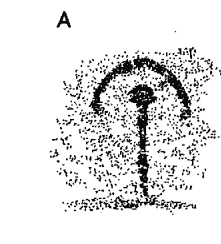

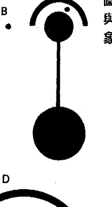

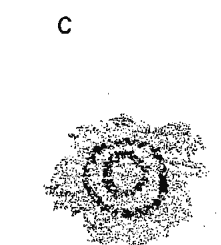

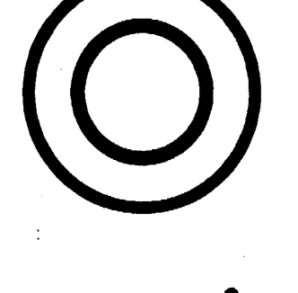

-   B 出自一九九一年麦田圈选集。
- C 保留区附近的莫戈隆红色画风（Mogollon Red Style）绘画。同心圆直径六公分。由卡尔·克恩伯格（Karl Kernberger）拍摄。
- D 出自一九七〇年至一九九〇年麦田圈选集。
- E 新墨西哥州拉戈排水区布兰科峡谷（Blanco Canyon）。由柯蒂斯·沙夫斯玛（Curtis Schaafsma）拍摄。
- F 一九九〇年出现在布拉顿（Bratton）的麦田圈。

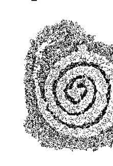

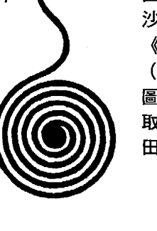

图像 A、C、E 取材自波莉·沙夫斯玛（Polly Schaafsma）《新墨西哥州的岩石艺术》（Rock Art in New Mexico）图号 59、35。图像 B、D、F 取材自弗雷迪·西尔瓦《麦田圈密码》第 6、25、29 页。

1 关于制圈者与研究人员直接通讯，倘若实情并非如此，那么研究人员必定与时间周期非常协调一致。根据传说，大时代改变时，例如目前正在过渡到水瓶座时代的这段期间，毕达哥拉斯的“四艺”（算术、几何、天文、音乐）就会渗透进地球的雾气中。约翰·米歇尔与克莉斯汀·罗纳注意到，在出现任何需要量化的事物之前，“数字”已以未显现的原型存在着。造物者的想法是先有一套和谐的数字编码，再从中发展出自然界的所有作用力与现象。约翰·米歇尔与克莉斯汀·罗纳，《十二部落与地景魔法科学》，第八十二页。在我们离开双鱼座之际，米歇尔和罗纳将最近出现的麦田圈视为“四艺”再度铭刻于地球的征兆（第一三七页）。

2 荷西·阿圭列斯，《马雅因素》。

3 关于特奥蒂瓦坎正在举行的仪式，阿尔贝托·布恩菲和我于一九八九年在乌斯马尔带领仪式，当时他告诉我，参加特奥蒂瓦坎春分仪式的人数。

4 亨巴茨·曼于一九八九年一月造访我们位于圣塔菲的家，以便讨论即将到来的马雅启蒙之旅。由于这次巡回讲课，格里并未与我一同前往，他想知道亨巴茨计划做什么，于是他提问了。亨巴茨回答：“我们马雅人将移动太阳。”在我们想像出他的意思之前，一道明亮的白色电弧从隔壁饭厅的插头中爆出，并延烧到旁边的客厅里，进入另一个插头内，所有电力因此中断！幸运的是，一名电工在几小时内过来了，他看过断路器之后，从车库里出来，脸上带着困惑的表情。他说：“发生了一件完全不可能的事情！这些插头的断路器电线熔融在了一起。”然后，就在这趟旅行之前，我的儿子汤姆和我抵达墨西哥城的机场时，遇上一九八九年三月初的大规模太阳闪焰，所有电力全遭击垮。

此后，我多次经历了马雅萨满（以及其他原住民萨满）影响太阳和电力的情况。亨巴茨告诉我，他们知道小行星（羽蛇神）将在一九八九年仪式压轴时出现，因为从梅里达附近的娃娃神殿测量，出现与太阳连成一直线的情况，以及因为亨巴茨的叔叔给他的秘密历法也是这样揭示。

5 弗雷迪·西尔瓦，《麦田圈密码》，第二八五页。

6 关于一九九八年地球的变化，从一万年前直到一九九八年，高纬度地区已经从冰河重量中弹回，导致地球质量逐渐向两极转移。经由测量地球重力如何影响人造卫星轨道，可监测到这些变化。突然间，在一九九八年八月，赤道的重力场开始变强，而两极的重力场开始变弱，地球的自转也稍微减慢。此外，假设人们发现的东西反映了地球心智层面的变化，那么基于一九九六年宇宙膨胀加速的发现，宇宙学家开始在一九九八年推测，宇宙加速可能是来自另一个宇宙的影响。詹姆斯·格兰兹，《理论学家思考来自遥远方的宇宙推动力》，《纽约时报》二〇〇〇年二月十五日科学F2版。也可将“另一个宇宙”想成另一个次元，例如第九次元星系中心。

7 茉蒂丝·摩尔（Judith Moore）与芭芭拉·蓝普（Barbara Lamb），《麦田圈揭秘》（Crop Circles Revealed），第四十六至四十九页。

8 弗雷迪·西尔瓦，《麦田圈密码》，第九十六、一四〇、二二〇页照片。

9 参见“ascension2000”网站。

10 弗雷迪·西尔瓦，《麦田圈密码》，第一二四至一三三页。示，在二〇〇三年，恶作剧已经完全失控，当时他认为九七%的麦田圈都是恶作剧！当我看着二〇〇三年的麦田圈照片时，感觉它们很不对劲。西尔瓦和我都认为，有某种精心策划的力道，试图造成公众无知及感到困惑。我想补充一点，也许制圈者发现，二〇〇三年的地球氛围使得作业困难，因为布希和布莱尔联合起来攻击主权国家伊拉克时，地球上存在着非常丑陋的振动。此外，军方可能已经相当擅长运用某种先进设备技术，并以此来阻断我们的开悟之路。

11 弗雷迪·西尔瓦，《麦田圈密码》，第一二七至一二八页。

12 同前注，第一二九至一三〇页。

13 同前注，第一〇六页。

14 同前注，第一二七至一二八页。

15 同前注，第二三七页。关于真空状态，西尔瓦指出，猪侯博士（Dr. Shuiji Inomata）在《新科学典范：二十一世纪原理》（Paradigm of New Science: Principia for the Twenty-First Century）一书中提出：

“真空状态是一个能量场，在这个能量场里，意识与电磁力和重力相结合，以产生物质。”一九八二至一九八五年期间，当我进行前世回溯时，经历了两万五千年前至五千年前，在埃夫伯里地区担任猫头鹰氏族女祭司的一系列人生，我将这段经历写成《半人马之眼》一书，它也是“心灵编年史三部曲”的首部曲。

哈基姆住在吉萨狮身人面像的脚下，有一卷长达一小时的片子记录了我们的合作情形，标题是《尼罗河畔的九次启蒙》。将哈基姆的教导描述得最好的书，是史蒂芬·梅勒（Stephen Mehler）的《奥西里斯的土地》（The Land of Osiris）。

> 与巨石系统相关的麦田圈中，有许多（如果不是大部分的话）邻近古坟和石圈，例如埃夫伯里石圈和索尔兹伯里巨石阵，就好像制圈者希望人类再次重建古代系统一样。

关于轴向倾斜，《灾难恐惧症》一书中推断，地球轴线在西元前九五〇〇年太阳系灾难期间倾斜了大约二十三度，而在那之前，轴线是垂直的。芭芭拉·克洛，《灾难恐惧症》附录“对地球轴线倾斜的反思”，第二五二至二五九页。

> 当时的治疗师是芝加哥的格雷格·帕克森（Greg Paxson）。请参阅他为“心灵编年史三部曲”首部曲《半人马之眼》所写的引言，第一至五页。

弗雷迪·西尔瓦在二〇一三年十一月的电子邮件中，提供了更多关于埃夫伯里圣所的讯息。他表示，圣所最初是一处藏骸所，死去的萨满骨骸在这里剥去肉身，准备安葬在埃夫伯里或西肯尼特（West Kennett）的长坟里。由于骨壳是晶体结构，保有细胞记忆，所以萨满的骨壳将被用来谘商萨满的智慧。后来，圣所成为同修者走下大街、进入埃夫伯里神殿之前凝聚心神的地方。也许在那次督伊德的回溯中，我接触到了古代萨满失传已久的技术。

芭芭拉·克洛，“心灵编年史三部曲”之《亚特兰提斯徽记》，第四四五至四五二页。

关于埃夫伯里女神的最佳资料来源是麦可·戴姆斯（Michael Dames），《锡尔伯里丘宝藏》（The Silbury Treasure）。

阿弗雷·曼（Alfred Mann）《星辰阴影》（Shadow of a Star），第八十二至九一页。

## 第十一章 与制圈者通讯

#### 巴伯利城堡（一九九一年）

一九九一年七月十五日，圣塔菲一个炎热的早晨，我在我的写作室里画图，以帮助自己展开“心灵编年史三部曲”系列的第三册《亚特兰提斯徽记》，结果我画出这个奇怪的图案（参见图11a）。它感觉起来就像是《亚特兰提斯徽记》的能量场，于是我开始写那本书。那段期间，《半人马之眼》与《克里斯托之心》被翻译成德文，而我正在与德国出版商“二OO一”（Zweitausendeins）的卢茨·克罗夫特（Lutz Kroft）联络。七月十七日，克罗夫特传真给我一张巴伯利城堡麦田圈的图像，这个麦田圈于七月十六日夜间出现在英格兰，当时附近的军事基地和城镇都停电了。他非常兴奋，因为巴伯利城堡麦田圈呈现出复杂的四面体几何。

因此，我的创意思维与制圈者一起流动，尽管当时的我并未太关注他们。我觉得，我刚画好这个符号，它就变成麦田圈出现在威塞克斯，这件事真是不可思议。我不懂几何，大概上完九年级后就将几何忘光了。那些日子里，每当有人说起四面体时，我总是发出会心的微笑，但其实我不知道他们在说什么。一九九一年和一九九二年，格里和我在容里岛、墨西哥、埃及、克里特岛等地教学，我们无法回到英格兰。我持续

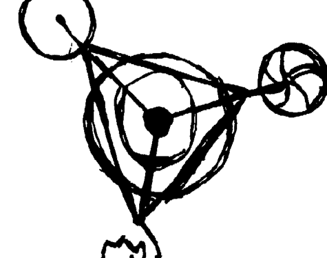

图11a：我所画的符号与巴伯利城堡四面体麦田圈如出一辙。

由于我不太会画画，所以看到七月十五日早上的信笔涂鸦竟与巴伯利城堡四面体十分神似，且我的图比威塞克斯出现图案还早了半天时（参照图10a），我真的诧异万分。显然，我的心思正在运作着相同的符号；克罗夫特似乎直觉到这一点，所以不由自主地将它传真过来。因此，巴伯利城堡图便出现在一九九二年所出版的《亚特兰提斯徽记》扉页上，我也在该书的引言中首度提及这种同步性。不知何故，我的创意思维与制圈者一起流动，尽管当时的我并未太关注他们。

对神秘的巴伯利城堡麦田圈心心念念，终于在一九九三年，力量之地旅行社邀请我到英国兰参加一场麦田圈会议，与会者包括科林·安德鲁斯、约翰·米歇尔等重要研究人员。会议过后，我有幸与约翰·米歇尔一同教学一个星期。约翰从一开始就是狂热的麦田圈研究者，也是位神圣几何大师，还写过多本精彩著作。我的工作是在圣地带领学员进行仪式，比方在格拉斯顿伯里突岩（Glastonbury Tor，又译盖世圣丘）及康瓦尔郡的各种石圈上活动，接着约翰和我会与学员对话。

约翰和我先前没有见过面，当我抵达时，我确信他认为自己在未来整个星期，都得跟一个“典型美国新时代脑袋空空”的傻瓜绑在一起。我着手带领学员的工作，我们有一些很棒的对话，至少证实我做了我的巨石功课，每当仪式进行时，约翰都带着一本书退在一旁。

最后一场仪式是在廷塔哲的亚瑟王城堡（King Arthur's Castle）和梅林洞穴（Merlin's Cave）附近举行，位于一处高耸的悬崖峭壁上，可俯瞰浪花翻滚的峡谷。在那里，我的医药兄弟黑尤卡·梅里菲德尔（Heyoka Merrifield）将与我一同带领“烟斗仪式”。我们团队的能量极为欢乐，我注意到约翰对黑尤卡的黑豹披风十分好奇，所以对他说：“约翰，这是最后一场仪式。请加入我们，我们将深感荣幸。”他微笑，然后和学员一起坐在一块岩石上。黑尤卡抽他的烟斗，我则带领静心并进入地心。最后，我们都从地心出来了，约翰仍坐在岩石上，完全呈现出出神的状态。我们安静等待片刻，但由于掉进峡谷会一命呜呼，不得已只好叫醒他。他眼神激动地说道：“谢谢你，我终于体验了真正的静心。”这很有趣，因为我经常发现，对静心不得要领的人一旦被带入地球，往往会有强烈的经验。当然，约翰·米歇尔是一名熟练的心灵旅行者，那是另一种形式的静心。工作结束后，约翰、我，以及数名学员在酒吧度过了一个愉快的夜晚，约翰“酒后吐真言”，对我说了一段十分有意义的话。当时他说（摘自我当晚的笔记）：“你一定要看我和克莉斯汀·罗合写的《十二部落》。我们在那本书表明，威塞克斯和英格兰的其他中心都是神圣中心，它们就像是一个轮子被划分成十二条轮辐，每一区域都是黄道带的一个宫位，而各区的人都以自己宫位的特征做为氏族的代表。每个氏族都有特定仪式和神秘剧来保持自己的特征，同时又以适切的音乐来保存土地的魔法。例如，当太阳处于白羊座时，白羊座氏族会行经各区，招待其他氏族，并教导他们有关白羊座的事情。和克莉斯汀一起努力描绘这个神圣地景之后，我经常希望自己能在那里，一次就好，但愿能参加很久以前的那些仪式。啊！但愿我能听一次他们的音乐。你和你的团队送给我一份最大的礼物。在这个星期，我看着你的团队时，我明白你正在做的事情正是古人为了保护圣地特质所做的。谢谢你。”

一份友谊于焉展开。除了弗雷迪・西尔瓦之外，约翰对我理解麦田圈的协助，比任何研究人员都还要多。

从一九九二年到一九九四年，威塞克斯地区出现了紧张的局势。为了防止大众意识到麦田圈的重要性，媒体与恶作剧者联合起来，蓄意淡化这些现象的实情；另一方面，认真的研究人员则遭到粗暴的抹黑与骚扰。制圈者创造出人类无法模仿的麦田圈，尤其是不到一分钟内就制作出来，藉此智取恶作剧者及其媒体走狗。只有傻瓜、走狗或骗子，才会有别的想法。一九九三年，麦田圈变得非常复杂，心胸开放的人都可以肯定，大部份麦田圈都是真的。

一九九四年到一九九五年，很多麦田圈都非常“天文”，它们的图案显示出行星和卫星周围有圆圈和月牙，还有关于我们太阳系状态的讯息。一九九三年，海王星与天王星会合（排列在天空中的相同位置），这种现象每隔一百八十年才会发生一次，这开启了全新的灵性觉醒周期（至西元二二七三年为止）。制圈者为了庆祝这个变化，制作了很多麦田圈。想要看这些图像，你可以查阅西尔瓦或其他人的著作，或是利用网际网路搜寻，因为自一九八五年以来，至少出现过三千五百个真实的麦田圈。

351	第十章	麦田圈与九次元制圈者也制作了两次重大天文事件的图像（参见图11b）。一九九四年七月，舒梅克-李维彗星（Shoemaker-Levy）撞击木星，裂成二十一块滚热碎片后，继续击打木星 surface。地球上有很多人等待着这次事件，并在电视上观看，但很少人知道那年夏天其实有些麦田圈描绘了这场木星灾难。木星的创伤提醒大众，我们的星球过去也曾遭到小行星或彗星撞击，这次事件也唤醒了人们隐藏的恐惧。一九九五年夏秋两季，海尔-波普彗星（Hale-Bopp）在天空中熠熠生辉，那一年的麦田圈再度以天文事件为主（参见图11c）。这一切大大影响了我，因为我是一名占星家。到了一九九四年年底，昴宿星人透过我传讯的力道更甚以往。在这个时间点之前，他们一直是偶尔出现的导师，我并未与他们结盟，所以当时只希望他们离开就好。如今，本书已经问世，我对他们强劲、紧急的传讯心怀感激；我认为昴宿星人和制圈者是以某种方式连结的，我也认为他们将在二〇一二年之前一起揭穿「精英编造大师」的伎俩。

### 昴宿星人与制圈者

为什么要如此费心呢？有些人可能还记得「道格与戴夫秀」（Doug and Dave Show），一对 一九九二年至一九九四年，军方、政府、媒体联合起来抹黑麦田圈现象，但他们为

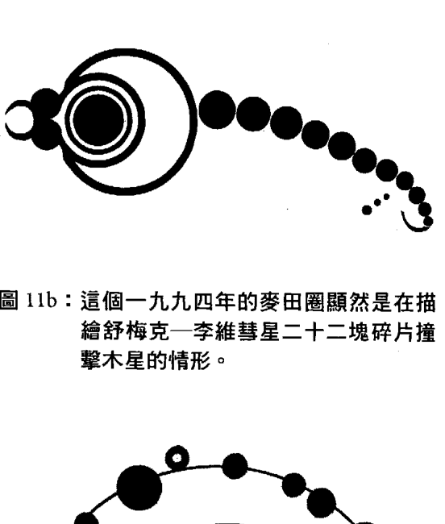

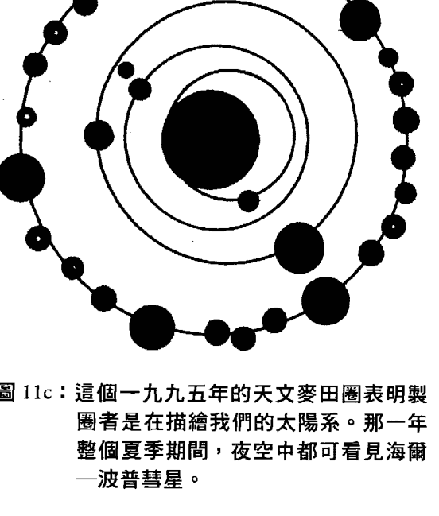

招摇撞骗的恶作剧者，利用绳子和木板将农田压平，以制造出「麦田圈」，而媒体立即在晚间新闻播出。考虑到麦田圈的重要灵性意涵，真假麦田圈之争及伪造者在农田上的胡闹，可说是喧宾夺主又令人心碎。制圈者几乎从不伤害动物、研究人员或植物，他们的艺术确实能启发灵感。有些人怀疑制圈者是不是外星人，又会不会像传说中的外星人一样绑架人类。我处理这类棘手问题的方式，就是观察我的生活中出现了什么，而我还没有看到任何来自火星的线人。一九九四年十一月，正如我在本书〈引文〉所述，我的耳朵开始响个不停，就像头里面有电话一直在响。有人打电话给我，我想知道是制圈者、昴宿星人，还是两者联手。这种共鸣感如此熟悉，感觉就像是完全非物质的较高次元光之生命体。对我来说，与昴宿星人的接触从未牵涉到飞碟和小绿人。我召集了一小群人，他们想要在我「接通」昴宿星人时间他们问题。我们录制了传讯内容，《昴宿星议事录》在一九九五年三月完成。这件事让我对制圈者产生了完全的共鸣，我也认为，一九九五年的一些麦田圈是在对《昴宿星议事录》做出直接的回应。制圈者可能是昴宿星人的较高次元频率，他们是非常第五次元的。由于第五次元是神性之心的开启，而昴宿星人是这种神性之爱的深情表达，所以我们越了解它的运作方式越好。

#### 九次元模型与制圈者

巴伯利城堡麦田圈（参见图 11d）呈现出复杂的四面体几何：三个奇怪的圆圈从三角形的三个点产生，并形成四面体的底部；在这个底部内，圆圈和两个环形藉由强调三角锥的凸起点来表明四面体形式。四面体由四个等边三角形所组成，其中一个三角形在平面上，另外三个面则上升至中心点，它们是物质的原初结合。三个圆圈从三角锥的顶点形成，并向下伸展，形成一个圆锥体。中心的大圆圈是第一至第三次元，第二个圆圈是第四至第六次元，外侧的圆圈是第七至第九次元。

如图 11d 所示：「圆圈」有直线从第一次元。

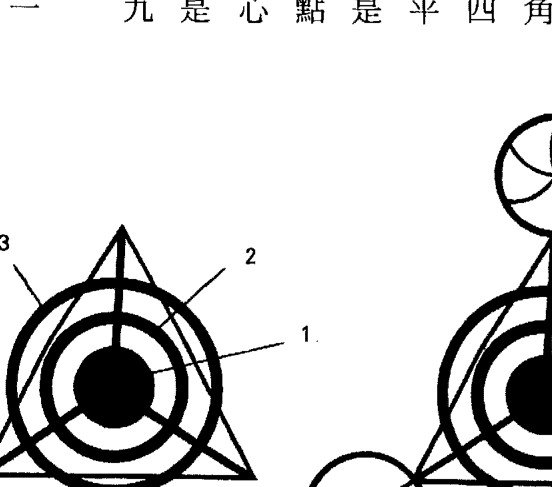

图 11d：巴伯利城堡四面体麦田圈（一九九一年）上添加九次元动态。

次元进入其中心，它是第一至第三次元，其核心由中心点表示，第三次元则为简单的圆圈。「圆圈二」是第四至第六次元，它具有六个形态分区，并以波浪线条表示分区在移动。「圆圈三」显示较高层级第七至第九次元的变化，中心的第九次元如棘轮般下降至第三次元，第三次元则连接回到四面体。以「三之原理」做为基础，三加三加三等于九，这个麦田圈完美模拟了九次元模型。

换句话说，巴伯利城堡四面体虽然教导我关于九次元模型的次元结构，但它是运用我在一九九一年画的那个圆圈来教导，因为我画出图案的时间比这个麦田圈出现的时间还要早！四面体的三个圆圈显示了次元如何套叠，并藉由上升的圆锥体提供一种旋转感。旋转的圆圈因旋转或扭矩而增加了复杂性，这可能是制圈者在传送关于三种不同光速的讯息。三角形三点上的三个圆圈，显示了运动与旋转如何从几何形式启动物质的三种层次。

我对第三个棘轮圆圈很感兴趣，觉得它富有意义，并且如第三五五页图11a所示，我的图画太过粗糙，我自己都无法表达出它来。

制圈者在一九九五年制作另一个棘轮版本（参见图11e）。回想一九九五年，当时的我并不了解较高的三个次元，并认为这个棘轮能清除我的迷雾，但它难倒我了。弗雷迪·西尔瓦已经弄清楚一九九五年的这些棘轮，他依据的是芭芭拉·希罗（Barbara Hero）关

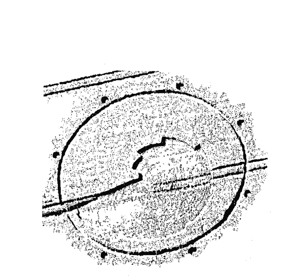

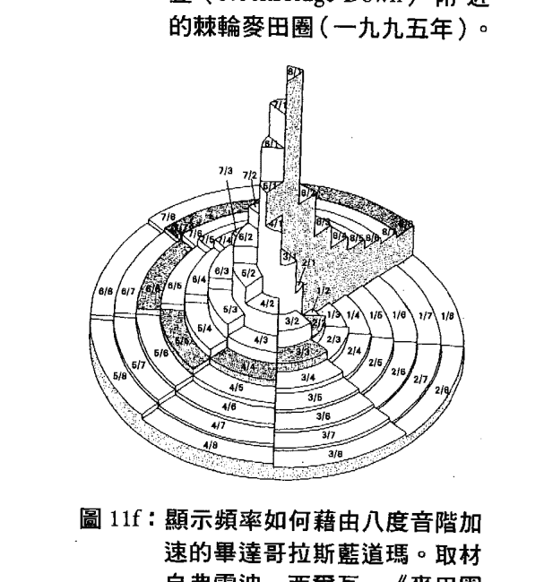

于「蓝道玛」（lambdoma）的研究，那是一张可回溯至埃及神秘学派的图（参见图11f）。毕达哥拉斯蓝道玛准确定义了「音乐和声学」与「数学比率」之间的关系。它表达出八度音阶的原理，并显示频率如何加速（参见第七章）。它是一个圆形矩阵，包含所有上升的谐波比例，也为上升的复杂度与机制提供了美妙的感觉。一九九五年的棘轮图案，在棘轮周围的圆圈外有八个小圆圈，这是为了确保每个人都知道我们正在谈论八度音阶！

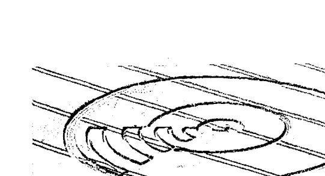

制圈者是在确保研究人员被引导至蓝道玛，因为它解释了八度音阶如何藉由数学比率上升。蓝道玛也解释了九次元形式的三个较高次元，同时显示了波长（第九次元的光）如何藉由八度音阶（第八次元的秩序）而振动，进而创造出谐波，以形成第七次元的声音。也就是说，棘轮麦田圈显示出声音如何经由八度音阶上升到「光」，藉此说明了神性智慧如何发声。终于，难题解决了！

一九九五年六月，当七边形几何麦田圈出现在母牛草丘（Cow Down）时，感觉就像昴宿星人发出雷达信号在呼唤我。这种感觉发自肺腑且饶富趣味，因为昴宿星人老是自称为「流落草丘的母牛族」（the cow people who come down）。

看到这个麦田圈时，我领悟到它是某个图案的另一个版本，那个图案是昴宿星人在撰写《昴宿星议事录》期间提供给我的，也就是本书〈芭芭拉的引言〉的第二张插图。读者请对照图 11g 与引言里面的图 ib。

我的图呈现出在九次元里藉由电磁力创造出物质，我在一九九七年力量之地旅行社麦田圈会议的一次演讲中使用了这个版本（参见图

11j)，藉此推测麦田圈如何成为改变的主要推动力，以及唤醒多次元意识。弗雷迪·西尔瓦将这种连结放大，指出研究者保罗·维盖 (Paul Vigay) 针对美国电报山 (Telegraph Hill) 的一个麦田圈记录了无线电干扰，并在他的笔记本上概略画出干扰路径。母牛草丘麦田圈也呈现出他的绘图。因此，这两名研究者都发现，母牛草丘麦田圈呈现出电磁力，以及电磁力如何参与物质的创造。而我自昴

图11h：巴伯利城堡麦田圈 (一九九一年) 套上五边形、六边形、七边形几何。取材自弗雷迪·西尔瓦，《麦田圈密码》第188页。

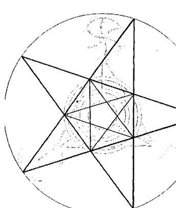

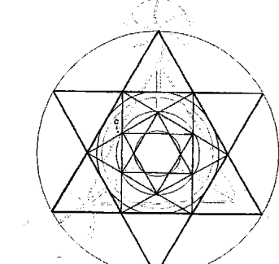

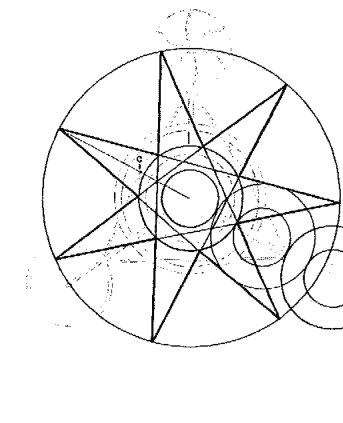

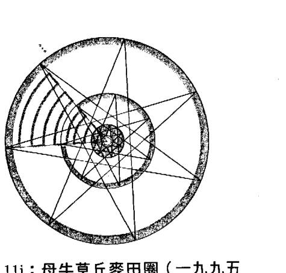

宿星人那里得到图案后的第五天，维盖在笔记本上画图后的第七天，母牛草丘麦田圈出现了。

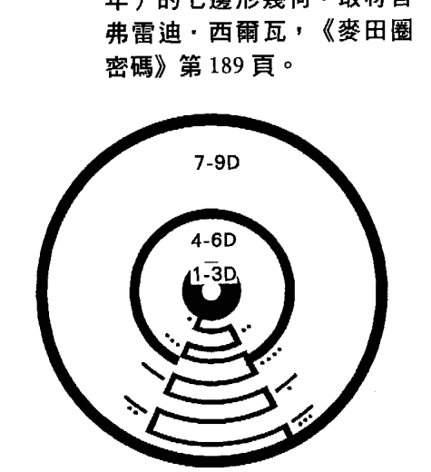

正如西尔瓦所分析，巴伯利城堡四面体的隐藏几何为五边形、六边形、七边形（参见图 11h）。从弗雷迪·西尔瓦的电脑绘图来看，这些图画本身令人赏心悦目，还可帮助人们扩展心智，而根据四面体几何，也证实了母牛草丘麦田圈展现出一些电磁学关键。将七边形几何应用于母牛草丘麦田圈（参见图 11i）及巴伯利城堡麦田圈，我们的意识会受到激励，

往「七」去思考。当然，第七次元是创造出几何的声音世界，西尔瓦更评论「七」代表「灵魂的几何」。
- 5. 我第一次公开解说麦田圈，是在一九九七年英格兰索尔兹伯里的麦田圈会议上，当时讲解的就是母牛草丘麦田圈。
- 6. 在这里我再讲解一次（参见图11j）：我以点和线（马雅系统）取代数字来标示九个次元，希望制圈者会在一九九七年用它来创造出一些东西。这个图案以三个圆圈表现出「三之原理」，棘轮则显示出能量如何以电磁方式从第一次元加速到第九次元。内侧圆圈是第一至第三次元，第二圆圈是第四至第六次元，外侧圆圈是第七至第九次元。棘轮始于第一至第三次元的圆圈，第四次元的棘轮打破了第四至第六次元的圆圈。这解释了第一次元与第二次元的大地能量如何影响第三次元，也表明我们被第四次元的力量重重压着。第五至第八次元的棘轮位于「第四至第六次元」与「第七至第九次元」两个圆圈之间的区域，第九次元的棘轮则融入外侧圆圈中。

母牛草丘麦田圈可说明第五至第九次元如何扩展。它提供了「能量如何包容所有次元」的见解，而关于各次元如何互有关联，也不可能有比它更完美的表达了。母牛草丘麦田圈可能在向我们展示，另一种理解「较高次元如何包容进较低次元」的方式，这与卡拉比丘球体一样，能拓展我们的心智（参见第二三二页图7d）。外侧环形与中间环形

之间的几何关系，是一个等边三角形和四面体，这又回到巴伯利城堡麦田圈了（参见第三六二页图 11d）。两者结合起来，显示出九次元动态形式，它们也显示出频率如何藉由谐波而上升。较公允的说法是，巴伯利城堡麦田圈在一九九一年以一种「形式」之姿出现，而母牛草丘麦田圈在一九九五年启动了它，可谓典型的「制圈者式幽默」。为了更佳理解九次元形式，这个麦田圈显示了声音如何成为次元转换的关键，它以图形描绘出声音如何渗透这九个次元的方式。

另一个一九九五年出现的麦田圈（参见图 11k）提供了更多关于最高次元（第八与第九次元）的讯息，它显示出「打开心扉」是通往高次元入口的原因。中心的小圆圈代表前三个次元，紧密围绕它的圆圈是对第三次元造成限制的第四次元，或是振动得太慢的情绪体。接下来，距离较远的圆圈是第八次元，有着八个黑暗半圈和八个光明半圈。它显示出，运作黑暗

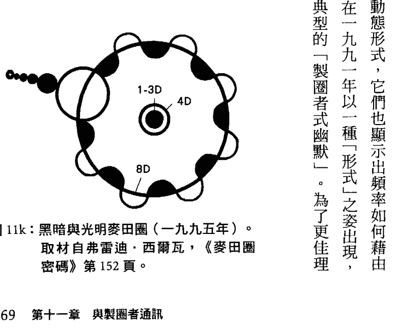

与光明是接近「光」的方式；然而，在我们这个时代，「光」通常是由宗教所控管。宗教将微妙的感觉（好比黑暗与光明之间的游戏），降低为二元化的第四次元集体心态。令人动容的是，一个大光明圆圈穿透外侧圆圈，在第八次元占有一席之地。这个大光明圆圈是与它接触的较小黑暗圆圈的一种转换，小黑暗圆圈是第五次元，即「心之次元」。五个圆圈连成一串，将大光明圆圈推进第八次元里。这显示出，「心」总是能让我们超越以黑暗与光明将我们分裂的信仰系统。「心之道」总是直接的路线，但西方人的心理复杂程度造成很多人需要动用到九次元形式。对于一九九五年的其他麦田圈，我可以说道的事情还很多，因为它们与《昴宿星议事录》有很深的连结，但我们必须继续前进了。

## 科赫碎形与神性心智的力量

一九九六年，制圈者制作出各种复杂的碎形及DNA螺旋的麦田圈，持续引导研究人员。第八章我们已提及这方面的讯息，即关于「朱利亚集合」（一九九六年）的说明，它的四面体及球面是叠加上去的。再次思考第二六四页图8c，想像一下，对于它「三加

三加三等于九」的表达方式，以及「黄金比例」螺旋，我可以写出多少页解说。第一个「朱利亚集合」麦田圈是一个直径长达一千英尺的复杂碎形，它大白天出现在索尔兹伯里巨石阵附近，而「三重朱利亚集合」更将碎形螺旋增为三倍。它们真是美极了！碎形是一种广范围重复整体特征的图案，所以如果没有放大来看，基本上你会看到相同的图案，例如「朱利亚集合」里面的圆圈。

我在第十章提到，一九九七年参加力量之地旅行社麦田圈会议时，曾尝试与制圈者联系。制圈者让我获得很大的启发，以至希望看到这个世界也受到他们的启发，但西方人的理性思维阻碍了大多数人欣赏这些现象的能力。于是我决定，我可以经由证明人类可以与制圈者直接沟通，来帮助散播相关讯息。身为一名终身占星家，我熟悉「想要证明任何无法衡量及验证的事物之存在」的陷阱。因此，我创造了一个图案，并在会议上公开展示，同时向学员和一些教师说明将它铭记在脑中的方法，接下来就是等待，看我设计的图案是否会出现在农田上，而那将成为一个证明。我们认为这个麦田圈太过复杂，不可能造假；万一我们的测试没有获得任何回应，我将承担所有风险。

完美的场合就在一九九七年索尔兹伯里麦田圈会议上，尤其我将再度与约翰·米歇尔一起教学，而他会喜欢这个实验的。当时有一些教师加上五十个人出席这场实验。每

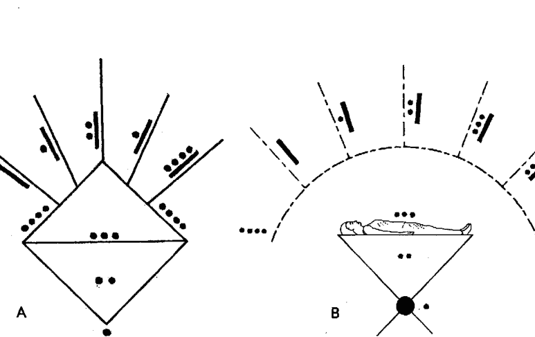

#### 图 111：(A) 芭芭拉·克洛为制圈者设计的图案（一九九七年）；(B) 「光之天篷」显示马雅点线系统如何反映出九个次元。

个人都拿到图案的副本（参见图111），他们仔细察看图案以获得视觉记忆，然后我请他们闭上眼睛。我请他们将图案呈现在第三只眼（两眉之间），接着将它转移到延髓（头颅后面、脊椎顶端）的想像电视萤幕上。这个图案是我设计的，我用它来测试制圈者会如何回应昴宿星人给我的九次元形式（光之天篷）。我觉得制圈者可能会乐在其中，这是一个双重三角锥，显示出人体如何接收及转化九个次元。请比较一下我的原始设计和给制圈者的图案。以下是事发经过：我们的小组在七月三十一日上午铭记了这个图案。（二○○二年，当我阅读弗雷迪·西尔瓦的书时，才发现第一个

科赫碎形于七月二十三日出现在锡尔伯里丘旁，但我在会议上并不知情。据我所知，其他人也都不知道这件事。奇妙的是，我是在七月二十三日左右，就在我离开美国之前，为了会议议义而画了这个图案。）我告诉教师和学员，如果有得到回应，请让我知道，之后便离开会议。接下来，我在八月中旬收到一大堆传真。八月八日的牛奶丘（Milk Hill）科赫碎形麦田圈，显然是我的图案的变形版本（参见图11m），接着是八月十八日在哈克本丘（Hackpen Hill）的奇妙吸子（Strange Attractor）麦田圈（参见图

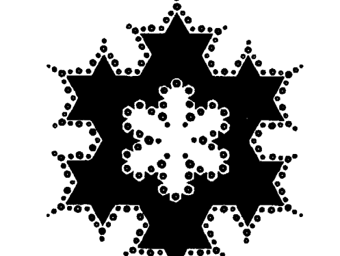

图11m：英格兰威尔特郡奥顿巴恩斯牛奶丘的科赫碎形麦田圈（一九九七年）。

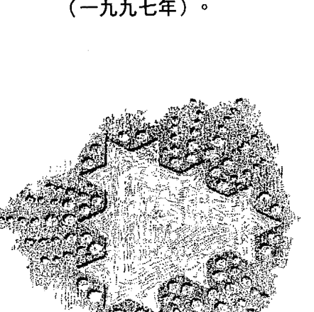

图11n：英格兰威尔特郡布罗德欣顿附近哈克本丘的奇妙吸子麦田圈（一九九七年）。

11n)。实验当时也在场的科林·安德鲁斯传真给我，表示他认为这是来自制圈者的明确 回应。 事实是：就在我们团队铭记图案之后，便出现了两个表达我图案的科赫碎形，其中 奇妙吸子更是我们小组思想形式的显著表现。它不可能是恶作剧，因为它有一个倒转四 面体形式被织入位于中心的立式图案，而且它的两百零四个圆圈，每一个都有薄薄的中 心丛。 碎形是由电脑所产生的图像，可用来查明几何秩序转为混乱之处，以便瞭解状态 的变化，例如股市崩盘及水中的浑浊与流动。在电脑和麦田圈出现之前，想要观察这些 复杂的动态是不可能的事。迄今为止，被创造出来最复杂的碎形称为「曼德博集合」。 一九九一年，制圈者在剑桥附近的艾可顿（Ickleton）制作了一个全长一千英尺的「曼德博 集合」麦田圈！由于「麦田圈的数量和复杂度」与「电脑的普及和复杂度」并驾齐驱， 所以这两者对我们心智的影响，必定存在着某种关联。 当西尔瓦分析哈克本丘麦田圈的主体，以及它凹陷、交织、凸起的四面体时，他看 出这个麦田圈展现了「毕达哥拉斯圣十结构」（Pythagorean tetractys），那是一个三角 形（四面体表面）上分布了十个等距离的点，而这些点的内部也形成一个柏拉图正多面

体（参见图11o）。依据毕达哥拉斯及秘传奥义，此圣十结构表达出「上帝十诫」（Ten Words of God）⁷。由于我设计的图案最初是受到昴宿星人「光之天篷」所启发，而它显示出我们的身体如何转化意识的九个次元，所以，我们的身体就是「上帝十诫」的载体！十个点显示出音乐比率和八度音阶，以及统领创造力本身的光之三要素。这种几何在这一个碎形中最容易看出来，它也最像我画出来的图案。

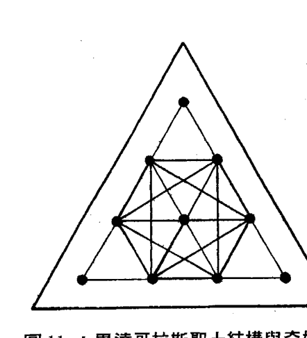

图 11o：毕达哥拉斯圣十结构与奇妙吸子麦田圈之关系。取材自弗雷迪·西尔瓦，《麦田圈密码》第186页。

延出来，五个圆圈从每一边蔓延出来，在自然界的状态变化的关系。以中央三角锥的一边为例，第六次元的六个圆圈从顶点蔓延出来，从「奇妙吸子」十二个三角锥所发出的圆正好形成「圣十结构」！玩笑话先摆一边，但人们喜欢打保龄球，因为十个保龄球点或圆圈（参见图11n），加上从三个边发出的出来的大喷射，表达出九次元系统和它与自然界状态变化的关系。但我不对此仍不瞭解。当然，它也说明了为这个图案可能含有第十次元的讯息，

三角锥底部之间又有五个圆圈蔓延出来。在三个顶端处（它们是三个三角锥），只有四个圆圈围绕它们。如同埃及的象征符号和象形文字，这一切都是刻意为之的。这个图案显示，第十次元「圣十结构」的强大力量是由中央第六次元形态场的线条保持在稳定形式，而第五次元的爱之场域又围绕着第六次元的形态场。顶端上的球面接触点暂时处于休眠状态，以保持第十次元纵轴上的状态变化。为了回应我们想要更加瞭解宇宙的愿望，制圈者向我们展示了生物形式将如何经历状态上的变化。以风车丘（Windmill Hill）做为最后一个例子，麦田圈就此打住吧！现在该去探索九次元系统的疗愈面向了。在我们的启动课程中，我主要负责心灵层面，格里则负责照顾我们的身体，以及这些教导的实际应用。

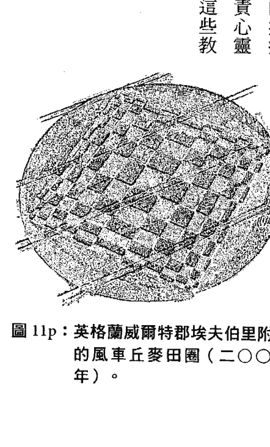

- 1. 芭芭拉·克洛，《亚特兰提斯徽记》，页码 xi x；弗雷迪·西尔瓦，《麦田圈密码》，第二六八页。
- 2. 「第三届麦田圈与巨石阵全球会议」，英格兰索尔兹伯里，力量之地旅行社，一九九三年七月二十七日至八月一日。
- 3. 弗雷迪·西尔瓦，《麦田圈密码》，第二二〇至二二一页。
- 4. 同前注，第二六八至二七〇页。
- 5. 同前注，第一八八至一八九页。
- 6. 「第六届麦田圈、巨石阵与幽浮国际年度会议」，英格兰索尔兹伯里，力量之地旅行社，一九九七年七月十九日至八月五日。
- 7. 弗雷迪·西尔瓦，《麦田圈密码》，第一八六至一八七页。

## 第十二章
### 活出九次元

文／格里·克洛

如果你跟我一樣，那麼你現在可能有很多疑問。你心中充滿著接收到的各種訊息：九個次元及它們的科學意涵，還有麥田圈與這些次元的連結說明。這有點像在製作超級奶昔：先放入各種原料，再將它們混合在一起。現在，該讓這些原料沉澱下來，並落實到日常生活中了。當我這樣做的時候，一部分的我（我的心！）希望瞭解，這些次元和其他來源的神秘「層級」或「領域」有何關聯，例如藏傳佛教的中陰身（Bardos）、古埃及的冥界十二小時、秘傳猶太教的卡巴拉（Kabbalah）等。約翰·玻琉曾錄製了一部影片，名為「靜止點的七個層級」（Seven Levels of a Still Point），也觸及這個深奧的領域，他的資料來自晚年研究印度阿育吠陀智慧的倫道夫·史東博士（Dr. Randolph Stone）。我們也聽說過，有人冒險服用死藤水、麥角酸二乙胺（LSD）、皮約特仙人掌素（peyote）等迷幻劑，然後進入狂喜境界的經歷。最後，我想到芭芭拉最喜歡的導師，也就是發現「狂喜出神狀態」（Ecstatic Trance）的人類學家費里希塔絲·古德曼博士（Dr. Felicitas Goodman），她提到各種高峰經驗和出體經驗是如何被我們體內的「不同腦部地圖」所接收。九次元是這樣的「腦部地圖」嗎？我希望能給你（和我自己）一張簡單的「路線圖」，好穿越這個理解的迷津。我想要一個簡單的心理答案，但能找到的只有這個：芭芭拉自昴宿星人通訊而來的這九個次元。九次元本身就是一個明確的答案。也許所有其他「系統」和「路線圖」都只是為這份材料做準備；也許這九個次元是我們的未來，即將取代或補充先前我們獲得的理解。無論如何，我將繼續努力與傳統或先前的教導進行連結，我也鼓勵每個人從各自的觀點，將這些新的理解與你們從其他來源得到的教導融合在一起。與此同時，九次元教導令人興奮之處在於：這份材料是活生生的，我們每次教學時，都會從學員那裡學到一些新東西。還有，正如芭芭拉所表明的，科學界的發現持續與這些新覺醒相應和。話雖如此，我想要對本書做一個正式且堅定的結尾。就像我協助從治療臺下來的客戶一樣，我將與你一起，幫助你重新站起來，回到今天，回到當下。

對很多人來說，大大的「啊哈！」是不夠的。我們被日常生活所吞噬，難得去思考相聚時在自己身上發現到的層級。所以，即使你已經「了然於胸」，或者跟我一樣，仍在嘗試將這些教導整合進日常生活中，請聽我說明一下，將九次元帶回家的有效程序。

這套程序的開頭處，是我最愛的書裡面的一段文字。我在馬修．福克斯的課堂上發現這段話，福克斯曾擔任道明會神父，他在教會內信奉秘傳教義，也是大熊出版社的最初創辦人。福克斯是研究艾克哈特（Meister Eckhart，約西元一二六○年至一三二八年）的學者，他最先將這位神秘主義大師的多次元成果發揚光大，因而成為教會內外靈性追尋者關注的靈性導師。我最愛的這本書體積雖小，但力量奇大，書名是《與艾克哈特一起靜心》（Meditations with Meister Eckhart），它是大熊出版社最早出版的書之一。為了更貼近寫作精神，這本書建議讀者點燭光來閱讀。我最喜歡的艾克哈特段落是一個提問，也是一個答案：「當馬夫看到上帝的臉時，他做了什麼？……他回到馬廄。」（What did the stable hand do when he had seen the face of God? ... he returned to the stable.）那就是我們每次欣喜若狂，心靈開闊、一個大「啊哈！」時會做的事：我們回到我們的馬廄。第一次聽到這段話時，我我因為對接下來要做什麼有了方向而感到滿足。今天，立志走上治療師之路的我喜歡這段話的地方在於：從糞肥的豐富營養和馬匹的生命力中，我們有一個「穩定」（stable，亦指「馬廄」）的地方，一個肥沃且強大的地方。所以，就像這個馬夫一樣，剛剛走過思想的心田，返回你的馬廄，回到你的安穩之地。如果你的家不穩定，看看是什麼造成它不穩定，進而恢復它。你的家直接反映了你的身體狀況，也直接反映了你自身的穩定度。一個家可以是一輛貨車、一頂帳篷、一棟豪宅。如果它們不穩定，一切都毫無價值；如果它們穩定，便是無價。你從本書「課堂」所學到的一切，全都坐落在陸地（terra firma）、大地之母（la tierra madre）、地球上，一切都和你一樣承受著重力作用，一切都連結到地心裡脈動著的鐵核晶體。

現在，請覺察你的身體。你上一次留意你的腳、你的髖關節、你的肩膀，是在什麼時候？你是否很穩定？當你到處走動、就座時，身體是否很穩定？如果不是，你能做些什麼呢？首先，你可以察覺到它。看看鏡中的自己，肩膀是否一邊高、一邊低？看著鏡中的自己時，摸一下髖關節，是否有一邊稍微高一點？躺下來時，情況又是如何？你的雙腳是平齊的，還是有一條腿比較長？這就是「結構」，我們自欺地認為我們可以帶著「失準的結構」四處走動。一棟建築物若是那樣，會發生什麼事？牆壁會出現裂縫，地基和梁柱終將瓦解下沉，導致建築物倒塌。我們會穩住建築物，為什麼不穩住我們自己？

所以，先是覺察，接下來是該怎麼做。「覺察」是第一步，緊接而來的第二步是「不要評斷自己」。對自己說：「我今天就是這個樣子。」這就是所謂的「中立」，不正不負，只是持中。請學習如何實踐「中道」，也請記住，所有生物都帶有三種電荷：正、負、中性。保持中立跟「施與受」一樣，是與生俱來的權利。中立意謂著沒有評斷，只是存在。會開車的人應該懂我的意思，當你將排檔桿打在空檔時，是什麼感覺？你的車會怠速，會安頓下來。它覺得很開心，你和車都知道這件事，你哪裡也不去，即使你準備好隨時繼續向前或向後移動¹。

邁向穩定的下一步是「給自己能量」，我們有時稱它為「愛自己」，這也是一種很好的表達方式。發現自己情緒不佳、感覺不平衡，或是傷到自己時，你可以評斷自己不值得、不配，然後告訴自己這就是自作自受；或者，你可以給自己你經常給別人的那種愛。比方說，你割傷了自己的手指，想一想以下兩者之間的差別：一，發送愛的能量給自己；二，罵自己蠢，或者更糟地，罵手指礙事！你認為這兩種解決方案中，哪一種會導致更大且更快的癒合？如果你聽到醫學研究已經證實，發送能量到傷口會加快療程，你會感到驚訝嗎？（只要閱讀傑出的「撫觸療法」〔Therapeutic Touch〕共同創始人達洛斯·克里格〔Dolores Krieger〕的任何研究成果，你就會明白我的意思；你甚至可以上課，並與他人分享這項技能！）

所以，你今天覺得自己怎麼樣？是否準備好要去處理自己在兼職中立，甚至帶著些許自愛時，可能發現到的不完美之處？很好。你已經踏上「為自己的健康與穩定負責」的道路。如果你發現路途上需要一個幫手，就去找你老是說會試試看，但從未去找過的當地治療師或身體觸療師吧。請記住：他們在那裡是為了促進你的健康，而不是要成為你生活中的拐杖。他們希望「你」讓「你自己」好起來。

現在，關於這本書裡面的啟示或覺醒，你打算如何將它們融入你新近穩定的身體和生活中？我有一些建議，它們大多涉及靜心。另外，我還有一些創意，可以超越這些日常靜心。我想你也會喜歡。

#### 九次元静心法（二十至三十分钟）

你喜歡在早上不得不起床之前先「調頻」嗎？你曾經在鬧鐘響起前二十分鐘醒來，覺得自己不想起床，但不確定該怎麼辦嗎？或者，你可以在一天中抽出二十至三十分鐘，「調頻」到各個次元嗎？要做到這一點，我建議你開始時先按照這裡描述的靜心方法來進行，讓它啟發你創造出你自己的程序、你自己的靜心。我也建議你依循下列方式進行這種靜心。如果你躺著，可將雙手枕在頭後面（我稱之為「湯姆·索耶姿勢」，湯姆·索耶即馬克·吐溫名著《湯姆歷險記》的主角），以增加靜心的清晰度及有效性。將你的手指交疊在頭蓋骨底部、頭蓋骨與脊椎頂端會合之處；看看你是否能找到一個似乎能對腦部「加壓」、讓頭部「更滿」的地方（如果你的頭部或腦部最近受過傷，那我不建議這樣做）。試驗一下這個姿勢，直到你感覺自己放慢下來，能夠更清楚地「看見」生活中發生的事情為止。這將有助於你以這種「積極」的靜心形式來體驗每一個次元。或者，如果你坐著，就讓這種靜心成為「內在功課」（Inner Work）的一種積極形式。式。當你開始體驗每一個次元時，如同你最初看到、聽到或感覺到的事物，讓它在你的覺知中擴大。最好是將困擾或激勵你的事物放大，以便清楚看到它的所有細節。因此，盡可能放大你對每個次元的覺察。這樣做的時候，你會開始看到它如何與你連結，你又如何與它連結。如此這般，你便能將它整合到生活中。

讓自己感覺舒適。慢慢來，記住你至今所學有關舒適、安頓的知識。讓目光變得柔和，只維持閱讀這段文字所需的焦點。找到你的呼吸，找到你的腳。回到你的身體，讓你的心智慢慢放開一直停留在腦中的「文字與想法之舞」。

進行一次淨化的深呼吸，感覺空氣沿著頭顱內側移動，在你的腦部與顱骨之間打開一個空間。當你這樣做時，肩膀下垂，然後再次呼吸，再重複做一次。注意一下，在你的腦部如此努力工作之後，這樣做的感覺有多好。

找到你的中線，也就是從上到下貫穿你身體中心的能量柱。讓下一次呼吸的能量跟隨你的中線，一路往下直到脊椎底部。實驗一下：首先是一次輕柔的呼吸，然後是一次深呼吸。將注意力放在你身體的這塊中心區域，這裡是體內生命力，即「液態光」(liquid light)上下移動的地方。

現在感覺一下，你是如何坐著的，你的臀部如何接觸你坐的椅子或躺著的地方。將同樣的注意力往下放在你的雙腳上，看看它們是如何擺放的，又是如何與你下方的空間接觸的。讓下一次呼吸一路沿著身體往下行進，直到你的雙腳。只需注意能量即可，感覺你的身體有多長，腳上有多少能量。現在，讓注意力從地板往下移，穿過你所在結構的地基，進入地底下。你可以將地底想像成一片黑暗卻又充滿生機的地方。你可以看到岩石、礦物、水、微生物等。繼續深入再深入，去看、去感覺、去聽你周圍的事物。繼續深入，並開始感覺地心深處巨大鐵核晶體的振動。這是一種安全的方式，可讓我們前往地心的家。現在開始感覺，這個深深的地方如何在你身體裡共鳴。感覺鐵核晶體在你身體底部振動。感覺它的振動行經你的腳和腿，來到你的脊椎頂端。感覺這些振動停在你的根輪，而你兩邊的髖關節如搖籃般托住它們。感覺這些振動停在你的薦骨，即脊椎底部的手形骨骼，以及你前面的恥骨。感覺一下，你體內這個搖籃的濕潤水感。感覺一下，充分存在於我們的世界、我們第三次元世界的感覺，並安全地停泊在這裡，停泊在你的髖關節與脊椎的搖籃，停泊在你的臀部。保有這個空間。請注意，你在這個空間中保有三個次元：鐵核晶體（第一次元）、大地（第二次元）及線性時空（第三次元）。慢慢來；這裡有很多訊息。將這些感覺整合進你的身體內，不管需要花多少時間。

現在，將注意力轉移到肚臍上。注意你身體這個部位多麼充滿生氣與活力。這裡是很很久以前你與母親、養分、生命連結的地方。經由你身體的這個開口，做一次又深又長的呼吸，感覺你自己在擴大。注意這個部位的所有能量。這是你的鼓，你的腹部之腦。當你需要採取行動時，它會幫助你，包括在你需要跑時幫助你跑。這個部位擁有力量和原始智慧。這裡是你力量的來源。這裡是與原型領域（第四次元），即集體無意識及故事的領域連結之處。

現在，將注意力轉移到胸部的中心。在這裡做一次大大的呼吸，感覺你的肋骨擴張、橫膈膜開放。從每次的呼吸中，感覺空氣在你體內循環。這裡是你擴展以便接收及發送訊息的地方。這裡是你體驗想法、愛、歡樂的地方。讓你的心隨著每一次呼吸而擴大，並且感覺自己變得越來越輕盈。歡迎來到無條件的愛之領域（第五次元）。下一次的呼吸，讓它你的喉嚨進來。讓氣息通過你張開的喉嚨進入，就像幼鳥經由嘴從母鳥那裡接受營養。看看你能讓喉嚨張得多開。當你這樣做的時候，感覺你全身關節如何放鬆，從肩膀開始，經過脊椎、髖關節、膝蓋、腳踝。看看你能讓你的身體多麼開放、多麼放鬆。這樣可以讓你的完美形式、讓理想的你再度完整。你正在創造你自己的神聖幾何領域（第六次元）。調頻到你的結構；可以的話，想像一下你的完美形式。

現在，將注意力放在你的第三隻眼，即兩眉之間、靠近額頭中央的地方。當你隨著呼吸將注意力放在這裡時，你應該會開始感覺到一些熱度，它是一個辨識的地方。保持冷靜，慢慢來；有時需要多呼吸幾次，才能讓這個神聖部位、這個視覺與振動之窗「變熱」。感覺它打開，感覺並看到它所允許的景象。假裝你這個部位後面有眼睛，並且往外看。你看到什麼？讓你的視線前往遠處，到達一個想像的地平線，看到日落或日升。聚焦在這個遙遠的地點，並繼續感覺你的第三隻眼脈動著。你正在進入星系光之路（第七次元）。看看今天有什麼朝你而來，不論是感覺、景象，還是聲音。

現在，將你的意識和呼吸放在頭顱頂端，就在頭顱正上方。感覺頭上好像有一隻手，它溫暖、引人，但並未觸摸到你。它就在那裡，招手示意。讓你的能量流向這隻手。隨著你的每一次呼吸，讓你的意識往上衝到這裡。當這隻手以溫暖與引導餵養你時，你以呼吸餵養它。你正在進入絕對領域、神性領域（第八次元）。看看今天這裡有什麼為你而來。慢慢來。它可能以視覺、聲音或感覺出現。看看今天「神」是否有訊息要傳達給你。

終於，你已經準備好要將你的意識帶離你的中心，前往我們星系的中心（第九次元）。想像能量從鐵核晶體往上湧入你的身體，再往上通過你的頂輪，繼續往上到源頭。這個源頭是我們銀河中心的黑洞、吸子，它和鐵核晶體一樣，都是你的一部分；你既是鐵核晶體，也是黑洞。這是你的基質（Matrix），你完全展開的自我。與這種感覺同在，與這個領悟同在，多久都可以。柔和輕鬆地呼吸；你的旅程已經完成。

現在，當你覺察到你的第三次元自我、你的神志清醒自我時，讓你的呼吸變得更快更深。連續做三次強呼吸，然後睜開你的眼睛。記住你去過的地方，並且知道，你隨時都可以回到那裡。

#### 透過意識四體來體驗次元

歡迎回到你的日常世界，讓今天充滿活力十足的嶄新理解吧！

如何接收新的覺察。要做到這一點，你必須對這四體有良好的理解。學習如何經由你另一種補充內在功課的技巧，是檢驗你的「身體、情緒、心智、靈性」意識四體

#### 更多九次元靜心法

意識四體「讀取」情況，有點像學習如何調頻到你的脈輪那樣。就像你可以藉由片刻留意，告訴自己調頻到太陽神經叢、第三隻眼、根輪等脈輪，你也可以告訴自己調頻到身體、靈性體、情緒體、心智體等意識四體的其中一個。芭芭拉在本書前文討論過意識四體（參見第六章），你可能已經熟悉這些概念。有一種檢視它們的新方法，是透過生物學家約瑟夫·奇爾頓·皮爾斯（Joseph Chilton Pearce）最近的研究成果來進行。皮爾斯論述道，人有四個腦：爬蟲類腦、哺乳類腦、人類腦、新皮質腦³。每個腦都控制著我們感知與個性的不同部分。爬蟲類腦顯然將我們連結到我們的身體，連結到與自然要素連結的能力。哺乳類腦含有「戰鬥或逃跑」密碼，它將我們連結到我們的情緒體。人類腦擅長推理，它將我們連結到我們的心智體。新皮質腦或高等腦則將我們連結到我們的靈性體。藉由調頻到四個腦的其中一個，我們便連結到其中一個意識四體。能夠「找到」意識四體，是找到多次元意識的好起點。

- 西藏铃或西藏钟静坐法：这种九次元静心法是为坐姿而设计。请记住，你的姿势应该让你感到舒适。通常需要一个枕头，将你从地板稍微抬高，以减轻髋骨及尾椎骨承受的压力。当你舒适就定位时，请大声或静默地呼唤你的注意力到各个次元；每次呼唤时，说道：「我呼唤我的注意力（团体静心则为我们的注意力）到第一次元。」并敲响铃声或钟声。让乐器的共鸣充满房间，让你的身体充分感觉你所召唤的次元。你可以在仪式中、在圣地，或是与伴侣一起做这件事。你可以添加词句，例如「……第一次元，铁核晶体的家」，你也可以召唤各次元的守护者。请发挥创意。让你自己体验每个次元的感觉。每个次元都是每个人的一个面向。这种静心可能需要十至二十分钟，如果你希望在召唤后进入沉默状态，将会费时更久。

- 站立与行进间静心法（一分钟半）：有时候我们整天都在不停地走动，几乎没有时间静心。这里说明一种概念，如何只花费九十秒，就能接触到全部九个次元。对瑜伽修习者而言，你会发现这是一个熟悉的领域，因为教练总是一再提醒你要呼吸，不论你正专注于某个姿势，或整天在外忙个不停。是的，只要呼吸。正如我们最喜爱的瑜伽大师卡莉．雷所说：「保持放松，练习的好处就会显现。」

##### 跟著你！

靜心很簡單，效力卻很強大。暫停你手邊在做的事情，只需連續九次均勻地呼吸即可。吸氣五秒鐘，讓空氣填滿你的肺部及全身，然後吐氣五秒鐘。每次這樣做的時候，逐一想著每個次元。第一個呼吸……第一次元，第二個呼吸……第二次元，以此類推。每個呼吸週期十秒，九個次元等於九十秒。過後看看你的感覺。哇！很高興能顧全大局，不是嗎？同時注意一下，這樣做如何讓你的中樞神經系統冷靜下來，只需將注意力從外界刺激移開，轉移到內在即可。做得好，繼續努力！開始時，一天至少做一次，之後，每當你發現自己脫離軌道、不專心、需要「充電」時，都可以做一次。

利用音樂進入九次元：極具天賦的作曲家麥可·斯特恩斯譜寫了二十四首樂曲，包括音樂及大自然的聲音，創作出他對九次元的詮釋。我們在所有啟動課程期間都會播放這張光碟，我們稱它為《穿梭九次元之旅》（Journey through Nine Dimensions）。現在大部分學員都有這張光碟。

我們建議你躺下來，保持舒適，並且盡力保持清醒。讓你的身體隨著音樂而回應及流動。手邊準備好筆記本，當音樂結束時，立即寫下你記得的、有關任何次元的特殊事項。請記住，你的次元體驗會隨著時間的進展而改變；它們絕對不會是一樣的。這是一種持續的過程。請將筆記本放在手邊。如果你是和朋友一起靜心，不妨比較一下你們的筆記，如果是在課堂上，可以大夥圍成一個圓圈，逐一講述自己的體驗。其他人的體驗往往會引發你自己的記憶，請一起編織一段次元的故事吧。

在療程中播放九次元光碟：接受身體觸療師的治療時，或者在施行治療期間，你都可以這樣做。請記住，最好在播完第九次元後先關掉光碟；第十首是各次元的混合曲，它可以是一種整合，很適合稍後再來聽。現在，你只需要逐一調頻到九個次元，而音樂的作用十分出色。如果你是身體觸療師，請記住：這是一種力量強大的音樂，並非適用於每個人。你自己先熟悉它，然後在對的時機、碰到對的客戶時再來播放。比方說，如果某個客戶正在嘗試扎根，這張光碟可以成為幫助客戶扎根及連結較高次元的絕佳工具。身為一名觸療從業者，我喜歡在工作時播放這張光碟，它幫助我調整好自己的步調，並以特殊的方式重新體驗九個次元。

一整天活在一個次元裡：這個練習很有趣，它未必會妨礙到你當天的行程。你需要做的是：設定當天你希望把注意力放在哪個次元上，然後活出它來。例如，我曾經想要過一天第四次元，以便與原型能量互動，看看那天「同步性」會教導我什麼（也就是外界會發生什麼，因而證實我在想什麼或感覺到什麼）。幾分鐘內，我的注意力便集中在院子裡的動物鳴叫聲和隔壁鄰居上。我感覺自己好像在心中走過了一扇門；我將自己的焦點放在更大的場域，我在裡面是一名演出者。那是一種十分舒服的感覺，宛如想像自己成為印第安雅基族大師唐望（Don Juan）在沙漠景觀中接受教導那樣。那一天，我過得更寬廣、更豐富，也增加了更多互動。我仍然能顧及我的事業，只是心裡有一個額外的「軌道」或「程序」在進行著。那一天我樂在其中，相信你也會如此。敞開你的心扉，擁有一天第五次元無條件的愛；在第六次元的日子裡，觀看所有事物的幾何與神聖秩序；召喚第八次元，看看那天會學到怎樣的高等課業。選擇及創意是無窮無盡的。為期九天的九次元假期：如果你想要連續九天，每天體驗一個次元，何不找一個好地方度九天假，專心做這件事呢？第十天可以是你的回程日，讓它成為## 探索你所屬的次元

你整理一切所學的日子。

開辦你自己的啟動課程：我們鼓勵所有參加過我們研習班的學員，將這套教材傳授給他們自己的學員、朋友、家人，並引導啟動。研習班期間，我們在展開啟動之前，都會先和學員一起進行「六組極性」、「十二之輪」等練習，情況就像芭芭拉在本書前文所述（參見第三章）。重要的是，如果你選擇帶領一個小組，請確保你的學員在透過音樂接觸各次元之前，已經好好扎根於當下（不論是播放我們的光碟，還是自行利用水晶缽或其他樂器來製作音樂）。成為老師是最強力的方式，何況你還得從頭到尾重新學習這套教材。

我們已經教導超過兩百次啟動課程，每一次都不太相同，教材會不斷隨著音樂而成長及演進。

完成這本書、這個覺醒過程的一個好方法，就是回頭重看每個次元，這次你的身心都更加覺醒，更有力量。現在重要的是，你如何將這套教材融入你的生活中。它讓我想起「牽馬到水邊」的比喻：要不要喝水，由馬自己決定。

展開這個過程的一種方式，就是問自己：我感覺最接近哪個或哪些次元？有沒有哪個次元讓我感覺是我的「家」？我是否自然而然受到哪個次元吸引？這是一個重要概念。這會讓你對所有次元的感覺變得更加清晰，並且賦予你力量去發現更多。除非能引起你的關注，否則這些次元再有趣、再迷人，都只是概念罷了。

也許在你第一次經歷這些次元時，沒有產生任何共鳴，也許有一、兩個次元碰觸到你。你要麼興奮不已，想法、圖像開始衝入你的腦海，要麼無動於衷。既然到了本書的結尾處，我假設你已經找到一個你特別感興趣的次元。我在這裡想說的是：擁抱這個次元，去瞭解它。我在本章所描述的靜心練習是一個起點。

一旦找到自己的次元，你將能踏上更深層的旅程；你實際上成了那個次元的老師。思考一下，你一生中可能擁有的指引、夢想、覺察，以及它們與你的次元有何關聯。芭芭拉建議你對那個次元築一座祭壇，感覺一下它與哪個方位最有共鳴，並在那裡放置物品，以提醒你那個次元及它的特質。這將成為你調頻到那個次元的地方，也就是前往那個次元的迷你入口。

為了進一步幫助你，請找到與你相同次元的人；我相信，如果你環顧四周，會發現你的生命中已經有很多這樣的人。這就像你的許多密友都與你的星座相同，或強烈認同那個星座那樣。比方說，你可能有一個「獅子幫」，或是由白羊、獅子、射手組成的「火象星座幫」。你同樣可以有一個「第二次元幫」，或第二、四、六、八次元所組成的「偶數次元幫」（這個概念請詳見下一節）。重要的是：找出你的中心位置，然後從那裡往前走。一旦「擁有」一個次元，你就可以開始前往所有次元。

### 注意相鄰次元與奇數／偶數次元

熟悉自己所屬次元最好的方法，就是透過它的相鄰次元來認識。再看一次〈芭芭拉的引言〉裡面的圖 ib，注意一個次元的能量如何沿著縱軸「下降」或「上升」，進入下一個次元的能量。這將可讓你開始感覺縱軸兩側次元之間的微妙差異。

芭芭拉教導說：身為個體的我們，傾向於偏好偶數次元或奇數次元，此說法獲得了許多學員的認同。這可能是因為，我們一開始便自然而然地連結到某個奇數或偶數次元。也就是說，它是我們的「本壘」，或是我們目前正在運作或鎖定的次元。重點是：我們擁有自然的傾向、品味或性格。這是我們的起點，我們從這裡出發，然後開始前往所有次元。

奇數與偶數次元確實具有特定性質。我們傾向於將奇數次元（第一、三、五、七、九次元）視為高度意識與概念，換句話說，我們的意識心智十分舒適地接受它們；偶數次元（第二、四、六、八次元）則為情緒或結構，換句話說，我們經常經由無意識的心智來接受這些「感覺」次元。就我個人而言，我覺得奇數次元與心智、與縱軸、與上方和下方，都具有很大關聯；而偶數次元則與我們的感覺、與橫向平面、與當下、與形式和邊界的關係較大。

反思這些縱向與橫向特質的一個好方法，就是想像瑜伽姿勢，例如「坐姿扭轉式」；你可以橫向感覺這個姿勢，也可以縱向感覺它。當你的呼吸融入姿勢時，你會在橫向平面上進一步扭轉，但你的呼吸也會提醒你，脊椎的升降、從薦骨到頂輪的距離等。無論如何，我喜歡用「移動」這個詞來形容奇數次元，用「容納」來形容偶數次元。當你開始自行探索各次元時，看看這樣的形容是否會觸動你的心弦。

另一種檢視奇數和偶數次元的方法，是通過右腦和左腦，或者通過陰與陽、退與進。如果我們仔細察看人體上的縱軸（參見第七十一頁圖 1e），就能發現所有的偶數次元都在左側，也就是受右腦或直覺腦控制的一側；奇數次元都在右側，也就是受左腦或線性腦控制的一側。左側與陰相似，右側與陽相似。以倫道夫·史東博士的極性療法模型為例，原初能量（來自造物者或源頭的能量）從我們身體右側向下移動（此為退），並從左側往上返回（此為進），如此輸出輸入，循環不息。

### 建立次元與脈輪之間的連結

人體七大脈輪就像7個能量束或能量中心，而我們微妙的能量系統與它們相連。它們就像房子電力系統的接線盒，對經驗豐富的身體觸療師來說，它們非常容易觸知（可感覺到並與之互動）。當我將手掃過俯臥在治療臺上的客戶上方時，通常能發現脈輪的振動變化，有時會伴隨著溫暖的感覺。當我用另一隻手握住客戶時，特別能感覺到正在發生的事情之作用：一股真正感覺得到的「電流」從我的掃視手傳遞到另一隻手。這告訴我，那名客戶在那個時間點將能量保留在哪裡，有時它也成為下一步工作的線索。

我曾經盯著芭芭拉（和昴宿星人）的縱軸圖（參見第四十頁圖 ib）很長一段時間，心中納悶那九個次元與人體有何關聯，特別是與我們的脈輪有何關聯。於是我想到，鐵核晶體與星系中心是兩個額外的脈輪，我們全都與它們相關；換句話說，它們是大家共有的。另外我也想知道，隨著人類變成更靈敏、更通透（即變容）的物種，位於我們尾骨（有人說，那是我們史前尾巴的殘留部分！）的根輪，是否終將緊密連結到鐵核晶體？

同樣地，我也想知道，以能量方式與我們頭頂連結的頂輪，是否也將以能量方式與星系中心連結？我們是否會因此「擴張」，成為與「上方」和「下方」緊密連結（始終連結）的物種？這就是所謂的馬雅曆末日嗎？這就是為什麼昂宿星人經由《昂宿星議事錄》裡的薩提雅，堅稱他們只看到五個脈輪與人體相連嗎（即他們將我們的根輪和性輪結合起來，並稱它們是我們的性中樞）？有沒有可能他們將我們視為未來的人類？

與此同時，回到二〇〇四年這裡，我們仍然習慣於待在現有的身體裡。以下是我將我們目前「感覺」到的脈輪與九次元連結起來，括號中註明每個較低脈輪的相關元素：

- 感覺第一次元在我們的海底輪或根輪（土）。
- 感覺第二次元在我們的生殖輪或性輪（水）。
- 感覺第三次元在前述兩種脈輪（土與水）。
- 感覺第四次元在太陽神經叢輪（火）。
- 感覺第五次元在心輪（氣）。
- 感覺第六次元在喉輪（以太）。
- 感覺第七次元在三眼輪。
- 感覺第八次元在頂輪。
- 感覺第九次元在頂輪。

這給了我們一個起點。每個人對於次元在脈輪上振動的感覺，都會有自己的微妙詮釋。請聯繫我們，我們希望聽到你的體驗。如我先前所說，探索九個次元是『循序漸進的工作』，我們的身體、我們的意識也是如此。持續調頻到你的次元，並讓我們知道你發現了什麼！良好的身體能量觸療是開啟及瞭解脈輪的絕佳方法，對具有良好口頭表達能力、與客戶溝通良好的從業者而言尤其如此。我喜歡次元與脈輪和元素的關聯。脈輪屬於電磁，元素屬於生物，所有生物都需要元素來呈現生命之舞，而生命之舞的表达要在脉轮中感觉。请注意，如我先前所说，我们与「上方」（第八与第九次元）及「下方」（第一与第二次元）的多重连结，可能随着我们的演化而演化。我期待我们演化的下一步。

## 注意人际关係中的次元开启

放眼望去，书店里尽是各式各样的人际关系的书。对于要不要再锦上添花，我迟疑了。然后，我决定只添加一个有趣的提示。不论是孩子、父母、朋友或情人，当你与另一个人互动时，在进行谈话或采取行动之前，留意一下你们两个人各自属于什么次元。我们「想当然尔」认为，所有人一直都处于第三次元，但试试一下你那些「心不在焉」或「神游太虚」的时刻。那些时刻你在哪里？你互动的对象又在哪里？你们之中有人知道东南西北或今夕是何夕吗？你是否「脚踏实地」？你意识到你的呼吸吗？

除了让彼此同时处于第三次元（如果你是对着一群人授课或演说，则是让整个屋子的人同时处于第三次元），你还可以在人际关系中做其他努力，例如双方一起前往另一个次元。换句话说，两人都选择同时进入另一个次元，看看你们之间会发生什么。

如果你是一名讲师，这意谓著将群众的注意力，以及你自己的注意力，一起转移到另一个次元。只需确保别人知道他们要去哪裡，还有你自己要去哪裡即可。咱们第五次元见！

## 注意职场中的次元开启

工作上，我们有很多教导的关系。芭芭拉说，那是我们都有工作的主因：相互学习。与同事和老板的关系相当重要，而且经常涉及权力议题。学以致用，从次元角度进行互动，不仅适用于亲友，也适用于职场，只不过这里关係到你的工作、生计和前途。当你在工作中遇到难以相处的人时，请查明他是来自哪个次元。这是一次第四次元接管（集体文化心智接管），或者只是一场困难的第三次元对话？看看你的工作场所是否存在第一与第二次元，或是较高的第八与第九次元。如果没有，设法让这些次元存在。利用水晶是一个好的开始，保有崇高意向并以行动支持它们，也是很好的做法。祝你在九次元职场中万事如意。

### 九次元意识的实际应用

最后，我想分享我们从学员身上看到的一些九次元实际应用。简述如下：

- 体验过九次元的教师和父母，能够与他们的学生和孩子展开新的对话，这些学生和孩子在他们自己的生活中也看到了这些次元，却没有能力，也没有受到鼓励去表达出来。
- 今天的年轻人比以往任何时候还想要成为多次元存在，并将这一点表现在身体装饰、服装、语言，以及如丑角般走上街头的能力。教导他们九次元，等于提供他们一张备受欢迎、前往多次元意识的路线图。
- 上班族及商界或法界人士，一旦见识到金字塔系统及第八次元的力量，就会为自己和他们所爱的人做出更明确的选择。这件事对某些人来说是离职，对其他人来说是对滥权者「鸣笛示警」。
- 医疗从业人员及治疗师被唤醒，他们意识到疗愈力量的根源（第一与第二次元），也意识到第四次元的天篷。为了疗愈他们自己和他们的病人，必须遭遇并理解这些次元。
- 画家和艺术家已经意识到九次元，并领会到其直觉的厘清，这使得他们能够在日常工作中更自由地表达各次元。
- 静心者和灵性导师已经领会九次元提供的「意识路线图」，这使得他们能够更轻松地将自己置于多次元。
- 那些对新思维感到好奇并抱持开放态度的人，从启动课程获得了更开阔的心智，并且更深入体会人生「大哉问」的解答：我们是谁？我们为什么在这里？我们在地球上的角色是什么？

1. 我经常想像一座「中立神殿」，例如某处（也许最终到处都是！）城市公园里的一座特殊建筑，就像联合国原本打算要做的那样。你可以走进这座神殿，清除掉你携带的一切正负电荷，处在当下并保持中立。就是那样：没有讯息，没有教条，只有中立。总有一天，我会写一本关于这座神殿的书，但现在，请将这个想法带入你的生活，让你的生活保持中立。对那些梦想驾驶自己车子的人来说，请记住，你的车往往代表你的心灵，它想要将你转移到你生活中接下来那个特殊的地方。
2. 我从一位天赋异禀、观察力超强的老师那里学到了「内在功课」这个词，他就是安德烈亚斯·莱德曼（Andreas Lederman），一名极性治疗师，他在瑞士、英格兰、美国等地带领「以过程为导向的心理学」研习班。这是一种非常类似我在青少年时期（无意识地）在做的事情。当时我会以我所谓的「汤姆·索耶姿势」躺在床上，并处理正在困扰我的事情。今天，我喜欢将「内在功课」应用于以下两种探索：首先是关于「今天有什么为我前来」；其次是做为一种「以更深入、更具意义的层次来体验感觉」的工具。这两种方法都要求参与者让任何「前来」的东西变得更大（就像安德烈亚斯用他那逗趣的瑞士英语口音说：「放大它！让它变得更大！」），然后，一旦那件事发生了，允许你的觉察力与你自己连结（就像安德烈亚斯所说的：「整合它！」）。安德烈亚斯和我都是水瓶座，月亮同样在天蝎座，这可能说明了我们在整合意识方面风格类似的原因。
3. 约瑟·齐尔顿·皮尔斯，《超越生物学》（The Biology of Transcendence）。

# 词汇表

- DNA：位于细胞中的核酸，它们是遗传（复制）的分子基础；DNA的双螺旋结构展现出神圣几何的所有法则。
- M理论（M-theory）：将先前五种超弦论统合起来，成为一种十一维单一架构的理论。
- X射线（X-rays）：介于紫外线与伽玛射线之间的频率振动的能量波。
- 二十面体之地（Icosahedral Land）：一个无限的、不受时间影响的、永恒的二十面体世界，它可能产生九个次元。
- 二元性（duality）：将议题划分为正负两极。
- 八度音阶（octaves）：八个音符的序列，其中开启每组八度音阶的音符彼此共振，例如钢琴的中间C到较高C或较低C，因为频率是加倍的。
- 力量物品（power objects）：水晶之类的物品，原住民感觉它们具有力量或玛纳（manna）。它们因为含有讯息及古老纪录而受到保存和使用。
- 十二之轮（Wheel of Twelve）：芭芭拉．克洛将第四次元的空间划分为六组极性，它让我们在第三次元里能够平衡自己，并且安全地扩展我们的意识。在神圣地理中，巨轮曾将地景划分为十二个分区。
- 三角形之地 (Triangle Land)：依据朱利安·巴伯的说法，无限的、不受时间影响的、永恒的三角形世界。
- 三角函数的 (trigonometric)：与三角函数相关，三角函数专门研究三角形的性质，尤指托勒密的和弦定理，它是全音阶比率的基础。
- 三摩地 (Samadhi)：人类能够领略到的、与神性融合为一的经验。
- 上帝毒药 (God poison)：由于个人及文化在等待众神再度降临和世界末日，因而不关心第三次元所造成的一种疾病。
- 上帝毒药计画 (God-Poison Program)：将神性降低到对人类思想造成分裂的第四次元层级，促使人们相互残杀；利用神力做为工具来操纵人类。
- 下界 (Underworld)：玛雅人对于玛雅历中九个演化阶段的用语。
- 下视丘 (hypothalamus)：位于视丘下方的脑区，它构成负责调节自律功能的腹侧脑区的主要部分。
- 大地能量场与领域 (telluric energy fields and realms)：地表下方的大地构造力世界，尤指地心外核、地幔、岩石圈及地球内壳。
- 大地测量 (geodetic)：确定地球大小、形状及地表精确点的地球测量系统。
- 大气层 (atmosphere)：地球表面与电离层之间的区域。
- 大混乱或大旋风 (maelstrom or whirlwind)：非常强大的集体疯狂，它会吞噬自己，且一直处于失控状态，直到被自己的负面力量消耗殆尽为止。那些参与其中的人会被它摧毁，比如有太多人都相信世界末日即将到来。
- 大霹雳（big bang）：主张宇宙始于一场大爆炸的理论。
- 女神炼金术（Goddess Alchemy）：揭示灵性科学的所有秘密。
- 不可再生的资源（nonrenewable resource）：很久以前制造但不再被制造的物质。
- 不可说（ineffable）：无法用言语表达的事物。
- 不间断的整体性（unbroken wholeness）：物理学家大卫·波姆的理论，主张粒子的动态关系取决于整体系统。
- 中子（neutrons）：不带电的基本粒子，其质量几乎等于质子的质量，且存在于除了氢核以外的所有已知原子核中。
- 介質（medium）：使振动模式变得可见的物质，例如声波机或传讯人的声音。
- 分子生物学（molecular biology）：研究生物的分子层面，通常以高倍显微镜做为辅助。
- 反粒子（antiparticle）：反物质的粒子，反物质的重力特性与普通物质相同，但具有相反的电荷及相反的核力电荷。
- 天狼星人（Sirians）：来自天狼星的生命体，他们是第六次元的守护者。
- 天堂（Heavens）：九个「下界」除以十三的周期划分。
- 天体传说（star lore）：储存在星辰的细胞记忆，会按照星辰周期而重新苏醒。
- 太空政治学（exopolitics）：在不断演进且组织化的星际、跨星系及多次元宇宙中，将地球隔离出来加以研究。
- 太阳城神秘学派 (Heliopolitan Mystery School)：大约西元前三五〇〇年至西元前一五〇〇年期间，出现在埃及的智慧学派，他们运用了九次元系统。
- 太阳闪焰 (solar flares)：太阳表面的风暴，它们会将物质喷射到太阳风中。
- 巴哈花精 (Bach Flower Remedies)：从花卉萃取出来并混入水中的微量强效物质，能改变我们的频率，可单独使用也可搭配顺势疗法使用。
- 心理动力学 (psychodynamics)：对行为、心理状态、感觉状态等的诠释方法。
- 心电感应 (telepathy)：两个以上的生命体，经由身体的感觉或心智的认知，以直接且密切的方式相互联系。
- 扎根 (grounded)：有意识地定位在你的身体里、在第三次元里，以及在当下。
- 月亮周期 (lunar cycles)：月球从新月到满月的渐盈，然后从满月到下一次新月的渐亏；日蚀；十八、六年的默冬周期。
- 水瓶座时代 (Age of Aquarius, the Aquarian Age)：自西元二〇〇〇年至西元四一六〇年的两千一百六十年期间。
- 牛顿世界 (Newtonian world)：将所有生物与非生物比喻成「由零件所组成的机器」的一种心态。
- 牛顿物理学 (Newtonian physics)：测量运动、重量、作用力等物理因果关系的定律。
- 世界之树 (World Tree)：驱动地球演化并连结较高与较低次元的力量。
- 仙女座（Andromeda）：最靠近银河的巨大螺旋星系。仙女座与银河一同统领着「本星系群」（Local Group）。它也是第七次元的守护者。
- 以地球为中心、地心说（geocentric）：从地球观察及描述宇宙。
- 占星术（astrology）：研究天体周期如何影响人类行为的科学。
- 卡拉比丘流形（Calabi-Yau shapes）：弦论所主张的额外维度被卷曲起来的空间。
- 古菌带（Archea）：地球表面下的世界，一个以原始碳氢化合物为食的生物圈。
- 可见光谱（visible light spectrum, VLS）：在舒曼共振图中，事物能被看见的范围（参见第六十二页图 1b），即十的十五次方赫兹。
- 可触知（palpable）：在身体层面感觉强烈。
- 可听范围（audible range）：振动速度比光缓慢的空气分子场域（二十至两万赫兹），可经由钢琴、音叉、及其他乐器听到。
- 四方位祭坛或模型（four-directional altar or matrix）：地球上所有供我们在身体里接收到七个神圣方位（东、西、南、北、天、地、心）的空间。
- 四面体之地（Tetrahedron Land）：依据朱利安·巴伯的说法，它是第六次元里无限的、不受时间影响的、永恒的四面体世界。
- 四面体的（tetrahedron）：具有四面体的形式，即具有四个三角形的面，它是物质的原初结合体。

- 巨石系統或科學（megalithic system or science）：西元前五〇〇〇年至西元前一五〇〇年左右的地球巨石科技。

- 平面模型或場域（planar matrices or fields）：由心智結合在一起的次元場域，以平面來思考最容易。

- 末日信念（apocalyptic belief）：任何相信世界即將結束的信念。

- 生物光子（biophotons）：由DNA所發出的光子，它們是DNA的細胞語言。

- 生物奇點（biological singularity）：依據昂宿星人的說法，當地球物種密碼穿過銀河黑洞，在星系中誕生一個新的生命世界時的一個點。

- 生態系統（ecosystems）：相關生命系統可以蓬勃發展的區域。

- 白羊座時代（Age of Aries, the Arian Age）：自西元前二三三〇年至西元前一六〇〇年的兩千一百六十年期間。

- 石英晶體（quartz crystals）：用來偵測頻率的工具。它們是壓電的六方晶，也是絕佳的接收器。

- 石音機（lithophones）：用來製作音樂的石頭裝置。

- 石堆（cairns）：儀式及葬禮所使用的巨石室；亦指做為紀念的石標。

- 石碑（stele）：刻有文字、數字、符號等的立石。

- 石環（henges）：深溝加上土堤，通常呈圓形，如埃夫伯里周圍的石環。

- 伊斯蘭（Islam）：由穆罕默德於西元六〇〇年所發展出來的宗教，採用希伯來和基督教智慧，並在《可蘭經》中增加了更多預言。

- 光（Light）：宇宙中的能量，以粒子（光子）或波（頻率）運作。

- 光子（photons）：不具質量且範圍無限的電磁粒子。

- 光子帶（Photon Band）：光（光子）的頻帶，我們的太陽系正在進入光子帶裡，而它正在加速人類的意識。

- 光之天篷（canopy of light）：半透明的第四次元場域，它將較高次元的訊息傳遞給第三次元的我們。

- 光合作用（photosynthesis）：利用光子來提供化學能，尤指植物葉綠素接受光照而形成碳水化合物。

- 光速（speed of light）：依據愛因斯坦的說法，光以每秒十八萬六千英里的速度行進；超出該速度，能量便進入超空間，因此這個光速是第三次元裡光的界限。

- 光年（light-year）：光行進一年的距離，約五兆八千八百億英里。

- 全中心論（omnicentric）：實相是從中心展開的。

- 全知（omniscient）：能夠讀取過去、現在、未來的集體心智紀錄。

- 全音階（diatonic scales）：按比率增加的音階關係。

- 全能（omnipotent）：無限的權力與影響力。

- 全球海洋文明（Global Maritime Civilization）：大約兩萬年前在地球上進行殖民的先進海洋文化，於西元前九五〇〇年遭到摧毀。

- 全像圖（holograms）：藉助雷射投射到空間的三維立體圖像。

- 共生（symbiotic）：兩個不同實體產生密切關聯。

- 共振（resonance）：音階頻率振動回應。

- 共振器（resonator）：將地球與天空聯繫起來之物，例如英格蘭錫爾伯里丘或埃及大金字塔。

- 各向異性（anisotropies）：某個場域內不同的方向速度，例如地球核心轉動得比地球表面快。

- 同步性（synchronicity）：在第三次元裡創造出可覺察到神性的事件。

- 在次原子層級旋轉（spin at the subatomic level）：展開任何物質化的原初運動。

- 地殼構造（tectonic）：涉及衛星或行星地殼變形的力量，如火山活動。

- 地磁反轉（magnetic reversals）：地球南北磁極的週期性反轉，這件事之所以發生，可能是因為內核磁場的力量擠壓到外核磁場，並迫使外核磁場做出回應。

- 多次元（multidimensional）：許多多次元，用來形容人時，是指一個人能夠覺察到這些層面。

- 夸克（quarks）：帶有電荷的假想粒子，既不具結構也不具空間維度，有紅、黃、藍三種顏色。

- 好萊塢（聖十字架）（Hollywood [Holyrood]）：精英的媒體中心，精英利用它來控制大眾的心智。

- 如棘輪般上升（ratchet）：漸進式提升到更高層級。

- 宇宙弦（cosmic strings）：擴散遍及宇宙且造成光速伸縮的密集能量線。

- 宇宙社會（Universe Society）：先進社會的集合，負責管理宇宙中的生命。

- 宇宙重新啟動按鈕（Cosmic Restart Button）：基督來到地球，用愛為地球生物播種。

- 宇宙學（cosmology）：鑽研宇宙的所有次元。

- 宇宙寶寶（baby universes）：經過智慧化設計的新宇宙，將被發送出去以便殖民於宇宙。

- 守護者（Keepers）：負責維護各次元的生命體或存有。

- 有意識的（conscious）：完全處於第三次元且具有覺察、學習，以及接受較高次元智慧引導的能力。

- 次元（dimensions）：具體實相或能量實相顯現的領域。

- 死藤水（ayahuasca）：原住民（尤指亞馬遜河流域）為了改變意識狀態所飲用的一種迷幻湯。

- 耳鳴（tinnitus）：耳朵與頭部裡面莫名的聲響。

- 自我省思（self-reflective）：讀取我們自己的能量場。

- 自我主宰或靈性主人（self-mastery or spiritual masters）：完全平衡的狀態，既扎根於第三次元，亦能刻意使用其他次元的力量。

- 自私的生物宇宙假說（Selfish Biocosm hypothesis）：詹姆斯·加德納所提出的複製與演化理論。

- 自律過程（autonomic processes）：人體的自動功能，例如呼吸。

- 自然界的四種作用力（four forces in nature）：電磁力、強核力、弱核力、重力。

- 自然要素（elementals）：放射性物質、化學物質、礦物、病毒、細菌等智慧體，它們維持著第二次元，有時也存在於第三次元。自然要素是第二次元的守護者。

- 色彩頻譜（color spectrum）：可見光分解成一系列顏色。

- 情色的基督（erotic Christ）：人類的宇宙級祖先，男性煉金術士。

- 血液操縱（blood manipulation）：在戰爭及獻祭中潑灑血液，造成人類靈性扭曲。

- 伽瑪射線（gamma rays）：來自黑洞的極高頻率波。

- 作夢（dreaming）：進入其他次元並穿梭其間。

- 吟誦魔法（enchantment）：利用聲音（吟誦）及神聖地理做為地球與天空之間的橋梁。

- 含水層（aquifer）：聚水的地質結構。

- 吸毒（drugged）：身體被有礙健康與意識的物質所占有。

- 吸積（accretion）：經由外部附加或累積而增加物質。

- 困境、兩難（dilemma）：未獲解決的狀況。

- 宏觀世界（macrocosm）：我們所居住的較大整體。

- 形態發生（morphogenesis）：引導一切生長的整體模式，三次元裡複製出生命形式的理想形式。

- 狂熱分子（fanatics）：完全相信自己的觀點，並竭盡所能想要讓其他人也認同的個人或生命體。

- 身體觸療（bodywork）：任何藉由處理感覺及靈性連結來改變人體狀態的治療，例如按摩或頭薦骨療法。

- 事件視界（event horizon）：黑洞周圍的邊界，沒有東西可以逃脫。

- 卓爾金（Tzol'kin）：第九次元的守護者，也是馬雅曆的創造者。

- 協調（harmonize）：調整事物頻率使其彼此共振的過程，例如鋼琴上的八度音階。

- 和諧生物（harmonic biology）：DNA完好無損的物種。

- 和諧匯聚（Harmonic Convergence）：一九八七年八月十六、十七兩日，數百萬人慶祝人類與銀河產生新的共振。

- 卡（Ka）：能讀取頻率的人類靈體。

- 奇點（singularity）：當恆星塌縮時所產生的一個點，其大小為零但重力幾乎無限。它會形成一個白洞，即一個新的宇宙。

- 宙斯（Zeus）：希臘眾神之首。

- 延髓（medulla oblongata）：頭顱後面的腦區，位於脊椎與頭顱連接處附近。

- 弦（strings）：來來回回振動、一度空間的微小細絲，它們是自然界中最小且不具內容的東西。

- 弦論（string theory）：一種主張自然界的基本成分是弦或弦狀物的理論。

- 拓撲或紐結理論（topology or knot theory）：關於對應性與連續性的數學分支，拓撲學尋找公式來描述紐結（繩索穿過軸心之處），而紐結最終在第三次元裡形成事物。在地景方面，拓撲學則是研究地點位置的特質。

- 松果體（pineal gland）：一個小圓錐形的腦部附屬物，其結構宛如眼睛，人體靈魂所在之處。

- 治療師（healer）：顯現出健康力量，並協助他人與這些力量共振的人。

- 波粒二元性（particle/wave duality）：光以粒子或波運作。

- 矽基人類（silica-based humans）：那些說出自己真相的人，因為他們的喉嚨正在旋轉著以光編碼的細絲，這些人正在轉化為矽基生物，而不是碳基生物。

- 社會達爾文主義（Social Darwinism）：在文化與外在世界的變遷中，認為演化是依循「適者生存」的原則來進行。

- 空間（space）：被所有次元所瀰漫的能量場。

- 近星系點（perigalacticon）：在太陽繞著星系中心轉的兩億兩千五百萬年軌道上，最靠近星系中心的點，現在正在發生。

- 金字塔（pyramid）：依據大衛·艾克的說法，精英用來控制各種系統的結構。

- 抹黑（debunking）：讓正當合理的現象顯得虛假，藉此破壞其可信度。

- 長紀曆（Long Count）：長達五千一百二十五年的歷史週期，始於西元前三一一一年左右，至西元二〇一二年結束。

- 阿努納奇（Annunaki）：蘇美人的神，又稱「阿南納吉」，昴宿星人說他們是第四次元的守護者。

- 前五回溯（past-life regression）：一種將人的意識帶入過去、現在或未來的諮商技術。

- 前寒武紀動植物（Pre-Cambrian flora and fauna）：在寒武紀時期（四億四千萬年前至五億七千萬年前）之前興盛的植物和動物。

- 思瑪（Sina）：一個美麗的古埃及象徵，呈現出心之智慧。

- 施行法術（conjuring）：對特定人士或群體使用能量技巧。

- 星系中心（Galactic Center）：銀河中心，位於射手座二十七度。

- 星系冬至（Galactic Winter Solstice）：一九八七年至二〇一二年，這段期間我們太陽系與星系相交的平面和星系中心對齊，且緊密朝向冬至太陽。

- 星系光之路（galactic highways of light）：巨大的第七次元光子帶，它構成了銀河，而且是星系高能量運輸系統。

- 星系同步化（galactic synchronization）：自一九七〇年至二〇二四年期間，人類將學習與銀河共振。

- 星系同步化光束（galactic synchronization beams）：第九次元的光束，從星系中心發出，並因軸向旋轉而扭轉。

- 星系聯盟（Galactic Federation）：由獵戶座所主導的組織，負責運作第八次元。

- 星際能量（astral energy）：在物質界與非物質界之間架起橋樑的情緒能量，當它被恐懼污染時，可能阻斷與較高次元的聯繫。

- 星幽影響力（astral influences）：其他人類及其他生命體想要侵入我們心智的欲望。

- 昴宿星人（Pleiadians）：來自昴宿星的生命體，他們是第五次元的守護者。

- 昴宿六（Alcyone）：從地球觀看，昴宿星團的中央恆星。

- 柏拉圖正多面體（Platonic solids）：五種幾何形式，即四面體、立方體、八面體、十二面體、二十面體，它們是一切物質的幾何基礎。

- 柏拉圖式宇宙（Platonia）：依據朱利安·巴伯的說法，由幾何形狀及其一切關係所組成的宇宙。

- 柏拉圖式宇宙的組態（configurations of Platonia）：第六次元的幾何結構，與柏拉圖的理想應和。

- 科赫碎形（Koch fractals）：由瑞典數學家黑爾格·馮·科赫（Helge von Koch）於一九〇四年所開發出來的碎形。

- 科學怪人生物學（Frankenstein biology）：對生命形式進行實驗，例如複製、置換身體部位、操縱DNA等。

- 科學唯物主義（scientific materialism）：將靈性過程與原因從科學中去除。

- 耶和華（Yahweh）：希伯來人的上帝，他也統御著基督徒。

- 負傷治療師情結（wounded healer complex）：經由進入及清除創傷的來源，有系統且永久地治癒創傷情結。

- 重力（gravity, gravitational force）：自然界中最弱卻也最無遠弗屆的作用力，其作用距離比其他三種作用力（電磁力、強核力、弱核力）更遠。

- 重力子（graviton）：重力的最小粒子。

- 音叉（tuning forks）：一種鋼製裝置，未有一柄，兩端分叉，用於樂器的調音。受到敲擊時會發出不同頻率的音調。

- 修習（practices）：可用來將我們的意識與其他次元產生聯繫的方法，例如瑜伽、跳舞、靜心。

- 原子（atom）：宇宙中最小的粒子，原子現在被認為是微小的振動弦。

- 原住民、守護者、導師、耆老（indigenous people, Keepers, teachers, and elders）：地球上致力於與自然和諧共處的人。

- 原型（archetypes）：塑造實相的思想形式，它們可能在實相顯現之前就已經存在，甚至可能促發實相；初始想法。

- 原型戲劇與故事（archetypal dramas and stories）：在第四次元上演、由人類集體思想和感覺所產生的神秘劇與遊戲，它們會啟發或佔有第三次元的人類。

- 埃及象形文字（hieroglyphs [Egyptian]）：在埃及使用了數千年的多次元書寫系統。

- 弱核力（weak nuclear force）：造成核衰變的作用力。

- 恩典（grace）：基督帶給人類的一項特質，它使我們能夠重獲神聖；基督的血在我們血管中流動。

- 拿非利人（Nephilim）：依據《聖經》所述，他們是降臨地球並強姦人類女性的神。

- 振動頻率（vibrational frequencies）：電磁波頻譜的完整範圍。

- 振盪（oscillate）：像鐘擺一樣來回擺動。

- 時間加速（time acceleration）：卡勒曼與本書作者芭芭拉·克洛的假說，當演化跳躍發生時，時間會加速二十倍。

- 時間波（time waves）：來自星系中心的創意方案，由第八次元的神性心智所接收，例如神聖曆法。

- 時間扭曲（time warp）：時間空白或是跳進過去或未來。

- 時間膠囊（time capsules）：為變化編碼的固定模式，又稱為「歷史」。

- 核心（nucleus）：黑洞與白洞的聯繫點，時間就是從那裡開始。

- 氣場（auric field）：生物體外圍的能量場。

- 特超新星（hypernovas）：非常巨大的超新星。

- 狹義相對論（special relativity）：愛因斯坦的理論，認為時間與空間似乎是屬於四維實相的面向，而四維實相裡面所發生的事件顯然是相對的。

- 病毒（virus）：侵入細胞時會活躍起來的超顯微鏡感染媒介。

- 真空（vacuum）：沒有空氣的空間。

- 神性內在（divine immanence）：主導自然界的第六次元幾何形式領域。

- 神秘劇（mystery plays）：表達、接觸、聯繫其他次元生命體與場景的戲劇。

- 神聖之樹（Sacred Tree）：幾乎所有宗教皆有的傳統，以樹（樹根、樹幹、樹枝）做為低、中、高世界的理念形象。

- 神聖文化（sacred cultures）：經由凝結神性霧氣，在第三次元裡讓啓發靈感的文化繁榮。

- 神聖地理（sacred geography）：利用景觀特徵讓較高次元的力量扎根。

- 神聖建築（sacred architecture）：在地球上建造出模擬第六次元幾何形式的物體，例如埃及的大金字塔。

- 神聖幾何（sacred geometry）：決定人造結構和自然結構的維度與形式之系統，例如哥德式大教堂、花卉、貝殼。

- 神靈曼尼圖（Manitou）：自然界的一種能量；第八次元的偉大引導靈經常被稱為「曼尼圖」。

- 脈輪（chakras）：人體能量中心，能與感覺和隱微能量場共振。

- 訊息（messages）：透過我們的感覺來接通的脈動，它們含有其他次元的資料。

- 迷宮（labyrinths）：先進的拓撲糾結，我們可以進入裡面、走到它的中心，再走出來。

- 追尋（questing）：在物質世界裡追求靈性。

- 針灸（acupuncture）：將細針輕插入皮膚，以改變能量流動。

- 馬雅啟蒙儀式（Mayan Initiatic Ceremonies）：由亨巴茨·曼在馬雅聖地所帶領的一系列儀式，用意是在二〇一二年十二月二十一日之前喚醒人類。

- 馬雅曆（Mayan calendar）：始於一百六十四億年前，至二〇一二年結束的曆法，它是人類各個演化階段的操作手冊。

- 剪羊毛（fleeing）：精英用來讓金字塔系統倒塌的技巧，這種技巧可讓他們拿走利益，並建立一座新的金字塔系統；二〇〇一年的安隆事件及二〇〇八年的房地產與金融業崩盤皆為範例。

- 動物圖騰神學（animal totemic theology）：藉由揭示人類和諸神身上所反映出的動物特徵，來探索諸神與人類互動關係的系統。

- 啟蒙（initiations）：將「我們」與「我們的形成性質」連結起來的技術。

- 基本教義派（fundamentalists）：任何相信他們的上帝是唯一上帝，且全世界皆應受其控制的宗教成員。

- 密度（density）：物體單位體積下的質量。

- 強子（hadrons）：會引起放射性衰變的弱核力之量子。
- 強核力（strong nuclear force）：束縛住夸克的作用力，夸克則形成質子和中子。
- 情緒處理（emotional processing）：任何可讓我們的感覺流露的療法，例如榮格心理分析及前世回溯。
- 情緒障礙、創傷障礙（emotional blocks, trauma blocks）：我們身體和意識中的阻塞區域，因過往的痛苦未獲療癒所致，並造成目前身體形態的混亂。
- 接受啟發（illuminated）：當較高次元用「光」充滿我們身體時的一種意識狀態。
- 曼德博集合（Mandelbrot Set）：一種複雜的碎形，由波蘭數學家本諾·曼德博（Benoit Mandelbrot）於一九七〇年代發展出來。
- 淋巴系統（lymphatic system）：遍及人體全身，攜帶淋巴液的血管和腺體。
- 混沌理論（chaos theory）：一套複雜的數學運算，探討系統如何在秩序中瓦解。
- 混沌吸子（chaotic attractors）：未來可能產生且將影響到較無組織狀態的進階秩序形式。
- 球形力場（spherical force fields）：由三角形、正方形、五邊形的交點連接而成的振動弧形場。
- 球面幾何（spherical geometry）：存在於完美球體內的幾何形式。
- 球體（sphere）：一種固體，其表面由「無數與中心等距離的點」所組成。
- 畢達哥拉斯的（Pythagorean）：與畢達哥拉斯相關的東西，畢氏推廣神聖幾何與古老神聖智慧。
- 祭壇（altar）：按照神聖科學法則所建造的一個神聖空間。
- 第一次元（1D）：地心的鐵核晶體。
- 第二次元（2D）：鐵核晶體與地殼之間的生命領域，以及人體內的生命形式世界。
- 第三次元（3D）：地球表面上的所有生命與事物及其相互關係。
- 第三次元的時間（time in 3D）：過去、現在、未來的定位器。
- 第四次元（4D）：人類集體心智與感覺的領域。
- 第五次元（5D）：愛之領域，由昴宿星人負責維護的狀態。它呈現出整個宇宙的能量。
- 第六次元（6D）：幾何形式的領域，這些幾何會在第三次元裡複製出來。第六次元由天狼星人負責維護。
- 第七次元（7D）：宇宙之聲的領域，它是銀河的通訊系統，其守護者為仙女座的守護者。
- 第八次元（8D）：神性心智的領域，由星系聯盟運轉其組織層級。獵戶座是第八次元的守護者。
- 第九次元（9D）：銀河本身，它是從銀河黑洞所散發出來的一個次元。第九次元的守護者是卓爾金，也就是馬雅時間波的編造者。
- 第九次元的時間（time in 9D）：地球計畫與時間軸的創造器。
- 第十次元（10D）：生成全部九個次元的縱軸。
- 粒子加速器（particle accelerators）：傳遞高速給帶電粒子（比如電子）以便研究其行為的大型設備。
- 細胞記憶（cellular memory）：我們細胞中所有以光編碼的經歷記憶。
- 細菌（bacteria）：可能導致感染的微生物。
- 處女座超星系團（Virgo Supercluster）：本星系群所圍繞旋轉的星系團。
- 規範理論（gauge theory）：物理學中的實驗驗證。
- 規範對稱（gauge symmetry）：一種測定物體在時空中連續變換之作用的數學。
- 通靈（psychic）：能夠超越物理限制，調頻到其他次元和地點。
- 都爾門（dolmens）：在三塊或更多塊立石上擺放一片平坦巨石的結構。
- 鳥鳴（birdsong）：來自第七次元的鳥類語言，能調整地球的藍色頻帶，並讓地球與高天體頻率協調一致。
- 陶子（taus）：宇宙射線撞擊地球大氣層時所產生的高能量粒子。
- 麥田圈（crop circles）：瞬間出現在小麥、油菜籽、牧草、玉米等農田上的設計與圖案。最常出現於英格蘭南部。
- 凱撒與教會（Caesar and Church）：一個新創詞，用來指涉雙魚座時代期間（西元前一六〇年至西元二〇〇〇年）的當權者。
- 凱龍星（Chiron）：一顆在土星與天王星之間繞行的天體，其軌道週期為五十一年。
- 創造力（creativity）：受到其他次元的訊息所啟發，而在第三次元裡從事藝術創作。
- 創傷（trauma）：因難熬的經歷而鎖在我們身體內的情緒障礙。
- 創傷後壓力症候群（post-traumatic stress syndrome）：感覺到內心源於創傷未獲解決的壓力因外在事件而觸發。
- 單子（monad）：一種全像形式，含有某個理念的所有密碼；亦指時間膠囊。
- 堪輿學（geomancy）：與蓋亞的力量合作，讓我們自己與地球頻率協調一致的藝術。
- 幾何（geometry）：從測量所產生的空間特徵，例如角度、球面等；由於幾何主導著宇宙的秩序，所以是可以找到真相的地方。
- 惡作劇者（hoaxers）：就麥田圈而言，是指製作假的麥田圈以致阻礙人類獲得神性啟發機會的人。
- 揭開諸神的假面具（unmasking the gods）：透過嘲笑諸神的荒謬、有限、權力飢渴等來顯露他們的真實本質。
- 植物藥性（medicinal properties of plants）：各種植物中具有療效的化合物。
- 渦旋（vortex）：介質中具有角速度（angular velocity）的區域。
- 無機（inorganic）：沒有生命。
- 猶太教與基督教（Judeo-Christianity）：自西元前一〇〇〇年以來，一直主宰著西方文化的宗教，以希伯來《聖經》和基督教《聖經》做為基礎。
- 象形符號（pictograms）：刻在石頭上的符號與圖像。
- 費氏數列螺旋（Fibonacci spiral）：由黃金比例所決定的螺旋，它是物質化的基礎。
- 超弦論（superstring theory）：納入超對稱原則的弦論。
- 超空間（hyperspace）：超越物理的次元，光在裡面行進的速度比愛因斯坦的恆定光速更快。
- 超新星（supernova）：大恆星的爆炸。
- 超對稱（supersymmetry）：自旋為整數的粒子「玻色子」（bosons）與自旋為半整數的粒子「費米子」（fermions）之間的對稱性。
- 量子力學、新物理學（quantum mechanics, QM, or the New Physics）：研究光的特性以及原子（可能是振動的弦）和分子的微觀世界；量子是抽象的單位，力學則是研究它們的行為。
- 集體心智、世界或領域（collective mind, world, or realm）：個人思想與感覺的混合物，融合交織成原型模式，且每個人都與它相連。
- 黃金比例（Golden Mean）：一比一．六一八，它決定了費氏數列螺旋的曲線。
- 黃道帶（zodiac）：將天空或陸地劃分為十二個宮位，某些占星系統超過十二個。
- 黑洞（black hole）：巨大恆星塌縮時所形成的物體，具有非常強烈的重力，除了光或許能從裡面逃脫以外，其他東西都無法逃脫。
- 黑暗時代（Dark Ages）：西元五○○年至一六○○年期間，當時教會試圖完全控制
- 黑暗能量（dark energy）：因創造力和情緒受到壓抑所產生的負面邪惡力量。
- 圓錐螺旋（conical helix）：一種圓錐形式的螺旋。
- 奧剛能量（orgone energy）：宇宙中尋求高潮的生命力能量。
- 微中子（neutrinos）：由粒子衰變所產生的不帶電、無質量粒子，與物質的交互作用非常弱。
- 微生物（microbes）：具有生命的小顆粒。
- 微觀世界（microcosm）：我們所居住的小世界。
- 意識不清明（unconscious）：被卡在二元性的任一方，以致不知道核心或解決方案的狀態。
- 意識四體（four bodies of consciousness）：我們的身體、情緒體、心智體、靈性體。
- 愛安（Aion）：仙女座的一顆行星，其具有與地球相似的生物。
- 傳訊（channeling）：從其他存有及次元獲取訊息，並將訊息傳送到第三次元的能力。
- 新世界秩序（New World Order）：精英為了實現其接管地球的計畫所使用的一種結構。
- 極性化（polarization）：一項議題的相對兩端，揭示完整領域並定義其範圍，我們可以利用它來發展我們的感覺。
- 煉金術（alchemy）：瞭解次元之間共振與對應關係的一門藝術。
- 瑜伽（yoga）：一套讓我們的身體與第六次元協調一致的姿勢。
- 當下（now）：一種獨特的時刻，當我們身處其間，可以根據我們過去所知來籌畫我們的未來。
- 碎形（fractal）：由電腦所產生的一種圖形，相同圖案在它裡面以不斷縮小的比例重複，它能顯示出秩序瓦解為混亂的位置，例如水中的亂流。
- 節點、節點交叉（node, nodal crossing）：行星軌道或能量流交叉的點。
- 聖十結構（tetractys）：畢達哥拉斯四面體表面上分布十個等距離的點，這些點形成一個柏拉圖正多面體；上帝十誡。
- 聖地（sacred sites）：地球上擁有特殊力量的地方，因為它們是第二次元作用力的頂石，並且能將較高次元吸引下來。
- 聖杯（Grail）：凱爾特族的神聖概念，它讓我們回復原始視覺，如同在縱軸上揚升一般。
- 聖樂典範（canon of sacred music）：喚起魔法原理的音樂系統，使人類能夠重新獲得原始視覺。
- 聖餐（Holy Communion）：羅馬天主教的一種儀式，將葡萄酒與麵包轉化為基督的血液與身體。
- 腦部同步化（brain synchronization）：當我們沒有恐懼、頂輪開啟、且左右兩側之間有平衡能量流動時的腦部狀態。
- 跨次元融合（interdimensional merging）：感覺到所有九個次元，並將我們的意識與
- 路徑（paths）：依據朱利安·巴伯的說法，由體制與文化所演出的連續事件。
- 隔離（quarantine）：將地球從宇宙社會中孤立出來，直到地球居民不再暴力為止。
- 電（electricity）：物質的基本攜帶物。
- 電子（electrons）：導致電力流動的帶電粒子。
- 電視（television）：一種電子箱體，放映出由精英設計的影像，旨在摧毀大眾的想像力。
- 電磁（electromagnetism）：將電子與核結合在一起的力量。
- 電磁波頻譜（electromagnetic spectrum）：顯現出人體、微波、伽瑪射線等物質的所有頻率範圍。
- 電磁場（electromagnetic fields, EM fields）：磁場中的電所產生的能量場。
- 電離層（ionosphere）：地球的高層大氣。
- 對抗療法（allopathic medicine）：運用診斷、藥品及手術來維持健康的一套系統。
- 對稱（symmetry）：當系統以某種方式轉換時不會改變的一種物理特性；例如，球體的外觀在旋轉時不會改變。
- 瘋狂（insanity）：在我們第三次元的現實中失去控制及洞察力。
- 碳氫化合物（hydrocarbons）：僅含碳和氫的有機化合物。
- 磁力（magnetism）：因電荷移動所產生的連接能量場。
- 磁星（magnetar）：一顆塌縮的恆星，據說質量比太陽大，但被壓縮成直徑只剩十二英里。
- 英里。
- 磁柵（magnetic grid）：磁場的結構。
- 磁場（magnetic fields）：具有吸引力的能量場，其大小由電流量決定。
- 磁鐵礦（magnetite）：氧化鐵小薄片，可用來顯示磁場的形狀。
- 精英、全球精英（Elite, Global Elite）：軍事、工業、能源、製藥、政府等綜合體背後的權力集團。
- 蓋亞（Gaia）：地球的靈性與生態系統。
- 蓋亞的生物密碼（Gaia's biological codes）：地球的原初形態發生場。
- 蝕（eclipse）：月球擋住太陽（日蝕）或地球擋住月球（月蝕），或太空中的任何物體擋住另一物體。
- 製圈者（Circlemakers）：創造出麥田圈的存有。
- 赫茲（hertz, Hz）：每秒波長數之測量，以德國物理學家海因里希·赫茲（Heinrich Hertz）的姓命名。
- 輕子（leptons）：會引起放射性衰變的弱核力之量子。
- 酵素（enzymes）：生化反應的催化劑。
- 線性時空（linear space and time）：依循時間運轉的延伸固體世界。
- 編造大師（spinmasters）：精英的走狗，他們為了酬勞而扭曲真相。
- 繆子（muons）：當宇宙射線撞擊地球大氣層時所產生的高強度粒子。
- 膜（branes）：由弦論所提出，並與九次元呼應的一種擴張物體。
- 膠子（gluons）：強核力的量子，可讓質子與中子裡面的夸克結合在一起。
- 質子（proton）：基本粒子，等同於氫元素的原子核，與中子一起存在於原子核裡面。
- 震波層析成像術（seismic tomography）：藉由測量地球運動所產生的波，對岩石、岩漿、晶體等進行化學分析。
- 駐波（standing waves）：能以高度及長度測量的波長。
- 戰爭（war）：由全球精英從第四次元所運作的大型遊戲，用來永久奴役人類。
- 機率（probabilities）：在特定情況下，預測將會產生的一系列行動。
- 歷史（history）：依據朱利安·巴伯的定義，「歷史」是指穿越柏拉圖式宇宙，且位於霧氣景觀裡的路徑。
- 膨脹（inflated）：當第三次元的人類沒有流通第四次元的力量，因而讓這些力量過於強大時的情形。它會使那些否認它們的人和文化生病。
- 輻射（radiation）：以粒子和波的形式釋放出來的能量，經常被用來指稱造成不穩定元素核衰變及放射性衰變的弱核力。
- 頻率（frequencies）：讓物質變得可見或可檢測的電磁輻射，例如無線電波、微波等。
- 默冬週期（Metonic cycle）：以一個古希臘人命名。長達十八・六年的月球週期，以月球節點的位置為度量；節點是指月球軌道與黃道相交的地方，黃道則是從地球看出
- 去，太陽在天空中明顯的年度路徑。
- 壓電（piezoelectric）：能夠攜帶電荷，如石英和人體細胞膜的情況。
- 環面（torus）：如甜甜圈形狀的表面，由一個圓圈圍繞另一個圓圈所產生。
- 瞬間（instants of time）：依據朱利安·巴伯的說法，被我們經歷為「動態且短暫」的真實事物。
- 縱軸（vertical axis）：與平面形成九十度直角的一條線或一股作用力。昂宿星人的縱軸是第一次元與第九次元之間所產生的力，它維持著九個次元。
- 聯覺（synaesthesia）：由聲音引起色彩體驗，例如可能透過擊鼓而發生。
- 聲波學（cymatics）：研究由聲音所造成的幾何圖案。
- 聲波機（cymatics machine）：使用沙子等介質，讓聲音模式可以肉眼看見的裝置。
- 聲音（sound）：空氣分子的振動，測量單位為赫茲。
- 聲能學（sonics）：研究聲音以查明物質因頻率而起的變化，例如注意頻率如何改變介質中的幾何形狀。
- 舉報者（whistle-blowers）：冒險揭發金字塔以便解放系統的人。
- 薄圓盤、厚圓盤（thin disk, thick disk）：在星系中，有很多恆星位居其間的平面。
- 隱微的次元、頻率、場域（subtle dimensions, frequencies, or fields）：超出固體世界的領域，它們的密度較小。
- 隱藏的聖杯（Holy Grail [hidden]）：基督與抹大拉的馬利亞之血脈。
- 舊石器時代（Paleolithic period）：從兩百四十萬年前直到西元前九五○○年的石器時代。
- 舊石器時代的心智（Paleolithic mind）：我們對於西元前九五○○年大災難之前、尚未受到集體創傷所折磨的人類生活之記憶；一種放眼全球、關懷生態的心智。
- 薩滿（shamans）：能前往其他世界尋找訊息的治療師。
- 藍色頻帶（blue band）：圍繞地球的藍色球面，「宇宙之聲」與「地球重力外側邊界」會合之處。
- 藍道瑪（lambdoma）：一張畢達哥拉斯的圖片，它定義出「音樂和聲學」與「數學比率」之間的關係。
- 轉化（transmutation）：基本材料變換成較精細的元素。
- 雙魚座時代（Age of Pisces, the Piscean Age）：自西元前一六○年至西元二一○○○年的兩千一百六十年期間。
- 繩索（cords）：由自然要素形式所組成的線，它們延伸至我們的「意識四體」。
- 藥法（medicine laws）：原住民配合自然界的神聖法則，在地球上生活的方式。
- 藥品（drug）：任何阻斷或增強身體信號的物質。
- 霧氣（mist）：依據朱利安·巴伯的說法，一種瀰漫在柏拉圖式宇宙裡的物質，它的強度會隨著當下的潛力而變化。
- 覺知者（seer）：同時意識到九個次元的人。
- 鐵核晶體（iron core crystal）：位於地球中心，大小如月球的六方鐵晶，它是第一次元的守護者。
- 變容（Transfiguration）：身體轉化成純粹的光，如基督的情況。
- 變體（transubstantiation）：一種物質變成另一種物質。
- 顯現（manifestation）：運用心智技術來產生事物的圖像，以便讓它們出現在第三次元裡。
- 靈性科學（spiritual science）：和諧與對應的法則。

# 参考书目
- Aczel, Amir, Entanglement: The Greatest Mystery in Physics, Four Walls Eight Windows, New York, 2002.
- Argüelles, José, The Mayan Factor: Path Beyond Technology, Bear & Company, Santa Fe, New Mexico, 1987.
- Baigent, Michael, Richard Leigh, and Henry Lincoln, Holy Blood, Holy Grail, Delacorte Press, New York, 1982.
- Barbour, Julian, The End of Time: The Next Revolution in Physics, Oxford University Press, New York, 2000.
- Bates, Brian, The Real Middle Earth: Magic and Mystery in the Dark Ages, Sidgwick & Jackson, London, 2002.
- Beaulieu, John, Bija Mantras (video), Biosonic Enterprises, P.O. Box 487, High Falls, New York.
- Bentov, Itzhak, Stalking the Wild Pendulum: On the Mechanics of Consciousness, Destiny Books, Rochester, Vermont, 1988.
- Bohm, David, Wholeness and the Implicate Order, Routledge and Kegan Paul, Boston, 1981.
- Brown, Dan, The Lost Symbol, Doubleday, New York, 2009.

-   Calleman, Carl Johan. The Mayan Calendar and the Transformation of Consciousness, Inner Traditions/Bear & Company, Rochester, Vermont, 2004.

-   The Mayan Calendar, Solving the Greatest Mystery of Our Time. Garev Publishing, Coral Springs, Florida, 2001.

-   Chardin, Teilhard de. The Phenomenon of Man, Harper & Row, New York, 1961.

-   Clow, Barbara Hand. Catastrophobia: The Truth Behind Earth Changes in the Coming Age of Light, Inner Traditions/Bear & Company, Rochester, Vermont, 2001.

-   Chiron: Rainbow Bridge Between the Inner and Outer Planets, Llewellyn, St. Paul, Minnesota, 1987.

-   Eye of the Centaur, Heart of the Christos are now in Book One of The Mind Chronicles Trilogy, Bear & Company, Santa Fe, New Mexico, 1991, 1996, 2001.

-   The Liquid Light of Sex: Kundalini, Astrology, and the Key Life Transitions, Bear & Company, Santa Fe, New Mexico, 2007.

-   The Pleiadian Agenda: A New Cosmology for the Age of Light, Bear & Company, Santa Fe, New Mexico, 1995.

-   Signet of Atlantis: War in Heaven Bypass, Bear & Company, Santa Fe, New Mexico, 1992.

-   Collins, Andrew, and Chris Ogilvie-Herald. From the Ashes of Angels, Signet, London, 1997.

-   Tutankhamun: The Exodus Conspiracy, Virgin Books, London, 2002.

-   Conty, Patrick. The Genesis and Geometry of the Labyrinth, Inner Traditions/Bear & Company.

-   Cooper, William, Behold a Pale Horse, Light Technology, Sedona, Arizona, 1991.

-   Croswell, Ken, The Alchemy of the Heavens: Searching for Meaning in the Milky Way, Anchor Books, New York, 1995.

-   ——, The Universe at Midnight: Observations Illuminating the Cosmos, Free Press, New York, 2001.

-   Cruttenden, Walter, Lost Star of Myth and Time, Lynns Press, Pittsburgh, Pennsylvania, 2006.

-   Dames, Michael, The Silbury Treasure: The Great Goddess Rediscovered, Thames and Hudson, London, 1976.

-   Davies, Paul, About Time: Einstein's Unfinished Revolution, Simon & Schuster, New York, 1995.

-   ——, The Mind of God: The Scientific Basis for a Rational World, Simon & Schuster, New York, 1992.

-   Devereux, Paul, Stone Age Soundtracks: The Acoustic Archaeology of Ancient Sites, Vega, London, 2001.

-   Filbey, John, and Peter Filbey, Astronomy for Astrologers, Aquarian Press, Northamptonshire, England, 1984.

-   Fox, Matthew, Meditations with Meister Eckhart, Bear & Company, Santa Fe, New Mexico, 1983.

-   Fulcanelli, The Dwellings of the Philosophers, Archive Press, Boulder, Colorado, 1998.

-   Gardner, James N., Biocosm: The New Scientific Theory of Evolution: Intelligent Life Is the Godwin, Joscelyn, Arktos: The Polar Myth in Science, Symbolism, and Nazi Survival, Adventures Unlimited, Kempton, Illinois, 1996.

-   Gold, Thomas, The Deep Hot Biosphere, Copernicus, New York, 1999.

-   Graves, Robert, Greek Myths, Penguin, London, 1992.

-   Greene, Brian, The Elegant Universe: Superstrings, Hidden Dimensions, and the Quest for the Ultimate Theory, Vintage, New York, 2000.

-   Grey, Alex, Sacred Mirrors: The Visionary Art of Alex Grey, Inner Traditions, Rochester, Vermont, 1990.

-   Hapgood, Charles. H., Map of the Ancient Sun Kings, Turnstone Books, London, 1966.

-   Hassnain, Fida. A Search for the Historical Jesus, Gateway Books, Bath, England, 1994.

-   Icke, David, Alice in Wonderland and the World Trade Center Disaster, Bridge of Love Publications, Isle of Wight, 2002.

-   ——, ... and the Truth Shall Set You Free, Bridge of Love Publications, Isle of Wight, 1995.

-   ——, I Am Me, I Am Free: The Robot's Guide to Freedom, Bridge of Love Press, Cambridge, England, 1996.

-   Jenkins, John Major, Maya Cosmogenesis 2012, Bear & Company, Santa Fe, New Mexico, 1998.

-   Jenny, Hans, Cymatics: A Study of Wave Phenomena and Vibrations, MACRO media, Newmarket, New Hampshire, 2001.

-   Kaminski, John, America's Autopsy Report, Dandelion Books, Tempe, Arizona, 2003.

-   Kerényi, Carl, Dionysos: Archetypal Image of Indestructible Life, Princeton University Press, Princeton, New Jersey, 1976.

-   Lawlor, Robert, Sacred Geometry: Philosophy and Practice, Thames and Hudson, London, 1982.

-   Levitt, B. Blake, Electromagnetic Fields: A Consumer's Guide to the Issues and How to Protect Ourselves, Harcourt Brace, New York, 1995.

-   Magueijo, João, Faster Than the Speed of Light: The Story of a Scientific Speculation, Perseus, Cambridge, Massachusetts, 2003.

-   Mann, Alfred K., Shadow of a Star: The Neutrino Story of Supernova 1987A, W. H. Freeman, New York, 1997.

-   Matthews, John, Taliesin: Shamanism and the Bardic Mysteries in Britain and Ireland, Aquarian, London, 1991.

-   Mavor, James W., Jr., and Byron E. Dix, Manitou: The Sacred Landscape of New England's Native Civilization, Inner Traditions, Rochester, Vermont, 1989.

-   McKenna, Terence, and Dennis McKenna, The Invisible Landscape, Harper & Row, San Francisco, 1993.

-   McKenna, Terence, Ralph Abraham, and Rupert Sheldrake, Trialogues at the Edge of the West, Bear & Company, Santa Fe, New Mexico, 1989.

-   Mebber, Stephen S., The Land of Osiris, Adventures Unlimited, Kempton, Illinois, 2002.

-   Men, Hunbatz, Los Calendarios Mayas y Hunab K'U, Ediciones Horizonte, Juarez, Mexico, 1983.

-   Michell, John, and Christine Rhone, Twelve-Tribe Nations and the Science of Enchanting the Landscape, Phanes Press, Grand Rapids, Michigan, 1991.

-   Mitchell, William C., Bye Bye Big Bang: Hello Reality, Cosmic Sense, Carson City, Nevada, 2002.

-   Moore, Judith, and Barbara Lamb, Crop Circles Revealed: Language of the Light Symbols, Light Technology, Flagstaff, Arizona, 2001.

-   Murphy, Michael, Jacob Aabet: A Speculative Fiction, Celestial Arts, Millbrae, California, 1977.

-   Narby, Jeremy, The Cosmic Serpent: DNA and the Origins of Knowledge, Jeremy P. Tarcher/Putnam, New York, 1998.

-   O'Brien, Christian, The Genius of the Few, Turnstone Press, London, 1985.

-   Ovason, David, The Secret Architecture of Our Nation's Capital, HarperCollins, New York, 2000.

-   Pagels, Elaine, Beyond Belief: The Secret Gospel of Thomas, Random House, New York, 2003.

-   Pauwels, Louis, and Jacques Bergier, The Morning of the Magicians, Stein and Day, New York, 1963.

-   Pearce, Joseph Chilton, The Biology of Transcendence: A Blueprint of the Human Spirit, Park Street Press, Rochester, Vermont, 2002.

-   Picknett, Lynn, Mary Magdalene: Christianity's Hidden Goddess, Carol & Graf, New York, 2003.

-   Pickover, Clifford A., Surfing through Hyperspace: Understanding Higher Universes in Six Easy Lessons, Oxford University Press, New York, 1999.

-   Ravenscroft, Trevor, The Spear of Destiny, Weiser, York Beach, Maine, 1982.

-   Rees, Alwyn, and Brinley Rees, Celtic Heritage: Ancient Tradition in Ireland and Wales, Thames and Hudson, London, 1973.

-   Reich, Wilhelm, Cosmic Superimposition, Wilhelm Reich Foundation, Rangeley, Maine, 1951.

-   Richer, Jean, Sacred Geography of the Ancient Greeks: Astrological Symbolism in Art, Architecture, and Landscape, State University of New York, Albany, 1994.

-   Rudgley, Richard, The Lost Civilizations of the Stone Age, Free Press, New York, 1999.

-   Schaafsma, Polly, Rock Art in New Mexico, Museum of New Mexico Press, Santa Fe, New Mexico, 1992.

-   Shearer, Tony, Lord of the Dawn: Quetzalcoatl and the Tree of Life, Naturegraph Publishers, Happy Camp, California, 1971.

-   Sheldrake, Rupert, The Presence of the Past: Morphic Resonance and the Habits of Nature, Times Books, New York, 1988.

-   Silva, Freddy, Secrets in the Fields: The Science and Mysticism of Crop Circles, Hampton Roads, Charlottesville, Virginia, 2002.

-   Sitchin, Zecharia, The Twelfth Planet, Avon Books, New York, 1978.

-   Starbird, Margaret, The Woman with the Alabaster Jar: Mary Magdalene and the Holy Grail, Bear & Company, Santa Fe, New Mexico, 1993.

-   Strachan, Gordon, Jesus the Master Builder: Druid Mysteries and the Dawn of Christianity, Floris• Books, Edinburgh, 1999.
• Sullivan, William, The Secret of the Incas: Myth, Astronomy, and the War Against Time, Crown, New York, 1996.
• Swinne, Brian, The Hidden Heart of the Cosmos: Humanity and the New Story, Orbis Books, Maryknoll, New York, 1996.
• Talbot, Michael, Mysticism and the New Physics, Bantam Books, New York, 1980.
• Temple, Robert K.G., The Sirius Mystery, St. Martin's Press, New York, 1976.
• Thorne, Kip S., Black Holes and Time Warps: Einstein's Outrageous Legacy, W. W. Norton, New York, 1994.
• Tompkins, Peter, Secrets of the Great Pyramid, Harper & Row, New York, 1971.
• van der Warp, Jacco, Marshall Masters, and Janice Mauning, Planet X Forecast and 2012 Survival Guide, Your Own World Books, Silver Springs, Nevada, 2007.
• van Helsing, Jan, Secret Societies and the Power in the 20th Century, Ewertverlag, Gran Canaria, Spain, 2002.
• Webre, Alfred Lambremont, Exopolitics: Political Government and Law in the Universe, Universe Books, Vancouver, BC, 2005.

# 延伸教材

我們強力推薦我們的音樂光碟，由作曲家麥可·斯特恩斯所譜寫的《穿梭九次元之旅》。這張光碟依照順序來呈現各個次元，所以你可以從第一次元逐步前往第九次元，然後進入第十首，所有次元的混合曲，那是第十次元。

芭芭拉製作了一張同名的影音光碟《穿梭九次元之旅》，內容是她在研習班的九次元教學。她的介紹能加深你對本書的理解，也是你與其他人分享這些教學的理想選擇。

我們還錄製了一張新的光碟《九次元靜心法》，由格里朗誦九個次元各自的靜心法，以及第十二章全部九次元的靜心法。

以上三項產品及芭芭拉的全套書籍和影音光碟，都可向我們的全球獨家經銷商購買：

Wise Awakening
P.O. Box 31547
Bellingham, WA 98228
電話：360-756-8075（美國境內免付費電話 866-756-8075）
傳真：360-527-2692
網址：www.wiseawakening.com

感謝你關注我們的作品，願你的九次元（以及更高次元）穿梭之旅順利！造訪我們的網站 www.handclow2012.com 可免費獲得芭芭拉的新月、春分、夏至、秋分及冬至預測（請點選 Astroflash），並可得知更多有關我們目前作業的訊息。我們正在新增「如何創建你自己的啟動課程」網頁，目的在鼓勵你自行教導這份教材。


長久以來，高次元的智慧一直在等待我們深入探索，從而知曉生命與體驗的意義。早期先民了解與大自然和諧共存的重要性，也能自在使用高次元力量來改善生活，治療疾病，而煉金術便是他們掌握的一項強大技術，可以藉由共振來提高或降低頻率，進而實現物質化。但是，西元前九五〇年的一次巨變，導致人類遺忘自己身為蓋亞守護者的使命，甚至在掌控宗教與媒體力量的精英集團布局下，漸漸不再依循月亮盈缺、行星流轉、四季節氣度日，反而被物質與時間的錯覺牢牢綁住！

如今，長年與昴宿星人傳訊的芭芭拉．克洛，與世人分享地球的九次元真相及豐富的次元科學，搭配由專業治療師格里．克洛撰寫的九次元靜心法，引導我們發展意識、療癒身心，進而使跨次元旅行成為我們日常生活的一部分。

芭芭拉．克洛表示，我們身處的世界共有九個次元。地心、地殼及地表上的一切，分別是第一至第三次元；第四次元是集體思想的領域，也是連結第五至第九次元的橋樑。高次元領域雖然不可見、無法觸摸，卻在各個層面深刻影響我們。因此，重拾探索高次元領域的能力已是新時代人類共同追求的目標。

本書詳細描寫九個次元對應的領域及科學觀點，幫助大家在發展心靈與意識的同時，也能以次元科學來看待世界的另一種樣貌，以及眾多未解的高次元指引之謎。現在就靜下心來，體驗一場充滿智慧與啟發的九次元之旅吧！