# 仪式魔法全书（下）


致谢

我們兩位編輯想向所有為本書貢獻才華的作者致上最深的敬意，他們的智慧與洞見能夠幫助到未來的求道者。我們特別要感謝盧埃林出版社（Llewellyn）的伊萊西雅·高羅（Elysia Gallo），因為她除了給予專業指引，還有獨家本領，能使兩個瘋狂魔法師專注在這任務並按時完成。我們也要感謝我們的家人、朋友與老師們，感謝你們始終給予愛、智慧與支持。

亚伯拉梅林魔法——马克西缪斯·卡茨

《亚伯拉梅林之书》(Book of Abramelin)是一部在十四到十五世纪用德语写成的魔法书，教导魔法师认识自己的神圣守护天使并与之交流。其作者署名「沃母斯的亚伯拉罕」，这个有可能是亚科夫·本·摩希·哈利末·墨林拉比 (Rabbi Jacob ben Moses ha Levi Möllin，人称玛哈利尔 (Maharil)，约1365-1427年)的笔名，但仍有争议。¹

本册先介绍这部魔法书的内容，总结亚伯拉梅林魔法的实践做法，接着回顾在二〇〇四年花费一百七十七日完成这项仪式的经历。任何有关亚伯拉梅林的文字内容，都免不了带有个人色彩。在认识神圣守护天使并与之交流之后，宇宙的一切都有了目的，也被如此看待。在我进入 Adeptus Minor 这个等级的七年后，便遇到能够让我执行亚伯拉梅林仪式的状况条件；在完成亚伯拉梅林的七年后，便正巧开始撰写《天使之后》 (After the Angel) 这本记述了我亲身经历的作品；在本书出版七年后，我便突然受邀撰写本书的这个章节。从仪式完成那一刻起，这七年循环同时向着过去与未来延伸。

《亚伯拉梅林之书》跟其他玄秘魔法书有许多相似点，结合了自传元素、魔法方阵、民俗传说以及一系列的长时间仪式指导，旨在让读者认识自己的守护天使并与之交流。然而，许多人却把它视为另一种完全不同的魔法类型，包括知名的神秘学家阿莱斯特·克劳利：

> 古老魔法仪式绝大多数不是刻意写得艰涩难懂，就是真的纯粹只是愚蠢的胡扯。那些直观又易施行的仪式通常都被用来实现受相思病所苦的农人的愿望，不适合拥有宏伟目标的知识分子。然而，这条定律有一个令人震惊的例外，那就是《魔法师亚伯拉梅林的神圣魔法书》（The Book of the Sacred Magic of Abra-Melin the Mage）。2

这套仪式为期六或十八个月，由愈来愈严苛的灵性活动所组成，最后会召唤出天使，接着叫唤、控制未获救赎的灵体。

这本魔法书（以下简称《亚伯拉梅林》）有多个译本，一开始被翻成法文、德文和希伯来文，后于一八九七年由麦克迈格·马瑟斯从法文翻译成英文，正式引入西方密契主义晋级制度。

法文版的仪式为期六个月，德文版则是十八个月。3后来，克劳利将这个仪式作为等级进程的必要元素之一，将之指定为小达人的功课。4

《亚伯拉梅林》的格式和内容跟其他中世纪魔法书雷同，唯有希望达到的目标例外，不存在于其他魔法书，那就是与守护天使建立直接且持续的关系。然而，透过自传体例建立着作权威、匿名导师、魔法方阵以及净化、告解和召唤的仪式等，全都深植于西方的玄秘传统。5

这些魔法书为马瑟斯和黄金黎明赫密士教团的创始人提供了丰富的素材。马瑟斯便翻译过多本这样的着作，包括《所罗门之钥》和《阿玛德尔魔法书》（Grimoire of Armadel）。6《亚伯拉梅林》可以跟这些着作以及阿格里帕所着的《秘术哲学三书》一起并列为古典作品。7

其他魔法书虽然通常与召唤灵体、护符和行星魔法有关，但也可看出《亚伯拉梅林》着书目标的端倪。例如在阿格里帕的着作便有提到神圣的恶魔：

> 每个人都有一个三层次的好恶魔护佑、保守着自己，一是神圣、一是诞生、一是职业。根据埃及人的信条，神圣恶魔被指派给理智的灵魂，但不是由恒星或行星指派，而是来自普世、超越自然的上帝自己兼群魔统领的超自然之力。⁸

> ¹ Crowley, *The Confessions of Aleister Crowley*, 172-173。
> ² 我自己是进行为期六个月的版本。虽然施行者可自行选择，但我觉得十八个月的版本可能会导致专注力和强度难以维持的状况。在本文中，我参考的是马瑟斯的译本，页数则是使用他最初在一九七五年出版的多佛版《魔法师亚伯拉梅林的神圣魔法书》（The Book of the Sacred Magic of Abramelin the Mage）。我之所以采用这个版本，是因为我自己实行亚伯拉梅林仪式时，便是使用此译本。这里引用的二十八处段落，跟目前现有的法文或德文版只有些微差异。
> ³ 编注：请参见第九册〈泰勒玛&阿莱斯特·克劳利〉。
> ⁴ “Jewish Elements in Magic,” in Butler, *Ritual Magic*, 43, and on Abramelin, 296-297。
> ⁵ Mathers, *The Grimoire of Armadel and The Key of Solomon the King*。
> ⁶ Leitch, *Secrets of the Magickal Grimoires*, 19-22, and Tyson, *Three Books of Occult Philosophy*。
> ⁷ 同上。
> ⁸ 同上。

首先，我们要来看看《亚伯拉梅林》最独特的章节所描述的仪式内涵，因为若少了这个部分，该书的其他章节都会失去生命力。

## ◇ 亚伯拉梅林仪式操作过程 ◇

《亚伯拉梅林》所叙述的仪式和沉思操作过程（以下简称「操作过程」）准备工作十分繁琐，可分为三个阶段，每阶段为期两个农历月，且各个阶段的日常操作与累加效应的强度会逐渐增大。在这六个月的筹备阶段尾声，会有一个激烈的七日阶段，前三日要召唤善灵以及与神圣守卫天使认识、交流的恩典。如果这部分成功，后三日则要依据天使指示召唤邪灵，令祂们发誓听命于施行者及其天使。

操作过程结束时，不需要进行驱逐仪式，因为天使会继续与施行者同在，邪灵也都很高兴可以解散，离施行者越远越好。就这一点来说，这跟其他魔法仪式和召唤形式相当不一样。

为期两个月的三个筹备阶段可以总结如下：

- 移除阶段：施行者透过告解和持续不断的祷告移除自我心神。
- 变动阶段：施行者透过仪式活动变动意识的所在位置。
- 忆想阶段：施行者透过驱逐和召唤忆起天使。

## 《亚伯拉梅林之书》是谁写的？

《亚伯拉梅林之书》的作者自称是来自沃母斯的亚伯拉罕、「西门之子」，说自己生于西元一三六二年，并在一四五八年、也就是他九十六岁时，为儿子拉麦(Lamech)写了这份手稿。

在这部作品的传记章节中，他花了许多篇幅描述自己的人生，并对当时的玄秘文化和重大事件发表看法。他曾进行多趟十分彻底的旅程，并在途中遇见魔法师亚伯拉梅林，从他身上学到书中描写的仪式方法。根据他自己的说法，后来似乎是在德国的玉兹堡定居并娶妻生子。然而，作者的真实身分仍有争议。乔治·德恩(Georg Dehn)主张作者是亚科夫·本·摩希·哈利未·墨林拉比，因为他不仅是知名的塔木德研究者，也在书中描述的迫害当中幸存下来。

然而，没有任何文献可证实传记章节所描写的那些细节。比方说，假使作者真如文中所说，是宫廷顾问，宫廷文件一定会写出他的名字，但结果却是没有。当时也没有任何可能人选有一个名叫拉麦的儿子。

同样地，亚伯拉梅林的身分也仍旧成谜。这号人物有可能是虚构的，作为一种文学技巧使用，为本书提供一个拥有法术的作者。魔法书的作者使用假名或化名，是密契文学常见的手法，例如赫密士文本的作者据称是赫密士·崔斯墨图(Hermes Trismegistus)，写下玫瑰十字会文献的英雄则据说是姓氏原意即为「玫瑰十字」的克里斯提恩·洛森库鲁斯(Christian Rosenkreutz)。

在很多例子中我们都会看到，唯一真正的魔法传统，其实就是魔法传统的发明。

第一个为期两个月的阶段是由祷告和研修所填满。每一天，施行者一定要在日出前十五分钟进入祈祷室，事先充分、正确地沐浴，并穿着新衣。在实践上，整个仪式最困难的地方其实是准备新衣这部分，而非每日必须早起这点。接着，施行者要跪在敞开的窗前专注地祷告和演讲。

在做这些事的过程中，会有一盏灯亮着。演讲的内容虽然没有一定，但本质上都是向神圣意志感恩、告解与恳求的祷告。这些举动最重要的层面，就是要诚挚地与神圣意志结合，开启施行者的内心。

在一天之中稍晚的时段，通常是晚饭后，施行者至少要研修两个小时，研修的内容包括圣书、宗教文本、神秘学专着及其他具启发性的着作。渐渐地，研修时间自然会拉长，因为施行者发现自己已经能够重新专注在灵性事务上。

晚间，施行者会再次演讲，并且清空先前使用的灯或薰香留下的灰烬。这在字里行间似乎只是个小细节，但是实际上，开始执行操作过程时，燃烧及后续的灰烬清理其实有很深沉的灵性意义，象征燃烧灵魂以会见天使。

这个活动每天都会反复进行数小时的时间。至少有一本现代书籍提到，祷告被缩减为一天只有一次：

> 然而，刚开始只要一天一次应该就够了。当然，如果你坚忍不拔，也可以选择一天进行两次，但是要马上就这样做到很难，你也不会希望一开始就尝到失败的滋味。⁹

然而，我建议应该要照着每一个指示进行仪式，来累积仪式强度，不要为了给自己的成就感而加以删减。在前两个月，会出现无法达到仪式标准的挫败感，这是必要的一环，这会使人变得谦虚，而非带来成就感，让施行者的自我意识更加壮大。¹⁰

每个星期六必须更换卧室床单，并使卧室芬芳。同样地，这个指示虽然看似不重要，但是每周清理就寝区域实际上却是必要的，因为仪式大部分会在施行者睡眠时持续进行。夜里，施行者会出现强烈的梦境、灵视以及其他重大的意识状态改变，特别是在第二阶段。

经过两个月每日不间断的仪式活动之后，第二个为期两个月的阶段展开了。有一点要记住，无论有什么原因，只要超过一次没有履行该做的事项，整个仪式就得放弃。

在第二个阶段，祷告的长度、深度和强度都会增加，施行者也必须尽可能地与世俗隔绝。这时，每次念诵前双手和脸部都得使用干净的水进行仪式性清洗，每个星期六都得烧香，日夜都得祷告。

除了强度增加、远离尘世，施行者每星期六还必须斋戒，为最后一个仪式准备。跟其他活动一样，在操作过程中，务必认真对待饮食等方面的重大改变。

在第三个、也就是最后一个阶段，远离尘世的做法依然持续，同时还得在每日中午加入第三次祷告。因此，在这两个月里，每天除了被日常事务短暂打断之外，其余时间皆在不停祷告。

芳香物品和膏油也会加入仪式中，让施行者为最后的仪式做好准备。这时，薰香几乎是毫不间断地燃烧，维持两个月都不停止，帮助施行者达到前所未有的极致。

操作过程最后几天的重点是，将祈祷室保持在运作状态，准备好召唤地点及所要使用的特定诗歌，同时去除施行者残留的最后一点自我。此外，会有一天是在绝对静默的状态下度过。接着，进行持续多个小时的祷告，并且更进一步地斋戒，最后在第三天藉由神圣恩典的力量，成功与神圣守护天使认识、交流。

接着，离开祈祷室一小时，之后再回到祈祷室，与天使同在一整天。

在接下来的三天，施行者会召唤、绑缚主要邪灵和邪灵次王，使祂们听命。这些邪灵包括路西法、利维坦、彼列（Belial），甚至还有撒旦。这几个邪灵被绑缚之后，就可以命令祂们集结别西卜、阿斯莫德等次王。这八位次王则统领了众多仆从，包括基玛尔（Kemal）、沙利歇尔（Sarisel）、罗弗里斯（Roffles）、鲁库姆（Rukum）等，书中列出了大量的名字和角色。

此外，施行者也会获得四名贴身仆从灵，在一天之中的不同时刻为他服务。这是亚伯拉梅林操作过程中较少人注意到的一点，但是实际上却意义深重，召唤天使过后的大师在施展魔法时，会发现这些仆从灵十分重要。

在最后一天，施行者要召唤、绑缚较次要的灵，使祂们誓言效忠。接着就是一天休息与庆祝的日子，让顺利成功的施行者正式结束操作过程。

《亚伯拉梅林》写道，每一百人可能只有一人能够成功完成操作过程，而且想要成功，除了正确执行每一个仪式，还得仰赖恩典：

> 我凭着真正的神发誓，在一百个尝试这个操作过程的人之中，只有两或三个人能够真正完成。¹¹

在整个西方文献中，没有其他仪式的要求像这一个那么高，且操作过程完全专注在个人与神圣之间的关系，不是把注意力放在获取控制灵体的力量或其他的附属目的上：

> 执行操作过程时，绝对要以赞美、尊崇、荣耀神为目的；以邻居的作用、健康与幸福为目的，无论敌友；以整个地球的福祉为目的。¹²

## ◆ 关于地点的选择 ◆

想要执行这个操作过程，有很多实际的因素要考虑，大部分都非常详尽地记载在《亚伯拉梅林》中。亚伯拉梅林虽然描述了进行仪式的理想地点，但同时也提到：「跟其他提过的要点一样，我们还是应根据手上现有的资源自行作主。」¹³

最理想的条件是有户外露台和无遮棚阳台的小屋，还要有一扇可以往外看到露台的窗户。此外，也应该要有一间祈祷室，可以进行最主要的祷告活动。这间祈祷室最好能有一扇滑轨门，随时可开启或关闭通往神圣场域的入口。

有些人会在不太合适的公寓中创造出这样的格局配置，有些则是从既有的房子创造。至于我，则是收到天使所下的指令，其中还包括两袋河沙。¹⁴

若要在户外创造空间也是有可能的，书中有提到相关做法。然而，除非这个户外空间是你不动产的一部分，且离你很近、容易进入，否则要维护户外空间会出现很多问题。

## ◆ 仪式用品 ◆

祈祷室里应该要有灯、香炉和祭坛。

### 灯

油灯最理想，可以在操作过程的不同阶段轻松点燃或熄灭。在最后七天，会有一天必须将油灯点亮一整晚，同时让窗户开着，因此一定要小心确保安全无虞。

### 河沙

操作过程会需要沙子，可让施行者知道邪灵现身，就跟要准备银盘让天使留下记号（见下文）是一样的道理。河沙会在最后一个阶段使用到，可倒在盘子上或碗里。

### 银盘

银盘会在最后一个阶段使用，可让施行者知道天使现身。一块方形的小银板或镀银的盘子都可以。天使会在上面留下清楚可见的记号，是操作过程成功完成的第一个提示。

### 长袍、头冠、手杖和薰香

施行者必须准备白色的亚麻长袍、丝绸腰带和头冠。一只简单的黄金头圈就可以了。各种油、香水和薰香也是必备品，最好还要有一根杏仁木制的手杖：

> 你也应该要有一根杏仁木手杖，光滑笔直，长度约落在半厄尔*到六呎之间。¹⁵

### 亚伯拉梅林油

这是操作过程指定使用的一种膏油，其配方来自圣经，由五种成分组成：没药、肉桂、桂皮、橄榄油和菖蒲（《出埃及记》第30章22-24节）。《亚伯拉梅林》的指示依循了圣经的经句：「以做香的方法调和制成圣膏油，它就成为圣膏油。」（《出埃及记》第30章25节）不同的译版记录的成分和数量不尽相同，但是圣经的原始配方比例为：

- 没药1份
- 肉桂 ½ 份
- 桂皮，和没药等重
- 橄榄油，其他材料加总重量的 ¼ 重
- 菖蒲，和肉桂等量

马瑟斯的版本是以高良姜取代菖蒲，并且没有使用桂皮。克劳利也有另一个版本，用的是植物的精油：

- 8份肉桂
- 4份没药
- 2份高良姜
- 7份橄榄油

然而，肉桂成分增加，而且还是以精油的形式使用，则会调出较具腐蚀性的膏油，可能会灼伤皮肤。

*英国古代测量单位，相当于一个成年人的前臂长度。

> ¹⁵ 参见 Mathers, *The Book of the Sacred Magic of Abramelin the Mage*, 77。他提到，法文版所说的长度也有可能是指「一个手臂长」，而不是刚好六呎。

## ◇ 素食要求 ◇

《亚伯拉梅林》明确指示施行者要吃素。在操作过程中，书中建议：「这整个期间你都不应该吃任何死亡动物的肉或血。」¹⁶ 此外，在操作过程期间以及完成仪式的一年内，「你都不应该碰触任何尸体。」¹⁷

关于素食这点，还有一项跟施行者的身体有关的明确规定，必须全程遵守：在这六个月期间，除非体内的排除功效让血液自然流出，否则千万要小心，别让身体流失任何一滴血。¹⁸

在某些时间点，对于饮食的要求会更严格。在仪式尾声跟未获救赎的灵体交流的那三天：「你应实行斋戒，因为这是必要的，你会发现自己在操作过程中，身心更加自由宁静。」¹⁹ 还有其他的一些明确要求，包括以下这个指示：「你这一生唯一的目标，就是要尽可能远离没有受到良好规范的生活，特别是放荡、贪食与酗酒这三种恶。」²⁰

仪式进行一百四十天之后，我在日志上写了跟血和仪式有关的一些领悟，虽然内容并没有写得十分完整清楚。²¹ 之后我还写了另一个类似的想法：「所有会活下来的都会活下来。」

我所领悟到的是，这个仪式不仅是灵性层次的，也是生理层次的。身体的每一个组成都会透过跪拜、呼吸以及感官心锚的重复与天使齐平。结合规定的饮食与睡眠习惯，身体便能处于某个特定而明确的状态。

因此，身体若受了任何伤，都会引发自动生存机制，进而无法实现仪式的意图。即使只是流了一点点血或受了一点小伤，都会造成这样的结果，因为身体已经进入如此强烈却脆弱的状态。操作过程有许多规定和指示，都是要到真正执行了一阵子之后，其意义才会显现。

## ◆ 避世 ◆

书中建议施行者远离尘世，其实完全是出于实用考量，因为这样一来，施行者在操作过程中的责任就会减少。书中提到，如果是「仆人」，问题就在于如何平衡工作和仪式所需完成的义务，至于某个行业的「学徒」，就不可能做到这点，因为在仪式的等待过程中，他随时都有可能被工作支开。用现代的话来说，就是工时固定的人才有办法进行仪式。然而，一旦展开操作过程，生活所有的事物都得顺从仪式的需求。反之，若是工时不固定或者必须随传随

> ¹⁶ Mathers, *The Book of the Sacred Magic of Abramelin the Mage*, 130。
> ¹⁷ Mathers, *The Book of the Sacred Magic of Abramelin the Mage*, 129。
> ¹⁸ Mathers, *The Book of the Sacred Magic of Abramelin the Mage*, 128。
> ¹⁹ Katz, *After the Angel*, 160。

---

## 目录

| 表格名称 | 页码 |
| :--- | :--- |
| 表20：生命之树之十六条隐形路径 | 447 |
| 表21：十六个生命之树颜色变换与以诺魔法守望台四象限 | 448 |
| 表22：大阿尔克那的七个行星 | 448 |
| 表23：七行星的柏拉图式排序 | 452 |
| 表24：七个行星作为七个脉轮 | 455 |
| 表25：黄道的基础占星象征 | 457 |
| 表26：行星庙宫的炼金术阶层 | 458 |
| 表27：在大阿尔克那的黄道 | 458 |
| 表28：宇宙里的黄道 | 459 |
| 表29：自然世界里的黄道 | 460 |
| 表30：三十六旬黄金黎明象征 | 461 |
| 表31：一年与黄道的天数 | 463 |
| 表32：玫瑰十字彩虹层级 | 464 |到的那類工作，連開始都會無法開始。最重要的是，即便要繼續工作，工作本身也應該「溫和耐久」，不可引起憤怒或焦慮的情緒。

我的情況是，那時剛好得到了可說是千載難逢的機會，可以六個月不需要工作，但依然有收入能養家活口。我認為這絕對是展開這項儀式的徵兆。然而，我沒料到才剛開始幾個星期，局勢出現劇烈的轉變，使我必須再次尋找工作，同時不能放棄操作過程。這個毫無預期的轉折幾乎可以肯定是儀式的一部分，因為這份工作非常折磨人，恰好符合亞伯拉梅林儀式前兩階段的「靈魂剔除」。

## 年齡、性別與婚姻狀態

操作過程要求的特定年齡和特質，顯然跟寫作當下的環境有關，因為在那個時候，平均壽命和健康狀態等都與今日迥異，社會和宗教觀亦然。《亞伯拉梅林》指示施行者應介於二十五到五十歲之間，這似乎是考量到健康因素，因為書中也有說到，施行者不能罹患諸如「癩瘋」等「傳染性疾病」。我個人認為，最低年齡限制也差不多是二十五歲，甚至再更年長一點，但是只要健康許可，能夠完成操作過程，就沒有最高年齡限制。我只能假設，若在年紀較大的時候施行儀式，施行者的焦點可能會不一樣，與天使的交流也會不同。

《亞伯拉梅林》雖然這樣說道：「自由或已婚並不重要」，但還是建議施行者應單身或新婚未滿一年。施行者若已婚，在開始操作過程之前應先跟伴侶討論，因為儀式會對任何關係造成立即和長期的影響。

至於性別方面，書中清楚指示「只有處女適合」，並且建議「重要事務不可告訴女性，因為她們好奇心重、喜歡說長道短，可能會造成意外。」值得一提的是，馬瑟斯在這裡下了一個注腳：「這又是另一個偏見。今天，許多對卡巴拉知識掌握最深的學生都是女性，有未婚、亦有已婚者。」我個人認為，施行者的性別固然應該列入考量，但是任何人都可以進行儀式。在我自己的經驗裡，並不覺得亞伯拉梅林儀式有特定的性別要求。

我認為，《亞伯拉梅林》第三卷第三章所提到的「特質」比特定的年齡和性別還要重要許多。施行者應該具備平靜、節制、「不貪不利」的特質。

-   Mathers, *The Book of the Sacred Magic of Abramelin the Mage*, 67。
-   我在 Katz, *After the Angel* 詳實記錄了這怪異的事件轉折。
-   Mathers, *The Book of the Sacred Magic of Abramelin the Mage*, 55。
-   Mathers, *The Book of the Sacred Magic of Abramelin the Mage*, 55。
-   Mathers, *The Book of the Sacred Magic of Abramelin the Mage*, 55–56。
-   Mathers, *The Book of the Sacred Magic of Abramelin the Mage*, 55, fn。
-   Mathers, *The Book of the Sacred Magic of Abramelin the Mage*, 55。

## ◇ 改變指示 ◇

曾經實行過亞伯拉梅林儀式的「以撒利亞」在自己的著作中寫道：「實踐是最重要的。這個操作過程不是理論，而是真實存在的事物，一定要親自做了才知道。如果只是思索或改變這個儀式，你永遠不會真正認識它。」²⁹ 然而，確實有好幾個人寫到跟神聖守護天使或其他的神祕經歷有關的事件，然後透露他們並沒有施行亞伯拉梅林儀式，而是計劃了一個四星期的版本，接著便遭遇一次重大經歷，相信那就是天使事件，又或者在靈視中跨越了深淵。 但是，這些經歷跟亞伯拉梅林儀式及其帶來的結果完全不可相比，就好像看一集旅遊節目跟實際到國外旅行一年是不能比較的一樣。 要進行這項儀式，就只能遵守書中的指示、倚靠天使的協助（雖然施行者不見得會察覺到）。如果施行者不確定有沒有認識天使並與之交流，那就表示他沒有成功。施行者務必信任、遵循書中指示：

> 你要與主合作，祂看見的不僅是人的外在，也能探得最深的內心。假使能夠擁有真正、堅定且屹立不搖的決心，倚靠主的意志，你將獲得自己渴望的結果，不遭遇任何困難。³⁰

## ◇ 關於本書的迷信 ◇

有關《亞伯拉梅林》的迷信，最常見的就是認為書中的魔法方陣會突然有了生命，單憑方陣本身的存在就能作惡。這有一部分是馬瑟斯造成的，因為他一開始弄丟了要在巴黎出版的《亞伯拉梅林》手稿，必須拖延出版商，同時張貼海報尋找公事包。後來他在書中導言這麼寫：

## 開始操作時的必要條件

我相信，亞伯拉梅林儀式帶來的深刻影響，足以改變我們一般對線性時空的概念。在進行儀式時，我們常會發現自己的時間感會發生變化，最終將之視為「動態的類永恆」。實行亞伯拉梅林儀式的原則及唯一條件，就是「你在未來已經做過這項儀式」。有一道漣漪不斷往外擴散，從我們的視角往後倒流光陰，一直到你正準備開始進行儀式的當下這一刻。如果你沒有這種感覺，那麼未來的你很有可能並沒有成功，現在若想嘗試也不會成功。

此外，你的人生可能也會出現一個特別重大的事件，讓你有辦法展開操作過程。拿我的例子來說，我當時剛好得到六個月的有薪假，且生活中其他可能令我分心的事物也都排除了，日後恐怕也不太可能會再出現這種機會，因此我便決定進行儀式。

## ◆ 操作時的實際準備 ◆

西方密契主義晉級制度將亞伯拉梅林操作過程，視作學生升為大師的基本條件。這不僅可以測試學生先前累積的一切努力，也是一份獎勵，更是一種畢業典禮。最後的結果雖不儘相同，但我發現有一些必要的準備工作可以使成功的機率增加。

其中一個最重要的準備工作，其實偏向哲學，跟實際做法無關。我建議施行者徹底地分析自己的信仰體系以及二元論這個概念。心理治療、神經語言規劃及西方密契主義晉級制度可能會對這項準備工作有所幫助。

我發覺，有一些人完成亞伯拉梅林操作過程後，思想會局限在「內與外」、「善與惡」這種簡單的框架之中，結果施行了儀式，更是擺脫不掉這樣的思維。我不相信用這些狹隘的模式看世界時，天使真的會顯現。 透過魔法或靈性思考來全面檢視自己對於時空的想法，可以避免亞伯拉梅林儀式強化不平衡的觀點。

## # 準備死亡

亞伯拉梅林是一種耗竭的儀式，因此施行者應該準備好失去所有的一切，而不是等著獲得任何東西——最後有可能會連天使也得不到。這部分的前置作業包含：晉級儀式、死後重生練習及一些當代著作的閱讀，像是史蒂芬·拉維（Stephen Levine）所寫的《今生：若只剩一年可活，你要做什麼？》（A Year to Live）。

## # 練習持續告解

基督教有好幾個支派都會使用心禱（又稱耶穌禱文），也就是不間斷地禱告。在開始亞伯拉梅林操作過程之前，這是個很有用的練習，因為儀式開始後，施行者必須持續不斷地把注意力放在沉思上。伊格內修斯·布萊恩全尼諾夫（Ignarius Brianchaninov）所寫的《論耶穌禱文》（On the Prayer of Jesus）是準備這部分的經典指導手冊。

## # 練習虔誠

在任何一種類型的魔法中，很少會找到跟虔誠有關的練習，但這卻是亞伯拉梅林操作過程的首要特色之一。克勞利所寫的《阿斯塔特之書》（Liber Astarte）提供六個月的練習，幫助讀者自行選擇一位神祇練習虔誠，實行程度較亞伯拉梅林操作過程低。35另一個資源是托馬斯·肯皮斯（Thomas á Kempis）所寫的《師主篇》（The Imitation of Christ），屬於天主教傳統，可以作為沉思指導手冊使用，每天完成一百一十八沉思的其中一個，為期三到四個月。

## # 練習閱讀神聖文本

若想要專注、深入地閱讀操作過程指定的靈性讀物，練習閱讀神聖文本非常重要。這項源自本篤會的傳統會透過四個階段來閱讀聖經：閱讀、冥想、禱告和沉思，跟卡巴拉分析的四個等級字面、象徵、衍生與奧祕具有相似的本質。熟悉這種積極的靈性文本閱讀方式，能幫助施行者更快進入亞伯拉梅林儀式。然而，在一開始覺得閱讀靈性文本很困難其實也有好處，可以帶來一定的謙虛。

## # 練習儀式

亞伯拉梅林操作過程是由一系列環環相扣的儀式活動所組成，儀式本身大部分都很容易完成，僅最後一個階段的儀式和技巧較為複雜。擁有少許西方儀式魔法的經驗，對施行者會很有幫助。

然而，有些人沒有儀式魔法的背景資歷也曾實行過魔法。施行者以撒利亞先前曾經「依循靈性的道路三十年之久」，但「從未對普遍認知的魔法實踐特別感到興趣，因為我認為大部分的儀式魔法都屬於比較低階的星界事務。」36同樣地，在一九七三年完成操作過程，並以筆名喬治·舍瓦利耶（Georges Chevalier）出版個人日記的威廉·布魯姆（William Bloom），先前也沒有很多儀式經驗。37

## # 練習神秘主義冥想

那些會討論自己亞伯拉梅林經驗的人，可以根據他們提到的關注點、常出現的問題以及完成儀式後的焦點來分成三類。我相信，儀式會根本地改變施行者和宇宙之間的關係，這段關係的表現方式也會大大取決於先前存在的關係。

第一類人會獲得某種神秘或靈性的經驗，把結果形容成跟宇宙的合一；第二類人把結果描述成跟更高階的全新自我連結；第三類人則認為，操作過程使他們得以控制靈體。

這三個類型也可以分別形容為神秘的結果、心靈的結果和魔法的結果。還有第四類人，他們成功完成指定的儀式，認識自己的神聖守護天使並與之交流。

## # 選擇禱文和指定閱讀

《亞伯拉梅林》勸告施行者要把大部分的時間拿來閱讀、沉思靈性著作：「每天用完晚餐後，你應該花兩小時仔細閱讀聖經和其他的聖書，因為這些作品會教你好好禱告、敬畏主。」<sup>38</sup> 建議的指定閱讀包括基督教神秘主義著作，或是施行者個人信仰傳統的啟發性作品。閱讀這些文本的最終目標除了是要學到新的禱告技巧，也是要「更了解你的創造者」，漸漸對自己位於廣闊神秘宇宙的位置感到開放。<sup>39</sup>

## ◆ 放棄操作過程 ◆

如果有正確實行，要求嚴謹的亞伯拉梅林操作過程至少會對施行者的心理狀態產生重大影響。重複的儀式活動、緊湊的行程表、自我檢視，再加上儀式的自我參與本質，都能快速消減自我的心靈。

操作過程繼續進展的同時，除了會有更多重複的活動，在程度上更加強化，也會新增其他儀式，最後造成施行者失去平時對現實的感受。施行者可能會需要某種形式的逃避，但這一定要十分小心謹慎。簡單的遊戲可能是解套方式之一。馬瑟斯提到，在翻譯法文版的《亞伯拉梅林》時，他將禁止「jeu」的規定翻譯成「賭博」，而不是更廣泛的「遊戲」一詞，是因為他認為娛樂活動「在這段期間幾乎可說是必要的，可以避免大腦因強烈的神經緊繃而受損。」<sup>40</sup>

《亞伯拉梅林》也將健康問題列為調整或放棄操作過程的因素之一：

> 假使這段期間你遭病痛纏身，無法進入祈禱室禱告，你不必非得馬上放棄，但你還是應該盡力管理自我。<sup>41</sup>

書中建議施行者在床上禱告、盡量讀書，但倘若病痛持續到第二個階段（或十八個月的版本中，第三個為期六個月的階段），那麼就應該把這視為必須等待「更適當時機」的徵兆。<sup>42</sup>

克勞利自己第一次也放棄了操作過程。當時，他為了施行亞伯拉梅林，在一八九九年搬到蘇格蘭，但是因為希望在黃金黎明赫密士教團遭遇危機之時，前往巴黎拜訪麥克格雷戈·馬瑟斯，因而中斷了操作過程。43他寫道，馬瑟斯是「秘密首領」的連結之一，「如果這麼做意味著我必須暫時放棄亞伯拉梅林操作過程，那就這樣吧。」44之後，他對亞伯拉梅林的態度反覆，其後回到英格蘭，「腦海中隱隱約約覺得應該繼續完成亞伯拉梅林操作過程。」45

一直到他在中國旅行時，克勞利才又繼續操作過程，寫道：「我可以在我的周身建造自己的聖殿，在我的肉身施行操作過程」，不必使靈魂遠遊到位於蘇格蘭已經準備好進行操作過程的博斯肯屋。46

然而，在他回到英國、失去至親，接著又生了一場病之後，他開始思索自己是否無法再繼續操作過程。47一九〇六年七月，他跟魔法界的同僚塞西爾·瓊斯（Cecil Jones）協商，繼續規律的召喚，幾個月後，最後在薩里郡寇斯頓的阿什道恩公園飯店（Ashdown Park Hotel）經歷靈性事件：

> （十月）九號，準備好進行完整的召喚和儀式後，我便加以實行。我想我並沒有預期得到任何特殊的成果，但是成果卻出現了。我完成了魔法師亞伯拉梅林的神聖魔法操作過程。48

在同一天的日記內容裡，克勞利以簡短的篇幅更詳細地描述操作結果的本質，及其與下一小節會討論到的「發光體」之間的關係：

> 十月九號：我確實除去了一切，只剩下那神聖崇高者。我也肯定自己捧著祂一、兩分鐘左右。是的，我很確定我有這麼做。49

克勞利花了七年時間才完成操作過程，每一次都憑藉自己的方法，劇烈且全神貫注地執行。到最後，天使會出現在你面前，讓你知道你完成了操作過程。問題很簡單：你能禁得起過程中的一切辛勞嗎？50

## ◇ 天使、更高阶的自我与发光体 ◇

当我们阅读有关神圣守护天使和亚伯拉梅林操作过程的文献时，常常会读到各种用词。这是从克劳利开始的，因为他一生中针对这个主题改变过多次看法。这或许只不过是术语问题，为了避开纯基督教的天使概念才这么做，但是却可能使学习者感到困惑。

天使不是自我的另一种形式，就像我们跟另一个人建立的关系，并不是自我的另一种形式。天使不是无意识的自我，也不是更高阶的自我。

爱德华·鲍尔韦-利顿（Edward Bulwer-Lytton, 1803-1873）在一八四二年出版了小说《札佐尼》（Zanoni），影响了克劳利与爱德华·韦特（Arthur Edward Waite），并且将「发光体」这个新柏拉图概念引入西方密契传统中。书中的神秘大师札佐尼曾提到「发光灵魂」这个词^51：

> 灵魂有一个原则优于一切自然，使我们能够超越世界的秩序及体系。当灵魂被提升到比自身更好的本质之上，这时它就会与下级的本质完全分离，以此交换另一个生活，抛弃过去连结的事物秩序，和另一个秩序连接混合。——蔼安布里克斯^52

海莲娜·彼得罗夫娜·布拉瓦茨基（Helena Petrovna Blavatsky, 1831-1891）也在神智学领域中提到发光体，说这是「灵性灵魂摒除所有（生理及精神）的衣服和躯体之后留下的发光躯体。」^53

发光体被视为是灵魂的「精妙载体」，也是「神圣躯体」。^54 过着有德行的生活也能洁净、活化此体。发光体也可以被召唤出来。在《札佐尼》中，拥有大师称号的主角曾在一个洞穴里召唤永恒光芒之子「Adon-Ai」。刚现身时，那是「一个巨大的发光柱体，闪闪发亮，不断变换。」^55 接着，从柱子里出现一个天使样貌的人物：

> 一个难以想像之荣耀的形体，其面部宛如年轻男子，但却十分严肃，带有永恒的意识与智慧的宁静；光线如星芒般自祂透明的血管中泄出；光芒造就祂的四肢，并在祂耀眼的发浪之间不停波动闪烁。⁵⁶

这段描述跟守护天使很相似，克劳利心中渐长的概念可能就是从这里萌芽。这是灵魂透过自己的光芒投射出来的意象，试图寻找宇宙的回应，而不单单只是另一种自我认同。

## ◆ 守护天使崇拜 ◆

教会至今仍保留了好几个与天使有关的运动，跟圣母崇拜和圣人崇拜的道理是一样的。「神圣天使工作」(Opus Sanctorum Angelorum)就属于这类运动，于一九六八年受到教宗保禄六世承认。⁵⁷

在这个运动里，欲与天使结合有三个阶段。首先，要向守护天使做出灵性承诺，接着对守护天使进行献身仪式，证实自己是「灵性战士」，⁵⁸最后在第三阶段献身给所有的天使。

## ◆ 亚伯拉梅林日记 ◆

很少有完整的操作过程纪录出版问世，第一个这样的著作是由威廉·布鲁姆(William Bloom)最初以笔名乔治·舍瓦利耶(Georges Chevalier)出版的《神圣魔法师》(The Sacred Magician)。⁵⁹布鲁姆是在一九七三年二十五岁时，跟妻子一起到摩洛哥的偏远乡村实行操作过程。此外，还有较少人知的以撒利亚·I·戈登(Ishariyah I. Golden)出版的日记，是他在二〇〇三年五十四岁时到澳洲进行仪式所写的纪录。我在二〇〇四年三十九岁施行操作过程期间发现并购买了其著作《亚伯拉梅林经历》(The Abra-Melin Experience)。

作家兼研究者亚伦·莱奇（Aaron Leitch）撰写了一九九七年的亚伯拉梅林经历^60；泰勒玛魔法师比尔·海德里克（Bill Heidrick）也在一九九四到九五年间写了长篇幅的「亚伯拉梅林漫谈」^61；雅典娜·W（Athena W.）在二〇〇三到二〇〇四年间完成操作过程，网路上可找得到她的纪录^62；书写这段文字的当下，拉姆齐公爵（利昂内尔·斯内尔，Lionel Snell）写的《亚伯拉梅林日记》（The Abramelin Diaries）是最新出版的著作，他也曾在 YouTube 上讨论过自己在一九七七年进行仪式的经历。^63

## ◇ 神圣守护天使现身 ◇

没有尝试过亚伯拉梅林操作过程的人最常问的问题，就是关于天使的现身，也就是，天使是否会有实际的肉身？以笔者的经验来说，确实是如此，我也推测只要是成功的操作过程，很有可能会有这样的结果。会有这种结果是因为，在仪式达到高峰期间，世界会完全颠覆，因此天使以肉身现身并没有超出这起重大事件的合理范围。

对成功完成操作过程的施行者而言，看见天使实际现身没有什么好惊讶的，因为当下他的意识也被其他启示所淹没。

每一个人的天使都是独一无二。四世纪的主教贵格利（Gregory Thaumaturgus）认为，天使是某个「重要决定」指派来的^64；亚历山大港的神学家俄利根（Origen of Alexandria，约184-253年）推论，天使是根据他们独特的特质而被指派的，因此当代作家相信，「我们被个别配给到一位适合我们个人救赎之旅的天使」。^65

> 伊斯瑞·瑞格德受到蔼安布里克斯的影响，认为「不同的人召唤神圣守护天使的结果不会一样」，且「他对天使抱持的概念是怎么样，神秘联姻的结果就是怎么样」。^66

## 四名仆从灵

在操作过程最后阶段的第二和第三天，施行者要召唤恶魔阶级的公爵和君王，请他们提供四名适合施行者的仆从灵。仆从灵可能来自《亚伯拉梅林》提供的名单，也有可能根据君王的心情来个别给予。仆从灵每天都有指定的待命时间，也可以借给别人施展魔法。67

## 使用魔法方阵

《亚伯拉梅林》跟一般魔法书一样，包含了一个收录许多魔法方阵的重要章节。魔法方阵大小不一，上面写有字母或数字，形成类似离合诗的排列组合，会构成一些看似无意义的字汇，如“SEGOR”。有时候，这些字母或字汇可能是从希伯来文翻译而来，像是“MAIAM”就是希伯来文的“水”，出现在“在其上行走，在其下操作，其为水”这个魔法方阵里。68

## 日记摘录

操作过程一定会对施行者身边的人造成重大的影响。执行操作过程四十天左右，我记下了仪式对妻儿造成影响的初步征兆；他们在整个仪式期间都十分容忍。我摘录以下几篇日记（发表在《天使之后》这本著作中），希望能用短短的篇幅说明开始操作过程之前必须慎重全面考量的重要性。

### 第三十九天：二〇〇四年五月一日，星期六

今晚，我搭配薰香执行祈祷室活动，之后感觉到头顶被掀开，四周出现一个宽阔而空荡的层次，里面聚集各种“存在”。这些存在不好不坏，纯粹只是属于另一种等级。这种感觉非常怪异，我记得自己在眨眼、瞪视，肚子里翻搅。所有感受都是发自内心深处。

B（我的妻子）告诉我她做了一个恶梦，被戴着面具的可怕形体包围，而出现在她面前，跟她说：“一切都会变成别种事物。”

### 第四十天：二〇〇四年五月二日，星期天

完成了祷告。

我的人格开始反抗紧绷状态。我能感觉到自己的每一个部位都在尖叫，想要获得我的注意，或是离开这个过程。感觉就像某种黑暗疗法。

### 第四十一天：二〇〇四年五月三日，星期一

完成了祷告。R（我的儿子）最近一直说他做了强烈且意义重大的梦。今天早上，他梦到一只邪恶纯白的猫，他想把他赶出家中，但我和 B（我的妻子）阻止他。

宽阔开放的无头层次仍继续开启着。我也开始收到指令。真的。而且，跟我想像的完全不一样。然而，一切都太短暂，我太满溢，接下的不多。

今天晚上，走廊上有一个盆栽掉到地上，让我们吓了一跳。这盆栽不可能自己离开架子，然后掉到地上。感觉我们周遭的一切都活了过来，白天、夜晚和梦境中都有各种存在。

> 这些方阵可以带来魔法结果，但若完全采字面上的意义，可信度不一，像是“防止山洞塌陷”或“让尸体复活”。还有一些结果是：治愈或招致疾病、找到遗失的物品，以及其他相对常见的需求，像是在困顿时得到足够的金钱。法文版及马瑟斯翻自法文版的译本并未收录完整的方阵；有一个德文版则完整收录。关于这些魔法方阵的使用，书中有明确指示，主要为：“你绝不能向守护天使索取会导致恶果的方阵，否则会使祂悲痛。”

此外，书中也有指示：“（在所有的情况下）都没有必要写出魔法方阵”，纯粹说出口或把思绪专注在方阵本身就可以了。71然而，书中确实有指示要如何在仪式中使用方阵，甚至鼓励施行者“邪灵在作恶时会非常迅速、非常听话”。72

倘若书中收录的方阵能实现的目标都不是你所希望达成的，书中也有说明要如何获得相关的方阵和灵体。

## 准备

-   1. 前一天斋戒。
-   2. 白天时，沐浴，穿着白衣进入祈祷室，点灯点香。
-   3. 在金、银或蜡制的七角版上滴一滴膏油，再将版子放在祭坛上，置于薰香前方。
-   4. 跪下，请求 Adonai 协助。
-   5. 召唤守护天使提供建议，并以其出现给予你祝福。
-   6. 等待天使出现。
-   7. 天使出现后，把注意力放在天使身上。
-   8. 接着，你会发现完成任务所需的灵之名讳和方阵以及他的公爵都出现在银版上，“像是以露水写成，犹如版子出汗一般”。73
-   9. 把内容记下来，将版子留在祭坛上，晚上再回来。此时，银版上的名字和方阵已消失。
-   10. 进行平常的祷告活动，用丝绸包裹版子。

## 使用获得的方阵

使用薰香和亚伯拉梅林仪式所需的道具（包括一碗或一盘沙）来准备祈祷室。

-   1. 点香，谦恭地向天使祈祷。
-   2. 穿着长袍，佩戴腰带与头带，站着，持手杖，面向棚架／门口。
-   3. 就像操作过程所做的一样，召唤十二公爵。祂们会出现在你眼前。
-   4. 命令公爵不得离开，等待与负责该目标的公爵在沙中显现前一天在银版上得到的灵体方阵与名讳。
-   5. 此时，你可以确定灵已到来，只是看不见祂。
-   6. 就像操作过程所做的一样，命令公爵与灵体发下誓言。
-   7. 先记下方阵，再解散众公爵与灵体，因为灵体一解散，方阵就会消失。
-   8. 使用薰香结束仪式。

## 魔法方阵成功案例

笔者曾经多次成功使用过魔法方阵，有时是不得已，有时是为了实验，皆有天使恩典加持。第一次成功是使用第十五个方阵：“灵体带来各式各样的食物”。74

第二个值得一提的案例比较属于实验性质，并非必要所致。那次的魔法方阵是取自另一本魔法书。我先前跟朋友讨论到，某些魔法方阵的目标实在太荒谬了，于是我就随意选了个方阵，做一个简单的仪式来启动它。然后，我就忘了这件事。不到一个星期，我来到另一座城市的剧院，倚着地板上的靠垫，聆听阿拉伯乐曲，同时一边观看肚皮舞表演。我完全没有刻意要去做这件事。

最奇怪、最难以解释的一点是，我早就忘记那个魔法方阵的荒诞目标：“在某个星期三召唤十三个跳舞女郎”。那天的确是星期三。

在第三个例子中，我希望使用魔法方阵替一个跟占卜有关的计划取名。我打算在方阵里找到平常不会被使用的字母组合。我也觉得，为整个计划取个魔法名称是很妙的点子。就在我徒劳无功地寻找魔法方阵里可行的字母组合时，“Tarosophy”这个字突然浮现在我的脑海中，后来成为我一项终身计划的名称与商标。我把这个名称写下来后，准备阖上《亚伯拉梅林之书》时，才仔细看了我之前浏览的最后一个方阵：“认识文字的奥秘”。75

最后一个例子是为了这篇文章所进行的，以便展示魔法方阵的用法。我选了16.10的方阵ORION ——“找到并拥有各种宝藏”，亦即“钱币”。76这个方阵也可以用来找回遗失的钱财。我之所以选择这个方阵，是因为它的目的和结果非常明确肯定。

74. Mathers, The Book of the Sacred Magic of Abramelin the Mage, 201。
75. Mathers, The Book of the Sacred Magic of Abramelin the Mage, 194。请看第十二章的第二个方阵SIMBASI。
76. Mathers, The Book of the Sacred Magic of Abramelin the Mage, 203 — 204。

我在那天下午两点的时候完成并启动了这个方阵。隔天早上五点钟，我突然醒过来，无法入睡。我用手机查看电子信箱，发现有一封通知我赢得英国乐透的信件。

我查看电脑，发现网站因为维修关闭了一夜。我去泡了一杯茶，重新整理页面，在早上五点二十分发现我真的赢了四、八一英镑的乐透。我相信，这个数字很有可能是过去几年来在电影院从我口袋掉出来，以及其他状况下所遗失的钱币总额。

## ◆ 阿莱斯特·克劳利与《亚伯拉梅林》 ◆

前面已经看到，克劳利将认识神圣守护天使并与之交流视为伟大工程（the Great Work）的核心，自己也曾多次尝试施行亚伯拉梅林操作过程。

我们也已经谈过，克劳利在较后期的著作中曾比较过“神圣守护天使”以及“更高阶的自我”、“库”（Khu*）、“发光体”等术语，将后三者贬为“更高阶的自我”或“我们内在的神”的不同版本，认为这些毫无意义。他恳求自己的学生要厌恶、憎恨这些词，“好好专注在实践上”。^77

我们可能很容易就会赞同发光体、苏格拉底的“守护神”以及魔法师亚伯拉梅林的“神圣守护天使”，全都是一样的东西，可是我们不能将“更高阶的自我”也一视同仁，因为天使是一个真实的个体，有自己的宇宙，就跟人类或苍蝇一样。他不只是一个抽象的概念，也不像“最高阶的自我”给人的意象，是一个人最喜爱的自我特质的精选或提升版本。^78

克劳利多次说到，神圣守护天使不是抽象的概念，也不是更高阶的自我，否则《亚伯拉梅林》“就没有意义了”。^79

他不是探索自我就能够找到。没错，分析自我的过程最终确实会让一个人发现，自己其实不过就是一个观点而已，本身与其他观点毫无区别。但，神圣守护天使却是位于同样的位置。<sup>80</sup>

现代施行者基本上也依循克劳利，专注在《亚伯拉梅林》召唤及命令灵体的这两件事上：

因此，我们可以推断，为了这样的认识与交流所做的每一个仪式，不仅能让我们更接近神圣守护天使，也可以增强我们控制外在情势及灵体的能力。<sup>81</sup>

另一个常见的趋势是，人们会拒绝把操作过程视为一种神秘经历，喜欢将之看作获得内在力量与影响的途径，或甚至当成新世纪运动自我发展的一种表现：

亚伯拉梅林仪式的真正目标，是要获得一位超自然的助手，可以赋予你限制灵体的能力，让原本会对你造成伤害的灵听命于你。<sup>82</sup>

权力的概念间接肯定了二元论，对认识神圣守护天使并与之交流所能获得的合一灵性经验造成很大的伤害。

## 《降灵曲》

于二○一六年上映的电影《降灵曲》（A Dark Song）是曾经直接提及《亚伯拉梅林》的当代作品。导演连恩·盖文（Liam Gavin）在受访时说过，这本书之所以吸引他，是因为他可以只用少少的演员在单一场景完成拍摄，既简朴又具有挑战性。然而，这部电影也有成功捕捉到操作过程的强度、魔法纪律和灵性发展。

影片中有个很少被谈论到却跟亚伯拉梅林仪式关联甚大的画面，两位角色（女的是施行者，男的负责协助）静静地坐在厨房说话，位处一栋租来进行仪式的偏远房子。他们当时正在聊天空，其中一人提到那时候的月份，但另一个人却若有所思地说，他们之前以为是另一个月份。在这个回顾的时刻，我们可以看出他们已经完全脱离现实，而这正是操作过程中会出现的状况。

除了相对孤立的施行地点以及施行过程的长度，电影描绘的仪式本身跟实际的亚伯拉梅林仪式其实没什么相似点。不过，性行为和饮食方面的忌讳确实也有提及。此外，影片也稍加运用到其他元素，例如阅读神圣文本的时间渐渐拉长，以及在操作过程达到高峰前会面对邪灵等。

有一个转变角色之间动态平衡的特殊时刻，出现了伤口和血，而电影的尾声也再次重复这个主题，忠实呈现书中关于血的指示。

最后的牺牲也忠实地呈现操作过程，主角最重要的依附完全不复存在，而另一个角色也获得某种救赎。导演本人虽然没有深入密契主义，但是操作过程的主题却在电影中强而有力地描绘出来。

可以说，这部电影虽然跟操作过程的功能无关，却提到了操作过程的目的：认识神圣守护天使并与之交流是一种关于宽恕、牺牲与恩典的行动。

## ◆ 爱德华·韦特与《亚伯拉梅林》 ◆

爱德华·韦特曾在《仪式魔法之书》（The Book of Ceremonial Magic）的一个简短章节中提到《亚伯拉梅林》：

> 神秘科学较令人半信半疑的那些实用派分支，在一八九八年对这个传统产生很大的兴趣，而我相信某些圈子应该也对这项珍宝颇为熟悉。⁸³

韦特指出，《亚伯拉梅林》跟一般的魔法书有很多不同之处，特别是它“对平常那些普遍为人所接受的时间与季节观察”抱持嘲弄的态度。⁸⁴

他对《亚伯拉梅林》的作者感到有些轻蔑：

> 极其简化的技艺魔法之倡导者；但是，仪式本身虽然省略许多，各种夸张的戏剧舞台效果倒是没有省。⁸⁵

最后，韦特否定了马瑟斯认为这本书极为重要又益处的说法。

## ◆ 落差 ◆

操作过程结束后，日常仪式中断，很多施行者会因此感觉到极大的落差，或者说是失落。有一个施行者就写道，这就好像“我失去了一位朋友”。⁸⁶完成亚伯拉梅林仪式后，我整整三十天无法写日记。之后，我写了一页纪录，但是我至今依然无法理解自己书写的内容。里面所提到的“黑色星期二”和“五号州际公路”等特定词语，我现在意识清楚时还是不能明白其意涵。⁸⁷之后，我又有三个月的时间没写任何日记。在那段期间，我深刻地感觉自己分裂成两个意识状态。在其中一个状态里，我已经成功完成操作过程了；在另一个状态里，我失败了，不是被困在一个无止境的仪式回圈，就是被困在一个由恶魔创造的虚构世界。

以撒利亚写到自己需要跟家人“重新团结”，同时“不丧失发生在我身上的改变”。88

亚伯拉梅林操作过程既是大师等级的高潮事件，也是一个新生活的开始。以撒利亚也写到这个仪式是个“巨大的祝福”，但也提到了“新阶段”在操作过程完成数个月后展开。89

操作过程如果成功完成，会带来好几个常见且互有关联的转变：

-   ◦ 性格的转变
-   ◦ 生活的转变
-   ◦ 优先顺序的转变

性格方面，施行者会比较远离个人事务的安排，变得较为平静、较不依附日常事宜。然而，这并不是一种消极的转变，而是能够大量释放能量与目的，特别是如果天使引导施行者进行某一项任务时。施行者很明显会专心致志在任务上，可能导致生活中较世俗的角色和责任遭到忽视。

因此，施行者调适变化的同时，生活也会跟着转变。在好几个例子中（包括我自己），无论结果是好是坏，生活都会自行走上摩擦最少的方向。施行者可能会脱离人生义务，让自己成为自己的主人。施行者可能会愈来愈倾向较乡村的生活形态：“对人类、天使和所有的行星生命而言，荒野是必要的。”90

这是成功认识神圣守护天使并与之交流的主要特征。《亚伯拉梅林》这样描写：

> 现在，我会开始限制自己的文字，因为透过主的恩典，我已经将你托付给一位永远不会让你歧误的伟大主人。91

操作过程完成后，每当和天使接触，一个人的目的、错误和道路都不会再有疑虑。再也没有恐惧、不安全感或焦虑的容身之处。再也没有令人分心的事物，也无疑虑，因为不会再有人能经历这些感受。天使是连贯的灵魂之光，向外放射光芒。秘诀就在于如何在操作过程之后维持那种认识与交流。

> 汤玛斯·阿奎纳写道：“守护天使……教导我们点亮自己的感知意象，强化智识的光芒。天使让我们更清楚地看见一切事物，就像一位很有技巧的老师，组合排列感知意象，让头脑有更好的资讯可以运用。”⁹²

用外行人的方式来说，就是这个经历让世界整个由里到外翻转了。意识的每一个部分都了解到，外在世界其实就是我们的内在世界被投射在一个极为复杂的互动萤幕上。没有所谓的人、地方、时间或空间，就只有那个萤幕。然后，某个东西砸破了这个如此真实、如此富有存在感的萤幕，让我们觉得这如果不是一个被疯狂投射的自我经历，导致自我看起来完全是“他者”，要不就是自我确实是“他者”，而我们也愿意接受自己是萤幕的一部分。我们变成虚构的“他者”，天使才是真实。

人生的优先顺序会朝灵性或具教育性和发展的方向转变。最急迫的事务被放轻，个人生命则被当作整个人类物种短暂却重要的一部分。要完全跟着这些新的优先顺序行动不太可能，但是天使会引导施行者获得机会，使这些优先顺序至少可以被部分实现。

做出这些调整最重要的考量，就是认识天使并与之交流。接着，施行者的任务就是要忘记这个经历以外的一切，再次概括了晋级制度前几个等级的功课。狂热级和理论级这两个等级所要进行的狂热与回想练习，可以为天使之后打下必要的根基。

> 亚伦·莱奇建议，施行者完成操作过程后，虽然不太可能继续运作祈祷室，但“次好的做法是，在家中某个地方营造‘某种形式’的祈祷室。”⁹³

克劳利注明，“大师遭到丢弃的元素”并没有被浪费掉，也没有留下来“变成着魔的载具”。⁹⁴这些元素先前因为认识神圣守护天使并与之交流而“变得圣洁荣耀”，后透过在免除大师等级所做的功课，被构建成一个人工但适当的性格，实现其被指派完成的目的，不再受到虚妄的性格（也就是依附）所阻碍。

每一个守护天使都带来一个讯息和一项任务。接着，无论施行者是否执行该任务，这讯息与任务都将 continue 属于他。

92. Huber, My Angel Will Go Before You, 61 。
93. Aaron Leitch, "Working with Your Holy Guardian Angel," in Cecchetelli, The Holy Guardian Angel, 75 。
94. Crowley, Magick Without Tears, 318 。

## ◆ 晋级制度里的《亚伯拉梅林》 ◆

认识神圣守护天使并与之交流归属于生命之树的“科帖尔”这个辉耀。乍看之下，这似乎有点奇怪，因为此辉耀位于晋级制度相对新手的等级——狂热级（Zelator）。然而，这其中蕴含了很深的真理。意识到天使的存在改变了施行者和宇宙之间的关系，让自我认同与现实领悟发生根本的改变。这是晋级制度的第三次转变，其后则会经历跨越无底坑的第四次转变：

有一点绝对要时时刻刻牢牢记着，那就是魔法师最核心必要的功课，是要认识神圣守护天使并与之交流。一旦达成这个目标，他当然就必须把自己完全交到天使手中，永远、必然地仰赖天使，让天使引领他到下一步，即跨越无底坑，来到圣殿大师这个等级。⁹⁵

所以，这完美地呼应了科帖尔这个辉耀。相对应的塔罗牌“宇宙”被分派给科帖尔与基础这两个辉耀之间的路径，不仅代表我们内在的世界模型，也表示我们在这个模型之中的经验。“基础”指的是我们个人认同的根本、我们的“自我”。我们从科帖尔开始伟大的工作，因为我们确实就是位于那个位置。

在“悌菲瑞特”这个辉耀与天使相遇，并不是在该辉耀“之中”（我们的“意识”）获得的经历，因为我们早已不存在个人的自我意识。在大师等级之后，已经没有真正的“树”了；“树”变成纯粹是在一个无边无际的地方所说的语言。因此，天使的显象带来的经历，其实是自我认同与不可知的宇宙之间的关系。这个关系需要神秘主义的语言来解释，而非科学、心理学或魔法的语言。

克劳利自己在写给一名学生的最后一本著作《无泪魔法》（Magick Without Tears）中，就提到了这个经历以及表达上的困难。他认为神圣守护天使的经历之后还有别的层次，巩固了神秘主义的进程概念：

在“与神圣守护天使的认识与交流”这个崇高的显象之后，还有所谓的“普世孔雀显象”（Atmadarshana），也就是宇宙显象（使用“领悟”这个词更贴切）的单一事件，超出时间、空间、因果等等一切限制。⁹⁶

> 95. Crowley, "Epistola Ultima," in Magick Without Tears, 502。
96. Crowley, Magick Without Tears, 56。

## 《亞伯拉梅林》與心理學

密契主義雖然深奧，對日常生活也會有根本上的影響。持續實踐密契主義會改變一個人的觀點，但在兩個認同狀態轉換的時候，會出現許多「危機點」：

> 「次元的改變」無可避免會帶來創傷經歷，讓心理出現某種劇變。⁹⁷

亞伯拉梅林的操作過程也會釋放大量心理學所謂的投射和心靈陰影。因此，謹遵書中指示、專注閱讀靈性文本、透過告解培養出透徹感，是很重要的。正如羅勃·布萊（Robert Bly）所言：「我會提到小心使用語言這一點，也就是準確且具有實體基礎的語言。有意識地使用語言，應該是取回散落在世界的陰影物質最有成果的方法。」⁹⁸

> 我們也可以思考一下天使的超心理學，例如：「這讓我們放下對自我的掌控，轉託付給更高層次意識的動態。」⁹⁹

## 當代文化

流行文化最近一次提到《亞伯拉梅林》的操作過程，是在二〇一六年由連恩·蓋文執導的恐怖片《降靈曲》（參閱前文）。這部電影至少提到亞伯拉梅林這個詞兩次，並且運用了召喚神聖守護天使這個主題，實現角色的特定願望。這在社群網站上帶動了一些關於亞伯拉梅林以及克勞利多次嘗試此儀式的討論。¹⁰⁰ 片中呈現的儀式雖然混合了數種魔法類型、魔法書和魔法傳統，但是仍然忠於亞伯拉梅林的精神，點出了操作過程的救贖本質及其會造成的心理負擔。

其他談到大師與神聖守護天使之間的關係（特別是提升相關的敘述），但是沒有直接提及儀式本身的電影有：

- 《地鐵風情畫》（Kontroll，尼莫洛德·安塔爾執導，2003年）
- 《時空攔截》（Jacob's Ladder，阿德里安·萊恩執導，1990年）
- 《去年在馬倫巴》(Last Year In Marienbad，亞倫·雷奈執導，1961年)
- 《全面啟動》(Inception，克里斯多福·諾蘭執導，2010年)

## 結論

《亞伯拉梅林之書》為施行者提供了全面的儀式，讓他們大大改變自己的宇宙經驗。此外，這也是中世紀魔法和當代自我發展之間的獨特橋梁。整個經歷至少可以達到考驗施行者信念、培養其靈性實踐、迫使他們重新檢驗自己的信仰體系等目標。假使儀式順利成功——這畢竟是極為真實的一種經歷，不只是單純的研究——就會展開一個全新的人生，以全然不同的現實經驗為基礎：

> 當宇宙的整個體系能與你的理解認知銜接，『向內』和『向外』就會變得一模一樣。101

## 作者介紹

馬庫斯·卡茨（Marcus Katz）已經研究、教導西方密契主義晉級制度三十五年以上，是第一位被授予西方密契主義碩士學位的人（英國艾希特大學，2008年）。

他曾寫過超過四十本關於塔羅牌和密契主義的著作，包括跟塔利·古德溫（Tali Goodwin）合著的獲獎作品《環遊塔羅世界78天》（Around the Tarot in 78 Days，2012年）以及具開創性的《塔羅學》（Tarosophy，2011年）。

他在「考驗俱樂部」（the Crucible Club）的網站上教學生，幫助他們進入「永恆白晝協會」（the Order of Everlasting Day），旨在協助個人準備進行亞伯拉梅林操作過程的組織。

馬庫斯也是麥琪卡學院（Magicka School）的院長之一與課程教師；該學院提供了威卡、塔羅牌、卡巴拉、煉金術、咒語和埃及魔法等課程。他十八歲時接觸加德納巫術（Gardnerian Witchcraft），師承傑拉爾德·加德納（Gerald Gardner）與派翠西亞·克魯（Patricia Crowther）。

他的研究使他得以接觸到稀有獨特的材料，包括許多有關塔羅牌與卡巴拉的未出版著作。他曾在倫敦的黃金黎明研討會以及紐奧良的流行文化協會／美國文化協會（Popular Culture Association / American Culture Association）的研討會上演講，並在澳洲、新加坡、香港及歐美各地教授人數眾多的團體。他共同主辦了世界各地的塔羅學研討會（Tarosophy TarotCon）達七年之久，也在二〇一一年春天到紐約知名的歐米茄研究所（Omega Institute）授課。他曾周遊日本和埃及，前往後者是為了追隨克勞利的腳印。

馬庫斯現居英國湖區，目前正與夏洛特·路易斯（Charlotte Louise）合著完整介紹西方密契主義晉級制度的十冊巨作《大師》（Magister）的第二冊。

- www.marcuskatz.net
- www.magicka-school.com
- www.tarotassociation.net

## 第七册

以诺魔法与神秘主义——亚伦·莱奇

以诺魔法是一种天使水晶占卜系统，在一五八一到八三年左右的近现代时期（莎士比亚和詹姆士国王的年代）于英国兴起。这套水晶占卜系统的内涵很多沿用了记载于《所罗门王小钥》（特别是《坛术》和《保罗术》这两卷）、《阿玛德尔魔法书》、《亚伯拉梅林之书》、《召唤灵体进入水晶的艺术》（Art of Drawing Spirits into Crystals）等文献的坛传统。此外，这套系统有很多形式和方法则是源自早期的文艺复兴天使魔法内涵，诸如阿格里帕的《秘术哲学三书》、率瑟米尔斯的《论七种次要智慧》（De Septum Secundeis）和《隐写术》、《索亚之书》（Book of Soyga）、《阿巴太尔魔法书》（Arbatel of Magic）、《霍诺流斯宣誓书》（Sworn Book of Honorius）、《所罗门之钥》、《七日谈》以及许多跟西方魔法和神秘主义有关的文本。

以诺魔法的焦点是宇宙间最崇高的天使等级「神圣活物」（Holy Hayyot），也就是直接在神的宝座左右随侍的天使。以诺魔法保证，施行者能接触到那些参与宇宙创造的天使，包括掌管行星、黄道、炼金元素，甚至是地球四个角落的王室天使。以诺魔法最为人所知的，或许就是它使用了一种很特殊的神圣语言。天使宣称这是他们的母语，而这个语言最初就叫做「天使语」，但是今天却常被不正确地称为「以诺语」（也有人把这个语言称作「上帝基督第一语言」或乃至于「亚当语」，因为据说这是亚当在伊甸园跟天使沟通所使用的语言）。基于这个原因，人们认为这套系统极为强大，但同时也极其危险。

自十六世纪晚期，以诺魔法便一直笼罩在浓厚的神秘氛围之中（并获得不少误解），但同时也对整个西方神秘主义造成剧烈影响。数世纪以来，以诺魔法复杂的魔法方阵（里面藏着此系统大部分天使与灵体的名讳）一直吸引着学者，同时令魔法界的学生感到头痛。谈到以诺魔法，就会让人想到英国与欧洲的政治阴谋和间谍活动，是许多历史学家很有兴趣的主题。大师等级的魔法师长期以来也一直试图理解以诺魔法，并将当中的一些面向纳入自己的系统中。

在這些大師之中，最首要的莫過於黃金黎明赫密士教團（1888-1903年）的創始人，其中又以威廉·韋恩·維斯特考特（William Wynn Westcott）與塞繆爾·馬瑟斯為甚。他們將以諾魔法的多個面向納入進階課程，嚴格限定只有「內階層」的學生可以學習。後來，克勞利短暫加入，之後便採納協會的以諾魔法內涵，融入自己的泰勒瑪體系之中。接著，這些來源的部分內容又進入新異教主義以及現今西方玄秘主義大部分的體系裡。假如你曾召喚過「守望台的守衛」（guardians of the Watchtowers）來開啟神聖圓圈，那你就曾經歷過以諾魔法的影響。

約翰·迪伊博士的日記是第一個記錄以諾魔法的文獻。迪伊是女王伊莉莎白一世的顧問兼非官方的宮廷哲學家，也是一位成就非凡的學者，在政治圈的影響力極大，英國和歐陸各國的貿易商、航海家、軍事領袖、科學家、學者、間諜及王室成員都曾諮詢過他的意見。他協助打造了日後的大英帝國（大英帝國一詞也是他想出來的），幫忙開闢新的貿易路線和合約、鼓勵女王善加利用新世界的資源並建立海軍、推動國內的科學與教育發展，甚至在國外時，有時還會代表女王秘密行動。中年過後，他感覺自己已經窮盡人類知識的一切途徑，因此決定追隨聖經先知的腳步，直接從天使那邊尋求天上的智慧。

迪伊認為自己沒有天生的通靈能力，因此透過水晶占卜師來達到這個目標。這些占卜師當中，最成功的一位是充滿神秘的愛德華·凱利，他具有卓越的水晶占卜天賦、脾氣暴躁，並擁有不為人知的過往。凱利跟迪伊合作了好幾年，前者負責觀看水晶，後者負責召喚靈體。正是因為有凱利的水晶觀看能力，以諾魔法及神秘主義才得以流傳於世。

迪伊記錄的這一系列召喚日記有很多個不同的版本，包括《約翰·迪伊博士與某些靈體之間多年存在的真正忠實關係》（A True & Faithful Relation of What Passed for Many Years Between Dr. John Dee and Some Spirits，1659年出版，由梅里克·卡索本〔Méric Casaubon〕作序）、《神秘五書》（The Five Books of the Mysteries，今日稱作《約翰·迪伊的神秘五書》〔John Dee's Five Books of Mystery〕，由約瑟·皮特森編撰），以及迪伊的個人魔法書，包括《七行星的奧秘》（Heptarchia Mystica）和《天使四十八鑰》（48 Claves Angelicae，今天稱為《約翰·迪伊博士的以諾魔法》〔The Enochian Magick of Dr. John Dee〕，由傑弗瑞·詹姆斯〔Geoffrey James〕所著）。近年來，所有的日記曾以兩個不同的更新版本出版，即史蒂芬·斯基納所著的《約翰·迪伊博士的靈性日記》（Dr. John Dee's Spiritual Diaries），以及凱文·克雷恩（Kevin Klein）詳盡的著作《約翰·迪伊博士的神秘紀錄》（The Mystical Records of Dr. John Dee）。

### 伊莉莎白一世女王

伊莉莎白一世女王（1533年9月7日–1603年3月24日）是亨利八世國王的女兒；亨利八世就是那位脫離天主教會、創立英國新教教會的君主。亨利八世駕崩之後，其子愛德華六世不久後也去世，由當時身為公主的伊莉莎白的姊姊瑪麗即位。瑪麗是個堅定不移的天主教徒，在位期間為了讓英國重新皈依教宗教轄，造成政治與宗教上的動盪不安，使她獲得「血腥瑪麗」（Bloody Mary）的稱號。至今，年輕人都不敢在黑暗的房間裡說出這個名字，以免喚醒她的報復靈魂。

瑪麗統治期間，約翰·迪伊因為算命算出伊莉莎白比瑪麗更適合當女王，而被抓進大牢。伊莉莎白本人也因為差不多的理由被姊姊囚禁。當然，隨著時間過去，瑪麗駕崩，伊莉莎白登基。她希望保留父親的教會，創造了我們今日所知的英國國教，比亨利和愛德華的功勞還要大。

伊莉莎白是個思想進步的君主，努力將當時尚屬落後的英國變成真正的世界強權。因此，她找來英國最知名的占星家、航海家、科學家、密碼學家兼學者的約翰·迪伊博士作為自己的顧問，希望達到此一目標。伊莉莎白與迪伊共同攜手創造了英國史上的「伊莉莎白時代」，這個時代因其重大的文化與科技進展出名，也是殖民主義大英帝國的搖籃，使英國在往後數個世代成為全球霸主。我們今天所知的現代世界，在無數方面都可以直接追溯到伊莉莎白一世女王的功績，以及她經過縝密思考後所做出的決定。

這些日記非常複雜，而且寫得十分密集（更別提還是以「莎士比亞式」的英語寫成），因此有將近四百年無人加以探討。這些文獻摘錄的內容常常是在沒有完整閱讀所有紀錄的情況下擷取，或是完全來自二手資料。例如，黃金黎明會形塑自己的以諾魔法體系時，並不知道《七行星的奧祕》大部分的內容。一直到千禧年來臨之後（再加上網路的大力協助），以諾魔法的學生才終於聚在一起解開迪伊原始系統的完整內涵。在這方面，我也有貢獻一己之力，出版了《天使語，第一和第二冊》（The Angelical Language, Volumes I and II）和《基礎以諾魔法書》（The Essential Enochian Grimoire）這兩部作品。

## 從迪伊到黃金黎明的以諾魔法

現代的以諾魔法可分為兩個主要的研究領域：迪伊純粹主義（Dee purist）和新以諾魔法（neo-Enochian）。迪伊純粹主義研究的是迪伊最初的水晶占卜紀錄，以及他參考過的文藝復興材料（如屬於所羅門魔法的魔法書）。

黃金黎明在十九世紀晚期制訂這個系統的修訂版時，能夠取得的資源有限。他們不是得使用曾引起轟動的《真正忠實關係》（A True & Faithful Relation）和後來出現的一份文件《H書》（Book H，稍後會提到）等二手資料，就是必須自己坐在大英圖書館的閱覽室，在沒有其他學者的幫助下研讀迪伊的手寫日記。這對任何研究者來說都非常難以招架。

這些限制意味著，馬瑟斯和維斯特考特並未精準謄寫迪伊記載的以諾資料。他們只是擷取迪伊文獻中最吸引他們的元素，再將這些元素應用在他們已經開始發展的魔法體系。他們創造出的東西跟迪伊的魔法沒什麼關聯，不僅宗旨不同，也存在於全然不同的時代背景（即維多利亞時期）之中。現代赫密士主義的學生一直認為迪伊留下的只是一個骨架而已，後由黃金黎明賦予血肉，成為一個完整的魔法傳統。然而，事實卻是，迪伊確實曾在日記中完整記錄了文藝復興風格的天使魔法。

不過，黃金黎明協會改編的以諾魔法其實跟迪伊最初的日記所記載的內容一樣具有效力。即便馬瑟斯和維斯特考特採納了一些不正確的資訊，那些資訊也已經過將近一百五十年的實際應用，現在已經成為正當合理的傳統。

在這一章，我們將討論以諾魔法是如何從迪伊的日記，演化到早期黃金黎明協會的體系中。我們將會看見，黃金黎明的以諾魔法是怎麼源自協會本身創立之前就出現的一份神秘以諾文件。幸運的話，你將透過本章內容深刻了解到迪伊純粹主義和新以諾魔法的差別。

## ◆ 以諾傳統 ◆

在認識迪伊的天使魔法體系之前，首先必須把它放在適當的脈絡中。我得先說明兩個重點：一、「以諾」一詞確切的含義；二、所謂以諾天使的真實身分。

首先，「以諾」這個詞並不是迪伊魔法系統的正確名稱。迪伊的魔法系統既不是「以諾魔法」，也沒有使用到「以諾語」。迪伊的日記裡完全沒使用這些詞來指涉他記錄的系統。「以諾」這個形容詞的確切定義其實是：「聖經先知以諾的或與之有關的」。

真正的以諾傳統至少要回溯到西元前六百年巴比倫之囚期間。學者相信，最古老的經外書《衣索比亞以諾啟示錄》（即《以諾一書》）很有可能就是在這個時間和地點寫成的。在迪伊生存的年代，人們認為這是失傳已久的聖經文本，但在十七世紀初，這份文本卻在衣索比亞東正教聖經中被重新找到。這本書收錄了守望天使失去神的恩典的著名神話、拿非利人（Nephilim）的興起（舊約聖經的大洪水就是用來懲罰這個民族）以及先知以諾穿越七層天的靈性之旅。
以諾在這趟旅程中看見知名的「天簡」，也就是記載宇宙一切事物的板子。希伯來傳統通常把這些天簡稱作《拉吉爾之書》（《神的秘密之書》〔Book of the Secrets of God〕——不要跟借用這個名稱的猶太魔法書搞混），基督教則稱之為《生命之書》（Book of Life）或《羔羊之書》（Book of the Lamb），裡面記載了所有獲得救贖的事物名稱（《啟示錄》第五章會提到這本書被使用七印給封印起來，除了基督，沒有人可解除封印）。
以諾被允許謄寫天簡當中三百六十六本書的內容。之後，這些以諾書在他的家族之中傳承，最後來到諾亞手中。諾亞據說在這些書裡找到建造方舟的指示，但是書後來在大洪水中遺失了。
在基督教草創初期，《以諾書》（即《以諾一書》）的影響力極大。此文本似乎對新約聖經的好幾本書造成直接的影響，許多教會父老的作品也受到了影響。理查·勞倫斯（Richard Laurence）翻譯的《先知以諾之書》（The Book of Enoch the Prophet）的導論有關於這個主題的精彩討論。事實上，基督教尚未成為古羅馬的官方宗教以前，《以諾書》就被收錄在許多地區教會的聖經典籍裡。至今，此書仍是衣索比亞與厄利垂亞東正教台瓦西多教會（Ethiopian and Eritrean Orthodox Tewahedo Church）的典籍之一。
可惜，西方世界的教會權威卻將《以諾一書》深埋起來，把它歸為經外書，甚至是異端邪說，因此被排除在聖經之外。《以諾書》就這樣在世界上消失了好幾百年。然而，書中的故事卻難以消滅，而以諾的傳說就這樣持續在世界各地流傳，數世紀以來深深吸引猶太教和基督教的學者與神秘主義者。過去還曾出現過兩度書寫《以諾書》新版木的情況，也就是《希伯來以諾書》（即《以諾二書》）和《斯拉夫以諾書》（即《以諾三書》）。然而，最初收錄在《以諾一書》的故事才是定義以諾傳統的根據。
在迪伊和凱利的時代，《以諾書》仍未被尋獲，歐洲神秘主義者對它的傳說依然深感興趣。迪伊在日記中寫道，他曾詢問天使是否能讓他拜讀這份知名的文本。天使最終應允了他的要求，只是方式應該跟他想像的不一樣。天使交給迪伊的並不是《以諾一書》或其他兩本經外書，而是以諾謄寫的天簡，也就是《羔羊之書》本身，只是迪伊的天使把它稱為《上帝講話之書》(Book of the Speech from God)。這些天啟以及後續其他文本的出現，使迪伊的日記成為真正古老的以諾傳統的一部分。

## 以诺天使

所以，跟迪伊和凱利交談的這些實體究竟是什麼？如果你研究過這主題，肯定會看到一個說法是迪伊發現了一種全新的實體。這雖然具有一點點真實性，卻非常容易誤導人。有些人甚至堅稱這些實體根本不是天使，而是另一種類型的生物，只是他們沒有誠實告知迪伊和凱利自己的真實本質。不少學生開始把這些實體稱作「以諾人」，完全捨棄了「天使」這兩個字。甚至還有少數人(幸好不多)說迪伊接觸的是另一個星球或次元的外星人！

迪伊的天使日記不知怎的是從一五八一年十二月二十二日開始的，他那時候還沒遇見愛德華·凱利，僱用的是一個名叫巴拿巴·掃羅的靈媒。掃羅坐在水晶球前面，盯著水晶球的深處瞧，迪伊則在附近的祈禱室念誦禱文。過了一陣子，一名天使出現在球裡，開始跟這兩個人說話。他們請天使說出自己是誰，天使回答祂的名字是阿納爾(Anael)。

阿納爾是一位大天使，魔法書常常提到祂是金星的天使。他在《七日談》就是被當作金星天使，書中也有記載祂的其他行星大天使同伴(圖1)。

- 卡西爾 - (Cassiel，土星)
- 薩奇爾 - (Sachiel，木星)
- 薩邁爾 - (Samael，火星)
- 米迦勒 - (太陽)
- 阿納爾 - (Anael，金星)
- 拉斐爾 - (水星)
- 加百列 - (月亮)

圖1：七大行星的大天使

這七位大天使是整個宇宙的主要掌管者，在聖經和聖經神秘主義文獻裡有不同的名稱和形態。幾乎在所有的文獻中，祂們都同時是掌管七大古典行星、每個星期的七個日子以及七層天的大天使。

下一個不得不問的問題是，為什麼現身在水晶球的是這位天使？在這七位最高階的大天使中，阿納爾會現身並非隨機偶然。迪伊說他是「這個偉大時代的主要總督」，這個意義含糊的稱號並沒有出現在《七日談》，而是來自流行於當時的另一個神秘主義文本：《阿巴太爾魔法書》。

《阿巴太爾魔法書》於十六世紀晚期出版，是一部非常簡單又富有文采的魔法書，內容是根據七這個神聖的數字概略描寫出一套玄秘哲學。書中提到上帝的七靈，只是稱呼改成「奧林帕斯七靈」。奧林帕斯七靈就像《七日談》描述的大天使，也具有行星屬性，因此每一個靈都掌控了生物的特定行星類別。

最重要的是，書中寫道這些「靈」會輪流掌管世界。每一個靈都握有同等的權威，但是他們會輪流擔任四百九十年（即七十乘以七）的首領角色。書上寫，木星之靈是從西元前六○年開始擔任首領，接著輪流由火星和太陽之靈擔任。從西元一四一一年開始，換金星之靈（名為「哈及」）掌管世界，一直到西元一九○○年為止。因此，在《阿巴太爾魔法書》成書以及迪伊舉行降神會的時候，哈及是統領世界的靈。

因此，迪伊接觸的第一位天使不僅是七位大天使的成員之一，還是《阿巴太爾魔法書》所謂的「這個偉大時代的主要總督」——金星天使，也就沒有什麼好奇怪的了。迪伊只不過是把《阿巴太爾魔法書》的原理應用在《七日談》的七位大天使上，因為他比較想要使用虔誠的基督徒較為熟悉的天使名諱。奧林帕斯七靈不但不明確，且缺乏聖經背書，而且「奧林帕斯」一詞本身就帶有危險的異教含義。所以，迪伊遇到的是阿納爾，不是哈及。另外，從一九○○年開始，統領大天使應該已經改成水星天使拉斐爾。

現在繼續回到迪伊《神秘五書》的第一個條目：一五八一年十二月二十二日。阿納爾告訴迪伊和掃羅如何進行接下來的降神會，並說自己目前是四位主要大天使米迦勒、加百列、拉斐爾和烏列爾的統領。這四位大天使跟七位行星大天使的力量相當（甚至更強大），負責四大古典元素、四組黃道十二宮的三分主星以及世界的四個角落。聖經正典有直接提到當中的三位（米迦勒、加百列、拉斐爾），且根據傳說，米迦勒和加百列就坐在上帝的右手和左手邊。阿納爾向迪伊保證，他也會見到這幾位天使，尤其是米迦勒，然後阿納爾便發誓自己永遠不會再出現。

日記到這裡便暫時中斷，一直到隔年三月（1582年）才又有新的條目，首次介紹了迪伊的另一名靈媒愛德華·塔伯特爵士（Sir Edward Talbot，即愛德華·凱利）。為了測試凱利的能力，迪伊請他使用水晶球接觸天使安科（Anchor），亦即當時某個不明確的玄秘文獻所提到的三天使（安科、阿納科和阿尼洛斯）之一。迪伊使用跟掃羅合作時用過的召喚方式，很快便有一位## 愛德華·凱利爵士

愛德華·凱利爵士（1555年8月1日 -1598年）是出現在約翰·迪伊博士日記中的一位神秘角色。傳說經常把他描寫成騙子或罪犯，但真實的歷史紀錄卻十分模糊。約翰·迪伊剛認識他的時候，他自稱為「愛德華·塔伯特」，許多研究者都曾探討過他的來歷與真實身分，甚至有人認為，他可能是天主教教會派遣潛入迪伊家中的間諜。

我們對凱利的了解大部分是來自迪伊的日記，但是近年來，有數份原本用捷克語寫成的文件被翻譯出來，不僅延續了迪伊後來沒再繼續寫的凱利事蹟，也跟一般普遍流行的傳說認知相左。我們可以確知的是，凱利是以專業的水晶占卜師身分跟迪伊接觸，這個職業在當時比現在還要常見。迪伊的日記證明，凱利確實是個很優秀的水晶占卜師，可能是史上最厲害的一位。他連續好幾年每天都替迪伊觀看水晶球裡的天使數個小時（迪伊自己沒有這個能力）。在這段期間，他和迪伊一起周遊歐洲，路上在好幾個國家停留，進行天使占卜和煉金實驗。

凱利聲稱自己握有把鉛變成黃金的秘密，在布拉格期間，他離開迪伊，接下神聖羅馬帝國皇帝魯道夫二世的宮廷煉金術士一職。多年後，迪伊寫到凱利為了逃離魯道夫的監禁而摔斷一條腿，進而因此喪命。然而，近日翻譯的捷克語文件卻有不同的說法：皇帝授予凱利男爵身分（英語作家稱他為「爵士」其實不太正確）和數個礦坑之後，其實過著非常受人尊敬的生活，後來更生兒育女，並光榮離世。

在古典魔法文獻裡，烏列爾經常扮演中介靈的角色，不只是為了占卜目的而被召喚，也是為了讓他帶其他的靈到魔法陣問卜。他在迪伊的日記中扮演的正是這個角色：讓這兩個人認識其他三位主要大天使，每一位大天使都負責傳遞該魔法系統的特定面向。在之後的數百頁篇幅裡，烏列爾都會以降神會主角的姿態現身。他會展開、結束每一次會議，將其他靈體召喚到水晶球。假使這兩個人做了某些事情讓天使們不高興，通常也是由烏列爾中止會議，以示懲罰。

烏列爾帶來水晶球的第一位大天使是米迦勒（就如阿納爾所言），他主要的任務似乎是告訴兩人接下來會用到的魔法道具和設備。第二位現身的是拉斐爾，他用四十九張表格傳遞了《上帝講話之書》的全文，因此也是第一個用某種方式揭示知名天使語的天使。在他之後，加百列現身了，他負責傳遞天使四十八鑰，解開拉斐爾聖書的奧祕。

現在，我們已經知道迪伊和凱利確實曾跟傳統上的西方天使交談，也真的接收了一套天使魔法系統，那麼我們就可以來認識這套系統了。

## ◆ 迪伊的以諾系統概述 ◆

迪伊和凱利的天使魔法是透過以下三個互有關聯的階段傳遞：

- 1. 第一個階段主要是跟召喚天使時應該使用的魔法道具和儀器有關，也談到了召喚七大行星大天使底下管轄的一群天使（稱作「七統」）需要用到的方法。
- 2. 第二個階段聚焦在《上帝講話之書》及使用此書可以施展的魔法。
- 3. 第三個階段的重點是「地球大表格」（Great Table of the Earth）以及表格中不同階級的天使；可以召喚這些天使影響物質世界。

可惜，許多以諾魔法的學者把這三個階段當成毫不相干的三件事來看待。可是，迪伊的日記並沒有這樣表示。天使帶來的每一個階段都是下一個階段的入門準備，先出現的資訊永遠是後接收的資訊的基礎。因此，這些日記記載的是一套完整的天使魔法體系。另外，迪伊雖然對密碼學和複雜的魔法方陣明顯有強烈的偏好，但他記錄的系統其實跟中世紀與文藝復興時期的其他天使魔法類型沒有很大的差異。

## 第一階段：七統

阿納爾把迪伊和凱利交給四位大天使之後，米迦勒便擔起主要指導者的角色。他把聖桌（圖2）、真神印記（又稱真理印記，圖3）、創世七徽（seven Ensigns of Creation，圖10到16）、神聖墜盤（Holy Lamen，圖4）及所羅門指環（Ring of Solomon，圖5）傳給了兩人。

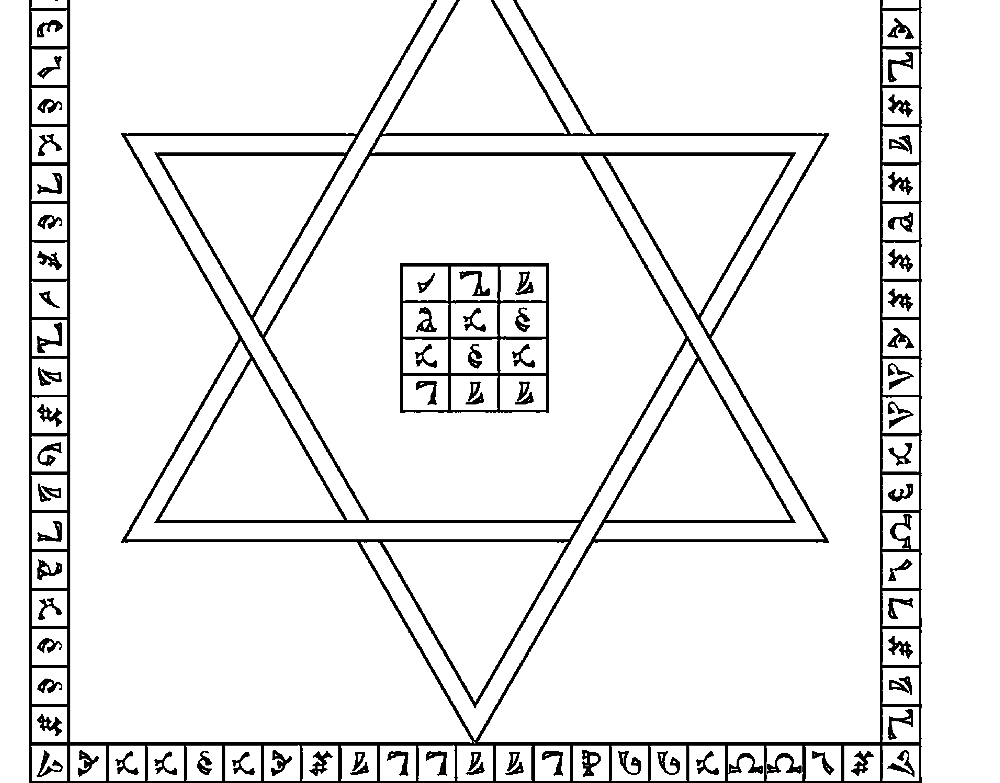

神聖施法桌的桌面由蜜樟、三尺方形做成，再以聖化過的金色或黃色顏料塗色。這應離地一段距離，由四塊刻有真神封印的蠟版支持著。

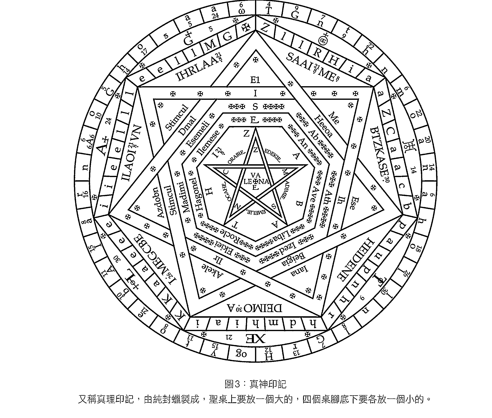

### 圖3：真神印記

又稱真理印記，由純封蠟製成，聖桌上要放一個大的，四個桌腳底下要各放一個小的。

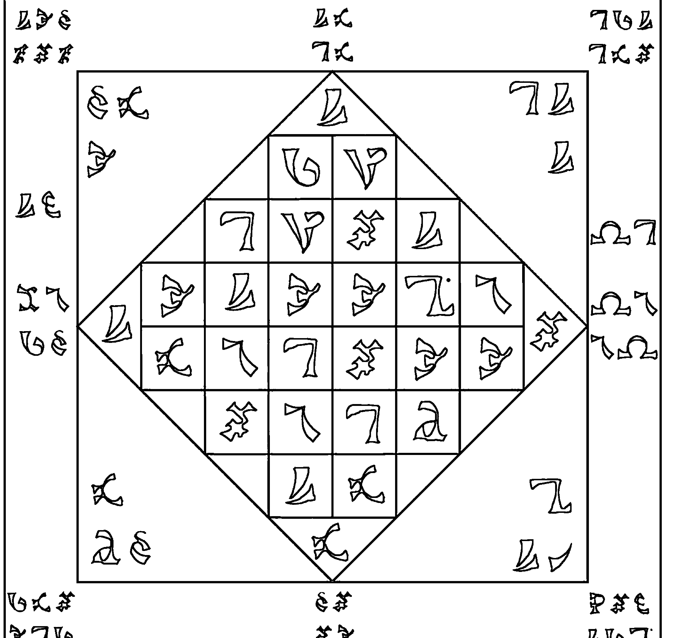

### 圖4：神聖墮盤

神聖墮盤用白紙畫成，藏在一塊布中攜帶。


### 圖5：所羅門指環

米迦勒大天使傳下來的所羅門指環設計圖，一定要用純金製成。


### 圖6：聖桌佈置

聖桌的布置方式，上有真神印記和創世七徽。這張桌子應放在紅絲綢上方，桌腳下放置小的真神印記，並以七彩絲綢覆蓋整張桌子。

近年來，已經確定這些工具由好幾樣是改編自更古老的魔法書就已經收錄的一些工具。例如，真神封印的圖樣設計就可以在好幾個文獻裡找到，最主要的是《宣誓書》（圖7）。

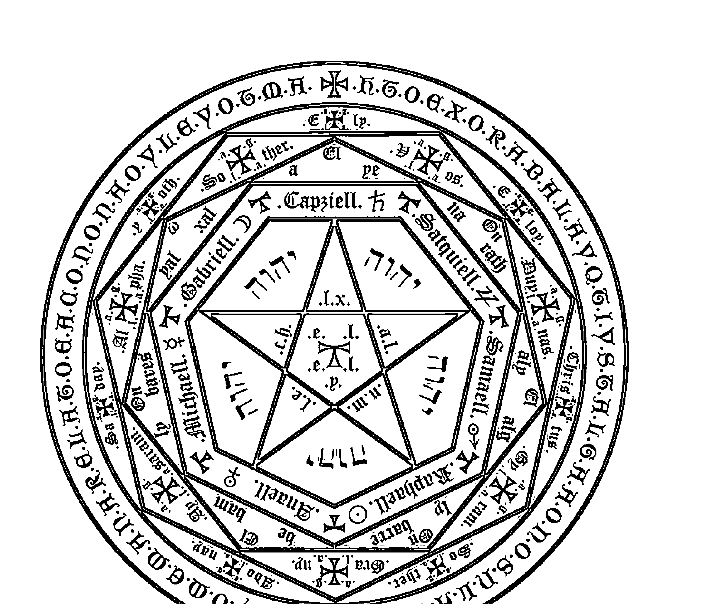

### 圖7：《宣誓書》的印記

真神印記的早期版本，收錄在《宣誓書》中。

就連印記的建造方式似乎都是參考更古老的來源。印記是由蜂蠟製成，且是天使現身的核心位置（如果你有使用水晶或其他物質製成的圓球進行占卜，應放在印記上），這跟《亞伯拉梅林之書》所描述的「七角形蠟版」以及《所羅門王小鑰》所提到的所羅門蠟壇（刻有魔法名稱的蜂蠟版），都有異曲同工之妙，這兩個文獻所說的物品都是用來跟天使溝通（圖8）。

除此之外，你可以看出迪伊的聖桌桌面設計也受到所羅門蠟壇很深的影響。誇張一點，甚至可以說真神封印和聖桌加起來就是所羅門蠟壇的以諾版。

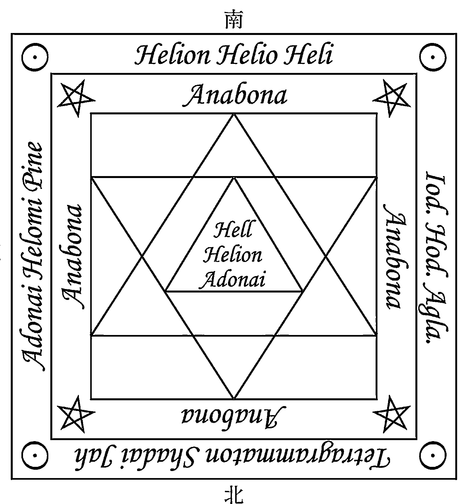

### 圖8：所羅門蠟壇

《所羅門王小鑰》裡收錄的所羅門蠟壇，其設計跟聖桌類似，也跟真理印記一樣是用蜂蠟製成。

另外，聖桌跟《所羅門王小鑰》之《保羅術》的施法桌也有許多相似點（圖9）。

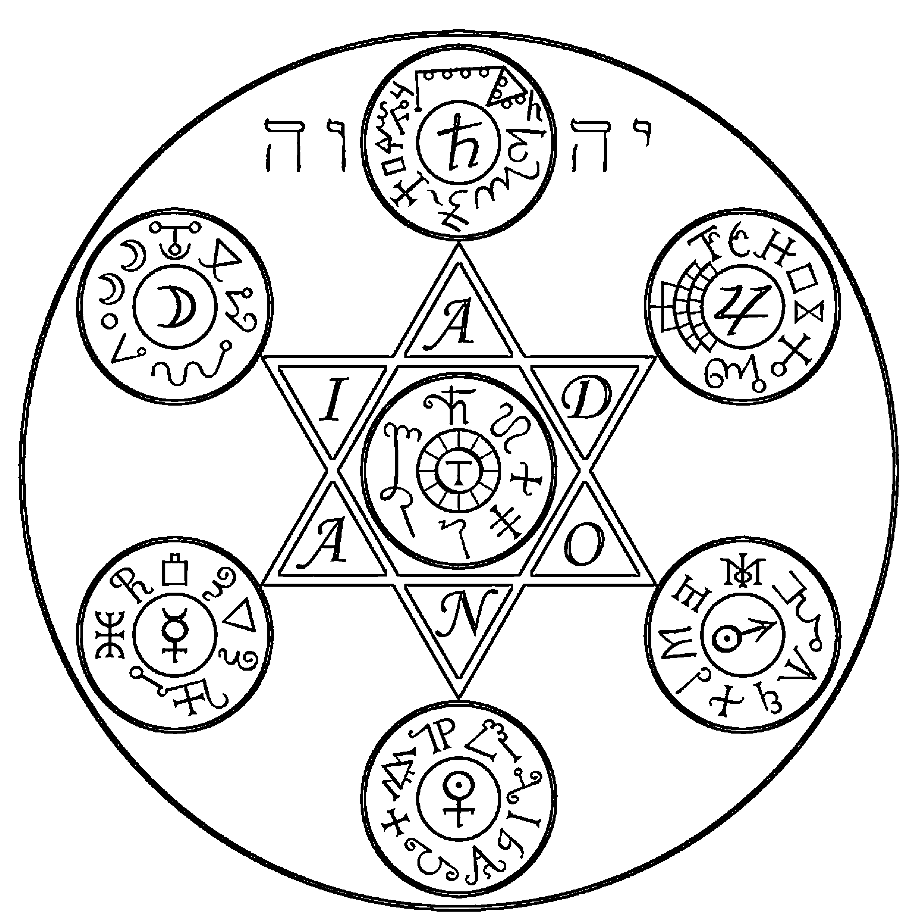

### 圖9：《保羅術》的施法桌

請注意跟聖桌之間的相似點。

當然，以諾魔法所使用到的工具有一些是迪伊的系統獨有。所羅門指環和神聖墜盤雖然都可以追溯到所羅門魔法，其設計圖樣卻沒有明顯的參考先例。創世七徽（圖10到16）跟《七日談》列出的行星大天使有直接的關聯，但其設計也是以諾系統原創：

| 2Ib/b3 | G bb | g. | B 22 | 2.4.6 bbb 246 | b b L b | B rog | Ⓑ |
|---|---|---|---|---|---|---|---|
| 8 b b b2 | b b 8 | G b | GG b | 152 b | 152 b | 52 BBB | B I B |
| q B q | b o o o | B 7 9 | bbb bbb bbb | 11 B 5 | b b b b | b b b | b 8 b3 b |
| b b b b | b15 b b b | b M 166 | 7 △ bb | (b) 5 | G M + | ⌒ | b A 1556 |
| 1 b 2 3 | B 123 | b T b | 4 ⌂ 9 | BBB 6 b | b b 72 F | b | |

### 圖10：金星與阿納爾的徽章

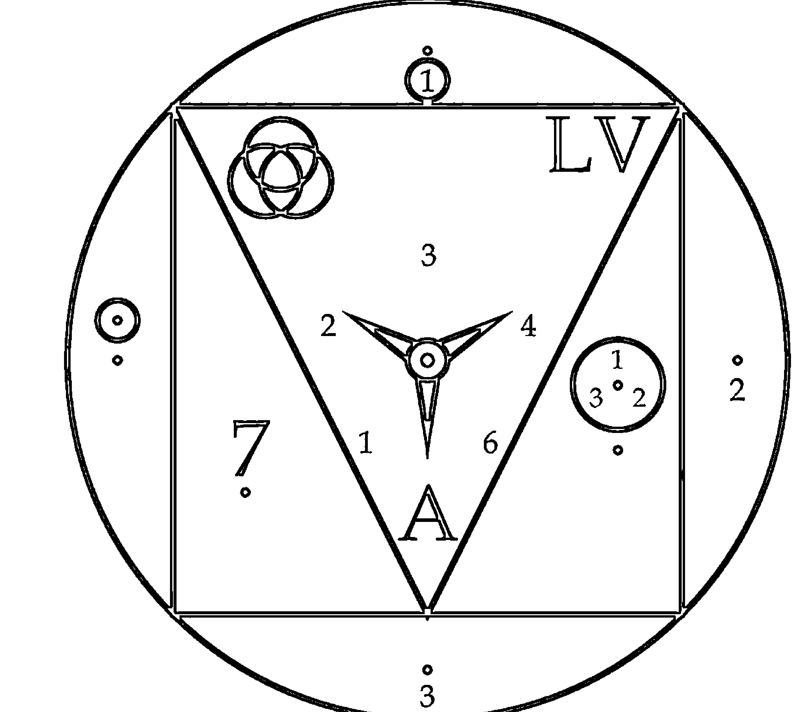

### 圖11：太陽與米迦勒的徽章

### 圖12：火星與薩邇爾的徽章

| 列1 | 列2 | 列3 |
|-----|-----|-----|
| G<br>B†<br>23 | m·30<br>B.9.<br>d·4· | q·q·q<br>B<br>o·g og |
| J<br>B<br>G 33· A | †——†<br>B<br>A——O 9 | E<br>B<br>h go |
| 5<br>b<br>⤙ | d2 id<br>b<br>d 2A | L b<br>30 pp |
| V H b<br>9 22 | q.q · q Q b<br>og a | L b<br>25 d |

### 圖13：木星與薩奇爾的徽章

| 列1 | 列2 | 列3 | 列4 | 列5 |
|-----|-----|-----|-----|-----|
| 2<br>bb<br>2 | b b<br>▽<br>o | 5 3 7<br>b b b | b B<br>G 11 | T·13<br>b b b<br>b 9 |
| b·2<br>B | o 4<br>BB | B 14<br>a | b b.b<br>P.3. | b<br>GO<br>C:V 3 |
| 8 e<br>b | Q·o<br>7<br>b b | ⟺<br>5 | q q<br>b 3 | q·9<br>B<br>L b. 8 |
| go·30<br>B | 9·3<br>b b | q q<br>5<br>°b°b° | d<br>b┼A<br>b | 7·2<br>b·B<br>B B<br>Λ· 8 3 |

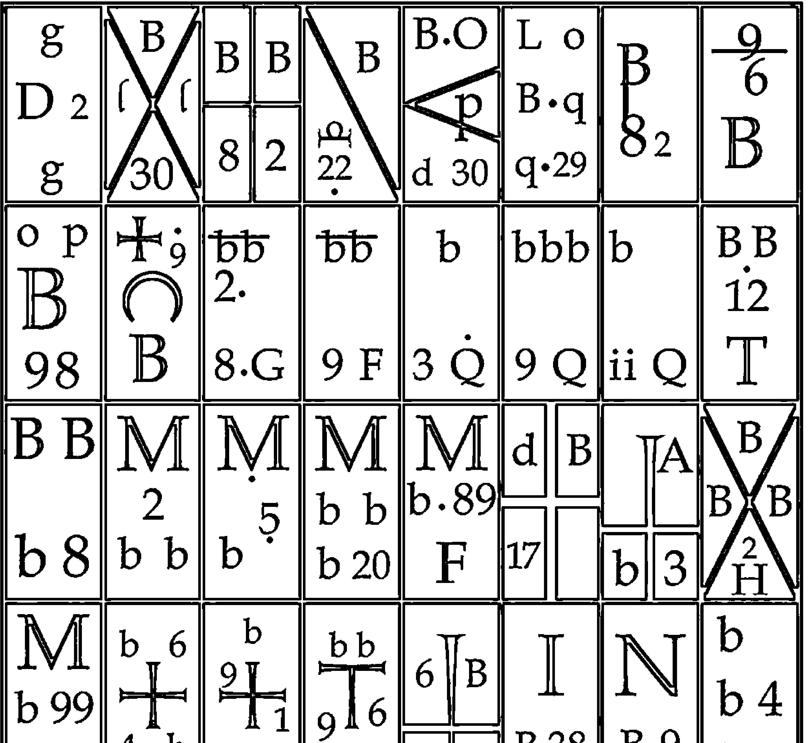

### 圖14：水星與拉斐爾的徽章

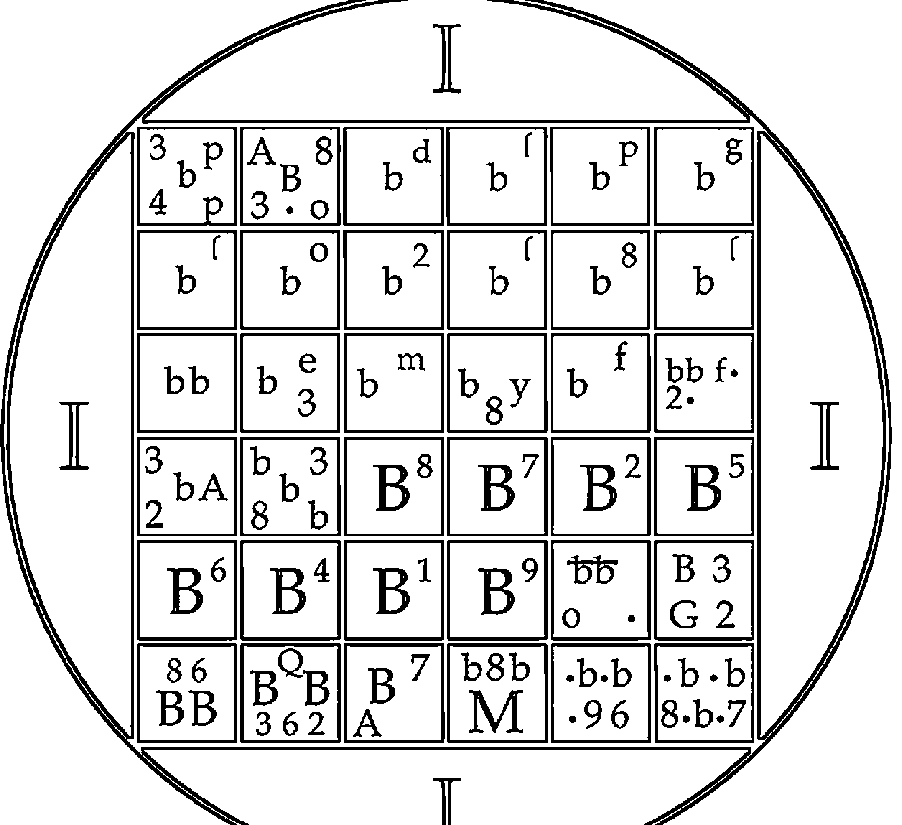

### 圖15：土星與卡西爾的徽章

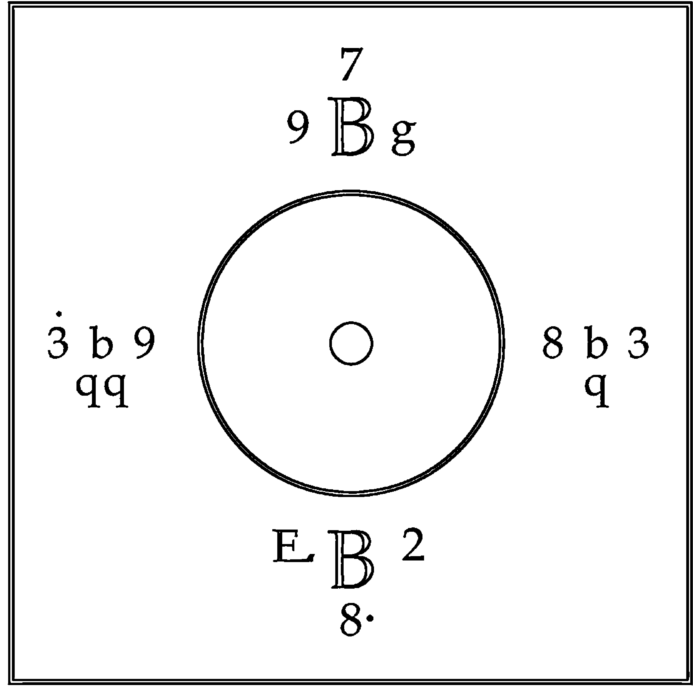

### 圖16：月亮與加百列的徽章

迪伊的日記並沒有說明以諾魔法的工具和設備只能用來召喚日記中所描述的哪些天使。事實上，這些用品可用來召喚任何一位天使。話雖如此，這些物品的象徵意義主要是來自七統天使，體現了所有跟七這個數字有關的神秘主義考量，像是七大行星、每個星期的七天，還有最重要的——聖經創世七日。

七統階級底下有四十九位天使，共分七級，一級有七位，分別是一位君王、一位親王、五位總督，掌管每一顆行星和一星期當中的其中一天。以諾魔法道具上所刻的天使語字母，全都來自這些七統天使的名字，只有真神封印沒有用到天使語字母，而是使用兩組跟七統有關的卡巴拉名稱。我們很快就會討論到這些其他的名稱。

七統天使是迪伊系統獨有的，祂們的名字則是從米迦勒傳授的七張七乘七的表格解碼出來。這些表格統稱為「集合表格」（Tabula Collecta，圖17）。

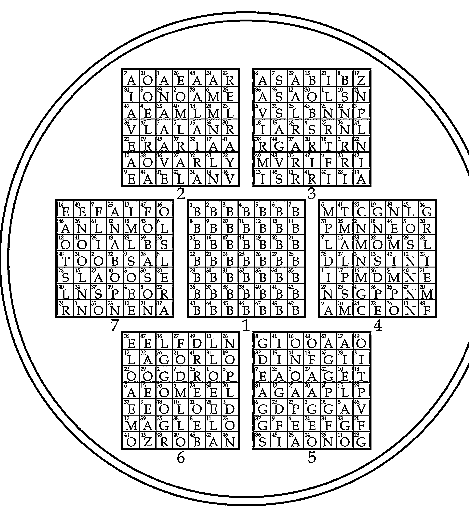

### 圖17：集合表格

七張良善天使的表格。

日記上雖然從未如此說明，但這七張表格其實各分配到特定的屬性：

### 表格一：巧智與智慧

### 表格二：晉升與親王的統領

### 表格三：在會議和貴族之間稱霸

### 表格四：貿易、商業和水

### 表格五：大地的相關特質

### 表格六：空氣及在空氣中移動的一切相關知識

### 表格七：掌管火

理論上來說，任何一張表格都可以用來當作護符，了解或實現該表格象徵的屬性。每張表格還可找到天使的名字，例如表格三第六列的「穆利弗利」(Murifri)就曾出現在迪伊和凱利的某次水晶占卜，為他們提供諮詢。

接著，迪伊聽從指示將這七張表格放進圓形的「良善天使表格」(Tabula Bonorum)進行解碼，根據四十九位七統天使的行星屬性分門別類(圖18)。

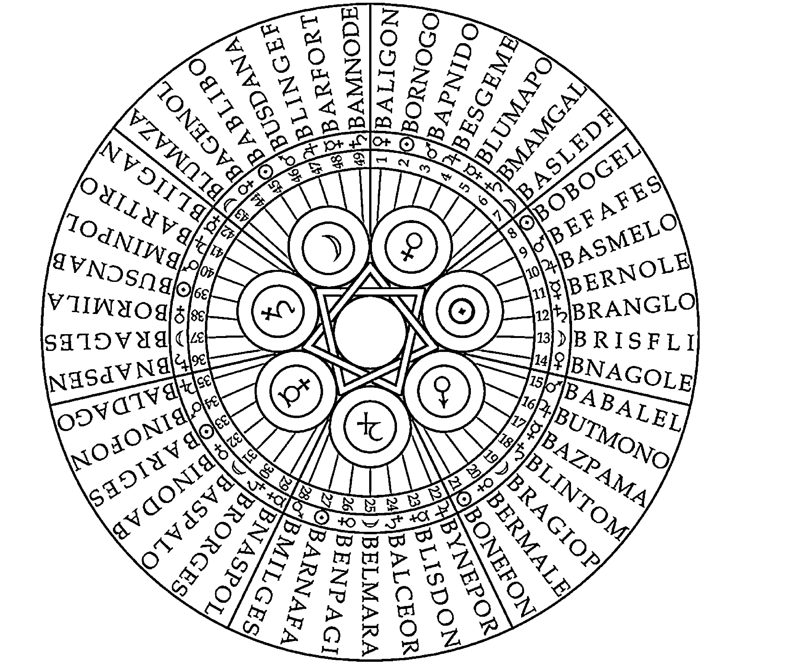

每個行星又再被分為七個子行星，因此舉例來說，星期五的君王（Baligon）是金星的金星的天使，他的親王（Bagenol）是金星的月亮的天使，而其餘五位總督則分別是金星的土星、水星、木星、火星和太陽的天使。

除此之外，迪伊和凱利也學到要如何從良善天使表格中，解碼每個行星的四十二位大臣的名字。這些大臣被分成六組，一組七位，到了他們的行星每星期所掌管的那一天，每一組會各負責值班四個小時。迪伊和凱利經由一連串的靈視，得知了大臣具備的各個功用。他們大部分都擁有各種自然力量，諸如天氣、金屬和四大元素，也可以指揮邪靈及管轄君王的興衰等等。召喚特定行星的君王或親王（或五位總督之一）時所需製作的護符，也會使用到大臣的名字。

整個七統階級（至少在迪伊的時代）是由金星的君王和親王（Baligon 和 Bagenol）所統治，因此他們分別又擁有卡爾瑪拉君王（King Carmara）和哈戈內爾親王（Prince Hagonel）這兩個頭銜。雖然迪伊的日記裡並沒有提及，但我覺得負責統領的君王和親王應該會隨著統領該時代的大天使一起更換輪替。在迪伊的時代，阿納爾是統領的大天使，如果按照《阿巴太爾魔法書》的四百九十年任期來算，現在統領的大天使就是拉斐爾，而七統階級的統治者則是水星的君王與親王（Bnaspol 和 Blisdon）。然而，我們並不知道他們的頭銜是否跟前面的統治者一樣，還是他們有自己的獨特頭銜。

最後，我們必須再次回到真神印記，討論印記上的天使階級。封印（圖3）上寫滿看似應為天使語的名字，但這些其實是用密碼寫成的希伯來卡巴拉名字。

## 七個秘密神名

首先，我們先來看看真神印記最外圈的七角形所列出的七個神名。這些名字是以圖19的表格形式交給迪伊。

這些神名看起來雖然很怪異，卻不是天使語，而是取自生命之樹七個大天使的希伯來名字；從庇納（Binah）到易首德（Yesod）的這七個大天使即是聖經所說的「寶座前……上帝的七靈」（《啟示錄》4章5節）。從表格的左上角往下讀，就會找到：沙法爾、薩基爾（Zedekiel）、卡麥爾、拉斐爾、漢尼爾、米迦勒和加百列這幾位天使的名字。最後一格是一個臂長相等的十字符號，代表地球（封印的中心點也有相同的十字架）。

## 七個無法發音的神名

在真神印記最外圈的七角形內側，又有七個神名，天使說是「無法發音的」。這些名字也用表格的形式交給了迪伊，如圖20。

我們可以清楚看出這些名字為何無法發音，因為當中有好幾個字母其實只是數字加上點點的符號。然而，這些怪異的符號其實代表了印記最外側的圈圈裡所對應的字母：21加上8等於「El」這兩個字母的組合；8、26、30等於「L」這個字母。El 和 L 正是希伯來文和天使語當中的神名之一。

| Z | 1 | 1 | R | H | i | a |
|---|---|---|---|---|---|---|
| a | Z | C | a | a | c | b |
| p | a | u | p | n | h | r |
| h | d | m | h | i | a | i |
| k | k | a | a | e | e | e |
| i | i | e | e | 1 | 1 | 1 |
| e | e | 1 | 1 | M | G | ⸸ |

### 圖19：七位輝耀大天使的表格

這些名字出現在真神印記最外圈的七角形。

此外，這張表格也可解碼一些發得出音的希伯來天使名。這些名稱很簡單，就是七大行星的希伯來文再加上「el」這個字尾。從表格的左上角開始，以左下對角線的方向逐一往下讀，就會找到七位行星天使的名字：薩巴提爾 (Sabathiel)、薩基爾、瑪迪米爾 (Madimiel)、西米利爾 (Semeliel, Semeshiel 的變形)、挪加爾 (Nogahel)、科卡比爾 (Corabiel, Kokabiel 的變形)及黎瓦納爾(Levanael)。這些天使直接掌管行動界(Assiah)的行星。他們解碼之後的名字拼法可在真神封印中央找到，圍繞著地球的十字符號。

| S | A | A | I²₈ | E | M | E⁸ |
|---|---|---|---|---|---|---|
| B | T | Z | K | A | S | E³⁰ |
| H | E | I | D | E | N | E |
| D | E | I | M | O | ³⁰ | A |
| I²⁶ | M | E | G | C | B | E |
| I | L | A | O | I²₈ | V | N |
| I | H | R | L | A | A | ²¹₈ |

### 圖20：七位行星大天使的表格

這些名字出現在真神印記最外圈的七角形內側。

其他填滿印記的天使名諱也都是從行星主宰天使的這張表格解碼出來，只要從不同的方向以對角線閱讀，就能找到每一個名字。這些天使今天統稱為「光之家族」，他們是光的兒女及其兒女的兒女。我們並不完全清楚這些天使在七統階級裡的準確地位，迪伊的日記只有提到他們一次，說他們直接伺候七統王室。此外，迪伊最著名的一些天使（他們在以諾體系的後兩個階段扮演關鍵角色）也可以在印記上找到，如亞芙(Ave)、瑪迪米(Madimi)和伊利米思(Illemese)。

七統制度並不會過於複雜。如果很多人認為這套系統很難理解，也只是因為那些魔法方陣和從方陣解碼天使名的方法很複雜而已。然而，施展魔法並不需要事先學會那些解碼方法，因為現在所有的名字都已全部解碼出來了。

這套系統的實踐方式也非常直截了當，跟文藝復興的天使魔法相去不遠，因為它的七個大天使是來自《七日談》，整個體系也跟《阿巴太爾魔法書》有強烈的連結。大天使跟《阿巴太爾魔法書》的奧林帕斯七靈一樣，會輪流掌管宇宙，且《阿巴太爾魔法書》的「四十九句格言」所描寫的玄秘哲學，也可視為迪伊七統魔法的必要入門文本。

要召喚一位七統天使，你需要前面提到的道具和設備。你必須準備聖桌和五份真理印記，四份小的用來放在桌腳下、一份大的用來放在桌面上，接著再用七彩絲綢覆蓋這些東西（七彩代表的是與召喚和溝通有關的水星）。創世七徽可以用精煉過的錫製作，然後擺在聖桌上，或者用聖化過的金色或黃色油漆塗在桌面上。

你也必須製作你想召喚的君王和親王的護符，還要製作另一張護符，寫上伺候君王與親王的四十二大臣名字。坐在聖桌前方時，你應手持王室天使的護符，腳踩四十二大臣的護符。召喚君王和親王的咒語可在迪伊的日記中找到，念誦咒語，你所指定的天使便會現身在真理印記之上。

## 少了什麼？

許多以諾魔法的相關研究都指出，迪伊的紀錄裡少了一部分關鍵資訊（這通常都怪罪到一名女僕的身上，因為據說她在迪伊過世多年後發現他的日記，但是因為不知道這些文獻的重要性，竟把好幾頁拿去當作派的吸油紙）。然而，缺少的資訊其實比預期的少得多，而且雖然有一些遺漏的部分，或是迪伊的日記沒有多做描述的部分，我認為這些並不會影響此魔法的施展。

若真要說這個體系有少了什麼重要的資訊，那就是迪伊曾提及一兩次、但是現存的日記卻完全找不到插圖的一顆特殊「球體」（從日記中提及球體的段落可看出原本確實有插圖）。根據迪伊所說，這顆球體是一幅插圖，七統護符所需的某些字母可以從中尋找。球體上方有一個卡爾瑪拉君王的模型；球體內部有七位七統君王的名諱，還有些很有可能是光之家族天使印記的符號（幸好，這些印記並未遺失，因為迪伊在日記別處也有記下來）。此外，還有其他字母和數字用某種方式附加在君王的名字之中，有一些是正著寫，有一些是倒著寫。可惜，這些字母都已不復存在。

圖21是迪伊為其中一位君王所繪製的七統護符，正中央是直接服侍該君王的光之家族天使的印記，君王的名諱寫在印記周圍，而最外圈則寫有更多字母（有些正著寫，有些倒著寫）。
我個人是相當希望能夠得到那幅球體插圖，這樣就能正確繪製出其他君王和親王的護符。然而，我也堅信這項資訊倘若是整個系統的關鍵之一，天使們一定不會讓資訊遺失的。至少，迪伊也一定會把插圖記在他至今尚存的個人魔法書，可是書中並沒有提及之。無論如何，我們還是有跟每位君王有關的光之家族天使的印記，真正缺乏的就只有護符外圍的那些特定字母。但是，我不認為少了這些字母，護符就不能發揮作用。

## 第二階段：《上帝講話之書》和蓋博法爾

迪伊得到《七行星的奧秘》之後，便換成大天使拉斐爾現身，揭露了這個體系真正的核心：神聖的《上帝講話之書》，天使語寫作「Loagaeth」。

## 魯道夫皇帝

魯道夫二世 (Rudolph II, 1552年7月18日 – 1612年1月20日) 是克羅埃西亞、匈牙利與波希米亞的國王及奧地利大公，並在一五七六年即位成為神聖羅馬帝國的皇帝。然而，他跟其他皇帝不同，對政治沒什麼興趣，也不太會堅守自己的權力。很多人認為，他對皇帝的角色與職責興趣缺缺。他不問世事，大部分的注意力都放在藝術、神秘主義、煉金術和玄祕學。

迪伊和凱利在歐洲各處旅行時，曾待在克拉科夫很長一段時間，跟可能成為他們貴人的亞伯特・拉斯基 (Albert Lasky) 閣下或親王在一起。其間，天使敦促他們前往布拉格，到魯道夫的宮廷呈上自己的水晶占卜成果。然而，拉斯基最後並沒有贊助他們的旅程，於是兩人只好自己跋涉到布拉格。可惜，迪伊好不容易見到這位皇帝，他對迪伊的日記卻沒什麼興趣，對迪伊的那些「上帝的訊息」更毫無熱情。兩人待在布拉格期間，他似乎都不怎麼搭理他們。據說，凱利後來成功靠自己的煉金配方將卑金屬變成黃金，這才引起皇帝的興趣。

迪伊回到英國，而凱利則留下來，成為魯道夫宮廷的煉金術士。凱利在這方面是否成就非凡，我們並不知道，但我們倒是知道魯道夫封他為男爵，還給了他數座銀礦坑，因此凱利在布拉格度過了備受尊崇的餘生。魯道夫對政治不感興趣，雖然導致許多人認為他是一個沒有實質影響力的統治者，但今天我們知道，就是因為他選擇把焦點放在人文藝術上，他的王國內才發生一次迷你文藝復興，科學革命也得以在他去世數百年後橫掃全球。

現在，你已經知道《上帝講話之書》就是以諾天籤、擁有七道封印的《生命之書》、真正的《拉吉爾之書》。書中收錄了四十九張表格，大部分前後都有四十九乘以四十九的方格。這些格子寫滿字母，號稱是全新的聖經教義。新約之於舊約，就好比可蘭經之於新約，而《上帝講話之書》也是一個全新的約，據天使所說，可以改正當前所有的信仰，使它們互相寬容。天使承諾，把新教義帶來這個世界（別忘了，這個教義曾經傳給以諾，後來在大洪水的時候遺失），便象徵聖約翰在《啟示錄》所說的末日開始。新教義應該要先在地球各地傳播一段時間，接著最終的善惡大對決才會展開。

問題是，這本書完全是以天使語寫成，天使也沒有提供翻譯。這是因為，新教義並不是要在講道壇上講給一般無知的大眾，而是只能透過神秘主義者認識，學習如何解開書中奧秘，直接得到天使的指導。

因此，天使把其中四十八張表格（表格二到四十九）的鑰匙交給兩人，用來解鎖。第一張表格屬於基督（即邏各斯〔Logos〕），人類和天使都無法開啟（同樣參見《啟示錄》第五章關於解除書之封印的部分）。

可以打開《上帝講話之書》其餘四十八張表格的鑰匙，統稱天使四十八鑰，實際上是完全以天使語寫成、富有詩意的咒語，可用來召喚個別表格的天使。

根據直接隸屬在大天使加百列底下的天使，如何正確使用《上帝講話之書》及天使四十八鑰的這套系統，就稱作「蓋博法爾」（Gebofal，這個字從來沒有翻譯出意思來）。蓋博法爾似乎跟猶太教的「數算俄梅珥」習俗有關，而此習俗又和卡巴拉的「理解的五十道門」有關。因此，我現在要先花一點篇幅解釋一下這個猶太傳統。

俄梅珥（Omer）是計量穀物的一種單位。數算俄梅珥在妥拉（Torah）的《利未記》（Leviticus）和《申命記》（Deuteronomy）當中都有規定，是一個和逾越節（Passover）相關的五十天神秘習俗。這個習俗的名稱源自《利未記》23章15-16節：

> 你們要從安息日的次日，就是獻那捆莊稼為搖祭的那日起，計算足足的七個安息日。到第七個安息日的次日，共計五十天。

《申命記》16章9-10節也有囑咐同一件事：

> 你要計算七個七日：從你用鐮刀開始收割莊稼時算起，一共七個七日。你要向耶和華——你的上帝守七七節。

《出埃及記》（Exodus）提到這項為期七週的習俗背後的意義。在埃及度過逾越節後，希伯來人開始進入荒野。在接下來的五十天，他們過得很艱辛，除了被法老的軍隊窮追不捨，差點受困在紅海岸邊，還得忍受數週在險惡的沙漠環境中跋涉的苦難，完全不曉得應該往哪裡去，又該如何生存。在第五十天，他們抵達西奈山，摩西在此收下十誡，正式訂下與上帝的約。

數算俄梅珥不只是用來紀念出埃及經歷的宗教習俗，也是在靈性層次上重現這個事件的神秘習俗。從逾越節次日開始，神秘主義者必須把自己脫離凡人的世界（象徵埃及）。當你這樣做時，「埃及人」會追著你，企圖把你抓回去。此外，你也會面臨自己的內在阻礙，必須跨越潛意識習慣的汪洋，忍受可怕的靈性未知荒野。

在這五十天期間，神秘主義者必須練習冥想，目標是讓自己脫離俗世的五十道不潔之門，藉此進入天界相對應的五十道理解之門。這些門是以生命之樹命名的（圖22）：下方七個輝耀各自分成七道門，例如慈悲（Chesed）這個輝耀可再分為仁慈的仁慈、仁慈的（Gevurah）、仁慈的悌菲瑞特（Tiphareth）、仁慈的聶札賀（Netzach）、仁慈的易首德（Yesod）、仁慈的瑪互特（Malkuth）等門。每一道門都象徵上帝的一個面向，並透過舊約聖經某個先知經歷的事件來展現該面向。繼續以慈悲這個輝耀為例，仁慈的七道門對應到的就是亞伯拉罕，因為當天使阻止他犧牲自己的兒子以撒時，便是上帝向他展現了仁慈。要進入仁慈的這七道門，神秘主義者必須透過冥想思索跟亞伯拉罕有關的不同聖經故事所要傳遞的教訓。

猶太神秘主義者從仁慈的仁慈之門開始數算俄梅珥，一天進入一道門，最後在第四十九天來到王國的王國之門。開啟下方七個輝耀的四十九道門之後，神秘主義者就算打開了所有直接通往理解的門。然而，他不可以打開第五十道門，因為這道門位於天國的純神性之內。那道門只能從裡面開啟，過去曾經打開讓摩西通過，下一次要等到彌賽亞在末日期間需要通過時，才會再度開啟（後來基督教堅稱此門也曾開啟讓耶穌升天）。因此，數算俄梅珥的目標並不是要進入理解的領域，而是要將我們和天國之間的每一道門打開，讓神聖的啟示和見解降臨到我們手中，就像出埃及時摩西到西奈山上收下十誡一樣。

現在，說明完這個習俗之後，讓我們聊聊蓋博法爾。《上帝講話之書》的第一張表格是基督／邏各斯的表格，體現宇宙最初的創造能量。《約翰福音》第一章寫道：

> 太初有道，道與上帝同在，道就是上帝……萬物都是藉著祂造的。

表格二到十九體現的是創世的前六天。用來開啟這十八道門的天使之鑰咒語明確點出此意涵，每一個咒語都描述了宇宙某一面向的創造，也說明了上帝指派哪一位天使掌管該面向。咒語詩中也有許多天啟意象，似乎強調這些統治天使在末日時都會一起玩樂。

最後，剩下的三十張表格代表的是創世第七天，體現了此時此刻創造完成的宇宙，全部都是反覆使用同一個咒語開啟。天使解釋，這些表格代表了從上帝到地球的三十重天，居住在每一重天的天使都負責掌管一個特定的地理區域，或稱「地球各區」，後面很快就會談到。

整組來看，《上帝講話之書》的四十九張表格似乎代表了宇宙間的各種星象與元素能量，從第一張表格的至高神性開始，一直往下來到第四十九張表格的實體地球。迪伊的天使常把這些表格稱作「理解之門」或「智慧之門」，指的都是庇納和侯克瑪這兩個輝耀所在的天國領域。

蓋博法爾是一個為期四十九天的過程，施行者會從人類可達的最高點(表格二)一路回到物質世界(表格四十九)。以諾系統的水晶占卜道具都會使用到，因為念誦天使之鑰咒語會使靈性導師一一現身，闡述沒有翻譯過的每張表格當中的奧秘。天使也告訴迪伊，他可以進入理解之門造訪天使的城市，就像以諾曾經做過的一樣。

每天，施行者必須把聖書打開至對應的表格，念誦以諾藏文(收錄在迪伊的日記中)，接著再念誦該表格的天使之鑰咒語，每個流程一天進行三次。之後發生在施行者與召喚現身的天使之間的所有事情，必須嚴格保密不外洩。最後一張表格會在第四十八天開啟，施行者在第四十九天應會直接從上帝那裡收到啟示。

蓋博法爾儀式中並沒有說明「地球各區」；這似乎是那種要透過儀式的進行才會得到的玄秘智慧。迪伊在下一階段會得到的地球大表格也是如此。事實上，地球各區與地球大表格具有直接的關聯。

### 第三階段：地球大表格（守望台）

地球各區揭示後，迪伊當初會想得到這套魔法的真正動機也揭開了。在這之前，一切都顯得十分崇高、靈性。然而，迪伊全心全意地堅信著英國是上帝在地球上的王國，英國有權建立帝國，統治整個世界。別忘了，迪伊可是英國的第一個間諜，經常在造訪他國時幫女王進行秘密行動。老態龍鍾的巫師帶著一名可疑的煉金術士到處旅行，這樣的形象是最好的掩護。

地球各區系統保證讓迪伊能夠直接影響統治已知世界每一個國家的黃道守護天使，同時也保證迪伊的靈媒可以遠距觀看那些國家當下所發生的事，以及各國是否藏有任何秘密。他只需要念誦三十重天之鑰的咒語、代入他想召喚的重天名稱，對應的門就會開啟。

每一重天都包含了地球的三個區域，但最低的重天則包含四個區域，且另外還有一個「隱藏」區域，因此地球總共分成九十二個區。每一區都有一個由七個字母組成的名稱(圖23)。

### 圖23：寫有九十二個區域的地球大表格

地球九十二區的名稱排列在這張圖表中，創造出一個二十五格乘以二十七格的大表格。

這就是知名的地球大表格（圖24）的由來。九十二區的名稱便是以圖中所示的方式全部放在這張魔法表格裡的。大表格本身又可分作四大象限，稱為「守望台」。

| r | Z | i | l | a | f | A | u | t | l | p | a | e | b | O | a | Z | a | R | o | p | h | a | R | a |
|---|---|---|---|---|---|---|---|---|---|---|---|---|---|---|---|---|---|---|---|---|---|---|---|---|
| a | r | d | Z | a | i | d | p | a | L | a | m |   | u | N | n | a | x | o | p | S | o | n | d | n |
| c | z | o | n | s | a | r | o | Y | a | u | b | x | a | i | g | r | a | n | o | o | m | a | g | g |
| T | o | i | T | t | x | o | P | a | c | o | C | a | o | r | p | m | n | i | n | g | b | e | a | l |
| S | i | g | a | s | o | m | r | b | z | n | h | r | r | s | o | n | i | z | i | r | l | e | m | u |
| f | m | o | n | d | a | T | d | i | a | r | i | p | i | z | i | n | r | C | z | i | a | M | h | l |
| o | r | o | i | b | A | h | a | o | z | p | i |   | M | o | r | d | i | a | l | h | C | t | G | a |
| c | N | a | b | r | V | i | x | g | a | z | d | h | ř | O | c | a | n | c | h | i | a | s | o | m |
| O | i | i | i | t | T | p | a | l | o | a | i |   | A | r | b | i | z | m | i | i | l | p | i | z |
| A | b | a | m | o | o | o | a | C | u | c | a | C | O | p | a | n | a | B | a | m | S | m | a | l |
| N | a | o | c | o | T | t | n | p | r | a | T | o | d | O | l | o | p | i | n | i | a | n | b | a |
| o | c | a | n | m | a | g | o | t | r | o | i | m | r | x | p | a | o | c | s | i | z | i | x | p |
| s | h | i | a | l | r | a | p | m | z | o | x | a | a | x | t | i | r | V | a | s | t | r | i | m |
| m | o | t | i | b |   |   | a | T | n | a | n |   | n | a | n | T | a |   |   | b | i | t | o | m |
| d | o | n | p | a | T | d | a | n | V | a | a | a | T | a | O | A | d | u | p | t | D | n | i | m |
| o | l | o | a | G | e | o | o | b | a | u | a |   | o | a | l | c | o | o | r | o | m | e | b | b |
| O | P | a | m | n | o | O | G | m | d | n | m | m | T | a | g | c | o | n | x | m | a | l | G | m |
| a | p | l | s | T | e | d | e | c | a | o | p | o | n | h | o | d | D | i | a | l | e | a | o | c |
| s | c | m | i | o | o | n | A | m | l | o | x | C | p | a | t | A | x | i | o | V | s | P | s | И |
| V | a | r | s | G | d | L | b | r | i | a | p | h | S | a | a | i | z | a | a | r | V | r | o | i |
| o | i | P | t | e | a | a | p | D | o | c | e |   | m | p | h | a | r | s | l | g | a | i | o | l |
| p | s | u | a | c | n | r | Z | i | r | Z | a | p | M | a | m | g | l | o | i | n | L | i | r | x |
| S | i | o | d | a | o | i | n | r | z | f | m |   | o | l | a | a | D | a | g | a | T | a | p | a |
| d | a | l | t | T | d | n | a | d | i | r | e | r | p | a | l | c | o | i | d | x | P | a | c | n |
| d | i | x | o | m | o | n | s | i | o | s | p | a | n | d | a | z | N | z | i | V | a | a | s | a |

### 圖24：地球大表格

迪伊當初得到的地球大表格如圖所示。天使對迪伊和凱利這樣解釋：地球各區雖然能夠讓你影響世界各地的某一區（也就是某一國），地球大表格卻能讓你影響地球的某一象限。

從日記中的敘述來看，這些象限似乎比較是以地緣政治、而非地理方位來區分的。從迪伊的時代到今天，世界區分東、西、南、北文明的方式一直是以歐洲為中心點。因此，西守望台掌管的是英國、希臘、羅馬、西班牙、法國等西方國家（今天，北美也包含在內）；東守望台掌管的是中國、日本、西藏、蒙古、印度等東亞國家，還有所謂的中東地區；北守望台掌管的是丹麥、芬蘭、冰島、挪威和瑞典等北歐國家；最後，南守望台掌管的是澳洲、紐西蘭、斐濟、衣索比亞和大部分的非洲國家（當然，今日的南美也算在內）。

把地球各區放進地球大表格（如圖所示）之後，這些字母就會組成各式各樣的神名以及跟四個方位和地緣政治區塊有關（不是跟四大元素有關！）的天使名諱（圖25）。

每一個守望台的天使都擁有相同的力量。因此，舉例來說，如果你需要召喚醫藥天使，就得召喚掌管病人居住地區的那些天使。假如他們住在中國，你就要召喚東守望台的天使；如果是住在美國，你就要召喚西守望台的醫藥天使；在非洲的話，就要召喚南守望台的天使；若在挪威，則要召喚北守望台的天使。

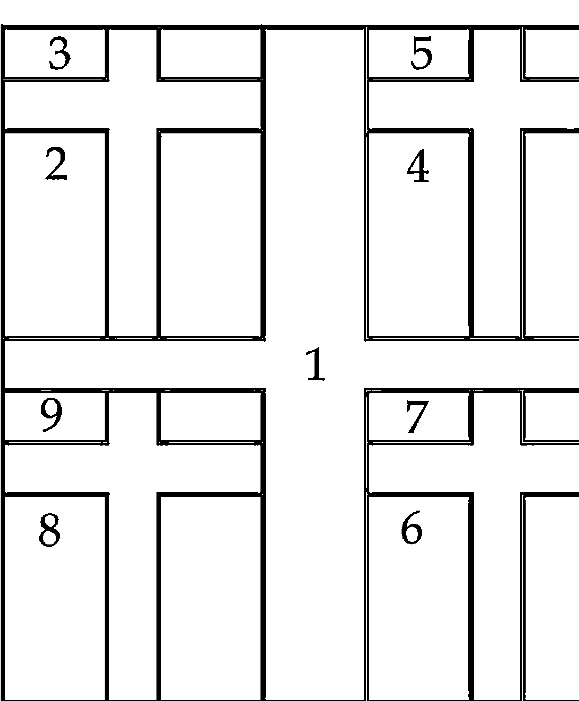

- 1. 人類知識與諮詢
- 2. 醫藥
- 3. 物質混合
- 4. 金屬與寶石
- 5. 運輸
- 6. 四大元素
- 7. 發掘秘密
- 8. 轉變
- 9. 手作工藝

這張空白的守望台圖表是所有四座守望台共用的結構。如圖所示，每一座守望台又可再分成四個子象限，並有標出神名和天使持有的力量。首先，每一座守望台正中央的大十字架水平臂上都有三個神名，掌管該守望台的階級。因此，整個地球大表格共有十二個這樣的神名（可能是對應了黃道十二宮）。

每一座守望台的大十字架上，還可找到天啟二十四長老其中六位的名字；天啟二十四長老以成對的方式代表以色列的十二支派。他們能夠傳遞知識，對人類事務提供判斷和意見（支派長老的職責）。要召喚他們，你必須在大十字架的正中心以漩渦方式找出一個神名。在迪伊的年代，天啟二十四長老和黃道十二宮有關，兩位長老對上一個星座。迪伊也很有可能是這樣想的，但是他似乎認為這不需要特別說明，因此日記中沒有提到。

每座守望台的四個子象限都各有一個耶穌受難的十字架樣式，每個十字架上都有兩個神名，可以用來召喚十字臂下方的天使。

位於左上象限的是醫藥天使，還有數個可造成疾病的惡魔名諱。

位於右上象限的是寶石天使，知道如何找到、蒐集、使用金屬和寶石，以及金屬和寶石的屬性。沒有記載這裡的惡魔擁有何種能力。

位於左下象限的是轉變天使（與惡魔）。迪伊並沒有明確說出「轉變」是什麼意思。然而，守望台天使大部分似乎都有跟煉金術相關的能力（金屬、寶石、醫藥等），因此可以假定這些天使的能力和煉金變化有關。

位於右下象限的是四大元素天使（與惡魔）。請注意，地球大表格中唯一具有元素本質的天使，就只有每一座守望台的右下象限所列出的四位天使。在迪伊的時代，四大元素主要是出現在跟煉金術相關的議題上（一部分的原因要歸功於知名的醫生兼神秘主義者帕拉塞爾斯），對於四組三分主星來說只是次要的星象屬性。我們從煉金術歸結出四大元素的屬性：熱、冷、濕、乾。迪伊很有可能也是這樣理解四大元素。

在每一個子象限的耶穌受難十字臂上方，又可以再找到一個天使的名諱。雖然十字臂上方就只有短短一列字母，但是只要把前一位天使的名字重新排列，就能拼出每位天使的名字。左上象限的天使擅長混合自然物質；右上象限的天使能夠把各種事物（人或許也可以）運輸到其他地方；左下象限的天使擅長手作工藝（亦即任何用手完成的作品，如繪畫、雕刻、木工、石匠，乃至於建造、修理機器）；右下象限的天使可以發掘任何人的秘密。這些天使全都沒有相對應的惡魔名字。

要召唤这四组天使，你必须取十字臂上方的四个字母，再从连结四座守望台的超大十字架中取一个字母放在四个字母的最前面，藉此拼出一个神名。迪伊将这个超大十字架称作「黑十字」，很有可能是因为它代表了炼金术的黑龙，也就是腐败物质。黑十字上的字母大多数都可以用来组成耶稣受难十字臂下方的恶魔名讳；此外，借用黑十字的几个字母，还能拼出掌管十字臂上方那些天使的神名。

恶魔名和神名都能使用一个称作「黑十字」的东西拼出来，这听起来似乎有点矛盾。然而，我认为这也是地球大表格炼金术象征意涵的一部分，因为神名就代表可从腐败物质之中提炼出来的不朽灵体（即水银），而恶魔代表的当然就是腐败本身。

| E | X | A | R | P |
| H | C | O | M | A |
| N | A | N | T | A |
| B | I | T | O | M |

图26：合一表格

黄金黎明协会的学生都知道黑十字的另一个形式：合一表格（图26）。迪伊的系统里并没有所谓的「合一表格」，但此图表确实出现在他的日记中，被天用来教导迪伊如何把地球各区的其中三区——雷克札夫（Lexarph）、寇马南恩（Comanan）和塔比通姆（Tabitom）——拆解放到黑十字上，仅此而已。因此，迪伊纯粹主义者完全忽视了合一表格。我个人认为合一表格也具有效力，因为黑十字既然象征物质渣滓里固有的灵体，合一表格也象征四大元素里固有的灵体（但是要记住一点，那就是黄金黎明使用合一表格的用途跟迪伊系统完全不一样）。

使用地球大表格不是只要布置道具、召唤天使这样就完成了。迪伊描述了一个为期十九天的实施过程，可以让施行者一次跟所有地球大表格的天使建立永久的连结。之后，他可以随时随地召唤天使。

纪录没有提供任何召唤天使用的咒语，因为迪伊被指示要自己写。有一位天使告诉迪伊这句著名的话：「善意才能使咒语发挥作用。」因此，迪伊应自行创作《祈求之书》（Book of Supplication），收录用来召唤地球大表格每一组天使的咒语。每组天使都有四则咒语，用于四座守望台。因此，总共要有三十六篇祷文，另外再加上万军之主（YHVH Tzabaoth）以及地球大表格十二个主要神名的祷文一篇。迪伊后来确实有写了自己的《祈求之书》，收录在杰弗瑞·詹姆斯的《约翰·迪伊博士的以诺魔法》。

> 善意才能使咒语发挥作用。

以下尽可能简短地叙述迪伊应遵循的十九天实施过程：

1.  前四天，迪伊只需要使用地球大表格的十二神名来诵念祈求万军之主的祷文，一天三次。他要用这些名讳祈求上帝派遣守望台的天使给他，赋予他天使的恩典。
2.  在接下来的十四天，相同的祷文同样一天诵念三次，另外也要增加祈求守望台天使的祷文。多年来，以诺魔法的学者不断争论这三十六则咒语是怎么在这十四天之中分配的，但是要平均分配所有咒语是不可能的，而且迪伊的天使从来就没有说，咒语应该平均分配在这十四天诵念。我认为，每次祷告时，施行者都必须念诵所有三十六则咒语，每日三次，持续十四日。
3.  在第十九天，咒语应该已经发挥功效。迪伊要穿上一件白色亚麻袍，再次进入祈祷室，跟地球大表格的天使们自由开放地交谈。天使会在那里指导他，往后他也应该能随时接触他们。天使告诉他，不得再使用《祈求之书》和那件白袍。

这就是约翰·迪伊的守望台体系概述。守望台是地球各区体系的直接延伸，而地球各区又是《上帝讲话之书》体系的直接延伸。这时，迪伊的日记只剩最后一个简短的重点要描述，也就是所谓的「拉斐尔改良表格」（Reformed Table of Raphael），来自黄金黎明协会的以诺魔法系统。

## ♦ 拉斐尔改良表格 ♦

收下所有的以诺魔法材料之后，迪伊和凯利又合作了好几年，固定向天使咨询政治议题或自己生命中发生的其他事件。两人最终将各自解散，但是在一五八七年四月，天使做了最后一次努力，要让两个人继续在一起。

首先，日记写到光之家族的天使玛迪米在夜里拜访凯利，叫他跟迪伊互相分享彼此的妻子。凯利对这个要求似乎很苦恼，迪伊和两名女子也是。

r Z i l a f A y t l p a e T a O A d u p t D n i m
a r d Z a i d p a L a m a a b c o o r o m e b b
c z o n s a r o Y a u b x T o g c o n x m a l G m
T o i T t z o P a c o C a n h o d D i a l e a o c
S i g a s o m r b z n h r p a t A x i o V s P s N
f m o n d a T d i a r i p S a a i x a a r V r o i
o r o i b A h a o z p i m p h a r s l g a i o l
t N a b r V i x g a s d h M a m g l o i n L i r x
O i i i t T p a l O a i o l a a a D n g a T a p a
A b a m o o o a C u c a C p a l c o i d x P a c n
N a o c o T t n p r n T o n d a z N z i V a a s a
o c a n m a g o t r o i m i i d P o n s d A s p i
s h i a l r a p m z o x a x r i n h t a r n d i L
m o t i b a T n a n n a n T a b i t o m
b o a Z a R o p h a R a a d o n p a T d a n V a a
u N n a x o P S o n d n o l o a G e o o b a u a
a i g r a n o o m a g g m O P a m n o V G m d n m
o r p m n i n g b e a l o a p l s T e d e c a o p
r s o n i Z i r l e m u C s c m i o o n A m l o x
i z i n r C z i a M h l h V a r s G d L b r i a p

图27：拉斐尔改良过的地球大表格

在这起事件发生期间，凯利说自己收到了和地球大表格有关的指示。有一个声音叫他「加入以诺的表格」（指的是守望台，不是《上帝讲话之书》的表格）。换言之，这个声音希望他考量整个地球大表格，不是只聚焦在其中一座守望台。接着，他要为每一个格子标上数字，从左上角开始往右标示，共六百二十四格。同时，天使给了他一个用数字密码写成的讯息，只要用标好数字的地球大表格的字母取代讯息中的数字，就能解码。

然而，这出现了一些问题，因为使用地球大表格的字母解码讯息的数字，出来的文字内容无法阅读。接着，凯利夜晚再次受到天使拜访，天使给了他拉斐尔的改良表格。

改良表格其实就只是将地球大表格的守望台重新排列过而已。用这种方式排列并标上数字之后，终于解开了以拉丁文写成的讯息（虽然如此，文字内容还是没有很完美，请参见莱科克的《以诺大字典》（Complete Enochian Dictionary）第49-50页）。解码后的内容显示，这是来自上帝的讯息，特别允许迪伊和凯利共妻。因此，迪伊「非常欣喜」，同意了这件事。

在接下来的日记中，我们读到了凯利独自在卧房里连同「改良过」的地球大表格一起收下的讯息内容，并得知传递讯息的天使是拉斐尔。因此，这个版本便被称作拉斐尔的改良地球大表格（图27），也是黄金黎明协会使用的名称。在接下来数页，共妻的行为发生了，迪伊和凯利也一起召唤最后一次天使。没有发生什么引起我们兴趣的结果，而日记也来到了尾声。

## ◇ 以诺魔法与早期黄金黎明协会 ◇

迪伊去世后，他的以诺魔法体系大部分都遭到埋没。他在欧洲旅行时，家中有许多手稿和财物不是被毁，就是被偷（幸好他当时把天使日记带在身边）。之后，他的以诺材料大部分都被藏在一个柜子的底部下方，多年不见天日。后来，材料被人发现，但有好几页却遭先前提过的女仆用作为派的吸油纸。

一六五九年，迪伊天使日记的许多内容以《约翰·迪伊博士与某些灵体之间多年存在的真正忠实关系》这个书名出版，并由梅里克·卡索本作序。卡索本的动机其实跟政治有关，因为他企图证明，迪伊这位知名又备受尊敬的英国国教徒其实偷偷跟魔鬼打交道，希望用《上帝讲话之书》取代新约圣经。

《约翰·迪伊博士与某些灵体之间多年存在的真正忠实关系》后来成为大部分以诺魔法学者和施行者的主要参考文献。汤玛斯·路德便是其中的一人，因为将占星和风水的元素对应到迪伊的系统而出名（此外，他不知为何也把《歌伊提亚》的元素加进创世七徽中，但是迪伊...

...的日记里并没有相关的支持证据）。请参见亚当·麦克莱恩（Adam McLean）的《天使魔法论文集》（A Treatise on Angel Magic），了解路德的天使魔法以诺系统。

### 汤玛斯·路德博士

汤玛斯·路德博士（约1583-1656年）是一位在低地国（即荷兰）的军事工程师和数学家。英王查理一世在一六二七年任命他为威尔斯境内所有城堡与防御工事的首席工程师，之后又赋予他国王主要工程师的职位。历史纪录也证明了英国各地有数个军事建筑体在兴建、修缮与拆除之时，确实都曾咨询过路德的建议。他也凭着自己的数学专长出版了两本数学著作：《应用几何上与下》（Practical Geometry, in Two Parts）以及欧几里得《几何原本》的编撰版本。约翰·迪伊博士为后者写了导论，而路德据说也对迪伊的作品很有兴趣，特别是有关神圣几何学的《象形单子图案》（The Hieroglyphic Monad）一书。

或许就是基于这个原因，路德也因为身为一名熟稔赫密士主义的神秘主义者而出名。据说，他是某个英国魔法师团体的领袖，但是这并未获得证实。后来，有一份跟天使魔法有关的手稿听说是他写的（今天由亚当·麦克莱恩编纂成《天使魔法论文集》这本书），但我们没有办法证明这是否真的是由路德本人所写。此外，魔法书《歌伊提亚》有一个版本也据说是由他所写的，今天由史蒂芬·斯基纳博士和大卫·朗金编成《路德博士的歌伊提亚》（The Goetia of Dr. Rudd）一书出版。无论这些著作是否真由路德所写，或者只是把作者写成他，这些著作之后都影响了西方神秘主义好几代的发展，让我们初步认识所谓的新以诺魔法，并为早期的黄金黎明协会带来重大的影响。

后来，迪伊日记的其余内容也都全数出版（不再有政治动机参杂其中），让全世界的人都能研究。我已经在本章开头列出一些最好、也最容易取得的参考文献。

前面已经叙述过，在黄金黎明协会草创之初，其创始人必须在大英图书馆慢慢研究迪伊的日记。然而，迪伊的日记内容极为丰富，过去难以进行全面完整的研究。要一直到一九九○年代，网际网路的出现才让全世界的迪伊爱好者与神秘主义者可以自由阅读日记内容，彼此分享、辩论自己的发现。

此外，早期黄金黎明协会的成员并没有全靠迪伊的日记来获取资讯。他们也引用了迪伊的时代以降所发展出的那些极其晦涩的以诺传统，像是路德博士的著作以及（最重要的）来源不明的一份文件《H书》（大英图书馆馆藏 Sloane MS 307）。

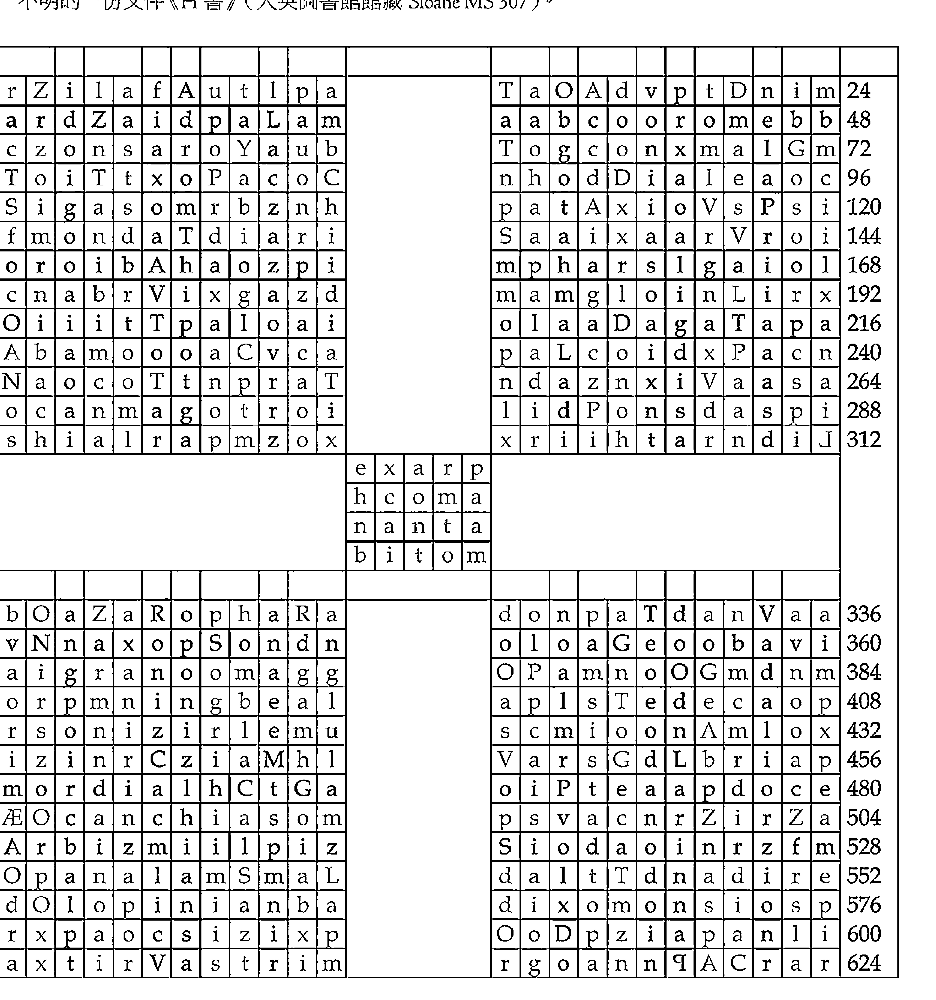

关于《H书》和这份文件的历史，我觉得最好的参考资料是史蒂芬·斯基纳和大卫·朗金所写的《约翰·迪伊博士的以诺表格之应用天使魔法》（The Practical Angel Magic of Dr. John Dee's Enochian Tables）。书中虽然提出了一些今天不怎么受到支持的理论（例如《H书》可能是迪伊本人写的，但这个可能性极低），但这本书之所以重要，并不是因为那些臆测的推论，而是因为作者阐述了《H书》的历史及其对黄金黎明协会的影响。研究新以诺魔法的学生一定要读此书。

《H书》收录了召唤地球大表格每一位天使的冗长咒语。书中赋予天使的能力跟迪伊的日记中所记录的一样，但是使用守望台找出天使名讳的方法，却跟迪伊的完全不同，且召唤天使的方式也不一样。《H书》和迪伊的《祈求之书》所收录的祷文在本质上很类似，但是凭着祷文的内容，我们无法看出前者是改编自后者。事实上，《H书》的咒语几乎是迪伊咒语总长度的十倍！此外，《H书》也没有说到使用这些咒语必须要先完成一个十九天的仪式。

这位身分不明的作者在书的最前面放了一幅插图，如图28所示。这是将凯利的拉斐尔改良表格稍微修改之后的版本，而改良表格的原始版本则可以在《约翰·迪伊博士与某些灵体之间多年存在的真正忠实关系》接近书末的地方找到。两者唯一的差别是，这张图使用了红墨水标出天使的名字、黑墨水标出大十字架和耶稣受难十字架上的名字。除此之外，这张表格字母顺序跟原始的地球大表格不同，并有迪伊加在右侧的数字，将所有的格子从一标到六百二十四，以便解码上帝的讯息。

《H书》的作者有可能读过《约翰·迪伊博士与某些灵体之间多年存在的真正忠实关系》，并在书末发现改良表格以及迪伊所写的笔记，表示这样重新排列地球大表格为他「解决了一个大问题」，使他「欢欣不已」。这位不详的作者自然假定改良表格是地球大表格的修正版，进而用在《H书》里。

然而，作者没有仔细阅读改良表格出现前那几天的日记内容，否则他就会知道改良表格只跟换妻事件有关，而表格所解决的「大问题」其实就只是解开上帝允许迪伊、凯利和他们的妻子互相混交的讯息。不幸的是，从作者决定使用改良表格的那一刻起，也同时导致将近两百年后，以诺魔法研究永远分裂成两派。

之所以会造成这样的分裂，原因在于《H书》是早期黄金黎明协会主要使用的以诺魔法权威着作。此处附上的插图，就是协会最早的几位大法师所用的地球大表格，有黑与红两种颜色的标示，也有正中间的合一表格。内阶层的成员会使用更复杂的色彩标注法标示守望台，但这个方法不会透露给外阶层的成员。此外，内阶层也会把《H书》用来当作召唤天使的魔法书。

可惜，《H书》并没有说明多少背景脉络。关于天使的资讯，我们只能在咒语中找到，包括天使的能力（基本上跟迪伊记录的一样）以及掌管的罗盘方位。除此之外，书中既没有像我一样解释有关地球大表格的一切，也没有说明表格里的那些天使隶属何种阶级或对应到什么玄秘内涵。

因此，就我们所知，一开始将四大古典元素对应到个别的守望台、并将次元素（水之火、地之风、风水等等）对应到四座守望台的十六个子象限的人，是马瑟斯和／或维斯特考特。此外，他们也是最初把长老（他们是使用「长老」一词）分配给七大行星而非黄道十二宫的人，并将表格中央的神名改成掌管长老的一位太阳天使之名。每一组长老和他们的「王」会在特定元素的范畴内体现某一行星的力量，像是当木星位于水象三分主星（巨蟹座、天蝎座或双鱼座）的范畴时。

黄金黎明协会也是第一个将四字神名（上帝的四字母名称 YHVH）应用在合一表格及子象限的方格，同时把所有的风水、塔罗、元素等玄秘内涵对应到个别格子的团体。还有一点应该提及的是，某些守望台的版本会在许多格子放入一个以上的字母，这也是黄金黎明协会的发明。这是因为，学生不确定格子里该放的是哪一个字母，例如 u 或 v、e 或 a。这些怪物之所以会永远存在于现代的黄金黎明协会，都拜切奇·西塞罗（Chic Cicero）与桑德拉·塔巴沙·西塞罗（Sandra Tabatha Cicero）所赐。

《H书》也没有提到天使四十八钥，因此我们或许可以假定是马瑟斯或维斯特考特最先将四十八钥应用在地球大表格。这些钥匙最有可能来自迪伊个人的魔法书，今天仍保存在大英图书馆的 Sloane 藏品中（今天以《约翰·迪伊博士的以诺魔法》这个书名出版）。在魔法书中，迪伊完全没有解释四十八钥是什么或应该如何使用，也未提及《上帝讲话之书》。迪伊纯粹就是把它们写在里面，供自己使用。因此，早期的黄金黎明大师会把这些天使召唤咒语应用在《H书》里的天使，也就不难想像了。

至于天使四十八钥的文字内容应该如何发音，迪伊的魔法书倒是有说明。然而，早期的大师发展了自己的一套发音系统，被一些现代施行者亲昵地称作「黄金黎明礼仪以诺语」。基本规则就是，把名字里的每一个字母念出来，并根据希伯来语的规则在缺少母音的地方加上母音。多个字母如果能够很自然地（对英语母语者而言）合在一起念，常常会有合念的情况，但是这方面并没有严格的规定需要依循。

多年来，这些规则一直都很宽松，所以现在似乎每位大师都有自己的发音方式。然而，源自黄金黎明协会或受其影响的现代赫密士体系所使用的天使语，大部分仍可听出黄金黎明礼仪以诺语的音韵。

同时，许多研究都在持续努力解开迪伊的日记和个人魔法书中的发音笔记，所以我们对于这个语言听在迪伊和凯利的耳中是什么感觉，已有很不错的概念。我的两册《天使语》着作也是在这个领域研究的成果。

## ## 结论

这个简短的章节仅简略带过以诺魔法（包括迪伊纯粹主义和新以诺魔法）的奥秘与应用，并稍微提示迪伊和凯利对现代魔法体系的影响有多大。他们的贡献后来影响了玫瑰十字会、泰勒玛、新异教主义、威卡等众多传承至今的传统。然而，在相对近期的年代以前，以诺魔法的原始文献大部分都没有受到检视，使得少数已知的资讯被蒙蔽在神秘和误解之中。自从资讯时代的来临，已经有很多资讯重见天日，让我们更清楚迪伊的生平、他所生存的年代与环境，以及他这套以诺魔法系统背后的动机。希望我为你建立了坚实的基础，帮助你了解这项传统的由来及其结构与意图，还有它是如何流传至今，成为西方神秘传统的一颗明珠。

措尔格
2019 年，亚伦·莱奇

## ## 参考书目

- Agrippa, Henry Cornelius. Three Books of Occult Philosophy. Woodbury, MN: Llewellyn Publications, 2018.
- Crowley, Aleister. “Liber LXXXIV Vel Chanokh: A Brief Abstract of the Symbolic Representation of the Universe Derived by Doctor John Dee Through the Skrying of Sir Edward Kelly.” Hermetic Library. Accessed September 26, 2019. https://hermetic.com/crowley/libers/lib84.
- Crowley, Aleister, Lon Milo DuQuette, and Christopher Hyatt. Enochian World of Aleister Crowley: Enochian Sex Magick. Tempe, AZ: Falcon Press, 2017.
- Crowley, Aleister, Victor B. Neuberg, and Mary Desti. The Vision & the Voice: With Commentary and Other Papers: The Collected Diaries of Aleister Crowley, 1909–1914 E.V. York Beach, ME: Weiser Books, 1999.
- De Abano, Peter. Heptameron: Or Magical Elements. CreateSpace Independent Publishing Platform, 2015.
- Dee, John. The Heptarchia Mystica of John Dee. Edited by Robert Turner. Wellingborough, UK: Aquarian Press, 1986.
- ———. A True & Faithful Relation of What Passed for Many Years Between Dr. John Dee and Some Spirits. Preface by Meric Casaubon. London : Printed by D. Maxwell for T. Garthwait, 1659.

DuQuette, Lon Milo. *Enochian Vision Magick: An Introduction and Practical Guide to the Magick of Dr. John Dee and Edward Kelley*. York Beach, ME: Weiser Books, 2008.

Fell-Smith, Charlotte. *John Dee (1527-1608)*. Berwick, ME: Ibis Press, 2004.

French, Peter J. *John Dee: The World of the Elizabethan Magus*. New York: Hippocrene Books, 1989.

Honorius of Thebes. *The Sworn Book of Honorius: Liber Iuratus Honorii*. Lake Worth, FL: Ibis Press, 2016.

James, Geoffrey, ed. and trans. *The Enochian Magick of Dr. John Dee*. St. Paul, MN: Llewellyn Publications, 1998.

Klein, Kevin, ed. *The Complete Mystical Records of Dr. John Dee: Transcribed from the 16th-Century Manuscripts Documenting Dee's Conversations with Angels*. Woodbury, MN: Llewellyn Publications, 2017.

Laycock, Donald C. *The Complete Enochian Dictionary*. Boston, MA: Weiser, 2001.

Leitch, Aaron. *The Angelical Language, Volume I: The Complete History and Mythos of the Tongue of Angels*. Woodbury, MN: Llewellyn Publications, 2010.

———. *The Angelical Language, Volume II: An Encyclopedic Lexicon of the Tongue of Angels*. Woodbury, MN: Llewellyn Publications, 2010.

———. *The Essential Enochian Grimoire*. Woodbury, MN: Llewellyn Publications, 2014.

Lumpkin, Joseph B. *The Books of Enoch: A Complete Volume Containing 1 Enoch (The Ethiopic Book of Enoch), 2 Enoch (The Slavonic Secrets of Enoch), 3 Enoch (The Hebrew Book of Enoch)*. Fifth Estate, Incorporated, 2011.

McLean, Adam, ed. *A Treatise on Angel Magic: Being a Complete Transcription of Ms. Harley 6482 in the British Library*. Grand Rapids, MI: Phanes Press, 1990.

Peterson, Joseph, ed. and trans. *Arbatel: Concerning the Magic of the Ancients*. Lake Worth, FL: Ibis Press, 2009.

———. *John Dee's Five Books of Mystery*. York Beach, ME: Weiser Books, 2002.

———. *Lemegeton Clavicula Salomonis: The Lesser Key of Solomon*. York Beach, ME: Weiser Books, 2001.

Regardie, Israel. *The Complete Golden Dawn System of Magic*. New Falcon Publications, 2015.

———. *The Golden Dawn*. St. Paul, MN: Llewellyn Publications, 1982.

Scholem, Gershom. *Major Trends in Jewish Mysticism*. New York: Schocken, 1995.

Skinner, Stephen, ed. *Dr. John Dee's Spiritual Diaries (1583-1608)*. Woodbury, MN: Llewellyn Publications, 2012.

Skinner, Stephen, and David Rankine. *The Practical Angel Magic of Dr. John Dee's Enochian Tables: Tabularum Bonorum Angelorum Invocationes*. Woodbury, MN: Llewellyn Publications, 2010.

Trithemius, Johannes. *De Septem Secundeis (Seven Secondary Causes)*. Edited by Joseph H. Peterson. Esoteric Archives. Accessed September 26, 2019. http://www.esotericarchives.com/tritheim/tritem.htm.

———. *Steganographia*. Accessed September 26, 2019. http://trithemius.com/steganographia-english/.

Tyson, Donald. *Enochian Magick for Beginners: The Original System of Angel Magick*. St. Paul, MN: Llewellyn Publications, 1997.

Woolley, Benjamin. *The Queen's Conjurer: The Science and Magic of Dr. John Dee, Adviser to Queen Elizabeth I*. London: Flamingo, 2002.

## ◆ 作者介紹 ◆

亞倫・萊奇（Aaron Leitch）是黃金黎明協會以及學術機構魔法協會（Socieras Magica）的資深成員。他是一名西方赫密士主義、所羅門魔法書傳統及以諾魔法的學者、實踐者兼導師，撰有《魔法書的奧秘》（Secrets of the Magickal Grimoires）、《天使語，第一和第二冊》和《以諾魔法書精要》（The Essential Enochian Grimoire）等著作。亞倫與妻子卡莉・米凱兒－萊奇（Carrie Mikell-Leitch）共同創辦了「所羅門博士的玄秘珍玩道具」（Doc Solomon's Occult Curios），販售手工製作傳統的玄秘道具和用品，並提供魔法書和亞伯拉梅林等主題課程。近日，他們在佛羅里達州的荒野創建「所羅門之泉」（Solomon Springs）這個十六公頃的活動場地，供異教和契主義舉辦節慶和聚會。

## 第八冊
### 黃金黎明會
切奇·西塞羅與桑德拉·塔巴沙·西塞羅

黃金黎明協會的初學者儀式（Neophyte Ritual）有一句常被引用的話，總結了神秘主義學生主要的抱負：「汝居暗處已久，離夜覓晝！」協會名稱「黃金黎明」指的正是永恆聖光突破黑暗局限所帶來的燦爛明亮，使人類的靈性演化進入全新的白晝。黃金黎明協會所有的儀式和魔法實踐，除了是為了得到魔法這門藝術的技巧、增進超自然感官能力，更是要創造魔法師與永恆不朽的自我之間的靈性連結。

黃金黎明對當代儀式魔法的影響力不容小覷。身為黃金黎明的魔法師，我們自然比較偏袒自己的傳統，但是會說出這句話的，絕對不只有我們。黃金黎明常被稱作「現代最知名且最具影響力的玄秘組織」<sup>1</sup>；克里斯多福·麥金托什（Christopher McIntosh）也在其優秀的著作《玫瑰十字會成員》（The Rosicrucians）中這麼形容黃金黎明：「十字玫瑰會這棵大樹所長出的最豐碩果實」<sup>2</sup>；至於為艾利克·豪伊（Ellic Howe）的黃金黎明協會歷史作品作序的傑拉德·約克（Gerald Yorke），則在序言中說道：「黃金黎明赫密士階層以及紅寶石玫瑰與黃金十字架階層（Rose of Ruby and the Cross of Gold，R.R. et A.C.）是十九世紀神秘主義復興浪潮中至高無上的榮耀。黃金黎明將眾多缺乏連結且極為分散的材料融合為連貫的整體，結合成一個實用又有效的系統，是當時或後來的任何神秘組織都沒有做到的。」<sup>3</sup>若沒有黃金黎明協會，二十一世紀的密契與魔法世界將會跟今天非常不一樣。

- Greer, *The New Encyclopedia of the Occult*, 202。
- McIntosh, *The Rosicrucians*, 97。
- Howe, *The Magicians of the Golden Dawn*, ix。

今天存在著許多不同的魔法學派，但是當中有很多都是來自同一個源頭 (……) 黃金黎明協會是現代魔法傳統中唯一一個最重要的源頭。<sup>4</sup>

黃金黎明究竟為何如此重要？又為何在黃金黎明誕生的維多利亞時期早已遠去之後，這套體系至今仍持續吸引著充滿抱負的魔法師？

我們很容易就能看出黃金黎明為什麼比該時期的任何密契組織都還要進步——它除了接受男性成員，也以完全平等的立足點接納女性成員。此外，當時類似的組織都只有停頓在魔法或各種玄秘主題的理論研究，可是黃金黎明的創立宗旨卻是要成員學習並實際演練魔法。

黃金黎明傳授的魔法大多都非原創，其眾多的組成元素取自多個來源，是由西方密契主義傳統的各個分支所構成，因此先前各時代的赫密士主義者、煉金術士、占星學家、自然哲學家、魔法師、玄秘主義者都會覺得熟悉。黃金黎明的魔法師必須進行的研究範疇非常廣泛，包括古埃及宗教與魔法、古典希臘哲學、希臘化時代的埃及神秘宗教、希臘化哲學、諾斯底主義、新柏拉圖主義、赫密士主義、猶太教卡巴拉與基督教赫密士卡巴拉、玫瑰十字哲學與基督教神秘主義、占星術與行星魔法、塔羅牌及其他占卜類型、煉金術原理、召喚與靈體顯象、魔法道具與神聖空間的建置、治療、氣場控制、化身神的樣貌、能量的投射與移動、召喚戲劇表演、護符聖化、以諾魔法。

但是黃金黎明真正獨到之處，在於其創始人的天才巧思，能夠從這些多元的領域中創造出有條不紊的單一框架，為魔法的研究、訓練與實踐建構出全面完整課程體系。黃金黎明的系統設計非常平衡、有邏輯且可實行，包括了多重等級的晉升典禮，每一個等級都伴隨指導與作業、儀式、冥想、練習與考試等面向。黃金黎明協會是密契知識的學校與寶庫，以循序漸進的方式慢慢傳遞給成員。剛入會的學生要學習玄秘科學的原則，牢記魔法的基礎知識，而較進階的學生則會深入探索各種密契主題，並與應用魔法的儀式技巧加以結合。

## 結構源頭與直接影響

十九世紀時，英法兩國就已經對西方密契主義產生很大的興趣。這被稱作玄秘主義復興運動，領導者包括曾任天主教神職的阿爾方斯·路易斯·康斯坦丁（Alphonse Louis Constant，1810-1875年，較知名的稱呼是埃利法斯·列維）。他是一位精明的卡巴拉學者及多產的作家，著有《高等魔法的信條與儀式》（The Dogma and Ritual of High Magic，1854）一書，後來成為西方魔法的基石。列維提出了一個理論，認為塔羅牌的二十二張大阿爾克那卡（Major Arcana）可對應到二十二個希伯來字母，這後來成為黃金黎明的重要指導之一。此外，他關於卡巴拉的著作、護符製作以及星界之光（Astral Light）的概念，大多也都受到黃金黎明協會創始者的擁護。弗雷德里克·霍克利（Frederick Hockley，1809-1885年）是玄秘主義復興運動的另一位重要人物。他是共濟會與玫瑰十字會的會員，相信靈媒的存在，同時也大量抄寫了卡巴拉、煉金術和魔法方面的未出版著作。他使用魔鏡和水晶進行、記錄六十年的靈體溝通與超感視覺實驗。

當時，英國仍持續探索世界的各個角落，因此有很多人對當時和過往各種文化的種族與宗教習俗深感興趣。古老的凱爾特文明及遠東的神秘主義吸引了特別多人，而人們對任何有關古埃及和美索不達米亞的事物也充滿熱忱。後者可歸功於大英博物館埃及與敘利亞古代藏品的策展人 E·A·沃利斯·白琪爵士（Sir E. A. Wallis Budge）。他從一八八三年開始為大英博物館工作，在整個一八八〇年代為博物館取得為數眾多的珍貴手稿、楔形文字刻版和埃及莎草紙，其中包括一份保存得極為良好的《亡者之書》（Book of the Dead）。這類資源成為維多利亞時代玄秘主義學生的重大養分。

此外，各式各樣的石匠與半石匠組織也在一八八〇年代中葉興起。共濟會便是一個國際性的兄弟會組織，成員據說是傳承自所羅門王聖殿興建時期、甚至更早以前的石匠。然而，共濟會真正的源頭其實是中世紀晚期英格蘭與蘇格蘭地區的石匠公會。共濟會會員都會透過象徵符號學習基本的倫理和人類的境況發展。要加入共濟會，必須相信上帝是宇宙的神聖建築構者。

共濟會的本質雖然不是玄秘組織，但其歷史卻與玄秘主義脫不了關係，至今依然是西方最有影響力的兄弟會組織。基於這個原因，共濟會的組織結構和集會所等概念有很大比例都被玄秘組織和魔法集會所採納。要進入共濟會的各個等級，必須遵循一套複雜的象徵儀式系統。這些儀式包括密碼、符號、神秘的圖表、敲門、發誓、蒙眼和握手，後來都直接影響了黃金黎明晉級儀式的架構。就連「如此塵埃落定」（So mote it be）這句話也是從共濟會引入黃金黎明。

最後一個、或許也最重要的影響是玫瑰十字會，這是一個源自十七世紀德國的神秘主義與哲學運動。充滿傳奇色彩的玫瑰十字會是基督教神秘主義者的一個秘密組織，旨在替人類福祉工作，專門研究煉金術和赫密士哲學的藝術。從一六一四年開始，一系列神秘難解的手稿出現了，裡面首次描述到玫瑰十字會這個組織。《兄弟會宣言》(Fama Fraternitatis)是這些手稿的第一份，但是不久後又出現了兩份手稿《兄弟會自白》(Confessio Fraternitatis)和《克里斯提恩·洛森庫魯斯的化學婚禮》(Chymical Wedding of Christian Rosenkreutz)。《兄弟會宣言》宣稱，這世上存在著一個秘密組織，由一群技藝高超的神秘主義者組成，並以玫瑰十字為象徵符號。文中接著描述了兄弟會創始人克里斯提恩·洛森庫魯斯的生平，還有此人和組織所有秘密一起被埋藏的洞穴。手稿呼籲，志趣相投的人可以聯絡兄弟會，共同分享組織的密契知識。然而，這根本是不可能的，因為文中完全沒有指示如何聯繫兄弟會，還警告任何人若自稱玫瑰十字會會員，就是假冒的！不管是真是假，總之沒有人真的找到這群人過。之後，路德教派的神職人員約翰·凡·安德里亞(Johann Valentin Andreae)晚年坦承《克里斯提恩·洛森庫魯斯的化學婚禮》是他寫來開玩笑的，而其他手稿可能也都是他的傑作。

## 安娜·博努斯·金斯福德

安娜·博努斯·金斯福德(Anna Bonus Kingsford, 1846-1888)因反對活體解剖、提倡素食主義、爭取婦女權益，又身為最早獲得醫學文憑的英國女性之一而出名。此外，她也是一位學識豐富的神秘主義者，對黃金黎明協會的創始人發揮了重大的影響力。

金斯福德的生平大多來自她的友人兼傳記作者愛德華·瑪特蘭(Edward Maitland)的著作。他們兩人之間的關係非常深刻，卻又僅只是柏拉圖式的友誼。金斯福德開始收到一系列的預言夢境顯象(她的「啟迪」)時，瑪特蘭把它們記錄、保存下來。這些後來成為《完美的途徑；找到基督》(The Perfect Way, or the Finding of Christ)與《身披太陽》(Clothed with the Sun)兩本書的基礎。

這兩個人宣揚他們所謂的「新詮釋福音」(New Gospel of Interpretation)，旨在重拾基督教遺失的密契真理，特別是關於上帝女性面向的那些真理。金斯福德最強而有力的說法就是「女性之日」預言：「我要向你們展現一個奧秘與一個新觀念……將拯救全世界的那個字，會是從一名女子的口中說出。一名女子將儐有救贖的消息，並將它帶來。」*

在一八八〇年代初期，金斯福德與瑪特蘭加入了倫敦神智學協會（London Theosophical Society）。之後，他們脫離神智學協會，自創了赫密士協會（Hermetic Society）。不久即將創立黃金黎明協會的維斯特考特與麥克達格·馬瑟斯便是在此時遇見金斯福德。他們兩人都曾在金斯福德的赫密士協會演講。

這時候，金斯福德的事業生涯正值高峰，她具有絕佳的領導魅力、言詞打動人心、美麗又氣質超脫塵俗，任何人一靠近她目光就會被吸引住。馬瑟斯把自己翻譯的《卡巴拉揭密》（The Kabbalah Unveiled, 1887）獻給她和瑪特蘭，並在前言稱讚金斯福德與瑪特蘭的《完美的途徑；找到基督》是數世紀以來寫得最好的神秘學書籍。金斯福德的影響讓馬瑟斯堅信，他跟維斯特考特正在創建的魔法協會應該接受女性。瑪特蘭後來寫道：「在一八八六年的這年夏天，一位知名的專家向她提議研究玄秘主義。」** 這位「知名的專家」有可能說的是馬瑟斯。

除了採納金斯福德的女性主義，馬瑟斯也協助她進行反活體解剖運動，並成為素食主義者。黃金黎明協會的官方歷史演講課程大讚金斯福德，說她是當時最偉大的赫密士主義者之一。《完美的途徑；找到基督》融合了基督教與多神教、使用守護神（genius）一詞指稱更高階的自我，並且重視上帝的女性面向，這些顯然都對黃金黎明的課程造成了巨大的影響。因此，我們或許可以像瑪麗·K·格瑞爾（Mary K·Greer）在著作《黃金黎明的女性》（Women of the Golden Dawn）中所說的一樣，將金斯福德視為黃金黎明協會的「魔法媽媽」。

—— M·伊西多拉·福瑞斯特

* Edward Maitland, Anna Kingsford: Her Life, Letters, Diary, and Work, vol. 1, 344–345。

** Edward Maitland, Anna Kingsford: Her Life, Letters, Diary, and Work, vol. 2, 268。

M·伊西多拉·福瑞斯特 (M. Isidora Forrest) 寫了許多關於埃及女神伊西斯的書籍和文章，包括《伊西斯魔法》(Isis Magic) 和《獻祭伊西斯》(Offering to Isis)，也寫了不少關於現代新異教主義和現代靈性魔法某些神祇的文章。她是伊西斯之家 (House of Isis) 的先知、國際伊西斯組織 (Fellowship of Isis) 的祭司、大師等級的魔法師、酒神戴歐尼修斯的邁那得斯 (maenad，意指追隨者 maenad)，並在奧勒岡州創立了赫密士組織。

無論玫瑰十字會的真實由來究竟為何，其理念總之是非常吸引人。共濟會在十八世紀遍佈歐洲，十九世紀又再次擴張勢力，同時各種神秘的主題、聖經的題材、古代的神秘宗教以及包括神秘的玫瑰十字會在內的秘密組織，都帶來了一點一點的啟發。結果，好幾個共濟會性質的玫瑰十字兄弟會都創立了。玫瑰十字運動催生了數個把關注焦點放在宗教神秘主義、哲學與宗教教義、煉金術、卡巴拉、靈性轉變及整個密契主義思想的團體。

## 黃金黎明簡史

黃金黎明協會是維斯特考特博士 (1848-1925) 的心血結晶，他是倫敦的驗屍官，對於玄秘主義的各個面向都很感興趣。維斯特考特是英國玫瑰十字協會 (Societas Rosicruciana in Anglia，S.R.I.A.，共濟會性質的玫瑰十字研究組織) 的石匠工師兼秘書長，對共濟會在傳統石匠工藝以外蓬勃發展出來的眾多變化很有興趣。他在當時大量存在於英國的各種密契組織中皆十分活躍，並且因為擅長卡巴拉、煉金術和赫密士哲學而廣受尊敬。他出版了很多赫密士主義和醫學方面的著作，也翻譯過著名的卡巴拉文獻《形塑之書》及埃利法斯·列維的塔羅牌著作《聖殿王國的魔法儀式》。此外，他還編輯了許多赫密士和諾斯底主義文本，並以「赫密士叢書」(Collectanea Hermetica) 系列出版。

黃金黎明協會的起源常常使人困惑，充滿刻意神秘化的氛圍。根據維斯特考特的原始版本，他在一八八七年從一位年長的共濟會會員——伍德福德牧師 (Reverend A. F. A. Woodford) 得到了一份六十頁左右的密碼手稿。據說，伍德福德是從一位「古董珍玩商」拿到這份手稿。維斯特考特很快便使用修道院院長約翰·率瑟米爾斯所著的《多重書寫文字》(Polygraphiae)中收錄的密碼，解開了這看似十分古老的手稿。原來，手稿描述某個類似共濟會玄秘組織的一系列晉級儀式。手稿中還放了同樣以密碼寫成的一張紙，裡面寫了一位德國大師史普林格小姐(Fräulein Sprengel)的身分憑證和住址。故事的後續發展是，維斯特考特跟史普林格魚雁往返多次，史普林格最後授權他在英國建立一個新的神廟。維斯特考特將手稿的內容變成完整的施行儀式。

這份密碼手稿雖然真的描繪了一套密契組織能夠有效實行的儀式內容，但是有關史普林格小姐和那些書信往來的部分，現在被認為極有可能是維斯特考特自己捏造的。在維多利亞時代，密契組織需要有古老的「血統證明」才能吸引顯赫的共濟會會員、玫瑰十字會會員及認真的玄秘主義者加入：共濟會有海勒姆(Hiram Abiff)的故事、玫瑰十字會有克里斯提恩·洛森庫魯斯的傳說、神智學協會也有布拉瓦茨基的玄秘大師。維斯特考特當然也會覺得自己必須提出證據，證實黃金黎明不是憑空創造出來，而是有類似的高貴故事可以撐腰。

密碼手稿列出的儀式內容有可能是屬於一個稱作「八之協會」(Society of Eight)的煉金團體原型。這個團體於一八八三年由弗雷德里克·霍蘭德(Frederick Holland)創立，但卻從未真正推出。將這些手稿抄寫下來的是《皇家共濟會百科全書》(The Royal Masonic Cyclopaedia)的作者，同時也是英國玫瑰十字協會重要成員兼史威登堡共濟會儀式大秘書長的肯尼斯·麥肯齊(Kenneth Mackenzie)。麥肯齊一八八六年去世後，維斯特考特接任史威登堡共濟會儀式大秘書長的位置，得到他所有的文件，包括散布在史威登堡共濟會儀式各種檔案之中的密碼手稿書頁。總之，維斯特考特解開儀式內容的密碼之後，便開始把他的新神祕組織願景付諸實現，希望打造一個重視實作與實用的組織，而不只是另一個研究理論的團體。

在一八八八年二月，伊西斯-烏拉尼亞神廟(Isis-Urania Temple)在倫敦開幕，黃金黎明協會正式誕生。維斯特考特之前就已找來兩位共濟會玫瑰十字會的同儕擔任地位平等的職員，一起為他的新組織實行三頭管理制度。這兩個人是威廉·羅伯特·伍德曼博士(Dr. William Robert Woodman)與麥克逵格·馬瑟斯。

在黃金黎明的三位創始成員之中，麥克逵格·馬瑟斯是最有天分的儀式專家。此外，他也因為翻譯多部魔法書而知名，如《魔法師亞伯拉梅林的神聖魔法書》、《所羅門王之鑰》和《蠟壇術》。馬瑟斯在應用魔法這一領域無人能敵。此外，在這三位創始人之間，馬瑟斯才是將黃金黎明變成真正魔法晉級組織的人，而他自己也是內階層的主要領袖。

到了一八八八年末，倫敦的伊西斯-烏拉尼亞神廟已有三十二名會員，女性九名、男性二十三名。同年，又建了兩座神廟。創立一年後，黃金黎明的會員數量已成長到六十位，其中約有三分之一是女性。在之後數年，又興建了更多神廟。

協會的成員不乏醫生與作家，也有很多隸屬於其他密契社團，如共濟會和神智學協會。大體來說，他們是一群聰明又有創意的人，努力追求靈性知識。在最初創立的協會中，其中較有名氣的成員包括了二十世紀最偉大的詩人之一威廉·巴特勒·葉慈（William Butler Yeats）、新藝術運動著名平面藝術家威廉·霍爾頓（William Horton）、神職人員兼煉金術士威廉·亞歷山大·艾頓牧師（Reverend William Alexander Ayton）、愛丁堡的天文學家威廉·佩克（William Peck）、作家亞瑟·馬欽（Arthur Machen）和阿爾傑農·布萊克伍德（Algernon Blackwood）、基督教神秘主義與玄秘主義者愛德華·韋特，他也寫了好幾本關於共濟會、卡巴拉和其他密契題材的書籍，同時還創造了世界上最受歡迎、以黃金黎明為基礎的塔羅牌系統韋特牌（Rider-Waite Tarot）；劇作家奧斯卡·王爾德之妻康斯坦絲·王爾德（Constance Wilde）、知名神秘主義者阿萊斯特·克勞利。⁵

## 黃金黎明女子英雄榜

黃金黎明協會重視性別平等，會讓女性成為最高等級會員，甚至擔任職務。她們有些人是婦女參政運動者或「新女人」（New Women），參與了第一波現代女性主義的浪潮，有幾位特別卓越的女性甚至成為協會的知名導師。

莫伊娜·馬瑟斯（Moina Mathers，1865–1928年，生於瑞士，原名米娜·柏格森〔Mina Bergson〕）曾就讀倫敦的斯萊德美術學院（Slade School of Art），哥哥是曾經榮獲諾貝爾獎的法國哲學家亨利·柏格森（Henri Bergson）。她在一八九〇年嫁給麥克達格·馬瑟斯，並把名字改成聽起來較接近凱爾特語的莫伊娜。她是拼貼畫藝術形式的先驅，是一名天賦異稟的超感視覺能力者，更是第一位進入黃金黎明協會的會員。她在協會裡所使用的魔法座右銘體現她永遠往前看的哲理：「Vestigia Nulla Retrorsum」，意思是「我從不走回頭路。」莫伊娜的埃及神祇畫作、牆面裝飾等作品被用來裝點伊西斯－烏拉尼亞神廟或作為協會課程的插圖。終其一生，她都忠於自己的丈夫和異教世界的各個神祇。在她丈夫死於一九一八年後，莫伊娜擔任黃金黎明協會巴黎分會的領導者數年。

## 安妮·奧爾尼曼

（Annie Horniman, 1860-1937）是一名富有的財產繼承人，建造了兩座世界知名的劇院，包括愛爾蘭的艾比劇院（Abbey Theatre）。奧爾尼曼被認為是愛爾蘭文學復興的推手，也是堅定的女性主義者，個性非常獨立、直言不諱。一些熟人雖然說她過於熱忱、計較、為人不夠圓滑，但她確實是一名優秀的行政人員和商人。在玄秘世界裡，安妮是技巧高超的占星學家和儀式魔法師，也很會解讀塔羅牌。她在劇場方面的經驗無疑對黃金黎明魔法儀式的舞台佈置帶來很大的益處。安妮的黃金黎明座右銘是「Fortiter et Recte（勇敢且公正）」，非常貼切地形容她面對周遭世界的態度。

## 佛羅倫絲·法爾

（Florence Farr, 1860-1917）是英國舞台上的知名演員，曾為蕭伯納和葉慈的戲劇作品演出女主角。佛羅倫絲實施自我教育，是個聰明又獨立的女子，在一八九〇年加入伊西斯－烏拉尼亞神廟，使用的座右銘是「Sapientia Sapienti Dona Data」（智慧是贈予給有智慧者的禮物）。她每星期都會教授塔羅牌和以諾魔法的課程，也撰寫了多本密契書籍。她的專長是靈視，在劇場的資歷使她自然成為一名很有天賦的儀式施行者。一八九四年，佛羅倫絲成為黃金黎明協會倫敦分會的領袖，後於一九〇〇年辭職，追尋更偏重東方元素的目標。

## 茉德·岡昂

（Maud Gonne, 1866-1953）是愛爾蘭舞台上一名很有天分的演員，也是一個行動主義者，能發表激昂演說，煽動暴亂，同時也是新芬黨的創始人之一。她的座右銘是「Per Ignem ad Lucem」（穿過火焰到達光明），非常貼切。茉德厭惡共濟會的晉級儀式架構，因此加入協會一小段時間就離開。然而，她後來還是繼續跟葉慈、奧爾尼曼、法爾以及莫伊娜·馬瑟斯來往，一起構思探索凱爾特奧秘的儀式。

最初的黃金黎明協會只維持了十五年的黃金歲月，因為所有涉及人類和人類自我意志的組織最後總會出現問題。爭執和權力鬥爭開始出現，到了一九〇三年，原本的黃金黎明協會已不復在，分裂成不同派系。不過黃金黎明協會的任務仍持續進行，但協會本身已經變成由前任會員建立的各個分支。主要的兩大分支分別為阿爾法與歐米茄協會（Order of the Alpha et Omega，A.O.）和晨星協會（Order of the Stella Maturina，S.M.），前者在第二次世界大戰爆發時瓦解，後者在一九七八年被正式關閉。

## 黃金黎明的理念

黃金黎明協會並不是一個宗教，也不是要取代一個人的宗教，但宗教意象和靈性原則確實在這個組織的活動中扮演了很重要的角色。然而，無論魔法師的個人信仰為何，這套體系絕對能夠補充、提升其宗教經驗。協會成員必須要能寬容所有對人生帶有正面力量的靈性選擇。初學者被告誡：

> 「尊重所有宗教，因為它們其實都是你所追尋的那無法言喻的光的其中一道光束。」

黃金黎明協會是男女皆可參加的赫密士組織，也是志同道合者的團體。加入協會的魔法師、玄祕主義者和祭司都致力於保存西方古老神聖的智慧，為人類在哲學、靈性和超自然方面的進化獻身。黃金黎明協會誓言守護這份西方靈性智慧，使其知識保存完善，同時訓練在奧秘的道路上不斷向前的有志者。

黃金黎明協會的標誌是一個在白色三角形上方的紅色十字架（圖1）。瑞格德把這個標誌的意涵解釋得很好：

> 「就連神廟祭壇上都有象徵光芒升起的標誌。一個象徵和諧與均衡的六格紅色耶穌受難十字架放在一個白色的三角形上方，這就是黃金黎明的標誌。這兩個形狀組成了最上方三個輝耀的記號，而這三個輝耀就是一切事物的動態生命與根源；體現在人類身上，這兩個形狀便組成純潔心靈本質的三重靈性屬性。因此，使用三角形象徵光芒非常貼切。至於三角形上方的十字架，象徵的並不是支配神聖之靈，而是存在於人心的均衡與和諧。」

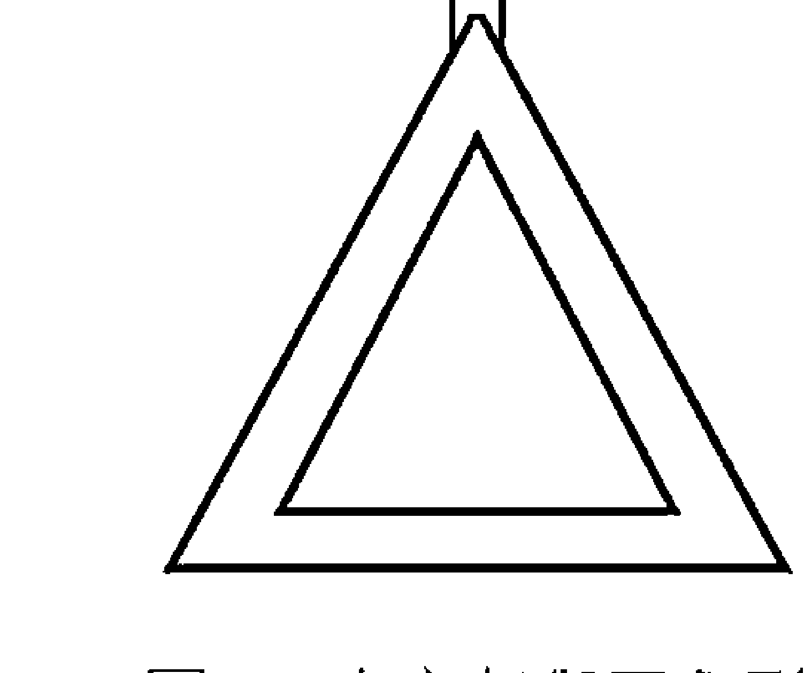

## 協會架構

黃金黎明協會架構完全以一個等級制度為基礎，在這個等級制度中，學生的密契訓練必須到達某個等級或程度，才能獲得某些知識。這跟學校體系一致，而黃金黎明確實就是一所神秘主義的學校，讓不同的級別對應到特定的密契概念和宇宙法則。這種等級制度背後的主要思想來自卡巴拉，也就是希伯來的一種神秘主義體系，包含神聖宇宙的一切知識：其根本的靈性本質、構成與演化。卡巴拉哲學相信，宇宙是從上帝開始以十個階段體現的，這十個發散的階段稱作「輝耀」，是上帝、上帝的力量以及上帝意識表現的不同面向。表1列出了形成卡巴拉生命之樹的這十個輝耀。

| 順序 | 名稱（原文／譯文） | 代表含義 | 屬性 |
| :--- | :--- | :--- | :--- |
| 1 | Kether／科帖爾 | 王冠 | 一體、統一 |
| 2 | Chokhmah／侯克瑪 | 智慧 | 力量、擴張 |
| 3 | Binah／庇納 | 領會 | 形態、收縮 |
| 4 | Chesed／黑系德 | 仁慈 | 建造 |
| 5 | Geburah／葛夫拉 | 力量 | 意志、嚴厲 |
| 6 | Tiphareth／悌菲瑞特 | 美 | 平衡、意識 |
| 7 | Netzach／矗札賀 | 勝利 | 情感、慾望 |
| 8 | Hod／候德 | 宏偉 | 智識、理性 |
| 9 | Yesod／易首德 | 根基 | 星界藍圖、基底 |
| 10 | Malkuth／瑪互特 | 王國 | 物質顯現 |

黃金黎明的等級除了對應到十個輝耀，也呼應四大元素和七大行星。這些等級的名稱和基本框架是取自英國玫瑰十字協會的等級制度，而英國玫瑰十字協會的等級制度則是取自一個十八世紀的德國玫瑰十字團體「黃金與玫瑰十字會」（Orden des Gold- und Rosenkreuz）。

這十個等級又可再分成個別但互有關聯的階層。第一個階層（或稱外階層）是「黃金黎明赫密士階層」，第二個階層（或稱內階層）是「紅寶石玫瑰與黃金十字架階層」，兩者分別是奧秘的內外兩庭。第三個階層（或稱隱形階層）的等級活著的學生無法到達，不過部分黃金黎明團體會給予某些會員這些象徵性的榮譽頭銜。表二由低到高列出了所有的等級。

### 第一階層：黃金黎明赫密士階層（整個體系的第一級）

| 等級 | 符號 | 對應輝耀 | 對應元素 | 對應行星 |
| :--- | :--- | :--- | :--- | :--- |
| 初學者 | ⓪ = 0 | | | |
| 狂熱級 | ① = 10 | 王國 | 地 | 地球 |
| 理論級 | ② = 9 | 根基 | 風 | 月亮 |
| 演練級 | ③ = 8 | 宏偉 | 水 | 水星 |
| 愛智級 | ④ = 7 | 勝利 | 火 | 金星 |

### 門戶等級（整個體系的第二級）

| 門戶級 | —— | 靈 | | |
| :--- | :--- | :--- | :--- | :--- |

### 第二階層：紅寶石玫瑰與黃金十字架階層（整個體系的第三級）

| 小達人級 | ⑤ = 6 | 美 | | 太陽 |
| :--- | :--- | :--- | :--- | :--- |
| 高階大師級 | ⑥ = 5 | 力量 | | 火星 |
| 免除大師級 | ⑦ = 4 | 仁慈 | | 木星 |

### 第三階層

| 神廟大師級 | ⑧ = 3 | 領會 | | 土星 |
| :--- | :--- | :--- | :--- | :--- |
| 魔法師級 | ⑨ = 2 | 智慧 | | |
| 超自我級 | ⑩ = 1 | 王冠 | | |

*表2：黃金黎明會的等級架構*

在所有等級的晉級儀式當中，初學者的儀式有別於其他等級。雖然這個等級被視為預備或見習的階段，但是其框架蘊含了協會所有的基礎魔法公式和技巧。初學者儀式的重點在於主持儀式的職官要將神聖之光引入神廟，進而植入有志者的感知氣場。

主持初學者儀式的第一階層職官有：晉級祭司（Hierophant）、祭司（Hierus）、嚮導（Hegemon）、信使（Keryx）、預備官（Stolistes）、持炬官（Dadouchos）及衛兵（Phylax）。這些希臘文的頭銜源自厄琉息斯秘儀（Eleusinian mysteries）等古希臘秘密宗教中主持儀式的神職人員頭銜名稱。這七位職官的上級是實施三頭政治的「大敬長」（Greatly Honoured Chiefs），他們的頭銜分別是先知（Praemonstrator）、指揮（Imperator）與總理（Cancellarius）。

埃及《死者之書》第一百二十五章所描述的審判堂（Hall of Judgment）傳說，是初學者儀式的背景和基礎。在審判堂裡，已逝者（有志進入初學者的人）必須「秤靈魂的重量」，來到真理的殿堂接受審判，看看是否有資格獲得無窮之光。把靈魂秤重的橋段表現在儀式中，代表的是有志者在獲准進入協會前，要先經過淨化這個煉金步驟。

晉級儀式象徵靈性層次的煉金過程，初學者候選人等於煉金的材料（鉛），要透過轉變的工作才能變成黃金。晉級祭司對候選人說的這段話，便暗示了這個比喻：

> 我不死的秘密靈魂這樣對我說：「讓我進入黑暗的道路，或許我便能找到光。我是黑暗的無底坑裡唯一的存在，從黑暗的無底坑、原始睡眠的沉默之中，我在我誕生之前就來到。」
光陰的聲音回答我的靈魂：「我是在黑暗中構想的那人，我是在黑暗中發亮的光，但是黑暗無法將我吞噬。」⁸

晉級基礎等級所要進行的儀式，也都象徵了煉金術的分離與淨化步驟。

第一階層包含初學者到愛智級的所有等級。狂熱級到愛智級這幾個等級，被稱作「基礎」等級，分別對應到火、水、風、地這四個元素。此外，每一個基礎等級也都使用了西方密契傳統中不同的神話故事來描繪。學生從一個等級晉級到下一個等級，慢慢接觸存在於更廣大的神聖宇宙以及魔法師個人心理結構之中的自然基礎法則。這四個法則構成了潛意識心理和氣場的各個區塊，而黃金黎明傳統上把這些集體看作埃及神祇歐西里斯的象徵，因為祂經歷了被殺害、肢解、重組與復活這四個階段，最後變成純粹的靈性形體。

在第一階層的這幾個等級中，學生會學到：魔法的語言、象徵和原則；卡巴拉的生命之樹；希伯來字母；四大元素、七大行星、黃道十二宮的屬性；風水；希伯來字母代碼（一種數字學）；希伯來神名、天使階級、強大的字；煉金術原理；卡巴拉靈魂片段；塔羅牌卡等等。學生必須先把玄秘主義的基本知識牢記在腦海中，接著才能晉級到應用儀式魔法的實際操作，也就是第二階層的學習範疇。

在第一和第二階層之間，還有一個門戶級，是奧秘內外兩庭之間的一個見習階段。這個等級對應到第五個元素「靈」，位於其他四個元素之上，使元素完整圓滿。在這個階段，學生的功課是要統一、同化第一階層個別檢驗淨化過的四大心靈元素。

第二階層只能透過邀請進入，不能主動申請。內階層包含從小達人到免除大師級的三個等級，魔法師會開始演練儀式魔法，要跟同儕一起進行團體練習，也要進行個人練習。黃金黎明體系中有被公諸於世的魔法功課，絕大多數是發生在小達人級。這幾個較高階的等級又被分成各個子等級，沿用外階層的等級名稱，如新進小達人、狂熱小達人、理論小達人等。

第一階層強調的是歐西里斯的象徵意涵，而第二階層強調的則是玫瑰十字。別的玫瑰十字團體只專注在研究或神秘主義，黃金黎明的內階層卻專門運用魔法來體現玫瑰十字的理念。一八九二年，馬瑟斯完成了小達人級繁複的晉級儀式設計。小達人的晉級儀式是以《兄弟會宣言》記載的克里斯提恩·洛森庫魯斯傳說為基礎，包含發現克里斯提恩·洛森庫魯斯墳塚（大師之墓，圖2）的情景。馬瑟斯的妻子莫伊娜肯定發揮了自己的藝術才能，幫他設計出極為繁複的玫瑰十字墓穴，作為第二階層的主要神廟與儀式場所。紅寶石玫瑰與黃金十字架階層的所有等級，都是在這個七邊形的房間裡進行晉級儀式。每年，天主教都會舉行慶祝聖餐禮的基督聖體聖血節（Corpus Christi），在節慶當天或前後的某一天，第二階層的神聖場所都會重## 新聖化一次。這項傳統是早期的玫瑰十字會追隨者開始的，他們把這個節日取了「C日」這個神秘的稱呼。後來，黃金黎明協會的第二階層採納了這項傳統。

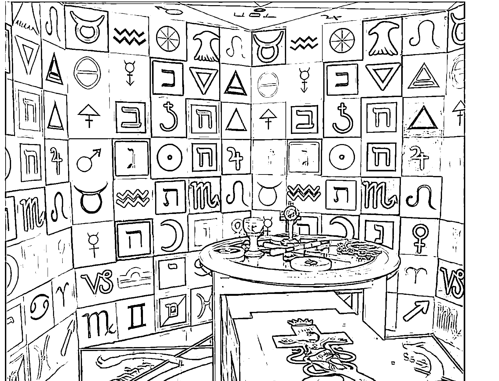

圖2：現代的大師之墓

小大師的晉級儀式非常令人印象深刻，說服力十足。整個儀式其實就是在重演克里斯提恩·洛森庫魯斯之死，以及神聖的玫瑰十字知識的復甦。主持儀式的大師會開啟神廟。有志者進入神廟後，說出自己希望獲准進入墓穴的心願，但是卻被拒絕。接著，有志者會被送回後面的房間，將身上所有的佩章解下，然後再回到神廟，開始奮力地通過重重的考驗與磨難，其中還包括一個象徵性的橋段，一邊被釘上十字架，一邊唸出具有約束力的強大義務宣言。之後，職官會向有志者從頭講述一遍克里斯提恩·洛森庫魯斯的傳說。接下來，墓穴的門會打開，有志者得以進入神秘的七邊形墓穴，發現克里斯提恩·洛森庫魯斯的遺體（由大師級長扮演）。最後，墓穴的秘密（包括其複雜的象徵意涵）終於解釋清楚。儀式中使用到的部分禱文和演說詞清楚說出了有志者追尋的靈性目標，令人難以忘懷：

神祕死亡後，隨著光埋葬，又神祕復活，重回人世間，透過我們的主淨化，啊，是十字架與玫瑰的弟兄。古往今來的大師們哪，你們全像他那樣艱辛過。你們全像他那樣，也遭逢磨難。你們全經歷貧窮、折磨與死亡。那些就只是獲得黃金前必須經過的淨化。在淨化你心的容器中、在充滿苦難的熔爐裡，追尋智者的真寶石。⁹

親身經歷過小大師儀式的人，通常都會受到很強大的影響。愛德華・韋特說，這個儀式十分具啟發性：「毫無疑問，當時這套體系發展出的最高等級是全世界最偉大的構想，任何共濟會的大集會所或分會、會議場所或分部底下的等級制定者，都從來沒想過。」¹⁰

這說明黃金黎明協會在最初的機構及直接分出的分支都不復存在這麼久以後，為什麼仍能持續加強、擴張自己的影響力。

## 荻恩・佛瓊

荻恩・佛瓊（Dion Fortune，原名維奧莉特・瑪麗・菲斯〔Violet Mary Firth〕，1890–1946）是阿爾法與歐米茄協會最有名的成員之一，受過心理治療師的專業訓練，同時也是聯合共濟會會員。她在一九一九年加入倫敦的阿爾法與歐米茄神廟，座右銘是「Deo Non Fortuna」（是因上帝，而非機運）。她從一九二一年開始進行催眠靈媒實驗，後來在格拉斯頓柏立（Glastonbury）城鎮跟考古學家兼靈異研究者弗雷德里克・布萊・邦德（Frederick Bligh Bond）一起完成實驗高潮。在格拉斯頓柏立時，她遇見基督教的玄秘主義者查爾斯・樂弗蝶（Charles Loveday）。佛瓊、樂弗蝶和他們的共識夥伴完成了一系列的內在層次魔法之後，蒐集到足夠的材料，在一九二四年創立了自己的魔法組織「內在光芒兄弟會」（Fraternity of the Inner Light）。這個團體是佛瓊後半輩子的密契焦點所在。在一九二五年，她跟樂弗蝶也加入了神智學協會的基督教神秘集會所，但是在一九二七年離開。同年，她嫁給湯瑪斯·佩里·伊凡斯（Thomas Penry Evans），並因出版一系列涉及阿爾法與歐米茄領導者的文章，被莫伊娜·馬瑟斯逐出該協會。她創立的兄弟會後來更名為內明會（Society of the Inner Light），至今依然活躍。

她使用荻恩·佛瓊這個筆名（從她的阿爾法與歐米茄座右銘改編而來）寫了好幾本玄秘主義虛構小說，如《愛上惡魔》（The Demon Lover）、《月亮魔法》（Moon Magic）和《海之祭司》（The Sea Priestess）。她也寫過多本重要的魔法著作，包括《宇宙教條》（The Cosmic Doctrine）、《密契組織和他們的事蹟》（Esoteric Orders and Their Work）、《理性玄秘主義》（Sane Occultism）、《應用魔法》（Applied Magic）和《秘法卡巴拉》（The Mystical Qabalah）。

## 核心概念

各個等級所需要學習的範疇相當廣泛。然而，黃金黎明協會傳授的知識可以歸納為以下數個主題與原則：

- 宏觀與微觀：高等的神界（宏觀世界／大宇宙）與人類的俗世（微觀世界／小宇宙）之間互有關聯。如其上、同其下。
- 至高之神：黃金黎明協會的根本思想仍是一神論，只是其至高之神會透過各種形態、面向、特質與表現方式發散。這個體系外表看起來雖然是多神論，但世界上的眾多神祇卻僅被當成終極至高之神的多元樣貌和豐富表情。
- 內在與超越：至高之神既是內在（位於萬物之中），也是超越（超出萬物之外）。宇宙是全然神聖、活生生、充滿生氣的。
- 普世秩序：宇宙的本質最終是良善且具有建設性的，偏向平衡。邪惡是從失衡狀態中誕生的。
- 返回之路：人性最初因為「退化」而跟神性分開；所謂的退化，就是靈具現成物的過程。人類尋求返回的道路，希望透過「進化」重新與神性合一；所謂的進化，就是靈與神性重新結合的過程。退化和進化都是很自然的，也是創造過程必存在的兩個極端對立面。靈性導師雖然可以提供指引，但是每一個有志者最終都必須獨自走完返回神性的道路。
- 階級與中介：神聖的存在、神祇、大天使、天使和靈體全是鎖鏈當中的一環、階梯的各段梯級，可協助魔法師攀登、爬上不同的層次，進入更高層級的存在領域。黃金黎明魔法師所受的教育是，永遠要先召喚最高階級的。
- 天界模式：由於宏觀與微觀世界互有連結，每一個人類靈魂和氣場都含有天界力量的反射。操縱氣場和星界之光，就可以帶來魔法變化。
- 工作：作為重返神性所需的一部分紀律，人類必須學著認識躲在實體宇宙後方的無形域界。為了達到此目的，就應該同時接受被動的神祕主義練習以及主動的魔法實踐過程。透過密契練習具備相關知識後，魔法師的基本目標就是與神性達成合一，也就是常說的「偉大的工作」。

## 保羅·福斯特·凱斯

保羅·福斯特·凱斯（Paul Foster Case, 1885-1954）是阿爾法與歐米茄協會最知名的美籍會員。凱斯早年是一位音樂家，為劇場演出擔任音樂指導，因此漸漸對舞台魔法發展出興趣。對塔羅牌興趣濃厚的他，最後於一九一六年在《字》（The Word）這份玄祕雜誌上發表了一系列有關「塔羅牌秘密信條」的優秀文章。一九一八年，凱斯結識《阿佐特雜誌》（Azoth Magazine）的編輯，同時也是芝加哥托特－赫密士神廟總理的麥可·詹姆斯·惠蒂（Michael James Whitty）。凱斯加入芝加哥的神廟，很快一路晉升到各個等級，成為神廟的次要先知。他的魔法座右銘是「Perseverantia」（堅忍）。

不久後，凱斯與惠蒂合力撰寫一份文稿，形成凱斯一本超棒的塔羅牌卡冥想小書《象徵之書》（The Book of Tokens）的核心。惠蒂在一九二〇年過世，凱斯繼任成為《阿佐特雜誌》的編輯。同年，凱斯進入第二階層。然而，因為他在神廟內部的個人問題，再加上跟莫伊娜·馬瑟斯意見不合等因素，使凱斯在一九二一年離開協會。一九二三年，他在波士頓為自己的「不朽智慧學院」創建函授課程。幾年後，他搬到洛杉磯，創立了一所新的應用玄秘主義學校「至聖所建造者」(Builders of the Adytum，B.O.T.A.)，至今依然活躍。凱斯寫了許多關於塔羅牌、卡巴拉、共濟會、玫瑰十字會、煉金術和魔法的重要著作。

## 外階層的應用魔法

傳統上，外階層的學生只會學到一個可以自己操作的魔法儀式——小五芒星儀式。五芒星無疑是現代儀式魔法中最重要的符號。雖然，這個圖形早在希臘哲學家畢達哥拉斯的時代就已出現在西方玄秘傳統中，但今天的魔法師常常將各大元素對應到五芒星的五個角，卻是黃金黎明的傑作。五個角當中的四個元素是根據古人的「四風」風向來分配的：風－東、火－南、水－西、地－北(圖3)。儀式以卡巴拉十字架為開端，首先振動四個希伯來神名，在施行者的氣場內建立神聖之光的十字。手勢跟畫基督教十字類似，而文字則是取自主禱文的最後幾句話(主禱文本身也是源自卡巴拉希伯來禱文)。這個十字架屬於卡巴拉十字架，是因為它跟科帖爾、瑪互特、葛夫拉、黑系德和悌菲瑞特這幾個輝耀有關。這些輝耀的能量中心經由比手勢、具象化、振動名諱和強大的字等方式，在魔法師的氣場之內啟動。這些場域也代表魔法師氣場內四大元素的平衡：科帖爾－風、瑪互特－地、葛夫拉－火、黑系德－水。美這個輝耀的名稱雖然沒有振動出來，但是魔法師會將雙手擺在心上，象徵鑑這個元素的平衡。

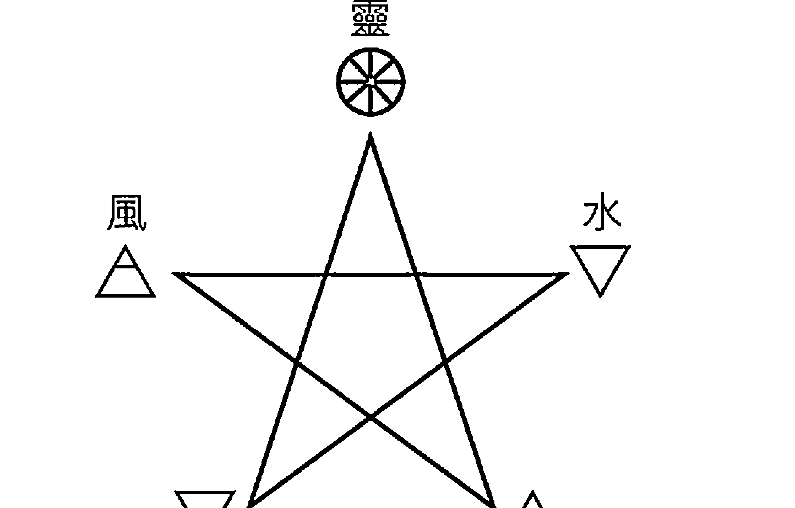

卡巴拉十字在氣場內建立好了以後，請在四個羅盤方位點描繪五芒星，並把它具象化，同時吟誦或振動特定的希伯來神名。接著，魔法師要召喚跟這些元素有關的四位大天使，同時想像他們在星界中的宏偉姿態。儀式尾聲，魔法師要再重複一次卡巴拉十字架。

黃金黎明的小五芒星儀式，是所有儀式中最受當代各類應用魔法的魔法師和玄秘團體所採納運用。在黃金黎明所有的技巧當中，這個簡單的小儀式最廣為人知，但它其實相當強大，包含了更複雜的魔法儀式所需用到的大部分技巧。簡言之，這是黃金黎明魔法的常備儀式之一。「把這個儀式看作單純召喚或驅逐靈體的工具的人，不值得施展它。正確地理解這個儀式，就會發現它是金屬之丹、智慧之石。」¹¹

此儀式有兩種類型，一是用來召喚魔法能量到神聖的地點，二是用來驅逐，分別稱作五芒星召喚小儀式和五芒星驅逐小儀式。驅逐儀式通常是作為一種預先淨化的儀式或較複雜儀式的前置作業，事先清理「髒亂」的區域；召喚儀式恰恰相反，是為了要召喚能量到神廟的空間。傳統上，老師會教導學生早上進行召喚儀式、晚上進行驅逐儀式。然而，許多學生會在開始施展魔法時進行召喚儀式，結束時進行驅逐儀式。

召喚儀式要使用小五芒星的召喚形式；驅逐儀式要使用小五芒星的驅逐形式（圖4）。

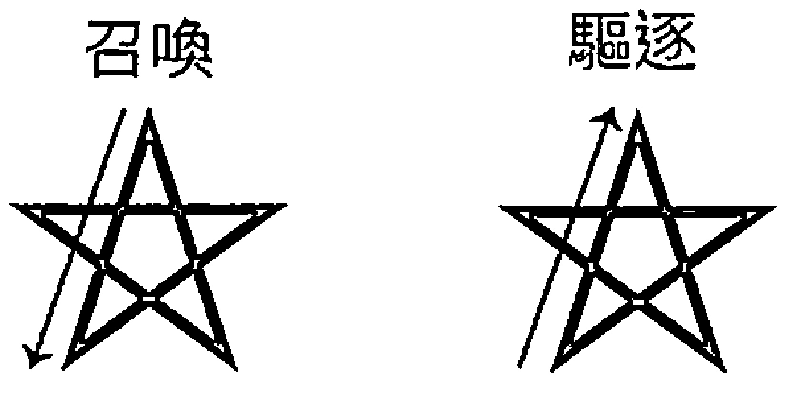

## 五芒星驅逐小儀式

用食指、黑色手柄的匕首或雙重能量外魔杖（Outer Wand of Double Power）畫出五芒星圖形。

1. 卡巴拉十字架：到神廟的東面（或正中央）建立卡巴拉十字架。
   - 面向東方站立。想像一道耀眼的白光碰觸你的頭頂。使用食指或雙重能量外魔杖白色的那一端與這道光連接，帶到額前。
   - 碰觸額頭，振動「ATAH」（Ah-tah，意為「汝是」）。
   - 碰觸胸部，將魔杖白色的那一端或食指往下帶到心臟或腹部附近，稍稍往地面指。想像這道光從額頭降到雙腳。振動「MALKUTH」（Mal-kooth，意為「王國」）。
   - 碰觸右肩，想像那裡有一個光點。振動「VE-GEBURAH」（veh-Ge-boor-ah，意為「力量」）。
   - 碰觸左肩，想像那裡有一個光點，看著一道水平光束從另一邊的肩膀延伸過來，連接這個光點。振動「VE-GEDULAH」（veh-Ge-doo-lah，意為「榮耀」）。
   - 想像從頭到腳以及兩邊肩膀形成一個完整的發光十字架。雙手往側邊伸直，遠離身體，接著再帶回來，在胸前交握，宛如在禱告。想像這耀眼的十字架中心有一個光點在閃爍。振動「LE-OLAHM」（此時低下頭）、「AMEN」（Lay-oh-lahm, Ah-men，意為「永遠無窮無盡」）。
2. 五芒星：畫出一個大大的驅逐小五芒星。把你使用的工具刺入五芒星中心，振動「YHVH」（Yod-hey-vav-hey）。振動期間手臂保持伸直的姿勢，不要掉下來。想像五芒星位於白光之中。
3. 轉過身，順時針走到南面，再畫一次五芒星。跟先前一樣大力刺穿五芒星，唸出「ADONAI」（Ah-doh-nye）。
4. 走到西面，再畫一次五芒星。一邊刺穿五芒星，一邊唸出「EHEIEH」（Eh-hey-yay）。
5. 走到北面，再畫一次五芒星。這次唸「AGLA」（Ah-gah-lah）。
6. 召喚大天使：手臂繼續伸直。轉身面向東方。雙臂往兩側伸直，形成 T 形十字架，接著說：「拉斐爾，在我面前現身。」想像風元素的大天使在你面前的雲霧中升起，一身飄揚的黃紫長袍，手持商神杖。
7. 想像另一位大天使在你身後，接著說：「加百列，在我身後現身。」看著長有翅膀的水元素大天使如金星女神般從海中走出，一身藍橘長袍，手持一只杯。
8. 想像長有翅膀的火元素大天使在右手邊現身，一身火紅與綠色相間的長袍，手持一把雄偉的長劍，接著說：「米迦勒，在我右手邊現身。」
9. 想像長有翅膀的地元素大天使在左手邊現身，從地面上的植被之間升起，一身檸檬黃、橄欖綠、赤褐色與黑色相間的土色系長袍，手持成熟的麥穗稈，接著說：「烏列爾，在我左手邊現身。」
10. 接著說：「五芒星在我周圍熊熊燃燒，光柱中六芒星閃耀。」
11. 重複一開始的卡巴拉十字架儀式，結束整個儀式。

## ◇ 內階層的應用魔法 ◇

到了第二階層「紅寶石玫瑰與黃金十字架階層」時，真正的儀式魔法才開始進入個人、實驗的階段。第一階層是一所教導學生基本密契知識的學校，幫他們做好施展魔法的準備，而內階層則是學生實際應用所學的等級。大師等級的學生會：製作、聖化自己的魔法道具（圖5）；根據傳統的黃金黎明公式撰寫、施行自己的儀式；製作、聖化護符；練習水晶占卜及靈體顯象的技巧；建立、化身為神形的意象以及施展各式各樣的進階神通技巧。

其中，為協會的魔法帶來強大力量，是一些實用、積極的儀式方法，可以改變星界之光，也就是在我們實體世界的世俗外表背後存在的神聖基底。老師會教導學生冥想、具象化、振動神名與強大的字、戲劇召喚、專注意念與意志、氣場控制以及能量投射等做法。這些全都可以磨練魔法師的技巧和靈異能力，是非常強大的技能，大部分的人只要持之以恆練習，就能藉此解開自己潛在的靈性力量。

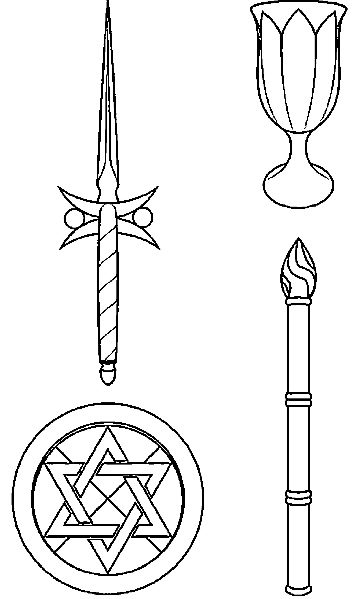

在黃金黎明較高階的等級中顏色極重要，因為唯有正確運用顏色（還有聲音與符號，或說「名稱與圖像」），魔法師才能鍛造出跟神聖智慧之間的魔法連結。

除了一套繁複的色彩階級，黃金黎明也會使用所謂的「閃影色」(flashing colors)，其實就是藝術領域常提到的互補色。

互補色指的是標準藝術色環中呈對角的兩個顏色。閃影色放在一起時，會對視覺產生一種「脈動」的效果，有助於魔法師的練習。

「中柱儀式」是在魔法師的氣場（或稱「感知場域」）內，建立卡巴拉生命之樹中央輝耀較有名的方法之一。在氣場內召喚神聖輝耀的能量，魔法師就能運用這些能量增加平衡、活力和意識，同時也能強化氣場，抵禦外界影響。這個儀式有各種變化版本，可以用來達成不同的目的，包括治療、聖化護符、為神形化身做準備，與更高階的自我溝通交流。跟五芒星儀式一樣，中柱儀式也常被現代的各方靈性傳統吸收採納，卻沒有提到是源自黃金黎明協會。

在這個基本練習中，魔法師要想像中柱疊印在自己的身體上。明確來說，中柱指的就是科坫爾、悌菲瑞特、易首德和瑪互特這四個輝耀，再加上連接侯克瑪和庇納兩個輝耀的「隱形輝耀」知識(Daath)（圖6）。這五個能量中心的神名會振動數次，同時搭配具象化。

伊斯瑞·瑞格德認為，這個簡單的練習可以加強一個人的專注力、協助達成平衡與均衡，並賦予學生源源不絕的能量和靈性感知。中柱儀式同時可以達到刺激與放鬆的效果，釋放身心的壓力，讓施行者感到喜悅、充分休息、活力滿滿，跟卡巴拉生命之樹固有的神聖力量產生連結。

## 中柱儀式

這個練習可以站著、坐著或躺著進行。開始之前，先閉上雙眼，調整呼吸節奏。

1. 想像頭頂上方出現一球白光。振動「**EHEIEH**」（Eh-hey-yay）這個名字三次或三次以上，直到它成為你意識的唯一念頭為止。
2. 想像一道光從王冠中心（頭頂）落到知識中心（頸部）。在知識中心形成一團光球。振動「**YHVH ELOHIM**」（Yode-heh-vav-heh El-oh-heem），次數要跟前一個名字的振動次數一模一樣。
3. 將這道光從知識中心帶到心臟周圍的美中心，形成一團光球。振動「**YHVH ELOAH VE-DAATH**」（Yode-heh-vav-heh El-oh-ah v'-Dah-ath），次數跟先前一樣。
4. 看著這道光從美中心（心臟）落到根基中心（鼠蹊），想像一團光球形成。振動「SHADDAI EL CHAI」（Shah-dye El-Ch-eye），次數跟先前一樣。
5. 看著這道光從根基中心（鼠蹊）落到王國中心（雙腳和腳踝）。振動「ADONAI HA-ARETZ」（Ah-doe-nye ha-Ahretz），次數跟先前一樣。

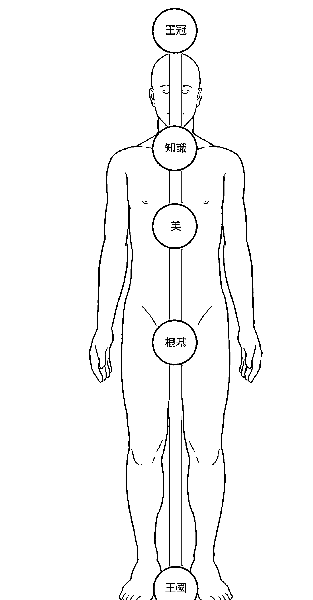

圖6：中柱儀式

6. 想像中柱完全形成。接著，將中柱慢慢帶下來的那道光繞著身體外圍循環，強化氣場（循環數次）。
7. 跟著呼吸循環的節奏，把光從身體一側帶下，再從身體另一側上去，從王冠帶到王國，再回到王冠。吐氣時，想像那道光從身體左側落下；吸氣時，想像那道光從身體右側上升回到王冠。
8. 這樣循環一小段時間後，想像那道光從身體前側降到王國中心，再從後側升起回到王冠。吸氣時上升，吐氣時下降。
9. 繼續有節奏地呼吸，想像王國的光球，看著那道光再次升起，以螺旋狀繞著位於身體中央的中柱而上，從王國升到王冠。到達王冠時，想像光芒如瀑布般傾瀉而下，從身體外側回到王國。以這種方式循環光束一段時間。
10. 最後，把部分能量專注在位於心臟的美中心，結束練習。

練習魔法時，會召喚各種構成物質宇宙基石的力量和能量。在西方密契傳統中，這些力量被歸類為元素、卡巴拉輝耀、行星和黃道各宮。黃金黎明發展了一套獨特的系統，藉由五芒星和六芒星的線條來召喚和釋放這些能量。第一階層的五芒星儀式可擴大成多種不同的五芒星，用以召喚或驅逐火、水、風、地、靈等五大元素以及黃道十二宮；各種形式的六芒星則可吸引或退散古代七大行星和生命之樹的十個輝耀。運用這些線條圖案可以帶來有系統、有邏輯、準確且可順應魔法師特定目標的卡巴拉與行星魔法。

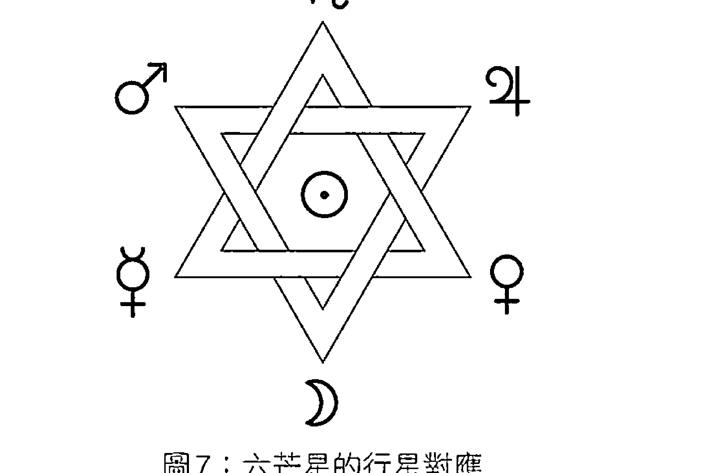

圖7：六芒星的行星對應

六芒星是「上帝之靈」(Ruach Elohim)的標誌。此靈具備兩個核心原則——陽與陰，由火和水的三角形組成完美平衡作為象徵。六芒星常見的形式就是有名的「大衛之星」，展現了七大行星的輝耀順序。六芒星的六個點分別對應到生命之樹的輝耀以及相呼應的七大行星(圖7)。六芒星的兩個三角形以順時針畫出是用來召喚，以逆時針畫出是用來驅逐。

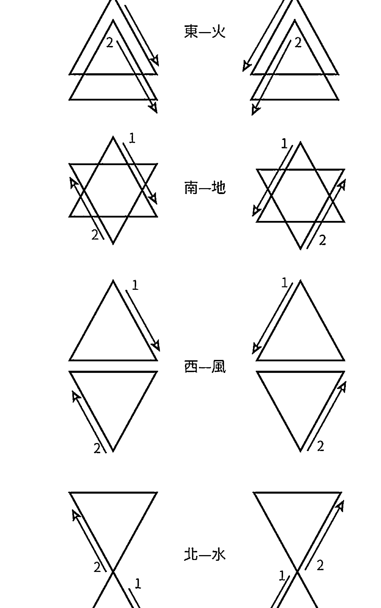

圖8：小六芒星的四種形式

---
**脚注：**
9. Regardie, The Golden Dawn, 309。
10. Waite, Shadows of Life and Thought, 161。
11. 原文缺失，应为引用来源。

六芒星小儀式是另一種標準儀式，可在神廟裡建立一個行星或輝耀能量的保護魔法陣。這個儀式很特別，因為它運用了六芒星基本形式的四個變化（圖8）。這四種變化形式是以四大元素的象徵意象為基礎：火的六芒星圖案如火焰、地的六芒星圖案如護符、風的六芒星圖案如鑽石或箭頭、水的六芒星圖案如杯子。這些圖案雖然稱作火／水／風／地的六芒星，但是它們不是用來召喚這些元素的，而是反映了存在於星界層（astral planes）的元素場域裡的行星力量。五芒星儀式跟地球和元素有關，六芒星儀式跟天界和輝耀有關。

六芒星小儀式可分為三個部分，一開始要建立卡巴拉十字架，接著要畫出四種六芒星，最後則要進行「金鑰字分析」。所謂的金鑰字指的是「I.N.R.I.」這幾個字母，代表了生、死、復活或重生這個跟許多宗教和魔法概念相關的循環過程。這個儀式最強調的強大字詞是「ARARITA」，來自以下這句希伯來文每個字的第一個字母：「Achad Rosh Achotho Rosh Ichudo Temurahzo Achad」，意思是：「一是他的開始，一是他的特性，他的排列是一。

## 六芒星召喚小儀式

現在要描述的是用途廣泛的六芒星召喚小儀式，沒有限定單一的行星或力量，適合用來創造使所有行星或輝耀能量達到平衡的魔法陣。

- 開頭：面東，建立卡巴拉十字架。
- 六芒星：走到東面，向東畫出火的召喚小六芒星。大力刺入六芒星中心點，振動「**ARARITA**」。
- 走到南面，向南畫出地的召喚小六芒星。跟先前一樣刺穿六芒星中心，振動「**ARARITA**」。
- 走到西面，向西畫出風的召喚小六芒星。刺穿六芒星中心，啟動圖形能量，接著跟先前一樣振動「**ARARITA**」。
- 走到北面，向北畫出水的召喚小六芒星。跟先前一樣，刺穿六芒星，唸出「**ARARITA**」。
- 金鑰字分析：回到東面，進行金鑰字分析。
- 雙臂往兩側伸直，形成T形十字架，掌心朝前。帶有感情地說出「**I.N.R.I.**」（每一個字母都唸出來）「**Yod Nun Resh Yod**」（Yode-noon-raysh-yode）。唸出後半句這四個希伯來字母的的名稱時，從右至左在半空中畫出字母。
- 回到 T 形十字架的姿勢，接著說：「處女座、伊西斯，偉大的母親！天蝎座、阿波菲斯，毀滅者！太陽、歐西里斯，死後重生！伊西斯、阿波菲斯、歐西里斯！」
- 在唸出上面這句話的同時，緩緩把手舉高、頭抬高。緩慢而有力地振動「**IAO**」。
- 回到 T 型十字架的姿勢，接著說：「**歐里西斯被殺的記號。**」
- 把右手高高舉到空中，左手直直向外側伸出，兩隻手呈 L 形。手掌張開，掌心朝前。把頭轉向伸出的左手，接著說：「**L 是哀悼伊西斯的記號。**」
- 雙手舉高過頭，呈六十度角，形成字母 V。手臂打直，掌心朝前。頭往後甩，說：「**V 是堤豐和阿波菲斯的記號。**」
- 雙手在胸前交叉，呈 X 形。低下頭，說：「**X 是歐西里斯復活的記號。**」
- 緩慢而有力地說：「**L.V.X.**」（逐一唸出每個字母，同時一邊比出各個記號）再說：「**LUX**」(lukes)。
- 維持在歐西里斯被殺的記號，說：「**十字架**（雙手伸出形成 T 形十字架，接著再次於胸前交叉）……**的光。**」

黃金黎明大師會在身上佩戴玫瑰十字墜盤的標準圖騰，那是協會施展魔法時使用到的眾多玄秘能量之象徵（圖9）。在魔法師個人練習當中，玫瑰十字儀式象徵了黃金黎明內階層的玫瑰十字本質。此儀式會運用到五字神名，也就是文藝復興時期基督教卡巴拉主義者所創造的耶穌之希伯來名稱「Yeheshuah」(YHShVH)。五字神名其實就是在不能說出的四字神名 (YHVH) 中間放入 Shin 這個希伯來字母，代表第五個元素「靈」降至四大元素的領域。五字神名跟 Eth (精髓)、Ruach (氣息) 和 Eheieh (我是) 這幾個希伯來名字一樣，都和靈元素有密切關聯。

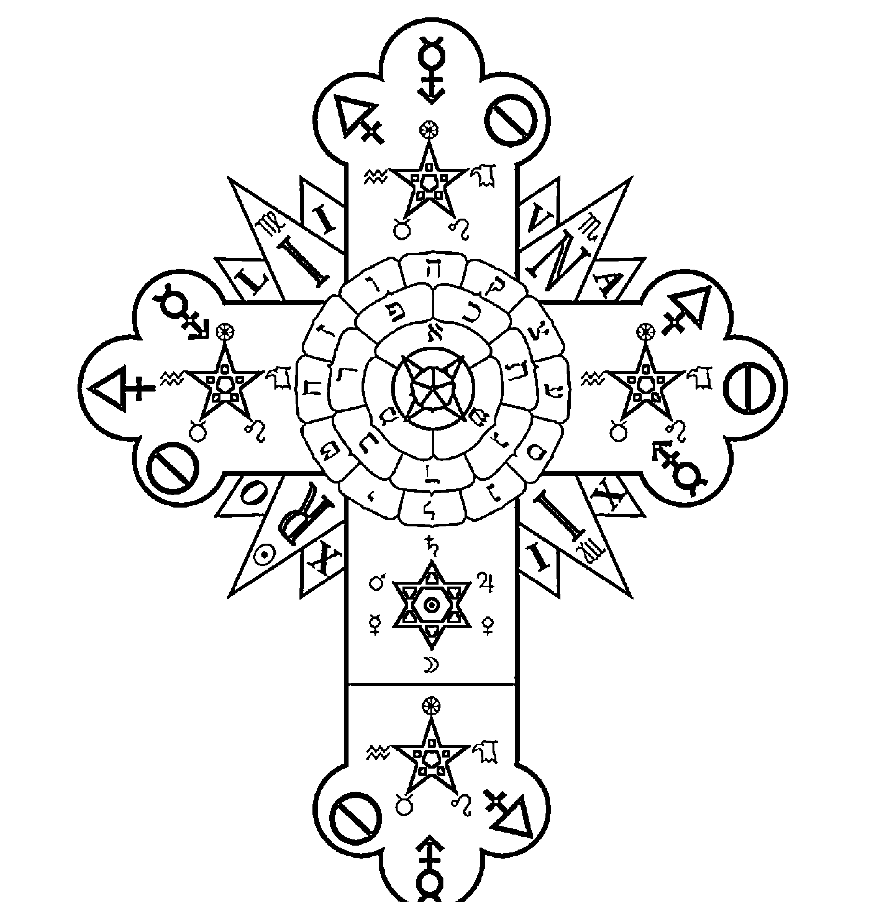

在這個儀式中，玫瑰十字的符號會在六個點畫出來，除了四個交疊象限，還有天頂和天底，也就是上方和下方（圖10）。儀式尾聲，魔法師會站在十字架中央，形成位於中央的第七個點。玫瑰十字儀式直截了當，可安定擾亂的外在與內在能量。交疊象限——東南、西南、東北、西北——是不同的元素能量相遇、融合，有時甚至發生碰撞的區域。在這幾個點畫出十字、振動五字神名，有助安定這些能量，無論何時何地需要，都可召喚平衡與均衡。

玫瑰的符號和十字的符號兩相結合，象徵各種概念：陰陽兩種神性的合一、重生與救贖、基督驅力和意識的祝福，以及犧牲奉獻帶來的力量。除此之外，這個符號也描繪了空間中的四個點以及正中央的第五個點。玫瑰十字跟五芒星一樣，象徵著靈統治物質，但是五芒星描述靈為物質的首長，而玫瑰十字則描寫靈滲透到物質的核心之中。五芒星和玫瑰十字都是保護的象徵，但五芒星比較適合召喚或解散特定能量，而玫瑰十字則特別適合用來冥想、保護、平衡、祝福與治療。

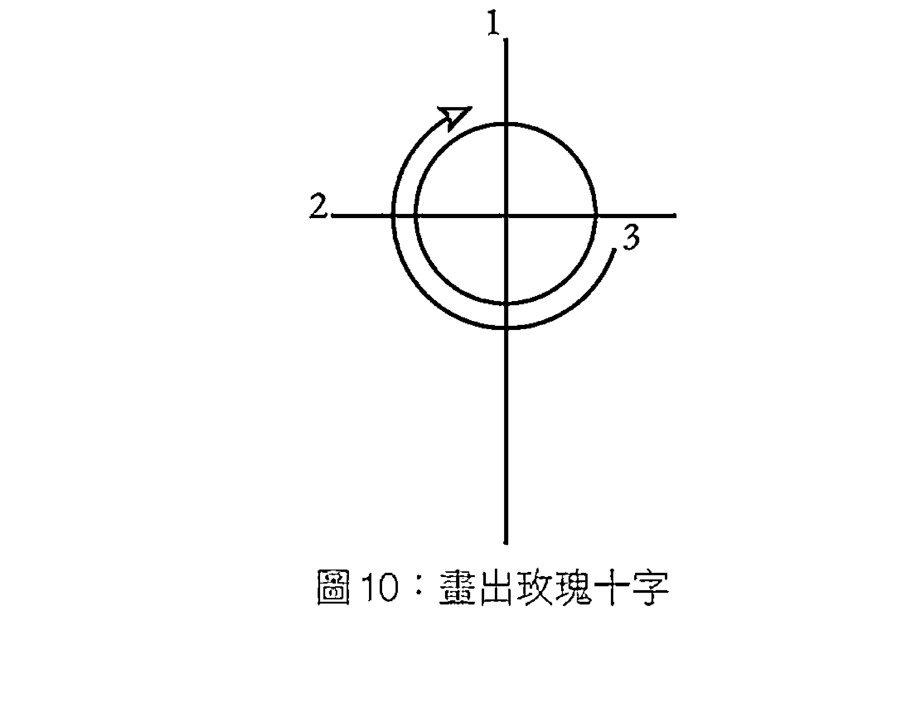

## 玫瑰十字儀式

所有障礙物應從房間清空，祭壇也要移到旁邊。唯一必需的工具是一炷香，但是也可以準備以下幾件物品：雙重能量外魔杖、蓮花魔杖、彩虹魔杖、玫瑰十字魔杖。

- 開頭：面東，建立卡巴拉十字架。
- 玫瑰十字：走到房間的東南方位，身體向外。使用香或魔杖畫出一個大大的十字和圓圈（圖11）。畫十字時，想像十字被黃金光芒圍繞，圓圈則想像成一圈火紅。畫出這個符號時，振動「**YEHESHUAH**」，並在發出最後一個音節的音時，大力刺入被圈起的十字架中心，啟動能量。

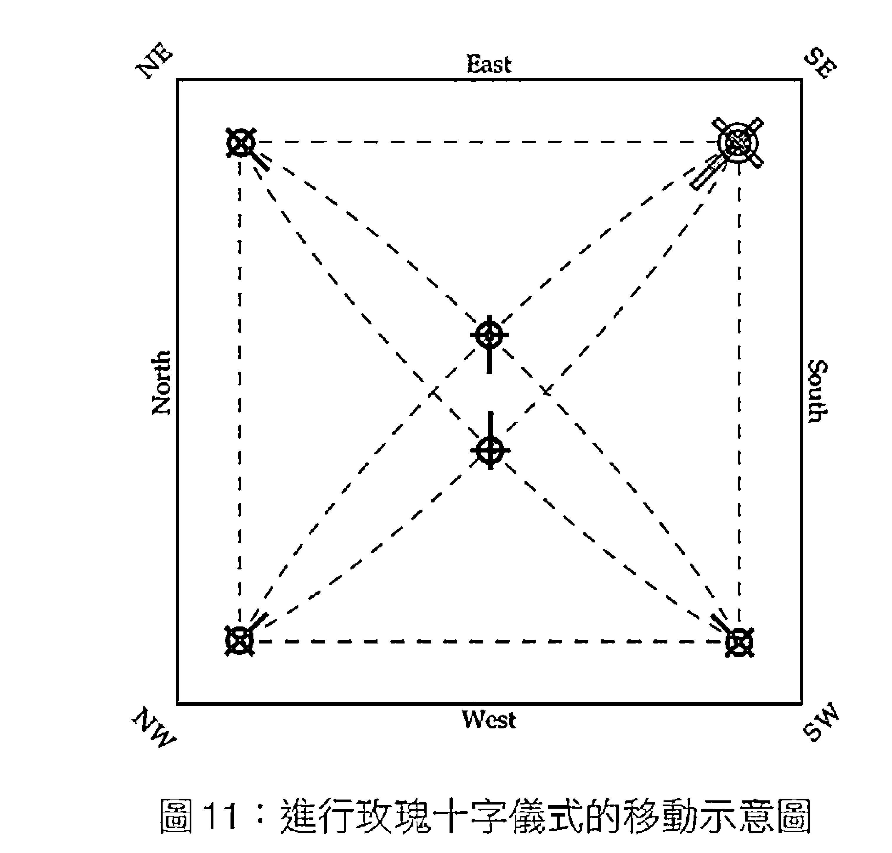

- 將工具的尖端保持與十字架的中心點齊平，就這樣走到房間的西南方位。跟先前一樣畫出十字和圓圈（即玫瑰），把工具刺穿圖形中心，唸出「YEHESHUAH」。
- 走到西北方位，畫出圖形，唸出「YEHESHUAH」。
- 走到東北方位，畫出圖形，唸出「YEHESHUAH」。
- 回到東南方位，完成一圈。使用工具的尖端碰觸原本就畫在那裡的十字架，但是請勿再畫一次圖形或再唸一次名字。
- 現在，工具舉高，走向房間正對面的西北方位，但在神廟中央止步，在頭頂正上方畫一個玫瑰十字。跟先前一樣振動「YEHESHUAH」。
- 工具繼續舉在頭上，就這樣走到房間的西北方位。使用工具的尖端碰觸原本就畫在那裡的十字架中心點。請勿再畫一次圖形或再唸一次名字。
- 再次走向房間正對面的東南方位，但是垂下工具，在神廟中央止步。在身下畫一個玫瑰十字，振動「YEHESHUAH」。
- 再次舉高工具尖端，繼續走到東南方位。使用工具的尖端碰觸原本就畫在那裡的玫瑰十字架中心點。請勿再畫一次圖形或再唸一次名字。
- 順時針走到西南方位，使用工具的尖端碰觸原本就畫在那裡的十字。
- 走向正對面的東北方位，但在房間中央止步，碰觸頭頂上方的十字架中心點。唸出「YEHESHUAH」。
- 繼續走到東北方位，使用工具碰觸原本就畫在那裡的十字架中心點。
- 走向房間正對面的西南方 位，在神廟中央止步，碰觸下方的十字。振動「YEHESHUAH」。
- 繼續走到西南方 位，碰觸原本就畫在那裡的十字架中心點。
- 順時針走動，使用魔杖碰觸各十字（西北、東北和東南）的中心點，連結所有的十字架。不需要唸出名字。
- 回到畫出第一個十字架的東南方位時，碰觸中心點，然後停一下。接著，在原本的十字架上畫一個更大的金色十字架。畫出一個大圓圈，在畫紅色圓圈的下半部時振動「YEHESHUAH」（圖12）；在畫紅色圓圈的上半部時振動「YEHOVASHAH」。
- 順時針走到房間中央。看著周圍的六個玫瑰十字被一道道光芒連結。

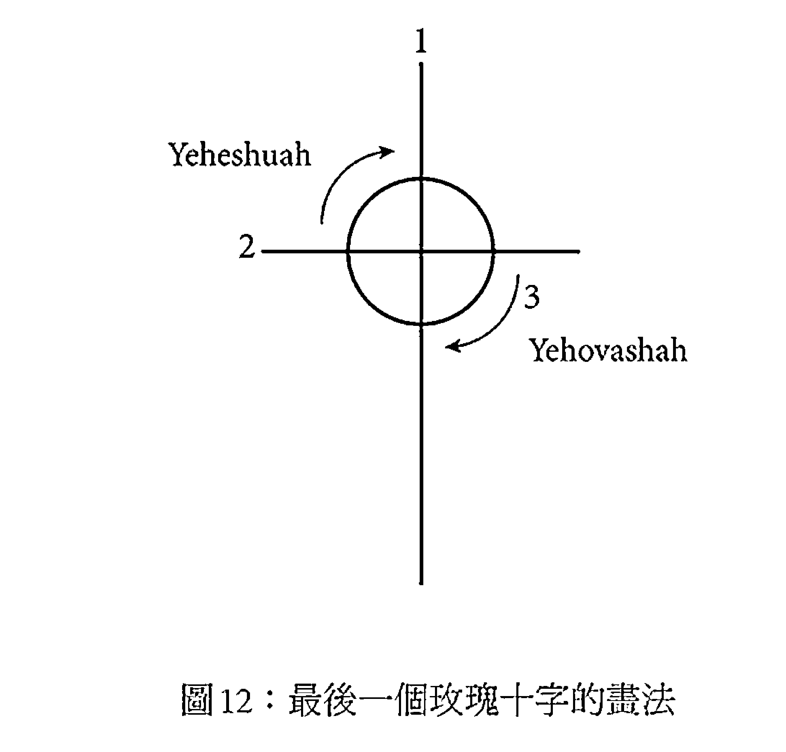

## ◆ 靈視 ◆

水晶占卜是第二階層的重要魔法功課之一。這是一種超感視覺，又稱靈視。在黃金黎明的傳統中，水晶占卜和星界投射都可以被說成自我催眠的一種形式，使用符號作為通往星界領域的傳送門，造成意識改變。從較高層次的意識狀態，魔法師通常會嘗試看清事物的根本原因，也就是從較高的角度或視野解決問題，進入宇宙內部的機械裝置，看看它是如何運作。

第二階層會學到三種超感視覺的方法，但是這三種方法不容易區別。這些方法是：靈視水晶占卜（或純粹說成水晶占卜）、靈體顯象旅行（星界旅行或星界投射）以及層次上方升起，可以分別描述成看見、移動和升起這三種技巧，雖然這些全都屬於廣義的靈視工作。這些都是受到魔法師控制的星界顯象，充滿意義、程度劇烈，但完全可以理解。在這些顯象中，觀看者對自己的選擇、意志與判斷能力保持全然的掌握。藉由這些經歷，魔法師可以達到卡爾·榮格（Carl Jung）所說的集體潛意識或赫密士哲學家所謂的「世界靈魂」（Anima Mundi）的最深層境界。

在卡巴拉思想中，宇宙萬物都是先在星界的形塑界創造或預製出來，後來才在實體的物質界顯現。星界層次比實體世界高，但是低於神界，是介於中間的地帶，也是反射、意象、夢境與顯象的領域。有時，這個地方被稱作「意象寶庫」，阿卡西紀錄（Akashic Records）據說就放在這裡。這個領域包含從古至今人類所有的記憶和經驗，而這些記憶和經驗全都嵌在以太物質之中。

藉由靈視，魔法師會觀看或進入星界，跟天使、靈體等各種實體互動；換句話說，他會接觸屬於自己心靈構造一部分的那些原型。不過，他也會跟存在於更廣大的宇宙之間的基礎元素和靈體產生交流，因為跟前者互動，就是跟後者互動，反之亦然。只要有技巧且勤加練習，觀看者就能經歷某種白日夢般的強烈體驗，從中看見一些事情、得到一些資訊。

黃金黎明的靈視工作通常使用水晶占卜符號完成。這個符號可以是任何東西：元素或煉金三角形、塔羅牌、占星符號、風水四方形、印記、以諾金字塔等等。這些符號全都可以用來作為星界傳送門，進行靈視工作，或是用來訓練超感視覺和其他靈異特質。傳統上，黃金黎明用的是取自東方神智學和印度教的「真性牌卡」來完成這項工作。真性（tattva）是一系列的圖形，可對應到五大基本元素及相呼應的顏色和形狀（表3）。

| 真性名稱 | 形狀 | 顏色 | 元素 |
|---|---|---|---|
| 阿卡夏 (Akasa) | 卵形 | 黑 | 靈 |
| 特哈斯 (Tejas) | 三角形 | 紅 | 火 |
| 阿帕斯 (Apas) | 新月形 | 銀 | 水 |
| 瓦優 (Vayu) | 圓形 | 藍 | 風 |
| 頗哩提毗 (Prithvi) | 方形 | 黃 | 地 |

這五個基本的真性圖形可以衍生出二十種複合圖形，做法很簡單，只要混合兩種元素，一大一小地結合在一起即可。圖13顯示的三種複合真性牌是取自伊斯瑞·瑞格德創造的牌組，分別代表風之地、火之靈和地之火的圖案。

黃金黎明協會設計了一套方法，結合水晶占卜的符號和「負殘影」（negative after-images）這個常見的光學效應。負殘影跟協會傳授的閃影色概念完美吻合，指的是眼睛長時間暴露在高飽和色彩之後，在視網膜形成的互補色塊。即使眼睛已經沒有繼續暴露在該色彩下，殘影還是會繼續留在視覺成像中。在進行黃金黎明的靈視工作時，符號及殘影之間的過渡便用來作為開啟星界傳送門的引子。

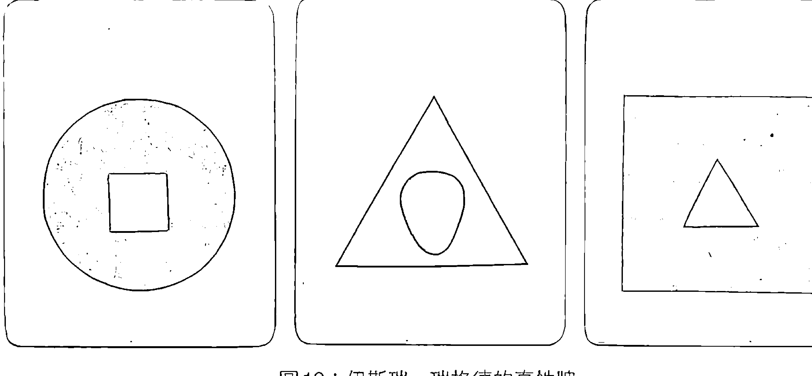

佛羅倫絲·法爾和伊蓮·辛普森（Elaine Simpson）曾在一次講課中，短暫描述了她們的方法和自己的水晶占卜靈視經歷。這個演講的標記是「飛行卷軸第四」（Flying Roll No. IV），名稱為「兩位大師獲得靈體顯象的方法示例，以及談論她們看見什麼」（An Example of Mode of Attaining to Spirit Vision and What was seen by Two Adepti）：

> 起身，完成卡巴拉十字架和禱告。接著思考某樣物品，例如一張塔羅王牌……若以這個為例，你先前就應研究這張牌，包括其象徵、顏色、類比等……深深陷入此牌的抽象概念……思考這張塔羅牌所有的象徵意涵，所有跟它的字母、數字和境況有關的一切，以及連接的路徑。專注到遐思的狀態或者明顯地感覺到改變之後，可能就會開始出現顯象……假使你的視覺開得很大，不要恐懼，不要抗拒，就讓它來；那麼，靈視或許就會出現。¹²

法爾和辛普森接著敘述了她們利用女皇這張牌進行占卜所看見的東西。

## 伊斯瑞·瑞格德

「弗朗西斯」·伊斯瑞·瑞格德（1907-1985）寫過數本關於儀式魔法的重要著作（圖14）。瑞格德在英國出生，後來全家人搬到華盛頓特區，因此他大部分的人生都在美國度過。他對密契主義的一切都很有熱忱。一九二六年，年輕的瑞格德加入了美國玫瑰十字協會的華盛頓學院，跟韋恩·維斯特考特有一些通信往來；美國玫瑰十字協會是非共濟會的玫瑰十字組織，使用的是黃金黎明的晉級儀式。一九二八年，瑞格德搬到歐洲，成為克勞利的秘書。

到了一九三二年，瑞格德已經出版了自己的著作，該年更是出版了他最重要的其中兩本書：關於卡巴拉的《石榴花園》（A Garden of Pomegranates），以及從魔法師的角度探討每一個魔法層面的全面性教科書《生命之樹》（The Tree of Life）。荻恩·佛瓊為《生命之樹》寫了書評，大力讚揚此書，使瑞格德獲邀加入黃金黎明位於布里斯托主要分支之一的晨星協會的神廟。他在一九三三年一月進入協會，迅速晉級各個等級。一九三四年年底，他離開晨星協會，因為他認為協會的知識很快就會遺失。三年後，他以四冊著作《黃金黎明會》出版了協會龐大的知識量。

在一九三七年，瑞格德回到美國，受訓成為整骨師和治療師。他的餘生仍持續出版各種魔法主題的書，包括《中柱》（The Middle Pillar）、《魔法師之石》（The Philosopher's Stone）、《應用魔法基礎》（The Foundations of Practical Magic）和《儀式魔法》（Ceremonial Magic）。一九八二年，他在喬治亞州的一間神廟替一小群黃金黎明的學生進行小達人等級的晉級儀式。

> 伊斯瑞·瑞格德被認為是將西方玄秘主義的神秘面紗掀開的大功臣。法蘭西斯·金（Francis King）和伊莎貝爾·蘇德蘭（Isabel Sutherland）說：「玄秘魔法能夠像這樣重生，大部分都要歸功於弗朗西斯·伊斯瑞·瑞格德博士的著作。」*

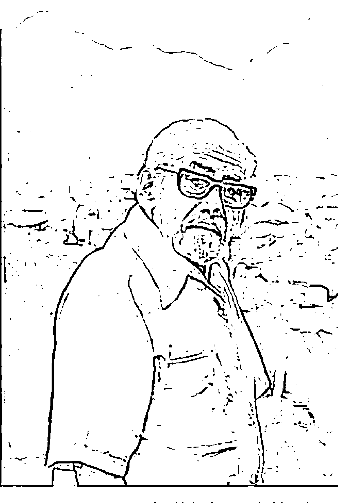

## ◆ 以諾魔法 ◆

以諾魔法系統源自十六世紀末英國人約翰・迪伊博士與愛德華・凱利的水晶占卜紀錄。自從密碼手稿記載了最初的晉級儀式基本概述後，以諾魔法就一直是黃金黎明課程的一部分。從狂熱級到門戶級的學生，都要學習以諾魔法的守望台表格以及這些表格衍生出來的神名。然而，學生必須晉級到第二階層之後，才能深入研究這套系統。

紅寶石玫瑰與黃金十字架階層的學生，要運用以諾魔法召喚強大的元素、行星和靈體能量，也要使用天簡的魔法方陣在不同的天使領域中進行靈視、使用以諾之鑰進行召喚，並且學會以諾魔法的其他面向，包括七行星的奧秘、神聖表格、上帝真理印記等。

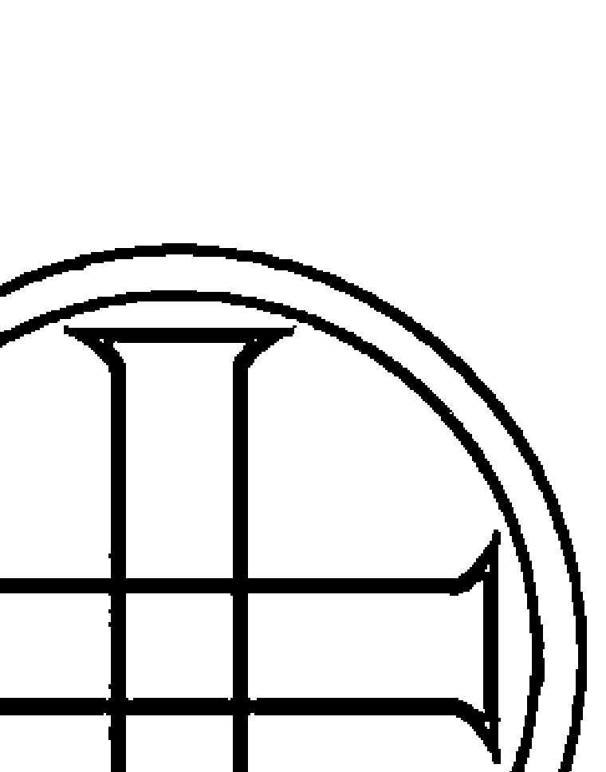

| b | O | a | Z | a | R | o | P | h | a | R | a |
|---|---|---|---|---|---|---|---|---|---|---|---|
| v | N | n | a | x | o | P | S | o | n | d | n |
| a | i | g | r | a | n | o | o | m | a | g | g |
| o | r | P | m | n | i | n | g | b | e | a | l |
| r | s | O | n | i | z | i | r | l | e | m | v |
| i | z | i | n | r | C | z | i | a | M | h | l |
| M | O | r | d | i | a | l | h | C | t | G | a |
| O | C | a | n | c | h | i | a | s | o | m | t |
| A | r | b | i | z | m | i | i | l | P | i | z |
| O | p | a | n | a | L | a | m | S | m | a | P |
| d | O | l | o | P | i | n | i | a | n | b | a |
| r | x | p | a | o | c | s | i | z | i | x | p |
| a | x | t | i | r | V | a | s | t | r | i | m |

圖15：以諾北方（地元素）表格

黃金黎明協會實際應用以諾魔法的一個好例子，就是四元素武器（Four Elemental Weapons）的聖化儀式。以下節錄的段落取自地元素護符的聖化儀式，運用了以諾地元素表格（圖15）的能量，包括北方的王和長者。魔法師要拿起魔法之劍、唸出地元素之王的咒語，並畫出地元素的召喚五芒星。接著，魔法師要畫出土星的六芒星，對跟地元素有關的六位以諾長者唸出咒語：

> 「憑著北方旗幟上的三個神秘又神聖的偉大神名，EMOR DIAL HECTEGA，我召喚汝，偉大的北方之王、IC ZOD HEH CHAL 來到這場典禮，因汝的存在增強我現在用來聖化此魔法護符的儀式。賜予此符最大的玄祕力量與德行，讓此符完成地元素本質的一切工作，使我從中找到有力的防護和強大的武器，用以統治、指揮元素之靈……北方象限的偉大親王，我以長者這尊崇的頭銜和身分地位召喚你們。聽我的訴求，偉大的親王，地元素北方象限的六位長者：LAIDROM、ALHCTGA、ACZINOR、AHMLICV、LZINOPO、LIANSA。」13

黃金黎明協會將迪伊和凱利的以諾占卜帶往新的發展方向，塑造成完美融合的西方魔法和靈性知識系統。「黃金黎明傳授的以諾魔法最與眾不同的地方在於，它結合了玄祕哲學的理論與應用，創造出極有效又強大的系統……在麥克逵格·馬瑟斯和他的夥伴手中，以諾魔法真正匯聚了輝耀、元素、行星和星界微觀世界的一切能量。它將卡巴拉、塔羅牌、占星學和風水學融合為統一的心理領域。」14

黃金黎明協會將以諾魔法納入自己的課程，無疑成功讓人注意到迪伊和凱利的天使魔法，進而導致今天人們又重新對他們的工作產生興趣。協會將以諾魔法捧在高位，或許是對這套系統最大的敬意；這被認為是整套體系的頂點和至高榮耀。這正是為何，學生必須先完全內化黃金黎明課程的其他領域，然後才可以學習以諾魔法。

首先，應該先說清楚，學生得進行大量的系統化研究之後，才能真正領會這套系統的價值與微妙奧義。這是我所遇過最棒的魔法體系之一，因為它完整而全面地融合了黄金黎明的整个魔法系统……因此，由于它集整个协会于大成，学生得先让自己完全熟悉黄金黎明传授的其他知识领域。他必须通晓塔罗牌和风水学的一切属性，熟稔到那些名称、象征和概念都能信手拈来。当然，也必须具备希伯来字母、生命之树和广泛的卡巴拉思想等基本知识。来自 Z 档案那些关于初学者候选者、神庙与仪式象征意涵的应用魔法公式不仅要牢记，还必须理解。学生得完全熟悉五芒星和六芒星仪式、圣化仪式的公式、召唤的艺术、护符图像以及印记的绘制。¹⁵

第二阶层的仪式有好几个都或多或少包含以诺的材料。内阶层的每一个等级和子等级都得研究以诺系统的不同层面。

## ◆ 光之魔法 ◆

第二阶层有一组特别的指导，合称为「Z 档案」(Z Documents)，收录在伊斯瑞·瑞格德的《黄金黎明会》里。

这些手稿说明黄金黎明初学者仪式的各个层面可以变化出无穷的应用魔法变化，而其中一个档案就称作「Z.2：光之魔法公式」(Z.2: The Formulae of the Magic of Light)。

光之魔法指的是黄金黎明的应用魔法公式，当中的许多形式都隐含在初学者仪式的众多象征层次。

光之魔法分成五个部分，代表玄秘工作的五个领域。这些可以使用五字神名 Yesheshuah 的五个字母分门归类。

所有的仪式魔法（包括召灵和乞灵）都属于「Yod」字母以及火元素；护符的圣化和自然现象的产生（雨、暴风、地震）属于「Heh」字母以及水元素；所有的灵性发展和转变都属于「Shin」字母以及灵元素——这一类又可再分为三种魔法类型，对应到 Shin 字母的三个 Yod，即三把火焰（这三把火焰又被分配给三个主要字母 Aleph、Mem 和 Shin，个别表示隐形、转变与灵性发展）；所有的占卜和占星形式都属于「Vav」字母以及风元素；所有的炼金术都属于「Heh」字母的结尾形以及地元素。

凭着五个应用魔法的分类，魔法师便能将黄金黎明的所有面向加以结合。学生在这之前所学的一切都能运用到：希伯来字母的研究和记忆、卡巴拉原则、占星对应、冥想、具象化、戏剧召唤、振动、闪影色、能量化意志的投射、神形化身、五芒星和六芒星的各种仪式、以诺魔法。这一切知识都成为黄金黎明魔法师仪式工具库的一部分。

大师等级会研究 Z.2 档案提供的魔法仪式概述，创造出同一个仪式独一无二的完整扩展版。瑞格德在书中提供了根据 Z.2 的概述所自行创造的仪式范例，但他也告诫读者不可盲从或单纯复制贴上他的版本。技巧成熟的学生应该要能运用自己的巧思和灵感，创造自己的个人仪式。能够这样自行创造有效力的仪式，是进阶魔法师的正字标记之一。

## ◆ 给现代魔法师的建议 ◆

今天的黄金黎明魔法师所能取得的选项，比起维多利亚时代的魔法师还多。今天，世界上存在着好几个黄金黎明的神庙和组织，有些十分传统，有些不尽然。有些团体会将其他类型的要素或灵性传统跟黄金黎明的指导结合在一起，这样做并没有错，只要这些团体清楚告诉可能入会的成员这些区别即可。

可是，加入任何团体之前，我建议你做好功课。到魔法界的圈子提问，多看看书，不要相信网络上的一切，宁可自学，也不要跟随名声不佳的老师或假冒的诈骗团体。

自我晋级也是一个选择。黄金黎明的原始演讲、补充的飞行卷轴、从初学者到小达人级的课程等，大部分都有出版，任何有兴趣自行钻研此学的人都可以很容易取得。不是一定要加入有经过认可的组织团体或神庙，才可以实现伟大的工作。独自一人或在小团体修练的学生，可能比我们以为的多得多。黄金黎明今天依然非常活跃，而且相当适合现今的世界；这个世界需要多一点平衡与神圣，就像小达人义务中的美辉耀条目所说的那样：

> 「我立下承诺与誓言，在神的允许之下，我从今天开始会致力实现伟大的工作，也就是净化、提升自己的灵性本质，藉由神的协助，让自己最终得以超越人性，渐渐跟更高层次的神圣守护神合而为一，同时不滥用赐予给我的伟大力量。」

## ◆ 参考书目 ◆

Crowley, Aleister. "The Holy of Holies." In Collected Works of Aleister Crowley, vol. 1. Des Plaines, IL: Society for the Propagation of Religious Truth, 1905.

Greer, John Michael. The New Encyclopedia of the Occult. St. Paul, MN: Llewellyn Publications, 2003.

Head, Thomas. "An Introduction to the Enochian Teaching and Praxis." In The Complete Golden Dawn System of Magic, vol. 10, by Israel Regardie. Phoenix, AZ: Falcon Press, 1984.

Howe, Ellic. The Magicians of the Golden Dawn: A Documentary History of a Magical Order, 1887–1923. New York: Samuel Weiser, 1997.

King, Francis, ed. Astral Projection, Ritual Magic, and Alchemy: Golden Dawn Material by S. L. MacGregor Mathers and Others. Rochester, VT: Destiny Books, 1987.

King, Francis, and Stephen Skinner. Techniques of High Magic: A Guide to Self-Empowerment. Rochester, VT: Destiny Books, 1976.

King, Francis, and Isabel Sutherland. The Rebirth of Magic. London: Corgi Books, 1982.

Maitland, Edward. Anna Kingsford: Her Life, Letters, Diary, and Work. 2 volumes. London: George Redway, 1896.

McIntosh, Christopher. The Rosicrucians: The History, Mythology, and Rituals of an Esoteric Order. York Beach, ME: Samuel Weiser, 1997.

Regardie, Israel. The Golden Dawn: An Account of the Teachings, Rites, and Ceremonies of the Order of the Golden Dawn. 7th edition. Woodbury, MN: Llewellyn Publications, 2003.

Waite, Arthur Edward. Shadows of Life and Thought. Facsimile edition of original 1938 publication. Kila, MT: Kessinger Publishing Co., 1997.

## ◆ 建议参考书目 ◆

Cicero, Chic, and Sandra Tabatha Cicero. The Essential Golden Dawn: An Introduction to High Magic. St. Paul, MN: Llewellyn Publications, 2003. An introductory-level text that examines the history of the Golden Dawn and its principles and areas of study and practice.

——. Golden Dawn Magic. Woodbury, MN: Llewellyn Publications, 2019. Provides clear, step-by-step instruction in the main areas of practical Golden Dawn magic and how these procedures benefit the magician.

——. Golden Dawn Magical Tarot. St. Paul, MN: Llewellyn Publications, 1991. Tarot deck and accompanying book based on the teachings of the Order.

——. Self-Initiation into the Golden Dawn Tradition. St. Paul, MN: Llewellyn Publications, 1998. A rigorous text with knowledge lectures, meditations, pathworkings, rituals, exercises, and initiation rites for the solo practitioner and the working magical group.

Gilbert, R. A. Revelations of the Golden Dawn. London: Quantum, 1997. An exposé of the Order written by today's foremost Golden Dawn historian.

Golden Dawn Community. Commentaries on the Golden Dawn Flying Rolls. Dublin: Kerubim, 2013. Contains all the "Flying Roll" essays written by original Golden Dawn members and provides commentaries on each one by contemporary magicians.

Greer, Mary K. Women of the Golden Dawn: Rebels and Priestesses. Rochester, VT: Park Street Press, 1994. Describes the lives and magic of four remarkable women of the original Order of the Golden Dawn.

Howe, Ellic. The Magicians of the Golden Dawn: A Documentary History of a Magical Order, 1887–1923. New York: Samuel Weiser, 1972. Although written from a non-magical perspective, Howe's work remains an important text on the Order's history.

Kuntz, Darcy, ed. The Complete Golden Dawn Cipher Manuscript. Edmonds, WA: Holmes Publishing Group, 1996. Provides a complete facsimile and translation of the foundational document that outlined the initiation rituals of the Order.

——. The Golden Dawn Source Book. Edmonds, WA: Holmes Publishing Group, 1996. A reference guide to the historical study of the origins, creation, and founding of the Order.

Regardie, Israel. The Golden Dawn: An Account of the Teachings, Rites, and Ceremonies of the Order of the Golden Dawn. 7th edition. St. Paul, MN: Llewellyn Publications, 2003. The twentieth-century's most influential magical text. The book that unveiled the teachings and rituals of the Golden Dawn to the world.

Wildoak, Peregrin. By Names and Images: Bringing the Golden Dawn to Life. Cheltenham, UK: Skylight, 2012. A valuable introduction to Golden Dawn magic and the mechanics behind the system.

Zalewski, Pat, and Chris Zalewski. The Magical Tarot of the Golden Dawn. London: Aeon Books, 2008. A detailed description of the tarot cards of the Golden Dawn and the methods used to work with them.

## ◆ 作者介绍 ◆

查尔斯·「切奇」·西塞罗（Charles Chic Cicero）生于纽约州水牛城。早年热爱音乐、特别是萨克斯风，他在数个爵士、蓝调和摇滚乐的演奏团担任多年主乐手，跟音乐界的许多知名演奏家一起合作过。他对共济会和西方密契传统很有兴趣，写过有关玫瑰十字和圣殿骑士团的研究文章，发表在《四冠的艺术及一九九六到二〇〇〇年英国玫瑰十字协会大都会学院的会刊》（Ars Quatuor Coronatorum and the 1996–2000 Transactions of the Metropolitan College of the SRIA）等出版物中。切奇是好几个共济会、马丁主义和玫瑰十字组织的成员。他曾任佛州圣殿骑士团大指挥团（Grand Commandery of Knights Templar）的大指挥（2010–2011），现任美国玫瑰十字协会佛州学院的大师级长。他是伊斯瑞·瑞格德博士的挚友亲信，不仅在一九七七年创立一座黄金黎明神庙，也是帮助瑞格德在一九八〇年代初期复苏美国黄金黎明协会合法支派（其晋级传统可追溯到一八八八年最初的协会机构）的关键人物之一。不久之后，他遇见了未来的妻

子、也是本卷共同作者的桑德拉·塔巴沙·西塞罗（Sandra Tabatha Cicero）。切奇从一九八五到一九九四年担任黄金黎明协会大敬长当中的总理职位；并从一九九四年至今担任协会大敬长当中的指挥职位。

桑德拉·塔巴沙·西塞罗生于威斯康辛州的乡下。她热爱艺术创作，这也为她在魔法世界的工作里提供了许多灵感。一九八二年毕业于威斯康辛大学密尔瓦基分校，得到艺术学士学位之后，她曾做过娱乐员、排版员、编辑、商业艺术家和电脑插图师等工作。二〇〇九年，她获得法律助手学位。在一九八三年认识切奇·西塞罗，黄金黎明魔法体系自此成为她的主要灵性关注。在伊斯瑞·瑞格德的鼓励之下，她花了五年时间完成《黄金黎明魔法塔罗牌》（The Golden Dawn Magical Tarot）的绘图。塔巴沙加入了数个马丁主义和玫瑰十字的组织，现任美国玫瑰十字协会的指挥（www.sria.org），并从一九九四年起担任黄金黎明协会大敬长当中的总理职位。

切奇和塔巴沙都是瑞格德重新创建的黄金黎明协会的大师级长（www.hermeticgoldendawn.org），这是美国至今仍在运作的黄金黎明协会支派当中最古老的团体，也是在多个国家都设有神庙的国际组织。

## ◆ 图片出处 ◆

- 图1、3-4、8-10、12和15出自卢埃林艺术部门。
- 图2和13版权为切奇·西塞罗和桑德拉·塔巴沙·西塞罗所有。
- 图5、7和11出自詹姆士·克拉克。
- 图6出自玛莉·安·萨帕拉克(Mary Ann Zapalac)。
- 图14扫描自瑞格德的真性卡，版权为切奇·西塞罗与桑德拉·塔巴沙·西塞罗所有。

## # 第九册
泰勒玛与阿莱斯特·克劳利——大卫·修梅克

本书前面章节探讨了独特的哲学观、仪式形式或魔法宇宙学，可以在每个案例中清楚得知，长久以来有许多思想家与实践者形塑了传统。接下来，我们将会发现一个庞大且独特的魔法传统案例；创立单一理论的专家，本身与传统理念和实践密不可分——阿莱斯特·克劳利——神秘学领域有史以来最重要、最具影响力的人物，他是实践预言体系「泰勒玛」（真知）的创立者。自他出现于二十世纪初期之际，聪明、具争议性的克劳利就受过单一魔法（magick，克劳利通常将魔法命名为「magick」）领域的独特影响。

### ◇ 生平简述 ◇

爱德华·亚历山大(阿莱斯特)·克劳利于一八七五年十月十二日，出生在英国皇家利明顿温泉镇（Royal Leamington spa）一户富裕的酿造家庭。成长于普利茅斯弟兄会（Plymouth Brethren）严格的新教（Protestant）派系之下，幼年早期便沉浸于圣经，并将象征符号与如诗般的语言深植内化。不过，很快地他就开始对基督教基本教义、圣经神话和道德产生质疑，这些在性格发展时期所发生的事，影响他往后的人生思考与个人的心灵发展。他进入剑桥大学就读时，接触了德国神秘学家卡尔·冯·埃卡茨豪森（Karl von Eckartshausen）的著作《圣殿乌云》（The Cloud upon the Sanctuary），没多久就发现自己被这个最初且神奇的组织——黄金黎明赫密士教团¹所吸引。克劳利终于发现了一直在寻找的训练场地，并在此正式展开其魔法旅程。

克劳利的地位在黄金黎明会里迅速蹿升，有段时间受到协会创立者之一麦克达格·马瑟斯的庇护。不过，最终还是在一次教派分裂与多数英国成员产生分歧，使得他们前往了巴黎。然而他们之间的情分非常短暂，克劳利很快就对马瑟斯和其命令感到幻灭。几年后，他曾在《原因之书》（Liber Causae）提到：

> > 虽然仪式详尽，不过过于学术，流于冗长与矫饰的谬论，即便正确，但其知识毫无参考性可言；内容不清楚、不具价值性，如同将珍珠放在猪的面前般，徒劳无功。
> 考验到最后令人鄙视，因为对任何人都不可能会失败。不适任的候选人录取原因，只不过是因为这是他们普遍的优先顺序。
> 简言之，此教会从一开始就是错误的。²

理想破灭的克劳利，将接下来几年的人生投入在异国与国内的旅行。他与黄金黎明会前成员艾伦·班尼特（Allan Bennett）旅行至远东一带，学习佛教与冥想，并持续进行登山活动，尽可能地探索世界上宗教传统的理论与实践。他与第一任老婆罗斯·凯丽（Rose Kelly）结婚，搬到苏格兰尼斯湖畔旁刚购得的博斯肯屋，在此度过了短暂的家庭生活。

就在他与妻子在埃及度蜜月时，他经历了魔法生涯中最关键的一刻——接触《律法之书》³（The Book of the Law / Liber AL vel Legis）。他宣称自己接受一个象征新纪元（New Aeon）力量、以鹰头呈现的埃及神「荷鲁斯」（Horus，或称拉 - 胡尔 - 库特〔Ra-Hoor-Khuit〕），名为「艾华斯」（Aiwass）的口授。这样的经验在现在可能是指来自未知力量而启发的一种写作方式。接下来几年与这本书的接触，让克劳利渐渐感觉到，其人生的目的就是要作为新纪元的先知，以「泰勒玛法则」（Law of Thelema〔θέλημα〕）为名，使用臭名昭彰的格言「行汝意志即为全法」（Do what thou wilt shall be the whole of the Law）来体现。在后面段落会讨论此法则及其奉行的教义——「真实意志」（True Will）。他最终将「To Mega Therion」（The Great Beast，巨兽）作为其魔 法箴言，同时参考《约翰启示录》（Apocalypse of John）约翰这个人物，不过将此原型曲解、延伸成一种更积极、再生的自由力量，以此将泰勒玛法则带入人类社会。

克劳利一生透过教学、写作，以及死前所领导的魔法组织「银星会」(A∴A∴)和东方圣殿骑士会传播泰勒玛法则。他在一九四七年十二月一日逝世于英国海斯廷斯的公寓。

## ◆ 科学光明派、综摄及银星会 ◆

在黄金黎明会经历了心碎过程后，克劳利在一九○七年与其导师乔治·塞西尔·琼斯（George Cecil Jones）共事，创立了「银星会」——以卡巴拉为基础所创立的组织。组织去除大量在黄金黎明会所创立、冗长且滥用的教义，核心思想为「科学启明」（Scientific Illuminism）或怀疑论，并以此为中心——每位野心者必须基于系统中的经验，以对于自身信仰、实践与结论有所定见。如同论文〈军人和傻子〉（The Soldier and the Hunchback），和其他各地鼓励野心者对于实践采用明确怀疑论与研究方法一样，避免假设任何教义的真实性，直到通过内心经验来证实它。他在《原因之书》提到：

> 候选者应该听从以上帝为名的任何神祇，使他不贸然地假设此为任何可知的神，让此神变成他心中唯一所认知的神；抑或仪式应该说出其名称（即便模糊），这可能是指埃及神、道教、佛教、印度教、波斯兰教、希腊神话、摩尼教、基督教或是伊斯兰教，让他反应这是语言上的缺陷、字面上的局限，而非是 P⁴这个人心理上的偏见。

克劳利采纳「综摄」*（syncretism）的方式以形塑新系统，并整合东西方的传统元素。他再次于《原因之书》写到创立此系统，是藉由选择对所有系统都很普遍的象征代表，严谨拒绝所有可能意指任何具宗教性且形上学的理论⁵。比起从零开始创立的组织，克劳利的银星会同时融合、大量吸收了印度瑜伽、佛教、道教传统，搭配西方传统元素，如卡巴拉、占星学、塔罗、以诺魔法及仪式魔法；另外也包含许多克劳利于黄金黎明会任期时所熟悉的哲学传统，像是新柏拉图主义、赫密士主义（Hermeticism）、玫瑰十字会（Rosicrucianism）以及古埃及神祇；并发扬许多在教会学习到的魔法技巧，如星光体旅行、振动上帝之名（vibration of God-Names），以及使用编纂于其著作《777》⁶中，对应卡巴拉庞大体系的文字、词汇、颜色、神祇、灵魂、香精等。

图1：附上银星会阶级的生命之树

除了融合各种传统与实践，克劳利对于银星会体系的目标是改善训练成效。他移除教会系统里的初阶知识课程，期望对于系统感兴趣的人，能藉由大量自学银星会初阶阶层里的资源来自我学习。同时也浓缩了系统的阶层，如祈祷与召唤的传统阵列、法宝与魔法施术的构成、以诺魔法和占卜技巧——这些在教会的第二阶层才会接触到，不过在银星会的初阶阶层（图1）就可以看到；几乎所有银星会的课程在公众下都毫无保留，除了启蒙仪式、少数的关键字和仪式流程以外。总的来说，克劳利的指导守则就是「神秘是真相的敌人」。

在克劳利修正过的系统里最大的改变，也许是在训练中几近完美地去除任何的社会背景。除了初阶启发之外，在银星会里没有团体仪式，体系并没有像黄金黎明会和大多数人一样，融合社会或兄弟会层面的团体；传统上并没有所谓的「会所」或「神殿」，教学整体是由野心者自己与一位指定的「导师」接触完成。其目的是除去人际关系的冲突、社会地位的追寻，以及在他来看需要对黄金黎明会入会初衷妥协等类似的缺点。

## ◆ 神圣守护天使 ◆

神圣守护天使就克劳利而言，象征力量、意识现象，或是一种外显个体——如许多其他传统所提到的「高我」(Higher Self)、「发光体」、「高智慧体」(Higher Genius)以及其他数不尽的名词。克劳利在不同人生阶段对神圣守护天使有不同的解释，会根据他的教徒与意图产生很大的差异。有时候解释为等同于高我——以有意识或无意识存在的观点思考；或将角色直接定义为外显的个体，如在他与自己的神圣守护天使「艾华斯」的经验里，经由口述完成《律法之书》，使他认为有一个确实存在的声音直接告诉他。

在银星会体系里，神圣守护天使的「认识与交流」(Knowledge & Conversation, K&C)管道对于初学者来说，具有特别的重要性。银星会课表中要达到「小达人」(表卡巴拉第六个辉耀的「美」)阶级的所有任务，这是作为通往「认识与交流」的垫脚石。其工具有魔法仪式、冥想、以各种实践渐进提升昆达里尼(kundalini)、灵修实践等，不过这些仅是单纯用来获得认知与对话的手段。经过「认识与交流」后，当「真实意志」有意识、深层内化到日常生活中，即可开始实施魔法仪式，代表此人已经与真实意志达到同一个水平。在获得认识与交流前，少有案例能达到这样的地步。

在达到小达人阶级前，虽有机会与神圣守护天使对话，不过通常是藉由潜意识来进行，符号语言隐晦。即便有很长一段时间可能会让人无法感受到有意识的对话，不过以符号语言进行对话的能力会不断进步。因此，银星会以及记忆各种魔法对应的取得，如符号等在某种意义上就等同于神圣守护天使的「母语」。

最后，野心者开始能以更直接、有意识的方式取得沟通。在银星会体系，神圣守护天使之景 (Vision of the Holy Guardian Angel) 归类于「王国」——位在卡巴拉「初学者」(Neophyte) 阶段的辉耀。位于初学者阶段的野心者，通常能进行更多有意识的对话。这是一种求爱过程——逐渐加深、强化彼此关系，在生活中渐渐增强能力以获得与神圣守护天使的沟通。最后，在小达人层级中，「秘境知觉」(Briatic consciousness) 的突破进入先前的形塑界，建立起与神圣守护天使有意识的连结。因此，定义某人是否具有银星会真正巫师的特质，端看他/她能否与天使有意识且随心所欲地沟通。

### 真实意志

有关泰勒玛的哲学与宗教核心，可从其名一探究竟。「泰勒玛」(thelema) 原是希腊语表「意志」(will) 之意，其中真实 (true) 意志可理解为比单纯的自我意志或性格上的幻想更为深邃，表一个人的人生目的、基本欲望以及超越个人生命、甚至多种化身的自然之外。

真实意志是最深沉的内在自我，是一个人精神所在的核心；此外，重要的是，当它在个体人生中特别指出与表现出来时，也是宇宙意志的一种表现。有些人常常会误以为真实意志是魔法职涯中单一的选择，或人生中唯一需要完成的任务，但这样的定义过于狭隘，因为「真实意志」是真实自我的精华所在，其中包含实践、思考、感知、行为，以及涉及某人生的生活方式、每分每秒，还有生命的完整弧度。显然真实意志不仅是生涯的一种选择，抑或人中唯一需要完成的任务。然而，真实意志时常与人生中所做的事，如职涯、喜欢的兴趣、热情与偏好等产生很多重叠。此外，我们不仅建立出单纯的自我人格（或指卡巴拉哲学的心灵、直觉、心智）。有时野心者发现他们的真实意志——理想上促进自我——在自我概念本身来看未必舒适、和谐，通常在探索真实意志的道路上，会使某人的生活方式、优先顺序、职涯、关系和其他许多事做出痛苦的抉择，不过这样痛苦的过程正是因为它在考验某人跨出舒适圈。在这些案例中，主要目的是使我们在每天的生活里，藉由灵魂更深层的需求与神圣守护天使的指令来调和自我选择。

真实意志应该在任何时刻、地方，平等地解释每个人的选择，就如同解释某人整体的人生道路。当思考某人的真实意志时，应该试着回顾每天状况、生涯以及生活；它解释了某人影响宇宙的方式、做出的决定与习惯前往的方向，无关他/她是纽约的证券经理人、马来西亚的渔夫或任何其他人。换言之，主要的自我真理会以特定的方式展现，无论个体发现自己在世俗的状况如何。

此过程极为个人，没有第二个人会在峰谷间体验相同的道路。野心者必须将自己视为自身天使的先知——作为自身信仰的祭司与女祭司，这样的说法并非夸大其辞；其信仰的目的是深化、强化以及勾勒出日益增强神秘、魔法过程的清晰脉络，以有效唤起神圣守护天使。此信仰发展对于野心者早期阶段的旅程至关重要。我们的身心是天使驻留的容器，容器的目的是要活出真实意志，这是我们每个人生活中代表天使的声音。

如前提及，真实意志的理解对于与神圣守护天使的认识与交流会有大幅的进展。由于在银星会小达人阶段——对应到生命之树里的「王国」——密集、专注的仪式（如传统的亚伯拉梅林方式）通常会使目标达到巅峰。此外，也能让我们首次理解、意识到「精魂」（指天使自身的心灵直觉与声音）的神圣领域。

如上所述，真实意志概念的心灵与神秘导入不言而喻，不过它所带来魔法实践的意涵值得深入考量。更重要的是，克劳利相信，当一位魔法师完整意识真实意志时，能在追求魔法目标以及何时、如何执行时，做出更有效的选择。独立魔法师的真实意志，是与宇宙意志及自然法则保持一致定义，因此，魔法师的选择会从宇宙运行中获得帮助，就像一艘顺流而非逆流的船只。事实上，克劳利将魔法的基本定义为：「按照意志使其发生改变的一种科学与艺术」⁷，等同将仪式魔法的传统形式运用于世俗以及每天的实践里。

真实意志的教义也含有重要的人际与社会暗示。在文章〈义务〉(Duty)中，克劳利提到：

> > 排除其他抑制干扰……企图支配或影响他人，就如同企图扭曲或毁灭他/她，其必须是自身宇宙的一部分，也就是他／她自己……犯罪的要素是限制个体愤怒的自由……犯罪变成泰勒玛法则直接的心灵暴力，这在社群里是不被允许的。那些拥有直觉的人应该被隔离在一个定所以，建立他们自身状态去学习推行、维持正义原则的必要……因此，终极目标是在真实的科学原则上重建良知，如同行为的指导者、人们的监控者以及统治者的监督角色。⁸

## ◇ 银星会的方式与手段之概论 ◇

根据银星会体系的整体方式与训练方法，其出版资料并不匮乏，通常都经过精心设计，因为克劳利试图将此方式与资讯广泛地扩散，即时、大量复制。关于这个体系为何，有很多随手可得的材料，不过对于此体系为何、如何运作的资讯，目前很难找到具说服力且实际的讨论。在这个部分，我们将会探讨为何银星会的方式与工具安排的理由、为何他们横跨银星会的阶级以特定的模式展开，以及如何引导野心者朝着与神圣守护天使达成对话与智慧的道路，以达到更高的境界。

当然有一个特定的科学方式，但通常会根据阶级分析讨论，像是每一阶对应到四元素或卡巴拉对应的任务方式与性质。我们也会考量到这个角度，但也可能超出原有的方式，并转换发生在这期间训练类型的焦点。在此探讨的，并非直接着重在克劳利的著作，而是试图藉由现在作者的努力，传达作为实践方法学的体系之精华。

在辉耀「美」以下的银星会体系分成五种训练途径——基本上，五种不同类型的工具会一同使用，使野心者获得认识与交流。五种训练途径同时展开横跨第一阶级（临时入会者（Probationer）到中继（境界之主，Dominus Liminis））。我们会大致说明五种途径及其循环，并逐一说明更多细节。虽然显然不太可能在这里讨论所有的任务，不过，会强调主要的实践，举例五种训练途径，以及展示野心者在未开展的道路上如何互相补足。

- 途径一：魔法技术与技巧的发展
- 途径二：心智训练——专注、放空、成就与持续反复练习
- 途径三：脉轮的同步与激发以及昆达里尼的提升
- 途径四：灵修实践
- 途径五：平衡魔法心理的体质

在开始详细探讨前，应该强调所有在「美」（Tiphareth）底下的银星会体系——所有在进入次小达人阶级的层级——应该专注在与神圣守护天使认识与交流的完成。由于系统里交织着各种任务设计的性质与传统，因此容易失焦；再者，每位野心者都有自己的偏见和倾向，这会使其魔法变得目光短浅。任何案例中，体系的整体重点并非囫囵吞枣地累积与魔法技巧无关的能力，而是应该使自身变得更完整。野心者必须取得神圣守护天使的认识与交流，以及确切发掘真实意志，然后务必带着力量与坚定的心前进。

### 途径一

途径一是魔法能力与技巧的发展，此途径从银星会最早期的阶段就开始积极运作，像临时入会者一样早期。

### 临时入会者

临时入会者可能会试验各种魔法技巧，但在通往初学者阶段前（假设临时入会者那年学习得很成功），会将重心放在传统魔法工具，有点像在学习字母般，仅需单纯精通基础，让基础成为未来的基石。在此专注于五芒星与六芒星的仪式形式（如低阶、中阶、高等），以及发展元素、行星和黄道对应的召唤与驱逐仪式的能力。

### 卡尔·格默

虽说卡尔·格默（Karl Germer）是克劳利最负盛名的继任者，但其真正的遗物是他在世时所看过后出版的泰勒玛文学文集。他被视为圣殿会大师（Master of the Temple），并由克劳利选为银星会与东方圣殿骑士会的继任领导者，格默在其一生事业中，藉由保留、印制克劳利的著作以推广泰勒玛法则。

一九二五年，格默与克劳利透过汉斯·特兰克（Hans Traenker）于德国相识；格默视克劳利为明星，并成为他的学生和同事。一九二九年，他与克劳利成立「泰勒玛出版公司」（Thelema Publishing Company），并开创出版计划，使他持续进行直到生命结束。最后他成为克劳利的左右手，并以克劳利东方圣殿大秘书长的身份为其处理相关事务，同时也作为克劳利在美国的代表。

在两人相遇后，维护克劳利幸福是格默最优先的事，甚至格默在选择妻子时也受到其是否忠心于克劳利而有所影响，以个人财富与能力支持克劳利，并在求婚前视克劳利的活动为主要考量。英国战后，克劳利的健康每况愈下，格默还是确保他能持续从美国获得奢侈品与基本的物资。这些开销对洛杉矶阿加佩会所（Agape Lodge）的会员来说是很大的负担，会员会费及捐款主要都作为支撑出版与克劳利生活补给的费用。

作为克劳利美国代表的副手与后继者，格默发现自己时常与阿加佩分会当地领导者发生龃龉，当他们的优先顺序与格默出现分歧时，他感到相当失望。就像当他看到南加州团体最大社交地，只做了少许重要事务来提升泰勒玛法则时一样。他心里的神秘主义感受到，银星会是比东方圣殿更好的泰勒玛潮流管道，且若没有纸本文本的基础支撑，他们也很难生存。克劳利过世后，格默贡献他的时间、经历和东方圣殿会的基金，印制克劳利尚未出版的作品，像是著作《无泪魔法》、《托特之书》（The Book of Thoth）、《智慧或愚蠢之书》（Liber Aleph），如果少了格默，现在可能就无法看到。

阿加佩分会在一九四九年关闭，东方圣殿无法在格默的人生产生影响，于是他将注意力放在银星会的学生上，以及为他的出版计划寻找资金。直到一九六二年逝世后，并没有继任者或任何继续他计划的事宜。东方圣殿骑士会最后自行运作，不过银星会系统则由剩下的学生分裂成各认领者团体所领导。即便在指派适任后继者上的失败对格默的遗世留下阴影，但是他在克劳利作品保留上的勤奋，使得这些组织能持续运作，以及直到今日泰勒玛法则能让世人知晓。——安德鲁·法雷尔

安德鲁·法雷尔（Andrew Ferrell）效力于银星圣殿（the Temple of the Silver Star, TOTSS），担任该会的主事与执行官。作为银星圣殿的图书馆馆员与档案员，法雷尔致力于保管与分享克劳利、格默、珍妮·沃尔夫（Jane Wolfe）以及菲利丝·塞克勒（Phyllis Seckler）的文学遗产。他是东方圣殿骑士会的启蒙者、银星会的野心者以及神秘主义终身学生。在其他时间，他是名IT专业人士，乐于与他的「秘密首领」——三只小狗对话和玩乐。

### 初学者

初学者实质上需要形塑自己的「星光体」（astral atlas），另外也会以以诺系统（虽然在到达演练级阶段时并不会特别指定），以及其他各种所罗门和巫术技巧来做实验。

基本上，在这里特别设计的许多传统教学，是在旧黄金黎明第二教会一开始就会传授给初学者，并仅作为初学临时入会者的准备。这些技巧在系统非常早期时就会训练，但为什么呢？为什么正确表现五芒星、六芒星仪式或其他任何技巧的能力可能不会立刻显现呢？这是因为需要通往认识与交流的相关道路。但请思考一下，如果某人无法设计出有效唤起基本的自然层面，像是特定的元素或行星影响，以及让自己成为适当的管道接收特别力量的祈求和利用，那要如何设计出最重要的神圣守护天使祈祷仪式？熟练基础有其必要性。学习任何特定的仪式形式，如六角星仪式，虽然这些仪式本身并非那么重要，不过这是作为发展出唤起、安全控制及直接控制魔法力量的一种能力，且相当宝贵。

初学者也会训练、试验光之体（Body of Light）的控制，以及占卜和灵魂投射的相关技巧。过程中，会由其指导者测试，确保初学者的光之体已经发展充足的才能，有能力探索星光界（astral realms）。这个技巧很重要，因为说出符号语言，也就是星体世界的自然语言与潜意识的语言的能力，与野心者有意识地从神圣守护天使获得各种沟通的成长能力有直接关联。起初，在野心者的道路上，一些动机可能或多或少来自潜意识——藉由谈论各种梦想和灵感灵光乍现时——一个人可以愈有意识地叙述或理解这个语言，就愈能有意识地与天使沟通。

### 演练级

演练级（Practicus）的任务将前往到占卜。为什么需要学习占卜呢？请记住占卜是从一系列的符号中，有意识地去取得精微印象（subtle impressions）的另一种方式；如果一个人无法静下心面对一系列像塔罗或易经的通用符号，以及从中取得一些可理解、能利用的东西，那又如何能调整来自神圣守护天使的精微印象呢？如果无法执行像是基本的塔罗解读，又要如何藉由一定程度的敏感度取得来自神圣守护天使的讯息，以建立所谓正确的心灵「感应器」呢？

### 爱智级

爱智级（Philosophus）的任务是精通招魂与处理护符。这些实践要如何领导野心者朝「认识与交流」的方向呢？思考召唤的基本性质：一种将魔法力量外显的能力，特别是在魔法师对于魔法特定形式与类型能量的选择。举例来说，将特定灵魂召唤到三角形里，需要用上特定能量来源的能力，以及有效利用正确的魔法「肌肉感应力」将此带入实践。无论某人看到如此举止视为单纯的心理状态，或是作为一个真实的外在个体互动，仍然需要将「某物」具体化，藉由如此行为，野心者才能强化其技巧，在时机来临时与神圣守护天使进行具说服力、充满活力且有效的互动。我们并非指「认识与交流」的性质就等同于与一个灵魂对话，然而藉由完美招魂所增强的技巧，最终能直接完成认识与交流的任务。

同样地，创造、供奉强大的护符是「认识与交流」很重要的准备。什么是护身符的性质？它是一种充满着由魔法师挑选的特殊魔法力量的实物。而如果野心者没有神圣守护天使力量的护身符呢？如果某人无法让护符充满像水星这样简单的特定能量，那么又如何使这个「完整个体」成为有意识影响神圣守护天使的护身符呢？

### 途径二

途径二是心智训练，使某人专注、净空、成就和保持开放态度。在此，我们有另一套任务，这套任务很有可能更接近临时入会者的阶段。当某人选择像是临时入会者的实践时，拥有体位法（asana，姿势）和凝念（dharana，专注练习）的体验就相对重要。透过胜王瑜伽（Raja Yoga）的练习，野心者开始发展静心与专注的技巧，以及训练内心对精微层面保持开放的态度。此外，使用反思冥想与阅讚圣书能增强野心者的能力，获得各种重要体位法的深层意涵。为什么会如此重要呢？这也许有点不言而喻——假设某人的内心无法平静，无法使每天忙乱的想法安定，让内心在文本前或红色三角形里冥想这样简单的微妙感受保持开放态度，那么又如何能获得足够的平静，以达到「认识与交流」的终极冥想呢？

在第一阶层会持续胜王瑜伽的练习，并在「中继」达到巅峰。举例来说，《Liber Turris》¹¹在演练级和爱智级阶段设计用以增强能量以破坏源自脑中的想法；《Liber Yod》¹²则是中继者作为将内心整体带往强烈专注于单一重点的训练。在这里让野心者达到最终手段「美」的所有练习，这是为了与到达「中继」目标达成一致，以调和目前为止在协会所做的练习，以及达成神圣守护天使「认识与交流」一境性的目的。

最后，我们练习《Liber Jugorum》¹³，以发展野心者对于想法、文字与行为的控制。为什么演练级试着控制语言、爱智级控制行为、中继者控制思想——如果某人无法控指每天生活的语言，又要如何组成、传递神圣守护天使最完美的祈祷；如果无法控制行为，要如何创造完美儀式召喚神聖守護天使；如果無法控制思考，要如何在最高專注的瞬間，將集中力放在神聖守護天使。這些控制練習會強化許多需要成功達成「偉大工程」的魔法肌肉感應力。

## 途徑三

途徑三包括脈輪（cakras）的同步與激發，以及提升昆達里尼——源自每個人體內神聖、不可或缺且能再生的能量。透過各種練習，生命力會特別強化、適應，將目標鎖定在身體與心智，以及魔法師在精微的能量中心所執行的任務。

許多臨時入會者開始做體位法，此練習是進入進階昆達里尼的開端。先前尚未需要體位法的測試，直到達到狂熱級（Zelator）——在此需要屏氣凝神地坐在導師面前一小時，直到通過測驗為止。當某人的體位法有足夠能力時，就適合開始做調息（pranayam，呼吸控制），這也可能在臨時入會者階段就開始，但要到狂熱級階級才有正式測驗。有一件重要的事需注意，就是調息測驗的成效（通常是指「良好出汗」和「自主性僵化」），事實上是昆達里尼活動早期的象徵。這些只是初階階段，不過到了狂熱級階級已經開始啟動昆達里尼的流動，並顯現具體結果。練習中，早期的成果會有助於覺察身心機制中狂喜能量的成長，以及有意識地將此能量直導欲望目標。

這些過程會透過《HHH》^14的「Section SSS」（設計給銀星會演練級的練習）不斷增強。這美麗、強大的泰勒瑪式密教指導練習，包括在脊椎和大腦裡根底間能量的意識流動。野心者構想努特（Nuit）、哈迪特（Hadir，泰勒瑪萬神殿裡神聖的男神與女神原型）兩個不同的極端，以及在其間建立一些求偶儀式，通常會經過多天或更長時間大量的延伸練習，讓兩個端點最後在狂喜中結合，讓任務達到高峯。就訓練而言，此練習的實用性為何？除了有大量的神秘效益外，任何練習都能使野心者成為魔法力量有意識的管道，以及學習直接控制一個特定方式，作為發展重要魔法技巧的手段。

隨著其他訓練途徑，提升昆達里尼的過程在銀星會體系中非常重要。事實上，昆達里尼如同燃料，讓此燃料成為我們著手進行系統轉化過程的能量。所有有意志的轉化過程，憑藉能量在特定方式的提升和適應獲得更多的力量。此外非常重要的是，在發生靈魂狂喜狀態時，與昆達里尼相關的練習會帶來其自身的轉化、療癒與進化，這樣的性質會強化從人到「超人」（more-than-human）的轉變。像這樣神聖化喜悅的經驗，對於朝向「認識與交流」的道路至關重要，且此說法怎樣誇大也不為過。當野心者完成銀星會體系幾個初階階段，這個狂喜的神聖性質意識應該會變得敏銳、生動；神的這個想法，也就是神聖守護天使的想法可以想像成是「最性感」的事。同樣地，性本身被認為與神聖密不可分——事實上，當我們謹慎練習時，這就是真誠的努特信仰。

## 途徑四

途徑四由祈禱練習——銀星會體系的「奉愛瑜伽」（Bhakti Yoga）所組成，此任務是特別為愛智者階級所設計，對應到「勝利」輝耀、抱負、忠誠、火與熱情，前往與天使結合的道路對野心者來說並不陌生。在過程中，野心者不太可能在沒有憑藉著密集的奉獻與抱負進階到愛智級階段。所有的真相與美使野心者狂喜，持續揭開奧秘；那女妖之聲召喚他們往前，這些聲音是來自神聖守護天使活躍在他們生活與意識中單一或多個面向。

如前所述，奉獻與抱負的肌肉感應力大部分會在愛智級階級培養出來，以對應到「勝利」。在這個階段的道路，當某人幾乎準備好開始正式的「認識與交流」任務時，必定完全點燃抱負之火。正式設計給愛智級的關鍵虔誠教學是《Liber Astarte vel Berylli》¹⁵，在這個出色的建構體系裡，某人能選擇神靈以創造出自己的信仰系統，從這本教學中能清楚知道，在此的重點是在信仰的藝術中獲得實踐，也就是練習與強化祈禱的力量，那麼在不遠的將來，當某人採取認識與交流的任務時，可引領這個新的強大能力接近自己的神聖守護天使。這樣的方式意義重大，因為愛智級階級不太可能擁有完整的意識與神聖守護天使接觸，因此需要其他神祇、符號以及想像一個「替代者」來完成。在野心者接近中繼者與小達人階級的高潮經驗時，這些需求往往會快速消失；神聖守護天使會不斷指引出他們真實信仰的精華所在，並作為他們神聖守護天使的「先知」占據一個正確的位置。

## 途徑五

途徑五是魔法心理組成的平衡。為了天使之光的停駐，野心者必須準備好將自己當作是一個聖杯或管道。如果其發展失衡，聖杯就會傾倒；如果無法使自己成為一個連綴、堅固的管道，聖杯就會流瀉。他們必須將自己塑造成一個完美的形體，藉由這樣的設計以喚起渴望的力量——神聖守護天使之光。

其中構想出獲得這完美形體過程的方法，是透過銀星會第一團的基礎階級，將訊息內化。在每一階級，野心者會建立一個象徵性武器，將發生在階級中的內在改變象徵化與具體

> 15. Crowley, Magick: Book 4: Parts I – IV.

## 珍妮·沃爾夫

珍妮·沃爾夫（1875-1958）是名美國無聲電影的女演員、魔術師與泰勒瑪主義者。大多時候，她被視為一位熟練、優雅且堅持不懈的管理員。她幫助建立了加州帕薩迪納東方聖殿騎士會的阿加佩分會，有段時候她還是分會大師；說她是克勞利過世後，協助東方聖殿度過難關的人也不為過。她同時也是名技巧熟練的魔法師。

沃爾夫早年專注在實踐，學習速記，在紐約從事此領域工作近十年。不過在一次神經炎的攻擊下，她結束了這個追求，並第一次往電影圈發展，以新人之姿在這個產業嶄露頭角。她和卡勒姆電影公司（Kalem Studios）轉移到洛杉磯，成為主要的演員。她最知名的電影作品為一九一七年作為配角的《太陽溪農場的麗貝卡》（Rebecca of Sunnybrook Farm）——瑪麗·畢克馥（Mary Pickford）的電影。

在加州的第一年她發現了降神術。一九一三年的秋天，她得到弗朗茲·哈特曼（Franz Hartmann）的《黑白魔法》（Magic, White and Black）一書，本書的副標「短暫與永恆生活的科學——給神秘主義學生的實用訣竅」（The Science of Finite and Infinite Life, Containing Practical Hints for Students of Occultism）可說是大大影響她往後的人生，在某種程度上與個人紀律密不可分，特別是在內心的控制至靈修成就。

這本書引起她對西方奧秘主義的興趣，她的傳記作家菲利絲·塞克勒在一九一七年八月記載了沃爾夫使用靈應牌（Ouija board）與一些靈魂接觸。一九一八年，在短篇小說作家 L. V. 傑佛遜（L.V.Jefferson）的協助下，她開始嘗試「自動書寫」（automatic writing，表一種心靈能力，指人在無意識狀態下可以自動寫出某些書面內容）。根據她的自傳敘述，她聯想到了靈魂名字「Fee Wah」——它定期出現在她的人生裡。

一九一八年，她開始與克勞利通信往來，兩年後，宣布好萊塢的事業將加入克勞利於切法盧的泰勒瑪修道院。此修道院是間魔法的靜修院與學校，其以泰勒瑪原則為原型，用來執行銀星會的訓練。她從一九二〇年開始居住直到一九二三年閉院。

沃爾夫的日記紀錄被大量保存，以至於能讓我們知道她在切法盧是如何進步。學生實行銀星會初階的每日魔法發展學習，日常任務包括五芒星與六芒星儀式以及泰勒瑪式太陽崇拜（Thelemic solar adorations）。她對調息、體位法及凝念也相當熟稔。這些魔法實踐由克勞利直接教導，並仔細記錄在她的日記裡。精進的練習讓沃爾夫在一九二一年通過考驗成為臨時入會者。

沃爾夫早期受到神秘主義傾向影響最深，在自我控制下，透過學習及管理身心靈為她帶來成就。她對星體運行似乎很輕鬆，同時她能有技巧地運用身體提升、賦予靈魂狀態。從其過往歷史清楚可見，她所發展的紀律，以及使用在切法盧習得的實踐，大幅提升她達到、控制魔法狀態的能力。

> ——哈波·費斯特

哈波·費斯特（Harper Feist）為東方聖殿騎士會，以及位於明尼亞波利斯（Minneapolis）的「跨越微笑綠洲」（Leaping Laughter Oasis）「當地機構禮拜堂」（Local Body Master）的會員，同時也是銀星會的成員。

## 儀式建構的技巧

從西方魔法傳統冗長（通常是腐敗、殘缺或誤譯）的資料來源裡汲取教義與實踐，是克勞利相當擅長的事。他在現代魔法實踐裡其中一個偉大天賦，就是對有效儀式元素的分析。在《魔法理論與實修》¹⁶不同章節裡有言簡意賅的概要，包含驅逐、淨化、祝聖、一般召喚儀式、誓言／宣誓、特定祈禱、魔法力量的分化、任務完成以及離開之許（the License to Depart）。在先前方式裡這些基本元素並沒有太大轉變，不過克勞利在其人生任務中展現優秀的獨創力，比起過往傳統枯燥、麻煩的工具，他採用狂喜、性交、精神物質、戲劇動作，以及精密、熟練的詩歌祈禱。

「驅逐」是一種傳統術語，使用在身心靈與魔法師正在執行的心靈空間的淨化。基本上，克勞利會採用像五芒星或六芒星驅逐儀式，以分別淨化大宇宙／宏觀與小宇宙／微觀。

「淨化」指魔法師與其空間進一步的淨化，基本會用象徵清洗的水元素。目的是移除任何會玷污魔法師身心純潔之不需要或多餘的能量；「聖化」通常會視為火元素的一種儀式，透過焚香執行，並藉由連結與奉獻的儀式神聖目標提升淨化後的魔法師和其空間。

一般召喚如文字所示，是一種神聖力量的提升。任何召喚會使魔法師達到作為候選人的使用，不過通常例子是來自西方赫密士和泰勒瑪傳統，包含魔法初步召喚（Preliminary Invocation of the Goetia）、以諾系統第一次召喚（First Call of the Enochian system），以及克勞利《書卷十五：諾斯底彌撒》（Liber XV: The Gnostic Mass）祭師聖歌其中一部分：

> 汝是誰，皆於我之上，
> 汝無本性與名字，
> 當汝幾乎離開時，
> 汝是太陽的中心與秘密；

¹⁶. Part III of Crowley, Magick: Book4: Parts I - IV.

> 汝是隱藏在所有已知的春天。
> 未知，汝獨自在一旁，
> 是蘆葦裡真實的火焰，
> 孵化與生產，
> 提供生命、愛、自由與光明的資源與種子。
> 汝超越言語、超越洞見，
> 而吾，微弱且新鮮的火召喚汝，
> 吾意圖渴望點燃。
> 吾召喚汝駐留，
> 汝，太陽的中心與秘密，
> 最崇高神聖的神祕，
> 在我這個管道裡。
> 顯現最強大且最溫和，
> 如同在小孩身上也是合法的一樣。¹⁷

「誓言或宣誓」是魔法師在儀式和／或實際宣誓目的時，進行宣言的流程以便後續執行的儀式。透過此流程，能讓儀式目的（思想）的心智概念轉化為具體的口頭摘要（文字），接著藉由儀式本身的完成（行為）來達到目的。

「特定召喚」控制來自一般召喚所帶來的力量，強調儀式完成時所需的特殊能量。在五芒星（四元素）或六芒星（行星和黃道力量）各種召喚儀式案例中，特定祈禱也許會被儀式化。本質上也有可能被詩化，如用一組詩節引發特別的神靈、靈魂或其他形體，像是摘錄於克勞利「巴薩貝爾（Bartzabel）的召喚」——火之靈：

> 呼喚！呼喚！呼喚！呼喚！呼喚！
> 傳送汝無限的光輝和力量，我們懇求汝，汝恐將以至高崇敬的神（God Elohim Gibor）顯現在火之天堂。
> 噢！帶有金色光輝的羽翼！噢！正義的羽毛與雄偉堅毅的眉間！噢！手持戰矛和盾牌的武士！喲，直到春天的處女的力量與輝煌！在大海之上的風雨騎乘在鐵之戰車！射向月亮之箭！揮動四個魔法武器！是五芒星大師與太陽的熾烈憤怒！¹⁸

¹⁷. Crowley, Liber XV: The Gnostic Mass.
¹⁸. Crowley, The Conjuration to Helios.

一旦特殊、渴望的魔法力量出現，就必須透過不斷密集的星界層，從最高、無法言喻的靈魂領域裡，最終降落到現實世界中，因此，那股力量會用來作為使護身符、魔法武器、聖餐或其他魔法連結的神聖化以完成儀式。另外，也會透過自身詩化來完成，如前述摘錄般，我們可以看到透過至高崇敬的神的具體化，使神聖力量被分化到大天使領域，如闡天使哈瑪耶爾，以及天使般合唱的熾天使撒拉弗（Seraphim）。有關召喚會在隨後段落進一步詳細描述智慧的火星守護神「格菲爾」，接著是巴薩貝爾之靈。

一旦護身符或武器神聖化，或是完成聖餐，此儀式會被視為「離開之許」——被喚起的靈魂離開，回到適當的住所。

## 東方聖殿騎士會與性魔法的融合

在一九一二年左右，克勞利接觸到東方聖殿騎士會領導者希歐多爾·羅伊斯（Theodor Reuss）。當時東方聖殿會宣稱是「學術共濟會」（Academia Masonia）或是深奧儀式的知識庫與互助會傳統的實踐，也宣稱擁有「至高的秘密」，這應該是源自賢能者旅行到東方所習得的怛特羅密教性行為。根據克勞利的說法，羅伊斯接觸他是因為克勞利在不知情下出版這個至高秘密——《謊言之書》（The Book of Lies）¹⁹，他想要克勞利對所有細節保密，其向東方聖殿會承諾，最後他受到英國會所領導者的託付。

性魔法和神秘學的概要進入克勞利的魔法工具裡，簡直成了一場變革。性魔法儀式逐漸取代許多傳統西方魔法複雜的儀式技巧，而這些是克勞利在東方聖殿騎士會所習得的。克勞利對於性魔法技巧的成果，使得他在數十年來主導了他個人的魔法實踐，並記載於克勞利的日記《巴風特的魔法日記》（The Magical Diary of Baphomet 或 Rex de Arte Regia）及其他各處。在發展的同時，克勞利同步接受自己作為泰勒瑪先知（the Prophet of Thelema）和新紀元（the New Aeon）的角色。很顯然，廣義上新紀元的中心宇宙學和萬神殿承襲了怛特羅，完美地適應於性魔法實踐的框架——天空女神「努特」，以及代表無限可能的傳統化身——夏克提（Shakti）；她的配偶——哈迪特代表渴望的力量，與濕婆（Shiva）相差不遠。祂們「超拔結合」（ecstatic union）的結晶——拉-胡爾-庫特或荷魯斯，則可理解為新紀元靈魂覺醒意識角色的象徵，代表自由、有力量的、無忌憚的，以及宇宙意志的和諧。

¹⁹. Crowley, The Book of Lies.

## 傑克·帕森斯

約翰·懷特賽德·「傑克」·帕森斯 (John Whiteside Jack Parsons, 1914–1952) 為火箭科學領域的先驅，同時也是作家和神秘學家。他對早期的火箭引擎實驗，發展了固體火箭燃料，為噴射推進實驗室 (Jet Propulsion Laboratory) 的創立者之一。他對科學的貢獻，讓 NASA 將月球上某個火山口以他命名，以表彰其成就。由於他在東方聖殿騎士會與銀星會的參與，以及其魔法成果和他留下的太陽系小天體著作，使他在二十世紀初期泰勒瑪的歷史中，樹立了舉足輕重的地位。

一九四一年，帕森斯受到東方聖殿騎士會南加州阿加佩分會的啟蒙，之後進入銀星會體系，成為威爾弗雷德·塔爾博特·史密斯 (Wilfred Talbot Smith) 的學生。帕森斯進步很快，而且展現無比的個人魅力與領導能力。後來，在他想取代史密斯時，克勞利命他為阿加佩分會的大師。在他管理分會的任期間並非完全沒有爭議，那時他的儀式魔法指令甚至讓克勞利感到畏懼。

帕森斯其中一個記載的儀式，稱作「巴巴倫儀式」(Babalon Workings)，由年輕、後成為山達基教 (Scientology) 創辦人的 L. 羅恩·賀伯特 (Lafayette Ronald Hubbard) 協助實行。這次實行之後，誕生了一本文本《四十九之書》(Liber 49) ——此部分據稱是《律法之書》第四章的內容。巴巴倫儀式是試圖喚起女神巴巴倫進入物質界面 (physical plane) 的一種表現；帕森斯相信此儀式將第二任妻子瑪喬麗·卡麥隆 (Marjorie Cameron) 帶入他的生活，並將她視為巴巴倫的化身。其儀式對帕森斯來說是一個很關鍵的瞬間，這段期間他所接收到的觀點，大幅影響之後的成果與寫作。

他在一九四八年宣誓神殿法師的誓言後，帕森斯稱自己為「貝拉里翁·敵基督」(Belarion Antichrist)，並將自己放在視為敵對暴政基督教的位置；他撰寫了一份文本，名為《反基督》(The Book of the Antichrist)，內容涵蓋名為反抗宗教與社會壓迫自由的宣言。

其中最為知名的著作是一份論文，標題為〈自由為雙刃刀〉(Freedom Is a Two-Edged Sword)。帕森斯對自由、性、性解放、政府控制、女性力量、巴巴倫以及其他由泰勒瑪理念「行汝意志」所衍生的觀點，進行具說服力的闡述。帕森斯象徵性地敘述自由為雙面刃的刀具——一面為自由運動，另一面則是確保他人自由的獨立自由之責任。

帕森斯的神秘活動引發 FBI 的關注，有一次他還暫時被撤銷參與機密活動的資格，避免其參與政府合同的事務。他在一九四五年離開東方聖殿會，持續參與神秘學的活動與危險的化學實驗，直到一九五二年車庫內的一場意外爆炸奪走他的生命，享年三十七歲。

姑且不論帕森斯人生中引發爭論的部分，我們可將他視為泰勒瑪哲學自由的擁護者。他對科學的貢獻，使人們能脫離對重力的限制，其神秘的人生則致力於從物質世界的面紗理解放人們的靈魂——可從其幾本作品中拼湊出形塑他的樣貌。他源源不絕的創作來自熱情，以及持續不斷、明確地闡述個人自由獲得的主題。帕森斯早年為傳承泰勒瑪而生，此後世人得以由他的視角，看到從壓抑束縛中解放的進步社會樣貌會是如何。——雷克斯·帕森斯

雷克斯·帕森斯 (Rex Parsons) 自二○一○年，以在努特身體裡的一顆星星追求其真實意志。他是東方聖殿會的啟蒙成員、東方聖殿會四一八分會的前幹事，並以分會主席的身分於銀色勳章分會服務。二○一六年，他被授予為諾斯底教會的祭司，定期主持《書卷十五：諾斯底彌撒》的慶祝儀式，以及擔任其他功能的神職人員。他是《巴巴倫的女兒》(Daughters of Babalon) 第一版兩卷的撰寫者，可以在「魯魯」(Lulu.com，美國在線印刷，可自行出版和發行的平台)看到。目前定居在加州薩克拉門托 (Sacramento) 的山谷。

在克勞利的出版品如《書卷：努》(Liber Nu)²⁰、《書卷：哈德》(Liber Had)²¹和《書卷：H.H.H.》(Liber H.H.H.)中，他寫道：這些力量在密契應用裡是有力、美麗的指導。在其著作中使用的性魔法，大部分保存在東方聖殿騎士會最高層級的私人文本裡。然而，一些關於性能量魔法應用的提示則可在著作如《甘露》(Amrita)²²、《魔法的理論與實修》及各處發現。基本概念為「生殖力」——一種作為自然存在於所有人類裡的生殖功能，此可被服務於魔法師意志的特定魔法目標控制與領導。然而，在安全、有效地完成前，魔法師必須歷經嚴格的訓練——性力量的淨化，驅除任何以社會為基礎所累積的羞恥感與消極感，隨著傳給神聖目標力量的祝聖，所有力量會被激發，以支持魔法師在瑜伽士專注技巧的訓練。

克勞利除了對東方聖殿會性魔法秘密有極大興趣外，他也將會所作為在全世界廣泛傳播泰勒瑪法則的主要管道，將此作為他自身文學遺產的管理人。他重建會所，將此當作理想社會的典範，讓追隨者在不受限制實踐真實意志的同時，使會所的自我體系、創意和統治功能更為完善。在《書卷 194：帶有參考告示的會所構成》(Liber 194: An Intimation with Reference to the Constitution of the Order)，克勞利（他以東方聖殿會領導者的銘言之名弗雷特·巴風特 (Frater Baphomet) 撰寫）提到：

> 藉由（會所）平衡之學，你自身對於如何掌握人生會有所理解。至於，在真實事物裡，所有的一切皆是一個接著一個的想像；人類是宇宙的地圖，社會則是一個更大的衡量器……（會所）將民主結合君主制，其中包含貴族政治，並掩蓋了革命的種子，因此，個人的進步會因而受到影響。²³

雖然東方聖殿會在克勞利人生的地位微乎其微，但會所至今在世界各地擁有上千名會員。依據克勞利的願望，東方聖殿會發揮作為其文學財產看管人的作用，維持克勞利印象深刻的個人作品、魔法實踐和其他物品。

²⁰. Crowley, Liber Nu.
²¹. Crowley, Liber Had.
²². Crowley, Amrita.
²³. Crowley, Liber 194: An Intimation with Reference to the Constitution of the Order.

## 重要儀式和實踐

作為一位多產的作家，克勞利的作品包含眾多的書籍、論文、詩集、戲劇，甚至還有書評——他的創意和一些革命性的儀式對於魔法從業者而言，是作品中的核心。雖然檢視這些書籍的所有細節已遠遠超過這本書的範圍，但也許能在接下來的摘要中發現一些重要的儀式著作。

### 五芒星和六芒星儀式

克勞利採用基礎儀式的傳統形式，這些是他在東方聖殿會任期間所學習到的。雖然他將許多東方聖殿會啟蒙儀式於期刊《分點》（The Equinox）²⁴公開受到一些爭議，不過後來他以星光紅寶石（Star Ruby，五芒星）和星光藍寶石（Star Sapphire，六角星）的形式重新修正這些儀式，並於《謊言之書》中公開。這些修改過的版本並非像傳統儀式精準提供相同的目的，不過它們將克勞利早期的新泰勒瑪宇宙觀和哲學觀成果整合到基本的儀式實踐。同時，即便有一些評論者的論點與克勞利不同，但他直到生命結束前還是持續教導這些儀式的傳統形式。

### 太陽之書²⁵

受到迅速傳播的伊斯蘭教習俗多種禱告會的啟發，克勞利發展了太陽崇拜，內容含括在《太陽之書》（Liber Resh vel Helios）中，他將此設計作為學生的一般基本練習。目標是透過泰勒瑪式古埃及神祇拉（Ra）、阿哈托（Ahathoor）、亞圖姆（Tum）和凱佩拉（Khephra）的符號認同，使魔法師的意識分別與太陽的位置——黎明、日中、黃昏和深夜維持一致。

### 鳳凰彌撒²⁶

第一次出版在《謊言之書》，而《鳳凰彌撒》（the Mass of the Phoenix）是另一種推薦每天執行的儀式練習，就像《太陽之書》中提到魔法師在黃昏、太陽日落證明自己。這是一種聖餐體儀式，會在食用「光輝蛋糕」（Cake of Light，基本上是指一種帶有亞伯拉梅林肉桂油味道的小餅乾）達到高潮，另會沾一些魔法師自己的血。

### Liber V vel Reguli²⁷

本書被克勞利形容為「獸的印記儀式」（Ritual of the Mark of the Beast）：可適當喚起「荷魯斯新紀元能量」（the Energies of the Aeon of Horus）²⁸的咒語，適用於任何階級的魔法師每天使用。基本上，《Liber Reguli》是五星形儀式的特別應用，包含同步喚起四元素以及靈魂。如前所述，這是個明確召喚巨獸（Therion）、巴巴倫、努特和哈迪特，以及採用倒五芒星（例如：為了出現顛倒而旋轉）的泰勒瑪儀式。

### 書卷：Samekh²⁹

一九二〇年代初期，克勞利住在西西里切法盧（Cefalù）的泰勒瑪修道院（Abbey of Thelema），他為了學生弗蘭克·班尼特（Frank Bennett）寫了《書卷：Samekh（希伯來文第十五字母）》（Liber: Samekh）。這本書的設計是用來作為長達數個月的儀式工作，以喚起班尼特的神聖守護天使，是本儀式建構和（特別是）儀式評論的傑作。在本書儀式文字的旁註，可以發現一些克勞利對於視覺化的精細描述，以及魔法師進行其他儀式實作時所使用的內在工程。

### 書卷：金字塔³⁰

原是為自我啟蒙儀式所撰寫，《書卷：金字塔》（Liber Pyramidos）採用一種特別的金字塔型設計，作為黃金黎明會初學者啟蒙的精華（且無庸置疑，在克勞利心中會更進步）。此儀式配方有別以往且力量強大，可作為修道院開幕與閉幕的有效儀式。

### 書卷十五：諾斯底彌撒³¹

作為東方聖殿會和諾斯底教會主要的公開和私人儀式。諾斯底彌撒的加冕案例是克勞利儀式寫作中的靈感來源。此教受到祭司、女祭司及執事——可視為煉金術裡的硫磺（Sulphur）、鹽（Salt）和汞（Mercury），及印度哲學三德（three gunas）的代表——的相互影響。它合併了儀式主題，由俄羅斯正教（Russian Orthodox）、羅馬天主教（Roman Catholic Masses）以及擷取埃及、希臘傳統的魔法配方所構成。從許多方面來看，此教在東方聖殿騎士會的教學主體中，作為一種技術秘密且隱晦的儀式制定，因此可以被有效學習。

女祭司坐在祭壇上，且是裸體的（從她的觀點來看）。無論是否著衣，可將女祭司視為努特的代表及其神聖的化身；祭司則是作為渴望到達神聖之處功能的象徵——我們每個人內心渴望與努特結合的哈迪特能量。結合後的結晶拉－胡爾－庫特作為聖餐禮的酒和光輝蛋糕，由祭司食用。聚集在一起的成員也會參與聖餐禮，作為他們曾頒布的彌撒密契的參與見證。

在彌撒期間，執事與群眾念誦信經——這其實相當值得研究，因為這是關於核心泰勒瑪假設宇宙律法簡明扼要的陳述，這對彌撒魔法來說至關重要。

### 信經

我相信唯一、不可言喻的「神」，以及那一顆在其他星星陪同下的星星，它的火是由我們所創造，我們會回到那個地方；在生命中的唯一的父親，神秘中的神祕，在他的名字「混亂」裡，在唯一的第二領導者地球之上的太陽，以及所有的唯一的風之滋養者的屏息。

我相信一個地球，是我們所有的母親，在一個子宮內，裡面所有人類孕育出來，在那裡得以休息，神秘中的神祕，在她的名字「巴巴倫」裡。

我相信蛇和獅子，神秘中的神祕，在他的名字「巴風特」裡。

我相信唯一的光、生命、愛與自由之諾斯底和基督教教堂，其法之名就是「泰勒瑪」。

我相信諸聖相通。

由於每日的食物與飲料會轉化成精神支撐，我相信彌撒的奇蹟。

我向智慧洗禮告解，藉由此完成轉化的奇蹟。

我向唯一的生命、個體以及整體告解，那是過去、現在以及未來。

AUMGN、AUMGN、AUMGN。³²

作為東方聖殿騎士會和諾斯底教會重要的公開儀式，諾斯底彌撒定期在全世界各地出現，這是見識泰勒瑪儀式在泰勒瑪社群生活文化中最好的選擇。對於任何讀者，甚至是對克勞利魔法有興趣的人，都強烈鼓勵參與諾斯底彌撒。

### 二十世紀與二十一世紀後克勞利魔法：混沌魔法與其他

作為愛德華時代（Edwardian）與近代早期的橋樑，克勞利是「我們」這個時代的魔法師。這使得他在一九六〇年代反文化中，被定位成一個很特別的角色，在後來數十年直到他逝世前，他成為密教復興的領導者。克勞利對於像是披頭四樂團（the Beatles）、齊柏林飛船（Led Zeppelin）的吉米・佩奇（Jimmy Page）、撒旦教會（the Church of Satan）的安東・拉維（Anton LaVey）以及實驗電影師肯尼思・安格爾（Kenneth Anger）等人帶來很大的影響。在二十世紀早期，克勞利與傑拉爾德・加德納的合作，為現代巫術（威卡教）傳統與更寬廣的新異教運動的出現奠定基礎。同樣地，克勞利的一些學生包括伊斯瑞・瑞格德、奧斯丁・奧斯曼・斯佩爾（Austin Osman Spare）和肯尼斯・格蘭特（Kenneth Grant），憑著自身努力都成為重要的思想家與作家。這些啟蒙者後來將克勞利魔法完整帶入二十世紀後期，他們的繼任者也持續了其工作至今。

### 菲利絲・塞克勒

菲利絲・塞克勒（Phyllis Seckler，也稱「Soror Meral」）是負責建立泰勒瑪與加州現代東方聖殿騎士會的領導成員。她是東方聖殿的第九階會員、銀星會的成熟魔法師，並創立泰勒瑪學院（College of Thelema）。她對泰勒瑪的貢獻是曾於許多組織與她的學生一同生活。

一九一七年，她以菲利絲・艾維利那・布萊德（Phyllis Evelina Pratt）之名出生於加拿大。後來搬到加州，以美術老師的身分維生，撫養她第一段婚姻的小孩成長。她有時候會上戲劇老師蕾吉那・卡爾（Regina Kahl）的表演課，之後被介紹給阿加佩分會的成員，有段期間甚至還住在分會（後來克勞利很高興表示，塞克勒的畫作對於阿加佩分會各種個體間產生互相影響的作用）。

一九四○年，塞克勒透過珍妮・沃爾夫進入銀星會體系，一九五八年沃爾夫過世後，她接受東方聖殿騎士會與銀星會長卡爾・格默的親自指導，那時格默認證她已經有資格取得神聖守護天使的認知與對話以及達到小達人的階級。這段期間，她將泰勒瑪的主要文字著作，如《靈視與靈聽》、《智慧或愚蠢之書》及其他重要文本打成複本，讓此不至於遺失。大部分的文本之後都有出版並廣泛流傳。此外，她與格雷迪・麥克默特里（Grady McMurtry）——近代東方聖殿會早期歷史裡另一位關鍵角色——度過一段婚姻生活。他們一起在美國受到許多近代東方聖殿騎士會初代會員的啟蒙。一九七九年，塞克勒成為四一八分會的創立大師，這個地位使她得以站穩腳跟長達二十五年直到逝世。

綜觀她的人生，她孜孜不倦地建立與茁壯加州大部分重要的泰勒瑪相關組織，包括東方聖殿騎士會、泰勒瑪學院、泰勒瑪神殿（Temple of Thelema）、銀星聖殿會以及銀星會；她的著作包含日記《不斷持續中》（In the Continuum）裡的許多文章，含括克勞利一些不易取得的文本的關鍵內容，以及她自身對於泰勒瑪、魔法、塔羅、卡巴拉與其他主題的撰寫。（參考「延伸閱讀」）

塞克勒於二〇〇四年，在愛戴她的人的周圍安詳離世。至今，她的許多學生成為當代泰勒瑪裡傑出、知名的作家與演說家。——羅倫・嘉德勒

> 蘿倫・嘉德勒（Lauren Gardner）博士在紐約教堂山（Chapel Hill）的一間私人診所擔任顧問、教育家與心理治療師。她的特殊背景包含在黃金黎明會出色的訓練，以及銀星會、勝王瑜伽與相關的體系和傳統。其博士論文為探討異教裡的心理治療經驗。

克勞利具實驗性且時常逾越的魔法方式，幫助了「混沌魔法」（chaos magick）運動的成形。其中像是彼得・卡羅爾（Peter Carroll）和菲爾・海因（Phil Hine）魔法師的成就，可以簡單追溯至克勞利語料庫裡打破規矩的美學理論。此外，像是闈尼西斯・P- 普奧瑞傑（Genesis P-Orridge）、羅伯特・安東・威爾森（Robert Anton Wilson）和蒂莫西・利里（Timothy Leary）等人，汲取克勞利內心與文化改變的工具，將此轉化成他們自己的符號集與工作模式。P- 普奧瑞傑將其成果帶入音樂團體「跳動軟骨樂團」（Throbbing Gristle）和「心靈電視」（Psychic TV）裡，甚至建立一個勉強稱得上是魔法組織的「青年靈魂聖殿」（Thee Temple ov Psychick Youth, TOPY）。威爾森在其著作，如小說和非虛構作品，詳細討論克勞利的哲學，成為了作為許多追尋克勞利系統的野心者一個啟蒙的資料來源；心理學家、LSD（指迷幻藥）代言人和反文化代表蒂莫西・利里就無須多介紹，其跨足的領域相當廣泛，不過私底下，他可是專注於克勞利著作裡拓展思維與自由意志的重度愛好者。最為所知的，就是他曾在電視節目中引用克勞利的名言：「行汝意志即為全法」。

處在佛洛伊德、榮格時代以及其他深層心理學領域提倡者的時代，克勞利是第一位傑出的現代魔法師。他在這波運動裡詳細地探索，比起其他稍縱即逝的理論更廣為流傳，無疑地他確實同步著手完成了其成就。他分享對於佛洛伊德性學重要性的欣賞，並借鏡榮格的比較宗教以及從心理學觀點探討的哲學，克勞利試圖將此轉化為類似的魔法實踐研究。一九一六年刊登於《浮華世界》（Vanity Fair）的論文〈精神分析學的進步〉（An Improvement on Psychoanalysis），是對克勞利而言深層心理學最完整的分析。需要注意的是，克勞利早在榮格對於煉金術和其他罕見傳統的重要著作出現前，就完成這篇論文。令人好奇的是，克勞利的這些想法究竟是因為他曾看過榮格成熟的作品，抑或榮格在克勞利逝世多年後才出版了傑出著作《紅書》（Red Book）³³呢？

克勞利將東方冥想技巧整合至西方魔法系統裡的成就，預示了瑜伽、密宗以及東方所有事物全文化魅力的提升。他對於人類性解放的熱情支持，在一九六○年代晚期的自由戀愛運動裡完整展現，還有對於性別多元和性別流動的意識與慶祝，在現代文化裡也屢見不鮮。雖然目前確實仍有一些工作尚待完成，如保障人類無止境的自由，其他對於迷信、偏狹、偏執及壓抑力量還有很大的進步空間，但是克勞利的魔法，正確來說是他整個人生的成就，是一位追尋者在其人生中探索內在解放的真實意志道路上一個強而有力的例子。

## 組織聯繫

在此章節不像許多傳統描述的，泰勒瑪在現實世界中作為生活、成長的社群，並在許多大大小小的組織，甚至一大群獨立練習者的工作裡具體體現。其中兩個是先前由克勞利所領導的組織——東方聖殿騎士會和銀星會，還有更多近期發展的訓練選擇，如銀星聖殿會（torss.org）。關於這些組織更多資訊可以在網路上搜尋，不過有少數關於銀星會額外的資訊受到著作權保護（圖2）。

33. 榮格《紅書》。

### 銀星會

自一九六二年格默（克勞利協會領導者的繼任者）的逝世，銀星會一直沒有受到世界認可的管理者。格默離世後，有許多議論崛起，每個議論都有自己的領導者和其歷史說法（有時很混亂）。現在作者和編輯者唯一體現銀星會的方法是，根據其歷史合法性、領導者的完整性做自行擔保證認；其行政單位三合會到會所精神根基的連結，其中或許可透過 onestarinsight.org 聯繫。這樣的作法並不是要詆毀其他銀星會認領者的成就——我們肯定知道，更重要的任務是完成這些組織創立者所遺留下來的成就。

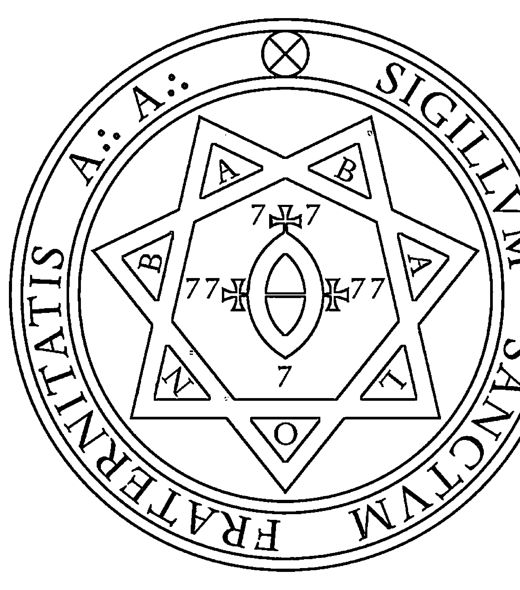

圖2：銀星會的印記

如果你被賦予銀星會任務的使命，將可自己進行研究，並針對其中一條特定路徑對自身最好的部分做出結論。最後，你自身心靈的獲得將會是你所選擇的智慧中最好的導師。

### 格雷迪・麥克默特里

格雷迪・路易斯・麥克默特里（1918-1985）最知名的，就是他在格默之薩圖恩努斯修士X°（Frater Saturnus X°）之名逝世後，以許米乃・阿爾發X°（Hymenaeus Alpha X°）頭銜復甦東方聖殿騎士會。

麥克默特里於一九四一年六月加入教會，並在同一天同時取得彌涅耳瓦（Minerval）與I°階級。後受到二戰干預以及在一九四二年二月加入二戰議題，使得他遠離阿加佩分會，不過這反而讓他在十月時遇見克勞利。那年的十一月，克勞利將他以許米乃・阿爾發（777）之名提升至IX°階級。在許多信件裡（1942-1947），克勞利宣稱麥克默特里為他的「哈里發」（Caliph）——精神領袖，並賦予他權力，負責加州教會的所有事務……這個授權僅在緊急狀況時能使用。

就像一九六二年格默在沒有指派繼任者的情況下離世，造成一個緊急狀況。當時，塞克勒開始聯絡教會成員，告知他們格默逝世的消息。當她聯絡上麥克默特里時，他們便以克勞利授與麥克默特里的權力為基礎，展開教會重建計畫。她幫助他搬回加州，開始與教會僅存的會員會面。不過僅有少數人對於教會復興或組織、活動運作感興趣，其他大部分多年來與格默失去連結的人都拒絕他們的邀請。

在麥克默特里的帶領下，教會合法維護克勞利的文學遺產版權，並重新出版與發揚，在一九七一年與教會合作給予這些作品法律上的資格。一九七七年十月，他在加州柏克萊創立泰勒瑪會所（Thelema Lodge），將此作為總會所與其他分會的中心。他相當具領導魅力的能力鼓舞七〇年代的年輕人，會員數很快擴散，從原本不到十二名會員的情況下，逐漸茁壯至在美國各地擁有超過百所的分會。這些分會也開始形塑、實行許多委員制度，規定分會需為教會體現克勞利的規範。現在，教會會員數已達數千名，分會遍布世界各地二十五個國家與五間總會所。——瑪琳・柯尼流

**瑪琳・柯尼流（Marlene Cornelius）**為一名泰勒瑪主義者。令她感到開心的是，她從《律法之書》發現克勞利，成為三十四年東方聖殿騎士會的成員以及近三十年的銀星會野心者。她也透過九〇年代紅出版社（Red Flame）與現在的聯合創作（Conjoined Creation），出版克勞利和泰勒瑪難以取得的歷史書籍。

### ◇ 參考書目 ◇

- Crowley, Aleister. *Amrita: Essays in Magical Rejuvenation*. Edited by Martin P. Starr. Kings Beach, CA: Thelema Publications, 1990.
- ———. *The Book of Lies*. York Beach, ME: Weiser, 1993.
- ———. "Duty." *In The Revival of Magick and Other Essays (Oriflamme 2)*. Tempe, AZ: New Falcon/Ordo Templi Orientis, 1998.
- ———. *The Equinox*. Facs. ed. Originally serialized 1909–1919. York Beach, ME: Weiser, 1992.
- ——— et al. *The Equinox*. Vol. III, no. 10. Edited by Hymenaeus Beta. New York: Thelema Publications, 1986.
- ———. *Gems from the Equinox*. Edited by Israel Regardie. York Beach, ME: Weiser, 2007.
- ———. *The Holy Books of Thelema*. York Beach, ME: Weiser, 1989.
- ———. *The Holy Books of Thelema*. Berkeley, CA: Conjoined Creation, 2015.
- ———. *Magick: Book 4: Parts I–IV*. Revised edition. Edited by Hymenaeus Beta. York Beach, ME: Weiser, 1994.
- ———. *777 and Other Qabalistic Writings of Aleister Crowley*. Edited by Israel Regardie. York Beach, ME: Weiser, 1993.
- ———. *The Vision & the Voice: With Commentary and Other Papers*. York Beach, ME: Weiser, 1998.
- Crowley, Aleister, with H. P. Blavatsky, J. F. C. Fuller, and Charles Stansfeld Jones. *Commentaries on the Holy Books and Other Papers*. York Beach, ME: Samuel Weiser, 1996.
- Eshelman, James. *The Mystical and Magical System of the A.∴A.∴*. Los Angeles, CA: College of Thelema, 2008.
- Jung, Carl. *The Red Book*. Edited and translated by Sonu Shamdasani. New York: W. W. Norton & Co., 2009.
- Shoemaker, David. *Living Thelema: A Practical Guide to Attainment in Aleister Crowley's System of Magick*. Sacramento, CA: Anima Solis Books, 2013.
- Von Eckartshausen, Karl. *The Cloud upon the Sanctuary*. Originally published in 1793. Whitefish, MT: Kessinger, 2010.

## ◆ 延伸閱讀 ◆

## 阿萊斯特·克勞利著作

The Book of Thoth: A Short Essay on the Tarot of the Egyptians. The Master Therion [pseud.]. The Equinox III (5). York Beach, ME: Weiser, 1993.

The Confessions of Aleister Crowley. Abridged one-volume edition. Edited by John Symonds and Kenneth Grant. New York: Arkana, 1989.

Eight Lectures on Yoga. Mahatma Guru Sri Paramahansa Sivaji [pseud.]. The Equinox III (4). New York: 93 Publishing, 1992.

The Law Is for All. Revised edition. Edited by Louis Wilkinson and Hymenaeus Bera. Scottsdale, AZ: New Falcon, 1996.

Liber Aleph vel CXI: The Book of Wisdom or Folly. Revised 2nd edition. Edited by Hymenaeus Bera. York Beach, ME: Weiser, 1991.

Little Essays Toward Truth. Revised 2nd edition. Edited by Hymenaeus Bera. Scottsdale, AZ: New Falcon, 1996.

Magick Without Tears. Abridged edition. Edited by Israel Regardie. Scottsdale, AZ: New Falcon, 1991.

"One Star in Sight." In Magick: Liber ABA, Book 4. Revised edition. Edited by Hymenaeus Bera. York Beach, ME: Weiser, 1994.

## 其他

Campbell, Colin. Thelema: An Introduction to the Life, Work & Philosophy of Aleister Crowley. Woodbury, MN: Llewellyn Publications, 2018.

DuQuette, Lon Milo. The Magick of Aleister Crowley: A Handbook of the Rituals of Thelema. York Beach, ME: Weiser, 2003.

Grant, Kenneth. The Magical Revival. London: Starfire, 2015.

Hine, Phil. Condensed Chaos: An Introduction to Chaos Magic. Tempe, AZ: Original Falcon Press, 2010.

Hyatt, Christopher, ed. Rebels & Devils: The Psychology of Liberation. 3rd revised edition. Tempe, AZ: Original Falcon Press, 2013.

Kaczynski, Richard. Perdurabo. Berkeley, CA: North Atlantic, 2010.

Pendle, George. Strange Angel: The Otherworldly Life of Rocket Scientist John Whiteside Parsons. Orlando, FL: Harcourt, 2005.

Regardie, Israel. The Eye in the Triangle. Tempe, AZ: Original Falcon Press, 2017.

———. Gems from the Equinox. York Beach: Weiser, 2007.

Seckler, Phyllis (Soror Meral). Kabbalah, Magick & Thelema: Selected Writings, Volume II. Edited by David Shoemaker, Gregory Peters, and Rorac Johnson. York Beach, ME: The Teitan Press, 2012.
———. *The Thoth Tarot, Astrology & Other Selected Writings.* Edited by David Shoemaker, Gregory Peters, and Rorac Johnson. Sacramento, CA: Temple of the Silver Star, 2017.

Shoemaker, David. *Living Thelema: A Practical Guide to Attainment in Aleister Crowley's System of Magick.* 2013. Reprint, Sacramento, CA: Anima Solis Books, 2017.

Tau Apiryon and Soror Helena. *Mystery of Mystery: A Primer of Thelemic Ecclesiastical Gnosticism.* 2nd edition. Berkeley, CA: Conjoined Creation, 2014.

## ◆ 作者介紹 ◆

大衛・修梅克（David Shoemaker）是一間私人診所的臨床心理學家，專攻榮格心理治療與認知行為心理治療。修梅克是銀星聖殿的首席秘書與發言人，提供泰勒瑪魔法與神秘學完整系統的訓練。他也是東方聖殿騎士會與銀星會（onestarinsight.org）的資深成員，為這些傳統的入門者提供訓練已有多年經驗。

修梅克是薩克拉門托東方聖殿會四一八分會的前會長，繼承朋友兼老師的菲利斯・塞克勒，他也是協會的最高總檢察長；曾是東方聖殿騎士會心理公會（the O.T.O. Psychology Guild）的創始主席，時常在國際間與區域間活動擔任講者。教學性廣播節目《活出真知》（Living Thelema）從二〇一〇年開始播送，並於二〇一三年以同名出版書籍；同時也是多數其他專注於泰勒瑪、心理學與魔法學的作者或編輯。

除了魔法學與心理學作品外，他也是名作曲家和音樂家，可以透過官網 livingthelema.com 與他聯絡。

## ◆ 圖片出處 ◆

第九冊所有插畫皆出自詹姆士・克拉克。

## 第十冊

### 多神信仰的儀式魔法——約翰·麥可·格里爾

儀式魔法以多神論傳統展開。埃及的神廟根植於西方魔法傳統，用來敬拜眾多的男神與女神。新柏拉圖思想家將魔法融合希臘哲學，創造第一個完整發展的西方密教傳統——祭祀希臘傳統男神與女神。直到古典時代，少數的基督教掌握傳統世界的政治權力，使得異教信仰成為一種藉由死亡處罰的罪行；因此魔法需要適應於新政權，通常受到質疑的適應都得開誠布公——因此，男神與女神作為占星魔法裡的行星、卡巴拉魔法裡的輝耀、基督民間魔法的聖人和天使，全部都重新被定義。

在十九世紀接受儀式魔法的異教徒，使用各種重新定義後的說法，但很少會提到異教與生俱來的潛在含義。受到基督教一千五百年的壓制，使得西方魔法傳統重塑並從巔峰跌落谷底。此外，這些年來就某個程度來說，許多試圖重啟西方異教的基督徒，大多數不願意面對社會的反彈——任何背棄基督教的人可能會受到苦難。不過在多年後，荻恩·佛瓊公開的伊西斯與潘儀式¹（rites of Isis and Pan）計畫，使得成熟的多神論教在西方世界重生。

即便如此，長久以來多神論儀式魔法方的式僅有少數保留下來。當一些傑出的新異教運動，如加德納巫教和亞歷山大威卡教（Alexandrian Wicca）從儀式魔法裡擷取特定的元素——用來充實宗教儀式與民間魔法的傳統，即便這對儀式魔法師有更寬廣的可能，但很少人從這層角度探索。很顯然地，儀式元素帶入這些新異教宗教裡，仍保大量的猶太基督教象徵。二十世紀後期，這樣的狀況相當普遍。舉例來說，當時威卡教徒宣稱拒絕猶太基督教神、其所有在小五芒星儀式以希伯之名的神祇召喚的工作，以及虔誠召喚四個猶太基督教大天使。

1. 加雷恩·奈特（Gareth Knight）Dion Fortune's Rites of Isis and of Pan 提供這些儀式的文本。

### 傑拉爾德·加德納

傑拉爾德·加德納是知名的現代巫術運動之父，不過他的成就是由許多在他之前就出現的魔法潮流的集合體，其中最為知名的有共濟會、十九世紀羅馬異教和二十世紀早期的儀式魔法。

加德納是名皇家拱門大師（Royal Arch Mason，一種共濟會的級別），他似乎是從那些威嚴的組織裡擷取一些基本概念，其中最知名的就是三個作為其基準的階級啟蒙系統。「美生」（Mason）在其系統中，傳統上是指「技工」（Craft）——這個字現在也廣泛用於現代巫師。

加德納的共濟會隸屬關係被克勞利記載在其日記裡，當加德納在一九三七年五月朔節（May day）來到克勞利用居所茶時，在這次茶會裡加德納接受由克勞利帶領的東方聖殿騎士團²的魔法啟蒙，克勞利也賣了幾本書給他，包含《藍色春分》（The Blue Equinox）——這本對加德納的成就造成很重大的影響。

根據加德納早期書籍《陰影之書》（Book of Shadow 或 Ye Bok of Ye Art Magical，此為原本稱呼）的文章顯示大多來自克勞利，還有黃金黎明會的儀式以及如《所羅門之鑰》（由黃金黎明會領導者麥克逵格·馬瑟斯翻譯）的魔法書。³

舉例來說，加德納的巫術魔法通常從「魔法圈」開始，女巫會在裡面召喚四元素——此概念源自伊莉莎白一世的皇室魔法師約翰·迪伊——之後黃金黎明會使用此概念，加德納有可能習自黃金黎明會伊斯瑞·瑞格德的出版著作；加德納的《陰影之書》包含黃金黎明會小五芒星驅逐儀式版本，似乎是來自瑞格德的魔法成就。

克勞利知名的公開儀式文本《諾斯底彌撒》，給加德納帶來很大的靈感。他使用文本的一些內容作為他撰寫巫術儀式的基礎，如「畫下月亮儀式」（Drawing Down the Moon rite）、「二月夜晚安息日」（February Eve Sabbat）以及「女神的箴命」（Charge of the Goddess）。加德納在制定巫術啟蒙儀式時，同樣也使用一些來自東方聖殿會神秘啟蒙儀式的概念。

雖然加德納的成就無疑有很高的影響力，但離從前基督教時代口耳相傳「真正的」傳統還有段距離；不過，加德納的巫術整併了儀式魔法實踐許多不同的思路，巧妙地將其編織成一片掛毯般，並激發了實踐者靈魂裡的古老思維。——羅德尼·奧弗斯

羅德尼·奧弗斯（Rodney Orpheus）是一名愛爾蘭音樂家、作家和技術設計師。他出版過兩本書籍——《阿布拉哈達布拉：理解阿萊斯特·克勞利的泰勒瑪魔法》（Abrahadabra: Understanding Aleister Crowley’s Thelemic Magick）和《阿萊斯特·克勞利的魔法書》（Grimoire of Aleister Crowley），並發行了數十張的專輯。近期與妻子蘇琳娜（Sulinna）和貓咪定居在英國。

對於像這樣怪異模仿的反應感到抗拒，是無可避免的。這使得在二十世紀近幾十年來，西方世界的許多異教團體因無益的概念變得四分五裂，異教信仰和儀式魔法始終水火不容。從某個程度來說也無法否認，幾乎當時所有活躍的儀式魔法的生活傳統，僅作為透過混種猶太基督卡巴拉召喚基督神祇的一種手段，並將異教的男神與女神單純視為象徵性符號。因此，要做的事是需要打破異教徒和儀式魔法師間那道想像的藩籬，使之成為魔法儀式系統的發展；就像古老世界喚起多神論信仰的眾神和象徵，而非基督教神、猶太教以基督教象徵的等同系統。

出於此想法，我在二〇〇八年發展了一套儀式魔法系統，其中使用黃金黎明會的技術性方法——最豐富、詳細的現代魔法系統——不過其象徵是擷取自新德魯伊信仰（Druidry）的傳統。關於此系統的基本教導與實踐，可以參考我於二〇〇三年出版的《凱爾特黃金黎明》，並從書中發現我有多熱衷。因為新德魯伊信仰是由以自然為主的現代靈性運動組成，因此，其中主要的研究專注於構思出多神論儀式魔法更寬廣的基礎方法。有關此系統所表現的內容，可參考以下的敘述。

就像我在《凱爾特黃金黎明》所呈現的，此系統源自黃金黎明會的儀式與實踐。然而，這是唯一一種能適用於多神論教徒需求的魔法嗎？當然不是。黃金黎明會的傳統是儀式魔法的系統，這是我多年來練習最頻繁的系統；不過，假設你是一名儀式魔法不同系統的啟蒙者，想要將其適用於多神論，接下來在此研究裡的儀式或許能提供你一些靈感。

### # 多神儀式魔法的規定

接下來的儀式與實踐需要一些零件和道具，不過有兩個很重要的規定：第一是你必須和傳統的男神與女神神系有關聯，如何選擇相關的神系，完全取決於自己的決定。這樣的關聯也許是支持且欣賞的象徵符號，以及平日所堅信的神祇，不過為了運用到這些神祇，你需要與其產生關聯。此外，無論你的信仰或靈魂選擇有多多元，在魔法運作下，愈是將男神和女神視為一個實體，愈能得到更好的結果。

在此有兩個值得提起的注意事項。第一，在魔法運作時不要混雜各種神祇。如果你寬廣的靈性生活包含兩種或是更多傳統神祇，基本上沒有問題；但在儀式魔法進行時，請選擇一種神系並堅持下去。一種神系含有各種含義，如同一個力量的基礎，如果在魔法儀式進行時混雜兩種或以上的神系，這樣就像在寫一封信件時混入了兩種或以上的字母般——你可能在產生等同於「希伯來文」⁴（= nonsense，胡言亂語）的東西。

第二要注意的是別使用來自奇幻小說、電影、電玩，以及其他類似的東西所創造的神系。現今的小說、電影和遊戲確實充滿一些與古老時代神話相同的角色，但這其實有很重大的差異。古老神話的敘述者並不會為了娛樂編造故事，他們不斷重述傳統的男神與女神是曾經存在的，其中在一些聽眾的宗教經驗中曾碰過，而且在其社會中的許多人都曾接受過靈性指導和各種形式的祝福。試問自己：如果你發現自己的人生正處於一個危險狀態中，你會考慮祈求在眾神中你所想到的神祇的幫忙嗎？如果不會，那麼用魔法召喚諸神對你來說可能不會帶來好處。如果你召喚虛構的神祇來強化魔法力量，比起魔法在世界上為你所做的習以為常的事來說，你很有可能只是在進行虛構的魔法儀式。

所有考量都與多神論魔法儀式第一個需求有關聯，關聯性更高的第二個需求是，你需要擁有一個守護神——與個人有特別親近連結的男神或女神。現今大部分的多神論傳統都鼓勵參與者尋找守護神，閱讀大量關於現代多神論實踐的書籍，這些書籍能提供各種與神祇建立關係的方式。你要如何著手進行完全取決於自己，但是你需要完成這些事，才能展開接下來的儀式。

4. 此單字「nonsense」寫自西里爾字母（Cyrillic）、希臘語、希伯來語和阿拉伯語字母。不曉得是否有抓到重點？

假設你有超過一個以上的守護神呢？在這種情況下，向你的守護神祈禱指引方向，從中找出那一個你在魔法儀式中需要喚起的對象。專注是邁向魔法成功的關鍵；比起在魔法儀式中不斷混雜不同的神系，與單一一個守護神共事能產生更快、更具力量的成果。這樣你可以在不同的情況下，持續召喚其他的守護神。一段時間內與一種神系共事，在魔法實踐中相當重要。

### ## 多神論魔法與多神論宗教

大部分情況下，要了解儀式魔法不等同於宗教相當重要。如果你隸屬於一種或其他既定的多神論傳統，可能曾學習或適應關於靈性實踐的各種規則。接下來所提及的儀式可能並不會遵守這些規則，亦不會遵守你可能曾從其他資源學習的儀式和實踐，即便與這裡所提及的儀式使用相同的規則。理應當如此。廚房的瓦斯爐與提供熱水的熱水器同樣都是處理熱能，但是我並不建議使用其中一個的使用手冊去理解另一個的作用。

魔法並非宗教。宗教以傳統、教導及實踐為主，藉由自身經驗範圍所塑造的神聖力量來建立對等的利益關係；多神論的儀式魔法是以此為基礎所建立，提供執業魔法師——指練習魔法的人——利用工具、透過力量轉變自身及其生活，使個體與一種或多種神祇產生連結。也就是說，你可以在不練習魔法的情況下參與宗教，抑或不加入任何一個宗教體系，但參與各種不同的魔法。

現在多神論社群關心的一些議題，在歷史真實性上占有很重要的價值；有些人看重那些僅實踐個人族群或文化連結的傳統的人——他們確實有權為自己選擇，但是魔法在這方面有其長久以來的習俗。在西方密教傳統裡留存下來最古老的儀式文本——希臘－埃及的神秘莎草紙，是魔法象徵與技術相當寶貴的綜合體，其象徵與技術源自超過千年不同時代的文化與族群傳統，在西元三世紀這些傳統有效地修正以符合執業魔法師的需求。相同的靈魂領導整個魔法歷史，且有很好的理由這麼做。

魔法的存在是為了完成、解決事情。假如你現在去買一把鐵鎚，這樣說好了，你不會挑選不管標籤上是否寫說這是一根幾世紀以前使用過的鐵鎚，也不會限制自己選擇曾被你族群或文化祖先所使用的鐵鎚；相反地，你會選擇最適合自己的那一種——即便挑選一根由英國人設計、德製鋼鐵所打造的鐵鎚，幫助你建造一個給埃及神祇的神殿——這就是我想表達的。

相同的原則也適用於魔法。執業魔法師著手進行讓事情發生，並整理出最適合執行的工具與技術。真實性對古老的東西很重要，不過對於轉化自身、人生與世界的魔法系統運作來說也一樣，兩者密不可分。

將這些道理銘記於心，我們可以前往多神論儀式魔法的練習階段。

### ## 多神論與新異教

多神論為世界宗教的一種分類，其中包含各種古老的、當地的、現代的以及重建或復興的宗教，並藉由其許多神祇的宗教屬性來定義。在現在世界的一些地區，這樣的宗教分類分享了新異教傳統與趨勢的人口統計交叉比對，儘管全世界的狀況都不太一樣。

綜觀歷史，現今的多神論代表了宗教傳統、萬神殿以及奉獻、崇敬和實踐道路上的一種活躍、國際化與跨文化的配置組合，比起單一事件，更多是包含許多傳統和文化特定的表現。當新異教與多神論相交會時，很有可能容易搞錯任何一方，或是假定它們在表達相同的事；但就如同身分的各種表達一樣，為了彼此間的尊重與洞見，保持清楚的界線以使其帶往智慧與成長的道路，差異化就顯得至關重要。一個可能是多神論者和異教徒的個體，不會因此被對方抹滅或是取代。

現今的多神論派正面臨前所未有的難關與嚴重的壓制，這些壓制來自於世界快速世俗化，以適應來自西方世界的擴張與經濟永續性。二十一世紀初期，許多政府與多數的宗教團體運動訴求去平台化、消滅權力與奪走他們發表與發聲的機會。很顯然地，新異教派是二十世紀西方靈魂實踐會合所誕生的產物，而多神論派包含了非西方文化與身分認證，使得其處在壓迫性不斷擴張、由世俗所支配的危險之中，也同樣被鄰近（但顯然不一樣）的西方運動像是新異教隨意抹去或漠視。

許多許多神論教擁有一個互相交流或進行魔法、神秘主義、密契實踐的場所，不過他們的核心在於代表一種對眾神奉獻的多元宗教傳統，並作為人類意識與生活裡確實存在的獨立個體。他們有許多源自古老多神論人們和文化的哲學性與密教根源，必須將這些理解為反映整個系統的多神社會，而非多神教本身，就像魔法和宗教是明顯不同的概念一樣。

當我們在多神宗教認同的框架下去適應現代魔法深奧的實踐時，重要的是去擁抱世界觀，也就是在面對魔法或巫術之前，更重要的是對眾神抱持著謙卑信仰，因為這些關係和奉獻傳統比任何事都還至關重要。

> ——西諾斯·希拉克斯

西諾斯·希拉克斯（Theanos Thrax）是名教會牧師、多神教顧問、教育者及作家，他撰寫了關於宗教、身份認同、多神論傾向與人類的權益主題。目前和四隻小狗、兩隻貓咪和一隻非洲渡鴉定居於美國新英格蘭的森林邊，並作為神聖蛇的養蛇所看管人。

## 臨在的圓圈

在標準的黃金黎明會傳統，魔法練習都會開始與結束在一個簡單的儀式——卡巴拉十字儀式（Cabalistic Cross），改編至基督徒畫十字記號的簡單方式，如果執行儀式的人是基督徒，這個方法就非常合適。十字為基督教的象徵，在身體畫十字的動作為基督教的儀式，即便以神聖之名裝扮成其他傳統也不會改變。

多神論儀式魔法的系統在此輪廓是不一樣的儀式，它取代卡巴拉十字術式，名為「臨在的圓圈」儀式（Circle of Presence）。此為基本的開始與結束手勢，會使用在無論何時展開或結束一個魔法活動。為了適應於自己靈魂的需求，有一件事你需要知道，就是你的守護神的名字；如前所述，你和守護神間有一段私密的關係。如果守護神不只有一個名字，請選擇一個你比較喜歡的。在接下來的儀式裡，會以「粗體」表示需要說守護神的名字。

在這裡和其他地方都會使用一段特別的演說形式，稱作「振動」（vibration）。為了學習，請先以簡單的母音聲調，像是「啊」（ah），反覆發出此聲，然後改變發音的方式，持續發出聲音直到身體某處產生嗡嗡聲或刺痛的感覺——這就是「振動」。隨著練習的狀況，你會發現身體充滿這種感覺，甚至會從外在直接指引身體。在接下來的儀式，將會以「粗體」表示感到振動的時候。

一旦選定守護神的名字，並練習足夠的振動以獲得效果時，就可以進行以下儀式。

-   步驟一：朝向東方。以弧形的方式從身邊舉起你的手，直到手掌在頭部正上方合掌，指尖朝上。移動合掌的雙手到額頭位置，觀想來自無限空間的光線降臨在頭部上方，接著說「以……為名」。
-   步驟二：將手移動到心臟的位置。觀想一道光線從頭部降臨至地球的中心，以守護神之名振動（守護神）。
-   步驟三：將手分開，以左手手指碰觸右肩、右手指碰觸左肩，雙手在胸前交叉。接著說：「……我的守護神……」。
-   步驟四：伸直手肘，將手張開，以畫圓圈的姿勢一起放下。接著手合掌，放到較低的腹部或腹股溝的位置（根據身體的比例）。觀想手指畫出帶有光線的圈圈。做了這個動作後，說：「……我將自己放在他／她臨在的圓圈裡……」。
-   步驟五：再次將手合掌放在心臟前方，指尖朝上。觀想一道光線從無限空間射入地球中心到雙手畫出的圈圈，你的心像太陽一樣閃閃發光，接著說：「……保護」。完成儀式。

> 「臨在的圓圈」是一種能依靠自己能力且實用的儀式，當你想要召喚守護神現身和保護時，可以隨時執行。如先前所述，這個儀式同樣需要執行代表開始與結束的五芒星、小五芒星儀式。一旦你練習多次，可以靠記憶執行，那麼就能在魔法訓練中，將小五芒星驅逐儀式當作下一個學習與練習的儀式。

## 小五芒星驅逐儀式

這是黃金黎明會魔法的主要儀式。若想進階到魔法實踐的頂峰，這個儀式將會比其他儀式還要更常實行。在其原本的形式裡，這也是整個系統中最完整的猶太基督儀式。儀式中一些重要的改變是為了作為多神派教徒使用。

第一，如我們所知，卡巴拉十字儀式由臨在的圓圈儀式取代，因此，儀式中面對的是自己的守護神而非猶太或基督教的神祇。

再者，五芒星會以不同的方式產生。在黃金黎明魔法裡使用的標準五芒星儀式版本，其基本通用的驅逐儀式所使用的五芒星可從地球之點追溯至靈魂之點，相同的手勢使用於驅逐土元素儀式。為什麼呢？因為其中一個歷久彌新的基督教教導主題，就是拒絕所有邪惡般的惡土。在黃金黎明會理論級（Theoricus）階級裡的指導者（Hegemon）指令——拒絕物質，追求心靈5——總結了兩千多年來的基督道德觀與神秘學的教導，同時也表現由赫密士黃金黎明所教授的小五芒星儀式版本。

不過在多神論靈性裡，這樣的說法尚無法證實。從多神論的觀點來看，心靈世界並非反對物質世界，相反地，是心靈在物質裡找到其自然的解釋，而物質在心靈中找到其自然的滿足。在回溯五芒星使用於多神論儀式魔法的方法裡，需要考慮其根本的差異。因此我們將回溯從最高點順時鐘的五芒星召喚6（summoning）——藉由四元素火、風、水、土，代表靈魂降臨顯化為實體；五芒星驅逐則是由頂端逆時鐘轉，藉由反過來的元素：土、水、風、火，表抽離實體轉化回靈魂。

第三，在赫密士黃金黎明版本儀式裡使用的希伯來神聖名字和大天使，僅與基督教、猶太教和那些對於猶太基督教象徵覺得適應的有所關聯。多神論儀式魔法師需要能夠將這些名字取代成適合自己的宗教需求。

接著，在進行五芒星、小五芒星儀式時，你需要從你的神系裡選四個神聖名字——如果可以，取兩位男神和兩位女神——這四個名字需要有四個分別代表的詞彙（想想看像是宙斯〔ZEUS〕、伊西斯〔ISIS〕等）。為什麼要這樣做呢？因為完整的儀式建構在一組四個號碼的關係上；一個中心與四個部分、一個靈體與四個元素、一個執行者與四個相關的通道等。在下面的儀式裡，神靈名字由「神靈1」、「神靈2」、「神靈3」、「神靈4」指稱。

在測試以不同字數的字母名字呼喚這些神靈時，通常不會有好的成效。如果你的傳統有自己的名稱，像是盧恩字母（Runes）、歐甘樹文（Ogham fews）或是希臘文，則可以使用其名字有四個字母的神祇，無論翻成英文是否有四個字母。因此，像是希臘女神堤喀（Tyche），其希臘文「原文」就適合在儀式中做召喚。

現代異教徒通常會很理所當然地假定，神祇僅能歸屬於元素象徵的基礎通道。不過在這個儀式並不需要——你不需要東方的風神、南方的火神等——事實上，通常也不合適。（舉例來說，在黃金黎明會實踐中使用的標準小五芒星儀式，會指派四個字母組成的名字到四方 位，且不會有任何關於元素的象徵符號）相反地，最好的規則是由兩個男神面對面，兩個女神也是，男神分別在東西方，女神在南北方，反之亦然。能量最強的神應在東方，剩下的可以依照傳統的象徵，以及自己是否覺得合適的感覺來引領你該如何做。

> 5. Regardie, The Golden Dawn, 190。
> 6. 在密教圈裡，時不時對單字「invoking」和「evoking」的意思有很多誤解。我個人偏好使用「summoning」來取代兩者，降低可能產生的誤解。

一旦選擇神祇後，就可以開始進行下方的儀式。

### 步驟一：施行完整的臨在圓圈儀式，呼喚你的守護神。

步驟二：走向空間裡東邊，用右手前兩根手指從頂端畫出五芒星，如圖1所示。順時鐘用來召喚，逆時鐘則是驅逐。觀想畫出五芒星時帶有純白色的光束。手指五芒星的中心並振動名字(神靈1)。

步驟三：沿著空中的線往南邊，想像畫出光束。同上方法畫出五芒星，指向中心並振動名字(神靈2)。

步驟四：在西邊重複相同動作，畫出五芒星並振動名字(神靈3)。

步驟五：在北邊重複相同動作，畫出五芒星並振動名字(神靈4)。跟著光束回到東邊完成圓形，回到中心。

步驟六：站在中心點、面向東方說：「在我前方的風之力量、後方的水之力量、右手邊的火之力量、左手邊的土之力量。我站在五芒星以及身旁(守護神)的祝福光線閃閃發光。」當你說出這些文字時，觀想位在四方方位的元素。

步驟七：重複臨在的圓圈儀式，儀式完成。

此時有一個案例可能會有所幫助。這裡有一個方法能幫助古老埃及神祇的參拜者執行五芒星小儀式。

-   步驟一：施行臨在的圓圈儀式並唸出這些文字：「以托特神（THOTH）之名，我的守護神，我將自己放在臨在與保護的圈圈裡。」唸到神的名字振動。
-   步驟二：沿著由四個區域的五芒星與圓圈結合的位置，在每一個五芒星振動一個神聖名字；東邊的名字為「阿蒙」（AMUN）、南邊為「伊西斯」（ISIS）、西邊為「普塔」（PTAH）、北邊為「巴斯特」（BAST）。
-   步驟三：回到中心，觀想元素並說：「在我前方的風之力力量、後方的水之力力量、右手邊的火之力力量、左手邊的土之力力量。而我站在五芒星以及身旁托特神的祝福光線閃閃發光。
-   步驟四：再次執行臨在的圓圈儀式，唸出跟第一歩驟一樣的文字，儀式完成。

在儀式中，能夠從自己的傳統加入額外的象徵。如果你有象徵四種元素或四個方位的傳統象徵、符號或實體，可以在儀式的第三階段取代元素力量來召喚。舉例來說，一位德魯伊教徒使用德魯伊復興象徵可以說：「在我前方的五月之鷹（Hawk of May）、後方的智慧之鮭（Salmon of Wisdom）、右手方的白鹿（White Stag）和左手方的巨熊（Great Bear）。」

## 中柱儀式

一旦記住且習慣小五芒星儀式，接下來要學習的是「中柱儀式」。這是黃金黎明魔法基本的體內能量練習，代表需喚醒與激發精微身（subtle body）裡的五種能量中心，藉由精微身使能量流通整體。

中柱的能量中心位在頭頂正上方、喉嚨、心臟、生殖器以及腳底——延伸至地上的短距離；這與許多在亞洲學校神秘學裡使用的脈輪不一樣，此為西方密教許多系統裡的共振中心，稱作「靈氣」（aura）以及在黃金黎明傳統稱作「感知的能量」（Sphere of Sensation）——大致呈蛋形外觀的微能量，此能量圍繞、貫穿身體。中柱中心位在沿著身體的中線，並不是指器官。

此訓練可以幫助你適應任何偏好的神系。你需要五個神靈，其名字字母的字數不限——四個字母的限制只適用於小五芒星儀式。標準的方式是使用神靈對應五種元素：靈、風、火、水和土，此方式沿襲至伊斯瑞·瑞格德的一本精緻手冊《真實治療的藝術》（The Art of True Healing）的邏輯思維。其中比較複雜的是，無論選擇哪一個，第四個能量中的神靈——位於生殖器位置的神靈應該和你是相同性別。

除了五種神靈外，還需要五種顏色和五種象徵符號。如果你選擇一般公認的基礎模型：白色、黃色、紅色、藍色和咖啡色，以此順序所對應的象徵符號分別為太陽、雲、火焰、水滴和石頭。不過不一定要使用公認的模型——如果你的傳統對應五種元素有其他的象徵及其相對應的顏色，則可以直接使用。

無論怎麼做，先編制一個合適的對應安排，如表1所示。

表1：中柱儀式的對應

| 頭部中心 | 神靈1 | 顏色1 | 象徵1 |
| :--- | :--- | :--- | :--- |
| 喉嚨中心 | 神靈2 | 顏色2 | 象徵2 |
| 心臟中心 | 神靈3 | 顏色3 | 象徵3 |
| 生殖器中心 | 神靈4 | 顏色4 | 象徵4 |
| 腳部中心 | 神靈5 | 顏色5 | 象徵5 |

**若是男性新日耳曼異教徒，信仰盎格魯-撒克遜（Anglo-Saxon）的神靈，可選擇以下：**

| 頭部中心 | 提爾（Tiw） | 白色 | 太陽 |
| :--- | :--- | :--- | :--- |
| 喉嚨中心 | 沃登（Wōden） | 藍色 | 渡鴉 |
| 心臟中心 | 海瑞莎（Hretha） | 紅色 | 火焰 |
| 生殖器中心 | 英格（Ing） | 綠色 | 一把胚芽 |
| 腳部中心 | 愛奧斯特（Ēostre） | 咖啡色 | 花朵 |

**若是女性新日耳曼異教徒，可選擇以下：**

| 頭部中心 | 提爾（Tiw） | 白色 | 太陽 |
| :--- | :--- | :--- | :--- |
| 喉嚨中心 | 沃登（Wōden） | 藍色 | 渡鴉 |
| 心臟中心 | 索爾（Thunor） | 紅色 | 錘子 |
| 生殖器中心 | 弗麗嘉（Frig） | 金色 | 紡錘 |
| 腳部中心 | 愛奧斯特（Ēostre） | 咖啡色 | 花朵 |

選擇其他對應的項目也相對輕鬆，不過這僅是個參考。請自行決定與嘗試，一旦選擇好象徵，就能進行下方的練習。

> 7. 如果你是雙性者或跨性別者，也許需要實驗看看，決定生殖器中心應該為哪一種性別。錯誤的選擇會造成能量的堵塞或不順。不過很幸運地是，當你用正確性別的神靈，重複練習，這些問題會立即消失。

步驟一：執行完整的小五芒星驅逐儀式，如前所示。此儀式的驅逐版本常用於這裡的練習，主要是去除「感知的能量」中不必要的能量與影響。定期的驅逐儀式練習主要作用於你的能量體，如同每天替身體洗澡般，應該成為每位儀式魔法師每日練習的一部分。

步驟二：想像一束光線從無限空間降臨，在離頭部約八英寸的正上方形成一球光體。這個光體為顏色1並包含象徵1。當你的想像已經清楚成形，振動名字1三次。

步驟三：將光束帶到喉嚨，形成另一個光體，此為顏色2與象徵2，在名字2振動三次。

步驟四：將光束帶到心臟，形成第三個光體，此為顏色3與象徵3，在名字3振動三次。

步驟五：將光束帶到生殖器中心，形成第四個光體，此為顏色4與象徵4，在名字4振動三次。

步驟六：將光束帶到腳，形成第五個光體，此為顏色5與象徵5，在名字5振動三次。

步驟七：注意力回到頭頂上的中心，將流動的白色光線帶到離頭部與脖子、肩膀與手臂左邊幾英寸的位置，向下延伸腳的中心，接著到右腳與右臂以及右邊的手臂和肩膀，還有脖子和頭部的右側，回到頭部中心。重複這些動作三次。如果可以，讓你的呼吸同步，讓能量隨著吐氣向下流動、吸氣向上流動，不過更重要的是觀想整體而非僅在單一呼吸時施行。

步驟八：以相同的方式，將流動的白色光線從頭部上方中心沿著身體前方的中線向下至腳部，接著沿著身體後方中線到頭部中心。重複整套動作三次。

步驟九：吐氣，沿著身體的中線——中柱，從頭頂中心到腳部中心畫出流動的白色光線；吸氣，讓能量從頭頂帶到身體中柱後方；吐氣，讓能量如噴池般流動至全身，淨化整體靈氣；隨著下一次吸氣，讓能量集結在腳部與中柱後方。你唯一需要做的是從中柱上方到下方；做剩下的圓圈，從上方的中柱到靈氣通往全身，總共做三次。

步驟十：施行臨在的圓圈儀式，練習完成。

## 聖殿的開啟與結束

小五芒星儀式與中柱儀式是黃金黎明魔法的每日練習，其紀律是發展魔法力量與強化執業魔法師的能量體。大部分對魔法有興趣的人，在心中都有一些練習目標，不過他們想要的，是改善自身生活與影響他人生活的魔法力量。黃金黎明傳統也有各種方法可以實現，有些則經過修正已符合多神論派的使用，可以執行這些方式來改變世界。

在黃金黎明傳統中，實際的魔法會在一個公開的聖殿完成。這裡的「聖殿」並不是指一個專為魔法執行目的所設置的建築物——不過若你有一個場所，當然也可以利用它。其實在魔法執行的過程中，任何空間都可以成為魔法的聖殿。在魔法開始與結束時，會施行一個特別的儀式來開啟「聖殿」。在這些黃金黎明魔法的多神論版本，可以透過以守護神之名開啟及關閉你的聖殿，提到守護神的名字時會產生振動。

在魔法聖殿裡，你會需要一些實際道具。第一個是祭壇：任何一種平面、高度大約在腰際並有足夠空間擺放一些儀式道具且能輕鬆移動的家具——只要符合這些條件的，就能作為擺放在執行魔法空間中的祭壇。傳統會在桌上覆蓋一條祭壇專用桌布，這條桌布可以是一條簡單、沒有摺邊的布料，或是一條華麗的布料，只要預算或車工技巧許可。過去赫密士黃金黎明使用黑色的祭壇專用桌布，如果你喜歡也可以用一樣的，或是選擇與你練習的靈修傳統有關聯的顏色或樣式，舉例來說，我身為一位德魯伊教徒，就會使用白色的桌布。

為了儀式的開始與結束，你也需要一個聖杯、碗或是其他裝水的容器以及一個香爐。選擇符合傳統和喜好的樣式；可以使用心中已經想好任何適用於魔法工作的香。為了一般使用用途，一個如乳香般、有不錯淨化效果的香會是不錯的選擇⁸，可依據喜愛挑選棒狀、錐體或將散香放在木炭上，這些都很合適。

在進行開啟儀式前，先設置好空間，還有你需要知道哪裡為東方。如果不確定，一般的登山指南針會告訴你方向。將祭壇放置在空間的中心，將水放在北方、香爐放在南方。其他計畫要在儀式上使用的物品，一旦空間設置完畢，一起將這些物品放置在祭壇上。空間設置完成後，如果你偏好在進行魔法工作時穿上袍子，也可以穿上，接著點香，進行以下的開啟儀式。

-   站在祭壇的西方。舉起右手、手掌朝上，在儀式中讚頌你即將召喚的神聖力量，並說：「以（守護神）之名，以及所有男神與女神的現身，我準備開啟這個空間。」
-   執行完整的小五芒星召喚儀式，呼喚空間內的魔法能量。
-   站在祭壇的西方、面向東方，用雙手拿起裝水的容器並舉起，說：「讓這個聖殿和所有都被水淨化。」走到東方，用一隻手的手指沾幾滴水，往東方輕彈三次水滴。接著走向南方，重複前述的動作，西方與北方也重複相同的動作。回到東方、臉朝東方，雙手舉起裝水容器並說：「這個聖殿已經被淨化了。」回到祭壇西方，將水容器放回原位。
-   站在祭壇的西方、面向東方，舉起香爐。如果你正在焚燒棒狀的香，就讓它焚燒；如果使用的是錐體香或散香，用雙手舉起香爐，接著說：「讓這個聖殿和所有都被火聖化。」走向東方，用一隻手將焚香往東方揮動三次，走向南方做相同動作，在西方與北方重複相同動作。接著回到東方、面向東方，用雙手舉起香爐並說：「這個聖殿已被聖化。」回到祭壇西方，將香爐放回原位。
-   步驟五：從祭壇的西方開始，沿著祭壇順時鐘繞圓圈，經過東邊四次。當你每次經過東邊時，帶著敬意鞠躬。這是古老且廣為流傳的繞圈儀式（circumambulation），目前在世界上仍有許多神論派社會在實行。當你步行時，想像你的移動會形成一股能量的漩渦，來自遙遠宇宙的魔法力量來到你的魔法聖殿裡。當你經過東方四次時，繞回到祭壇的西邊，面向東邊。
-   步驟六：張開雙臂並說：「（守護神），我的守護神，我請求您祝福與聖化這個高等魔法的聖殿，透過您的力量幫助我現在正在執行的工作。」稍微暫停，專注感受守護神環繞於身邊的存在與力量。
-   步驟七：持續站在祭壇的西方，面向東方，再次舉起你的右手，張開手掌並說：「以（守護神）之名，所有的男神與女神的現身，我宣告此聖殿正式開啟。」完成儀式。

一旦開啟聖殿，你可以在建構的神聖空間裡做你希望的魔法工作。接下來，我們將會討論一些可能性。無論你何時使用儀式開啟聖殿，重要的是，一旦結束任何想做的事之後，必須關閉聖殿。請參考下方的關閉儀式。

-   步驟一：站在祭壇的西方，面向東方，雙手舉起裝水的容器並說：「讓這個聖殿與所有一切被水淨化。」同開啟儀式步驟三，重複進行用水淨化聖殿。接著回到祭壇的西方，將裝水容器放回原位。
-   步驟二：站在祭壇的西方，面向東邊，舉起香爐並說：「讓這個聖殿與所有一切被火聖化。」同開啟儀式第四個階段，重複進行聖化。接著回到祭壇的西方，將香爐放回原位。
-   步驟三：從祭壇的西方開始，依順時鐘繞著祭壇，經過東方四次。每次經過東邊時，帶著敬意鞠躬。當你在移動時，想像你的移動正在分化剛才創造的能量漩渦，並向宇宙傳送你所執行的任務以完成志願。當你經過東邊四次時，繞回到祭壇的西方，面向東方。
-   步驟四：張開雙手並說：「以（神靈）之名，藉此儀式讓囚禁的靈魂重獲自由，從我們身邊平靜且和平地離開其合理的居所。」稍微暫停，接著執行完整的小五芒星儀式。
-   步驟五：站在祭壇的西方，面向東方，再次舉起右手，手掌張開並說：「以（神靈）之名，以及所有男神與女神的存在，我在此宣布這個聖殿正式關閉。」完成儀式。

### 現代巫術

傑拉爾德·加德納（Gerald Gardner）和亞歷克斯與瑪克辛·桑德斯（Alex & Maxine Sanders）的巫術奠基於聖約（covens）與啟蒙練習。不過，現今比起個人在團體接受啟蒙或實行，更多人則是獨自實踐巫術。在巫術圈裡，大部分的原因是出自「這本書的崛起」。在五〇年代和六〇年代，獲得巫術儀式需要取得啟蒙或是有意願創造出自己的巫術。七〇年代末，要獲得進入巫術世界的方法，可以花點錢購買一本在大眾市場流通的平裝本。

加德納的《陰影之書》（其書名是收集自巫術儀式和魔法建議）第一次出版是於一九六四年發行的小冊子《女巫》（Witch）——在加德納過世後，很快地就由一位評論家出版。不過，《女巫》一書取得不易且僅有少量印製。這也使得當密教與主流出版商開始印製完整儀式巫術書籍指南時，在七〇年代產生改變——讓巫術走入大眾，使得啟蒙者的需求不再那麼緊迫。

七〇年代以來，在這些當中其中一本最具影響力的書籍，是由居住在舊金山灣區的斯塔霍克（Starhawk，一九五一年出生時其名為米利安·西蒙斯〔Miriam Simos〕）所撰寫、於一九七九年出版的《螺旋之舞》（The Spiral Dance）。本書清楚敘述加德納與桑德斯巫術間的差異，也為第二波女性主義與六〇年代的政治注入活力。另外，這也包含一些發展出費里傳統（Feri Tradition）的想法，費里傳統在六〇年代期間，由維克多·安德森（Victor Anderson, 1917-2001）與其妻子科拉·安德森（Cora Anderson, 1915-2008）所創。安德森的巫術為古老巫術帶入新的元素，且成為美國第一個最大的本土傳統。

新巫術傳統不僅保留在北美。羅伯特·柯克倫（Robert Cochrane，出生的名字是羅伊·包威斯〔Roy Bowers〕）的巫術，於六〇年代第一次在英國公開。雖然很慢才獲得支持，不過因柯克倫逝世前一系列的信件，啟發歐美兩地一些不同的傳統。現在，柯克倫常被譽為「傳統巫術」的集大成——受到英國民間巫術與其他民間魔法形式啟發而成就的巫術類型。

> > 隨著加德納第一本巫術的著作被譽為主要的「威卡」，巫術在八〇年代和九〇年代就不斷擴張茁壯。現在，威卡教被視為西方世界裡的一種宗教，以及其象徵符號——五芒星，我們可以在美國國家退休軍人墓園裡的墓碑上看到這個符號。巫術在千禧年持續以其模式成長，並轉向社群媒體網站上發展。
> ——傑森·曼基

傑森·曼基（Jason Mankey）在近二十五年以來不斷鍛鍊巫術，同時也是《顛覆魔法：偉大神秘學》（Transformative Witchcraft: The Greater Mysteries）與《巫術輪之年：安息、圓圈與隱世的儀式》（Witch's Wheel of the Year: Rituals for Sabbats, Circles & Solitaries）的作者，兩本皆由盧埃林出版。他與妻子阿利（Ari）和兩隻貓咪住在加州，領導當地兩個女巫集會。

記住黃金黎明練習所使用的標準小五芒星儀式與黃金黎明異教版本形式間的差異相當重要。在赫密士黃金黎明，小五芒星驅逐儀式會於儀式開始與結束時使用；在多神論儀式魔法，我們會在開始時做召喚儀式（Summoning Ritual），結束時做驅逐儀式（Banishing Ritual）。在此的召喚儀式形式是用來呼喚魔法能量現身，而驅逐儀式則是使神靈現身後撤離能量；使用這兩種涵蓋開啟與關閉儀式非常合理而且會增強魔法效力。

我們已經提到其他儀式，如果你希望可以在開啟與關閉儀式加入額外的象徵。舉例來說，如果你的傳統有聖井、聖火或任何與水和火相關聯的象徵，可以加入這些用來淨化及聖化。因此，一位愛爾蘭的異教徒有可能會說：「讓這個聖殿與所有一切被塞蓋斯（Segais）聖井的水淨化。」以及「讓這個聖殿與所有一切被貝爾（Bilé，巨龍）之火的火焰聖化。」

## 元素五芒星儀式

有許多不需要準備且相對簡單的魔法工作可以用來開啟聖殿，在本章節結尾時會提及用來製作與聖化草藥護身符的儀式。若是要做出更有效力的儀式，最好是召喚一組四元素魔法能量到已開啟的聖殿裡，另外一組特別的儀式：元素五芒星儀式（elemental pentagram rituals）就能達到此目的。

為了使用這些儀式，你需要從掌管四個傳統的守護神挑選四個神靈。其名字字母數不限——四個字母的限制「只有」在小五芒星儀式適用，在這個系統裡的元素儀式和其他儀式皆沒有此限制。你需要代表空氣或天空的神靈、代表火或太陽的神靈、代表水或海洋的神靈以及代表土或繁殖力的神靈。很幸運，這些在大部分的傳統守護神中並不難找。你可以召喚相同神靈的四元素如在中柱儀式裡所使用的，或是其他你喜歡的。最重要的是選定好名字並持續使用。在以下的儀式，名字會這樣提到（土神靈）、（水神靈）、（風神靈）、（火神靈）；如前所述，所有名字表粗體時會振動。

元素五芒星儀式與小五芒星儀式為相同的基本架構，兩者在開始與結束時都是使用臨在的圓圈儀式。你會為每一個儀式尋找不同組合的五芒星，從對應元素開始，如圖2。

這並不是黃金黎明會所使用的元素五芒星版本——如小五芒星儀式，這有待商榷。黃金黎明的版本，能追溯到根據來自四字母聖名（使用於猶太和基督教神祇神聖四個字母所組成的名字）的複雜理論，在執行上有一些難處。例如，使用黃金黎明版本時，你無法同時召喚風元素和驅逐水元素，反之亦然。從五芒星每一個元素指定的點順時鐘開始喚起、逆時鐘驅逐，練習時兩邊都可以做得很好，且能避免這些錯誤。
儀式如下圖所示。

## 土元素的五芒星儀式

步驟一：施行臨在的圓圈儀式，喚起你的守護神神靈。

圖3：土之五芒星

步驟二：走向東方，用右手食指和中指沿著指標畫出土之五芒星，順時鐘喚起或逆時鐘驅逐（圖3）。想像畫出寶石綠的光束。指向五芒星的中心，振動名字（土神靈）。跟著寶石綠的光線來到南方，畫出相同的五芒星並振動相同的名字。在西方與北方做相同的動作，最後沿著線回到東方完成圓圈。

步驟三：回到祭壇的西方，面向東方並說：

> 「在我前方肥沃的土壤、後面綿延的山丘、右手邊高聳的山脈、左手邊深邃的洞穴，我站在五芒星內，上方閃耀著（神靈）的祝福。」

步驟四：重複臨在的圓圈，完成儀式。

## 水元素的五芒星儀式

步驟一：施行臨在的圓圈儀式，喚起你的守護神神靈。

圖4：水之五芒星

步驟二：走向東方，用右手食指和中指沿著指標畫出水之五芒星，順時鐘喚起或逆時鐘驅逐（圖4）。想像畫出藍色的光束。指向五芒星的中心，振動名字（水神靈）。跟著藍色的光線來到南方，畫出相同的五芒星並振動相同的名字。在西方與北方做相同的動作，最後沿著線回到東方完成圓圈。

步驟三：回到祭壇的西方，面向東方並說：「在我前方跳躍的流水、後面廣大的海洋、右手邊壯碩的河川、左手邊寧靜的湖水，我站在五芒星內，上方閃耀著（神靈）的祝福。」

步驟四：重複臨在的圓圈，完成儀式。

## 風元素的五芒星儀式

步驟一：執行臨在的圓圈儀式，喚起你的守護神神靈。

圖5：風之五芒星

步驟二：走向東方，用右手食指和中指沿著指標畫出風之五芒星，順時鐘喚起或逆時鐘驅逐（圖5）。想像畫出金色的光束。指向五芒星的中心，振動名字（風神靈）。跟著金色的光線來到南方，接著畫出相同的五芒星並振動相同的名字。在西方與北方做相同的動作，最後沿著線回到東方完成圓圈。

步驟三：回到祭壇的西邊，面向東方並說：「在我前方疾馳的風、後面銀色的薄霧、右手邊閃爍的天空、左手邊洶湧的雲，我站在五芒星內，上方閃耀著（神靈）的祝福。」

步驟四：重複臨在的圓圈，完成儀式。

## 火元素的五芒星儀式

步驟一：施行臨在的圓圈儀式，喚起你的守護神神靈。

步驟二：走向東方，用右手食指和中指沿著指標畫出火之五芒星，順時鐘喚起或逆時鐘驅逐（圖6）。想像畫出赤紅的光束。指向五芒星的中心，振動名字（火神靈）。跟著赤紅的光線來到南方，接著畫出相同的五芒星並振動相同的名字。在西方與北方做相同的動作，最後沿著線回到東方完成圓圈。

步驟三：回到祭壇的西方，面向東方並說：「在我前方閃電般的閃光、後面熊熊的烈火、右手邊熾烈的陽光、左手邊壁爐上的火光，我站在五芒星內，上方閃耀著（神靈）的祝福。」

步驟四：重複臨在的圓圈，完成儀式。

在魔法工作中，元素五芒星儀式會在開啟聖殿與關閉前執行。在任何儀式工作裡，只能喚起一種元素，一旦喚起，就必須在關閉聖殿時再次驅逐，避免在你練習魔法的空間裡留下不平衡的能量。關閉儀式和最後的小五芒星驅逐儀式會結束清除能量的過程，之後才可以讓聖殿空間作為其他用途使用。

## 大五芒星儀式

大部分的實用魔法種類最適合召喚的，是你心裡所想、最符合你工作的任何元素能量。即便並非所有的魔法目標都有單純、實用的結果。為靈性發展的魔法工作，也是作為執業魔法師工具很重要的一環。我們藉由靈性發展的儀式——小五芒星儀式魔法與中柱儀式每日練習所構築的基礎，強化你與男神、女神、守護神神靈以及來自宇宙不斷湧入的魔法力量間的連結。

為了靈性發展的儀式，最好同時召喚所有四個元素，因環繞在宇宙與你自身的元素能量的平衡狀態，是靈性發展透過魔法最關鍵的部分。適用於此目的的儀式為大五芒星儀式（Supreme Ritual of the Pentagram）——此儀式將四種元素的五芒星儀式合為單一的儀式形式。請參考下方大五芒星驅逐儀式。

1.  步驟一：施行臨在的圓圈儀式，呼喚你的守護神神靈。
2.  步驟二：走到空間內四分之一東方位置，沿著風之五芒星，從風元素的點順時鐘畫出。觀想五芒星用純黃色的光線畫出。指向五芒星的中心並振動名字（風神靈），使用風之五芒星儀式相同的名字。
3.  步驟三：沿著空中光線來到空間內四分之一南方，想像畫出白色光線。在南邊畫出火之五芒星，從火元素的點順時鐘轉，觀想其為紅色光線。指向中心並振動名字（火神靈），使用火之五芒星儀式相同的名字。
4.  步驟四：沿著白色光線來到西方。用藍色光線從水元素的點順時鐘轉畫出水之五芒星並振動名字（水神靈），使用在水之五芒星儀式相同的名字。
5.  步驟五：沿著白色光線來到北方。用綠色光線沿著土之五芒星從土元素的點順時鐘轉並振動名字（土神靈），使用在土之五芒星儀式相同的名字。接著沿著白色光線回到東方完成圓圈，接著回到中心。
6.  步驟六：站在中心，面向東方並說：「在我前面風之力量、後面水之力量，右手邊火之力量，左手邊土之力量。我站在五芒星，上方閃耀著（神靈）的祝福。」當你說出這些話時，觀想四個管道的元素。
7.  步驟七：重複臨在的圓圈儀式，完成儀式。

大五芒星儀式使用相同的方式完成，除了五芒星是從相關的元素點順時鐘畫出。兩種版本應該都要練習，直到你在魔法工作使用時可以憑著記憶執行。另一種較方便的方式是，使用兩種形式中更具能量的中柱儀式。

## 進階中柱儀式

進階中柱儀式（Greater Middle Pillar Exercise）可以一星期一次取代一般的小五芒星儀式和中柱儀式。這裡使用的版本是愛爾蘭神靈，其魔法神靈為「達格達」（Dagda）。如果你希望使用這個儀式，應該取代成適合自己神靈和守護神的名字；應該也可以將「阿莫金之歌」（Song of Amergin，形成儀式中心的咒語）取代成你自己傳統且類似的咒語。例如日耳曼新異教徒（Heathen）魔法師可能會大量選擇來自古諾斯語（Old Norse）哈瓦馬爾（Hávamál）的訊息，其中的主神奧丁（Odin）形容自己在世界之樹（World Tree Yggdrasil）所做的自我犧牲。使用的咒語應該會表達一些你的傳統的真理。愛爾蘭形式的練習如下所述。

步驟一：執行完整的小五芒星召喚儀式，在臨在的圓圈儀式呼喚達格達（AN DAGDA）。四個方位的名字分別為東方的達奴（DANU）、南方的魯格（LUGH）、西方的芭德布（BADB）以及北方的貝爾（BILÉ）。

步驟二：執行完整的大五芒星驅逐儀式，使用與臨在的圓圈儀式相同的名字。呼喚以努亞達（NUADA）之名東方風神、以布麗姬（BRIGHID）之名南方火神、以瑪那南（MANANNÁN）之名西方水神、以艾里由（ERIU）之名北方土神。當呼喚這些元素時，專注感覺透過五芒星流動的存在感與力量。

步驟三：站在空間中心，面向東方，念誦阿莫金之歌：

- 我是吹過海上的風；
- 我是海上的浪；
- 我是七日戰役中的公牛；
- 我是岩石上的老鷹；
- 我是來自落日的餘光；
- 我是地球上最美好的人。
- 我是英勇的野豬；
- 我是水中的鮭魚；
- 我是草原上的湖泊；
- 我是知識的語言；
- 我是左右戰役的長矛；
- 我是發動戰爭的神；
- 是誰在山嶺的聚會裡散發光芒？
- 是誰能夠說出月亮的年齡？
- 是誰能夠分辨出太陽升起的位置？

當你念誦每一句阿莫金之歌時，想像如你所描述：海上的風、懸崖上的鷹、睿智的德魯伊以及其他象徵。將自己視為一個真實體，穿梭在你現在所駐足的身體。相信我，你會像威爾斯的巫師詩人塔利埃辛（Taliesin）般，讓你身歷其境。

步驟四：用一般方式執行完整的中柱儀式，除了振動對應每一個能量中心的名字九次而不是三次，另外執行每一個能量繞圈九次而非三次。完成後則是念誦阿莫金之歌，這樣會變成一個特別且有力的經驗。

步驟五：執行完整的大五芒星驅逐儀式，隨著召喚的名字釋放了元素能量。

步驟六：執行完整的小五芒星驅逐儀式，隨著召喚的名字已經清除剩下的能量，然後結束練習。

## 護身符的聖化儀式

這個製作、聖化護身符以保護和祝福心靈花園的簡單基本儀式，使用了自然魔法的傳統。護身符是一個綠色防水布的小袋子，裡面放入苔蘚瑪瑙，以及隨手可得的聚合草和歐當歸兩種乾燥香料。不用事前製作護身符，相反地，而是將未加工的材料（一個袋子、苔蘚瑪瑙和兩個裝了半茶匙或一茶匙的香料）放在祭壇上，如圖7。你也需要一條絲質或麻製的布料，用來在護身符製作完成、聖化後包裹起來。

圖7：儀式祭壇物品擺放的範例

接下來的神靈儀式為羅馬禮，魔法的守護神是維斯塔（Vesta）。如果你希望使用這個儀式，當然應該要使用適用於自己的守護神和神靈。

1.  步驟一：站在祭壇的西方，面向東方。舉起右手、手掌朝上，儀式期間向你所召喚的神聖力量致意並說：「以維斯塔（VESTA）之名，以及所有男神和女神的現身，我準備開啟這個聖殿。」
2.  步驟二：執行臨在的圓圈儀式，並說：「以維斯塔（VESTA）之名，我的守護女神，我將自己放在她所現身與保護的圓圈裡。」
3.  步驟三：在四個方位沿著五芒星與圓圈合而為一，在每一個五芒星振動一個神聖名字。東方的名字是朱威（JOVE）、南方是茱諾（JUNO）、西方是瑪爾斯（MARS）、北方是邁亞（MAIA）。
4.  步驟四：回到祭壇的西方，面向東方，振動元素並說：「在我前方是風神、後方是水神、右手邊是火神、左手邊是土神。我站在五芒星裡，上方閃耀著維斯塔的祝福。」
5.  步驟五：再次執行臨在的圓圈儀式，並使用剛才的名字。
6.  步驟六：站在祭壇西方，面向東方，雙手舉起裝水容器並說：「讓這個聖殿以及所有的一切被水淨化。」用一般的方法使用水淨化聖殿，接著回到祭壇的西方，將裝水容器放回原位。
7.  步驟七：站在祭壇的西方，面向東方，舉起香爐並說：「讓這個聖殿以及所有的一切被聖火聖化。」用一般的方式使用火聖化聖殿，接著回到祭壇的西方，將香爐放回原位。
8.  步驟八：順時鐘繞著祭壇，經過東方四次。每一次經過東方時，帶著敬意鞠躬，並想像你的移動正在創造一股能量的漩渦，這來自遙遠宇宙的魔法力量來到你的魔法聖殿。當你經過東方四次後，繞回到祭壇的西方，面向東方。
9.  步驟九：張開雙手並說：「維斯塔，我的女神，我請求您祝福並聖化這個高等魔法的聖殿，幫助現在執行的工作得到您的力量。」稍微暫停，感受圍繞在身邊維斯塔的存在和力量。
10. 步驟十：站在祭壇的西方，面向東方，舉起你的右手，張開手掌並說：「以維斯塔之名，以及所有男神和女神，我正式宣布這個聖殿開啟。」接著在四方執行完整的土之五芒星驅逐儀式，振動土之女神刻瑞斯（CERES）之名。
11. 步驟十一：大聲說出「現在我為了祝福、保護我的花園而創造護身符。」接著將香料和苔蘚瑪瑙放入袋子裡綁起。當你在做這些動作時，想像你的花園是一處充滿生機、豐饒且完美的避風港。盡可能在心中想像愈清楚愈好。完成護身符的製作，將此放在祭壇的中間。
12. 步驟十二：將雙手以祈禱的方式舉起並說：「刻瑞斯，偉大的女神，所有綠地與生長生物的尊貴女神，我在此請求您用您的力量和智慧強化這個護身符，以此祝福和保護我的花園。」接著念誦以下詩句：

> 寬宏的刻瑞斯，我歌頌你，
> 偉大的王，朱威的來源，
> 古老的女神，薩圖恩的妻子，
> 所有生物的中心，
> 永遠都源自於你，
> 所有多產的神靈。

重複這段詩句三次。完成後，專注在聖殿裡女神刻瑞斯的存在，感覺一股神聖力量從她降臨到護身符。盡可能在當下維持這樣的想像。當你的專注力開始衰退時說：「刻瑞斯，偉大的女神，感謝您的祝福與協助。」接著用絲質或麻質的布料將護身符包起來，當你在驅逐所召喚的能量時，能幫助魔法力量不受到破壞。

13. 步驟十三：執行完整的土之驅逐元素五芒星儀式，在每一個方位再次振動名字刻瑞斯，用來釋放你所召喚的能量。

¹¹ 這些句子源自偉大的英國異教徒湯瑪士·泰勒（1758-1835）之著作《給刻瑞斯的聖歌》（Hymn to Ceres）。作為一位謹慎的學者，泰勒的句子是以羅馬神話為基礎，而不是以薩圖恩的妻子、朱比特（Jupiter）的母親雷亞（Rhea）為基礎。參考撒路斯提烏斯（Sallustius）的著作《撒路斯特：眾神與世界》（Sallust, On the Gods and the World）。

14. 步驟十四：舉起裝水的容器，使用與開始時相同的方式用水淨化聖殿。將容器放回原位。
15. 步驟十五：舉起香爐並使用與開始時相同的方式用火聖化聖殿。將香爐放回原位。
16. 步驟十六：從祭壇的西方開始，順時鐘繞著祭壇，經過東邊四次。每次經過東邊時，帶著敬意鞠躬。走動時，想像你的動作正在分化剛才創造的能量漩渦。當經過東方四次後，回到祭壇的西方並面向東方。
17. 步驟十七：張開你的雙臂並說：「以維斯塔之名，我讓任何曾被囚禁的靈魂藉由儀式重獲自由。安靜地啟程前往該有的居所，並讓我們彼此維持和平。」稍微停頓後，執行完整的小五芒星驅逐儀式，使用與開始時相同的名字。
18. 步驟十八：站在祭壇的西方，面向東方，再次舉起右手，張開手掌並說：「以維斯塔之名，以及所有男神與女神的存在，我正式宣告聖殿關閉。」儀式完成。

### ◆ 結語 ◆

本書提及的儀式和練習僅是異教儀式魔法其中的一些範例。每一個由黃金黎明魔法師所使用的魔法工作，甚至更複雜的，都可以用相同的方式修正以符合異教徒執業魔法師的需求，同樣也適用於儀式魔法的其他系統。花時間練習、熟悉並學習本書提到的案例，你就會發現用相同的方式也能輕鬆適用於其他的儀式。

### ◆ 參考書目 ◆

- Greer, John Michael. The Celtic Golden Dawn. Woodbury, MN: Llewellyn Publications, 2013.
- Greer, John Michael. The Encyclopedia of Natural Magic. St. Paul, MN: Llewellyn Publications, 2000.
- Gregory, Lady. Gods and Fighting Men. London: J. Murray, 1904. https://www.sacred-texts.com/neu/celt/gafm/index.htm. Accessed September 23, 2019.
- Knight, Gareth, ed. Dion Fortune's Rites of Isis and of Pan. Cheltenham, UK: Skylight, 2013.
- Regardie, Israel. The Golden Dawn. Edited by John Michael Greer. Woodbury, MN: Llewellyn, 2015.
- Sallustius. Sallust, On the Gods and the World. Translated by Thomas Taylor. 1795. Reprint, Los Angeles, CA: Philosophical Research Society, 1976.

## ◇ 作者介紹 ◇

約翰·麥可·格里爾（John Michael Greer）為五本書以上的作者，著作包含《塞爾特黃金黎明》、得獎作品《神秘學的新百科全書》（New Encyclopedia of the Occult），更多文章內容可以前往其週間部落格 www.ecosophia.net。長時間身為西方密傳基督教傳統的學生，他舉行各種啟蒙，包含共濟會、玫瑰十字會與德魯伊派系，以美國古老德魯伊教團（Ancient Order of Druids）的「大德魯伊」（Grand Archdruid）之身分服務十二年。現與妻子莎拉（Sara）定居在羅德島州。

## ◇ 圖片出處 ◇

- 圖1-6出自盧埃林藝術團隊。
- 圖7出自詹姆斯·克拉克。

## 第十一冊

### 魔法師的對應表——大衛·艾倫·浩斯

任何魔法儀式裡，魔法師能在儀式工作中對魔法對應做出適當使用，是非常重要的部分。在任何系統背後相對應的魔法對應方法學，皆源自「形象學說」（doctrine of signatures）的復興，形象學說的哲學則是尋求自然以發現能引起共鳴的對應。因此，核桃與人腦藉由象徵學的方式產生連結，因為核桃擁有堅硬的殼、內含分割成個別部分的核果——類似人類骨骼包裹著大腦。

象徵對應的複雜系統是由許多不同的魔法師與魔法傳統發展至今，其傳統透過與世界宇宙萬物的延伸產生連結，如肉眼可見的行星與黃道帶。其中關鍵象徵通常包含幾個字母、一段數字以及彩虹光譜，分別對應到元素、行星與黃道。無可避免地，數字通常會與單字連結在一起，每一個魔法字母會連結到一個數值。這是魔法師在各種象徵制定的特別排列方式，此方式根據形象學說的邏輯而來。

十七世紀的魔法師為了練習，會參考像是魔法對應的經典文本——阿格里帕所著的《秘術哲學三書》；十九世紀給魔法技術執業者的經典文本則是法蘭西斯·貝瑞特的《魔法師》（內容源自阿格里帕）；二十世紀，其中包含魔法對應教義最具影響力的就是克勞利的《777》。

我自身所出版關於魔法傳統則是專注於世界魔法系統，包含東西方的分類學。適當的章節無法掌握所有我在《東方神秘學》（The Eastern Mysteries）與《西方神秘學》（The Western Mysteries）裡提及的細節。不過，在這有限的空間裡，我盡量製作出以赫密士黃金黎明會的教學為基礎的卡巴拉實踐塔羅之關鍵，這是來自所有魔法努力的真實基礎。魔法對應會從元素、行星與黃道提供；西方曼陀羅，也就是所謂的生命之樹，會透過接下來的表格提及。

那些對於生命之樹複雜的象徵符號想要深入掌握的人，應該參考在《東方神秘學》書中第二章關於希伯來字母，以及《西方神秘學》第十二章關於塔羅的內容。

十九世紀，有一個象徵性對應的現代魔法傳統的資料來源，那就是一八八七年在英國由三個共濟會所組成的「黃金黎明赫密士教團」魔法團體，其三位創立者（有時候會指三位教會的秘密首領）分別是威廉·羅伯特·伍德曼博士、威廉·韋恩·維斯特考特博士與麥克達格·馬瑟斯，另外兩位來自教會的成員，同時也是重要的神秘學家愛德華·韋特與阿萊斯特·克勞利，其在魔法與塔羅的成就持續影響著我們現代的魔法社群。

如果我們回顧阿格里帕或貝瑞特的魔法成就，會發現在他們自身的對應教義中並沒有提到塔羅；不過當我們觀看赫密士黃金黎明會奧秘的教導，發現其形象學說的關鍵為塔羅修改後的順序。

埃利法斯·列維以及十九世紀法國神秘學運動，結合了希伯來文字母奧秘的象徵，其字母是在傳統知名的卡巴拉與七十八張卡所組合的塔羅裡發現。將這些特別的希伯來文字作為對應系統核心的是來自《創世之書》（Book of Formation），本書針對希伯來文二十二個字母的宇宙觀做出簡短的論述。維斯特考特發行此書的英文版本——這同時指引維斯特考特和馬瑟斯，透過這個論述作為解決如何將希伯來文字母分配到塔羅裡的難題。

列維使用來自法國的馬賽塔羅牌（Marseille Tarot），作為每一個字母對應到一張特定塔羅牌的基礎（見表1）。因為這七十八張卡片由二十二張在圖像象徵裡的原型性質王牌（trump cards）為主，也就是「大阿爾克那卡」，他能夠將二十二個希伯來文字母分別分配到每一張卡片，並且使用卡片實際上的圖像來做結合。因此，他將第一個希伯來文字母「Aleph」歸類至第一號的「魔法師」，因為魔法師的手臂、身體和腳部暗示為字母「Aleph」（א）的形狀。其他象徵性圖像視為希伯來字母的，包含第十一號像獅子嘴巴的「力量」的希伯來文字母「Kaph」（כ）；第十二號雙手雙腳交叉加上身體的「吊人」的字母「Lamed」（ל），以及第十六號身體、雙手雙腳上下顛倒降落的石匠的「高塔」（ע）。這些傳統同時包含在帕帕斯（Papus）的《波希米亞塔羅》（The Tarot of the Bohemians）和奧士華·沃斯（Oswald Wirth）的《魔法師的塔羅》（The Tarot of Magician）。

表1：埃利法斯·列維希伯來文塔羅關鍵

| 希伯來文 | 塔羅 | 希伯來文 | 塔羅 | 希伯來文 | 塔羅 |
|----------|------|----------|------|----------|------|
| א        | 魔法師 | ג        | 正義 | מ        | 惡魔 |
| ב        | 女祭司長 | ד        | 隱者 | נ        | 高塔 |
| ג        | 女帝 | ה        | 命運之輪 | ס        | 星星 |
| ד        | 皇帝 | ו        | 力量 | ע        | 月亮 |
| ה        | 教皇 | ז        | 吊人 | פ        | 太陽 |
| ו        | 戀人 | ח        | 死亡 | ק        | 審判 |
| ז        | 戰車 | ט        | 節制 | ר        | 世界 |
|          |      |          |      | ש        | 錘子 |

維斯特考特和馬瑟斯兩人使用維斯特考特所翻譯的《創世之書》（1887年出版）的傳統，不過隨著黃金黎明系統魔法的到來，其他透過他們的管道承襲至其他的神秘學家與魔法組織、以及大英博物館內廣大圖書館等未出版的素材，發現了希伯來字母與塔羅間不同的對應系統。他們偽造一份草創文件，也就是「密碼手稿」（Cipher Manuscript），支持這個根本上由列維所創立、普及化的象徵對應系統，並充當、作為已存在的德國玫瑰十字會會所的神秘學教導。不過，他們所建立的系統裡的塔羅，則是來自他們自身的發明，這幾乎形塑任何一種已發行的塔羅牌系統，包含韋特、保羅·福斯特·凱斯與克勞利的塔羅牌。

當入會者為了啟蒙進入神秘學領域來到金色黎會時，他們第一年的學習專注在學習寫希伯來字母。許多可能成為啟蒙者的人，也許會對這個位在黃金黎明會的教學感到困惑。但確實學習的關鍵就在於，希伯來文與塔羅大阿爾克那卡間所闡述的獨特對應關係，這的確是黃金黎明會教學裡的寶物與最棒的秘密。典禮中的每一個儀式會根據塔羅這個獨特的分配，包括源自約翰·迪伊與愛德華·凱利精心製作的以諾魔法系統。

我發現在在我大部分塔羅與魔法領域的作品中，源自黃金黎明會的魔法對應系統是任何出版神秘系統分類裡最能運行與使用的，其系統將內容分類為夢啟與清醒的靈視。這可作為所有奧秘文本與魔法藝術的關鍵，多年來也被廣為練習；也能使任何發生在某人人生的平凡小事，充滿最深遠的象徵意義；也會伴隨我們的洞見使內在成長，並與符號集之間建立潛在連結。這就像成為某人心理過程中的一塊布般，不斷延展成潛意識的階段，並成為任何執業魔法師工作上的基礎。

無論是初入魔法的學生或資深魔法師，在任何時候都需保持彈性，修正心態以接納對應系統，或是用另一種方式完全取代現在所學的知識。克勞利在他脫離四種黃金黎明大阿爾克那卡塔羅牌，確實做了很好的示範，以及其學生弗雷特·阿查德（Frater Achad）更進一步，為了在輝耀和相鄰路徑上擁有更好的占星排列，變換二十二張大阿爾克那卡位在生命之樹的二十二條路徑。但我想再次強調，維斯特考特和馬瑟斯所設想的這套系統的價值，比任何其他系統或其他變化過的系統都還要包羅萬象。韋特和凱斯兩人都曾在自身作品塔羅深奧的本質中，保留此系統的完整性，也包括克勞利使用四張特例：皇帝、力量、正義和星星。

在接下來表格所顯示的，是希伯來文對應塔羅相當晦澀的排列組合（表2）。魔法師在每一次練習中，都需要將此深深烙印在腦海裡，這會更加強化連結希伯來文字母在《創世之書》所發現的宇宙觀，以及二十二張大阿爾克那卡的對應關係。即便你已經接觸過這個對應系統，那麼你需要確認是否已經將每一個細節熟記，並在需要時可以呼喚它們。

你會在現代神秘文學裡發現，表2所列的對應有許多不同版本。泰勒瑪主義者（Thelemite，表試圖發現、並執行其意志的人）將「皇帝」換成「星星」，為了符合第五七版《律法之書》第一章节：「我書中所有的古老字母都是正確的，但『y』並不是星星。」¹

他們也保留第八張「正義」與第十一張「力量」位置的古老傳統，但是維持對應正義的天秤座與力量的獅子座黃道屬性，像這樣的象徵應視為次要的參考依據。

在表2裡的「數值」一欄顯示分配到希伯來文字母的數值，分配到的每一張塔羅牌都會有不同的數值。在列維的系統，前十張大阿爾克那卡的數列是相同數值，如同希伯來文字母的數值；不過在黃金黎明系統，「愚人」大牌排序從0開始，「Aleph」的排序則是從1開始。因此，愚人是「Aleph」和1都表「無」——這就是黃金黎明系統能夠解碼出塔羅的偉大秘密所在。

表2：黃金黎明系統希伯來文塔羅關鍵

| 塔羅 | 希伯來文 | 數值 | 象形文字 | 宇宙 | 顏色 |
|------|----------|------|----------|------|------|
| 0 愚者 | Aleph (א) | 1 | 牛 | △/☉ | 淡黃色 |
| 1 魔法師 | Beth (ב) | 2 | 房子 | ☿ | 黃色 |
| 2 女祭司 | Gimel (ג) | 3 | 駱駝 | ☽ | 藍色 |
| 3 女帝 | Daleth (ד) | 4 | 門 | ♀ | 綠色 |
| 4 皇帝 | Heh (ה) | 5 | 窗戶 | ♃ | 紅色 |
| 5 教皇 | Vav (ו) | 6 | 釘子 | ♄ | 橘紅色 |
| 6 戀人 | Zain (ז) | 7 | 劍 | ♊ | 橘色 |
| 7 戰車 | Cheth (ח) | 8 | 柵欄 | ☾ | 橘黃色 |
| 8 力量 | Teth (ט) | 9 | 蛇 | ♌ | 黃色 |
| 9 隱者 | Yod (י) | 10 | 拳頭 | ♍ | 黃綠色 |
| 10 命運之輪 | Kaph (כ) | 20 | 手掌 | ♃ | 紫羅蘭色 |
| 11 正義 | Lamed (ל) | 30 | 牛刺 | ♎ | 綠色 |
| 12 吊人 | Mem (מ) | 40 | 水 | ▽ | 藍色 |
| 13 死亡 | Nun (נ) | 50 | 魚 | ♏ | 藍綠色 |
| 14 節制 | Samekh (ס) | 60 | 噴泉 | ♐ | 藍色 |
| 15 惡魔 | Ayin (ע) | 70 | 眼睛 | ♑ | 藍紫色 |
| 16 高塔 | Peh (פ) | 80 | 嘴巴 | ♂ | 紅色 |
| 17 星星 | Tzaddi (צ) | 90 | 魚鉤 | ♒ | 紫羅蘭色 |
| 18 月亮 | Qoph (ק) | 100 | 後腦杓 | ♓ | 紫紅色 |
| 19 太陽 | Resh (ר) | 200 | 臉 | ☉ | 橘色 |
| 20 審判 | Shin (ש) | 300 | 牙齒 | △ | 紅色 |
| 21 世界 | Tav (ת) | 400 | 標記／交叉 | ꙮ / ▽ | 藍紫色 |

韋特在克努特·史特寧（Knut Stenring）所譯的《創世之書》的介紹裡，對塔羅的神祕指令做了這個諷刺般的觀察：

塔羅牌愚人的適當位置是所有努力中非常重要的關鍵，有不少人創造大阿爾克那卡與希伯來字母間的對應。如果這值得一提的話，從無法預期的考量中出現的正確排序從來沒有印製出來，且不會與維多利亞分配混淆。不過過去認為這很重要，提到「Aleph」密碼卡表數字一，因此我們會面對0=1的奇怪比擬，就如同我們看到的0=300，除了21在字母的排列之外。²

在他一如往常自大的風格，韋特揭露塔羅「0=1」真正關鍵的真實祕密，即便他持相反的意見。他自己的塔羅設計背離了這個由黃金黎明（即便他是成員之一）所設置的獨特象徵。

我在第二本《西方神祕學》第十二章裡，其中有一大章節在描述，韋特如何用七十八張獨特設計的塔羅牌融合至黃金黎明的象徵符號中——這到現今仍作為現代塔羅牌的基礎架構。

愚人牌為數字零與希伯來字母「Aleph」排序的秘密，也在克勞利第四十八版《律法之書》第一章提及：「我的先知就是帶著他的『一』的愚人，他們不是牛，亦非這本書。」³希伯來文字母的每一個字都有一個名字，「Aleph」寫成ALP（希伯來文），代表數值111；每一單字的字母會依形狀產生一個象形文字，這是此名字的翻譯。如「Aleph」是牛，在表2「象形文字」一欄有標示。因此，前面由克勞利所提及的愚人、數字111、牛以及無的價值皆與「Aleph」作為塔羅愚人產生連結。

在表2顯示大阿爾克那塔羅牌與希伯來文字母所排列的顏色一欄，源自黃金黎明傳統由四種不同的色階分配給二十二張大阿爾克那牌。這個色階最能代表彩虹的色調，並標記為「國王層級」（King Scale）——對應到卡巴拉最高階的「四世界」；這是融合黃金黎明系統魔法使用的玫瑰十字會的設計。

在表2的塔羅牌，使用不同於先前出版過的塔羅排列方式——將「力量」（有些牌卡是用「堅毅」（Fortitude））與「正義」互換，因此「力量」為八號牌，「正義」則是十一號牌。這個互換發生自馬瑟斯和維斯特考特採用《創世之書》卡片本身設計的特性，不過韋特將兩張牌互換時，並沒有提供一個適當的解釋。

希伯來字裡的「Teth」和「Lamed」為單發音字母（另外兩種為雙發音字母和母字母）；十二個單發音字母分配到黃道十二宮象徵，Teth為獅子座，Lamed為天秤座。藉由建立愚人牌為Aleph和主牌，正義牌顯示一個女人一手拿著天秤，另一手拿著劍，自然地就落在「Teth」和獅子座象徵；力量牌顯示一個女人打開獅子的嘴巴則落到「Lamed」和天秤座象徵。透過兩張牌的互換，力量變成獅子座（明顯在設計上用獅子顯示），正義變成天秤座（明顯在設計上用天秤顯示），將這兩張牌帶入星象上的和諧。

其中維斯特考特和馬瑟斯最激進的舉動是，將列維的「魔法師」屬性換成「Aleph」，並將「Aleph」與愚人牌並列，將愚人牌的位置避開所有先前關於塔羅評論家的說法。這張卡會放在第二十張「正義」和二十一張「宇宙」間，或者排到最後一張、二十一張牌的後面。一旦力量牌和正義牌互換，並將愚人牌放到這個位置帶領牌卡和給予0的編號，使得希伯來文的宇宙觀符號學完美對應到卡片的圖像。

---

2. 克努特·史特寧《創世之書》。注意韋特可能參考他於一九一七至一九二三年，由J.B. 特里尼克（J. B. Trinick）為韋特自己的玫瑰十字會所繪製、未出版的塔羅牌，這本書原是於一九二三年出版。韋特-特里尼克塔羅牌最近僅能在古德溫和馬庫斯·卡茨於二〇一一年出版的《守護聖堂》（Abiding in the Sanctuary）一書中看到。
3. Crowley, Liber L. vel Legis, 6。

---

馬瑟斯和維斯特考特將二十二張大阿爾克那牌，放在對應到源自阿塔納斯·珂雪（Athanasius Kircher）生命之樹的設計；他們修正連結生命之樹的十個輝耀路徑，以對應到與希伯來字母到塔羅的獨特連結。也修正生命之樹以符合傳統猶太教卡巴拉生命之樹現存路徑，這些連接十個輝耀的二十二條路徑有著不同的連結方式。原本的生命之樹三條水平路徑對應到三個母字母，七條垂直路徑對應到七個行星，以及十二條斜路徑對應到黃道十個象徵。⁴

生命之樹是西方宇宙的地圖，等同於東方曼陀羅；這個圖表十個圓圈象徵十個宇宙間不斷擴張的極限，底部第十個輝耀為土元素，第九個到第三個之間有七個行星（象形符號），第二個輝耀由恆星（fixed stars）構成黃道，以及第一個輝耀為「神的白色光芒」，也就是「原動」（primum mobile）或萬物的第一層漩渦。這十個輝耀應被視為十個同心圓，其中心為地球，以及第十個輝耀和最外層的圈圈是第一個輝耀的白色光芒，為萬物的起源。

這十個輝耀在希伯來文稱作「薩弗拉」，形成了由黃金黎明會所發展的第一個以十個數字象徵性質做出最全面的理解；十個輝耀或數字將宇宙的占星屬性分類，並提供黃金黎明會以彩虹顏色為基礎所形成的複雜配色。

二十二個希伯來字母作為連結形成生命之樹十個輝耀的通道，十個輝耀與二十二個路徑的結合，構成《創世之書》所描述的三十二條「智慧之道」（Paths of Wisdom），如圖1和表3。

表3：生命之樹三十二條智慧路徑

| 序号 | 路径 | 序号 | 路径 |
|------|------|------|------|
| 1 | Kether－王冠（原動） | 17 | Zain－戀人（♊） |
| 2 | Chokhmah－智慧（黃道） | 18 | Cheth－戰車（♋） |
| 3 | Binah－領會（♄） | 19 | Teth－力量（♌） |
| 4 | Chesed－仁慈（♃） | 20 | Yod－隱者（♍） |
| 5 | Geburah－力量（♂） | 21 | Kaph－命運之輪（♃） |
| 6 | Tiphareth－美（☉） | 22 | Lamed－正義（♎） |
| 7 | Netzach－勝利（♀） | 23 | Mem－吊人（▽） |
| 8 | Hod－宏偉（☿） | 24 | Nun－死亡（♏） |
| 9 | Yesod－根基（☽） | 25 | Samekh－節制（♐） |
| 10 | Malkuth－王國（⊗） | 26 | Ayin－惡魔（♑） |
| 11 | Aleph－愚人（△/☉） | 27 | Peh－高塔（♂） |
| 12 | ב Beth－魔法師 (☿) | 28 | Tzaddi－星星 (♒) |
| 13 | ג Gimel－女祭司 (☽) | 29 | Qoph－月亮 (♓) |
| 14 | ד Daleth－女帝 (♀) | 30 | Resh－太陽 (☉) |
| 15 | ה Heh－皇帝 (♈) | 31 | Shin－審判 (△) |
| 16 | ו Vav－教皇 (♉) | 32 | Tav－世界 (♄/▽) |

⁴ 見我的著作《東方神秘學》112頁原型生命之樹的圖表。

## 圖1：生命之樹三十二條路徑
（此處應有一張圖片，標題為「生命之樹三十二條路徑」）此外，应该注意到黄金黎明体系的魔法，生命之树第一个十个辉耀，或称十个萨弗拉，分配到塔罗小阿尔克那（Minor Arcana）四十张数字牌。四张「王牌」落到辉耀一，其他数字卡的数字二至九对应到权杖、圣杯、宝剑和钱币，则分配到辉耀二到十。

希伯来卡巴拉到宇宙间有四个阶层，每一个阶层包含自己的生命之树；最顶端的世界名曰「Atziluth」，也就是「原型界」（Archetypal world），此世界表创意来源、创意背后的冲动以及对应到权杖和火元素；第二个世界名曰「Briah」，也就是「创造界」（Creative World），此世界表创意的行动，对应到圣杯和水元素。第三个世界名曰「Yetzirah」，也就是「形塑界」（Formative World），此世界表创意背后的构造或蓝图，对应到宝剑和风元素；第四个也是最后一个世界名曰「Assiah」，也就是「行动界」（world of Action），表创意世界与物质世界，对应到钱币和土元素。

由于四世界对应到生命之树，黄金黎明会得出四世界的每一世界里有十个辉耀，以及二十二条路径对应到复杂的颜色编码系统；每一个世界的三十二条路径的四个主要配色，原型界标记为「国王层级」；创造界标记为「王后层级」（Queen scale）；形塑界标记为「王子层级」（Prince scale）；行动界标记为「公主层级」（Princess scale）。这四个名字源自黄金黎明塔罗宫廷牌的修正顺序，原本旧的骑士牌变成新的国王牌，旧的国王牌变成新的王子牌——这背离许多现在评论家，在后面会详细讨论关于四元素的部分。

表4和表5显示四世界十个辉耀和二十二条路径四个颜色层级，此配色由莫伊娜·马瑟斯所设想、黄金黎明会第一次设计的教学，之后在克劳利的魔法著作里普及化。在他的《托特之书》里，克劳利将「国王层级」标记为「骑士层级」，主要是为了帮助读者了解，在黄金黎明系统中生命之树的颜色分配旧骑士牌现在是新国王牌。

| 辉耀 (路径) | 国王层级 (原型界) | 王后层级 (创造界) | 王子层级 (塑形界) | 公主层级 (行动界) |
|-------------|-------------------|-------------------|-------------------|-------------------|
| 1 - 王冠 | 耀眼的白光 | 白光 | 白光 | 带有金色点的白光 |
| 2 - 智慧 | 轻柔的天空蓝 | 灰色 | 蓝灰色/珍珠灰 | 带有红、蓝、黄点的白色 |
| 3 - 领会 | 绯红色 | 黑色 | 棕黑色 | 带有粉红点的灰色 |
| 4 - 仁慈 | 深紫罗兰色 | 蓝色 | 紫红色 | 带有黄点的深天蓝色 |
| 5 - 力量 | 橘色 | 猩红色 | 亮猩红色 | 带有黑点的红色 |
| 6－美 | 透明粉蔷薇色 | 金黄色 | 鲑鱼般的粉红 | 金黄琥珀色 |
| 7－胜利 | 琥珀色 | 翡翠绿 | 亮黄绿色 | 带有金色点的橄榄绿 |
| 8－宏伟 | 紫罗兰色 | 橘色 | 红褐色 | 带有白点的黄褐色 |
| 9－根基 | 靛蓝色 | 紫色 | 极深紫色 | 带有天蓝色点的柠檬黄 |
| 10－王国 | 黄色 | 柠檬黄、深棕色、橄榄绿、黑色 | 柠檬黄、猩红色、橄榄绿、带有金色点的黑色 | 黄色带状的黑色 |

表4：四世界十个辉耀的四种颜色层级

| 辉耀 (路径) | 塔罗牌 | 国王层级 (原型界) | 王后层级 (创造界) | 王子层级 (形塑界) | 公主层级 (行动界) |
|---|---|---|---|---|---|
| 11－א | 愚者 | 淡黄色 | 天空蓝 | 蓝绿色 | 带有金色点的翡翠绿 |
| 12－ב | 魔法师 | 黄色 | 紫色 | 灰色 | 带有深紫色带状的靛蓝色 |
| 13－ג | 女祭司 | 蓝色 | 银色 | 淡蓝冷色 | 带有天空蓝带状的银色 |
| 14－ד | 女帝 | 翡翠绿 | 天空蓝 | 春绿色 | 带有淡黄带状的亮玫瑰色 |
| 15－ה | 皇帝 | 猩红色 | 红色 | 亮白艳火红色 | 如火焰般的红色 |
| 16－ו | 教皇 | 橘红色 | 深靛蓝色 | 深橄榄绿色 | 深褐色 |
| 17－ז | 恋人 | 橘色 | 淡紫色 | 新黄皮革色 | 略带红色的灰色至淡紫色的分布 |
| 18－ח | 战车 | 琥珀色 | 褐紫红色 | 亮红褐色 | 深棕绿色 |
| 19－ט | 力量 | 黄色 | 深紫色 | 灰色 | 略带红色的琥珀色 |
| 20－י | 隐者 | 黄绿色 | 板岩灰色 | 灰绿色 | 紫红色 |
| 21－כ | 命运之轮 | 紫罗兰色 | 蓝色 | 浓紫色 | 带有黄色带状的亮蓝色 |
| 22－ל | 正义 | 翡翠绿 | 蓝色 | 深蓝绿色 | 淡绿色 |
| 23－ה | 吊人 | 深蓝色 | 碧绿色 | 深橄榄绿色 | 带有紫色点的白色 |
| 24－ו | 死亡 | 蓝绿色 | 暗褐色 | 极黑褐色 | 鲜明的靛蓝褐色 |
| 25－ז | 节制 | 蓝色 | 黄色 | 绿色 | 鲜明的暗蓝色 |
| 26－ח | 恶魔 | 蓝紫色 | 黑色 | 蓝黑色 | 接近黑色的冷黑灰色 |
| 27－ט | 高塔 | 猩红色 | 红色 | 威尼斯红 | 带有翡翠绿带状的亮红色 |
| 28－י | 星星 | 紫罗兰色 | 天空蓝 | 淡蓝紫色 | 稍微带有紫色的白色 |
| 29－כ | 月亮 | 深紫红色 | 带有白银点的浅黄色 | 半透明粉棕色 | 石头灰 |
| 30－ל | 太阳 | 橘色 | 金黄色 | 浓琥珀色 | 带有红色带状的琥珀色 |
| 31－מ | 审判 | 猩红橘色 | 朱红色 | 带有金色点的猩红色 | 带有绯红色与翡翠绿点的朱红色 |
| 32－נ | 世界 | 蓝紫色 | 黑色 | 蓝黑色 | 带有蓝色带状的黑色 |

表5：四世界二十二条路径四种颜色层级

黄金黎明系统中分配到生命之树的颜色对应，各自分成四种颜色配色，一种颜色对应到一个世界，十个辉耀则被赋予四种特别的颜色配色以对应到四世界；二十二条路径同样有四种独特的颜色基模。藉由分配路径四种独特的色值与十个辉耀的颜色分配，十个辉耀搭配二十二条路径会有十六种排列组合（4×4）。因此，在原型界十个辉耀的颜色基模，可透过二十二条路径四个不同颜色（一种对应一个世界）做链接。当然另外三个世界也是一样，每一个世界有四个可能的颜色分配以链接路径。

在生命之树最现代的颜色版本所看到的十六种经典组合，采用「王后层级」的十个辉耀与「国王层级」二十二条路径。这是十六个组合的第五个，并对应到创造界里的▽的△。这两种颜色配色依序最靠近彩虹红色到紫红色的十二种渐层，常出现于现代魔法文学里生命之树的插画里。

虽然各种颜色色系的一百二十八种颜色属性展现在四世界三十二条发散路径的颜色量表里，看起来较随意，不过在国王、王后与王子的颜色层级有一定的模式；以四字母圣名所发现的家庭分化为基础：国王层级对应到父亲、王后层级对应母亲、王子层级则对应到儿子。国王层级与王后层级的结合产生王子层级的颜色属性；请看「Chokmah」（智慧）的颜色层级为轻柔的天空蓝（国王：爸爸）结合灰（王后：妈妈）形成蓝灰色／珍珠灰（王子：儿子）。以这样的逻辑来推论适用于生命之树三十二条路径。

不过，公主的颜色层级并不适用于这个逻辑，它有自己的层级，代表一种泥土的颜色混合。此层级可藉由符合其他三种层级的颜色来表示，因此，「智慧」的公主层级为带有红点的白色与黄色；可以在生命之树看到使用王后层级的「Kether」（王冠）、「Chesed」（仁慈）、「Geburah」（力量）和「Tiphereth」（美），其颜色为含有浅白色斑点的符（蓝色）、符（红色）和符（黄色）。

现在我们已经建立黄金黎明里塔罗和生命之树的基础核心对应，接着应该学习魔法象征的元素、行星和黄道——宇宙的魔法积木——的细节。我们会从元素——在西方传统里，可被归类为三种炼金术元素、四方的四元素、环绕五芒星五点的五个元素、四元素的十六种交错组合（每一种元素与其他三种配对），以及最后十六个分组组成相当复杂的对应系统。

## 三个炼金术元素

炼金术学问中存在的三个基础元素构成完整的宇宙，为汞（☿）、硫矿（🜍）和盐（🜔），其颜色对应分别为黄色、红色和蓝色。这三种象征符号出现在韦特「命运之轮」牌卡的轮边上。

汞、硫磺和盐的三位一体象征女性、男性和两者所结合的能量。盐为阴性，接收水和月亮的能量；硫磺为阳性，表火和太阳的作用力；汞为阳性与阴性的结合形成了两者的结晶，以及风与星星的雌雄同体。

这三个元素也能对应到印度哲学的三德（或指人的行为类型），这三种特质标记为惰性（Tamas）、激性（Rajas）和悦性（Sattva），并分别象征真性里的黄色方形、红色上三角形和蓝色圆圈；而盐等同于惰性、硫磺为激性，汞为悦性。

韦特利用炼金术元素三种颜色的真性变化，作为「命运之轮」设计的一环；黄色的蛇从轮子旁往下的符号是🜔，红色向上的赫密阿努比斯（Hermanubis）是🜍，以及上方在休息的蓝色人面狮身是☿。

像这种以三位一体区分世界的方式，也能在《创世之书》神秘属性里发现——将希伯来文字母分成三等分：三个母字母表声音来源；七个双发音字母的每一个字母有两个独特的发音；十二个单发音字母只有一个发音，其对应到黄道；而七个双发音字母对应到七个行星，以及三个母字母对应到三元素。

三个母字母分别是：作为风元素的「Aleph」、水元素的「Mem」以及火元素的「Shin」，其发音则是掌握这些元素象征：Aleph 是呼吸的「ah」气音，Mem 是流水的「murmuring」（连接 r 的母音），Shin 是火的「hiss」拟声音。三个母音对应到炼金术三位一体：Aleph 表水银、Mem 表盐以及 Shin 表硫磺。请参考表6划分出元素的三种分类。

| 象征符号 | ⊖ | ☿ | ♃ |
| :--- | :--- | :--- | :--- |
| 炼金术 | 盐 | 汞 | 硫磺 |
| 颜色（炼金术） | 蓝色 | 黄色 | 红色 |
| 宇宙 | 月亮 | 星星 | 太阳 |
| 家庭 | 母亲 | 小孩 | 父亲 |
| 雅威（Yahweh） | Heh (ה) | Vav (ו) | Yod (י) |
| IAO | A（月亮） | Ω（星星） | I（太阳） |
| 三德 | 惰性 | 悦性 | 激性 |
| 特质 | 闇质 | 纯质 | 激质 |
| 运作 | 向下 | 中心 | 向上 |
| 真性 | 方形 | 圆圈 | 三角形 |
| 颜色（真性） | 黄色 | 蓝色 | 红色 |
| 希伯来文 | Mem (מ) | Aleph (א) | Shin (ש) |
| 声音 | 连接 r 的母音 | 气音 | 拟声音 |
| 身体 | 肚脐、生殖器 | 心脏、肺部 | 大脑 |
| 元素 | 水 | 风 | 火 |
| 塔罗牌 | 第十二张吊人 | 第0张愚者 | 第二十张正义 |
| 立方块 | 东至西 | 上至下 | 北至南 |
| 生命之树 | 庇纳 | 科帖尔 | 侯克玛 |
| 数字 | 3 | 1 | 2 |
| 名字 | 领会 | 王冠 | 智慧 |
| 星体 | 土星 | 第一因 | 恒星 |
| 颜色（生命之树） | 黑色 | 白色 | 灰色 |
| 大天使 | 加百列 | 拉斐尔 | 米迦勒 |

表6：炼金术三位一体元素

三元素的划分形成西方魔法传统最基本、也最普遍的元素分类法；加入土元素的划分则是将元素分成四个，用来对应罗盘上东南西北四方位的基本方向。

## 元素的四个分类

在韦特所描绘的「命运之轮」（图2），是一张将象征符号元素划分为四的美丽插图，此源自列维在《圣殿王国的魔法仪式：塔罗牌阐释》（The Magical Ritual of the Sanctum Regnum: Interpreted by the Tarot Trumps）一书里「以西结之轮」（Wheel of Ezekiel）的插画。因三种炼金术元素将世界划分为空气、水与火，而划分为四则是在加入了土元素达到巅峰。

炼金术传统里的四元素，源自两个三角形交错的六角星（✡）的不同部位：火元素为上三角形（△），水是下三角形（▽），风是上三角形加上六角形上方穿越的横线（🜁），土则是下三角形加上六角形下方穿越的横线（🜃）。相连的两个三角形也是表东方最至高无上的曼陀罗神圣图腾「斯里图腾」（Sri Yantra）——由九个紧密相连的三角形所组成。

四种元素可以对应到四个方位。在黄金黎明小五芒星仪式里，将一个元素和颜色分别对应到四个方位：风元素与黄色表东方，火元素与红色表南方，水元素与蓝色表西方，土元素与绿色（或黑色）表北方。

图2：韦特〈命运之轮〉牌卡

四种元素也是作为塔罗小阿尔克那分成四组牌组的基础：权杖对应到火元素和红色，圣杯对应水元素和蓝色，宝剑对应到风元素和黄色，钱币则对应到土元素和绿色。

在黄金黎明所使用的四个分类，是用四个希伯来四字字母的神的名字，也就是「四字神名」(希伯来文)，以及各种译为「雅威」(Yahweh、Iehovah 或 Jehoveh)的名字。在希伯来写作 Yod (י)的数值为10，Heh (ה)的数值为5，Vav (ו)的数值为6，以及 Heh (ה)的数值为5，四个加总等于神秘的数字26。

每一个神的四个字母反映了家庭的划分：父亲、母亲、儿子和女儿；Yod 表爸爸、Heh 表妈妈、Vav 表儿子，最后 Heh 表女儿。爸爸代表火元素、妈妈是水元素、儿子是风元素、女儿是土元素。现在像这样以家庭为单位的划分方式，是黄金黎明以四张宫廷牌顺序所修改后的基础。

塔罗牌中四张小阿尔克那的花色：权杖、圣杯、宝剑和钱币，每一张都包含源自于国王王室的四个角色：国王、他的王后、骑士以及他的侍者。在黄金黎明会出现以前，这四张宫廷牌 (court cards 或 coat cards，因为他们都着中世纪宫廷服) 将家庭中的国王划分为父亲、王后为母亲、骑士为儿子、侍从为女儿。但黄金黎明塔罗的象征将此假定为不同的家庭架构；骑士变成爸爸和新国王，王后仍是妈妈，旧国王变成作为儿子的新王子，侍从变成作为女儿的公主的配偶。在宫廷牌的新架构里，骑士牌作为国王仍保留骏马的装配，王后仍坐在她的王位，新王子指挥战车（这结合国王的机动性和王后的王位），以及公主去除其服装以符合其元素。

克劳利在他的《托特之书》里，看见读者可能会漏失在宫廷牌的微妙改变，他保留骑士的旧名而非重新命名他国王，也保留王后，并加上王子和公主。

在克劳利一九二〇年五月三日的魔法纪录，试图解释这个对黄金黎明有点误解的独特象征：「为什么塔罗牌将骑士视为父亲，而国王视为儿子呢？是因为受到赢得王后芳心且使得其儿子成为王子的『流浪骑士』（Wandering Knight）的回响。那么因而与女权传统有所关联。」

## 宫廷牌的深入说明

列维形容传统的塔罗宫廷牌排序为「国王、王后、骑士、侍从，结婚的一对、年轻人以及小孩……」（出自《高等魔法之教条与仪式》〔Doctrine and Ritual of Transcendental Magic〕，p.103，1896）。在黄金黎明教导的书籍《Book T》里，将宫廷牌传统的象征符号国王与王后修正成一对夫妻，骑士为年轻人，侍从则是小孩。在奥秘的黄金黎明系统，将传统的骑士擢升到国王的地位，并跨骑着马；传统的国王变成开着战车的王子；侍从则转化成公主的配偶，唯有王后维持原本的身份，并变成新国王的配偶。

二十世纪，塔罗牌出现两种主要的卡牌设计，这两种设计在每一个现代牌卡中，几乎定义了所有的象征——两种卡牌分别是韦特（由帕梅拉·科嫚·史密斯〔Pamela Colman Smith〕所绘制）以及克劳利（由芙瑞妲·哈利斯女士〔Lady Frieda Harris〕所绘制）。当韦特设计他的卡牌时，他维持宫廷牌原有的称谓——国王、王后、骑士和侍从；不过，克劳利则是将由黄金黎明会所设想的适当设计融入塔罗牌中。他正确展示了王子在他的战车里，这样才能更简单地证明传统的骑士为新的王子。

纵观现代任何的塔罗牌，我们可以很快辨别是来自克莱利还是韦特塔罗；如果宫廷牌显示开着战车的王子和骑着战马的骑士，那么这就是源自黄金黎明系统所绘制的克劳利塔罗。如果宫廷牌为传统的国王、王后、骑士和侍从的设计，那就是源于韦特的塔罗牌。

需要注意的是，大部分在一九七〇年代出版的塔罗牌卡，受到韦特的影响比克劳利的还深远；不过，克劳利和哈利斯的《托特之书》塔罗牌设计，则是第一个不仅显示正确的宫廷牌，同时也让小阿尔克那牌拥有适当名称和占星对应，以及根据黄金黎明的《Book T》，使大阿尔克那有正确名称和占星属性的塔罗设计。

这个象征的微妙之处被韦特、保罗·福斯特·凯斯、伊斯瑞·瑞格德、罗伯特·王（Robert Wang）与克里斯多福·海厄特（Christopher Hyatt）等人忽视，在这里仅列出一些现代塔罗评论家。如果这个细微的象征之处被忽略，那么火元素和风元素会不经意地被交换？如果魔法师可以理解关于宫廷牌的秘密，那所有根基于黄金黎明的神秘教导都可以完整理解。参考表7所列的四张宫廷牌对应。

| 传统名称 | 骑士 | 王后 | 国王 | 侍从 |
| :--- | :--- | :--- | :--- | :--- |
| 黄金黎明改版名称 | 国王 | 王后 | 王子 | 公主 |
| 克劳利的版本 | 骑士 | 王后 | 王子 | 公主 |
| 图像 | 在马背上的骑士 | 坐在王位的王后 | 开着战车的王子 | 裸体的公主看起来适得其所 |
| 家庭 | 父亲 | 母亲 | 儿子 | 女儿 |
| 元素 | △ | ▽ | ▲ | ▼ |
| 牌组 | 权杖 | 圣杯 | 宝剑 | 钱币 |

表7：宫廷牌的神秘排列

每一个四字母圣名的四字母也对应到四个基路博天使（Kerubic Angel）——驮着以西结轮子战车的狮子、老鹰、人和公牛（他们在宫廷牌里也驮着王子的战车）；狮子表 Yod 和火，老鹰表 Heh 和水，人表 Vav 和风，公牛表 Heh 和土。占星学符号对应到这四个天使的总数为26，等同于「幸运之轮」所写的四字神名的数值。狮子对应到第五宫的狮子座，老鹰对应到第八宫的天蝎座，人对应到第十一宫的水瓶座，公牛则对应到第二宫的金牛座，因此，5+8+11+2=26=希伯来文。

如果使用拉丁卡巴拉单纯形西勒斯数值（Latin Cabala Simplex values of Selenus, 1624）解码在生命之轮边的单字「ROTA」（「TAROT」的一种变位字），其数字总和为48，R = 16 + O = 13 + T = 18 + A = 1（表8）。

如果四字神明的数值是 ROTA 减去四字神明的26，会产生象征命运之轮边上的大阿尔克那二十二个塔罗；如果将这两个数字相加，产生74（26+48），这数值会变成「Lamed」完整的字母数值（希伯来文=30+40+4=74），这掌管下一张塔罗牌「正义」。

表8：拉丁卡巴拉單純形

| A | B | C, K | D | E | F | G | H | I, J | L | M |
|---|---|---|---|---|---|---|---|---|---|---|
| 1 | 2 | 3 | 4 | 5 | 6 | 7 | 8 | 9 | 10 | 11 |
| N | O | P | Q | R | S | T | U, V | X | Y | Z |
| 12 | 13 | 14 | 15 | 16 | 17 | 18 | 19 | 20 | 21 | 22 |

注意四字神明套用在塔羅上，其數字總和也是22，也就是9＋4＋5＋4＝22，如 Yod = IX.，第九張隱者；Heh = IV.，第四張皇帝；Vav = V.，第五張教皇以及最後的 Hah = IV.，第四張皇帝。四元素完整對應請參考表9。

### 表9：命運之輪卡中的四元素

| 元素 | 煉金術 | 黃道 | 希伯來文 | 拉丁文 | 象限 |
|------|--------|------|----------|--------|------|
| △    | ♃      | ♈    | ’        | A      | 右下方 |
| ▽    | ☉      | ♏    | ה        | O      | 右上方 |
| △    | ☿      | ♒    | ו        | T      | 左上方 |
| ▼    | ♂      | ♉    | ה        | R      | 左下方 |

在表9「煉金術」那行，土元素的象徵符號是「水瓶」（符），表現出煉金術元素的分解；三種煉金術元素溶解後會得到一種神聖的「萬能藥」。拉丁字母依形狀對應到煉金術元素，每一個元素（以及每一個固定的符號）掌管一象限，也掌控四象限的每一個以諾魔法守望塔（Enochian Watchtower）。

四元素流經生命之樹並觸碰到所有的輝耀。風元素流經科帖爾到佛菲瑞特到易首德形成中柱；火元素以 Z 字形的方式從侯克瑪到葛夫拉到瑤札賀；水元素以 Z 字形的方式從庇納到侯德；土元素則是在瑪互特集結風、火和水元素。

表10包含四元素四種獨特的顏色配色；第一組色碼是以西方魔法四元素為基礎；第二組是源自希臘哲學家希波克拉底（Hippocrates）的體內四液；第三組以中國元素為基礎；第四組則是以古印度真性系統為基礎。

每一組都是四元素獨特的組合，不過還是以使用第一組層級為主——三種主要顏色：紅色表火、藍色表水、黃色表風為基礎，加上第四種代表土的綠色（或黑色）。

### 表10：四元素其他象徵

| 符號 | △ | ▽ | △ | ▽ |
| :--- | :--- | :--- | :--- | :--- |
| 元素 | 火 | 水 | 風 | 土 |
| 顏色（元素） | 紅色 | 藍色 | 黃色 | 綠色／黑色 |
| 雅威 | Yod | Heh | Vav | Heh |
| 希伯來文 | Shin | Mem | Aleph | Tav |
| 塔羅牌 | 正義 | 吊人 | 愚者 | 世界 |
| 家庭 | 父親 | 母親 | 兒子 | 女兒 |
| 牌組 | 權杖 | 聖杯 | 寶劍 | 錢幣 |
| 宮廷牌 | 騎士 | 王后 | 國王 | 侍從 |
| 方位 | 南 | 西 | 東 | 北 |
| 季節 | 夏 | 秋 | 春 | 冬 |
| 大天使 | 米迦勒 | 加百列 | 拉麥爾 | 烏列爾（Auriel） |
| 輝耀 | 2, 5, 7 | 3, 4, 8 | 1, 6, 9 | 10 |
| 行星（輝耀） | ♂♀ | ♄♃☿ | ☉☽ | ⊗ |
| 體液（humour） | 黃膽液 | 黏液 | 血液 | 黑膽汁 |
| 氣（temperament） | 膽汁質 | 黏液質 | 多血質 | 憂鬱質 |
| 身體 | 脾臟 | 大腦／肺臟 | 肝臟 | 膽囊 |
| 性質 | 熱／乾 | 濕／冷 | 熱／濕 | 乾／冷 |
| 顏色（體液） | 黃色 | 藍色 | 紅色 | 黑色 |
| 三畫卦 | 震卦 | 兌卦 | 巽卦 | 艮卦 |
| 自然 | 火焰 | 湖水 | 風／林 | 山 |
| 顏色（三畫卦） | 紅色 | 黑色 | 綠色 | 白色 |
| 真性 | 阿耆尼（Agni，火神） | 阿帕斯（水神） | 瓦優（風神） | 頗哩提毗（地神） |
| 形狀 | △ | ☽ | ○ | □ |
| 顏色（真性） | 紅色 | 白色（銀色） | 藍色 | 黃色 |

## ◆ 五元素之五芒星 ◆

當我們進一步探討四元素的神秘劃分時，可增加第五個「靈」元素，其掌管並賦予其他四元素生命力（圖3）。五元素的分法是在標準五角形的五個點上放上元素，右下方是火元素，上方是水元素，左上是風元素，左下是土元素，而頂端是靈元素。五芒星上四個小元素位置，等同於命運之輪卡上四個基路博天使的位置，以及四個以諾魔法守望塔四象限的位置。如果五芒星的起始點從頂端開始，連接到右下角的火元素、風元素、水元素和土元素，這樣的順序反映了舊文藝復興的模型：火、風元素凌駕於水和土元素。

這個五芒星擴大了作為四字母聖名耶和華（Yehoshuah）的耶穌神之聖名，將字母 Shin（ש）當作四元素中心裡熾熱靈魂的象徵。「Yahweh」（יהוה）變成「Yehoshuah」（יהשוה），這是文藝復興基督教卡巴拉的偉大秘密；而「Yahweh」被視為四字母聖名（或四個字母的單字），「Yehoshuah」則是五字母聖名（或五個字母的單字）。

五芒星是魔法和魔法師主要的象徵符號，也可稱為「五芒星形」（Pentalpha），因五芒星是由希臘字母 Alpha（A）交錯五次所組成。在黃金黎明的傳統，這個象徵符號在進行小五芒星儀式時會畫在四個方位以保護魔法師。

在文藝復興藝術方面，正五芒星畫在人體上時，頂端位置就是頭部，上方兩點位置為手臂，而下方則是雙腳。

將五芒星倒置，則與現代的黑魔法或黯黑藝術有所關聯；不過，五芒星頂端朝下的古老象徵原是指，作為人類祝福的星星光芒降臨到地球上，也可被視為「伯利恆之星」（Star of Bethlehem）的一種象徵——倒置的星星發散著光芒來到地球，產生了彌賽亞（Messiah）。倒置五芒星象徵也使用在東方之星（Eastern Star）的共濟會，作為表示賢者（Magi）的指引星星，以引導彌賽亞的出生。

這個元素的五重象徵是四元素的延伸。在煉金術加入的第五個元素（fifth element），是從主要的四大元素裡萃取與純化出的作業。請參考表11最典型的元素分法。

### 表11：五元素之五芒星

| 屬性 | 火 | 水 | 靈（空間） | 風 | 土 |
|------|----|----|------------|----|----|
| 符號 | △ | ▽ | ⊕ | ⊕（帶橫線） | ⊕（帶橫線和點） |
| 元素 | 火 | 水 | 靈（空間） | 風 | 土 |
| 五芒星 | 右下角 | 右上角 | 頂端 | 左上角 | 左下角 |
| 耶和華 | Yod (י) | Heh (ה) | Shin (ש) | Vav (ו) | Heh (ה) |
| 顏色（元素） | Red | Blue | White | Yellow | Green (Black) |
| 柏拉圖立體（Platonic Solid） | Pyramid | Icosahedron | Dodecahedron | Octahedron | Cube |
| 面 | 4 | 20 | 12 | 8 | 6 |
| 塔羅牌 | 權杖 | 聖杯 | 大阿爾克那 | 寶劍 | 錢幣 |
| 手指 | 中指 | 食指 | 大拇指 | 無名指 | 小拇指 |
| 五感 | 視覺 | 味覺 | 聽覺 | 嗅覺 | 觸覺 |
| 大阿爾克那 | 皇帝 | 力量 | 教皇 | 戀人 | 隱者 |
| 生命之樹 | 5、7 | 4、8 | 1、2 | 6、9 | 3、10 |
| 方位 | 南 | 西 | 中心 | 東 | 北 |
| 真性 | 阿耆尼 | 阿帕斯 | 阿卡夏 | 瓦俊 | 頗哩提毗 |
| 形狀 | 三角形 | 新月形 | 卵形 | 圓形 | 方形 |
| 顏色（真性） | 紅色 | 白色（銀色） | 黑色（藍紫色） | 藍色 | 黃色 |
| 中國元素 | 火 | 水 | 金 | 木 | 土 |
| 星星 | ♂ | ☿ | ♃ | ♄ | ♄ |
| 顏色（星星） | 紅色 | 黑色 | 白色 | 綠色 | 黃色 |

在表11，靈元素相對於四個地球上的元素，可以指稱「空間」（Space），就真性表「阿卡夏」（表「虛空」）而言特別真實。表列出的五張大阿爾克那牌卡，代表其希伯來文字母對應的五個感覺；這些皆來自代表黃道的十二個單發音字母，並與源自《創世之書》發現的象徵的五種感官，以及五個挑選過的希伯來字母產生關聯。生命之樹的十個輝耀是指左右手的手指：右手的大拇指表1、食指表4、中指表5、無名指表6、小拇指表3；左手的大拇指表2、食指表8、中指表7、無名指表9以及小拇指表10。

在中國元素中，土元素和靈元素可以互換，因此，在一組基模裡是表靈，不過在另一種基模土即是靈。中國道教系統裡將五芒星視為一種創造和破壞的象徵，五芒星的五點分別對應到中國五元素為：頂點=金、右下=木、右上=水、左上=土、左下=火。

創造的路線從五芒星的左下角順時鐘轉動，依序是火、土、金、水、木，然後再次回到火；破壞的路線則沿著五芒星的實際形狀，從左下的火開始，沿著線往上到金，接著連到木、土和水，最後回到火。

最後一個元素劃分系統將在接下來的內容詳述，那是將四個主要元素火、水、風和土細分成十六種，發現於黃金黎明系統的魔法對應系統中心。

## 四元素之十六種組合

四元素擁有十六種可能的配對，這十六種形成元素最詳細的描述，另外也被描繪成地占術地占十六形、十六種真性互換（以及易經六十四卦的十六個卦性）、以諾魔法字母的十六個字、小阿爾克那的十六張宮廷牌，以及通常在生命之樹中不會畫出的十六條神秘通道，也就是第三十三條到第四十八條的隱形通道。另外，在黃金黎明四世界的生命之樹中，也是指四個色碼的十六種顏色組合，以及以諾魔法眺望塔的十六個象限。

有關黃金黎明會所教導的四元素十六種互換，是依據對四張宮廷牌的正確理解，以及大多評論家常混淆的兩張卡騎士和國王。騎士、王后、國王和侍從的舊名稱，被黃金黎明改成國王、王后、王子和公主，接著又被克勞利釐清為騎士、王后、王子和公主。

在這個部分的表格將使用傳統的宮廷牌名稱：騎士、王后、國王和侍從，以清楚區分騎士和國王的名稱，因為舊騎士被更正為國王，而舊國王在黃金黎明傳統裡被更改為王子。

參考表12有關十六元素正確配對到十六張宮廷牌。

### 表12：宮廷牌的元素互換

| 宮廷牌 | 權杖 | 聖杯 | 寶劍 | 錢幣 |
|--------|------|------|------|------|
| 騎士   | 火之火 | 水之火 | 風之火 | 土之火 |
| 王后   | 火之水 | 水之水 | 風之水 | 土之水 |
| 國王   | 火之風 | 水之風 | 風之風 | 土之風 |
| 侍從   | 火之土 | 水之土 | 風之土 | 土之土 |

每一個元素火、水、風和土會配對到其他四元素，火元素又會細分為火之火、火之水、火之風與火之土。每一組配對主要為火元素，不過每一組都會有一些改變；火之火會強化火元素，不過火之水因受到水的影響而使火熄滅。以象徵性來說，火之火可能是指熊熊火焰本身，火之水則是指岩漿的流動。

真性本身配對到另一個真性時，可以作為進入星體地圖——由任何特定元素互換所描繪——的入口；易經的六十四卦對應到十六組元素，同樣也可視為想像星體元素地圖的一種手段。

地占術是占卜的古老形式，主要是將土地作為占卜的平台。地占十六形的排列由一或兩個點形成的四行圖形，並給予十六種圖形名稱以表現其占星意涵。黃金黎明會地占術的屬性源自十六個排列的拉丁名稱，不過其占星體系則源於非洲和中東。藉由地占十六形的排列到十六種元素的互換，更能正確地解釋以諾魔法字母的屬性。表13列出地占十六形的圖形及其所分配到的元素互換。

在黃金黎明傳統下，地占十六形的排列與十六個選出的以諾魔法字母有所關聯；兩者之間的關聯建立在透過地占十六形排列的占星性質，其連結給予以諾魔法字母獨特的數值。

與黃道象徵符號相關的宮廷牌，每一張牌在黃道上是由前一個符號的十度到下一個掌管符號二十度所組成。對應到的地占術形狀會與一個行星和符號產生關聯，包含月亮交點——也就是龍頭和龍尾；行星與占星符號的關聯是它們的主管行星。

### 表13：地占十六形

| 圖形 | 名稱 | 圖形 | 名稱 | 圖形 | 名稱 | 圖形 | 名稱 |
|------|------|------|------|------|------|------|------|
| O O<br>O<br>O O<br>O | 獲得<br>Acquisitio<br>△△ | O<br>O<br>O O<br>O | 男子<br>Puer<br>▽△ | O O<br>O O<br>O<br>O | 大幸運<br>Fortuna Major<br>△△ | O<br>O<br>O<br>O O | 龍尾<br>Cauda Draconis<br>▽△ |
| ○<br>○○<br>○○<br>○○ | 喜悅<br>Laetitia<br>△▽ | ○○<br>○○<br>○○<br>○○ | 群眾<br>Populus<br>▽▽ | ○○<br>○<br>○○<br>○○ | 紅色<br>Rubeus<br>△▽ | ○<br>○<br>○<br>○ | 道路<br>Via<br>▽▽ |
| ○○<br>○○<br>○<br>○○ | 白色<br>Albus<br>△△ | ○<br>○○<br>○<br>○ | 女子<br>Puella<br>▽△ | ○○<br>○○<br>○○<br>○ | 傷心<br>Tristia<br>△△ | ○<br>○<br>○○<br>○○ | 小幸運<br>Fortuna Minor<br>▽△ |
| ○○<br>○<br>○<br>○○ | 結合<br>Conjunctio<br>△▽ | ○<br>○○<br>○○<br>○ | 限制<br>Carcer<br>▽▽ | ○<br>○○<br>○<br>○○ | 損失<br>Amissio<br>△▽ | ○○<br>○<br>○<br>○ | 龍首<br>Caput Draconis<br>▽▽ |

### 表14：宮廷牌、地占術和占星十六種子元素

| 元素 | 宮廷牌 | 占星 | 地占術 | 意涵 | 行星 | 黃道 |
|------|--------|------|--------|------|------|------|
| △ of △ | 權杖騎士 | 20°♏—20°♐ | 獲得 | 取得、獲得 | ♃ | ♐ |
| ▽ of △ | 權杖王后 | 20°♒—20°♈ | 男子 | 年輕、輕率 | ♂ | ♈ |
| △ of △ | 權杖國王 | 20°♋—20°♌ | 大幸運 | 財富、名聲 | ☉ | ♌ |
| ▽ of △ | 權杖侍從 | 屬性之火 | 龍尾 | 離開、下降 | ♄ + ♂ | ♊ |
| △ of ▽ | 聖杯騎士 | 20°♒—20°♓ | 喜悅 | 歡喜、愉悅 | ♃ | ♓ |
| ▽ of ▽ | 聖杯王后 | 20°♊—20°♋ | 群眾 | 人群、群體 | ☽ | ♋ |
| △ of ▽ | 聖杯國王 | 20°♊ — 20°♋ | 紅色 | 熱情、情緒 | ♂ | ♏ |
| ▽ of ▽ | 聖杯侍從 | 屬性之水 | 道路 | 路徑、旅途 | ☽ | ☉ |
| △ of △ | 寶劍騎士 | 20°♉ — 20°♊ | 白色 | 光明、智慧 | ☿ | ♊ |
| ▽ of △ | 寶劍王后 | 20°♋ — 20°♌ | 女子 | 美麗、純潔 | ♀ | ♌ |
| △ of △ | 寶劍國王 | 20°♌ — 20°♍ | 傷心 | 難過、生病 | ♄ | ♍ |
| ▽ of △ | 寶劍侍從 | 屬性之風 | 小幸運 | 援助、巨款 | ☉ | ♌ |
| △ of ▽ | 錢幣騎士 | 20°♎ — 20°♏ | 結合 | 聯合、會晤 | ☿ | ♏ |
| ▽ of ▽ | 錢幣王后 | 20°♐ — 20°♑ | 限制 | 延遲、禁錮 | ♄ | ♑ |
| △ of ▽ | 錢幣國王 | 20°♈ — 20°♉ | 損失 | 遺失、放棄 | ♀ | ♉ |
| ▽ of ▽ | 錢幣侍從 | 屬性之土 | 龍首 | 入口、上升 | ♃ + ♂ | ♌ |

十六張宮廷牌與十六個元素互換有一個直接的連結，這個連結藉由地占十六形的排列決定以諾魔法字母的編號。解決十六個元素正確屬性對應路徑為：十六個元素→十六張宮廷牌→十六張大阿爾克那→十六個地占圖形→十六個選出來的以諾魔法字母。從這樣的配置來看，希伯來文字母對應到大阿爾克那產生連結，以及希伯來文字母的數值與十六個以諾魔法字母配對，所有都藉由地占十六形圖形連結一起。

## 以諾字母的數祕術

黃金黎明會是如何取得以諾字母的數值呢？在伊斯瑞・瑞格德的《黃金黎明》第四卷的第七十七頁裡，可以發現一張顯示為十六個地占術圖形的十六個以諾字母表格；這張表格來源不明，不過卻清楚地將地占術的占卜圖形與以諾字母產生連結。在二九八頁可以發現這個表格上標注：「注意這本書力量的結合」；第二張表格提供了十六個地占術形狀與十六個希伯來文字母——以地占術形狀的占星屬性為基礎——彼此相關性。馬瑟斯從《創世之書》關於卡巴拉文字裡發現正確的希伯來文字母占星屬性，並將彼此連結到傳統的地占術占星屬性。如果我們結合這兩張表格，就可以藉由與以諾字母並行的地占術、占星學和希伯來文來取得十六個挑選過的以諾字母。

不過，黃金黎明會是從哪裡取得十六個以諾字母的地占術屬性呢？馬瑟斯所使用的以諾語編碼，可以在路德博士（Dr. Rudd）的《天使魔法論文》（A Treatise of Angel Magic，在大英圖書館為「哈雷6482手稿」（Ms. Harley 6482））發現，在「地占十六形的特性」表格中（手稿的二十頁），路德將十六個以諾字母同時分配到地占十六形和占星屬性。馬瑟斯則在大英博物館裡花了好幾個小時，研究、導引出黃金黎明的奧秘教學，他使用這些屬性，並與希伯來文字母的占星數值結合。藉由這樣的結合，他替十六個挑選過的以諾字母編號以取代希伯來文的數值。

舉例來說，路德博士顯示以諾字母的「Pe」是地占形的「Puer」，同樣指牡羊座（Aries）的火星。馬瑟斯知道希伯來文中的「Aries」的字母是「Heh」，數值為5，因此他將「Pe」定義為數值5。

克勞利在閱讀這套系統時，發現有五個以諾字母並沒有對應到占星或數值，他憑著直覺認為這五個剩下的字母應該被安排到五芒星的五個點，並以其元素屬性為基礎，將五個字母配對到適當的希伯來文並給予其數值。當克勞利在解碼三個字母組成的以諾語稱呼時，這個屬性可以在克勞利《靈視與靈聽》一書中發現。

馬瑟斯依據路德先前的資料用來建立以諾字母的數值；克勞利則是基於他自身的魔法洞見。不過無論是馬瑟斯還是克勞利都運用了約翰·迪伊自己將以諾字母當作數值，而這出現在迪伊呼喚三十重天（Aethyr）時。若想了解約翰·迪伊對於以諾數字編碼的討論，可以參考我的著作《西方神秘學》第二版第十一章的介紹。

表15列舉出希伯來文字母與大阿爾克那對應，以地占圖形的占星特性為基礎。表14是連結十六個互換元素到十六張宮廷牌，而表15則是連結十六個互換元素和十六張大阿爾克那牌以及其同等的希伯來文字母。希伯來文字母的數值決定對應的以諾魔法字母的數值，這又連結回十六個互換元素的地占圖形。

| 元素 | 大阿爾克那 | 希伯來文 | 數值 | 以諾語 | 名字 | 英文 |
|---|---|---|---|---|---|---|
| 火之火 | 節制 | ס | 60 | ℵ | Gon | I |
| 火之水 | 皇帝 | ה | 5 | ∨ | Pe | B |
| 火之風 | 力量 | ט | 9 | ℶ | Ged | G |
| 火之土 | 審判 | ש | 300 | χ | Orth | F |
| 水之火 | 月亮 | ק | 100 | ε | Don | R |
| 水之水 | 戰車 | ח | 8 | Ω | Mals | P |
| 水之風 | 死亡 | נ | 50 | 3 | Drun | N |
| 水之土 | 吊人 | מ | 40 | Ͻ | Ur | L |
| 風之火 | 戀人 | י | 7 | 7 | Graph | E |
| 風之水 | 正義 | ל | 30 | L | Med | O |
| 風之風 | 星星 | צ | 90 | ε | Tal | M |
| 風之土 | 愚者 | א | 1 | ℘ | Ceph | Z |
| 土之火 | 隱者 | ’ | 10 | 7 | Fam | S |
| 土之水 | 惡魔 | ע | 70 | ∂ | Vau | U |
| 土之風 | 教皇 | ו | 6 | 7 | Un | A |
| 土之土 | 世界 | ת | 400 | / | Gisa | T |

表15：塔羅、希伯來文、數字和以諾語的十六個子元素

大阿爾克那牌與十六個子元素和十六張宮廷牌的連結，源自於地占占星屬性。每一個希伯來文字母的數值與大阿爾克那的連結，是黃金黎明魔法系統中十六個以諾魔法字母數值的來源。

以諾魔法字母在黃金黎明魔法象徵中，僅包含了二十一個裡的十六個字母，剩下的五個被排除在外。在克勞利《靈視與靈聽》一書的分析裡，他知道有五個額外的以諾字母需要賦予象徵，於是以五芒星的元素值為基礎，運用在他自己的系統上——他憑自身直覺定義在黃金黎明以諾魔法教學中沒有對應屬性系統的這五個字母。

表16為五個排除在以諾魔法字母之外的數值，克勞利藉由元素五芒星和四元素加上靈的希伯來文對應方法，賦予其意義。他給予象徵靈的希伯來文字母「Daleth」（ד）數值4，在其《律法之書》關鍵數值為31，表 AL（אל）也就是神，將4拆分為3 + 1.7 = 4 = 1 + 3 = 31 = אל。

| 以諾語 | 名字 | 字母 | 希伯來文 | 數值 | 元素 |
|--------|------|------|----------|------|------|
| ⊗ | Gal | D | ד | 4 | ⊕ |
| ɔ | Na-Hath | H | ה | 1 | △ |
| ∪ | Ger | Q | ק | 40 | ▽ |
| Β | Veh | C | ש | 300 | △ |
| Γ | Pal | X | ת | 400 | ▽ |

表16：排除以諾字母的五元素

黃金黎明的教學藉由靈魂投射的方式，探索每一個元素結合的內在視界。進入這些元素地圖的大門是源自羅摩·普拉沙德（Rama Prasad）《呼吸的科學》（Science of Breath）的東方真性系統——此將五元素（以黃色方形、銀色新月形、紅色三角形、藍色圓形和藍紫色橢圓形的形式）結合到二十五個子元素裡。第一個畫的是主要元素，第二個元素則是畫成小形狀裡的大象徵符號。這些十六個的結合直接對應到十六個元素的結合，因此，火之風的真性為一個藍色圓圈裡有一個紅色三角形，反之，風之火的真性則是一個紅色三角形裡有一個藍色圓圈。

中國《易經》選出的十六個卦性所組成的占卜文獻，也能與四元素的十六個組成連結；每個卦性由一個主要的三畫卦為基底，在其上方有第二組的三畫卦；三畫卦由三條線形成，總數為八。克勞利在他關於《易經》的著作裡，將其中四個分配到四元素，分別是卦性「震」（☳）為火、「兌」（☱）為水、「巽」（☴）為風、「艮」（☶）為山。表17列出十六個子元素的星體景觀。

| 元素 | 真性 | 圖形 | 星界 | 易經 | 卦形 | 星界意象 |
|------|------|------|------|------|------|----------|
| 火之火 | 阿耆尼之火 | 三角形裡的三角形 | 炎熱氣候 | 51－震卦 | - | 閃電暴風雨 |
| 火之水 | 阿耆尼之水 | 三角形裡的新月形 | 熱帶、彩虹 | 17－隨卦 | - | 湖中閃電暴風雨 |
| 火之風 | 阿耆尼之風 | 三角形裡的圓形 | 熱風 | 42－益卦 | - | 天空上雲下方的閃電暴風雨 |
| 火之土 | 阿耆尼之地 | 三角形裡的方形 | 火山、地震 | 27－頤卦 | - | 山腳閃電暴風雨 |
| 水之火 | 阿帕斯之火 | 新月行裡的三角形 | 熱泉 | 54－歸妹卦 | - | 湖面漣漪閃電 |
| 水之水 | 阿帕斯之水 | 新月行裡的新月形 | 潮濕氣候、海洋 | 58－兌卦 | - | 從湖流下的河水 |
| 水之風 | 阿帕斯之風 | 新月行裡的圓形 | 雨、霧、薄霧 | 61－中孚卦 | - | 風吹過水面 |
| 水之土 | 阿帕斯之地 | 新月行裡的方形 | 瀑布、河岸 | 41－損卦 | - | 地底下流動的水 |
| 風之火 | 瓦優之火 | 圓形裡的三角形 | 陽光 | 32－恆卦 | - | 風吹過火 |
| 風之水 | 瓦優之水 | 圓形裡的新月形 | 雪、冰 | 28－大過卦 | - | 湖中之樹 |
| 風之風 | 瓦優之風 | 圓形裡的圓形 | 微風、雲 | 57－巽卦 | - | 風割過雲朵 |
| 風之土 | 瓦優之地 | 圓形裡的方形 | 懸崖、山谷 | 18－蠱卦 | - | 風侵蝕山峰 |
| 土之火 | 頗哩提吡之火 | 方形裡的三角形 | 沙漠 | 62－小過卦 | - | 山中之火 |
| 土之水 | 頗哩提吡之水 | 方形裡的新月形 | 海邊 | 31－咸卦 | - | 山頂之湖 |
| 土之風 | 頗哩提吡之風 | 方形裡的圓形 | 山 | 53－漸卦 | - | 山頂之木 |
| 土之土 | 頗哩提吡之地 | 方形裡的方形 | 森林、花園 | 52－艮卦 | - | 高山之塔 |

## 表17：十六個子元素之自然現象

在小阿爾克那十張卡牌的四個牌組對應到生命之樹的十個輝耀，二十二張大阿爾克那則與十個宇宙站形成二十二條可見的路徑；十六張宮廷牌對應到的十六個子元素，在生命之樹上有兩個特別的分配點，一個已知，一個未知。

黃金黎明會將十六張宮廷牌放在生命之樹四個特定的輝耀上，對應到四字神明的配置。大多數的塔羅評論家對於微妙的象徵誤解：騎士和國王在這個配置裡通常會感到混淆。四字母聖名的四個字作為家庭成員裡的父親、母親、兒子和女兒，放在生命之樹「智慧」（第二個輝耀）、「領會」（第三個輝耀）、「美」（第六個輝耀）、「王國」（第十個輝耀），這最後則對應到騎士、王后、國王和侍從。

因為四世界有四個不同輝耀的生命之樹，十六張宮廷牌分別對應到四個獨特的輝耀；參考表18列出的十六個獨特輝耀屬性對應到十六張宮廷牌。

| 元素 | 宮廷牌 | 家庭 | 輝耀 | 世界 | 顏色 |
| :--- | :--- | :--- | :--- | :--- | :--- |
| 火之火 | 權杖騎士 | 父親 | 智慧 | 原型界 | 淡天空藍 |
| 火之水 | 權杖王后 | 母親 | 領會 | 原型界 | 緋紅色 |
| 火之風 | 權杖國王 | 兒子 | 美 | 原型界 | 粉薔薇色 |
| 火之土 | 權杖侍從 | 女兒 | 王國 | 原型界 | 黃色 |
| 水之火 | 聖杯騎士 | 父親 | 智慧 | 創造界 | 灰色 |
| 水之水 | 聖杯王后 | 母親 | 領會 | 創造界 | 黑色 |
| 水之風 | 聖杯國王 | 兒子 | 美 | 創造界 | 黃色 |
| 水之土 | 聖杯侍從 | 女兒 | 王國 | 創造界 | 檸檬黃、深棕色、橄欖綠、黑色 |
| 風之火 | 寶劍騎士 | 父親 | 智慧 | 形塑界 | 藍灰色、珍珠灰 |
| 風之水 | 寶劍王后 | 母親 | 領會 | 形塑界 | 棕黑色 |
| 風之風 | 寶劍國王 | 兒子 | 美 | 形塑界 | 鮭魚般的粉紅色 |
| 風之土 | 寶劍侍從 | 女兒 | 王國 | 形塑界 | 檸檬黃、深棕色、橄欖綠、黑色（帶有金色點） |
| 土之火 | 錢幣騎士 | 父親 | 智慧 | 行動界 | 帶有紅、黃、藍點的白色 |
| 土之水 | 錢幣王后 | 母親 | 領會 | 行動界 | 帶有粉紅色點的灰色 |
| 土之風 | 錢幣國王 | 兒子 | 美 | 行動界 | 金琥珀色 |
| 土之土 | 錢幣侍從 | 女兒 | 王國 | 行動界 | 帶有黃色帶狀的黑色 |

表18：十六張宮廷牌在生命之樹的輝耀

關於宮廷牌對應到生命之樹有第二個神祕的配對。在保羅・福斯特・凱斯的生命之樹函授課程裡，提供一個顯示生命之樹十六條隱形路徑的圖表。這十六條連接不同輝耀的路徑並沒有出現在生命之樹的通道上，不過，我在圖4裡設計出一個十六條隱形路徑的配對系統，這是以宮廷牌每一張牌卡牌組的元素性質作為基礎。

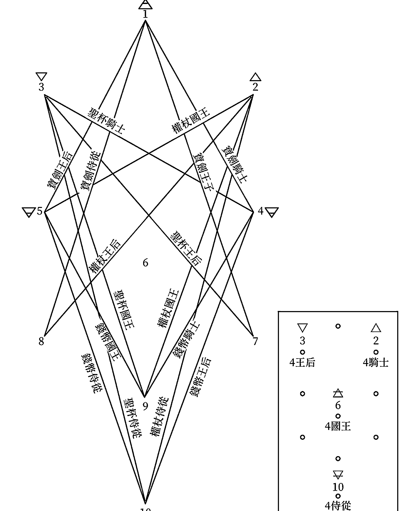

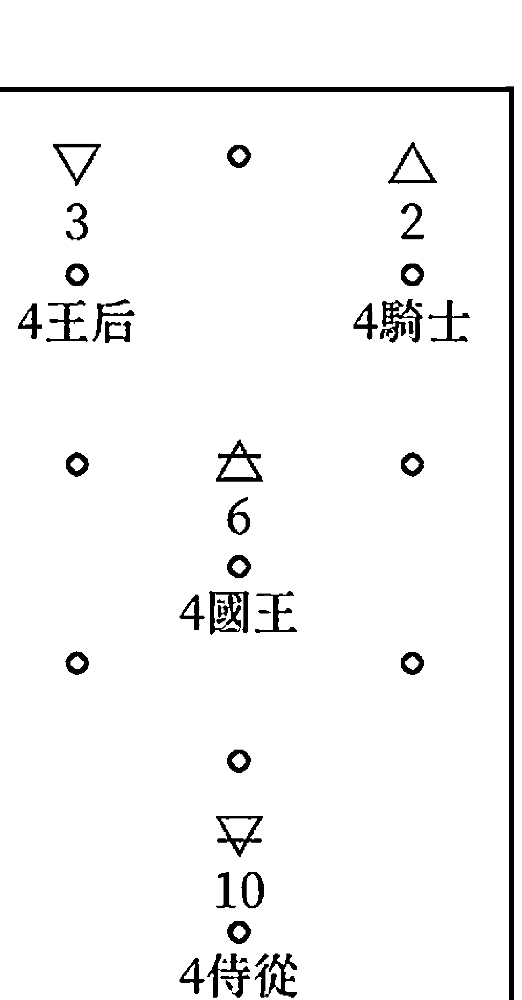

圖4：宮廷牌之十六條隱形路徑與生命之樹四個特定的輝耀

## 十六條隱形路徑來源

圖4的生命之樹十六條隱形路徑圖表，並不存在於黃金黎明會的神秘教學裡，此圖表也沒有出現在克勞利豐富的魔法創作，抑或其學生弗雷特·阿查德的卡巴拉教學中。然而，這個鮮為人知的圖表確實曾出現在保羅·福斯特·凱斯關於生命之樹的課程裡，並作為他「至聖所建造者」（Builders of the Adytum）兄弟會的課程內容。

凱斯提供這張圖表，但沒說明出處或評論。當我第一次看到圖表時，發現了一個以黃金黎明所教導的象徵符號為基礎解釋十六條隱形路徑模式。

因為四十張小阿爾克那王牌卡通過十個輝耀，而二十二張大阿爾克那則是生命之樹二十二條可見的路徑，因此剩下的十六張宮廷牌就可以歸類到這十六條隱形路徑。

其中十二條隱形路徑發源自生命之樹前三個輝耀，也就是王冠（1）、智慧（2）和領會（3）的高層世界；這三個輝耀分別代表三個元素流入生命之樹的來源：「王冠」是風元素、「智慧」是火元素，「領會」是水元素。

透過符號象徵，十二張宮廷牌直接對應到四條路徑，每一條路徑發源自構成高層世界的三個輝耀；四張宮廷牌權杖牌組源自火元素的「智慧」，四張聖杯牌組源自水元素的「領會」，另外四張張寶劍牌組則源自風元素的「王冠」。

四張錢幣牌組宮廷牌為土元素，而剩下的四條路徑則落到發源自「仁慈」與「力量」的「深淵」（abyss）階段；其中兩條隱形路徑在「美」輝耀結束，這是生命之樹的土元素。

十六條隱形路徑由十六個選出的以諾字母所掌管，因為十六張宮廷牌由十六個以地占術和占星術之元素為基礎的以諾字母掌管，因此，構成生命之樹的可見路徑由希伯來文字母掌管，隱形路徑則由以諾語掌管。

生命之樹的前三個輝耀形成一個高層三角形，作為三位一體的風、火和水元素的來源。第一個輝耀「王冠」表風，第二個「智慧」表火，第三個「領會」表水；這三個高層元素通過生命之樹剩下的輝耀，在第十個輝耀「王國」收尾，作為第四個土元素之三個元素的總結。「王冠」往下通過中柱來到「美」和「根基」；「智慧」以「之」字形的方向往下至「力量」和「勝利」；「領會」以「之」字形的方向來到「仁慈」和「宏偉」。最後在「王國」交會，將三元素結合到第四個土元素。參考表19元素在生命之樹十個輝耀的流動。

| 元素 | 輝耀 | 占星 |
| :---: | :--- | :--- |
| △ | 1. 王冠→6. 美→9. 根基 | 第一因：☉:☽ |
| △ | 2. 智慧→5. 力量→7. 勝利 | 黄道：♂:♀ |
| ▽ | 3. 領會→4. 仁慈→8. 宏偉 | ♄:♃:♀ |
| ▽ | 10. 王國 | △▽△▽ |
| | 表19：元素經過輝耀的流動 | |

如果觀看十六條隱形路徑，我們會發現構成高層世界的輝耀，每一個有四條隱形路徑，「仁慈」和「力量」各有兩條；使用元素從高層世界流動的邏輯，「王冠」是風元素的來源（對應到寶劍牌組），「智慧」是火元素的來源（對應到權杖），以及「領會」是水元素的來源（對應到聖杯）。剩下發源自「仁慈」與「力量」的四條路徑流經高層世界以及土元素和錢幣牌組；這四條低位的隱形路徑在「根基」和「王國」這兩個生命之樹最低的輝耀停止。

表20顯示宮廷牌在生命之樹上的十六條隱形路徑。注意生命之樹二十二條可見的路徑對應到二十二個希伯來文字母，而十六條隱形路徑則對應到十六個選出的以諾字母。

| 宮廷牌 | 路徑 | 相互連結的輝耀 | 以諾語 | 名字 | 顏色（宮廷牌） |
| :--- | :---: | :---: | :---: | :--- | :---: |
| 權杖騎士 | 33 | 2到5 | ﬦ | I—Gon | 淡天空藍 |
| 權杖王后 | 34 | 2到8 |豌 | B—Pe | 緋紅色 |
| 權杖國王 | 35 | 2到9 |豌 | G—Ged | 粉薔薇色 |
| 權杖侍從 | 36 | 2到10 | פּ | F—Orth | 黃色 |
| 聖杯騎士 | 37 | 3到4 | ء | R—Don | 灰色 |
| 聖杯王后 | 38 | 3到7 | ن | P—Mals | 黑色 |
| 聖杯國王 | 39 | 3到9 | 3 | N—Drun | 黃色 |
| 聖杯侍從 | 40 | 3到10 | c | L—Ur | 檸檬黃、深棕色、橄欖綠、黑色 |
| 寶劍騎士 | 41 | 1到4 | 7 | E—Graph | 藍灰色、珍珠灰 |
| 寶劍王后 | 42 | 1到5 | 1 | O—Med | 棕黑色 |
| 寶劍國王 | 43 | 1到7 | 8 | M—Tal | 鮭魚般的粉紅色 |
| 寶劍侍從 | 44 | 1到8 | P | Z—Ceph | 檸檬黃、深棕色、橄欖綠、帶有金色點的黑色 |
| 錢幣騎士 | 45 | 4到9 | 7 | S—Fam | 帶有紅、黃、藍點的白色 |
| 錢幣王后 | 46 | 4到10 | a | U—Vau | 帶有粉紅色點的灰色 |
| 錢幣國王 | 47 | 5到9 | 7 | A—Un | 金琥珀色 |
| 錢幣侍從 | 48 | 5到10 | / | T—Gisa | 帶有黃色帶狀的黑色 |

## 表20：生命之樹之十六條隱形路徑

在我們結束象徵符號背後十六個元素互換的漫長討論前，另外應該要提及在黃金黎明會使用的兩種系統，分別是在四世界生命之樹十六種變化之十六種可能的顏色組合，以及以諾魔法眺望塔四元素的四個象限（表21）。

## 表21：以諾魔法眺望塔四元素的四個象限

| 元素 | 輝耀顏色層級 | 路線顏色層級 | 世界 | 守望塔牌 | 子元素 | 塔牌上四象限 |
| :--- | :--- | :--- | :--- | :--- | :--- | :--- |
| 火之火 | 國王 | 國王 | 原型界 | △ | △ | 右下角 |
| 火之水 | 國王 | 王后 | 原型界 | △ | ▽ | 右上角 |
| 火之風 | 國王 | 王子 | 原型界 | △ | △ | 左上角 |
| 火之土 | 國王 | 公主 | 原型界 | △ | ▽ | 左下角 |
| 水之火 | 王后 | 國王 | 創造界 | ▽ | △ | 右下角 |
| 水之水 | 王后 | 王后 | 創造界 | ▽ | ▽ | 右上角 |
| 水之風 | 王后 | 王子 | 創造界 | ▽ | △ | 左上角 |
| 水之土 | 王后 | 公主 | 創造界 | ▽ | ▽ | 左下角 |
| 風之火 | 王子 | 國王 | 形塑界 | △ | △ | 右下角 |
| 風之水 | 王子 | 王后 | 形塑界 | △ | ▽ | 右上角 |
| 風之風 | 王子 | 王子 | 形塑界 | △ | △ | 左上角 |
| 風之土 | 王子 | 公主 | 形塑界 | △ | ▽ | 左下角 |
| 土之火 | 公主 | 國王 | 行動界 | ▽ | △ | 右下角 |
| 土之水 | 公主 | 王后 | 行動界 | ▽ | ▽ | 右上角 |
| 土之風 | 公主 | 王子 | 行動界 | ▽ | △ | 左上角 |
| 土之土 | 公主 | 公主 | 行動界 | ▽ | ▽ | 左下角 |

表21：十六個生命之樹顏色變換與以諾魔法守望台四象限

## ◆ 七個神聖行星 ◆

在古老魔法世界裡有七個神聖的行星，其中不包含地球，不過發光的太陽和月亮則算在七個行星內，另外五個分別是土星、木星、火星、金星和水星。現代的海王星、天王星和冥王星不算在內，最近冥王星也不歸類在行星的範疇。

關於這七個行星的神秘及其正確分配到七張大阿爾克那，其中最困難的部分是要解釋七個希伯來文雙發音字母分配的對應組合。不同版本的《創世之書》提供了七個行星矛盾的屬性。馬瑟斯和維斯特考特使用塔羅牌的對應想像，將七個行星正確歸類在塔羅牌中。

## 行星、塔罗与脉轮的神秘对应

他们曾在《创世之书》里提到关于行星的神秘之处有过一些挣扎。希伯来文有七个双发音字母，每一个有两个不同的发音，在每一本密教手稿的印制文本中提到关于字母的奇妙之处，其中三元素和十二个符号能在没有任何争论下被描绘出来；但是当讨论到七个双发音字母时，不同版本的文本则在行星的位置上出现争议。

这七个双发音字母的属性最常见的是行星的柏拉图式排列——其中第一个字母“Beth”等同于土星，而第七个、也是最后一个字母“Tav”等同于月亮。列维采用这样的排列方式来放置双发音字母，不过他的方式是将“魔法师”牌列为“Aleph”，而黄金黎明则是采用“愚者”牌列为“Aleph”。

韦特考特与马瑟斯将七个双发音字母和他们修正后的牌卡对比，认为柏拉图式的顺序并不管用。他们专心研读对应大阿卡纳的确切象征，以及使用象征引领他们的分配。因此对应到“Beth”的“魔法师”变成水星，而非土星，他们将魔法师视为赫尔墨斯·墨丘利·特里斯墨吉斯忒斯（Hermes Mercury Trismegistus）的形象。表22同时显示列维和黄金黎明关于七个行星的塔罗分配。

| 希伯来双发音字母 | 行星 | 列维： aleph=魔法师 | 黄金黎明： aleph=愚者 | 神秘排序 | 大阿卡纳的象征 |
|---|---|---|---|---|---|
| ב = Beth | ♄ | 女祭司 | 魔法师 | ☿ | 魔法师为赫尔墨斯 |
| ג = Gimel | ♃ | 女帝 | 女祭司 | ☽ | 女祭司为伊西斯月亮女神 |
| ד = Daleth | ♂ | 皇帝 | 女帝 | ♀ | 皇帝为大地之母 |
| כ = Kaph | ☉ | 力量 | 命运之轮 | ♃ | 朱庇特为幸运之神 |
| פ = Peh | ♀ | 星星 | 高塔 | ♂ | 闪电为马尔斯 |
| ר = Resh | ☿ | 正义 | 太阳 | ☉ | 卡里的太阳为太阳神 |
| ת = Tav | ☽ | 世界 | 世界 | ♄ | 土星另一个象征为地球 |

### 表22：大阿卡纳的七个行星

虽然凯斯能够解析关于希伯来文和塔罗的神秘之处，但除了这些行星以外。他承认在其第一本著作《塔罗学习介绍》（An Introduction to the Study of the Tarot，收集自他在秘术期刊《阿佐特》（Azoth）杂志文章）必须仰赖克劳利的《777》，以正确解析这些行星的属性。克劳利在黄金黎明会学习这个神秘学。关于他使用《创世之书》在一个补充说明里，已正确证实塔罗占星的特性，他表示“行星属性来自《777》（伦敦，1909）这本书”。

七个行星的使用，对于炼金术练习七大金属对应到行星非常重要，其教义与东方坦陀罗传统（Eastern Tantric tradition）的脉轮系统一致——藉由仪式和冥想链接七个放在灵魂身体的内在星体。

生命之树将七个行星分别排序：土星、木星、火星、太阳、金星、水星和月亮，放在源质三到九，这样的顺序有时是参考柏拉图行星的顺序；不过，一周的行星排列顺序与此不同。从星期日开始的行星顺序为太阳（星期日）、月亮（星期一）、火星（星期二）、水星（星期三）、木星（星期四）、金星（星期五）和土星（星期六）。

在生命之树里使用行星柏拉图式排序的传统象征符号，为七个行星的六角形（图5）；七个行星在柏拉图式排序里，被放在六角形（又称“大卫之星”（Star of David）和“所罗门王星阵”（Shield of Solomon）的中心和各个点，从土星开始、月亮结束，太阳为中心，其地占术的形状是六角星。七个行星的位置对应到生命之树的源质则是从“领会”开始，“根基”结束。

七个行星的名字和符号源自希腊神话，以及形成希腊字母里的七个母音；七个行星表示彩虹的七道色调，也表八度音阶里前七个音符，以及于《创世之书》发现构成立方体的七个维度。参考表23的七个行星西方象征符号。

| 行星 | ♄ | ♃ | ♂ | ☉ | ♀ | ☿ | ☽ |
| ---- | ---- | ---- | ---- | ---- | ---- | ---- | ---- |
| 脉轮 | 第七个 | 第六个 | 第五个 | 第四个 | 第三个 | 第二个 | 第一个 |
| 古希腊罗马 | 萨图恩、克罗诺斯 | 朱庇特、宙斯 | 玛尔斯、阿瑞斯 | 阿波罗、希利俄斯 | 维纳斯、阿芙洛狄忒 | 墨丘利、赫尔墨斯 | 黛安娜、阿耳忒弥斯 |
| 象征 | 镰刀 | 王位 | 矛、盾 | 战车轮子 | 镜子 | 双蛇杖 | 皇冠 |
| 形状 | 三角形 | 方形 | 五角星 | 六角星 | 七角形 | 八角形 | 九角形 |
| 希腊文 | Ω=800 | Y=400 | O=70 | I=10 | H=8 | E=5 | A=1 |
| 希伯来文 | ת | ר | ה | ו | ז | ב | א |
| 生命之树 | 领会 | 仁慈 | 力量 | 美 | 胜利 | 宏伟 | 根基 |
| 颜色（生命之树） | 黑色 | 蓝色 | 红色 | 黄色 | 绿色 | 橘色 | 紫罗兰色 |
| 魔法立方块 | 3×3=9 | 4×4=16 | 5×5=25 | 6×6=36 | 7×7=49 | 8×8=64 | 9×9=81 |
| 塔罗牌 | XXI | X | XVI | XIX | III | I | II |
| 颜色（塔罗牌） | 靛蓝色 | 紫罗兰色 | 红色 | 橘色 | 绿色 | 黄色 | 蓝色 |
| 空间立方体 | 中心 | 西 | 北 | 南 | 东 | 上方 | 下方 |
| 路径（生命之树） | 第三十二条 | 第二十一条 | 第二十七条 | 第三十条 | 第十四条 | 第十二条 | 第十三条 |
| 天使 | 扎夫基尔 | 萨基尔 | 哈玛耶尔 | 拉斐尔 | 汉尼尔 | 米迦勒 | 加百列 |
| 矿石 | 黑玛瑙 | 蓝宝石 | 红宝石 | 红水晶 | 祖母绿 | 钻石 | 水晶 |
| 脸部 | 右耳 | 左耳 | 右鼻孔 | 右眼 | 左鼻孔 | 嘴巴 | 左眼 |
| 身体 | 右脚 | 头部 | 右手 | 心脏 | 生殖器 | 左手 | 左脚 |
| 八度音程 | B (Ti) | A (La) | G (Sol) | F (Fa) | E (Mi) | D (Re) | C (Do) |

### 表23：七行星的柏拉图式排序

表23列出两种颜色层级，一种是以生命之树源质为基础，另一则是以连接源质的路径为基础；有五种变化：♄=黑色和靛蓝色（蓝紫色），♃=蓝色和深紫色，☉=黄色和橘色，♀=橘色和黄色，☽=紫罗兰色和蓝色。两种层级都是有根据的颜色属性。当你在处理生命之树的源质和前十个数字时，应该使用第一组层级；处理塔罗和希伯来文字母时，则使用第二组。

另一个七个行星的主要对应，是以炼金术里七种金属与七个行星相关的炼金术传统为基础，这七种金属也等同于古印度坦陀罗传统中脉轮提到的七颗体内内在星星。“脉轮”在梵文里表“轮”，而这七颗内在星星可视为能量与灵魂转动的轮子。

七个行星在人体中对应的位置，以脊椎为基底直达头部的王冠（图6）。脊椎底表土星、金属铅以及第一个脉轮“根轮”（Muladhara），而头顶则是表水星、金属汞以及第七个脉轮“顶轮”（Sahasrara）。

### 图6：七脉轮作为七行星

脉轮中行星与金属的顺序分别是♄（铅）、♂（铁）、♃（锡）、☉（金）、♀（铜）、☽（银）、☿（汞），在炼金术中将铅变成金，这可视为一种从基底脉轮（铅）到心（金）的能量提升。

在塔罗牌里，七种行星适用于七个脉轮时，会展开一个有趣的排序。当我们从最后一张牌数到第一张：宇宙（第一：根轮）、太阳（第四：心轮）、高塔（第二：生殖轮）、命运之轮（第三：太阳神经丛）、女帝（第五：喉轮）、女祭司（第六：眉心轮）以及魔法师（第七：顶轮）；能量流动降到较低的脉轮时，从根轮上升到心轮；下降到生殖器和太阳穴较低的能量前，又打开心胸接受爱与同情。表24列出在东方坦陀罗传统发现的七个脉轮，以及西方传统黄金黎明和神智学的象征。

在炼金术的语言里，每一个行星对应到一个炼金术金属，七大金属又对应到坦陀罗传统里七个脉轮体内的七个内在星星，分别沿着脊椎定位，这在神智学传统里被分成三十三个部分。

将七个脉轮视为七朵花，每一朵花有不同数量的花瓣，包含了五十个梵文字母，其中前六个脉轮有五十片，第七个脉轮的顶轮则是有二十乘以五十，共一千片花瓣。在神智学传统，将脉轮的花瓣取代成光束；前六个脉轮总共有三百六十道光束，第七个脉轮自身就有三百六十道。

表24列出七个脉轮各种颜色配色。坦陀罗传统使用真性的象征；神智学和塔罗大阿卡纳使用彩虹的七道配色，现代的脉轮版本则是使用彩虹七个颜色中的自然顺序，也就是从脊椎基底开始的红色再到头顶的紫色结束。这与黄道将身体分成十二区的十二个符号类似，一样头部表红色，脚表紫红色。

到目前为止的概论已详细介绍将元素分成三、四、五与十六和七个行星，接下来我们将以鉴于黄金黎明魔法十二个象征里的秘术性质作为结尾。

| 行星 | ♄ | ♃ | ♂ | ☉ | ♀ | ☿ | ☽ |
|---|---|---|---|---|---|---|---|
| 金属 | 铅 | 锡 | 铁 | 金 | 铜 | 水银 | 银 |
| 塔罗牌 | 第二十一张 | 第十六张 | 第十张 | 第十九张 | 第三张 | 第二张 | 第一张 |
| 脉轮 | 第一个 | 第二个 | 第三个 | 第四个 | 第五个 | 第六个 | 第七个 |
| 身体 | 会阴 | 生殖器 | 太阳穴 | 心脏 | 喉咙 | 第三只眼 | 头冠 |
| 脊椎节点 (33) | 第一、二、三节 | 第七节 | 第十六节 | 第二十六节 | 第三十一节 | 第三十二节 | 第三十三节 |
| 五感 | 嗅觉 | 味觉 | 视觉 | 触觉 | 听觉 | 心灵 | 高我 |
| 名字 | 根轮 | 生殖轮 | 太阳神经丛 | 心轮 | 喉轮 | 眉心轮 | 顶轮 |
| 意涵 | 根部、入口 | 自我空间 | 珠宝城市 | 无声之声 | 纯洁 | 超越知识 | 一千片花瓣 |
| 梵文音节 | Lam | Vam | Ram | Yam | Ham | Om | Hum |
| 花瓣 | 4 | 6 | 10 | 12 | 16 | 2 | 1,000 |
| 光芒 | 56 | 62 | 52 | 54 | 72 | 64 | 360 |
| 真性 | 颇哩提毗 | 阿帕斯 | 阿耆尼 | 瓦优 | 阿卡夏 | 摩诃萨埵 | 明点 |
| 真性颜色 | 黄色 | 白色 | 红色 | 蓝色 | 蓝紫色 | 五种颜色 彩虹 | 透明 |
| 颜色（坦陀罗） | 黄色 | 浅蓝色 | 火焰红 | 烟熏绿 | 烟熏紫 | 白色 | 彩虹 |
| 颜色（神智学） | 橘红色 | 玫瑰色 | 绿色 | 金色 | 浅蓝色 | 蓝紫色 | 紫罗兰色 |
| 颜色（塔罗） | 蓝紫色 | 猩红色 | 紫罗兰色 | 橘色 | 绿色 | 蓝色 | 黄色 |
| 颜色（现代） | 红色 | 橘色 | 黄色 | 绿色 | 蓝色 | 蓝紫色 | 紫罗兰色 |

### 表24：七个行星作为七个脉轮

## ◆ 黄道的十二个象征 ◆

每一个黄道象征由一个行星和对应的一个特定元素所掌管。如同元素，星座符号也被分类为基本星座（cardinal，元素的第一个星座）、固定星座（fixed，元素的第二和中间的星座）、变动星座（mutable，元素的第三和最后一个星座）。

每一个星座符号掌管身体的部分，身体有两个主要的分法，一个是来自希腊占星学从头开始、到脚结束；另一则来自《创世之书》。表25列出黄道基本象征符号。

| 符号 | 象征 | 元素 | 庙宫 | 类型 | 身体（希腊） | 身体（创世之书） |
|------|------|------|------|------|--------------|------------------|
| ♈ | 公羊的角 | △ | ♂ | 基本星座 | 头部 | 右手 |
| ♉ | 公牛的角 | ▽ | ♀ | 固定星座 | 喉咙 | 左手 |
| ♊ | 双胞胎环抱 | △ | ☿ | 变动星座 | 肩膀、手 | 右脚 |
| ♋ | 蟹爪 | ▽ | ☽ | 基本星座 | 胸部 | 左脚 |
| ♌ | 狮子的鬃毛和尾巴 | △ | ☉ | 固定星座 | 心脏 | 右胰脏（睾丸） |
| ♍ | 三根玉米 | ▽ | ☿ | 变动星座 | 胃部 | 左胰脏（睾丸） |
| ♎ | 杠杆秤 | △ | ♀ | 基本星座 | 肠、胰脏 | 肝部 |
| ♏ | 蝎子的脚、尾巴与毒刺 | ▽ | ♂ | 固定星座 | 生殖器 | 脾脏 |
| ♐ | 箭在弓的切口 | △ | ♃ | 变动星座 | 大腿 | 胆汁 |
| ♑ | 山羊的头与角以及鱼尾 | ▽ | ♄ | 基本星座 | 膝盖 | 胃部 |
| ♒ | 来自两个花瓶的双水纹 | △ | ♄ | 固定星座 | 脚踝 | 膀胱、生殖器 |
| ♓ | 由链子连接的两条鱼 | ▽ | ♃ | 变动星座 | 脚部 | 直肠、大肠 |

### 表25：黄道的基础占星象征

行星掌管黄道将十二个符号分成两组，一组六个，其中一组由月亮管理，另一则由太阳管理。当行星分配到炼金术阶级中时，其中土星和金星位在最低阶，水星为最高阶，被太阳与月亮覆盖。这样的形式有五个行星各掌管两个符号，另外两个发光体则各掌管一个（表26）。

| 符号 | 行星 | 行星 | 符号 |
|------|------|------|------|
| ⊕ | ☽ | ⊙ | ♃ |
| ⊜ | ☿ | ☿ | ♄ |
| ⊝ | ♀ | ♀ | ⛎ |
| ⊓ | ♂ | ♂ | ♏ |
| ⊠ | ♃ | ♃ | ♐ |
| ⋕ | ♄ | ♄ | ♑ |

黄道十二宫符号对应到希伯来文字母的十二个单发音字母（仅有一种发音）。韦特考特与马瑟斯在塔罗大阿卡纳中详细解说了黄道，将大阿卡纳十二张牌放在黄道里，从皇帝（白羊座）开始，月亮（双鱼座）结束。

黄道被分成彩虹的十二道颜色以及八度音阶的十二个音符，对应到的希伯来文字母可以依适当的音调歌颂，并以适当颜色视觉化；也能与身体的十二个部分配合，如表25所示，作为疗愈仪式。任何一个神圣的希伯来文都能使用其声调歌颂为曼陀罗，并使用颜色属性将颜色视觉化。

《创世之书》将宇宙模型形容成一个不断扩张的立方体，三元素是三个坐标，七个行星表六个维度和一个中心，黄道十二宫则是表立方体的十二个角度；本书同样也提供十二个符号四字神明的排列置换，以及十二个人类的独特表现。

表27列出大阿卡纳十二个符号所对应的象征。

| 符号 | 塔罗牌 | 希伯来文 | 颜色 | 音阶 | 生命之树路径 | 立方体（创世之书） | 神 | 人（创世之书） |
|------|--------|----------|------|------|--------------|--------------------|------|----------------|
| ⊕ | 皇帝 | ה | 红色 | C | 15 | 东北 | יהוה | 视觉 |
| ⊜ | 教皇 | ו | 橘红色 | C# | 16 | 东南 | יהוה | 听觉 |
| ⊝ | 恋人 | ז | 橘色 | D | 17 | 东之上 | יהוה | 嗅觉 |
| ⊓ | 战车 | ח | 橘黄色 | D# | 18 | 东之下 | יהוה | 言语 |
| ⊠ | 力量 | ט | 黄色 | E | 19 | 北之上 | יהוה | 味觉 |
| ⋕ | 隐者 | י | 黄绿色 | F | 20 | 北之下 | יהוה | 交合 |
| ⛎ | 正义 | ל | 绿色 | F# | 22 | 西北 | יהוה | 运作 |
| ♏ | 死亡 | מ | 蓝绿色 | G | 24 | 西南 | יהוה | 步行 |
| ♂ | 调节 | ד | 蓝色 | G# | 25 | 西之上 | יהוה | 愤怒 |
| ♄ | 恶魔 | ז | 蓝紫色 | A | 26 | 西之下 |והיה | 笑、欢笑 |
| ♃ | 星星 | ח | 紫罗兰色 | A# | 28 | 南之上 | היאה | 沉思 |
| ☾ | 月亮 | ט | 紫红色 | B | 29 | 南之下 | אהיה | 睡眠 |

### 表27：在大阿卡纳的黄道

《创世之书》所有的版本清楚将黄道分配到字母里，不过，人类交合与劳动的功能有时会由希伯来字母“Yod”和“Lamed”取代。

以色列十二支派的排序可配对到黄道十二宫，在黄金黎明传统里也能发现。十二使徒岩（Twelve Apostles）也能作为黄道的象征；十二个独特的符号会使用在基督建筑物，用来象征十二使徒岩。阿格里帕将黄道配对到天使和罗马神祇；黄道也反映二十四个希腊字母，并分成十二对，放在诺斯底智慧女神苏菲的宇宙体黄道区。

表28列出黄道象征这些宇宙主宰的部分。

| 符号 | 支派/旗帜 | 希伯来文 | 门徒/符号象征 | 天使 | 罗马神灵 | 希腊文 |
| :---: | :---: | :---: | :---: | :---: | :---: | :---: |
| ♈ | 迦得（Gad）/骑兵 | גד | 西门彼得（Simon Peter）/两把钥匙交叉 | 马拉锡第尔（Malahidiel） | 帕拉斯（Pallas） | A Ω |
| ♉ | 以法莲（Ephraim）/阉牛 | אפרים | 安德烈（Andrew）/圣安得烈十字 | 阿斯莫德（Asmodel） | 维纳斯 | B Ψ |
| ♊ | 玛拿西（Manasseh）/藤蔓、墙壁 | מנשה | 大雅各（James the Elder）/三个扇贝壳 | 安比尔（Ambrial） | 福玻斯（Phoebus） | Γ X |
| ♋ | 以萨迦（Issachar）/驴子 | יששכר | 约翰（John）/圣杯里的蛇 | 穆利尔（Muriel） | 墨丘利 | Δ Φ |
| ♌ | 犹大（Judah）/狮子 | יהודה | 汤玛士（Thomas）/角尺和矛 | 凡基尔（Verchiel） | 朱庇特 | E Y |
| ♍ | 拿弗他利（Naphtali）/鸟 | נפתלי | 雅各（James of Alphaeus）/垂直切割锯 | 哈玛利尔（Hamaliel） | 刻瑞斯 | Z T || 符號 | 支派／旗幟 | 希伯來文 | 門徒／符號象徵 | 天使 | 羅馬神靈 | 希臘文 |
|------|------------|----------|----------------|------|----------|--------|
| ♒ | 亞設 (Asher) /杯子 | אשר | 腓力 (Philip) /兩條麵包交叉 | 祖菲亞 (Zuriel) | 伏爾甘 (Vulcan) | HΣ |
| ♏ | 但 (Dan) /老鷹 | דן | 巴多羅買 (Bartholomew) /三把割皮刀 | 巴拉基勒 (Barachiel) | 瑪爾斯 | ΘP |
| ♐ | 便雅憫 (Benjamin) /狼 | בנימין | 馬太 (Matthew) /三個錢包 | 亞德南丘 (Adnachiel) | 黛安娜 | IΠ |
| ♑ | 西布倫 (Zabulun) /船 | זבולון | 西門 (Simon the Zealot) /聖經上的魚 | 漢尼爾 | 維斯塔 | KO |
| ♒ | 呂便 (Reuben) /人類 | ראובן | 雅各的猶大 (Jude of James) /乘行於十字狀的船 | 加百列 | 茉諾 | ΛΞ |
| ♓ | 西緬 (Simeon) /劍 | שמעון | 猶達斯依斯加略 (Judas Iscariot) /帶有三十元硬幣的錢袋 | 巴拉基勒 (Barachiel) | 涅普頓 | MN |

表28：宇宙裡的黃道

上張表格提供黃道的宇宙象徵，下一張則提供自然的象徵符號對應到黃道（表29）；其中行星、香精和藥物（做了一些調整）的屬性來自克勞利的《777》；石頭、樹木、鳥和野獸屬性則來自阿格里帕。

| 符號 | 礦石 | 植物 | 樹木 | 香精 | 藥物 | 鳥類 | 野獸 |
|------|------|------|------|------|------|------|------|
| ♈ | 赤鐵礦 | 天竺葵 | 橄欖樹 | 龍血 | 咖啡 | 貓頭鷹 | 母羊 |
| ♉ | 綠寶石 | 錦葵 | 香桃木 | 蘇合香 | 糖 | 鴿子 | 公羊 |
| ♊ | 色彩斑斕石 | 蘭花 | 月桂樹 | 艾草 | 麥角 | 公雞 | 公牛 |
| ♋ | 冰長石 | 蓮花 | 榛樹 | 施喜列香 | 賽洛西賓 | 鷺 | 狗 |
| ♌ | 紅寶石 | 向日葵 | 七葉樹 | 乳香 | 古柯鹼 | 老鷹 | 雄鹿 |
| ♍ | 綠柱石 | 百合 | 蘋果樹 | 水仙 | 啤酒 | 麻雀 | 母豬 |
| ♎ | 瑪瑙 | 蘆薈 | 黃楊木 | 白松香 | 菸草 | 鵝 | 驢子 |
| ♏ | 紫水晶 | 仙人掌 | 接骨木 | 安息香 | 烏羽玉 | 鵲 | 狼 |
| ♐ | 綠松石 | 燈心草 | 棕櫚樹 | 沉香 | DMT (迷幻藥) | 寒鴉 | 母鹿 |
| ♑ | 黑瑪瑙 | 印度大麻 | 松樹 | 麝香 | 印度大麻 | 蒼鷺 | 獅子 |
| ♒ | 琥珀 | 橄欖 | Ramthorn | 大戟 | 紅酒 | 孔雀 | 綿羊 |
| ♓ | 珊瑚 | 罌粟 | 榆樹 | 龍涎香 | 鴉片 | 天鵝 | 馬 |

表29：自然世界裡的黃道

◆ 三十六個旬星 ◆

黃金黎明傳統裡的黃道在小阿爾克那中象徵兩種意涵，其一是十二張宮廷牌對應到十二個符號，小阿爾克那的數字牌二到十分配到黃道（360度）上，區分成三十六個旬星（decans），每一個占十度。每一個符號由三個旬星組成，每一個旬星大約是十天。

每一張宮廷牌是由黃道符號最後一個旬星和下一個黃道符號前兩個旬星所構成。因此，宮廷牌混合了兩個黃道符號，不只有一個；前兩個旬星代表一個特定符號在其力量高峰的原始狀態，當進入到下一個接續的符號時，第三個、也是最後一個代表元素能量的沉降。這就是為什麼宮廷牌是由上一個符號的最後一個旬星，以及一個主要符號的前兩個旬星所組成——為了顯現元素能量從一個符號進入下一個的轉變。

表30列出小阿爾克那所分配到三十六個旬星的象徵。

| 宮廷牌 | 旬 | 廟宮 | 符號 | 數字牌 | 顏色 | 原始標題（之主） |
|---|---|---|---|---|---|---|
| 權杖王后 | 0°-10° | ♂ | ♈ | 2W | 天空藍 | 統御 |
| | 11°-20° | ☉ | ♈ | 3W | 絳紅色 | 已確立的力量 |
| | 21°-30° | ♀ | ♈ | 4W | 深紫色 | 臻至完美工作 |
| 錢幣國王 | 0°-10° | ☿ | ♉ | 5P | 帶黑點的紅色 | 物質煩憂 |
| | 11°-20° | ☾ | ♉ | 6P | 金琥珀色 | 物質成功 |
| | 21°-30° | ♄ | ♉ | 7P | 帶金點的橄欖綠 | 未實現的成功 |
| 寶劍騎士 | 0°-10° | ♃ | ♊ | 8S | 紅褐色 | 被縮減的力量 |
| | 11°-20° | ♂ | ♊ | 9S | 暗紫色 | 絕望與殘酷 |
| | 21°-30° | ☉ | ♊ | 10S | 檸檬黃、深棕色、橄欖綠、帶金點的黑色 | 毀滅 |
| 聖杯王后 | 0°-10° | ♀ | ♋ | 2C | 灰色 | 愛 |
| | 11°-20° | ☿ | ♋ | 3C | 黑色 | 豐盛 |
| | 21°-30° | ☽ | ♋ | 4C | 藍色 | 綜合享樂 |
| 權杖國王 | 0°-10° | ♄ | ♌ | 5W | 橘色 | 競爭 |
| | 11°-20° | ♃ | ♌ | 6W | 粉玫瑰色 | 勝利 |
| | 21°-30° | ♂ | ♌ | 7W | 琥珀色 | 勇氣 |
| 錢幣騎士 | 0°-10° | ☉ | ♍ | 8P | 帶白點的棕黃色 | 審慎 |
| | 11°-20° | ♀ | ♍ | 9P | 帶天空藍的檸檬黃 | 物質獲取 |
| | 21°-30° | ☿ | ♍ | 10P | 黃色帶狀的黑色 | 財富 |
| 寶劍王后 | 0°-10° | ☽ | ♎ | 2S | 藍灰珍珠色 | 重建寧靜 |
| | 11°-20° | ♄ | ♎ | 3S | 暗棕色 | 悲傷 |
| | 21°-30° | ♃ | ♎ | 4S | 深紫色 | 停息紛爭 |
| 聖杯國王 | 0°-10° | ♂ | ♏ | 5C | 猩紅色 | 失落歡樂 |
| | 11°-20° | ☉ | ♏ | 6C | 黃色（金色） | 享樂 |
| | 21°-30° | ♀ | ♏ | 7C | 翡翠色 | 虛幻成功 |
| 權杖騎士 | 0°-10° | ☿ | ♐ | 8W | 紫羅蘭色 | 迅捷 |
| | 11°-20° | ☽ | ♐ | 9W | 靛藍色 | 強大力量 |
| | 21°-30° | ♄ | ♐ | 10W | 黃色 | 壓制 |
| 錢幣王后 | 0°-10° | ♃ | ♑ | 2P | 帶紅點的白色、藍色、黃色 | 和諧變化 |
| | 11°-20° | ♂ | ♑ | 3P | 帶粉紅色點的灰色 | 物質工作 |
| | 21°-30° | ☉ | ♑ | 4P | 帶黃色點的深天藍色 | 世俗力量 |
| 寶劍國王 | 0°-10° | ♀ | ♒ | 5S | 亮猩紅色 | 擊潰 |
| | 11°-20° | ☿ | ♒ | 6S | 鮭魚般的粉紅色 | 贏得成功 |
| | 21°-30° | ☽ | ♒ | 7S | 亮黃綠色 | 不穩定的努力 |
| 聖杯騎士 | 0°-10° | ♄ | ♓ | 8C | 橘色 | 被遺棄的成功 |
| | 11°-20° | ♃ | ♓ | 9C | 紫羅蘭色 | 物質幸福 |
| | 21°-30° | ♂ | ♓ | 10C | 檸檬黃、深棕色、橄欖綠、黑色 | 完美的成功 |
| | | | | | | 表30：三十六旬星象徵 |

注意黃道十二個符號與十二張混合不同黃道屬性的宮廷牌，在年曆上分配的不同。表31顯示其中差異。

| 黃道 | 期間 | 宮廷牌 | 混合黃道 | 時期 |
|---|---|---|---|---|
| ♈ | 3/21-4/19 | 權杖王后 | ♓/♈ | 3/11-4/9 |
| ♉ | 4/20-5/20 | 錢幣國王 | ♈/♉ | 4/10-5/10 |
| ♊ | 5/21-6/20 | 寶劍騎士 | ♉/♊ | 5/11-6/10 |
| ♋ | 6/21-7/22 | 聖杯王后 | ♊/♋ | 6/11-7/12 |
| ♌ | 7/23-8/22 | 權杖國王 | ♋/♌ | 7/13-8/12 |
| ♍ | 8/23-9/22 | 錢幣騎士 | ♌/♍ | 8/13-9/12 |
| ♎ | 9/23-10/22 | 寶劍王后 | ♍/♎ | 9/13-10/13 |
| ♏ | 10/23-11/21 | 聖杯國王 | ♎/♏ | 10/14-11/12 |
| ♐ | 11/22-12/21 | 權杖騎士 | ♏/♐ | 11/13-12/11 |
| ♑ | 12/22-1/19 | 錢幣王后 | ♐/♑ | 12/12-1/10 |
| ♒ | 1/20-2/18 | 寶劍國王 | ♑/♒ | 1/11-2/8 |
| ♓ | 2/19-3/20 | 聖杯騎士 | ♒/♓ | 2/9-3/10 |
| | | | | 表31：一年與黃道的天數 |

◆ 玫瑰十字會的象徵 ◆

我們將以彩虹與黃道作為結尾。黃金黎明給啟蒙者的最高符號可以在玫瑰十字會看到（圖7）。二十二片花瓣的玫瑰中心為金色十字交叉，中心第一圈有三片花瓣，中間有七片，最外圈有十二片；每一片花瓣有一個希伯來文字母對應三元素、七個行星或十二個符號的其中一個，並在二十二條途徑使用國王（原型界）顏色層級。

花瓣本身是以彩虹十二個配色為基礎，希伯來文字母則是畫上閃影（或對比）色，這是以元素、行星或黃道影響為基礎，以建立所有魔法護身符的技巧，其中的背景色是特定的元素、行星或黃道符號，其象徵符號本身是互補的閃影色，閃影色通常是黃道（三百六十度）上相反的元素（一百八十度）。

表32顯示玫瑰十字彩虹顏色層級。希伯來文有三行，代表希伯來文在玫瑰十字的三圈；最裡面那一圈為元素，中間是行星，玫瑰花瓣最外圈則是黃道。另外也顯示顏色彩虹層級所對應的音符，這能與希伯來文字母結合用來歌詠二十二個希伯來文字母。

| 顏色 | 閃影色 | 音階 | 希伯來文 | 黃道 | 希伯來文 | 行星 | 希伯來文 | 元素 |
|---|---|---|---|---|---|---|---|---|
| 紅色 | 綠色 | C | ה | ♈ | נ | ♂ | ש | △ |
| 橘紅色 | 藍綠色 | C# | ו | ♉ | | | | |
| 橘色 | 藍色 | D | ז | ♊ | ה | ☉ | | |
| 橘黃色 | 藍紫色 | D# | י | ♋ | | | | |
| 黃色 | 紫羅蘭色 | E | ה | ♌ | ב | ☿ | א | △ |
| 黃綠色 | 紫紅色 | F | ו | ♍ | | | | |
| 綠色 | 紅色 | F# | ז | ♎ | ד | ♀ | | |
| 藍綠色 | 橘紅色 | G | ח | ♏ | | | | |
| 藍色 | 橘色 | G# | ט | ♐ | ל | ☽ | ה | ▽ |
| 藍紫色 | 橘黃色 | A | י | ♑ | מ | ♄ | | |
| 紫羅蘭色 | 黃色 | A# | כ | ♒ | נ | ♃ | | |
| 紫紅色 | 黃綠色 | B | ל | ♓ | | | | |

表32：玫瑰十字彩虹層級

◆ 參考書目 ◆

- Agrippa, Henry Cornelius. *Three Books of Occult Philosophy*. St. Paul, MN: Llewellyn Publications, 1993. First published in 1553.
- Barrett, Francis. *The Magus*. Secaucus, NJ: Citadel Press, 1967. First published in 1801.
- Blavatsky, Helena Petrovna. *Collected Writings, Volume XII: 1889–1890*. Wheaton, IL: The Theosophical Publishing House, 1980. First published in 1890.
- Case, Paul Foster. *An Introduction to the Study of the Tarot*. New York: Azoth Publishing Company, 1920.
- Crowley, Aleister. *The Book of Thoth*. New York: Samuel Weiser, 1969. First published in 1944.
- ———. *Liber L. vel Legis*. In Thelema, Volume III. Lincolnshire, UK: Hell Fire Club, 2015. First published in 1909.
- ———. *The Magical Record of the Beast 666: The Diaries of Aleister Crowley, 1914–1920*. Edited with annotations by John Symonds and Kenneth Grant. London: Duckworth, 1972.
- ———. *777*. San Francisco, CA: Level Press, 1969. First published in 1909.
- ———. *Shib Yi*. Oceanside, CA: Monthelema, 1971.
- ———. *The Vision and the Voice*. Dallas, TX: Sangreal Foundation, 1972. First published in 1952.
- Foucault, Michel, et al. *IO Magazine, No. 5: Doctrine of Signatures*, Summer 1968. Ann Arbor, MI.
- Goodman, Tali, and Marcus Katz. *Abiding in the Sanctuary*. Keswick, UK: Forge Press, 2011.
- Hulse, David Allen. *The Key of It All: Book One: The Eastern Mysteries*. St. Paul, MN: Llewellyn Publications, 1993.
- ———. *The Key of It All: Book Two: The Western Mysteries*. St. Paul, MN: Llewellyn Publications, 1994.
- Künrz, Darcy, ed and trans. *The Complete Golden Dawn Cipher Manuscript*. Edmonds, WA: Holmes Publishing Group, 1996.
- Levi, Eliphas. *The Magical Ritual of the Sanctum Regnum*. London: George Redway, 1896.
- ———. *Transcendental Magic*. New York: Weiser, 1974. First published as *Doctrine and Ritual of High Magic* in 1896.
- Mathers, S. L. MacGregor. *The Kabbalah Unveiled*. New York: Samuel Weiser, 1974. First published in 1887.
- McLean, Adam, ed. *A Treatise on Angel Magic*. Magnum Opus Hermetic Sourceworks series, no. 15. Edinburgh: Magnum Opus Hermetic Sourceworks, 1982.
- Papus [Gerard Encausse]. *The Tarot of the Bohemians*. North Hollywood CA: Wilshire Book Company, 1975. First published in 1916.
- Prasad, Rama. *The Science of Breath and the Philosophy of the Tattvas*. New York: Theosophical Publishing Society, 1894.
- Regardie, Israel. *The Complete Golden Dawn System of Magic*. Phoenix, AZ: Falcon Press, 1984.
- ———. *The Golden Dawn*. St. Paul, MN: Llewellyn Publications, 1970. First published in four volumes in 1939–1940.
- Stenring, Knut, trans. *The Book of Formation (Sepher Yetzirah)*. New York: Krav Press, 1970. First published as *Sepher Yetzirah* in 1923.
- Tatlow, Ruth. *Bach and the Riddle of the Number Alphabet*. New York: Cambridge University Press, 2006. First published in 1991.
- Waite, Arthur Edward. *The Pictorial Key to the Tarot*. New York: University Books, 1959. First published in 1910.
- Westcott, William Wynn, trans. *Sepher Yetzirah: The Book of Formation and the Thirty–Two Paths of Wisdom*. New York: Samuel Weiser, 1976. First published in 1893.
- Wirth, Oswald. *The Tarot of the Magicians*. York Beach, ME: Samuel Weiser, 1985. First published in 1927.

The request was rejected because it was considered high risk其中一個男子向老師說：「普羅克洛、阿斯克蕾畢珍妮亞，你們怎麼能如此冷靜！那些不應該被移動的都移動了。」他的手掃過我們上方的山丘，在那裡帕德嫩神殿（Parthenon）的大理石石柱在陽光下閃閃發光。「他們將雅典娜從家中帶走，她已經沒有居住在此。」

「他們只帶走了雕像。」普羅克洛強烈地說道。「雅典娜在這裡，在土裡。」他摸著土地說著，「在我們的心裡。」

另一名女學生說：「這是否是地土（Ge）呢？」

「當然。」阿斯克蕾畢珍妮亞回答，並說：「就像天空是宙斯，這片土地是奉獻給我們城市的眾神。」

一個男人突然大聲地說：「在基督教徒不斷破壞我們的生活時，我們要如何對眾神沉思？這是否無法避免？命運是否已經不可逆？」

「不是！」阿斯克蕾畢珍妮亞強烈、清晰地說道。「命運從來都不是不可逆的，而且我們有魔法。」

這些是我所聽到的。我從遮蔽的樹蔭下方走出來。「那我們要如何挑戰命運？」

偉大的老師將目光轉移到我身上。她向普羅克洛的耳邊輕聲低語，然後起身、離開群眾來到我這裡，將我拉到一旁，普羅克洛仍繼續教導。

「我不認識你，陌生人，但是我歡迎你。」她用古老的希臘待客傳統向我說道。「什麼困擾著你？」

我給她看那張莎草紙。「有一個女人因為這個陷入絕望。烏拉尼亞告訴我星星已經註定了她糟糕的命運。我也去看了『命運與機會』，但是她們拒絕改變這個女人的命運。」

阿斯克蕾畢珍妮亞看著這張紙，臉色變得凝重。「看起來她極需幫助，她需要強大的協助去克服。」她看著地上的那個女人。「這裡，」她撿起一個光滑的橢圓形石頭並說道。「這顆石頭來自神聖的雅典娜山丘，它帶有雅典娜的力量。」她將石頭放在我的掌心，用手緊握著我的手。「她會感激你的成功。」

她離開我們之後，我看著我的手臂這條銀色線段又持續生長。

## ◆ 異教世界觀 ◆

阿斯克蕾畢珍妮亞和普羅克洛以異教徒練習的儀式稱作「通神術」或「神的工作」，這個儀式帶領他們直接與古希臘神靈溝通。以下是他們宗教與哲學世界觀的重要依據：

- 地球：地球是神聖的。
- 重要神靈：如其上，同其下——神靈無所不在。
- 異教主義：一個靈體是眾多男神與女神形塑而成的綜合體，神靈可以有女性的面容。
- 女性：女祭司、母親以及女性哲學家都是不可或缺的導師。
- 啟示：我們來自眾神，每一個體可以直接獲得與眾神接觸的經驗。
- 轉世：靈魂之旅讓我們藉由不斷循環的化身以回歸眾神領域，使形體進化。

這些要素來自受到基督教時代直接攻擊之下的產物。市區的教會關閉，基督修道士會四散到古希臘世界各個鄉鎮，破壞祭壇、詆毀雕像，並在神廟的牆上寫上「唯一的神！」向世人傳道可以破壞雕像，因為代表他們崇敬的神祇是無能的神靈且非神聖。這些神殿將重新奉獻給基督徒使用。¹³

在十五世紀，受過教育的歐洲人相信，他們會被來自撒旦以及與他同盟的女人的超自然力量所包圍。¹⁴以下是他們世界觀的重要依據：

- 地球：世界是腐敗的。
- 精神與物質：精神完全與世界分離。
- 異教主義是邪惡的，唯一的合法宗教是基督教。
- 女人的地位在男人之下，女人容易與邪惡力量站在同一陣線。
- 啟示：任何與這個世界接觸的靈魂都是邪惡的。
- 轉世：在靈魂面對神的審判前，我們只有一個在世。

這樣看起來，通神術最糟糕的恐懼將成真，異教徒的世界觀消逝在這個世上。

## ◆ **故事：第谷與蘇菲** ◆

我從阿斯克蕾畢珍妮亞與普羅克洛那裡學到很多，但我還是無法確定要如何改變「命運與機會」這樣已經註定的事物。我問索緹莉亞：「是否有任何人可以幫助我了解形塑未來的魔法呢？」

「第谷・布拉赫（Tycho Brahe）。」她說。

我們在山丘的一棵樹下。在下面的景觀裡，我看到知名的丹麥汶島（Hven）花園——根據第谷精心設計的方位，精密的地占術反映球體的和諧。從這個距離我可以看到一座知名的城堡，其作為致力於研究占星的繆思：烏蘭尼賓（Uraniborg）的基地；這是個三層樓的建築，朝正南方位，讓天文學家用來準確測量星星的位置。

不過現在並沒有人在外面測量天空。「讓我們來試試這個實驗室（城堡）。」索緹莉亞說。

在沒有透過任何轉換之下，我們站在一間研究鍊金術的房間裡。一個男孩正將一些煤炭推進五英尺深的爐子底部，不過在這個地下房間裡沒有其他人。索緹莉亞說：「我們來做個實驗！」

轉眼間，我們來到一間牆上高處有扇窗子的房間，光線從窗子灑落到房間的桌子上。第谷在查閱年曆，並在一張紙上做記號。我可以讀懂這個天宮圖，在上面有一個標記著黃道符號與行星、看起來很熟悉的宮位盤。「蘇菲，」他低著頭說道。「光線愈來愈暗，幫我拿蠟燭。」

「馬上來。」蘇菲從別處回應。

第谷在查找他的資料時看到我。「我並沒有邀請客人。」他快速地看了我一眼。幸好當天索緹莉亞為我換上相當昂貴的衣裳。「雖然高尚令人歡迎，不過你去看過天體天文台或是那間放有地球儀的房間了？」

我決定不要提及我到過這兩個地方。「我的朋友有麻煩。」我說。「我希望可以請你幫助我。」

蘇菲手上拿著蜜蠟蠟燭來到房間。她說：「我們可以試試看。」她小心翼翼地將蠟燭放在遠離紙張的地方。

第谷帶著微笑轉向他的妹妹，他向她指著天宮圖，並說：「檢查一下我的數值。」他向我說：「我禁止她學占星學，但她竟然自學。」

> 「從那之後他還一直誇獎我呢，」蘇菲挨著桌子彎腰前傾說著，「你確定是這個地方嗎？」

當第谷伸手要拿一本書時，蘇菲將那本書拿給他。「在這邊，我幫你查，你去幫助你的客人。」

第谷坐回椅子，他帶著期待的表情看著我。「你的問題是什麼？」

「我的朋友有一張天宮圖，上面預測她會有一個悲慘的人生。」我說。「她已經跌落深淵，我又要如何能說服她，她的命運並非註定？」

> 「告訴她，就祈禱吧。」他很快地回應。「神會撫慰一切。」

這並不是我希望得到的答案。在他桌上的一張紙寫了有關於他的一句知名座右銘：「Despiciendo suspicio」——藉由往下看我往上看，以及「Suspicendo despicio」——藉由往上看我往下看。我指向那張紙。「我以為我可能會反對受到地球影響之天堂的影響。」

第谷想到並說：「你要如何做到？」

我拿出一個石頭。「我從雅典衛城拿到這顆石頭。」

他虔誠地摸了它並說：「它擁有自身的美德。」他將自己移開桌子旁，開始翻找牆邊的書櫃。「地球吸引大海。在這兒。」他拿出一個有木製塞子的小黏土容器。「這裡面有煉金術水。喝一口水可以舒緩心臟。」

> 「那風呢？」蘇菲說道。

「對了。」第谷說。「風連結了天空與地面。」他看著她。「什麼能夠引發風的美德？」

> 「讓這個照亮你的方向。」

蘇菲拿起蠟燭並轉交給我。「讓這個照亮你的方向。」

> 「好的。」第谷高興地說道。

「真的是很貼心的祝福，謝謝你。」蘇菲的眼睛閃閃發光。

當我們從房間的陰影消失時，看到手上這條銀線已經快到達我的胸口。

## ◆ 異教復興 ◆

在羅馬帝國皇帝關閉亞歷山大和雅典學院後，各個城市遠至東邊的城市，遠離了柏拉圖式導師。羅馬帝國的部分東邊與伊斯蘭教世界持續學習柏拉圖與赫密士文本。相反地，西邊的羅馬基督教堂則以亞里斯多德為依據，並拒絕柏拉圖。

十五世紀，西邊的歐洲學者重新發現赫密士主義，始於一四六三年馬爾西利奧·費奇諾將《赫密士文集》（Corpus Hermeticum）從希臘文翻成拉丁文。柏拉圖式與赫密士世界觀鼓舞人們直接從這個世界學習，而非僅透過亞里斯多德理論。這個研究方法使當時對於藝術、科學與靈魂的理解激起了復興的火花。透過這些文本學習的人們被稱作「自然哲學家」（natural philosophers），用來強調從自然中學習之意。

我們不可能忽略異教徒所寫出的這些重要的文獻。這些自然哲學家發展了數種方法來處理。一些像是鳩達諾·布魯諾，他認為基督教堂已經顛覆了真正的埃及宗教，應該一起改信奉異教；抑或像是皮科·德拉·米蘭多拉清楚闡述基督教「長青哲學」（perennial philosophy）的概念，他的理論成就涵蓋聖經、柏拉圖式文本、猶太卡巴拉以及其他各種資料來源。¹⁵

第谷·布拉赫的成就源自柏拉圖式與赫密士思想，並將新科學集大成。對他來說，用占星學和煉金術來解釋世界同樣重要，他藉由發展土地、海洋與天空的宇宙學理論，以風作為天空與土地的連結。¹⁶其妹妹蘇菲·布拉赫（Sophie Brahe）的成就對於女性在煉金術上的重要性，做了一個良好的典範——女性即便在廚房與花園工作，同樣也能研究醫學和化學。¹⁷煉金術有時會以一男一女的方式進行。蘇菲在哥哥的研究室裡協助他天文學的研究，之後嫁給了煉金術師。他們婚禮的促成主要重點放在彼此的合作。

自然哲學家發展到一個也許普羅克洛能夠理解的世界觀。他們認為人才是宇宙的中心，宇宙則是由靈魂的網絡連結端點，此外，學習宇宙會引領我們朝向神聖的愛的經驗。¹⁸我們現今的魔法從自然哲學中開始蔓延。¹⁹

```
15. Schmitt, “Perennial Philosophy: From Agostino Steuco to Leibniz, ” Journal of the History of Ideas, 505 – 532。
16. Christianson 和 Brahe, “Tycho Brahe's Cosmology from the Astrologia of 1591”, Isis, 312 – 318。
17. Ray, Daughter of Alchemy, 3 – 4。
18. Easlea, Witch Hunting Magic, and the New Philosophy, 108 – 109。
19. Williams, For the Love of the Gods, 219 – 220。
```

## ◆ 故事：在絕望的監獄裡抱持希望 ◆

我告訴索緹莉亞：「帶我到那絕望的女人那裡，我想要看看這個解藥是否能幫助她。」我拿著石頭、煉金術水和蠟燭。

我發現，我正看著我試著幫助的那個在絕望中的女人，她被控制在有鐵條的窗戶前。我和她並不是在同一個磚瓦房間裡，而是從畫架上看到這幅景象。我在一間藝術工作室，其他畫作分別掛在高聳的天花板上，角落的火爐不太能暖和這間風從隙縫中吹入的房間。

一位藝術家坐在一張木製椅子上，她的前方放著畫架。她靠著椅背，輕輕拍打著調色盤，操作著畫具，正在為著絕望女人的臉龐畫上線條。

「她是誰？」我低聲詢問索緹莉亞。

「伊芙琳·德·摩根（Evelyn De Morgan）。她是一名唯靈論者。」她輕聲地回覆。

這個藝術家停下手邊工作，環顧了房間。「誰在那裡？」

我站在光影下，伊芙琳將目光注視在我身上。「歡迎，靈魂，無論你是誰。」她溫柔地說道。

「我希望幫助你畫中的女人。」我告訴她。

「絕望？」她從畫板那裡看向我，然後回頭。「生命使她受困，不過到最後她能獲得解脫。」

「那她要如何知道？」我說道。

藝術家放下她的畫筆，拿起一個素描本。「等等，」她說。「不要動，拿著蠟燭在那裡等一下。」

突然感到有點不自在，我在那裡擺了姿勢，她大致畫出拿著蠟燭的人物外觀。「你看！」她說道。「我給她希望。」她向我微笑。「你給了我希望。」

「你給我希望。」我告訴她。

她轉向她的畫作，我往下看我的胸部，那條銀線纏繞我身體兩圈，正爬向我的脖子。

## ◆ 魔法、宗教與科學 ◆

教會認知到自然哲學的威脅——復興魔法師會與靈魂交談、探索異教概念，並挑戰基督教義。許多自然哲學家因此受到宗教裁判所監禁或迫害，其中焦爾達諾·布魯諾就被燒死在火刑柱上。²⁰

自然哲學者想要持續研究自然，也想要活得自由與快樂。有些自然哲學者針對自然哲學提出不同的方法，像是機械唯物主義（Mechanical philosophy）。教會認為神創造世界，然後離開，讓世界自行運轉；機械唯物主義者將這個概念——拒絕異教主義以及異教徒認為世界會自行運行——帶進自己的世界觀，反之，世界和生物都是不帶靈魂的機械，這可以被用來探索和利用。²¹

人類的類別是從動物的分類而來。人類有靈魂、智慧和情感，但是動物沒有。「概念化」產生快速、廣大且殘忍的動物剝削（包含活體解剖——動物的尖叫聲可以解釋為機械的摩擦聲）以及世上生命的意義不斷地消逝。

## ◆ 故事：烏拉尼亞——天文繆思 ◆

「帶我回到烏拉尼亞。」我急促地告訴索緹莉亞。
我的引導者遲疑。「你準備好了嗎？」
「我必須這麼做，我需要在這個枷鎖使我窒息前行動。」我拿著石頭、裝有鍊金術水的燒瓶以及蠟燭。「我有土、水、火和風，現在可以挑戰她了。」

我們在天空之下的山丘。這個宇宙充滿了流瀉的光線、粉紅和藍色的漩渦、煙霧從鑽石的石柱裊裊升起。烏拉尼亞將她的手臂和雙膝棲息在石頭旁，一隻手稍微地拿著一個六角儀。我得意洋洋地向她說：「你告訴我星星顯示註定的事物，但我知道這非真實。」

「當然不是，」烏拉尼亞小心地說道。「為什麼你會認為星星代表未來？」她在空中揮動著手臂。「我們現在看到的光芒運行了數百萬年接近我們。」我們所看到的宇宙，其實是看到過去。「看那裡。」她說道。「這是星星出生的地方。」在其中一朵雲中，風將雲吹散，數十個小點發射光芒到我們存在的空間。「那裡就是星星消退的地方。」那一部分的天空充滿帶有紅色的霧，一圈光線往各處爆炸，炸出藍藍、紅紅的物體，接著那團霧散開，那一個點退去，只留下紅紅的一片。

我猶豫了一會兒。

「星星裡面沒有意義。」她說道。「宇宙是一個機械，我能顯示給你看的，是它的移動和過程。你必須自己去找尋意義。」

「如果我們現在看到是過去，那麼我們就是站在現在嗎？」我問。「那是為什麼我們沒有在移動嗎？」

烏拉尼亞看著我。「為什麼你會認為我們沒有在前進？」

在她說話的時候，我感覺到地面就像果醬般顫抖。我在無限中徘徊，沒有任何地面可以站立。我顛簸、失去重心。「索緹莉亞，帶我到安全的地方！」我大叫。

## 理性 和神秘學

歐洲啟蒙（European Enlightenment）並沒有調和機械和自然哲學，反而完全拒絕了異教的世界觀，這段過程有時被稱作世界的「祛魅」（disenchantment）。我們感謝福特·漢拿赫夫（Wouter Hanegraaff）教授有關啟蒙世代之於密契主義是相異的重要洞見。啟蒙時代的學者將人類文明發展的領域，歸類為一些像是「真實」和「嚴謹」的分類，其他則歸類為「愚蠢」和「迷信」，這樣的過程漢拿赫夫稱之為「兼容並蓄」（eclectic）。科學方法論特別將透視力（clairvoyance）、直覺、對應和本質上非因果影響排除在外。²²

漢拿赫夫宣稱能代表「魔法」與「密教」的學派是異教。異教的世界觀理解這世界上的神聖來自內在，而基督教的一神論則是將無形的創造主，以一個可見、世俗的象徵外顯於世。錯誤認知異教如同是一個學術上的盲點。²³

換句話說，有關宗教、科學與魔法浩瀚的學術討論，可以重新作為討論基督教、機械哲學與異教主義有用的架構。

## 故事：靈魂的黑夜

我抓住索緹莉亞，迷失，墜落。

當下我的蠟燭不見了。我掉落在所有星星都消失的地方，這裡只剩下一片漆黑；我掉落，直到失去時間的軌跡；我掉落，直到所有情緒洗去一切，只留下麻木；我掉落，直到甚至無法感覺到自己。

漸漸地，我了解到我不再掉落，我沒有著地，就是停止而已。看起來似乎有某個東西幫助了我，但是沒有任何聲響掠過我乾裂的嘴唇。我了解到我異常地乾渴。過了一些時間，我記得我帶了水。我趕緊在黑暗中摸索，找到那個燒瓶，用牙齒咬開塞子，小心地處理它。一股液體流經我的喉嚨。

我的感覺恢復了。一股海浪般的情緒向我襲來，悲傷、喜悅、恐懼、平和。我深深地吸一口氣，停止顫抖。「索緹莉亞，」我像個禱告者般喘息。「救我。」

沒有任何的回答。她是我捏造出來的嗎？她真的存在嗎？我是否只是在編造故事，為了保護我自己逃離這個宇宙間毫無意義的真理？

我獨自一人。我甚至無法確定我是否相信自己的靈魂。

## 克服懷疑論

每一個社會上的邊緣人會居住在兩個世界：有色人種住在由白人領導的世界，女人住在以男性為主的世界。魔法師同樣也身處在兩個世界——啟蒙時代與異教的世界。我們凝視著夜晚的天空，端視著神聖的智慧臉龐，同時看著一個力學世界對生命的漠不關心。

當我們看著太陽說它是「我們的母親」或「我們的父親」，我們無法聽到世紀的聲響以及對我們的竊笑——多麼愚蠢的迷信啊！在智慧產生效用之前，那只是一種解釋世界的方式。懷疑論、啟蒙主義拒絕異教的世界觀，成為我們自身力量懷疑的來源。

力學宇宙是充滿敵意且寂寞的，這也不符合我們的經驗。我們了解物理學上的太陽是一個充滿氣體的球體，但是也知道太陽是生命的來源。因此對它心懷感謝並非只是愚蠢。我們知道世界生生不息，其他的生物確實有情感，他們痛苦時也會呻吟，就像我們感受到痛苦一樣；這個世界並不是被拆解的機械，而是一個有機的整體，我們渴望表達，我們對於生命值得關心的部分表達深沉的信念。

我們挑戰自大的信仰——只有一種知識可以解釋宇宙錯綜複雜的生物系統全貌，以及預測在系統中所有改變帶來的成就使其產生。我們試圖征服自然的方式，就是毀掉她。在內臟物理感覺來說，太陽與地球是我們的父母。使用這樣的形容方式，是對生命的一種尊重。我們需要重新獲得尊重以及傾聽我們的內心。我們需要我們的母親。

## 故事：奈斯

在萬物初始與最後一口氣有一個名字，我們稱之為「母親」。
「我原本想你何時會跌入谷底。」一個聲音道。在一片漆黑，非常深遠的地方有一個形體。
「你是誰？」我低聲詢問。
「母親，」她說。「在我成為雅典娜之前，我是奈斯（Neith）；在我成為奈斯之前，我是努特——天空；在我成為努特之前，我是尼烏（Niw）——萬物起源的黑水。」
我不確定我是否值得她的關注，即便我從她那裡誕生。生命的禮物是無所求的。「你是我的母親嗎？」我詢問她。
漆黑稍微褪去，我可以更看清楚她的形體。「我是所有事物的母親。」她溫暖地回覆。
我看到我現在人正往上攀升，帶領我離開無限的黑海。「我現在在山丘上。」我說。
「生物通常都是從山丘開始。」她說。「土堆從豐饒的水裡升起。」
充滿我內心的安心與感激使我感受極深，足以震撼我的靈魂。它們完整了我的靈魂。我流下眼淚，因為哀傷、喜悅而大聲啜泣，對這個充滿奧妙的宇宙微笑著。我唯一想到的字就是愛。造物主別無所求地給了我們愛，愛是唯一可能可以回報它的東西。「我愛你，母親。」

## 記住母親

我們發現全世界的原生與有宗教信仰的人們，稱地球為他們的母親和父親，太陽是他們母親與父親；星星、河川、氣候與宇宙是他們的母親與父親。地球上的生物對人類來說是手足，整個生生不息的世界藉由互相信任的聯絡網連結在一起；從這裡出自一種滿足的心理，有一處屬於我們的所在，我們也屬於這裡；以及感激的心理，我們值得被滋養，得到我們所需，毋須索求，我們獲得的禮物足以維持生命。

我們記住我們的母親——她是迪蜜特（Demeter）、阿芙蘿黛蒂、赫拉（Hera）。自古以來據說奈斯移動到希臘，成為了雅典娜。我們傳統的來源之一是古埃及宗教哲學。以前的人告訴我們這些。幾個世紀以以來，學院派拒絕的這些知識建立了歐洲文明的地位，不過現今學院派的聲音爭論我們應該相信古老祖先的說法，這也是一個不爭的事實。西方密契主義從來都不曾忘記，長久以來都認為我們的傳統根源自埃及。

希臘與希臘化時代的女性哲學家在畢達哥拉斯和柏拉圖學校學習，她們也會教導，甚至同時擁有家庭；當時女性哲學家是一種稀鬆平常的角色，有些知名的男性還是由母親教導。²⁴羅馬基督教世界將這些學院視為異教的據點，將女性哲學家的成就視為一個特定的目標，系統性地摧毀她們的成就。學院的關閉也在這幾世紀間，女性對於哲學、學校的參與以及哲學論述的發展就此結束。²⁵

我們需要我們的母親、女神還有女性哲學家再現。女性魔法師也可以稱之為二十一世紀新故事、新儀式與新哲學框架的母親角色。

## 故事：因陀羅

天空突然發出火光，變成明亮的生命。

母親的形體消失。她變成水和蒼穹環繞在周圍，我發現正躺在一棵開滿了數百萬株各式顏色、充滿香氣花朵的樹上。

在樹下，有一位美麗的神正用著月亮形狀的杯子喝著東西，或者那是月亮本身？祂的肌膚布滿來自那棵樹的顏色，粉紅、藍色、紅色、金色、綠色、紫色、朦朧，然後變得明亮。

24. Glassman, *The Origins of Democracy in Tribes, City-States and Nation-States*, 1204。
25. Glassman, *The Origins of Democracy in Tribes, City-States and Nation-States*, 1205。

我深深地覺得感激，因為我不再是獨自一人。一股喜悅之情朝我襲來。我伸出一隻手，觸摸他的腳，顫抖。「敬重的大師，敬重的神，因陀羅 (Indra)。你願意教導我嗎？」

因陀羅對我笑著並說：「你在尋找意義。你看。」他揮動著雙手指向天空。每一個閃耀著光輝的點交織成一片網，彼此在數不盡的結合裡互相連結。「意義就在網中，每一個寶石反射了其他。所有都是連結一起。你不再是獨自一人。所有的生命萬物緊密相連。」

祂從月亮形狀的杯子裡又啜飲一口。「你看下面。」祂說。靠近土地的水流注入數條小河，流經整個平原，它們在閃閃發光的光輝中彼此相連，然後消失。「萬物瞬變，我從中尋找可能性。每一條小河都是一種可能。」星星倒映在下面的河水，我們現在正在一個由寶石製成的小碗中間，河水與空間融合，過去融入了未來。

「你在這裡。」因陀羅王說道。「你永遠都屬於這裡。」

我起身，坐著，我感覺到這條令人討厭的銀線蔓延到我的脖子。「它獲勝了。」我說。「它要把我包圍了。」

「讓它這樣吧！」因陀羅王說。

這段期間，我一直與這個玩意兒對抗，用我的內心、意志、極度的渴望。現在我要讓它離開，我向它投降，無論它變得如何。

我一停止與它對抗，銀線在全身發光，纏繞著我的頭部到腳趾。一旦這個外殼完成，它的重量消失，被束縛和令人討厭的感覺讓我感到刺痛，接著就消失了。我變得容光煥發，我感覺到自己變成一顆寶石，照映到因陀羅王所編織的網上的其他寶石。此時片刻成為永恆，我看到、聽到、感受、知道且理解到我是所有的一切。

這是一種終極幸福，我看起來彷彿正在上升，且不斷地擴張。

## 尊敬的王

我們傳統不僅來自古埃及（Kemet，為古埃及語「凱米特」），還有印度、婆羅多。畢達哥拉斯在那裡學習，將轉世的教義帶回希臘。柏拉圖與隨後的哲學家建立了畢式定理哲學和練習的基礎。^26

儀式魔法、異教主義以及西方文化都是印度宗教年輕的手足。對我們來說，現在就是恢復我們人性、展現感激以及視婆羅多為我們的神的時候了。西方人已成功拼湊一些古印度練習的層面，我們發現學習怛特羅，在不用理解下透過更好的性和瑜伽獲得健康，這些被嵌入一個文化母體。當我們按照自我意識，帶著尊敬心態接觸印度主義和怛特羅，可以從完整的系統學習如何讓自己部分系統的整體有機地重生。

## ◆ 故事：雅典娜蘇菲 ◆

我永遠無法擴張到無限的宇宙，我必須重新回到自己的形體。一隻金色的手伸出來拯救我。「索緹莉亞！」我愉悅地說著，跳躍著並擁抱她。

她如此溫暖、甜美地微笑，並笑著說：「我看到你已經找到方向了。」

「奈斯，母親，給了我生命。因陀羅王，神聖的王，給了我意義。」我有點解釋得不是很清楚。

她似乎可以理解。「我們都是我們母親與父親的小孩。文化和身體都是真實的。」她看著我。「我看到你已經完成你的轉化。你準備好要完成你的任務了嗎？」

「你認為我準備好了嗎？」我學習到要問。

她同意地微笑著。「你知道要如何回家嗎？」

我已經遺失我的鑰燭，並喝了水，不過我還留有一個護身符。我緊握著我的石頭並說道：「帶我回家。」

星星消退來到白日，樹木變成絲柏。我們在夏日裡站在一個香味十足的山丘上，看著一間神廟。這間神廟並沒有像帕德嫩神廟般雄偉，也沒有那般打動人心且威嚇。小神廟的門開著，像是要邀請人般。

我承認我並不知道要如何帶著敬意前往這個地方。「你願意引領我嗎？」

索緹莉亞帶領我穿越柱子抵達神廟。在大理石的講台上有一座黃金寶座，寶座上坐著女神。她的盔甲放在其中一邊。她身穿簡單的古希臘袍子，編織的線纏繞在紡錘上。

「雅典娜。」我說，跪下其中一邊的膝蓋。

「起身，」她說。「在我成為雅典娜前，我是奈斯。我一直是一位編織者。」

因陀羅向我展示的是一片網狀。我了解到雅典娜正在編織的線是一種救贖。「你可以編織一個新的未來嗎？」我問道。

「你的意思是指挑戰命運？」她的聲音以震懾的美填滿整個空間。「我是雅典娜索緹莉亞——救世主；我是記得母親的女兒；我是繼承父親王位的小孩。我已來到這裡，我從來沒遺棄你。我是雅典娜蘇菲，我的智慧同時帶來理性與靈感。」她降低視線看向我。「你想要編織成什麼樣的未來？」
「我想要撫慰絕望。」我說。
她之前的聲音讓我覺得敬畏，不過現在則是讓我充滿恐懼。「我召喚你，赫瑪墨涅！出現在我們面前向我說明吧！」
此時有一道光芒，一位神靈站在王座前。她是命運，也不是命運，不過更明亮、宏偉；她不僅是我個人的命運，也是整個宇宙的命運。赫瑪墨涅將一隻手放在腰部，另一手撥弄著頭髮。「有什麼指教呢，我的姊妹？我們是否長得又高又宏偉呢？」
她們同聲笑了，彼此擁抱。「編織得如何？」赫瑪墨涅說道。
「這個網編織得如何呢？」雅典娜說。
當我看著快樂的景象，嘴巴卻脫口說出有點像是背叛的言語。「我想我應該要克服命運。」我告訴索緹莉亞。
女神並沒有受到冒犯，她們轉向我笑著說：「你並沒有失去。」。
「你已經有了。」赫瑪墨涅說道。
她們握住我的手，我看著索緹莉亞，她向我點頭，比了些手勢。我猶豫地站上講台。
「總是我们三人。」雅典娜說。「其中一人編織宇宙。」她輕彈紡錘。
「其中一人編織相關的圖樣。」赫瑪墨涅拆線，她編織一個貓咪搖籃的圖形，將此拿給我。
我了解我需要做什麼。我將織網拿到手上。「其中一人活出其意義。」

## ◇ 二十一世紀的魔法 ◇

在十九世紀晚期和二十世紀早期的教會，促使西方密契主義面對現代的挑戰，特別是在承認女性能否進入教會。27 一次大戰後，魔法從世界活絡的角色退居二線，並重塑一個自救系統。直到學院與大眾對於其再次感興趣時，我們才有大量的工作去塑造自己的儀式，去符合下個世紀的任務。

27. Williams, *The Woman Magician*, 11 – 12。

- 我們目前已經談論了一些任務：
- 理解世界是一個嵌入活著宇宙的有機體。
- 恢復母親與女性導師的制度。
- 放棄帝國主義，接觸其他文化並尊重其意願。
- 我們也有這些任務：
- 依照學院意願建立關係。
- 重新建立異教哲學的通神術儀式的關係。
- 一起觀想未來。

## ◆ 與學院的異教關聯 ◆

當學院派與異教間的高牆倒塌之際，我們需要積極地依照自身意識處理其關係。在經過一個半世紀被愚昧地貶低後，又重新獲得一些讚美的驗證。我們可以在合法的工作裡尋求學院派的認可，不過重要的是，需要認知到魔法和學院有著不同的目標——我們的終極目標是體驗神聖的、活著的世界。魔法師可以與學院派成為夥伴，但是我們必須發展自身的學術標準，以及自身對於世界關係的連結。特別是我們可以堅持那些接受幫助我們塑造角色以及做法的實踐者，無論他們是否屬於學術派。

非西方思考家控訴西方在完整的非西方文化搜尋資源，以支撐窮途末路的啟蒙方案 (Enlightenment project)。28 學院派的人對於異教感興趣的，一部分是走向一個包容性，一部分則是作為有點像是「覓食」的例子。比起方法學尋找好素材更好的地方，是特別排除定義啟蒙的地方嗎？我們必須抗拒那些試圖襲擊密契主義以彌補機械哲學的失敗的想法。

異教通神術的世界觀是一個活生生的整體。動物身體的本質，存在於這個世界，藉由直接接觸神靈的經驗——排除導致自然世界和人類意義的破壞。通神術提供一個活著的科學去追尋生命的來源，以及透過我們和世界去滋養。

## ◇ 重整儀式對於異教通神術的關係 ◇

當羅馬基督教皇壓制大眾的異教實踐時，這些儀式從哲學基礎下劃分。無論儀式和哲學性文獻皆透過不同的管道傳承至好幾個世紀。通神術儀式形塑儀式魔法的基礎，並在二十世紀和二十一世紀初實踐。²⁹

對於柏拉圖主義者來說，特別是阿斯克蕾畢珍妮亞和普羅克斯，通神術是以希臘宗教習俗為根基，我們的通神術必定也是扎根於異教實踐上，可以將希臘異教含括在內，但不限於此。重要的是，對於其文化習俗帶著尊敬態度，並以其觀點學習相關的系統。

當學術以哲學家實踐的儀式來重整柏拉圖哲學時，魔法師必須以相同的方式操作。學術派學者閱讀柏拉圖式文獻，發現實踐的守則，以及在保留下來的儀式文字中尋找與其對應的。他們有文字，我們則有儀式。我們用不同的方式來操作。而什麼是柏拉圖原則對於練習好幾個世紀的儀式重要的部分？

文藝復興的魔法師借用猶太卡巴拉來解釋儀式的實踐，不過此系統並非源自於儀式，而是柏拉圖對靈魂與卡巴拉精神的一種和諧；然而，文藝復興的魔法師並沒有帶著敬意接近猶太卡巴拉。通神術提供一種方式面對過去的殖民主義，並開始做出一些彌補。

我們是否應該放棄卡巴拉？現今，受到儀式魔法很深的影響，是這個系統歷史性的一部分。個人和群體會有不同的回應。我可以立即做到的，是認同猶太神秘主義是一個擁有自身規則的完美文化系統。我們可以得知現代有人在練習且理解其安排的規則。³⁰

我們藉由愛和神聖去理解神聖。通神術同時教導我們何謂神聖，以及如何實踐神聖，這也是為什麼通神術對我們的未來既緊迫又嚴峻。當我們將理論與儀式魔法實踐重整，通常會重新找回我們自身靈性的道路。通神術喚回我們的故事，這是我們的過去，但也是我們的未來。

## ◇ 一起觀想未來 ◇

未來學家說：「我們所想像的就是我們在創造的。」³¹ 他們鼓勵個人和社群去創造未來想要居住的面貌，這將會是一個未來學與異教的交叉點。觀想是異教技巧的關鍵。早期魔法師學習如何建構想像並維持它。我們搭配這個技巧的能力去創造一個意向聲明，一個關於我們希望發生的清楚聲明。32

我們可以創造關於未來的意向聲明，我們想要在社群、國家和世界親自求證。現在的獨立魔法師創造儀式去形塑未來，以及將此公告讓大眾使用。我們的下一步是讓具體和虛擬合而為一，以此共同創造、測試和精煉。我們可以和學術派未來學者做夥伴，在社群裡有效學習方法學，並以團體的方式來完成；也可以提供我們的產出給其他社群使用，邀請他們加入。這樣的夥伴關係將會引領出團體的新形態，將會是有別以往的魔法會所，較少的遮掩與僵化，更多的包容與變動，並隨著需求的提升隨時做出改變。

大多數的魔法師都是創造未來的人。在因陀羅網上的每一顆珠寶都是反映其他的珠寶。33所有的過去都會引領未來。透過占卜、預知、先知以及啟示，開闢一條由我們一起選擇在未來裡不斷改變可能性的道路。

在我們的未來，西方因為世界是活生生的這個遲來的認同，拒絕了機械哲學。我們從古老的文化中學習。世人以生命長期的需求為基礎來做出決定，關係之網幫助我們站穩腳步去重生；我們理解我們是從樹木、山丘、動物、太陽、生命力量本身所借來的東西，我們在宇宙裡與自身體悟間理解神聖。

## ◆ 故事：希望的魔法 ◆

我站在一間由很多石塊建造的房子裡，面對一扇有鐵條的窗戶。我彎著腰，一隻手拉著我身上的線，另一隻手輕抱著頭。

索緹莉亞並不說「她在絕望中」，而是「絕望加諸在她身上」。

絕望在我身上。

所有對於未來的無用和無助的痛苦將磨練我。如果未來無法改變，如果我手無寸鐵，我要如何前進？

一道光線在我面前的牆壁上閃爍。我知道那道光線，是從燈光照射出來的。希望就在我眼前，我將光線握在她的手中。漸漸地我挺直，讓手臂垂落，讓自己挺直背脊。那道光線提醒我，是宇宙中的一顆珠寶，而且我並不孤單。

在這個圖片裡，我也充滿希望。我是一位魔法師，我可以自由選擇我的未來。

## ◇ 參考書目 ◇

- Christianson, John, and Tycho Brahe. “Tycho Brahe’s Cosmology from the Astrologia of 1591.” Isis 59, no. 3 (Autumn 1968): 312–318.
- Easlea, Brian. Witch Hunting, Magic, and the New Philosophy: An Introduction to Debates of the Scientific Revolution, 1450–1750. Brighton, UK: Harvester Press, 1980.
- Fowden, Garth. The Egyptian Hermes: A Historical Approach to the Late Pagan Mind. Princeton, NJ: Princeton University Press, 1993.
- Fuller, Ted. “Futures Studies and Foresight.” In Rescuing All Our Futures: The Future of Futures Studies, edited by Ziauddin Sardar, 134–145. Westport, CT: Praeger Publishers, 1999.
- Gidley, Jennifer. The Future: A Very Short Introduction. New York: Oxford University Press, 2017.
- Glassman, Ronald M. The Origins of Democracy in Tribes, City–States and Nation–States. New York: Springer International Publishing, 2017.
- Goonatilake, Susantha. “De-Westernizing Futures Studies.” In Rescuing All Our Futures: The Future of Futures Studies, edited by Ziauddin Sardar, 72–82. Westport, CT: Praeger Publishers, 1999.
- Hanegraaff, Wouter J. Esotericism and the Academy: Rejected Knowledge in Western Culture. Cambridge, UK: Cambridge University Press, 2012.
- MacLennan, Bruce. The Wisdom of Hypatia: Ancient Spiritual Practices for a More Meaningful Life. Woodbury, MN: Llewellyn, 2013.
- Malhotra, Rajiv. Indra’s Net: Defending Hinduism’s Philosophical Unity. Noida: HarperCollins Publishers India, 2014.
- Marinus of Samaria. The Life of Proclus, or, Concerning Happiness. Translated by Kenneth Sylvan Guthrie. Yonkers, NY: Platonist Press, 1925. http://www.tertullian.org/fathers/marinus_01_life_of_proclus.htm.
- Mierzwiecki, Tony. Hellenismos: Practicing Greek Polytheism Today. Woodbury, MN: Llewellyn Publications, 2018.
- Milojevic, Ivana. “Feminising Futures Studies.” In Rescuing All Our Futures: The Future of Futures Studies, edited by Ziauddin Sardar, 61–71. Westport, CT: Praeger Publishers, 1999.
- Ray, Meredith K. Daughters of Alchemy: Women and Scientific Culture in Early Modern Italy. Cambridge, MA: Harvard University Press, 2015.
- Schmitt, Charles B. “Perennial Philosophy: From Agostino Steuco to Leibniz.” Journal of the History of Ideas 27, no. 4 (October–December 1966): 505–532. University of Pennsylvania Press. https://www.jstor.org/stable/2708338.
- Tilles, Yerachmiel. “Kosher Kabbalah for Non-Jews?” Kabbalah Online, March 1, 2006. https://www.chabad.org/kabbalah/article_cdo/aid/380259/jewish/Kosher-Kabbalah-for-Non-Jews.htm.
- Trombley, Frank R. *Hellenic Religion and Christianization*. New York: E.J. Brill, 2001.
- Udayakamar, S. P. "Futures Studies and Futures Facilitators." *In Rescuing All Our Futures: The Future of Futures Studies*, edited by Ziauddin Sardar, 98–116. Westport, CT: Praeger Publishers, 1999.
- Waithe, Mary Ellen, ed. *Ancient Women Philosophers: 600 BC–500 AD*. Boston: Martinus Nijhoff Publishers, 1987.
- Williams, Brandy. *For the Love of the Gods: The History and Modern Practice of Theurgy: Our Pagan Inheritance*. Woodbury, MN: Llewellyn, 2016.
- ———. *Practical Magic for Beginners*. St. Paul, MN: Llewellyn, 2005.
- ———. "White Light, Black Magic: Racism in Esoteric Thought." Brandy Williams, 2018. http://brandywilliamsauthor.com/wp-content/uploads/2018/05/WhiteLightBlackMagic.pdf.
- ———. *The Woman Magician: Revisioning Western Metaphysics from a Woman's Perspective and Experience*. Woodbury, MN: Llewellyn, 2011.
- World Health Organization. "Suicide Data." *World Health Organization*, accessed October 9, 2019. https://www.who.int/mental_health/prevention/suicide/suicideprevent/en/.

## ◇ 作者介紹 ◇

布蘭迪·威廉斯花了四十餘年，在魔法社群裡作為一名女祭司、儀式師、作家、老師以及思想領袖。她是諾斯底教會任命的女祭司，以及格魯吉亞威卡教（Georgian Wicca）、黃金黎明會（透過「Amore Gnostike」）、東方聖殿會與「Nath Tantrika Sampradahya」（Satya Vana Nath）的入會者。

布蘭迪具組織性的成就包含作為一名女祭司，服務於東方聖殿會心輪玫瑰十字架騎士團（Anahara Rose Croix Chapter）。她是東方聖殿會「渦流綠洲」（Vortex Oasis）的能手以及「女神之約」（Covenant of the Goddess）團體的前任校長。此外，她同時也是西雅圖異教學者（Seattle Pagan Scholars）和塞莎特姊妹會（Sisters of Seshat）——西方魔法傳統的姊妹會——的創立成員。她時常在 PantheaCon、Paganicon、TherugiCon、古書展論壇會（the Esoteric Book Conference）以及「巴巴倫崛起」（Babalon Rising）組織發表公開演說。其著作有《女性魔法師：來自女性觀點與經驗修正西方形上學》和《獻給上帝之愛：通神術的歷史與現代實踐》。

布蘭迪與兩位夥伴、三隻貓和一隻狗居住在華盛頓州郊區。她在當地與國際人權組織相當活躍，是一位狂熱的園藝家和中世紀音樂的歌手。

## 關於編輯

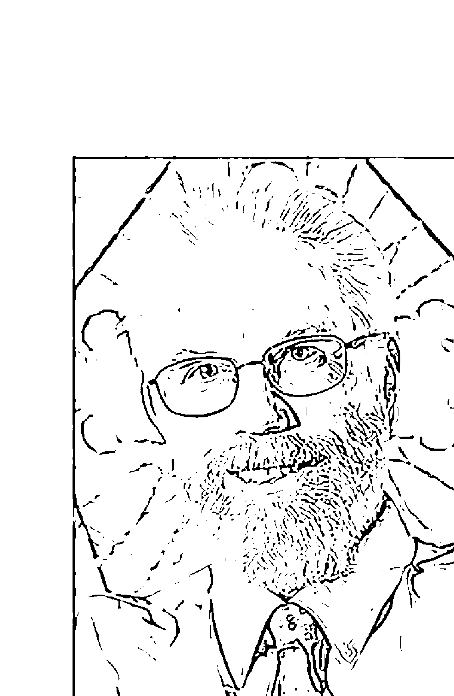

隆・麥羅・杜奎特 (Lon Milo DuQuette)是美國作曲家兼歌手，也是音樂錄製藝術家，另外也是儀式魔法、卡巴拉、塔羅牌，以及英國著名神秘學家阿萊斯特・克勞利 (1875-1947)的生平與教導等領域最具國際權威的研究者。他是克勞利魔法組織東方聖殿騎士會的資深入門會員，現作為其美國總副會長，可以說是這個神秘魔法組織最常在公眾場合露面的成員。

他遊歷很多地方，並教導、傳授秘教美聲會、塔羅牌、卡巴拉和魔法等主題。他的著作繁多 (並翻譯成十二種語言)，其中有些被認為是現代秘教經典。

他與妻子康斯坦絲 (Constance)居住在加州的科斯塔梅薩市已有五十二年。照片由保羅・慕斯卡 (Paul Muska, muskavision.com)所攝。

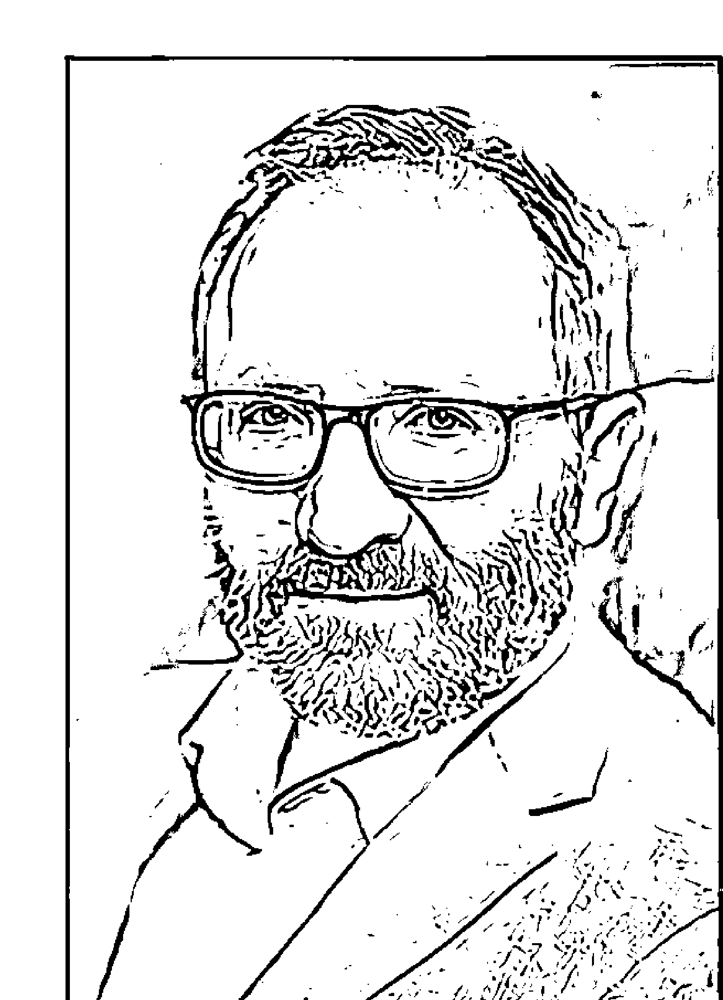

大衛・修梅克是一間私人診所的臨床心理學家，專攻榮格心理治療與認知行為心理治療。修梅克是銀星聖殿 (totss.org) 的首席秘書暨發言人，提供泰勒瑪魔法與神秘學完整系統的訓練。他也是東方聖殿騎士會與銀星會 (A∴.A∴, onestarinsight.org) 的資深成員，為這些傳統的入門者提供訓練已有多年經驗。修梅克是薩克拉門托東方聖殿騎士會四一八分會的前會長，繼承朋友兼老師的菲利斯・塞克勒，他也是協會的最高總檢察長。他曾是東方聖殿會心理公會 (the O.T.O. Psychology Guild)的創始者，時常在國際間與區域間活動場合擔任講者。

教學性廣播節目《活出真知》(Living Thelema)從二○一○年開始播送，並於二○一三年以同名出版書籍。他同時也是多數其他專注於泰勒瑪、心理學與魔法學的作者或編輯。

除了魔法學與心理學作品外，他也是名作曲家和音樂家，可以透過官網 livingthelema.com 與他聯絡。

照片由凱文・菲斯庫斯 (Kevin Fiscus)所攝。
