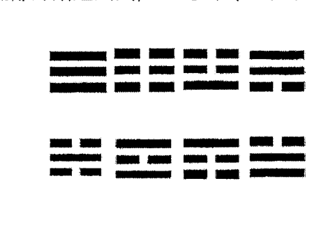
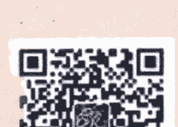

# 占卜

彼得·朗利 著
埃罗 译

## St. Royal College
## 天使神秘学院

- 专业占卜预测机构
- 神秘学培训机构
- 水晶能量研究中心
- 神秘学资料库
- 官方微信：strcdts
- 微信公众平台：strc2011
- 读书交流QQ群：
    占星塔罗占卜师交流群：814594478（加入密码：PDF）
    神秘学其他综合群：659338717（加入密码：PDF）

微信号：strcdts

## 天使神秘学院

天使神秘学院 院长QQ：715104687

微信公众平台：strc2011

# 占卜

彼得·朗利 著

埃罗 译

# 目录

- 介绍 .............................................. 3
- 第一章 理解占卜 ........................................ 5
  - 占卜的类型 .......................................... 6
  - 益处 ................................................ 7
  - 该怎么进行占卜 ...................................... 9
- 第二章 开发占卜技巧 ................................... 11
  - 通灵感知的开发 ..................................... 11
  - 问正确的问题 ....................................... 15
    - 如何更准确 ....................................... 18
- 第三章 占卜体系：塔罗 易经 卢恩 及其它 ................ 22
  - 塔罗 ............................................... 22
    - 大牌 (重大事件/想法)： ........................... 23
    - 小牌 (小事件/想法) ............................... 25
  - 易经 ............................................... 29
    - 八卦 ............................................. 30
  - 卢恩 ............................................... 36
- 关于读掌，占星和占数 ................................... 39
- 第四章 灵摆占卜 ....................................... 41
- 第五章 徒手占卜 ....................................... 43

# 介绍

感谢你购买本书。这本书里我写了不少关于占卜的信息，它告诉你它是什么，该怎么用。

你可以通过占卜来做出更好的决定，在事件发生前就预知结果，以及看看你的未来是怎样的。

占卜已经存在几千年了，方法众多。这本书教的都是主流的占卜方法，告诉你需要哪些器具，以及该怎么用它们。

你甚至会学到完全不需要器具，直接就可以进行的占卜方法。

这本书所给的建议和技巧将能让你成功地理解占卜，并在家里进行占卜。

无论你是完全的初学者，还是以前试过的，这本书都能提供给你有用的信息。

MAGICK.TAOBAO.COM

再次感谢你的购买，希望你会喜欢本书。

# 第一章 理解占卜

这本书是你终极的占卜指导——读这本书，你将知道什么是占卜，你该怎么做，以及你该如何掌握各种占卜技巧。当你全部读完并遵循指导的时候，你将能够准确地得到占卜结果。你需要做的仅是：通过常规练习训练你的精神，购买一些占卜工具，以及想要学习的意愿——即便是犯错也是一种成长。

占卜是通过仪式获得信息的方法。Divination（占卜）这个词是源自于拉丁文 divinare，意思是预知或接受神性的灵感。占卜的方式多种多样，不同文明都会有不同的方法——中国人有易经，德国人有卢恩，欧洲人有塔罗牌，等等。还有很多术，比如地占术（用土地），镜占术（用镜子），烟占术（用香薰的烟和灰尘），等等。你可以用占卜系统，也可以不用它们进行占卜。这本书两种方式都会教你。

## 占卜的类型

占卜有几种分类方式（比如复杂性，起源国，或运用的材料），但是，为了简化，它们通常被分为两种：

1. 用已有系统或信仰的占卜：

    - 预兆类。有些人会给特定的事件加上属性，比如，遇见蝴蝶或黑猫，耳朵发痒，或者带着无损羊膜出生的孩子——这些都被称为预兆。一些是占卜师请求神给予的预兆，而另一些则是预料之外发生的。预兆的解析超出了本书的范围，但是你可以很容易地在其它资料中找到它们。不过，你会读到矛盾的信息的，因为不同的文明对于相同的预兆有着不同的看法。

    - 占卜系统。占卜系统比起预兆要一致得多。它们是一代代传下来的，没有多少变化。有不少书会指导如何进行占卜仪式，如何解读，比如《易经》。占卜师通常会参考这些文献来解读占卜结果。

2. 无工具占卜：

这种占卜是基于个人的直觉的，而不是靠任何已存的系统。当你在这么做的时候，你可以选择任何物件，让它代表你问题的答案。你可以用一个平面来凝视占卜，让你从中看到的事物来告诉你需要知道的。事实上，你不需要任何工具来进行占卜。外在的事件，仪式和物件都能在占卜中有所帮助，但是它们并不比你内在的通灵能力更重要。

## 益处

当做正确的时候，占卜会提供各种益处：

- 帮助头脑风暴。你可以用占卜来打破精神瓶颈。占卜系统充满了象征和原型——它们能给你不少新想法。它也训练了我们精神中创造的一面（比逻辑的那面更有弹性），因为线性思考的人多数会遇到瓶颈。

- 带来更多洞察。占卜能给你不少信息。它能告诉你，你以前不知道的事。它也会因为告知你不知道的事情而改变自己的想法。占卜让你更深地理解事物，无论它在哪里，处于什么事件段。

- 使心情平静。我们最大的不安感是来自于不确定。占卜能帮我们更确信正在学的新事物。然而，占卜很少百分百正确，但这不应阻碍在可能的情况下收集信息。

- 增加通灵能力。练习占卜是增加通灵能力的方式之一。通过超自然手段能核查你的通灵感知，再看看它们是否正确。通过评估所发生的事情，你能够知道自己的通灵力量是否有效，你能够做一些事情来增加它们。

- 提供娱乐。占卜可以是很有趣的。它能给聚会提供乐趣，让群体互动。你知道如何占卜能让你从人群中凸显出。虽然很多人会严肃对待占卜，但它至少也可以作为娱乐工具。

- 产生收入。你可以帮人占卜赚钱。你可能已经见过收费的塔罗占卜师或灵媒了；一旦你对自己的技巧自信，你也可以这么做。

你选择学习占卜可能有自己的理由，但是，要最有效率地学习，你可以写下你的目标，去做能达成那目标的事，再将你当前的训练进度与你所希望的目标做比对。

## 该怎么进行占卜

占卜已经有上千年的历史了，在早期的时候，各种文明都有自己的占卜方式，并对其作出解释。有些人认为是神灵影响了结果，而另一些人则认为是占卜师接入了名为阿卡西记录的知识库。有人认为时间和距离都是基于精神的幻觉——占卜能帮助我们从任何地方、任何时间中收集信息，绕过各种过滤，让我们能够感知到现实。就现在而言，它没有明确的定义。无论如何，占卜仍旧会有效，即便你不理解它是怎么会有效；你不需要让自己钻牛角尖。

正如前面说过的，你几乎可以用任何东西进行占卜。至关重要的是对结果的解读。你可能看到所有的迹象，但如果你不知道该怎么解读的话，那么你可能得不到有用的信息。在下一章中，我将教你如何解码占卜元素，使它们变成有用的信息。

# 第二章 开发占卜技巧

开发占卜技巧在总体上需要两件事：掌握占卜系统，以及锤炼你的直觉。在第三章中，我将主要说说占卜系统，而本章则是如何开发直觉能力。如果你只是希望练一个成体系的占卜的话，那么你可以跳过本章，因为成体系的占卜中已经有了解读方法。如果你是计划用成体系的占卜方式的话，那么你可以从书或记忆中来解读占卜含义，再将它们更改，以符合占卜目标。如果你更喜欢直觉占卜，那么继续读下去。

## 通灵感知的开发

开发通灵能力能帮助成体系的和直觉上的占卜方式。通灵能力比起看书找关键词，能收集到额外的信息。从书中找关键词很容易，但如果你想要读到更具体的，那么你也要用你的直觉。

### 下面是你该如何为占卜而开发通灵感知：

1. 学习更多关于通灵感知的事情。你对它们所知道的信息越多，你越是能让自己的精神接受它们的存在。我们都具有通灵感知，但是如果我们不用它们，那么它们日益荒废。你可能会对自己的感知能力产生怀疑，认为它们是假的，或者只有有天赋的人才能这么做。如果你是这种自我怀疑的人的话，你该做的第一件事是去读一些关于 ESP（超感知）和直觉的信息。你必须要先让自己确信它们是真的，可靠的现象，是每个人能够掌握的。如果你根本不信，那么就很难开发这些技巧。因为它们是精神体验，所以它们会被你的思绪轻易影响。另外，你越是得知关于通灵能力的知识，你越是能够认同它们，开发起来也越是容易。

2. 训练自己进入出神状态。你正常的思维通常会干扰通灵信号。要接收到通灵信息，你必须将你的意识焦点向内转变，远离干扰。要做到这点，你可以从头到脚放松你的身体，缓慢地呼吸，并清空你的思绪。很快，图形、声音和感知都会流入你的意识。这点和你马上要睡着或刚醒时的半梦半醒状态很像。你在此刻会接收到直觉信息，所以你要多加注意。

3. 习惯去接收通灵信息。回忆起你曾经知道或感知到这类情况的时候。那个信息是否是通过一种感官，一个静止的图像，或者一个象征来传达的？你是否有听到一个声音或者一首很有含义的歌曲出现在你的脑海里？你是否有感到一阵鸡皮疙瘩，在警告你重要的事？正如在 1 中解释过的，你越是有意识到你的通灵感知能力，它们越是强烈。你的精神要对接收信息开放。注意古怪的迹象出现，再通过其它方式核查。

4. 强化你的五感。通灵感知是普通五感的延伸。我们的感知通常会变钝，是因为我们只聚焦在少数东西上，而忽视其它的。通过注意你感知到的，你能强化你的感知。一次聚焦在一种感官上会更容易些，但你也可以自然地处理两种或多种感官。例如，如果你是在应用你的视觉，注意你所看事物的细节，欣赏下融入在日落中的美景，等等。你要经常这么做，直到你能够习惯从环境中接收到更多的感官信息。当你达到这点的时候，进一步尝试感知远超感知的内容。例如，试着去看看快乐的颜色，听听渴望的声音，感受到烦恼的层次。你可以在它发生的时候练习感知抽象（例如，在别人冲突或灵感枯竭的时候进行感知），通过看图画/电影，回忆它发生时的状态，或者在一些情况中问自己，如果它转换成感官信息的话，会是怎样的。比如，在感知寻常东西的时候，你必须要剥离自己的感知，清空你的精神，从而，你的五感能够轻易地接收到通常感知不到的东西。

5. 熟悉你自己的直觉语言。当你经常练习进入出神状态的时候，你会发现很容易唤起感知，能得到疑问或意图的回应。不过你仍旧需要做些什么；你必须要知道如何将自己感知到的东西翻译成你能够理解和使用的。直觉上的精神所“说”的语言和你寻常的精神是不同的。它通常会用象征，情绪，感知，抽象场景，和记忆，来与你交流。有时候，它也会给非常直接的信息，但这通常只有在你的精神过滤都敞开的时候，或者它是你必须要理解的信息的时候，才会发生。你可以写一本属于自己的直觉迹象辞典，帮助你自己理解不明确的直觉信息。你可以与你的精神交流，学习它对于不同事物的表达。举个例子，你可以问（你选的目标）的迹象是什么，然后等待它出现在你的脑海中。我自己对“是”和“否”的迹象是热与冷。你可以做一些在 4 中描述的感知试验。在笔记本上记录下你的发现。

## 问正确的问题

直觉/潜意识精神是与你平常用的精神是不同的。这意味着两件事：

- 你需要学会直觉语言
- 你需要编织自己的问题和意图，从而你的通灵层面的精神能够理解。

通过人的意图来编程潜意识是非常广的主体。在这里，我们将主要谈论如何让潜意识理解你的问题，因为这是占卜的基本技巧。

要让你的直觉恰当地回答你的问题，你的问题应该是：

- 直接关联的，而不是模棱两可的。单个问题可以由多个问题构成。比如，问一个你刚见的人是否值得信任，这与你真正想要知道他们是否对你有危险无关。因为他可能在其它事件中很值得信任，但这不意味着对你也是如此。你的直觉会给你陈述的问题答案，但是，如果你不小心的话，你可能会忽略掉因你问题而丢失掉的信息。其变化版是“我是否能信任这个人能照顾好我？”这个问题可能也不好，因为你可以信任他，但并不意味着他能够完成你相信他能做好的事。最好的替代问题是“这个人能够照顾好我？”这是你想要知道的核心。
- 缩小范围。如果你问的问题太广泛了，你可能会得到矛盾的答案，以小的局面来回答大的疑问。或者，你得到的回应是很明确的，但是只与你问题中的一小个层面有关。诸如“我明年能否开心”的问题需要你进一步详细说明一番，比如，你对于开心的标准是什么，以及时间线。你的确可以开心，但也有可能痛苦的时候比开心多。要避免答案不清楚，那你就要尽可能详述你的问题。
- 问题过于简单，没有合在一起。将多个问题组合在一起作为一个问题进行占卜会更令人兴奋。对事业很有希望的企业家可能会问“我的生意能否兴隆，给我带来几百万？”占卜的答案对于前者可能是“是”，但因为提问者聚焦的是给出一个答案，那么就缺了后者的答案。你应该避免这点。

如果你不知道该怎么提问，那么你可以仅仅问你需要知道的事。你的潜意识会帮你补充（因为它是你的一部分），从而它会理解这个问题，给你重要的信息。注意：即便你跟着上面的指导，你的直觉也有可能不会回答你的问题，而是给你另一个它认为更重要的主题。与此同时，你要学会听，尽可能地理解它给你的建议。

## 如何更准确

你需要将直觉从你的逻辑，情绪和想象中区分出来。它们三个会给你看似通灵感知的东西，但可能不会准确。下面是你区分直觉感知和精神投射（自我创造的感知和想法）的方法：

- 让信息流动。在最初，直觉信息给你怎样的就是怎样的。核查结果是后面的事。如果你在接收阶段怀疑你的直觉或者不相信它们，那么你可能会激活你的理智，这将阻止直觉过程。你只是应记录下来，或者说你在此刻经历的东西。如果你这么初期的时候抵抗它，那么你可能会丢掉重要的线索。
- 了解直觉的特征。直觉通常是象征性的，整体性的，非线性的，超然的。在象征物中充满了信息，所以你必须要学会一层层地理解它们。直觉很少会给你很直白的视效或语言，但它也的确会发生。然而，当你得到直白答案的时候，你是有可能接收的是自己的思绪和幻想。整体性指的是你的直觉将信息作为整体传达——当你的得到的信息是一点接着一点的，那么你就要注意了，可能是你的逻辑给你的信息。因为直觉不是线性的，任何流入你通灵感知内的都不应该被“强迫”感受。另外，直觉也是与情绪分离的；如果你感到什么，这并不意味着它就直接是直觉上的信息。事实上，更准确的感知会在你毫无情绪的时候发生，因为即便是一点点的情绪也会改变你的感知。在你分析你接收的信息时，要记住这些特征。
- 搞清楚是否是普通的东西让你有了直觉信息。内在和外在的力量能影响出现在你精神中的。例如，如果你刚看了一场恐怖电影，你的精神更有可能产生鬼怪的形象，即使他们与你的占卜对象无关。或者，你所处于的房间里有很多花饰，那么你会看见很多花朵或者闻到很多香味，都会让你的解读产生偏差。审视自身，看看你的周围，看看你接收到的信息是否是因寻常之物的影响。如果它们非常不寻常，那你可以将它们视作为你直觉的产物。
- 尽可能地清空思绪，稳定你的情绪，从而你不会将接收到的信息过滤掉。不要在意接收到的信息是什么。如果你期待信息以某种方式出现，或者是某一类的信息，那么你的想象力（而不是直觉）可能霸占主导权。你要处于一种接收状态。如果你没有感知到任何，那么不要强迫它。以后可以再试试。
- 核查下你的感知。即便你不应该在最初怀疑你感知得到的信息，但你在事后必须要核实下。例如，如果你感到你的演奏会应当取消，那么用你的直觉来看看在演奏会的那天你会做什么，如果你看见你自己在舞台上演奏，那么你之前那个感觉就不是真实的通灵信息。
- 试验和从错误中成长。只要安全，就经常用一下你的通灵感知。记录下你的尝试，以及内在/外在情况。评估下你的洞察和预兆的准确性。你将注意到在特定的情况中，你得到的信息是最准确的。你可以让自己再次处于那种情况，避免会导致你感知错误的情况。

我推荐你尽可能经常用你的直觉。你可以用它来找你丢失的物品，在接电话前先感知下是谁在打给你，猜猜你一年后在做什么，以及感知任何你想要知道的事情。就像在磨练新的技巧一样的，只有你经常用，你的直觉才会变得准。练习它，观察发生了什么，纠正错误，继续用你在试验后觉得有用的方式。

# 第三章 占卜体系：塔罗 易经 卢恩 及其它

占卜体系太多了，你甚至可以创造属于自己的体系。我在下面列出了一下最流行的体系：塔罗，易经，卢恩，占数，占星，以及读掌。

## 塔罗

塔罗或许是占卜中最流行的方式了。塔罗的发明地未知，但第一副牌应该是在 1400 年后期的意大利出现的。它们最初只是有图画的卡牌，不是用于占卜的。塔罗牌通常由 78 张牌构成，其中 22 张牌是大牌，56 张牌是小牌。每张牌都与数字关联。如果你想要用塔罗，那么去买一副塔罗牌——它会随牌附赠一本小册子，会教你如何占卜和解读。

这些是塔罗中常见牌。有些塔罗会有不同的变化。

### 大牌（重大事件/想法）：

- 愚者：开端
- 魔法师：力量
- 女祭司：直觉
- 女皇：富饶
- 皇帝：领导
- 教宗：传统
- 恋人：爱情
- 战车：集中
- 力量：怜悯## 世界：完整

### 小牌（小事件/想法）

小牌由 4 组牌构成，每组有 14 张牌。因为缺少空间，下面的不是全部的含义，但你可以在随牌的册子中读到。

每组的头十张牌是基于数字的：

1. 开端
2. 关系或选择
3. 会面
4. 基石
5. 变化
6. 分析
7. 选项
8. 希望或挑战
9. 最终阶段
10. 完成

宫廷牌源自于四种重要人物：

- 侍从：年轻个体
- 骑士：信使或信息
- 女王：成年或年长妇女/给予关怀的人
- 国王：成年或年长男子/统治者

下面的每组牌都有 14 张牌：

- 杖（火元素）：目标/增长
- 杯（水元素）：情绪/关系
- 剑（风元素）：活动/冲突
- 星盘（土元素）：所有物/财富

记住上面的信息，你在你解读小牌的时候会容易不少。起初可能很难理解所有的含义，但是，如果你有经常冥想每张牌的话，那会容易很多。如果你忘了含义，可以看看那本小册子。另外，你可以抛弃书上描述的答案，而是用你的直觉感知牌意。

你一边洗这些牌，一些问问题，然后，按照特定顺序和位置（牌阵）发牌。每个牌阵上的位置都具有含义（例如，第一个位置意思是过去，中间的位置意思是当下，第三个位置意思是未来）。你再根据落入位置的牌来进行解读。

下面是牌阵例子（你可以创建自己的牌阵）：

* 一张牌的：总体情况，简单的答案
* 两张牌的：两个选择之间的洞察
* 三张牌的：过去，当下，未来
* 四张牌的：洞悉一个人肉体上的，情绪上的，理智上的和灵性上的层面

逆向的牌给予的是负面或对立的含义。例如，太阳通常意味着成功，但是，当它逆位的时候，含义就变成了失败或黑暗。同样，让你的直觉来指引你如何解读牌。

## 易经

易经是有六千年历史的中国占卜体系。它是基于有两种能量（阴和阳）能影响宇宙万物的概念，通过检测到这些能量，占卜未来就成为了可能。这两种原始的力量组合在一起，形成了不同的元素，称之为卦，而不同对的卦能组合在一起，形成一个六十四卦形。所有这些易经的元素（阴/阳，卦和八卦）都给予你占卜的信息。

易经是更很大的体系。这本书没法完全说它。你需要弄本关于易经的书，从而学一些更深的东西，比如，横杠的变化含义，以及其代表的卦象。不过，下面的信息仍旧对你有用。

要用易经，弄三枚硬币，一张纸，和一支笔。问一个问题。再翻三枚硬币，数硬币的正面和反面。如果它们是：

- 2个反面和1个正面的——画一条直线（阳）
- 1个反面和两个正面的——画一条中间断的线（阴）
- 三个正面——画一条线，中央有一个圈（阳变阴）
- 三个反面——画一条断线，中央有一个 x（阴变阳）

从底部开始这么画，直到画出一个卦：

这个卦是你最底下的卦。重复这个过程三遍，直到你画到你顶部的卦。不同的卦图案在易经中有不同的含义。你可以在易经八卦表的帮助下解读它们。不同的八卦图案是与数字关联的。这些数字的含义如下。

## 八卦

1. 乾：起源，伟大
2. 坤：容纳，臣服，忍耐
3. 屯：开端的困难。成长的烦恼
4. 蒙：年轻人的愚蠢。孩子般的弱点
5. 需：等待。耐心
6. 讼：冲突。将可能发生冲突
7. 师：军队。领导权
8. 比：维持在一起。互相协作
9. 小畜：控制微小的层面，采取较小的行动
10. 履：恰当的行为
11. 泰：好运
12. 否：停滞。困难
13. 同人：一个群体或运动
14. 大有：成功
15. 谦：谦逊和平衡
16. 豫：热情，愉悦，兴奋
17. 随：跟随命令，受胁迫
18. 蛊：腐败，修复已受损
19. 临：趁机会还在，接近什么
20. 观：沉思。自省或采取更清晰的视角
21. 噬嗑：坚持，诉讼
22. 贲：环绕着美丽和荣耀，但需要谨慎
23. 剥：分离，压倒
24. 复：转折点。回归
25. 无妄：纯洁。预料之外的事件。
26. 大畜：从伟大的事物中学习，做伟大的事
27. 颐：滋养，口舌不好
28. 大过：巨大的负担，几乎要被压垮了
29. 坎：（水）危险——做你能做的去活下来
30. 离：（火）明亮，胜利
31. 咸：影响人/事物，追求某人
32. 恒：婚姻，持久，继续
33. 遁：撤离/隐藏
34. 大壮：向强盛进发
35. 晋：发展，成长，升职
36. 明夷：在逆境中坚持的同时隐藏你的光芒
37. 家人：盟友/家人
38. 蹇：在冲突中小心前进
39. 蹇：绕着障碍走
40. 解：放松，放手负面的事物
41. 损：缩小/减少
42. 益：增加/进步
43. 夬：突破，解决，决定，宣布，显露
44. 姤：联系，性交，诱惑
45. 萃：累积，聚集，大行动
46. 升：一步一步地成长
47. 困：压迫，耗尽
48. 井：资源
49. 革：转变，变化
50. 鼎：创造，好运
51. 震：惊讶
52. 艮：山，无法移动，维持着什么
53. 渐：发展，逐渐发展
54. 归妹：处于下属位置
55. 丰：繁荣
56. 旅：旅行者/旅行
57. 巽：温和，微弱却又坚持的行为
58. 兑：愉快，湖泊
59. 涣：离开，溶解
60. 节：限制，控制
61. 中孚：内在真理，明晰，敏感
62. 小过：小行动的成功
63. 既济：圆满之后。目标已完成；警惕腐败
64. 未济：圆满之前。要完成目标，需要耐心和谨慎

## 卢恩

卢恩是日耳曼部落的字母表和占卜工具。他们相信卢恩是神灵赐予的；每个字符代表着可用以占卜未来的力量和能力。你可以购买一套卢恩符石——通常是刻着卢恩符文的石头或木头。找一本关于卢恩的书，从而你知道每个字符长什么样，它们又代表了什么。

ᛈ（财富）：金钱，所有物，财富，运气
符号（命运之杯）：神秘，未知，可能，不确定
符号（麋鹿）：守护
符号（太阳）：成功
符号（蒂尔）：（蒂尔是北欧战神的名字）战士，自我奉献，统领，理智
符号（贝莎）：（贝莎是北欧女神名）：诞生，再生，滋养，关怀，富饶
符号（马）：运输，移动，发展
符号（人）：人类，智力
符号（水）：流动，创造力，直觉，情绪，梦，隐匿的事物
符号/符号（昂格）：（昂格是北欧神名）种子，男性生殖力，准备好移动到新的方向
- ♀（太阳）：突破，照亮，唤醒
- M（祖上的所有物）：遗传，继承，家族，家庭，重要事件

占卜师从袋子里或从桌上随机抽卢恩。他或她再将它们以阵型布置到平面上，就像塔罗中的那样，再根据它们所在的位置来解读它们。

## 三、使用条款

您在使用小米电脑助手的各项服务前须同意并遵守相关的用户协议和隐私政策。在使用小米电脑助手各项服务前，请您仔细阅读相关协议。尤其是其中的免责声明、责任限制、争议解决和适用法律等关键条款，这些条款可能会影响您的权利义务，请您重点关注加粗的内容。如果您未满18周岁，请您在监护人的陪同下阅读并取得监护人的同意。

- 除非我们与您达成单独协议并另行约定，否则本协议的任何条款均不会被解释为在我们与您之间形成任何代理、合资、合伙、雇佣或特许经营关系。
- 本协议任一条款被视为无效、不具有执行力或不可执行的，不影响其余条款的有效性和可执行性。
- 未经我们书面同意，您不得转让或以其他方式处置本协议或本协议规定的任何权利和义务。我们可基于自身判断，自主决定将本协议或本协议规定的任何权利和/或义务转让给第三方，我们进行前述转让的，将通过在小米电脑助手平台发布公告或向您发送通知等方式进行。

本协议适用中华人民共和国（为本协议之目的，不包括香港特别行政区、澳门特别行政区和台湾地区）法律。因本协议产生任何争议的，由我们与您友好协商解决；协商不成的，任何一方均有权向协议签订地有管辖权的人民法院提起诉讼。

为便于理解，本协议提供了英文版本。如中、英文版本存在不一致，以[中文版本](https://sre.cx)为准。

[下载此页面](https://src.cx)

## 关于读掌，占星和占数

读掌，占星和占数都是复杂的占卜法，所以我只简短地介绍一下。读掌是将手掌画成地图，手的每一个部分都有独特的含义。占星是根据读者出生年月日的行星位置，以及当前的行星位置之间的能量关系来占卜的。占数是将数字赋予含义，将字母/字符和日期转变成数字来进行占卜——如此将揭露隐藏的信息，比如人在某段时间内的真实性质。这几个占卜方式比起之前说的那几个系统要更加的恒定不变。当你用的占卜体系是相当不变的，不要认为你无法改变占卜出的结果。你的行星，数字和掌纹可能意味着什么，但你不必让这些东西来决定你该如何生活。

# 第四章

## 灵摆占卜

灵摆的占卜方式是用一根线或链子来吊着一个重物。你可以从店里购买一个灵摆，你也可以用诸如项链或戒指来制作一个。方法是拿着绳子的一端，问出你的问题。再等待灵摆移动的方向，这将告诉你答案。

你可以将灵摆举在地图上，用于找东西——它摇摆的地方将告诉你位置。它可以检测在环境和身体中的能量流。它可以根据问题来回答是或否，或在各种选项中选择最佳的一个。

如果你要用灵摆来占卜是与否，那你可以问有明确答案的问题（比如问你的名字是否是 xxx），然后观察它移动的方向。你可以告诉它，顺时针摇摆说明答案是“是”，逆时针是“否”（沿着方向移动手的同时这么说）。你也可以用灵摆来对着不同群体的答案进行占卜，要求它转向最佳选择的方向。等它静止后，再继续下一个问题。

# 第五章 徒手占卜

你可以不用占卜体系来进行占卜，你只需要你的直觉。你最好先读下第二章。这对于徒手占卜很重要，因为没有书来给你参考含义。这个方法是不依靠任何其它体系的，你甚至可以创建你自己的体系。

下面是一些给你的建议：

- 选择一个物件。你可以选任何东西，或一群东西，让它们代表你占卜问题的答案。例如：你想要知道如何解决两位朋友之间的撕逼。你选择一个几乎空掉的杯子，一个倾斜泰迪熊，以及一双鞋子，因为这几件东西在周围让你感觉很凸出。你可以将这些东西解读为：杯子代表撕逼的两人之间的关系。第一个人占据了太多空间，太其实是已经空了，第二个人觉得她有什么有价值的东西，但她没有太多空间去操作。那倾斜的泰迪熊加强了你感到的这点。有什么不平衡的东西需要纠正，只要两人能够以不同角度来看事物就好了。那双鞋子象征着她们可以一同补足对方所缺的部分。这个洞察指引了你将对朋友所说的话，让她们重新好起来。
* 凝视占。这需要你凝视一个平面，等待精神中出现图像。你可以用水晶球，镜子，或者有墨水的碗来进行，它们都是凝视常用的传统物件——即便一张白纸都可以用。温和地凝视一个物件，直到你能从中清晰地看见视效。你也可以在占卜工具中看见它们，也可能是直接出现在你精神中。
* 寻找预兆。你可以对发生在自己身上的事件多加注意，看看有什么引起你注意的地方。你可以将此作为一种事件的预兆，或者你问题的答案。
* 通灵信息。正如在第二章中说过的，你可以完全在精神中使用占卜，而不依靠任何外在的工具。你可以仅仅问自己一个问题，再用你的直觉来等待答案。
- 梦境。梦有时是非常富有信息和寓意的。学习清明梦和通灵梦——它们也是通灵技巧的一部分。要做占卜梦，你应在睡前陈述你的意图或疑问，指示自己在清醒时回忆起梦境。在身边放好梦的日记，从而你能快速记录，不落下细节。

占卜是非常有助益的，任何人都可以学，只要他/她愿意付出精力增强自己的通灵能力和占卜解读技巧。尽可能找时机用你的占卜工具和直觉。观察你的解读是否准确，不要因为犯错而气恼，你应继续训练自己的技巧。不要害怕犯错，即便最厉害的灵媒也会有那么几天不怎么行。你要找到自己的强处，训练你自己的弱处，用你自己已学会的技能和知识来为自己和他人进行占卜。你知道的越多，你能做的也越多，所以你要尽可能地发挥自己已学的知识和技巧。祝你好运，未来的占卜大师！

## 巫术的法则

MAGICK.TAOBAO.COM

