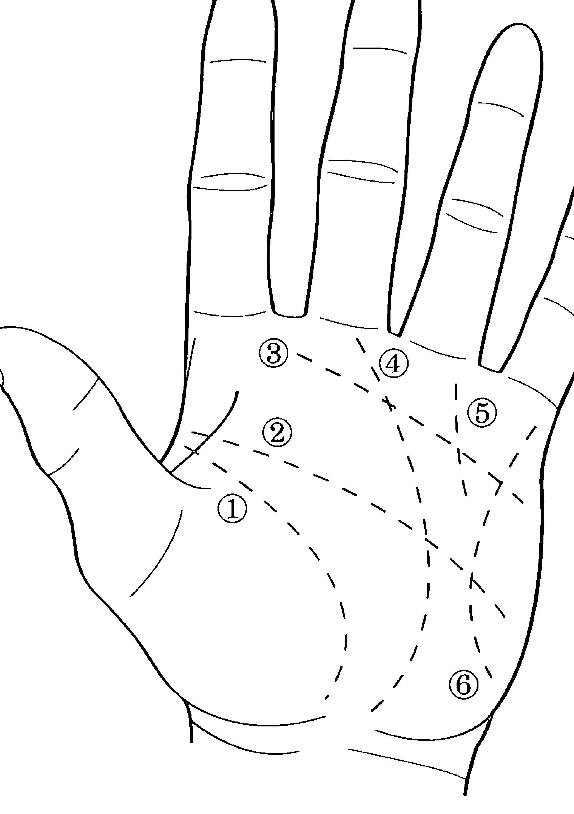
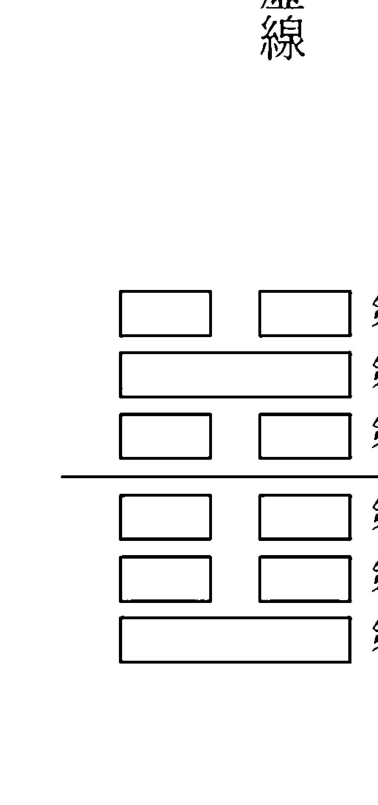

## DIVINATION FOR BEGINNERS

## 運用占卜微調你的未來

## 解讀過去、現在和未來

## 史考特・康寧罕的占卜大全

## READING THE PAST, PRESENT & FUTURE

## 西方神祕學重量級大師史考特・康寧罕親著 亞馬遜4.8星至高好評

史考特・康寧罕 著
林惠敏 譯

## 現在即未來

在這個自我成長書籍登上銷售排行榜榜首的時代，我們人類顯然不再滿足於沒有方向的生活。我們尋找完美的技術來自我提升。我們讀書、參加研討會，每一天都花一些時間在追尋自我。這些方法對某些人來說相當有效，但也有人意識到其中少了些什麼：他們有目標，也有達成目標的地圖，但他們不確定該走哪條路才是最好的。他們可能會因此而陷入絕望，並放棄改善自己的生活。占卜可為我們提供這類重大的資訊，讓我們看見前進的方向。透過分析這類的資訊並應用至我們目前的生活，我們便能繞過不那麼愉快的目的地，進而改善我們的生活品質。作為探求未知資訊的工具，占卜可發揮重大的影響力，讓生活符合我們的期望、夢想和渴求。它有助於我們學習尚未掌握的經驗教訓，讓我們在邁向未來的路上可以走得更平順。史考特·康寧罕

目錄

前言／卡爾·盧埃林·韋斯切克（Carl Llewellyn Weschcke）

致謝

序言

第一部分 占卜的層面

第1章：占卜入門

第2章：古代占卜

第3章：占卜的藝術

第4章：象徵性思維

第5章：時間的性質

第6章：判定

第7章：改變你的未來

第二部分 技巧

第8章：水

第9章：火、蠟燭、煙和灰  96

第10章：風、雲和鳥  108

第11章：植物與香草  118

第12章：卜卦  128

第13章：水晶凝視  138

第14章：關於愛情  144

第15章：鏡子  154

第16章：星辰、月亮與閃電  160

第17章：其他的占卜形式  167

第三部分 進階技巧

第18章：塔羅  186

第19章：手相  205

第20章：易經  211

第21章：現在即未來  218

附錄1：占卜字典 ........................................ 221

附錄2：不尋常的占卜形式 ........................ 235

相關術語表 ........................................ 240

## 前言

史考特·康寧罕致力於三大領域：書寫技巧、魔法生活技巧，以及對讀者的慈愛關切。身為作者，史考特持續撰寫一絲不苟的研究筆記，而且至少累積二份以上的完整手稿草稿後才進行出版。他往往會隔至少一年以上才處理不同的草稿，如此在修改時才能保持完全客觀。他會查證事實是否準確，並從讀者角度閱讀手稿，以確保讀者能輕易理解他的說明。史考特在他短暫的一生中撰寫了超過三十本書，部分是供「受僱」所撰寫的短篇小說和技術手冊，讓他可以持續進行研究並撰寫「真正的書」。他在這些真正的書中融入了他的心和靈魂。他認為宇宙是充滿魔法的，而所有的生命也是。充滿魔法的宇宙和生命就像同一枚硬幣的兩面：我們都是這魔法宇宙的一分子，當我們能懷抱魔法意識生活，我們就能過著睿智而美好的生活，這就是他對讀者流露的愛與關懷。他希望人們可以理解大自然不是「外來的」，我們就是大自然的一部分，而大自然也是我們的一部分。這同時為我們賦予了機會與責任，因為不僅所有的生命都是一體的，而且大自然中的萬物都是有生命的，當我們生活在無處不在的生命和愛的意識中時，我們便將這一切都結合在一起。史考特會閱讀作者郵件，讀者會詢問他問題，向他揭露個人的問題。他認真看待每一封信，並在撰寫著作時銘記在心。他特別關心年輕讀者和初學者，因為在這個將自然視為純物質，甚至將自然視為必須釘死在唯物論十字架上的「仇敵」的主流文化中，他們正試圖帶著魔法意識過生活。

正是外在世界與「內在」之間的這種統一性，使占卜的藝術和科學成為可能。在解讀牌卡、石頭、雲朵圖案，或詮釋從夢境或物品中發現的象徵時，我們也正為這個更廣闊的現實打開感知之門，在這個現實中，甚至過去和未來的時間都不再與我們的意識分離。

本書是史考特最後的作品之一，是對各種占卜的調查和介紹。這是個起點，讓你能夠找到最吸引你的特定種類占卜，讓你可以感受魔法，讓你可以和任何問題都能得到解答的真實世界交流。

我希望你會發現這只是魔法生活奇妙旅程的第一步。

利韦林全球公司出版商
卡爾·盧埃林·韋斯切克

## 致謝

作者想向以下的個人表達感謝：
感謝 Spellbound 商店的 Vinny Gaglione 提供幾種義大利占卜技巧的寶貴貢獻。

感謝 de Traci Regula 讓我進入他的私人圖書館。
感謝 Marilee Bigelow 和我一起討論關於我們十至十五年前使用的蠟燭和其他技術的某些占卜系統。

感謝 Annella 對煙霧解讀的教學。

感謝 Marlene Cole 對塔羅章節的協助。

感謝我的父母，沒有他們，就不會有這位作者的存在。

## 序言

近年來可見到人們對探索未來的興趣和活動激增。無數的靈性電話專線每天二十四小時開放，而且大多都不缺顧客。可選擇以盧恩符文和易經卦在個人電腦上運行的程式已經開發出來。塔羅牌從未如此享有盛名或暢銷。全國各地都盛辦大型的靈性市集，吸引了數以百計或千計的參觀者，急欲一窺未來。

毫無疑問，我們對未來有著永不滿足的好奇心。想一窺未來的動機因人而異，但慾望本身就和人類意識及我們對時間的感知一樣歷史悠久。

現代技術可能修改了昔日的算命形式（今日在法律上稱為「靈性娛樂」），但許多想私下探索潛在路徑的個人仍在使用古老的方法。這是占卜的最大價值之一：我們無須拜訪占卜師，因為我們自己就可以成為占卜師。

在我們人類與其他物種相較下較短的歷史中，我們總是充滿了關於明天的問題、焦慮和希望。儘管從許多方面來看，動植物都更擅長預測某些狀況，例如氣象預報，但人類也已經發展出一系列出色的技術，得以揭開今日與明日之間的神秘面紗。我們也會運用占卜來做出艱難的決定、取得對過去的清晰理解，並檢視我們目前的生活。

這項不朽的藝術有許多稱呼，非實踐者可能會稱為「算命」或「預言」，這兩者有時會被視為帶有貶義的用語。大多數實行這項古老技藝的專家只會使用占卜一詞，並將自己定義為占卜師。

本書是傳授如何解讀你的過去、現在及未來的占卜術完整指南。在同類型的著作中，這部作品幾乎是以獨一無二的觀點撰寫而成，因為作者並不認為我們是依據神聖計劃而活（因此我們可以改變未來）。我們無須具備探索過去、現在和未來的通靈能力。

每個人都可以進行占卜並接收重要訊息，本書概括了許多教你如何進行的方法。

第一部分是主題概述，以及占卜在古代的重要性調查，同時也涵蓋象徵性思維的技巧；我們稱為時間的幻象性質，以及改變不想要未來的可行計畫。

第二部分包含廣泛占卜術的詳細說明，每種占卜都依實行時使用的工具或技術而分類。許多占卜運用的是如水、雲、煙、火和鳥兒移動等自然力量。

第三部分是更進階占卜術的簡短介紹。

附錄1列出從世界各地各個時代收集而來的超過七十種占卜術。附注釋的參考書目為感興趣的讀者提供更多的資訊來源。

《史考特·康寧罕的占卜大全》是實用的指南，提供非常實用的技巧。向大眾公開這樣的資訊顯然是為了提供預見可能未來、回答問題等技巧，並在做出艱難決定時提供協助，而這是依據二十多年來的研究和實際經驗撰寫而成的。儘管我們無法保證這任一技巧的成功，但如果它們無效，似乎也不太可能會流傳五千年。

占卜不是要讓我們退回到主要由迷信和誤解主宰的年代。正好相反，想要真正理解創造我們的生命且仍在運作的力量是需要深思熟慮的，而這也讓我們重新思考許多我們珍視且神秘的概念。

沒有所謂的命運或注定的事。我們的人生計畫不是由更高的存有決定的。我們的人生幾乎完全掌握在我們自己手中。作為提供未知訊息的工具，占卜可以是我們強大的盟友，協助我們重塑生活，並讓我們的生活符合我們的希望及嚮往。

從過去尋找答案，檢視現在，進而展望未來。唯有如此，你才能準備好充分參與我們稱為人生的這場偉大冒險。

## 占卜的層面

## 第一部分

### 占卜入門

> > 大地、空氣、混亂與天空，海洋、原野、岩石與高山揭露了真實。——羅馬詩人盧坎（Lucan）

占卜是由占卜者操作他們認為可提供相關資訊的工具，並透過觀察來判定未知未來的做法。

古老的占卜術永不退流行。即使到了由物質主義主宰的現代，我們還是會執行古老的儀式來探索未來的景況。從古至今，占卜以多種形式成為我們生活的一部分。

人們從史前就會使用工具來預測未來，因此我們並沒有記錄到最早的文化為了窺探未來會採取哪些行動。或許最初的形式包括凝視湖面、觀看從烹飪和取暖用火升起的煙，以及觀察雲朵的形式。在尚沒有文字的時代，所有這類現象都被賦予了靈性能量，而這似乎很合理，因為我們的先人正是如此才得以一窺未來。

在偉大的古老文化中，占卜通常與宗教相關。過去的人們相信，只要賦予神靈機會，他們很樂於提供關於未來的建議。而人們會透過特定工具的供應和使用提供這樣的機會，讓神得以操控這些工具做出具體回應。早期的占卜者認為占卜透露出神靈的意願，因此他們認為未來是不可改變的。

然而，經過好幾個世紀的實踐，這樣的概念顯然很容易受到挑戰。為何預測的部分事件從未發生？神靈不是完全掌控人類的生命嗎？有些文化藉由改變他們的占卜的定義來回應這些問題。占卜顯示的不是注定的未來，而是讓人一窺可能的未來事件。未來可以因人類的行為而改變。因此，占卜提供的是通往可能未來的一扇窗，而不是註定不可改變的命運。如今，負面訊息會被視為實用的警示，而非不可逃脫的未來厄運訊息。

今日的占卜經常被定義為魔法的分支，這並非事實。這兩者的操作截然不同。占卜企圖探索過去、現在或未來，然而魔法是主動改變未來的程序。儘管魔法和占卜可以搭配使用，但它們沒有任何關聯。聲稱這兩者是同一件事的人，不是對這兩種操作一無所知，就是別有用心。

#### ✦ 運作原理 ✦

有許多理論試圖解釋占卜運作的機制，但有些理論僅適用於特定的形式。然而，一般認為我們的行為和想法會產生可延伸至未來的非實體能量波，因此可在某種程度上形塑未來。這些能量波會依據我們目前的速度和方向繪製明日地圖，但許多目的地才剛浮現在地圖的表面，因此我們可以隨時改變路徑。占卜術可檢視這些占卜者未必能意識到的能量波，同時將其他的力量也納入考量，進而描繪出未來的景象（如果事情持續以目前的路徑進行一段時間的話）。工具可以各式各樣的方式顯示未知的資訊。其中有些（例如靈擺的使用或沙子占卜）似乎仰賴潛意識心靈，以我們可以理解潛意識流動的方式來產生回應。其他的技巧則完全不受我們的意識或潛意識所掌控，而是仰賴其他的力量操控物品來形成預測。在這些通常最可靠的形式中，我們只是提供工具，接下來就讓它們發揮作用即可。

#### ✦ 主要的占卜種類 ✦

在研究歷史上各種文化使用的上百種占卜術時，學者們將占卜分為兩種基本形式：操作型占卜和自然占卜。操作型占卜包含用操控工具（煙、水中的油、蛋、骰子、紙張、刀子、石頭等等）來判斷未來。這類工具因這明確的目的而用於特定的形式中，這些代表了占卜術後來的發展。

自然占卜包含觀察自然界中發生的現象。為了祈請自然物理現象展現揭露未來的預兆，我們會刻意選定特定的時間和地點進行占卜。隨意觀察可能隨時意外發生的預兆並不是真正的占卜。在預兆發生之前，必須先有請求給予訊息的動作，才能被歸類為占卜，而這樣的預兆被稱為誘發預兆。

有些預兆由我們周圍的世界所形成。鳥兒的飛翔或現身、動物的行為、對星辰和雲朵的觀察、風的動向，以及流星和閃電的突然出現，都是一些普遍的形式。

#### ☆ 占卜回應 ☆

占卜期間接收到的訊息稱為回應，通常會以三種形式呈現，而技術的性質也決定了訊息的形式。

第一種形式會產生所謂的二元回應。產生二元回應的技術最容易執行，而且往往也會帶來最明確的答案。詢問的問題可以「是」或「否」來回答，因此稱為二元。偶爾也會出現第三種選項：「可能」、「或許」，或是「沒有答案」。

第二種回應包含象徵或圖像的創造。這些形式被稱為象徵性回應。占卜工具（尤其是水晶球、雲朵、火、煙，以及滴在水中的油）形成可搭配占卜者問題來詮釋的象徵性圖案。產生這類回應的形式並不僅限於回答特定的問題，也能用來判斷廣泛的未來。因此而產生的象徵圖案可用來詮釋如「這將會是繁榮的一年」或是「預期損失」等資訊。

象徵性回應仰賴占卜者的觀察力，以及她或他解讀象徵圖案內在意義的能力。一般而言，只有占卜師熟悉的象徵性圖案會出現，而這強化了成功解讀的可能性（可參考第4章：象徵性思維）。

可產生二元回應的占卜術具有顯而易見的重要性：無須詮釋。然而，只要能以適當的態度使用，這兩種形式都能產生令人滿意的結果（進一步的資訊可參考第3章：占卜的藝術）。

第三種占卜會產生我們可稱為選擇性的回應。將許多可能發生的未來事件寫在紙張、樹葉、石頭或其他工具上。接著對這些工具進行操作（擺在有風的地方、隨機選擇），以提供最有可能的預測。

#### ☆ 占卜並非靈性意識 ☆

占卜期間的許多操作程序令人難以理解，但明確的事實是：真正的占卜並不包含使用靈力。要使用這個意識心靈通常難以察覺的知識庫並不仰賴人的能力。因此，不論是否具有通靈能力，每個人都可以成功實行占卜。

當然可能會有人質疑，在進行某些占卜術期間，我們的靈性心靈可能也在同時運作——檢視未來的能量波，接著向我們的意識心靈說明（透過象徵性回應）。在用占卜產生二元或選擇性回應期間，不需要這樣的意識也能運作，這三種系統都能帶來充滿洞見的答案。

有些占卜者仍相信有較高的存在在操控工具，或是用工具排出象徵性圖案讓我們看見。根據占卜者的精神信仰而定，他也可能會接受，也可能無法接受這古老的觀點。這樣的信仰是不必要的，因為即使是沒有宗教信仰的人也能進行令人滿意的占卜。

#### ✧ 过去为何重要？ ✧

有些人质疑为何需要检视过去才能探索未来。这是基于我们知道我们过去的一切，因为我们曾经有过这些经历的假设。

那么为何如此多的占卜术会同时着重过去与未来呢？大多数的塔罗牌阵（见第18章）包含象征过去与未来的牌卡位置。魔镜和其他的工具会用来阐明过去，尤其是用来了解稍早发生的犯罪情况。

事实上占卜一直是用于这样的目的。原因的说明相当简单：每天，我们都在建构自己的未来。我们做出的每个决定都会影响到明天。当我们面临艰难的处境时，我们可能会自问：“为什么？”而答案往往就存在于过去。

尽管我们大多都能记得我们的过去，但我们可能无法对过去与现在进行有意识的连结。我们无法看见我们从自己的行为中收获成果。如果昨天有人决定坐在火车轨道上二十四小时，然后被火车辗过，那么他就会感受到过去做出的决定所带来的后果。

如果我们做出不明智的决定，我们将会因此而受苦。决定不服药重要的药物可能会导致病情在这周严重复发。如果我们任由其他人将我们带离自己的目标和梦想，我们可能会发现自己过著不满足也缺乏幸福感的生活。搬到一个每年下大雨时都会淹水的乡镇，可能会让我们的鞋子潮湿。尽管这些都是简单的例子，但事实上我们大多仍无法将过去的行为与我们的现况相连。

而过去也会影响未来，因为能量流不仅跟随在我们之后，还会加速追上未来，持续形塑我们的生活。理解过去的能量流动不仅可以回应关于我们目前生活的问题，也能为我们提供关于未来的线索。因此，检视过去对占卜而言可能极为重要。

占卜仍是神秘的技艺，或许这正是它吸引人的一部分。科学探索与教育在很大程度上剥夺了我们神秘的生活。尽管占卜的目的是厘清未来，但可以用非常浪漫且令人回味的方式进行。这或许可解释为何占卜自实践以来的五千年依旧人气不减。

#### 古代占卜

#### ☆

几乎所有文化都进行过占卜。这个过程并不不仅限于部分国家；这是遍及全球的现象。日本、印度、西藏、中国、南亚、玻里尼西亚、美拉尼西亚、密克罗尼西亚、美洲、澳洲、纽西兰，以及整个欧洲都常使用占卜。我在上述清单中略过埃及并非出于疏忽，因为几乎没有早期的占卜纪录（实际使用的占卜术更少）。大量的纪录可追溯自希腊罗马时期、晚期埃及史，但那时的埃及占卜多半混杂了巴比伦、希腊和罗马的做法。或许早期的埃及人是用记忆或秘传的方式保存这类资讯，而没有以象形文字的方式记录下来，或是记载在神庙的墙上。在本章中，我们将检视古巴比伦、罗马、古希腊和西藏使用的技术。部分其他文化使用的技术将在「附录1：占卜字典」中讨论。

#### ✦ 巴比伦 ✦

#### 占卜师

在古巴比伦与亚述时期，占卜被视为最重要的科学，因此创造出多种形式的占卜，并用来为当时当地通常充满不确定和危险的未来提供洞见。所幸我们有一些关于巴比伦占卜的古老资讯来源，我们可以从中想像几乎所有中东和近东文化实行的仪式概况。

有一类特殊的神庙祭司只进行这种古老的做法。我们所知最早的占卜师纪录可追溯至约西元前一九〇〇年，即古巴比伦占卜。

人们会从较高的社会阶级中选出有潜力的占卜师，称为天象预测官（baru），并享有极大的特权，也存有这类的祭司（工作内容仅限于解梦）。

天象预测官必须没有任何的瑕疵：不能缺少四肢、手指或脚趾；视力必须完美；牙齿必须健全。给人的整体印象必须是个健康的人，甚至连青春痘都足以排除学生学习的资格。

#### 一般占卜

而且他们会进行学习，课程非常漫长（在古巴比伦，各种形式的学校教育都非常重要），学生在学习期间会学习各种层面的占卜技艺，因此在任何有需要的时候都可以用上这些技巧。完成学习后，学生们会历经启蒙仪式，接着可在神庙里开业，或是留在统治者身边，随时等待统治者询问关于未来的建议。他们是真正的专业人士。军队要在至少有一位占卜师陪同的情况下才会出征。有时他们也可能担任将军。没有比这更巧妙或恰当的策略：进行占卜的人用占卜来决定作战计画。古代的泥板促使天象预测官任何时候都必须完全诚实，而且永远会进行复查（即重复第一次占卜）来确认准确性。有时也会接着进行第二次重复的占卜。如果所有的占卜都呈现一致的结果，占卜师会根据占卜回应做出说明。然而，如果复查的结果是冲突的，占卜师会被指示不要做出任何说明，因为还无法判定神的意愿。如果祭司保持沈默，或许会在稍后进行同样的占卜。有些工于心计的占卜师会企图说服他们的雇主，负面的预兆实际上是有利的，但这类的天象预测官职业生涯大概不会持久。绝对诚实是专业占卜师另一项重要的特质。

如前所述，占卜是用來探索神的意願的方法。在發生國家災難後，占卜師會忙著透過各種儀式詢問神靈為何會發生這樣的事。人們也仰賴占卜來預測未來的困境。因而受到警告的占卜師（或顧客）便能進行祭祀或保護儀式以避開預見的災難。然而，如果未來似乎一片光明，占卜師或顧客會感謝神靈，並在神壇上擺放適當的祭品。

過去曾用到許多技術（儘管大多已失傳）。事實上，唯一留存的資訊源自部分的阿卡德（Akkadian）泥板，當中記錄了古巴比倫時期的這類儀式。然而，在巴比倫之前的偉大文明：蘇美無疑也使用類似的占卜術。

有些做法僅供國王使用，有些供上層階級使用，也有一些窮人（無法負擔通常必要的獻祭）的做法。

從其他國家傳入的占卜術在巴比倫找到了可進一步發展並使用的沃土。另一方面，許多希臘羅馬的占卜法是直接根據巴比倫的做法而來。隨著這些技術的流傳並持續在整個古代世界裡實行，有些技術也變得相當複雜。某種程度上，占卜已經成長至被視為非常嚴謹的技術。

#### 占卜形式

占卜師使用的技術包括觀察鳥的飛行、將油或麵粉倒入水中、燃燒特殊的木頭並研究形成的煙霧、引發預兆、卜卦、解夢，以及研究獻祭動物的內臟等等。

有些微不足道的占卜形式在我們眼中似乎相當奇怪：為了探索占卜者是否被愛，她或他會將一隻青蛙埋在沙子裡，並將青蛙留在沙子裡七天。接著將骨頭挖出，扔進河裡。如果骨頭沉沒，代表存有的情感是恨，如果浮起，代表是愛。

有一種古怪的占卜法是要將水灑在躺在地上的牛額頭上三次。這隻被灑水的動物接著作出十七種反應之一，每一種都預示著特定的事件。例如，如果這隻牛打噴嚏並站起身來，占卜者（或顧客）便能實現所有的願望。如果牛只是打噴嚏，但並沒有起身，那願望就不會得到滿足。

#### 油占

油跡觀察（Lecanomancy），即油占，似乎很早就在中東發展，並持續由許多忙著彼此合作的神祕學者使用著。此征戰的文化所使用。類似的儀式確實今日仍在實踐中（關於這項技術的具體說明可參考第17章：其他的占卜形式）。在實行這項占卜時，天象預測官會盤腿坐，同時將一碗水擱在他的腿上。他將少量的油倒入水中，漂在水面上的油會產生各種變動與形狀，因而透露出好或壞的跡象。這曾用來探索可能的出生、未來的戰役或和平的時期、從疾病中康復的機會、可能的事業成功或失敗，甚至是適合的伴侶。

類似形式的占卜則需要將麵粉倒入水中。關於這項做法的資訊較少，但似乎可以透過麵粉會快速下沉或浮起、形成小球，或甚至是形成可辨識形狀等變動來提供回應。

#### 煙霧占卜

煙霧觀察（Libanomancy），即從悶燒的香或火中解讀煙霧的技巧，也是古巴比倫的做法，但沒有留下太多的資訊。這項技術最早的實踐者與現代文明相隔已有數千年之久，只有兩份描述這項技術的古泥板文本流傳了下來。

#### 預兆

或許最著名的占卜形式就是預兆的誘發與詮釋。儘管巴比倫人無時無刻都在觀察預兆，但他們還是將誘發預兆和自然預兆明確地區分開來。這兩者都被視為可高度精準地預測未來，而現存的泥板包含幾百個可能的預兆，以及他們以極詳盡細節敘述的詮釋。

預兆來自人生從出生到死亡的各個階段，諸如城市裡的事件、房屋的建造、不尋常的聲音、水坑、動物和昆蟲的移動與行為等不勝枚舉的狀況。

我們確實知道占卜師會將香爐擺在腿上，他將芳香植物材料（通常是松木屑）扔入香爐中的煤火中，透過煙霧的動向便可探測未來（進一步資訊可參考第9章：火、蠟燭、煙和灰）。

人們認為油跡觀察和煙霧觀察是著名的蘇美國王西巴爾（Sippar）的恩門杜蘭納（Enmeduranki）傳給後世占卜師的珍貴遺產。

這些形式的占卜成本較許多其他的占卜要低得多，例如膚卜（extispicy）就必須要檢視祭祀動物的內臟來獲得所需的回應。即使是貧窮的市民，都能負擔得起僱用占卜師來執行這類的占卜。

在詮釋各種預兆時會使用一些具體的規則。任何發生在左邊的都是有利的；右邊是不利的。同樣的詮釋規則也適用於移動（動物、昆蟲、鳥、流星等）。有時也會刻意誘發一系列的預兆進行觀察，但這些預兆可能會彼此衝突，因此占卜師會遵循以下的規則：如果大多數預兆是正面的，只有少數是負面的，那前景就是有利的。如果大多數預兆是負面的，那就是不利的。

#### 水的神裁

另一種巴比倫占卜形式包含神裁。一位被懷疑犯罪的人會被扔進河中，如果她或他沉沒，代表他確定有罪。但如果河水不讓這個人沉入水中，則證明他無罪。水在沙漠中是神聖的可用資源，絕不會懲罰無辜的人。（明顯類似中世紀與文藝復興時期歐洲常見對女巫嫌疑者進行的游泳測試（swimming），但後者是用她或他浮起來判定有罪；唯有人沉至湖底或河底才能證實無罪。不論是何者，結果通常都是死亡，巴比倫人的標準似乎較為人性化。）

#### 卜卦

最著名的古占卜技巧也包含卜卦。蘇美人使用的是竹籤，亞述人使用的是黏土骰子，而巴比倫人使用的是骨頭骰子。 過去會用卜卦來選出公職人員，但也會用來占卜未來。不管是哪種情況，人們都認為卦象是由神靈所操控，並透過骰子或籤來顯示祂們的意願。

#### 占星與天文現象

許多人以為占星學是在古埃及成形的，然而所有現存的紀錄都證明美索不達米亞才是占星學的發源地。而當我談到巴比倫占星學時，我指的並非現代占星學。確實今日大多數占星家對於將占星納入占卜的概念感到難以置信。但現存最早的紀錄仍顯示這古老的做法源自對行星位置、行星的出現、月相，以及其他被認為會影響巴比倫人生活等天文現象的觀察。換句話說，占星學源自預兆的觀察形式。

占星學發展自中東並不令人意外。古代的天空通常沒有雲，也不會有太多來自鄰近城鎮的燈光在空中閃耀，因而可以對天空進行極其詳細的觀察。幾世紀的觀察促使巴比倫曆的發展（確實不如埃及曆來得精確）。這是辨識星座重要的第一步，也是占星學必要的開展。

最早且最簡單的占星形式包含觀察天象，這被視是為最直接了當的預兆。然而巴比倫人並不相信星辰可以決定人的命運。更確切地說，他們相信是神靈移動周圍的星辰和行星（或改變它們的出現）以提供警示或其他關於未來事件的訊息。

約在西元前一七〇〇年，一系列泥板記下了超過七〇〇〇個天象預兆和觀察，闡明了這對早期巴比倫人的重要性。這些泥板和其他文本記載的行星、恆星和月亮預兆的範圍相當驚人。

占星學就是在這些觀察中逐步演變成判定未來的工具。現存最早我們可以辨識為個人天宮圖的例子可追溯至西元前四一〇年。這份紀錄顯示這名孩子出生時月亮在天秤，金星在金牛，火星在雙子，木星在雙魚，土星在巨蟹等等。這是發現黃道十二宮後才有可能的發展，而這似乎發生在約西元前七〇〇年。早期大多數星盤都只有非常簡潔的解讀，許多僅敘述未來看似順利。其他則顯示這個孩子的未來會貧困或長壽。

大多數天宮圖似乎是為國王和官員計算的，並非每個人都能取得天宮圖。許多書籍都有記載關於占星學作為揭露未來的科學發展史，而這簡短的章節僅是為了說明占星對古巴比倫的重要性。

#### 預防儀式

如前所述，預兆經常被視為即將到來的厄運警示，不論是個人還是更大規模的厄運。因此，巴比倫人發展出許多簡單和複雜的淨化儀式，稱為南布爾比（namburbi），目的是辟邪安神、改變未來。

專門驅魔的神職人員似乎會執行部分（但並非全部）的儀式，尤其是為了回應可能影響到整個城市的災難預兆。南布爾比包括漫長的祈禱和一些相當奇特的行為。預兆文本有時同時包含預示和必要的淨化儀式，以避免負面的預言實現。

例如，如果有人在新年的第一天醒來時看到蛇從洞裡出現，而且蛇似乎看著這個人，那麼這個人確定會在接下來的一年內死去。為了避免這個災難，這個人會被指引去刮除頭部和臉頰的毛髮。這個被預先示警的人可能還是會生病幾個月，但他最終會康復，成功改變預示的未來。 在古巴比倫的時代，占卜是受到珍視的技術。占卜師對於他們的活動相當認真，而且各種形式的靈驗度似乎都不容置疑。也有一些不誠實的占卜師，但不誠實的是操作者，而非技術本身，然而占卜有時會因此而不被人信任。 歷史上大多數的文化都曾執行各種形式的占卜。然而在古比巴倫，這項技術受到極大的尊崇，或許是未來也很難再度達到的發展巔峰。

### ☆ 羅馬 ☆

關於占卜的主題，最被廣泛引用的羅馬作家包括李維（Livy）、艾斯奇勒斯（Aeschylus）、艾尼亞斯（Aeneas）、西塞羅（Cicero），但也有不少的其他作家會提及占卜（或褒或貶），因此幾乎沒有理由質疑占卜對羅馬帝國的重要性。 羅馬占卜被視為與男神和女神們溝通的方式。廣泛的社會階級都會實行占卜，儘管當然有專門負責占卜的神職人員。在羅馬持續擴張帝國時，人們經常會請教這許多的占卜專家，而且也不斷需要預示戰爭的結果。

誘發預兆的方式有很多，有些源自當地，有些是由他們伊特拉斯坎（Etruscan）文明的祖先所創造的，儘管其他的是從巴比倫傳至希臘，然後再傳至羅馬。其中的做法包括：

解夢儀式和隨後的詮釋。儀式後，需要神靈回應的人要在神廟裡過夜。神靈會出現在夢中，揭示所需的答案。

預兆的解讀。如同巴比倫人和希臘人，羅馬人也是難以自拔的預兆觀察者。他們將預兆分為兩類：誘發預兆和非誘發或自然預兆，即不是為了回應占卜者的祈求而出現的預兆，而是神靈憑自己的意志創造的預兆。

來自肉食性鳥類的預兆被視為這類資訊中最可靠的來源。有時會在詢問問題之後看到天空中有鳥兒突然出現。人們會觀察鳥兒的數量、飛行方向及其他因素。

觀察聖雞進食的方式也是鳥占的一種。在觀察儀式中保持靜默，將鳥放至一堆食物面前。如果鳥開始進食，而且谷物從他們的嘴掉落至地面，這是最有利的預兆。但如果他們拒絕進食，或是用腳將谷物弄散，這就是厄兆。

用鳥占的一段著名記述。海軍上將普布利烏斯·克勞迪斯（Publius Clodius）在第一次布匿戰爭（First Punic War）期間準備攻擊迦太基人（Carthaginian）。儘管他不相信占卜，但他還是在戰前進行了一般的儀式：為雞準備食物。結果雞拒絕進食，因此為克勞迪斯帶來災難的預言。憤怒的克勞迪斯派人將雞扔進海中，同時表示：「如果他們不吃，那就讓他們喝水。」後來克勞迪斯戰敗了，證明鳥占的結果是對的（這則故事被視為不要拿神聖儀式來開玩笑的警告）。預兆也來自日常生活的許多層面。其中一個人們經常仰賴的面向來自在意外的時刻偶然聽到的話（當經過兩個正在交談的人面前時）。這些話經常含有和說話者初衷大不相同的訊息。其他的預兆包含氣候的變化、隕石的出現、動物的行為、人體的行為（抽搐、打噴嚏和手相的先兆）、日常居家生活（例如噴灑出的物質），以及最惡名昭彰的動物獻祭。儘管最後的膚卜（extispicy）唯有富人有能力使用，但絕大部分的一般市民都能進行某種類型的占卜。因為預兆觀察由來已久，而且幾乎不需要花費，這是目前為止所有社會階級最廣泛使用的方法。

顯然沒有任何一種占卜術被認為比其他技術更有效，畢竟是神靈向人類透露了這些方法。祂們故意這麼做的理由，就是要為祂們的崇拜者提供可以與神靈溝通的工具。只要占卜形式仍帶有古代的光芒，就會證實有效。官方的占卜師確實有時會出現問題，但就像在巴比倫一樣，錯在不誠實的人身上，而不是使用的技術本身。有些占卜師被迫停業，而潛在顧客在挑選預言家時變得更加謹慎小心。作家阿特米多魯斯（Artemidorus）在他解夢的書中警告讀者，不要依賴在古羅馬各地執業的眾多虛假算命師與占卜解讀者。

### ☆ 古代德國 ☆

這裡所稱的「德國」，指的是維京時代之前幾世紀，日耳曼民族遍佈斯堪地那維亞和冰島的地區。這是幾乎沒有文獻記載的早期德國。我們很感激古羅馬作家可以將這微乎其微的資訊流傳下來。一般人較熟知的是維京人的占卜法，但這代表著這些古代技術最早實踐者的最後傳承，距離最早的德國時期已有九○○年之久，這只是順帶一提。占卜在現今已知的德國建立了如此穩固的地位，以至於即使在基督教幾世紀的統治下，西元七四三年首次召開的德國國民會議仍對德國人民持續仰賴占卜的情況示警。幾百年後，新的法令通過，禁止進行占卜。

早期德國人將占卜視為判定神靈分配給他們何種命運的手段。在這方面，他們與當時的大多數其他文化完全一致。塔西佗（Tacitus）和凱撒大帝都證明了日耳曼民族對占卜的信仰。早期日耳曼民族與其他文化的不同之處，在於日耳曼民族完全接受女性作為占卜師的角色，尤其是在抽籤方面。儘管還有不少不清楚的地方，但我們還是可以對這古代民族的占卜實踐形成約略的概念。或許最常使用的技術是卜卦。

在這項古老的技法中，人們會透過抽出或操控多種工具來判斷未來。據說神靈會引導籤掉落的方式，就能從中判定未來。

根據羅馬作家塔西佗表示，卜卦通常從祈禱開始。在後來的維京時期，幾乎不變地總是對奧丁祈禱，因為祂是掌管這些技藝的大師，但我們對早期人們對哪些神靈祈禱所知甚少。

參考卦象的流程由來已久，很少改變。塔西佗描述這是使用結出果實的樹上切下的小木條進行的。人們會在這些籤上刻上各種符號。這些工具似乎在每次卜卦之前都會重新更新，然後在占卜師面前的白布上隨機抽出。占卜師虔誠地祈禱，然後說明需回應的具體問題。占卜師坐在地上，凝視天空，然後從這些刻有符號的木棍中隨機選擇三根。答案會從符號中顯現，可以分開解讀，也可以一起用來解讀心中的問題。此外也常會用額外抽籤的方式來確定最初回應的真實性。後來的維京人當然也使用類似的方式。我們知道他們會將盧恩符文刻在木棍或木棒上。儘管最早的日耳曼民族使用的符號並沒有記錄下來，但似乎很可能和後來使用的盧恩符文很相似。有時會用抽籤的方式來選出最適合獻祭的人類犧牲者（從大量的戰俘中）。或許會將每個可能的犧牲者名字刻在木棍上，接著再隨機選擇一根木棍。和塔西佗相反，凱撒大帝指出占卜通常是由女性執行。在拉丁語中稱為 matres familiae。通常是較年長的女性（在這生活艱辛、壽命較短的時期，可能是指二十或四十歲的女性）。由這些女性接收到的神諭會如同男性收到的神諭一樣受到高度重視。在一個由女性卜卦的著名例子中，古代領導人阿里維斯特斯（Ariovistus）放棄對羅馬征戰的計畫，因為負責進行占卜的女性透過儀式發現，不該在滿月之前採取行動。

#### 其他的德國占卜形式

其他的形式包括觀察鳥、特別為此目的飼養的馬的行為、決鬥（一邊一人，兩名男子進行的戰鬥，來判定雙方戰勝或戰敗的可能）等占卜。但卜卦大概還是所有形式中最受到青睞的方法。

### ☆ 西藏 ☆

西方人總是將西藏視為遙遠的地方、神秘之地。在某種程度上確實如此。那裡的人們至今仍接受古老的魔法和占卜形式是日常生活的一部分（據說對日本來說也是如此），還是經常使用過去發展出來的占卜術。儘管或許在我們眼中很不尋常，但這些技術已經實行了好幾千年的歷史。

在以下的資訊中，我使用過去式來討論西藏的占卜形式。然而，請注意大多數的占卜形式仍在使用中，通常會避開共產黨的耳目，但依舊存在。

#### 占卜師

執行占卜的人統稱為莫巴（mop）。儘管任何人都可以進行占卜，但大多數莫巴是被稱為祖古（ tulku ）的轉世喇嘛。這些人經過重複轉世後成就了大智慧，並持續將這樣的智慧用於今生。達賴喇嘛可能是現今最著名的祖古。

但如果有人想要學習占卜，並開始這麼做，她或他確實還是可以成為莫巴。大多數莫巴都是長者，尤其是女性，而且有些因預測的精準而廣為人知。事實上，為了尋求備受推崇的占卜師的建議而長途跋涉的狀況並不罕見。儘管有些占卜師僅是兼職，但有天賦的人往往會仰賴占卜和占星術的解讀，作為他們唯一的收入來源。

幾乎就像各地的占卜師一樣，這項工作唯有在預測準確的情況下才能持續。這有時會導致莫巴在顯示未來時會採用模稜兩可的方式。而象徵也受到廣泛使用。

#### 占卜的原因

各行各業的人都會用占卜來解決日常事務的問題：事業、法律問題、婚姻與生子、尋找失物、新的嘗試是否會成功、疾病與康復，以及即將到來的收穫季節是否會豐收。 西藏人顯然相信是心靈創造了占卜接收到的回應。這樣的觀點符合他們一切唯心所造的概念。然而，這樣的信念絕不會減損回應的價值。

#### 西藏占卜的形式

許多占卜技法產生的是象徵性回應，也有些則較為直接。大多數占卜術和其他文化使用的方法有些相似之處。這明顯證明人類經常會求助於類似的物品（或自然現象）來進行預測。 雀（mo），即窺視預測，方法是凝視鏡子、天空或湖面。透過專注和唱頌祈禱文，占卜師便能創造出未來的影像。有時會有其他人實際看到這些影像，儘管這只是占卜師心靈的產物。和西方的凝視法相同（見第10、11和15章），回應通常是象徵性的，人必須擁有出色的詮釋能力才能解讀這些訊息。

特林巴（Tring-Ba）是使用瑪拉（mala）的占卜法。瑪拉類似念珠，但不帶基督教意涵。確實早在天主教會開始採用念珠之前，念珠就已經使用了幾百年。

瑪拉由一〇八顆的串珠所組成，用於日常的靈性儀式中，是預測未來的理想工具。

在占卜師默念問題時，會將瑪拉握在雙手之間。接著占卜師會隨機改變她或他對瑪拉的握法。雙手之間仍保留一些珠子。這時會用許多固定方式來數這些珠子。最常見的一種是以每四顆珠子為單位來計算。先從右邊開始數四顆，再從左邊數四顆，以此類推。最終會剩下一至四顆珠子。珠子的數量決定了神諭的回應。這樣的程序會重複三次。

在三次重複占卜期間獲得的可能數量組合也會拿來一起解讀。古代文獻列出了數百種這樣的組合，以及對特定問題的意義。

另一種占卜形式是使用添加奶油的燈，類似全世界使用的火觀察技法。人們會仔細觀察火焰的明亮度、形狀和顏色，以及燈芯的表現，作為未來的預兆。這部分並不使用任何的象徵手法，火焰會直接透露回應。

西藏人也會使用骰子和對鳥的觀察來進行占卜。烏鴉被視為這個領域最可靠的物種。

#### 占卜的藝術

*The Fine Art of Divination*

#### 3
☆

#### ☆ 適當的態度 ☆

幾乎任何人都可以成功進行占卜。經過練習並真心接受基礎理論，我們便能取得關於過去和未來的資訊，並分析我們的現況（這或許和前者同樣重要或更為重要）。占卜是極為實用的技術。有些複雜的技法需要多年研究，但本書中介紹的多數技法都不必那麼費力就能執行。除了少數例外，占卜使用的工具都可以極低的費用或免費的方式輕易取得。在討論技術本身之前，我們必須先檢視占卜的部分細節。以下五章提供豐富的資訊，讓你做好成功占卜的準備。使用在此介紹的資訊只會增加回應的真實性。

首先，實行占卜的態度是最為重要的。如果你是出於好玩，或是為了在聚會娛樂他人而進行占卜，很可能你會收到不正確的訊息，或是完全收不到訊息，而這正是因為你沒有認真看待這個過程。這是很簡單的邏輯：當占卜者對神諭的訊息並不是真正感興趣時，那神諭為何要提供準確的回應呢？

在你進行占卜的初期會心存懷疑疑完全是理解的。豐富的占卜經驗最終會讓你相信占卜確實可以改善我們的生活，但你缺乏這樣的經驗。一旦你對這一系列的活動更加自在，並透過占卜的運用獲得對未來的真實洞見，你就能放下這些疑慮，並堅信占卜是可行且極為靈驗的技術。

你對占卜過程的態度可能會依你的靈性基礎而定。如果你是相信靈性或有宗教信仰的人，你可能會將占卜視為更高存有揭露並傳送訊息的過程。即使在占卜初期，這也助消除所有關於可行性的疑慮，因為占卜可被視為祈求指引和建議的過程。即使你不是特別崇尚靈性的人（而且也不必進行占卜），尊重使用的工具和技術還是很重要。它們有點神秘，但也因此值得我們的尊重。

請記住，占卜經常改變歷史進程。它停止了戰爭、推翻了統治者、選定用來建立城市的地點，而且直接或間接地影響了無數人決定他們生活的方式。

### ☆ 挑选适当的形式 ☆

只要尊重这项技术、进行的工具，就能得到回应。

本书含有进行超过一百种不同种类占卜的详细教学。选择如此繁多，可能会让人难以抉择要使用哪一种方法。理想上，立即引起你注意的可能最是有效的方法。永远都要听从你的直觉。如果你喜欢植物，植物占卜（botanomancy）或许是正确的选择；如果你有在玩牌卡，可选择牌卡占卜（cartomancy）。如果你总是为火着迷，这或许是你可使用的最准确工具。

举例来说，我总是受到各种形式水源的吸引：河流、湖泊、海洋、泉水，甚至是我童年位于郊区的家在草坪上旋转的洒水器。在我第一次开始进行占卜时，我立刻使用仰赖水进行的占卜形式。尽管我已采用过多种其他的系统，但与水相关的占卜法仍是最灵验的。

如果没有特定的系统立刻引起你的兴趣，可使用多种技术，直到你找到最适合你的需求和性格的方法。这应能产生最准确的回应（见第6章：判定）。

### ☆ 问题 ☆

没有理由限制自己只能用一种特定的形式。确实重要的事情上，你可能会想要使用两至三种不同的方式来询问同样的问题并比较答案。

如第一章所述，大多数的占卜形式会产生三种回应：“二元回应”（是／否的回应）、“象征性回应”（产生影像或符码），以及“选择性回应”（选择具体预测的技术）。

以上三者都可以用来回答问题。占卜的解读确实可能会用来提供关于未来的概略见解。尽管如此，我们大多数人都需要对关于未来的具体疑问做出回应。因此，问题是最重要的。

应小心地构思你的问题。你应热切地想得到回应。明确的问题将产生明确的答案。请运用常识。询问如“我明年春天会去克里夫兰（Cleveland）或波特兰（Portland）吗？”这类的问题无法以二元系统回答。

上述问题实际上含有三项疑问：“我会去克里夫兰吗？”“我会去波特兰吗？”“我会在春天去那里吗？”在使用只能以是或否回答的系统时，每种可能的未来事件或选择都必须分开询问。以下是一系列典型的问题，在这个案例中是用来寻找一串遗失钥匙的下落，并通过灵摆的摆动来得到回应（见第17章：其他的占卜形式）。

-   问：我遗失的钥匙在房子里吗？
    答：是的。
-   问：我遗失的钥匙在卧房里吗？
    答：否。（如果得到正面的回答，可略过以下问题。）
-   问：我遗失的钥匙在客厅里吗？
    答：是的。
-   问：我遗失的钥匙在垃圾筒里吗？
    答：否。
-   问：我遗失的钥匙在沙发上吗？
    答：否。
-   问：我遗失的钥匙在沙发后吗？
    答：否。
-   答：是的。

这一系列的问题经常必须涵盖所有可能的选项。自古巴比伦时期以来一直都是这么做的，当时官方的占卜师经常会花上数小时为国王列出各种未来可能令人关注的事件。必须重复占卜数次来取得必要资讯的做法或许看似工作量庞大，但实际上只需要花一点点时间。然而，许多技法仅需重复一次，就能提供明确的答案。

可写下、大声念出或在心里想这类的问题。不同的系统会使用不同的方法。除非另有说明，否则请使用自己感觉最对的方式。

### 重复占卜以回答同样的问题

在某些情况下，回应可能不明确，或是你可能无法确定神谕的回应。如果发生这样的情况，最好重复占卜三次。这让占卜术能够形成更容易理解的回应，而且可减少自己误解的可能。

### ☆ 占卜的准备工作 ☆

尽管古代许多占卜形式的设计是为了随时使用，但有些需要仪式性的准备工作：祈祷、献祭、焚香和香木、沐浴、穿着特别的服饰等等。今日这些都是不必要的，但如果想要的话，可以在占卜前使用。这类做法的根本原因非常清楚，因为这可以让占卜者感到平静，并让她或他可以专注在要询问的问题上。仪式是一种过程，通常是凝聚意识的起源，并用来实现特定的需求。在占卜中，这项需求也包括让占卜师做好准备，以进行接下来的动作。如果你觉得需要某种预备仪式，最有效的往往也是最容易进行的仪式。安静地坐着一会儿，深呼吸，但肺部不必太用力，只要每次吸气和吐气时稍微维持久一点即可。想着你的问题，接着进入实际的技术本身。大多数占卜师都同意，如果情况允许的话，最好不要在即将占卜前吃大餐，因为这据说会让占卜师变得迟钝 (desensitize)，让某些如凝视法之类的占卜形式变得较难成功进行。尽管如此，这项预防措施也绝非必要，而且占卜应在有需要时才进行。无须穿着特别的服饰：没有神秘的头饰、神圣的珠宝、满天星的长袍。传统上有些技术会在裸体时进行（例如透过镜子的占卜），但这是不必要的。这主要是象征性价值：这个朴实无华且大胆无畏的人已经准备好要接收回应了。

### 适当的占卜时机

有些古代作家会依行星位置建议某些特定的时刻很适合预测未来，但这是高度复杂的技术，而且未必会产生较好的结果。占卜可以在白天或晚上，可以在任何季节随时进行。有些人主张在下弦月或满月期间可以获得较好的结果。当然，人们可能会比较喜欢在晚上占卜，因为在过程中的干扰较少（尽管这显然排除了需要阳光的技法）。

### 诠释象征性回应

如果你使用的是会产生图案或象征的占卜法，请在接收到讯息后立即解读。在这细致的技法中，占卜者必须仰赖她或他的直觉。尽管象征可能出奇清晰，但也有些需要仔细审视（关于诠释的进一步讨论，请参考第4章：象征性思维）。

在进行这种占卜技法时，请试着以象征性方式思考。让自己敞开心扉接受答案。在心中想着你的问题。如果你还是遇到问题，可重复占卜，可能会出现更清楚的象征性回应。

### 缺乏回应

有时你似乎不会接收到任何的回应。有时某些占卜形式也包含“这时可能没有答案”的选项。如果发生这种情况，请不要绝望。缺乏回应并不总是失败的迹象。这可能只表示目前有太多能量同时运作，以至于无法产生准确的预测。如果发生这样的事，请稍后再尝试这项技术。这似乎是内建的安全装置形式。没有接收到回应远比收到不准确的答案要好。如果想要，也可以用占卜来确认为何没有产生回应。这样的过程本身就相当具有启发性。

### ✧ 当占卜失败时 ✧

如本书一开始所述，每个决定、想法和行动都可能大大改变我们生命的进程。我们散发的能量波，以及我们生活中他人散发出的能量波，都会改变未来。因此，有时解读可能会产生似乎没有实现的回应。

## # 为他人解读

许多占卜形式会形成警告。如果解读显示你会在特定的一天卷入车祸，因此你那天不坐车，原因显然是为了避免车祸，而你已经改变了未来，也因而使预测失效。这并非你选定的技术失败的迹象，而是因为我们具有改变自己未来的能力（见第7章：改变你的未来）。

尽管有些形式的占卜在解读上肯定容易出错（不仅是因为预测的事件，也因为时间的范围），但让操作者最自在的方式应能产生最可靠的回应。

会产生不同体验的原因包括：这对占卜者来说并不是最成功的技法、这并不是最适合特定情况的技法，或是没有重复至少两次以上的占卜以提供更深入且明确的资讯。

罪魁祸首也可能是模糊的问题。若有必要，可转换占卜系统。永远都要确认你的问题已经过适当的构思。

一旦我们对占卜进行探索，而且从中得到许多好处后，想要用同样的技术来协助友人是很正常的事，尤其是那些正遭遇困难，前来向我们寻求某种协助的友人。尽管你想提供协助是合乎情理的，但在对至少一种系统熟练之前，不建议为他人进行占卜。而我对熟练的定义是，你已成功为多种场合进行占卜，而且已经可以充分运用象征性思维。当有人来向你寻求协助，而占卜者却偷偷地查看书籍寻找回应的意义，没有比这更令人难堪的了。唯一的例外就是《易经》。

同样值得注意的是，我们可能会想使用这些技术，在朋友不知情的情况下探索他们的未来。尽管这可能代表我们关心他们是否安好，但这也是侵犯隐私。在这个窃听装置和电脑档案很发达，甚至机器都会显示来电号码的时代，未来或许是我们仅存少数的隐私领域之一。在未事先经他人明确的同意下进行和他人相关的占卜，就是违反道德原则。

如果你确实变得熟练，而他人请你替他们占卜时，请将以下的事铭记在心：
-   你并非专业占卜师，请做好偶尔会解读错误的准备。
-   请明白你正身负重大责任。你让自己处于可左右其他人的状况。占卜期间请勿戏谑或开玩笑。维持适当的态度，说话前先仔细思考。可能的陷阱之一也包括会过度深陷神谕的角色。有些人会相信你所说的一切，而且觉得需要和你频繁会面。在为这类人解读时，请将会面的次数限制在每周或每月一次，让他们不要依赖你的建议。你对前来向你求助的人负有责任。
-   除非你将自己设定为占卜解读师，否则不要为这类的工作收费，但当然不建议这么做，因为可能会引发当地官员的关切。
-   寻找正面的迹象或反应。如果你预见意外的发生，请不要说“你会在星期二摔断腿”。
-   理解在为他人占卜时，象征性形式可能会较难诠释。如果是这种情况，只要向请教你的朋友描述回应，让他或她自行解开谜团。
-   最后，而且或许也是最重要的，请告知朋友未来并非无法改变。请说明负面的未来可以透过今天的改变来避免。请摒除所有命运和神的旨意等想法，并让他们安心。
-   为他人解读可以是令人满足的体验，但前提是将以上建议牢记在心。

### ★ 为自己解读的危险 ★

带着先入为主的观念进行占卜是不明智的。如果你心想“这会告诉我我不会失去我的男友”，那你可能只会看见那样的答案，而忽略了负面的提示，或是不理会二元法的建议。

意识心灵和潜意识心灵可能会导致我们有意或无意地误解了回应。这说明了应在占卜前排除一切思绪，只想着问题的重要性，不要想着你想要的答案。

避免将负面的迹象视为正面。不要只因为自己不满意就忽略似乎重要的答案。古巴比伦隶属宫廷的一些占卜师为了确保自己能持续受到国王的宠爱，会使用最隐晦且扭曲的推论，企图将负面的回应合理化为正面的答案，因为国王总是期待得到正面的答案。别让个人欲望改变了对回应的诠释。

此外，绝不要让自己完全依赖占卜，这可能会导致各种问题。我们当然可以根据许多其他的资讯来源来做决定。占卜只是一种额外的讯息来源，它不必（也不该）是我们唯一的资讯来源。或许最好将占卜留给最重要的问题。

简言之，如果你带着正向且认真的态度进行占卜、选择最有效的方法、构思明确的问题、诠释回应（如有必要），而且不要将先入为主的观念带入过程中，你应能接收到有帮助的建议。

### 象征性思维 Symbolic Thought

### 4

我们当中具解读能力的人运用的是象征性思维。印刷文字不就是一串象征符号，只是它们的意义是一般普遍认同的？如果我们知道符码的意义，我们就能形成准确的诠释。不懂英文的人会茫然地望着这些文字，因为她或它们正确的象征意义一无所知。文盲也是如此。象征很可能早在字母表出现之前，就已成为人类存在的一部分。然而，过去的人类大多使用图案形式的象征来与灵界和动物沟通。最早的证据可从世界各地应用于洞穴地板、墙壁和天花板的装饰中找到。这些象征图案出奇逼真地描绘食用动物和非写实人物。尽管野牛或许并不存在，但墙上还是有一只——象征性地。人类最终明白他们可以将图像作为和其他人沟通的手段。最早的书面语言形式只不过是一般物体非写实的小草图（称为象形文字）。象形文字用来描绘如动物、太阳和月亮、居家工具、树和植物等物体。这时还没发展出文法，因此这些象形文字只是单纯串在一起，形成较模糊的句子。但这很适合用来列表，而列表并不需要文法。

迄今发现最早的象形文字，有部分起源自西元前三千年的美索不达米亚。随着几世纪的过去，它们的象征意义已经扩大。最终这些象征成了表意文字，也就是说可以用同时用来描绘物体和相关的特质。因此，太阳的象形文字意味着球体和光。植物指的是植物本身和食物；星星也可以代表天空。（书面中文仍由表意文字组构，没有字母系统。）随着时间过去，每个象形文字的象征意义都更加延伸至今人过于混乱的状况，下一步就是形成更简单的记录资讯方式。

象形文字很快变成非写实文字。在美索不达米亚，太阳的象形文字变成一系列楔形标记，形成高度非写实的太阳象征符号。随着楔形文字（因书写形式而得名）的发展，象征符号不再明显与物体、力量或通往其源头的概念相像；因此需要特别训练才能理解并创造这些符号。必须用象征性方法来看这些文字。随着楔形文字的发明，人越来越走向更复杂象征符号的使用。

随着早期文化的进步，象征性符号摆脱了字母设计的限制。理想、自然力量、人类情感以及神灵，都获得了实际的象征形式。犁代表谷神，头盔代表战神或战争女神。贝壳可代表海洋、食物、旅行和新鲜。许多文化都创造了大量这类的符号，用于交谈、文献和仪式中。

我们本身的文化就具有许多象征。现代广泛将心形视为爱情的象征，就像戴在手指上的戒指一样。色彩也具有极高的象征性价值：例如红色意味着“停止”或“注意”。有些有毒物质的容器上仍带有骷髅头的图案。当在我们的文化中从幼年迈向成熟时，我们也直接被教导如何辨识和正确诠释这些象征。

我们被教导象征占有一席之地，但口语和书面语言是沟通的终极型态。因此，我们诠释象征的能力开始减退。我们甚至是用语言的方式思考：“我不想去，我不想去！”这并非象征性思维。象征当然可以用语言表达，包括口语和书写的形式，但象征性思维的重点在于对非字母符号的辨识和诠释。如前所述，这对比有的象征性占卜形式来说是最重要的。

一旦你从火中、云中、水晶球中，甚至是你喝完茶的杯子中看到象征图形，通常有必要进行诠释。如果无法以象征性方式思考，这是办不到的。

有时在诠释占卜回应时不需要深入思考。如果你已经询问你是否该继续目前的方向，而你看到一根笔直的木棍上贴着一个八边形，意思很可能是“停止”，也就是说，请改变你的生活并转换方向。然而，即使是产生这简单的诠释都需要检视与问题相关的象征，并找出共同关联的能力。

有些象征性回应的形式或许需要花更多心思诠释。如果遵循以下的技巧，这个过程就会变得简单许多。

### 寻找象征

这或许看似明显，但我们多数人并不习惯这么做。如果你看云就是云，那你就没有运用到象征性思维。不要只看到象征的外观，避免因它们的实体结构而眼花撩乱，请扩张你的意识。

### 依你的象征体系进行解读

相信你的直觉。例如，如果你在凝视云朵时看到一只狗的图案，请让它的内在意义在你心中浮现。如果你将狗视为忠诚且忠实的朋友，你可能会将狗的出现视为正面迹象。然而，如果你总是被狗吓到，你可能会有不同的诠释。如果你的宠物狗最近刚过世，这也可能会影响到解读。

大多数占卜书会列出很长的象征清单及其正确的诠释。茶占的解读尤其如此。这类的资讯通常没什么用，因为这和个人的象征系统无关。使用这样的系统来预测未来，可能会导致诠释错误。这类的资讯大可以略过。

你要如何探索象征的意义？不必担心这个。你使用的占卜工具通常会形成和你对话的象征符号。在它们出现后，可思考一会儿。如果有问题的话，可结合问题一起诠释。

允许自己以象征性方式思考。我们以自然科学为主且超现实的社会并不鼓励我们使用这项能力。只有作家、理论家和艺术家被允许这么做，而且甚至这些人通常也会被斥责是浪费时间。

### 如果遭遇困难

有时产生的象征图案或许看似不具任何具体意义。如果你询问的是未来的感情生活，结果你在占卜期间只看到一只青蛙，你可能会怀疑这项技术是否让你失望了。

可能必须更深入延伸象征性思维。青蛙会做什么？它们傍水而居。它们会跳来跳去。这个象征可能意味着你暂时不会和特定的人定下来。

此外，没有占卜系统每次都会产生准确的回应。有太多因素，即第1章提到的能量波和涟漪都不断在运作。无意义象征的出现可能也透露出未来的不确定性。如果你发现你就是无法将象征与你的问题连结起来，你有两个选择。一个是进行第二次的占卜来厘清回应，或是等一段时间后再重复占卜。

### ✧ 培养象征性思维的练习 ✧

为了这个目的的可随时做这项练习。只需专注一会儿。不论你身在何处（工作中、在公车站、在家、在森林里），都可以研究身边的事物。你的视线可能会落在咖啡壶上。

请运用象征性思维，咖啡象征什么？清醒？早晨？每天造访来喝杯咖啡的朋友？或是你可能会看到铅笔。这代表沟通？关系中的沟通问题？创意？在这里你不是在进行占卜，你只是在磨练你象征性思考的能力。

可一天进行数次，这项练习将为你的心灵做好象征性思维的准备，让你在占卜期间随时可派上用场。这项练习非常快速，应该不会干扰你的生活。

有些人遭遇的困难并不是在诠释象征上，而是完全认不出来象征。如果你有这样的体验，请经常练习至少一种象征性占卜形式。每次练习不超过十至十五分钟。随着对意识的重新训练，你最终就会理解象征意义。

所幸并非所有的占卜形式都会产生象征性回应。二元（是／否）和选择性系统通常非常直接了当。如果你不擅长象征性思维，而且假如你有关于未来的具体问题，你或或许暂时会想仰赖这些技法。

象征性思维是每个人与生俱来的权利。在某种意义上，这代表了较古老的人类行为形式，而我们穿越时空，回到同时具有实体和象征两个世界的年代。

## # 时间的性质 The Nature of Time

### 5 ☆

我们的理智告诉我们时间是存在的。我们看到种子萌芽，树叶掉落；日升和日落。我们看到婴儿出生并长大成人。时钟滴答作响，分秒和小时流逝，而日历则追踪日、月和年的过去。

某些亚洲的哲学体系将时间视为幻象（万物都是如此）。这对我们安排生活来说很有用，而我们夜里可以安稳入睡，因为知道醒来时只是一天后，而不是回到十年前。时间被视为便利的工具，我们可以依此安排生活，但它并非真实存在。即使从最简单的层面来看，我们对时间的感知或许还是有点令人困惑。当你开始阅读本章时，这是现在。但那个当下如今已成过去。你目前正在经历的是新的现在，而未来就只在一瞬。

时间并非普遍法则，它并非像重力般的物理现象。时间是由我们看似自然现象的感知所组成。

任何讨论占卜的书，如果没有简单介绍部分的时间概念就不够完整。本章为你提供一些最普遍为人所接受的概念，判断这些概念是否受到占卜实作的支持，最后则是所有时间概念中最实用的概念。用不同于平常的方式思考时间对占卜师来说很重要，因为占卜师无法断定时间会不可避免地从A移至B，再到C。唯有以更宏观，而非过度以物理现象的观点来看待时间，我们才能成功地审视过去、现在和未来。

最常见且最不抽象的解释是：时间由单向路径或流所组成。出生将我们带到这条流的船上，我们面向下游坐着，可以看见过去，也可以看向河岸两旁以理解现在，但就是无法向后看我们的未来。我们持续这段旅程，一直到我们离开这个次元空间为止。这项理论并不支持占卜的实践，因为这说明我们永远也无法得知未来，未来就是还没发生。

有个相关的理论再度将时间视为河流或溪流。我们通常会顺着这条河向下漂流，展开我们的旅程。尽管强大的水流促使我们向前移动，但我们仍能透过努力逆流而上，并重新造访我们会去过的地方，或是短暂地向前跳跃，看看河湾附近有什么。这让我们能够灵活地感知未来，但这个理论仍将时间视为线性现象，因此并不是那么适用于占卜。

還有第二個關於時間的概念是用書作為比喻。我們可以從頭開始閱讀一本書，並持續讀到最後，但我們也可以跳到後面看故事會怎麼結束，也就是展望未來的意思。這項理論的基礎是假設未來已經寫好了，因此我們可以看到相關的文字。儘管這個概念可以為占卜的實踐提供支持，但還是依賴命運和命中注定的概念，因此，就占卜的概念而言，這項理論並沒有獲得支持。

第四個概念近乎詩意。時間是一直存在的螺旋，我們的生活通往螺旋的中心，但路徑已經設定好了。我們可以從這螺旋的一部分，跳到另一部分，看看過去發生了什麼事，或是未來會發生什麼，接著再回到現在好好生活。而這也是基於宿命論、命運，因此並不符合我們的占卜定義。

然而，有些人認為時間遠比這任何的理論都還要複雜。時間並非線性（直線）移動，而是朝四面八方移動，包含鋸齒形、曲線、圓形和螺旋形運動。就是這樣的活動負責建造我們感知的過去、現在和未來。時間本身被視為與我們物質世界相交的維度；這只是衡量時間的方式，但我們無法用任何方式控制時間。而這也為我們的生活帶來秩序。轉述愛因斯坦的話，時間可預防所有事情都同時發生。

從這個觀點來看，過去、現在和未來並不存在，但卻又同時存在。這再度強調，是我們對事件發生在昨天、今天或明天的感知，提供了建構我們生活的架構。在第1章中，我們已知過去和現在的行為散發出的能量如何創造我們的未來。可以想成是你站在一片廣大的平原中央，上百條路徑從你的位置向外延伸，每條路徑都代表著過去或可能的未來，而你佔據的位置就是現在。我們可以向下看我們為了來到此時所走過的路，而藉由這樣的檢視，我們可以判斷我們可能會採取哪一條未來的路徑。這就是占卜的過程，即尋找最可信的路徑。然而，我們知道我們可以走不同的路來改變未來。這一切都導向同樣的目的地：未來的當下。從上一段可以明顯看出，如果不藉助如「過去」、「現在」和「未來」等詞語的使用，我們幾乎無法討論占卜。我們對時間的感知是我們生活中寶貴的盟友，讓我們能將時間視為線性的經驗，即使我們知道事實並非如此。再回到我們先前對時間的印象，我們站在所有路徑的中央，我們正朝中央走去，但同時也在遠離它。如果本章的資訊看似令人困惑，請明白有少數人（除了哲學家和物理學家以外）甚至一輩子都在糾結時間的性質。我們被教導時間以特定的方式運作，而這讓我們得以用有條理的方式生活。

總結如下：

*   時間是幻象，但是極其寶貴的幻象。
*   今日建構在昨日之上，而明日是建構在今日之上。
*   占卜提供超越時間限制的手段，可以看到過去、現在和未來。
*   現在就存於過去當中；而未來已經在眼前。

實行占卜並不需要有物理學的博士學位，只要改變你對如過去、現在和未來等用語的定義即可。

### 判定

本章包含兩部分。第一部分介紹了一項實用技法，可用來判定在用塔羅回答特定問題時，哪種才是最有效的占卜形式。第二部分描述四種技法，用來探索已接收預測的時間範圍。這是改版的卜卦。想獲得令人滿意的占卜表現，這些儀式從來就並非必要。然而，如果想要的話，還是可以使用。

#### ☆ 判定適合的占卜法 ☆

這是我自己創作的技法中較奇特的一種，任何人都可以使用。目的是用來顯示最適合回答問題的方法，這仰賴的是塔羅牌中的大阿爾克那（major arcana）來提供答案（更多關於傳統的塔羅用法請參考第18章。

在以下的技法中，我們用不同於以往的方式使用塔羅。你不必研究並熟悉塔羅也能成功使用以下的技巧。以下提供的詮釋相當清楚。牌卡並非作為未來本身的象徵（只是指出最適合回答問題的占卜法）。

在第3章中，我表示某種占卜形式可能是最適合你的方法。然而，有時這可能無法進行，或是你可能想要使用另一種形式。這種塔羅占卜可提供快速且簡單的方法來進行這樣的判定。

首先，取得一副塔羅牌。哪個版本都沒關係，但絕不要使用別人的牌卡。去掉小阿爾克那（剩下二十二張牌），正面朝下，擺在平坦的表面上。用雙手洗牌。請求為你挑選最佳占卜術的指引。

隨機選擇一張牌卡。翻開並透過下表解讀最適合的方法（有些牌卡的大阿爾克那會使用不同的名稱）。

*   0. 愚人：沒有立即使用的方法。
*   1. 魔術師：水晶球占卜術。
*   2. 女祭司：月亮凝視（可直接看著月亮，或是透過水面上的月亮倒影）。
*   3. 皇后：植物與香草。
*   4. 皇帝：刀。
*   5. 教皇：石頭。
*   6. 戀人：玫瑰和蘋果。
*   7. 戰車：在公共場合偶然聽到的話語。
*   8. 力量：火、蠟燭、焚香和煙霧。
*   9. 隱士：旅程中看見的預兆；聖經卦 (bibliomancy)。
*   10. 命運之輪：靈擺。
*   11. 正義：鳥。
*   12. 吊人：指環占卜 (Dactylomancy)。
*   13. 死神：沒有應立即使用的方法。
*   14. 節制：葡萄酒。
*   15. 惡魔：沒有應立即使用的方法。
*   16. 高塔：卜卦。
*   17. 星星：星辰、氣象、天空預兆的誘發。
*   18. 月亮：水。
*   19. 太陽：蠟燭。
*   20. 審判：火。
*   21. 世界：任何形式皆可。

如果你精通塔羅，有些屬性可能會看起來很奇怪，但這只是部分根據傳統的塔羅詮釋而來。這是古老工具的新用法。若要尋找關於以上這些技法的具體操作說明，請參考索引。

#### ◆ 判定回應的時間範圍 ◆

如我們所見，時間並不真正存在。更確切地說，存在的只是我們將時間視為事件線性發展的感知。這些事件獨立存在於我們的觀察之外，而且確實可用多種方式觀察。然而，既然我們確實將昨日、今日和明日這類的概念納入我們的象徵性詞彙中（或也可以說是過去、現在和未來），而且因為占卜大多用來揭示未來，我們往往有必要將這些事件置於時間範圍中。預兆下禮拜會發生嗎？還是下個月？明年？你當然可以參考許多其他形式的占卜來判定時間，但如果你願意的話，可採用下列非常簡單的方法。

這些方法有一些前身。其中一個可愛的版本是吹滿球種子的蒲公英。將有翼種子完全吹完所需的呼吸次數可用來判定事件發生的小時數（視情況也可能是天數或週數）。在蒲公英尚未結籽時，以下的方法會很有幫助。

##### 對於即將到來的事件

為了判定事件發生的可能時刻，可收集十四顆同樣大小且光滑平坦的石頭（園藝店經常會有）。為每顆石頭畫上 1 至 12 的數字之一。晾乾後，將石頭翻面，背面也畫上同樣的數字。將第十三顆石頭塗黑。晾乾後，另一面也塗上同樣顏色。第十四顆石頭留白。將所有石頭都準備好且充分乾燥後，放入布袋中。說明你的問題：「什麼時候會發生這樣和那樣的事？一手伸進袋中，取出一顆石頭。如果是有數字的石頭之一，就代表會發生的時刻。再繼續選擇，並忽略所有其他的石頭，直到你取得黑色或留白的石頭。如果最早抽出的是留白的石頭，代表時刻是早上。如果是黑色，代表的是下午。如果最先取出的既非留白的石頭，也不是黑色的石頭，表示當下還無法回答這個問題。

##### 一週內

這需要不同一組工具。將星期幾的名稱畫在七顆石頭上。增加兩顆留白的石頭，在布袋中混合，詢問何時會發生後如常地取出一顆。如果你選到留白的石頭，可能沒有答案。否則，石頭將會顯示詢問的日子。

##### 接下來的幾個月內

取四顆大小約略相同的石頭。一顆應為白色，一顆綠色，一顆紅色，和一顆棕色石頭。在小袋或碗中混合，閉上雙眼，隨機選出一顆石頭。取出石頭後判定時間範圍：

使用同樣的四顆石頭。混合後，詢問關於預測發生時間的具體資訊，並隨機選擇一顆石頭。

*   白色：冬天。
*   綠色：春天。
*   紅色：夏天。
*   棕色：秋天。

*   白色：一個月內。
*   綠色：兩個月內。
*   紅色：三個月內。
*   棕色：四個月內。

##### 一年內

有些人可能會主張這類的技法很可能會無效，因為我們確實可以改變我們的未來，所以或許最好不要將預測定在具體的日期和時間。然而，如果這是用來確定未來事件的明確時間，這可以為我們提供機會之窗，讓我們能夠採取行動來改變負面的未來事件，或是為我們做好發生正面事件的準備（見第7章）。事件未能在預測的時間發生未必表示這項技法失敗，可將這視為未來總是在變動中的證明。無論如何，請進行複查並確認所有的占卜，直到你可以根據目前的資訊肯定占卜結果儘可能正確為止。如果你接收到衝突或令人困惑的答案，可嘗試另一種系統，或是等下次再占卜。

#### 改变你的未来

對占卜最常見的誤解之一，就是誤以為這顯示的是我們的命運。這是不正確的，因為在占卜的回應中，未來被視為是可以改變的。這最初是由部分最早的文化所發現的。即使在大多數的宗教教義中，人類也被視為擁有自由意志。如第2章所示，巴比倫人堅信他們可以透過使用專門的儀式和對神靈的祈禱來改變預見的未來。許多文化也抱持著類似的概念。如果每次的占卜都能產生正面的回應那就太棒了；如果每次的解讀都透露出未來的快樂、寧靜、令人滿意的愛情、繁榮，簡言之，不會有負面、有害或危險的事物侵擾我們理想的美未來。但這很少發生，人類就是人類，我們會犯錯，會任他人牽引而走上黑暗的道路，應該思考時卻仰賴我們的情緒，或是在我們應該感受時卻使用我們的頭腦。沒有人的人生完全沒有道路上的顛簸，遇見挑戰並加以克服就是我們日常生活的一部分。我們通常會用勝利來平衡悲劇，用獲得來平衡損失，用更令人滿意的關係來平衡破碎的關係。占卜能夠預測喜悅與痛苦。這我們稍後將在本章的第一部分討論。我們的未來並不是預設的飛行計畫，我們用所做的每一個選擇來創造未來。

#### 業力

有人接受業力的學說，但可能會懷疑我們如何能脫離業力的影響。由於現今人們普遍接受業力的概念，在這裡很重要的是從占卜的觀點來進行討論。業力會如何影響生活？如果我們簡短檢視一下這來自東方的概念，就會很容易解釋。業力經常被形容為對我們的生活帶來直接影響的一種現象。過去的行為（尤其是負面的行為）會透過令人費解的神秘過程回到我們自己身上。這說明了因果關係。如果我們犯了錯，我們會在未來得到教訓，目的是教導我們避免這類的行為。這些教訓可能會採取我們希望避免的挑戰形式出現。有些人認為業力的影響是不可避免的，甚至有人表示連我們前世的行為都會在今生回來糾纏我們。

#### ✦ 恐懼的絆腳石 ✦

許多人將業力視為某種宇宙教師，我們必須出席上課並學習正確的行為。根據這樣的觀點，我們未來至少有一部分是由我們自身的行為所預先決定。

然而，總是有做不完的功課。有些人會使用占卜（或前世回溯）來揭示這些業債。

一旦知道問題所在，他們就能採取行動。按照上述的教導比喻，這些人會做功課，讓即將到來的考驗不會帶來太大的痛苦。儘管或許無法逃離業力的影響，但他們能夠處理這樣的過程。

業力課題可以被視為是我們先前人生散發出的能量流返回的現象。因此，就像我們的未來一樣，我們每天都在製造業力。儘管我們可能無法完全逃脫，而必須面對這些課題，但我們當然可以改變目前的行為，用正面的行為並過著正向的生活避免未來的挑戰、悲劇，以及其他痛苦的情況。

業力課題可被視為是部分的未來預測。做好準備並預先收到警告，這讓我們現在就可以採取行動來盡可能降低業力的影響，同時也學會我們的課題。

恐懼是強烈的人類情緒，同時也是所有人的感受中最不理性、有害，且最容易將人困住的情緒。它確實可以摧毀一個人的生活，不論這樣的恐懼是基於事實與否。在占卜中，恐懼經常因關於未來的不祥訊息而生。因此而產生的恐懼是危險的，因為這可能會助長警訊的實現。我們在有意或無意的情況下透過恐懼為預測賦予生命。坐在屋子裡擔心未來，就是證實占卜會產生真實回應的最佳證明方式之一，但我們不需要用這樣的方式來驗證。我們顯然需要釋放這樣的恐懼，不要為它們賦予力量。如果做不到，我們的能量流就會以負面的方式重新安排。在這樣的情況下，缺乏積極行動可能是最糟的做法。人們已開發出許多解決這個問題的技巧。在經典的著作《Positive Magic》（Phoenix, 1981）中，作者瑪珂安·韋恩斯坦（Marion Weinstein）將這樣的過程稱為調解。韋恩斯坦建議可透過簡單的陳述來釋放恐懼。儘管她特別提到這項技巧是來自《易經》的建議，但這也可以成功地用於從任何技法中產生的警告（169-170）。如果你因為對未來的恐懼而感到痛苦，你可能會想寫下簡短的肯定句，可以是類似以下的敘述：

> 我為自己的行為負責。我釋放對過去的愧疚感，以及對未來的恐懼。對未來的恐懼無法支配我的生活。我有力量改變我的未來。

一天重複這簡單的聲明幾次，可能對釋放恐懼來說非常有幫助。完成這個動作後（而且你可能需要進行占卜，或許是用靈擺，來判定你是否已經完全成功），是時候正向思考（或專注在正面的事物上），並採取積極的行動了。

#### ☆ 預防負面未來事件的行動與想法 ☆

目前正是開始重新形塑未來的大好時機，而要實現此目的的確切方法主要在於仰賴收到警告的性質，但以下的建議可能需要微調才能用來處理各種警告。簡單的忠告：在占卜期間收到關於重大事項的警告，永遠都要進行第二次或第三次的確認，才能確保這項技法沒有出錯，或是詮釋產生了回應。

*   1. 重新訓練你的心靈。專注在正向的未來。確實也可能會產生其他種類的問題，但絕不要想著負面的回應。請完全阻絕這樣的想法，不要將這視為你未來不可避免的部分。
*   2. 使用進一步的占卜來判斷帶來改變的最有效方法。這裡偏好使用可產生是或否的答案的技法，因為已經沒有做出錯誤詮釋的餘地（除非進行占卜的方式不正確）。
*   3. 一次修正一個問題。如果你面臨許多警告，請選擇最負面的一個。一旦你成功達成必要的改變（可透過占卜判斷），請休息一下。稍後再開始處理較不嚴重的問題。
*   4. 根據你的需求採取行動。例如，如果你已經預見某個計畫中的行動會導致你傷心、生病或財務損失，如果你想避免這樣的未來，現在就可以採取行動來改變計畫。或是你可能會預見人際關係或情感關係上的麻煩。如果是這樣，請重新檢視你對這個人的感覺。可增加溝通，把所有事情都講清楚。有些關係需要很努力讓雙方在情感上都感到滿足。請不要讓警告實現。如果是生病的預言，可改變生活方式，例如經常從事溫和的運動，攝取低脂、低鈉的原型食物和更健康的食物。培養積極的人生觀。因為臨床上已證明壓力會導致疾病，請用各種可行的方式來減輕壓力，戒除會消耗生命的習慣。

釋放恐懼後，可每天使用肯定句來慶祝即將到來的正向改變，同時強化意識和潛意識的決心。這些肯定句不要超過一至兩句話；事實上，肯定句越簡潔就越容易記誦。

有人發現要做到真正的改變很難。我們大多很頑固，我們不喜歡改變計畫，我們變得一成不變。如果我們想要成功改變未來，就必須釋放這樣的感受，讓自己變得更靈活。將其他可能的行動方針視為挑戰，而非問題。

*   5. 就像現在這樣為你的人生負起責任。請理解沒有更高的存有預先決定你的人生方向。請朝更平靜的水面前進。同時在他人對你的人生帶來負面影響的期間承擔責任。原諒自己的過錯，釋放愧疚感，然後繼續你創造未來的過程。

#### ✦ 這類技法的性質 ✦

有些人主張這些方法仰賴的是我們潛意識心靈的力量，這只對了一半。正面思考和肯定句確實可改變我們的生活，但來自目前前行為的能量波會導致更大的變化，而正面思考無法影響許多事件。相信這個概念的人通常認為所有的占卜訊息都由潛意識心靈所創造，因此可以只用這種意識型態來改變未來。這個理論有嚴重的瑕疵。以下僅是一個例子：每天早晚說肯定句並無法阻止地震，或是預防導致洪水氾濫的暴風雨，但我們可以採取實質行動，確保自己不會待在這些地區來避免自己陷入這樣的災難。換句話說，如果我們收到地震或洪水的警告，我們可以離開這個區域來避免有害的情況發生。因此，正向思考永遠都必須搭配積極的行動，才能帶來真正且持續的改變。只仰賴你的潛意識心靈絕非明智的行為。我們認識的人（社交上或工作上）的能量也會對我們的未來帶來重大影響。我們都知道有人認識了新的人或戀人時，會根據新伴侶的希望而完全改變他或她的生活。這樣的變化可能是正面的，也可能是負面的，確實也很可能是收到警告後帶來的刺激。正面思考並不會直接影響與我們未來交織的他人的能量波。如果占卜顯示這些能量波是負面的，我們或許必須做出艱難的抉擇，看是要繼續這段友誼，還是為了去除他們的能量波而獨自離去，而前者可能是危險的。改變我們的未來確實可能會帶來挑戰。但這並非不可能，請努力讓它實現，不要讓自己屈服於恐懼。可重複確認所有的警告，以確定真實性。根據你的需求運用正面思考和積極的行動。結束有害或危險的關係。相信自己確實是你靈魂的主人，也是你未來的創造者。將這類概念視為命運和注定是宿命論人士的產物，而這樣的人也無法為自己的生活狀態負起責任。

#### ☆ 改變正向未來事件的行動 ☆

但我們可能也會很快發現，儘管有些占卜顯示的未來事件相當正面，但卻不符合我們的願望和渴求。

占卜可能預言當事人即將懷孕。有些女性很樂見這樣的訊息，但也有些人不會那麼開心。如果我們不想要預測的改變，這些訊息也可以視為是警告。

這類顯示為正向的未來事件也是可以改變的。我們確實必須形塑我們的生活來符合我們的目標及願望。顯然我們必須採取一些積極的行動來改變未來：如果上述女性並不希望在這時候懷孕，她可以避免在容易受孕期進行性行為。或是她也可以採用更可靠的節育措施。不論是哪種情況，她都可以用積極的行動來改變她的未來。

其他的正面的預兆也可用類似方式改變。請運用常識，以堅定的決心行事，並在自己的能力範圍內創造這類改變，重新創造你的未來。

本章敘述的技巧或許看似平淡無奇，確實也是如此。你不需要獻祭或唱誦冗長的祈禱文、淨化身心、繞行聖木，或是進行其他神秘的儀式來改變你的生活。正是這對實用性的強調，強化了這系統的容易使用和效用。

如果你有接觸靈性修行，在改變的過程中，你完全可以請求你信仰神靈的支持和力量（這或許甚至是明智的選擇）。然而，不要完全交由你的神靈來創造這些改變，這往往不會帶來任何改變。

隨著你開始閱讀本章，你可能已經質疑過本章的整個前提。到目前為止，我希望你已經明白，真正的力量就在你掌握之中：在今天做出改變，你就能改變你的未來。

#### 技巧

第二部分

#### 水

水是迷人的元素，為土地帶來水分和滋養、淨化空氣、清洗我們的車、沖去我們身體的髒污、提供可進行長途旅行的媒介、讓植物生長以餵養飢餓的人類與動物，並將景觀雕塑成奇妙的形狀。以上的使用讓人類認為湖泊、河川、海洋、泉水和各種形式的水源皆有神靈存在。甚至連人工建造的井都受到人們的敬畏，很少有人將水視為理所當然。
人們一直以來都在對水進行研究，以提供未來的預兆。水的顏色、清澈度、起伏和流動、溫度、河川的高度、海洋的變化，都可以帶來訊息。泉水表面浮起的氣泡、水在大型液體表面形成的漣漪都可以提供線索。
傳統上將水視為陰性元素。水的濕涼象徵著生長和淨化、愛與靈性意識、療癒與平靜。由於

史考特・康寧罕的占卜大全

#### ☆ 水凝視 ☆

上述和其他的特質，難怪水一直持續成為許多占卜形式的人氣工具。水占（Hydromancy）（用水進行的占卜）據說是由希臘掌管海和所有水域的神祇涅柔斯（Nereus）所創。在古希臘，水占的標準方法是在夜裡為容器裝水。在水碗的四周擺上火把，接著是漫長的祈禱。最後，一位童男或孕婦坐在容器的前方。占卜者會從水面上的倒影看到即將發生的事。然而，水占採納了許多其他的技巧，但這所有的技巧都運用了這最實用的元素。

其中最簡單的稱為凝視或窺視預測，即用水形成未來的象徵。在執行這項古老的儀式時，請將水倒入藍色的陶瓷碗中。詢問你的問題。在黑暗的房間裡，背對著燈光坐著，凝視水中，而不是水面（有些人會在水中滴入幾滴藍色食用色素或墨水將水染色；使用淺色碗的效果特別好）。就像用水晶球一樣（見第13章），水可能會變得混濁。最終你可能會開始在它看似平靜的水面下看到象徵。在沒有出現更多象徵後開始進行詮釋的程序。

有些水凝視的操作者偏好將燭光倒映在水面上，也有人會在晴朗無雲的夜晚將碗拿到戶外捕捉月光的倒影，並透過水面上的月光進行占卜。以上三種技術都可以使用。還有一種與水凝視相關的方法是用葡萄酒。將葡萄酒倒入潔淨的玻璃杯中，在酒杯後方擺放一根蠟燭並點燃。坐在酒杯前，詢問你的問題（如果有的話），凝視被照亮的葡萄酒，尋找出現的象徵。這被稱為酒占（oinomancy）。杯占（Sycophancy）的定義是用玻璃杯進行占卜（技巧同上）。來源不明。以下步驟讓解讀者得以分辨過去、現在和未來。需用到三種不同材質的杯子。根據古老的教诲指引，占卜的前三天必須是無風的天氣，而且占卜者必須身穿白衣。在銀杯中裝入葡萄酒，在銅杯中裝入油，在玻璃杯中裝水。窺視銀杯以看到過去，用銅杯看到目前的事件，並用玻璃杯探索未來。在過去、現在和未來都與問題相關時（通常情況也是如此），使用這三種窺視預測工具是最為理想的。有時也會用裝水的金杯來進行水凝視，但這對大多數占卜者來說始終是遙不可及的。其中一種變化版本是將金戒指放入水杯中。將這玻璃杯摆在鏡子前面，凝視戒指映照在鏡子中的倒影。天然水體也提供了絕佳的凝視工具。其中以持續有水流注入的平靜湖面或小水池。

#### ◇ 其他形式的水占 ◇

#### 漂浮

除了窺視預測以外，水也可以多種方法判斷未來，其中一種自古希臘時代便使用至今。將某個特定物品（一片麵包、一片樹葉，或其他輕的物品）帶到湖邊或泉水旁。在詢問是非題的同時，將物品扔進水中。如果物品沉沒，代表答案是肯定的；如果物品持續漂浮，或是沉下後又升起，而且還被沖上岸，答案就是否。

#### ☆ 水井與池塘 ☆

若要判斷情人是否忠誠，可將一條圍巾扔至池塘或湖泊表面。如果圍巾漂向北方，她或他自始至終都是忠誠的。如果漂向南方，可能就有這方面的疑慮。

世界各地都會使用一種有趣的水占形式，即上述湖泊占卜的變化版本。將一朵小花放入一個大碗的底部。詢問你的問題，將水倒入碗中。如果一段時間後花浮起，表示答案是肯定的。

如果花先升起，然後又下沉，表示目前還沒有定論（在如古代夏威夷和希臘等時間和空間都遙遠的地方也會使用類似的技術）。

有種類似的占卜只需要三張紙、一個大碗，還有水。在第一張紙上寫下「是」，第二張寫「否」，第三張留白。將紙放入碗中。詢問你的問題並將水倒入碗中。第一個浮至水面上的就是你問題的答案。如果浮起的是白紙，這表示目前還無法產生答案。

若要探索海上的天氣狀況，可將一片麵包扔進井中。如果麵包漂浮，表示將會風平浪靜。但如果下沉，預計會是惡劣的天氣，那天請不要揚帆出航。

水井是有利的占卜工具。如果想知道任何二元問題的答案，可將一顆石頭扔入井中。從石頭沉入井底的過程中升起的氣泡數可顯示回應：氣泡為奇數代表否，偶數代表是。

將硬幣扔入井中的動作仍普遍使用，而且源自古代將重物扔進靜止的水體，並從形成的圓圈數來判斷未來的做法。有時會使用特定形狀的石頭：建議使用一顆方形、一顆三角形和一顆圓形的石頭。將三顆石頭，或是只將一顆石頭扔進水中。觀察水面形成的波動。

水井也用於某種奇特的窺視預測形式。在黃昏或黎明時分獨自前往仍在運作的井。凝視水中。如果你看到象徵，請將它記下。在象徵消失後，將一顆石頭扔進井中。如果你可以聽見石頭濺水的回音，代表這個訊息是真實的。

有種非比尋常的水占形式需要非常具體的條件，但非常值得花時間等待。這只能在夜晚進行。你必須找到一個淺的人工池（我會在噴泉晚上關閉時使用下面的水池）。這個水池裡的水必須是靜止的，附近應有一盞燈照在水面上。等到下雨。雨點廣泛散佈的一場小雨是絕對必要的。坐或站在噴泉旁邊，詢問問題。如果光夠亮，就會照亮落在水上的雨滴。每滴雨滴在觸碰到水面時都會形成一個向外散開的圓圈。觀察這些圓圈的大小。

#### 圓圈的大小

如果大多是小圓圈，而且維持不到一秒，答案就是是。如果大多是大圓圈，而且維持的時間較長，答案是否。

#### 聽水

還有一種參考水神諭的方法是坐或躺在流過岩石的小溪或河流旁。沉澱你的心靈，聆聽水的低語。你的心中可能會形成某個畫面來回應你的問題。

#### 金魚

有一種顯然是現代形式的水占會使用魚缸和金魚。將魚缸擺在桌上，擺放一盞明亮的燈，讓光透過魚缸照在魚缸上方和後方的牆上（阻擋光線，讓光束變小；手電筒可能有效）。隨著光透過魚缸，魚的移動將形成牆上的陰影，便可顯示未來。

#### 蒸氣

蒸氣也能提供占卜回應。這需將鏡子掛在牆上，並將一張矮桌擺在前方。在大鍋中注入水，用爐火將水煮滾。將鍋子離火，擺在鏡前的保溫墊上。隨著蒸氣升起，鏡子會變得模糊。你可以凝視起霧的鏡子，或是等待蒸氣凝結，然後從鍍銀的鏡面滴落。水滴本身可能會形成字母，這時便可進行詮釋。

#### 火、蠟燭、煙和灰
Fire, Candles, Smoke, and Ash

用火來判斷未來的方法稱為火占 (Pyromancy)。這包括多種技巧，其中有許多已收錄在此，而且可以為我們的未來提供有趣的洞見。在許多文化中，火被視為神聖的物質。傳說講述英雄人物從神祇手中將火偷走，並將這重要的禮物贈送給他們的人類崇拜者。這項元素與太陽直接相關，因此也與大地的肥沃度有關。但也一直受人畏懼，因為不受控制的火可能會造成災難和死亡。儘管如此，夢到火仍被視為是好運、幸運和希望的預兆，這顯然是古代流傳下來對此基本元素的尊重。火可以將固體變成灰並讓最微小的風吹走、帶來溫暖的特性，以及閃爍火焰的神秘性質，都讓它成為一直以來很受歡迎的占卜工具，但在使用上必須謹慎小心。必須遵守所有關於用火的常見安全預防措施。請勿在森林裡點火；在戶外生火時，請將周遭的地面淨空；確保煙囪中的風門已打開；以及不要長時間留下無人看顧的燭火。務必也要使用防火的燭台。

#### ✦ 火 ✦

#### 火凝視

這項古老的技法可能會產生驚人的結果。坐在熊熊烈火前，詢問你的問題，並在火逐漸燒完時凝視著火焰。在火焰中，或是下方閃閃發光的煤中，都可能會出現未來。請以象徵性思維進行詮釋。最好將凝視時間限制在約五分鐘左右，但無須看錶確認。讓影像在適當的時間出現在你面前。

#### 火的解讀

另一種版本的火凝視是點火，然後依據火的外觀來解讀未來。儘管這些跡象及其意義有許多不同的詮釋，但下表被認為有相當的準確度：

- 如果在撥火後，火熊熊燃燒，代表離家的愛人或親人平安快樂。
- 暗淡的火焰預示著壞天氣的來臨。
- 如果火突然猛烈燃燒，代表很快將有陌生人到來。
- 藍色火焰表示風暴即將來臨。
- 火花四濺表示你不久將收到相當重要的消息。
- 當火似乎發出嗡鳴聲（而非劈啪聲），代表風暴就在眼前。
- 從火中飄出火花代表家中即將發生爭吵。
- 如果火點不起來，代表未來需要付出辛苦的努力。
- 如果火快速點燃，預計會有訪客到來。
- 非常明亮的火是下雨的跡象。
- 發出劈啪聲的火預示著下雪。當火發出訊號，麻煩就在眼前。你可能會看見其他的跡象，並依此進行詮釋。

#### 熱和稻草

烙鐵占卜（Sideromancy）是使用熱和稻草的火占卜形式。用爐火加熱平底煎鍋。小心地將鍋子翻面，擺在耐熱表面上。幾根稻草（不是吸管，而是如小麥、燕麥、大麥等穀物的莖）撒在煎鍋加熱的底部。在稻草開始燃燒並冒煙時，觀察稻草旋轉和舞動，並從牠們的動作中探索未來。

#### 火燒法

在一小張紙上寫下關於未來的問題。將紙的正面朝下，擺在平坦且耐熱的表面上。用火柴將紙的一角點燃。如果整張紙都燒了起來，答案就是「是」。如果只有部分紙張被燒毀，答案就是「否」。

草藥占卜（Daphnomancy）也是另一種火占卜的形式，做法是將月桂枝或月桂葉扔進火中。如果要為是非題尋找解答，可直接對火說出以下字句：

火、火、祝福之火
帶來我渴望的機運
現在我希望可以看見
即將降臨在我身上的未來。

接著敘述你的問題，同時將五片月桂葉扔進火中或煤塊上。如果月桂葉在燃燒時發出劈啪聲或噴濺出來，答案就是「是」。如果月桂葉靜靜地燃燒，答案就是「否」。

也可以將易燃物品扔進火中，同時問問題。如果物品沒有燒完，或是燒得比平常慢，這是有利的跡象，或代表答案就是「是」。如果物品燒完，代表不利或答案就是「否」。「否」。這在技術上稱為燃燒占卜（causimomancy），是火占的分支。

木頭火柴在火占卜中也扮演著重要角色。詢問一個是非題，點燃一根火柴，將火柴直立握著。如果在燃燒時，火柴頭向左彎曲，代表答案就是「否」。如果朝右彎曲，答案就是「是」。

#### ☆ 蠟燭 ☆

對燃燒蠟燭的觀察是一項歷史悠久的技術，和油燈占卜一起被稱為燭台占卜 (lychnomancy)。油燈確實是我們今日所知最早的蠟燭前身。而這似乎也是經典的燈火占卜 (lampadomancy) 的現代版，人們會觀察火焰作為未來的預兆(見附錄1：占卜字典)。

過去曾使用一種古怪的蠟燭占卜來探索洞穴裡是否有寶藏存在。人們會將燈籠和蜂蠟蠟燭帶到洞穴裡，將蠟燭綁在自然形成「w」形的榛樹枝上。點燃蠟燭後，占卜者深入洞穴。如果蠟燭產生火花，代表寶藏就在附近。如果蠟燭正常燃燒，表示沒有寶藏的存在。在占卜者到達寶藏的具體位置時，蠟燭的火焰會突然變得旺盛，放射出大量火花，接著會突然熄滅(這就是為何也要攜帶燈籠的原因，用來提供照明)。目前是否還有人在使用這項技法令人存疑，但這是絕佳的例子，顯示人類一直以多種方式依賴蠟燭來探索未知。

若要執行以下的任何一種儀式，請選擇一個通常沒有風或冷空氣的房間。夜晚是較理想的時間，而且最好將燈光調暗。除非另有說明，否則請使用白蠟燭。

點燃一根蠟燭，擺在燭台裡。坐或站在蠟燭前方，尋找來自火焰或燭芯的訊息。如果蠟燭無法點燃，可能有風暴即將來臨。如果火焰似乎變得暗淡，可能最好暫緩計劃。極亮的火焰是好運的跡象，但如果火焰快速變小，幸運可能只是暫時的。如果火焰搖晃，可能會有其他形式的壞天氣來臨，或是預示了重大的局勢變化。燭芯的明顯火花代表好消息即將到來。如果火焰在繞圈，或是似乎形成螺旋形，預測將有危險。如果火焰周圍有光暈，代表風暴近在眼前。另一種蠟燭解讀法是觀察融化的蠟從蠟燭兩側滴下的方式。儘管可使用白色蠟燭，但你可能會想選擇符合問題性質的顏色，各色彩相對應的問題性質如下：

- 白色：所有問題。
- 紫色：身分、權威。
- 藍色：疾病、健康和康復。
- 綠色：家庭、小孩、出生、金錢、工作。
- 黃色：調職、一般移動、通過考試、溝通（即將到來的會議、信件、電話）、理論。
- 橘色：各種實體的行動與活動。
- 紅色：愛情、人際關係。
- 粉紅色：友誼。

將蠟燭放入燭台。在點燃燭芯時詢問一個是非題，觀察蠟燭一段時間。如果蠟只滴在左邊，代表答案是「否」。如果滴在右邊，答案是「是」。如果兩邊的蠟相當，表示沒有答案。如果沒有蠟滴下，可稍後再詢問。

要為問題尋找答案有個非常簡單的方法：取得兩根小蠟燭，例如生日蛋糕上的蠟燭。根據上表選擇顏色。將這些蠟燭放入燭台，黏在一塊黏土、一塊泡沫材料，或一塊切半且切面朝下的馬鈴薯上。

同時用兩根火柴點燃蠟燭。舒適地坐在蠟燭前，同時詢問你的問題。先燒完的蠟燭就會顯示你的答案：左邊的先燒完，代表答案是「否」；右邊則是「是」（這些蠟燭很快就會燒完）。

另一種方式是點燃一根蠟燭，詢問問題，然後觀察火焰的動態。如果火焰或燭芯朝自己的方向彎曲，代表答案是「是」。如果朝反方向彎曲，答案是「否」。

也可以使用一種適合用來預測未來幸福，或是為同住者占卜的技法。這種占卜傳統上會在萬聖節或除夕時進行，目的是揭露未來十二個月的運勢。

將兩根蠟燭擺在壁爐架上的燭台裡（如果沒有壁爐的話，也可以摆在餐桌上）。將燭芯點燃，觀察火焰的動態。

如果蠟燭的燃燒狀況良好，帶有明亮的長火焰，預示家中將迎來好運。如果火焰短而暗淡，並發出劈啪聲，或是煙霧繚繞，表示即將面臨麻煩。另一方面，如果蠟燭似乎以正常方式燃燒，那麼對於住在房子裡的人來說，生活也會朝目前的方向繼續前進。

為了判斷來年的狀況，請等到萬聖節或除夕。在那天晚上，點燃一根蠟燭並來到戶外。以順時針方向繞行你的房子，然後回到屋內。如果你可以在蠟燭火焰沒有熄滅的情況下完成這個動作，表示來年會極其幸運。

還有一種較不尋常的蠟燭占卜是運用新鮮檸檬汁顯著的特性。取得一枝沒用過的鋼筆（非原子筆，也非簽字筆，而是曾普遍用書寫的筆尖浸入墨水瓶的鋼筆）。由於既不能使用裝好墨水的筆，也不能用鉛筆，因此可用削尖的短木棍來代替。

用將一顆檸檬的汁擠在一個小碗裡。將三張、五張或七張紙擺在一個平坦表面上。筆沾取檸檬汁，用檸檬汁在每張紙上寫下可能的未來；在此將檸檬汁作為墨汁使用。由於檸檬汁是看不見的，而且很難書寫，請用簡短的文字描述未來。讓檸檬汁完全風乾。點燃一根蠟燭。將紙條放入碗中。用左手充分混合，接著隨機選擇一張。將選擇的紙張盡可能靠近火焰加熱，但不要讓紙張燒起來。火焰的熱將揭露紙上寫下的未來，因為檸檬汁會變黑，這將判斷可能的未來。

#### ☆ 煙 ☆

薰香占卜（Libanomancy）（亦稱為煙霧占卜 capnomancy 和香煙占卜 thurifumia）是觀察從火、燃燒中的物品，或從焚香中升起的煙。巴比倫人會進行這種占卜，希臘人也是，他們會仔細觀察焚燒獻祭給神靈的食物中升起的煙。許多文化會實行類似的儀式。馬來西亞的游牧民族塞芒人（Semang）每晚會在紮營前生火。如果煙霧筆直升起，表示這個地點是安全的。要是飄進叢林，就有被老虎襲擊的危險，因此會改而選擇其他地點。

儘管這些是相當古老的技法，但現代的形式至今仍在使用中，其中一種稱為「煙霧解讀」。將一根蠟燭點燃，將一張純白色卡片過火三次，同時問問題（請快速進行這個動作，以免卡片著火）。請用象徵性思維詮釋留在卡片底部的碳沉積物。這可能需要花點心思。

有許多更古老的技法。在戶外安全的地方生火，同時詢問是非題。觀察煙霧。如果煙霧筆直而輕快地升至空中，表示已接收到正面的答案。但如果煙霧沉重地纏繞在火的周圍，答案則相反。

第二種煙霧占卜是燃燒具體物品，並觀察從中升起的煙霧。詢問你的問題，將一把罌粟籽扔進即將熄滅的炭火中。以上一段敘述的同樣方式解讀回應。

也可以將一把雪松刨花（幾乎所有的寵物用品店和許多超市都可以買到）扔至煤炭堆中，同時詢問你的問題，並再度依據上述的第一個方法來解讀預兆。這種占卜源自巴比倫。

有一種更簡單的技法只需要進行具異國情調的焚香。儘管可使用任何種類的香，但檀香似乎可產生最佳結果。將整根香拿在雙手之間，詢問你的問題。點燃然後將香固定在香座上，凝視著飄出的煙。煙的外觀和動作可能會向你透露訊息（有關升起煙霧的具體預兆，請參閱上述內容）。

最後，觀察從熄滅的蠟燭升起的煙。如果煙飄向右邊，代表答案是「是」。如果飄向左邊，答案是「否」。

#### ☆ 灰 ☆

用灰燼占卜是來自上述其他形式的合理發展。灰燼是火轉化性質的產物，曾一度受到高度重視，至今仍可用來判定未來。

從熄滅的火或壁爐中收集灰燼。在戶外通常有風的地方，在地面撒上灰至形成適當厚度的長方形。詢問關於未來的問題，同時用一根手指在右邊的灰上寫下「是」，在左邊寫下「否」。將這些灰靜置一晚。

早上研讀這些灰燼。如果兩邊的字都可以清楚辨識，表示這時還沒有答案。如果有一邊被動物足跡、風，或某種其他的力量抹去，剩下的字（「是」或「否」）顯示的就是你問題的答案。如果兩邊的字都不見了，這樣表示目前沒有答案。

也可以在灰上寫下概括你問題的簡單字句，例如「下個月動身」。隔天早上，你大概會發現部分的字已經被破壞。將剩下的字拼湊在一起，就可揭露未來。

#### 風、雲和鳥
Wind, Cloud, and Birds

#### ☆ 風 ☆

氣候占卜（Aeromancy）（透過觀察大氣現象相關的誘發預兆進行的占卜，包含風和雲的出現）是永不過時的占卜法。天空提供了一個巨大的舞台，可能會發生許多不同的徵兆，而且一直以來都被仰賴作為預測未來的準確工具。

標題也可包含鳥，因為鳥兒會在天空中移動，並大大仰賴牠們的長途旅行。本章詳細介紹兩種氣候占卜形式，以及從鳥身上觀察預兆的古老技法。

觀察風的占卜是古老的做法，也是氣候占卜的一種，確切的名稱為空氣占卜（aeromancy）。風始終被視為神秘的現象。無數個世紀以來，人們並不了解創造出微風、陣風、旋風和風暴的力量。許多人相信風實際上是神靈的氣息，有些人則認為，特定種類的風，尤其是熱風，出自惡魔之手。有幾種和風有關的技法可以使用。大多數古老的風占卜形式都是在有限的地理位置創造和使用的，在這些地方，已知來自某些方向的風可用來預測事件，但許多相關的資訊已經遺失。然而，目前一般形式的風占卜仍在使用中。前往幾乎沒有樹或建築物遮蔽風的地方。如果已經起風，請等到氣流變得平靜。詢問一個是非題，然後觀察風的動向。如果在起風時，風吹向北方，代表答案是有利的；吹向東方，是不利的；吹向南方，不利；吹向西方，有利（你可能需要帶上指南針）。如果九分鐘內沒有起風，代表無法立即得到回應。萬一突然颳起旋風（有時被稱為「塵暴」），這是不利的預兆。或許必須進一步使用其他技法來判斷這類警告的確切性質。另一種方法以不同的方式使用風。在五張圓形紙張上寫下五種可能的未來，或是你目前正面臨的五種選擇。在地上畫一個圓圈，將紙放入圓圈中。可能會起風，吹動圓圈裡的紙張。

最後仍留在圓圈裡的紙將顯示可能最好的選擇（或是最有可能發生的未來事件）。

如果紙張全部同時被風吹出圓圈，表示此時還沒有回應。如果沒有起風，一樣表示沒有答案（請勿亂丟垃圾，將用過的紙收集起來，並妥善處理）。

一直以來，風也被用於多種巧妙的占卜方式。例如，坐在湖邊（或甚至是泳池旁）。詢問問題並觀察水面。如果起風並在水面上形成漣漪，代表答案是「是」。如果沒有，就是「否」。

#### ☆ 雲 ☆

在晴朗的多風日，雲經常會以奇特的形狀從我們頭上掠過。我們通常將這視為理所當然，或是沒有意識到它們的存在，但我們偶爾也會被它們的外觀所打動，而且好奇為何我們會為它們駐足。

觀察雲來尋找問題的答案，是一種令人愉快且可能具啟發性的占卜法。這也相當放鬆，而且很有趣。對雲的觀察與其他凝視技法直接相關。可能需要象徵性思維才能完全參透這類回應的內在意義。

#### 鸟

在天空乌云密布或积乱云集结至惊人的大小的日子，背对着太阳坐着或站着，抬头仰望天空（理想上不应是完全阴暗的天气）。想着你的问题，凝视着云朵。研究它们的形状，但请正常眨眼。云可能会很快形成象征，或是你可能知道已经存在的象征。检视这个图像，判断它和你问题的关联。这项技法并不总是需要诠释，如果占卜者热切地从云朵中寻找讯息，云朵可能会以可辨识的形状揭露明显的未来。

对鸟类的观察是一种诱发预兆解读的形式，称为鸟占（ornithomancy）。长久以来，鸟类被视为具有传达未来讯息的特殊能力，或许是因为他们是少数具有飞翔能力的生物之一。鸟类被视为女神和男神们的信使。这似乎非常合情合理，因为鸟类随时都可直接飞向神灵。因这些和神灵的互动而具有一切智慧的鸟类，是大多数文化偏好的占卜工具。学者们认为这种做法源自在海上迷航的水手们，因为他们会随着成群的鸟儿回到岸上。可从鸟类突然的出现取得预兆：他们飞行的方向、叫声、数量、着陆的方式，以及着陆后的动作。有一种特殊的古代鸟占形式是将一只囚禁的鸟儿放出，并依据它飞行的方向来判断未来。有些古老的文化偏好特定的鸟种，而这些鸟类大多是掠食性的。希腊罗马人仰赖的是老鹰、渡鸦、小嘴乌鸦和秃鹫，而古代德国人则偏好这简短名单的前三种鸟类。凯尔特的神职人员求助于乌鸦、老鹰和鹧鸪。这些古代文化的许多英雄人物被形容为具有理解鸟语，且能与鸟类交谈的能力，这可能是在暗指他们具有实行鸟占的能力。罗马人将鸟占技法发展成高度科学。他们的占卜官会遵循特定的程序：鸟占者坐在山丘的帐篷里，身着特制长袍，和一名占兆官人员一起画出可见天空中的一块区域；预兆将发生在这些范围内。将祭酒倒出后，鸟占者念祷文向宙斯祈求“同意在我画出的范围内形成准确无误的征兆”。占兆官会根据鸟类的出现和行为表示“鸟儿同意”或“鸟儿不同意”。过去全世界都在使用鸟占。古阿兹特克人到处流浪，漫无目的地寻找合适的地方来建造他们宏伟的新城市。他们每天都在寻找征兆。最后，他们看到一只老鹰停在仙人掌上，嘴里咬着一条蛇，这显然是至高无上的预兆，直接导致了今日墨西哥城的建立。这个预兆的图像如今出现在五颜六色的墨西哥国旗上。

饲养训练有素的长尾小鹦鹉。想算命的人会寻找这样的占卜者并支付小笔的费用。长尾小鹦鹉会随机选择一张纸片来揭露这个人的命运。有些鸟类仍与占卜讯息相关。例如在美国，红色的鸟就是预言者。如果你看到一只，可以许愿。如果鸟向上飞或飞向东方，愿望就会实现。

近年来的研究显示，由于栖息地的流失，以及杀虫剂的持续使用，鸟类正在迅速消失中。目前已采取一些措施来确保鸟类的持续生存，有些物种开始大量回归，但还是许多鸟类正濒临绝种。在夏威夷，曾经生活在这些岛屿上的数十种鸟类的歌声已经沉寂，所幸有许多组织直接参与了野生鸟类的保护运动。

鸟占是有趣的判定未来方式。前往一个有许多树、水源及鸟儿食物的地方，站或坐着，询问你的问题，将脸转向天空，观察鸟类。

如果有鸟突然从天空的左边飞向右边，答案是有利的。如果从右边飞向左边，不利。如果没有鸟出现，稍后再问一次。如果鸟直接飞向你，且飞到你头上，这是有利的征兆，或代表答案是“是”。如果直接飞过你的头，而且远离你，表示是不利的，或答案是“否”。

以下是一些在实行鸟占时可记下的其他因素：

1.  有些鸟类被视为幸运的，其他则是不幸的（可参考之后的列表）。在左边看到幸运的鸟会大大减弱正面的意义；在右边看到不幸的鸟将带来轻微的厄运。然而，幸运的鸟在右边，而不幸的鸟在左边就是明显的征兆，几乎无须诠释。但是，如有必要，也可略过这项资讯。

2.  在你观察期间循着同样路径或栖息在同样物体上的鸟类数量，也能用来判断答案：偶数是正面的；奇数是负面的。四只鸟从左边飞向右边被视为是最吉祥的征兆。三只鸟从左边飞向右边是不利的。因此，他们的数量或许也会纳入考量。再次强调，如果是奇数的鸟朝正面的方向飞，请尽可能查明他们带来的讯息（在此，“有利”可能指的是对是非题带来正面的占卜回应；“不利”作为负面回应）。

3.  在占卜时听到的鸟叫也能用来占卜。一至两声是正面的回应；三声是负面的。

4.  鸟类飞行的高度在这种形式的占卜中也很重要。吉祥的鸟儿高飞，预示万事大吉；飞得较低，代表较不那么正向的事件。同样地，不祥的鸟在高空飞行，代表大凶的预兆；在低空飞翔则凶象减轻。

当你开始和你区域的鸟类合作（而且不必是掠食性鸟类，尽管以鹰和鹂为最理想），你可能会发现某种鸟似乎会带来最好的结果。如果是这样，那大可以略过其他鸟种的预兆，只依赖这种鸟带来的讯息即可。

另一种鸟占仰赖一段时间里特定鸟种的出现。下表以欧美为来源广泛搜集而来，但也能轻易扩充至百倍。请注意：幸运的鸟指的是对问题而言的正面回应；不幸的鸟指的是负面回应。

*   黑鸟：无论何时看到都是幸运的预兆，尤其是两只黑鸟停在一起时。
*   蓝鸟：快乐的幸运象征。
*   乌鸦：通常被视为不幸的预兆，尽管它们的叫声更为重要。一声是有利的，两声是不利的，三声是有利的。
*   鸽子：极度幸运。预示和平、爱情和快乐。
*   鸭子：幸运。你的关系将会稳定。
*   老鹰：经常被视为不幸，尽管老鹰也被视为影响力和力量的象征。看到一只老鹰表示你将摆脱目前的问题并成功崛起。
*   海鸥：幸运。你可能很快会去旅行。如果是商务旅行，可能会取得财务上的成功。
*   苍鹭：不幸。即将迎来艰难的时期。
*   蜂鸟：这些有趣的鸟儿的出现是相当幸运的，因为它们预示着爱情、婚姻或怀孕。
*   云雀：另一种代表爱情的幸运鸟，但云雀也能用来预测未来的健康或疾病。如果病患看到一只云雀停在树枝上，可判定她或他可能会康复。如果云雀转头不看病人，表示疾病将会持续一段时间。但如果它直接盯着占卜者看，将会很快康复。
*   喜鹊：同时代表幸运和不幸。通常被视为灾难的预兆，这种鸟类的数量代表各式各样的预测。一只代表不幸。两只代表幸福（而且可能是婚姻）。三只会有愉快的旅行。四只意味着好消息的到来，而五只则代表将会有朋友来访。超过五只的任何数字都被视为是不利的。
*   黄鹂：幸运。未来将会快乐与平静。
*   猫头鹰：通常被视为不幸，因为猫头鹰在大多数国家都被视为是死亡或灾难的预兆，但关于这种鸟的现身也有种截然不同的古老占卜意涵：观察者将被赋予智慧。
*   鹧鸪：鹧鸪的出现预示着平静的家庭生活。幸运的鸟类。如果有激烈争吵，很快就会结束。
*   渡鸦：尽管渡鸦的外观是光滑的黑色，但视看见的数量而定，可以是正面的预兆。一只渡鸦预示着悲伤；两只是快乐；三只是婚姻；四只是诞生。某些文化将渡鸦视为是所有鸟类中最具预言功能的鸟。同时代表幸运和不幸。
*   知更鸟：幸运。知更鸟的出现预示着和谐的家庭生活。
*   麻雀：这是普通的小鸟，在占卜期间出现可确保家庭安宁。相当幸运。
*   燕子：不论是栖息在右边还是飞向右边，都是幸运的征兆。未来的喜悦。
*   鹪：相当幸运。未来主要是正面的；可能和小孩有关。
*   鹩鹩：未来的幸运征兆。鹩鹩是所有鸟类中最幸运的。

#### 植物与香草

这种形式的占卜称为植物占卜，会以无数的方式使用植物：将植物放在枕头下以创造预知梦；将植物种下并观察它们的成长；作为灵摆使用；扔进水、空气中或火中。无意间看到的植物可以是各种预兆，尤其是和天气相关的预兆。有些植物有非常奇特的用途。

在占卜中使用植物的基本原理很明确：它们是（或过去是）生物，比起其他大多数的预测工具，它们与人类的生活有更密切的关系；因此，它们可能具有更准确预测我们生活的能力。此外，某些种类的植物长久以来都被认为具有特定的无形能量，而有些占卜形式会利用这样的现象。但我必须立刻澄清，在实行植物占卜时无须相信这样的能量。以下的技术属于占卜的范围，而非魔法。几世纪以来，世界各地的文化仰赖致幻、麻醉或有毒植物来产生幻象，或是以其他方式来协助占卜仪式。墨西哥中部的维乔尔人（Huichol）对乌羽玉（无刺仙人掌）的使用或许是其中最著名的例子之一。北美、中美和南美的民族也仰赖致幻植物来取得问题的答案。这类的药物使用有时被归类为占卜，但所幸除了少数与世隔绝的民族之外，这种被社会认可的预测形式已经消失。这类的仪式很危险，因为占卜者一旦受到药物影响便无法控制占卜的运作。此外，身体和大脑在药物的控制下也会产生很多错觉。在使用药物的仪式里，无法取得和现在或未来相关的宝贵资讯；因此，在此将不讨论这些植物。我在此列了几种使用植物来协助探索未来的方法，其他的植物占卜方法可在以下章节找到：第8章：水；第9章：火、蜡烛、烟和灰；以及第14章：关于爱情。

#### ✧ 一般植物占卜 ✧

在五个花盆里填入同样的土壤。在同一个天的同一时间，在每个花盆里种下同一种花。确保这些花盆都获得同样的日照量（如果可行的话）。为了取得最佳结果，可在满月当天进行。在一小片胶带上写下预期或希望的未来，然后贴在花盆的侧边。持续进行至五个花盆都分配好五种不同的未来（也能将小征兆贴在木棍或细树枝上，然后插入花盆旁边的地上）。如常地浇水。最早发芽的种子便可用來判断最有可能在不久的将来发生的事件。

#### 苹果

用一把银制的刀从一颗苹果上削下一条完整的苹果皮（如果在削皮的过程中苹果皮断裂，稍后再试一次，而且把苹果吃掉）。成功后，询问你的问题，并将果皮扔过你的左肩。果皮会在你后方的地板上形成形状。如果是“O”或“U”以外的形状，代表答案是“是”。

#### 雏菊

另一种苹果占卜和下述的雏菊仪式有关，有很多种变化版本，在此介绍的是最受欢迎的一种。找一颗仍保有果梗的苹果，询问你的问题，将苹果握在左手裡，然后用右手开始扭转果梗。每次扭转就说“是”或“否”。在将果梗扭断时（或就在这发生之前）说的字句将显示你问题的答案。

这或许是所有植物占卜中最著名的一种。你可能知道，就是从雏菊上一片片摘下花瓣，同时说“她爱我，她不爱我”的做法（在适当情况下也可以用男性的他）。在摘下最后一片花瓣时说出的字句将揭露真相。任何类似雏菊的花都可用于这项技法中。

第二种形式的雏菊占卜并不限于爱情相关事务。问一个二元性问题。在摘下每片花瓣时，说“是”或“否”。在最后一片花瓣落下时，答案已经揭晓。

这类程序代表真实的占卜形式，经好几世纪的实行以来已证实有效。然而，今日大概很少人知道这项技术的悠久历史（尤其当实行者通常是孩童）。

#### 蒲公英

如果想知道愿望是否会成真，以及多快会成真，可找一朵已经长出种子的蒲公英。询问某个心愿是否会实现。用力吹蒲公英种子。如果所有种子都飞走，你的愿望很快就会实现。如果还有一些种子没飞走，可能需要一些时间才能发生。如果还剩下很多种子，表示你的愿望不会实现。

另一种方法是在吹蒲公英时，同时想着你的先生、妻子或伴侣。如果所有种子都立刻飞走，代表关系是稳定的，否则可能即将发生问题。

第三种方法：将有翼的种子吹走。如果种子立即掉到地上，答案是“否”。如果种子漂在空中，答案是“是”。

#### 树叶

无花果叶占卜（Sycomancy）（树叶占卜）曾经只用无花果树的叶子进行，但只要树叶的大小适用于占卜，今日可用任何种类的树叶进行。

找一片适合的叶子，在树叶上写下问题，将树叶摆在安全的地点。如果树叶很快干枯，代表前景并不乐观。然而，如果树叶仍保持新鲜，而且缓慢地干掉，这是有利的征兆。

有一种相关的占卜法是躺在树下，聆听风吹拂树叶的声音来形成预言。

也可以在阳光普照、天空晴朗且有清新微风吹拂时坐在一棵树叶茂盛的大树下。面向西方以探索过去，面向北方可探索现在，东方则代表未来。询问你的问题，观看阳光透过移动的树叶所产生的阴影，寻找象征并依你的问题进行诠释。

也可以用其他方式使用树叶。想知道来年会快乐还是难过，可在秋天时分来到树下，因为这时树叶正在凋零。在树叶落下时，你从半空中接住的每片叶子都预示着幸运的一周。另一种版本是在春天时站在苹果树下，在芳香的苹果花掉落时接住花瓣。每片花瓣都是一个月好运的征兆。这是略为困难的技术；树叶和花瓣会在风中扭转和飘动，为了获得成功的结果可能需要一些练习。

#### 洋葱

洋葱占卜（Cromniomancy）是使用洋葱的技法。执行上相当简单，尽管需花上数周的时间来探索回应。取三颗新鲜的圆洋葱，将洋葱摆在可以一段时间不受打扰的地点。将左边的洋葱称为“是”，中间的洋葱是“或许”，右边的洋葱是“否”。第一颗发芽的洋葱就可以用来判断你问题的答案。如果发芽点朝向你，更加强了回应的准确度。

#### 玫瑰

有三种使用玫瑰的占卜法可供使用。玫瑰花瓣占卜（phylorhodomancy）是将一片新鲜的玫瑰花瓣摆在你的左手掌心上，接着迅速将右手按在花瓣上。如果产生很大的声响，这是有利的征兆，或代表答案是“是”。如果声音很小，占卜的结果则相反（这项占卜法源自古希腊）。另一种方式是取得三朵新鲜的玫瑰。将玫瑰放入三个没有装水的花瓶里。将左边的玫瑰称为“是”，中间的玫瑰是“没有答案”，右边的玫瑰是“否”。在另外两朵玫瑰枯萎之前，最先枯萎的玫瑰所代表的答案即为神谕。

#### 植物预兆

最后是玫瑰爱情神谕：在水盆里装入玫瑰花水（如果无法取得这较为昂贵的商品，可以用清水）。从玫瑰植物上摘下三片叶子。用你想和对方关系变得亲密（但却难以下定决心抉择）的人为每片叶子命名。将这些叶子摆在玫瑰花水的水面上。在水面上漂浮最久的叶子将显示你的首选。

从观察植物来寻找未来的预兆变得越来越困难，因为村庄外不再有草地或大草原，公园通常是种植的植物而且经过维护，野生植物被彻底移除。有些植物努力从破裂的混凝土裂缝之间探出头来，但很少有植物能够在这些恶劣的生长条件下存活下来。

这与过去大不相同。过去大多数旅行都是靠步行或骑马完成的。为了消遣、启迪和打发时间，旅人们会观察他们周围的自然世界。他们会寻找的奇观之一就是突然出现在植物。一般而言，在春天第一个看到某种特定种类的植物会被视为是好运的预兆。

下列仅列出部分特定的植物及其占卜意义：

*   芦荟：看到这种常见的植物大量生长（这很少发生）是幸运的预兆。
*   水仙：尽管在春天第一个看到水仙被视为不幸，但有点奇怪的是，观察者来年赚到的“金子会比银子多”。
*   杉树：在不寻常的地方看到杉树是未来损害和挑战的征兆。
*   四叶草：极为普遍的好运征兆。
*   干草：看到大量的新鲜干草是正面的征兆。
*   冬青：好运。
*   月桂：平静与善意。
*   丁香：找到罕见的五瓣丁香是极为好运的预兆。这极为不寻常，但确实会发生。
*   百合：独身。
*   槲寄生：奥秘。
*   香桃木：看到香桃木开花是好运的征兆。
*   荨麻：挑战就在眼前。
*   罂粟：不祥之兆。
*   玫瑰：看到这种花是爱情的预兆。
*   紫藤：意外看到盛开的紫藤是忠诚爱情的预兆，或是她或他当时正想着你。

#### 卜卦

卜卦（亦称为签卜）是最古老的占卜形式之一，古巴比伦、希腊、罗马、德国和其他地区都曾使用过。甚至连参考《易经》而来的中国蓍草卜卦技术也是相关的方法。非洲和大洋洲的卜卦术是要掷出贝壳和其他的物品，并根据一套传统的诠释系统进行研判后揭露未来。最后一项卜卦法至今仍在使用中，正如在部分非洲国家发现的相关系统，但后者是使用骨头和其他类似的物品。例如在西非的达荷美王国（Dahomean）会向Fa女神祈祷，接着将槟榔扔至地上，从槟榔的相对位置便可占卜未来。至今仍很流行用抽签来进行特定任务的方式，也是相关的做法。英文有一句话“我的命运（签）”（my lot in life）和乐透的概念（现在用来判定现金的得主）也是衍生自同样的做法。加州的选民登记官准备的选民手册，则是以抽签顺序提供政党的相关信息。今日仍在使用且最常见的卜卦形式，或许就是掷硬币来判定争论中的胜利者。尽管这看起来或许像是现代的做法，但实际上这可追溯至古罗马。在凯撒大帝统治期间，大多数硬币的一侧都刻有他的脸部肖像。当出现分歧时，人们就会掷硬币让神（也就是凯撒）决定获胜者。如果硬币落地时是脸部朝上，喊人头的人就是赢家，因为出现了凯撒。

在古代，卜卦似乎是为了挑选适合特定社会角色的人所创，即用来判定神灵的意愿。从这层意义来说，这有点类似选举，尽管投票的只有神灵。然而，卜卦似乎也用来获得广泛人类生活领域的相关洞见和指引。

本章所述的卜卦形式包含骰子（掷骰占卜 cleromancy）、石头（投石占卜 pessomancy），以及木棒和木棍的使用。要创造自己的形式也相当简单，只要使用新的工具，应用相同的原则和技巧即可。

这种占卜的现代形式包含曾风行一时的石头或木棒卜卦，人们会将卢恩符文画或刻在石头或木棒上，可在参考书目中找到这种做法的可靠指南。

#### ☆ 掷骰占卜 ☆

骰子或许是最早使用的卜卦工具之一。最早的骰子是用某种动物的关节骨制成的。这些骨头有足够的侧边可以将数字或其他符号写在上面，而且可以快速投掷以进行解读。或许就在不久之后，人类发现骰子也可以用陶土制作。陶土提供更平滑的表面，有利于书写和雕刻。陶土骰子或许是今日使用的塑胶骰子的先驱。

尽管这项做法本身很古老，但目前大多数使用的掷骰占卜形式，似乎是在十九世纪末和二十世纪初期确立的。这些现代版本是为了娱乐所创。当时的算命小册子和书籍包含占卜的骰子使用说明。尽管现在很少使用，但这简单的系统可以快速提供关于未来的洞见。

所接收到的讯息据说通常会在九天内实现。基于某种奇怪的原因，不建议在礼拜一或礼拜三尝试掷骰占卜。

掷骰占卜需用到三颗骰子。这种做法有一定的局限，因为神谕本身决定了讯息（也就是说，它不会回答特定的问题）。请运用你的洞察力来扩大骰子的预测范围。

进行时，请将三颗同样大小的骰子放入杯中或双手之间。用力摇骰后，让骰子落到一块绒布上。将骰子朝上那面的数字加总，接着依下表判断你的命运：

*   三：这是最小数字。不久的未来将会有惊喜。
*   四：可能会发生某种不愉快。
*   五：计划将开花结果；愿望将实现。
*   六：预计会出现某种损失。
*   七：可能会在事业上遭遇困难、财务问题、流言等。
*   八：预计可能会受到批评。
*   九：婚姻；联合。
*   十：诞生，可能是小孩或新的计划。
*   十一：分离，可能是暂时的。
*   十二：很快将有重大消息传来。
*   十三：悲伤。
*   十四：友谊；新朋友的协助。
*   十五：近日内不要展开新计划。
*   十六：愉快的旅程。
*   十七：可能很快必须改变计划。
*   十八：成功；将得偿所愿；所能出现最好的数字。

有种类似，甚至是较现代的版本使用的是多米诺骨牌，方法相去不远。从一堆骨牌中随机选择的数字组合便可用來判定未来。

#### ☆ 石头 ☆

另一种卜卦形式使用的是小石头（称为投石占卜 pessomancy）。收集十三颗白色和十三颗黑色的石头（如果你只能找到白色或淡色的石头，可将其中十三颗涂成黑色）。全部石头的大小应概略相同。
询问是非题，同时将石头放入小布袋或金属碗中，摇动石头，重复同样的动作，接着再叙述同样的问题第二次和第三次。
闭上双眼，手伸入碗或袋中，抓一把石头。将石头取出，摆在桌面或地面。
计算各种颜色石头的数量。如果白色石头多于黑色，关于你问题的答案是有利的。

- 太阳
- 月亮
- 水星
- 金星
- 火星
- 木星
- 土星
- 家庭
- 爱情

如果取得較多黑色的石頭，答案就是「否」。如果你取得的黑色石頭與白色石頭一樣多，代表目前沒有答案。你必須稍後再試一次（古夏威夷曾使用相關的做法，而印加人也將成堆的乾玉米粒用於類似目的）。

有種現代的石頭占卜形式顯然源自於歐洲。取得十三顆大小一致的石頭。用白色顏料在每顆石頭上標示以下的文字，只要標示其中一面即可（如有必要可縮寫）：

金錢、消息、旅行、健康

前七個顯然是包含太陽與月亮的七顆行星。後六個代表生活的不同面向。在使用這些石頭時，請畫出一個直徑約三十公分的圓。搖晃袋裡的石頭，然後扔至圓圈裡。掉在圓圈外的石頭不納入解讀範圍，落地時空白面朝上的也是。只參考落在圓圈內且正面朝上的石頭。

下列是石頭占卜意義的說明：

- 太陽：傑出的活動，啟發。
- 月亮：夢、幻想、多變、變化中的未來、療癒、秘密。
- 水星：需要思考。
- 金星：愛情、美麗、憐憫。
- 火星：鬥爭、危險、爭論、口角、活力。
- 木星：金錢、就業、商業。
- 土星：老年、支持、可能有健康問題。
- 家庭：家庭關係、結構本身。
- 愛情：感情關係、婚姻、友誼、分離或離婚（如果靠近火星或土星）。
- 金錢：就業、加薪、帳單、商業、安全。
- 消息：各種訊息、信件、傳真。
- 旅行：短期旅行、長期旅行、商務旅行、搬家。
- 健康：療癒與疾病相關事務。

靠近彼此的石頭要一起解讀。例如，如果愛情出現在消息旁邊，你將收到来自關係或關於關係的消息。如果靠近太陽，關於你關係的一切未來將變得明朗。靠近月亮，你的愛情大多是幻想。靠近水星，請重新檢視你的關係。靠近金星，你被深深地愛著。如果靠近火星，準備與愛人發生衝突。靠近木星，你太重視（愛）金錢了。靠近土星，關係可能會很快結束，或是會持續到未來很長的時間。

其他靠近的石頭可以為狀況提供額外的洞見。如果木星出現在金錢旁邊，可參考另一顆最靠近的石頭來判斷回應的性質。如果是消息，你可能會收到關於金錢、帳單或甚至是支票的訊息。

如果經過深思熟慮並帶著智慧進行解讀，這種卜卦系統可產生令人驚訝的結果。

### ☆ 木籤 ☆

第三種方法相當簡單。取得兩根盡可能筆直的樹枝（最好是從已經砍倒的樹上）。去除所有多餘的樹枝，然後剝去每根木棍其中一側的樹皮。

握著樹枝，詢問你的問題，並將樹枝滾到地上。如果在樹枝完全停止時，兩根樹枝都是剝皮面朝上，代表答案是「是」。如果都是沒有剝皮的一面朝上，代表答案是「否」。如果一根是剝皮面朝上，一根是沒有剝皮面朝上，表示目前無法回應。

這項技法的現代版本使用的是方形的小木片，在每片木片的其中一面標示字母（如同受歡迎的拼字塗鴉 Scrabble 遊戲隨附的木片）。將木片（每個字母可有不止一片木片）放入碗或桶子裡。在問問題時搖動木片，或清空思緒。

將木片倒在平坦的表面上，收集落地時正面朝上的，將空白的擺在一旁，用這些字母拼出可能顯示你未來的字句。你拼出的第一個字通常將與你的問題有關（除非這是如「和」這樣常見的字）。木片形成的更多文字可能會讓你的回應更加清晰明確。

### 水晶凝視
Crystal Gazing

13

✦

水晶凝視（水晶占卜 crystallomancy）是古代透過端詳水晶球來接收關於過去、現在或未來觀點的技法。許多東方和西方文化，都專門為此目的而用真正的石英晶體精心製作了水晶球。水晶占卜明顯和水凝視有關，事實上石英晶體會被視為永遠凍結的水，大概是真水晶的清涼與清澈讓人產生這樣的信念。

水晶占卜是從古代常見的凝視反射表面（例如指甲和刀片）、水（見第8章）、倒在手上的一灘墨水、火（第9章），以及其他相關的做法發展而來的。這些比起水晶占卜都有明顯的優勢：無須昂貴的工具。儘管如此，在十四世紀，當石英晶體水晶球在歐洲變得更能廣泛取得，富人當然會使用這些水晶球，或是僱人來使用。

有些水晶似乎更早就有人使用。幾乎可肯定是羅馬人將水晶凝視傳遍全歐洲。有紀錄顯示，早在第五世紀的愛爾蘭就經常使用小顆的綠寶石水晶球（約1.2公分）。其他常用的占卜工具石包括海藍寶石、金綠寶石和黑曜石，會被製成球形和扁平的方形。有多種使用水晶的方式。最簡單的一種是在昏暗的房間握著水晶，凝視水晶液體的深處。也可以將水晶帶到戶外，朝太陽舉起。接著進行占卜（這幾乎肯定會傷害眼睛，後來也不再有人實行）。到了十五世紀，水晶凝視成了西歐儀式魔法既定的部分。曾經優雅簡單的技術變得和猶太基督教糾纏不清，轉變為截然不同的做法。在儀式魔法中，魔法師受到的訓練是要歷經漫長的淨化儀式，背誦冗長的祈禱文，並在執行其他的儀式動作後才實際開始凝視水晶。古老的教誨指引魔法師將水晶放入特製的盒子，或擺在刻有神秘符號和神聖名稱的架子上，也會為水晶塗上橄欖油。有時，魔法師會指示一名青春期前的男孩凝視水晶。這些儀式大多數的目的是為了讓靈體出現在水晶裡。所幸以上程序都並非必要，而我認識的人裡沒有人相信真的會有靈體出現在水晶裡。在具天賦的實行者手中確實會有影像出現，但都不是透過靈體所傳送。

水晶占卜至今仍在專業占卜師之間流傳，儘管大多數靈媒表示他們實際上並不需要水晶球就能看到未來，水晶球的存在主要是用於裝飾，以及用來讓顧客印象深刻。 儘管水晶凝視是最著名的占卜形式之一，但恰好也是最難掌握的形式之一。此外，適當大小的石英晶體水晶球可能極為昂貴。即便如此，由於人們普遍對這門技術感興趣，可能必須在此進行一些說明。 理想上，水晶球的直徑至少要有6公分。應從石英晶體進行裁切，而非玻璃或塑膠。採用這種尺寸的原因通常是因為水晶越大，就能產生越大的象徵，因此也會越容易看見和進行詮釋。 最佳的水晶球是渾圓而透明的。但這種大小的水晶球通常大多含有所謂的霧狀。所幸這樣的水晶絲毫不會妨礙水晶占卜的實行。 眾所周知，石英晶體是大自然的產物，擁有一套獨特的能量，其中包括幫助預言家聚焦的能力。占卜者似乎會被水晶球的中心所吸引，因此可排除心中的雜念。 水晶凝視的目的是在水晶內部產生影像，而非心理。有些人主張這些影像實際上出現在凝視者的心中，但大多數的實行者並不認同這樣的說法。儘管水晶確實會刺激靈性意識，但創造影像的是水晶球本身。覺醒的靈性意識僅是用來協助詮釋所接收到的回應。這就是為何水晶凝視需要預言家具備敏感和接受力強的特性。儘管你不必是靈媒，但這確實會有幫助。即使如此，大多數人只要願意相信水晶球，而且對接收到的訊息抱持開放態度，最終都會成功取得象徵性回應。持續練習只會提升這項技術的有效性。

現在進入具體細節。水晶占卜最好在夜間進行，其中以滿月或月亮漸盈期間最為理想。將燈光調暗，但至少留下一根燃燒的蠟燭或一盞燈；房間不應是全暗的。背對光源而坐。

房間應完全安靜：沒有劈啪作響的火源、沒有音樂、沒有轉動的風扇；不會聽到從其他房間傳來的談話聲。聲音可能會讓你完全看不到任何東西，因為這會讓你在過程中分心。

在左手上放一小塊黑色絨布。將水晶擺在黑布上，接著將水晶輕托在雙手之間（也可以為桌子蓋上黑色絨布，將球擺在布上的水晶球底座上）。深呼吸一會兒，放鬆你的身心。

詢問你的問題。詢問水晶的問題可以和過去、現在或未來有關（事實上在一三〇〇年代的英格蘭，水晶占卜被廣泛用來尋找小偷和追回被盜的財產）。

凝視水晶的內部，而非外部的平面或任何可見的房間反射倒影。完全放鬆。有必要時請眨眼，不必傷害你的眼睛。此外，不要專心，你應處於完全相反的狀態。開放你的意識。

有事情即將發生的第一個跡象就是水晶變得混濁。可能看起來像是有乳白色物質在水晶球內旋轉。請放鬆並持續凝視。乳狀物可能會從白色變為其他顏色，但並非所有的預言家都會經歷這樣的現象。最終它會變為黑色。

這時將有影像出現在水晶球內。儘管絕不會看到文字（除非剛好被寫在與你的問題相關的一張紙上），但水晶內形成的象徵通常與你的問題相關。記下你看到的影像，這對之後的詮釋非常重要。不要試圖在實際凝視時解開訊息；請專注在象徵本身。

最後，影像將消失在薄霧中，而薄霧本身似乎將消失，彷彿水晶球被蓋上了簾幕，而這總是代表凝視程序的結束。

用絨布包覆水晶球，安全地擺在一邊，立即詮釋象徵。如果你以象徵性方式思考，這可能出奇簡單。例如，如果你詢問關於一段感情關係的未來，而你看到愛心，訊息已相當清楚（見第4章：象徵性思維）。如果你在詮釋時遭遇困難，可依照接收順序將象徵寫下，稍後再進行研究。

並非所有的水晶回應都仰賴象徵主義。如果你要求找到失物的下落，你可能會從水晶中看到它所在的位置：抽屜、沙發後等等。如果你生活中的某個領域正面臨多種選擇，而你詢問哪一個最適合你，你可能會清楚看到適合你的選擇。

在剛開始進行這項占卜時，許多人認為很難跨越水晶球變得模糊的階段，而這可能會持續幾週。如果發生這樣的情況，可在適當的時間後用絨布將水晶球包起，至少等一天後再嘗試。持續經常練習，總有一天你會看到影像。

在此簡單介紹用鉛玻璃製作的「水晶」球，它們的價格不如真的石英晶體那麼昂貴，但可惜的是也缺乏這種礦石獨特的性質，不過還是有人在使用這樣的水晶球時獲得良好的效果。但不建議使用透明塑膠製成的水晶球，因為很容易刮傷。

隨著你持續使用水晶凝視，你很可能會發現它是所有占卜形式中最令人回味也最真實的一種。

### **關於愛情**
*In Matters of Love*

在十八和十九世紀的歐洲，有數以百計的占卜法僅是為了判斷占卜者未來的感情生活（或最適合的伴侶）所創。這些技法通常會使用任何家庭都能取得的物品，其中有許多會用到植物，也有些仰賴做夢。

這些小技法大多由女性使用。在女性不被鼓勵或允許從商、擁有財產，或是逃避撫養家庭的責任的時代，她們未來的情感生活是極為重要的。她們別無選擇：她們必須結婚生子。因此，年輕的未婚女性經常使用上述的愛情占卜，因為她們想知道該嫁給誰，而如果這樣的結合是幸福快樂的，她們又會生幾個孩子。

幸好時代已經改變，但許多未婚男女還是想深入了解他們的情感關係。在判斷最適合的伴侶、配偶是否忠誠，或是在接收關於某人結婚的未来讯息时，可能会需要一些协助。由于占卜可作为日常生活各个面向的指引，许多技法会与爱情相关也并不令人意外。我曾在第3章中讨论过用占卜来检视他人生活的不体。我说过，在这种情况下，应该在仪式之前获得相关人士的许可。然而，本书在此和其他地方叙述的部分技法似乎违反了这样的规则。原因何在？当我们在一段情感关系中时，我们会将部分的生活控制权交给我们的伴侣，而他们也是。假设你本著信任和爱行事，确实不是为了窥探，那你便可以使用这些技巧而不必担心违反占卜规则。尽管如此，如果你对于这样的做法感到不自在，就不要使用。有时和我们的配偶沟通可能并不容易。虽然本章所列方法中的大部分问题都可以通过对话或深思熟虑来解决，但如果你的伴侣没有回应，你还是可以使用这些仪式。如果你还没有决定要选择哪位伴侣，这也会很实用。本章叙述的仅是这些历史悠久仪式的一小部分。我刻意省略了那些年轻女性探索未婚丈夫的职业，以及许多其他不适用于现代的内容。尽管如此，在此涵盖的占卜范围已显示出部分技术惊人的独创性，同时也表示爱情在我们的生活中始终都很重要。

#### ◇ 夢 ◇

這項技巧是透過在睡前使用特定的工具或行為來產生預知夢。最受歡迎的愛情夢解夢法是將某些物品放在枕頭下。經常用於這類小占卜的植物包括四葉草、車前草、蓍草、白楊、艾蒿、雛菊和月桂。在入睡時敘述關於占卜者未來愛情生活的問題；答案就會出現在當晚做的夢裡。

在仲夏的夜晚，收集九種不同植物（不必是上列的植物）的花或小枝。將這些植物擺在枕頭下並睡在上面。你將會夢到你未來的愛人。

情人節被視為是占卜未來感情生活最有效的時刻。在這天晚上，若想在夢中看見你結婚對象的臉，請取得兩片月桂葉。在葉片上灑上玫瑰花水，擺在枕頭下（彼此交叉）。

> 美好的情人節
> 請善待我，
> 讓我在夢中
> 看到我的真愛。

你将在梦中看到未来配偶的脸。
另一种相关的占卜法使用的不是植物，而是镜子。在五月的第一天，月亮高挂夜空时（任何月相皆可），在你身上藏一面小镜子，走出户外，默默地看著月亮。连续九晚重复同样的动作。在最后一天晚上，将镜子摆在你的枕头下，就会梦到你的爱人。这似乎也一直用来判断当爱人不在身边时，她或他的幸福状态。
月亮在许多爱情梦的神谕中占有重要角色。在新月首度出现在天空中的夜晚，走出户外，看著月亮说：
> 新月，新月，我向汝致敬！
> 凭藉著你内在的一切效力，
> 讓我在今夜看到
> 屬於我真愛的那個人。
> 她或他將出現在當晚的夢中。
连续七天晚上，在数七颗星星后就寝。在第七天晚上，你将看见你将结婚的男性或女性。
或是在天空晴朗的夜晚走到户外。盯著你所能找到最亮的一颗星。眨眼三次，然后上床睡觉，你就会做相关的梦。

#### ☆ 紙 ☆

檸檬占卜：將兩顆檸檬去皮。將檸檬擺在一小塊薄紗棉布中，然後將這小包塞進你的睡衣裡。如果你夢到你期盼的人帶著兩顆檸檬出現在你面前，代表他或她肯定是愛你的。

從光滑（即非刺葉）的冬青樹上摘下九片葉子。用九個結將葉子綁在一條圍巾上。將這擺在你的枕頭下睡覺。當晚你將夢到你未來的伴侶。

最後還有一個方法是在滿月的夜晚將蘋果切半。在午夜前吃掉其中一半的蘋果。並在鐘敲響十二下後（或是在現代的液晶顯示器的時間轉換至凌晨12點時）立刻吃下另一半的蘋果。上床睡覺，你將會夢到你的愛人。

有些愛情占卜仰賴的並非夢本身來產生回應，而是睡覺。在三張紙上寫下三個可能的未來配偶名字。將每張紙摺兩摺，擺在枕頭下。在睡前立刻移去一張紙（不要閱讀）。隔天早上醒來時再移去一張紙。剩下的紙顯示的就是最好的選擇。

#### ☆ 蘋果 ☆

蘋果是非凡的水果，在許多歐洲國家的神話中扮演重要角色，而且在無數的愛情占卜中佔得一席之地。以下僅是部分的技法（可在第11章：植物與香草中找到其他用途的蘋果占卜）。

將蘋果切半。計算蘋果內蘋果籽的數量。如果是偶數，代表婚姻即將來臨。如果是奇數則沒有。如果其中一顆籽偶然被切半，表示情路會有點坎坷。

同樣地，如果你想知道某人是否真的愛你，可將兩顆蘋果籽扔進火中，同時說出：如果你愛我，請爆裂並彈開；如果你討厭我，請靜靜消亡。

如果蘋果籽在燃燒時會發出劈啪聲，表示這個人對你有感情。如果沒有聲音則沒有感情。

有種古老的占卜法是找出未來配偶名字的第一個字母。站在鏡子前，將一顆蘋果籽黏在額頭上，立刻開始念字母表。在蘋果籽掉落時念出的字母將顯示這個人名字的第一個字母。

一個字母。如果你已念完整個字母表，但蘋果籽都沒有掉落，表示目前還沒有回應。
有一種相關的占卜法，是用兩個可能的特定配偶名來命名兩顆蘋果籽，然後黏在額頭上。在額頭上停留最久的蘋果籽所代表的人確實愛上你了。
第四種蘋果籽占卜似乎最早紀錄出現在一八四四年的英國，但來源大概更早。將一顆蘋果籽擺在大拇指和食指之間。說出以下的字句：
> 蘋果籽來，蘋果籽來，躍過我的大拇指，
> 指引我真愛來臨的方向，
> 東方、西方、南方，還是北方，
> 蘋果籽跳進我真愛的嘴裡。
這時用手指用力擠壓蘋果籽。籽在壓力下彈飛的方向代表未來愛情的方位(這可能最適合用於小村落，每個方位都只有幾個人居住，因此可能的愛人較少。這在今日較不具實用價值)。
還有更多的蘋果相關儀式，但我們只會再介紹最後一個。這種占卜同時會用到水果和鏡子，而且經常在萬聖節時執行，因為萬聖節被視為是各種愛情占卜最靈驗的時刻。

在黃昏過後，將一根蠟燭擺在鏡子前。站在鏡子前，以便看到自己的倒影。吃下一顆蘋果並梳頭。很快地，你未來愛人的身影就會出現在鏡子裡，神秘地從你的肩上看著你。

#### ◇ 羅勒葉占卜 ◇

取得兩片新鮮的羅勒葉。一片以你自己為名，一片以你的意中人為名。將葉子放在火上。如果葉子只是靜置而沒有燒起來，或是緩慢且／靜靜地燃燒，代表愛情是堅定的。但如果葉子快速猛烈燃燒，而且發出劈啪聲，表示你們可能很快會發生爭執。

#### ◇ 稻草 ◇

找一根乾稻草。捏住一端，同時說「愛我」。接著捏下一段，說「不愛我」。持續進行至捏完整根稻草。最後一句話就會顯示真實狀況。

#### ✧ 槲寄生 ✧

這是另一種長久以來都與愛情及魔法相關的植物。保留耶魯節（Yule，冬至）後取下的槲寄生。小心地保存一整年。到了隔年十二月該掛新的槲寄生時，將現已乾掉的槲寄生用火燒掉。如果燃燒時的火焰很穩定，表示你未來的伴侶將會穩定而真誠。如果燃燒時發出劈啪聲並噴出火花，表示她或他的脾氣很壞。也可以將新鮮或乾燥的槲寄生擺在枕頭下，就能夢到未來的愛人。

#### ✧ 瓢蟲 ✧

儘管殺瓢蟲是絕不允許的，但你還是可以請牠來判斷愛情的地點。在瓢蟲停在葉片上時捕捉一隻瓢蟲。請瓢蟲顯示你真愛的位置。牠飛走的方向就會顯示你需要的資訊。或是如果瓢蟲似乎想停在你的手指或手上一會兒，可計算牠翅膀上的斑點。如果是偶數，你肯定是被愛的。如果是奇數，答案就是否定的。

#### ◇ 愛情花球 ◇

最後我們要介紹的是使用花球莖的儀式。可使用任何種類的花卉，最好在春天進行。當你不確定配偶或其他伴侶是否愛你時，可將花球莖種在填有適當土壤混合物的花盆裡。如常地澆水並照料。如果發芽的速度似乎比正常情況要快，這是有利的徵兆。請持續觀察。如果開花了，表示你所愛的人肯定是愛你的。如果沒有開花，愛情可能即將面臨危機。

### 鏡子
Mirrors

15

✦

如前所述，鏡子一直在占卜技術中扮演相當關鍵的角色。最早的鏡子是以拋光的石頭、磨光的金屬或玻璃所製成，就像永遠靜止的湖泊。在十四世紀之前，很少有人可以確定自己的外觀，只能從他人的描述、畫像、水面模糊的倒影，或是不夠清晰的鏡子，帶給他們關於這個重要資訊的線索。在義大利終於製造出玻璃鏡之前的时代，我們某種層面上很難試圖活出這古老的公理「認識你自己」。鏡子的象徵是根據反射而來。鏡子是水的象徵，也象徵著月亮，月亮會反射太陽光，因此具有啟蒙的作用。部分早期的神秘宗教據說已將鏡子用於他們的秘密儀式中：在入會儀式的某個戲劇性時刻將鏡子呈現在候選人面前。和其他反射表面的使用不同，真鏡子在占卜上的運用起源於古代。古希臘、羅馬、中國、印度和其他地方過去都會使用金屬鏡。在征服墨西哥之前，阿茲特克人依賴黑曜石鏡子作為窺視預測的工具。鏡子占卜在古羅馬相當受歡迎。這種技法的專家被稱為鏡面占卜師（specularii），而且經常裸體執行儀式。希臘帕特雷（Patras）的一座穀神殿以其在旁邊的噴泉進行的鏡子占卜而聞名。希臘色薩利（Thessaly）的女巫據說特別喜愛鏡子占卜。

早期，鏡子凝視在整個歐洲也很受歡迎。儘管凝視鏡子在當今時代的前一千年初期不斷受到教會所斥責，但有無數的案例顯示宗教人士，甚至是教會的要員也在使用。義大利維洛納（Verona）有位主教被發現在枕頭下放有一面背面刻有fiore（花）的鏡子，他因這異端行為而被處死。

即使到了鏡子可以玻璃便宜製造的現代，我們仍對這無所不在的工具抱持神秘的態度——見證據說因意外打破鏡子而導致所謂的七年或九年厄運。人們持續將鏡子用於魔法與占卜技術中，而且沒有跡象顯示這點在短時間內會有所改變。鏡子的神秘和誘惑顯而易見：它揭露了我們無法以任何其他方式看到的訊息。儘管它可以向我們展示大量的影像，但實際上還是無意義的。它的世界觀和我們肉眼所看見的正好相反。儘管今日的科學讓我們對光波有所瞭解，但倒影仍被視為有點怪異的現象。

本章涵蓋的資訊兼具實用和歷史價值，部分製造和使用鏡子的古法很難在今日實行。儘管如此，這些古法仍是構成鏡子傳說廣大資料庫的一部分，而且代表許多用來判斷未知事物的獨特方法。

### ☆ 鏡子魔法的種類 ☆

歐洲最早的鏡子似乎是以高度拋光的金屬（其中以黃銅或銀特別受歡迎）製成的。在用於占卜之前，會先用油或水濕潤以提升反射的特性。即便如此，這些鏡子產生的還是模糊不清的倒影。這類的鏡子會用於美容和占卜。其他的文化會使用石鏡。這些是古代唯二的人工鏡形式，不同於如湖泊等天然鏡面。

但即使在可取得玻璃鏡之後，還是有許多專門用於占卜的金屬鏡。這些鏡子與行星有關，而且必須在吉利的占星時刻製作。每面鏡子都要在特定日期使用，並就特定主題進行諮詢：

太陽鏡以黃金製成。在星期天使用，用來探索關於權威人士或當權者的問題。

月亮鏡以銀製成。在星期一進行諮詢，可有效判斷願望在未來實現的可能性，並用於解夢。

水星鏡由一個裝滿水銀（液態金屬）的玻璃球所組成。在星期二用來探索關於金錢和商業冒險活動等問題的答案。

金星鏡由銅所構成。占卜者會在星期五凝視金星鏡來判斷關於愛情的問題。

火星鏡以鐵製成，會在星期二尋求關於爭論、訴訟和其他類似情況的建議。

土星鏡由鉛所組成。在星期六使用，可顯示失物和未揭露的秘密。

人們也會製作並使用其他的鏡子。一種常見的類型是玻璃球，裡面裝滿了各種物質，軟木塞朝下地放在桌子上，其中一種是裝入純水。過去還有一種人造的水晶球，也會被作為凝視物品使用。近期的書籍則建議可製作類似的球形物品，但大多建議將水晶球裡面的水染成藍色或黑色。

還有一種鏡球形式被稱為麻醉鏡，裡面含有混合了如顛茄、罌粟、大麻和天仙子等麻醉藥粉的水。在水中添加這些藥草大概是為了以故弄玄虛的方式增加球鏡的靈驗度。值得注意的是，這些水並不是用來喝的。

現代的占卜鏡有多種形式，最常見的占卜鏡之一是在凸面塗有黑色顏料的錶玻璃（或任何類似的圓形凹面玻璃）。這種鏡子會以黑色絨布保存，並作為凝視工具使用。
據說美國奧札克(Ozarks)地區的女巫會使用只有三邊鑲框的正方形或長方形鏡。這種鏡子具有向使用者顯示敵人所作所為的力量。這受到推崇的三邊鏡大概與月亮有關(三種月相)。這類的鏡子只有在使用時說出密語才會有效。
或許在所有的占卜鏡中最簡單的一種，就是在鏡框中插入一張空白的黑紙，不使用玻璃。方框在獲取關於物質世界的知識時很實用，而圓框最適合獲取形上學和靈性世界的資訊。這種鏡子可作為凝視的工具。

### ☆ 鏡子占卜的運用 ☆

這種鏡子凝視形式也可被歸類為水占，因為使用的是水。將一面玻璃鏡帶到湖泊、池塘或溪流旁。詢問一個可以用是或否回答的問題。將鏡子完全浸入水中三次，每次浸入後再取回。在最後一次取出時，凝視著鏡面。如果你的倒影很清晰，代表答案就是「是」。如果影像是扭曲的，答案就是相反的(也能將小鏡子浸入大碗或整桶的水中，或甚至是在洗澡前浸入浴缸中。如果是在井邊進行，可能必須將鏡子掛在繩子上，然後再放入水中。

如要詢問親人或家人的狀況，可將鏡子擺在只照到天花板的地方，用白蠟燭將房間照亮，坐在鏡子前，凝視著鏡子並詢問「（人名）怎麼樣？」，最終將會出現上述人士的影像。如果這個人似乎在微笑，表示一切都很好。如果這個人在皺眉，則表示不太妙。如果看不見表情，或是沒有出現臉，表示目前還無法提供答案。

在除夕夜會使用一種奇特的未來占卜儀式。前往一棟無人的建築物，坐在地上，將一面鏡子擺在身後，一面鏡子擺在面前。點燃一根蠟燭，擺在自己和面前的鏡子之間。午夜時分，凝視映照在鏡子上的蠟燭火焰。

如果想知道預期的事件是否會真的發生，可使用油蠟筆將問題寫在一面小鏡子上。為鏡子包上幾層布，擺在枕頭下，然後睡在上面。如果你夢到期待的事件，代表事件將會發生。如果沒有，大概不會發生。

最後，在某天陽光照進屋子的時間，將鏡子帶到窗邊。拿著鏡子，讓鏡子可以將陽光反射至天花板上。觀察因反射而產生的變動圖案，從中看到未來的象徵。

## # 星辰、月亮與閃電
*Stars, the Moon, and Lightning*

### ## 16 ✦

在夜空中發光的神秘光源，一直以來受到人們基於迷信的敬畏。人們相信那是亡者的靈魂、神的居所，甚至是朝地球發射的飛彈（流星）。然而，恆星通常被視為是神秘而友好的光，能夠預測人類存在的事件。占星術只是一種與星星有關的古老占卜術。許多文化根據星星每年離開後又再度出現的規律建立了粗糙的日曆。北極星、天狼星的升起預示了古埃及每年尼羅河的氾濫。在夏威夷，當同樣這顆星星首度再次出現在天空時，代表為期四個月的節慶的開始。許多我們現在已認不出的星座在過去因預知了即將發生的事件而享有盛譽。看到彗星長久以來都被視為最不祥的星辰預兆，幾乎總是被視為災難的預測：國王與王后的殞落、城市的覆滅、甚至是世界末日。有些災難

西元七九年，羅馬博物學家普林尼（Pliny）對噴發的維蘇威火山（Mt. Vesuvius）感到好奇，結果因太靠近火山的毒氣和落下的灰燼而逝世。他在他著名的著作《Natural History》中廣泛地介紹彗星。他撰寫了多種彗星：「有角」彗星、「火炬」彗星、「山羊」彗星等等，每一種都是依據彗星的外觀進行描述。某些種類的彗星預示著特定的影響。形狀像一對長笛的彗星預示著藝術上的成功，而在羅馬帝國的開國君主奧古斯都（Augustus Caesar）在位期間出現的某顆特定的彗星則為全球帶來有益健康的影響。而，大多數的彗星都被視為厄運的預兆。

流星是另一個關於未來不幸或喜悅的戲劇性徵兆。在中國、羅馬等地，隕石被奉為神明崇拜。在天氣的傳說中，人們認為流星可用來預測颶風。而在英國，想懷孕的婦女會焦慮地看著天空，看到流星劃過夜空是她肯定會懷孕的徵兆。在英國的其他地區，看到流星是肯定會有婚姻即將來臨的徵兆。

## # ✦ 星辰占卜 ✦

許多今日仍在使用的占卜形式都仰賴星辰。即便是夢到星星都被視為未來幸福快樂的預兆。以下部分技巧：

- 在天空晴朗的夜晚來到戶外，問一個問題，如果星星似乎變得更亮，或是有流星劃過天空，代表答案是「是」。如果過了十五分鐘後似乎什麼也沒發生，或是有雲遮蔽了星星，代表回應是「否」。
- 在就寢前走到戶外，仰望天空並說出以下字句：「星辰啊，星辰啊，請顯示我的未來。」當天晚上就會做相關的夢。
- 向星星許願是普遍的做法。在戶外看著某顆特定的星星幾分鐘。說出你希望的未來。閉上眼睛三秒鐘。如果睜開眼睛時，可以立刻看到同樣的星星，代表你的未來將如你所願。但如果你無法馬上找到同樣的星星，代表你的未來將有所不同。

## # ✦ 月亮 ✦

兔子、青蛙、老鼠及其他生物，至今已做出不少预言。月亮和梦（有时人们认为可以孵化梦）及海洋密切相关。以下是一些简单的月亮占卜：

新月，真正的明日，现在请向我揭露真相，在明日之前，我会见到我的真爱。

将刀子摆在枕头下，在准备就寝时不要和任何人说话，并记下你的梦。

你在晚上最先看到月亮的位置非常重要。当你最先看到的是直接在你面前变化（新月）或出现在你右边的月亮时，这个月将极其幸运。但如果你刚好看到月亮在你的左肩上，或是你必须将头转到身后才能看到月亮，代表这个月显然没那么幸运。

如果想做关于未来事件的梦，可在满月时将一块银子朝月亮的方向高举，询问你的问题，回家后将这块银子摆在你的枕头下。如果你询问的事件将在不久的将来实现，那你将在当晚做相关的梦。

在月亮隐没後再度出现的夜晚，直接对着月亮说出以下字句：

新月，真月，
流動的星星，
請到我的夢裡來，
告訴我我的命運。

過去曾有這樣的說法，一個人誕生的月亮日（不是禮拜幾）說明了他未來的生活和性格。在陰曆二十八天的每一個日子也預示著特殊的影響，這是任何人都能實行的粗略占星學。在此非常簡化地介紹這古老占卜形式常見的一種歐洲版本：

- 第一天（即新月）：這天出生的人將長壽且幸福。
- 第二天：這天出生的人可能會有財務問題。
- 第三天：不祥的誕生日。
- 第四天：這天出生的人保證能在政治上獲得成功。
- 第五天：沒有關於出生的預兆，但這天懷孕的女性非常幸運。
- 第六天：這天誕生的小孩將會成為熟練的獵人。
- 第十天：這天出生的人將會到處旅行，但永遠也得不到持久的寧靜。
- 第十一天至第二十天沒有任何的預兆。
- 第二十一天：這天出生的小孩可能會成為小偷。
- 第二十二天至第二十八天沒有任何的預兆。

夏威夷和其他地方也使用類似的系統，但可惜的是，仍保留原始、完整形式的很少，這是時間流逝所要付出的代價。

### ☆ 閃電 ☆

閃電是最有力的自然力量之一。儘管每道閃電或閃光僅持續十分之一秒，但這個現象釋放出不可否認的力量並永久銘刻在人類心中，因此對未來的事件具有高度的預言性，大多數文化都以這種方式看待閃電。

希臘人將閃電與男神聯繫在一起。普林尼認為白天發生的閃電是宙斯製造的，而夜間的閃電是蘇瑪努斯神（Summanus，海神波塞頓的稱號之一）的作品。閃電被視為是這些神扔下的熾熱弩箭。儘管部分南美文化認為是月亮創造了閃電，但大多數其他的文化則將閃電與太陽相連結。

最早的火幾乎可肯定源自意外被閃電擊中的樹。在這些樹燃燒時，早期人類接觸著火的樹枝，因此保留作為烹飪和加熱使用。在過去，閃電是神聖的。

在古羅馬，閃電的出現、鄰近和亮度，預示了剛成家的家庭未來的成敗，但這種預測只對前十年有效。全世界都知道閃電預兆。

有一些與閃電相關的特殊誘發預兆。第一種或許也是最古老的一種：在很可能會出現暴風雨的夜晚來到戶外，面向任何方向站立，等待第一道閃電。如果閃電出現在左邊，這是麻煩和傷心的徵兆。但如果出現在右邊，這預示著快樂、繁榮的未來。如果直接出現在頭上，則是吉凶參半（這也是或許最好躲起來的徵兆）。如果你詢問了特定的問題，也是用同樣方式回答：左邊是「否」，右邊是「是」。如果直接出現在頭上，表示目前沒有答案。

大家都知道，計算閃電和所造成的雷聲之間的秒數，可用來粗估閃電與觀察者的距離。為了將這樣的現象用於占卜，可在第一道閃電後來到戶外，詢問一個二元性問題。在第二道閃電出現時，開始緩慢地數一、二、等等。在空中中有雷聲隆隆作響時停止計數。如果你數到的是偶數，答案就是「是」。如果是奇數，答案就是「否」。

## # 其他占卜形式
*Other Forms of Divination*

#### # 17
☆

本章收錄了各種似乎不適用其他分類的技術。

### ☆ 布料 ☆

這似乎起源自羅馬。收集幾小塊布，最好是同樣材質的布（可請有在縫紉的朋友協助，或是向布行購買零頭布）。需用到以下顏色：黃色、紅色、灰色、藍色、綠色、黑色和橘色。將每種顏色的布各剪下一小塊大小一致的正方形布料，或許是邊長五公分的正方形。放入盒中。如果是一般占卜，可將布料混合，將手伸入盒中隨機抽一塊布。選出的顏色就可用來判斷未來：

- 黃色：嫉妒。
- 紅色：愛情、財富、成功。
- 灰色：無行動、延遲。
- 藍色：健康、平靜、快樂
- 綠色：金錢
- 黑色：悲傷、麻煩
- 橘色：不幸

也可以用這些顏色的紙來取代方形布。

#### # 蛋

用雞蛋占卜（有如 ovoscopy, ovomancy, oomantia 等多種名稱）的起源已經失傳。儘管蛋可用多種方式來判斷未來，但有一種最著名，而且至今全世界都在使用的方法。在一個透明的高身玻璃杯中裝水，用大頭針在蛋較小的一端上戳一個洞，將蛋拿在水上，直到蛋白開始滴入玻璃杯中。如果有問題的話，可以問問題。當蛋白懸浮在水中時，觀察蛋白的擴散和形成的形狀，通常會形成相當奇妙的外觀。可運用象徵性思維，從這些形狀中判斷未來。第二種方法則較為美味。用一般方式將七顆蛋煮熟，在水中靜置冷卻，接著在水中混入食用色素（或是春季的復活節染料），將每顆蛋染成以下顏色：紅色、橘色、黃色、綠色、藍色和紫色。將第七顆蛋留白。

在染料乾掉後，將雞蛋放入碗中。詢問你的問題，閉上眼睛，從碗中隨機選擇一顆蛋。根據以下的詮釋來解讀未來：

- 紅色：事情在變化中；小心提防。
- 橘色：即將有重大變化，正負面都有可能。
- 黃色：將必須深思熟慮；不要感情用事。
- 綠色：你將進入一段具有創造力的時期；正面的徵兆。
- 藍色：關於愛情與關係的預測。
- 紫色：有更高的力量在運作。
- 白色：目前沒有回應。

另一種版本使用三顆蛋，但在此，它們的顏色意義有所變更。將一顆蛋染成深藍色、一顆橘色，第三顆留白。將蛋放入碗中，閉上眼睛，用手將蛋充分混合。詢問一個是非題，選擇一顆蛋：

#### # 風箏

我們這些曾在風大的春季放風箏並因而擁有美好回憶的人；或許會對它的古老歷史感到訝異。風箏很可能是在中國發明的，因為馬可波羅曾提到他在這個廣大的國家旅行時看到了這奇妙的用具。儘管來源已不可考，但風箏可能是精緻版本的廣告布條。製作风箏還必須加上一條線。大多數的中國風箏是以竹子和紙或絲所製成，而且會製成各種巧奪天工的形式，包括鷹和其他的鳥類、毛毛蟲、蜥蜴、山羊、蝴蝶、章魚和蛇。夏威夷人大概是從他們源自亞洲的玻里尼西亞祖先身上得到了這樣的概念，將他們的神祇之一羅盧普（Lolupe）想像成魟魚形狀的風箏。放風箏過去曾是島上備受喜愛的消遣。

風箏在中國古代有許多用途。牠們是格鬥比賽的武器（用來拉下對方風箏的物品）；用來嚇跑鳥兒的稻草人；觀察哨（用風箏將人升至空中，用來判定敵人的動向），以及占卜工具。風箏甚至可當作代罪羔羊：將災難都堆在風箏上，送至空中，然後將線剪斷，以釋放苦難。

風箏在一七〇〇年代引進歐洲，放風箏的習俗很快就傳遍了全世界。放風箏已經成為我國春季活動不可或缺的一部分，因此許多人以為風箏是美國發明的。

很難找到使用風箏的占卜。當然，我們可以藉由風箏的移動輕易判斷風向，而這可以是未來的徵兆。儘管如此，相關的知識大多已失傳。早期記載的少數風箏占卜之一並不仰賴風進行預測。

在摩洛哥，直到一九〇〇年代才有年輕女性會從屋頂上放風箏。如果風箏穩定地飛行，這是正面的預兆。但如果在飛行中途斷線，則預示著極可怕的不幸。線纏繞在附近的電線或樹上也同樣是凶兆。

同一套系統也可用來回答二元性問題。如果風箏飛行流暢，代表答案是「是」。如果線斷掉或纏住，答案是「否」。

## # ✦ 刀 ✦

擺在火焰對面的閃亮刀刃也會作為凝視的工具，因為火的反射會產生象徵性回應。更現代的刀占形式經常會用來判斷問題的源頭。將一把刀擺在桌上，並確保這把刀可輕鬆旋轉。陳述你的問題，用力從刀的中央旋轉刀子。刀尖指向的方向就是不幸的來源。這也可以嘗試用來找到在房子裡遺失的物品，如果是這個目的，刀尖將指向失物的隱身處。

第二種諮詢刀神諭的方式是用小紙片排成圓圈，而每張小紙片上寫著從A到Z的字母。將刀擺在圓圈的正中央，尖端遠離自己。詢問一個問題，握著刀子的中央轉動刀子。刀子的尖端指向的字母便可用來判斷回應。如果第一個指向的字母是『Y』，不必再繼續，你的問題已得到解答（是）。如果是『N』，答案就是『否』。如果出現的不是這些字母，請繼續詢問同樣的問題，並旋轉刀子總共十三次（依每次旋轉的正確順序追蹤字母）。這些字母可能會拼出顯示未來的字句。你可能必須稍微弄亂字母才能釐清訊息。

#### # 針與別針

儘管針與別針有著悠久的歷史，但直到以輕金屬製作後，才開始成為普及的占卜工具。 針與別針是全世界都知道的占卜法。

歐洲的版本：將二十五根針擺在盤子上。將水倒在盤上，直到針浮起。如果有任何針交錯，未來看起來不太樂觀。如果沒有針交錯，一切都會順利。

在接觸到西歐的做法後，美國切羅基的薩滿巫師也將針用於占卜。

切羅基人用針來判斷生病顧客的預後狀況。在直徑約二十公分的白色新碗中裝水。祈禱後，兩根針浮在水面（以下段敘述的方式），彼此間距離約五公分。如果針維持在這個距離或是離得更更遠，代表顧客將會康復。如果左邊的針漂向右邊的針，代表預後狀況不佳，這個人可能不會痊癒。

另一種方法也是以切羅基人的技術為基礎。從流動的溪水中收集水，倒入容器中，詢問一個是非題。將針擺在右手的中指上，慢慢將手浸入水中，直到針漂浮於水面上。觀察針的動向，如果針漂浮水面好長一段時間，代表未來是正向的，或是答案是「是」。如果針很快沉沒，這是負面的預兆，或代表答案是「否」。

別針在占卜上的應用更少，但在判定未出生小孩的性別時很有用。這項技巧與靈擺的使用密切相關。可將別針綁在線上，擺在懷孕婦女的手腕或腹部上。如果懸浮的別針以順時針方向轉動，就會是男孩。如果是逆時針旋轉，代表很快會有女孩來到。

英國未婚的女性過去會來到井邊，將別針扔進井中。如果別針浮起，代表占卜者是被愛的。如果別針沉沒，代表她不被愛。這個方法也能用來回答各種二元性問題：浮起代表「是」；沉沒代表「否」。

### ☆ 油 ☆

如第二章所述，油占（油跡觀察）在巴比倫和許多古文化中被廣泛使用。有一類專門的占卜神職人員是這項技術的專家，而我們可以從他們的做法中蒐集到大量資訊。

你將需要一個水碗和一罐橄欖油。將碗擺在桌上，坐在前面。要求對未來進行一般解讀，並緩慢地將少許油倒入水中，一小匙左右的油便已足夠。油將升起並浮在水面上，觀察一段時間。依下表判斷未來：

- 如果油分離成兩部分，可能即將發生爭執，或是代表負面答案。
- 如果油形成圓環狀（非實心的圓），而且維持不破裂，代表即將進行有利的商務旅行，或是將會從疾病中康復，或是代表正面回應。
- 如果從較大的油滴中浮現較小的油滴，可能代表懷孕。這對病人來說也是預示著康復的有利徵兆。
- 如果油薄薄地散開並覆蓋整個水面，請小心，麻煩就在眼前。
- 許多不相連的小油球預示著金錢的到來。
- 新月或星形代表極為幸運。

有一種仍在使用的類似方法是窺視預測（凝視）的形式之一。坐在桌旁，面前放著一碗淡水。唯一的光源應只有一根蠟燭。詢問你的問題，或是單純清空思緒。將油倒入水中，直到在水面形成一個圓。凝視蠟燭火焰在油上閃爍的倒影來判斷未來。在義大利，這最常用來判斷是否有人對占卜者施咒或實行儀式。然而，這也可以用在各種其他的占卜目的上。

另一種方法也源自義大利。在一個碗中裝水，加入一些橄欖油，以及大量的黑胡椒粉。將幾根手指放入碗中，朝各個方向攪動，讓部分黑胡椒可以附著在水面上的碗邊。在進行這個動作的同時提出問題。停止，將手指移開，以茶葉解讀的方式詮釋黑胡椒形成的象徵。

#### # 紙 ◇ ◇

紙會因在製造過程中投入的材料而極為昂貴（中東的莎草紙也是如此）。有些文化還會處罰故意浪費紙張的人。而隨著紙張的貶值，許多人發現這是絕佳的占卜工具，經常用來取代早期用於預言術的物品（例如樹葉）。紙張可以摺起、弄皺和書寫等特性，讓它成為理所當然的工具。在本書中其他地方描述的許多技巧也都會用到紙（見索引）。在此我們只會介紹另外三種。

將問題寫在五張小紙片上，捲成緊密的圓條，放入金屬濾網中，擺在從加熱的鍋中升起的蒸氣中。第一張攤開的就是肯定的回答，其他問題的答案就是「否」。

第二種方法甚至更簡單。從同一張白紙上裁下兩個同樣大小的正方形。用黑色的簽字筆或墨水將其中一張紙塗成黑色。來到樓上的窗戶，詢問你的問題，同一時間將正方形紙張扔出窗外。仔細觀察哪張紙先著陸：這可用來判定答案。如果是黑色，答案是「否」。如果是白色，答案是「是」。（請將紙條撿回並妥善處理。）

或是在一張紙上剪下一個五角星。

- 是
- 否
- 或許
- 很有可能

用鉛筆而非原子筆輕輕書寫，在紙的空白處寫下你的問題。將五角星放在一張大紙上，將一支鉛筆放在五角星上，鉛筆的尖端朝下。握住鉛筆的頂端，讓鉛筆懸吊在五角星上方。鉛筆會開始移動，指向某個答案。

### ☆ 珍珠 ☆

珍珠占卜 (Margaritomancy)是使用珍珠的古怪占卜形式，最早是用來判斷竊賊的名字。嫌疑人的名字被大聲宣讀，而珍珠會在提到罪犯名字時做出戲劇性的回應。以下這種版本更為實用。在熊熊烈火前將一顆未串好的珍珠放在壁爐上。用一個倒置的金屬碗蓋住珍珠。敘述一連串的問題，每個問題都可以是或否來回答。這類的問題可以包含「我可以在未來六個月內找到戀人嗎？」、「我的新工作會讓人感到滿足，而且可以獲得經濟上的回報嗎？」等等。如果在問每個問題時，碗保持沉默，代表近期將來這些問題都不會實現。如果在詢問某個問題時，珍珠升起並撞擊碗的內壁，發出空洞的響聲，表示得到了正面的回應。

### ☆ 靈擺 ☆

如果你實行了，這或許是值得嘗試的占卜。這肯定仍是所有占卜中最神秘的一種。但應。我不清楚是否真有人試過這項占卜，因為很少有人家中剛好有沒串好的珍珠。

靈擺的使用和尋水的探測術有關，當尋水占卜者經過她或他正在尋找的材料時，工具會向下傾斜(可參考附錄 1：占卜字典中討論棍卜 rhabdomancy 的文章)。這也和環占卜及其他的方法有關。儘管這種占卜法有其侷限(如以下的討論)，但還是可以提供協助。

靈擺僅由懸掛在線上的重物所組成。今日一般被用來詢問是非題，儘管在過去，人們經常借助靈擺來判斷未出生小孩的性別。有些尋水占卜者也會用掛在地圖上的靈擺來輔助他們的戶外活動，這讓他們可以涵蓋更廣大的區域。

合適的藥方，也有些人會在各種食物上執行類似的技術。靈擺也能應用在治療上。有些專家會將靈擺擺在各種順勢療法的藥物上來判斷最適合的藥方，也有些人會在各種食物上執行類似的技術。幾乎任何可綁在線上的小物，都可以依所需的重量進行使用。穿孔的石頭、鈕釦、硬幣和戒指都是一些受歡迎的選擇；北美的切羅基人會使用箭頭。將物品綁在長約15至20公分的天然纖維線上。精緻、花俏的靈擺可從部分的超自然用品店取得，但這些靈擺通常要價昂貴，而且未必會產生更好的結果。請利用你手邊能取得的物品即可。

在使用靈擺時，請坐在桌旁。將用來寫字的手放在桌上，用大拇指和食指抓著線的末端。詢問一個可以肯定或否定回答的問題，讓手臂和線保持完全靜止並等待。

靈擺將會開始晃動。在詮釋靈擺的擺動時有兩種不同的方法。第一種或許最容易記憶。如果靈擺以順時針或逆時針方向轉圈，代表答案是「是」；如果是來回晃動，答案就是「否」。如果靈擺不動，表示目前無法產生答案。

第二種靈擺擺動的詮釋法只和圓周運動有關。順時針方向轉動代表「是」，逆時針轉動代表「否」。

為了找出靈擺偏好的回應方式，請詢問一個你已經知道答案的問題。如果你是女性，可以詢問「我是女人嗎？」。如果靈擺開始繞圈，可接著詢問「我是男人嗎？」。如果靈擺逆時針轉動，表示可使用第二種詮釋法。如果靈擺來回擺動，表示要使用第二種詮釋法。

有些人認為靈擺的擺動是受到潛意識心靈所支配。這當然看似是真的。因此，它預示我們未來的能力也有所受限。靈擺不能用來預測重大事件（可能會受到許多外在因素影響）。儘管如此，作為連結潛意識心靈的工具，靈擺多半被證實是有效的。

### ☆ 戒指 ☆

用戒指進行的占卜，稱為 #環占卜 (dactylomancy) #，和先前提到的別針儀式密切相關。這源自於古代，但現代的版本已簡化許多。中世紀在進行這項占卜時很流行使用特製的戒指，每一種都適合在一周裡特定的日子用於環占卜：

- **太陽**: 以黃金製成，這枚戒指上鑲著一顆橄欖石，上面刻有一條獅頭蛇的圖案。用於星期天。
- **月亮**: 代表這發光體的戒指由銀製成，鑲有刻著兩個新月的石英晶體。用於星期一。
- **火星**: 以鐵製成，鑲有紅寶石，上面刻著蛇咬住劍柄的圖像。用於星期二。
- **水星**: 以錫或鉛製成。鑲有紅玉髓，上面刻有雙蛇杖（兩條蛇纏繞在杖上）。用於星期三。
- **木星**：這枚以錫製成的戒指鑲有一顆黃玉，上面刻著一隻鷹和一顆五角星。用於星期四。
- **金星**：以銅製成，這枚戒指鑲有一顆祖母綠並刻著性結合的象徵。用於星期五。
- **土星**：以鉛製成，鑲有一顆縞瑪瑙，上面刻有一條蛇環繞石頭的圖像。在星期六使用。

在實際使用戒指時，會在三個金屬盤上刻上字母表的每個字母。七十八個圓盤被摆在一張標有星座和行星符號的圓桌上。用亞麻線將適當的金屬戒懸掛在桌子上方。祈禱後，用祝聖過的火炬點燃亞麻線。隨著亞麻線的燃燒，戒指會掉落在桌上。重複同樣的步驟七次。戒指在上方滾動並停駐的字母便可拼出問題的回應。

以下現代方法更是簡單許多。在一枚戒指上綁上一條線，最好是黃金製成的婚戒，但任何戒指都可使用。將戒指懸掛在玻璃杯上，詢問你的問題。如果戒指只撞擊玻璃杯一次，代表答案是「是」。如果撞擊兩次，答案是「否」（可在第一次撞擊後等一會兒，觀察是否會有另一次的撞擊）。

### ☆ 沙子 ☆

沙占是一種古老的技術。取得一些細沙。如果是濕的，用烤箱加熱至濕氣蒸發。倒入正方形或長方形盤中至7.5公分的深度，擺在你面前的桌上。

將鉛筆鬆散地握在手中，並將筆尖擺在沙子的中心。閉上眼睛，陳述你的問題。深呼吸並放鬆。

你將會有一股想移動鉛筆的強烈衝動。讓筆自行在沙上移動，持續至筆停止移動為止，或是在大約三分鐘後停止，以先發生的為準。更長的書寫時間可能會形成一堆難以詮釋的困惑訊息。

將鉛筆移開，看著沙上的象徵。有時鉛筆的移動會形成清晰的文字。也可能有「Y」，代表「是」；「N」代表否；「P」代表或許。更常見的情況是會有象徵出現。

沙占中最常見的部分象徵如下：

| 象徵 | 含義 |
|---|---|
| 大圓 | 不幸。 |
| 小圓 | 消息，尤其與工作相關。 |
| 三角形 | 成功。 |
| 方形 | 障礙。 |
| 長線 | 旅程。 |
| 短線 | 訪客。 |
| 心形 | 愛情、關係、友誼。 |
| 破碎或不平整的心形 | 分離。 |
| 花 | 開始。 |
| X形 | 愛情。 |

如果出現其他象徵，可用你心中所想的問題來詮釋。另一種沙子的解讀形式：將細沙倒入篩子，在淺色的平坦表面上搖動篩子，同時詢問你的問題。在沙子落在表面時，凝視沙子形成的圖案。請使用象徵性思維來破解訊息。

### 進階技巧

## 第三部分

### 塔羅 Tarot

#### 18

儘管撲克牌和塔羅牌的確切起源尚不清楚，但沒有牌卡能從真正古老的文化中倖存下來。塔羅牌（用於占卜的牌組）起源自近代，或許是十三世紀的歐洲。但這並不能阻止現代的評論家為它的起源打造奇幻的故事：最早是出現在大金字塔（Great Pyramid）裡的七十八張畫作，和艾盧西斯神秘儀式（Eleusinian mysteries）有一些關聯，或是來自亞特蘭提斯的文本，以及源自古巴比倫等等。 撇開這種信念不談，塔羅牌的起源很可能一點都不神秘，而是出於基督教的教育目的、賭博或純粹的娛樂目的所發明的。用塔羅進行占卜是較後期的發展。

流傳至今最早的塔羅牌樣本收藏在法國國家圖書館（Bibliothèque Nationale），是由格蘭高尼（Gringonneur）在一九三二年為了取悅法國有瘋子查理之稱的查理六世所畫。該時期的宮廷帳目記錄了向賈克曼·格蘭高尼（Jaquemin Gringonneur）支付了三套塔羅牌——只有大阿爾克那的金額。

一般的撲克牌是在一三三三年首度出現在文獻中，當時阿方索十一世（Alfonse XI）禁止撲克牌的使用。一名名叫約翰尼斯（Johannes）的德國修道士於一三七七年在他的修道院中曾提及撲克牌的使用，說明撲克牌具有向他人傳授基督教道德觀的價值。

在這段時間，無論是撲克牌還是塔羅牌的設計都不一致。每副牌都和其他牌有相像和不同之處。

自十五世紀開始，吉普賽人在歐洲流浪的同時，也在各地散播關於使用塔羅牌的知識，但塔羅牌既非他們發明的，也並非由他們第一個引進歐洲大陸。

最後，在一七〇〇年代晚期，塔羅只作為占卜工具使用（這可能發生得更早，但我們找不到支持的文獻記載）。

第三部分：進階技巧

#### 現代復興

曾經只由吉普賽人執掌的塔羅牌，在一九一○年再度流行起來，亞瑟·愛德華·偉特（A.E. Waite）和潘密拉·科曼·史密斯（Pamela Colman Smith）創作了稱為偉特（Waite）或萊德偉特（Rider-Waite）的塔羅牌組。這是最早的現代牌組，並形成後來無數塔羅牌的基礎。偉特從許多來源中汲取靈感，並指導史密斯在牌卡中加入大量的象徵手法。有些意象無疑來自傳統，有些從創始組織借入，也有些很可能單純出自偉特本人的想法。

創造塔羅牌的傳統仍然很活躍。現在有加入馬雅、印第安、阿茲特克和女性主義主題的牌組、凱爾特牌組、威卡牌組、神話牌組、只和「貓奴」有關的牌組等等。有些人會收集新舊的塔羅牌。就連知名的超現實主義畫家達利（Salvador Dalí）都曾設計並繪製一整副的塔羅牌。

隨著塔羅牌的持續普及，牌卡作者和藝術家也持續更改牌卡的設計，因此改變了占卜的意義。新的牌組大多含有說明每張卡的象徵意義及預言性質的小冊子。儘管存在一些普遍的相似性，但大多數的作者並不認同彼此。因此，每張卡都有廣泛的潛在含義。

### ☆ 牌組 ☆

在剛開始使用塔羅牌時，大多數專家都會推薦偉特牌，這會是必要的，因為這是過去唯一普及的牌卡。時至今日，如果有學生因這副牌展現的基督教象徵主義和隱含的性別歧視意味而感到被冒犯，也可以從其他各式各樣的牌卡中做選擇。

塔羅牌包含七十八張牌卡，並分為兩種牌組：二十二張大阿爾克那牌卡和五十六張小阿爾克那牌卡。小阿爾克那密切地對應到現代的撲克牌；大阿爾克那則是獨特的。

### ☆ 小阿爾克那 ☆

小阿爾克那在占卜上經常被視為不如大阿爾克那重要。而小阿爾克那是由四組各十四張牌卡的牌組所構成：從一到十、騎士、侍者、皇后和國王。一般而言，這四組與以下事務有關：

- 錢幣：大地、物質世界、金錢和商業。
- 權杖：感覺、智力、開始、方向、創造。
- 聖杯：水、直覺、感情、愛、做愛、快樂。
- 寶劍：紛紛、力量、困難、挑戰、能量。

這些牌組以下列方式對應撲克牌：錢幣：方塊；權杖：梅花；聖杯：紅心；寶劍：黑桃。

在大多數二十世紀前的牌組中，小阿爾克那的說明不如大阿爾克那那麼豐富。但如今情況已經不同，許多的現代牌組都有充分的說明。通用偉特塔羅牌（Universal Tarot，Lo Scarabeo 出版公司）每個牌組的一號牌顯示於下頁。

#### 大阿爾克那

大阿爾克那包含二十二張牌卡（編號從0至21，這經常讓最早開始使用塔羅牌的人感到困惑）。大阿爾克那有時似乎會被視為原型，至少也代表有力的影響。大阿爾克那及每張牌卡的象徵意義及可能的占卜意義如下。這項資訊是根據文獻研究和個人經驗而來；但在許多牌組中也可能存有差異，而且你可能會發現某些牌卡有截然不同的意義。有些牌卡在某些牌組中會有不同的名稱：女祭司（High Priestess）可能會稱為女教皇（Papess）；教皇（Hierophant）可能會稱為主教（Pope）等等。本章用來說明的大阿爾克那牌卡來自通用偉特塔羅牌（經 Lo Scarabeo 公司許可下翻印）。

##### 0. 愚人

正位：潛意識心靈。
逆位：輕忽。拒絕睜開眼睛看前方有什麼。愚蠢。粗心。

##### 1. 魔術師

正位：意志的力量。技巧。微妙。外交手腕。對自然力量的掌握。
逆位：將力量用於邪惡的目的。假象。不安感。

##### 2. 女祭司

正位：知識、秘密、智慧、直覺、平衡、先見之明、靈性啟蒙、女性之謎、神秘傳統、入門、自然力量。

逆位：無知、膚淺、表面知識、將智慧用於不明智的目的。

##### 3. 皇后

正位：大地之母、母性、情感、（各種）生育力、感官享受。

逆位：家庭紛爭、貧困、焦慮、優柔寡斷，但也可能是真相、輕鬆和喜悅。

##### 5．教皇

正位：宗教聖召、教導、父權、慈悲、同情、儀式、權威、大祭司。

逆位：濫用靈性權威、控制他人、過度慷慨大方、不按常規。

##### 4．皇帝

正位：潛意識心靈。

逆位：輕忽。拒絕睜開眼睛看前方有什麼。愚蠢。粗心。

##### 7. 戰車

正位：對內在能量的控制、元素的掌握、所面臨的障礙、對抗、努力、勝利、征服。

逆位：未能成功、失敗、計畫分崩離析、無法面對責任、壞消息會到來、戰爭與衝突、復仇。

##### 6. 戀人

正位：愛情、結合、美、吸引力、和解、和諧。

逆位：不忠、難以滿足的關係、對戀愛對象的執迷、愚蠢的計畫。

##### 8. 力量

正位：堅韌、能量、隱藏力量、英雄主義、體力和精神力、活力、成功。

逆位：專制、軟弱、不和、濫用權力、固執和恥辱、危險。

##### 9. 隱士

正位：內心對真理和智慧的追尋、謹慎、節儉、冥想、退隱、沉默、需要慎重、秘密將被揭示。

逆位：因過度謹慎而導致的延誤、恐懼、孤獨、對靈性道路的狂熱、偽裝。

##### 11.正義

正位：絕對正義、判斷、公正、美德、法律事務的成功：訴訟、遺囑、契約。平衡、業力。

逆位：不公平的譴責、偏執、過分嚴厲、偏見、不寬容、誣告。

##### 10.命運之輪

正位：突發事件、週期性、進化、財富、不可預見的變化、可能的結果、混亂。

逆位：增加（有些人認為是貧困、恐懼、孤獨）。

##### 13·死神

正位：破壞、改變和更新、重大且正向的局勢變化、輪迴轉世（因此是前世的事件影響到現在的事件）、舊思想與珍視信念的消亡。

逆位：停滯、負面的變化、重大且不幸的局勢變化、毀壞、結束（注意：幾乎從不涉及肉體死亡）。

##### 12·吊人

正位：啟蒙、智慧、預言的力量、為達目標所必要的犧牲、占卜、轉化、預言、重生、虔誠。

逆位：不願做出必要的犧牲、自私、懲罰、損失、強迫犧牲、失敗、虛偽。

##### 15. 惡魔

正位：對他人、概念或實物的不必要束縛、受苦、暴力、妄想、恐懼。

逆位：擺脫束縛、克服恐懼和妄想、尋找啟蒙之路、克服基本的慾望和信念、受控制的潛意識心靈（逆位牌也可以有正向詮釋的例子）。

##### 14. 節制

正位：自制、節制、友誼、融合、耐心、節儉、與他人和諧合作、混合、組合。

逆位：奢侈、困惑、過度放縱、不和諧、無法與他人合作。

##### 16. 塔

正位：轉化現有形式，為新形式騰出空間。破壞、暴力、推翻、損失、命運逆轉、抱負、專制。

逆位：意思相同，但程度較輕。

##### 17. 星星

正位：希望、信任、樂觀、洞察力、機會、前程似錦、有利的未來。

逆位：限制、自我懷疑、悲觀、失望、夢幻、未實現的希望、違背諾言、期待破滅。

##### 19．太陽

正位：豐收、神聖的真理、快樂、財富、獲益、就職成功、成就、病癒、喜樂、成功、幸福。
逆位：虛榮、無恥、傲慢；程度較輕的正位意涵。

##### 18．月亮

正位：承諾、實現、一般女性、夢、薄暮、欺騙、隱藏的敵人、不滿、謊言、詭計、醜聞、洩露的秘密、錯誤。
逆位：意思相同，但程度較輕。

##### 20 · 審判

正位：恢復活力、康復、戒癮、改善一切。

逆位：難以做決定、維持舊習、缺乏積極的改變、延遲、不願面對現實。

##### 21 · 世界

正位：成功、完成、喜樂、完善、成就一切、勝利、旅行。

逆位：恐懼改變、恐懼成功、缺乏遠見、無法接受正向事物。

## ◇ 塔罗牌的运用 ◇

尽管在此仅介绍基本的塔罗知识，但如果没有提供至少一种运用牌卡来占卜的方法，那本章就不够完整。更进一步的资讯请参考书目中所列的任何一本书。占卜时，对塔罗牌进行洗牌和切牌。可随机选择一张牌，或是以某种方式排列几张牌卡。可用牌卡的象征意义来诠释过去、现在和／或未来。咨询塔罗牌最简单的一种方式，就是一边洗牌，一边专心地想着你的问题。至少洗九次牌。将牌摆在桌上，进行切牌。再洗一次牌（这个程序有很多变化版本）。选择最上面的牌。小心地翻面，以免意外将牌倒置。研读牌卡的象征意义。接着，依你的问题诠释牌卡。以上就是完整的占卜流程。

- 1. 寻找最吸引人的塔罗牌组。许多神秘用品店有打开的牌组，让你可以检视牌卡的内容。请选择在召唤你的牌组。
- 2. 每天抽出一点时间研究一张塔罗牌。要研究完所有的牌需要七十八天。
- 3. 阅读相关主题的书籍，但请理解不同的书包含不同的诠释。可比较书里的资讯和你自己对牌卡的诠释。注意异同处，并决定比较适合的诠释。你的诠释很可能是最适合你的。日常生活。最好注意你对每张牌卡的观察。阅读书上的牌义，只研究牌卡本身。注意牌卡的象征意义。试着将它融入你的。
- 4. 这时，也唯有这时，才能开始将塔罗用在占卜上。如果你在获取牌卡的知识之前就尝试占卜，很可能会以失败告终，因为你必须熟悉工具，才能使用。开始先帮自己解读，在你熟练后再帮朋友解读。
- 5. 持续研究和实行。尊重塔罗。在需要时请求它的协助，同时请记住：未来是可以改变的。

## 手相術

### Palmistry

手相术（palmistry，亦称chiromancy和cheiromancy）是用研究人手的形状，以及掌心交错的条纹来判断未来的技术。这在今日通常与吉普赛算命师有关的占卜术相当古老。《吠陀经》的叙述显示这是早在西元前一〇〇〇年就出现的技术。

然而，手相在希腊罗马被视为一门科学。许多作家（包括亚里斯多德、罗马皇帝奥古斯都和普林尼）都曾提到这项做法。这项技术从罗马传遍至整个帝国。

随着基督教的兴起，手相术在整个欧洲受到迫害和禁止。手相术被与教会不理解的所有其他事物混为一谈，并被贴上了恶魔般的标签。只有社会的边缘分子敢读手相，但当时也只能秘密进行。

终于到了十九世纪，手相术才得以重见光明，而且再度被视为值得尊敬的技术。最知名的手相师，而且也是较为热烈支持手相术的或许是路易斯·哈蒙伯爵（Count Louis Harmon），但他更为人所知的是他在执业时使用的名字：卡路（Cheiro）。卡路在伦敦和美国都有经营手相解读室。随着他解读准确的消息传开，他一边解读有权势的人、富人和有影响力的人的手相，同时也遭受那些认为手相术与魔鬼有关的人的批评。他解读过的名人包括基钦纳勋爵（Lord Kitchener）、玛塔·哈里（Mata Hari）、莎拉·伯恩哈特（Sarah Bernhardt）、奥斯卡·王尔德（Oscar Wilde）、英国的爱德华八世（King Edward VIII）、马克·吐温（Mark Twain）和莉莲·吉许（Lillian Gish）。

卡路撰写了一系列书籍，详细叙述他个人解读手相的系统。他在许多方面的技巧与前人不同，但他的著作非常受欢迎，而且仍是构成今日实行手相的基础。

手相是复杂的技术。这远远不仅是对手的快速解读，而是需要对人性，以及对可能出现在手掌上的数十条线和象征有深入的了解。这项技术复杂到让许多学习者都很快放弃了研究，但在此还是可以归纳一些手相术的重点，有兴趣的学习者应从目前众多可取得的书籍中选择一本以获取更多资讯。

大多数的手相师并不认为在解读过程中会运用到灵力，他们相信需要揭露的一切都在掌心里。尽管需要非常熟悉这些征兆，但不需要用到灵性的意识。

简言之，手相术包含两个部分：对手、手指、关节、指甲和拇指形状，以及掌心和手腕处斑点和线条的研究。

双手都需要解读。常言道：「左手看先天，右手看后天」，这句话正完美总结了两者的差别。比较左右手就可以判断我们过去过着什么样的生活；而右手则揭示现在和未来。

## ✧ 手的七种类型 ✧

如前所述，手的形状就和在掌心上发现的斑点一样重要。简言之，手可分为以下类型：

- 基础手：短小略厚的手。手指粗短；掌心厚实。这类人通常思考较迟钝，可能无法控制自己的情绪，而这可能导致突如其来的情绪爆发。
- 方形手：正如其名，掌心是方形的，指尖和指甲也是。方形手代表的是头脑冷静、事业有成的人。这些人往往是守时守法的非狂热份子。
- 哲学手：这是瘦骨嶙峋的长手，手指上通常有明显的关节，手指往往也是长的。这种手代表经常陷入沉思的人，敏感且庄重。神秘学的爱好者，往往沉默且守口如瓶。
- 抹刀手：掌心通常是三角形，手指根部或下方明显较宽。手指本身很像抹刀，即宽而平。抹刀手代表热爱行动、非常独立、不按常规、充满活力和创造力。关键字就是独创性。
- 圆锥或艺术手：饱满、匀称的圆形或锥形手。指尖略尖。有这种手的人很健谈，喜欢认识新的人，而且对他人很慷慨。他们享受各种形式的艺术。
- 灵性手：看起来很脆弱的细长手，手指极长，并朝指甲的方向变细。有这种手的人爱幻想且身体虚弱。他们很安静、温柔，而且信任每个人。是不切实际的人，往往也很喜爱音乐。
- 混合手：这显然是混合上述其他六种特征的手。这类人在生活的各个层面都有很强的适应能力，但可能会因为缺乏真正的目标而迷失方向。他们可以学习各种技艺并从事多元职业。

先确定手的类型后就可以开始研究掌心。

## 六大主要掌纹

在解读掌心时，这通常是最重要考量，但其他相近或重叠的征兆，以及较小的线，都会全面纳入考量。

- 生命线①：显示健康或疾病，以及死亡年分。
- 智慧线②：与智力相关；可显示精神疾病。
- 感情线③：爱与情感。源自食指下方的线代表深情。源自食指和中指之间的线，会依实际情况而压抑情绪。如果这条线起自中指下方，代表天生非常性感。
- 事业线④：与世俗事务的成败相关；自决或外力。
- 太阳线⑤：创造力和成功。
- 直觉线⑥：感官享受、梦想、热情、丰富的想像力。这条线的出现可能表示具有灵性意识的倾向。

以上仅是对手相奥秘最简短的介绍，目前已有大量出版的相关资讯可供参考。

## 易经

The I Ching, or Book of Changes

《易经》是最著名的中国占卜工具。《易经》含有一组名为卦的六十四个特殊符号，再搭配上相关的占卜意义，以及评注和其他的附加资讯。

《易经》是精巧的占卜系统。这本书在一九六〇年代末期及一九七〇年代初期的再版让人对它的运用产生了浓厚的兴趣，各阶层的人都会寻求《易经》的指示。

有些学者宣称《易经》在古代并不是用于预测未来，而是用来显示当下的状况。但古代的记载证实并非总是如此。西元前六〇〇年至五〇〇年，《易经》被用来判断例如两个人是否适合结婚、下雨的可能性，以及其他关于未来的问题。

学者们相信，用六条实线或虚线（卦）设计的古老做法，最早可追溯至西元前一〇〇〇年。我们没有最早用来产生这些线条的工具记载，但一千年后，人们偏好用蓍草起卦。

### ☆ 起卦 ☆

这个复杂的系统起卦会用到五十根蓍草。立即取出一根蓍草，摆在一旁。将其他的蓍草扔至平坦的平面上。占卜者将剩余的蓍草分成两堆，接着从每堆的蓍草中分成每四根一组。剩下的蓍草数量便可用来判定是指虚线还是实线。将适当的线画在一张纸上；第一条线摆在底部。整个过程总共重复六次，每条线都置于最后一条线的上方，因此形成六条线。

卦象就此成形，有六十四种可能的排列。早期每个卦象都有各种解释。最后，一套标准化的诠释受到正式认可，随后便被广泛使用。而今日持续参考的就是这些诠释。

由于《易经》仍在使用，但以蓍草起卦的系统较为费时，于是产生了使用三枚硬币的新方法。这些硬币的重量和材质应完全相同，而且每面应具有足以辨识的特征，才能迅速看出是正面还是反面朝上。有人会使用一美分硬币（penny），我则偏好使用二十五美分硬币（quarter）。

在平坦的平面上投掷三枚硬币。硬币正面的数值为二；反面为三。掷硬币后，将数值加总起来，便可判断要画的线条类型。在使用三枚硬币时，只有四种可能的组合，即两枚的正面朝上、一枚反面朝上（4＋3＝7）；一枚正面朝上，两枚反面朝上（2＋6＝8）；三枚正面朝上（2＋2＋2＝6）；以及三枚反面朝上（3＋3＋3＝9）。掷出数字6代表虚线，7为实线，8为虚线，9为实线。和蓍草一样，要投掷硬币六次，并从底线开始起卦。

| 数字 | 线条 |
|------|------|
| 9    | ━━━━━━ |
| 8    | ╌╌╌╌ |
| 7    | ━━━━━━ |
| 6    | ╌╌╌╌ |

### ☆《易经》的解读☆

一旦完成以上的动作，就可以参考书籍的指引。每个卦都有名称和数字，有助于找到适当的资讯。

会依据占卜者的问题来解读卦象的象征意义和占卜意义。许多人发现《易经》最适合用来厘清现况，或是判断当事人的生活方式是否符合个人目标。有时卦象的意义相当明确，即使是以象征方式表达。但也有些时候，必须经过反复思考才能理解卦象的讯息。《易经》并不是可以立即上手的占卜形式，必须仰赖占卜者对卦象意义的理解。

217页的易经表提供了上卦和下卦的中文名称。先解读上卦，然后再沿表向下查找下卦的名称。这张表是依卦数和卦名输入，可作为预测未来的参考。以下面的卦象为例进行解读：

上卦的中文名称为「震」，而下卦名为「乾」，下卦和上卦在表中交会的数字是34。
这样的卦象在《易经》中有两种解读，较旧的在书的开头，较新的在书的结尾。34卦的中文名称是「大壮」，英文的意思是「强大的力量」。

《易经》不仅是刻意隐晦，而且特定类型的线条也可能指的是其他卦象。这些「变」爻是由上卦或下卦所形成的。在特定位置且具特定数值的单一线条也可能带来更多资讯。这些资讯在《易经》中都有明确的说明。

### ### 案例解读

尽管这个流程相当简单，但实际案例的解释可能有助厘清这种占卜形式的性质。

> 问问题：「我是否在工作中为他人提供足够的协助？」

按正确顺序排列，卦象应看起来像这样：

- 第一次投掷：三个反面＝9，实线
- 第二次投掷：两个反面，一个正面＝8，虚线
- 第三次投掷：两个反面，一个正面＝8，虚线
- 第四次投掷：两个反面，一个正面＝8，虚线
- 第五次投掷：三个反面＝9，实线
- 第六次投掷：两个反面，一个正面＝8，虚线

这形成名为「屯」的卦，在《易经》中是第二卦。
查阅《易经》，「屯」的意思是「开始的困难」。在象征意义上，「屯」代表的是一根挣扎着要从土里冒出来的小草。一旦达成了这个目标，就可以自由地成长，而不会有其他的障碍；因此这是「开始的困难」。

这个卦象意味着艰难的成长期，并鼓励占卜者寻求他人的帮助以摆脱当前的混乱。然而混乱本身就有秩序，而这些困难要由占卜者来解决，如果能做到，就能确保成功。

从询问的问题来看，答案似乎相当明确。占卜者目前正经历艰难的时期，为了能够充分协助他人的生活，占卜者不能只靠自己，因为这可能很危险，她或他必须寻求他人的支持和协助。如果不这么做，目标将会失败。

《易经》在亚洲和西方文明都极受欢迎，证明了它是理解我们生活的工具及其普世价值。任何觉得有需要寻求《易经》协助的人，都可以使用这样的工具。

| 上→\n下↓ | 乾☰ | 震☳ | 坎☵ | 艮☶ | 坤☷ | 巽☴ | 離☲ | 兌☱ |
| :--- | :---: | :---: | :---: | :---: | :---: | :---: | :---: | :---: |
| **乾**☰ | 1 | 34 | 5 | 26 | 11 | 9 | 14 | 43 |
| **震**☳ | 25 | 51 | 3 | 27 | 24 | 42 | 21 | 17 |
| **坎**☵ | 6 | 40 | 29 | 4 | 7 | 59 | 64 | 47 |
| **艮**☶ | 33 | 62 | 39 | 52 | 15 | 53 | 56 | 31 |
| **坤**☷ | 12 | 16 | 8 | 23 | 2 | 20 | 35 | 45 |
| **巽**☴ | 44 | 32 | 48 | 18 | 46 | 57 | 50 | 28 |
| **離**☲ | 13 | 55 | 63 | 22 | 36 | 37 | 30 | 49 |
| **兌**☱ | 10 | 54 | 60 | 41 | 19 | 61 | 38 | 58 |

### 现在即未来

The Future Is Now

在这个自我成长书籍登上销售排行榜榜首的时代，我们人类显然不再满足于没有方向的生活。我们寻找完美的技术来自我提升。我们读书、参加研讨会，每天都花时间在追寻自我。这些方法对某些人来说相当有效，但也有人意识到其中少了些什么：他们有目标，也有达成目标的地图，但他们不确定该走哪条路才是最好的。他们可能会因此而陷入绝望，并放弃改善自己的生活。

如我们所见，占卜可为我们提供这类重大的资讯，让我们看见前进的方向。透过分析这类的资讯，并应用至我们目前的生活，我们便能绕过不那么愉快的目的地，进而改善我们的生活品质。

这一点，以及知道我们可以在未来的生活发生之前重新创造我们的未来，都是占卜必须提供的重大体验。而占卜也能协助我们规划事件、让做艰难选择的过程更轻松、提供忠告，并为我们的生活带来秩序。

作为探求未知资讯的工具，占卜可发挥重大的影响力，让生活符合我们的期望、梦想和渴求。它有助我们学习尚未掌握的经验教训，让我们在迈向未来的路上可以走得更平顺。

为我们的生活状况承担责任不是件容易的事。「怎么会这样？」当我们陷入危机时，我们可能会有这样的疑问。一旦我们能接受现在与未来都是由我们过去的选择所创造，我们就不再对自己的生活感到无力。这促使我们今日过着顺利的生活，而明日也不再存有无可避免的挑战。

我们可将占卜视为具有崇高智慧和知识的朋友。然而，如果我们从占卜中获取的资讯有任何价值，就必须付诸实行。

本章的标题传达了一个极其重要的讯息。我们通常将未来视为与现在完全无关的模糊可能性，但这是错误的。过去、现在和未来都同时存于在这一刻、这十亿分之一秒。这三者并非各自独立，而是一体的。一旦我们了解这个事实，我们便能善加利用。

明天仅有一一步之遥。我们所知的时间幻象或许是有用，但前提是我们了解它的灵活性。我们可以延展时间，并在这时间范围里移动。

因此，占卜的使用不仅仅是为了满足我们天生的好奇心，它可以提供我们宝贵的资讯。我们可以运用我们接收到的回应，为我们的生活打造更正向、令人满意的体验。

现在即未来。

## # 附录 1

### 占卜字典

本附录列出了人类用来判断未来的一些方法。这些方法从世界各地、各个时代收集而来，显示我们总是想知道未来会发生什么事。

在本书中其他地方详细介绍的占卜法在此仅会粗略带过，深入的资讯请读者自行查阅相应的章节（相关名称的章节）。只有在先前章节没有充分说明的占卜法才会在这里详尽介绍。

这些占卜法大多还是很神秘，例如用盐进行占卜的确实技术已经遗失。至于其他的占卜法，在工具的正确用法和诠释讯息的方法之间存有矛盾的资讯。

有些做法相当残忍且野蛮，但这些占卜法也是来自残忍且野蛮的时代。过去的生命极其短暂且充满不确定，因此人们用尽一切手段来判断未来。但不意外地，今日最常使用的占卜形式，即使是来自古代，也都是不需要献祭或用到骨头的占卜法。我们已经改变了。

这份清单尽管冗长，但却未能详尽。人类确实仍持续在创造揭开未来面纱的新方法，而且只要我们的物种仍能行走在这星球上，而且对未来感到好奇，我们就会持续这么做。

## 气候占卜 Aeromancy

：通过对大气现象的具体而有意识的观察来进行占卜，包括云、风暴、彗星、风和其他力量。更多信息可参考第10章：风、云和鸟。

## 雄鸡占卜 Aleuromancy

：用公鸡进行占卜。在户外用小纸张排成一个圆圈，每张纸上写有字母表上的其中一个字母。在每个字母前摆放一颗干的玉米粒。接着将一只白色的公鸡摆在圆圈中央。可从公鸡啄玉米粒的字母拼出关于占卜者未来的讯息。这是最古老的占卜形式之一，属于鸟占的一种。

## 面团占卜 Aleuromancy

：用面粉实行的占卜。将叙述可能未来的字句写在小纸条上。将每张纸卷起，并包在面团里。这时充分揉面九次，然后选择一个面团。读出所选面团包裹的纸条，便可显示未来。这是由太阳神阿波罗掌管的占卜形式。幸运饼干（美国人的发明，不要怪罪中国人）就是这古老做法的现代形式。

## 洒盐占卜 Alomancy

：将盐作为占卜工具。我们对这种古老的方法所知甚少。或许和沙子解读有关。可参考第17章：其他的占卜形式。

## 麦粉占卜 Alphitomancy

：在神谕审判中使用小麦或大麦，目的是找出犯下某个罪行的罪犯。将嫌疑犯围起来。要求每个人说：「如果我有所欺瞒，让这面包在我体内腐败。」接着让每个嫌犯吃下一小块大麦或小麦面包。清白的人不会有任何不良反应，但有罪的人将会历经极为痛苦而无法隐藏的消化不良反应。（有时会在面包上抹上马鞭草后再食用。马鞭草是神圣的香草，可在此提供协助。）

## 羊膜占卜 Amniomancy

：检视小孩出生时有时会覆盖在他们脸上或头上的胎膜所进行的占卜。这可显示小孩的未来。

## 小骨占卜 Astragalomancy

：在十二根关节骨的每一根骨头上写上字母、文字或象征。将骨头（骰子的古老前身）投掷至地上，从骨头的相对位置及朝上的象征便可判断未来。现代相对应的形式：掷骰占卜。

## 风占 Austromancy

：用风进行占卜。更多信息请参考第10章：风、云和鸟。

## 斧头占卜 Axinomancy

：用斧头进行的占卜。常用的有两种方式。第一种是在没有树的空旷地带将斧头朝空中投掷。如果正确投掷，刀刃会插入地面。从斧柄指向的方向，以及落地前持续站立的时间，便可进行预测。第二种方法和第一种密切相关，但只会用来探索埋藏的宝藏。用火将斧头加热至发红，将斧头摆在可能存有宝藏区域的地上，让斧头的尖端朝向天空。这时将圆形玛瑙摆在斧头边缘，如果玛瑙停留在斧头上而没有移动，表示这个区域没有宝藏。如果玛瑙掉落，就会快速滚走。再重复这个仪式两次。如果三次玛瑙都朝同样的方向滚动，这就是最适合挖掘的地点，因为宝藏就在三十一步之内。如果每次都朝不同方向滚动，就需要更多的搜寻。如果要寻找窃贼，人们会将斧头插在地上，手柄朝上。为这次神谕而聚集的一群人（最可能包含窃贼的受害者）围着斧头跳舞，直到斧头的手柄完全着地。应朝斧头指向的方向寻找窃贼。有些文化也会使用斧头占卜来判断最有利于女性生产的地点。

## # 射箭占卜 Belomancy

用箭进行预测。这是遍及全世界的占卜法，包括希腊、罗马和中东。至少有两种方法：直接将箭射向空中，箭飞行的方向及落点便可显示未来。第二种方法是将箭射向石头，并诠释箭头在石头表面形成的痕迹。过去的希腊人会使用这种方法，以及后来的阿拉伯人也是。古代的瓜地马拉也会使用类似的占卜形式。奇卡·塔努国王(King Kicah Tanub)在得知白人已征服墨西哥，而且正朝瓜地马拉而来时，他立刻请他四位最好的占卜师前来。占卜师们朝石头射箭。由于箭头并没有在石头上留下痕迹，占卜师预测瓜地马拉将被白人攻陷，而他们的预测相当正确。古代的西藏使用的是截然不同的射箭占卜法。將兩枝箭箭頭朝下地放入容器中。經過適當的儀式後，透過箭看似神奇的移動來判斷未來。在另一種射箭占卜形式中，人們會將可能的未來事件寫或刻在箭上。將箭放入箭筒中，羽毛端朝上，隨機挑選一枝來判斷未來。

書籍占卜 Bibliomancy：隨意將書翻開，出現的文字就會顯示未來。也可以將一枚別針推入闔上的書中；將書本打開，閱讀標記的段落。可使用任何種類的書，但許多基督教徒會使用《聖經》來進行這並不屬於基督教的做法。古希臘時代偏好使用詩人荷馬和悲劇作家尤里比底斯（Euripides）的作品。羅馬人則仰賴詩人維吉爾（Virgil）。這種占卜法的變化版本如下：詢問一個是非題，隨意翻開一本書，閉上眼睛，將手指移至某個句子上。計算這個句子的字母數，標點符號不列入計算。如果是奇數，答案就是「否」。

植物占卜 Botanomancy：使用植物的占卜。可參考第11章：植物與香草。

煙霧占卜 Capnomancy：用煙霧進行的占卜。可參考第9章：火、蠟燭、煙和灰。

鏡子占卜 Catoptromancy：使用鏡子的占卜。可參考第15章：鏡子。

牌卡占卜 Cartomancy：使用一般撲克牌或塔羅牌進行的占卜。關於後者的探討可參考第18章：塔羅。

燃燒占卜 Causmonancy：使用火的占卜。可參考第9章：火、蠟燭、煙和灰。

驢頭占卜 Cephalomancy：用驢子頭骨執行的古老占卜形式。

雷電占卜 Ceraunoscopy：透過觀察風執行的占卜：風的力量、方向或風的有無。也會觀察旋風。可參考第10章：風、雲和鳥。

滴蠟占卜 Ceroscopy：用融化的蠟進行的占卜。用小火融化黃銅鍋中的蠟，接著緩緩倒入裝有冷水的容器中。可解讀蠟在水中變硬所形成的象徵和形狀，作為未來的預兆。這種方法至今仍在使用。

手相術 Cheiromancy：（亦稱 palmistry）。透過研究手上的斑點和線條，以及手的形狀、指甲的狀況，來判斷一個人的未來和性格的占卜。可參考第19章：手相術。

鑰匙占卜 Cleidomancy：用線將鑰匙掛在拇指與食指之間進行的占卜。將鑰匙降至玻璃杯中，詢問一個問題。鑰匙會撞擊玻璃杯，撞一次代表「是」，兩次代表「否」。類似環占卜。部分權威人士表示，最好在太陽和月亮在處女座時執行這個動作，而這會大地限制了它的用處。

環占卜 Dactylomancy：用戒指進行的占卜。可參考第17章：其他的占卜形式。

擲骰占卜 Cleromancy：卜卦，或者說是使用骰子進行的占卜。可參考第12章：卜卦。

掛篩占卜 Coscinomancy：用篩子和鉗子或剪刀進行的占卜。探索犯罪者身分的古老方法。

麥餅占卜 Critomancy：食物占卜。在古代通常與留在聖壇上或在聖壇上焚燒的食物有關，特別是糕餅，因為這是最常見的祭品。現代形式的麥餅占卜會在烘焙蛋糕或鬆餅時包入小物品（縫紉用頂針、整顆核桃、戒指等），或是將這些物品塞進馬鈴薯泥中。享用者可依據吃到幸運物的傳統意義來判斷未來。戒指代表婚姻，銀幣代表錢財，而核桃代表健康。這項占卜法至少可追溯至一七八八年的英國。

洋蔥占卜 Cromniomancy：使用洋蔥的占卜。可參考第11章：植物與香草。

水晶占卜 Crystallomancy：使用石英晶體水晶球進行的占卜。可參考第13章：水晶凝視。

旋轉占卜 Cyclomancy：透過參考轉輪進行的占卜，很可能是著名賭博工具：命運之輪的前身。

環占卜 Dactylomancy：用戒指進行的占卜。可參考第17章：其他的占卜形式。

草藥占卜 Daphnomancy：以月桂葉或樹枝進行的占卜。可參考第11章：植物與香草。

樹木占卜 Dendromancy：用橡木和槲寄生進行的占卜。

橄榄油占卜 Elaeomancy：一種水凝視的形式，研究液體表面來顯示未來。可參考第8章：水。

臏卜 Euscipicy：透過觀察獻祭動物的內臟進行的占卜。所幸這項古老的技法早已消失在大多數的文化中。

大地占卜 Geomancy：透過大地的膨脹、聲音和移動進行的占卜。也可以研究泥土因日曬形成的裂痕。後來發展為更詳盡的形式，會用隨機形成的小點來判斷未來。這些小點原本就是由大地所形成，因此也稱為大地占卜。

圓舞占卜 Gyromancy：一種奇怪的占卜方式，幾個人在一個大圈中旋轉，大圈的周圍標示著字母。隨著跳舞者開始暈眩，有時會踩到一個以上的字母，從形成的字便可占卜未來。

肝卜 Hepatoscopy：透過檢視獻祭動物的肝所進行的占卜。在古希臘、羅馬、巴比倫，以及古代世界的其他地方都有實行過。

馬步占卜 Hippomancy：用馬進行的占卜。古凱爾特人會在聖樹林裡飼養特殊的白馬。在神聖的遊行中，馬跟隨帶頭的馬車，可從他們的行為來占卜未來。古日耳曼人使用的是第二種方法，在部分神廟中飼養聖馬。如果馬兒在帶著戰士上戰場而離開神廟時，先踏出聖域的是左前腳，那麼戰士認為他們將不會成功，因而會取消預定的突襲計畫。

水占卜 Hydromancy：用水進行的占卜。可參考第8章：水。

燈火占卜 Lampadomancy：從觀察閃爍的火炬獲得未來的預兆。如果火炬的火焰本身形成一個點，這是微小的徵兆；如果是兩個點，不利；同一個火炬形成三個點則被視為最吉利的徵兆。如果火焰彎曲，健康的人將會生病；如果火炬突然因不明原因而熄滅，表示即將有災難來臨。

油跡觀察 Lecanomancy：觀察滴在水上的油。可參考第17章：其他的占卜形式。

焚香占卜 Libanomancy：觀察從熏香中升起的煙霧。可參考第9章：火、蠟燭、煙和灰。

礦石占卜 Lithomancy：一種令人費解的占卜形式，利用拋光（但非有琢面）的礦石來形成對未來的預測。很少有人知道這種古老的技法，但似乎可以用水晶球相同的方式來使用這些閃閃發光的大礦石。還有一種被形容為黑色且帶有其他礦物細緻紋路的特殊礦石，人們會將這種礦石拿至眼前，透過解讀礦石表面的線條來占卜未來。

燭台占卜 Lychnomancy：古代透過油燈火焰進行的占卜。今日這是蠟燭占卜的別稱。可參考第9章：火、蠟燭、煙和灰。

珍珠占卜 Margaritomancy：用珍珠進行的占卜。可參考第17章：其他的占卜形式。

額頭占卜 Metoscopy：透過觀察一個人的額頭進行的占卜。

鉛占卜 Molybdomancy：用鉛進行的占卜。將少量的重金屬融化後快速倒入水碗中。透過融化金屬形成的形狀來解讀未來（有一種類似的方法是將融化的鉛倒在地上，待鉛冷卻後，觀察形成的形狀）。這種占卜法可能會形成最不尋常的形狀。

老鼠占卜 Myomancy：一種奇怪的占卜，用老鼠的吱吱叫聲與牠們造成的損害來詮釋未來的預兆。

雲朵占卜 Nephelomancy：利用雲的外觀進行的占卜。可參考第10章：風、雲和鳥。

生命靈數 Numerology：透過與討論人物相關的數字進行的性格占卜。

酒占卜 Oinomancy（亦稱 Oenomancy）：凝視裝有深紅葡萄酒的高腳杯。可參考第8章：水。

狗吠占卜 Ologygancy：以狗吠為依據進行的預測。通常被視為負面的預兆。

夢占 Oneiromancy：對夢的詮釋。這曾經受到高度青睞，因為人們相信在有所請求時，夢是由神靈傳達的訊息。

姓名占卜 Onomancy：以姓名為根據進行的占卜。與生命靈數相關。

指甲占卜 Onychomancy：透過凝視具高度光澤的指甲所進行的占卜。指甲占卜通常會在陽光充足的戶外進行。偏好使用「未受污染」（即尚未青春期）的小男孩的指甲。

雞蛋占卜 Oomantia：透過審視蛋白進行的占卜。可參考第17章：其他的占卜形式。

鳥占 Ornithomancy：透過觀察鳥進行的占卜。可參考第10章：風、雲和鳥。

雞蛋占卜 Ovomancy：Oomantia 的別稱。

噴泉占卜 Pegomancy：透過噴泉流水的潺潺聲和外觀進行的占卜。在羅馬，噴泉有時只是圍繞著小建築建造的泉水。或是類似我們的版本，從高山的輸水道流下的水所供給，到達噴泉時的水壓會導致水向上噴射。曾聽過噴泉聲音的人都知道，水在落至噴泉的水池時會發出聲音，而這確實可用來占卜未來。

投石占卜 Pessomancy：用卵石進行的占卜。可參考第12章：卜卦。

龜殼占卜 Plastromancy：使用龜殼的占卜。古老的中國技術。烏干達凶殘的獨裁者伊迪·阿敏 (Idi Amin) 使用的可能是另一種做法。據說他會尋求烏龜的意見。透過這種生物的反應，預測了阿敏帝國的瓦解。阿敏一如既往地將這冒犯他的烏龜煮成湯作為懲罰。但烏龜才是最終的勝利者，阿敏確實如預測地垮台了（這可能是杜撰的故事）。

卵石占卜 Psephomancy：見擲骰占卜。

玫瑰花瓣占卜 Phyllorhodomancy：用玫瑰葉進行的占卜。可參考第11章：植物與香草。

面相學 Physiognomy：透過人體外觀進行的性格占卜，包括額頭、痣的位置、臉型等。

火占 Pyromancy：用火進行的占卜，有時是在獻祭當中。可參考第9章：火、蠟燭、煙和灰。

棍卜 Rhabdomancy：使用特別準備的樹枝或魔杖來發掘隱藏的寶藏（黃金、石油等）。普林尼曾寫道，羅馬人的先驅伊特拉斯坎人會使用這種占卜來尋找隱藏的水源。到了十五世紀，這個方法從德國傳到了英國。而中國則是一直都在使用。現代的形式稱為探測術或尋水術。用雙手輕握叉型樹枝（或是特別設計的Y形金屬工具），掌心向上。穿越整個區域。當占卜者經過想要的物品時，棒子會急劇下降。這類型的棒子會以各種樹種製作，包含桃樹、柳樹、黑刺李樹和榛樹，人們認為這可帶來最佳結果。尋水術絕不會使用老樹的樹枝。美國有探測術機構，許多探測術師受僱於石油公司，幫忙尋找隱藏的油層。同樣地，農夫和居住在鄉村地區的其他人經常也會求助於「尋水術」（這一詞和巫術或魔法無關）來尋找最有可能開挖新井的地點。傑出的尋水術師通常非常受歡迎且待遇優厚，但非常少見。研究顯示每十個人中只有一人擁有這非凡的能占卜解釋：而這樣的天賦甚至也會因探測術師的健康而變化。這樣的技術從來就沒有充分的解釋，但很明確的事實是，它確實有效。

詩集占卜 Rhapsodomancy：一種神諭形式，隨機打開一本詩集，從立即出現在眼前的段落尋找占卜線索。書籍占卜的別稱。

杯占 Sycophancy：用杯子或花瓶進行的占卜。可參考第8章：水。

烙鐵占卜 Sideromancy：用燃燒稻草進行的占卜。可參考第9章：火、蠟燭、煙和灰。

灰燼占卜 Spodomancy：使用灰燼的占卜。可參考第9章：火、蠟燭、煙和灰。

服飾占卜 Stolisomancy：透過觀察服裝行為進行的占卜。歷史上有個奇特的範例：某天早上，奧古斯都的僕人在為他穿衣時，將他右腳的涼鞋穿在他的左腳上。奧古斯都因知道那天將會發生軍事叛變。將內衣穿在外面，以及將襯衫和洋裝扣錯都是一些常見的服飾占卜預兆。

無花果葉占卜 Sycomancy：用樹葉進行的占卜，通常是使用無花果葉。可參考第11章：植物與香草。

茶占 Tasseography：在喝完茶後，觀察杯底留下的茶葉所進行的占卜。黏在杯緣的潮濕茶葉必須以象徵性思維進行解讀。這可能是非常有效的占卜法。

Tephramancy：用風或氣息進行的占卜。可參考第10章：風、雲和鳥。

乳酪占卜 Tiromancy（亦稱 tyromancy）：一種與乳酪有關的奇怪占卜形式，可能是觀察牛乳的凝固，或許是用象徵性思維來詮釋形式的凝乳（歷史上人們一直都在製作乳酪）。一九六〇年，克里夫蘭（Cleveland）某位民俗專家記錄到一種奇特的現代乳酪占卜形式。在除夕夜，從瑞士輪狀乳酪上切下厚厚一片乳酪。只要研究其中一面的洞。如果是奇數，來年將會不太順利。如果是偶數，就會很順利。此外，大量的洞代表重大事件。

樹枝占卜 Xylomancy：用樹木進行的占卜。走在森林裡，一邊詢問一個問題。觀察地面。可根據出現在地上的木頭形狀、種類（如果知道的話）等來進行詮釋。

## 附錄 2
### 不尋常的占卜形式

基於各種理由，在此附錄中介紹的大多數資訊並不建議實際運用。有些需要用到骨頭，有些工具在現今的社會裡幾乎無法取得。也有些可能很危險或是單純不切實際。

儘管有這些事實，但一本傳統的占卜書如果沒有至少概略解釋一些人類用來窺視未來的奇怪和奇妙的方法，那就會不夠完整。這裡的資訊沒有以特定的順序排列。

### ☆ 羊肩骨 ☆

羊肩骨的使用是早期流傳下來的做法，當時會檢視獻祭的動物作為未來的徵兆。至少在較現代的形式中，這種占卜只會在羊經烹調且食用後再實行。

這種占卜可用於截然不同的目的。第一個可用來判定未出生小孩的性別。在晚餐後將羊肩骨的肉都剔乾淨。接著放入火中，直到最細的部分完全燒焦。用拇指穿過這個區域，並穿上細繩。將繩子打結，掛在後門上。如果在儀式後進入這道門的第一人（非家庭成員）是男性，那小孩就會是男孩。如果是女性，就會是女孩。

另一種形式是檢查火烤骨頭所形成的裂痕，並審視乾淨的一面（非火燒面）是否有斑點，據說這可用來預測災難或死亡。最後這項技術在蘇格蘭很常見。從家禽肉中拉出叉骨當作許願骨，便是古代骨頭占卜流傳至今的現代變化版本。

### ☆ 蝎牛 ☆

在某些文化中，人們會將玉米粉均勻地撒在地上。將活蝎牛擺在玉米粉上。在蝎牛爬過玉米粉時，蝎牛黏液形成的圖案便可用來預測未來。

### ☆ 螃蟹 ☆

螃蟹有兩種獨特的用途。第一種是將螃蟹放入裝水的容器中。從螃蟹試圖逃脫的動作便可預測未來在特定事件上的成敗。另一種是在碗中裝入濕沙。可像茶葉一樣解讀螃蟹在沙上留下的許多腳印。

### ◇ 白蟻 ◇

非洲的贊德人（Azande）巧妙地利用這些具破壞性的生物來回答問題。占卜者從兩種不同的木頭上切下兩根木棍，並帶到白蟻丘（其中有些人類的身高都顯得矮小）。占卜者對白蟻說話，如果答案是「是」的話，請他們啃其中一根木棍，如果答案是「否」的話，就啃另一根。占卜者將木棍放入白蟻丘的洞中，將周圍的空間填滿，然後隔天再回來判斷白蟻的答案。

### ◇ 各種卜卦形式 ◇

在西非會將十六個棕櫚仁以成對方式投擲到地上。它們的相對位置便可顯示未來。有些文化會朝空中投擲穀物，然後在落地時解讀形成的圖案。馬達加斯加的巫師會在地上畫圈，接著投擲種子，並根據種子形成的圖案和所落的圓圈來預測未來。其他的卜卦形式還包含南非班圖人（Bantu）使用的方法。將四塊分別代表老男人、老女人、年輕男子、年輕女子的骨頭撒在地上，形成圖案，接著再進行解讀。其他的文化則以類似的方法使用許多特定物種（狒狒、羚羊、疣豬等）的骨頭。有時也會混合貝殼、石頭和其他的物品。

### ◇ 磨板 ◇

曾住在比屬剛果地區的贊德人會使用一種稱為磨板的奇特工具。這是一種類似桌子，有兩根桌腳的物品。將果汁塗抹在桌面上，然後將另一塊木頭擺在上面。詢問一個問題。如果表面的木頭平穩地移至底部，答案就是「是」。如果兩塊木頭卡在一起，答案就是「否」。

### ☆ 動物觀察 ☆

除了上列方法以外，還存有許多其他的占卜法。將魚放入水缸，從牠們的移動來判斷未來。也可以用同樣方式運用蛇坑。蛇為阿茲特克人在眾多嫌疑者中指出小偷；生活在英屬哥倫比亞的海達族（Haidas），也將老鼠用在類似的目的上。

## 相關術語表

**Augur 占兆官**：執行占卜的人。最初這一詞在羅馬指的是專門研究預兆的特殊階級占卜師的做法。

**Augury 占卜術**：任何形式的占卜。

**Auspices（以飛鳥行動為根據的）占卜**：確切地說，是觀察鳥類的行動來預示未來。更廣泛而言，是指任何形式的占卜。

**Binary Response 二元回應**：透過占卜獲得關於問題是或否的答案。

**Character Divination 性格占卜**：使用自然和人工工具來判斷一個人性格的做法。這些方法包含手相術、占星術、面相術（人體的研究）、生命靈數（研究一個人生命中的重要數字）等等。這是占卜術中較小的分支，但卻是最廣為一般大眾所知的占卜術。

**Countercheck 複查**：第二次占卜，用來確定第一次占卜的真實性，自古代發展而來。

**Divination 占卜**：透過工具的指示或觀察自然現象探索過去、現在或未來的技術。這是刻意進行的技術，無法自發性地發生。今日的非實行者很難理解，而且受到某些嚴重誤解占卜的宗教機構大力譴責。占卜不是一種魔法形式，而是超越五感來獲得訊息的方法。

**Divinatory Response 占卜回應**：透過占卜產生的答案或建議。

**Diviner 占卜者**：為了獲取關於過去、現在或未來資訊而使用特定儀式的人。

**Energy Waves 能量波**：見 Waves of Energy。

**Forecast 預報**：關於未來的預測。今日電視氣象記者的預報是最廣為人知的形式。氣象預報經常缺乏準確性反映的並非預報員的經驗不足，而是氣候環境的不斷變化。同樣地，在判斷未來狀態時，占卜者也必須處理改變的能量波。

**Fortunetelling 算命**：略帶貶意的詞，通常與特定種類的性格解讀有關。占卜師本身不太會使用這樣的詞。

**Gazing 凝視**：端詳如水或反射表面等透明物體以占卜未來的技術。這是遍及全世界的占卜法。部分較受歡迎的形式包括鏡子占卜、水晶凝視、水占、指甲占卜等。亦稱為窺視預測。在使用水池或其他裝水容器的大多數形式中，影像會出現在液體中；這些影像並非透過心靈的想像所創造出來的。有些人主張凝視占卜法會觸及潛意識心靈，但這只有部分是對的：這會刺激潛意識心靈，讓我們能夠詮釋這些象徵，但卻無法創造這些象徵。

**Omen 預兆**：透過觀察意外現象所顯示的未來徵兆。看見小鳥、房子被雲所籠罩、動物的行動（尤其是貓狗）、交錯的刀子、枯萎或繁盛的植物，都是一些普遍的預兆。許多這類的預兆擁有古老的歷史。在古巴比倫和亞敘的文本中列出了上百種預兆，但除非占卜者要求預兆在特定的時間範圍和具體的環境下出現，否則對預兆的觀察並不占卜的形式。

**Oracle 神使／神諭宣示所**：一般而言指的是被神靈附身，並說出神靈預言的人。也可以指這類活動發生的神廟。德爾菲（Delphi）的神諭或許是西方最著名的例子，但這類的神廟在整個傳統世界都可以找到。在本書中，我有時會用這個詞來稱呼特定種類的占卜，但真正的神諭是不需要進行占卜的。

**Presage 預示**：未來的徵兆。占卜回應。

**Prognostication 預知**：用來稱呼占卜期間接收到回應的花俏術語。

**Prophecy 預言**：從技術層面而言，這是神使接收到来自神靈的訊息。概略而言可以泛指任何預測未來的嘗試。

Prophet 先知 : 經歷預言的人。

Psychic 靈媒 : 天生可以從普遍可接受的溝通方式以外的方法接收資訊的人。這樣的人通常無須仰賴占卜，因為他們有替代方案——靈性意識。而占卜者不需要是靈媒也可以獲得準確的回應。通靈是潛意識心靈的運作。

Reading 解讀 : 占卜儀式的別稱。

Response 回應 : 見 Divinatory Response 占卜回應。

Seer 預言家 : 有時會用來取代靈媒或占卜師的稱呼。

Skryer 凝視占卜師 : 進行凝視占卜的人。

Selective Response 選擇性回應 : 在部分的占卜形式中，會用選擇特定答案的方式來回答問題，通常會將答案寫在紙上、樹葉上，或是刻在木棍上等等。這種形式非常受歡迎，因為可立即提供直接的答案，但回應僅限於提供的選擇範圍。

Show Stone 占卜石 : 用於凝視的水晶球或黑曜石鏡。

### Soothsayer 算命師
今日形容占卜者的貶意說法。曾用來形容說「真話」（sooth）的人，但大多帶有負面意涵。

### Sortilege 籤卜
：通常指用抽籤預言未來的行為。最早大概是在古蘇美時期（約西元前三〇〇〇年）成形，至今在世界大部分地區仍普遍使用。實行的相關工具包括樹枝、木條、鵝卵石、硬幣、豌豆、種子、各種顏色的豆子、貝殼、骰子、骨頭、植物莖、乾玉米、雞蛋、檳榔和木棍。例子包含擲骰占卜和投石占卜。

### Specularii 窺視預測者
：在古羅馬指的是為了占卜而研究鏡子的人。

### Speculum 反射鏡
：鏡子或其他在凝視占卜期間作為焦點的類似物品。

### Subconscious Mind 潛意識心靈
：方便的用詞，用來形式我們睡覺、做夢、做白日夢、發揮創意，或以非正常方式使用我們的心靈時運作的意識層面。在清醒的時候，主要是意識心靈在運作。睡覺時，是潛意識佔據上風。許多人相信，潛意識心靈不只會接收來自無形來源（靈性信號），也會透過做夢和直覺將這些資料庫傳給我們的意識心靈。潛意識心靈在占卜接收到的象徵性回應詮釋中扮演積極的角色，但並非這些預測最初的來源。

### Symbolic Response 象徵性回應
：在占卜中，以象徵形式出現的問題答案。必須使用象徵性思維來研究意象，以顯示未來。根據占卜者個人的象徵系統詮釋接收到的象徵。

### Symbolic Thought 象徵性思維
：在實行可稱為象徵性的占卜形式時必要的輔助手段。依

性思維來研究意象，以顯示未來。

據占卜者個人的象徵系統詮釋接收到的象徵。

### Waves of Energy 能量波
：在本書的背景下，我們的過去、當下和未來的行動都會散發能量。這樣的能量在我們的一生中會持續以波的形象（很類似聲波）和我們一同前進，甚至領先我們，因此這會大大地影響我們的未來。因果在此扮演很關鍵的角色：今日所做的決定會改變我們明日（或明年）將要面對的能量波。為了改變不祥的未來，我們必須透過正面的思想和行動來改變這些能量波。

Translated from
Divination for Beginners
Copyright © 2003 Scott Cunningham estate
Interior illustrations by Kate Thomsson (p.p.1, 73,163),
and Kevin R. Brown (p. 187)
Universal Tarot cards, © 2000, reproduced by permission from Lo Scarabeo
Published by Llewellyn Publications
Woodbury, MN 55125 USA
www.llewellyn.com
(Formerly titled The Art of Divination, published by Crossing Press, 1993. Reissued by
Crossing Press as Pocket Guide to Fortune Telling, 1997)
Chinese complex translation copyright © Maple Publishing Co., Ltd., 2022
Published by arrangement with Llewellyn Publications,
a division of Llewellyn Worldwide LTD.
through LEE'S Literary Agency

## 史考特·康寧罕的占卜大全

| 項目 | 內容 |
| :--- | :--- |
| 出版 | 楓樹林出版事業有限公司 |
| 地址 | 新北市板橋區信義路163巷3號10樓 |
| 郵政劃撥 | 19907596 楓書坊文化出版社 |
| 網址 | www.maplebook.com.tw |
| 電話 | 02-2957-6096 |
| 傳真 | 02-2957-6435 |
| 作者 | 史考特·康寧罕 |
| 審定 | 詹文貞 |
| 譯者 | 林惠敏 |
| 企劃編輯 | 陳依萱 |
| 校對 | 許靜云 |
| 港澳經銷 | 泛華發行代理有限公司 |
| 定價 | 450元 |
| 初版日期 | 2022年12月 |
| ＩＳＢＮ | 9786267218082 |