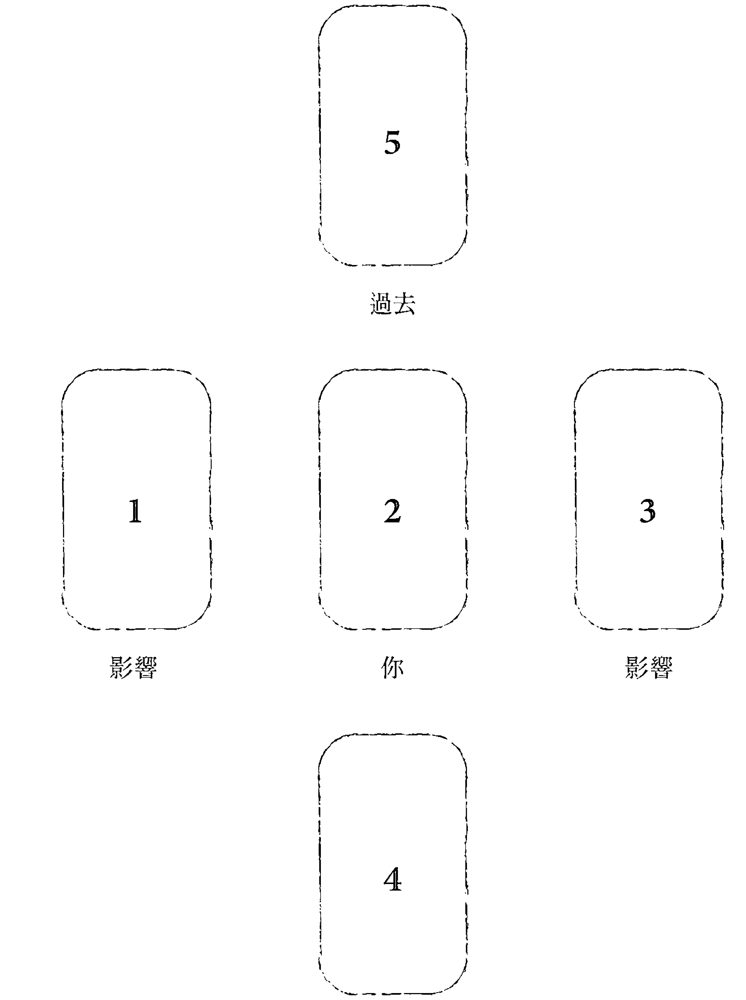
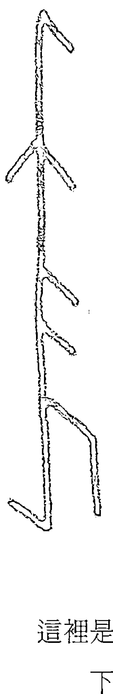
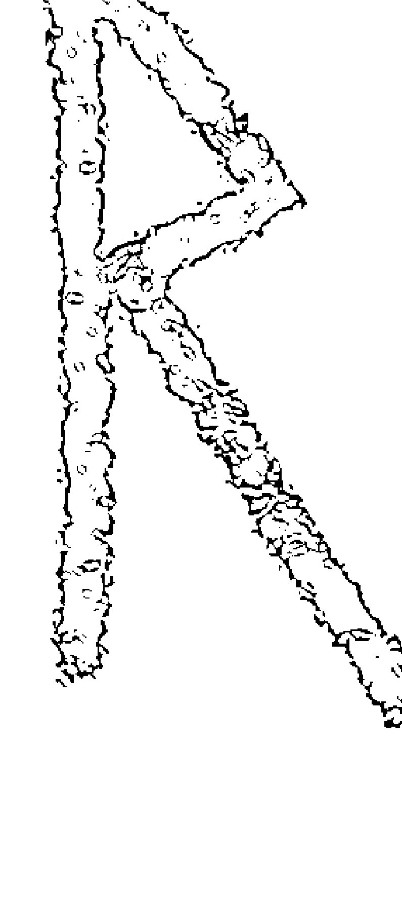
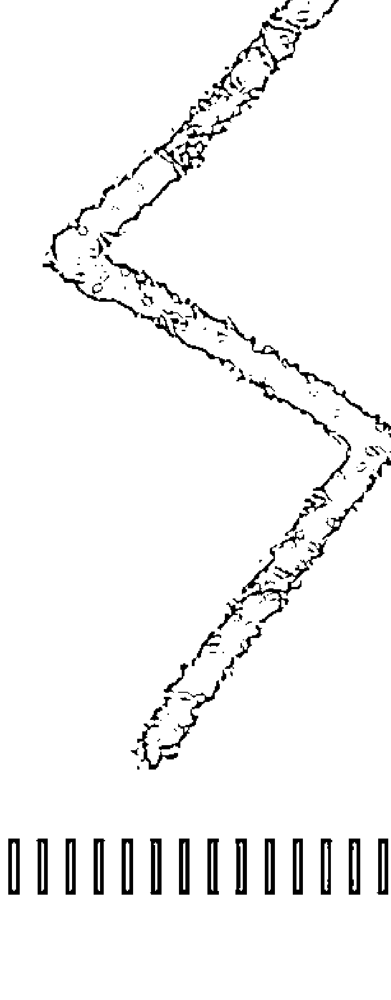
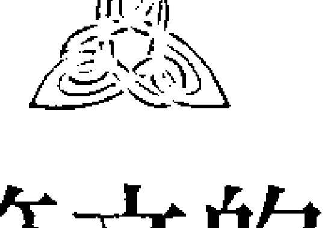
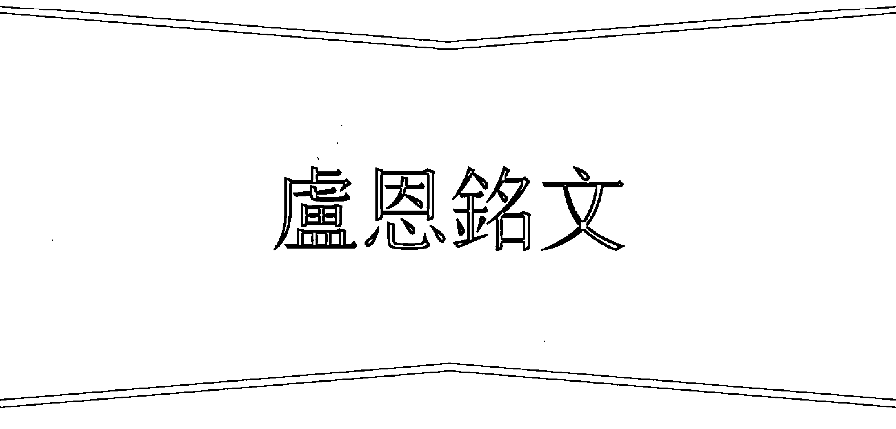
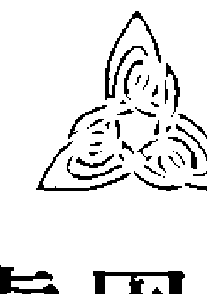
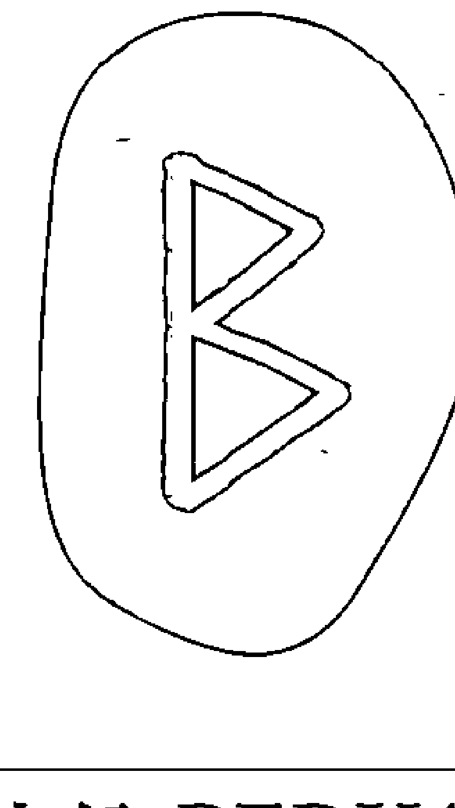

# 卢恩符文初学指南+应用入门

## 北欧部族的古老智慧

- 3大族系「弗瑞雅族」、「海姆达尔族」、「提尔族」
- 24个卢恩符文详尽解说

## 其他盧恩符文

西元一二○○年之時，無論是古弗達克文或盎格魯薩克森弗托克文也都已經幾乎完全佚失。有些版本繼續流傳了一些時候。另外則是有一些人後來創作了他們自己的盧恩符文系統。

十三世紀初，基督教進來之後，新弗達克文發展成中古盧恩符文系統。這是維京時代末年引進的「圓點盧恩文」（dotted runes）。之後，從新弗達克文發展出來斯堪地那維亞系統。這一系統直到十五世紀都還為人所用。

十六世紀到十九世紀之間有一個版本，叫做「德利卡里安符文」（Dalecarian runes），使用者是瑞典一個偏僻地帶德拉納（Dalarna）那裡的人。德利卡里安符文是盧恩符文混合拉丁文而成。

「阿瑪尼符文」（Armanen runes）因奧地利密修士兼日爾曼復興主義者貴多・馮・李斯特（Guido von List），以及他的《盧恩符文的祕密》（Das Geheimnis der Runen）這本書而存在。這一組盧恩符文依據新弗達克文而制定，總共有十八個字母，其中有兩個是新的。

不過，不幸的是，後來德國納粹黨惡意使用這一組符文作為他們的象徵，甚至還用來進行種族清洗和種族屠殺。不過，儘管有這一段歷史，時至今日德國還是有一些新異教徒使用這一組符文。戰後，德國玄教教士卡爾・史必爾斯伯格（Karl Spielsberg）等人改造了阿瑪尼符文，去除了其中包含種族歧視等一些負面含義。

## 考古文物

我們現在對盧恩符文知識都是來自於考古學的歷史紀錄。目前所知最早的盧恩碑文是在日德蘭半島西岸的梅爾多夫・布洛赫發現的，年代約在西元一世紀中葉。前面說過，盧恩符文主要是用於法術之用，語言溝通則是次要。「法術」這兩個字意味著要使用一些據信具有超自然力的事物（譬如咒語）。

盧恩古文物分為固定的和移動的兩種：固定的，是指大型碑石，固定於一地，不移動，未來也不會移動；而移動的，指的是能夠讓人帶來帶去的武器或珠寶等等。

考古學的紀錄告訴我們，將盧恩符文用在墓碑上有兩個目的，其中一個是作為一種「詛咒」，防止人為破壞或竄讀墳墓。不過要知道的是，當時的墓碑是設置於墳墓之內，不是在外面；另外，因為北歐人非常相信有不死生物（undead），所以他們在墓碑上刻符文另外一個目的就是要防止墳墓「居民」變成德拉古（Draugr）這種「屍鬼」或殭屍。Draugr，若照字面翻譯，意思是「再度行走者」，他們住在墳墓之內，守護著墳內那些陪葬物。

移動型的盧恩符文文物包括...

## 第三部
### 瘟疫法事
#### Rune Practices

<!-- PAGE 42 -->

&nbsp;&nbsp;&nbsp;&nbsp;盧恩符文歷史悠久而豐富。考古學上的發現以及史料都會讓我們更加了解古代人如何運用符文。不過，就我們目前所挖掘到的，相對於在歷史中已佚失，一定是很小的一部分。只是，不論在時間過程中流失了多少史料，盧恩符文都還是常見於我們的生活當中。以現實層面而言，盧恩符文是編織真實世界的主要「纖維」，是拴住一切的鎖鍊，它使我們在日常生活中認識到這些符文的意義，而它們的力量就像是堆積出世界的積木。因此，它們並非只是書寫用的文字或符號，而是構成以艾格德拉賽為基礎之宇宙佈匹的「纖維」。

&nbsp;&nbsp;&nbsp;&nbsp;盧恩符文透過人生活在中土（midgard）時的人性而顯化，包含我們生活中的身體、情感、心智及靈性等層面表現。盧恩符文和北歐信仰中的紡織姐妹，亦即諾恩三女神有很密切的關係，是奧丁的工具和教誨。占卜可能是最常見的一種盧恩法術。盧恩占卜（亦即運用盧恩符文和神接通）有多種方法，例如抽出單獨一個符文的「抓鬮」、更加複雜的牌組，或全部弗達克符文擲牌等等都是。

&nbsp;&nbsp;&nbsp;&nbsp;盧恩符文屬於古代北歐的法術；法術包括作法比較簡單的也有一些相對較為複雜的，前者譬如將符文刻在梳子上，後者譬如樹立巨石作為致敬、詛咒或保護之用。民間習俗及考古學紀錄讓我們知道符文遠遠不僅止於溝通之用，它還能夠協助我們和看不見的力量接觸。

&nbsp;&nbsp;&nbsp;&nbsp;現在就讓我們對盧恩符文的力量懷著尊敬及感恩的心情，展開這一趟旅程。

## 第三章
### 盧恩符文占卜

&nbsp;&nbsp;&nbsp;&nbsp;盧恩符文是一些代表「創造」的原型積木，是一直在我們身邊舞動、匯流的偉大元素及能量；也是打開我們內在風景的鑰匙，還是提升直覺力的工具。我們可以運用符文找出一些給予我們引導或示警的訊息，接觸宇宙間一些看不見的智慧力量。這有很多方法，其中大部分都需要你自己擁有一組符文石，而且是你已經與之建立了良好關係的符文石。不過，將符文寫在紙條上也一樣可用。想流暢解讀符文占卜，最好的方法就是要經常練習。和符文建立個人關係非常重要；要根據自己的經驗建立自己的解釋，而古典神話能為你的解釋增華。

### 起源及實際作法

&nbsp;&nbsp;&nbsp;&nbsp;古代北歐的民俗傳說告訴我們奧丁發現盧恩符文的故事。這是一個「犧牲」的故事，...發生「公平交換」這樣的一種「平衡」狀態。瑪提茲提議的是，如果要找到我們所需的平衡，你可能必須扮演讓人不舒服的角色，深入了解事情。艾瑞克很感謝這樣的建議。他現在已經知道自己該怎麼做了：他必須深入了解狀況，找到力量來和自己最好的朋友對抗，讓他理解他有責任負擔自己的一半費用。

## 盧恩符文河流——五符牌組

| 編號 | 對應意義 |
| :---: | :--- |
| 5 | 過去 |
| 1 | 影響 |
| 2 | 你 |
| 3 | 影響 |
| 4 | 未來 |

盧恩符文河流（Runic River）是一組五個符文牌的牌組，能夠幫助你深入觀看你現在的狀況：你現在為什麼會這樣，目前會發生什麼事情，未來的演變會是如何等等。

這個牌組假想你站在一條大河的中央。每一條河流，它的河水對河流的每一部分都有影響。同理，你的過去和未來也都對你的人生河流有影響。如果你的人生河流中有「不快樂」，那麼，不論那是在過去、現在，還是未來，都會對此時此刻的你有影響。

在這一組符文牌組中，你抽出來的第一副牌代表你；這樣的話，你要把這一副牌放在河流中間，代表你以及你想探詢的事情。

你抽的第二張牌代表「過去」，要擺在「你」這一張牌的上端，或者說是河流中「你」的後面。這是之前從你身上流過的河水，現在變成在你的後方。第三張牌代表目前現在正影響你的事情。現在從你身邊流過的河水，和過去流過的河水一樣，都會影響你。這一張符文牌要放在「你」的左邊。第四張符文牌一樣對你有影響，要放在「你」的右側。這一張牌同樣代表目前最影響你的「河水」。最後一張符文牌代表整個狀況的未來，要放在「你」的下方或前方；這是不久就要從你身邊流過的人生河流的河水。

## 懺悔的真相

**核心主題**：懺悔的真相
**主牌**：依瓦茲

**相關符文牌：**
- 開納茲
- 艾薩
- 艾瓦茲
- 影響力（影響）
- 你
- 影響力（影響）
- 達格茲

現在，符文在其中的位置就像輪子的輪輻一樣，或者是呈對稱輪狀。冰島最有名的連結符文是「維格威賽爾」(Vegvisir) 和「敬畏之盔」(Helm of Awe)。據說這種符文常常是用血寫在額頭上，背後的概念是這種輻射狀符文是為一時的用途創作出來的，只有需要的才能「配戴」。從民間習俗、故事中所知，這種符文除了用血寫在土壤中之外，另外有一些卻是要給人吃的，也就是說會先畫在食物上再讓人進食。有時候這種符文是先刻在物件之上，然後把物件燒掉，釋放其詛咒力完成人意圖達到的事項。

但是，不論你如何創作這種符文，使用這種符文，你都要了解並尊敬你需要用到那些符文的力量；這樣的敬意有助於使你欲望成真。

## 智慧、力量、保護

左側附圖是我為刺青用途而創作的一個連結符文。你會看得出來這一個連結符文是四個符文連接起來的。按照芙瑞雅．亞斯文所說，艾瓦茲在這裡擔當了「脊椎」的角色，整個符文就是建立在這支脊椎之上。會用到艾瓦茲，表示我們承認這個符文帶來的保護作用。身為職業靈媒，我會用這個符文來增進我和「看不見的世界」以及「亡者界域」的連結。

這個連結符文中，艾瓦茲這支支柱上最上面的符文是提瓦茲；提瓦茲是「力量」、「正義」、「保護」、「業力平衡」以及「自我犧牲」符文。這裡用到提瓦茲，是為了培養「正義戰士」精神，讓這個戰士保護弱者免受強者侵凌。提爾是眾所周知的天神、戰神，提瓦茲這個符文在這裡是要幫助承擔者面對欺詐的力量要保持堅強。

下一個符文是奧丁符文安蘇茲。安蘇茲是「呼吸」、「智慧」和「溝通」符文。把這個符文放在這裡，是為了促成奧丁降臨靈修或通靈場合，將天上的訊息傳遞下來。此外這也是請求讓我們的日常生活具備奧丁的智慧。

最後一個符文是優魯茲。優魯茲是「奧羅克」符文。由於不論是生活的哪一個層面，我們最大的期望都是健康、強壯、有活力，所以把優魯茲放在這裡，就是希望把活力帶到所有的事情當中，不管那是神祕的或世俗的事情都一樣。

## 製作護符

### 你需要準備的：

### 材料：

- 木材、骨頭、石頭、皮革、黏土、貝殼或紙張等可以在上面銘刻或書寫符文的材質。
- 油彩、墨水或血液等天然染色劑。
- 銘刻或書寫完成之後的符文要用的蟲膠或清膠塗保護層。
- 吊掛護符用的皮索、鍊條。
- 水晶、羽毛等天然物品，可以用來增加符文的能量或是強化某些特定的屬性……

言語如同覆水難收。所以在安蘇茲符文中，言語是和智慧連在一起的。講話需具備智慧，否則就會惹禍上身。

古北歐文中有一個字 Ansuz，就相當於安蘇茲符文。Ansuz 的意思是「回答」或「注意聽」。英語 answer 也含有安蘇茲在內。這個符文，不論是在文字或是在說話，永遠和溝通有關。有這個符文出現，就表示你可以適當表達你的意見，記錄旅途中的事情，還有寫作。這個符文同時也鼓勵你唱歌。你可以思考一下你目前的生活中是不是很需要與人溝通，並了解一下哪個部分最迫切。你要發揮智慧做聰明而明確的溝通，了解眾神喜歡文詞美妙的話語。華勒斯·史蒂芬斯（Wallace Stevens）說：「詩人是隱形的僧侶。」

由於安蘇茲也和「神」這個概念有關，所以其也有深入研究大奧祕，增加對「玄異教派」的知識和智慧以創造生命深度的意志。這個符文的出現很可能表示該要開始尋求那種奧祕，因為古人常常向奧丁尋求智慧和知識。要了解每個時代的人都不可思議地尊敬話語，學習慎言，而教育也會幫助你變得力量強大。要注意自己和人溝通的方式，並了解這種方式對身邊的人會有什麼影響。

## 法術

安蘇茲是「呼吸」符文。你可以運用安蘇茲能量建立良好的呼吸技巧，好讓自己心智清明。安蘇茲符文也可以用來喚醒和施咒，創造意識轉換態（states of altered consciousness），幫助自己在靈性層面找到智慧。

## 虛念符文知識中的安蘇茲

前面說過，虛念符文是奧丁神帶來給我們的；另外，我們也知道「虛念」的意思就是「奧祕」。奧丁倒吊在命運之井上方，把它的奧祕和力量帶回來給我們。我們深入探討這些奧祕之時，用的就是安蘇茲能量，並且在這裡同時榮顯了這一位「老人」（Old Man）。在北歐知識中，奧丁熱烈追尋靈感之酒（Mead of Inspiration）或米德詩酒（Mead of Poetry），因為祂追求知識的慾望永遠不會滿足。任何人喝了這種酒，都會變成學者或詩人，所以在北歐神話中，這種酒成了大家最熱烈追求的獎品。奧丁和虛念符文的關係顯示祂是話語和奧祕的冠軍及守護者。我們不但要謹記這一點，而且每次運用符文時都要讚嘆祂。

## 拉依多 RAIDHO

- 亦寫成：Raitho, Raida, Rad, Raei...

## 卢恩符文中的哈格拉兹

哈格拉兹是古弗达克斯坦第二族海姆达尔族的第一个符文。海姆达尔族的前三个符文哈格拉兹、瑙提兹和艾萨讲的是人直接面对逆境时的毅力，其中哈格拉兹尤其是在提醒我们要保持乐观。在某些人的解释中，这三个符文和地下世界（Underworld），尤以地下世界女神海拉（Hela）有关。海拉是罗基（Loki）的女儿。海拉有时候是冬季女神霍尔达（Holda）。霍尔达抖开她的毛毯时，把第一朵雪花带给了世界。Hag（哈格）这个字源自古荷兰文 haegtessa，意思是“女巫”。哈格，或女巫，公认拥有操纵天气的力量，因此自然也会制造冰雹风暴等毁灭性的气候，进而造成瘟疫或是饥荒。

## 瑙提兹（NAUTHIZ）

- **亦写成**：Nauth, Nod, Nied
- **译为**：需要（need）
- **关键链接字**：需要、必然、拘束、限制

### 意义

瑙提兹是古弗达克斯坦另外一个不具有美好含义的符文。瑙提兹和哈格拉斯、艾萨一样，与艰辛和挫折有所关联。占卜时出现瑙提兹，表示你正在或将会受制于某人某事，置身于一种难以转圜的处境。苦恼是瑙提兹的部分含义。

不过，出现这个符文并不表示你全盘皆输。千万记住，海姆达尔族的前三个符文讲的是人面对逆境时的毅力。瑙提兹可以翻译为“需求之火”。这种概念在英文很难讲得清楚。有话说，“一扇门关了，就会有另一扇门打开”。瑙提兹告诉我们，只要处理得当，永远都有改变的机会。这个符文同时也劝告我们要自身之外寻求不一样的观点，因为我们常常会夸大情势，反而沦为自身厄运的创造者。瑙提兹可以帮助我们克服执着和冲动，在你感觉整个世界都不利于你的时候，能够找到一条比较理想的出路。

瑙提兹这个符文会提醒我们如柏拉图所说的“需要是发明之母”。我们常常在遭逢危机，有重大需求之时，找到自己最坚定不懈的力量。试想你一生当中曾经受制于某人某事的时候，瑙提兹就是活在你体内的那一股能量、那一把火，那一把“需求之火”，可以帮助你改变现状，创造崭新良好的情况。大部分的人都是支出多于收入，但我们都有一把“需求之火”可以帮助我们改善处境，换工作，或者是开始懂得开源节流。尼采（Nietzsche……）就像有個人舉手向天、向上天祈求。阿爾吉茲會幫助你和祖先連結，也和你的菲爾亞（fylgja）連結。菲爾亞是北歐版的引導神。說到護持，有誰會比你的祖先和熟悉的神更護持你？阿爾吉茲鼓勵我們和祖先及菲爾亞發展關係，並培養那一層關係；但它也提醒我們祖先早就在這裡保護我們了。我們要好好把根扎在地球上，然後向上天祈求引導和護持。

我們應該記住，在靈修問題上，我們必須在這個世界和「看不見的世界」保護自己。然而我們也不該忘記，碰到障礙或失去什麼，都是讓我們進步的機會。沒錯，你是有神和祖先的護持沒錯，但是如果你必須接受火的試煉，就要了然那是個大計畫的一部分，你很可能無法置身事外。要明白一種情況也許看起來像是詛咒；將會造成你的痛苦，但卻有可能在日後成為某種護佑和福分。自己要好好照顧自己，但是要信任你的神盟友和神祇終會把你帶到你該走的路上。

占卜的時候如果出現阿爾吉茲，那會有兩個意思，一個是告訴你有受到護持，另一個則是要你知道如果你去向幫助你的神盟友要求保護，將會是很有益處的事情。你必須保持警覺、謹慎，對自己在探詢的事情也是。越早知道越能有備無患，但是要記得你所準備的因應措施要適合所發生的狀況。

## 法術

阿爾吉茲可以用來自保，保護你的東西、他人或是寵物。想要保護寵物，可以在牠項圈吊牌後面寫上阿爾吉茲符文。進入危險場所或未知狀況中，在額頭上畫阿爾吉茲可以保護你自己。這個符文當珠寶配戴也很不錯。

## 盧恩符文知識中的阿爾吉茲

> 麋鹿莎草長在沼澤中，
> 遍布於水中，會使人受傷；
> 它使一些想去摘它的人
> 非常氣憤。

這一首符文詩提醒我們，關於一些靈修問題，我們處理的時候切莫抓得太緊。溫柔對待莎草，或者像喜歡吃莎草的麋鹿那樣對待它，才有辦法收割莎草。向神靈和祖先要求護持只有兩種方法，一個是藉由供奉溫柔和善地提出要求，另外一個則是像任性的小孩子那般要求引導、保護。

如果是你，你會對哪一種態度有比較良好的回應？

## 索維洛 SOWILO

- 亦寫成：Sigel, Sol
- 譯為：太陽（sun）
- 關鍵連結字：勝利、力量、攻擊...

物」都在使你成為對身邊之人有價值的人，所以和別人分享你的天賦和才能非常重要。

瑪納茲和依瓦茲符文一樣，常常牽涉到友誼、愛情關係還有合夥關係（事實上，你可以認為依瓦茲是瑪納茲的基礎），我們必須尊敬同胞，但同時也要尊敬自己。不論你自己知道不知道，我們都附屬於身邊的每一個人——不論實質上或形而上意義上都是。形而上學有一個概念，說我們會製造和他人連結的「繩索」（cords）或是以太式的附著（etheric attachments）；瑪納茲符文呈現的正是這一點。運用給勃和依瓦茲原理，也就是「公平交換」和「正確關係」原理，我們將得以保持自身周遭和內在能量的平衡。瑪納茲同時也告訴我們，只要不過於自私，關心自己是非常重要的。人要能照顧自己，才有辦法照顧別人。照顧自己不是自私，事實上反而是重視身邊眾人最好的方法。這是瑪納茲的要義。

如同我們在菲胡符文那裡所見，古代北歐人很重視財富。累積財富然後把財富和別人分享，傳送給社群是很光榮的事。財富必須回到社群，不斷地移動，才會繼續再創造財富。古代北歐人很重視「給予」，但這必須是自己擁有足夠才可以給予，所以他們才會一直努力累積財富；要有能力給周遭的人更多——這才是重要的事情。我們先是照顧好自己，因為要照顧自己才能夠照顧別人。

## 法術

你可以運用瑪納茲激發出自己的潛力。每個人天生內心深處都有一種側隱之心，願意和別人分享那份善意會使世界受益。無論是創作、職業上的雄心，或者只是想把自己的潛力發揮到最高程度，你可以召喚瑪納茲幫助你發揮那一份人性資產，使世界——和你自己——受益。

## 盧恩符文知識中的瑪納茲

我們在北歐符文中看到了「重視自己」這樣的理想。偉大英雄及戰士的傳奇和頌歌讓我們知道古代北歐人所抱有的「自我實現」的理想。反過來說，對他們而言，照顧家人和社群也非常重要。

《哈瓦瑪》當中有這樣的一首詩：

> 財富會消失，
>
> 人會消失，
>
> 你，一樣，也會消失。
>
> 但只有一樣東西
>
> 永遠不會：
>
> 那就是你賺得的名聲。

北歐文化中那些偉大的君王、戰士或神祇都是強悍得不可思議的人物，但是他們做事情永遠不偏離社群母體。眾神和北歐文化中那些偉大的人物一樣都很有名，但是他們的偉大作為卻都不是為了自己。所有的好處都會延伸到社群之中。一個人對社群造成的改變越大，大家就越是紀念他。

作者：南希・瑪麗・布朗（Nancy Marie Brown）

- 本書揭露了斯諾里·斯圖爾松（Snorri Sturluson）的一生及其時代，顯示他和他所描繪的眾神一樣，原是放蕩不羈之人。《散文艾達》和《詩體艾達》就是他帶來給我們的。本書說的是他一生的故事，有助於我們了解他的生活、環境還有文化，而了解這些，反過來又能夠幫助我們了解他所說的那些故事。

## 《光明使者沉思錄：盧恩符文、賽德與阿薩特魯密教：一名北歐巫師或薩滿的思考》

*(Vitki Musings: Runes, Seidr, and Esoteric Asatru: Thoughts of a Norse Sorcerer or Shaman)*

作者：克特・胡格斯特拉特（Kurt Hoogstraat）

- 我跟克特上過課。從了解盧恩符文，到進入出神狀態神遊九個世界，這些旅程都受到了他的幫助。本書是一本價值非凡的指南，有助於讀者了解盧恩符文在我們身上產生的內、外在作用，同時也了解現代的阿薩特魯密教的型態。

## 《二十一世紀賽德：現代希任法師及阿薩特魯密教手冊》

*(The 21st Century Seidr: A Workbook for the Modern Heathen and Asatru)*

作者：艾薇・穆里根（Ivy Mulligan）

- 如果沒有艾薇・穆里根，我不知道現在我人會在哪裡。我報名參加她的一年期薩滿巫術課之後，發覺她所傳授的東西和她多年的經驗真的寶貴非常。身為一名現代異教及阿薩特魯密教的重要專家，她藉由本書和讀者分享了她一生的經驗。

## 《艾格德拉賽的種子》

*(The Seed of Yggdrasill)*

作者：瑪麗亞・克維爾赫格（Maria Kvilhaug）

- 作者以其一生的努力而成了她這個領域的專家，本書就是這樣一位專家對古代挪威神話全面觀照的研究及翻譯著作，具有難以置信的啟發性，而且還是一座資料寶窟，不但會擴展你的眼界，而且還會對你目前的認知以及之前學習的東西構成挑戰。

## 《北歐奧祕及法術：盧恩符文與女性力量》

*(Northern Mysteries and Magic: Runes & Feminine Powers)*

作者：弗瑞雅・亞斯文（Freya Aswynn）

- 本書於一九九八年出版之時，不但前...

## 耳語、祕密與奧祕

盧恩符文無可否認地具有神祕的性質。作為符號，它們對未經訓練的人來說意義不大（如果有的話），但它們似乎仍暗示著某種古老的神祕意義。而且儘管某種程度上我們可以透過學習和運用盧恩符文來解開它們的奧祕，但即使是對於其魔法性質和占卜意義最熟練的學習者也會發現，永遠都有更多可以探索的地方。

這些古代文字本身就有些深奧。這從今天的字典中所找到的「盧恩符文」一詞的含義來看也很明顯，即使它們主要被視為字母和占卜符號，但盧恩符文也被定義為「奧祕」、「魔法」，甚至是「法術和咒語」。

英文的「rune」（盧恩符文）一詞來自古北歐語的單字「runa」，意思是「祕密」或「耳語」。然而，我們也在幾種古老的北歐語言和日耳曼及凱爾特文化中找到一些與「rune」相關的單字，而這些單字都有類似的詮釋：古老的北歐單字 *rún'* 意思是「祕密」或「奧祕」，古愛爾蘭的 *rún* 和中古威爾斯語的 *rhin*，也可以譯為「奧祕」、「祕密」或「耳語」；而蘇格蘭的單字 *roun*，意思是「低語」或「經常談論某件事」。

英文花楸樹（the rowan）被認為是魔法樹，字根來自北歐文 *runa*。遍及北歐的歐洲花楸樹長久以來都是各種魔法傳統的聖物，而且被廣泛用於保護。它有許多通俗的名稱，包括「盧恩符文樹」和「耳語樹」。

有些學者發現，「盧恩符文」一詞甚至可追溯史前時代至原始印歐語（Proto-Indo-European），而人們相信原始印歐語是許多古老語言的前身。這些語言根源早於盧恩字符在書寫上的運用，這表示盧恩符文早在成為書寫系統之前就屬於神祕和魔法的世界。事實上，正如同我們將在本指南中見到的，和這些古老符號過去和現在仍能做到的事相比，用於一般溝通對它們而言只是雕蟲小技。

在以下的討論中，我們將簡單了解一下已知的盧恩符文史，包含它們的起源和作為書寫系統的演化、在古日耳曼文化中的世俗和魔法運用，以及它們在北歐基督教化期間的命運。接著我們將透過它們在古代北歐文獻中的現身來探索盧恩符文更深奧的領域。最後，我們將認識古弗薩克盧恩符文，這是已知最古老的盧恩字母，也是今日盧恩符文工作者和其他魔法師最常使用的盧恩符文。

或其他的協助。最終，盧恩符文的形狀和祕密從下方的水面向祂顯現。

這個故事經常被引用作為薩滿啟蒙的例子，即一個人（或是像這個案例裡的神）用歷經嚴苛的對待身體或心理考驗來獲得奧妙的知識。在世界各地的異教文化中均可見到的薩滿巫師是智慧的守護者和治療者，他們可前往無形的存在位面，為他們團體遇到的問題尋找解答。而這種能力只能透過自我犧牲的轉化體驗取得，經常涉及隱喻的身體「肢解」，就如同密米爾之泉故事中奧丁的眼睛。

在盧恩符文的例子中，奧丁讓自己歷經了身體上的痛苦、剝奪，以及心理上的孤獨（吊在樹上九天九夜），並轉化為盧恩符文的知識。在記錄這個故事的《哈瓦馬》（Hávamál）詩集中，奧丁講述在祂自烏爾德之井當中取出盧恩符文後，祂「有所成長且充滿了智慧」，發現祂此時可施展非凡的魔法。祂可以運用新的魔法知識來幫助自己和他人逃離危險、打敗敵人、從受傷和疾病中痊癒，甚至是找到愛情。

## 盧恩符文的奧祕

在所有的北歐文學中，盧恩符文都被描繪成強大且甚至具有潛在危險的魔法工具。要探究它們的奧祕確實不容易，正如我們從奧丁在烏爾德之井的考驗所見，而盧恩符文也不容易理解。

奧丁或許在某種程度上可以說是立即取得了盧恩符文的知識（即在自我犧牲九天九夜後），但祂是神，而且是智慧之神。若是「凡人」，似乎至少需要一定程度的學習和訓練，以及施作魔法的特殊才能。那些追求這些知識並成功應用的人被稱為「盧恩符文大師」（runemaster），而且在北歐文明中受到極大的敬重——尤其是在維京時代。

我們在名為〈Rígsmál〉的埃達詩歌中看到了這點，詩裡講述人類社會的「三個階級」（農奴、自由農民和貴族）是如何形成的。從此可看出貴族身分和盧恩符文的掌握之間存在著密切的關聯。雷格（Rig）神，更常被稱為海姆達爾，是每個階級第一個孩子——薩爾（Thrall），第一個農奴（或奴隸）；丘爾（Churl），第一個自由農民；以及厄爾（Jarl 或 Earl），第一個貴族——的父親。

在厄爾到了學習盧恩符文的年紀時，雷格教他盧恩符文。厄爾後來又生了幾個兒子，但這首詩講述只有最小的兒子——稱為「Kon」或「King」（國王）——認識盧恩符文。這樣的知識和透過魔法行動實踐的能力，為這個兒子在他的貴族家庭中賦予特殊的地位。

《沃...是為何在向宇宙傳達你的願望時，永遠建議先深思熟慮。然而，就使用「錯誤」的盧恩符文來說，比較可能發生的狀況是你的魔法無法發揮效用，而不是造成傷害。最重要的是你在施作魔法時專注在意圖上的品質。與其他任何的魔法工具一樣，必須存有個人的能量才能啟動任何盧恩符文的力量。

北歐文學也讓我們得知，古代的盧恩符文大師會根據使用的方式來辨別不同種類的盧恩符文。例如 **malrunes** 對於文字和語言相關的問題很有用，而 **hugrunes** 則和心智能力有關。**Brunrunes** 用來確保海洋上的好天氣，這在維京時代顯然至關重要，而 **limrunes** 則用來治療疾病。

今日的盧恩符文使用者可能對任何特定符文的魔法目的有不同的理解（就像藥草、水晶和顏色的對應系統會有所差異），但在過去的一世紀以來，大家已有以日耳曼部落的傳說和文獻為基礎的普遍共識。

你將在第三部分和本指南最後的對應表中找到每個符文的主要魔法用途。這些可以作為你盧恩魔法的框架，但如果你對任何盧恩符文的適當用途得出不同的結論，那麼請根據自己的直覺和經驗進行調整。

## 盧恩銘文

今日最廣泛使用的盧恩魔法形式，就是將盧恩符文用於魔法的銘文中。傳統上會將盧恩符文刻在物品上以製作幸運和保護的護身符。可以是個人物品，例如首飾、酒杯、錢包，或甚至是房子，任何你想用魔法賦予力量或進行保護的有價物品皆可。

盧恩護身符也可以用來實現特定的魔法目標，例如找到工作或吸引新的戀愛關係。在這種情況下會將盧恩符文刻在「尖物」上，通常是木條或樹皮，但也可以是石頭、金屬，如果有需要的話，甚至可以是紙張。雕刻是傳統的方法，但也可以將盧恩符文繪製在物品的表面上來製作護身符，前提是在繪製符文形狀時必須相當專注和謹慎。

與任何的魔法創作一樣，製作護身符的過程所涉及的能量是成功的關鍵。事實上，符文使用者往往會將護身符的製作融入儀式中，包括對符文進行雕刻和染色、念出或歌頌使用的符文名稱，以及對護身符物品進行象徵性的「誕生」和開光儀式。

盧恩護身符就像符文本身一樣，因具備魔法能量而被視為「具有生命」。它們可以永久保存，或是若刻在尖物上，一旦魔法目的實現，通常會透過焚燒或埋在地裡的方式，將它們從存在物中「釋放」出來。

![](img/4c2a1...[truncated]output
你無法一夜之間學會這些組合及其相關意義，而且這些意義視個人對每個符文的了解而定，也會隨著不同的解讀者而有很大的變化。隨著你的經驗越來越豐富，你將發展出個人對二至三個符文組合的感知。

目前只要暫時先專注在符文個別的意義即可，接著再開始觀察符文如何在其他的層面上搭配運作。隨著練習的進行，你可能會想用筆記本或日記追蹤自己的解讀狀況，以評估符文的準確性並記錄出現的任何見解。

## 重複出現與看似無關的盧恩符文

當你開始獲得更多盧恩符文的解讀經驗，你可能會隨著時間注意到相同的盧恩符文或符文組會不斷出現在你的解讀中。如果是這樣，請格外注意它們的意義，因為這是要你處理某個情況或整體生活某個重要層面的指引。

盧恩符文指引你的另一種方式是特別強調某件與你的問題完全無關的事。如果發生這樣的情況，不要將解讀視為「無用」而自動忽略，而是要去探索上述符文指的可能是什麼，因為這可能是更緊迫的事情需要你關注。

## 為解讀做好準備

如上所述，在日耳曼傳統背景下使用盧恩符文的解讀者會將符石投擲到符文布上。有些人在將布攤開並鋪在地上或桌上時，進行解讀符文石的儀式。他們可能也想讓自己和布朝向某個特定的方向，通常是北方或東方。另一方面，也有解讀者可能甚至完全不使用符文布。如同一般的魔法，這也是完全由你自己決定。

講到「洗牌」，為了能夠隨機投擲盧恩符石，你可能會採用一些不同的方式。你可以簡單在符石袋中將符石攪散，接著取出你要解讀的符石數量。或是你也可以將它們全部正面朝下地攤開，用手指以繞圈的方式洗牌。如果你的盧恩符石夠小，可以全部裝在你的手掌心，那你也可以用這種方式混合。可嘗試不同的方式，探索哪一種最適合你。

## 傳統的盧恩符石投擲

如我們在第一部分所見，我們對傳統盧恩符文占卜方法的認識來自羅馬作家塔西佗，他在他的《日耳曼尼亞志》一書中描述了將近 2000 年前的占卜法。許多盧恩符文的解讀者在今日仍偏好遵循這種方式，不僅是因為這可以和我們的異教祖先連結，也因為這可促使我們以更自由聯想的方式和盧恩符文互動，而不像現代的盧恩符文牌陣那麼「刻板」。

視你的方法而定，你可選擇在詮釋中融入許多元素，例如在盧恩符石落地時形成的圖案或形狀、靠近彼此的盧恩符文組合、任何特定盧恩符文和你身體之間的距離，或是和盧恩符文布邊……

# 烏魯茲 URUZ

- **亦寫成**：Ur、urz
- **發音**：oo-rooze
- **字母音**：U（如「brute 蠻橫」中的 u）
- **譯為**：野牛（歐洲野牛）、蠻力
- **關鍵字**：體力、健康、力量、精力、耐力、創造力

## 主要主題

不同於菲胡所象徵的馴養牛，第二個古弗薩克盧恩符文代表的是野牛（auroch）——幾世紀前凶猛的野牛。這種動物因其原始的體力、精力和力量而備受推崇，但由於野牛是無法馴服的，這些特質也帶來健康的警告——就像牠鋒利、致命的角一樣，而這就是符文本身形狀的象徵。

這原始的體力和力量就是烏魯茲意義的核心。可以代表體力，但這裡可能同樣強調情感和精神的力量。如果你正面臨挑戰，烏魯茲提醒你擁有堅持下去，以及保護自己不受對手傷害的力量。如果你正在追求夢想，這個符文顯示你背後有足夠的動力將夢想化為實際。召喚你與神聖能量的連結，並信賴你將會受到指引，將你個人的力量導向正面的結果。

其中一個相關的訊息是要當心不要讓原始、野性的能力支配你對情況的反應，或是試圖使用你的力量去控制別人。確實，烏魯茲所代表的挑戰就是「馴服」我們每個人內在的自然原始之力；如此我們才能將能量用於謀求每個人的福祉。

逆位的烏魯茲表示你已錯失機會，或忘了認可自己取得成功的能力。你可能正歷經缺乏意志力或動力的狀況，這可能會讓你感到停滯，或是因為缺乏進展而造成這樣的情況。你能做些什麼來恢復自信和主動積極的能量？是什麼樣的恐懼（有意識或無意識）讓你退縮？

## 其他意義

烏魯茲另一個主要意義和健康有關。正位的符文表示你正歷經或很快要歷經健康良好和活力充沛的狀況。從這個層面來看，逆位的烏魯茲警告可能會有健康不佳、活力不足，以及必須留意身體健康等狀況。

烏魯茲也是代表突然改變的符文，經常帶來無法預測的結果。在這樣的背景下，正位的烏魯茲鼓勵你度過劇變，因為很可能會帶來新的成長，甚至是之前無法想像的正面結果。然而，你必須擁抱這樣的變化，並且願意冒險，才能收穫可能的獎賞。而這裡需要的是參與「創造性風險」的意願。

逆位的烏魯茲意指變化和挑戰帶來的機會，而你退縮了。如果你因為對未知的恐懼而無所作為，你可能會錯過一些美妙的事情，經歷停滯和失去動力的狀況。

## 其他意義

冰雹是暫時的現象，開始和結束，就像液態的水。哈格拉茲可能意味起初困難重重的重大變化，但最終這個經歷帶來的轉變將會讓你變得更好。你身上正發生重大的轉變，無論是物質上、情感上，還是靈性上。但老舊的事物不拆除，新的創作就無法發生。

哈格拉茲無逆位意義。

### 魔法用途

- 保護、幸運、快速轉化、成功駕馭困難狀況、打破不健康的模式。

## 瑙提茲（NAUTHIZ）

- **亦寫成：** Naud、Naudirz、Not、Nautiz、Nied
- **發音：** now-theez
- **字母音：** N
- **譯為：** 需求、必需品
- **關鍵字：** 需求、必需品、不足、缺乏、限制、有耐心

### 主要主題

瑙提茲意味著一個人的需求無法得到滿足的苦楚，不論指的是貧困、飢餓、失業、健康狀態不佳，或是缺乏情感上的支持。這個符文法杖代表「需求之火」，這是由兩根大木樁點燃的儀式火，古代北歐人會在極度困難或災難時點燃，例如饑荒或致命疾病爆發。

你可能正歷經難以前進或無法舒適生活的困難，或是出現難以滿足的強烈欲望。由於缺乏資源而導致可能性受到限制，而你可能會因為這些限制而感到惱火，並／或對自己的狀況感到灰心。

盧格魯—撒克遜的盧恩符文詩將瑙提茲形容為「一條緊裹胸前的帶子」，而這經常是指有需求但又受到限制的感受。

瑙提茲的建議是將這樣的情況視為一段學習的時期，以及強化韌性的機會。沒有人能在苦難發生時享受苦難，但當我們回顧昔日經歷時，通常是苦樂交織。別讓悲苦、擔憂或絕望奪走你的優勢，而是要善用你的天賦才能去找到滿足你需求的方法。請記住，需求與限制是成長所必需，就像如果我們總是擁有我們需要或想要的一切，就永遠也無法學習或完成任何重大的事情。

盧恩符文的解讀者們對於瑙提茲是否有逆位具有分歧的觀點。許多傳統認為沒有逆位，但符牌並非完全對稱，而且正位和逆位之間有相當大的差異。

不論如何，認可「逆位瑙提茲」的人也不會用和「正位」相反的意義來詮釋這個符文，而是將正位整體意義的某個層面分配給逆位。相關的意義詮釋可在下方的「其他意義」中找到。如果你的直覺認為應明顯區別瑙提茲的逆位意義，那些便可作為這個符文在這個位置的詮釋。如果你認為無須區分正逆位的意義，也可

在這樣的背景下，逆位的提瓦茲可能指的是熱情消散，甚至是戀愛對象不誠實的行為，尤指男性伴侶。可能會有緊張的溝通，或是根本沒有溝通。你可能必須決定這段關係是否值得，不論你付出多少代價在維繫關係。

### 魔法用途

療癒、成功、競爭成功、強化意志力、勇氣、健康的陽性能量、強化靈性信仰。

## 貝卡納 BERKANA

- **亦寫成：** Berkano、Bairkan、Beorc、Bjarkan
- **發音：** bair-kah-nah
- **字母音：** B
- **譯為：** 樺樹、樺樹女神
- **關鍵字：** 誕生、新開始、家庭、生長、再生

### 主要主題

貝卡納是非常正向的符文，象徵新的開始。可以是新的方案、新的關係、靈性發展的新階段，或是帶來成功結果的新點子。宇宙能量是富饒的，而且已經準備好帶來新的展現，因此你正處於展開下次冒險的絕佳位置。貝卡納被稱為誕生符文，也可以表示實際的小孩誕生、婚禮，或是其他快樂的家庭場合。這個符文對嘗試懷孕的女性來說是非常好的預兆。

貝卡納是和女性能量有關的符文，而它的形狀代表原型大地之母的胸部，而大地之母以許多不同的形式在全球異教文化中廣為人知。這個符文象徵母性能量養育、細心照顧和保護的特質。

視解讀的背景而定，貝卡納可能是在請你檢視自己正將照顧的能量用在哪些地方。你是否有在培養自己的夢想和目標？你是否有好好照顧自己？這也可能指的是外界支持的影響（不論是個人或環境）現在對你來說可能有幫助。不要害怕接受他人關愛的援助。

貝卡納也可能代表女人。如果問卜者是女性，那貝卡納通常代表的就是她。如果問卜者是男性，貝卡納往往代表和他親近的女性，可能是伴侶、家人，或是親密友人。在這樣的背景下，在解讀中最靠近貝卡納的符文會直接影響到所代表的人。

逆位的貝卡納表示在展現新事物時遇到停滯或障礙。視背景而定，這可能表示受孕困難或有懷孕的問題，或是難以展開新事業。家庭或家族內部可能有衝突，容易發脾氣。你可能正在擔心某個你愛的人，或是向某個人提供支持，但對方卻不接受。

在此建議你保持心胸開放，或許也可以重新檢視行為背後的動機。但不要為了關注你無法改變的事而阻擋了新的可能性。將精力集中在富有成效的地方，暫時放下棘手的問題。

## 結論

毫無疑問地，就如同你現在所理解的，盧恩符文的奧祕並非簡單的表面詮釋。每個古代的符號都具有豐富的意義，並隨著時間和你的經驗越來越豐富而變得更容易理解。符文的運用確實可以成為終生的旅程。永遠都有更多值得學習的，即使對最高階的盧恩符文使用者來說也是如此，他們知道盧恩符文永遠也不會放棄它們所有的祕密。

因此，如果你無法立刻用直覺發現每個古弗薩克盧恩符文（或是任何其他的符文字母）的連結也不必感到沮喪。要記住這些神祕符號的關係需要時間和奉獻精神。在這方面，每天練習對一個符文冥想可能會極有幫助。

你可以先從菲胡開始，然後按著古弗薩克的順序逐步進行，或是每天從袋中抽出一個符文，讓符文引導你接下來的二十四小時該專注在哪個面向上。在你將所有的符文都練習完一輪後，你或許會想要重複這個過程來進一步加深你與每個符號的連結。

其中一個相關的練習是讓符文協助你塑造自己的魔法習慣。你想要使用盧恩魔法，但卻不確定該使用哪一個，或是要用在什麼目標上？從袋中抽出一個符文，然後探索它的占卜意義和魔法用途。這個符文可能指出你可以如何在生活上運用魔法的協助，額外隨機抽出的二至三個符文可能協助你更清楚地看見解決方案。

當談到占卜時，許多剛接觸盧恩符文的人想知道他們是否將能以專業身分為親友，甚至是大眾解讀。這由個人自行選擇，但應留意的是，與更經典的塔羅牌相比，為他人進行盧恩符文的解讀可能會更為棘手。這是因為符文詮釋是非常個人化的，會基於一個人自身內在的世界觀和對每個符文的聯想，很可能無法輕易地應用至他人的生活狀況中。

此外，塔羅通常以圖像為依據，無論問卜者對牌卡的熟悉程度如何，都可以較直覺的方式得到解答，相較之下，盧恩符文只是簡單的符號。因此，盧恩符文通常需要更深入的研究，才能讓占卜訊息立即顯現在問卜者面前。

這表示身為解讀者，基本上是由你全權負責解讀意義，而問卜者幾乎只能任由你的詮釋「擺布」。這可能是很重大的責任，因為你不希望不經意地讓問卜者對你的解讀深信不疑，因而創造出不想要的結果。因此，如果你願意的話，當然可以試著為朋友解讀，但在進行任何解讀時（無論是為自己還是他人），請務必從「未來永遠可以透過我們當下的選擇而改變」的觀點出發。

隨著你變得和盧恩符文的能量越來越協調，你也會發現自己更受到古日耳曼人的魔法與靈性傳統所吸引。為此，本指南的最後提供了建議資源清單。你將找到詳盡的對應表，可作為精簡的...