# 古代神秘学院入门书

献给凯罗、我的妻子与灵魂伴侣及我的讯息者与指导灵

# 简介

《古代神秘学院入门书》是开发心灵与灵性成长一门详尽而密集的课程，当中附有专门指导你完整发展灵通潜力的练习与做法。你会加强自己的超感应力，变得更为醒悟。

所有人多少都具备了一些超感应力。透过此课程，你能够开发自己真正的天赋。你可以成为眼通、耳通、感应通，学会观察人体气场，并诠释它的色彩，与你的天使及指导灵接触与沟通，运用宇宙能量从事治疗或成为才华洋溢的导师或咨商师。此特殊课程赋予你强化潜在灵通力必要的指示与说明。这些美好的天赋能供你运用，来帮助自己与他人。我们的生命都有一个目的，一个现身于此地的原因。但愿你能够洞悉贡献一己的人生目标。

我竭诚希望你们每位都能达到个人目标，并扶持整体人类。让我们共同创造美好的世界，毕竟，我们之所以来到世上是为了要服务彼此。

愿爱与光的天使与你相随。

# 目录

- 第一章 古代神秘学院与宗教简史
- 第二章 第三眼脉轮
- 第三章 顶轮
- 第四章 人体气场
- 第五章 阅读与解析人体气场
- 第六章 脉轮系统
- 第七章 昆达里尼与脉轮能量
- 第八章 与你的天使、指导灵合作
- 第九章 星光体出游
- 第十章 轮回
- 第十一章 上师最后的时日
- 附录 人体气场色彩、意义解说与位置

# 第一章 古代神秘学院与宗教简史

> 人类最崇高的心灵运用，在于研究造物主的杰作。
> ——圣者拉玛特里（神论）

现代的世界充斥着科技：电脑、电讯、航行世界的喷射飞机、陆地上的豪华座车、高耸在大型都会中心的建筑物，以及供应我们日常需求的量贩店。这或许如同置身于“奇迹时代”一般，但真是如此吗？

现今的世界现实而充满压力，许多家庭双亲都必须工作以维持舒适的生活。压力成为多数人的主要问题。许多学龄儿童被指定用药，只为了上课时能保持稳定与遵守秩序。

所幸，有众多人寻求超越物质的东西：一个他们人生中更崇高的目标。人类正在觉醒当中，并变得更具灵性。当这些人提升个人意识到更高层的境界时，世界就会改变。他们接通来自神圣本源的高频能量，并藉此帮助他人。如果依此持续发展，我们美丽的星球或许就能存活下来了。

## 古代神秘学院

在古代，人类与大自然、精神、心灵较为亲近，对超自然界比较能认同。对许多人而言，这不过是一种生活的态度。

古代有许多所神秘学院与治疗中心。在这里，入门的求教者学到生命的秘密与奥妙。有些教学内容的主题在于，研究与正确使用体内与体外的自然治疗能量。自然界的万物蕴含着一股宇宙的治疗能量、生命动能。由于自然能量的振动频率极为快速，绝大多数人无法感知到它。宇宙的治疗能量能够被导入人体，启动身体本身的生命动能与疗愈能量。学员或入门者会接受古代治疗技法的训练，学会观察人体气场或能量场，与解析气场色彩的意义。除了这些技术外，他们会受到鼓励去开发自身的超感应能力，在最终，安身于贡献他人的灵性道路上。

## 从亚特兰蒂斯到埃及

在埃及时代的数千年前，曾出现地一个重要的文明，就是亚特兰蒂斯这个神秘的国度。古代神秘学与治疗学院起源于此。学院或中心普遍分布在国土境内，有些出现于山区。希望哲学家柏拉图曾在《对话录》中的两节，迪迈斯(Timaeus)和格莉迪亚斯(Critias)提到亚特兰蒂斯。美国前任参议员以格纳提.唐纳里在他1882年的著作《亚特兰蒂斯--远古世界》(本书中译为<大西洋底的秘密一亚特兰蒂斯>)中，锁定东大西洋的亚速尔群岛为亚特兰蒂斯的所在位置。事实上，亚速尔群岛上依然保留着清楚的遗迹，显示亚特兰蒂斯人进行神圣仪式的地点。

在亚特兰蒂斯岛型大陆灭亡之前，成批的亚特兰蒂斯人在南美与埃及尼罗河河谷兴建起殖民地。根据爱德加.凯西一一美国号称“沉睡先知”，亚特兰蒂斯的领袖，为了因应亚特兰蒂斯预期的灭亡，而筹备部分人民的迁徙以保留文明。这个事件被认为发生于基督诞生前的10500年间。凯西在深度催眠状态下进行的著名生命解读中，获取了这些资讯。

其他人士，如唐纳里提出类似的看法，唐纳里描述亚特兰蒂斯的文化与知识在南美的发展。我们如果研究兴起于埃及与南美的高度文明，就不难设想这种可能性。天文学、数学、工程学在这些区域的发展极为先进，这些地方相似的建筑物加深了这种说法的可信度。

亚特兰蒂斯人民将亚特兰蒂斯神秘学院与治疗中心的灵性教导，引进这些地点。身为亚特兰蒂斯人的后裔，美国原住民遵循着与大地和谐共同的悠久灵性传承。举例来说，特库姆塞(Tecumseh)、北美印第安人肖尼族(Shawness)的酋长，是以亚特兰蒂斯信仰为神圣组织的成员。

当初，古代神秘学院设立于埃及，并在此地兴盛。埃及文明在文化与宗教上的发展，部分源自亚特兰蒂斯的学院。古代埃及的祭司阶级在后期变得全能，法老王在形成的体制中必须仰赖祭司阶级的影响力，来取得并保有他们的王位。

这些学院与治疗圣殿提拔了许多天资优异的人物，使他们在个人专精的领域上成为大师。与此教育体系相关的最早期著名治疗师是印何阗——第三王朝的医生兼祭司（公元前约2890年）：他是宰相、建筑师、学者、智者与左塞尔(Zoser)法老王朝中的优秀治疗师。

印何阗因为著名的治疗能力与药草方面的学问，于公元前约525年，即他死后的2300年被封为神。他的埃及文名字印何阗，在希腊罗马时代与希腊医师阿斯克勒庇俄斯(Asklepios)牵扯在一起。最终，阿斯克勒庇俄斯因为自己的能力而成为一位希腊神。罗马人接纳阿斯克勒庇俄斯，如同接受其他希腊神氏。阿斯克勒庇俄斯，希腊的医药之神，化身为罗马的埃斯库拉庇乌斯(Aesculapius)，阿波罗之子，而阿波罗本身也是罗马众神庙中的一位重要神明。

双蛇缠绕一支棍棒的符号被称作“蛇杖”，象征阿斯克勒庇俄斯希腊医药之神的地位，而最终成为现代医疗专业的标志。

你只要注意任何一辆救护车，就能见到阿斯克勒庇俄斯的蛇杖符号。

## 位于人面狮身像的学院

古代学院与神圣习俗及秘密仪式有着密不可分的关系，大部分的仪式会在午夜进行，有两个特殊地点专门施行这种神秘的仪式，位于卡纳克的圣湖与今日开罗市附近人面狮身像的周边区域。

人面狮身像的神圣地点要比圣湖附近的早了数千年。圣湖是一座人造水域，为卡纳克神殿造景中的一部分。而人面狮身像的年龄要比考古学家预测的还要久远（我们发现新的证据显示它至少有12000年的历史）。在这著名的建筑物下方，有一个由密室、通道与房间组成的复杂系统。在他的著作中<大金字塔的预言符号>（The Symbolic Prophecy of Great Pyramid），史班瑟刘易斯——蔷薇十字会秘密组织的一位晚期领导，详细地描述大金字塔人面狮身像下方的密室。他于1936年首次出版的书中附了一张描绘密室的插图。近代，在埃及古代文物部门的指示下，考古学家们运用超音波的技术进行彻底的探勘，显露出人面狮身像周围沙地下现存的通道。

希望获准进入埃及神秘学院的求教者，聚焦在人面狮身像的兽爪前，此处的祭坛上燃烧着火焰。一位祭司在当地的夜空下进行着起始的仪式，使祭坛上的火焰益发地明亮，刚入门的成员出了神，进入转换意识的境界。接着，祭司引领着排成一列的团体，进入壮观的人面狮身像胸前下方的巨型入口。所有的求教者在走进往下的阶梯时，都看到入口上方装饰拱门的埃及双翼圆盘。“兽爪”之间的入口（见图），之后被著名的托特美斯(Thothmes tablet)所封住，遮盖了更为早期的双翼圆盘。

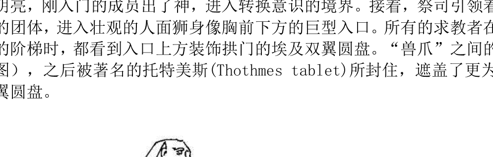

位在埃及吉萨(Giza)高原的人面狮身像

阶梯末端有一个巨型的招待室，神秘教派的大祭司会在此驻足等待。他身着白衣，披挂着紫色的袍子。接着，大祭司引导所有的求教者进入巨型密室，在他站立于房间的北方边缘时，指示他们围着他形成半圆圈。此时，大祭司进行起古老的仪式，启动或“开启”在场每位入门者的顶轮与第三眼（之后详细有详细解说，顶轮与第三眼脉轮分别位在头顶与前额的位置）。藉由特殊的发声或唱诵及一座巨型水晶，仪式的所有参与者活络他们内在本身的能量，启动一个精神与灵性的过程，以唤醒他们未开发的心灵部分。第一个或首要的入门仪式，对于那些将要开始古神秘学院密集训练，以达到灵性觉醒的人，会是一个重大的盛事。

在入门训练的过程中，人面狮身像下方的密室还会进行更多次的仪式。学员们会经历不同阶段的学习或进级，每次晋升到下一级时会需要进行点化或仪式。资深的学员最终会从地下的玄关被引领进入大金字塔——而于此处接受最后一次的点化。圆满完成所有的学业与点化，使学员成为神秘家、医师与祭司。在此时，他们已准备好开始服务于自己专精的领域。

招待室的北边有一个入口，可由此进入通往另一个较小型密室的长廊。有三道走廊接通较小型的密室，一条通往北方，就位在大金字塔的正下方——它与进入此古老文物主体的秘密通道相连；另一条朝西北的方向，通往一座古代遗迹。第三条走廊朝正向方，抵达一座祭拜与治疗用途的神庙下方——有一道隐藏的阶梯从这个神庙连接下方的通道。

第二条通道极为重要，因为它最终会进入亚特兰蒂斯的记录圣殿。这个地点储存了庞大的亚特兰蒂斯智能，以类似图书馆的方式排序。多色的水晶置放于此，供应场地的照明与机能。如此特殊的地点，好几世纪以来皆由埃及神秘学院的精英会员所维护，但终究还是被后世文明遗失或淡忘。在不久的未来，记录圣殿将会再次对世人展现。

今日，对于人面狮身像与大金字塔的真实历史有争议。日前发现了与此争议性主题相关的一些证据。有几位地质学家认为，人面狮身像与建于我们口中的古埃及文明之前，他们相信人面狮身像在将近 12500 年前打造。透过科学，终有一天人类能够揭露更多兴建此结构的古人机密。

最终，古神秘学院散布于世界各地。西藏、印度、希腊、以色列与波斯是一些主要但极为分散的例子。美洲也有类似的体系，出现在玛雅与阿兹特克的中心。虽然许多人相信这些相似的传承是个别发展的，但如果我们想到所有的神秘学院都源自于同一出处：亚特兰蒂斯就能轻易化解如此的迷思。以下叙述了一些最重要的神秘学院，透露出它们在世界各地的发展。

## 遗失的耶稣教导

最初深受古代学院影响的其中一个地点是赫利奥波利斯(Heliopolis)，一个位于圣经中称作歌珊之地的城市(Land of Goshen)。此重要学习中心的规模为 3 平方英里。根据华利斯. 布基(Wallis Budge)——十二世纪早期在英国博物馆负责亚述与埃及古代文物的看守员，这个重要的学习中心在当时已被苏伊士运河的水域所淹没。

赫利奥波利斯在古代被通认为是学术中心，而许多天资优异的人士受教于此享誉声望的机构。拿撒勒的耶稣(或约书亚)是学院中最杰出的学员之一。耶稣事实上位资深的师父，重返世间指导与治疗，于“行踪不明的时期”待在赫利奥波利斯，研习古老秘法，如能量治疗、预知、解析气场、导灵或通灵。

他透过十二门徒与其他学生或使徒，当中包含数位女众来散播这些学说。这些女性尤其担任重要的角色，辅助着其他人民。

许多现代的神秘学家发现耶稣与信徒消失的历史片段与教义，当中最著名的一位是爱德加.凯西。当他在深度的催眠状态进行“生命解读”时，详细叙述了耶稣生平的事迹。史班瑟 刘易斯在他的著作<耶稣的神秘人生>中，描写耶稣行踪不明的时期、他的神秘学训练，以及众多成为他信徒的人们。

紧接在耶稣停留世间的时期，基督教开始从原本均衡的系统转变为父权体制。许多耶稣的原始教义于此时失去踪影，神秘学在基督教会的操弄下被舍弃。权力、控制与政治成为这个新宗教的部分要素。耶稣神秘学的教义源自亚特兰蒂斯与赫利奥波利斯的学院，匿迹了数千年，使民众无法得知。

## 艾赛尼教派

耶稣当年的时期，一支称作艾赛尼的神秘宗教支派(又称古犹太修行教派)遍布在古代以色列的社区。此支派教徒写下的手抄本是我们口中的死海古卷，与赫利奥波利斯略有关联。

事实上，艾赛尼教派分为两个不同的分支，其中一支是位于昆兰死海沿岸的苦修教团，另一支教团由已婚夫妻所组成，位在加利利行政区。这些人当中有许多是天资优异的治疗师，运用宇宙的治疗能量，他们全数在埃及的神秘学院接受过古老的秘训，包含治疗诀窍。

即使这些人被视为犹太教的一个分支，他们对于古犹太宗教的其他主要派别，法利赛教(Pharisees)与撒都该教(Sadducees)有所评断。艾赛尼教徒认为，这些教派并不了解他们与神之间的盟约。然而，他们相信是由他们的圣信来为“受膏油者”或“公义之师”及新世界秩序的降临来铺路。

希腊、罗马与其他犹太人曾谈论艾赛尼教派团体的特性。举例而言，亚历山卓的斐洛(Philo),一位公元一世纪的犹太哲学家，在演说中描述这个族群(波威尔.戴维斯Powell Davies)的死海古卷释义中曾引述：

> “他们是一支犹太的教派，居住在叙利亚的巴勒斯坦，为数超过 4000 人，被称为Essaeis,因为他们的道德崇高，hosis--“神圣”与 Essaenus 是同一个字(译注：hosis 为希腊文，神圣的意思)。”

加利利人耶稣或约书亚来自以艾赛尼教导为基础的神秘背景。同时，马利亚与约瑟、他的双亲与表兄、施洗约翰，宣称这支教派及其教诲的关连。

多亏 1947 年发现了死海古卷，对艾赛尼教派才能有更多的了解。今日，我们知道他们分布的范围比当初想象的还要广泛，他们的许多信条与教义最终被纳入新约。兰卡斯特.哈丁一一晚期的考古学家，与约旦古代文物部门的负责人，曾谈到古卷的重要性(史班瑟 刘易斯所著之耶稣的秘密学说曾引用)。

> “目前发表之艾赛尼教派文献中最惊人的发现，在于这支教派于基督时代以前，就已具备常年被视为专属基督教的用语及仪礼。艾赛尼教徒施行受洗礼，并在礼拜中由教士主持面饼与葡萄酒的圣餐分享，他们相信灵魂的救赎与永生。他们最重要的领袖是一位神秘人物，称作公义之师，救世主先知--蒙受天启的教士，他受到迫害，最终罹难。”

## 犹太卡巴拉秘教

艾赛尼教派，虽然不隶属于犹太教的内部分支，与其他的犹太教团体和睦的生活在一起。大体而言，犹太人的宗教要求一种服侍仪典的态度，即使从事生活中最基本与世俗的活动也是如此。这意谓艾赛尼教派与耶稣时代的犹太教信徒，将灵性当作是一种日常的宗教素养、启示与伙伴。

由于犹太教的习俗涉及全面生活，神秘界被视为个人与神圣本源达成沟通的最高支点。所有类型的犹太教都含有神秘学的信仰，解释进入神秘意识的方法。与此相关的许多说法，源自卡巴拉（原意为“传统”）教导的著作。

卡巴拉是一个受到诺斯替教派(Gnostics)，希腊哲学与公元世纪初新柏拉图学说影响的玄奥犹太教神秘主义。卡巴拉的学说汇集于古代与中世纪的书籍，其中两本影响力最大的是<光辉之书>和<创造之书>（Zohar和Sepher Yezirah）。

前者于13世纪所著，后者在公元3-6世纪间完成。书中的教导最初遵循口耳相传的方式，由一位老师传授给他的学生们。

艾赛尼与其他神秘学或灵性团体的教导，也采行这种口述的传统。

## 印度教

古代神秘学遍及东西方，印度教是最久远的例子，于印度发展了数千年。今天，它是全球现存最古老的宗教之一。

在印度宗教的核心，有三位神明坐镇：梵天一一创造神，毕湿奴一一守护神，以及湿婆一一破坏神。这是世上最古老的圣三位一体（基督教的圣父、圣子与圣灵日后才出现，源自“三元神性”的同样概念）。

印度教，一个具有将近4000年历史而依然原封不动的宗教，提供信徒一种生活方式与系统化的宗教体制。印度教中并没有正式的教条或严格的规章，反之，信徒可以选择最接近他们世俗愿望与需求的神明。

印度教在发展时，研究人体释放的能量也成为了宗教的主要重心。性能量的释放，所谓的“昆达里尼”或“巨蛇威力”是透过男性与女性能量的结合。灵性醒悟之道，藉助双方从脉轮或能量中心释出这股强大的力量。在某本书中描绘此惊人能量的印度典籍中，提到性的结合带来和宇宙或上天的合一。

## 佛教

佛法的教义对西藏与北印度具有稳固的影响力，轮回观是此宗教的核心。佛陀如同耶稣是一位成道的师父，对众多信徒传授古代神秘学。

释迦牟尼佛于公元前约 563 年生于尼泊尔。这位诞生在尼泊尔的王子，他的本名为悉达多，悉达多.乔达摩，之后被称尊奉为“佛陀”，意谓“开悟者”。

乔达摩太子多年来享尽荣华富贵。一天，当他出游到领土的某个区域时，见识了人民的疾苦。从此，他卸下自己贵族的身份，成为一位追寻智慧的人。

一开始，乔达摩钻研印度的神圣古典，<吠陀经>与<奥义书>，印度教最重要的典籍。后者的本质较具精神意义与哲理，而前者阐述神话的故事。它们虽然重要，但这些作品并没有答复乔达摩所寻求的解答。

苦修多年后的一天，乔达摩在菩提树下静坐时，突然接收到上天的启示。瞬间的顿悟使他成了佛。他以成道者的身份，创立了佛教，一门以他个人深刻体悟为基础的新宗教，并且融合当初研习印度教古老教义时所获得的智慧。

## 波斯

另一个接受古代教义智慧洗礼的区域是波斯(现代的伊朗)。

约于 2600 年前，琐罗亚斯德——一位伟大的老师以古老光的信仰形式对波斯人民传授这些奥秘，在今天被称为祆教(Zoroastrianism)。这个宗教谈论光明与黑暗、善与恶之间的对战。传言中，琐罗亚斯德由童贞女所生，这是耶稣基督与这位波斯灵性导师诸多明显的雷同处之一。

琐罗亚斯德可能诞生在波斯王国的北部。传说阿胡拉.玛兹达(Ahura Mazda)——光与善之神，施展光使一位女子受孕，琐罗亚斯德的母亲透过人神的结合而诞生了他。如同耶稣，他也是一位聪颖的小孩，能与大人博学地侃侃而谈。年届约 30 岁时，琐转向宗教。在阿胡拉.玛兹达神净化他后，进入沙漠静心与寻求灵性的开悟。在此处，琐接受了上天赐予他的启示。

在成道时，他以一部圣典，阿维斯陀经(Zend Avesta)传授他的教导。这些神圣的文献探讨一神的信仰、它无所不在、是真理、光以及生命的力量。琐教导他的学生要心存慈悲并对人行善，人类灵魂的纯净是他个人哲理与灵性教导的重点。

今天的印度，有一个团体称作帕塞斯(Parsis) (译注：原义指来自波斯的人，指印度波斯系的祆教徒)，他们依然遵循琐罗亚斯德古老的光明信仰。同时，波斯人后人在伊朗与世界各地依然奉行琐罗亚斯德的仪典。

## 希腊

希腊人在许多特定的宗教中心融会了古代的神秘学。最著名的是埃勒夫西斯神秘教派，盛行于地中海的国度。最终，这些神秘教派在罗马社会竖立起它的地位。成千上万的人们来到埃勒夫西斯点化入教，皈依者参与在圣地与附近神庙所过行的秘密仪式，它是经由埃及传到此地的亚特兰蒂斯古代神秘学的延续。连罗马皇帝都曾接受点化仪式进入埃勒夫西斯神秘教派，马可.奥勒利乌斯，公元一六一年上任到一八零年身亡的皇帝，是其中一位入教者。

## 梅卓

当罗马帝国拓展到地中海国家时（基督在世时期），这里住了一批称作“梅卓” Magi (译注：可译为博士、魔法师、贤士等此处取音译)的智者（梅卓为 Magus 的复数名称），字面意义为“明智之人”。大部分梅卓来自波斯，其他则居住在巴比伦与埃及。梅卓都是琐罗亚斯德的弟子，受过治疗与形而上学技法的高超训练。许多古代中东的统治者对他们极度推崇。

梅卓是占星术与天文学专家，他们研究星辰，并将心得融入他们的宗教习俗。多半现代人之所以知道梅卓是占星术士，是因为新约曾提到宣告耶稣诞生的“三位贤士”是梅卓。然而，仅有少数人知道许多神秘学院都曾企盼着一位成道师父的降临，这被反映在“东方三贤士”的故事中。

事实上，梅卓、艾赛尼教徒、埃及神秘学院会员，与其他人士之间流传着一个预言，预知灵性先师或弥赛亚（受膏油者）的降临。这号人物的诞生是这些团体的主要论点。对于熟知星象的梅卓，一个天象的出现，人们所知的伯利恒之星，是“救世主”重返人间的征兆。

## 密特拉教派

当梅卓寻找着上天的迹象，起源于印度的密特拉教派(Mithraism)在罗马各地的势力逐渐扩大。这支教派散发着浓厚的波斯风格，它极度讲究神圣的仪式与点化，此特点吸引了一向容易接受新思潮的罗马帝国社会。这支教派的核心是密特拉(Mithra)，光明与真理之神。

当基督教会成为罗马帝国最有势力的宗教时，它采行密特拉教派的许多仪典与习俗来试图改变民众的信仰。焚烧乳香与没药的香，点燃蜡烛，由身着祭袍的教士进行的神圣礼仪，以水施行的受洗，都是今日教会组织的一部分。全部取自敬拜密特拉及类似它的“异教”神明之古老宗教仪式。

## 基督教与精神主义的流失

正当罗马帝国扩展到最大版图，从不列颠群岛延伸至波斯湾区域时，在巴勒斯坦兴起了一个宗教抗争，持续了数百年之久，超过帝国年龄1500年。打从耶稣在世上的教导，基督教开始日渐普及，同时，使希腊罗马的异教信仰相形失色。最初，许多信奉希腊罗马神明的罗马皇帝曾迫害基督徒。举例而言，多米田 (Domitian)皇帝（公元约81年间登基为王），宣布基督教为非法，惩戒排斥罗马神氏的人民，奖赏“基督教秘密信徒”的告发者。

对于基督教的迫害一直要到康士坦丁大帝于公元306年上任为止。人们所知的“首位基督教皇帝”，协助基督教成为罗马帝国的国教。在他死后的50年间，所有非基督教的信仰从整个帝国中被驱逐。

不幸的，当它成为欧洲绝大区域、亚洲与非洲的主要宗教时，教会成为其他信仰的迫害者。位于埃及亚历山大的重要图书馆被基督教的暴民信徒放火焚烧，无数卷轴与籍册所保存的智慧，在整肃异教徒文学与思想下永远地消失。当这支教派在罗马凌驾其他更宽窄的团体时，基督教会的主教得到至高无上的地位。很快的，教会成为一个权力强大的政治与宗教机构，推崇政治而忽略真正的精神教义。在此时，主流基督教偏离了耶稣正统的教导。

第一世纪，在基督教压倒罗马异教后，许多忠心信奉耶稣教导的团体暗中聚会，并传授他们的智慧。诺斯替教派，其中一支遵循耶稣真实教诲的教派，挑战基督教会 (Gnostic 的名称源自希腊文的 gnosis，意为“知识”)。他们信奉耶稣的灵性教诲，甚至有时被称作“耶稣教派”，但遭受到教会的压制与迫害，最终转为地下化，它的灵性智慧也因此连带沉寂。诺斯替教派似乎被灭了迹。

基督教试图歼灭敌对信仰，并在全欧洲取得势力，它对于性、神秘学主义与人类个体性变得更为压抑或保守。在公元1470年代后期，压制进入到一个非常黑暗的时期。任何运用神秘学或古代秘教的人，长久生活在对宗教裁判所的畏惧之下，它的专员专门揭发、惩罚与消弥任何另类或反对的宗教观点。宗教裁判所在西班牙的态度尤其残酷，迫使更多人民与团体转为“地下化”，所有的学习都在隐密的地点进行，完全保密。共济会与蔷薇十字会的会员，是净光兄弟或古代神秘学院的人表，隐密谨慎地保存着源自古代亚特兰蒂斯与埃及的教导。

其他抗衡早期基督教会的团体还有塞尔特人(Celts)与德鲁伊教教徒(Druids)，他们代表一个极为多元的团体，有着类似的文化素质，同样含有强烈的精神主义及亲近大地的态度。塞尔特人的宗教基础源自于对大地之母的崇花色品种，一个它子民眼中养育者、守护者与供应者的存有；许多塞尔特的仪式依照日、月的周期进行，但如此的习俗并没有延续下去，因为当塞尔特人民转信基督宗教时，他们忘却了自身的文化与传承，使基督教得以盛行于不列颠群岛，与中、北欧的部分领土。其他“异教”，比如说发现于斯堪的那纳亚与欧洲农业社会的教派，也在这次宗教意识形态的转换下消失。

最终，当欧洲人探险并移民到美洲时，北美印地安人战败与被欧洲化。这些原始居民灵性的生活方式几乎灭了迹，而土地与资源从他们的手中被掠夺。欧洲的贪婪与现实驾驭了美洲的精神主义，其来源也是古代亚特兰蒂斯的教导。

## 结语

虽然表面看起来，古代先师的原始教诲似乎已尽失或埋葬于地底，近期的发现显示真理无法永久匿迹。举例而言，在公元1945年，考古学家在埃及拿戈玛第发现一系列诺斯替教派的文字或福音。据说这些文字中有些是耶稣基督留存下来的话语，这些典籍中有一部作品，学者称之为“多马福音”(Gospel of Thomas)，是第五部福音。

今日在跨进新的千禧年后，我们依然希冀能反转上1000年的负面趋势，而迈入再次拥护精神至上的世界。接下来的内容，探讨耶稣基督原始的正统教导，亚特兰蒂斯与埃及神秘学院的最初学问，以及开发精神及灵性特质必要的秘传诀窍。

# 第二章 第三眼脉轮

> 成年人或许能从孩童身上得到学习，因为稚子之心何等纯净，使伟大的灵魂对他们显露许多被其他人错失的东西。
> ——黑角鹿(Black Elk，美国印地安人的精神领袖)

古代人相信宇宙的二元性。在他们的宇宙哲学中，大天地反应在天界与星辰，而小天地则由地球及自然界代表。他们相信如此的二元性也存在于人类；我们兼具肉体与灵性体。两者的差别在于灵性体被包含在肉体，然而，它所散发的频率要比它的物质“外壳”来得更高。同样的，除了实体的器官外，人类的形体中事实上还存在着灵性体的器官。

## 气场与脉轮

自然界中的万物都受到能量形体的包覆。树木、植物及动物都具有能量形体或散发着多种色光，人类也不例外。一个神奇的能量场环绕着人体，它通常被称作气场、电磁场或是人体能量场。

气场内含有称为“脉轮”的能量中心。在梵文中，脉轮的直译为“光轮”。人体气场中共有 7 个主要脉轮，与大约 120 个次要脉轮。所有脉轮透过气场与灵性体，间接地对应到身体的特定部位。这些中心位在身体部位的上方与周围，它们以高频或高振速的形式呈现。

主要脉轮透过交感神经及中枢神经系统，间接连结到内分泌系统中的 7 个主要腺体。这些脉轮在身体从上排到下，由头到生殖器官。交感神经与中枢神经系统都能从 7 个主要脉轮接收到能量或频率，再将之输送到人体中的 7 个主要腺体。同时，频率也会传到肉体中的其他器官及部位。记得，自然界之万物皆具有不同振速的频率。后面会有针对脉轮系统的详尽解说。

## 第三眼与松果体

本章中，你会学到一个古老的诀窍来唤醒或更正确来说，重新唤起“第三眼”，它是灵性体中的主要脉轮之一。一旦达成，你就会踏上朝往超感应能力开发与灵性成长的道路。

在提到“第三眼”这个术语时，所指的是第六脉轮或第三眼脉轮，位于额头中心。

它与松果体关系密切。至今，这个位在脑中的腺体在医疗科学上还是一个谜。即便如此，科学家同意松果体多少发挥了内在时钟的功能，它会间接受到光的影响。当黑暗降临时，它开始分泌一种称作褪黑激素(melatonin)的荷尔蒙，当日光出现时，这个激素会停止分泌。许多科学家也相信季节引发的情绪失调（比方说SAD，季节性情感紊乱综合症）可归咎于此腺体。近年来，医师与研究人员证明，光之治疗可有效处理罹患季节性情绪失调的病患。

事实上，松果体是身体内分泌泉腺系统中的一部分。内分泌这一词源自希腊文的endo，其意为“里面”或“内在”以及krinein，意谓“分开”。这些内分泌腺体，有时被称为“无管腺”，直接释放特定激素到体内的血液中。内分泌系统的所有腺体彼此协同地运作。

松果体也被认定与生殖繁衍有关，它与脑下垂体及下丘脑这区块同步运作。松果腺体的命名有误，事实上它是一个器官。

法国哲学家迪卡尔认为松果体是灵魂所在，心灵与身体的交会处。在古代，神秘学家及灵性道路上的学员，明白心灵与身体之间的关连。事实上，正确开发与运用此腺体是直觉与超感应能力的关键所在。直觉力及创造力就储存在这个位置。

年幼时，我们的松果体运作良好，使我们能够自由运用我们的直觉、创意及超感应能力。许多孩童能看到人们周围的气场或光，其他孩童则可以看见亡灵、指导灵及天使，并与他们沟通。这是许多小朋友“幻想同伴”的起源。

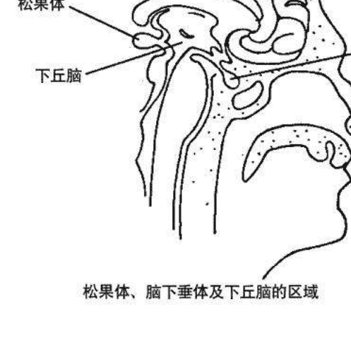

松果体、脑下垂体及下丘脑的区域

通常在大约 12 岁的时候，许多孩童开始丧失他们的超感应能力，这并非青春期的原因，而是我们的社会制止他们运用。我们的教育体系强调逻辑性思考与分析。许多家长、教育家、权威人士与其他成人，遏阻孩童使用他们的超感应能力，将它视为幻想来排斥，或怪罪孩童捏造故事。比方说，叔叔或阿姨可能会对“幻想同伴”嗤之以鼻，视为凭空想象。或许，小学老师会警告孩子不要谈论他在别人身边看到的颜色。这种封闭的态度，对于许多天资优异的稚龄孩童造成无法弥补的伤害。

在这些情况下，输送到松果体的能量因为减少，而使它萎缩并开始钙质化松果体生理上的主要变化造成直觉与超感应能力的丧失，到了20岁时，许多青年已完全无法使用这些能力了。

所幸，我们的社会对于这些想象力丰富的孩童，变得越来越开放与宽容。当今，许多成为会鼓励孩童表达他们的创意及探索他们的超感天赋。这种较开明的态度有助于维持松果体的活络及第三眼顺畅的运作。第三眼脉轮，直接受到活化的松果体影响,因而被启动或是打开并且让这些光的孩子在此灵性演进的世界中发光发亮。第一章提到的觉知或意识提升，部分意谓第三眼脉轮的开启。这些年轻人会将他们的诸多特质延续到成年，协助我们的社会觉醒。

成年人在此时也感受到松果体的启动，这种状态最终会使他们的第三眼脉轮敞开。此现象发生时，这些个体会经历情绪与身体上的状况。有些人急迫或渴望投入利他的领域以增益全世界。无论他们的感受为何，所有人都体验到一种求知的欲望，尤其是对另类疗法及探索超能感应的领域。赚取金钱、获得财富，与服务他人、贡献世界相较下变得次要。他们的日常生活，原本可能周旋于世俗的工作、汲取物质财富与封闭的态度，会产生剧烈的变化。

当他们进入更高层的意识时，会发觉生命中遗漏了什么。迟早，光是支付帐单、工作、看电视、固守朝九晚五的生活态度似乎不是那么重要。这些人开始相信生命绝非仅是如此。在他们清醒时，会找寻生命的意义以及活着的原因。当他们寻觅个人的人生使命时，就在灵性的道路上跨出了第一步。

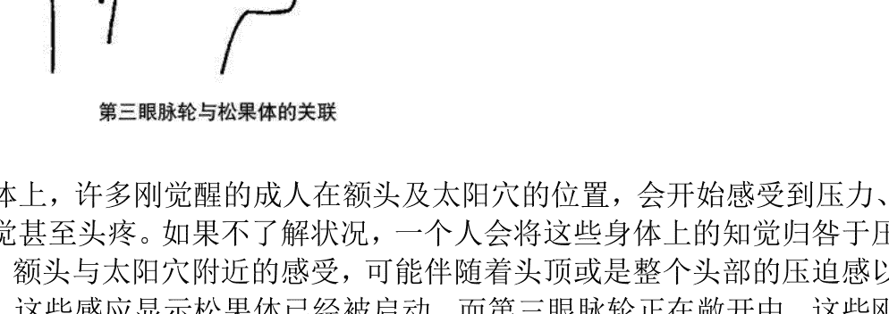

在身体上，许多刚觉醒的成人在额头及太阳穴的位置，会开始感受到压力、奇特的感觉甚至头疼。如果不了解状况，一个人会将这些身体上的知觉归咎于压力或疾病。额头与太阳穴附近的感受，可能伴随着头顶或是整个头部的压迫感以及酥麻感。这些感应显示松果体已经被启动，而第三眼脉轮正在敞开中。这些刚觉醒的成人事实是在回归自己的真我及个人直觉与创意，如同那些天生具备这些才华的孩童。

请先想象以下的比喻。松果体（它的形状如同松果）在能量上，可被比拟为葡萄藤上的一粒葡萄。太阳的温暖以及雨水让葡萄健康而饱满，然而，经过一段时间后，这颗葡萄会干燥并且枯萎。简单来说，它会变成一粒葡萄干。孩童的松果体健康、活络与饱满，这样的状况会维持到差不多12-14岁的时候。当一个人完全长大成人时，松果体几乎完全干枯，如同一粒萎缩的葡萄干。状况发生时，一个人会失去所有或大部分的直觉力，即使松果体依然发挥它生理上的功能。若要重新拾回这些丧失的能力，这个腺体必须重新启动，成功的关键在于将能量传送到这个位置。接着，这粒葡萄干就能重新变回葡萄，而松果体会像孩童时期一样的运作。

1956 年，英国出版了一本名为<第三眼>的书籍，由罗桑伦巴 (Lobsang Rampa) 所著，他声称自己是西藏的医药喇嘛，具备玄学知识。

书中描述作者接受一种由僧侣执行的超凡却危险的手术。根据伦巴的说法，这些人将一只经火加热的棍子小心地塞入他的松果体。这个作法启动伦巴的松果体，并且唤醒他所有超感应能力的潜能。棍子插入所造成的压力与频率，应该会引发腺体内的一个反应。即使这种启动觉醒的过程粗暴而危险，它依然显示藏人明白松果体及第三眼的重要性。

还好，唤醒这些重要的超感应器官，有更简单与安全的方法。

## 第三眼

自古留下了一个重新启动松果体的方法，此秘传诀窍源自千古。它的原理在于引发一种振动头部尤其是松果体与周边范围的频率。

这个频率的来源为何？它源自人类声音所启动的文字力量。用声音唱出一个适当音调，可散发出一种能量或频率，强烈地影响人类的脑。这个方法有时被称作发声、唱诵或“频率工作的进行”。

以特定的音调唱诵一个声音，可在松果体中激起一个频率或是声波。如果练习做的正确，它产生的效果等同西藏僧人在罗桑伦巴身上所施行的技术。

要发出或唱诵的是 THOH。THOH 与“toe”同韵，就根据它的拼音发声。以一个音节唱诵，所用的音调介于中到高的 C 大调。如果你对音乐无感，不要担心发出的音频是否准确，即使大概也一样有效。

(同韵指“oh”与“oe”均发音标[əʊ]，THOH 的字母组合发音即 though[əʊ]。)

只要记得正确的音调会是中音，介于低音及高音的音域。换句话说，要得到正确的频率，你就唱诵 THOH (toe)，不用低沉的声音，不用高音，而是介于这两者之间的音律。

开始这个练习之前，用你的鼻子深吸气一次，接着尽量憋气到可忍受的长度，然后慢慢透过微张的嘴巴吐气，重复两次。这个呼吸练习使你将重要的生命能量或宇宙能量导引到你的肺脏，再输送至你的全身。它也放慢你的脑波形态，从 beta 层级或清醒状态到轻微的 alpha 层级。alpha 脑波形态是静心状态的起点。你变得更为放松，让专心发出 THOH 的声音更为容易。

接着，再用鼻子深吸气一次，然后憋气几秒钟。在你用嘴巴吐气之前，将你的舌头放到微开的牙齿间。用牙齿轻轻地压着舌头。这和念”the“的“th”部分步骤相同。一旦你的舌头放上这个位置，慢慢地用你念 T-H-H-O-H-H 的嘴巴吐出你的气，直到所有的空气都完全排出为止。你应该能感觉到空气通过你的舌头与牙齿。

如果方法进行正确，你也会在下巴与脸颊的位置感觉到一股压迫感或知觉。

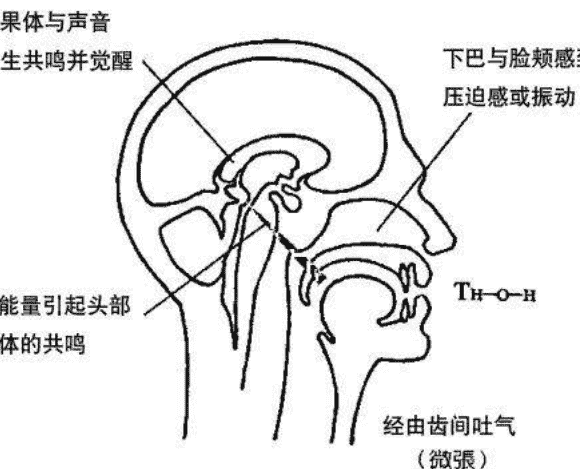

重复这个方法 2 次，在唱诵每次元音之间停顿一阵子。首次尝试时，THOH 应该要连续唱到 3 次。大约在 24 小时后，以同样的方式重复唱诵法。唱 THOH 三次，在每次唱诵之间稍微休息。

做完第二次大约 24 小时后，这个练习应该再做一次。第三天 THOH 的元音唱诵会是最后一次。这是个只要做单次的方法，不像绝大多数的方法需要重复的演练。如果你想要再试验此元音唱诵，在下次进行前至少要等 2 周。

这个第三眼的练习，在你下巴与脸部造成一种振动频率或压迫感，促使频率或能量进入松果体。这股振动能量造成松果体的共鸣并启动它。记得在念或几乎是唱着 THOH 时，应该要以中 C 调发出强大的声音。大约中音阶的调就可以了。

对于某些人，这个千古流传的古法刚开始好像没有什么成效。不要担心，因为这个练习的效果可能非常细微。你可能在短期内会有许多身体及灵性上的经验，或者要待数周后才会出现这样的经验。

### 第三眼法对身体造成的反应

你可能最先经历到的体验之一是头痛，或额头中心、眉毛正上方的压迫感。这种感觉像是发自内在，通常离额头表面一寸或更深的位置。这表示松果体被重新启动，并且开始健全的运作。少数松果体已经完全萎缩的人，可能会偏头痛发作好几小时。完成第三眼练习后，这样的不适可能在几天或数周内浮现。压迫感与头疼多半会大幅减轻。副作用的严重程度，完全依据你的松果体在进行此练习前，是否运作健全、部分运作或完全的萎缩而定。

大部分的例子中，松果体原本就已经轻微启动，并至少略为有效地运作。因此，你在额头可能只会感到一股压迫或触觉；对于某些人还会是某种舒服的感觉。

如果你什么都没有感觉到，约3周后你可以重新尝试这个练习。在罕见的状况下才有此必要。有时，进行此特殊练习时仅感到薄弱或毫无身体的感应，但是会开始经历某些心灵现象，这表示这个练习是成功的，觉醒的过程已经开始。

在头痛或额头压迫感出现后，你可能在某个清晨起床时，感到额头的跳动或酥麻感，这像是起鸡皮疙瘩。状况发生时，这种感觉或许会极为强烈到让你想照镜子一探究竟，但却什么也看不到。你的额头还是原本的样子。然而，这种奇特的跳动或振动感会持续几乎整天。这是第三眼练习后经历到最后一个生理状况，表示你的松果体已经再次完全苏醒、启动，如同你孩童时一样的运作。

当你的松果体已活络并且自行调整，你内分泌腺体系统的其他部位也会变得更为平衡，更协调的运作。

最后这种奇特的感觉会终止，你会发现自己偶而头昏眼花并开始常作白日梦。对于那些原本就常作白日梦或恍神的人，或许比较不容易发现这种意识上的转变。

白日梦与头昏意味你的脑波形态正在改变，放慢速度。你开始进入 alpha 脑波的模式运作，或更正确来说，一种轻微的半催眠状态，而取代清醒状态的运作或工作（白天使用的 beta 脑波模式）。这种意识状态是你一天大部分时间该处在的境界。此转换意识中，一个人能够更有效率的工作，承担更多压力，并且发现时间流动更为快速。

最终，你在 beta 及 alpha 状态中会取得平衡，并减少作白日梦。你会开始在轻微的 alpha 状态中正常运作。对于旁观者，你看起来完全清醒。没有人会发现你现在以转换意识的状态工作与生活。

除此之外，当你在这种放松状态时，你能够学得更快及轻松记忆常识与日期，因为你使用到脑中更多的庞大潜力。

### 第三眼开通的灵性功效

1. 同理能力增加
2. 获得观察及感应人类气场的能力
3. 超听觉力的开发

当你的第三眼打开时，这些天赋及能力会开始发展。第三眼法是培养你超感应能力的一种强大而有效的方法。你会开始轻易地提升个人意识，并运用自己的天赋，不再长期在生活中战斗，而是奋力去达到你真正的人类潜能。这会在短期内发生，通常是 6 周到一年之间的时间。

第三眼法是加强超感应能力开发与灵性觉醒的关键。当你的松果体与第三眼脉轮清醒时，你会踏上自己的道路，朝往你人生真正的方向。

# 第三章 顶轮

> > 永恒的智慧驱散我们无知的黑暗。
> ——阿尔昆大主教(Archbishop Alcuin)

古代神秘学院具备特殊法门,指点学生及寻道者踏上开发超感应能力与灵性觉醒的道路。数千年前,“重大的点化仪式”在人面狮身下方的密室进行时,大祭司会发出特定的音律唤醒入门修行者的灵性自我。THOH 的唱诵激励松果体,并唤醒第三眼脉轮,是大祭司运用的第一个音频唱诵。

接着,他会发出第二种唱音,刻意激励入门修行者头部深处的松果体。这个腺体与顶轮(也被视为第七脉轮)及高频有直接关联,顶轮位于头顶。

进行第二种唱诵前,能对松果体与顶轮略为了解是很重要的。

脑下垂体位于人类脑部中央。如果你看着一个人的鼻梁,想象一条直线往头部内延伸三寸,这个腺体就位在线的正上端,它的大小如豌豆,即使它常被称为主宰腺体。它隶属于下丘脑的区域,可被视为黏着此脑部区域下方的附属器官。

事实上,脑下垂体分为两个区块,前半称作“脑下垂体前叶”,后半则称为“脑下垂体后叶”。两个部位在体内都具有不同但互补的功能。脑下垂体前叶负责分泌一种称作促生长激素的生长荷尔蒙。此荷尔蒙控制骨骼、肌肉及其它器官的生长。前叶部分也直接影响许多其也内分泌腺体。

举例来说,藉由释放一种刺激甲状腺激素(thyrotropic),脑下垂体前叶可作用在甲状腺。脑下垂体后叶则影响平滑肌系统。

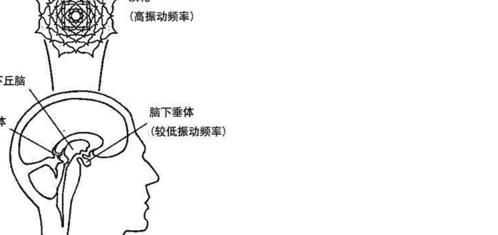

现代医学对于此腺体的了解仅限于实体部分,它忽略脑下垂体是灵性觉醒及开发超感应能力的秘密关键之重要性。

从古到今的人类历史中,有许多人相信科学与灵性能能够相辅相成。

## 宇宙能量频率表

## 宇宙能量频谱

| 频率 (CPS or Hz) | 不同的频率范围 |
|---|---|
| 16,500 | 电流的频率范围 包含收音机、电视机、微波炉、红外线、热能 |
| 300,000,000,000 | 一般人类的视觉频率范围 包含色彩、物质实体 |
| 6,000,000,000,000 | 天生灵通人士所用的 扩展视觉频率范围 包含观察气场与脉轮、指导灵 与天使、治疗与灵性能量 |
| 4,500,000,000,000 | 宇宙、超感应与灵性能量的频率范围 包含超自然现象、人体气场、 脉轮能量中心、灵界、灵魂的显相、 灵通能力 |
| x 100 | 极高的振动频率 -- 目前无法测量 |

宇宙能量全谱与不同频率的显现
今日的科学标准无法测量出不同频率的宇宙、心灵与灵性能量

科学与形而上学将会变得更密切，而达到实质上的全然合作。
——威廉·詹姆士   哲学家与科学家

但愿近期内会有更多人了解物质与灵性之间的关联。就此部分深层的领悟，我们能创造一个更为灵性的世界。

脑下垂体与顶轮能量中心有着密切的关联。极高的心灵与灵性能量在此脉轮内及上方振动。这是宇宙能量的一种形式，它渗透万物：出现在空气、水、树木、植物及大地本身。通常，这个宇宙精华因为振动频率快速而无法得见，但受过训练及精进的人们能够感知它的存在。

每个人都体验过电视与收音机的存在，即使它们不可见。透过打开收音机或电视接收器，我们能够“经历”这些波形，它以高速振动。一种振速是一个频率，可用一秒钟内的振动次数或单秒内的循环次数(CPS)来计量。

记得万物皆以特定的频率振动。一块地上的普通石头要比一只活着的动物振动缓慢。人类的身体及所有器官、腺体、神经、组织的振动频率，要比一块无生命的石头来得快速。不适或疼痛的衍生，源自一个器官或人体部位与身体其他部分脱节或失序。

藉由这些论点，我们可以再次探讨顶轮。如果你能够把此能量中心当作是接应高等宇宙能量与心灵能量的接收器，你就能初步了解亚特兰蒂斯与埃及古代神秘学院所传授的神秘原理。

宇宙能量经由顶轮及头顶灌入人体气场，当它抵达人类的脑部时，会开始减缓振动速度。松果体如果运作得当，会成为一种特殊的转换器，接收宇宙能量并将它转化成较低频率，接下来能量会穿过下丘脑的位置进入下垂体。

在此阶段，脑下垂体的功能像是一种特殊的转换器，减缓或降低宇宙及心灵能量至更低的频率。自此，能量被释放到脑中的其他部位，于此内化并以各种灵性现象呈现，治疗的能量、直觉、上天的启示、与高我的对谈或内在声音。

透过这种方式体验到的能力或超感天赋包含：

- 超听觉力——超能感应人声及声响
- 灵视力——超能感应画面与事件
- 超感应能力——超能感应知觉或察觉情绪

形而上学认为松果体与脑下垂体的功效，类似电器类的变压器，转换、减缓或改变电流的频率或形态。它们将一种能量类型转换成另一种。

松果体与脑下垂体都必须运作完善与健全，才能使能量转换的过程发生。顶轮与第三眼能量中心也得适当的启动与敞开。

第二章说明的第三眼练习是促进此过程必要的第一个步骤。松果体内产生的振动会启动或唤醒脑内的这个区域，它也传输一个经过下丘脑进入脑下垂体的频率。

这会影响并有助于脑下垂体的启动。

在完成 THOH 唱诵练习将近 7-10 天后，你就准备好进行第二个练习，间隔的期间允许第三眼练习启动松果体，并激励脑下垂体。

## 顶轮练习

如之前所述，此练习是埃及大祭司在“重大点化仪式”中施行的第二种特殊唱诵。此仪式不仅发生于人面狮身下的密室，并在数年后于卡纳克湖旁进行。这个运用两种唱诵、数支蜡烛、浓香熏香及神圣祷词的秘仪，最初是在亚特兰蒂斯进行，日后受到埃及神秘学机构的采纳，密斯拉教派与基督教也都采行部分的作法。你要运用或唱诵的声音是 May，与五月 (May) 的发音相同。此特殊的声音可用中 C 的音调，或介于低音与高音的中介音域唱诵。同样的，唱诵的音调不需要完全地准确，大概就可以了。你就用最适合你的音。

开始时，先轻松地深呼吸 3-4 次。感觉空气进入与离开你的肺脏。每次吐气时，让空气缓慢并持续的释放。这种呼吸方式会放慢你的心跳、血压，及最重要的脑波形态。这种放松的状态能使你更容易有效进行此练习。

恢复正常呼吸，开始将所有的注意力集中在你的额头、鼻梁正上方。将你的焦点落在眉毛上方大约一寸，额头中央的位置。继续关注鼻子上方的这个位置几分钟，直到你在此处感到压迫感、温暖或某些知觉。

如果片刻后，你什么都没有感觉到，也无须担心。继续专注在第三眼能量中心的位置。专心一阵子后，就深吸一口气，憋气约 5 秒钟。接着，当你拉长缓慢地吐光所有的气时，用嘴巴唱诵 M-A-Y。发出或唱诵这个声音时，感觉这股能量或振动频率进入你的头部，一开始先到额头的第三眼位置，然后过入脑内中心……甚至上达你的头顶，顶轮所在。

只要你吐光所有的气，就再次恢复正常呼吸。放松个几秒钟。

休息片刻，重复这个步骤。深呼吸，唱诵 May，然后用第一次的方式缓慢地吐出气。记得注意你的额头即第三眼脉轮的位置，接着你的脑部中心，而最后是你的头顶即顶轮的位置。让 M-A-Y 的频率在你的头部运作。如果想要，也可以进行第三次 MAY 的唱诵。

每当你觉得需要时，就可以进行顶轮的练习。你可以随意将此练习当作是一生每周灵性修持的一部分。

一完成这个练习，你就可以回归原本的作息。即使最初你没有发觉任何不寻常的感觉，此振动能量依然会在你的脑中开始运作。

### 顶轮练习的效果

对于某一些人，唱诵的效果在练习进行中或完成不久后极为明显，而其他人则以渐进的方式出现。

在第二章第三眼练习中体验到的一些效果，也会出现在顶轮的练习。除了与第二章所描述的许多成效有些许不同外，同时还会有新的经验，引发一些超感天赋的苏醒。

THOH 唱诵所造成的头疼或不寻常的压迫感（通常称作“第三眼疼痛”）会减轻或消失，并以流经部分头部的能量知觉或激流所取代。当 MAY 的声音持续作用在脑下垂体、下丘脑及松果体时，你可能会感觉到能量在头部的振动。感应到的知觉会从头顶、侧边甚至头后方开始，这些感觉被描述为“酥麻感”，就因为这股能量像是部分头皮发麻的感觉。对于大部分人而言，这是种极为平静而温和的经验。它是代表松果体的实体面被激励，而启动顶轮灵性面敞开的主要征兆。当顶轮完全觉醒时，就会引发能量上的感应，或整个头到耳朵完全被“酥麻感”所笼罩。好比一个真实的皇冠套在头颅上，此脉轮因此而命名。

在第二章第三眼练习后感到的头疼或压迫感，会因为 MAY 唱诵产生的振动频率开始作用在你头内而减轻，最终消失。当你的脑波从清醒或 beta 状态，放慢到 alpha 状态或轻微的半催眠状态时，会有片刻的轻微头昏，这是正常的。事实上，这是要达到的效果。恍神或头昏在短时间内会终止，而提升的觉知力依然持续。你的身体及脑部正在转变，并适应高等能量的频率，这使你能够在 alpha 状态中完全清醒而有效率的运作。获得此能力的个体，在生命中较有效率、健康、快乐及轻松。

如果正确进行，MAY 的唱诵会启动你的脑下垂体，使它平衡，并有助于协调内分泌系统的其他部分。除此之外的益处，还有大幅的减缓老化现象！

另一个衍生自此频率练习的好处是安宁感，或者说是一种轻微的幸福感。作用在脑下垂体及周边区域的振动能量，及对此脑部区域的专注会使脑内啡释入血液，这使你感到亢奋如同跑步者的愉悦感。对于那些罹患情绪失调或忧郁症的人，顶轮练习可以减轻问题，并有助于创造内在平和的情绪状态。M-A-Y 的频率练习帮助了许多患有躁郁症的人。

### 顶轮启动的灵性成效

脑下垂体的实体部分一旦正确启动，顶轮的灵性面也会被启发。顶轮的启动或敞开，使更多的超感能力能够得以发展。

这包含：
1. 直觉力增强
2. 创意扩展
3. 灵视力的开发或扩展
4. 同理感应能力的加强
5. 超听觉力的开发或扩展 (超能感应声响或人声)
6. 超感应能力的开发或扩展
(译注：同理感应能力不过是其中一项，此天赋还包含读取对象或人类身上的情绪与讯息之能力，或感应灵性存有及能量)

当你的顶轮打开时，这些能力会以不同方式显现于每个人身上。比方说，你的灵视力可能是发展最多的能力。对他人而言，超听觉力可能是个人最强项的天赋。

每个人都会发展出自身独到的才华。

只要你的顶轮与第三眼脉轮已正确启动与平衡，你会变得完全灵通，更有灵性。你会开始运用更多的脑内潜能，并轻松地在左脑与右脑间思考转换。

身体周围的多彩多芒类似暴风雨过后出现的美丽彩虹，或冬夜闪烁的北极光。七个主要色彩显现于人体气场中，这些颜色为红、橙、黄、绿、蓝、靛、紫色。它们衍生自磁场、电场、紫外线国徽、荷尔蒙与化学分泌物及灵性能量。

每种颜色与它的不同色调皆具有意义。只感应到一个人的气场或能量场是不够的，你也必须能够解析色彩的亮光。所谓“解读气场”是一门重要的技艺，有助于你私人或事业上的人际关系。在解读对象的头部附近，手臂与双手周围可以看到颜色。这门技术与施行方法在之后会有更详尽的解说。

除了七个主要色彩与它们的不同色调外，还有：金黄色、白色、银色、灰色、咖啡色与黑色。这些亮光可以区分成两种，正向及负向。

> “正向”指良性与有益的颜色，“负向”则指恶性与不良的颜色。

## 正向色彩

我们先开始探讨有益或正向的色彩，这些颜色以美丽、洁净与清澈的能量呈现，简单来说它们看起来赏心悦目。无法看见气场的人，在某些状况下也可体悟或感应到色彩。举例来说，一个人可能感觉到人们周围的蓝色或绿色，这被解释成他们出现时所带来的舒服与愉悦感。

以下为正向的色彩亮光：淡蓝色、中蓝色、深蓝色；淡绿到中绿色、阳光或淡黄色、淡橙到中橙色、嫩粉红色、中红到深红色、淡紫色、中紫色（靛色）、银色、白色与金色。

这些人体气场的灵性颜色以极高的频率振动，它们目前还无法被人类的任何科技确实测量。

绝对的正向色彩从高到低频（振动频率）

1. 淡蓝色
2. 中蓝色
3. 深蓝色
4. 淡绿到中绿色
5. 阳光或淡黄色
6. 嫩粉红色
7. 中红到深红色（酒红色）

### 淡蓝色

这种美丽的色光如同夏日午后天空所呈现的蓝色，它代表一位慈爱与灵性的人，清静的个体。一个人的气场出现越多淡蓝色，这个人就越有爱心与灵性。这个颜色代表相当高频的能量。对他人心怀怜悯与仁慈的导师、治疗师及咨商师，能量场中会明显地出现这个颜色。在头部附近可观察或感应到此美丽的颜色。它完全包覆头部，出现在距离身体半寸至六寸的位置。头部附近的蓝色越浓密与明亮，这个人在灵性上的修为就越精进。

这是个人气场中要观察的重要色彩之一。如果你看着一个人的头部上方或周围，“见到”大量的此种色光，你就可以对此人放心。若在头部任何一区，不管是贴近表面或更往外的位置，丝毫见不到或仅有丁点的淡蓝色，与这位观察者或解读对象互动时，你得非常谨慎小心。

### 中蓝色

此颜色好比海洋的中蓝色。中蓝色的频率比之间说明的淡蓝色要低，但它的振速还是很快。

这种深浅的蓝色通常会在头部附近察觉，但比淡蓝色更为外圈，它散发在离头部表面两寸半到七寸的范围。

这个颜色代表专门技术与管理能力。技术类作家、技师、电脑分析师、工程师、科学家及医师，是散发此种色光的几个案例。

中蓝色也表示是一位非常实际与商业化的人。气场与能量场以这个颜色为主的其它人士，有会计师、商务经理、业务经理与企业家等。

气场中出现大量中蓝色的人，尤其在头部位置，不见得一定会从事以上这些行业。然而，此颜色的出现依然代表这些人具备一些明显的特性或品质。这些特质包含学习专门技能的高度潜力，或极为务实及商业化的倾向。气场以蓝色为主的人比蓝色较稀少的人更常运用逻辑或左半脑。

当一个人正在运用他的专业技能及管理能力时，中蓝色会增加。换句话说，个人越常施展他的天赋，气场的中蓝色就会越为强烈与宽广。颜色会在一个人执行与其专业相关的职务一阵子后，明显地出现在头部、肩膀及手臂的位置。休息或没有从事这类工作时，这些人的能量场还会带有中蓝色，但程度明显降低。

### 深蓝色

此种深蓝色像夜晚在天空见到的深蓝色，只比暗蓝色稍微浅一点。这种散发出来的光能，比中等振速或频率更快，比淡蓝色要慢，仅稍微低于中蓝色的频率，它是带来视觉欣赏的丰富美丽色彩。

气场以这个颜色为主的人，天生富有创意与艺术气息。深蓝色可在头部见到或感应到，通常位在离表面4-10寸的位置。作家、艺术家、工艺家、画家、演员、舞者及音乐家，是几个人体能量场中出现此种色光的案例。

同样的，即使有些人的气场会带有这个颜色，但他们并没有运用这些天赋。此颜色的出现，代表展现创意与艺术细胞的潜力或趋向。这也许是一位杂货店的店员，以乏善可陈的方式运用他的技术，但他梦想成为一位作家或诗人。当这位男士或女士拿笔开始创作文字时，能量场中的深蓝色光会大幅增加，尤其出现在头部附近的位置。

### 淡绿到中绿色

谈到中绿色的光类似春天叶片或公园里新生小草的颜色，此重要治疗能量的中绿或浅绿色介于刚于所举的两个例子。它的振动速度或频率相当高，只比淡蓝色稍微低一点，而略为超出中蓝与深蓝色。

这个颜色与治疗相关。天生治疗师的气场中明显地呈现这种绿色，它通常可见于整个头部，非常靠近头发或表面，就位在肩膀与手臂正上方。它也会从双手发散。在一位能轻易看见淡到中绿色之眼通的眼里，对方的头发会呈现淡绿色，好像他染了头发。你也可以培养出治疗的才能！

有些护士、咨商师、医师、导师、按摩师、整脊大夫，与其他从事治疗领域相关性工作的人，多数身边都会呈现如此美丽的绿色能量。

同样的，有些人具有天生的治疗能量，但没有从事任何一种治疗工作。即使他们没有运用，气场出现的淡到深绿颜色显示出治疗的能力。当一个人真的用上他的治疗能力时，运用天生治疗能力的过程中与结束后，绿色会变强。

举例来说，气场内有绿色治疗颜色的一位按摩治疗师，在做完按摩疗程后，这个美丽的颜色会非常明显的出现在头部、肩膀、上下手臂与双手及手指附近。

基本上，淡绿到中绿色代表两种状况。气场出现这种颜色的人，若不是一位治疗师，就是处于疗愈痛苦的过程中。一个生了病、疲倦、稍有不舒服或疼痛或只是体力或情绪低落的人，在气场中也许会有此种色光。治疗的能量可能显现于头部与肩膀附近，或停留在身体特定的一个区域，治疗能量通常会集中于此处。

在解读人体气场时，观察对方的双手是很重要的。如果绿色光环绕双手、大拇指与手指，并往外发散，则代表这个人的健康良好，而天生的气能量流通身体的绝大部分。反之，如果对方的双手、手指及大拇指没有任何一处出现此治疗光芒，此人会有健康方面的问题，或体内天生的能量流动不顺畅。

治疗师或治疗师人选，在整个头部附近、肩膀、双臂会出现美丽的治疗颜色，并从双手涌出。在眼通或能观察人体能量场之气场解读师的眼中，被观察或解读的人，身体周围会以这个颜色为主或最为明显。

治疗能量在身体与气场运作的病人，不会明显出现绿色，手中仅散发些微或毫无这种能量。这在说明负向或不健康的人体气场色彩时，会有更详尽的解说。

### 阳光或淡黄色

这个颜色如同洒入窗户的淡黄色阳光，也像一朵黄色郁金香所散发的明亮光彩，看起来非常鲜艳与美丽。此阳光黄色的振动速度中等或低于深到中蓝色的频率。

气场中明显出现这个颜色的人，通常具有乐观、外向的天性及充沛的能量。此皎洁明亮的光可见于头部，通常离头发或头表面一寸至四寸的位置。依据一个人的心理状况、健康情形以及体力，它会在头部附近扩张或收缩。一个人身边能观察或感应到的阳光黄色越多，这个人就越乐观与精力旺盛。比如说谐星、个性外向与真正乐观的人的气场中，会有大量这种能量。

多数人的能量场中或多或少都含有这种色光。然而，还是有些人的头部或身体附近仅出现少量或全无黄色的能量。这类人具有一些极为负面的特质，比方说态度不良或能量低落。这在说明人体能量负向色彩时会多做解释。

### 嫩粉红色

嫩粉红色在气场色谱中位于低到中等的振动速度，它低于阳光黄色的振动频率，这种光看起来像婴儿毛毯或毛衣的美丽粉红色。

气场中具有此美丽粉红色的人，满怀对全体人类深切的大爱。这种粉色光可在距离头表面 8-14 寸的位置观察或感应到，它会以回旋在气场上方或外缘的粉红色光呈现。

献知的助人者之能量场中，会明显出现大爱能量的光芒。体贴的咨询师、慈爱的社工人员或和善的志工为主要案例，在生命中你们都曾遇过这样的人。这些特殊族群对他人过度关心，并且会有延误个人需求与渴望的倾向。他们若没有学会照顾好自己，当中会有人因此而受伤。

### 中红到深红色（酒红色）

这些罕见的色彩，不如一般正向颜色可在人体气场中见到或感应到。这类的高速能量，除了淡橙到中橙色以外，在一个人灵性精进及心灵更为觉醒时，会于他的气场中益加明显。

当我们的品种从人类演进为超人类时，这极高的颜色会进驻多数人的人体能量场。这些光量代表人类真正的觉醒。能力强的治疗师、伟大的导师以及天生的咨询师，在未来会运用这股从天界降临，衔接人体气场的能量。

## 罕见的正向颜色从高到低（振动速度）

1. 白色
2. 金色
3. 银色
4. 淡紫色
5. 中紫色（靛色）
6. 淡橙到中橙色

### 白色

纯净的白色如同飘过蓝天的白色云朵，不过它更为光亮。如果你可想象天使翅膀的纯净亮光，你就能确实了解这个白光的样子。透过适当的训练与练习，你可以在醒悟者身体周围看到这美妙的能量。不久，更多人的气场会出现这种能量释出的光。纯净能量之白光的振动速度极为快速。

如此特殊的纯净能量源自于高层境界或天界。如果你曾研究过物理与色谱，白色会被解释成所有颜色的总合。以科学的角度来看，物质层面的显现或许真是如此。但这种白光具有更多的发展，远远超出我们可见世界的物质层面。

此类罕见的能量只会出现在已经踏入人生真正道途或将要上路的个体身上。当他们变得更为醒悟与知觉敏锐时，会开始透过顶轮接收来自天界的白光。当这些特殊人士开始履行他们的人生使命时，如此美妙的光会增强。这个光缓慢的作用在人体气场，一开始先环绕颈部位置，最终包覆整个气场。

### 金色

这个美丽的颜色像是金饰中的淡色黄金，不过它更为耀眼。它的振动频率极高，仅次于白光的纯净能量。

一个人越灵性与灵通，就会有越多的淡紫色出现在气场在头部区域。它通常“可见”或感应于顶轮（头顶）及第三眼脉轮（前额）。有些时候，这股能量会让头发看起来像染了淡紫色。

### 中紫色（靛色）

中紫或靛色能量类似紫水晶的颜色，但较为明亮。它的振动速度（频率）比一般正向颜色快得多，比银色与淡紫色的光稍微低一些。

如此深沉而美丽的颜色，象征超感应能力与强度。此特定光彩完全只象征超感天赋。不同于淡紫色，中紫色并不代表灵性的成份，或以灵性方式运用超感天赋。

中紫或靛色出现在气场的人天生非常灵通，但不一定有灵性。他们通常运用自己的能力，比如直觉为自己或他人透过心灵感应寻求答案。

眼通、灵通、气场解读师、前世回溯师及一些具有超感天赋的业务或商业人士，是身体周围显现此光彩的主要案例。其他施展中紫色能量的人士来自各行各业，他们运用个人天赋协助自己、家庭成员及朋友。

你在一个人的头部“见到”越多的中紫色，这个人的超感应能力就越为精进。如同淡紫色，它可见或感应于顶轮与第三眼脉轮，此能量也可能完全包覆整个头部或肩膀，它靠近表面，并从身体往外扩展 4 寸。

### 淡橙到中橙色

如果你能想象树上被阳光照亮的一颗桔子，你就会清楚这个明亮的正向色之真正样子。

不同于其他罕见的正向色，浅到中橙色光的振动速度较为缓慢，稍微低于一般阳光或淡黄色。浅橙到中橙色代表独特的幽默感。

才华洋溢的谐星及机智的说书者，他们的气场或外缘会呈现此种橙色。在眼通或气场解读师的眼中，这个颜色会以浅到中橙色的能量球出现。它通常漂浮在距离头上方或侧边 10-12 寸的位置，就在气场之外。当一位谐星或其他搞笑人才发挥他们幽默的天赋时，这股能量会从顶轮进入气场。在罕见的状况下，这个颜色会留在气场。

### 气场色彩的变化一定要记得，正向或有益的人体气场色彩看起来非常清澈、洁净与美丽。气场与当中的色彩经常在扩展与收缩。能量的光彩在变换与移动时，就像是夜空出现的北极光，它们在身体附近旋转与混合。

因此，记得这些色彩的位置不过只是大概，它还会缓慢的变换。

以往，许多玄学老师与作家提到人体能量场会被分隔成好几层或好多体。在此，我将气场当作一个包围人体的完整系统。

> 北极光旋舞在午夜的天空，而彩虹的七彩散发着美丽。人体气场呈现出这两者。
——道格拉斯·德龙

## 负向色彩

有别于正向的气场色彩，负向或不良色有时还是会出现在人体的气场（但通常不会是与生俱来的），它们是黑色、灰色、浊黄色、浊橙色、咖啡色、亮粉红色、淡红色、带红的紫色、以及暗绿色。这些颜色以丑陋、肮脏或混浊的能量光晕出现，让人感到不舒服。

负向或不良色彩在几种状况下会显现于气场。负面情绪比方说恐惧、愤怒、担忧及哀伤，会改变气场的颜色，并引来负面能量而影响到气场。轻微的疾病，比如感冒也会以混浊让人不舒服的颜色呈现在人体气场中，可在气场中感应到疲倦及能量耗损。人格上的缺点与恶劣的态度，也是会呈现在气场的几种性格。

气场中负向的颜色比正向色彩的频率或振动速度要低很多，你只需要知道这些肮脏及多余的光晕的振动速度缓慢。它们彼此之间的差别仅在于，不同样貌的污浊与丑陋。

- 负向色彩从高到低频（振动速度）
- 1. 黑色
- 2. 灰色
- 3. 浊黄色
- 4. 浊橙色
- 5. 晦暗的咖啡色
- 6. 浊咖啡色
- 7. 亮粉红色
- 8. 带红的紫色
- 9. 暗绿色

### 黑色

这股能量与白光纯净的能量完全相反。这是一种非常污浊沉重的光，根据它在人体气场出现的位置，会代表不一样的意义。气场中的黑色越明显，问题或状况就越严重。

思想极端负面或虚伪的人，会被这难看的颜色进驻气场，它通常会出现在头部周围。许多时候，会像个罩子，盖住身体的其他部位。通常他们的气场还算强大，但像受过污染。这是你该小心提防的失。在商场或私人的关系中，他们不会忠心或坦诚，有些人还会有撒谎、只透露部分实情与欺瞒他人的倾向。这些人不喜欢自己，并将讨厌自己的感觉或负面情绪，投射到亲近的朋友或亲人身上。有些人对自己的配偶或亲密伙伴会进行言语、情绪或肢体上的虐待。出现在他们头部附近的正向能量非常薄弱。

某些时个，你甚至可以发觉有人在对你撒谎、欺骗你，第五章“阅读与解析人体气场”中会有完整说明。

如果一些人的气场看起来或感觉起来紧贴着他们。而在头部附近（通常离表面2-4寸的位置）出现较稀薄的浅黑色，则表示他们感到疲累，也可能忧郁。这些人的气场中可能还有些正向的颜色，尤其在头部附近，但它与浅黑色的能量搅和在一起。

对于咨商师与其他精通人性研究的人，以下呈现负向颜色的另一种案例，非常有助于治疗特定的族群。如果你凝视着一个人的脸，而它好像盖着一层灰黑色的能量罩子，让脸不容易被看清，这个人在他的生命中，则曾经遭受极度的虐待。部分虐行可能来自于早年时期。

这个不快乐的灵魂长久以来接收情绪、言语与肢体的凌虐，需要藉由咨商，打破承袭自过去的受虐习性。

透过辨认负向能量散发的污浊或恶心的光晕，你可以学会协助他人及保护自己。低频的黑色对敏感与同理感应者，会产生压迫与不舒服的感觉。

### 灰色

人体气场中灰色的负向颜色与黑色能量的意义相同，但程度较轻。它也可能代表抱病的人。举例来说，如果在额头位置看到或感觉到灰色的能量漩涡，特别是出现在左边眉毛上，这个人在这个位置就会感到头疼。

对于眼通者，气场具有灰色的这些人看起来需要冲个澡或泡澡。

### 浊黄色

人体能量场中的浊黄色很容易与阳光黄色区分，它看起来像美丽的黄色被混上了泥泞或碳粉，这个负向的光看起来很丑陋。

浊黄色代表身体与气场内造成健康问题的淤塞能量。身体不适或生病中的人的能量场内，会出现这种污浊的颜色，它通常显现于患部前方。一旦你已学会观察或感应人体气场的色彩，就能分辨一个人是否患有特定的健康问题。举例来说，一伴罹患初期到中期乳癌的妇女的乳房前方，会漂浮流动着浊黄的颜色。关节炎患者在患部比方说肩膀、手腕、手指关节及膝盖也会呈现同样的能量。背部有毛病的人，例如坐骨神经痛到双腿的人，依据疼痛的程度，浊黄色的纹路会沿着一条腿与双腿往下流。如果绿色混入了黄色，则表示疗愈的能量在神经与患部发挥效果。如果绿色的治疗能量出现在任何有浊黄色的位置，也意味着人体正在努力疗愈这个区域。

以正面的解释来看，活动量大的人在刚运用部分肌肉后，动到的特定肌肉群组会出现比这个黄色稍微浅的能量。

即使它是一种负向、低频的浑浊能量，在疾病恶化前，透过显示体内潜在的严重健康问题，它可成为一种极具价值的治疗工具。某些时候，气场解读师或眼通者在疾病显现于身体之前，可在气场观察到疾病。如果它真正的价值能得到认同，就能成为治疗领域上绝佳的预防工具。

### 浊橙色

浊橙色的污浊负向能量与浊黄色的意义相同，只是更为强烈。换句话说，此不良颜色代表疾病或损伤变得更严重或恶化。这种难看的橙色能量，可能象征癌症或其他难以扭转的重病。

### 晦暗的咖啡色

负向晦暗的咖啡色可代表不同的状况，这要依据咖啡色光出现在人体能量场的位置。

如果咖啡色能量完全围绕在头部（在一些人身上，这包含身体其他所有的部分），他们则极其负面、狡诈。通常是道德标准与品行低劣之辈。这种不悦的能量，以清厚但浅咖啡色出现在气场外围区域，它往内扩散，但与头部及身体保持几寸的距离。

色情狂、恋童癖、精神变态杀手、危险人物、腐败及不道德的生意人及其他无用的社会残渣，是几种会显现此咖啡色能量的案例。
请不要将这个糟糕的颜色与下个负向的咖啡色混为一谈。

### 浊咖啡色

能量场出现此色的个体患有重病。在多数情况下，代表体内已发展到后期的癌症，死亡非常临近这些灵魂。如此污浊的能量，通常会漂浮在身体的患部上方，而于此处变换与旋转。

如果罹患癌症者的疾病蔓延到全身，咖啡色的负向能量会在整个人体气场中漂移旋转，看起来就像有人对气场扔了咖啡色的秽物及碳粉。

此浊咖啡色反应出疾病与不适感的发展，从早期开始会以浊黄色能量显现。当一个人病情更严重时，在他的气场中，会显示出黄色缓慢地转换成浊橙色，而最终变成浊咖啡色。

对于敏感或同理感应的人，重病者的人体能量场感觉起来稀薄、耗弱，靠近时让人不舒服。

### 亮粉红色

亮粉红色是一种刺眼的能量，视觉或感觉上并不美好。

想象一种温和、粉彩或稚嫩的粉约色，与一种较强烈、刺眼的红色混合。对于某些人的眼中，这种色调的粉红看起来让人不舒服甚至丑陋。这个颜色是温和的光彩加上强烈愤怒的组合。

好辩的人在他们的气场中会有亮粉红色。明亮却难看的能量光晕，通常部分或完全在头部距离表面3-6寸的位置，可以见到或感应到，极爱争论者的头部完全会被这愤怒的颜色围绕，你应该尽可能规避这种类型的人。在罕见的状况下，这个颜色会以小云团状漂浮在心的前方。

### 浅红色

浅红色象征愤怒、挫折、某些时候代表体内淤塞的能量。

能量场经常出现这种能量光晕的个体，充满了累积的愤怒与挫折感，某些时候会盛怒逼人。他们尚未透过治疗个人情绪的方式，完全处于并释放怒气，以及其他负面的情绪。他们就像是封起来的情绪火山，蓄势待发。这些反复无常的人，头上与旁边的红色光非常明显。它也可能出现在心这个位置。它就在两个区域呈小型云团的飘移着，看起来愤怒而丑陋。

不健康的情绪，比如未发的怒气会缓慢但最终形成淤塞的能量，而造成身体的淤塞或其他问题。

罹患心脏问题的人，在心脏有时整个胸膛，会出现非常浅的红色，左肩及左边的上手臂也会有。如果问题还处于潜伏或掌控之下，头上方几乎见不到浅红色的能量。如果心脏的问题活跃，浅红色能量会扩散到整个胸膛。

在受伤或生病的关节或肌肉，也可能见到浅红色。举例来说，肩膀非常酸痛或患有关节炎的人，在肩膀贴近皮肤的位置，会出现淡色到稍微深一点的浅红色。

即使浅红色代表能量淤塞及健康方面的问题，而稍微深一点的红色代表愤怒，这两种光的色调都显示出怒气。它可能是个人内在的愤怒情绪，或单纯只是肌肉、筋或其他“发怒”的身体部位。

如果观察一个气场通常呈正向色彩的人，而开始在头部其中一边及心脏位置散发出红色云团的能量，代表这个人才刚开始生气。在怒气释放、恢复平静后，气场内的红色会消散。

对治疗与咨商的工作而言，能看到与感应这种低频负向颜色的帮助良多。

### 带红的紫色

之前曾担过人体气场中可能开始显现的罕见正向色。浅紫或淡紫色都代表着超感应能力与灵性的觉醒，而中紫色或靛色则单纯显示超感应能力。带红的紫色比正向的紫色能量，看起来要更为污浊与强烈。如果你可以想象紫色与刺眼的浅红色搅在一起，你就能大概了解这个负向能量确实的颜色。这个光可以头顶的顶轮中及前额的第三眼感觉到。它也可能罩住头部表面，让头发看起来像是染了这种难看的颜色。

人体气场内带红的紫色，同时代表超感应能力与愤怒。气场出现这种负向能量的人相当灵通，但满怀怒气与挫折感。对这些人而言，释放怒火与其他负面情绪，能够启动与加强内在的超感应能力。此时可能会发生异常的灵性现象，比方说玻璃杯粉碎，或物体自行移动。隔空使力（比方说用意念移动物体的能力），只不过是情绪创造超能现象的一个例子。

这些人可能具有特殊的超感应能力，但却以负面的方式使用它们。然而，只要这些人释放自己的愤怒，平静下来，他们的超感应能力就会变成真正的礼物。

### 浊绿色

不良的暗绿色与象征治疗的绿色完全不同。将夏日小草的绿色与炭灰色混在一起，你就会得到接近比较脏负向能量的颜色。它以灰暗、中绿色的能量云团显现。人体能量场中，如此不舒服的能量，会在离表面 4-7 寸的地方环绕整个或部分头部。

气场中出现这种负面光彩的人，通常会嫉妒或艳羡他人，他们有贪图他人财产的倾向。此人格缺点的发展从对同事的眼红，到垂涎他人的配偶或爱人。人体气场的这个颜色越强烈，此人天生就越妒嫉或容易羡慕他人。

## 宇宙的色彩

阅读或解析人体能量场的最终目的在于，帮助他人。Summum bonum（拉丁文的说法，意为“至高或至善”）符合解读人体气场的艺术与专业。

请参照本书附录完整的人体气场色彩、意义解说和身体位置一览表。

> 你蕴含着宇宙的色彩，你与天空的彩虹为一体。
——道格拉斯·德龙

# 第五章 阅读与解析人体气场

> 神的手将彩虹所有绚丽的色彩画上了天空。
——道格拉斯·德龙

阅读与解析人体气场的能力在保健领域上，实在是个珍贵的预防诊断工具，咨商领域的诠释机能及准确洞察私人与商场关系的一种方法。我们的社会在不久的未来，会开始认同人体能量场彩光的重要性，并运用此知识协助整体人类。

在整体疗法崛起并普及时，对于专业气场解读师及医疗直觉灵通，这些运用天份从人体气场解读健康问题的眼通们，会产生大量需求。

本章专门解读一些有助你精准观察与解读人体气场的特殊诀窍。对于那些已经看得见气场色彩的人，这些方法或练习会加强此特长。

无论在专业或私人的领域上，这种能力加上了对颜色意义透彻的了解，会使你成为一位称职的气场解读师。

## 发音法

在第二与第三章时，你学到了特殊的元音唱诵。THOM 及 MAY 的声音，都是开发或加强你观察气场能力的重要声调。

之前曾说明，THOH 的唱诵是一个最初只要做一次，长时间不需要再做的修炼方法。反之，MAY 的唱诵是你经常要使用的特殊技巧。

观察一个人的气场前，必须要正确进行 MAY 的唱诵 2-3 次。这有助于减缓你的脑波模式，从 beta 清醒的状态降到 alpha，或轻微的转换境界。一天中，这个练习你不能做超过 2 次。如果一天唱诵多于 2 次的 MAY，你的头会非常晕眩，并且恍神，甚至还会头疼。

初次学习观察人体气场时，MAY 的唱诵应该是你日常生活中的部分作息。最终，你会非常善于观察与感应气场，而唱诵的练习就不再那么重要了。想要时，你就直接进行，而不用先唱 M一A一Y。当你能轻易转换意识时，一周偶尔唱个 1-2 次就够了。

完成 MAY 的练习，你可以进入下一个预备技巧。

## 调息法

正确的呼吸方式很重要。大部分人通常呼吸浅短。如果你习惯深呼吸，你的健康与能量状态会得到改善。

在解读或观察一个人周围的气场之前，必须以特定的方式深呼吸，用鼻子缓慢的深吸一口气，感觉自己的胸腔与横膈膜扩张开来。焦点放在胸膛，先让它开始扩张，接着将注意力转移到下方的横膈膜，让空气进入肺部，连它的下段部位也充满。你该感觉到整个胸膛与上腹腔充满了气。一旦你尽量吸满气，就憋气约 5 秒钟，去感觉体内的空气。最后，以徐缓平稳的方式，用你的鼻子与嘴巴同时慢慢地释放你的气，直到所有空气都流出你的肺脏。再次重复所有的步骤，如果你想要，还可以重复做到第三次。

以这种方式呼吸的原理在于灵性能量（也叫做气、生命动能或宇宙能量）漫布于我们吸入的空气与周遭的大自然中。这股能量来自于神圣本源、造物主及上方天界。当它进入我们的特质界时，会渗透万物：矿石、树木、海洋及我们呼吸的空气。

透过吸气，你将灵性能量导引到肺部。憋气约 5 秒钟，让灵性能量或生命动能在你体内循环。一旦生命动能进入身体，你自己的气场会开始扩展，心跳与呼吸放慢，最终你的脑波模式会降到一个轻微的半催眠或 alpha 状态，创造出提高的意识境界，使你更容易看见气场及高频能量。你现在已准备好进入下一个阶段。

## 墙壁或背景法

将一张椅子靠着一面淡色的墙放好。之后，你可以用不同颜色的墙，从白色到深色来进行试验。为了达到最好的效果，将光线调整到接近黄昏的气氛。白天比夜晚容易试验墙壁或背景法。然而，如果你在日落后的夜晚尝试，可以在远处使用烛光或温和的照明，模拟近黄昏的景象。

请一位志愿者或试验者面对着你坐在椅子上。你与志愿者之间应该要保持5-10英尺的距离。放松的呼吸几次，请你的志愿者也一起做。接下来，你们都恢复正常呼吸。请你的志愿者开始望着前方的空间，要放松，无须做什么，只要随意坐着。当你请他深吸几口气并且放松时，他的气场会大幅扩张，使你更容易察觉白色的光或光晕。

现在，凝视坐着的人的头部上方。你该放松视线、几乎失了焦地对着试验者背后的墙壁。让自己的视野“穿透墙壁”，如同你在望着远方的某物。不要试图看见或找寻志愿者周围的气场。继续看穿这面墙。

当你放松进行时，在试验者的头上方与周围，会看到一股白光或能量的光晕。此时，将你的注意力从看穿墙壁，转移到瞄准头部正上方。只要你不过度专注在眼中的景象，你应该可以持续观察到试验者头部附近的光。如果你太努力看着气场，你就会扯不到。训练眼睛稳定地观察光晕，会需要用上一点时间及演练。最终，你能够让视线略为失焦地观察他人周围的气场。

你在试验者周围见到的白光或能量光晕，有别于之前所提到的纯净白色能量。这是你观察人体能量场的起步，也是踏上气场解读之路的绝佳起点。最终，透过持续的练习，你会开始看到头部与身体附近的色彩。

对于专业的气场解读师或医疗灵通，头部周围的能量提供约60%诊断会用上的资料。在阅读与解析气场时，这个部位会是你主要的重点之一。

墙壁法有另一种作法。可将一块黑色或深色布料，直接贴在志愿者头部后方的墙壁上。有时候，深一点的背景使你更容易发觉气场或能量场。

有空就练习墙壁或背景的技巧。练习不代表就能做到十全十美，然而，它确实让你更能看到气场。你可以与试验者交换位子。和朋友或亲人做练习可能会更有乐趣。

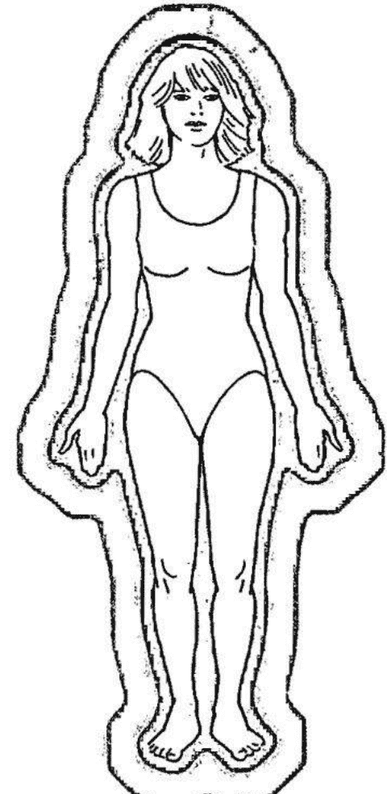

如果你已经看得见气场，这个技巧会加强你的能力。有些人随时都能看到气场，不管是白天的日光下或接近黑暗的环境。许多幼童原本就看得到，归功于他们天生对超感应能力的开放。

## 凝视树木法

自然界的万物如动物、植物、矿石与树木，都由能量形体所包覆。

北美的原住民相信大地之母与它的所有居民都是活着、具有生命的物体。举例来说，克里族人（Cree）在他们的文化及语言中，都声称石头是活着的形体，而树木是这种精神信仰的一部分。

这样的看法，可协助你进行凝视树木的技巧。即使日落前、日落中或刚日落时最适合尝试凝视树木法，本练习可在一天的任何时候进行：早晨、午后、傍晚甚至深夜。太阳开始落下时，地球的能量会进行变换与转化。所有生物体内的电磁能及灵性能量会开始增加。空气中充满了高频的能量，类似暴风雨刚过后的气氛。这些条件营造出理想的状态，来观察树木周围的光与能量。

在你尝试凝视树木法之前，先让自己舒服放松地深呼吸 2-3 次。接着恢复正常的呼吸，专注于你所挑选的一棵树。专心直视着树几秒钟。接着，看着树的上方或周围，并让自己的视野穿过这棵树。很快的，你就会开始察觉微量的白光或蓝白色光，如同剪影般的环绕着这棵树。现在，将你的注意力拉回到树上方或周围，让自己保持安定与平静。如果成功了，你目前还能看见出现在树周围的能量光晕。你现在已进入转换意识的境界、觉知力高升的状态，并在你挑选进行试验的树木周围见到高频能量，这包含气场或能量场。

夜晚与傍晚时来试验这个方法。在进行时，你训练自己降低脑波与观察能量场。如果想要，可以用巨型灌木取代一棵树。最终，你会开始看见环绕自然界中其他物体的能量。

## 蜡烛与镜子法

这个特定的技巧必须在暗室中进行，最好是在夜间。然而，你可以拉上窗帘或百叶窗来营造气氛。

### 第一阶段

一旦你营造出夜间的气氛，就拿 2 支白色或淡色的蜡烛，放在化妆台或一面大镜子前的平台上。将两支蜡烛都点燃，各别放在镜子的一边，偏离你正前方的视野。凝视你镜中的身影，留意你的脸上哪里阴影特别多。调整蜡烛，尽可能减少阴影，让烛光能够清楚呈现你在镜中的头、脸及肩膀。蜡烛放到恰当位置后，开始直视你镜中的眼睛。进行时，让你的视野“穿透”你的眼睛。深长并放松的呼吸。深呼吸 3-4 次应该就够了。记得用鼻子吸气，充满你的胸膛与肚子，接着透过嘴巴或鼻子缓慢地吐气。3-4 次深呼吸后再恢复正常呼吸，依然凝视着超过双眼的远方。时间到时，你的眼睛与脸孔可能会开始转换与变化。比如说，我的鼻子看起来好像变长，或眼睛开始长得不太一样，这是在进入深度专注状态时会发生的现象。

你现在已经进入适当的意识转换状态，来试验蜡烛与镜子法的第二阶段。

### 第二阶段

将你视线焦点从“看穿你眼睛”转移到凝视着它们，接着，将你的眼光移到镜中的头部上方。将视线维持在头上方约 1-3 寸的地方。不要设法看到东西，让它自然的发生。如果成功了，你会看到环绕你整个头部甚至肩膀的能量光晕。它像白色或淡蓝色光的剪影，从头部往外延伸约 1-4 寸的距离。

现在，你开始看见自己的气场或能量场。少数比较“开化”的人会见到回旋在镜中身形附近美丽的气场色彩，这是本练习终极的目标。

在你数次演练蜡烛与镜子法的两个阶段后，可以试着观察与解读自己头部的气场。只要省略这个练习的第一部分，直接进行第二阶段。

在观察自己头部的能量时，先深吸一口气，憋气约5秒钟。接着，平缓的吐气。在进行时，注意自己的气场。你可能会发现头部的能量场开始扩张。人体能量场在某些特定状况下会延展，在这部分上，与其他能量场并没有分别。如同之前所了解的，当气或灵能进入你的肺部并开始在全身运作时，会扩展或加强你的气场。进行调息的练习时，藉由观察你个人的能量，或许你还可以见证这个现象。

一旦你完成深呼吸与扩张气场的练习，试着将所有的注意力放在头上方的顶轮，头顶上约1寸的位置。想象有人或东西在碰触你的头皮与头发。在此处感觉能量的触感与力道。脑海中，想象头顶出现一股白光或能量。看着这股能量开始从你的顶轮或头顶往上冲。观想并感觉能量在你头部上方与周围扩散开来。

现在，凝视你镜中的头部上方，应该可以发觉到一个明显的改变。头部周围的白色或淡蓝色光晕，应该又往外延伸了几寸。

你越常练习，就越容易看见自己的能量场。之后，如果你想要，可以在演练第一与第二阶段蜡烛与镜子法时，将蜡烛省略。只要用一面镜子，并确实在房间营造出接近傍晚的气氛。过多外来的照明或阳光，会使你不容易看见自己的气场。

在你演习这些方法时，观察镜中自己的能量会变得越来越自然。

## 凝视烛火法

这个方法会需要用到一支放在烛台上的白色或淡色蜡烛（蜡烛不该是刺眼或暗沉的颜色，因为有色蜡烛的能量频率略有不同，而有时候会干扰预期的效果）。

确定房间保持黑暗。将蜡烛置于烛台中，摆放在平坦的台面上：梳妆台、桌子，连地板都可以使用。

点燃蜡烛，接着找个舒服的位置坐下。确定自己与蜡烛之间有约5英尺的距离。放松地深呼吸几次，然后恢复正常呼吸。注意力放在燃烧的蜡烛上。让你的视线穿过烛火。接下来，将你眼光转移到烛火旁，留在光晕的边缘。开始将你的注意力聚焦在火焰的边缘，注意火焰最边缘的不同颜色或色调。

凝视烛火法接下来的步骤很有趣，会用到红、橙、黄、绿及蓝色。当你继续观察外缘的能量与色彩时，开始在脑海中观想着红色，接着再交红色注射到火焰的外圈。想象这股能量在边缘跳动与变化，完全包围住光。红色的能量真的会开始在烛火边缘出现。在你持续的注视下，它会增强。如果你在脑海中难以想象出红色，就想着一辆红色的消防车。这个方法可以用在任何一种或所有颜色上。举例来说，在脑海中想象绿草或绿树，使绿色的能量呈现于你脑海中，最终映上火焰的外缘。

当你看着红色亮光在外缘附近形成时，你可能以为这是幻想出来的现象。事实上，你在运用个人意念，你的心灵力量，改变了烛光的振动能量，而创造出真实的现象。基本上，你将宇宙中的红色能量导引到这个房间。

这是个威力强大的技巧，可以用来辅助医治人类的疾苦。最终，你能够创造出不同的治疗色彩，将之导引到一个人的气场与身体。迟早，我们的社会在治疗领域上会使用到颜色、声音、频率以及水晶。

在显化红色之后，以相同的方式重复这个试验，分别使用橙色、黄色、绿色及蓝色。应用凝视烛火法直到你精通为止。这个练习唤醒你脑中特定的区块，使得灵视与解读气场的能力可以显现。

## 凝视夕阳法

这是个相当简单而直截了当的方法。绝大多数人不会花时间欣赏美丽的夕阳，而将它视为理所当然。

如果你能培养一种宁静放松的态度来观赏夕阳，你会更容易与快速地进入一种你想要的深度转换意识。

找个舒服的姿势，深呼吸 2-3 次。开始凝视着夕阳，注意天边不同的颜色与色调，尤其留意云朵中见到的许多色彩。注视、享受着眼前出现的景象，将所有的注意力集中在观赏夕阳，让自己飘向美丽的云彩。你欣赏的这些颜色非常类似人体气场的色彩。当你发觉并赞叹夕阳的美，你就会开始体会与欣赏一个人气场中的光彩，领悟到宇宙、大自然及人类皆为一体。

进行这个方法时要小心一点，直视太阳可能会造成永久的失明与其他对眼睛的伤害。请谨慎等到阳光从最强的程度减弱时。

> 永远将宇宙当作是一个生命体，具同一质性与同一灵魂
> ——马可. 奥略（Marcus Aurelius 罗马皇帝与哲学家）

## 阅读气场法

读取或解析气场时，不该以随意的方式。你需要设定一种特定的方法或模式，来解读他人周围的能量。在整个气场解读的过程中，确实运用你的直觉与敏感度。

大部分的时候，你该从头部附近的颜色读起。之前曾提过，你需要的绝大部分资讯可见于此。当你注视着头部区域时，记得检查顶轮与第三眼脉轮。花点时间观察与感应气场的颜色，注意此处的光彩看起来是干净还是污浊的。尤其注意坐在你前方的这个人让你产生什么样的感受。同理心或敏感度是你可用来正确解读气场的附加工具。如果你希望，可以将笔与笔记本放在身边，记下你在头部看见与感应到的东西。你可以参考笔记，来辅助自己与试验者或志愿者。你可在整个气场解读的过程中进行记录。

在你看完头部的区域后，移到肩膀，观察并察觉正向与负向的色彩。注意或去感应是否一边肩膀的能量与另一边有所不同。如果肩膀其中一边看起来好像有负面能量，或感觉起来不对劲，就向你的试验者澄清。很多人将紧张储存在身体的这个部位。当你更精通气场的解读时，你会懂得如何去诠释。

接下来，把视线缓慢的往下移到两只手臂，在手肘附近停下来，在这个部位找寻任何负面的能量。解读完手肘后，继续将视线往下移到前手臂，搜寻绿色的治疗能量或堵塞的能量。最终，将眼光停留在双手。

双手是身体非常重要的部位，藉由解读双手与手腕附近的能量，你可以分辨这个人是否在生病，身体与经络中有无淤塞的能量，或者他是位天生的治疗师吗？连关节炎的问题都能在双手及手肘处察觉。如果你细心留意观察试验者双手时的感觉，你可以发现这个人是否感觉起来像在生病。如果在一开始观察气场时遇到困难，不要气馁，就让自己去感觉颜色与能量。你甚至可以运用“第三眼”或“内在视线”察觉属于试验者的颜色。

使用第三眼或内在视线时，只要往内看你的头脑。你的眼睛可以保持张开，持续注视双手或身体的其他部位，同时让意识往内进入你的头部。这非常类似作白日梦。如果想要，你可以将眼睛闭起来一阵子，在脑海中专注于你目前解读的特定部位。在脑海中体会、观察与感应色彩。你接收到的印象或画面极为真实与正确。这不是你的想象！多数人能以这种方式学会准确地解读人体气场。

在解读与感应志愿者双手附近的能量时，尽量请他对你见到与感应到的部分，予以回应以及证实。

解读完双手后，将你的眼睛移到脖子与喉咙的位置，在此找寻负面或污浊的颜色。现在，将你的内在视线往下移到胸膛的位置。当你专注在胸膛尤其是心脏部位时，让你的视线“穿透”胸膛，落到远方的一个定点。当你看穿胸膛时，观察胸部附近成形的颜色与能量。如果有必要，请参考第四章中的气场颜色表。这个方法好比运用你的周边视线来察看或观察。

观察完胸膛的能量或光晕后，将注意力往下移到腹部，视线维持在肚脐区域以上。运用解读胸膛位置相同的注视方法，感应或察看这里可能出现的淤塞能量，它可能会像是漂浮在腹部上方的灰色云雾。如果是这样，你就读到了一个堵塞的能量，可能代表负向灰色云雾正下方位置的一个健康问题。

最后一个步骤是简短解读志愿者的臀部与双腿。请试验者先站起来，手臂稍微与身体分开，慢慢地观察臀部的两侧。接下来，将你眼睛缓慢地沿着一条腿的外缘朝下移动，直到脚为止。接着，沿着另一条腿的外缘，从臀部与大腿往下移动。当你注视着臀部与双腿时，花点时间让自己简短地注视着膝盖。如果你在一边或两边膝盖看见或察觉到负面能量或色彩，就代表这里有一股淤塞的能量，可能出现在一边或两边。同样的，请与你的试验者澄清。

你甚至可以请试验者背对着你，让你能够读取脊椎前方，背部与臀部的能量。

在脊椎附近看见或感应到的负面能量，有时候代表背部椎间盘的问题，或多发性硬化症。如果在以上提到的任保部位发现淡绿色，就代表疗愈的能量被导引到能量阻塞及有毛病的身体部位。

有时，当你请试验者澄清你所看见或感觉到的东西时，试验者没有发觉任何的身体毛病或阻塞。这不代表你错了，志愿者身体的这个部位并非没有问题。它可能意味着你的试验者没有觉察到这样的状况。或者，负面能量还在气场中，尚未显化于身体。

最终，气场解读的试验者与志愿者会成为你的个案或病人（如果你有意成为直觉医疗灵通人士，或专业的气场解读师）。当你在开发这种有用的才能时，你可以藉由诊断他们气场中身体或情绪方面的问题，来协助朋友及家庭成员。对于那些从事医疗与咨商领域的人，这种能力能够加强你的能力。毕竟，你生命的真正目的在于帮助他人。

> 没有任何事能够难倒有心人
> ——培根（英国哲学家与科学家）

# 第六章 脉轮系统

> 造物主之光，从你的光中散发。
> ——道格拉斯. 德龙

同时环绕肉体与灵性体的人体能量场或气场，当中也有许多能量中心。这些能量中心的名称为脉轮，源自梵文中意义为“光之轮”的词汇。

气场中可找到将近 130 个与人体相关的能量中心，这些脉轮大多数为次要脉轮，可对应到身体的一些部位，比方说双手、膝盖以及双脚。当中的七个脉轮或能量中心为主要脉轮，对每个人都非常重要。这些主要脉轮与人体的内分泌腺体系统关系密切，它们从上到下排列在身体中央及头部。源自中心的能量会从肉身形体往外扩延。七个主要脉轮中心具有本身的名称及颜色，并且对应到特定的腺体与身体部位。这部分的说明在下列表格中。

一个人面向你时，他的主要脉轮应该全部以顺时针的方向运行或旋转。当这些脉轮变化与转动时，会维持在差不多同样的位置，如同人体气场一般（想象天空中旋舞的北极光，就能在你脑海中形成正确的画面）。

每个脉轮中心都会有不同的颜色，象征不一样的振速或频率。颜色以最低频率排序到最高频率为红色、橙色、黄色、绿色、蓝色、靛色以及淡紫色。

## 脉轮名称、颜色与相关腺体

排序到最高频率为红色、橙色、黄色、绿色、蓝色、靛色（中紫色）以及淡紫色。

| 脉轮 | 1 | 2* | 3* | 4 | 5 | 6 | 7 |
| :--- | :--- | :--- | :--- | :--- | :--- | :--- | :--- |
| **名称** | 海底轮、大地轮 | 脐轮、荐骨神经丛 | 太阳神经丛 | 心轮 | 喉轮 | 眉心轮、第三眼 | 顶轮 |
| **颜色** | 红色 | 橙色 | 黄色 | 绿色 | 蓝色 | 靛色 | 淡紫色 |
| **腺体** | 性腺（卵巢或睾丸） | 胰脏 | 肾上腺 | 胸腺 | 甲状腺 | 松果体 | 脑下垂体 |

*第三与第二脉轮有时会相互牵连（第二脉轮某些时候能影响到肾上腺，而第三脉轮也可以影响胰腺）。

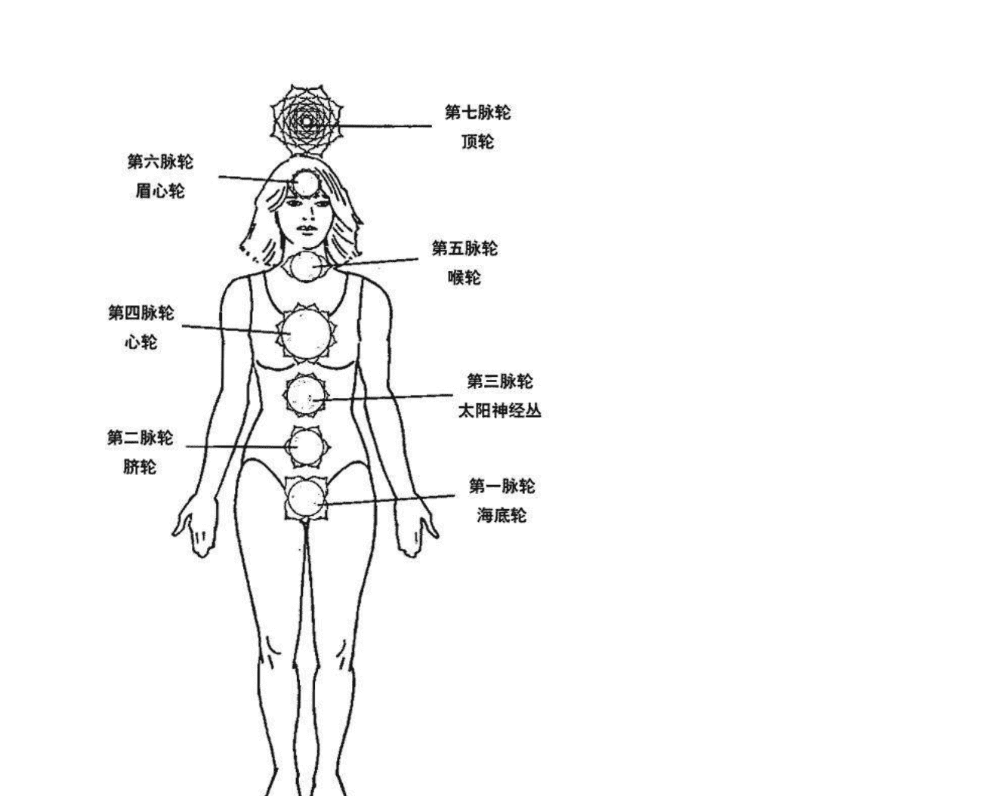

### 第七脉轮——顶轮

顶轮与源自造物主或神的高层宇宙频率有直接关联。它使你是与神性本源即上帝的连系。宇宙的治疗能量可汇集于此，而由这个脉轮传送到其它脉轮、气场与身体。顶轮呈淡紫色，以极高的速度或频率振动，所有能量中心的色彩中，淡紫色具有最高的频率。

这个能量中心的能量，从头顶往上延伸到头上方七寸的位置，刚好落在人体气场的边缘。

顶轮与脑下垂体相关。藉由特定的方式唱诵 MAY，可接收到一些才能或裨益。在佛教及印度教中，此处是能够达到开悟或连结神的位置。就基督教而言，这是基督意识的居所。最后，神秘主义认为，这是宇宙意识显现的地方。

### 第六脉轮——眉心轮或第三眼

第三眼脉轮是直觉、创意及超感应能力的要塞。当它与顶轮和谐运作时，此能量中心使你在生命中更有效率与圆满。

第三眼脉轮的颜色通常为靛蓝色（中紫色），具有极高的频率，只稍微低于顶轮的淡紫色。它位在头内的中央，从前与后方往外延伸。医疗灵通、气场解读师与眼通者可看到此特殊的能量中心，从前额呈现回旋的紫色能量。看着额头时，这个能量漩涡应该轻柔地以顺时针方向旋转。

第三眼或眉心轮如同顶轮，在第二章时也说明过，此能量中心与位于脑部下方的松果体有关。透过正确唱诵 THOH，可以开发与加强直觉、创意与超感应能力。

这个能量中心的重要性在于开发气场解读、观察高频能量，及了解来自高层来源的超自然印象。

### 第五脉轮——喉轮

喉轮是口述直觉性知识与智慧的中心，如果这个中心敞开适度，它允许你透过言语表达个人的见解，展现你的直觉咨商与指导的功夫。

天生的灵疗师、导师与咨商者，运用喉轮的能量协助他人。确切及时表达的内容对于治疗过程非常有帮助。声音与语言具有实质的力量。

本能量中心的颜色为蓝色，它的振动速度很快，仅低于靛蓝与淡紫色。

就身体的层面而言，喉轮与甲状腺有关。这个腺体是内分泌腺体系统的一部分，影响新陈代谢与分泌作用在肾上腺与神经系统的特定荷尔蒙。

如果喉咙能够通畅启动，脉轮与气场内出现的高频能量就能够进入喉咙、甲状腺——维持这个位置的健康。一个被启动或敞开且平衡的喉轮，能够允许睿智的表达呈现。就身体而言，它可协助甲状腺与副甲状腺正常运作，协助身体的内分泌腺体系统维持适度的平衡。以特定方式刺激甲状腺低落患者之甲状腺，能使它加快速度。

在接下来的内容中，你会学会几种开启或启动甲状腺的方法，以及激励甲状腺的一个特殊练习。

### 掌心脉轮开启法(暖手练习)

进行任何一种喉轮的技巧前，有一个最初必须先完成的准备动作。

虽然双手——尤其是掌心的位置不被视为主要脉轮或能量中心，它们依然很重要。一位真正的治疗师，工作如果要更有效率，掌心（手掌）脉轮必定得完全敞开。

多数人的这些脉轮几乎没什么打开。如果你看着一个人的手掌心，想象出一个大小如美金二十五毛钱币的光或能量漩涡，漂浮在皮肤表层正上方，你就能知道大部分人的掌心脉轮是如此渺小与敞开不全。

天生治疗师的掌心或手掌脉轮是完全打开的，光或能量漩涡在整个手掌，包含大拇指与手指上旋转。治疗师的双手非常温暖，神经能与自然的治疗氛围流通双掌、两只大拇指与所有的手指。

透过敞开得当的掌心能量中心，一位治疗师能够运用他的双手，将治疗能量传输给病患。病人透过身体接收加强的宇宙治疗能量，受益良多。同时，也启动了自己本身更多的自然治疗能量。换句话说，在一段时间后，治疗师及病人或个案，能成为更有效率的治疗团队。

有许多条能量经络通过胸膛、肩膀与上手臂往下到整条手臂，并进入双手，从这里继续延伸到两只大拇指、食指与中指。这些经络的尾端在大拇指、食指与中指的指尖。特殊的神经能与治疗能量就是从大拇指与其他手指的指尖，散发并传导到另一个人身上，这些能量也能经由掌心传输。

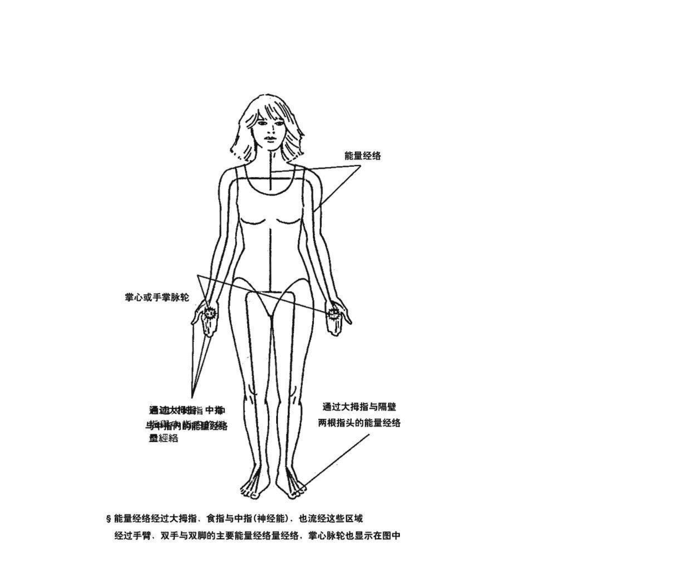

手掌脉轮较敞开时，宇宙界的能量及人体本身的自然能量，可以通畅无阻的沿着经络往下流通，经过手掌，最终从大拇指与其他手指流出。如此，有助于确保个人或治疗师的健康，身体的这些部位与经络有适量的宇宙能量与自然能量流经。

如果要启动或使掌心的脉轮完全打开，可以使用以下特殊的暖手练习。

1. 首先，找一张舒服的椅子坐下。
2. 放松的深吸与吐出一口气。
3. 接着，将你的双手合掌，呈祈祷的姿势，手指微张。现在，在保持这个姿势的同时，将双手放到大腿上，慢慢地将双手拉开，直到掌心之间距离四寸（如图）。

现在，眼睛可张可闭，开始将所有的注意力放到你的双手，尤其是掌心。继续专注于此，感觉温暖与能量进入双手。持续注意一阵子，直到你感觉些许的温暖、触感甚至脉动进入双掌。此时，开始在双掌中，观想着一个白色火焰或点燃的火柴。去感觉双掌之间的白色火焰或燃烧的火柴，让温暖蔓延到你整个皮肤表面。当能量扩散到两只手掌时，让它开始往上移动到你的大拇指，直到你能够感受到大拇指的脉动或温度，尤其在指尖的位置。现在，让手掌中增强的暖意与能量往上移到食指，直到你的指尖感应到类似大拇指尖的感觉。最终，将温暖与跳动的能量传送到两只中指。

只要完成后，将所有的注意力放到你的双手，感觉脉动、温暖及触感完全在你的双手、掌心流动，并进到大拇指及每根手指。让这温暖的感觉再持续一阵子。

如果你不容易感受能量或温度，试想自己出现在炎夏的户外。感觉阳光的温暖洒落你的双手，让阳光碰触皮肤，接下来，感觉热气穿透表皮进入双手，从里到外完全地暖和起双手。你也可以观想或感觉自己将手浸入非常温暖的水。回想你用烫水洗碗，或将双手伸入热洗澡水中会有帮助。有时候，运用记忆能协助你达到想要的效果。

一旦你成功完成这个暖手的练习，你就能开始启动及打开你的掌心（手掌）脉轮。你越常练习这个开启手掌脉轮的练习，就越容易暖和自己的手，并适度开启掌心脉轮，导引神经能与来自上天的宇宙能量，并将内在自然的治疗能量导入你双手，最后传送给一位病人。

最终，大部分人只要在进行治疗工作前，专注于自己的双手，治疗的能量及温暖就会自动进入那里。不再需要进行开启掌心脉轮的技巧！你自己的治疗能力就已经增强了。

### 拇指与手指法

一旦你完成暖手的练习，就已准备好进行大拇指与手指法，来适当地启动与打开喉轮。

将你的右手从大腿往上移到喉咙的位置。将你的大拇指、食指与中指分开，而右手剩下的两只手继续合在一起。把右手的大拇指轻轻放上喉咙的右侧，就在“喉头”即声带旁，然后将右手的食指与中指放到声带的左边，就在大拇指所在的正对面。对于男士而言，正确的位置是喉结，对于女士而言，喉咙底端与下巴之间的中点会是适当的位置。将你的大拇指与两只手指放在这里3-4分钟，注意指尖的温度、能量与脉动。很快的，你就会感应到跳动的感觉进到你喉咙，进入喉头，并由此到达你的喉咙后方。

将右手的大拇指与两只手指短暂的放在此处，你能够让热气、神经能及自然的治疗能量，进入你的喉咙。热气加上能量可以启动与打开你的喉轮，并且输送一股温和、舒服的能量到甲状腺与副甲状腺。

手中的热度，尤其是掌心，对于启动此脉轮与其他任何一个脉轮是很重要的。

进入甲状腺及周围的温暖与能量，有助于平衡这个腺体，并协助维持整个内分泌腺体系统的和谐运作。

对于那些甲状腺亢进的人，这个简单却重要的技巧能够协助舒缓甲状腺，就像温和的按摩能放松身体一样。你会变得比较不紧张，不容易焦躁，更放松与平衡。大拇指与手指法在接下来的一周到10天内可重复2-3次。

以上解说的特殊技巧可以用来减轻喉咙痛，治疗头部疼痛、僵硬及其他问题。

甚至能够协助颈部肌肉的放松与减轻头痛。记得，一旦你让热气与自然能量进入喉咙，这些感觉会持续地在脖子流动，甚至进入头皮，将治疗的氛围输送到需要援助的区域。

大拇指与手指法不但可以启动喉咙，它也是一个重要的治疗技巧。

只要喉咙适当的敞开，你就会开始成为一个功力更深厚的治疗师、老师、沟通者及咨商师，并接通更多你真正独到的天赋。

### 喉轮开启法（掌心旋转）

在用过大拇指与手指法几次后，你可以经常演练以下的练习。

当你已用暖手练习温暖了双手，就将两只手从大腿往上移到喉咙的位置。将手维持在离喉咙约六寸的地方，气场内与喉轮外缘的位置。现在，将左手移开放到身旁，或再放回你的大腿。

将你右手打开，掌心朝喉咙放在喉头的位置（喉咙中心）。将你的手维持在约5-6寸远的距离，慢慢以画圆的方式在喉咙的前方移动，顺时针方向旋转。在涵盖整个喉咙的小区域，大约从下巴到喉咙底端，缓慢而轻柔的画着圆圈。用手继续画圆，慢慢的往内移入一或两寸。你可以掌心朝自己，用1-2分钟的时间进行旋转掌心的方法。只要这样就能启动喉咙，并缓慢与正确地转动它。

当你在进行这个技巧时，如果专注在喉咙的位置，你就能感应到轻微的动静，可能附带着温暖或冰凉的感觉。一定要记得，当你往下看着自己的手掌时，手是以顺时针的方向转动，这确保脉轮转的是正确方向，假设有人正面看着你与你的脉轮的时候是“顺时针”。

### 甲状腺激励法

之前曾提过，有一个特别的技巧可以使甲状腺加快速度，这会释放出促进良好新陈代谢与增强能量必要的甲状腺激素。对于罹患甲状腺低落的那些人，不管此类健康方面的问题是大是小，此激励的练习如果不能带来永久的解决，至少会有暂时的舒缓。

这个技巧有两种不同的进行方式。第一种方式包含大拇指与手指法的使用，加上用特别方式来唱诵一个特定的声音。第二种方法只要发声或唱诵这个声音。

刚开始时，第一种方式或许是最好的做法。再一次进行大拇指与手指法。这次，你轻轻地将右手大拇指与两只手指放到喉咙适当的位置时，深吸一口气，然后，憋气约 5 秒钟，接着慢慢地吐气。恢复正常呼吸，同时将注意力放在甲状腺的位置。现在你已准备好进行 K-A-Y-E-E 的元音唱诵。声调要比唱诵 T-H-O-H 或 M-A-Y 时低。

KAYEE 以低到中 C 大调的音阶来唱。同样的，如果你没有音乐细胞就不用担心。当你在练习 KAYEE 唱诵时，只要稍微降低你的声音，比唱诵 MAY 时略为低沉。

现在，再深吸一口气，憋气数秒钟，接着将嘴巴张开，开始吐气时先唱诵 K-A-Y，K-A-Y 像你唱歌时发出的声音。接着，慢慢流畅地转变成 YEE，继续拉长 YEE 的声音，直到所有的气都慢慢地被吐出。即使 KAYEE 被分成两段来唱，进行唱诵时并不会间断，将两部分流畅的衔接在一起。

第二次发出 KAYEE 时，在降低或提高音调的同时，注意喉咙的振动频率。感觉这个频率在你唱 KAYEE 时，作用在你的整个喉咙。透过试验不同的音阶，你会找到最适合你的音调或和弦。中到低的 C 和弦只是一个指标，协助你找到适当的音符，能在喉咙创造出正确的频率。此频率会引发甲状腺的共鸣或轻微振动，使它加快速度，因此释放更多的甲状腺激素到体内。这个练习的其中一个效果是，肾上腺素的增加。

唱诵 K-A-Y-E-E 不仅激励甲状腺与副甲状腺，它也启动喉轮，使它更敞开。如果你只想要启动或打开喉轮，唱诵 K-A-Y-E-E，1-2 次就已经很有效果。如果你的甲状腺低落，一次唱 3-5 遍这个重要的唱诵，能够增强能量与活力。这个特殊的技巧对甲状腺低落患者的效果，在过去已得到证实。

如果你是罹患此类型毛病的患者之一，一次进行 3-5 次的唱诵，约 2 周左右后再唱诵 KAYEE 3-5 次能增强你的活力。自此之后，这个方法一个月只能进行一次，每次唱 3 遍 KAYEE 而非 5 遍。

如果你没有罹患甲状腺低落或亢进，而只是想要启动你的喉轮，唱诵 KAYEE 1-2 次就已经够了。如果你觉得有必要，可以一个月做一次。

这个练习可在某些早晨刚醒来后进行，如果你还很疲倦与迟钝，尤其可以演练。

你应该会开始发现自己的能量增加了。这个清醒的运动比数杯咖啡还有效，但使用时需要节制。K-A-Y-E-E 一次不要唱诵超过 3 遍！

现在你已学到许多有助于开启喉咙、平衡内分泌腺体系统，及维持健康的方法。当你能够感应喉轮或七轮中任何一个脉轮内的能量，你对身体、能量中心及最重要的自己本身的治疗能量，会更有觉知。这样的觉知力使你能够保持健康、喜悦、平衡，并且能尽力帮助他人。

## 第四脉轮——心轮

心轮能量中心在治疗自己与他人而言很重要。脉轮内所散发的颜色是美丽的淡到中绿色。这股绿色能量的频率很高，它是确实疗愈必要的颜色。

用心来做事的人有治疗师、照护者及社会中安慰人的角色。所有人都必须学会以这个脉轮为出发点，因为这是灵性道路的起点。

耶稣用敞开心轮散开的爱与慈悲，进行大部分的工作与治疗。事实上，许多耶稣基督的画像与雕像中，都刻意表现出耶稣的心，所谓的圣心。

> 你的心好比所有人的心。
——爱默生（Emerson 哲学家与散文作家）

散发高频治疗氛围的心能量中心，就身体而言，与位在上胸膛的胸腺有关。这个位在心上约 2 寸的腺体，主管身体免疫系统的平衡。胸腺作为身体防御机制的核心，发动大量的特殊细胞，协助抵抗感染。这些特殊的细胞被称为 T 细胞。

如果心轮适度敞开，允许爱与治疗进入此中心，胸腺就会接收到频率减缓的绿色治疗能量，因为脉轮能量从气场到脉轮中心，再进入肉身形体时会“降频”。治疗频率会引起胸腺轻微地共振，释放 T 细胞及其他免疫系统必要的分泌物。胸腺，这个内分泌腺体系统的一部分，将恢复平衡与和谐。

压力是我们步调快速的世界中的一个主要问题。压力会影响胸腺，使它失衡与不健康，因此而引发疾病！减轻压力，对爱敞开心轮，对每个人都很重要。

### 心轮开启法

有许多特殊的技巧可以用来唤醒与开启心轮，你要学的第一个方法称为心轮开启法。

首先，从暖手的技巧做起。一旦你的手已经暖和了，尤其是掌心的位置，就将你的右手放到胸膛中央，部分盖到心，眼睛可张可闭。当手放在这里时，开始注意你的手，感觉掌心留在皮肤表面的温暖，将所有的注意力放在此处轻微的温暖与能量，让温暖开始从手扩散到正下方的皮肤表面。让温暖或能量持续地从皮肤表面的小区域扩大范围，大约到一整只手的大小。当你继续注意时，你很快就会感受到整只手的下方，包括大拇指与手指的温暖或触感。自此，感觉温暖与能量扩散到超出手外缘 1-2 寸的范围，继续专注在你手正下方的胸膛位置几秒钟。

对于那些不容易感应掌心与手部温度的人，不要担心。第一次试验这个方法时，如果感觉到掌心的冰凉，或只感觉到胸膛上的手，是可以接受的。以同样的方式，让手中的冰凉或对手的知觉扩散到胸膛表面。不管你体验到的是温暖、冰凉，或只是手在胸膛上的知觉，这个方法还是有用的，心轮会被启动。你虽然不一定会察觉，但这个过程已经开始了。对心能量中心加诸的任何一丝温暖、触感或对它的注意，都会启动或活络这个中心，而使它打开。

那些体验到温暖在手正下方的胸膛扩散开来的人，是真的感觉到了心轮的启动与敞开。这是自我疗愈，终有一天，也是治疗他人时的一个重要步骤。

大部分活在世间的人，心轮到了成年时期都会关闭。如果要促进一个开明的社会进步，必须有更多人敞开心轮。

### 呼吸专注法

接下来你可以试验的是一种特殊的呼吸练习，可以在心轮开启法的尾声进行。将呼吸练习加入专注力的运用是自然的发展。

一旦你已注意过胸膛位置的温暖与能量后，就将右手留在同样的位置，并开始好好地深呼吸到肺脏。在肺充满气后，透过鼻子徐徐地吐气，感觉空气进出你的胸膛。每次呼吸时，注意胸膛的起伏，所有的注意力应该放在你的呼吸与胸膛，留意胸膛上的手，确定进行的是胸式呼吸法而非腹式呼吸法。

在 4-5 次深吸与吐气后，回归正常的呼吸，注意力依然在你的胸膛。这个呼吸的练习很重要，因为它会将生命动能、气导入你的肺脏以及肉身，这对于心能量中心的开启大有帮助。

现在是进行下一个特殊心轮法的时候。

### 拥抱婴儿法

这个特殊的方法可以用来抒发深藏的痛苦与情绪，同样也可释放出爱的真实疗愈能量。对所有人而言，这是一个有效排除情绪与解放爱的练习，即使女性会特别觉得受用。

当你专心于正常呼吸时，将右手放到胸上，开始想象自己正看着摇篮中可爱的孩子。这个画面可能会引发某些人快乐的回忆。当你看着这个婴儿时，感觉心中对这个宝贝小孩的爱。在你的脑海里，想象弯下腰把婴孩抱起，将他贴近你的胸部。当你把婴儿拥入臂弯时，这位亲爱的小婴儿，感觉他贴近你的温度。听着小婴儿发出的呢喃。轻轻地拥抱着小婴儿一下，感觉到胸膛的爱与温暖开始扩散。轻柔地前后摇动着这个可爱的小孩，然后轻吻他的额头。感觉爱与喜悦持续地在胸膛蔓延开来。最后，在你感觉到爱、温暖或许还掺杂着内心些许的难过时，将小婴儿放回摇篮，并对着他微笑。

让爱与温暖开始导向他，感觉爱从心的中央流向这个神的孩子。再花几秒钟进行，接着，深呼吸一次，然后慢慢地吐气。同时，结束婴儿的观想。让你的意识完全回归你当下的所在。

### 观想爱人法

以下的方法可以作为前一个方法的延伸。在完成婴儿法后，将脑海中的画面换成你深爱的某个人。让自己继续感受上个练习胸膛内引发出的爱与温暖。专注在这个人身上，看着他的脸面对着你微笑。这位特殊人士可能是过去你所爱过的人，比如说双亲之一或往生的祖父母。

现在，观想自己打开双臂朝向他走去，在你靠近时拥抱住这个人。将此挚爱拥入你的臂弯，并感到心中对这个人的爱。让情感涌现，你甚至可以告诉这位特别人士你爱他。感觉心中的温暖、情感或悸动，持续蔓延到整个胸膛。最终，将你心轮中的爱或温暖导引到这个人身上。拥抱他最后一次，放下你的手臂并说：“我爱你，再见。”

感觉自己的注意力再次回到你坐或躺着的位置。

有些人在观想时会想要用儿子、女儿、伴侣甚至亲密的好友。如果你想要用一位往生的亲人或好友作为挚爱的画面，你得明白，回忆一位亲近的往生者或许会触动哀伤、痛苦甚至愧疚的情绪。这是一种迫使埋藏情绪浮现的方法，你能够以正面与达到疗愈的方式释放它们。你也能超越生死，对一位生活在天堂灵界的挚爱，表达你的情感与想法。对许多人而言，这是一个强大的治疗工具。

使用拥抱婴儿法碰到困难的人，可以进行观想爱人法。很多时候，这个方法对男性与女性而言，或许都比婴儿法还要有效。

这两种特殊的观想练习可以接续进行，先完成婴儿法，而观想爱人法连贯延续进行。

如果你只想要用其中一种方法，先试验两者，再使用对你最有效果的方法。你越常演练其中一种或两种观想练习，就越能轻易与快速开启自己的心轮。

最终，你不用进行这些练习，也能专注在你的心轮，依照个人意愿开启与关闭这个脉轮。对少数人而言，这会需要用上一些训练与坚持。反之，那些天生的感应者能够很快就驾轻就熟。

两种心轮情绪的释放方法，对不同人可能会造成不一样的影响。你在胸膛位置或许会感到庞大的温暖与爱，或许会感觉极度哀伤并开始啜泣。许多人会经验心脏附近的紧绷、压迫或疼痛感。有些人甚至会认为自己的心脏出了问题，在罕见的状况下，会爆发出轻微的焦虑感。

这是演练此方法，启动与开启心轮的一些后果。这些现象是内在情绪与身体得到确实疗愈的迹象。在你恢复正常意识并开始注意同遭时，这些不同的感觉很快就会消逝。

拥抱婴儿法与观想爱人法在几天甚至一周后都可以再次使用。下次你试验其中一种或两种练习法，会敏锐的察觉到，心轮能更轻易暖和起来与敞开。当心轮敞开，让疗愈与爱的能量自然流动时，大部分人在胸膛会感到一股非常舒服的感觉蔓延开来。

如果你在第一次感觉到忧伤、心悸、疼痛、胸部的压迫感或轻微的焦虑，第二次第三次进行时，不适感会减轻。你很快就会享受到温暖的爱能量流经你的心轮中心，并通过你整个胸膛，取代不悦的感觉。基本上，你清除了一个淤塞能量，释放深藏的痛苦，并开始疗愈情绪、身体与心理的层面。甚至接触到自己的灵魂，你内在真实的个体。

修行所有方法的终极目标，在使你学会如何快速地将注意力放到心轮，并以意志力打开它。最终，你能掌握心轮时，就不再需要进行心轮开启法、呼吸专注法及观想爱人法，但如果你觉得有需要，请使用任一种或所有方法。举例来说，如果你刚过完难受的一天或一周，拥抱婴儿法能有效释放煎熬时期从他人身上接收到的痛苦情绪。

每当你专注并开启心轮的中心时，一定要做一些深呼吸的练习。不管你已精通能量工作或只是新手都是如此。

### 幼犬与小猫法

进行这个冥想时，你可以选择专注在一只小狗或小猫身上(以下的心轮中心练习，会以小狗来说明，但如果你想要，也可以用小猫取代)。这个方法可在心轮开启与呼吸专注法刚做完后进行。这是完成这些方法后，单纯连贯的延续方法。

右手还留在胸膛时，去感觉当中的温暖，并持续全神贯注在呼吸上，恢复正常呼吸，开始注意一只小狗，坐在你赤脚旁的草地上。观想自己于温暖而舒适的一天站在户外。

在脑海中，看到自己弯下了腰，将这只可爱、毛茸茸的小狗抱到怀里，将它放到你的胸上，接着温柔地搂住这只小动物。当你将它拥入臂弯里，想象它的体温贴近自己的胸膛。感到心中对这只毛茸小狗的爱。

当你还抱着它时，开始用一只手搓揉小狗的头与身体。感觉这只动物对胸膛带来的温暖与重力。继续搓揉它毛茸茸的小头及身体，它抬起冰凉的鼻子轻触你的脖子。甚至可以想象这只小动物在你抱着它时想要舔你的耳朵，最后再紧抱着这只小狗一次，并感觉心中对这个小动物的爱。

现在，将小狗放回你的脚旁，看着它开始在青草上奔跑。这只毛茸茸的小东西很笨拙，不断地跌倒。当你看着它在草地上奔跑、摔跤与玩耍时，你很自然的笑了。在你继续观察小狗玩耍时，感觉心轮中心的笑声、喜悦与欢乐。

最后，深吸一口气，憋气约 3 秒钟，然后用鼻子慢慢地吐气，让自己回归到清醒的意识，保留胸膛内愉悦的感觉。

幼犬法可以单独使用。比如说，如果你因为某种因素而感到哀伤或不快乐（或许在演练婴儿法或爱人法之后，你经验到一些有时与这两种练习相关的不舒服情绪），幼犬法会是一个绝佳的观想练习，能将不舒服的感受转换为温暖而舒服的感觉，这个方法有助于唤起快乐的回忆及喜悦的心情。

### 温暖花开法

以下的方法可用在太阳神经丛、脐轮与海底轮，也可用于心轮。

这个练习必须在心轮开启与呼吸专注法之后进行。记得如何将右手放上胸膛，并且感觉掌心的温暖进入心轮的中心，接着，专注在进出肺脏的空气。

在你接连完在这两个方法后，就可以开始温暖花开法。

将注意力放在你的胸膛内，你手下方表面往内 1-2 寸的位置。想象一朵美丽的绿花住在那里，这朵花含苞待放。现在，当你继续舒服的坐着或躺着时，想象自己坐在温暖夏日的户外。你正躺在山坡上享受着阳光的温暖。感觉到暖意，太阳的能量渗透你的全身。接着感觉太阳强烈的温暖在你身体从头到脚往下移动。从你的脚趾头感应到能量，太阳的能量，或许就可以唤起这种温暖的感觉。

当你专注在胸膛时，同时感受太阳的温暖，及置于此处的手温，让这股能量往内输送，直到它接近这朵绿色含苞的美丽花朵。当温暖到达时，看着并感觉到这朵绿色的花朵在绽放，它的花瓣开始展开了。在脑海中，观察并感觉这些美丽的绿色花瓣缓慢地在你的胸膛扩展，进入你的心，穿过你的肺，通过你的肋骨，完全蔓延到你整个胸膛。感觉手中的能量及阳光洒落在这些绿色的花瓣上，并且在你的胸膛扩散。最后，感觉并看到花瓣完全打开，全然地扩展看来。花瓣与太阳的能量，及手的温暖蔓延到整个胸膛，甚至上达肩膀、脖子及上手臂。

当你躺在那儿时，享受着这些感觉。感受到太阳舒服的暖意持续地渗透心轮，并蔓延到整个胸膛。你是放松而平静的，让能量倾入心、肺、肋骨及位于上胸膛的胸腺。再用数分钟体验这股温暖而舒服的感觉。让这美妙、舒缓的能量流过你的胸膛，享受内在美好、祥和与满足的感觉。

专注于身体这区域内美妙、温暖的能量，3-4 分钟后当你还躺在户外时，观想着太阳西下，日落时美丽的绿色花瓣开始在你的胸膛内收缩与合上。逐渐感到并观察这些花瓣越缩越小，直到它们在你掌心下略微地张开。在你胸膛内与手掌同样大小的区域感受到温暖。你让心轮中心维持足够的敞开，让治疗能量能够流入这个区域。

现在，深吸一口气，憋气几秒钟，然后慢慢地用鼻子或嘴巴吐气。恢复正常的呼吸与平常的意识。你应该感到放松，并在心轮仍然能感觉到些微的温暖。

这个简单但有效的方法，使你学会开启及关闭你的心轮中心。因此，你也能够稍微调整这个方法，来开启与关闭其他的能量中心。

你越常练习这个温暖花开法，它对你而言就会变得越简单。最终，在你已经精通开启与关闭心轮时，你就不需要再进行这个练习。从那时开始，你只需要专注于你的心轮，就有办法用意念开启与关闭它。

如果你能有效地达成时，你就会成为一位更优秀的治疗师、咨商师与导师。你能开始把治疗的能量导引到全身，并维持身体、心理与情绪上的健康。疾病，比如说乳癌、肺癌及心脏的不适比较不容易产生，因为爱和能量适度地流通身体的这个区域。

许多时候，如果疾病并不严重，透过心轮传送治疗的能量能帮助疗愈身体。举例来说，许多心律不整的人因为运用心轮中心的治疗能量，而疗愈了这个问题。

### 手掌旋转法

在喉轮部分提到的手掌旋转法，也可用来平衡心轮。将右手掌放在心轮中心的前方，离身体约3-4寸的位置，进行一样的旋转动作。

当你敞开心轮时，你对自己与他人都会变得更仁慈、温柔与开怀。你能学会如何感动多数人的心与灵魂，创造出一个更美好的世界。

## 第三脉轮——太阳神经丛

太阳神经丛位在肚脐正上方一到三寸的位置，频率比心轮要低。黄色是与这个主要能量中心相关的颜色。

这个脉轮对应到物质世界低层、原始的情绪。大部分的人行为的出发点为此能量中心，与下方的两个脉轮即脐轮与海底轮相关。

肾上腺，内分泌腺体系统的一部分，位在两边肾脏的顶端，与太阳神经丛相关。交感神经系统是太阳神经丛高等脉轮能量与肾上腺之间的桥梁。

在超感应能力与灵性层面上，这个脉轮与感应人类情绪的同理技巧与敏感度有关。许多天生的同理感应灵通与敏感者，藉由此能量中心敏锐地感知他人，有些人甚至认为自己的同理感应能力是个诅咒而非天赋。事实上，假设如此的能力完全受到开发并适当地运用，会是一份神圣的礼物。

肾上腺中的一个区域，称作皮质，它有时被视为“我们情绪的镜子”。这是个非常恰当的称呼，因为此处会分泌许多直接影响我们情绪的荷尔蒙。

就身体来看，肾上腺在人类身上会引发“打或跑”的反应，这两个内分泌腺体或器官，具有内层髓质及外层皮质。内层髓质分泌肾上腺素与去甲肾上腺素，这些荷尔蒙刺激心脏，并增加血糖、肌肉的强韧度与耐力，它们也使血管收缩，止血并传输神经冲动。

肾上腺的外层皮质分泌一种性荷尔蒙与其它类固醇激素，这些分泌物会使你感到舒服、快乐与平衡。

如果你学会如何开启太阳神经丛，就能够释出这些让你感到平静、幸福与满足的有益分泌物。你也可以从这个脉轮释放并导引治疗的能量。这股能量会流经胃脏、肠道、肌肉，以及同样与太阳神经丛相关的身体内部。舒服的治疗氛围能够舒缓胃疾，减轻肠道的疼痛，并且略为放松与镇定这个区域的所有内脏。

如果你罹患大肠急躁症、克罗恩病或任何排便上的问题，开启太阳神经丛能量中心能让治疗发生，并大幅减轻疼痛与不适应。如果你苦于性欲低落，学会打开与关闭此主要能量中心，有助于医治这个问题。

运用太阳神经丛的能量，使压抑的愤怒与情绪以健康的方式释放。当你对太阳神经丛中心或其他主要能量中心下功夫时，你会培养出一种幸福和谐的感觉。

### 太阳神经丛开启法

如果要启动与打开太阳神经丛脉轮，你会用上三个开启与启动心轮的方法。要使用的练习为心轮开启法、呼吸专注法及温暖花开法。如果有需要，请复习这些方法。然而，在接下来的描述里这三个方法会稍有调整。记得在进行这些练习时，它们应该流畅而轻松的衔接在一起。

一旦你已经完成之前说明过的暖手练习，就将右手轻轻放到肚脐上方约 2-3 寸。感觉与体验位在你手掌正下方太阳神经丛的温暖，如同之前专注于心轮时。

让知觉在你的太阳神经丛扩散开来，并进入此处的内脏。只要能量或温暖已经完全扩散，就开始呼吸专注法，但这次要进行腹式呼吸而非胸式呼吸。让你的呼吸深入到下胸部与横膈膜，将空气留在此处几秒钟。接下来，用鼻子缓慢地吐气。感觉放在腹部区域的手轻微地起伏。继续深呼吸 2-3 次，然后恢复正常呼吸。

现在专注于太阳神经丛上的手温，再次想象自己出现在美好夏日的户外。感觉到太阳的温暖与掌心的温度往内渗透，约至皮肤下方 2 寸。这次，想象一朵含苞待放的黄色花朵，在能量触及它时开始绽放。对这朵太阳神经丛内的黄花进行心轮绿花一样的步骤。让美丽的黄色花瓣，在内脏太阳神经丛的区域完全敞开与扩展，如果你愿意，在脑海中让这朵花在温暖中全然地绽放约 5 分钟。

当你在如此美好而温暖的一天躺在户外时，体验这宁静安逸的感觉。感觉阳光渗入你的胃部区域并放松你的整体。你平静地躺在那儿时，享受着当下。最后，再次看到太阳西下。落日时，黄色的花瓣开始收回，直到它在你手掌下几乎完全合上。手下方的温暖在此时应该与你的手掌差不多大小，使你的能量中心维持稍微地敞开，以达到适度的平衡与健康。

有些人或许在首次同时尝试这三种方法时，会在太阳神经丛感到压迫或不适。这些感觉只代表此处有身体、情绪或能量上的阻塞。压力、担心、焦虑与紧张有时会造成这类堵塞。所有东西都储存在他们“肚子”里的人，在脉轮能量开始疏通太阳神经丛与内脏时，会感应到压力或知觉。这是一种征兆，代表治疗能量开始流入到需要它的地方。

第二次或第三次演练这三种方法时，会减轻不适感，而将它逐渐转变为一种温暖与满足的感觉。一些哀伤、愤怒或痛苦，很可能会以有益治疗的方式被释放。

最终，你会有办法轻松快速地开启与关闭太阳神经丛中心，不附带任何不悦的副作用。

如同对心轮，你能成为一位专家，依照意愿或必要性来开启与关闭太阳神经丛。对于那些天生的易感者，这些方法能在短时间内产生很好的成效。举例来说，完成这个练习后，你会变得非常放松或爱睡。

### 手掌旋转法

参照本章喉轮部分的图例，你可以运用手掌旋转法来平衡太阳神经丛，使它以自然的方式转动。将你的右手放到太阳神经丛，离表面约4寸的地方，并进行旋转的练习。

如果想要放松、释放怒气、减轻紧张，开启太阳中心是很重要的。

## 第二脉轮——薦骨神经丛或脐轮

薦骨神经丛脉轮位在肚脐下方约1-3寸的位置，此主要能量中心的相关颜色为橙色，频率低于太阳神经丛。薦骨能量中心与力量、控制（轻微程度）及性能量有关。想要繁衍同类的欲望深植于此，与他人之间的吸引力与自我防范也多少源自于此。

在身体层面上，此能量中心与胰脏有关。这个器官是内分泌腺体系统的一部分，它位于腹腔，分泌某种消化酶。平衡时，能够减缓人类的老化过程。

这个重要的能量中心有时被称作性轮，因为此脉轮的开启会刺激性腺与其他内分泌系统的腺体，使性荷尔蒙释入体内。脐轮过度敞开的主要案例为性欲高涨，色情狂及沉溺于性的人，性欲低落或毫无性欲的人，显示出这毛病完全相反的症状，他们的此脉轮是关闭的。这个区域中负责分泌性荷尔蒙的腺体过于低落。

两种极端都不健康。身为人類，你会有情欲，而性是你的一部分。分泌适量的性荷尔蒙，能使你觉得有活力、快乐及满足。某些分泌物的不足会加速老化过程，并让内心感到不快乐与不满。

荷尔蒙的过度亢奋会使你停留在低等、卑劣的情绪中，色欲而非爱，掌控了你的人生。待在如此低劣的层级，你将永远达不到真正的开悟或灵性上的觉醒。在两种极端之间，必须找到一个适当的平衡。薦骨神经丛脉轮的开启与平衡，会带来内心的满足、人际关系的改善与健康平衡的消化系统。

### 脐轮开启法

你会用到本章在太阳神经丛段落解释的同样三种开启法。在此重复提醒，你会使用的是心轮开启法、呼吸专注法以及温暖花开法。同样的，当你专注在薦骨能量中心时，这些方法会稍有更动。

这次，当你正确暖和你的双手后，将右手放在薦骨神经丛中心，肚脐下方1或2寸的中间区域。

运用心轮开启法，让手掌的温度或知觉作用在右手正下方的薦骨丛位置。

再次将注意力放在呼吸上，感觉呼吸更深的进入到肺脏与横膈膜，去感觉空气往下流入薦骨中心。进行2-3次的深度腹式呼吸后，恢复正常呼吸。

现在，如同之间，想象自己在美好和煦的一天来到户外。这次，当你想象着太阳并感觉它照耀你身上时，将太阳的能量输送到薦骨神经丛的区域，体验这股暖意与手掌的温暖渗入脐轮，让它往内渗入到2-3寸的深度，一朵美丽橙花的所在位置。花朵的花瓣都还是合着的。

来自你手中及太阳的能量触及这朵橙花，使橙色的花瓣开始慢慢绽开。让这些花瓣连同温暖，完全地在这个区域扩散开来，并进入位于此处的内脏。感觉并体会橙色花瓣及深入臀骨之间的舒服感觉，让这股愉悦的能量扩散到你的下背部。躺在夏日的阳光下时，享受着薦骨神经丛中心的温暖、舒服感及平静。全然沉浸在冥想中几分钟，接着，再次看着太阳西下。

当太阳落到地平线以下时，感觉并看到橙色的花瓣渐渐地合上，直到花朵的开口如同你的掌心般大小。这确保此重要能量中心能维持适度的敞开，使你能接收到适量的治疗能量。

温暖花开法也使部分的温暖与能量，从薦骨神经丛脉轮往下渗入海底轮，启动此处的觉醒。手掌旋转法也该用在薦骨神经丛脉轮。

## 第一脉轮——海底轮或大地轮

所有的七个主要脉轮中，海底轮具有最低的频率，与红色相关，它透过脚底脉轮接应大地之母的能量。你最深沉的生存本能及原始欲望源自于这个中心。最低劣幼稚的情绪位于此处，当中包含生殖繁衍的强烈欲望。即使能量的频率较低，不像高等脉轮的本质富含灵性，海底轮对于健康、活力及维持肉身与灵性之合体的真正平衡，具有绝对的重要性。

透过这个能量中心，可感到对地球、大自然及众生的深深敬意。

海底轮或海底轮和存在于脊椎底端附近的巨蛇威力、气或亢达里尼能量，关系密切，这股强大的能量在接下来的章节中会有详细说明。

## 海底轮开启法

大部分人会因为荐骨脉轮流下的能量，而开始温暖与启动海底轮，所以不必用你在心轮、太阳神经丛及荐骨能量中心使用的三个基本开启法。只要以舒服放松的姿势躺着或坐着，先深呼吸个几次，就是进行下一个海底轮开启法之前的所有必要准备。之前所有你用在其他主要能量中心的方法，已经启动、唤醒并打开第一个脉轮。

首先，将所有的注意力放在你的海底轮，并且想象里面蜷缩着一朵红花。现在，当你继续专注在这个区域时，感到此处的压力、知觉或温暖。想象你出现在温暖夏日的户外。感觉到太阳的能量由你的脚部渗入，并触碰到红色的花朵。太阳的温暖让花瓣张开，并且在你的海底轮扩展开来。当红色花瓣持续延伸时，感觉到温暖地蔓延。最终，看见并感受这些红色的花瓣，从身体一侧完全延展到另一侧。甚至在大腿上方，可以感受与观想花朵及温暖。

享受温暖愉悦的感觉5分钟。接下来，看着太阳西沉，当它落下时，红色的花瓣开始逐渐缩小，直到它们的开口缩到一个直径3寸的圆形。让些微的温暖或感觉保留在这里，并且让治疗的能量流经这个区域。

在罕见的状况下，少数人在第一次进行时，会感到海底轮轻微的不舒服。只要重复做海底轮开启法几次，很快地这种难受的感觉就会被一种温暖的愉悦感所取代。不舒服代表身体、情绪或能量上的阻塞。海底轮中心适度的敞开，有助于减轻任何或所有这些问题。

你现在已经学会如何正确启动与开启你身体的主要脉轮。最终，你应该能精通处理自己的能量中心。这有助于确保你更加的平衡、健康、快乐与满足，并在个人独特的开悟之道上快速成长。

我们都是具有肉身的不死灵魂。运用脉轮能量创造一个连结内在真我及灵魂的特殊环节。启动人体脉轮系统的真正成效，在于你个人灵魂与内在光的存有的进化。造物主的灵性光辉蕴含于每个人的内在，在此时，必须呈现于你们称之为家的地球。

> 对于狄奥根尼而言，没有任何努力是好的，除非它的目的在于激发灵魂而非肉身的勇气与毅力。
——爱比克泰德（Epictetus 希腊哲学家）

# 第七章 亢达里尼与脉轮能量

一旦我们接受身体内在的能量流，我们同时也接受宇宙中的能量。
——威尔汉. 芮奇（Wilhelm Reich 心理分析家与理论家）

每个人的内在都有一股令人惊奇的能量，可以被开发与释放，而达到惊奇的成效。在第六章曾简短的提到，这股能量的名称为亢达里尼，它也被称作气、普拉纳、巨蛇威力或生命动能。

这股自然的能量或气，存在于脊柱底端，介于肛门与生殖器官之间。

亢达里尼是古老的梵文词汇，源自 Kundala 这个字根，意为卷曲。在印度神话中，有一位女神叫做“亢达里尼”。她具有充沛的性能量，以盘绕脊椎底端的沉睡巨蛇形象出现。

藉由正确的刺激方法，亢达里尼的能量能够凭借交感神经（自律神经的一部分）往上流动，并从头骨顶端即顶轮所在处窜出。当这股威力强大的能量，在海底轮苏醒或被唤起时，可以被导引到通过其他六个主要脉轮。能量流到此处时，也会作用在人体的内分泌腺体系统。

基本上，七个主要能量中心或脉轮，透过自律神经的交感神经单位，连结到内分泌腺体系统。这个极高频的脉轮能量，和谐或协调地与交感神经系统共同运作。

这个特殊的神经系统或分支，与宇宙频率、宇宙能量、人体气场及几乎所有源自造物主与天界的灵能相通（不幸的是，医疗科学并不认同这个和谐系统的真实潜力，但是他们迟早会的）。

内分泌腺体系统与交感神经系统（分支），在本章都会说明。

同时，你会得到一些释放亢达里尼能量及运用它的一些方法。如果适度使用这些方法，就会安全有益地释放出这美妙的自然能量。

你也应该留意到，有些时候舞蹈、歌唱、走路与跑步能够激励生命动能，让它缓慢地沿着脊椎往上流，通过脉轮，从头顶或顶轮流出。即使聆听美妙的音乐，有时也会使这股能量沿着脊椎往上冲，带给你激昂的感觉。像小孩一般的玩耍，也会解放亢达里尼之流，并体验到高亢的能量及喜悦。

接下来的插图使你清楚七个主要脉轮、亢达里尼、脊椎或中枢神经系统、自律神经系统及它的交感神经与副交感神经分支是完全相连的。这些系统与分支在本章其余的部分会予以说明。

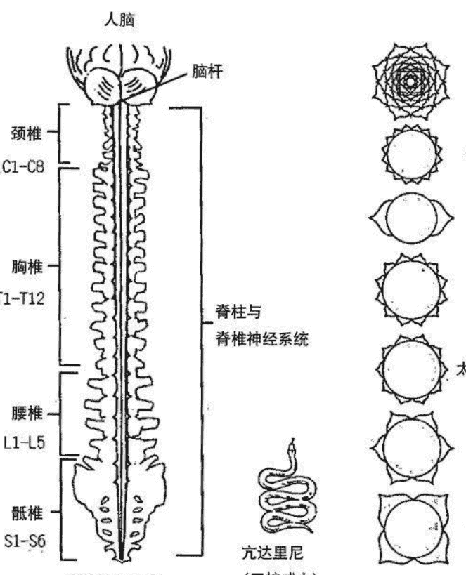

*副交感神经与自主性呼吸及心跳有关
显示脉轮系统、脊椎神经系统、
交感神经系统与亢达里尼之间的相互关联

## 亢达里尼能量的益处

在说明唤醒或解放这股强大能量的方法或练习之前，有必要了解使用亢达里尼与脉轮能量的益处。

以下内容提到许多正确释放亢达里尼与脉轮能量的益处，每个主要脉轮的高频振动，与位于脊椎底端的巨蛇威力有着密切关系。亢达里尼之流能够启动脉轮敞开，并释出美妙的能量，流入七轮的每一轮以及身体。

### 减轻压力

此能量可同时大量减轻心理与身体的焦虑与压力。特殊的化学物会释入血液来稳定情绪，这股能量通常像作用在神经上轻柔舒适的按摩。

### 灵性成长

每当你运用内在的这股能量时，你会培养出更多的灵性觉察力，变得更为灵性。

### 超感应能力的开发

亢达里尼之流会增强你的超感应能力。这股能量有助于完整开启顶轮与第三眼脉轮，使你能运用更多原有的灵通力。

### 增加性趣

透过训练与练习可以释出性能量，它与亢达里尼关系密切。因此，除了一般肉体的享乐与高潮外，你还能体验到“能量的交融”。

### 提高自我觉察

亢达里尼与脉轮能量的释放，使你更能觉知真实的你、内在的高我。你了解自己是个不朽的灵魂，安身于短暂的肉体。

### 达到神圣联姻——宇宙意识

正确使用亢达里尼之流，使顶轮连结到第八脉轮（位于顶轮正上方约18寸的位置），并让上方的神之能量或宇宙能量，经由脉轮进入身体及整个个体。产生神性光彩或天人合一的惊奇结果。

### 增强的体力

每天释出生命能量，有助于增强你的活力与能量，效果是更为充沛的体力。

### 促进治疗的进展

持续使用亢达里尼及脉轮能量，有助于治疗身体与心灵。疼痛会减轻，细胞则因为能量的作用而复苏。

### 减缓老化过程

亢达里尼透过交感神经系统释入体内，会影响内分泌腺体系统的荷尔蒙分泌，因而使腺体达到平衡，并延缓老化过程。在某些状况下，可能会使老化逐渐反转。

### 人体气场的扩展与净化

这股强大的能量流会扩充与净化你的气场。确保负面光晕或色彩在影响到你的身体之前从气场中消散。一个强健、扩张的气场，有助于维持你的个人健康，并能以温柔平静的方式感染他人。

### 平衡与敞开的脉轮

之前曾提过，释放亢达里尼能量会启动每个主要脉轮的敞开，并释出高等能量，进入每个脉轮对应到的身体部位。因此，治疗能量会流入最需要它的区域。

### 平衡内分泌腺体系统

亢达里尼能量会影响主要的脉轮，使它们正面地影响内分泌腺体，能够反转化合物的失衡，并释出某些特定的分泌物，带给你内心的满足感。

### 增强头脑灵敏度

亢达里尼能量释入脑中、第三眼与顶轮时，会强烈地影响到脑与这些脉轮，你会开始运用更多的脑力与超感应能力。

基本上，亢达里尼——你内在的能量，能够用来治疗及提升人类的意识。

## 亢达里尼唤醒与流动法

有些特殊方法，可以用来安全有效地唤醒或启动内在的亢达里尼，并传送到身体。然而，要谨慎小心：沉睡在脊椎底端的生命能量，或生命动能的威力非常强大，如果不节制释放，会爆发出一股压倒性的能量波涛。

节制的方法，如静心、瑜伽练习及观想法，能够以温和舒适的正面方式，唤醒与引导这股强大的能量。本能量对于心灵及头脑而言，都是一股强大的治疗力量。

说明独特的亢达里尼能量法门之前，必须提出最后一个警告：

一个不稳定或没有准备好运用亢达里尼与脉轮能量的人，可能会不慎或不适当地释出这股体内的能量，而突然引发一些极为不悦的副作用。同样的，如果一个人在运用这些高频能量上的训练不足，可能会造成他们自己在情绪或身体上剧烈起伏。

第二与第三章，顶轮与第三眼脉轮段落中所解说的方法，是其中两个必要的步骤，使你准备好运用内在的生命能量或巨蛇威力，第六章说明其他辅助你正确与安全进行能量工作的必要方法。

许多主攻亢达里尼与脉轮能量工作的学派，强调大地能量、脚底脉轮，尤其是以海底轮为起点。这种理论的派系或学院相信，大地能量或大地之母及海底轮最为重要。他们相信大地能量应该经由双脚脉轮吸取而进入海底轮。或者，如果坐姿正确，大地能量应该能直接进入海底轮。海底轮会因此而启动与敞开，使储藏在附近的亢达里尼能量苏醒，并沿着脊椎往上流动，通过另外6个主要脉轮，最终从头顶（顶轮）离开。

对大部分在这条路上刚起步的人（及许多能量中心低落或阻塞的人来说），此种方法既艰苦又困难，而且可能没什么成效。即使大地的能量很重要，海底轮也应该被启动，依然还是有许多部分必须考虑。

身为人类，我们需要宇宙能量或来自造物主的灵能，以及大地之母的能量。最后，你本身的内在能量、脉轮能量与生命动能，必须与之下的大地能量及之上的造物主能量接通。三种能量对于健康、平衡与和谐都是必要的。

灵能或宇宙能量出现在你的四周环境。在开始进行任何其他种亢达里尼的修练前，它需要被用上，才能使脉轮适度与有效的敞开。这能确保体内的亢达里尼能量安全的启动，并往上流通身体，不附带扰人的副作用。

这股强大的能量散布在你吸入的空气、饮用的水，以及自然界的万物中。就能量场的频率而论，它具有极高的振动速度。它可经由顶轮摄取，往下流入其他主要脉轮，最终唤醒位在脊椎底端附近的生命能量。这个苏醒的过程温和而舒服，使亢达里尼能量透过交感神经系统，沿着脊柱往上流，经过主要能量中心，以及内分泌腺体，再由顶轮流出。

## 顶轮开启法

如果在开始前，你想要先唱诵 M-A-Y 一或二次，下一个方法的结果可能会更有成效。让自己舒服地坐着，双脚放在地面或土地上。无须担心脊椎是否笔直或僵硬，这不是必要的。只要确定你的椅子甚至躺椅的舒适性。如果采取躺着的姿势，确定你的双脚自由的悬垂或放下。

进行腹式深呼吸 2-3 次，以缓慢而稳定的方式。当空气进出时，注意你胸膛的起伏。恢复正常的呼吸，并将注意力从胸膛转移到头顶一顶轮能量中心的所在位置。

把所有的注意力维持在此处，直径约 1 寸的区域，如同美金 25 分钱币的大小。不要怕焦点放错地方，大概位置就可以了。

当你专注于此处时，开始感到一股压力，一种知觉或甚至有人用手指触碰你的头皮的这个部分。

接着，让这种感觉或压力开始缓慢地往外扩散，直到它完全涵盖整个头顶。感觉这种触感、压力或有时在整个头顶的酥麻能量。对于某些人而言，观想白光或能量出现于整个头顶，可能与去感应这些知觉一样有效。

现在，看见与感觉这股酥麻的能量，持续地蔓延到头发、头皮，往上到头后方，下至双耳。基本上，让这种感觉、压力或酥麻感完全覆盖整个头部，包含前额与第三眼。让能量在整个头部跳动。感应或观察白色的光或能量在整个头部移动，甚至可以感觉或看见它进入你的头内。

在整个头部，下至双耳，与头后方颅骨底端，体验这种感觉、压力或酥麻的能量。专注在这股能量或再感觉一阵子，同时，继续感觉或观察脑内的白光或能量。

最后，深吸一口气，憋气几秒钟，然后缓慢地释出它，让能量或感觉开始缩小，直到它在头顶上恢复 25 分钱的大小，直径约 1 寸。如果需要，你可以看到、感觉或想象白光或能量如同一朵花的花瓣在日落时合起。在你结束关闭顶轮时，你应该在头顶感应到轻微的知觉或压迫感。这代表你已学会应用正确的专注法，来开启与关闭你的顶轮能量中心。头顶轻微的触感，意谓着顶轮略为敞开与适度的平衡。

> > 他 对 他 们 说 ： “ 光 明 的 人 蕴 含 着 光 ， 它 照 亮 整 个 世 界 。 如 果 它 不 发 亮 ， 就 只 有 黑 暗 。 ” —— 耶 稣 语 录

## 心轮——温暖花开法

第六章，你学到了开启与关闭心轮的温暖花开法。运用绿花的观想，重复这一个重要的方法。确定你的双手已经暖和，并把右手放上胸膛，接着，如当初的说明进行正常呼吸。

随意复习第六章心轮的段落。

一旦你做完温暖花开法，休息一阵子，在进行下一个特殊方法前，恢复正常的呼吸。

## 顶轮到心轮能量流通法

当你准备好继续时，深吸一口气，憋气数到5，然后从你的鼻孔缓慢的将所有的气释出。恢复正常呼吸，然后重复顶轮开启法。

在这一次，当你感觉或看见能量或白光完全扩张时，让它从顶轮中心与脑部往下进入第三眼中心。将所有的注意力放在前额，感觉或看见能量或触感扩散到整个额头。继续专注在这个区域，让压力或触感完全蔓延开来，直到它笼罩眉毛以上的额头。你应该感觉或见到这股白光或触感，扩展到两边的太阳穴。

在额头中央应该会感到一股更强的压力，从皮肤表面散发到头部1寸深的地方，这代表松果体已经被启动，而第三眼张开了。

专注于第三眼几秒钟，然后感应或看到这个知觉、能量或白光，缓慢的往下移到脑部，经过嘴唇，通过下巴，并进入喉轮。

开始将所有的注意力放在喉轮能量中心，直到你在此处体会、感应或看见一股温暖的光或能量。感应此主要脉轮内的温暖或感觉一阵子，让此处的能量在喉咙扩展，并通过脖子，直到你在头部中段能够感应或看见一股光或温暖的感觉。

再享受喉轮内的温暖与光，3-4秒钟。

现在开始将这股能量、压力或知觉，往下移到心轮所在的上胸膛。

将你的注意力完全放在心轮能量中心。如果你想要，可以将温暖的右手轻轻地放上胸膛，如同之前的说明。这部分依照你个人的意愿。

此刻是你应该再次进行温暖花开法的时候，或者，你想要以婴儿法或爱人法来取代这个方法。运用你能得到最好成效的方法。

一旦你成功的完全打开心轮，就已准备好将这股温暖、感觉或光往上送。这次不用关闭心轮，反之，让它敞开到完全尺度，如此能确保你导引心轮内所有的爱与治疗能量。

感觉此中心美好的暖意或能量数秒钟，然后开始将这股能量往上送，经过上胸膛，进入喉轮，感应这里的知觉。让舒服的能量或光继续往上移到喉咙，进入脸部。当能量通过脸部上到第三眼脉轮时，专注在感觉上，当它触及此点时，再次地感觉或看见白光或能量，在前额扩散开来。松果体被启动而第三眼脉轮完全打开时，你很可能在前额中央再次感觉到一股压力。

让前额内感应到的知觉、压力或能量，往上进入位于头顶的顶轮。当它完全笼罩着整个头部时，包含脑部与前额，享受此处美好的能量或酥麻感。

将所有的注意力维持在这个区域数秒钟，接着重复引导或移动光或能量往下通过脸部、喉轮并进入心轮中心的步骤。

当知觉或能量再次来到心轮时，让它如同上次，在整个胸膛扩散开来。

在你准备好时，往上引导能量回到胸膛，而最终到达顶轮能量中心。

现在，继续将这美妙的能量或白光，从顶轮往下送到心轮中心，接着，从这个中心往上送回顶轮。让能量在这些区域之间上下移动约5分钟，直到你感觉该停下来为止。从这个时候开始，专心在能量上，放慢它在头顶与胸膛之间的上下移动。感觉或看见这股能量或光移动得越来越慢，直到它停在心轮或顶轮，你自己选择心轮或顶轮作为这个练习的终结点。当能量的动力减缓时，你只需要将所有的注意力放在这些主要脉轮之一。继续专注在心或顶轮数秒钟，直到你在心轮体验到温暖，或在头顶感受到轻微的压力或酥麻感，来完成这个练习。

接下来，深吸一口气，憋气数到3，然后缓慢平稳地用鼻子呼气，恢复正常的意识。

对于那些不容易感受与移动脉轮能量的人，最适合的方法是一次专注于一个主要脉轮，直到你感觉到那里的温暖、压力或知觉。

举例来说，一旦你在顶轮感应到什么时，就将注意转移到第三眼脉轮，并重复这个步骤。一个脉轮接着一个脉轮进行。

当你在顶轮到心轮之间的每个主要脉轮内，体验或感应到一股能量或温暖时，你就可以开始专注于这些中心的温暖，在点与点之间或能量中心之间顺畅的流动。

最终，你能使它加快速度，直到脉轮治疗能量上下流经所有中心时，如同河流中通过的温暖水流。

### 心轮到海底轮能量流通法

你现在准备好进行能量流通法的第二阶段。第六章的所有练习，以及你刚做完的顶轮到心轮能量流通法，有助于你在全身成功地导引脉轮能量。

开始进行心轮到海底轮能量流通法时，再一次对心轮施行温暖花开法。当你打开美丽的绿色花朵，使它的花瓣完全张开时，让它维持绽放。这会确保心轮能量中心的敞开，而治疗能量已准备好往下送入太阳神经丛。

如果你想要，可以将右手轻轻地放在太阳能量中心。如果掌心脉轮的温暖使你比较容易专注在太阳中心，那就利用它。多数人在开始时，将温暖的治疗能量或白光，从敞开的心轮往下送到太阳神经丛区域，会比较简单与自然。

将你注意力放在此处，感觉或见到温暖或能量在太阳神经丛这个脉轮扩散开来。使用温暖花开法，或许能帮助你有效的开启这个主要的能量中心。

一旦你成功的打开太阳神经丛中心，开始将它往下导引，通过肚脐进荐骨神经丛脉轮。如同之前，将右手往下移到荐骨中心、肚脐之下约2-3寸，感觉这里的温暖、能量或白光。在此处感觉或看见这个脉轮的能量。感觉或内视脉轮能量在荐骨区域扩散开来，延展至两侧的臀骨。如果需要或想要，可在此处使用温暖花开法。记得，这次观想的是一朵橙色的花。

一旦温度、能量或花朵在这个主要脉轮完全扩展开来时，就让感觉往下移入海底轮。在此处感受到温暖或看见白光，让它蔓延到两只腿的大腿上方。接着，开始将温暖的能量或光重新往上移，通过荐骨脉轮。感应这里的能量数秒钟，然后慢慢将它往上导引至太阳神经丛能量中心。当它流经太阳神经丛回归心轮时，感觉或看着这股温暖或光。

再次让温暖或能量在胸膛蔓延，用几秒钟去感受心轮中心的爱与温暖，接着重复所有步骤。引导能量或白光再往下通过太阳神经丛、脐轮，然后进入海底轮。

当它抵达海底轮时，让它再一次延展于臀骨之间。接着，将它往上导引，经过荐骨，越过肚脐，通过太阳神经丛，再进入到心轮。

重复这个过程，从心将温暖或光往下移到海底轮，再从海底轮往上移到心。让脉轮能量继续在身体与这些脉轮间，顺畅的上下移动几分钟。

准备好时，开始放慢脉轮能量的流动，最终使它停在心轮中心。将注意力集中于此 4-5 秒钟。现在，深吸一口气，憋气一阵子，最后缓慢平稳的用鼻子呼气。恢复正常的呼吸与意识状态。

如同顶轮到心轮能量流通法的说明，如果你不容易正确感应与移动脉轮能量，就一次专注于一个脉轮，直到在那里感应到温暖或知觉，然后将注意力移到下一个脉轮，持续专注于此，直到得到同样的结果。将专注法接连用在每个脉轮一一心轮、太阳神经丛、脐轮以及海底轮，然后开始加快速度，直到脉轮能量通顺、流畅地在所有主要脉轮间上下流动。

你越常演练这个方法，就会越容易移动与导引能量流通你的身体。你会像一位天生的“感应灵通”，在你的全身与脉轮之间，以轻松有益的方式移动脉轮能量。

当你能擅长引导脉轮能量，流通你的全身与主要脉轮时，你会启动储存于海底轮区域的亢达里尼能量。这会唤醒能量，使它开始往上通过交感神经系统、身体以及内分泌腺体系统、主要脉轮，最终从头顶流出。亢达里尼与脉轮能量，会开始以一股汇合的能量流动。

在你学到的独特能量流通法中，去感觉或观察白光、温暖或能量，事实上能使你启动脉轮能量与亢达里尼的觉醒与适当的流动。

现在你已学到专注于身体的某些部分，及导引真正的治疗能量流通它所产生的效力。

## 顶轮到海底轮的能量流通法

### 交感神经分支

人体具有两种神经系统，所谓的中枢神经或脊椎神经系统，以及自律神经系统。就治疗与脉轮能量而言，自律神经系统最为重要，包含两个分支，交感与副交感，交感神经分支与脉轮、气场及宇宙和大地之母的能量有直接关联。如同之前的描述，交感分支与这些高频及神这位造物主“同感”或协调。

两个交感神经的主杆，包含交感神经与副交感神经的出口在脊柱的两侧，脊柱被包括在中枢神经系统中。两个神经系统藉由称为“神经节”的神经群组互相连结。如此特殊的安排，确保重要的神经能可以在两个神经系统之间流通，继而贯穿全身。

此外，交感神经分支透过神经束或神经节，可与人体脉轮系统相连。这些神经能够与七个主要脉轮极高的频率协调或产生共鸣。当脉轮振动能流流入这些神经时，能够减压或降低它们的振速。自此，神经节将减缓的脉轮频率导入中枢神经系统、内分泌腺体系统及几乎全身，包含了细胞。

同样的，物质界较低的振动能量，如不适感、疼痛或疾病，能够流出体内的腺体、细胞、肌肉及中枢神经系统，而进入交感神经分支，最终进入主要脉轮或与身体患部极其相关的脉轮。这种氛围或负面能量，也会从一个或多个脉轮扩散到人体气场，这就是气场解读师与医疗灵通人士，能够目睹一个人气场或脉轮中负面色彩的原因。

基本上，交感神经分支的功能如同双向道，允许不同的能量在任一边流动。藉由对交感神经分支的了解，以及方才提过的原理，你能够发觉研修脉轮能量流动法的价值。

亢达里尼、脉轮、宇宙及大地能量，上下流经七个主要脉轮、交感神经分支，内分泌腺体系统及最终进入整个人体，这是个可用于灵性觉醒的强大治疗工具。

> > 一个合理的人会记得眼睛可能因为两种方式与两种因素而混沌不清——光明到黑暗，或黑暗到光明的转变。他认为灵魂也是如此……
> ——柏拉图（希腊哲学家）
> <对话录>

# 第八章 与你的天使、指导灵合作

> > 因他要为你吩咐他的使者、在你行的一切道路上保护你。
> ——圣经诗篇 91:11

几千万年以来，天使与指导灵是我们世界中的一部分。这些光的存有影响众多古今文化，它们协助部分的天堂显化于人间。

在本章中，你会学到与你的天使及指导灵运作的技巧。在近代，这个现象通称为“导灵”。以往，它有时被叫做通灵或与亡者对话，这两种说法并不全然正确。事实上，导灵甚于只是与指导灵或脱离物质界的人们沟通。对真相的无知，使我们的社会将这些人视为死者。

如果你想要了解真相，就必须先知道死亡事实上并不存在。是的，肉身一一形体或许会老化并死去，但安住于内在的灵魂永恒不灭。我们的朋友与心爱的人事实上从没有死亡，他们只是进入更高层的存在境界，通常称作天堂或天界，这种概念会在之后解说。

## 天使与指导灵的差别

许多人提到或想到光的存有时，会将天使与指导灵的名称混为一谈。多数人相信它们是一体与相同的：天使就是指导灵，而指导灵就是天使。

即使这些灵性存有彼此互相合作，有时会执行同样的任务或使命，但它们还是不同的。天使与指导灵不属于同样的类别或阶层。

有些人相信品格崇高的特殊人士，事实上就是人间天使，或在他死后进入天堂时会化为天使。事实上，天使就是天使，它之前是，之后也是。

这些天堂的灵性存有，是造物主独特的杰作，它们与造物主之间具有神圣的关连，并替天界执行诸多任务。天使能够疗愈、安慰、保护以及指引你的一生。

这些灵性存有也是天界的讯息者，为人们传递消息或警讯。天使这个名称来自希腊文的 aggelos 或 angelos，意谓“讯息者。”

圣经的新约与旧约中曾多次提到这些灵性存有，总共超过 300 笔。举例来说，在马太与路加福音的前段篇幅，提到大天使加百列造访撒加利亚，施洗约翰未来的父亲，以及童贞妇女玛利亚——耶稣未来的母亲。这些来自天堂的特殊讯息者，分别昭告了施洗约翰与耶稣的降临。圣经中，通报警讯也是天使的职责。

天界分成不同的层级或境界，这里所有的个体，以极高的频率存在于于此。在天堂也有一个阶级制度，以神为首，神力——即所谓的造物主或至尊者。

造物主的核心或中央，由男性与女性原型组成，往外散发出神性之光，照耀天界，而最终洒落在宇宙、星辰、行星以及地球。这个神圣的氛围，富含智慧、力量及治疗的能量，同时渗透高频的灵性天堂与低频的实相地球。

神的天使在这两界之间穿梭与运作。它们多如繁星，独特并担负不同的使命与任务。

有些特殊的灵性存有，扮演起守护天使，在人们的一生中保护着他们。事实上，许多幼童能够看见自己的守护天使，并以开放天真的心胸接受这些灵性存有。即使基督教团体的错误百出，现在也接受了这样的看法。

天堂的阶级由一个既定的天使秩序所组成，以大天使为首，它具有神奇的力量。大天使与造物主非常亲近，执行极为特殊的任务，担负起上天的重要讯息者、奇迹工作者、伟大的治疗师、护卫、灵性老师，以及抵抗黑暗邪恶的勇士。

## 与治疗天使合作

这些威猛慈爱的灵性存有，有四位最为出名，它们是拉斐尔、加百列、乌列尔以及米迦勒。天生的眼通者与其他人士，能看得见与感应到这些光的存有。有些天生的耳通者，能够听见天使与指导灵对他们说话。

运用本章节传授给你的技巧，但愿你也能得到这些能力。运用此处的资讯，你可以开始发展出必要的特殊超视觉力与超听觉力，与你的天使及指导灵沟通。

你的天使能够以奇特但惊人的方式，与你共同运作。天生的治疗师及渴望运用此潜力的人，会开始与治疗天使们合作。当你顶轮、第三眼、心与掌心脉轮被启动与敞开时，你会从天界与治疗天使或天使群，接收到治疗的能量。这些灵性存有具有治疗天赋，并且能够从高等境界“降低振速”或减缓它们的频率，进入物质界，在此处让自己的能量与你的气场结合。

在你们当中的天生治疗师开发自己的才华时，会提升肉身与人体气场的频率，而气场会扩张。如果顶轮启动正确，一位治疗天使会进入你的能量场，并同时与顶轮和第三眼中心连结。接着，这位灵性存有会藉由你来运作，将治疗及宇宙能量往下导引到顶轮，再进入你的心轮（当下应该已被爱所开启）。从此处，源自这位天使的治疗能量，连同其他能量，会流经你的双臂，进入双手，并从掌心与手指流出。基本上，你会增强流经你传送到体外再导入病人或个案的治疗能量。如此，能确保被治疗者能运用更多外来的治疗氛围，以激励自己释出内在的治疗能量。你的个案或病患能够察觉这股来自于你的增强能量。

以上过程，是传授你前述练习的其中一个原因。当你的脉轮适度敞开时，更多才能会比较容易显现。之前描述与天使联手进行的治疗，事实上是一种导灵的形式。这些特殊的光的存有，在某些时候会进入个案或疗程进行的空间，并将它们的双手放到案主或病患身上。接受个案的人，能够感觉到他身上多出来的手。当更多人的天生治疗能力被唤醒，并提升他们的气场、脉轮及肉身的频率时，此种形式的天使治疗会更为普及。

有些灵性存有会造访病床，在患者入睡时进行特殊的工作，促成奇迹性的痊愈。濒死经验的生还者，也指出天使与光的存有，现身于这段奥妙的经验中。

许多天使被指派给将要往生、回归彼岸的人。一个人在肉身濒临死亡时，会开始见到或感应到天使、指导灵与挚爱的存在。或许，他的守护天使，连同一位往生的祖母或祖父，会出现在房间里。这样的拜访，通常会在肉体死亡前的一天或两天。这是一种预备人类灵魂由物质界转换进入高频天国的方式。很多时候，人在此时会变得平静与欣慰。他与高层境界更为融通，很可能已出现在介于天堂与人间的空间。无论如何，肉身死亡的那一刻，灵魂绝不是孤单的。一位死亡天使会伴随着人类的灵魂一一内在的真实存在一一抽离物质形体。天使与刚启程的灵魂会提升它们的频率，上升至天界。

以往，特定的藏传佛教僧侣会接受训练，协助往生者抵达彼岸。今日，也有许多独到的眼通与敏感人士，能够发挥如此特殊的功能。在不久的未来，会有许多人以全职、专业的水准从事这类专门的工作。

大部分的主流宗教，皆相信天使的存在。犹太教的传统曾提过天使，伊斯兰教派接受这些神圣灵性存有的真实性。事实上，先知穆罕默德声称目睹大天使加百列，它承诺要协助他传授教义。

天使们也可见于艺术作品中。文艺复兴时期中，许多著名的艺术家创作了描绘宗教人物与天使的杰作。公元1618年，达芬奇画下圣告图天使的细节，一幅美妙的艺术作品，描绘一位有翅膀与光环的天使。这不过是完成于现代西方文明启蒙时代，众多天使画像中的一幅。

近年来，人们对这些光的存有的兴趣与日俱增，之所以会有此现象，是因为当更多人觉醒时，他们更能够体察灵性事物，同时，对物质界的俗事会变得不那么在意。人们与天使及指导灵的合作，也会成为普遍的现象。

许多人将天使当作爱、光、安慰与勇气的化身，对孩童而言，它们是守护神与同伴。少了这些爱与光的灵性存有，我们的世界会变成一个幸存的悲伤地，没有人是真正的活着。

> 宁静中，一个接着一个，在天堂无尽的原野，绽放出美丽的星辰，天使们的勿忘我。

> ——朗费罗 (Longfellow 诗人)

## 指导灵现身

指导灵与天使并肩合作，在协助俗世人类的部分有着雷同之处。指导灵负责的任务在于指点、教导及抚慰人心。

人类家族与指导灵之间的关系极为密切。不像天使、指导灵之前曾现身于人类形体。它们曾经活过、有感觉并体验过以血肉之躯生活于世间的情感。这些灵不再具有肉身，以真实本质即灵魂运作，具备比人类还要高的振动频率。

许多人逗留尘世的大部分期间，会受到心爱的往生者，比如说祖父、祖母与其他后代亲戚与朋友的指点、安慰及扶持。事实上，有些北美印地安人会以“与祖先同行”来称呼这种经验，澳洲的原住民也有类似的信仰。

一般而言，当人类死亡时，或更正确来说，在他们的灵魂进入天堂时，会回顾人生全盘检讨最近的一世。接着，许多刚辞世的灵魂，会有休息与复元的时间。

指导灵来自形形色色，他们具有独特的个性及特质，就像是人类一样。他们不过是没有肉身的灵魂，曾经承诺或希望扶持人类。对人类的服务，使指导灵能够朝自身的真正觉醒成长与迈进。因此，这些指导灵并非全然可靠，他们就像你我一样，也有自己的缺点，尤其是那些还在接受训练的指导灵，来到人间是为了学习与历练。每个人的身边都有指导灵与天使。如同天使，灵性存有或指导灵有许多不同的类型。

有些人会有几位指导灵随时的协助，而其他人身边会出现多数指导灵，辅佐个人任务与人生的经历。与你合作的指导灵数量与你生命中特定时期进行的事情，灵性道路的发展及身体、气场与脉轮的振动速度有直接关联。

许多指导灵具有的才华，可见于物理治疗师、商业经理、会计师、演说家老师等等，它们特别会与需要此类专才的人合作。

所有天国的灵魂持续地精进，并致力于灵性成长。这些灵魂在不受到肉身的牵绊下，对世间与天界能够有更多领悟。他们都清楚自己前几世的人道轮回，并于居住天界的期间，履行特定的职责。有些还知道在其他星球或物质界的前世。

睿智慈爱的导师派给了他们，为了协助他们发展成为更醒悟的灵魂，传授过程中也会有许多天使的支援。人类的灵魂在天堂时，会造访宇宙学识与高等治疗能量所在的不同地点与不同频率层级。

物质界的人们为了学习，会来到收藏书籍与资料的图书馆。天堂里的人类灵魂，会探访阿卡西记录，也被称作宇宙智慧宝库，来搜索与他们个人灵魂成长的切身资讯。当天堂的一些灵魂准备好时，会预备重返或投胎到一个肉身。天国的许多灵与这个过程有关。天使、特定的老师或指导灵及长老议会将携手合作，为重返人间的人类灵魂铺路。

灵魂会敲定或同意一个回到物质界的“灵魂契约”。在那里，他会飘进飘出母亲人选的气场与子宫。这就是怀孕妇女通常会显得有光彩的原因，她们同时具有自己的气场以及身体附近未出世灵魂的气场。

最终，在出生的那一刻或之前，人类的灵魂——在冗长的预备期后会完全入主婴儿的身体。虽然，灵魂在怀孕期间会进出尚未出世的胎儿身体，但灵魂与身体总会结合，两者成为一体，人类的灵魂已存在于肉身，轮回过程再次完成了。

有些天界的灵魂决定成为指导灵，不再以肉身重返人间，有时，这些灵魂会被指定以此身份来做事。一切需要仰赖训练与筹备。

## 众神或长老议会

一个称为众神或长老议会的灵性主体，存在于天国中较指导灵为高的频率或层级。随时会有十二位睿智的古老灵魂，担任重要的议会成员。许多智慧同等的光的存有，与众神共同运作，好比议会的延伸组织。

耶稣在世间，具有个人议会——或由十二门徒组成的内圈，以及其它位众多门徒，于将近两千年前以一个特殊的组织模式互相合作。就实体而言，这个团体的架构参照了长老议会在高层境域的组织。这就是数字12及耶稣身为上师那一世会特别重要的原因。

众神发挥协调与规范人类灵魂、指导灵及少数天使（特殊情况）的功能。它们担负起天堂及人间和谐与平衡的责任。这直接涉及轮回的生死过程，挑选、训练及指点指导灵以及人类灵魂的演进与灵性成长。

议会的这些睿智灵魂，完全清楚世间与人类的可能性未来。它们当中有数位是资深的导师、古老灵魂及于诸多世代前曾生活在地球的灵性导师。许多时候，大天使会与它们密切合作。

## 灵性道路的行进过程

之前曾简短探讨，踏上灵性旅程或探索会产生变化。当你开始从事脉轮能量工作、静心及灵魂深度的探索时，你的气场会变得更为强大、洁净与明亮。你的脉轮尤其是顶轮、第三眼与心轮会被启动与打开。你的肉身会开始转变，变得更轻盈。就心理层面而言，你在意识与潜意识的思维模式，也会产生正面变化。

当这些状况开始发生时，你的气场、脉轮、身体与整个个体会开始以高频振动。基本上，你会提升个人频率或振动速度，使你的指导灵与天使更容易在物质界协助你，并与你互动。当你的频率加快时，高等能量的指导灵会开始与你合作，并透过你来导引他们的力量、才华与能量。

当你的振动速度或频率调升时，你也会开始体验这股来自天使的庞大力量、爱与治疗能量。如果你想要接收与操作强大的天使能量，在意识与频率上，你必须有所提升。我们居住的世界也在改变它的振动速度，它正在加快本身的频率，跟上一些天界或次元的振动速度。基本上，这代表人间天堂将不再只是一个口号。

现在要介绍一些特定的导灵技巧，帮助你学习导灵的方法，使你与天使及指导灵能够合作。

## 提升环境频率法

进行任何形式的导灵前，你必须确认练习用的房间、居家或场所，具备平静与高层的能量。环境的频率应该提升得当，创造出一个清静、详和与安全的环境，来进行导灵与静心的用途。许多人对这部分并不用心，在没有采取任何妥当的准备措施下，他们直接导灵或化为灵魂的媒介。因此，有时会接触到不良的低频能量或低灵。要记得，并非所有非实体界的灵体皆源自于光，因此，为了防护自己，并确保天使与高度醒悟的指导灵能够现身，提升环境的频率或能量极为重要。

提高环境频率的第一步，单纯但有效地使用特定的用品，白色或淡色蜡烛，熏香如檀香或乳香，以及轻柔、温和的音乐都非常重要。所有用品或部分用品的组合有助于提升一个房间、密闭空间或指定场合的频率。其中一种北美印地安的长老传统即熏香，运用鼠尾草与香茅来取代线香，如果你不喜欢点香，建议用这种方式。

在你点燃蜡烛、香支且放上平和、轻柔的音乐后，就准备好进行下一个步骤。确定音乐只是背景，不应该过于大声，种类可介于古典到新时代灵性，依据个人的喜好来挑选，重点是要让你感到舒适的音乐。

声音的效力在前述章节已经说明，如果使用得当，你的声音能够实质的改变或提升一个房间的能量频率。古代埃及人与西藏僧侣了解这当中潜藏的威力。

基督教教会在仪式中使用蜡烛、燃香与声音，在宗教建筑的空间里创造正向的频率，遗憾的是，教会人士并不了解这些仪式的个中道理。绝大多数人，从街上一进入教堂，就能够立即感应教堂内的高频能量，尤其是建筑雄伟的大教堂。

造物主之神是男性与女性两种元素的复合体，这些要素通常以正即男性、负即女性来命名。在磁性与电流的科学定律中，也可以发现一样的原理：两者在创造具体的表现时皆为必要。

中国的学说称这些属性为阴与阳，生命的平衡与和谐即透过如此的设定。进入埃及神秘学院与治疗圣殿的新学徒或学员，会学到这个原则。他们也会学习一种特殊的元音唱诵或发声，以创造如此的平衡与和谐，并提升一个房间或特定范围内的能量。元音唱诵发出的声音是 MAH-RAH。MAH 为女性，负极或母性原型。而 RAH 为男性，正极或父性原型。MAH－RAH 的唱诵应该以 C 中调的音阶发声。如同之前所说，如果你的音感不佳，就不用担心，唱诵这个声音时，大概就可以了。你的声音只要维持在中音，不要太高或太低。开始时，让自己待在你选择的房间或区域的中央，或尽可能的接近中心。放松，并且用鼻子深吸一次气。憋气约 5 秒钟，然后，缓慢平稳的用鼻子或嘴巴吐气。再深吸一口气，并憋气数秒。在你这次用嘴巴吐气时，发出 M-M-A-A. H-H-H-R. R-A-A-H-H-H,以两个长音唱出发声。持续的唱，直到所有气都已吐光。试着让 MAH 与 RAH 的声音，以大约同样长度的时间发出或吟唱。停个几秒钟，再深吸一口气，再次憋气数秒钟。这一次，发出或唱诵 R-R-A-A-H-H. M-M-A-A-H-H-H 而非 MAH－RAH。换句话说，只是将 MAH－RAH 换成 RAH－MAH，由 RAH 或父性原型的声音开始唱诵。在你的房间里，持续唱诵这个古老的声音 5-10 次。每次完成 MAH－RAH 的唱诵过程，就将 MAH－RAH 换成 RAH－MAH，然后再唱 MAH－RAH，直到你已重复唱完必要的 5-10 次。最后一次唱诵时，找个舒服的位置坐下，并且放松。在 1-2 分钟内，这个房间的频率会剧烈提升。你也许会发现点燃的烛火开始升高，甚至在你的颈背感到些许酥麻感，或在心轮或太阳神经丛中心感到一股暖意，你会置身于一种平静的感觉。以上所有都显示出，空间内微妙但正面的能量变化。现在你已成功的完成正确安全导灵的第一个步骤：提升你的环境频率。除此之外，提升环境频率法也可用在你的住家、办公室或商业场合。这个方法可在你家的每个房间施行，因而提升全家的能量达高等、宁静与和谐的境界。MAH－RAH 的唱诵也可用在你的办公室、商店或任何工作环境，它对于人们与居住的环境会产生微妙效果。当能量提升时，房间、办公室或空间能营造出一处宁静、详和与吸引人的氛围。朋友、同事、客户或病患会因为气氛的改变而受到感染。他们出现在高频能量附近时，会更为放松与沉静。就商业的运用上，这个巧妙的方法能增加生意、引人进入办公室、商店或其他工作场合。一开始，MAH－RAH 必须在这些地点施行 5-10 次，之后唱诵可以连续唱个 3-4 次，一周约进行一次。这个方法如果经常演练，能逐渐累积此区域的高等能量。最终，这个地点会维持在一种持久的高频状态，使人感到非常平静与安定，同事之间的相处会更加融洽，彼此更愿意配合。如果你觉得有必要更常使用这个方法，它是不会过度的。家中或其他能量混乱的地点，会需要长一点的时间来改善频率。在这些状况下，可能会需要增加 MAH-RAH 的唱诵次数。如果有两位或两位以上的人，对一个有暴力、骚动、哀伤与悲恸能量进驻的房间或地点，进行这个特殊的练习，能够疗愈、改变及提升这些低等频率，到达一种较温和、充满爱的高频能量。

## 提升个人频率法

下一个导灵前的重要步骤，是提升个人的频率，有许多方法可达成效果。

在第三章中，你学到运用 MAY 唱诵的顶轮练习。这个声音可唱 1-2 次来开启顶轮，因而使你更容易导引与接收你的指导灵与天使的能量频率。当这个中心敞开时，第三眼脉轮也会跟进。这些被打开的脉轮，会引发顶轮与第三眼的高频率。在这之后，你也可以进行任何与心轮有关的技巧，比如心轮开启法或是婴儿法。你对心轮的专注会使它敞开，并提升此处及你的全身频率。这股来自心轮、爱的温暖治疗能量，能非常有效的提升你整个个体的频率。这在与具有造物主及天堂之高等、慈爱能量的灵性指导灵运作时，极为重要。

如果你愿意，接下来可以进行一些顶轮到海底轮的能量修炼。全套的脉轮能量流通练习并非必要，但能够帮助你扩张气场，更容易与指导灵和天使合作。一个强大、明亮及洁净的人体气场会吸引这些充满爱的光的存有靠近你。

进入导灵前，你需要做的最后练习，又与心轮有关。这一次，你只要将注意力放在心轮中心，并想着“爱”这个字眼。专注于你的心与这个字，约 10-15 秒钟。接下来，开始大声说出或想着这段话：“爱充满我的心，与我的灵。”持续地说或想着这些文字 1-2 分钟，并试着感受你的心轮与你整个个体内的爱。

当你觉得自己已进行这个练习够久时，就停下来。深吸一口气，憋气数秒钟，然后缓慢并顺畅地用嘴巴或鼻子吐气。接下来，先休息一下。

一旦你完成某些或所有方法时，你就会成功的提升个人频率到较高层次。你的身体、细胞、脉轮及气场都处于高频状态，允许指导灵与天使降低它们的频率，在介于你一般俗世频率及它们正规天界频率的中点与你会合。

在提升你周边环境与个人的频率后，现在你已准备好开始导灵。

## 导灵技巧

进行导灵前，你一定要确认所有负面的意念都已放下：包含烦恼、恐惧、忧伤以及不快乐的想法。你应该是放松与相当平静的。

### 白光冥想

养成每周或每日观想白光，包围你与环境的习惯。

这是一种非常简单的冥想或观想练习。让自己放轻松，眼睛闭上一阵子，并在脑海中想象你的周遭环境。接着，让一个白色光圈，完全包围你所在的房间或地点，完整的环绕一切。自此，用一层白光从头到脚包裹自己的身体。让你被另一圈白光以内的白色能量光环或护罩所同化。

当你在进行这个冥想时，你在学习实质地将白色能量吸引到你的身边与环境。这不是你的幻想！这个方法协助你避免低灵或阴灵进入你冥想的特定地点，或任何一个受到白光护持的区域。你甚至可以在启程前在车上进行这个练习。确保你或任何搭车同行的人也受到白光的防护。

在前面章节中，你学到唤醒超感应能力的练习，这也是你脑力增强的原因。当你的心智能力强化时，你会开始更有效力的运用意念的频率。基本上，你心想事成的能力会变得更真实而威力强大。这就是你在观想白光包围自己与环境时，能够引进高频白光的原因。

意念是真实的，所以你在想法与态度上要审慎。学会正面思考与用词，有一句古老谚语非常灵验：“你的想法创造你的实相。”

此时，建议你列出一张特殊的正面肯定语句。写下它们、阅读它们，然后背诵这些肯定语句。开始经常低声说出它们，或在你脑海中默念。持续进行这个功课约30天，然后停止这个练习。

这些正面语句会开始由你刻意的念头，进入你的潜意识头脑。约30-40天后，你会发现自己的思考方式，会产生不明显但明朗的改变。建设性想法或肯定语句会被潜意识头脑吸收，在此处及意识头脑建立起健康的思维模式。

当你的心智能力增强时（加上这些强大的改变），你能够在物质世界里创造更多有益的事件与实体。

### 蜡烛与镜子法（补充技巧）

第五章时，你学到了镜子法的第一阶段，使你知道要如何观察气场，这个方法也可用来作为导灵的练习。

#### 第一阶段

这一次，你在进行这个方法的第一阶段时，你要留在镜子前久一点，视线看穿自己的眼睛，如同望着远方。在你进入深度意识状态或轻微的半催眠状态时，你会再次发现镜中自己的脸，在你眼前开始转化与改变。鼻子可能会加长，或者你的眉毛好像往上移了。无须担心，因为这些是该达到的效果。这代表你当下处于一种深度的转换意识中。

此时，你可能会注意到一些不寻常的状况：脸部的变化会更为明显，有另一张脸出现在镜中，它看起来像是一张叠上你自己脸孔的脸，很类似照片的影像重叠。你之前看到的眼睛会立即变形，这双眼睛看起来完全不像是你自己的，或许会像东方人的眼睛，或更为圆滚，或者像是一双老先生或老太太的眼睛。当你继续在半催眠状态观察时，你的眼睛可能会往镜中左或右边的眼睛移动。就让它发生，并继续凝视着镜中的影像。

现在，当眼睛还在变化时，你会发现整张脸产生同样的情形。你或许会看到一个年轻男孩或女孩正注视着你，甚至是一位留了白胡子的男士。这些脸部的变化会持续，直到你看到五或六张到数不清张数的不同脸孔——人物盯着你看。每个人在进行蜡烛与镜子法的第一阶段时，都会有不一样的经验。脸部的变化是因为一张张脸的先后出现，可能靠缓慢或快速的衔接。在罕见的情况下，有些人会看见动物的脸盯视着自己，而这也是正确的。

继续凝视着镜中的影像一阵子，脸部叠层的变化会开始变慢，也许还会停在一张特定的脸孔。如果发生这样的状况，你要观察面前的这张脸数秒钟，注意细节。你会感到似乎认识这个人或这张看着你的面孔，如同它是你的部分容颜。当你持续看着前方的画面，这份熟悉感会使你内心萌生出满足的感觉。

很快的，画面会开始消失。接下来，如果你够幸运的话，镜中的一切会转为黑暗，使你连自己的脸或其他任何脸孔都看不见。在 1-2 秒钟的时间内，你眼前的景象会是一片漆黑。接下来，如果你进入中度催眠够深的境界，一双美丽的眼睛会出现在你眼前，让自己的视线穿过你的正前方这双美丽的眼睛。这个现象称为“接触你的灵魂之眼”，代表你已使脑波模式改变，降到较缓慢的周期，而进入深度的 alpha 状态或“异状”即作梦境界，并连结到高我——你内在的真我。你已成功的将小我或是虚妄的人格搁下，允许你窥视自己的灵魂。此般的连系使你与个人的高我合而为一，并接近强大慈爱的真实自己。一旦如此进行时，你就能够更常复习这个方法。藉由放下小我，逐步让内在的真实存在浮现，使灵性持续地滋长，这是一种真正觉醒的形式。

此外，在蜡烛镜子法第一阶段中所观察到的不同面孔，是指导灵或天使在镜中看着你，也可能是你的其中一个前世人格的显现。如果脸部叠影或面孔出现时，你的头顶即顶轮中并没有任何感应或压力、触觉或酥麻感应，顶轮到心轮也没有充满能量的感觉，你不过是经历了你之前的转世；假设你见到的脸孔停留在你的视线一阵子，并且对它感到熟悉，代表你让重要的前世显现。这个之前转世，可能在意识或潜意识层面对你目前的生活影响重大。

然而，看着你的如果是一位指导灵或天使，你在头顶就会感到一股压力、触感甚至酥麻的能量，并且经验到一阵温暖、充满爱的能量，开始从头顶流入你的头部、你的脑、脸部并往下通过你的喉轮进入心轮中心，在此处品尝着温暖静谧的感觉。你甚至可能会感到一股能量流或湍流，从顶轮一路往下流到海底轮或双脚，这是你的指导灵或天使流入你气场与脉轮的高频能量。如果运用你来操作的是位天使，从顶轮导入的庞大能量，某些时候会让人招架不住。反之，如果你接通的是指导灵，能量不会如此强大，但还是一样充满爱与有益。一旦你体验过自己与一位指导灵或天使结合，往后你就能经常接应与导引它们的任何能量与氛围。第一次的接触最为重要，因为介于你的俗世界与天界的门户就此打开，让你以不同方式穿梭在两界之间。

在你头几次练习蜡烛与镜子法的第一阶段时，凝视镜子之后的 5 分钟，可能会有眼酸或发红的现象。对于多数人而言这是正常的，如果经常练习，在你已习惯长时间凝视镜子时，酸痛与发红就会消失。

当你已经完整地做完了补充方法的第一步骤，要停止时，你可以透过深吸一口气，憋气数秒再吐气，慢慢的让自己恢复正常意识，或者，你可以进行第二阶段。你越常演练这个方法，接通你的指导灵与天使及经历前世记忆与人格，都会变得更为容易。

#### 第二阶段

在第五章“阅读与解析人体气场”中，对蜡烛与镜子法的第二阶段有详细的说明。如果你觉得有必要，请重新复习这个方法。本方法也含有一个特别的顶轮专注练习，让你开启与扩张这个能量中心。在你进行完整的第二阶段方法时，确实重复这个练习。一旦你完整的做完这个方法，就可以开始蜡烛与镜子法的最后阶段。

#### 第三阶段

这是一个之前没有说明过的全新方法。继续注视你的头顶上方的扩展的顶轮及气场几秒钟。将你的视线继续往上移高约6-12寸。当你的眼睛看着气场之外，头顶正上方或稍微侧边的位置时，你会开始发现一个淡蓝、白色或淡黄色的人形影像漂浮在空中。由这些美丽色彩当中一个颜色所形成的透明形体（非实体），会是你的其中一位指导灵，或出现在你能量场外，盘旋于上方的一位天使。

继续注视你光明的指导灵一会儿，感受他的氛围与充满爱的能量。接着，大声说出或在你的脑海中请求这位光的存有下降，进入你的气场、脉轮系统及身体。就在你的指导灵或守护天使，开始从你的扩张的气场顶端与顶轮中心往下移动时，平心静气地观察。你会看见一个由白光形成的头型与肩膀，开始与你顶轮的光结合。在你的指导灵或天使经由顶轮中心降入你的气场时，你的头顶上方与周围会变得更加明亮，并往外再扩张。当连结产生时，你也会在头顶的顶轮感到一阵酥麻感、压力或奇特的能量。

在指导灵或天使安顿在你的气场及部分脉轮时，享受这股能量。当你开始接通你的指导灵时，你应该会感到平静、放松与祥和。通常，顶轮、第三眼、喉轮及心轮会受到影响。你在看着镜中自己的影像时，它会变得不一样，你自己的脸孔上，会覆盖着这个光的存有的形象。

凝视镜中这个爱的灵性存有，感受来自此光的存有的爱的氛围。你或许在头脑中会开始听见自己或他人的声音在说话。如果出现的是别人的声音，就要看是谁藉助你运作，会明显呈现男声或女声。如果声音听起来像是自己的，它会与你平时的声音略有不同。无论如何，留意你听到的内容。

有时候只会听见几个字，某些情况下，你的脑海中会跑出几句或几段话。往往在你的超听觉力加强时，会听到大量讯息。要养成习惯，经常将导灵收到的讯息，记录在笔记本中。这使你能够再次阅读“来自高层”的话语。有些接收到的讯息属于私人讯息，但在其他时候，会是对状况的预言。讯息中，可能含有你个人或他人需要的智慧与知识，也会出现指导或鼓励的话语。

许多人或许不会听到声音，但能以不同方式接收导灵的讯息。会有一种知道的感觉，在内心感受到一股强烈的本能冲动。遵从这些冲动或感觉是必要的。在你与它们接通的特殊静心状态中，你的脑海也会被你的一位指导灵或天使植入画面、点子与想法。来自天上的天使与指导灵可以用你来执行许多事。传递讯息、智慧、教诲及指引。如同之前所说，透过某些执业师也可以传导治疗的能量。你从天使与指导灵接收到的能量及才华，可能会依据你的道途，或是你的气场、脉轮及肉身的频率层级而定。

当你觉得与一位自己的指导灵或天使沟通够久时，真诚地感激这位灵性存有。你动念切除彼此连结的同时，让它抽离你的能量场。当慈爱的灵体往上脱离你的能量场时，观察你的脸孔、气场，尤其注意你的顶轮与头顶。此时，或许你会发现到另一个悬浮在你头上方、气场之外的影像。这会是另一位在附近的指导灵或天使，观察着一切的发生。你也可以让这位慈爱的灵性存有进入你的能量与脉轮，透过你传达或与你沟通。

有些人天生是灵媒或通灵者。指导灵、心爱的往生者以及在特殊情况下的天使，会经常透过他们运作。他们大部分从小就导灵，或与高层境界保持密切的关系。他们只是不明白这是种天赋，而可能认为自己患有精神上的疾病，或想象力过度丰富，但事情并非如此。但愿这些人能够认可这种能力，并运用此能力来协助自己以及帮助他人。不久前，许多具有眼通或耳通能力的人士，曾经遭受精神科的评估，他们被留置在一个机构以便这些昏庸的医生与其他专家进行观察。毕竟，根据我们社会的某些标准，看见东西或听到声音通常代表精神方向的问题。

只要你运用蜡烛与镜子法的第三阶段与自己的一位指导灵或天使达成首次接应，你就能够精通导灵。它很快就会成为一种自然的过程，几乎是你的第二天性。最终，你不会需要再用到蜡烛与镜子法，你能学会感应这些身边的慈爱灵体，并请他们当中的任何一位降入你的气场与脉轮。如果你想要，为了好玩或实验，你还是可以进行蜡烛与镜子法，但进展到这里时，它们对于导灵已不再必要。

此外，松果体、下丘脑与脑下垂体，在导灵过程中扮演着重要角色，这些脑内区域与顶轮及第三眼有关。你的指导灵与天使的高频能量，会往下送入你的顶轮与第三眼中心，它在这里会被减缓或降低较低的频率，先是透过脑下垂体，接着是松果体。两个腺体的功能类似电器中降压的转换器，一种频率会被改变或降低成另一种频率或速度。

### 脸孔对视法

这个凝视脸孔的方法很有趣。不做蜡烛与镜子法，而找一位志愿者或朋友来练习脸孔的对视。确定房间的气氛接近全暗或完全的黑暗，只留下几支蜡烛照明，让你与你的伙伴还能够看见彼此。现在，你们两位应该都以舒服的姿势面对面的坐着，彼此之间保留约5英尺的距离。深呼吸几次，放松自己，接下来，用你进行蜡烛与镜子法第一阶段的方式开始凝视穿过对方的眼睛与脸孔。基本上，你与友人用对方的脸孔来取代对镜子的凝视，就像进行蜡烛与镜子法所有的三个阶段，用对方的脸与气场执行一样的步骤。如果你成功了，在你们进入深度转换状态时，两个人都会见到对方的指导灵与天使的轮廓，并感应它们的能量。继续凝视着对方的眼睛、脸孔及扩张的气场一会儿。观察你的内在感受及在你们双方周围感应与见到的东西。屋内的能量应该平静而愉悦。最后，当你与伙伴已试验够久了，就深吸一口气，并憋气数秒，然后，缓慢的吐气。让你们自行回归正常的意识。有一个部分要注意——确定你选到进行对视脸孔法的朋友或伙伴是安定、开心与平稳的。一个内心充满愤怒、哀伤与负面的人，有时可能会招引不太慈爱的灵体出现在他的身边。这个有趣的方法随时都可以进行，只要做好必要的预防措施，确保你与伙伴及房间本身，已提升到适合有效与安全导灵的频率。

### 指导灵现身

指导灵与天使并肩合作，在协助俗世人类的部分有着雷同之处。指导灵负责的任务在于指点、教导及抚慰人心。人类家族与指导灵之间的关系极为密切。不像天使，指导灵之前曾现身于人类形体。它们曾经活过、有感觉并体验过以血肉之躯生活于世间的情感。这些灵不再具有肉身，以真实本质即灵魂运作，具备比人类还要高的振动频率。许多人逗留尘世的大部分期间，会受到心爱的往生者，比如说祖父、祖母与其他后代亲戚与朋友的指点、安慰及扶持。事实上，有些北美印地安人会以“与祖先同行”来称呼这种经验，澳洲的原住民也有类似的信仰。一般而言，当人类死亡时，或更正确来说，在他们的灵魂进入天堂时，会回顾人生全盘检讨最近的一世。接着，许多刚辞世的灵魂，会有休息与复元的时间。

指导灵来自形形色色，他们具有独特的个性及特质，就像是人类一样。他们不过是没有肉身的灵魂，曾经承诺或希望扶持人类。对人类的服务，使指导灵能够朝自身的真正觉醒成长与迈进。因此，这些指导灵并非全然可靠，他们就像你我一样，也有自己的缺点，尤其是那些还在接受训练的指导灵，来到人间是为了学习与历练。每个人的身边都有指导灵与天使。如同天使，灵性存有或指导灵有许多不同的类型。有些人会有几位指导灵随时的协助，而其他人身边会出现多数指导灵，辅佐个人任务与人生的经历。与你合作的指导灵数量与你生命中特定时期进行的事情，灵性道路的发展及身体、气场与脉轮的振动速度有直接关联。许多指导灵具有的才华，可见于物理治疗师、商业经理、会计师、演说家老师等等，它们特别会与需要此类专才的人合作。

所有天国的灵魂持续地精进，并致力于灵性成长。这些灵魂在不受到肉身的牵绊下，对世间与天界能够有更多领悟。他们都清楚自己前几世的人道轮回，并于居住天界的期间，履行特定的职责。有些还知道在其他星球或物质界的前世。睿智慈爱的导师派给了他们，为了协助他们发展成为更醒悟的灵魂，传授过程中也会有许多天使的支援。人类的灵魂在天堂时，会造访宇宙学识与高等治疗能量所在的不同地点与不同频率层级。物质界的人们为了学习，会来到收藏书籍与资料的图书馆。天堂里的人类灵魂，会探访阿卡西记录，也被称作宇宙智慧宝库，来搜索与他们个人灵魂成长的切身资讯。当天堂的一些灵魂准备好时，会预备重返或投胎到一个肉身。天国的许多灵与这个过程有关。天使、特定的老师或指导灵及长老议会将携手合作，为重返人间的人类灵魂铺路。灵魂会敲定或同意一个回到物质界的“灵魂契约”。在那里，他会飘进飘出母亲人选的气场与子宫。这就是怀孕妇女通常会显得有光彩的原因，她们同时具有自己的气场以及身体附近未出世灵魂的气场。最终，在出生的那一刻或之前，人类的灵魂——在冗长的预备期后——会完全入主婴孩的身体。虽然，灵魂在怀孕期间会进出尚未出世的胎儿身体，但灵魂与身体终会结合，两者成为一体，人类的灵魂已存在于肉身，轮回过程再次完成了。

有些天界的灵魂决定成为指导灵，不再以肉身重返人间。有时，这些灵魂会被指定以此身份来做事。一切需要仰赖训练与筹备。

## 众神或长老议会

一个称为众神或长老议会的灵性主体，存在于天国中较指导灵为高的频率或层级。随时会有十二位睿智的古老灵魂，担任重要的议会成员。许多智慧同等的光的存有，与众神共同运作，好比议会的延伸组织。

耶稣在世间，具有个人议会——或由十二门徒组成的内圈，以及其他位众多门徒，于将近两千年前以一个特殊的组织模式互相合作。就实体而言，这个团体的架构参照了长老议会在高层境域的组织。这就是数字12与耶稣身为上师那一世会特别重要的原因。

众神发挥协调与规范人类灵魂、指导灵及少数天使（特殊情况）的功能。它们担负起天堂及人间和谐与平衡的责任。这直接涉及轮回的生死过程，挑选、训练及指点指导灵以及人类灵魂的演进与灵性成长。

议会的这些睿智灵魂，完全清楚世间与人类的可能性未来。它们当中有数位是资深的导师、古老灵魂及于诸多世代前曾生活在地球的灵性导师。许多时候，大天使会与它们密切合作。

## 灵性道路的行进过程

之前曾简短探讨，踏上灵性旅程或探索会产生变化。当你开始从事脉轮能量工作、静心及灵魂深度的探索时，你的气场会变得更为强大、洁净与明亮。你的脉轮尤其是顶轮、第三眼与心轮会被启动与打开。你的肉身会开始转变，变得更轻盈。就心理层面而言，你在意识与潜意识的思维模式，也会产生正面变化。

当这些状况开始发生时，你的气场、脉轮、身体与整个个体会开始以高频振动。基本上，你会提升个人频率或振动速度，使你的指导灵与天使更容易在物质界协助你，并与你互动。当你的频率加快时，高等能量的指导灵会开始与你合作，并透过你来导引他们的力量、才华与能量。

当你的振动速度或频率调升时，你也会开始体验这股来自天使的庞大力量、爱与治疗能量。如果你想要接收与操作强大的天使能量，在意识与频率上，你必须有所提升。

我们居住的世界也在改变它的振动速度，它正在加快本身的频率，跟上一些天界或次元的振动速度。基本上，这代表人间天堂将不再只是一个口号。

现在要介绍一些特定的导灵技巧，帮助你学习导灵的方法，使你与天使及指导灵能够合作。

## 提升环境频率法

进行任何形式的导灵前，你必须确认练习用的房间、居家或场所，具备平静与高层的能量。环境的频率应该提升得当，创造出一个清静、详和与安全的环境，来进行导灵与静心的用途。

许多人对这部分并不用心，在没有采取任何妥当的准备措施下，他们直接导灵或化为灵魂的媒介。因此，有时会接触到不良的低频能量或低灵。要记得，并非所有非实体界的灵体皆源自于光，因此，为了防护自己，并确保天使与高度醒悟的指导灵能够现身，提升环境的频率或能量极为重要。

提高环境频率的第一步，单纯但有效地使用特定的用品，白色或淡色蜡烛，熏香如檀香或乳香，以及轻柔、温和的音乐都非常重要。所有用品或部分用品的组合有助于提升一个房间、密闭空间或指定场合的频率。其中北美印第安的长老传统即熏香，运用鼠尾草与香茅来取代线香，如果你不喜欢点香，建议用这种方式。

在你点燃蜡烛、香支且放上平和、轻柔的音乐后，就准备好进行下一个步骤。确定音乐只是背景，不应该过于大声，种类可介于古典到新时代灵性，依据个人的喜好来挑选，重点是要让你感到舒适的音乐。

声音的效力在前述章节已经说明，如果使用得当，你的声音能够实质的改变或提升一个房间的能量频率。古代埃及人与西藏僧侣了解这当中潜藏的威力。

基督教教会在仪式中使用蜡烛、燃香与声音，在教学建筑的空间里创造正向的频率，遗憾的是，教会人士并不了解这些仪式的个中道理。绝大多数人，从街上一进入教学，就能够立即感应教堂内的高频能量，尤其是建筑雄伟的大教堂。

造物主之神是男性与女性两种元素的复合体，这些要素通常以正即男性、负即女性来命名。在磁性与电流的科学定律中，也可以发现一样的原理：两者在创造具体的表现时皆为必要。中国的学说称这些属性为阴与阳，生命的平衡与和谐即透过如此的设定。

进入埃及神秘学院与治疗圣殿的新学徒或学员，会学到这个原则。他们也会学习一种特殊的元音唱诵或发声，以创造如此的平衡与和谐，并提升一个房间或特定范围内的能量。

元音唱诵发出的声音是MAH-RAH。MAH为女性，负极或母性原型。而RAH为男性，正极或父性原型。MAH—RAH的唱诵应该以C中调的音阶发声。如同之前所说，如果你的音感不佳，就不用担心，唱诵这个声音时，大概就可以了。你的声音只要维持在中音，不要太高或太低。

开始时，让自己待在你选择的房间或区域的中央，或尽可能的接近中心。放松，并且用鼻子深吸一次气。憋气约 5 秒钟，然后，缓慢平稳的用鼻子或嘴巴吐气。再深吸一口气，并憋气数秒。在你这次用嘴巴吐气时，发出 M-M-A-A. H-H-H-R. R-A-A-H-H-H,以两个长音唱出发声。持续的唱，直到所有气都已吐光。试着让 MAH 与 RAH 的声音，以大约同样长度的时间发出或吟唱。停个几秒钟，再深吸一口气，再次憋气数秒钟。

这一次，发出或唱诵 R-R-A-A-H-H. M-M-A-A-H-H-H 而非 MAH—RAH。换句话说，只是将 MAH—RAH 换成 RAH—MAH，由 RAH 或父性原型的声音开始唱诵。

在你的房间里，持续唱诵这个古老的声音 5-10 次。每次完成 MAH—RAH 的唱诵过程，就将 MAH—RAH 换成 RAH—MAH，然后再唱 MAH—RAH，直到你已重复唱完必要的 5-10 次。

最后一次唱诵时，找个舒服的位置坐下，并且放松。在 1-2 分钟内，这个房间的频率会剧烈提升。你也许会发现点燃的烛火开始升高，甚至在你的颈背感到些许酥麻感，或在心轮或太阳神经丛中心感到一股暖意，你会置身于一种平静的感觉。以上所有都显示出，空间内微妙但正面的能量变化。

现在你已成功的完成正确安全导灵的第一个步骤：提升你的环境频率。

除此之外，提升环境频率法也可用在你的住家、办公室或商业场合。这个方法可在你家的每个房间施行，因而提升全家的能量达高等、宁静与和谐的境界。

MAH—RAH 的唱诵也可用在你的办公室、商店或任何工作环境，它对于人们与居住的环境会产生微妙效果。当能量提升时，房间、办公室或空间能营造出一处宁静、详和与吸引人的氛围。朋友、同事、客户或病患会因为气氛的改变而受到感染。他们出现在高频能量附近时，会更为放松与沉静。就商业的运用上，这个巧妙的方法能增加生意、引人进入办公室、商店或其他工作场合。

一开始,MAH—RAH 必须在这些地点施行 5-10 次，之后唱诵可以连续唱个 3-4 次，一周约进行一次。这个方法如果经常演练，能逐渐累积此区域的高等能量。最终，这个地点会维持在一种持久的高频状态，使人感到非常平静与安定，同事之间的相处会更加融洽，彼此更愿意配合。

如果你觉得有必要更常使用这个方法，它是不会过度的。家中或其他能量混乱的地点，会需要长一点的时间来改善频率。在这些状况下，可能会需要增加 MAH-RAH 的唱诵次数。

如果有两位或两位以上的人，对一个有暴力、骚动、哀伤与悲恸能量进驻的房间或地点，进行这个特殊的练习，能够疗愈、改变及提升这些低等频率，到达一种较温和、充满爱的高频能量。

## 提升个人频率法

下一个导灵前的重要步骤，是提升你个人的频率，有许多方法可达成效果。

在第三章时，你学到运用 MAY 唱诵的顶轮练习。这个声音可唱 1-2 次来开启顶轮，因而使你更容易导引与接收你的指导灵与天使的能量频率。

当这个中心敞开时，第三眼脉轮也会跟进。这些被打开的脉轮，会引发顶轮与第三眼的高频率。在这之后，你也可以进行任何与心轮有关的技巧，比如心轮开启法或是婴儿法。

你对心轮的专注会使它敞开，并提升此处及你的全身频率。这股来自心轮、爱的温暖治疗能量，能非常有效的提升你整个个体的频率。这在与具有造物主及天堂之高等、慈爱能量的灵性指导灵运作时，极为重要。

如果你愿意，接下来可以进行一些顶轮到海底轮的能量修炼。全套的脉轮能量流通练习并非必要，但能够帮助你扩张气场，更容易与指导灵和天使合作。一个强大、明亮及洁净的人体气场会吸引这些充满爱的光的存有靠近你。

进入导灵前，你需要做的最后练习，又与心轮有关。这一次，你只要将注意力放在心轮中心，并想着“爱”这个字眼。专注于你的心与这个字，约 10-15 秒钟。接下来，开始大声说出或想着这段话：“爱充满我的心，与我的灵。”持续地说或想着这些文字 1-2 分钟，并试着感受你的心轮与你整个个体内的爱。

当你觉得自己已进行这个练习够久时，就停下来。深吸一口气，憋气数秒钟，然后缓慢并顺地用嘴巴或鼻子吐气。接下来，先休息一下。

一旦你完成某些或所有方法时，你就会成功的提升个人频率到较高层次。你的身体、细胞、脉轮及气场都处于高频状态，允许指导灵与天使降低它们的频率，在介于你一般俗世频率及它们正规天界频率的中点与你会合。

在提升你周边环境与个人的频率后，现在你已准备好开始导灵。

## 导灵技巧

进行导灵前，你一定要确认所有负面的意念都已放下：包含烦恼、恐惧、忧伤以及不快乐的想法。你应该是放松与相当平静的。

## 白光冥想

养成每周或每日观想白光，包围你与环境的习惯。

这是一种非常简单的冥想或观想练习。让自己放轻松，眼睛闭上一阵子，并在脑海中想象你的周遭环境。接着，让一个白色光圈，完全包围你所在的房间或地点，完整的环绕一切。自此，用一层白光从头到脚包裹自己的身体。让你被另一圈白光以内的白色能量光环或护罩所同化。

当你在进行这个冥想时，你在学习实质地将白色能量吸引到你的身边与环境。这不是你的幻想！这个方法协助你避免低灵或阴灵进入你冥想的特定地点，或任何一个受到白光护持的区域。

你甚至可以在启程前在车上进行这个练习。确保你或任何搭车同行的人也受到白光的防护。

在前面章节中，你学到唤醒超感应能力的练习，这也是你脑力增强的原因。当你的心智能力强化时，你会开始更有效力的运用意念的频率。基本上，你心想事成的能力会变得更真实而威力强大。这就是你在观想白光包围自己与环境时，能够引进高频白光的原因。

意念是真实的，所以你在想法与态度上要审慎。学会正面思考与用词，有一句古老绵谚语非常灵验：“你的想法创造你的实相。”

此时，建议你列出一张特殊的正面肯定语句。写下它们、阅读它们，然后背诵这些肯定语句。开始经常低声说出它们，或在你脑海中默念。持续进行这个功课约 30 天，然后停止这个练习。

这些正面语句会开始由你刻意的念头，进入你的潜意识头脑。约 30-40 天后，你会发现自己的思考方式，会产生不明显但明朗的改变。建设性想法或肯定语句会被潜意识头脑吸收，在此处及意识头脑建立起健康的思维模式。

当你的心智能力增强时（加上这些强大的改变），你能够在物质世界里创造更多有益的事件与实体。

## 蜡烛与镜子法（补充技巧）

第五章时，你学到了镜子法的第一阶段，使你知道要如何观察气场，这个方法也可用来作为导灵的练习。

### 第一阶段

这一次，你在进行这个方法的第一阶段时，你要留在镜子前久一点，视线看穿自己的眼睛，如同望着远方。在你进入深度意识状态或轻微的半催眠状态时，你会再次发现镜中自己的脸，在你眼前开始转化与改变。鼻子可能会加长，或者你的眉毛好像往上移了。无须担心，因为这些是该达到的效果。这代表你当下处于一种深度的转换意识中。

此时，你可能会注意到一些不寻常的状况：脸部的变化会更为明显，有另一张脸出现在镜中，它看起来像是一张叠上你自己脸孔的脸，很类似照片的影像重叠。

你之前看到的眼睛会立即变形，这双眼睛看起来完全不像是你自己的，或许会像东方人的眼睛，或更为圆滚，或者像是一双老先生或老太太的眼睛。

当你继续在半催眠状态观察时，你的眼睛可能会往镜中左或右边的眼睛移动。就让它发生，并继续凝视着镜中的影像。

现在，当眼睛还在变化时，你会发现整张脸产生同样的情形。你或许会看到一个年轻男孩或女孩正注视着你，甚至是一位留了白胡子的男士。这些脸部的变化会持续，直到你看到五或六张到数不清张数的不同脸孔——人物盯着你看。

每个人在进行蜡烛与镜子法的第一阶段时，都会有不一样的经验。脸部的变化是因为一张张脸的先后出现，可能靠缓慢或快速的衔接。在罕见的情况下，有些人会看见动物的脸盯视着自己，而这也是正确的。

继续凝视着镜中的影像一阵子，脸部叠层的变化会开始变慢，也许还会停在一张特定的脸孔。如果发生这样的状况，你要观察面前的这张脸数秒钟，注意细节。你会感到似乎认识这个人或这张看着你的面孔，如同它是你的部分容颜。当你持续看着前方的画面，这份熟悉感会使你内心萌生出满足的感觉。

很快的，画面会开始消失。接下来，如果你够幸运的话，镜中的一切会转为黑暗，使你连自己的脸或其他任何脸孔都看不见。在1-2秒钟的时间内，你眼前的景象会是一片漆黑。接下来，如果你进入中度催眠够深的境界，一双美丽的眼睛会出现在你眼前，让自己的视线穿过你的正前方这双美丽的眼睛。

这个现象称为“接触你的灵魂之眼”，代表你已使脑波模式改变，降到较缓慢的周期，而进入深度的 alpha 状态或“异状”即作梦境界，并连结到高我——你内在的真我。你已成功的将小我或是虚妄的人格搁下，允许你窥视自己的灵魂。此般的连系使你与个人的高我合而为一，并接近强大慈爱的真实自己。一旦如此进行时，你就能够更常复习这个方法。藉由放下小我，逐步让内在的真实存在浮现，使灵性持续地滋长，这是一种真正觉醒的形式。

此外，在蜡烛镜子法第一阶段中所观察到的不同面孔，是指导灵或天使在镜中看着你，也可能是你的其中一个前世人格的显现。

如果脸部叠影或面孔出现时，你的头顶即顶轮中并没有任何感应或压力、触觉或酥麻感应，顶轮到心轮也没有充满能量的感觉，你不过是经历了你之前的转世；假设你见到的脸孔停留在你的视线一阵子，并且对它感到熟悉，代表你让重要的前世显现。这个之前转世，可能在意识或潜意识层面对你目前的生活影响重大。

然而，看着你的如果是一位指导灵或天使，你在头顶就会感到一股压力、触感甚至酥麻的能量，并且经验到一阵温暖、充满爱的能量，开始从头顶流入你的头部、你的脑、脸部并往下通过你的喉轮进入心轮中心，在此处品尝着温暖静谧的感觉。你甚至可能会感到一股能量流或湍流，从顶轮一路往下流到海底轮或双脚，这是你的指导灵或天使流入你气场与脉轮的高频能量。

如果运用你来操作的是位天使，从顶轮导入的庞大能量，某些时候会让人招架不住。反之，如果你接通的是指导灵，能量不会如此强大，但还是一样充满爱与有益。一旦你体验过自己与一位指导灵或天使结合，往后你就能经常接应与导引它们的任何能量与氛围。第一次的接触最为重要，因为介于你的俗世界与天界的门户就此打开，让你以不同方式穿梭在两界之间。

在你头几次练习蜡烛与镜子法的第一阶段时，凝视镜子之后的5分钟，可能会有眼酸或发红的现象。对于多数人而言这是正常的，如果经常练习，在你已习惯长时间凝视镜子时，酸痛与发红就会消失。

当你已经完整地做完了补充方法的第一步骤，要停止时，你可以透过深吸一口气，憋气数秒再吐气，慢慢的让自己恢复正常意识，或者，你可以进行第二阶段。你越常演练这个方法，接通你的指导灵与天使及经历前世记忆与人格，都会变得更为容易。

### 第二阶段

在第五章“阅读与解析人体气场”中，对蜡烛与镜子法的第二阶段有详细的说明。如果你觉得有必要，请重新复习这个方法。

本方法也含有一个特别的顶轮专注练习，让你开启与扩张这个能量中心。在你进行完整的第二阶段方法时，确实重复这个练习。一旦你完整的做完这个方法，就可以开始蜡烛与镜子法的最后阶段。

### 第三阶段

这是一个之前没有说明过的全新方法。继续注视你的头顶上方的扩展的项轮及气场几秒钟。

将你的视线继续往上移高约6-12寸。当你的眼睛看着气场之外，头顶正上方或稍微侧边的位置时，你会开始发现一个淡蓝、白色或淡黄色的人形影像漂浮在空中。由这些美丽色彩当中一个颜色所形成的透明形体（非实体），会是你的其中一位指导兼，或出现在你能量场外，盘旋于上方的一位天使。

继续注视你光明的指导灵一会儿，感受他的氛围与充满爱的能量。接着，大声说出或在你的脑海中请求这位光的存有下降，进入你的气场、脉轮系统及身体。

就在你的指导灵或守护天使，开始从你的扩张的气场顶端与顶轮中心往下移动时，平心静气地观察。你会看见一个由白光形成的头型与肩膀，开始与你顶轮的光结合。在你的指导灵或天使经由顶轮中心降入你的气场时，你的头顶上方与周围会变得更加明亮，并往外再扩张。

当连结产生时，你也会在头顶的顶轮感到一阵酥麻感、压力或奇特的能量。

在指导灵或天使安顿在你的气场及部分脉轮时，享受这股能量。当你开始接通你的指导灵时，你应该会感到平静、放松与祥和。通常，顶轮、第三眼、喉轮及心轮会受到影响。你在看着镜中自己的影像时，它会变得不一样，你自己的脸孔上，会覆盖着这个光的存有的形象。

凝视镜中这个爱的灵性存有，感受来自此光的存有的爱的氛围。你或许在头脑中会开始听见自己或他人的声音在说话。如果出现的是别人的声音，就要看是谁藉助你运作，会明显呈现男声或女声。如果声音听起来像是自己的，它会与你平时的声音略有不同。无论如何，留意你听到的内容。

有时候只会听见几个字，某些情况下，你的脑海中会跑出几句或几段话。往往在你的超听觉力加强时，会听到大量讯息。要养成习惯，经常将导灵收到的讯息，记录在笔记本中。这使你能够再次阅读“来自高层”的话语。

有些接收到的文学属于私人讯息，但在其他时候，会是对状况的预言。讯息中，可能含有你个人或他人需要的智慧与知识，也会出现指导或鼓励的话语。

许多人或许不会听到声音，但能以不同方式接收导灵的讯息。会有一种知道的感觉，在内心感受到一股强烈的本能冲动。遵从这些冲动或感觉是必要的。

在你与它们接通的特殊静心状态中，你的脑海也会被你的一位指导灵或天使植入画面、点子与想法。

来自天上的天使与指导灵可以用你来执行许多事。传递讯息、智慧、教诲及指引。如同之前所说，透过某些执业师也可以传导治疗的能量。

你从天使与指导灵接收到的能量及才华，可能会依据你的道途，或是你的气场、脉轮及肉身的频率层级而定。

当你觉得与一位自己的指导灵或天使沟通够久时，真诚地感激这位灵性存有。你动念切除彼此连结的同时，让它抽离你的能量场。当慈爱的灵体往上脱离你的能量场时，观察你的脸孔、气场，尤其注意你的顶轮与头顶。

此时，或许你会发现到另一个悬浮在你头上方、气场之外的影像。这会是另一位在附近的指导灵或天使，观察着一切的发生。你也可以让这位慈爱的灵性存有进入你的能量与脉轮，透过你传达或与你沟通。

有些人天生是灵媒或通灵者。指导灵、心爱的往生者以及在特殊情况下的天使，会经常透过他们运作。他们大部分从小就开始导灵，或与高层境界保持密切的关系。他们只是不明白这是种天赋，而可能认为自己患有精神上的疾病，或想象力过度丰富，但事情并非如此。但愿这些人能够认可这种能力，并运用此能力来协助自己以及帮助他人。

不久前，许多具有眼通或耳通能力的人士，曾经遭受精神科的评估，他们被留置在一个机构以便这些昏庸的医生与其他专家进行观察。毕竟，根据我们社会的某些标准，看见东西或听到声音通常代表精神方向的问题。

只要你运用蜡烛与镜子法的第三阶段与自己的一位指导灵或天使达成首次接应，你就能够精通导灵。它很快就会成为一种自然的过程，几乎是你的第二天性。

最终，你不会需要再用到蜡烛与镜子法，你能学会感应这些身边的慈爱灵体，并请他们当中的任何一位降入你的气场与脉轮。如果你想要，为了好玩或实验，你还是可以进行蜡烛与镜子法，但进展到这里时，它们对于导灵已不再必要。

此外，松果体、下丘脑与脑下垂体，在导灵过程中扮演着重要角色，这些脑内区域与顶轮及第三眼有关。你的指导灵与天使的高频能量，会往下送入你的顶轮与第三眼中心，它在这里会被减缓或降低较低的频率，先是透过脑下垂体，接着是松果体。两个腺体的功能类似电器中降压的转换器，一种频率会被改变或降低成另一种频率或速度。

### 脸孔对视法

这个凝视脸孔的方法很有趣。不做蜡烛与镜子法，而找一位志愿者或朋友来练习脸孔的对视。确定房间的气氛接近暗或完全的黑暗，只留下几支蜡烛照明，让你与你的伙伴还能够看见彼此。

现在，你们两位应该都以舒服的姿势面对面的坐着，彼此之间保留约5英尺的距离。深呼吸几次，放松自己，接下来，用你进行蜡烛与镜子法第一阶段的方式开始凝视穿过对方的眼睛与脸孔。

基本上，你与友人用对方的脸孔来取代对镜子的凝视，就像进行蜡烛与镜子法所有的三个阶段，用对方的脸与气场执行一样的步骤。

如果你成功了，在你们进入深度转换状态时，两个人都会见到对方的指导灵与天使的轮廓，并感应它们的能量。

继续凝视着对方的眼睛、脸孔及扩张的气场一会儿。观察你的内在感受及在你们双方周围感应与见到的东西。屋内的能量应该平静而愉悦。最后，当你与伙伴已试验够久了，就深吸一口气，并憋气数秒，然后，缓慢的吐气。让你们自行回归正常的意识。

有一个部分要注意——确定你选到进行对视脸孔法的朋友或伙伴是安定、开心与平稳的。一个内心充满愤怒、哀伤与负面的人，有时可能会招引不太慈爱的灵体出现在他的身边。

这个有趣的方法随时都可以进行，只要做好必要的预防措施，确保你与伙伴及房间本身，已提升到适合有效与安全导灵的频率。

### 墙壁或背景法(补充方法)

在第五章中，你学到墙壁与背景法。如果有必要，可在复习这个技巧后，再做一次。

只要你成功的看到试验者头部上方与周围的气场，你就往上移或朝他的侧边看。在你够敞开与准备好时，同样的轮廓或你在练习蜡烛与镜子法第三阶段发现的剪影会出现。一个人形的飘渺白或淡蓝色，会显现于墙壁或背景前方。

现在，你看见了试验者或朋友的指导灵或天使。看着这些灵性存有（轮廓）的其中一位上下移动，甚至进入你的朋友的人体能量场。他的能量场在光的存有进驻后，会变得更为明亮。

就像是蜡烛与镜子法第一阶段以及对看脸孔法，你观察到脸部的变化与叠影，在你看着坐在面前的这个人时，同样的现象也会出现在眼前。

在你看着脸与头部区域时，这个现象可能会继续发生数次。

最后，请这位贴墙坐在椅子上的人深吸一口气，憋气数到三，然后释放。请你的试验者或朋友恢复正常意识。

如果现在你想要交换位置，让你的朋友或试验者观察你看到的同样现象，可以自由尝试。

墙壁与背景补充法应该成为你用来观察气场、指导灵与天使的日常作息。你会开始让自己与天界的高等能量对准频率，并且连结尘世与上天。

## 导灵的诸多成效

导灵使你接通天界与神这位造物主。学问、智慧、神圣的领悟及慰藉能够透过导灵，与指导灵及天使的连结，而降临众生。

当你和来到世间的光之存有合作时，你会获得许多才华。事实上，教学、咨商与治疗，不过是你内在觉醒成为灵通后、灵感与许多问题的解决方法。当你学会有效的与指导灵及天使沟通，增强你的直觉与创造力时，许多答案与深奥的资讯将会变得唾手可得。在开发脑内的不同区域时，连超速学习的潜能都会在你身上浮现出来。

古今历史中，创意丰富的人士接通上天的讯息，创造出精彩绝伦的作品。希腊与罗马哲学家藉助“导灵式”书写，为整体人类带来深奥的思想与启发性的概念。文艺复兴时代的艺术家米开朗基罗有一天望着天空时，见到了高空由白云堆积的神圣图像，他接收到的天启影像，呈现在罗马西斯汀教堂内的美丽艺术品。古音乐作曲家将他们的灵感写下，记录天界的乐章。莎士比亚与福尔特等作家带来惊世的文辞，如同许多位才华洋溢的人，以他们的爱语为此国度注入了诗意。

这让我们有了更大的领悟，导灵的现象已数十年与我们同在，它一直是集体人类的一部分，往后亦然。在未来，这种与高层境界的沟通方式会更为显着甚至寻常，现今的社会已显现出一些如此的迹象。有更多人唤醒他们的真实潜能，成为多次元的个体，而同时能在天界与红尘俗世中运作。

灵媒从未像今日如此众多。或许，你们当中的一些人，能够藉助与往生亲友沟通与见面的能力，来协助你安抚、慰藉与感动留在人间的哀悼者。

当你在灵性道路上成长时，死亡已不再是个真实的结局。你与指导灵及天使合作，协助你了解死亡不过是一种进入更高层级——天界的过渡期。你明白自己是造物主、上天及宇宙振动能量的成员，使你以正确的轻重来看待生死的过程。

安全与正确的导灵，是其中一条朝往真正醒悟的道路。

## 恶性导灵与阴魂附体

恶性导灵指的是与黑暗势力的存在、灵魂与灵体沟通。这些非人类的氛围，对他们猎取到的人类“宿主”没有丝毫的爱与关心。当他们出现在人身边时，有时会让人感到邪恶、混乱与不适。

一个人如果见到或感应到这些幽冥的灵体，会以黑暗且通常扭曲的形象出现。有些不清楚状况的人，会将这些晦暗的存在当作是指导灵。不要上当了！当附近有人受到这些非天界生物的影响时，注意你的所见与感受。

不快乐、哀伤及情绪失调的青少年与年轻人，可能会成为这类阴灵的主要宿主。这些年轻人具有许多超感应能力，比如说同理感应力与天生的导灵体质。因此，他们会开始导灵或接应灵体，不管他们的善恶与否而不自知。这些人的负面能量，降低了他们的气场、脉轮与肉身的频率，因而吸引到类似低频的外灵。

迟早，这些来自黑暗的灵体会开始影响这些开放的青少年与其他年轻人的思想与作为。当阴灵掌控了他们时，他们内心的沮丧感、自杀念头及其他负面情绪会变得更为强烈。连他们的气场都会呈现混浊。

恶性导灵有四种程度或阶段（摘自：布莱克 卢卡斯Blake Lucas＜回溯疗法—专业人员手册＞）以下依序说明：

- 1. 阴影笼罩是在阴灵现身宿主身外，但它贴近宿主的气场与身体，因而间接或轻微地影响这个人。
- 2. 胁迫是在阴灵或外灵进入一个人的气场，对这个人造成可见但不明显的情绪影响。
- 3. 中魔是在阴灵入侵宿主的肉体，引进自身的人格特质与习性，包含一些非常恶劣低俗的习惯。因此，被入侵者通常会感到迷惘与混沌。
- 4. 附身是在入侵者即阴灵完全驱逐宿主的灵魂，而掌控了肉身，藉此表现自己的恶行恶状及语言。程度如果到此，可能会在中魔与附身之间变换。

这四种恶性导灵的程度，有时在大学的超心理学科中，会被当作特殊教材教授。同样的，英国国教与天主教教士，将这门学问当作是训练的一部分。

如何避免阴灵？最重要的是全盘了解导灵现象，有益与有害的特点都应该清楚，使你不再恐惧或忧心阴暗或黑暗的势力。

所有之前说明的方法，能协助你确保自己只和天使及指导灵合作，作为你终生探索灵性的一部分。

当你在转换意识状态时，如果阴灵意外出现在你附近，你会立即感应或知道它来自黑暗世界，频率低下完全呈现负面形象。你一定要命令它马上离开，因为它并非出自造物主与光。请你的天使与指导灵现身保护你。感受内心的爱与平静，阴灵很快就会消散，而你则能够恢复静心与导灵的工作。

## 中立灵魂

中立灵魂不过是介于天界与俗世界的失落灵魂，与未觉醒的灵体。他们无害，只是好奇或感到匮乏，许多中立灵魂徘徊在两界之间。

## 通灵板

在这里必须稍微说明占卜板（Ouija boards）与通灵板（Spirit boards）（后者不过是旧有占卜板的花俏样式）。使用任何一种这些道具，都是非常原始与不成熟的导灵做法。

然而，这些板子有一个问题，在玩或使用它们接应幽灵时，并没有筛选的步骤。这好比在家办聚会，前门敞开不管街上是谁就邀请所有人参加。你完全无法掌控现场，也无法预期会发生什么状况。邪与正的灵体都能上门拜访。绝大部分，你家中会出现较多的阴灵与中立灵魂，尤其在使用占卜板与通灵板的房间。

一般而言，应该要避免这种玩板。唯一正确连结指导灵或天使的方式，请透过这本书的正确技巧。

## 导灵与圣经

圣经中，尤其是新约有多处对于导灵的记载。在这本神圣典籍中所有提到[Holy Ghost]或[Holy Spirit]的部分，都是特殊导灵形式的确实案例（译注：圣经中这两个词在中文皆译为“圣灵”）。

福音的作者不是欠缺对导灵现象的完整了解，而以“圣灵”的造作或“圣灵亲临他们”来诠释他们见证的事件，就是运用这种表现方式，来传达隐密的教导给神秘家及其他追随他们的灵性醒悟个体。

许多新约中的篇幅为耶稣残存的真实密传教导。当第三眼清醒时，你能够辨认出这些文字。即使古代神秘学院及耶稣这位上师的真实教导，历经几世纪的掩饰、涂改与抽除，这些教诲依然以特殊转换的形式，留存在今日圣经中。

每当你在圣经读到圣灵，记得它就是高频的能量、宇宙的治疗能量、天使能量及造物主的爱，从天国降临，透过敞开接受此能量者的第八脉轮，进入顶轮与第三眼脉轮。这些高等能量也会作用在所有脉轮、肉体、气场及个体的整个存在，为他们献上重大的礼物。

你的天使与指导灵总是在你身边，随时准备好协助你处理个人的事物。在你需要时，它们会安慰、保护与鼓励你。如果你允许它们，这些光与爱的灵性存有可在你的所有道路上指引你。

> 爱与慈悲是必需品而非奢侈品，少了它们人类无法存活……
——天津嘉措（第十四世达赖喇嘛）

# 第九章 星光体出游

> 内观！奥秘就在你心中！
——六祖惠能大师（中国佛教领袖）

时空旅行或灵魂出体的学问，提供你另一种接引指导灵与天使的方法。当你潜入星光体或灵魂的形体时，你更能与这些光的存有达成沟通。它们会教导与劝告处于这种状态的你，一种你不受肉身束缚的境界。

你也会发现事实上这些爱与光的灵性存有还挺幽默的。透过它们，你将学会轻松的对待自己，并开始真心接受这世界的所有缺憾与乐趣。

时空旅行、睡眠及死亡之间的关系密切，这些状态的差异不大。在上述所有的状态中，你的灵魂或真实精髓会脱离肉身的形式，开始漫游在你的卧室及你全家（某些时候会发生），最终落脚于高层境界或高频中。

在你清醒、半睡半醒或深度睡眠进入转换意识时，可以演练时空旅行的技术。基本上，入眠时，你的灵魂会透过太阳神经丛或顶轮离开身体。

在全世界的灵性中，有许多这种经验的案例。举例来说，美国达科塔州(苏族Sioux)的信仰中，头顶的位置让灵魂与部分灵魂能够离开身体，进入灵界。

触碰或轻拍达科塔孩童的头，有时会造成皱眉的指责，因为这样的举动可能会妨碍灵魂的进出。

在北美其他的原住民部落中，传统中送葬者必须等待四天才能将死者土葬或火葬。这些部落视“四”为神圣数字。总而言之，尸体的处理不能在72小时内。如此才能让人类的灵魂能够完全脱离物质世界，与指定的天使与指导灵回归天堂的国度。

在世界的另一端，藏传佛教相信人类的灵魂经由太阳神经丛的路径离开身体。在它脱离气场的同时，透过一束光或能量的管路，称作“银管”与身体保持相连。此特殊的管子确保身体与灵魂成一体；灵魂出体后，由银管协助你的灵魂重新安顿于肉身形体。死亡时，银管才能完全从身体松脱。在此传统中，埋葬或火葬死者前通常要等候至少三天，相当于北美印第安人遵守的时限。

大部分的人能够记起曾经作过飞翔或漂浮的梦，这是对星光体梦境或时空旅行的记忆，是正常的。你在睡眠时经常如此，只是通常没有察觉。

进行时空旅行时，你会造访较高层级或存在的境界。有些人会进入治疗圣殿，接受天使治疗师对你进行的特殊治疗。有些人会进入户外的庭院或公园，在此地，指导灵与特殊的天使会以老师的姿态，传授你在清醒后需要带给人间的学问及智慧。你当中的其他人使自己的灵魂提升频率，到阿卡西记录或宇宙图书馆的层级，在你准备好时，你能从这里获取前世与来世的资讯。你自此也可以接收其他人的资料，如同这个图书馆保有所有世间人类的“灵魂档案”。一位图书馆员或学者指导灵会在“高层学习境界”协助你。

在特殊情况下，你能够为治疗他人而进行时空旅行，这是一种远距或隔空治疗的类型，你的灵魂会在睡眠或深度转换状态中，拜访朋友或亲人的病床。

当你潜入灵魂精髓或星光体时，可以将双手放到病人身上，对患部传输高频的治疗能量。你若动念请求天使的支持，你将会有一或二位甚至三位治疗天使的陪同。这些治疗者会结合它们与你的能量，来协助医治病人。你与天使甚至会用你的双手贯穿身体进入内脏，并在必要时移除败坏的部分。此类型的灵魂出游或治疗并不多见，而试图尝试的人必须是灵性极度开发、具备熟练超感应能力的人选。

透过受训与修行，你也能够开发个人治疗技巧到此段数。古今历史中，许多治疗师曾经运用过同样的技术。在埃及治疗圣殿与古代神秘学院中，如此罕见的时空旅行仅传授给资深学员。约2000年前，耶稣及他的数位门徒，同样能够进行神奇的治疗技术，西藏的医药喇嘛对此医术也有完整的了解。

单是为了星光体出游的目的，你可以进行数种特定的方法。

## 杯水法

第六章“脉轮系统”说明了一个开启掌心或手掌脉轮的方法。掌心脉轮开启法在此时可再进行一次，当作是准备动作，如果有必要可复习这个方法。只要你已开启手中的脉轮，增加流经整双手的治疗能量，你就准备好进行下一个方法。这是接下来的自然流程。

将一个中等大小的玻璃杯装满水，预备进行这个方法。

完成掌心脉轮开启法后，将水杯拿起并握在两手之间。此时，你的双手、双掌与手指全都张开、暖和，并充满自然的治疗能量。这个治疗练习包含了人体内的重要生命动能，它已准备好从掌心脉轮、大拇指、食指与中指来释放。

双手以舒服的姿势握住杯子，与杯子维持足够的接触面积。你使生命动能或气进入杯中，并被水吸收。记得，右手具有重要生命动能的正极元素，左手则是这股能量的负极元素。根据引力的法则，同性相斥，异性相吸。右手的正极元素吸引着左手的负极元素，两极在水中合而为一。事实上，当你双手握着这杯水的时候，杯中的水最终会被气充满或磁化。

握杯子时，你继续专注在手掌心或手指，并凝视着水。感觉手中的脉动越来越强烈，直到它如同这杯水发出的振动或“心”跳。全神专注在手中的脉动，开始感到两手之间的水不太一样。

在专注与对水传输能量5-10分钟后，你可感到水已能量饱满或磁化，甚至感觉水杯好像要推开你的双手。如果你入座的房间灯光昏暗或接近黄昏的气氛，你会发现水或杯子外围出现了一种淡蓝色的能量，有时则会在你双手出现。

现在，将这杯水拿起，很快的一饮而尽。一阵子后，你可能在胃部深处感觉到一股温暖，或是一种全身放松的感觉。这是部分预期的效果。富含生命动能或能量的水正在你全身运作，并重整你的细胞、血液、组织与几乎你的全身。水滋补了你的整个系统，同时放松与活化你。透过杯水法的练习，你的身体吸收了更多的正面能量。

人体与灵魂也依据引力法则运作。身体通常受到负极能量的驱动，而人类灵魂以比较正极的能量运作。此种设定藉由正负之间的吸引，使灵魂与身体保持相连。此特殊方法改变身体的极性，使它更为正向。如此，比较容易尝试星光体出游。这是因为变得略为正向的身体，开始抵抗正向灵魂，结果使灵魂较能脱离身体。

如果你非常幸运，可以在转换意识或清醒的放松状态下，发射星光体脱离肉身，而悬浮于屋中。你比较可能在半梦半醒或睡眠中，灵魂依然保持完整知觉时离开身体。

如果你在中介或睡眠状态时发射你的星光体，能完全清楚发生的状况，你会经历并记起两种意识状态中发生的一切。因此，杯水法协助你于清醒后，想起你的飞行梦境或时空旅行。

针对这个方法及一般的时空旅行，还有最后一件事情要说明：

当你躺或坐着进入转换意识或进入睡眠时，你可能会体验到体内的某些生理感应。有时候你会感觉自己的身体在前后或上下晃动，这是因为你的灵魂已经准备好开始脱离肉身形体。

或者，你可能会觉得自己飘离身体，想要朝上方的天花板移动。同样的，这是因为灵魂受到的限制减少了。

## 闭息法

闭息法要在杯水法刚做完时进行，它应该被当作星光体出游的整体过程中的一个重要环节。

当你舒服的坐着或躺下时，开始先正常呼吸个几次。现在，再吸一口气，尽可能闭气，你可以感觉到肺中的空气好像要爆开来。感到胸膛内的压迫感，最后以嘴巴缓慢地吐出憋住的气。

第二次进行闭气法，接着，进行第三次，也是最后一次。

在最终回，用嘴巴吐气时，会有一个调整。这次要快速地吐气，并感觉你从体内推挤自己。如果你坐着，就专注在前方的一个点，如果是躺着，则专注于上方。然后，观想你从那一点望着自己的身体。

如果你成功了，就会飘离自己的身体，在星光体的状态中，凝视你的肉身形体。如果不成功，就让自己沉入更深的静心状态，或者进入睡眠。无论如何，你的灵魂会在静心中开始抽离身体。或者，如果睡着了，你能够在恢复清醒状态后，完全记起星光体的出游。有时候，你可以进入半梦半醒的中介境界，享受着时空旅程。有一天，你会更加精通此方法，并开始造访与天界相关的更高境界。

闭息法对时空旅行极为重要。因为空气中的宇宙能量、重要生命动能及高频能量被引入你的肺脏。尽可能闭气到还算舒服的长度，使这些能量能够作用在血液、心脏及几乎全身。如此，体内的正面能量会增加到更高的程度，使你的灵魂更容易脱离。

建议杯水法与闭气法一起进行，确保你在日后会有更佳的成效。

你越常练习这个实验星光体出游的方法，你就变得越擅长。这种能力为你开启新的机会，使你能够探索许多新奇的领域。

你能把自己的灵魂想得太伟大吗？或者，对它的赞美有可能过度吗？是神将它的精髓赋予了灵魂。

# 第十章 轮回

> > 是的，我与眼中的万物是为一体
> 微风与浪潮，松柏与棕榈
> 身内与它们相同的元素
> 融合而造就如此的我。
> 它们共有的生命藉由我流动
> 当我咽下人类的气息
> 在枝叶与花朵，蓓蕾与玫瑰当中
> 我会继续存活……死亡并不存在！
> ——罗伯特.史卫斯（诗人 诺斯替教派福音书）

化为肉身，生活与老死，继而重生于另一个肉身形体，是轮回的中心思想。在更多人内在觉醒时，转化过程的观念，会快速成为西方社会文化素养的一部分。几千的以来，轮回观早在东方被视为真理。事实上，这是印度教与佛教的核心思想，这也是西方人民开始信奉佛教的原因之一。

轮回解释了许多你来到地球的原因，它协助你正确地看待自己的人生，使你更能领悟生死的循环。

大多数人相信自己具有永生的灵魂，在出生时进入肉身，而你灵魂将一生安顿于此物质形体。在死亡的瞬间，同一个灵魂——你的灵魂会离开身体回归天国。如果你愿意接受这样的观念，又何尝不能赞同轮回的说法？毕竟，不朽的灵魂如果能够降临世间，与肉身结合一次为何没有第二次？

在上师耶稣的时代，轮回被视为常理：人生的一部分。耶稣的原始教义也涉及轮回的概念。不幸的是，许多耶稣或其他伟大的灵性导师引申的轮回部分，从许多原本算是圣经的文献中删除。

多数主教与世俗领袖带领下急速壮大的基督教会，为了除去所有相关轮回的文字，而将神圣文学中的数本典籍抽除（于尼西亚会议执行，公元 325 年）。这些人争夺权力，意图掌控人民，而最终统御当时的罗马帝国。藉由删除文献内出生到重生的概念，并以一人仅一生一世而后依据个人作为来判定无止尽的地狱或天堂的想法取代，如此的看法将基督教会塑造成死后救赎的场所，而创造出人们对它的更多需求。

当人们开始追寻一条真实的灵性道路，在过程中发觉耶稣的真实教义及神秘学院的古老传承时，天堂与地狱的虚妄想法将不再如此能掌控他们。

即使教会早期曾试图抹灭，今日的圣经里依然可以找到一些关于轮回的文字。

新约中尤其是马太福音，暗示耶稣是重返人间的先知，以利亚。旧约提到轮回的部分，出现于出埃及记 20:4 与诗篇 90:3。

第九章说明了圣灵真实的运作方式，也解释了圣经字里行间的神秘学智慧与秘传隐讯。圣经中单是提到圣灵本身就涉及轮回的概念。早期基督教引用古代印度教衍生教义中的三位一体之说，并自此发展出一个隐藏的精神讯息。

古代神秘学院与治疗圣殿，数百年以来将三的法则或三角法则传授给它的学生。法则中提到实现或创造，比方说创造生命时必要的三种对象或“要素”。

## 三的法则

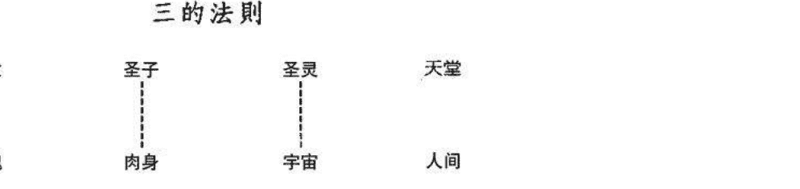

## 三角法则

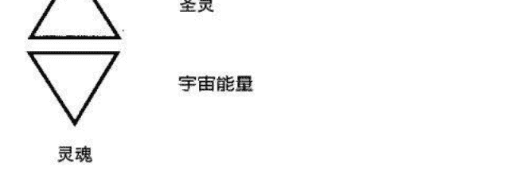

## 大卫星

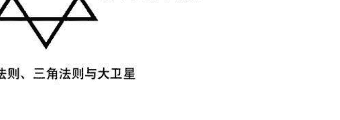

## 三的法则、三角法则与大卫星

耶稣在他的时代，也将此说法教给他的众多门徒，包含女众与男众，轮回观涉及三的法则。他的数位信徒最终将此教导化为文字。

早期基督教神父即醒悟者，融会印度教的三位一体，与耶稣教导中的三角法则，创造出今日基督教认可的圣三位一体。圣父、圣子、圣灵所指的是，灵魂、身体及宇宙能量或生命动能。

如同第九章的描述，不朽的灵魂在出生或之前进入肉身，而需要仰赖灵能、生命动能或宇宙能量，维持身体与灵魂之间的连系。这股能量的功效如同磁铁，使灵魂停留在肉身形体。创造生命需要用上的三种要素为：灵魂、身体及宇宙能量。

死亡的那一刻也遵守着同样原则。往生时，一个人的生命动能会离开肉体与急速殆尽的气场，回归宇宙。能量驱散后，永生的灵魂再也无法留在体内，片刻后即返回天界。死亡于此时发生。这个过程将周而复始，直到有一天你终于打破轮回的循环，永久回归天国。

> > 伟大老师及领导的话语，是力量与光之流。
> ——宁静的流浪圣者 Mouni Sadhu 二十世纪神秘学家

有两种状况能影响轮回中的生死循环，这些状况称作业力与法。

佛教与印度教中，业力指的是人在一世中的行为。这些言行举止，无论好坏，有时会决定一个人此生的命运，绝对会影响来世的遭遇。依据此信念，如果你在某前世对配偶残酷或暴虐，你可能会于来世扮演对换的角色，此时，你的伴侣会残暴的对待你。许多人相信你这辈子承受的苦难，可归咎于你某个前世的作为。

发觉你此生的业力或因果债，当下改变你的模式，能够减轻亏欠。基本上，你会开始打破生与重生的循环，因为你已学会自己的课题，此为个人灵性成长或精进的一部分。你越早破除或解脱这些因果，你的灵魂成长与重回天界之日的速度就越快。

反之，法，是业力的完全对比，尤其与良善的意念与行为有关。协助与献身服务人类的人，是在创造“法”或“进入天堂的积分”。对他人释出爱与善意，能够协助你不虚度此生，且提早打破轮回的循环。

法也代表极度净化，好比“一笔勾销”的说法。当你无私地帮助他人，因果债的重担能够在短期内消除，而你的动机必须纯良。随时注意自己的意念与行为，试着不去严厉批评他人。在内心与脑海升起平静的意念，如此能辅助你灵性的成长，使你成为一个更善良仁慈的生灵。

## 前世回溯的成效

透过前世回溯的疗程，能够掀起激烈的出生过程中落在你身上、使你忘却之前转世的屏障。

有许多挖掘过去，探索前世的原因。

### 情绪治疗

愤怒、哀伤、悲恸、憎恨及前世状况，引发的其他负面情绪与痛苦，能够浮现在你的意识头脑，安全的被释放，因而达到永久的疗愈。

### 身体治疗

困扰你而无法透过传统医术治疗的莫名疼痛与健康状况，经常能追溯到前世。透过重新经历意外或死亡片段，你能够唤起疼痛的记忆，因而释放疼痛。长期的问题可以达到深入的疗愈。

### 解除害怕与恐惧症

莫名的害怕及无来由的恐惧症，可透过前世回溯唤起记忆，使它浮出意识表面，进行分析与快速释放。很快的，纠缠你多年的害怕或恐惧症不复存在，或至少对你不如以往的影响。

### 了解与疗愈关系的问题

追溯你与目前交往对象的前世关系，可协助你发觉关系中的负面模式，使你破除或疗愈这些模式，你会明白关系中爱恨交织的来源。

### 领受天赋与才能

经由探索某前世，你不仅唤起转世记忆，有时还会想起或重新学会特定的才艺或能力，比方说，如果你在前世曾是位使用草药的治疗师，能够唤起你对草药的学问，这是超速学习的一种类型。

本书带给你开发超感应能力与灵性成长的详细方法与练习，有些练习专门用在前世的回溯上。

蜡烛与镜子法的第一阶段是前世回溯主要的练习。挖掘前世时，可以依据个人意愿经常使用这个方法。引导式冥想与催眠都是效果极佳的方法，能够掀开出生时加诸于你的屏障，因而使你忆起之前的转世化身。同时，有些人也能够藉助精心设计的引导冥想音乐带。

去了解自己是永生不朽与所有前世的汇集，使你明白自己的真实面貌、此时出现在地球的原因，以及历经此界日后的出路。

> > 耶稣说：‘我对那些值得的人揭露奥秘。’
> ——耶稣基督语录 诺斯替教派福音书

# 第十一章 上师最后的时日

> > 尽管受到打压，他如棕榈般挺立，像只翱翔于天国境地的飞鹰，定视着太阳的光芒。
> ——神谕

本书将古代神秘学院的机密与玄学教义传授给你——这位学徒。将近 2000 年前，耶稣曾接受同系统学说的洗礼，当时他受教于许多形而上学的中心与学院。上师耶稣的教育背景在第一章介绍过。在此，我们会更详尽地探讨这位传奇人物，他的一生与教诲。

当他在世时，耶稣曾教导众多门徒，有男有女，与本书中相同的神秘学说与理念。这些灵性与心灵法则授予他的信徒，并由他们传递给其他民众。新约内容中以含蓄的手法记载了部分奥妙的讯息，有时候以预言或昭告奇迹的形式。耶稣传授的某些智慧隐藏在圣经的福音中。不幸的是，他绝大部分的教诲，被日后编辑新约文献的基督教官员隐瞒，或从一般大众手中剥夺。

诺斯替教派的福音，十二世纪初发现于埃及拿戈玛第(Nag Hammadi)附近的圣经抄本，含有部分此学说，以及关于耶稣一生的资料。他是位真实的历史人物，如同每个人，曾活过、欢笑、哭泣以及受难。

由于这本书的基础源自古代神秘学院上师耶稣的教导，对于这位伟大的人物与导师需要有更多的认识。但并非将他视为神，而是以一位身负人类特殊使命的高等进化人物看待。

耶稣身为人时，对爱及情欲也有正常的渴望与感受。腓力福音，其中一部保存于死海古卷的原始文献

> （引述佩格 Pagels 所著<诺斯替教派福音书>）：
救世主的伴侣是抹大拉的玛利亚。但耶稣疼爱她甚至其他所有门徒，并经常亲吻她的嘴，其他门徒因此而感到不悦，他们对他说：“你为何爱她甚于我们全数？”救世主答复并对他们说：“我为何不能像疼爱她般的爱你们？”

传统中“被认定”的马太、马可、路加与约翰福音，显示耶稣在他短暂的任期中曾现身许多地点。这使许多故事的读者相信他无所不在，或者有位容貌相似者辅佐着他的职务。

如果当真如此，这将会引发许多质疑与论点。对于上师耶稣的出生甚至死亡会有不同的阐述。

诺斯替教派的其中一部福音中，曾提到耶稣的孪生兄弟。多马福音，被许多学者信奉为上师生前所留下的真实语录，提出了惊人的说法。

耶稣在世时说出许多机密，而由他的双胞胎兄弟写下：

本章内容引用文字、著作中的证据，使你这位读者与学徒，更能明白下个主题的相关与可取。

第二到第十章的内容含有一个开发超感应能力与灵性的渐进作法。当你能够观察气场、脉轮、指导灵与天使时，你周围的世界会变得更加精彩。与你的指导灵、天使合作，无论是在睡眠或清醒时的转换意识状态中，使你能接通有助于自己与他人的惊人讯息。前世记忆能够为你开启更多扇门，赋予你洞见、资讯与特长，以参透平凡世界背后运作的奥秘。提升个人频率的能力，使你的星光体能够出游，进入天国的更高境界，造访教学圣殿与阿卡西记录。从这些来源，你得以获取与自己及亲近者切身的智慧与了解。

本书作者已发展出以上提到的能力。今日，他运用它们协助走在个人道路上的其他人。在耶稣时代一段鲜明的前世记忆，加上探访阿卡西记录，使接下来的这段对话得以彰显于世。

在你阅读耶稣与一位门徒的重要对话时，请保持开放接纳的态度。

## 耶稣临终

上师耶稣临终时躺在迦密山(Mount Carmel)艾赛尼教派神秘学院中的一间隐密切齿卧房。当时正是罗马皇帝图拉真(Trajan)上任的第二年。传言中，耶稣上师年近109岁。

在迦密山将近70年的时期，耶稣督导着他的组织，并指导数位门徒。

马提亚是马太——这位前任税收官员与门徒的孙儿，坐在耶稣床边的椅子。当他注视着耶稣古老的面容时，年少优秀长满胡子的脸上挂起了哀伤的笑容。上师美丽的蓝眼回视他，这双眼睛依然如以往明亮深邃。

> > “马提亚，我年轻的朋友与弟子，不要哀伤。”耶稣面露喜色并微笑着，“毕竟世上的一切都有它的时辰。死亡不过是让生命以更高的形式延续。”

> > “但是老师”马提亚发出悲痛的声音：“我们会非常想念你。”

> > “记得我是怎么教你的，马提亚，死亡并不存在，它从未出现过。我们人类的灵魂永生，并与神直接相连。只有我们在世间暂时居住的肉体会消逝，我们是灵魂具有肉身，不要本末倒置。当我们的肉身形体再也无法供给我们的灵魂时，我们会从屋中撤离，与更高的能量共鸣，并回归天堂。在天上时，我们歇息、回顾人生，并接受特殊的指令。准备好时，重返世间，灵魂会进入即将诞生的胎儿身体，我们周而复始的重复着这个过程，直到学会我们在物质界的课题。”耶稣提起他的右手，放在年少弟子紧握的双手上。

> > “别担心！我们将于来世在天堂和人间相会。”

马提亚似乎从这些话语中得到力量。他张开紧握的双手，轻柔的将老师的手握在手中，并坐回椅子上。“你指示我前来，我一收到消息就立即赶到。”

> > “是的，我很高兴你在，我的时辰有限，而我必须对你说明一些过去发生的事件。你祖父马太在辞世前写下的手稿虽然出色，但是尚有缺憾。”

当他想起这位多年密友与门徒时，耶稣忍下他的泪水。“你必须明白，我的教材起源于亚特兰蒂斯与埃及的古老学说，它该是灵性生活的窍门，而非一门宗教，也不应该成为宗教。对于这样的发展我相当恐惧！”

年轻人体谅的眼光往下望着老师，马提亚开始想起在他的时代所发生的变化。他明白耶稣的恐惧并非没有根据。

> “我知道你指提大数城（Tarsus)的保罗与其他人，在过去曾篡改正统的教诲。”

回答时，师父依然清秀的脸孔痛苦地皱了起来，“保罗使我感到困扰，他扭曲我的教导与训示，他厌恶女性，极尽可能的贬抑她们的地位。他影响了众多机要部门的男性，将我的组织变成男权至上的体系。教导与福音应该由女众及男众传承。我有多位弟子都是女性。神这位至高无上的造物主，涵盖男性与女性元素，这两股能量在创造生命上都是必要的。”

耶稣闭上他的眼片刻，专心呼吸。他的生命能量快速的流逝，他再度张开了眼并继续说：“我要你记下这些，以及接下来我要告诉你的故事。你有过人的记忆力，马提亚，所以你只要听好我现在的叙述。之后，在我传达予你后，你可以将我的话用文字记录下来。”

马提亚坐在椅子上身体往前，全神贯注在老师身上。

> 耶稣迟缓地深吸了一口气进入他残喘的肺，开始说道：“我想要讲的是人们口中的十字架酷刑与复活。我为此感到些许沉重。”

他年轻的弟子惊讶的举起了眉毛。“你为何因为这些神迹而感到沉重？”

上师努力的提起他的右手，对他年轻的友人示意安静。

> “当我年届四十，进入我任教与管理的第四年，发生了一个危急的状况。公会(注：古代犹大 Judaea 教会与司法法庭；犹大为地名，是昔日罗马帝国所辖内之南巴勒斯坦的一部分)以及其他权威人士嫉妒我对朝野的影响。这些人想夺我的命，派遣密探监视我的一举一动，并策划出一个阴谋，引诱我与内圈的十二门徒在逾越节进入耶路撒冷。他们意图逮捕并亵渎我，想将我钉上十字架接受酷刑。

> 亚利马太人约瑟——公会的一位成员，是支持我们教导的盟友。他冒着个人生命的危险，与我在伯大尼村附近密会，警告我这个诡计。我们全体，包括你祖父马太彻夜研究我们的对策。我们在橄榄园中围着一小丛火。事实上，当初是由马太提出解决我们重大问题的方法。他建议我的孪生兄弟犹达(Judah)协助我们。犹达唯一的明显差别在他那双非常蓝的棕眼。”

耶稣停止说话，喘息了好几次。他的眼睛闭了起来，他的脸孔似乎扭曲。终于恢复了平静。“总而言之，当初决定让犹达当我的替身，如同以往，与我具有相同

精神信仰的兄弟知道了这个想法。他全心全意的答应协助我们。不幸的是，计划在逾越节出了差错。

好久以前的那一夜，在客西马尼花园中被捕的是我的双胞胎兄弟。可怜的加略人犹大(Judas)因为畏惧自己的生死，亲吻犹大的脸颊示意他为上师。当犹大被当成是我，来到本丢·彼拉多（Pontius Pilatus）的面前，他并不想定他的罪。彼拉多并不喜欢犹太人，并欣赏我的学说。事实上，他曾指示罗马士兵不要打断犹达的腿，希望能即时将他从十字架上卸下。即使罗马官员对一些人作法残酷，但基于某种因素，他对温和的艾赛尼教派信徒与他们的生活方式尚有几分尊重。

那一日，当犹达代替我被钉上十字架时，发生了一次轻微的地震，并引发了严重的暴风雨。当这些骇人的事件展开时，尼哥底母(Nicodemus)——我们团队中一位弟子，与亚利马太人的约瑟私下找本丢·彼拉多商量，请求他释放十字架上的老师。彼拉多立即答应他们的请求，并将匆忙拟定的缓刑令交由他们两位。

由于强烈的风暴与地震，仅有少数人留在酷刑的地点。我的一些信徒，我母亲与抹大拉的玛利亚都在现场。一位同情我们的罗马军团队长驻足于十字架附近。尼哥底母将文件送入罗马军团队长手中。从那瞬间开始，所有在场的人将可怜的犹达从十字架上取下，并以麻纱布包裹，背负他前往艾赛尼教派附近的治疗石窟。犹达当时还活着。罗马军团队长依然留守他的岗位。他告诉所有之后出现的好奇旁观者，耶稣已经身亡，尸体被取走，葬在属于亚利马太人约瑟的墓穴。”

马提亚坐回到椅子上，惊讶的对着耶稣喘气。小房间沉静了数秒。只听到偶尔的鸟鸣与微风吹动卧室窗外的树枝声。

上师耶稣又开始了他的故事：“不幸的是，我勇敢的兄弟犹达并没有从酷刑中复活。本丢·彼拉多派遣罗马士兵前来属于亚利马太人约瑟的墓穴，人们被排除在这个区域之外三整天。最终，在声称我身亡的第三天，抹大拉的玛利亚与其他参与这个密谋的人士来到这个墓穴。罗马侍卫在前一晚已推开巨石，暴露出空荡的墓穴。抹大拉的玛利亚与其他人群宣告耶稣死而复生。不久，这个消息传遍了国家，让公会的许多成员感到极度惊讶。”

耶稣又开始喘息，停止了他惊人的故事。他闭起了蓝色的眼睛，努力的让维生的空气进入他的肺脏。

马提亚将注意力从耶稣的脸庞抽离，望着窗外围绕着庞大结构的石墙，当他凝视时，一只黑色的鸟降落在墙上。他开始在记忆中搜寻，思索着黑鸟的意义。

看不见身后的景象，耶稣运用他超凡的灵视力，说道：“马提亚，人们说目睹黑鸟是死亡的预告。在那墙上坐着一个迹象，这是属于我个人的预兆。当它飞离时，我的灵魂也将一同翱翔。”

黑暗将要降临耶稣，他用尽最后的力气诉说着：“我思念我心爱的抹大拉的玛利亚，与我所有的儿孙。我所有的老朋友与门徒早已不在。我感到哀伤与孤单。我曾活过、爱过与哭泣过。我枯老的身体如同沙漠上的一粒尘沙。当风来袭时，我

将从尘土中消失，飘向远方。”一滴泪水滑落他的面颊。他的眼睛出了神，“承诺我，马提亚，记下我所有刚讲过的话。”

他阖上了眼，喃喃自语：“玛利亚，我如此爱你，如此想念着你，是我该走的时候了。”耶稣吐出了最后一口气，他的身体僵止不动。

忽然间，一道美丽的白光出现在他床脚，即刻形成一位天使的形体。同时，一股白光从耶稣，众人口中的基督身体浮现，并朝着天使移动。以男形现身的天界讯息者开始闪闪发光然后缩小。这两股光芒一起在屋中移动，接着从卧室的窗户离去，移往驻足墙上的黑鸟。

马提亚——马太这位前任税务官员与门徒的孙儿，注视着窗外死亡的特殊景象。两股盘旋的白光舞动着，并朝着黑鸟移动。鸟儿煽动它乌黑的翅膀，往天空飞翔。明亮璀璨的白光加入它的高度，一同持续地朝天堂爬升。不久，这个惊奇的景象从马提亚眼底消失。死亡的黑鸟与它奇特的同伴已飞入天界。

上师耶稣的灵魂回到了家园。

> 来到我身边，为难的孩子。
来到我身边，如此地柔弱。
当泪水充满你的眼，
当恐惧盘据你的心，
我会拭干你的泪眼，
安抚你惊恐的呐喊。
——道格拉斯. 德龙

珍珠与沙粒语：关于耶稣与女门徒及宗教是如何被扭曲的，请参见齐瑞尔<创世基质>，有更详细说明

# 附录

## 人体气场色彩、意义解说与位置

接下来是一个气场颜色的对照说明表，使你能快速简便地查阅这些能量与它们的意义。

因为每个人眼中的世界不同，一些人看到的这些美丽色彩会与他人有些许差异。或许一个人眼中的绿色比朋友见到的较浅——这是正常的。

参照第四章中颜色与其特性的详细说明。

### 正向色彩

- 淡蓝色
- 中蓝色
- 深蓝色
- 淡到中绿色
- 阳光或淡黄色
- 嫩粉红色
- 中到深红色

### 中性色彩

- 蜂蜜或金咖啡色

### 罕见的正向色彩

- 白色
- 金色
- 银色
- 淡紫色
- 中紫色（靛色）
- 淡到中橙色

### 负向色彩

- 黑色
- 灰色
- 浊黄色
- 浊橙色
- 浊/晦暗的咖啡色
- 亮粉红色
- 淡红色
- 带红的紫色
- 深绿色

附表如下图

| 颜色 | 意义（人的类型） | 位置 |
|------|------------------|------|
| 蜂蜜或金黄色 | 对财富、权力、与社会地位感兴趣 | 完全笼罩头部——离表面1吋到3吋的人 |
| 中性色 | 没有好坏之分的色光 | （有时出现在身体其他部位） |
| 中到深红色 | 性能量强或色欲熏心的人（有时指性郁闷的人） | 小团雾状能量出现在头部附近 |
| 嫩粉红色 | 对他人充满大爱的人 | 头部附近——离表面8吋到14吋 |
| 阳光或淡黄色 | 乐观、外向、能量充沛的人 | 头部附近——离表面1吋到4吋 |
| 淡到中绿色 | 天生的治疗师，可能在接受治疗的人 | 头部附近，包含头发，下至手臂与双手 |
| 中蓝色 | 技术性、理性、具商业头脑的人 | 头部附近——离表面2又1/2吋到7吋 |
| 淡蓝色 | 温和、平静与灵性的人 | 头部附近——离表面1/2吋到6吋 |
| 正向色 | 良性、有益色光 | 如下 || 颜色 | 意义（人的类型） | 位置 |
|------|------------------|------|
| 淡到中橙色 | 具有獨特幽默感的人 | 頭頂上方 8 吋到 10 吋 |
| 中紫色（靛色） | 心靈覺醒的人 | 頂輪（頭頂）與第三眼（前額） |
| 淡紫色 | 以靈性方式使用超感天賦或能力的人 | 頂輪（頭頂）與第三眼脈輪（前額） |
| 銀色 | 變得更為清醒，剛踏上人生使命道路的人 | 頭部附近——離表面 1 吋到 3 吋 |
| 金黃色 | 連結到宇宙智慧與靈性知識的人 | 頭頂上方 6 吋到 8 吋，到完全籠罩整個頭 |
| 白色純淨的能量 | 走在人生道路或使命的人；較覺醒的人 | 頭部附近，最終出現在全身 |
| 罕見正向色彩 | 特殊的色光顯示心靈與靈性覺醒 | 大多出現在頭部附近的氣場（特例於下方說明） |
| 深綠色 | 羨慕或嫉妒的人，垂涎他人財產 | 包圍整個或部分頭部——離表面 4 吋到 7 吋 |
| 帶紅的紫色 | 憤怒而具有超感能力的人 | 頂輪上方（頭頂）或第三眼的位置（前額） |
| 亮粉紅色 | 憤怒或身上有能量淤塞的人 | 頭部側邊附近——從表面開始移動 |
| 咖啡色 | （根據咖啡色的深淺） | 患部附近或籠罩全身 |
| 濁／幽暗的 | 瀕死後期，或非常負面的個性 | 患部附近或籠罩全身 |
| 濁橙色 | 病重，可能罹患癌症的人 | 患部上方與附近區域 |
| 濁黃色 | 身體生病或受傷的人 | 患部或受傷部位上方 |
| 灰色 | 生病的人，頭痛或缺乏能量；可能遭受虐待 | 頭部附近或罩在臉上 |
| 黑色 | 疲倦、能量匱乏的人，或不快樂、虛偽的人 | 頭部附近或罩在臉上 |
| 負向色 | 惡性、不良色光 | 如下 |
| 顏色 | 如下 | 如下 |