# 召唤金钱的魔法

嘘～《秘密》沒說的超實用版～

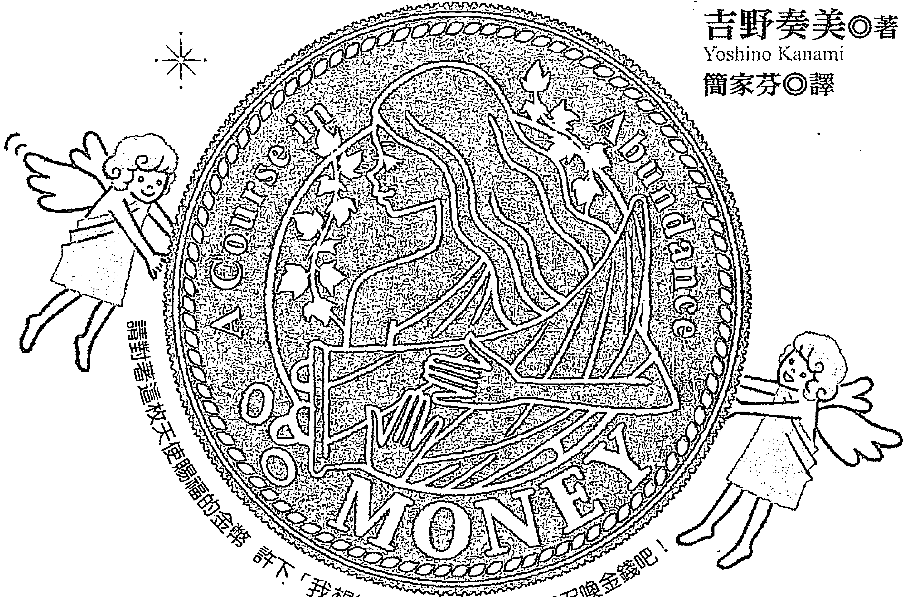

請對著這枚天使賜福的金幣，許下「我想變有錢」的願望，一起召喚金錢吧！

吉野奏美◎著
Yoshino Kanami
簡家芬◎譯

活用靈修與財富的法則

知道被金錢喜愛的秘密，提升吸引錢的正向能量

讓金錢愛上你，成為真正幸福的有錢人

※隨書附贈專屬天使賜福金幣，請見封底折口※

Let's be happy

# 召喚金錢的魔法

~Let's be Happy, Lucky & Rich~

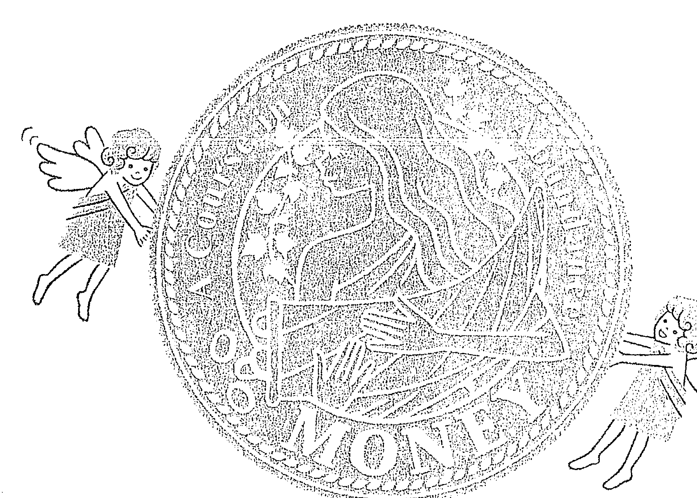

吉野奏美◎著

簡家芬◎譯

# 前言

「真想過貴婦般的生活。」
「好想有多一點的自由。」
「不希望人生充滿不安。」

誰都曾這麼想過，只是有人能夠如願，有人終不得其盼，為什麼會有這種天差地別的待遇呢？就連我也有過這麼一段時期，下了很大功夫，做了許多努力，最後仍收不到應有的成效。當付出不及收穫時，我常會這麼想：「難道真是命運決定一切？還是只有我自己不知道所謂的『宇宙法則』？究竟有沒有方法可以改變現況？」為了找出這些答案，我埋首研究「宇宙的法則」數年有餘，總算讓我发现「實現夢想的宇宙法則」，從此我的人生就像一條光明大道，自己的夢想也慢慢地實現。

「實現夢想靠的果然不是運氣，而是在於知不知道它的定律，還有實踐的方法」，一開始我很開心能領會這番道理，之後卻因為演講及出版的邀約不斷，和大眾的接觸機會越來越多，一不小心就遭人嫉妒，惹上了金錢糾紛。在在顯示，享受「成功」與「富裕」之後所必須要付出的代價。

現在回想起來，當時宇宙應該是藉由那樣的事件試著教我「邁向成功的下一步就是要妥善運用金錢」。沒錯！以前我最想躲開的就是「金錢」。我過去因為長年浸淫在古典音樂的世界中，總有「老想著賺錢不好」以及「常把錢掛在嘴邊，會讓人誤以為我心存貪念」等觀念，這都是因為學音樂之人共有的一種默契：「藝術與金錢無法相提並論」，所以一直以來我都把金錢的事情當成禁忌，選擇不看也不聽，直到現在，暗藏在我心中許久的這個想法，才終於得以攤在陽光下。

回歸「夢想成真」||「富裕」||「富有」這個初衷，我把關於「金錢」的一切再全盤想了一遍。雖說「用金錢無法買到幸福」，但金錢確實可以買到安心、平和及安穩。經過苦心研究之後，我終於發現金錢與「實現夢想」的道理相通。

我個人「實現夢想」的順序是：首先要確立夢想、訂定計畫，最後將計畫付諸行動。只要把以上的「夢想」代換成「金錢」：先要有成為有錢人的意念、接著規劃資金的運用及思考生財之道，最後就和實現夢想一樣，計畫確立之後隨即展開行動。只是在實行的時候，如果想法與觀念有所改變的話，應該想辦法找出平衡點，而以上這些都是對金錢用心的態度。

當我們有了錢，邁向理想人生的機會將明顯增加。因此，實現夢想與擁有財富可說是劃上等號，物質與精神層面的東西是為了讓生活更富足所不可或缺的。我認為每個人的內心深處都渴望兩者兼備，同時能達到平衡。

那麼，到底要如何才能同時在物質與精神上都富足且取得完美平衡呢？

從靈修面來看，宇宙的資源無窮無盡，無法取得的人恐怕要捫心自問是否出了什麼問題，記住只要能消除這個障礙，並與金錢重新建立關係，相信每個人最後都能成為金錢所喜歡的人。

這就是「靈修與財富的關係」。

本書是前作《夢想成真的幸福力練習》的續篇。透過本書可以了解金錢的力量。倘若各位閱讀過前作，相信可以有更深刻的了解，在此，請大家務必將本書搭配前作一起閱讀。

另外，本書共三章：第一章為奠立心靈與錢財富裕的基礎、第二章是讓金錢愛上你的心靈法則、第三章則歸納整理連結幸福與財富的關鍵。

從今天開始讓自己擁有的會讓財富喜愛的重生心靈，好好召喚金錢吧。想要成為有錢人，絕對不能只靠運氣，容我在此大聲跟大家宣誓，只要了解本書介紹的法則並且身體力行，每個人都能成為幸福的有錢人。

當你了解被金錢喜愛的秘密，就請你收下封面上天使所賜予的金幣祝福。

記得實際一點，跟天使許下可以得到財富的願望。

這個金幣是富裕的象徵，現在已經有一位天使準備把這個財富交給你，且親自送到你的手邊。你眼見這個象徵，會思考些什麼？心裡又有什麼感覺呢？

讓物質、精神富裕的方法盡在本書。

那麼，就讓我們快快開始魔法的課程吧！

吉野奏美

# 召喚金錢的魔法

## (Contents)

# 第1章 奠定心靈與錢財富裕的基礎

- 金錢與靈修的關係 14
- 金錢是純淨能量 20
- 健康才是最大的財富 27
- 向身體道謝 34
- 藉由清理房間來提升運勢 37
- 用鹽浴洗亮氣場 42
  - WORK ① 簡單！氣場淨化法 44
- 與地球連接的接地法 47
  - WORK ② 非常之重要的接地！ 50
- 泡溫泉提升接地力 54
- 接地LESSON——接地線的清掃篇 60
  - WORK ③ 接地線的清潔 64
- 無法接地的原因 66

# 第2章 讓金錢愛上你的心靈法則

- 金錢與心靈的關係 72
- 有錢人如何看待「金錢」 78
  - WORK ① 吸引錢的「魔法吸金磁鐵」 83
- 讓金錢增加的魔法錢包術 85
  - WORK ② 用滿月的月光淨化魔法錢包 89
- 你嫉妒有錢人嗎？ 91
  - WORK ③ 消弭「嫉妒」的方法 96
- 「玫瑰呼吸法」淨化細胞裡的障礙 98
  - WORK ④ 玫瑰花淨化身體的方法 102
- 錢包裡的狀態顯示你的價值 107
  - WORK ⑤ 提升自我價值的方法 110
- 金錢匱乏時的生活方式 112
- 富裕時的生活方式 117
- 謙虛的人最受金錢喜愛 122
- 讓金錢更喜歡你的方法 125

# 第3章 獲得豐沛能量的十大金鑰

- 與豐沛的能量連結 132
- 不讓金錢操弄的方法 138
- 金錢的公平交換 145
- 找出自己對金錢的信念 155
  - WORK ⑨ 寫下你對金錢負面、錯誤的觀念 160
- 了解父母對金錢抱持的信念 162
  - WORK ⑩ 請求天使協助的方法 166
- 重視你的人際關係 168
- 化危機為轉機 172
- 靈魂行走的路該是一條豐盛的路 177
- 思考自己的價值所在 181
- 所謂真正的富有 187
- 金錢是天使送來的禮物 190
- 結語 194

# 第1章 奠定心靈與錢財富裕的基礎

## 金錢由負債開始

大部分的人都希望可以盡情用錢，一方面可以完成自己想做的事，一方面可以過身心靈充足的幸福生活。金錢是人類為了生存絕對不可或缺的東西，舉凡經營一個舒適安全的家、繳付房租與房貸、維持健康的三餐、血拼用來展現自我的服裝、取得證照與習得一技之長的學費等等……食衣住行育樂，樣樣都要花錢。

話雖如此，即使日本在世界上稱得上是富強的國家，但是「沒有錢」、「付不出醫藥費」或「沒有地方住」的人卻比比皆是。這又是為什麼呢？

大家都期望有錢，而且希望越多越好，有了錢才能將生活向上提升，接受更好的教育，然後利用受過高等教育而學得的知識與技能，讓自己有能力選擇想做的工作、還可以到海外遊學增廣見聞，以期最終能達到柏拉圖理想國的境界：以各種形式捐贈、救助貧窮國家的人們……只是，一旦有了錢，糾紛也會接踵而來。人們對有錢人的嫉妒、夥伴間互相鬥爭、詐欺、親友間關於財產繼承的問題等等……生活中絕不能沒有的東西、為我們製造機會的東西、最後引發糾紛的主角全都是——錢！本書針對如此不可思議的金錢，以靈修的角度予以重新定義。

絕大部分人的金錢觀都是「收入減掉支出後的餘額」。本書傳達的觀念不太一樣，跟投資更是八竿子打不著；本書欲解讀金錢與靈修之間的關係，也就是以「金錢是種能量！」為基本概念。「金錢是種能量」劈頭這麼一說也許讓人摸不著頭緒，事實上，每一次當我們心中吶喊「我要錢！」的時候，腦海裡會出現一些畫面，比方說，想買新衣服、想去旅行、想要有自己的家、想唸書增加技能、未來想過著愜意的退休生活等……這些畫面雖然尚未具體成形，但其實一開始就已浮現大腦之中。而且雖然我們的肉眼看不見能量，但是能量卻可以藉著金錢這個工具來交易，讓我們期朌的現實與權力最終化成有形。當然，有錢不至於能夠擁有一切，但至少有八成的事物可以因此美夢成真。讓肉眼看不到的這股能量，實現心裡冀盼的事物；利用上述原理，來思考如何與金錢建立更和諧的關係，如何變身為金錢所喜愛的人，以上所說的，將從靈修與金錢的關係來慢慢傳授給你。

雖然仍有為數不少的人始終無法把靈修與金錢聯想在一起，但事實上兩者的本質是一樣的。正因為我們同樣並存於這個現實的世界裡，所以好好對待錢財準沒錯。

先不管你了不了解靈修與金錢的關係，目前我開設的靈修課程中的學員，為錢發愁的大有人在；相反地，也有人對錢相當執著，甚至因此與靈修同好或講師起爭執，這一切的一切，其實我都看在眼裡。

大約十多年前，我擔任一個靈修讀書會的聯絡人。有一次曾經遇到幾位民眾到了讀書會當天才臨時取消出席，隔了幾天我去跟他們請款，沒想到他們冷冷地對我說：「我們沒必要付錢吧？因為海報上壓根兒沒提到錢啊！」沒錯，海報上的確沒有說明清楚，而我自己也沒注意，但看他們理直氣壯的樣子，再加上發覺他們對「靈修課程」充滿疑慮，於是讓我有了研究金錢的念頭。另外，很多人不相信我可以與看不見的靈體對談。事實上，過度追求靈性現象，的確有可能造成思想偏差，發生與身邊的人溝通不良的情形。但是靈修課程只是輔助你創造你所期望的現實，而金錢的功用也只是要讓你的夢想可能成真。再怎麼說，金錢也不過是加強人際關係以及使人際關係與人心更具體的一種強大能量罷了。有了這層認知之後，就跟著我一步一步了解錢吧！

「金錢」是展現人際關係與人內心世界的強大能量

✨ **關於金錢的糾紛** ✨

金錢有「為我們實現夢想」的積極面向。但是，金錢也容易引發糾紛。金錢是使人際關係與人心更具體的一種強大能量。

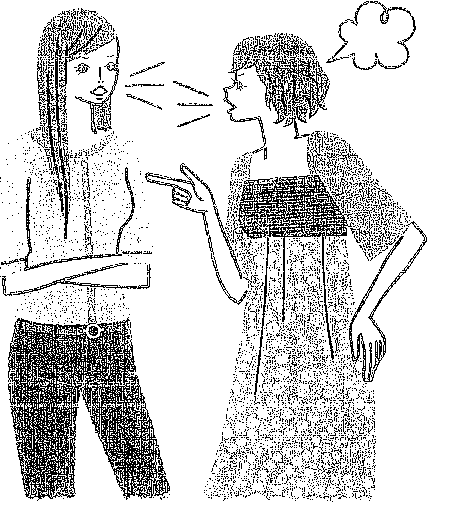

### 和朋友發生金錢糾紛

就算是好朋友，只要和金錢扯上關係就容易起衝突。每個人對金錢的看法，常常出乎意料地不大相同。「啊，原來他的價值觀是這樣……」，經過衝突而恍然大悟的人也不在少數。

### 嫉妒

看了很久卻還沒買下手的包包，無意間看到朋友提著那個包包走在路上的樣子，告訴自己不可以這麼想「還不都是因為人家家裡有錢，像我就沒……」，卻仍止不住妒意……兩個人就因為金錢，導致友情變了質。

### 遺產繼承

一向彬彬有禮、為人敦厚的人也可能一夕之間淪為「金錢的奴隸」，這就是金錢的可怕之處。特別是處理遺產繼承問題的時候，親族展開爭奪戰，原本血濃於水的家族情感，混亂糾葛一發不可收拾……

## 金錢是純淨能量

宇宙法則的一個基本概念是「自己的人生是自己創造出來的」。如果你內心覺得不滿足、忿忿不平或恐懼，宇宙將會把那些負面狀況引渡到你身上，最終那些想法將成為事實。你是不是老想著「為甚麼我總是得不到想要的東西呢？」

而解決這種負面想法的關鍵應該就在你的內心之中。

剛剛我已經把靈修中所說「金錢是能量」的觀念大略解釋完畢。但是，究竟所謂的「能量」是指什麼呢？由於金錢充其量不過只是一張紙片，但由於它既能使人幸福、又能引人為之爭奪不休，相信大家已經了解，金錢本身就具有不容小覷的「能量」。

接下來，請各位花點時間想想，你自己認為金錢所具有的「能量」究竟是什麼？請想像各種狀況，並把你對於金錢的想法寫下來。請在「如果有錢的話，我OOO」的句子之中，試著写下所有你想得到的事。

- 如果有錢的話，我可以唸喜歡的學校。
- 如果有錢的話，我可以住舒適的屋子。
- 如果有錢的話，我可以買禮物送家人及朋友。
- 如果有錢的話，我可以買一堆渴望已久的衣服。
- 如果有錢的話，我可以更健康。
- 如果有錢的話，我就很有機會夢想成真。

這些應該是公認的答案。所以，如果你有錢的話，想想自己想要什麼東西、可以完成什麼事情。答案無關對錯，請盡情地寫下你心裡所想的答案：

如果有錢的話，（　　　　）

> 「金錢」是用以換取想要物品的工具

雖然一般普遍認為「凡事只著眼於金錢並不好」，但「金錢真的只是純淨的能量」，如此而已。

你看，金錢是不是能轉變成各種形式、擁有不同的樣貌了呢？所以說，金錢存在的目的是「用以交換想要物品的工具」。原本金錢只是一種純淨的能量，金錢會因為每個人的使用方法與對金錢所抱持的想法，而有善與惡不同的面貌出現。

- 如果有錢的話，（　　）
- 如果有錢的話，（　　）
- 如果有錢的話，（　　）
- 如果有錢的話，（　　）

## 金錢用以換取想要東西的工具

只要有錢，就可以付錢購買各種東西、享有多重服務。想要生活豐裕無虞，就一定要有錢。

### 金錢可以換取下列東西

#### VIP的禮遇

有時候真的好想在頂級包廂裡擺闊……這種感覺真是無法言喻。只要有錢，就可以享受到女王級的VIP尊榮禮遇，最美麗的夜景、最昂貴的名酒、最一流的服務，全部任君挑選。

#### 各種禮物

人都曾為了某個目標而努力耕耘，享受成果時記得大方送個禮物犒賞自己吧。不過買禮物也得要有錢才行。送禮給對你很重要的、交情很好的朋友，你們之間的關係就會變得更親密。

#### 旅行

有錢就能夠去一直很想去的國家自由自在旅行、飽覽新鮮的事物、讓你盡情體驗那份感動，更加豐富自己的人生經驗。

#### 孝順

平常羞於說出口的感謝話語，用孝順的行動來表達，父母一定會很開心；然而孝順的行動同樣建構在金錢的基礎上。

### 金錢還可以換這些東西！

- 家
- 西服
- 電視
- 食材
- 知識
- 技術
- 時間
- 健康
- 高級飯店
- 寵物
- 人際關係
- 土地
- 別墅
- 體力
- 創意
- 親切
- 工作
- 心
- 社會貢獻
- 醫療
- 開拓
- 技術合作
- 機會
- 財產
- 權力
- 教育
- 支配
- 成功
- 支援
- 援助
- 研究
- 優雅
- 整潔
- 美……

## 金錢是用以換取想要東西的工具

金錢在精神、情感層面也有影響力。人會覺得自由、安慰、有元氣……都是金錢所施展的魔法。

金錢可以讓我們在精神、情感層面獲得哪些東西呢？

### 放鬆慰勞

為了不讓一天的疲勞、壓力累積在體內，這個時候沏一杯上等的芳香花草茶放鬆心情如何？因為有錢，才能這麼安心享受。

### 元氣滿滿

當我們意識到健康的重要性，想辦法恢復身體機能，就能變得有精神。再者，因為金錢本身的能量，人有了金錢當後盾，會不自覺充滿力量。

下班後小酌一杯是品味自由最幸福的時刻。能這樣無拘無束也是因為金錢的力量。要是沒有錢，別說喝啤酒了、恐怕連眼前的帳單也付不出來。

### 金錢還可以換這些東西！

- 樂趣
- 勇氣
- 夢想
- 希望
- 歡笑
- 優雅
- 安祥
- 安定
- 愛
- 和平
- 感謝

# 第1章 奠定心靈與錢財富裕的基礎

## 健康才能賺大錢

現代人的生活步調總是匆忙又快速。每天處理繁瑣的公事、公司與家庭兩地奔波，身心都處於疲累不堪的狀態。長此以往，人們光是要度過每一天就須耗費全部心力，更別提哪還有餘力思考未來的方向了。

想要吸引金錢，努力工作賺錢是一定要的，但那並不是全部。

首先，你必須要能感覺到自己是「富足的」、「幸福的」、「充滿感激的」。讓自己處於這樣的精神狀態是非常重要的，但如果你總是感到疲勞不堪、身體有病痛，是絕對不可能達到那樣的境界的。

現在就來檢視自己的身體狀況吧！你認為自己健康嗎？身體有沒有疼痛或不舒服的地方？想要「健康又樂在工作！」那麼就不能忘記平常要保養身體。不論是要賺錢或是贏錢，都必須先有健康的身體。

我認為保持健康有三個重要階段，分別是「資訊」、「察覺」與「行動」。

「身體與心理會相互影響」已是醫學界普遍的常識。心裡如果有掛心的事、或是突然遭受晴天霹靂的意外、累積過多壓力，都會造成自律神經失調、心悸、呼吸困難、暈眩、噁心、倦怠感等症狀。這些症狀和身體的外傷不同，旁人無法一眼就看出來，像日本人會認為有上述症狀的人是因為「怠惰」或「意志力變弱了」，歐美人卻不一樣，他們一發現自己有這樣的情形，就會趕快去找心理諮商師報到，只要被判定精神上需要休息的話，就有權利以「生病」為由放假好好休息，這都是因為他們能夠理解這種心理症狀所導致。

# 第 1 章 奠定心灵与金钱财富的基础

所以切记不要独自抱头苦恼，应该赶紧起身找寻解决的“资讯”，并和值得信赖的人或专业的心理咨询师谈谈，由他们协助找出解决之道才是最恰当的。

假设你身体某个部位真的不舒服、或是你一直觉得郁郁寡欢，恐怕都是身体在对你发出警讯：“改变你现在的习惯吧”、“停下来休息一下吧”等等。如果你可以早一步“察觉”警讯，就能早日回归正常的步调。

再来，请检视平日健康管理的四大项目：“饮食习惯”、“睡眠”、“运动”与“环境”。

大家可以针对此四个项目，下点功夫做调整：如果你平常因为工作忙碌、外食次数很多的话，可以选在假日亲自下厨；一直加班导致晚睡的人，则可以在周休补眠；另外像平时缺乏运动的人，可以选择提早一站下车，花个二十分钟时间走路回家，周末也可以安排大扫除，让居住环境更舒适……

不管怎么说，要让人生过得快意，健康还是第一要务，因为健康是人最大的财富！

## 健康管理四大项目

- 饮食习惯
- 睡眠
- 运动
- 环境

## 你健康吗？

勾选以下选项、自我检测一下吧

### 运动

- 有定期运动吗？
- 每天运动吗？
- 都做些什么运动呢？

### 饮食习惯

- 外食机会多吗？
- 一星期外食几次呢？
- 点菜时会注意卡路里吗？

### 居家环境

- 家里舒适吗？
- 在家可以放松吗？还是比较在公司比较放松？
- 为了让生活更舒适，有任何可以改善的地方吗？

### 生活习惯（睡眠）

- 睡眠充足吗？
- 一天睡几个小时呢？
- 睡得好吗？
- 认为自己必须睡几个小时才够呢？

## ✨ 来做身体的保养吧 ✨

为了丰富自己的人生，保持健康很重要。做你自己健康的后盾，好好慰劳一下身体吧！

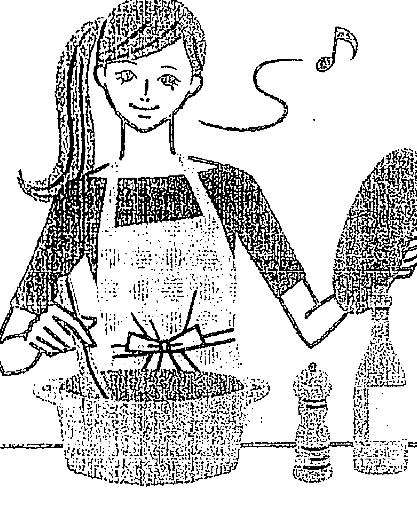

每样食材都是人体的能量来源。即使每天做菜不太可能，但有时间就亲自下厨最为理想！不仅可以自己挑选需要的食材、也能依照自己的口味调味，留意热量的控制，达到最完美的营养摄取。

缺乏运动的人，可以从走路开始，设法让身体动一动。想要养成走路的习惯，切记别一开始就下猛药，能走路上下班就算不错了喔。

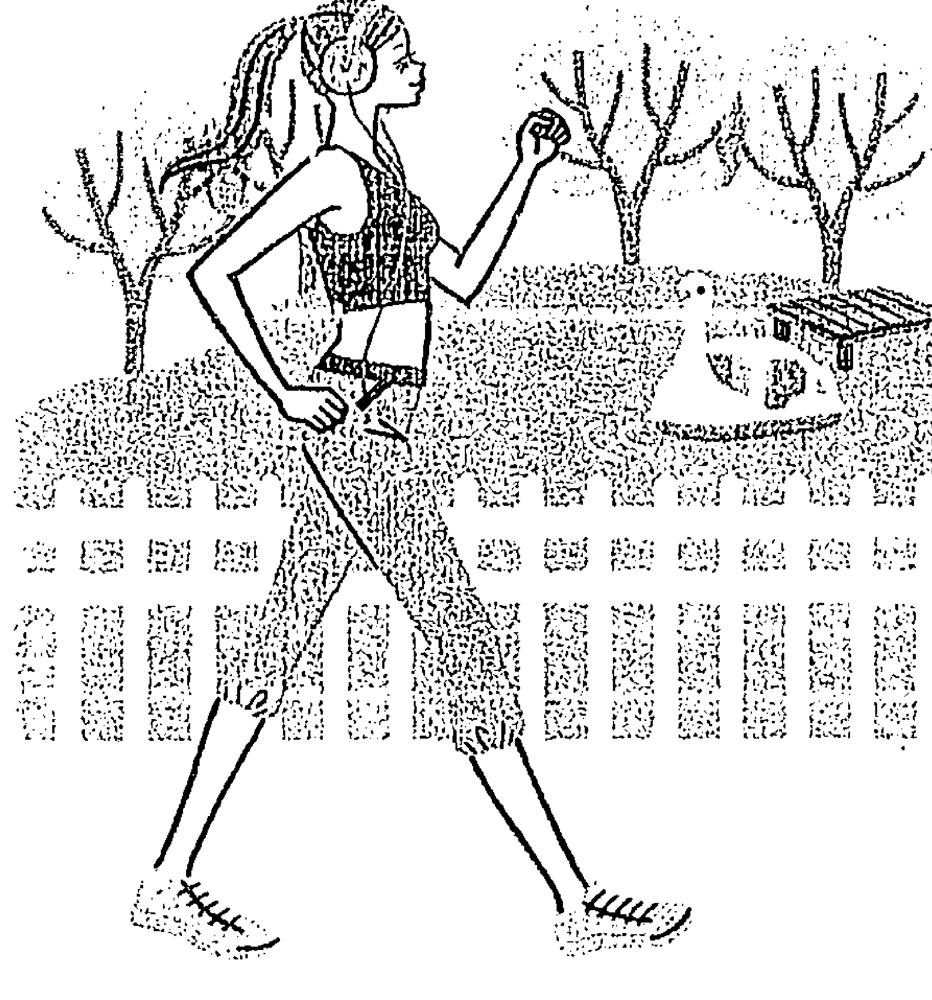

## 睡眠

睡眠一定要充足。身体的细胞通常都在睡觉的时候活动。工作忙碌的人，总是早出晚归……这样忙碌、不好好睡觉的人，无法胜任创意工作。

## 打扫

要提升金钱运，环境的清洁不可少。先从自己的房间开始做起，如果因为没有清扫干净，造成房间到处堆满垃圾，久而久之，你的心也会不自觉蒙尘，不多留意不行。

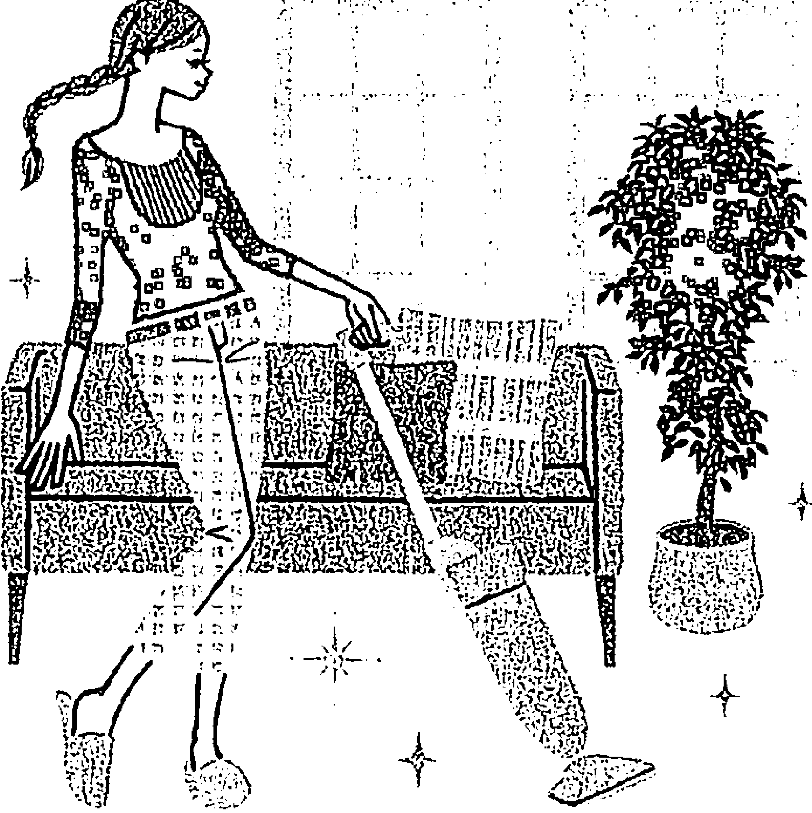

## 身体是最好的朋友

人都希望变得富有，同时也希望自己的心灵能够成长。就连植物在生长的过程，也都需要补充水分及养分才能茁壮。同理可证，我们想变得更为富有一种生命力的展现。

我们呼吸、生存，同时因为拥有身体，得以享用美食佳肴、与三五好友愉悦地谈天说笑、听遍美妙的音乐、观赏精彩的舞台剧。没有身体，我们就无法体会一个人一生会经历的所有感情。所以说身体是我们最重要的伙伴，也是我们灵魂的搭载工具。

以车子为例，把身体比拟为车体的话、有灵魂的我们就是司机，而身体则是载着我们抵达目的地的车子。身体跟车子一样需要定期保养。但我却常常看到日复一日、从早到晚让身体引擎转个不停的人。

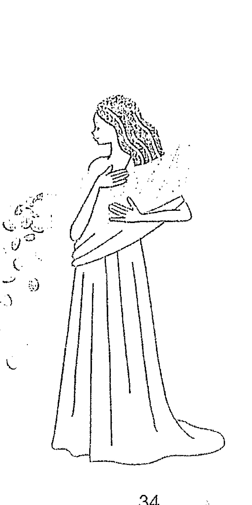

# 第 1 章 奠定心灵与钱财富裕的基础

你是不是也常常对自己的身体传达这些命令？
“下星期有很重要的会议，一定要赶快完成！”
“以后如果生病就糟了，要趁现在好好拼命赚钱！”
“只有我可以照顾奶奶了……”

如果你平常拼劲十足、要求完美或责任感很强，就要特别注意，当你不断对身体喊话：“加油，再加把劲！”持续传达要身体工作二十四小时的讯息，小心身体的引擎总有一天会戛然停止！不过个性是天生的，不是想改变就能轻易改变的。

但我刚好有一个让自己可以转换心境的方法：
在一天的尾声，对自己的身体真挚地说十声“谢谢”。
不管是工作顺利完成也好、赚到钱也好、或是有能力照顾别人也好，这一切都是因为身体全力支持我们的关系，试着感谢我们的身体吧。
我想身体也会意识到，我们正在把“该好好休息了”的小小讯息传送出去，也就是把该休息的“感觉”让身体接受。身体一定会有所察觉的。如果忽略这样的作法，而让身体总是处于紧张的工作状态，身体就会以“病痛”的方式表示提醒和抗议。如果到这个地步才急急忙忙赶到医院，就只好花时间和医疗费，才能重获健康了。

因此睡觉前，记得花点时间好好留意自己的身体！

**Point**
身体是灵魂的搭载工具

## 藉由清理房间来提升运势

想召唤金钱，首要工作是净化自己。虽然一提到净化，大家脑海中浮现的几乎都是运动流汗！其实还有其他的方法，像是：岩盘浴、挑选无农药的食材等，从体内做净化。正在看这本书的你，应该尽早找到适合自己的净化方法，但我想先推荐给大家的是：打扫、清洁你的房间！因为这是不用花太多钱，又能一个人动手完成的好方法。房间其实是反映心情的镜子。如果你想提升金钱运，现在就赶紧整理房间吧！假如你的房间到处都是垃圾、连站的地方也没有，那么你的工作和人际关系应该不会好到哪里去。假如你一直懒得动手整理，那么你的房间很可能会沦落为较低次元的灵体最喜欢的住处，较低次元的灵体指的就是充满负面能量的东西

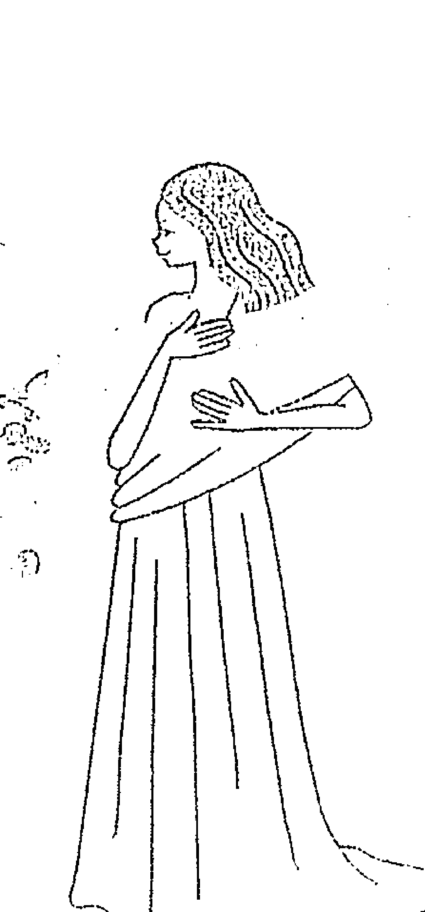

> （在此以瘟神来比喻），只要让它们停留在房间里，你的运势恐怕会就此直直落下。因为它们最喜欢阴暗、脏乱、又潮湿的地方，恰巧跟老鼠、蟑螂一样。

相反地，如果你的房间阳光充足、通风良好，又很整齐清洁，能量高的灵体（以福神来比喻）绝对很乐意光临，因为它们最爱干净、明亮的地方，如果家中保持整洁，一定可以生意兴隆、阖家安康、和乐融融，这么一来家中的欢笑声也将不绝于耳。

- 个人房间
  - 书桌上是否干净整齐
  - 衣橱及衣柜里面
  - 抽屉里的小东西
  - 书柜（已经不看的杂志和书籍）

现在开始丢弃那些堆在一旁已不再使用的东西，整理回收之后，用吸尘器打扫房间的每个角落，做个大扫除，借此提升整体运势吧。

# 第 1 章 奠定心灵与财富富裕的基础

神来喝咖啡啰。就从这些小地方开始动手整理吧。你会发现自已囤积了不少用不到的东西，这时候千万不要觉得“浪费、可惜”，请大胆添购新品，重新打造新环境，让你的房间焕然一新，变成一个明亮、通风的完美房间，到时就可以招请福神来提升运势吧！

- 冰箱是否有过期的食物
- 碗盘柜里不用的碗盘
- 鞋柜里不穿的鞋子
- 浴室的霉菌
- 排水管的清理
- 流理台的污垢

## 招来福神的方法

房间是反映心情的镜子。只要把房间整理、打扫干净，福神一定会造访。想要提升金钱运，这样做就对了！

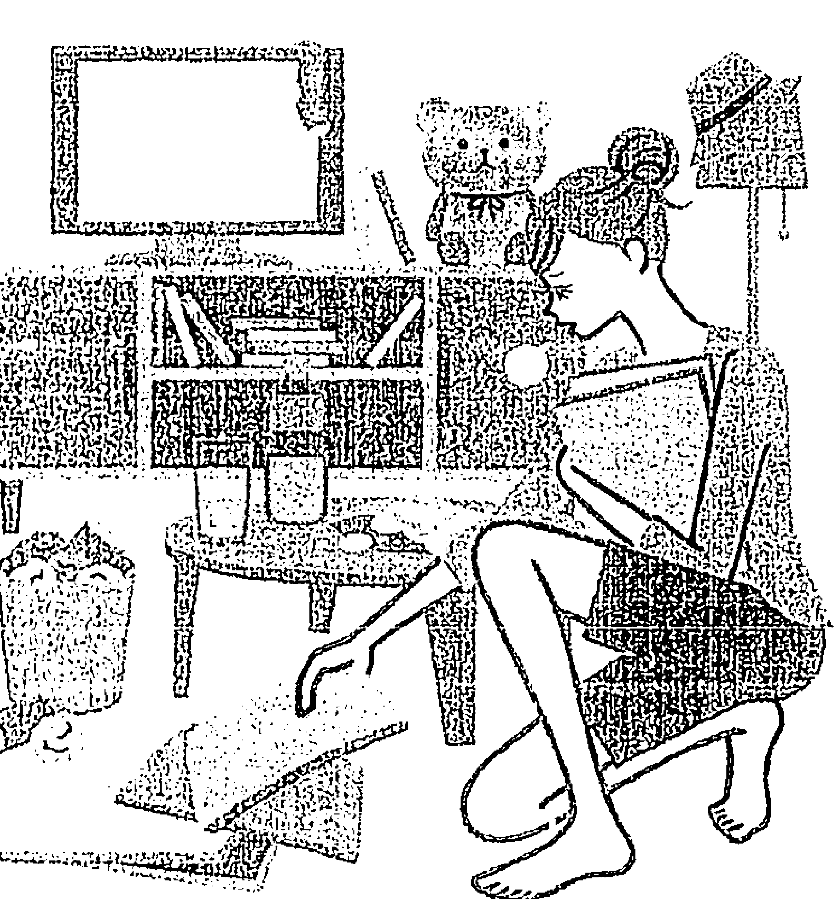

### 整理房间

房间是反映心情的镜子。房里如果东西散落一地，你的心思一定也无法统整而杂乱不已，所以藉着好好整理房间，让心情焕然一新吧。

### 清理旧衣

衣橱里是不是还有舍不得丢掉的衣服呢？如果觉得可惜、迟迟不丢的话，可是会让你的运势下跌喔。如果你有三年以上都没穿的衣服，想一想以后还会不会穿，如果不想穿了，看是要回收还是送给朋友吧。

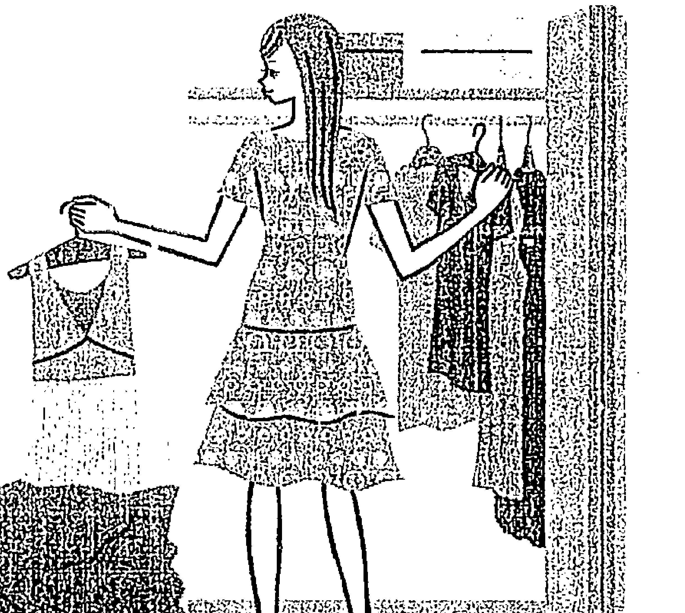

## 丢掉过了保存期限的食物吧

丢掉过了保存期限的食物吧！如果没有定期检查的话，冰箱一定会很快塞爆，所以仔细地检查吧。再怎么说，能让冰箱保持整齐干净，自己看了也开心。

## 清理流理台周围

排水管如果湿湿黏黏，感觉就不舒服，但是如果放着不处理，情况只会越来越严重。因此，定期仔细的清理对你来说会比较轻松。排水管如果堵塞了，你自己“爱的能量”也会出问题，请小心为妙。

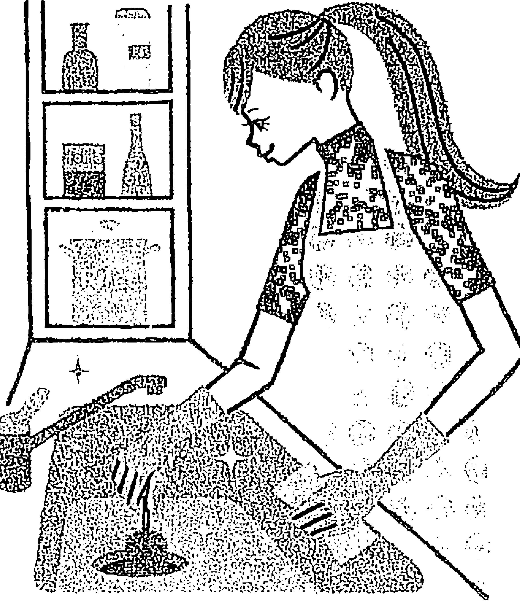

## 用盐浴洗净气场

我们的身体会散发出一种带着能量的“气场”，矿物、植物、动物乃至人类都会散发气场，让整个地球充满能量。但是，别人的气场或负面能量，都可能在你没注意的时候附着到你身上，不知道你有没有以下的经验？

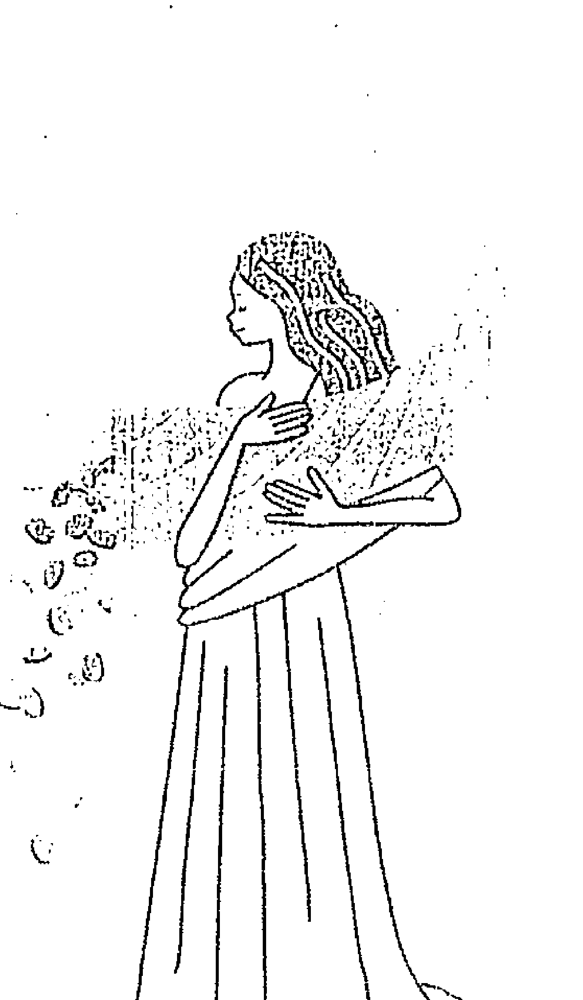

外出回到家后，身体不知怎么地变得沉重不堪，走在人群中突然开始头痛……像这样的情形，可能就是别人的能量，不小心转移到你身上的关系。

特别是“敏感体质”的人，气场范围很大，而且和他人气场的界线分隔也比较不明显，所以，具有敏感体质的人很容易混杂到他人的能量。我自己也对敏感体质感到困扰不已，尝试过很多方法，却还是只能羡慕别人可以身处人群之中丝毫不会不适，我何尝不想轻松自如地待在百货公司或热闹的繁华商圈？无奈我总是感觉非常不舒服……后来我转而思考“怎么样才能不被别人的能量干扰？”终于在不断磨合、试验之后获得改善，现在的我不再像以前那样容易受到牵连，已经可以安然走在大街上。

如果你也是只要走入人群就觉得“身体很疲累”的话，那可能就是你的身体“被别人的气场干扰”。
不过，不必担心。现在我告诉你如何从自己的气场快速去除别人能量的方法：在放了水的浴缸里放入一把盐，藉由泡澡简单地净化。

放入浴缸的盐不须在意品牌，只要是天然盐就好。像我都购买一包六七十元的天然盐。如果今天感觉特别地累，我会毫不手软地在浴缸中倒入半包的盐，在稍热的水中做半身浴。藉由花点时间慢慢泡澡，就可以让负面能量随着汗水完全从身体排出。
另外，浴室也可以藉着盐的蒸气同时达到净化，将负面能量一扫而空。用盐浴净化法，可以把累积在气场内的脏污与“别人气场所带来的能量”完全排除干净。

## WORK ① 简单！气场净化法

感觉疲累想早一点休息时，在此推荐可简单净化气场的方法。

1.  因为人多感到疲累的那一天，花点心思泡个澡吧。建议泡个水温微温的半身浴，在温水里加入一撮天然盐，记得要根据当天疲累的程度调整天然盐的量。感觉“今天超累”就多放一些。天然的盐会帮助我们排出大量的汗，泡澡的时候，一边发出“啊”的声音，负面能量即可随着呼吸排放出来，记得多做几次。

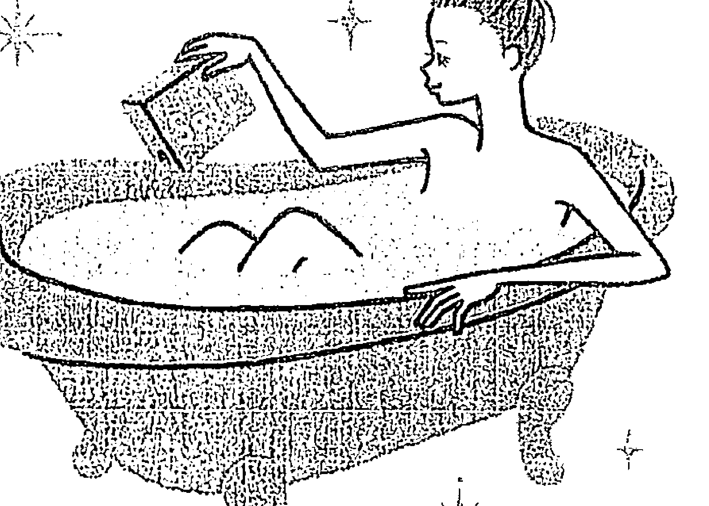

2.  洗头发的时候，把莲蓬头拿到高一点的地方，想像淋浴的温水是水神而祈祷：“请水神把附着在我身上的负面能量冲走吧”，同时也一起想像“随着莲蓬头流出来的是金色的能量”，让金色能量一并净化气场。

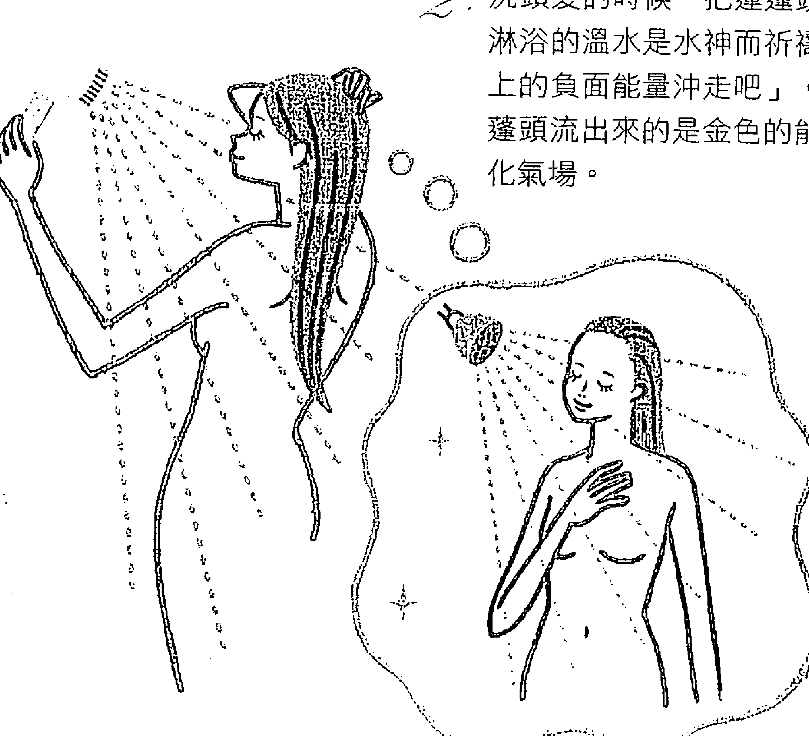

## 3. 活用浴袍来让气场发亮吧！

淋完浴，披上浴袍，身心灵皆清爽。为了可以随时与金钱的能量连结，保持气场的清洁相当重要！

最后再分享一个特别的小秘诀。在淋浴的时候，试着向“水神”祈祷，或是想像莲蓬头喷出“金色”水流洒满全身，这样其实也颇具效果。

**Point**
用盐浴消除负能量吧！

# 第 1 章 奠定心灵与钱财富裕的基础

## 地球变丰裕的接地法

灵修是可以活用于现实生活的方法。
任何人都有变成有钱人的权利。这绝不是做白日梦，也不是空口说说而已。
如果只因为看不见灵性能量，流于讨论“相信”或“不相信”就结束话题，那真的很可惜。
如果我们对充斥于生活周遭的灵性能量毫不理会，真的是非常奢侈浪费的一件事。
因为那是来自宇宙的丰富能量，只要能每天实践书里所说的活用法，你的人生将会越来越不同。

为了让能量顺利进入身体，我们要学习一个重要的基础技巧——“接地”。

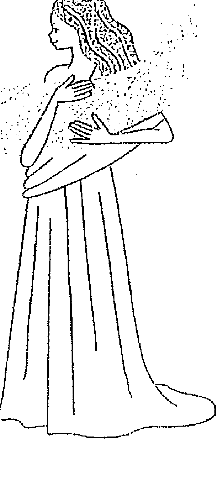

有不少读者在看过前作《梦想成真的幸福力练习》之后，写信给我谈到对接地的感想。有人说“感觉身体如释重负”、“情绪变得稳定平和”，还有“更能敏锐地感觉到能量”等等。这些读者能够在看了书后，具体实践并有所感受，我对于他们的学习速度感到相当惊讶。不过我想应该也有那些只尝试一次便半途而废、或是因为三分钟热度，一下就忘了实行方法的读者才是。接地可以帮助我们提升“愿望成真的力量”，也可以说是“把现实中想得到的物品吸引到手的力量”，意指替我们将机会、缘分和财富吸引过来。接地是让身体与大地确实有所连结的方法，也是实现梦想的基本技巧。事实上，在我的透视经验中，那些越是能够与地球紧密连结在一起的人，梦想越是能够实现。实际进行接地之前还必须先完成两个步骤，首先请每天都先练习直到熟练，再接着进行接地。现在请跟着本书的步骤图示再复习一次（50~53页）。

## Point

不论何时何地都别忘记接地！

## WORK 2

## 非常重要的接地！

接地是与地球中心连结的基础方法。

1.  坐在能够让你放松的椅子上，将两脚平放于地板并把背脊打直。闭上眼睛并大口地深呼吸。

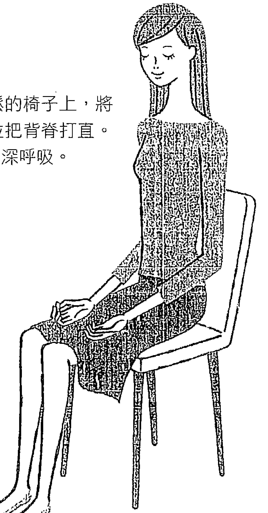

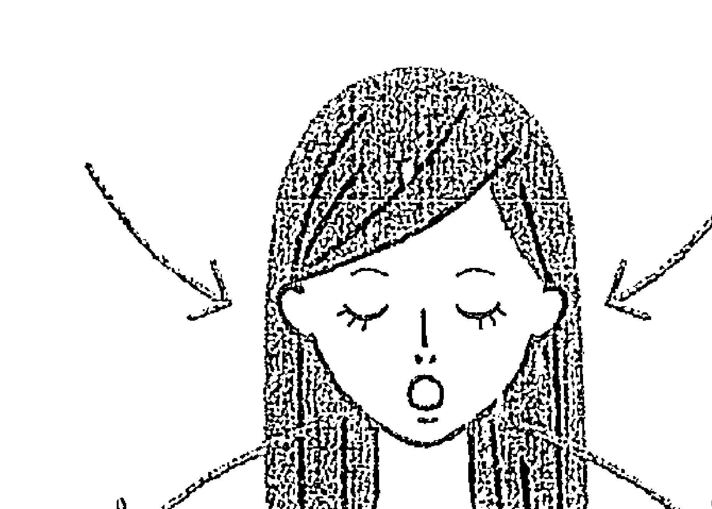

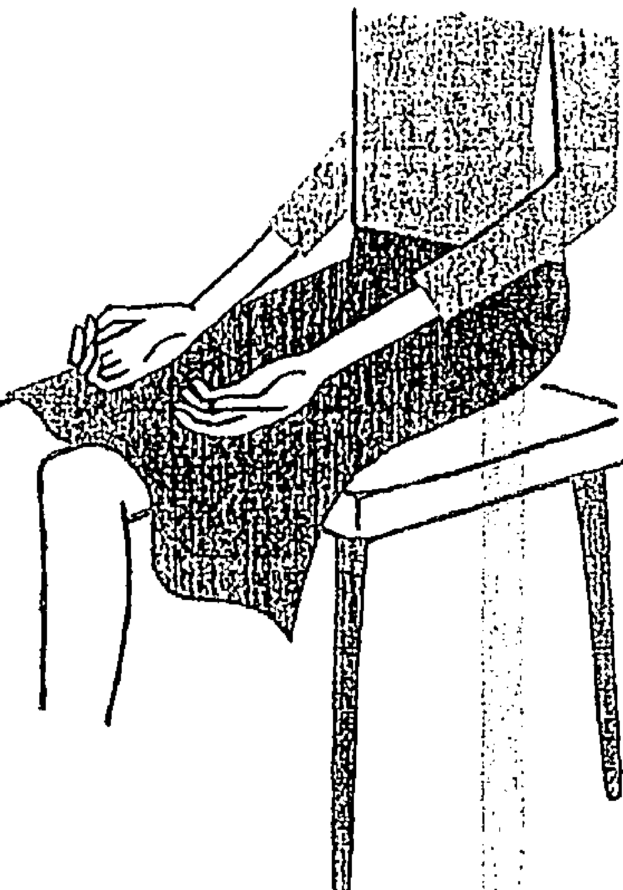

2.  接着运用想像力，想像“根”从脊椎末端不断地向下延伸。

## 3.

根穿过椅子、穿透地板，朝土壤的深处不断深入，最后抵达地球中心且牢牢地固定住。这个根称为接地线。接着，也请从两脚朝地球中心伸出接地线。如此一来，你就能透过三条根与大地紧紧相连。

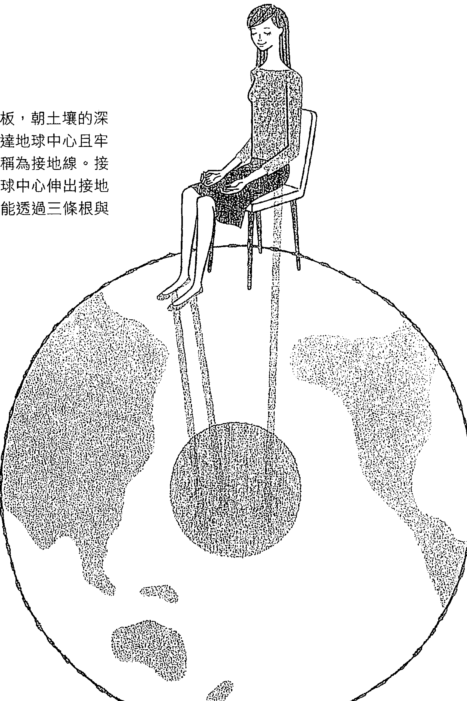

## 4.

然后吐气，如果现在心里觉得不安，或是身体哪里有紧张感，就请想像那些不舒服的感觉全都从接地线流向了地球中心。无论是什么东西，地球都会温柔地接纳并加以中和。

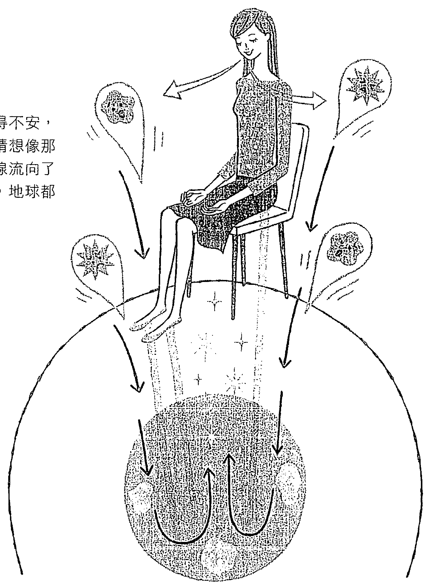

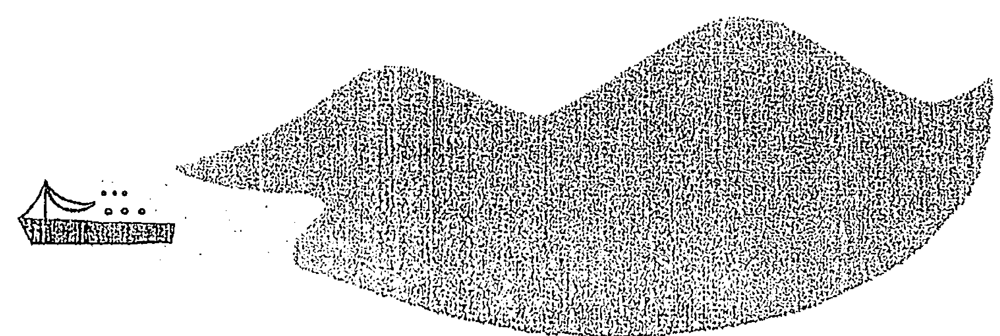

## 5. 一吸气，地球的能量就会沿着三条接地线而上，通过背脊、抵达头顶之后，能量就会像喷泉一般地从头部释放出去。每一次吐气，不安和紧张感都会随之排出身体；吸气时，大地的能量则会被身体吸收。

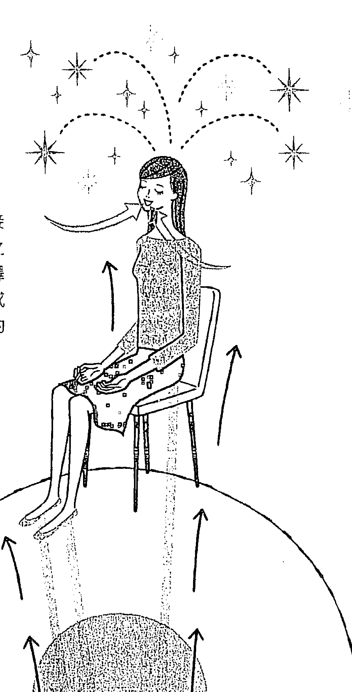

## 6. 最后把注意力放在身体上，感受一下地球能量被吸入身体有什么样的感觉。是感觉温暖？还是觉得沉重？是轻飘飘的感觉？还是感觉很强烈呢？持续此步骤数分钟，接着再做一次深呼吸。请在保持接地的状态下，缓缓地张开眼睛。

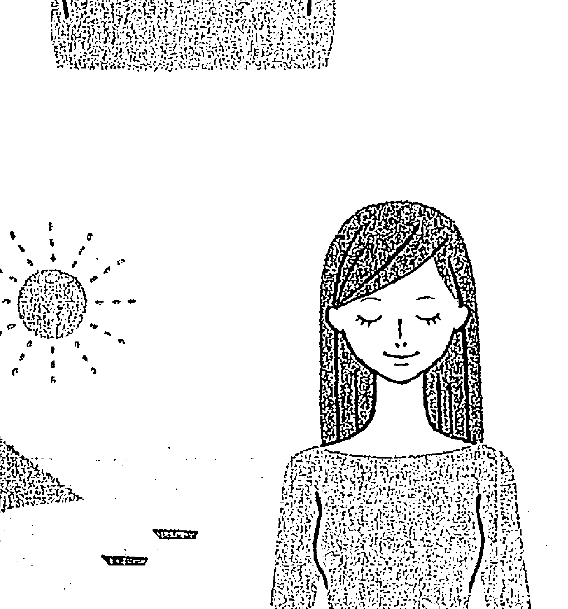

## 泡汤提升接地力

现在世界各地有许多温泉景点。每个温泉都各具不同疗效，如果可以来一趟寻找适合自己肌肤的名汤之旅，那可真是极奢侈的享受了！

温泉是来自大地的能量。因为我们可以藉着泡汤，直接将大地的能量吸收至体内，所以当你感觉疲累的时候，不妨去泡泡离家最近的温泉，相信可以获得最棒的疗愈效果。

事实上，泡温泉和进行接地具有相同的效果。

“空有梦想，光说不练”的人，大部分接地线都很细，没有办法顺利连接到地球的中心。他们的接地线如细绳一般，而且不断左右摇晃，所以无法直达地球中心，这样一来，想要实现梦想将变得困难。我常常收到读者投书问到：

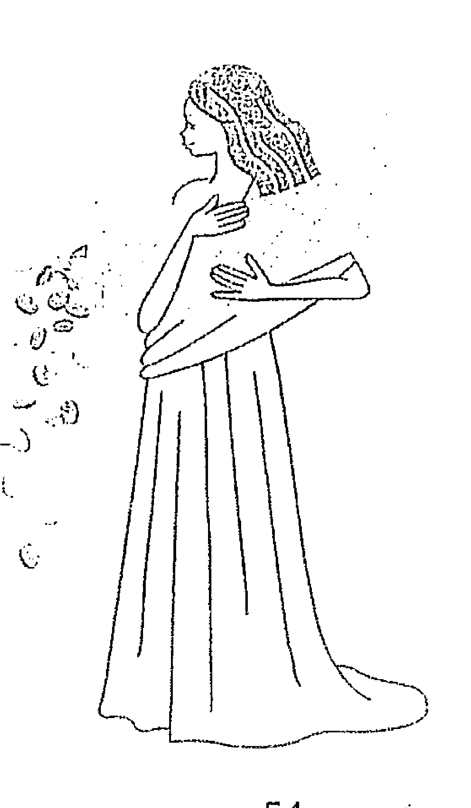

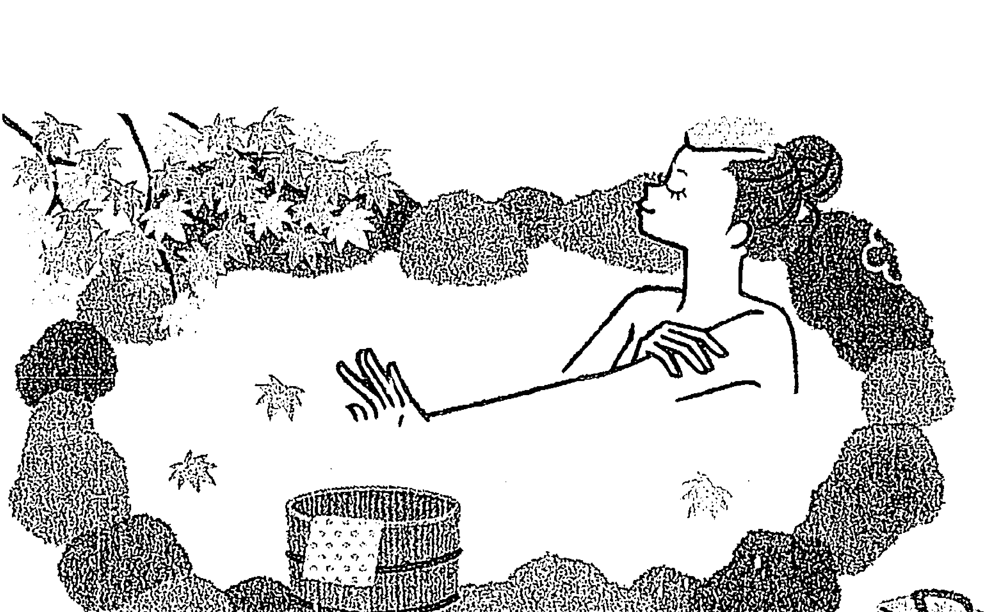

泡汤和接地有相同功效

“我到底能不能实现梦想呢？”这时候我会先替该读者透视，看看他接地的状况：接地力有多强、接地线有多粗。由于接地线是代表能量的线，所以粗细跟身体胖瘦无关。看似瘦小的人，接地线可能很粗，整个人很有力；相反的，身形高大的人可能会因为接地线细而无法与地球中心连接。经过说明之后，你想不想知道自己的接地线实际状况是如何呢？为此我整理出一张表格，请检视一下是否符合你的状况：

## 无法顺利接地时

- 无法有效管理时间与金钱
- 不太记得过去的事
- 不论做什么都兴趣缺缺
- 不知道自己未来的方向
- 一直感觉烦躁、气愤
- 很容易发火（易怒）
- 注意力不集中、时常发呆
- 爱做白日梦，没有行动力
- 曾被欺骗而有重大损失
- 没有办法实现梦想
- 光说不练
- 身体状况差、不健康

结果如何呢？ 近来感觉终日疲倦、凡事提不起劲的人，还有拼了命却无法实现梦想的人，起身去温泉接受大地的能量吧。

### 顺利接地时
- 说到做到
- 会一一克服眼前遇到的困难及问题
- 对自己很有自信（拥有真切的力量，能量温和平稳）
- 受到大家信任，乐于助人
- 梦想将会成真

> 利用温泉提升接地力！

## 无法顺利接地的后果

接地是灵修的基础。
无法接地的话，不但无法进步，现实生活中也会麻烦四起。

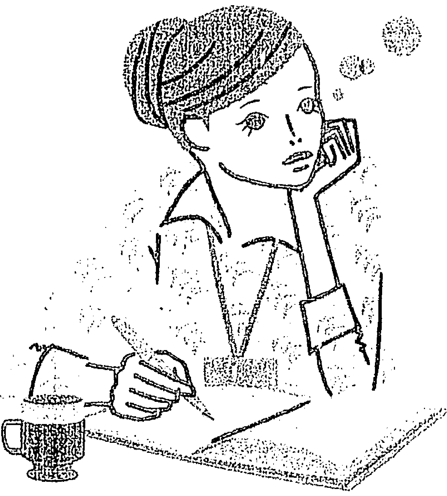

### 不能集中注意力
不管做什么都无法集中精神，
净是空想、做白日梦的人，无法接地。

### 容易上当
一旦接地失败，就容易相信别人，
照着他人的话去做、或听信花言巧语送钱给小白脸。严重的话还会遭遇到骗婚、卷款潜逃等惨况，陷入金钱的纠纷。

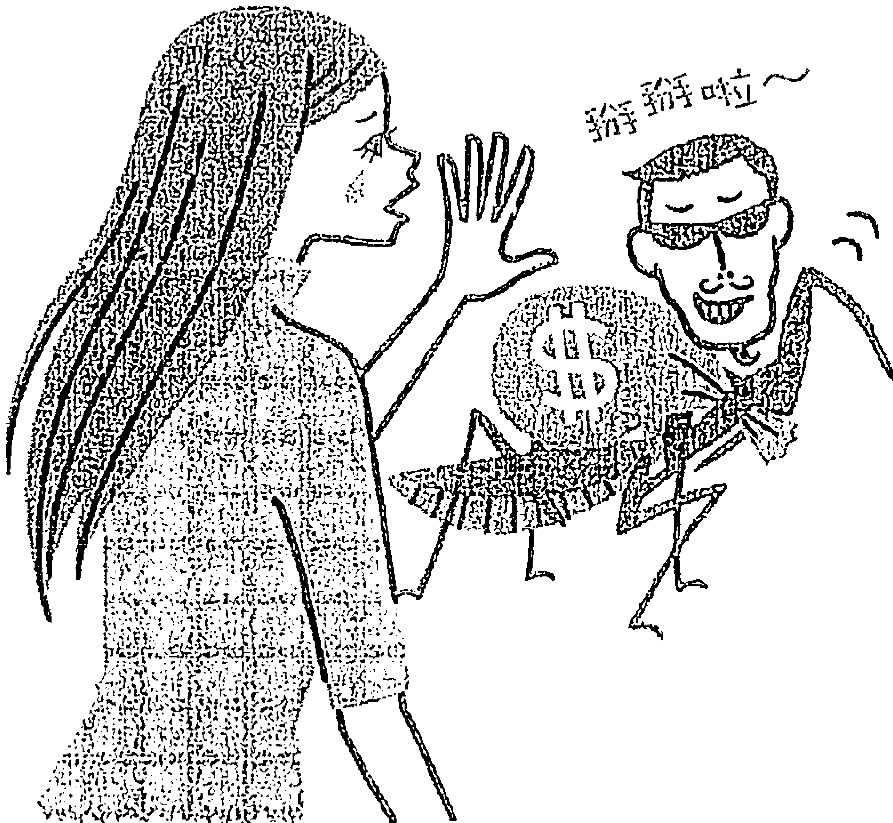

## 願望無法達成

「好想結婚……」總是深深期待，卻無法實現願望的人，明明做了許多的努力卻仍然沒有回報……這也是接地薄弱的原因之一。

## 接地 Lesson——接地線的清潔術

在我定期舉辦的座談會中，有個實行接地法的學員，提出了以下問題：

> 當我意識到接地線的時候，接地線上赫然有我先生的身影。當下我不曉得該怎麼辦，但是看到先生痛苦的神情忍不住拉了他一把，請問老師，這樣可以嗎？

這位學員才經過幾次的接地練習，卻已經可以透視到接地線內的情況，令我深感佩服。所以我在回答她問題的同時，順便也把更進階的技巧傳授給她。

我自己也曾親身體驗到接地線清掃的重要性，雖然那已經是很久之前的事了。

有一天，我突然整個人精神很差，疲憊不堪，總覺得周遭事物都很礙眼。

後來我一個人躺在床上對天花板喊著「啊，真的好累，沒一件事看得順眼。」但又說不上來是什麼讓我感到厭煩，只感覺身體積勞甚多，排解不了。這時我的內心傳出一個聲音：「趕緊確認一下你的接地線。」

「什麼？接地線？」

由於我每天早上都有確實地意識接地線的習慣，但剛才那個聲音代表什麼呢？我不禁覺得很不可思議。當時我正巧也躺在床上，於是我閉上眼睛開始想像眼前是電影院的銀幕，我把接地線的狀況映照在銀幕上，結果出現了接地線上有許多人糾結在一起的畫面。看起來就像算盤珠一直綿延到地球中心，在這麼一條接地線上，竟然有好幾十個人垂吊著，難怪我會感覺越來越沉重。

「原來如此，我之所以疲累就是因為和這麼多人的能量糾結在一起了。」

目睹這番情景之後，我想像銀幕中的我拿出清潔劑，朝接地線與身體周圍倒入。結果，清潔劑就像油一般流下，使得原本攀附在接地線上頭的人，都因此而尖叫掉往地球中心。

看到這樣的場景，大家也許覺得我做了一件相當殘忍的事，但是因為自己的能量不能摻有他人的能量。因此，不管吊在接地線上的人是情人還是朋友、父母還是師長，再怎麼親密的人都不需在意。就像人生一樣，自己應該要維護自己的能量負責。

如上所述，如果自己的能量中摻著別人的能量，只怕對自己的負擔會越來越大，而變得無力幫助別人，長久下來，或許到最後連你都會生病。即使是攀附在你接地線上的人，狀況也一定不會太好。

我接受過以下學員的諮詢，有物理治療師、護士、諮詢人員、看護人員，他們說：「現在想起工作就有氣無力，再這樣下去，真不知道是該繼續還是辭掉工作。」他們的工作內容是服務其他需要幫助的人，不僅辛苦也沒有屬於自己的時間；而且那些需要幫助之人的負面能量，常常會波及他們的氣場，也難怪他們會感到特別地疲倦了。這個時候我就會教他們清掃氣場的方法，讓他們自己當場練習之後，每個人無不嘖嘖稱奇道：「咦？好像真的變輕鬆了，似乎可以再繼續工作下去」。

真的是立即見效，而且他們也因為親身體驗到能量的狀態而感到驚訝。

因此，藉著把別人的能量送往地球的中心，不但是對自己或是攀附在接地線上的人而言，都具有相當的療效。

我的真實經歷讓我體驗到，只要沒有定期清掃接地線，導致接地線藏污納垢的話，後果是很不舒服的。現在你的接地線狀況如何？

從現在開始，你也來試試清潔接地線吧！

## WORK 3 接地線的清潔

## 接地線「阻塞」時的想像畫面

坐在能讓你放鬆的椅子上，兩腳平放地板並把背脊打直。閉上眼睛並大口地深呼吸。接著運用想像力，想像從自己的背脊末端有一條像排水管的接地線。然後呼叫小人國的清潔公司，這時會出現二個可愛的小人兒，手裡拿著金色的桶子與地板刷。先由手持金色水桶的小人將金色的清潔液往接地線裡頭倒，這時，線管的頑垢會開始脫落、而污垢也漸漸形成水泡，一起流向線管的底部。靜置一會兒後，再倒入金色的水液。最後，線管內壁乾淨地閃閃發亮。

接下來刷洗線管的外側。一樣倒入金色的清潔液，拿著刷子的小人開始動工，從最上頭，像走螺旋梯一般地一層一層往下走、不留痕跡地刷刷洗洗。這個時候如果有纏在接地線上的人，就會因為流下來的清潔液而導致手部打滑，通通掉落到地球中心。而這些攀附在接地線上的人其實都不是真正的人類，所以請不用顧慮太多，試想，今天清潔過後，你的能量恢復之後，就可以全心幫助他們。接著，等二位小人檢查接地線管內外側的污垢都確定流走之後，接地線的清潔即告一段落，他們會先回到你的接地線末端報告「打掃完畢」，可別忘記對他們說聲「謝謝」，並目送他們回到小人國。建議每個月請專業的小人來幫忙清潔一次接地線，最為事半功倍。

## 無法接地的原因

經常有人問我：「注意力不集中，而我又無法確認接地線狀態的時候該怎麼辦好呢？」

原則上不能接地的原因有三個。

1.  第一個原因：處於淨化期。
    在一般情況之下，持續清潔接地線與氣場的人，會出現所謂「靈性排毒（Spiritual Detox）」的症狀。這個症狀可讓舊有想法轉變為新想法，因此人們多會因為抱持以下想法：「要維持現狀嗎？是否有更適合我的生活方式呢？」而感到不安、焦慮，對於情緒起伏不定而煩惱。由於心理狀態會影響身體，使得身體也跟著出現各種反應與症狀。此時，進行短暫的接地不但沒有效果，反而沒辦法與地球中心連結。所以這個時候最好不要勉強自己，先去泡個溫泉讓接地力提升後再說。溫泉是大地能量的源頭，人不用多做什麽，只要靠著溫泉就可以恢復接地力，所以我非常推薦。接著，如果可以的話，一天散步二十分鐘吧。最後，當淨化進行得差不多時，建議你可以搭配音樂，做個有氧舞蹈等運動，活動一下身體，如此便能強化接地力。

2.  第二個原因是，如果你從來沒有實行過接地這項技巧，有時身體會出現以前從來沒有過的奇怪感覺。假如你從來都沒有特別留意自己與地球的關係，那麽在尚未完全熟悉接地之前，就需要耐心地不斷練習，或許需要花多一點時間。

3.  最後一個則是用腦理性思考過度，缺乏使用想像力的機會。如果你總是不斷用左腦想著「這樣好嗎？」、「做得好嗎？」反而無法使用右腦的想像力。進行接地時的要訣是，不應該猶豫不決地想：「是這樣嗎？」而是應該果斷地認為：「就是這樣！」事實上，運用能量遠比使事物動起來更簡單！運用能量這件事，沒有時間與空間的顧慮，只要你決心「去做」，那麼瞬間即可達到目標。

    心無罣礙是絕佳狀態，話雖如此，現實生活中要保持「不傷腦筋」確實是一件難事。請你務必要試著找回赤子之心，盡情享受想像力。請按照你自己的步調，花一些功夫，讓接地融入你的生活當中！

> **Point**: 與其傷心，倒不如相信自己做得到。

## ✨ 无法顺利接地的原因 ✨

通常无法顺利接地，都是其来有自，例如正处于净化期、身体感觉不一样的时候、及想太多的时候……

### 正处于净化期

在进行接地与气场清洁的同时，不慎引起灵性排毒症状的话，身体有一段时期会感觉不适。

### 身体感觉不一样的时候

第一次接触接地，通常身体会有说不上来的奇怪感觉，而且这种感觉前所未有。只要持续练习接地，习惯成自然，这种感觉就会慢慢消失。

### 想太多的時候

接地是在想像的世界中進行的，而不擅長想像的人會不自覺地懷疑接地的可行性。試著不要考慮太多、一旦開始想像就相信自己一定做得到。

## 金錢與心靈的關係

本章探討金錢與心靈的關係。

很多人都覺得只要有很多的錢，就可以變得幸福。確實，錢帶給我們很多的快樂，包含物質與心理兩方面。

物質方面：家、衣服、車、食材、健康、旅行、財產、機會、力量、教育、研究、美等；心理方面則是，有精神、笑容、優雅、安穩、和平、感謝等，我們因此受惠良多。

本書雖然開宗明義「錢是能量、也是力量」，這股能量通常又伴隨責任，也就是說「想要錢」＝「想擁有那股力量」。當你想擁有那股力量，心智卻不夠成熟的時候，就得付出痛苦的代價。

# 第2章 讓金錢愛上你的心靈法則

沒錯，錢就是可以讓我們快樂、也帶給我們痛苦的東西。

宇宙是依據「平衡法則」存在的。所以如果你認為「財富只會帶來快樂」，那麼緊接而來的必定是讓你學會「財富不只帶來快樂，還會伴隨著痛苦」的試煉。我並不打算全盤否決關於錢的一切，而是萬事萬物均有一體兩面。如果能夠徹底認知，就能不怕苦難，過著幸福又快樂的富足人生。這個觀念相當重要，我希望大家能了解「金錢與心靈」的關係。

- **富有的代價**
    - 借出去的錢有去無回
    - 沒有私人的時間
    - 遭人嫉妒
    - 朋友一一離去
    - 身邊沒有可以信任的人
    - 嘗盡孤獨
    - 失去目標
    - 危害健康
    - 財產散盡，開始貸款

關於最後一項的「財產散盡、開始貸款」，可能出乎大家意料之外。

假設有個人一次就獲得一大筆錢，那麼他可能一開始會迷失自我，出手越來越闊氣，也會開始四處投資、購買高價品，好像錢永遠都用不完一樣。當然，如果這個人很會理財就另當別論。

但是由於宇宙本身就是一個起起落落的循環，因此不論任何人都有可能在宇宙循環至低點時，控制不良而喪失所有財產。偶而我們也可聽到演藝圈有這樣的傳聞，「那個藝人不是曾經很有錢嗎？怎麼現在會淪落到這個地步？」我只能說一切只因該名藝人在宇宙循環至高點、累積了財富時，出手變得闊綽，卻無法好好掌控金錢的力量所導致的。

我們如果能夠了解，金錢不只具有正面的力量，也會帶來負面的力量，好好地運用金錢，把金錢當成最佳夥伴，那麼金錢將能幫助你實現夢想。

請確實理解：正面力量＋負面力量＝愛的力量。

至於你是否能做到同時喜愛金錢的正面力量與負面力量，宇宙自然會告訴你。雖然我們多以為正面力量才代表愛的力量，但是當你可以真正愛上負面力量時，才能轉變為被金錢所愛的人。

正視「金錢」的正負兩面

接著，我們就來好好學習讓金錢愛上你的方法吧！

## 成为有錢人的代價

宇宙建構在「平衡」基礎之上，有了錢雖會好事不斷，卻也會招來惡事。

### 失去目標

當你有錢了，跟你「借錢」的人就會越來越多。有借有還的人還算好，但一定也會出現根本不打算還錢的人，遇到這種人肯定會又驚又嘆「不會吧，他竟然不還我錢」。

自己立定目標，沒日沒夜拼命賺到了一筆錢……沒想到達成目標後，你變得相當滿意現狀，卻造成個性丕變，不僅失去了努力的目標，整天還渾渾噩噩，昔日志氣滿滿的你已不復見。

### 朋友一個個不見了

不論何時都互相鼓勵的好朋友們。你心想「就用這筆錢來援助那一票好朋友」，卻因為突然有錢，導致朋友之間議論紛紛，友誼因而產生嫌隙，好朋友們紛紛求去……

### 招來別有企圖的壞人

一旦有了錢，好的人跟不好的人都會自動黏過來。其中也會有讓你留下良好第一印象的人，殊不知那人戴著假面具，別有意圖地要接近你。你可能會因此改變自己對人的想法。

名利雙收須付出的代價還有……

- 沒有私人的時間
- 遭到嫉妒
- 身邊沒有可以信任的人
- 嚐盡孤獨
- 危害健康
- 財產散盡，開始貸款

## 有錢人如何對待「金錢」

之前我研究金錢時，發現一個事實，那就是「金錢會自動聚集到喜歡金錢的人身邊。

而且，喜歡金錢的人會好好地理財，並且具體地思考以下問題：

- 該怎麼賺到錢？
- 我要賺到什麼時候、賺到多少錢才足夠？
- 賺到的錢要怎麼存起來？要怎麼投資？
- 未來這筆錢要用在哪裡？

按照這個思維，「錢」可以代換成小孩：什麼時候要生小孩？想要給小孩怎麼樣的環境？要如何養育小孩？要如何讓小孩幸福……從小在感受不到父母的愛的環境中成長的孩子，會在羽翼漸豐之後，早早離開父母的身邊；反之，在濃厚親情關愛下成長的小孩，通常會盡可能待在父母親的身邊，即使工作忙碌，也會在父母親需要照顧的時候，責無旁貸、竭盡心力地看護。

同理可證，如果我們對待金錢也像對待自己的孩子一樣的話，自然也可以與金錢建立良好的關係。

猶記我所敬愛的一位老師曾經說過：

> 當我在付錢的時候，都會在心裡默想，希望這一份錢以後可以回收幾倍、甚至幾十倍回來。

剛好當時有個慈善基金會正在車站附近募款，於是我將100元投入募款箱的同時，在心裡許願說：

> 希望這些錢以後會變成好幾十倍回來。

之後結果並不如我的預期。現在回想起來，我想應該是我在許願的時候，對於自己想要獲得回報的想法有所懷疑才沒有獲得應得的回報吧。

另外也曾有另一個老師勸我們：

> 要愛惜金錢。

但那時因為看到不少人對金錢有強烈的欲望，使得我對於賺錢這件事相當反感，所以我沒辦法讓自己愛錢。
但我覺得兩位老師所言甚是，於是我轉換想法，把金錢想成「可愛的小孩」。
不知是不是因為我在潛意識中已經接受兩位老師的教導之故，讓我輕易地接受自己喜愛金錢這件事。
只要把金錢想成「小孩」就好。或者你也可以想成是你的愛犬、愛貓、你喜歡的生物，只要是你想要憐惜的東西都可以。
於是我準備好一張一萬日圓的新鈔，把愛犬「小紅豆」的照片裁剪成與紙鈔上肖像相等大小的尺寸（注：一萬日圓的鈔票上印著福澤諭吉），將照片覆蓋在該肖像之上，用迴紋針在紙鈔上方及右側仔細夾好。然後我把那張鈔票擺在平時看得到的地方。

出門時放進皮夾裡，每當要付錢的時候，會先在心中想著「回來時要變得更多哦」。或是當我有購物衝動的時候，會記得先問自己：「你真的捨得放開這麼可愛的小東西嗎？那個東西值得花錢買嗎？」

此舉果然相當有效。第一、我不再亂花錢。就在我猶豫要買不買的同時，腦中浮現的是：「雖然真的很想買，但少了它又不會活不下去。」這麼一來，我順利地抑制了購買的欲望。

其他像房租、瓦斯費、水電費、餐費、補習費等，只要是能讓自己成長、與日常生活息息相關的事物，都應該欣然付出。因為這類花費屬於「自我投資」，總有一天它會連本帶利賺回來，用不著捨不得。但是要知道不是只要把任何東西冠上「自我投資」就能魚目混珠，像是吃豪華大餐、或明明只有一個人卻住在三房兩廳的房子，那樣只會讓荷包越來越消瘦，不得不小心！

最後，把以下訊息「錢好可愛」、「錢是值得疼愛的東西」輸入到你的潛意識裡，藉此種下一顆讓心靈富足的種子吧。把一張紙鈔當成吸附金錢的「魔法吸金磁鐵」，讓它發揮效果吧。要記得只有金錢才能吸引金錢，所以出門前一定要把它放進錢包裹。

只有金錢才能吸引金錢，所以出門前一定要把它放進錢包裹。

## WORK 4 吸引金钱的「魔法吸金磁铁」

花一点功夫不断地把钱吸引过来的方法

### 1.
首先准备以下素材：

- 新钞 1 张
- 喜爱对象的照片
- 剪刀、回纹针 2 个

首先把你喜欢的对象裁剪成和新钞上的肖像一样的大小（台湾以千元大钞上印的小朋友为准）。至于那些「我只有大张的照片」、「我只有小张的照片」或「我都贴在相簿里了」的人，可以把电脑内的图档列印下来或洗成相片。如果你真的没有任何「喜欢的事物」，请找找平时喜欢、支持的艺人明星、或悉心照顾的观赏用植物、金鱼等等。只要是活着、会动的生物都可以。

### 2.
接着拿出剪刀，将喜爱对象的相片，沿着其轮廓，剪到刚刚好的地方或预留几厘米空间。把新钞放在桌子上，将照片叠放在钞票上的肖像之上，并用回纹针夹住照片的上方、右下侧。（注：因为是纸钞的关系，请避免用双面胶或胶水固定）

如此一來，這張新鈔就變身成吸引金錢過來的「魔法吸金磁鐵」了。平時請把它擺在顯眼的地方，對著它祈求：「魔法吸金磁鐵，請幫我招很多的財過來吧」，要出門的時候就放進錢包，隨身攜帶。記得每次付錢的時候，默默在心裡祈願：「變大之後要記得回來哦」，但千萬不要一不小心就把魔法吸金磁鐵當成一般錢付出去了；當你想衝動購物的時候，捫心自問一下：「你確定要放開這麼可愛的小東西嗎？」。魔法吸金磁鐵的做法很容易，所以不用遲疑，只要把它放進你的錢包內，你就會變得不再亂花錢，歡迎見證其不可思議的功效。

## 讓金錢增加的魔法錢包術

好了，跟金錢建立美好的關係之後，接著你應該會想到要改善安置金錢的環境。使用折疊型的錢包，實在是委屈了這些可愛的孩子們。建議你可以直接將鈔票整張放入的長型錢包！顏色隨你喜好，但記得千萬不能小氣，最好購買高貴且精美的錢包，並隨時拿著新鈔出門。
錢包裡的紙鈔要排列整齊，金額從小到大、依序擺放，也就是把百元、五百元、一千元紙鈔分別依序擺好。讓這些可愛的孩子們有個舒適的環境，是提升金錢運最重要的訣竅。

二年前的一次溫泉旅遊中，我在下榻的高級飯店看到一只非常漂亮精美的錢包。錢包的品牌是「Roberta di Camerino（諾貝達）」，定價1萬5千日圓，## 好看的錢包可以招來財運

嵌在錢包掀蓋上的英文字母「R」，不僅是純銀材質，還鑲有閃閃發亮的碎鑽，很自然地讓我把「R」聯想為Rich（財富），再加上它純白的外皮兼具柔細的觸感，雖然我從沒買過那麼高價的錢包，但實在愛不釋手，原本準備自掏腰包當場買下，剛好那時因為招待雙親一同溫泉旅行，家母就以這個錢包當成回禮送給了我。

過了一陣子，我開始遇到一些幸運的事。當時朋友約我去日本宮古島玩，我竟然只用了三分之一的價錢就買到機票，而且朋友還幫我全權處理旅行事宜。之後有一次跟團去韓國玩三天，結果出發當天卻只有我和朋友一組客人，導遊及司機當場變成我們兩人專屬，真是一次相當放鬆又划算的旅遊行程。

如果你想「提升金錢運」、「改變金錢的流向」，那麼換個錢包是個值得推薦的方法。

購買錢包時要選購讓你一眼就愛上的錢包，比方說，越能讓你覺得「這個錢包好棒！雖然有點貴還是買了吧」、「好吸引人喔」的錢包越是最佳選擇。請以你對錢包的第一印象來購買。

# 第2章 讓金錢愛上你的心靈法則

### 魔法錢包的特徵

- 錢包要選擇長型皮夾，外形是你所喜愛的
- 選擇你喜歡的顏色即可
- 帶出門及帶著走的紙幣盡量選用新鈔
- 紙鈔的擺法要統一
- 各種面額分別擺放

> ——・魔法吸金磁鐵——一定要擺在錢包裡，但絕不可使用。

沒有金錢概念的人，對錢包的想法常常是「只要能放錢就好」、「什麼錢包都無所謂啦」。但是，如果你想改變對金錢的想法，試著換個新錢包，讓自己漸漸對金錢有好感，那麼你就會變得「愛惜金錢」了。

### 用魔法錢包提升金錢運

## WORK 5

### 用滿月的月光淨化魔法錢包

想像月亮不停把錢送過來

1. 當你買新錢包，不要馬上使用，先進行淨化。在晚上，把錢包放在月光灑入的窗邊，讓月光照耀錢包。滿月是最佳時機，但上弦月也無所謂。
2. 接下來閉上眼睛想像一下。月光照進你的錢包之後，彷彿化為金錢且不斷變多，感覺就像是有許多紙鈔不停地飛進錢包。那就是你目前收到的金額。收到多少錢了呢？請點算一下。
3. 要怎麼使用月光錢？通常宇宙不會賞賜財物給只用在自己身上的人，所以你要規劃這些錢有多少會花在自己身上？要存多少進戶頭？要怎麼用在別人身上？閉上眼睛好好規劃，從今天起，你會好好珍惜用錢的每一分每一秒。

### 你嫉妒有錢人嗎？

當你看到有錢人，心裡有什麼感覺？

> 「我只有那麼一點錢，而那個人居然可以賺那麼多。不知道你是不是也曾這樣嫉妒過有錢人呢？」

幾年前，我曾對宇宙發牢騷：「到底該怎麼辦才好？我生活好拮据！」

但是教琴只能勉強糊口，更何況要再自我進修，簡直不可能。況且我自己並不甘於只當鋼琴老師過一生。

但是像這樣的我還能做什麼？整天悶悶不樂之餘，再加上沒有人可以指導我方向，最後只好求助於宇宙。這個時候，我聽到一個聲音。神明顯靈對我而言不足為奇，但從宇宙傳來的聲音卻這樣對我說：

> 「你的周圍充滿了豐富的能量，卻不自知！」

我只聽到這一句話。

> 「豐沛的能量是什麼？不是什麼也沒有嗎？」

我環顧自己的房間，看得到的就只有牆、鋼琴還有沙發，淨是這些實體的東西，再了不起就是空氣了。

雖然很感謝宇宙回應了我，但我卻因此出現別的煩惱。

> 「究竟豐沛的能量指的是什麼？為什麼會說我周圍充滿了這樣的能量？難道空氣裡頭蘊藏著豐富的什麼嗎？」

我只想了一下就放棄了。當時宇宙只給了那個謎樣的回答，卻令人想忘都忘不了。我因為太想知道事實真相而讀了不少書，結果直到我親身經歷所謂的豐富能量之前，都無法了解那句話中深遠的涵義。

人總會把自己遭遇的不幸，怪罪於身邊的人、或怪罪於看不見的命運、宇宙上。我也不例外。不過，多年來聽取向我求助的那些人的各式各樣煩惱之後，我開始了解這些煩惱的根源，其實都出在當事者自己身上。當我聽取這些前來諮詢人們的煩惱時，存在於別的空間、所謂的守護靈總是會出現，告訴我究竟發生了什麼事。雖然守護靈會讓我看到影像，或是直接讓我聽到聲音，但祂們告訴我的資訊，都是我從未想過的或從不知道的，一旦日後仔細查證，就會發現那是發生在幾十年前甚至幾百年前的事。而且這些事也會讓前來接受諮詢的人感到驚訝，每當我根據那些資訊為他們做療癒後，總能如願解決問題。如果你感覺到自己的人生被金錢操控，那就表示你一定懷抱著嫉妒他人的心。但是事實上宇宙是公平的。阻礙你吸收這些豐沛能量的，不是別人而是你自己。請務必記住這件事，停止嫉妒他人吧！宇宙是依循「迴力棒法則」，意指「你付出的將會再回到你手上」。你對任何人所說、所做的任何事，總有一天一定會回到你身上。

即使是如嫉妒這類的負面想法，有時也會對人有所助益。因為嫉妒本身就是一種由內心深處產生的「我也想變成那樣」的想法，反映了那個人的人生目標。宇宙一定會讓你看到「你也有屬於自己的獨特才能」。

嫉妒的情緒代表了「羨慕」。如果你根本不在乎，應該不會有任何情緒產生，當然也就不會嫉妒了。一旦你發現對方居然能做到你所做不到的，內心就會由羨慕轉而變成嫉妒。沒錯！對方就是你人生的好典範。

追根究底，他們是你完美人生的借鏡，向他們看齊可以更接近自己內心的理想樣貌。況且，假設你有機會請教這些人：「您是怎麼做到？怎麼成功的？」讓他們感受你的熱情，也許他們會很樂意與你分享一切。這就是所謂的「喜愛負面力量」。藉著那些成功的經驗，讓你更加成長。但是如果你嫉妒的心情不小心加深為想攻擊對方的欲望，請記住那會創造新的業障，最後這份惡果將循環回到你的身上。

如果你有「看到他的臉就不開心」的這種心情，那很有可能是前世就種下的因，不一定是現在才出現的。此時，你可藉著接地線把這份情緒淨化排除，將氣場回復正向。

> > 「宇宙是公平的」，你曾付出的，將來一定會有回報！

## WORK ④

## 消弭「嫉妒」的方法

### 釋放負面情緒的想像力練習

1. 請回想你「嫉妒」別人時的情景。嫉妒是負面的情緒，所以需要消除，但是不可否認的是嫉妒之心人人有之。因此，當你心裡一直對某人不開心的時候，就勇敢承認吧，然後再把這份嫉妒的心情，藉接地線釋放出去。
2. 看到有人達成自己最大的夢想而心生羨慕的時候，不妨想成是你自己的夢想藉由那個人反映出來。羨慕的心情其實隱含你的「理想」、「夢想」及「目標」。如果你勇敢地去問你嫉妒的那個人：「要怎麼樣才能變得和您一樣耀眼呢？」，那人也許會一五一十地跟你分享成功歷程。或者也可以上網找找可以幫助你的人，想要改變的想法很重要。只要積極去做，相信運勢、機會與金錢已在離你不遠處。

### 玫瑰呼吸法」淨化細胞裡的塵埃

玫瑰從古至今都被當成是愛的象徵，據說也是所有花種裡最能維持高度能量的花。但是我最近才注意到玫瑰花的淨化效果。而我之所以會發現這個效果，也是拜朋友的來電所賜。

那天我正巧要與一直以來幫我很多的工作夥伴Y小姐碰面，為了答謝她這些日子以來的辛勞，我先繞到花店，打算要買一束花當作謝禮。

正在傷腦筋，不曉得該選哪個顏色的時候，腦海中瞬間閃過：『選粉紅色！』

因為Y小姐給我的印象是適合藍色及紫色的人，粉紅色好像和她完全不搭軋，而我自己也不清楚為什麼直覺想選粉紅色送她，後來我順從直覺買了粉紅色系的花，但內心卻對於選擇粉紅色的花感到難以釋懷。

送禮時選粉紅色玫瑰是有原因的

我在花店裡等了一會，店員把可愛的花束包裝完成送到我面前，花束裡還搭配香豌豆、南京牡丹等其它種類的花，全都是粉紅色系的，讓花束變得可愛地不得了。拿了花，我馬上前往約定碰面的咖啡廳，一見到Y小姐，我隨即送上剛包裝好的花束說：「今天不知怎的，直覺就想送妳粉紅色系的花。」沒想到她竟回答我：「其實我從幾天前就開始上吐下瀉，非常不舒服。」於是我說：「搞不好粉紅色是在暗示什麼哦？」那天我們就這個話題開心地聊了好一陣子。隔天，我收到她的簡訊說：「好奇怪，只有玫瑰開始枯萎了。」另外還附上一張花束的照片給我看。不過才昨天的事，照片中玫瑰的凋謝情形實在令人匪夷所思，外側的花瓣已完全枯萎！這很明顯的表示，玫瑰花吸取了正在起「靈性排毒」作用的Y小姐的負面能量。

過沒多久，想不到主角換成我的愛犬小紅豆，牠開始出現不斷上吐下瀉的症狀。我帶牠去動物醫院看診，之後吃了止瀉藥仍不見好轉，只好請醫師打針。沒料到連續打了四天的針，還是不見成效。

於是請教我的守護靈，關於小紅豆的事，結果聽到「淨化」兩字！其實，小紅豆以前是遭前主人虐待後丟棄的小狗，「該不會是小紅豆即將要從這個可怕的經驗解脫，所以牠才會產生「靈性排毒」反應。」

我當場恍然大悟！於是趕緊跑去花店，買了粉紅色等三種顏色的玫瑰回家。

因為小紅豆平時多半都會待在客廳，我就把這二朵玫瑰擺放在客廳的桌子上。隔天早上，果然出現讓人吃驚的現象，其中一朵玫瑰的花瓣已開始從外側枯萎，而且出現這種情形正是粉紅色的玫瑰。感覺就像粉紅色玫瑰吸走了小紅豆的負面能量，只有那一朵先凋謝，其餘兩朵則是在一週後才完全枯萎。而小紅豆也恰巧在症狀出現的一週後完全復原。我因為這兩件事體悟到『玫瑰呼吸法』，這種呼吸法就是藉由最能吸取能量的粉紅色系玫瑰的顏色與香氣，促進身體排毒，並使神經系統正常運作。這個方法最適合身體狀況極差而無法外出的病人使用。

## WORK ⑦

### 玫瑰花淨化身體的方法

淨化體內能量的工序

1. 到花店買兩朵以上的深粉紅色玫瑰，在其中一朵綁上蝴蝶結做標記，插在桌上的花瓶裡。做記號的原因是為了讓你親眼見證淨化能量，同時也與另外兩朵玫瑰作對照。
2. 將綁著蝴蝶結的玫瑰拿起來，湊近鼻子，細聞玫瑰香味，同時想像有粉紅色的能量從鼻子進入身體。
3. 想像粉紅色的能量由鼻子經額頭到後腦，然後直達背脊底部，再從骨盆繞到前骨的底端上升，最後從嘴巴吐氣出去。這時體內的負面能量與細胞內的過期能量，都將隨著吐氣釋出，而這股能量最後也被玫瑰花瓣給吸收代謝。玫瑰將一直保留這份舊的能量，並只回送你既新鮮又潔淨的能量。試著多呼吸幾次，當你習慣這個呼吸的步調，把玫瑰的香氣能量一次吸入後，讓它在體內循環數圈後再呼氣，一次最好能持續五分鐘，最後再把這朵綁著蝴蝶結的玫瑰與其他的玫瑰擺回花瓶。

### 玫瑰呼吸法的體驗談

能量因為是無形無色的，所以容易被質疑「是否真的存在」。然而，玫瑰呼吸法可以利用新鮮的玫瑰花，觀察其枯萎的情形，印證它驚人的能量，因此「能量終於得以透過變化讓人親眼所見」，大家不妨也親自嘗試看看。

當你依循本書所介紹的方法實行，就會真的出現靈性排毒（淨化）反應。這個現象特別會出現在機能較弱的部位，因此剛開始可能會有身體不適的感覺。

接下來將為大家介紹玫瑰呼吸法的體驗談，也就是剛才那位Y小姐的感想。

我大概是五天前開始感到身體不舒服。一開始是腰疼，後來發燒到將近四十度，甚至身體內部也出現了疼痛感。我平常沒有吃藥的習慣，但這次因為怕失聲影響工作，所以趕忙買藥服用。正當我感覺喉嚨痛稍微緩和的時候，未料又開始頭暈。「真奇怪，身體的疼痛是從下方往上蔓延，應該不是感冒吧……」當時還是靈修初級生的我，突然閃過一個念頭：「難道這就是老師所說的淨化嗎？」，為了印證這個想法，吃過一次藥後我就停止服用。因為今天剛好是跟吉野老師碰面討論工作的日子。我一直提醒自己，一定 要問問老師我心裡頭的疑問。結果才一坐下，老師就說：「這是上次妳幫我忙的謝禮。」隨後把手中初綻美麗的粉紅色玫瑰花束送給我。

「哇，謝謝老師！我好開心喔！老師說我最近身體很不舒服，不知道是不是正在淨化的關係？」沒想到吉野老師說：「果然是這樣沒錯。剛剛在花店我還在考慮要送什麼花給妳的時候，守護靈跟我說『就送Y小姐粉紅色的花吧』，原來真的是妳的身體正在淨化！」

之後，吉野老師傳授我玫瑰呼吸法，我回到家就遵照老師說的，反覆做了好幾次的玫瑰呼吸法。我之前實行過幾次其他技巧，都無法順利接地，正當我灰心地想要放棄，這個呼吸法反過來推了我一把，讓我了解在靈修課程的成長階段，接地的感應有可能隨時減弱。不過，老師送給我的玫瑰花束，我才拿到不久卻明顯漸漸枯萎，真令人難以置信，明明其他種類的花都還生意盎然，況且玫瑰是不太會流失水分的花朵，照理說應該不會那麼快枯萎才對。但是感覺越來越不對勁的我馬上向吉野老師反應這個現象，老師說：「那是玫瑰在吸取你負面的能量，現在才剛開始而已，等等看看會有什麼結果吧！」

果然如老師所說，身體狀況也漸漸復原。玫瑰花在三天後凋謝，我身體的狀況也漸漸復原。在此要跟各位報告，其實我也試驗過別的花種，但終究還是以玫瑰的效果最強！

### 粉紅色玫瑰具有極高的淨化作用

以下附帶一提，其實守護靈有告訴我以深粉紅色的玫瑰效果最強。據說原因在於粉紅色是促進淨化的顏色，可以幫助我們淨化負面能量，只要放在房內就可以淨化房間，也可以幫忙我們去除金錢上的障礙。

# 第2章 讓金錢愛上你的心靈法則

你的錢包現在大概放多少錢在裡頭？

平常身上會帶多少錢？

你知道現在錢包裡有多少錢嗎？

現在錢包裡有多少錢，就代表你未來會得到的金錢。

假設你錢包放了三千日圓，就會從別人身上取得三千日圓。放一萬日圓就可以收一萬日圓，三萬收三萬，五萬收五萬，以此類推。

通常我們會不經意地在錢包裡放入自己覺得妥當的金額。某天，我瞥見一個朋友的錢包裡頭放了十萬日圓，我驚訝地對她說：「真棒！妳有那麼多錢喔！」她淡淡地回答我：「不帶這麼多，萬一需要用到時卻不夠用就糟了」。那時候的我大概都只帶一萬或不到一萬日圓出門。現在回想起來，那時候的我會害怕「帶太多錢出門會不小心就花完」或是心想「萬一錢包不小心掉了或被偷走，才不會那麼心疼。」但是自從接觸靈修之後，我才發現以前的想法會讓宇宙的富足與我無緣，因此改變了想法。現在我會在錢包裡帶足那天想要賺得的金額出門。因為我想讓自己相信，「我是值得這個價值的人」。這是一場與金錢的遊戲。因為宇宙明明充滿了豐富的能量，而我們卻畫地自限，無法讓自己的價值跟上宇宙的腳步。這樣說來或許很荒謬。我們不斷地想要有錢，但內心卻懷疑自己沒有資格接受它。宇宙正在等著你找到自己的價值。不要奢求過多，也不要不敢要求，你要相信你是值得那個價值的，請鼓足勇氣大膽要求吧。假如你現在的收入並不如你意，那麼我給你的課題就是「提升自己的價值」。當初我在提升自我價值時，發生了幾件跟金錢有關的麻煩，主要都是工作上的。追根究柢，正是因為我的「自我評價過低」才發生的。那時我總是做白工，或是別人不願意多付薪水給我……現在想想，其實原因都在於我。

如果你對自我的評價不高，那麼別人對你也不會有多高的評價。而且，只要你認為自己不夠格，那麼就連宇宙也不會提供豐足的資源給你。因為，金錢只會往喜愛金錢的人、能自我管理的人、自我評價高的人靠攏聚集。

你如果也曾和我有過同樣的體驗，代表你並不愛惜金錢，而且自我的評價過低。所以，首先你要了解自己的現況，並且努力一點一滴地提升自己的價值！

你的自我的價值是高還是低，請檢視自己的現況

## WORK 8

## 提升自我價值的方法

### 如何提高你手邊金額的上限

1. 問問自己：「我一天約有多少收入？」或「我有多少價值？」然後把浮現出來的數字記下來、再順便想想自己希望的待遇是多少。不要侷限目前實拿的薪資，想想「你想像中的自己，到底有多少價值？」，再決定最後的金額。
2. 了解自己的價值後，把你理想中的金額放進錢包隨身攜帶，並養成習慣，每天早上出門前檢查一下金額夠不夠，不夠的話隨即補充。還有，最好可以在拿出錢包準備付錢的時候，數一下現有的紙鈔，品味一下有錢的快樂。這些事不難執行，重點在養成習慣，隨時想著：有錢真好！

### 金錢富裕時的生活方式

世界上為錢煩惱的人，不單只有存款接近零的人而已。即使已經身價千萬或億萬的人，也會擔心自己「沒有錢」。

不論是財產一億日圓的有錢人或是存款近乎零的窮人，他們對金錢所懷抱的不安是相同的。也就是說，並不能用「擁有多少錢」來評斷。幸福不幸福，端看每個人心中的那把尺，但也絕非要大家「滿足現狀」。

即使資產的金額各有不同，對於現狀不滿足的感覺卻是相同的。只要不滿足現狀，就足以對現有的生活產生威脅。不論是精神層面或是情緒層面都會惶惶不安，終日對於金錢感到煩惱不已，有時也會因此影響人際關係。

其實，只要增加收入，不僅精神生活會更有餘裕，情緒也會趨之平穩。我## 第2章 讓金錢愛上你的心靈法則

相信，沒有人會希望自己「沒有錢」。那麼我們來想想，應該怎麼脫離目前的困境，並找出沒有錢的原因何在吧。剔除「因為生病不能工作」這個不可抗力之因素，重點在於你有沒有「不問職業，只要是能工作賺到錢就好」的想法。如果你總是「那個不行，這個也不喜歡」的挑三揀四，幸運女神是不會對你招手微笑的。當然，每個人都希望「做自己喜歡的工作」，但這需要知識和經驗的累積，也需要有耐心慢慢讓自己成長的。但是，在此我要對那些願意努力向上的人說個好消息。你只要實踐這本書裡所寫的每個技巧與想法，有朝一日一定可以賺大錢。接下來，我要來介紹讓幸運之神看得到你的方法。那個方法就是「沒有錢的時候也要過得快樂自在」。大家都有可能經歷到「人生的谷底」，你不覺得這個時期出現在人生的前半段比後半段來的好嗎？如果你在人生的谷底，還能處之泰然，將來就不會再為錢所困。而處在谷底還繼續煩惱與擔心的人，將會吸引第二波的谷底到來。

## 與對金錢的恐懼和平共處

正因為「宇宙法則正在運作」的關係。如果你老是有擔心與不安的情緒，就是在吸引你所擔心的情況到來。至於會以什麼樣的形式出現，我也不清楚。我只知道，只要你能讓負面的情緒從心中消除，事情絕對不會比現在更糟。 如果你能這麼想，谷底正是「拋開擔心與不安的最佳時機」，就能有突破困境的勇氣。 換句話說，你可以享受斤斤計較的生活型態。就像電視節目「一個月一萬元日圓的小氣生活」，參加節目的藝人發揮省錢創意吃三餐，同時還需繳付瓦斯及水電費，做得到的人，著實令人為之讚嘆。所以就算沒有錢，只要花一點心思與創意就可以享受生活的話，你要不要跟宇宙賭賭看呢。 只要戰勝恐懼，你將不再恐懼。這就是吸引力法則、宇宙的法則。

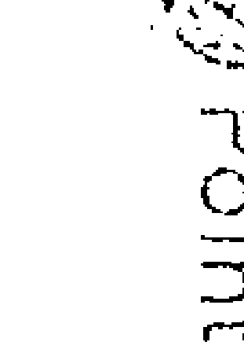

## ✨沒有錢就發揮創意吧！✨

每個人都會有「沒有錢」的時候。沒錢時不要覺得害怕或不安，而是去享受沒有錢的生活，比方說你可以……

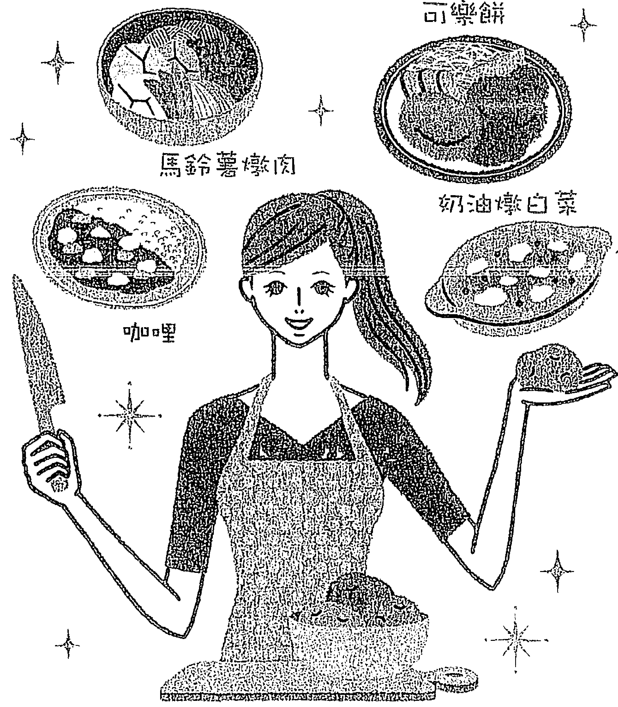

### ⑩做創意料理

利用有限的食材做出各種不同的料理，就像小時候扮家家酒一樣。比方說馬鈴薯可以做成可樂餅、焗烤、馬鈴薯燉肉、咖哩等等。動動巧思是很有趣的喔！

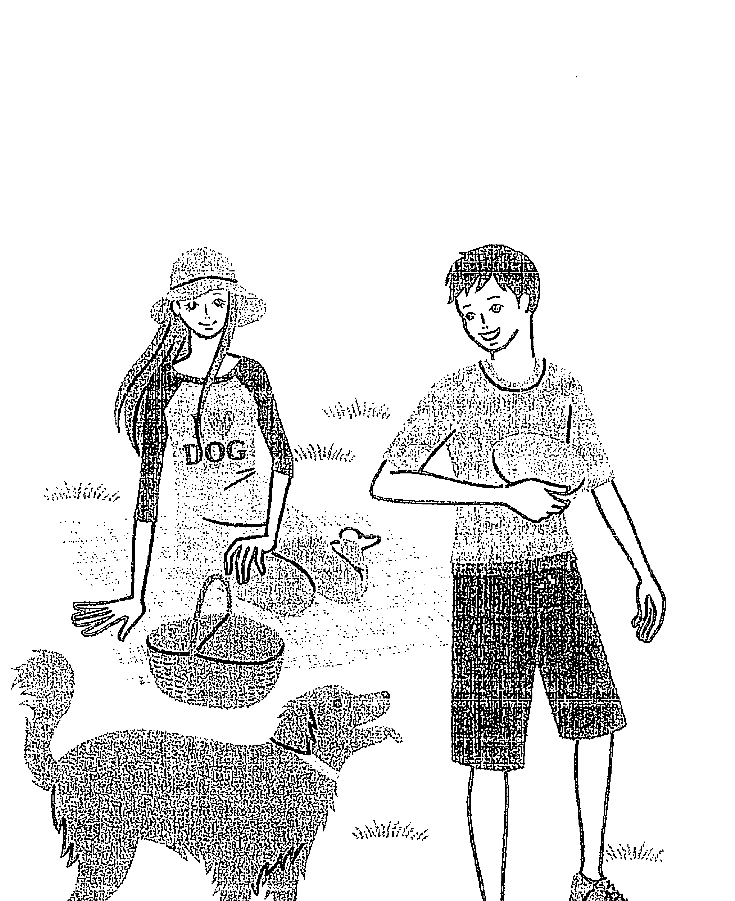

### 去公園踏青遊玩

生活中有很多不用花錢就可以愉快度過假日的方法。可以在公園跟男（女）朋友一起放鬆、心情愉悅地享受兩人世界，還可以晒晒太陽、跟愛犬玩樂，一起度過既健康又寫意的一天。

## 節儉的生活方式

有種說法是「金錢是流通之物」。只要你大膽地花錢，花出去的錢就會倍增回來。可是話說回來，錢只要一用掉就沒了，所以我們還應該要存一筆錢以備不時之需。比方說，以下情況都需要用錢：

- 婚喪喜慶
- 搬家或調職的預備金
- 創業
- 房子的裝潢及翻修
- 生產、養育小孩、學費
- 生病時的住院費及掛號費

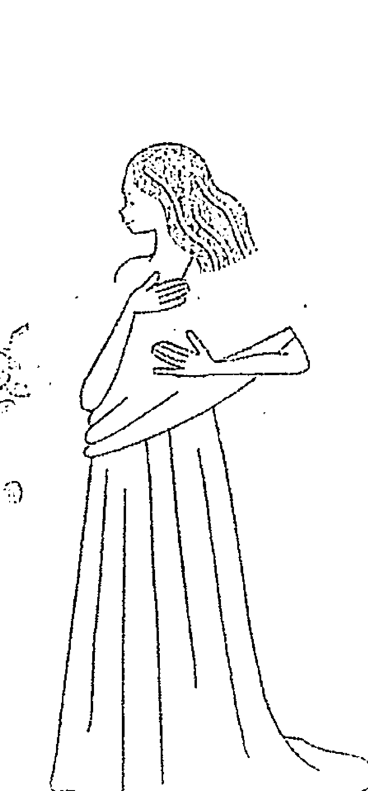

## · 老年的退休生活

這些費用必須在平常就儲蓄下來。

「金錢是流通之物」裡所指的金錢，還應該包含為了累積知識與經驗而必須準備的「加強自己能力的進修」的費用。這些是流動的金錢，而且將來會加倍奉還的金錢，所以絕不能小氣。另外，對於平日照顧你的人表達感謝的贈禮，也是會有回報的。

另外，還必須談談奢侈品。能擁有它當然很好，但它並不是你現在非要擁有的東西。看到最新流行的款式紛紛上市，總會忍不住想買，如果不好好約束自己，錢只會一直不停地溜走。所以當你有「想買」的念頭，就問問自己「那個東西我真的需要嗎？」，藉此好好釐清自己的想法。

通常我只要猶豫要買不買，最後都會選擇不要買。人之所以會「猶豫」，一定是因為有個沒有辦法決定的關鍵，所以最好是等到可以理性判斷時再做決定。這樣一來，你會發現自己比想像中還要冷靜。只要知道少了那樣東西並不會特別困擾，更不至於活不下去，那麼那筆錢就是多餘的花費。當然，如果你是因為有其他收入進帳，而想慰勞自己一下的話，那當然沒問題，只要把購物後剩下的錢存起來就好。

還有，人一旦有錢，自尊心會變高，心情也會比較穩定，自然不會再去嫉妒誰。也由於只要有了自我意識，就會萌生想要「再多一點」的欲望，此時若能掌握好自我欲望與自制力之間的平衡，就不會被錢所操弄，而是由你自己來掌控金錢。

在這裡，我想傳授一個大家應該知道的「存錢的方法」。那就是「起伏的循環觀念」。

金錢流通，必定是起伏循環的，也可稱為宇宙週期。

人只要手頭上有錢就會想買東西，這是再自然不過的了，但是這時必須要忍耐。因為這個時候是存錢的時機。我們應該在財運好的時候節儉，就像在谷底時一樣。在財運下降時，反而要加點油奮發努力地投資自己。

我認為「金錢是流通之物」也是指這個起伏循環的法則。千萬要記得，不是只要依照金錢運勢花錢就好。

比方說，財運不好時，把收入的兩成存起來，以備不時之需。

最後，不知道你有沒有過這種經驗：當你把月薪拿來支付必要支出後剩下的錢，原本計劃要存起來，結果卻發現口袋根本已空空如也？如果想要改善這個狀況，以後請一拿到薪水，立刻把薪水的兩成存到銀行戶頭，平常絕對不能動用，而非常時期就是一筆現成的緊急預備金。

即使財運不佳也要把薪水的兩成存起來

## 宇宙循環

當你收入多時，其實支出也會跟著變多，這就是宇宙的循環。
如果能配合循環，調整用錢方式，就再好也不過了。

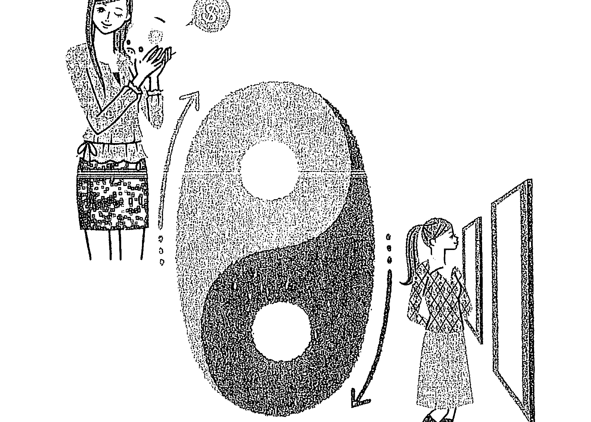

通常收入增加，支出也會增加。我們反倒要在金錢運上升期，忍住欲望，把錢存下來。這點相當重要，因為如果你支出沒有節制，等到進入金錢運下降期，就會有問題產生。在收入持續減少的時期，可以多去美術館走走或參加講座，增加自我學習成長的機會，而且要不吝惜地自我投資。如此一來，等到宇宙循環走回原點，金錢運又會漸漸提昇了。宇宙就是一直不停地如此循環運行。

## 謙虛的人更受金錢眷顧

當人為了「提高」別人對自己的評價時，常常會沒錢卻裝闊，或是明明很有錢卻又假裝沒錢。 我之所以建議大家在錢包裡放入吻合自己所期望的一天報酬以提升自我評價，是因為這樣做，只是在暗示自己「要提升自我價值」。 如果你刻意對外界暗示希望他人也能提升對你的評價或是進一步採取行動，反將落得浮誘不實的評價。

- 「我是成功的人」
- 「我的靈性已開啟」
- 「我有錢也有人脈」

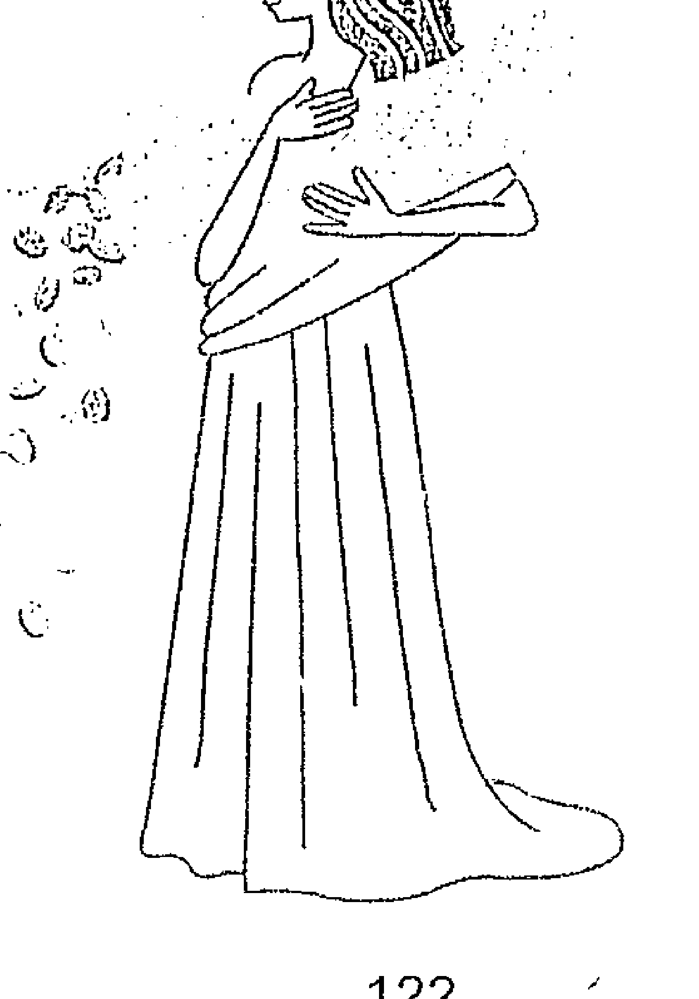

### 第 2 章 讓金錢愛上你的心靈法則

右列項目是宣示文。記得要以已經實現了的肯定語氣說出你對未來的期望。切記！宣示時一定要在單獨一人的情況下，真心誠意地相信並對自己說出來。一旦你對其他人說出了自己的宣示內容，那麼在旁人聽來就像在說大話，除了拖垮大家對你的信任，了解你的人也會因為心生厭惡而離你遠去。所以一定要特別注意。如有這樣的情形發生就會影響你的能量平衡。金錢會離你越來越遠、宇宙的循環也會因此停止。出乎意料的是，即使是正在靈修的人也常常發生這種情況，多半是因為把自我評價與不當評價混在一起的結果。要知道，即使真的成功了，也不應該逢人就自吹自擂，就算是真的有所體悟，也不要老把這件事掛在嘴邊。即使有錢跟人脈很廣也不要四處張揚，因為一切都是自然而然形成，並無特別之處，不需要特地地說給別人聽。

金錢欣賞的人就是謙虛的人，也就是正面與負面力量取得平衡的人。

## Point

提升自我評價固然重要，千萬不要忘記一定要謙虛！

## 讓金錢更愛你的方法

有一個方法絕對可以提升自我評價，做法看似簡單，卻是我們做不到，甚至常常遺忘的。你想得出是什麼方法嗎？
那就是「跟別人分享自己的能量」。
本書一開始就曾提過金錢是種能量，而能量可以轉換為各種形式的東西。任何你想像得到的東西都可以轉換，例如：金錢、時間、知識、技術、親切、創意、體力、體貼的心等等。以上這些項目你是否都擁有呢？即使你現在沒有錢，
其實自身還擁有其他豐足的能量。
接下來，你要不要試著將自己擁有的、除了金錢以外的能量發揮到得淋漓盡致呢？

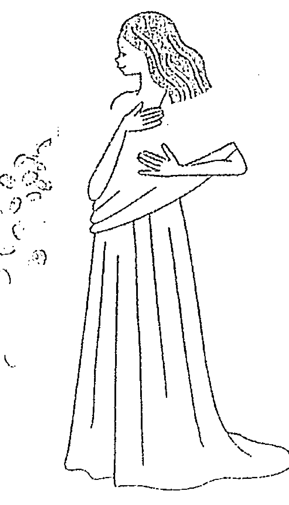

- 朋友有困擾時，傾聽其煩惱
- 親友生日時送生日賀卡
- 幫忙朋友搬家
- 告訴別人你所知道的資訊
- 舉辦聚會並親手準備餐點
- 收到禮物後，親手寫謝卡或是致電感謝
- 在大眾交通工具上，讓座給老年人及行動不便的人
- 乘坐電梯時，耐心等候需要搭乘的人
- 有人迷路時指引其方向

只要你不求回報地分享自己的能量，那麼你在宇宙銀行的帳戶中將有源源不絕的存款。

時間、笑容、智慧、感謝、體貼……你可以為大家做到的事真的很多。當然，你千萬不能強迫對方接收你的好意，或是讓對方覺得有負擔。只需要在心裡想著「我很高興能為別人做到這些事」，然後真心誠意地付出。重點就在於，付出時一定要自然且絲毫不造作。請先試著對旁人釋出善意，而不要只是一味感嘆「都沒有人為我付出」。假如你到現在還是沒有得到別人親切的對待，可能是因為你在宇宙銀行的帳戶中已經沒有存款了。因此，只有自發性且不求回報的助人行動，才能提升自我評價又可增加宇宙銀行的帳戶金額。但是提醒各位宇宙法則還有一個規則必須遵守，那就是千萬不能心存「幫助別人或許就有金錢進帳」這類的期待。

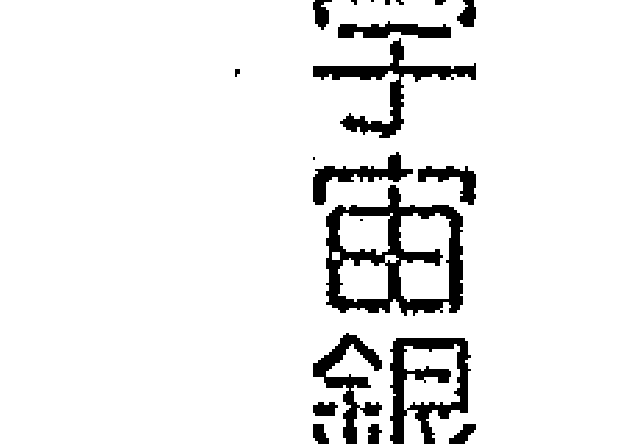

> 宇宙銀行的規則是「不要期待會有任何報酬」

## ✨ 分享自己的能量 ✨

時間、知識、技術、親和力……人除了金錢以外還有很多能量。只要你能無私分享這些能量，宇宙銀行戶頭將會不定期地有錢存入。

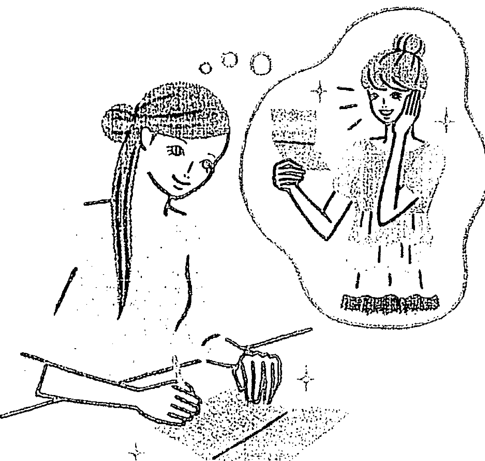

### 生日祝福

有人記得自己生日是件很令人開心的事。如果能再對壽星有所表示的話，相信可以讓他（她）更高興。傳電子郵件或打電話都可以，不過要是能手寫一張生日卡片傳達你的祝福，將會更美好。

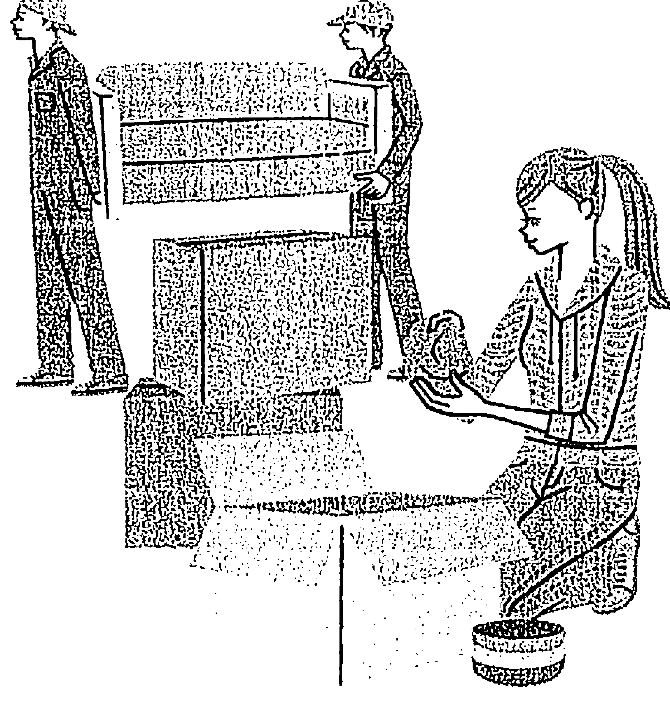

### 幫忙搬家

搬家一定需要人手！大膽地對要搬家的親朋好友表示：「讓我來幫你搬家吧」。你主動提出的協助，對方一定會欣然接受，日後也定會表示感激。

## 家庭聚會

很會作菜的人不妨辦一個簡單的聚會，跟朋友一起同樂。或者是跟朋友講好一人帶一道菜，輕鬆愉快地度過屬於你們的時光。

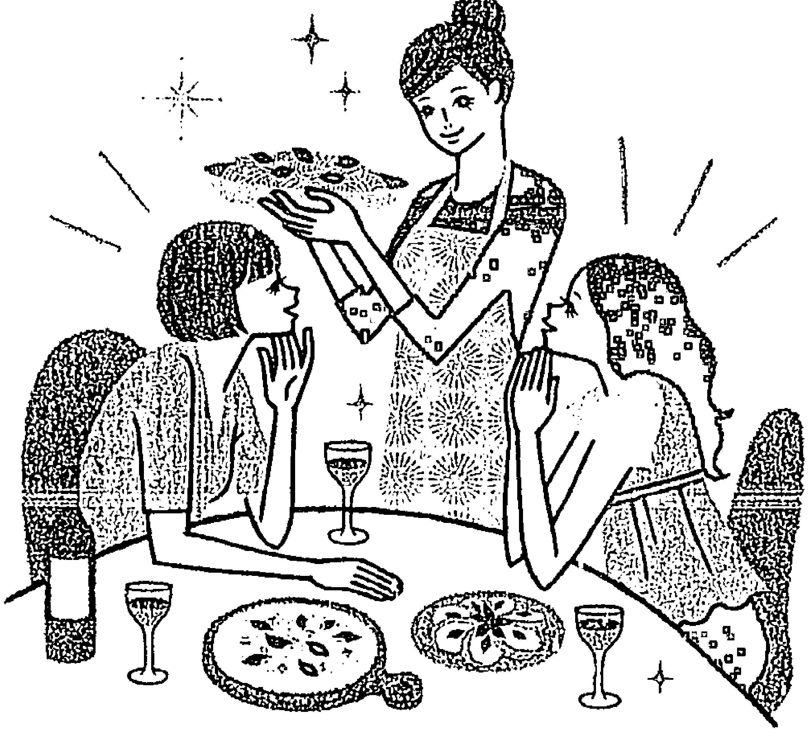

## 讓座

在捷運或公車上如果看到老年人或行動不便的人，記得馬上讓座。這正是可以輕鬆分享能量的方法。與其考慮太多，窮擔心「這樣會不會失禮呀……」，不如大方一點地說「請坐！」。這樣做也可以讓你的心情變好喔。

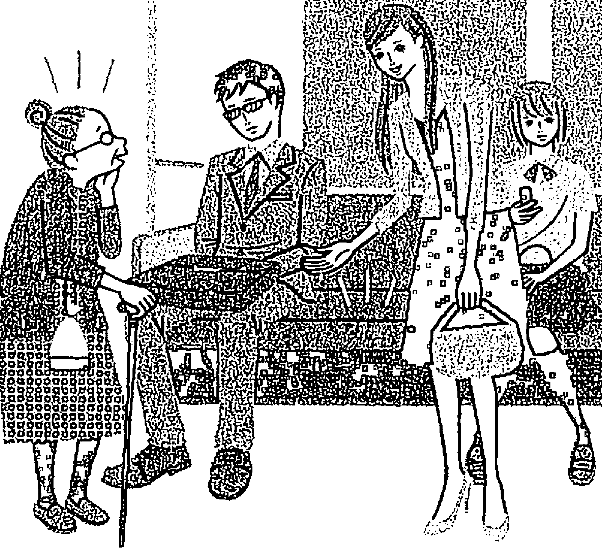

## 第 3 章

### 維護管理：生命周期管理

### 十大金規

## 夢想的可能藍圖

現在大部分的人沒有規劃未來的習慣，甚至連未來的藍圖都沒有。即使有人想過未來，但想過更遙遠未來的人應該寥寥無幾。我想應該也有不少人只把眼光放在現在想要的東西、眼前必備的東西、現下想做的事情，把自己所有的能量投注於當下而已。我經常會被來上靈修課程的學員問到：「我的未來究竟會如何？」、「我到底該做什麼才好？」、「我的夢想會不會實現？」但是不論你對於未來的想法有多麼清晰完整，只有你沒有親身訂好計畫並積極行動，夢想是永遠也不會實現的。

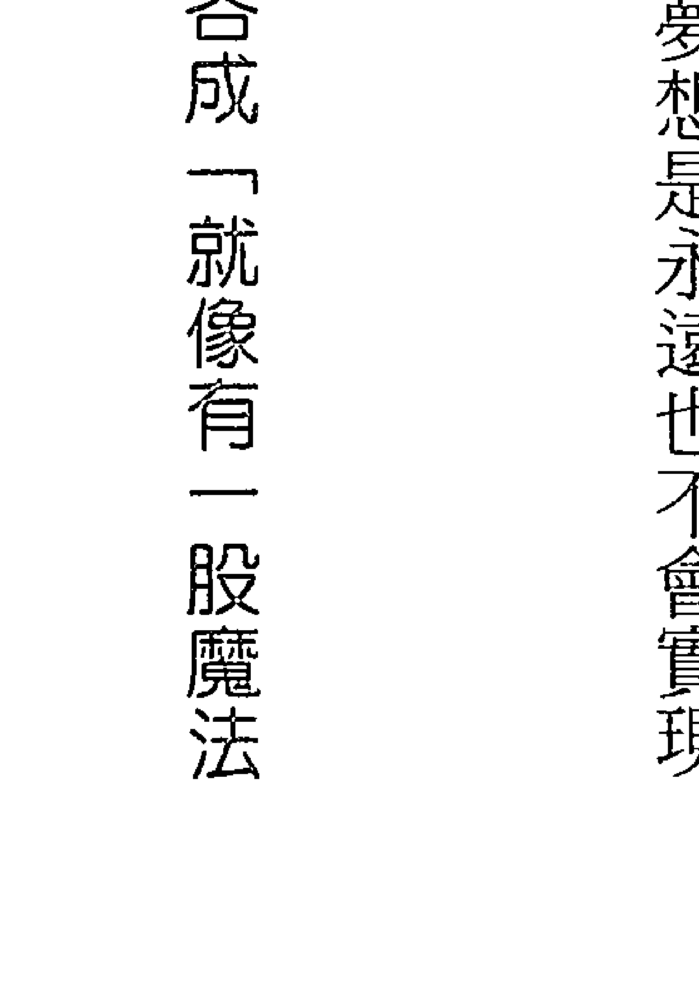

再加上一般人對靈修存有既定印象，總會把靈修形容成「就像有一股魔法般的力量在作用，幸福只會在偶然間降臨。」但是對於確實依照宇宙法則實行的人來說，這是宇宙賜予的獎勵。不努力付出的人，想當然爾，什麼也得不到。

我希望讀完本書的讀者，務必從現在開始好好規劃自己的未來，而與宇宙豐沛能量連結的金鑰，就在這裡！

前面我曾說過，吸引金錢的金鑰在於「喜愛金錢」。但更重要的是，這一節所說明的「要有目標」。

因為金錢喜歡知道如何使用金錢這種能量的人，也就是金錢會聚集到「有目標的喜愛金錢」人身邊。

那麼，請回答以下問題：「如果你有一億元，你會如何使用？」

- 現在沒有特別想要的東西所以存起來
- 把錢用來投資理財，賺了錢以後，辭掉工作過優雅的生活
- 先環遊世界一周，再繼續享受國內旅遊之樂
- 在市中心買一棟房子

我相信任何人都有許多想好好體驗享受的事。投資、存錢雖然都很重要，但光靠這些還是無法把富足的狀態吸引到你身邊。

那麼該怎麼做才能達到目標呢？

那就是『學會把得來的金錢用在對人有幫助的事物上。』

如果你總是想著『我想要……、我想去玩……、我想要圓……夢』，一切都是以『我』為出發點的本位主義，那麼金錢是不會來到你身邊的。但是如果你抱持著『我能為大家做點什麼』的想法，金錢就會很樂意自動送上門。

- 將來想要為社會貢獻一己之力，所以要努力唸書上大學
- 為了讓家人可以過舒適的生活，想要購置獨棟住宅
- 因為這是相當有用的資訊，為了推廣給更多人知道，必須出版成書。
- 創業是為了提供服務，讓大家都能過著比現在更快意的生活。

你運用金錢的方法是否也包含了想讓大家幸福快樂的目的呢？以讓家人幸福為目的的當然是令人讚嘆的。如果還沒有，就請訂立一個幫助他人的目的吧。
總的來說，「金錢會自然聚集到擁有明確的目標，願意幫助別人，而且喜歡金錢的人身邊。

快提起筆來，把握有一億元時想要如何使用的目標，具體地寫在筆記本裡吧！與其在腦袋裡漫無目的地想像，寫下來的話更能擁有金錢的豐沛能量。

## Point
第一把金鑰：擁有明確的目標、學會以助人為目的使用、喜愛金錢

這個計畫表很重要。請先回想書中曾提過的「思考創造未來」。只要我們明白地表達自己的願望、清楚描繪夢想，抱著一定會成功的決心，就能順利與宇宙能量結合。
宇宙看到你用心安排的計畫表，就會了解「噢，你就是想實現這個願望」，並進而協助你完成。你是要虛無飄渺地空想未來，還是訂立明確可行的願望呢？這是決定你能否實現夢想的重要因素。

### 健康與理財觀念
- 你心目中理想的身材為何？
- 你的資產、儲蓄、投資狀況

### 個人夢想
列舉任何想完成的事

### 精神層面
- 想要如何自我成長？
- 最想提升什麼部分？

### 興趣、嗜好
旅行、興趣、運動等

## 製作你的宇宙豐足計畫表

「假設你中了一億元」，你會怎麼用這一筆錢？
「有生之年最想完成的事是什麼？」我想你一定清楚，究竟哪件事可以讓你死而無憾，很滿足地過完一生。不論這個夢想是大是小，都請你寫在下面的欄位，這是你專屬的「宇宙豐足計畫表」。

| 物質層面 | 工作方面 |
| :--- | :--- |
| 日常生活想要的物品 想住的房子、家具、車子等 | 證照、工作目標、職業、薪資 |
| 人際關係 | 對社會的貢獻 |
| 朋友、戀人、家人、同事、孩子 | 義工、社區服務等 |

## 不被金錢操弄的方法

一般人的觀念都會覺得財產增加就會越來越幸福，事實上兩者並無關聯。含著金湯匙出生的人，除了金錢不虞匱乏之外，不用說，當然是每天都有可口的點心可以吃。相較之下，不是在那麼富裕的家庭中成長的人，只要偶而能吃到一塊蛋糕，就是滿嘴的幸福！我覺得每個人對於幸福的感受多少都受到父母對於金錢的價值觀所影響，但是我想大家應該都同意「金錢上的富裕絕不代表幸福，應該是面對當下的心境才能決定自己是否幸福。」

讓我來說個被金錢操弄的女性的故事。她的丈夫曾經是個相當富有的有錢人。她總是四處炫耀名下所擁有的私人

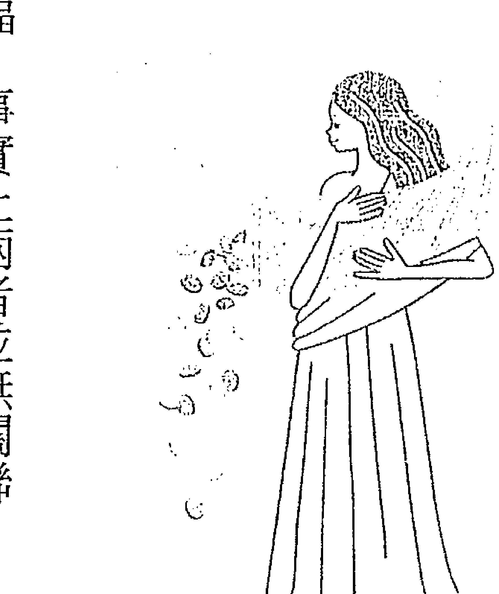

## 第 8 章
獲得豐沛能量的十大金鑰

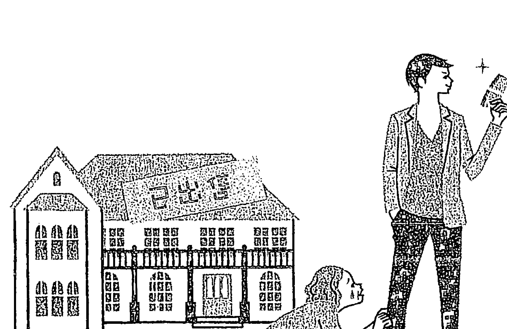

賣掉豪宅之後反遭親生兒子夫婦棄養的可憐母親

遊艇、高級房車、豪宅等資產，以及她所結識的政商名流，每年總會出國旅遊好幾次。她有一個兒子，兒子後來成家自立。在那之後經過數十年，她的老公過世，她和兒子各繼承一半的遺產。
又過了幾年，她因為自己的身體大不如前，想要藉著這個機會搬去與兒子同住，於是把衣物行李搬到兒子準備好的住宅中。未料，等她想與兒子聯絡時，兒子居然賣掉那棟豪宅，而她再也聯絡不上兒子……
於是，她帶著滿腔的憤怒與不滿，開始四處向朋友吐苦水：「為什麼我非得落得如此下場？」

後來，她承受不了這個打擊，失去了生存下去的動力，身體開始出現抗拒現實的失智症，現在她誰也不認得，一個人住在安養院裡。
曾經家財萬貫的她，卻在人生最後階段失去了所有。但我認為這一切並不能完全歸咎於兒子！因為如果兒子是在充滿愛的環境下成長，我想他應該不至於會做出這樣的事。之所以會有這樣的結果都是他對父母親的憤怒與憎恨使然。
由於母親對兒子沒有給足愛與關心，因而種下所謂的因，累積數十年後成為兒子遺棄母親的果。
因為自己種下的因，而獲得的果稱為「因果報應」，也是所謂的「業的法則」。
「業」並不是壞事，它只是一個循環。也就是所謂的善因善果、惡因惡果。要是你無視於「業」的存在，而放任自己浮沈於金錢的慾望之中，最後宇宙一定會以某種形式讓你有所失去。至於何種形式？也只有宇宙知道。那麼，如何不落入惡的循環之中呢？那就是如果你得到一筆金錢，請把其中的一成，或者即使是百分之五也好，捐出去助人。
請記住，只有宇宙知道你是否有錢。如果你想要與宇宙的富足有所連結，

務必要以感謝宇宙的心，捐出收入的一部分。捐助他人就等同於信賴宇宙的行為。

如果你不以金錢捐助他人，也可以用參加義工活動的方式進行。最重要的是，不要抱持「幫別人做什麼」的想法，而是以「參加那個活動我可以得到靈感」、「我可以從中獲得勇氣」、「深受感動」這樣的心情來奉獻自己。這與下一節「金錢的公平交換」有關，請再仔細參考下一節。

「我有深刻的感受，而且深受感動！」只要以金錢或是行動幫助那些讓你有上述想法的人，你的謙虛態度也會讓你的自我評價有所提升。

話說回來，如果故事裡的女主角能早一點意識到，金錢萬能的欲望雖然可以控制他人，但被她所忽略的人長期累積的不滿情緒或是憤怒，最終還是會回歸到女主角身上。要是她能早些察覺，結果或許會全然不同，而她自己也能因此有所成長。

把獲得金錢的一部分慷慨助人，是使宇宙循環有好結果的訣竅。只要你洞悉這一點，今後不管你身價是幾億或幾十億，都不會有惡果出現。

## 第一把金鑰：將獲得的金錢捐獻一部分給宇宙

### 捐獻收入的5%吧

為了不讓金錢的「惡果」循環，把收入的5%捐獻出去。捐獻的對象一定要是自己認可的人或事物。

- 捐獻收養動物協會

車站出入口附近，常常有愛護動物人士進行募捐活動。對愛犬、愛貓有深刻回憶的人，應該都會自動捐獻。

- 捐贈樹木

一起植樹，來守護大自然與我們的家園吧。植樹可讓故鄉山林再現，村落再生，同時植樹也可享受培育之樂，或是當成一種紀念也不錯。

## 到公園去撿垃圾

公共場所一定都會有沒公德心的人，隨處亂丟垃圾、污染周邊的環境。平常我們也許會裝做沒看見，但何不讓心念一轉，主動撿起垃圾！如此一來，或許可以讓你和社區居民的關係更進一步喔。

## 金錢的公平交換

請問你覺得「施」與「受」，何者比較偉大？

「施」或是「受」呢？

如果你老是想著平白接受、或無所求的給予，都會妨礙你的成長，同時也違背宇宙的法則。金錢只有在公平交換的原則下，才能平衡回饋，你也方能因此與宇宙有所連結。

你一定覺得奇怪「那麼，上一節所說的捐獻是怎麼一回事？」

剛剛我也提過，「即使是捐獻，能否『公平交換』是非常重要的。」因為你從社會活動中獲得靈感（啟發）、勇氣和感動，捐獻只是你回饋的謝禮。所以你應該對於你認同的活動團體捐贈金錢與心力，而不是隨意找個對象捐贈即可。只要你有隨便敷衍的想法就不可能有相對的獲得，所以一切都是「公平的交換」。

在我還不了解「公平交換」的法則之前，也是對捐贈感到不以為然。後來我才发现，只要沒有做到「公平交換」，人際關係就不可能良好。如果影響到職場關係，工作當然就不可能順利。所以，「公平交換」是個相當重要的法則。

讓我舉一些親身的經驗與大家分享。

有一天，我跟三個朋友相約吃飯。我因為有事晚到，當我趕到餐廳時，沒想到三個友人已酒足飯飽。在這種情況之下，我只好點了果汁和沙拉來充飢。服務生把沙拉送來的那個時候，我還問大家：「要不要一起吃？」大家也點頭說好，最後我只吃了四分之一的沙拉。光吃那樣其實不太能填飽肚子，但我是想：「也好，既然大家都吃飽了就不必再加點了。」結果我只吃了一點點沙拉。

到了要結帳的時候，一個朋友說「今天大家平均分攤吧！」我心裡不禁又犯嘀咕：「你們吃得那麼盡興，還吃了我點的沙拉，我應該可以不用出錢吧？」哪知道沒有半個人體恤我，三人大刺刺地把各自該付的錢放在桌子上。我心裡雖然氣憤，覺得非常不公平，最後還是跟著付了三千日圓。之後我也沒有跟那三個朋友相約吃飯。假設你也遭遇跟我一樣的事情，或是你曾經像我朋友那樣硬要別人平均分攤，請注意！用餐也是一種極大的能量交換。當天如果以對價關係來探討的話，我絕對是受到了不公平的待遇。又有一次，有一個朋友主動說要免費幫我架設網站，我不好意思加以婉拒，她卻說：「沒關係，讓我幫妳吧！」最後，我只好順了她的意。沒想到過了一年，我卻突然接到她語帶憤怒的電話：「管理妳的網站實在很麻煩，我以後可能沒辦法幫妳了。」這就是欣然接受「免費就好」的代價。結果因為她說：「如果不付我一個月一萬日圓，我沒辦法打平。」為了保險起見，我急忙跑去詢問聘請專業網頁維護人員的市價是多少，結果只要五千日圓，最後，我以一年三萬日圓酬謝那位朋友，之後就改請專業的網頁維護人員幫忙了。

我之所以想要認真面對金錢，就是因為經歷了這些不愉快的經驗，想要改變與人相處的方式所致。

我的初衷明明是想要擁有良好的人際關係，但是為什麼會發生問題呢？後來的經歷讓我瞭解到，金錢具有能量，如果沒有好好處理，將會造成即使擁有幸福，也會帶來慘痛經驗的結果。

學習靈修以後，會不知不覺認為「施比受更有福」，只不過，如果沒有讓施與受取得平衡，幸福一定會伴隨著慘痛經驗而來。與其說是慘痛，倒不如說是令人不愉快的經驗。假設你給得少，對方很可能會輕視你、覺得你小氣；要是給得多，你可能會自己跟自己生悶氣，覺得貶低了自我的價值。剛剛我所提到的跟朋友吃飯的經驗，我會憤怒就是因為覺得自我價值被貶低了，而另一方面，架設網站的事件中則是讓對方覺得自己沒有價值而發怒。

對金錢抱持正向思考的人，總會覺得自己「是個好人」而感恩。所以常常容易脫口而出：「我『免費幫你做』。」雖然剛開始真的是不求回報的好意，但之後卻因為要花費時間、金錢，為此逐漸感到氣憤，忍不住對自己生氣：「真是夠了！」為什麼只有我得做這種事（當這種濫好人）？明明我什麼好處都沒拿到！」最後還會開始責備對方「我應該也要得到一些回報才對啊！」一切都是因為想當「好人」的關係，所以無法說「不」。

我把這種人稱為戴著「正向光罩」的人，也就是太過正向的人。這種類型的人有時也會表現出極度負向的行為。他的態度總是如同鐘擺效應一般，乍然驟變。這種正向光罩型的人即使外表總是扮演「好人」，卻由於內心懷抱著不安與忿忿不平，使得他們在達到內心平和狀態之前，總會遇到許多困擾。

另一方面，對金錢抱持負面思考的人，總是想盡辦法要從別人那裡得到東西。他們喜歡「免費獲得」。如果真的可以不費吹灰之力就得到東西，相信任何人都喜歡。

我也曾經因為能免費獲得而感到幸運，但是後來卻常因為這樣而與人交惡。這些因為免費獲得而感到幸運的人，我稱之為戴著「負向光罩」的人。由於負面光罩型的人總有依賴心理，所以總會遇到強勢的人。也因為總是不須付出就獲得而感到不安與罪惡感。如果是沒有任何感覺的負向光罩型的人，一定是不會與人往來的人，要不然就是極力想要控制週遭人們的人。不論是何種類型的人，他們的人生必定是不公平的人生。

那麼，到底哪裡才是平衡點呢？那就是「零點」，也就是既不正向也不負向，恰好居中的充滿能量的點。

原則上，可以做到「金錢的公平交換」的人，基本上是有禮貌、有品德、充滿愛的人，而且深受身邊的人信賴與感謝。

## 第 3 章 獲得豐沛能量的十大金鑰

### 零點是充滿能量的點

「濫好人」常講出「讓我來幫你吧」，但這種寬大的心情卻無法持久，一方面生氣自己的濫好人性格，一方面會將這股氣遷怒他人，原先正向思考的人一下子變成負面思考的人。「佔便宜的人」雖然只要收到別人賜予的東西就會覺得很走運，卻也正因如此而一方面無形中受到他人操控，一方面內心深處又有著莫名的罪惡感。「濫好人」也好，「佔便宜的人」也好，對於金錢的處理都不夠穩定，希望這兩種極端類型的人以中心點的「零點」為目標，找出最適當、平衡的處理方法後，就可以與金錢建立良好的關係。

何以見得？因為這樣的人不僅能看清事物本質、具有決斷力，情緒平穩，所以讓人覺得很安心。這就是以「公平交換」造就完美人生的秘訣。一旦你能做到「公平交換」，心靈就能處於平和安定的狀態。

請試著回想一下過去的人生中，曾經遭遇過的不平衡的人際關係。想必應該皆與致使人際關係失衡的「金錢」脫離不了關係。只要人跟人之間能做到「公平交換」，相信不論與誰都可以維持細水長流的友誼。即使如此，我們還是有可能從宇宙接收到「你已經失去平衡了」的訊息。

## 第二把金鑰：確實實行「公平交換」

### 金錢「公平交換」的重要

一定要做到金錢的公平交換，如果不了解這個利害關係，就會遇到下面那種無奈的遭遇。

### 我的例子

「我已經都晚來了還要平分餐費……」心裡實在很不舒服，卻沒人了解這種無奈的心情，難道是生悶氣的我有錯嗎？不不不，沒有把餐費依對價原則均分是不公平的。我以後都不會再和這群朋友去吃飯了。

### 公平交換的例子

A媽媽從平時感情不錯的B媽媽那裡拿到了小孩子的二手衣，因為那個B媽媽說免費送妳，所以A媽媽很感恩地道謝後就收下了。沒想到過一陣子傳出了中傷A媽媽的謠言，原來是B媽媽到處跟人說：「A媽媽很不懂禮節……」。如果A媽媽知道公平交換的原則，應該不至於被人說三道四。

## 找到自己對金錢的信念

我曾說過，金錢會自動來到喜愛金錢的人身邊，如果你明明一直誠心祈禱「我想要錢」，口袋卻還是空空如也，那可能意味著，你和金錢之間出現了一條鴻溝。

你對金錢的信念是以下這樣嗎？

- 「開口閉口都是錢不好。」
- 「絕對不能為了錢而做事。」
- 「錢並不重要。」
- 「我沒有資格擁有那麼多錢。」

我們總是習慣在對朋友有所請託時，把跟金錢有關的細節擺在最後才說。像我這種學音樂的人，總是認為在音樂界談論金錢是一種禁忌。我們總是一種信念所左右，認為：「藝術比金錢崇高多了」、「談論金錢就是貪財」、「談錢真庸俗」等等，我是到了能比較遠離音樂界時，才領悟到應拋開這些既定印象。

當然我也不認為只有音樂界才如此，而是不論是哪個領域的人都對金錢抱持相同的觀念。

我大學剛畢業時，曾經有聲樂家與管樂家拜託我幫他們伴奏。當伴奏必須跟著樂團練習、調音、彩排乃至正式演出，通常需耗時一個月，並佔用了我大部份的時間。當時，大家沒有談到錢，一直等到演出順利畫下句點，我的報酬呢，就是一句「謝謝，辛苦了」而已。其間我花費了交通費、伙食費以及時間，結果即使我心裡有所疑問與不滿，卻實在開不了口問一聲「我的演出費呢？」此時，我只能試圖說服自己「這是一個很好的經驗，我學到很多。」

歷經好幾次這種勞心費力的折騰之後，我慢慢開始婉拒伴奏的邀請，只要有人來邀約，我一定請他們先把價碼談好。有趣的是，我對於從事音樂演奏就不能有應得的報酬，而從事其他工作卻可以實實在在領到應有的酬勞感到不可思議。
當我開始思索為什麼從事音樂工作就要免費的情況時，想起學生時代就被灌輸了「不可以談論金錢」、「想到錢就表示心有貪念」等這些負面思考的種子。而接觸靈修後，我總是要不斷回溯過去以淨化對於金錢的負面想法。
請問，如果你被某人拜託做某件事情，有勇氣與對方堂堂正正談論酬勞嗎？

你是否可以毫不猶豫地跟他談論公平的交換條件呢？如果難以啟齒，請試著想想你之所以做不到的原因，進而找出潛藏在你內心的負面想法。

金錢真的只是一種純粹的能量。如果你一心覺得它只是「貪念」，對金錢抱持這麼負面的態度，你就沒辦法以正向的態度談論金錢，那麼金錢也不會湧向你。

我自己之所以能擺脫這些負面的想法，全都歸功於我早先一步走出封閉的音樂界。雖然那些是看來如此稀鬆平常的事，卻在我認真面對自己心裡的感受之下，得以找出不對勁的地方並有所行動。

我認為，音樂家本來就應該為了有更好的表現，而擁有足夠的金錢。如果家庭原本就富裕，生活並不會因為那些演出費用的支出而有所影響，那就另當別論，但是我以為只要你想讓自己過富裕的生活，就更應該把音樂表演視為一種商業行為才是。

因為如果你想要把好的音樂作品獻給大眾，超商便當、狹窄的房間、拮据的生活將會是你成功的絆腳石。

## 第四把金鑰：找出你對於金錢的心理障礙

這項法則不僅適用於音樂界，而是放諸四海都通用的。即使你的家人、學校同學、社會大眾普遍都認為『談錢就是俗氣』，你也不一定要盲從。說得更直接一點，我覺得『只有能從負面想法破繭而出的人，才能擁有金錢』。所以，衷心希望讀完這一本書的你，可以早一步擺脫負面信念。

## 寫下你對金錢負面、錯誤的觀念

這是許自己一個富裕人生的方法

看看你對金錢是否持負面的想法

1.  過奢侈的生活讓你有罪惡感........................................................Yes · No
2.  談錢讓你覺得自己有貪念........................................................Yes · No
3.  雖然想要變成有錢人，卻有一個一直逃避、一直抱怨的自己存在..................Yes · No
4.  認為宇宙間的金錢是有限的........................................................Yes · No
5.  認為選擇有興趣的工作賺錢、或是總是有美食可以吃很困難......................Yes · No
6.  覺得只有一小部分有天分、有才華的人才能變成有錢人...........................Yes · No
7.  想要有錢、想增加收入，卻都只是想想而已，沒有行動...........................Yes · No
8.  害怕有了錢，就會被其他人責怪及嫉妒...........................................Yes · No
9.  沒有想要成為○○的目標.........................................................Yes · No
10. 覺得錢一直都不夠用...........................................................Yes · No

只要有一個Yes，就表示你對金錢持負面想法。
現在把你對金錢抱持的是什麼樣的想法寫在一張紙上吧。

如果你紙上寫的結果是負面想法的話，把那張紙撕碎丟進垃圾桶。

今晚入睡前，下定決心變成有錢人吧。允許自己擁有比現在更遠大的夢想、更多的金錢；揮別現有的負面想法，以全新的心情，描繪你的理想人生，創造璀璨的未來。

不妨自由地想像一番，像是「我要一棟氣派的洋房、一個理想的伴侶，想要過著身邊什麼都有，衣食無缺的愜意生活……」。

## 了解父母對金錢抱持的信念

父母對金錢的態度，也足以影響子女對金錢的看法（信念）。我們從小的時候，就懵懵懂懂聽著父母親的對話，其實潛意識早已接納他們對於金錢的觀念，導致你在不知不覺中也會用父母的價值觀看待這個世界。等到你察覺到這點，認為該堅持自己的想法而反抗父母親時，卻發現事情並不如預期地發展，而對現狀感到煩惱不已。為什麼明明發奮要自己做主，卻沒能有好結果呢？其實這一切都是你對於金錢抱持怨恨與憤怒等負面信念的結果。以下茲舉一例簡單說明。

有一天，有個學員來找我諮詢。他提出了一個疑問：

> 「我是因為沒有錢，才不能實現夢想，那麼到底該怎麼辦呢？」

於是我試著幫他通靈。

結果，我發現他背後也有一個凡人看不見的守護靈。接著守護靈把一些影像與想對學員的話傳達給我。於是我又幫學員把他的疑問詢問了守護靈，沒想到守護靈卻答道：「他其實有錢。」我對於學員覺得自己沒有錢，而守護靈卻說有錢這件事感到不可思議，於是我追問原因何在。
後來，守護靈又讓我看到一個畫面：因為我的學員總是收到父母從老家寄過來的番薯，然後我還看到他信誓旦旦說道：「我發誓等到自己長大會賺錢，一定不要再過這種窮酸的生活！」
因此，我馬上回頭問學員：「你總是只收到番薯嗎？」他點點頭。接著我試探性地問他：「你的守護靈說你其實有錢，而且你都把錢花在飲食上。」學員一臉驚訝說：「沒錯，老實說，我賺的錢確實比一般人還多，但因為我都把錢花在飲食上而沒有多餘存款。」透過這番對話，我終於了解狀況了。原來真正的原因就在於潛意識中想要反抗父母的想法，因而把怒氣出在金錢上。也就是他把所有金錢投注於自己幼年的想望上，試圖得到滿足。
最後我建議他，把外食的次數減少為每週一至二次，其他時間就儘量自己動手煮。這樣不僅節省開支也對健康有益。接著只要靠自己去努力改變既有的習慣就好。

上述例子就足以說明，對父母親的價值觀、想法，以及對自己的那股怒氣會如何影響一個人的生活。

你自己又是如何呢？是不是跟例子中的主角很類似、是不是也有不滿與憤怒的情緒呢？

在此，請試著寫下你的父母親對金錢的態度。這樣一來，你應該馬上就能了解目前自己與金錢之間有哪些障礙。

- 父母親對金錢的看法是？
    - 賺錢很辛苦
    - 太有錢會惹來許多麻煩
    - 有錢人都不是什麼好人
    - 平凡才是最大的幸福

## 第③章 獲得豐沛能量的十大金鑰

## 第五把金鑰：淨化接收自父母的負面信念

以上這些負面的想法都是障礙，都會阻止宇宙的豐沛能量向你靠近。
請以接下來的練習試著淨化那些接收自父母的負面信念。

- 女生不用賺太多錢
- 一直想著錢就表示這個人很貪心

你自己本身對金錢的看法是？
- 不用賺太多錢也能過活
- 錢自己會來找你
- 有能力的人才賺得到錢

## WORK 10

### 請求天使協助的方法

### 淨化負面思考的方法

1.  坐在椅子上，閉上雙眼準備進行接地。現在你眼前有一個垃圾桶，把你對金錢的負面想法（如罪惡感、執著心、恐懼及抗拒）丟到垃圾桶裡。接著回想過往因金錢而發生糾紛的情景，比方說跟朋友因為一點小錢吵架，被迫支付不合理款項的委屈，還有父母親對金錢的想法及態度，也把這些一併丟進垃圾桶吧。

2.  我們心中的「心輪」是一座能量中心。如果你覺得能量接收不順的話，可以想像心輪被上了一把鎖。這個時候請在內心默唸：「我已經淨化對金錢的負面思考，捨棄舊有的想法，請心輪幫助我吧」，等到心輪把那把代表負面思考的鎖解開後，順勢將它丟進垃圾桶吧。

接著想像天使降臨，他們是來把垃圾桶搬走的，如果你的垃圾桶比較大的話，就請二名天使幫你運走，記得向天使道謝，目送他們遠離。

> Thank you!!

> 我會帶著感恩之心收下金錢。

最後，請發表想要變有錢的宣言：「即使我父母親對金錢的觀念有誤，我也不在乎」、「我認同自己的才華，這些才華足以為我賺進等值的酬勞」、「我很樂意接受金錢、也會愛惜金錢」、「我無條件認可在宇宙之中流動的無窮能量」、「我會從今天開始珍惜金錢」等，自己做出肯定金錢的宣言，在心中默唸著，慢慢深呼吸之後，睜開你的眼睛。

## 檢視你的人際關係

金錢並不會在某一天突然從天而降。金錢都是藉由人而來。上班族的薪資是由公司老闆支付、做生意的老闆因客人的消費而賺錢、其他如遺產的繼承、投資消息的取得等，都是經由人而來。

也就是說，人際關係不佳，就不可能會有錢進來。

「沒有人際關係」，這句話也是有其道理的。

請檢視你的人際關係。你每次都跟同一群朋友結伴出遊嗎？還是你覺得「一個人反而比較放鬆」，而總是窩在家裡呢？有沒有相同興趣的朋友？除了公司同事以外的朋友有幾個人呢？

如果你身邊真的沒什麼朋友，請試著積極主動去拓展交友圈，自己努力去認識朋友吧。如果你平日總是不斷發出明朗的笑聲，幸運之神一定不吝惜惠賜機會給你的。

雖然與人交往難免有受傷的時候。當你發現和朋友價值觀分歧或意見相左，實在難以溝通時，可以考慮先分開讓彼此冷靜一下。說不定暫時分開，等日後時機恰當時，再經過多次的溝通，一定能了解彼此的想法，而誤會冰釋，或是可以攜手找出解決之道，關係自然而然可以恢復融洽。

我也曾有因為朋友幫助而實現夢想以及被朋友陷害的經驗。人生中總是痛苦體驗與甜蜜體驗交雜，不論是帶給你何種體驗的人都是造就今日的你的貴人，我們都要由衷感謝他們才是。

因此，不要害怕拓展人際關係，盡情去與人交往吧！只要一步一步腳印地向前邁進，真正投緣的好朋友一定會出現。

## 第六把金鑰：珍惜你的人際關係

### ✨ 拓展人脈 ✨

人之所以沒有錢，和人際關係不佳、沒有朋友有關。真的想要有錢的話，就積極拓展你的人際關係吧。

### 喜歡一個人獨處

你是不是覺得與人交際很麻煩，所以常一個人關在家裡呢？一個人自得其樂也沒什麼不好，只是老是一個人的話，人際關係就不會有所進展。從今天起，希望你能主動出擊，積極地去拓展人際關係。

### 除了同事以外沒有其他朋友

你滿足於只認識公司的同事嗎？每天只是往返家裡和公司，不但認識其他人的機會變少，自我成長的速度也變慢了。自我成長的關鍵在於接觸各式各樣的人喔。

### 除了同事以外還有其他朋友嗎？

喜歡相同的運動、嗜好相符的朋友，下班可以去喝一杯的朋友，你有很多這樣的朋友嗎？當然，朋友貴在交心，不在多寡，只是說如果朋友很少，發展機會連帶也會減少，所以多多去認識與自己磁場（想法）接近的朋友吧！

### 化危機為轉機

在人生的道路上，越是勇敢邁進的人，遇到逆風的機會總是特別大。我們總會遇到凹凸不平的路面和地勢險峻的山路，有時路邊偶而也會出現「禁止迴轉」、「禁止通行」等警告標示。

人生在世，總會遇到逆境與障礙，相信每個人都必定經歷過這樣的時期。

只是大多數的人一旦遭遇挫折，都會想逃避問題、將挫折歸咎於他人或環境，甚或兩手一攤等待別人來拉自己一把，更甚者，索性開始做起白日夢。

但是，一旦你真的下定決心，想要「與宇宙的豐沛能量有所連結」、「當個有錢人」，就絕對不能試圖逃避。宇宙絕對不會設下無法跨越的困難，這些困境是宇宙對你的磨練。

### 第③章 獲得豐沛能量的十大金鑰

昂首向前進的人，就算在逆風中也不會停滯不前

所以當你碰到困難，就稍稍緩下腳步想想解決之道吧！人在達成目標之前，總會出現障礙。這個時候，唯有拿出十足的勇氣，大膽地面對困境。

提供幾個解決良策給你參考：

- 1. 收集各種情報、資訊
- 2. 向成功者討教成功的秘訣
- 3. 另尋新的道路（方法），或是自己開闢一條道路

開創新的局面確實需要非常大的勇氣，不論如何，你只要找出現在我能做的事先行動再說。

我也有碰到困難的時候。當時是我第一次自己製作CD。我曾有一首創作曲經由口耳相傳獲得好評，大家紛紛希望我能出版CD，於是透過朋友介紹，我開始去拜訪唱片公司。一共去了五家唱片公司，幾乎都得到同樣的答案。他們只給了含糊的答覆：「唱片新人的銷量無法估算，敝公司恐怕承擔不了這個風險。」一方面是我不輕言放棄繼續尋找，最後好不容易有唱片公司願意幫我製作，但對方卻表示不會提供任何協助，並且要求我在音樂會後自己販售。現在回想起來，這分明是百般刁難。但當時我卻沒來由地很開心地覺得「原來還有這種作法啊？」儘管我並不認識任何可以幫助我的人，而且也完全不懂唱片發行，卻不可思議地對唱片公司的回答充滿希望。心裡只想著：「要開音樂會囉！只要有一個人願意來聽我的音樂會就夠了。」結果音樂會當天，竟然吸引了近一百人前來。而且其中有一位錄音師跟我說願意全程協助，這實在很令人開心。之後過了幾天，日本異業交流協會希望我以我的曲子去幫他們彈奏背景音樂。因為我對該協會也很有興趣，於是欣然接受邀約。沒想到，在交流會尾聲，又有一名男性問我有興趣把自己的創作出版成CD。我說：「因為不認識後製廠商，所以沒有辦法做成CD。」

這時，他笑著遞一張名片給我，跟我說：「請容我介紹後製公司的朋友跟您認識。我會請他給您折扣，請您試著聯絡看看。」

我想，既然沒有唱片公司願意幫我出CD，我就以自己的品牌製作發行，並正式邀請在發表會認識的錄音師，逐步進行錄音工程。後來發行的那張CD因著那位錄音師的名號，頓時被認定為「具有水準的音樂CD」，而獲得在各大唱片行擺放的機會。因為原本我是要獨力販售的，卻因為種種因緣巧合而有了不同的結果。所以，我永遠也不會忘記，我的CD擺放在店頭那一天所發生的事。那真是個奇蹟。在我的人生中，曾經遇到了好幾次困境，但因我總是努力找尋方法不放棄，最後終於開創出一條道路，而且每一次困境都是非常不可思議的體驗！面臨困境時不逃避，只要拿出勇氣努力克服，你將看到在眼前綻放的一片明亮花海，不過在看到這片花海之前，必須通過有如暴風雨的考驗。但是只要你懷抱熱情，永不放棄，最後夢想必定會實現。危機就是轉機，請你相信，只要再往前勇敢跨出一步，就能突破阻擋在面前的那道障礙！

### 第七把金鑰匙：把危機當作轉機

## 靈魂行走的路該是一條豐盛的路

傳說人誕生在這個世上之前，都會先畫一張「靈魂設計圖」。那是一張設定了我們這一生中為了要讓靈魂成長所需修習的課程表，課程內容與課題數目因人而異。相關內容我都在前一本著作《夢想成真的幸福力練習》已經說明過。

如果你正在煩惱著，「不知道自己的人生目標在哪裡」「找不到自己想做的事」請試著挑戰眼前所觸及的所有事物。

我相信，任何事物都有值得學習的地方。而且說真的，世上沒有毫無意義的事。每一件事都可能藏有讓你發掘才能的機會，而且說不定藉著認識新朋友，你將因此找到更喜歡的工作。所以希望大家不要再抱持著「一定要等到找到真正樂在其中的工作再說」的想法。

不論做什麼事都積極進取，一步一步地往前邁進的話，終能到達「靈魂設定」中所設定的目標，如此將能輕易地獲得金錢與成功。宇宙也會在冥冥中引導你正確方向，你只要依心而行就好。所以你更要留意宇宙所發出的訊息，千萬不要將訊息誤認為是錯覺。

宇宙的訊息會以影像、感覺、夢境與身體的反應來向你傳達，你只要用心留意就好。循著宇宙訊息，你將體驗到越來越多的驚喜與幸福，你也將發現自己喜歡的事物也逐漸增加，到時你會散發出「喜悅的氣場」。本身的能量也會逐漸增高，結果將吸引更多金錢與期盼已久的事物來到你的身邊。

### 第③章 獲得豐沛能量的十大金鑰

如果你剛好感覺到「現在的工作並不是天命所在」，請仔細聆聽內心的聲音，你將能漸漸找到真正的天命。另外，如果你覺得已經找到你今生的課題時，也切記不要一口氣就改變現在的工作狀態，請慢慢逐步調整兩者的比重。即使兩者兼顧也無所謂，只要發現對於現狀再也無法懷抱熱情，就趕緊想辦法讓自己重新找到熱情吧！

### 第八把金鑰：傾聽內心的聲音

### 想想何謂理想的一天

你會怎麼度過理想的一天呢？會在什麼場合跟誰碰面、做些什麼事情呢？請你花一點時間想像並記錄下來。這是聽從靈魂的聲音、付諸實行，以提升自我能力的功課，也是與富足關係密切的「關鍵」之一。

| 時間 | 計畫內容 |
|------|----------|
| AM 0:00~ |  |
| AM 1:00~ |  |
| AM 2:00~ |  |
| AM 3:00~ |  |
| AM 4:00~ |  |
| AM 5:00~ |  |
| AM 6:00~ |  |
| AM 7:00~ |  |
| AM 8:00~ |  |
| AM 9:00~ |  |
| AM 10:00~ |  |
| AM 11:00~ |  |
| AM 12:00~ |  |
| PM 1:00~ |  |
| PM 2:00~ |  |
| PM 3:00~ |  |
| PM 4:00~ |  |
| PM 5:00~ |  |
| PM 6:00~ |  |
| PM 7:00~ |  |
| PM 8:00~ |  |
| PM 9:00~ |  |
| PM 10:00~ |  |
| PM 11:00~ |  |

### 思考自己的價值所在

排除中了彩券、繼承了遺產、投資獲益之外，金錢通常會與你所提供的服務有對價關係。而你只會獲得以自己的時間與能量換取而來的、等值的金錢。但是多數的人對於獲取的那個金額，總會覺得失望、不滿意，原因就在於你沒有好好把自己付出努力所應得的價值，向對方說清楚。所以我認為每個人都應該好好思考，自己所付出服務的內容。也就是，「你的『價值』在哪裡？」這個問題。如果你不滿意現在的薪資，就應該跟上司表達自己想加薪，但可別忘記「公平交換」的重要性。因為對於雙方來說，公平交換獲得的是「愛」，也可以說是獲得「感謝」，如果換來的是不滿與抱怨，那麼宇宙將停止把豐沛能量帶給你。當你心生不滿時，請先好好思考自己為何不滿、思考自己能做些什麼，然後再試著跟上司談談，如果還是無法獲得你認為合理的加薪，那麼請考慮換工作。

每個人都獨特、個性十足的。即使你跟其他人做著相同工作，並不代表提供的服務就會一模一樣。你之所以不滿，必定表示你覺得自己可以提供不同於他人的服務。所以請你仔細想想，如何能把自己的特色發揮地淋漓盡致。

人一旦開始思考自己所能提供的服務之後，不自覺地總會擔心：「自己的創意會被別人偷走」、「別人會比自己做得還要好」。這些無謂的擔心，都是讓宇宙停止把豐沛能量傳輸給你的主要原因，請你要特別注意！並請捨棄和對手競爭的想法。

一旦有了競爭的意識，你將無法接收到宇宙的援助，這也會使你的能量下降。所以，我希望各位能把焦點集中在自己能提供給人們什麼樣的服務。

宇宙是豐足的，是具有無限能量的，並且宇宙已經準備好要把你所應得的金錢交到你手上。

> 宇宙的資源取之不盡、用之不竭，永遠都是你可靠的後盾。

因此，請盡自己最大的努力提供對方最棒的服務，也就是你只要能提供自己的能量，宇宙必定會給予你應得的報酬。所以，請不要把眼光放在別人做了什麼事情之上，而是要想想你能提供什麼樣的服務，也就是你的「價值」所在。

但是人們之所以與你相會，絕不是單純地只為了謀求你的服務或是你所提供的資訊而來的。

我大學時期有一個朋友，她專攻大鍵琴演奏，某一天突然打國際電話來問我：「我這次要彈奏的曲子練起來相當困難，而且在曲目與曲目之間還得對聽眾講話，該怎麼辦才好？」

因為她從沒有在大賽中得過獎，擔心自己是否能表現得好。

> 於是把自己當作聽眾，把聽眾的想法與她分享：「我覺得問題不在於妳是否曾經得獎，人們想知道的反倒是妳學習大鍵琴的歷程與心得。尤其能聽到大鍵琴演奏會的機會不多，如果妳能簡單地就大鍵琴作解說又能享受演出的樂趣，把自己喜愛大鍵琴的心情跟聽眾分享才是最重要的，不是嗎？」

只要是我喜歡的音樂家所舉辦的演奏會，不論表演曲目為何我都不會在意，我只要能與音樂家在一個空間享受音樂，就感覺很幸福了。因此，演奏是否完美，對我而言並不那麼重要。雖然人們總喜歡比較自己與他人誰比較優秀，但請千萬別忘記，金錢會隨著能量高低轉化為報酬。每個人所獲得的報酬也不可能相同。請思考自己所能提供的服務。如果你從未想過自己的「價值」所在，請在思考過後，好好地對宇宙宣告。同時期許自己成為能祝福別人成功的人吧。也請你把他人的豐功偉業想像成自己成功的模樣。

### 第③章 獲得豐沛能量的十大金鑰

### 寫下介紹你自己的文案

### 你的「價值」是什麼？

想想宣傳你自己的文案吧。這不是演奏家或創意工作者的專利，而是專為獨一無二的你所量身打造的「個性文案」。只需思考你自己的優點、長處（在此不將缺點包含在內），寫成約30-50字的短文。文中不須包括任何關於職業、地位或名譽的介紹，而是一篇可以讓你可以對著麥克風，大聲介紹自己的簡單介紹詞。

例如：

- 我非常健康，吃得好、睡得飽，不論多麼困難的工作都游刃有餘。
- 不管人前人後，我都會視情況利用契機，讓事情有轉圜餘地。
- 我總是笑嘻嘻的，周遭親朋好友老是要我當他們的依靠。而我元氣滿滿的原因就是跑馬拉松。
- 對我來說，讓賓客開心是我最快樂的事！所以主持宴會的工作就放心交給我吧！

現在提筆寫下關於你自己的宣傳文案吧！

來吧！宣傳你自己的個性，拿出勇氣往一個階段邁進吧。

### 第九把金鑰匙：把自己的「價值」，以感謝的心情分享出去

> 最後祝你能打從心底喜歡自己的工作。

### 所謂真正的富有

回到本書一開始討論的「究竟人要有多少錢才稱得上幸福？」答案一樣因人而異。但是真正的富有不是在於你賺了多少錢、或是擁有多少資產，而是在於你能不能不被金錢所操弄，以及對金錢的控制力得不得宜。因為在這個世界上，不論資產是一億還是十億，整天焦躁不安，不能獲得真正幸福的人何其多。

另外我曾在本書一開始說過，金錢代表豐沛，也代表一種能量。掌控這種能量取決於心靈成熟的程度，依心靈成熟的程度不同，金錢所帶來的可能是幸福，也可能是痛苦。所以，你應該把重點擺在提高幸福指數，而不是在於賺了多少錢。

如果你能實行我在本書中所分享的方法，很快就會變成金錢所喜愛的人。
你的心靈越成熟，金錢就會不停地被你吸引過來。因此，請務必早日成為金錢達人。
即將接近尾聲之際，再讓你告訴你吸引「終極富有」的金鑰。
那就是「把幸福當成人生第一要務，品味現在這一瞬間的幸福」。
我們總是把焦點放在過去與未來，老是想著：「那個時候真的是開心呀！」、「希望我以後的運勢能再好一點」，然而重要的是「現在」這個時間點啊！如果你能夠不把每一個「今天」視為理所當然，並懷著感恩的心，好好「善用」的話，你會發現最真實的力量就在當下。這就是所謂的「善用金錢」，也就是「召喚金錢的魔法」。
因此，我們也不應該一味向未來祈求幸福，而是要感受現在這個當下最真實的幸福。感恩的心情會增加你的能量波動，因此你的氣場將散發耀眼光芒。
渾身散發出幸福氣場的人，宇宙一定會注意到：「哦！那個人想要幸福，那就再多給他一些幸福吧！」因而繼續傳送更多幸福的禮物給他。
總結來說，所謂的真正富有，首先要能實現自己的夢想、享受當下、愛自己、時時感謝周遭的人、盡力幫助每個人得到幸福，然後才能成為自由掌控金錢與能量的人，不是嗎？
現實世界中，一般人總是以為「有錢才幸福」，但我卻以為「幸福才有錢」。這就是「宇宙金錢法則」。

> Point 9

- 第十把金鑰：感受當下的幸福

### 金鑰是天使送來的禮物

讓我再次整理這些連結宇宙豐沛能量的十大法則。

- 第一把金鑰：擁有明確的目標，學會以助人為目的使用、喜愛金錢
- 第二把金鑰：將獲得的金錢捐獻一部分給宇宙
- 第三把金鑰：確實實行「公平交換」
- 第四把金鑰：找出你對於金錢的心理障礙
- 第五把金鑰：淨化接收自父母親的負面信念
- 第六把金鑰：珍惜你的人際關係
- 第七把金鑰：把危機當作轉機
- 第八把金鑰：傾聽內心的聲音
- 第九把金鑰：把自己的「價值」以感謝的心情分享出去
- 第十把金鑰：感受當下的幸福

請從今天開始更加喜愛金錢。並為金錢訂立一個詳細的照料計畫，計畫中要詳細寫好：該如何守護、管理、增加金錢。宇宙喜歡有明確計畫的人，而且宇宙最讚賞把金錢用於他人身上的人，並願意把更多的金錢回饋給他。但是要記得，自己的信念將可能使宇宙停止回饋金錢回來。另外也請持續善用本書的練習不斷地去除負面信念。金錢是由人帶來的。敞開心胸去和各式各樣的人交流吧。儘管採取新的行動需要十足的勇氣，但是只要你沒有忘記傾聽內心的聲音，眼前定會出現一條康莊大道。我最希望各位牢記的一點是，你擁有許多可以與金錢交換的能量：親切、笑容、元氣、知識、時間、體力等，並請與人分享這些能量。只要你以感恩的心分享這些能量，就會有利息存入你的宇宙帳戶中，這些無形的能量遲早會回饋到但是，千萬別忘了要「不求回報」。請以單純感謝的心情分享能量，增加幸福。

如果你能做到上述法則，接下來就要相信自己，對於取得與自身才能相符的金錢時，千萬不要感覺有罪惡感。凡事依心而行，宇宙一定會來幫助你。

召喚金錢的魔法課程，到此即將告一段落。如果你覺得自己應該可以做到，請即刻實行看看。

請記住，心靈修行是不受時間與地點限制的。靈修也不必到深山隱境或是特定的場所才能進行。不論學習對象是金錢、人際關係或是戀愛，你都將有所獲得。只要一項一項地領悟，終有一天你一定可以得到宇宙無窮無盡的能量。

現在你了解金錢正面與負面的影響了嗎？關於金錢的負面想法總是不中聽，但是不能忽略的是，金錢卻是讓你更豐裕、增加你實現夢想機會的重要能量。請善用金錢的純粹能量，為自己創造理想的人生吧！

# 第5章 獲得豐沛能量的十大金鑰

切記，如果金錢朝著你滾滾而來，請務必欣然接受！

因為金錢是宇宙賞賜給你的禮物，天使送來的禮物。

## 結語

看完《召喚金錢的魔法》，你有什麼感想呢？

雖然絕大部分是大家耳熟能詳的常識與知識，但最重要的是不要只是知道就好，而是要試著每天從簡單的一件事開始做起。

可惜的是，大多數的人總是一方面渴求財富，一方面卻又覺得「談錢會給人貪心的感覺」。

但是，金錢到底只是實現夢想，提供舒適生活所必要的、最純粹的能量。

而希望在物質與精神上都獲得豐足的欲望，乃是人類成長過程中最自然的渴望。

本書第三章提到「製作你的宇宙豐足計畫表」，這只要利用搭車、午休、洗澡、吃晚餐還是就寢前的時間，一下子就能完成。製作時請在腦中想著一旦有錢的最佳畫面。如此一來，宇宙將會接收到你的希望。宇宙對你只有一個要求。那就是希望你在自我成長的同時，也能獲得幸福。

說穿了，只要你有讓人生更美好的決心以及為了自我成長而願意往內踏出一小步的勇氣，象徵豐沛能量泉源的「阿邦燈夏女神」（Abundantia，也就是本書封面金幣中央的女神圖像）就會從知識、資訊、機會、人才等等之中，挑選適合你的形式送禮物給你。記得把金幣從書封上剪下，隨身攜帶，以便時時提醒自己。

在書中我提到了一些自己的事。現在我又要來說說自己的經歷。曾經有一段時間，即使我已經理解了這本書中所提到的原理，卻仍舊對於金錢的匱乏與未來感到惶惶不安。

數年前，某個晚上，我一如往常闔上眼準備就寢，突然有個聲音對我說：

「其實你的周遭充滿富裕，但你卻視而不見。」

當時我對於接收到這樣的訊息感到疑惑。既然充滿富裕，為什麼因生活貧困而煩惱的人還這麼多呢？而且電視新聞中也都是負面的消息，到底是怎麼一回事？雖然之後我花了一番功夫才了解，原來我們身邊都有一些大家看不見的靈體，在對每一個人伸出援手，只要我們放棄抱怨、不滿的心情，接受當下，心情自然可以轉變為正面，進而有能力去助人與有勇氣去改變，宇宙自然會來幫助我們。

於是我下定決心，「與其擔憂未來，不如感謝今天仍能安然活著，並找出自己能做的事盡力實行。」

並且不再總是想著自己不足的地方，而是認真思考規劃自己的人生。當我發現我自己欣賞某位成功的人，就試著把他的優點變成自己的。當我看到勇敢擺脫逆境的人，會把他的勇氣銘記在心，因為我看到越來越多人的優點，久而久之也發現，我早已擺脫負面的心境。

當我窮到分文不剩，當我無論如何都無法實現夢想時，只要我能在心靈深處真正相信著：「活著是何等的幸福」，過不久必定會有奇妙的事情發生。機會真的的一個個降臨。雖然我當時並不知道，但是現在回頭想想，那個信念就是開啟與宇宙豐沛能量連結的金鑰。我希望跟更多的人分享我這些年所習得的方法，因而撰寫了這一本書。我要感謝策劃本書的錦織新先生，書籍設計者原田惠都子小姐、長谷川有香小姐，以及插畫家ハラダマサミ先生，感謝你們沿襲前作風格，將本書的設計與插畫呈現得如此可愛。另外，也感謝恒吉彩矢子小姐、山本友紀子小姐、後藤仁子小姐，在本書製作過程中不遺餘力地幫忙。因為有你們三位的大力協助，這本著作才能得以完成。另外還要感謝，從以前就指導我的師長、親友們，感謝你們給我靈感。真的非常感謝諸位。最後，我也要向閱讀購買本書的讀者們致上由衷的感謝。希望各位能因為本書，獲得豐盛的身心靈。衷心地祝福大家。

吉野奏美

國家圖書館出版品預行編目資料

召喚金錢的魔法 / 吉野奏美 著 ; 簡家芬 譯.
-- 初版. -- 臺北縣新店市 : 世潮, 2010.01
面 ; 公分. -- (暢銷精選 ; 38)
ISBN 978-986-259-002-7 (平裝)
1. 靈修  2. 財富  3. 金錢心理學
192.1  98020804

## 召喚金錢的魔法

- 作 者／吉野奏美
- 譯 者／簡家芬
- 主 編／簡玉芬
- 責任編輯／林雅玲
- 書籍設計／Malpu Design（原田惠都子、長谷川有香）
- 內業插圖／HARADA MASAMI
- 出版者／世潮出版有限公司
- 負責人／林正村
- 登記證／局版臺省業字第5108號
- 地 址／(231)台北縣新店市民生路19號5樓
- 電 話／(02)2218-3277
- 傳 真／(02)2218-3239（訂書專線）、(02)2218-7539
- 劃撥帳號／17528093
- 戶 名／世潮出版有限公司
- 單次郵購總金額未滿500元（含），請加50元掛號費
- 酷書網／www.coolbooks.com.tw
- 排 版／江依坪
- 製 版／辰皓國際出版製作有限公司
- 印 刷／長紅彩色印刷公司
- 初版一刷／2010年1月

定 價／280元

Okane ni Aisareru Mahou no Lesson

Copyright © 2008 by Kanami Yoshino

Chinese translation rights in complex characters arranged with Softbank Creative Corp., Tokyo

through Japan UNI Agency, Inc., Tokyo and Future View Technology Ltd., Taipei

> 合法授權。翻印必究

本書如有破損、缺頁、裝訂錯誤，請寄回更換

Printed in Taiwan

世茂好書。智慧心靈

世謝精緻。智慧同行

廣告回函
北區郵政管理局登記證
北台字第 9702 號
免貼郵票

231台北縣新店市民生路19號5樓

世茂

世潮 出版有限公司 收

智富

## 讀者回函卡

感謝您購買本書，為了提供您更好的服務，歡迎填妥以下資料並寄回，我們將定期寄給您最新書訊、優惠通知及活動消息。當然您也可以E-mail：Service@coolbooks.com.tw，提供我們寶貴的建議。

您的資料（請以正楷填寫清楚）

購買書名：________________________

姓名：________________ 生日：____年____月____日

性別：□男 □女 E-mail：________________

住址：□□□ ____縣市 ____鄉鎮市區 ____路街 ____段 ____巷 ____弄 ____號 ____樓

聯絡電話：________________

職業：□傳播 □資訊 □商 □工 □軍公教 □學生 □其他：________

學歷：□碩士以上 □大學 □專科 □高中 □國中以下

購買地點：□書店 □網路書店 □便利商店 □量販店 □其他：________

- 1封面設計
- 2價格
- 3內容
- 4親友介紹
- 5廣告宣傳
- 6其他：________

- 封面設計：1非常滿意 2滿意 3普通 4應改進
- 內容：1非常滿意 2滿意 3普通 4應改進
- 編輯：1非常滿意 2滿意 3普通 4應改進
- 校對：1非常滿意 2滿意 3普通 4應改進
- 定價：1非常滿意 2滿意 3普通 4應改進

給我們的建議：________________________________